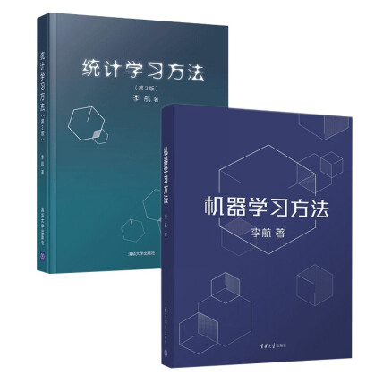

<div align="center">

# Machine-Learning-Skill

> *四套中文经典教材 · 统一结构化 Skill · 从入门直觉到严格推导*
>
> `机器学习` · `统计学习` · `深度学习` · `理论推导`

[](LICENSE)
[](https://claude.ai/code)
[](chapters/)
[](books/)

**融合周志华西瓜书 + 李航机器学习方法 + 南瓜书公式推导 + 清华大学课件，构建完整统计学习理论体系**

</div>

<div align="center">
  <!-- 顶部单张图片 -->
  
  <br><br>
  <!-- 下方两张并排 -->
  
  


`西瓜书` 直觉入门 · `南瓜书` 公式推导 · `李航` 理论深化 · `清华PPT` 补充实例

</div>

---

## 目录

- [概述](#概述)
- [知识体系](#知识体系)
- [仓库结构](#仓库结构)
- [安装与使用](#安装与使用)
- [四套教材对比](#四套教材对比)
- [使用路径建议](#使用路径建议)
- [Skill更新说明](#skill更新说明)

---

## 概述

本仓库将四套中文机器学习经典教材（周志华《机器学习》西瓜书 + 南瓜书公式推导 + 李航《机器学习方法》第二版 + 清华大学《统计学习方法》课件）蒸馏为**统一的、结构化**的 Claude Code Skill 知识库，覆盖从零基础绪论到前沿深度学习（Transformer、BERT、GAN）的完整理论体系。四套教材中有重叠的内容融合为统一章节，各自独有的主题作为独立章节保留 — 共 28 章。

| 教材 | 角色 | 页数/规模 | 特色 |
|------|------|----------|------|
| 周志华《机器学习》(西瓜书) | 入门直觉 — 直观例子、西瓜数据集 | Ch1-16 | 概念清晰、例子生动、适合建立直觉 |
| 南瓜书 | 公式补充 — 严格推导西瓜书所有公式 | Ch1-16 | 完整推导链、关键步骤展开、数学严格化 |
| 李航《机器学习方法》(第二版) | 理论深化 — 统计学习三要素框架 | Ch1-29 | 三要素(模型/策略/算法)统一框架、严格证明 |
| 清华大学《统计学习方法》课件 | 补充说明 — 实例与可视化 | 全课程 | 泛化误差界可视化、算法对比表、PPT图例 |

---

## 知识体系

### 全景图

```
┌──────────────────────────────────────────────────────────────────┐
│                     Machine-Learning-Skill                       │
│                      28 章 · 统一知识库                           │
├─────────────────┬──────────────────────┬─────────────────────────┤
│  基础层 (2 章)   │  监督学习 (12 章)     │  前沿层 (10 章)           │
├─────────────────┼──────────────────────┼─────────────────────────┤
│ Ch 1  绪论与统计学习概论│ Ch 3  感知机              │ Ch 15 聚类                 │
│ Ch 2  模型评估与选择    │ Ch 4  k近邻法             │ Ch 16 降维与度量学习       │
│                        │ Ch 5  线性模型与逻辑回归  │ Ch 17 概率图模型与话题模型 │
│                        │ Ch 6  决策树              │ Ch 18 无监督学习方法总结   │
│                        │ Ch 7  神经网络与BP算法    │ Ch 19 特征选择与稀疏学习   │
│                        │ Ch 8  支持向量机          │ Ch 20 计算学习理论         │
│                        │ Ch 9  贝叶斯分类器        │ Ch 21 半监督学习           │
│                        │ Ch 10 集成学习与Boosting  │ Ch 22 规则学习             │
│                        │ Ch 11 EM算法              │ Ch 23 强化学习             │
│                        │ Ch 12 隐马尔可夫模型      │ Ch 24 PageRank与LSA        │
│                        │ Ch 13 条件随机场          │ Ch 25 CNN                  │
│                        │ Ch 14 监督学习方法总结    │ Ch 26 RNN与Seq2Seq         │
│                        │                          │ Ch 27 预训练语言模型       │
│                        │                          │ Ch 28 GAN与深度学习总结    │
└─────────────────┴──────────────────────┴─────────────────────────┘
```

### 教材内容交叉覆盖

| 主题 | 西瓜书 | 南瓜书 | 李航 | PPT | 对应章 |
|------|:---:|:---:|:---:|:---:|:---:|
| 绪论 / 统计学习三要素 / NFL | Ch1 | Ch1 | Ch1,13 | Ch1 | Ch 1 |
| 模型评估 / 偏差-方差 / 统计检验 | Ch2 | Ch2 | Ch12 | ✓ | Ch 2 |
| 感知机 | — | — | Ch2 | — | Ch 3 |
| k近邻 | Ch10 | — | Ch3 | — | Ch 4 |
| 线性回归 / Logistic / LDA | Ch3 | Ch3 | Ch6 | ✓ | Ch 5 |
| 决策树 / ID3 / C4.5 / CART | Ch4 | Ch4 | Ch5 | — | Ch 6 |
| 神经网络 / BP 推导 | Ch5 | Ch5 | Ch23 | ✓ | Ch 7 |
| SVM / 对偶 / 核技巧 / SMO | Ch6 | Ch6 | Ch7 | ✓ | Ch 8 |
| 贝叶斯分类器 / 朴素贝叶斯 | Ch7 | Ch7 | Ch4 | — | Ch 9 |
| 集成学习 / Boosting / Bagging | Ch8 | Ch8 | Ch8 | — | Ch 10 |
| EM 算法 / GMM | Ch7,9 | Ch7,9 | Ch9 | — | Ch 11 |
| HMM / 前向后向 / Viterbi | Ch14 | Ch14 | Ch10 | — | Ch 12 |
| 条件随机场 | Ch14 | Ch14 | Ch11 | — | Ch 13 |
| 监督学习总结 | — | — | Ch12 | — | Ch 14 |
| 聚类 / k-means / DBSCAN / GMM | Ch9 | Ch9 | Ch14 | — | Ch 15 |
| PCA / SVD / 流形学习 / t-SNE | Ch10 | Ch10 | Ch15,16 | — | Ch 16 |
| 概率图模型 / LDA / MCMC | Ch14 | Ch14 | Ch17-20 | — | Ch 17 |
| 无监督学习总结 | — | — | Ch22 | — | Ch 18 |
| 特征选择 / Relief / LASSO | Ch11 | Ch11 | Ch5 | — | Ch 19 |
| PAC 学习 / VC 维 / 泛化误差界 | Ch12 | Ch12 | Ch1 | Ch1 | Ch 20 |
| 半监督 / S3VM / 图方法 | Ch13 | Ch13 | — | ✓ | Ch 21 |
| 规则学习 / RIPPER / FOIL | Ch15 | Ch15 | — | — | Ch 22 |
| 强化学习 / MDP / Q-Learning | Ch16 | Ch16 | — | ✓ | Ch 23 |
| PageRank / LSA | — | — | Ch17,21 | — | Ch 24 |
| CNN / ResNet | — | — | Ch24 | ✓ | Ch 25 |
| RNN / LSTM / Seq2Seq / Attention | — | — | Ch25,26 | — | Ch 26 |
| Transformer / BERT / GPT | — | — | Ch27 | — | Ch 27 |
| GAN / VAE / 深度学习总结 | — | — | Ch28,29 | — | Ch 28 |

---

## 仓库结构

```
.
├── README.md                          # 本文件
├── SKILL.md                           # 主索引（核心框架 · 28 章索引 · 主题索引 · 学习路径）
│
├── chapters/                          # 核心产出 —— 28 章独立知识单元
│   ├── ch01-introduction.md            # 绪论与统计学习概论
│   ├── ch02-model-evaluation.md        # 模型评估与选择
│   ├── ch03-perceptron.md              # 感知机
│   ├── ch04-knn.md                     # k近邻法
│   ├── ch05-linear-models.md           # 线性模型与逻辑回归
│   ├── ch06-decision-trees.md          # 决策树
│   ├── ch07-neural-networks.md         # 神经网络与BP算法
│   ├── ch08-svm.md                     # 支持向量机
│   ├── ch09-bayes.md                   # 贝叶斯分类器与朴素贝叶斯
│   ├── ch10-ensemble.md                # 集成学习与Boosting
│   ├── ch11-em.md                      # EM算法
│   ├── ch12-hmm.md                     # 隐马尔可夫模型
│   ├── ch13-crf.md                     # 条件随机场
│   ├── ch14-supervised-summary.md      # 监督学习方法总结
│   ├── ch15-clustering.md              # 聚类
│   ├── ch16-dim-reduction.md           # 降维与度量学习
│   ├── ch17-probabilistic-graphical.md # 概率图模型与话题模型
│   ├── ch18-unsupervised-summary.md    # 无监督学习方法总结
│   ├── ch19-feature-selection.md       # 特征选择与稀疏学习
│   ├── ch20-computational-learning.md  # 计算学习理论
│   ├── ch21-semi-supervised.md         # 半监督学习
│   ├── ch22-rule-learning.md           # 规则学习
│   ├── ch23-reinforcement-learning.md  # 强化学习
│   ├── ch24-pagerank-lsa.md            # PageRank与LSA
│   ├── ch25-cnn.md                     # 卷积神经网络
│   ├── ch26-rnn-seq2seq.md             # RNN与Seq2Seq
│   ├── ch27-pretrained-lm.md           # 预训练语言模型
│   └── ch28-gan-summary.md             # GAN与深度学习总结
│
├── glossary.md                        # 90+ 术语字母排序，每术语带归属章节
├── patterns.md                        # 20+ 可复用的算法模式/设计模式
├── cheatsheet.md                      # 速查：决策规则 · 算法选择 · 损失函数 · 超参默认
│
└── books/                             # 原始教材 PDF + MinerU 解析产物
    ├── 机器学习_周志华.pdf             # 西瓜书 原版 PDF
    ├── pumpkin_book.pdf                # 南瓜书 原版 PDF
    ├── 机器学习方法（带目录版）(李航).pdf # 李航 原版 PDF
    ├── 统计学习方法PPT----清华大学.pdf   # 清华大学课件
    ├── 机器学习_周志华/auto/            # MinerU 解析版（含 images/）
    ├── pumpkin_book/auto/              # MinerU 解析版
    ├── 机器学习方法..._1-300/auto/      # 李航 Part 1 解析版
    ├── 机器学习方法..._301-579/auto/    # 李航 Part 2 解析版
    └── 统计学习方法PPT----清华大学/auto/ # PPT 解析版
```

---

## 安装与使用

### 安装

```bash
# 方式 1: 手动克隆（推荐）
# ml-skill为skill名，原skill名规划为ml-QA
git clone https://github.com/MaybeBio/Machine-Learning-Skill ~/.claude/skills/ml-skill

# 方式 2: 使用 npx
# 同样文件夹名即skill名 ml-skill，但只有SKILL.md文件，其余reference全无
npx skills add MaybeBio/Machine-Learning-Skill -a claude-code

```

### 在 Claude Code 中调用

Skill 加载后，可直接在对话中查询，或手动触发skill `/ml-skill`：

```
▸ SVM的核技巧原理是什么？推导一下KKT条件
▸ Bagging和Boosting的偏差-方差视角有什么区别？
▸ EM算法的E步和M步分别做什么？收敛性如何保证？
▸ 对比L1和L2正则化，为什么L1产生稀疏解？
▸ LASSO的近端梯度下降推导
▸ PCA与SVD的等价性证明
▸ 二分类不平衡数据用什么评估指标？
▸ 半监督学习中聚类假设和流形假设的区别？
```

### 查询路由

| 查询类型 | 目标文件 | 响应特征 |
|----------|----------|----------|
| 概念快速理解 | `glossary.md` | 精确定义 + 归属章节 |
| 公式推导查阅 | `chapters/*.md` | 完整推导链 + 关键步骤展开 |
| 算法/方法选型决策 | `cheatsheet.md` | 决策表 / 场景→指标 / 默认超参 |
| 解决具体理论问题 | `patterns.md` | When / How / Trade-offs |
| 系统学习一个主题 | `chapters/*.md` + `SKILL.md` | 入门→公式→深化→总结递进 |

### 每章四段式结构

每章按「来源递进」统一模板组织，形成从浅入深的学习路径：

```
## 一、入门理解 — 周志华《机器学习》(西瓜书)
    [直观语言、西瓜数据集例子、基本概念定义]

## 二、公式推导 — 南瓜书补充
    [关键词公式严格推导、从直观到严谨的过渡、关键引理证明]

## 三、理论深化 — 李航《机器学习方法》+ 清华大学PPT
    [统计学习三要素(模型/策略/算法)视角、算法伪代码、
     收敛性/复杂度分析、PPT补充实例]

## 四、综合总结
    [算法对比表、关键结论（3-7条）、章节连接（前置/后续依赖）]
```

---

## 四套教材对比

| 维度 | 西瓜书 (周志华) | 南瓜书 | 李航《机器学习方法》 | 清华 PPT |
|------|:---:|:---:|:---:|:---:|
| **定位** | 入门理解，直觉优先 | 公式补充，推导完整 | 理论深化，框架严格 | 课堂补充，可视化 |
| **教学特色** | 西瓜数据集例子、生活化比喻、循序渐进 | 补全所有"易证""略"的推导步骤 | 三要素统一框架（模型/策略/算法）、严格证明 | 泛化误差界图示、算法对比表 |
| **数学要求** | 低 | 中 | 高 | 中 |
| **覆盖章数** | 16 章 | 16 章 | 29 章 | 全课程 |
| **独特贡献** | 聚类假设与流形假设、NFL直观解释、规则学习 | 完整推导链（如BP、SMO、EM、LDA变分推断） | 感知机收敛证明、CRF全局归一化、话题模型统一框架 | S折CV方差-偏差分析、模型复杂度图示 |
| **最适合** | 建立机器学习直觉、理解"是什么" | 掌握推导过程、理解"为什么成立" | 建立理论体系、理解"如何严格分析" | 直观把握数学结论的含义 |

---

## 使用路径建议

```
Phase 1 基础:    Ch 1(绪论) → Ch 2(评估) → Ch 20(学习理论) → Ch 3(感知机) → Ch 4(kNN)
Phase 2 经典:    Ch 5(线性) → Ch 6(决策树) → Ch 9(贝叶斯) → Ch 7(NN基础) → Ch 8(SVM)
Phase 3 集成:    Ch 10(集成) → Ch 19(特征选择) → Ch 21(半监督)
Phase 4 序列:    Ch 11(EM) → Ch 12(HMM) → Ch 13(CRF) → Ch 14(监督总结)
Phase 5 无监督:  Ch 15(聚类) → Ch 16(降维) → Ch 17(概率图) → Ch 18(无监督总结)
Phase 6 前沿:    Ch 22(规则) → Ch 23(强化) → Ch 24(PageRank/LSA)
                → Ch 25(CNN) → Ch 26(RNN) → Ch 27(预训练) → Ch 28(GAN总结)
```

**关键前置依赖：**
- Ch 11 (EM) 依赖 Ch 9 (贝叶斯) 的基本概率知识
- Ch 27 (预训练LM) 依赖 Ch 26 (RNN/Seq2Seq) 和 Ch 7 (NN基础)
- Ch 12 (HMM) 和 Ch 13 (CRF) 依赖 Ch 17 (概率图) 的 PGM 概念
- Ch 16 (降维) 依赖 Ch 24 (PageRank/LSA) 的 SVD 部分

---

## 参考教材

| 教材 | 作者 | 年份 | 出版社/来源 |
|------|------|------|------------|
| 《机器学习》(西瓜书) | 周志华 | 2016 | 清华大学出版社 |
| 《机器学习公式详解》(南瓜书) | 谢文睿、秦州 等 | 2021 | 人民邮电出版社 |
| 《机器学习方法》(第二版) | 李航 | 2024 | 清华大学出版社 |
| 《统计学习方法》课件 | 清华大学 | — | 清华大学课程资料 |

---

## Skill更新说明
* 原始skill（v0.1.0）按照不区分参考资料递进方式，直接融汇
* 更新后skill（v0.2.0）起，每一章节，人为按照参考资料的递进展开顺序进行组织
---

<div align="center">

*基于四套教材蒸馏，保留术语精确性与推导完整性。28 章统一四段式模板，按需加载，渐进式深入。*

</div>
