南 瓜 书 PUMPKIN BO OK

谢文睿 秦州 贾彬彬

版本号:2.0.0

发布日期:2023.11

## 前言

“周志华老师的《机器学习》（西瓜书）是机器学习领域的经典入门教材之一，周老师为了使尽可能多的读者通过西瓜书对机器学习有所了解，所以在书中对部分公式的推导细节没有详述，但是这对那些想深究公式推导细节的读者来说可能“不太友好”，本书旨在对西瓜书里比较难理解的公式加以解析，以及对部分公式补充具体的推导细节。”

读到这里，大家可能会疑问为啥前面这段话加了引号，因为这只是我们最初的遐想，后来我们了解到，周老师之所以省去这些推导细节的真实原因是，他本尊认为“理工科数学基础扎实点的大二下学生应该对西瓜书中的推导细节无困难吧，要点在书里都有了，略去的细节应能脑补或做练习”。所以...本南瓜书只能算是我等数学渣渣在自学的时候记下来的笔记，希望能够帮助大家都成为一名合格的“理工科数学基础扎实点的大二下学生”。

## 使用说明

・ 南瓜书的所有内容都是以西瓜书的内容为前置知识进行表述的，所以南瓜书的最佳使用方法是以西瓜书为主线，遇到自已推导不出来或者看不懂的公式时再来查阅南瓜书；

• 对于初学机器学习的小白，西瓜书第1 章和第 2 章的公式强烈不建议深究，简单过一下即可，等你学得有点飘的时候再回来啃都来得及；

• 每个公式的解析和推导我们都力(zhi)争(neng）以本科数学基础的视角进行讲解，所以超纲的数学知识我们通常都会以附录和参考文献的形式给出，感兴趣的同学可以继续沿着我们给的资料进行深入学习；

• 若南瓜书里没有你想要查阅的公式，或者你发现南瓜书哪个地方有错误，请毫不犹豫地去我们 GitHub 的Issues（地址：https://github.com/datawhalechina/pumpkin-book/issues)进行反馈，在对应版块提交你希望补充的公式编号或者勘误信息，我们通常会在 24 小时以内给您回复，超过 24 小时未回复的话可以微信联系我们（微信号：at-Sm1les）；

配套视频教程：https://www.bilibili.com/video/BV1Mh411e7vU

在线阅读地址：https://datawhalechina.github.io/pumpkin-book(仅供第1 版)

最新版 PDF 获取地址：https://github.com/datawhalechina/pumpkin-book/releases

## 编委会

主编：Sm1les、archwalker、jbb0523

编委：juxiao、Majingmin、MrBigFan、shanry、Ye980226

封面设计：构思-Smlles、创作-林王茂盛

## 致谢

特别感谢 awyd234、feijuan、Ggmatch、Heitao5200、huaqing89、LongJH、LilRachel、LeoLRH、Nono17、spareribs、sunchaothu、StevenLzq 在最早期的时候对南瓜书所做的贡献。

扫描下方二维码，然后回复关键词“南瓜书”，即可加入“南瓜书读者交流群”

  
版权声明

## 目录

第1章绪论 1  
1.1引言 1  
1.2基本术语 1  
1.3假设空间 3  
1.4归纳偏好 3  
1.4.1式 (1.1) 和式 (1.2) 的解释 4  
第2章模型评估与选择 5  
2.1经验误差与过拟合 5  
2.2评估方法 5  
2.2.1算法参数（超参数）与模型参数 6  
2.2.2验证集. 6  
2.3性能度量 6  
2.3.1式(2.2) 到式 (2.7)的解释 6  
2.3.2式(2.8)和式 (2.9)的解释 6  
2.3.3 图2.3 的解释 6  
2.3.4 式(2.10) 的推导 7  
2.3.5 式(2.11) 的解释 7  
2.3.6 式 (2.12) 到式 (2.17) 的解释 7  
2.3.7 式 (2.18) 和式 (2.19) 的解释 8  
2.3.8式(2.20)的推导 8  
2.3.9式(2.21)和式(2.22)的推导 9  
2.3.10式(2.23)的解释 10  
2.3.11式(2.24)的解释 11  
2.3.12 式(2.25)的解释 12  
2.4比较检验 13  
2.4.1式(2.26)的解释 13  
2.4.2式(2.27)的推导 14  
2.5偏差与方差 15  
2.5.1式(2.37)到式 (2.42)的推导 15  
第3章线性模型 18  
3.1基本形式 18  
3.2线性回归 18  
3.2.1属性数值化 18  
3.2.2 式(3.4) 的解释 18  
3.2.3式(3.5)的推导 19  
3.2.4 式 (3.6)的推导 19  
3.2.5式 (3.7) 的推导 19  
3.2.6式(3.9)的推导 21  
3.2.7式 (3.10)的推导 21  
3.2.8式(3.11)的推导 22  
3.3对数几率回归 23  
3.3.1 式 (3.27) 的推导 23  
3.3.2 梯度下降法 24  
3.3.3 牛顿法 25  
3.3.4 式 (3.29)的解释 26  
3.3.5 式 (3.30)的推导 26  
3.3.6式(3.31）的推导 27  
3.4 线性判别分析 27  
3.4.1式(3.32)的推导 28  
3.4.2式 (3.37) 到式(3.39)的推导 28  
3.4.3式(3.43)的推导 29  
3.4.4式 (3.44) 的推导 29  
3.4.5式(3.45)的推导 30  
3.5多分类学习 31  
3.5.1图3.5 的解释 31  
3.6 类别不平衡问题. 31  
第4章决策树 32  
4.1基本流程 32  
4.2划分选择 32  
4.2.1式(4.1)的解释 32  
4.2.2式(4.2)的解释 35  
4.2.3式(4.4)的解释 35  
4.2.4式（4.5)的推导 35  
4.2.5式(4.6)的解释 36  
4.3剪枝处理 38  
4.4连续与缺失值 38  
4.4.1式(4.7)的解释 38  
4.4.2式(4.8)的解释 39  
4.4.3式(4.12)的解释 39  
4.5 多变量决策树 39  
4.5.1图(4.10)的解释 39  
4.5.2图(4.11)的解释 39  
第5章神经网络 41  
5.1神经元模型 41  
5.2 感知机与多层网络 41  
5.2.1式 (5.1)和式 (5.2)的推导 41  
5.2.2图5.5 的解释 43  
5.3误差逆传播算法 43  
5.3.1 式 (5.10) 的推导 43  
5.3.2式(5.12)的推导 43  
5.3.3式(5.13）的推导 43  
5.3.4式 (5.14) 的推导 44  
5.3.5式(5.15)的推导 45  
5.4全局最小与局部极小 45  
5.5其他常见神经网络 45  
5.5.1式(5.18)的解释 45  
5.5.2式(5.20)的解释 45  
5.5.3式(5.22)的解释 45  
5.5.4式(5.23)的解释 45  
5.6深度学习 46  
5.6.1什么是深度学习. 46  
5.6.2深度学习的起源， 46  
5.6.3怎么理解特征学习 46  
;6章支持向量机 47  
6.1 间隔与支持向量 47  
6.1.1图6.1的解释 47  
6.1.2式(6.1)的解释 47  
6.1.3 式(6.2)的推导 47  
6.1.4式(6.3)的推导 47  
6.1.5式(6.4) 的推导 48  
6.1.6式(6.5)的解释 48  
6.2对偶问题 49  
6.2.1凸优化问题 49  
6.2.2 KKT 条件· 49  
6.2.3 拉格朗日对偶函数 49  
6.2.4 拉格朗日对偶问题 50  
6.2.5式(6.9)和式(6.10)的推导 52  
6.2.6 式(6.11) 的推导 52  
6.2.7式(6.13)的解释 53  
6.3 核函数 53  
6.3.1式(6.22)的解释 53  
6.4软间隔与正则化 53  
6.4.1式(6.35)的推导 53  
6.4.2式(6.37)和式(6.38)的推导 53  
6.4.3式(6.39)的推导 53  
6.4.4式(6.40)的推导 54  
6.4.5 对数几率回归与支持向量机的关系 54  
6.4.6式(6.41)的解释 55  
6.5 支持向量回归 55  
6.5.1式(6.43）的解释 55  
6.5.2式(6.45)的推导 55  
6.5.3式(6.52)的推导 56  
6.6核方法 56  
6.6.1 式(6.57)和式 (6.58)的解释 56  
6.6.2 式(6.65)的推导 57  
6.6.3 式(6.66)和式(6.67)的解释 57  
6.6.4 式(6.70) 的推导 58  
6.6.5核对数几率回归 60  
第7章贝叶斯分类器 62  
7.1贝叶斯决策论 62  
7.1.1式(7.5)的推导 62  
7.1.2式(7.6) 的推导 62  
7.1.3判别式模型与生成式模型 62  
7.2极大似然估计 62  
7.2.1式(7.12)和 (7.13)的推导 62  
7.3朴素贝叶斯分类器 64  
7.3.1式（7.16) 和式(7.17)的解释. 64  
7.3.2式(7.18)的解释 64  
7.3.3贝叶斯估计[1] 65  
7.3.4Categorical 分布 65  
7.3.5Dirichlet 分布 65  
7.3.6式(7.19) 和式(7.20)的推导. 65  
7.4半朴素贝叶斯分类器 67  
7.4.1式（7.21）的解释 67  
7.4.2式(7.22)的解释 68  
7.4.3式(7.23)的推导 68  
7.4.4式(7.24)和式(7.25)的推导 68  
7.5贝叶斯网 69  
7.5.1式(7.27)的解释 69  
7.6EM算法. 69  
7.6.1 Jensen 不等式 69  
7.6.2EM 算法的推导 69  
第8章集成学习 76  
8.1个体与集成 77  
8.1.1式 (8.1)的解释 77  
8.1.2式(8.2)的解释 77  
8.1.3式(8.3)的推导 77  
8.2 Boosting . 78  
8.2.1式(8.4)的解释 78  
8.2.2式(8.5)的解释 78  
8.2.3式(8.6) 的推导 79  
8.2.4式(8.7) 的推导 79  
8.2.5式(8.8) 的推导 79  
8.2.6式(8.9)的推导 80  
8.2.7式(8.10)的解释 80  
8.2.8式(8.11)的推导 80  
8.2.9式(8.12)的解释 81  
8.2.10式 (8.13)的推导 81  
8.2.11式 (8.14) 的推导 82  
8.2.12式(8.16)的推导 82  
8.2.13式 (8.17)的推导 83  
8.2.14 式(8.18) 的推导 83  
8.2.15式(8.19)的推导 83  
8.2.16 AdaBoost 的个人推导 84  
8.2.17 进一步理解权重更新公式 86  
8.2.18 能够接受带权样本的基学习算法 87  
8.3 Bagging 与随机森林 88  
8.3.1式(8.20)的解释 88  
8.3.2式(8.21)的推导 88  
8.3.3随机森林的解释. 88  
8.4 结合策略 88  
8.4.1式(8.22)的解释 88  
8.4.2式(8.23)的解释 88  
8.4.3 硬投票和软投票的解释 89  
8.4.4 式(8.24)的解释 89  
8.4.5 式(8.25)的解释 89  
8.4.6 式(8.26)的解释 89  
8.4.7 元学习器（meta-learner）的解释 89  
8.4.8 Stacking 算法的解释 89  
8.5 多样性 90  
8.5.1 式(8.27)的解释 90  
8.5.2 式(8.28)的解释 90  
8.5.3 式(8.29)的解释 90  
8.5.4 式(8.30)的解释 90  
8.5.5 式(8.31)的推导 90  
8.5.6 式(8.32)的解释 91  
8.5.7 式(8.33)的解释 91  
8.5.8 式(8.34)的解释 91  
8.5.9式(8.35）的解释 91  
8.5.10式(8.36）的解释 91  
8.5.11式(8.40)的解释 92  
8.5.12式(8.41）的解释 92  
8.5.13式(8.42）的解释 92  
8.5.14 多样性增强的解释 92  
8.6 Gradient Boosting/GBDT/XGBoost 联系与区别 92  
8.6.1梯度下降法 93  
8.6.2 从梯度下降的角度解释 AdaBoost 94  
8.6.3 梯度提升（Gradient Boosting） 96  
8.6.4 梯度提升树 (GBDT) 97  
8.6.5 XGBoost 97  
9章聚类 98  
9.1聚类任务 98  
9.2性能度量 98  
9.2.1式(9.5)的解释 98  
9.2.2式(9.6)的解释 99  
9.2.3式(9.7)的解释 99  
9.2.4式(9.8)的解释 99  
9.2.5式(9.12)的解释 99  
9.3距离计算 99  
9.3.1式(9.21)的解释 100  
9.4 原型聚类 100  
9.4.1式(9.28）的解释 100  
9.4.2式(9.29)的解释 100  
9.4.3 式(9.30)的解释 101  
9.4.4 式(9.31)的解释 101  
9.4.5 式(9.32)的解释 101  
9.4.6 式(9.33)的推导 102  
9.4.7 式 (9.34) 的推导 102  
9.4.8式(9.35)的推导 103  
9.4.9式(9.36)的解释 104  
9.4.10式 (9.37) 的推导 104  
9.4.11 式(9.38)的推导 105  
9.4.12 图 9.6 的解释 105  
9.5 密度聚类 106  
9.5.1密度直达、密度可达与密度相连 106  
9.5.2图9.9 的解释 107  
9.6层次聚类 107  
10章降维与度量学习 108  
10.1预备知识 108  
10.1.1符号约定 108  
10.1.2 矩阵与单位阵、向量的乘法 108  
10.2 矩阵的 F 范数与迹 108  
10.3 k 近邻学习 110  
10.3.1式 (10.1)的解释 110  
10.3.2式 (10.2) 的推导 110  
10.4低维嵌入 111  
10.4.1图10.2 的解释 111  
10.4.2式 (10.3) 的推导 111  
10.4.3式 (10.4) 的推导 111  
10.4.4式 (10.5)的推导 112  
10.4.5式(10.6)的推导 112  
10.4.6 式 (10.10)的推导 113  
10.4.7式(10.11)的解释 113  
10.4.8 图 10.3 关于 MDS 算法的解释 113  
10.5主成分分析 114  
10.5.1式 (10.14) 的推导 114  
10.5.2 式(10.16)的解释 116  
10.5.3式 (10.17)的推导 118  
10.5.4根据式 (10.17) 求解式 (10.16) 119  
10.6核化线性降维 119  
10.6.1式(10.19)的解释 120  
10.6.2式(10.20)的解释 120  
10.6.3式(10.21）的解释 120  
10.6.4式 (10.22)的解释 120  
10.6.5式(10.24) 的推导 120  
10.6.6式(10.25）的解释 121  
10.7流形学习 121  
10.7.1 等度量映射(Isomap）的解释 121  
10.7.2 式 (10.28)的推导 121  
10.7.3 式(10.31）的推导 123  
10.8度量学习 124  
10.8.1式 (10.34)的解释 124  
10.8.2 式(10.35)的解释 125  
10.8.3式(10.36）的解释 125  
10.8.4式(10.37）的解释 125  
10.8.5式(10.38)的解释 126  
10.8.6式(10.39)的解释. 126  
11章特征选择与稀疏学习 127  
11.1子集搜索与评价 127  
11.1.1式 (11.1) 的解释 127  
11.1.2 式(11.2)的解释 127  
11.2 过滤式选择 127  
11.2.1 包裹式选择 127  
11.3嵌入式选择与 L1 正则化 128  
11.3.1式 (11.5)的解释 128  
11.3.2 式(11.6)的解释 128  
11.3.3式(11.7)的解释 128  
11.3.4式(11.8)的解释 128  
11.3.5式(11.9）的解释 129  
11.3.6式(11.10)的推导 129  
11.3.7式(11.11)的解释 129  
11.3.8式(11.12）的解释 130  
11.3.9 式 (11.13)的解释. 130  
11.3.10 式 (11.14) 的推导 130  
11.4 稀疏表示与字典学习 131  
11.4.1 式 (11.15) 的解释 132  
11.4.2式(11.16)的解释 132  
11.4.3式 (11.17) 的推导 132  
11.4.4式 (11.18)的推导 132  
11.5 K-SVD 算法·. 133  
11.6压缩感知 135  
11.6.1式 (11.21)的解释 135  
11.6.2式(11.25)的解释 135  
í12 章计算学习理论 136  
12.1基础知识 136  
12.1.1式(12.1)的解释 136  
12.1.2 式(12.2)的解释 136  
12.1.3式(12.3)的解释 136  
12.1.4式(12.4)的解释 136  
12.1.5式 (12.5)的解释 136  
12.1.6 式(12.7)的解释 137  
12.2 PAC 学习 137  
12.2.1式(12.9)的解释 138  
12.3 有限假设空间 138  
12.3.1式(12.10）的解释 138  
12.3.2式(12.11)的解释 138  
12.3.3式(12.12)的推导 138  
12.3.4式(12.13）的解释 139  
12.3.5式(12.14)的推导 139  
12.3.6引理 12.1的解释 139  
12.3.7式(12.18)的推导 140  
12.3.8式(12.19)的推导 140  
12.3.9式(12.20)的解释 140  
12.4VC维 141  
12.4.1式(12.21)的解释 141  
12.4.2式(12.22)的解释， 141  
12.4.3 式(12.23)的解释. 141  
12.4.4引理12.2 的解释 142  
12.4.5式(12.28）的解释 143  
12.4.6式(12.29）的解释 143  
12.4.7式(12.30)的解释 144  
12.4.8 定理 12.4 的解释 144  
12.5Rademacher 复杂度 145  
12.5.1式(12.36）的解释 145  
12.5.2式(12.37)的解释 145  
12.5.3式(12.38)的解释. 145  
12.5.4式（12.39）的解释 145  
12.5.5式（12.40）的解释 146  
12.5.6式(12.41）的解释. 146  
12.5.7定理 12.5 的解释 146  
12.6定理 12.6 的解释 147  
12.6.1式(12.52)的证明 148  
12.6.2式(12.53)的推导 148  
12.7 稳定性．. 148  
12.7.1泛化/经验/留一损失的解释 149  
12.7.2 式(12.57）的解释. 149  
12.7.3 定理 12.8的解释 149  
12.7.4式 (12.60)的推导 149  
12.7.5经验损失最小化. 149  
12.7.6 定理（12.9）的证明的解释 149  
第13 章半监督学习 151  
13.1未标记样本 151  
13.2生成式方法 151  
13.2.1式(13.1）的解释 151  
13.2.2 式 (13.2)的推导 151  
13.2.3式(13.3)的推导 152  
13.2.4式 (13.4) 的推导 152  
13.2.5式(13.5）的解释 152  
13.2.6式(13.6）的解释 152  
13.2.7 式 (13.7)的解释 153  
13.2.8式(13.8)的解释 154  
13.3 半监督 SVM 156  
13.3.1图13.3 的解释 156  
13.3.2式(13.9）的解释 156  
13.3.3图13.4的解释 156  
13.3.4式(13.10)的解释. 158  
13.4 图半监督学习 158  
13.4.1式 (13.12)的推导 158  
13.4.2式(13.13）的推导 159  
13.4.3式 (13.14)的推导. 159  
13.4.4式(13.15)的推导 160  
13.4.5式(13.16)的解释， 160  
13.4.6式 (13.17)的推导， 160  
13.4.7式(13.18)的解释. 160  
13.4.8式(13.20）的解释 160  
13.4.9式 (13.21)的推导 161  
13.5基于分歧的方法 164  
13.5.1图 13.6 的解释 164  
13.6半监督聚类 164  
13.6.1图 13.7的解释 164  
13.6.2图 13.9 的解释 164  
第14章概率图模型 166  
14.1隐马尔可夫模型 166  
14.1.1生成式模型和判别式模型 166  
14.1.2式(14.1)的推导 166  
14.1.3 隐马尔可夫模型的三组参数 167  
14.2 马尔可夫随机场 167  
14.2.1 式 (14.2) 和式 (14.3) 的解释. 167  
14.2.2 式 (14.4) 到式 (14.7) 的推导. 167  
14.2.3马尔可夫毯（Markov blanket) 168  
14.2.4势函数(potential function) 168  
14.2.5式(14.8)的解释 168  
14.2.6式 (14.9)的解释 168  
14.3条件随机场 168  
14.3.1式 (14.10)的解释 168  
14.3.2式(14.11)的解释. 169  
14.3.3 学习与推断 169  
14.3.4式 (14.14) 的推导. 169  
14.3.5式(14.15)和式(14.16)的推导 169  
14.3.6式(14.17)的解释. 169  
14.3.7式 (14.18)的推导 170  
14.3.8式(14.19)的解释 170  
14.3.9式(14.20)的解释 170  
14.3.10式(14.22)的推导 170  
14.3.11图 14.8 的解释 171  
14.4近似推断 171  
14.4.1 式 (14.21) 到式 (14.25)的解释 171  
14.4.2 式(14.26)的解释． 171  
14.4.3式(14.27)的解释 172  
14.4.4式(14.28)的推导 172  
14.4.5 吉布斯采样与 MH 算法 173  
14.4.6式(14.29)的解释 173  
14.4.7式(14.30)的解释 173  
14.4.8式(14.31)的解释 173  
14.4.9式 (14.32) 到式(14.34) 的推导 173  
14.4.10式(14.35)的解释 174  
14.4.11式 (14.36)的推导 174  
14.4.12 式(14.37) 到式 (14.38)的解释 175  
14.4.13式（14.39）的解释 176  
14.4.14式(14.40)的解释 176  
14.5话题模型 177  
14.5.1式(14.41)的解释 177  
14.5.2式(14.42)的解释 177  
14.5.3式(14.43）的解释 177  
14.5.4式(14.44)的解释 177  
15章规则学习 178  
15.1剪枝优化 178  
15.1.1 式 (15.2) 和式 (15.3)的解释. 178  
15.2 归纳逻辑程序设计 178  
15.2.1式(15.6)的解释 178  
15.2.2 式 (15.7)的推导 178  
15.2.3式(15.9)的推导 178  
15.2.4式(15.10)的解释 178  
15.2.5 式(15.11）的解释. 179  
15.2.6式（15.12）的解释 179  
15.2.7式(15.13)的解释 179  
15.2.8式(15.16)的推导 179  
第16章 强化学习 180  
16.1任务与奖赏 180  
16.2K-摇臂赌博机 180  
16.2.1 式 (16.2)和式 (16.3)的推导 180  
16.2.2 式(16.4)的解释 180  
16.3 有模型学习 180  
16.3.1式 (16.7)的解释 180  
16.3.2式(16.8)的推导 181  
16.3.3式 (16.10)的推导 181  
16.3.4式(16.14)的解释 181  
16.3.5式（16.15)的解释 181  
16.3.6式(16.16)的推导 181  
16.4免模型学习 182  
16.4.1式 (16.20)的解释 182  
16.4.2式(16.23)的解释 182  
16.4.3式(16.31)的推导 182  
16.5值函数近似 182  
16.5.1式(16.33)的解释 182  
16.5.2式(16.34)的推导 182

## 第1章绪论

本章作为“西瓜书”的开篇，主要讲解什么是机器学习以及机器学习的相关数学符号，为后续内容作铺垫，并未涉及复杂的算法理论，因此阅读本章时只需耐心梳理清楚所有概念和数学符号即可。此外，在阅读本章前建议先阅读西瓜书目录前页的《主要符号表》，它能解答在阅读“西瓜书”过程中产生的大部分对数学符号的疑惑。

本章也作为本书的开篇，笔者在此赘述一下本书的撰写初衷，本书旨在以“过来人”的视角陪读者一起阅读“西瓜书”，尽力帮读者消除阅读过程中的“数学恐惧”，只要读者学习过《高等数学》、《线性代数》和《概率论与数理统计》这三门大学必修的数学课，均能看懂本书对西瓜书中的公式所做的解释和推导，同时也能体会到这三门数学课在机器学习上碰撞产生的“数学之美”。

## 1.1引信

本节以概念理解为主，在此对“算法”和“模型”作补充说明。“算法”是指从数据中学得“模型”的具体方法，例如后续章节中将会讲述的线性回归、对数几率回归、决策树等。“算法”产出的结果称为“模型”，通常是具体的函数或者可抽象地看作为函数，例如一元线性回归算法产出的模型即为形如 $f ( x ) = w x + b$ 的一元一次函数。不过由于严格区分这两者的意义不大，因此多数文献和资料会将其混用，当遇到这两个概念时，其具体指代根据上下文判断即可。

## 1.2基本术语

本节涉及的术语较多且很多术语都有多个称呼，下面梳理各个术语，并将最常用的称呼加粗标注。

样本：也称为“示例”，是关于一个事件或对象的描述。因为要想让计算机能对现实生活中的事物进行机器学习，必须先将其抽象为计算机能理解的形式，计算机最擅长做的就是进行数学运算，因此考虑如何将其抽象为某种数学形式。显然，线性代数中的向量就很适合，因为任何事物都可以由若干“特征”（或称为“属性”）唯一刻画出来，而向量的各个维度即可用来描述各个特征。例如，如果用色泽、根蒂和敲声这3 个特征来刻画西瓜，那么一个“色泽青绿，根蒂蜷缩，敲声清脆”的西瓜用向量来表示即为x =（青绿;蜷缩;清脆）（向量中的元素用分号“;”分隔时表示此向量为列向量，用逗号“”分隔时表示为行向量）其中青绿、蜷缩和清脆分别对应为相应特征的取值，也称为“属性值”。显然，用中文书写向量的方式不够“数学”，因此需要将属性值进一步数值化，具体例子参见“西瓜书”第3 章3.2。此外，仅靠以上3 个特征来刻画西瓜显然不够全面细致，因此还需要扩展更多维度的特征，一般称此类与特征处理相关的工作为“特征工程”。

样本空间：也称为“输入空间”或“属性空间”。由于样本采用的是标明各个特征取值的“特征向量”来进行表示，根据线性代数的知识可知，有向量便会有向量所在的空间，因此称表示样本的特征向量所在的空间为样本空间，通常用花式大写的X表示。

数据集：数据集通常用集合来表示，令集合 $D = \{ \pmb { x } _ { 1 } , \pmb { x } _ { 2 } , . . . , \pmb { x } _ { m } \}$ 表示包含m个样本的数据集，一般同一份数据集中的每个样本都含有相同个数的特征，假设此数据集中的每个样本都含有d 个特征，则第个样本的数学表示为d 维向量： $\pmb { x } _ { i } = ( x _ { i 1 } ; x _ { i 2 } ; . . . ; x _ { i d } )$ ，其中 $x _ { i j }$ 表示样本 $\mathbf { \mathcal { x } } _ { i }$ 在第j个属性上的取值。

模型：机器学习的一般流程如下：首先收集若干样本（假设此时有100 个），然后将其分为训练样本(80个）和测试样本（20个），其中80个训练样本构成的集合称为“训练集”，20个测试样本构成的集合称为“测试集”，接着选用某个机器学习算法，让其在训练集上进行“学习”（或称为“训练”），然后产出得到“模型”（或称为“学习器”），最后用测试集来测试模型的效果。执行以上流程时，表示我们已经默认样本的背后是存在某种潜在的规律，我们称这种潜在的规律为“真相”或者“真实”，例如样本是一堆好西瓜和坏西瓜时，我们默认的便是好西瓜和坏西瓜背后必然存在某种规律能将其区分开。当我们应用某个机器学习算法来学习时，产出得到的模型便是该算法所找到的它自己认为的规律，由于该规律通常并不一定就是所谓的真相，所以也将其称为“假设”。通常机器学习算法都有可配置的参数，同一个机器学习算法，使用不同的参数配置或者不同的训练集，训练得到的模型通常都不同。

标记：上文提到机器学习的本质就是在学习样本在某个方面的表现是否存在潜在的规律，我们称该方面的信息为“标记”。例如在学习西瓜的好坏时，“好瓜”和“坏瓜”便是样本的标记。一般第ⅰ个样本的标记的数学表示为 $y _ { i }$ ，标记所在的空间称为“标记空间”或“输出空间”，数学表示为花式大写的。标记通常也看作为样本的一部分，因此，一个完整的样本通常表示为 $( { \boldsymbol { x } } , { \boldsymbol { y } } )$

根据标记的取值类型不同，可将机器学习任务分为以下两类：

• 当标记取值为离散型时，称此类任务为“分类”，例如学习西瓜是好瓜还是坏瓜、学习猫的图片是白猫还是黑猫等。当分类的类别只有两个时，称此类任务为“二分类”，通常称其中一个为“正类”，另一个为“反类”或“负类”；当分类的类别超过两个时，称此类任务为“多分类”。由于标记也属于样本的一部分，通常也需要参与运算，因此也需要将其数值化，例如对于二分类任务，通常将正类记为1，反类记为 $0 ,$ 即 $\mathcal { V } = \{ 0 , 1 \}$ 。这只是一般默认的做法，具体标记该如何数值化可根据具体机器学习算法进行相应地调整，例如第 6 章的支持向量机算法则采用的是 $\mathcal { V } = \{ - 1 , + 1 \}$ ;

• 当标记取值为连续型时，称此类任务为“回归”，例如学习预测西瓜的成熟度、学习预测未来的房价等。由于是连续型，因此标记的所有可能取值无法直接罗列，通常只有取值范围，回归任务的标记取值范围通常是整个实数域R，即 $\mathcal { V } = \mathbb { R }$

无论是分类还是回归，机器学习算法最终学得的模型都可以抽象地看作为以样本 x 为自变量，标记 y为因变量的函数 $y = f ( { \pmb x } )$ ，即一个从输入空间X到输出空间√的映射。例如在学习西瓜的好坏时，机器学习算法学得的模型可看作为一个函数 $f ( { \pmb x } )$ ，给定任意一个西瓜样本 ${ \bf { x } } _ { i } =$ (青绿;蜷缩;清脆），将其输入进函数即可计算得到一个输出 $y _ { i } = f ( \pmb { x } _ { i } )$ ，此时得到的 $y _ { i }$ 便是模型给出的预测结果，当 $y _ { i }$ 取值为1时表明模型认为西瓜 $\mathbf { \mathcal { x } } _ { i }$ 是好瓜，当 $y _ { i }$ 取值为0时表明模型认为西瓜 $\mathbf { \Delta } _ { x _ { i } }$ 是坏瓜。

根据是否有用到标记信息，可将机器学习任务分为以下两类：

• 在模型训练阶段有用到标记信息时，称此类任务为“监督学习”，例如第3 章的线性模型；

· 在模型训练阶段没用到标记信息时，称此类任务为“无监督学习”，例如第 9 章的聚类。

泛化：由于机器学习的目标是根据已知来对未知做出尽可能准确的判断，因此对未知事物判断的准确与否才是衡量一个模型好坏的关键，我们称此为“泛化”能力。例如学习西瓜好坏时，假设训练集中共有3个样本：{(x₁ = (青绿;蜷缩),y₁ =好瓜)， $( x _ { 2 } = ( \stackrel { \triangledown } { \boldsymbol { \Sigma } } )$ 黑;蜷缩)， $y _ { 2 } = \sharp \vec { \mathrm { f } } \ / \lVert \boldsymbol { \cdot } \rVert$ , (x3 = (浅白;蜷缩), $y _ { 3 } = \sharp \vec { \mathrm { f } } \ / \lVert \boldsymbol { \cdot } \rVert _ { \mathrm { } } \big ) \}$ ,同时假设判断西瓜好坏的真相是“只要根蒂蜷缩就是好瓜”，如果应用算法A 在此训练集上训练得到模型$f _ { a } ( { \pmb x } )$ ，模型 α学到的规律是“色泽等于青绿、乌黑或者浅白时，同时根蒂蜷缩即为好瓜，否则便是坏瓜”，再应用算法B在此训练集上训练得到模型 $f _ { b } ( { \pmb x } )$ ，模型 $f _ { b } ( { \pmb x } )$ 学到的规律是“只要根蒂蜷缩就是好 $\cdot \sqrt { \mathbb { A } } ^ { \dagger }$ ，因此对于一个未见过的西瓜样本 ${ \pmb x } =$ （金黄;蜷缩)来说，模型 $f _ { a } ( { \pmb x } )$ 给出的预测结果为“坏瓜”，模型 $f _ { b } ( \pmb { x } )$ 给出的预测结果为“好瓜”，此时我们称模型 $f _ { b } ( { \pmb x } )$ 的泛化能力优于模型 $f _ { a } ( { \pmb x } )$ 。

通过以上举例可知，尽管模型 $f _ { a } ( { \pmb x } )$ 和模型 $f _ { b } ( \pmb { x } )$ 对训练集学得一样好，即两个模型对训练集中每个样本的判断都对，但是其所学到的规律是不同的。导致此现象最直接的原因是算法的不同，但是算法通常是有限的，可穷举的，尤其是在特定任务场景下可使用的算法更是有限，因此，数据便是导致此现象的另一重要原因，这也就是机器学习领域常说的“数据决定模型的上限，而算法则是让模型无限逼近上限”，下面详细解释此话的含义。

先解释“数据决定模型效果的上限”，其中数据是指从数据量和特征工程两个角度考虑。从数据量的角度来说，通常数据量越大模型效果越好，因为数据量大即表示累计的经验多，因此模型学习到的经验也多，自然表现效果越好。例如以上举例中如果训练集中含有相同颜色但根蒂不蜷缩的坏瓜，模型 a 学到真相的概率则也会增大；从特征工程的角度来说，通常对特征数值化越合理，特征收集越全越细致，模型效果通常越好，因为此时模型更易学得样本之间潜在的规律。例如学习区分亚洲人和非洲人时，此时样本即为人，在进行特征工程时，如果收集到每个样本的肤色特征，则其他特征例如年龄、身高和体重等便可省略，因为只需靠肤色这一个特征就足以区分亚洲人和非洲人。

而“算法则是让模型无限逼近上限”是指当数据相关的工作已准备充分时，接下来便可用各种可适用的算法从数据中学习其潜在的规律进而得到模型，不同的算法学习得到的模型效果自然有高低之分，效果越好则越逼近上限，即逼近真相。

分布：此处的“分布”指的是概率论中的概率分布，通常假设样本空间服从一个未知“分布”D，而我们收集到的每个样本都是独立地从该分布中采样得到，即“独立同分布”。通常收集到的样本越多，越能从样本中反推出 D 的信息，即越接近真相。此假设属于机器学习中的经典假设，在后续学习机器学习算法过程中会经常用到。

## 1.3假设空间

本节的重点是理解“假设空间”和“版本空间”，下面以“房价预测”举例说明。假设现已收集到某地区近几年的房价和学校数量数据，希望利用收集到的数据训练出能通过学校数量预测房价的模型，具体收集到的数据如表1-1所示。

表1-1房价预测
<table><tr><td>年份</td><td>学校数量</td><td>房价</td></tr><tr><td>2020</td><td>1所</td><td> $1 \ \overline { { \mathcal { H } } } / m ^ { 2 }$ </td></tr><tr><td>2021</td><td>2所</td><td> $4 ~ \overline { { \mathcal { H } } } / m ^ { 2 }$ </td></tr></table>

基于对以上数据的观察以及日常生活经验，不难得出“房价与学校数量成正比”的假设，若将学校数量设为x，房价设为y，则该假设等价表示学校数量和房价呈 $y = w x + b$ 的一元一次函数关系，此时房价预测问题的假设空间即为“一元一次函数”。确定假设空间以后便可以采用机器学习算法从假设空间中学得模型，即从一元一次函数空间中学得能满足表1-1中数值关系的某个一元一次函数。学完第3 章的线性回归可知当前问题属于一元线性回归问题，根据一元线性回归算法可学得模型为 $y = 3 x - 2$ o

除此之外，也可以将问题复杂化，假设学校数量和房价呈 $y = w x ^ { 2 } + b$ 一元二次函数关系，此时问题变为了线性回归中的多项式回归问题，按照多项式回归算法可学得模型为 $y = x ^ { 2 }$ 。因此，以表1-1中数据作为训练集可以有多个假设空间，且在不同的假设空间中都有可能学得能够拟合训练集的模型，我们将所有能够拟合训练集的模型构成的集合称为“版本空间”。

## 1.4归纳偏好

在上一节“房价预测”的例子中，当选用一元线性回归算法时，学得的模型是一元一次函数，当选用多项式回归算法时，学得的模型是一元二次函数，所以不同的机器学习算法有不同的偏好，我们称为“归纳偏好”。对于当前房价预测这个例子来说，这两个算法学得的模型哪个更好呢？著名的“奥卡姆剃刀”原则认为“若有多个假设与观察一致，则选最简单的那个”，但是何为“简单”便见仁见智了，如果认为函数的幂次越低越简单，则此时一元线性回归算法更好，如果认为幂次越高越简单，则此时多项式回归算法更好，因此该方法其实并不“简单”，所以并不常用，而最常用的方法则是基于模型在测试集上的表现来评判模型之间的优劣。测试集是指由训练集之外的样本构成的集合，例如在当前房价预测问题中，通常会额外留有部分未参与模型训练的数据来对模型进行测试。假设此时额外留有1 条数据：（年份：2022年；学校数量：3所；房价： $7 \overline { { \mathcal { H } } } / m ^ { 2 } )$ 用于测试，模型 $y = 3 x - 2$ 的预测结果为 $3 * 3 - 2 = 7 .$ ，预测正确，模型 $y = x ^ { 2 }$ 的预测结果为 $3 ^ { 2 } = 9$ ，预测错误，因此，在当前房价预测问题上，我们认为一元线性回归算法优于多项式回归算法。

机器学习算法之间没有绝对的优劣之分，只有是否适合当前待解决的问题之分，例如上述测试集中的数据如果改为（年份：2022年;学校数量：3所;房价： $9 \overline { { \mathcal { H } } } / m ^ { 2 } )$ 则结论便逆转为多项式回归算法优于一元线性回归算法。

## 1.4.1式(1.1)和式(1.2)的解释

$$
\sum _ { f } E _ { o t e } ( \mathfrak { L } _ { a } | X , f ) = \sum _ { f } \sum _ { h } \sum _ { \substack { \boldsymbol { x } \in \mathcal { X } - X } } P ( \boldsymbol { x } ) \mathbb { I } ( h ( \boldsymbol { x } ) \neq f ( \boldsymbol { x } ) ) P ( h | X , \mathfrak { L } _ { a } )\tag{①}
$$

$$
= \sum _ { \pmb { x } \in \mathcal { X } - X } P ( \pmb { x } ) \sum _ { h } P ( h | X , \pmb { \mathfrak { L } } _ { a } ) \sum _ { f } \mathbb { I } ( h ( \pmb { x } ) \neq f ( \pmb { x } ) )\tag{②}
$$

$$
= \sum _ { \pmb { x } \in \mathcal { X } - X } P ( \pmb { x } ) \sum _ { h } P ( h | X , \pmb { \mathfrak { L } } _ { a } ) \frac { 1 } { 2 } 2 ^ { | \mathcal { X } | }\tag{③}
$$

$$
= \frac { 1 } { 2 } 2 ^ { | x | } \sum _ { \pmb { x } \in \mathcal { X } - X } P ( \pmb { x } ) \sum _ { h } P ( h | X , \pmb { \mathfrak { L } } _ { a } )\tag{④}
$$

$$
= 2 ^ { | \mathcal { X } | - 1 } \sum _ { \pmb { x } \in \mathcal { X } - X } P ( \pmb { x } ) \cdot 1\tag{⑤}
$$

①→②:

$$
\begin{array} { l } { { \displaystyle \sum _ { f } \sum _ { h } \sum _ { \pm \in \mathcal { X } - X } P ( { \pmb x } ) \mathbb { I } ( h ( { \pmb x } ) \neq f ( { \pmb x } ) ) P ( h | X , { \pmb \Sigma } _ { a } ) } \ ~ }  \\ { { \displaystyle = \sum _ { { \pmb x } \in \mathcal { X } - X } P ( { \pmb x } ) \sum _ { f } \sum _ { h } \mathbb { I } ( h ( { \pmb x } ) \neq f ( { \pmb x } ) ) P ( h | X , { \pmb \Sigma } _ { a } ) } \ ~ }  \\ { { \displaystyle = \sum _ { { \pmb x } \in \mathcal { X } - X } P ( { \pmb x } ) \sum _ { h } P ( h | X , { \pmb x } _ { a } ) \sum _ { f } \mathbb { I } ( h ( { \pmb x } ) \neq f ( { \pmb x } ) ) } \ ~ }  \end{array}
$$

② → ③：首先要知道此时我们假设 ƒ 是任何能将样本映射到 {0，1} 的函数。存在不止一个 f 时，f服从均匀分布，即每个ƒ出现的概率相等。例如样本空间只有两个样本时， $\mathcal { X } = \{ \pmb { x } _ { 1 } , \pmb { x } _ { 2 } \} , | \mathcal { X } | = 2$ 。那么所有可能的真实目标函数f 如下：

$$
\begin{array} { r l } & { f _ { 1 } : f _ { 1 } ( { \pmb x } _ { 1 } ) = 0 , f _ { 1 } ( { \pmb x } _ { 2 } ) = 0 } \\ & { f _ { 2 } : f _ { 2 } ( { \pmb x } _ { 1 } ) = 0 , f _ { 2 } ( { \pmb x } _ { 2 } ) = 1 } \\ & { f _ { 3 } : f _ { 3 } ( { \pmb x } _ { 1 } ) = 1 , f _ { 3 } ( { \pmb x } _ { 2 } ) = 0 } \\ & { f _ { 4 } : f _ { 4 } ( { \pmb x } _ { 1 } ) = 1 , f _ { 4 } ( { \pmb x } _ { 2 } ) = 1 } \end{array}
$$

一共 $2 ^ { | x | } = 2 ^ { 2 } = 4$ 个可能的真实目标函数。所以此时通过算法 ${ \mathfrak { L } } _ { a }$ 学习出来的模型h(x）对每个样本无论预测值为0 还是1，都必然有一半的f 与之预测值相等。例如，现在学出来的模型 h(x）对 $\pmb { x } _ { 1 }$ 的预测值为1，即 $h ( \pmb { x } _ { 1 } ) = 1$ ，那么有且只有 $f _ { 3 }$ 和 $f _ { 4 }$ 与 $h ( { \pmb x } )$ 的预测值相等，也就是有且只有一半的ƒ与它预测值相等，所以 $\begin{array} { r } { \sum _ { f } \mathbb { I } ( h ( \pmb { x } ) \neq f ( \pmb { x } ) ) = \frac { 1 } { 2 } 2 ^ { | \pmb { \mathcal { X } } | } } \end{array}$ 。

需要注意的是，在这里我们假设真实的目标函数ƒ 服从均匀分布，但是实际情形并非如此，通常我们只认为能高度拟合已有样本数据的函数才是真实目标函数，例如，现在已有的样本数据为 $\{ ( \pmb { x } _ { 1 } , 0 ) , ( \pmb { x } _ { 2 } , 1 ) \}$ ,那么此时 $f _ { 2 }$ 才是我们认为的真实目标函数，由于没有收集到或者压根不存在 $\{ ( { \pmb x } _ { 1 } , 0 ) , ( { \pmb x } _ { 2 } , 0 ) \} , \{ ( { \pmb x } _ { 1 } , 1 ) , ( { \pmb x } _ { 2 } , 0 ) \}$ $\{ ( \pmb { x } _ { 1 } , 1 ) , ( \pmb { x } _ { 2 } , 1 ) \}$ 这类样本，所以 $f _ { 1 } , f _ { 3 } , f _ { 4 }$ 都不算是真实目标函数。套用到上述“房价预测”的例子中，我们认为只有能正确拟合测试集的函数才是真实目标函数，也就是我们希望学得的模型。

## 第2章•模型评估与选择

如“西瓜书”前言所述，本章仍属于机器学习基础知识，如果说第1 章介绍了什么是机器学习及机器学习的相关数学符号，那么本章则进一步介绍机器学习的相关概念。具体来说，介绍内容正如本章名称“模型评估与选择”所述，讲述的是如何评估模型的优劣和选择最适合自己业务场景的模型。

由于“模型评估与选择”是在模型产出以后进行的下游工作，要想完全吸收本章内容需要读者对模型有一些基本的认知，因此零基础的读者直接看本章会很吃力，实属正常，在此建议零基础的读者可以简单泛读本章，仅看能看懂的部分即可，或者直接跳过本章从第 3 章开始看，直至看完第 6 章以后再回头来看本章便会轻松许多。

## 2.1 经验误差与过拟合

梳理本节的几个概念。

错误率： $\begin{array} { r } { E = \frac { a } { m } } \end{array}$ ，其中m为样本个数，a为分类错误样本个数。

精度：精度=1-错误率。

误差：学习器的实际预测输出与样本的真实输出之间的差异。

经验误差：学习器在训练集上的误差，又称为“训练误差”。

泛化误差：学习器在新样本上的误差。

经验误差和泛化误差用于分类问题的定义式可参见“西瓜书”第12 章的式(12.1)和式(12.2)，接下来辨析一下以上几个概念。

错误率和精度很容易理解，而且很明显是针对分类问题的。误差的概念更适用于回归问题，但是，根据“西瓜书”第12 章的式(12.1)和式(12.2)的定义可以看出，在分类问题中也会使用误差的概念，此时的“差异”指的是学习器的实际预测输出的类别与样本真实的类别是否一致，若一致则“差异”为0，若不一致则“差异”为1，训练误差是在训练集上差异的平均值，而泛化误差则是在新样本（训练集中未出现过的样本）上差异的平均值。

过拟合是由于模型的学习能力相对于数据来说过于强大，反过来说，欠拟合是因为模型的学习能力相对于数据来说过于低下。暂且抛开“没有免费的午餐”定理不谈，例如对于“西瓜书”第1 章图1.4 中的训练样本（黑点）来说，用类似于抛物线的曲线A 去拟合则较为合理，而比较崎岖的曲线B 相对于训练样本来说学习能力过于强大，但若仅用一条直线去训练则相对于训练样本来说直线的学习能力过于低下。

## 2.2评估方法

本节介绍了3 种模型评估方法：留出法、交叉验证法、自助法。留出法由于操作简单，因此最常用；交叉验证法常用于对比同一算法的不同参数配置之间的效果，以及对比不同算法之间的效果；自助法常用于集成学习（详见“西瓜书”第8章的 8.2 节和 8.3 节）产生基分类器。留出法和自助法简单易懂，在此不再赘述，下面举例说明交叉验证法的常用方式。

对比同一算法的不同参数配置之间的效果：假设现有数据集D，且有一个被评估认为适合用于数据集D 的算法 Ω，该算法有可配置的参数，假设备选的参数配置方案有两套：方案a，方案 b。下面通过交叉验证法为算法Ω 筛选出在数据集D上效果最好的参数配置方案。以 3 折交叉验证为例，首先按照“西瓜书”中所说的方法，通过分层采样将数据集D划分为3个大小相似的互斥子集： $D _ { 1 } , D _ { 2 } , D _ { 3 }$ ，然后分别用其中1个子集作为测试集，其他子集作为训练集，这样就可获得3 组训练集和测试集：

$$
\downarrow ) | | \downarrow \downarrow \downarrow \downarrow \equiv 1 : D _ { 1 } \cup D _ { 2 } , \downarrow | | \downarrow \downarrow \downarrow \not \equiv 1 : D _ { 3 }
$$

$$
\downarrow ) | | \downarrow \downarrow \downarrow \uparrow \downarrow \equiv 2 \colon D _ { 1 } \cup D _ { 3 } , \mathrm { \textmu \downarrow \downarrow \downarrow \downarrow \downarrow \downarrow \neq 2 \cdot } D _ { 2 }
$$

$$
\downarrow ) | | \downarrow \downarrow \downarrow \downarrow \equiv 3 \colon D _ { 2 } \cup D _ { 3 } , \mathrm { \ : \ : } \mathrm { | | \downarrow | | \ : | \vec { \mu } \downarrow \downarrow \equiv 3 \colon } D _ { 1 }
$$

接下来用算法Ω 搭配方案 a 在训练集1上进行训练，训练结束后将训练得到的模型在测试集1 上进行测试，得到测试结果 1，依此方法再分别通过训练集 2 和测试集2、训练集 3 和测试集 3 得到测试结果

2 和测试结果 3，最后将3次测试结果求平均即可得到算法Ω搭配方案a 在数据集D上的最终效果，记为 $S c o r e _ { a }$ 。同理，按照以上方法也可得到算法Ω搭配方案b在数据集D上的最终效果 $S c o r e _ { b }$ ，最后通过比较 $S c o r e _ { a }$ 和 $S c o r e _ { b }$ 之间的优劣来确定算法在数据集D上效果最好的参数配置方案。

对比不同算法之间的效果：同上述“对比同一算法的不同参数配置之间的效果”中所讲的方法一样，只需将其中的“算法搭配方案 $a ^ { \prime \prime }$ 和“算法搭配方案 $b ^ { \prime \prime }$ 分别换成需要对比的算法α和算法β即可。

从以上的举例可以看出，交叉验证法本质上是在进行多次留出法，且每次都换不同的子集做测试集，最终让所有样本均至少做 1 次测试样本。这样做的理由其实很简单，因为一般的留出法只会划分出 1 组训练集和测试集，仅依靠1 组训练集和测试集去对比不同算法之间的效果显然不够置信，偶然性太强，因此要想基于固定的数据集产生多组不同的训练集和测试集，则只有进行多次划分，每次采用不同的子集作为测试集，也即为交叉验证法。

## 2.2.1算法参数（超参数）与模型参数

算法参数是指算法本身的一些参数（也称超参数），例如 κ 近邻的近邻个数 k、支持向量机的参数C(详见“西瓜书”第6 章式(6.29))。算法配置好相应参数后进行训练，训练结束会得到一个模型，例如支持向量机最终会得到 ω和 b 的具体数值（此处不考虑核函数），这就是模型参数，模型配置好相应模型参数后即可对新样本做预测。

## 2.2.2验证集

带有参数的算法一般需要从候选参数配置方案中选择相对于当前数据集的最优参数配置方案，例如支持向量机的参数 C，一般采用的是前面讲到的交叉验证法，但是交叉验证法操作起来较为复杂，实际中更多采用的是：先用留出法将数据集划分出训练集和测试集，然后再对训练集采用留出法划分出训练集和新的测试集，称新的测试集为验证集，接着基于验证集的测试结果来调参选出最优参数配置方案，最后将验证集合并进训练集（训练集数据量够的话也可不合并），用选出的最优参数配置在合并后的训练集上重新训练，再用测试集来评估训练得到的模型的性能。

## 2.3性能度量

本节性能度量指标较多，但是一般常用的只有错误率、精度、查准率、查全率、F1、ROC 和AUC。

## 2.3.1式(2.2)到式 (2.7)的解释

这几个公式简单易懂，几乎不需要额外解释，但是需要补充说明的是式(2.2)、式(2.4)和式(2.5）假设了数据分布为均匀分布，即每个样本出现的概率相同，而式(2.3)、式(2.6)和式(2.7）则为更一般的表达式。此外，在无特别说明的情况下，2.3 节所有公式中的“样例集 $D '$ 均默认为非训练集（测试集、验证集或其他未用于训练的样例集)。

## 2.3.2式(2.8)和式(2.9)的解释

查准率P：被学习器预测为正例的样例中有多大比例是真正例。

查全率R：所有正例当中有多大比例被学习器预测为正例。

## 2.3.3图2.3的解释

P-R 曲线的画法与 ROC 曲线的画法类似，也是通过依次改变模型阈值，然后计算出查准率和查全率并画出相应坐标点，具体参见“式(2.20)的推导”部分的讲解。这里需要说明的是，“西瓜书”中的图 2.3仅仅是示意图，除了图左侧提到的“现实任务中的P-R 曲线常是非单调、不平滑的，在很多局部有上下波动”以外，通常不会取到（1,0）点。当取到（1,0）点时，就会将所有样本均判为正例，此时 $F N = 0$ ，根据式(2.9)可算得查全率为1，但是此时 $T P + F P$ 为样本总数，根据式(2.8）可算得查准率此时为正例在全体样本中的占比，显然在现实任务中正例的占比通常不为 0，因此 P-R 曲线在现实任务中通常不会取到(1,0) 点。

## 2.3.4式 (2.10)的推导

将式 (2.8) 和式 (2.9) 代入式 (2.10)，得

$$
\begin{array} { l } { F 1 = \frac { 2 \times J \times R } { P + R } = \frac { 2 \times \frac { T P } { T P + F P } \times \frac { T P } { T P + F N } } { \frac { T P + F P } { T P + F P } + \frac { T P } { T P + F N } } } \\ { = \frac { 2 \times T P \times T P } { T P ( T P + F N ) + T P ( T P + F P ) } } \\ { = \frac { 2 \times T P } { ( T P + F N ) + ( T P + F P ) } } \\ { = \frac { 2 \times T P } { ( T P + F N + F P + T N ) + T P - T N } } \\ { = \frac { 2 \times T P } { ( T P + F N + F P - T N ) } } \\ { = \frac { 2 \times T P } { \frac { 2 \times [ \Phi ] \times \Phi ( d + T P - T N ) } { \sqrt { \mathrm { t e p t } [ \Phi ] _ { S } ^ { 2 } + [ 2 P - T N ] } } } } \end{array}
$$

若现有数据集 $D = \{ ( x _ { i } , y _ { i } ) \mid 1 \leqslant i \leqslant m \}$ ，其中标记 $y _ { i } \in \{ 0 , 1 \}$ （1表示正例，0表示反例），假设模型f(x) 对 $\mathbf { \mathcal { x } } _ { i }$ 的预测结果为 $h _ { i } \in \{ 0 , 1 \}$ ，则模型f(a)在数据集D上的F1为

$$
F 1 = { \frac { 2 \sum _ { i = 1 } ^ { m } y _ { i } h _ { i } } { \sum _ { i = 1 } ^ { m } y _ { i } + \sum _ { i = 1 } ^ { m } h _ { i } } }
$$

不难看出上式的本质为

$$
F 1 = \frac { 2 \times T P } { ( T P + F N ) + ( T P + F P ) }
$$

## 2.3.5式(2.11)的解释

“西瓜书”在式(2.11)左侧提到 $F _ { \beta }$ 本质是加权调和平均，且和常用的算数平均相比，其更重视较小值，在此举例说明。例如 a同学有两门课的成绩分别为100 分和 60 分，b 同学相应的成绩为 80 分和80分，此时若计算a同学和 b 同学的算数平均分则均为 80 分，无法判断两位同学成绩的优劣，但是若计算加权调和平均，当 $\beta = 1$ 时，a同学的加权调和平均为 $\frac { 2 \times 1 0 0 \times 6 0 } { 1 0 0 + 6 0 } = 7 5$ ，b同学的加权调和平均为 $\frac { 2 \times 8 0 \times 8 0 } { 8 0 + 8 0 } = 8 0$ 此时b 同学的平均成绩更优，原因是 a同学由于偏科导致其中一门成绩过低，而调和平均更重视较小值，所以a同学的偏科便被凸显出来。

式(2.11)下方有提到 $^ { 6 6 } \beta > 1$ 时查全率有更大影响； $\beta < 1$ 时查准率有更大影响”，下面解释其原因。将式 (2.11)恒等变形为如下形式

$$
F _ { \beta } = \frac { 1 } { \frac { 1 } { 1 + \beta ^ { 2 } } \cdot \frac { 1 } { P } + \frac { \beta ^ { 2 } } { 1 + \beta ^ { 2 } } \cdot \frac { 1 } { R } }
$$

从上式可以看出，当 $\beta > 1$ 时 $\textstyle { \frac { \beta ^ { 2 } } { 1 + \beta ^ { 2 } } } > { \frac { 1 } { 1 + \beta ^ { 2 } } }$ ，所以 $\textstyle { \frac { 1 } { R } }$ 的权重比 $\textstyle { \frac { 1 } { P } }$ 的权重高，因此查全率R对 $F _ { \beta }$ 的影响更大，反之查准率P对 $F _ { \beta }$ 的影响更大。

## 2.3.6式(2.12)到式(2.17)的解释

式 (2.12) 的 macro-P 和式 (2.13) 的 macro-R是基于各个二分类问题的 P和 R 计算而得的；式 (2.15)的micro-P和式(2.16)的 micro-R是基于各个二分类问题的TP、FP、TN、FN 计算而得的；“宏”可以认为是只关注宏观而不看具体细节，而“微”可以认为是要从具体细节做起，因为相比于Ρ 和R 指标来说，TP、FP、TN、FN更微观，毕竟P和R是基于TP、FP、TN、FN计算而得。

从“宏”和“微”的计算方式可以看出，“宏”没有考虑每个类别下的的样本数量，所以平等看待每个类别，因此会受到高Ρ 和高R 类别的影响，而“微”则考虑到了每个类别的样本数量，因为样本数量多的类相应的TP、FP、TN、FN 也会占比更多，所以在各类别样本数量极度不平衡的情况下，数量较多的类别会主导最终结果。

式(2.14)的 macro-F1 是将 macro-P和 macro-R代入式(2.10)所得；式(2.17)的 micro-F1 是将micro-P和 micro-R代入式(2.10)所得。值得一提的是，以上只是 macro-F1 和micro-F1 的常用计算方式之一，如若在查阅资料的过程中看到其他的计算方式也属正常。

## 2.3.7式(2.18)和式(2.19)的解释

式（2.18）定义了真正例率 TPR。先解释公式中出现的真正例和假反例，真正例即实际为正例预测结果也为正例，假反例即实际为正例但预测结果为反例，式(2.18）分子为真正例，分母为真正例和假反例之和（即实际的正例个数），因此式（2.18）的含义是所有正例当中有多大比例被预测为正例（即查全率Recall)。

式(2.19）定义了假正例率FPR。先解释式子中出现的假正例和真反例，假正例即实际为反例但预测结果为正例，真反例即实际为反例预测结果也为反例，式(2.19)分子为假正例，分母为真反例和假正例之和（即实际的反例个数），因此式(2.19）的含义是所有反例当中有多大比例被预测为正例。

除了真正例率 TPR 和假正例率 FPR，还有真反例率 TNR 和假反例率 FNR:

$$
\begin{array} { l } { \mathrm { T N R } = \displaystyle \frac { T N } { F P + T N } } \\ { \mathrm { F N R } = \displaystyle \frac { F N } { T P + F N } } \end{array}
$$

## 2.3.8式(2.20)的推导

在推导式(2.20)之前，需要先弄清楚 ROC 曲线的具体绘制过程。下面我们就举个例子，按照“西瓜书”图2.4下方给出的绘制方法来讲解一下ROC曲线的具体绘制过程。

假设我们已经训练得到一个学习器f(s)，现在用该学习器来对 8个测试样本(4个正例，4 个反例，即 $m ^ { + } = m ^ { - } = 4 )$ 进行预测，预测结果为（此处用s 表示样本，以和坐标 $( x , y )$ 作出区分）

$$
\begin{array} { r l } & { ( s _ { 1 } , 0 . 7 7 , + ) , ( s _ { 2 } , 0 . 6 2 , - ) , ( s _ { 3 } , 0 . 5 8 , + ) , ( s _ { 4 } , 0 . 4 7 , + ) , } \\ & { ( s _ { 5 } , 0 . 4 7 , - ) , ( s _ { 6 } , 0 . 3 3 , - ) , ( s _ { 7 } , 0 . 2 3 , + ) , ( s _ { 8 } , 0 . 1 5 , - ) } \end{array}
$$

其中，+ 和－ 分别表示样本为正例和为反例，数字表示学习器ƒ 预测该样本为正例的概率，例如对于反例 $s _ { 2 }$ 来说，当前学习器f(s）预测它是正例的概率为0.62。

根据“西瓜书”上给出的绘制方法，首先需要对所有测试样本按照学习器给出的预测结果进行排序（上面给出的预测结果已经按照预测值从大到小排序），接着将分类阈值设为一个不可能取到的超大值，例如设为1。显然，此时所有样本预测为正例的概率都一定小于分类阈值，那么预测为正例的样本个数为0，相应的真正例率和假正例率也都为0，所以我们可以在坐标（0，0）处标记一个点。接下来需要把分类阈值从大到小依次设为每个样本的预测值，也就是依次设为 0.77，0.62，0.58,0.47,0.33，0.23,0.15，然后分别计算真正例率和假正例率，再在相应的坐标上标记点，最后再将各个点用直线连接，即可得到 ROC曲线。需要注意的是，在统计预测结果时，预测值等于分类阈值的样本也被算作预测为正例。例如，当分类阈值为 0.77 时，测试样本 $s _ { 1 }$ 被预测为正例，由于它的真实标记也是正例，所以此时 $s _ { 1 }$ 是一个真正例。为了便于绘图，我们将x轴（假正例率轴）的“步长”定为 $\textstyle { \frac { 1 } { m ^ { - } } }$ ，y轴（真正例率轴）的“步长”定为 $\textstyle { \frac { 1 } { m ^ { + } } }$ 根据真正例率和假正例率的定义可知，每次变动分类阈值时，若新增i个假正例，那么相应的x轴坐标也就增加 $\frac { i } { m ^ { - } }$ ；若新增j个真正例，那么相应的y轴坐标也就增加 $\textstyle { \frac { j } { m ^ { + } } }$ 。按照以上讲述的绘制流程，最终我们可以绘制出如图2-1所示的ROC曲线。

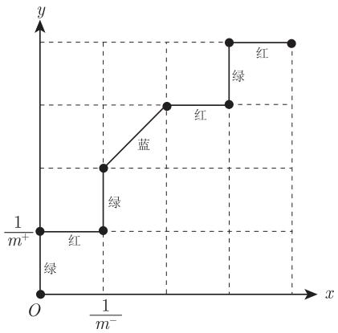  
图2-1 ROC曲线示意

在这里，为了能在解释式(2.21）时复用此图，我们没有写上具体的数值，转而用其数学符号代替。其中绿色线段表示在分类阈值变动的过程中只新增了真正例，红色线段表示只新增了假正例，蓝色线段表示既新增了真正例也新增了假正例。根据 AUC 值的定义可知，此时的 AUC 值其实就是所有红色线段和蓝色线段与x轴围成的面积之和。观察图2-1可知，红色线段与x轴围成的图形恒为矩形，蓝色线段与x轴围成的图形恒为梯形。由于梯形面积式既能算梯形面积，也能算矩形面积，所以无论是红色线段还是蓝色线段，其与x轴围成的面积都能用梯形公式来计算：

$$
{ \frac { 1 } { 2 } } \cdot ( x _ { i + 1 } - x _ { i } ) \cdot ( y _ { i } + y _ { i + 1 } )
$$

其中， $( x _ { i + 1 } - x _ { i } )$ 为“高”， $y _ { i }$ 为“上底”， $y _ { i + 1 }$ 为“下底”。那么对所有红色线段和蓝色线段与x轴围成的面积进行求和，则有

$$
\sum _ { i = 1 } ^ { m - 1 } \left[ \frac { 1 } { 2 } \cdot ( x _ { i + 1 } - x _ { i } ) \cdot ( y _ { i } + y _ { i + 1 } ) \right]
$$

此即为AUC。

通过以上 ROC 曲线的绘制流程可以看出，ROC 曲线上每一个点都表示学习器 $f ( s )$ 在特定國值下构成的一个二分类器，越好的二分类器其假正例率（反例被预测错误的概率，横轴）越小，真正例率（正例被预测正确的概率，纵轴）越大，所以这个点越靠左上角（即点（0，1)）越好。因此，越好的学习器，其ROC 曲线上的点越靠左上角，相应的ROC 曲线下的面积也越大，即AUC 也越大。

## 2.3.9式(2.21)和式(2.22)的推导

下面针对“西瓜书”上所说的 $^ { 6 6 } \ell _ { r a n k }$ 对应的是ROC曲线之上的面积”进行推导。按照我们上述对式(2.20)的推导思路， $\ell _ { r a n k }$ 可以看作是所有绿色线段和蓝色线段与y 轴围成的面积之和，但从式(2.21）中很难一眼看出其面积的具体计算方式，因此我们进行恒等变形如下：

$$
\begin{array} { r l } { \ell _ { r a n k } = \displaystyle \frac { 1 } { m ^ { + } m ^ { - } } \displaystyle \sum _ { x ^ { + } \in D ^ { + } } \displaystyle \sum _ { \alpha ^ { - } \in D ^ { - } } ( \mathbb { I } ( f ( x ^ { + } ) < f ( x ^ { - } ) ) + \displaystyle \frac { 1 } { 2 } \mathbb { I } ( f ( x ^ { + } ) = f ( x ^ { - } ) ) ) } & { { } } \\ { = \displaystyle \frac { 1 } { m ^ { + } m ^ { - } } \displaystyle \sum _ { x ^ { + } \in D ^ { + } } [ \displaystyle \sum _ { x ^ { - } \in D ^ { - } } \mathbb { I } ( f ( x ^ { + } ) < f ( x ^ { - } ) ) + \displaystyle \frac { 1 } { 2 } \cdot \sum _ { x ^ { - } \in D ^ { - } } \mathbb { I } ( f ( x ^ { + } ) = f ( x ^ { - } ) ) ] } & { { } } \\ { = \displaystyle \sum _ { x ^ { + } \in D ^ { + } } [ \displaystyle \frac { 1 } { m ^ { + } } \cdot \displaystyle \frac { 1 } { m ^ { - } } \sum _ { x ^ { - } \in D ^ { - } } \mathbb { I } ( f ( x ^ { + } ) < f ( x ^ { - } ) ) + \displaystyle \frac { 1 } { 2 } \cdot \displaystyle \frac { 1 } { m ^ { + } } \cdot \displaystyle \frac { 1 } { m ^ { - } } \sum _ { x ^ { - } \in D ^ { - } } \mathbb { I } ( f ( x ^ { + } ) = f ( x ^ { - } ) ) ] } & { { } } \\  = \displaystyle \sum _ { x ^ { + } \in D ^ { + } } \displaystyle \frac { 1 } { 2 } \cdot \displaystyle \frac { 1 } { m ^ { + } } \cdot [ \displaystyle \frac { 2 } { m ^ { - } } \sum _ { x ^ { - } \in D ^ { - } } \mathbb { I } ( f ( x ^ { + } ) < f ( x ^ { - } ) ) + \displaystyle \frac { 1 } { m ^ { - } } \sum _ { x ^ { - } \in D ^ { - } } \mathbb { I } ( f ( x ^ { + } ) = \end{array}
$$

在变动分类阈值的过程当中，如果有新增真正例，那么图2-1就会相应地增加一条绿色线段或蓝色线段，所以上式中的 $\textstyle \sum _ { x ^ { + } \in D ^ { + } }$ 可以看作是在累加所有绿色和蓝色线段，相应地， $\textstyle \sum _ { x ^ { + } \in D ^ { + } }$ 后面的內容便是

在求绿色线段或者蓝色线段与y轴围成的面积，即：

$$
\frac { 1 } { 2 } \cdot \frac { 1 } { m ^ { + } } \cdot \left[ \frac { 2 } { m ^ { - } } \sum _ { x ^ { - } \in D ^ { - } } \mathbb { I } \left( f ( x ^ { + } ) < f ( x ^ { - } ) \right) + \frac { 1 } { m ^ { - } } \sum _ { x ^ { - } \in D ^ { - } } \mathbb { I } \left( f ( x ^ { + } ) = f ( x ^ { - } ) \right) \right]
$$

与式(2.20）中的推导思路相同，不论是绿色线段还是蓝色线段，其与y 轴围成的图形面积都可以用梯形公式来进行计算，所以上式表示的依旧是一个梯形的面积公式。其中 $\textstyle { \frac { 1 } { m ^ { + } } }$ 即梯形的“高”，中括号内便是“上底+下底”，下面我们来分别推导一下“上底”（较短的底）和“下底”（较长的底）。

由于在绘制ROC 曲线的过程中，每新增一个假正例时x坐标也就新增一个步长，所以对于“上底”，也就是绿色或者蓝色线段的下端点到y轴的距离，长度就等于 $\scriptstyle { \frac { 1 } { m ^ { - } } }$ 乘以预测值大于 $f ( { \pmb x } ^ { + } )$ 的假正例的个数，即

$$
\frac { 1 } { m ^ { - } } \sum _ { { \pmb x } ^ { - } \in D ^ { - } } \mathbb { I } \left( f ( { \pmb x } ^ { + } ) < f ( { \pmb x } ^ { - } ) \right)
$$

而对于“下底”，长度就等于 $\textstyle { \frac { 1 } { m ^ { - } } }$ 乘以预测值大于等于 $f ( { \pmb x } ^ { + } )$ 的假正例的个数，即

$$
\frac { 1 } { m ^ { - } } \left( \sum _ { \substack { x ^ { - } \in D ^ { - } } } \mathbb { I } \left( f ( x ^ { + } ) < f ( x ^ { - } ) \right) + \sum _ { x ^ { - } \in D ^ { - } } \mathbb { I } \left( f ( x ^ { + } ) = f ( x ^ { - } ) \right) \right)
$$

到此，推导完毕。

若不考虑 $f ( \pmb { x } ^ { + } ) = f ( \pmb { x } ^ { - } )$ ，从直观上理解 $\ell _ { r a n k }$ ，其表示的是：对于待测试的模型 $f ( { \pmb x } )$ ，从测试集中随机抽取一个正反例对儿 $\{ x ^ { + } , x ^ { - } \}$ ，模型 $f ( { \pmb x } )$ 对正例的打分 $f ( { \pmb x } ^ { + } )$ 小于对反例的打分 $f ( { \pmb x } ^ { - } )$ 的概率，即“排序错误”的概率。推导思路如下：采用频率近似概率的思路，组合出测试集中的所有正反例对儿，假设组合出来的正反例对儿的个数为m，用模型 $f ( { \pmb x } )$ 对所有正反例对儿打分并统计“排序错误”的正反例对儿个数n，然后计算出 $\frac { n } { m }$ 即为模型 $f ( { \pmb x } )$ “排序错误”的正反例对儿的占比，其可近似看作为 $f ( { \pmb x } )$ 在测试集上“排序错误”的概率。具体推导过程如下：测试集中的所有正反例对儿的个数为

$$
m ^ { + } \times m ^ { - }
$$

“排序错误”的正反例对儿个数为

$$
\sum _ { \pmb { x } ^ { + } \in D ^ { + } } \sum _ { \pmb { x } ^ { - } \in D ^ { - } } \left( \mathbb { I } \left( f ( \pmb { x } ^ { + } ) < f ( \pmb { x } ^ { - } ) \right) \right)
$$

因此，“排序错误”的概率为

$$
\frac { \sum _ { \pmb { x } ^ { + } \in D ^ { + } } \sum _ { \pmb { x } ^ { - } \in D ^ { - } } \left( \mathbb { I } \left( f ( \pmb { x } ^ { + } ) < f ( \pmb { x } ^ { - } ) \right) \right) } { m ^ { + } \times m ^ { - } }
$$

若再考虑 $f ( \pmb { x } ^ { + } ) = f ( \pmb { x } ^ { - } )$ 时算半个“排序错误”，则上式可进一步扩展为

$$
\frac { \sum _ { \substack { x ^ { + } \in D ^ { + } } } \sum _ { \substack { x ^ { - } \in D ^ { - } } } \left( \mathbb { I } \left( f ( x ^ { + } ) < f ( x ^ { - } ) + \frac { 1 } { 2 } \mathbb { I } \left( f ( x ^ { + } ) = f ( x ^ { - } ) \right) \right) \right) } { m ^ { + } \times m ^ { - } }
$$

此即为 $\ell _ { r a n k }$

如果说 $\ell _ { r a n k }$ 指的是从测试集中随机抽取正反例对儿，模型 $f ( { \pmb x } )$ “排序错误”的概率，那么根据式(2.22）可知，AUC则指的是从测试集中随机抽取正反例对儿，模型 $f ( { \pmb x } )$ “排序正确”的概率。显然，此概率越大越好。

## 2.3.10式(2.23)的解释

本公式很容易理解，只是需要注意该公式上方交代了“若将表2.2 中的第0 类作为正类、第1 类作为反类”，若不注意此条件，按习惯（0为反类、1为正类）会产生误解。为避免产生误解，在接下来的解释

中将 $c o s t _ { 0 1 }$ 记为 $c o s t _ { + - } , \ c o s t _ { 1 0 }$ 记为 $c o s t _ { - + }$ 。本公式还可以作如下恒等变形

$$
\begin{array} { l } { { E ( f ; D ; c o s t ) = \displaystyle \frac { 1 } { m } ( m ^ { + } \times \displaystyle \frac { 1 } { m ^ { + } } \sum _ { \alpha _ { 1 } \in D ^ { + } } \mathbb { I } ( ( f ( x _ { i } \neq y _ { i } ) ) \times c o s t _ { + - } + m ^ { - } \times \displaystyle \frac { 1 } { m ^ { - } } \sum _ { x _ { i } \in D ^ { - } } \mathbb { I } ( f ( x _ { i } \neq y _ { i } ) ) \times c o s t _ { - + } )  } } \\ { { \displaystyle  \ = \displaystyle \frac { m ^ { + } } { m } \times \displaystyle \frac { 1 } { m ^ { + } } \sum _ { x _ { i } \in D ^ { + } } \mathbb { I } ( ( f ( x _ { i } \neq y _ { i } ) ) \times c o s t _ { + - } + \displaystyle \frac { m ^ { - } } { m } \times \displaystyle \frac { 1 } { m ^ { - } } \sum _ { x _ { i } \in D ^ { - } } \mathbb { I } ( f ( x _ { i } \neq y _ { i } ) ) \times c o s t _ { - + }  } } \end{array}
$$

其中 $m ^ { + }$ 和 $m ^ { - }$ 分别表示正例集 $D ^ { + }$ 和反例集 $D ^ { - }$ 的样本个数。

$\begin{array} { r } { \frac { 1 } { m ^ { + } } \sum _ { { \pmb x } _ { i } \in D ^ { + } } \mathbb { I } \left( f \left( { \pmb x } _ { i } \neq y _ { i } \right) \right) } \end{array}$ 表示正例集 $D ^ { + }$ 中预测错误样本所占比例，即假反例率 $\mathrm { F N R }$ 0$\begin{array} { r } { \frac { 1 } { m ^ { - } } \sum _ { { \pmb x } _ { i } \in D ^ { - } } \mathbb { I } \left( f \left( { \pmb x } _ { i } \neq y _ { i } \right) \right) } \end{array}$ 表示反例集 $D ^ { - }$ 中预测错误样本所占比例，即假正例率FPR。$\frac { m ^ { + } } { m }$ 表示样例集D中正例所占比例，或理解为随机从D 中取一个样例取到正例的概率。$\frac { m ^ { - } } { m }$ 表示样例集D 中反例所占比例，或理解为随机从D 中取一个样例取到反例的概率。

因此，若将样例为正例的概率 $\frac { m ^ { + } } { m }$ 记为 p，则样例为f 反例的概率 $\frac { m ^ { - } } { m }$ 为 $1 - p$ ，上式可进一步写为

$$
E ( f ; D ; c o s t ) = p \times \mathrm { F N R } \times c o s t _ { + - } + ( 1 - p ) \times \mathrm { F P R } \times c o s t _ { - + }
$$

此公式在接下来式(2.25)的解释中会用到。

## 2.3.11式(2.24)的解释

当 $c o s t _ { + - } = c o s t _ { - + }$ 时，本公式可化简为

$$
P ( + ) c o s t = \frac { p } { p + ( 1 - p ) } = p
$$

其中 $p$ 是样例为正例的概率（一般用正例在样例集中所占的比例近似代替）。因此，当代价不敏感时（也即$c o s t _ { + - } = c o s t _ { - + } )$ , $P ( + ) c o s t$ 就是正例在样例集中的占比。那么，当代价敏感时（也即 $c o s t _ { + - } \neq c o s t _ { - + } )$ ,$P ( + ) c o s t$ 即为正例在样例集中的加权占比。具体来说，对于样例集

$$
{ \cal D } = \left\{ { { x } _ { 1 } ^ { + } } , { { x } _ { 2 } ^ { + } } , { { x } _ { 3 } ^ { - } } , { { x } _ { 4 } ^ { - } } , { { x } _ { 5 } ^ { - } } , { { x } _ { 6 } ^ { - } } , { { { x } _ { 7 } ^ { - } } } , { { { x } _ { 8 } ^ { - } } } , { { { x } _ { 9 } ^ { - } } } , { { { x } _ { 1 0 } ^ { - } } } \right\}
$$

其中 ${ \pmb x } ^ { + }$ 表示正例， ${ \pmb x } ^ { - }$ 表示反例。可以看出 $p = 0 . 2$ ，若想让正例得到更多重视，考虑代价敏感 $c o s t _ { + - } = 4 $ 和 $c o s t _ { - + } = 1$ ，这实际等价于在以下样例集上进行代价不敏感的正例概率代价计算

$$
D ^ { \prime } = \left\{ x _ { 1 } ^ { + } , x _ { 1 } ^ { + } , x _ { 1 } ^ { + } , x _ { 1 } ^ { + } , x _ { 2 } ^ { + } , x _ { 2 } ^ { + } , x _ { 2 } ^ { + } , x _ { 2 } ^ { + } , x _ { 3 } ^ { - } , x _ { 4 } ^ { - } , x _ { 5 } ^ { - } , x _ { 6 } ^ { - } , x _ { 7 } ^ { - } , x _ { 8 } ^ { - } , x _ { 9 } ^ { - } , x _ { 1 0 } ^ { - } \right\}
$$

即将每个正例样本复制 4 份，若有1 个出错，则有4 个一起出错，代价为 4。此时可计算出

$$
\begin{array} { c } { { P ( + ) c o s t = \displaystyle { \frac { p \times c o s t _ { + - } } { p \times c o s t _ { + - } + ( 1 - p ) \times c o s t _ { - + } } } } } \\ { { = \displaystyle { \frac { 0 . 2 \times 4 } { 0 . 2 \times 4 + ( 1 - 0 . 2 ) \times 1 } } = 0 . 5 } } \end{array}
$$

也就是正例在等价的样例集 $D ^ { \prime }$ 中的占比。所以，无论代价敏感还是不敏感， $P ( + ) c o s t$ 本质上表示的都是样例集中正例的占比。在实际应用过程中，如果由于某种原因无法将 $c o s t _ { + - }$ 和 $c o s t _ { - + }$ 设为不同取值，可以采用上述“复制样本”的方法间接实现将 $c o s t _ { + - }$ 和 $c o s t _ { - + }$ 设为不同取值。

对于不同的 $c o s t _ { + - }$ 和 $c o s t _ { - + }$ 取值，若二者的比值保持相同，则 $P ( + ) c o s t$ 不变。例如，对于上面的例子，若设 $c o s t _ { + - } = 4 0$ 和 $c o s t _ { -- } = 1 0$ ，所得 $P ( + ) c o s t$ 仍为0.5。

此外，根据此式还可以相应地推导出反例概率代价

$$
P ( - ) c o s t = 1 - P ( + ) c o s t = { \frac { ( 1 - p ) \times c o s t _ { - + } } { p \times c o s t _ { + - } + ( 1 - p ) \times c o s t _ { - + } } }
$$

## 2.3.12式(2.25)的解释

对于包含m个样本的样例集D，可以算出学习器f(x）总的代价是

$$
\begin{array} { r l r } & { } & { c o s t _ { s e } = m \times p \times \mathrm { F N R } \times c o s t _ { + - } + m \times ( 1 - p ) \times \mathrm { F P R } \times c o s t _ { - + } } \\ & { } & { ~ + m \times p \times \mathrm { T P R } \times c o s t _ { + + } + m \times ( 1 - p ) \times \mathrm { T N R } \times c o s t _ { -- } } \end{array}
$$

其中p是正例在样例集中所占的比例（或严格地称为样例为正例的概率）， $c o s t _ { s e }$ 下标中的 $^ { 6 6 } \mathrm { s e } ^ { 3 9 }$ 表示sensitive，即代价敏感，根据前面讲述的 FNR、FPR、TPR、TNR的定义可知：

$m \times p \times { \mathrm { F N R } }$ 表示正例被预测为反例（正例预测错误）的样本个数；

m×(1-p）×FPR表示反例被预测为正例（反例预测错误）的样本个数；

m×p×TPR表示正例被预测为正例（正例预测正确）的样本个数；

m×(1－p）×TNR 表示反例预测为反例（反例预测正确）的样本个数。

以上各种样本个数乘以相应的代价则得到总的代价 $c o s t _ { s e }$ 。但是，按照此公式计算出的代价与样本个数m 呈正比，显然不具有一般性，因此需要除以样本个数 m，而且一般来说，预测出错才会产生代价，预测正确则没有代价，也即 $c o s t _ { + + } = c o s t _ { -- } = 0$ ，所以 $c o s t _ { s e }$ 更为一般化的表达式为

$$
c o s t _ { s e } = p \times \mathrm { F N R } \times c o s t _ { + - } + ( 1 - p ) \times \mathrm { F P R } \times c o s t _ { - + }
$$

回顾式(2.23)的解释可知，此式即为式(2.23)的恒等变形，所以此式可以同式(2.23）一样理解为学习器f(x）在样例集D上的“代价敏感错误率”。显然， $c o s t _ { s e }$ 的取值范围并不在0到1之间，且 $c o s t _ { s e }$ 在$\mathrm { F N R } = \mathrm { F P R } = 1$ 时取到最大值，因为 $\mathrm { F N R } = \mathrm { F P R } = 1$ 时表示所有正例均被预测为反例，反例均被预测为正例，代价达到最大，即

$$
m a x ( c o s t _ { s e } ) = p \times c o s t _ { + - } + ( 1 - p ) \times c o s t _ { - + }
$$

所以，如果要将 $c o s t _ { s e }$ 的取值范围归一化到0 到1之间，则只需将其除以其所能取到的最大值即可，也即

$$
\frac { c o s t _ { s e } } { m a x ( c o s t _ { s e } ) } = \frac { p \times \mathrm { F N R } \times c o s t _ { + - } + ( 1 - p ) \times \mathrm { F P R } \times c o s t _ { - + } } { p \times c o s t _ { + - } + ( 1 - p ) \times c o s t _ { - + } }
$$

此即为式 (2.25)，也即为 $c o s t _ { n o r m }$ ，其中下标“norm”表示 normalization。

进一步地，根据式(2.24)中 $P ( + ) c o s t$ 的定义可知，式(2.25)可以恒等变形为

$$
c o s t _ { n o r m } = \mathrm { F N R } \times P ( + ) c o s t + \mathrm { F P R } \times ( 1 - P ( + ) c o s t )
$$

对于二维直角坐标系中的两个点(0,B)和(1,A)以及实数 $p \in \left[ 0 , 1 \right] , \ ( p , p A + ( 1 - p ) B )$ 一定是线段A-B上的点，且当p从0变到1时，点 $( p , p A + ( 1 - p ) B )$ 的轨迹为从(0,B）到(1,A)，基于此，结合上述$c o s t _ { n o r m }$ 的表达式可知： $( P ( + ) c o s t , c o s t _ { n o r m } )$ 即为线段FPR－FNR上的点，当(P(+)cost从0变到1时， $( P ( + ) c o s t , c o s t _ { n o r m } )$ 的轨迹为从(O,FPR)到(1,FNR），也即图2.5中的各条线段。需要注意的是，以上只是从数学逻辑自洽的角度对图 2.5 中的各条线段进行解释，实际中各条线段并非按照上述方法绘制。理由如下：

$P ( + ) c o s t$ 表示的是样例集中正例的占比，而在进行学习器的比较时，变动的只是训练学习器的算法或者算法的超参数，用来评估学习器性能的样例集是固定的（单一变量原则），所以 $P ( + ) c o s t$ 是一个固定值，因此图 2.5中的各条线段并不是通过变动P(+)cost然后计算 $c o s t _ { n o r m }$ 画出来的，而是按照“西瓜书”上式(2.25）下方所说对 ROC 曲线上每一点计算FPR 和FNR，然后将点(0,FPR)和点(1,FNR)直接连成线段。

虽然图 2.5中的各条线段并不是通过变动横轴表示的 $P ( + ) c o s t$ 来进行绘制，但是横轴仍然有其他用处，例如用来找使学习器的归一化代价 $c o s t _ { n o r m }$ 达到最小的阈值（暂且称其为最佳阈值）。具体地，首先计算当前样例集的 $P ( + ) c o s t$ 值，然后根据计算出来的值在横轴上标记出具体的点，再基于该点作一条垂直于横轴的垂线，与该垂线最先相交（从下往上看）的线段所对应的阈值（因为每条线段都对应 ROC曲线上的点，ROC 曲线上的点又对应着具体的阈值）即为最佳阈值。原因是与该垂线最先相交的线段必然最靠下，因此其交点的纵坐标最小，而纵轴表示的便是归一化代价 $c o s t _ { n o r m }$ ，所以此时归一化代价 $c o s t _ { n o r m }$ 达到最小。特别地，当 $P ( + ) c o s t = 0$ 时，即样例集中没有正例，全是负例，因此最佳阈值应该是学习器不可能取到的最大值，且按照此阈值计算出来出来的 $\mathrm { F P R } = 0 , \mathrm { F N R } = 1 , c o s t _ { n o r m } = 0$ 。那么按照上述作垂线的方法去图 2.5 中进行实验，也即在横轴 0 刻度处作垂线，显然与该垂线最先相交的线段是点 (0,0)和点(1,1）连成的线段，交点为(0,0)，此时对应的也为 $\mathrm { F P R } = 0 , \mathrm { F N R } = 1 , c o s t _ { n o r m } = 0$ ，且该条线段所对应的阈值也确实为“学习器不可能取到的最大值”（因为该线段对应的是 ROC 曲线中的起始点）。

## 2.4比较检验

为什么要做比较检验？“西瓜书”在本节开篇的两段话已经交代原由。简单来说，从统计学的角度，取得的性能度量的值本质上仍是一个随机变量，因此并不能简单用比较大小来直接判定算法（或者模型）之间的优劣，而需要更置信的方法来进行判定。

在此说明一下，如果不做算法理论研究，也不需要对算法（或模型）之间的优劣给出严谨的数学分析，本节可以暂时跳过。本节主要使用的数学知识是“统计假设检验”，该知识点在各个高校的概率论与数理统计教材（例如参考文献[1]）上均有讲解。此外，有关检验变量的公式，例如式(2.30)至式(2.36)，并不需要清楚是怎么来的（这是统计学家要做的事情），只需要会用即可。

## 2.4.1式(2.26)的解释

理解本公式时需要明确的是：ϵ 是未知的，是当前希望估算出来的，€是已知的，是已经用 m 个测试样本对学习器进行测试得到的。因此，本公式也可理解为：当学习器的泛化错误率为ϵ 时，被测得测试错误率为ε的条件概率。所以本公式可以改写为

$$
P ( \hat { \epsilon } | \epsilon ) = \binom { m } { \hat { \epsilon } \times m } \epsilon ^ { \hat { \epsilon } \times m } ( 1 - \epsilon ) ^ { m - \hat { \epsilon } \times m }
$$

其中

$$
\binom { m } { \hat { \epsilon } \times m } = \frac { m ! } { ( \hat { \epsilon } \times m ) ! ( m - \hat { \epsilon } \times m ) ! }
$$

为中学时学的组合数，即 $C _ { m } ^ { \hat { \epsilon } \times m }$

在已知ε时，求使得条件概率 $P ( \hat { \epsilon } | \epsilon )$ 达到最大的ε是概率论与数理统计中经典的极大似然估计问题。从极大似然估计的角度可知，由于ε，m均为已知量，所以 $P ( \hat { \epsilon } | \epsilon )$ 可以看作为一个关于ϵ的函数，称为似然函数，于是问题转化为求使得似然函数取到最大值的ϵ，即

$$
\epsilon = \arg \operatorname* { m a x } _ { \epsilon } P ( \hat { \epsilon } | \epsilon )
$$

首先对ϵ求一阶导数

$$
\begin{array} { r l } { \frac { \partial P ( \hat { \epsilon } \mid \epsilon ) } { \partial \epsilon } = } & { { } \left( \begin{array} { c } { m } \\ { \hat { \epsilon } \times m } \end{array} \right) \frac { \partial \epsilon ^ { \hat { \epsilon } \times m n } ( 1 - \epsilon ) ^ { m - \hat { \epsilon } \times m } } { \partial \epsilon } } \\ { } & { { } = \left( \begin{array} { c } { m } \\ { \hat { \epsilon } \times m } \end{array} \right) \left( \hat { \epsilon } \times m \times \epsilon ^ { \hat { \epsilon } \times m - 1 } ( 1 - \epsilon ) ^ { m - \hat { \epsilon } \times m } + \epsilon ^ { \hat { \epsilon } \times m } \times ( m - \hat { \epsilon } \times m ) \times ( 1 - \epsilon ) ^ { m - \hat { \epsilon } \times m - 1 } \times ( - 1 ) \right) } \\ { } & { { } = \left( \begin{array} { c } { m } \\ { \hat { \epsilon } \times m } \end{array} \right) \epsilon ^ { \hat { \epsilon } \times m - 1 } ( 1 - \epsilon ) ^ { m - \hat { \epsilon } \times m - 1 } ( \hat { \epsilon } \times m \times ( 1 - \epsilon ) - \epsilon \times ( m - \hat { \epsilon } \times m ) ) } \\ { } & { { } = \left( \begin{array} { c } { m } \\ { \hat { \epsilon } \times m } \end{array} \right) \epsilon ^ { \hat { \epsilon } \times m - 1 } ( 1 - \epsilon ) ^ { m - \hat { \epsilon } \times m - 1 } ( \hat { \epsilon } \times m - \epsilon \times m ) } \end{array}
$$

分析上式可知，其中 $\left( \begin{array} { c } { { m } } \\ { { \hat { \epsilon } \times m } } \end{array} \right)$ 为常数，由于 $\epsilon \in [ 0 , 1 ]$ ，所以 $\epsilon ^ { \hat { \epsilon } \times m - 1 } ( 1 - \epsilon ) ^ { m - \hat { \epsilon } \times m - 1 }$ 恒大于 $\boldsymbol { 0 } , ( \hat { \epsilon } { \times } m { - } \epsilon { \times } m )$ 在 $0 \leqslant \epsilon < \hat { \epsilon }$ 时大于0，在∈= ε时等于0，在 $\hat { \epsilon } \leqslant \epsilon < 1$ 时小于0，因此 $P ( \hat { \epsilon } \mid \epsilon )$ 是关于 ϵ 开口向下的凹函数（此处采用的是最优化中对凹凸函数的定义，“西瓜书”第3 章 3.2 节左侧边注对凹凸函数的定义也是如此)。所以，当且仅当一阶导数 $\begin{array} { r } { \frac { \partial P ( \hat { \epsilon } | \epsilon ) } { \partial \epsilon } = 0 } \end{array}$ 时 $P ( \hat { \epsilon } \mid \epsilon )$ 取到最大值，此时 $\epsilon = \hat { \epsilon } .$

## 2.4.2式(2.27)的推导

截至 2021 年5月，“西瓜书”第1 版第 36 次印刷，式(2.27)应当勘误为

$$
\overline { { { \epsilon } } } = \operatorname* { m i n } \epsilon \mathrm { s . t . } \sum _ { i = \epsilon \times m + 1 } ^ { m } \left( \begin{array} { c } { { m } } \\ { { i } } \end{array} \right) \epsilon _ { 0 } ^ { i } ( 1 - \epsilon _ { 0 } ) ^ { m - i } < \alpha
$$

在推导此公式之前，先铺垫讲解一下“二项分布参数ρ 的假设检验”「：

设某事件发生的概率为p，p 未知。做m次独立试验，每次观察该事件是否发生，以X记该事件发生的次数，则X服从二项分布 $B ( m , p )$ ，现根据X检验如下假设：

$$
\begin{array} { r } { H _ { 0 } : p \leqslant p _ { 0 } } \\ { H _ { 1 } : p > p _ { 0 } } \end{array}
$$

由二项分布本身的特性可知：p 越小，X 取到较小值的概率越大。因此，对于上述假设，一个直观上合理的检验为

φ：当X>C时拒绝 $H _ { 0 }$ 否则就接受 $H _ { 0 }$

其中，C表示事件最大发生次数。此检验对应的功效函数为

$$
\begin{array} { l } { \displaystyle \beta _ { \varphi } ( p ) = P ( X > C ) } \\ { \displaystyle = 1 - P ( X \leqslant C ) } \\ { \displaystyle = 1 - \sum _ { i = 0 } ^ { C } \left( \begin{array} { l } { m } \\ { i } \end{array} \right) p ^ { i } ( 1 - p ) ^ { m - i } } \\ { \displaystyle = \sum _ { i = C + 1 } ^ { m } \left( \begin{array} { c } { m } \\ { i } \end{array} \right) p ^ { i } ( 1 - p ) ^ { m - i } } \end{array}
$$

由于 $^ { 6 6 } p$ 越小，X取到较小值的概率越大”可以等价表示为： $P ( X \leqslant C )$ 是关于p的减函数，所以$\beta _ { \varphi } ( p ) = P ( X > C ) = 1 - P ( X \leqslant C )$ 是关于p的增函数，那么当 $p \leqslant p _ { 0 }$ 时， $\beta _ { \varphi } ( p _ { 0 } )$ 即为 $\beta _ { \varphi } ( p )$ 的上确界。（更为严格的数学证明参见参考文献 1]中第2 章习题 7）又根据参考文献 [1]中5.1.3 的定义 1.2 可知，在给定检验水平α时，要想使得检验 $\varphi$ 达到水平 $\alpha$ ，则必须保证 $\beta _ { \varphi } ( p )$ ≤α，因此可以通过如下方程解得使检验 $\varphi$ 达到水平 $\alpha$ 的整数C:

$$
\alpha = \operatorname* { s u p } \left\{ \beta _ { \varphi } ( p ) \right\}
$$

显然，当 $p \leqslant p _ { 0 }$ 时有

$$
\begin{array} { l } { { \alpha = \displaystyle \operatorname* { s u p } \left\{ \beta _ { \varphi } ( p ) \right\} } } \\ { { { } ~ = \beta _ { \varphi } ( p _ { 0 } ) } } \\ { { { } ~ = { \displaystyle \sum _ { i = C + 1 } ^ { m } \left( \begin{array} { l } { { m } } \\ { { i } } \end{array} \right) } p _ { 0 } ^ { i } ( 1 - p _ { 0 } ) ^ { m - i } } } \end{array}
$$

对于此方程，通常不一定正好解得一个使得方程成立的整数 $C .$ ，较常见的情况是存在这样一个 $\overline { C }$ 使得

$$
\begin{array} { r } { \displaystyle \sum _ { i = \overline { { C } } + 1 } ^ { m } \left( \begin{array} { c } { m } \\ { i } \end{array} \right) p _ { 0 } ^ { i } ( 1 - p _ { 0 } ) ^ { m - i } < \alpha } \\ { \displaystyle \sum _ { i = \overline { { C } } } ^ { m } \left( \begin{array} { c } { m } \\ { i } \end{array} \right) p _ { 0 } ^ { i } ( 1 - p _ { 0 } ) ^ { m - i } > \alpha } \end{array}
$$

此时，C只能取 $\overline { C }$ 或者 $\overline { { C } } + 1$ 。若C取 $\overline { C }$ ，则相当于升高了检验水平α；若C取 $\overline { { C } } + 1$ 则相当于降低了检验水平 $\alpha _ { \mathfrak { c } }$ ，具体如何取舍需要结合实际情况，一般的做法是使α尽可能小，因此倾向于令C取 $\overline { { C } } + 1$ 0

下面考虑如何求解 $\overline { { C } } .$ ，易证 $\beta _ { \varphi } ( p _ { 0 } )$ 是关于C的减函数，再结合上述关于C的两个不等式易推得

$$
\overline { { { C } } } = \operatorname* { m i n } C \quad \mathrm { s . t . } \quad \sum _ { i = C + 1 } ^ { m } \left( \begin{array} { c } { { m } } \\ { { i } } \end{array} \right) p _ { 0 } ^ { i } ( 1 - p _ { 0 } ) ^ { m - i } < \alpha
$$

由“西瓜书”中的上下文可知，对 $\epsilon \leqslant \epsilon _ { 0 }$ 进行假设检验，等价于“二项分布参数p的假设检验”中所述的对 $p \leqslant p _ { 0 }$ 进行假设检验，所以在“西瓜书”中求解最大错误率ε等价于在“二项分布参数p的假设检验”中求解事件最大发生频率 $\frac { \overline { { C } } } { m }$ 。由上述“二项分布参数p的假设检验”中的推导可知

$$
\overline { { { C } } } = \operatorname* { m i n } C \quad \mathrm { s . t . } \quad \sum _ { i = C + 1 } ^ { m } \left( \begin{array} { c } { { m } } \\ { { i } } \end{array} \right) p _ { 0 } ^ { i } ( 1 - p _ { 0 } ) ^ { m - i } < \alpha
$$

所以

$$
\frac { \overline { { { C } } } } { m } = \operatorname* { m i n } \frac { C } { m } \mathrm { ~ s . t . ~ } \sum _ { i = C + 1 } ^ { m } \left( \begin{array} { c } { { m } } \\ { { i } } \end{array} \right) p _ { 0 } ^ { i } ( 1 - p _ { 0 } ) ^ { m - i } < \alpha
$$

将上式中的 ${ \frac { \overline { { C } } } { m } } , { \frac { C } { m } } , p _ { 0 }$ 等价替换为 $\overline { { \epsilon } } , \epsilon , \epsilon _ { 0 }$ 可得

$$
\overline { { { \epsilon } } } = \operatorname* { m i n } \epsilon \mathrm { s . t . } \sum _ { i = \epsilon \times m + 1 } ^ { m } \left( \begin{array} { c } { { m } } \\ { { i } } \end{array} \right) \epsilon _ { 0 } ^ { i } ( 1 - \epsilon _ { 0 } ) ^ { m - i } < \alpha
$$

## 2.5偏差与方差

## 2.5.1式(2.37)到式 (2.42)的推导

首先，梳理一下“西瓜书”中的符号，书中称x为测试样本，但是书中又提到“令 $y _ { D }$ 为x在数据集中的标记”，那么α 究竟是测试集中的样本还是训练集中的样本呢？这里暂且理解为x为从训练集中抽取出来用于测试的样本。此外，“西瓜书”中左侧边注中提到“有可能出现噪声使得 $y _ { D } \ne y ^ { \prime \prime }$ ，其中所说的“噪声”通常是指人工标注数据时带来的误差，例如标注“身高”时，由于测量工具的精度等问题，测出来的数值必然与真实的“身高”之间存在一定误差，此即为“噪声”。

为了进一步解释式(2.37)、(2.38)和 (2.39)，在这里设有n个训练集 $D _ { 1 } , . . . , D _ { n }$ ，这n个训练集都是以独立同分布的方式从样本空间中采样而得，并且恰好都包含测试样本x，该样本在这 n 个训练集的标记分别为 $y _ { D _ { 1 } } , . . . , y _ { D _ { n } }$ 。书中已明确，此处以回归任务为例，也即 $y _ { D } , y , f ( { \pmb x } ; D )$ 均为实值。

式 (2.37)可理解为:

$$
\bar { f } ( \pmb { x } ) = \mathbb { E } _ { D } [ f ( \pmb { x } ; D ) ] = \frac { 1 } { n } \left( f \left( \pmb { x } ; D _ { 1 } \right) + \ldots + f \left( \pmb { x } ; D _ { n } \right) \right)
$$

式 (2.38)可理解为:

$$
\begin{array} { l } { \displaystyle \mathrm { v a r } ( \pmb { x } ) = \mathbb { E } _ { D } \left[ ( f ( \pmb { x } ; D ) - \bar { f } ( \pmb { x } ) ) ^ { 2 } \right] } \\ { \displaystyle = \frac { 1 } { n } \left( \left( f \left( \pmb { x } ; D _ { 1 } \right) - \bar { f } ( \pmb { x } ) \right) ^ { 2 } + \ldots + \left( f \left( \pmb { x } ; D _ { n } \right) - \bar { f } ( \pmb { x } ) \right) ^ { 2 } \right) } \end{array}
$$

式 (2.39)可理解为:

$$
\varepsilon ^ { 2 } = \mathbb { E } _ { D } \left[ \left( y _ { D } - y \right) ^ { 2 } \right] = { \frac { 1 } { n } } \left( \left( y _ { D _ { 1 } } - y \right) ^ { 2 } + \ldots + \left( y _ { D _ { n } } - y \right) ^ { 2 } \right)
$$

最后，推导一下式 (2.41)和式 (2.42)，由于推导完式(2.41)自然就会得到式(2.42)，因此下面仅推导

式 (2.41) 即可。

$$
\begin{array} { r l } & { E ( f ; D ) = \mathbb { E } _ { D } \left[ \left( f ( \pmb { x } ; D ) - y _ { D } \right) ^ { 2 } \right] } \\ & { \qquad = \mathbb { E } _ { D } \left[ \left( f ( \pmb { x } ; D ) - \bar { f } ( \pmb { x } ) + \bar { f } ( \pmb { x } ) - y _ { D } \right) ^ { 2 } \right] } \\ & { \qquad = \mathbb { E } _ { D } \left[ \left( f ( \pmb { x } ; D ) - \bar { f } ( \pmb { x } ) \right) ^ { 2 } \right] + \mathbb { E } _ { D } \left[ \left( \bar { f } ( \pmb { x } ) - y _ { D } \right) ^ { 2 } \right] + } \end{array}\tag{①}
$$

②

$$
\mathbb { E } _ { D } \left[ 2 \left( f ( \pmb { x } ; D ) - \bar { f } ( \pmb { x } ) \right) \left( \bar { f } ( \pmb { x } ) - y _ { D } \right) \right]\tag{③}
$$

$$
{ \displaystyle = \mathbb { E } _ { D } \left[ \big ( f ( { \pmb x } ; D ) - \bar { f } ( { \pmb x } ) \big ) ^ { 2 } \right] + \mathbb { E } _ { D } \left[ \big ( \bar { f } ( { \pmb x } ) - y _ { D } \big ) ^ { 2 } \right] }\tag{④}
$$

$$
{ \displaystyle = \mathbb { E } _ { D } \left[ \left( f ( { \bf x } ; D ) - \bar { f } ( { \bf x } ) \right) ^ { 2 } \right] + \mathbb { E } _ { D } \left[ \left( \bar { f } ( { \bf x } ) - y + y - y _ { D } \right) ^ { 2 } \right] }\tag{⑤}
$$

$$
= \mathbb { E } _ { D } \left[ \left( f ( \pmb { x } ; D ) - \bar { f } ( \pmb { x } ) \right) ^ { 2 } \right] + \mathbb { E } _ { D } \left[ \left( \bar { f } ( \pmb { x } ) - \pmb { y } \right) ^ { 2 } \right] + \mathbb { E } _ { D } \left[ \left( \pmb { y } - \pmb { y } _ { D } \right) ^ { 2 } \right] + \mathbb { E } _ { D } \left[ \left( \pmb { y } - \pmb { y } _ { D } \right) ^ { 2 } \right] + \mathbb { E } _ { D } \left[ \left( \pmb { y } _ { D } - \pmb { y } _ { D } \right) ^ { 2 } \right] .
$$

$$
2 \mathbb { E } _ { D } \left[ \left( \bar { f } ( \pmb { x } ) - y \right) \left( y - y _ { D } \right) \right]\tag{⑥}
$$

$$
{ \mathrm { = } } \mathbb { E } _ { D } \left[ \left( f ( { \boldsymbol { x } } ; D ) - { \bar { f } } ( { \boldsymbol { x } } ) \right) ^ { 2 } \right] + \left( { \bar { f } } ( { \boldsymbol { x } } ) - y \right) ^ { 2 } + \mathbb { E } _ { D } \left[ \left( y _ { D } - y \right) ^ { 2 } \right]\tag{}
$$

上式即为式(2.41)，下面给出每一步的推导过程：

①→②：减一个 f(x)再加一个f(x)，属于简单的恒等变形。

②→③：首先将中括号内的式子展开，有

$$
{  { \mathbb E } } _ { D } \left[ \left( f ( x ; D ) - \bar { f } ( x ) \right) ^ { 2 } + \left( \bar { f } ( x ) - y _ { D } \right) ^ { 2 } + 2 \left( f ( x ; D ) - \bar { f } ( x ) \right) \left( \bar { f } ( x ) - y _ { D } \right) \right]
$$

然后根据期望的运算性质 $\mathbb { E } [ X + Y ] = \mathbb { E } [ X ] + \mathbb { E } [ Y ]$ 可将上式化为

$$
\begin{array} { r l } & { \mathbb { E } _ { D } \left[ \big ( f ( x ; D ) - \bar { f } ( { \pmb x } ) \big ) ^ { 2 } \right] + \mathbb { E } _ { D } \left[ \big ( \bar { f } ( { \pmb x } ) - y _ { D } \big ) ^ { 2 } \right] + \mathbb { E } _ { D } \left[ 2 \left( f ( { \pmb x } ; D ) - \bar { f } ( { \pmb x } ) \right) \left( \bar { f } ( { \pmb x } ) - y _ { D } \right) \right] } \end{array}
$$

③→④：再次利用期望的运算性质将③的最后一项展开，有

$$
\begin{array} { r } { \mathbb { E } _ { D } \left[ 2 \left( f ( x ; D ) - \bar { f } ( x ) \right) \left( \bar { f } ( x ) - y _ { D } \right) \right] = \mathbb { E } _ { D } \left[ 2 \left( f ( x ; D ) - \bar { f } ( x ) \right) \cdot \bar { f } ( x ) \right] - \mathbb { E } _ { D } \left[ 2 \left( f ( x ; D ) - \bar { f } ( x ) \right) \cdot y _ { D } \right] } \end{array}
$$

首先计算展开后得到的第1项，有

$$
\mathbb { E } _ { D } \left[ 2 \left( f ( { \pmb x } ; D ) - \bar { f } ( { \pmb x } ) \right) \cdot \bar { f } ( { \pmb x } ) \right] = \mathbb { E } _ { D } \left[ 2 f ( { \pmb x } ; D ) \cdot \bar { f } ( { \pmb x } ) - 2 \bar { f } ( { \pmb x } ) \cdot \bar { f } ( { \pmb x } ) \right]
$$

由于 $\bar { f } ( { \pmb x } )$ 是常量，所以由期望的运算性质： $\mathbb { E } [ A X + B ] = A \mathbb { E } [ X ] + B$ （其中A,B均为常量）可得

$$
\mathbb { E } _ { D } \left[ 2 \left( f ( { \pmb x } ; D ) - \bar { f } ( { \pmb x } ) \right) \cdot \bar { f } ( { \pmb x } ) \right] = 2 \bar { f } ( { \pmb x } ) \cdot \mathbb { E } _ { D } \left[ f ( { \pmb x } ; D ) \right] - 2 \bar { f } ( { \pmb x } ) \cdot \bar { f } ( { \pmb x } )
$$

由式 (2.37) 可知 $\mathbb { E } _ { D } \left[ f ( { \pmb x } ; D ) \right] = \bar { f } ( { \pmb x } )$ ，所以

$$
\begin{array} { r } { \mathbb { E } _ { D } \left[ 2 \left( f ( \pmb { x } ; D ) - \bar { f } ( \pmb { x } ) \right) \cdot \bar { f } ( \pmb { x } ) \right] = 2 \bar { f } ( \pmb { x } ) \cdot \bar { f } ( \pmb { x } ) - 2 \bar { f } ( \pmb { x } ) \cdot \bar { f } ( \pmb { x } ) = 0 } \end{array}
$$

接着计算展开后得到的第2项

$$
\mathbb { E } _ { D } \left[ 2 \left( f ( \pmb { x } ; D ) - \bar { f } ( \pmb { x } ) \right) \cdot \mathnormal { y } _ { D } \right] = 2 \mathbb { E } _ { D } \left[ f ( \pmb { x } ; D ) \cdot \mathnormal { y } _ { D } \right] - 2 \bar { f } ( \pmb { x } ) \cdot \mathbb { E } _ { D } \left[ \mathnormal { y } _ { D } \right]
$$

由于噪声和f无关，所以 $f ( \pmb { x } ; D )$ 和 $y _ { D }$ 是两个相互独立的随机变量。根据期望的运算性质 $\mathbb { E } [ X Y ] =$ E[X]E[Y](其中X和 $Y$ 为相互独立的随机变量）可得

$$
\begin{array} { r l } & { \mathbb { E } _ { D } \left[ 2 \left( f ( { \pmb x } ; D ) - \bar { f } ( { \pmb x } ) \right) \cdot { \pmb y } _ { D } \right] = 2 \mathbb { E } _ { D } \left[ f ( { \pmb x } ; D ) \cdot { \pmb y } _ { D } \right] - 2 \bar { f } ( { \pmb x } ) \cdot \mathbb { E } _ { D } \left[ { \pmb y } _ { D } \right] } \\ & { \qquad = 2 \mathbb { E } _ { D } \left[ f ( { \pmb x } ; D ) \right] \cdot \mathbb { E } _ { D } \left[ { \pmb y } _ { D } \right] - 2 \bar { f } ( { \pmb x } ) \cdot \mathbb { E } _ { D } \left[ { \pmb y } _ { D } \right] } \\ & { \qquad = 2 \bar { f } ( { \pmb x } ) \cdot \mathbb { E } _ { D } \left[ { \pmb y } _ { D } \right] - 2 \bar { f } ( { \pmb x } ) \cdot \mathbb { E } _ { D } \left[ { \pmb y } _ { D } \right] } \\ & { \qquad = 0 } \end{array}
$$

所以

$$
\begin{array} { r l } & { \mathbb { E } _ { D } \left[ 2 \left( f ( x ; D ) - \hat { f } ( x ) \right) \left( \hat { f } ( x ) - y _ { D } \right) \right] = \mathbb { E } _ { D } \left[ 2 \left( f ( x ; D ) - \hat { f } ( x ) \right) \cdot \hat { f } ( x ) \right] - \mathbb { E } _ { D } \left[ 2 \left( f ( x ; D ) - \hat { f } ( x ) \right) \cdot y _ { D } \right] } \\ & { \qquad = 0 + 0 } \\ & { \qquad = 0 } \end{array}
$$

④→⑤：同①→② 一样，减一个y 再加一个y，属于简单的恒等变形。

⑤→⑥：同②→③一样，将最后一项利用期望的运算性质进行展开。

⑥→⑦：因为 f(x)和y 均为常量，根据期望的运算性质，⑥ 中的第2 项可化为

$$
\begin{array} { r } { \mathbb { E } _ { D } \left[ \left( \hat { f } ( \pmb { x } ) - y \right) ^ { 2 } \right] = \left( \hat { f } ( \pmb { x } ) - y \right) ^ { 2 } } \end{array}
$$

同理，⑥中的最后一项可化为

$$
2 \mathbb { E } _ { D } \left[ \left( { \bar { f } } ( \pmb { x } ) - y \right) \left( y - y _ { D } \right) \right] = 2 \left( { \bar { f } } ( \pmb { x } ) - y \right) \mathbb { E } _ { D } \left[ \left( y - y _ { D } \right) \right]
$$

由于此时假定噪声的期望为0，即 $\mathbb { E } _ { D } \left[ \left( y - y _ { D } \right) \right] = 0$ ，所以

$$
2 \mathbb { E } _ { D } \left[ \left( { \bar { f } } ( x ) - y \right) ( y - y _ { D } ) \right] = 2 \left( { \bar { f } } ( x ) - y \right) \cdot 0 = 0
$$

## 参考文献

[1] 陈希孺．概率论与数理统计．中国科学技术大学出版社，2009.

## 第3章•线性模型

作为“西瓜书”介绍机器学习模型的开篇，线性模型也是机器学习中最为基础的模型，很多复杂模型均可认为由线性模型衍生而得，无论是曾经红极一时的支持向量机还是如今万众瞩目的神经网络，其中都有线性模型的影子。

本章的线性回归和对数几率回归分别是回归和分类任务上常用的算法，因此属于重点内容，线性判别分析不常用，但是其核心思路和后续第 10 章将会讲到的经典降维算法主成分分析相同，因此也属于重点内容，且两者结合在一起看理解会更深刻。

## 3.1基本形式

第1 章的1.2 基本术语中讲述样本的定义时，我们说明了“西瓜书”和本书中向量的写法，当向量中的元素用分号“;”分隔时表示此向量为列向量，用逗号“，”分隔时表示为行向量。因此，式（3.2）中$\pmb { w } = ( w _ { 1 } ; w _ { 2 } ; . . . ; w _ { d } )$ 和 $\pmb { x } = ( x _ { 1 } ; x _ { 2 } ; . . . ; x _ { d } )$ 均为d行1列的列向量。

## 3.2线性回归

## 3.2.1属性数值化

为了能进行数学运算，样本中的非数值类属性都需要进行数值化。对于存在“序”关系的属性，可通过连续化将其转化为带有相对大小关系的连续值；对于不存在“序”关系的属性，可根据属性取值将其拆解为多个属性，例如“西瓜书”中所说的“瓜类”属性，可将其拆解为“是否是西瓜”、“是否是南瓜”、“是否是黄瓜”3个属性，其中每个属性的取值为1或0，1表示“是”，0表示“否”。具体地，假如现有3个瓜类样本：x1 = (甜度=高;瓜类=西瓜), x2 = (甜度 =中;瓜类 =南瓜)， ${ \bf { \mathit { x } } } _ { 3 } =$ (甜度=低;瓜类=黄瓜)，其中“甜度”属性存在序关系，因此可将“高”、“中”、“低”转化为{1.0,0.5,0.0}，“瓜类”属性不存在序关系，则按照上述方法进行拆解，3个瓜类样本数值化后的结果为： $\pmb { x } _ { 1 } = ( 1 . 0 ; 1 ; 0 ; 0 ) , \pmb { x } _ { 1 } = ( 0 . 5 ; 0 ; 1 ; 0 ) , \pmb { x } _ { 1 } = ( 0 . 0 ; 0 ; 0 ; 1 )$ 。

以上针对样本属性所进行的处理工作便是第1章1.2 基本术语中提到的“特征工程”范畴，完成属性数值化以后通常还会进行缺失值处理、规范化、降维等一系列处理工作。由于特征工程属于算法实践过程中需要掌握的内容，待学完机器学习算法以后，再进一步学习特征工程相关知识即可，在此先不展开。

## 3.2.2式 (3.4)的解释

下面仅针对式(3.4) 中的数学符号进行解释。首先解释一下符号“arg min"，其中“arg”是“argument"（参数）的前三个字母，“min”是“minimum”（最小值）的前三个字母，该符号表示求使目标函数达到最小值的参数取值。例如式 (3.4)表示求出使目标函数 $\begin{array} { r } { \sum _ { i = 1 } ^ { m } \left( y _ { i } - w x _ { i } - b \right) ^ { 2 } } \end{array}$ 达到最小值的参数取值 $( w ^ { * } , b ^ { * } )$ ，注意目标函数是以(ω,b）为自变量的函数， $( x _ { i } , y _ { i } )$ 均是已知常量，即训练集中的样本数据。

类似的符号还有“min”，例如将式(3.4）改为

$$
\operatorname* { m i n } _ { \left( w , b \right) } \sum _ { i = 1 } ^ { m } \left( y _ { i } - w x _ { i } - b \right) ^ { 2 }
$$

则表示求目标函数的最小值。对比知道， $^ { \langle \zeta } \mathrm { m i n } ^ { \prime \rangle }$ 和“argmin”的区别在于，前者输出目标函数的最小值，而后者输出使得目标函数达到最小值时的参数取值。

若进一步修改式 (3.4)为

$$
\begin{array} { l } { \displaystyle \operatorname* { m i n } _ { ( w , b ) } \sum _ { i = 1 } ^ { m } \left( y _ { i } - w x _ { i } - b \right) ^ { 2 } } \\ { \mathrm { s . t . } w > 0 , } \\ { b < 0 . } \end{array}
$$

则表示在 $w > 0 , b < 0$ 范围内寻找目标函数的最小值，“s.t.”是“subject to”的简写，意思是“受约束于”，即为约束条件。

以上介绍的符号都是应用数学领域的一个分支 “最优化”中的内容，若想进一步了解可找一本最优化的教材（例如参考文献[1]）进行系统性地学习。

## 3.2.3式 (3.5)的推导

“西瓜书”在式(3.5)左侧给出的凸函数的定义是最优化中的定义，与高等数学中的定义不同，本书也默认采用此种定义。由于一元线性回归可以看作是多元线性回归中元的个数为 1 时的情形，所以此处暂不给出 $E _ { ( w , b ) }$ 是关于w和b的凸函数的证明，在推导式(3.11）时一并给出，下面开始推导式(3.5)。

已知 $E _ { ( w , b ) } = \sum _ { i = 1 } ^ { m } \left( y _ { i } - w x _ { i } - b \right) ^ { 2 }$ ，所以

$$
\begin{array} { r l } { \frac { \partial E _ { x , \{ x , \{ x \} , \{ x \} } } } { \partial x \partial x } =  & { \cfrac { \partial } { \partial w } \left[ \displaystyle \sum _ { i = 1 } ^ { \infty } \langle ( \delta x - \alpha \tau x _ { i } - \delta b ) ^ { i } \rangle \right] } \\ & { = \displaystyle \sum _ { i = 1 } ^ { \infty } \cfrac { \partial } { \partial w } \left[ \langle \delta \mathbf { D } _ { i } - \mathbf { u } ^ { \prime } x _ { i } - \delta b ^ { i } \rangle ^ { 2 } \right] } \\ & { = \displaystyle \sum _ { i = 1 } ^ { \infty } \| 2 \cdot \langle ( \delta \mathbf { D } + \mathbf {  { \sigma } } \partial \tau _ { i } - \delta b ) \cdot ( -  { \boldsymbol { \sigma } } \delta \mathbf { i } ) \rangle \| } \\ & { = \displaystyle \sum _ { i = 1 } ^ { \infty } \left[ 2 \cdot \langle \mathbf { n } \mathbf { \sigma } \mathbf { a } ^ { 2 } - \delta \mathbf {  { \sigma } } \mathbf { x } ^ { i } + \delta \mathbf {  { \sigma } } \delta \mathbf { i } \rangle \right] } \\ & { = - 2 \cdot \left( \mathbf {  { \sigma } } \displaystyle \sum _ { i = 1 } ^ { \infty } \underset { i = 1 } { \overset { \infty } { \sum } } \ : \left[ \begin{array} { l l } { \displaystyle \frac { \partial } { \partial \tau } } & { \displaystyle \frac { \partial } { \partial \tau } } \\ { \displaystyle \sum _ { i = 1 } ^ { \infty } \delta \tau x _ { i } } & { \displaystyle i } & { \displaystyle \sum _ { i = 1 } ^ { \infty } \delta \tau x _ { i } } \end{array} \right] \right) } \\ & { = 2 \cdot \left( \nu \displaystyle \sum _ { i = 1 } ^ { \infty } x _ { i } ^ { 2 } - \frac { \delta \mathbf {  { \sigma } } } { \partial \tau } \displaystyle \sum _ { i = 1 } ^ { \infty } \langle \delta \mathbf { \Delta } \mathbf { } \mathbf { j } _ { i } - \mathbf {  { \sigma } } \delta \mathbf { i } \rangle \displaystyle \sum _ { i = 1 } ^ { \infty } \langle \delta \mathbf { i } \rangle \right] } \end \end{array}
$$

## 3.2.4式(3.6)的推导

已知 $E _ { ( w , b ) } = \sum _ { i = 1 } ^ { m } \left( y _ { i } - w x _ { i } - b \right) ^ { 2 }$ ，所以

$$
\begin{array} { r l } { \frac { \partial \mathcal { F } _ { \mathrm { t w } , \delta } } { \partial \boldsymbol { \nu } } = } & { \frac { \partial } { \partial \boldsymbol { \nu } } \left[ \displaystyle \sum _ { k = 1 } ^ { m } \left( y _ { k } - w x _ { i } - b \boldsymbol { \nu } ^ { 2 } \right) ^ { 2 } \right] } \\ & { = \displaystyle \sum _ { i = 1 } ^ { m } \frac { \partial } { \partial \boldsymbol { \nu } } \left[ \left( w - w x _ { i } - b \boldsymbol { \nu } ^ { 2 } \right) ^ { 2 } \right] } \\ & { = \displaystyle \sum _ { k = 1 } ^ { m } \left( 2 \cdot ( y _ { k } - w x _ { i } - b \boldsymbol { \nu } ) \cdot ( - 1 ) \right) } \\ & { = \displaystyle \sum _ { k = 1 } ^ { m } \left( 2 \cdot ( y _ { k } - w x _ { i } + w x _ { i } ) \right) } \\ & { = \displaystyle \sum _ { k = 1 } ^ { m } \left[ 2 \cdot ( y - w y _ { k } + w x y _ { i } ) \right] } \\ & { = \displaystyle 2 \cdot \left[ \displaystyle \sum _ { k = 1 } ^ { m } \frac { \partial } { \partial \boldsymbol { \nu } } - \displaystyle \sum _ { k = 1 } ^ { m } w x _ { i } \cdot w x _ { i } \right] } \\ & { = \displaystyle 2 \cdot \left[ \displaystyle \sum _ { k = 1 } ^ { m } \frac { \partial } { \partial \boldsymbol { \nu } } \cdot \left( w - w x _ { i } \right) \cdot \right] } \\ & { = \displaystyle 2 \left( m b - \displaystyle \sum _ { k = 1 } ^ { m } \left( s y _ { k } - w x _ { i } \right) \right) } \end{array}
$$

## 3.2.5式 (3.7)的推导

推导之前先重点说明一下“闭式解”或称为“解析解”。闭式解是指可以通过具体的表达式解出待解参数，例如可根据式(3.7）直接解得 ω。机器学习算法很少有闭式解，线性回归是一个特例，接下来推导

式 (3.7)。

令式 (3.5) 等于0

$$
0 = w \sum _ { i = 1 } ^ { m } { x _ { i } ^ { 2 } - \sum _ { i = 1 } ^ { m } ( y _ { i } - b ) x _ { i } }
$$

$$
w \sum _ { i = 1 } ^ { m } x _ { i } ^ { 2 } = \sum _ { i = 1 } ^ { m } y _ { i } x _ { i } - \sum _ { i = 1 } ^ { m } b x _ { i }
$$

由于令式 (3.6) 等于0可得 $\begin{array} { r } { b = { \frac { 1 } { m } } \sum _ { i = 1 } ^ { m } ( y _ { i } - w x _ { i } ) } \end{array}$ ，又因为 $\begin{array} { r } { \frac { 1 } { m } \sum _ { i = 1 } ^ { m } y _ { i } = \bar { y } , \frac { 1 } { m } \sum _ { i = 1 } ^ { m } x _ { i } = \bar { x } } \end{array}$ ，则 $b = \bar { y } - w \bar { x }$ 代入上式可得

$$
\begin{array} { c } { { w \displaystyle \sum _ { i = 1 } ^ { m } x _ { i } ^ { 2 } = \sum _ { i = 1 } ^ { m } y _ { i } x _ { i } - \sum _ { i = 1 } ^ { m } ( \bar { y } - w \bar { x } ) x _ { i } } } \\ { { w \displaystyle \sum _ { i = 1 } ^ { m } x _ { i } ^ { 2 } = \sum _ { i = 1 } ^ { m } y _ { i } x _ { i } - \bar { y } \sum _ { i = 1 } ^ { m } x _ { i } + w \bar { x } \sum _ { i = 1 } ^ { m } x _ { i } } } \\ { { w ( \sum _ { i = 1 } ^ { m } x _ { i } ^ { 2 } - \bar { x } \sum _ { i = 1 } ^ { m } x _ { i } ) = \sum _ { i = 1 } ^ { m } y _ { i } x _ { i } - \bar { y } \sum _ { i = 1 } ^ { m } x _ { i } } } \\ { { w = \displaystyle \sum _ { i = 1 } ^ { m } y _ { i } x _ { i } - \bar { y } \sum _ { i = 1 } ^ { m } x _ { i } } } \end{array}
$$

将 $\begin{array} { r } { \bar { y } \sum _ { i = 1 } ^ { m } x _ { i } = \frac { 1 } { m } \sum _ { i = 1 } ^ { m } y _ { i } \sum _ { i = 1 } ^ { m } x _ { i } = \bar { x } \sum _ { i = 1 } ^ { m } y _ { i } } \end{array}$ 和 $\begin{array} { r } { \bar { x } \sum _ { i = 1 } ^ { m } x _ { i } = \frac { 1 } { m } \sum _ { i = 1 } ^ { m } x _ { i } \sum _ { i = 1 } ^ { m } x _ { i } = \frac { 1 } { m } ( \sum _ { i = 1 } ^ { m } x _ { i } ) ^ { 2 } } \end{array}$ 代人上式，即可得式 (3.7):

$$
w = \frac { \sum _ { i = 1 } ^ { m } y _ { i } ( x _ { i } - \bar { x } ) } { \sum _ { i = 1 } ^ { m } x _ { i } ^ { 2 } - \frac { 1 } { m } ( \sum _ { i = 1 } ^ { m } x _ { i } ) ^ { 2 } }
$$

如果要想用 Python 来实现上式的话，上式中的求和运算只能用循环来实现。但是如果能将上式向量化，也就是转换成矩阵（即向量）运算的话，我们就可以利用诸如NumPy 这种专门加速矩阵运算的类库来进行编写。下面我们就尝试将上式进行向量化。

将 $\begin{array} { r } { \frac { 1 } { m } ( \sum _ { i = 1 } ^ { m } x _ { i } ) ^ { 2 } = \bar { x } \sum _ { i = 1 } ^ { m } x _ { i } } \end{array}$ 代入分母可得

$$
{ \begin{array} { c } { w = { \frac { \sum _ { i = 1 } ^ { m } y _ { i } \left( x _ { i } - { \bar { x } } \right) } { \sum _ { i = 1 } ^ { m } x _ { i } ^ { 2 } - { \bar { x } } \sum _ { i = 1 } ^ { m } x _ { i } } } } \\ { = { \frac { \sum _ { i = 1 } ^ { m } \left( y _ { i } x _ { i } - y _ { i } { \bar { x } } \right) } { \sum _ { i = 1 } ^ { m } \left( x _ { i } ^ { 2 } - x _ { i } { \bar { x } } \right) } } } \end{array} }
$$

又因为 $\begin{array} { r } { \bar { y } \sum _ { i = 1 } ^ { m } x _ { i } = \bar { x } \sum _ { i = 1 } ^ { m } y _ { i } = \sum _ { i = 1 } ^ { m } \bar { y } x _ { i } = \sum _ { i = 1 } ^ { m } \bar { x } y _ { i } = m \bar { x } \bar { y } = \sum _ { i = 1 } ^ { m } } \end{array}$ xy 且 $\begin{array} { r } { \sum _ { i = 1 } ^ { m } x _ { i } \bar { x } = \bar { x } \sum _ { i = 1 } ^ { m } x _ { i } = } \end{array}$ $\begin{array} { r } { \bar { x } \cdot m \cdot \frac { 1 } { m } \cdot \sum _ { i = 1 } ^ { m } x _ { i } = m \bar { x } ^ { 2 } = \sum _ { i = 1 } ^ { m } \bar { x } ^ { 2 } } \end{array}$ ，则有

$$
\begin{array} { c } { { w = \displaystyle \frac { \sum _ { i = 1 } ^ { m } ( y _ { i } x _ { i } - y _ { i } \bar { x } - x _ { i } \bar { y } + \bar { x } \bar { y } ) } { \sum _ { i = 1 } ^ { m } ( x _ { i } ^ { 2 } - x _ { i } \bar { x } - x _ { i } \bar { x } + \bar { x } ^ { 2 } ) } } } \\ { { = \displaystyle \frac { \sum _ { i = 1 } ^ { m } ( x _ { i } - \bar { x } ) ( y _ { i } - \bar { y } ) } { \sum _ { i = 1 } ^ { m } ( x _ { i } - \bar { x } ) ^ { 2 } } } } \end{array}
$$

若令 $\pmb { x } = ( x _ { 1 } ; x _ { 2 } ; . . . ; x _ { m } )$ $\pmb { x } _ { d } = ( x _ { 1 } - \bar { x } ; x _ { 2 } - \bar { x } ; . . . ; x _ { m } - \bar { x } )$ 为去均值后的 ${ \pmb x } ; \ { \pmb y } = \left( y _ { 1 } ; y _ { 2 } ; . . . ; y _ { m } \right) , \ { \pmb y } _ { d } =$ $( y _ { 1 } - { \bar { y } } ; y _ { 2 } - { \bar { y } } ; . . . ; y _ { m } - { \bar { y } } )$ 为去均值后的 y， (x、xd、y、 ${ \pmb y } _ { d }$ 均为m 行1 列的列向量）代入上式可得

$$
w = \frac { \pmb { x } _ { d } ^ { \mathrm { T } } \pmb { y } _ { d } } { \pmb { x } _ { d } ^ { \mathrm { T } } \pmb { x } _ { d } }
$$

## 3.2.6式(3.9)的推导

式 (3.4)是最小二乘法运用在一元线性回归上的情形，那么对于多元线性回归来说，我们可以类似得到

$$
\begin{array} { l } { \displaystyle ( { \pmb w } ^ { * } , { \pmb b } ^ { * } ) = \underset { ( { \pmb w } , { \pmb \theta } ) } { \arg \operatorname* { m i n } } \sum _ { i = 1 } ^ { m } \left( f \left( { \pmb x } _ { i } \right) - y _ { i } \right) ^ { 2 } } \\ { = \underset { ( { \pmb w } , { \pmb \theta } ) } { \arg \operatorname* { m i n } } \sum _ { i = 1 } ^ { m } \left( y _ { i } - f \left( { \pmb x } _ { i } \right) \right) ^ { 2 } } \\ { = \underset { ( { \pmb w } , { \pmb \theta } ) } { \arg \operatorname* { m i n } } \sum _ { i = 1 } ^ { m } \left( y _ { i } - \left( { \pmb w } ^ { \mathrm { T } } { \pmb x } _ { i } + b \right) \right) ^ { 2 } } \end{array}
$$

为便于讨论，我们令 $\pmb { \hat { w } } = ( \pmb { w } ; b ) = ( \pmb { w } _ { 1 } ; . . . ; \pmb { w } _ { d } ; b ) \in \mathbb { R } ^ { ( d + 1 ) \times 1 } , \pmb { \hat { x } } _ { i } = ( x _ { i 1 } ; . . . ; x _ { i d } ; 1 ) \in \mathbb { R } ^ { ( d + 1 ) \times 1 }$ ，那么上式可以简化为

$$
\begin{array} { r } { \hat { \boldsymbol { w } } ^ { * } = \underset { \hat { \boldsymbol { w } } } { \arg \operatorname* { m i n } } \sum _ { i = 1 } ^ { m } \left( y _ { i } - \hat { \boldsymbol { w } } ^ { \mathrm { T } } \hat { \mathbf { x } } _ { i } \right) ^ { 2 } } \\ { = \underset { \hat { \boldsymbol { w } } } { \arg \operatorname* { m i n } } \sum _ { i = 1 } ^ { m } \left( y _ { i } - \hat { \mathbf { x } } _ { i } ^ { \mathrm { T } } \hat { \boldsymbol { w } } \right) ^ { 2 } } \end{array}
$$

根据向量内积的定义可知，上式可以写成如下向量内积的形式

$$
\begin{array} { r } { \hat { \pmb w } ^ { * } = \underset { \hat { \pmb w } } { \arg \operatorname* { m i n } } \left[ y _ { 1 } - \hat { \pmb x } _ { 1 } ^ { \mathrm { T } } \hat { \pmb w } \quad \cdots \quad y _ { m } - \hat { \pmb x } _ { m } ^ { \mathrm { T } } \hat { \pmb w } \right] \left[ \begin{array} { l } { y _ { 1 } - \hat { \pmb x } _ { 1 } ^ { \mathrm { T } } \hat { \pmb w } } \\ { \vdots } \\ { y _ { m } - \hat { \pmb x } _ { m } ^ { \mathrm { T } } \hat { \pmb w } } \end{array} \right] } \end{array}
$$

其中

$$
\left[ \begin{array} { c } { y _ { 1 } - \hat { x } _ { 1 } ^ { \mathrm { T } } \hat { w } } \\ { \vdots } \\ { y _ { m } - \hat { x } _ { m } ^ { \mathrm { T } } \hat { w } } \end{array} \right] = \left[ \begin{array} { c } { y _ { 1 } } \\ { \vdots } \\ { y _ { m } } \end{array} \right] - \left[ \begin{array} { c } { \hat { x } _ { 1 } ^ { \mathrm { T } } \hat { w } } \\ { \vdots } \\ { \hat { x } _ { m } ^ { \mathrm { T } } \hat { w } } \end{array} \right]
$$

$$
= \pmb { y } - \left[ \begin{array} { c } { \hat { \pmb { x } } _ { 1 } ^ { \mathrm { T } } } \\ { \vdots } \\ { \hat { \pmb { x } } _ { m } ^ { \mathrm { T } } } \end{array} \right] \cdot \hat { \pmb { w } }
$$

所以

$$
\hat { \pmb w } ^ { * } = \arg \operatorname* { m i n } _ { \hat { \pmb w } } ( \pmb y - \mathbf X \hat { \pmb w } ) ^ { \mathrm { T } } ( \pmb y - \mathbf X \hat { \pmb w } )
$$

## 3.2.7式 (3.10)的推导

将 $E _ { \hat { \pmb { w } } } = ( \pmb { y } - \mathbf { X } \hat { \pmb { w } } ) ^ { \mathrm { T } } ( \pmb { y } - \mathbf { X } \hat { \pmb { w } } )$ 展开可得

$$
\boldsymbol { E } _ { \hat { w } } = \boldsymbol { y } ^ { \mathrm { T } } \boldsymbol { y } - \boldsymbol { y } ^ { \mathrm { T } } \mathbf { X } \hat { \boldsymbol { w } } - \boldsymbol { \hat { w } } ^ { \mathrm { T } } \mathbf { X } ^ { \mathrm { T } } \boldsymbol { y } + \boldsymbol { \hat { w } } ^ { \mathrm { T } } \mathbf { X } ^ { \mathrm { T } } \mathbf { X } \hat { \boldsymbol { w } }
$$

对 $\hat { \textbf { \textit { w } } }$ 求导可得

$$
\frac { \partial E _ { \hat { \boldsymbol { w } } } } { \partial \hat { \boldsymbol { w } } } = \frac { \partial \boldsymbol { y } ^ { \mathrm { T } } \boldsymbol { y } } { \partial \hat { \boldsymbol { w } } } - \frac { \partial \boldsymbol { y } ^ { \mathrm { T } } \mathbf { X } \hat { \boldsymbol { w } } } { \partial \hat { \boldsymbol { w } } } - \frac { \partial \boldsymbol { \hat { w } } ^ { \mathrm { T } } \mathbf { X } ^ { \mathrm { T } } \boldsymbol { y } } { \partial \hat { \boldsymbol { w } } } + \frac { \partial \boldsymbol { \hat { w } } ^ { \mathrm { T } } \mathbf { X } ^ { \mathrm { T } } \mathbf { X } \hat { \boldsymbol { w } } } { \partial \hat { \boldsymbol { w } } }
$$

由矩阵微分公式 $\begin{array} { r } { \frac { \partial { \boldsymbol { a } } ^ { \mathrm { T } } \boldsymbol { x } } { \partial \boldsymbol { x } } = \frac { \partial { \boldsymbol { x } } ^ { \mathrm { T } } \boldsymbol { a } } { \partial \boldsymbol { x } } = \boldsymbol { a } , \frac { \partial { \boldsymbol { x } } ^ { \mathrm { T } } \mathbf { A } \boldsymbol { x } } { \partial \boldsymbol { x } } = ( \mathbf { A } + \mathbf { A } ^ { \mathrm { T } } ) \boldsymbol { x } } \end{array}$ （更多矩阵微分公式可查阅[2]，矩阵微分原理可查阅[3]）可得

$$
\begin{array} { r l r } {  { \frac { \partial E _ { \hat { \boldsymbol { w } } } } { \partial { \hat { \boldsymbol { w } } } } = 0 - \mathbf { X } ^ { \mathrm { T } } \pmb { y } - \mathbf { X } ^ { \mathrm { T } } \pmb { y } + ( \mathbf { X } ^ { \mathrm { T } } \mathbf { X } + \mathbf { X } ^ { \mathrm { T } } \mathbf { X } ) \hat { \boldsymbol { w } } } } \\ & { } & { = 2 \mathbf { X } ^ { \mathrm { T } } ( \mathbf { X } \hat { \boldsymbol { w } } - \pmb { y } ) } \end{array}
$$

## 3.2.8式(3.11)的推导

首先铺垫讲解接下来以及后续内容将会用到的多元函数相关基础知识"。

n元实值函数：含n个自变量，值域为实数域R的函数称为n元实值函数，记为f(x)，其中 ${ \textbf { \em x } } =$ $\left( x _ { 1 } ; x _ { 2 } ; . . . ; x _ { n } \right)$ 为n维向量。“西瓜书”和本书中的多元函数未加特殊说明均为实值函数。

凸集：设集合 $D \subset \mathbb { R } ^ { n }$ 为n维欧式空间中的子集，如果对D中任意的 n 维向量 $\pmb { x } \in D$ 和 $\pmb { y } \in D$ 与任意的 $\alpha \in [ 0 , 1 ]$ ，有

$$
\alpha { \pmb x } + ( 1 - \alpha ) { \pmb y } \in D
$$

则称集合 D 是凸集。凸集的几何意义是：若两个点属于此集合，则这两点连线上的任意一点均属于此集合。常见的凸集有空集，整个n维欧式空间Rn。

凸函数：设 $D \subset \mathbb { R } ^ { n }$ 是非空凸集，f是定义在D上的函数，如果对任意的 $\pmb { x } ^ { 1 } , \pmb { x } ^ { 2 } \in D , \alpha \in ( 0 , 1 )$ ，均有

$$
f \left( \alpha \pmb { x } ^ { 1 } + ( 1 - \alpha ) \pmb { x } ^ { 2 } \right) \leqslant \alpha f ( \pmb { x } ^ { 1 } ) + ( 1 - \alpha ) f ( \pmb { x } ^ { 2 } )
$$

则称ƒ 为D上的凸函数。若其中的≤改为< 也恒成立，则称f 为D上的严格凸函数。

梯度：若n元函数f(x)对 $\pmb { x } = ( x _ { 1 } ; x _ { 2 } ; . . . ; x _ { n } )$ 中各分量 $x _ { i }$ 的偏导数 $\textstyle { \frac { \partial f ( \pmb { x } ) } { \partial  { x _ { i } } } } ( i = 1 , 2 , . . . , n )$ 都存在，则称函数 $f ( { \pmb x } )$ 在x处一阶可导，并称以下列向量

$$
\nabla f ( \pmb { x } ) = \frac { \partial f ( \pmb { x } ) } { \partial \pmb { x } } = \left[ \begin{array} { c } { \frac { \partial f ( \pmb { x } ) } { \partial x _ { 1 } } } \\ { \frac { \partial f ( \pmb { x } ) } { \partial x _ { 2 } } } \\ { \vdots } \\ { \frac { \partial f ( \pmb { x } ) } { \partial x _ { n } } } \end{array} \right]
$$

为函数f(a)在α处的一阶导数或梯度，易证梯度指向的方向是函数值增大速度最快的方向。 $\nabla f ( { \pmb x } )$ 也可写成行向量形式

$$
\nabla f ( { \pmb x } ) = \frac { \partial f ( { \pmb x } ) } { \partial { \pmb x } ^ { \mathrm { T } } } = \left[ \frac { \partial f ( { \pmb x } ) } { \partial x _ { 1 } } , \frac { \partial f ( { \pmb x } ) } { \partial x _ { 2 } } , \cdot \cdot \cdot , \frac { \partial f ( { \pmb x } ) } { \partial x _ { n } } \right]
$$

我们称列向量形式为“分母布局”，行向量形式为“分子布局”，由于在最优化中习惯采用分母布局，因此“西瓜书”以及本书中也采用分母布局。为了便于区分当前采用何种布局，通常在采用分母布局时偏导符号∂后接的是α，采用分子布局时后接的是 ${ \pmb x } ^ { \mathrm { T } }$ 。

Hessian 矩阵：若 n元函数 $f ( { \pmb x } )$ 对 $\pmb { x } = ( x _ { 1 } ; x _ { 2 } ; . . . ; x _ { n } )$ 中各分量 $x _ { i }$ 的二阶偏导数 $\begin{array} { r } { \frac { \partial ^ { 2 } f ( \pmb { x } ) } { \partial x _ { i } \partial x _ { j } } ( i \ = } \end{array}$ $1 , 2 , . . . , n ; j = 1 , 2 , . . . , n )$ 都存在，则称函数f(x）在x处二阶阶可导，并称以下矩阵

$$
\nabla ^ { 2 } f ( { \boldsymbol { x } } ) = { \frac { \partial ^ { 2 } f ( { \boldsymbol { x } } ) } { \partial { \boldsymbol { x } } \partial { \boldsymbol { x } } ^ { \mathrm { T } } } } = { \left[ \begin{array} { l l l l } { { \frac { \partial ^ { 2 } f ( { \boldsymbol { x } } ) } { \partial x _ { 1 } ^ { 2 } } } } & { { \frac { \partial ^ { 2 } f ( { \boldsymbol { x } } ) } { \partial x _ { 1 } \partial x _ { 2 } } } } & { \cdot \cdot } & { { \frac { \partial ^ { 2 } f ( { \boldsymbol { x } } ) } { \partial x _ { 1 } \partial x _ { n } } } } \\ { { \frac { \partial ^ { 2 } f ( { \boldsymbol { x } } ) } { \partial x _ { 2 } \partial x _ { 1 } } } } & { { \frac { \partial ^ { 2 } f ( { \boldsymbol { x } } ) } { \partial x _ { 2 } ^ { 2 } } } } & { \cdot \cdot } & { { \frac { \partial ^ { 2 } f ( { \boldsymbol { x } } ) } { \partial x _ { 2 } \partial x _ { n } } } } \\ { \vdots } & { \vdots } & { \cdot } & { \vdots } \\ { { \frac { \partial ^ { 2 } f ( { \boldsymbol { x } } ) } { \partial x _ { n } \partial x _ { 1 } } } } & { { \frac { \partial ^ { 2 } f ( { \boldsymbol { x } } ) } { \partial x _ { n } \partial x _ { 2 } } } } & { \cdot \cdot } & { { \frac { \partial ^ { 2 } f ( { \boldsymbol { x } } ) } { \partial x _ { n } ^ { 2 } } } } \end{array} \right] }
$$

为函数f(x）在x处的二阶导数或 Hessian 矩阵。若其中的二阶偏导数均连续，则

$$
{ \frac { \partial ^ { 2 } f ( { \pmb x } ) } { \partial { x _ { i } } \partial { x _ { j } } } } = { \frac { \partial ^ { 2 } f ( { \pmb x } ) } { \partial { x _ { j } } \partial { x _ { i } } } }
$$

此时Hessian矩阵为对称矩阵。

定理3.1：设 $D \subset \mathbb { R } ^ { n }$ 是非空开凸集，f(x）是定义在D上的实值函数，且 $f ( { \pmb x } )$ 在D上二阶连续可微，如果f(x)的Hessian 矩阵 $\nabla ^ { 2 } f ( { \pmb x } )$ 在D上是半正定的，则f(x）是D上的凸函数；如果 $\nabla ^ { 2 } f ( { \pmb x } )$ 在D上是正定的，则f(a）是D上的严格凸函数。

定理3.2：若f(x）是凸函数，且f(x）一阶连续可微，则 $\mathbf { \boldsymbol { x } } ^ { * }$ 是全局解的充分必要条件是其梯度等于零向量，即 $\nabla f ( { \pmb x } ^ { * } ) = \mathbf { 0 }$ 。

式(3.11）的推导思路如下：首先根据定理3.1推导出 $E _ { \hat { w } }$ 是ω的凸函数，接着根据定理3.2推导出式 (3.11)。下面按照此思路进行推导。

由于式 (3.10)已推导出 $E _ { \hat { w } }$ 关于ω的一阶导数，接着基于此进一步推导出二阶导数，即Hessian矩阵。推导过程如下：

$$
\begin{array} { c } { { \nabla ^ { 2 } E _ { \hat { w } } = \displaystyle \frac { \partial } { \partial \hat { w } ^ { \mathrm { T } } } \left( \frac { \partial E _ { \hat { w } } } { \partial \hat { w } } \right) } } \\ { { = \displaystyle \frac { \partial } { \partial \hat { w } ^ { \mathrm { T } } } \left[ 2 \mathbf { X } ^ { \mathrm { T } } ( \mathbf { X } \hat { w } - y ) \right] } } \\ { { = \displaystyle \frac { \partial } { \partial \hat { w } ^ { \mathrm { T } } } \left( 2 \mathbf { X } ^ { \mathrm { T } } \mathbf { X } \hat { w } - 2 \mathbf { X } ^ { \mathrm { T } } y \right) } } \end{array}
$$

由矩阵微分公式 $\begin{array} { r } { \frac { \partial \mathbf { A } \pmb { x } } { \pmb { x } ^ { \mathrm { T } } } = \mathbf { A } } \end{array}$ 可得

$$
\nabla ^ { 2 } E _ { \hat { \boldsymbol { w } } } = 2 \mathbf { X } ^ { \mathrm { { T } } } \mathbf { X }
$$

如“西瓜书”中式(3.11）上方的一段话所说，假定 $\mathbf { X } ^ { \mathrm { { T } } } \mathbf { X }$ 为正定矩阵，根据定理3.1可知此时 $E _ { \hat { w } }$ 是ω的严格凸函数，接着根据定理3.2可知只需令 $E _ { \hat { w } }$ 关于ω的一阶导数等于零向量，即令式(3.10)等于零向量即可求得全局最优解 $\hat { w } ^ { * }$ ，具体求解过程如下：

$$
\begin{array} { r l } & { \displaystyle \frac { \partial E _ { \hat { \boldsymbol { w } } } } { \partial \hat { \boldsymbol { w } } } = 2 \mathbf { X } ^ { \mathrm { T } } ( \mathbf { X } \hat { \boldsymbol { w } } - \boldsymbol { y } ) = 0 } \\ & { \quad 2 \mathbf { X } ^ { \mathrm { T } } \mathbf { X } \hat { \boldsymbol { w } } - 2 \mathbf { X } ^ { \mathrm { T } } \boldsymbol { y } = \mathbf { 0 } } \\ & { \quad \quad 2 \mathbf { X } ^ { \mathrm { T } } \mathbf { X } \hat { \boldsymbol { w } } = 2 \mathbf { X } ^ { \mathrm { T } } \boldsymbol { y } } \\ & { \quad \hat { \boldsymbol { w } } = ( \mathbf { X } ^ { \mathrm { T } } \mathbf { X } ) ^ { - 1 } \mathbf { X } ^ { \mathrm { T } } \boldsymbol { y } } \end{array}
$$

令其为 $\hat { \pmb { w } } ^ { * }$ 即为式 (3.11)。

由于Χ是由样本构成的矩阵，而样本是千变万化的，因此无法保证 $\mathbf { X } ^ { \mathrm { { T } } } \mathbf { X }$ 一定是正定矩阵，极易出现非正定的情形。当 $\mathbf { X } ^ { \mathrm { { T } } } \mathbf { X }$ 非正定矩阵时，除了“西瓜书”中所说的引入正则化外，也可用 $\mathbf { X } ^ { \mathrm { { T } } } \mathbf { X }$ 的伪逆矩阵代入式 (3.11) 求解出 $\hat { w } ^ { * }$ ，只是此时并不保证求解得到的 $\hat { w } ^ { * }$ 一定是全局最优解。除此之外，也可用下一节将会讲到的“梯度下降法”求解，同样也不保证求得全局最优解。

## 3.3对数几率回归

对数几率回归的一般使用流程如下：首先在训练集上学得模型

$$
y = \frac { 1 } { 1 + e ^ { - ( { \pmb w } ^ { \mathrm { T } } { \pmb x } + b ) } }
$$

然后对于新的测试样本 $\mathbf { \mathcal { x } } _ { i }$ ，将其代入模型得到预测结果 $y _ { i }$ ，接着自行设定阈值θ，通常设为 $\theta = 0 . 5$ ，如果 $y _ { i } \geqslant \theta$ 则判 $\mathbf { \mathcal { x } } _ { i }$ 为正例，反之判为反例。

## 3.3.1式 (3.27)的推导

将式 (3.26)代入式 (3.25)可得

$$
\ell ( \beta ) = \sum _ { i = 1 } ^ { m } \ln \left( y _ { i } p _ { 1 } ( \hat { x } _ { i } ; \beta ) + ( 1 - y _ { i } ) p _ { 0 } ( \hat { x } _ { i } ; \beta ) \right)
$$

其中 $\begin{array} { r } { p _ { 1 } ( \hat { x } _ { i } ; \beta ) = \frac { e ^ { \beta ^ { \mathrm { T } } \hat { \mathbf { x } } _ { i } } } { 1 + e ^ { \beta ^ { \mathrm { T } } \hat { \mathbf { x } } _ { i } } } , p _ { 0 } ( \hat { x } _ { i } ; \beta ) = \frac { 1 } { 1 + e ^ { \beta ^ { \mathrm { T } } \hat { \mathbf { x } } _ { i } } } } \end{array}$ ，代入上式可得

$$
\begin{array} { r l } & { \ell ( \boldsymbol { \beta } ) = \displaystyle \sum _ { i = 1 } ^ { m } \ln \left( \frac { y _ { i } e ^ { \boldsymbol { \beta } ^ { \mathrm { T } } \hat { \boldsymbol { x } } _ { i } } + 1 - y _ { i } } { 1 + e ^ { \boldsymbol { \beta } ^ { \mathrm { T } } \hat { \boldsymbol { x } } _ { i } } } \right) } \\ & { \qquad = \displaystyle \sum _ { i = 1 } ^ { m } \left( \ln ( y _ { i } e ^ { \boldsymbol { \beta } ^ { \mathrm { T } } \hat { \boldsymbol { x } } _ { i } } + 1 - y _ { i } ) - \ln ( 1 + e ^ { \boldsymbol { \beta } ^ { \mathrm { T } } \hat { \boldsymbol { x } } _ { i } } ) \right) } \end{array}
$$

由于 $y _ { i } { = } 0$ 或1，则

$$
\ell ( \boldsymbol { \beta } ) = \left\{ \begin{array} { l l } { \sum _ { i = 1 } ^ { m } ( - \ln ( 1 + e ^ { \boldsymbol { \beta } ^ { \mathrm { T } } \hat { \boldsymbol { x } } _ { i } } ) ) , } & { y _ { i } = 0 } \\ { \sum _ { i = 1 } ^ { m } ( \boldsymbol { \beta } ^ { \mathrm { T } } \hat { \boldsymbol { x } } _ { i } - \ln ( 1 + e ^ { \boldsymbol { \beta } ^ { \mathrm { T } } \hat { \boldsymbol { x } } _ { i } } ) ) , } & { y _ { i } = 1 } \end{array} \right.
$$

两式综合可得

$$
\ell ( \pmb \beta ) = \sum _ { i = 1 } ^ { m } \left( y _ { i } \beta ^ { \mathrm { T } } \hat { \pmb x } _ { i } - \mathrm { l n } ( 1 + e ^ { \beta ^ { \mathrm { T } } \hat { \pmb x } _ { i } } ) \right)
$$

由于此式仍为极大似然估计的似然函数，所以最大化似然函数等价于最小化似然函数的相反数，即在似然函数前添加负号即可得式 (3.27)。值得一提的是,若将式(3.26) 改写为 $p ( y _ { i } | \pmb { x } _ { i } ; \pmb { w } , b ) = [ p _ { 1 } ( \pmb { \hat { x } } _ { i } ; \pmb { \beta } ) ] ^ { y _ { i } } [ p _ { 0 } ( \pmb { \hat { x } } _ { i } ; \pmb { \beta } ) ] ^ { 1 - y _ { i } }$ 再代入式 (3.25) 可得

$$
\begin{array} { r l } { \varepsilon ( \beta ) = } & { \displaystyle \sum _ { i = 1 } ^ { m } [ ( p _ { 1 } ( \hat { x } _ { i } ; \beta ) ) ^ { \top } [ p _ { 1 } ( \hat { x } _ { i } ; \beta ) ] ^ { \top } [ p _ { 1 } ( \hat { x } _ { i } ; \beta ) ] ^ { \top }  } \\ & {  - \frac { 1 } { m } [ p _ { 1 } \ln ( p _ { 1 } ( \hat { x } _ { i } ; \beta ) ) + ( 1 - y ) \ln ( p _ { 1 } ( \hat { x } _ { i } ; \beta ) ) ] } \\ & { = \displaystyle \sum _ { i = 1 } ^ { m } [ g _ { i } \ln ( p _ { 1 } ( \hat { x } _ { i } ; \beta ) ) - \ln ( p _ { 1 } ( \hat { x } _ { i } ; \beta ) ) ] + \ln ( p _ { 1 } ( \hat { x } _ { i } ; \beta ) ) ] } \\ & { = \displaystyle \sum _ { i = 1 } ^ { m } [ g _ { i } \ln ( p _ { 1 } ( \hat { x } _ { i } ; \beta ) ) - \ln ( p _ { 1 } ( \hat { x } _ { i } ; \beta ) ) ] } \\ & { = \displaystyle \sum _ { i = 1 } ^ { m } [ g _ { i } \ln ( \frac { p _ { 1 } ( \hat { x } _ { i } ; \beta ) } { g _ { i } ( \hat { x } _ { i } ; \beta ) } ) \phantom { \frac { 1 } { ( 1 - y ) ^ { m } } }  \qquad \mathrm { i n ~ } ( p _ { 0 } ( \hat { x } _ { i } ; \beta ) ) ] } \\ & { = \displaystyle \sum _ { i = 1 } ^ { m } [ g _ { i } \ln ( \sigma ^ { \prime \prime } \hat { x } _ { i } ) + \ln ( \frac { 1 } { 1 + \sigma ^ { \prime \prime } \hat { x } _ { i } } ) ] } \\ &  = \displaystyle \sum _ { i = 1 } ^ { m } ( g _ { i } g ^ { \alpha \hat { \tau } _ { i } } - \ln ( 1 + \end{array}
$$

显然，此种方式更易推导出式 (3.27)。

“西瓜书”在式(3.27)下方有提到式 (3.27) 是关于 $\beta$ 的凸函数，其证明过程如下：由于若干半正定矩阵的加和仍为半正定矩阵，则根据定理 3.1 可知，若干凸函数的加和仍为凸函数。因此，只需证明式 (3.27)求和符号后的式 $\vec { \mathcal { F } } - y _ { i } \beta ^ { \mathrm { T } } \hat { \pmb { x } } _ { i } + \mathrm { l n } ( 1 + e ^ { \beta ^ { \mathrm { T } } \hat { \pmb { x } } _ { i } } )$ （记为 $f ( \beta ) )$ 为凸函数即可。根据式(3.31）可知， $f ( \beta )$ 的二阶导数，即 Hessian 矩阵为

$$
\hat { { \pmb x } } _ { i } \hat { { \pmb x } } _ { i } ^ { \mathrm { T } } p _ { 1 } \left( \hat { { \pmb x } } _ { i } ; \beta \right) \left( 1 - p _ { 1 } \left( \hat { { \pmb x } } _ { i } ; \beta \right) \right)
$$

对于任意非零向量 $\boldsymbol { y } \in \mathbb { R } ^ { d + 1 }$ ，恒有

$$
\pmb { y } ^ { \mathrm { T } } \cdot \hat { \pmb { x } } _ { i } \hat { \pmb { x } } _ { i } ^ { \mathrm { T } } p _ { 1 } \left( \hat { \pmb { x } } _ { i } ; \beta \right) \left( 1 - p _ { 1 } \left( \hat { \pmb { x } } _ { i } ; \beta \right) \right) \cdot \pmb { y }
$$

$$
\begin{array} { r l r } & { } & { \pmb { y } ^ { \mathrm { T } } \hat { \pmb { x } } _ { i } \hat { \pmb { x } } _ { i } ^ { \mathrm { T } } \pmb { y } p _ { 1 } \left( \hat { \pmb { x } } _ { i } ; \beta \right) \left( 1 - p _ { 1 } \left( \hat { \pmb { x } } _ { i } ; \beta \right) \right) } \\ & { } & { \left( \pmb { y } ^ { \mathrm { T } } \hat { \pmb { x } } _ { i } \right) ^ { 2 } p _ { 1 } \left( \hat { \pmb { x } } _ { i } ; \beta \right) \left( 1 - p _ { 1 } \left( \hat { \pmb { x } } _ { i } ; \beta \right) \right) } \end{array}
$$

由于 $p _ { 1 } \left( \hat { \boldsymbol { x } } _ { i } ; \beta \right) > 0$ ，因此上式恒大于等于0，根据半正定矩阵的定义可知此时 $f ( \beta )$ 的Hessian 矩阵为半正定矩阵，所以 $f ( \beta )$ 是关于 $\beta$ 的凸函数。

## 3.3.2梯度下降法

不同于式 (3.7) 可求得闭式解，式 (3.27)中的 $\beta$ 没有闭式解，因此需要借助其他工具进行求解。求解使得式 (3.27)取到最小值的 $\beta$ 属于最优化中的“无约束优化问题”，在无约束优化问题中最常用的求解算法有“梯度下降法”和“牛顿法”「，下面分别展开讲解。

梯度下降法是一种迭代求解算法，其基本思路如下：先在定义域中随机选取一个点 $\pmb { x } ^ { 0 }$ ，将其代入函数 $f ( { \pmb x } )$ 并判断此时 $f ( \pmb { x } ^ { 0 } )$ 是否是最小值，如果不是的话，则找下一个点 $\mathbf { x } ^ { 1 }$ ，且保证 $f ( \pmb { x } ^ { 1 } ) < f ( \pmb { x } ^ { 0 } )$ ,然

后接着判断 $f ( \pmb { x } ^ { 1 } )$ 是否是最小值，如果不是的话则重复上述步骤继续迭代寻找 $\scriptstyle { \pmb x } ^ { 2 }$ x、 $\mathbf { { x } ^ { 3 } }$ 、……直到找到使得 $f ( { \pmb x } )$ 取到最小值的 $\pmb { x } ^ { * }$

显然，此算法要想行得通就必须解决在找到第t个点 ${ \boldsymbol { x } } ^ { t }$ 时，能进一步找到第 $t + 1$ 个点 $\boldsymbol { x } ^ { t + 1 }$ ，且保证 $f ( \pmb { x } ^ { t + 1 } ) < f ( \pmb { x } ^ { t } )$ 。梯度下降法利用“梯度指向的方向是函数值增大速度最快的方向”这一特性，每次迭代时朝着梯度的反方向进行，进而实现函数值越迭代越小，下面给出完整的数学推导过程。

根据泰勒公式可知，当函数 $f ( { \pmb x } )$ 在 $\mathbf { \boldsymbol { x } } ^ { t }$ 处一阶可导时，在其邻域内进行一阶泰勒展开恒有

$$
f ( \pmb { x } ) = f \left( \pmb { x } ^ { t } \right) + \nabla f \left( \pmb { x } ^ { t } \right) ^ { \mathrm { T } } \left( \pmb { x } - \pmb { x } ^ { t } \right) + o \left( \left\| \pmb { x } - \pmb { x } ^ { t } \right\| \right)
$$

其中 $\nabla f \left( \boldsymbol { \mathbf { \mathit { x } } } ^ { t } \right)$ 是函数 $f ( { \pmb x } )$ 在点 $\mathbf { \Delta } _ { \mathbf { \mathcal { X } } } ^ { t }$ 处的梯度， $\| \boldsymbol { x } - \boldsymbol { x } ^ { t } \|$ 是指向量 $\mathbf x - \mathbf x ^ { t }$ 的模。若令 $\pmb { x } - \pmb { x } ^ { t } = { a } { d } ^ { t }$ ，其中$a > 0 , \ d ^ { t }$ 是模长为1的单位向量，则上式可改写为

$$
f ( { \pmb x } ^ { t } + a { \pmb d } ^ { t } ) = f \left( { \pmb x } ^ { t } \right) + a \nabla f \left( { \pmb x } ^ { t } \right) ^ { \mathrm { T } } { \pmb d } ^ { t } + o \left( \left\| { \pmb d } ^ { t } \right\| \right)
$$

$$
f ( { \pmb x } ^ { t } + a { \pmb d } ^ { t } ) - f \left( { \pmb x } ^ { t } \right) = a \nabla f \left( { \pmb x } ^ { t } \right) ^ { \mathrm { T } } { \pmb d } ^ { t } + o \left( \left\| { \pmb d } ^ { t } \right\| \right)
$$

观察上式可知，如果能保证 $a \nabla f \left( { \pmb x } ^ { t } \right) ^ { \mathrm { T } } { \pmb d } ^ { t } < 0$ ，则一定能保证 $f ( \pmb { x } ^ { t } + a \pmb { d } ^ { t } ) < f \left( \pmb { x } ^ { t } \right)$ ，此时再令 $x ^ { t + 1 } =$ $\mathbf { \boldsymbol { x } } ^ { t } + \boldsymbol { a } \mathbf { \boldsymbol { d } } ^ { t }$ ，即可推得我们想要的 $f ( \pmb { x } ^ { t + 1 } ) < f ( \pmb { x } ^ { t } )$ 。所以，此时问题转化为了求解能使得 $a \nabla f \left( \pmb { x } ^ { t } \right) ^ { \mathrm { T } } \pmb { d } ^ { t } < 0$ 的 $\mathbf { \Omega } _ { d } ^ { t }$ ，且 $a \nabla f \left( \pmb { x } ^ { t } \right) ^ { \mathrm { T } } \pmb { d } ^ { t }$ 比0越小，相应地 $f ( \pmb { x } ^ { t + 1 } )$ 也会比 $f ( \boldsymbol { x } ^ { t } )$ 越小，也更接近最小值。

根据向量的內积公式可知

$$
a \nabla f \left( { \pmb x } ^ { t } \right) ^ { \mathrm { T } } { \pmb d } ^ { t } = a \times \| \nabla f \left( { \pmb x } ^ { t } \right) \| \times \| { \pmb d } ^ { t } \| \times \cos \theta ^ { t }
$$

其中 $\theta ^ { t }$ 是向量 $\nabla f \left( \boldsymbol { x } ^ { t } \right)$ 与向量 $\mathbf { \Omega } _ { d } ^ { t }$ 之间的夹角。观察上式易知，此时 $\| \nabla f \left( \pmb { x } ^ { t } \right)$ 1是固定常量， $\| \boldsymbol d ^ { t } \| = 1$ ,所以当a也固定时，取 $\theta ^ { t } = \pi$ ，即向量 $\mathbf { \Omega } _ { d } ^ { t }$ 与向量 $\nabla f \left( \mathbf { \boldsymbol { x } } ^ { t } \right)$ 的方向刚好相反时，上式取到最小值。通常为了精简计算步骤，可直接令 $\pmb { d } ^ { t } = - \nabla f \left( \pmb { x } ^ { t } \right)$ ，因此便得到了第 $t + 1$ 个点 $\boldsymbol { x } ^ { t + 1 }$ 的迭代公式

$$
\pmb { x } ^ { t + 1 } = \pmb { x } ^ { t } - a \nabla f \left( \pmb { x } ^ { t } \right)
$$

其中α 也称为“步长”或“学习率”，是需要自行设定的参数，且每次迭代时可取不同值。

除了需要解决如何找到 $\boldsymbol { x } ^ { t + 1 }$ 以外，梯度下降法通常还需要解决如何判断当前点是否使得函数取到了最小值，否则的话迭代过程便可能会无休止进行。常用的做法是预先设定一个极小的阈值 ϵ，当某次迭代造成的函数值波动已经小于∈时，即 $| f ( \pmb { x } ^ { t + 1 } ) - f ( \pmb { x } ^ { t } ) | < \epsilon$ ，我们便近似地认为此时 $f ( \pmb { x } ^ { t + 1 } )$ 取到了最小值。

## 3.3.3牛顿法

同梯度下降法，牛顿法也是一种迭代求解算法，其基本思路和梯度下降法一致，只是在选取第 $t + 1$ 个点 ${ \pmb x } ^ { t + 1 }$ 时所采用的策略有所不同，即迭代公式不同。梯度下降法每次选取 ${ \pmb x } ^ { t + 1 }$ 时，只要求通过泰勒公式在 $\mathbf { \boldsymbol { x } } ^ { t }$ 的邻域内找到一个函数值比其更小的点即可，而牛顿法则期望在此基础之上， $\boldsymbol { x } ^ { t + 1 }$ 还必须是 $\mathbf { \boldsymbol { x } } ^ { t }$ 的邻域内的极小值点。

类似一元函数取到极值点的必要条件是一阶导数等于 0，多元函数取到极值点的必要条件是其梯度等于零向量0，为了能求解出 $\mathbf { \Delta } _ { \mathbf { \mathcal { X } } } ^ { t }$ 的邻域内梯度等于0的点，需要进行二阶泰勒展开，其展开式如下

$$
f ( \pmb { x } ) = f \left( \pmb { x } ^ { t } \right) + \nabla f \left( \pmb { x } ^ { t } \right) ^ { \operatorname { T } } \left( \pmb { x } - \pmb { x } ^ { t } \right) + \frac { 1 } { 2 } \left( \pmb { x } - \pmb { x } ^ { t } \right) ^ { \operatorname { T } } \nabla ^ { 2 } f \left( \pmb { x } ^ { t } \right) \left( \pmb { x } - \pmb { x } ^ { t } \right) + o \left( \left. \pmb { x } - \pmb { x } ^ { t } \right. \right)
$$

为了后续计算方便，我们取其近似形式

$$
f ( \pmb { x } ) \approx f \left( \pmb { x } ^ { t } \right) + \nabla f \left( \pmb { x } ^ { t } \right) ^ { \mathrm { T } } \left( \pmb { x } - \pmb { x } ^ { t } \right) + \frac { 1 } { 2 } \left( \pmb { x } - \pmb { x } ^ { t } \right) ^ { \mathrm { T } } \nabla ^ { 2 } f \left( \pmb { x } ^ { t } \right) \left( \pmb { x } - \pmb { x } ^ { t } \right)
$$

首先对上式求导

$$
\begin{array} { c } { \displaystyle { \frac { \partial f ( { \pmb x } ) } { \partial { \pmb x } } = \frac { \partial f \left( { \pmb x } ^ { t } \right) } { \partial { \pmb x } } + \frac { \partial \nabla f \left( { \pmb x } ^ { t } \right) ^ { \mathrm { T } } \left( { \pmb x } - { \pmb x } ^ { t } \right) } { \partial { \pmb x } } + \frac { 1 } { 2 } \frac { \partial \left( { \pmb x } - { \pmb x } ^ { t } \right) ^ { \mathrm { T } } \nabla ^ { 2 } f \left( { \pmb x } ^ { t } \right) \left( { \pmb x } - { \pmb x } ^ { t } \right) } { \partial { \pmb x } } } } \\ { \displaystyle = 0 + \nabla f \left( { \pmb x } ^ { t } \right) + \frac { 1 } { 2 } \left( \nabla ^ { 2 } f \left( { \pmb x } ^ { t } \right) + \nabla ^ { 2 } f \left( { \pmb x } ^ { t } \right) ^ { \mathrm { T } } \right) \left( { \pmb x } - { \pmb x } ^ { t } \right) } \end{array}
$$

假设函数 $f ( { \pmb x } )$ 在 ${ \boldsymbol { x } } ^ { t }$ 处二阶可导，且偏导数连续，则 $\nabla ^ { 2 } f \left( \boldsymbol { x } ^ { t } \right)$ 是对称矩阵，上式可写为

$$
\begin{array} { c } { \displaystyle { \frac { \partial f ( \pmb { x } ) } { \partial \pmb { x } } = 0 + \nabla f \left( \pmb { x } ^ { t } \right) + \frac 1 2 \times 2 \times \nabla ^ { 2 } f \left( \pmb { x } ^ { t } \right) \left( \pmb { x } - \pmb { x } ^ { t } \right) } } \\ { \displaystyle { = \nabla f \left( \pmb { x } ^ { t } \right) + \nabla ^ { 2 } f \left( \pmb { x } ^ { t } \right) \left( \pmb { x } - \pmb { x } ^ { t } \right) } } \end{array}
$$

令上式等于0

$$
\nabla f \left( { { \pmb x } ^ { t } } \right) + { \nabla ^ { 2 } } f \left( { { \pmb x } ^ { t } } \right) \left( { { \pmb x } - { \pmb x } ^ { t } } \right) = { \bf 0 }
$$

当 $\nabla ^ { 2 } f \left( \boldsymbol { x } ^ { t } \right)$ 是可逆矩阵时，解得

$$
\pmb { x } = \pmb { x } ^ { t } - \left[ \nabla ^ { 2 } f \left( \pmb { x } ^ { t } \right) \right] ^ { - 1 } \nabla f \left( \pmb { x } ^ { t } \right)
$$

令上式为 $\boldsymbol { x } ^ { t + 1 }$ 即可得到牛顿法的迭代公式

$$
\pmb { x } ^ { t + 1 } = \pmb { x } ^ { t } - \left[ \nabla ^ { 2 } f \left( \pmb { x } ^ { t } \right) \right] ^ { - 1 } \nabla f \left( \pmb { x } ^ { t } \right)
$$

通过上述推导可知，牛顿法每次迭代时需要求解 Hessian 矩阵的逆矩阵，该步骤计算量通常较大，因此有人基于牛顿法，将其中求 Hessian 矩阵的逆矩阵改为求计算量更低的近似逆矩阵，我们称此类算法为“拟牛顿法”。

牛顿法虽然期望在每次迭代时能取到极小值点，但是通过上述推导可知，迭代公式是根据极值点的必要条件推导而得，因此并不保证一定是极小值点。

无论是梯度下降法还是牛顿法，根据其终止迭代的条件可知，其都是近似求解算法，即使 $f ( { \pmb x } )$ 是凸函数，也并不一定保证最终求得的是全局最优解，仅能保证其接近全局最优解。不过在解决实际问题时，并不一定苛求解得全局最优解，在能接近全局最优甚至局部最优时通常也能很好地解决问题。

## 3.3.4式(3.29)的解释

根据上述牛顿法的迭代公式可知，此式为式(3.27)应用牛顿法时的迭代公式。

## 3.3.5式(3.30)的推导

$$
\begin{array} { r l } & { \frac { \partial \hat { \mathcal { E } } ( \beta ) } { \partial \beta } = \frac { \partial \sum _ { s = 1 } ^ { m } \Big ( - y _ { s } \beta ^ { \delta } \hat { x } _ { s , i } + \ln \Big ( 1 + e ^ { \beta ^ { \delta } \tau _ { s , i } } \Big ) \Big ) } { \partial \beta } } \\ & { \quad = \displaystyle \sum _ { i = 1 } ^ { m } \Bigg ( \frac { \partial \big ( - y _ { s } \beta ^ { \delta } \hat { x } _ { s , i } \big ) } { \partial \beta } + \frac { \partial \ln \Big ( 1 + e ^ { \beta \tau _ { s , i } } \Big ) } { \partial \beta } \Bigg ) } \\ & { \quad = \displaystyle \sum _ { i = 1 } ^ { m } \Bigg ( - y _ { s } \big ( \hat { x } _ { i } + \frac { 1 } { 1 + e ^ { \beta \tau _ { s , i } } } \cdot \hat { x } _ { s } e ^ { \beta ^ { \delta } \tau _ { s , i } } \Big ) } \\ & { \quad = - \displaystyle \sum _ { i = 1 } ^ { m } \hat { x } _ { i } \Bigg ( y _ { s } - \frac { e ^ { \beta \tau _ { s , i } } } { 1 + e ^ { \beta \tau _ { s , i } } } \Bigg ) } \\ & { \quad = - \displaystyle \sum _ { i = 1 } ^ { m } \hat { x } _ { i } ( y _ { i } - p _ { 1 } ( \hat { x } _ { i } ; \beta ) ) } \\ & { \quad = - \displaystyle \sum _ { s = 1 } ^ { m } \hat { x } _ { i } ( y _ { i } - p _ { 1 } ( \hat { x } _ { i } ; \beta ) ) } \end{array}
$$

此式也可以进行向量化，令 $p _ { 1 } ( \hat { \pmb x } _ { i } ; \beta ) = \hat { y } _ { i }$ ，代入上式得

$$
\begin{array} { c } { \displaystyle \frac { \partial \ell ( \boldsymbol { \beta } ) } { \partial \boldsymbol { \beta } } = - \sum _ { i = 1 } ^ { m } \hat { \mathbf { x } } _ { i } ( y _ { i } - \hat { y } _ { i } ) } \\ { = \sum _ { i = 1 } ^ { m } \hat { \mathbf { x } } _ { i } ( \hat { y } _ { i } - y _ { i } ) } \\ { = \mathbf { X } ^ { \mathrm { T } } ( \hat { y } - y ) } \end{array}
$$

其中 $\pmb { \hat { y } } = ( \hat { y } _ { 1 } ; \hat { y } _ { 2 } ; . . . ; \hat { y } _ { m } ) , \pmb { y } = ( y _ { 1 } ; y _ { 2 } ; . . . ; y _ { m } )$

## 3.3.6式(3.31)的推导

继续对上述式(3.30）中倒数第二个等号的结果求导

$$
\begin{array} { c } { { \displaystyle \frac { \partial ^ { 2 } \ell ( \beta ) } { \partial \beta \partial \beta ^ { \mathrm { T } } } = - \frac { \partial \sum _ { i = 1 } ^ { m } \hat { x } _ { i } \left( y _ { i } - \frac { e ^ { \beta \tau _ { i } } \hat { x } _ { i } } { 1 + e ^ { \tau \hat { x } _ { i } } } \right) } { \partial \beta ^ { \mathrm { T } } } } } \\ { { = - \displaystyle \sum _ { i = 1 } ^ { m } \hat { x } _ { i } \cdot \frac { \partial \left( y _ { i } - \frac { e ^ { \beta \tau _ { i } } \hat { x } _ { i } } { 1 + e ^ { \beta \tau _ { i } } } \right) } { \partial \beta ^ { \mathrm { T } } } } } \\ { { = - \displaystyle \sum _ { i = 1 } ^ { m } \hat { x } _ { i } \left( \frac { \partial y _ { i } } { \partial \beta ^ { \mathrm { T } } } - \frac { \partial \left( \frac { e ^ { \beta \tau _ { i } } \hat { x } _ { i } } { 1 + e ^ { \beta \tau _ { i } } } \right) } { \partial \beta ^ { \mathrm { T } } } \right) } } \\ { { = \displaystyle \sum _ { i = 1 } ^ { m } \hat { x } _ { i } \cdot \frac { \partial \left( \frac { e ^ { \beta \tau _ { i } } \hat { x } _ { i } } { 1 + e ^ { \beta \tau _ { i } } } \right) } { \partial \beta ^ { \mathrm { T } } } } } \end{array}
$$

根据矩阵微分公式 $\begin{array} { r } { \frac { \partial \pmb { a } ^ { \mathrm { T } } \pmb { x } } { \partial \pmb { x } ^ { \mathrm { T } } } = \frac { \partial \pmb { x } ^ { \mathrm { T } } \pmb { a } } { \partial \pmb { x } ^ { \mathrm { T } } } = \pmb { a } ^ { \mathrm { T } } } \end{array}$ ，其中

$$
\begin{array} { r l } { \frac { \partial } { \partial \beta ^ { \mathrm { T } } } ( \frac { \partial e ^ { \theta ^ { \mathrm { T } } \bar { x } _ { i } } } { \partial \mathrm { t } \partial ^ { \mathrm { T } } \bar { x } _ { i } } ) } & { = \frac { \partial e ^ { \theta ^ { \mathrm { T } } \bar { x } _ { i } } } { \partial \beta ^ { \mathrm { T } } } \cdot ( 1 + e ^ { \theta ^ { \mathrm { T } } \bar { x } _ { i } } ) - e ^ { \theta ^ { \mathrm { T } } \bar { x } _ { i } } \cdot \frac { \partial ( 1 + e ^ { \theta ^ { \mathrm { T } } \bar { x } _ { i } } ) } { \partial \theta ^ { \mathrm { T } } } } \\ & { = \frac { \bar { x } _ { i } ^ { \mathrm { T } } e ^ { \theta ^ { \mathrm { T } } \bar { x } _ { i } } \cdot ( 1 + e ^ { \theta ^ { \mathrm { T } } \bar { x } _ { i } } ) - e ^ { \theta ^ { \mathrm { T } } \bar { x } _ { i } } \cdot \frac { 1 } { \lambda _ { \mathrm { t } } ^ { \mathrm { T } } } e ^ { \theta ^ { \mathrm { T } } \bar { x } _ { i } } } { ( 1 + e ^ { \theta ^ { \mathrm { T } } \bar { x } _ { i } } ) ^ { 2 } } } \\ & { = \bar { x } _ { i } ^ { \mathrm { T } } e ^ { \theta ^ { \mathrm { T } } \bar { x } _ { i } } \cdot \frac { ( 1 + e ^ { \theta ^ { \mathrm { T } } \bar { x } _ { i } } ) } { ( 1 + e ^ { \theta ^ { \mathrm { T } } \bar { x } _ { i } } ) ^ { 2 } } } \\ &  = \bar { x } _ { i } ^ { \mathrm { T } } e ^ { \theta ^ { \mathrm { T } } \bar { x } _ { i } } \cdot \frac { ( 1 + e ^ { \theta ^ { \mathrm { T } } \bar { x } _ { i } } ) - e ^ { \theta ^ { \mathrm { T } } \bar { x } _ { i } } }  ( 1 + e ^  \theta ^  \mathrm \end{array}
$$

所以

$$
\begin{array} { r } { \displaystyle \frac { \partial ^ { 2 } \ell ( \boldsymbol { \beta } ) } { \partial \beta \partial \beta ^ { \mathrm { T } } } = \sum _ { i = 1 } ^ { m } \hat { \boldsymbol { x } } _ { i } \cdot \hat { \boldsymbol { x } } _ { i } ^ { \mathrm { T } } \cdot \frac { e ^ { \beta ^ { \mathrm { T } } \hat { \boldsymbol { x } } _ { i } } } { 1 + e ^ { \beta ^ { \mathrm { T } } \hat { \boldsymbol { x } } _ { i } } } \cdot \frac { 1 } { 1 + e ^ { \beta ^ { \mathrm { T } } \hat { \boldsymbol { x } } _ { i } } } } \\ { \displaystyle = \sum _ { i = 1 } ^ { m } \hat { \boldsymbol { x } } _ { i } \hat { \boldsymbol { x } } _ { i } ^ { \mathrm { T } } p _ { 1 } \left( \hat { \boldsymbol { x } } _ { i } ; \boldsymbol { \beta } \right) \left( 1 - p _ { 1 } \left( \hat { \boldsymbol { x } } _ { i } ; \boldsymbol { \beta } \right) \right) } \end{array}
$$

## 3.4线性判别分析

线性判别分析的一般使用流程如下：首先在训练集上学得模型

$$
y = w ^ { \mathrm { T } } x
$$

由向量内积的几何意义可知，y 可以看作是x在ω上的投影，因此在训练集上学得的模型能够保证训练集中的同类样本在w上的投影 y 很相近，而异类样本在w上的投影 y 很疏远。然后对于新的测试样本$\mathbf { \mathcal { x } } _ { i }$ ，将其代入模型得到它在ω上的投影 $y _ { i }$ ，然后判别这个投影 $y _ { i }$ 与哪一类投影更近，则将其判为该类。

最后，线性判别分析也是一种降维方法，但不同于第10 章介绍的无监督降维方法，线性判别分析是一种监督降维方法，即降维过程中需要用到样本类别标记信息。

## 3.4.1式(3.32)的推导

式 (3.32)中 $\lVert \boldsymbol { \mathbf { \boldsymbol { w } } } ^ { \mathrm { T } } \boldsymbol { \mu } _ { 0 } - \boldsymbol { \mathbf { \boldsymbol { w } } } ^ { \mathrm { T } } \boldsymbol { \mu } _ { 1 }$ 112右下角的 $^ { 6 6 } 2 ^ { , 5 }$ 表示求“2范数”，向量的2 范数即为模，右上角的 $^ { 6 6 } 2 ^ { , 5 }$ 表示求平方数，基于此，下面推导式 (3.32)。

$$
\begin{array} { r l } & { J = \frac { \| w ^ { \mathrm { T } } \mu _ { 0 } - w ^ { \mathrm { T } } \mu _ { 1 } \| _ { 2 } ^ { 2 } } { w ^ { \mathrm { T } } ( \Sigma _ { 0 } + \Sigma _ { 1 } ) w } } \\ & { \quad = \frac { \| ( w ^ { \mathrm { T } } \mu _ { 0 } - w ^ { \mathrm { T } } \mu _ { 1 } ) ^ { \mathrm { T } } \| _ { 2 } ^ { 2 } } { w ^ { \mathrm { T } } ( \Sigma _ { 0 } + \Sigma _ { 1 } ) w } } \\ & { \quad = \frac { \| ( \mu _ { 0 } - \mu _ { 1 } ) ^ { \mathrm { T } } w \| _ { 2 } ^ { 2 } } { w ^ { \mathrm { T } } ( \Sigma _ { 0 } + \Sigma _ { 1 } ) w } } \\ & { \quad = \frac { \left[ ( \mu _ { 0 } - \mu _ { 1 } ) ^ { \mathrm { T } } w \right] ^ { \mathrm { T } } \left( \mu _ { 0 } - \mu _ { 1 } \right) ^ { \mathrm { T } } w } { w ^ { \mathrm { T } } ( \Sigma _ { 0 } + \Sigma _ { 1 } ) w } } \\ & { \quad = \frac { \left[ ( \mu _ { 0 } - \mu _ { 1 } ) ^ { \mathrm { T } } w \right] ^ { \mathrm { T } } \left( \mu _ { 0 } + \Sigma _ { 1 } \right) w } { w ^ { \mathrm { T } } ( \Sigma _ { 0 } + \Sigma _ { 1 } ) w } } \\ & { \quad = \frac { w ^ { \mathrm { T } } \left( \mu _ { 0 } - \mu _ { 1 } \right) \left( \mu _ { 0 } - \mu _ { 1 } \right) ^ { \mathrm { T } } w } { w ^ { \mathrm { T } } \left( \Sigma _ { 0 } + \Sigma _ { 1 } \right) w } } \end{array}
$$

## 3.4.2式(3.37)到式 (3.39)的推导

由式 (3.36)，可定义拉格朗日函数为

$$
L ( \pmb { w } , \lambda ) = - \pmb { w } ^ { \mathrm { T } } \pmb { \mathrm { S } } _ { b } \pmb { w } + \lambda ( \pmb { w } ^ { \mathrm { T } } \pmb { \mathrm { S } } _ { w } \pmb { w } - 1 )
$$

对w求偏导可得

$$
\begin{array} { r l r } & { } & { \displaystyle \frac { \partial L ( { \pmb w } , \lambda ) } { \partial { \pmb w } } = - \frac { \partial ( { \pmb w } ^ { \mathrm { T } } { \bf S } _ { b } { \pmb w } ) } { \partial { \pmb w } } + \lambda \frac { \partial ( { \pmb w } ^ { \mathrm { T } } { \bf S } _ { w } { \pmb w } - 1 ) } { \partial { \pmb w } } } \\ & { } & { \mathrm { = } - ( { \pmb S } _ { b } + { \bf S } _ { b } ^ { \mathrm { T } } ) { \pmb w } + \lambda ( { \pmb S } _ { w } + { \bf S } _ { w } ^ { \mathrm { T } } ) { \pmb w } } \end{array}
$$

由于 $\mathbf { S } _ { b } = \mathbf { S } _ { b } ^ { \mathrm { T } } , \mathbf { S } _ { w } = \mathbf { S } _ { w } ^ { \mathrm { T } }$ ，所以

$$
\frac { \partial L ( \pmb { w } , \lambda ) } { \partial \pmb { w } } = - 2 \pmb { \mathrm { S } } _ { b } \pmb { w } + 2 \lambda \pmb { \mathrm { S } } _ { w } \pmb { w }
$$

令上式等于0即可得

$$
- 2 \mathbf { S } _ { b } \pmb { w } + 2 \lambda \mathbf { S } _ { w } \pmb { w } = 0
$$

$$
\mathbf { S } _ { b } \pmb { w } = \lambda \mathbf { S } _ { w } \pmb { w }
$$

$$
( { \pmb \mu } _ { 0 } - { \pmb \mu } _ { 1 } ) ( { \pmb \mu } _ { 0 } - { \pmb \mu } _ { 1 } ) ^ { \mathrm { T } } { \pmb w } = \lambda { \bf S } _ { w } { \pmb w }
$$

若令 $( \pmb { \mu } _ { 0 } - \pmb { \mu } _ { 1 } ) ^ { \mathrm { T } } \pmb { w } = \gamma$ ，则有

$$
\begin{array} { r } { \gamma ( { \pmb \mu } _ { 0 } - { \pmb \mu } _ { 1 } ) = \lambda { \pmb S } _ { w } { \pmb w } } \\ { { \pmb w } = \frac { \gamma } { \lambda } { \pmb S } _ { w } ^ { - 1 } ( { \pmb \mu } _ { 0 } - { \pmb \mu } _ { 1 } ) } \end{array}
$$

由于最终要求解的ω不关心其大小，只关心其方向，所以其大小可以任意取值。又因为 $\pmb { \mu } _ { 0 }$ 和 $\pmb { \mu } _ { 1 }$ 的大小是固定的，所以γ的大小只受w的大小影响，因此可以通过调整ω的大小使得 $\gamma = \lambda$ ，西瓜书中所说的“不妨令 ${ \bf S } _ { b } { \pmb w } = \lambda ( { \pmb \mu } _ { 0 } - { \pmb \mu } _ { 1 } ) ^ { * }$ 也可等价理解为令 $\gamma = \lambda$ ，因此，此时 $\begin{array} { r } { \frac { \gamma } { \lambda } = 1 } \end{array}$ ，求解出的 w 即为式 (3.39)。

## 3.4.3式(3.43)的推导

由式 (3.40)、式 (3.41)、式 (3.42) 可得

$$
\begin{array} { r l } { \mathbb { E } _ { \rho _ { k } } ( \rho _ { k } , \rho _ { k } ) } &  = \frac { 1 } { \rho _ { k } } \int _ { \Omega _ { k } } \hat { \rho } _ { k } ( \rho _ { k } , \rho _ { k } ) \hat { \rho } _ { k } ( \rho _ { k } , \rho _ { k } ) \hat { \rho } _ { k } ( \rho _ { k } , \rho _ { k } ) \hat { \rho } _ { k } ( \rho _ { k } , \rho _ { k } ) \hat { \rho } _ { k } ( \rho _ { k } , \rho _ { k } ) \hat { \rho } _ { k } ( \rho _ { k } , \rho _ { k } ) \hat { \rho } _ { k } ( \rho _ { k } ) \hat { \rho } _ { k } ( \rho _ { k } , \rho _ { k } ) \hat { \rho } _ { k } ( \rho _ { k } ) \hat { \rho } _ { k } ( \rho _ { k } ) \hat { \rho } _ { k } ( \rho _ { k } ) \hat { \rho } _ { k } ( \rho _ { k } ) \hat { \rho } _ { k } ( \rho _ { k } ) \hat { \rho } _ { k } ( \rho _ { k } ) \hat { \rho } _ { k } ( \rho _ { k } ) \hat { \rho } _ { k } ( \rho _ { k } ) \hat { \rho } _ { k } ( \rho _ { k } ) \hat { \rho } _ { k } ( \rho _ { k } ) \hat { \rho } _ { k } ( \rho _ { k } ) \hat { \rho } _ { k } ( \rho _ { k } ) \hat { \rho } _ { k } ( \rho _ { k } ) \hat { \rho } _ { k } ( \rho _ { k } ) \hat { \rho } _ { k } ( \rho _ { k } ) \hat { \rho } _ { k } ( \rho _ { k } ) \hat { \rho } _ { k } ( \rho _ { k } ) \hat { \rho } _ { k } ( \rho _ { k } ) \hat { \rho } _ { k } ( \rho _ { k } ) \hat { \rho } _ { k } ( \rho _ { k } ) \hat { \rho } _ { k } ( \rho _ { k } ) \hat { \rho } _ { k } ( \rho _ { k } ) \hat { \rho } _ { k } ( \rho _ \end{array}
$$

## 3.4.4式 (3.44)的推导

此式是式(3.35)的推广形式，证明如下。

设 ${ \bf W } = ( { \pmb w } _ { 1 } , { \pmb w } _ { 2 } , . . . , { \pmb w } _ { i } , . . . , { \pmb w } _ { N - 1 } ) \in \mathbb { R } ^ { d \times ( N - 1 ) }$ ，其中 $\pmb { w } _ { i } \in \mathbb { R } ^ { d \times 1 }$ 为d行1列的列向量，则

$$
\left\{ \begin{array} { l l } { \displaystyle \mathrm { t r } ( \mathbf { W } ^ { \mathrm { T } } \mathbf { S } _ { b } \mathbf { W } ) = \sum _ { i = 1 } ^ { N - 1 } w _ { i } ^ { \mathrm { T } } \mathbf { S } _ { b } w _ { i } } \\ { \displaystyle } \\ { \mathrm { t r } ( \mathbf { W } ^ { \mathrm { T } } \mathbf { S } _ { w } \mathbf { W } ) = \sum _ { i = 1 } ^ { N - 1 } w _ { i } ^ { \mathrm { T } } \mathbf { S } _ { w } w _ { i } } \end{array} \right.
$$

所以式 (3.44)可变形为

$$
\operatorname* { m a x } _ { \mathbf { w } } \frac { \sum _ { i = 1 } ^ { N - 1 } { \pmb w } _ { i } ^ { \mathrm { T } } \mathbf { S } _ { b } \pmb w _ { i } } { \sum _ { i = 1 } ^ { N - 1 } { \pmb w } _ { i } ^ { \mathrm { T } } \mathbf { S } _ { w } \pmb w _ { i } }
$$

对比式(3.35)易知，上式即式(3.35)的推广形式。

除了式(3.35）以外，还有一种常见的优化目标形式如下

$$
\operatorname* { m a x } _ { \mathbf { w } } \frac { \prod _ { i = 1 } ^ { N - 1 } { \pmb w } _ { i } ^ { \mathrm { T } } \mathbf { S } _ { b } \pmb w _ { i } } { \prod _ { i = 1 } ^ { N - 1 } { \pmb w } _ { i } ^ { \mathrm { T } } \mathbf { S } _ { w } \pmb w _ { i } } = \operatorname* { m a x } _ { \mathbf { w } } \prod _ { i = 1 } ^ { N - 1 } \frac { { \pmb w } _ { i } ^ { \mathrm { T } } \mathbf { S } _ { b } \pmb w _ { i } } { { \pmb w } _ { i } ^ { \mathrm { T } } \mathbf { S } _ { w } \pmb w _ { i } }
$$

无论是采用何种优化目标形式，其优化目标只要满足“同类样例的投影点尽可能接近，异类样例的投影点尽可能远离”即可。

## 3.4.5式(3.45)的推导

同式 (3.35)，此处也固定式 (3.44) 的分母为1，那么式 (3.44) 此时等价于如下优化问题

$$
\begin{array} { r l } { \underset { \mathbf { w } } { \mathrm { m i n } } } & { { } - \mathrm { t r } ( \mathbf { W } ^ { \mathrm { T } } \mathbf { S } _ { b } \mathbf { W } ) } \\ { \mathrm { s . t . } } & { { } \mathrm { t r } ( \mathbf { W } ^ { \mathrm { T } } \mathbf { S } _ { w } \mathbf { W } ) = 1 } \end{array}
$$

根据拉格朗日乘子法，可定义上述优化问题的拉格朗日函数

$$
{ \cal L } ( { \bf W } , \lambda ) = - \operatorname { t r } ( { \bf W } ^ { \mathrm { T } } { \bf S } _ { b } { \bf W } ) + \lambda ( \operatorname { t r } ( { \bf W } ^ { \mathrm { T } } { \bf S } _ { w } { \bf W } ) - 1 )
$$

根据矩阵微分公式 ${ \textstyle \frac { \partial } { \partial \mathbf { X } } } \ \mathrm { t r } \ ( \mathbf { X } ^ { \mathrm { T } } \mathbf { B } \mathbf { X } ) = ( \mathbf { B } + \mathbf { B } ^ { \mathrm { T } } ) \mathbf { X }$ 对上式关于W求偏导可得

$$
\begin{array} { r l r } {  { \frac { \partial L ( \mathbf { W } , \boldsymbol { \lambda } ) } { \partial \mathbf { W } } = - \frac { \partial ( \mathrm { t r } ( \mathbf { W } ^ { \mathrm { T } } \mathbf { S } _ { b } \mathbf { W } ) ) } { \partial \mathbf { W } } + \lambda \frac { \partial ( \mathrm { t r } ( \mathbf { W } ^ { \mathrm { T } } \mathbf { S } _ { w } \mathbf { W } ) - 1 ) } { \partial \mathbf { W } } } } \\ & { } & { = - ( \mathbf { S } _ { b } + \mathbf { S } _ { b } ^ { \mathrm { T } } ) \mathbf { W } + \lambda ( \mathbf { S } _ { w } + \mathbf { S } _ { w } ^ { \mathrm { T } } ) \mathbf { W } } \end{array}
$$

由于 $\mathbf { S } _ { b } = \mathbf { S } _ { b } ^ { \mathrm { T } } , \mathbf { S } _ { w } = \mathbf { S } _ { w } ^ { \mathrm { T } }$ ，所以

$$
\frac { \partial L ( \mathbf { W } , \lambda ) } { \partial \mathbf { W } } = - 2 \mathbf { S } _ { b } \mathbf { W } + 2 \lambda \mathbf { S } _ { w } \mathbf { W }
$$

令上式等于0即可得

$$
\begin{array} { c } { { - 2 \mathbf S _ { b } \mathbf W + 2 \lambda \mathbf S _ { w } \mathbf W = \mathbf 0 } } \\ { { } } \\ { { \mathbf S _ { b } \mathbf W = \lambda \mathbf S _ { w } \mathbf W } } \end{array}
$$

此即为式 (3.45)，但是此式在解释为何要取N −1 个最大广义特征值所对应的特征向量来构成W 时不够直观。因此，我们换一种更为直观的方式求解式(3.44)，只需换一种方式构造拉格朗日函数即可。

重新定义上述优化问题的拉格朗日函数

$$
{ \cal L } ( { \bf W } , { \pmb \Lambda } ) = - \operatorname { t r } ( { \bf W } ^ { \mathrm { T } } { \bf S } _ { b } { \bf W } ) + \operatorname { t r } \left( { \pmb \Lambda } ( { \bf W } ^ { \mathrm { T } } { \bf S } _ { w } { \bf W } - { \bf I } ) \right)
$$

其中， $\mathbf { I } \in \mathbb { R } ^ { ( N - 1 ) \times ( N - 1 ) }$ 为单位矩阵， $\pmb { \Lambda } = \mathrm { d i a g } ( \lambda _ { 1 } , \lambda _ { 2 } , . . . , \lambda _ { N - 1 } ) \in \mathbb { R } ^ { ( N - 1 ) \times ( N - 1 ) }$ 是由N-1个拉格朗日乘子构成的对角矩阵。根据矩阵微分公式 $\begin{array} { r } { { \frac { \partial } { \partial \mathbf { X } } } \operatorname { t r } ( \mathbf { X } ^ { \mathrm { T } } \mathbf { A } \mathbf { X } ) = ( \mathbf { A } + \mathbf { A } ^ { \mathrm { T } } ) \mathbf { X } , { \frac { \partial } { \partial \mathbf { X } } } \operatorname { t r } ( \mathbf { X } \mathbf { A } \mathbf { X } ^ { \mathrm { T } } \mathbf { B } ) = { \frac { \partial } { \partial \mathbf { X } } } \operatorname { t r } ( \mathbf { A } \mathbf { X } ^ { \mathrm { T } } \mathbf { B } \mathbf { X } ) = } \end{array}$ $\mathbf { B } ^ { \mathrm { T } } \mathbf { X } \mathbf { A } ^ { \mathrm { T } } + \mathbf { B } \mathbf { X } \mathbf { A }$ ，对上式关于W求偏导可得

$$
\begin{array} { r l r } {  { \frac { \partial L ( \mathbf { W } , \mathbf { A } ) } { \partial \mathbf { W } } = - \frac { \partial ( \mathrm { t r } ( \mathbf { W } ^ { \mathrm { T } } \mathbf { S } _ { b } \mathbf { W } ) ) } { \partial \mathbf { W } } + \frac { \partial ( \mathrm { t r } ( \mathbf { A } \mathbf { W } ^ { \mathrm { T } } \mathbf { S } _ { w } \mathbf { W } - \mathbf { A } \mathbf { I } ) ) } { \partial \mathbf { W } } } } \\ & { } & { = - ( \mathbf { S } _ { b } + \mathbf { S } _ { b } ^ { \mathrm { T } } ) \mathbf { W } + ( \mathbf { S } _ { w } ^ { \mathrm { T } } \mathbf { W } \mathbf { A } ^ { \mathrm { T } } + \mathbf { S } _ { w } \mathbf { W } \mathbf { A } ) } \end{array}
$$

由于 $\mathbf { S } _ { b } = \mathbf { S } _ { b } ^ { \mathrm { T } } , \mathbf { S } _ { w } = \mathbf { S } _ { w } ^ { \mathrm { T } } , \boldsymbol { \Lambda } ^ { \mathrm { T } } = \boldsymbol { \Lambda }$ ，所以

$$
\frac { \partial L ( \mathbf { W } , \pmb { \Lambda } ) } { \partial \mathbf { W } } = - 2 \pmb { \mathrm { S } } _ { b } \mathbf { W } + 2 \pmb { \mathrm { S } } _ { w } \mathbf { W } \pmb { \Lambda }
$$

令上式等于0即可得

$$
\begin{array} { r } { - 2 \mathbf { S } _ { b } \mathbf { W } + 2 \mathbf { S } _ { w } \mathbf { W } \pmb { \Lambda } = \mathbf { 0 } } \\ { \mathbf { S } _ { b } \mathbf { W } = \mathbf { S } _ { w } \mathbf { W } \pmb { \Lambda } } \end{array}
$$

将W和Λ展开可得

$$
\begin{array} { r } { \mathbf { S } _ { b } \pmb { w } _ { i } = \lambda _ { i } \mathbf { S } _ { w } \pmb { w } _ { i } , \quad i = 1 , 2 , . . . , N - 1 } \end{array}
$$

此时便得到了N－1个广义特征值问题。进一步地，将其代入优化问题的目标函数可得

$$
\begin{array} { c } { \displaystyle \operatorname* { m i n } _ { \mathbf { w } } - \mathrm { t r } ( \mathbf { W } ^ { \mathrm { T } } \mathbf { S } _ { b } \mathbf { W } ) = \displaystyle \operatorname* { m a x } _ { \mathbf { w } } \mathrm { t r } ( \mathbf { W } ^ { \mathrm { T } } \mathbf { S } _ { b } \mathbf { W } ) } \\ { = \displaystyle \operatorname* { m a x } _ { \mathbf { w } } \displaystyle \sum _ { i = 1 } ^ { N - 1 } w _ { i } ^ { \mathrm { T } } \mathbf { S } _ { b } w _ { i } } \\ { = \displaystyle \operatorname* { m a x } _ { \mathbf { w } } \displaystyle \sum _ { i = 1 } ^ { N - 1 } \lambda _ { i } w _ { i } ^ { \mathrm { T } } \mathbf { S } _ { w } w _ { i } } \end{array}
$$

由于存在约束 $\mathrm { t r } ( \mathbf { W } ^ { \mathrm { T } } \mathbf { S } _ { w } \mathbf { W } ) = \sum _ { i = 1 } ^ { N - 1 } { \pmb { w } } _ { i } ^ { \mathrm { T } } \mathbf { S } _ { w } { \pmb { w } } _ { i } = 1$ ，所以欲使上式取到最大值，只需取N-1个最大的λi即可。根据 $\mathbf { S } _ { b } { \pmb w } _ { i } = \lambda _ { i } \mathbf { S } _ { w } { \pmb w } _ { i }$ 可知， $\lambda _ { i }$ 对应的便是广义特征值， ${ \pmb w } _ { i }$ 是 $\lambda _ { i }$ 所对应的特征向量。

## (广义特征值的定义和常用求解方法可查阅 [3])

对于N 分类问题，一定要求出N-1 个 ${ \pmb w } _ { i }$ 吗？其实不然。之所以将 W 定义为 $d \times ( N - 1 )$ 维的矩阵是因为当 $d > ( N - 1 )$ 时，实对称矩阵 $\mathbf { S } _ { w } ^ { - 1 } \mathbf { S } _ { b }$ 的秩至多为N-1，所以理论上至多能解出N-1个非零特征值 $\lambda _ { i }$ 及其对应的特征向量 ${ \pmb w } _ { i }$ 。但是 $\mathbf { S } _ { w } ^ { - 1 } \mathbf { S } _ { b }$ 的秩是受当前训练集中的数据分布所影响的，因此并不一定为N－1。此外，当数据分布本身就足够理想时，即使能求解出多个 ${ \pmb w } _ { i }$ ，但是实际可能只需要求解出1个 ${ \pmb w } _ { i }$ 便可将同类样本聚集，异类样本完全分离。

当 $d > ( N - 1 )$ 时，实对称矩阵 $\mathbf { S } _ { w } ^ { - 1 } \mathbf { S } _ { b }$ 的秩至多为N－1的证明过程如下：由于 $\begin{array} { r } { \pmb { \mu } = \frac { 1 } { N } \displaystyle \sum _ { i = 1 } ^ { N } m _ { i } \pmb { \mu } _ { i } } \end{array}$ ，所以 $\pmb { \mu } _ { 1 } - \pmb { \mu }$ 一定可以由μ和 $\pmb { \mu } _ { 2 } , . . . , \pmb { \mu } _ { N }$ 线性表示，因此矩阵 $\mathbf { S } _ { b }$ 中至多有 $\pmb { \mu } _ { 2 } - \pmb { \mu } , . . . , \pmb { \mu } _ { N } - \pmb { \mu }$ 共N-1个线性无关的向量，由于此时 $d > ( N - 1 )$ ，所以 $\mathbf { S } _ { b }$ 的秩 $r ( \mathbf { S } _ { b } )$ 至多为Ⅳ－1。同时假设矩阵 $\mathbf { S } _ { w }$ 满秩，即$r ( \mathbf { S } _ { w } ) = r ( \mathbf { S } _ { w } ^ { - 1 } ) = d$ ，则根据矩阵秩的性质 $r ( \mathbf { A B } ) \leqslant \operatorname* { m i n } \{ r ( \mathbf { A } ) , r ( \mathbf { B } ) \}$ 可知， $\mathbf { S } _ { w } ^ { - 1 } \mathbf { S } _ { b }$ 的秩也至多为N−1。

## 3.5多分类学习

## 3.5.1图3.5的解释

图 3.5 中所说的“海明距离”是指两个码对应位置不相同的个数，“欧式距离”则是指两个向量之间的欧氏距离，例如图3.5(a）中第1行的编码可以视作为向量 $( - 1 , + 1 , - 1 , + 1 , + 1 )$ ，测试示例的编码则为$( - 1 , - 1 , + 1 , - 1 , + 1 )$ ，其中第2 个、第3个、第4个元素不相同，所以它们的海明距离为3，欧氏距离为$\sqrt { ( - 1 - ( - 1 ) ) ^ { 2 } + ( 1 - ( - 1 ) ) ^ { 2 } + ( - 1 - 1 ) ^ { 2 } + ( 1 - ( - 1 ) ) ^ { 2 } + ( 1 - 1 ) ^ { 2 } } = \sqrt { 0 + 4 + 4 + 4 + 0 } = 2 \sqrt { 3 }$ 。需要注意的是，在计算海明距离时，与“停用类”不同算作 0.5，例如图 3.5(b）中第2 行的海明距离计算公式为$0 . 5 + 0 . 5 + 0 . 5 + 0 . 5 = 2$ 。

## 3.6类別不平衡问题

对于类别不平衡问题，“西瓜书”2.3.1 节中的“精度”通常无法满足该特殊任务的需求，例如“西瓜书”在本节第一段的举例：有998个反例和2 个正例，若机器学习算法返回一个永远将新样本预测为反例的学习器则能达到 99.8% 的精度，显然虚高，因此在类别不平衡时常采用 2.3 节中的查准率、查全率和F1 来度量学习器的性能。

## 参考文献

[1] 王燕军.最优化基础理论与方法.复旦大学出版社，2011.

[2] Wikipedia contributors. Matrix calculus, 2022.

[3] 张贤达.矩阵分析与应用．第2 版．清华大学出版社，2013.

## 第4章决策树

本章的决策树算法背后没有复杂的数学推导，其更符合人类日常思维方式，理解起来也更为直观，其引入的数学工具也仅是为了让该算法在计算上可行，同时“西瓜书”在本章列举了大量例子，因此本章的算法会更为通俗易懂。

## 4.1基本流程

作为本章的开篇，首先要明白决策树在做什么。正如“西瓜书”中图 4.1 所示的决策过程，决策树就是不断根据某属性进行划分的过程（每次决策时都是在上次决策结果的基础之上进行），即“if……elif……else……”的决策过程，最终得出一套有效的判断逻辑，便是学到的模型。但是，划分到什么时候就停止划分呢？这就是图 4.2 中的 3 个“return”代表的递归返回，下面解释图4.2 中的3个递归返回。

首先，应该明白决策树的基本思想是根据某种原则（即图 4.2 第8 行）每次选择一个属性作为划分依据，然后按属性的取值将数据集中的样本进行划分，例如将所有触感为“硬滑”的西瓜的分到一起，将所有触感为“软粘”的西瓜分到一起，划分完得到若干子集，接着再对各个子集按照以上流程重新选择某个属性继续递归划分，然而在划分的过程中通常会遇到以下几种特殊情况。

（1）若递归划分过程中某个子集中已经只含有某一类的样本（例如只含好瓜），那么此时划分的目的已经达到了，无需再进行递归划分，此即为递归返回的情形(1)，最极端的情况就是初始数据集中的样本全是某一类的样本，那么此时决策树算法到此终止，建议尝试其他算法；

(2）递归划分时每次选择一个属性作为划分依据，并且该属性通常不能重复使用（仅针对离散属性），原因是划分后产生的各个子集在该属性上的取值相同。例如本次根据触感对西瓜样本进行划分，那么后面对划分出的子集（及子集的子集……）再次进行递归划分时不能再使用“触感”，图 4.2 第 14 行的 $A \backslash \{ a _ { * } \}$ 表示的便是从候选属性集合A 中将当前正在使用的属性 α\*排除。由于样本的属性个数是有限的，因此划分次数通常不超过属性个数。若所有属性均已被用作过划分依据，即 $A = \emptyset$ ，此时子集中仍含有不同类样本（例如仍然同时含有好瓜和坏瓜），但是因已无属性可用作划分依据，此时只能少数服从多数，以此子集中样本数最多的类为标记。由于无法继续划分的直接原因是各个子集中的样本在各个属性上的取值都相同，所以即使 $A \neq \emptyset$ ，但是当子集中的样本在属性集合A上取值都相同时，等价视为 $A = \emptyset$ ，此即为递归返回的情形 (2);

(3）根据某个属性进行划分时，若该属性多个属性值中的某个属性值不包含任何样本（例如未收集到），例如对当前子集以“纹理”属性来划分，“纹理”共有3 种取值：清晰、稍糊、模糊，但发现当前子集中并无样本“纹理”属性取值为模糊，此时对于取值为清晰的子集和取值为稍糊的子集继续递归，而对于取值为模糊的分支，因为无样本落入，将其标记为叶结点，其类别标记为训练集 D 中样本最多的类，即把全体样本的分布作为当前结点的先验分布。其实就是一种盲猜，既然是盲猜，那么合理的做法就是根据已有数据用频率近似概率的思想假设出现频率最高的便是概率最大的。注意，此分支必须保留，因为测试时，可能会有样本落入该分支。此即为递归返回的情形 (3)。

## 4.2划分选择

本节介绍的三种划分选择方法，即信息增益、增益率、基尼指数分别对应著名的 ID3、C4.5 和 CART三种决策树算法。

## 4.2.1式(4.1)的解释

该式为信息论中的信息熵定义式，以下先证明 $0 \leqslant \mathrm { E n t } ( D ) \leqslant \log _ { 2 } | \mathcal { y } |$ ，然后解释其最大值和最小值所表示的含义。

已知集合D的信息熵的定义为

$$
\operatorname { E n t } ( D ) = - \sum _ { k = 1 } ^ { | \mathcal { V } | } p _ { k } \log _ { 2 } p _ { k }
$$

其中，D表示样本类别总数， $p _ { k }$ 表示第k类样本所占的比例，有 $\begin{array} { r } { 0 \leqslant p _ { k } \leqslant 1 , \sum _ { k = 1 } ^ { n } p _ { k } = 1 } \end{array}$ 。若令$| \mathcal { V } | = n , p _ { k } = x _ { k }$ ，那么信息熵 $\operatorname { E n t } ( D )$ 就可以看作一个n元实值函数，即

$$
\operatorname { E n t } ( D ) = f ( x _ { 1 } , \cdots , x _ { n } ) = - \sum _ { k = 1 } ^ { n } x _ { k } \log _ { 2 } x _ { k }
$$

其中 $\begin{array} { r } { 0 \leqslant x _ { k } \leqslant 1 , \sum _ { k = 1 } ^ { n } x _ { k } = 1 } \end{array}$ O

下面考虑求该多元函数的最值．首先我们先来求最大值，如果不考虑约束 $0 \leqslant x _ { k } \leqslant 1$ 而仅考虑$\scriptstyle \sum _ { k = 1 } ^ { n } x _ { k } = 1$ ，则对 $f ( x _ { 1 } , \cdots , x _ { n } )$ 求最大值等价于如下最小化问题：

$$
\begin{array} { l } { \operatorname* { m i n } \quad \displaystyle \sum _ { k = 1 } ^ { n } x _ { k } \log _ { 2 } x _ { k } } \\ { \mathrm { s . t . } \quad \displaystyle \sum _ { k = 1 } ^ { n } x _ { k } = 1 } \end{array}
$$

显然，在 $0 \leqslant x _ { k } \leqslant 1$ 时，此问题为凸优化问题。对于凸优化问题来说，使其拉格朗日函数的一阶偏导数等于0的点即最优解。根据拉格朗日乘子法可知，该优化问题的拉格朗日函数为

$$
L ( x _ { 1 } , \cdots , x _ { n } , \lambda ) = \sum _ { k = 1 } ^ { n } x _ { k } \log _ { 2 } x _ { k } + \lambda \left( \sum _ { k = 1 } ^ { n } x _ { k } - 1 \right)
$$

其中，λ为拉格朗日乘子。对 $L ( x _ { 1 } , \cdot \cdot \cdot , x _ { n } , \lambda )$ 分别关于 $x _ { 1 } , \cdots , x _ { n } , \lambda$ 求一阶偏导数，并令偏导数等于0可得

$$
{ \begin{array} { l } { \displaystyle { \frac { \partial L ( x _ { 1 } , \cdots , x _ { n } , \lambda ) } { \partial x _ { 1 } } } = { \frac { \partial } { \partial x _ { 1 } } } \left[ \sum _ { k = 1 } ^ { n } x _ { k } \log _ { 2 } x _ { k } + \lambda \left( \sum _ { k = 1 } ^ { n } x _ { k } - 1 \right) \right] = 0 } \\ { \displaystyle = \log _ { 2 } x _ { 1 } + x _ { 1 } \cdot { \frac { 1 } { x _ { 1 } \ln 2 } } + \lambda = 0 } \\ { \displaystyle = \log _ { 2 } x _ { 1 } + { \frac { 1 } { \ln 2 } } + \lambda = 0 } \\ { \displaystyle \Rightarrow \lambda = - \log _ { 2 } x _ { 1 } - { \frac { 1 } { \ln 2 } } } \end{array} }
$$

$$
\begin{array} { c } { \displaystyle \frac { \partial L ( x _ { 1 } , \cdots , x _ { n } , \lambda ) } { \partial x _ { 2 } } = \displaystyle \frac { \partial } { \partial x _ { 2 } } \left[ \sum _ { k = 1 } ^ { n } x _ { k } \log _ { 2 } x _ { k } + \lambda \left( \sum _ { k = 1 } ^ { n } x _ { k } - 1 \right) \right] = 0 } \\ { \displaystyle \Rightarrow \lambda = - \log _ { 2 } x _ { 2 } - \frac { 1 } { \ln 2 } } \end{array}
$$

$$
\begin{array} { c } { \displaystyle \frac { \partial L ( x _ { 1 } , \cdots , x _ { n } , \lambda ) } { \partial x _ { n } } = \frac { \partial } { \partial x _ { n } } \left[ \sum _ { k = 1 } ^ { n } { x _ { k } \log _ { 2 } x _ { k } } + \lambda \left( \sum _ { k = 1 } ^ { n } { x _ { k } } - 1 \right) \right] = 0 } \\ { \displaystyle \Rightarrow \lambda = - \log _ { 2 } x _ { n } - \frac { 1 } { \ln 2 } ; } \end{array}
$$

$$
\begin{array} { c } { \displaystyle \frac { \partial L ( x _ { 1 } , \cdots , x _ { n } , \lambda ) } { \partial \lambda } = \displaystyle \frac { \partial } { \partial \lambda } \left[ \sum _ { k = 1 } ^ { n } { x _ { k } \log _ { 2 } x _ { k } } + \lambda \left( \sum _ { k = 1 } ^ { n } { x _ { k } - 1 } \right) \right] = 0 } \\ { \displaystyle \Rightarrow \sum _ { k = 1 } ^ { n } { x _ { k } } = 1 } \end{array}
$$

整理一下可得

$$
\left\{ \begin{array} { l l } { \lambda = - \log _ { 2 } x _ { 1 } - { \frac { 1 } { \ln 2 } } = - \log _ { 2 } x _ { 2 } - { \frac { 1 } { \ln 2 } } = \cdot \cdot \cdot = - \log _ { 2 } x _ { n } - { \frac { 1 } { \ln 2 } } } \\ { \displaystyle \sum _ { k = 1 } ^ { n } x _ { k } = 1 } \end{array} \right.
$$

由以上两个方程可以解得

$$
x _ { 1 } = x _ { 2 } = \cdot \cdot \cdot = x _ { n } = { \frac { 1 } { n } }
$$

又因为 $x _ { k }$ 还需满足约束 $0 \leqslant x _ { k } \leqslant 1$ ，显然 $\textstyle 0 \leqslant { \frac { 1 } { n } } \leqslant 1$ ，所以 $x _ { 1 } = x _ { 2 } = \cdot \cdot \cdot = x _ { n } = { \frac { 1 } { n } }$ 是满足所有约束的最优解，即当前最小化问题的最小值点，同时也是 $f ( x _ { 1 } , \cdots , x _ { n } )$ 的最大值点。将 $x _ { 1 } = x _ { 2 } = \cdot \cdot \cdot = x _ { n } = { \frac { 1 } { n } }$ 代入 $f ( x _ { 1 } , \cdots , x _ { n } )$ 中可得

$$
f \left( { \frac { 1 } { n } } , \cdots , { \frac { 1 } { n } } \right) = - \sum _ { k = 1 } ^ { n } { \frac { 1 } { n } } \log _ { 2 } { \frac { 1 } { n } } = - n \cdot { \frac { 1 } { n } } \log _ { 2 } { \frac { 1 } { n } } = \log _ { 2 } n
$$

所以 $f ( x _ { 1 } , \cdots , x _ { n } )$ 在满足约束 $\begin{array} { r } { 0 \leqslant x _ { k } \leqslant 1 , \sum _ { k = 1 } ^ { n } x _ { k } = 1 } \end{array}$ 时的最大值为 $\log _ { 2 } n _ { \ell }$

下面求最小值。如果不考虑约束 $\scriptstyle \sum _ { k = 1 } ^ { n } x _ { k } = 1$ 而仅考虑 $0 \leqslant x _ { k }$ ≤1，则 $f ( x _ { 1 } , \cdots , x _ { n } )$ 可以看作n个互不相关的一元函数的和，即

$$
f ( x _ { 1 } , \cdot \cdot \cdot , x _ { n } ) = \sum _ { k = 1 } ^ { n } g ( x _ { k } )
$$

其中， $g ( x _ { k } ) = - x _ { k } \log _ { 2 } x _ { k } , 0$ ≤ $x _ { k } \leqslant 1 .$ 那么当 $g ( x _ { 1 } ) , g ( x _ { 2 } ) , \cdot \cdot \cdot , g ( x _ { n } )$ 分别取到其最小值时， $f ( x _ { 1 } , \cdots , x _ { n } )$ 也就取到了最小值，所以接下来考虑分别求 $g ( x _ { 1 } ) , g ( x _ { 2 } ) , \cdot \cdot \cdot , g ( x _ { n } )$ 各自的最小值。

由于 $g ( x _ { 1 } ) , g ( x _ { 2 } ) , \cdot \cdot \cdot , g ( x _ { n } )$ 的定义域和函数表达式均相同，所以只需求出 $g ( x _ { 1 } )$ 的最小值也就求出了 $g ( x _ { 2 } ) , \cdot \cdot \cdot , g ( x _ { n } )$ 的最小值。下面考虑求 $g ( x _ { 1 } )$ 的最小值，首先对 $g ( x _ { 1 } )$ 关于 $x _ { 1 }$ 求一阶和二阶导数，有

$$
g ^ { \prime } ( x _ { 1 } ) = { \frac { \mathrm { d } ( - x _ { 1 } \log _ { 2 } x _ { 1 } ) } { \mathrm { d } x _ { 1 } } } = - \log _ { 2 } x _ { 1 } - x _ { 1 } \cdot { \frac { 1 } { x _ { 1 } \ln 2 } } = - \log _ { 2 } x _ { 1 } - { \frac { 1 } { \ln 2 } }
$$

$$
g ^ { \prime \prime } ( x _ { 1 } ) = { \frac { \mathrm { d } \left( g ^ { \prime } ( x _ { 1 } ) \right) } { \mathrm { d } x _ { 1 } } } = { \frac { \mathrm { d } \left( - \log _ { 2 } x _ { 1 } - { \frac { 1 } { \ln 2 } } \right) } { \mathrm { d } x _ { 1 } } } = - { \frac { 1 } { x _ { 1 } \ln 2 } }
$$

显然，当 $0 \leqslant x _ { k } \leqslant 1$ 时 $\begin{array} { r } { g ^ { \prime \prime } ( x _ { 1 } ) = - \frac { 1 } { x _ { 1 } \ln { 2 } } } \end{array}$ 恒小于0，所以 $g ( x _ { 1 } )$ 是一个在其定义域范围内开口向下的凹函数，那么其最小值必然在边界取。分别取 $x _ { 1 } = 0$ 和 $x _ { 1 } = 1$ ，代入 $g ( x _ { 1 } )$ 可得

$$
\begin{array} { c } { { g ( 0 ) = - 0 \log _ { 2 } 0 = 0 } } \\ { { { } } } \\ { { g ( 1 ) = - 1 \log _ { 2 } 1 = 0 } } \end{array}
$$

（计算信息熵时约定：若 $x = 0$ 则 $x \log _ { 2 } x = 0 )$ 所以， $g ( x _ { 1 } )$ 的最小值为0，同理可得 $g ( x _ { 2 } ) , \cdot \cdot \cdot , g ( x _ { n } )$ 的最小值也都为0，即 $f ( x _ { 1 } , \cdots , x _ { n } )$ 的最小值为0。但是，此时仅考虑约束0≤ $x _ { k } \ \leqslant \ 1$ ，而未考虑$\scriptstyle \sum _ { k = 1 } ^ { n } x _ { k } \ = \ 1$ 。若考虑约束 $\scriptstyle \sum _ { k = 1 } ^ { n } x _ { k } \ = \ 1$ ，那么 $f ( x _ { 1 } , \cdots , x _ { n } )$ 的最小值一定大于等于0。如果令某个$x _ { k } = 1$ ，那么根据约束 $\textstyle \sum _ { k = 1 } ^ { n } x _ { k } = 1$ 可知 $x _ { 1 } = x _ { 2 } = \cdots = x _ { k - 1 } = x _ { k + 1 } = \cdots = x _ { n } = 0$ ，将其代入$f ( x _ { 1 } , \cdots , x _ { n } )$ 可得

$$
\begin{array} { r l } & { f ( 0 , 0 , \cdots , 0 , 1 , 0 , \cdots , 0 ) } \\ & { = - \operatorname { 0 l o g } _ { 2 } 0 - 0 \log _ { 2 } 0 - \cdots - 0 \log _ { 2 } 0 - 1 \log _ { 2 } 1 - 0 \log _ { 2 } 0 - \cdots - 0 \log _ { 2 } 0 = 0 } \end{array}
$$

所以 $x _ { k } = 1 , x _ { 1 } = x _ { 2 } = \cdot \cdot \cdot = x _ { k - 1 } = x _ { k + 1 } = \cdot \cdot \cdot = x _ { n } = 0 \longrightarrow$ 定是 $f ( x _ { 1 } , \cdots , x _ { n } )$ 在满足约束 $\scriptstyle \sum _ { k = 1 } ^ { n } x _ { k } = 1$ 和 $0 \leqslant x _ { k } \leqslant 1$ 的条件下的最小值点，此时f取到最小值0。

综上可知，当 $f ( x _ { 1 } , \cdots , x _ { n } )$ 取到最大值时: $x _ { 1 } = x _ { 2 } = \cdots = x _ { n } = { \frac { 1 } { n } }$ ，此时样本集合纯度最低；当$f ( x _ { 1 } , \cdots , x _ { n } )$ 取到最小值时: $x _ { k } = 1 , x _ { 1 } = x _ { 2 } = \cdot \cdot \cdot = x _ { k - 1 } = x _ { k + 1 } = \cdot \cdot \cdot = x _ { n } = 0$ ，此时样本集合纯度最高。

## 4.2.2式(4.2)的解释

此为信息增益的定义式。在信息论中信息增益也称为“互信息”，表示已知一个随机变量的信息后另一个随机变量的不确定性减少的程度。

下面给出互信息的定义，在此之前，还需要先解释一下什么是“条件熵”。条件熵表示的是在已知一个随机变量的条件下，另一个随机变量的不确定性。具体地，假设有随机变量X和 Y，且它们服从以下联合概率分布

$$
P ( X = x _ { i } , Y = y _ { j } ) = p _ { i j } , \quad i = 1 , 2 , \cdots , n , \quad j = 1 , 2 , \cdots , m
$$

那么在已知X的条件下，随机变量丫的条件熵为

$$
\operatorname { E n t } ( Y | X ) = \sum _ { i = 1 } ^ { n } p _ { i } \operatorname { E n t } ( Y | X = x _ { i } )
$$

其中， $p _ { i } = P ( X = x _ { i } ) \ i = 1 , 2 , \cdot \cdot \cdot , n$ 。互信息定义为信息熵和条件熵的差，它表示的是已知一个随机变量的信息后使得另一个随机变量的不确定性减少的程度。具体地，假设有随机变量X 和Y，那么在已知X的信息后，Y的不确定性减少的程度为

$$
\operatorname { I } ( Y ; X ) = \operatorname { E n t } ( Y ) - \operatorname { E n t } ( Y | X )
$$

此即互信息的数学定义。

所以式（4.2）可以理解为，在已知属性 a 的取值后，样本类别这个随机变量的不确定性减小的程度。若根据某个属性计算得到的信息增益越大，则说明在知道其取值后样本集的不确定性减小的程度越大，即“西瓜书”上所说的“纯度提升”越大。

## 4.2.3式(4.4)的解释

为了理解该式的“固有值”的概念，可以将式(4.4)与式(4.1)对比理解。式(4.1)可重写为

$$
\mathrm { E n t } ( D ) = - \sum _ { k = 1 } ^ { | \mathcal { V } | } p _ { k } \log _ { 2 } p _ { k } = - \sum _ { k = 1 } ^ { | \mathcal { V } | } \frac { \left| D ^ { k } \right| } { | D | } \log _ { 2 } \frac { \left| D ^ { k } \right| } { \left| D \right| }
$$

其中 ${ \frac { \left| D ^ { k } \right| } { \left| D \right| } } = p _ { k }$ ，为第 k 类样本所占的比例。与式(4.4)的表达式作一下对比

$$
\operatorname { I V } ( a ) = - \sum _ { v = 1 } ^ { V } { \frac { | D ^ { v } | } { | D | } } \log _ { 2 } { \frac { | D ^ { v } | } { | D | } }
$$

其中 $\frac { | D ^ { v } | } { | D | } = p _ { v }$ ，为属性a取值为 $a ^ { v }$ 的样本所占的比例。即式(4.1）是按样本的类别标记计算的信息熵，而式(4.4)是按样本属性的取值计算的信息熵。

## 4.2.4式(4.5)的推导

假设数据集D中的样例标记种类共有三类，每类样本所占比例分别为 $p _ { 1 }$ 、 $p _ { 2 }$ 、 $p _ { 3 }$ 。现从数据集中随机抽取两个样本，两个样本类别标记正好一致的概率为

$$
p _ { 1 } p _ { 1 } + p _ { 2 } p _ { 2 } + p _ { 3 } p _ { 3 } = \sum _ { k = 1 } ^ { | \mathcal { V } | = 3 } p _ { k } ^ { 2 }
$$

两个样本类别标记不一致的概率为（即“基尼值”）

$$
\mathrm { G i n i } ( D ) = p _ { 1 } p _ { 2 } + p _ { 1 } p _ { 3 } + p _ { 2 } p _ { 1 } + p _ { 2 } p _ { 3 } + p _ { 3 } p _ { 1 } + p _ { 3 } p _ { 2 } = \sum _ { k = 1 } ^ { | \mathcal { V } | = 3 } \sum _ { k ^ { \prime } \ne k } p _ { k } p _ { k ^ { \prime } }
$$

易证以上两式之和等于1，证明过程如下

$$
\begin{array} { r l } & { \displaystyle \sum _ { k = 1 } ^ { | \mathcal { D } | = 3 } p _ { k } ^ { 2 } + \sum _ { k = 1 } ^ { | \mathcal { D } | = 3 } \sum _ { k ^ { \prime } \ne k } p _ { k } p _ { k ^ { \prime } } } \\ & { = ( p _ { 1 } p _ { 1 } + p _ { 2 } p _ { 2 } + p _ { 3 } p _ { 3 } ) + ( p _ { 1 } p _ { 2 } + p _ { 1 } p _ { 3 } + p _ { 2 } p _ { 1 } + p _ { 2 } p _ { 3 } + p _ { 3 } p _ { 1 } + p _ { 3 } p _ { 2 } ) } \\ & { = ( p _ { 1 } p _ { 1 } + p _ { 1 } p _ { 2 } + p _ { 1 } p _ { 3 } ) + ( p _ { 2 } p _ { 1 } + p _ { 2 } p _ { 2 } + p _ { 2 } p _ { 3 } ) + ( p _ { 3 } p _ { 1 } + p _ { 3 } p _ { 2 } + p _ { 3 } p _ { 3 } ) } \\ & { = p _ { 1 } \left( p _ { 1 } + p _ { 2 } + p _ { 3 } \right) + p _ { 2 } \left( p _ { 1 } + p _ { 2 } + p _ { 3 } \right) + p _ { 3 } \left( p _ { 1 } + p _ { 2 } + p _ { 3 } \right) } \\ & { = p _ { 1 } + p _ { 2 } + p _ { 3 } = 1 } \end{array}
$$

所以可进一步推得式 (4.5)

$$
\mathrm { G i n i } ( D ) = \sum _ { k = 1 } ^ { | \mathcal { V } | } \sum _ { k ^ { \prime } \neq k } p _ { k } p _ { k ^ { \prime } } = 1 - \sum _ { k = 1 } ^ { | \mathcal { V } | } p _ { k } ^ { 2 }
$$

从数据集中D 任取两个样本，类别标记一致的概率越大表示其纯度越高（即大部分样本属于同一类），类别标记不一致的概率（即基尼值）越大表示纯度越低。

## 4.2.5式(4.6)的解释

此为数据集D 中属性 a 的基尼指数的定义，表示在属性 α 的取值已知的条件下，数据集D 按照属性 a 的所有可能取值划分后的纯度。不过在构造 CART 决策树时并不会严格按照此式来选择最优划分属性，主要是因为 CART 决策树是一棵二叉树，如果用上式去选出最优划分属性，无法进一步选出最优划分属性的最优划分点。常用的CART决策树的构造算法如下"：

(1)考虑每个属性a的每个可能取值u，将数据集D分为a=u和 $a \neq v$ 两部分来计算基尼指数，即

$$
{ \mathrm { G i n i \_ i n d e x } } ( D , a ) = { \frac { | D ^ { a = v } | } { | D | } } { \mathrm { G i n i } } ( D ^ { a = v } ) + { \frac { | D ^ { a \neq v } | } { | D | } } { \mathrm { G i n i } } ( D ^ { a \neq v } )
$$

(2)选择基尼指数最小的属性及其对应取值作为最优划分属性和最优划分点；

(3)重复以上两步，直至满足停止条件。

下面以“西瓜书”中表4.2 中西瓜数据集2.0 为例来构造CART决策树，其中第一个最优划分属性和最优划分点的计算过程如下：以属性“色泽”为例，它有3 个可能的取值：{青绿，乌黑，浅白}，若使用该属性的属性值是否等于“青绿”对数据集D 进行划分，则可得到2个子集，分别记为 $D ^ { 1 }$ (色泽 =青绿)， $D ^ { 2 } ($ (色泽≠青绿)。子集 $D ^ { 1 }$ 包含编号{1,4,6,10,13,17}共6个样例，其中正例占 $\begin{array} { r } { p _ { 1 } = \frac { 3 } { 6 } } \end{array}$ ，反例占$\textstyle p _ { 2 } = { \frac { 3 } { 6 } }$ ；子集 $D ^ { 2 }$ 包含编号{2,3,5,7,8,9,11,12,14,15,16}共11个样例，其中正例占 $\textstyle p _ { 1 } = { \frac { 5 } { 1 1 } }$ ，反例占$\begin{array} { r } { p _ { 2 } = \frac { 6 } { 1 1 } } \end{array}$ ，根据式（4.5）可计算出用“色泽=青绿”划分之后得到基尼指数为

$$
{ \begin{array} { r l } & { \quad { \mathrm { G i n i \_ i n d e x } } ( D , \bigoplus { \mathcal { Z } } ) \not \equiv { \frac { = \not \div { \mathfrak { s } } \not \ = { \frac { \not \cdot } { \forall } } { \mathfrak { s } } { \mathrm { ) } } } { \mathrm { ~ } } } } \\ & { = { \frac { 6 } { 1 7 } } \times \left( 1 - \left( { \frac { 3 } { 6 } } \right) ^ { 2 } - \left( { \frac { 3 } { 6 } } \right) ^ { 2 } \right) + { \frac { 1 1 } { 1 7 } } \times \left( 1 - \left( { \frac { 5 } { 1 1 } } \right) ^ { 2 } - \left( { \frac { 6 } { 1 1 } } \right) ^ { 2 } \right) = 0 . 4 9 7 } \end{array} }
$$

类似地，可以计算出不同属性取不同值的基尼指数如下：

$$
\mathrm { G i n i \_ i n d e x } ( D , \notin \mathbb { i } \notin = \bot ^ { 5 } \frac { \mathbb { H } } { m } ) = 0 . 4 5 6
$$

$$
\mathrm { G i n i \_ i n d e x } ( D , \not \in { \mathbb { A } } \not \equiv \not \exists \not \in \not \sqcup ) = 0 . 4 2 6
$$

$$
\mathrm { G i n i \_ i n d e x } ( D , \hbar \sharp \sharp ^ { \pm } = \sharp \sharp ^ { \pm } / \hbar ) = 0 . 4 5 6
$$

$$
\mathrm { G i n i \_ i n d e x } ( D , \hbar \sharp \sharp ^ { \pm } = \sharp \sharp \sharp ^ { \pm } ) = 0 . 4 9 6
$$

$$
\mathrm { G i n i \_ i n d e x } ( D , \hbar \sharp \sharp \sharp = \sharp \sharp \sharp ) = 0 . 4 3 9
$$

$$
\begin{array} { r l } & { \mathrm { C i n i t . ~ i n d u e s : } \ \mathrm { E q . } = 0 . 4 4 6 \times 1 0 ^ { - 1 2 } \mathrm { E q . } = 0 . 4 6 4 7 \mathrm { - } 0 . 1 4 7 \mathrm { E q . } = 0 . 1 4 7 \mathrm { E q . } } \\ & { \mathrm { ( E q . ~ i n i t ~ h e ) } = 0 . 6 4 6 7 \mathrm { E q . } ^ { \prime } = 0 . 5 6 4 \mathrm { E q . } = 0 . 4 6 7 \mathrm { A d } = 0 . 4 7 \mathrm { E q . } } \\ & { \mathrm { ( E m . ~ i n i t e s t ) } \ \mathrm { E q . } = 0 . 4 6 7 \mathrm { E q . } ^ { \prime } = \mathrm { i n f . } = 0 . 4 6 7 \mathrm { E q . } ^ { \prime } = 0 . 4 6 7 \mathrm { E q . } = 0 . 4 6 7 \mathrm { E q . } } \\ & { \mathrm { ( E m . ~ i n i t e s t ) } \ \mathrm { E q . } = 0 . 3 6 7 \mathrm { E q . } = 0 . 4 6 7 \mathrm { E q . } = 0 . 5 6 7 \mathrm { E q . } = 0 . 4 6 7 \mathrm { E q . } = 0 . 4 7 \mathrm { E q . } } \\ & { \mathrm { ( E m . ~ i n i t e s t ) } = 0 . 4 6 6 7 \mathrm { E q . } = 0 . 4 6 7 \mathrm { E q . } = 0 . 4 6 7 \mathrm { E q . } = 0 . 4 5 7 \mathrm { E q . } = 0 . 4 6 7 \mathrm { E q . } = 0 . 4 7 \mathrm { E q . } } \\ & { \mathrm { ( E m . ~ i n i t e s t ) } \ \mathrm { E q . } = 0 . 5 6 7 \mathrm { E q . } = 0 . 6 7 \mathrm { E q . } = 0 . 4 6 7 \mathrm { E q . } = 0 . 4 6 7 \mathrm { E q . } = 0 . 4 7 \mathrm { E q . } = 0 . 4 7 \mathrm { E q . } = 0 . 4 7 \mathrm { E q . } = 0 . 4 7 \mathrm { E q . } = 0 . 4 7 \mathrm { E q . } = 0 . 4 7 \mathrm { E q . } = 0 . 4 7 \mathrm { E q . } = 0 . 4 7 \mathrm { E q . } } \\ &  \mathrm { ( E m . ~ i n i t e s t ) } \ \mathrm { E q . } = 0 . 7 \mathrm  \end{array}
$$

特别地，对于属性“触感”，由于它的可取值个数为2，所以其实只需计算其中一个取值的基尼指数即 $\overrightarrow { \sf H }$

根据上面的计算结果可知，Gini\_index(D,纹理= 清晰)= 0.286 最小，所以选择属性“纹理”为最优划分属性并生成根节点，接着以“纹理=清晰”为最优划分点生成 $D ^ { 1 }$ (纹理=清晰)、 $D ^ { 2 }$ (纹理≠清晰)两个子节点，对两个子节点分别重复上述步骤继续生成下一层子节点，直至满足停止条件。

以上便是 CART 决策树的构建过程，从构建过程可以看出，CART 决策树最终构造出来的是一棵二叉树。CART 除了决策树能处理分类问题以外，回归树还可以处理回归问题，下面给出 CART 回归树的构造算法。

假设给定数据集

$$
D = \{ ( { \pmb x } _ { 1 } , y _ { 1 } ) , ( { \pmb x } _ { 2 } , y _ { 2 } ) , \cdots , ( { \pmb x } _ { N } , y _ { N } ) \}
$$

其中 $\pmb { x } \in \mathbb { R } ^ { d }$ 为d维特征向量， $y \in \mathbb { R }$ 是连续型随机变量。这是一个标准的回归问题的数据集，若把每个属性视为坐标空间中的一个坐标轴，则d个属性就构成了一个d 维的特征空间，而每个 d 维特征向量 $_ { x }$ 就对应了 d 维的特征空间中的一个数据点。CART 回归树的目标是将特征空间划分成若干个子空间，每个子空间都有一个固定的输出值，也就是凡是落在同一个子空间内的数据点 $\mathbf { \mathcal { x } } _ { i }$ ，它们所对应的输出值 $y _ { i }$ 恒相等，且都为该子空间的输出值。

那么如何划分出若干个子空间呢？这里采用一种启发式的方法。

(1）任意选择一个属性 $^ { a , }$ 遍历其所有可能取值，根据下式找出属性a最优划分点 $v ^ { * }$ .

$$
v ^ { * } = \arg \operatorname* { m i n } _ { v } \left[ \operatorname* { m i n } _ { c _ { 1 } } \sum _ { \substack { x _ { i } \in R _ { 1 } ( a , v ) } } \left( y _ { i } - c _ { 1 } \right) ^ { 2 } + \operatorname* { m i n } _ { c _ { 2 } } \sum _ { \substack { x _ { i } \in R _ { 2 } ( a , v ) } } \left( y _ { i } - c _ { 2 } \right) ^ { 2 } \right]
$$

其中， $R _ { 1 } ( a , v ) \ : = \ : \{ { \pmb x } | { \pmb x } \in \ : D ^ { a \leqslant v } \} , R _ { 2 } ( a , v ) \ : = \ : \{ { \pmb x } | { \pmb x } \in \ : D ^ { a > v } \}$ ，C1和 $c _ { 2 }$ 分别为集合 $R _ { 1 } ( a , v )$ 和$R _ { 2 } ( a , v )$ 中的样本 $\mathbf { \Delta } _ { x _ { i } }$ 对应的输出值 $y _ { i }$ 的均值，即

$$
c _ { 1 } = \operatorname { a v e } ( y _ { i } | \pmb { x } \in R _ { 1 } ( a , v ) ) = \frac { 1 } { | R _ { 1 } ( a , v ) | } \sum _ { \pmb { x } _ { i } \in R _ { 1 } ( a , v ) } y _ { i }
$$

$$
c _ { 2 } = \operatorname { a v e } ( y _ { i } | \pmb { x } \in R _ { 2 } ( a , v ) ) = \frac { 1 } { | R _ { 2 } ( a , v ) | } \sum _ { \pmb { x } _ { i } \in R _ { 2 } ( a , v ) } y _ { i }
$$

(2）遍历所有属性，找到最优划分属性 $a ^ { * }$ ，然后根据 $a ^ { * }$ 的最优划分点 $v ^ { * }$ 将特征空间划分为两个子空间，接着对每个子空间重复上述步骤，直至满足停止条件.这样就生成了一棵 CART 回归树，假设最终将特征空间划分为M个子空间 $R _ { 1 } , R _ { 2 } , \cdots , R _ { M }$ ，那么CART回归树的模型式可以表示为

$$
f ( \pmb { x } ) = \sum _ { m = 1 } ^ { M } c _ { m } \mathbb { I } ( \pmb { x } \in R _ { m } )
$$

同理，其中的 $c _ { m }$ 表示的也是集合 $R _ { m }$ 中的样本 $\mathbf { \mathcal { x } } _ { i }$ 对应的输出值 $y _ { i }$ 的均值。此式直观上的理解就是，对于一个给定的样本 $\mathbf { \mathcal { x } } _ { i }$ ，首先判断其属于哪个子空间，然后将其所属的子空间对应的输出值作为该样本的预测值 $y _ { i }$ 。

## 4.3剪枝处理

本节内容通俗易懂，跟着“西瓜书”中的例子动手演算即可，无需做过多解释。以下仅结合图 4.5 继续讨论一下图 4.2 中的递归返回条件。图 4.5 与图 4.4 均是基于信息增益生成的决策树，不同在于图 4.4基于表 4.1，而图 4.5 基于表 4.2 的训练集。

结点③包含训练集“脐部”为稍凹的样本（编号6、7、15、17），当根据“根蒂”再次进行划分时不含有“根蒂”为硬挺的样本（递归返回情形(3）），而恰巧四个样本（编号6、7、15、17）含两个好瓜和两个坏瓜，因此叶结点硬挺的类别随机从类别好瓜和坏瓜中选择其一。

结点⑤包含训练集“脐部”为稍凹且“根蒂”为稍蜷的样本（编号6、7、15），当根据“色泽”再次进行划分时不含有“色泽”为浅白的样本（递归返回情形(3)），因此叶结点浅白类别标记为好瓜（编号 6、7、15样本中，前两个为好瓜，最后一个为坏瓜）。

结点⑥包含训练集“脐部”为稍凹、“根蒂”为稍蜷、“色泽”为乌黑的样本（编号7、15），当根据“纹理”再次进行划分时不含有“纹理”为模糊的样本（递归返回情形（3)），而恰巧两个样本（编号7、15）含好瓜和坏瓜各一个，因此叶结点模糊的类别随机从类别好瓜和坏瓜中选择其一。

图 4.5 两次随机选择均选为好瓜，实际上表示了一种归纳偏好（参见第 1 章 1.4 节）。

## 4.4连续与缺失值

连续与缺失值的预处理均属于特征工程的范畴。

有些分类器只能使用离散属性，当遇到连续属性时则需要特殊处理，有兴趣可以通过关键词“连续属性离散化”或者“Discretization”查阅更多处理方法。结合第11章11.2 节至11.4 节分别介绍的“过滤式”算法、“包裹式”算法、“嵌入式”算法的概念，若先使用某个离散化算法对连续属性离散化后再调用C4.5 决策树生成算法，则是一种过滤式算法，若如 4.4.1 节所述，则应该属于嵌入式算法，因为并没有以学习器的预测结果准确率为评价标准，而是与决策树生成过程融为一体，因此不应该划入包裹式算法。

类似地，有些分类器不能使用含有缺失值的样本，需要进行预处理。常用的缺失值填充方法是：对于连续属性，采用该属性的均值进行填充；对于离散属性，采用属性值个数最多的样本进行填充。这实际上假设了数据集中的样本是基于独立同分布采样得到的。特别地，一般缺失值仅指样本的属性值有缺失，若类别标记有缺失，一般会直接抛弃该样本。当然，也可以尝试根据第 11 章 11.6 节的式(11.24)，在低秩假设下对数据集缺失值进行填充。

## 4.4.1式(4.7)的解释

此式所表达的思想很简单，就是以每两个相邻取值的中点作为划分点。下面以“西瓜书”中表4.3 中西瓜数据集3.0 为例来说明此式的用法。对于“密度”这个连续属性，已观测到的可能取值为{0.243,0.245,0.343，0.360,0.403,0.437, 0.481,0.556, 0.593,0.608, 0.634, 0.639, 0.657, 0.66, 0.697, 0.719,0.774} 共 17 个值，根据

式(4.7）可知，此时依次取1到16，那么“密度”这个属性的候选划分点集合为

$$
\begin{array} { r l } & { T _ { a } = \{ \frac { 0 . 2 4 3 + 0 . 2 4 5 } { 2 } , \frac { 0 . 2 4 5 + 0 . 3 4 3 } { 2 } , \frac { 0 . 3 4 3 + 0 . 3 6 0 } { 2 } , \frac { 0 . 3 6 0 + 0 . 4 0 3 } { 2 } , \frac { 0 . 4 0 3 + 0 . 4 3 7 } { 2 } , \frac { 0 . 4 3 7 } { 2 } , \frac { 0 . 4 3 7 + 0 . 4 8 1 } { 2 } , } \\ & { \qquad \frac { 0 . 4 8 1 + 0 . 5 5 6 } { 2 } , \frac { 0 . 5 5 6 + 0 . 5 9 3 } { 2 } , \frac { 0 . 5 9 3 + 0 . 6 0 8 } { 2 } , \frac { 0 . 6 0 8 + 0 . 6 3 4 } { 2 } , \frac { 0 . 6 3 4 + 0 . 6 3 9 } { 2 } , \frac { 0 . 6 3 9 + 0 . 6 5 7 } { 2 } , } \\ & { \qquad \frac { 0 . 6 5 7 + 0 . 6 6 6 } { 2 } , \frac { 0 . 6 6 6 + 0 . 6 9 7 } { 2 } , \frac { 0 . 6 9 7 + 0 . 7 1 9 } { 2 } , \frac { 0 . 7 1 9 + 0 . 7 7 4 } { 2 } \} } \end{array}
$$

## 4.4.2式(4.8)的解释

此式是式(4.2）用于离散化后的连续属性的版本，其中 $T _ { a }$ 由式(4.7）计算得来， $\lambda \in \{ - , + \}$ 表示属性 a的取值分别小于等于和大于候选划分点t时的情形，即当λ=－时有 $D _ { t } ^ { \lambda } = D _ { t } ^ { a \leqslant t }$ ，当λ=+时有$D _ { t } ^ { \lambda } = D _ { t } ^ { a > t }$ 。

## 4.4.3式(4.12)的解释

该式括号内与式(4.2)基本一样，区别在于式(4.2）中的 $\frac { | D ^ { v } | } { | D | }$ 改为式(4.11）的 $\tilde { r } _ { v }$ ，在根据式(4.1）计算信息熵时第k类样本所占的比例改为式(4.10）的 $\tilde { p } _ { k }$ ；所有计算结束后再乘以式(4.9)的 $\rho _ { \mathfrak { c } }$

有关式 (4.9)(4.10)(4.11)中的权重 $w _ { x }$ ，初始化为1。以图4.9为例，在根据“纹理”进行划分时，除编号为 8、10 的两个样本在此属性缺失之外，其余样本根据自身在该属性上的取值分别划入稍糊、清晰、模糊三个子集，而编号为 8、10 的两个样本则要按比例同时划入三个子集。具体来说，稍糊子集包含样本7、9、13、14、17共5个样本，清晰子集包含样本1、2、3、4、5、6、15共7个样本，模糊子集包含样本10、11、16 共3个样本，总共15 个在该属性不含缺失值的样本，而此时各样本的权重 $w _ { { \pmb x } }$ 初始化为1,因此编号为8、10 的两个样本分到稍糊、清晰、模糊三个子集的权重分别为 ${ \frac { 5 } { 1 5 } } , { \frac { 7 } { 1 5 } }$ 和 $\frac { 3 } { 1 5 }$ 。

## 4.5多变量决策树

本节内容也通俗易懂，以下仅对部分图做进一步解释说明。

## 4.5.1图(4.10)的解释

只想用该图强调一下，离散属性不可以重复使用，但连续属性是可以重复使用的。

## 4.5.2图(4.11)的解释

对照“西瓜书”中图4.10 的决策树，下面给出图 4.11 中的划分边界产出过程。

在下图4-1中，斜纹阴影部分表示已确定标记为坏瓜的样本，点状阴影部分表示已确定标记为好瓜的样本，空白部分表示需要进一步划分的样本。第一次划分条件是“含糖率 $\leqslant 0 . 1 2 6 ? \vphantom { \frac { 1 } { 1 } } 2 6 ! \phantom { \frac { 1 } { 1 } } \overline { { 2 } }$ ，满足此条件的样本直接被标记为坏瓜（如图4-1(a）斜纹阴影部分所示），而不满足此条件的样本还需要进一步划分（如图4-1(a)空白部分所示)。

在第一次划分的基础上对图4-1(a）空白部分继续进行划分，第二次划分条件是“密度 $\leqslant 0 . 3 8 1 ? \ '$ ，满足此条件的样本直接被标记为坏瓜（如图4-1(b）新增斜纹阴影部分所示），而不满足此条件的样本还需要进一步划分（如图4-1(b）空白部分所示)。

在第二次划分的基础上对图4-1(b）空白部分继续进行划分，第三次划分条件是“含糖率 $\leqslant 0 . 2 0 5 ? \ '$ 不满足此条件的样本直接标记为好瓜（如图4-1(c）新增点状阴影部分所示），而满足此条件的样本还需进一步划分（如图4-1(c）空白部分所示)。

在第三次划分的基础上对图4-1(c）空白部分继续进行划分，第四次划分的条件是“密度 $\leqslant 0 . 5 6 0 ? \vphantom { \mathrm { ~ \tiny ~ \left( ~ 2 ~ 5 ~ 6 ~ 0 ~ 2 ~ 5 ~ 6 ~ 0 ~ 2 ~ 5 ~ 6 ~ \right)}  }$ ，满足此条件的样本直接标记为好瓜（如图4-1(d）新增点状阴影部分所示），而不满足此条件的样本直接标记为坏瓜（如图4-1(d）新增斜纹阴影部分所示）。

经过四次划分已无空白部分，表示决策树生成完毕，从图4-1(d）中可以清晰地看出好瓜与坏瓜的分类边界。

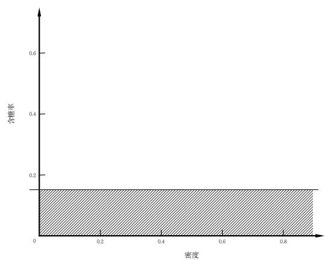  
(a)第一次划分

  
(b)第二次划分

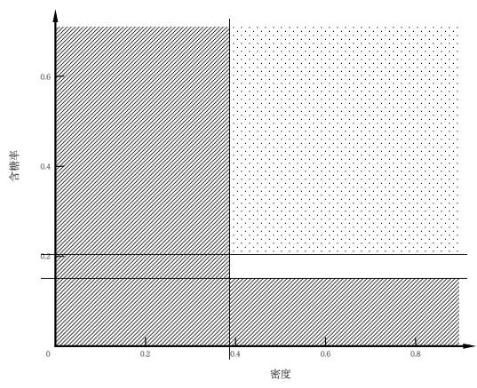  
(c)第三次划分

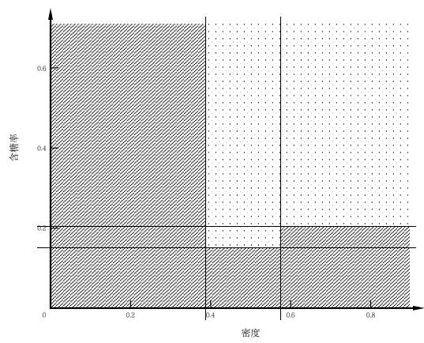  
(d)第四次划分  
图4-1图4.11中的划分边界产出过程

## 参考文献

[1] 李航.统计学习方法．清华大学出版社，2012.

## 第5章神经网络

神经网络类算法可以堪称当今最主流的一类机器学习算法，其本质上和前几章讲到的线性回归、对数几率回归、决策树等算法一样均属于机器学习算法，也是被发明用来完成分类和回归等任务。不过由于神经网络类算法在如今超强算力的加持下效果表现极其出色，且从理论角度来说神经网络层堆叠得越深其效果越好，因此也单独称用深层神经网络类算法所做的机器学习为深度学习，属于机器学习的子集。

## 5.1神经元模型

本节对神经元模型的介绍通俗易懂，在此不再赘述。本节第2 段提到“阈值”(threshold)的概念时，“西瓜书”左侧边注特意强调是“阈 $( \mathrm { y } \dot { \mathrm { u } } ) ^ { \dag }$ 而不是“阀(fá)”，这是因为该字确实很容易认错，读者注意一下即可。

图5.1 所示的M-P 神经元模型，其中的“M-P”便是两位作者McCulloch 和 Pitts 的首字母简写。

## 5.2感知机与多层网络

## 5.2.1式(5.1)和式 (5.2)的推导

此式是感知机学习算法中的参数更新公式，下面依次给出感知机模型、学习策略和学习算法的具体介$\boldsymbol { \underline { { \underline { { \ 4 } } } } \mathbf { \underline { { 7 } } } \mathbf { \underline { { 1 } } } }$ :

感知机模型：已知感知机由两层神经元组成，故感知机模型的公式可表示为

$$
y = f \left( \sum _ { i = 1 } ^ { n } w _ { i } x _ { i } - \theta \right) = f ( \mathbf { \boldsymbol { w } } ^ { \mathrm { T } } \mathbf { \boldsymbol { x } } - \theta )
$$

其中， $\pmb { x } \in \mathbb { R } ^ { n }$ ，为样本的特征向量，是感知机模型的输入； $w , \theta$ 是感知机模型的参数， $\pmb { w } \in \mathbb { R } ^ { n }$ ，为权重，θ 为阈值。假定f为阶跃函数，那么感知机模型的公式可进一步表示为（用 $\varepsilon ( \cdot )$ 代表阶跃函数)

$$
\begin{array} { r } { y = \varepsilon ( \pmb { w } ^ { \mathrm { T } } \pmb { x } - \theta ) = \left\{ \begin{array} { l l } { 1 , } & { \pmb { w } ^ { \mathrm { T } } \pmb { x } - \theta \geqslant 0 ; } \\ { 0 , } & { \pmb { w } ^ { \mathrm { T } } \pmb { x } - \theta < 0 . } \end{array} \right. } \end{array}
$$

由于n维空间中的超平面方程为

$$
w _ { 1 } x _ { 1 } + w _ { 2 } x _ { 2 } + \cdot \cdot \cdot + w _ { n } x _ { n } + b = w ^ { \mathrm { T } } x + b = 0
$$

所以此时感知机模型公式中的 ${ \pmb w } ^ { \mathrm { T } } { \pmb x } - { \pmb \theta }$ 可以看作是n 维空间中的一个超平面，将n维空间划分为 ${ \pmb w } ^ { \mathrm { T } } { \pmb x } -$ $\theta \geqslant 0$ 和 ${ \pmb w } ^ { \mathrm { T } } { \pmb x } - { \pmb \theta } < 0$ 两个子空间，落在前一个子空间的样本对应的模型输出值为1，落在后一个子空间的样本对应的模型输出值为0，如此便实现了分类功能。

感知机学习策略：给定一个数据集

$$
T = \{ ( { \pmb x } _ { 1 } , y _ { 1 } ) , ( { \pmb x } _ { 2 } , y _ { 2 } ) , \cdots , ( { \pmb x } _ { N } , y _ { N } ) \}
$$

其中 $\pmb { x } _ { i } \in \mathbb { R } ^ { n } , y _ { i } \in \{ 0 , 1 \} , i = 1 , 2 , \cdots , N$ 。如果存在某个超平面

$$
{ \pmb w } ^ { \mathrm { T } } { \pmb x } + b = 0
$$

能将数据集T中的正样本和负样本完全正确地划分到超平面两侧，即对所有 $y _ { i } = 1$ 的样本 $\mathbf { \mathcal { x } } _ { i }$ 有 ${ \pmb w } ^ { \mathrm { T } } { \pmb x } _ { i } +$ $b \geqslant 0$ ，对所有 $y _ { i } = 0$ 的样本 $\mathbf { \Delta } _ { x _ { i } }$ 有 ${ \pmb w } ^ { \mathrm { T } } { \pmb x } _ { i } + b < 0$ ，则称数据集T线性可分，否则称数据集T线性不可分。

现给定一个线性可分的数据集 $T$ ，感知机的学习目标是求得能对数据集 $T$ 中的正负样本完全正确划分的分离超平面

$$
{ \pmb w } ^ { \mathrm { T } } { \pmb x } - { \pmb \theta } = 0
$$

假设此时误分类样本集合为 $M \subseteq T$ ，对任意一个误分类样本 $( { \pmb x } , y ) \in M$ 来说，当 ${ \pmb w } ^ { \mathrm { T } } { \pmb x } - \theta \geqslant 0$ 时，模型输出值为 $\hat { y } = 1$ ，样本真实标记为 $y = 0 ; \sqrt { x } \dot { z }$ ，当 ${ \pmb w } ^ { \mathrm { T } } { \pmb x } - { \pmb \theta } < 0$ 时，模型输出值为 $\hat { y } = 0$ ，样本真实标记为 $y = 1$ 。综合两种情形可知，以下公式恒成立：

$$
\left( { \hat { y } } - y \right) \left( \pmb { w } ^ { \operatorname { T } } \pmb { x } - \theta \right) \geqslant 0
$$

所以，给定数据集T，其损失函数可以定义为

$$
L ( \pmb { w } , \theta ) = \sum _ { \pmb { x } \in M } ( \hat { \boldsymbol y } - \boldsymbol y ) \left( \pmb { w } ^ { \mathrm { T } } \pmb { x } - \theta \right)
$$

显然，此损失函数是非负的。如果没有误分类点，则损失函数值为0。而且，误分类点越少，误分类点离超平面越近（超平面相关知识参见本书 6.1.2 节），损失函数值就越小。因此，给定数据集T，损失函数$L ( w , \theta )$ 是关于 $w , \theta$ 的连续可导函数。

感知机学习算法：感知机模型的学习问题可以转化为求解损失函数的最优化问题，具体地，给定数据集

$$
T = \{ ( { \pmb x } _ { 1 } , y _ { 1 } ) , ( { \pmb x } _ { 2 } , y _ { 2 } ) , \cdots , ( { \pmb x } _ { N } , y _ { N } ) \}
$$

其中 $\pmb { x } _ { i } \in \mathbb { R } ^ { n } , y _ { i } \in \{ 0 , 1 \}$ ，求参数ω，θ，使其为极小化损失函数的解：

$$
\operatorname* { m i n } _ { \pmb { w } , \pmb { \theta } } L ( \pmb { w } , \pmb { \theta } ) = \operatorname* { m i n } _ { \pmb { w } , \pmb { \theta } } \sum _ { \pmb { x } _ { i } \in M } ( \hat { y } _ { i } - y _ { i } ) ( \pmb { w } ^ { \mathrm { T } } \pmb { x } _ { i } - \pmb { \theta } )
$$

其中 $M \subseteq T$ 为误分类样本集合。若将阈值θ 看作一个固定输入为－1的“哑节点”，即

$$
- \theta = - 1 \cdot w _ { n + 1 } = x _ { n + 1 } \cdot w _ { n + 1 }
$$

那么 ${ \pmb w } ^ { \mathrm { T } } { \pmb x } _ { i } - { \pmb \theta }$ 可化简为

$$
\begin{array} { c l } { \displaystyle w ^ { \mathrm { T } } x _ { i } - \theta = \sum _ { j = 1 } ^ { n } w _ { j } x _ { j } + x _ { n + 1 } \cdot w _ { n + 1 } } \\ { \displaystyle } \\ { = \sum _ { j = 1 } ^ { n + 1 } w _ { j } x _ { j } } \\ { \displaystyle } \\ { = w ^ { \mathrm { T } } x _ { i } } \end{array}
$$

其中 $\pmb { x } _ { i } \in \mathbb { R } ^ { n + 1 } , \pmb { w } \in \mathbb { R } ^ { n + 1 }$ 。根据该公式，可将要求解的极小化问题进一步简化为

$$
\operatorname* { m i n } _ { \boldsymbol { w } } L ( \boldsymbol { w } ) = \operatorname* { m i n } _ { \boldsymbol { w } } \sum _ { \boldsymbol { x } _ { i } \in \boldsymbol { M } } ( \hat { y } _ { i } - y _ { i } ) \boldsymbol { w } ^ { \mathrm { T } } \boldsymbol { x } _ { i }
$$

假设误分类样本集合M固定，那么可以求得损失函数L(w）的梯度

$$
\nabla _ { w } L ( w ) = \sum _ { x _ { i } \in M } ( \hat { y } _ { i } - y _ { i } ) \pmb { x } _ { i }
$$

感知机的学习算法具体采用的是随机梯度下降法，即在极小化过程中，不是一次使Μ 中所有误分类点的梯度下降，而是一次随机选取一个误分类点并使其梯度下降。所以权重ω的更新公式为

$$
\pmb { w } \gets \pmb { w } + \Delta \pmb { w }
$$

$$
\Delta { \mathbf { } w } = - \eta ( \hat { y } _ { i } - y _ { i } ) { \mathbf { } x } _ { i } = \eta ( y _ { i } - \hat { y } _ { i } ) { \mathbf { } x } _ { i }
$$

相应地，w中的某个分量 $w _ { i }$ 的更新公式即式 (5.2)。

实践中常用的求解方法是先随机初始化一个模型权重 ${ \pmb w } _ { 0 }$ ，此时将训练集中的样本一一代入模型便可确定误分类点集合M，然后从M中随机抽选取一个误分类点计算得到 $\Delta w$ ，接着按照上述权重更新公式计算得到新的权重 $\pmb { w } _ { 1 } = \pmb { w } _ { 0 } + \Delta \pmb { w }$ ，并重新确定误分类点集合，如此迭代直至误分类点集合为空，即训练样本中的样本均完全正确分类。显然，随机初始化的 $\pmb { w } _ { 0 }$ 不同，每次选取的误分类点不同，最后都有可能导致求解出的模型不同，因此感知模型的解不唯一。

## 5.2.2图5.5的解释

图 5.5 中(0,0),(0, 1),(1,0),(1, 1) 这4 个样本点实现“异或”计算的过程如下:

$$
( x _ { 1 } , x _ { 2 } )  h _ { 1 } = \varepsilon ( x _ { 1 } - x _ { 2 } - 0 . 5 ) , h _ { 2 } = \varepsilon ( x _ { 2 } - x _ { 1 } - 0 . 5 )  y = \varepsilon ( h _ { 1 } + h _ { 2 } - 0 . 5 )
$$

以(0,1)为例，首先求得 $h _ { 1 } = \varepsilon ( 0 - 1 - 0 . 5 ) = 0 , h _ { 2 } = \varepsilon ( 1 - 0 - 0 . 5 ) = 1$ ，然后求得 $y = \varepsilon ( 0 + 1 - 0 . 5 ) = 1$

## 5.3误差逆传播算法

## 5.3.1式 (5.10)的推导

参见式 (5.12)的推导

## 5.3.2式(5.12)的推导

因为

又

$$
\Delta \theta _ { j } = - \eta \frac { \partial E _ { k } } { \partial \theta _ { j } }
$$

$$
\begin{array} { r l } { \frac { \partial W _ { k } } { \partial x _ { k } } } & { = \frac { \partial W _ { k } } { \partial x _ { k } } , \frac { \partial W _ { k } } { \partial y _ { k } } , } \\ { \frac { \partial W _ { k } } { \partial x _ { k } } } & { = \frac { \partial W _ { k } } { \partial x _ { k } } , } \\ & { = - \frac { \partial W _ { k } } { \partial x _ { k } } , \frac { \partial W _ { k } } { \partial y _ { k } } , } \\ & { = \frac { \partial W _ { k } } { \partial x _ { k } } , } \\ & { = \frac { \partial W _ { k } } { \partial x _ { k } } , } \\ & { = \frac { \partial W _ { k } } { \partial x _ { k } } , } \\ & { = \frac { \partial W _ { k } } { \partial x _ { k } } , } \\ & { = \frac { \partial W _ { k } } { \partial x _ { k } } , } \\ & { = \frac { \partial W _ { k } } { \partial x _ { k } } , } \\ & { = \frac { \partial W _ { k } } { \partial x _ { k } } , } \\ & { = \frac { \partial W _ { k } } { \partial x _ { k } } , } \\ & { = \frac { \partial W _ { k } } { \partial x _ { k } } , } \\ & { = \frac { \partial W _ { k } } { \partial x _ { k } } , } \end{array}
$$

所以

$$
\Delta \theta _ { j } = - \eta \frac { \partial E _ { k } } { \partial \theta _ { j } } = - \eta g _ { j }
$$

## 5.3.3式(5.13)的推导

因为

$$
\Delta v _ { i h } = - \eta \frac { \partial E _ { k } } { \partial v _ { i h } }
$$

又

$$
\begin{array} { r l } { \frac { \partial V _ { \mathrm { s } } } { \partial t _ { \mathrm { i n } } } } & { = \displaystyle { \frac { 1 } { 2 } } \frac { \partial V _ { \mathrm { s } } } { \partial t _ { \mathrm { i n } } } \frac { \partial \phi _ { \mathrm { i n } } } { \partial t _ { \mathrm { i n } } } \frac { \partial \phi _ { \mathrm { i n } } } { \partial t _ { \mathrm { i n } } } \frac { \partial \phi _ { \mathrm { i n } } } { \partial t _ { \mathrm { i n } } } , \frac { \partial \phi _ { \mathrm { i n } } } { \partial t _ { \mathrm { i n } } } \frac { \partial \phi _ { \mathrm { i n } } } { \partial t _ { \mathrm { i n } } } } \\ { \frac { \partial V _ { \mathrm { s } } } { \partial t _ { \mathrm { i n } } } } & { = \displaystyle { \frac { 1 } { 2 } } \frac { \partial V _ { \mathrm { s } } } { \partial t _ { \mathrm { i n } } } \frac { \partial \phi _ { \mathrm { i n } } } { \partial t _ { \mathrm { i n } } } \frac { \partial \phi _ { \mathrm { i n } } } { \partial t _ { \mathrm { i n } } } , \frac { \partial \phi _ { \mathrm { i n } } } { \partial t _ { \mathrm { i n } } } , \frac { \partial \phi _ { \mathrm { i n } } } { \partial t _ { \mathrm { i n } } } } \\ & { - \displaystyle { \frac { 1 } { 2 } } \frac { \partial V _ { \mathrm { s } } } { \partial t _ { \mathrm { i n } } } \frac { \partial \phi _ { \mathrm { i n } } } { \partial t _ { \mathrm { i n } } } \frac { \partial \phi _ { \mathrm { i n } } } { \partial t _ { \mathrm { i n } } } , \frac { \partial \phi _ { \mathrm { i n } } } { \partial t _ { \mathrm { i n } } } , \frac { \partial \phi _ { \mathrm { i n } } } { \partial t _ { \mathrm { i n } } } , } \\ &  - \displaystyle { \frac { 1 } { 2 } } \frac { \partial V _ { \mathrm { s } } } { \partial t _ { \mathrm { i n } } } \frac { \partial \phi _ { \mathrm { i n } } }  \partial t _  \mathrm  i n \end{array}
$$

所以

$$
\Delta v _ { i h } = - \eta \frac { \partial E _ { k } } { \partial v _ { i h } } = \eta e _ { h } x _ { i }
$$

## 5.3.4式 (5.14)的推导

因为

又

$$
\Delta \gamma _ { h } = - \eta \frac { \partial E _ { k } } { \partial \gamma _ { h } }
$$

$$
\begin{array} { r l } & { \frac { \partial E _ { k } } { \partial \gamma _ { k } } = \frac { \dot { \zeta } } { \gamma _ { k } } \frac { \partial E _ { k } } { \partial \dot { \xi } } , \frac { \partial \dot { \xi } _ { k } } { \partial \dot { \phi } _ { \ j } } \frac { \partial \dot { \phi } _ { \ j } } { \partial \dot { \phi } _ { \ j } } \frac { \partial \dot { \phi } _ { k } } { \partial \dot { \phi } _ { \ k } } , \frac { \partial \dot { \phi } _ { k } } { \partial \dot { \phi } _ { \ l } } } \\ & { \quad = \frac { \dot { \zeta } } { \gamma _ { k } } \frac { \partial E _ { k } } { \partial \dot { \phi } _ { \ j } } \frac { \partial \dot { \phi } _ { \ j } } { \partial \dot { \phi } _ { \ j } } \frac { \partial \dot { \phi } _ { \ k } } { \partial \dot { \phi } _ { \ k } } , \frac { \partial \dot { \phi } _ { \ j } } { \partial \dot { \phi } _ { \ k } } , \frac { \partial \dot { \phi } _ { \ k } } { \partial \dot { \phi } _ { \ l } } } \\ & { \quad = - \frac { \dot { \zeta } } { \gamma _ { k } } \frac { \partial E _ { k } } { \partial \dot { \phi } _ { \ j } ^ { 2 } } \frac { \partial \dot { \phi } _ { \ l } ^ { 2 } } { \partial \dot { \phi } _ { \ l } ^ { 2 } } , w _ { \lambda \xi } \dot { \zeta } ^ { \prime } ^ { \prime } ( { \bf z } _ { k } - { \bf \nabla } \psi _ { \bf \xi } ) } \\ &  \quad = - \frac { \dot { \zeta } } { \gamma _ { k } } \frac { \partial E _ { k } } { \partial \dot { \phi } _ { \ j } ^ { 2 } } \frac { \partial \dot { \phi } _ { \bf k } ^ { 2 } } { \partial \dot { \phi } _ { \bf k } ^ { 2 } } , w _ { \lambda \xi } \dot { \zeta } ^ { \prime } ( { \bf z } _ { k } - { \bf \nabla } \psi _  \bf  \end{array}
$$

所以

$$
\Delta \gamma _ { h } = - \eta \frac { \partial E _ { k } } { \partial \gamma _ { h } } = - \eta e _ { h }
$$

## 5.3.5式(5.15)的推导

参见式 (5.13)的推导

## 5.4•全局最小与局部极小

由图 5.10 可以直观理解局部极小和全局最小的概念，其余概念如模拟退火、遗传算法、启发式等，则需要查阅专业资料系统化学习。

## 5.5其他常见神经网络

本节所提到的神经网络其实如今已不太常见，更为常见的神经网络是下一节深度学习里提到的卷积神经网络、循环神经网络等。

## 5.5.1式(5.18)的解释

从式(5.18）可以看出，对于样本a来说，RBF网络的输出为q个 $\rho ( \pmb { x } , \pmb { c } _ { i } )$ 的线性组合。若换个角度来看这个问题，将q个 $\rho ( \pmb { x } , \pmb { c } _ { i } )$ 当作是将d维向量x基于式(5.19）进行特征转换后所得的q维特征，即 $\tilde { \pmb { x } } = ( \rho ( \pmb { x } , \pmb { c } _ { 1 } ) ; \rho ( \pmb { x } , \pmb { c } _ { 2 } ) ; . . . ; \rho ( \pmb { x } , \pmb { c } _ { q } ) )$ ，则式(5.18）求线性加权系数 $w _ { i }$ 相当于求解第3.2节的线性回归$f ( \tilde { \pmb { x } } ) = \pmb { w } ^ { \mathrm { T } } \tilde { \pmb { x } } + b$ ，对于仅有的差别 b 来说，当然可以在式（5.18）中补加一个b。因此，RBF网络在确定q个神经元中心 $c _ { i }$ 之后，接下来要做的就是线性回归。

## 5.5.2式(5.20)的解释

Boltzmann 机（Restricted Boltzmann Machine，简称 RBM）本质上是一个引入了隐变量的无向图模型，其能量可理解为

$$
E _ { \mathrm { g r a p h } } = E _ { \mathrm { e d g e s } } + E _ { \mathrm { n o d e s } }
$$

其中， $E _ { \mathrm { g r a p h } }$ 表示图的能量， $E _ { \mathrm { e d g e s } }$ 表示图中边的能量， $E _ { \mathrm { n o d e s } }$ 表示图中结点的能量。边能量由两连接结点的值及其权重的乘积确定，即 $E _ { \mathrm { e d g e } _ { i j } } ~ = ~ - w _ { i j } s _ { i } s _ { j }$ ；结点能量由结点的值及其阈值的乘积确定，即$E _ { \mathrm { n o d e } _ { i } } = - \theta _ { i } s _ { i }$ 。图中边的能量为所有边能量之和为

$$
E _ { \mathrm { e d g e s } } = \sum _ { i = 1 } ^ { n - 1 } \sum _ { j = i + 1 } ^ { n } E _ { \mathrm { e d g e } _ { i j } } = - \sum _ { i = 1 } ^ { n - 1 } \sum _ { j = i + 1 } ^ { n } w _ { i j } s _ { i } s _ { j }
$$

图中结点的能量为所有结点能量之和

$$
E _ { \mathrm { n o d e s } } = \sum _ { i = 1 } ^ { n } E _ { \mathrm { n o d e } _ { i } } = - \sum _ { i = 1 } ^ { n } \theta _ { i } s _ { i }
$$

故状态向量s所对应的 Boltzmann 机能量

$$
E _ { \mathrm { g r a p h } } = E _ { \mathrm { e d g e s } } + E _ { \mathrm { n o d e s } } = - \sum _ { i = 1 } ^ { n - 1 } \sum _ { j = i + 1 } ^ { n } w _ { i j } s _ { i } s _ { j } - \sum _ { i = 1 } ^ { n } \theta _ { i } s _ { i }
$$

## 5.5.3式(5.22)的解释

受限 Boltzmann 机仅保留显层与隐层之间的连接。显层状态向量 $\pmb { v } = ( v _ { 1 } ; v _ { 2 } ; . . . ; v _ { d } )$ ，隐层状态向量$\pmb { h } = ( h _ { 1 } ; h _ { 2 } ; . . . ; h _ { q } )$ 。显层状态向量υ中的变量 $v _ { i }$ 仅与隐层状态向量h有关，所以给定隐层状态向量h，有 $v _ { 1 } , v _ { 2 } , . . . , v _ { d }$ 相互独立。

## 5.5.4式(5.23)的解释

由式 (5.22)的解释同理可得，给定显层状态向量υ，有 $h _ { 1 } , h _ { 2 } , . . . , h _ { q }$ 相互独立。

## 5.6深度学习

“西瓜书”在本节并未对如今深度学习领域的诸多经典神经网络作展开介绍，而是从更宏观的角度详细解释了应该如何理解深度学习。因此，本书也顺着“西瓜书”的思路对深度学习相关概念作进一步说明，对深度学习的经典神经网络感兴趣的读者可查阅其他相关书籍进行系统性学习。

## 5.6.1什么是深度学习

深度学习就是很深层的神经网络，而神经网络属于机器学习算法的范畴，因此深度学习是机器学习的子集。

## 5.6.2深度学习的起源

深度学习中的经典神经网络以及用于训练神经网络的 BP 算法其实在很早就已经被提出，例如卷积神经网络⁹³是在1989 提出，BP算法⁹是在1986年提出，但是在当时的计算机算力水平下，其他非神经网络类算法（例如当时红极一时的支持向量机算法）的效果优于神经网络类算法，因此神经网络类算法进入瓶颈期。随着计算机算力的不断提升，以及 2012 年 Hinton 和他的学生提出了AlexNet 并在 ImageNet评测中以明显优于第二名的成绩夺冠后，引起了学术界和工业界的广泛关注，紧接着三位深度学习之父LeCun、Bengio 和 Hinton 在 2015 年正式提出深度学习的概念，自此深度学习开始成为机器学习的主流研究方向。

## 5.6.3怎么理解特征学习

举例来说，用非深度学习算法做西瓜分类时，首先需要人工设计西瓜的各个特征，比如根蒂、色泽等，然后将其表示为数学向量，这些过程统称为“特征工程”，完成特征工程后用算法分类即可，其分类效果很大程度上取决于特征工程做得是否够好。而对于深度学习算法来说，只需将西瓜的图片表示为数学向量输入，输出层设置为想要的分类结果即可（例如二分类通常设置为对数几率回归），之前的“特征工程”交由神经网络来自动完成，即让神经网络进行“特征学习”，通过在输出层约束分类结果，神经网络会自动从西瓜的图片上提取出有助于西瓜分类的特征。

因此，如果分别用对数几率回归和卷积神经网络来做西瓜分类，其算法运行流程分别是“人工特征工程→对数几率回归分类”和“卷积神经网络特征学习→对数几率回归分类”。

## 参考文献

[1] 李航.统计学习方法.清华大学出版社，2012.

[2] Yann LeCun, Bernhard Boser, John S Denker, Donnie Henderson, Richard E Howard, Wayne Hubbard, and Lawrence D Jackel. Backpropagation applied to handwritten zip code recognition. Neural computation, 1(4):541–551, 1989.

[3] David E Rumelhart, Geoffrey E Hinton, and Ronald J Williams. Learning representations by backpropagating errors. nature, 323(6088):533–536, 1986.

## 第6章•支持向量机

在深度学习流行之前，支持向量机及其核方法一直是机器学习领域中的主流算法，尤其是核方法至今都仍有相关学者在持续研究。

## 6.1间隔与支持向量

## 6.1.1图6.1的解释

回顾第 5 章 5.2 节的感知机模型可知，图 6.1 中的黑色直线均可作为感知机模型的解，因为感知机模型求解的是能将正负样本完全正确划分的超平面，因此解不唯一。而支持向量机想要求解的则是离正负样本都尽可能远且刚好位于“正中间”的划分超平面，因为这样的超平面理论上泛化性能更好。

## 6.1.2式(6.1)的解释

n维空间的超平面定义为 ${ \pmb w } ^ { \mathrm { T } } { \pmb x } + b = 0$ ，其中 ${ \pmb w } , { \pmb x } \in \mathbb { R } ^ { n } , \ { \pmb w } = ( w _ { 1 } ; w _ { 2 } ; . . . ; w _ { n } )$ 称为法向量，b 称为位移项。超平面具有以下性质：

(1）法向量w和位移项b确定一个唯一超平面；

(2）超平面方程不唯一，因为当等倍缩放w和b时（假设缩放倍数为α），所得的新超平面方程$\alpha { \pmb w } ^ { \mathrm { T } } { \pmb x } + \alpha { \pmb b } = 0$ 和 ${ \pmb w } ^ { \mathrm { T } } { \pmb x } + b = 0$ 的解完全相同，因此超平面不变，仅超平面方程有变；

(3)法向量w垂直于超平面；

(4)超平面将 n 维空间切割为两半，其中法向量ω指向的那一半空间称为正空间，另一半称为负空间，正空间中的点 ${ \pmb x } ^ { + }$ 代入进方程 ${ \pmb w } ^ { \mathrm { T } } { \pmb x } ^ { + } + b$ 其计算结果大于0，反之负空间中的点代入进方程其计算结果小于0；

(5)n维空间中的任意点 x到超平面的距离公式为 $\begin{array} { r } { r = \frac { \left| \pmb { w } ^ { \mathrm { T } } \pmb { x } + b \right| } { \left\| \pmb { w } \right\| } } \end{array}$ ，其中 $\| \pmb { w } \|$ 表示向量w 的模。

## 6.1.3式(6.2)的推导

对于任意一点 $\pmb { x } _ { 0 } = ( x _ { 1 } ^ { 0 } ; x _ { 2 } ^ { 0 } ; . . . ; x _ { n } ^ { 0 } )$ ，设其在超平面 ${ \pmb w } ^ { \mathrm { T } } { \pmb x } + b = 0$ 上的投影点为 $\pmb { x } _ { 1 } = ( x _ { 1 } ^ { 1 } ; x _ { 2 } ^ { 1 } ; . . . ; x _ { n } ^ { 1 } )$ 则 ${ \pmb w } ^ { \mathrm { T } } { \pmb x } _ { 1 } + b = 0$ 。根据超平面的性质(3）可知，此时向量 $\overrightarrow { \mathbfit { x } _ { 1 } \mathbfit { x } _ { 0 } }$ 与法向量ω平行，因此

$$
| { \pmb w } \cdot \overline { { { \pmb x } _ { 1 } { \pmb x } _ { 0 } ^ { \flat } } } | = | \| { \pmb w } \| \cdot \cos \pi \cdot \| \overline { { { \pmb x } _ { 1 } { \pmb x } _ { 0 } ^ { \flat } } } \| | = \| { \pmb w } \| \cdot \| \overline { { { \pmb x } _ { 1 } { \pmb x } _ { 0 } ^ { \flat } } } \| = \| { \pmb w } \| \cdot r
$$

又

$$
\begin{array} { r l } & { w \cdot \overrightarrow { \mathbfit { x } } _ { 1 } \overrightarrow { \mathbfit { x } } _ { 0 } ^ { \rangle } = w _ { 1 } ( x _ { 1 } ^ { 0 } - x _ { 1 } ^ { 1 } ) + w _ { 2 } ( x _ { 2 } ^ { 0 } - x _ { 2 } ^ { 1 } ) + \dotsc + w _ { n } ( x _ { n } ^ { 0 } - x _ { n } ^ { 1 } ) } \\ & { \qquad = w _ { 1 } x _ { 1 } ^ { 0 } + w _ { 2 } x _ { 2 } ^ { 0 } + \dotsc + w _ { n } x _ { n } ^ { 0 } - ( w _ { 1 } x _ { 1 } ^ { 1 } + w _ { 2 } x _ { 2 } ^ { 1 } + \dotsc + w _ { n } x _ { n } ^ { 1 } ) } \\ & { \qquad = w ^ { \mathbf { T } } \mathbfit { x } _ { 0 } - w ^ { \mathbf { T } } \mathbfit { x } _ { 1 } } \\ & { \qquad = w ^ { \mathbf { T } } \mathbfit { x } _ { 0 } + b } \end{array}
$$

所以

$$
| \pmb { w } ^ { \mathrm { T } } \pmb { x } _ { 0 } + b | = \| \pmb { w } \| \cdot r
$$

$$
r = \frac { \left| \pmb { w } ^ { \mathrm { T } } \pmb { x } + b \right| } { \left\| \pmb { w } \right\| }
$$

## 6.1.4式(6.3)的推导

支持向量机所要求的超平面需要满足三个条件，第一个是能正确划分正负样本，第二个是要位于正负样本正中间，第三个是离正负样本都尽可能远。式(6.3）仅满足前两个条件，第三个条件由式(6.5)来满足，因此下面仅基于前两个条件来进行推导。

对于第一个条件，当超平面满足该条件时，根据超平面的性质(4）可知，若 $y _ { i } = + 1$ 的正样本被划分到正空间（当然也可以将其划分到负空间）， $y _ { i } = - 1$ 的负样本被划分到负空间，以下不等式成立

$$
\left\{ \begin{array} { l l } { { \pmb w } ^ { \mathrm { T } } { \pmb x } _ { i } + b \geqslant 0 , } & { y _ { i } = + 1 } \\ { { \pmb w } ^ { \mathrm { T } } { \pmb x } _ { i } + b \leqslant 0 , } & { y _ { i } = - 1 } \end{array} \right.
$$

对于第二个条件，首先设离超平面最近的正样本为 $\pmb { x } _ { * } ^ { + }$ ，离超平面最近的负样本为 $\pmb { x } _ { * } ^ { - }$ ，由于这两样本是离超平面最近的点，所以其他样本到超平面的距离均大于等于它们，即

$$
\left\{ \begin{array} { l l } { \frac { \left| \pmb { w } ^ { \mathrm { T } } \pmb { x } _ { i } + b \right| } { \| \pmb { w } \| } \geqslant \frac { \left| \pmb { w } ^ { \mathrm { T } } \pmb { x } _ { \ast } ^ { + } + b \right| } { \| \pmb { w } \| } , } & { y _ { i } = + 1 } \\ { \frac { \left| \pmb { w } ^ { \mathrm { T } } \pmb { x } _ { i } + b \right| } { \| \pmb { w } \| } \geqslant \frac { \left| \pmb { w } ^ { \mathrm { T } } \pmb { x } _ { \ast } ^ { - } + b \right| } { \| \pmb { w } \| } , } & { y _ { i } = - 1 } \end{array} \right.
$$

结合第一个条件中推导出的不等式，可将上式中的绝对值符号去掉并推得

$$
\left\{ \begin{array} { l l } { \frac { w ^ { \mathrm { T } } x _ { i } + b } { \vert \vert w \vert \vert } \geqslant \frac { w ^ { \mathrm { T } } x _ { * } ^ { + } + b } { \vert \vert w \vert \vert } , } & { y _ { i } = + 1 } \\ { \frac { w ^ { \mathrm { T } } x _ { i } + b } { \vert \vert w \vert \vert } \leqslant \frac { w ^ { \mathrm { T } } x _ { * } ^ { - } + b } { \vert \vert w \vert \vert } , } & { y _ { i } = - 1 } \end{array} \right.
$$

基于此再考虑第二个条件，“位于正负样本正中间”等价于要求超平面到 ${ \pmb x } _ { * } ^ { + }$ 和 $\pmb { x } _ { * } ^ { - }$ 这两点的距离相等，即

$$
\frac { \left| \pmb { w } ^ { \mathrm { T } } \pmb { x } _ { * } ^ { + } + b \right| } { \| \pmb { w } \| } = \frac { \left| \pmb { w } ^ { \mathrm { T } } \pmb { x } _ { * } ^ { - } + b \right| } { \| \pmb { w } \| }
$$

综上，支持向量机所要求的超平面所需要满足的条件如下

$$
\begin{array} { r } { \left\{ \begin{array} { l l } { \frac { w ^ { \mathrm { T } } x _ { i } + b } { \vert \vert w \vert \vert } \geqslant \frac { w ^ { \mathrm { T } } x _ { * } ^ { + } + b } { \vert \vert w \vert \vert } , } & { y _ { i } = + 1 } \\ { \frac { w ^ { \mathrm { T } } x _ { i } + b } { \vert \vert w \vert \vert } \leqslant \frac { w ^ { \mathrm { T } } x _ { * } ^ { - } + b } { \vert \vert w \vert \vert } , } & { y _ { i } = - 1 } \\ { \frac { \vert w ^ { \mathrm { T } } x _ { * } ^ { + } + b \vert } { \vert \vert w \vert \vert } = \frac { \vert w ^ { \mathrm { T } } x _ { * } ^ { - } + b \vert } { \vert \vert w \vert \vert } } & \end{array} \right. } \end{array}
$$

但是根据超平面的性质（2）可知，当等倍缩放法向量ω和位移项b 时，超平面不变，且上式也恒成立，因此会导致所求的超平面的参数ω 和b 有无穷多解。因此为了保证每个超平面的参数只有唯一解，不妨再额外施加一些约束，例如约束 ${ \pmb x } _ { * } ^ { + }$ 和 $\pmb { x } _ { * } ^ { - }$ 代入进超平面方程后的绝对值为1，也就是令 ${ \pmb w } ^ { \mathrm { T } } { \pmb x } _ { \ast } ^ { + } + b =$ 1, $\pmb { w } ^ { \mathrm { T } } \pmb { x } _ { * } ^ { - } + b = - 1$ 。此时支持向量机所要求的超平面所需要满足的条件变为

$$
\left\{ \begin{array} { l l } { \frac { w ^ { \mathrm { T } } x _ { i } + b } { \| w \| } \geqslant \frac { + 1 } { \| w \| } , } & { y _ { i } = + 1 } \\ { \frac { w ^ { \mathrm { T } } x _ { i } + b } { \| w \| } \leqslant \frac { - 1 } { \| w \| } , } & { y _ { i } = - 1 } \end{array} \right.
$$

由于 $\| \pmb { w } \|$ 恒大于0，因此上式可进一步化简为

$$
\left\{ \begin{array} { l l } { { \pmb w } ^ { \mathrm { T } } { \pmb x } _ { i } + b \geqslant + 1 , } & { y _ { i } = + 1 } \\ { { \pmb w } ^ { \mathrm { T } } { \pmb x } _ { i } + b \leqslant - 1 , } & { y _ { i } = - 1 } \end{array} \right.
$$

## 6.1.5式(6.4)的推导

根据式(6.3)的推导可知， ${ \pmb x } _ { * } ^ { + }$ 和 $\pmb { x } _ { * } ^ { - }$ 便是“支持向量”，因此支持向量到超平面的距离已经被约束为$\frac { 1 } { \| \pmb { w } \| }$ ，所以两个异类支持向量到超平面的距离之和为 $\frac { 2 } { \| \pmb { w } \| }$ 。

## 6.1.6式(6.5)的解释

式(6.5）是通过“最大化间隔”来保证超平面离正负样本都尽可能远，且该超平面有且仅有一个，因此可以解出唯一解。

## 6.2对偶问题

## 6.2.1凸优化问题

考虑一般地约束优化问题

$$
\begin{array} { l l } { \operatorname* { m i n } } & { f ( { \pmb x } ) } \\ { \mathrm { s . t . } } & { g _ { i } ( { \pmb x } ) \leqslant 0 , \quad i = 1 , 2 , . . . , m } \\ & { h _ { j } ( { \pmb x } ) = 0 , \quad j = 1 , 2 , . . . , n } \end{array}
$$

若目标函数 $f ( { \pmb x } )$ 是凸函数，不等式约束 $g _ { i } ( { \pmb x } )$ 是凸函数，等式约束 $h _ { j } ( \pmb { x } )$ 是仿射函数，则称该优化问题为凸优化问题。

由于 $\scriptstyle { \frac { 1 } { 2 } } \parallel \mathbf { w } \parallel ^ { 2 }$ 和 $1 - y _ { i } \left( \pmb { w } ^ { \mathrm { T } } \pmb { x } _ { i } + b \right)$ 均是关于ω和b的凸函数，所以式(6.6）是凸优化问题。凸优化问题是最优化里比较易解的一类优化问题，因为其拥有诸多良好的数学性质和现成的数学工具，因此如果非凸优化问题能等价转化为凸优化问题，其求解难度通常也会减小。

## 6.2.2KKT条件

考虑一般的约束优化问题

$$
\begin{array} { l l } { \operatorname* { m i n } } & { f ( { \pmb x } ) } \\ { \mathrm { s . t . } } & { g _ { i } ( { \pmb x } ) \leqslant 0 , \quad i = 1 , 2 , . . . , m } \\ & { h _ { j } ( { \pmb x } ) = 0 , \quad j = 1 , 2 , . . . , n } \end{array}
$$

若 $f ( { \pmb x } ) , g _ { i } ( { \pmb x } ) , h _ { j } ( { \pmb x } )$ 的一阶偏导连续， $\pmb { x } ^ { * }$ 是优化问题的局部解， $\pmb { \mu } = ( \mu _ { 1 } ; \mu _ { 2 } ; . . . ; \mu _ { m } ) , \pmb { \lambda } = ( \lambda _ { 1 } ; \lambda _ { 2 } ; . . . ; \lambda _ { n } )$ 为拉格朗日乘子向量， $\begin{array} { r } { L ( { \pmb x } , { \pmb \mu } , { \pmb \lambda } ) = f ( { \pmb x } ) + \sum _ { i = 1 } ^ { m } \mu _ { i } g _ { i } ( { \pmb x } ) + \sum _ { i = 1 } ^ { n } \lambda _ { j } h _ { j } ( { \pmb x } ) } \end{array}$ 为拉格朗日函数，且该优化问题满足任何一个特定的约束限制条件，则一定存在 $\pmb { \mu } ^ { * } = ( \mu _ { 1 } ^ { * } ; \mu _ { 2 } ^ { * } ; . . . ; \mu _ { m } ^ { * } ) , \pmb { \lambda } ^ { * } = ( \lambda _ { 1 } ^ { * } ; \lambda _ { 2 } ^ { * } ; . . . ; \lambda _ { n } ^ { * } )$ ，使得：

$$
\begin{array} { r } { \nabla _ { \boldsymbol { x } } L ( \boldsymbol { x } ^ { * } , \mu ^ { * } , \boldsymbol { \lambda } ^ { * } ) = \nabla f ( \boldsymbol { x } ^ { * } ) + \sum _ { i = 1 } ^ { m } \mu _ { i } ^ { * } \nabla g _ { i } ( \boldsymbol { x } ^ { * } ) + \sum _ { i = 1 } ^ { n } \lambda _ { j } ^ { * } \nabla h _ { j } ( \boldsymbol { x } ^ { * } ) = 0 ; } \end{array}
$$

(2) $h _ { j } ( { \pmb x } ^ { * } ) = 0 , \quad j = 1 , 2 , . . . , n ;$

(3) $g _ { i } ( { \pmb x } ^ { * } ) \leqslant 0 , \quad i = 1 , 2 , . . . , m ;$

(4) $\mu _ { i } ^ { * } \geqslant 0 , \quad i = 1 , 2 , . . . , m ;$

(5) $\mu _ { i } ^ { * } g _ { i } ( { \pmb x } ^ { * } ) = 0 , \quad i = 1 , 2 , . . . , m _ { \circ }$

以上5 条便是 Karush-Kuhn-Tucker Conditions（简称 KKT 条件)。KKT 条件是局部解的必要条件，也就是说只要该优化问题满足任何一个特定的约束限制条件，局部解就一定会满足以上5 个条件。常用的约束限制条件可查阅维基百科“Karush-Kuhn-TuckerConditions”词条以及查阅参考文献[1]的第 4.2.2节，若对KKT 条件的数学证明感兴趣可查阅参考文献[1]的第 4.2.1 节。

## 6.2.3拉格朗日对偶函数

考虑一般地约束优化问题

$$
\begin{array} { l l } { \operatorname* { m i n } } & { f ( { \pmb x } ) } \\ { \mathrm { s . t . } } & { g _ { i } ( { \pmb x } ) \leqslant 0 , \quad i = 1 , 2 , . . . , m } \\ & { h _ { j } ( { \pmb x } ) = 0 , \quad j = 1 , 2 , . . . , n } \end{array}
$$

设上述优化问题的定义域为 ${ \cal D } = \mathrm { d o m } f \cap \bigcap _ { i = 1 } ^ { m } \mathrm { d o m } g _ { i } \cap \bigcap _ { j = 1 } ^ { n } \mathrm { d o m } h _ { j }$ ，可行集为 $\tilde { D } = \{ { \pmb x } | { \pmb x } \in D , g _ { i } ( { \pmb x } ) \ll$ $0 , h _ { j } ( { \pmb x } ) = 0 \}$ （显然 $\tilde { D }$ 是D的子集），最优值为 $p ^ { * } = \operatorname* { m i n } \{ f ( \tilde { { \boldsymbol { x } } } ) \} , \tilde { { \boldsymbol { x } } } \in \tilde { D }$ 。上述优化问题的拉格朗日函数定义为

$$
L ( { \pmb x } , { \pmb \mu } , { \pmb \lambda } ) = f ( { \pmb x } ) + \sum _ { i = 1 } ^ { m } \mu _ { i } g _ { i } ( { \pmb x } ) + \sum _ { j = 1 } ^ { n } \lambda _ { j } h _ { j } ( { \pmb x } )
$$

其中 $\pmb { \mu } = ( \mu _ { 1 } ; \mu _ { 2 } ; . . . ; \mu _ { m } ) , \pmb { \lambda } = ( \lambda _ { 1 } ; \lambda _ { 2 } ; . . . ; \lambda _ { n } )$ 为拉格朗日乘子向量。相应地拉格朗日对偶函数 $\Gamma ( \pmb { \mu } , \pmb { \lambda } )$ （简称对偶函数）定义为 $L ( x , \mu , \lambda )$ 关于a的下确界，即

$$
\Gamma ( \mu , \lambda ) = \operatorname* { i n f } _ { x \in D } L ( x , \mu , \lambda ) = \operatorname* { i n f } _ { x \in D } \left( f ( x ) + \sum _ { i = 1 } ^ { m } \mu _ { i } g _ { i } ( x ) + \sum _ { j = 1 } ^ { n } \lambda _ { j } h _ { j } ( x ) \right)
$$

对偶函数有如下性质：

（1）无论上述优化问题是否为凸优化问题，其对偶函数 $\Gamma ( \pmb { \mu } , \pmb { \lambda } )$ 恒为凹函数，详细证明可查阅参考文献[2]的第5.1.2和3.2.3节；

(2)当 $\mu \succeq 0$ 时 $( \mu \succeq 0$ 表示μ的分量均为非负） $\Gamma ( \pmb { \mu } , \pmb { \lambda } )$ 构成了上述优化问题最优值 $p ^ { * }$ 的下界，即

$$
\Gamma ( \mu , \lambda ) \leqslant p ^ { * }
$$

其推导过程如下：

设 $\tilde { \boldsymbol { x } } \in \tilde { D }$ 是优化问题的可行点，则 $g _ { i } ( \tilde { \pmb x } ) \leqslant 0 , h _ { j } ( \tilde { \pmb x } ) = 0$ ，因此，当 $\mu \succeq 0$ 时， $\mu _ { i } g _ { i } ( \tilde { \pmb x } ) \leqslant 0 , \lambda _ { j } h _ { j } ( \tilde { \pmb x } ) = 0$ 恒成立，所以

$$
\sum _ { i = 1 } ^ { m } \mu _ { i } g _ { i } ( \tilde { \pmb x } ) + \sum _ { j = 1 } ^ { n } \lambda _ { j } h _ { j } ( \tilde { \pmb x } ) \leqslant 0
$$

根据上述不等式可以推得

$$
L ( \tilde { x } , \mu , \lambda ) = f ( \tilde { x } ) + \sum _ { i = 1 } ^ { m } \mu _ { i } g _ { i } ( \tilde { x } ) + \sum _ { j = 1 } ^ { n } \lambda _ { j } h _ { j } ( \tilde { x } ) \leqslant f ( \tilde { x } )
$$

又

$$
\Gamma ( \pmb \mu , \pmb \lambda ) = \operatorname* { i n f } _ { \pmb x \in D } L ( \pmb x , \pmb \mu , \pmb \lambda ) \leqslant L ( \widetilde { \pmb x } , \pmb \mu , \pmb \lambda )
$$

所以

$$
\Gamma ( \pmb { \mu } , \lambda ) \leqslant L ( \tilde { \pmb { x } } , \pmb { \mu } , \lambda ) \leqslant f ( \tilde { \pmb { x } } )
$$

进一步地

$$
\Gamma ( \pmb \mu , \lambda ) \leqslant \operatorname* { m i n } \{ f ( \pmb \ x ) \} = p ^ { * }
$$

## 6.2.4拉格朗日对偶问题

在 $\mu \succeq 0$ 的约束下求对偶函数最大值的优化问题称为拉格朗日对偶问题（简称对偶问题)

$$
\begin{array} { l l } { \operatorname* { m a x } } & { \Gamma ( \mu , \lambda ) } \\ { \mathrm { s . t . } } & { \pmb { \mu } \succeq 0 } \end{array}
$$

上一节的优化问题称为主问题或原问题。

设对偶问题的最优值为 $d ^ { * } = \operatorname* { m a x } \{ \Gamma ( \pmb { \mu } , \lambda ) \} , \pmb { \mu } \succeq 0$ ，根据对偶函数的性质（2）可知 $d ^ { * } \leqslant p ^ { * }$ ，此时称为“弱对偶性”成立，若 $d ^ { * } = p ^ { * }$ ，则称为“强对偶性”成立。由此可以看出，当主问题较难求解时，如果强对偶性成立，则可以通过求解对偶问题来间接求解主问题。由于约束条件 $\mu \succeq 0$ 是凸集，且根据对偶函数的性质（1）可知 $\Gamma ( \pmb { \mu } , \pmb { \lambda } )$ 恒为凹函数，其加个负号即为凸函数，所以无论主问题是否为凸优化问题，对偶问题恒为凸优化问题。

一般情况下，强对偶性并不成立，只有当主问题满足特定的约束限制条件（不同于 KKT 条件中的约束限制条件）时，强对偶性才成立，常见的有“Slater条件”。Slater 条件指出，当主问题是凸优化问题，且存在一点 $\pmb { x } \in \mathrm { r e l i n t } D$ 能使得所有等式约束成立，除仿射函数以外的不等式约束严格成立，则强对偶性成立。由于式(6.6)是凸优化问题，且不等式约束均为仿射函数，所以式(6.6)强对偶性成立。

对于凸优化问题，还可以通过 KKT 条件来间接推导出强对偶性，并同时求解出主问题和对偶问题的最优解。具体地，若主问题为凸优化问题，目标函数 $f ( { \pmb x } )$ 和约束函数 $g _ { i } ( { \pmb x } ) , h _ { j } ( { \pmb x } )$ 的一阶偏导连续，主问题满足 KKT条件中任何一个特定的约束限制条件，则满足 KKT条件的点 $\mathbf { \boldsymbol { x } } ^ { * }$ 和 $( \mu ^ { * } , \lambda ^ { * } )$ 分别是主问题和对偶问题的最优解，且此时强对偶性成立。下面给出具体的推导过程。

设 ${ \boldsymbol { x } } ^ { * } , { \boldsymbol { \mu } } ^ { * } , { \boldsymbol { \lambda } } ^ { * }$ 是任意满足 KKT 条件的点，即

$$
\left\{ \begin{array} { l l } { \nabla _ { x } L ( { \mathbf x } ^ { * } , { \boldsymbol \mu } ^ { * } , { \boldsymbol \lambda } ^ { * } ) = \nabla f ( { \mathbf x } ^ { * } ) + \sum _ { i = 1 } ^ { m } { \mu } _ { i } ^ { * } \nabla g _ { i } ( { \mathbf x } ^ { * } ) + \sum _ { j = 1 } ^ { n } \lambda _ { j } ^ { * } \nabla h _ { j } ( { \mathbf x } ^ { * } ) = 0 } \\ { h _ { j } ( { \mathbf x } ^ { * } ) = 0 , \quad j = 1 , 2 , . . . , n } \\ { g _ { i } ( { \mathbf x } ^ { * } ) \leqslant 0 , \quad i = 1 , 2 , . . . , m } \\ { { \boldsymbol \mu } _ { i } ^ { * } \geqslant 0 , \quad i = 1 , 2 , . . . , m } \\ { { \boldsymbol \mu } _ { i } ^ { * } g _ { i } ( { \mathbf x } ^ { * } ) = 0 , \quad i = 1 , 2 , . . . , m } \end{array} \right.
$$

由于主问题是凸优化问题，所以 $f ( { \pmb x } )$ 和 $g _ { i } ( { \pmb x } )$ 是凸函数， $h _ { j } ( \pmb { x } )$ 是仿射函数，又因为此时 $\mu _ { i } ^ { * } \geqslant 0$ ，所以$L ( x , \mu ^ { * } , \lambda ^ { * } )$ 是关于 $_ { x }$ 的 $\boxed { 1 } \boxed { \boxplus }$ 数。根据 $\nabla _ { { \pmb x } } L ( { \pmb x } ^ { * } , { \pmb \mu } ^ { * } , { \pmb \lambda } ^ { * } ) = 0$ 可知，此时 $\mathbf { \boldsymbol { x } } ^ { * }$ 是 $L ( x , \mu ^ { * } , \lambda ^ { * } )$ 的极值点，而凸函数的极值点也是最值点，所以 $\mathbf { \boldsymbol { x } } ^ { * }$ 是最小值点，因此可以进一步推得

$$
\begin{array} { l } { { { \cal L } ( { \pmb x } ^ { * } , { \pmb \mu } ^ { * } , { \pmb \lambda } ^ { * } ) = \displaystyle \operatorname* { m i n } \{ L ( { \pmb x } , { \pmb \mu } ^ { * } , { \pmb \lambda } ^ { * } ) \} } } \\ { { \displaystyle = \operatorname* { i n f } _ { { \pmb x } \in D } \Bigg ( f ( { \pmb x } ) + \sum _ { i = 1 } ^ { m } \mu _ { i } ^ { * } g _ { i } ( { \pmb x } ) + \sum _ { j = 1 } ^ { n } \lambda _ { j } ^ { * } h _ { j } ( { \pmb x } ) \Bigg ) } } \\ { { \displaystyle = \Gamma ( { \pmb \mu } ^ { * } , { \pmb \lambda } ^ { * } ) } } \\ { { \displaystyle = f ( { \pmb x } ^ { * } ) + \sum _ { i = 1 } ^ { m } \mu _ { i } ^ { * } g _ { i } ( { \pmb x } ^ { * } ) + \sum _ { j = 1 } ^ { n } \lambda _ { j } ^ { * } h _ { j } ( { \pmb x } ^ { * } ) } } \\ { { \displaystyle = f ( { \pmb x } ^ { * } ) } } \end{array}
$$

其中第二个等式是根据下确界函数的性质推得，第三个等式是根据对偶函数的定义推得，第四个等式是$L ( x ^ { * } , \mu ^ { * } , \lambda ^ { * } )$ 的展开形式，最后一个等式是因为 $\mu _ { i } ^ { * } g _ { i } ( { \pmb x } ^ { * } ) = 0 , h _ { j } ( { \pmb x } ^ { * } ) = 0$ o

由于 $\mathbf { \boldsymbol { x } } ^ { * }$ 和 $( \mu ^ { * } , \lambda ^ { * } )$ 仅是满足KKT条件的点，并不一定是 $f ( { \pmb x } )$ 和 $\Gamma ( \pmb { \mu } , \pmb { \lambda } )$ 的最值点，所以 $f ( { \pmb x } ^ { * } ) \geqslant$ $p ^ { * } \geqslant d ^ { * } \geqslant \Gamma ( \pmb { \mu } ^ { * } , \lambda ^ { * } )$ ，但是上式又推得 $f ( { \pmb x } ^ { * } ) = \Gamma ( { \pmb \mu } ^ { * } , \lambda ^ { * } )$ ，所以 $p ^ { * } = d ^ { * }$ ，因此推得强对偶性成立，且 $\mathbf { \nabla } _ { \pmb { x } ^ { * } }$ 和 $( \mu ^ { * } , \lambda ^ { * } )$ 分别是主问题和对偶问题的最优解。

Slater 条件恰巧也是 KKT 条件中特定的约束限制条件之一，所以式(6.6）不仅强对偶性成立，而且可以通过求解满足KKT条件的点来求解出最优解。

KKT 条件除了可以作为凸优化问题强对偶性成立的充分条件以外，其实对于任意优化问题（并不一定是凸优化问题），若其强对偶性成立，KKT条件也是主问题和对偶问题最优解的必要条件，而且此时并不要求主问题满足 KKT 条件中任何一个特定的约束限制条件。下面同样给出具体的推导过程。

设主问题的最优解为 $\mathbf { \nabla } _ { \pmb { x } ^ { * } }$ ，对偶问题的最优解为 $( \mu ^ { * } , \lambda ^ { * } )$ ，目标函数 $f ( { \pmb x } )$ 和约束函数 $g _ { i } ( { \pmb x } ) , h _ { j } ( { \pmb x } )$ 的一阶偏导连续，当强对偶性成立时，可以推得

$$
\begin{array} { r l } & { f ( { \pmb x } ^ { * } ) = \Gamma ( \mu ^ { * } , \lambda ^ { * } ) } \\ & { \quad \quad = \underset { x \in D } { \operatorname* { i n f } } L ( { \pmb x } , { \pmb \mu } ^ { * } , \lambda ^ { * } ) } \\ & { \quad \quad = \underset { x \in D } { \operatorname* { i n f } } \left( f ( { \pmb x } ) + \displaystyle \sum _ { i = 1 } ^ { m } \mu _ { i } ^ { * } g _ { i } ( { \pmb x } ) + \displaystyle \sum _ { j = 1 } ^ { n } \lambda _ { j } ^ { * } h _ { j } ( { \pmb x } ) \right) } \\ & { \quad \quad \leqslant f ( { \pmb x } ^ { * } ) + \displaystyle \sum _ { i = 1 } ^ { m } \mu _ { i } ^ { * } g _ { i } ( { \pmb x } ^ { * } ) + \displaystyle \sum _ { j = 1 } ^ { n } \lambda _ { j } ^ { * } h _ { j } ( { \pmb x } ^ { * } ) } \\ & { \quad \quad \leqslant f ( { \pmb x } ^ { * } ) } \end{array}
$$

其中，第一个等式是因为强对偶性成立时 $p ^ { * } = d ^ { * }$ ，第二和第三个等式是对偶函数的定义，第四个不等式是根据下确界的性质推得，最后一个不等式成立是因为 $\mu _ { i } ^ { * } \geqslant 0 , g _ { i } ( { \pmb x } ^ { * } ) \leqslant 0 , h _ { j } ( { \pmb x } ^ { * } ) = 0$

由于 $f ( \pmb { x } ^ { * } ) = f ( \pmb { x } ^ { * } )$ ，所以上式中的不等式均可化为等式。第四个不等式可化为等式，说明 $L ( { \boldsymbol { \mathbf { \mathit { x } } } } , { \boldsymbol { \mu } } ^ { * } , \lambda ^ { * } )$ 在 $\pmb { x } ^ { * }$ 处取得最小值，所以根据极值的性质可知在 $\mathbf { \boldsymbol { x } } ^ { * }$ 处一阶导 $\nabla _ { { \pmb x } } L ( { \pmb x } ^ { * } , { \pmb \mu } ^ { * } , { \pmb \lambda } ^ { * } ) = 0$ 。最后一个不等式可化

为等式，说明 $\mu _ { i } ^ { * } g _ { i } ( \pmb { x } ^ { * } ) = 0$ 。此时再结合主问题和对偶问题原有的约束条件 $\mu _ { i } ^ { * } \geqslant 0 , g _ { i } ( { \pmb x } ^ { * } ) \leqslant 0 , h _ { j } ( { \pmb x } ^ { * } ) = 0$ 便凑齐了KKT条件。

## 6.2.5式(6.9)和式 (6.10)的推导

$$
\begin{array} { l } { { \displaystyle { \cal L } ( { \boldsymbol w } , { \boldsymbol b } , { \boldsymbol \alpha } ) = \frac { 1 } { 2 } \| { \boldsymbol { w } } \| ^ { 2 } + \sum _ { i = 1 } ^ { m } \alpha _ { i } \big ( 1 - y _ { i } ( { \boldsymbol w } ^ { \mathrm { T } } { \boldsymbol x } _ { i } + { \boldsymbol b } ) \big ) } \ ~ } \\ { { \displaystyle ~ = \frac { 1 } { 2 } \| { \boldsymbol w } \| ^ { 2 } + \sum _ { i = 1 } ^ { m } \big ( \alpha _ { i } - \alpha _ { i } y _ { i } { \boldsymbol w } ^ { \mathrm { T } } { \boldsymbol x } _ { i } - \alpha _ { i } y _ { i } { \boldsymbol b } \big ) } \ ~ } \\ { { \displaystyle ~ = \frac { 1 } { 2 } { \boldsymbol w } ^ { \mathrm { T } } { \boldsymbol w } + \sum _ { i = 1 } ^ { m } \alpha _ { i } - \sum _ { i = 1 } ^ { m } \alpha _ { i } y _ { i } { \boldsymbol w } ^ { \mathrm { T } } { \boldsymbol x } _ { i } - \sum _ { i = 1 } ^ { m } \alpha _ { i } y _ { i } { \boldsymbol b } } } \end{array}
$$

对w和b分别求偏导数并令其为零

$$
\frac { \partial L } { \partial \pmb { w } } = \frac { 1 } { 2 } \times 2 \times \pmb { w } + 0 - \sum _ { i = 1 } ^ { m } \alpha _ { i } y _ { i } \pmb { x } _ { i } - 0 = 0 \Longrightarrow \pmb { w } = \sum _ { i = 1 } ^ { m } \alpha _ { i } y _ { i } \pmb { x } _ { i }
$$

$$
{ \frac { \partial L } { \partial b } } = 0 + 0 - 0 - \sum _ { i = 1 } ^ { m } \alpha _ { i } y _ { i } = 0 \Longrightarrow \sum _ { i = 1 } ^ { m } \alpha _ { i } y _ { i } = 0
$$

## 6.2.6式(6.11)的推导

因为 $\alpha _ { i } \geqslant 0$ ，且 $\scriptstyle { \frac { 1 } { 2 } } \parallel \mathbf { w } \parallel ^ { 2 }$ 和 $1 - y _ { i } \left( \pmb { w } ^ { \mathrm { T } } \pmb { x } _ { i } + b \right)$ 均是关于w和b的凸函数，所以式(6.8）也是关于 $\pmb { w }$ 和b 的凸函数。根据凸函数的性质可知，其极值点就是最值点，所以一阶导为零的点就是最小值点，因此将式 (6.9)和式 (6.10)代入式 (6.8)后即可得式 (6.8) 的最小值（等价于下确界)，再根据对偶问题的定义加上约束 $\alpha _ { i } \geqslant 0$ ，就得到了式(6.6)的对偶问题。由于式(6.10)也是αi必须满足的条件，且不含有ω和b，因此也需要纳入对偶问题的约束条件。根据以上思路进行推导的过程如下：

$$
\begin{array} { r l } { \frac { \operatorname { i n f } } { \omega _ { 0 } } f _ { 1 } ( \omega , \hat { u } , c ) - \frac { 1 } { 2 } a ^ { \mu _ { 1 } } \omega } & { = \displaystyle { \frac { \sum _ { j = 1 } ^ { m } a _ { j } } { \omega _ { 0 } } } , \frac { \sum _ { j = 1 } ^ { m } a _ { j } a _ { j } a _ { j } a _ { j } a _ { j } a _ { j } } { \omega _ { 1 } } , \frac { \sum _ { j = 1 } ^ { m } a _ { j } b _ { j } } { \omega _ { 0 } } , } \\ & { - \frac { 1 } { 2 } a ^ { \mu _ { 1 } } \frac { \sum _ { j = 1 } ^ { m } a _ { j } a _ { j } a _ { j } a _ { j } } { \omega _ { 1 } } , \frac { \sum _ { j = 1 } ^ { m } a _ { j } a _ { j } a _ { j } a _ { j } a _ { j } } { \omega _ { 1 } } + \displaystyle { \frac { \sum _ { j = 1 } ^ { m } a _ { j } a _ { j } a _ { j } a _ { j } } { \omega _ { 1 } } } , } \\ & { - \frac { 1 } { 2 } a ^ { \mu _ { 1 } } \frac { \sum _ { j = 1 } ^ { m } a _ { j } a _ { j } a _ { j } a _ { j } } { \omega _ { 1 } } , \displaystyle { \frac { \sum _ { j = 1 } ^ { m } a _ { j } a _ { j } a _ { j } a _ { j } } { \omega _ { 1 } } } , } \\ & { - \frac { 1 } { 2 } a ^ { \mu _ { 1 } } \displaystyle { \frac { \sum _ { j = 1 } ^ { m } a _ { j } a _ { j } a _ { j } a _ { j } } { \omega _ { 1 } } } , \frac { \sum _ { j = 1 } ^ { m } a _ { j } b _ { j } \displaystyle { \sum _ { a = 1 } ^ { m } a _ { j } a _ { j } a _ { j } } } { \omega _ { 0 } } } \\ &  - \frac { 1 } { 2 } a ^ { \mu _ { 1 } } \displaystyle  \frac  \sum _ { j = 1 } ^ { m } a _ { j } a _  \end{array}
$$

所以

$$
\operatorname* { m a x } _ { \alpha } \operatorname* { i n f } _ { w , b } L ( \pmb { w } , b , \pmb { \alpha } ) = \operatorname* { m a x } _ { \alpha } \sum _ { i = 1 } ^ { m } \alpha _ { i } - \frac { 1 } { 2 } \sum _ { i = 1 } ^ { m } \sum _ { j = 1 } ^ { m } \alpha _ { i } \alpha _ { j } y _ { i } y _ { j } \pmb { x } _ { i } ^ { \operatorname { T } } \pmb { x } _ { j }
$$

最后将 $\alpha _ { i } \geqslant 0$ 和式 (6.10）作为约束条件即可得式 (6.11)。

式 (6.6)之所以要转化为式(6.11)来求解，其主要有以下两点理由：

(1)式(6.6)中的未知数是ω和 $b ,$ 式(6.11）中的未知数是α，w的维度d对应样本特征个数， $_ \alpha$ 的维度m对应训练样本个数，通常 $m \ll d .$ ，所以求解式 (6.11）更高效，反之求解式(6.6)更高效；

(2)式(6.11）中有样本内积 ${ \pmb x } _ { i } ^ { \mathrm { T } { \pmb x } _ { j } }$ 这一项，后续可以很自然地引入核函数，进而使得支持向量机也能对在原始特征空间线性不可分的数据进行分类。

## 6.2.7式(6.13)的解释

因为式(6.6）满足 Slater 条件，所以强对偶性成立，进而最优解满足 KKT 条件。

## 6.3核函数

## 6.3.1式(6.22)的解释

此即核函数的定义，即核函数可以分解成两个向量的内积。要想了解某个核函数是如何将原始特征空间映射到更高维的特征空间的，只需要分解为两个表达形式完全一样的向量内积即可。

## 6.4软间隔与正则化

## 6.4.1式(6.35)的推导

令

$$
\operatorname* { m a x } \left( 0 , 1 - y _ { i } \left( \boldsymbol { w } ^ { \mathrm { T } } \mathbf { x } _ { i } + b \right) \right) = \xi _ { i }
$$

显然 $\xi _ { i } \geq 0$ ，且当 $1 - y _ { i } \left( { \pmb w } ^ { \mathrm { T } } { \pmb x } _ { i } + b \right) > 0$ 时有

$$
1 - y _ { i } \left( { { w } ^ { \mathrm { { T } } } } { { x } _ { i } } + b \right) = { { \xi } _ { i } }
$$

当 $1 - y _ { i } \left( { { w } ^ { \mathrm { { T } } } } { { x } _ { i } } + b \right) \le 0$ 时有

$$
\xi _ { i } = 0
$$

综上可得

$$
1 - y _ { i } \left( { \pmb w } ^ { \mathrm { T } } { \pmb x } _ { i } + b \right) \leqslant \xi _ { i } \Rightarrow y _ { i } \left( { \pmb w } ^ { \mathrm { T } } { \pmb x } _ { i } + b \right) \geqslant 1 - \xi _ { i }
$$

## 6.4.2式(6.37)和式(6.38)的推导

类比式 (6.9) 和式 (6.10)的推导

## 6.4.3式(6.39)的推导

式 (6.36)关于 $\xi _ { i }$ 求偏导数并令其为零

$$
\frac { \partial L } { \partial \xi _ { i } } = 0 + C \times 1 - \alpha _ { i } \times 1 - \mu _ { i } \times 1 = 0 \Rightarrow C = \alpha _ { i } + \mu _ { i }
$$

## 6.4.4式(6.40)的推导

将式 (6.37)、式 (6.38)和 (6.39)代入式 (6.36) 可以得到式(6.35)的对偶问题，有

$$
\begin{array} { r l } & { \frac { 1 } { 2 } \left. \mathbf { w } \right. ^ { 2 } + C \displaystyle { \sum _ { i = 1 } ^ { m } } \xi _ { i - 1 } + \displaystyle { \sum _ { i = 1 } ^ { m } } \alpha _ { i } \left( 1 - \xi _ { i } - y _ { i } \left( \mathbf { w } ^ { T } x _ { i } + \bar { y } \right) \right) - \displaystyle { \sum _ { i = 1 } ^ { m } } \mu \xi _ { i } } \\ & { - \frac { 1 } { 2 } \left. \mathbf { w } \right. ^ { 2 } + \sum _ { i = 1 } ^ { m } \left( 1 - y _ { i } \left( \mathbf { w } ^ { T } x _ { i } + \bar { y } \right) \right) + C \displaystyle { \sum _ { i = 1 } ^ { m } } \xi _ { i } - \sum _ { i = 1 } ^ { m } \alpha _ { i } \xi _ { i } - \displaystyle { \sum _ { i = 1 } ^ { m } } \mu \xi _ { i } } \\ & { - \frac { 1 } { 2 } \displaystyle { \sum _ { i = 1 } ^ { m } } \alpha _ { i } y \alpha _ { i } ^ { T } \displaystyle { \sum _ { i = 1 } ^ { m } } \alpha _ { i } y \alpha _ { i } x _ { i } + \displaystyle { \sum _ { s = 1 } ^ { m } } \alpha _ { i } + \displaystyle { \sum _ { i = 1 } ^ { m } } C \xi _ { i } - \displaystyle { \sum _ { i = 1 } ^ { m } } \alpha _ { i } \xi _ { i } - \displaystyle { \sum _ { i = 1 } ^ { m } } \mu \xi _ { i } } \\ & { - \frac { 1 } { 2 } \displaystyle { \sum _ { i = 1 } ^ { m } } \alpha _ { i } y x _ { i } ^ { T } \displaystyle { \sum _ { i = 1 } ^ { m } } \alpha _ { i } y \alpha _ { i } + \displaystyle { \sum _ { s = 1 } ^ { m } } \alpha _ { i } + \displaystyle { \sum _ { i = 1 } ^ { m } } C \xi _ { i } - \displaystyle { \sum _ { i = 1 } ^ { m } } \alpha _ { i } \xi _ { i } } \\ &  - \frac { 1 } { 2 } \displaystyle { \sum _ { i = 1 } ^ { m } } \alpha _  i \end{array}
$$

所以

$$
\begin{array} { r l } { \underset { \alpha , \mu } { \mathop { \operatorname* { m a x } } } \underset { w , b , \xi } { \mathop { \operatorname* { m i n } } } L ( w , b , \alpha , \xi , \mu ) = \underset { \alpha , \mu } { \mathop { \operatorname* { m a x } } } } & { { } \displaystyle \sum _ { i = 1 } ^ { m } \alpha _ { i } - \frac { 1 } { 2 } \sum _ { i = 1 } ^ { m } \sum _ { j = 1 } ^ { m } \alpha _ { i } \alpha _ { j } y _ { i } y _ { j } x _ { i } ^ { \mathrm { T } } x _ { j } } \\ { = \underset { \alpha } { \mathop { \operatorname* { m a x } } } } & { { } \displaystyle \sum _ { i = 1 } ^ { m } \alpha _ { i } - \frac { 1 } { 2 } \sum _ { i = 1 } ^ { m } \sum _ { j = 1 } ^ { m } \alpha _ { i } \alpha _ { j } y _ { i } y _ { j } x _ { i } ^ { \mathrm { T } } x _ { j } } \end{array}
$$

又因为 $\alpha _ { i } \geq 0 , \ \mu _ { i } \geq 0 , \ C = \alpha _ { i } + \mu _ { i }$ ，消去 $\mu _ { i }$ 可得等价约束条件

$$
0 \leqslant \alpha _ { i } \leqslant C , \quad i = 1 , 2 , . . . , m
$$

## 6.4.5对数几率回归与支持向量机的关系

在“西瓜书”本节的倒数第二段开头，其讨论了对数几率回归与支持向量机的关系，提到“如果使用对率损失函数 $\ell _ { \mathrm { l o g } }$ 来替代式(6.29)中的 $0 / 1$ 损失函数，则几乎就得到了对率回归模型 (3.27)”，但式(6.29)与式 (3.27)形式上相差甚远。为了更清晰的说明对数几率回归与软间隔支持向量机的关系，以下先对式(3.27)的形式进行变化。

将 $\beta = ( \pmb { w } ; b )$ 和 $\hat { \pmb x } = ( \pmb x ; 1 )$ 代入式 (3.27) 可得

$$
\begin{array} { l } { \displaystyle \ell ( w , b ) = \sum _ { i = 1 } ^ { m } \left( - y _ { i } \left( w ^ { \top } x _ { i } + b \right) + \ln \left( 1 + e ^ { w ^ { \top } x _ { i } + b } \right) \right) } \\ { \displaystyle = \sum _ { i = 1 } ^ { m } \left( \ln \frac { 1 } { e ^ { y _ { i } ( w ^ { \top } x _ { i } + b ) } } + \ln \left( 1 + e ^ { w ^ { \top } x _ { i } + b } \right) \right) } \\ { \displaystyle = \sum _ { i = 1 } ^ { m } \ln \frac { 1 + e ^ { w ^ { \top } x _ { i } + b } } { e ^ { y _ { i } ( w ^ { \top } x _ { i } + b ) } } } \\ { \displaystyle = \left\{ \begin{array} { l l } { \sum _ { i = 1 } ^ { m } \ln \left( 1 + e ^ { - \left( w ^ { \top } x _ { i } + b \right) } \right) , } & { ~ y _ { i } = 1 } \\ { \sum _ { i = 1 } ^ { m } \ln \left( 1 + e ^ { w ^ { \top } x _ { i } + b } \right) , } & { ~ y _ { i } = 0 } \end{array} \right. } \end{array}
$$

上式中正例和反例分别用 $y _ { i } = 1$ 和 $y _ { i } = 0$ 表示，这是对数几率回归常用的方式，而在支持向量机中正例和反例习惯用 $y _ { i } = + 1$ 和 $y _ { i } = - 1$ 表示。实际上，若上式也换用 $y _ { i } = + 1$ 和 $y _ { i } = - 1$ 分别表示正例和反

例，则上式可改写为

$$
\begin{array} { c } { \displaystyle \ell ( \pmb { w } , b ) = \left\{ \begin{array} { l l } { \sum _ { i = 1 } ^ { m } \ln \left( 1 + e ^ { - \left( \pmb { w } ^ { \mathrm { T } } \pmb { x } _ { i } + b \right) } \right) , \qquad } & { y _ { i } = + 1 } \\ { \hphantom { \sum _ { i = 1 } ^ { m } \ln \left( 1 + e ^ { \pmb { w } ^ { \mathrm { T } } \pmb { x } _ { i } + b } \right) , \qquad } } & { y _ { i } = - 1 } \end{array} \right. } \\ { \displaystyle = \sum _ { i = 1 } ^ { m } \ln \left( 1 + e ^ { - y _ { i } \left( \pmb { w } ^ { \mathrm { T } } \pmb { x } _ { i } + b \right) } \right) } \end{array}
$$

此时上式的求和项正是式(6.33)所表述的对率损失。

## 6.4.6式(6.41)的解释

参见式 (6.13)的解释

## 6.5支持向量回归

## 6.5.1式(6.43)的解释

相比于线性回归用一条线来拟合训练样本，支持向量回归而是采用一个以 $f ( \pmb { x } ) = \pmb { w } ^ { \mathrm { T } } \pmb { x } + b$ 为中心，宽度为2ε的间隔带，来拟合训练样本。

落在带子上的样本不计算损失（类比线性回归在线上的点预测误差为0），不在带子上的则以偏离带子的距离作为损失（类比线性回归的均方误差），然后以最小化损失的方式迫使间隔带从样本最密集的地方穿过，进而达到拟合训练样本的目的。因此支持向量回归的优化问题可以写为

$$
\operatorname* { m i n } _ { \pmb { w } , b } \frac { 1 } { 2 } \| \pmb { w } \| ^ { 2 } + C \sum _ { i = 1 } ^ { m } \ell _ { \epsilon } \left( f \left( \pmb { x } _ { i } \right) - y _ { i } \right)
$$

其中 $\ell _ { \epsilon } ( z )$ 为 $^ { 6 6 } \epsilon$ 不敏感损失函数”（类比线性回归的均方误差损失）

$$
\ell _ { \epsilon } ( z ) = \left\{ \begin{array} { l l } { \displaystyle 0 , } & { \mathrm { ~ i f ~ } | z | \leqslant \epsilon } \\ { \displaystyle | z | - \epsilon , } & { \mathrm { ~ i f ~ } | z | > \epsilon } \end{array} \right.
$$

$\scriptstyle { \frac { 1 } { 2 } } \parallel \mathbf { w } \parallel ^ { 2 }$ 为 $\mathrm { L 2 }$ 正则项，此处引入正则项除了起正则化本身的作用外，也是为了和软间隔支持向量机的优化目标保持形式上的一致，这样就可以导出对偶问题引入核函数，C 为用来调节损失权重的正则化常数。

## 6.5.2式(6.45)的推导

同软间隔支持向量机，引入松弛变量 $\xi _ { i }$ ，令

$$
\ell _ { \epsilon } \left( f \left( \pmb { x } _ { i } \right) - y _ { i } \right) = \xi _ { i }
$$

显然 $\xi _ { i } \geqslant 0$ ，并且当 $| f \left( \pmb { x } _ { i } \right) - y _ { i } | \leqslant \epsilon$ 时， $\xi _ { i } = 0$ ，当 $| f \left( \pmb { x } _ { i } \right) - y _ { i } | > \epsilon$ 时， $\xi _ { i } = | f \left( \pmb { x } _ { i } \right) - y _ { i } | - \epsilon$ ，所以

$$
\begin{array} { c } { { \left| f \left( { \pmb x } _ { i } \right) - y _ { i } \right| - \epsilon \leqslant \xi _ { i } } } \\ { { } } \\ { { \left| f \left( { \pmb x } _ { i } \right) - y _ { i } \right| \leqslant \epsilon + \xi _ { i } } } \\ { { } } \\ { { - \epsilon - \xi _ { i } \leqslant f \left( { \pmb x } _ { i } \right) - y _ { i } \leqslant \epsilon + \xi _ { i } } } \end{array}
$$

因此支持向量回归的优化问题可以化为

$$
\operatorname* { m i n } _ { \pmb { w } , b , \xi _ { i } } \frac { 1 } { 2 } \| \pmb { w } \| ^ { 2 } + C \sum _ { i = 1 } ^ { m } { \xi _ { i } }
$$

$$
\begin{array} { r l } { \mathrm { s . t . } \quad } & { - \epsilon - \xi _ { i } \leqslant f \left( \pmb { x } _ { i } \right) - y _ { i } \leqslant \epsilon + \xi _ { i } } \\ & { \xi _ { i } \geqslant 0 , i = 1 , 2 , \ldots , m } \end{array}
$$

如果考虑两边采用不同的松弛程度，则有

$$
\operatorname* { m i n } _ { \substack { w , b , \xi _ { i } , \hat { \xi } _ { i } } } \frac { 1 } { 2 } \| \pmb { w } \| ^ { 2 } + C \sum _ { i = 1 } ^ { m } \left( \xi _ { i } + \hat { \xi } _ { i } \right)
$$

$$
\begin{array} { r l } { \mathrm { s . t . } \quad } & { - \epsilon - \hat { \xi } _ { i } \leqslant f \left( \pmb { x } _ { i } \right) - y _ { i } \leqslant \epsilon + \xi _ { i } } \\ & { \xi _ { i } \geqslant 0 , \hat { \xi } _ { i } \geqslant 0 , i = 1 , 2 , \ldots , m } \end{array}
$$

## 6.5.3式(6.52)的推导

将式(6.45)的约束条件全部恒等变形为小于等于0 的形式可得

$$
\left\{ \begin{array} { l l } { f \left( \pmb { x } _ { i } \right) - y _ { i } - \epsilon - \xi _ { i } \leq 0 } \\ { y _ { i } - f \left( \pmb { x } _ { i } \right) - \epsilon - \hat { \xi } _ { i } \leq 0 } \\ { - \xi _ { i } \leq 0 } \\ { - \hat { \xi } _ { i } \leq 0 } \end{array} \right.
$$

由于以上四个约束条件的拉格朗日乘子分别为 $\alpha _ { i } , \hat { \alpha } _ { i } , \mu _ { i } , \hat { \mu } _ { i }$ ，所以其对应的KKT条件为

$$
\left\{ \begin{array} { l l } { \alpha _ { i } \left( f \left( \pmb { x } _ { i } \right) - y _ { i } - \epsilon - \xi _ { i } \right) = 0 } \\ { \hat { \alpha } _ { i } \left( y _ { i } - f \left( \pmb { x } _ { i } \right) - \epsilon - \hat { \xi } _ { i } \right) = 0 } \\ { - \mu _ { i } \xi _ { i } = 0 \Rightarrow \mu _ { i } \xi _ { i } = 0 } \\ { - \hat { \mu } _ { i } \hat { \xi } _ { i } = 0 \Rightarrow \hat { \mu } _ { i } \hat { \xi } _ { i } = 0 } \end{array} \right.
$$

又由式 (6.49)和式 (6.50)有

$$
\left\{ \begin{array} { l l } { \mu _ { i } = C - \alpha _ { i } } \\ { \hat { \mu } _ { i } = C - \hat { \alpha } _ { i } } \end{array} \right.
$$

所以上述KKT条件可以进一步变形为

$$
\left\{ \begin{array} { l l } { \alpha _ { i } \left( f \left( \pmb { x } _ { i } \right) - y _ { i } - \epsilon - \xi _ { i } \right) = 0 } \\ { \hat { \alpha } _ { i } \left( y _ { i } - f \left( \pmb { x } _ { i } \right) - \epsilon - \hat { \xi } _ { i } \right) = 0 } \\ { ( C - \alpha _ { i } ) \xi _ { i } = 0 } \\ { ( C - \hat { \alpha } _ { i } ) \hat { \xi } _ { i } = 0 } \end{array} \right.
$$

又因为样本 $( { \pmb x } _ { i } , y _ { i } )$ 只可能处在间隔带的某一侧，即约束条件 $f \left( \mathbf { x } _ { i } \right) - y _ { i } - \epsilon - \xi _ { i } = 0$ 和 $y _ { i } - f \left( \pmb { x } _ { i } \right) - \epsilon - \hat { \xi } _ { i } = 0$ 不可能同时成立，所以 $\alpha _ { i }$ 和 $\hat { \alpha } _ { i }$ 中至少有一个为0，即 $\alpha _ { i } \hat { \alpha } _ { i } = 0$

在此基础上再进一步分析可知，如果 $\alpha _ { i } = 0$ ，则根据约束 $( C - \alpha _ { i } ) \xi _ { i } = 0$ 可知此时 $\xi _ { i } = 0$ 。同理，如果 $\hat { \alpha } _ { i } = 0$ ，则根据约束 $( C - \hat { \alpha } _ { i } ) \hat { \xi } _ { i } = 0$ 可知此时 $\hat { \xi } _ { i } = 0$ 。所以 $\xi _ { i }$ 和 $\hat { \xi } _ { i }$ 中也是至少有一个为0，即 $\xi _ { i } \hat { \xi } _ { i } = 0$ 。将 $\alpha _ { i } \hat { \alpha } _ { i } = 0 , \xi _ { i } \hat { \xi } _ { i } = 0$ 整合进上述 KKT 条件中即可得到式 (6.52)。

## 6.6核方法

## 6.6.1式(6.57)和式(6.58)的解释

式 (6.24) 是式(6.20)的解；式 (6.56)是式 (6.43) 的解。对应到表示定理式 (6.57)当中，式 (6.20)和式(6.43)均为 $\begin{array} { r } { \Omega ( \| h \| _ { \mathbb H } ) = \frac 1 2 \| \pmb { w } \| ^ { 2 } } \end{array}$ ,式(6.20)的 $\ell \left( h ( \pmb { x } _ { 1 } ) , h ( \pmb { x } _ { 2 } ) , . . . , h ( \pmb { x } _ { m } ) \right) = 0$ ,而式(6.43)的 $\ell \left( h ( \pmb { x } _ { 1 } ) , h ( \pmb { x } _ { 2 } ) , . . . , h ( \pmb { x } _ { m } ) \right) =$ $C \textstyle \sum _ { i = 1 } ^ { m } \ell _ { \epsilon } ( f ( { \pmb x } _ { i } ) - y _ { i } )$ ，均满足式 (6.57) 的要求，式(6.20)和式 (6.43)的解均为 $\kappa ( \pmb { x } , \pmb { x } _ { i } )$ 的线性组合，即式(6.58)。

## 6.6.2式(6.65)的推导

由表示定理可知，此时二分类 KLDA 最终求得的投影直线方程总可以写成如下形式：

$$
h ( \pmb { x } ) = \sum _ { i = 1 } ^ { m } \alpha _ { i } \kappa \left( \pmb { x } , \pmb { x } _ { i } \right)
$$

又因为直线方程的固定形式为

$$
h ( \pmb { x } ) = \pmb { w } ^ { \mathrm { T } } \phi ( \pmb { x } )
$$

所以

$$
{ \pmb w } ^ { \mathrm { T } } \phi ( { \pmb x } ) = \sum _ { i = 1 } ^ { m } \alpha _ { i } \kappa \left( { \pmb x } , { \pmb x } _ { i } \right)
$$

将 $\kappa \left( \pmb { x } , \pmb { x } _ { i } \right) = \phi ( \pmb { x } ) ^ { \mathrm { T } } \phi ( \pmb { x } _ { i } )$ 代入可得

$$
\begin{array} { c } { { { \displaystyle w ^ { \mathrm { T } } \phi ( { \pmb x } ) = \sum _ { i = 1 } ^ { m } \alpha _ { i } \phi ( { \pmb x } ) ^ { \mathrm { T } } \phi ( { \pmb x } _ { i } ) } } } \\ { { = \phi ( { \pmb x } ) ^ { \mathrm { T } } \cdot \displaystyle \sum _ { i = 1 } ^ { m } \alpha _ { i } \phi ( { \pmb x } _ { i } ) } } \end{array}
$$

由于 ${ \pmb w } ^ { \mathrm { T } } \phi ( { \pmb x } )$ 的计算结果为标量，而标量的转置等于其本身，所以

$$
{ \pmb w } ^ { \mathrm { T } } \phi ( { \pmb x } ) = \left( { \pmb w } ^ { \mathrm { T } } \phi ( { \pmb x } ) \right) ^ { \mathrm { T } } = \phi ( { \pmb x } ) ^ { \mathrm { T } } { \pmb w } = \phi ( { \pmb x } ) ^ { \mathrm { T } } \sum _ { i = 1 } ^ { m } \alpha _ { i } \phi ( { \pmb x } _ { i } )
$$

即

$$
{ \pmb w } = \sum _ { i = 1 } ^ { m } \alpha _ { i } \phi ( { \pmb x } _ { i } )
$$

## 6.6.3式(6.66)和式(6.67)的解释

为了详细地说明此式的计算原理，下面首先举例说明，然后再在例子的基础上延展出其一般形式。假设此时仅有4个样本，其中第1和第3个样本的标记为0，第2 和第4 个样本的标记为1，那么此时有

$$
\begin{array} { c } { { m _ { 0 } = 2 , m _ { 1 } = 2 } } \\ { { \ } } \\ { { X _ { 0 } = \{ { \bf x } _ { 1 } , { \bf x } _ { 3 } \} , X _ { 1 } = \{ { \bf x } _ { 2 } , { \bf x } _ { 4 } \} } } \\ { { \ } } \\ { { \bf K = \left[ \begin{array} { c c c c c } { { \kappa \left( x _ { 1 } , x _ { 1 } \right) } } & { { \kappa \left( x _ { 1 } , x _ { 2 } \right) } } & { { \kappa \left( x _ { 1 } , x _ { 3 } \right) } } & { { \kappa \left( x _ { 1 } , x _ { 4 } \right) } } \\ { { \kappa \left( x _ { 2 } , x _ { 1 } \right) } } & { { \kappa \left( x _ { 2 } , x _ { 2 } \right) } } & { { \kappa \left( x _ { 2 } , x _ { 3 } \right) } } & { { \kappa \left( x _ { 2 } , x _ { 4 } \right) } } \\ { { \kappa \left( x _ { 3 } , x _ { 1 } \right) } } & { { \kappa \left( x _ { 3 } , x _ { 2 } \right) } } & { { \kappa \left( x _ { 3 } , x _ { 3 } \right) } } & { { \kappa \left( x _ { 3 } , x _ { 4 } \right) } } \\ { { \kappa \left( x _ { 4 } , x _ { 1 } \right) } } & { { \kappa \left( x _ { 4 } , x _ { 2 } \right) } } & { { \kappa \left( x _ { 4 } , x _ { 3 } \right) } } & { { \kappa \left( x _ { 4 } , x _ { 4 } \right) } } \end{array} \right] \ \in \mathbb { R } ^ { 4 \times 4 } } } \end{array}
$$

$$
\mathbf { 1 } _ { 0 } = \left[ \begin{array} { l } { 1 } \\ { 0 } \\ { 1 } \\ { 0 } \end{array} \right] \in \mathbb { R } ^ { 4 \times 1 }
$$

$$
\begin{array} { r } { \mathbf { 1 } _ { 1 } = \left[ \begin{array} { l } { 0 } \\ { 1 } \\ { 0 } \\ { 1 } \end{array} \right] \in \mathbb { R } ^ { 4 \times 1 } } \end{array}
$$

所以

$$
\hat { \pmb { \mu } } _ { 0 } = \frac { 1 } { m _ { 0 } } \mathbf { K } \mathbf { 1 } _ { 0 } = \frac { 1 } { 2 } \left[ \begin{array} { l } { \kappa \left( \pmb { x } _ { 1 } , \pmb { x } _ { 1 } \right) + \kappa \left( \pmb { x } _ { 1 } , \pmb { x } _ { 3 } \right) } \\ { \kappa \left( \pmb { x } _ { 2 } , \pmb { x } _ { 1 } \right) + \kappa \left( \pmb { x } _ { 2 } , \pmb { x } _ { 3 } \right) } \\ { \kappa \left( \pmb { x } _ { 3 } , \pmb { x } _ { 1 } \right) + \kappa \left( \pmb { x } _ { 3 } , \pmb { x } _ { 3 } \right) } \\ { \kappa \left( \pmb { x } _ { 4 } , \pmb { x } _ { 1 } \right) + \kappa \left( \pmb { x } _ { 4 } , \pmb { x } _ { 3 } \right) } \end{array} \right] \in \mathbb { R } ^ { 4 \times 1 }
$$

$$
\hat { \pmb { \mu } } _ { 1 } = \frac { 1 } { m _ { 1 } } \mathbf { K } \mathbf { 1 } _ { 1 } = \frac { 1 } { 2 } \left[ \begin{array} { l } { \kappa \left( \pmb { x } _ { 1 } , \pmb { x } _ { 2 } \right) + \kappa \left( \pmb { x } _ { 1 } , \pmb { x } _ { 4 } \right) } \\ { \kappa \left( \pmb { x } _ { 2 } , \pmb { x } _ { 2 } \right) + \kappa \left( \pmb { x } _ { 2 } , \pmb { x } _ { 4 } \right) } \\ { \kappa \left( \pmb { x } _ { 3 } , \pmb { x } _ { 2 } \right) + \kappa \left( \pmb { x } _ { 3 } , \pmb { x } _ { 4 } \right) } \\ { \kappa \left( \pmb { x } _ { 4 } , \pmb { x } _ { 2 } \right) + \kappa \left( \pmb { x } _ { 4 } , \pmb { x } _ { 4 } \right) } \end{array} \right] \in \mathbb { R } ^ { 4 \times 1 }
$$

根据此结果易得 $\hat { \pmb { \mu } } _ { 0 } , \hat { \pmb { \mu } } _ { 1 }$ 的一般形式为

$$
\hat { \mu } _ { 0 } = \frac { 1 } { m _ { 0 } } \mathbf { K } \mathbf { 1 } _ { 0 } = \frac { 1 } { m _ { 0 } } \left[ \begin{array} { c } { \sum _ { \boldsymbol { x } \in X _ { 0 } } \kappa \left( \mathbf { x } _ { 1 } , \boldsymbol { x } \right) } \\ { \sum _ { \boldsymbol { x } \in X _ { 0 } } \kappa \left( \mathbf { x } _ { 2 } , \boldsymbol { x } \right) } \\ { \vdots } \\ { \sum _ { \boldsymbol { x } \in X _ { 0 } } \kappa \left( \mathbf { x } _ { m } , \boldsymbol { x } \right) } \end{array} \right] \in \mathbb { R } ^ { m \times 1 }
$$

$$
\hat { \mu } _ { 1 } = \frac { 1 } { m _ { 1 } } \mathbf { K } \mathbf { 1 } _ { 1 } = \frac { 1 } { m _ { 1 } } \left[ \begin{array} { c } { \sum _ { \boldsymbol { x } \in X _ { 1 } } \kappa \left( \mathbf { x } _ { 1 } , \boldsymbol { x } \right) } \\ { \sum _ { \boldsymbol { x } \in X _ { 1 } } \kappa \left( \mathbf { x } _ { 2 } , \boldsymbol { x } \right) } \\ { \vdots } \\ { \sum _ { \boldsymbol { x } \in X _ { 1 } } \kappa \left( \mathbf { x } _ { m } , \boldsymbol { x } \right) } \end{array} \right] \in \mathbb { R } ^ { m \times 1 }
$$

## 6.6.4式(6.70)的推导

此式是将式(6.65)代入式(6.60)后推得而来的，下面给出详细地推导过程。

首先将式 (6.65)代入式 (6.60)的分子可得

$$
\begin{array} { c } { { \displaystyle { \pmb w } ^ { \mathrm { T } } { \bf S } _ { b } ^ { \phi } { \pmb w } = \left( \sum _ { i = 1 } ^ { m } \alpha _ { i } \phi \left( { \pmb x } _ { i } \right) \right) ^ { \mathrm { T } } \cdot { \bf S } _ { b } ^ { \phi } \cdot \sum _ { i = 1 } ^ { m } \alpha _ { i } \phi \left( { \pmb x } _ { i } \right) } } \\ { { = \displaystyle \sum _ { i = 1 } ^ { m } \alpha _ { i } \phi \left( { \pmb x } _ { i } \right) ^ { \mathrm { T } } \cdot { \bf S } _ { b } ^ { \phi } \cdot \sum _ { i = 1 } ^ { m } \alpha _ { i } \phi \left( { \pmb x } _ { i } \right) } } \end{array}
$$

其中

$$
\begin{array} { l } { { \displaystyle \mathbf { S } _ { b } ^ { \phi } = \left( \mu _ { 1 } ^ { \phi } - \mu _ { 0 } ^ { \phi } \right) \left( \mu _ { 1 } ^ { \phi } - \mu _ { 0 } ^ { \phi } \right) ^ { \mathrm { T } } } } \\ { { \displaystyle \quad = \left( \frac { 1 } { m _ { 1 } } \sum _ { \alpha \in X _ { 1 } } \phi ( { \pmb x } ) - \frac { 1 } { m _ { 0 } } \sum _ { \pmb { x } \in X _ { 0 } } \phi ( { \pmb x } ) \right) \left( \frac { 1 } { m _ { 1 } } \sum _ { \pmb { x } \in X _ { 1 } } \phi ( { \pmb x } ) - \frac { 1 } { m _ { 0 } } \sum _ { \pmb { x } \in X _ { 0 } } \phi ( { \pmb x } ) \right) ^ { \mathrm { T } } } } \\ { { \displaystyle \quad = \left( \frac { 1 } { m _ { 1 } } \sum _ { \pmb { x } \in X _ { 1 } } \phi ( { \pmb x } ) - \frac { 1 } { m _ { 0 } } \sum _ { \pmb { x } \in X _ { 0 } } \phi ( { \pmb x } ) \right) \left( \frac { 1 } { m _ { 1 } } \sum _ { \pmb { x } \in X _ { 1 } } \phi ( { \pmb x } ) ^ { \mathrm { T } } - \frac { 1 } { m _ { 0 } } \sum _ { \pmb { x } \in X _ { 0 } } \phi ( { \pmb x } ) ^ { \mathrm { T } } \right) } } \end{array}
$$

将其代入上式可得

$$
\begin{array} { r l } & { w ^ { \top } { \mathbf S } _ { b } ^ { \phi } w = \displaystyle \sum _ { i = 1 } ^ { m } \alpha _ { i } \phi \left( { \mathbf x } _ { i } \right) ^ { \mathrm { T } } \cdot \left( \frac { 1 } { m _ { 1 } } \sum _ { \alpha \in \mathbb { X } _ { 1 } } \phi ( { \mathbf x } ) - \frac { 1 } { m _ { 0 } } \displaystyle \sum _ { \alpha \in \mathbb { X } _ { 0 } } \phi ( { \mathbf x } ) \right) \cdot \left( \frac { 1 } { m _ { 1 } } \displaystyle \sum _ { \alpha \in \mathbb { X } _ { 1 } } \phi ( { \mathbf x } ) ^ { \top } - \frac { 1 } { m _ { 0 } } \sum _ { \alpha \in \mathbb { X } _ { 0 } } \phi ( { \mathbf x } ) ^ { \top } \right) \cdot \displaystyle \sum _ { i = 1 } ^ { m } \alpha _ { i } \phi \left( { \mathbf x } _ { i } \right) } \\ & { \qquad = \left( \frac { 1 } { m _ { 1 } } \displaystyle \sum _ { { \mathbf x } \in \mathbb { X } _ { 1 } } \sum _ { i = 1 } ^ { m } \alpha _ { i } \phi \left( { \mathbf x } _ { i } \right) ^ { \mathrm { T } } \phi ( { \mathbf x } ) - \frac { 1 } { m _ { 0 } } \displaystyle \sum _ { { \alpha \in \mathbb { X } _ { 0 } } } \sum _ { i = 1 } ^ { m } \alpha _ { i } \phi \left( { \mathbf x } _ { i } \right) ^ { \top } \phi ( { \mathbf x } ) \right) } \\ & { \qquad \cdot \left( \frac { 1 } { m _ { 1 } } \displaystyle \sum _ { { \mathbf x } \in \mathbb { X } _ { 1 } } \sum _ { i = 1 } ^ { m } \alpha _ { i } \phi ( { \mathbf x } ) ^ { \top } \phi \left( { \mathbf x } _ { i } \right) - \frac { 1 } { m _ { 0 } } \displaystyle \sum _ { { \mathbf x } \in \mathbb { X } _ { 0 } } \sum _ { i = 1 } ^ { m } \alpha _ { i } \phi ( { \mathbf x } ) ^ { \top } \phi \left( { \mathbf x } _ { i } \right) \right) } \end{array}
$$

由于 $\kappa \left( { \pmb x } _ { i } , { \pmb x } \right) = \phi ( { \pmb x } _ { i } ) ^ { \mathrm { T } } \phi ( { \pmb x } )$ 为标量，所以其转置等于本身，即 $\kappa \left( \pmb { x } _ { i } , \pmb { x } \right) = \phi ( \pmb { x } _ { i } ) ^ { \mathrm { T } } \phi ( \pmb { x } ) = \left( \phi ( \pmb { x } _ { i } ) ^ { \mathrm { T } } \phi ( \pmb { x } ) \right) ^ { \mathrm { T } } =$ ${ \phi } ( { \pmb x } ) ^ { \mathrm { T } } { \phi } ( { \pmb x } _ { i } ) = \kappa \left( { \pmb x } _ { i } , { \pmb x } \right) ^ { \mathrm { T } }$ ，将其代入上式可得

$$
\begin{array} { c } { { \displaystyle w ^ { \mathrm { T } } { \bf S } _ { b } ^ { \phi } w = \left( \frac { 1 } { m _ { 1 } } \sum _ { i = 1 } ^ { m } \sum _ { { \bf x } \in X _ { 1 } } \alpha _ { i } \kappa \left( { \bf x } _ { i } , { \bf x } \right) - \frac { 1 } { m _ { 0 } } \sum _ { i = 1 } ^ { m } \sum _ { { \bf x } \in X _ { 0 } } \alpha _ { i } \kappa \left( { \bf x } _ { i } , { \bf x } \right) \right) } } \\ { { \displaystyle \cdot \left( \frac { 1 } { m _ { 1 } } \sum _ { i = 1 } ^ { m } \sum _ { { \bf x } \in X _ { 1 } } \alpha _ { i } \kappa \left( { \bf x } _ { i } , { \bf x } \right) - \frac { 1 } { m _ { 0 } } \sum _ { i = 1 } ^ { m } \sum _ { { \bf x } \in X _ { 0 } } \alpha _ { i } \kappa \left( { \bf x } _ { i } , { \bf x } \right) \right) } } \end{array}
$$

设 ${ \pmb { \alpha } } = ( \alpha _ { 1 } ; \alpha _ { 2 } ; . . . ; \alpha _ { m } ) ^ { \mathrm { T } } \in \mathbb { R } ^ { m \times 1 }$ ，同时结合式(6.66)的解释可得到 $\hat { \pmb { \mu } } _ { 0 } , \hat { \pmb { \mu } } _ { 1 }$ 的一般形式，上式可以化简为

$$
\begin{array} { r l } & { w ^ { \mathrm { T } } \mathbf { S } _ { b } ^ { \phi } w = \left( \alpha ^ { \mathrm { T } } \hat { \mu } _ { 1 } - \alpha ^ { \mathrm { T } } \hat { \mu } _ { 0 } \right) \cdot \left( \hat { \mu } _ { 1 } ^ { \mathrm { T } } \alpha - \hat { \mu } _ { 0 } ^ { \mathrm { T } } \alpha \right) } \\ & { \quad \quad \quad = \alpha ^ { \mathrm { T } } \cdot ( \hat { \mu } _ { 1 } - \hat { \mu } _ { 0 } ) \cdot \left( \hat { \mu } _ { 1 } ^ { \mathrm { T } } - \hat { \mu } _ { 0 } ^ { \mathrm { T } } \right) \cdot \alpha } \\ & { \quad \quad \quad = \alpha ^ { \mathrm { T } } \cdot ( \hat { \mu } _ { 1 } - \hat { \mu } _ { 0 } ) \cdot \left( \hat { \mu } _ { 1 } - \hat { \mu } _ { 0 } \right) ^ { \mathrm { T } } \cdot \alpha } \\ & { \quad \quad \quad = \alpha ^ { \mathrm { T } } \mathbf { M } \alpha } \end{array}
$$

以上便是式(6.70) 分子部分的推导，下面继续推导式 (6.70)的分母部分。将式 (6.65)代入式(6.60)的分母可得：

$$
\begin{array} { c } { { \displaystyle { w ^ { \mathrm { T } } } \mathbf { S } _ { w } ^ { \phi } w = \left( \sum _ { i = 1 } ^ { m } \alpha _ { i } \phi \left( \pmb { x } _ { i } \right) \right) ^ { \mathrm { T } } \cdot \mathbf { S } _ { w } ^ { \phi } \cdot \sum _ { i = 1 } ^ { m } \alpha _ { i } \phi \left( \pmb { x } _ { i } \right) } } \\ { { = \displaystyle \sum _ { i = 1 } ^ { m } \alpha _ { i } \phi \left( \pmb { x } _ { i } \right) ^ { \mathrm { T } } \cdot \mathbf { S } _ { w } ^ { \phi } \cdot \sum _ { i = 1 } ^ { m } \alpha _ { i } \phi \left( \pmb { x } _ { i } \right) } } \end{array}
$$

其中

$$
\begin{array} { l } { { \displaystyle \mathbb { S } _ { w } ^ { \phi } = \sum _ { i = 0 } ^ { 1 } \sum _ { \alpha \in X _ { i } } \left( \phi ( x ) - \mu _ { i } ^ { \phi } \right) \left( \phi ( x ) - \mu _ { i } ^ { \phi } \right) ^ { \operatorname { T } } } \ ~ } \\ { { \displaystyle = \sum _ { i = 0 } ^ { 1 } \sum _ { \alpha \in X _ { i } } \left( \phi ( x ) - \mu _ { i } ^ { \phi } \right) \left( \phi ( x ) ^ { \operatorname { T } } - \left( \mu _ { i } ^ { \phi } \right) ^ { \operatorname { T } } \right) } \ ~ } \\ { { \displaystyle = \sum _ { i = 0 } ^ { 1 } \sum _ { \alpha \in X _ { i } } \left( \phi ( x ) \phi ( x ) ^ { \operatorname { T } } - \phi ( x ) \left( \mu _ { i } ^ { \phi } \right) ^ { \operatorname { T } } - \mu _ { i } ^ { \phi } \phi ( x ) ^ { \operatorname { T } } + \mu _ { i } ^ { \phi } \left( \mu _ { i } ^ { \phi } \right) ^ { \operatorname { T } } \right) } \ ~ } \\ { { \displaystyle = \sum _ { i = 0 } ^ { 1 } \sum _ { \alpha \in X _ { i } } \phi ( x ) \phi ( x ) ^ { \operatorname { T } } - \sum _ { i = 0 } ^ { 1 } \sum _ { \alpha \in X _ { i } } \phi ( x ) \left( \mu _ { i } ^ { \phi } \right) ^ { \operatorname { T } } - \sum _ { i = 0 } ^ { 1 } \sum _ { \alpha \in X _ { i } } \mu _ { i } ^ { \phi } \phi ( x ) ^ { \operatorname { T } } + \sum _ { i = 0 } ^ { 1 } \sum _ { \alpha \in X _ { i } } \mu _ { i } ^ { \phi } \left( \mu _ { i } ^ { \phi } \right) ^ { \operatorname { T } } } \ ~ } \end{array}
$$

由于

$$
\begin{array} { c } { { { \displaystyle \sum _ { i = 0 } ^ { 1 } \sum _ { \pmb { x } \in X _ { i } } \phi ( { \pmb x } ) \left( { \pmb \mu } _ { i } ^ { \phi } \right) ^ { \operatorname { T } } = \sum _ { \pmb { x } \in X _ { 0 } } \phi ( { \pmb x } ) \left( { \pmb \mu } _ { 0 } ^ { \phi } \right) ^ { \operatorname { T } } + \sum _ { \pmb { x } \in X _ { 1 } } \phi ( { \pmb x } ) \left( { \pmb \mu } _ { 1 } ^ { \phi } \right) ^ { \operatorname { T } } } } } \\ { { = m _ { 0 } \pmb \mu _ { 0 } ^ { \phi } \left( { \pmb \mu } _ { 0 } ^ { \phi } \right) ^ { \operatorname { T } } + m _ { 1 } \pmb \mu _ { 1 } ^ { \phi } \left( { \pmb \mu } _ { 1 } ^ { \phi } \right) ^ { \operatorname { T } } } } \end{array}
$$

且

$$
\begin{array} { l } { { \displaystyle \sum _ { i = 0 } ^ { 1 } \sum _ { \pm } \sum _ { \pmb { x } \in X _ { i } } \pmb { \mu } _ { i } ^ { \phi } \phi ( \pmb { x } ) ^ { \mathrm { T } } = \sum _ { i = 0 } ^ { 1 } \pmb { \mu } _ { i } ^ { \phi } \sum _ { \pmb { x } \in X _ { i } } \phi ( \pmb { x } ) ^ { \mathrm { T } } } } \\ { { \displaystyle \qquad = \pmb { \mu } _ { 0 } ^ { \phi } \sum _ { \pmb { x } \in X _ { 0 } } \phi ( \pmb { x } ) ^ { \mathrm { T } } + \pmb { \mu } _ { 1 } ^ { \phi } \sum _ { \pmb { x } \in X _ { 1 } } \phi ( \pmb { x } ) ^ { \mathrm { T } } } } \\ { { \displaystyle \qquad = m _ { 0 } \pmb { \mu } _ { 0 } ^ { \phi } \left( \pmb { \mu } _ { 0 } ^ { \phi } \right) ^ { \mathrm { T } } + m _ { 1 } \pmb { \mu } _ { 1 } ^ { \phi } \left( \pmb { \mu } _ { 1 } ^ { \phi } \right) ^ { \mathrm { T } } } } \end{array}
$$

所以

$$
\begin{array} { l } { { { \bf S } _ { w } ^ { \phi } = \displaystyle \sum _ { x \in D } \phi ( { \boldsymbol x } ) \phi ( { \boldsymbol x } ) ^ { \mathrm { T } } - 2 \left[ m _ { 0 } \mu _ { 0 } ^ { \phi } \left( \mu _ { 0 } ^ { \phi } \right) ^ { \mathrm { T } } + m _ { 1 } \mu _ { 1 } ^ { \phi } \left( \mu _ { 1 } ^ { \phi } \right) ^ { \mathrm { T } } \right] + m _ { 0 } \mu _ { 0 } ^ { \phi } \left( \mu _ { 0 } ^ { \phi } \right) ^ { \mathrm { T } } + m _ { 1 } \mu _ { 1 } ^ { \phi } \left( \mu _ { 1 } ^ { \phi } \right) ^ { \mathrm { T } } , } } \\ { { \mathrm { } } } \\ { { \mathrm { } = \displaystyle \sum _ { x \in D } \phi ( { \boldsymbol x } ) \phi ( { \boldsymbol x } ) ^ { \mathrm { T } } - m _ { 0 } \mu _ { 0 } ^ { \phi } \left( \mu _ { 0 } ^ { \phi } \right) ^ { \mathrm { T } } - m _ { 1 } \mu _ { 1 } ^ { \phi } \left( \mu _ { 1 } ^ { \phi } \right) ^ { \mathrm { T } } } } \end{array}
$$

再将此式代回 ${ \pmb w } ^ { \mathrm { T } } { \bf S } _ { b } ^ { \phi } { \pmb w }$ 可得

$$
\begin{array} { l } { { \displaystyle w ^ { \mathrm { T } } { \bf S } _ { w } ^ { \phi } w = \sum _ { i = 1 } ^ { m } \alpha _ { i } \phi ( { \bf x } _ { i } ) ^ { \mathrm { T } } \cdot { \bf S } _ { w } ^ { \phi } \cdot \sum _ { i = 1 } ^ { m } \alpha _ { i } \phi ( { \bf x } _ { i } ) } } \\ { { \displaystyle \quad = \sum _ { i = 1 } ^ { m } \alpha _ { i } \phi ( { \bf x } _ { i } ) ^ { \mathrm { T } } \cdot ( \sum _ { \alpha = D } \phi ( { \bf x } ) \phi ( { \bf x } ) ^ { \mathrm { T } } - m _ { 0 } \mu _ { 0 } ^ { \phi } ( \mu _ { 0 } ^ { \phi } ) ^ { \mathrm { T } } - m _ { 1 } \mu _ { 1 } ^ { \phi } ( \mu _ { 1 } ^ { \phi } ) ^ { \mathrm { T } } ) \cdot \sum _ { i = 1 } ^ { m } \alpha _ { i } \phi ( { \bf x } _ { i } ) } } \\ { { \displaystyle \quad = \sum _ { i = 1 } ^ { m } \sum _ { j = 1 } ^ { m } \sum _ { \alpha = 0 } ^ { m } \alpha _ { i } \phi ( { \bf x } _ { i } ) ^ { \mathrm { T } } \phi ( { \bf x } ) \phi ( { \bf x } ) ^ { \mathrm { T } } \alpha _ { j } \phi ( { \bf x } _ { j } ) - \sum _ { i = 1 } ^ { m } \sum _ { j = 1 } ^ { m } \alpha _ { i } \phi ( { \bf x } _ { i } ) ^ { \mathrm { T } } m _ { 0 } \mu _ { 0 } ^ { \phi } ( \mu _ { 0 } ^ { \phi } ) ^ { \mathrm { T } } \alpha _ { j } \phi ( { \bf x } _ { j } ) } } \\   \displaystyle \quad - \sum _ { i = 1 } ^ { m } \sum _ { j = 1 } ^ { m } \alpha _ { i } \phi ( { \bf x } _ { i } ) ^ { \mathrm { T } } m _ { 1 } \mu _ { 1 } ^ { \phi } ( \mu _ { 1 }  \end{array}
$$

其中，第1项

$$
\begin{array} { c } { { { \displaystyle \sum _ { i = 1 } ^ { m } \sum _ { j = 1 } ^ { m } \sum _ { \pmb { x } \in D } \alpha _ { i } \phi \left( { \pmb x } _ { i } \right) ^ { \mathrm { T } } \phi ( { \pmb x } ) \phi ( { \pmb x } ) ^ { \mathrm { T } } \alpha _ { j } \phi \left( { \pmb x } _ { j } \right) = \sum _ { i = 1 } ^ { m } \sum _ { j = 1 } ^ { m } \sum _ { \pmb { x } \in D } \alpha _ { i } \alpha _ { j } \kappa \left( { \pmb x } _ { i } , { \pmb x } \right) \kappa \left( { \pmb x } _ { j } , { \pmb x } \right) } } } \\ { { { { } } } } \\ { { { = \alpha ^ { \mathrm { T } } { \bf K } { \bf K } ^ { \mathrm { T } } \alpha } } } \end{array}
$$

第2项

$$
\begin{array} { c c } { { \displaystyle \sum _ { i = 1 } ^ { m } \sum _ { j = 1 } ^ { m } \alpha _ { i , j } \phi ( x _ { i } ) ^ { \top } m _ { 0 } \mu _ { 0 } ^ { \phi } ( \mu _ { 0 } ^ { \phi } ) ^ { \top } \alpha _ { j } \phi ( x _ { j } ) = m _ { 0 } \displaystyle \sum _ { i = 1 } ^ { m } \sum _ { j = 1 } ^ { m } \alpha _ { i } \alpha _ { j } \phi ( x _ { i } ) ^ { \top } \mu _ { 0 } ^ { \phi } ( \mu _ { 0 } ^ { \phi } ) ^ { \top } \phi ( x _ { j } ) } } \\ { { \displaystyle \qquad \quad \leq m _ { 0 } \displaystyle \sum _ { i = 1 } ^ { m } \sum _ { j = 1 } ^ { m } \sum _ { i } \alpha _ { i } \alpha _ { j } \phi ( x _ { i } ) ^ { \top } [ \frac { 1 } { m _ { 0 } } \sum _ { x \in X _ { 0 } } \phi ( x ) ] [ \frac { 1 } { m _ { 0 } } \displaystyle \sum _ { x \in X _ { 0 } } \phi ( x ) ] ^ { \top } \phi ( x _ { j } ) } } \\ { { \displaystyle \qquad \quad = m _ { 0 } \displaystyle \sum _ { i = 1 } ^ { m } \sum _ { j = 1 } ^ { m } \alpha _ { i } \alpha _ { j } [ \frac { 1 } { m _ { 0 } } \sum _ { x \in X _ { 0 } } \phi ( x _ { i } ) ^ { \top } \phi ( x _ { i } ) ^ { \top } ( \frac { 1 } { m _ { 0 } } \sum _ { x \in X _ { 0 } } \phi ( x ) ^ { \top } \phi ( x _ { j } ) ] } } \\   \displaystyle \qquad \quad = m _ { 0 } \displaystyle \sum _ { i = 1 } ^ { m } \sum _ { j = 1 } ^ { m } \alpha _ { i } \alpha _ { j } [ \frac { 1 } { m _ { 0 } } \sum _ { x \in X _ { 0 } } \kappa ( x _ { i } , x ) ] [ \frac { 1 }  m _ { 0 }  \end{array}
$$

同理，有第3项

$$
\sum _ { i = 1 } ^ { m } \sum _ { j = 1 } ^ { m } \alpha _ { i } \phi \left( \pmb { x } _ { i } \right) ^ { \mathrm { T } } m _ { 1 } \mu _ { 1 } ^ { \phi } \left( \pmb { \mu } _ { 1 } ^ { \phi } \right) ^ { \mathrm { T } } \alpha _ { j } \phi \left( \pmb { x } _ { j } \right) = m _ { 1 } \pmb { \alpha } ^ { \mathrm { T } } \hat { \pmb { \mu } } _ { 1 } \hat { \pmb { \mu } } _ { 1 } ^ { \mathrm { T } } \pmb { \alpha }
$$

将上述三项的化简结果代回再将此式代回 $\mathbf { \Delta } w ^ { \mathrm { T } } \mathbf { S } _ { b } ^ { \phi } w$ 可得

$$
\begin{array} { r l } & { w ^ { \mathrm { T } } \mathbf { S } _ { b } ^ { \phi } w = \alpha ^ { \mathrm { T } } \mathbf { K } \mathbf { K } ^ { \mathrm { T } } \boldsymbol \alpha - m _ { 0 } \alpha ^ { \mathrm { T } } \hat { \boldsymbol \mu } _ { 0 } \hat { \boldsymbol \mu } _ { 0 } ^ { \mathrm { T } } \boldsymbol \alpha - m _ { 1 } \alpha ^ { \mathrm { T } } \hat { \boldsymbol \mu } _ { 1 } \hat { \boldsymbol \mu } _ { 1 } ^ { \mathrm { T } } \boldsymbol \alpha } \\ & { \qquad = \boldsymbol \alpha ^ { \mathrm { T } } \cdot \Big ( \mathbf { K } \mathbf { K } ^ { \mathrm { T } } - m _ { 0 } \hat { \boldsymbol \mu } _ { 0 } \hat { \boldsymbol \mu } _ { 0 } ^ { \mathrm { T } } - m _ { 1 } \hat { \boldsymbol \mu } _ { 1 } \hat { \boldsymbol \mu } _ { 1 } ^ { \mathrm { T } } \Big ) \cdot \boldsymbol \alpha } \\ & { \qquad = \boldsymbol \alpha ^ { \mathrm { T } } \cdot \Bigg ( \mathbf { K } \mathbf { K } ^ { \mathrm { T } } - \displaystyle \sum _ { i = 0 } ^ { 1 } m _ { i } \hat { \boldsymbol \mu } _ { i } \hat { \boldsymbol \mu } _ { i } ^ { \mathrm { T } } \Bigg ) \cdot \boldsymbol \alpha } \\ & { \qquad = \boldsymbol \alpha ^ { \mathrm { T } } \mathbf { N } \boldsymbol \alpha } \end{array}
$$

## 6.6.5核对数几率回归

将“对数几率回归与支持向量机的关系”中最后得到的对数几率回归重写为如下形式

$$
\operatorname* { m i n } _ { \boldsymbol { w } , \boldsymbol { b } } \frac { 1 } { m } \sum _ { i = 1 } ^ { m } \log \left( 1 + e ^ { - y _ { i } \left( \boldsymbol { w } ^ { \mathrm { T } } \boldsymbol { x } _ { i } + \boldsymbol { b } \right) } \right) + \frac { \lambda } { 2 m } \| \boldsymbol { w } \| ^ { 2 }
$$

其中λ是用来调整正则项权重的正则化常数。假设 ${ \pmb z } _ { i } = \phi ( { \pmb x } _ { i } )$ 是由原始空间经核函数映射到高维空间的特征向量，则

$$
\operatorname* { m i n } _ { \pmb { w } , b } \frac { 1 } { m } \sum _ { i = 1 } ^ { m } \log \left( 1 + e ^ { - y _ { i } \left( \pmb { w } ^ { \mathrm { T } } z _ { i } + b \right) } \right) + \frac { \lambda } { 2 m } \| \pmb { w } \| ^ { 2 }
$$

注意，以上两式中的ω维度是不同的，其分别与 $\mathbf { \Delta } _ { \mathbf { \mathcal { X } } _ { i } }$ 和 $z _ { i }$ 的维度一致。根据表示定理，上式的解可以写为

$$
{ \pmb w } = \sum _ { j = 1 } ^ { m } \alpha _ { j } { z } _ { j }
$$

将 $\pmb { w }$ 代入对数几率回归可得

$$
\displaystyle \operatorname* { m i n } _ { w , b } \frac { 1 } { m } \sum _ { i = 1 } ^ { m } \log \left( 1 + e ^ { - y _ { i } \left( \sum _ { j = 1 } ^ { m } \alpha _ { j } z _ { j } ^ { \operatorname { T } } z _ { i } + b \right) } \right) + \frac { \lambda } { 2 m } \sum _ { i = 1 } ^ { m } \sum _ { j = 1 } ^ { m } \alpha _ { i } \alpha _ { j } z _ { i } ^ { \operatorname { T } } z _ { j }
$$

用核函数 $\kappa \left( \mathbf { x } _ { i } , \mathbf { x } _ { j } \right) = z _ { i } ^ { \mathrm { { T } } } z _ { j } = \phi \left( \mathbf { x } _ { i } \right) ^ { \mathrm { { T } } } \phi \left( \mathbf { x } _ { j } \right)$ 替换上式中的内积运算

$$
\operatorname* { m i n } _ { w , b } \frac { 1 } { m } \sum _ { i = 1 } ^ { m } \log \left( 1 + e ^ { - y _ { i } \left( \sum _ { j = 1 } ^ { m } \alpha _ { j } \kappa ( { \bf x } _ { i } , { \bf x } _ { j } ) + b \right) } \right) + \frac { \lambda } { 2 m } \sum _ { i = 1 } ^ { m } \sum _ { j = 1 } ^ { m } \alpha _ { i } \alpha _ { j } \kappa \left( { \bf x } _ { i } , { \bf x } _ { j } \right)
$$

解出 ${ \pmb { \alpha } } = ( \alpha _ { 1 } , \alpha _ { 2 } , . . . , \alpha _ { m } )$ 和b后，即可得 $\begin{array} { r } { f ( { \pmb x } ) = \sum _ { i = 1 } ^ { m } \alpha _ { i } \kappa ( { \pmb x } , { \pmb x } _ { i } ) + b , } \end{array}$

## 参考文献

[1] 王燕军.最优化基础理论与方法.复旦大学出版社，2011.

[2] 王书宁.凸优化.清华大学出版社，2013.

## 第7章•贝叶斯分类器

本章是从概率框架下的贝叶斯视角给出机器学习问题的建模方法，不同于前几章着重于算法具体实现，本章的理论性会更强。朴素贝叶斯算法常用于文本分类，例如用于广告邮件检测，贝叶斯网和 EM 算法均属于概率图模型的范畴，因此可合并至第 14 章一起学习。

## 7.1贝叶斯决策论

## 7.1.1式(7.5)的推导

由式 (7.1) 和式 (7.4) 可得

$$
R ( c _ { i } | \pmb { x } ) = 1 * P ( c _ { 1 } | \pmb { x } ) + \ldots + 1 * P ( c _ { i - 1 } | \pmb { x } ) + 0 * P ( c _ { i } | \pmb { x } ) + 1 * P ( c _ { i + 1 } | \pmb { x } ) + \ldots + 1 * P ( c _ { N } | \pmb { x } ) .
$$

又 $\begin{array} { r } { \sum _ { j = 1 } ^ { N } P ( c _ { j } | \pmb { x } ) = 1 } \end{array}$ ，则

$$
R ( c _ { i } | \pmb { x } ) = 1 - P ( c _ { i } | \pmb { x } )
$$

此即式(7.5)。

## 7.1.2式(7.6)的推导

将式 (7.5)代入式 (7.3) 即可推得此式

## 7.1.3判别式模型与生成式模型

对于判别式模型来说，就是在已知α的条件下判别其类别标记c，即求后验概率 $P ( c | \pmb { x } )$ ，前几章介绍的模型都属于判别式模型的范畴，尤其是对数几率回归最为直接明了，式(3.23)和式(3.24)直接就是后验概率的形式。

对于生成式模型来说，理解起来比较抽象，但是可通过思考以下两个问题来理解。

(1)对于数据集来说，其中的样本是如何生成的？通常假设数据集中的样本服从独立同分布，即每个样本都是按照联合概率分布 $P ( { \pmb x } , c )$ 采样而得，也可以描述为根据 $P ( { \pmb x } , c )$ 生成的。

(2）若已知样本a和联合概率分布 $P ( { \pmb x } , c )$ ，如何预测类别呢？若样本x和联合概率分布 $P ( { \pmb x } , c )$ 已知，则可以分别求出α属于各个类别的概率，即 $P ( \pmb { x } , c _ { 1 } ) , P ( \pmb { x } , c _ { 2 } ) , . . . , P ( \pmb { x } , c _ { N } )$ ，然后选择概率最大的类别作为样本x的预测结果。

因此，之所以称为“生成式”模型，是因为所求的概率 $P ( { \pmb x } , c )$ 是生成样本α的概率。

## 7.2极大似然估计

## 7.2.1式(7.12)和(7.13)的推导

根据式 (7.11)和式 (7.10)可知参数求解式为

$$
\begin{array} { r l } & { \hat { \pmb { \theta } } _ { c } = \underset { { \pmb { \theta } } _ { c } } { \arg \operatorname* { m a x } } L L \left( { \pmb { \theta } } _ { c } \right) } \\ & { \quad \quad = \underset { { \pmb { \theta } } _ { c } } { \arg \operatorname* { m i n } } - L L \left( { \pmb { \theta } } _ { c } \right) } \\ & { \quad \quad = \underset { { \pmb { \theta } } _ { c } } { \arg \operatorname* { m i n } } - \underset { { \pmb { x } } \in { \mathscr { D } } _ { c } } { \sum } \log P \left( { \pmb { x } } | { \pmb { \theta } } _ { c } \right) } \end{array}
$$

由“西瓜书”上下文可知，此时假设概率密度函数 $p ( \pmb { x } | c ) \sim \mathcal { N } \left( \pmb { \mu } _ { c } , \pmb { \sigma } _ { c } ^ { 2 } \right)$ ，其等价于假设

$$
P \left( \mathbf { x } | \theta _ { c } \right) = P \left( \mathbf { x } | \mu _ { c } , \sigma _ { c } ^ { 2 } \right) = \frac { 1 } { \sqrt { ( 2 \pi ) ^ { d } | \pmb { \Sigma } _ { c } | } } \exp \left( - \frac { 1 } { 2 } ( \mathbf { x } - \mu _ { c } ) ^ { \mathrm { T } } \pmb { \Sigma } _ { c } ^ { - 1 } ( \pmb { x } - \mu _ { c } ) \right)
$$

其中，d表示x的维数， $\Sigma _ { c } = \sigma _ { c } ^ { 2 }$ 为对称正定协方差矩阵， $| \Sigma _ { c } |$ 表示 $\Sigma _ { c }$ 的行列式。将其代入参数求解式可得

$$
\begin{array} { r l } & { \displaystyle \big ( \hat { \mu } _ { c } , \hat { \Sigma } _ { c } \big ) = \underset { ( \mu _ { c } , \Sigma _ { c } ) } { \mathrm { a r g } \mathrm { m i n } } - \sum _ { \boldsymbol { x } \in D _ { c } } \log \bigg [ \frac { 1 } { \sqrt { ( 2 \pi ) ^ { d } | \Sigma _ { c } | } } \exp \left( - \frac { 1 } { 2 } ( \boldsymbol { x } - \boldsymbol { \mu } _ { c } ) ^ { \mathrm { T } } \Sigma _ { c } ^ { - 1 } ( \boldsymbol { x } - \boldsymbol { \mu } _ { c } ) \right) \bigg ] } \\ & { \displaystyle \quad \quad = \underset { ( \mu _ { c } , \Sigma _ { c } ) } { \mathrm { a r g } \mathrm { m i n } } - \sum _ { \boldsymbol { x } \in D _ { c } } \bigg [ - \frac { d } { 2 } \log ( 2 \pi ) - \frac { 1 } { 2 } \log | \Sigma _ { c } | - \frac { 1 } { 2 } ( \boldsymbol { x } - \boldsymbol { \mu } _ { c } ) ^ { \mathrm { T } } \Sigma _ { c } ^ { - 1 } ( \boldsymbol { x } - \boldsymbol { \mu } _ { c } ) \bigg ] } \\ & { \displaystyle \quad \quad = \underset { ( \mu _ { c } , \Sigma _ { c } ) } { \mathrm { a r g } \mathrm { m i n } } \sum _ { \boldsymbol { x } \in D _ { c } } \bigg [ \frac { d } { 2 } \log ( 2 \pi ) + \frac { 1 } { 2 } \log | \Sigma _ { c } | + \frac { 1 } { 2 } ( \boldsymbol { x } - \boldsymbol { \mu } _ { c } ) ^ { \mathrm { T } } \Sigma _ { c } ^ { - 1 } ( \boldsymbol { x } - \boldsymbol { \mu } _ { c } ) \bigg ] } \\ &  \displaystyle \quad \quad \quad ( \mu _ { c } , \Sigma _ { c } ) \underset { \mathrm { o r d } } { \mathrm { m i n } } \sum _ { \boldsymbol { x } \in D _ { c } } \bigg [ \frac { 1 } { 2 } \log | \Sigma _ { c } | + \frac { 1 } { 2 } ( \boldsymbol { x } - \boldsymbol { \mu } _ { c } ) ^ { \mathrm { T } } \Sigma _ { c } ^ { - 1 } ( \boldsymbol  x  \end{array}
$$

假设此时数据集 $D _ { c }$ 中的样本个数为 n，即 $| D _ { c } | = n$ ，则上式可以改写为

$$
\begin{array} { c } { { \displaystyle ( \hat { \pmb { \mu } } _ { c } , \hat { \pmb { \Sigma } } _ { c } ) = \underset { ( \pmb { \mu } _ { c } , \pmb { \Sigma } _ { c } ) } { \mathrm { a r g } \mathrm { m i n } } \sum _ { i = 1 } ^ { n } \bigg [ \frac 1 2 \log | \pmb { \Sigma } _ { c } | + \frac 1 2 ( \pmb { x } _ { i } - \pmb { \mu } _ { c } ) ^ { \mathrm { T } } \pmb { \Sigma } _ { c } ^ { - 1 } ( \pmb { x } _ { i } - \pmb { \mu } _ { c } ) \bigg ] } } \\ { { = \underset { ( \pmb { \mu } _ { c } , \pmb { \Sigma } _ { c } ) } { \mathrm { a r g } \mathrm { m i n } } \frac { n } { 2 } \log | \pmb { \Sigma } _ { c } | + \sum _ { i = 1 } ^ { n } \frac 1 2 ( \pmb { x } _ { i } - \pmb { \mu } _ { c } ) ^ { \mathrm { T } } \pmb { \Sigma } _ { c } ^ { - 1 } ( \pmb { x } _ { i } - \pmb { \mu } _ { c } ) } } \end{array}
$$

为了便于分别求解 $\hat { \pmb { \mu } } _ { c }$ 和 $\hat { \Sigma } _ { c }$ ，在这里我们根据式 $\begin{array} { r } { { \pmb x } ^ { \mathrm { T } } { \bf A } { \pmb x } = \mathrm { t r } ( { \bf A } { \pmb x } { \pmb x } ^ { \mathrm { T } } ) , \bar { \pmb x } = \frac { 1 } { n } \sum _ { i = 1 } ^ { n } { \pmb x } _ { i } } \end{array}$ 将上式中的最后一项作如下恒等变形:

$$
\begin{array} { r l } & { \frac { 1 } { 2 } \sum _ { j = 1 } ^ { n } \mu _ { j } \left( 1 - \sum _ { j = 1 } ^ { n } \mu _ { j } \leq x _ { j } \leq \mu _ { j } \leq x _ { j } \leq \mu _ { j } \right) } \\ & { \frac { 1 } { 2 } \sum _ { j = 1 } ^ { n } \mu _ { j } \leq x _ { j } \leq \mu _ { j } \leq x _ { j } \leq \mu _ { j } \leq x _ { j } \leq \mu _ { j } \leq x _ { j } \leq \mu _ { j } } \\ & { - \frac { 1 } { 2 } \sum _ { j = 1 } ^ { n } \mu _ { j } \leq x _ { j } \leq \mu _ { j } \leq x _ { j } \leq \mu _ { j } \leq x _ { j } \leq \mu _ { j } \leq x _ { j } \leq \mu _ { j } } \\ & { + \frac { 1 } { 2 } \sum _ { j = 1 } ^ { n } \mu _ { j } \leq x _ { j } \leq \mu _ { j } \leq x _ { j } \leq \mu _ { j } \leq x _ { j } \leq \mu _ { j } \leq x _ { j } \leq \mu _ { j } \leq x _ { j } \leq \mu _ { j } \leq x _ { j } } \\ & { - \frac { 1 } { 2 } \sum _ { j = 1 } ^ { n } \mu _ { j } \leq x _ { j } \leq \mu _ { j } \leq x _ { j } \leq \mu _ { j } \leq x _ { j } \leq \mu _ { j } \leq x _ { j } \leq \mu _ { j } \leq x _ { j } \leq \mu _ { j } \leq x _ { j } \leq \mu _ { j } \leq x _ { j } \leq \mu _ { j } \leq x _ { j } \leq \mu _ { j } } \\ &  - \frac { 1 } { 2 } \sum _ { j = 1 } ^ { n } \mu _ { j } \leq x _ { j } \leq \mu _ { j } \leq x _ { j } \leq \mu _ { j } \leq x _ { j } \leq \mu _ { j } \leq x _ { j } \leq \mu _ { j } \leq x _ { j } \leq \mu _ { j } \leq x _ { j } \leq \mu _ { j } \leq x _ { j } \leq \mu _ { j } \leq x _ { j } \leq \mu _ { j } \leq x _ { j } \leq \end{array}
$$

所以

$$
( \hat { \mu } _ { c } , \hat { \Sigma } _ { c } ) = \underset { ( \mu _ { c } , \Sigma _ { c } ) } { \mathrm { a r g } \mathrm { m i n } } \frac { n } { 2 } \log | \Sigma _ { c } | + \frac { 1 } { 2 } \mathrm { t r } \left[ \Sigma _ { c } ^ { - 1 } \sum _ { i = 1 } ^ { n } ( x _ { i } - \bar { x } ) ( x _ { i } - \bar { x } ) ^ { \mathrm { T } } \right] + \frac { n } { 2 } ( \mu _ { c } - \bar { x } ) ^ { \mathrm { T } } \Sigma _ { c } ^ { - 1 } ( \mu _ { c } - \bar { x } )
$$

观察上式可知，由于此时 $\Sigma _ { c } ^ { - 1 }$ 和 $\Sigma _ { c }$ 一样均为正定矩阵，所以当 ${ \pmb { \mu } } _ { c } - { \bar { \pmb { x } } } \neq \mathbf { 0 }$ 时，上式最后一项为正定二次型。根据正定二次型的性质可知，此时上式最后一项的取值仅与 ${ \pmb { \mu } } _ { c } - { \bar { \pmb { x } } }$ 相关，并有当且仅当 ${ \pmb { \mu } } _ { c } - { \bar { \pmb { x } } } = \mathbf { 0 }$ 时，上式最后一项取最小值0，此时可以解得

$$
{ \hat { \pmb { \mu } } } _ { c } = { \bar { \pmb { x } } } = { \frac { 1 } { n } } \sum _ { i = 1 } ^ { n } { \pmb { x } } _ { i }
$$

将求解出来的 $\hat { \pmb { \mu } } _ { c }$ 代回参数求解式可得新的参数求解式，有

$$
\hat { \mathbf { \Sigma } } _ { c } = \underset { \mathbf { \tilde { \Sigma } } _ { c } } { \arg \operatorname* { m i n } } \frac { n } { 2 } \log \left| \pmb { \Sigma } _ { c } \right| + \frac { 1 } { 2 } \mathrm { t r } \left[ \pmb { \Sigma } _ { c } ^ { - 1 } \sum _ { i = 1 } ^ { n } ( \pmb { x } _ { i } - \bar { \pmb { x } } ) ( \pmb { x } _ { i } - \bar { \pmb { x } } ) ^ { \mathrm { T } } \right]
$$

此时的参数求解式是仅与 $\Sigma _ { c }$ 相关的函数。

为了求解 $\hat { \Sigma } _ { c }$ ，在这里我们不加证明地给出一个引理：设B为p阶正定矩阵， $n > 0$ 为实数，在对所有p阶正定矩阵Σ有

$$
{ \frac { n } { 2 } } \log | \Sigma | + { \frac { 1 } { 2 } } \operatorname { t r } \left[ \Sigma ^ { - 1 } \mathbf { B } \right] \geq { \frac { n } { 2 } } \log | \mathbf { B } | + { \frac { p n } { 2 } } ( 1 - \log n )
$$

当且仅当 $\begin{array} { r } { \Sigma = \frac { 1 } { n } \mathbf { B } } \end{array}$ 时等号成立。

(引理的证明可搜索张伟平老师的“多元正态分布参数的估计和数据的清洁与变换”课件)

根据此引理可知，当且仅当 $\begin{array} { r } { \pmb { \Sigma } _ { c } = \frac { 1 } { n } \sum _ { i = 1 } ^ { n } ( \pmb { x } _ { i } - \bar { \pmb { x } } ) ( \pmb { x } _ { i } - \bar { \pmb { x } } ) ^ { \mathrm { T } } } \end{array}$ 时，上述参数求解式中arg min后面的式子取到最小值，那么此时的 $\Sigma _ { c }$ 即我们想要求解的 $\hat { \Sigma } _ { c }$

## 7.3朴素贝叶斯分类器

## 7.3.1式(7.16)和式(7.17)的解释

该式是基于大数定律的频率近似概率的思路，而该思路的本质仍然是极大似然估计，下面举例说明。以掷硬币为例，假设投掷硬币5 次，结果依次是正面、正面、反面、正面、反面，试基于此观察结果估计硬币正面朝上的概率。

设硬币正面朝上的概率为θ，其服从伯努利分布，因此反面朝上的概率为 $1 - \theta$ ，同时设每次投掷结果相互独立，即独立同分布，则似然为

$$
\begin{array} { c } { { L ( \theta ) = \theta \cdot \theta \cdot ( 1 - \theta ) \cdot \theta \cdot ( 1 - \theta ) } } \\ { { { } } } \\ { { = \theta ^ { 3 } ( 1 - \theta ) ^ { 2 } } } \end{array}
$$

对数似然为

$$
L L ( \theta ) = \ln L ( \theta ) = 3 \ln \theta + 2 \ln ( 1 - \theta )
$$

易证 $L L ( \theta )$ 是关于 θ 的凹函数，因此对其求一阶导并令导数等于零即可求出最大值点，具体地

$$
\begin{array} { c } { \displaystyle { \frac { \partial L L ( \theta ) } { \partial \theta } = \frac { \partial ( 3 \ln \theta + 2 \ln ( 1 - \theta ) ) } { \partial \theta } } } \\ { \displaystyle { = \frac { 3 } { \theta } - \frac { 2 } { 1 - \theta } } } \\ { \displaystyle { = \frac { 3 - 5 \theta } { \theta ( 1 - \theta ) } } } \end{array}
$$

令上式等于0可解得 $\textstyle \theta = { \frac { 3 } { 5 } }$ ，显然 $\frac { 3 } { 5 }$ 也是正面出现的频率。

## 7.3.2式(7.18)的解释

该式所表示的正态分布并不一定是标准正态分布，因此 $p ( x _ { i } | c )$ 的取值并不一定在（0，1）之间，但是仍然不妨碍其用作“概率”，因为根据朴素贝叶斯的算法原理可知，只需 $p ( x _ { i } | c )$ 的值仅仅是用来比大小，因此只关心相对值而不关心绝对值。

## 7.3.3贝叶斯估计[]

贝叶斯学派视角下的一类点估计法称为贝叶斯估计，常用的贝叶斯估计有最大后验估计（MaximumA Posteriori Estimation，简称 MAP）、后验中位数估计和后验期望值估计这 3 种参数估计方法，下面给出这3种方法的具体定义。

设总体的概率质量函数（若总体的分布为连续型时则改为概率密度函数，此处以离散型为例）为$P ( x | \theta )$ ，从该总体中抽取出的n个独立同分布的样本构成样本集 $D = \{ x _ { 1 } , x _ { 2 } , \cdot \cdot \cdot , x _ { n } \}$ ，则根据贝叶斯式可得，在给定样本集D的条件下，θ的条件概率为

$$
P ( \theta | D ) = { \frac { P ( D | \theta ) P ( \theta ) } { P ( D ) } } = { \frac { P ( D | \theta ) P ( \theta ) } { \sum _ { \theta } P ( D | \theta ) P ( \theta ) } }
$$

其中 $P ( D | \theta )$ 为似然函数，由于样本集D 中的样本是独立同分布的，所以似然函数可以进一步展开，有

$$
P ( \theta | D ) = { \frac { P ( D | \theta ) P ( \theta ) } { \sum _ { \theta } P ( D | \theta ) P ( \theta ) } } = { \frac { \prod _ { i = 1 } ^ { n } P ( x _ { i } | \theta ) P ( \theta ) } { \sum _ { \theta } \prod _ { i = 1 } ^ { n } P ( x _ { i } | \theta ) P ( \theta ) } }
$$

根据贝叶斯学派的观点，此条件概率代表了我们在已知样本集 D 后对 θ 产生的新的认识，它综合了我们对θ主观预设的先验概率 $P ( \theta )$ 和样本集D带来的信息，通常称其为θ的后验概率。

贝叶斯学派认为，在得到 $P ( \theta | D )$ 以后，对参数θ的任何统计推断，都只能基于 $P ( \theta | D )$ 。至于具体如何去使用它，可以结合某种准则一起去进行，统计学家也有一定的自由度。对于点估计来说，求使得$P ( \theta | D )$ 达到最大值的 $ { \hat { \theta } } _ { \mathrm { M A P } }$ 作为θ的估计称为最大后验估计，求 $P ( \theta | D )$ 的中位数 $\widehat { \theta } _ { \mathrm { M e d i a n } }$ 作为θ的估计称为后验中位数估计，求 $P ( \theta | D )$ 的期望值 (均值) $ { \hat { \theta } } _ { \mathrm { M e a n } }$ 作为θ的估计称为后验期望值估计。

## 7.3.4Categorical 分布

Categorical 分布又称为广义伯努利分布，是将伯努利分布中的随机变量可取值个数由两个泛化为多个得到的分布。具体地，设离散型随机变量X共有k 种可能的取值 $\{ x _ { 1 } , x _ { 2 } , \cdots , x _ { k } \}$ ，且X取到每个值的概率分别为 $P ( X = x _ { 1 } ) = \theta _ { 1 } , P ( X = x _ { 2 } ) = \theta _ { 2 } , \cdot \cdot \cdot , P ( X = x _ { k } ) = \theta _ { k }$ ，则称随机变量X服从参数为$\theta _ { 1 } , \theta _ { 2 } , \cdots , \theta _ { k }$ 的Categorical 分布，其概率质量函数为

$$
P ( X = x _ { i } ) = p ( x _ { i } ) = \theta _ { i }
$$

## 7.3.5Dirichlet 分布

类似于 Categorical 分布是伯努利分布的泛化形式，Dirichlet 分布是 Beta 分布的泛化形式。对于一个k维随机变量 $\pmb { x } = ( x _ { 1 } , x _ { 2 } , \cdots , x _ { k } ) \in \mathbb { R } ^ { k }$ ，其中 $x _ { i } ( i = 1 , 2 , \cdots , k )$ 满足 $0 \leqslant x _ { i } \leqslant 1 , \sum _ { i = 1 } ^ { k } x _ { i } = 1$ ，若x服从参数为 $\pmb { \alpha } = ( \alpha _ { 1 } , \alpha _ { 2 } , \cdot \cdot \cdot , \alpha _ { k } ) \in \mathbb { R } ^ { k }$ 的 Dirichlet分布，则其概率密度函数为

$$
p ( \pmb { x } ; \pmb { \alpha } ) = \frac { \Gamma \left( \sum _ { i = 1 } ^ { k } \alpha _ { i } \right) } { \prod _ { i = 1 } ^ { k } \Gamma ( \alpha _ { i } ) } \prod _ { i = 1 } ^ { k } x _ { i } ^ { \alpha _ { i } - 1 }
$$

其中 $\begin{array} { r } { \Gamma ( z ) = \int _ { 0 } ^ { \infty } x ^ { z - 1 } e ^ { - x } \mathrm { d } x } \end{array}$ 为Gamma函数，当 $\pmb { \alpha } = ( 1 , 1 , \cdots , 1 )$ 时，Dirichlet 分布等价于均匀分布。

## 7.3.6式(7.19) 和式(7.20)的推导

从贝叶斯估计的角度来说，拉普拉斯修正就等价于先验概率为 Dirichlet 分布的后验期望值估计。为了接下来的叙述方便，我们重新定义一下相关数学符号。

设有包含m个独立同分布样本的训练集D，D中可能的类别数为k，其类别的具体取值范围为$\{ c _ { 1 } , c _ { 2 } , . . . , c _ { k } \}$ 。若令随机变量C表示样本所属的类别，且C取到每个值的概率分别为 $P ( C = c _ { 1 } ) =$

$\theta _ { 1 } , P ( C = c _ { 2 } ) = \theta _ { 2 } , . . . , P ( C = c _ { k } ) = \theta _ { k }$ ，那么显然C服从参数为 $\pmb { \theta } = ( \theta _ { 1 } , \theta _ { 2 } , . . . , \theta _ { k } ) \in \mathbb { R } ^ { k }$ 的Categorical分布，其概率质量函数为

$$
P ( C = c _ { i } ) = P ( c _ { i } ) = \theta _ { i }
$$

其中 $P ( c _ { i } ) = \theta _ { i }$ 就是式 (7.9)所要求解的 $\hat { P } ( c )$ ，下面我们用贝叶斯估计中的后验期望值估计来估计$\theta _ { i \textrm { c } }$ ，根据贝叶斯估计的原理可知，在进行参数估计之前，需要先主观预设一个先验概率 $P ( \pmb \theta )$ ，通常为了方便计算后验概率 $P ( \pmb { \theta } | D )$ ，我们会用似然函数 $P ( D | \pmb \theta )$ 的共轭先验作为我们的先验概率。显然，此时的似然函数 $P ( D | \pmb \theta )$ 是一个基于Categorical 分布的似然函数，而Categorical 分布的共轭先验为Dirichlet分布，所以只需要预设先验概率 $P ( \pmb \theta )$ 为Dirichlet分布，然后使用后验期望值估计就能估计出 $\theta _ { i }$ 。

具体地，记D 中样本类别取值为 $c _ { i }$ 的样本个数为 $y _ { i }$ ，则似然函数 $P ( D | \pmb \theta )$ 可展开为

$$
P ( D | \theta ) = \theta _ { 1 } ^ { y _ { 1 } } . . . \theta _ { k } ^ { y _ { k } } = \prod _ { i = 1 } ^ { k } \theta _ { i } ^ { y _ { i } }
$$

则有后验概率

$$
\begin{array} { l } { { \displaystyle P ( \theta | D ) = \frac { P ( D | \theta ) P ( \theta ) } { P ( D ) } } } \\ { { \displaystyle \quad = \frac { P ( D | \theta ) P ( \theta ) } { \sum _ { \theta } P ( D | \theta ) P ( \theta ) } } } \\ { { \displaystyle \quad = \frac { \prod _ { i = 1 } ^ { k } \theta _ { i } ^ { y _ { i } } \cdot P ( \theta ) } { \sum _ { \theta } \left[ \prod _ { i = 1 } ^ { k } \theta _ { i } ^ { y _ { i } } \cdot P ( \theta ) \right] } } } \end{array}
$$

假设此时先验概率 $P ( \pmb \theta )$ 是参数为 $\pmb { \alpha } = ( \alpha _ { 1 } , \alpha _ { 2 } , . . . , \alpha _ { k } ) \in \mathbb { R } ^ { k }$ 的Dirichlet 分布，则 $P ( \pmb \theta )$ 可写为

$$
P ( \pmb \theta ; \alpha ) = \frac { \Gamma \left( \sum _ { i = 1 } ^ { k } \alpha _ { i } \right) } { \prod _ { i = 1 } ^ { k } \Gamma ( \alpha _ { i } ) } \prod _ { i = 1 } ^ { k } \theta _ { i } ^ { \alpha _ { i } - 1 }
$$

将其代入 $P ( D | \pmb \theta )$ 可得

$$
\begin{array} { r l } { \tau ( \theta ( \theta ) ) - } & { \frac { \prod _ { i = 0 } ^ { \infty } s ^ { \prime } } { \sum _ { j = 1 } ^ { N } \prod _ { i = 0 } ^ { \infty } e ^ { - i \theta _ { i } } } } \\ & { - \frac { \prod _ { i = 0 } ^ { \infty } s ^ { \prime } } { \sum _ { k = 0 } ^ { N } \prod _ { i = 0 } ^ { \infty } e ^ { i \theta _ { i } } } \prod _ { i = 0 } ^ { \infty } e ^ { i \theta _ { i } ^ { - 1 } - \theta _ { i } ^ { * } } } \\ & { - \frac { \prod _ { i = 0 } ^ { \infty } s ^ { \prime } } { \sum _ { k = 0 } ^ { N } \prod _ { i = 0 } ^ { \infty } e ^ { - i \theta _ { i } ^ { * } } - \prod _ { i = 0 } ^ { \infty } \prod _ { i = 0 } ^ { \infty } e ^ { i \theta _ { i } ^ { * } } } } \\ & { - \frac { \prod _ { i = 0 } ^ { \infty } s ^ { \prime } } { \sum _ { k = 0 } ^ { N } \prod _ { i = 0 } ^ { \infty } e ^ { - i \theta _ { i } ^ { * } } - \prod _ { i = 0 } ^ { \infty } e ^ { i \theta _ { i } ^ { * } - \theta _ { i } ^ { * } } } } \\ & { - \frac { \prod _ { i = 0 } ^ { \infty } s ^ { \prime } } { \sum _ { k = 0 } ^ { N } \prod _ { i = 0 } ^ { \infty } e ^ { - i \theta _ { i } ^ { * } - \theta _ { i } ^ { * } } - \prod _ { i = 0 } ^ { \infty } e ^ { i \theta _ { i } ^ { * } - \theta _ { i } ^ { * } } } } \\ &  - \frac { \prod _ { i = 0 } ^ { \infty } s ^ { \prime } - \prod _ { i = 0 } ^ { \infty } e ^ { - i \theta _ { i } ^ { * } - \theta _ { i } ^ { * } } }  \sum _ { k = 0 } ^ { N } \prod _ { i = 0 } ^ { \infty } e ^  i \theta _ { i } ^ { * } - \theta _  i  \end{array}
$$

此时若设 $\pmb { \alpha } + \pmb { y } = ( \alpha _ { 1 } + y _ { 1 } , \alpha _ { 2 } + y _ { 2 } , . . . , \alpha _ { k } + y _ { k } ) \in \mathbb { R } ^ { k }$ ，则根据 Dirichlet 分布的定义可知

$$
\begin{array} { r } { P ( \theta ; \alpha + y ) = \frac { \Gamma \left( \sum _ { i = 1 } ^ { n } \left( \alpha _ { i } + 1 \right) \theta _ { i } \right) } { \prod _ { k = 1 } ^ { n } \Gamma \left( \alpha _ { i } + 3 y \right) } \frac { 1 } { n ! } \Bigg [ \theta _ { i } ^ { \alpha _ { i } + \theta _ { k } - 1 } } \\ { \sum _ { \theta } P ( \theta ; \alpha + y ) = \sum _ { \theta } \frac { \Gamma \left( \sum _ { i = 1 } ^ { n } \left( \alpha _ { i } + 3 \theta \right) \right) } { n ! } \frac { 1 } { n ! } H _ { \alpha + 3 \theta } ^ { \theta _ { i } + \theta _ { k } - 1 } } \\ { 1 = \sum _ { \theta } \frac { \Gamma \left( \sum _ { i = 1 } ^ { n } \left( \alpha _ { i } + y \right) \right) } { \prod _ { k = 1 } ^ { n } \Gamma \left( \alpha _ { i } + 3 y \right) } \frac { 1 } { n ! } H _ { \alpha ^ { \theta _ { i } + \theta _ { k } - 1 } } ^ { \theta _ { i } } } \\ { 1 = \frac { \Gamma \left( \sum _ { i = 1 } ^ { n } \left( \alpha _ { i } + { y } \right) \right) } { \prod _ { k = 1 } ^ { n } \Gamma \left( \alpha _ { i } + { y } \right) } \frac { 1 } { n ! } \sum _ { \theta = 1 } ^ { n } \frac { 1 } { n ! } H _ { \alpha ^ { \theta _ { i } - \theta _ { k } - 1 } } ^ { \theta _ { i } } } \\ { 1 = - \frac { \Gamma \left( \sum _ { i = 1 } ^ { n } \left( \alpha _ { i } + { y } \right) \right) } { \prod _ { k = 1 } ^ { n } \Gamma \left( \alpha _ { i } + { y } \right) } \sum _ { \theta } \left[ \frac { 1 } { \sum _ { i = 1 } ^ { n } \left( \alpha _ { i } + { y } \right) } \right] } \\  \sum _ { \theta } \left[ \prod _ { k = 1 } ^ { n } \theta _ { i } ^ { \alpha _ { i } + \theta _ { k } - 1 } \right] = \frac   \end{array}
$$

将此结论代入 $P ( D | \pmb \theta )$ 可得

$$
\begin{array} { l } { \displaystyle P ( \pmb \theta | D ) = \frac { \prod _ { i = 1 } ^ { k } \theta _ { i } ^ { \alpha _ { i } + y _ { i } - 1 } } { \sum _ { \pmb \theta } \left[ \prod _ { i = 1 } ^ { k } \theta _ { i } ^ { \alpha _ { i } + y _ { i } - 1 } \right] } } \\ { \displaystyle \quad = \frac { \Gamma \left( \sum _ { i = 1 } ^ { k } ( \alpha _ { i } + y _ { i } ) \right) } { \prod _ { i = 1 } ^ { k } \Gamma ( \alpha _ { i } + y _ { i } ) } \prod _ { i = 1 } ^ { k } \theta _ { i } ^ { \alpha _ { i } + y _ { i } - 1 } } \\ { \displaystyle \quad = P ( \pmb \theta ; \pmb \alpha + y ) } \end{array}
$$

综上可知，对于服从Categorical分布的θ来说，假设其先验概率 $P ( \pmb \theta )$ 是参数为αx的Dirichlet分布时，得到的后验概率 $P ( \pmb { \theta } | D )$ 是参数为 $\mathbf { \omega } _ { \mathbf { \omega } } \propto \mathbf { \omega } _ { \mathbf { \mathcal { Y } } }$ 的 Dirichlet 分布，通常我们称这种先验概率分布和后验概率分布形式相同的这对分布为共轭分布。在推得后验概率 $P ( \pmb { \theta } | D )$ 的具体形式以后，根据后验期望值估计可得$\theta _ { i }$ 的估计值为

$$
\begin{array} { l } { \displaystyle \theta _ { i } = \mathbb { E } _ { P ( \theta | D ) } [ \theta _ { i } ] } \\ { = \mathbb { E } _ { P ( \theta , \alpha + \ y ) } [ \theta _ { i } ] } \\ { = \frac { \alpha _ { i } + y _ { i } } { \sum _ { j = 1 } ^ { k } \left( \alpha _ { j } + y _ { j } \right) } } \\ { = \frac { \alpha _ { i } + y _ { i } } { \sum _ { j = 1 } ^ { k } \alpha _ { j } + \sum _ { j = 1 } ^ { k } y _ { j } } } \\ { = \frac { \alpha _ { i } + y _ { i } } { \sum _ { j = 1 } ^ { k } \alpha _ { j } + m } } \end{array}
$$

显然，式 (7.9)是当 ${ \pmb { \alpha } } = ( 1 , 1 , . . . , 1 )$ 时推得的具体结果，此时等价于我们主观预设的先验概率 $P ( \pmb \theta )$ 服从均匀分布，此即拉普拉斯修正。同理，当我们调整α 的取值后，即可推得其他数据平滑的公式。

## 7.4半朴素贝叶斯分类器

## 7.4.1式(7.21)的解释

在朴素贝叶斯中求解 $P ( x _ { i } | c )$ 时，先挑出类别为c的样本，若是离散属性则按大数定律估计 $P ( x _ { i } | c )$ 若是连续属性则求这些样本的均值和方差，接着按正态分布估计 $P ( x _ { i } | c )$ 。现在估计 $P ( x _ { i } | c , p a _ { i } )$ ，则是先挑出类别为c且属性 $x _ { i }$ 所依赖的属性为 $p a _ { i }$ 的样本，剩下步骤与估计 $P ( x _ { i } | c )$ 时相同。

## 7.4.2式(7.22)的解释

该式写为如下形式可能更容易理解：

$$
I ( x _ { i } , x _ { j } | y ) = \sum _ { n = 1 } ^ { N } P ( x _ { i } , x _ { j } | c _ { n } ) \log { \frac { P ( x _ { i } , x _ { j } | c _ { n } ) } { P ( x _ { i } | c _ { n } ) P ( x _ { j } | c _ { n } ) } }
$$

其中 $i , j = 1 , 2 , . . . , d$ 且 $i \neq j$ ，N为类别个数。该式共可得到 $\frac { d ( d - 1 ) } { 2 }$ 个 $I ( x _ { i } , x _ { j } | y )$ ，即每对 $( x _ { i } , x _ { j } )$ 均有一个条件互信息 $I ( x _ { i } , x _ { j } | y )$

## 7.4.3式(7.23)的推导

基于贝叶斯定理，式(7.8）将联合概率 $P ( { \pmb x } , c )$ 写为等价形式 $P ( \pmb { x } | c ) P ( c )$ ，实际上，也可将向量a拆开，把 $P ( { \pmb x } , c )$ 写为 $P ( x _ { 1 } , x _ { 2 } , . . . , x _ { d } , c )$ 形式，然后利用概率公式 $P ( A , B ) = P ( A | B ) P ( B )$ 对其恒等变形

$$
\begin{array} { l } { P ( \pmb { x } , c ) = P \left( x _ { 1 } , x _ { 2 } , \ldots , x _ { d } , c \right) } \\ { \qquad = P \left( x _ { 1 } , x _ { 2 } , \ldots , x _ { d } \mid c \right) P ( c ) } \\ { \qquad = P \left( x _ { 1 } , \ldots , x _ { i - 1 } , x _ { i + 1 } , \ldots , x _ { d } \mid c , x _ { i } \right) P \left( c , x _ { i } \right) } \end{array}
$$

类似式(7.14）采用属性条件独立性假设，则

$$
P ( x _ { 1 } , . . . , x _ { i - 1 } , x _ { i + 1 } , . . . , x _ { d } | c , x _ { i } ) = \prod _ { j = 1 j \neq i } ^ { d } P ( x _ { j } | c , x _ { i } )
$$

根据式(7.25)可知，当j=i时， $| D _ { c , x _ { i } } | = | D _ { c , x _ { i } , x _ { j } } |$ ，若不考虑平滑项，则此时 $P ( x _ { j } | c , x _ { i } ) = 1$ ，因此在上式的连乘项中可放开 $j \neq i$ 的约束，即

$$
P ( x _ { 1 } , . . . , x _ { i - 1 } , x _ { i + 1 } , . . . , x _ { d } | c , x _ { i } ) = \prod _ { j = 1 } ^ { d } P ( x _ { j } | c , x _ { i } )
$$

综上可得：

$$
\begin{array} { l } { \displaystyle P ( c | x ) = \frac { P ( x , c ) } { P ( x ) } } \\ { \displaystyle \quad = \frac { P \left( c , x _ { i } \right) P \left( x _ { 1 } , \ldots , x _ { i - 1 } , x _ { i + 1 } , \ldots , x _ { d } \mid c , x _ { i } \right) } { P ( x ) } } \\ { \displaystyle \quad \propto P \left( c , x _ { i } \right) P \left( x _ { 1 } , \ldots , x _ { i - 1 } , x _ { i + 1 } , \ldots , x _ { d } \mid c , x _ { i } \right) } \\ { \displaystyle \quad = P \left( c , x _ { i } \right) \prod _ { j = 1 } ^ { d } P ( x _ { j } | c , x _ { i } ) } \end{array}
$$

上式是将属性 $x _ { i }$ 作为超父属性的，AODE 尝试将每个属性作为超父来构建 SPODE，然后将那些具有足够训练数据支撑的 SPODE 集成起来作为最终结果。具体来说，对于总共 d 个属性来说，共有d个不同的上式，集成直接求和即可，因为对于不同的类别标记 c 均有d个不同的上式，至于如何满足“足够训练数据支撑的SPODE”这个条件，注意式(7.24）和式(7.25）均使用到了 $| D _ { c , x _ { i } } |$ 和 $| D _ { c , x _ { i } , x _ { j } } |$ ，若集合$D _ { x _ { i } }$ 中样本数量过少，则 $| D _ { c , x _ { i } } |$ 和 $\lvert D _ { c , x _ { i } , x _ { j } } \rvert$ 将会更小，因此在式(7.23）中要求集合 $D _ { x _ { i } }$ 中样本数量不少于 $m ^ { \prime }$ 。

## 7.4.4式(7.24)和式(7.25)的推导

类比式(7.19)和式(7.20)的推导。

## 7.5贝叶斯网

## 7.5.1式(7.27)的解释

在这里补充一下同父结构和顺序结构的推导。同父结构：在给定父节点 $x _ { 1 }$ 的条件下 $x _ { 3 } , x _ { 4 }$ 独立

$$
\begin{array} { l } { P ( x _ { 3 } , x _ { 4 } | x _ { 1 } ) = \displaystyle \frac { P ( x _ { 1 } , x _ { 3 } , x _ { 4 } ) } { P ( x _ { 1 } ) } } \\ { \displaystyle = \frac { P ( x _ { 1 } ) P ( x _ { 3 } | x _ { 1 } ) P ( x _ { 4 } | x _ { 1 } ) } { P ( x _ { 1 } ) } } \\ { \displaystyle = P ( x _ { 3 } | x _ { 1 } ) P ( x _ { 4 } | x _ { 1 } ) } \end{array}
$$

顺序结构：在给定节点x的条件下 $y , z$ 独立

$$
\begin{array} { l } { P ( y , z | x ) = \displaystyle \frac { P ( x , y , z ) } { P ( x ) } \qquad } \\ { \displaystyle = \frac { P ( z ) P ( x | z ) P ( y | x ) } { P ( x ) } \qquad } \\ { \displaystyle = \frac { P ( z , x ) P ( y | x ) } { P ( x ) } \qquad } \\ { \displaystyle = P ( z | x ) P ( y | x ) } \end{array}
$$

## 7.6EM 算法

“西瓜书”中仅给出了EM 算法的运算步骤，其原理并未展开讲解，下面补充 EM 算法的推导原理，以及所用到的相关数学知识。

## 7.6.1 Jensen 不等式

若 $f$ 是凸函数，则下式恒成立

$$
f \left( t x _ { 1 } + ( 1 - t ) x _ { 2 } \right) \leqslant t f ( x _ { 1 } ) + ( 1 - t ) f ( x _ { 2 } )
$$

其中 $t \in [ 0 , 1 ]$ ，若将x推广到n个时同样成立，即

$$
f ( t _ { 1 } x _ { 1 } + t _ { 2 } x _ { 2 } + . . . + t _ { n } x _ { n } ) \leqslant t _ { 1 } f ( x _ { 1 } ) + t _ { 2 } f ( x _ { 2 } ) + . . . + t _ { n } f ( t _ { n } )
$$

其中 $t _ { 1 } , t _ { 2 } , . . . , t _ { n } \in [ 0 , 1 ] , \sum _ { i = 1 } ^ { n } t _ { i } = 1$ 。此不等式在概率论中通常以如下形式出现

$$
\varphi ( \mathbb { E } [ X ] ) \leqslant \mathbb { E } [ \varphi ( X ) ]
$$

其中X是随机变量， $\varphi$ 为凸函数，E[X]为随机变量X的期望。显然，若f和 $\varphi$ 是凹函数，则上述不等式中的 $\leqslant$ 换成 $\geqslant$ 也恒成立。

## 7.6.2EM算法的推导

假设现有一批独立同分布的样本 $\{ x _ { 1 } , x _ { 2 } , . . . , x _ { m } \}$ ，它们是由某个含有隐变量的概率分布 $p ( x , z ; \theta )$ 生成，现尝试用极大似然估计法估计此概率分布的参数。为了便于讨论，此处假设₂为离散型随机变量，则对数似然函数为

$$
\begin{array} { c l l } { { { \displaystyle { \cal L } } { \cal L } ( \theta ) = \sum _ { i = 1 } ^ { m } \ln p ( x _ { i } ; \theta ) } } \\ { { { \displaystyle ~ = \sum _ { i = 1 } ^ { m } \ln \sum _ { z _ { i } } p ( x _ { i } , z _ { i } ; \theta ) } } } \end{array}
$$

显然，此时 $L L ( \theta )$ 里含有未知的隐变量₂以及求和项的对数，相比于不含隐变量的对数似然函数，显然该似然函数的极大值点较难求解，而 EM 算法则给出了一种迭代的方法来完成对 $L L ( \theta )$ 的极大化。

下面给出两种推导方法，一个是出自李航老师的《统计学习方法》³，一个是出自吴恩达老师的CS229，两种推导方式虽然形式上有差异，但最终的Q函数相等，接下来先讲述两种推导方法，最后会给出Q函数是相等的证明。

首先给出《统计学习方法》中的推导方法，设 $X = \{ x _ { 1 } , x _ { 2 } , . . . , x _ { m } \} , Z = \{ z _ { 1 } , z _ { 2 } , . . . , z _ { m } \}$ ，则对数似然函数可以改写为

$$
\begin{array} { l } { { \displaystyle { \cal L } L ( \theta ) = \ln P ( X | \theta ) } } \\ { { \displaystyle ~ = \ln \sum _ { z } P ( X , Z | \theta ) } } \\ { { \displaystyle ~ = \ln \left( \sum _ { Z } P ( X | Z , \theta ) P ( Z | \theta ) \right) } } \end{array}
$$

EM算法采用的是通过迭代逐步近似极大化 $L ( \theta ) { \mathrm { : } }$ ：假设第t次迭代时θ的估计值是 $\boldsymbol { \theta } ^ { ( t ) }$ ，我们希望第t+1次迭代时的θ 能使 $L L ( \theta )$ 增大，即 $L L ( \theta ) > L L ( \theta ^ { ( t ) } )$ 。为此，考虑两者的差

$$
\begin{array} { l } { \displaystyle { L L ( \theta ) - L L ( \theta ^ { ( t ) } ) = \ln \left( \sum _ { Z } P ( X | Z , \theta ) P ( Z | \theta ) \right) - \ln P ( X | \theta ^ { ( t ) } ) } } \\ { \displaystyle { \ = \ln \left( \sum _ { Z } P ( Z | X , \theta ^ { ( t ) } ) \frac { P ( X | Z , \theta ) P ( Z | \theta ) } { P ( Z | X , \theta ^ { ( t ) } ) } \right) - \ln P ( X | \theta ^ { ( t ) } ) } } \end{array}
$$

由上述 Jensen 不等式可得

$$
\begin{array} { r l } { L L ( \theta ) - L L ( \theta ^ { ( \theta ) } ) \approx \displaystyle \sum _ { 2 } P ( Z | X , \theta ^ { ( \theta ) } ) \ln \frac { P ( X | Z , \theta ) P ( Z | \theta ) } { P ( Z | X , \theta ^ { ( \theta ) } ) } - \ln P ( X | \theta ^ { ( \theta ) } ) } & { } \\ { = \displaystyle \sum _ { z } P ( Z | X , \theta ^ { ( \theta ) } ) \ln \frac { P ( X | Z , \theta ) P ( Z | \theta ) } { P ( Z | X , \theta ^ { ( \theta ) } ) } - 1 \cdot \ln P ( X | \theta ^ { ( \theta ) } ) } & { } \\ { = \displaystyle \sum _ { z } P ( Z | X , \theta ^ { ( \theta ) } ) \ln \frac { P ( X | Z , \theta ) P ( Z | \theta ) } { P ( Z | X , \theta ^ { ( \theta ) } ) } - \displaystyle \sum _ { z } P ( Z | X , \theta ^ { ( \theta ) } ) \cdot \ln P ( X | \theta ^ { ( \theta ) } ) } & { } \\ { = \displaystyle \sum _ { z } P ( Z | X , \theta ^ { ( \theta ) } ) \left( \ln \frac { P ( X | Z , \theta ) P ( Z | \theta ) } { P ( Z | X , \theta ^ { ( \theta ) } ) } - \frac { 1 } { 2 } P ( X | \theta ^ { ( \theta ) } ) \cdot \ln P ( X | \theta ^ { ( \theta ) } ) \right) } & { } \\ { = \displaystyle \sum _ { z } P ( Z | X , \theta ^ { ( \theta ) } ) \left( \ln \frac { P ( X | X , \theta ) P ( Z | \theta ) } { P ( Z | X , \theta ^ { ( \theta ) } ) } - \ln P ( X | \theta ^ { ( \theta ) } ) \right) } & { } \\ { = \displaystyle \sum _ { z } P ( Z | X , \theta ^ { ( \theta ) } ) \ln \frac { P ( X | Z , \theta ) P ( Z | \theta ) } { P ( Z | X , \theta ^ { ( \theta ) } ) P ( X | \theta ^ { ( \theta ) } ) } } & { } \end{array}
$$

令

$$
B ( \theta , \theta ^ { ( t ) } ) = L L ( \theta ^ { ( t ) } ) + \sum _ { Z } P ( Z | X , \theta ^ { ( t ) } ) \ln { \frac { P ( X | Z , \theta ) P ( Z | \theta ) } { P ( Z | X , \theta ^ { ( t ) } ) P ( X | \theta ^ { ( t ) } ) } }
$$

则

$$
L L ( \theta ) \geqslant B ( \theta , \theta ^ { ( t ) } )
$$

即 $B ( \theta , \theta ^ { ( t ) } )$ 是 $L L ( \theta )$ 的下界，此时若设 $\theta ^ { ( t + 1 ) }$ 能使得 $B ( \theta , \theta ^ { ( t ) } )$ 达到极大，即

$$
B ( \theta ^ { ( t + 1 ) } , \theta ^ { ( t ) } ) \geqslant B ( \theta , \theta ^ { ( t ) } )
$$

由于 $L L ( \theta ^ { ( t ) } ) = B ( \theta ^ { ( t ) } , \theta ^ { ( t ) } )$ ，那么可以进一步推得

$$
L L ( \theta ^ { ( t + 1 ) } ) \geqslant B ( \theta ^ { ( t + 1 ) } , \theta ^ { ( t ) } ) \geqslant B ( \theta ^ { ( t ) } , \theta ^ { ( t ) } ) = L L ( \theta ^ { ( t ) } )
$$

$$
L L ( \theta ^ { ( t + 1 ) } ) \geqslant L L ( \theta ^ { ( t ) } )
$$

因此，任何能使得 $B ( { \boldsymbol { \theta } } , { \boldsymbol { \theta } } ^ { ( t ) } )$ 增大的θ，也可以使得 $L L ( \theta )$ 增大，于是问题就转化为了求解能使得 $B ( { \boldsymbol { \theta } } , { \boldsymbol { \theta } } ^ { ( t ) } )$ 达到极大的 $\theta ^ { ( t + 1 ) }$ ，即

$$
\begin{array} { l } { { \displaystyle \theta ^ { ( t + 1 ) } = \arg \operatorname* { m a x } _ { \theta } B ( \theta , \theta ^ { ( t ) } ) } \ ~ } \\ { { \displaystyle ~ = \arg \operatorname* { m a x } _ { \theta } \left( L L ( \theta ^ { ( t ) } ) + \sum _ { z } P ( Z | X , \theta ^ { ( t ) } ) \ln \frac { P ( X | Z , \theta ) P ( Z | \theta ) } { P ( Z | X , \theta ^ { ( t ) } ) P ( X | \theta ^ { ( t ) } ) } \right) } } \end{array}
$$

略去对 $\theta$ 极大化而言是常数的项

$$
\begin{array} { r l } {  { \theta ^ { ( t + 1 ) } = \arg \operatorname* { m a x } ( \sum _ { z } P ( Z | X , \theta ^ { ( t ) } ) \ln ( P ( X | Z , \theta ) P ( Z | \theta ) ) ) } } \\ & { = \arg \operatorname* { m a x } _ { \theta } ( \sum _ { z } P ( Z | X , \theta ^ { ( t ) } ) \ln P ( X , Z | \theta ) ) } \\ & { = \arg \operatorname* { m a x } Q ( \theta , \theta ^ { ( t ) } ) } \end{array}
$$

到此即完成了EM 算法的一次迭代，求出的 $\theta ^ { ( t + 1 ) }$ 作为下一次迭代的初始 $\theta ^ { ( t ) }$ 。综上，EM算法的 $^ { 6 6 } \mathrm { E }$ 步”和 $^ { 6 6 } \mathrm { M }$ 步”可总结为以下两步。

E步：计算完全数据的对数似然函数 $\ln P ( X , Z | \theta )$ 关于在给定观测数据X和当前参数 $\boldsymbol { \theta ^ { ( t ) } }$ 下对未观测数据 $Z$ 的条件概率分布 $P ( Z | X , \theta ^ { ( t ) } )$ 的期望 $Q ( \theta , \theta ^ { ( t ) } )$ …

$$
Q ( \theta , \theta ^ { ( t ) } ) = \mathbb { E } _ { Z } [ \ln P ( X , Z | \theta ) | X , \theta ^ { ( t ) } ] = \sum _ { Z } P ( Z | X , \theta ^ { ( t ) } ) \ln P ( X , Z | \theta )
$$

M步：求使得 $Q \big ( \theta , \theta ^ { ( t ) } \big )$ 达到极大的 $\theta ^ { ( t + 1 ) }$ O

接下来给出CS229中的推导方法，设 $z _ { i }$ 的概率质量函数为 $Q _ { i } ( z _ { i } )$ ，则 $L L ( \theta )$ 可以作如下恒等变形

$$
\begin{array} { l } { \displaystyle L L ( \theta ) = \sum _ { i = 1 } ^ { m } \ln p ( x _ { i } ; \theta ) } \\ { = \sum _ { i = 1 } ^ { m } \ln \sum _ { z _ { i } } p ( x _ { i } , z _ { i } ; \theta ) } \\ { = \sum _ { i = 1 } ^ { m } \ln \sum _ { z _ { i } } Q _ { i } ( z _ { i } ) \frac { p ( x _ { i } , z _ { i } ; \theta ) } { Q _ { i } ( z _ { i } ) } } \end{array}
$$

其中 $\sum _ { z _ { i } } Q _ { i } ( z _ { i } ) \frac { p ( x _ { i } , z _ { i } ; \theta ) } { Q _ { i } ( z _ { i } ) }$ 可以看做是对 $\frac { p ( x _ { i } , z _ { i } ; \theta ) } { Q _ { i } ( z _ { i } ) }$ 关于 $z _ { i }$ 求期望，即

$$
\sum _ { z _ { i } } Q _ { i } ( z _ { i } ) \frac { p ( x _ { i } , z _ { i } ; \theta ) } { Q _ { i } ( z _ { i } ) } = \mathbb { E } _ { z _ { i } } \left[ \frac { p ( x _ { i } , z _ { i } ; \theta ) } { Q _ { i } ( z _ { i } ) } \right]
$$

由 Jensen 不等式可得

$$
\ln \left( \mathbb { E } _ { z _ { i } } \left[ \frac { p ( x _ { i } , z _ { i } ; \theta ) } { Q _ { i } ( z _ { i } ) } \right] \right) \geqslant \mathbb { E } _ { z _ { i } } \left[ \ln \left( \frac { p ( x _ { i } , z _ { i } ; \theta ) } { Q _ { i } ( z _ { i } ) } \right) \right]
$$

$$
\ln \sum _ { z _ { i } } Q _ { i } ( z _ { i } ) \frac { p ( x _ { i } , z _ { i } ; \theta ) } { Q _ { i } ( z _ { i } ) } \geqslant \sum _ { z _ { i } } Q _ { i } ( z _ { i } ) \ln \frac { p ( x _ { i } , z _ { i } ; \theta ) } { Q _ { i } ( z _ { i } ) }
$$

将此式代入LL(θ)可得

$$
L L ( \theta ) = \sum _ { i = 1 } ^ { m } \ln \sum _ { z _ { i } } Q _ { i } ( z _ { i } ) \frac { p ( x _ { i } , z _ { i } ; \theta ) } { Q _ { i } ( z _ { i } ) } \geqslant \sum _ { i = 1 } ^ { m } \sum _ { z _ { i } } Q _ { i } ( z _ { i } ) \ln \frac { p ( x _ { i } , z _ { i } ; \theta ) } { Q _ { i } ( z _ { i } ) }\tag{①}
$$

若令 $B ( \theta ) = \sum _ { i = 1 } ^ { m } \sum _ { z _ { i } } Q _ { i } ( z _ { i } ) \ln \frac { p ( x _ { i } , z _ { i } ; \theta ) } { Q _ { i } ( z _ { i } ) }$ ，则此时 $B ( \theta )$ 为 $L L ( \theta )$ 的下界函数，那么这个下界函数所能构成的最优下界是多少？即B(θ)的最大值是多少？显然，B(θ)是LL(θ)的下界函数，反过来 $L L ( \theta )$ 是其上界函数，所以如果能使得 $B ( \theta ) = L L ( \theta )$ ，则此时的 $B ( \theta )$ 就取到了最大值。根据Jensen不等式的性质可知，如果能使得 $\frac { p ( x _ { i } , z _ { i } ; \theta ) } { Q _ { i } ( z _ { i } ) }$ 恒等于某个常量c，大于等于号便可以取到等号。因此，只需任意选取满足$\frac { p ( x _ { i } , z _ { i } ; \theta ) } { Q _ { i } ( z _ { i } ) } = c$ 的 $Q _ { i } ( z _ { i } )$ 就能使得B(θ)达到最大值。由于 $Q _ { i } ( z _ { i } )$ 是 $z _ { i }$ 的概率质量函数，所以 $Q _ { i } ( z _ { i } )$ 同时也满足约束 $\begin{array} { r } { 0 \leqslant Q _ { i } ( z _ { i } ) \leqslant 1 , \sum _ { z _ { i } } Q _ { i } ( z _ { i } ) = 1 } \end{array}$ ，结合 $Q _ { i } ( z _ { i } )$ 的所有约束可以推得

$$
\frac { p ( x _ { i } , z _ { i } ; \theta ) } { Q _ { i } ( z _ { i } ) } = c
$$

$$
p ( x _ { i } , z _ { i } ; \theta ) = c \cdot Q _ { i } ( z _ { i } )
$$

$$
\sum _ { z _ { i } } p ( x _ { i } , z _ { i } ; \theta ) = c \cdot \sum _ { z _ { i } } Q _ { i } ( z _ { i } )
$$

$$
\sum _ { z _ { i } } p ( x _ { i } , z _ { i } ; \theta ) = c
$$

$$
\cfrac { p ( x _ { i } , z _ { i } ; \theta ) } { Q _ { i } ( z _ { i } ) } = \sum _ { z _ { i } } p ( x _ { i } , z _ { i } ; \theta )
$$

$$
Q _ { i } ( z _ { i } ) = \frac { p ( x _ { i } , z _ { i } ; \theta ) } { \displaystyle \sum _ { z _ { i } } p ( x _ { i } , z _ { i } ; \theta ) } = \frac { p ( x _ { i } , z _ { i } ; \theta ) } { p ( x _ { i } ; \theta ) } = p ( z _ { i } | x _ { i } ; \theta )
$$

所以，当且仅当 $Q _ { i } ( z _ { i } ) = p ( z _ { i } | x _ { i } ; \theta )$ 时 $B ( \theta )$ 取到最大值，将 $Q _ { i } ( z _ { i } ) = p ( z _ { i } | x _ { i } ; \theta )$ 代回 $L L ( \theta )$ 和 $B ( \theta )$ 可以推得

$$
L L ( \theta ) = \sum _ { i = 1 } ^ { m } \ln \sum _ { z _ { i } } Q _ { i } ( z _ { i } ) \frac { p ( x _ { i } , z _ { i } ; \theta ) } { Q _ { i } ( z _ { i } ) }\tag{②}
$$

$$
= \sum _ { i = 1 } ^ { m } \ln \sum _ { z _ { i } } p ( z _ { i } | x _ { i } ; \theta ) { \frac { p ( x _ { i } , z _ { i } ; \theta ) } { p ( z _ { i } | x _ { i } ; \theta ) } }\tag{③}
$$

$$
= \sum _ { i = 1 } ^ { m } \sum _ { z _ { i } } p ( z _ { i } | x _ { i } ; \theta ) \ln \frac { p ( x _ { i } , z _ { i } ; \theta ) } { p ( z _ { i } | x _ { i } ; \theta ) }\tag{④}
$$

$$
= \operatorname* { m a x } \{ B ( \theta ) \}\tag{⑤}
$$

其中式④ 是式 ① 中不等式取等号时的情形。由以上推导可知，此时对数似然函数 $L L ( \theta )$ 等价于其下界函数的最大值 $\operatorname* { m a x } \{ B ( \theta ) \}$ ，所以要想极大化LL(0）可以通过极大化 $\operatorname* { m a x } \{ B ( \theta ) \}$ 来间接极大化 $L L ( \theta )$ ，因此，下面考虑如何极大化 $\operatorname* { m a x } \{ B ( \theta ) \}$ 。假设已知第t次迭代的参数为 $\boldsymbol { \theta } ^ { ( t ) }$ ，而第t+1次迭代的参数 $\theta ^ { ( t + 1 ) }$ 可通过如下方式求得

$$
\theta ^ { ( t + 1 ) } = \arg \operatorname* { m a x } _ { \theta } \operatorname* { m a x } _ { \mathbf { \theta } } \{ B ( \theta ) \}\tag{⑥}
$$

$$
= \arg \operatorname* { m a x } _ { \theta } \sum _ { i = 1 } ^ { m } \sum _ { z _ { i } } p ( z _ { i } | x _ { i } ; \theta ^ { ( t ) } ) \ln \frac { p ( x _ { i } , z _ { i } ; \theta ) } { p ( z _ { i } | x _ { i } ; \theta ^ { ( t ) } ) }\tag{}
$$

$$
= \arg \operatorname* { m a x } _ { \theta } \sum _ { i = 1 } ^ { m } \sum _ { z _ { i } } p ( z _ { i } | x _ { i } ; \theta ^ { ( t ) } ) \ln p ( x _ { i } , z _ { i } ; \theta )\tag{⑧}
$$

此时将 $\theta ^ { ( t + 1 ) }$ 代入LL(θ)可推得

$$
L L ( \theta ^ { ( t + 1 ) } ) = \operatorname* { m a x } \{ B ( \theta ^ { ( t + 1 ) } ) \}\tag{9}
$$

$$
= \sum _ { i = 1 } ^ { m } \sum _ { z _ { i } } p ( z _ { i } | x _ { i } ; \theta ^ { ( t + 1 ) } ) \ln \frac { p ( x _ { i } , z _ { i } ; \theta ^ { ( t + 1 ) } ) } { p ( z _ { i } | x _ { i } ; \theta ^ { ( t + 1 ) } ) }\tag{①}
$$

$$
\geqslant \sum _ { i = 1 } ^ { m } \sum _ { z _ { i } } p ( z _ { i } | x _ { i } ; \theta ^ { ( t ) } ) \ln \frac { p ( x _ { i } , z _ { i } ; \theta ^ { ( t + 1 ) } ) } { p ( z _ { i } | x _ { i } ; \theta ^ { ( t ) } ) }\tag{}
$$

$$
\geqslant \sum _ { i = 1 } ^ { m } \sum _ { z _ { i } } p ( z _ { i } | x _ { i } ; \theta ^ { ( t ) } ) \ln \frac { p ( x _ { i } , z _ { i } ; \theta ^ { ( t ) } ) } { p ( z _ { i } | x _ { i } ; \theta ^ { ( t ) } ) }\tag{12}
$$

$$
= \operatorname* { m a x } \{ B ( \theta ^ { ( t ) } ) \}\tag{13}
$$

$$
= L L ( \theta ^ { ( t ) } )\tag{14}
$$

其中，式⑨和式 $\textcircled{10}$ 分别由式 ⑤和式 ④推得，式 $\textcircled{1}$ 由式①推得，式 $\textcircled { 1 2 }$ 由式⑦推得，式 $\textcircled { 1 3 }$ 和式④由式 $\textcircled{2}$ 至式⑤推得。此时若令

$$
Q ( \theta , \theta ^ { ( t ) } ) = \sum _ { i = 1 } ^ { m } \sum _ { z _ { i } } p ( z _ { i } | x _ { i } ; \theta ^ { ( t ) } ) \ln p ( x _ { i } , z _ { i } ; \theta )
$$

由式 ⑨至式 $\textcircled{14}$ 可知，凡是能使得 $Q \big ( \theta , \theta ^ { ( t ) } \big )$ 达到极大的 $\theta ^ { ( t + 1 ) }$ 一定能使得 $L L ( \theta ^ { ( t + 1 ) } ) \geqslant L L ( \theta ^ { ( t ) } )$ 。综上，EM算法的 ${ } ^ { \left. \right.} \mathrm { E }  \varPsi ^ { \left. \right. }$ 和 $^ { \mathrm { * } } \mathrm { M } \not \equiv \mathrm { ^ { \mathrm { * } } }$ 可总结为以下两步。

E步：令 $Q _ { i } ( z _ { i } ) = p ( z _ { i } | x _ { i } ; \theta )$ 并写出 $Q \big ( \theta , \theta ^ { ( t ) } \big )$

M步：求使得 $Q ( \theta , \theta ^ { ( t ) } )$ 到达极大的 $\theta ^ { ( t + 1 ) }$ O

以上便是 EM 算法的两种推导方法，下面证明两种推导方法中的Q 函数相等。

$$
\begin{array} { r l } { Q ( \theta | \theta ^ { ( t ) } ) = \displaystyle \sum _ { \boldsymbol { x } } P ( \boldsymbol { Z } | \boldsymbol { X } , \theta ^ { ( t ) } ) \ln P ( \boldsymbol { X } , \boldsymbol { Z } | \theta ) } \\ { = \displaystyle \sum _ { z _ { 1 } , z _ { 2 } , \ldots , z _ { m } } \{ \prod _ { i = 1 } ^ { m } P ( z _ { i } | x _ { i } , \theta ^ { ( t ) } ) \ln [ \prod _ { i = 1 } ^ { m } P ( x _ { i } , z _ { i } | \theta ) ] \} } \\ { = \displaystyle \sum _ { z _ { 1 } , z _ { 2 } , \ldots , z _ { m } } \{ \prod _ { i = 1 } ^ { m } P ( z _ { i } | x _ { i } , \theta ^ { ( t ) } ) [ \sum _ { \ell = 1 } ^ { m } \ln P ( x _ { i } , z _ { i } | \theta ) ] \} } \\ { = \displaystyle \sum _ { z _ { 1 } , z _ { 2 } , \ldots , z _ { m } } \{ \prod _ { i = 1 } ^ { m } P ( z _ { i } | x _ { i } , \theta ^ { ( t ) } ) [ \ln P ( x _ { 1 } , z _ { 1 } | \theta ) + \ln P ( x _ { 2 } , z _ { 2 } | \theta ) + \ldots + \ln P ( x _ { m } , z _ { m } | \theta ) ] \} } \\ { = \displaystyle \sum _ { z _ { 1 } , z _ { 2 } , \ldots , z _ { m } } \{ \prod _ { i = 1 } ^ { m } P ( z _ { i } | x _ { i } , \theta ^ { ( t ) } ) [ \ln P ( x _ { 1 } , z _ { 1 } | \theta ) + \ldots + \sum _ { z _ { 1 } , z _ { m } , z _ { m } } [ \prod _ { i = 1 } ^ { m } P ( z _ { i } | x _ { i } , \theta ^ { ( t ) } ) \cdot \ln P ( x _ { m } , z _ { m } | \theta ) ] \} } \\  = \displaystyle \sum _ { z _ { 1 } , z _ { 2 } , \ldots , z _ { m } } [ \prod _ { i = 1 } ^ { m } P ( z _ { i } | x _ { i }  \end{array}
$$

$$
\begin{array} { r l } { \pi ^ { 2 } } & { = \frac { \pi ^ { 2 } } { \lambda _ { 1 } ^ { 2 } } \sum _ { t = 0 } ^ { \infty } \lambda _ { 1 } ^ { t } \Big ( \frac { 1 } { \lambda _ { 1 } ^ { t } } \Big ( \lambda _ { 1 } ^ { t } + \lambda _ { 1 } ^ { t } \Big ) + \frac { 1 } { \lambda _ { 1 } ^ { t } } \Big ( \lambda _ { 1 } ^ { t } + \lambda _ { 1 } ^ { t } \Big ) + \frac { 1 } { \lambda _ { 1 } ^ { t } } \Big ( \lambda _ { 1 } ^ { t } + \lambda _ { 1 } ^ { t } \Big ) + \frac { 1 } { \lambda _ { 1 } ^ { t } } \Big ( \lambda _ { 1 } ^ { t } + \lambda _ { 1 } ^ { t } \Big ) } \\ & { \leq \frac { \pi ^ { 2 } } { \lambda _ { 1 } ^ { t } } \Bigg [ \Big ( \frac { 1 } { \lambda _ { 1 } ^ { t } } \Big ( \lambda _ { 1 } ^ { t } + \lambda _ { 1 } ^ { t } + \lambda _ { 1 } ^ { t } \Big ) + \frac { 1 } { \lambda _ { 1 } ^ { t } } \Big ) + \frac { 1 } { \lambda _ { 1 } ^ { t } } \Big ] } \\ & { \quad - \frac { \pi ^ { 2 } } { \lambda _ { 1 } ^ { t } } \Bigg [ \Big ( \frac { 1 } { \lambda _ { 1 } ^ { t } } \Big ( \lambda _ { 1 } ^ { t } + \lambda _ { 1 } ^ { t } \Big ) + \frac { 1 } { \lambda _ { 1 } ^ { t } } \Big ) + \frac { 1 } { \lambda _ { 1 } ^ { t } } \Big ( \lambda _ { 1 } ^ { t } + \lambda _ { 1 } ^ { t } \Big ) + \frac { 1 } { \lambda _ { 1 } ^ { t } } \Big ] } \\ &  = \frac { \pi ^ { 2 } } { \lambda _ { 1 } ^ { t } } \sum _ { t = 0 } ^ { \infty } \lambda _ { 1 } ^ { t } \Big ( \frac { 1 } { \lambda _ { 1 } ^ { t } } \Big ( \lambda _ { 1 } ^ { t } + \lambda _ { 1 } ^ { t } \Big ) \end{array}
$$

所以

同理可得

$$
\begin{array} { r l } { \displaystyle \sum _ { z _ { 1 } , z _ { 2 } , \ldots , z _ { m } } \left[ \overset { m } { \underset { i = 1 } { \prod } } P ( z _ { i } | x _ { i } , \theta ^ { ( t ) } ) \cdot \ln P ( x _ { 1 } , z _ { 1 } | \theta ) \right] = \sum _ { z _ { 1 } } P ( z _ { 1 } | x _ { 1 } , \theta ^ { ( t ) } ) \ln P ( x _ { 1 } , z _ { 1 } | \theta ) } & { } \\ { \displaystyle \sum _ { z _ { 1 } , z _ { 2 } , \ldots , z _ { m } } \left[ \overset { m } { \underset { i = 1 } { \prod } } P ( z _ { i } | x _ { i } , \theta ^ { ( t ) } ) \cdot \ln P ( x _ { 2 } , z _ { 2 } | \theta ) \right] = \sum _ { z _ { 2 } } P ( z _ { 2 } | x _ { 2 } , \theta ^ { ( t ) } ) \ln P ( x _ { 2 } , z _ { 2 } | \theta ) } & { } \\ { \vdots } & { } \\ { \displaystyle \sum _ { z _ { 1 } , z _ { 2 } , \ldots , z _ { m } } \left[ \overset { m } { \underset { i = 1 } { \prod } } P ( z _ { i } | x _ { i } , \theta ^ { ( t ) } ) \cdot \ln P ( x _ { m } , z _ { m } | \theta ) \right] = \sum _ { z _ { m } } P ( z _ { m } | x _ { m } , \theta ^ { ( t ) } ) \ln P ( x _ { m } , z _ { m } | \theta ) } & { } \end{array}
$$

将上式代入 $Q ( \theta | \theta ^ { ( t ) } )$ 可得

$$
\begin{array} { l } { \displaystyle Q ( \theta | \theta ^ { ( t ) } ) = \sum _ { z _ { 1 } , z _ { 2 } , \ldots , z _ { m } } \left[ \prod _ { i = 1 } ^ { m } P ( z _ { i } | x _ { i } , \theta ^ { ( t ) } ) \cdot \ln P ( x _ { 1 } , z _ { 1 } | \theta ) \right] + \ldots + \sum _ { z _ { 1 } , z _ { 2 } , \ldots , z _ { m } } \left[ \prod _ { i = 1 } ^ { m } P ( z _ { i } | x _ { i } , \theta ^ { ( t ) } ) \cdot \ln P ( x _ { m } , z _ { m } | \theta ) \right] } \\ { \displaystyle = \sum _ { z _ { 1 } } P ( z _ { 1 } | x _ { 1 } , \theta ^ { ( t ) } ) \ln P ( x _ { 1 } , z _ { 1 } | \theta ) + \ldots + \sum _ { z _ { m } } P ( z _ { m } | x _ { m } , \theta ^ { ( t ) } ) \ln P ( x _ { m } , z _ { m } | \theta ) } \\ { \displaystyle = \sum _ { i = 1 } ^ { m } \sum _ { z _ { i } } P ( z _ { i } | x _ { i } , \theta ^ { ( t ) } ) \ln P ( x _ { i } , z _ { 1 } | \theta ) } \end{array}
$$

## 参考文献

[1] 陈希孺．概率论与数理统计．中国科学技术大学出版社，2009.

[2] 李航.统计学习方法.清华大学出版社，2012.

## 第8章集成学习

集成学习(ensemble learning）描述的是组合多个基础的学习器（模型）的结果以达到更加鲁棒、效果更好的学习器。在“西瓜书”作者周志华教授的谷歌学术主页的 top引用文章（图8-1）中，很大一部分都和集成学习有关。

<table><tr><td>TITLE</td><td>CITED BY</td><td>YEAR</td></tr><tr><td>Top 10 algorithms in data mining X Wu, V Kumar, JR Quinlan, J Ghosh, Q Yang, H Motoda, GJ McLachlan, …</td><td>6810</td><td>2008</td></tr><tr><td>Knowledge and information systems 14 (1), 1-37 Isolation forest</td><td>4057</td><td>2008</td></tr><tr><td>FT Liu, KM Ting, ZH Zhou ICDM, 413-422</td><td></td><td></td></tr><tr><td>Ensemble Methods: Foundations and Algorithms ZH Zhou Chapman &amp; Hall/CRC Press</td><td>3403</td><td>2012</td></tr><tr><td>ML-KNN: A azy learning approach to multi-label learning ML Zhang, ZH Zhou</td><td>3373</td><td>2007</td></tr><tr><td>Pattern recognition 40 (7), 2038-2048 A Review on Multi-Label Learning Algorithms</td><td>2796</td><td>2014</td></tr><tr><td>ML Zhang, ZH Zhou IEEE Trans. Knowledge and Data Engineering 26 (8), 1819-1837</td><td></td><td></td></tr><tr><td>Ensembling neural networks: many could be better than all ZH Zhou, J Wu, W Tang Artificial intelligence 137 (1-2), 239-263</td><td>2536</td><td>2002</td></tr><tr><td>Exploratory undersampling for class-imbalance learning XY Liu, J Wu, ZH Zhou</td><td>2462</td><td>2009</td></tr><tr><td>IEEE Trans. Systems, Man, and Cybernetics, Part B: Cybernetics 39 (2), 539-550</td><td></td><td></td></tr><tr><td>Training cost-sensitive neural networks with methods addressing the class imbalance problem ZH Zhou, XY Liu</td><td>1443</td><td>2006</td></tr><tr><td>IEEE Trans. Knowledge and Data Engineering 18 (1), 63-77</td><td></td><td></td></tr><tr><td>Isolation-based anomaly detection FT Liu, KM Ting, ZH Zhou</td><td>1406</td><td>2012</td></tr><tr><td>ACM TKDD 6 (1) Multilabel neural networks with applications to functional genomics and text categorization</td><td></td><td></td></tr></table>

图8-1周志华教授谷歌学术 top10引用文章 (截止到 2023-02-19)

在引用次数前 10 的文章中，第1名“Top 10 algorithms in data mining”是在ICDM’06 中投票选出的数据挖掘十大算法，每个提名算法均由业内专家代表去阐述，然后进行投票，其中最终得票排名第7位的“Adaboost”即由周志华教授作为代表进行阐述；第2 名“Isolation forest”是通过集成学习的技术用来做异常检测。第 3 名的“Ensemble Methods：Foundations and Algorithms”则是周志华教授所著的集成学习专著。第 6 名“Ensembing neural networks：many could be better than all”催生了基于优化的集成修剪(ensemble pruning)技术；第7名的“Exploratory undersampling for clas-imbalance learning"是以集成学习技术解决类别不平衡问题。

毫不夸张的说，周志华教授在集成学习领域深耕了很多年，是绝对的权威。而集成学习也是经受了时间考验的非常有效的算法，常常被各位竞赛同学作为涨点提分的致胜法宝。下面，让我们一起认真享受“西瓜书”作者最拿手的集成学习章节吧。

## 8.1个体与集成

基学习器(base learner)的概念在论文中经常出现，可留意一下；另外，本节提到的投票法有两种，除了本节的多数投票(majority voting)，还有概率投票(probability voting)，这两点在 8.4 节中均会提及，即硬投票和软投票。

## 8.1.1式(8.1)的解释

$h _ { i } ( \pmb { x } )$ 是编号为i的基分类器给x的预测标记，f(x）是x的真实标记，它们之间不一致的概率记为 ∈。

## 8.1.2式(8.2)的解释

注意到当前仅针对二分类问题 $y \in \{ - 1 , + 1 \}$ ，即预测标记 $h _ { i } ( { \pmb x } ) \in \{ - 1 , + 1 \}$ 。各个基分类器 $h _ { i }$ 的分类结果求和之后结果的正、负或0，代表投票法产生的结果，即“少数服从多数”，符号函数 sign，将正数变成1，负数变成-1，0仍然是0，所以 $H ( { \pmb x } )$ 是由投票法产生的分类结果。

## 8.1.3式(8.3)的推导

由基分类器相互独立，假设随机变量X 为T个基分类器分类正确的次数，因此随机变量X 服从二项分布： $\mathrm { X } \sim { \cal B } ( \mathrm { T } , 1 - \epsilon )$ ，设 $x _ { i }$ 为每一个分类器分类正确的次数，则 $x _ { i } \sim \mathcal { B } ( 1 , 1 - \epsilon ) i = 1 2 3 . .$ .T，那么有

$$
\begin{array} { c } { \displaystyle \mathrm { X } = \sum _ { i = 1 } ^ { \mathrm { T } } x _ { i } } \\ { \displaystyle \mathbb { E } ( X ) = \sum _ { i = 1 } ^ { \mathrm { T } } \mathbb { E } ( x _ { i } ) = ( 1 - \epsilon ) T } \end{array}
$$

证明过程如下：

$$
\begin{array} { r l } { P ( H ( x ) \neq f ( x ) ) = P ( X \leq \lfloor T / 2 \rfloor ) } & { } \\ { \leqslant P ( X \leq T / 2 ) } \\ { } & { = P \left[ X - ( 1 - \epsilon ) T \leqslant \frac { T } { 2 } - ( 1 - \epsilon ) T \right] } \\ { } & { = P \left[ X - ( 1 - \epsilon ) T \leqslant - \frac { T } { 2 } \left( 1 - 2 \epsilon \right) \right] } \\ { } & { = P \left[ \displaystyle \sum _ { i = 1 } ^ { \Gamma } x _ { i } - \displaystyle \sum _ { i = 1 } ^ { \Gamma } \mathbb { E } ( x _ { i } ) \leqslant - \frac { T } { 2 } \left( 1 - 2 \epsilon \right) \right] } \\ { } &  = P \left[ \displaystyle \frac { \displaystyle \sum _ { i = 1 } ^ { \Gamma } \sum _ { i = i } ^ { \infty } x _ { i } } { - \frac { \displaystyle 1 } { \displaystyle \sum _ { i = 1 } ^ { \Gamma } } \sum _ { i = i } ^ { \Gamma } \mathbb { E } ( x _ { i } ) \leqslant - \frac { 1 } { 2 } \left( 1 - 2 \epsilon \right) \right] } \\ { } & { = P \left[ \displaystyle \frac { \displaystyle 1 } { \displaystyle \sum _ { i = 1 } ^ { \Gamma } x _ { i } } - \displaystyle \frac { 1 } { \displaystyle \sum _ { i = 1 } ^ { \Gamma } } \sum _ { i = i } ^ { \Gamma } \mathbb { E } ( x _ { i } ) \leqslant - \frac { 1 } { 2 } \left( 1 - 2 \epsilon \right) \right] } \end{array}
$$

根据 Hoeffding 不等式知

$$
P \left( \frac { 1 } { m } \sum _ { i = 1 } ^ { m } x _ { i } - \frac { 1 } { m } \sum _ { i = 1 } ^ { m } \mathbb { E } \left( x _ { i } \right) \leqslant - \delta \right) \leqslant \exp \left( - 2 m \delta ^ { 2 } \right)
$$

令 $\begin{array} { r } { \delta = \frac { ( 1 - 2 \epsilon ) } { 2 } , m = T } \end{array}$ 得

$$
\begin{array} { l } { P ( H ( \pmb { x } ) \neq f ( \pmb { x } ) ) = \displaystyle \sum _ { k = 0 } ^ { \lfloor T / 2 \rfloor } \left( \begin{array} { c } { T } \\ { k } \end{array} \right) ( 1 - \epsilon ) ^ { k } \epsilon ^ { T - k } } \\ { \leqslant \exp \left( - \displaystyle \frac { 1 } { 2 } T ( 1 - 2 \epsilon ) ^ { 2 } \right) } \end{array}
$$

## 8.2 Boosting

注意 8.1 节最后一段提到：根据个体学习器的生成方式，目前的集成学习方法大致可分为两大类，即个体学习器间存在强依赖关系、必须串行生成的序列化方法，以及个体学习器间不存在强依赖关系、可同时生成的并行化方法。

本节 Boosting 为前者的代表，Adaboost又是 Boosting 族算法的代表。

## 8.2.1式(8.4)的解释

这个式子是集成学习的加性模型，加性模型不采用梯度下降的思想，而是 $\begin{array} { r } { H ( \pmb { x } ) = \sum _ { t = 1 } ^ { T - 1 } \alpha _ { t } h _ { t } ( \pmb { x } ) + } \end{array}$ $\alpha _ { T } h _ { T } ( \pmb { x } )$ ，共迭代T次，每次更新求解一个理论上最优的 $h _ { T }$ 和 $\alpha _ { T \circ } | h _ { T }$ 和 $\alpha _ { T }$ 的定义参见式 (8.18) 和式 (8.11)

## 8.2.2式(8.5)的解释

先考虑指数损失函数 $e ^ { - f ( x ) H ( x ) }$ 的含义参见“西瓜书”图6.5：f为真实函数，对于样本x来说，$f ( \pmb { x } ) \in \{ + 1 , - 1 \}$ 只能取+1和-1，而 $H ( { \pmb x } )$ 是一个实数。

当 $H ( { \pmb x } )$ 的符号与 $f ( x )$ 一致时， $f ( { \pmb x } ) H ( { \pmb x } ) > 0$ ，因此 $e ^ { - f ( \pmb { x } ) H ( \pmb { x } ) } = e ^ { - | H ( \pmb { x } ) | } < 1$ ，且 $| H ( { \pmb x } ) |$ 越大指数损失函数 $e ^ { - f ( \pmb { x } ) H ( \pmb { x } ) }$ 越小。这很合理：此时 $| H ( { \pmb x } ) |$ 越大意味着分类器本身对预测结果的信心越大，损失应该越小；若 $| H ( { \pmb x } ) |$ 在零附近，虽然预测正确，但表示分类器本身对预测结果信心很小，损失应该较大；

当 $H ( { \pmb x } )$ 的符号与 $f ( { \pmb x } )$ 不一致时， $f ( { \pmb x } ) H ( { \pmb x } ) < 0$ ，因此 $e ^ { - f ( \pmb { x } ) H ( \pmb { x } ) } = e ^ { | H ( \pmb { x } ) | } > 1$ ，且 $| H ( { \pmb x } ) |$ 越大指数损失函数越大。这很合理：此时 $| H ( { \pmb x } ) |$ 越大意味着分类器本身对预测结果的信心越大，但预测结果是错的，因此损失应该越大；若 $| H ( { \pmb x } ) |$ 在零附近，虽然预测错误，但表示分类器本身对预测结果信心很小，虽然错了，损失应该较小。

再解释符号 $\mathbb { E } _ { x \sim \mathcal { D } }$ []的含义：D 为概率分布，可简单理解为在数据集D 中进行一次随机抽样，每个样本被取到的概率；E[为经典的期望，则综合起来 $\mathbb { E } _ { \pmb { x } \sim \mathcal { D } } [ \cdot ]$ 表示在概率分布D上的期望，可简单理解为对数据集D以概率D进行加权后的期望。

综上所述，若数据集D中样本x的权值分布为 $\mathcal { D } ( \pmb { x } )$ ，则式 (8.5)可写为:

$$
\begin{array} { l } { \ell _ { \mathrm { e x p } } ( H \mid \mathcal { D } ) = \mathbb { E } _ { \boldsymbol { \mathbf { x } } \sim \mathcal { D } } \left[ e ^ { - f ( \boldsymbol { \mathbf { x } } ) H ( \boldsymbol { \mathbf { x } } ) } \right] } \\ { \qquad = \displaystyle \sum _ { \boldsymbol { \mathbf { x } } \in \mathcal { D } } \mathcal { D } ( \boldsymbol { \mathbf { x } } ) e ^ { - f ( \boldsymbol { \mathbf { x } } ) H ( \boldsymbol { \mathbf { x } } ) } } \\ { \qquad = \displaystyle \sum _ { \boldsymbol { \mathbf { x } } \in D } \mathcal { D } ( \boldsymbol { \mathbf { x } } ) \left( e ^ { - H ( \boldsymbol { \mathbf { x } } ) } \mathbb { I } ( f ( \boldsymbol { \mathbf { x } } ) = 1 ) + e ^ { H ( \boldsymbol { \mathbf { x } } ) } \mathbb { I } ( f ( \boldsymbol { \mathbf { x } } ) = - 1 ) \right) } \end{array}
$$

特别地，若针对任意样本α，若分布 $\begin{array} { r } { \mathcal { D } ( \pmb { x } ) = \frac { 1 } { | D | } } \end{array}$ ，其中 |D|为数据集D样本个数，则

$$
\ell _ { \mathrm { e x p } } ( H \mid \mathcal { D } ) = \mathbb { E } _ { { \boldsymbol { x } } \sim \mathcal { D } } \left[ e ^ { - f ( { \boldsymbol { x } } ) H ( { \boldsymbol { x } } ) } \right] = \frac { 1 } { | D | } \sum _ { { \boldsymbol { x } } \in D } e ^ { - f ( { \boldsymbol { x } } ) H ( { \boldsymbol { x } } ) }
$$

而这就是在求传统平均值。

## 8.2.3式(8.6)的推导

由式 (8.5)中对于符号 $\mathbb { E } _ { \boldsymbol { x } \sim \mathcal { D } } [ \cdot ]$ 的解释可知

$$
\begin{array} { l } { \ell _ { \mathrm { c s p } } ( H | \mathcal { D } ) = \displaystyle \mathbb { E } _ { x \sim \mathcal { D } } \left[ e ^ { - f ( x ) H ( x ) } \right] } \\ { = \displaystyle \sum _ { \alpha \in D } \mathcal { D } ( x ) e ^ { - f ( x ) H ( x ) } } \\ { = \displaystyle \sum _ { \alpha \in D } \mathcal { D } \left( e ^ { - H ( \alpha _ { x } ) } \mathbb { I } \left( f \left( x _ { i } \right) = 1 \right) + e ^ { H ( \alpha _ { x } ) } \mathbb { I } \left( f \left( x _ { i } \right) = - 1 \right) \right) } \\ { = \displaystyle \sum _ { i = 1 } ^ { | D | } \mathcal { D } \left( x _ { i } \right) \left( e ^ { - H ( \alpha _ { x } ) } \mathbb { I } \left( f \left( x _ { i } \right) = 1 \right) + e ^ { H ( \alpha _ { x } ) } \mathbb { I } \left( f \left( x _ { i } \right) = - 1 \right) \right) } \\ { = \displaystyle \sum _ { i = 1 } ^ { | D | } \left( e ^ { - H ( \alpha _ { x } ) } \mathcal { D } \left( x _ { i } \right) \mathbb { I } \left( f \left( x _ { i } \right) = 1 \right) + e ^ { H ( \alpha _ { x } ) } \mathcal { D } \left( x _ { i } \right) \mathbb { I } \left( f \left( x _ { i } \right) = - 1 \right) \right) } \\ { = \displaystyle \frac { | D | } { \sum _ { i = 1 } ^ { D } } \left( e ^ { - H ( \alpha _ { x } ) } P \left( f \left( x _ { i } \right) = 1 \right) \left( x _ { i } \right) + e ^ { H ( \alpha _ { x } ) } P \left( f \left( x _ { i } \right) = - 1 \right) \left| x _ { i } \right. \right) } \end{array}
$$

其中 $\mathcal { D } \left( \pmb { x } _ { i } \right) \mathbb { I } \left( f \left( \pmb { x } _ { i } \right) = 1 \right) = P \left( f \left( \pmb { x } _ { i } \right) = 1 \mid \pmb { x } _ { i } \right)$ 可以这样理解： $\mathcal { D } ( x _ { i } )$ 表示在数据集D中进行一次随机抽样，样本 $x _ { i }$ 被取到的概率， ${ \mathcal { D } } \left( { \pmb x } _ { i } \right) \mathbb { I } \left( f \left( { \pmb x } _ { i } \right) = 1 \right)$ 表示在数据集D中进行一次随机抽样，使得 $f ( x _ { i } ) = 1$ 的样本 $x _ { i }$ 被抽到的概率，即为 $P \left( f \left( \pmb { x } _ { i } \right) = 1 \mid \pmb { x } _ { i } \right)$ 。

当对 $H ( x _ { i } )$ 求导时，求和号中只有含 $x _ { i }$ 项不为0，由求导公式

$$
\frac { \partial e ^ { - H ( \pmb { x } ) } } { \partial H ( \pmb { x } ) } = - e ^ { - H ( \pmb { x } ) } \qquad \frac { \partial e ^ { H ( \pmb { x } ) } } { \partial H ( \pmb { x } ) } = e ^ { H ( \pmb { x } ) }
$$

有

$$
\frac { \partial \ell _ { \mathrm { e x p } } ( H | \mathcal { D } ) } { \partial H ( \pmb { x } ) } = - e ^ { - H ( \pmb { x } ) } P ( f ( \pmb { x } ) = 1 | \pmb { x } ) + e ^ { H ( \pmb { x } ) } P ( f ( \pmb { x } ) = - 1 | \pmb { x } )
$$

## 8.2.4式(8.7)的推导

令式 (8.6)等于零:

$$
- e ^ { - H ( \pmb { x } ) } P ( f ( \pmb { x } ) = 1 \mid \pmb { x } ) + e ^ { H ( \pmb { x } ) } P ( f ( \pmb { x } ) = - 1 \mid \pmb { x } ) = 0
$$

移项：

$$
e ^ { H ( \pmb { x } ) } P ( f ( \pmb { x } ) = - 1 \mid \pmb { x } ) = e ^ { - H ( \pmb { x } ) } P ( f ( \pmb { x } ) = 1 \mid \pmb { x } )
$$

两边同乘 ${ \frac { e ^ { H ( \pmb { x } ) } } { P ( f ( \pmb { x } ) = - 1 | \pmb { x } ) } } ;$

$$
e ^ { 2 H ( \pmb { x } ) } = \frac { P ( f ( \pmb { x } ) = 1 \mid \pmb { x } ) } { P ( f ( \pmb { x } ) = - 1 \mid \pmb { x } ) }
$$

取ln(·):

$$
2 H ( { \pmb x } ) = \ln { \frac { P ( f ( { \pmb x } ) = 1 \mid { \pmb x } ) } { P ( f ( { \pmb x } ) = - 1 \mid { \pmb x } ) } }
$$

两边同除 $\frac { 1 } { 2 }$ 即得式 (8.7)。

## 8.2.5式(8.8)的推导

$$
{ \begin{array} { r l } { \operatorname { s i g n } ( H ( \pmb { x } ) ) = \operatorname { s i g n } \left( { \frac { 1 } { 2 } } \ln { \frac { P \left( f ( \pmb { x } ) = 1 | \pmb { x } \right) } { P \left( f ( \pmb { x } ) = - 1 | \pmb { x } \right) } } \right) } & { } \\ { = { \left\{ \begin{array} { l l } { 1 , \quad } & { P ( f ( \pmb { x } ) = 1 | \pmb { x } ) > P ( f ( \pmb { x } ) = - 1 | \pmb { x } ) } \\ { - 1 , \quad P ( f ( \pmb { x } ) = 1 | \pmb { x } ) < P ( f ( \pmb { x } ) = - 1 | \pmb { x } ) } \end{array} \right. } } \\ { = \operatorname { a r g m a x } P ( f ( \pmb { x } ) = y | \pmb { x } ) } & { } \end{array} }
$$

第一行到第二行显然成立，第二行到第三行是利用了arg max函数的定义。 $\underset { y \in \{ - 1 , 1 \} } { \arg \operatorname* { m a x } } P ( f ( x ) = y | \pmb { x } )$ 表示使得函数 $P ( f ( x ) = y | x )$ 取得最大值的y的值，展开刚好是第二行的式子。

这里解释一下贝叶斯错误率的概念。这来源于“西瓜书”P148 的式（7.6）表示的贝叶斯最优分类器，可以发现式(8.8)的最终结果是式(7.6）的二分类特殊形式。

到此为止，本节证明了指数损失函数是分类任务原本 $0 / 1$ 损失函数的一致的替代损失函数，而指数损失函数有更好的数学性质，例如它是连续可微函数，因此接下来的式(8.9)至式(8.19)基于指数损失函数推导AdaBoost的理论细节。替代损失函数参见“西瓜书”P131图6.5

## 8.2.6式(8.9)的推导

$$
\ell _ { \mathrm { e x p } } \left( \alpha _ { t } h _ { t } | \mathcal { D } _ { t } \right) = \mathbb { E } _ { \pmb { x } \sim \mathcal { D } _ { t } } \left[ e ^ { - f ( \pmb { x } ) \alpha _ { t } h _ { t } ( \pmb { x } ) } \right]\tag{①}
$$

$$
= \mathbb { E } _ { { \pmb { x } } \sim \mathcal { D } _ { t } } \left[ e ^ { - \alpha _ { t } } \mathbb { I } \left( { \pmb { f } } ( { \pmb { x } } ) = h _ { t } ( { \pmb { x } } ) \right) + e ^ { \alpha _ { t } } \mathbb { I } \left( { \pmb { f } } ( { \pmb { x } } ) \neq h _ { t } ( { \pmb { x } } ) \right) \right]\tag{②}
$$

$$
= e ^ { - \alpha _ { t } } P _ { { \pmb x } \sim \mathcal { D } _ { t } } \left( f ( { \pmb x } ) = h _ { t } ( { \pmb x } ) \right) + e ^ { \alpha _ { t } } P _ { { \pmb x } \sim \mathcal { D } _ { t } } \left( f ( { \pmb x } ) \neq h _ { t } ( { \pmb x } ) \right)\tag{③}
$$

$$
e ^ { - \alpha _ { t } } \left( 1 - \epsilon _ { t } \right) + e ^ { \alpha _ { t } } \epsilon _ { t }\tag{④}
$$

乍一看本式有些问题，为什么要最小化 $\ell _ { \mathrm { e x p } } \left( \alpha _ { t } h _ { t } \mid \mathcal { D } _ { t } \right) ?$ “西瓜书”图8.3中的第3行的表达式$h _ { t } \ = \ \mathfrak { L } \left( D , \mathcal { D } _ { t } \right)$ 不是代表着应该最小化 $\ell _ { \mathrm { e x p } } \left( h _ { t } \mid \mathcal { D } _ { t } \right)$ 么？或者从整体来看，第t轮迭代也应该最小化$\ell _ { \mathrm { e x p } } \left( H _ { t } \mid \mathcal { D } \right) = \ell _ { \mathrm { e x p } } \left( H _ { t - 1 } + \alpha _ { t } h _ { t } \mid \mathcal { D } \right)$ ，这样最终T轮迭代结束后得到的式(8.4）就可以最小化 $\ell _ { \mathrm { e x p } } ( H \mid$ D）了。实际上，理解了AdaBoost之后就会发现， $\ell _ { \mathrm { e x p } } \left( \alpha _ { t } h _ { t } \mid \mathcal { D } _ { t } \right)$ 与 $\ell _ { \mathrm { e x p } } \left( H _ { t } \mid \mathcal { D } \right)$ 是等价的，详见后面的“AdaBoost的个人推导”。另外， $h _ { t } = \mathfrak { L } \left( D , \mathcal { D } _ { t } \right)$ 也是推导的结论之一，即式(8.18)，而不是无缘无故靠直觉用 $\mathfrak { L } \left( D , \mathcal { D } _ { t } \right)$ 得到 $h _ { t }$ 。

暂且不管以上疑问，权且按作者思路推导一下：

①与式(8.5)的区别仅在于到底针对 $\alpha _ { t } h _ { t } ( \pmb { x } )$ 还是 $H ( { \pmb x } )$ ，代入即可；

②是考虑到 $h _ { t } ( \pmb { x } )$ 和 $f ( { \pmb x } )$ 均只能取-1和+1两个值，其中Ⅱ（·）为指示函数;

③对中括号的两项分别求 $\mathbb { E } _ { x \sim \mathcal { D } _ { t } }$ []，而 $e ^ { \alpha _ { t } }$ 和 $e ^ { - \alpha _ { i } }$ 与x无关，可以作为常数项拿到 $\mathbb { E } _ { \pmb { x } \sim \mathcal { D } _ { t } } [ . ]$ 外面，而$\mathbb { E } _ { x \sim \mathcal { D } _ { t } }$ [ $( f ( \pmb { x } ) = h _ { t } ( \pmb { x } ) ) ]$ 表示在数据集D上、样本权值分布为 $\mathcal { D } _ { t }$ 时 $f ( { \pmb x } )$ 和 $h _ { t } ( \pmb { x } )$ 相等次数的期望，即$P _ { \mathbf { x } \sim \mathcal { D } _ { t } } \left( f ( \mathbf { x } ) = h _ { t } ( \mathbf { x } ) \right)$ ，也就是正确率，即 $( 1 - \epsilon _ { t } )$ ；同理， $\mathbb { E } _ { \pmb { x } \sim \mathcal { D } _ { t } }$ [i $( f ( { \pmb x } ) \neq h _ { t } ( { \pmb x } ) ) ]$ 表示在数据集D上、样本权值分布为 $\mathcal { D } _ { t }$ 时 $f ( { \pmb x } )$ 和 $h _ { t } ( \pmb { x } )$ 不相等次数的期望，即 $P _ { \pmb { x } \sim \mathcal { D } _ { t } } \left( f ( \pmb { x } ) \neq h _ { t } ( \pmb { x } ) \right)$ ，也就是错误率 $\epsilon _ { t } ;$

④即为将 $P _ { \mathbf { x } \sim \mathcal { D } _ { t } } \left( f ( \mathbf { x } ) = h _ { t } ( \mathbf { x } ) \right)$ 替换为 $( 1 - \epsilon _ { t } )$ 、将 $P _ { \pmb { x } \sim \mathcal { D } _ { t } } \left( f ( \pmb { x } ) \neq h _ { t } ( \pmb { x } ) \right)$ 替换为 $\epsilon _ { t }$ 的结果。

注意本节符号略有混乱，如前所述式(8.4)的 $H ( { \pmb x } )$ 是连续实值函数，但在“西瓜书”图8.3最后一行的输出 $H ( { \pmb x } )$ 明显只能取-1和+1 两个值(与式(8.2)相同)，本节除了“西瓜书”图 8.3 最后一行的输出之外， $H ( { \pmb x } )$ 均以式(8.4)的连续实值函数为准。

## 8.2.7式(8.10)的解释

指数损失函数对 $\alpha _ { t }$ 求偏导，为了得到使得损失函数取最小值时 $\alpha _ { t }$ 的值。

## 8.2.8式(8.11)的推导

令公式(8.10）等于0移项即得到的该式。此时 $\alpha _ { t }$ 的取值使得该基分类器经 $\alpha _ { t }$ 加权后的损失函数最小。

## 8.2.9式(8.12)的解释

本式的推导和原始论文[1] 的推导略有差异，虽然并不影响后面式(8.18)以及式(8.19)的推导结果。AdaBoost第t轮迭代应该求解如下优化问题从而得到 $\alpha _ { t }$ 和 $h _ { t } ( \pmb { x } )$ :

$$
( \alpha _ { t } , h _ { t } ( \pmb { x } ) ) = \underset { \alpha , h } { \arg \operatorname* { m i n } } \ell _ { \mathrm { e x p } } \left( H _ { t - 1 } + \alpha h \mid \mathcal { D } \right)
$$

对于该问题，先对于固定的任意 $\alpha > 0 ,$ 求解 $h _ { t } ( \pmb { x } )$ ；得到 $h _ { t } ( \pmb { x } )$ 后再求 $\alpha _ { t ^ { \circ } }$ 。

在原始论文的第346 页，对式(8.12）的推导如图8-2所示，可以发现原文献中保留了参数 $c \ ( \mathbb { A } \mathbb { J } \ \alpha \ )$ 0当然，对于任意 $\alpha > 0 .$ ，并不影响推导结果。

REsULT 1. The Discrete AdaBoost algorithm (population version) builds an additive logistic regression model via Newton-like updates for minimizing $E ( e ^ { - y F ( x ) } )$

PROOF. Let $\begin{array} { r } { J ( F ) = E [ e ^ { - y F ( x ) } ] } \end{array}$ . Suppose we have a current estimate $F ( x )$ and seek an improved estimate $F ( x ) + c f ( x )$ . For fixed c (and $x )$ , we expand $J ( F ( x ) + c f ( x ) )$ to second order about $f ( x ) = 0$ ,

$$
\begin{array} { r l } & { J ( F + c f ) = E [ e ^ { - y ( F ( x ) + c f ( x ) ) } ] } \\ & { ~ \approx E [ e ^ { - y F ( x ) } ( 1 - y c f ( x ) + c ^ { 2 } y ^ { 2 } f ( x ) ^ { 2 } / 2 ) ] } \\ & { ~ = E [ e ^ { - y F ( x ) } ( 1 - y c f ( x ) + c ^ { 2 } / 2 ) ] , } \end{array}
$$

since $y ^ { 2 } = 1$ and $f ( x ) ^ { 2 } = 1$ . Minimizing pointwise with respect to $f ( x ) \in$ $\{ - 1 , 1 \}$ , we write

$$
f ( x ) = \arg \operatorname* { m i n } _ { f } E _ { w } ( 1 - y c f ( x ) + c ^ { 2 } / 2 | x ) .\tag{16}
$$

图8-2原始论文对式(8.12)的相关推导

如果暂且不管以上的差异，我们按照作者的思路推导的话，将 $H _ { t } ( \pmb { x } ) = H _ { t - 1 } ( \pmb { x } ) + h _ { t } ( \pmb { x } )$ 带入公式(8.5)即可，因为理想的 $h _ { t }$ 可以纠正 $H _ { t - 1 }$ 的全部错误，所以这里指定 $h _ { t }$ 其权重系数 $\alpha _ { t }$ 为1。如果权重系数 $\alpha _ { t }$ 是个常数的话，对后续结果也没有影响。

## 8.2.10式(8.13)的推导

由 $e ^ { x }$ 的二阶泰勒展开为 $\textstyle 1 + x + { \frac { x ^ { 2 } } { 2 } } + o ( x ^ { 2 } )$ 得：

$$
\begin{array} { r l } & { \ell _ { \mathrm { e x p } } \left( H _ { t - 1 } + h _ { t } | \mathcal { D } \right) = \mathbb { E } _ { x \sim \mathcal { D } } \left[ e ^ { - f ( \boldsymbol { x } ) H _ { t - 1 } ( \boldsymbol { x } ) } e ^ { - f ( \boldsymbol { x } ) h _ { t } ( \boldsymbol { x } ) } \right] } \\ & { \phantom { \ell _ { \mathrm { e x p } } } \simeq \mathbb { E } _ { x \sim \mathcal { D } } \left[ e ^ { - f ( \boldsymbol { x } ) H _ { t - 1 } ( \boldsymbol { x } ) } \left( 1 - f ( \boldsymbol { x } ) h _ { t } ( \boldsymbol { x } ) + \frac { f ^ { 2 } ( \boldsymbol { x } ) h _ { t } ^ { 2 } ( \boldsymbol { x } ) } { 2 } \right) \right] } \end{array}
$$

因为 $f ( { \pmb x } )$ 与 $h _ { t } ( \pmb { x } )$ 取值都为1或-1，所以 $f ^ { 2 } ( { \pmb x } ) = h _ { t } ^ { 2 } ( { \pmb x } ) = 1$ ，所以得：

$$
\ell _ { \mathrm { e x p } } \left( H _ { t - 1 } + h _ { t } | \mathcal { D } \right) = \mathbb { E } _ { \boldsymbol { x } \sim \mathcal { D } } \left[ e ^ { - f ( \boldsymbol { x } ) H _ { t - 1 } ( \boldsymbol { x } ) } \left( 1 - f ( \boldsymbol { x } ) h _ { t } ( \boldsymbol { x } ) + \frac { 1 } { 2 } \right) \right]
$$

实际上，此处保留一阶泰勒展开项即可，后面提到的 Gradient Boosting 理论框架就是只使用了一阶泰勒展开；当然二阶项为常数，也并不影响推导结果，原文献[1]中也保留了二阶项。

## 8.2.11式(8.14)的推导

$$
h _ { t } ( \pmb { x } ) = \underset { h } { \arg \operatorname* { m i n } } \ell _ { \mathrm { e x p } } \left( H _ { t - 1 } + h | \mathcal { D } \right)\tag{①}
$$

$$
= \arg \operatorname* { m i n } _ { h } \mathbb { E } _ { { \pmb x } \sim \mathcal { D } } \left[ e ^ { - f ( { \pmb x } ) H _ { t - 1 } ( { \pmb x } ) } \left( 1 - f ( { \pmb x } ) h ( { \pmb x } ) + \frac { 1 } { 2 } \right) \right]\tag{②}
$$

$$
= { \underset { h } { \operatorname { a r g m a x } } } \mathbb { E } _ { \pmb { x } \sim \mathcal { D } } \left[ e ^ { - f ( \pmb { x } ) H _ { t - 1 } ( \pmb { x } ) } f ( \pmb { x } ) h ( \pmb { x } ) \right]\tag{③}
$$

$$
= \underset { h } { \arg \operatorname* { m a x } } \mathbb { E } _ { \pmb { x } \sim \mathcal { D } } \left[ \frac { e ^ { - f ( \pmb { x } ) H _ { t - 1 } ( \pmb { x } ) } } { \mathbb { E } _ { \pmb { x } \sim \mathcal { D } } \left[ e ^ { - f ( \pmb { x } ) H _ { t - 1 } ( \pmb { x } ) } \right] } f ( \pmb { x } ) h ( \pmb { x } ) \right]\tag{④}
$$

理想的 $h _ { t } ( \pmb { x } )$ 是使得 $H _ { t } ( { \pmb x } )$ 的指数损失函数取得最小值时的 $h _ { t } ( \pmb { x } )$ ，该式将此转化成某个期望的最大值，其中：

②是将式(8.13)代入；

③是因为

$$
\begin{array} { r l } & { \mathbb { E } _ { { \pmb x } \sim { \mathcal { D } } } \left[ e ^ { - f ( { \pmb x } ) H _ { t - 1 } ( { \pmb x } ) } \left( 1 - f ( { \pmb x } ) h ( { \pmb x } ) + \frac { 1 } { 2 } \right) \right] } \\ & { = \mathbb { E } _ { { \pmb x } \sim { \mathcal { D } } } \left[ \frac { 3 } { 2 } e ^ { - f ( { \pmb x } ) H _ { t - 1 } ( { \pmb x } ) } - e ^ { - f ( { \pmb x } ) H _ { t - 1 } ( { \pmb x } ) } f ( { \pmb x } ) h ( { \pmb x } ) \right] } \\ & { = \mathbb { E } _ { { \pmb x } \sim { \mathcal { D } } } \left[ \frac { 3 } { 2 } e ^ { - f ( { \pmb x } ) H _ { t - 1 } ( { \pmb x } ) } \right] - \mathbb { E } _ { { \pmb x } \sim { \mathcal { D } } } \left[ e ^ { - f ( { \pmb x } ) H _ { t - 1 } ( { \pmb x } ) } f ( { \pmb x } ) h ( { \pmb x } ) \right] } \end{array}
$$

本式自变量为 $h ( { \pmb x } )$ ，而 $\mathbb { E } _ { { \pmb x } \sim \mathcal { D } } \left[ \frac { 3 } { 2 } e ^ { - f ( { \pmb x } ) H _ { t - 1 } ( { \pmb x } ) } \right]$ 与 $h ( { \pmb x } )$ 无关，也就是一个常数，因此只需最小大化第二项

$$
- \mathbb { E } _ { { \pmb x } \sim \mathcal { D } } \left[ e ^ { - f ( { \pmb x } ) H _ { t - 1 } ( { \pmb x } ) } f ( { \pmb x } ) h ( { \pmb x } ) \right]
$$

将负号去掉，原最小化问题变为最大化问题；

④是因为 $\mathbb { E } _ { \pmb { x } \sim \mathcal { D } } \left[ e ^ { - f ( \pmb { x } ) H _ { t - 1 } ( \pmb { x } ) } \right]$ 是与自变量h(x）无关的正常数（因为指数函数与原问题等价，例如$\arg \operatorname* { m a x } _ { x } \left( 1 - x ^ { 2 } \right)$ 与 $\arg \operatorname* { m a x } _ { x } 2 \left( 1 - x ^ { 2 } \right)$ 的结果均为 $x = 0 )$ 。

## 8.2.12式(8.16)的推导

首先解释下符号 $\mathbb { E } _ { x \sim \mathcal { D } }$ 的含义，注意在本章中有两个符号D和D，其中D表示数据集，而D表示数据集D 的样本分布，可以理解为在数据集 D 上进行一次随机采样，样本 x 被抽到的概率是 ${ \mathcal { D } } ( x )$ ，那么符号 $\mathbb { E } _ { x \sim \mathcal { D } }$ 表示的是在概率分布 D上的期望，可以简单地理解为对数据及 D 以概率 D 加权之后的期望，因此有:

$$
\mathbb { E } ( g ( \pmb { x } ) ) = \sum _ { i = 1 } ^ { | D | } f ( \pmb { x } _ { i } ) g ( \pmb { x } _ { i } )
$$

故可得

$$
\mathbb { E } _ { { \pmb x } \sim \mathcal { D } } \left[ e ^ { - f ( { \pmb x } ) H ( { \pmb x } ) } \right] = \sum _ { i = 1 } ^ { | D | } { \mathcal { D } } \left( { \pmb x } _ { i } \right) e ^ { - f ( { \pmb x } _ { i } ) H ( { \pmb x } _ { i } ) }
$$

由式 (8.15)可知

$$
\mathcal { D } _ { t } \left( \pmb { x } _ { i } \right) = \mathcal { D } \left( \pmb { x } _ { i } \right) \frac { e ^ { - f \left( \pmb { x } _ { i } \right) H _ { t - 1 } \left( \pmb { x } _ { i } \right) } } { \mathbb { E } _ { \pmb { x } \sim \mathcal { D } } \left[ e ^ { - f \left( \pmb { x } \right) H _ { t - 1 } \left( \pmb { x } \right) } \right] }
$$

所以式(8.16)可以表示为

$$
\begin{array} { l } { { \mathbb { E } _ { \alpha \sim \mathcal { D } } \left[ \frac { e ^ { - f ( \alpha ) H _ { t - 1 } ( \alpha ) } } { \mathbb { E } _ { \alpha \sim \mathcal { D } } \left[ e ^ { - f ( \alpha ) H _ { t - 1 } ( \alpha ) } \right] } f ( \boldsymbol { x } ) h ( \boldsymbol { x } ) \right] } } \\ { { = \displaystyle \sum _ { i = 1 } ^ { | D | } \mathcal { D } \left( x _ { i } \right) \frac { e ^ { - f ( \alpha _ { i } ) H _ { t - 1 } ( \alpha _ { i } ) } } { \mathbb { E } _ { \alpha \sim \mathcal { D } } \left[ e ^ { - f ( \alpha ) H _ { t - 1 } ( \alpha ) } \right] } f ( x _ { i } ) h ( x _ { i } ) } } \\ { { = \displaystyle \sum _ { i = 1 } ^ { | D | } \mathcal { D } _ { t } \left( x _ { i } \right) f \left( x _ { i } \right) h \left( x _ { i } \right) } } \\ { { = \mathbb { E } _ { \alpha \sim \mathcal { D } _ { D } } [ f ( \boldsymbol { x } ) h ( \boldsymbol { x } ) ] } } \end{array}
$$

## 8.2.13式(8.17)的推导

当 $f ( { \pmb x } ) = h ( { \pmb x } )$ 时， $\mathbb { I } ( f ( \pmb { x } ) \neq h ( \pmb { x } ) ) = 0 , f ( \pmb { x } ) h ( \pmb { x } ) = 1 , 1 - 2 \mathbb { I } ( f ( \pmb { x } ) \neq h ( \pmb { x } ) ) = 1$ 当 $f ( { \pmb x } ) \neq h ( { \pmb x } )$ 时， $\mathbb { I } ( f ( \pmb { x } ) \neq h ( \pmb { x } ) ) = 1 , f ( \pmb { x } ) h ( \pmb { x } ) = - 1 , 1 - 2 \mathbb { I } ( f ( \pmb { x } ) \neq h ( \pmb { x } ) ) = - 1$ 综上，左右两式相等。

## 8.2.14式(8.18)的推导

本式基于式 (8.17)的恒等关系，由式 (8.16)推导而来。

$$
\begin{array} { r l } & { \mathbb { E } _ { { \pmb x } \sim \mathcal { D } _ { t } } \big [ f ( { \pmb x } ) h ( { \pmb x } ) \big ] = \mathbb { E } _ { { \pmb x } \sim \mathcal { D } _ { t } } \big [ 1 - 2 \mathbb { I } \big ( f ( { \pmb x } ) \neq h ( { \pmb x } ) \big ) \big ] } \\ & { \qquad = \mathbb { E } _ { { \pmb x } \sim \mathcal { D } _ { t } } \big [ 1 \big ] - 2 \mathbb { E } _ { { \pmb x } \sim \mathcal { D } _ { t } } \big [ \mathbb { I } \big ( f ( { \pmb x } ) \neq h ( { \pmb x } ) \big ) \big ] } \\ & { \qquad = 1 - 2 \mathbb { E } _ { { \pmb x } \sim \mathcal { D } _ { t } } \big [ \mathbb { I } \big ( f ( { \pmb x } ) \neq h ( { \pmb x } ) \big ) \big ] } \end{array}
$$

类似于式 (8.14)的第 3 个和第 4 个等号，由式(8.16)的结果开始推导:

$$
\begin{array} { r l } & { h _ { t } ( \pmb { x } ) = \underset { h } { \arg \operatorname* { m a x } } \mathbb { E } _ { \pmb { x } \sim \mathcal { D } _ { t } } [ f ( \pmb { x } ) h ( \pmb { x } ) ] } \\ & { \qquad = \underset { h } { \arg \operatorname* { m a x } } \left( 1 - 2 \mathbb { E } _ { \pmb { x } \sim \mathcal { D } _ { t } } [ \mathbb { I } ( f ( \pmb { x } ) \neq h ( \pmb { x } ) ) ] \right) } \\ & { \qquad = \underset { h } { \arg \operatorname* { m a x } } \left( - 2 \mathbb { E } _ { \pmb { x } \sim \mathcal { D } _ { t } } [ \mathbb { I } ( f ( \pmb { x } ) \neq h ( \pmb { x } ) ) ] \right) } \\ & { \qquad = \underset { \pmb { x } \sim \mathcal { D } _ { t } } { \arg \operatorname* { m i n } } \mathbb { E } _ { \pmb { x } \sim \mathcal { D } _ { t } } [ \mathbb { I } ( f ( \pmb { x } ) \neq h ( \pmb { x } ) ) ] } \end{array}
$$

此式表示理想的 $h _ { t } ( \pmb { x } )$ 在分布 $\mathcal { D } _ { t }$ 下最小化分类误差，因此有“西瓜书”图8.3第3行 $h _ { t } ( \pmb { x } ) = \pounds ( D , \mathcal { D } _ { t } )$ 即分类器 $h _ { t } ( \pmb { x } )$ 可以基于分布 $\mathcal { D } _ { t }$ 从数据集D中训练而得，而我们在训练分类器时，一般来说最小化的损失函数就是分类误差。

## 8.2.15式(8.19)的推导

$$
\begin{array} { l } { \displaystyle \mathcal { D } _ { t + 1 } ( \pmb { x } ) = \frac { \mathcal { D } ( \pmb { x } ) e ^ { - f ( \pmb { x } ) H _ { t } ( \pmb { x } ) } } { \mathbb { E } _ { \pmb { x } \sim \mathcal { D } } \left[ e ^ { - f ( \pmb { x } ) H _ { t } ( \pmb { x } ) } \right] } } \\ { \displaystyle = \frac { \mathcal { D } ( \pmb { x } ) e ^ { - f ( \pmb { x } ) H _ { t - 1 } ( \pmb { x } ) } e ^ { - f ( \pmb { x } ) \alpha _ { t } h _ { t } ( \pmb { x } ) } } { \mathbb { E } _ { \pmb { x } \sim \mathcal { D } } \left[ e ^ { - f ( \pmb { x } ) H _ { t } ( \pmb { x } ) } \right] } } \\ { \displaystyle = \mathcal { D } _ { t } ( \pmb { x } ) \cdot e ^ { - f ( \pmb { x } ) \alpha _ { t } h _ { t } ( \pmb { x } ) } \frac { \mathbb { E } _ { \pmb { x } \sim \mathcal { D } } \left[ e ^ { - f ( \pmb { x } ) H _ { t - 1 } ( \pmb { x } ) } \right] } { \mathbb { E } _ { \pmb { x } \sim \mathcal { D } } \left[ e ^ { - f ( \pmb { x } ) H _ { t } ( \pmb { x } ) } \right] } } \end{array}
$$

第1个等号是将式 (8.15)中的t换为 t +1(同时t−1换为t);

第2个等号是将 $H _ { t } ( \pmb { x } ) = H _ { t - 1 } ( \pmb { x } ) + \alpha _ { t } h _ { t } ( \pmb { x } )$ 代入分子即可；

第3个等号是乘以 $\frac { \underset { \mathbf { Z } _ { \mathbf { x } \sim \mathcal { D } } } { \mathrm { E } } \left[ e ^ { - f ( \mathbf { x } ) H _ { t - 1 } ( \mathbf { x } ) } \right] } { \underset { \mathbf { Z } _ { \mathbf { x } \sim \mathcal { D } } } { \mathrm { E } } \left[ e ^ { - f ( \mathbf { x } ) H _ { t - 1 } ( \mathbf { x } ) } \right] }$ 后，凑出式 (8.15)的 $\mathcal { D } _ { t } ( \pmb { x } )$ 表达式，以符号 $\mathcal { D } _ { t } ( { \pmb x } )$ 替换即得。到此之后，得到 $\mathscr { D } _ { t + 1 } ( \pmb { x } )$ 与 $\mathcal { D } _ { t } ( \pmb { x } )$ 的关系，但为了确保 $\mathscr { D } _ { t + 1 } ( \pmb { x } )$ 是一个分布，需要对得到的 $\mathscr { D } _ { t + 1 } ( \pmb { x } )$ 进行规范化，即“西瓜书”图8.3第7行的 $Z _ { t }$ 。式(8.19)第3行最后一个分式将在规范化过程被吸收。

boosting 算法是根据调整后的样本再去训练下一个基分类器，这就是“重赋权法”的样本分布的调整公式。

## 8.2.16AdaBoost的个人推导

西瓜书中对AdaBoost 的推导和原论文[]上有些地方有差异，综合原论文和一些参考资料，这里给出一版更易于理解的推导，亦可参见我们的视频教程。

AdaBoost的目标是学得 $T$ 个 $h _ { t } ( \pmb { x } )$ 和相应的T个 $\alpha _ { t }$ ，得到式(8.4)的 $H ( { \pmb x } )$ ，使式(8.5)指数损失函数 $\ell _ { \mathrm { e x p } } ( H \mid \mathcal { D } )$ 最小，这就是求解所谓的“加性模型”。特别强调一下，分类器 $h _ { t } ( \pmb { x } )$ 如何得到及其相应的权重 $\alpha _ { t }$ 等於多少都是需要求解的 $( h _ { t } ( { \pmb x } ) = \Im ( D , \mathcal { D } _ { t } )$ ，即基于分布 $\mathcal { D } _ { t }$ 从数据集D中经过最小化训练误差训练出分类器 $h _ { t }$ ，也就是式(8.18), $\alpha _ { t }$ 参见式 (8.11)。

“通常这是一个复杂的优化问题（同时学得T个 $h _ { t } ( \pmb { x } )$ 和相应的T个 $\alpha _ { t }$ 很困难)。前向分步算法求解这一优化问题的想法是：因为学习的是加法模型，如果能够从前向后，每一步只学习一个基函数 $h _ { t } ( \pmb { x } )$ 及其系数 $\alpha _ { t } ,$ 逐步逼近最小化指数损失函数 $\ell _ { \mathrm { e x p } } ( H \mid \mathcal { D } )$ ，那么就可以简化优化的复杂度。”

## 摘自李航《统计学习方法》[2]第144 页，略有改动

因此，AdaBoost 每轮迭代只需要得到一个基分类器和其投票权重，设第 t 轮迭代需得到基分类器$h _ { t } ( \pmb { x } )$ ，对应的投票权重为 $\alpha _ { t } ,$ 则集成分类器 $H _ { t } ( \pmb { x } ) = H _ { t - 1 } ( \pmb { x } ) + \alpha _ { t } h _ { t } ( \pmb { x } )$ ，其中 $H _ { 0 } ( { \pmb x } ) = 0$ 。为表达式简洁，常常将 $h _ { t } ( \pmb { x } )$ 简写为 $h _ { t } , H _ { t } ( { \pmb x } )$ 简写为 $H _ { t }$ 。则第 t 轮实际为如下优化问题（本节式 (8.4) 到式 (8.8)已经证明了指数损失函数是分类任务原本 0/1损失函数的一致替代损失函数)：

$$
\left( \alpha _ { t } , h _ { t } \right) = \underset { \alpha , h } { \arg \operatorname* { m i n } } \ell _ { \mathrm { e x p } } \left( H _ { t - 1 } + \alpha h \mid \mathcal { D } \right)
$$

表示每轮得到的基分类器 $h _ { t } ( \pmb { x } )$ 和对应的权重 $\alpha _ { t }$ 是最小化集成分类器 $H _ { t } = H _ { t - 1 } + \alpha _ { t } h _ { t }$ 在数据集D上、样本权值分布为 D(即初始化样本权值分布，也就是 $\mathcal { D } _ { 1 } ~ )$ 时的指数损失函数 $\ell _ { \mathrm { e x p } } \left( H _ { t - 1 } + \alpha h \mid \mathcal { D } \right)$ 的结果。这就是前向分步算法求解加性模型的思路。根据式(8.5)将指数损失函数表达式代入，则

$$
\begin{array} { l } { \displaystyle \ell _ { \mathrm { e x p } } \left( H _ { t - 1 } + \alpha h \mid \mathcal { D } \right) = \mathbb { E } _ { \boldsymbol { \alpha } \sim \mathcal { D } } \left[ e ^ { - f \left( \boldsymbol { \alpha } \right) \left( H _ { t - 1 } \left( \boldsymbol { \alpha } \right) + \boldsymbol { \alpha } h \left( \boldsymbol { \alpha } \right) \right) } \right] } \\ { \displaystyle \qquad = \sum _ { i = 1 } ^ { | \mathcal { D } | } \mathcal { D } \left( \boldsymbol { x } _ { i } \right) e ^ { - f \left( \boldsymbol { \alpha } _ { \star } \right) \left( H _ { t - 1 } \left( \boldsymbol { \alpha } _ { i } \right) + \boldsymbol { \alpha } h \left( \boldsymbol { x } _ { i } \right) \right) } } \\ { \displaystyle \qquad = \sum _ { i = 1 } ^ { | \mathcal { D } | } \mathcal { D } \left( \boldsymbol { x } _ { i } \right) e ^ { - f \left( \boldsymbol { \alpha } _ { \star } \right) H _ { t - 1 } \left( \boldsymbol { x } _ { i } \right) } e ^ { - f \left( \boldsymbol { x } _ { i } \right) \boldsymbol { \alpha } h \left( \boldsymbol { x } _ { i } \right) } } \\ { \displaystyle \qquad = \sum _ { i = 1 } ^ { | \mathcal { D } | } \mathcal { D } \left( \boldsymbol { x } _ { i } \right) e ^ { - f \left( \boldsymbol { x } _ { i } \right) H _ { t - 1 } \left( \boldsymbol { x } _ { i } \right) } \left( e ^ { - \alpha } \mathbb { I } \left( f \left( \boldsymbol { x } _ { i } \right) = h \left( \boldsymbol { x } _ { i } \right) \right) + e ^ { \alpha } \mathbb { I } \left( f \left( \boldsymbol { x } _ { i } \right) \neq h \left( \boldsymbol { x } _ { i } \right) \right) \right) } \end{array}
$$

上式推导中，由于 $f \left( \pmb { x } _ { i } \right)$ 和 $h \left( \pmb { x } _ { i } \right)$ 均只能取-1,+1两个值，因此当 $f \left( \pmb { x } _ { i } \right) = h \left( \pmb { x } _ { i } \right)$ 时, $f \left( \pmb { x } _ { i } \right) h \left( \pmb { x } _ { i } \right) = 1$ 当 $f \left( \pmb { x } _ { i } \right) \neq h \left( \pmb { x } _ { i } \right)$ 时， $f \left( \pmb { x } _ { i } \right) h \left( \pmb { x } _ { i } \right) = - 1$ 。另外， $f \left( \pmb { x } _ { i } \right)$ 和 $h \left( \pmb { x } _ { i } \right)$ 要么相等，要么不相等，二者只能有一个为真，因此以下等式恒成立：

$$
\mathbb { I } \left( f \left( \pmb { x } _ { i } \right) = h \left( \pmb { x } _ { i } \right) \right) + \mathbb { I } \left( f \left( \pmb { x } _ { i } \right) \neq h \left( \pmb { x } _ { i } \right) \right) = 1
$$

所以

$$
\begin{array} { r l } & { \quad e ^ { - \alpha } \mathbb { I } [ \left( f \left( x _ { i } \right) = h \left( x _ { i } \right) \right) + e ^ { \alpha } \mathbb { I } \left( f \left( x _ { i } \right) \neq h \left( x _ { i } \right) \right) } \\ & { = e ^ { - \alpha } \mathbb { I } \left( f \left( x _ { i } \right) = h \left( x _ { i } \right) \right) + e ^ { - \alpha } \mathbb { I } \left( f \left( x _ { i } \right) \neq h \left( x _ { i } \right) \right) - e ^ { - \alpha } \mathbb { I } \left( f \left( x _ { i } \right) \neq h \left( x _ { i } \right) \right) + e ^ { \alpha } \mathbb { I } \left( f \left( x _ { i } \right) \neq h \left( x _ { i } \right) \right) } \\ & { = e ^ { - \alpha } \left( \mathbb { I } \left( f \left( x _ { i } \right) = h \left( x _ { i } \right) \right) + \mathbb { I } \left( f \left( x _ { i } \right) \neq h \left( x _ { i } \right) \right) \right) + \left( e ^ { \alpha } - e ^ { - \alpha } \right) \mathbb { I } \left( f \left( x _ { i } \right) \neq h \left( x _ { i } \right) \right) } \\ & { = e ^ { - \alpha } + \left( e ^ { \alpha } - e ^ { - \alpha } \right) \mathbb { I } \left( f \left( x _ { i } \right) \neq h \left( x _ { i } \right) \right) } \end{array}
$$

将此结果代入 $\ell _ { \mathrm { e x p } } \left( H _ { t - 1 } + \alpha h \mid \mathcal { D } \right)$ ，得注：以下表达式后面求解权重 $\alpha _ { t }$ 时仍会使用

$$
\begin{array} { l } { \ell _ { \mathrm { e x p } } ( H _ { t - 1 } + \alpha h \mid \mathcal { D } ) = \displaystyle \sum _ { i = 1 } ^ { \lfloor \mathcal { D } \rfloor } \mathcal { D } ( x _ { i } ) e ^ { - f ( x _ { i } ) H _ { t - 1 } ( x _ { i } ) } ( e ^ { - \alpha } + ( e ^ { \alpha } - e ^ { - \alpha } ) \mathbb { I } ( f ( x _ { i } ) \neq h ( x _ { i } ) ) ) } \\ { \displaystyle = \sum _ { i = 1 } ^ { \lfloor \mathcal { D } \rfloor } \mathcal { D } ( x _ { i } ) e ^ { - f ( x _ { i } ) H _ { t - 1 } ( x _ { i } ) } e ^ { - \alpha } + \displaystyle \sum _ { i = 1 } ^ { \lfloor \mathcal { D } \rfloor } \mathcal { D } ( x _ { i } ) e ^ { - f ( x _ { i } ) H _ { t - 1 } ( x _ { i } ) } ( e ^ { \alpha } - e ^ { - \alpha } ) \mathbb { I } ( f ( x _ { i } ) \neq h ( x _ { i } ) ) } \\ { \displaystyle = e ^ { - \alpha } \sum _ { i = 1 } ^ { \lfloor \mathcal { D } \rfloor } \mathcal { D } _ { t } ^ { \prime } ( x _ { i } ) + ( e ^ { \alpha } - e ^ { - \alpha } ) \displaystyle \sum _ { i = 1 } ^ { \lfloor \mathcal { D } \rfloor } \mathcal { D } _ { t } ^ { \prime } ( x _ { i } ) \mathbb { I } ( f ( x _ { i } ) \neq h ( x _ { i } ) ) } \end{array}
$$

外面；第一项 $\begin{array} { r } { e ^ { - \alpha } \sum _ { i = 1 } ^ { | D | } { \mathcal { D } } _ { t } ^ { \prime } \left( \pmb { x } _ { i } \right) } \end{array}$ 与h(x)无关，因此对于任意 $\alpha > 0$ 使 $\ell _ { \mathrm { e x p } } \left( H _ { t - 1 } + \alpha h \mid \mathcal { D } \right)$ 最小的 $h ( { \pmb x } )$ 只需要使第二项最小即可，即

$$
h _ { t } = \underset { h } { \arg \operatorname* { m i n } } \left( e ^ { \alpha } - e ^ { - \alpha } \right) \sum _ { i = 1 } ^ { | D | } { \mathcal { D } } _ { t } ^ { \prime } \left( \pmb { x } _ { i } \right) \mathbb { I } \left( f \left( \pmb { x } _ { i } \right) \neq h \left( \pmb { x } _ { i } \right) \right)
$$

对于任意 $\alpha > 0 ,$ 有 $e ^ { \alpha } - e ^ { - \alpha } > 0$ ，所以上式中与 $h ( { \pmb x } )$ 无关的正系数可以省略：

$$
h _ { t } = \arg \operatorname* { m i n } _ { h } \sum _ { i = 1 } ^ { | D | } \mathcal { D } _ { t } ^ { \prime } \left( \pmb { x } _ { i } \right) \mathbb { I } \left( f \left( \pmb { x } _ { i } \right) \neq h \left( \pmb { x } _ { i } \right) \right)
$$

此即式(8.18)另一种表达形式。注意，为了确保 $\mathcal { D } _ { t } ^ { \prime } ( { \pmb x } )$ 是一个分布，需要对其进行规范化，即 $\begin{array} { r } { \mathcal { D } _ { t } ( \pmb { x } ) = \frac { \mathcal { D } _ { t } ^ { \prime } ( \pmb { x } ) } { Z _ { t } } } \end{array}$ ,然而规范化因子 $\begin{array} { r } { Z _ { t } = \sum _ { i = 1 } ^ { | D | } { \mathcal { D } _ { t } ^ { \prime } \left( \pmb { x } _ { i } \right) } } \end{array}$ 为常数，并不影响最小化的求解。正是基于此结论，AdaBoost通过$h _ { t } = \mathfrak { L } \left( D , \mathcal { D } _ { t } \right)$ 得到第 t 轮的基分类器。 “西瓜书”图 8.3 的第3行

$$
\begin{array} { r l } & { \mathcal { D } _ { t + 1 } \left( \pmb { x } _ { i } \right) = \mathcal { D } \left( \pmb { x } _ { i } \right) e ^ { - f \left( \pmb { x } _ { i } \right) H _ { t } \left( \pmb { x } _ { i } \right) } } \\ & { \qquad = \mathcal { D } \left( \pmb { x } _ { i } \right) e ^ { - f \left( \pmb { x } _ { i } \right) \left( H _ { t - 1 } \left( \pmb { x } _ { i } \right) + \alpha _ { t } h _ { t } \left( \pmb { x } _ { i } \right) \right) } } \\ & { \qquad = \mathcal { D } \left( \pmb { x } _ { i } \right) e ^ { - f \left( \pmb { x } _ { i } \right) H _ { t - 1 } \left( \pmb { x } _ { i } \right) } e ^ { - f \left( \pmb { x } _ { i } \right) \alpha _ { t } h _ { t } \left( \pmb { x } _ { i } \right) } } \\ & { \qquad = \mathcal { D } _ { t } \left( \pmb { x } _ { i } \right) e ^ { - f \left( \pmb { x } _ { i } \right) \alpha _ { t } h _ { t } \left( \pmb { x } _ { i } \right) } } \end{array}
$$

此即类似式 (8.19)的分布权重更新公式。

现在只差权重 $\alpha _ { t }$ 表达式待求。对指数损失函数 $\ell _ { \mathrm { e x p } } \left( H _ { t - 1 } + \alpha h _ { t } \mid \mathcal { D } \right)$ 求导,得

$$
\begin{array} { r l } & { \frac { \partial \ell _ { \mathrm { e x p } } \left( H _ { t - 1 } + \alpha h _ { t } \middle \vert \mathcal { D } \right) } { \partial \alpha } = \frac { \partial \left( e ^ { - \alpha } \sum _ { i = 1 } ^ { \vert D \vert } \mathcal { D } _ { t } ^ { \prime } \left( { \pmb x } _ { i } \right) + \left( e ^ { \alpha } - e ^ { - \alpha } \right) \sum _ { i = 1 } ^ { \vert D \vert } \mathcal { D } _ { t } ^ { \prime } \left( { \pmb x } _ { i } \right) \mathbb { I } \left( f \left( { \pmb x } _ { i } \right) \neq h \left( { \pmb x } _ { i } \right) \right) \right) } { \partial \alpha } } \\ & { \qquad = - e ^ { - \alpha } \displaystyle \sum _ { i = 1 } ^ { \vert D \vert } \mathcal { D } _ { t } ^ { \prime } \left( { \pmb x } _ { i } \right) + \left( e ^ { \alpha } + e ^ { - \alpha } \right) \displaystyle \sum _ { i = 1 } ^ { \vert D \vert } \mathcal { D } _ { t } ^ { \prime } \left( { \pmb x } _ { i } \right) \mathbb { I } \left( f \left( { \pmb x } _ { i } \right) \neq h \left( { \pmb x } _ { i } \right) \right) } \end{array}
$$

令导数等于零，得

$$
\begin{array} { l } { { \displaystyle \frac { e ^ { - \alpha } } { e ^ { \alpha } + e ^ { - \alpha } } = \frac { \sum _ { i = 1 } ^ { \lfloor D \rfloor } { \mathcal { D } } _ { t } ^ { \prime } \left( { \pmb x } _ { i } \right) \mathbb { I } \left( f \left( { \pmb x } _ { i } \right) \neq h \left( { \pmb x } _ { i } \right) \right) } { \sum _ { i = 1 } ^ { \lfloor D \rfloor } { \mathcal { D } } _ { t } ^ { \prime } \left( { \pmb x } _ { i } \right) } = \sum _ { i = 1 } ^ { \lfloor D \rfloor } \frac { { \mathcal { D } } _ { t } ^ { \prime } \left( { \pmb x } _ { i } \right) } { Z _ { t } } \mathbb { I } \left( f \left( { \pmb x } _ { i } \right) \neq h \left( { \pmb x } _ { i } \right) \right) } } \\ { { \displaystyle \qquad = \sum _ { i = 1 } ^ { \lfloor D \rfloor } { \mathcal { D } } _ { t } \left( { \pmb x } _ { i } \right) \mathbb { I } \left( f \left( { \pmb x } _ { i } \right) \neq h \left( { \pmb x } _ { i } \right) \right) = \mathbb { E } _ { { \pmb x } \sim { \mathcal { D } } _ { t } } \left[ \mathbb { I } \left( f \left( { \pmb x } _ { i } \right) \neq h \left( { \pmb x } _ { i } \right) \right) \right] } } \\ { { \displaystyle \qquad = \epsilon _ { t } } } \end{array}
$$

对上述等式化简，得

$$
\begin{array} { c } { { \displaystyle \frac { e ^ { - \alpha } } { e ^ { \alpha } + e ^ { - \alpha } } = \frac { 1 } { e ^ { 2 \alpha } + 1 } \Rightarrow e ^ { 2 \alpha } + 1 = \frac { 1 } { \epsilon _ { t } } \Rightarrow e ^ { 2 \alpha } = \frac { 1 - \epsilon _ { t } } { \epsilon _ { t } } \Rightarrow 2 \alpha = \ln \left( \frac { 1 - \epsilon _ { t } } { \epsilon _ { t } } \right) } } \\ { { \Rightarrow \alpha _ { t } = \frac { 1 } { 2 } \ln \left( \frac { 1 - \epsilon _ { t } } { \epsilon _ { t } } \right) } } \end{array}
$$

即式 (8.11)。从该式可以发现，当 $\epsilon _ { t } = 1$ 时， $\alpha _ { t }  \infty$ ，此时集成分类器将由基分类器 $h _ { t }$ 决定，而这很可能是由于过拟合产生的结果，例如不前枝决策树，如果一直分下去，一般情况下总能得到在训练集上分类误差很小甚至为0 的分类器，但这并没有什么意义。所以一般在 AdaBoost 中使用弱分类器，如决策树桩（即单层决策树)。

另外，由以上指数损失函数 $\ell _ { \mathrm { e x p } } \left( H _ { t - 1 } + \alpha h \mid \mathcal { D } \right)$ 的推导可以发现

$$
\begin{array} { l } { { \ell _ { \mathrm { e x p } } \left( H _ { t - 1 } + \alpha h \mid \mathcal { D } \right) = \displaystyle \sum _ { i = 1 } ^ { | D | } \mathcal { D } \left( x _ { i } \right) e ^ { - f \left( x _ { i } \right) H _ { t - 1 } \left( x _ { i } \right) } e ^ { - f \left( x _ { i } \right) \alpha h \left( x _ { i } \right) } } } \\ { { \displaystyle \ = \sum _ { i = 1 } ^ { | D | } \mathcal { D } _ { t } ^ { \prime } \left( x _ { i } \right) e ^ { - f \left( x _ { i } \right) \alpha h \left( x _ { i } \right) } } } \end{array}
$$

这与指数损失函数 $\ell _ { \mathrm { e x p } } \left( \alpha _ { t } h _ { t } \mid \mathcal { D } _ { t } \right)$ 的表达式基本一致:

$$
\begin{array} { r l } { \ell _ { \exp } \left( \boldsymbol { \alpha } _ { t } h _ { t } \mid \mathcal { D } _ { t } \right) = \mathbb { E } _ { \boldsymbol { x } \sim \mathcal { D } _ { t } } \left[ e ^ { - f \left( \boldsymbol { x } \right) \boldsymbol { \alpha } _ { t } h _ { t } \left( \boldsymbol { x } \right) } \right] } & { } \\ { \qquad } & { = \displaystyle \sum _ { i = 1 } ^ { | D | } \mathcal { D } _ { t } \left( \boldsymbol { x } _ { i } \right) e ^ { - f \left( \boldsymbol { x } _ { i } \right) \boldsymbol { \alpha } _ { t } h _ { t } \left( \boldsymbol { x } _ { t } \right) } } \end{array}
$$

而 $\mathcal { D } _ { t } ^ { \prime } ( { \pmb x } )$ 的规范化过程并不影响对 $\ell _ { \mathrm { e x p } } \left( H _ { t - 1 } + \alpha h \mid \mathcal { D } \right)$ 求最小化操作，因此最小化式(8.9)等价于最小化$\ell _ { \mathrm { e x p } } \left( H _ { t - 1 } + \alpha h \mid \mathcal { D } \right)$ ，这就是式(8.9)的来历，故并无问题。

到此为止，就逐一完成了“西瓜书”图8.3中第3行的 $h _ { t }$ 的训练 (并计算训练误差)、第6行的权重$\alpha _ { t }$ 计算公式以及第7行的分布 $\mathcal { D } _ { t }$ 更新公式来历的理论推导。

## 8.2.17进一步理解权重更新公式

Adaboost原始文献[1]第 12 页(pdf 显示第 348 页）有如下推论，如图8-3所示:

CoRoLLARY 2. After each update to the weights, the weighted misclassifcation error of the most recent weak learner is 50%.

PRooF. This follows by noting that the c that minimizes $J ( F + c f )$ satisfies

$$
{ \frac { \partial J ( F + c f ) } { \partial c } } = - E [ e ^ { - y ( F ( x ) + c f ( x ) ) } y f ( x ) ] = 0 .\tag{21}
$$

图8-3Adaboost原始文献推论2

即 $P _ { \mathbf { x } \sim \mathcal { D } _ { t } } \left( h _ { t - 1 } ( \pmb { x } ) \neq f ( \pmb { x } ) \right) = 0 . 5$ 。用通俗的话来说就是， $h _ { t - 1 }$ 在数据集D上、分布为 $\mathcal { D } _ { t }$ 时的分类误差为 0.5，即相当于随机猜测（最糟糕的二分类器是分类误差为 0.5，当二分类器分类误差为 1 时相当于分类误差为0，因为将预测结果反过来用就是了)。而 $h _ { t }$ 由式(8.18)得到

$$
h _ { t } = \arg \operatorname* { m i n } _ { h } \mathbb { E } _ { { \boldsymbol { x } } \sim { \mathcal { D } } _ { t } } [ \mathbb { I } ( f ( { \boldsymbol { x } } ) \neq h ( { \boldsymbol { x } } ) ) ] = \arg \operatorname* { m i n } _ { h } P _ { { \boldsymbol { x } } \sim { \mathcal { D } } _ { t } } ( h ( { \boldsymbol { x } } ) \neq f ( { \boldsymbol { x } } ) )
$$

即 $h _ { t }$ 是在数据集D上、分布为 $\mathcal { D } _ { t }$ 时分类误差最小的分类器，因此在数据集D上、分布为 $\mathcal { D } _ { t }$ 时， $h _ { t }$ 是最好的分类器，而 $h _ { t - 1 }$ 是最差的分类器，故二者差别最大。“西瓜书”第8.1节的图8.2 形象的说明了“集成个体应好而不同’”，此时可以说 $h _ { t - 1 }$ 和 $h _ { t }$ 非常“不同”。证明如下：

对于 $h _ { t - 1 }$ 来说，分类误差 $\epsilon _ { t - 1 }$ 为

$$
\begin{array} { l } { \epsilon _ { t - 1 } = P _ { x \sim \mathcal { D } _ { t - 1 } } \left( h _ { t - 1 } ( \pmb { x } ) \neq f ( \pmb { x } ) \right) = \mathbb { E } _ { \pmb { x } \sim \mathcal { D } _ { t - 1 } } \left[ \mathbb { I } \left( h _ { t - 1 } ( \pmb { x } ) \neq f ( \pmb { x } ) \right) \right] } \\ { = \displaystyle \sum _ { i = 1 } ^ { | D | } \mathcal { D } _ { t - 1 } \left( \pmb { x } _ { i } \right) \mathbb { I } \left( h _ { t - 1 } ( \pmb { x } ) \neq f ( \pmb { x } ) \right) } \\ { = \displaystyle \frac { \sum _ { i = 1 } ^ { | D | } \mathcal { D } _ { t - 1 } \left( \pmb { x } _ { i } \right) \mathbb { I } \left( h _ { t - 1 } ( \pmb { x } ) \neq f ( \pmb { x } ) \right) } { \sum _ { i = 1 } ^ { | D | } \mathcal { D } _ { t - 1 } \left( \pmb { x } _ { i } \right) \mathbb { I } \left( h _ { t - 1 } ( \pmb { x } ) \neq f ( \pmb { x } ) \right) } } \end{array}
$$

在第t轮，根据分布更新公式(8.19)或“西瓜书”图8.3 第7行(规范化因子 $Z _ { t - 1 }$ 为常量):

$$
\mathcal { D } _ { t } = \frac { \mathcal { D } _ { t - 1 } } { Z _ { t - 1 } } e ^ { - f ( \pmb { x } ) \alpha _ { t - 1 } h _ { t - 1 } ( \pmb { x } ) }
$$

其中根据式(8.11)，第t–1轮的权重

$$
\alpha _ { t - 1 } = \frac { 1 } { 2 } \ln \frac { 1 - \epsilon _ { t - 1 } } { \epsilon _ { t - 1 } } = \ln \sqrt { \frac { 1 - \epsilon _ { t - 1 } } { \epsilon _ { t - 1 } } }
$$

代入 $\mathcal { D } _ { t }$ 的表达式，则

$$
\begin{array} { r } { \mathcal { D } _ { t } = \left\{ \begin{array} { l l } { \frac { \mathcal { D } _ { t - 1 } } { Z _ { t - 1 } } \cdot \sqrt { \frac { \epsilon _ { t - 1 } } { 1 - \epsilon _ { t - 1 } } } } & { , \mathrm { i f } \ h _ { t - 1 } ( { \pmb x } ) = f ( { \pmb x } ) } \\ { \frac { \mathcal { D } _ { t - 1 } } { Z _ { t - 1 } } \cdot \sqrt { \frac { 1 - \epsilon _ { t - 1 } } { \epsilon _ { t - 1 } } } } & { , \mathrm { i f } \ h _ { t - 1 } ( { \pmb x } ) \neq f ( { \pmb x } ) } \end{array} \right. } \end{array}
$$

那么 $h _ { t - 1 }$ 在数据集D上、分布为 $\mathcal { D } _ { t }$ 时的分类误差 $P _ { \mathbf { x } \sim \mathcal { D } _ { t } } \left( h _ { t - 1 } ( \mathbf { x } ) \neq f ( \mathbf { x } ) \right)$ 为（注意，下式第二行的分母等于1，因为 $\mathbb { I } ( h _ { t - 1 } ( { \pmb x } ) = f ( { \pmb x } ) ) + \mathbb { I } ( h _ { t - 1 } ( { \pmb x } ) \neq f ( { \pmb x } ) ) = 1 \ )$

$$
\begin{array} { r l } & { P _ { \alpha \sim \gamma _ { c } } ( h _ { t - 1 } ( x ) \neq \ell ( x ) ) = \mathrm { E } _ { \alpha \sim \gamma _ { c } } [ ( h _ { t - 1 } ( x ) \neq f ( x ) ) ] } \\ & { = \frac { \sum _ { i = 1 } ^ { \lfloor \lfloor \mathcal { D } \rfloor } D _ { i } ( x , i ) \lceil ( h _ { t - 1 } ( x ) , \frac { 1 } { x } )  f ( x , i )  } { \sum _ { i = 1 } ^ { \lfloor \mathcal { D } \rfloor } D _ { i } ( x ) \lceil ( h _ { t - 1 } ( x ) , \frac { 1 } { x } )  f ( x , i )  } } \\ & { = \frac { \sum _ { i = 1 } ^ { \lfloor \mathcal { D } \rfloor } D _ { i } ( x , i ) } { \sum _ { i = 1 } ^ { \lfloor \mathcal { D } \rfloor } \frac { \sum _ { i = 1 } ^ { \lfloor \mathcal { D } \rfloor } D _ { i } ( x ) } { \sum _ { i = 1 } ^ { \lfloor \mathcal { D } \rfloor } \frac { 1 } { x } } - \sqrt { \frac { 1 - \epsilon _ { i } - 1 } { x } } [ ( h _ { t - 1 } ( x , i ) , \frac { 1 } { x } ) f ( x , i ) ] } } \\ &  = \frac { \sum _ { i = 1 } ^ { \lfloor \mathcal { D } \rfloor } \frac { D _ { i } - \epsilon _ { i } - 1 } { x } ( \frac { 1 } { x } ) \cdot \sqrt { \frac { 1 - \epsilon _ { i } - 1 } { x } } - f ( x , i ) } { \sum _ { i = 1 } ^ { \lfloor \mathcal { D } \rfloor } \frac { 1 } { x }  f ( x , i )  } + \frac  \sum _ { i = 1 } ^ { \lfloor \mathcal { D } \rfloor } \frac { D _ { i } - 1 } { x } ( \frac { 1 } { x } ) \cdot \sqrt { \frac { 1 - \epsilon _ { i } - 1 } { x } } [ ( h _ { t - 1 } ( x , i ) ,  \end{array}
$$

## 8.2.18能够接受带权样本的基学习算法

在Adaboost算法的推导过程中，我们发现能够接受并利用带权样本的算法才能很好的嵌入到Ad-aboost 的框架中作为基学习器。因此这里举一些能够接受带权样本的基学习算法的例子，分别是 SVM 和基于随机梯度下降(SGD）的对率回归:

其实原理很简单：对于SVM 来说，针对“西瓜书”P130页的优化目标式（6.29）来说，第二项为损失项，此时每个样本的损失 $\ell _ { 0 / 1 } \left( y _ { i } \left( \pmb { w } ^ { \mathrm { T } } \pmb { x } _ { i } + b \right) - 1 \right)$ 直接相加，即样本权值分布为 $\begin{array} { r } { \mathcal { D } \left( \pmb { x } _ { i } \right) = \frac { 1 } { m } } \end{array}$ ，其中m为数据集D 样本个数；若样本权值更新为 $\mathcal { D } _ { t } \left( \pmb { x } _ { i } \right)$ ，则此时损失求和项应该变为

$$
\sum _ { i = 1 } ^ { m } m \mathcal { D } _ { t } \left( \pmb { x } _ { i } \right) \cdot \ell _ { 0 / 1 } \left( y _ { i } \left( \pmb { w } ^ { \mathrm { T } } \pmb { x } _ { i } + b \right) - 1 \right)
$$

若将 $\begin{array} { r } { \mathcal { D } \left( \pmb { x } _ { i } \right) = \frac { 1 } { m } } \end{array}$ 替换 $\mathcal { D } _ { t } \left( \pmb { x } _ { i } \right)$ ，则就是每个样本的损失 $\ell _ { 0 / 1 } \left( y _ { i } \left( \pmb { w } ^ { \mathrm { T } } \pmb { x } _ { i } + b \right) - 1 \right)$ 直接相加。如此更改后，最后推导结果影响的是式 (6.39)，将由 $C = \alpha _ { i } + \mu _ { i }$ 变为

$$
C \cdot m { \mathcal { D } } _ { t } \left( { \pmb x } _ { i } \right) = \alpha _ { i } + \mu _ { i }
$$

进而由 $\alpha _ { i } , \mu _ { i } \geq 0$ 导出 $0 \leq \alpha _ { i } \leq C \cdot m D _ { t } \left( \pmb { x } _ { i } \right)$

对于基于随机梯度下降(SGD)的对率回归，每次随机选择一个样本进行梯度下降，总体上的期望损失即为式 (3.27)，此时每个样本被选到的概率相同，相当于 $\begin{array} { r } { \mathcal { D } \left( \pmb { x } _ { i } \right) = \frac { 1 } { m } } \end{array}$ 。若样本权值更新为 $\mathcal { D } _ { t } \left( \pmb { x } _ { i } \right)$ ，则类似

于SVM，针对式(3.27）只需要给第i项乘以 $m \mathcal { D } _ { t } \left( \pmb { x } _ { i } \right)$ 即可，相当于每次随机梯度下降选择样本时以概率$\mathcal { D } _ { t } \left( \pmb { x } _ { i } \right)$ 选择样本 $\mathbf { \Delta } _ { \mathbf { \mathcal { X } } _ { i } }$ 即可。

注意，这里总的损失中出现了样本个数 m。这是因为在定义损失时末求均值，若对式(6.29）的第二项和式 (3.27) 乘以 $\frac { 1 } { m }$ 则可以将 m抵消掉。然而常数项在最小化式(3.27）实际上并不影响什么，对于式(6.29）来说只要选择平衡参数C时选为原来的m倍即可。

当然，正如“西瓜书”P177 第三段中所说，“对无法接受带权样本的基学习算法，则可通过“重采样法’来处理，即在每一轮学习中，根据样本分布对训练集重新进行采样，再用重采样而得的样本集对基学习器进行训练”。

## 8.3Bagging 与随机森林

## 8.3.1式(8.20)的解释

$\mathbb { I } \left( h _ { t } ( { \pmb x } ) = y \right)$ 表示对T个基学习器，每一个都判断结果是否与y一致，y 的取值一般是-1 和1，如果基学习器结果与y一致，则Ⅱ $( h _ { t } ( { \pmb x } ) = y ) = 1$ ，如果样本不在训练集内，则 $\mathbb { I } \left( \pmb { x } \notin D _ { t } \right) = 1$ ，综合起来看就是，对包外的数据，用“投票法”选择包外估计的结果，即1或-1。

## 8.3.2式(8.21)的推导

由式 (8.20)知， $H ^ { \mathrm { o o b } } ( { \pmb x } )$ 是对包外的估计，该式表示估计错误的个数除以总的个数，得到泛化误差的包外估计。注意在本式直接除以 $D \ |$ （训练集D样本个数)，也就是说此处假设T个基分类器的各自的包外样本的并集一定为训练集 $D$ 。实际上，这个事实成立的概率也是比较大的，可以计算一下：样本属于包内的概率为0.632，那么T次独立的随机采样均属于包内的概率为 $0 . 6 3 2 ^ { T }$ ，当 $T = 5$ 时， $0 . 6 3 2 \mathrm { \Omega } ^ { T } \approx 0 . 1$ ，当$T = 1 0$ 时， $0 . 6 3 2 \mathrm { \Omega } ^ { T } \approx 0 . 0 1$ ，这么来看的话 $T$ 个基分类器的各自的包外样本的并集为训练集 $D$ 的概率的确实比较大。

## 8.3.3随机森林的解释

在 8.3.2 节开篇第一句话就解释了随机森林的概念：随机森林是 Bagging 的一个扩展变体，是以决策树为基学习器构建 Bagging 集成的基础上，进一步在决策树的训练过程中引入了随机属性选择。

完整版随机森林当然更复杂，这时只须知道两个重点：(1）以决策树为基学习器；(2) 在基学习器训练过程中，选择划分属性时只使用当前结点属性集合的一个子集。

## 8.4结合策略

## 8.4.1式(8.22)的解释

$$
H ( \pmb { x } ) = \frac { 1 } { T } \sum _ { i = 1 } ^ { T } h _ { i } ( \pmb { x } )
$$

对基分类器的结果进行简单的平均。

## 8.4.2式(8.23)的解释

$$
H ( \pmb { x } ) = \sum _ { i = 1 } ^ { T } w _ { i } h _ { i } ( \pmb { x } )
$$

对基分类器的结果进行加权平均。

## 8.4.3硬投票和软投票的解释

“西瓜书”中第 183 页提到了硬投票(hard voting)和软投票(soft voting)，本页左侧注释也提到多数投票法的英文术语使用不太一致，有文献称为 majority voting。本人看到有些文献中，硬投票使用 majorityvoting（多数投票），软投票使用 probability voting（概率投票），所以还是具体问题具体分析比较稳妥。

## 8.4.4式(8.24)的解释

$$
H ( \pmb { x } ) = \left\{ \begin{array} { l l } { c _ { j } , } & { \mathrm { ~ i f ~ } \sum _ { i = 1 } ^ { T } h _ { i } ^ { j } ( \pmb { x } ) > 0 . 5 \sum _ { k = 1 } ^ { N } \sum _ { i = 1 } ^ { T } h _ { i } ^ { k } ( \pmb { x } ) } \\ { \mathrm { ~ r e j e c t , ~ } } & { \mathrm { ~ o t h e r w i s e . } } \end{array} \right.
$$

当某一个类别j的基分类器的结果之和，大于所有结果之和的 $\begin{array} { l } { { \frac { 1 } { 2 } } } \end{array}$ ，则选择该类别j为最终结果。

## 8.4.5式(8.25)的解释

$$
H ( \pmb { x } ) = c _ { \mathrm { a r g m a x } } \sum _ { i = 1 } ^ { T } h _ { i } ^ { j } ( \pmb { x } )
$$

相比于其他类别，该类别j的基分类器的结果之和最大，则选择类别j为最终结果。

## 8.4.6式(8.26)的解释

$$
H ( \pmb { x } ) = c _ { \underset { j } { \operatorname { a r g m a x } } \sum _ { i = 1 } ^ { T } w _ { i } h _ { i } ^ { j } ( \pmb { x } ) }
$$

相比于其他类别，该类别j的基分类器的结果之和最大，则选择类别j为最终结果，与式(8.25）不同的是，该式在基分类器前面乘上一个权重系数，该系数大于等于0，且T个权重之和为1。

## 8.4.7元学习器(meta-learner）的解释

书中第 183 页最后一行提到了元学习器 (meta-learner)，简单解释一下，因为理解 meta 的含义有时对于理解论文中的核心思想很有帮助。

元(meta)，非常抽象，例如此处的含义，即次级学习器，或者说基于学习器结果的学习器；另外还有元语言，就是描述计算机语言的语言，还有元数学，研究数学的数学等等；

另外，论文中经常出现的还有 meta-strategy，即元策略或元方法，比如说你的研究问题是多分类问题，那么你提出了一种方法，例如对输入特征进行变换（或对输出类别做某种变换），然后再基于普通的多分类方法进行预测，这时你的方法可以看成是一种通用的框架，它虽然针对多分类问题开发，但它需要某个具体多分类方法配合才能实现，那么这样的方法是一种更高层级的方法，可以称为是一种 meta-strategy。

## 8.4.8Stacking算法的解释

该算法其实非常简单，对于数据集，试想你现在有了个基分类器预测结果，也就是说数据集中的每个样本均有个预测结果，那么怎么结合这个预测结果呢?

本节名为“结合策略”，告诉你各种结合方法，但其实最简单的方法就是基于这个预测结果再进行一次学习，即针对每个样本，将这个预测结果作为输入特征，类别仍为原来的类别，既然无法抉择如何将这些结果进行结合，那么就“学习”一下吧。

“西瓜书”图 8.9 伪代码第 9 行中将第个样本进行变换，特征为个基学习器的输出，类别标记仍为原来的，将所有训练集中的样本进行转换得到新的数据集后，再基于进行一次学习即可，也就是 Stacking 算法。

至于说“西瓜书”图8.9 中伪代码第1行到第3 行使用的数据集与第5 行到第10 行使用的数据集之间的关系，在“西瓜书”图8.9下方的一段话有详细的讨论，不再赘述。

## 8.5多样性

## 8.5.1式(8.27)的解释

$$
A \left( h _ { i } | \pmb { x } \right) = \left( h _ { i } ( \pmb { x } ) - H ( \pmb { x } ) \right) ^ { 2 }
$$

该式表示个体学习器结果与预测结果的差值的平方，即为个体学习器的“分歧”。

## 8.5.2式(8.28)的解释

$$
\begin{array} { l } { \displaystyle \bar { A } ( h | \mathbf { x } ) = \sum _ { i = 1 } ^ { T } w _ { i } A \left( h _ { i } | \mathbf { x } \right) } \\ { \displaystyle = \sum _ { i = 1 } ^ { T } w _ { i } \left( h _ { i } ( \mathbf { x } ) - H ( \mathbf { x } ) \right) ^ { 2 } } \end{array}
$$

该式表示对各个个体学习器的“分歧”加权平均的结果，即集成的“分歧”。

## 8.5.3式(8.29)的解释

$$
E \left( h _ { i } | \pmb { x } \right) = \left( f ( \pmb { x } ) - h _ { i } ( \pmb { x } ) \right) ^ { 2 }
$$

该式表示个体学习器与真实值之间差值的平方，即个体学习器的平方误差。

## 8.5.4式(8.30)的解释

$$
E ( H | \pmb { x } ) = ( f ( \pmb { x } ) - H ( \pmb { x } ) ) ^ { 2 }
$$

该式表示集成与真实值之间差值的平方，即集成的平方误差。

## 8.5.5式(8.31)的推导

由(8.28)知

$$
\begin{array} { l } { \displaystyle \bar { A } ( h | \mathbf { x } ) = \sum _ { i = 1 } ^ { T } w _ { i } \left( h _ { i } ( \mathbf { x } ) - H ( \mathbf { x } ) \right) ^ { 2 } } \\ { \displaystyle \qquad = \sum _ { i = 1 } ^ { T } w _ { i } ( h _ { i } ( \mathbf { x } ) ^ { 2 } - 2 h _ { i } ( \mathbf { x } ) H ( \mathbf { x } ) + H ( \mathbf { x } ) ^ { 2 } ) } \\ { \displaystyle \qquad = \sum _ { i = 1 } ^ { T } w _ { i } h _ { i } ( \mathbf { x } ) ^ { 2 } - H ( \mathbf { x } ) ^ { 2 } } \end{array}
$$

又因为

$$
\begin{array} { l } { \displaystyle \sum _ { i = 1 } ^ { T } w _ { i } E \left( h _ { i } | \boldsymbol { x } \right) - E \big ( H | \boldsymbol { x } \big ) } \\ { \displaystyle = \sum _ { i = 1 } ^ { T } w _ { i } \left( f ( \boldsymbol { x } ) - h _ { i } ( \boldsymbol { x } ) \right) ^ { 2 } - \big ( f ( \boldsymbol { x } ) - H ( \boldsymbol { x } ) \big ) ^ { 2 } } \\ { \displaystyle = \sum _ { i = 1 } ^ { T } w _ { i } h _ { i } ( \boldsymbol { x } ) ^ { 2 } - H ( \boldsymbol { x } ) ^ { 2 } } \end{array}
$$

所以

$$
\bar { A } ( h | \pmb { x } ) = \sum _ { i = 1 } ^ { T } w _ { i } E \left( h _ { i } | \pmb { x } \right) - E ( H | \pmb { x } )
$$

## 8.5.6式(8.32)的解释

$$
\sum _ { i = 1 } ^ { T } w _ { i } \int A \left( h _ { i } | \mathbf { x } \right) p ( \mathbf { x } ) d \mathbf { x } = \sum _ { i = 1 } ^ { T } w _ { i } \int E \left( h _ { i } | \mathbf { x } \right) p ( \mathbf { x } ) d \mathbf { x } - \int E ( H | \mathbf { x } ) p ( \mathbf { x } ) d \mathbf { x }
$$

$\begin{array} { r } { \int A \left( h _ { i } | \pmb { x } \right) p ( \pmb { x } ) d \pmb { x } } \end{array}$ 表示个体学习器在全样本上的“分歧”， $\begin{array} { r } { \sum _ { i = 1 } ^ { T } w _ { i } \int A \left( h _ { i } | \pmb { x } \right) p ( \pmb { x } ) d \pmb { x } } \end{array}$ 表示集成在全样本上的“分歧”。式(8.31）的意义在于，对于示例x有 ${ \bar { A } } ( h \mid x ) = { \bar { E } } ( h \mid x ) - E ( H \mid x )$ 成立，即个体学习器分歧的加权均值等于个体学习器误差的加权均值减去集成 $H ( { \pmb x } )$ 的误差。

将这个结论应用于全样本上，即为式 (8.32)。

例如 $\begin{array} { r } { A _ { i } = \int A \left( h _ { i } ~ | ~ \pmb { x } \right) p ( \pmb { x } ) d \pmb { x } . } \end{array}$ ，这是将α作为连续变量来处理的，所以这里是概率密度 $p ( { \pmb x } )$ 和积分号；若按离散变量来处理，则变为 $\begin{array} { r } { A _ { i } = \sum _ { x \in D } A \left( h _ { i } \mid x \right) p _ { x } } \end{array}$ ；其实高等数学中讲过，积分就是连续求和。

## 8.5.7式(8.33)的解释

$$
E _ { i } = \int E \left( h _ { i } | \pmb { x } \right) p ( \pmb { x } ) d \pmb { x }
$$

表示个体学习器在全样本上的泛化误差。

## 8.5.8式(8.34)的解释

$$
A _ { i } = \int A \left( h _ { i } | \pmb { x } \right) p ( \pmb { x } ) d \pmb { x }
$$

表示个体学习器在全样本上的分歧。

## 8.5.9式(8.35)的解释

$$
E = \int E ( H | \pmb { x } ) p ( \pmb { x } ) d \pmb { x }
$$

表示集成在全样本上的泛化误差。

## 8.5.10式(8.36)的解释

$$
E = \bar { E } - \bar { A }
$$

$\bar { E }$ 表示个体学习器泛化误差的加权均值，Å 表示个体学习器分歧项的加权均值，该式称为“误差-分歧分解”。

## 8.5.11式(8.40)的解释

当 $p _ { 1 } = p _ { 2 }$ 时, $\kappa = 0 ;$ 当 $p _ { 1 } = 1$ 时, $\kappa = 1 ;$ 一般来说 $p _ { 1 } \geqslant p _ { 2 }$ ，即 $\kappa \geqslant 0$ ，但偶尔也有 $p _ { 1 } < p _ { 2 }$ 的情况，此时 $\kappa < 0$ 。有关 $p _ { 1 } , p _ { 2 }$ 的意义参见式(8.41) 和式 (8.42)的解释。

## 8.5.12式(8.41)的解释

分子 $a + d$ 为分类器 $h _ { i }$ 与 $h _ { j }$ 在数据集D上预测结果相同的样本数目，分母为数据集D总样本数目，因此 $p _ { 1 }$ 为两个分类器 $h _ { i }$ 与 $h _ { j }$ 预测结果相同的概率。若 $a + d = m$ ，即分类器 $h _ { i }$ 与 $h _ { j }$ 对数据集D所有样本预测结果均相同，此时 $p _ { 1 } = 1$

## 8.5.13式(8.42)的解释

将式 (8.42)拆分为如下形式，将会很容易理解其含义：

$$
p _ { 2 } = { \frac { a + b } { m } } \cdot { \frac { a + c } { m } } + { \frac { c + d } { m } } \cdot { \frac { b + d } { m } }
$$

其中 ${ \frac { a + b } { m } } $ 为分类器 $h _ { i }$ 将样本预测为+1的概率， $\frac { a + c } { m }$ 为分类器 $h _ { j }$ 将样本预测为+1的概率，二者相乘${ \frac { a + b } { m } } \cdot { \frac { a + c } { m } }$ 可理解为分类器 $h _ { i }$ 与 $h _ { j }$ 将样本预测为+1的概率； $\frac { c + d } { m }$ 为分类器 $h _ { i }$ 将样本预测为-1的概率，$\frac { b + d } { m }$ 为分类器 $h _ { j }$ 将样本预测为－1的概率，二者相乘 ${ \frac { c + d } { m } } \cdot { \frac { b + d } { m } }$ 可理解为分类器 $h _ { i }$ 与 $h _ { j }$ 将样本预测为-1的概率。

注意 ${ \frac { a + b } { m } } \cdot { \frac { a + c } { m } }$ 与 $\frac { a } { m }$ 的不同， ${ \frac { c + d } { m } } \cdot { \frac { b + d } { m } }$ 与 $\begin{array} { l } { { \frac { d } { m } } } \end{array}$ 的不同：

$$
\begin{array} { c } { \displaystyle \frac { a + b } { m } \cdot \frac { a + c } { m } = p \left( h _ { i } = + 1 \right) p \left( h _ { j } = + 1 \right) , \displaystyle \frac { a } { m } = p \left( h _ { i } = + 1 , h _ { j } = + 1 \right) } \\ { \displaystyle \frac { c + d } { m } \cdot \frac { b + d } { m } = p \left( h _ { i } = - 1 \right) p \left( h _ { j } = - 1 \right) , \displaystyle \frac { d } { m } = p \left( h _ { i } = - 1 , h _ { j } = - 1 \right) } \end{array}
$$

即 ${ \frac { a + b } { m } } \cdot { \frac { a + c } { m } }$ 和 ${ \frac { c + d } { m } } \cdot { \frac { b + d } { m } }$ 是分别考虑分类器 $h _ { i }$ 与 $h _ { j }$ 时的概率 $\left( \begin{array} { l } { h _ { i } } \end{array} \right.$ 与 $h _ { j }$ 独立)，而 $\frac { a } { m }$ 和 $\begin{array} { l } { { \frac { d } { m } } } \end{array}$ 是同时考虑$h _ { i }$ 与 $h _ { j }$ 时的概率（联合概率)。

## 8.5.14多样性增强的解释

在 8.5.3 节介绍了四种多样性增强的方法，通俗易懂，几乎不需要什么注解，仅强调几个概念:

（1）数据样本扰动中提到了“不稳定基学习器”（例如决策树、神经网络等）和“稳定基学习器”（例如线性学习器、支持向量机、朴素贝叶斯、k 近邻学习器等)，对稳定基学习器进行集成时数据样本扰动技巧效果有限。这也就可以解释为什么随机森林和GBDT等以决策树为基分学习器的集成方法很成功吧，Gradient Boosting 和 Bagging 都是以数据样本扰动来增强多样性的；而且，掌握这个经验后在实际工程应用中就可以排除一些候选基分类器，但论文中的确经常见到以支持向量机为基分类器 Bagging 实现，这可能是由于LIBSVM简单易用的原因吧。

(2）“西瓜书”图8.11随机子空间算法，针对每个基分类器 $h _ { t }$ 在训练时使用了原数据集的部分输入属性（末必是初始属性，详见第189页左上注释)，因此在最终集成时 “西瓜书”图8.11最后一行也要使用相同的部分属性。

(3)输出表示扰动中提到了“翻转法”(Flipping Output)，看起来是一个并没有道理的技巧，为什么要将训练样本的标记改变呢？若认为原训练样本标记是完全可靠的，这不是人为地加入噪声么？但西瓜书作者2017 年提出的深度森林[3]模型中也用到了该技巧，正如本小节名为“多样性增强”，虽然从局部来看引入了标记噪声，但从模型集成的角度来说却是有益的。

## 8.6Gradient Boosting/GBDT/XGBoost 联系与区别

在集成学习中，梯度提升(Gradient Boosting，GB)、梯度提升树（GB Decision Tree,GBDT）很常见，尤其是近几年非常流行的XGBoost 很是耀眼，此处单独介绍对比这些概念。

## 8.6.1梯度下降法

本部分内容参考了孙文瑜教授的最优化方法 4]设目标函数f(æ)在 $\scriptstyle { \mathbf { { \mathit { x } } } } _ { k }$ 附近连续可微，且 $\nabla f \left( \pmb { x } _ { k } \right) =$ $\frac { \nabla f ( \pmb { x } ) } { \nabla \pmb { x } } \bigg | _ { \pmb { x } = \pmb { x } _ { k } } \neq 0$ 。将f(x)在 $\scriptstyle { \mathbf {  { x } } } _ { k }$ 处进行一阶Taylor展开

$$
f ( { \pmb x } ) \approx f \left( { \pmb x } _ { k } \right) + \nabla f \left( { \pmb x } _ { k } \right) ^ { \operatorname { T } } \left( { \pmb x } - { \pmb x } _ { k } \right)
$$

记 $\pmb { x } - \pmb { x } _ { k } = \Delta \pmb { x }$ ，则上式可写为

$$
f \left( \pmb { x } _ { k } + \Delta \pmb { x } \right) \approx f \left( \pmb { x } _ { k } \right) + \nabla f \left( \pmb { x } _ { k } \right) ^ { \mathrm { T } } \Delta \pmb { x }
$$

显然，若 $\nabla f \left( \pmb { x } _ { k } \right) ^ { \mathrm { T } } \Delta \pmb { x } < 0$ 则有 $f \left( \pmb { x } _ { k } + \Delta \pmb { x } \right) < f \left( \pmb { x } _ { k } \right)$ ，即相比于 $f \left( \pmb { x } _ { k } \right)$ ，自变量增量 $\Delta x$ 会使 $f ( { \pmb x } )$ 函数值下降；若要使 $f ( \pmb { x } ) = f \left( \pmb { x } _ { k } + \Delta \pmb { x } \right)$ 下降最快，只要选择 $\Delta \boldsymbol { x }$ 使 $\nabla f \left( \pmb { x } _ { k } \right) ^ { \mathrm { T } } \Delta \pmb { x }$ 最小即可，而此时$\nabla f \left( \pmb { x } _ { k } \right) ^ { \mathrm { T } } \Delta \pmb { x } < 0$ ，因此使绝对值 $\left| f \left( \pmb { x } _ { k } \right) ^ { \mathrm { T } } \Delta \pmb { x } \right|$ 最大即可。将 $\Delta \boldsymbol { x }$ 分成两部分： $\Delta { \boldsymbol { x } } = \alpha _ { k } d _ { k }$ ，其中 $\scriptstyle d _ { k }$ 为待求单位向量， $\alpha _ { k } > 0$ 为待解常量; $\scriptstyle d _ { k }$ 表示往哪个方向改变x函数值下降最快，而 $\alpha _ { k }$ 表示沿这个方向的步长。因此，求解 $\Delta x$ 的问题变为

$$
\left( \alpha _ { k } , \pmb { d } _ { k } \right) = \underset { \alpha , d } { \arg \operatorname* { m i n } } \nabla f \left( \pmb { x } _ { k } \right) ^ { \mathrm { T } } \alpha d
$$

将以上优化问题分为两步求解，即

$$
\begin{array} { c } { d _ { k } = \underset { d } { \arg \operatorname* { m i n } } \nabla f \left( \pmb { x } _ { k } \right) ^ { \mathrm { T } } \pmb { d } \quad \mathrm { s . t . } \ \| \pmb { d } \| _ { 2 } = 1 } \\ { \alpha _ { k } = \underset { \alpha } { \arg \operatorname* { m i n } } \nabla f \left( \pmb { x } _ { k } \right) ^ { \mathrm { T } } \pmb { d } _ { k } \alpha } \end{array}
$$

以上求解 $\alpha _ { k }$ 的优化问题明显有问题，因为对于 $\nabla f \left( \pmb { x } _ { k } \right) ^ { \mathrm { T } } \pmb { d } _ { k } < 0$ 来说，显然 $\alpha _ { k } = + \infty$ 时取的最小值，求解 $\alpha _ { k }$ 应该求解如下优化问题：

$$
\alpha _ { k } = \underset { \alpha } { \arg \operatorname* { m i n } } f \left( \pmb { x } _ { k } + \alpha \pmb { d } _ { k } \right)
$$

对于凸函数来说，以上两步可以得到最优解；但对于非凸函数来说，联合求解得到 $\scriptstyle d _ { k }$ 和 $\alpha _ { k } .$ ，与先求 $\scriptstyle d _ { k }$ 然后基於此再求 $\alpha _ { k }$ 的结果应该有时是不同的。由Cauchy-Schwartz 不等式

$$
\left| { \nabla f \left( { { \pmb x } _ { k } } \right) ^ { \mathrm { T } } } { { \pmb d } _ { k } } \right| \le \left\| { \nabla f \left( { { \pmb x } _ { k } } \right) } \right\| _ { 2 } \left\| { { \pmb d } _ { k } } \right\| _ { 2 }
$$

可知，当且仅当 $\begin{array} { r } { \pmb { d } _ { k } = - \frac { \nabla f ( \pmb { x } _ { k } ) } { \| \nabla f ( \pmb { x } _ { k } ) \| _ { 2 } } } \end{array}$ 时, $\nabla f \left( \pmb { x } _ { k } \right) ^ { \mathrm { T } } d _ { k }$ 最小， $- \nabla f \left( { \pmb x } _ { k } \right) ^ { \mathrm { T } } { \pmb d } _ { k }$ 最大。对于 $\alpha _ { k }$ ，若 $f \left( \pmb { x } _ { k } + \alpha \pmb { d } _ { k } \right)$ 对α的导数存在，则可简单求解如下单变量方程即可：

$$
{ \frac { \partial f \left( { \pmb x } _ { k } + \alpha { \pmb d } _ { k } \right) } { \partial \alpha } } = 0
$$

例1：试求 $f ( x ) = x ^ { 2 }$ 在 $x _ { k } = 2$ 处的梯度方向 $d _ { k }$ 和步长 $\alpha _ { k }$ 。解：对f(x)在 $x _ { k } = 2$ 处进行一阶Taylor展开：

$$
{ \begin{array} { r l } & { f ( x ) = f \left( x _ { k } \right) + f ^ { \prime } \left( x _ { k } \right) \left( x - x _ { k } \right) } \\ & { \qquad = x _ { k } ^ { 2 } + 2 x _ { k } \left( x - x _ { k } \right) } \\ & { \qquad = x _ { k } ^ { 2 } + 2 x _ { k } \alpha d } \end{array} }
$$

由于此时自变量为一维，因此只有两个方向可选，要么正方向，要么负方向。此时 $f ^ { \prime } \left( x _ { k } \right) = 4$ ，因此 $d _ { k } =$ $\begin{array} { r } { - \frac { f ^ { \prime } ( x _ { k } ) } { | f ^ { \prime } ( x _ { k } ) | } = - 1 } \end{array}$ 。接下来求 $\alpha _ { k } .$ 将 $x _ { k }$ 和 $d _ { k }$ 代入：

$$
f \left( x _ { k } + \alpha d _ { k } \right) = f ( 2 - \alpha ) = ( 2 - \alpha ) ^ { 2 }
$$

进而有

$$
{ \frac { \partial f \left( x _ { k } + \alpha d _ { k } \right) } { \partial \alpha } } = - 2 ( 2 - \alpha )
$$

令导数等于0，得 $\alpha _ { k } = 2$ 。此时

$$
\Delta x = \alpha _ { k } d _ { k } = - 2
$$

则 $x _ { k } + \Delta x = 0$ ，函数值 $f \left( x _ { k } + \Delta x \right) = 0$ 。例2：试求 $f ( \pmb { x } ) = \| \pmb { x } \| _ { 2 } ^ { 2 } = \pmb { x } ^ { \mathrm { T } } \pmb { x }$ 在 $\pmb { x } _ { k } = \left[ x _ { k } ^ { 1 } , x _ { k } ^ { 2 } \right] ^ { \mathrm { T } } = \left[ 3 , 4 \right] ^ { \mathrm { T } }$ 处的梯度方向 $\scriptstyle d _ { k }$ 和步长 $\alpha _ { k }$ 。解：对f(x)在 $\pmb { x } _ { k } = \left[ x _ { k } ^ { 1 } , x _ { k } ^ { 2 } \right] ^ { \mathrm { T } } = \left[ 3 , 4 \right] ^ { \mathrm { T } }$ 处进行一阶Taylor 展开:

$$
\begin{array} { l } { f ( { \pmb x } ) = f \left( { \pmb x } _ { k } \right) + \nabla f \left( { \pmb x } _ { k } \right) ^ { \operatorname { T } } \left( { \pmb x } - { \pmb x } _ { k } \right) } \\ { = \| { \pmb x } \| _ { 2 } ^ { 2 } + 2 { \pmb x } _ { k } ^ { \operatorname { T } } \left( { \pmb x } - { \pmb x } _ { k } \right) } \\ { = \| { \pmb x } \| _ { 2 } ^ { 2 } + 2 { \pmb x } _ { k } ^ { \operatorname { T } } \alpha d } \end{array}
$$

此时 $\nabla f \left( \pmb { x } _ { k } \right) = [ 6 , 8 ] ^ { \mathrm { T } }$ ，因此 $\begin{array} { r } { \pmb { d } _ { k } = - \frac { \nabla f ( \pmb { x } _ { k } ) } { \| \nabla f ( \pmb { x } _ { k } ) \| _ { 2 } } = [ - 0 . 6 , - 0 . 8 ] ^ { \mathrm { T } } } \end{array}$ 。接下来求 $\alpha _ { k }$ ，将 $\scriptstyle { \mathbf {  { x } } } _ { k }$ 和 $\scriptstyle d _ { k }$ 代入：

$$
\begin{array} { l } { f \left( \pmb { x } _ { k } + \alpha \pmb { d } _ { k } \right) = ( 3 - 0 . 6 \alpha ) ^ { 2 } + ( 4 - 0 . 8 \alpha ) ^ { 2 } } \\ { \qquad = \alpha ^ { 2 } - 1 0 \alpha + 2 5 } \\ { \qquad = ( \alpha - 5 ) ^ { 2 } } \end{array}
$$

因此可得 $\alpha _ { k } = 5$ (或对α求导，再令导数等于0)。此时

$$
\Delta \mathbf { x } = \alpha _ { k } \pmb { d } _ { k } = [ - 3 , - 4 ] ^ { \mathrm { T } }
$$

则 $\pmb { x } _ { k } + \Delta \pmb { x } = [ 0 , 0 ] ^ { \mathrm { T } }$ ，函数值 $f \left( \pmb { x } _ { k } + \Delta \pmb { x } \right) = 0$ 。通过以上分析，只想强调两点：（1）梯度下降法求解下降最快的方向 $\scriptstyle d _ { k }$ 时应该求解如下优化问题:

$$
\pmb { d } _ { k } = \underset { \pmb { d } } { \arg \operatorname* { m i n } } \nabla f \left( \pmb { x } _ { k } \right) ^ { \mathrm { T } } \pmb { d } \mathrm { ~ s . t . ~ } \| \pmb { d } \| _ { 2 } = C
$$

其中C为常量，即不必严格限定 $\| d _ { k } \| _ { 2 } = 1$ ，只要固定向量长度，与 $\alpha _ { k }$ 搭配即可。(2）梯度下降法求解步长 $\alpha _ { k }$ 应该求解如下优化问题:

$$
\alpha _ { k } = \underset { \alpha } { \arg \operatorname* { m i n } } f \left( \pmb { x } _ { k } + \alpha \pmb { d } _ { k } \right)
$$

实际应用中，很多时候不会去求最优的 $\alpha _ { k }$ ，而是靠经验设置一个步长。

## 8.6.2从梯度下降的角度解释AdaBoost

AdaBoost第t轮迭代时最小化式(8.5）的指数损失函数

$$
\ell _ { \mathrm { e x p } } \left( H _ { t } \mid \mathcal { D } \right) = \mathbb { E } _ { { \pmb x } \sim \mathcal { D } } \left[ e ^ { - f ( { \pmb x } ) H _ { t } ( { \pmb x } ) } \right] = \sum _ { { \pmb x } \in { \cal D } } \mathcal { D } ( { \pmb x } ) e ^ { - f ( { \pmb x } ) H _ { t } ( { \pmb x } ) }
$$

对 $\ell _ { \mathrm { e x p } } \left( H _ { t } \mid \mathcal { D } \right)$ 每一项在 $H _ { t - 1 }$ 处泰勒展开

$$
\begin{array} { l } { { \ell _ { \mathrm { e x p } } \left( H _ { t } \mid \mathcal { D } \right) \approx \displaystyle \sum _ { x \in D } \mathcal { D } ( x ) \left( e ^ { - f ( x ) H _ { t - 1 } ( x ) } - f ( x ) e ^ { - f ( x ) H _ { t - 1 } ( x ) } \left( H _ { t } ( x ) - H _ { t - 1 } ( x ) \right) \right) } } \\ { { \qquad = \displaystyle \sum _ { x \in D } \mathcal { D } ( x ) \left( e ^ { - f ( x ) H _ { t - 1 } ( x ) } - e ^ { - f ( x ) H _ { t - 1 } ( x ) } f ( x ) \alpha _ { t } h _ { t } ( x ) \right) } } \\ { { \qquad = \mathbb { E } _ { x \sim \mathcal { D } } \left[ e ^ { - f ( x ) H _ { t - 1 } ( x ) } - e ^ { - f ( x ) H _ { t - 1 } ( x ) } f ( x ) \alpha _ { t } h _ { t } ( x ) \right] } } \end{array}
$$

其中 $H _ { t } = H _ { t - 1 } + \alpha _ { t } h _ { t }$ 。注意: $\alpha _ { t } , h _ { t }$ 是第t轮待解的变量。另外补充一下，在上式展开中的变量为 $H _ { t } ( { \pmb x } )$ 在 $H _ { t - 1 }$ 处一阶导数为

$$
\left. \frac { \partial e ^ { - f ( { \pmb x } ) H _ { t } ( { \pmb x } ) } } { \partial H _ { t } ( { \pmb x } ) } \right| _ { H _ { t } ( { \pmb x } ) = H _ { t - 1 } ( { \pmb x } ) } = - f ( { \pmb x } ) e ^ { - f ( { \pmb x } ) H _ { t - 1 } ( { \pmb x } ) }
$$

如果看不习惯上述泰勒展开过程，可令变量 $z = H _ { t } ( { \pmb x } )$ 和函数 $g ( z ) = e ^ { - f ( \pmb { x } ) z }$ ，对 $g ( z )$ 在 $z _ { 0 } = H _ { t - 1 } ( \pmb { x } )$ 处泰勒展开，得

$$
\begin{array} { r l } & { g ( z ) \approx g \left( z _ { 0 } \right) + g ^ { \prime } \left( z _ { 0 } \right) \left( z - z _ { 0 } \right) } \\ & { \hphantom { \frac { 1 } { 1 } } = g \left( z _ { 0 } \right) - f ( \pmb { x } ) e ^ { - f ( \pmb { x } ) z _ { 0 } } \left( z - z _ { 0 } \right) } \\ & { \hphantom { \frac { 1 } { 1 } } = e ^ { - f ( \pmb { x } ) H _ { t - 1 } ( \pmb { x } ) } - e ^ { - f ( \pmb { x } ) H _ { t - 1 } ( \pmb { x } ) } f ( \pmb { x } ) \left( H _ { t } ( \pmb { x } ) - H _ { t - 1 } ( \pmb { x } ) \right) } \\ & { \hphantom { \frac { 1 } { 1 } } = e ^ { - f ( \pmb { x } ) H _ { t - 1 } ( \pmb { x } ) } - e ^ { - f ( \pmb { x } ) H _ { t - 1 } ( \pmb { x } ) } f ( \pmb { x } ) \alpha _ { t } h _ { t } ( \pmb { x } ) } \end{array}
$$

注意此处 $h _ { t } ( \pmb { x } ) \in \{ - 1 , + 1 \}$ ，类似于3.3.2节梯度下降法中的约束 $\| d ^ { t } \| = 1$ 。类似于使用梯度下降法求解下降最快的方向 $\pmb { d } ^ { t }$ ，此处先求 $h _ { t }$ （先不管 $\alpha _ { t } \ )$

$$
h _ { t } = \arg \operatorname* { m i n } _ { h } \sum _ { x \in D } \mathcal { D } ( x ) \left( - e ^ { - f ( x ) H _ { t - 1 } ( x ) } f ( x ) h ( x ) \right) \quad \mathrm { ~ s . t . ~ } h ( x ) \in \{ - 1 , + 1 \}
$$

将负号去掉，最小化变为最大化问题

$$
\begin{array} { r l } & { \displaystyle h _ { t } = \arg \operatorname* { m a x } _ { h } \sum _ { \pmb { x } \in D } \mathcal { D } ( \pmb { x } ) \left( e ^ { - f ( \pmb { x } ) H _ { t - 1 } ( \pmb { x } ) } f ( \pmb { x } ) h ( \pmb { x } ) \right) } \\ & { \quad = \arg \underset { h } { \operatorname* { m a x } } \mathbb { E } _ { \pmb { x } \sim \mathcal { D } } \left[ e ^ { - f ( \pmb { x } ) H _ { t - 1 } ( \pmb { x } ) } f ( \pmb { x } ) h ( \pmb { x } ) \right] \quad \mathrm { ~ s . t . ~ } h ( \pmb { x } ) \in \{ - 1 , + 1 \} } \end{array}
$$

这就是式(8.14)的第3 个等号的结果，因此其余推导参见8.2.16节即可。由于这里的 $h ( { \pmb x } )$ 约束较强，因此不能直接取负梯度方向，书中经过推导得到了 $h _ { t } ( \pmb { x } )$ 的表达式，即式(8.18)。实际上，可以将此结果理解为满足约束条件的最快下降方向。求得 $h _ { t } ( \pmb { x } )$ 之后再求 $\alpha _ { t }$ (8.2.16节 $\mathrm { ^ { * } A d a B o o s t }$ 的个人推导”注解中已经写过一遍，此处仅粘贴至此，具体参见8.2.16节注解，尤其是 $\ell _ { \mathrm { e x p } } \left( H _ { t - 1 } + \alpha h _ { t } \mid \mathcal { D } \right)$ 表达式的由来):

$$
\alpha _ { k } = \underset { \alpha } { \arg \operatorname* { m i n } } \ell _ { \mathrm { e x p } } \left( H _ { t - 1 } + \alpha h _ { t } \mid \mathcal { D } \right)
$$

对指数损失函数 $\ell _ { \mathrm { e x p } } \left( H _ { t - 1 } + \alpha h _ { t } \mid \mathcal { D } \right)$ 求导,得

$$
\begin{array} { r l } & { \frac { \partial \ell _ { \mathrm { e x p } } \left( H _ { t - 1 } + \alpha h _ { t } \middle \vert \mathcal { D } \right) } { \partial \alpha } = \frac { \partial \left( e ^ { - \alpha } \sum _ { i = 1 } ^ { \vert D \vert } \mathcal { D } _ { t } ^ { \prime } \left( { \pmb x } _ { i } \right) + \left( e ^ { \alpha } - e ^ { - \alpha } \right) \sum _ { i = 1 } ^ { \vert D \vert } \mathcal { D } _ { t } ^ { \prime } \left( { \pmb x } _ { i } \right) \mathbb { I } \left( f \left( { \pmb x } _ { i } \right) \neq h \left( { \pmb x } _ { i } \right) \right) \right) } { \partial \alpha } } \\ & { \qquad = - e ^ { - \alpha } \displaystyle \sum _ { i = 1 } ^ { \vert D \vert } \mathcal { D } _ { t } ^ { \prime } \left( { \pmb x } _ { i } \right) + \left( e ^ { \alpha } + e ^ { - \alpha } \right) \displaystyle \sum _ { i = 1 } ^ { \vert D \vert } \mathcal { D } _ { t } ^ { \prime } \left( { \pmb x } _ { i } \right) \mathbb { I } \left( f \left( { \pmb x } _ { i } \right) \neq h \left( { \pmb x } _ { i } \right) \right) } \end{array}
$$

令导数等于零，得

$$
\begin{array} { l } { \displaystyle \frac { e ^ { - \alpha } } { e ^ { \alpha } + e ^ { - \alpha } } = \frac { \sum _ { i = 1 } ^ { \lfloor D \rfloor } \mathcal { D } _ { t } ^ { \prime } \left( \pmb { x } _ { i } \right) \mathbb { I } \left( f \left( \pmb { x } _ { i } \right) \neq h \left( \pmb { x } _ { i } \right) \right) } { \sum _ { i = 1 } ^ { \lfloor D \rfloor } \mathcal { D } _ { t } ^ { \prime } \left( \pmb { x } _ { i } \right) } = \sum _ { i = 1 } ^ { \lfloor D \rfloor } \frac { \mathcal { D } _ { t } ^ { \prime } \left( \pmb { x } _ { i } \right) } { Z _ { t } } \mathbb { I } \left( f \left( \pmb { x } _ { i } \right) \neq h \left( \pmb { x } _ { i } \right) \right) } \\ { \displaystyle = \sum _ { i = 1 } ^ { \lfloor D \rfloor } \mathcal { D } _ { t } \left( \pmb { x } _ { i } \right) \mathbb { I } \left( f \left( \pmb { x } _ { i } \right) \neq h \left( \pmb { x } _ { i } \right) \right) = \mathbb { E } _ { \pmb { x } \sim \mathcal { D } _ { t } } \left[ \mathbb { I } \left( f \left( \pmb { x } _ { i } \right) \neq h \left( \pmb { x } _ { i } \right) \right) \right] } \\ { \displaystyle = \epsilon _ { t } } \end{array}
$$

对上述等式化简，得

$$
\begin{array} { c } { { \displaystyle \frac { e ^ { - \alpha } } { e ^ { \alpha } + e ^ { - \alpha } } = \frac { 1 } { e ^ { 2 \alpha } + 1 } \Rightarrow e ^ { 2 \alpha } + 1 = \frac { 1 } { \epsilon _ { t } } \Rightarrow e ^ { 2 \alpha } = \frac { 1 - \epsilon _ { t } } { \epsilon _ { t } } \Rightarrow 2 \alpha = \ln \left( \frac { 1 - \epsilon _ { t } } { \epsilon _ { t } } \right) } } \\ { { \Rightarrow \alpha _ { t } = \frac { 1 } { 2 } \ln \left( \frac { 1 - \epsilon _ { t } } { \epsilon _ { t } } \right) } } \end{array}
$$

即式 (8.11)。通过以上推导可以发现：AdaBoost 每一轮的迭代就是基于梯度下降法求解损失函数为指数损失函数的二分类问题约束条件 $h _ { t } ( \pmb { x } ) \in \{ - 1 , + 1 \}$ 0

## 8.6.3梯度提升（Gradient Boosting)

将 AdaBoost 的问题一般化，即不限定损失函数为指数损失函数，也不局限于二分类问题，则可以将式(8.5)写为更一般化的形式

$$
\begin{array} { r l } & { \ell \left( H _ { t } \mid \mathcal { D } \right) = \mathbb { E } _ { { \pmb { x } } \sim \mathcal { D } } \left[ \mathrm { e r r } \left( H _ { t } ( { \pmb { x } } ) , f ( { \pmb { x } } ) \right) \right] } \\ & { \qquad = \mathbb { E } _ { { \pmb { x } } \sim \mathcal { D } } \left[ \mathrm { e r r } \left( H _ { t - 1 } ( { \pmb { x } } ) + \alpha _ { t } h _ { t } ( { \pmb { x } } ) , f ( { \pmb { x } } ) \right) \right] } \end{array}
$$

问题时， $f ( { \pmb x } ) \in$ R，损失函数可使用平方损失 $\mathrm { e r r } \left( H _ { t } ( \pmb { x } ) , f ( \pmb { x } ) \right) = \left( H _ { t } ( \pmb { x } ) - f ( \pmb { x } ) \right) ^ { 2 }$ 。针对该一般化的损失函数和一般的学习问题，要通过T轮迭代得到学习器

$$
H ( \pmb { x } ) = \sum _ { t = 1 } ^ { T } \alpha _ { t } h _ { t } ( \pmb { x } )
$$

类似于 AdaBoost，第t 轮得到 $\alpha _ { t } , h _ { t } ( \pmb { x } )$ ，可先对损失函数在 $H _ { t - 1 } ( x )$ 处进行泰勒展开:

$$
\begin{array} { r l } & { \ell \left( H _ { t } \mid \mathcal { D } \right) \approx \mathbb { E } _ { \alpha \sim \mathcal { D } } \left[ \mathrm { e r r } \left( H _ { t - 1 } ( x ) , f ( x ) \right) + \left. \frac { \partial \mathrm { e r r } \left( H _ { t } ( x ) , f ( x ) \right) } { \partial H _ { t } ( x ) } \right| _ { H _ { t } ( x ) = H _ { t - 1 } ( x ) } \left( H _ { t } ( x ) - H _ { t - 1 } ( x ) \right) \right] } \\ & { \qquad = \mathbb { E } _ { \alpha \sim \mathcal { D } } \left[ \mathrm { e r r } \left( H _ { t - 1 } ( x ) , f ( x ) \right) + \left. \frac { \partial \mathrm { e r r } \left( H _ { t } ( x ) , f ( x ) \right) } { \partial H _ { t } ( x ) } \right| _ { H _ { t } ( x ) = H _ { t - 1 } ( x ) } \alpha _ { t } h _ { t } ( x ) \right] } \\ & { \qquad = \mathbb { E } _ { \alpha \sim \mathcal { D } } \left[ \mathrm { e r r } \left( H _ { t - 1 } ( x ) , f ( x ) \right) \right] + \mathbb { E } _ { \alpha \sim \mathcal { D } } \left[ \left. \frac { \partial \mathrm { e r r } \left( H _ { t } ( x ) , f ( x ) \right) } { \partial H _ { t } ( x ) } \right| _ { H _ { t } ( x ) = H _ { t - 1 } ( x ) } \alpha _ { t } h _ { t } ( x ) \right] } \end{array}
$$

注意，在上式展开中的变量为 $H _ { t } ( { \pmb x } )$ ，且有 $H _ { t } ( \pmb { x } ) = H _ { t - 1 } ( \pmb { x } ) + \alpha _ { t } h _ { t } ( \pmb { x } )$ (类似于梯度下降法中 ${ \pmb x } = { \pmb x } _ { k } + \alpha _ { k } { \pmb d } _ { k } )$ 。上式中括号内第1 项为常量 $\ell \left( H _ { t - 1 } \mid \mathcal { D } \right)$ ，最小化 $\ell \left( H _ { t } \mid \mathcal { D } \right)$ 只须最小化第2 项即可。先不考虑权重 $\alpha _ { t }$ 求解如下优化问题可得 $h _ { t } ( \pmb { x } )$ :

$$
h _ { t } ( \pmb { x } ) = \mathrm { a r g } \operatorname* { m i n } _ { h } \mathbb { E } _ { \pmb { x } \sim \mathcal { D } } \left[ \left. \frac { \partial \mathrm { e r r } \left( H _ { t } ( \pmb { x } ) , f ( \pmb { x } ) \right) } { \partial H _ { t } ( \pmb { x } ) } \right| _ { H _ { t } ( \pmb { x } ) = H _ { t - 1 } ( \pmb { x } ) } h ( \pmb { x } ) \right] \quad \mathrm { ~ s . t . ~ c o n s t r a i n t s ~ f o r ~ } h ( \pmb { x } )
$$

解得 $h _ { t } ( \pmb { x } )$ 之后，再求解如下优化问题可得权重 $\alpha _ { t }$

$$
\alpha _ { t } = \underset { \alpha } { \arg \operatorname* { m i n } } \mathbb { E } _ { { \pmb x } \sim \mathcal { D } } \left[ \mathrm { e r r } \left( H _ { t - 1 } ( { \pmb x } ) + \alpha h _ { t } ( { \pmb x } ) , f ( { \pmb x } ) \right) \right]
$$

以上就是梯度提升(Gradient Bosting）的理论框架，即每轮通过梯度(Gradient）下降的方式将 T 个弱学习器提升(Boosting）为强学习器。可以看出AdaBoost是其特殊形式。

Gradient Boosting 算法的官方版本参见[5] 第5-6 页 (第1193-1194 页)，其中算法部分见算法1

Algorithm 1 Gradient\_ Boost(A, p, r)   
1: $\begin{array} { r } { F _ { 0 } ( \mathbf { x } ) = \arg \operatorname* { m i n } _ { \rho } \sum _ { i = 1 } ^ { N } L \left( y _ { i } , \rho \right) } \end{array}$   
2: for m = 1 doM   
3: $\begin{array} { r } { \tilde { y } _ { i } = - \left[ \frac { \partial L ( y _ { i } , F ( \mathbf { x } _ { j } ) ) } { \partial F ( \mathbf { x } _ { i } ) } \right] _ { F ( \mathbf { x } ) = F _ { m - 1 } ( \mathbf { x } ) } , i = 1 , N } \end{array}$   
4: $\begin{array} { r } { \mathbf { a } _ { m } = \arg \operatorname* { m i n } _ { \mathbf { a } , \beta } \sum _ { i = 1 } ^ { N } \left[ \tilde { y } _ { i } - \beta h \left( \mathbf { x } _ { i } ; \mathbf { a } \right) \right] ^ { 2 } } \end{array}$   
5: $\begin{array} { r } { \rho _ { m } = \arg \operatorname* { m i n } _ { \rho } \sum _ { i = 1 } ^ { N } L \left( y _ { i } , F _ { m - 1 } \left( \mathbf { x } _ { i } \right) + \rho h \left( \mathbf { x } _ { i } ; \mathbf { a } _ { m } \right) \right) } \end{array}$   
6: $F _ { m } ( \mathbf { x } ) = F _ { m - 1 } ( \mathbf { x } ) + \rho _ { m } h \left( \mathbf { x } ; \mathbf { a } _ { m } \right)$

感觉该伪代码针对的还是在任意损失函数 $L \left( y _ { i } , F \left( \pmb { x } _ { i } \right) \right)$ 下的回归问题。Algorithm1中第3步和第4步意思是用 $\beta h \left( \pmb { x } _ { i } , \pmb { a } \right)$ 拟合 $F ( \pmb { x } ) = F _ { m - 1 } ( \pmb { x } )$ 处负梯度，但第 4 步表示只求参数 $\mathbf { a } _ { m }$ ，第5步单独求解参数$\rho _ { m }$ ，这里的疑问是为什么第4 步要用最小二乘法（即3.2 节的线性回归）去拟合负梯度（又称伪残差）？

简单理解如下：第4步要解的 $\boldsymbol { h } \left( \mathbf { x } _ { i } , \mathbf { a } \right)$ 相当于梯度下降法中的待解的下降方向 $^ { d , }$ 在梯度下降法中也已提到不必严格限制 $\| d \| _ { 2 } = 1$ ，长度可以由步长α调节（例如前面梯度下降方解释中的例1，若直接取$d _ { k } = - f ^ { \prime } \left( x _ { k } \right) = - 4$ ，则可得 $\alpha _ { k } = 0 . 5$ ，仍有 $\Delta x = \alpha _ { k } d _ { k } = - 2 )$ ，因此第4步直接用 $\boldsymbol { h } \left( \mathbf { x } _ { i } , \mathbf { a } \right)$ 拟合负梯度，与梯度下降中约束 $\| d \| _ { 2 } = 1$ 的区别在于末对负梯度除以其模值进行归一化而已。

那为什么不是直接令 $\boldsymbol { h } \left( \mathbf { x } _ { i } , \mathbf { a } \right)$ 等于负梯度呢？因为这里实际是求假设函数 $h ,$ 将数据集中所有的 $\mathbf { \mathcal { x } } _ { i }$ 经假设函数h映射到对应的伪残差（负梯度）gi，所以只能做线性回归了。

李航《统计学习方法》[2] 第 8.4.3 节中的算法 8.4 并末显式体现参数 $\rho _ { m } ,$ 这应该是第2步的(c)步完成的，因为(b）步只是拟合一棵回归树（相当于Algorithm1第 4步解得 $h \left( \pmb { x } _ { i } , \pmb { a } \right) )$ ，而(c）步才确定每个叶结点的取值(相当于Algorithm1第5步解得 $\rho _ { m } ,$ 只是每个叶结点均对应一个 $\rho _ { m } )$ ；而且回归问题中基函数为实值函数，可以将参数 $\rho _ { m }$ 吸收到基函数中。

## 8.6.4梯度提升树 (GBDT)

本部分无实质GBDT 内容，仅为梳理GBDT 的概念，具体可参考给出的资源链接。

对于 GBDT，一般资料是按 Gradient Boosting+CART 处理回归问题讲解的，如林轩田 《机器学习技法》课程第 11 讲。但是，分类问题也可以用回归来处理，例如 3.3 节的对数几率回归，只需将平方损失换为对率损失（参见式 (3.27)和式(6.33)，二者关系可参见第3 章注解中有关式 (3.27) 的推导）即可。细节可以搜索林轩田老师的《机器学习基石》和《机器学习技法》两门课程以及配套的视频。

## 8.6.5 XGBoost

本部分无实质 XGBoost 内容，仅为梳理 XGBoost 的概念，具体可参考给出的资源链接。

首先，XGBoost 是eXtreme Gradient Boosting 的简称。其次，XGBoost 与 GBDT 的关系，可大致类比为 LIBSVM 与 SVM（或 SMO 算法）的关系。LIBSVM 是 SVM 算法的一种高效实现软件包，XGBoost是 GBDT 的一种高效实现；在实现层面，LIBSVM 对 SMO 算法进行了许多改进，XGBoost 也对 GBDT进行了许多改进；另外，LIBSVM 扩展了许多 SVM 变体，XGBoost 也不再仅仅是标准的GBDT，也扩展了一些其它功能。最后，XGBoost 是由陈天奇开发的；XGBoost 论文可以参考[6]，XGBoost 工具包、文档和源码等均可以在Github上搜索到。

## 参考文献

[1] Jerome Friedman, Trevor Hastie, and Robert Tibshirani. Aditive logistic regression: a statistical view of boosting (with discussion and a rejoinder by the authors). The annals of statistics, 28(2):337–407, 2000.

[2] 李航.统计学习方法．清华大学出版社，2012.

[3] Zhi-Hua Zhou and Ji Feng. Deep forest: Towards an alternative to deep neural networks. In IJCAI, pages 3553–3559, 2017.

[4] 朱德通孙文瑜，徐成贤.最优化方法.最优化方法，2010.

[5] Jerome H Friedman. Greedy function approximation: a gradient boosting machine. Annals of statistics, pages 1189–1232, 2001.

[6] Tianqi Chen and Carlos Guestrin. Xgboost: A scalable tree boosting system. In Proceedings of the 22nd acm sigkdd international conference on knowledge discovery and data mining, pages 785–794, 2016.

## 第9章•聚类

到目前为止，前面章节介绍的方法都是针对监督学习(supervised learning)的，本章介绍的聚类(clus-tering）和下一章介绍的降维属于无监督学习(unsupervised learning)。

## 9.1聚类任务

单词“cluster”既是动词也是名词，作为名词时翻译为“簇”，即聚类得到的子集；一般谈到“聚类”这个概念时对应其动名词形式“clustering”。

## 9.2性能度量

本节给出了聚类性能度量的三种外部指标和两种内部指标，其中式(9.5)～式(9.7)是基于式(9.1)～式(9.4)导出的三种外部指标，而式 (9.12)和式(9.13)是基于式 (9.8)～式(9.11)导出的两种内部指标。读本节内容需要心里清楚的一点：本节给出的指标仅是该领域的前辈们定义的指标，在个人研究过程中可以根据需要自己定义，说不定就会被业内同行广泛使用。

## 9.2.1式(9.5)的解释

给定两个集合A和B，则Jaccard 系数定义为如下公式

$$
J C = { \frac { | A \bigcap B | } { | A \bigcup B | } } = { \frac { | A \bigcap B | } { | A | + | B | - | A \bigcap B | } }
$$

Jaccard 系数可以用来描述两个集合的相似程度。推论：假设全集U共有n个元素，且 $A \subseteq U , \ B \subseteq U$ 则每一个元素的位置共有四种情况：

1．元素同时在集合A和B中，这样的元素个数记为 $M _ { 1 1 }$

2.元素出现在集合A中，但没有出现在集合B中，这样的元素个数记为 $M _ { 1 0 }$

3.元素没有出现在集合A 中，但出现在集合B 中，这样的元素个数记为 $M _ { 0 1 }$

4.元素既没有出现在集合A 中，也没有出现在集合B 中，这样的元素个数记为 $M _ { 0 0 }$ O

根据 Jaccard 系数的定义，此时的Jaccard 系数为如下公式

$$
\mathrm { J C } = { \frac { M _ { 1 1 } } { M _ { 1 1 } + M _ { 1 0 } + M _ { 0 1 } } }
$$

由于聚类属于无监督学习，事先并不知道聚类后样本所属类别的类别标记所代表的意义，即便参考模型的类别标记意义是已知的，我们也无法知道聚类后的类别标记与参考模型的类别标记是如何对应的，况且聚类后的类别总数与参考模型的类别总数还可能不一样，因此只用单个样本无法衡量聚类性能的好坏。

由于外部指标的基本思想就是以参考模型的类别划分为参照，因此如果某一个样本对中的两个样本在聚类结果中同属于一个类，在参考模型中也同属于一个类，或者这两个样本在聚类结果中不同属于一个类，在参考模型中也不同属于一个类，那么对于这两个样本来说这是一个好的聚类结果。

总的来说所有样本对中的两个样本共存在四种情况：

1．样本对中的两个样本在聚类结果中属于同一个类，在参考模型中也属于同一个类；

2.样本对中的两个样本在聚类结果中属于同一个类，在参考模型中不属于同一个类；

3.样本对中的两个样本在聚类结果中不属于同一个类，在参考模型中属于同一个类；

4.样本对中的两个样本在聚类结果中不属于同一个类，在参考模型中也不属于同一个类。

综上所述，即所有样本对存在着书中式(9.1)～式(9.4)的四种情况，现在假设集合A 中存放着两个样本都同属于聚类结果的同一个类的样本对，即 $A = S S \bigcup S D$ ，集合B中存放着两个样本都同属于参考模型的同一个类的样本对，即 $B = S S \bigcup D S$ ，那么根据Jaccard系数的定义有：

$$
\mathrm { J C } = { \frac { | A \bigcap B | } { | A \bigcup B | } } = { \frac { | S S | } { | S S \bigcup S D \bigcup D S | } } = { \frac { a } { a + b + c } }
$$

也可直接将书中式 (9.1)～式 (9.4) 的四种情况类比推论，即 $M _ { 1 1 } = a , M _ { 1 0 } = b , M _ { 0 1 } = c$ ，所以

$$
\mathrm { J C } = { \frac { M _ { 1 1 } } { M _ { 1 1 } + M _ { 1 0 } + M _ { 0 1 } } } = { \frac { a } { a + b + c } }
$$

## 9.2.2式(9.6)的解释

其中 $\frac { a } { a + b }$ 和 $\frac { a } { a + c }$ 为Wallace 提出的两个非对称指标，a 代表两个样本在聚类结果和参考模型中均属于同一类的样本对的个数，a+b 代表两个样本在聚类结果中属于同一类的样本对的个数， $a + c$ 代表两个样本在参考模型中属于同一类的样本对的个数，这两个非对称指标均可理解为样本对中的两个样本在聚类结果和参考模型中均属于同一类的概率。由于指标的非对称性，这两个概率值往往不一样，因此 Fowlkes 和Mallows 提出利用几何平均数将这两个非对称指标转化为一个对称指标，即 Fowlkes and Mallows Index,FMI。

## 9.2.3式(9.7)的解释

Rand Index 定义如下:

$$
{ \mathrm { R I } } = { \frac { a + d } { a + b + c + d } } = { \frac { a + d } { m ( m - 1 ) / 2 } } = { \frac { 2 ( a + d ) } { m ( m - 1 ) } }
$$

由第一个等号可知RI 肯定不大于1。之所以 $a + b + c + d = m ( m - 1 ) / 2$ ，这是因为式 (9.1)～式 (9.4)遍历了所有 $( \pmb { x } _ { i } , \pmb { x } _ { j } )$ 组合对 $( i \neq j )$ ：其中i = 1时j可以取2到m共 $m - 1$ 个值，i= 2时j可以取3到m共 $m - 2$ 个值， $\cdots \cdot \cdot \cdot \ , i = m - 1$ 时j仅可以取m共1个值，因此 $( { \pmb x } _ { i } , { \pmb x } _ { j } )$ 组合对的个数为从1到m－1求和，根据等差数列求和公式即得 $m ( m - 1 ) / 2$

这个指标可以理解为两个样本都属于聚类结果和参考模型中的同一类的样本对的个数与两个样本都分别不属于聚类结果和参考模型中的同一类的样本对的个数的总和在所有样本对中出现的频率，可以简单理解为聚类结果与参考模型的一致性。

## 9.2.4式(9.8)的解释

簇内距离的定义式：求和号左边是 $( x _ { i } , x _ { j } )$ 组合个数的倒数，求和号右边是这些组合的距离和，所以两者相乘定义为平均距离。

## 9.2.5式(9.12)的解释

式中，k表示聚类结果中簇的个数。该式的DBI值越小越好，因为我们希望“物以类聚”，即同一簇的样本尽可能彼此相似， $\operatorname { a v g } \left( C _ { i } \right)$ 和 $\operatorname { a v g } \left( C _ { j } \right)$ 越小越好;我们希望不同簇的样本尽可能不同，即 $d _ { \mathrm { c e n } } \ ( C _ { i } , C _ { j } )$ 越大越好。勘误：第 25 次印刷将分母 $d _ { \mathrm { c e n } } \ \left( \pmb { \mu } _ { i } , \pmb { \mu } _ { j } \right)$ 改为 $d _ { \mathrm { c e n } } \ ( C _ { i } , C _ { j } )$

## 9.3距离计算

距离计算在各种算法中都很常见，本节介绍的距离计算方式和“西瓜书”10.6 节介绍的马氏距离基本囊括了一般的距离计算方法。另外可能还会碰到“西瓜书”10.5 节的测地线距离。

本节有很多概念和名词很常见，比如本节开篇介绍的距离度量的四个基本性质、闵可夫斯基距离、欧氏距离、曼哈顿距离、切比雪夫距离、数值属性、离散属性、有序属性、无序属性、非度量距离等，注意对应的中文和英文。

## 9.3.1式(9.21)的解释

该式符号较为抽象，下面计算“西瓜书”第76 页表4.1 西瓜数据集2.0 属性根蒂上“蜷缩”和“稍蜷”两个离散值之间的距离。

此时，u为“根蒂”，a为属性根蒂上取值为“蜷缩”，b 为属性根蒂上取值为“稍蜷”，根据边注，此时样本类别已知(好瓜/坏瓜)，因此k=2。

从“西瓜书”表4.1中可知，根蒂为蜷缩的样本共有8个（编号1～5、编号12、编号 $1 6 \sim 1 7 )$ ，即$m _ { u , a } = 8$ ，根蒂为稍蜷的样本共有7个(编号6～9和编号13～15)，即 $m _ { u , b } = 7 ;$ 设i=1对应好瓜，$i = 2$ 对应坏瓜，好瓜中根蒂为蜷缩的样本共有5个（编号1～5），即 $m _ { u , a , 1 } = 5$ ，好瓜中根蒂为稍蜷的样本共有3个 (编号6 8)，即 $m _ { u , b , 1 } = 3 .$ ，坏瓜中根蒂为蜷缩的样本共有3个（编号12和编号 $1 6 \sim 1 7 \ )$ ，即$m _ { u , a , 2 } = 3 .$ 坏瓜中根蒂为稍蜷的样本共有4个（编号9和编号13～15)，即 $m _ { u , b , 2 } = 4$ ，因此VDM距离为

$$
\begin{array} { r l r } & { } & { \mathrm { V D M } _ { p } ( a , b ) = \left| \frac { m _ { u , a , 1 } } { m _ { u , a } } - \frac { m _ { u , b , 1 } } { m _ { u , b } } \right| ^ { p } + \left| \frac { m _ { u , a , 2 } } { m _ { u , a } } - \frac { m _ { u , b , 2 } } { m _ { u , b } } \right| ^ { p } } \\ & { } & { \quad \quad \quad \quad \quad \quad \quad \quad \quad \quad \quad \quad \quad \quad \quad \quad \quad \quad } \\ & { } & { \quad \quad \quad \quad \quad \quad \quad \quad = \left| \frac { 5 } { 8 } - \frac { 3 } { 7 } \right| ^ { p } + \left| \frac { 3 } { 8 } - \frac { 4 } { 7 } \right| ^ { p } } \end{array}
$$

## 9.4原型聚类

本节介绍了三个原型聚类算法，其中k 均值算法最为经典，几乎成为聚类的代名词，在 Matlab、scikit-learn 等主流的科学计算包中均有 kmeans 函数供调用。学习向量量化也是无监督聚类的一种方式，在向量检索的引擎，比如 facebook faiss中发挥重要的应用。

前两个聚类算法比较易懂，下面主要推导第三个聚类算法：高斯混合聚类。

## 9.4.1式(9.28)的解释

该式就是多元高斯分布概率密度函数的定义式:

$$
p ( \pmb { x } ) = \frac { 1 } { ( 2 \pi ) ^ { \frac { n } { 2 } } | \pmb { \Sigma } | ^ { \frac { 1 } { 2 } } } e ^ { - \frac { 1 } { 2 } ( \pmb { x } - \pmb { \mu } ) ^ { \top } \pmb { \Sigma } ^ { - 1 } ( \pmb { x } - \pmb { \mu } ) }
$$

对应到我们常见的一元高斯分布概率密度函数的定义式：

$$
p ( x ) = { \frac { 1 } { \sqrt { 2 \pi } \sigma } } e ^ { - { \frac { ( x - \mu ) ^ { 2 } } { 2 \sigma ^ { 2 } } } }
$$

其中 ${ \sqrt { 2 \pi } } = ( 2 \pi ) ^ { \frac { 1 } { 2 } }$ 对应 $( 2 \pi ) ^ { \frac { n } { 2 } }$ ,σ对应 $| \Sigma | ^ { \frac { 1 } { 2 } }$ ，指数项中分母中的方差 $\sigma ^ { 2 }$ 对应协方差矩阵 $\Sigma , { \frac { ( x - \mu ) ^ { 2 } } { \sigma ^ { 2 } } }$ 对应 $( x -$ ${ \pmb { \mu } } ) ^ { \top } { \pmb { \Sigma } } ^ { - 1 } ( { \pmb { x } } - { \pmb { \mu } } )$

概率密度函数 $p ( { \pmb x } )$ 是x的函数。其中对于某个特定的x来说，函数值 $p ( { \pmb x } )$ 就是一个数，若x的维度为2，则可以将函数 $p ( { \pmb x } )$ 的图像可视化，是三维空间的一个曲面。类似于一元高斯分布 $p ( x )$ 与横轴 $p ( x ) = 0$ 之间的面积等于1(即 $\textstyle \int p ( x ) \mathrm { d } x = 1 \ )$ , $p ( { \pmb x } )$ 曲面与平面 $p ( { \pmb x } ) = 0$ 之间的体积等于1（即$\begin{array} { r } { \int p ( { \pmb x } ) \mathrm { d } { \pmb x } = 1 } \end{array}$ o

注意，“西瓜书”中后面将p(x)记为 $p ( { \pmb x } \mid { \pmb \mu } , { \pmb \Sigma } )$

## 9.4.2式(9.29)的解释

对于该式表达的高斯混合分布概率密度函数 $p _ { \mathcal M } ( \pmb { x } )$ ，与式(9.28)中的 $p ( { \pmb x } )$ 不同的是，它由k个不同的多元高斯分布加权而来。具体来说， $p ( { \pmb x } )$ 仅由参数μ，Σ确定，而 $p _ { \mathcal M } ( \pmb { x } )$ 由k个“混合系数” $\alpha _ { i }$ 以及k组参数 $\textstyle \mu _ { i } , \Sigma _ { i }$ 确定。

在“西瓜书”中该式下方(P207最后一段）中介绍了样本的生成过程，实际也反应了“混合系数” $\alpha _ { i }$ 的含义,即 $\alpha _ { i }$ 为选择第个混合成分的概率，或者反过来说， $\alpha _ { i }$ 为样本属于第个混合成分的概率。重新描述一下样本生成过程，根据先验分布 $\alpha _ { 1 } , \alpha _ { 2 } , \ldots , \alpha _ { k }$ 选择其中一个高斯混合成分（即第i个高斯混合成分被选到的概率为 $\alpha _ { i } \ )$ ，假设选到了第i个高斯混合成分，其参数为 $\mu _ { i } , \Sigma _ { i } ;$ 然后根据概率密度函数 $p \left( \pmb { x } \mid \pmb { \mu } _ { i } , \pmb { \Sigma } _ { i } \right)$ (即将式(9.28)中的 $\mu , \Sigma$ 替换为 $\mu _ { i } , \pmb { \Sigma } _ { i } )$ 进行采样生成样本α。两个步骤的区别在于第1步选择高斯混合成分时是从 κ 个之中选其一(相当于概率密度函数是离散的)，而第 2 步生成样本时是从 x 定义域中根据 $p \left( \pmb { x } \mid \pmb { \mu } _ { i } , \pmb { \Sigma } _ { i } \right)$ 选择其中一个样本，样本α被选中的概率即为 $p \left( \pmb { x } \mid \pmb { \mu } _ { i } , \pmb { \Sigma } _ { i } \right)$ 。即第1步对应于离散型随机变量，第2步对应于连续型随机变量。

## 9.4.3式(9.30)的解释

若由上述样本生成方式得到训练集 $D = \{ \pmb { x } _ { 1 } , \pmb { x } _ { 2 } , \dots , \pmb { x } _ { m } \}$ ，现在的问题是对于给定样本 $\boldsymbol { \mathscr { x } } _ { j }$ ，它是由哪个高斯混合成分生成的呢？该问题即求后验概率 $p _ { \mathcal M } \left( z _ { j } \mid \pmb { x } _ { j } \right)$ ，其中 $z _ { j } \in \{ 1 , 2 , \ldots , k \}$ 。下面对式 (9.30)进行推导。

对于任意样本，在不考虑样本本身之前（即先验)，若瞎猜一下它由第个高斯混合成分生成的概率$P \left( z _ { j } = i \right)$ ，那么肯定按先验概率 $\alpha _ { 1 } , \alpha _ { 2 } , \ldots , \alpha _ { k }$ 进行猜测，即 $P \left( z _ { j } = i \right) = \alpha _ { i }$ 。若考虑样本本身带来的信息(即后验)，此时再猜一下它由第i个高斯混合成分生成的概率 $p _ { \mathcal { M } } \left( z _ { j } = i \mid x _ { j } \right)$ ，根据贝叶斯公式，后验概率 $p _ { \mathcal { M } } \left( z _ { j } = i \mid x _ { j } \right)$ 可写为

$$
p _ { \mathcal { M } } \left( z _ { j } = i \mid \pmb { x } _ { j } \right) = \frac { P \left( z _ { j } = i \right) \cdot p _ { \mathcal { M } } \left( \pmb { x } _ { j } \mid z _ { j } = i \right) } { p _ { \mathcal { M } } \left( \pmb { x } _ { j } \right) }
$$

分子第1项 $P \left( z _ { j } = i \right) = \alpha _ { i } ;$ 第2项即第i个高斯混合成分生成样本 $\boldsymbol { \mathscr { x } } _ { j }$ 的概率 $p \left( \pmb { x } _ { j } \mid \pmb { \mu } _ { i } , \pmb { \Sigma } _ { i } \right)$ ，根据式(9.28)将 $x , \mu , \Sigma$ 替换为 $\pmb { x } _ { j } , \pmb { \mu } _ { i } , \pmb { \Sigma } _ { i }$ 即得;分母 $p _ { \mathcal M } \left( \pmb { x } _ { j } \right)$ 即为将 $\mathbf { \boldsymbol { x } } _ { j }$ 代入式 (9.29) 即得。

注意，“西瓜书”中后面将 $p _ { \mathcal { M } } \left( z _ { j } = i \mid x _ { j } \right)$ 记为 $\gamma _ { j i }$ ，其中 $1 \leq j \leq m , 1 \leq i \leq k .$

## 9.4.4式(9.31)的解释

若将所有 $\gamma _ { j i }$ 组成一个矩阵Γ，其中 $\gamma _ { j i }$ 为第j行第例的元素，矩阵Γ大小为 $m \times k .$ 即

$$
\Gamma = \left[ \begin{array} { c c c c } { \gamma _ { 1 1 } } & { \gamma _ { 1 2 } } & { \cdots } & { \gamma _ { 1 k } } \\ { \gamma _ { 2 1 } } & { \gamma _ { 2 2 } } & { \cdots } & { \gamma _ { 2 k } } \\ { \vdots } & { \vdots } & { \ddots } & { \vdots } \\ { \gamma _ { m 1 } } & { \gamma _ { m 2 } } & { \cdots } & { \gamma _ { m k } } \end{array} \right] _ { m \times k }
$$

其中 m 为训练集样本个数，k 为高斯混合模型包含的混合模型个数。可以看出，式(9.31)就是找出矩阵Γ第j行的所有k个元素中最大的那个元素的位置。

## 9.4.5式(9.32)的解释

对于训练集 $D = \{ \pmb { x } _ { 1 } , \pmb { x } _ { 2 } , \dots , \pmb { x } _ { m } \}$ ，现在要把m个样本划分为k个簇，即认为训练集D的样本是根据κ个不同的多元高斯分布加权而得的高斯混合模型生成的。

现在的问题是，κ个不同的多元高斯分布的参数 $\{ ( \pmb { \mu } _ { i } , \pmb { \Sigma } _ { i } ) | 1 \leqslant i \leqslant$ k}及它们各自的权重 $\alpha _ { 1 } , \alpha _ { 2 } , \ldots , \alpha _ { k }$ 不知道，m个样本归到底属于哪个簇也不知道，该怎么办呢？

其实这跟 k 均值算法类似，开始时既不知道 k 个簇的均值向量，也不知道 m 个样本归到底属于哪个簇，最后我们采用了贪心策略，通过迭代优化来近似求解式 (9.24)。

本节的高斯混合聚类求解方法与 κ 均值算法，只是具体问题具体解法不同，从整体上来说，它们都应用$\overline { { \mathrm { ~ J ~ } } } 7 . 6$ 节的期望最大化算法 (EM 算法)。

具体来说，现假设已知式 (9.30) 的后验概率，此时即可通过式 (9.31) 知道 m个样本归到底属于哪个簇，再来求解参数 $\{ ( \alpha _ { i } , \pmb { \mu } _ { i } , \pmb { \Sigma } _ { i } ) \mid 1 \leqslant i \leqslant k \}$ ，怎么求解呢？对于每个样本 $\mathbf { \boldsymbol { x } } _ { j }$ 来说，它出现的概率是 $p _ { \mathcal M } \left( \pmb { x } _ { j } \right)$ ,既然现在训练集D中确实出现 $\vec { \textbf { J } } \mathbf { \boldsymbol { x } } _ { j }$ ，我们当然希望待求解的参数 $\{ ( \alpha _ { i } , \pmb { \mu } _ { i } , \pmb { \Sigma } _ { i } ) \mid 1 \leqslant i \leqslant k \}$ 能够使这种可能性 $p _ { \mathcal M } \left( \pmb { x } _ { j } \right)$ 最大；又因为我们假设 m个样本是独立的，因此它们恰好一起出现的概率就是 $\textstyle \prod _ { j = 1 } ^ { m } p _ { \mathcal { M } } ( \pmb { x } _ { j } )$ ,即所谓的似然函数；一般来说，连乘容易造成下溢（m个大于0小于1的数相乘，当m较大时，乘积会非常非常小，以致于计算机无法表达这么小的数，产生下溢)，所以常用对数似然替代，即式 (9.32)。

## 9.4.6式(9.33)的推导

根据公式(9.28)可知:

$$
p \left( \pmb { x } _ { j } | \pmb { \mu } _ { i } , \pmb { \Sigma } _ { i } \right) = \frac { 1 } { \left( 2 \pi \right) ^ { \frac { n } { 2 } } | \pmb { \Sigma } _ { i } | ^ { \frac { 1 } { 2 } } } \exp \left( - \frac { 1 } { 2 } \left( \pmb { x } _ { j } - \pmb { \mu } _ { i } \right) ^ { T } \pmb { \Sigma } _ { i } ^ { - 1 } \left( \pmb { x } _ { j } - \pmb { \mu } _ { i } \right) \right)
$$

又根据公式(9.32)，由

$$
\frac { \partial L L ( D ) } { \partial \pmb { \mu } _ { i } } = \frac { \partial L L ( D ) } { \partial p \left( \pmb { x } _ { j } | \pmb { \mu } _ { i } , \pmb { \Sigma } _ { i } \right) } \cdot \frac { \partial p \left( \pmb { x } _ { j } | \pmb { \mu } _ { i } , \pmb { \Sigma } _ { i } \right) } { \partial \pmb { \mu } _ { i } } = 0
$$

其中：

$$
\begin{array} { c l } { \displaystyle \frac { \partial L L ( D ) } { \partial p \left( { \pmb x } _ { j } | { \pmb \mu } _ { i } , { \bf \Sigma } _ { i } \right) } = \frac { \partial \sum _ { j = 1 } ^ { m } \ln \left( \sum _ { l = 1 } ^ { k } \alpha _ { l } \cdot p \left( { \pmb x } _ { j } | { \pmb \mu } _ { l } , \pmb \Sigma _ { l } \right) \right) } { \partial p \left( { \pmb x } _ { j } | { \pmb \mu } _ { i } , \pmb \Sigma _ { i } \right) } } \\ { \displaystyle } & { = \sum _ { j = 1 } ^ { m } \frac { \partial \ln \left( \sum _ { l = 1 } ^ { k } \alpha _ { l } \cdot p \left( { \pmb x } _ { j } | { \pmb \mu } _ { l } , \pmb \Sigma _ { l } \right) \right) } { \partial p \left( { \pmb x } _ { j } | { \pmb \mu } _ { i } , \pmb \Sigma _ { i } \right) } } \\ { \displaystyle } & { = \sum _ { j = 1 } ^ { m } \frac { \alpha _ { i } } { \sum _ { l = 1 } ^ { k } \alpha _ { l } \cdot p \left( { \pmb x } _ { j } | { \pmb \mu } _ { l } , \pmb \Sigma _ { l } \right) } } \end{array}
$$

$$
\begin{array} { r l } { \frac { \partial p ( { x _ { j } } | { { \mu _ { i } } , { { \Sigma _ { i } } } }  ) } { \partial { \mu _ { i } } } = \frac { \partial \frac { 1 } { ( { 2 \pi } ) ^ { \frac { 1 } { 2 } } | { { { \Sigma _ { i } } } } | ^ { 2 } } } { ( { { \Sigma _ { i } } } ) ^ { \frac { 1 } { 2 } } } \exp ( - \frac { 1 } { 2 } ( { { x _ { j } } - { \mu _ { i } } } ) ^ { \top } { \Sigma _ { i } } ^ { - 1 } ( { { x _ { j } } - { \mu _ { i } } } ) ) } \\ & { = \frac { 1 } { ( 2 \pi ) ^ { \frac { 1 } { 2 } } | { { { \Sigma _ { i } } } } | ^ { 2 } } \cdot \frac { \partial \exp ( - \frac { 1 } { 2 } ( { { x _ { j } } - { \mu _ { i } } } ) ^ { \top } { \Sigma _ { i } } ^ { - 1 } ( { { x _ { j } } - { \mu _ { i } } } ) ) } { \partial { \mu _ { i } } } } \\ & { = \frac { 1 } { ( 2 \pi ) ^ { \frac { 1 } { 3 } } | { { { \Sigma _ { i } } } } | ^ { 2 } } \cdot \exp ( - \frac { 1 } { 2 } ( { { x _ { j } } - { \mu _ { i } } } ) ^ { \top } { \Sigma _ { i } } ^ { - 1 } ( { { x _ { j } } - { \mu _ { i } } } ) ) \cdot - \frac { 1 } { 2 } \frac { \partial ( { { x _ { j } } - { \mu _ { i } } } ) ^ { \top } { \Sigma _ { i } } ^ { - 1 } ( { { x _ { j } } - { \mu _ { i } } } ) } { \partial { \mu _ { i } } } } \\ &  = \frac { 1 }  ( 2 \pi ) ^ { \frac { 1 } { 2 } } |   \Sigma _ { i }  \end{array}
$$

其中，由矩阵求导的法则 $\frac { \partial \mathbf { a } ^ { T } \mathbf { X } \mathbf { a } } { \partial \mathbf { a } } = 2 \mathbf { X } \mathbf { a }$ 可得：

$$
- { \frac { 1 } { 2 } } { \frac { \partial \left( { { \pmb x } _ { j } } - { \pmb \mu } _ { i } \right) ^ { \top } { \pmb \Sigma } _ { i } ^ { - 1 } \left( { { \pmb x } _ { j } } - { \pmb \mu } _ { i } \right) } { \partial { \pmb \mu } _ { i } } } = - \frac { 1 } { 2 } \cdot 2 { \pmb \Sigma } _ { i } ^ { - 1 } \left( { { \pmb \mu } _ { i } } - { { \pmb x } _ { j } } \right)
$$

因此有：

$$
\frac { \partial L L ( D ) } { \partial \pmb { \mu } _ { i } } = \sum _ { j = 1 } ^ { m } \frac { \alpha _ { i } } { \sum _ { \substack { l = 1 } } ^ { k } \alpha _ { l } \cdot p \left( { \pmb x } _ { j } | { \pmb \mu } _ { l } , \mathbf \Delta _ { l } \right) } \cdot p \left( { \pmb x } _ { j } | { \pmb \mu } _ { i } , { \pmb \Sigma } _ { i } \right) \cdot { \pmb \Sigma } _ { i } ^ { - 1 } \left( { \pmb x } _ { j } - { \pmb \mu } _ { i } \right) = 0
$$

## 9.4.7式(9.34)的推导

由式 (9.30)

$$
\gamma _ { j i } = p _ { { \mathcal { M } } } \left( z _ { j } = i | \mathbf { X } _ { j } \right) = \frac { \alpha _ { i } \cdot p \left( \mathbf { X } _ { j } | \pmb { \mu } _ { i } , \pmb { \Sigma } _ { i } \right) } { \sum _ { l = 1 } ^ { k } \alpha _ { l } \cdot p \left( \mathbf { X } _ { j } | \pmb { \mu } _ { l } , \pmb { \Sigma } _ { l } \right) }
$$

带入式 (9.33)

$$
\sum _ { j = 1 } ^ { m } \gamma _ { j i } \left( \mathbf { X } _ { j } - { \pmb \mu } _ { i } \right) = 0
$$

移项,得

$$
\sum _ { j = 1 } ^ { m } \gamma _ { j i } \mathbf { x } _ { j } = \sum _ { j = 1 } ^ { m } \gamma _ { j i } \pmb { \mu } _ { i } = \pmb { \mu } _ { i } \cdot \sum _ { j = 1 } ^ { m } \gamma _ { j i } \pmb 
$$

第二个等号是因为 $\mu _ { i }$ 对于求和变量 $j$ 来说是常量，因此可以提到求和号外面；因此

$$
\pmb { \mu } _ { i } = \frac { \sum _ { j = 1 } ^ { m } \gamma _ { j i } \pmb { x } _ { j } } { \sum _ { j = 1 } ^ { m } \gamma _ { j i } }
$$

## 9.4.8式(9.35)的推导

根据公式(9.28)可知:

$$
p ( \pmb { x } _ { j } | \pmb { \mu } _ { i } , \pmb { \Sigma } _ { i } ) = \frac { 1 } { ( 2 \pi ) ^ { \frac { n } { 2 } } | \pmb { \Sigma } _ { i } | ^ { \frac { 1 } { 2 } } } \mathrm { e x p } \left( - \frac { 1 } { 2 } ( \pmb { x } _ { j } - \pmb { \mu } _ { i } ) ^ { T } \pmb { \Sigma } _ { i } ^ { - 1 } ( \pmb { x } _ { j } - \pmb { \mu } _ { i } ) \right)
$$

又根据公式(9.32)，由

$$
{ \frac { \partial L L ( D ) } { \partial \Sigma _ { i } } } = 0
$$

可得

$$
\begin{array} { c } { \displaystyle \frac { \partial L ( D ) } { \partial \Sigma _ { i } } = \displaystyle \frac { \partial } { \partial \Sigma _ { i } } \left[ \displaystyle \sum _ { j = 1 } ^ { m } \ln \left( \displaystyle \sum _ { i = 1 } ^ { k } \alpha _ { i } \cdot p ( { x _ { j } | \mu _ { i } } , \Sigma _ { i } ) \right) \right] } \\ { \displaystyle = \sum _ { j = 1 } ^ { m } \displaystyle \frac { \partial } { \partial \Sigma _ { i } } \left[ \ln \left( \displaystyle \sum _ { i = 1 } ^ { k } \alpha _ { i } \cdot p ( { x _ { j } | \mu _ { i } } , \Sigma _ { i } ) \right) \right] } \\ { \displaystyle = \sum _ { j = 1 } ^ { m } \displaystyle \frac { \alpha _ { i } \cdot \frac { \partial } { \partial \Sigma _ { i } } \left( p ( { x _ { j } | \mu _ { i } } , \Sigma _ { i } ) \right) } { \sum _ { l = 1 } ^ { k } \alpha _ { l } \cdot p ( { x _ { j } | \mu _ { l } } , \Sigma _ { l } ) } } \end{array}
$$

其中

$$
\begin{array} { r l } { \frac { \partial } { \partial \Sigma _ { i } } \left( \rho ( \alpha _ { i } ; \mu _ { i } , \Sigma _ { i } ) \right) = \frac { \partial } { \partial \Sigma _ { i } } \Bigg [ \frac { 1 } { ( 2 \pi ) ^ { 2 } } \sum _ { i \in \mathbb { N } _ { i } } \Bigg ( e ^ { - \frac { 1 } { 2 } \left( \alpha _ { i } - \mu _ { i } \right) ^ { 2 } \Sigma _ { i } ^ { - 1 } \left( \alpha _ { i } - \mu _ { i } \right) } \Bigg ) \Bigg ] } & { } \\ { = \frac { \partial } { \partial \Sigma _ { i } } \Bigg \{ \exp \Bigg [ \ln \Bigg ( \displaystyle \frac { 1 } { \left( 2 \pi \right) ^ { \frac { 1 } { 2 } } } \sum _ { i \in \mathbb { N } _ { i } } \exp \left( - \frac { 1 } { 2 } ( \alpha _ { i } - \mu _ { i } ) ^ { T } \Sigma _ { i } ^ { - 1 } \left( \alpha _ { i } - \mu _ { i } \right) \right) \Bigg ) \Bigg ] \Bigg \} } & { } \\ { = p ( \alpha _ { i } | \mu _ { i } , \Sigma _ { i } ) \cdot \frac { \partial } { \partial \Sigma _ { i } } \Bigg [ \ln \Bigg ( \displaystyle \frac { 1 } { \left( 2 \pi \right) ^ { \frac { 1 } { 2 } } } \sum _ { i \in \mathbb { N } _ { i } } \exp \left( - \frac { 1 } { 2 } ( \alpha _ { i } - \mu _ { i } ) ^ { T } \Sigma _ { i } ^ { - 1 } \left( \alpha _ { i } - \mu _ { i } \right) \right) \Bigg ) \Bigg ] } & { } \\  - p ( \alpha _ { i } | \mu _ { i } , \Sigma _ { i } ) \cdot \frac { \partial } { \partial \Sigma _ { i } } \Bigg [ \ln \Bigg ( \displaystyle \frac { 1 } { \left( 2 \pi \right) ^ { \frac { 1 } { 2 } } } \sum _ { i = 1 } ^ { \infty } \frac { 1 } { 2 } \ln \left| \Sigma _ { i } \right| - \displaystyle \frac { 1 } { 2 } ( \alpha _ { i } - \mu _ { i } ) ^ { T } \Sigma _ { i } ^ { - 1 } \ \end{array}
$$

由矩阵微分公式 ${ \cfrac { \partial | \mathbf { X } | } { \partial \mathbf { X } } } = | \mathbf { X } | \cdot ( \mathbf { X } ^ { - 1 } ) ^ { T } , { \cfrac { \partial { \boldsymbol { a } } ^ { T } \mathbf { X } ^ { - 1 } \mathbf { B } } { \partial \mathbf { X } } } = - \mathbf { X } ^ { - T } { \boldsymbol { a } } { \boldsymbol { b } } ^ { T } \mathbf { X } ^ { - T }$ 可得

$$
\frac { \partial } { \partial \Sigma _ { i } } ( p ( \boldsymbol { x } _ { j } | \mu _ { i } , \Sigma _ { i } ) ) = p ( \boldsymbol { x } _ { j } | \mu _ { i } , \Sigma _ { i } ) \cdot \left[ - \frac { 1 } { 2 } \Sigma _ { i } ^ { - 1 } + \frac { 1 } { 2 } \Sigma _ { i } ^ { - 1 } ( \boldsymbol { x } _ { j } - \mu _ { i } ) ( \boldsymbol { x } _ { j } - \boldsymbol { \mu } _ { i } ) ^ { T } \Sigma _ { i } ^ { - 1 } \right]
$$

将此式代回 $\frac { \partial L L ( D ) } { \partial \Sigma _ { i } }$ 中可得

$$
\frac { \partial L L ( D ) } { \partial \Sigma _ { i } } = \sum _ { j = 1 } ^ { m } \frac { \alpha _ { i } \cdot p ( x _ { j } | \mu _ { i } , \Sigma _ { i } ) } { \sum _ { l = 1 } ^ { k } \alpha _ { l } \cdot p ( x _ { j } | \mu _ { l } , \Sigma _ { l } ) } \cdot \left[ - \frac { 1 } { 2 } \Sigma _ { i } ^ { - 1 } + \frac { 1 } { 2 } \Sigma _ { i } ^ { - 1 } ( x _ { j } - \mu _ { i } ) ( { x _ { j } - \mu _ { i } } ) ^ { T } \Sigma _ { i } ^ { - 1 } \right]
$$

又由公式(9.30)可知 $\frac { \alpha _ { i } \cdot p ( { \pmb x } _ { j } | { \pmb \mu } _ { i } , { \pmb \Sigma } _ { i } ) } { \sum _ { l = 1 } ^ { k } \alpha _ { l } \cdot p ( { \pmb x } _ { j } | { \pmb \mu } _ { l } , { \pmb \Sigma } _ { l } ) } = \gamma _ { j i }$ ，所以上式可进一步化简为

$$
\frac { \partial L L ( D ) } { \partial \Sigma _ { i } } = \sum _ { j = 1 } ^ { m } \gamma _ { j i } \cdot \left[ - \frac { 1 } { 2 } \Sigma _ { i } ^ { - 1 } + \frac { 1 } { 2 } \Sigma _ { i } ^ { - 1 } ( { \pmb x } _ { j } - { \pmb \mu } _ { i } ) ( { \pmb x } _ { j } - { \pmb \mu } _ { i } ) ^ { T } \Sigma _ { i } ^ { - 1 } \right]
$$

令上式等于0可得

$$
\frac { \partial L L ( D ) } { \partial \Sigma _ { i } } = \sum _ { j = 1 } ^ { m } \gamma _ { j i } \cdot \left[ - \frac { 1 } { 2 } \Sigma _ { i } ^ { - 1 } + \frac { 1 } { 2 } \Sigma _ { i } ^ { - 1 } ( { \bf x } _ { j } - { \bf \mu } _ { i } ) ( { \bf x } _ { j } - { \bf \mu } _ { i } ) ^ { T } \Sigma _ { i } ^ { - 1 } \right] = 0
$$

移项推导有：

$$
\begin{array} { r l } { \displaystyle \sum _ { j = 1 } ^ { m } \gamma _ { j i } \cdot \big [ - I + ( { \boldsymbol x } _ { j } - { \boldsymbol \mu } _ { i } ) ( { \boldsymbol x } _ { j } - { \boldsymbol \mu } _ { i } ) ^ { T } \Sigma _ { i } ^ { - 1 } \big ] = 0 } & { } \\ & { \displaystyle \sum _ { j = 1 } ^ { m } \gamma _ { j i } ( { \boldsymbol x } _ { j } - { \boldsymbol \mu } _ { i } ) ( { \boldsymbol x } _ { j } - { \boldsymbol \mu } _ { i } ) ^ { T } \Sigma _ { i } ^ { - 1 } = \sum _ { j = 1 } ^ { m } \gamma _ { j i } I } \\ & { \qquad \displaystyle \sum _ { j = 1 } ^ { m } \gamma _ { j i } ( { \boldsymbol x } _ { j } - { \boldsymbol \mu } _ { i } ) ( { \boldsymbol x } _ { j } - { \boldsymbol \mu } _ { i } ) ^ { T } \Sigma _ { i } ^ { - 1 } = \sum _ { j = 1 } ^ { m } \gamma _ { j i } \Sigma _ { j } } \\ & { \qquad \displaystyle \sum _ { j = 1 } ^ { m } \gamma _ { j i } ( { \boldsymbol x } _ { j } - { \boldsymbol \mu } _ { i } ) ( { \boldsymbol x } _ { j } - { \boldsymbol \mu } _ { i } ) ^ { T } = \sum _ { j = 1 } ^ { m } \gamma _ { j i } \Sigma _ { j } , } \\ & { \displaystyle \Sigma _ { i } ^ { - 1 } \cdot \sum _ { j = 1 } ^ { m } \gamma _ { i i } ( { \boldsymbol x } _ { j } - { \boldsymbol \mu } _ { i } ) ( \alpha _ { i } - { \boldsymbol \mu } _ { i } ) ^ { T } = \sum _ { j = 1 } ^ { m } \gamma _ { j i } } \\ & { \qquad \quad \Sigma _ { i } = \frac { \sum _ { j = 1 } ^ { m } \gamma _ { j i } ( { \boldsymbol x } _ { j } - { \boldsymbol \mu } _ { i } ) ( { \boldsymbol x } _ { j } - { \boldsymbol \mu } _ { i } ) ^ { T } } { \sum _ { j = 1 } ^ { m } \gamma _ { j i } } } \end{array}
$$

此即为公式 (9.35)。

## 9.4.9式(9.36)的解释

该式即LL(D)添加了等式约束 $\textstyle \sum _ { i = 1 } ^ { k } \alpha _ { i } = 1$ 的拉格朗日形式。

## 9.4.10式(9.37)的推导

重写式 (9.32)如下:

$$
L L ( D ) = \sum _ { j = 1 } ^ { m } \ln \left( \sum _ { l = 1 } ^ { k } \alpha _ { l } \cdot p \left( { { \pmb x } _ { j } } \mid { { \pmb \mu } _ { l } } , { { \Sigma } _ { l } } \right) \right)
$$

这里将第2个求和号的求和变量由式(9.32)的i改为了l，这是为了避免对 $\alpha _ { i }$ 求导时与变量i相混淆。将式(9.36)中的两项分别对 $\alpha _ { i }$ 求导,得

$$
{ \begin{array} { r l } { \displaystyle { \frac { \partial L L ( D ) } { \partial \alpha _ { i } } } = { \frac { \partial \sum _ { j = 1 } ^ { m } \ln \left( \sum _ { l = 1 } ^ { k } \alpha _ { l } \cdot p \left( { \pmb x } _ { j } \mid { \pmb \mu } _ { l } , { \pmb \Sigma } _ { l } \right) \right) } { \partial \alpha _ { i } } } } & { } \\ { \displaystyle } & { = \sum _ { j = 1 } ^ { m } { \frac { 1 } { \sum _ { l = 1 } ^ { k } \alpha _ { l } \cdot p \left( { \pmb x } _ { j } \mid { \pmb \mu } _ { l } , { \pmb \Sigma } _ { l } \right) } } \cdot { \frac { \partial \sum _ { l = 1 } ^ { k } \alpha _ { l } \cdot p \left( { \pmb x } _ { j } \mid { \pmb \mu } _ { l } , { \pmb \Sigma } _ { l } \right) } { \partial \alpha _ { i } } } } \\ & { = \displaystyle \sum _ { j = 1 } ^ { m } { \frac { 1 } { \sum _ { l = 1 } ^ { k } \alpha _ { l } \cdot p \left( { \pmb x } _ { j } \mid { \pmb \mu } _ { l } , { \pmb \Sigma } _ { l } \right) } } \cdot p \left( { \pmb x } _ { j } \mid { \pmb \mu } _ { i } , { \pmb \Sigma } _ { i } \right) } \end{array} }
$$

$$
{ \frac { \partial \left( \sum _ { l = 1 } ^ { k } \alpha _ { l } - 1 \right) } { \partial \alpha _ { i } } } = { \frac { \partial \left( \alpha _ { 1 } + \alpha _ { 2 } + \ldots + \alpha _ { i } + \ldots + \alpha _ { k } - 1 \right) } { \partial \alpha _ { i } } } = 1
$$

综合两项求导结果，并令导数等于零即得式(9.37)。

## 9.4.11式(9.38)的推导

注意，在“西瓜书”第14 次印刷中式(9.38）上方的一行话进行了勘误：“两边同乘以 $\alpha _ { i } ,$ 对所有混合成分求和可知 $\lambda = - m \ '$ ，将原来的“样本”修改为“混合成分”。

对公式 (9.37)两边同时乘以 $\alpha _ { i }$ 可得

$$
\sum _ { j = 1 } ^ { m } \frac { \boldsymbol { \alpha } _ { i } \cdot \boldsymbol { p } ( \pmb { x } _ { j } | \pmb { \mu } _ { i } , \pmb { \Sigma } _ { i } ) } { \sum _ { l = 1 } ^ { k } \boldsymbol { \alpha } _ { l } \cdot \boldsymbol { p } ( \pmb { x } _ { j } | \pmb { \mu } _ { l } , \pmb { \Sigma } _ { l } ) } + \lambda \boldsymbol { \alpha } _ { i } = 0
$$

$$
\sum _ { j = 1 } ^ { m } \frac { \alpha _ { i } \cdot p ( x _ { j } | \pmb { \mu } _ { i } , \pmb { \Sigma } _ { i } ) } { \sum _ { l = 1 } ^ { k } \alpha _ { l } \cdot p ( \pmb { x } _ { j } | \pmb { \mu } _ { l } , \pmb { \Sigma } _ { l } ) } = - \lambda \alpha _ { i }
$$

两边对所有混合成分求和可得

$$
\sum _ { i = 1 } ^ { k } \sum _ { j = 1 } ^ { m } \frac { \alpha _ { i } \cdot p ( { \pmb x } _ { j } | { \pmb \mu } _ { i } , { \pmb \Sigma } _ { i } ) } { \sum _ { l = 1 } ^ { k } \alpha _ { l } \cdot p ( { \pmb x } _ { j } | { \pmb \mu } _ { l } , { \pmb \Sigma } _ { l } ) } = - \lambda \sum _ { i = 1 } ^ { k } \alpha _ { i }
$$

$$
\sum _ { j = 1 } ^ { m } \sum _ { i = 1 } ^ { k } \frac { \alpha _ { i } \cdot p ( { \pmb x } _ { j } | { \pmb \mu } _ { i } , { \pmb \Sigma } _ { i } ) } { \sum _ { l = 1 } ^ { k } \alpha _ { l } \cdot p ( { \pmb x } _ { j } | { \pmb \mu } _ { l } , { \pmb \Sigma } _ { l } ) } = - \lambda \sum _ { i = 1 } ^ { k } \alpha _ { i }
$$

因为

$$
\sum _ { i = 1 } ^ { k } \frac { \boldsymbol { \alpha } _ { i } \cdot \boldsymbol { p } ( \pmb { x } _ { j } | \pmb { \mu } _ { i } , \mathbf { \alpha } _ { i } ) } { \sum _ { l = 1 } ^ { k } \boldsymbol { \alpha } _ { l } \cdot \boldsymbol { p } ( \pmb { x } _ { j } | \pmb { \mu } _ { l } , \mathbf { \alpha } _ { l } ) } = \frac { \sum _ { i = 1 } ^ { k } \boldsymbol { \alpha } _ { i } \cdot \boldsymbol { p } ( \pmb { x } _ { j } | \pmb { \mu } _ { i } , \mathbf { \alpha } _ { i } ) } { \sum _ { l = 1 } ^ { k } \boldsymbol { \alpha } _ { l } \cdot \boldsymbol { p } ( \pmb { x } _ { j } | \pmb { \mu } _ { l } , \mathbf { \alpha } _ { l } ) } = 1
$$

且 $\textstyle \sum _ { i = 1 } ^ { k } \alpha _ { i } = 1$ ，所以有 $m = - \lambda$ ，因此

$$
\sum _ { j = 1 } ^ { m } \frac { \alpha _ { i } \cdot p ( x _ { j } | \pmb { \mu } _ { i } , \pmb { \Sigma } _ { i } ) } { \sum _ { l = 1 } ^ { k } \alpha _ { l } \cdot p ( \pmb { x } _ { j } | \pmb { \mu } _ { l } , \pmb { \Sigma } _ { l } ) } = - \lambda \alpha _ { i } = m \alpha _ { i }
$$

因此

$$
\alpha _ { i } = \frac { 1 } { m } \sum _ { j = 1 } ^ { m } \frac { \alpha _ { i } \cdot p ( \pmb { x } _ { j } | \pmb { \mu } _ { i } , \pmb { \Sigma } _ { i } ) } { \sum _ { l = 1 } ^ { k } \alpha _ { l } \cdot p ( \pmb { x } _ { j } | \pmb { \mu } _ { l } , \pmb { \Sigma } _ { l } ) }
$$

又由公式 (9.30)可知 $\frac { \alpha _ { i } \cdot p ( { \pmb x } _ { j } | { \pmb \mu } _ { i } , { \pmb \Sigma } _ { i } ) } { \sum _ { l = 1 } ^ { k } \alpha _ { l } \cdot p ( { \pmb x } _ { j } | { \pmb \mu } _ { l } , { \pmb \Sigma } _ { l } ) } = \gamma _ { j i }$ ，所以上式可进一步化简为

$$
\alpha _ { i } = \frac { 1 } { m } \sum _ { j = 1 } ^ { m } \gamma _ { j i }
$$

此即为公式 (9.38)。

## 9.4.12图9.6的解释

第1行初始化参数，本页接下来的例子是按如下策略初始化的：混合系数 $\begin{array} { r } { \alpha _ { i } = \frac { 1 } { k } } \end{array}$ ；任选训练集中的k个样本分别初始化k个均值向量 $\mu _ { i } ( 1 \leqslant i \leqslant k )$ ；使用对角元素为0.1的对角阵初始化k个协方差矩阵$\Sigma _ { i } ( 1 \leqslant i \leqslant k )$ 。

第3\~5行根据式 (9.30)计算共 $m \times k$ 个 $\gamma _ { j i }$ 。

第6\~10行分别根据式(9.34)、式(9.35)、式(9.38）使用刚刚计算得到的 $\gamma _ { j i }$ 更新均值向量、协方差矩阵、混合系数；注意第8 行计算协方差矩阵时使用的是第7 行计算得到的均值向量，这并没错，因为协方差矩阵 $\Sigma _ { i } ^ { \prime }$ 与均值向量 $\mu _ { i } ^ { \prime }$ 是对应的，而非 $\textstyle \mu _ { i } ;$ 第7行的 $\mu _ { i } ^ { \prime }$ 在第 8 行使用之后会在下一轮迭代中第4 行计算 $\gamma _ { j i }$ 再次使用。

整体来说，第 2 \~12 行就是一个 EM 算法的具体使用例子，学习完7.6 节 EM 算法可能根本无法理解其思想。此例中有两组变量，分别是 $\gamma _ { j i }$ 和 $\left( \alpha _ { i } , \mu _ { i } , \Sigma _ { i } \right)$ ，它们之间相互影响，但都是末知的，因此EM算法就有了用武之地：初始化其中一组变量 $\left( \alpha _ { i } , \mu _ { i } , \Sigma _ { i } \right)$ ，然后计算 $\gamma _ { j i } ;$ 再根据 $\gamma _ { j i }$ 根据最大似然推导出的公式更新 $\left( \alpha _ { i } , \mu _ { i } , \Sigma _ { i } \right)$ ，反复迭代，直到满足停止条件。

## 9.5密度聚类

本节介绍的 DBSCAN 算法并不难懂，只是本节在最后举例时并没有说清楚密度聚类算法与前面原型聚类算法的区别，当然这也可能是作者有意为之，因为在“西瓜书”本章习题9.7题就提到了“凸聚类”的概念。具体来说，前面介绍的聚类算法只能产生“凸聚类”，而本节介绍的 DBSCAN 则能产生“非凸聚类”，其本质原因，个人感觉在于聚类时使用的距离度量，均值算法使用欧氏距离，而DBSCAN使用类似于测地线距离（只是类似，并不相同，测地线距离参见“西瓜书”10.5 节），因此可以产生如图9-1所示的聚类结果（中间为典型的非凸聚类）。

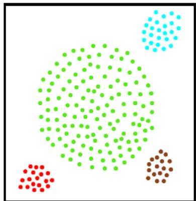

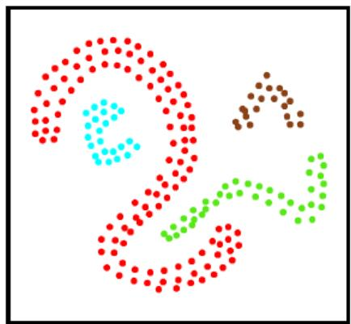

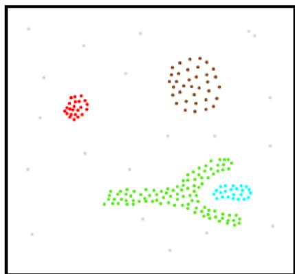  
图9-1 DBSCAN聚类结果

注意，虽然左图为“凸聚类”（四个簇都有一个凸包），但均值算法却无法产生此结果，因为最大的簇太大了，其外围样本与另三个小簇的中心之间的距离更近，因此中间最大的簇肯定会被均值算法划分到不同的簇之中，这显然不是我们希望的结果。

密度聚类算法可以产生任意形状的簇，不需要事先指定聚类个数 k，并且对噪声鲁棒。

## 9.5.1•密度直达、密度可达与密度相连

$\boldsymbol { \mathscr { x } } _ { j }$ 由 $\mathbf { \mathcal { x } } _ { i }$ 密度直达，该概念最易理解，但要特别注意：密度直达除了要求 $\mathbf { \boldsymbol { x } } _ { j }$ 位于 $\mathbf { \mathcal { x } } _ { i }$ 的∈—领域的条件之外，还额外要求 $\mathbf { \mathcal { x } } _ { i }$ 是核心对象； $\epsilon -$ 领域满足对称性，但 $\boldsymbol { \mathscr { x } } _ { j }$ 不一定为核心对象，因此密度直达关系通常不满足对称性。

$\boldsymbol { \mathscr { x } } _ { j }$ 由 $\mathbf { \mathcal { x } } _ { i }$ 密度可达，该概念基于密度直达，因此样本序列 $p _ { 1 } , p _ { 2 } , \ldots , p _ { n }$ 中除了 ${ \pmb p } _ { n } = { \pmb x } _ { j }$ 之外，其余样本均为核心对象(当然包括 ${ \pmb p } _ { 1 } = { \pmb x } _ { i } \ )$ ，所以同理，一般不满足对称性。

以上两个概念中，若 $\mathbf { \boldsymbol { x } } _ { j }$ 为核心对象，已知 $\boldsymbol { \mathscr { x } } _ { j }$ 由 $\mathbf { \mathcal { x } } _ { i }$ 密度直达/可达，则 $\mathbf { \mathcal { x } } _ { i }$ 由 $\mathbf { \boldsymbol { x } } _ { j }$ 密度直达/可达，即满足对称性 (也就是说，核心对象之间的密度直达/可达满足对称性)。

$\mathbf { \mathcal { x } } _ { i }$ 与 $\boldsymbol { \mathscr { x } } _ { j }$ 密度相连，不要求 $\mathbf { \mathcal { x } } _ { i }$ 与 $\mathbf { \boldsymbol { x } } _ { j }$ 为核心对象，所以满足对称性。

## 9.5.2图9.9的解释

在第1～7行中，算法先根据给定的邻域参数(ε,MinPts)找出所有核心对象，并存于集合Ω之中；第4行的if判断语句即在判别 $\boldsymbol { x } _ { j }$ 是否为核心对象。

在第 10～24 行中，以任一核心对象为出发点(由第12 行实现)，找出其密度可达的样本生成聚类簇(由第14～21 行实现)，直到所有核心对象被访问过为止（由第10行和第23行配合实现)。具体来说：

其中第 14～21 行 while 循环中的 if 判断语句（第 16 行）在第一次循环时一定为真（因为Q在第12行初始化为某核心对象)，此时会往队列 $Q$ 中加入q密度直达的样本（已知q为核心对象，q的∈-领域中的样本即为 q 密度直达的)，队列遵循先进先出规则，接下来的循环将依次判别 q 的 ϵ-领域中的样本是否为核心对象(第16行)，若为核心对象，则将密度直达的样本（ϵ-领域中的样本）加入 $\mathrm { Q } .$ ，根据密度可达的概念，while 循环中的 if 判断语句（第 16 行）找出的核心对象之间一定是相互密度可达的，非核心对象一定是密度相连的。

第 14～21 行 while 循环每跳出一次，即生成一个聚类簇。每次生成聚类之前，会记录当前末访问过样本集合 (第 11 行 $\Gamma _ { \mathrm { o l d } } = \Gamma \ )$ ，然后当前要生成的聚类簇每决定录取一个样本后会将该样本从厂去除（第13 行和第 19 行)，因此第 14\~21 行 while 循环每跳出一次后， $\Gamma _ { \mathrm { o l d } }$ 与Γ差别即为聚类簇的样本成员（第22 行)，并将该聚类簇中的核心对象从第1～7行生成的核心对象集合Ω中去除。

符号“\”为集合求差，例如集合 $A = \{ a , b , c , d , e , f \} , B = \{ a , d , f , g , h \}$ ，则A\B为 $A \backslash B = \{ b , c , e \}$ 即将A，B所有相同元素从A中去除。

## 9.6层次聚类

本节主要介绍了层次聚类的代表算法 AGNES。

式(9.41)(9.43)介绍了三种距离计算方式，这与“西瓜书”9.3 节中介绍的距离不同之处在于，此三种距离计算面向集合之间，而9.3 节的距离则面向两点之间。正如“西瓜书”第215 页左上边注所示，集合间的距离计算常采用豪斯多夫距离 (Hausdorff distance)。

算法AGNES 很简单，就是不断重复执行合并距离最近的两个聚类簇。“西瓜书”图 9.11 为具体实现方法，核心就是在合并两个聚类簇后更新距离矩阵（第11～ 23 行)，之所以看起来复杂，是因为该实现只更新原先距离矩阵中发生变化的行和列，因此需要为此做一些调整。

在第 1～9 行，算法先对仅含一个样本的初始聚类簇和相应的距离矩阵进行初始化。注意，距离矩阵中，第i行为聚类簇 $C _ { i }$ 到各聚类簇的距离，第i列为各聚类簇到聚类簇 $C _ { i }$ 的距离，由第7行可知，距离矩阵为对称矩阵，即使用的集合间的距离计算方法满足对称性。

第18～21行更新距离矩阵M的第 $i ^ { * }$ 行与第 $i ^ { * }$ 列，因为此时的聚类簇 $C _ { i ^ { * } }$ 已经合并了 $C _ { j ^ { * } }$ ，因此与其余聚类簇之间的距离都发生了变化，需要更新。

## 第10章•降维与度量学习

## 10.1预备知识

本章内容需要较多的线性代数和矩阵分析的基础，因此将相关的预备知识整体整理如下。

## 10.1.1符号约定

向量元素之间分号“；”表示列元素分隔符，如 $\pmb { \alpha } = ( a _ { 1 } ; a _ { 2 } ; . . . ; a _ { i } ; . . . ; a _ { m } )$ 表示 $m \times 1$ 的列向量；而逗号“，”表示行元素分隔符，如 $\pmb { \alpha } = ( a _ { 1 } , a _ { 2 } , \ldots , a _ { i } , \ldots , a _ { m } )$ 表示 $1 \times m$ 的行向量。

## 10.1.2矩阵与单位阵、向量的乘法

(1）矩阵左乘对角阵相当于矩阵每行乘以对应对角阵的对角线元素，如：

$$
{ \left[ \begin{array} { l l l } { \lambda _ { 1 } } & & \\ & { \lambda _ { 2 } } & \\ & & { \lambda _ { 3 } } \end{array} \right] } { \left[ \begin{array} { l l l } { x _ { 1 1 } } & { x _ { 1 2 } } & { x _ { 1 3 } } \\ { x _ { 2 1 } } & { x _ { 2 2 } } & { x _ { 2 3 } } \\ { x _ { 3 1 } } & { x _ { 3 2 } } & { x _ { 3 3 } } \end{array} \right] } = { \left[ \begin{array} { l l l } { \lambda _ { 1 } x _ { 1 1 } } & { \lambda _ { 1 } x _ { 1 2 } } & { \lambda _ { 1 } x _ { 1 3 } } \\ { \lambda _ { 2 } x _ { 2 1 } } & { \lambda _ { 2 } x _ { 2 2 } } & { \lambda _ { 2 } x _ { 2 3 } } \\ { \lambda _ { 3 } x _ { 3 1 } } & { \lambda _ { 3 } x _ { 3 2 } } & { \lambda _ { 3 } x _ { 3 3 } } \end{array} \right] }
$$

(2)）矩阵右乘对角阵相当于矩阵每列乘以对应对角阵的对角线元素，如：

$$
\left[ { \begin{array} { l l l } { x _ { 1 1 } } & { x _ { 1 2 } } & { x _ { 1 3 } } \\ { x _ { 2 1 } } & { x _ { 2 2 } } & { x _ { 2 3 } } \\ { x _ { 3 1 } } & { x _ { 3 2 } } & { x _ { 3 3 } } \end{array} } \right] \left[ { \begin{array} { l l l } { \lambda _ { 1 } } & & \\ & { \lambda _ { 2 } } & \\ & & { \lambda _ { 3 } } \end{array} } \right] = \left[ { \begin{array} { l l l } { \lambda _ { 1 } x _ { 1 1 } } & { \lambda _ { 2 } x _ { 1 2 } } & { \lambda _ { 3 } x _ { 1 3 } } \\ { \lambda _ { 1 } x _ { 2 1 } } & { \lambda _ { 2 } x _ { 2 2 } } & { \lambda _ { 3 } x _ { 2 3 } } \\ { \lambda _ { 1 } x _ { 3 1 } } & { \lambda _ { 2 } x _ { 3 2 } } & { \lambda _ { 3 } x _ { 3 3 } } \end{array} } \right]
$$

(3)矩阵左乘行向量相当于矩阵每行乘以对应行向量的元素之和，如：

$$
{ \begin{array} { r l } & { { \left[ \begin{array} { l l l } { \lambda _ { 1 } } & { \lambda _ { 2 } } & { \lambda _ { 3 } } \end{array} \right] } { \left[ \begin{array} { l l l } { x _ { 1 1 } } & { x _ { 1 2 } } & { x _ { 1 3 } } \\ { x _ { 2 1 } } & { x _ { 2 2 } } & { x _ { 2 3 } } \\ { x _ { 3 1 } } & { x _ { 3 2 } } & { x _ { 3 3 } } \end{array} \right] } } \\ & { = \lambda _ { 1 } { \left[ \begin{array} { l l l } { x _ { 1 1 } } & { x _ { 1 2 } } & { x _ { 1 3 } } \end{array} \right] } + \lambda _ { 2 } { \left[ \begin{array} { l l l } { x _ { 2 1 } } & { x _ { 2 2 } } & { x _ { 2 3 } } \end{array} \right] } + \lambda _ { 3 } { \left[ \begin{array} { l l l } { x _ { 3 1 } } & { x _ { 3 2 } } & { x _ { 3 3 } } \end{array} \right] } } \\ & { = { \left( \begin{array} { l l l } { \lambda _ { 1 } x _ { 1 1 } + \lambda _ { 2 } x _ { 2 1 } + \lambda _ { 3 } x _ { 3 1 } , \lambda _ { 1 } x _ { 1 2 } + \lambda _ { 2 } x _ { 2 2 } + \lambda _ { 3 } x _ { 3 2 } , \lambda _ { 1 } x _ { 1 3 } + \lambda _ { 2 } x _ { 2 3 } + \lambda _ { 3 } x _ { 3 3 } } \end{array} \right) } } \end{array} }
$$

(4)矩阵右乘列向量相当于矩阵每列乘以对应列向量的元素之和，如：

$$
{ \begin{array} { r l } & { { \left[ \begin{array} { l l l } { x _ { 1 1 } } & { x _ { 1 2 } } & { x _ { 1 3 } } \\ { x _ { 2 1 } } & { x _ { 2 2 } } & { x _ { 2 3 } } \\ { x _ { 3 1 } } & { x _ { 3 2 } } & { x _ { 3 3 } } \end{array} \right] } { \left[ \begin{array} { l } { \lambda _ { 1 } } \\ { \lambda _ { 2 } } \\ { \lambda _ { 3 } } \end{array} \right] } } \\ & { = \lambda _ { 1 } { \left[ \begin{array} { l } { x _ { 1 1 } } \\ { x _ { 2 1 } } \\ { x _ { 3 1 } } \end{array} \right] } + \lambda _ { 2 } { \left[ \begin{array} { l } { x _ { 1 2 } } \\ { x _ { 2 2 } } \\ { x _ { 3 2 } } \end{array} \right] } + \lambda _ { 3 } { \left[ \begin{array} { l } { x _ { 1 3 } } \\ { x _ { 2 3 } } \\ { x _ { 3 3 } } \end{array} \right] } = \sum _ { i = 1 } ^ { 3 } { \left( \lambda _ { i } { \left[ \begin{array} { l } { x _ { 1 i } } \\ { x _ { 2 i } } \\ { x _ { 3 i } } \end{array} \right] } \right) } } \\ & { = ( \lambda _ { 1 } x _ { 1 1 } + \lambda _ { 2 } x _ { 1 2 } + \lambda _ { 3 } x _ { 1 3 } ; \lambda _ { 1 } x _ { 2 1 } + \lambda _ { 2 } x _ { 2 2 } + \lambda _ { 3 } x _ { 2 3 } ; \lambda _ { 1 } x _ { 3 1 } + \lambda _ { 2 } x _ { 3 2 } + \lambda _ { 3 } x _ { 3 3 } ) } \end{array} }
$$

综上，左乘是对矩阵的行操作，而右乘则是对矩阵的列操作，第(2）个和第（4）个结论后面推导过程中灵活应用较多。

## 10.2矩阵的F范数与迹

(1)对于矩阵 $\mathbf { A } \in \mathbb { R } ^ { m \times n }$ ，其Frobenius 范数 (简称 F 范数) $\| \mathbf { A } \| _ { F }$ 定义为

$$
\| \mathbf { A } \| _ { F } = \left( \sum _ { i = 1 } ^ { m } \sum _ { j = 1 } ^ { n } \left| a _ { i j } \right| ^ { 2 } \right) ^ { \frac { 1 } { 2 } }
$$

其中 $a _ { i j }$ 为矩阵A第i行第j列的元素，即

$$
\mathbf { A } = { \left[ \begin{array} { l l l l l l } { a _ { 1 1 } } & { a _ { 1 2 } } & { \cdots } & { a _ { 1 j } } & { \cdots } & { a _ { 1 n } } \\ { a _ { 2 1 } } & { a _ { 2 2 } } & { \cdots } & { a _ { 2 j } } & { \cdots } & { a _ { 2 n } } \\ { \vdots } & { \vdots } & { \ddots } & { \vdots } & { \ddots } & { \vdots } \\ { a _ { i 1 } } & { a _ { i 2 } } & { \cdots } & { a _ { i j } } & { \cdots } & { a _ { i n } } \\ { \vdots } & { \vdots } & { \ddots } & { \vdots } & { \ddots } & { \vdots } \\ { a _ { m 1 } } & { a _ { m 2 } } & { \cdots } & { a _ { m j } } & { \cdots } & { a _ { m n } } \end{array} \right] }
$$

(2)若 $\mathbf { A } = \left( \alpha _ { 1 } , \alpha _ { 2 } , \ldots , \alpha _ { j } , \ldots , \alpha _ { n } \right)$ ，其中 $\pmb { \alpha } _ { j } = ( a _ { 1 j } ; a _ { 2 j } ; \dots ; a _ { i j } ; \dots ; a _ { m j } )$ 为其列向量， $\mathbf { A } \in \mathbb { R } ^ { m \times n } , \pmb { \alpha } _ { j } \in$ Rm×1,则 $\begin{array} { r } { \| \mathbf { A } \| _ { F } ^ { 2 } = \sum _ { j = 1 } ^ { n } \| \pmb { \alpha } _ { j } \| _ { 2 } ^ { 2 } ; } \end{array}$

同理,若 $\mathbf { A } = ( \beta _ { 1 } ; \beta _ { 2 } ; \ldots ; \beta _ { i } ; \ldots ; \beta _ { m } )$ ，其中 $\pmb { \beta } _ { i } = ( a _ { i 1 } , a _ { i 2 } , \dotsc , a _ { i j } , \dotsc , a _ { i n } )$ 为其行向量, $\mathbf { A } \in \mathbb { R } ^ { m \times n } , \beta _ { i } \in$ R1×n，则 $\begin{array} { r } { \| { \bf A } \| _ { F } ^ { 2 } = \sum _ { i = 1 } ^ { m } \| \beta _ { i } \| _ { 2 } ^ { 2 } } \end{array}$

证明：该结论是显而易见的，因为 $\begin{array} { r } { \left. \alpha _ { j } \right. _ { 2 } ^ { 2 } = \sum _ { i = 1 } ^ { m } \left| a _ { i j } \right| ^ { 2 } } \end{array}$ ，而 $\begin{array} { r } { \left\| \mathbf { A } \right\| _ { F } ^ { 2 } = \sum _ { i = 1 } ^ { m } \sum _ { j = 1 } ^ { n } \left| a _ { i j } \right| ^ { 2 } } \end{array}$

(3)若 $\lambda _ { j } \left( \mathbf { A } ^ { \intercal } \mathbf { A } \right)$ 表示n阶方阵 $\mathbf { A } ^ { \top } \mathbf { A }$ 的第j个特征值， $\operatorname { t r } \left( \mathbf { A } ^ { \intercal } \mathbf { A } \right)$ 是 $\mathbf { A } ^ { \top } \mathbf { A }$ 的迹（对角线元素之和）；$\lambda _ { i } \left( \mathbf { A } \mathbf { A } ^ { \top } \right)$ 表示m阶方阵 $\mathbf { A A } ^ { \top }$ 的第i个特征值， $\operatorname { t r } \left( \mathbf { A } \mathbf { A } ^ { \top } \right)$ 是 $\mathbf { A A } ^ { \top }$ 的迹，则

$$
\begin{array} { r } { \| \mathbf { A } \| _ { F } ^ { 2 } = \operatorname { t r } \left( \mathbf { A } ^ { \top } \mathbf { A } \right) = \displaystyle \sum _ { j = 1 } ^ { n } \lambda _ { j } \left( \mathbf { A } ^ { \top } \mathbf { A } \right) } \\ { = \operatorname { t r } \left( \mathbf { A } \mathbf { A } ^ { \top } \right) = \displaystyle \sum _ { i = 1 } ^ { m } \lambda _ { i } \left( \mathbf { A } \mathbf { A } ^ { \top } \right) } \end{array}
$$

证明：先证 $\| \mathbf { A } \| _ { F } ^ { 2 } = \operatorname { t r } \left( \mathbf { A } ^ { \top } \mathbf { A } \right)$ ，令 $\mathbf { B } = \mathbf { A } ^ { \top } \mathbf { A } \in \mathbb { R } ^ { n \times n } , b _ { i j }$ 表示B第i行第j列元素， $\textstyle \operatorname { t r } ( \mathbf { B } ) = \sum _ { j = 1 } ^ { n } b _ { j j }$

$$
\mathbf { B } = \mathbf { A } ^ { \top } \mathbf { A } = \left[ \begin{array} { c c c c c c c } { a _ { 1 1 } } & { a _ { 2 1 } } & { \cdots } & { a _ { i 1 } } & { \cdots } & { a _ { m 1 } } \\ { a _ { 1 2 } } & { a _ { 2 2 } } & { \cdots } & { a _ { i 2 } } & { \cdots } & { a _ { m 2 } } \\ { \vdots } & { \vdots } & { \ddots } & { \vdots } & { \ddots } & { \vdots } \\ { a _ { 1 j } } & { a _ { 2 j } } & { \cdots } & { a _ { i j } } & { \cdots } & { a _ { m j } } \\ { \vdots } & { \vdots } & { \ddots } & { \vdots } & { \ddots } & { \vdots } \\ { a _ { 1 n } } & { a _ { 2 n } } & { \cdots } & { a _ { i n } } & { \cdots } & { a _ { m n } } \end{array} \right] \left[ \begin{array} { c c c c c c c } { a _ { 1 1 } } & { a _ { 1 2 } } & { \cdots } & { a _ { 1 j } } & { \cdots } & { a _ { 1 n } } \\ { a _ { 2 1 } } & { a _ { 2 2 } } & { \cdots } & { a _ { 2 j } } & { \cdots } & { a _ { 2 n } } \\ { \vdots } & { \vdots } & { \ddots } & { \vdots } & { \ddots } & { \vdots } \\ { a _ { i 1 } } & { a _ { i 2 } } & { \cdots } & { a _ { i j } } & { \cdots } & { a _ { i n } } \\ { \vdots } & { \vdots } & { \ddots } & { \vdots } & { \ddots } & { \vdots } \\ { a _ { m 1 } } & { a _ { m 2 } } & { \cdots } & { a _ { m j } } & { \cdots } & { a _ { m n } } \end{array} \right]
$$

由矩阵运算规则， $b _ { j j }$ 等于 $\mathbf { A } ^ { \top }$ 的第j行与A的第j列的内积，因此

$$
\operatorname { t r } ( \mathbf { B } ) = \sum _ { j = 1 } ^ { n } b _ { j j } = \sum _ { j = 1 } ^ { n } \left( \sum _ { i = 1 } ^ { m } | a _ { i j } | ^ { 2 } \right) = \sum _ { i = 1 } ^ { m } \sum _ { j = 1 } ^ { n } | a _ { i j } | ^ { 2 } = \| \mathbf { A } \| _ { F } ^ { 2 }
$$

以上第三个等号交换了求和号次序（类似于交换积分号次序)，显然这不影响求和结果。

同理，可证 $\| \mathbf { A } \| _ { F } ^ { 2 } = \operatorname { t r } \left( \mathbf { A A } ^ { \top } \right)$

$$
\mathbf { C } = \mathbf { A } \mathbf { A } ^ { \top } = \left[ \begin{array} { c c c c c c } { a _ { 1 1 } } & { a _ { 1 2 } } & { \cdots } & { a _ { 1 j } } & { \cdots } & { a _ { 1 n } } \\ { a _ { 2 1 } } & { a _ { 2 2 } } & { \cdots } & { a _ { 2 j } } & { \cdots } & { a _ { 2 n } } \\ { \vdots } & { \vdots } & { \ddots } & { \vdots } & { \ddots } & { \vdots } \\ { a _ { i 1 } } & { a _ { i 2 } } & { \cdots } & { a _ { i j } } & { \cdots } & { a _ { i n } } \\ { \vdots } & { \vdots } & { \ddots } & { \vdots } & { \ddots } & { \vdots } \\ { a _ { m 1 } } & { a _ { m 2 } } & { \cdots } & { a _ { m j } } & { \cdots } & { a _ { m n } } \end{array} \right] \left[ \begin{array} { c c c c c c } { a _ { 1 1 } } & { a _ { 2 1 } } & { \cdots } & { a _ { i 1 } } & { \cdots } & { a _ { m 1 } } \\ { a _ { 1 2 } } & { a _ { 2 2 } } & { \cdots } & { a _ { i 2 } } & { \cdots } & { a _ { m 2 } } \\ { \vdots } & { \vdots } & { \ddots } & { \vdots } & { \ddots } & { \vdots } \\ { a _ { 1 j } } & { a _ { 2 j } } & { \cdots } & { a _ { i j } } & { \cdots } & { a _ { m j } } \\ { \vdots } & { \vdots } & { \ddots } & { \vdots } & { \ddots } & { \vdots } \\ { a _ { 1 n } } & { a _ { 2 n } } & { \cdots } & { a _ { i n } } & { \cdots } & { a _ { m n } } \end{array} \right]
$$

由矩阵运算规则， $c _ { i i }$ 等于A的第i行与 $\mathbf { A } ^ { \top }$ 的第i列的内积（红色元素)，因此

$$
\operatorname { t r } ( \mathbf { C } ) = \sum _ { i = 1 } ^ { m } c _ { i i } = \sum _ { i = 1 } ^ { m } \left( \sum _ { j = 1 } ^ { n } \left| a _ { i j } \right| ^ { 2 } \right) = \sum _ { i = 1 } ^ { m } \sum _ { j = 1 } ^ { n } \left| a _ { i j } \right| ^ { 2 } = \left\| \mathbf { A } \right\| _ { F } ^ { 2 }
$$

有关方阵的特征值之和等于对角线元素之和，可以参见线性代数教材。

## 10.3k近邻学习

## 10.3.1式(10.1)的解释

$$
P ( e r r ) = 1 - \sum _ { c \in \mathcal { V } } P ( c | \pmb { x } ) P ( c | \pmb { z } )
$$

首先， $P ( c \mid \pmb { x } )$ 表示样本a为类别c的后验概率， $\textstyle P ( c \mid z )$ 表示样本₂为类别c的后验概率；其次，$P ( c \mid { \pmb x } ) P ( c \mid z )$ 表示样本x和样本z同时为类别c的概率；

再次， $\textstyle \sum _ { c \in { \mathcal { V } } } P ( c \mid { \pmb x } ) P ( c \mid z )$ 表示样本a和样本z类别相同的概率；这一点可以进一步解释，设$\mathcal { Y } = \{ c _ { 1 } , c _ { 2 } , \cdot \cdot \cdot , c _ { N } \}$ ，则该求和式子变为：

$$
P \left( c _ { 1 } \mid { \pmb x } \right) P \left( c _ { 1 } \mid { \pmb z } \right) + P \left( c _ { 2 } \mid { \pmb x } \right) P \left( c _ { 2 } \mid { \pmb z } \right) + \cdot \cdot \cdot + P \left( c _ { N } \mid { \pmb x } \right) P \left( c _ { N } \mid { \pmb z } \right)
$$

即样本a和样本z同时为 $c _ { 1 }$ 的概率，加上同时为 $c _ { 2 }$ 的概率， $\cdots \cdot \cdot \cdot ,$ 加上同时为 $c _ { N }$ 的概率，即样本a和样本z类别相同的概率；

最后， $P ( e r r )$ 表示样本x 和样本₂类别不相同的概率，即1减去二者类别相同的概率。

## 10.3.2式(10.2)的推导

式(10.2)推导关键在于理解第二行的“约等（一）”关系和第三行的“小于等于 $( \leqslant ) \ v { r } ^ { \mathrm { ~ , ~ } }$ 关系。

第二行的“约等（←）”关系的依据在于该式前面一段话：“假设样本独立同分布，且对任意x和任意小正数 $\delta ,$ 在x附近δ距离范围内总能找到一个训练样本”，这意味着对于任意测试样本在训练集中都可以找出一个与其非常像（任意小正数δ）的近邻，这里还有一个假设书中末提及： $P ( c \mid \pmb { x } )$ 必须是连续函数（对于连续函数f(x）和任意小正数 $\delta , f ( x ) \simeq f ( x + \delta ) )$ ，即对于两个非常像的样本z与x有$P ( c \mid \pmb { x } ) \simeq P ( c \mid \pmb { z } )$ ,即

$$
\sum _ { c \in \mathcal { V } } P ( c \mid x ) P ( c \mid z ) \simeq \sum _ { c \in \mathcal { V } } P ^ { 2 } ( c \mid x )
$$

第三行的“小于等于 $( \leqslant ) \ v { r } ^ { \mathrm { ~ , ~ } }$ 关系更简单：由于 $c ^ { * } \in \mathcal { V }$ ，所以 $\begin{array} { r } { P ^ { 2 } \left( c ^ { * } \mid \pmb { x } \right) \leqslant \sum _ { c \in \mathcal { V } } P ^ { 2 } ( c \mid \pmb { x } ) } \end{array}$ ，也就是“小于等于（≤）”左边只是右边的一部分，所以肯定是小于等于的关系；

第四行就是数学公式 $a ^ { 2 } - b ^ { 2 } = ( a + b ) ( a - b )$

第五行是由於 $1 + P \left( c ^ { * } \mid x \right) \leqslant 2$ ，这是由于概率值 $P \left( c ^ { * } \mid x \right) \leqslant 1$

经过以上推导，本节最后给出一个惊人的结论：最近邻分类器虽简单，但它的泛化错误率不超过贝叶斯最优分类器的错误率的两倍!

然而这是一个没啥实际用途的结论，因为这个结论必须满足两个假设条件，且不说 $P ( c \mid x )$ 是连续函数（第一个假设）是否满足，单就“对任意 α和任意小正数δ，在 x附近δ距离范围内总能找到一个训练样本”（第二个假设)是不可能满足的，这也就有了10.2 节开头一段的讨论，抛开“任意小正数 $\delta \mathit { \Omega } ^ { \prime \prime }$ 不谈,具体到 $\delta = 0 . 0 0 1$ 都是不现实的。

## 10.4低维嵌人

## 10.4.1图10.2的解释

只要注意一点就行：在图（a）三维空间中，红色线是弯曲的，但去掉高度这一维（竖着的坐标轴）后，红色线变成直线，而直线更容易学习。

## 10.4.2式(10.3)的推导

已知 ${ \bf Z } = \{ z _ { 1 } , z _ { 2 } , \ldots , z _ { i } , \ldots , z _ { m } \} \in \mathbb { R } ^ { d ^ { \prime } \times m }$ ，其中 $z _ { i } = ( z _ { i 1 } ; z _ { i 2 } ; . . . ; z _ { i d ^ { \prime } } ) \in \mathbb { R } ^ { d ^ { \prime } \times 1 }$ ；降维后的内积矩阵$\mathbf { B } = \mathbf { Z } ^ { \top } \mathbf { Z } \in \mathbb { R } ^ { m \times m }$ ，其中第i行第j列元素 $b _ { i j }$ ，特别的

$$
b _ { i i } = z _ { i } ^ { \top } z _ { i } = \left\| z _ { i } \right\| ^ { 2 } , b _ { j j } = z _ { j } ^ { \top } z _ { j } = \left\| z _ { j } \right\| ^ { 2 } , b _ { i j } = z _ { i } ^ { \top } z _ { j }
$$

MDS 算法的目标是 $\| z _ { i } - z _ { j } \| = d i s t _ { i j } = \| { \pmb x } _ { i } - { \pmb x } _ { j } \|$ ，即保持样本的欧氏距离在d维空间和原始d维空间相同 $( d ^ { \prime } \leqslant d )$ 。

$$
\begin{array} { l } { d i s t _ { i j } ^ { 2 } = \left. z _ { i } - z _ { j } \right. ^ { 2 } = \left( z _ { i 1 } - z _ { j 1 } \right) ^ { 2 } + \left( z _ { i 2 } - z _ { j 2 } \right) ^ { 2 } + \ldots + \left( z _ { i d ^ { \prime } } - z _ { j d ^ { \prime } } \right) ^ { 2 } } \\ { = \left( z _ { i 1 } ^ { 2 } - 2 z _ { i 1 } z _ { j 1 } + z _ { j 1 } ^ { 2 } \right) + \left( z _ { i 2 } ^ { 2 } - 2 z _ { i 2 } z _ { j 2 } + z _ { j 2 } ^ { 2 } \right) + \ldots + \left( z _ { i d ^ { \prime } } ^ { 2 } - 2 z _ { i d ^ { \prime } } z _ { j d ^ { \prime } } + z _ { j d ^ { \prime } } ^ { 2 } \right) } \\ { = \left( z _ { i 1 } ^ { 2 } + z _ { i 2 } ^ { 2 } + \ldots + z _ { i d ^ { \prime } } ^ { 2 } \right) + \left( z _ { j 1 } ^ { 2 } + z _ { j 2 } ^ { 2 } + \ldots + z _ { j d ^ { \prime } } ^ { 2 } \right) } \\ { - 2 \left( z _ { i 1 } z _ { j 1 } + z _ { i 2 } z _ { j 2 } + \ldots + z _ { i d ^ { \prime } } z _ { j d ^ { \prime } } \right) } \\ { = \left. z _ { i } \right. ^ { 2 } + \left. z _ { j } \right. ^ { 2 } - 2 z _ { i } ^ { \top } z _ { j } } \\ { = b _ { i i } + b _ { j j } - 2 b _ { i j } } \end{array}
$$

本章矩阵运算非常多，刚刚是从矩阵元素层面的推导；实际可发现上式运算结果基本与标量运算规则相同，因此后面会尽可能不再从元素层面推导。具体来说：

$$
\begin{array} { r l } & { d i s t _ { i j } ^ { 2 } = \| z _ { i } - z _ { j } \| ^ { 2 } = ( z _ { i } - z _ { j } ) ^ { \top } ( z _ { i } - z _ { j } ) } \\ & { \qquad = z _ { i } ^ { \top } z _ { i } - z _ { i } ^ { \top } z _ { j } - z _ { j } ^ { \top } z _ { i } + z _ { j } ^ { \top } z _ { j } } \\ & { \qquad = z _ { i } ^ { \top } z _ { i } + z _ { j } ^ { \top } z _ { j } - 2 z _ { i } ^ { \top } z _ { j } } \\ & { \qquad = \| z _ { i } \| ^ { 2 } + \| z _ { j } \| ^ { 2 } - 2 z _ { i } ^ { \top } z _ { j } } \\ & { \qquad = b _ { i i } + b _ { j j } - 2 b _ { i j } } \end{array}
$$

上式第三个等号化简是由于内积 $z _ { i } ^ { \top } z _ { j }$ 和 $\pmb { z } _ { j } ^ { \top } \pmb { z } _ { i }$ 均为标量，因此转置等于本身。

## 10.4.3式(10.4)的推导

首先解释两个条件：

(1）令降维后的样本Z被中心化，即 $\textstyle \sum _ { i = 1 } ^ { m } z _ { i } = \mathbf { 0 }$ 注意 $\mathbf { Z } \in \mathbb { R } ^ { d ^ { \prime } \times m }$ ，d是样本维度(属性个数)，m是样本个数，易知Z 的每一行有m个元素(每行表示样本集的一维属性)，Z 的每一列有 $d ^ { \prime }$ 个元素（每列表示一个样本)。

式 $\textstyle \sum _ { i = 1 } ^ { m } z _ { i } = \mathbf { 0 }$ 中的zi明显表示的是第i列，m列相加得到一个零向量 ${ \bf 0 } _ { d ^ { \prime } \times 1 }$ ，意思是样本集合中所有样本的每一维属性之和均等于 0，因此被中心化的意思是将样本集合Ζ的每一行（属性）减去该行的均值。

(2）显然，矩阵B的行与列之各均为零，即 $\textstyle \sum _ { i = 1 } ^ { m } b _ { i j } = \sum _ { j = 1 } ^ { m } b _ { i j } = 0$

注意 $b _ { i j } = z _ { i } ^ { \top } z _ { j }$ (也可以写为 $b _ { i j } = z _ { j } ^ { \top } z _ { i }$ ，其实就是对应元素相乘，再求和)

$$
\sum _ { i = 1 } ^ { m } b _ { i j } = \sum _ { i = 1 } ^ { m } z _ { j } ^ { \top } z _ { i } = z _ { j } ^ { \top } \sum _ { i = 1 } ^ { m } z _ { i } = z _ { j } ^ { \top } \cdot { \bf 0 } _ { d ^ { \prime } \times 1 } = 0
$$

$$
\sum _ { j = 1 } ^ { m } b _ { i j } = \sum _ { j = 1 } ^ { m } z _ { i } ^ { \top } z _ { j } = z _ { i } ^ { \top } \sum _ { j = 1 } ^ { m } z _ { j } = z _ { i } ^ { \top } \cdot { \bf 0 } _ { d ^ { \prime } \times 1 } = 0
$$

接下来我们推导式 (10.4)，将式 (10.3)的 $d i s t _ { i j } ^ { 2 }$ 表达式代入：

$$
\begin{array} { c } { { \displaystyle \sum _ { i = 1 } ^ { m } d i s t _ { i j } ^ { 2 } = \sum _ { i = 1 } ^ { m } \left( \left\| z _ { i } \right\| ^ { 2 } + \left\| z _ { j } \right\| ^ { 2 } - 2 z _ { i } ^ { \top } z _ { j } \right) } } \\ { { = \displaystyle \sum _ { i = 1 } ^ { m } \left\| z _ { i } \right\| ^ { 2 } + \displaystyle \sum _ { i = 1 } ^ { m } \left\| z _ { j } \right\| ^ { 2 } - 2 \displaystyle \sum _ { i = 1 } ^ { m } z _ { i } ^ { \top } z _ { j } } } \end{array}
$$

根据定义：

$$
\sum _ { i = 1 } ^ { m } \left\| z _ { i } \right\| ^ { 2 } = \sum _ { i = 1 } ^ { m } z _ { i } ^ { \top } z _ { i } = \sum _ { i = 1 } ^ { m } b _ { i i } = \operatorname { t r } ( \mathbf { B } )
$$

$$
\sum _ { i = 1 } ^ { m } \left\| z _ { j } \right\| ^ { 2 } = \left\| z _ { j } \right\| ^ { 2 } \sum _ { i = 1 } ^ { m } 1 = m \left\| z _ { j } \right\| ^ { 2 } = m z _ { j } ^ { \top } z _ { j } = m b _ { j j }
$$

根据前面结果:

$$
\sum _ { i = 1 } ^ { m } z _ { i } ^ { \top } z _ { j } = \left( \sum _ { i = 1 } ^ { m } z _ { i } ^ { \top } \right) z _ { j } = \mathbf { 0 } _ { 1 \times d ^ { \prime } } \cdot z _ { j } = 0
$$

代入上式即得:

$$
\begin{array} { c } { { \displaystyle \sum _ { i = 1 } ^ { m } d i s t _ { i j } ^ { 2 } = \sum _ { i = 1 } ^ { m } \left\| z _ { i } \right\| ^ { 2 } + \sum _ { i = 1 } ^ { m } \left\| z _ { j } \right\| ^ { 2 } - 2 \sum _ { i = 1 } ^ { m } z _ { i } ^ { \top } z _ { j } } } \\ { { \displaystyle = \operatorname { t r } ( \mathbf B ) + m b _ { j j } } } \end{array}
$$

## 10.4.4式(10.5)的推导

与式 (10.4) 类似:

$$
\begin{array} { c } { { \displaystyle \sum _ { j = 1 } ^ { m } d i s t _ { i j } ^ { 2 } = \sum _ { j = 1 } ^ { m } \left( \left\| z _ { i } \right\| ^ { 2 } + \left\| z _ { j } \right\| ^ { 2 } - 2 z _ { i } ^ { \top } z _ { j } \right) } } \\ { { \displaystyle = \sum _ { j = 1 } ^ { m } \left\| z _ { i } \right\| ^ { 2 } + \sum _ { j = 1 } ^ { m } \left\| z _ { j } \right\| ^ { 2 } - 2 \sum _ { j = 1 } ^ { m } z _ { i } ^ { \top } z _ { j } } } \\ { { \displaystyle = m b _ { i i } + \mathrm { t r } ( { \bf B } ) } } \end{array}
$$

## 10.4.5式(10.6)的推导

$$
\begin{array} { c } { { \displaystyle \sum _ { i = 1 } ^ { m } \sum _ { j = 1 } ^ { m } \mathrm { d i s t } _ { i j } ^ { 2 } = \sum _ { i = 1 } ^ { m } \sum _ { j = 1 } ^ { m } \left( \left\| z _ { i } \right\| ^ { 2 } + \left\| z _ { j } \right\| ^ { 2 } - 2 z _ { i } ^ { \top } z _ { j } \right) } } \\ { { = \displaystyle \sum _ { i = 1 } ^ { m } \sum _ { j = 1 } ^ { m } \left\| z _ { i } \right\| ^ { 2 } + \displaystyle \sum _ { i = 1 } ^ { m } \sum _ { j = 1 } ^ { m } \left\| z _ { j } \right\| ^ { 2 } - 2 \displaystyle \sum _ { i = 1 } ^ { m } \sum _ { j = 1 } ^ { m } z _ { i } ^ { \top } z _ { j } } } \end{array}
$$

其中各子项的推导如下：

$$
\sum _ { i = 1 } ^ { m } \sum _ { j = 1 } ^ { m } \left\| z _ { i } \right\| ^ { 2 } = m \sum _ { i = 1 } ^ { m } \left\| z _ { i } \right\| ^ { 2 } = m \operatorname { t r } ( \mathbf { B } )
$$

$$
\sum _ { i = 1 } ^ { m } \sum _ { j = 1 } ^ { m } \| z _ { j } \| ^ { 2 } = m \sum _ { j = 1 } ^ { m } \| z _ { j } \| ^ { 2 } = m \operatorname { t r } ( \mathbf { B } )
$$

$$
\sum _ { i = 1 } ^ { m } \sum _ { j = 1 } ^ { m } z _ { i } ^ { \top } z _ { j } = 0
$$

最后一个式子是来自于书中的假设，假设降维后的样本Ζ被中心化。

## 10.4.6式(10.10)的推导

由式 (10.3) 可得

$$
b _ { i j } = - \frac { 1 } { 2 } ( d i s t _ { i j } ^ { 2 } - b _ { i i } - b _ { j j } )
$$

由式 (10.6)和 (10.9) 可得

$$
\begin{array} { c } { { t r ( { \pmb B } ) = \displaystyle \frac { 1 } { 2 m } \sum _ { i = 1 } ^ { m } \sum _ { j = 1 } ^ { m } d i s t _ { i j } ^ { 2 } \nonumber } } \\ { { \nonumber = \displaystyle \frac { m } { 2 } d i s t _ { . } ^ { 2 } } } \end{array}
$$

由式 (10.4)和 (10.8) 可得

$$
\begin{array} { c } { { b _ { j j } = \displaystyle \frac { 1 } { m } \sum _ { i = 1 } ^ { m } d i s t _ { i j } ^ { 2 } - \displaystyle \frac { 1 } { m } t r ( B ) } } \\ { { = d i s t _ { \cdot j } ^ { 2 } - \displaystyle \frac { 1 } { 2 } d i s t _ { \cdot } ^ { 2 } } } \end{array}
$$

由式 (10.5)和式 (10.7)可得

$$
\begin{array} { c } { { b _ { i i } = \displaystyle \frac { 1 } { m } \sum _ { j = 1 } ^ { m } d i s t _ { i j } ^ { 2 } - \displaystyle \frac { 1 } { m } t r ( { \bf B } ) } } \\ { { = d i s t _ { i \cdot } ^ { 2 } - \displaystyle \frac { 1 } { 2 } d i s t _ { \cdot } ^ { 2 } } } \end{array}
$$

综合可得

$$
\begin{array} { l } { { b _ { i j } = - \displaystyle \frac { 1 } { 2 } ( d i s t _ { i j } ^ { 2 } - b _ { i i } - b _ { j j } ) } } \\ { { \displaystyle ~ = - \displaystyle \frac { 1 } { 2 } ( d i s t _ { i j } ^ { 2 } - d i s t _ { i \cdot } ^ { 2 } + \displaystyle \frac { 1 } { 2 } d i s t _ { \cdot } ^ { 2 } - d i s t _ { \cdot j } ^ { 2 } + \displaystyle \frac { 1 } { 2 } d i s t _ { \cdot } ^ { 2 } ) } } \\ { { \displaystyle ~ = - \displaystyle \frac { 1 } { 2 } ( d i s t _ { i j } ^ { 2 } - d i s t _ { i \cdot } ^ { 2 } - d i s t _ { \cdot j } ^ { 2 } + d i s t _ { \cdot } ^ { 2 } ) } } \end{array}
$$

在式(10.10)后紧跟着一句话：“由此即可通过降维前后保持不变的距离矩阵 D 求取内积矩阵 $\mathrm { B } ^ { \ast }$ ,我们来解释一下这句话。

首先解释式(10.10）等号右侧的变量含义: $d i s t _ { i j } = \| z _ { i } - z _ { j } \|$ 表示降维后 $z _ { i }$ 与 $z _ { j }$ 的欧氏距离，注意这同时也应该是原始空间 $\mathbf { \mathcal { x } } _ { i }$ 与 $\mathbf { \boldsymbol { x } } _ { j }$ 的距离，因为降维的目标（也是约束条件）是“任意两个样本在 $d ^ { \prime }$ 维空间中的欧氏距离等于原始空间中的距离”；其次，式（10.10）等号左侧 $b _ { i j }$ 是降维后内积矩阵B的元素，即B的元素 $b _ { i j }$ 可以由距离矩阵D来表达求取。

## 10.4.7式(10.11)的解释

由题设知， $d ^ { * }$ 为V的非零特征值，因此 $\mathbf B = \mathbf V \mathbf { \Lambda } \mathbf V ^ { \top }$ 可以写成 $\mathbf { B } = \mathbf { V } _ { * } \pmb { \Lambda } _ { * } \mathbf { V } _ { * } ^ { \top }$ ，其中 $\pmb { \Lambda } _ { * } \in \mathbb { R } ^ { d \times d }$ 为d个非零特征值构成的特征值对角矩阵，而 $\mathbf { V } _ { * } \in \mathbb { R } ^ { m \times d }$ 为 $\pmb { \Lambda } _ { * } \in \mathbb { R } ^ { d \times d }$ 对应的特征值向量矩阵，因此有

$$
 { \mathbf { B } } = \left(  { \mathbf { V } } _ { * }  { \mathbf { A } } _ { * } ^ { 1 / 2 } \right) \left(  { \mathbf { A } } _ { * } ^ { 1 / 2 }  { \mathbf { V } } _ { * } ^ { \top } \right)
$$

故而 $ { \mathbf { Z } } =  { \Lambda _ { * } } ^ { 1 / 2 }  { \mathbf { V } _ { * } } ^ { \top } \in \mathbb { R } ^ { d \times m }$

## 10.4.8图10.3关于MDS算法的解释

首先要清楚此处降维算法要完成的任务：获得d维空间的样本集合 $\mathbf { X } \in \mathbb { R } ^ { d \times m }$ 在 $d ^ { \prime }$ 维空间的表示$\mathbf { Z } \in \mathbb { R } ^ { d ^ { \prime } \times m }$ ，并且保证距离矩阵 $\mathbf { D } \in \mathbb { R } ^ { m \times m }$ 相同，其中 $d ^ { \prime } < d , m$ 为样本个数，距离矩阵即样本之间的欧氏距离。那么怎么由 $\mathbf { X } \in \mathbb { R } ^ { d \times m }$ 得到 $\mathbf { Z } \in \mathbb { R } ^ { d ^ { \prime } \times m }$ 呢？

经过推导发现 (式(10.3)式 (10.10))，在保证距离矩阵 $\mathbf { D } \in \mathbb { R } ^ { m \times m }$ 相同的前提下， $d ^ { \prime }$ 维空间的样本集合 $\mathbf { Z } \in \mathbb { R } ^ { d ^ { \prime } \times m }$ 的内积矩阵 $\mathbf { B } = \mathbf { Z } ^ { \top } \mathbf { Z } \in \mathbb { R } ^ { m \times m }$ 可以由距离矩阵 $\mathbf { D } \in \mathbb { R } ^ { m \times m }$ 得到 (参见式 (10.10))，此时只要对B进行矩阵分解即可得到 $\mathrm { Z } ;$ 具体来说，对B进行特征值分解可得 $\mathbf B = \mathbf V \mathbf { \Lambda } \mathbf V ^ { \top }$ ，其中 $\mathbf { V } \in \mathbb { R } ^ { m \times m }$ 为特征值向量矩阵, $\in \mathbb { R } ^ { m \times m }$ 为特征值构成的对角矩阵，接下来分类讨论：

(1)当 $d > m$ 时，即样本属性比样本个数还要多此时，样本集合 $\mathbf { X } \in \mathbb { R } ^ { d \times m }$ 的d维属性一定是线性相关的（即有品几余)，因为矩阵X的秩不会大于m(此处假设矩阵X的秩恰好等于m），因此 $\boldsymbol { \Lambda } \in \mathbb { R } ^ { m \times m }$ 主对角线有m个非零值，进而 $\mathbf { B } = \left( \mathbf { V } \mathbf { A } ^ { 1 / 2 } \right) \left( \mathbf { A } ^ { 1 / 2 } \mathbf { V } ^ { \top } \right)$ ，得到的 $ { \mathbf { Z } } =  { \mathbf { \Lambda } }  { \mathbf { \Lambda } } ^ { 1 / 2 }  { \mathbf { V } } ^ { \top } \in \mathbb { R } ^ { d ^ { \prime } \times m }$ 实际将d维属性降成了 $d ^ { \prime } = m$ 维属性。

(2)当 $d < m$ 时，即样本个数比样本属性多这是现实中最常见的一种情况。此时 $\boldsymbol { \Lambda } \in \mathbb { R } ^ { m \times m }$ 至多有d个非零值（此处假设恰有d个非零值)，因此 $\mathbf B = \mathbf V \mathbf { \Lambda } \mathbf V ^ { \top }$ 可以写成 $\mathbf { B } = \mathbf { V } _ { * } \pmb { \Lambda } _ { * } \mathbf { V } _ { * } ^ { \top }$ ，其中 $\pmb { \Lambda } _ { * } \in \mathbb { R } ^ { d \times d }$ 为d个非零值特征值构成的特征值对角矩阵， $\mathbf { V } _ { * } \in \mathbb { R } ^ { m \times d }$ 为 $\Lambda _ { * } \in \mathbb { R } ^ { d \times d }$ 相应的特征值向量矩阵，进而$\mathbf { B } = \left( \mathbf { V _ { * } } \mathbf { \Lambda _ { * } ^ { 1 / 2 } } \right) \left( \mathbf { \Lambda _ { * } ^ { 1 / 2 } } \mathbf { V _ { * } ^ { \top } } \right)$ ，求得 $\mathbf { Z } = \mathbf { \Lambda } \mathbf { { \Lambda } } \mathbf { { \Lambda } } _ { * } ^ { 1 / 2 } \mathbf { V } _ { * } ^ { \top } \in \mathbb { R } ^ { d \times m }$ ，此时属性没有冗杂，因此按降维的规则（降维后距离矩阵不变）并不能实现有效降维。

由以上分析可以看出，降维后的维度d′实际为B 特征值分解后非零特征值的个数。

## 10.5主成分分析

注意，作者在数次印刷中对本节符号进行修订，详见勘误修订，直接搜索页码即可，此处仅按个人推导需求定义符号，可能与不同印次书中符号不一致。

## 10.5.1式(10.14)的推导

在一个坐标系中，任意向量等于其在各个坐标轴的坐标值乘以相应坐标轴单位向量之和。例如，在二维直角坐标系中，x轴和y轴的单位向量分别为 $\pmb { v } _ { 1 } = ( 1 ; 0 )$ 和 $\pmb { v } _ { 2 } = ( 0 ; 1 )$ ，向量 $r \ : = \ : ( 2 ; 3 )$ 可以表示为 $r = 2 v _ { 1 } + 3 v _ { 2 } ;$ 其实 $\pmb { v } _ { 1 } = ( 1 ; 0 )$ 和 $\pmb { v } _ { 2 } = ( 0 ; 1 )$ 只是二维平面的一组标准正交基，但二维平面实际有无数标准正交基，如 $\begin{array} { r } { \pmb { v } _ { 1 } ^ { \prime } \ = \ \left( \frac { 1 } { \sqrt { 2 } } ; \frac { 1 } { \sqrt { 2 } } \right) } \end{array}$ 和 ${ \pmb v } _ { 2 } ^ { \prime } = \left( - \frac { 1 } { \sqrt { 2 } } ; \frac { 1 } { \sqrt { 2 } } \right)$ ，此时向量 $\begin{array} { r } { \pmb { r } = \frac { 5 } { \sqrt { 2 } } \pmb { v } _ { 1 } ^ { \prime } + \frac { 1 } { \sqrt { 2 } } \pmb { v } _ { 2 } ^ { \prime } } \end{array}$ ，其中$\begin{array} { r } { \frac { { \boldsymbol { \mathsf { J } } } } { \sqrt { 2 } } = \left( { \pmb { v } } _ { 1 } ^ { \prime } \right) ^ { \top } { \boldsymbol { r } } , \frac { 1 } { \sqrt { 2 } } = \left( { \pmb { v } } _ { 2 } ^ { \prime } \right) ^ { \top } { \boldsymbol { r } } } \end{array}$ ，即新坐标系里的坐标。

下面开始推导，对于d维空间 $\mathbb { R } ^ { d \times 1 }$ 来说，传统的坐标系为 $\{ \pmb { v } _ { 1 } , \pmb { v } _ { 2 } , \ldots , \pmb { v } _ { k } , \ldots , \pmb { v } _ { d } \}$ ，其中 ${ \pmb v } _ { k }$ 为除第k个元素为1其余元素均0的d维列向量；此时对于样本点 $\pmb { x } _ { i } = ( x _ { i 1 } ; x _ { i 2 } ; \dots ; x _ { i d } ) \in \mathbb { R } ^ { d \times 1 }$ 来说亦可表示为${ \pmb x } _ { i } = x _ { i 1 } { \pmb v } _ { 1 } + x _ { i 2 } { \pmb v } _ { 2 } + . . . + x _ { i d } { \pmb v } _ { d }$ 。

现假定投影变换后得到的新坐标系为 $\{ \pmb { w } _ { 1 } , \pmb { w } _ { 2 } , \dotsc , \pmb { w } _ { k } , \dotsc , \pmb { w } _ { d } \}$ (即一组新的标准正交基)，则 $\mathbf { \mathcal { x } } _ { i }$ 在新坐标系中的坐标为 $\left( \pmb { w } _ { 1 } ^ { \top } \pmb { x } _ { i } ; \pmb { w } _ { 2 } ^ { \top } \pmb { x } _ { i } ; . . . ; \pmb { w } _ { d } ^ { \top } \pmb { x } _ { i } \right)$ 。若丢弃新坐标系中的部分坐标，即将维度降低到 $d ^ { \prime } < d$ (不失一般性，假设丢掉的是后 $d - d ^ { \prime }$ 维坐标)，并令

$$
{ \bf W } = ( { \pmb w } _ { 1 } , { \pmb w } _ { 2 } , \ldots , { \pmb w } _ { d ^ { \prime } } ) \in \mathbb { R } ^ { d \times d ^ { \prime } }
$$

则 $\mathbf { \mathcal { x } } _ { i }$ 在低维坐标系中的投影为

$$
\begin{array} { r l } & { z _ { i } = ( z _ { i 1 } ; z _ { i 2 } ; . . . ; z _ { i d ^ { \prime } } ) = \left( { \pmb w } _ { 1 } ^ { \top } { \pmb x } _ { i } ; { \pmb w } _ { 2 } ^ { \top } { \pmb x } _ { i } ; . . . ; { \pmb w } _ { d ^ { \prime } } ^ { \top } { \pmb x } _ { i } \right) } \\ & { \quad = \mathbf W ^ { \top } { \pmb x } _ { i } } \end{array}
$$

若基于 $z _ { i }$ 来重构 $\mathbf { \mathcal { x } } _ { i }$ ，则会得到 $\begin{array} { r } { \hat { \pmb x } _ { i } = \sum _ { j = 1 } ^ { d ^ { \prime } } z _ { i j } \pmb w _ { j } = \mathbf { W } z _ { i } } \end{array}$ （“西瓜书”P230第11行)。

有了以上符号基础，接下来将式 (10.14)化简成式(10.15)目标函数形式(可逐一核对各项维数以验证推导是否有误):

$$
\sum _ { i = 1 } ^ { m } \left\| \sum _ { j = 1 } ^ { d ^ { \prime } } z _ { i j } { \pmb w } _ { j } - { \pmb x } _ { i } \right\| _ { 2 } ^ { 2 } = \sum _ { i = 1 } ^ { m } \left\| \mathbf { W } z _ { i } - { \pmb x } _ { i } \right\| _ { 2 } ^ { 2 }\tag{①}
$$

$$
\mathbf { \tau } = \sum _ { i = 1 } ^ { m } \left\| \mathbf { W } \mathbf { W } ^ { \top } \pmb { x } _ { i } - \pmb { x } _ { i } \right\| _ { 2 } ^ { 2 }\tag{②}
$$

$$
\mathbf { \Sigma } = \sum _ { i = 1 } ^ { m } \left( \mathbf { W } \mathbf { W } ^ { \top } \pmb { x } _ { i } - \pmb { x } _ { i } \right) ^ { \top } \left( \mathbf { W } \mathbf { W } ^ { \top } \pmb { x } _ { i } - \pmb { x } _ { i } \right)\tag{③}
$$

$$
\mathbf { \Sigma } = \sum _ { i = 1 } ^ { m } \left( \mathbf { x } _ { i } ^ { \top } \mathbf { W } \mathbf { W } ^ { \top } \mathbf { W } \mathbf { W } ^ { \top } \mathbf { x } _ { i } - 2 \mathbf { x } _ { i } ^ { \top } \mathbf { W } \mathbf { W } ^ { \top } \mathbf { x } _ { i } + \mathbf { x } _ { i } ^ { \top } \mathbf { x } _ { i } \right)\tag{④}
$$

$$
\mathbf { \Sigma } = \sum _ { i = 1 } ^ { m } \left( \mathbf { \bar { x } } _ { i } ^ { \top } \mathbf { W } \mathbf { W } ^ { \top } \mathbf { \bar { x } } _ { i } - 2 \mathbf { \bar { x } } _ { i } ^ { \top } \mathbf { W } \mathbf { W } ^ { \top } \mathbf { \bar { x } } _ { i } + \mathbf { \bar { x } } _ { i } ^ { \top } \mathbf { \bar { x } } _ { i } \right)\tag{⑤}
$$

$$
\mathbf { \Lambda } = \sum _ { i = 1 } ^ { m } \left( - \pmb { x } _ { i } ^ { \top } \mathbf { W } ^ { \top } \mathbf { x } _ { i } + \pmb { x } _ { i } ^ { \top } \pmb { x } _ { i } \right)\tag{⑥}
$$

$$
= \sum _ { i = 1 } ^ { m } \left( - \left( \mathbf { W } ^ { \top } \pmb { x } _ { i } \right) ^ { \top } \left( \mathbf { W } ^ { \top } \pmb { x } _ { i } \right) + \pmb { x } _ { i } ^ { \top } \pmb { x } _ { i } \right)\tag{}
$$

$$
\mathbf { \tau } = \sum _ { i = 1 } ^ { m } \left( - \left\| \mathbf { W } ^ { \top } \pmb { x } _ { i } \right\| _ { 2 } ^ { 2 } + \pmb { x } _ { i } ^ { \top } \pmb { x } _ { i } \right)\tag{}
$$

$$
\propto - \sum _ { i = 1 } ^ { m } \left\| \mathbf { W } ^ { \top } \mathbf { x } _ { i } \right\| _ { 2 } ^ { 2 }\tag{9}
$$

$\textcircled{3}  \textcircled{4}$ 是由于 $\left( \mathbf { W } \mathbf { W } ^ { \top } \right) ^ { \top } = \left( \mathbf { W } ^ { \top } \right) ^ { \top } ( \mathbf { W } ) ^ { \top } = \mathbf { W } \mathbf { W } ^ { \top }$ ，因此

$$
\left( \mathbf { W } \mathbf { W } ^ { \top } \mathbf { x } _ { i } \right) ^ { \top } = \pmb { x } _ { i } ^ { \top } \left( \mathbf { W } \mathbf { W } ^ { \top } \right) ^ { \top } = \pmb { x } _ { i } ^ { \top } \mathbf { W } \mathbf { W } ^ { \top }
$$

代入即得④;

④→⑤是由于 $\pmb { w } _ { i } ^ { \top } \pmb { w } _ { j } = 0 , ( i \neq j )$ ${ \pmb w } _ { i } \| = 1$ ，因此 $\mathbf { W } ^ { \top } \mathbf { W } = \mathbf { I } \in \mathbb { R } ^ { d ^ { \prime } \times d ^ { \prime } }$ ,代入即得 $\textcircled{5}$ ，由于最终目标是寻找W使目标函数 (10.14)最小，而 $\pmb { x } _ { i } ^ { \top } \pmb { x } _ { i }$ 与W无关，因此在优化时可以去掉。令 $\mathbf { X } = ( \pmb { x } _ { 1 } , \pmb { x } _ { 2 } , \dots , \pmb { x } _ { m } ) \in$ Rd×m，即每列为一个样本，则式 (10.14) 可继续化简为 (参见10.2节)

$$
\begin{array} { r l } {  { - \sum _ { i = 1 } ^ { m } \| \mathbf { W } ^ { \top } \pmb { x } _ { i } \| _ { 2 } ^ { 2 } = - \| \mathbf { W } ^ { \top } \mathbf { X } \| _ { F } ^ { 2 } } } \\ & { = - \operatorname { t r } ( ( \mathbf { W } ^ { \top } \mathbf { X } ) ( \mathbf { W } ^ { \top } \mathbf { X } ) ^ { \top } ) } \\ & { = - \operatorname { t r } ( \mathbf { W } ^ { \top } \mathbf { X } \mathbf { X } ^ { \top } \mathbf { W } ) } \end{array}
$$

这里 $\mathbf { W } ^ { \top } \pmb { x } _ { i } = z _ { i } ,$ 这里仅为得到式(10.15)的形式才最终保留W和 $\mathbf { \mathcal { x } } _ { i }$ 的;若令 $\mathbf { Z } = ( z _ { 1 } , z _ { 2 } , \dotsc , z _ { m } ) \in$ $\mathbb { R } ^ { d ^ { \prime } \times m }$ 为低维坐标系中的样本集合，则 $\mathbf { Z } \ = \ \mathbf { W } ^ { \top } \mathbf { X }$ ，即 $z _ { i }$ 为矩阵Z的第i列；而 $\begin{array} { r } { \sum _ { i = 1 } ^ { m } \left\| \mathbf { W } ^ { \top } \pmb { x } _ { i } \right\| _ { 2 } ^ { 2 } = } \end{array}$ $\textstyle \sum _ { i = 1 } ^ { m } \| z _ { i } \| _ { 2 } ^ { 2 }$ 表示Z所有列向量2范数的平方，也就是乙所有元素的平方和，即为 $\| \mathbf { Z } \| _ { F } ^ { 2 }$ ，此即第一个等号的由来；而根据10.2节中第(3)个结论，即对于矩阵Z有∥Z|1 $\mathbf { \Sigma } = \operatorname { t r } \left( \mathbf { Z } ^ { \top } \mathbf { Z } \right) = \operatorname { t r } \left( \mathbf { Z } \mathbf { Z } ^ { \top } \right)$ ，其中 $\operatorname { t r } ( \cdot )$ 表示求矩阵的迹，即对角线元素之和，此即第二个等号的由来；第三个等号将转置化简即得。

到此即得式(10.15)的目标函数，约束条件 $\mathbf { W } ^ { \top } \mathbf { W } = \mathbf { I }$ 已在推导中说明。

式(10.15)的目标函数式 (10.14)结果略有差异，接下来推导 $\textstyle \sum _ { i = 1 } ^ { m } { \pmb x } _ { i } { \pmb x } _ { i } ^ { \top } = \mathbf { X } \mathbf { X } ^ { \top }$ 以弥补这个差异（这个结论可以记下来)。

先化简 $\textstyle \sum _ { i = 1 } ^ { m } { \pmb x } _ { i } { \pmb x } _ { i } ^ { \top }$ ，首先

$$
\pmb { x } _ { i } \pmb { x } _ { i } ^ { \top } = \left[ \begin{array} { c } { x _ { i 1 } } \\ { x _ { i 2 } } \\ { \vdots } \\ { x _ { i d } } \end{array} \right] \left[ \begin{array} { c c c c } { x _ { i 1 } x _ { \imath 2 } } & { \cdots } & { x _ { i d } } \end{array} \right] = \left[ \begin{array} { c c c c } { x _ { i 1 } x _ { i 1 } } & { x _ { i 1 } x _ { i 2 } } & { \cdots } & { x _ { i 1 } x _ { i d } } \\ { x _ { i 2 } x _ { i 1 } } & { x _ { i 2 } x _ { i 2 } } & { \cdots } & { x _ { i 2 } x _ { i d } } \\ { \vdots } & { \vdots } & { \ddots } & { \vdots } \\ { x _ { i d } x _ { i 1 } } & { x _ { i d } x _ { i 2 } } & { \cdots } & { x _ { i d } x _ { i d } } \end{array} \right] _ { d \times d } \left[ \begin{array} { c } { x _ { i 1 } x _ { i 1 } } \\ { x _ { i 2 } x _ { j 1 } } \\ { \vdots } \\ { x _ { i 1 } x _ { i 1 } } \end{array} \right] \pmb { x } _ { i 1 } \pmb { x } _ { i 2 } \pmb { x } _ { i 1 } \pmb { x } _ { i d } .
$$

整体代入求和号 $\textstyle \sum _ { i = 1 } ^ { m } { \pmb x } _ { i } { \pmb x } _ { i } ^ { \top }$ ,得

$$
\begin{array} { c } { { \displaystyle \sum _ { i = 1 } ^ { m } { \boldsymbol { x } } _ { i } \boldsymbol { x } _ { i } ^ { \top } = \sum _ { i = 1 } ^ { m } [ \begin{array} { c c c c } { { \boldsymbol { x } _ { i 1 } \boldsymbol { x } _ { i 1 } } } & { { \boldsymbol { x } _ { i 1 } \boldsymbol { x } _ { i 2 } } } & { { \cdots } } & { { \boldsymbol { x } _ { i 1 } \boldsymbol { x } _ { i d } } } \\ { { \boldsymbol { x } _ { i 2 } \boldsymbol { x } _ { 1 } } } & { { \boldsymbol { x } _ { i 2 } \boldsymbol { x } _ { i 2 } } } & { { \cdots } } & { { \boldsymbol { x } _ { i 2 } \boldsymbol { x } _ { i d } } } \\ { { \vdots } } & { { \vdots } } & { { \ddots } } & { { \vdots } } \\ { { \boldsymbol { x } _ { i d } \boldsymbol { x } _ { i 1 } } } & { { \boldsymbol { x } _ { i d } \boldsymbol { x } _ { i 2 } } } & { { \cdots } } & { { \boldsymbol { x } _ { i d } \boldsymbol { x } _ { i d } } } \end{array} ] _ { d \times d } } } \\   = [ \begin{array} { c c c c } { { \displaystyle \sum _ { i = 1 } ^ { m } { { \boldsymbol { x } } _ { i 1 } \boldsymbol { x } _ { i 1 } } } } & { { \displaystyle \sum _ { i = 1 } ^ { m } { { \boldsymbol { x } } _ { i 1 } \boldsymbol { x } _ { i 2 } } } } & { { \cdots } } & { { \displaystyle \sum _ { i = 1 } ^ { m } { { \boldsymbol { x } } _ { i 1 } \boldsymbol { x } _ { i d } } } } \\ { { \displaystyle \sum _ { i = 1 } ^ { m } { { \boldsymbol { x } } _ { i 2 } \boldsymbol { x } _ { i 1 } } } } & { { \displaystyle \sum _ { i = 1 } ^ { m } { { \boldsymbol { x } } _ { i 2 } \boldsymbol { x } _ { i 2 } } } } & { { \cdots } } & { { \displaystyle \sum _ { i = 1 } ^ { m } { { \boldsymbol { x } } _ { i 2 } \boldsymbol { x } _ { i d } } } } \\ { { \vdots } } &   \vdots \end{array} \end{array}
$$

再化简 $\mathbf { X } \mathbf { X } ^ { \top } \in \mathbb { R } ^ { d \times d }$

$$
\mathbf { X } \mathbf { X } ^ { \top } = \left[ \begin{array} { l l l l } { \pmb { x } _ { 1 } } & { \pmb { x } _ { 2 } } & { \dots } & { \pmb { x } _ { d } } \end{array} \right] \left[ \begin{array} { l } { \pmb { x } _ { 1 } ^ { \top } } \\ { \pmb { x } _ { 2 } ^ { \top } } \\ { \vdots } \\ { \pmb { x } _ { d } ^ { \top } } \end{array} \right]
$$

将列向量 $\pmb { x } _ { i } = ( x _ { i 1 } ; x _ { i 2 } ; \dots ; x _ { i d } ) \in \mathbb { R } ^ { d \times 1 }$ 代入

$$
{ \begin{array} { r l } & { \mathbf { X } \mathbf { X } ^ { \mathsf { T } } = { \left[ \begin{array} { l l l l } { x _ { 1 1 } } & { x _ { 2 1 } } & { \cdots } & { x _ { m 1 } } \\ { x _ { 1 2 } } & { x _ { 2 2 } } & { \cdots } & { x _ { m 2 } } \\ { \vdots } & { \vdots } & { \ddots } & { \vdots } \\ { x _ { 1 d } } & { x _ { 2 d } } & { \cdots } & { x _ { m d } } \end{array} \right] } _ { d \times m } \bullet { \left[ \begin{array} { l l l l } { x _ { 1 1 } } & { x _ { 1 2 } } & { \cdots } & { x _ { 1 d } } \\ { x _ { 2 1 } } & { x _ { 2 2 } } & { \cdots } & { x _ { 2 d } } \\ { \vdots } & { \vdots } & { \ddots } & { \vdots } \\ { x _ { m 1 } } & { x _ { m 2 } } & { \cdots } & { x _ { m d } } \end{array} \right] } _ { m \times d } } \\ & { = { \left[ \begin{array} { l l l l } { \sum _ { i = 1 } ^ { m } x _ { i 1 } x _ { i 1 } } & { \sum _ { i = 1 } ^ { m } x _ { i 1 } x _ { i 2 } } & { \cdots } & { \sum _ { i = 1 } ^ { m } x _ { i 1 } x _ { i d } } \\ { \sum _ { i = 1 } ^ { m } x _ { i 2 } x _ { i 1 } } & { \sum _ { i = 1 } ^ { m } x _ { i 2 } x _ { i 2 } } & { \cdots } & { \sum _ { i = 1 } ^ { m } x _ { i 2 } x _ { i d } } \\ { \vdots } & { \vdots } & { \ddots } & { \vdots } \\ { \sum _ { i = 1 } ^ { m } x _ { i d } x _ { i 1 } } & { \sum _ { i = 1 } ^ { m } x _ { i d } x _ { i 2 } } & { \cdots } & { \sum _ { i = 1 } ^ { m } x _ { i } x _ { i d } } \end{array} \right] } _ { d \times d } } \end{array} }
$$

综合 $\textstyle \sum _ { i = 1 } ^ { m } { \pmb x } _ { i } { \pmb x } _ { i } ^ { \top }$ 和 $\mathbf { X X } ^ { \top }$ 的化简结果，即 $\textstyle \sum _ { i = 1 } ^ { m } { \pmb x } _ { i } { \pmb x } _ { i } ^ { \top } = \mathbf { X } \mathbf { X } ^ { \top }$ (协方差矩阵)。根据刚刚推导得到的结论，式(10.14)最后的结果即可化为式(10.15)的目标函数

$$
\operatorname { t r } \left( \mathbf { W } ^ { \top } \left( \sum _ { i = 1 } ^ { m } \pmb { x } _ { i } \pmb { x } _ { i } ^ { \top } \right) \mathbf { W } \right) = \operatorname { t r } \left( \mathbf { W } ^ { \top } \mathbf { X } \mathbf { X } ^ { \top } \mathbf { W } \right)
$$

式(10.15)描述的优化问题的求解详见式(10.17)最后的解释。

## 10.5.2式(10.16)的解释

先说什么是方差，对于包含n个样本的一组数据 $X = \{ x _ { 1 } , x _ { 2 } , . . . , x _ { n } \}$ 来说，均值M为

$$
M = { \frac { x _ { 1 } + x _ { 2 } + \ldots + x _ { n } } { n } } = \sum _ { i = 1 } ^ { n } x _ { i }
$$

则方差 $\sigma _ { X } ^ { 2 }$ 公式为

$$
\begin{array} { c } { \displaystyle \sigma ^ { 2 } = \frac { \left( x _ { 1 } - M \right) ^ { 2 } + \left( x _ { 2 } - M \right) ^ { 2 } + . . . + \left( x _ { n } - M \right) ^ { 2 } } { n } } \\ { \displaystyle = \frac { 1 } { n } \sum _ { i = 1 } ^ { n } \left( x _ { i } - M \right) ^ { 2 } } \end{array}
$$

方差衡量了该组数据偏离均值的程度，样本越分散，其方差越大。

再说什么是协方差，若还有包含n个样本的另一组数据 $X ^ { \prime } = \{ x _ { 1 } ^ { \prime } , x _ { 2 } ^ { \prime } , \ldots , x _ { n } ^ { \prime } \}$ ，均值为M'，则下式

$$
{ \begin{array} { l } { \displaystyle \sigma _ { X X ^ { \prime } } ^ { 2 } = \left( { \frac { \displaystyle x _ { 1 } - M  \left( x _ { 1 } ^ { \prime } - M ^ { \prime } \right) + \left( x _ { 2 } - M \right) \left( x _ { 2 } ^ { \prime } - M ^ { \prime } \right) + \ldots + \left( x _ { n } - M \right) \left( x _ { n } ^ { \prime } - M ^ { \prime } \right) } { n } } } \\ { \right)\displaystyle \qquad = { \frac { 1 } { n } } \sum _ { i = 1 } ^ { n } \left( x _ { i } - M \right) \left( x _ { i } ^ { \prime } - M ^ { \prime } \right) } \end{array} } 
$$

称为两组数据的协方差。 $\sigma _ { X X ^ { \prime } } ^ { 2 }$ 能说明第一组数据 $x _ { 1 } , x _ { 2 } , \ldots , x _ { n }$ 和第二组数据 $x _ { 1 } ^ { \prime } , x _ { 2 } ^ { \prime } , \ldots , x _ { n } ^ { \prime }$ 的变化情况。具体来说，如果两组数据总是同时大于或小于自己的均值，则 $\left( x _ { i } - M \right) \left( x _ { i } ^ { \prime } - M ^ { \prime } \right) ~ > ~ 0 ,$ 此时$\sigma _ { X X ^ { \prime } } ^ { 2 } > 0 ;$ 如果两组数据总是一个大于（或小于）自已的均值而别一个小于（或大于）自己的均值，则$\left( x _ { i } - M \right) \left( x _ { i } ^ { \prime } - M ^ { \prime } \right) < 0 \quad$ ，此时 $\sigma _ { X X ^ { \prime } } ^ { 2 } < 0 ;$ 如果两组数据与自己的均值的大小关系无规律，则 $\left( x _ { i } - M \right) \left( x _ { i } ^ { \prime } - M ^ { \prime } \right)$ 的正负号随机变化，其平均数 $\sigma _ { X X } ^ { 2 } ,$ ，则会趋近于0。引用百度百科协方差词条原话：“从直观上来看，协方差表示的是两个变量总体误差的期望。如果两个变量的变化趋势一致，也就是说如果其中一个大于自身的期望值时另外一个也大于自身的期望值，那么两个变量之间的协方差就是正值；如果两个变量的变化趋势相反，即其中一个变量大于自身的期望值时另外一个却小于自身的期望值，那么两个变量之间的协方差就是负值。如果两个变量是统计独立的，那么二者之间的协方差就是 0，但是，反过来并不成立。协方差为0的两个随机变量称为是不相关的。”

最后说什么是协方差矩阵，结合本书中的符号：

$$
\mathbf { X } = ( \pmb { x } _ { 1 } , \pmb { x } _ { 2 } , \dots , \pmb { x } _ { m } ) = \left[ \begin{array} { c c c c } { \pmb { x } _ { 1 1 } } & { \pmb { x } _ { 2 1 } } & { \cdots } & { \pmb { x } _ { m 1 } } \\ { \pmb { x } _ { 1 2 } } & { \pmb { x } _ { 2 2 } } & { \cdots } & { \pmb { x } _ { m 2 } } \\ { \vdots } & { \vdots } & { \ddots } & { \vdots } \\ { \pmb { x } _ { 1 d } } & { \pmb { x } _ { 2 d } } & { \cdots } & { \pmb { x } _ { m d } } \end{array} \right] _ { d \times m }
$$

矩阵X 每一行表示一维特征，每一列表示该数据集的一个样本；而本节开始已假定数据样本进行了中心化，即 $\textstyle \sum _ { i = 1 } ^ { m } x _ { i } = 0 \in \mathbb { R } ^ { d \times 1 }$ （中心化过程可通过 $\begin{array} { r } { \mathbf { X } \left( \mathrm { I } - \frac { 1 } { m } \mathrm { 1 1 } ^ { \top } \right) } \end{array}$ 实现，其中 $\mathbf { I } \in \mathbb { R } ^ { m \times m }$ 为单位阵， $\mathbf { 1 } \in \mathbb { R } ^ { m \times 1 }$ 为全1 列向量，参见习题10.3)，即上式矩阵的每一行平均值等于零 (其实就是分别对所有 $\mathbf { \mathcal { x } } _ { i }$ 的每一维坐标进行中心化，而不是分别对单个样本 $\mathbf { \mathcal { x } } _ { i }$ 中心化）对于包含d个特征的特征空间（或称d维特征空间）来说，每一维特征可以看成是一个随机变量，而X 中包含m个样本，也就是说每个随机变量有m个数据，根据前面 $\mathbf { X X } ^ { \top }$ 的矩阵表达形式：

$$
{ \frac { 1 } { m } } \mathbf { X } \mathbf { X } ^ { \mathsf { T } } = { \frac { 1 } { m } } \left[ { \begin{array} { c c c c } { \sum _ { i = 1 } ^ { m } x _ { i 1 } x _ { i 1 } } & { \sum _ { i = 1 } ^ { m } x _ { i 1 } x _ { i 2 } } & { \cdots } & { \sum _ { i = 1 } ^ { m } x _ { i 1 } x _ { i d } } \\ { \sum _ { i = 1 } ^ { m } x _ { i 2 } x _ { i 1 } } & { \sum _ { i = 1 } ^ { m } x _ { i 2 } x _ { i 2 } } & { \cdots } & { \sum _ { i = 1 } ^ { m } x _ { i 2 } x _ { i d } } \\ { \vdots } & { \vdots } & { \ddots } & { \vdots } \\ { \sum _ { i = 1 } ^ { m } x _ { i d } x _ { i 1 } } & { \sum _ { i = 1 } ^ { m } x _ { i d } x _ { i 2 } } & { \cdots } & { \sum _ { i = 1 } ^ { m } x _ { i d } x _ { i d } } \end{array} } \right] _ { d \times d }
$$

根据前面的结果知道 $\scriptstyle { \frac { 1 } { m } } \mathbf { X } \mathbf { X } ^ { \top }$ 的第i行第j列的元素表示X中第i行和 $\mathbf { X } ^ { \top }$ 第j列(即X中第j行)的方差 $( i = j )$ 或协方差 $( i \neq j )$ 。注意：协方差矩阵对角线元素为各行的方差。

接下来正式解释式(10.16)：对于 ${ \bf X } = ( { \pmb x } _ { 1 } , { \pmb x } _ { 2 } , \ldots , { \pmb x } _ { m } ) \in \mathbb { R } ^ { d \times m }$ ，将其投影为 $\mathbf { Z } = ( z _ { 1 } , z _ { 2 } , \dotsc , z _ { m } ) \in$ $\mathbb { R } ^ { d ^ { \prime } \times m }$ ，最大可分性出发，我们希望在新空间的每一维坐标轴上样本都尽可能分散（即每维特征尽可能分散，也就是Z 各行方差最大；参见图10.4 所示，原空间只有两维坐标，现考虑降至一维，希望在新坐标系下样本尽可能分散，图中画出了一种映射后的坐标系，显然橘红色坐标方向样本更分散，方差更大)，即寻找 $\mathbf { W } \in \mathbb { R } ^ { d \times d ^ { \prime } }$ 使协方差矩阵 $\scriptstyle { \frac { 1 } { m } } \mathbf { Z } \mathbf { Z } ^ { \top }$ 对角线元素之和(矩阵的迹）最大（即使Z各行方差之和最大），由于 $\mathbf { Z } = \mathbf { W } ^ { \top } \mathbf { X }$ ，而常系数 $\frac { 1 } { m }$ 在最大化时并不发生影响，求矩阵对角线元素之和即为矩阵的迹，综上即得式(10.16)。

另外，中心化后X的各行均值为零，变换后 $\mathbf { Z } = \mathbf { W } ^ { \top } \mathbf { X }$ 的各行均值仍为零，这是因为Z的第i行$( 1 \leqslant i \leqslant d ^ { \prime } )$ 为 $\left\{ \pmb { w } _ { i } ^ { \top } \pmb { x } _ { 1 } , \pmb { w } _ { i } ^ { \top } \pmb { x } _ { 2 } , \dots , \pmb { w } _ { i } ^ { \top } \pmb { x } _ { m } \right\}$ ，该行之和 $\begin{array} { r } { \pmb { w } _ { i } ^ { \top } \sum _ { j = 1 } ^ { m } \pmb { x } _ { j } = \pmb { w } _ { i } ^ { \top } \pmb { 0 } = 0 } \end{array}$ 。

最后，有关方差的公式，有人认为应该除以样本数量 $m ,$ 有人认为应该除以样本数量减1即 $m - 1$ 简单来说，根据总体样本集求方差就除以总体样本数量，而根据抽样样本集求方差就除以抽样样本集数量减 1；总体样本集是真正想调查的对象集合，而抽样样本集是从总体样本集中被选出来的部分样本组成的集合，用来估计总体样本集的方差；一般来说，总体样本集是不可得的，我们拿到的都是抽样样本集。严格上来说，样本方差应该除以 n − 1 才会得到总体样本的无偏估计，若除以 n 则得到的是有偏估计。

式(10.16)描述的优化问题的求解详见式(10.17)最后的解释。

## 10.5.3式(10.17)的推导

由式（10.15）可知，主成分分析的优化目标为

$$
\begin{array} { r l } { \underset { \mathbf { W } } { \operatorname* { m i n } } } & { { } - \mathrm { t r } \left( \mathbf { W } ^ { \mathrm { T } } \mathbf { X } \mathbf { X } ^ { \mathrm { T } } \mathbf { W } \right) } \\ { s . t . } & { { } \mathbf { W } ^ { \mathrm { T } } \mathbf { W } = \mathbf { I } } \end{array}
$$

其中， $\mathbf { X } = \left( \pmb { x } _ { 1 } , \pmb { x } _ { 2 } , \ldots , \pmb { x } _ { m } \right) \in \mathbb { R } ^ { d \times m } , \mathbf { W } = \left( \pmb { w } _ { 1 } , \pmb { w } _ { 2 } , \ldots , \pmb { w } _ { d ^ { \prime } } \right) \in \mathbb { R } ^ { d \times d ^ { \prime } } , \ \mathbf { I } \in \mathbb { R } ^ { d ^ { \prime } \times d ^ { \prime } }$ 为单位矩阵。对于带矩阵约束的优化问题，根据[1中讲述的方法可得此优化目标的拉格朗日函数为

$$
\begin{array} { r } { L ( \mathbf { W } , \boldsymbol { \Theta } ) = - \mathrm { ~ t r ~ } ( \mathbf { W } ^ { \mathrm { T } } \mathbf { X } \mathbf { X } ^ { \mathrm { T } } \mathbf { W } ) + \langle \boldsymbol { \Theta } , \mathbf { W } ^ { \mathrm { T } } \mathbf { W } - \mathbf { I } \rangle \quad } \\ { = - \mathrm { ~ t r ~ } ( \mathbf { W } ^ { \mathrm { T } } \mathbf { X } \mathbf { X } ^ { \mathrm { T } } \mathbf { W } ) + \mathrm { ~ t r ~ } \left( \boldsymbol { \Theta } ^ { \mathrm { T } } ( \mathbf { W } ^ { \mathrm { T } } \mathbf { W } - \mathbf { I } ) \right) } \end{array}
$$

其中， $\Theta \in \mathbb { R } ^ { d ^ { \prime } \times d ^ { \prime } }$ 为拉格朗日乘子矩阵，其维度恒等于约束条件的维度，且其中的每个元素均为未知的拉格朗日乘子， $\langle \Theta , \mathbf { W } ^ { \mathrm { T } } \mathbf { W } - \mathbf { I } \rangle = \mathrm { ~ t r ~ } \left( \Theta ^ { \mathrm { T } } ( \mathbf { W } ^ { \mathrm { T } } \mathbf { W } - \mathbf { I } ) \right)$ 为矩阵的内积⁹。若此时仅考虑约束 $\begin{array} { r } { \pmb { w } _ { i } ^ { \mathrm { T } } \pmb { w } _ { i } = 1 ( i = } \end{array}$ $1 , 2 , . . . , d ^ { \prime } )$ ，则拉格朗日乘子矩阵Θ此时为对角矩阵，令新的拉格朗日乘子矩阵为 $\pmb { \Lambda } = \mathrm { d i a g } ( \lambda _ { 1 } , \lambda _ { 2 } , . . . , \lambda _ { d ^ { \prime } } ) \in$ $\mathbb { R } ^ { d ^ { \prime } \times d ^ { \prime } }$ ，则新的拉格朗日函数为

$$
{ \cal L } ( { \bf W } , \Lambda ) = - \ \mathrm { t r } \ ( { \bf W } ^ { \mathrm { T } } { \bf X } { \bf X } ^ { \mathrm { T } } { \bf W } ) + \ \mathrm { t r } \ \left( \Lambda ^ { \mathrm { T } } ( { \bf W } ^ { \mathrm { T } } { \bf W } - { \bf I } ) \right)
$$

对拉格朗日函数关于W求导可得

$$
{ \begin{array} { r l } { { \cfrac { \partial L ( \mathbf { W } , \mathbf { A } ) } { \partial \mathbf { W } } } = { \cfrac { \partial } { \partial \mathbf { W } } } \left[ - \operatorname { t r } \left( \mathbf { W } ^ { \mathrm { T } } \mathbf { X } \mathbf { X } ^ { \mathrm { T } } \mathbf { W } \right) + \operatorname { t r } \left( { \boldsymbol { \Lambda } } ^ { \mathrm { T } } ( \mathbf { W } ^ { \mathrm { T } } \mathbf { W } - \mathbf { I } ) \right) \right] } & { } \\ { = - { \cfrac { \partial } { \partial \mathbf { W } } } \operatorname { t r } \left( \mathbf { W } ^ { \mathrm { T } } \mathbf { X } \mathbf { X } ^ { \mathrm { T } } \mathbf { W } \right) + { \cfrac { \partial } { \partial \mathbf { W } } } \operatorname { t r } \left( \mathbf { A } ^ { \mathrm { T } } ( \mathbf { W } ^ { \mathrm { T } } \mathbf { W } - \mathbf { I } ) \right) } & { } \end{array} }
$$

由矩阵微分公式 ${ \frac { \partial } { \partial \mathbf { X } } } \operatorname { t r } \left( \mathbf { X } ^ { \mathrm { T } } \mathbf { B } \mathbf { X } \right) = \mathbf { B } \mathbf { X } + \mathbf { B } ^ { \mathrm { T } } \mathbf { X } , { \frac { \partial } { \partial \mathbf { X } } } \operatorname { t r } \ \left( \mathbf { B } \mathbf { X } ^ { \mathrm { T } } \mathbf { X } \right) = \mathbf { X } \mathbf { B } ^ { \mathrm { T } } + \mathbf { X } \mathbf { B }$ 可得

$$
{ \begin{array} { r l } { { \frac { \partial L ( \mathbf { W } , \mathbf { \Lambda } \mathbf { \Lambda } \mathbf { \Lambda } \mathbf { \Lambda } ) } { \partial \mathbf { W } } } = - 2 \mathbf { X } \mathbf { X } ^ { \mathrm { T } } \mathbf { W } + \mathbf { W } { \boldsymbol { \Lambda } } + \mathbf { W } { \boldsymbol { \Lambda } } ^ { \mathrm { T } } } & { } \\ { \mathbf { \Lambda } = - 2 \mathbf { X } \mathbf { X } ^ { \mathrm { T } } \mathbf { W } + \mathbf { W } ( \mathbf { \Lambda } \mathbf { \Lambda } \mathbf { \Lambda } + \mathbf { \Lambda } ^ { \mathrm { T } } ) } & { } \\ { \mathbf { \Lambda } = - 2 \mathbf { X } \mathbf { X } ^ { \mathrm { T } } \mathbf { W } + 2 \mathbf { W } { \boldsymbol { \Lambda } } } & { } \end{array} }
$$

令 $\frac { \partial L ( \mathbf { W } , \pmb { \Lambda } ) } { \partial \mathbf { W } } = \mathbf { 0 }$ 可得

$$
\begin{array} { c } { { - 2 \mathbf { X } \mathbf { X } ^ { \mathrm { T } } \mathbf { W } + 2 \mathbf { W } \mathbf { \Lambda } \mathbf { \Lambda } = \mathbf { 0 } } } \\ { { \mathbf { X } \mathbf { X } ^ { \mathrm { T } } \mathbf { W } = \mathbf { W } \mathbf { \Lambda } } } \end{array}
$$

## 将W和Λ展开可得

$$
{ \bf X } { \bf X } ^ { \mathrm { T } } { \pmb w } _ { i } = \lambda _ { i } { \pmb w } _ { i } , \quad i = 1 , 2 , . . . , d ^ { \prime }
$$

显然，此式为矩阵特征值和特征向量的定义式，其中 $\lambda _ { i } , { \pmb w } _ { i }$ 分别表示矩阵 $\mathbf { X X ^ { \mathrm { T } } }$ 的特征值和单位特征向量。由于以上是仅考虑约束 $\pmb { w } _ { i } ^ { \mathrm { T } } \pmb { w } _ { i } = 1$ 所求得的结果，而 ${ \pmb w } _ { i }$ 还需满足约束 $\pmb { w } _ { i } ^ { \mathrm { T } } \pmb { w } _ { j } = 0 ( i \neq j )$ 。观察$\mathbf { X X ^ { \mathrm { T } } }$ 的定义可知， $\mathbf { X X ^ { \mathrm { T } } }$ 是一个实对称矩阵，实对称矩阵的不同特征值所对应的特征向量之间相互正交，同一特征值的不同特征向量可以通过施密特正交化使其变得正交，所以通过上式求得的 ${ \pmb w } _ { i }$ 可以同时满足约束 ${ \pmb w } _ { i } ^ { \mathrm { T } } { \pmb w } _ { i } = 1 , { \pmb w } _ { i } ^ { \mathrm { T } } { \pmb w } _ { j } = 0 ( i \neq j )$ 。根据拉格朗日乘子法的原理可知，此时求得的结果仅是最优解的必要条件，而且 $\mathbf { X X ^ { \mathrm { T } } }$ 有d个相互正交的单位特征向量，所以还需要从这d个特征向量里找出 $d ^ { \prime }$ 个能使得目标函数达到最优值的特征向量作为最优解。将 $\mathbf { X } \mathbf { X } ^ { \mathrm { { T } } } \pmb { w } _ { i } = \lambda _ { i } \pmb { w } _ { i }$ 代入目标函数可得

$$
\begin{array} { r l } { \underset { \mathbf { w } } { \mathrm { m i n - ~ t r } } \left( \mathbf { W ^ { \mathrm { T } } X X ^ { \mathrm { T } } W } \right) = \underset { \mathbf { w } } { \mathrm { m a x ~ t r } } \left( \mathbf { W ^ { \mathrm { T } } X X ^ { \mathrm { T } } W } \right) } & { } \\ & { = \underset { \mathbf { w } } { \mathrm { m a x } } \underset { i = 1 } { \overset { \mathcal { N } } { \sum } } w _ { i } ^ { \mathrm { T } } X \mathbf { X ^ { \mathrm { T } } } w _ { i } } \\ & { = \underset { \mathbf { w } } { \mathrm { m a x } } \underset { i = 1 } { \overset { d ^ { \prime } } { \sum } } w _ { i } ^ { \mathrm { T } } \cdot \lambda _ { i } w _ { i } } \\ & { = \underset { \mathbf { w } } { \mathrm { m a x } } \underset { i = 1 } { \overset { d ^ { \prime } } { \sum } } w _ { i } ^ { \mathrm { T } } w _ { i } } \end{array}
$$

显然，此时只需要令 $\lambda _ { 1 } , \lambda _ { 2 } , . . . , \lambda _ { d ^ { \prime } }$ 和 $\boldsymbol { w } _ { 1 } , \boldsymbol { w } _ { 2 } , \ldots , \boldsymbol { w } _ { d ^ { \prime } }$ 分别为矩阵 $\mathbf { X X ^ { \mathrm { T } } }$ 的前 $d ^ { \prime }$ 个最大的特征值和单位特征向量就能使得目标函数达到最优值。

## 10.5.4根据式 (10.17)求解式 (10.16)

注意式(10.16)中 $\mathbf { W } \in \mathbb { R } ^ { d \times d ^ { \prime } }$ ，只有 $d ^ { \prime }$ 列，而式(10.17）可以得到d列，如何根据式(10.17）求解式(10.16) 呢？对 $\mathbf { X } \mathbf { X } ^ { \top } \mathbf { W } = \mathbf { W } \mathbf { A }$ 两边同乘 $\mathbf { W } ^ { \top }$ ，得

$$
\mathbf { W } ^ { \top } \mathbf { X } \mathbf { X } ^ { \top } \mathbf { W } = \mathbf { W } ^ { \top } \mathbf { W } \mathbf { A } = \mathbf { A }
$$

注意使用了约束条件 $\mathbf { W } ^ { \top } \mathbf { W } = \mathbf { I } ;$ 上式左边与式(10.16）的优化目标对应矩阵相同，而右边 $\boldsymbol { \Lambda } \in \mathbb { R } ^ { d ^ { \prime } \times d ^ { \prime } }$ 是由 $\mathbf { X X X ^ { \top } }$ 的 $d ^ { \prime }$ 个特征值组成的对角阵，两边同时取矩阵的迹，得

$$
\operatorname { t r } \left( \mathbf { W } ^ { \top } \mathbf { X } \mathbf { X } ^ { \top } \mathbf { W } \right) = \operatorname { t r } ( \mathbf { \Lambda } \mathbf { \Lambda } ) = \sum _ { i = 1 } ^ { d ^ { \prime } } \lambda _ { i }
$$

$d$ 个特征值，因此当然是取出最大的前 $d ^ { \prime }$ 个特征值，而W即特征值对应的标准化特征向量组成的矩阵。特别注意，图10.5只是得到了投影矩阵W，而降维后的样本为 $\mathbf { Z } = \mathbf { W } ^ { \top } \mathbf { X }$

## 10.6核化线性降维

注意，本节符号在第 14 次印刷中进行了修订，另外有一点需要注意的是，在上一节中用 $z _ { i }$ 表示 $\mathbf { \mathcal { x } } _ { i }$ 降维后的像，而本节用 $z _ { i }$ 表示 $\mathbf { \mathcal { x } } _ { i }$ 在高维特征空间中的像。

本节推导实际上有一个前提，以式(10.19)为例（式(10.21）仅将 $z _ { i }$ 换为φ $( { \pmb x } _ { i } )$ 而已)，那就是 $z _ { i }$ 已经中心化(计算方差要用样本减去均值，式(10.19）是均值为零时特殊形式，详见式(10.16）的解释)，但${ \pmb z } _ { i } = \phi \left( { \pmb x } _ { i } \right)$ 是 $\mathbf { \mathcal { x } } _ { i }$ 高维特征空间中的像，即使 $\mathbf { \mathcal { x } } _ { i }$ 已进行中心化，但 $z _ { i }$ 却不一定是中心化的，此时本节推导均不再成立。推广工作详见 $\mathrm { K P C A [ ] }$ 的附录A。

## 10.6.1式(10.19)的解释

首先，类似于式 (10.14)的推导后半部分内容可知 $\textstyle \sum _ { i = 1 } ^ { m } z _ { i } z _ { i } ^ { \top } = \mathbf { Z } \mathbf { Z } ^ { \top }$ ，其中Z的每一列为一个样本，设高维空间的维度为h，则 $\mathbf { Z } \in \mathbb { R } ^ { h \times m }$ ，其中m为数据集样本数量。

其次，式(10.19)中的W 为从高维空间降至低维（维度为d）后的正交基，在第14次印刷中加入表述$\mathbf { W } = ( \pmb { w } _ { 1 } , \pmb { w } _ { 2 } , \dots , \pmb { w } _ { d } )$ ，其中 $\mathbf { W } \in \mathbb { R } ^ { h \times d }$ ，降维过程为 $\mathbf { X } = \mathbf { W } ^ { \top } \mathbf { Z }$

最后，式 (10.19）类似于式(10.17)，是为了求解降维投影矩阵 $\mathbf { W } = \left( \pmb { w } _ { 1 } , \pmb { w } _ { 2 } , \dots , \pmb { w } _ { d } \right)$ 。但问题在于$\mathbf { Z } \mathbf { Z } ^ { \top } \in \mathbb { R } ^ { h \times h }$ ，当维度h 很大时（注意本节为核化线性降维，第六章核方法中高斯核会把样本映射至无穷维)，此时根本无法求解 $Z ^ { \top }$ 的特征值和特征向量。因此才有了后面的式(10.20)。

第14次印刷及之后印次，式(10.19)为 $\begin{array} { r } { \left( \sum _ { i = 1 } ^ { m } z _ { i } z _ { i } ^ { \top } \right) { \pmb w } _ { j } = \lambda _ { j } { \pmb w } _ { j } } \end{array}$ ，而在之前的印次中表达有误，实际应该为 $\textstyle \left( \sum _ { i = 1 } ^ { m } z _ { i } z _ { i } ^ { \top } \right) \mathbf { W } = \mathbf { W } \mathbf { A }$ ，类似于式 (10.17)。而这两种表达本质相同， $\lambda _ { j } w _ { j }$ 为WΛ的第j列，仅此而已。

## 10.6.2式（10.20)的解释

本节为核化线性降维，而式 (10.19)是在维度为h 的高维空间运算，式(10.20)变形（咋一看似乎有点无厘头）的目的是为了避免直接在高维空间运算，即想办法能够使用式(6.22)的核技巧，也就是后面的式(10.24)。

第14次印刷及之后印次该式没问题，之前的式(10.20)应该是：

$$
\begin{array} { l } { \displaystyle \mathbf { W } = \left( \sum _ { i = 1 } ^ { m } z _ { i } z _ { i } ^ { \top } \right) \mathbf { W } \mathbf { \Lambda } ^ { - 1 } = \sum _ { i = 1 } ^ { m } \left( z _ { i } \left( z _ { i } ^ { \top } \mathbf { W } \mathbf { \Lambda } ^ { - 1 } \right) \right) } \\ { \displaystyle \quad = \sum _ { i = 1 } ^ { m } \left( z _ { i } \alpha _ { i } \right) } \end{array}
$$

其中 $\alpha _ { i } = z _ { i } ^ { \top } \mathbf { W } \mathbf { \Lambda } ^ { - 1 } \in \mathbb { R } ^ { 1 \times d } , z _ { i } ^ { \top } \in \mathbb { R } ^ { 1 \times h } , \mathbf { W } \in \mathbb { R } ^ { h \times d } , \mathbf { \Lambda } \mathbf { \Lambda } \mathbf { \Lambda } \in \mathbb { R } ^ { d \times d }$ 为对角阵。这个结果看似等号右侧也包含$W$ ，但将此式代入式(10.19)后经化简可避免在高维空间的运算，而将目标转化为求低维空间的 $\pmb { \alpha } _ { i } \in \mathbb { R } ^ { 1 \times d }$ 详见式(10.24)的推导。

## 10.6.3式（10.21）的解释

该式即为将式 (10.19)中的 $z _ { i }$ 换为 $\phi \left( { { \pmb x } _ { i } } \right)$ 的结果。

## 10.6.4式(10.22)的解释

该式即为将式 (10.20)中的 $z _ { i }$ 换为 $\phi \left( { { \pmb x } _ { i } } \right)$ 的结果。

## 10.6.5式(10.24)的推导

已知 ${ \pmb z } _ { i } = \phi ( { \pmb x } _ { i } )$ ，类比 $\mathbf X = \{ \pmb x _ { 1 } , \pmb x _ { 2 } , . . . , \pmb x _ { m } \}$ 可以构造 $\mathbf { Z } = \{ z _ { 1 } , z _ { 2 } , . . . , z _ { m } \}$ ，所以公式 (10.21)可变换为

$$
\left( \sum _ { i = 1 } ^ { m } \phi ( \pmb { x } _ { i } ) \phi ( \pmb { x } _ { i } ) ^ { \operatorname { T } } \right) \pmb { w } _ { j } = \left( \sum _ { i = 1 } ^ { m } z _ { i } z _ { i } ^ { \operatorname { T } } \right) \pmb { w } _ { j } = \mathbf { Z } \mathbf { Z } ^ { \operatorname { T } } \pmb { w } _ { j } = \lambda _ { j } \pmb { w } _ { j }
$$

又由公式(10.22)可知

$$
{ \pmb w } _ { j } = \sum _ { i = 1 } ^ { m } \phi \left( { \pmb x } _ { i } \right) \alpha _ { i } ^ { j } = \sum _ { i = 1 } ^ { m } z _ { i } \alpha _ { i } ^ { j } = { \bf Z } \alpha ^ { j }
$$

其中， $\pmb { \alpha } ^ { j } = ( \alpha _ { 1 } ^ { j } ; \alpha _ { 2 } ^ { j } ; . . . ; \alpha _ { m } ^ { j } ) \in \mathbb { R } ^ { m \times 1 }$ 。所以公式(10.21)可以进一步变换为

$$
\mathbf { Z } \mathbf { Z } ^ { \mathrm { T } } \mathbf { Z } \alpha ^ { j } = \lambda _ { j } \mathbf { Z } \alpha ^ { j }
$$

$$
\mathbf { Z } \mathbf { Z } ^ { \mathrm { T } } \mathbf { Z } { \boldsymbol { \alpha } } ^ { j } = \mathbf { Z } \lambda _ { j } { \boldsymbol { \alpha } } ^ { j }
$$

由於此时的目标是要求出 ${ \pmb w } _ { j }$ ，也就等价于要求出满足上式的 $\alpha ^ { j }$ ，显然，此时满足 $\mathbf { Z } ^ { \mathrm { T } } \mathbf { Z } \alpha ^ { j } = \lambda _ { j } \alpha ^ { j }$ 的 $\alpha ^ { j }$ 一定满足上式，所以问题转化为了求解满足下式的 $\alpha ^ { j }$ :

$$
\mathbf { Z } ^ { \mathrm { T } } \mathbf { Z } \alpha ^ { j } = \lambda _ { j } \alpha ^ { j }
$$

令 ${ \bf Z } ^ { \mathrm { T } } { \bf Z } = { \bf K }$ ，那么上式可化为

$$
\mathbf { K } \alpha ^ { j } = \lambda _ { j } \pmb { \alpha } ^ { j }
$$

此式即为公式(10.24)，其中矩阵K的第i行第j列的元素 $( \mathbf { K } ) _ { i j } = z _ { i } ^ { \mathrm { T } } z _ { j } = \phi ( \pmb { x } _ { i } ) ^ { \mathrm { T } } \phi ( \pmb { x } _ { j } ) = \kappa \left( \pmb { x } _ { i } , \pmb { x } _ { j } \right)$

## 10.6.6式（10.25）的解释

式(10.25)仅需将第 14 次印刷中式(10.22)的 ${ \pmb w } _ { j }$ 表达式转置后代入即可。

该式的意义在于，求解新样本 $\pmb { x } \in \mathbb { R } ^ { d \times 1 }$ 映射至高维空间 $\phi ( \pmb { x } ) \in \mathbb { R } ^ { h \times 1 }$ 后再降至低维空高维空间 $\mathbb { R } ^ { h \times 1 }$ 的运算。但是由于此处没有类似第 6 章支持向量的概念，可以发现式 (10.25)计算时需要对所有样本求和，因此它的计算开销比较大。

注意，此处书中符号使用略有混乱，因为在式(10.19）中 $z _ { i }$ 表示 $\mathbf { \Delta } _ { \mathbf { \mathcal { X } } _ { i } }$ 在高维特征空间中的像，而此处又用 $z _ { j }$ 表示新样本x映射为φ(x）后再降维至 $\mathbb { R } ^ { d ^ { \prime } \times 1 }$ 空间时的第j维坐标。

## 10.7流形学习

不要被“流形学习”的名字所欺骗，本节开篇就明确说了，它是一类借鉴了拓扑流形概念的降维方法而已，因此称为“流形学习”。10.2 节 MDS 算法的降维准则是要求原始空间中样本之间的距离在低维空间中得以保持，10.3 节 PCA 算法的降维准则是要求低维子空间对样本具有最大可分性，因为它们都是基于线性变换来进行降维的方法（参见式(10.13)，故称为线性降维方法。

## 10.7.1等度量映射(Isomap）的解释

如图“西瓜书”10.8所示，Isomap算法与MDS算法的区别仅在于距离矩阵 $\mathbf { D } \in \mathbb { R } ^ { m \times m }$ 的计算方法不同。在MDS算法中，距离矩阵 $\mathbf { D } \in \mathbb { R } ^ { m \times m }$ 即为普通的样本之间欧氏距离；而本节的 Isomap 算法中，距离矩阵 $\mathbf { D } \in \mathbb { R } ^ { m \times m }$ 由“西瓜书”图10.8的Step1\~Step5生成，即遵循流形假设。当然，对新样本降维时也有不同，这在“西瓜书”图10.8下的一段话中已阐明。

另外解释一下测地线距离，欧氏距离即两点之间的直线距离，而测地线距离是实际中可以到达的路径，如“西瓜书”图10.7(a）中黑线(欧氏距离)和红线(测地线距离)。

## 10.7.2式(10.28)的推导

$$
w _ { i j } = \frac { \displaystyle \sum _ { k \in Q _ { i } } C _ { j k } ^ { - 1 } } { \displaystyle \sum _ { l , s \in Q _ { i } } C _ { l s } ^ { - 1 } }
$$

由书中上下文可知，式(10.28)是如下优化问题的解。

$$
\begin{array} { l } { \displaystyle \operatorname* { m i n } _ { \boldsymbol { w } _ { 1 } , \boldsymbol { w } _ { 2 } , \dots , \boldsymbol { w } _ { m } } \sum _ { i = 1 } ^ { m } \left\| \boldsymbol { x } _ { i } - \sum _ { j \in Q _ { i } } w _ { i j } \boldsymbol { x } _ { j } \right\| _ { 2 } ^ { 2 } } \\ { \mathrm { s . t . ~ } \displaystyle \sum _ { j \in Q _ { i } } w _ { i j } = 1 } \end{array}
$$

若令 $\pmb { x } _ { i } \in \mathbb { R } ^ { d \times 1 } , Q _ { i } = \{ q _ { i } ^ { 1 } , q _ { i } ^ { 2 } , . . . , q _ { i } ^ { n } \}$ ，则上述优化问题的目标函数可以进行如下恒等变形

$$
\begin{array} { l } { \displaystyle \sum _ { i = 1 } ^ { m } \left\| x _ { i } - \sum _ { j \in Q _ { i } } w _ { i j } x _ { j } \right\| _ { 2 } ^ { 2 } = \displaystyle \sum _ { i = 1 } ^ { m } \left\| \sum _ { j \in Q _ { i } } w _ { i j } x _ { i } - \sum _ { j \in Q _ { i } } w _ { i j } x _ { j } \right\| _ { 2 } ^ { 2 } } \\ { \displaystyle \quad \quad = \sum _ { i = 1 } ^ { m } \left\| \sum _ { j \in Q _ { i } } w _ { i j } ( x _ { i } - x _ { j } ) \right\| _ { 2 } ^ { 2 } } \\ { \displaystyle \quad \quad = \sum _ { i = 1 } ^ { m } \| \mathbf { X } _ { i } w _ { i } \| _ { 2 } ^ { 2 } } \\ { \displaystyle \quad \quad = \sum _ { i = 1 } ^ { m } w _ { i } ^ { \top } \mathbf { X } _ { i } ^ { \top } \mathbf { X } _ { i } w _ { i } } \end{array}
$$

其中 $w _ { i } = ( w _ { i q _ { i } ^ { 1 } } , w _ { i q _ { i } ^ { 2 } } , . . . , w _ { i q _ { i } ^ { n } } ) \in \mathbb { R } ^ { n \times 1 } , \ \mathbf { X } _ { i } = \left( x _ { i } - x _ { q _ { i } ^ { 1 } } , x _ { i } - x _ { q _ { i } ^ { 2 } } , . . . , x _ { i } - x _ { q _ { i } ^ { n } } \right) \in \mathbb { R } ^ { d \times n } .$ 。同理，约束条件也可以进行如下恆等变形

$$
\sum _ { j \in Q _ { i } } w _ { i j } = { w _ { i } } ^ { \mathrm { T } } I = 1
$$

其中 $\pmb { I } = ( 1 , 1 , . . . , 1 ) \in \mathbb { R } ^ { n \times 1 }$ 为n 行1列的元素值全为1的向量。因此，上述优化问题可以重写为

$$
\begin{array} { r l } { \displaystyle \operatorname* { m i n } _ { \pmb { w } _ { 1 } , \pmb { w } _ { 2 } , \ldots , \pmb { w } _ { m } } \sum _ { i = 1 } ^ { m } { \pmb { w } _ { i } } ^ { \mathrm { T } } \mathbf { X } _ { i } ^ { \mathrm { T } } \mathbf { X } _ { i } \pmb { w } _ { i } } & { } \\ { \mathrm { s . t . } ~ \pmb { w } _ { i } ^ { \mathrm { T } } \pmb { T } = 1 } & { } \end{array}
$$

显然，此问题为带约束的优化问题，因此可以考虑使用拉格朗日乘子法来进行求解。由拉格朗日乘子法可得此优化问题的拉格朗日函数为

$$
L ( \pmb { w } _ { 1 } , \pmb { w } _ { 2 } , \dots , \pmb { w } _ { m } , \lambda ) = \sum _ { i = 1 } ^ { m } \pmb { w } _ { i } ^ { \operatorname { T } } \pmb { \mathrm { X } } _ { i } ^ { \operatorname { T } } \pmb { \mathrm { X } } _ { i } \pmb { w } _ { i } + \lambda \left( \pmb { w } _ { i } ^ { \operatorname { T } } \pmb { I } - 1 \right)
$$

对拉格朗日函数关于 ${ \pmb w } _ { i }$ 求偏导并令其等于0可得

$$
\begin{array} { r l r } {  { \frac { \partial L ( \boldsymbol { w } _ { 1 } , \boldsymbol { w } _ { 2 } , \ldots , \boldsymbol { w } _ { m } , \lambda ) } { \partial \boldsymbol { w } _ { i } } = \frac { \partial [ \sum _ { i = 1 } ^ { m } \boldsymbol { w } _ { i } ^ { \textup { T } } \mathbf { X } _ { i } ^ { \textup { T } } \mathbf { X } _ { i } \boldsymbol { w } _ { i } + \lambda ( \boldsymbol { w } _ { i } ^ { \textup { T } } \boldsymbol { I } - 1 ) ] } { \partial \boldsymbol { w } _ { i } } = 0 } } \\ & { } & { = \frac { \partial [ \boldsymbol { w } _ { i } ^ { \textup { T } } \mathbf { X } _ { i } ^ { \textup { T } } \mathbf { X } _ { i } \boldsymbol { w } _ { i } + \lambda ( \boldsymbol { w } _ { i } ^ { \textup { T } } \boldsymbol { I } - 1 ) ] } { \partial \boldsymbol { w } _ { i } } = 0 } \end{array}
$$

又由矩阵微分公式 ${ \frac { \partial { \pmb x } ^ { T } \mathbf { B } { \pmb x } } { \partial { \pmb x } } } = \left( \mathbf { B } + \mathbf { B } ^ { \mathrm { T } } \right) { \pmb x } , { \frac { \partial { \pmb x } ^ { T } { \pmb a } } { \partial { \pmb x } } } = { \pmb a }$ 可得

$$
\begin{array} { r } { \frac { \partial \left[ { \pmb w } _ { i } ^ { \mathrm { \scriptscriptstyle T } } { \bf X } _ { i } ^ { \mathrm { \scriptscriptstyle T } } { \bf X } _ { i } { \pmb w } _ { i } + \lambda \left( { \pmb w } _ { i } ^ { \mathrm { \scriptscriptstyle T } } I - 1 \right) \right] } { \partial { \pmb w } _ { i } } = 2 { \bf X } _ { i } ^ { \mathrm { \scriptscriptstyle T } } { \bf X } _ { i } { \pmb w } _ { i } + \lambda I = 0 } \\ { { \displaystyle \qquad { \bf X } _ { i } ^ { \mathrm { \scriptscriptstyle T } } { \bf X } _ { i } { \pmb w } _ { i } } = - \frac { 1 } { 2 } \lambda I } \end{array}
$$

若 $\mathbf { X } _ { i } ^ { \mathrm { { T } } } \mathbf { X } _ { i }$ 可逆，则

$$
{ \pmb w } _ { i } = - \frac 1 2 \lambda ( { \bf X } _ { i } ^ { \mathrm { T } } { \bf X } _ { i } ) ^ { - 1 } { \pmb I }
$$

又因为 ${ \pmb w } _ { i } ^ { \mathrm { ~ T ~ } } { \pmb I } = { \pmb I } ^ { \mathrm { T } } { \pmb w } _ { i } = 1$ ，则上式两边同时左乘 $I ^ { \mathrm { T } }$ 可得

$$
\begin{array} { l } { { \displaystyle I ^ { \mathrm { T } } { \bf \boldsymbol { w } } _ { i } = - \frac { 1 } { 2 } \lambda { \bf I } ^ { \mathrm { T } } ( { \bf X } _ { i } ^ { \mathrm { T } } { \bf X } _ { i } ) ^ { - 1 } { \cal I } = 1 } \ ~ } \\ { { \displaystyle ~ - \frac { 1 } { 2 } \lambda = \frac { 1 } { I ^ { \mathrm { T } } ( { \bf X } _ { i } ^ { \mathrm { T } } { \bf X } _ { i } ) ^ { - 1 } { \cal I } } } } \end{array}
$$

将其代回 ${ \mathbf { } } { \mathbf { } } { \mathbf { } } w _ { i } = - { \textstyle \frac { 1 } { 2 } } \lambda ( { \mathbf { X } } _ { i } ^ { \mathrm { T } } { \mathbf { X } } _ { i } ) ^ { - 1 } I$ 即可解得

$$
{ \pmb w } _ { i } = \frac { ( { \bf X } _ { i } ^ { \mathrm { T } } { \bf X } _ { i } ) ^ { - 1 } { \pmb I } } { { \pmb I } ^ { \mathrm { T } } ( { \bf X } _ { i } ^ { \mathrm { T } } { \bf X } _ { i } ) ^ { - 1 } { \pmb I } }
$$

若令矩阵 $( \mathbf { X } _ { i } ^ { \mathrm { { T } } } \mathbf { X } _ { i } ) ^ { - 1 }$ 第j行第k列的元素为 $C _ { j k } ^ { - 1 }$ ，则

$$
w _ { i j } = w _ { i q _ { i } ^ { j } } = \frac { \displaystyle \sum _ { k \in Q _ { i } } C _ { j k } ^ { - 1 } } { \displaystyle \sum _ { l , s \in Q _ { i } } C _ { l s } ^ { - 1 } }
$$

此即为公式(10.28)。显然，若 $\mathbf { X } _ { i } ^ { \mathrm { { T } } } \mathbf { X } _ { i }$ 可逆，此优化问题即为凸优化问题，且此时用拉格朗日乘子法求得的${ \pmb w } _ { i }$ 为全局最优解。

## 10.7.3式(10.31)的推导

以下推导需要使用预备知识中的10.2节：矩阵的F范数与迹。

观察式 (10.29)，求和号内实际是一个列向量的2范数平方，令 $\begin{array} { r } { \pmb { v } _ { i } = z _ { i } - \sum _ { j \in Q _ { i } } w _ { i j } z _ { j } , \pmb { v } _ { i } } \end{array}$ 的维度与 $z _ { i }$ 相同， $\pmb { v } _ { i } \in \mathbb { R } ^ { d ^ { \prime } \times 1 }$ ，则式(10.29)可重写为

$$
\begin{array} { l } { \displaystyle \operatorname* { m i n } _ { z _ { 1 } , z _ { 2 } , \dots , z _ { m } } \sum _ { i = 1 } ^ { m } \left\| \pmb { v } _ { i } \right\| _ { 2 } ^ { 2 } } \\ { \displaystyle \mathrm { s . t . } ~ \pmb { v } _ { i } = z _ { i } - \sum _ { j \in Q _ { i } } w _ { i j } z _ { j } , i = 1 , 2 , \dots , m } \end{array}
$$

令 $\mathbf { Z } = ( z _ { 1 } , z _ { 2 } , \dotsc , z _ { i } , \dotsc , z _ { m } ) \in \mathbb { R } ^ { d ^ { \prime } \times m } , \mathbf { I } _ { i } = ( 0 ; 0 ; \dotsc ; 1 ; \dotsc ; 0 ) \in \mathbb { R } ^ { m \times 1 }$ ，即 $\mathbf { I } _ { i }$ 为 $m \times 1$ 的列向量，除第i个元素等于1之外其余元素均为零，则

$$
z _ { i } = \mathbf { Z } \mathbf { I } _ { i }
$$

令 $( \mathbf { W } ) _ { i j } = w _ { i j }$ (P237页第1行)，即 $\mathbf { W } = \left( \pmb { w } _ { 1 } , \pmb { w } _ { 2 } , \ldots , \pmb { w } _ { i } , \ldots , \pmb { w } _ { m } \right) ^ { \top } \in \mathbb { R } ^ { m \times m }$ ，也就是说W的第i行的转置（没错，就是第i行）对应第i个样数 ${ \pmb w } _ { i }$ （这里符号之所以别扭是因为 $w _ { i j }$ 已用来表示列向量 ${ \pmb w } _ { i }$ 的第j个元素，但为了与习惯保持一致即 $w _ { i j }$ 表示W的第i行第j列元素，只能忍忍，此处暂时别扭着），即

$$
\mathbf { W } = \left( w _ { 1 } , w _ { 2 } , \ldots , w _ { i } , \ldots , w _ { m } \right) ^ { \top } = \left[ \begin{array} { c c c c c c } { w _ { 1 1 } } & { w _ { 2 1 } } & { \cdots } & { w _ { i 1 } } & { \cdots } & { w _ { m 1 } } \\ { w _ { 1 2 } } & { w _ { 2 2 } } & { \cdots } & { w _ { i 2 } } & { \cdots } & { w _ { m 2 } } \\ { \vdots } & { \vdots } & { \ddots } & { \vdots } & { \ddots } & { \vdots } \\ { w _ { 1 j } } & { w _ { 2 j } } & { \cdots } & { w _ { i j } } & { \cdots } & { w _ { m j } } \\ { \vdots } & { \vdots } & { \ddots } & { \vdots } & { \ddots } & { \vdots } \\ { w _ { 1 m } } & { w _ { 2 m } } & { \cdots } & { w _ { i m } } & { \cdots } & { w _ { m m } } \end{array} \right] ^ { \top }
$$

对于 $\pmb { w } _ { i } \in \mathbb { R } ^ { m \times 1 }$ 来说，只有 $\mathbf { \mathcal { x } } _ { i }$ 的K个近邻样本对应的下标对应的 $w _ { i j } \neq 0 , j \in Q _ { i }$ ，且它们的和等于1，则

$$
\sum _ { j \in Q _ { i } } w _ { i j } z _ { j } = \mathbf { Z } w _ { i }
$$

因此

$$
{ \pmb v } _ { i } = z _ { i } - \sum _ { j \in Q _ { i } } w _ { i j } z _ { j } = { \bf Z } { \bf I } _ { i } - { \bf Z } { \pmb w } _ { i } = { \bf Z } \left( { \bf I } _ { i } - { \pmb w } _ { i } \right)
$$

令 $\mathbf { V } = \left( \pmb { v } _ { 1 } , \pmb { v } _ { 2 } , \dots , \pmb { v } _ { i } , \dots , \pmb { v } _ { m } \right) \in \mathbb { R } ^ { d ^ { \prime } \times m } , \mathbf { I } = \left( \mathbf { I } _ { 1 } , \mathbf { I } _ { 2 } , \dots , \mathbf { I } _ { i } , \dots , \mathbf { I } _ { m } \right) \in \mathbb { R } ^ { m \times m }$ ，则

$$
\mathbf { V } = \mathbf { Z } \left( \mathbf { I } - \mathbf { W } ^ { \top } \right) = \mathbf { Z } \left( \mathbf { I } ^ { \top } - \mathbf { W } ^ { \top } \right) = \mathbf { Z } ( \mathbf { I } - \mathbf { W } ) ^ { \top }
$$

根据前面的预备知识，并将上式V和式 (10.30)代入，得式(10.31)目标函数:

$$
\begin{array} { r l } {  { \sum _ { i = 1 } ^ { m } \| \boldsymbol { v } _ { i } \| _ { 2 } ^ { 2 } = \| \mathbf { V } \| _ { F } ^ { 2 } } } \\ & { = \operatorname { t r } ( \mathbf { V } \mathbf { V } ^ { \top } ) } \\ & { = \operatorname { t r } ( ( \mathbf { Z } ( \mathbf { I } - \mathbf { W } ) ^ { \top } ) ( \mathbf { Z } ( \mathbf { I } - \mathbf { W } ) ^ { \top } ) ^ { \top } ) } \\ & { = \operatorname { t r } ( \mathbf { Z } ( \mathbf { I } - \mathbf { W } ) ^ { \top } ( \mathbf { I } - \mathbf { W } ) \mathbf { Z } ^ { \top } ) } \\ & { = \operatorname { t r } ( \mathbf { Z } \mathbf { M } \mathbf { Z } \mathbf { Z } ^ { \top } ) } \end{array}
$$

接下来求解式 (10.31)。

参考式(10.17)的推导，应用拉格朗日乘子法，先写出拉格朗日函数

$$
L ( \mathbf { Z } , \pmb { \Lambda } ) = \operatorname { t r } \left( \mathbf { Z } \mathbf { M } \mathbf { Z } ^ { \top } \right) + \left( \mathbf { Z } \mathbf { Z } ^ { \top } - \mathbf { I } \right) \pmb { \Lambda }
$$

令 $\mathbf { P } = \mathbf { Z } ^ { \top }$ (否则有点别扭)，则拉格朗日函数变为

$$
L ( \mathbf { P } , \mathbf { \Lambda } \mathbf { \Lambda } \mathbf { \Lambda } \mathbf { \Lambda } ) = \operatorname { t r } \left( \mathbf { P } ^ { \top } \mathbf { M } \mathbf { P } \right) + \left( \mathbf { P } ^ { \top } \mathbf { P } - \mathbf { I } \right)
$$

求导并令导数等于0：

$$
\frac { \partial L ( \mathbf { P } , \boldsymbol { \Lambda } ) } { \partial \mathbf { P } } = \frac { \partial \operatorname { t r } \left( \mathbf { P } ^ { \top } \mathbf { M } \mathbf { P } \right) } { \partial \mathbf { P } } + \frac { \partial \left( \mathbf { P } ^ { \top } \mathbf { P } - \mathbf { I } \right) } { \partial \mathbf { P } } \boldsymbol { \Lambda }
$$

特征值对角阵；然后两边再同时左乘 $\mathbf { P } ^ { \top }$ 并取矩阵的迹，注意 $\mathbf { P } ^ { \top } \mathbf { P } = \mathbf { I } \in \mathbb { R } ^ { d ^ { \prime } \times d ^ { \prime } }$ ，得 $\operatorname { t r } \left( \mathbf { P } ^ { \top } \mathbf { M } \mathbf { P } \right) =$ $\operatorname { t r } \left( \mathbf { P } ^ { \top } \mathbf { P } \pmb { \Lambda } \right) = \operatorname { t r } ( \pmb { \Lambda } )$ 因此， $\mathbf { P } = \mathbf { Z } ^ { \top }$ 是由 $\mathrm { M } \in \mathbb { R } ^ { m \times m }$ 最小的 $d ^ { \prime }$ 个特征值对应的特征向量组成的矩阵。

## 10.8度量学习

回忆 10.5.1 节的 Isomap 算法相比与 10.2 节的MDS 算法的区别在于距离矩阵的计算方法不同，Isomap 算法在计算样本间距离时使用的（近似）测地线距离，而 MDS 算法使用的是欧氏距离，也就是说二者的距离度量不同。

## 10.8.1式(10.34)的解释

为了推导方便，令 $\pmb { u } = ( u _ { 1 } ; u _ { 2 } ; . . . ; u _ { d } ) = \pmb { x } _ { i } - \pmb { x } _ { j } \in \mathbb { R } ^ { d }$ 1,其中 $u _ { k } = x _ { i k } - x _ { j k }$ ，则式(10.34)重写为$\pmb { u } ^ { \top } \mathbf { M } \pmb { u } = \| \pmb { u } \| _ { \mathbf { M } } ^ { 2 }$ ，其中 $\mathbf { M } \in \mathbb { R } ^ { d \times d }$ ，具体到元素级别的表达：

$$
{ \begin{array} { r l } { u ^ { \dagger } \mathbf { { A } } \mathbf { u } = { \left[ \begin{array} { l l l } { u _ { 1 } } & { u _ { 2 } } & \\ { u _ { 1 } } & { u _ { 2 } } & \\ & & { \ddots } & \\ & & & { \vdots } \end{array} \right] } { \left[ \begin{array} { l l l l } { u _ { 1 1 } } & { u _ { 1 2 } } & { \ldots } & { u _ { 1 3 } } \\ { u _ { 2 1 } } & { u _ { 2 2 } } & { \ldots } & { u _ { 2 3 } } \\ { \vdots } & { \vdots } & { \ddots } & { \vdots } \\ { u _ { p } } & { u _ { p } } & { \ldots } & { u _ { 1 3 } } \end{array} \right] } { \left[ \begin{array} { l } { u _ { 1 1 } } \\ { u _ { 2 } } \\ { \vdots } \\ { u _ { 3 } } \\ { u _ { 4 } } \end{array} \right] } } \\ { = { \left[ \begin{array} { l l l l } { u _ { 1 } } & { u _ { 5 } } & { \ldots } & { u _ { 1 6 } } \\ { u _ { 1 } } & { u _ { 5 } } & { \ldots } & { u _ { 8 } } \end{array} \right] } { \left[ \begin{array} { l } { u _ { 1 7 } u _ { 1 } + u _ { 3 } u _ { 1 6 } } \\ { u _ { 1 7 } u _ { 1 } } & { \ldots } & { \ldots } & { u _ { 1 7 } u _ { 1 6 } } \\ { u _ { 1 7 } u _ { 1 } } & { \ldots } & { \ldots } & { u _ { 1 7 } u _ { 1 6 } } \end{array} \right] } } \\ { \qquad \vdots } \\ { \qquad \mathbf { { \bar { A } } } _ { 1 1 } u _ { 1 1 } + u _ { 1 4 } u _ { 2 1 } { \ldots } } & { \vdots } \\ { \qquad \mathbf { { \bar { A } } } _ { 2 2 } u _ { 3 } u _ { 2 4 } } & { \ldots } & { \ddots } \end{array} }
$$

注意，对应到本式符号，式(10.33)的结果即为上面最后一个等式的对角线部分，即

$$
u _ { 1 } u _ { 1 } m _ { 1 1 } + u _ { 2 } u _ { 2 } m _ { 2 2 } + . . . + u _ { d } u _ { d } m _ { d d }
$$

而式(10.32)的结果则要更进一步，去除对角线部分中的权重 $m _ { i i } ( 1 \leqslant i \leqslant d )$ 部分,即

$$
u _ { 1 } u _ { 1 } + u _ { 2 } u _ { 2 } + . . . + u _ { d } u _ { d }
$$

对比以上三个结果，即式(10.32）的平方欧氏距离，式(10.33）的加权平方欧氏距离，式(10.34)的马氏距离，可以细细体会度量矩阵究竟带来了什么。

因此，所谓“度量学习”，即将系统中的平方欧氏距离换为式(10.34)的马氏距离，通过优化某个目标函数，得到最恰当的度量矩阵 M（新的距离度量计算方法）的过程。书中在式(10.34)(10.38)介绍的 NCA即为一个具体的例子，可以从中品味“度量学习”的本质。

对于度量矩阵M 要求半正定，文中提到必有正交基P使得M 能写为 $\mathbf { M } = \mathbf { P } \mathbf { P } ^ { \top }$ ，此时马氏距离$\begin{array} { r } { \pmb { u } ^ { \top } \mathbf { M } \pmb { u } = \pmb { u } ^ { \top } \mathbf { P } \mathbf { P } ^ { \top } \pmb { u } = \left\| \mathbf { P } ^ { \top } \pmb { u } \right\| _ { 2 } ^ { 2 } } \end{array}$ 。

## 10.8.2式（10.35)的解释

这就是一种定义而已，没什么别的意思。传统近邻分类器使用多数投票法，有投票权的样本为 $\mathbf { \Delta } _ { \mathbf { \mathcal { X } } _ { i } }$ 最近的K 个近邻，即 KNN;但也可以将投票范围扩大到整个样本集，但每个样本的投票权重不一样，距离 $\mathbf { \mathcal { x } } _ { i }$ 越近的样本投票权重越大，例如可取为第5章式(5.19）当 $\beta _ { i } = 1$ 时的高斯径向基函数 $\exp \left( - \left. \pmb { x } _ { i } - \pmb { x } _ { j } \right. ^ { 2 } \right)$ 。从式中可以看出，若 $\boldsymbol { \mathscr { x } } _ { j }$ 与 $\mathbf { \mathcal { x } } _ { i }$ 重合，则投票权重为1，距离越大该值越小。式(10.35)的分母是对所有投票值规一化至[0，1] 范围，使之为概率。

可能会有疑问：式(10.35）分母求和变量1是否应该包含 $\mathbf { \mathcal { x } } _ { i }$ 的下标即 $l = i \ : ?$ 其实无所谓，进一步说其实是否进行规一化也无所谓，熟悉 KNN 的话就知道，在预测时是比较各类投票数的相对大小，各类样本对 $\mathbf { \nabla } x _ { i }$ 的投票权重的分母在式(10.35）中相同，因此不影响相对大小。

注意啊，这里有计算投票权重时用到了距离度量，所以可以进一步将其换为马氏距离，通过优化某个目标(如式(10.38)）得到最优的度量矩阵M。

## 10.8.3式（10.36）的解释

先简单解释留一法 (LOO)，KNN是选出样本 $\mathbf { \mathcal { x } } _ { i }$ 的在样本集中最近的K个近邻，而现在将范围扩大，使用样本集中的所有样本进行投票，每个样本的投票权重为式 (10.35)，将各类样本的投票权重分别求和，注意 $\mathbf { \mathcal { x } } _ { i }$ 自己的类别肯定与自已相同（现在是训练阶段，还没到对末见样本的预测阶段，训练集样本的类别信息均已知)，但自己不能为自己投票吧，所以要将自己除外，即留一法。

假设训练集共有N个类别， $\Omega _ { n }$ 表示第n类样本的下标集合 $( 1 \leqslant n \leqslant N )$ ，对于样本 $\mathbf { \mathcal { x } } _ { i }$ 来说，可以分别计算N个概率：

$$
p _ { n } ^ { { \pmb x } _ { i } } = \sum _ { j \in \Omega _ { n } } p _ { i j } , 1 \leqslant n \leqslant N
$$

注意，若样本 $\mathbf { \mathcal { x } } _ { i }$ 的类别为 $n ,$ ，则在根据上式计算 $p _ { n _ { * } } ^ { { \pmb x } _ { i } }$ 时要将 $\mathbf { \mathcal { x } } _ { i }$ 的下标去除，即刚刚解释的留一法（自己不能为自己投票)。 $p _ { n _ { * } } ^ { { \pmb x } _ { i } }$ 即为训练集将样本 $\mathbf { \mathcal { x } } _ { i }$ 预测为第 $n _ { * }$ 类的概率,若 $p _ { n _ { * } } ^ { { \pmb x } _ { i } }$ 在所有的 $p _ { n } ^ { { \pmb x } _ { i } } ( 1 \leqslant n \leqslant N )$ 中最大，则预测正确，反之预测错误。

其中 $p _ { n _ { * } } ^ { { \pmb x } _ { i } }$ 即为式 (10.36)。

## 10.8.4式(10.37)的解释

换为刚才式 (10.36)的符号，式(10.37)即为 $\textstyle \sum _ { i = 1 } ^ { m } p _ { n _ { * } } ^ { x _ { i } }$ ，也就是所有训练样本被训练集预测正确的概率之和。我们当然希望这个概率和最大，但若采用平方欧氏距离时，对于某个训练集来说这个概率和是固定的；但若采用了马氏距离，这个概率和与度量矩阵M有关。

## 10.8.5式（10.38）的解释

刚才式(10.37）中提到希望寻找一个度量矩阵Μ 使训练样本被训练集预测正确的概率之和最大，即$\begin{array} { r } { \operatorname* { m a x } _ { \mathrm { M } } \sum _ { i = 1 } ^ { m } p _ { n _ { * } } ^ { { \pmb x } _ { i } } } \end{array}$ ，但优化问题习惯是最小化，所以改为 $\begin{array} { r } { \operatorname* { m i n } _ { \mathrm { M } } - \sum _ { i = 1 } ^ { m } p _ { n _ { * } } ^ { { \pmb x } _ { i } } } \end{array}$ 即可，而式(10.38）目标函数中的常数1并不影响优化结果，有没有无所谓的。

式 (10.38)中有关将 $\mathbf { M } = \mathbf { P } \mathbf { P } ^ { \top }$ 代入的形式参见前面式(10.34)的解释最后一段。

## 10.8.6式（10.39)的解释

式(10.39）是本节第二个“度量学习”的具体例子。优化目标函数是要求必连约束集合M 中的样本对之间的距离之和尽可能的小，而约束条件则是要求勿连约束集合C 中的样本对之间的距离之和大于 1。

这里的“1”应该类似于第6 章SVM 中间隔大于“1”，纯属约定，没有推导。

## 参考文献

[1] Michael Grant. Lagrangian optimization with matrix constrains, 2015.

[2] Wikipedia contributors. Frobenius inner product, 2020.

[3] Bernhard Schölkopf, Alexander Smola, and Klaus-Robert Miller. Kernel principal component analysis. In Artificial Neural Networks—ICANN'97: 7th International Conference Lausanne, Switzerland, October 8–10, 1997 Proceeedings, pages 583–588. Springer, 2005.

## 第11章　特征选择与稀疏学习

## 11.1子集搜索与评价

开篇给出了“特征选择”的概念，并谈到特征选择与第10 章的降维有相似的动机。特征选择与降维的区别在于特征选择是从所有特征中简单地选出相关特征，选择出来的特征就是原来的特征；降维则对原来的特征进行了映射变换，降维后的特征均不再是原来的特征。

本节涉及“子集评价”的式 (14.1)和式 (14.2)与第 4 章的式(4.2) 和式(4.1)相同，这是因为“决策树算法在构建树的同时也可看作进行了特征选择”（参见“11.7 阅读材料”）。接下来在11.2 节、11.3节、11.4 节分别介绍的三类特征选择方法：过滤式(filter)、包裹式(wrapper）和嵌入式(embedding)。

## 11.1.1式(11.1)的解释

此为信息增益的定义式，对数据集D 和属性子集A，假设根据A 的取值将D 分为了V个子集$\left\{ D ^ { 1 } , D ^ { 2 } , \ldots , D ^ { V } \right\}$ ，那么信息增益的定义为划分之前数据集 D 的信息回和划分之后每个子数据集 $D ^ { v }$ 的信息的差。回用来衡量一个系统的混舌程度，因此划分前和划分后回的差越大，表示划分越有效，划分带来的”信息增益“越大。

## 11.1.2式(11.2)的解释

$$
\operatorname { E n t } ( D ) = - \sum _ { i = 1 } ^ { | \mathcal { V } | } p _ { k } \log _ { 2 } p _ { k }
$$

此为信息熵的定义式，其中 $p _ { k } , k = 1 , 2 , \ldots | \mathcal { V } |$ 表示D中第i类样本所占的比例。可以看出，样本越纯，即 $p _ { k } \to 0$ 或 $p _ { k } \to 1$ 时，Ent(D)越小，其最小值为0。此时必有 $p _ { i } = 1 , p _ { \backslash i } = 0 , i = 1 , 2 , . . . , | \mathcal { V } |$ 0

## 11.2过滤式选择

“过滤式方法先对数据集进行特征选择，然后再训练学习器，特征选择过程与后续学习器无关。这相当于先用特征选择过程对初始特征进行’过滤'，再用过滤后的特征来训练模型。”，这是本节开篇第一段原话，之所以重写于此，是因为这段话里包含了“过滤”的概念，该概念并非仅针对特征选择，那些所有先对数据集进行某些预处理，然后基于预处理结果再训练学习器的方法（预处理过程独立于训练学习器过程）均可以称之为“过滤式算法”。特别地，本节介绍的 Relief 方法只是过滤式特征选择方法的其中一种而已。

从式(11.3）可以看出， Relief 方法本质上基于“空间上相近的样本具有相近的类别标记”假设。Relief基于样本与同类和异类的最近邻之间的距离来计算相关统计量 $\delta ^ { j }$ ，越是满足前提假设，原则上样本与同类最近邻之间的距离diff $\left( x _ { i } ^ { j } , x _ { i , \mathrm { n h } } ^ { j } \right) ^ { 2 }$ 会越小，样本与异类最近邻之间的距离 $\mathrm { d i f f } \left( x _ { i } ^ { j } , x _ { i , \mathrm { ~ n m } } ^ { j } \right) ^ { 2 }$ 会越大，因此相关统计量 $\delta ^ { j }$ 越大，对应属性的分类能力就越强。

对于能处理多分类问题的扩展变量 Relief-F，由于有多个异类，因此对所有异类最近邻进行加权平均，各异类的权重为其在数据集中所占的比例。

## 11.2.1包裹式选择

“与过滤式特征选择不考虑后续学习器不同，包裹式特征选择直接把最终将要使用的学习器的性能作为特征子集的评价准则。换言之，包裹式特征选择的目的就是为给定学习器选择最有利于其性能、“量身定做’的特征子集。”，这是本节开篇第一段原话，之所以重写于此，是因为这段话里包含了“包裹”的概念，该概念并非仅针对特征选择，那些所有基于学习器的性能作为评价准则对数据集进行预处理的方法（预处理过程依赖训练所得学习器的测试性能）均可以称之为“包裹式算法”。特别地，本节介绍的LVW方法只是包裹式特征选择方法的其中一种而已。

图11.1中，第1行 $E = \infty$ 表示初始化学习器误差为无穷大，以至于第1轮迭代第9 行的条件就一定为真;第2行 $d = | A |$ 中的|A表示特征集A的包含的特征个数；第9行 $E ^ { \prime } < E$ 表示学习器在特征子集 $A ^ { \prime }$ 上的误差比当前特征子集A上的误差更小， $\left( E ^ { \prime } = E \right) \vee \left( d ^ { \prime } < d \right)$ 表示学习器在特征子集A'上的误差与当前特征子集A上的误差相当但A'中包含的特征数更小；表示“逻辑与”，V表示“逻辑或”。注意到，第5行至第17行的while循环中t 并非一直增加，当第9行条件满足时t会被清零。

最后，本节 LVW 算法基于拉斯维加斯方法框架，可以仔细琢磨体会拉斯维加斯方法和蒙特卡罗方法的区别。一个通俗的解释如下：

蒙特卡罗算法 一采样越多，越近似最优解；

拉斯维加斯算法— 采样越多，越有机会找到最优解。

举个例子，假如筐里有100 个苹果，让我每次闭眼拿1个，挑出最大的。于是我随机拿1 个，再随机拿1 个跟它比，留下大的，再随机拿1个……我每拿一次，留下的苹果都至少不比上次的小。拿的次数越多，挑出的苹果就越大，但我除非拿 100 次，否则无法肯定挑出了最大的。这个挑苹果的算法，就属于蒙特卡罗算法一一尽量找好的，但不保证是最好的。而拉斯维加斯算法，则是另一种情况。假如有一把锁，给我 100把钥匙，只有 1 把是对的。于是我每次随机拿 1 把钥匙去试，打不开就再换 1 把。我试的次数越多，打开(最优解)的机会就越大，但在打开之前，那些错的钥匙都是没有用的。这个试钥匙的算法，就是拉斯维加斯的一一尽量找最好的，但不保证能找到。

## 11.3嵌人式选择与 L1正则化

“嵌入式特征选择是将特征选择过程与学习器训练过程融为一体，两者在同一个优化过程中完成，即在学习器训练过程中自动地进行了特征选择。”，具体可以对比本节式(11.7)的例子与前两节方法的本质区别，细细体会本节第一段的这句有关“嵌入式”的概念描述。

## 11.3.1式(11.5)的解释

该式为线性回归的优化目标式，yi表示样本i的真实值，而 $w ^ { \top } x _ { i }$ 表示其预测值，这里使用预测值和真实值差的平方衡量预测值偏离真实值的大小。

## 11.3.2式(11.6)的解释

该式为加入了 $\mathrm { L _ { 2 } }$ 正规化项的优化目标，也叫“岭回归”，λ用来调节误差项和正规化项的相对重要性，引入正规化项的目的是为了防止ω的分量过大而导致过拟合的风险。

## 11.3.3式(11.7)的解释

该式将11.6中的 $\mathrm { L _ { 2 } }$ 正规化项替换成了 $\mathrm { L _ { 1 } }$ 正规化项，也叫LASSO回归。关于 $\mathrm { L _ { 2 } }$ 和 $\mathrm { L _ { 1 } }$ 两个正规化项的区别，“西瓜书”图11.2给出了很形象的解释。具体来说，结合 $\mathrm { L _ { 1 } }$ 范数优化的模型参数分量取值尽量稀疏，即非零分量个数尽量小，因此更容易取得稀疏解。

## 11.3.4式(11.8)的解释

从本式开始至本节结束，都在介绍近端梯度下降求解 $L _ { 1 }$ 正则化问题。若将本式对应到式(11.7)，则本式中 $\begin{array} { r } { f ( \pmb { w } ) = \sum _ { i = 1 } ^ { m } \left( y ^ { i } - \pmb { w } ^ { \top } \pmb { x } _ { i } \right) ^ { 2 } } \end{array}$ ，注意变量为w（若感觉不习惯就将其用a替换好了）。最终推导结果仅含f(w)的一阶导数 $\begin{array} { r } { \nabla f ( \pmb { w } ) = - \sum _ { i = 1 } ^ { m } 2 \left( y ^ { i } - \pmb { w } ^ { \top } \pmb { x } _ { i } \right) \pmb { x } _ { i } } \end{array}$ 。

## 11.3.5式(11.9)的解释

该式即为L-Lipschitz(利普希茨)条件的定义。简单来说，该条件约束函数的变化不能太快。将式(11.9)变形则更为直观 (注：式中应该是2范数，而非2范数平方）：

$$
\frac { \| \nabla f \left( { \pmb x } ^ { \prime } \right) - \nabla f ( { \pmb x } ) \| _ { 2 } } { \| { \pmb x } ^ { \prime } - { \pmb x } \| _ { 2 } } \leqslant L , \quad ( \forall { \pmb x } , { \pmb x } ^ { \prime } )
$$

进一步地，若 $\mathbf x ^ { \prime } \to x$ ，即

$$
\operatorname* { l i m } _ { \mathbf { x } ^ { \prime } \to \mathbf { x } } \frac { \| \nabla f \left( \mathbf { x } ^ { \prime } \right) - \nabla f ( \mathbf { x } ) \| _ { 2 } } { \| \mathbf { x } ^ { \prime } - \mathbf { x } \| _ { 2 } }
$$

这明显是在求解函数 $\nabla f ( { \pmb x } )$ 的导数绝对值（模值。因此，式(11.9）即要求f(a）的二阶导数不大于L，其中L称为 Lipschitz 常数。

“Lipschitz 连续”可以形象得理解为：以陆地为例，Lipschitz 连续就是说这块地上没有特别陡的坡；其中最陡的地方有多陡呢？这就是所谓的 Lipschitz常数。

## 11.3.6式(11.10)的推导

首先注意优化目标式和11.7 LASSO 回归的联系和区别，该式中的x对应到式 11.7 的w，即我们优化的目标。再解释下什么是L-Lipschitz 条件，根据维基百科的定义：它是一个比通常连续更强的光滑性条件。直觉上，利普希茨连续函数限制了函数改变的速度，符合利普希茨条件的函数的斜率，必小于一个称为利普希茨常数的实数（该常数依函数而定）。注意这里存在一个笔误，在 wiki 百科的定义中，式 11.9应该写成

$$
\begin{array} { r l } { \left| \nabla f \left( \pmb { x } ^ { \prime } \right) - \nabla f ( \pmb { x } ) \right| \leqslant L \left| \pmb { x } ^ { \prime } - \pmb { x } \right| } & { { } \left( \forall \pmb { x } , \pmb { x } ^ { \prime } \right) } \end{array}
$$

移项得

$$
{ \frac { | \nabla f \left( { \pmb x } ^ { \prime } \right) - \nabla f \left( { \pmb x } \right) | } { | { \pmb x } ^ { \prime } - { \pmb x } | } } \leqslant L \quad ( \forall { \pmb x } , { \pmb x } ^ { \prime } )
$$

由于上式对所有的 $x , x ^ { \prime }$ 都成立，由导数的定义，上式可以看成是f(x）的二阶导数恒不大于L。即

$$
\nabla ^ { 2 } f ( x ) \leqslant L
$$

得到这个结论之后，我们来推导式11.10。由泰勒公式， $x _ { k }$ 附近的f(x）通过二阶泰勒展开式可近似为

$$
\begin{array} { r l } & { \hat { I } ( x ) \sim f \left( x , x \right) + \vert \nabla f ( x _ { \mathrm { e f f } } ) , x - x - x _ { \mathrm { e f f } } \right) + \frac { \nabla f ^ { 2 } \left( x , x \right) } { 2 } \left. \varepsilon - x _ { \mathrm { e f f } } \right. ^ { 2 } } \\ & { \quad \lesssim f \left( x , \varepsilon \right) , \ \vert \nabla f ( x _ { \mathrm { e f f } } ) , x - x _ { \mathrm { e f f } } \right) + \frac {  { \varepsilon } ^ { 2 } } { 2 } \left. \varepsilon - x _ { \mathrm { e f f } } \right. ^ { 2 } } \\ & { \quad = f \left( x , x \right) + \nabla f \left( x , x \right) ^ { 1 } \left( x - x _ { \mathrm { e f f } } \right) - \frac {  { \varepsilon } ^ { 2 } } { 2 } \left( x - x _ { \mathrm { e f f } } \right) ^ { 1 } \left( x - x _ { \mathrm { e f f } } \right) } \\ & { \quad - f \left( x _ { \mathrm { e f f } } \right) + \frac {  { \varepsilon } ^ { 2 } } { 2 } \left( \left( x - x _ { \mathrm { e f f } } \right) ^ { 1 } \left( x - x _ { \mathrm { e f f } } \right) + \frac { 2 } { 2 }  { \varepsilon } ^ { 2 } \nabla f \left( x _ { \mathrm { e f f } } \right) ^ { 1 } \left( x - x _ { \mathrm { e f f } } \right) \right. } \\ &  \quad = f \left( x _ { \mathrm { e f f } } \right) + \frac { L } { 2 } \left( \left( x - x _ { \mathrm { e f f } } \right) ^ { 1 } \left( x - x _ { \mathrm { e f f } } \right) - \frac { 2 } { 8 }  { \nabla f \left( x _ { \mathrm { e f f } } \right) } ^ { 1 } \left( x - x _ { \mathrm { e f f } } \right) - \frac { 1 } { 2 4 }  { \nabla f \left( x _ { \mathrm { e f f } } \right) } ^ { 1 } \left( \nabla f \left( x _ { \mathrm { e f f } } \right) \right) - \frac { 1 } { 2 4 }  { \nabla f \left( x _ { \mathrm { e f f } } \right) } ^ { 1 } \nabla f \left( x _  \end{array}
$$

## 11.3.7式(11.11)的解释

这个很容易理解，因为2范数的最小值为0，当 $\begin{array} { r } { \pmb { x } _ { k + 1 } = \pmb { x } _ { k } - \frac { 1 } { L } \nabla f \left( \pmb { x } _ { k } \right) } \end{array}$ 时， ${ \hat { f } } ( x _ { k + 1 } ) \leqslant { \hat { f } } ( x _ { k } )$ 恒成立，同理 ${ \hat { f } } ( x _ { k + 2 } ) \leqslant { \hat { f } } ( x _ { k + 1 } ) , \cdot \cdot \cdot$ ，因此反复迭代能够使 ${ \hat { f } } ( x )$ 的值不断下降。

## 11.3.8式(11.12)的解释

注意 f(x)在式 (11.11）处取得最小值，因此，以下不等式肯定成立:

$$
\hat { f } \left( \pmb { x } _ { k } - \frac { 1 } { L } \nabla f \left( \pmb { x } _ { k } \right) \right) \leqslant \hat { f } \left( \pmb { x } _ { k } \right)
$$

在式 (11.10) 推导中有 $f ( \pmb { x } ) \leqslant \hat { f } ( \pmb { x } )$ 恒成立，因此，以下不等式肯定成立：

$$
f \left( { { \pmb x } _ { k } } - \frac { 1 } { L } \nabla f \left( { { \pmb x } _ { k } } \right) \right) \leqslant \hat { f } \left( { { \pmb x } _ { k } } - \frac { 1 } { L } \nabla f \left( { { \pmb x } _ { k } } \right) \right)
$$

在式 (11.10)推导中还知道 $f \left( \pmb { x } _ { k } \right) = \hat { f } \left( \pmb { x } _ { k } \right)$ ，因此

$$
f \left( \mathbf { x } _ { k } - { \frac { 1 } { L } } \nabla f \left( \mathbf { x } _ { k } \right) \right) \leqslant { \hat { f } } \left( \mathbf { x } _ { k } - { \frac { 1 } { L } } \nabla f \left( \mathbf { x } _ { k } \right) \right) \leqslant { \hat { f } } \left( \mathbf { x } _ { k } \right) = f \left( \mathbf { x } _ { k } \right)
$$

也就是说通过迭代 $\begin{array} { r } { \pmb { x } _ { k + 1 } = \pmb { x } _ { k } - \frac { 1 } { L } \nabla f \left( \pmb { x } _ { k } \right) } \end{array}$ 可以使 $f ( { \pmb x } )$ 的函数值逐步下降。

同理，对于函数 $g ( \pmb { x } ) = f ( \pmb { x } ) + \lambda \| \pmb { x } \| .$ 1，可以通过最小化 ${ \hat { g } } ( \mathbf { x } ) = { \hat { f } } ( \mathbf { x } ) + \lambda \| \mathbf { x } \|$ 1逐步求解。式(11.12)就是在最小化 $\hat { g } ( \pmb { x } ) = \hat { f } ( \pmb { x } ) + \lambda \| \pmb { x } \| _ { 1 ^ { \circ } }$ 0

以上优化方法被称为 Majorization-Minimization。可以搜索相关资料做详细了解。

## 11.3.9式（11.13)的解释

这里将式11.12 的优化步骤拆分成了两步，首先令 $\begin{array} { r } { z = x _ { k } - \frac { 1 } { L } \nabla f \left( x _ { k } \right) } \end{array}$ 以计算z，然后再求解式11.13，得到的结果是一致的。

## 11.3.10式(11.14)的推导

令优化函数

$$
\begin{array} { l } { \displaystyle { g ( \pmb x ) = \frac { L } { 2 } \| \pmb x - \ b z \| _ { 2 } ^ { 2 } + \lambda \| \pmb x \| _ { 1 } } } \\ { \displaystyle { \phantom { \frac { L } { 2 } \sum _ { i = 1 } ^ { d } \big \| x ^ { i } - z ^ { i } \big \| _ { 2 } ^ { 2 } + \lambda \sum _ { i = 1 } ^ { d } \big \| x ^ { i } \big \| _ { 1 } } } } \\ { \displaystyle { \phantom { \frac { L } { 2 } \sum _ { i = 1 } ^ { d } \big \| x ^ { i } - z ^ { i } \big \| _ { 2 } ^ { 2 } + \lambda \big \| x ^ { i } \big \| _ { 2 } } } } \end{array}
$$

这个式子表明优化 $g ( { \pmb x } )$ 可以被拆解成优化α的各个分量的形式，对分量 $x ^ { i }$ ，其优化函数

$$
g \left( x ^ { i } \right) = \frac { L } { 2 } \left( x ^ { i } - z ^ { i } \right) ^ { 2 } + \lambda \left| x ^ { i } \right|
$$

求导得

$$
\frac { d g \left( x ^ { i } \right) } { d x ^ { i } } = L \left( x ^ { i } - z ^ { i } \right) + \lambda s g n \left( x ^ { i } \right)
$$

其中

$$
\mathrm { s i g n } \left( x ^ { i } \right) = \left\{ \begin{array} { l l } { 1 , } & { x ^ { i } > 0 } \\ { - 1 , } & { x ^ { i } < 0 } \end{array} \right.
$$

称为符号函数[1]，对于 $x ^ { i } = 0$ 的特殊情况，由于|xi|在 $x ^ { i } = 0$ 点出不光滑，所以其不可导，需单独讨论。令 ${ \frac { d g ( x ^ { i } ) } { d x ^ { i } } } = 0$ 有

$$
x ^ { i } = z ^ { i } - { \frac { \lambda } { L } } \operatorname { s i g n } \left( x ^ { i } \right)
$$

此式的解即为优化目标 $g ( x ^ { i } )$ 的极值点，因为等式两端均含有未知变量 $x ^ { i }$ ，故分情况讨论。

1.当 $z ^ { i } > { \frac { \lambda } { L } }$ 时：a．假设 $x ^ { i } < 0$ ，则 $\mathrm { s i g n } ( x ^ { i } ) = - 1$ ，那么有 $\begin{array} { r } { x ^ { i } = z ^ { i } + \frac { \lambda } { L } > 0 } \end{array}$ 与假设矛盾；b．假设$x ^ { i } > 0$ ，则 $\mathrm { s i g n } ( x ^ { i } ) = 1$ ，那么有 $\begin{array} { r } { x ^ { i } = z ^ { i } - \frac { \lambda } { L } > 0 } \end{array}$ 和假设相符和，下面来检验 $\begin{array} { r } { x ^ { i } = z ^ { i } - \frac { \lambda } { L } } \end{array}$ 是否是使函数 $g ( x ^ { i } )$ 的取得最小值。当 $x ^ { i } > 0$ 时，

$$
\frac { d g \left( x ^ { i } \right) } { d x ^ { i } } = L \left( x ^ { i } - z ^ { i } \right) + \lambda
$$

在定义域内连续可导，则 $g ( x ^ { i } )$ 的二阶导数

$$
{ \frac { d ^ { 2 } g \left( x ^ { i } \right) } { d { x ^ { i } } ^ { 2 } } } = L
$$

由于L是 Lipschitz常数恒大于 0，因为 $\begin{array} { r } { x ^ { i } = z ^ { i } - \frac { \lambda } { L } } \end{array}$ 是函数 $g ( x ^ { i } )$ 的最小值。

2.当 $z ^ { i } < - { \frac { \lambda } { L } }$ 时：a．假设 $x ^ { i } > 0$ ，则 $\mathrm { s i g n } ( x ^ { i } ) = 1$ ，那么有 $\begin{array} { r } { x ^ { i } = z ^ { i } - \frac { \lambda } { L } < 0 } \end{array}$ 与假设矛盾；b.假设$x ^ { i } < 0$ ，则 $\mathrm { s i g n } ( x ^ { i } ) = - 1$ ，那么有 $\begin{array} { r } { x ^ { i } = z ^ { i } + \frac { \lambda } { L } < 0 } \end{array}$ 与假设相符，由上述二阶导数恒大于0可知，$\begin{array} { r } { x ^ { i } = z ^ { i } + \frac { \lambda } { L } } \end{array}$ 是 $g ( x ^ { i } )$ 的最小值。

3.当 $\begin{array} { r } { - \frac { \lambda } { L } \leqslant z ^ { i } \leqslant \frac { \lambda } { L } } \end{array}$ 时：a.假设 $x ^ { i } > 0$ ，则 $\mathrm { s i g n } ( x ^ { i } ) = 1$ ，那么有 $\begin{array} { r } { x ^ { i } = z ^ { i } - \frac { \lambda } { L } \leqslant 0 } \end{array}$ 与假设矛盾；b．假设$x ^ { i } < 0$ ，则 $\mathrm { s i g n } ( x ^ { i } ) = - 1$ ，那么有 $\begin{array} { r } { x ^ { i } = z ^ { i } + \frac { \lambda } { L } \geqslant 0 } \end{array}$ 与假设矛盾。

4.最后讨论 $x ^ { i } = 0$ 的情况，此时 $\begin{array} { r } { g ( x ^ { i } ) = \frac { L } { 2 } \left( z ^ { i } \right) ^ { 2 } } \end{array}$

·当 $\begin{array} { r } { | z ^ { i } | > \frac { \lambda } { L } } \end{array}$ 时，由上述推导可知 $g ( x ^ { i } )$ 的最小值在 $\begin{array} { r } { x ^ { i } = z ^ { i } - \frac { \lambda } { L } } \end{array}$ 处取得，因为

$$
\begin{array} { l } { { \displaystyle g ( x ^ { i } ) | _ { x ^ { i } = 0 } - g ( x ^ { i } ) | _ { x ^ { i } = z ^ { i } - \frac { \lambda } { L } } = \frac { L } { 2 } \left( z ^ { i } \right) ^ { 2 } - \left( \lambda z ^ { i } - \frac { \lambda ^ { 2 } } { 2 L } \right) } } \\ { { \displaystyle \ \qquad = \frac { L } { 2 } \left( z ^ { i } - \frac { \lambda } { L } \right) ^ { 2 } } } \\ { { \displaystyle \qquad \ > 0 } } \end{array}
$$

因此当 $\begin{array} { r } { | z ^ { i } | > \frac { \lambda } { L } } \end{array}$ 时， $x ^ { i } = 0$ 不会是函数 $g ( x ^ { i } )$ 的最小值。

·当 $\begin{array} { r } { - \frac { \lambda } { L } \leqslant z ^ { i } \leqslant \frac { \lambda } { L } } \end{array}$ 时，对于任何 $\Delta x \neq 0$ 有

$$
\begin{array} { l } { \displaystyle g ( \Delta x ) = \frac { L } { 2 } \left( \Delta x - z ^ { i } \right) ^ { 2 } + \lambda | \Delta x | } \\ { \displaystyle = \frac { L } { 2 } \left( ( \Delta x ) ^ { 2 } - 2 \Delta x \cdot z ^ { i } + \frac { 2 \lambda } { L } | \Delta x | \right) + \frac { L } { 2 } \left( z ^ { i } \right) ^ { 2 } } \\ { \displaystyle \geq \frac { L } { 2 } \left( ( \Delta x ) ^ { 2 } - 2 \Delta x \cdot z ^ { i } + \frac { 2 \lambda } { L } \Delta x \right) + \frac { L } { 2 } \left( z ^ { i } \right) ^ { 2 } } \\ { \displaystyle \geq \frac { L } { 2 } \left( \Delta x \right) ^ { 2 } + \frac { L } { 2 } \left( z ^ { i } \right) ^ { 2 } } \\ { \displaystyle > g ( x ^ { i } ) | _ { x ^ { i } = 0 } } \end{array}
$$

因此 $x ^ { i } = 0$ 是 $g ( x ^ { i } )$ 的最小值点。

综上所述，11.14成立。

该式称为软阈值(Soft Thresholding)函数，很常见，建议掌握。另外，常见的变形是式(11.13）中的$L = 1$ 或 $L = 2$ 时的形式，其解直接代入式(11.14）即可。与软阈值函数相对的是硬阈值函数，是将式(11.13）中的1范数替换为0范数的优化问题的闭式解。

## 11.4稀疏表示与字典学习

稀疏表示与字典学习实际上是信号处理领域的概念。本节内容核心就是 K-SVD 算法。

## 11.4.1式(11.15)的解释

这个式子表达的意思很容易理解，即希望样本 $x _ { i }$ 的稀疏表示 $\alpha _ { i }$ 通过字典B重构后和样本 $x _ { i }$ 的原始表示尽量相似，如果满足这个条件，那么稀疏表示 $\alpha _ { i }$ 是比较好的。后面的1范数项是为了使表示更加稀疏。

## 11.4.2式(11.16)的解释

为了优化 11.15，我们采用变量交替优化的方式(有点类似 EM 算法），首先固定变量B，则 11.15 求解的是 m个样本相加的最小值，因为公式里没有样本之间的交互(即文中所述 $\alpha _ { i } ^ { u } \alpha _ { i } ^ { v } ( u \neq v )$ 这样的形式)，因此可以对每个变量做分别的优化求出 $\alpha _ { i }$ ，求解方法见式 (11.13)，式 (11.14)。

## 11.4.3式(11.17)的推导

这是优化 11.15的第二步，固定住 $\pmb { \alpha } _ { i } , i = 1 , 2 , \ldots , m$ ，此时式11.15的第二项为一个常数，优化11.15即优化 $\begin{array} { r } { \operatorname* { m i n } _ { \mathbf { B } } \sum _ { i = 1 } ^ { m } \left\| \pmb { x } _ { i } - \mathbf { B } \pmb { \alpha } _ { i } \right\| _ { 2 } ^ { 2 } \circ } \end{array}$ ，其写成矩阵相乘的形式为 $\mathrm { m i n } _ { \mathbf { B } } \| \mathbf { X } - \mathbf { B } \mathbf { A } \| _ { 2 } ^ { 2 }$ ，将2范数扩展到 $F$ 范数即得优化目标为 $\mathrm { m i n } _ { \mathbf { B } } \| \mathbf { X } - \mathbf { B } \mathbf { A } \| _ { F } ^ { 2 }$

## 11.4.4式(11.18)的推导

这个公式难点在于推导 $\begin{array} { r } { \mathbf { B A } = \sum _ { j = 1 } ^ { k } b _ { j } \alpha ^ { j } } \end{array}$ 。大致的思路是 $\pmb { b } _ { j } \pmb { \alpha } ^ { j }$ 会生成和矩阵BA同样维度的矩阵，这个矩阵对应位置的元素是BA 中对应位置元素的一个分量，这样的分量矩阵一共有 κ 个，把所有分量矩阵加起来就得到了最终结果。推导过程如下：

$$
\begin{array} { r c l }   [ \begin{array} { c c c c c c c c c } { { 3 } _ { 3 } ^ { \prime \prime } } & { { 8 } _ { 3 } ^ { \prime \prime } } & { { - } } & { { - } } & { { \delta _ { 1 } ^ { \prime \prime } } } & { { } } & { { } } & { { } } & { { } } & { { } } \\ { { \delta _ { 1 } ^ { \prime \prime } } } & { { \delta _ { 2 } ^ { \prime \prime } } } & { { - } } & { { - } } & { { \delta _ { 2 } ^ { \prime \prime } } } & { { } } & { { } } & { { } } & { { } } \\ { { } } & { { } } & { { } } & { { } } & { { } } & { { } } & { { } } & { { } } & { { } } \\ { { \cdots } } & { { \cdot } { } } & { { } { } } & { { \cdot } } & { { } } & { { } } & { { } } & { { \cdot } } & { { } } & { { \cdots } } \\ { { \cdot } } & { { \cdot } { } } & { { \cdot } { } } & { { } } & { { \cdot } } & { { } } & { { } } & { { } } & { { } } & { { } } \\ { { \cdot } } & { { } { \cdot } } & { { } { \cdot } } & { { } { \cdot } } & { { } { \cdot } } & { { } } & { { } } & { { \cdot } } & { { } } & { { \cdot } } \\ { { \cdot } } & { { \cdot } { } } & { { \cdot } { \cdot } } & { { } { \cdot } } & { { } } & { { } } & { { } } & { { \cdot } } & { { \cdot } } & { { \cdot } } \\   [ \begin{array} { c c c c c c c c }  { { \frac { 1 } { \sqrt { 3 } } } } & { { \frac { 1 } { \sqrt { 3 } } } \partial _ { 1 } ^ { \prime } } & { { \frac { 1 } { \sqrt { 3 } } } \partial _ { 1 } ^ { \prime } } &   \frac  \end{array} \end{array} \end{array}
$$

$$
\begin{array} { r l } & { \begin{array} { r l } & { \Biggl [ \partial _ { x } ^ { 2 } \Biggr ] } \\ & { b _ { 2 } ^ { 2 } } \\ & { - \Biggl [ - \Biggl [ \alpha _ { \mathrm { s } } ^ { 2 } \Biggr ] } \\ & { \Biggl [ - \Biggl [ \alpha _ { \mathrm { s } } ^ { 2 } \Biggr ] } \\ & { \Biggl [ \partial _ { x } ^ { 2 } \Biggr ] } \end{array} \Biggr ] } \\ & { \begin{array} { r l } { \Biggl [ \partial _ { y } ^ { 2 } \Biggr ] } \\ & { \Biggl [ \partial _ { y } ^ { 2 } \Biggr ] } \\ & { \Biggl [ \partial _ { y } ^ { 2 } \Biggr ( b _ { 2 } ^ { 2 } \Biggr ) - \underbrace { b _ { x } ^ { 2 } \partial _ { y } ^ { 2 } \Biggr ] } } \\ & { \Biggl [ \partial _ { y } ^ { 2 } \partial _ { z } ^ { 2 } \Biggr ] } \end{array} } \\ & { = \left( \begin{array} { r r r r r r r } & { \cdots } & & { b _ { x } ^ { 2 } } \\ & { \cdots } & & { \cdots } & \\ & { \cdots } & & { \cdots } & \\ & { \Biggl [ \alpha _ { \mathrm { s } } ^ { 2 } \rvert } & & { \cdots } & & { \cdots } \\ & & { \cdots } & & { \cdots } & \\ & & { \cdots } & & { \cdots } & \\ & & & { \cdots } & & { \cdots } & \\ & & & { \cdots } & & { \beta _ { x } ^ { 2 } \alpha _ { x } ^ { 2 } } \end{array} \right) } \\ &  \begin{array} { r l } & { \Biggl [ \beta _ { y } ^ { 2 } \Biggr ] ^ { 2 } b _ { 2 } ^ { 2 } \Biggr ] } & { \cdots } & { \cdots } & & { b _ { y } ^ { 2 } \alpha _ { x } ^ { 2 } } \\ & { \Biggl [ \beta _ { y } ^ { 2 } \partial _ { z } ^ { 2 } \Biggr ] } & { \beta _ { y } ^ { 2 } \partial _ { z } ^ { 2 } } & { \cdots } & { \cdots } & \\ & { \Biggl [ \beta _ { y } ^ { 2 } \partial _ { z } ^ { 2 } \Biggr ] } &  \beta _ { y } ^ { 2 } \ \end{array} \end{array}
$$

求和可得:

$$
\begin{array} { c }   \displaystyle \sum _ { j = 1 } ^ { b } b _ { j } \alpha ^ { j } = \sum _ { j = 1 } ^ { b } ( [ \begin{array} { l } { { \vec { b } _ { j } ^ { j } } } \\ { { \vec { b } _ { j } ^ { j } } } \\ { { \ddots } } \\ { { \Biggl [ \alpha ^ { j } } } \\  { \Biggl [ - ( \begin{array} { l l l l } { { \vec { b } _ { j } ^ { j } } } & { { \alpha _ { j } ^ { j } } } & { { \ddots } } & { { \ddots } } & { { \alpha _ { m } ^ { j } } } \\ { { \Biggl [ - ( \begin{array} { l l l l } { { \vec { b } _ { j } ^ { j } } } & { { \alpha _ { j } ^ { j } } } & { { \ddots } } & { { \ddots } } & { { \alpha _ { m } ^ { j } } } \\ { { \ddots } } & { { \Biggl [ - ( \alpha ^ { j } } & { { \alpha _ { j } ^ { j } } } & { { \ddots } } & { { \ddots } } & { { \alpha _ { m } ^ { j } } \Biggr ] ) } } \\ { { \vdots } } & { { \Biggl [ - ( \alpha ^ { j } } & { { \alpha _ { j } ^ { j } } } & { { \ddots } } & { { \ddots } } & { { \alpha _ { m } ^ { j } } \Biggr ] ) } } \\ { { \Biggl [ \lambda _ { j } ^ { j } } } & { { \Biggl [ - ( \beta ^ { j } - \alpha ^ { j } ) } } & { { \ddots } } & { { \alpha _ { j } ^ { j } } } & { { \ddots } } & { { \alpha _ { m } ^ { j } } } \\ { { \lambda _ { j } ^ { j } } } & { { \lambda _ { j } ^ { j } } } & { { \ddots } } & { { \lambda _ { j } ^ { j } } } & { { \alpha _ { j } ^ { j } } } & { { \ddots } } & { { \ddots } } \end{array} ) \sum _ { j = 1 } ^ { b } b _ { j } ^ { j } \alpha _ { m } ^ { j } \Biggr ]  } } } \\   [ \begin{array} { l } \end{array} \end{array} \end{array} \end{array}
$$

得证。

将矩阵B分解成矩阵列 $\theta _ { j } , j = 1 , 2 , \ldots , k$ 带来一个好处，即和11.16 的原理相同，矩阵列与列之间无关，因此可以分别优化各个列，即将 $\operatorname* { m i n } _ { \mathbf { B } } \| \ldots \mathbf { B } \ldots$ |转化成 $\vec { \textbf { \textit { J } } } _ { b _ { i } } ^ { \operatorname* { m i n } } \parallel \cdot \cdot \cdot \boldsymbol { b } _ { i } \cdot \cdot \cdot$ |，得到第三行的等式之后，再利用文中介绍的K-SVD算法求解即可。

## 11.5K-SVD算法

本节前半部分铺垫概念，后半部分核心就是 K-SVD。作为字典学习的最经典的算法，K-SVD[2]自2006 年发表以来已逾万次引用。理解K-SVD 的基础是 SVD，即奇异值分解，参见“西瓜书”附录 A.3。

对于任意实矩阵 $\mathbf { A } \in \mathbb { R } ^ { m \times n }$ ，都可分解为 $\mathbf { A } = \mathbf { U } \pmb { \Sigma } \mathbf { V } ^ { \top }$ ，其中 $\mathbf { U } \in \mathbb { R } ^ { m \times m } , \mathbf { V } \in \mathbb { R } ^ { n \times n }$ ，分别为m阶和n阶正交矩阵(复数域时称为西矩阵)，即 $\mathbf { U } ^ { \top } \mathbf { U } = \mathbf { I } , \mathbf { V } ^ { \top } \mathbf { V } = \mathbf { I }$ (逆矩阵等于自身的转置)， $\pmb { \Sigma } \in \mathbb { R } ^ { m \times n }$ ，且除$( { \pmb { \Sigma } } ) _ { i i } = \sigma _ { i }$ 之外其它位置的元素均为零， $\sigma _ { i }$ 称为奇异值，可以证明，矩阵A的秩等于非零奇异值的个数。

正如西瓜书附录A.3 所述，K-SVD 分解中主要使用 SVD 解决低秩矩阵近似问题。之所以称为K-SVD，原文献中专门有说明:

We shall call this algorithm "K-SVD" to parallel the name K-means. While K-means applies K computations of means to update the codebook, K-SVD obtains the updated dictionary by K SVD computations, each determining one column.

具体来说，就是原文献中的字典共有K 个原子 (列)，因此需要迭代 K 次，这类似于 K 均值算法欲将数据聚成K个簇，需要计算K次均值。

K-SVD 算法伪代码详如图11-1所示，其中符号与本节符号有差异。具体来说，原文献中字典矩阵用 D表示（书中用B），稀疏系数用 $\mathbf { x } _ { i }$ 表示（书中用 $\mathbf { \alpha } _ { { \alpha } _ { i } } \mathbf { \alpha } )$ ，数据集用Y表示(书中用X)。

```latex
Task: Find the best dictionary to represent the data samples $\{ \mathbf { y } _ { i } \} _ { i = 1 } ^ { N }$ as
sparse compositions, by solving
Dix $\left\{ \| \mathbf { Y } - \mathbf { D X } \| _ { F } ^ { 2 } \right\}$ subject to $\forall i , \| \mathbf { x } _ { i } \| _ { 0 } \leq T _ { 0 } .$
Initialization : Set the dictionary matrix $\mathbf { D } ^ { ( 0 ) } \in \mathbb { R } ^ { n \times K }$ with $\ell ^ { 2 }$ normalized
columns. Set $J = 1$
Repeat until convergence (stopping rule):
· Sparse Coding Stage: Use any pursuit algorithm to compute the
representation vectors $\mathbf { x } _ { i }$ for each example $\mathbf { y } _ { i }$ , by approximating the
solution of
$i = 1 , 2 , \ldots , \ N , \quad \operatorname* { m i n } _ { \mathbf { x } _ { i } } \left\{ \| \mathbf { y } _ { i } - \mathbf { D x } _ { i } \| _ { 2 } ^ { 2 } \right\} \quad \mathrm { s u b j e c t } \ \mathrm { t o } \quad \| \mathbf { x } _ { i } \| _ { 0 } \le T _ { 0 } .$
• Codebook Update Stage: For each column k = 1, 2, .., K in D(J−1),
update it by
- Define the group of examples that use this atom, $\omega _ { k } = \{ i \mid 1 \leq i \leq$
$N , \ \mathbf { x } _ { T } ^ { k } ( i ) \neq 0 \}$
- Compute the overall representation eror matrix, $\mathbf { E } _ { k }$ by
$\mathbf { E } _ { k } = \mathbf { Y } - \sum _ { j \neq k } \mathbf { d } _ { j } \mathbf { x } _ { T } ^ { j } .$
- Restrict $\mathbf { E } _ { k }$ by choosing only the columns corresponding to $\omega _ { k }$ and
obtain $\mathbf { E } _ { k } ^ { R }$
— Apply SVD decomposition $\mathbf { E } _ { k } ^ { R } \ = \ \mathbf { U } \Delta \mathbf { V } ^ { T }$ . Choose the updated
dictionary column $\tilde { \mathbf { d } } _ { k }$ to be the first column of U. Update the
coefficient vector $\mathbf { x } _ { R } ^ { k }$ to be the first column of V multiplied by
∆(1, 1).
• Set J = J + 1.
```  
图11-1K-SVD算法在论文中的描述

在初始化字典矩阵 D 以后， K-SVD 算法迭代过程分两步：第1 步 Sparse Coding Stage 就是普通的已知字典矩阵 D 的稀疏表示问题，可以使用很多现成的算法完成此步，不再详述； K-SVD 的核心创新点在第2步Codebook Update Stage，在该步骤中分K次分别更新字典矩阵D 中每一列，更新第k列 ${ \bf d } _ { k }$ 时其它各列都是固定的，如原文献式(21）所示:

$$
\begin{array} { l } { \displaystyle \| { \mathbf { Y } - \mathbf { D } \mathbf { X } } \| _ { F } ^ { 2 } = \left\| { \mathbf { Y } - \sum _ { j = 1 } ^ { K } \mathbf { d } _ { j } \mathbf { x } _ { T } ^ { j } } \right\| _ { F } ^ { 2 } } \\ { \displaystyle = \left\| \left( { \mathbf { Y } - \sum _ { j \ne k } \mathbf { d } _ { j } \mathbf { x } _ { T } ^ { j } } \right) - \mathbf { d } _ { k } \mathbf { x } _ { T } ^ { k } \right\| _ { F } ^ { 2 } } \\ { \displaystyle = \left\| \mathbf { E } _ { k } - \mathbf { d } _ { k } \mathbf { x } _ { T } ^ { k } \right\| _ { F } ^ { 2 } . } \end{array}
$$

注意，矩阵 $\mathbf { d } _ { k } \mathbf { x } _ { T } ^ { k }$ 的秩为1(其中， $\mathbf { x } _ { T } ^ { k }$ 表示稀疏系数矩阵X的第k行，以区别于其第k列 $\mathbf { x } _ { k } \mathbf { \xi } )$ ，对比西瓜书附录 A.3 中的式(A.34)，这就是一个低秩矩阵近似问题，即对于给定矩阵 $\mathbf { E } _ { k }$ ，求其最优1秩近似矩阵 $\mathbf { d } _ { k } \mathbf { x } _ { T } ^ { k }$ ；此时可对 $\mathbf { E } _ { k }$ 进行 SVD 分解，类似于西瓜书附录式 (A.35)，仅保留最大的1个奇异值；具体来说

$\mathbf { E } _ { k } = \mathbf { U } \Delta \mathbf { V } ^ { \top }$ ，仅保留 $\Delta$ 中最大的奇异值 $\Delta ( 1 , 1 )$ ，则 $\mathbf { d } _ { k } \mathbf { x } _ { T } ^ { k } = \mathbf { U } _ { 1 } \pmb { \Delta } ( 1 , 1 ) \mathbf { V } _ { 1 } ^ { \top }$ ，其中 $\mathbf { U } _ { 1 } , \mathbf { V } _ { 1 }$ 分别为U,V的第1列，此时 $\mathbf { d } _ { k } = \mathbf { U } _ { 1 } , \mathbf { x } _ { T } ^ { k } = \Delta ( 1 , 1 ) \mathbf { V } _ { 1 } ^ { \top }$ 。但这样更新会破坏第1步中得到的稀疏系数的稀疏性!

为了保证第1步中得到的稀疏系数的稀疏性，K-SVD 并不直接对 $\mathbf { E } _ { k }$ 进行SVD分解，而是根据 $\mathbf { x } _ { T } ^ { k }$ 仅取出与 $\mathbf { x } _ { T } ^ { k }$ 非零元素对应的部分列，例如行向量 $\mathbf { x } _ { T } ^ { k }$ 只有第1、3、5、8、9个元素非零，则仅取出 $\mathbf { E } _ { k }$ 的第1、3、5、8、9列组成矩阵进行SVD分解 $\mathbf { E } _ { k } ^ { R } = \mathbf { U } \Delta \mathrm { V } ^ { \top }$ ，则

$$
\begin{array} { r } { \tilde { \mathbf { d } } _ { k } = \mathbf { U } _ { 1 } , \quad \tilde { \mathbf { x } } _ { T } ^ { k } = \pmb { \Delta } ( 1 , 1 ) \mathbf { V } _ { 1 } ^ { \top } } \end{array}
$$

即得到更新后的 $\tilde { \mathbf { d } } _ { k }$ 和 $\tilde { \mathbf { x } } _ { T } ^ { k }$ （注意，此时的行向量 $\tilde { \mathbf { x } } _ { T } ^ { k }$ 长度仅为原 $\mathbf { x } _ { T } ^ { k }$ 非零元素个数，需要按原 $\mathbf { x } _ { T } ^ { k }$ 对其余位置填 0)。如此迭代 K 次即得更新后的字典矩阵 D，以供下一轮 Sparse Coding 使用。K－ SVD 原文献中特意提到，在K次迭代中要使用最新的稀疏系数 $\tilde { \mathbf { x } } _ { T } ^ { k }$ ，但并没有说是否要用最新的 $\tilde { \mathbf { d } } _ { k }$ （推测应该也要用最新的 $\tilde { \mathbf { d } } _ { k } \mathbf { \Theta } )$ 。

## 11.6压缩感知

虽然压缩感知与稀疏表示关系密切，但它是彻彻底底的信号处理领域的概念。“西瓜书”在本章有几个专业术语翻译与信号处理领域人士的习惯翻译略不一样：比如第 258 页的 Restricted Isometry Property(RIP）“西瓜书”翻译为“限定等距性”，信号处理领域一般翻译为“有限等距性质”；第259页的BasisPursuit De-Noising、第261 页的 Basis Pursuit 和Matching Pursuit 中的“Pursuit”“西瓜书”翻译为“寻踪”，信号处理领域一般翻译为“追踪”，即基追踪降噪、基追踪、匹配追踪。

## 11.6.1式(11.21)的解释

将式 (11.21)进行变形

$$
\left( 1 - \delta _ { k } \right) \leqslant \frac { \| \mathbf { A } _ { k } \pmb { s } \| _ { 2 } ^ { 2 } } { \| \pmb { s } \| _ { 2 } ^ { 2 } } \leqslant \left( 1 + \delta _ { k } \right)
$$

注意不等式中间，若s为输入信号，则分母‖s|l²为输入信号的能量，分子 $\big \| \mathrm { A } _ { k } \pmb { s } \big \| _ { 2 } ^ { 2 }$ 为对应的观测信号的能量，即 RIP 要求观测信号与输入信号的能量之比在一定的范围之内；例如当 $\delta _ { k }$ 等于0时，观测信号与输入信号的能量相等，即实现了等距变换，相关文献可以参考[3]；RIP 放松了对矩阵A 的约束（而且A 并非方阵)，因此称为“有限”等距性质。

## 11.6.2式(11.25)的解释

该式即为核范数定义：矩阵的核范数（迹范数）为矩阵的奇异值之和。

有关“凸包”的概念，引用百度百科里的两句原话：在二维欧几里得空间中，凸包可想象为一条刚好包著所有点的橡皮圈；用不严谨的话来讲，给定二维平面上的点集，凸包就是将最外层的点连接起来构成的凸多边形，它能包含点集中所有的点。

个人理解，将rank(X）的“凸包”是X的核范数 $\| \mathbf { X } \|$ \*这件事简单理解为 $\| \mathbf { X } \|$ \*是rank(X)的上限即可，即 $\| \mathbf { X } \|$ \*恒大于rank(X)，类似于式(11.10)中的式子恒大于f(x）。

## 参考文献

[1] Wikipedia contributors. Sign function, 2020.

[2] Michal Aharon, Michael Elad, and Alfred Bruckstein. K-svd: An algorithm for designing overcomplete dictionaries for sparse representation. IEEE Transactions on signal processing, 54(11):4311–4322, 2006.

[3] 杨孝春.欧氏空间中的等距变换与等距映射.四川工业学院学报，1999.

## 第12章计算学习理论

正如本章开篇所述，计算学习理论研究目的是分析学习任务的困难本质，为学习算法提供理论保证，并根据分析结果指导算法设计。例如，“西瓜书”定理12.1、定理12.3、定理12.6 所表达意思的共同点是，泛化误差与经验误差之差的绝对值以很大概率(1－δ)很小，且这个差的绝对值随着训练样本个数(m）的增加而减小，随着模型复杂度（定理 12.1 为假设空间包含的假设个数||，定理 12.3 中为假设空间的VC维，定理12.6 中为（经验)Rademacher 复杂度）的减小而减小。因此，若想要得到一个泛化误差很小的模型，足够的训练样本是前提，最小化经验误差是实现途径，另外还要选择性能相同的模型中模型复杂度最低的那一个；“最小化经验误差”即常说的经验风险最小化，“选择模型复杂度最低的那一个”即结构风险最小化，可以参见“西瓜书”6.4节最后一段的描述，尤其是式(6.42）所表达的含义。

## 12.1基础知识

统计学中有总体集合和样本集合之分，比如要统计国内本科生对机器学习的掌握情况，此时全国所有的本科生就是总体集合，但总体集合往往太大而不具有实际可操作性，一般都是取总体集合的一部分，比如从双一流A类、双一流B 类、一流学科建设高校、普通高校中各找一部分学生（即样本集合）进行调研，以此来了解国内本科生对机器学习的掌握情况。在机器学习中，样本空间（参见 1.2 节）对应总体集合，而我们手头上的样例集D 对应样本集合，样例集D 是从样本空间中采样而得，分布D 可理解为当从样本空间采样获得样例集 D 时每个样本被采到的概率，我们用 D(t) 表示样本空间第t 个样本被采到的概率。

## 12.1.1式(12.1)的解释

该式为泛化误差的定义式，所谓泛化误差，是指当样本x从真实的样本分布D中采样后其预测值h(x）不等于真实值 y的概率。在现实世界中，我们很难获得样本分布D，我们拿到的数据集可以看做是从样本分布D 中独立同分布采样得到的。在西瓜书中，我们拿到的数据集，称为样例集D[也叫观测集、样本集，注意与花体 D 的区别]。

## 12.1.2式(12.2)的解释

该式为经验误差的定义式，所谓经验误差，是指观测集D中的样本 $x _ { i } , i = 1 , 2 , \cdots , m$ 的预测值 $h ( \pmb { x } _ { i } )$ 和真实值 $y _ { i }$ 的期望误差。

## 12.1.3式(12.3)的解释

假设我们有两个模型 $h _ { 1 }$ 和 $h _ { 2 }$ ，将它们同时作用于样本x上，那么他们的”不合“度定义为这两个模型预测值不相同的概率。

## 12.1.4式(12.4)的解释

Jensen 不等式：这个式子可以做很直观的理解，比如说在二维空间上，凸函数可以想象成开口向上的抛物线，假如我们有两个点x1,x2，那么f(E(x)）表示的是两个点的均值的纵坐标，而E(f(x)）表示的是两个点纵坐标的均值，因为两个点的均值落在抛物线的凹处，所以均值的纵坐标会小一些。

## 12.1.5式(12.5)的解释

随机变量的观测值是随机的，进一步地，随机过程的每个时刻都是一个随机变量。

式中， $\textstyle { \frac { 1 } { m } } \sum _ { i = 1 } ^ { m } x _ { i }$ 表示 m个独立随机变量各自的某次观测值的平均， $\begin{array} { r } { \frac { 1 } { m } \sum _ { i = 1 } ^ { m } \mathbb { E } \left( x _ { i } \right) } \end{array}$ 表示 m个独立随机变量各自的期望的平均。

式(12.5)表示事件 $\begin{array} { r } { \frac { 1 } { m } \sum _ { i = 1 } ^ { m } x _ { i } - \frac { 1 } { m } \sum _ { i = 1 } ^ { m } } \end{array}$ E $( x _ { i } )$ ≥∈出现的概率不大于 $( { \mathrm { i . e . , ~ } } \leqslant ) e ^ { - 2 m \epsilon ^ { 2 } }$ ；式(12.6)的事件 $\begin{array} { r } { \left| \frac { 1 } { m } \sum _ { i = 1 } ^ { m } x _ { i } - \frac { 1 } { m } \sum _ { i = 1 } ^ { m } \right. } \end{array}$ E $\left( x _ { i } \right) \big | \geqslant \epsilon$ 等价于以下事件:

$$
\frac { 1 } { m } \sum _ { i = 1 } ^ { m } x _ { i } - \frac { 1 } { m } \sum _ { i = 1 } ^ { m } \mathbb { E } \left( x _ { i } \right) \geqslant \epsilon \quad \forall \quad \frac { 1 } { m } \sum _ { i = 1 } ^ { m } x _ { i } - \frac { 1 } { m } \sum _ { i = 1 } ^ { m } \mathbb { E } \left( x _ { i } \right) \leqslant - \epsilon
$$

其中，∨表示逻辑或（以上其实就是将绝对值表达式拆成两部分而已)。这两个子事件并无交集，因此总概率等于两个子事件概率之和；而 $\begin{array} { r } { \frac { 1 } { m } \sum _ { i = 1 } ^ { m } x _ { i } - \frac { 1 } { m } \sum _ { i = 1 } ^ { m } } \end{array}$ E $( x _ { i } ) \leqslant - \epsilon$ 与式(12.5）表达的事情对称，因此概率相同。

Hoeffding 不等式表达的意思是 $\textstyle { \frac { 1 } { m } } \sum _ { i = 1 } ^ { m } x _ { i }$ 和 $\begin{array} { c l c r } { \frac { 1 } { m } \sum _ { i = } ^ { m } } \end{array}$ 1E(xi）两个值应该比较接近，二者之差大于∈的概率很小 (不大于 $2 e ^ { - 2 m \epsilon ^ { 2 } } )$ )。

如果对 Hoeffding 不等式的证明感兴趣，可以参考 Hoeffding 在 1963 年发表的论文[1]，这篇文章也被引用了逾万次。

## 12.1.6式(12.7)的解释

McDiarmid不等式：首先解释下前提条件:

$$
\operatorname* { s u p } _ { x _ { 1 } , \ldots , x _ { m } , x _ { i } ^ { \prime } } | f \left( x _ { 1 } , \ldots , x _ { m } \right) - f \left( x _ { 1 } , \ldots , x _ { i - 1 } , x _ { i } ^ { \prime } , x _ { i + 1 } , \ldots , x _ { m } \right) | \leqslant c _ { i }
$$

表示当函数f某个输入 $x _ { i }$ 变到 $\boldsymbol { x } _ { i } ^ { \prime }$ 的时候，其变化的上确sup 仍满足不大于 $c _ { i }$ 。所谓上确界sup可以理解成变化的极限最大值，可能取到也可能无穷逼近。当满足这个条件时，McDiarmid 不等式指出：函数值$f ( x _ { 1 } , \ldots , x _ { m } )$ 和其期望值E $( f ( x _ { 1 } , \dots , x _ { m } ) )$ 也相近，从概率的角度描述是：它们之间差值不小于∈这样的事件出现的概率不大于 $\textstyle \exp \left( { \frac { - 2 \epsilon ^ { 2 } } { \sum _ { i } c _ { i } ^ { 2 } } } \right)$ ，可以看出当每次变量改动带来函数值改动的上限越小，函数值和其期望越相近。

## 12.2PAC 学习

本节内容几乎都是概念，建议多读几遍，仔细琢磨一下。

概率近似正确(Probably Approximately Correct, PAC)学习，可以读为[pæk]学习。

本节第2 段讨论的目标概念，可简单理解为真实的映射函数；

本节第 3 段讨论的假设空间，可简单理解为学习算法不同参数时的存在，例如线性分类超平面 $f ( { \pmb x } ) =$ $\mathbf { \boldsymbol { w } } ^ { \top } \mathbf { \boldsymbol { x } } + \boldsymbol { b } ,$ 每一组(w,b）取值就是一个假设;

本节第4 段讨论的可分的(separable)和不可分的(non-separable)，例如西瓜书第 100 页的图 5.4,若假设空间是线性分类器，则 $\mathrm { { ( a ) ( b ) ( c ) } }$ 是可分的，而（d）是不可分的；当然，若假设空间为椭圆分类器（分类边界为椭圆)，则(d）也是可分的；

本节第5 段提到的“等效的假设”指的是第7 页图1.3 中的A 和B 两条曲线都可以完美拟合有限的样本点，故称之为“等效”的假设；另外本段最后还给出了概率近似正确的含义，即“以较大概率学得误差满足预设上限的模型”。

定义12.1PAC辨识的式(12.9)表示输出假设h的泛化误差 $E ( h ) \leqslant \epsilon$ 的概率不小於 $1 - \delta ;$ 即“学习算法Ω能以较大概率（至少1－δ）学得目标概念c的近似（误差最多为 $\epsilon ) ^ { , }$

定义 12.2 PAC 可学习的核心在于，需要的样本数目 m 是 $1 / \epsilon , 1 / \delta , \mathrm { s i z e } ( { \pmb x } )$ , size(c)的多项式函数。

定义12.3 PAC 学习算法的核心在于，完成PAC 学习所需要的时间是 $1 / \epsilon , 1 / \delta , \mathrm { s i z e } ( \pmb { x } )$ , size(c)的多项式函数。

定义 12.4 样本复杂度指完成 PAC 学习过程需要的最少的样本数量，而在实际中当然也希望用最少的样本数量完成学习过程。

在定义12.4之后，抛出来三个问题：

• 研究某任务在什么样的条件下可学得较好的模型？（定义12.2)

• 某算法在什么样的条件下可进行有效的学习？（定义12.3)

• 需多少训练样例才能获得较好的模型？（定义12.4)

有限假设空间指Η 中包含的假设个数是有限的，反之则为无限假设空间；无限假设空间更为常见，例如能够将图 $5 . 4 ( \mathrm { a } ) ( \mathrm { b } ) ( \mathrm { c } )$ 中的正例和反例样本分开的线性超平面个数是无限多的。

## 12.2.1式(12.9)的解释

PAC 辨识的定义：E(h）表示算法C在用观测集D训练后输出的假设函数 h，它的泛化误差（见公式12.1)。这个概率定义指出，如果h的泛化误差不大于∈的概率不小于 $1 - \delta$ ，那么我们称学习算法L能从假设空间H中PAC 辨识概念类C。

## 12.3有限假设空间

本节内容分两部分，第1部分“可分情形”时，可以达到经验误差 $\widehat E ( h ) = 0 ;$ ，做的事情是以 $1 - \delta$ 概率学得目标概念的ϵ近似，即式(12.12)；第2 部分“不可分情形”时，无法达到经验误差 $\widehat E ( h ) = 0$ ，做的事情是以 $1 - \delta$ 概率学得 $\mathrm { m i n } _ { h \in \mathcal { H } } E ( h )$ 的∈近似，即式(12.20)。无论哪种情形，对于 $h \in { \mathcal { H } }$ ，可以得到该假设的泛化误差 $E ( h )$ 与经验误差 $\widehat { E } ( h )$ 的关系，即“当样例数目m较大时，h的经验误差是泛化误差很好的近似”，即式(12.18)；实际研究中经常需要推导类似的泛化误差上下界。

从式 12.10 到式 12.14 的公式是为了回答一个问题：到底需要多少样例才能学得目标概念 c 的有效近似。只要训练集 D 的规模能使学习算法 L 以概率 1-δ 找到目标假设的 ϵ近似即可。下面就是用数学公式进行抽象。

## 12.3.1式(12.10)的解释

$P ( h ( \pmb { x } ) = y ) = 1 - P ( h ( \pmb { x } ) \neq y )$ 因为它们是对立事件， $P ( h ( x ) \neq y ) = E ( h )$ 是泛化误差的定义（见12.1)，由于我们假定了泛化误差 $E ( h ) > \epsilon$ ，因此有 $1 - E ( h ) < 1 - \epsilon .$

## 12.3.2式(12.11)的解释

先解释什么是h与 $D ^ { 6 6 }$ 表现一致”，12.2 节开头阐述了这样的概念，如果h 能将D 中所有样本按与真实标记一致的方式完全分开，我们称问题对学习算法是一致的。即 $\left( h \left( \pmb { x } _ { 1 } \right) = y _ { 1 } \right) \wedge . . . \wedge \left( h \left( \pmb { x } _ { m } \right) = y _ { m } \right)$ 为True。因为每个事件是独立的，所以上式可以写成 $\begin{array} { r } { P \left( ( h \left( \pmb { x } _ { 1 } \right) = y _ { 1 } ) \land \dotsc \land ( h \left( \pmb { x } _ { m } \right) = y _ { m } ) \right) = \prod _ { i = 1 } ^ { m } P \left( h \left( \pmb { x } _ { i } \right) = y _ { i } \right) } \end{array}$ 。根据对立事件的定义有：1 $\begin{array} { r } { P \left( h \left( \pmb { x } _ { i } \right) = y _ { i } \right) = \prod _ { i = 1 } ^ { m } \left( 1 - P \left( h \left( \pmb { x } _ { i } \right) \neq y _ { i } \right) \right) } \end{array}$ ，又根据公式 (12.10)，有

$$
\prod _ { i = 1 } ^ { m } \left( 1 - P \left( h \left( \pmb { x } _ { i } \right) \neq y _ { i } \right) \right) < \prod _ { i = 1 } ^ { m } ( 1 - \epsilon ) = ( 1 - \epsilon ) ^ { m }
$$

## 12.3.3式(12.12)的推导

首先解释为什么”我们事先并不知道学习算法L 会输出H中的哪个假设“，因为一些学习算法对用一个观察集 D 的输出结果是非确定的，比如感知机就是个典型的例子，训练样本的顺序也会影响感知机学习到的假设h参数的值。泛化误差大于ε且经验误差为0的假设 (即在训练集上表现完美的假设)出现的概率可以表示为 ${ P } ( h \in \mathcal { H } : E ( h ) > \epsilon \land \widehat { E } ( h ) = 0 )$ ，根据式12.11，每一个这样的假设h都满足$P ( E ( h ) > \epsilon \land \widehat { E } ( h ) = 0 ) < ( 1 - \epsilon ) ^ { m }$ ，假设一共有|H|这么多个这样的假设h，因为每个假设h满足

$E ( h ) > \epsilon$ 且 $\widehat E ( h ) = 0$ 是互斥的，因此总的概率 ${ P } ( h \in \mathcal { H } : E ( h ) > \epsilon \land \widehat { E } ( h ) = 0 )$ 就是这些互斥事件之和，即

$$
\begin{array} { l } { P \left( h \in \mathcal { H } : E ( h ) > \epsilon \land \widehat { E } ( h ) = 0 \right) = \displaystyle \sum _ { i } ^ { | \mathcal { H } | } P \left( E ( h _ { i } ) > \epsilon \land \widehat { E } ( h _ { i } ) = 0 \right) } \\ { < | \mathcal { H } | ( 1 - \epsilon ) ^ { m } } \end{array}
$$

小于号依据公式 (12.11)。

第二个小于号实际上是要证明 $| \mathcal { H } | ( 1 - \epsilon ) ^ { m } < | \mathcal { H } | e ^ { - m \epsilon }$ ，即证明 $( 1 - \epsilon ) ^ { m } < e ^ { - m \epsilon }$ ，其中 $\epsilon \in ( 0 , 1 ]$ ,m是正整数，推导如下：

当 ∈ = 1 时，显然成立，当 $\epsilon \in ( 0 , 1 )$ 时，因为左式和右式的值域均大于0，所以可以左右两边同时取对数，又因为对数函数是单调递增函数，所以即证明 $m \ln ( 1 - \epsilon ) < - m \epsilon$ ，即证明 $\ln ( 1 - \epsilon ) < - \epsilon$ ，这个式子很容易证明：令 $f ( \epsilon ) = \ln ( 1 - \epsilon ) + \epsilon$ ，其中 $\epsilon \in ( 0 , 1 )$ $\begin{array} { r } { f ^ { \prime } ( \epsilon ) = 1 - \frac { 1 } { 1 - \epsilon } = 0 \Rightarrow \epsilon = 0 } \end{array}$ 取极大值0，因此$l n ( 1 - \epsilon ) < - \epsilon$ 也即 $| \mathcal { H } | ( 1 - \epsilon ) ^ { m } < | \mathcal { H } | e ^ { - m \epsilon }$ 成立。

## 12.3.4式（12.13)的解释

回到我们要回答的问题：到底需要多少样例才能学得目标概念 c 的有效近似。只要训练集 D 的规模能使学习算法L 以概率 $1 - \delta$ 找到目标假设的ϵ近似即可。根据式12.12，学习算法L生成的假设大于目标假设的ϵ近似的概率为 $\begin{array} { r } { P \left( h \in \mathcal { H } : E ( h ) > \epsilon \land \widehat { E } ( h ) = 0 \right) < | \mathcal { H } | e ^ { - m \epsilon } } \end{array}$ ，因此学习算法L生成的假设落在c:)目标假设的ϵ近似的概率为 $1 - P \left( h \in { \mathcal { H } } : E ( h ) > \epsilon \land { \widehat { E } } ( h ) = 0 \right) \geq 1 - | { \mathcal { H } } | e ^ { - m \epsilon }$ ，这个概率我们希望至少是1－δ，因此 $1 - \delta \leqslant 1 - | \mathcal { H } | e ^ { - m \dot { \epsilon } } \Rightarrow | \mathcal { H } | e ^ { - m \epsilon } \leqslant \delta$

## 12.3.5式(12.14)的推导

$$
\begin{array} { r l r } {  { \mathcal { H } | e ^ { - m \epsilon } \leqslant \delta } } \\ & { } & { ~ e ^ { - m \epsilon } \leqslant \frac { \delta } { | \mathcal { H } | } } \\ & { } & { ~ - m \epsilon \leqslant \ln \delta - \ln | \mathcal { H } | } \\ & { } & { ~ m \geqslant \frac { 1 } { \epsilon } ( \ln | \mathcal { H } | + \ln \frac { 1 } { \delta } ) } \end{array}
$$

这个式子告诉我们，在假设空间H 是 PAC可学习的情况下，输出假设 h 的泛化误差 ∈随样本数目m 增大而收敛到0，收敛速率为 $O ( { \textstyle { \frac { 1 } { m } } } )$ 。这也是我们在机器学习中的一个共识，即可供模型训练的观测集样本数量越多，机器学习模型的泛化性能越好。

## 12.3.6引理12.1的解释

根据式 (12.2), $\begin{array} { r } { \widehat { E } ( h ) \ = \ \frac { 1 } { m } \sum _ { i = 1 } ^ { m } \mathbb { I } \left( h \left( \pmb { x } _ { i } \right) \neq y _ { i } \right) } \end{array}$ ，而指示函数Ⅱ（）取值非0即1，也就是说 $0 ~ \leq$ Ⅱ $( h \left( \pmb { x } _ { i } \right) \neq y _ { i } ) \leq 1$ ；对于式(12.1)的 $E ( h )$ 实际上表示 $\mathbb { I } \left( h \left( \pmb { x } _ { i } \right) \neq \mathnormal { y } _ { i } \right)$ 为1的期望E( $\mathbb { I } \left( h \left( \pmb { x } _ { i } \right) \neq \mathnormal { y } _ { i } \right) )$ （泛化误差表示样本空间中任取一个样本，其预测类别不等于真实类别的概率)，当假设 h 确定时，泛化误差固定不变，因此可记为 $\begin{array} { r } { E ( h ) = \frac { 1 } { m } \sum _ { i = 1 } ^ { m } } \end{array}$ E (I $( h \left( \boldsymbol { x } _ { i } \right) \neq \boldsymbol { y } _ { i } ) )$

此时,将 $\widehat { E } ( h )$ 和 $E ( h )$ 代入式(12.15)到式 (12.17)，对比式 (12.5)和式 (12.6)的Hoeffding 不等式可知，式 (12.15) 对应式 (12.5),式 (12.16)与式 (12.15) 对称,式 (12.17) 对应式 (12.6)。

## 12.3.7式(12.18)的推导

令 $\delta = 2 e ^ { - 2 m \epsilon ^ { 2 } }$ ，则 $\epsilon = \sqrt { \frac { \ln ( 2 / \delta ) } { 2 m } }$ ，由式 (12.17)

$$
P ( | E ( h ) - \widehat { E } ( h ) | \geqslant \epsilon ) \leqslant 2 \exp \left( - 2 m \epsilon ^ { 2 } \right)
$$

$$
P ( | E ( h ) - \widehat { E } ( h ) | \geqslant \epsilon ) \leqslant \delta
$$

$$
P ( | E ( h ) - \widehat { E } ( h ) | \leqslant \epsilon ) \geqslant 1 - \delta
$$

$$
P ( - \epsilon \leqslant E ( h ) - \widehat { E } ( h ) \leqslant \epsilon ) \geqslant 1 - \delta
$$

$$
P ( \widehat { E } ( h ) - \epsilon \leqslant E ( h ) \leqslant \widehat { E } ( h ) + \epsilon ) \geqslant 1 - \delta
$$

带人 $\epsilon = \sqrt { \frac { \ln ( 2 / \delta ) } { 2 m } }$ 得证。

这个式子进一步阐明了当观测集样本数量足够大的时候，h 的经验误差是其泛化误差很好的近似。

## 12.3.8式(12.19)的推导

令 $h _ { 1 } , h _ { 2 } , \ldots , h _ { | \mathcal { H } | }$ 表示假设空间H中的假设，有

$$
\begin{array} { r l } & { \quad P ( \exists h \in { \mathcal { H } } : | E ( h ) - \widehat { E } ( h ) | > \epsilon ) } \\ & { = P \left( \left( \left| E _ { h _ { 1 } } - \widehat { E } _ { h _ { 1 } } \right| > \epsilon \right) \vee \dots \vee \left( | E _ { h _ { | { \mathcal { H } } | } } - \widehat { E } _ { h _ { | { \mathcal { H } } | } | > \epsilon } \right) \right) } \\ & { \leqslant \displaystyle \sum _ { h \in { \mathcal { H } } } P ( | E ( h ) - \widehat { E } ( h ) | > \epsilon ) } \end{array}
$$

这一步是很好理解的，存在一个假设h使得 $| E ( h ) - \widehat { E } ( h ) | > \epsilon$ 的概率可以表示为对假设空间内所有的假设 $h _ { i } , i \in \ 1 , \ldots , | \mathcal { H } |$ ，使得 $\left| E _ { h _ { i } } - \widehat { E } _ { h _ { i } } \right| > \epsilon$ 这个事件成立的”或”事件。因为 $P ( A \lor B ) =$ $P ( A ) + P ( B ) - P ( A \land B )$ ，而 $P ( A \land \mathit { \dot { B } } ) \geqslant 0$ ，所以最后一行的不等式成立。

由式12.17:

$$
\begin{array} { l } { \displaystyle P ( | E ( h ) - \widehat { E } ( h ) | \geqslant \epsilon ) \leqslant 2 \exp \left( - 2 m \epsilon ^ { 2 } \right) } \\ { \displaystyle \Rightarrow \sum _ { h \in \mathcal { H } } P ( | E ( h ) - \widehat { E } ( h ) | > \epsilon ) \leqslant 2 | \mathcal { H } | \exp \left( - 2 m \epsilon ^ { 2 } \right) } \end{array}
$$

因此：

$$
\begin{array} { c } { { P ( \exists h \in { \mathcal { H } } : | E ( h ) - \widehat { E } ( h ) | > \epsilon ) \leqslant \displaystyle \sum _ { h \in { \mathcal { H } } } P ( | E ( h ) - \widehat { E } ( h ) | > \epsilon ) } } \\ { { \leqslant 2 | \mathcal { H } | \displaystyle \exp \left( - 2 m \epsilon ^ { 2 } \right) } } \end{array}
$$

其对立事件：

$$
\begin{array} { r } { P ( \forall h \in \mathcal { H } : | E ( h ) - \widehat { E } ( h ) | \leqslant \epsilon ) = 1 - P ( \exists h \in \mathcal { H } : | E ( h ) - \widehat { E } ( h ) | > \epsilon ) } \\ { \geqslant 1 - 2 | \mathcal { H } | \exp \left( - 2 m \epsilon ^ { 2 } \right) } \end{array}
$$

令 $\delta = 2 | \mathcal { H } | e ^ { - 2 m \epsilon ^ { 2 } }$ ，则 $\begin{array} { r } { \epsilon = \sqrt { \frac { \ln { | \mathcal { H } | + \ln ( 2 / \delta ) } } { 2 m } } } \end{array}$ ，带入上式中即可得到

$$
P \left( \forall h \in \mathcal { H } : | E ( h ) - \widehat { E } ( h ) | \leqslant \sqrt { \frac { \ln | \mathcal { H } | + \ln ( 2 / \delta ) } { 2 m } } \right) \geqslant 1 - \delta
$$

其中 $\forall h \in { \mathcal { H } }$ 这个前置条件可以省略。

## 12.3.9式(12.20)的解释

这个式子是”不可知 PAC 可学习“的定义式，不可知是指当目标概念 c 不在算法∠ 所能生成的假设空间H里。可学习是指如果H中泛化误差最小的假设是 $\begin{array} { r } { \operatorname { a r g m i n } _ { h \in \mathcal { H } } E ( h ) } \end{array}$ ，且这个假设的泛化误差满足其与目标概念的泛化误差的差值不大于ϵ 的概率不小于 $1 - \delta .$ 。我们称这样的假设空间H是不可知PAC可学习的。

## 12.4 VC维

不同于 12.3 节的有限假设空间，从本节开始，本章剩余内容均针对无限假设空间。

## 12.4.1式(12.21)的解释

这个是增长函数的定义式。增长函数 $\Pi _ { \mathcal { H } } ( m )$ 表示假设空间H对m个样本所能赋予标签的最大可能的结果数。比如对于两个样本的二分类问题，一共有 4 中可能的标签组合 [0,0]，[0,1], [1,0]，[1, 1]，如果假设空间 $\mathcal { H } _ { 1 }$ 能赋予这两个样本两种标签组合 [[0,0]，[1,1]，则 $\Pi _ { \mathcal { H } _ { 1 } } ( 2 ) = 2$ 。显然，H对样本所能赋予标签的可能结果数越多，H 的表示能力就越强。增长函数可以用来反映假设空间 H 的复杂度。

## 12.4.2式(12.22)的解释

值得指出的是，这个式子的前提假设有误，应当写成对假设空间H， $m \in \mathbb { N } , \ 0 < \epsilon < 1$ ，存在 $h \in \mathcal H$ 详细证明参见原论文 On the uniform convergence of relative frequencies of events to their probabilities[2]，在该论文中，定理的形式如下：

Theorem 2 The probability that the relative frequency of at least one event in class S differs from its probability in an experiment of size 1 by more then ε, for $l \geq 2 / \varepsilon ^ { 2 }$ , satisfes the inequality

$$
\mathbf { P } \left( \pi ^ { ( l ) } > \varepsilon \right) \leq 4 m ^ { S } ( 2 l ) e ^ { - \varepsilon ^ { 2 } l / 8 } .
$$

注意定理描述中使用的是“at least one event in class $\mathrm { S } ^ { \prime \prime }$ ，因此应该是classS中“存在”one event而不是classS中的“任意”event。

另外，该定理为基于增长函数对无限假设空间的泛化误差分析，与上一节有限假设空间的定理 12.1。在证明定理12.1的式(12.19)过程中，实际证明的结论是

$$
P ( \exists h \in { \mathcal { H } } : | E ( h ) - \widehat { E } ( h ) | > \epsilon ) \leqslant 2 | { \mathcal { H } } | e ^ { - 2 m \epsilon ^ { 2 } }
$$

根据该结论可得式 (12.19)的原型 (式 (12.19)就是将ϵ用δ表示):

$$
\begin{array} { r } { P ( \forall h \in \mathcal { H } : | E ( h ) - \widehat { E } ( h ) | \leqslant \epsilon ) \leqslant 1 - 2 | \mathcal { H } | e ^ { - 2 m \epsilon ^ { 2 } } } \end{array}
$$

这是因为事件h $\in \mathcal { H } : | E ( h ) - \widehat { E } ( h ) | > \epsilon$ 与事件 $\forall h \in \mathcal { H } : | E ( h ) - \widehat { E } ( h ) | \leqslant \epsilon$ 为对立事件。

注意到当使用 $| E ( h ) - \widehat { E } ( h ) | > \epsilon$ 表达时对应于“存在”，当使用 $| E ( h ) - \widehat { E } ( h ) | \leqslant \epsilon$ 表达时则对应于“任意”。

综上所述,式(12.22)使用 $| E ( h ) - \widehat { E } ( h ) | > \epsilon ;$ ，所以这里应该对应于“存在”。

## 12.4.3式（12.23）的解释

这是VC 维的定义式：VC 维的定义是能被H 打散的最大示例集的大小。“西瓜书”中例12.1 和例12.2 给出了形象的例子。

式(12.23)中的 $\{ m : \Pi _ { \varkappa } ( m ) = 2 ^ { m } \}$ 表示一个集合，集合的元素是能使 $\Pi _ { \mathcal { H } } ( m ) = 2 ^ { m }$ 成立的所有m;最外层的 max 表示取集合的最大值。注意，这里仅讨论二分类问题。注意，VC 维的定义式上的底数 2 表示这个问题是 2 分类的问题。如果是 n 分类的问题，那么定义式中底数需要变为 $n _ { e }$

ⅤC 维的概念还是很容易理解的，有个常见的思维误区西瓜书也指出来了，即“这并不意味着所有大小为d 的示例集都能被假设空间H 打散”，也就是说只要“存在大小为d 的示例集能被假设空间H 打散”即可，这里的区别与前面“定理12.2 的解释”中提到的“任意”与“存在”的关系一样。

## 12.4.4引理12.2的解释

首先解释下数学归纳法的起始条件”当 $m = 1 , d = 0$ 或 $d = 1$ 时，定理成立”，当 $m = 1 , d = 0$ 时，由VC维的定义 (式12.23) $\mathrm { V C } ( \mathcal { H } ) = \operatorname* { m a x } \left\{ m : \Pi _ { \mathcal { H } } ( m ) = 2 ^ { m } \right\} = 0$ 可知 $\Pi _ { \mathcal { H } } ( 1 ) < 2$ ，否则d可以取到1，又因为 $\Pi _ { \mathcal { H } } ( m )$ 为整数，所以 $\Pi _ { \mathcal { H } } ( 1 ) \in [ 0 , 1 ]$ ，式12.24右边为 $\begin{array} { r } { \sum _ { i = 0 } ^ { 0 } \left( \begin{array} { l } { 1 } \\ { i } \end{array} \right) = 1 } \end{array}$ ，因此不等式成立。当$m = 1 , d = 1$ 时，因为一个样本最多只能有两个类别，所以 $\Pi _ { \mathcal { H } } ( 1 ) = 2$ ，不等式右边为 $\textstyle \sum _ { i = 0 } ^ { 1 } { \left( \begin{array} { l } { 1 } \\ { i } \end{array} \right) } = 2$ 因此不等式成立。

再介绍归纳过程，这里采样的归纳方法是假设式(12.24）对 $( m - 1 , d - 1 )$ 和 $( m - 1 , d )$ 成立，推导出其对 $( m , d )$ 也成立。证明过程中引入观测集 $D = \{ \pmb { x } _ { 1 } , \pmb { x } _ { 2 } , \dots , \pmb { x } _ { m } \}$ 和观测集 $D ^ { \prime } = \left\{ \pmb { x } _ { 1 } , \pmb { x } _ { 2 } , \ldots , \pmb { x } _ { m - 1 } \right\}$ 其中D比 $D ^ { \prime }$ 多一个样本 $x _ { m }$ ，它们对应的假设空间可以表示为：

$$
\begin{array} { r l } & { \mathcal { H } _ { | D } = \big \{ \big ( h \left( \pmb { x } _ { 1 } \right) , h \left( \pmb { x } _ { 2 } \right) , \dotsc , h \left( \pmb { x } _ { m } \right) \big ) \big | h \in \mathcal { H } \big \} } \\ & { \mathcal { H } _ { | D ^ { \prime } } = \big \{ \big ( h \left( \pmb { x } _ { 1 } \right) , h \left( \pmb { x } _ { 2 } \right) , \dotsc , h \left( \pmb { x } _ { m - 1 } \right) \big ) \big | h \in \mathcal { H } \big \} } \end{array}
$$

如果假设 $h \in { \mathcal { H } }$ 对 $x _ { m }$ 的分类结果为+1，或为-1，那么任何出现在 $\mathcal { H } _ { | D ^ { \prime } }$ 中的串都会在 $\mathcal { H } _ { | D }$ 中出现一次或者两次。这里举个例子就很容易理解了，假设 $m = 3$

$$
\begin{array} { l } { { \mathcal { H } _ { | D } = \{ ( + , - , - ) , ( + , + , - ) , ( + , + , + ) , ( - , + , - ) , ( - , - , + ) \} } } \\ { { \mathcal { H } _ { | D ^ { \prime } } = \{ ( + , + ) , ( + , - ) , ( - , + ) , ( - , - ) \} } } \end{array}
$$

其中串(+,+)在 $\mathcal { H } _ { | D }$ 中出现了两次 $( + , + , + ) , ( + , + , - ) , \ \mathcal { H } _ { | D ^ { \prime } }$ 中得其他串 $( + , - ) , ( - , + ) , ( - , - )$ 均只在 $\mathcal { H } _ { | D }$ 中出现了一次。这里的原因是每个样本是二分类的，所以多出的样本 $x _ { m }$ 要么取+，要么取一，要么都取到（至少两个假设h对 $x _ { m }$ 做出了不一致的判断)。记号 ${ \mathcal { H } } _ { D ^ { \prime } | D }$ 表示在 $\mathcal { H } _ { | D }$ 中出现了两次的 $\mathcal { H } _ { | D ^ { \prime } }$ 组成的集合，比如在上例中 $\mathcal { H } _ { D ^ { \prime } | D } = \{ ( + , + ) \}$ ，有

$$
\left| \mathcal { H } _ { | D } \right| = \left| \mathcal { H } _ { | D ^ { \prime } } \right| + \left| \mathcal { H } _ { D ^ { \prime } | D } \right|
$$

由于 $\mathcal { H } _ { | D ^ { \prime } }$ 表示限制在样本集 $D ^ { \prime }$ 上的假设空间H的表达能力（即所有假设对样本集 $D ^ { \prime }$ 所能赋予的标记种类数)，样本集 $D ^ { \prime }$ 的数目为 $m - 1$ ，根据增长函数的定义，假设空间H对包含 $m - 1$ 个样本的集合所能赋予的最大标记种类数为 $\Pi _ { \mathcal { H } } ( m - 1 )$ ，因此 $| \mathcal { H } _ { | D ^ { \prime } } | \leqslant \Pi _ { \mathcal { H } } ( m - 1 )$ 。又根据数学归纳法的前提假设，有：

$$
\left| \mathcal { H } _ { | D ^ { \prime } } \right| \leqslant \Pi _ { \mathcal { H } } ( m - 1 ) \leqslant \sum _ { i = 0 } ^ { d } \left( \begin{array} { c } { m - 1 } \\ { i } \end{array} \right)
$$

由记号 $\mathcal { H } _ { | D ^ { \prime } }$ 的定义可知， $\begin{array} { r } { | \mathcal { H } _ { | D ^ { \prime } } | \geqslant \left| \frac { | \mathcal { H } _ { | D } | } { 2 } \right| } \end{array}$ ，又由于 $| \mathcal { H } _ { | D ^ { \prime } } |$ 和 $| \mathcal { H } _ { D ^ { \prime } | D } |$ 均为整数，因此 $| \mathcal { H } _ { D ^ { \prime } | D } | \leq$ $\left| \frac { | \mathcal { H } _ { | D } | } { 2 } \right|$ ，由于样本集D的大小为m，根据增长函数的概念，有 $\begin{array} { r } { \left| \mathcal { H } _ { D ^ { \prime } | D } \right| \leqslant \left| \frac { | \mathcal { H } _ { | D } | } { 2 } \right| \leqslant \Pi _ { \mathcal { H } } ( m - 1 ) } \end{array}$ 。假设Q表示能被 ${ \mathcal { H } } _ { D ^ { \prime } | D }$ 打散的集合，因为根据 ${ \mathcal { H } } _ { D ^ { \prime } | D }$ 的定义， $H _ { D }$ 必对元素 $x _ { m }$ 给定了不一致的判定，因此$Q \cup \{ x _ { m } \}$ 必能被 $\mathcal { H } _ { | D }$ 打散，由前提假设H的VC维为d，因此 $\mathcal { H } _ { D ^ { \prime } | D }$ 的VC维最大为d-1，综上有

$$
\left| \mathcal { H } _ { D ^ { \prime } | D } \right| \leqslant \Pi _ { \mathcal { H } } ( m - 1 ) \leqslant \sum _ { i = 0 } ^ { d - 1 } \left( \begin{array} { c } { m - 1 } \\ { i } \end{array} \right)
$$

因此：

$$
\begin{array} { r l }   { | \mathcal { H } _ { | D \rangle } = | \mathcal { H } _ { | D ^ { \prime } \rangle } + | \mathcal { H } _ { D ^ { \prime } | D \rangle } | } \\ & { \leqslant \displaystyle \sum _ { i = 0 } ^ { d } ( \begin{array} { c } { m - 1 } \\ { i } \end{array} ) + \sum _ { i = 0 } ^ { d + 1 } ( \begin{array} { c } { m - 1 } \\ { i } \end{array} ) } \\ & { = \displaystyle \sum _ { i = 0 } ^ { d } ( ( \begin{array} { c } { m - 1 } \\ { i } \end{array} ) + ( \begin{array} { c } { m - 1 } \\ { i - 1 } \end{array} ) ) } \\ & { = \displaystyle \sum _ { i = 0 } ^ { d } ( \begin{array} { c } { m } \\ { i } \end{array} ) } \end{array}
$$

注：最后一步依据组合公式，推导如下：

$$
{ \begin{array} { r l } { { \binom { m - 1 } { i } } + { \binom { m - 1 } { i - 1 } } = { \frac { ( m - 1 ) ! } { ( m - 1 - i ) ! i ! } } + { \frac { ( m - 1 ) ! } { ( m - 1 - i + 1 ) ! ( i - 1 ) ! } } } \\ & { \qquad = { \frac { ( m - 1 ) ! ( m - i ) } { ( m - i ) ! ( m - 1 - i ) ! i ! } } + { \frac { ( m - 1 ) ! } { ( m - i ) ! ( i - 1 ) ! i } } } \\ & { \qquad = { \frac { ( m - 1 ) ! ( m - i ) + ( m - 1 ) ! i } { ( m - i ) ! i ! } } } \\ & { \qquad = { \frac { ( m - 1 ) ! ( m - i + i ) } { ( m - i ) ! i ! } } = { \frac { ( m - 1 ) ! m } { ( m - i ) ! i ! } } } \\ & { \qquad = { \frac { ( m - 1 ) ! ( m - i ) ! i ! } { ( m - i ) ! i ! } } = { \frac { ( m - 1 ) ! m } { ( m - i ) ! i ! } } } \\ & { \qquad = { \frac { m ! } { ( m - i ) ! i ! } } - { \left( \begin{array} { l } { m } \\ { i } \end{array} \right) } } \end{array} }
$$

## 12.4.5式（12.28)的解释

$$
\begin{array} { r l } {  { \Pi _ { \mathfrak { n } } ( \mathfrak { m } ) \leqslant \sum _ { i = 0 } ^ { \infty } ( \begin{array} { l } { m } \\ { i } \end{array} ) } } \\ & { \leqslant \sum _ { i = 0 } ^ { \infty } ( \begin{array} { l } { m } \\ { i } \end{array} ) ( \frac { m } { 4 } ) ^ { i - i } } \\ & { = ( \frac { m } { 4 } ) ^ { i } \frac { d } { \lambda = 0 } ( \begin{array} { l } { m } \\ { i } \end{array} ) ( \frac { d } { m } ) ^ { i } } \\ & { \leqslant ( \frac { m } { 4 } ) ^ { \frac { d } { \lambda } } \frac { \operatorname { T } } { \lambda = 0 } ( \begin{array} { l } { m } \\ { i } \end{array} ) ( \frac { d } { m } ) ^ { i } } \\ & { = ( \frac { m } { 4 } ) ^ { i } ( 1 + \frac { d } { m } ) ^ { m } } \\ & { = ( \frac { m } { 4 } ) ^ { i } ( 1 + \frac { d } { m } ) ^ { m } } \end{array}
$$

第一步到第二步和第三步到第四步均因为m≥ d，第四步到第五步是由于二项式定理[3]： $( x + y ) ^ { n } =$ $\scriptstyle \sum _ { k = 0 } ^ { n } \left( { n \atop k } \right) x ^ { n - k } y ^ { k }$ ，其中令 $\begin{array} { r } { k = i , n = m , x = 1 , y = \frac { d } { m } } \end{array}$ 得 $\begin{array} { r } { \left( \frac { m } { d } \right) ^ { d } \sum _ { i = 0 } ^ { m } \left( \begin{array} { c } { m } \\ { i } \end{array} \right) \left( \frac { d } { m } \right) ^ { i } = \left( \frac { m } { d } \right) ^ { d } ( 1 + \frac { d } { m } ) ^ { m } } \end{array}$ 最后一步的不等式即需证明 $\begin{array} { r } { \left( 1 + \frac { d } { m } \right) ^ { m } \leqslant e ^ { d } } \end{array}$ ，因为 $\begin{array} { r } { \left( 1 + \frac { d } { m } \right) ^ { m } = \left( 1 + \frac { d } { m } \right) ^ { \frac { m } { d } \dot { d } } } \end{array}$ ，根据自然对数底数e的定义[4], $\left( 1 + \frac { d } { m } \right) ^ { \frac { m } { d } d } < e ^ { d }$ ，注意原文中用的是 $\leqslant$ ，但是由于 $\begin{array} { r } { e = \operatorname* { l i m } _ { \frac { d } { m } \to 0 } \left( 1 + \frac { d } { m } \right) ^ { \frac { m } { d } } } \end{array}$ 的定义是一个极限，所以应该是用 $<$ 。

## 12.4.6式(12.29)的解释

这里应该是作者的笔误，根据式12.22， $E ( h ) - \widehat { E } ( h )$ 应当被绝对值符号包裹。将式12.28带入式12.22得

$$
P \left( | E ( h ) - \widehat { E } ( h ) | > \epsilon \right) \leqslant 4 \bigg ( \frac { 2 e m } { d } \bigg ) ^ { d } \exp \left( - \frac { m \epsilon ^ { 2 } } { 8 } \right)
$$

令 $\begin{array} { r } { 4 \left( \frac { 2 e m } { d } \right) ^ { d } \exp { \left( - \frac { m \epsilon ^ { 2 } } { 8 } \right) } = \delta } \end{array}$ 可解得

$$
\delta = \sqrt { \frac { 8 d \ln \frac { 2 e m } { d } + 8 \ln \frac { 4 } { \delta } } { m } }
$$

带入式 12.22，则定理得证。这个式子是用VC 维表示泛化界，可以看出，泛化误差界只与样本数量 m有关，收敛速率为 $\sqrt { \frac { \ln m } { m } }$ （书上简化为 $\textstyle { \frac { 1 } { \sqrt { m } } } )$ 。

## 12.4.7式(12.30)的解释

这个是经验风险最小化的定义式。即从假设空间中找出能使经验风险最小的假设。

## 12.4.8定理12.4的解释

首先回忆 PAC 可学习的概念，见定义 12.2，而可知/不可知 PAC 可学习之间的区别仅仅在于概念类c 是否包含于假设空间H中。令

$$
\begin{array} { r } { \delta ^ { \prime } = \displaystyle \frac { \delta } { 2 } } \\ { \displaystyle \sqrt { \frac { ( \ln 2 / \delta ^ { \prime } ) } { 2 m } } = \displaystyle \frac { \epsilon } { 2 } } \end{array}
$$

结合这两个标记的转换，由推论12.1可知：

$$
\widehat { E } ( g ) - \frac { \epsilon } { 2 } \leqslant E ( g ) \leqslant \widehat { E } ( g ) + \frac { \epsilon } { 2 }
$$

至少以 $1 - \delta / 2$ 的概率成立。写成概率的形式即：

$$
P \left( | E ( g ) - \widehat { E } ( g ) | \leqslant \frac { \epsilon } { 2 } \right) \geqslant 1 - \delta / 2
$$

即 $\begin{array} { r } { P \left( \left( E ( g ) - \widehat { E } ( g ) \leqslant \frac { \epsilon } { 2 } \right) \wedge \left( E ( g ) - \widehat { E } ( g ) \geqslant - \frac { \epsilon } { 2 } \right) \right) \geqslant 1 - \delta / 2 } \end{array}$ ，因此 $\begin{array} { r } { P \left( E ( g ) - \widehat { E } ( g ) \leqslant \frac { \epsilon } { 2 } \right) \geqslant 1 - \delta / 2 } \end{array}$ 且$\begin{array} { r } { P \left( E ( g ) - \widehat { E } ( g ) \geqslant - \frac { \epsilon } { 2 } \right) \geqslant 1 - \delta / 2 } \end{array}$ 成立。再令

$$
\displaystyle { \sqrt { \frac { 8 d \ln { \frac { 2 e m } { d } } + 8 \ln { \frac { 4 } { \delta ^ { \prime } } } } { m } } = \frac { \epsilon } { 2 } }
$$

由式12.29可知

$$
P \left( \left| E ( h ) - \widehat { E } ( h ) \right| \leqslant \frac { \epsilon } { 2 } \right) \geqslant 1 - \frac { \delta } { 2 }
$$

同理， $\begin{array} { r } { P \left( E ( h ) - \widehat { E } ( h ) \leqslant \frac { \epsilon } { 2 } \right) \geqslant 1 - \delta / 2 } \end{array}$ 且 $\begin{array} { r } { P \left( E ( h ) - \widehat { E } ( h ) \geqslant - \frac { \epsilon } { 2 } \right) \geqslant 1 - \delta / 2 } \end{array}$ 成立。由 $\begin{array} { r } { P \left( E ( g ) - \widehat { E } ( g ) \geqslant - \frac { \epsilon } { 2 } \right) \geqslant } \end{array}$ $1 - \delta / 2$ 和 $\begin{array} { r } { P \left( E ( h ) - \widehat { E } ( h ) \leqslant \frac { \epsilon } { 2 } \right) \geqslant 1 - \delta / 2 } \end{array}$ 均成立可知则事件 $\begin{array} { r } { E ( g ) - \widehat { E } ( g ) \geqslant - \frac { \epsilon } { 2 } } \end{array}$ 和事件 $\begin{array} { r } { E ( h ) - \widehat { E } ( h ) \leqslant \frac { \epsilon } { 2 } } \end{array}$ 同时成立的概率为:

$$
\begin{array} { r l } & { \quad P \left( \left( E ( g ) - \widehat { E } ( g ) \geqslant - \frac { \epsilon } { 2 } \right) \wedge \left( E ( h ) - \widehat { E } ( h ) \leqslant \frac { \epsilon } { 2 } \right) \right) } \\ & { = P \left( E ( g ) - \widehat { E } ( g ) \geqslant - \frac { \epsilon } { 2 } \right) + P \left( E ( h ) - \widehat { E } ( h ) \leqslant \frac { \epsilon } { 2 } \right) - P \left( \left( E ( g ) - \widehat { E } ( g ) \geqslant - \frac { \epsilon } { 2 } \right) \vee \left( E ( h ) - \widehat { E } ( h ) \leqslant \frac { \epsilon } { 2 } \right) \right) } \\ & { \geqslant 1 - \delta / 2 + 1 - \delta / 2 - 1 } \\ & { = 1 - \delta } \end{array}
$$

即

$$
P \left( \left( E ( g ) - { \widehat { E } } ( g ) \geqslant - { \frac { \epsilon } { 2 } } \right) \wedge \left( E ( h ) - { \widehat { E } } ( h ) \leqslant { \frac { \epsilon } { 2 } } \right) \right) \geqslant 1 - \delta
$$

因此

$$
P \left( \widehat { E } ( g ) - E ( g ) + E ( h ) - \widehat { E } ( h ) \leqslant \frac { \epsilon } { 2 } + \frac { \epsilon } { 2 } \right) = P \left( E ( h ) - E ( g ) \leqslant \widehat { E } ( h ) - \widehat { E } ( g ) + \epsilon \right) \geqslant 1 - \delta
$$

再由h 和 g 的定义，h表示假设空间中经验误差最小的假设，g 表示泛化误差最小的假设，将这两个假设共用作用于样本集D，则一定有 $\widehat { E } ( h ) \leqslant \widehat { E } ( g )$ ，因此上式可以简化为：

$$
P \left( E ( h ) - E ( g ) \leqslant \epsilon \right) \geqslant 1 - \delta
$$

根据式12.32和式12.34，可以求出m为关于 $( 1 / \epsilon , 1 / \delta , \mathrm { s i z e } ( x ) , \mathrm { s i z e } ( c ) )$ 的多项式，因此根据定理12.2，定理12.5，得到结论任何VC 维有限的假设空间H 都是(不可知)PAC 可学习的。

## 12.5Rademacher复杂度

上一节中介绍的基于 VC 维的泛化误差界是分布无关、数据独立的，本节将要介绍的 Rademacher 复杂度则在一定程度上考虑了数据分布。

## 12.5.1式（12.36)的解释

这里解释从第一步到第二步的推导，因为前提假设是2分类问题， $y _ { k } \in \{ - 1 , + 1 \}$ ，因此1 $\operatorname { I } \left( h ( x _ { i } ) \neq y _ { i } \right) \equiv$ $\frac { 1 - y _ { i } h ( x _ { i } ) } { 2 }$ 。这是因为假如 $y _ { i } = + 1 , h ( x _ { i } ) = + 1$ 或 $y _ { i } = - 1 , h ( x _ { i } ) = - 1$ ，有 $\begin{array} { r } { \mathbb { I } \left( h ( x _ { i } ) \neq y _ { i } \right) = 0 = \frac { 1 - y _ { i } h ( x _ { i } ) } { 2 } } \end{array}$ 反之，假如 $y _ { i } = - 1 , h ( x _ { i } ) = + 1$ 或 $y _ { i } = + 1 , h ( x _ { i } ) = - 1$ ，有 $\begin{array} { r } { ( h ( x _ { i } ) \neq y _ { i } ) = 1 = \frac { 1 - y _ { i } h ( x _ { i } ) } { 2 } } \end{array}$

## 12.5.2式(12.37)的解释

由公式12.36 可知，经验误差 $\widehat { E } ( h )$ 和 $\begin{array} { r } { \frac { 1 } { m } \sum _ { i = 1 } ^ { m } y _ { i } h \left( \pmb { x } _ { i } \right) } \end{array}$ 呈反比的关系，因此假设空间中能使经验误差最小的假设h即是使 $\begin{array} { r } { \frac { 1 } { m } \sum _ { i = 1 } ^ { m } y _ { i } h \left( \pmb { x } _ { i } \right) } \end{array}$ 最大的 $h .$

## 12.5.3式（12.38)的解释

上确界 sup 这个概念前面已经解释过，见式 (12.7) 的解析。相比于式 (12.37)，样例真实标记 $y _ { i }$ 换为了Rademacher随机变量 $\sigma _ { i } , \mathrm { a r g } \operatorname* { m a x } _ { h \in \mathcal { H } }$ 换为了上确界 ${ \mathrm { s u p } } _ { h \in { \mathcal { H } } ^ { \circ } }$ 该式表示，对于样例集 $D = \{ \pmb { x } _ { 1 } , \pmb { x } _ { 2 } , \dots , \pmb { x } _ { m } \}$ ，假设空间H中的假设对其预测结果 $\left\{ h \left( { \pmb x } _ { 1 } \right) , h \left( { \pmb x } _ { 2 } \right) , . . . , h \left( { \pmb x } _ { m } \right) \right\}$ 与随机变量集合 $\pmb { \sigma } = \{ \sigma _ { 1 } , \sigma _ { 2 } , . . . , \sigma _ { m } \}$ 的契合程度。接下来解释一下该式的含义。 $\begin{array} { r } { \frac { 1 } { m } \sum _ { i = 1 } ^ { m } \sigma _ { i } h \left( \pmb { x } _ { i } \right) } \end{array}$ 中的 $\pmb { \sigma } = \{ \sigma _ { 1 } , \sigma _ { 2 } , . . . , \sigma _ { m } \}$ 表示单次随机生成的结果（生成后就固定不动)，而 $\left\{ h \left( \pmb { x } _ { 1 } \right) , h \left( \pmb { x } _ { 2 } \right) , \ldots , h \left( \pmb { x } _ { m } \right) \right\}$ 表示某个假设 $h \in { \mathcal { H } }$ 的预测结果，至于$\begin{array} { r } { \frac { 1 } { m } \sum _ { i = 1 } ^ { m } \sigma _ { i } h \left( \pmb { x } _ { i } \right) } \end{array}$ 的取值则取决于本次随机生成的σ和假设h的预测结果的契合程度。

进一步地, $\begin{array} { r } { \operatorname* { s u p } _ { h \in \mathcal { H } } \frac { 1 } { m } \sum _ { i = 1 } ^ { m } \sigma _ { i } h \left( \pmb { x } _ { i } \right) } \end{array}$ 中的 $\pmb { \sigma } = \{ \sigma _ { 1 } , \sigma _ { 2 } , . . . , \sigma _ { m } \}$ 仍表示单次随机生成的结果(生成后就固定不动)，但此时需求解的是假设空间H中所有假设与σ最契合的那个h。

例如， $\pmb { \sigma } = \{ - 1 , + 1 , - 1 , + 1 \}$ (即m= 4,这里 $\sigma$ 仅为本次随机生成结果而已，下次生成结果可能是另一组结果)，假设空间 $\mathcal { H } = \{ h _ { 1 } , h _ { 2 } , h _ { 3 } \}$ ,其中

$$
\begin{array} { l }  { \left\{ h _ { 1 } \left( { { \pmb x } _ { 1 } } \right) , h _ { 1 } \left( { { \pmb x } _ { 2 } } \right) , h _ { 1 } \left( { { \pmb x } _ { 3 } } \right) , h _ { 1 } \left( { { \pmb x } _ { 4 } } \right) \right\} = \left\{ - 1 , - 1 , - 1 , - 1 \right\} } \\  { \left\{ { \hslash } _ { 2 } \left( { { \pmb x } _ { 1 } } \right) , h _ { 2 } \left( { { \pmb x } _ { 2 } } \right) , h _ { 2 } \left( { { \pmb x } _ { 3 } } \right) , h _ { 2 } \left( { { \pmb x } _ { 4 } } \right) \right\} = \left\{ - 1 , + 1 , - 1 , - 1 \right\} } \\ { { \left\{ { h } _ { 3 } \right\} \left( { { \pmb x } _ { 1 } } \right) , h _ { 3 } \left( { { \pmb x } _ { 2 } } \right) , h _ { 3 } \left( { { \pmb x } _ { 3 } } \right) , h _ { 3 } \left( { { \pmb x } _ { 4 } } \right) } = \left\{ + 1 , + 1 , + 1 , + 1 \right\} } \end{array}
$$

易知 $\begin{array} { r } { \frac { 1 } { m } \sum _ { i = 1 } ^ { m } \sigma _ { i } h _ { 1 } \left( \pmb { x } _ { i } \right) = 0 , \frac { 1 } { m } \sum _ { i = 1 } ^ { m } \sigma _ { i } h _ { 2 } \left( \pmb { x } _ { i } \right) = \frac { 2 } { 4 } , \frac { 1 } { m } \sum _ { i = 1 } ^ { m } \sigma _ { i } h _ { 3 } \left( \pmb { x } _ { i } \right) = 0 } \end{array}$ ，因此

$$
\operatorname* { s u p } _ { h \in \mathcal { H } } \frac { 1 } { m } \sum _ { i = 1 } ^ { m } \sigma _ { i } h \left( \pmb { x } _ { i } \right) = \frac { 2 } { 4 }
$$

## 12.5.4式（12.39)的解释

$$
\mathbb { E } _ { \pmb { \sigma } } \left[ \operatorname* { s u p } _ { h \in \mathcal { H } } \frac { 1 } { m } \sum _ { i = 1 } ^ { m } \sigma _ { i } h \left( \pmb { x } _ { i } \right) \right]
$$

[解析]：这个式子可以用来衡量假设空间 H 的表达能力，对变量σ 求期望可以理解为当变量σ包含所有可能的结果时，假设空间H 中最契合的假设 h 和变量的平均契合程度。因为前提假设是2 分类的问题，因此 $\sigma _ { i }$ 一共有 $2 ^ { m }$ 种，这些不同的 $\sigma _ { i }$ 构成了数据集 $D = \{ ( x _ { 1 } , y _ { 1 } ) , ( x _ { 2 } , y _ { 2 } ) , \dots , ( x _ { m } , y _ { m } ) \}$ 的”对分“(12.4节)，如果一个假设空间的表达能力越强，那么就越有可能对于每一种 $\sigma _ { i }$ ，假设空间中都存在一个h使得$h ( x _ { i } )$ 和 $\sigma _ { i }$ 非常接近甚至相同，对所有可能的 $\sigma _ { i }$ 取期望即可衡量假设空间的整体表达能力，这就是这个式子的含义。

## 12.5.5式(12.40)的解释

对比式12.39，这里使用函数空间 $\mathcal { F }$ 代替了假设空间H，函数f代替了假设h，很容易理解，因为假设h即可以看做是作用在数据 $x _ { i }$ 上的一个映射，通过这个映射可以得到标签 $y _ { i }$ 。注意前提假设实值函数空间$\mathcal { F } : \mathcal { Z } $ R，即映射f将样本 $z _ { i }$ 映射到了实数空间，这个时候所有的 $\sigma _ { i }$ 将是一个标量即 $\sigma _ { i } \in \{ + 1 , - 1 \}$ 。

## 12.5.6式（12.41)的解释

这里所要求的是F 关于分布 D 的 Rademacher 复杂度，因此从 D 中采出不同的样本 $Z$ ，计算这些样本对应的 Rademacher复杂度的期望。

## 12.5.7定理12.5的解释

首先令记号

$$
\begin{array} { l } { \displaystyle \widehat { E } _ { Z } ( f ) = \frac { 1 } { m } \sum _ { i = 1 } ^ { m } f \left( z _ { i } \right) } \\ { \displaystyle \Phi ( Z ) = \operatorname* { s u p } _ { f \in \mathcal { F } } \left( \mathbb { E } [ f ] - \widehat { E } _ { Z } ( f ) \right) } \end{array}
$$

即 $\widehat { E } _ { Z } ( f )$ 表示函数f作为假设下的经验误差， $\Phi ( Z )$ 表示泛化误差和经验误差的差的上确界。再令$Z ^ { \prime }$ 为只与Z有一个示例(样本）不同的训练集，不妨设 $z _ { m } \in Z$ 和 $z _ { m } ^ { \prime } \in Z ^ { \prime }$ 为不同的示例，那么有

$$
\begin{array} { r l } { \Phi ( Z ^ { \prime } ) - \Phi ( Z ) = \underset { f \in \mathcal { F } } { \operatorname* { s u p } } ( \mathbb { E } [ f ] - \widehat { E } _ { Z ^ { \prime } } ( f ) ) - \underset { f \in \mathcal { F } } { \operatorname* { s u p } } ( \mathbb { E } [ f ] - \widehat { E } _ { Z } ( f ) ) } & { } \\ { \leqslant \underset { f \in \mathcal { F } } { \operatorname* { s u p } } ( \widehat { E } _ { Z } ( f ) - \widehat { E } _ { Z ^ { \prime } } ( f ) ) } & { } \\ { = \underset { f \in \mathcal { F } } { \operatorname* { s u p } } \frac { \sum _ { i = 1 } ^ { m } f ( z _ { i } ) - \sum _ { i = 1 } ^ { m } f ( z _ { i } ^ { \prime } ) } { m } } & { } \\ { = \underset { f \in \mathcal { F } } { \operatorname* { s u p } } \frac { f ( z _ { m } ) - f ( z _ { m } ^ { \prime } ) } { m } } & { } \\ { = \underset { f \in \mathcal { F } } { \operatorname* { s u p } } \frac { f ( z _ { m } ) } { m } \frac {  } { m } } & { } \\ { \leqslant \frac { 1 } { m } } \end{array}
$$

第一个不等式是因为上确界的差不大于差的上确界 [5]，第四行的等号由于 $Z ^ { \prime }$ 与 $Z$ 只有 $z _ { m }$ 不相同，最后一行的不等式是因为前提假设 $\mathcal { F } : \mathcal { Z }  [ 0 , 1 ]$ ，即 $f ( z _ { m } ) , f ( z _ { m } ^ { \prime } ) \in [ 0 , 1 ]$ 。同理

$$
\Phi ( Z ) - \Phi \left( Z ^ { \prime } \right) = \operatorname* { s u p } _ { f \in \mathcal { F } } \frac { f \left( z _ { m } ^ { \prime } \right) - f \left( z _ { m } \right) } { m } \leqslant \frac { 1 } { m }
$$

综上二式有:

$$
\vert \Phi ( Z ) - \Phi ( Z ^ { \prime } ) \vert \leqslant \frac { 1 } { m }
$$

将Φ看做函数 f(注意这里的f 不是Φ定义里的f），那么可以套用McDiarmid 不等式的结论式 12.7

$$
P \left( \Phi ( Z ) - \mathbb { E } _ { Z } [ \Phi ( Z ) ] \geqslant \epsilon \right) \leqslant \exp \left( \frac { - 2 \epsilon ^ { 2 } } { \sum _ { i } c _ { i } ^ { 2 } } \right)
$$

令 $\begin{array} { r } { \exp \left( \frac { - 2 \epsilon ^ { 2 } } { \sum _ { i } c _ { i } ^ { 2 } } \right) = \delta } \end{array}$ 可以求得 $\epsilon = \sqrt { \frac { \ln ( 1 / \delta ) } { 2 m } }$ ，所以

$$
P \left( \Phi ( Z ) - \mathbb { E } _ { Z } [ \Phi ( Z ) ] \geqslant { \sqrt { \frac { \ln ( 1 / \delta ) } { 2 m } } } \right) \leqslant \delta
$$

由逆事件的概率定义得

$$
P \left( \Phi ( Z ) - \mathbb { E } _ { Z } [ \Phi ( Z ) ] \leqslant { \sqrt { \frac { \ln ( 1 / \delta ) } { 2 m } } } \right) \geqslant 1 - \delta
$$

即书中式12.44的结论。下面来估计 $\mathbb { E } _ { Z } [ \Phi ( Z ) ]$ 的上界:

$$
\begin{array} { r l } { \mathbb { Z } _ { \mathcal { Z } } \{ \Phi ( \hat { \mathcal { Z } } ) \} - \mathbb { Z } _ { \mathcal { Z } } \Bigg [ \underset { t \in \mathbb { R } _ { n } } { \underbrace { \operatorname { a r g m } \{ [ \mathcal { Z } _ { \mathcal { Z } } - \mathcal { Z } _ { \mathcal { Z } } \mathcal { G } _ { t } ( \hat { \mathcal { Z } } ) ] \} } } } \\ & { = \mathbb { E } \Bigg [ \underset { t \in \mathbb { R } _ { n } } { \underbrace { \operatorname { a r g m } \{ [ \mathcal { Z } _ { \mathcal { Z } } - \mathcal { Z } _ { \mathcal { Z } } \mathcal { G } _ { t } ( \hat { \mathcal { Z } } ) - \mathcal { \bar { Z } } _ { \mathcal { Z } } ( \hat { \mathcal { Z } } ) ] \} } } } \\ & { \leq \mathbb { Z } \Bigg [ \underset { t \in \mathbb { R } _ { n } } { \underbrace { \operatorname { a r g m } \{ [ \mathcal { Z } _ { \mathcal { Z } } - \mathcal { \bar { Z } } _ { \mathcal { Z } } ] \} } } \Bigg [ \underset { 0 \leq n } { \underbrace { \operatorname { a r g m } \{ [ \mathcal { Z } _ { \mathcal { Z } } - \mathcal { \bar { Z } } _ { \mathcal { Z } } \mathcal { G } _ { t } ( \hat { \mathcal { Z } } ) ] \} } } } \\ & { - \mathbb { Z } _ { \mathcal { Z } \leq \mathcal { Z } _ { \mathcal { Z } } } \Bigg [ \underset { t \in \mathbb { R } _ { n } } { \underbrace { \operatorname { a r g m } \{ [ \mathcal { Z } _ { \mathcal { Z } } - \mathcal { \bar { Z } } _ { \mathcal { Z } } ] \} } } \Bigg [ \underset { 0 \leq n } { \underbrace { \operatorname { a r g m } \{ [ \mathcal { Z } _ { \mathcal { Z } } - \mathcal { \bar { Z } } _ { \mathcal { Z } } ] \} } } \Bigg ] } \\ &  = \mathbb { E } _ { \mathcal { Z } } \Bigg [ \underset { t \in \mathbb { R } _ { n } }  \underbrace  \operatorname { a r g m } \{ [ \mathcal { Z } _  \mathcal  Z  \end{array}
$$

第二行等式是外面套了一个对服从分布D的示例集 $Z ^ { \prime }$ 求期望，因为 $\mathbb { E } _ { Z ^ { \prime } \sim \mathcal { D } } [ \widehat { E } _ { Z ^ { \prime } } ( f ) ] = \mathbb { E } ( f )$ ，而采样出来的 $Z ^ { \prime }$ 和Z相互独立，因此有 $\mathbb { E } _ { Z ^ { \prime } \sim \mathcal { D } } [ \widehat { E } _ { Z } ( f ) ] = \widehat { E } _ { Z } ( f )$ 。

第三行不等式基于上确界函数sup是个凸函数，将 $\operatorname { s u p } _ { f \in { \mathcal { F } } }$ 看做是凸函数 $f$ 将 $\widehat { E } _ { Z ^ { \prime } } ( f ) - \widehat { E } _ { Z } ( f )$ 看做变量x根据Jesen不等式 (式12.4),有 $\begin{array} { r } { \mathbb { E } _ { Z } \left[ \operatorname* { s u p } _ { f \in \mathcal { F } } \mathbb { E } _ { Z ^ { \prime } } \left[ \widehat { E } _ { Z ^ { \prime } } ( \widehat { f } ) - \widehat { E } _ { Z } ( f ) \right] \right] \leqslant \mathbb { E } _ { Z , Z ^ { \prime } } \left[ \operatorname* { s u p } _ { f \in \mathcal { F } } \left( \widehat { E } _ { Z ^ { \prime } } ( f ) - \widehat { E } _ { Z } ( f ) \right) \right] } \end{array}$ 其中 $\mathbb { E } _ { Z , Z ^ { \prime } } [ \cdot ]$ 是 $\mathbb { E } _ { Z } [ \mathbb { E } _ { Z ^ { \prime } } [ \cdot ] ]$ 的简写形式。

第五行引入对 Rademacher随机变量的期望，由于函数值空间是标量，因为 $\sigma _ { i }$ 也是标量，即 $\sigma _ { i } ~ \in$ {−1,+1}，且 $\sigma _ { i }$ 总以相同概率可以取到这两个值，因此可以引入 $\mathbb { E } _ { \sigma }$ 而不影响最终结果。

第六行利用了上确界的和不小于和的上确界 [5]，因为第一项中只含有变量 $z ^ { \prime }$ ，所以可以将 $\mathbb { E } _ { Z }$ 去掉，因为第二项中只含有变量～，所以可以将 $\mathbb { E } _ { Z ^ { \prime } }$ 去掉。

第七行利用σ是对称的，所以-σ的分布和σ完全一致，所以可以将第二项中的负号去除，又因为Z和 $Z ^ { \prime }$ 均是从D中i.i.d.采样得到的数据，因此可以将第一项中的 $z _ { i } ^ { \prime }$ 替换成 $z ,$ 将 $Z ^ { \prime }$ 替换成Z。

最后根据定义式12.41可得 $\mathbb { E } _ { Z } [ \Phi ( Z ) ] = 2 \mathcal { R } _ { m } ( \mathcal { F } )$ ，式(12.42)得证。

## 12.6定理12.6的解释

针对二分类问题，定理12.5给出了“泛化误差”和“经验误差”的关系，即:

•式(12.47)基于 Rademacher 复杂度 $R _ { m } ( { \mathcal { H } } )$ 给出了泛化误差 $E ( h )$ 的上界；

• 式(12.48)基于经验 Rademacher 复杂度 $\widehat { R } _ { D } ( \varkappa )$ 给出了泛化误差 $E ( h )$ 的上界。

可能大家都会有疑问：定理12.6 的设定其实也适用于定理12.5，即值域为二值的 $\{ - 1 , + 1 \}$ 也属于值域为连续值的[0,1]的一种特殊情况，这一点从接下来的式 (12.49)的转换可以看出。那么，为什么还要针对二分类问题专门给出定理12.6 呢?

根据(经验)Rademacher复杂度的定义可以知道， $R _ { m } ( { \mathcal { H } } )$ 和 $\widehat { R } _ { D } ( \varkappa )$ 均大于零 (参见前面有关式 (12.39)的解释，书中式 (12.39)下面的一行也提到该式取值范围是 [0,1])；因此，相比于定理12.5 来说，定理 12.6的上界更紧，因为二者的界只有中间一项关于 (经验)Rademacher复杂度的部分不同，在定理 12.5 中是两倍的(经验)Rademacher 复杂度，而在定理12.6 中是一倍的(经验)Rademacher 复杂度，而 (经验)Rademacher复杂度大于零。

因此，为二分类问题量身定制的定理 12.6 相比于通用的定理 12.5 来说，二者的区别在于定理 12.6 考虑了二分类的特殊情况，得到了比定理12.5更紧的泛化误差界，仅此而已。

下面做一些证明：

(1)首先通过式(12.49)将值域为{−1,+1} 的假设空间H 转化为值域为[0,1] 的函数空间 $\mathcal { F } _ { \mathcal { H } }$

(2)接下来是该证明最核心部分，即证明式(12.50)的结论 $\begin{array} { r } { \widehat { R } _ { Z } \left( \mathcal { F } _ { \mathcal { H } } \right) = \frac { 1 } { 2 } \widehat { R } _ { D } ( \mathcal { H } ) } \end{array}$ ：第1行等号就是定义12.8;第2行等号就是根据式(12.49)将 $f _ { h } \left( x _ { i } , y _ { i } \right)$ 换为 $\mathbb { I } \left( h \left( \pmb { x } _ { i } \right) \neq \mathnormal { y } _ { i } \right)$ ；第3行等号类似于式(12.36）的第2个等号;第4行等号说明如下：

$$
\operatorname* { s u p } _ { h \in \mathcal { H } } \frac { 1 } { m } \sum _ { i = 1 } ^ { m } \sigma _ { i } \frac { 1 - y _ { i } h \left( x _ { i } \right) } { 2 } = \operatorname* { s u p } _ { h \in \mathcal { H } } \frac { 1 } { 2 m } \sum _ { i = 1 } ^ { m } \sigma _ { i } + \operatorname* { s u p } _ { h \in \mathcal { H } } \frac { 1 } { 2 m } \sum _ { i = 1 } ^ { m } \frac { - y _ { i } \sigma _ { i } h \left( x _ { i } \right) } { 2 }
$$

其中 $\begin{array} { r } { \operatorname* { s u p } _ { h \in \mathcal { H } } \frac { 1 } { 2 m } \sum _ { i = 1 } ^ { m } \sigma _ { i } } \end{array}$ 与h无关，所以 $\begin{array} { r } { \operatorname* { s u p } _ { h \in \mathcal { H } } \frac { 1 } { 2 m } \sum _ { i = 1 } ^ { m } \sigma _ { i } = \frac { 1 } { 2 m } \sum _ { i = 1 } ^ { m } \sigma _ { i } , } \end{array}$ 即第4行等号;第5行等号是由于 $\begin{array} { r } { \mathbb { E } _ { \pmb { \sigma } } \left[ \frac { 1 } { m } \sum _ { i = 1 } ^ { m } \sigma _ { i } \right] = 0 } \end{array}$ ，例如当 $m = 2$ 时，所有可能得 $\sigma$ 包括 (−1, −1), (−1, +1), (+1, −1)和 (+1, +1),求期望后显然结果等于0；第6行等号正如边注所说， $ { \mathrm { ~  ~ \cdots ~ } } - y _ { i } \sigma _ { i }$ 与 $\sigma _ { i }$ 分布相同”（原因跟定理12.5中证明$\mathbb { E } _ { Z } [ \Phi ( Z ) ] \leqslant 2 R _ { m } ( { \mathcal F } )$ 相同，即求期望时要针对所有可能的σ参见“西瓜书”第282页第8行);第7行等号再次使用了定义12.8。

(3)关于式(12.51)，根据式(12.50)的结论，可证明如下:

$$
R _ { m } \left( \mathcal { F } _ { \mathcal { H } } \right) = \mathbb { E } _ { Z } \left[ \widehat { R } _ { Z } \left( \mathcal { F } _ { \mathcal { H } } \right) \right] = \mathbb { E } _ { D } \left[ \frac { 1 } { 2 } \widehat { R } _ { D } ( \mathcal { H } ) \right] = \frac { 1 } { 2 } \mathbb { E } _ { D } \left[ \widehat { R } _ { D } ( \mathcal { H } ) \right] = \frac { 1 } { 2 } R _ { m } ( \mathcal { H } )
$$

其中第2个等号由Ζ变为D只是符号根据具体情况的适时变化而已。

(4)最后，将式(12.49)定义的 $f _ { h }$ 替换定理12.5中的函数 $f ,$ 则

$$
\begin{array} { c } { \displaystyle \mathbb { E } [ f ( \boldsymbol { z } ) ] = \mathbb { E } [ \mathbb { I } ( h ( \boldsymbol { x } ) \neq y ) ] = E ( h ) } \\ { \displaystyle \frac { 1 } { m } \sum _ { i = 1 } ^ { m } f \left( z _ { i } \right) = \frac { 1 } { m } \sum _ { i = 1 } ^ { m } \mathbb { I } \left( h \left( \boldsymbol { x } _ { i } \right) \neq y _ { i } \right) = \widehat { E } ( h ) } \end{array}
$$

将式 (12.51)代入式 (12.42)，即用 $\scriptstyle { \frac { 1 } { 2 } } R _ { m } ( { \mathcal { H } } )$ 替换式 (12.42)的 $R _ { m } ( \mathcal { F } )$ ，式(12.47)得证;

将式 (12.50) 代入式 (12.43)，即用 $\scriptstyle { \frac { 1 } { 2 } } \widehat { R } _ { D } ( \mathcal { H } )$ 替换式 (12.43)的 $\widehat { R } _ { Z } ( \mathcal { F } )$ ，式(12.48)得证。

这里有个疑问在于，定理12.5 的前提是“实值函数空间 ${ \mathcal { F } } : { \mathcal { Z } }  [ 0 , 1 ] \ ^ { \ast }$ ，而式(12.49)得到的函数$f _ { h } ( z )$ 的值域实际为{0,1}，仍是离散的而非实值的；当然，定理 12.5 的证明也只需要其函数值在 [0,1] 范围内即可，并不需要其连续。

## 12.6.1式(12.52)的证明

比较繁琐，同书上所示，参见 Foundations of Machine Learning[6]

## 12.6.2式(12.53)的推导

根据式12.28有 $\begin{array} { r } { \Pi _ { \mathcal { H } } ( m ) \leqslant \left( \frac { e \cdot m } { d } \right) ^ { d } } \end{array}$ ，根据式12.52 有 $\begin{array} { r } { R _ { m } ( \mathcal { H } ) \leqslant \sqrt { \frac { 2 \ln \Pi _ { \mathcal { H } } ( m ) } { m } } } \end{array}$ ，因此 $\Pi _ { \mathcal { H } } ( m )$ ≤ $\sqrt { \frac { 2 d \ln { \frac { e m } { d } } } { m } }$ 再根据式12.47 $\begin{array} { r } { E ( h ) \leqslant \widehat { E } ( h ) + R _ { m } ( \mathcal { H } ) + \sqrt { \frac { \ln ( 1 / \delta ) } { 2 m } } } \end{array}$ 即证。

## 12.7稳定性

上上节中介绍的基于 VC 维的泛化误差界是分布无关、数据独立的，上一节介绍的 Rademacher 复杂度则在一定程度上考虑了数据分布，但二者得到的结果均与具体学习算法无关；本节将要介绍的稳定性分析可以获得与算法有关的分析结果。算法的“稳定性”考察的是算法在输入发生变化时，输出是否会随之发生较大的变化。

## 12.7.1泛化/经验/留一损失的解释

根据式(12.54）上方关于损失函数的描述：“刻画了假设的预测标记与真实标记之间的差别”，这里针对的是二分类，预测标记和真实标记均只能取和两个值，它们之间的“差别”又能是什么呢?

因此，当“差别”取为时，式(12.54)的泛化损失就是式(12.1）的泛化误差，式(12.55)的经验损失就是式(12.2)的经验误差，如果类似于式(12.1)和式(12.2)继续定义留一误差，那么式(12.56)就对应于留一误差。

## 12.7.2式(12.57)的解释

根据三角不等式[7]，有 $| a + b | \leq | a | + | b |$ ，将 $a = \ell \left( \mathfrak { L } _ { D } , z \right) - \ell \left( \mathfrak { L } _ { D ^ { i } } \right) , \ b = \ell \left( \mathfrak { L } _ { D ^ { i } , z } \right) - \ell \left( \mathfrak { L } _ { D ^ { \backslash i } , z } \right)$ 带入即可得出第一个不等式，根据 $D ^ { \backslash i }$ 表示移除D中第个样本， $D ^ { i }$ 表示替换D中第i个样本，那么 a,b的变动均为一个样本，根据式12.57， $a \leqslant \beta , b \leqslant \beta$ ，因此 $a + b \leqslant 2 \beta$ 。

## 12.7.3定理12.8的解释

西瓜书在该定理下方已明确给出该定理的意义，即“定理 12.8 给出了基于稳定性分析推导出的学习算法学得假设的泛化误差界”，式(12.58）和式(12.59）分别基于经验损失和留一损失给出了泛化损失的上界。接下来讨论两个相关问题：

(1）定理12.8的条件包括损失函数有界，即 $0 \leqslant \ell \left( \mathfrak { L } _ { D } , z \right) \leqslant M ;$ 如本节第1条注解“泛化/经验/留一损失的解释”中所述，若“差别”取为 $\mathbb { I } ( \mathfrak { L } _ { D } ( \pmb { x } ) , y )$ ，则泛化损失对应于泛化误差，此时上限 $M = 1$ 。

(2) 在前面泛化误差上界的推导中（例如定理 12.1、定理 12.3、定理12.6、定理 12.7)，上界中与样本数m有关的项收玫率均为 $O ( 1 / \sqrt { m } )$ ，但在该定理中却是 $O ( \beta \sqrt { m } )$ ；一般来讲，随着样本数m的增加，经验误差/损失应该收玫于泛化误差/损失，因此这里假设 $\beta = 1 / m$ （书中式(12.59）下方第3行写为 $\beta = O ( 1 / m )$ )，而在第2条注解“定义12.10的解释”中已经提到 $\beta$ 的取值的确会随着样本数m的增多会变小，虽然书中并没有严格去讨论 $\beta$ 随m增多的变化规律，但至少直觉上是对的。

## 12.7.4式(12.60)的推导

将 $\begin{array} { r } { \beta = \frac { 1 } { m } } \end{array}$ 带入至式(12.58)即得证。

## 12.7.5经验损失最小化

顾名思义，“经验损失最小化”指通过最小化经验损失来求得假设函数。

这里，“对于损失函数 l，若学习算法Ω 所输出的假设满足经验损失最小化，则称算法Ω满足经验风险最小化原则，简称算法是ERM的”。在”西瓜书”第278页，若学习算法Ω 输出的假设 h 满足式（12.30)，则也称为满足经验风险最小化原则的算法。而很明显，式(12.30)是在最小化经验误差。

那么最小化经验误差和最小化经验损失有什么区别么?

在”西瓜书“第286页左下角边注中提到，“最小化经验误差和最小化经验损失有时并不相同，这是由于存在某些病态的损失函数使得最小化经验损失并不是最小化经验误差”。

对于“误差”、“损失”、“风险”等概念的辨析，参见“西瓜书”第2 章2.1节的注解。

## 12.7.6定理（12.9）的证明的解释

首先明确几个概念，ERM 表示算法C 满足经验风险最小化(Empirical Risk Minimization)。由于L满足经验误差最小化，则可令g表示假设空间中具有最小泛化损失的假设，即

$$
\ell ( g , \mathcal { D } ) = \operatorname* { m i n } _ { h \in \mathcal { H } } \ell ( h , \mathcal { D } )
$$

再令

$$
\begin{array} { l } { { \epsilon ^ { \prime } = \frac { \epsilon } { 2 } } } \\ { { \frac { \delta } { 2 } = 2 \exp \left( - 2 m \left( \epsilon ^ { \prime } \right) ^ { 2 } \right) } } \end{array}
$$

将 $\epsilon ^ { \prime } = \textstyle { \frac { \epsilon } { 2 } }$ 带人到 $\begin{array} { r } { \frac { \delta } { 2 } = 2 \exp \left( - 2 m \left( \epsilon ^ { \prime } \right) ^ { 2 } \right) } \end{array}$ 可以解得 $\begin{array} { r } { m = \frac { 2 } { \epsilon ^ { 2 } } \ln \frac { 4 } { \delta } } \end{array}$ ，由 Hoeffding 不等式 12.6，

$$
P \left( \left| \frac { 1 } { m } \sum _ { i = 1 } ^ { m } x _ { i } - \frac { 1 } { m } \sum _ { i = 1 } ^ { m } \mathbb { E } \left( x _ { i } \right) \right| \geqslant \epsilon \right) \leqslant 2 \exp \left( - 2 m \epsilon ^ { 2 } \right)
$$

其中 $\begin{array} { r } { \frac { 1 } { m } \sum _ { i = 1 } ^ { m } \mathbb { E } \left( x _ { i } \right) = \ell ( g , \mathcal { D } ) , \frac { 1 } { m } \sum _ { i = 1 } ^ { m } x _ { i } = \widehat { \ell } ( g , \mathcal { D } ) } \end{array}$ ，带入可得

$$
P ( | \ell ( g , \mathcal { D } ) - \widehat { \ell } ( g , D ) | \geqslant \frac { \epsilon } { 2 } ) \leqslant \frac { \delta } { 2 }
$$

根据逆事件的概率可得

$$
P ( | \ell ( g , \mathcal { D } ) - \widehat { \ell } ( g , D ) | \leqslant \frac { \epsilon } { 2 } ) \geqslant 1 - \frac { \delta } { 2 }
$$

即文中 $\begin{array} { r } { | \ell ( g , \mathcal { D } ) - \widehat { \ell } ( g , D ) | \leqslant \frac { \epsilon } { 2 } } \end{array}$ 至少以 $1 - \delta / 2$ 的概率成立。

由 $\begin{array} { r } { \frac { 2 } { m } + ( 4 + M ) \sqrt { \frac { \ln ( 2 / \delta ) } { 2 m } } = \frac { \epsilon } { 2 } } \end{array}$ 可以求解出

$$
\sqrt { m } = \frac { ( 4 + M ) \sqrt { \frac { \ln ( 2 / \delta ) } { 2 } + } + \sqrt { ( 4 + M ) ^ { 2 } \frac { \ln ( 2 / \delta ) } { 2 } - 4 \times \frac { \epsilon } { 2 } \times ( - 2 ) } } { 2 \times \frac { \epsilon } { 2 } }
$$

即 $\begin{array} { r } { m = O \left( \frac { 1 } { \epsilon ^ { 2 } } \ln \frac { 1 } { \delta } \right) } \end{array}$

由 $\begin{array} { r } { P ( | \ell ( g , \mathcal { D } ) - \widehat { \ell } ( g , D ) | \leqslant \frac { \epsilon } { 2 } ) \geqslant 1 - \frac { \delta } { 2 } } \end{array}$ 可以按照同公式 12.31 中介绍的相同的方法推导出

$$
P ( \ell ( \mathfrak { L } , \mathcal { D } ) - \ell ( g , \mathcal { D } ) \leqslant \epsilon ) \geqslant 1 - \delta
$$

又因为m为与 $( 1 / \epsilon , 1 / \delta , \mathrm { s i z e } ( x ) , \mathrm { s i z e } ( c ) )$ 相关的多项式的值，因此根据定理12.2，定理12.5，得到结论H是(不可知)PAC可学习的。

## 参考文献

[1] Wassly Hoeffding. Probability inequalities for sums of bounded random variables. Journal of the American statistical association, 58(301):13–30, 1963.

[2] Vladimir N Vapnik and A Ya Chervonenkis. On the uniform convergence of relative frequencies of events to their probabilities. In Measures of complexity, pages 11–30. Springer, 2015.

[3] Wikipedia contributors. Binomial theorem, 2020.

[4] Wikipedia contributors. E, 2020.

[5] robjohn. Supremum of the difference of two functions, 2013.

[6] Mehryar Mohri, Afshin Rostamizadeh, and Ameet Talwalkar. Foundations of machine learning. 2018.

[7] Wikipedia contributors. Triangle inequality, 2020.

## 第13章半监督学习

## 13.1未标记样本

“西瓜书”两张插图可谓本节亮点：图13.1 直观地说明了使用末标记样本后带来的好处；图13.2 对比了主动学习、（纯）半监督学习和直推学习，尤其是巧妙地将主动学习的概念融入进来。

直推学习是综合运用手头上已有的少量有标记样本和大量末标记样本，对这些大量末标记样本预测其标记；而（纯）半监督学习是综合运用手头上已有的少量有标记样本和大量末标记样本，对新的末标记样本预测其标记。

对于直推学习，当然可以仅利用有标记样本训练一个学习器，再对末标记样本进行预测，此即传统的监督学习；对于（纯）半监督学习，当然也可以舍弃大量末标记样本，仅利用有标记样本训练一个学习器，再对新的末标记样本进行预测。但图 13.1 直观地说明了使用末标记样本后带来的好处，然而利用了末标记样本后是否真的会如图 13.1 所示带来预期的好处呢？此即 13.7 节阅读材料中提到的安全半监督学习。

接下来在13.2 节、13.3 节、13.4 节、13.5 节介绍的四种半监督学习方法，都可以应用于直推学习，但若要应用于(纯)半监督学习，则要有额外的考虑，尤其是 13.4 节介绍的图半监督学习，因为该节最后一段也明确提到“构图过程仅能考虑训练样本集，难以判知新样本在图中的位置，因此，在接收到新样本时，或是将其加入原数据集对图进行重构并重新进行标记传播，或是需引入额外的预测机制”。

## 13.2生成式方法

本节与 9.4.3 节的高斯混合聚类密切相关，有关 9.4.3 节的公式推导参见附录，建议将高斯混合聚类的内容理解之后再学习本节算法。

## 13.2.1式(13.1)的解释

高斯混合分布的定义式。该式即为 9.4.3 节的式 (9.29)，式 (9.29）中的 k 个混合成分对应于此处的N个可能的类别。

## 13.2.2式(13.2)的推导

首先，该式的变量 $\Theta \in \{ 1 , 2 , \dots , N \}$ 即为式 (9.30) 中的 $z _ { j } \in \{ 1 , 2 , \ldots , k \}$

从公式第 1 行到第2 行是对概率进行边缘化(marginalization)；通过引入Θ 并对其求和 $\textstyle \sum _ { i = 1 } ^ { N }$ 以抵消引入的影响。从公式第2 行到第3行推导如下

$$
\begin{array} { c l } { p ( y = j , \Theta = i | { \boldsymbol x } ) = \displaystyle \frac { p ( y = j , \Theta = i , \pmb x ) } { p ( { \boldsymbol x } ) } } \\ { = \displaystyle \frac { p ( y = j , \Theta = i , \pmb x ) } { p ( \Theta = i , \pmb x ) } \cdot \frac { p ( \Theta = i , \pmb x ) } { p ( { \boldsymbol x } ) } } \\ { = p ( y = j | \Theta = i , \pmb x ) \cdot p ( \Theta = i | \pmb x ) } \end{array}
$$

$p ( \boldsymbol { y } = \boldsymbol { j } \mid \boldsymbol { x } )$ 表示α的类别y为第j个类别标记的后验概率（注意条件是已知x)；

$p ( y = j , \Theta = i \mid \pmb { x } )$ 表示α的类别y为第j个类别标记且由第i个高斯混合成分生成的后验概率（注意条件是已知x);

$p ( y = j \mid \Theta = i , \pmb { x } )$ 表示第i个高斯混合成分生成的α其类别y为第j个类别标记的概率（注意条件是已知Θ和x，这里修改了西瓜书式(13.3）下方对 $p ( y = j \mid \Theta = i , \pmb { x } )$ 的表述)；

$p ( \Theta = i \mid x )$ 表示x由第i个高斯混合成分生成的后验概率（注意条件是已知x）。

“西瓜书”第296 页第2 行提到“假设样本由高斯混合模型生成，且每个类别对应一个高斯混合成分”，也就是说，如果已知x是由哪个高斯混合成分生成的，也就知道了其类别。而 $p ( y = j \mid \Theta = i , \pmb { x } )$ 表示已

知Θ和x的条件概率（已知Θ就足够，不需x的信息)，因此

$$
p ( y = j \mid \Theta = i , \pmb { x } ) = \left\{ 1 , \ i = j \atop 0 , i \neq j  \right.
$$

## 13.2.3式(13.3)的推导

根据式 (13.1)

$$
p ( \pmb { x } ) = \sum _ { i = 1 } ^ { N } \alpha _ { i } \cdot p \left( \pmb { x } | \pmb { \mu } _ { i } , \pmb { \Sigma } _ { i } \right)
$$

因此

$$
\begin{array} { c } { p ( \Theta = i | \pmb { x } ) = \displaystyle \frac { p ( \Theta = i , \pmb { x } ) } { P ( \pmb { x } ) } } \\ { = \displaystyle \frac { \alpha _ { i } \cdot p \left( \pmb { x } | \pmb { \mu } _ { i } , \pmb { \Sigma } _ { i } \right) } { \sum _ { i = 1 } ^ { N } \alpha _ { i } \cdot p \left( \pmb { x } | \pmb { \mu } _ { i } , \pmb { \Sigma } _ { i } \right) } } \end{array}
$$

## 13.2.4式(13.4)的推导

第二项很好解释，当不知道类别信息的时候，样本 $x _ { j }$ 的概率可以用式13.1表示，所有无类别信息的样本 $D _ { u }$ 的似然是所有样本的乘积，因为 In 函数是单调的，所以也可以将 In 函数作用于这个乘积消除因为连乘产生的数值计算问题。第一项引入了样本的标签信息，由

$$
p ( y = j | \Theta = i , \pmb { x } ) = \left\{ \begin{array} { l l } { 1 , } & { i = j } \\ { 0 , } & { i \neq j } \end{array} \right.
$$

可知，这项限定了样本 $x _ { j }$ 只可能来自于 $y _ { j }$ 所对应的高斯分布。

## 13.2.5式（13.5)的解释

参见式(13.3)，这项可以理解成样本 $x _ { j }$ 属于类别标签i（或者说由第i个高斯分布生成）的后验概率。其中 $\alpha _ { i } , \pmb { \mu } _ { i } \pmb { \Sigma } _ { i }$ 可以通过有标记样本预先计算出来。即：

$$
\begin{array} { r l } & { \alpha _ { i } = \frac { l _ { i } } { | D _ { l } | } , \mathrm { ~ w h e r e ~ } | D _ { l } | = \sum _ { i = 1 } ^ { N } l _ { i } } \\ & { \pmb { \mu _ { i } } = \frac { 1 } { l _ { i } } \sum _ { \left( \pmb { x _ { j } } , \pmb { y _ { j } } \right) \in D _ { l } \wedge \pmb { y _ { j } } = i } \pmb { x _ { j } } } \\ & { \pmb { \Sigma _ { i } } = \frac { 1 } { l _ { i } } \sum _ { \left( \pmb { x _ { j } } , \pmb { y _ { j } } \right) \in D _ { l } \wedge \pmb { y _ { j } } = i } \left( \pmb { x _ { j } } - \pmb { \mu _ { i } } \right) \left( \pmb { x _ { j } } - \pmb { \mu _ { i } } \right) ^ { \top } } \end{array}
$$

其中 $l _ { i }$ 表示第ι类样本的有标记样本数目， $| D _ { l } |$ 为有标记样本集样本总数，∧为“逻辑与”。

## 13.2.6式（13.6)的解释

这项可以由

$$
{ \frac { \partial L L ( D _ { l } \cup D _ { u } ) } { \partial \mu _ { i } } } = 0
$$

而得，将式13.4的两项分别记为：

$$
\begin{array} { l } { { \displaystyle { \cal L } \cal L ( D _ { l } ) = \sum _ { ( x _ { j } , y _ { j } \in D _ { l } ) } \ln \left( \sum _ { s = 1 } ^ { N } \alpha _ { s } \cdot p ( x _ { j } | \mu _ { s } , \Sigma _ { s } ) \cdot p ( y _ { i } | \Theta = s , x _ { j } ) \right) } } \\ { { = \sum _ { ( x _ { j } , y _ { j } \in D _ { l } ) } \ln \left( \alpha _ { y _ { j } } \cdot p ( x _ { j } | \mu _ { y _ { j } } , \Sigma _ { y _ { j } } ) \right) } } \\ { { { \cal L } \cal L ( D _ { u } ) = \displaystyle \sum _ { x _ { j } \in D _ { u } } \ln \left( \sum _ { s = 1 } ^ { N } \alpha _ { s } \cdot p ( x _ { j } | \mu _ { s } , \Sigma _ { s } ) \right) } } \end{array}
$$

首先， $L L ( D _ { l } )$ 对 $\mu _ { i }$ 求偏导， $L L ( D _ { l } )$ 求和号中只有 $y _ { j } = i$ 的项能留下来，即

$$
\frac { \partial L \boldsymbol { L } ( \boldsymbol { D } _ { l } ) } { \partial \mu _ { i } } = \underset { ( \boldsymbol { x } , y , y ) \in \boldsymbol { D } _ { l } \wedge y _ { j } = i } { \sum } \frac { \partial \ln ( \alpha _ { i } \cdot p ( \alpha _ { j } | \mu _ { i } , \boldsymbol { \Sigma } _ { i } ) ) } { \partial \mu _ { i } }
$$

$L L ( D _ { u } )$ 对 $\mu _ { i }$ 求导，参考9.33的推导：

$$
\begin{array} { c } { \displaystyle \frac { \partial L L \left( D _ { u } \right) } { \partial \mu _ { i } } = \displaystyle \sum _ { x _ { j } \in D _ { u } } \frac { \alpha _ { i } } { \sum _ { s = 1 } ^ { N } \alpha _ { s } \cdot p \left( x _ { j } | \mu _ { s } , \Sigma _ { s } \right) } \cdot p \left( x _ { j } | \mu _ { i } , \Sigma _ { i } \right) \cdot \Sigma _ { i } ^ { - 1 } \left( x _ { j } - \mu _ { i } \right) } \\ { = \displaystyle \sum _ { x _ { j } \in D _ { u } } \gamma _ { j i } \cdot \Sigma _ { i } ^ { - 1 } \left( x _ { j } - \mu _ { i } \right) } \end{array}
$$

综上，

$$
\begin{array} { l } { \displaystyle \frac { \partial L L \left( D _ { l } \cup D _ { u } \right) } { \partial \mu _ { i } } = \displaystyle \sum _ { ( \boldsymbol { x } _ { j } , y _ { j } ) \in D _ { l } \setminus y _ { j } = i } \boldsymbol { \Sigma } _ { i } ^ { - 1 } \left( \boldsymbol { x } _ { j } - \boldsymbol { \mu } _ { i } \right) + \displaystyle \sum _ { \boldsymbol { x } _ { j } \in D _ { u } } \gamma _ { j i } \cdot \boldsymbol { \Sigma } _ { i } ^ { - 1 } \left( \boldsymbol { x } _ { j } - \boldsymbol { \mu } _ { i } \right) } \\ { = \boldsymbol { \Sigma } _ { i } ^ { - 1 } \left( \displaystyle \sum _ { ( \boldsymbol { x } _ { j } , y _ { j } ) \in D _ { l } \setminus y _ { j } = i } \left( \boldsymbol { x } _ { j } - \boldsymbol { \mu } _ { i } \right) + \displaystyle \sum _ { \boldsymbol { x } _ { j } \in D _ { u } } \gamma _ { j i } \cdot \left( \boldsymbol { x } _ { j } - \boldsymbol { \mu } _ { i } \right) \right) } \\ { = \boldsymbol { \Sigma } _ { i } ^ { - 1 } \left( \displaystyle \sum _ { ( \boldsymbol { x } _ { j } , y _ { j } ) \in D _ { l } \setminus y _ { j } = i } \boldsymbol { x } _ { j } + \displaystyle \sum _ { \boldsymbol { x } _ { j } \in D _ { u } } \gamma _ { j i } \cdot \boldsymbol { x } _ { j } - \displaystyle \sum _ { ( \boldsymbol { x } _ { j } , y _ { j } ) \in D _ { l } \setminus y _ { j } = i } \boldsymbol { \mu } _ { i } - \displaystyle \sum _ { \boldsymbol { x } _ { j } \in D _ { u } } \gamma _ { j i } \cdot \boldsymbol { \mu } _ { i } \right) } \end{array}
$$

令 $\begin{array} { r } { \frac { \partial L L ( D _ { l } \cup D _ { u } ) } { \partial \pmb { \mu } _ { i } } = 0 } \end{array}$ ，两边同时左乘 $\Sigma _ { i }$ 并移项：

$$
\sum _ { \pmb { x } _ { j } \in D _ { u } } \gamma _ { j i } \cdot \pmb { \mu } _ { i } + \sum _ { ( \pmb { x } _ { j } , y _ { j } ) \in D _ { l } \wedge y _ { j } = i } \pmb { \mu } _ { i } = \sum _ { \pmb { x } _ { j } \in D _ { u } } \gamma _ { j i } \cdot \pmb { x } _ { j } + \sum _ { ( \pmb { x } _ { j } , y _ { j } ) \in D _ { l } \wedge y _ { j } = i } \pmb { x } _ { j }
$$

上式中， $\mu _ { i }$ 可以作为常量提到求和号外面，而 $\sum _ { ( x _ { j } , y _ { j } ) \in D _ { l } \land y _ { j } = i } 1 = l _ { i }$ ，即第类样本的有标记样本数目，因此

$$
\left( \sum _ { x _ { j } \in D _ { u } } \gamma _ { j i } + \sum _ { ( x _ { j } , y _ { j } ) \in D _ { l } \land y _ { j } = i } 1 \right) \mu _ { i } = \sum _ { x _ { j } \in D _ { u } } \gamma _ { j i } \cdot { \pmb x } _ { j } + \sum _ { ( x _ { j } , y _ { j } ) \in D _ { l } \land y _ { j } = i } { \pmb x } _ { j }
$$

即得式 (13.6)。

## 13.2.7式(13.7)的解释

首先 $L L ( D _ { l } )$ 对 $\Sigma _ { i }$ 求偏导，类似于式 (13.6)

$$
\begin{array} { r l } { \cfrac { \partial L L ( \boldsymbol { D } _ { i } ) } { \partial \Sigma _ { i } } = } & { \underset { ( \boldsymbol { x } _ { j } , \boldsymbol { y } _ { j } ) \in \boldsymbol { D } _ { l } \wedge \boldsymbol { y } _ { j } = i } { \sum } \cfrac { \partial \ln ( \alpha _ { i } \cdot \boldsymbol { p } ( \boldsymbol { x } _ { j } | \mu _ { i } , \Sigma _ { i } ) ) } { \partial \Sigma _ { i } } } \\ & { = \underset { ( \boldsymbol { x } _ { j } , \boldsymbol { y } _ { j } ) \in \boldsymbol { D } _ { l } \wedge \boldsymbol { y } _ { j } = i } { \sum } \cfrac { 1 } { \boldsymbol { p } ( \boldsymbol { x } _ { j } | \mu _ { i } , \Sigma _ { i } ) } \cdot \frac { \partial \boldsymbol { p } ( \boldsymbol { x } _ { j } | \mu _ { i } , \Sigma _ { i } ) } { \partial \Sigma _ { i } } } \\ & { = \underset { ( \boldsymbol { x } _ { j } , \boldsymbol { y } _ { j } ) \in \boldsymbol { D } _ { l } \wedge \boldsymbol { y } _ { j } = i } { \sum } \cfrac { 1 } { \boldsymbol { p } ( \boldsymbol { x } _ { j } | \mu _ { i } , \Sigma _ { i } ) } \cdot \boldsymbol { p } ( \boldsymbol { x } _ { j } | \mu _ { i } , \Sigma _ { i } ) \cdot ( \Sigma _ { i } ^ { - 1 } ( \boldsymbol { x } _ { j } - \boldsymbol { \mu } _ { i } ) ( \boldsymbol { x } _ { j } - \boldsymbol { \mu } _ { i } ) ^ { \top } - \boldsymbol { I } ) \cdot \frac 1 2 \Sigma _ { i } ^ { - 1 } } \\ &  = \underset { ( \boldsymbol { x } _ { j } , \boldsymbol { y } _ { j } ) \in \boldsymbol { D } _ { l } \wedge \boldsymbol { y } _ { j } = i } { \sum } ( \Sigma _ { i } ^ { - 1 } ( \boldsymbol { x } _ { j } - \boldsymbol { \mu } _ { i } ) ( \boldsymbol { x } _ { j } - \boldsymbol { \mu } _ { i } ) ^ { \top } - \end{array}
$$

然后 $L L ( D _ { u } )$ 对 $\Sigma _ { i }$ 求偏导，类似于式 (9.35)

$$
\frac { \partial L L \left( \boldsymbol { D } _ { u } \right) } { \partial \Sigma _ { i } } = \sum _ { \boldsymbol { x } _ { j } \in \boldsymbol { D } _ { u } } \gamma _ { j i } \cdot \left( \Sigma _ { i } ^ { - 1 } \left( \boldsymbol { x } _ { j } - \boldsymbol { \mu } _ { i } \right) \left( \boldsymbol { x } _ { j } - \boldsymbol { \mu } _ { i } \right) ^ { \top } - I \right) \cdot \frac { 1 } { 2 } \Sigma _ { i } ^ { - 1 }
$$

综合可得：

$$
\begin{array} { r l } { \cfrac { \partial L L ( \boldsymbol { D } _ { l } \cup \boldsymbol { D } _ { u } ) } { \partial \Sigma _ { i } } = } & { \underset { x _ { s } \in \boldsymbol { D } _ { u } } { \sum } \gamma _ { j i } \cdot ( \Sigma _ { i } ^ { - 1 } ( x _ { j } - \mu _ { i } ) ( x _ { j } - \mu _ { i } ) ^ { \top } - I ) \cdot \frac { 1 } { 2 } \Sigma _ { i } ^ { - 1 } } \\ & { \phantom { = } + \underset { ( x _ { j } , y ) \in \boldsymbol { D } _ { l } \wedge y _ { 0 } = i } { \sum } ( \Sigma _ { i } ^ { - 1 } ( x _ { j } - \mu _ { i } ) ( x _ { j } - \mu _ { i } ) ^ { \top } - I ) \cdot \frac { 1 } { 2 } \Sigma _ { i } ^ { - 1 } } \\ & { = ( \underset { x _ { j } \in \boldsymbol { D } _ { u } } { \sum } \gamma _ { j i } \cdot ( \Sigma _ { i } ^ { - 1 } ( x _ { j } - \mu _ { i } ) ( x _ { j } - \mu _ { i } ) ^ { \top } - I )  } \\ & { \phantom { = } +  \underset { ( x _ { j } , y ) \in \boldsymbol { D } _ { i } \wedge y _ { 0 } = i } { \sum } ( \Sigma _ { i } ^ { - 1 } ( x _ { j } - \mu _ { i } ) ( x _ { j } - \mu _ { i } ) ^ { \top } - I ) ) \cdot \frac { 1 } { 2 } \Sigma _ { i } ^ { - 1 } } \\ & { \phantom { = } + \underset { ( x _ { j } , y ) \in \boldsymbol { D } _ { i } \wedge y _ { 0 } = i } { \sum } ( \Sigma _ { i } ^ { - 1 } ( x _ { j } - \mu _ { i } ) ( x _ { j } - \mu _ { i } ) ^ { \top } - I ) ) \cdot \frac { 1 } { 2 } \Sigma _ { i } ^ { - 1 } } \end{array}
$$

令 $\begin{array} { r } { \frac { \partial L L ( D _ { l } \cup D _ { u } ) } { \partial \Sigma _ { i } } = 0 } \end{array}$ ，两边同时右乘 $2 \Sigma _ { i }$ 并移项：

$$
\begin{array} { l } { { \displaystyle \sum _ { x _ { j } \in D _ { u } } \gamma _ { j i } \cdot \Sigma _ { i } ^ { - 1 } \left( { \pmb x } _ { j } - { \pmb \mu } _ { i } \right) \left( { \pmb x } _ { j } - { \pmb \mu } _ { i } \right) ^ { \top } + \displaystyle \sum _ { \left( { \pmb x } _ { j } , { \pmb y } _ { j } \in D _ { l } \wedge { \pmb y } _ { j } = i \right. } \Sigma _ { i } ^ { - 1 } \left( { \pmb x } _ { j } - { \pmb \mu } _ { i } \right) \left( { \pmb x } _ { j } - { \pmb \mu } _ { i } \right) ^ { \top } } } \\ { ~ } \\ { = \displaystyle \sum _ { { \pmb x } _ { j } \in D _ { u } } \gamma _ { j i } \cdot { \pmb I } + \displaystyle \sum _ { \left( { \pmb x } _ { j } , { \pmb y } _ { j } \right) \in D _ { l } \wedge { \pmb y } _ { j } = i } { \pmb I } } \\ { ~ } \\ { = \left( \displaystyle \sum _ { { \pmb x } _ { j } \in D _ { u } } \gamma _ { j i } + l _ { i } \right) { \pmb I } } \end{array}
$$

两边同时左乘以 $\Sigma _ { i }$

$$
\sum _ { \substack { x _ { j } \in D _ { u } } } \gamma _ { j i } \cdot \left( { x _ { j } - \mu _ { i } } \right) \left( x _ { j } - \mu _ { i } \right) ^ { \top } + \sum _ { \substack { ( x _ { j } , y _ { j } ) \in D _ { l } \wedge y _ { j } = i } } \left( { x _ { j } - \mu _ { i } } \right) \left( x _ { j } - \mu _ { i } \right) ^ { \top } = \left( \sum _ { x _ { j } \in D _ { u } } \gamma _ { j i } + l _ { i } \right) \Sigma _ { i j } \left( x _ { j } - \mu _ { i } \right) ^ { \top } ,
$$

即得式 (13.7)。

## 13.2.8式(13.8)的解释

类似于式 (9.36)，写出 $L L ( D _ { l } \cup D _ { u } )$ 的拉格朗日形式

$$
\begin{array} { c } { { { \mathcal { L } } \left( D _ { l } \cup D _ { u } , \lambda \right) = L L \left( D _ { l } \cup D _ { u } \right) + \lambda \left( \displaystyle \sum _ { s = 1 } ^ { N } \alpha _ { s } - 1 \right) } } \\ { { { } } } \\ { { { } = L L \left( D _ { l } \right) + L L \left( D _ { u } \right) + \lambda \left( \displaystyle \sum _ { s = 1 } ^ { N } \alpha _ { s } - 1 \right) } } \end{array}
$$

类似于式 (9.37)，对 $\alpha _ { i }$ 求偏导。对于 $L L ( D _ { u } )$ ，求导结果与式(9.37)的推导过程一样

$$
\frac { \partial L L \left( D _ { u } \right) } { \partial \alpha _ { i } } = \sum _ { \mathbf { x } _ { j } \in D _ { u } } \frac { 1 } { \sum _ { s = 1 } ^ { N } \alpha _ { s } \cdot p \left( \mathbf { x } _ { j } | \boldsymbol { \mu } _ { s } , \boldsymbol { \Sigma } _ { s } \right) } \cdot p \left( \mathbf { x } _ { j } | \boldsymbol { \mu } _ { i } , \boldsymbol { \Sigma } _ { i } \right)
$$

对于 $L L ( D _ { l } )$ ，类似于式(13.6)和式(13.7)的推导过程

$$
\begin{array} { l } { \displaystyle \frac { \partial L L \left( D _ { l } \right) } { \partial \alpha _ { i } } = \sum _ { \left( x _ { i } , y _ { i } \right) \in D _ { l } \setminus y _ { j } = i } \frac { \partial \ln \left( \alpha _ { i } \cdot p \left( x _ { j } | \mu _ { i } , \Sigma _ { i } \right) \right) } { \partial \alpha _ { i } } } \\ { = \sum _ { \left( \alpha _ { j } , y _ { j } \right) \in D _ { l } \setminus y _ { j } = i } \frac { 1 } { \alpha _ { i } \cdot p \left( x _ { j } | \mu _ { i } , \Sigma _ { i } \right) } \cdot \frac { \partial \left( \alpha _ { i } \cdot p \left( x _ { j } | \mu _ { i } , \Sigma _ { i } \right) \right) } { \partial \alpha _ { i } } } \\ { = \sum _ { \left( \alpha _ { j } , y _ { j } \right) \in D _ { l } \setminus y _ { j } = i } \frac { 1 } { \alpha _ { i } \cdot p \left( x _ { j } | \mu _ { i } , \Sigma _ { i } \right) } \cdot p \left( x _ { j } | \mu _ { i } , \Sigma _ { i } \right) } \\ { = \displaystyle \operatorname* { m } _ { \left( \alpha _ { j } , y _ { j } \right) \in D _ { l } \setminus y _ { j } = i } \frac { 1 } { \alpha _ { i } } \cdot \frac { 1 } { ( \alpha _ { j } , y _ { j } ) \in D _ { l } \setminus y _ { j } = i } = \frac { L _ { i } } { \alpha _ { i } } } \end{array}
$$

上式推导过程中，重点注意变量是 $\alpha _ { i }$ , $p ( x _ { j } | \mu _ { i } , \Sigma _ { i } )$ 是常量；最后一行 $\alpha _ { i }$ 相对于求和变量为常量，因此作为公因子提到求和号外面； $l _ { i }$ 为第类样本的有标记样本数目。

综合两项结果:

$$
\frac { \partial \mathcal { L } \left( D _ { l } \cup D _ { u } , \lambda \right) } { \partial \alpha _ { i } } = \frac { l _ { i } } { \alpha _ { i } } + \sum _ { \substack { \boldsymbol { x } _ { j } \in D _ { u } } } \frac { p \left( \pmb { x } _ { j } | \pmb { \mu } _ { i } , \pmb { \Sigma } _ { i } \right) } { \sum _ { s = 1 } ^ { N } \alpha _ { s } \cdot p \left( \pmb { x } _ { j } | \pmb { \mu } _ { s } , \pmb { \Sigma } _ { s } \right) } + \lambda
$$

令 ${ \frac { \partial L L ( D _ { l } \cup D _ { u } ) } { \partial \alpha _ { i } } } = 0$ 并且两边同乘以 $\alpha _ { i }$ ，得

$$
\alpha _ { i } \cdot \frac { l _ { i } } { \alpha _ { i } } + \sum _ { \mathbf { x } _ { j } \in D _ { u } } \frac { \boldsymbol { \alpha } _ { i } \cdot \boldsymbol { p } \left( \mathbf { x } _ { j } | \boldsymbol { \mu } _ { i } , \boldsymbol { \Sigma } _ { i } \right) } { \sum _ { s = 1 } ^ { N } \boldsymbol { \alpha } _ { s } \cdot \boldsymbol { p } \left( \mathbf { x } _ { j } | \boldsymbol { \mu } _ { s } , \boldsymbol { \Sigma } _ { s } \right) } + \boldsymbol { \lambda } \cdot \boldsymbol { \alpha } _ { i } = 0
$$

结合式(9.30)发现，求和号内即为后验概率 $\gamma _ { j i }$ ，即

$$
l _ { i } + \sum _ { x _ { i } \in D _ { u } } \gamma _ { j i } + \lambda \alpha _ { i } = 0
$$

对所有混合成分求和，得

$$
\sum _ { i = 1 } ^ { N } l _ { i } + \sum _ { i = 1 } ^ { N } \sum _ { x _ { i } \in D _ { u } } \gamma _ { j i } + \sum _ { i = 1 } ^ { N } \lambda \alpha _ { i } = 0
$$

这里 $\begin{array} { r } { \sum _ { i = 1 } ^ { N } \alpha _ { i } = 1 } \end{array}$ ，因此 $\begin{array} { r } { \sum _ { i = 1 } ^ { N } \lambda \alpha _ { i } = \lambda \sum _ { i = 1 } ^ { N } \alpha _ { i } = \lambda } \end{array}$ ，根据9.30中 $\gamma _ { j i }$ 表达式可知

$$
\sum _ { i = 1 } ^ { N } \gamma _ { j i } = \sum _ { i = 1 } ^ { N } \frac { \alpha _ { i } \cdot p ( x _ { j } | \mu _ { i } , \Sigma _ { i } ) } { \Sigma _ { s = 1 } ^ { N } \alpha _ { s } \cdot p ( x _ { j } | \mu _ { s } , \Sigma _ { s } ) } = \frac { \sum _ { i = 1 } ^ { N } \alpha _ { i } \cdot p ( x _ { j } | \mu _ { i } , \Sigma _ { i } ) } { \sum _ { s = 1 } ^ { N } \alpha _ { s } \cdot p ( x _ { j } | \mu _ { s } , \Sigma _ { s } ) } = 1
$$

再结合加法满足交换律，所以

$$
\sum _ { i = 1 } ^ { N } \sum _ { x _ { i } \in D _ { u } } \gamma _ { j i } = \sum _ { x _ { i } \in D _ { u } } \sum _ { i = 1 } ^ { N } \gamma _ { j i } = \sum _ { x _ { i } \in D _ { u } } 1 = u
$$

以上分析过程中， $\textstyle \sum _ { x _ { j } \in D _ { u } }$ 形式与 $\textstyle \sum _ { j = 1 } ^ { u }$ 等价，其中u为未标记样本集的样本个数； $\begin{array} { r } { \sum _ { i = 1 } ^ { N } l _ { i } = l } \end{array}$ 其中1为有标记样本集的样本个数；将这些结果代入

$$
\sum _ { i = 1 } ^ { N } l _ { i } + \sum _ { i = 1 } ^ { N } \sum _ { x _ { i } \in D _ { u } } \gamma _ { j i } + \sum _ { i = 1 } ^ { N } \lambda \alpha _ { i } = 0
$$

解出 $l + u + \lambda = 0$ 且 $l + u = m$ 其中m为样本总个数，移项即得 $\lambda = - m$ ，最后带入整理解得

$$
l _ { i } + \sum _ { x _ { j } \in D _ { u } } \gamma _ { j i } - \lambda \alpha _ { i } = 0
$$

即 $\begin{array} { r } { l _ { i } + \sum _ { { \pmb x } _ { j } \in D _ { u } } \gamma _ { j i } - m \alpha _ { i } = 0 } \end{array}$ ，整理即得式13.8。

## 13.3•半监督 SVM

从本节名称“半监督 SVM”即可知道与第 6 章的 SVM 内容联系紧密。建议理解了SVM 之后再学习本节算法，会发现实际很简单；否则会感觉无从下手，难以理解。

由本节开篇的两段介绍可知，S3VM 是 SVM 在半监督学习上的推广，是此类算法的总称而非某个具体的算法，其最著名的代表是TSVM。

## 13.3.1图13.3的解释

注意对比 S3VM 划分超平面穿过的区域与 SVM 划分超平面穿过的区域的差别，明显 S3VM 划分超平面周围样本较少，也就是“数据低密度区域”，即“低密度分隔”。

## 13.3.2式(13.9)的解释

这个公式和式(6.35）基本一致，除了引入了无标记样本的松弛变量 $\xi _ { i } , i = l + 1 , \cdot \cdot \cdot m$ 和对应的权重系数 $C _ { u }$ 和无标记样本的标记指派 $\hat { y } _ { i }$ 。因此，欲理解本节内容应该先理解SVM，否则会感觉无从下手，难以理解。

## 13.3.3图13.4的解释

解释一下第6行:

(1) g $\hat { y } _ { j } < 0$ 意味着末标记样本 ${ \mathbf { } } x _ { i } , { \mathbf { } } x _ { j }$ 在此次迭代中被指派的标记 $\hat { y } _ { i } , \hat { y } _ { j }$ 相反(正例+1和反例-1各1个)；

(2) $\xi _ { i } \ > \ 0$ 意味着末标记样本 $\mathbf { \Delta } _ { \mathbf { \mathcal { X } } _ { i } }$ 在此次迭代中为支持向量：(a）在间隔带内但仍与自已标记同侧$( 0 < \xi _ { i } < 1 )$ ，(b）在间隔带内但与自己标记异侧 $\left( 1 < \xi _ { i } < 2 \right)$ ，(c）不在间隔带且与自己标记异侧 $( \xi _ { i } > 2 )$ 三种情况分别如图13-1所示。

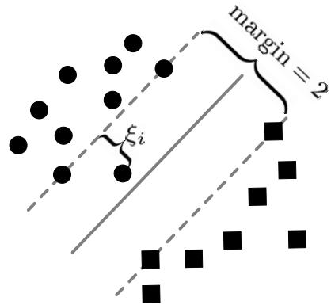  
(a)(0 < ξi < 1)

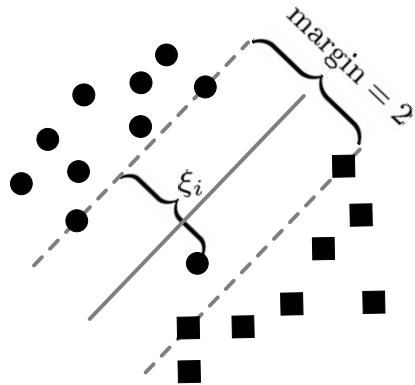  
(b)(1 < ξi < 2)

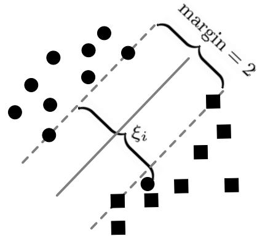  
(c)(ξi >2)  
图13-1ξi的三种情况

(3) $\xi _ { i } + \xi _ { j } > 2$ 分两种情况。(I) $( \xi _ { i } > 1 ) \land ( \xi _ { j } > 1 )$ ，表示都位于自已指派标记异侧，交换它们的标记后，二者就都位于自己新指派标记同侧了，如图13-2所示。

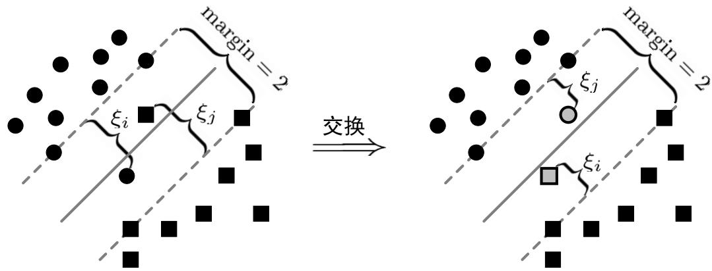  
图 13-2 (1 < ξi, ξj < 2)

可以发现，当 $1 < \xi _ { i } , \xi _ { j } < 2$ 时，交换之后虽然松弛变量仍然大于0，但至少 $\xi _ { i } + \xi _ { j }$ 比交换之前变小了；若进一步的，当 $\xi _ { i } , \xi _ { j } > 2$ 时，则交换之后 $\xi _ { i } + \xi _ { j }$ 将变为0，如图13-3所示。

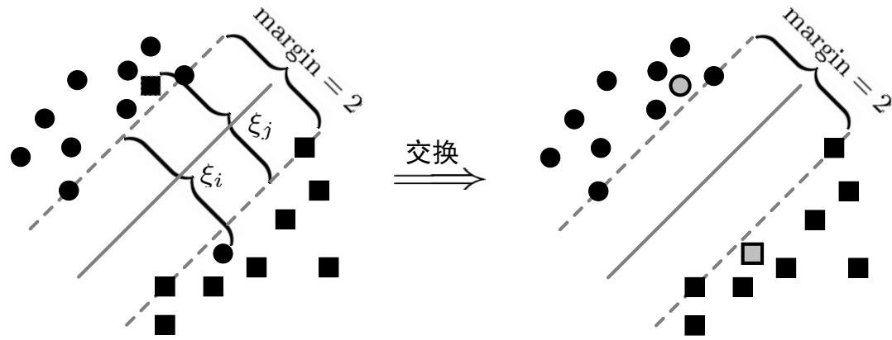  
图 13-3 (ξi > 2) ∧ (ξj > 2)

可以发现，交换之后两个样本均被分类正确，因此松弛变量均等于0。至于 $\xi _ { i } , \xi _ { j }$ 其中之一位于 $1 \sim 2$ 之间，另一个大于2，情况类似，不单列出分析。

(II) $( 0 < \xi _ { i } < 1 ) \land ( \xi _ { j } > 2 - \xi _ { i } )$ ，表示有一个与自己标记同侧，有一个与自己标记异侧，此时可分两种情况。

(II.1) $1 < \xi _ { j } < 2 ,$ 表示样本与自己标记异侧，但仍在间隔带内，如图13-4所示。

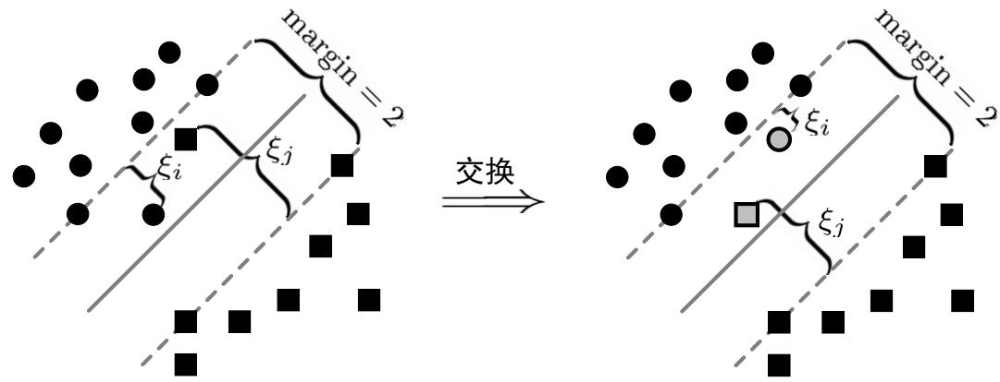  
图 13-4 (ξi + ξj > 2) ∧ (0 < ξi < 1) ∧ (1 < ξj < 2)

可以发现，此时两个样本位置超平面同一侧，交换标记之后似乎没发生什么变化，但是仔细观察会发现交换之后 $\xi _ { i } + \xi _ { j }$ 比交换之前变小了。

(II.2) $\xi _ { j } > 2 ,$ 表示样本在间隔带外，如图13-5所示。

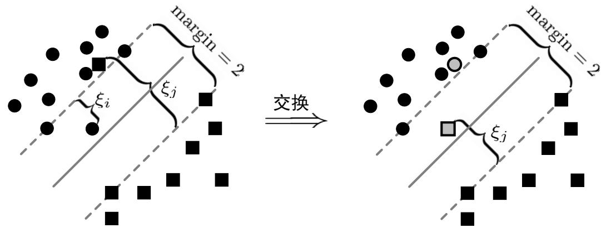  
图13-5 $( \xi _ { i } + \xi _ { j } > 2 ) \wedge ( 0 < \xi _ { i } < 1 ) \wedge ( \xi _ { j } > 2 )$

可以发现，交换之后其中之一被正确分类， $\xi _ { i } + \xi _ { j }$ 比交换之前也变小了。综上所述，当 $\xi _ { i } + \xi _ { j } > 2$ 时，交换指派标记 $\hat { y } _ { i } , \hat { y } _ { j }$ 可以使 $\xi _ { i } + \xi _ { j }$ 下降，也就是说分类结果会得到改善。再解释一下第11行：逐步增长$C _ { u } ,$ 但不超过 $C _ { l } ,$ 末标记样本的权重小于有标记样本。

## 13.3.4式(13.10)的解释

将该式变形为 $\begin{array} { r } { \frac { C _ { u } ^ { + } } { C _ { u } ^ { - } } = \frac { u _ { - } } { u _ { + } } } \end{array}$ ，即样本个数多的权重小，样本个数少的权重大，总体上保持二者的作用相同。

## 13.4图半监督学习

本节共讲了两种方法，其中式(13.11)～式(13.17)讲述了一个针对二分类问题的标记传播方法，式(13.18)～式(13.21)讲述了一个针对多分类问题的标记传播方法，两种方法的原理均为两种方法的原理均为“相似的样本应具有相似的标记”，只是面向的问题不同，而且具体实现的方法也不同。

## 13.4.1式(13.12)的推导

注意，该方法针对二分类问题的标记传播方法。我们希望能量函数 $E ( f )$ 越小越好，注意到式 (13.11)的 $0 < ( \mathbf { W } ) _ { i j } \leqslant 1$ ，且样本 $\mathbf { \Delta } _ { \mathbf { \mathcal { X } } _ { i } }$ 和样本 $\boldsymbol { \mathscr { x } } _ { j }$ 越相似（即 $\| \pmb { x } _ { i } - \pmb { x } _ { j } \| ^ { 2 }$ 越小）则 $( \mathbf { W } ) _ { i j }$ 越大，因此要求式 (13.12)中的 $\left( f \left( \pmb { x } _ { i } \right) - f \left( \pmb { x } _ { j } \right) \right) ^ { 2 }$ 相应地越小越好（即“相似的样本应具有相似的标记”），如此才能达到能量函数$E ( f )$ 越小的目的。首先对式(13.12)的第1行式子进行展开整理:

$$
\begin{array} { l } { { \displaystyle { E ( f ) = \frac { 1 } { 2 } \sum _ { i = 1 } ^ { m } \sum _ { j = 1 } ^ { m } ( { \bf W } ) _ { i j } \left( f \left( { \bf x } _ { i } \right) - f \left( { \bf x } _ { j } \right) \right) ^ { 2 } } \ ~ } } \\ { { \displaystyle { = \frac { 1 } { 2 } \sum _ { i = 1 } ^ { m } \sum _ { j = 1 } ^ { m } ( { \bf W } ) _ { i j } \left( f ^ { 2 } \left( { \bf x } _ { i } \right) - 2 f \left( { \bf x } _ { i } \right) f \left( { \bf x } _ { j } \right) + f ^ { 2 } \left( { \bf x } _ { j } \right) \right) } \ ~ } } \\ { { \displaystyle { = \frac { 1 } { 2 } \sum _ { i = 1 } ^ { m } \sum _ { j = 1 } ^ { m } ( { \bf W } ) _ { i j } f ^ { 2 } \left( { \bf x } _ { i } \right) + \frac { 1 } { 2 } \sum _ { i = 1 } ^ { m } \sum _ { j = 1 } ^ { m } ( { \bf W } ) _ { i j } f ^ { 2 } \left( { \bf x } _ { j } \right) - \sum _ { i = 1 } ^ { m } \sum _ { j = 1 } ^ { m } ( { \bf W } ) _ { i j } f \left( { \bf x } _ { i } \right) f \left( { \bf x } _ { j } \right) } \ ~ } } \end{array}
$$

然后证明 $\begin{array} { r } { \sum _ { i = 1 } ^ { m } \sum _ { j = 1 } ^ { m } ( \mathbf { W } ) _ { i j } f ^ { 2 } \left( \pmb { x } _ { i } \right) = \sum _ { i = 1 } ^ { m } \sum _ { j = 1 } ^ { m } ( \mathbf { W } ) _ { i j } f ^ { 2 } \left( \pmb { x } _ { j } \right) } \end{array}$ ，并变形：

$$
\begin{array} { l } { { \displaystyle \sum _ { i = 1 } ^ { m } \sum _ { j = 1 } ^ { m } ( { \bf W } ) _ { i j } f ^ { 2 } \left( { \pmb x } _ { j } \right) = \sum _ { j = 1 } ^ { m } \sum _ { i = 1 } ^ { m } ( { \bf W } ) _ { j i } f ^ { 2 } \left( { \pmb x } _ { i } \right) = \sum _ { i = 1 } ^ { m } \sum _ { j = 1 } ^ { m } ( { \bf W } ) _ { i j } f ^ { 2 } \left( { \pmb x } _ { i } \right) } } \\ { { \displaystyle \qquad = \sum _ { i = 1 } ^ { m } f ^ { 2 } \left( { \pmb x } _ { i } \right) \sum _ { j = 1 } ^ { m } ( { \bf W } ) _ { i j } } } \end{array}
$$

其中，第1个等号是把变量i，j分别用j,i替代(统一替换公式中的符号并不影响公式本身);第2个等号是由于W是对称矩阵（即 $( \mathbf { W } ) _ { i j } = \mathbf { W } ) _ { j i } \mathbf \Gamma \big )$ ，并交换了求和号次序(类似于多重积分中交换积分号次序)，到此完成了该步骤的证明；第3个等号是由于 $f ^ { 2 } \left( { \pmb x } _ { i } \right)$ 与求和变量j无关，因此拿到了该求和号外面（与求和变量无关的项相对于该求和变量相当于常数)，该步骤的变形主要是为了得到 $d _ { i }$ 。令 $\begin{array} { r } { d _ { i } = \sum _ { j = 1 } ^ { m } ( \mathbf { W } ) _ { i j } } \end{array}$ （既是W第i行元素之和，实际亦是第j列元素之和，因为由于W是对称矩阵，即 $( \mathbf { W } ) _ { i j } = \mathbf { W } ) _ { j i } ,$ 因此$\begin{array} { r } { d _ { i } = \sum _ { j = 1 } ^ { m } ( \mathbf { W } ) _ { j i } } \end{array}$ ，即第i列元素之和)，则

$$
E ( f ) = \sum _ { i = 1 } ^ { m } d _ { i } f ^ { 2 } \left( \pmb { x } _ { i } \right) - \sum _ { i = 1 } ^ { m } \sum _ { j = 1 } ^ { m } ( \pmb { \operatorname { \mathbf { W } } } ) _ { i j } f \left( \pmb { x } _ { i } \right) f \left( \pmb { x } _ { j } \right)
$$

即式 (13.12)的第3行，其中第一项 $\textstyle \sum _ { i = 1 } ^ { m } d _ { i } f ^ { 2 } \left( { \pmb x } _ { i } \right)$ 可以写为如下矩阵形式:

$$
{ } = f ^ { \mathrm { T } } D f
$$

第二项 $\begin{array} { r } { \sum _ { i = 1 } ^ { m } \sum _ { j = 1 } ^ { m } ( \mathbf { W } ) _ { i j } f \left( \pmb { x } _ { i } \right) f \left( \pmb { x } _ { j } \right) } \end{array}$ 也可以写为如下矩阵形式:

$$
\begin{array} { l } { { \displaystyle \sum _ { i = 1 } ^ { m } \sum _ { j = 1 } ^ { m } ( \mathbf { W } ) _ { i j } f \left( { \pmb x } _ { i } \right) f \left( { \pmb x } _ { j } \right) } \ ~ } \\ { { \displaystyle = \left[ \begin{array} { c c c c } { { { \displaystyle f \left( { \pmb x } _ { 1 } \right) } } } & { { f \left( { \pmb x } _ { 2 } \right) } } & { { \cdots } } & { { f \left( { \pmb x } _ { m } \right) } } \end{array} \right] \left[ \begin{array} { c c c c } { { \displaystyle ( { \bf W } ) _ { 1 1 } } } & { { \displaystyle ( { \bf W } ) _ { 1 2 } } } & { { \cdots } } & { { \displaystyle ( { \bf W } ) _ { 1 m } } } \\ { { \displaystyle ( { \bf W } ) _ { 2 1 } } } & { { \displaystyle ( { \bf W } ) _ { 2 2 } } } & { { \cdots } } & { { \displaystyle ( { \bf W } ) _ { 2 m } } } \\ { { \vdots } } & { { \vdots } } & { { \ddots } } & { { \vdots } } \\ { { \displaystyle ( { \bf W } ) _ { m 1 } } } & { { \displaystyle ( { \bf W } ) _ { m 2 } } } & { { \cdots } } & { { \displaystyle ( { \bf W } ) _ { m m } } } \end{array} \right] \left[ \begin{array} { c } { { \displaystyle f \left( { \pmb x } _ { 1 } \right) } } \\ { { \displaystyle f \left( { \pmb x } _ { 2 } \right) } } \\ { { \vdots } } \\ { { \displaystyle f \left( { \pmb x } _ { m } \right) } } \end{array} \right] } } \\ { { \displaystyle = f ^ { \mathrm { T } } W f } } \end{array}
$$

所以 $E ( f ) = { \pmb f } ^ { \mathrm { T } } { \pmb D } - { \pmb f } ^ { \mathrm { T } } { \pmb W } { \pmb f } = { \pmb f } ^ { \mathrm { T } } ( { \pmb D } - { \pmb W } ) { \pmb f } ,$ ，即式(13.12)。

## 13.4.2式(13.13)的推导

本式就是将式(13.12）用分块矩阵形式表达而已，拆分为标记样本和末标记样本两部分。

另外解释一下该式之前一段话中第一句的含义：“具有最小能量的函数ƒ 在有标记样本上满足 $f \left( \pmb { x } _ { i } \right) =$ $y _ { i } ( i = 1 , 2 , \ldots , l )$ ，在末标记样本上满足 $\Delta f = 0 \ ^ { \prime \prime }$ ，前半句是很容易理解的，有标记样本上满足 $f \left( \pmb { x } _ { i } \right) =$ $y _ { i } ( i = 1 , 2 , \ldots , l )$ ，这时末标记样本的 $f \left( \pmb { x } _ { i } \right)$ 是待求变量且应该使 $E ( f )$ 最小，因此应将式(13.12）对末标记样本的 $f \left( \pmb { x } _ { i } \right)$ 求导并令导数等于0即可，此即表达式 $\Delta f = 0$ ，此处可以查看该算法的原始文献。

## 13.4.3式(13.14)的推导

将式 (13.13)根据矩阵运算规则进行变形，这里第一项西瓜书中的符号有歧义，应该表示成 $\left[ \begin{array} { l l } { \pmb { f } _ { l } ^ { \mathrm { T } } } & { \pmb { f } _ { u } ^ { \mathrm { T } } } \end{array} \right]$ 即一个R $\displaystyle \boldsymbol { \mathbf { \rho } } ^ { 1 \times ( l + u ) }$ 的行向量。根据矩阵乘法的定义，有：

$$
\begin{array} { r l } & { E ( f ) = [ \begin{array} { l l } { { \mathbf { f } } _ { l } ^ { \mathrm { T } } } & { { \mathbf { f } } _ { u } ^ { \mathrm { T } } } \end{array} ] [ \begin{array} { l l } { { D } _ { u } - { W } _ { u } } & { - { W } _ { l u } } \\ { \quad - { W } _ { u l } } & { { D } _ { u u } - { W } _ { u u } } \end{array} ] [ \begin{array} { l } { { f } _ { l } } \\ { { f } _ { u } } \end{array} ] } \\ & { \quad \quad \quad = [ \begin{array} { l } { { \mathbf { f } } _ { l } ^ { \mathrm { T } } ( { D } _ { u } - { W } _ { u } ) - { f } _ { u } ^ { \mathrm { T } } { W } _ { u l } } & { - { f } _ { l } ^ { \mathrm { T } } { W } _ { l u } + { f } _ { u } ^ { \mathrm { T } } ( { D } _ { u u } - { W } _ { u u } ) } \end{array} ] [ \begin{array} { l } { { f } _ { l } } \\ { { f } _ { u } } \end{array} ] } \\ & { \quad \quad \quad = ( { f } _ { l } ^ { \mathrm { T } } ( { D } _ { u } - { W } _ { u } ) - { f } _ { u } ^ { \mathrm { T } } { W } _ { u l } ) { f } _ { l } + ( - { f } _ { l } ^ { \mathrm { T } } { W } _ { l u } + { f } _ { u } ^ { \mathrm { T } } ( { D } _ { u u } - { W } _ { u u } ) ) { f } _ { u } } \\ &  \quad \quad \quad = { f } _ { l } ^ { \mathrm { T } } ( { D } _ { u } - { W } _ { u } ) { f } _ { l } - { f } _ { u } ^ { \mathrm { T } } { W } _ { u l } { f } _ { l } - { f } _ { l } ^ { \mathrm { T } } { W } _ { l u } { f } _ { u } + { f } _ { u } ^ { \mathrm { T } } ( { D } _  u \end{array}
$$

其中最后一步， $\pmb { f } _ { l } ^ { \mathrm { T } } \pmb { W } _ { l u } \pmb { f } _ { u } = \left( \pmb { f } _ { l } ^ { \mathrm { T } } \pmb { W } _ { l u } \pmb { f } _ { u } \right) ^ { \mathrm { T } } = f _ { u } ^ { \mathrm { T } } \pmb { W } _ { u l } \pmb { f } _ { l }$ ，因为这个式子的结果是一个标量。

## 13.4.4式(13.15)的推导

首先，基于式 (13.14)对 $\mathbf { \nabla } f _ { u }$ 求导：

$$
\begin{array} { l } { \displaystyle \frac { \partial E ( f ) } { \partial f _ { u } } = \frac { \partial f _ { l } ^ { \mathrm { T } } \left( D _ { l l } - W _ { l l } \right) f _ { l } - 2 f _ { u } ^ { \mathrm { T } } W _ { u l } f _ { l } + f _ { u } ^ { \mathrm { T } } \left( D _ { u u } - W _ { u u } \right) f _ { u } } { \partial f _ { u } } } \\ { = - 2 W _ { u l } f _ { l } + 2 \left( D _ { u u } - W _ { u u } \right) f _ { u } } \end{array}
$$

令结果等于0即得13.15。

注意式中各项的含义:

$\mathbf { \nabla } f _ { u }$ 即函数f在末标记样本上的预测结果；

$D _ { u u } , W _ { u u } , W _ { u l }$ 均可以由式 (13.11)得到;

$f _ { l }$ 即函数ƒ 在有标记样本上的预测结果(即已知标记，详见“西瓜书”P301倒数第3行)；

也就是说可以根据式(13.15）根据 $D _ { l }$ 上的标记信息（即 ${ { f } _ { l } } )$ 求得末标记样本的标记（即 $\pmb { f } _ { u } \ )$ ，式(13.17)仅是式(13.15)的进一步变形化简，不再细述。

仔细回顾该方法，实际就是根据“相似的样本应具有相似的标记”的原则，构建了目标函数式(13.12)，求解式(13.12)得到了使用标记样本信息表示的末标记样本的预测标记。

## 13.4.5式（13.16）的解释

根据矩阵乘法的定义计算可得该式，其中需要注意的是，对角矩阵 D 的拟等于其各个对角元素的倒数。

## 13.4.6式(13.17)的推导

第一项到第二项是根据矩阵乘法逆的定义： $( \mathbf { A } \mathbf { B } ) ^ { - 1 } = \mathbf { B } ^ { - 1 } \mathbf { A } ^ { - 1 }$ ，在这个式子中

$$
\begin{array} { r } { \mathbf { P } _ { u u } = \mathbf { D } _ { u u } ^ { - 1 } \mathbf { W } _ { u u } } \\ { \mathbf { P } _ { u l } = \mathbf { D } _ { u u } ^ { - 1 } \mathbf { W } _ { u l } } \end{array}
$$

均可以根据 $\mathbf { W } _ { i j }$ 计算得到，因此可以通过标记 f 计算未标记数据的标签 $\mathbf { f } _ { u }$ 。

## 13.4.7式（13.18)的解释

其中Y的第行表示第个样本的类别；具体来说，对于前1个有标记样本来说，若第i个样本的类别为 $j ( 1 \leq j \leq | \mathcal { V } | )$ ，则Y的第行第j列即为1，第行其余元素为0；对于后u个末标记样本来说，Y统一为零。注意|V表示集合V的势，即包含元素 (类别)的个数。

## 13.4.8式（13.20)的解释

$$
\mathbf { F } ^ { * } = \operatorname* { l i m } _ { t \to \infty } \mathbf { F } ( t ) = ( 1 - \alpha ) ( \mathbf { I } - \alpha \mathbf { S } ) ^ { - 1 } \mathbf { Y }
$$

[解析]：由式 (13.19)

$$
\mathbf { F } ( t + 1 ) = \alpha \mathbf { S } \mathbf { F } ( t ) + ( 1 - \alpha ) \mathbf { Y }
$$

当t取不同的值时，有：

$$
\begin{array} { c } { t = 0 : \mathbf { F } ( 1 ) = \alpha \mathbf { S } \mathbf { F } ( 0 ) + ( 1 - \alpha ) \mathbf { Y } } \\ { = \alpha \mathbf { S } \mathbf { Y } + ( 1 - \alpha ) \mathbf { Y } } \end{array}
$$

$$
\begin{array} { l } { { \displaystyle t = 1 : { \bf F } ( 2 ) = \alpha { \bf S } { \bf F } ( 1 ) + ( 1 - \alpha ) { \bf Y } = \alpha { \bf S } ( \alpha { \bf S } { \bf Y } + ( 1 - \alpha ) { \bf Y } ) + ( 1 - \alpha ) { \bf Y } } \ ~ } \\ { { \displaystyle ~ = ( \alpha { \bf S } ) ^ { 2 } { \bf Y } + ( 1 - \alpha ) \left( \sum _ { i = 0 } ^ { 1 } ( \alpha { \bf S } ) ^ { i } \right) { \bf Y } } \ ~ } \end{array}
$$

$$
\begin{array} { r l } & { t = 2 : \mathbf { F } ( 3 ) = \alpha \mathbf { S } \mathbf { F } ( 2 ) + ( 1 - \alpha ) \mathbf { Y } } \\ & { \qquad = \alpha \mathbf { S } \left( ( \alpha \mathbf { S } ) ^ { 2 } \mathbf { Y } + ( 1 - \alpha ) \left( \displaystyle \sum _ { i = 0 } ^ { 1 } ( \alpha \mathbf { S } ) ^ { i } \right) \mathbf { Y } \right) + ( 1 - \alpha ) \mathbf { Y } } \\ & { \qquad = ( \alpha \mathbf { S } ) ^ { 3 } \mathbf { Y } + ( 1 - \alpha ) \left( \displaystyle \sum _ { i = 0 } ^ { 2 } ( \alpha \mathbf { S } ) ^ { i } \right) \mathbf { Y } } \end{array}
$$

可以观察到规律

$$
\mathbf { F } ( t ) = ( \alpha \mathbf { S } ) ^ { t } \mathbf { Y } + ( 1 - \alpha ) \left( \sum _ { i = 0 } ^ { t - 1 } ( \alpha \mathbf { S } ) ^ { i } \right) \mathbf { Y }
$$

则

$$
\mathbf { F } ^ { * } = \operatorname* { l i m } _ { t  \infty } \mathbf { F } ( t ) = \operatorname* { l i m } _ { t  \infty } ( \alpha \mathbf { S } ) ^ { t } \mathbf { Y } + \operatorname* { l i m } _ { t  \infty } ( 1 - \alpha ) ( \sum _ { i = 0 } ^ { t - 1 } ( \alpha \mathbf { S } ) ^ { i } ) \mathbf { Y }
$$

其中第一项由于 $\mathbf { S } = \mathbf { D } ^ { - \frac { 1 } { 2 } } \mathbf { W } \mathbf { D } ^ { - \frac { 1 } { 2 } }$ 的特征值介于[-1，1] 之间[1]，而 $\alpha \in ( 0 , 1 )$ ，所以 $\begin{array} { r } { \operatorname* { l i m } _ { t  \infty } ( \alpha \mathbf { S } ) ^ { t } = 0 } \end{array}$ ，第二项由等比数列公式

$$
\operatorname* { l i m } _ { t  \infty } \sum _ { i = 0 } ^ { t - 1 } ( \alpha \mathbf { S ) } ^ { i } = \frac { \mathbf { I } - \operatorname* { l i m } _ { t  \infty } ( \alpha \mathbf { S } ) ^ { t } } { \mathbf { I } - \alpha \mathbf { S } } = \frac { \mathbf { I } } { \mathbf { I } - \alpha \mathbf { S } } = ( \mathbf { I } - \alpha \mathbf { S } ) ^ { - 1 }
$$

综合可得式 (13.20)。

## 13.4.9式(13.21)的推导

这里主要是推导式 (13.21)的最优解即为式(13.20)。将式 (13.21)的目标函数进行变形。

第1部分:

先将范数平方拆开为四项

$$
\begin{array} { r } { \left\| \frac { 1 } { \sqrt { d _ { i } } } \mathbf { F } _ { i } - \frac { 1 } { \sqrt { d _ { j } } } \mathbf { F } _ { j } \right\| ^ { 2 } = \left( \frac { 1 } { \sqrt { d _ { i } } } \mathbf { F } _ { i } - \frac { 1 } { \sqrt { d _ { j } } } \mathbf { F } _ { j } \right) \left( \frac { 1 } { \sqrt { d _ { i } } } \mathbf { F } _ { i } - \frac { 1 } { \sqrt { d _ { j } } } \mathbf { F } _ { j } \right) ^ { \top } } \\ { = \frac { 1 } { d _ { i } } \mathbf { F } _ { i } \mathbf { F } _ { i } ^ { \top } + \frac { 1 } { d _ { j } } \mathbf { F } _ { j } \mathbf { F } _ { j } ^ { \top } - \frac { 1 } { \sqrt { d _ { i } d _ { j } } } \mathbf { F } _ { i } \mathbf { F } _ { j } ^ { \top } - \frac { 1 } { \sqrt { d _ { j } d _ { i } } } \mathbf { F } _ { j } \mathbf { F } _ { i } ^ { \top } } \end{array}
$$

其中 $\mathbf { F } _ { i } \in \mathbb { R } ^ { 1 \times | \mathcal { V } | }$ 表示矩阵F的第i行，即第i个示例 $\mathbf { \mathcal { x } } _ { i }$ 的标记向量。将第1项中的 $\textstyle \sum _ { i , j = 1 } ^ { m }$ 写为两个和求号 $\textstyle \sum _ { i = 1 } ^ { m } \sum _ { i = 1 } ^ { m }$ 的形式，并将上面拆分的四项中的前两项代入，得

$$
\sum _ { i , j = 1 } ^ { m } ( \mathbf { W } ) _ { i j } \frac { 1 } { d _ { i } } \mathbf { F } _ { i } \mathbf { F } _ { i } ^ { \top } = \sum _ { i = 1 } ^ { m } \frac { 1 } { d _ { i } } \mathbf { F } _ { i } \mathbf { F } _ { i } ^ { \top } \sum _ { j = 1 } ^ { m } ( \mathbf { W } ) _ { i j } = \sum _ { i = 1 } ^ { m } \frac { 1 } { d _ { i } } \mathbf { F } _ { i } \mathbf { F } _ { i } ^ { \top } \cdot d _ { i } = \sum _ { i = 1 } ^ { m } \mathbf { F } _ { i } \mathbf { F } _ { i } ^ { \top }
$$

$$
\sum _ { i , j = 1 } ^ { m } ( \mathbf { W } ) _ { i j } { \frac { 1 } { d _ { j } } } \mathbf { F } _ { j } \mathbf { F } _ { j } ^ { \top } = \sum _ { j = 1 } ^ { m } { \frac { 1 } { d _ { j } } } \mathbf { F } _ { j } \mathbf { F } _ { j } ^ { \top } \sum _ { i = 1 } ^ { m } ( \mathbf { W } ) _ { i j } = \sum _ { j = 1 } ^ { m } { \frac { 1 } { d _ { j } } } \mathbf { F } _ { j } \mathbf { F } _ { j } ^ { \top } \cdot d _ { j } = \sum _ { j = 1 } ^ { m } \mathbf { F } _ { j } \mathbf { F } _ { j } ^ { \top }
$$

以上化简过程中，两个求和号可以交换求和次序；又因为W为对称阵，因此对行求和与对列求和效果一样,即 $\begin{array} { r } { d _ { i } = \sum _ { j = 1 } ^ { m } ( \mathbf { W } ) _ { i j } = \sum _ { j = 1 } ^ { m } ( \mathbf { W } ) _ { j } } \end{array}$ （已在式(13.12)推导时说明)。显然，

$$
\sum _ { i = 1 } ^ { m } \mathbf { F } _ { i } \mathbf { F } _ { i } ^ { \top } = \sum _ { j = 1 } ^ { m } \mathbf { F } _ { j } \mathbf { F } _ { j } ^ { \top } = \sum _ { i = 1 } ^ { m } \left\| \mathbf { F } _ { i } \right\| ^ { 2 } = \left\| \mathbf { F } \right\| _ { \mathrm { F } } ^ { 2 } = \operatorname { t r } \left( \mathbf { F } \mathbf { F } ^ { \top } \right)
$$

以上推导过程中，第1 个等号显然成立，因为二者仅是求和变量名称不同；第 2 个等号即将 $\mathbf { F } _ { i } \mathbf { F } _ { i } ^ { \top }$ 写为 $\left\| \mathbf { F } _ { i } \right\| ^ { 2 }$ 形式；从第2 个等号的结果可以看出这明显是在求矩阵F 各元素平方之和，也就是矩阵F 的Frobenius 范数（简称 F 范数）的平方，即第3个等号；根据矩阵 F 范数与矩阵的迹的关系有第4个等号(详见本章预备知识：矩阵的 F 范数与迹)。接下来，将上面拆分的四项中的第三项代入，得

$$
\sum _ { i , j = 1 } ^ { m } ( \mathbf { W } ) _ { i j } \frac { 1 } { \sqrt { d _ { i } d _ { j } } } \mathbf { F } _ { i } \mathbf { F } _ { j } ^ { \top } = \sum _ { i , j = 1 } ^ { m } ( \mathbf { S } ) _ { i j } \mathbf { F } _ { i } \mathbf { F } _ { j } ^ { \top } = \operatorname { t r } \left( \mathbf { S } ^ { \top } \mathbf { F } \mathbf { F } ^ { \top } \right) = \operatorname { t r } \left( \mathbf { S } \mathbf { F } \mathbf { F } ^ { \top } \right)
$$

具体来说，以上化简过程为：

$$
\begin{array} { r l } & { \mathbf { S } - [ \begin{array} { c c c c } { ( \mathbf { S } ) _ { 1 1 } } & { ( \mathbf { S } ) _ { 1 2 } } & { \ldots } & { ( \mathbf { S } ) _ { 1 m } } \\ { ( \mathbf { S } ) _ { 2 1 } } & { ( \mathbf { S } ) _ { 2 2 } } & { \ldots } & { ( \mathbf { S } ) _ { 2 m } } \\ { \vdots } & { \vdots } & { \ddots } & { \vdots } \\ { ( \mathbf { S } ) _ { m 1 } } & { ( \mathbf { S } ) _ { m 2 } } & { \ldots } & { ( \mathbf { S } ) _ { m m } } \end{array} ] } \\ & { = \mathbf { D } ^ { - \frac { 1 } { 2 } } \mathbf { W } \mathbf { D } ^ { - \frac { 1 } { 2 } } } \\ &  = [ \begin{array} { c c c c } { \frac { 1 } { \sqrt { \mathcal { M } _ { 1 } } } } & & & \\ & { \frac { 1 } { \sqrt { \mathcal { M } _ { 2 } } } } & & \\ & & { \ddots } & \\ & & & { \frac { 1 } { \sqrt { \mathcal { M } _ { 2 } } } } & \end{array} ] [ \begin{array} { c c c c } { ( \mathbf { W } ) _ { 1 1 } } & { ( \mathbf { W } ) _ { 1 2 } } & { \ldots } & { ( \mathbf { W } ) _ { 1 m } } \\ { ( \mathbf { W } ) _ { 2 1 } } & { ( \mathbf { W } ) _ { 2 2 } } & { \ldots } & { ( \mathbf { W } ) _ { 2 m } } \\ { \vdots } & { \vdots } & { \ddots } & { \vdots } \\ { ( \mathbf { W } ) _ { m 1 } } & { ( \mathbf { W } ) _ { m 2 } } & { \ldots } & { ( \mathbf { W } ) _ { m m } } \end{array} ] [ \begin{array} { c c c c } { \frac { 1 } { \sqrt { \mathcal { M } _ { 1 } } } } & & & \\ & { \frac { 1 } { \sqrt { \mathcal { M } _ { 2 } } } } & & \\ & & { \ddots } & \\ & & & { \frac { 1 } { \sqrt { \mathcal { M } _ { m } } } } \endarray \end{array} \end{array}
$$

由以上推导可以看出 $\begin{array} { r } { ( \mathbf { S } ) _ { i j } = \frac { 1 } { \sqrt { d _ { i } d _ { j } } } ( \mathbf { W } ) _ { i j } } \end{array}$ ，即第1个等号；而

$$
\mathbf { F } \mathbf { F } ^ { \mathsf { T } } = { \left[ \begin{array} { l } { \mathbf { F } _ { 1 } } \\ { \mathbf { F } _ { 2 } } \\ { \vdots } \\ { \mathbf { F } _ { m } } \end{array} \right] } { \left[ \begin{array} { l l l l } { \mathbf { F } _ { 1 } ^ { \top } } & { \mathbf { F } _ { 2 } ^ { \top } } & { \cdots } & { \mathbf { F } _ { m } ^ { \top } } \end{array} \right] } = { \left[ \begin{array} { l l l l } { \mathbf { F } _ { 1 } \mathbf { F } _ { 1 } ^ { \top } } & { \mathbf { F } _ { 1 } \mathbf { F } _ { 2 } ^ { \top } } & { \ldots } & { \mathbf { F } _ { 1 } \mathbf { F } _ { m } ^ { \top } } \\ { \mathbf { F } _ { 2 } \mathbf { F } _ { 1 } ^ { \top } } & { \mathbf { F } _ { 2 } \mathbf { F } _ { 2 } ^ { \top } } & { \cdots } & { \mathbf { F } _ { 2 } \mathbf { F } _ { m } ^ { \top } } \\ { \vdots } & { \vdots } & { \ddots } & { \vdots } \\ { \mathbf { F } _ { m } \mathbf { F } _ { 1 } ^ { \top } } & { \mathbf { F } _ { m } \mathbf { F } _ { 2 } ^ { \top } } & { \cdots } & { \mathbf { F } _ { m } \mathbf { F } _ { m } ^ { \top } } \end{array} \right] }
$$

若令 $\mathbf { A } = \mathbf { S } \circ \mathbf { F } \mathbf { F } ^ { \top }$ ，其中表示Hadmard 积，即矩阵S与矩阵 $\mathbf { F } \mathbf { F } ^ { \top }$ 元素对应相乘（参见百度百科哈达玛积)，因此

$$
\sum _ { i , j = 1 } ^ { m } ( \mathbf { S } ) _ { i j } \mathbf { F } _ { i } \mathbf { F } _ { j } ^ { \top } = \sum _ { i , j = 1 } ^ { m } ( \mathbf { A } ) _ { i j }
$$

可以验证，上式的矩阵 $\mathbf { A } = \mathbf { S } \circ \mathbf { F } \mathbf { F } ^ { \top }$ 元素之和 $\begin{array} { r } { \sum _ { i , j = 1 } ^ { m } ( \mathbf { A } ) _ { i j } } \end{array}$ 等于 $\operatorname { t r } \left( \mathbf { S } ^ { \top } \mathbf { F } \mathbf { F } ^ { \top } \right)$ ，这是因为

$$
\begin{array} { r l } & { \mathbf { \Sigma } _ { \mathbf { \Sigma } } ^ { \mathbf { \Sigma } } = ( [ \begin{array} { c c c c c } { \langle \mathbf { S } | \mathbf { \Sigma } _ { 1 1 } } & { \langle \mathbf { S } | \mathbf { \Sigma } _ { 1 2 } } & { \cdots } & { \langle \mathbf { S } | \mathbf { \Sigma } _ { 1 2 } } \\ { \langle \mathbf { S } | \mathbf { \Sigma } _ { 2 1 } } & { \langle \mathbf { S } | \mathbf { \Sigma } _ { 2 2 } } & { \cdots } & { \langle \mathbf { S } | \mathbf { \Sigma } _ { 2 3 } } \\ { \vdots } & { \vdots } & { \ddots } & { \vdots } \\ { \langle \mathbf { S } | \mathbf { \Sigma } _ { 3 2 } } & { \langle \mathbf { S } | \mathbf { \Sigma } _ { 3 2 } } & { \cdots } & { \langle \mathbf { S } | \mathbf { S } _ { 3 3 \mathrm { t a r d } } \rangle } \end{array} ] ^ { \top } \cdot [ \begin{array} { c c c c c } { \mathbf { F } _ { 1 } \mathbf { \Sigma } _ { 1 } ^ { \mathbf { \Sigma } } } & { \mathbf { F } _ { 1 2 } ^ { \mathbf { \Sigma } } } & { \cdots } & { \mathbf { F } _ { 1 3 \mathrm { t a r d } } } \\ { \mathbf { F } _ { 2 } \mathbf { F } _ { 1 } ^ { \mathbf { \Sigma } } } & { \mathbf { F } _ { 2 3 } ^ { \mathbf { \Sigma } } } & { \cdots } & { \mathbf { F } _ { 3 3 \mathrm { t a r d } } } \\ { \vdots } & { \vdots } & { \vdots } & { \ddots } & { \vdots } \\ { \mathbf { F } _ { 3 \mathrm { t a r d } } } & { \mathbf { F } _ { 3 \mathrm { t a r d } } } & { \cdots } & { \mathbf { F } _ { 3 \mathrm { t a r d } } } \end{array} ] ) } \\ &  = [ \begin{array} { c } { \langle \mathbf { S } | \mathbf { \Sigma } _ { 1 1 } } \\ { \langle \mathbf { S } | \mathbf { \Sigma } _ { 2 1 } } \\ { \vdots } \\ { \langle \mathbf { S } | \mathbf { \Sigma } _ { 3 2 } } \\ { \vdots } \\  \end{array} \end{array}
$$

即第2个等号；易知矩阵S是对称阵 $( \mathbf { S } ^ { \top } = \mathbf { S } )$ ，即得第3个等号。又由于内积 $\mathbf { F } _ { i } \mathbf { F } _ { j } ^ { \top }$ 是一个数 (即大小为 $1 \times 1$ 的矩阵)，因此其转置等于本身，

$$
\mathbf { F } _ { i } \mathbf { F } _ { j } ^ { \top } = \left( \mathbf { F } _ { i } \mathbf { F } _ { j } ^ { \top } \right) ^ { \top } = \left( \mathbf { F } _ { j } ^ { \top } \right) ^ { \top } \left( \mathbf { F } _ { i } \right) ^ { \top } = \mathbf { F } _ { j } \mathbf { F } _ { i } ^ { \top }
$$

因此

$$
\frac { 1 } { \sqrt { d _ { i } d _ { j } } } \mathbf { F } _ { i } \mathbf { F } _ { j } ^ { \top } = \frac { 1 } { \sqrt { d _ { j } d _ { i } } } \mathbf { F } _ { j } \mathbf { F } _ { i } ^ { \top }
$$

进而上面拆分的四项中的第三项和第四项相等：

$$
\sum _ { i , j = 1 } ^ { m } ( { \bf W } ) _ { i j } \frac { 1 } { \sqrt { d _ { i } d _ { j } } } { \bf F } _ { i } { \bf F } _ { j } ^ { \top } = \sum _ { i , j = 1 } ^ { m } ( { \bf W } ) _ { i j } \frac { 1 } { \sqrt { d _ { j } d _ { i } } } { \bf F } _ { j } { \bf F } _ { i } ^ { \top }
$$

综上所述(以上拆分的四项中前两项相等、后两项相等，正好抵消系数\）:

$$
{ \frac { 1 } { 2 } } \left( \sum _ { i , j = 1 } ^ { m } ( \mathbf { W } ) _ { i j } \left\| { \frac { 1 } { \sqrt { d _ { i } } } } \mathbf { F } _ { i } - { \frac { 1 } { \sqrt { d _ { j } } } } \mathbf { F } _ { j } \right\| ^ { 2 } \right) = \operatorname { t r } \left( \mathbf { F } \mathbf { F } ^ { \top } \right) - \operatorname { t r } \left( \mathbf { S } \mathbf { F } \mathbf { F } ^ { \top } \right)
$$

第2部分:

西瓜书中式 (13.21)的第2部分与原文献[2]中式 (4)的第 2部分不同:

$$
\mathcal { Q } ( F ) = \frac { 1 } { 2 } \sum _ { i , j = 1 } ^ { n } W _ { i j } \left. \frac { F _ { i } } { \sqrt { D _ { i i } } } - \frac { F _ { j } } { \sqrt { D _ { j j } } } \right. ^ { 2 } + \mu \sum _ { i = 1 } ^ { n } \left. F _ { i } - Y _ { i } \right. ^ { 2 } ,
$$

原文献中第2 部分包含了所有样本（求和变量上限为n），而西瓜书只包含有标记样本，并且第304页第二段提到“式(13.21）右边第二项是迫使学得结果在有标记样本上的预测与真实标记尽可能相同”；若按原文献式(4）在第二项中将末标记样本也包含进来，由于对于末标记样本 $\mathbf { Y } _ { i } = \mathbf { 0 }$ ，因此直观上理解是迫使末标记样本学习结果尽可能接近 0，这显然是不对的；有关这一点作者在第 24 次印刷勘误中进行了补充：“考虑到有标记样本通常很少而末标记样本很多，为缓解过拟合，可在式(13.21）中引入针对末标记样本的 $\mathrm { L _ { 2 } }$ 范数项 $\textstyle \mu \sum _ { i = l + 1 } ^ { l + u } \left\| \mathbf { F } _ { i } \right\| ^ { 2 }$ ，式(13.21）加上此项之后就与原文献的式(4）完全相同了。将第二项写为F范数形式:

$$
\sum _ { i = 1 } ^ { m } \left\| \mathbf { F } _ { i } - \mathbf { Y } _ { i } \right\| ^ { 2 } = \left\| \mathbf { F } - \mathbf { Y } \right\| _ { \mathrm { F } } ^ { 2 }
$$

综上，式(13.21)目标函数 $\mathcal { Q } ( \mathbf { F } ) = \operatorname { t r } \left( \mathbf { F } \mathbf { F } ^ { \top } \right) - \operatorname { t r } \left( \mathbf { S } \mathbf { F } \mathbf { F } ^ { \top } \right) + \mu \| \mathbf { F } - \mathbf { Y } \| _ { \mathrm { H } } ^ { 2 }$ ，求导：

$$
\begin{array} { c } { \displaystyle \frac { \partial { \cal Q } ( { \bf F } ) } { \partial { \bf F } } = \frac { \partial \operatorname { t r } \left( { \bf F } { \bf F } ^ { \top } \right) } { \partial { \bf F } } - \frac { \partial \operatorname { t r } \left( { \bf S } { \bf F } { \bf F } ^ { \top } \right) } { \partial { \bf F } } + \mu \frac { \partial \| { \bf F } - { \bf Y } \| _ { \mathbf { F } } ^ { 2 } } { \partial { \bf F } } } \\ { = 2 { \bf F } - 2 { \bf S } { \bf F } + 2 \mu ( { \bf F } - { \bf Y } ) } \end{array}
$$

令 $\textstyle \mu = { \frac { 1 - \alpha } { \alpha } } $ ，并令 $\begin{array} { r } { \frac { \partial \boldsymbol { Q } ( \mathbf { F } ) } { \partial \mathbf { F } } = 2 \mathbf { F } - 2 \mathbf { S } \mathbf { F } + 2 \frac { 1 - \alpha } { \alpha } ( \mathbf { F } - \mathbf { Y } ) = 0 } \end{array}$ ，移项化简即可得式(13.20)，即式(13.20)是正则化框架式(13.21)的解。

## 13.5基於分歧的方法

“西瓜书”的伟大之处在于巧妙地融入了很多机器学习的研究分支，而非仅简单介绍经典的机器学习算法。比如本节处于半监督学习章节范围内，巧妙地将机器学习的研究热点之一多视图学习 [3](multi-viewlearning）融入进来，类似地还有本章第一节将主动学习融入进来，在第 10 章第一节将 k 近邻算法融入进来，在最后一节巧妙地将度量学习(metric learning)融入进来等等。

协同训练是多视图学习代表性算法之一，本章叙述简单易懂。

## 13.5.1图13.6的解释

第2 行表示从样本集 $D _ { u }$ 中去除缓冲池样本 $D _ { s } ;$

第4行，当 $j = 1$ 时 $\langle \pmb { x } _ { i } ^ { j } , \pmb { x } _ { i } ^ { 3 - j } \rangle$ 即为 $ { \langle x _ { i } ^ { 1 } , x _ { i } ^ { 2 } \rangle }$ ，当 $j = 2$ 时 $\langle \pmb { x } _ { i } ^ { j } , \pmb { x } _ { i } ^ { 3 - j } \rangle$ 即为 $\langle \pmb { x } _ { i } ^ { 2 } , \pmb { x } _ { i } ^ { 1 } \rangle$ ，往后的 $3 - j$ 与此相同；注意本页左上角的注释： $ { \langle x _ { i } ^ { 1 } , x _ { i } ^ { 2 } \rangle }$ 与 $\langle \pmb { x } _ { i } ^ { 2 } , \pmb { x } _ { i } ^ { 1 } \rangle$ 表示的是同一个样本，因此第1个视图的有标记标训练集为 $D _ { l } ^ { 1 } = \{ ( \pmb { x } _ { 1 } ^ { 1 } , y _ { 1 } ) , . . . , ( \pmb { x } _ { l } ^ { 1 } , y _ { l } ) \}$ ，第2个视图的有标记标训练集为 ${ \cal D } _ { l } ^ { 2 } = \{ ( { \pmb x } _ { 1 } ^ { 2 } , y _ { 1 } ) , . . . , ( { \pmb x } _ { l } ^ { 2 } , y _ { l } ) \}$

第 9 行 第 11 行是根据第 j个视图对缓冲池中无标记样本的分类置信度赋予伪标记，准备交给第 $3 - j$ 个视图使用。

## 13.6半监督聚类

## 13.6.1图13.7的解释

注意算法第 4 行到第21 行是依次对每个样本进行处理，其中第 8 行到第 21 行是尝试将样本 $\mathbf { \Delta } _ { \mathbf { \mathcal { X } } _ { i } }$ 到底应该划入哪个族，具体来说是按样本 $\mathbf { \mathcal { x } } _ { i }$ 到各均值向量的距离从小到大依次尝试，若最小的不违背M和C中的约束，则将样本 $\mathbf { \Delta } _ { \mathbf { \mathcal { X } } _ { i } }$ 划入该簇并置 is\_merge=true，此时第 8 行的 while 循环条件为假不再继续循环，若从小到大依次尝试各簇后均违背M 和 C 中的约束则第16 行的if 条件为真，算法报错结束；依次对每个样本进行处理后第 22 行到第 24 行更新均值向量，重新开始新一轮迭代，直到均值向量均末更新。

## 13.6.2图13.9的解释

算法第 6 行到第 10 行即在聚类簇迭代更新过程中不改变种子样本的簇隶属关系；第 11 行到第 15 行即对非种子样本进行普通的 k-means 聚类过程；第 16 行到第 18 行更新均值向量，反复迭代，直到均值向量均未更新。

## 参考文献

[1] Wikipedia contributors. Laplacian matrix, 2020.

[2] Dengyong Zhou, Olivier Bousquet, Thomas Lal, Jason Weston, and Bernhard Schölkopf. Learning with local and global consistency. Advances in neural information processing systems, 16, 2003.

[3] Chang Xu, Dacheng Tao, and Chao Xu. A survey on multi-view learning. arXiv preprint arXiv:1304.5634, 2013.

## 第14章昇概率图模型

本章介绍概率图模型，前三节分别介绍了有向图模型之隐马尔可夫模型以及无向图模型之马尔可夫随机场和条件随机场；接下来两节分别介绍精确推断和近似推断；最后一节简单介绍了话题模型的典型代表隐狄利克雷分配模型 (LDA)。

## 14.1隐马尔可夫模型

本节前三段内容实际上是本章的概述，从第四段才开始介绍“隐马尔可夫模型”。马尔可夫的大名相信很多人听说过，比如马尔可夫链；虽然隐马尔可夫模型与马尔可夫链并非同一人提出，但其中关键字“马尔可夫”蕴含的概念是相同的，即系统下一时刻的状态仅由当前状态决定。

## 14.1.1生成式模型和判别式模型

一般来说，机器学习的任务是根据输入特征α预测输出变量 $y ;$ 生成式模型最终求得联合概率 $P ( \pmb { x } , y )$ , 而判别式模型最终求得条件概率 $P ( y \mid x )$

统计机器学习算法都是基于样本独立同分布 (independent and identically distributed，简称 i.i.d..)的假设，也就是说，假设样本空间中全体样本服从一个末知的“分布”D，我们获得的每个样本都是独立地从这个分布上采样获得的。

对于一个样本 $( { \pmb x } , y )$ ，联合概率 $P ( \pmb { x } , y )$ 表示从样本空间中采样得到该样本的概率；因为 $P ( \pmb { x } , y )$ 表示“生成”样本本身的概率，故称之为“生成式模型”。而条件概率 $P ( y \mid x )$ 则表示已知 x 的条件下输出为 y的概率，即根据 $_ { x }$ “判别” $y ,$ 因此称为“判别式模型”。

常见的对率回归、支持向量机等都属于判别式模型，而朴素贝叶斯则属于生成式模型。

## 14.1.2式(14.1)的推导

由概率公式 $P ( A B ) = P ( A \mid B ) \cdot P ( B )$ 可得：

$$
P \left( x _ { 1 } , y _ { 1 } , \ldots , x _ { n } , y _ { n } \right) = P \left( x _ { 1 } , \ldots , x _ { n } \mid y _ { 1 } , \ldots , y _ { n } \right) \cdot P \left( y _ { 1 } , \ldots , y _ { n } \right)
$$

其中，进一步可将 $P \left( y _ { 1 } , \ldots , y _ { n } \right)$ 做如下变换:

$$
{ \begin{array} { r l } & { P \left( y _ { 1 } , \ldots , y _ { n } \right) = P \left( y _ { n } \mid y _ { 1 } , \ldots , y _ { n - 1 } \right) \cdot P \left( y _ { 1 } , \ldots , y _ { n - 1 } \right) } \\ & { \qquad = P \left( y _ { n } \mid y _ { 1 } , \ldots , y _ { n - 1 } \right) \cdot P \left( y _ { n - 1 } \mid y _ { 1 } , \ldots , y _ { n - 2 } \right) \cdot P \left( y _ { 1 } , \ldots , y _ { n - 2 } \right) } \\ & { \qquad = \ldots \ldots } \\ & { \qquad = P \left( y _ { n } \mid y _ { 1 } , \ldots , y _ { n - 1 } \right) \cdot P \left( y _ { n - 1 } \mid y _ { 1 } , \ldots , y _ { n - 2 } \right) \cdot \ldots \cdot P \left( y _ { 2 } \mid y _ { 1 } \right) \cdot P \left( y _ { 1 } \right) } \end{array} }
$$

由于状态 $y _ { 1 } , \ldots , y _ { n }$ 构成马尔可夫链，即 $y _ { t }$ 仅由 $y _ { t - 1 }$ 决定；基于这种依赖关系，有

$$
{ \begin{array} { r l } & { P \left( y _ { n } \mid y _ { 1 } , \ldots , y _ { n - 1 } \right) = P \left( y _ { n } \mid y _ { n - 1 } \right) } \\ & { P \left( y _ { n - 1 } \mid y _ { 1 } , \ldots , y _ { n - 2 } \right) = P \left( y _ { n - 1 } \mid y _ { n - 2 } \right) } \\ & { P \left( y _ { n - 2 } \mid y _ { 1 } , \ldots , y _ { n - 3 } \right) = P \left( y _ { n - 2 } \mid y _ { n - 3 } \right) } \end{array} }
$$

因此 $P \left( y _ { 1 } , \ldots , y _ { n } \right)$ 可化简为

$$
{ \begin{array} { r l } { P \left( y _ { 1 } , \dots , y _ { n } \right) = P \left( y _ { n } \mid y _ { n - 1 } \right) \cdot P \left( y _ { n - 1 } \mid y _ { n - 2 } \right) \cdot \dots \cdot P \left( y _ { 2 } \mid y _ { 1 } \right) \cdot P \left( y _ { 1 } \right) } & { } \\ { \qquad = P \left( y _ { 1 } \right) \displaystyle \prod _ { i = 2 } ^ { n } P \left( y _ { i } \mid y _ { i - 1 } \right) } & { } \end{array} }
$$

而根据“西瓜书”图14.1 表示的变量间的依赖关系：在任一时刻，观测变量的取值仅依赖于状态变量，即 $x _ { t }$ 由 $y _ { t }$ 确定，与其它状态变量及观测变量的取值无关。因此

$$
{ \begin{array} { r l } { P \left( x _ { 1 } , \dots , x _ { n } \mid y _ { 1 } , \dots , y _ { n } \right) = P \left( x _ { 1 } \mid y _ { 1 } , \dots , y _ { n } \right) \cdot \dots \cdot P \left( x _ { n } \mid y _ { 1 } , \dots , y _ { n } \right) } \\ { = P \left( x _ { 1 } \mid y _ { 1 } \right) \cdot \dots \cdot P \left( x _ { n } \mid y _ { n } \right) } \\ { = \displaystyle \prod _ { i = 1 } ^ { n } P \left( x _ { i } \mid y _ { i } \right) } \end{array} }
$$

综上所述，可得

$$
{ \begin{array} { r l } { P \left( x _ { 1 } , y _ { 1 } , \dots , x _ { n } , y _ { n } \right) = P \left( x _ { 1 } , \dots , x _ { n } \mid y _ { 1 } , \dots , y _ { n } \right) \cdot P \left( y _ { 1 } , \dots , y _ { n } \right) } & \\ { \qquad } & { = \left( \prod _ { i = 1 } ^ { n } P \left( x _ { i } \mid y _ { i } \right) \right) \cdot \left( P \left( y _ { 1 } \right) \prod _ { i = 2 } ^ { n } P \left( y _ { i } \mid y _ { i - 1 } \right) \right) } \\ { \qquad } & { = P \left( y _ { 1 } \right) P \left( x _ { 1 } \mid y _ { 1 } \right) \prod _ { i = 2 } ^ { n } P \left( y _ { i } \mid y _ { i - 1 } \right) P \left( x _ { i } \mid y _ { i } \right) } \end{array} }
$$

## 14.1.3隐马尔可夫模型的三组参数

状态转移概率和输出观测概率都容易理解，简单解释一下初始状态概率。特别注意，初始状态概率中$\pi _ { i } = P \left( y _ { 1 } \mid s _ { i } \right) , 1 \leqslant i \leqslant N$ ，这里只有 $y _ { 1 }$ ，因为 $y _ { 2 }$ 及以后的其它状态是由状态转移概率和 $y _ { 1 }$ 确定的，具体参见课本第 321页“给定隐马尔可夫模型λ，它按如下过程产生观测序列 $\{ x _ { 1 } , x _ { 2 } , \ldots , x _ { n } \}$ ”的四个步骤。

## 14.2马尔可夫随机场

本节介绍无向图模型的著名代表之一：马尔可夫随机场。本节的部分概念（例如势函数、极大团等)比较抽象，我亦无好办法，只能建议多读几遍，从心里接受这些概念就好。另外，从因果关系角度来讲，首先是因为满足全局、局部或成对马尔可夫性的无向图模型称为马尔可夫随机场，所以马尔可夫随机场才具有全局、局部或成对马尔可夫性。

## 14.2.1式(14.2)和式(14.3)的解释

注意式(14.2）之前的介绍是“则联合概率 $P ( \mathbf { x } )$ 定义为”，而在式（14.3）之前也有类似的描述。因此，可以将式(14.2）和式(14.3）理解为一种定义，记住并接受这个定义就好了。实际上，该定义是根据Hammersley-Clifford定理而得，可以具体了解一下该定理，这里不再赘述。

值得一提的是，在接下来讨论“条件独立性”时，即式(14.4)式(14.7)的推导过程直接使用了该定义。注意：在有了式(14.3)的定义后，式(14.2)已作废，不再使用。

## 14.2.2式(14.4)到式(14.7)的推导

首先，式 (14.4)直接使用了式(14.3)有关联合概率的定义。

对于式(14.5)，第一行两个等号变形就是概率论中的知识；第二行的变形直接使用了式 (14.3)有关联合概率的定义；第三行中，由于 $\psi _ { A C } \left( x _ { A } ^ { \prime } , x _ { C } \right)$ 与变量 $x _ { B } ^ { \prime }$ 无关，因此可以拿到求和号 $\sum { _ { x _ { B } ^ { \prime } } }$ 外面,即

$$
\sum _ { x _ { A } ^ { \prime } } \sum _ { x _ { B } ^ { \prime } } \psi _ { A C } \left( x _ { A } ^ { \prime } , x _ { C } \right) \psi _ { B C } \left( x _ { B } ^ { \prime } , x _ { C } \right) = \sum _ { x _ { A } ^ { \prime } } \psi _ { A C } \left( x _ { A } ^ { \prime } , x _ { C } \right) \sum _ { x _ { B } ^ { \prime } } \psi _ { B C } \left( x _ { B } ^ { \prime } , x _ { C } \right)
$$

举个例子，假设 $\mathbf { x } = \left\{ x _ { 1 } , x _ { 2 } , x _ { 3 } \right\} , \mathbf { y } = \left\{ y _ { 1 } , y _ { 2 } , y _ { 3 } \right\}$ ，则

$$
{ \begin{array} { r l } & { { \displaystyle \sum _ { i = 1 } ^ { 3 } \sum _ { j = 1 } ^ { 3 } x _ { i } y _ { j } = x _ { 1 } y _ { 1 } + x _ { 1 } y _ { 2 } + x _ { 1 } y _ { 3 } + x _ { 2 } y _ { 1 } + x _ { 2 } y _ { 2 } + x _ { 2 } y _ { 3 } + x _ { 3 } y _ { 1 } + x _ { 3 } y _ { 2 } + x _ { 3 } y _ { 3 } } } \\ & { \qquad = x _ { 1 } \times \left( y _ { 1 } + y _ { 2 } + y _ { 3 } \right) + x _ { 2 } \times \left( y _ { 1 } + y _ { 2 } + y _ { 3 } \right) + x _ { 3 } \times \left( y _ { 1 } + y _ { 2 } + y _ { 3 } \right) } \\ & { \qquad = \left( x _ { 1 } + x _ { 2 } + x _ { 3 } \right) \times \left( y _ { 1 } + y _ { 2 } + y _ { 3 } \right) = \left( \sum _ { i = 1 } ^ { 3 } x _ { i } \right) \left( \sum _ { j = 1 } ^ { 3 } y _ { j } \right) } \end{array} }
$$

同理可得式 (14.6)。类似于式 (14.6)，还可以得到 $\begin{array} { r } { P \left( x _ { B } \mid x _ { C } \right) = \frac { \psi _ { B C } \left( x _ { B } , x _ { C } \right) } { \sum _ { x _ { B } ^ { \prime } } \psi _ { B C } \left( x _ { B } ^ { \prime } , x _ { C } \right) } } \end{array}$

最后，综合可得式(14.7）成立，即马尔可夫随机场“条件独立性”得证。

## 14.2.3马尔可夫毯 (Markov blanket)

本节共提到三个性质，分别是全局马尔可夫性、局部马尔可夫性和成对马尔可夫性，三者本质上是一样的，只是适用场景略有差异。

在“西瓜书”第 325 页左上角边注提到“马尔可夫”的概念，专门提一下这个概念主要是其名字与马尔可夫链、隐马尔可夫模型、马尔可夫随机场等很像；但实际上，马尔可夫回是一个局部的概念，而马尔可夫链、隐马尔可夫模型、马尔可夫随机场则是整体模型级别的概念。

对于某变量，当它的马尔可夫（即其所有邻接变量，包含父变量、子变量、子变量的其他父变量等组成的集合）确定时，则该变量条件独立于其它变量，即局部马尔可夫性。

## 14.2.4势函数 (potential function)

势函数贯穿本节，但却一直以抽象函数符号形式出现，直到本节最后才简单介绍势函数的具体形式，个人感觉这为理解本节内容增加不少难度。具体来说，若已知势函数，例如以“西瓜书”图14.4 为例的和取值，则可以根据式(14.3）基于最大团势函数定义的联合概率公式解得各种可能变量值指派的联合概率，进而完成一些预测工作；若势函数未知，在假定势函数的形式之后，应该就需要根据数据去学习势函数的参数。

## 14.2.5式(14.8)的解释

此为势函数的定义式，即将势函数写作指数函数的形式。指数函数满足非负性，且便于求导，因此在机器学习中具有广泛应用，例如西瓜书式(8.5）和式(13.11)。

## 14.2.6式(14.9)的解释

此为定义在变量 $\mathbf { x } _ { Q }$ 上的函数 $H _ { Q } \left( \cdot \right)$ 的定义式，第二项考虑单节点，第一项考虑每一对节点之间的关系。

## 14.3条件随机场

条件随机场是给定一组输入随机变量x条件下，另一组输出随机变量y 构成的马尔可夫随机场，即本页边注中所说“条件随机场可看作给定观测值的马尔可夫随机场”，条件随机场的“条件”应该就来源于此吧，因为需要求解的概率为条件联合概率 $P ( \mathbf { y } \mid \mathbf { x } )$ ，因此它是一种判别式模型，参见“西瓜书”图14.6。

## 14.3.1式(14.10)的解释

$$
P \left( y _ { v } | \mathbf { x } , \mathbf { y } _ { V \backslash \{ v \} } \right) = P \left( y _ { v } | \mathbf { x } , \mathbf { y } _ { n ( v ) } \right)
$$

[解析]：根据局部马尔科夫性，给定某变量的邻接变量，则该变量独立与其他变量，即该变量只与其邻接变量有关，所以式(14.10）中给定变量υ以外的所有变量与仅给定变量 υ的邻接变量是等价的。

特别注意，本式下方写到“则(y,x）构成一个条件随机场”；也就是说，因为（y,x）满足式(14.10)，所以 $\displaystyle ( \mathbf { y } , \mathbf { x } )$ 构成一个条件随机场，类似马尔可夫随机场与马尔可夫性的因果关系。

## 14.3.2式(14.11)的解释

注意本式前面的话：“条件概率被定义为”。至于式中使用的转移特征函数和状态特征函数，一般这两个函数取值为1或0，当满足特征条件时取值为1，否则为0。

## 14.3.3学习与推断

本节前4 段内容（标题“14.4.1 变量消去”之前）至关重要，可以看作是14.4 节和 14.5 节的引言，为后面这两节内容做铺垫，因此一定要反复研读几遍，因为这几段内容告诉你接下来两节要解决什么问题，心中装着问题再去看书会事半功倍，否则即使推明白了公式也不知道为什么要去推这些公式。本节介绍两种精确推断方法，下一节则介绍两种近似推断方法。

## 14.3.4式(14.14)的推导

该式本身的含义很容易理解，即为了求 $P \left( x _ { 5 } \right)$ 对联合分布中其他无关变量（即 $x _ { 1 } , x _ { 2 } , x _ { 3 } , x _ { 4 } \ )$ 进行积分(或求和）的过程，也就是“边际化”(marginalization)。

关键在于为什么从第1个等号可以得到第2 个等号，边注中提到“基于有向图模型所描述的条件独立性”，此即第7章式(7.26)。这里的变换类似于式(7.27)的推导过程，不再赘述。

总之，在消去变量的过程中，在消去每一个变量时需要保证其依赖的变量已经消去，因此消去顺序应该是有向概率图中的一条以目标节点为终点的拓扑序列。

## 14.3.5式(14.15)和式(14.16)的推导

这里定义新符号 $m _ { i j } \left( x _ { j } \right)$ ，请一定理解并记住其含义。依次推导如下：

$$
\begin{array} { l } { { \displaystyle m _ { 1 2 } \left( x _ { 2 } \right) = \sum _ { x _ { 1 } } P \left( x _ { 1 } \right) P \left( x _ { 2 } \mid x _ { 1 } \right) = \sum _ { x _ { 1 } } P \left( x _ { 2 } , x _ { 1 } \right) = P \left( x _ { 2 } \right) } } \\ { { \displaystyle m _ { 2 3 } \left( x _ { 3 } \right) = \sum _ { x _ { 2 } } P \left( x _ { 3 } \mid x _ { 2 } \right) m _ { 1 2 } \left( x _ { 2 } \right) = \sum _ { x _ { 2 } } P \left( x _ { 3 } , x _ { 2 } \right) = P \left( x _ { 3 } \right) } } \\ { { \displaystyle m _ { 4 3 } \left( x _ { 3 } \right) = \sum _ { x _ { 4 } } P \left( x _ { 4 } \mid x _ { 3 } \right) m _ { 2 3 } \left( x _ { 3 } \right) = \sum _ { x _ { 4 } } P \left( x _ { 4 } , x _ { 3 } \right) = P \left( x _ { 3 } \right) \ \left( \sum _ { x \leq \frac { E } { 2 } } \sum _ { j = \frac { E } { 2 } } ^ { \infty } \sum _ { j = \frac { E } { 2 } } ^ { j } \prod \left( x _ { 1 } - \frac { E } { 2 } \right) \right) } } \\ { { \displaystyle m _ { 3 5 } \left( x _ { 5 } \right) = \sum _ { x _ { 3 } } P \left( x _ { 5 } \mid x _ { 3 } \right) m _ { 4 3 } \left( x _ { 3 } \right) = \sum _ { x _ { 3 } } P \left( x _ { 5 } , x _ { 3 } \right) = P \left( x _ { 5 } \right) } } \end{array}
$$

注意：这里的过程与“西瓜书”中不太一样，但本质一样，因为 $\begin{array} { r } { m _ { 4 3 } \left( x _ { 3 } \right) = \sum _ { x _ { 4 } } P \left( x _ { 4 } \mid x _ { 3 } \right) = 1 } \end{array}$

## 14.3.6式(14.17)的解释

忽略图 14.7(a）中的箭头，然后把无向图中的每条边的两个端点作为一个团将其分解为四个团因子的乘积。Ζ 为规范化因子确保所有可能性的概率之和为1。本式就是基于极大团定义的联合概率分布，参见式 (14.3)。

## 14.3.7式(14.18)的推导

原理同式14.15，区别在于把条件概率替换为势函数。由于势函数的定义是抽象的，无法类似于 $\begin{array} { r } { \sum _ { x _ { 4 } } P \left( x _ { 4 } \mid x _ { 3 } \right) = } \end{array}$ 1去处理 $\textstyle \sum _ { x _ { 4 } } \psi \left( x _ { 3 } , x _ { 4 } \right)$ 。

但根据边际化运算规则，可以知道：

$\begin{array} { r } { m _ { 1 2 } \left( x _ { 2 } \right) = \sum _ { x _ { 1 } } \psi _ { 1 2 } \left( x _ { 1 } , x _ { 2 } \right) } \end{array}$ 只含 $x _ { 2 }$ 不含 $x _ { 1 }$

$\begin{array} { r } { m _ { 2 3 } \left( x _ { 3 } \right) = \sum _ { x _ { 2 } } \psi _ { 2 3 } \left( x _ { 2 } , x _ { 3 } \right) m _ { 1 2 } \left( x _ { 2 } \right) } \end{array}$ 只含 $x _ { 3 }$ 不含 $x _ { 2 } ;$

$\begin{array} { r } { m _ { 4 3 } \left( x _ { 3 } \right) = \sum _ { x _ { 4 } } \psi _ { 3 4 } \left( x _ { 3 } , x _ { 4 } \right) m _ { 2 3 } \left( x _ { 3 } \right) } \end{array}$ 只含 $x _ { 3 }$ 不含 $x _ { 4 } ;$

$\begin{array} { r } { m _ { 3 5 } \left( x _ { 5 } \right) = \sum _ { x _ { 3 } } \psi _ { 3 5 } \left( x _ { 3 } , x _ { 5 } \right) m _ { 4 3 } \left( x _ { 3 } \right) } \end{array}$ 只含 $x _ { 5 }$ 不含 $x _ { 3 }$ ，即最后得到 $P \left( x _ { 5 } \right)$

## 14.3.8式（14.19)的解释

首先解释符号含义， $k \in n ( i ) \backslash j$ 表示k属于除去j之外的 $x _ { i }$ 的邻接结点，例如 $n ( 1 ) \backslash 2$ 为空集（因为$x _ { 1 }$ 只有邻接结点2 ), $n ( 2 ) \backslash 3 = \{ 1 \}$ （因为 $x _ { 2 }$ 有邻接结点1和3），n(4)n3为空集 (因为 $x _ { 4 }$ 只有邻接结点3)， $n ( 3 ) \backslash 5 = \{ 2 , 4 \}$ （因为 $x _ { 3 }$ 有邻接结点2,4和5)。

接下来，仍然以图 14.7 计算 $P \left( x _ { 5 } \right)$ 为例：

$$
\begin{array} { l } { { \displaystyle m _ { 1 2 } \left( x _ { 2 } \right) = \sum _ { x _ { 1 } } \psi _ { 1 2 } \left( x _ { 1 } , x _ { 2 } \right) \prod _ { k \in n \left( 1 \right) \backslash 2 } m _ { k 1 } \left( x _ { 1 } \right) = \sum _ { x _ { 1 } } \psi _ { 1 2 } \left( x _ { 1 } , x _ { 2 } \right) } } \\ { { \displaystyle m _ { 2 3 } \left( x _ { 3 } \right) = \sum _ { x _ { 2 } } \psi _ { 2 3 } \left( x _ { 2 } , x _ { 3 } \right) \prod _ { k \in n \left( 2 \right) \backslash 3 } m _ { k 2 } \left( x _ { 2 } \right) = \sum _ { x _ { 1 } } \psi _ { 1 2 } \left( x _ { 1 } , x _ { 2 } \right) m _ { 1 2 } \left( x _ { 2 } \right) } } \\ { { \displaystyle m _ { 4 3 } \left( x _ { 3 } \right) = \sum _ { x _ { 4 } } \psi _ { 3 4 } \left( x _ { 3 } , x _ { 4 } \right) \prod _ { k \in n \left( 4 \right) \backslash 3 } m _ { k 4 } \left( x _ { 4 } \right) = \sum _ { x _ { 4 } } \psi _ { 3 4 } \left( x _ { 3 } , x _ { 4 } \right) } } \\ { { \displaystyle m _ { 3 5 } \left( x _ { 5 } \right) = \sum _ { x _ { 3 } } \psi _ { 3 5 } \left( x _ { 3 } , x _ { 5 } \right) \prod _ { k \in n \left( 3 \right) \backslash 5 } m _ { k 3 } \left( x _ { 3 } \right) = \sum _ { x _ { 3 } } \psi _ { 3 5 } \left( x _ { 3 } , x _ { 5 } \right) m _ { 2 3 } \left( x _ { 3 } \right) m _ { 4 3 } \left( x _ { 3 } \right) } } \end{array}
$$

该式表示从节点传递到节点j的过程，求和号表示要考虑节点的所有可能取值。连乘号解释见式14.20。应当注意这里连乘号的下标不包括节点 $j ,$ 节点i只需要把自己知道的关于j以外的消息告诉节点j即可。

## 14.3.9式（14.20)的解释

应当注意这里是正比于而不是等于，因为涉及到概率的规范化。可以这么解释，每个变量可以看作一个有一些邻居的房子，每个邻居根据其自己的见闻告诉你一些事情(消息)，任何一条消息的可信度应当与所有邻居都有相关性，此处这种相关性用乘积来表达。

## 14.3.10式(14.22)的推导

假设 $x$ 有M种不同的取值， $x _ { i }$ 的采样数量为 $m _ { i }$ (连续取值可以采用微积分的方法分割为离散的取值)，则

$$
\begin{array} { l } { { \displaystyle { \hat { f } } = \frac { 1 } { N } \sum _ { j = 1 } ^ { M } f \left( x _ { j } \right) \cdot m _ { j } } } \\ { ~ } \\ { { \displaystyle ~ = \sum _ { j = 1 } ^ { M } f \left( x _ { j } \right) \cdot \frac { m _ { j } } { N } } } \\ { { \displaystyle ~ \approx \sum _ { j = 1 } ^ { M } f \left( x _ { j } \right) \cdot p \left( x _ { j } \right) } } \\ { ~ } \\ { { \displaystyle ~ \approx \int { f ( x ) p ( x ) d x } } } \end{array}
$$

## 14.3.11图14.8的解释

图（a）表示信念传播算法的第1步，即指定一个根结点，从所有叶结点开始向根结点传递消息，直到根结点收到所有邻接结点的消息；图 (b)表示信念传播算法的第2 步，即从根结点开始向叶结点传递消息，直到所有叶结点均收到消息。

本图并不难理解，接下来思考如下两个问题:

【思考1】如何编程实现本图信念传播的过程？这其中涉及到很多问题，例如从叶结点 $x _ { 4 }$ 向根结点传递消息时，当传递到 $x _ { 3 }$ 时如何判断应该向 $x _ { 2 }$ 传递还是向 $x _ { 5 }$ 传递？当然，你可能感觉 $x _ { 5 }$ 是叶结点，所以肯定是向 $x _ { 2 }$ 传递，那是因为这个无向图模型很简单，如果 $x _ { 5 }$ 和 $x _ { 3 }$ 之间还有很多个结点呢?

【思考 2】14.4.2 节开头就说到“信念传播…..较好地解决了求解多个边际分布时的重复计算问题”，但如果图模型很复杂而我本身只需要计算少量边际分布，是否还应该使用信念传播呢？其实计算边际分布类似于第10.1 节提到的“懒惰学习”，只有在计算边际分布时才需要计算某些“消息”。这可能要根据实际情况在变量消去和信念传播两种方法之间取舍。

## 14.4近似推断

本节介绍两种近似推断方法：MCMC 采样和变分推断。提到推断，一般是为了求解某个概率分布（参见上一节的例子），但需要特别说明的是，本节将要介绍的 MCMC 采样并不是为了求解某个概率分布，而是在已知某个概率分布的前提下去构造服从该分布的独立同分布的样本集合，理解这一点对于读懂 14.5.1节的内容非常关键，即 14.5.1 节中的 $p ( \mathbf { x } )$ 是已知的；变分推断是概率图模型常用的推断方法，要尽可能理解并掌握其中的细节。

## 14.4.1式(14.21)到式(14.25)的解释

这五个公式都是概率论课程中的基本公式，很容易理解；从 14.5.1 节开始到式(14.25)，实际都在为MCMC采样做铺垫，即为什么要做MCMC采样？以下分三点说明：

(1)若已知概率密度函数 $p ( x )$ ，则可通过式(14.21)计算函数 $f ( x )$ 在该概率密度函数 $p ( x )$ 下的期望；这个过程也可以先根据 $p ( x )$ 抽取一组样本再通过式(14.22）近似完成。

(2)为什么要通过式(14.22)近似完成呢？这是因为“若x不是单变量而是一个高维多元变量x，且服从一个非常复杂的分布，则对式(14.24)求积分通常很困难”。

(3）“然而，若概率密度函数 $p ( \mathbf { x } )$ 很复杂，则构造服从p分布的独立同分布样本也很困难”，这时可以使用 MCMC 采样技术完成采样过程。

式 (14.23)就是在区间 A 中的概率计算公式，而式(14.24)与式 (14.21) 的区别也就在于式 (14.24)限定了积分变量x的区间(可能写成定积分形式可能更容易理解)。

## 14.4.2式(14.26)的解释

假设变量x所在的空间有n个状态 $\left( s _ { 1 } , s _ { 2 } , . . , s _ { n } \right)$ ，定义在该空间上的一个转移矩阵 $\mathbf { T } \in \mathbb { R } ^ { n \times n }$ 满足一定的条件则该马尔可夫过程存在一个稳态分布 $\pi ,$ 使得

$$
{ \boldsymbol { \pi } } \mathbf { T } = { \boldsymbol { \pi } } 
$$

其中， $\pi$ 是一个是一个n维向量，代表 $s _ { 1 } , s _ { 2 } , . . . , s _ { n }$ 对应的概率.反过来，如果我们希望采样得到符合某个分布π的一系列变量 $\mathbf { x } ^ { 1 } , \mathbf { x } ^ { 2 } , . . . , \mathbf { x } ^ { t }$ ，应当采用哪一个转移矩阵 $\mathbf { T } \in \mathbb { R } ^ { n \times n }$ 呢？

事实上，转移矩阵只需要满足马尔可夫细致平稳条件

$$
\pi _ { i } \mathbf { T } _ { i j } = \pi _ { j } \mathbf { T } _ { j i }
$$

即式 (14.26)，这里采用的符号与西瓜书略有区别以便于理解.证明如下

$$
{ \boldsymbol { \pi } } \mathbf { T } _ { j \cdot } = \sum _ { i } { \boldsymbol { \pi } } _ { i } \mathbf { T } _ { i j } = \sum _ { i } { \boldsymbol { \pi } } _ { j } \mathbf { T } _ { j i } = { \boldsymbol { \pi } } _ { j }
$$

假设采样得到的序列为 $\mathbf { x } ^ { 1 } , \mathbf { x } ^ { 2 } , . . , \mathbf { x } ^ { t - 1 } , \mathbf { x } ^ { t }$ ，则可以使用MH算法来使得 $\mathbf { x } ^ { t - 1 }$ (假设为状态 $s _ { i } )$ 转移到 $\mathbf { x } ^ { t }$ （假设为状态 $s _ { j } )$ 的概率满足式。

本式为某个时刻马尔可夫链平稳的条件，注意式中的 $p \left( \mathbf { x } ^ { t } \right)$ 和 $p \left( \mathbf { x } ^ { t - 1 } \right)$ 已知，但状态转移概率 $T \left( \mathbf { x } ^ { t - 1 } \mid \mathbf { x } ^ { t } \right)$ 和 $T \left( \mathbf { x } ^ { t } \mid \mathbf { x } ^ { t - 1 } \right)$ 末知。如何构建马尔可夫链转移概率至关重要，不同的构造方法将产生不同的MCMC 算法（可以认为MCMC 算法是一个大的框架或一种思想，即“MCMC 方法先设法构造一条马尔可夫链，使其收玫至平稳分布恰为待估计参数的后验分布，然后通过这条马尔可夫链来产生符合后验分布的样本，并基于这些样本来进行估计”，具体如何构建马尔可夫链有多种实现途径，接下来介绍的MH 算法就是其中一种)。

## 14.4.3式（14.27)的解释

若将本式 $\mathbf { x } ^ { t - 1 }$ 和 $\mathbf { x } ^ { * }$ 分别对应式(14.27)的 $\mathbf { x } ^ { t }$ 和 $\mathbf { x } ^ { t - 1 }$ ，则本式与式(14.27）区别仅在于状态转移概率$T \left( \mathbf { x } ^ { * } \mid \mathbf { x } ^ { t - 1 } \right)$ 由先验概率 $Q \left( \mathbf { x } ^ { * } \mid \mathbf { x } ^ { t - 1 } \right)$ 和被接受的概率 $A \left( \mathbf { x } ^ { * } \mid \mathbf { x } ^ { t - 1 } \right)$ 的乘积表示。

## 14.4.4式(14.28)的推导

注意，本式中的概率分布 $p ( \mathbf { x } )$ 和先验转移概率Q均为已知，因此可计算出接受概率。将本式代入式(14.27）可以验证本式是正确的。具体来说，式(14.27）等号左边将变为:

$$
\begin{array} { r l } & { \quad p \left( \mathbf { x } ^ { t - 1 } \right) Q \left( \mathbf { x } ^ { * } \mid \mathbf { x } ^ { t - 1 } \right) A \left( \mathbf { x } ^ { * } \mid \mathbf { x } ^ { t - 1 } \right) } \\ & { = p \left( \mathbf { x } ^ { t - 1 } \right) Q \left( \mathbf { x } ^ { * } \mid \mathbf { x } ^ { t - 1 } \right) \operatorname* { m i n } \left( 1 , \frac { p \left( \mathbf { x } ^ { * } \right) Q \left( \mathbf { x } ^ { t - 1 } \mid \mathbf { x } ^ { * } \right) } { p \left( \mathbf { x } ^ { t - 1 } \right) Q \left( \mathbf { x } ^ { * } \mid \mathbf { x } ^ { t - 1 } \right) } \right) } \\ & { = \operatorname* { m i n } \left( p \left( \mathbf { x } ^ { t - 1 } \right) Q \left( \mathbf { x } ^ { * } \mid \mathbf { x } ^ { t - 1 } \right) , p \left( \mathbf { x } ^ { t - 1 } \right) Q \left( \mathbf { x } ^ { * } \mid \mathbf { x } ^ { t - 1 } \right) \frac { p \left( \mathbf { x } ^ { * } \right) Q \left( \mathbf { x } ^ { t - 1 } \mid \mathbf { x } ^ { * } \right) } { p \left( \mathbf { x } ^ { t - 1 } \right) Q \left( \mathbf { x } ^ { * } \mid \mathbf { x } ^ { t - 1 } \right) } \right) } \\ & { = \operatorname* { m i n } \left( p \left( \mathbf { x } ^ { t - 1 } \right) Q \left( \mathbf { x } ^ { * } \mid \mathbf { x } ^ { t - 1 } \right) , p \left( \mathbf { x } ^ { * } \right) Q \left( \mathbf { x } ^ { t - 1 } \mid \mathbf { x } ^ { * } \right) \right) } \end{array}
$$

将 $A \left( \mathbf { x } ^ { t - 1 } \mid \mathbf { x } ^ { * } \right)$ 代入右边 (符号式 $\mathbf { x } ^ { t - 1 }$ 和 $\mathbf { x } ^ { * }$ 调换位置)，同理可得如上结果，即本式的接受概率形式可保证式(14.27)成立。

验证完毕之后可以再做一个简单的推导。其实若想要式(14.27)成立，简单令:

$$
A \left( \mathbf { x } ^ { * } \mid \mathbf { x } ^ { t - 1 } \right) = C \cdot p \left( \mathbf { x } ^ { * } \right) Q \left( \mathbf { x } ^ { t - 1 } \mid \mathbf { x } ^ { * } \right)
$$

(则等号右则的 $A \left( \mathbf { x } ^ { t - 1 } \mid \mathbf { x } ^ { * } \right) = C \cdot p \left( \mathbf { x } ^ { t - 1 } \right) Q \left( \mathbf { x } ^ { * } \mid \mathbf { x } ^ { t - 1 } \right) ,$

即可，其中C 为大于零的常数，且不能使 $A \left( \mathbf { x } ^ { * } \mid \mathbf { x } ^ { t - 1 } \right)$ 和 $A \left( \mathbf { x } ^ { t - 1 } \mid \mathbf { x } ^ { * } \right)$ 大于1（因为它们是概率)。注意待解 $A \left( \mathbf { x } ^ { * } \mid \mathbf { x } ^ { t - 1 } \right)$ 为接受概率，在保证式(14.27）成立的基础上，其值应该尽可能大一些(但概率值不会超过 1），否则在图 14.9 描述的 MH 算法中采样出的候选样本将会有大部分会被拒绝。所以，常数C尽可能大一些，那么C 最大可以为多少呢?

对于A $\mid \left( \mathbf { x } ^ { * } \mid \mathbf { x } ^ { t - 1 } \right) = C { \cdot } p \left( \mathbf { x } ^ { * } \right) Q \left( \mathbf { x } ^ { t - 1 } \mid \mathbf { x } ^ { * } \right)$ ，易知C最大可以取值 $\frac { 1 } { p ( \mathbf { x } ^ { * } ) Q ( \mathbf { x } ^ { t - 1 } | \mathbf { x } ^ { * } ) }$ ，再大则会使 $A \left( \mathbf { x } ^ { * } \mid \mathbf { x } ^ { t - 1 } \right)$ 大于1；对于 $A \left( \mathbf { x } ^ { t - 1 } \mid \mathbf { x } ^ { * } \right) = C \cdot p \left( \mathbf { x } ^ { t - 1 } \right) Q \left( \mathbf { x } ^ { * } \mid \mathbf { x } ^ { t - 1 } \right)$ ，易知C最大可以取值 $\frac { 1 } { p ( \mathbf { x } ^ { t - 1 } ) Q ( \mathbf { x } ^ { * } | \mathbf { x } ^ { t - 1 } ) }$ ；常数C的取值需要同时满足两个约束，因此

$$
C = \operatorname* { m i n } \left( \frac { 1 } { \cdot p \left( \mathbf { x } ^ { * } \right) Q \left( \mathbf { x } ^ { t - 1 } \mid \mathbf { x } ^ { * } \right) } , \frac { 1 } { p \left( \mathbf { x } ^ { t - 1 } \right) Q \left( \mathbf { x } ^ { * } \mid \mathbf { x } ^ { t - 1 } \right) } \right)
$$

将这个常数C 的表达式代入 $A \left( \mathbf { x } ^ { * } \mid \mathbf { x } ^ { t - 1 } \right) = C \cdot p \left( \mathbf { x } ^ { * } \right) Q \left( \mathbf { x } ^ { t - 1 } \mid \mathbf { x } ^ { * } \right)$ 即得式(14.28)。

## 14.4.5吉布斯采样与MH算法

这里解释一下为什么说吉布斯采样是 MH 算法的特例。

吉布斯采样算法如下（“西瓜书”第334页)：

(1）随机或以某个次序选取某变量 $x _ { i } ;$

(2)根据x中除 $x _ { i }$ 外的变量的现有取值，计算条件概率 $p \left( x _ { i } \mid \mathbf { x } _ { \bar { i } } \right)$ ，其中 $\mathbf { x } _ { \bar { i } } = \{ x _ { 1 } , x _ { 2 } , \ldots , x _ { i - 1 } , x _ { i + 1 } , \ldots , x _ { N } \}$

(3）根据 $p \left( x _ { i } \mid \mathbf { x } _ { i } ^ { } \right)$ 对变量 $x _ { i }$ 采样，用采样值代替原值。

对应到式(14.27)和式(14.28)表示的MH 采样，候选样本 $\mathbf { x } ^ { * }$ 与t-1时刻样本 $\mathbf { x } ^ { t - 1 }$ 的区别仅在于第i个变量的取值不同，即 $\mathbf { X } _ { \overline { { i } } } ^ { * }$ 与 $\mathbf { x } _ { \bar { i } } ^ { t - 1 }$ 相同。先给几个概率等式:

(1) $Q \left( \mathbf { x } ^ { * } \mid \mathbf { x } ^ { t - 1 } \right) = p \left( x _ { i } ^ { * } \mid \mathbf { x } _ { i } ^ { t - 1 } \right)$

(2) $Q \left( \mathbf { x } ^ { t - 1 } \mid \mathbf { x } ^ { * } \right) = p \left( x _ { i } ^ { t - 1 } \mid \mathbf { x } _ { \bar { i } } ^ { * } \right)$

(3) $p \left( \mathbf { x } ^ { * } \right) = p \left( x _ { i } ^ { * } , \mathbf { x } _ { i } ^ { * } \right) = p \left( x _ { i } ^ { * } \mid \mathbf { x } _ { i } ^ { * } \right) p \left( \mathbf { x } _ { i } ^ { * } \right) ;$

(4) $p \left( \mathbf { x } ^ { t - 1 } \right) = p \left( x _ { i } ^ { t - 1 } , \mathbf { x } _ { \bar { i } } ^ { t - 1 } \right) = p \left( x _ { i } ^ { t - 1 } \mid \mathbf { x } _ { \bar { i } } ^ { t - 1 } \right) p \left( \mathbf { x } _ { \bar { i } } ^ { t - 1 } \right)$ 0

其中等式（1）是由于吉布斯采样中“根据 $p \left( x _ { i } \mid \mathbf { x } _ { i } \right)$ 对变量 $x _ { i }$ 采样”（参见以上第(3）步)，即用户给定的先验概率为 $p \left( x _ { i } \mid \mathbf { x } _ { \bar { i } } \right)$ ，同理得等式(2)；等式(3)就是将联合概率 $p \left( \mathbf { x } ^ { * } \right)$ 换了种形式，然写成了条件概率和先验概率乘积，同理得等式(4)。

对于式(14.28)来说(注意: $\mathbf { x } _ { \bar { i } } ^ { * } = \mathbf { x } _ { \bar { i } } ^ { t - 1 } \mathbf { \theta } )$

$$
\frac { p \left( \mathbf { x } ^ { * } \right) Q \left( \mathbf { x } ^ { t - 1 } \mid \mathbf { x } ^ { * } \right) } { p \left( \mathbf { x } ^ { t - 1 } \right) Q \left( \mathbf { x } ^ { * } \mid \mathbf { x } ^ { t - 1 } \right) } = \frac { p \left( x _ { i } ^ { * } \mid \mathbf { x } _ { i } ^ { * } \right) p \left( \mathbf { x } _ { i } ^ { * } \right) p \left( x _ { i } ^ { t - 1 } \mid \mathbf { x } _ { i } ^ { * } \right) } { p \left( x _ { i } ^ { t - 1 } \mid \mathbf { x } _ { i } ^ { t - 1 } \right) p \left( \mathbf { x } _ { i } ^ { t - 1 } \right) p \left( x _ { i } ^ { * } \mid \mathbf { x } _ { i } ^ { t - 1 } \right) } = 1
$$

即在吉布斯采样中接受概率恒等于 1，也就是说吉布斯采样是接受概率为1 的 MH 采样。

该推导参考了 $\mathrm { P R M L } ^ { [ 1 ] }$ 第544页。

## 14.4.6式（14.29)的解释

连乘号是因为 Ⅳ 个变量的生成过程相互独立。求和号是因为每个变量的生成过程需要考虑中间隐变量的所有可能性，类似于边际分布的计算方式。

## 14.4.7式(14.30)的解释

对式(14.29)取对数。本式就是求对数后，原来的连乘变为了连加，即性质 $\ln ( a b ) = \ln a + \ln b$

接下来提到“图 14.10 所对应的推断和学习任务主要是由观察到的变量 x 来估计隐变量Ζ 和分布参数变量 Θ，即求解 $p ( \mathbf { z } \mid \mathbf { x } , \Theta )$ 和 $\Theta ^ { \mathfrak { n } }$ ，这里可以对应式(3.26)来这样不严谨理解：Θ对应式(3.26)的 $w , b ,$ 而z对应式(3.26)的y。

## 14.4.8式（14.31)的解释

对应 7.6 节 EM 算法中的 M 步，参见第 163 页的式(7.36)和式 (7.37)。

## 14.4.9式(14.32)到式(14.34)的推导

从式(14.31)到式(14.32)之间的跳跃比较大，接下来为了方便忽略分布参数变量 Θ。这里的主要问题是后验概率 $p ( \mathbf { z } \mid \mathbf { x } )$ 难于获得，进而使用一个已知简单分布 $q ( \mathbf { z } )$ 去近似需要推导的复杂分布 $p ( \mathbf { z } \mid \mathbf { x } )$ ,这就是变分推断的核心思想。

根据概率论公式 $p ( \mathbf { x } , \mathbf { z } ) = p ( \mathbf { z } \mid \mathbf { x } ) p ( \mathbf { x } )$ ，得：

$$
p ( \mathbf { x } ) = { \frac { p ( \mathbf { x } , \mathbf { z } ) } { p ( \mathbf { z } \mid \mathbf { x } ) } }
$$

分子分母同时除以 $q ( \mathbf { z } )$ ，得：

$$
p ( \mathbf { x } ) = \frac { p ( \mathbf { x } , \mathbf { z } ) / q ( \mathbf { z } ) } { p ( \mathbf { z } \mid \mathbf { x } ) / q ( \mathbf { z } ) }
$$

等号两边同时取自然对数，得：

$$
\ln p ( \mathbf { x } ) = \ln { \frac { p ( \mathbf { x } , \mathbf { z } ) / q ( \mathbf { z } ) } { p ( \mathbf { z } \mid \mathbf { x } ) / q ( \mathbf { z } ) } } = \ln { \frac { p ( \mathbf { x } , \mathbf { z } ) } { q ( \mathbf { z } ) } } - \ln { \frac { p ( \mathbf { z } \mid \mathbf { x } ) } { q ( \mathbf { z } ) } }
$$

等号两边同时乘以q(z)并积分，得:

$$
\int q ( { \bf z } ) \ln p ( { \bf x } ) \mathrm { d } { \bf z } = \int q ( { \bf z } ) \ln \frac { p ( { \bf x } , { \bf z } ) } { q ( { \bf z } ) } \mathrm { d } { \bf z } - \int q ( { \bf z } ) \ln \frac { p ( { \bf z } \mid { \bf x } ) } { q ( { \bf z } ) } \mathrm { d } { \bf z }
$$

对于等号左边的积分，由于 $p ( \mathbf { x } )$ 与变量z无关，因此可以当作常数拿到积分号外面:

$$
\int q ( \mathbf { z } ) \ln p ( \mathbf { x } ) \mathrm { { d } } \mathbf { z } = \ln p ( \mathbf { x } ) \int q ( \mathbf { z } ) \mathrm { { d } } \mathbf { z } = \ln p ( \mathbf { x } )
$$

其中 $q ( \mathbf { z } )$ 为一个概率分布，所以积分等于1。至此，前面式子变为：

$$
\ln p ( \mathbf { x } ) = \int q ( \mathbf { z } ) \ln { \frac { p ( \mathbf { x } , \mathbf { z } ) } { q ( \mathbf { z } ) } } \mathrm { d } \mathbf { z } - \int q ( \mathbf { z } ) \ln { \frac { p ( \mathbf { z } \mid \mathbf { x } ) } { q ( \mathbf { z } ) } } \mathrm { d } \mathbf { z }
$$

此即式 (14.32)，等号右边第 1 项即式 (14.33)称为 Evidence Lower Bound (ELBO)，等号右边第 2 项即式 (14.34) 为 $K L$ 散度(参见附录C.3)。我们的目标是用分布 $q ( \mathbf { z } )$ 去近似后验概率 $p ( \mathbf { z } \mid \mathbf { x } )$ ，而KL散度用于度量两个概率分布之间的差异，其中 KL 散度越小表示两个分布差异越小，因此可以最小化式 (14.34):

$$
\operatorname* { m i n } _ { \boldsymbol { q } ( \mathbf { z } ) } \operatorname { K L } ( \boldsymbol { q } ( \mathbf { z } ) \| p ( \mathbf { z } \mid \mathbf { x } ) )
$$

但这并没有什么意义，因为 $p ( \mathbf { z } \mid \mathbf { x } )$ 末知。注意，式(14.32）恒等于常数ln $p ( \mathbf { x } )$ ，因此最小化式 (14.34)等价于最大化式(14.33)的 ELBO。在本节接下来的推导中，就是通过最大化式(14.33)来求解 $p ( \mathbf { z } \mid \mathbf { x } )$ 的近似 q(z) 。

## 14.4.10式（14.35）的解释

在“西瓜书”14.5.2 节开篇提到，“变分推断通过使用已知简单分布来逼近需推断的复杂分布”，这里我们使用 $q ( \mathbf { z } )$ 去近似后验分布 $p ( \mathbf { z } \mid \mathbf { x } )$ 。而本式进一步假设复杂的多变量z可拆解为一系列相互独立的多变量 $\mathbf { z } _ { i } ,$ 进而有 $\begin{array} { r } { q ( \mathbf { z } ) = \prod _ { i = 1 } ^ { M } q _ { i } \left( \mathbf { z } _ { i } \right) } \end{array}$ ，以便于后面简化求解。

## 14.4.11式(14.36)的推导

将式(14.35)代入式(14.33),得:

$$
\begin{array} { l } { { \displaystyle { \mathcal { L } } ( q ) = \int q ( { \bf z } ) \ln \frac { p ( { \bf x } , { \bf z } ) } { q ( { \bf z } ) } \mathrm { d } { \bf z } = \int q ( { \bf z } ) \{ \ln p ( { \bf x } , { \bf z } ) - \ln q ( { \bf z } ) \} \mathrm { d } { \bf z } } \ ~ } \\ { { \displaystyle ~ = \int \prod _ { i = 1 } ^ { M } q _ { i } \left( { \bf z } _ { i } \right) \left\{ \ln p ( { \bf x } , { \bf z } ) - \ln \prod _ { i = 1 } ^ { M } q _ { i } \left( { \bf z } _ { i } \right) \right\} \mathrm { d } { \bf z } } \ ~ } \\ { { \displaystyle ~ = \int \prod _ { i = 1 } ^ { M } q _ { i } \left( { \bf z } _ { i } \right) \ln p ( { \bf x } , { \bf z } ) \mathrm { d } { \bf z } - \int \prod _ { i = 1 } ^ { M } q _ { i } \left( { \bf z } _ { i } \right) \ln \prod _ { i = 1 } ^ { M } q _ { i } \left( { \bf z } _ { i } \right) \mathrm { d } { \bf z } \triangleq { \mathcal L } _ { 1 } ( q ) - { \mathcal L } _ { 2 } ( q ) } } \end{array}
$$

接下来推导中大量使用交换积分号次序，记积分项为 $Q ( \mathbf { x } , \mathbf { z } )$ ，则上式可变形为：

$$
{ \mathcal { L } } ( q ) = \int Q ( \mathbf { x } , \mathbf { z } ) \mathrm { { d } } \mathbf { z } = \int \cdots \int Q ( \mathbf { x } , \mathbf { z } ) \mathrm { { d } } \mathbf { z } _ { 1 } ~ \mathrm { { d } } \mathbf { z } _ { 2 } \cdot \cdot \cdot \mathrm { { d } } \mathbf { z } _ { M }
$$

根据积分相关知识，在满足某种条件下，积分号的次序可以任意交换。

对于第1项 $\mathcal { L } _ { 1 } ( q )$ ，交换积分号次序，得：

$$
\mathcal { L } _ { 1 } ( q ) = \int \prod _ { i = 1 } ^ { M } q _ { i } \left( \mathbf { z } _ { i } \right) \ln p ( \mathbf { x } , \mathbf { z } ) \mathrm  { d } \mathbf { z } = \int \neg \int \ln p ( \mathbf { x } , \mathbf { z } ) \prod _ { i \neq j } ^ { M } \left( q _ { i } \left( \mathbf { z } _ { i } \right) \mathrm { { d } \mathbf { z } _ { i } \right) \Bigg \} \mathrm { { d } \mathbf { z } _ { j } } }
$$

令 $\begin{array} { r } { \ln \tilde { p } \left( \mathbf { x } , \mathbf { z } _ { j } \right) = \int \ln p ( \mathbf { x } , \mathbf { z } ) \prod _ { i \neq j } ^ { M } \left( q _ { i } \left( \mathbf { z } _ { i } \right) \mathrm { d } \mathbf { z } _ { i } \right) } \end{array}$ （这里与式(14.37)略有不同，具体参见接下来一条的解释)，代入,得:

$$
\mathcal { L } _ { 1 } ( q ) = \int q _ { j } \ln \tilde { p } \left( \mathbf { x } , \mathbf { z } _ { j } \right) \mathrm { d } \mathbf { z } _ { j }
$$

对于第2项 $ { \mathcal { L } } _ { 2 } ( q )$

$$
\begin{array} { l } { \displaystyle \mathcal { L } _ { 2 } ( { \boldsymbol { q } } ) = \int \prod _ { i = 1 } ^ { M } q _ { i } \left( \mathbf { z } _ { i } \right) \ln \prod _ { i = 1 } ^ { M } q _ { i } \left( \mathbf { z } _ { i } \right) \mathrm { d } \mathbf { z } = \int \prod _ { i = 1 } ^ { M } q _ { i } \left( \mathbf { z } _ { i } \right) \sum _ { i = 1 } ^ { M } \ln q _ { i } \left( \mathbf { z } _ { i } \right) \mathrm { d } \mathbf { z } } \\ { \displaystyle \qquad = \sum _ { i = 1 } ^ { M } \int \prod _ { i = 1 } ^ { M } q _ { i } \left( \mathbf { z } _ { i } \right) \ln q _ { i } \left( \mathbf { z } _ { i } \right) \mathrm { d } \mathbf { z } = \sum _ { i _ { 1 } = 1 } ^ { M } \int \prod _ { i _ { 2 } = 1 } ^ { M } q _ { i _ { 2 } } \left( \mathbf { z } _ { i _ { 2 } } \right) \ln q _ { i _ { 1 } } \left( \mathbf { z } _ { i _ { 1 } } \right) \mathrm { d } \mathbf { z } } \end{array}
$$

解释一下第 2 行的第 2 个等号后的结果，这是因为课本在这里符号表示并不严谨，求和变量和连乘变量不能同时使用 $i ,$ 这里求和变量和连乘变量分布使用 $i _ { 1 }$ 和 $i _ { 2 }$ 表示。对于求和号内的积分项，考虑当$i _ { 1 } = j$ 时：

$$
\begin{array} { l } { \displaystyle \int \prod _ { i _ { 2 } = 1 } ^ { M } q _ { i _ { 2 } } \left( \mathbf { z } _ { i _ { 2 } } \right) \ln q _ { j } \left( \mathbf { z } _ { j } \right) \mathrm { d } \mathbf { z } = \displaystyle \int q _ { j } \left( \mathbf { z } _ { j } \right) \prod _ { i _ { 2 } \neq j } q _ { i _ { 2 } } \left( \mathbf { z } _ { i _ { 2 } } \right) \ln q _ { j } \left( \mathbf { z } _ { j } \right) \mathrm { d } \mathbf { z } } \\ { = \displaystyle \int q _ { j } \left( \mathbf { z } _ { j } \right) \ln q _ { j } \left( \mathbf { z } _ { j } \right) \left. \displaystyle \int \prod _ { i _ { 2 } \neq j } q _ { i _ { 2 } } \left( \mathbf { z } _ { i _ { 2 } } \right) \prod _ { i _ { 2 } \neq j } \mathrm { d } \mathbf { z } _ { i _ { 2 } } \right. \mathrm { d } \mathbf { z } _ { j } } \end{array}
$$

注意到 $\begin{array} { r } { \int \prod _ { i _ { 2 } \neq j } q _ { i _ { 2 } } \left( \mathbf { z } _ { i _ { 2 } } \right) \prod _ { i _ { 2 } \neq j } \ \mathrm { d } \mathbf { z } _ { i _ { 2 } } = 1 } \end{array}$ ，为了直观说明这个结论，假设这里只有 $q _ { 1 } ( \mathbf { z } _ { 1 } ) , q _ { 2 } ( \mathbf { z } _ { 2 } )$ 和$q _ { 3 } \left( \mathbf { z } _ { 3 } \right)$ ，即：

$$
\iiint q _ { 1 } \left( \mathbf { z } _ { 1 } \right) q _ { 2 } \left( \mathbf { z } _ { 2 } \right) q _ { 3 } \left( \mathbf { z } _ { 3 } \right) \mathrm  { d } \mathbf { z } _ { 1 } \mathrm { ~ d } \mathbf { z } _ { 2 } \mathrm { ~ d } \mathbf { z } _ { 3 } = \int q _ { 1 } \left( \mathbf { z } _ { 1 } \right) \int q _ { 2 } \left( \mathbf { z } _ { 2 } \right) \int q _ { 3 } \left( \mathbf { z } _ { 3 } \right) \mathrm { { d } \mathbf { z } _ { 3 } \mathrm { ~ d } \mathbf { z } _ { 2 } \mathrm { ~ d } \mathbf { z } _ { 1 } }
$$

对于概率分布，我们有 $\begin{array} { r } { \int q _ { 1 } \left( \mathbf { z } _ { 1 } \right) \mathrm { d } \mathbf { z } _ { 1 } = \int q _ { 2 } \left( \mathbf { z } _ { 2 } \right) \mathrm { d } \mathbf { z } _ { 2 } = \int q _ { 3 } \left( \mathbf { z } _ { 3 } \right) \mathrm { d } \mathbf { z } _ { 3 } = 1 } \end{array}$ ，代入即得。因此:

$$
\int \prod _ { i _ { 2 } = 1 } ^ { M } q _ { i _ { 2 } } \left( \mathbf { z } _ { i _ { 2 } } \right) \ln q _ { j } \left( \mathbf { z } _ { j } \right) \mathrm { d } \mathbf { z } = \int q _ { j } \left( \mathbf { z } _ { j } \right) \ln q _ { j } \left( \mathbf { z } _ { j } \right) \mathrm { d } \mathbf { z } _ { j }
$$

进而第2项可化简为:

$$
\begin{array} { l } { { \displaystyle { \mathcal { L } } _ { 2 } ( q ) = \sum _ { i _ { 1 } = 1 } ^ { M } \int q _ { i _ { 1 } } \left( { \bf z } _ { i _ { 1 } } \right) \ln q _ { i _ { 1 } } \left( { \bf z } _ { i _ { 1 } } \right) \mathrm { d } { \bf z } _ { i _ { 1 } } } \ ~ } \\ { { \displaystyle ~ = \int q _ { j } \left( { \bf z } _ { j } \right) \ln q _ { j } \left( { \bf z } _ { j } \right) \mathrm { d } { \bf z } _ { j } + \sum _ { i _ { 1 } \neq j } ^ { M } \int q _ { i _ { 1 } } \left( { \bf z } _ { i _ { 1 } } \right) \ln q _ { i _ { 1 } } \left( { \bf z } _ { i _ { 1 } } \right) \mathrm { d } { \bf z } _ { i _ { 1 } } } } \end{array}
$$

由於这里只关注 $q _ { j }$ （即固定 $q _ { i \neq j } )$ ，因此第2 项进一步表示为第∫项加上一个常数：

$$
\mathcal { L } _ { 2 } ( q ) = \int q _ { j } \left( \mathbf { z } _ { j } \right) \ln q _ { j } \left( \mathbf { z } _ { j } \right) \mathrm { d } \mathbf { z } _ { j } + \mathrm { ~ c o n s t }
$$

综上所述，可得式(14.36)的形式。

## 14.4.12式(14.37)到式(14.38)的解释

首先解释式(14.38)，该式等号右侧就是式 (14.36)第 2 个等号后面花括号中的内容，之所以这里写成了期望的形式，这是将 $\textstyle \prod _ { i \neq j } q _ { i }$ 看作为一个概率分布，则该式表示函数 $\ln p ( \mathbf { x } , \mathbf { z } )$ 在概率分布 $\textstyle \prod _ { i \neq j } q _ { i }$ 下的期望，类似于式 (14.21)和式 (14.24)。

然后解释式(14.37)，该式就是一个定义，即令等号右侧的项为 ln $\tilde { p } \left( \mathbf { x } , \mathbf { z } _ { j } \right)$ ，但该式却包含一个常数项const，当然这并没有什么问题，并不影响式(14.36)本身。具体来说，将本项反代回式(14.36)第二个等号右侧第1项，即:

$$
\begin{array} { l l } { { \displaystyle \int { q _ { j } \left\{ \int \ln p ( { \bf x } , { \bf z } ) \prod _ { i \ne j } ^ { M } \left( { q _ { i } \left( { { \bf { z } } _ { i } } \right) \mathrm { d } { \bf { z } } _ { i } } \right) \right\} } \mathrm { d } { \bf { z } } _ { j } } = \int { q _ { j } \mathbb { E } _ { i \ne j } \left[ { \ln p ( { \bf x } , { \bf z } ) } \right] \mathrm { d } { \bf { z } } _ { j } } \ ~ } \\ { { \displaystyle = \int { q _ { j } \left( { \ln \tilde { p } \left( { \bf x } , { \bf { z } } _ { j } \right) - \mathrm { c o n s t ~ } } \right) \mathrm { d } { \bf { z } } _ { j } } } \ ~ } \\  { \displaystyle = \int { q _ { j } \ln \tilde { p } \left( { \bf x } , { \bf { z } } _ { j } \right) \mathrm { d } { \bf { z } } _ { j } - \int { q _ { j } \mathrm { c o n s t d } { \bf { z } } _ { j } } } \ ~ } \\ { { \displaystyle = \int { q _ { j } \ln \tilde { p } \left( { \bf x } , { \bf { z } } _ { j } \right) \mathrm { d } { \bf { z } } _ { j } - \mathrm { c o n s t } } } \ ~ } \end{array}
$$

注意，加或减一个常数 const 实际等价，只需 const 定义时添个符号即可。将这个 const 与式 (14.36)第 2 个等号后面的 const 合并（注意二者表示不同的值)，即式(14.36)第 3 个等号后面的 const。

## 14.4.13式（14.39）的解释

对于式(14.36)，可继续变形为:

$$
\begin{array} { l } { { \displaystyle { \mathcal { L } } ( q ) = \int q _ { j } \ln \tilde { p } \left( \mathbf { x } , \mathbf { z } _ { j } \right) \mathrm { d } \mathbf { z } _ { j } - \int q _ { j } \ln q _ { j } \ \mathrm { d } \mathbf { z } _ { j } + \mathrm { c o n s t } } \ ~ } \\ { { \displaystyle ~ = \int q _ { j } \ln \frac { \tilde { p } \left( \mathbf { x } , \mathbf { z } _ { j } \right) } { q _ { j } } \ \mathrm { d } \mathbf { z } _ { j } + \mathrm { c o n s t } } \ ~ } \\ { { \displaystyle ~ = - \mathrm { K L } \left( q _ { j } \| \tilde { p } \left( \mathbf { x } , \mathbf { z } _ { j } \right) \right) + \mathrm { c o n s t } } } \end{array}
$$

注意，在前面关于“式(14.32）式(14.34）的推导”中提到，我们的目标是用分布q(z）去近似后验概率$p ( \mathbf { z } \mid \mathbf { x } )$ ，而KL 散度则用于度量两个概率分布之间的差异，其中KL 散度越小表示两个分布差异越小，因此可以最小化式(14.34)，但这并没有什么意义，因为 $p ( \mathbf { z } \mid \mathbf { x } )$ 末知。又因为式(14.32）恒等于常数 $\ln p ( \mathbf { x } )$ ,因此最小化式 (14.34)等价于最大化式 (14.33)。刚刚又得到式(14.33)等于 $- \mathrm { K L } \left( q _ { j } \| \widetilde { p } \left( \mathbf { x } , \mathbf { z } _ { j } \right) \right) + \mathrm { c o n s t }$ ，因此最大化式(14.33）等价于最小化这里的KL 散度，因此可知当 $q _ { j } = \tilde { p } \left( \mathbf { x } , \mathbf { z } _ { j } \right)$ 时这个KL散度最小，即式(14.33)最大，也就是分布 $q ( \mathbf { z } )$ 与后验概率 $p ( \mathbf { z } \mid \mathbf { x } )$ 最相似。

而根据式 (14.37)有 $\ln \tilde { p } \left( \mathbf { x } , \mathbf { z } _ { j } \right) = \mathbb { E } _ { i \neq j } [ \ln p ( \mathbf { x } , \mathbf { z } ) ] + \mathrm { c o n s t }$ ，再结合 $q _ { j } = \tilde { p } \left( \mathbf { x } , \mathbf { z } _ { j } \right)$ ，可知ln $q _ { j } = \mathbb { E } _ { i \neq j } [ \ln p ( \mathbf { x } , \mathbf { z } ) ] -$ const，即本式。

## 14.4.14式（14.40)的解释

对式(14.39)两边同时取 exp(）操作，得

$$
\begin{array} { r l } & { q _ { j } ^ { * } \left( \mathbf { z } _ { j } \right) = \exp \left( { \mathbb { E } _ { i \neq j } \left[ \ln p ( \mathbf { x } , \mathbf { z } ) \right] + \mathrm { ~ c o n s t ~ } } \right) } \\ & { ~ = \exp \left( { \mathbb { E } _ { i \neq j } \left[ \ln p ( \mathbf { x } , \mathbf { z } ) \right] } \right) \cdot \exp ( \mathrm { ~ c o n s t ~ } } \end{array}
$$

两边同时取积分 $\begin{array} { r } { \int ( \cdot ) \mathrm { d } { \mathbf z } _ { j } } \end{array}$ 操作，由于 $q _ { j } ^ { * } \left( \mathbf { z } _ { j } \right)$ 为概率分布，所以 $\begin{array} { r } { \int q _ { j } ^ { * } \left( \mathbf { z } _ { j } \right) \mathrm { d } \mathbf { z } _ { j } = 1 } \end{array}$ ，因此有

$$
\begin{array} { r l r } {  { 1 = \int \exp ( \mathbb { E } _ { i \neq j } [ \ln p ( { \mathbf x } , { \mathbf z } ) ] ) \cdot \exp ( \mathrm { \ c o n s t \ } ) \mathrm { d } { \mathbf z } _ { j } } } \\ & { } & { = \exp ( \mathrm { \ c o n s t \ } ) \int \exp ( \mathbb { E } _ { i \neq j } [ \ln p ( { \mathbf x } , { \mathbf z } ) ] ) \mathrm { d } { \mathbf z } _ { j } } \end{array}
$$

这里就是将常数拿到了积分号外面，因此:

$$
\exp ( \mathrm { \ c o n s t \ } ) = \frac { 1 } { \int \exp \left( \mathbb { E } _ { i \neq j } [ \ln p ( \mathbf { x } , \mathbf { z } ) ] \right) \mathrm { d } \mathbf { z } _ { j } }
$$

代入刚开始的表达式，可得本式:

$$
\begin{array} { l } { q _ { j } ^ { * } \left( \mathbf { z } _ { j } \right) = \exp \left( \mathbb { E } _ { i \neq j } \lbrack \ln p ( \mathbf { x } , \mathbf { z } ) \rbrack \right) \cdot \exp ( \mathrm { \ c o n s t \ } ) } \\ { \quad \quad = \frac { \exp \left( \mathbb { E } _ { i \neq j } \left[ \ln p ( \mathbf { x } , \mathbf { z } ) \right] \right) } { \int \exp \left( \mathbb { E } _ { i \neq j } \left[ \ln p ( \mathbf { x } , \mathbf { z } ) \right] \right) \mathrm { d } \mathbf { z } _ { j } } } \end{array}
$$

实际上，本式的分母为归一化因子，以保证 $q _ { j } ^ { * } \left( \mathbf { z } _ { j } \right)$ 为概率分布。

## 14.5话题模型

本节介绍话题模型的概念及其典型代表：隐狄利克雷分配模型(LDA)。

概括来说，给定一组文档，话题模型可以告诉我们这组文档谈论了哪些话题，以及每篇文档与哪些话题有关。举个例子，社会中出现了一个热点事件，为了大致了解网民的思想动态，于是抓取了一组比较典型的网页（博客、评论等)；每个网页就是一篇文档，我们通过分析这组网页，可以大致了解到网民都从什么角度关注这件事情（每个角度可视为一个主题，其中LDA 模型中主题个数需要人工指定），并大致知道每个网页都涉及哪些角度；这里学得的主题类似于聚类（参见第9章）中所得的簇（没有标记），每个主题最终由一个词频向量表示（即本节），通过分析该主题下的高频词，就可对其有大致的了解。

## 14.5.1式(14.41)的解释

$$
p ( W , z , \beta , \boldsymbol { \theta } | \alpha , \boldsymbol { \eta } ) = \prod _ { t = 1 } ^ { T } p ( \boldsymbol { \theta } _ { t } | \alpha ) \prod _ { k = 1 } ^ { K } p ( \beta _ { k } | \boldsymbol { \eta } ) ( \prod _ { n = 1 } ^ { N } P ( w _ { t , n } | z _ { t , n } , \beta _ { k } ) P ( z _ { t , n } | \boldsymbol { \theta } _ { t } ) )
$$

此式表示 LDA 模型下根据参数 $\alpha , \eta$ 生成文档 $W$ 的概率。其中 $z , \beta , \theta$ 是生成过程的中间变量。具体的生成步骤可见概率图 14.12，图中的箭头和式 14.41 中的条件概率中的因果项目一—对应。这里共有三个连乘符号，表示三个相互独立的概率关系。第一个连乘表示T 个文档每个文档的话题分布都是相互独立的。第二个连乘表示 K 个话题每个话题下单词的分布是相互独立的。最后一个连乘号表示每篇文档中的所有单词的生成是相互独立的。

## 14.5.2式(14.42)的解释

本式就是狄利克雷分布的定义式，参见“西瓜书”附录C1.6。

## 14.5.3式（14.43）的解释

本式为对数似然，其中 $\begin{array} { r } { p \left( \mathbf { w } _ { t } \mid \alpha , \eta \right) = \iint \int p \left( \mathbf { w } _ { t } , \mathbf { z } , \beta , \Theta \mid \alpha , \eta \right) \mathrm { d } \mathbf { z } \mathrm { d } \beta \mathrm { d } \Theta } \end{array}$ ，即通过边际化 $p \left( \mathbf { w } _ { t } , \mathbf { z } , \beta , \Theta \mid \alpha , \eta \right)$ 而得。

由于T篇文档相互独立，所以 $\begin{array} { r } { p ( \mathbf { W } , \mathbf { z } , \beta , \Theta \mid \alpha , \eta ) = \prod _ { t = 1 } ^ { T } p \left( \mathbf { w } _ { t } , \mathbf { z } , \beta , \Theta \mid \alpha , \eta \right) } \end{array}$ ，求对数似然后连乘变为了连加，即得本式。参见7.2极大似然估计。

## 14.5.4式(14.44)的解释

本式就是联合概率、先验概率、条件概率之间的关系，换种表示方法可能更易理解：

$$
p _ { \alpha , \eta } ( \mathbf { z } , \beta , \Theta \mid \mathbf { W } ) = \frac { p _ { \alpha , \eta } ( \mathbf { W } , \mathbf { z } , \beta , \Theta ) } { p _ { \alpha , \eta } ( \mathbf { W } ) }
$$

## 参考文献

[1] Christopher M Bishop and Nasser M Nasrabadi. Pattern recognition and machine learning, volume 4. Springer, 2006.

## 第15章规则学习

规则学习是“符号主义学习”的代表性方法，用来从训练数据中学到一组能对未见示例进行判别的规则，形如“如果A 或B，并且C的条件下，D 满足”这样的形式。因为这种学习方法更加贴合人类从数据中学到经验的描述，具有非常良好的可解释性，是最早开始研究机器学习的技术之一。

## 15.1剪枝优化

## 15.1.1式(15.2)和式(15.3)的解释

似然率统计量LRS定义为：

$$
\begin{array} { r } { \mathrm { L R S } = 2 \cdot \left( \hat { m } _ { + } \log _ { 2 } \frac { \left( \frac { \hat { m } _ { + } } { \hat { m } _ { + } + \hat { m } _ { - } } \right) } { \left( \frac { m _ { + } } { m _ { + } + m _ { - } } \right) } + \hat { m } _ { - } \log _ { 2 } \frac { \left( \frac { \hat { m } _ { - } } { \hat { m } _ { + } + \hat { m } _ { - } } \right) } { \left( \frac { m _ { - } } { m _ { + } + m _ { - } } \right) } \right) } \end{array}
$$

同时，根据对数函数的定义，我们可以对式(15.3)）进行化简：

$$
\begin{array} { r l } & { \mathrm { F \mathrm { _ - G a i n } ~ } = \hat { m } _ { + } \times \left( \log _ { 2 } \frac { \hat { m } _ { + } } { \hat { m } _ { + } + \hat { m } _ { - } } - \log _ { 2 } \frac { m _ { + } } { m _ { + } + m _ { - } } \right) } \\ & { \quad \quad \quad = \hat { m } _ { + } \left( \log _ { 2 } \frac { \frac { \hat { m } _ { + } } { \hat { m } _ { + } + \hat { m } _ { - } } } { \frac { m _ { + } } { m _ { + } + m _ { - } } } \right) } \end{array}
$$

可以观察到F\_Gain即为式(15.2）中LRS求和项中的第一项。这里“西瓜书”中做了详细的解释，FOIL仅考虑正例的信息量，由于关系数据中正例数旺旺远少于反例数，因此通常对正例应该赋予更多的关注。

## 15.2归纳逻辑程序设计

## 15.2.1式(15.6)的解释

定义析合范式的删除操作符为“−”，表示在A 和B 的析合式中删除成分B，得到成分A。

## 15.2.2式(15.7)的推导

$C = A \vee B$ ，把 $A = C _ { 1 } - \{ L \}$ 和 $L = C _ { 2 } - \{ \lnot L \}$ 带入即得。

## 15.2.3式(15.9)的推导

根据式 (15.7) $C = ( C _ { 1 } - \{ L \} ) \lor ( C _ { 2 } - \{ \lnot L \} )$ 和析合范式的删除操作，等式两边同时删除析合项$C _ { 2 } - \{ \neg L \}$ 有：

$$
C - \left( C _ { 1 } - \{ L \} \right) = C _ { 2 } - \{ \lnot L \}
$$

再次运用析合范式删除操作符的逆定义，等式两边同时加上析合项{一L}有：

$$
C _ { 2 } = ( C - ( C _ { 1 } - \{ L \} ) ) \vee \{ \lnot L \}
$$

## 15.2.4式(15.10)的解释

该式是吸收(absorption）操作的定义。注意作者在文章中所用的符号定义，用 $\textstyle { \frac { X } { Y } }$ 表示X蕴含Y，X的子句或是Y 的归结项，或是Y 中某个子句的等价项。所谓吸收，是指替换部分逻辑子句（大写字母），生成一个新的逻辑文字（小写字母）用于定义这些被替换的逻辑子句。在式(15.10)中，逻辑子句A 被逻辑文字q替换。

## 15.2.5式(15.11)的解释

该式是辨识(identifcation）操作的定义。辨识操作依据已知的逻辑文字，构造新的逻辑子句和文字的关系。在式(15.11)中，已知 $p  A \land B$ 和 $p  A \land q$ ，构造的新逻辑文字为 $q  B$ 0

## 15.2.6式(15.12)的解释

该式是内构(intra-construction）操作的定义。内构操作找到关于同一逻辑文字中的共同逻辑子句部分，并且提取其中不同的部分作为新的逻辑文字。在式(15.12）中，逻辑文字 $p  A \land B$ 和 $p  A \land C$ 的共同部分为 $p  A \land q$ ，其中新逻辑文字 $q  B q  C$

## 15.2.7式(15.13)的解释

该式是互构(inter-construction）操作的定义。互构操作找到不同逻辑文字中的共同逻辑子句部分，并定义新的逻辑文字已描述这个共同的逻辑子句。在式(15.13）中，逻辑文字 $p  A \land B$ 和 $q  A \land C$ 的共同逻辑子句A提取出来，并用逻辑文字定义为 $r  A$ 。逻辑文字p和q的定义也用r做相应的替换得到 $p  r \land B$ 与 $q  r \land C$

## 15.2.8式(15.16)的推导

$\theta _ { 1 }$ 为作者笔误，由15.9

$$
C _ { 2 } = ( C - ( C _ { 1 } - \{ L _ { 1 } \} ) ) \vee \{ L _ { 2 } \}
$$

因为 $L _ { 2 } = ( \lnot L _ { 1 } \theta _ { 1 } ) \theta _ { 2 } ^ { - 1 }$ ，替换得证。

## 第16章•強化学习

强化学习作为机器学习的子领域，其本身拥有一套完整的理论体系，以及诸多经典和最新前沿算法，“西瓜书”该章内容仅可作为综述查阅，若想深究建议查阅其他相关书籍（例如《Easy RL：强化学习教程》“）进行系统性学习。

## 16.1任务与奖赏

本节理解强化学习的定义和相关术语的含义即可。

## 16.2K-搖臂赌博机

## 16.2.1式(16.2)和式(16.3)的推导

$$
\begin{array} { l } { \displaystyle Q _ { n } ( k ) = \frac { 1 } { n } \sum _ { i = 1 } ^ { n } v _ { i } } \\ { \displaystyle \quad = \frac { 1 } { n } \left( \sum _ { i = 1 } ^ { n - 1 } v _ { i } + v _ { n } \right) } \\ { \displaystyle \quad = \frac { 1 } { n } \left( ( n - 1 ) \times Q _ { n - 1 } ( k ) + v _ { n } \right) } \\ { \displaystyle = Q _ { n - 1 } ( k ) + \frac { 1 } { n } \left( v _ { n } - Q _ { n - 1 } ( k ) \right) } \end{array}
$$

## 16.2.2式(16.4)的解释

$$
P ( k ) = \frac { e ^ { \frac { Q ( k ) } { \tau } } } { \sum _ { i = 1 } ^ { K } e ^ { \frac { Q ( i ) } { \tau } } } \propto e ^ { \frac { Q ( k ) } { \tau } } \propto \frac { Q ( k ) } { \tau } \propto \frac { 1 } { \tau }
$$

如果τ很大，所有动作几乎以等概率选择（探索）；如果τ很小， $Q$ 值大的动作更容易被选中（利用）。

## 16.3有模型学习

## 16.3.1式(16.7)的解释

因为

$$
\pi ( x , a ) = P ( a c t i o n = a | s t a t e = x )
$$

表示在状态 x下选择动作 a 的概率，又因为动作事件之间两两互斥且和为动作空间，由全概率展开公式

$$
P ( A ) = \sum _ { i = 1 } ^ { \infty } P ( B _ { i } ) P ( A \mid B _ { i } )
$$

可得

$$
\begin{array} { l } { { \mathbb { E } _ { \pi } [ \displaystyle \frac { 1 } { T } r _ { 1 } + \displaystyle \frac { T - 1 } { T } \displaystyle \frac { 1 } { T - 1 } \sum _ { t = 2 } ^ { T } r _ { t } \mid x _ { 0 } = x ] } } \\ { { = \displaystyle \sum _ { a \in A } \pi ( x , a ) \sum _ { x ^ { \prime } \in X } P _ { x \to x ^ { \prime } } ^ { a } ( \frac { 1 } { T } R _ { x \to x ^ { \prime } } ^ { a } + \displaystyle \frac { T - 1 } { T } \mathbb { E } _ { \pi } [ \displaystyle \frac { 1 } { T - 1 } \sum _ { t = 1 } ^ { T - 1 } r _ { t } \mid x _ { 0 } = x ^ { \prime } ] ) } } \end{array}
$$

其中

$$
r _ { 1 } = \pi ( x , a ) P _ { x  x ^ { \prime } } ^ { a } R _ { x  x ^ { \prime } } ^ { a }
$$

最后一个等式用到了递归形式。

Bellman 等式定义了当前状态与未来状态之间的关系，表示当前状态的价值函数可以通过下个状态的价值函数来计算。

## 16.3.2式(16.8)的推导

$$
\begin{array} { r l } { V _ { \gamma } ^ { \kappa } ( x ) = \mathbb { E } _ { \kappa } [ \displaystyle \sum _ { t = 0 } ^ { \infty } \gamma ^ { t } r _ { t + 1 } \ | \ x _ { 0 } = x ] } \\ & { = \mathbb { E } _ { \kappa } [ r _ { 1 } + \displaystyle \sum _ { t = 1 } ^ { \infty } \gamma ^ { t } r _ { t + 1 } \ | \ x _ { 0 } = x ] } \\ & { = \mathbb { E } _ { \kappa } [ r _ { 1 } + \displaystyle \sum _ { t = 1 } ^ { \infty } \gamma ^ { t - 1 } r _ { t + 1 } \ | \ x _ { 0 } = x ] } \\ & { = \displaystyle \sum _ { \alpha \in A } \alpha ( x , a ) \sum _ { \alpha ^ { \prime } \in A } P _ { x - x ^ { \prime } } ^ { \alpha } ( R _ { x - x x ^ { \prime } } ^ { \alpha } + \gamma \mathbb { E } _ { \pi } [ \displaystyle \sum _ { t = 0 } ^ { \infty } \gamma ^ { t } r _ { t + 1 } \ | \ x _ { 0 } = x ^ { \prime } ] ) } \\ & { = \displaystyle \sum _ { \alpha \in A } \alpha ( x , a ) \sum _ { \alpha ^ { \prime } \in A } P _ { x - x ^ { \prime } } ^ { \alpha } ( R _ { x - x x ^ { \prime } } ^ { \alpha } + \gamma V _ { \pi } ^ { \alpha } ( x ^ { \prime } ) ) } \end{array}
$$

## 16.3.3式(16.10)的推导

参见式 (16.7)和式 (16.8)的推导

## 16.3.4式（16.14)的解释

为了获得最优的状态值函数Ⅴ，这里取了两层最优，分别是采用最优策略π\*和选取使得状态动作值函数Q最大的动作 $\operatorname* { m a x } _ { a \in A }$ 0

## 16.3.5式(16.15）的解释

最优 Bellman 等式表明：最佳策略下的一个状态的价值必须等于在这个状态下采取最好动作得到的累积奖赏值的期望。

## 16.3.6式(16.16)的推导

$$
\begin{array} { r l } { \Gamma ^ { \prime } ( x ) \leq \mathcal { G } \left( \mathcal { G } , \mathbf { r } ^ { \prime } ( x ) \right) } & { \quad \quad } \\ { = \quad \sum _ { s \in \mathcal { K } } \frac { \mathbf { P } ^ { \prime \prime } ( x ) } { x ^ { 2 ( s ) } } \left( \frac { R ^ { \prime \prime \prime } ( x ) } { R ^ { 2 } + x ^ { 2 ( s ) } } + \gamma R ^ { \prime \prime } ( x ^ { 2 ( s ) } ) \right) } & { \quad } \\ { = \quad } & { \quad - \sum _ { s \in \mathcal { K } } \frac { \mathbf { P } ^ { \prime \prime \prime } ( x ) } { x ^ { 2 ( s ) } } \left( \frac { R ^ { \prime \prime \prime } ( x ) } { R ^ { 2 } + x ^ { 2 ( s ) } } + \gamma ( 2 ) ^ { \top } ( x ^ { 2 ( s ) } , x ^ { 2 ( s ) } ) \right) } \\ & { \quad \leq \quad \sum _ { s \in \mathcal { K } } \frac { \mathbf { P } ^ { \prime \prime \prime } ( x ) } { x ^ { 2 ( s ) } } \left( \frac { R ^ { \prime \prime \prime } ( x ) } { R ^ { 2 } + x ^ { 2 ( s ) } } + \gamma ( 2 ) ^ { \top } ( x ^ { 2 ( s ) } , x ^ { 2 ( s ) } ) \right) } \\ & { \quad - \quad \sum _ { s \in \mathcal { K } } \frac { \mathbf { P } ^ { \prime \prime \prime } ( x ) } { x ^ { 2 ( s ) } } \left( \frac { R ^ { \prime \prime \prime } ( x ) } { R ^ { 2 } + x ^ { 2 ( s ) } } + \sum _ { s \in \mathcal { K } } \frac { \mathbf { P } ^ { \prime \prime \prime } ( x ) } { x ^ { 2 ( s ) } + x ^ { 2 ( s ) } } \left( \gamma R ^ { 2 } \frac { ( 2 ( s ) - x ^ { 2 ( s ) } ) } { x ^ { 2 ( s ) } + x ^ { 2 ( s ) } } + \gamma ^ { 2 ( s ) } ( x ^ { 2 ( s ) } ) \right) \right) } \\ &  \quad \leq \quad \sum _ { s \in \mathcal { K } } \frac { \mathbf { P } ^ { \prime \prime } ( x ) } \end{array}
$$

其中，使用了动作改变条件

$$
Q ^ { \pi } ( x , \pi ^ { \prime } ( x ) ) \geqslant V ^ { \pi } ( x )
$$

以及状态-动作值函数

$$
Q ^ { \pi } ( x ^ { \prime } , \pi ^ { \prime } ( x ^ { \prime } ) ) = \sum _ { x ^ { \prime } \in X } P _ { x ^ { \prime }  x ^ { \prime } } ^ { \pi ^ { \prime } ( x ^ { \prime } ) } ( R _ { x ^ { \prime }  x ^ { \prime } } ^ { \pi ^ { \prime } ( x ^ { \prime } ) } + \gamma V ^ { \pi } ( x ^ { \prime } ) )
$$

于是，当前状态的最优值函数为

$$
V ^ { * } ( x ) = V ^ { \pi ^ { \prime } } ( x ) \geqslant V ^ { \pi } ( x )
$$

## 16.4免模型学习

## 16.4.1式(16.20)的解释

如果 $\begin{array} { r } { \epsilon _ { k } = \frac { 1 } { k } } \end{array}$ ，并且其值随 k 增大而主角趋于零，则 ϵ－贪心是在无限的探索中的极限贪心（Greedyin the Limit with Infinite Exploration, 简称 GLIE)。

## 16.4.2式(16.23)的解释

p(x) 称为重要性权重(ImportanceWeight），其用于修正两个分布的差异。

## 16.4.3式(16.31)的推导

对比公式16.29

$$
Q _ { t + 1 } ^ { \pi } ( x , a ) = Q _ { t } ^ { \pi } ( x , a ) + \frac { 1 } { t + 1 } ( r _ { t + 1 } - Q _ { t } ^ { \pi } ( x , a ) )
$$

以及由

$$
{ \frac { 1 } { t + 1 } } = \alpha
$$

可知，若下式成立，则公式16.31成立

$$
r _ { t + 1 } = R _ { x  x ^ { \prime } } ^ { a } + \gamma Q _ { t } ^ { \pi } ( x ^ { \prime } , a ^ { \prime } )
$$

而 $r _ { t + 1 }$ 表示 $t + 1$ 步的奖赏，即状态x变化到 $x ^ { \prime }$ 的奖赏加上前面 t 步奖赏总和 $Q _ { t } ^ { \pi } ( x ^ { \prime } , a ^ { \prime } )$ 的 $\gamma$ 折扣，因此这个式子成立。

## 16.5值函数近似

## 16.5.1式(16.33)的解释

古代汉语中“平方”称为“二乘”，此处的最小二乘误差也就是均方误差。

## 16.5.2式(16.34)的推导

$$
- { \frac { \partial E _ { \pmb \theta } } { \partial \pmb \theta } } = - { \frac { \partial \mathbb { E } _ { \pmb { x } \sim \pi } \left[ \left( V ^ { \pi } ( \pmb x ) - V _ { \pmb \theta } ( \pmb x ) \right) ^ { 2 } \right] } { \partial \pmb \theta } }
$$

将 $V ^ { \pi } ( { \pmb x } ) - V _ { \pmb \theta } ( { \pmb x } )$ 看成一个整体，根据链式法则（chain rule）可知

$$
- \frac { \partial \mathbb { E } _ { { \pmb x } \sim { \pi } } \left[ \left( V ^ { \pi } ( { \pmb x } ) - V _ { \theta } ( { \pmb x } ) \right) ^ { 2 } \right] } { \partial { \pmb \theta } } = \mathbb { E } _ { { \pmb x } \sim { \pi } } \left[ 2 \left( V ^ { \pi } ( { \pmb x } ) - V _ { \theta } ( { \pmb x } ) \right) \frac { \partial V _ { \theta } ( { \pmb x } ) } { \partial { \pmb \theta } } \right]
$$

$V _ { \theta } ( { \pmb x } )$ 是一个标量，θ 是一个向量， $\frac { \partial V _ { \pmb { \theta } } ( \pmb { x } ) } { \partial \pmb { \theta } }$ 属于矩阵微积分中的标量对向量求偏导，因此

$$
{ \begin{array} { r l } & { { \frac { \partial V _ { \theta } ( \mathbf { x } ) } { \partial \theta } } = { \frac { \partial \theta ^ { \operatorname { T } } \mathbf { x } } { \partial \theta } } } \\ & { \qquad = \left[ { \frac { \partial \theta ^ { \operatorname { T } } \mathbf { x } } { \partial \theta _ { 1 } } } , { \frac { \partial \theta ^ { \operatorname { T } } \mathbf { x } } { \partial \theta _ { 2 } } } , \cdots , { \frac { \partial \theta ^ { \operatorname { T } } \mathbf { x } } { \partial \theta _ { n } } } \right] ^ { \operatorname { T } } } \\ & { \qquad = [ x _ { 1 } , x _ { 2 } , \cdots , x _ { m } ] ^ { \operatorname { T } } } \\ & { \qquad = x } \end{array} }
$$

故

$$
\begin{array} { c } { \displaystyle - \frac { \partial E _ { \pmb \theta } } { \partial \pmb \theta } = \mathbb { E } _ { \pmb { x } \sim \pi } \left[ 2 \left( V ^ { \pi } ( \pmb x ) - V _ { \pmb \theta } ( \pmb x ) \right) \frac { \partial V _ { \pmb \theta } ( \pmb x ) } { \partial \pmb \theta } \right] } \\ { = \mathbb { E } _ { \pmb { x } \sim \pi } \left[ 2 \left( V ^ { \pi } ( \pmb x ) - V _ { \pmb \theta } ( \pmb x ) \right) \pmb x \right] } \end{array}
$$

## 参考文献

[1] 王琦，杨毅远，江季．Easy RL：强化学习教程．人民邮电出版社，2022.