# 机器学习方法

李航著

# 机器学习方法

李航著

## 内容简介

机器学习是以概率论、统计学、信息论、最优化理论、计算理论等为基础的计算机应理论学科，也是智能、数据挖掘等领域的基础学科。本书全系统地介绍了机器学习的主要法，共分3篇。第1篇介绍监督学习的主要法，包括感知机、k近邻法、朴素贝叶斯法、决策树、逻辑斯谛回归与最熵模型、持向量机、Boosting、EM算法、隐马尔可夫模型、条件随机场等；第2篇介绍监督学习的主要法，包括聚类、奇异值分解、主成分分析、潜在语义分析、概率潜在语义分析、马尔可夫链蒙特卡罗法、潜在狄利克雷分配、PageRank算法等；第3篇介绍深度学习的主要法，包括前馈神经网络、卷积神经网络、循环神经网络、序列到序列模型、预训练语模型、成对抗网络等。书中每章介绍两种机器学习法。详细叙述各个法的模型、策略和算法。从具体例，由浅深，帮助读者直观地理解基本思路，同时从理论度出发，给出严格的数学推导，严谨详实，让读者更好地掌握基本原理和概念。的是使读者能学会和使这些机器学习的基本技术。为满读者进步学习的需要，书中还对各个法的要点进了总结，给出了些习题，并列出了主要参考献。

本书是机器学习及相关课程的教学参考书，适合智能、数据挖掘等专业的本科、研究使，也可供计算机各个领域的专业研发员参考。

本书封面贴有清华大学出版社防伪标签，无标签者不得销售。

版权所有，侵权必究。举报：010-62782989，beiqinquan@tup.tsinghua.edu.cn。

图书在版编目(CIP)数据

机器学习法/李航著.北京：清华学出版社，2022.1

ISBN978-7-302-59730-8

I.①机… Ⅱ.①李… Ⅲ①机器学习 IV.①TP181

中国版本图书馆CIP数据核字(2021)第277513号

责任编辑：王 倩

封面设计：李祥榕

责任校对：王淑云

责任印制：丛怀宇

出版发行：清华大学出版社

网 址：http://www.tup.com.cn，http://www.wqbook.com

地 址：北京清华学学研厦A座 邮 编：100084

社总机：010-83470000 邮 购：010-62786544

投稿与读者服务：010-62776969，c-service@tup.tsinghua.edu.cn

质量反馈：010-62772015，zhiliang@tup.tsinghua.edu.cn

印装者：三河市东印刷有限公司

经 销：全国新华书店

开 本：185mm×260mm

印张：35.75

插页：4 字数：880千字

版 次：2022年3第1版

印 次：2022年3第1次印刷

定 价：138.00元

产品编号：093532-01

献给我的母亲

## 序 言

2012年《统计学习法(第1版)》出版，内容涵盖监督学习的主要法，2019年第2版出版，增加了监督学习的主要法，都属于传统机器学习。在这段时间，机器学习领域发了巨变化，深度学习在智能各个应向取得了巨突破，成为机器学习的主流技术，彻底改变了机器学习的貌。有些读者希望能看到与之前风格相同的讲解深度学习的书籍，这也触发了作者在原来《统计学习法》的基础上增加深度学习内容的想法（计划今后再增加强化学习）。从2018年开始，历时3年左右，完成了深度学习的写作。

考虑到内容的变化，现将书名更改为《机器学习法》。第1篇监督学习和第2篇监督学习基本为原来的内容，增加第3篇深度学习，希望对读者有所裨益。传统机器学习是深度学习的基础，所以将这些内容放在本书讲述也有其合理之处。虽然深度学习前是家关注的重点，但传统机器学习仍然有其不容忽视的地位。事实上，传统机器学习和深度学习各有更适合的应场景，如，深度学习长于数据、复杂问题的预测，特别是智能的应用；传统机器学习善于小数据、相对简单问题的预测。

本书的定位是讲解机器学习的基本内容，并不完全是门书。介绍的内容都是最基本的，在这种意义上适合初学者。但主旨是把最重要的原理和法做系统的总结，便家经常阅读和复习。在写第3篇的时候也接受家对第1篇和第2篇的反馈意见，在求字简练清晰的同时，也确保叙述的详尽明了，以便读者理解。在各章法的导部分适当增加了背景和动机的介绍。

第3篇中使的数学符号与第1篇和第2篇有定的对应关系，但由于深度学习的特点也有些改变，也都能成体系。将符号完全统于个框架内还需要做量的作，希望在增加第4篇强化学习之后再做处理。

对第3篇的原稿，郑诗源、张新松等帮助做了校阅，对些章节的内容提出了宝贵的意见。责任编辑王倩也为本书的出版做了量作。在此对他们表衷的感谢。

李航

2021年5月27

## 《统计学习法(第2版)》序

《统计学习法(第1版)》于2012年出版，讲述了统计机器学习法，主要是些常的监督学习法。第2版增加了些常的监督学习法，由此本书涵盖了传统统计机器学习方法的主要内容。

在撰写《统计学习法》伊始，对全书内容做了初步规划。第1版出版之后，即着监督学习法的写作。由于写作是在业余时间进，常常被主要作打断，历经6年多时间才使这部分作得以完成。但犹未能加深度学习和强化学习等重要内容，希望今后能够增补，完成整本书的写作计划。

《统计学习法(第1版)》的出版正值数据和智能的热潮，逢其时，截2019年4本书共印刷25次，152000册，得到了读者的欢迎和持。有许多读者指出本书对学习和掌握机器学习技术有极的帮助，也有许多读者通过电邮件、微博等指出书中的错误，提出改进的建议和意见。些校将本书作为机器学习课程的教材或参考书。有的同学在上发表了读书笔记，有的同学将本书介绍的法在计算机上实现。清华学深圳研究院袁春师精制作了第1版12章的课件，在上公布，为家提供教学之便。众多师、同学、读者的持和鼓励，让作者深受感动和鼓舞。在这向所有的师、同学、读者致以诚挚的谢意！

能为中国的计算机科学、智能领域做出点微薄的贡献，感到由衷的欣慰，同时也感受到作为知识传播者的重责任，让作者决意把本书写好。也希望家今后不吝指教，多提宝贵意见，以帮助继续提本书的质量。在写作中作者也深切体会到教学相长的道理，经常发现对基础知识的掌握不够扎实，通过写作得以对相关知识进深入的学习，受益匪浅。

本书是部机器学习的基本读物，要求读者拥有等数学、线性代数和概率统计的基础知识。书中主要讲述统计机器学习的法，求系统全面又简明扼要地阐述这些法的理论、算法和应，使读者能对这些机器学习的基本技术有很好的掌握。针对每个法，详细介绍其基本原理、基础理论、实际算法，给出细致的数学推导和具体实例，既帮助读者理解，也便于后复习。

第2版增加的监督学习法，王泉、陈嘉怡、柴琛林、赵程绮等帮助做了认真细致的校阅，提出了许多宝贵意见，在此谨对他们表衷的感谢。清华学出版社的薛慧编辑直对本书的写作给予常专业的指导和帮助，在此对她表衷的感谢！

由于本平有限，本书定存在不少错误，恳请各位专家、师和同学批评指正。

李航

2019年4月

## 《统计学习方法(第1版)》序

计算机与络已经融们的常学习、作和活之中，成为们不可或缺的助和伙伴。计算机与络的飞速发展完全改变了们的学习、作和活式。智能化是计算机研究与开发的个主要标。近年来的实践表明，统计机器学习法是实现这标的最有效段，尽管它还存在着定的局限性。

本直从事利统计学习法对本数据进各种智能性处理的研究，包括然语处理、信息检索、本数据挖掘。近20年来，这些领域发展之快，应之，实在令惊叹！可以说，统计机器学习是这些领域的核心技术，在这些领域的发展及应用中起着决定性的作用。

本在常的研究作中经常指导学，并在国内外些学及讲习班上多次做过关于统计学习的报告和演讲。在这过程中，同学们学习热情很，希望得到指导，这使作者产了撰写本书的想法。

国内外已出版了多本关于统计机器学习的书籍，如，Hastie等的《统计学习基础》，该书对统计学习的诸多问题有常精辟的论述，但对初学者来说显得有些深奥。统计学习范围甚，两本书很难覆盖所有问题。本书主要是向将统计学习法作为具的科研员与学，特别是从事信息检索、然语处理、本数据挖掘及相关领域的研究与开发的科研人员与学。

本书求系统详细地介绍统计学习的法。在内容选取上，侧重介绍那些最重要、最常的法，特别是关于分类与标注问题的法。对其他问题及法，如聚类等，计划在今后的写作中再加以介绍。在叙述式上，每章讲述种法，各章内容相对独、完整；同时图统框架来论述所有法，使全书整体不失系统性，读者可以从头到尾通读，也可以选择单个章节细读。对每种法的讲述求深浅出，给出必要的推导证明，提供简单的实例，使初学者易于掌握该法的基本内容，领会法的本质，并准确地使法。对相关的深层理论，则予以简述。在每章后，给出些习题，介绍些相关的研究动向和阅读材料，列出参考献，以满读者进步学习的需求。本书第1章简要叙述统计学习法的基本概念，最后章对统计学习法进较与总结。此外，在附录中简要介绍些共的最优化理论与方法。

本书可以作为统计机器学习及相关课程的教学参考书，适于信息检索及然语处理等专业的大学生、研究生。

本书初稿完成后，飞、王佳磊、武威、陈凯、伍浩铖、曹正、陶宇等分别审阅了全部或部分章节，提出了许多宝贵意见，对本书质量的提有很帮助，在此向他们表衷的感谢。在本书的写作和出版过程中，清华学出版社的责任编辑薛慧给予了很多帮助，在此特向她致谢。

由于本平所限，书中难免有错误和不当之处，欢迎各位专家和读者给予批评指正。

李航

2011年423

## 目 录

## 第1篇监督学习

1章 机器学习及监督学习概论  
1.1 机器学习 .3  
1.2 机器学习的分类 ..5  
1.2.1 基本分类 ..5  
1.2.2 按模型分类 .10  
1.2.3 按算法分类 .11  
1.2.4按技巧分类 ..12  
1.3 机器学习法三要素 .13  
1.3.1 模型 ..13  
1.3.2 策略. ..14  
1.3.3算法 ..16  
1.4 模型评估与模型选择 ..17  
1.4.1 训练误差与测试误差 ..17  
1.4.2 过拟合与模型选择 .18  
1.5 正则化与交叉验证 . 20  
1.5.1 正则化… . 20  
1.5.2 交叉验证 . 20  
1.6 泛化能… ..21  
1.6.1 泛化误差  
1.6.2 泛化误差上界 ..22  
1.7 成模型与判别模型 ..24  
1.8 监督学习应 ..24  
1.8.1 分类问题 ..24  
1.8.2 标注问题 ..26  
1.8.3 回归问题 ..27  
本章概要 ..28  
继续阅读 .29  
习题 .29  
参考文献 .29  
第2章 感知机.. .0  
2.1 感知机模型 .0  
2.2 感知机学习策略 ..31  
2.2.1 数据集的线性可分性 ..31  
2.2.2 感知机学习策略 ..31  
2.3 感知机学习算法 ..32  
2.3.1 感知机学习算法的原始形式  
2.3.2 算法的收敛性 ..35  
2.3.3 感知机学习算法的对偶形式 ..37  
本章概要. ..39  
继续阅读.. .40  
习题 ..40  
参考献… ..40  
第3章k近邻法. .41  
3.1 k近邻算法 ..41  
3.2 k近邻模型 ..42  
3.2.1模型 ..42  
3.2.2 距离度量 ..42  
3.2.3 k值的选择 ..43  
3.2.4 分类决策规则 ..44  
3.3 k近邻法的实现：kd树 ….44  
3.3.1 构造kd树 ..45  
3.3.2 搜索kd树 ..46  
本章概要... ..48  
继续阅读…. ..48  
习题 ..48  
参考献 ..49  
第4章 朴素贝叶斯法 ..50  
4.1 朴素贝叶斯法的学习与分类 ..50  
4.1.1基本方法 ..50  
4.1.2 后验概率最化的含义 ..51  
4.2 朴素贝叶斯法的参数估计 ..52  
4.2.1 极似然估计 ..52  
4.2.2 学习与分类算法 ..53  
4.2.3 贝叶斯估计 ..54  
本章概要. ..5  
继续阅读 ..56  
习题 ..56  
参考献… ….56  
第5章 决策树 .57  
5.1 决策树模型与学习 57  
5.1.1 决策树模型 ….57  
5.1.2 决策树与if-then规则 58  
5.1.3 决策树与条件概率分布 58  
5.1.4 决策树学习 … ….5  
5.2 特征选择  
5.2.1 特征选择问题 60  
5.2.2 信息增益 ….  
5.2.3 信息增益 64  
5.3 决策树的成… 64  
5.3.1 ID3算法…  
5.3.2 C4.5的生成算法  
5.4 决策树的剪枝…  
5.5 CART算法… ….8  
5.5.1 CART成  
5.5.2 CART剪枝 .  
本章概要…. 74  
继续阅读75  
习题 75  
参考献…… … 75  
第6章 逻辑斯谛回归与最熵模型。 … .7  
6.1 逻辑斯谛回归模型，  
6.1.1 逻辑斯谛分布 ….77  
6.1.2 项逻辑斯谛回归模型 78  
6.1.3 模型参数估计… 79  
6.1.4 多项逻辑斯谛回归 79  
6.2 最大熵模型. 80  
6.2.1 最熵原理 … ….0  
6.2.2 最熵模型的定义 82  
6.2.3 最熵模型的学习 …… 83  
6.2.4 极似然估计… 86  
6.3 模型学习的最优化算法… .87  
6.3.1 改进的迭代尺度法…  
6.3.2 拟顿法  
本章概要.. .1  
继续阅读… 92  
习题 92  
参考献 93  
第7章 支持向量机. .4  
7.1 线性可分持向量机与硬间隔最化 ….94  
7.1.1 线性可分持向量机 ….  
7.1.2 函数间隔和何间隔， ….  
7.1.3 间隔最化… ….97  
7.1.4 学习的对偶算法 ….10  
7.2 线性持向量机与软间隔最化， ….106  
7.2.1 线性持向量机 106  
7.2.2 学习的对偶算法 … …. 107  
7.2.3 持向量 … …110  
7.2.4 合页损失函数…. 11  
7.3 线性持向量机与核函数 ……112  
7.3.1 核技巧. … 112  
7.3.2 正定核. .15  
7.3.3常核函数 118  
7.3.4 线性持向量分类机 …  
7.4 序列最最优化算法  
7.4.1 两个变量次规划的求解法 ….122  
7.4.2 变量的选择法 ..124  
7.4.3 SMO算法 ..126  
本章概要.. .127  
继续阅读. ….129  
习题 .129  
参考文献. ..129  
第8章 Boosting… ….1  
8.1 AdaBoost算法 .131  
8.1.1 Boosting 的基本思路 …131  
8.1.2 AdaBoost算法 ….  
8.1.3 AdaBoost的例子 ….  
8.2 AdaBoost算法的训练误差分析 ..15  
8.3 AdaBoost算法的解释 .137  
8.3.1 前向分步算法 .17  
8.3.2 前向分步算法与AdaBoost… ….138  
8.4 提升树  
8.4.1 提升树模型  
8.4.2 提升树算法 140  
8.4.3 梯度提升 144  
本章概要. …145  
继续阅读… 146  
习题 … 146  
参考献… 146  
第9章 EM算法及其推 ….148  
9.1 EM算法的引  
9.1.1 EM算法…  
9.1.2 EM算法的导出 151  
9.1.3 EM算法在监督学习中的应 153  
9.2 EM算法的收敛性 ….1.5  
9.3 E算法在斯混合模型学中的应……154  
9.3.1 斯混合模型 155  
9.3.2 斯混合模型参数估计的E 算法 ……155  
9.4 EM算法的推 ….158  
9.4.1 F函数的极-极算法…… .158  
9.4.2 GEM算法… 160  
本章概要. 161  
继续阅读  
习题. .16  
参考文献… ..162  
第10章 隐马尔可夫模型.  
10.1 隐马尔可夫模型的基本概念……  
10.1.1 隐马尔可夫模型的定义 ……163  
10.1.2 观测序列的成过程 166  
10.1.3 隐马尔可夫模型的3个基本问题 . 166  
10.2 概率计算算法… ….166  
10.2.1 直接计算法  
10.2.2 前向算法…  
10.2.3 后向算法 .169  
10.2.4 些概率与期望值的计算 . 170  
10.3学习算法 ..172  
10.3.1 监督学习法  
10.3.2 Baum-Welch算法 . 72  
10.3.3 Baum-Welch模型参数估计公式 .174  
10.4 预测算法 .175  
10.4.1 近似算法 175  
10.4.2 维特算法 .176  
本章概要 .179  
继续阅读 .179  
习题 .180  
参考献… 180  
第11章条件随机场 ..181  
11.1 概率向图模型 .181  
11.1.1模型定义 .181  
11.1.2 概率向图模型的因分解 ….183  
11.2 条件随机场的定义与形式 .184  
11.2.1 条件随机场的定义 ..184  
11.2.2 条件随机场的参数化形式 .185  
11.2.3 条件随机场的简化形式 ..186  
11.2.4 条件随机场的矩阵形式 . …187  
11.3 条件随机场的概率计算问题 .189  
11.3.1 前向-后向算法 ..189  
11.3.2 概率计算 .189  
11.3.3 期望值的计算. ..190  
11.4 条件随机场的学习算法 .191  
11.4.1 改进的迭代尺度法 .191  
11.4.2 拟顿法 .194  
11.5 条件随机场的预测算法 .195  
本章概要 ..197  
继续阅读 .198  
习题 .198  
参考献… .199  
第12章 监督学习方法总结 .200

## 第2篇无监督学习

第13章 无监督学习概论. 207  
13.1 无监督学习基本原理 207  
13.2 基本问题 208  
13.3 机器学习三要素 .210  
13.4 监督学习法 210  
本章概要…. .14  
继续阅读215  
参考献… .215  
第14章 聚类方法. ….216  
14.1 聚类的基本概念 ….216  
14.1.1 相似度或距离. … ..216  
14.1.2 类或簇. .219  
14.1.3 类与类之间的距离 ……  
14.2层次聚类 ….  
14.3 k均值聚类  
14.3.1 模型.  
14.3.2 策略223  
14.3.3算法224  
14.3.4 算法特性 ….5  
本章概要. ….2  
继续阅读… 227  
习题 227  
参考文献  
第15章 奇异值分解. .229  
15.1 奇异值分解的定义与性质 ….29  
15.1.1 定义与定理 ….229  
15.1.2 紧奇异值分解与截断奇异值分解 …  
15.1.3 何解释 235  
15.1.4 主要性质 .7  
15.2 奇异值分解的计算 ….2.8  
15.3 奇异值分解与矩阵近似， …  
15.3.1 弗罗贝尼乌斯范数  
15.3.2 矩阵的最优近似 … …242  
15.3.3 矩阵的外积展开式……245  
本章概要…. ….247  
继续阅读… 248  
习题  
参考文献249  
第16章主成分分析 ….250  
16.1 总体主成分分析 ….5  
16.1.1 基本想法  
16.1.2 定义和导出  
16.1.3 主要性质  
16.1.4 主成分的个数  
16.1.5 规范化变量的总体主成分 .260  
16.2 样本主成分分析 ….260  
16.2.1 样本主成分的定义和性质  
16.2.2 相关矩阵的特征值分解算法 ….263  
16.2.3 数据矩阵的奇异值分解算法 ….265  
本章概要… .7  
继续阅读.. .. 69  
习题… .69  
参考献. .. 269  
第17章 潜在语义分析.  
17.1 单词向量空间与话题向量空间  
17.1.1 单词向量空间 …. 71  
17.1.2 话题向量空间. …. 73  
17.2 潜在语义分析算法 .76  
17.2.1 矩阵奇异值分解算法 …. 76  
17.2.2例子 ….278  
17.3 负矩阵分解算法 .279  
17.3.1 负矩阵分解， ….79  
17.3.2 潜在语义分析模型 .280  
17.3.3 负矩阵分解的形式化 280  
17.3.4 算法 .281  
本章概要.. 283  
继续阅读… 284  
习题 284  
参考献 .285  
第18章 概率潜在语义分析 ….286  
18.1 概率潜在语义分析模型 ….286  
18.1.1 基本想法 …………… .286  
18.1.2 成模型  
18.1.3 共现模型 ….288  
18.1.4 模型性质 …… ….289  
18.2 概率潜在语义分析的算法 …291  
本章概要. 293  
继续阅读 ….294  
习题 .294  
参考献…  
第19章 马尔可夫链蒙特卡罗法.. ….296  
19.1 蒙特卡罗法  
19.1.1 随机抽样 ..296  
19.1.2 数学期望估计.  
19.1.3 积分计算 ..298  
19.2 马尔可夫链  
19.2.1 基本定义 .299  
19.2.2 离散状态马尔可夫链， . 300  
19.2.3 连续状态马尔可夫链 .05  
19.2.4 马尔可夫链的性质……  
19.3 马尔可夫链蒙特卡罗法 310  
19.3.1 基本想法 ….10  
19.3.2 基本步骤 11  
19.3.3 马尔可夫链蒙特卡罗法与统计学习 .1  
19.4 Metropolis-Hastings 算法 312  
19.4.1 基本原理 312  
19.4.2 Metropolis-Hastings算法 315  
19.4.3 单分量Metropolis-Hastings 算法… 315  
19.5 吉布斯抽样… …316  
19.5.1 基本原理… … 316  
19.5.2 吉布斯抽样算法 .318  
19.5.3 抽样计算… .1  
本章概要. ….  
继续阅读… .1  
习题 … .21  
参考文献. ..322  
第20章 潜在狄利克雷分配. 324  
20.1 狄利克雷分布…… ….324  
20.1.1 分布定义 …… … 324  
20.1.2 共轭验 327  
20.2 潜在狄利克雷分配模型 …328  
20.2.1 基本想法 … ………  
20.2.2 模型定义… ….29  
20.2.3 概率图模型 .331  
20.2.4 随机变量序列的可交换性  
20.2.5 概率公式…  
20.3 DA的吉布斯抽样算法 …  
20.3.1 基本想法 … 333  
20.3.2 算法的主要部分 …33  
20.3.3 算法的后处理 ….6  
20.3.4算法… … 337  
20.4 LDA的变分EM算法… … 338  
20.4.1 变分推理. 338  
20.4.2 变分EM算法. .339  
20.4.3 算法推导 ….340  
20.4.4 算法总结 346  
本章概要. .346  
继续阅读. .348  
习题…… ….348  
参考献. ..348  
第21章 PageRank算法. .349  
21.1 PageRank的定义  
21.1.1 基本想法  
21.1.2 有向图和随机游模型 ….50  
21.1.3 PageRank 的基本定义 352  
21.1.4 PageRank的一般定义 .54  
21.2 PageRank的计算 .55  
21.2.1迭代算法 … .55  
21.2.2 幂法  
21.2.3 代数算法  
本章概要 .  
继续阅读 ….6  
习题 ….363  
参考文献. ….364  
第22章 无监督学习方法总结 . 365  
22.1 监督学习法的关系和特点 .65  
22.1.1 各种法之间的关系 ….365  
22.1.2 监督学习法 .  
22.1.3 基础机器学习法 … ….366  
22.2 话题模型之间的关系和特点 ..367  
参考献…… .38

## 第3篇深度学习

第23章 前馈神经网络 .371  
23.1 前馈神经络的模型 . 71  
23.1.1 前馈神经络定义… .372  
23.1.2 前馈神经络的例… 381  
23.1.3 前馈神经络的表能 ..386  
23.2 前馈神经网络的学习算法 ….389  
23.2.1 前馈神经络学习 .89  
23.2.2 前馈神经络学习的优化算法……391  
23.2.3 反向传播算法……  
23.2.4 在计算图上的实现 .397  
23.2.5 算法的实现技巧 401  
23.3 前馈神经络学习的正则化… …  
23.3.1 深度学习中的正则化…… … 406  
23.3.2早停法 …. 406  
23.3.3 暂退法 …. 408  
本章概要. . 410  
继续阅读. 413  
习题.  
参考献. …. 414  
第24章 卷积神经网络 415  
24.1 卷积神经网络的模型 … .15  
24.1.1 背景… 415  
24.2 卷积416  
24.1.3汇聚 ….424  
24.1.4 卷积神经络 ….427  
24.1.5 卷积神经络性质 … ….430  
24.2 卷积神经络的学习算法… …. 432  
24.2.1 卷积导数 ….4.32  
24.2.2 反向传播算法，  
24.3 图像分类中的应  
24.3.1 AlexNet.. .436  
24.3.2 残差络 437  
本章概要. 441  
继续阅读. ….4  
习题 ….4  
参考献.  
第25 章 循环神经网络 ….47  
25.1 简单循环神经络 .47  
25.1.1模型  
25.1.2 学习算法 …… …. 50  
25.2 常循环神经络 ….454  
25.2.1 长短期记忆网络…..  
25.2.2 门控循环单元络 457  
25.2.3 深度循环神经络 458  
25.2.4 双向循环神经络 .59  
25.3 然语成中的应 ….460  
25.3.1 词向量… 460  
25.3.2 语模型与语成 463  
本章概要. ….5  
继续阅读.  
习题.  
参考献… 468  
第26章 序列到序列模型. … 69  
26.1 序列到序列基本模型 .69  
26.1.1 序列到序列学习  
26.1.2 基本模型 …. 71  
26.2 RNN Search模型 472  
26.2.1 注意… …. 472  
26.2.2 模型定义 … … 47  
26.2.3模型特点 475  
26.3 Transformer 模型… … 475  
26.3.1 模型架构 476  
26.3.2 模型特点  482  
本章概要 ….183  
继续阅读. … 46  
习题… ….486  
参考献. ..486  
第27章 预训练语模型. …. 88  
27.1 GPT模型 ….488  
27.1.1 预训练语模型 ….488  
27.1.2 模型和学习 … … 4190  
27.2 BERT模型 493  
27.2.1 去噪动编码器…493  
27.2.2 模型和学习 ….95  
27.2.3 模型特点 499  
本章概要 .500  
继续阅读. .502  
习题. .502  
参考献. .502  
第28章 生成对抗网络. .504  
28.1 GAN基本模型 ….504  
28.1.1 模型. .504  
28.1.2学习算法 506  
28.1.3理论分析 .507  
28.2 图像成中的应 .508  
28.2.1转置卷积 .509  
28.2.2 DCGAN.. .511  
本章概要 .513  
继续阅读. .514  
习题 .514  
参考献… .515  
第29章 深度学习方法总结 ..516  
29.1 深度学习的模型 .. 516  
29.2 深度学习的方法 .518  
29.3 深度学习的优化算法 .520  
29.4 深度学习的优缺点 . .522  
参考献. 523  
附录A 梯度下降法 524  
附录B 牛顿法和拟牛顿法. 526  
附录C 拉格朗对偶性. .531  
附录D 矩阵的基本子空间 534  
附录E KL散度的定义和狄利克雷分布的性质， ..537  
附录F 软最化函数的偏导数和交叉熵损失函数的偏导数 ..539  
索引. .541

## 第1章 机器学习及监督学习概论

本书第1篇讲述监督学习法。监督学习是从标注数据中学习模型的机器学习问题，是机器学习的重要组成部分。

本章简要叙述机器学习及监督学习的些基本概念，使读者对机器学习及监督学习有初步了解。1.1节叙述机器学习或统计机器学习的定义、研究对象与法；1.2节叙述机器学习的分类，基本分类是监督学习、监督学习、强化学习；1.3节叙述机器学习法的三要素：模型、策略和算法；1.4节1.7节相继介绍监督学习的个重要概念，包括模型评估与模型选择、正则化与交叉验证、学习的泛化能、成模型与判别模型；最后1.8节介绍监督学习的应：分类问题、标注问题与回归问题。

## 1.1机器学习

## 1.机器学习的特点

机器学习（machinelearning）是关于计算机基于数据构建概率统计模型并运模型对数据进预测与分析的门学科。机器学习也称为统计机器学习(statisticalmachinelearning)。

机器学习的主要特点是：①机器学习以计算机及络为平台，是建在计算机及络上的；②机器学习以数据为研究对象，是数据驱动的学科；③机器学习的目的是对数据进预测与分析；④机器学习以法为中心，机器学习法构建模型并应用模型进预测与分析；⑤机器学习是概率论、统计学、信息论、计算理论、最优化理论及计算机科学等多个领域的交叉学科，并且在发展中逐步形成独的理论体系与法论。

赫尔伯特·西蒙（HerbertA.Simon）曾对“学习”给出以下定义：“如果个系统能够通过执某个过程改进它的性能，这就是学习。”按照这观点，机器学习就是计算机系统通过运用数据及统计方法提高系统性能的学习。

## 2.机器学习的对象

机器学习研究的对象是数据（data）。它从数据出发，提取数据的特征，抽象出数据的模型，发现数据中的知识，又回到对数据的分析与预测中去。作为机器学习的对象，数据是多样的，包括存在于计算机及络上的各种数字、字、图像、视频、频数据以及它们的组合。

机器学习关于数据的基本假设是同类数据具有定的统计规律性，这是机器学习的前提。这的同类数据是指具有某种共同性质的数据，例如英章、互联页、数据库中的数据等。由于它们具有统计规律性，所以可以概率统计法处理它们。如，可以随机变量描述数据中的特征，概率分布描述数据的统计规律。在机器学习中，以变量或变量组表数据。数据分为由连续变量和离散变量表的类型。本书以讨论离散变量的法为主。另外，本书只涉及利数据构建模型及利模型对数据进分析与预测，对数据的观测和收集等问题不作讨论。

## 3.机器学习的目的

机器学习于对数据的预测与分析，特别是对未知新数据的预测与分析。对数据的预测可以使计算机更加智能化，或者说使计算机的某些性能得到提；对数据的分析可以让们获取新的知识，给人们带来新的发现。

对数据的预测与分析是通过构建概率统计模型实现的。机器学习总的标就是考虑学习什么样的模型和如何学习模型，以使模型能对数据进准确的预测与分析，同时也要考虑尽可能地提高学习效率。

## 4.机器学习的方法

机器学习的法是基于数据构建概率统计模型从对数据进预测与分析。机器学习监督学习（supervisedlearning）、监督学习（unsupervisedlearning）和强化学习（reinforcement learning）等组成。

本书第1篇讲述监督学习，第2篇讲述监督学习。可以说监督学习、无监督学习法是最主要的机器学习法。第3篇讲述深度学习，既可以于监督学习，也可以于监督学习。

机器学习法可以概括如下：从给定的、有限的、于学习的训练数据（trainingdata）集合出发，假设数据是独同分布产的；并且假设要学习的模型属于某个函数的集合，称为假设空间（hypothesis space）；应某个评价准则（evaluation criterion），从假设空间中选取个最优模型，使它对已知的训练数据及未知的测试数据（testdata）在给定的评价准则下有最优的预测；最优模型的选取由算法实现。这样，机器学习法包括模型的假设空间、模型选择的准则以及模型学习的算法，称为机器学习方法的三要素，简称为模型（model）、策略（strategy）和算法（algorithm）。

实现机器学习方法的步骤如下：

（1）得到个有限的训练数据集合；

(2）确定包含所有可能的模型的假设空间，即学习模型的集合；

(3）确定模型选择的准则，即学习的策略；

(4）实现求解最优模型的算法，即学习的算法；

(5）通过学习方法选择最优模型；

(6）利学习的最优模型对新数据进预测或分析。

本书第1篇介绍监督学习法，主要包括于分类、标注与回归问题的法。这些法在然语处理、信息检索、本数据挖掘等领域中有着极其泛的应。

## 5.机器学习的研究

机器学习研究般包括机器学习法、机器学习理论及机器学习应三个。机器学

习方法的研究旨在开发新的学习方法；机器学习理论的研究在于探求机器学习方法的有效性与效率，以及机器学习的基本理论问题；机器学习应的研究主要考虑将机器学习法应到实际问题中去，解决实际问题。

## 6.机器学习的重要性

近年来，机器学习论是在理论还是在应都得到了巨的发展，有许多重突破，机器学习已被成功地应到智能、模式识别、数据挖掘、然语处理、语处理、计算视觉、信息检索、物信息等许多计算机应领域中，并且成为这些领域的核心技术。们确信，机器学习将会在今后的科学发展和技术应中发挥越来越的作。

机器学习学科在科学技术中的重要性主要体现在以下个面：

（1）机器学习是处理海量数据的有效法。我们处于个信息爆炸的时代，海量数据的处理与利是们必然的需求。现实中的数据不但规模，且常常具有不确定性，机器学习往往是处理这类数据最强有力的工具。

(2）机器学习是计算机智能化的有效段。智能化是计算机发展的必然趋势，也是计算机技术研究与开发的主要标。近年来，智能等领域的研究证明，利机器学习模仿类智能的法虽有定的局限性，但是还是实现这标的最有效段。

（3）机器学习是计算机科学发展的个重要组成部分。可以认为计算机科学由三维组成：系统、计算、信息。机器学习主要属于信息这维，并在其中起着核作。

## 1.2 机器学习的分类

机器学习或统计机器学习是个范围宽阔、内容繁多、应泛的领域，并不存在（少现在不存在）个统的理论体系涵盖所有内容。下从个度对机器学习法进分类。

## 1.2.1基本分类

机器学习般包括监督学习、监督学习、强化学习。有时还包括半监督学习、主动学习。

## 1.监督学习

监督学习（supervisedlearning）是指从标注数据中学习预测模型的机器学习问题。标注数据表输输出的对应关系，预测模型对给定的输产相应的输出。监督学习的本质是学习输入到输出的映射的统计规律。

## （1）输空间、特征空间和输出空间

在监督学习中，将输与输出所有可能取值的集合分别称为输空间（inputspace）与输出空间（outputspace）。输空间与输出空间可以是有限元素的集合，也可以是整个欧空间。输空间与输出空间可以是同个空间，也可以是不同的空间，但通常输出空间远远于输空间。

每个具体的输是个实例（instance），通常特征向量（featurevector）表。这时，所有特征向量存在的空间称为特征空间（feature space）。特征空间的每维对应个特征。有时假设输空间与特征空间为相同的空间，对它们不予区分；有时假设输空间与特征空间为不同的空间，将实例从输入空间映射到特征空间。模型实际上都是定义在特征空间上的。

在监督学习中，将输与输出看作是定义在输（特征）空间与输出空间上的随机变量的取值。输输出变量写字母表，习惯上输变量写作X，输出变量写作Y。输输出变量的取值写字母表，输入变量的取值写作x，输出变量的取值写作 $y _ { \circ }$ 变量可以是标量或向量，都相同类型字母表。除特别声明外，本书中向量均为列向量。输实例x的特征向量记作

$$
\boldsymbol { x } = \left( x ^ { ( 1 ) } , x ^ { ( 2 ) } , \cdots , x ^ { ( i ) } , \cdots , x ^ { ( n ) } \right) ^ { \mathrm { T } }
$$

其中， $x ^ { ( i ) }$ 表x的第i个特征。注意 $\boldsymbol { x } ^ { ( i ) }$ 与 $x _ { i }$ 不同，本书通常 $x _ { i }$ 表多个输入变量中的第i个变量，即

$$
\boldsymbol { x } _ { i } = \left( x _ { i } ^ { ( 1 ) } , x _ { i } ^ { ( 2 ) } , \cdots , x _ { i } ^ { ( n ) } \right) ^ { \mathrm { T } }
$$

监督学习从训练数据（trainingdata）集合中学习模型，对测试数据（testdata）进预测。训练数据由输（或特征向量）与输出对组成，训练集通常表为

$$
T = \{ ( x _ { 1 } , y _ { 1 } ) , ( x _ { 2 } , y _ { 2 } ) , \cdots , ( x _ { N } , y _ { N } ) \}
$$

测试数据也由输与输出对组成。输与输出对又称为样本（sample）或样本点。

输变量X和输出变量丫有不同的类型，可以是连续的，也可以是离散的。们根据输输出变量的不同类型，对预测任务给予不同的名称：输变量与输出变量均为连续变量的预测问题称为回归问题；输出变量为有限个离散变量的预测问题称为分类问题；输变量与输出变量均为变量序列的预测问题称为标注问题。

## (2）联合概率分布

监督学习假设输入与输出的随机变量X和Y遵循联合概率分布P(X,Y)。P(X,Y)表分布函数或分布密度函数。注意在学习过程中，假定这联合概率分布存在，但对学习系统来说，联合概率分布的具体定义是未知的。训练数据与测试数据被看作是依联合概率分布P(X,Y)独同分布产的。机器学习假设数据存在定的统计规律，X和Y具有联合概率分布就是监督学习关于数据的基本假设。

## (3）假设空间

监督学习的的在于学习个由输到输出的映射，这映射由模型来表。换句话说，学习的目的就在于找到最好的这样的模型。模型属于由输入空间到输出空间的映射的集合，这个集合就是假设空间（hypothesis space）。假设空间的确定意味着学习的范围的确定。

监督学习的模型可以是概率模型或概率模型，由条件概率分布 $P ( \boldsymbol { Y } | \boldsymbol { X } )$ 或决策函数（decision function） $Y = f ( X )$ 表，随具体学习法定。对具体的输入进相应的输出预测时，写作 $P ( \boldsymbol { y } | \boldsymbol { x } )$ 或 $y = f ( x )$

## (4）问题的形式化

监督学习利训练数据集学习个模型，再模型对测试样本集进预测。由于在这个

过程中需要标注训练数据集，而标注的训练数据集往往是人给出的，所以称为监督学习。  
监督学习分为学习和预测两个过程，由学习系统与预测系统完成，可图1.1来描述。

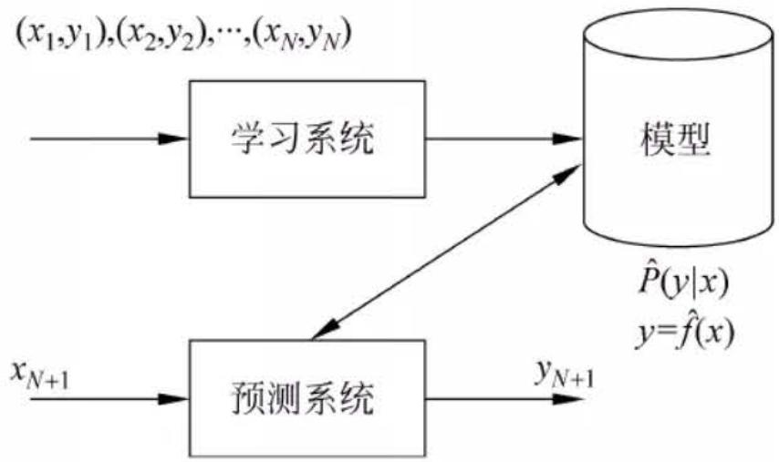  
图1.1 监督学习

先给定个训练数据集

$$
T = \{ ( x _ { 1 } , y _ { 1 } ) , ( x _ { 2 } , y _ { 2 } ) , \cdots , ( x _ { N } , y _ { N } ) \}
$$

其中 $( x _ { i } , y _ { i } ) , \ i = 1 , 2 , \cdot \cdot \cdot , N$ ，称为样本或样本点。 $x _ { i } \in \mathcal X \subseteq R ^ { n }$ 是输入的观测值，也称为输入或实例， $y _ { i } \in \mathcal { V }$ 是输出的观测值，也称为输出。

监督学习分为学习和预测两个过程，由学习系统与预测系统完成。在学习过程中，学习系统利给定的训练数据集，通过学习（或训练）得到个模型，表为条件概率分布 ${ \hat { P } } ( Y | X )$ 或决策函数 $Y = { \hat { f } } ( X )$ 。条件概率分布 ${ \hat { P } } ( Y | X )$ 或决策函数 $Y = { \hat { f } } ( X )$ 描述输入与输出随机变量之间的映射关系。在预测过程中，预测系统对于给定的测试样本集中的输入 $x _ { N + 1 }$ ,由模型 $y _ { N + 1 } = \arg \operatorname* { m a x } _ { y } \hat { P } ( y | x _ { N + 1 } )$ 或 $y _ { N + 1 } = \hat { f } ( x _ { N + 1 } )$ 给出相应的输出 $y N { + 1 }$ 。

在监督学习中，假设训练数据与测试数据是依联合概率分布 $P ( X , Y )$ 独同分布产生的。

学习系统（也就是学习算法）试图通过训练数据集中的样本 $( x _ { i } , y _ { i } )$ 带来的信息学习模型。具体地说，对输 $x _ { i }$ ，个具体的模型 $y = f ( x )$ 可以产个输出 $f ( x _ { i } )$ ，而训练数据集中对应的输出是 $y _ { i }$ 。如果这个模型有很好的预测能，训练样本输出 $y _ { i }$ 和模型输出 $f ( x _ { i } )$ 之间的差就应该够。学习系统通过不断地尝试，选取最好的模型，以便对训练数据集有够好的预测，同时对未知的测试数据集的预测也有尽可能好的推。

## 2.无监督学习

监督学习①（unsupervisedlearning）是指从标注数据中学习预测模型的机器学习问题。标注数据是然得到的数据，预测模型表数据的类别、转换或概率。监督学习的本质是学习数据中的统计规律或潜在结构。

模型的输与输出的所有可能取值的集合分别称为输空间与输出空间。输空间与输出空间可以是有限元素集合，也可以是欧空间。每个输是个实例，由特征向量表。每个输出是对输的分析结果，由输的类别、转换或概率表。模型可以实现对数据的聚类、降维或概率估计。

假设X是输空间，Z是隐式结构空间。要学习的模型可以表为函数 $z = g ( x )$ 、条件概率分布 $P ( z | x )$ 或者条件概率分布 $P ( x | z )$ 的形式，其中 $x \in \mathcal { X }$ 是输入， $z \in { \mathcal { Z } }$ 是输出。包含所有可能的模型的集合称为假设空间。监督学习旨在从假设空间中选出在给定评价标准下的最优模型。

监督学习通常使量的标注数据学习或训练，每个样本是个实例。训练数据表示为 $U = \{ x _ { 1 } , x _ { 2 } , \cdots , x _ { N } \}$ ，其中 $x _ { i } , ~ i = 1 , 2 , \cdots , N$ ，是样本。

监督学习可以于对有数据的分析，也可以于对未来数据的预测。分析时使学习得到的模型，即函数 $z = { \hat { g } } ( x )$ 、条件概率分布 ${ \hat { P } } ( z | x )$ 或者条件概率分布 $\hat { P } ( x | z )$ 。预测时，和监督学习有类似的流程。由学习系统与预测系统完成，如图1.2所。在学习过程中，学习系统从训练数据集学习，得到个最优模型，表示为函数 $z = { \hat { g } } ( x )$ 、条件概率分布${ \hat { P } } ( z | x )$ 或者条件概率分布 $\hat { P } ( x | z )$ 。在预测过程中，预测系统对于给定的输入 $x _ { N + 1 }$ ，由模型$z _ { N + 1 } = \hat { g } ( x _ { N + 1 } )$ 或 $z _ { N + 1 } = \arg \operatorname* { m a x } _ { z } \hat { P } ( z | x _ { N + 1 } )$ 给出相应的输出 $z _ { N + 1 }$ ，进聚类或降维，或者由模型 $\hat { P } ( x | z )$ 给出输入的概率 $\hat { P } ( x _ { N + 1 } | \boldsymbol { z } _ { N + 1 } )$ ，进概率估计。

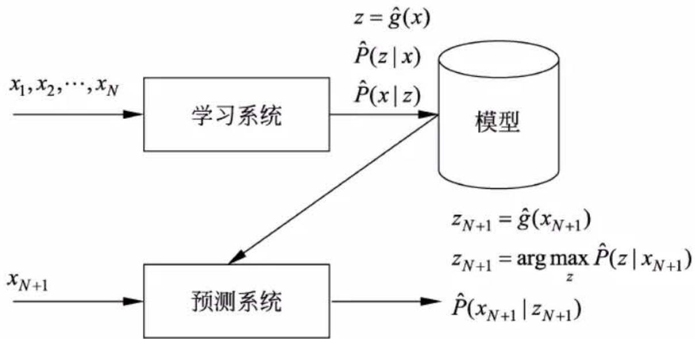  
图1.2 监督学习

## 3.强化学习

强化学习（reinforcementlearning）是指智能系统在与环境的连续互动中学习最优为策略的机器学习问题。假设智能系统与环境的互动基于马尔可夫决策过程（Markovdecisionprocess），智能系统能观测到的是与环境互动得到的数据序列。强化学习的本质是学习最优的序贯决策。

智能系统与环境的互动如图1.3所。在每步t，智能系统从环境中观测到个状态 $\mathrm { ( s t a t e ) } \ s _ { t }$ 与个奖励(reward） $r _ { t }$ ，采取个动作 $\mathrm { ( a c t i o n ) } \ a _ { t } \mathrm { _ { \circ } }$ ，环境根据智能系统选择的动作，决定下一步 $t + 1$ 的状态 $s _ { t + 1 }$ 与奖励 $r _ { t + 1 }$ 。要学习的策略表为给定的状态下采取的动作。智能系统的标不是短期奖励的最化，是长期累积奖励的最化。强化学习过程中，系统不断地试错（trialanderror），以达到学习最优策略的的。

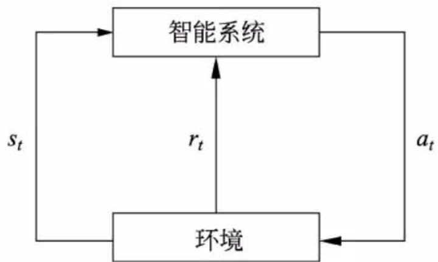  
图1.3 智能系统与环境的互动

强化学习的马尔可夫决策过程是状态、奖励、动作序列上的随机过程，由四元组$\langle S , A , P , r \rangle$ 组成。

● S是有限状态（state）的集合。

● A是有限动作（action）的集合。

●P是状态转移概率（transition probability）函数:

$$
P ( s ^ { \prime } | s , a ) = P ( s _ { t + 1 } = s ^ { \prime } | s _ { t } = s , a _ { t } = a )
$$

$r$ 是奖励函数（reward function）: $r ( s , a ) = E ( r _ { t + 1 } | s _ { t } = s , a _ { t } = a )$ 。

马尔可夫决策过程具有马尔可夫性，下个状态只依赖于前个状态与动作，由状态转移概率函数 $P ( s ^ { \prime } | s , a )$ 表。下个奖励依赖于前个状态与动作，由奖励函数 $r ( s , a )$ 表示。

策略 $\pi$ 定义为给定状态下动作的函数 $a = f ( s )$ 或者条件概率分布 $P ( \boldsymbol { a } | \boldsymbol { s } )$ 。给定个策略 $\pi$ ，智能系统与环境互动的为就已确定（或者是确定性的或者是随机性的）。

价值函数（value function）或状态价值函数（state value function）定义为策略 $\pi$ 从某一个状态。开始的长期累积奖励的数学期望：

$$
v _ { \pi } ( s ) = E _ { \pi } [ r _ { t + 1 } + \gamma r _ { t + 2 } + \gamma ^ { 2 } r _ { t + 3 } + \cdots | s _ { t } = s ]\tag{1.1}
$$

动作价值函数（action valuefunction）定义为策略 $\pi$ 从某个状态s和动作a开始的长期累积奖励的数学期望：

$$
q _ { \pi } ( s , a ) = E _ { \pi } [ r _ { t + 1 } + \gamma r _ { t + 2 } + \gamma ^ { 2 } r _ { t + 3 } + \cdots | s _ { t } = s , a _ { t } = a ]\tag{1.2}
$$

强化学习的标就是在所有可能的策略中选出价值函数最的策略 $\pi ^ { * }$ ，而在实际学习中往往从具体的策略出发，不断优化已有策略。这 $\gamma$ 是折扣率，表示未来的奖励会有衰减。

强化学习法中有基于策略的（policy-based）、基于价值的（value-based），这两者属于无模型的（model-free）法，还有有模型的（model-based）法。

有模型的法试图直接学习马尔可夫决策过程的模型，包括转移概率函数 $P ( s ^ { \prime } | s , a )$ 和奖励函数 $r ( s , a )$ 。这样可以通过模型对环境的反馈进预测，求出价值函数最大的策略 $\pi ^ { * }$ 。

无模型的、基于策略的法不直接学习模型，而是试图求解最优策略 $\pi ^ { * }$ ，表示为函数$a = f ^ { * } ( s )$ 或者是条件概率分布 $P ^ { * } ( a | s )$ ，这样也能达到在环境中做出最优决策的目的。学习通常从一个具体策略开始，通过搜索更优的策略进。

无模型的、基于价值的法也不直接学习模型，是试图求解最优价值函数，特别是最优动作价值函数 $\boldsymbol { q } ^ { * } ( s , a )$ 。这样可以间接地学到最优策略，根据该策略在给定的状态下做出相应的动作。学习通常从个具体价值函数开始，通过搜索更优的价值函数进。

## 4.半监督学习与主动学习

半监督学习（semi-supervisedlearning）是指利标注数据和未标注数据学习预测模型的机器学习问题。通常有少量标注数据、量未标注数据，因为标注数据的构建往往需要，成本较，未标注数据的收集不需太多成本。半监督学习旨在利未标注数据中的信息，辅助标注数据，进监督学习，以较低的成本达到较好的学习效果。

主动学习（activelearning）是指机器不断主动给出实例让教师进标注，然后利标注数据学习预测模型的机器学习问题。通常的监督学习使给定的标注数据，往往是随机得到的，可以看作是“被动学习”，主动学习的目标是找出对学习最有帮助的实例让教师标注，以较的标注代价达到较好的学习效果。

半监督学习和主动学习更接近监督学习。

## 1.2.2 按模型分类

机器学习或统计机器学习法可以根据其模型的种类进分类。

## 1.概率模型与概率模型

机器学习的模型可以分为概率模型（probabilistic model）和概率模型（non-probabilisticmodel）或者确定性模型（deterministicmodel）。在监督学习中，概率模型取条件概率分布形式 $P ( \boldsymbol { y } | \boldsymbol { x } )$ ，概率模型取函数形式 $y = f ( x )$ ，其中x是输，y是输出。在监督学习中，概率模型取条件概率分布形式 $P ( z | x )$ 或 $P ( x | z )$ ，概率模型取函数形式 $z = g ( x )$ ，其中x是输入，是输出。

本书介绍的决策树、朴素贝叶斯、隐马尔可夫模型、条件随机场、概率潜在语义分析、潜在狄利克雷分配、斯混合模型是概率模型。感知机、持向量机、k近邻、AdaBoost、k均值、潜在语义分析，以及神经络是概率模型。逻辑斯谛回归既可看作是概率模型，又可看作是概率模型。

条件概率分布 $P ( \boldsymbol { y } | \boldsymbol { x } )$ 和函数 $y = f ( x )$ 可以相互转化（条件概率分布 $P ( z | x )$ 和函数$z = g ( x )$ 同样可以)。具体地，条件概率分布最化后得到函数，函数归化后得到条件概率分布。所以，概率模型和概率模型的区别不在于输与输出之间的映射关系，在于模型的内在结构。概率模型通常可以表为联合概率分布的形式，其中的变量表输、输出、隐变量甚参数。概率模型不定存在这样的联合概率分布。

概率模型的代表是概率图模型（probabilistic graphicalmodel），概率图模型是联合概率分布由有向图或者向图表示的概率模型，而联合概率分布可以根据图的结构分解为因子乘积的形式。贝叶斯络、马尔可夫随机场、条件随机场是概率图模型。论模型如何复杂，均可以最基本的加法规则和乘法规则（参照图1.4）进概率推理。

加法规则： $P ( x ) = \sum _ { y } P ( x , y )$

乘法规则： $P ( x , y ) = P ( x ) P ( y | x )$

其中x和y是随机变量

图1.4 基本概率公式

## 2.线性模型与线性模型

机器学习模型，特别是概率模型，可以分为线性模型（linearmodel）和线性模型（non-linearmodel）。如果函数 $y = f ( x )$ 或 $z = g ( x )$ 是线性函数，则称模型是线性模型，否则称模型是线性模型。

本书介绍的感知机、线性持向量机、k近邻、k均值、潜在语义分析是线性模型，核函数持向量机、AdaBoost、神经络是线性模型。

深度学习（deeplearning）实际是复杂神经络的学习，也就是复杂的线性模型的学习。

## 3.参数化模型与参数化模型

机器学习模型又可以分为参数化模型（parametricmodel）和参数化模型（non-parametricmodel）。参数化模型假设模型参数的维度固定，模型可以由有限维参数完全刻画；参数化模型假设模型参数的维度不固定或者说无穷大，随着训练数据量的增加而不断增大。

本书介绍的感知机、朴素贝叶斯、逻辑斯谛回归、k均值、斯混合模型、潜在语义分析、概率潜在语义分析、潜在狄利克雷分配是参数化模型，决策树、持向量机、AdaBoost、k近邻是参数化模型。

参数化模型适合问题简单的情况，现实中问题往往较复杂，参数化模型更加有效。

## 1.2.3 按算法分类

机器学习根据算法，可以分为在线学习（online learning）与批量学习（batch learning）。在线学习是指每次接受个样本，进预测，之后学习模型，并不断重复该操作的机器学习。与之对应，批量学习次接受所有数据，学习模型，之后进预测。有些实际应的场景要求学习必须是在线的。如，数据依次达到法存储，系统需要及时做出处理；数据规模很，不可能次处理所有数据；数据的模式随时间动态变化，需要算法快速适应新的模式（不满足独立同分布假设）。

在线学习可以是监督学习，也可以是监督学习，强化学习本就拥有在线学习的特点。以下只考虑在线的监督学习。

学习和预测在个系统，每次接受个输 $x _ { t }$ ，已有模型给出预测 $\hat { f } ( x _ { t } )$ ，之后得到相应的反馈，即该输入对应的输出 $y _ { t }$ ；系统损失函数计算两者的差异，更新模型，并不断重复以上操作，如图1.5所。

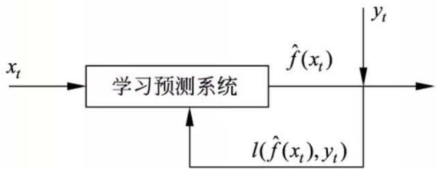  
图1.5 在线学习

利随机梯度下降的感知机学习算法就是在线学习算法。

在线学习通常比批量学习更难，很难学到预测精确率更的模型，因为每次模型更新中，可利用的数据有限。

## 1.2.4 按技巧分类

机器学习法可以根据其使的技巧进分类。

## 1.贝叶斯学习

贝叶斯学习（Bayesianlearning）又称为贝叶斯推理（Bayesian inference），是统计学、机器学习中重要的法。其主要想法是：在概率模型的学习和推理中，利贝叶斯定理，计算在给定数据条件下模型的条件概率，即后验概率，并应这个原理进模型的估计，以及对数据的预测。将模型、未观测要素及其参数变量表，使模型的先验分布是贝叶斯学习的特点。叶斯学习中也使基本概率公式（图1.4)。

本书介绍的朴素贝叶斯、潜在狄利克雷分配的学习属于叶斯学习。

假设随机变量D表数据，随机变量θ表模型参数。根据贝叶斯定理，可以以下公式计算后验概率 $P ( \theta | D )$ :

$$
P ( \theta | D ) = \frac { P ( \theta ) P ( D | \theta ) } { P ( D ) }\tag{1.3}
$$

其中， $P ( \theta )$ 是先验概率， $P ( D | \theta )$ 是似然函数。

模型估计时，估计整个后验概率分布 $P ( \theta | D )$ 。如果需要给出个模型，通常取后验概率最大的模型。

预测时，计算数据对后验概率分布的期望值：

$$
P ( x | D ) = \int P ( x | \theta , D ) P ( \theta | D ) \mathrm { d } \theta\tag{1.4}
$$

这x是新样本。

贝叶斯估计与极似然估计在思想上有很的不同，代表着统计学中叶斯学派和频率学派对统计的不同认识。其实，可以简单地把两者联系起来，假设先验分布是均匀分布，取后验概率最大，就能从贝叶斯估计得到极大似然估计。图1.6对贝叶斯估计和极似然估计进比较。

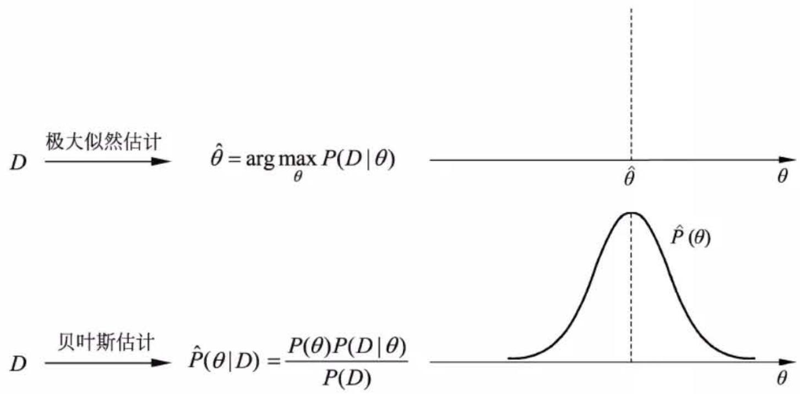  
图1.6 贝叶斯估计与极似然估计

## 2.核方法

核法（kernelmethod）是使核函数表和学习线性模型的种机器学习法，可以于监督学习和监督学习。有些线性模型的学习法基于相似度计算，更具体地，向量内积计算。核法可以把它们扩展到线性模型的学习，使其应范围更泛。

本书介绍的核函数持向量机，以及核PCA、核k均值属于核法。

把线性模型扩展到线性模型，直接的做法是显式地定义从输空间（低维空间）到特征空间（维空间）的映射，在特征空间中进内积计算。如持向量机，把输空间的线性不可分问题转化为特征空间的线性可分问题，如图1.7所。核法的技巧在于不显式地定义这个映射，是直接定义核函数，即映射之后在特征空间的内积。这样可以简化计算，达到同样的效果。

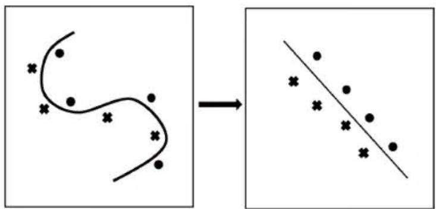  
图1.7 输空间到特征空间的映射

假设 $x _ { 1 }$ 和 $x _ { 2 }$ 是输入空间的任意两个实例（向量），其内积是 $\langle x _ { 1 } , x _ { 2 } \rangle$ 。假设从输空间到特征空间的映射是 $\varphi$ ，于是 $x _ { 1 }$ 和 $x _ { 2 }$ 在特征空间的映像是 $\varphi ( x _ { 1 } )$ 和 $\varphi ( x _ { 2 } )$ ，其内积是 $\langle \varphi ( x _ { 1 } ) , \varphi ( x _ { 2 } ) \rangle$ 。核法直接在输入空间中定义核函数 $K ( x _ { 1 } , x _ { 2 } )$ ，使其满 $K ( x _ { 1 } , x _ { 2 } ) =$ $\langle \varphi ( x _ { 1 } ) , \varphi ( x _ { 2 } ) \rangle$ 。表定理给出核函数技巧成的充要条件。

## 1.3 机器学习方法三要素

机器学习法都是由模型、策略和算法构成的，即机器学习法由三要素构成，可以简单地表示为

$$
) I _ { 1 } : I _ { 2 } = I _ { 3 } : I _ { 1 } = I _ { 2 } : I _ { 3 } = I _ { 3 } : I _ { 2 } = I _ { 3 } : I _ { 2 } .
$$

下论述监督学习中的机器学习三要素。监督学习也同样拥有这三要素。可以说构建种机器学习法就是确定具体的机器学习三要素。

## 1.3.1模型

机器学习要考虑的问题是学习什么样的模型。在监督学习过程中，模型就是所要学习的条件概率分布或决策函数。模型的假设空间（hypothesisspace）包含所有可能的条件概率分布或决策函数。例如，假设决策函数是输变量的线性函数，那么模型的假设空间就是所有这些线性函数构成的函数集合。假设空间中的模型般有穷多个。

假设空间F表示，可以定义为决策函数的集合：

$$
{ \mathcal { F } } = \{ f | Y = f ( X ) \}\tag{1.5}
$$

其中，X和Y是定义在输空间X和输出空间J上的变量。这时F通常是由个参数向量决定的函数族：

$$
\mathcal { F } = \{ f | Y = f _ { \theta } ( X ) , \theta \in R ^ { n } \}\tag{1.6}
$$

参数向量θ取值于n维欧空间 $\pmb { R } ^ { n }$ ，称为参数空间（parameter space）。

假设空间也可以定义为条件概率的集合：

$$
{ \mathcal { F } } = \{ P | P ( Y | X ) \}\tag{1.7}
$$

其中，X和Y是定义在输空间X和输出空间J上的随机变量。这时F通常是由个参数向量决定的条件概率分布族：

$$
\mathcal { F } = \{ P | P _ { \theta } ( Y | X ) , \theta \in R ^ { n } \}\tag{1.8}
$$

参数向量θ取值于n维欧空间 $\pmb { R } ^ { n }$ ，也称为参数空间。

本书中称由决策函数表的模型为概率模型，由条件概率表的模型为概率模型。为了简便起见，当论及模型时，有时只其中种模型。

## 1.3.2策略

有了模型的假设空间，机器学习接着需要考虑的是按照什么样的准则学习或选择最优的模型。机器学习的标在于从假设空间中选取最优模型。

先引损失函数与风险函数的概念。损失函数度量模型次预测的好坏，风险函数度量平均意义下模型预测的好坏。

## 1.损失函数和风险函数

监督学习问题是在假设空间F中选取模型f作为决策函数，对于给定的输X，由f(X)给出相应的输出Y，这个输出的预测值f(X）与真实值Y可能致也可能不致，个损失函数（loss function）或代价函数（cost function）来度量预测错误的程度。损失函数是f(X)和Y的负实值函数，记作 $L ( Y , f ( X ) )$ 。

机器学习常的损失函数有以下种：

（1）0-1损失函数（0-1loss function）

$$
L ( Y , f ( X ) ) = { \left\{ \begin{array} { l l } { 1 , } & { Y \neq f ( X ) } \\ { 0 , } & { Y = f ( X ) } \end{array} \right. }\tag{1.9}
$$

（2）平损失函数（quadratic loss function）

$$
L ( Y , f ( X ) ) = ( Y - f ( X ) ) ^ { 2 }\tag{1.10}
$$

(3）绝对损失函数（absolute loss function）

$$
L ( Y , f ( X ) ) = | Y - f ( X ) |\tag{1.11}
$$

（4）对数损失函数（logarithmic loss function）或对数似然损失函数（log-likelihood lossfunction)

$$
L ( Y , P ( Y | X ) ) = - \log P ( Y | X )\tag{1.12}
$$

损失函数值越，模型就越好。由于模型的输、输出(X,Y）是随机变量，遵循联合分 布 $P ( X , Y )$ ，所以损失函数的期望是

$$
\begin{array} { l } { R _ { \exp } ( f ) = E _ { P } [ L ( Y , f ( X ) ) ] } \\ { \displaystyle = \int _ { X \times \mathcal { Y } } L ( y , f ( x ) ) P ( x , y ) \mathrm { d } x \mathrm { d } y } \end{array}\tag{1.13}
$$

这是理论上模型f(X）关于联合分布P(X,Y）的平均意义下的损失，称为风险函数（riskfunction）或期望损失（expected loss）。

学习的标就是选择期望风险最的模型。由于联合分布P(X,Y）是未知的， $R _ { \mathrm { e x p } } ( f )$ 不能直接计算。实际上，如果知道联合分布P(X,Y)，可以从联合分布直接求出条件概率分布 $P ( Y | X )$ ，也就不需要学习了。正因为不知道联合概率分布，所以才需要进学习。这样来，根据期望风险最学习模型要到联合分布，另联合分布又是未知的，所以监督学习就成为个病态问题（ill-formedproblem）。

给定个训练数据集

$$
T = \{ ( x _ { 1 } , y _ { 1 } ) , ( x _ { 2 } , y _ { 2 } ) , \cdots , ( x _ { N } , y _ { N } ) \}
$$

模型f(X）关于训练数据集的平均损失称为经验风险（empiricalrisk）或经验损失（empiricalloss)，记作 $R _ { \mathrm { e m p } }$

$$
R _ { \mathrm { e m p } } ( f ) = \frac { 1 } { N } \sum _ { i = 1 } ^ { N } L ( y _ { i } , f ( x _ { i } ) )\tag{1.14}
$$

期望风险 $R _ { \mathrm { e x p } } ( f )$ 是模型关于联合分布的期望损失，经验风险 $R _ { \mathrm { e m p } } ( f )$ 是模型关于训练样本集的平均损失。根据数定律，当样本容量N趋于穷时，经验风险 $R _ { \mathrm { e m p } } ( f )$ 趋于期望风险 $R _ { \mathrm { e x p } } ( f )$ 。所以个很然的想法是经验风险估计期望风险。但是，由于现实中训练样本数有限，甚很，所以经验风险估计期望风险常常并不理想，要对经验风险进定的矫正。这就关系到监督学习的两个基本策略：经验风险最化和结构风险最化。

## 2.经验风险最化与结构风险最化

在假设空间、损失函数以及训练数据集确定的情况下，经验风险函数式(1.14)就可以确定。经验风险最化（empiricalriskminimization，ERM）的策略认为，经验风险最的模型是最优的模型。根据这策略，按照经验风险最化求最优模型就是求解最优化问题：

$$
\operatorname* { m i n } _ { f \in \mathcal { F } } \frac { 1 } { N } \sum _ { i = 1 } ^ { N } L ( y _ { i } , f ( x _ { i } ) )\tag{1.15}
$$

其中， $\mathcal { F }$ 是假设空间。

当样本容量够时，经验风险最化能保证有很好的学习效果，在现实中被泛采。如，极似然估计（maximum likelihoodestimation）就是经验风险最化的个例。当模型是条件概率分布、损失函数是对数损失函数时，经验风险最化就等价于极似然估计。但是，当样本容量很时，经验风险最化学习的效果就未必很好，会产“过拟合”（over-fitting）现象。

结构风险最化（structuralriskminimization，SRM）是为了防过拟合提出来的策略。结构风险最化等价于正则化（regularization）。结构风险在经验风险上加上表模型复杂度的正则化项（regularizer）或罚项（penalty term）。在假设空间、损失函数以及训练数据集确定的情况下，结构风险的定义是

$$
R _ { \mathrm { s r m } } ( f ) = \frac { 1 } { N } \sum _ { i = 1 } ^ { N } L ( y _ { i } , f ( x _ { i } ) ) + \lambda J ( f )\tag{1.16}
$$

其中， $J ( f )$ 为模型的复杂度，是定义在假设空间 $\mathcal { F }$ 上的泛函。模型f越复杂，复杂度 $J ( f )$ 就越大；反之，模型f越简单，复杂度 $J ( f )$ 就越。也就是说，复杂度表了对复杂模型的惩罚。 $\lambda \geqslant 0$ 是系数，以权衡经验风险和模型复杂度。结构风险需要经验风险与模型复杂度同时。结构风险的模型往往对训练数据以及未知的测试数据都有较好的预测。

如，贝叶斯估计中的最后验概率估计（maximum posterior probability estima-tion，MAP）就是结构风险最化的个例。当模型是条件概率分布、损失函数是对数损失函数、模型复杂度由模型的先验概率表时，结构风险最化就等价于最后验概率估计。

结构风险最化的策略认为结构风险最的模型是最优的模型，所以求最优模型就是求解最优化问题：

$$
\operatorname* { m i n } _ { f \in \mathcal { F } } \frac { 1 } { N } \sum _ { i = 1 } ^ { N } L ( y _ { i } , f ( x _ { i } ) ) + \lambda J ( f )\tag{1.17}
$$

这样，监督学习问题就变成了经验风险或结构风险函数的最优化问题(1.15)和(1.17)。这时经验或结构风险函数是最优化的标函数。

## 1.3.3算法

算法是指学习模型的具体计算法。机器学习基于训练数据集，根据学习策略，从假设空间中选择最优模型，最后需要考虑什么样的计算法求解最优模型。这时，机器学习问题归结为最优化问题，机器学习的算法成为求解最优化问题的算法。如果最优化问题有显式的解析解，这个最优化问题就较简单。但通常解析解不存在，这就需要数值计算的法求解。如何保证找到全局最优解，并使求解的过程常效，就成为个重要问题。机器学习可以利已有的最优化算法，有时也需要开发独的最优化算法。

机器学习法之间的不同主要来其模型、策略、算法的不同。确定了模型、策略、算法，机器学习的法也就确定了。这就是将其称为机器学习法三要素的原因。以下介绍监督学习的个重要概念。

## 1.4 模型评估与模型选择

## 1.4.1 训练误差与测试误差

机器学习的的是使学到的模型不仅对已知数据且对未知数据都能有很好的预测能。不同的学习法会给出不同的模型。当损失函数给定时，基于损失函数的模型的训练误差（training error）和模型的测试误差（test error）就然成为学习法评估的标准。注意，机器学习法具体采的损失函数未必是评估时使的损失函数。当然，让两者致是较理想的。

假设学习到的模型是 $Y = { \hat { f } } ( X )$ ，训练误差是模型 $Y = { \hat { f } } ( X )$ 关于训练数据集的平均损失：

$$
R _ { \mathrm { e m p } } ( \hat { f } ) = \frac { 1 } { N } \sum _ { i = 1 } ^ { N } L ( y _ { i } , \hat { f } ( x _ { i } ) )\tag{1.18}
$$

其中，N是训练样本容量。 O

测试误差是模型 $Y = { \hat { f } } ( X )$ 关于测试数据集的平均损失：

$$
e _ { \mathrm { t e s t } } = \frac { 1 } { N ^ { \prime } } \sum _ { i = 1 } ^ { N ^ { \prime } } L ( y _ { i } , \hat { f } ( x _ { i } ) )\tag{1.19}
$$

其中， $N ^ { \prime }$ 是测试样本容量。

例如，当损失函数是0-1损失时，测试误差就变成了常见的测试数据集上的误差率（errorrate):

$$
e _ { \mathrm { t e s t } } = { \frac { 1 } { N ^ { \prime } } } \sum _ { i = 1 } ^ { N ^ { \prime } } I ( y _ { i } \neq { \hat { f } } ( x _ { i } ) )\tag{1.20}
$$

这Ⅰ是指函数（indicator function），即 $y \neq { \hat { f } } ( x )$ 时为1，否则为0。

相应地，常见的测试数据集上的精确率（accuracy）为

$$
r _ { \mathrm { t e s t } } = \frac { 1 } { N ^ { \prime } } \sum _ { i = 1 } ^ { N ^ { \prime } } I ( y _ { i } = \hat { f } ( x _ { i } ) )\tag{1.21}
$$

显然，

$$
r _ { \mathrm { t e s t } } + e _ { \mathrm { t e s t } } = 1
$$

训练误差的对判断给定的问题是不是个容易学习的问题是有意义的，但本质上不重要。测试误差反映了学习法对未知的测试数据集的预测能，是学习中的重要概念。显然，给定两种学习法，测试误差的法具有更好的预测能，是更有效的法。通常将学习法对未知数据的预测能称为泛化能（generalization ability），这个问题将在1.6节继续论述。

## 1.4.2 过拟合与模型选择

当假设空间含有不同复杂度（例如，不同的参数个数）的模型时，就要临模型选择（modelselection）的问题。我们希望选择或学习个合适的模型。如果在假设空间中存在“真”模型，那么所选择的模型应该逼近真模型。具体地，所选择的模型要与真模型的参数个数相同，所选择的模型的参数向量与真模型的参数向量相近。

如果味追求提对训练数据的预测能，所选模型的复杂度则往往会真模型更。这种现象称为过拟合（over-fitting）。过拟合是指学习时选择的模型所包含的参数过多，以出现这模型对已知数据预测得很好，但对未知数据预测得很差的现象。可以说模型选择旨在避免过拟合并提模型的预测能。

下，以多项式函数拟合问题为例，说明过拟合与模型选择。这是个回归问题。

例1.1 假设给定个训练数据集①：

$$
T = \{ ( x _ { 1 } , y _ { 1 } ) , ( x _ { 2 } , y _ { 2 } ) , \cdots , ( x _ { N } , y _ { N } ) \}
$$

其中， $x _ { i } \in R$ 是输入 $x$ 的观测值， $y _ { i } \in R$ 是相应的输出y的观测值， $i = 1 , 2 , \cdots , N _ { \mathrm { ~ c ~ } }$ 多项式函数拟合的任务是假设给定数据由M次多项式函数生成，选择最有可能产生这些数据的M次多项式函数，即在M次多项式函数中选择一个对已知数据以及未知数据都有很好预测能力的函数。

假设给定如图1.8所的10个数据点，0\~9次多项式函数对数据进拟合。图中画出了需要多项式函数曲线拟合的数据。

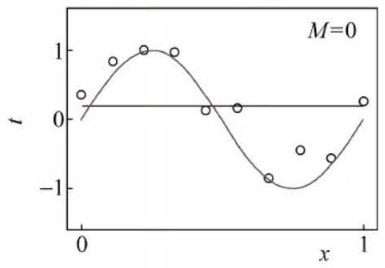

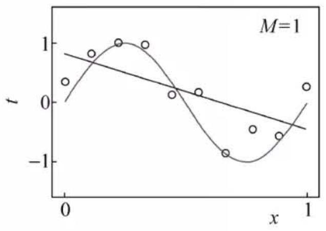

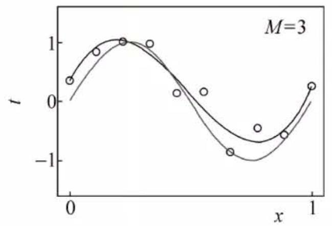

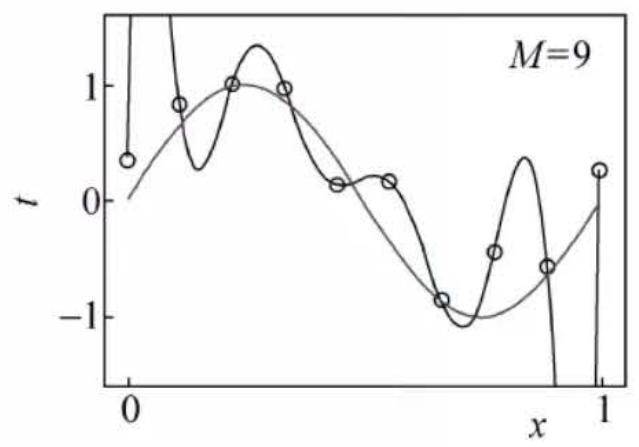  
图1.8 M次多项式函数拟合问题的例

设M次多项式为

$$
f _ { M } ( x , w ) = w _ { 0 } + w _ { 1 } x + w _ { 2 } x ^ { 2 } + \cdots + w _ { M } x ^ { M } = \sum _ { j = 0 } ^ { M } w _ { j } x ^ { j }\tag{1.22}
$$

其中x是单变量输入， $w _ { 0 } , w _ { 1 } , \cdots , w _ { M }$ 是 $M + 1$ 个参数。

解决这问题的法可以是这样的：先确定模型的复杂度，即确定多项式的次数；然后在给定的模型复杂度下，按照经验风险最化的策略求解参数，即多项式的系数。具体地，求以下经验风险最化：

$$
L ( w ) = \frac { 1 } { 2 } \sum _ { i = 1 } ^ { N } { \left( f ( x _ { i } , w ) - y _ { i } \right) ^ { 2 } }\tag{1.23}
$$

这时，损失函数为平损失，系数 $\frac { 1 } { 2 }$ 是为了计算方便。

这是个简单的最优化问题。将模型与训练数据代式(1.23)中，有

$$
L ( w ) = \frac { 1 } { 2 } \sum _ { i = 1 } ^ { N } \left( \sum _ { j = 0 } ^ { M } w _ { j } x _ { i } ^ { j } - y _ { i } \right) ^ { 2 }
$$

这问题可最乘法求得拟合多项式系数的唯解，记作 $w _ { 0 } ^ { * } , \ w _ { 1 } ^ { * } , \ \cdots , \ w _ { M } ^ { * }$ 。求解过程这不予叙述，读者可参阅有关材料。

图1.8给出了 $M = 0 , M = 1 , M = 3$ 及 $M = 9$ 时多项式函数拟合的情况。如果 $M = 0$ ,多项式曲线是个常数，数据拟合效果很差。如果 $M = 1$ ，多项式曲线是条直线，数据拟合效果也很差。相反，如果 $M = 9$ ，多项式曲线通过每个数据点，训练误差为0。从对给定训练数据拟合的度来说，效果是最好的。但是，因为训练数据本身存在噪声，这种拟合曲线对未知数据的预测能往往并不是最好的，在实际学习中并不可取。这时过拟合现象就会发。这就是说，模型选择时，不仅要考虑对已知数据的预测能，且还要考虑对未知数据的预测能。当 $M = 3$ 时，多项式曲线对训练数据拟合效果够好，模型也较简单，是个较好的选择。

在多项式函数拟合中可以看到，随着多项式次数（模型复杂度）的增加，训练误差会减，直趋向于0，但是测试误差却不如此，它会随着多项式次数（模型复杂度）的增加先减后增。最终的的是使测试误差达到最。这样，在多项式函数拟合中，就要选择合适的多项式次数，以达到这的。这结论对般的模型选择也是成的。

图1.9描述了训练误差和测试误差与模型复杂度之间的关系。当模型复杂度增时，训练误差会逐渐减并趋向于 $0 { \mathrm { ; } }$ 而测试误差会先减，达到最值后又增。当选择的模型复杂度过大时，过拟合现象就会发生。这样，在学习时就要防止过拟合，进行最优的模型选择，即选择复杂度适当的模型，以达到使测试误差最的学习的。下介绍两种常的模型选择方法：正则化与交叉验证。

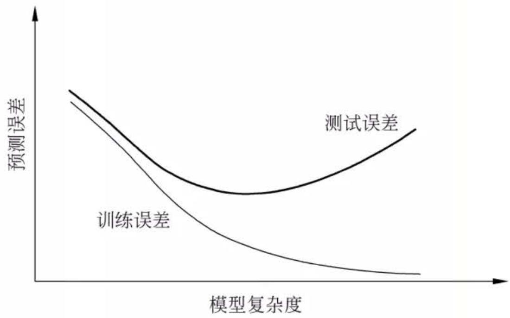  
图1.9 训练误差和测试误差与模型复杂度的关系

## 1.5 正则化与交叉验证

## 1.5.1 正则化

模型选择的典型法是正则化（regularization）。正则化是结构风险最化策略的实现，是在经验风险上加个正则化项（regularizer）或罚项（penalty term）。正则化项般是模型复杂度的单调递增函数，模型越复杂，正则化值就越。如，正则化项可以是模型参数向量的范数。

正则化一般具有如下形式：

$$
\operatorname* { m i n } _ { f \in \mathcal { F } } \frac { 1 } { N } \sum _ { i = 1 } ^ { N } L ( y _ { i } , f ( x _ { i } ) ) + \lambda J ( f )\tag{1.24}
$$

其中，第1项是经验风险，第2项是正则化项， $\lambda \geqslant 0$ 为调整两者之间关系的系数。

正则化项可以取不同的形式。例如，在回归问题中，损失函数是平损失，正则化项可以是参数向量的 $L _ { 2 }$ 范数：

$$
L ( w ) = \frac { 1 } { N } \sum _ { i = 1 } ^ { N } ( f ( x _ { i } ; w ) - y _ { i } ) ^ { 2 } + \frac { \lambda } { 2 } \| w \| ^ { 2 }\tag{1.25}
$$

这里， $\lVert \boldsymbol { w } \rVert$ 表参数向量w的 $L _ { 2 }$ 范数。

正则化项也可以是参数向量的 $L _ { 1 }$ 范数：

$$
L ( w ) = \frac { 1 } { N } \sum _ { i = 1 } ^ { N } { \left( f ( x _ { i } ; w ) - y _ { i } \right) ^ { 2 } } + \lambda \| w \| _ { 1 }\tag{1.26}
$$

这里， $\| w \| _ { 1 }$ 表参数向量w的 $L _ { 1 }$ 范数。

第1项的经验风险较的模型可能较复杂（有多个零参数），这时第2项的模型复杂度会较。正则化的作是选择经验风险与模型复杂度同时较的模型。

正则化符合奥卡姆剃刀（Occam'srazor）原理。奥卡姆剃刀原理应于模型选择时变为以下想法：在所有可能选择的模型中，能够很好地解释已知数据并且分简单才是最好的模型，也就是应该选择的模型。从贝叶斯估计的度来看，正则化项对应于模型的先验概率。可以假设复杂的模型有较的先验概率，简单的模型有较大的先验概率。

## 1.5.2 交叉验证

另种常的模型选择法是交叉验证（cross validation）。

如果给定的样本数据充，进模型选择的种简单法是随机地将数据集切分成三部分，分别为训练集（training set）、验证集（validation set）和测试集（testset）。训练集来训练模型，验证集于模型的选择，测试集于最终对学习法的评估。在学习到的不同复杂度的模型中，选择对验证集有最预测误差的模型。由于验证集有够多的数据，它对模型进选择也是有效的。

但是，在许多实际应中数据是不充的。为了选择好的模型，可以采交叉验证法。交叉验证的基本想法是重复地使数据，把给定的数据进切分，将切分的数据集组合为训练集与测试集，在此基础上反复地进训练、测试以及模型选择。

## 1.简单交叉验证

简单交叉验证法是：先随机地将已给数据分为两部分，部分作为训练集，另部分作为测试集（例如，70%的数据为训练集，30%的数据为测试集）；然后训练集在各种条件下（例如，不同的参数个数）训练模型，从得到不同的模型；在测试集上评价各个模型的测试误差，选出测试误差最的模型。

## 2.S折交叉验证

应最多的是S折交叉验证（S-foldcrossvalidation），法如下：先随机地将已给数据切分为S个互不相交、相同的集；然后利S-1个集的数据训练模型，利余下的集测试模型；将这过程对可能的S种选择重复进；最后选出S次评测中平均测试误差最的模型。

## 3.留一交叉验证

S折交叉验证的特殊情形是 $S = N$ ，称为留交叉验证（leave-one-out cross validation），往往在数据缺乏的情况下使。这，N是给定数据集的容量。

## 1.6泛化能力

## 1.6.1 泛化误差

学习法的泛化能（generalizationability）是指由该法学习到的模型对未知数据的预测能，是学习法本质上重要的性质。现实中采最多的办法是通过测试误差来评价学习法的泛化能。但这种评价是依赖于测试数据集的。因为测试数据集是有限的，很有可能由此得到的评价结果是不可靠的。机器学习理论试图从理论上对学习法的泛化能进分析。

先给出泛化误差的定义。如果学到的模型是 ${ \hat { f } } ,$ 那么用这个模型对未知数据预测的误差即为泛化误差（generalization error）：

$$
\begin{array} { l } { R _ { \mathrm { e x p } } ( \hat { f } ) = E _ { P } [ L ( Y , \hat { f } ( X ) ) ] } \\ { \displaystyle = \int _ { \chi \times \mathcal { Y } } L ( y , \hat { f } ( x ) ) P ( x , y ) \mathrm { d } x \mathrm { d } y } \end{array}\tag{1.27}
$$

泛化误差反映了学习法的泛化能，如果一种法学习的模型比另一种法学习的模型具有更的泛化误差，那么这种法就更有效。事实上，泛化误差就是所学习到的模型的期望风险。

## 1.6.2 泛化误差上界

学习法的泛化能分析往往是通过研究泛化误差的概率上界进的，简称为泛化误差上界（generalizationerrorbound）。具体来说，就是通过较两种学习法的泛化误差上界的来较它们的优劣。泛化误差上界通常具有以下性质：它是样本容量的函数，当样本容量增加时，泛化误差上界趋于 $0 ;$ 它是假设空间容量（capacity）的函数，假设空间容量越，模型就越难学，泛化误差上界就越。

下给出个简单的泛化误差上界的例：类分类问题的泛化误差上界。

考虑类分类问题。已知训练数据集 $T = \{ ( x _ { 1 } , y _ { 1 } ) , ( x _ { 2 } , y _ { 2 } ) , \cdots , ( x _ { N } , y _ { N } ) \}$ ，N是样本容量， $T$ 是从联合概率分布 $P ( X , Y )$ 独立同分布产生的， $X \in R ^ { n } , Y \in \{ - 1 , + 1 \}$ 。假设空间是函数的有限集合 $\mathcal { F } = \{ f _ { 1 } , f _ { 2 } , \cdots , f _ { d } \}$ ，d是函数个数。设f是从 $\mathcal { F }$ 中选取的函数。损失函数是0-1损失。关于f的期望风险和经验风险分别是

$$
R ( f ) = E [ L ( Y , f ( X ) ) ]\tag{1.28}
$$

$$
\hat { R } ( f ) = \frac { 1 } { N } \sum _ { i = 1 } ^ { N } L ( y _ { i } , f ( x _ { i } ) )\tag{1.29}
$$

经验风险最小化函数是

$$
f _ { N } = \arg \operatorname* { m i n } _ { f \in \mathcal { F } } \hat { R } ( f )\tag{1.30}
$$

$f _ { N }$ 依赖训练数据集的样本容量 $\smash { N _ { o } }$ 人们更关心的是 $f _ { N }$ 的泛化能力

$$
R ( f _ { N } ) = E [ L ( Y , f _ { N } ( X ) ) ]\tag{1.31}
$$

下讨论从有限集合 $\mathcal { F } = \{ f _ { 1 } , f _ { 2 } , \cdot \cdot \cdot , f _ { d } \}$ 中任意选出的函数f的泛化误差上界。

定理1.1（泛化误差上界） 对二类分类问题，当假设空间是有限个函数的集合 ${ \mathcal { F } } =$ $\{ f _ { 1 } , f _ { 2 } , \cdots , f _ { d } \}$ 时，对任意一个函数 $f \in { \mathcal { F } } ,$ 至少以概率 $1 - \delta , \ 0 < \delta < 1$ ，以下不等式成立：

$$
R ( f ) \leqslant { \hat { R } } ( f ) + \varepsilon ( d , N , \delta )\tag{1.32}
$$

其中，

$$
\varepsilon ( d , N , \delta ) = \sqrt { \frac { 1 } { 2 N } \left( \log d + \log \frac { 1 } { \delta } \right) }\tag{1.33}
$$

不等式(1.32) 左端 $R ( f )$ 是泛化误差，右端即为泛化误差上界。在泛化误差上界中，第1项是训练误差，训练误差越，泛化误差也越。第2项 $\varepsilon ( d , N , \delta )$ 是N的单调递减函数，当N趋于无穷时趋于 $0 ;$ 同时它也是 $\textstyle { \sqrt { \log d } }$ 阶的函数，假设空间 $\mathcal { F }$ 包含的函数越多，其值越大。

证明 在证明中要到Hoeffding不等式，先叙述如下。

设 $X _ { 1 } , X _ { 2 } , \cdots , X _ { N }$ 是独立随机变量，且 $X _ { i } \in [ a _ { i } , b _ { i } ] , i = 1 , 2 , \cdot \cdot , N ; \bar { X }$ 是 $X _ { 1 } , X _ { 2 } , \cdots , X _ { N }$ 的经验均值，即 $\bar { X } = \frac { 1 } { N } \sum _ { i = 1 } ^ { N } X _ { i }$ ，则对任意 $t > 0$ ，以下不等式成：

$$
P ( { \bar { X } } - E ( { \bar { X } } ) \geqslant t ) \leqslant \exp \left[ { \frac { 2 N ^ { 2 } t ^ { 2 } } { \displaystyle \sum _ { i = 1 } ^ { N } ( b _ { i } - a _ { i } ) ^ { 2 } } } \right]\tag{1.34}
$$

$$
P ( E ( { \bar { X } } ) - { \bar { X } } \geqslant t ) \leqslant \exp \left[ - { \frac { 2 N ^ { 2 } t ^ { 2 } } { \displaystyle \sum _ { i = 1 } ^ { N } ( b _ { i } - a _ { i } ) ^ { 2 } } } \right]\tag{1.35}
$$

Hoeffding不等式的证明省略，这来推导泛化误差上界。

对任意函数 $f \in { \mathcal { F } } , \hat { R } ( f )$ 是N个独立的随机变量 $L ( Y , f ( X ) )$ 的样本均值， $R ( f )$ 是随机变量 $L ( Y , f ( X ) )$ 的期望值。如果损失函数取值于区间[0,1]，即对所有， $[ a _ { i } , b _ { i } ] = [ 0 , 1 ]$ ，那么由Hoeffding不等式(1.35)不难得知，对 $\varepsilon > 0$ ，以下不等式成立：

$$
P ( R ( f ) - \hat { R } ( f ) \geqslant \varepsilon ) \leqslant \exp ( - 2 N \varepsilon ^ { 2 } )\tag{1.36}
$$

由于 $\mathcal { F } = \{ f _ { 1 } , f _ { 2 } , \cdots , f _ { d } \}$ 是一个有限集合，故

$$
\begin{array} { r l } { P ( \exists f \in \mathcal { F } : R ( f ) - \hat { R } ( f ) \geqslant \varepsilon ) = \displaystyle \big ( \bigcup _ { f \in \mathcal { F } } \{ R ( f ) - \hat { R } ( f ) \geqslant \varepsilon \} \big ) } & { } \\ { \leqslant \displaystyle \sum _ { f \in \mathcal { F } } P ( R ( f ) - \hat { R } ( f ) \geqslant \varepsilon ) } & { } \\ { \leqslant d \exp ( - 2 N \varepsilon ^ { 2 } ) } \end{array}
$$

或者等价地，对任意 $f \in { \mathcal { F } }$ ,有

$$
P ( R ( f ) - \hat { R } ( f ) < \varepsilon ) \geqslant 1 - d \exp ( - 2 N \varepsilon ^ { 2 } )\tag{1.37}
$$

令

$$
\delta = d \exp ( - 2 N \varepsilon ^ { 2 } )\tag{1.38}
$$

则

$$
P ( R ( f ) < \hat { R } ( f ) + \varepsilon ) \geqslant 1 - \delta
$$

即少以概率 $1 - \delta$ 有 $R ( f ) < { \hat { R } } ( f ) + \varepsilon$ ，其中ε由式(1.38)得到，即为式(1.33)。

从泛化误差上界可知：

$$
R ( f _ { N } ) \leqslant \hat { R } ( f _ { N } ) + \varepsilon ( d , N , \delta )\tag{1.39}
$$

其中， $\varepsilon ( d , N , \delta )$ 由式(1.33)定义， $f _ { N }$ 由式(1.30)定义。

以上讨论的只是假设空间包含有限个函数情况下的泛化误差上界，对般的假设空间要找到泛化误差上界就没有这么简单，这不作介绍。

## 1.7 生成模型与判别模型

监督学习的任务就是学习个模型，应这模型，对给定的输预测相应的输出。这个模型的般形式为决策函数：

$$
Y = f ( X )
$$

或者条件概率分布：

$$
P ( \boldsymbol { Y } | \boldsymbol { X } )
$$

监督学习法又可以分为成法（generative approach）和判别法（discrimina-tive approach）。所学到的模型分别称为成模型（generative model）和判别模型（discriminative model)。

成法原理上由数据学习联合概率分布P(X,Y)，然后求出条件概率分布 $P ( { Y \vert } X )$ 作为预测的模型，即生成模型：

$$
P ( Y | X ) = { \frac { P ( X , Y ) } { P ( X ) } }\tag{1.40}
$$

这样的法之所以称为成法，是因为模型表了给定输X产输出Y的成关系。  
典型的成模型有朴素贝叶斯法和隐马尔可夫模型，将在后章节进相关讲述。

判别法由数据直接学习决策函数f(X）或者条件概率分布P(Y|X）作为预测的模型，即判别模型。判别法关的是对给定的输X，应该预测什么样的输出Y。典型的判别模型包括：k近邻法、感知机、逻辑斯谛回归模型、最熵模型、持向量机、提升法和条件随机场等，将在后章节讲述。

在监督学习中，成法和判别法各有优缺点，适合于不同条件下的学习问题。

成法的特点：成法可以还原出联合概率分布P(X，Y)，而判别法不能；成法的学习收敛速度更快，即当样本容量增加的时候，学到的模型可以更快地收敛于真实模型；当存在隐变量时，仍可以成法学习，此时判别法就不能。

判别法的特点：判别法直接学习的是条件概率分布P(Y|X)或决策函数f(X)，直接面对预测，往往学习的精确率更高；由于直接学习 $P ( Y | X )$ 或f(X)，可以对数据进各种程度上的抽象、定义特征并使特征，因此可以简化学习问题。

## 1.8 监督学习应用

监督学习的应主要在三个：分类问题、标注问题和回归问题。

## 1.8.1 分类问题

分类是监督学习的个核问题。在监督学习中，当输出变量Y取有限个离散值时，预测问题便成为分类问题。这时，输变量X可以是离散的，也可以是连续的。监督学习从数据中学习个分类模型或分类决策函数，称为分类器（classifier）。分类器对新的输进输出的预测，称为分类（classification）。可能的输出称为类别（class）。分类的类别为多个时，称为多类分类问题。本书主要讨论类分类问题。

分类问题包括学习和分类两个过程。在学习过程中，根据已知的训练数据集利有效的学习法学习个分类器；在分类过程中，利学习的分类器对新的输实例进分类。分类问题可图1.10描述。图中 $( x _ { 1 } , y _ { 1 } ) , ( x _ { 2 } , y _ { 2 } ) , \cdots , ( x _ { N } , y _ { N } )$ 是训练数据集，学习系统由训练数据学习一个分类器 $P ( \boldsymbol { Y } | \boldsymbol { X } )$ 或 $Y = f ( X )$ ；分类系统通过学到的分类器 $P ( Y | X )$ 或$Y = f ( X )$ 对新的输实例 $x _ { N + 1 }$ 进行分类，即预测其输出的类标记 $y _ { N + 1 }$

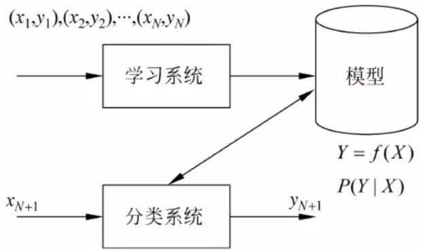  
图1.10 分类问题

评价分类器性能的指标般是分类精确率（accuracy），其定义是：对于给定的测试数据集，分类器正确分类的样本数与总样本数之。也就是损失函数是0-1损失时测试数据集上的精确率（见式(1.21))。

对于类分类问题，常的评价指标是准确率（precision）与召回率（recall）。通常以关注的类为正类，其他类为负类，分类器在测试数据集上的预测或正确或不正确，4种情况出现的总数分别记作：

TP 将正类预测为正类数；

FN 将正类预测为负类数；

FP 将负类预测为正类数；

TN- 将负类预测为负类数。

准确率定义为

$$
P = { \frac { \mathrm { T P } } { \mathrm { T P } + \mathrm { F P } } }\tag{1.41}
$$

召回率定义为

$$
R = { \frac { \mathrm { T P } } { \mathrm { T P } + \mathrm { F N } } }\tag{1.42}
$$

此外，还有 $F _ { 1 }$ ，是准确率和召回率的调和均值，即

$$
\frac { 2 } { F _ { 1 } } = \frac { 1 } { P } + \frac { 1 } { R }\tag{1.43}
$$

$$
F _ { 1 } = { \frac { 2 \mathrm { T P } } { \mathrm { 2 T P } + \mathrm { F P } + \mathrm { F N } } }\tag{1.44}
$$

准确率和召回率都时， $F _ { 1 }$ 值也会高。

许多机器学习法可以于分类，包括k近邻法、感知机、朴素贝叶斯法、决策树、决策列表、逻辑斯谛回归模型、持向量机、提升法、贝叶斯络、神经络、Winnow等。本书将讲述其中些主要法。

分类在于根据其特性将数据“分门别类”，所以在许多领域都有泛的应。例如，在银业务中，可以构建个客户分类模型，对客户按照贷款风险的进分类；在络安全领域，可以利志数据的分类对法侵进检测；在图像处理中，分类可以来检测图像中是否有脸出现；在写识别中，分类可以于识别写的数字；在互联搜索中，页的分类可以帮助页的抓取、索引与排序。

举个分类应的例 -本分类(textclassification)。这的本可以是新闻报道、页、电邮件、学术论等。类别往往是关于本内容的，如政治、经济、体育等；也有关于本特点的，如正意见、反意见；还可以根据应确定，如垃圾邮件、垃圾邮件等。本分类是根据本的特征将其划分到已有的类中。输是本的特征向量，输出是本的类别。通常把本中的单词定义为特征，每个单词对应个特征。单词的特征可以是值的，如果单词在本中出现则取值是1，否则是 $0 ;$ 也可以是多值的，表示单词在文本中出现的频率。直观地，如果“股票”“银”“货币”这些词出现很多，这个本可能属于经济类;如果“球”“赛”“运动员”这些词频繁出现，这个本可能属于体育类。

## 1.8.2 标注问题

标注（tagging）也是个监督学习问题。可以认为标注问题是分类问题的个推，标注问题又是更复杂的结构预测（structureprediction）问题的简单形式。标注问题的输是个观测序列，输出是个标记序列或状态序列。标注问题的标在于学习个模型，使它能够对观测序列给出标记序列作为预测。注意，可能的标记个数是有限的，但其组合所成的标记序列的个数是依序列长度呈指数级增长的。

标注问题分为学习和标注两个过程（如图1.11所）。先给定个训练数据集

$$
T = \{ ( x _ { 1 } , y _ { 1 } ) , ( x _ { 2 } , y _ { 2 } ) , \cdots , ( x _ { N } , y _ { N } ) \}
$$

这里， $\boldsymbol { x } _ { i } = ( x _ { i } ^ { ( 1 ) } , x _ { i } ^ { ( 2 ) } , \cdot \cdot \cdot , x _ { i } ^ { ( n ) } ) ^ { \mathrm { T } } , \ i = 1 , 2 , \cdot \cdot \cdot , N$ ，是输入观测序列； $y _ { i } = ( y _ { i } ^ { ( 1 ) } , y _ { i } ^ { ( 2 ) } , \cdot \cdot \cdot , y _ { i } ^ { ( n ) } ) ^ { \mathrm { T } }$ 是相应的输出标记序列；n是序列的长度，对不同样本可以有不同的值。学习系统基于训练数据集构建个模型，表为条件概率分布：

$$
P ( Y ^ { ( 1 ) } , Y ^ { ( 2 ) } , \cdots , Y ^ { ( n ) } | X ^ { ( 1 ) } , X ^ { ( 2 ) } , \cdots , X ^ { ( n ) } )
$$

这里，每一个 $X ^ { ( i ) } \left( i = 1 , 2 , \cdots , n \right)$ 取值为所有可能的观测，每个 $Y ^ { ( i ) } \left( i = 1 , 2 , \cdots , n \right)$ 取值为所有可能的标记，般 $n \ll N _ { \circ }$ 标注系统按照学习得到的条件概率分布模型，对新的输入观测序列找到相应的输出标记序列。具体地，对个观测序列 $x _ { N + 1 } = ( x _ { N + 1 } ^ { ( 1 ) } , x _ { N + 1 } ^ { ( 2 ) } , \cdot \cdot \cdot , x _ { N + 1 } ^ { ( n ) } ) ^ { \mathrm { T } }$ 找到使条件概率 $P ( ( y _ { N + 1 } ^ { ( 1 ) } , y _ { N + 1 } ^ { ( 2 ) } , \cdot \cdot \cdot , y _ { N + 1 } ^ { ( n ) } ) ^ { \mathrm { T } } | ( x _ { N + 1 } ^ { ( 1 ) } , ~ x _ { N + 1 } ^ { ( 2 ) } , \cdot \cdot \cdot , x _ { N + 1 } ^ { ( n ) } ) ^ { \mathrm { T } } )$ 最大的标记序列$y _ { N + 1 } = ( y _ { N + 1 } ^ { ( 1 ) } , y _ { N + 1 } ^ { ( 2 ) } , \cdots , y _ { N + 1 } ^ { ( n ) } ) ^ { \mathrm { T } }$ 。

评价标注模型的指标与评价分类模型的指标样，常的有标注精确率、准确率和召回率。其定义与分类模型相同。

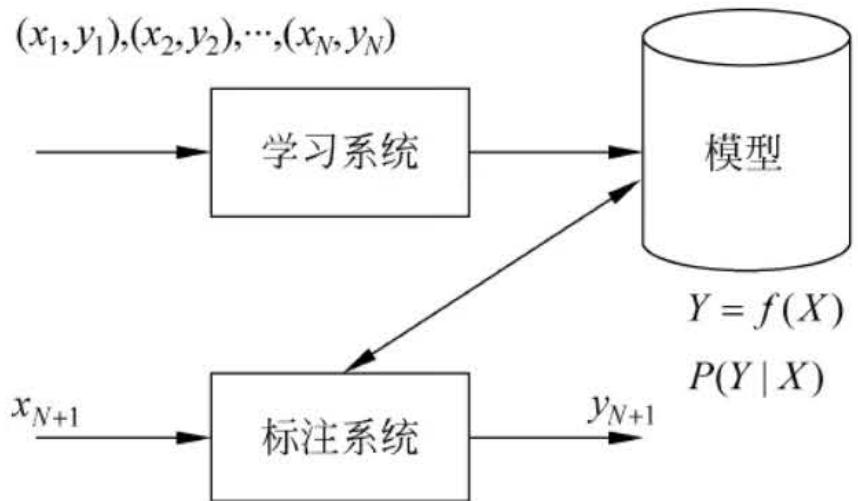  
图1.11 标注问题

标注常的机器学习法有隐马尔可夫模型、条件随机场。

标注问题在信息抽取、然语处理等领域被泛应，是这些领域的基本问题。例如，然语处理中的词性标注（partof speech tagging）就是个典型的标注问题：给定个由单词组成的句，对这个句中的每个单词进词性标注，即对个单词序列预测其对应的词性标记序列。

举个信息抽取的例。从英章中抽取基本名词短语（base noun phrase）。为此，要对章进标注。英单词是个观测，英句是个观测序列，标记表名词短语的“开始”、“结束”或“其他”（分别以B，E，O表），标记序列表英句中基本名词短语的所在位置。信息抽取时，将标记“开始”到标记“结束”的单词作为名词短语。例如，给出以下的观测序列，即英句，标注系统产相应的标记序列，即给出句中的基本名词短语。

输：At Microsoft Research, we have an insatiable curiosity and the desire to create new technology that will help define the computing experience.

输出：At/O Microsoft/B Research/E, we/O have/O an/O insatiable/B curiosity/E and/ O the/O desire/BE to/O create/O new/B technology/E that/O will/O help/O define/ O the/O computing/B experience/E.

## 1.8.3 回归问题

回归（regression）是监督学习的另个重要问题。回归于预测输变量（变量）和输出变量（因变量）之间的关系，特别是当输变量的值发变化时，输出变量的值随之发的变化。回归模型正是表从输变量到输出变量之间映射的函数。回归问题的学习等价于函数拟合：选择条函数曲线使其很好地拟合已知数据且很好地预测未知数据（参照1.4.2节）。

回归问题分为学习和预测两个过程（如图1.12所）。先给定个训练数据集:

$$
T = \{ ( x _ { 1 } , y _ { 1 } ) , ( x _ { 2 } , y _ { 2 } ) , \cdots , ( x _ { N } , y _ { N } ) \}
$$

这里， $x _ { i } \in R ^ { n }$ 是输入， $y \in R$ 是对应的输出， $i = 1 , 2 , \cdots , N _ { \circ }$ 学习系统基于训练数据构建个模型，即函数 $Y = f ( X )$ ；对新的输 $x _ { N + 1 }$ ，预测系统根据学习的模型 $Y = f ( X )$ 确定相应的输出 $y N + 1$ 。

回归问题按照输变量的个数，分为元回归和多元回归；按照输变量和输出变量之间关系的类型即模型的类型，分为线性回归和线性回归。

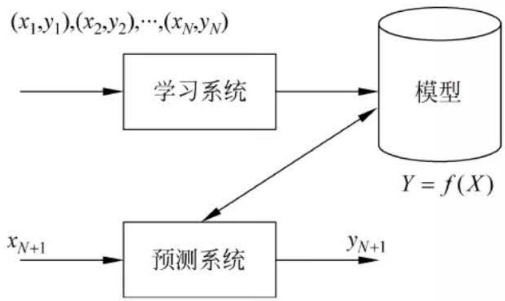  
图1.12 回归问题

回归学习最常的损失函数是平损失函数，在此情况下，回归问题可以由著名的最二乘法（least squares）求解。

许多领域的任务都可以形式化为回归问题，如，回归可以于商务领域，作为市场趋势预测、产品质量管理、客户满意度调查、投资风险分析的具。作为例，简单介绍股价预测问题。假设知道某公司在过去不同时间点（如，每天）的市场上的股票价格（如，股票平均价格），以及在各个时间点之前可能影响该公司股价的信息（如，该公司前周的营业额、利润）。标是从过去的数据学习个模型，使它可以基于当前的信息预测该公司下个时间点的股票价格。可以将这个问题作为回归问题解决。具体地，将影响股价的信息视为变量（输的特征），将股价视为因变量（输出的值）。将过去的数据作为训练数据就可以学习个回归模型，并对未来的股价进预测。可以看出这是个困难的预测问题，因为影响股价的因素常多，我们未必能判断出哪些信息（输的特征）有并能得到这些信息。

## 本章概要

1．机器学习或统计机器学习是关于计算机基于数据构建概率统计模型并运模型对数据进分析与预测的门学科。机器学习包括监督学习、监督学习和强化学习。

2.机器学习法三要素模型、策略、算法，对理解机器学习法起到提纲挈领的作用。

3.本书第1篇主要讨论监督学习，监督学习可以概括如下：从给定的有限训练数据出发，假设数据是独同分布的，且假设模型属于某个假设空间，应某评价准则，从假设空间中选取个最优的模型，使它对已给训练数据及未知测试数据在给定评价标准意义下有最准确的预测。

4.机器学习中，进模型选择或者说提学习的泛化能是个重要问题。如果只考虑减少训练误差，就可能产过拟合现象。模型选择的法有正则化与交叉验证。学习法泛化能的分析是机器学习理论研究的重要课题。

5.分类问题、标注问题和回归问题都是监督学习的重要问题。本书第1篇介绍的机器学习法包括感知机、k近邻法、朴素贝叶斯法、决策树、逻辑斯谛回归与最熵模型、持向量机、Boosting、EM算法、隐马尔可夫模型和条件随机场。这些法是主要的分类、标注以及回归法。它们又可以归类为成法与判别法。

## 继续阅读

关于机器学习或机器学习法般介绍的书籍可以参阅献[1]\~献[8]。

## 习 题

1.1 说明伯努利模型的极似然估计以及贝叶斯估计中的机器学习法三要素。伯努利模型是定义在取值为0与1的随机变量上的概率分布。假设观测到伯努利模型n次独的数据成结果，其中k次的结果为1，这时可以极似然估计或贝叶斯估计来估计结果为1的概率。

1.2 通过经验风险最化推导极似然估计。证明模型是条件概率分布，当损失函数是对数损失函数时，经验风险最化等价于极似然估计。

## 参考文献

[1] HASTIE T, TIBSHIRANI R, FRIEDMAN J. The elements of statistical learning: data mining, inference,and prediction[M].范明，柴玉梅，咎红英，等译.Springer,2001.

[2] BISHOP M. Pattern recognition and machine learning[M]. Springer, 2006.

[3] DAPHNE K, NIR F. Probabilistic graphical models: principles and techniques[M]. MIT Press, 2009.

[4] IAN G, YOSHUA B, AARON C, et al. Deep learning[M]. MIT Press, 2016.

[5] TOMM M. Machine learning[M].曾华军，张银奎，等译.McGraw-Hill Companies, Inc. 1997.

[6] DAVID B. Bayesian reasoning and machine learning[M]. Cambridge University Press, 2012.

[7] RICHARD S S, ANDREW G B. Reinforcement learning: an introduction[M]. MIT Press, 1998.

[8] 周志华.机器学习[M].北京：清华学出版社，2016.

## 第2章感知机

感知机（perceptron）是类分类的线性分类模型，其输为实例的特征向量，输出为实例的类别，取+1和-1值。感知机对应于输空间（特征空间）中将实例划分为正负两类的分离超平，属于判别模型。感知机学习旨在求出将训练数据进线性划分的分离超平，为此，导基于误分类的损失函数，利梯度下降法对损失函数进极化，求得感知机模型。感知机学习算法具有简单易于实现的优点，分为原始形式和对偶形式。感知机预测是学习得到的感知机模型对新的输实例进分类。感知机在1957年由Rosenblatt提出，是神经络与持向量机的基础。

本章先介绍感知机模型；然后叙述感知机的学习策略，特别是损失函数；最后介绍感知机学习算法，包括原始形式和对偶形式，并证明算法的收敛性。

## 2.1 感知机模型

定义2.1（感知机） 假设输入空间（特征空间）是 ${ \mathcal { X } } \subseteq R ^ { n }$ ,输出空间是 $\mathcal { V } = \{ + 1 , - 1 \}$ 。输入 $x \in \mathcal { X }$ 表示实例的特征向量，对应于输入空间（特征空间）的点；输出 $y \in \mathcal { D }$ 表示实例的类别。由输入空间到输出空间的如下函数

$$
f ( x ) = \mathrm { s i g n } ( w \cdot x + b )\tag{2.1}
$$

称为感知机。其中，w和b为感知机模型参数， $w \in R ^ { n }$ 叫作权值（weight）或权值向量（weight vector), $b \in \mathbf { \Omega } R$ 叫作偏置（bias），w·x表示w和x的内积。sign是符号函数，即

$$
\mathrm { s i g n } ( x ) = \left\{ \begin{array} { l l } { + 1 , } & { x \geqslant 0 } \\ { - 1 , } & { x < 0 } \end{array} \right.\tag{2.2}
$$

感知机是种线性分类模型，属于判别模型。感知机模型的假设空间是定义在特征空间中的所有线性分类模型（linear classification model）或线性分类器（linearclassifier），即函数集合 $\{ f | f ( x ) = w \cdot x + b \}$ 。

感知机有如下何解释：线性程

$$
w \cdot x + b = 0\tag{2.3}
$$

对应于特征空间 $\pmb { R } ^ { n }$ 中的个超平S，其中ω是超平的法向量，b是超平的截距。这

个超平将特征空间划分为两个部分。位于两部分的点（特征向量）分别被分为正、负两类。  
因此，超平S称为分离超平（separating hyperplane），如图2.1所。

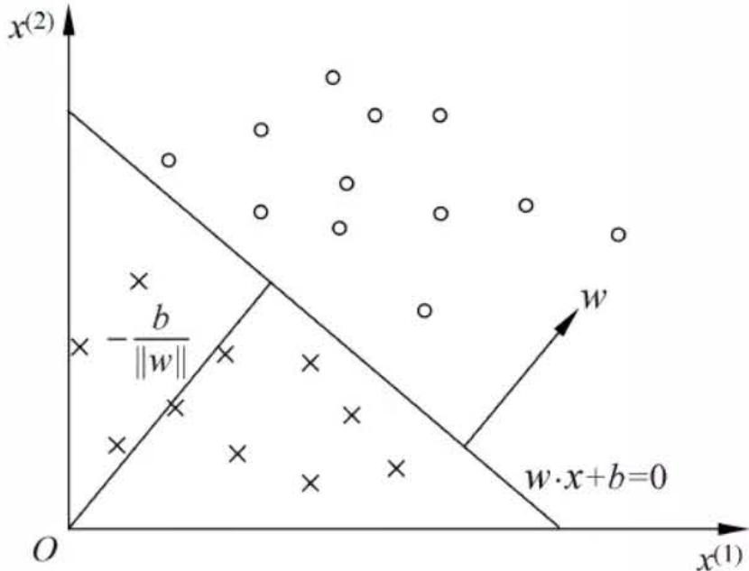  
图2.1 感知机模型

感知机学习由训练数据集（实例的特征向量及类别）

$$
T = \{ ( x _ { 1 } , y _ { 1 } ) , ( x _ { 2 } , y _ { 2 } ) , \cdots , ( x _ { N } , y _ { N } ) \}
$$

其中， $x _ { i } \in \mathcal { X } = R ^ { n } , y _ { i } \in \mathcal { Y } = \{ + 1 , - 1 \} , i = 1 , 2 , \cdots , N$ ，求得感知机模型（式（2.1）），即求得模型参数 $w , b _ { \circ }$ 感知机预测通过学习得到的感知机模型，对新的输实例给出其对应的输出类别。

## 2.2 感知机学习策略

## 2.2.1 数据集的线性可分性

定义2.2（数据集的线性可分性） 给定一个数据集

$$
T = \{ ( x _ { 1 } , y _ { 1 } ) , ( x _ { 2 } , y _ { 2 } ) , \cdots , ( x _ { N } , y _ { N } ) \}
$$

其中， $x _ { i } \in \mathcal { X } = R ^ { n } , \ y _ { i } \in \mathcal { Y } = \{ + 1 , - 1 \} , \ i = 1 , 2 , \cdots , N ,$ 如果存在某个超平面S

$$
w \cdot x + b = 0
$$

能够将数据集的正实例点和负实例点完全正确地划分到超平面的两侧，即对所有 $y _ { i } = + 1$ 的实例i，有 $w \cdot x _ { i } + b > 0$ 对所有 $y _ { i } = - 1$ 的实例i，有 $w \cdot x _ { i } + b < 0$ ，则称数据集T为线性可分数据集（linearly separable data set）；否则，称数据集T线性不可分。

## 2.2.2 感知机学习策略

假设训练数据集是线性可分的，感知机学习的标是求得个能够将训练集正实例点和负实例点完全正确分开的分离超平。为了找出这样的超平，即确定感知机模型参数w，b，需要确定个学习策略，即定义（经验）损失函数并将损失函数极化。

损失函数的个然选择是误分类点的总数。但是，这样的损失函数不是参数 $w , b$ 的连续可导函数，不易优化。损失函数的另个选择是误分类点到超平S的总距离，这是感知机所采的。为此，先写出输空间 $\pmb { R } ^ { n }$ 中任一点 $x _ { 0 }$ 到超平面S的距离：

$$
{ \frac { 1 } { \| w \| } } | w \bullet x _ { 0 } + b |
$$

这里， $\lVert \boldsymbol { w } \rVert$ 是ω的 $L _ { 2 }$ 范数。

其次，对于误分类的数据 $( x _ { i } , y _ { i } )$

$$
- y _ { i } ( w \cdot x _ { i } + b ) > 0
$$

成立。因为当 $w \cdot x _ { i } + b > 0$ 时， $y _ { i } = - 1$ ；而当 $w \cdot x _ { i } + b < 0$ 时， $y _ { i } = + 1$ 。因此，误分类点$x _ { i }$ 到超平面S的距离是

$$
- { \frac { 1 } { \| w \| } } y _ { i } ( w \bullet x _ { i } + b )
$$

假设超平面 $S$ 的误分类点集合为M，那么所有误分类点到超平 $S$ 的总距离为

$$
- { \frac { 1 } { \| w \| } } \sum _ { x _ { i } \in M } y _ { i } ( w \cdot x _ { i } + b )
$$

不考虑 ${ \frac { 1 } { \| w \| } } ,$ ，就得到感知机学习的损失函数 $\textcircled{1}$

给定训练数据集

$$
T = \{ ( x _ { 1 } , y _ { 1 } ) , ( x _ { 2 } , y _ { 2 } ) , \cdots , ( x _ { N } , y _ { N } ) \}
$$

其中， $x _ { i } \in \mathcal { X } = R ^ { n } , y _ { i } \in \mathcal { Y } = \{ + 1 , - 1 \} , i = 1 , 2 , \cdots , N .$ ，感知机 $\mathrm { s i g n } ( w \bullet x + b )$ 学习的损失函数定义为

$$
L ( w , b ) = - \sum _ { x _ { i } \in M } y _ { i } ( w \cdot x _ { i } + b )\tag{2.4}
$$

其中，M为误分类点的集合。这个损失函数就是感知机学习的经验风险函数。

显然，损失函数 $L ( w , b )$ 是负的。如果没有误分类点，损失函数值是0。且，误分类点越少，误分类点离超平越近，损失函数值就越。个特定的样本点的损失函数在误分类时是参数w，b的线性函数，在正确分类时是0。因此，给定训练数据集T，损失函数 $L ( w , b )$ 是 $w , b$ 的连续可导函数。

感知机学习的策略是在假设空间中选取使损失函数式（2.4）最的模型参数 $w , b ,$ 即感知机模型。

## 2.3 感知机学习算法

感知机学习问题转化为求解损失函数式（2.4）的最优化问题，最优化的法是随机梯度下降法。本节叙述感知机学习的具体算法，包括原始形式和对偶形式，并证明在训练数据线

性可分条件下感知机学习算法的收敛性。

## 2.3.1 感知机学习算法的原始形式

感知机学习算法是对以下最优化问题的算法。给定个训练数据集

$$
T = \{ ( x _ { 1 } , y _ { 1 } ) , ( x _ { 2 } , y _ { 2 } ) , \cdots , ( x _ { N } , y _ { N } ) \}
$$

其中， $x _ { i } \in \mathcal { X } = R ^ { n } , \ y _ { i } \in \mathcal { Y } = \{ - 1 , 1 \} , \ i = 1 , 2 , \cdot \cdot \cdot , N$ ，求参数,b，使其为以下损失函数极化问题的解：

$$
\operatorname* { m i n } _ { w , b } L ( w , b ) = - \sum _ { x _ { i } \in M } y _ { i } ( w \cdot x _ { i } + b )\tag{2.5}
$$

其中，M为误分类点的集合。

感知机学习算法是误分类驱动的，具体采随机梯度下降法(stochasticgradientdescent）。先，任意选取个超平 $w _ { 0 } , \ b _ { 0 }$ ，然后梯度下降法不断地极化标函数（式（2.5））。极化过程中不是次使M中所有误分类点的梯度下降，是次随机选取个误分类点使其梯度下降。

假设误分类点集合M是固定的，那么损失函数 $L ( w , b )$ 的梯度由

$$
\nabla _ { w } L ( w , b ) = - \sum _ { x _ { i } \in M } y _ { i } x _ { i }
$$

$$
{ \nabla } _ { b } L ( w , b ) = - \sum _ { x _ { i } \in M } y _ { i }
$$

给出。

随机选取个误分类点 $( x _ { i } , y _ { i } )$ ，对 $w , b$ 进行更新：

$$
w \gets w + \eta y _ { i } x _ { i }\tag{2.6}
$$

$$
b \gets b + \eta y _ { i }\tag{2.7}
$$

式中 $\eta \left( 0 < \eta \leqslant 1 \right)$ 是步长，在机器学习中又称为学习率（learningrate）。这样，通过迭代可以期待损失函数 $L ( w , b )$ 不断减，直到为0。综上所述，得到如下算法：

算法2.1（感知机学习算法的原始形式）

输入：训练数据集 $T = \{ ( x _ { 1 } , y _ { 1 } ) , ( x _ { 2 } , y _ { 2 } ) , \cdot \cdot \cdot , ( x _ { N } , y _ { N } ) \}$ ，其中 $x _ { i } \in \mathcal { X } = R ^ { n } , ~ y _ { i } \in \mathcal { Y } =$ $\{ - 1 , + 1 \}$ , $i = 1 , 2 , \cdots , N ;$ 学习率 $\eta \left( 0 < \eta \leqslant 1 \right)$

输出： $w , b ;$ 感知机模型 $f ( x ) = \mathrm { s i g n } ( w \cdot x + b )$

（1）选取初值 $w _ { 0 } , b _ { 0 }$

(2）在训练集中选取数据 $( x _ { i } , y _ { i } )$

(3）如果 $y _ { i } ( w \cdot x _ { i } + b ) \leqslant 0$ ，则

$$
w \gets w + \eta y _ { i } x _ { i }
$$

$$
b \gets b + \eta y _ { i }
$$

(4）转步骤(2），直训练集中没有误分类点。

这种学习算法直观上有如下解释：当个实例点被误分类，即位于分离超平的错误侧时，则调整 $w , b$ 的值，使分离超平面向该误分类点的侧移动，以减少该误分类点与超平间的距离，直超平越过该误分类点使其被正确分类。

算法2.1是感知机学习的基本算法，对应于后的对偶形式，称为原始形式。感知机学习算法简单且易于实现。

例2.1 如图2.2所的训练数据集，其正实例点是 $x _ { 1 } = ( 3 , 3 ) ^ { \mathrm { T } } , ~ x _ { 2 } = ( 4 , 3 ) ^ { \mathrm { T } }$ ，负实例点是 $x _ { 3 } = ( 1 , 1 ) ^ { \mathrm { T } }$ ，试感知机学习算法的原始形式求感知机模型 $f ( x ) = \mathrm { s i g n } ( w \cdot x + b )$ 。这里， $w = ( w ^ { ( 1 ) } , w ^ { ( 2 ) } ) ^ { \mathrm { T } } , \boldsymbol { x } = ( x ^ { ( 1 ) } , x ^ { ( 2 ) } ) ^ { \mathrm { T } }$ 。

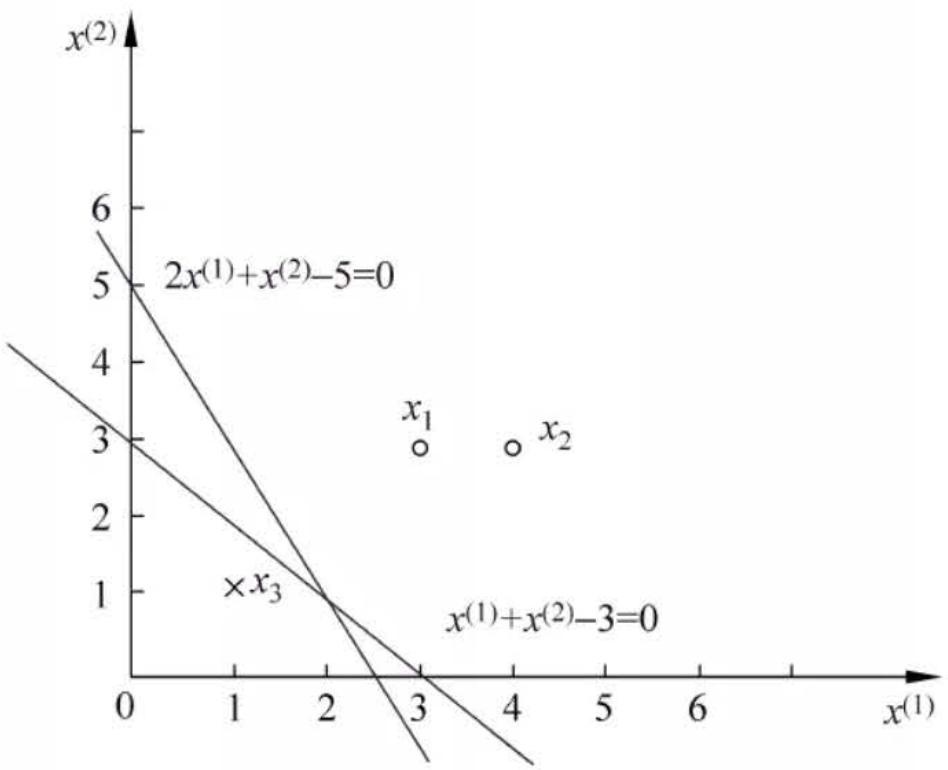  
图2.2 感知机例

解 构建最优化问题：

$$
\operatorname* { m i n } _ { w , b } L ( w , b ) = - \sum _ { x _ { i } \in M } y _ { i } ( w \cdot x _ { i } + b )
$$

按照算法2.1求解 $w , b , \eta = 1$

(1）取初值 $w _ { 0 } = 0 , \ b _ { 0 } = 0$

（2）对 $x _ { 1 } = ( 3 , 3 ) ^ { \mathrm { T } } , y _ { 1 } ( w _ { 0 } \bullet x _ { 1 } + b _ { 0 } ) = 0$ ，未能被正确分类，更新w，b：

$$
w _ { 1 } = w _ { 0 } + y _ { 1 } x _ { 1 } = ( 3 , 3 ) ^ { \mathrm { T } } , \ b _ { 1 } = b _ { 0 } + y _ { 1 } = 1
$$

得到线性模型：

$$
w _ { 1 } \bullet x + b _ { 1 } = 3 x ^ { ( 1 ) } + 3 x ^ { ( 2 ) } + 1
$$

（3）对 $x _ { 1 } , x _ { 2 }$ ，显然， $y _ { i } ( w _ { 1 } \bullet x _ { i } + b _ { 1 } ) > 0$ ，被正确分类，不修改ω，b；对 $\boldsymbol { x } _ { 3 } = ( 1 , 1 ) ^ { \mathrm { T } }$ $y _ { 3 } ( w _ { 1 } \bullet x _ { 3 } + b _ { 1 } ) < 0$ ，被误分类，更新w，b：

$$
w _ { 2 } = w _ { 1 } + y _ { 3 } x _ { 3 } = ( 2 , 2 ) ^ { \mathrm { T } } , \ b _ { 2 } = b _ { 1 } + y _ { 3 } = 0
$$

得到线性模型：

$$
w _ { 2 } \bullet x + b _ { 2 } = 2 x ^ { ( 1 ) } + 2 x ^ { ( 2 ) }
$$

如此继续下去，直到

$$
w _ { 7 } = ( 1 , 1 ) ^ { \mathrm { T } } , \ b _ { 7 } = - 3
$$

$$
w _ { 7 } \bullet x + b _ { 7 } = x ^ { ( 1 ) } + x ^ { ( 2 ) } - 3
$$

对所有数据点 $y _ { i } ( w _ { 7 } \bullet x _ { i } + b _ { 7 } ) > 0$ ，没有误分类点，损失函数达到极。

分离超平为 $x ^ { ( 1 ) } + x ^ { ( 2 ) } - 3 = 0$ ，感知机模型为 $f ( x ) = \mathrm { s i g n } ( x ^ { ( 1 ) } + x ^ { ( 2 ) } - 3 )$ 迭代过程见表2.1。

表2.1 例2.1求解的迭代过程
<table><tr><td>迭代次数</td><td>误分类点</td><td>w</td><td>b</td><td> $w \cdot x + b$ </td></tr><tr><td>0</td><td></td><td>0</td><td>0</td><td>0</td></tr><tr><td>1</td><td> $x _ { 1 }$ </td><td> $( 3 , 3 ) ^ { \mathrm { T } }$ </td><td>1</td><td> $3 x ^ { ( 1 ) } + 3 x ^ { ( 2 ) } + 1$ </td></tr><tr><td>2</td><td> $x _ { 3 }$ </td><td> $( 2 , 2 ) ^ { \mathrm { T } }$ </td><td>0</td><td> $2 x ^ { ( 1 ) } + 2 x ^ { ( 2 ) }$ </td></tr><tr><td>3</td><td> $x _ { 3 }$ </td><td> $( 1 , 1 ) ^ { \mathrm { T } }$ </td><td>-1</td><td> $x ^ { ( 1 ) } + x ^ { ( 2 ) } - 1$ </td></tr><tr><td>4</td><td> $x _ { 3 }$ </td><td> $( 0 , 0 ) ^ { \mathrm { T } }$ </td><td>2-</td><td>-2</td></tr><tr><td></td><td> $x _ { 1 }$ </td><td> $( 3 , 3 ) ^ { \mathrm { T } }$ </td><td></td><td> $3 x ^ { ( 1 ) } + 3 x ^ { ( 2 ) } - 1$ </td></tr><tr><td>6</td><td> $x _ { 3 }$ </td><td> $( 2 , 2 ) ^ { \mathrm { T } }$ </td><td>-2</td><td> $2 x ^ { ( 1 ) } + 2 x ^ { ( 2 ) } - 2$ </td></tr><tr><td>7</td><td> $x _ { 3 }$ </td><td> $( 1 , 1 ) ^ { \mathrm { T } }$ </td><td>-3</td><td> $x ^ { ( 1 ) } + x ^ { ( 2 ) } - 3$ </td></tr><tr><td>8</td><td>0</td><td> $( 1 , 1 ) ^ { \mathrm { T } }$ </td><td>-3</td><td> $x ^ { ( 1 ) } + x ^ { ( 2 ) } - 3$ </td></tr></table>

这是在计算中误分类点先后取 $x _ { 1 } , x _ { 3 } , x _ { 3 } , x _ { 3 } , x _ { 1 } , x _ { 3 } , x _ { 3 }$ 得到的分离超平和感知机模型。如果在计算中误分类点依次取 $x _ { 1 } , x _ { 3 } , x _ { 3 } , x _ { 3 } , x _ { 2 } , x _ { 3 } , x _ { 3 } , x _ { 3 } , x _ { 1 } , x _ { 3 } , x _ { 3 }$ ，那么得到的分离超平是$2 x ^ { ( 1 ) } + x ^ { ( 2 ) } - 5 = 0$

可见，感知机学习算法由于采不同的初值或选取不同的误分类点，解可以不同。

## 2.3.2 算法的收敛性

现在证明，对于线性可分数据集，感知机学习算法原始形式收敛，即经过有限次迭代可以得到个将训练数据集完全正确划分的分离超平及感知机模型。

为了便于叙述与推导，将偏置b并权重向量w，记作 $\boldsymbol { \hat { w } } = ( w ^ { \mathrm { T } } , b ) ^ { \mathrm { T } }$ ，同样也将输入向量加以扩充，加进常数1，记作 ${ \hat { x } } = ( x ^ { \mathrm { T } } , 1 ) ^ { \mathrm { T } } .$ 。这样， $\hat { x } \in R ^ { n + 1 } , \hat { w } \in R ^ { n + 1 }$ 。显然， $\hat { w } \bullet \hat { x } = w \bullet x + b \circ$

定理2.1（Novikoff） 设训练数据集 $T = \{ ( x _ { 1 } , y _ { 1 } ) , ( x _ { 2 } , y _ { 2 } ) , \cdots , ( x _ { N } , y _ { N } ) \}$ 是线性可分的，其中 $x _ { i } \in \mathcal { X } = R ^ { n } , \ y _ { i } \in \mathcal { Y } = \{ - 1 , + 1 \} , \ i = 1 , 2 , \cdot \cdot \cdot , N$ ,则

(1)存在满足条件 $\| \hat { w } _ { \mathrm { o p t } } \| = 1$ 的超平面 $\hat { w } _ { \mathrm { o p t } } \bullet \hat { x } = w _ { \mathrm { o p t } } \bullet x + b _ { \mathrm { o p t } } = 0$ 将训练数据集完全正确分开；且存在 $\gamma > 0$ ，对所有 $i = 1 , 2 , \cdots , N$ ,有

$$
y _ { i } ( \hat { w } _ { \mathrm { o p t } } \bullet \hat { x } _ { i } ) = y _ { i } ( w _ { \mathrm { o p t } } \bullet x _ { i } + b _ { \mathrm { o p t } } ) \geqslant \gamma\tag{2.8}
$$

(2)令 $R = \operatorname* { m a x } _ { 1 \leqslant i \leqslant N } \| \widehat { x } _ { i } \|$ ，则感知机算法2.1在训练数据集上的误分类次数k满足不等式

$$
k \leqslant \left( \frac { R } { \gamma } \right) ^ { 2 }\tag{2.9}
$$

证明 （1）由于训练数据集是线性可分的，按照定义2.2，存在超平可将训练数据集完全正确分开，取此超平为 $\hat { w } _ { \mathrm { o p t } } \bullet \hat { x } = w _ { \mathrm { o p t } } \bullet x + b _ { \mathrm { o p t } } = 0$ ，使 $\| \hat { w } _ { \mathrm { o p t } } \| = 1$ 。由于对有限的$i = 1 , 2 , \cdots , N$ ，均有

$$
y _ { i } ( { \hat { w } } _ { \mathrm { o p t } } \cdot { \hat { x } } _ { i } ) = y _ { i } ( w _ { \mathrm { o p t } } \bullet x _ { i } + b _ { \mathrm { o p t } } ) > 0
$$

所以存在

$$
\gamma = \operatorname* { m i n } _ { i } \{ y _ { i } ( w _ { \mathrm { o p t } } \bullet x _ { i } + b _ { \mathrm { o p t } } ) \}
$$

使

$$
y _ { i } ( \hat { w } _ { \mathrm { o p t } } \bullet \hat { x } _ { i } ) = y _ { i } ( w _ { \mathrm { o p t } } \bullet x _ { i } + b _ { \mathrm { o p t } } ) \geqslant \gamma
$$

（2）感知机算法从 $\hat { w } _ { 0 } = 0$ 开始，如果实例被误分类，则更新权重。令 $\hat { w } _ { k - 1 }$ 是第k个误分类实例之前的扩充权重向量，即

$$
\hat { w } _ { k - 1 } = ( w _ { k - 1 } ^ { \mathrm { T } } , b _ { k - 1 } ) ^ { \mathrm { T } }
$$

则第k个误分类实例的条件是

$$
y _ { i } ( { \hat { w } } _ { k - 1 } \bullet \ { \hat { x } } _ { i } ) = y _ { i } ( w _ { k - 1 } \bullet x _ { i } + b _ { k - 1 } ) \leqslant 0\tag{2.10}
$$

若 $( x _ { i } , y _ { i } )$ 是被 $\hat { w } _ { k - 1 } = ( w _ { k - 1 } ^ { \mathrm { T } } , b _ { k - 1 } ) ^ { \mathrm { T } }$ 误分类的数据，则w和b的更新是

$$
\begin{array} { l } { { w _ { k }  w _ { k - 1 } + \eta y _ { i } x _ { i } } } \\ { { \ } } \\ { { b _ { k }  b _ { k - 1 } + \eta y _ { i } \ } } \end{array}
$$

即

$$
\hat { w } _ { k } = \hat { w } _ { k - 1 } + \eta y _ { i } \hat { x } _ { i }\tag{2.11}
$$

下推导不等式(2.12)及不等式(2.13)：

$$
\hat { w } _ { k } \bullet \hat { w } _ { \mathrm { o p t } } \geqslant k \eta \gamma\tag{2.12}
$$

由式(2.11)及式(2.8)得：

$$
\begin{array} { r } { \hat { w } _ { k } \bullet \hat { w } _ { \mathrm { o p t } } = \hat { w } _ { k - 1 } \bullet \hat { w } _ { \mathrm { o p t } } + \eta y _ { i } \hat { w } _ { \mathrm { o p t } } \bullet \hat { x } _ { i } } \\ { \geqslant \hat { w } _ { k - 1 } \bullet \hat { w } _ { \mathrm { o p t } } + \eta \gamma } \end{array}
$$

由此递推即得不等式(2.12)：

$$
\begin{array} { c } { { \hat { w } _ { k } \bullet \hat { w } _ { \mathrm { o p t } } \geqslant \hat { w } _ { k - 1 } \bullet \hat { w } _ { \mathrm { o p t } } + \eta \gamma \geqslant \hat { w } _ { k - 2 } \bullet \hat { w } _ { \mathrm { o p t } } + 2 \eta \gamma \geqslant \dots \geqslant k \eta \gamma } } \\ { { \qquad } } \\ { { \left\| \hat { w } _ { k } \right\| ^ { 2 } \leqslant k \eta ^ { 2 } R ^ { 2 } } } \end{array}\tag{2.13}
$$

由式(2.11)及式(2.10)得：

$$
\begin{array} { r l } & { \left\| \hat { w } _ { k } \right\| ^ { 2 } = \left\| \hat { w } _ { k - 1 } \right\| ^ { 2 } + 2 \eta y _ { i } \hat { w } _ { k - 1 } \bullet \hat { x } _ { i } + \eta ^ { 2 } \left\| \hat { x } _ { i } \right\| ^ { 2 } } \\ & { \qquad \leqslant \left\| \hat { w } _ { k - 1 } \right\| ^ { 2 } + \eta ^ { 2 } \left\| \hat { x } _ { i } \right\| ^ { 2 } } \\ & { \qquad \leqslant \left\| \hat { w } _ { k - 1 } \right\| ^ { 2 } + \eta ^ { 2 } R ^ { 2 } } \\ & { \qquad \leqslant \left\| \hat { w } _ { k - 2 } \right\| ^ { 2 } + 2 \eta ^ { 2 } R ^ { 2 } \leqslant \cdots } \\ & { \qquad \leqslant k \eta ^ { 2 } R ^ { 2 } } \end{array}
$$

结合不等式(2.12)及式(2.13)即得：

$$
\begin{array} { r l } & { k \eta \gamma \leqslant \hat { w } _ { k } \bullet \hat { w } _ { \mathrm { o p t } } \leqslant \| \hat { w } _ { k } \| \| \hat { w } _ { \mathrm { o p t } } \| \leqslant \sqrt { k } \eta R } \\ & { k ^ { 2 } \gamma ^ { 2 } \leqslant k R ^ { 2 } } \end{array}
$$

于是

$$
k \leqslant \left( \frac { R } { \gamma } \right) ^ { 2 }
$$

定理表明，误分类的次数k是有上界的，经过有限次搜索可以找到将训练数据完全正确分开的分离超平。也就是说，当训练数据集线性可分时，感知机学习算法原始形式迭代是收敛的。但是例2.1说明，感知机学习算法存在许多解，这些解既依赖于初值的选择，也依赖于迭代过程中误分类点的选择顺序。为了得到唯的超平，需要对分离超平增加约束条件。这就是第7章将要讲述的线性持向量机的想法。当训练集线性不可分时，感知机学习算法不收敛，迭代结果会发生振荡。

## 2.3.3 感知机学习算法的对偶形式

现在考虑感知机学习算法的对偶形式。感知机学习算法的原始形式和对偶形式与第7章中持向量机学习算法的原始形式和对偶形式相对应。

对偶形式的基本想法是：将u和b表为实例 $x _ { i }$ 和标记 $y _ { i }$ 的线性组合的形式，通过求解其系数求得w和b。不失般性，在算法2.1中可假设初始值 $w _ { 0 } , b _ { 0 }$ 均为0。对误分类点$( x _ { i } , y _ { i } )$ 通过

$$
\begin{array} { l } { { w  w + \eta y _ { i } x _ { i } } } \\ { { \ } } \\ { { b  b + \eta y _ { i } } } \end{array}
$$

逐步修改w,b，设修改n次，则w,b关于 $( x _ { i } , y _ { i } )$ 的增量分别是 $\alpha _ { i } y _ { i } x _ { i }$ 和 $\alpha _ { i } y _ { i }$ ,这里$\alpha _ { i } = n _ { i } \eta , n _ { i }$ 是点 $( x _ { i } , y _ { i } )$ 被误分类的次数。这样，从学习过程不难看出，最后学习到的w,b可以分别表示为

$$
w = \sum _ { i = 1 } ^ { N } \alpha _ { i } y _ { i } x _ { i }\tag{2.14}
$$

$$
b = \sum _ { i = 1 } ^ { N } \alpha _ { i } y _ { i }\tag{2.15}
$$

这里， $\alpha _ { i } \geqslant 0 , i = 1 , 2 , \cdot \cdot \cdot , N$ ，当 $\eta = 1$ 时，表示第个实例点由于误分而进行更新的次数。实例点更新次数越多，意味着它距分离超平越近，也就越难正确分类。换句话说，这样的实例对学习结果影响最大。

下对照原始形式来叙述感知机学习算法的对偶形式。

算法2.2（感知机学习算法的对偶形式）

输：线性可分的数据集 $T = \{ ( x _ { 1 } , y _ { 1 } ) , ( x _ { 2 } , y _ { 2 } ) , \cdot \cdot \cdot , ( x _ { N } , y _ { N } ) \}$ ，其中 $x _ { i } \in R ^ { n } , \ y _ { i } \in$ $\{ - 1 , + 1 \} , i = 1 , 2 , \cdots , N ;$ 学习率 $\eta \left( 0 < \eta \leqslant 1 \right)$

输出： $\alpha , b ;$ 感知机模型 $f ( x ) = \mathrm { s i g n } \left( \sum _ { j = 1 } ^ { N } \alpha _ { j } y _ { j } x _ { j } \bullet x + b \right)$ ，其中 ${ \boldsymbol { \alpha } } = ( \alpha _ { 1 } , \alpha _ { 2 } , \cdots , \alpha _ { N } ) ^ { \mathrm { T } }$

(1) $\alpha  0 , b  0$

(2）在训练集中选取数据 $( x _ { i } , y _ { i } )$

(3）如果 $y _ { i } \left( \sum _ { j = 1 } ^ { N } \alpha _ { j } y _ { j } x _ { j } \cdot x _ { i } + b \right) \leqslant 0$ ，则

$$
\begin{array} { l } { \alpha _ { i }  \alpha _ { i } + \eta } \\ { \quad } \\ { b  b + \eta y _ { i } } \end{array}
$$

（4）转步骤（2）直到没有误分类数据。

对偶形式中训练实例仅以内积的形式出现。为了便，可以预先将训练集中实例间的内积计算出来并以矩阵的形式存储，这个矩阵就是所谓的Gram矩阵（Grammatrix）：

$$
G = [ x _ { i } \cdot x _ { j } ] _ { N \times N }
$$

例2.2 数据同例2.1，正样本点是 $x _ { 1 } = ( 3 , 3 ) ^ { \mathrm { T } } , x _ { 2 } = ( 4 , 3 ) ^ { \mathrm { T } }$ ，负样本点是 $\boldsymbol { x } _ { 3 } = ( 1 , 1 ) ^ { \mathrm { T } }$ ,试感知机学习算法对偶形式求感知机模型。

解 按照算法2.2,

（1）取 $\alpha _ { i } = 0 , i = 1 , 2 , 3 , b = 0 , \eta = 1$

(2）计算Gram矩阵：

$$
G = \left[ \begin{array} { l l l } { 1 8 } & { 2 1 } & { 6 } \\ { 2 1 } & { 2 5 } & { 7 } \\ { 6 } & { 7 } & { 2 } \end{array} \right]
$$

(3）误分条件

$$
y _ { i } \left( \sum _ { j = 1 } ^ { N } \alpha _ { j } y _ { j } x _ { j } \cdot x _ { i } + b \right) \leqslant 0
$$

参数更新：

$$
\alpha _ { i }  \alpha _ { i } + 1 , \ b  b + y _ { i }
$$

(4）迭代，过程从略，结果列于表2.2；

(5)

$$
\begin{array} { l } { { w = 2 x _ { 1 } + 0 x _ { 2 } - 5 x _ { 3 } = ( 1 , 1 ) ^ { \mathrm { T } } } } \\ { { \phantom { b = 2 x _ { 1 } + 0 } } } \\ { { b = - 3 } } \end{array}
$$

分离超平面为

$$
x ^ { ( 1 ) } + x ^ { ( 2 ) } - 3 = 0
$$

感知机模型为

$$
f ( x ) = \mathrm { s i g n } ( x ^ { ( 1 ) } + x ^ { ( 2 ) } - 3 )
$$

表2.2 例2.2求解的迭代过程
<table><tr><td>k</td><td>0</td><td>1</td><td>2</td><td>3</td><td>4</td><td>5</td><td>6</td><td>7</td></tr><tr><td></td><td></td><td> $x _ { 1 }$ </td><td>$x3$</td><td>x3</td><td>x3</td><td>x1</td><td>$x3$</td><td>$x3$</td></tr><tr><td> $\alpha _ { 1 }$ </td><td>0</td><td>1</td><td>1</td><td>1</td><td>1</td><td>2</td><td>2</td><td>2</td></tr><tr><td> $\alpha _ { 2 }$ </td><td>0</td><td>0</td><td>0</td><td>0</td><td>0</td><td>0</td><td>0</td><td>0</td></tr><tr><td> $\alpha _ { 3 }$ </td><td>0</td><td>0</td><td>1</td><td>2</td><td>3</td><td>3</td><td>4</td><td>5</td></tr><tr><td>b</td><td>0</td><td>1</td><td>0</td><td>-1</td><td>-2</td><td>-1</td><td>-2</td><td>-3</td></tr></table>

对照例2.1，结果致，迭代步骤也是互相对应的。

与原始形式样，感知机学习算法的对偶形式迭代是收敛的，存在多个解。

## 本章概要

1．感知机是根据输实例的特征向量x对其进类分类的线性分类模型：

$$
f ( x ) = \mathrm { s i g n } ( w \cdot x + b )
$$

感知机模型对应于输空间（特征空间）中的分离超平 $w \cdot x + b = 0$ 。

2.感知机学习的策略是极化损失函数：

$$
\operatorname* { m i n } _ { w , b } L ( w , b ) = - \sum _ { x _ { i } \in M } y _ { i } ( w \cdot x _ { i } + b )
$$

损失函数对应于误分类点到分离超平的总距离。

3.感知机学习算法是基于随机梯度下降法的对损失函数的最优化算法，有原始形式和对偶形式。算法简单且易于实现。原始形式中，先任意选取个超平，然后梯度下降法不断极化标函数。在这个过程中次随机选取个误分类点使其梯度下降。

4.当训练数据集线性可分时，感知机学习算法是收敛的。感知机算法在训练数据集上的误分类次数k满不等式

$$
k \leqslant \left( { \frac { R } { \gamma } } \right) ^ { 2 }
$$

当训练数据集线性可分时，感知机学习算法存在穷多个解，其解由于不同的初值或不同的迭代顺序可能有所不同。

## 继续阅读

感知机最早在1957年由Rosenblatt提出[1]。Novikoff[2]，Minsky与Papert[3]等对感知机进了系列理论研究。感知机的扩展学习法包括袋算法（pocketalgorithm）[4]、表决感知机（voted perceptron）[5]、带边缘感知机（perceptron with margin）[6]。关于感知机的介绍可进步参考献[7]和献[8]。

## 习 题

2.1 Minsky与Papert指出：感知机因为是线性模型，所以不能表复杂的函数，如异或（XOR）。验证感知机为什么不能表异或。

2.2 模仿例题2.1，构建从训练数据集求解感知机模型的例。

2.3 证明以下定理：样本集线性可分的充分必要条件是正实例点集所构成的凸壳①与负实例点集所构成的凸壳互不相交。

## 参考文献

[1] ROsENBLATT F. The perceptron: a probabilistic model for information storage and organization in the Brain[J]. Psychological Review, 1958, 65 (6): 386–408.

[2] NOVIKOFF A B. On convergence proofs on perceptrons[C]//Polytechnic Institute of Brooklyn. Proceedings of the Symposium on the Mathematical Theory of Automata. 1962: 615–622.

[3] MINSKY M L, Papert S A. Perceptrons[M]. Cambridge, MA: MIT Press. 1969.

[4] GALLANT S I. Perceptron-based learning algorithms[J]. IEEE Transactions on Neural Networks, 1990, 1(2): 179–191.

[5] FREUND Y, SCHAPIRE R E. Large margin classification using the perceptron algorithm[C]// Proceedings of the 11th Annual Conference on Computational Learning Theory (COLT' 98). ACM Press, 1998.

[6] LI Y Y, Zaragoza H, Herbrich R, et al. The perceptron algorithm with uneven margins[C]// Proceedings of the 19th International Conference on Machine Learning. 2002: 379–386.

[7] WIDROW B, LEHR M A. 30 years of adaptive neural networks: perceptron, madaline, and backpropagation[J]. Proceedings of the IEEE, 1990, 78(9): 1415–1442.

[8] CRISTIANINI N, SHAWE-TAYLOR J. An introduction to support vector machines and other kernel-based learning methods[M]. Cambridge University Press, 2000.

## 第3章k近邻法

k近邻法（k-nearestneighbor，k-NN）是种基本分类与回归法。本书只讨论分类问题中的k近邻法。k近邻法的输入为实例的特征向量，对应于特征空间的点；输出为实例的类别，可以取多类。k近邻法假设给定个训练数据集，其中的实例类别已定。分类时，对新的实例，根据其k个最近邻的训练实例的类别，通过多数表决等式进预测。因此，k近邻法不具有显式的学习过程。k近邻法实际上利训练数据集对特征向量空间进划分，并作为其分类的“模型”。k值的选择、距离度量及分类决策规则是k近邻法的三个基本要素。k近邻法在1968年由Cover和Hart提出。

本章先叙述k近邻算法，然后讨论k近邻法的模型及三个基本要素，最后讲述k近邻法的个实现法—kd树，介绍构造kd树和搜索kd树的算法。

## 3.1k近邻算法

k近邻算法简单、直观：给定一个训练数据集，对新的输入实例，在训练数据集中找到与该实例最邻近的k个实例，这k个实例的多数属于某个类，就把该输实例分为这个类。下先叙述k近邻算法，然后再讨论其细节。

算法3.1(k近邻法）

输入：训练数据集

$$
T = \{ ( x _ { 1 } , y _ { 1 } ) , ( x _ { 2 } , y _ { 2 } ) , \cdots , ( x _ { N } , y _ { N } ) \}
$$

其中， $x _ { i } \in \mathcal X \subseteq R ^ { n }$ 为实例的特征向量， $y _ { i } \in \mathcal { Y } = \{ c _ { 1 } , c _ { 2 } , \cdots , c _ { K } \}$ 为实例的类别， $i =$ $1 , 2 , \cdots , N$ 0

输出：实例x所属的类 $y _ { \mathrm { ~ c ~ } }$

（1）根据给定的距离度量，在训练集T中找出与x最邻近的k个点，涵盖这k个点的x的邻域记作 $N _ { k } ( x )$

（2）在 $N _ { k } ( x )$ 中根据分类决策规则（如多数表决）决定x的类别 $y { \colon }$

$$
y = \arg \operatorname* { m a x } _ { c _ { j } } \sum _ { x _ { i } \in N _ { k } ( x ) } I ( y _ { i } = c _ { j } ) , i = 1 , 2 , \cdots , N , j = 1 , 2 , \cdots , K\tag{3.1}
$$

式(3.1)中，Ⅰ为指示函数，即当 $y _ { i } = c _ { j }$ 时Ⅰ为1，否则Ⅰ为0。

k近邻法的特殊情况是k=1的情形，称为最近邻算法。对于输入的实例点（特征向量）x，最近邻法将训练数据集中与x最邻近点的类作为x的类。

k近邻法没有显式的学习过程。

## 3.2 k近邻模型

k近邻法使的模型实际上对应于对特征空间的划分。模型由三个基本要素距离度量、k值的选择和分类决策规则决定。

## 3.2.1模型

k近邻法中，当训练集、距离度量（如欧氏距离）、k值及分类决策规则（如多数表决）确定后，对于任何个新的输实例，它所属的类唯地确定。这相当于根据上述要素将特征空间划分为些空间，确定空间的每个点所属的类。这事实从最近邻算法中可以看得很清楚。

特征空间中，对每个训练实例点 $x _ { i }$ ，距离该点其他点更近的所有点组成个区域，叫作单元（cell）。每个训练实例点拥有个单元，所有训练实例点的单元构成对特征空间的个划分。最近邻法将实例 $x _ { i }$ 的类 $y _ { i }$ 作为其单元中所有点的类标记（class label）。这样，每个单元的实例点的类别是确定的。图3.1是维特征空间划分的个例。

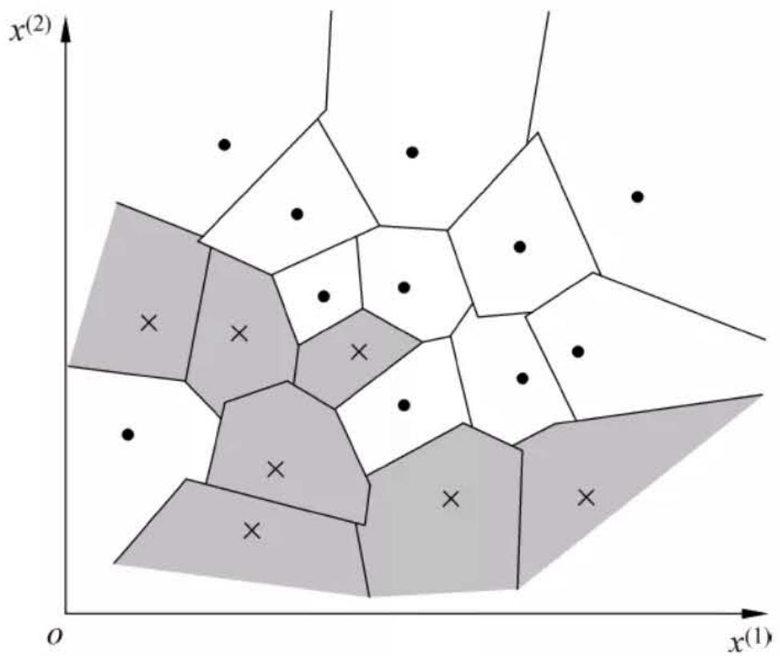  
图3.1 k近邻法的模型对应特征空间的个划分

## 3.2.2 距离度量

特征空间中两个实例点的距离是两个实例点相似程度的反映。k近邻模型的特征空间般是n维实数向量空间 $\pmb { R } ^ { n }$ 。使的距离是欧氏距离，但也可以是其他距离，如更般的 $L _ { p }$ 距离 $( L _ { p } { \mathrm { ~ d i s t a n c e } } )$ 或Minkowski距离（Minkowski distance）。

设特征空间X是n维实数向量空间Rn, $x _ { i } , x _ { j } \in \mathcal { X } , \ x _ { i } = ( x _ { i } ^ { ( 1 ) } , x _ { i } ^ { ( 2 ) } , \cdots , x _ { i } ^ { ( n ) } ) ^ { \mathrm { T } } , \ x _ { j } =$ $( x _ { j } ^ { ( 1 ) } , x _ { j } ^ { ( 2 ) } , \cdot \cdot \cdot , x _ { j } ^ { ( n ) } ) ^ { \mathrm { T } } , x _ { i } , x _ { j }$ 的 $L _ { p }$ 距离定义为

$$
L _ { p } ( x _ { i } , x _ { j } ) = \left( \sum _ { l = 1 } ^ { n } | x _ { i } ^ { ( l ) } - x _ { j } ^ { ( l ) } | ^ { p } \right) ^ { \frac { 1 } { p } }\tag{3.2}
$$

这里 $p \geqslant 1$ 。当 $p = 2$ 时，称为欧距离（Euclidean distance），即

$$
L _ { 2 } ( x _ { i } , x _ { j } ) = \left( \sum _ { l = 1 } ^ { n } | x _ { i } ^ { ( l ) } - x _ { j } ^ { ( l ) } | ^ { 2 } \right) ^ { \frac { 1 } { 2 } }\tag{3.3}
$$

当 $p = 1$ 时，称为曼哈顿距离（Manhattan distance），即

$$
L _ { 1 } ( x _ { i } , x _ { j } ) = \sum _ { l = 1 } ^ { n } | x _ { i } ^ { ( l ) } - x _ { j } ^ { ( l ) } |\tag{3.4}
$$

当 $p = \infty$ 时，它是各个坐标距离的最值，即

$$
L _ { \infty } ( x _ { i } , x _ { j } ) = \operatorname* { m a x } _ { l } | x _ { i } ^ { ( l ) } - x _ { j } ^ { ( l ) } |\tag{3.5}
$$

图3.2给出了维空间中 $p$ 取不同值时，与原点的 $L _ { p }$ 距离为 $1 \ ( L _ { p } = 1 )$ 的点的图形。

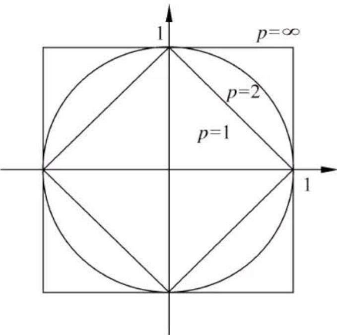  
图3.2 $L _ { p }$ 距离间的关系

下的例子说明，由不同的距离度量所确定的最近邻点是不同的。

例3.1 已知维空间的3个点 $x _ { 1 } = ( 1 , 1 ) ^ { \mathrm { T } } , x _ { 2 } = ( 5 , 1 ) ^ { \mathrm { T } } , x _ { 3 } = ( 4 , 4 ) ^ { \mathrm { T } }$ ，试求在 $p$ 取不同值时， $L _ { p }$ 距离下 $x _ { 1 }$ 的最近邻点。

解 因为 $x _ { 1 }$ 和 $x _ { 2 }$ 只有第维的值不同，所以p为任何值时， $L _ { p } ( x _ { 1 } , x _ { 2 } ) = 4$ 。而

$$
L _ { 1 } ( x _ { 1 } , x _ { 3 } ) = 6 , \quad L _ { 2 } ( x _ { 1 } , x _ { 3 } ) = 4 . 2 4 , \quad L _ { 3 } ( x _ { 1 } , x _ { 3 } ) = 3 . 7 8 , \quad L _ { 4 } ( x _ { 1 } , x _ { 3 } ) = 3 . 5 7 \quad \frac { L _ { 3 } ( x _ { 1 } , x _ { 3 } ) } { 3 } = 3 . 7 8 , \quad L _ { 4 } ( x _ { 1 } , x _ { 3 } ) = 3 . 5 7 \quad \frac { L _ { 3 } ( x _ { 1 } , x _ { 3 } ) } { 3 } = 3 . 7 8 \quad \frac { L _ { 4 } ( x _ { 1 } , x _ { 3 } ) } { 3 } = 3 . 7 8 \quad \frac { L _ { 3 } ( x _ { 1 } , x _ { 3 } ) } { 3 } = 3 . 7 8 \quad \frac { L _ { 3 } ( x _ { 1 } , x _ { 3 } ) } { 3 } = 3 . 7 8 \quad \frac { L _ { 4 } ( x _ { 1 } , x _ { 3 } ) } { 3 } = 3 . 7 8 \quad \frac { L _ { 3 } ( x _ { 1 } , x _ { 3 } ) } { 3 } = 3 . 7 8 \quad \frac { L _ { 3 } ( x _ { 1 } , x _ { 3 } ) } { 3 } = 3 . 7 8 \quad \frac { L _ { 3 } ( x _ { 1 } , x _ { 3 } ) } { 3 }
$$

于是得到： $p = 1$ 或2时， $x _ { 2 }$ 是 $x _ { 1 }$ 的最近邻点； $p \geqslant 3$ 时， $x _ { 3 }$ 是 $x _ { 1 }$ 的最近邻点。

## 3.2.3 k值的选择

k值的选择会对k近邻法的结果产重影响。

如果选择较的k值，就相当于较的邻域中的训练实例进预测，“学习”的近似误差（approximationerror）会减，只有与输实例较近的（相似的）训练实例才会对预测结

果起作。但缺点是“学习”的估计误差（estimationerror）会增，预测结果会对近邻的实例点常敏感[2]。如果邻近的实例点恰巧是噪声，预测就会出错。换句话说，k值的减就意味着整体模型变得复杂，容易发过拟合。

如果选择较的k值，就相当于较邻域中的训练实例进预测。其优点是可以减少学习的估计误差，但缺点是学习的近似误差会增。这时与输入实例较远的（不相似的）训练实例也会对预测起作，使预测发错误。k值的增就意味着整体模型变得简单。

如果 $k = N$ ，那么论输实例是什么，都将简单地预测它属于在训练实例中最多的类。这时，模型过于简单，完全忽略训练实例中的量有信息，是不可取的。

在应中，k值般取个较的数值。通常采交叉验证法来选取最优的k值。

## 3.2.4 分类决策规则

k近邻法中的分类决策规则往往是多数表决，即由输入实例的k个邻近的训练实例中的多数类决定输入实例的类。

多数表决规则（majorityvotingrule）有如下解释：如果分类的损失函数为0-1损失函数，分类函数为

$$
f : R ^ { n }  \{ c _ { 1 } , c _ { 2 } , \cdots , c _ { K } \}
$$

那么误分类的概率是

$$
P ( Y \neq f ( X ) ) = 1 - P ( Y = f ( X ) )
$$

对给定的实例 $x \in \mathcal { X }$ ，其最近邻的k个训练实例点构成集合 $N _ { k } ( x )$ 。如果涵盖 $N _ { k } ( x )$ 的区域的类别是 $c _ { j }$ ，那么误分类率是

$$
{ \frac { 1 } { k } } \sum _ { x _ { i } \in N _ { k } ( x ) } I ( y _ { i } \neq c _ { j } ) = 1 - { \frac { 1 } { k } } \sum _ { x _ { i } \in N _ { k } ( x ) } I ( y _ { i } = c _ { j } )
$$

要使误分类率最即经验风险最，就要使 $\sum _ { x _ { i } \in N _ { k } ( x ) } I ( y _ { i } = c _ { j } )$ 最，所以多数表决规则等价于经验风险最化。

## 3.3 k近邻法的实现：kd树

实现k近邻法时，主要考虑的问题是如何对训练数据进快速k近邻搜索。这点在特征空间的维数及训练数据容量时尤其必要。

k近邻法最简单的实现法是线性扫描（linearscan），这时要计算输实例与每个训练实例的距离。当训练集很大时，计算常耗时，这种法是不可的。

为了提k近邻搜索的效率，可以考虑使特殊的结构存储训练数据，以减少计算距离的次数。具体法很多，下介绍其中的kd树（kdtree）法①。

## 3.3.1 构造kd树

kd树是种对k维空间中的实例点进存储以便对其进快速检索的树形数据结构。kd树是叉树，表对k维空间的个划分（partition）。构造kd树相当于不断地垂直于坐标轴的超平将k维空间切分，构成系列的k维超矩形区域。kd树的每个结点对应于个k维超矩形区域。

构造kd树的法如下：构造根结点，使根结点对应于k维空间中包含所有实例点的超矩形区域；通过下的递归法，不断地对k维空间进切分，成子结点。在超矩形区域（结点）上选择个坐标轴和在此坐标轴上的个切分点，确定个超平，这个超平通过选定的切分点并垂直于选定的坐标轴，将当前超矩形区域切分为左、右两个区域（结点），这时实例被分到两个区域。这个过程直到区域内没有实例时终（终时的结点为叶结点）。在此过程中，将实例保存在相应的结点上。

通常，依次选择坐标轴对空间切分，选择训练实例点在选定坐标轴上的中位数 $( \mathrm { m e d i a n } ) ^ { \textcircled { 1 } }$ 为切分点，这样得到的kd树是平衡的。注意，平衡的kd树搜索时的效率未必是最优的。

下给出构造kd树的算法。

算法3.2（构造平衡kd树）

输：k维空间数据集 $T = \{ x _ { 1 } , x _ { 2 } , \cdots , x _ { N } \}$ ，其中 $x _ { i } = ( x _ { i } ^ { ( 1 ) } , x _ { i } ^ { ( 2 ) } , \cdots , x _ { i } ^ { ( k ) } ) ^ { \mathrm { T } } , ~ i =$ $1 , 2 , \cdots , N$

输出：kd树。

(1）开始：构造根结点，根结点对应于包含T的k维空间的超矩形区域。

选择 $x ^ { ( 1 ) }$ 为坐标轴，以T中所有实例的 $x ^ { ( 1 ) }$ 坐标的中位数为切分点，将根结点对应的超矩形区域切分为两个区域。切分由通过切分点并与坐标轴 $x ^ { ( 1 ) }$ 垂直的超平面实现。

由根结点成深度为1的左、右结点：左结点对应坐标 $x ^ { ( 1 ) }$ 小于切分点的子区域， 右子结点对应坐标 $x ^ { ( 1 ) }$ 大于切分点的子区域。

将落在切分超平上的实例点保存在根结点。

（2）重复：对深度为 $j$ 的结点，选择 $x ^ { ( l ) }$ 为切分的坐标轴， $l = j ( \mathrm { m o d } k ) + 1$ ，以该结点的区域中所有实例的 $x ^ { ( l ) }$ 坐标的中位数为切分点，将该结点对应的超矩形区域切分为两个区域。切分由通过切分点并与坐标轴 $x ^ { ( l ) }$ 垂直的超平面实现。

由该结点成深度为 $j + 1$ 的左、右子结点：左子结点对应坐标 $x ^ { ( l ) }$ 小于切分点的子区域，右结点对应坐标 $x ^ { ( l ) }$ 大于切分点的子区域。

将落在切分超平上的实例点保存在该结点。

(3）直到两个区域没有实例存在时停，从形成kd树的区域划分。

例3.2 给定个维空间的数据集

$$
T = \{ ( 2 , 3 ) ^ { \mathrm { T } } , ( 5 , 4 ) ^ { \mathrm { T } } , ( 9 , 6 ) ^ { \mathrm { T } } , ( 4 , 7 ) ^ { \mathrm { T } } , ( 8 , 1 ) ^ { \mathrm { T } } , ( 7 , 2 ) ^ { \mathrm { T } } \}
$$

构造个平衡 $k d$ 树②。

解 根结点对应包含数据集T的矩形，选择 $x ^ { ( 1 ) }$ 轴，6个数据点的 $x ^ { ( 1 ) }$ 坐标的中位数是 $7 \textcircled{1 }$ ，以平面 $x ^ { ( 1 ) } = 7$ 将空间分为左、右两个子矩形（子结点）；接着，左矩形以 $x ^ { ( 2 ) } = 4$ 分为两个子矩形，右矩形以 $x ^ { ( 2 ) } = 6$ 分为两个子矩形，如此递归，最后得到如图3.3所示的特征空间划分和如图3.4所的kd树。

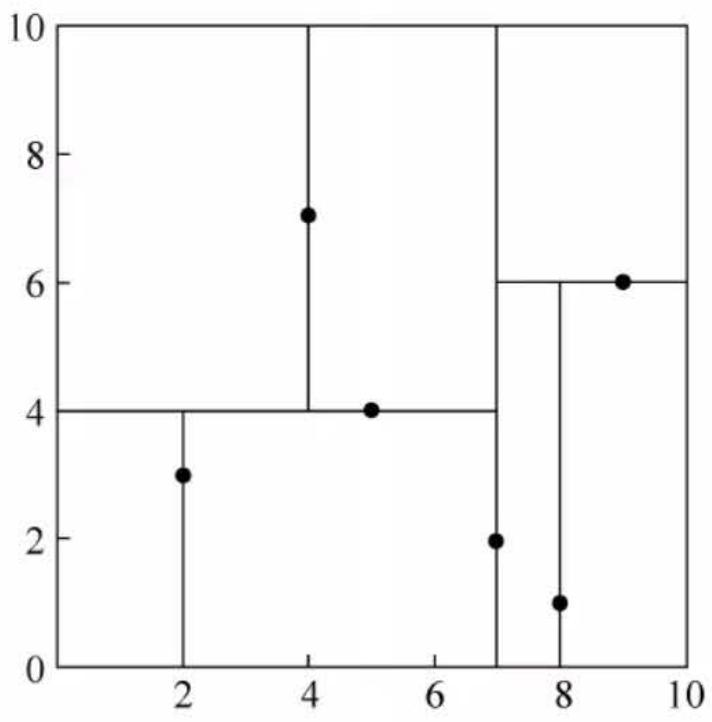  
图3.3 特征空间划分

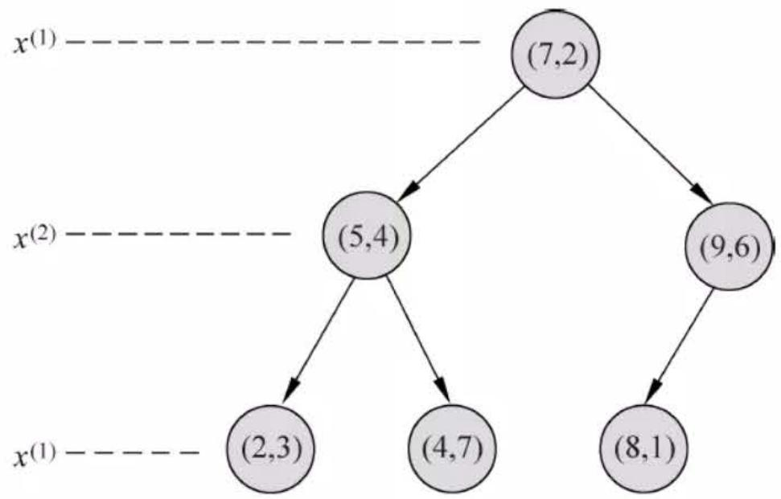  
图3.4 kd树例

## 3.3.2 搜索kd树

下介绍如何利kd树进k近邻搜索。可以看到，利kd树可以省去对部分数据点的搜索，从而减少搜索的计算量。这以最近邻为例加以叙述，同样的法可以应到k近邻。

给定个标点，搜索其最近邻。先找到包含标点的叶结点；然后从该叶结点出发，依次回退到结点；不断查找与标点最邻近的结点，当确定不可能存在更近的结点时终。这样搜索就被限制在空间的局部区域上，效率为提。

包含标点的叶结点对应包含标点的最超矩形区域。以此叶结点的实例点作为当前最近点，标点的最近邻定在以标点为中并通过当前最近点的超球体的内部（参阅图3.5)。然后返回当前结点的结点，如果结点的另结点的超矩形区域与超球体相交，那么在相交的区域内寻找与标点更近的实例点。如果存在这样的点，将此点作为新的当前最近点。算法转到更上级的结点，继续上述过程。如果结点的另结点的超矩形区域与超球体不相交，或不存在当前最近点更近的点，则停搜索。

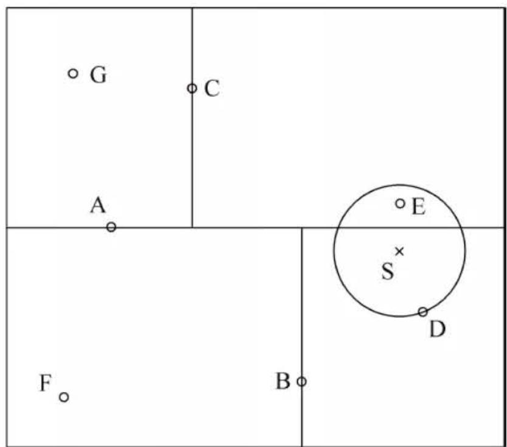  
图3.5 通过kd树搜索最近邻

下叙述kd树的最近邻搜索算法。

## 算法3.3（用kd树的最近邻搜索）

输入：已构造的kd树，标点x。

输出：x的最近邻。

（1）在kd树中找出包含标点x的叶结点：从根结点出发，递归地向下访问kd树。若标点x当前维的坐标于切分点的坐标，则移动到左结点，否则移动到右结点，直到子结点为叶结点为止。

(2）以此叶结点为“当前最近点”。

(3）递归地向上回退，在每个结点进以下操作：

（a）如果该结点保存的实例点当前最近点距离标点更近，则以该实例点为“当前最近点”。

（b）当前最近点定存在于该结点个结点对应的区域。检查该结点的结点的另结点对应的区域是否有更近的点。具体地，检查另结点对应的区域是否与以标点为球、以标点与“当前最近点”间的距离为半径的超球体相交。如果相交，可能在另个结点对应的区域内存在距标点更近的点，移动到另个结点。接着，递归地进最近邻搜索。如果不相交，向上回退。

（4）当回退到根结点时，搜索结束。最后的“当前最近点”即为x的最近邻点。 ■

如果实例点是随机分布的，kd树搜索的平均计算复杂度是O(logN)，这N是训练实例数。kd树更适于训练实例数远于空间维数时的k近邻搜索。当空间维数接近训练实例数时，它的效率会迅速下降，乎接近线性扫描。

下通过个例题来说明搜索法。

例3.3 给定个如图3.5所的kd树，根结点为A，其结点为B，C等。树上共存储7个实例点，另有个输标实例点S，求S的最近邻。

解 先在kd树中找到包含点S的叶结点D（图中的右下区域），以点D作为近似最近邻。真正最近邻定在以点S为中通过点D的圆的内部。然后返回结点D的结点B，在结点B的另结点F的区域内搜索最近邻。结点F的区域与圆不相交，不可能有最近邻点。继续返回上级结点A，在结点A的另结点C的区域内搜索最近邻。结点C的区域与圆相交，该区域在圆内的实例点有点E，点E点D更近，成为新的最近邻近似。最后得到点E是点S的最近邻。 ■

## 本章概要

1.k近邻法是基本且简单的分类与回归法。k近邻法的基本做法是：对给定的训练实例点和输实例点，先确定输实例点的k个最近邻训练实例点，然后利这k个训练实例点的类的多数来预测输入实例点的类。

2.k近邻模型对应于基于训练数据集对特征空间的个划分。k近邻法中，当训练集、距离度量、k值及分类决策规则确定后，其结果唯确定。

3.k近邻法三要素：距离度量、k值的选择和分类决策规则。常的距离度量是欧距离及更一般的 $L _ { p }$ 距离。k值小时，k近邻模型更复杂；k值大时，k近邻模型更简单。k值的选择反映了对近似误差与估计误差之间的权衡，通常由交叉验证选择最优的k。常的分类决策规则是多数表决，对应于经验风险最化。

4.k近邻法的实现需要考虑如何快速搜索k个最近邻点。kd树是种便于对k维空间中的数据进快速检索的数据结构。kd树是叉树，表对k维空间的个划分，其每个结点对应于k维空间划分中的个超矩形区域。利kd树可以省去对部分数据点的搜索，从而减少搜索的计算量。

## 继续阅读

k近邻法由Cover与Hart提出[1]。k近邻法相关的理论在献[2]和献[3]中已有论述。k近邻法的扩展可参考献[4]。kd树及其他快速搜索算法可参考献[5]。关于k近邻法的介绍可参考献[2]。

## 习 题

3.1 参照图3.1，在维空间中给出实例点，画出k为1和2时的k近邻法构成的空间划分，并对其进较，体会k值选择与模型复杂度及预测精确率的关系。

3.2 利例题3.2构造的kd树求点 $x = ( 3 , 4 . 5 ) ^ { \mathrm { T } }$ 的最近邻点。

3.3 参照算法3.3，写出输出为x的k近邻的算法。

## 参考文献

[1] COVER T, HART P. Nearest neighbor pattern classification[J]. IEEE Transactions on Information Theory, 1967, 13(1): 21–27.

[2] HASTIE T, TIBSHIRANI R, FRIEDMAN J. The elements of statistical learning: data mining, inference,and prediction[M].范明，柴玉梅，咎红英，等译.Springer,2001.

[3] FRIEDMAN J. Flexible metric nearest neighbor classification[J]. Technical Report, 1994.

[4] WEINBERGER K Q, BLITZER J, SAUL L K. Distance metric learning for large margin nearest neighbor classification[C]//Proceedings of the NIPS. 2005.

[5] SAMET H. The design and analysis of spatial data structures[M]. Reading, MA: Addison-Wesley, 1990.

## 第4章 朴素贝叶斯法

朴素叶斯（naiveBayes）法是基于贝叶斯定理与特征条件独假设的分类法①。对于给定的训练数据集，先基于特征条件独假设学习输输出的联合概率分布；然后基于此模型，对给定的输x，利叶斯定理求出后验概率最的输出y。朴素贝叶斯法实现简单，学习与预测的效率都很，是一种常的法。

本章叙述朴素贝叶斯法，包括朴素贝叶斯法的学习与分类、朴素贝叶斯法的参数估计算法。

## 4.1 朴素贝叶斯法的学习与分类

## 4.1.1 基本方法

设输空间 ${ \mathcal { X } } \subseteq R ^ { n }$ 为n维向量的集合，输出空间为类标记集合 $\mathcal { V } = \{ c _ { 1 } , c _ { 2 } , \cdots , c _ { K } \}$ 。输入为特征向量 $x \in \mathcal { X }$ ，输出为类标记(classlabel) $y \in \mathcal { D }$ 。X是定义在输入空间X上的随机向量，Y是定义在输出空间上的随机变量。 $P ( X , Y )$ 是X和Y的联合概率分布。训练数据集

$$
T = \{ ( x _ { 1 } , y _ { 1 } ) , ( x _ { 2 } , y _ { 2 } ) , \cdots , ( x _ { N } , y _ { N } ) \}
$$

$P ( X , Y )$ 独同分布产。

朴素叶斯法通过训练数据集学习联合概率分布 $P ( X , Y )$ 。具体地，学习以下先验概率分布及条件概率分布。先验概率分布

$$
P ( Y = c _ { k } ) , \quad k = 1 , 2 , \cdots , K\tag{4.1}
$$

条件概率分布

$$
P ( X = x | Y = c _ { k } ) = P ( X ^ { ( 1 ) } = x ^ { ( 1 ) } , \cdots , X ^ { ( n ) } = x ^ { ( n ) } | Y = c _ { k } ) , \quad k = 1 , 2 , \cdots , K\tag{4.2}
$$

于是学习到联合概率分布 $P ( X , Y )$

条件概率分布 $P ( X = x | Y = c _ { k } )$ 有指数级数量的参数，其估计实际是不可的。事实上，假设 $x ^ { ( j ) }$ 可取值有 $S _ { j }$ 个， $j = 1 , 2 , \cdots , n , Y$ 可取值有K个，那么参数个数为 $K \prod _ { j = 1 } ^ { n } S _ { j }$ 。

朴素贝叶斯法对条件概率分布作了条件独性的假设。由于这是个较强的假设，朴素贝叶斯法也由此得名。具体地，条件独性假设是

$$
\begin{array} { l } { P ( X = x | Y = c _ { k } ) = P ( X ^ { ( 1 ) } = x ^ { ( 1 ) } , \cdots , X ^ { ( n ) } = x ^ { ( n ) } | Y = c _ { k } ) } \\ { \displaystyle = \prod _ { j = 1 } ^ { n } P ( X ^ { ( j ) } = x ^ { ( j ) } | Y = c _ { k } ) } \end{array}\tag{4.3}
$$

朴素贝叶斯法实际上学习到成数据的机制，所以属于成模型。条件独假设等于是说于分类的特征在类确定的条件下都是条件独的。这假设使朴素贝叶斯法变得简单，但有时会牺牲一定的分类准确率。

朴素贝叶斯法分类时，对给定的输x，通过学习到的模型计算后验概率分布 $P ( \boldsymbol { Y } =$ $c _ { k } | X = x )$ ，将后验概率最大的类作为x的类输出。后验概率计算根据贝叶斯定理进行：

$$
P ( Y = c _ { k } | X = x ) = { \frac { P ( X = x | Y = c _ { k } ) P ( Y = c _ { k } ) } { \sum _ { k } P ( X = x | Y = c _ { k } ) P ( Y = c _ { k } ) } }\tag{4.4}
$$

将式(4.3)代式(4.4)，有

$$
P ( Y = c _ { k } | X = x ) = { \frac { P ( Y = c _ { k } ) \prod _ { j } P ( X ^ { ( j ) } = x ^ { ( j ) } | Y = c _ { k } ) } { \displaystyle \sum _ { k } P ( Y = c _ { k } ) \prod _ { j } P ( X ^ { ( j ) } = x ^ { ( j ) } | Y = c _ { k } ) } } , \quad k = 1 , 2 , \cdots , K\tag{4.5}
$$

这是朴素贝叶斯法分类的基本公式。于是，朴素贝叶斯分类器可表为

$$
y = f ( x ) = \arg \operatorname* { m a x } _ { c _ { k } } { \frac { P ( Y = c _ { k } ) \prod _ { j } P ( X ^ { ( j ) } = x ^ { ( j ) } | Y = c _ { k } ) } { \displaystyle \sum _ { k } P ( Y = c _ { k } ) \prod _ { j } P ( X ^ { ( j ) } = x ^ { ( j ) } | Y = c _ { k } ) } }\tag{4.6}
$$

注意到，在式(4.6)中分母对所有 $c _ { k }$ 都是相同的，所以，

$$
y = \arg \operatorname* { m a x } _ { c _ { k } } P ( Y = c _ { k } ) \prod _ { j } P ( X ^ { ( j ) } = x ^ { ( j ) } | Y = c _ { k } )\tag{4.7}
$$

## 4.1.2 后验概率最化的含义

朴素贝叶斯法将实例分到后验概率最的类中，这等价于期望险最化。假设选择0-1损失函数：

$$
L ( Y , f ( X ) ) = { \left\{ \begin{array} { l l } { 1 , } & { Y \neq f ( X ) } \\ { 0 , } & { Y = f ( X ) } \end{array} \right. }
$$

式中f(X）是分类决策函数。这时，期望风险函数为

$$
R _ { \mathrm { e x p } } ( f ) = E [ L ( Y , f ( X ) ) ]
$$

期望是对联合分布P(X,Y)取的。由此取条件期望

$$
R _ { \exp } ( f ) = E _ { X } \sum _ { k = 1 } ^ { K } [ L ( c _ { k } , f ( X ) ) ] P ( c _ { k } | X )
$$

为了使期望风险最化，只需对X=x逐个极化，由此得到：

$$
\begin{array} { l } { { \displaystyle f ( x ) = \arg \operatorname* { m i n } _ { y \in \mathcal { Y } } \sum _ { k = 1 } ^ { K } ( c _ { k } , y ) P ( c _ { k } | X = x ) } } \\ { ~ } \\ { { \displaystyle ~ = \arg \operatorname* { m i n } _ { y \in \mathcal { Y } } \sum _ { k = 1 } ^ { K } P ( y \ne c _ { k } | X = x ) } } \\ { { \displaystyle ~ = \arg \operatorname* { m i n } _ { y \in \mathcal { Y } } ( 1 - P ( y = c _ { k } | X = x ) ) } } \\ { { \displaystyle ~ = \arg \operatorname* { m a x } _ { y \in \mathcal { Y } } P ( y = c _ { k } | X = x ) } } \end{array}
$$

这样来，根据期望风险最化准则就得到了后验概率最化准则：

$$
f ( x ) = \arg \operatorname* { m a x } _ { c _ { k } } P ( c _ { k } | X = x )
$$

即朴素贝叶斯法所采的原理。

## 4.2 朴素贝叶斯法的参数估计

## 4.2.1 极似然估计

在朴素贝叶斯法中，学习意味着估计 $P ( Y = c _ { k } )$ 和 $P ( X ^ { ( j ) } = x ^ { ( j ) } | Y = c _ { k } )$ 。可以应极似然估计法估计相应的概率。先验概率 $P ( Y = c _ { k } )$ 的极大似然估计是

$$
P ( Y = c _ { k } ) = \frac { \displaystyle \sum _ { i = 1 } ^ { N } I ( y _ { i } = c _ { k } ) } { N } , \quad k = 1 , 2 , \cdots , K\tag{4.8}
$$

设第 $j$ 个特征 $x ^ { ( j ) }$ 可能取值的集合为 $\{ a _ { j 1 } , a _ { j 2 } , \cdot \cdot \cdot , a _ { j S _ { j } } \}$ ，条件概率 $P ( X ^ { ( j ) } = a _ { j l } | Y = c _ { k } )$ 的极大似然估计是

$$
\begin{array} { l } { { \displaystyle P ( X ^ { ( j ) } = a _ { j l } | Y = c _ { k } ) = \frac { \displaystyle \sum _ { i = 1 } ^ { N } I ( x _ { i } ^ { ( j ) } = a _ { j l } , y _ { i } = c _ { k } ) } { \displaystyle \sum _ { i = 1 } ^ { N } I ( y _ { i } = c _ { k } ) } } , } \\ { { \displaystyle j = 1 , 2 , \cdots , n , l = 1 , 2 , \cdots , S _ { j } , k = 1 , 2 , \cdots , K } } \end{array}\tag{4.9}
$$

式中， $x _ { i } ^ { ( j ) }$ 是第i个样本的第 $j$ 个特征； $\boldsymbol { a } _ { j l }$ 是第 $j$ 个特征可能取的第个值；Ⅰ为指函数。

## 4.2.2 学习与分类算法

下给出朴素贝叶斯法的学习与分类算法。

算法4.1（朴素贝叶斯算法(naive Bayes algorithm））

输入：训练数据集 $T = \{ ( x _ { 1 } , y _ { 1 } ) , ( x _ { 2 } , y _ { 2 } ) , \cdot \cdot \cdot , ( x _ { N } , y _ { N } ) \}$ ，其中 $x _ { i } = ( x _ { i } ^ { ( 1 ) } , x _ { i } ^ { ( 2 ) } , \cdot \cdot \cdot$ ,$x _ { i } ^ { ( n ) } ) ^ { \mathrm { T } } , ~ x _ { i } ^ { ( j ) }$ 是第i个样本的第个特征， $x _ { i } ^ { ( j ) } \in \{ a _ { j 1 } , a _ { j 2 } , \cdot \cdot \cdot , a _ { j S _ { j } } \} , a _ { j l }$ 是第 $j$ 个特征可能取的第个值， $j = 1 , 2 , \cdots , n , l = 1 , 2 , \cdots , S _ { j } , y _ { i } \in \{ c _ { 1 } , c _ { 2 } , \cdots , c _ { K } \}$ ；实例x。

输出：实例x的分类。

（1）计算先验概率及条件概率

$$
P ( Y = c _ { k } ) = \frac { \displaystyle \sum _ { i = 1 } ^ { N } I ( y _ { i } = c _ { k } ) } { N } , \quad k = 1 , 2 , \cdots , K
$$

$$
P ( X ^ { ( j ) } = a _ { j l } | Y = c _ { k } ) = \frac { \displaystyle \sum _ { i = 1 } ^ { N } I ( x _ { i } ^ { ( j ) } = a _ { j l } , y _ { i } = c _ { k } ) } { \displaystyle \sum _ { i = 1 } ^ { N } I ( y _ { i } = c _ { k } ) } ,
$$

$$
j = 1 , 2 , \cdots , n , \quad l = 1 , 2 , \cdots , S _ { j } , \quad k = 1 , 2 , \cdots , K
$$

(2）对于给定的实例 $x = ( x ^ { ( 1 ) } , x ^ { ( 2 ) } , \cdot \cdot \cdot , x ^ { ( n ) } ) ^ { \mathrm { T } }$ ,计算

$$
P ( Y = c _ { k } ) \prod _ { j = 1 } ^ { n } P ( X ^ { ( j ) } = x ^ { ( j ) } | Y = c _ { k } ) , \quad k = 1 , 2 , \cdots , K
$$

(3）确定实例x的类

$$
y = \arg \operatorname* { m a x } _ { c _ { k } } P ( Y = c _ { k } ) \prod _ { j = 1 } ^ { n } P ( X ^ { ( j ) } = x ^ { ( j ) } | Y = c _ { k } )
$$

例4.1 试由表4.1的训练数据学习个朴素贝叶斯分类器并确定 $x = ( 2 , S ) ^ { \mathrm { T } }$ 的类标记$y _ { \circ }$ 表中 $X ^ { ( 1 ) } , \ X ^ { ( 2 ) }$ 为特征，取值的集合分别为 $A _ { 1 } = \{ 1 , 2 , 3 \} , \ A _ { 2 } = \{ S , M , L \}$ ，Y为类标记， $Y \in C = \{ 1 , - 1 \}$ 。

表4.1 训练数据
<table><tr><td></td><td></td><td></td><td></td><td></td><td></td><td>1 2 3 4 5 6 7 8 9 10 11 12 13 14 15</td><td></td><td></td><td></td><td></td><td></td><td></td><td></td><td></td><td></td></tr><tr><td> $X ^ { ( 1 ) }$ </td><td></td><td></td><td></td><td></td><td></td><td>1 1 1 1 1 2 2 2 2 2 3 3 3 3 3</td><td></td><td></td><td></td><td></td><td></td><td></td><td></td><td></td><td></td></tr><tr><td> $X ^ { ( 2 ) }$ </td><td></td><td></td><td></td><td></td><td></td><td>S M M S S S M M L L L M M L L</td><td></td><td></td><td></td><td></td><td></td><td></td><td></td><td></td><td></td></tr><tr><td>Y</td><td></td><td></td><td></td><td></td><td></td><td>-1 -1 1 1 -1 -1 -1 1 1 1 1 1 1 1 -1</td><td></td><td></td><td></td><td></td><td></td><td></td><td></td><td></td><td></td></tr></table>

解 根据算法4.1，由表4.1容易计算下列概率：

$$
P ( Y = 1 ) = { \frac { 9 } { 1 5 } } , P ( Y = - 1 ) = { \frac { 6 } { 1 5 } }
$$

$$
P ( X ^ { ( 1 ) } = 1 | Y = 1 ) = \frac { 2 } { 9 } , P ( X ^ { ( 1 ) } = 2 | Y = 1 ) = \frac { 3 } { 9 } , P ( X ^ { ( 1 ) } = 3 | Y = 1 ) = \frac { 4 } { 9 }
$$

$$
P ( X ^ { ( 2 ) } = S | Y = 1 ) = \frac { 1 } { 9 } , P ( X ^ { ( 2 ) } = M | Y = 1 ) = \frac { 4 } { 9 } , P ( X ^ { ( 2 ) } = L | Y = 1 ) = \frac { 4 } { 9 }
$$

$$
P ( X ^ { ( 1 ) } = 1 | Y = - 1 ) = \frac { 3 } { 6 } , P ( X ^ { ( 1 ) } = 2 | Y = - 1 ) = \frac { 2 } { 6 } , P ( X ^ { ( 1 ) } = 3 | Y = - 1 ) = \frac { 1 } { 6 }
$$

$$
P ( X ^ { ( 2 ) } = S | Y = - 1 ) = \frac { 3 } { 6 } , P ( X ^ { ( 2 ) } = M | Y = - 1 ) = \frac { 2 } { 6 } , P ( X ^ { ( 2 ) } = L | Y = - 1 ) = \frac { 1 } { 6 }
$$

对于给定的 $\boldsymbol { x } = ( 2 , S ) ^ { \mathrm { T } }$ ，计算

$$
P ( Y = 1 ) P ( X ^ { ( 1 ) } = 2 | Y = 1 ) P ( X ^ { ( 2 ) } = S | Y = 1 ) = { \frac { 9 } { 1 5 } } \bullet { \frac { 3 } { 9 } } \bullet { \frac { 1 } { 9 } } = { \frac { 1 } { 4 5 } }
$$

$$
P ( Y = - 1 ) P ( X ^ { ( 1 ) } = 2 | Y = - 1 ) P ( X ^ { ( 2 ) } = S | Y = - 1 ) = { \frac { 6 } { 1 5 } } \cdot { \frac { 2 } { 6 } } \cdot { \frac { 3 } { 6 } } = { \frac { 1 } { 1 5 } }
$$

由于 $P ( Y = - 1 ) P ( X ^ { ( 1 ) } = 2 | Y = - 1 ) P ( X ^ { ( 2 ) } = S | Y = - 1 )$ 最大，所以 $y = - 1$ 。

## 4.2.3 贝叶斯估计

极似然估计可能会出现所要估计的概率值为0的情况。这时会影响后验概率的计算结果，使分类产偏差。解决这问题的法是采贝叶斯估计。具体地，条件概率的叶斯估计是

$$
P _ { \lambda } ( X ^ { ( j ) } = a _ { j l } | Y = c _ { k } ) = \frac { \displaystyle \sum _ { i = 1 } ^ { N } I ( x _ { i } ^ { ( j ) } = a _ { j l } , y _ { i } = c _ { k } ) + \lambda } { \displaystyle \sum _ { i = 1 } ^ { N } I ( y _ { i } = c _ { k } ) + S _ { j } \lambda }\tag{4.10}
$$

式中 $\lambda \geqslant 0$ ，等价于在随机变量各个取值的频数上赋予个正数 $\lambda > 0$ 。当 $\lambda = 0$ 时就是极似然估计。常取 $\lambda = 1$ ，这时称为拉普拉斯平滑（Laplacian smoothing）。显然，对任何$l = 1 , 2 , \cdots , S _ { j } , k = 1 , 2 , \cdots , K$ ,有

$$
\begin{array} { l } { { P _ { \lambda } ( X ^ { ( j ) } = a _ { j l } | Y = c _ { k } ) > 0 } } \\ { { \displaystyle \sum _ { l = 1 } ^ { S _ { j } } P _ { \lambda } ( X ^ { ( j ) } = a _ { j l } | Y = c _ { k } ) = 1 } } \end{array}
$$

表明式(4.10)确为种概率分布。同样，先验概率的叶斯估计是

$$
\sum _ { P \lambda ( Y = c _ { k } ) } ^ { N } I ( y _ { i } = c _ { k } ) + \lambda\tag{4.11}
$$

例4.2 问题同例4.1，按照拉普拉斯平滑估计概率，即取 $\lambda = 1$

解 $A _ { 1 } = \{ 1 , 2 , 3 \}$ $A _ { 2 } = \{ S , M , L \}$ $C = \{ 1 , - 1 \}$ 。按照式(4.10)和式(4.11)计算下列

概率：

$$
P ( Y = 1 ) = { \frac { 1 0 } { 1 7 } } , P ( Y = - 1 ) = { \frac { 7 } { 1 7 } }
$$

$$
P ( X ^ { ( 1 ) } = 1 | Y = 1 ) = \frac { 3 } { 1 2 } , P ( X ^ { ( 1 ) } = 2 | Y = 1 ) = \frac { 4 } { 1 2 } , P ( X ^ { ( 1 ) } = 3 | Y = 1 ) = \frac { 5 } { 1 2 }
$$

$$
P ( X ^ { ( 2 ) } = S | Y = 1 ) = \frac { 2 } { 1 2 } , P ( X ^ { ( 2 ) } = M | Y = 1 ) = \frac { 5 } { 1 2 } , P ( X ^ { ( 2 ) } = L | Y = 1 ) = \frac { 5 } { 1 2 }
$$

$$
P ( X ^ { ( 1 ) } = 1 | Y = - 1 ) = \frac { 4 } { 9 } , P ( X ^ { ( 1 ) } = 2 | Y = - 1 ) = \frac { 3 } { 9 } , P ( X ^ { ( 1 ) } = 3 | Y = - 1 ) = \frac { 2 } { 9 }
$$

$$
P ( X ^ { ( 2 ) } = S | Y = - 1 ) = \frac { 4 } { 9 } , P ( X ^ { ( 2 ) } = M | Y = - 1 ) = \frac { 3 } { 9 } , P ( X ^ { ( 2 ) } = L | Y = - 1 ) = \frac { 2 } { 9 }
$$

对于给定的 $x = ( 2 , S ) ^ { \mathrm { T } }$ ,计算

$$
P ( Y = 1 ) P ( X ^ { ( 1 ) } = 2 | Y = 1 ) P ( X ^ { ( 2 ) } = S | Y = 1 ) = { \frac { 1 0 } { 1 7 } } \bullet { \frac { 4 } { 1 2 } } \bullet { \frac { 2 } { 1 2 } } = { \frac { 5 } { 1 5 3 } } = 0 . 0 3 2 7
$$

$$
P ( Y = - 1 ) P ( X ^ { ( 1 ) } = 2 | Y = - 1 ) P ( X ^ { ( 2 ) } = S | Y = - 1 ) = { \frac { 7 } { 1 7 } } \cdot { \frac { 3 } { 9 } } \cdot { \frac { 4 } { 9 } } = { \frac { 2 8 } { 4 5 9 } } = 0 . 0 6 1 0
$$

由于 $P ( Y = - 1 ) P ( X ^ { ( 1 ) } = 2 | Y = - 1 ) P ( X ^ { ( 2 ) } = S | Y = - 1 )$ 最大，所以 $y = - 1$ 。

## 本章概要

1.朴素贝叶斯法是典型的成学习法。成法由训练数据学习联合概率分布$P ( X , Y )$ ，然后求得后验概率分布 $P ( Y | X )$ 。具体来说，利训练数据学习 $P ( X | Y )$ 和 $P ( Y )$ 的估计，得到联合概率分布：

$$
P ( X , Y ) = P ( Y ) P ( X | Y )
$$

概率估计法可以是极似然估计或贝叶斯估计。

2.朴素贝叶斯法的基本假设是条件独性：

$$
\begin{array} { l } { P ( X = x | Y = c _ { k } ) = P ( X ^ { ( 1 ) } = x ^ { ( 1 ) } , \cdots , X ^ { ( n ) } = x ^ { ( n ) } | Y = c _ { k } ) } \\ { \qquad = \displaystyle \prod _ { j = 1 } ^ { n } P ( X ^ { ( j ) } = x ^ { ( j ) } | Y = c _ { k } ) } \end{array}
$$

这是个较强的假设。由于这假设，模型包含的条件概率的数量为减少，朴素贝叶斯法的学习与预测为简化。因朴素贝叶斯法效且易于实现，其缺点是分类的性能不定很高。

3.朴素贝叶斯法利贝叶斯定理与学到的联合概率模型进分类预测。

$$
P ( Y | X ) = { \frac { P ( X , Y ) } { P ( X ) } } = { \frac { P ( Y ) P ( X | Y ) } { \displaystyle \sum _ { Y } P ( Y ) P ( X | Y ) } }
$$

将输x分到后验概率最的类 $y _ { s }$

$$
y = \arg \operatorname* { m a x } _ { c _ { k } } P ( Y = c _ { k } ) \prod _ { j = 1 } ^ { n } P ( X _ { j } = x ^ { ( j ) } | Y = c _ { k } )
$$

后验概率最等价于0-1损失函数时的期望风险最化。

## 继续阅读

朴素叶斯法的介绍可见献[1]和献[2]。朴素贝叶斯法中假设输变量都是条件独的，如果假设它们之间存在概率依存关系，模型就变成了贝叶斯络，参见献[3]。

## 习 题

4.1 极似然估计法推出朴素贝叶斯法中的概率估计公式(4.8)及公式(4.9)。

4.2 贝叶斯估计法推出朴素贝叶斯法中的概率估计公式(4.10)及公式(4.11)。

## 参考文献

[1] MITCHELL T M. Machine Learning[M]. Engineering, 2005.

[2] HASTIE T, TIBSHIRANI R, FRIEDMAN J.The elements of statistical learning: data mining, inference,and prediction[M].范明，柴玉梅，咎红英，等译.Springer,2001.

[3] BISHOP C. Pattern recognition and machine learning[M]. Springer, 2006.

## 第5章决策树

决策树（decision tree）是种基本的分类与回归法。本章主要讨论于分类的决策树。决策树模型呈树形结构，在分类问题中，表基于特征对实例进分类的过程。它可以认为是if-then规则的集合，也可以认为是定义在特征空间与类空间上的条件概率分布。其主要优点是模型具有可读性，分类速度快。学习时，利训练数据，根据损失函数最化的原则建决策树模型。预测时，对新的数据利决策树模型进分类。决策树学习通常包括3个步骤：特征选择、决策树的成和决策树的修剪。这些决策树学习的思想主要来源于由Quinlan在1986年提出的ID3算法和1993年提出的C4.5算法，以及由Breiman等在1984年提出的CART算法。

本章先介绍决策树的基本概念，然后通过ID3算法和C4.5算法介绍特征的选择、决策树的成以及决策树的修剪，最后介绍CART算法。

## 5.1 决策树模型与学习

## 5.1.1 决策树模型

定义5.1（决策树） 分类决策树模型是种描述对实例进行分类的树形结构。决策树由结点（node）和有向边（directed edge）组成。结点有两种类型：内部结点（internalnode）和叶结点（leafnode）。内部结点表示一个特征或属性，叶结点表示一个类。

决策树分类，从根结点开始，对实例的某特征进测试，根据测试结果，将实例分配到其结点，这时，每个结点对应该特征的个取值。如此递归地对实例进测试并分配，直达到叶结点。最后将实例分到叶结点的类中。

图5.1是个决策树模型，图中圆和框分别表内部结点和叶结点。

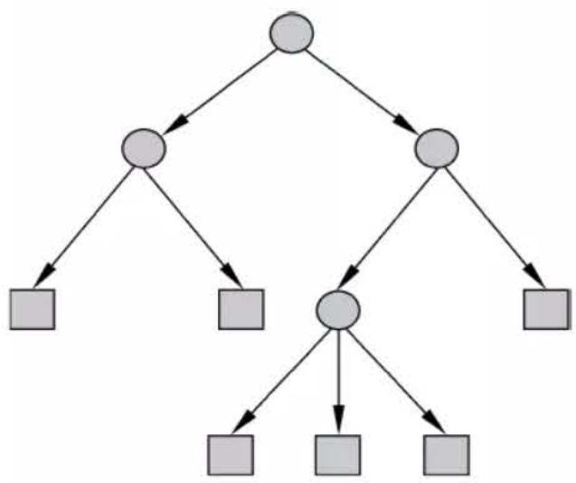  
图5.1 决策树模型

## 5.1.2 决策树与if-then规则

可以将决策树看成个if-then规则的集合。将决策树转换成if-then规则的过程如下:由决策树的根结点到叶结点的每条路径构建条规则；路径上内部结点的特征对应规则的条件，叶结点的类对应规则的结论。决策树的路径或其对应的if-then规则集合具有个重要的性质：互斥并且完备。这就是说，每个实例都被条路径或条规则所覆盖，且只被条路径或条规则所覆盖。这所谓覆盖是指实例的特征与路径上的特征致或实例满规则的条件。

## 5.1.3 决策树与条件概率分布

决策树还表给定特征条件下类的条件概率分布，这条件概率分布定义在特征空间的个划分（partition）上。将特征空间划分为互不相交的单元（cell）或区域（region），并在每个单元定义个类的概率分布就构成了个条件概率分布。决策树的条路径对应于划分中的个单元。决策树所表的条件概率分布由各个单元给定条件下类的条件概率分布组成。假设X为表特征的随机变量，Y为表类的随机变量，那么这个条件概率分布可以表为P(Y|X)。X取值于给定划分下单元的集合，Y取值于类的集合。各叶结点（单元）上的条件概率往往偏向某个类，即属于某类的概率较。决策树分类时将该结点的实例强分到条件概率的那类去。

图5.2（a）意地表特征空间的个划分。图中的正形表特征空间。这个正形被若个矩形分割，每个矩形表个单元。特征空间划分上的单元构成了个集合，X取值为单元的集合。为简单起见，假设只有两类：正类和负类，即Y取值为+1和-1。矩形中的数字表单元的类。图5.2（b）意地表特征空间划分确定时，特征（单元）给定条件下类的条件概率分布。图5.2（b）中条件概率分布对应于图5.2（a）的划分。当某个单元c的条件概率满 $P ( Y = + 1 \vert X = c ) > 0 . 5$ 时，则认为这个单元属于正类，即落在这个单元的实例都被视为正例。图5.2（c）为对应于图5.2（b）中条件概率分布的决策树。

## 5.1.4 决策树学习

假设给定训练数据集

$$
D = \{ ( x _ { 1 } , y _ { 1 } ) , ( x _ { 2 } , y _ { 2 } ) , \cdots , ( x _ { N } , y _ { N } ) \}
$$

其中， $x _ { i } = ( x _ { i } ^ { ( 1 ) } , x _ { i } ^ { ( 2 ) } , \cdots , x _ { i } ^ { ( n ) } ) ^ { \mathrm { T } }$ 为输入实例（特征向量），n为特征个数， $y _ { i } \in \{ 1 , 2 , \cdots , K \}$ 为类标记， $i = 1 , 2 , \cdots , N , \ : N$ 为样本容量。决策树学习的标是根据给定的训练数据集构建个决策树模型，使它能够对实例进正确的分类。

决策树学习本质上是从训练数据集中归纳出组分类规则。与训练数据集不相盾的决策树（即能对训练数据进正确分类的决策树）可能有多个，也可能个都没有。我们需要的是个与训练数据盾较的决策树，同时具有很好的泛化能。从另个度看，决策树学习是由训练数据集估计条件概率模型。基于特征空间划分的类的条件概率模型有穷多个。我们选择的条件概率模型应该不仅对训练数据有很好的拟合，且对未知数据有很好的预测。

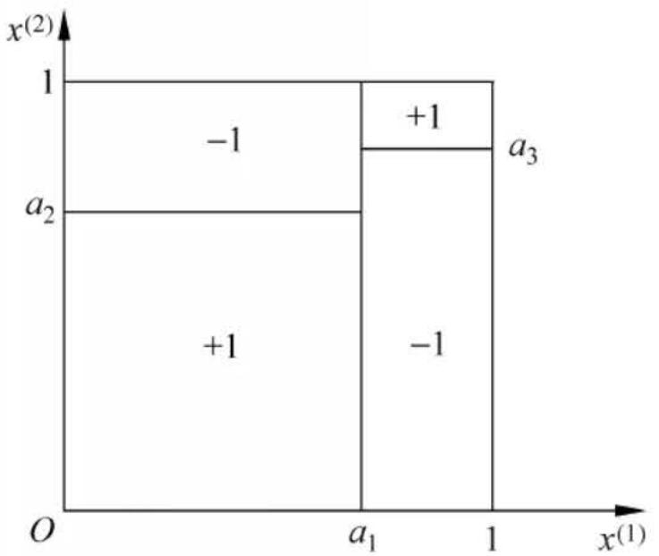  
(a)特征空间划分

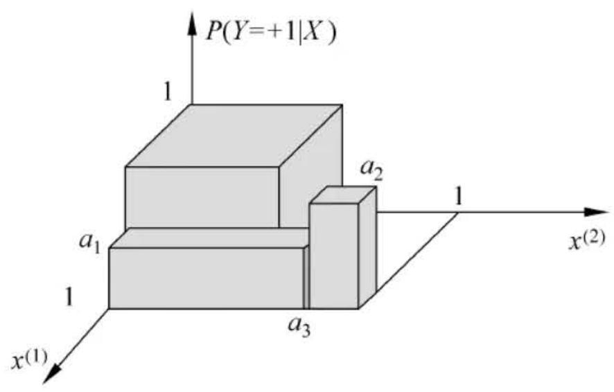

(b)条件概率分布  
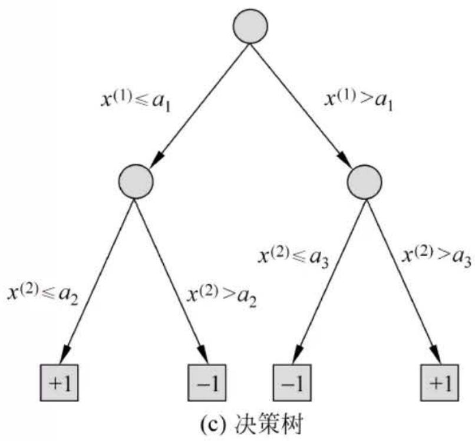  
图5.2 决策树对应于条件概率分布

决策树学习损失函数表这标。如下所述，决策树学习的损失函数通常是正则化的极似然函数。决策树学习的策略是以损失函数为标函数的最化。

当损失函数确定以后，学习问题就变为在损失函数意义下选择最优决策树的问题。因为从所有可能的决策树中选取最优决策树是NP完全问题，所以现实中决策树学习算法通常采启发式法，近似求解这最优化问题。这样得到的决策树是次最优（sub-optimal）的。

决策树学习的算法通常是个递归地选择最优特征，并根据该特征对训练数据进分割，使得对各个数据集有个最好的分类的过程。这过程对应对特征空间的划分，也对应决策树的构建。先，构建根结点，将所有训练数据都放在根结点。选择个最优特征，按照这特征将训练数据集分割成集，使得各个集有个在当前条件下最好的分类。如果这些集已经能够被基本正确分类，那么构建叶结点，并将这些集分到所对应的叶结点中去；如果还有子集不能被基本正确分类，那么就对这些子集选择新的最优特征，继续对其进分割，构建相应的结点。如此递归地进下去，直所有训练数据集被基本正确分类，或者没有合适的特征为。最后每个集都被分到叶结点上，即都有了明确的类。这就成了棵决策树。

以上法成的决策树可能对训练数据有很好的分类能，但对未知的测试数据未必有很好的分类能，即可能发过拟合现象。我们需要对已成的树下上进剪枝，将树变得更简单，从使它具有更好的泛化能。具体地，就是去掉过于细分的叶结点，使其回退到结点，甚至更的结点，然后将结点或更的结点改为新的叶结点。

如果特征数量很多，也可以在决策树学习开始的时候对特征进选择，只留下对训练数据有够分类能的特征。

可以看出，决策树学习算法包含特征选择、决策树的成与决策树的剪枝过程。由于决策树表个条件概率分布，所以深浅不同的决策树对应不同复杂度的概率模型。决策树的成对应于模型的局部选择，决策树的剪枝对应于模型的全局选择。决策树的成只考虑局部最优，相对地，决策树的剪枝则考虑全局最优。

决策树学习常的算法有ID3、C4.5与CART，下结合这些算法分别叙述决策树学习的特征选择、决策树的成和剪枝过程。

## 5.2 特征选择

## 5.2.1 特征选择问题

特征选择在于选取对训练数据具有分类能的特征，这样可以提决策树学习的效率。如果利个特征进分类的结果与随机分类的结果没有很差别，则称这个特征是没有分类能的。经验上扔掉这样的特征对决策树学习的精度影响不。通常特征选择的准则是信息增益或信息增益。

先通过个例来说明特征选择问题

例5.1① 表5.1是个由15个样本组成的贷款申请训练数据。数据包括贷款申请的4个特征（属性）：第1个特征是年龄，有3个可能值：青年，中年，年；第2个特征是有作，有两个可能值：是，否；第3个特征是有的房，有两个可能值：是，否；第4个特征是信贷情况，有3个可能值：常好，好，般。表的最后列是类别，是否同意贷款，取两个值：是，否。

希望通过所给的训练数据学习个贷款申请的决策树，以对未来的贷款申请进分类，即当新的客户提出贷款申请时，根据申请的特征利决策树决定是否批准贷款申请。■

特征选择是决定哪个特征来划分特征空间。

图5.3表从表5.1数据学习到的两个可能的决策树，分别由两个不同特征的根结点构成。图5.3（a）所的根结点的特征是年龄，有3个取值，对应于不同的取值有不同的结点。图5.3（b）所示的根结点的特征是有作，有两个取值，对应于不同的取值有不同的子结点。两个决策树都可以从此延续下去。问题是：究竟选择哪个特征更好些？这就要求确定选择特征的准则。直观上，如果一个特征具有更好的分类能，或者说，按照这一特征将训练数据集分割成集，使得各个集在当前条件下有最好的分类，那么就更应该选择这个特征。信息增益（informationgain）就能够很好地表这直观的准则。

表5.1 贷款申请样本数据表
<table><tr><td>ID</td><td>年龄</td><td>有工作</td><td>有的房子</td><td>信贷情况</td><td>类别</td></tr><tr><td>1</td><td></td><td></td><td></td><td>一般</td><td></td></tr><tr><td>2</td><td></td><td></td><td></td><td></td><td></td></tr><tr><td>3</td><td></td><td></td><td></td><td>好好</td><td></td></tr><tr><td></td><td></td><td></td><td></td><td>−</td><td></td></tr><tr><td></td><td></td><td></td><td></td><td>般般 一</td><td></td></tr><tr><td>4567</td><td>中年</td><td></td><td></td><td>一般</td><td></td></tr><tr><td></td><td></td><td></td><td></td><td>好</td><td></td></tr><tr><td>8</td><td></td><td></td><td></td><td>好</td><td></td></tr><tr><td>9</td><td></td><td></td><td></td><td>非常好</td><td></td></tr><tr><td>10</td><td></td><td></td><td></td><td>非常好</td><td></td></tr><tr><td>11</td><td></td><td></td><td></td><td>非常好</td><td></td></tr><tr><td>12</td><td></td><td></td><td></td><td>好</td><td></td></tr><tr><td>13</td><td>辉</td><td></td><td></td><td>好</td><td></td></tr><tr><td>14</td><td>老年</td><td>否否是是否否否是否否否否是是否</td><td>否否否是否否否是是是是是否否否</td><td>非常好</td><td></td></tr><tr><td>15</td><td>老年</td><td></td><td></td><td>一般</td><td>否否是是否否否是是是是是是是否</td></tr></table>

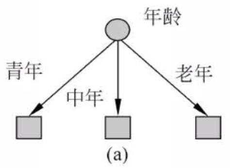

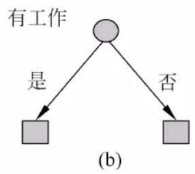  
图5.3 不同特征决定的不同决策树

## 5.2.2 信息增益

为了便于说明，先给出熵与条件熵的定义。

在信息论与概率统计中，熵（entropy）是表随机变量不确定性的度量。设X是个取有限个值的离散随机变量，其概率分布为

$$
P ( X = x _ { i } ) = p _ { i } , \quad i = 1 , 2 , \cdot \cdot \cdot , n
$$

则随机变量X的熵定义为

$$
H ( X ) = - \sum _ { i = 1 } ^ { n } p _ { i } \log p _ { i }\tag{5.1}
$$

在式(5.1)中，若 $p _ { i } = 0$ ，则定义0log0=0。通常，式(5.1）中的对数以2为底或以e为底（然对数），这时熵的单位分别称作特（bit）或纳特（nat）。由定义可知，熵只依赖于X的分布，而与X的取值无关，所以也可将X的熵记作 $H ( p )$ ,即

$$
H ( p ) = - \sum _ { i = 1 } ^ { n } p _ { i } \log p _ { i }\tag{5.2}
$$

熵越，随机变量的不确定性就越。从定义可验证

$$
0 \leqslant H ( p ) \leqslant \log n\tag{5.3}
$$

当随机变量只取两个值，如1，0时，即X的分布为

$$
P ( X = 1 ) = p , \quad P ( X = 0 ) = 1 - p , \quad 0 \leqslant p \leqslant 1
$$

熵为

$$
H ( p ) = - p \log _ { 2 } p - ( 1 - p ) \log _ { 2 } ( 1 - p )\tag{5.4}
$$

这时，熵 $H ( p )$ 随概率 $p$ 变化的曲线如图5.4所（单位为特)。

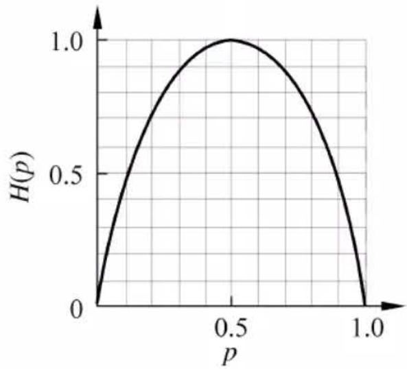  
图5.4 分布为伯努利分布时熵与概率的关系

当 $p = 0$ 或 $p = 1$ 时 $H ( p ) = 0$ ，随机变量完全没有不确定性。当 $p = 0 . 5$ 时， $H ( p ) = 1$ ,熵取值最大，随机变量不确定性最。

设有随机变量(X,Y)，其联合概率分布为

$$
P ( X = x _ { i } , Y = y _ { j } ) = p _ { i j } , \quad i = 1 , 2 , \cdots , n , \quad j = 1 , 2 , \cdots , m
$$

条件熵 $H ( Y \vert X )$ 表在已知随机变量X的条件下随机变量Y的不确定性。随机变量X给定的条件下随机变量Y的条件熵（conditionalentropy） $H ( Y | X )$ 定义为X给定条件下Y的条件概率分布的熵对X的数学期望：

$$
H ( Y | X ) = \sum _ { i = 1 } ^ { n } p _ { i } H ( Y | X = x _ { i } )\tag{5.5}
$$

这里， $p _ { i } = P ( X = x _ { i } ) , i = 1 , 2 , \cdot \cdot \cdot , n _ { \partial }$

当熵和条件熵中的概率由数据估计（特别是极似然估计）得到时，所对应的熵与条件熵分别称为经验熵（empiricalentropy）和经验条件熵（empirical conditionalentropy）。此时，如果有0概率，令 $0 \log 0 = 0$ 。

信息增益（information gain）表得知特征X的信息使得类Y的信息的不确定性减少的程度。

定义5.2（信息增益） 特征A对训练数据集D的信息增益 $g ( D , A )$ 定义为集合D的经验熵 $H ( D )$ 与特征A给定条件下D的经验条件熵 $H ( D | A )$ 之差，即

$$
g ( D , A ) = H ( D ) - H ( D | A )\tag{5.6}
$$

般地，熵 $H ( Y )$ 与条件熵 $H ( Y | X )$ 之差称为互信息（mutualinformation）。决策树学习中的信息增益等价于训练数据集中类与特征的互信息。

决策树学习应信息增益准则选择特征。给定训练数据集D和特征A，经验熵 $H ( D )$ 表对数据集D进分类的不确定性。经验条件熵 $H ( D | A )$ 表示在特征A给定的条件下对数据集D进分类的不确定性。那么它们的差，即信息增益，就表由于特征A使得对数据集D的分类的不确定性减少的程度。显然，对于数据集D，信息增益依赖于特征，不同的特征往往具有不同的信息增益。信息增益的特征具有更强的分类能。

根据信息增益准则的特征选择法是：对训练数据集（或集）D，计算其每个特征的信息增益，并较它们的，选择信息增益最大的特征。

设训练数据集为 $D , \left| D \right|$ 表其样本容量，即样本个数。设有K个类 $C _ { k } , k = 1 , 2 , \cdots , K$ $| C _ { k } |$ 为属于类 $C _ { k }$ 的样本个数， $\sum _ { k = 1 } ^ { K } \left| C _ { k } \right| = \left| D \right|$ 。设特征A有n个不同的取值 $\{ a _ { 1 } , a _ { 2 } , \cdots , a _ { n } \}$ ,根据特征A的取值将D划分为n个集 $D _ { 1 } , D _ { 2 } , \cdots , D _ { n } , | D _ { i } |$ 为 $D _ { i }$ 的样本个数， $\sum _ { i = 1 } ^ { n } \left| D _ { i } \right| =$ $| D |$ 。记子集 $D _ { i }$ 中属于类 $C _ { k }$ 的样本的集合为 $D _ { i k }$ ,即 $D _ { i k } = D _ { i } \cap C _ { k } , | D _ { i k } |$ 为 $D _ { i k }$ 的样本个数。于是信息增益的算法如下。

算法5.1（信息增益的算法）

输入：训练数据集D和特征A。

输出：特征A对训练数据集D的信息增益 $g ( D , A )$ O

(1）计算数据集D的经验熵H(D)

$$
H ( D ) = - \sum _ { k = 1 } ^ { K } { \frac { | C _ { k } | } { | D | } } \log _ { 2 } { \frac { | C _ { k } | } { | D | } }\tag{5.7}
$$

(2）计算特征A对数据集D的经验条件熵 $H ( D | A )$

$$
H ( D | A ) = \sum _ { i = 1 } ^ { n } { \frac { | D _ { i } | } { | D | } } H ( D _ { i } ) = - \sum _ { i = 1 } ^ { n } { \frac { | D _ { i } | } { | D | } } \sum _ { k = 1 } ^ { K } { \frac { | D _ { i k } | } { | D _ { i } | } } \log _ { 2 } { \frac { | D _ { i k } | } { | D _ { i } | } }\tag{5.8}
$$

(3）计算信息增益

$$
g ( D , A ) = H ( D ) - H ( D | A )\tag{5.9}
$$

例5.2 对表5.1所给的训练数据集D，根据信息增益准则选择最优特征。

解 先计算经验熵H(D):

$$
H ( D ) = - { \frac { 9 } { 1 5 } } \log _ { 2 } { \frac { 9 } { 1 5 } } - { \frac { 6 } { 1 5 } } \log _ { 2 } { \frac { 6 } { 1 5 } } = 0 . 9 7 1
$$

然后计算各特征对数据集D的信息增益。分别以 $A _ { 1 } , ~ A _ { 2 } , ~ A _ { 3 } , ~ A _ { 4 }$ 表示年龄、有作、有的房和信贷情况4个特征，则

$$
\begin{array} { l } { { g ( D , A _ { 1 } ) = H ( D ) - \left[ \frac { 5 } { 1 5 } H ( D _ { 1 } ) + \frac { 5 } { 1 5 } H ( D _ { 2 } ) + \frac { 5 } { 1 5 } H ( D _ { 3 } ) \right] } } \\ { { \ } } \\ { { \ = 0 . 9 7 1 - \left[ \frac { 5 } { 1 5 } \left( - \frac { 2 } { 5 } \log _ { 2 } { \frac { 2 } { 5 } } - \frac { 3 } { 5 } \log _ { 2 } { \frac { 3 } { 5 } } \right) + \right. } } \\ { { \ \left. \frac { 5 } { 1 5 } \left( - \frac { 3 } { 5 } \log _ { 2 } { \frac { 3 } { 5 } } - \frac { 2 } { 5 } \log _ { 2 } { \frac { 2 } { 5 } } \right) + \frac { 5 } { 1 5 } \left( - \frac { 4 } { 5 } \log _ { 2 } { \frac { 4 } { 5 } } - \frac { 1 } { 5 } \log _ { 2 } { \frac { 1 } { 5 } } \right) \right] } } \\ { { \ = 0 . 9 7 1 - 0 . 8 8 8 = 0 . 0 8 2 } } \end{array}
$$

这里 $D _ { 1 } , D _ { 2 } , D _ { 3 }$ 分别是D中 $A _ { 1 }$ （年龄）取值为青年、中年和年的样本集。类似地，

$$
\begin{array} { r l } & { g ( D , A _ { 2 } ) = H ( D ) - \left[ \frac { 5 } { 1 5 } H ( D _ { 1 } ) + \frac { 1 0 } { 1 5 } H ( D _ { 2 } ) \right] } \\ & { \qquad = 0 . 9 7 1 - \left[ \frac { 5 } { 1 5 } \times 0 + \frac { 1 0 } { 1 5 } \left( - \frac { 4 } { 1 0 } \log _ { 2 } \frac { 4 } { 1 0 } - \frac { 6 } { 1 0 } \log _ { 2 } \frac { 6 } { 1 0 } \right) \right] = 0 . 3 2 4 } \\ & { \qquad g ( D , A _ { 3 } ) = 0 . 9 7 1 - \left[ \frac { 6 } { 1 5 } \times 0 + \frac { 9 } { 1 5 } \left( - \frac { 3 } { 9 } \log _ { 2 } \frac { 3 } { 9 } - \frac { 6 } { 9 } \log _ { 2 } \frac { 6 } { 9 } \right) \right] } \\ & { \qquad = 0 . 9 7 1 - 0 . 5 5 1 = 0 . 4 2 0 } \\ & { \qquad g ( D , A _ { 4 } ) = 0 . 9 7 1 - 0 . 6 0 8 = 0 . 3 6 3 } \end{array}
$$

最后，较各特征的信息增益值。由于特征 $A _ { 3 }$ （有的房子）的信息增益值最大，所以选择特征 $A _ { 3 }$ 作为最优特征。 ■

## 5.2.3 信息增益

以信息增益作为划分训练数据集的特征，存在偏向于选择取值较多的特征的问题。使信息增益（information gainratio）可以对这问题进校正。这是特征选择的另准则。

定义5.3（信息增益比） 特征A对训练数据集D的信息增益 $g _ { \mathrm { R } } ( D , A )$ 定义为其信息增益 $g ( D , A )$ 与训练数据集D关于特征A的值的熵 $H _ { A } ( D )$ 之比,即

$$
g _ { \mathrm { R } } ( D , A ) = { \frac { g ( D , A ) } { H _ { A } ( D ) } }\tag{5.10}
$$

其中， $H _ { A } ( D ) = - \sum _ { i = 1 } ^ { n } { \frac { | D _ { i } | } { | D | } } \log _ { 2 } { \frac { | D _ { i } | } { | D | } }$ ，n是特征A取值的个数。

## 5.3决策树的生成

本节将介绍决策树学习的成算法。先介绍ID3的成算法，然后再介绍C4.5中的成算法。这些都是决策树学习的经典算法。

## 5.3.1 ID3算法

ID3算法的核是在决策树各个结点上应信息增益准则选择特征，递归地构建决策树。具体法是：从根结点（rootnode）开始，对结点计算所有可能的特征的信息增益，选择信息增益最大的特征作为结点的特征，由该特征的不同取值建结点；再对结点递归地调以上法，构建决策树；直到所有特征的信息增益均很或没有特征可以选择为，最后得到棵决策树。ID3相当于极似然法进概率模型的选择。

## 算法5.2(ID3算法）

输入：训练数据集D，特征集A阈值 $\varepsilon _ { \circ }$

输出：决策树 $T _ { \mathbf { \delta } }$

(1）若D中所有实例属于同类 $C _ { k }$ ，则T为单结点树，并将类 $C _ { k }$ 作为该结点的类标记，返回T；

(2）若 $A = \emptyset$ ，则T为单结点树，并将D中实例数最的类 $C _ { k }$ 作为该结点的类标记，返回T；

(3）否则，按算法5.1计算A中各特征对D的信息增益，选择信息增益最的特征 $A _ { g }$

(4）如果 $A _ { g }$ 的信息增益于阈值ε，则置T为单结点树，并将D中实例数最的类 $C _ { k }$ 作为该结点的类标记，返回 $T$

(5)否则，对 $A _ { g }$ 的每一可能值 $a _ { i }$ ，依 $A _ { g } = a _ { i }$ 将D分割为若空集 $D _ { i }$ ,将 $D _ { i }$ 中实例数最大的类作为标记，构建子结点，由结点及其子结点构成树T，返回T；

(6）对第i个子结点，以 $D _ { i }$ 为训练集，以 $A - \left\{ A _ { g } \right\}$ 为特征集，递归地调步骤(1)～步骤(5)，得到子树 $T _ { i }$ ，返回 $T _ { i }$ 。 ■

例5.3 对表5.1的训练数据集，利ID3算法建决策树。

解 利例5.2的结果，由于特征 $A _ { 3 }$ （有的房子）的信息增益值最大，所以选择特征 $A _ { 3 }$ 作为根结点的特征。它将训练数据集D划分为两个集 $D _ { 1 } ~ ( A _ { 3 }$ 取值为“是”）和$D _ { 2 } \ ( A _ { 3 }$ 取值为“否”）。由于 $D _ { 1 }$ 只有同类的样本点，所以它成为个叶结点，结点的类标记为“是”。

对 $D _ { 2 }$ 则需从特征 $A _ { 1 }$ （年龄）， $A _ { 2 }$ （有作）和 $A _ { 4 }$ （信贷情况）中选择新的特征。计算各个特征的信息增益：

$$
\begin{array} { l } { { g ( D _ { 2 } , A _ { 1 } ) = H ( D _ { 2 } ) - H ( D _ { 2 } | A _ { 1 } ) = 0 . 9 1 8 - 0 . 6 6 7 = 0 . 2 5 1 } } \\ { { g ( D _ { 2 } , A _ { 2 } ) = H ( D _ { 2 } ) - H ( D _ { 2 } | A _ { 2 } ) = 0 . 9 1 8 } } \\ { { g ( D _ { 2 } , A _ { 4 } ) = H ( D _ { 2 } ) - H ( D _ { 2 } | A _ { 4 } ) = 0 . 4 7 4 } } \end{array}
$$

选择信息增益最的特征 $A _ { 2 }$ （有作）作为结点的特征。由于 $A _ { 2 }$ 有两个可能取值，从这一结点引出两个结点：个对应“是”（有作）的结点，包含3个样本，它们属于同类，所以这是个叶结点，类标记为“是”；另个是对应“否”（作）的结点，包含6个样本，它们也属于同类，所以这也是个叶结点，类标记为“否”。

这样成棵如图5.5所的决策树，该决策树只了两个特征（有两个内部结点）。■

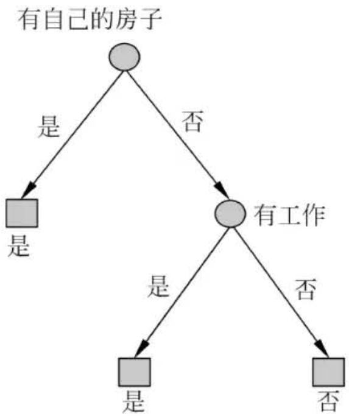  
图5.5 决策树的成

ID3算法只有树的成，所以该算法成的树容易产过拟合。

## 5.3.2 C4.5的生成算法

C4.5算法与ID3算法相似，C4.5算法对ID3算法进了改进。C4.5算法在成的过程中，信息增益来选择特征。

## 算法5.3（C4.5的生成算法）

输入：训练数据集D，特征集A阈值ε。

输出：决策树 $T _ { \mathrm { ~ c ~ } }$

(1）如果D中所有实例属于同类 $C _ { k }$ ，则置T为单结点树，并将 $C _ { k }$ 作为该结点的类，返回 $T :$

(2）如果 $A = \emptyset$ ，则置T为单结点树，并将D中实例数最大的类 $C _ { k }$ 作为该结点的类，返回T；

(3）否则，按式(5.10)计算A中各特征对D的信息增益，选择信息增益最的特征 $A _ { g } \colon$

(4）如果 $A _ { g }$ 的信息增益于阈值ε，则置T为单结点树，并将D中实例数最的类$C _ { k }$ 作为该结点的类，返回 $T _ { i }$

(5)否则，对 $A _ { g }$ 的每一可能值 $a _ { i }$ ，依 $A _ { g } = a _ { i }$ 将D分割为若干空子集 $D _ { i }$ ,将 $D _ { i }$ 中实例数最的类作为标记，构建结点，由结点及其结点构成树T，返回 $T$

(6)对结点i，以 $D _ { i }$ 为训练集，以 $A - \{ A _ { g } \}$ 为特征集，递归地调步骤(1)～步骤(5)，得到子树 $T _ { i }$ ，返回 $T _ { i }$ 0

## 5.4 决策树的剪枝

决策树成算法递归地产决策树，直到不能继续下去为。这样产的树往往对训练数据的分类很准确，但对未知的测试数据的分类却没有那么准确，即出现过拟合现象。过拟合的原因在于学习时过多地考虑如何提对训练数据的正确分类，从构建出过于复杂的决策树。解决这个问题的办法是考虑决策树的复杂度，对已成的决策树进简化。

在决策树学习中将已成的树进简化的过程称为剪枝（pruning）。具体地，剪枝从已成的树上裁掉些树或叶结点，并将其根结点或结点作为新的叶结点，从简化分类树模型。

本节介绍种简单的决策树学习的剪枝算法。

决策树的剪枝往往通过极化决策树整体的损失函数（lossfunction）或代价函数（costfunction）来实现。设树T的叶结点个数为|T|，t是树T的叶结点，该叶结点有 $N _ { t }$ 个样本点，其中k类的样本点有 $N _ { t k }$ 个， $k = 1 , 2 , \cdots , K , H _ { t } ( T )$ 为叶结点t上的经验熵， $\alpha \geqslant 0$ 为参数，则决策树学习的损失函数可以定义为

$$
C _ { \alpha } ( T ) = \sum _ { t = 1 } ^ { | T | } N _ { t } H _ { t } ( T ) + \alpha | T |\tag{5.11}
$$

其中经验熵为

$$
H _ { t } ( T ) = - \sum _ { k } { \frac { N _ { t k } } { N _ { t } } \log { \frac { N _ { t k } } { N _ { t } } } }\tag{5.12}
$$

在损失函数中，将式(5.11)右端的第1项记作

$$
C ( T ) = \sum _ { t = 1 } ^ { | T | } N _ { t } H _ { t } ( T ) = - \sum _ { t = 1 } ^ { | T | } \sum _ { k = 1 } ^ { K } N _ { t k } \log { \frac { N _ { t k } } { N _ { t } } }\tag{5.13}
$$

这时有

$$
C _ { \alpha } ( T ) = C ( T ) + \alpha | T |\tag{5.14}
$$

式(5.14)中， $C ( T )$ 表模型对训练数据的预测误差，即模型与训练数据的拟合程度，|T|表示模型复杂度，参数 $\alpha \geqslant 0$ 控制两者之间的影响。较大的α促使选择较简单的模型（树），较的α促使选择较复杂的模型（树）。 $\alpha = 0$ 意味着只考虑模型与训练数据的拟合程度，不考虑模型的复杂度。

剪枝就是当 $\alpha$ 确定时，选择损失函数最的模型，即损失函数最的树。当α值确定时，树越，往往与训练数据的拟合越好，但是模型的复杂度就越；相反，树越，模型的复杂度就越低，但是往往与训练数据的拟合不好。损失函数正好表了对两者的平衡。

可以看出，决策树成只考虑了通过提信息增益（或信息增益）对训练数据进更好的拟合。决策树剪枝通过优化损失函数还考虑了减模型复杂度。决策树成学习局部的模型，而决策树剪枝学习整体的模型。

式（5.11）或式（5.14）定义的损失函数的极化等价于正则化的极似然估计。所以，利损失函数最原则进剪枝就是正则化的极似然估计进模型选择。

图5.6表决策树剪枝过程。下介绍剪枝算法。

算法5.4（树的剪枝算法）

输入：成算法产的整个树T，参数α。

输出：修剪后的树 $T _ { \alpha }$

(1)计算每个结点的经验熵。

(2）递归地从树的叶结点向上回缩。

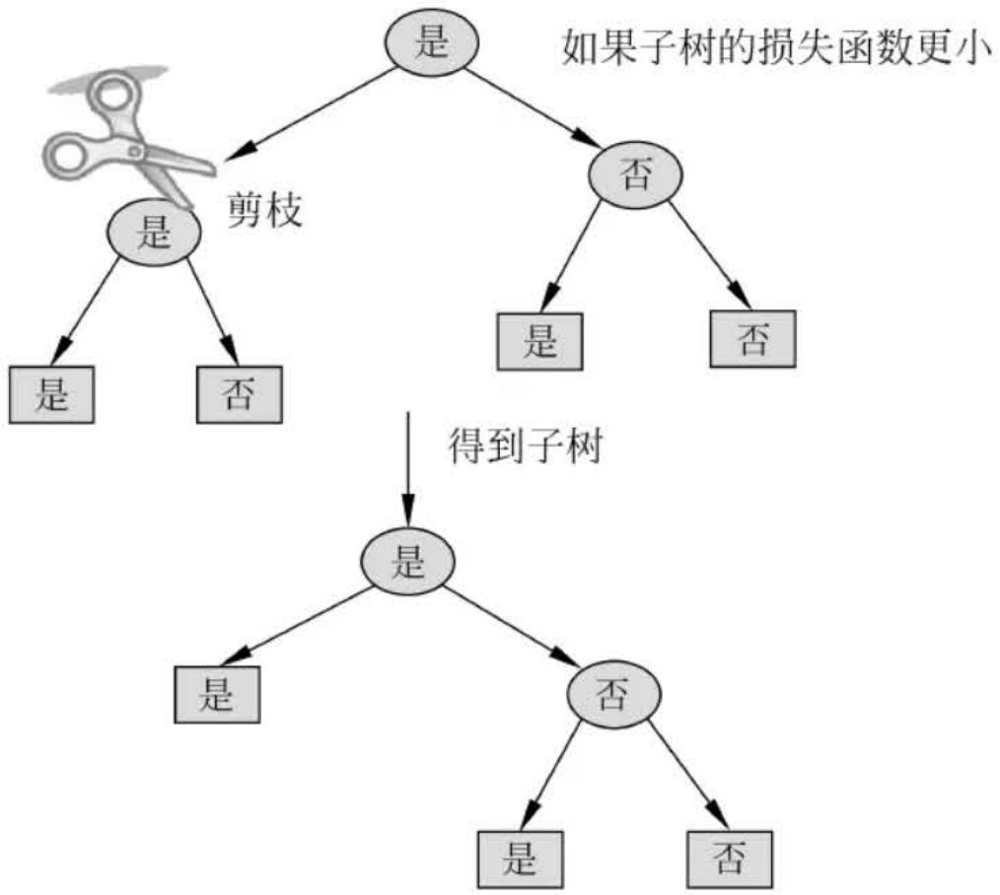  
图5.6 决策树的剪枝

设组叶结点回缩到其结点之前与之后的整体树分别为 $T _ { B }$ 与 $T _ { A }$ ，其对应的损失函数值分别是 $C _ { \alpha } ( T _ { B } )$ 与 $C _ { \alpha } ( T _ { A } )$ ,如果

$$
C _ { \alpha } ( T _ { A } ) \leqslant C _ { \alpha } ( T _ { B } )\tag{5.15}
$$

则进剪枝，即将结点变为新的叶结点。

(3）返回步骤（2），直不能继续为，得到损失函数最的树 $T _ { \alpha }$ 。

注意，式（5.15）只需考虑两个树的损失函数的差，其计算可以在局部进。所以，决策树的剪枝算法可以由种动态规划的算法实现。类似的动态规划算法可参考献[10]。

## 5.5 CART 算 法

分类与回归树（classification and regression tree，CART）模型由Breiman等在1984年提出，是应泛的决策树学习法。CART同样由特征选择、树的成及剪枝组成，既可以于分类也可以于回归。以下将于分类与回归的树统称为决策树。

CART是在给定输随机变量X条件下输出随机变量Y的条件概率分布的学习法。CART假设决策树是叉树，内部结点特征的取值为“是”和“否”，左分是取值为“是”的分，右分是取值为“否”的分。这样的决策树等价于递归地分每个特征，将输空间即特征空间划分为有限个单元，并在这些单元上确定预测的概率分布，也就是在输给定的条件下输出的条件概率分布。

CART算法由以下两步组成：

（1）决策树成：基于训练数据集成决策树，成的决策树要尽量。

（2）决策树剪枝：验证数据集对已成的树进剪枝并选择最优树，这时损失函数最小作为剪枝的标准。

## 5.5.1 CART生成

决策树的成就是递归地构建叉决策树的过程。对回归树平误差最化准则，对 分类树基尼指数（Giniindex）最化准则，进特征选择，成叉树。

## 1.回归树的生成

假设X与Y分别为输和输出变量，并且Y是连续变量，给定训练数据集

$$
D = \{ ( x _ { 1 } , y _ { 1 } ) , ( x _ { 2 } , y _ { 2 } ) , \cdots , ( x _ { N } , y _ { N } ) \}
$$

考虑如何成回归树。

棵回归树对应着输空间（即特征空间）的个划分以及在划分的单元上的输出值。假设已将输空间划分为M个单元 $R _ { 1 } , R _ { 2 } , \cdots , R _ { M }$ ，并且在每个单元 $R _ { m }$ 上有个固定的输出值 $c _ { m }$ ，于是回归树模型可表为

$$
f ( x ) = \sum _ { m = 1 } ^ { M } c _ { m } I ( x \in R _ { m } )\tag{5.16}
$$

当输空间的划分确定时，可以平误差 $\sum _ { x _ { i } \in R _ { m } } ( y _ { i } - f ( x _ { i } ) ) ^ { 2 }$ 来表回归树对训练数据的预测误差，平误差最的准则求解每个单元上的最优输出值。易知，单元 $R _ { m }$ 上的$c _ { m }$ 的最优值 $\hat { c } _ { m }$ 是 $R _ { m }$ 上的所有输入实例 $x _ { i }$ 对应的输出 $y _ { i }$ 的均值，即

$$
\hat { c } _ { m } = \mathrm { a v e } ( y _ { i } | x _ { i } \in R _ { m } )\tag{5.17}
$$

问题是怎样对输空间进划分。这采启发式的法，选择第 $j$ 个变量 $x ^ { ( j ) }$ 和它取的值 $s$ 作为切分变量（splitting variable）和切分点（splitting point），并定义两个区域：

$$
R _ { 1 } ( j , s ) = \{ x | x ^ { ( j ) } \leqslant s \} , \quad R _ { 2 } ( j , s ) = \{ x | x ^ { ( j ) } > s \}\tag{5.18}
$$

然后寻找最优切分变量 $j$ 和最优切分点δ。具体地，求解

$$
\operatorname* { m i n } _ { j , s } \left[ \operatorname* { m i n } _ { c _ { 1 } } \sum _ { x _ { i } \in R _ { 1 } ( j , s ) } ( y _ { i } - c _ { 1 } ) ^ { 2 } + \operatorname* { m i n } _ { c _ { 2 } } \sum _ { x _ { i } \in R _ { 2 } ( j , s ) } ( y _ { i } - c _ { 2 } ) ^ { 2 } \right]\tag{5.19}
$$

对固定输变量 $j$ 可以找到最优切分点 $s _ { \mathrm { ~ ~ } }$

$$
{ \hat { c } } _ { 1 } = \operatorname { a v e } ( y _ { i } | x _ { i } \in R _ { 1 } ( j , s ) ) , \quad { \hat { c } } _ { 2 } = \operatorname { a v e } ( y _ { i } | x _ { i } \in R _ { 2 } ( j , s ) )\tag{5.20}
$$

遍历所有输变量，找到最优的切分变量 $j$ ，构成一个对 $( j , s )$ 。依此将输空间划分为两个区域。接着，对每个区域重复上述划分过程，直到满停条件为。这样就成棵回归树。这样的回归树通常称为最乘回归树（least squares regression tree），现将算法叙述如下。

## 算法5.5（最小二乘回归树生成算法）

输入：训练数据集 $D$

输出：回归树 $f ( x )$

在训练数据集所在的输空间中，递归地将每个区域划分为两个区域并决定每个区域上的输出值，构建二叉决策树：

(1）选择最优切分变量j与切分点s，求解

$$
\operatorname* { m i n } _ { j , s } \left[ \operatorname* { m i n } _ { c _ { 1 } } \sum _ { x _ { i } \in R _ { 1 } ( j , s ) } ( y _ { i } - c _ { 1 } ) ^ { 2 } + \operatorname* { m i n } _ { c _ { 2 } } \sum _ { x _ { i } \in R _ { 2 } ( j , s ) } ( y _ { i } - c _ { 2 } ) ^ { 2 } \right]\tag{5.21}
$$

遍历变量 $j$ ，对固定的切分变量 $j$ 扫描切分点s，选择使式(5.21)达到最值的对 $( j , s )$

(2）选定的对(i,s)划分区域并决定相应的输出值：

$$
R _ { 1 } ( j , s ) = \{ x | x ^ { ( j ) } \leqslant s \} , \quad R _ { 2 } ( j , s ) = \{ x | x ^ { ( j ) } > s \}
$$

$$
\hat { c } _ { m } = \frac { 1 } { N _ { m } } \sum _ { x _ { i } \in R _ { m } ( j , s ) } y _ { i } , \quad x \in R _ { m } , \quad m = 1 , 2
$$

(3）继续对两个区域调步骤(1）和步骤(2)，直满停条件。

(4）将输空间划分为M个区域 $R _ { 1 } , R _ { 2 } , \cdots , R _ { M }$ ，生成决策树：

$$
f ( x ) = \sum _ { m = 1 } ^ { M } \hat { c } _ { m } I ( x \in R _ { m } )
$$

## 2.分类树的生成

分类树基尼指数选择最优特征，同时决定该特征的最优值切分点。

定义5.4（基尼指数）分类问题中，假设有K个类，样本点属于第k类的概率为 $p _ { k }$ 则概率分布的基尼指数定义为

$$
\mathrm { G i n i } ( p ) = \sum _ { k = 1 } ^ { K } p _ { k } ( 1 - p _ { k } ) = 1 - \sum _ { k = 1 } ^ { K } p _ { k } ^ { 2 }\tag{5.22}
$$

对于二类分类问题，若样本点属于第1个类的概率是 $p ,$ 则概率分布的基尼指数为

$$
{ \mathrm { G i n i } } ( p ) = 2 p ( 1 - p )\tag{5.23}
$$

对于给定的样本集合D，其基尼指数为

$$
\mathrm { G i n i } ( D ) = 1 - \sum _ { k = 1 } ^ { K } \left( { \frac { | C _ { k } | } { | D | } } \right) ^ { 2 }\tag{5.24}
$$

这里， $C _ { k }$ 是D中属于第k类的样本子集，K是类的个数。

如果样本集合D根据特征A是否取某可能值a被分割成 $D _ { 1 }$ 和 $D _ { 2 }$ 两部分，即

$$
D _ { 1 } = \left\{ ( x , y ) \in D | A ( x ) = a \right\} , \quad D _ { 2 } = D - D _ { 1 }
$$

则在特征A的条件下，集合D的基尼指数定义为

$$
\mathrm { G i n i } ( D , A ) = \frac { | D _ { 1 } | } { | D | } \mathrm { G i n i } ( D _ { 1 } ) + \frac { | D _ { 2 } | } { | D | } \mathrm { G i n i } ( D _ { 2 } )\tag{5.25}
$$

基尼指数Gini(D)表集合D的不确定性，基尼指数 $\operatorname { G i n i } ( D , A )$ 表经A=a分割后集合D的不确定性。基尼指数值越，样本集合的不确定性也就越，这点与熵相似。

图5.7显类分类问题中基尼指数Gini(p)、熵（单位特）之半 $H ( p ) / 2$ 和分类误差率的关系。横坐标表概率p，纵坐标表损失。可以看出基尼指数和熵之半的曲线很接近，都可以近似地代表分类误差率。

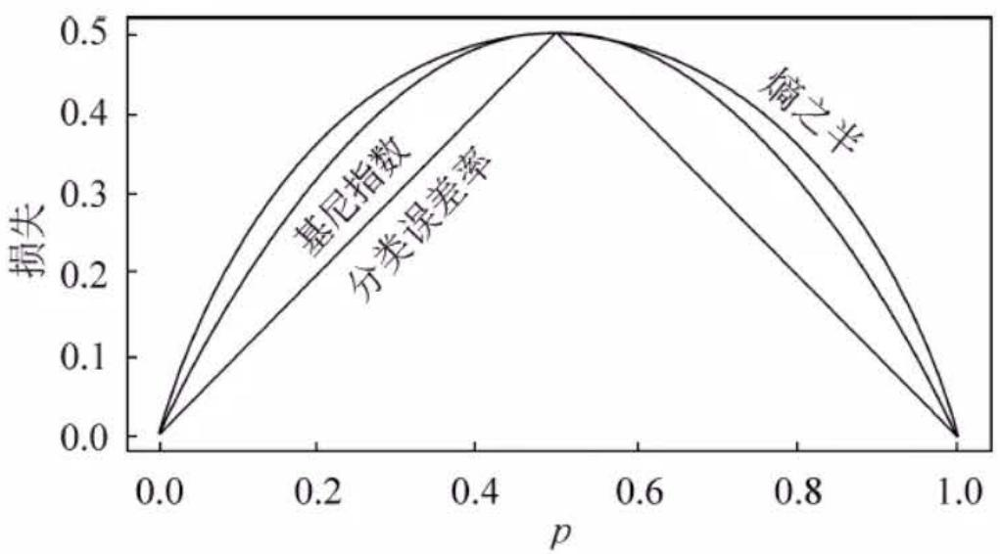  
图5.7 二类分类中基尼指数、熵之半和分类误差率的关系

算法5.6（CART生成算法）

输入：训练数据集D，停计算的条件。

输出：CART决策树。

根据训练数据集，从根结点开始，递归地对每个结点进以下操作，构建叉决策树：

(1）设结点的训练数据集为D，计算现有特征对该数据集的基尼指数。此时，对每个特征A，对其可能取的每个值a，根据样本点对A=a的测试为“是”或“否”将D分割成$D _ { 1 }$ 和 $D _ { 2 }$ 两部分，利式（5.25）计算 $A = a$ 时的基尼指数。

(2）在所有可能的特征A以及它们所有可能的切分点a中，选择基尼指数最的特征及其对应的切分点作为最优特征与最优切分点。依最优特征与最优切分点，从现结点成两个结点，将训练数据集依特征分配到两个结点中去。

(3）对两个结点递归地调步骤（1）和步骤（2)，直满停条件。

(4）生成CART决策树。

算法停计算的条件是结点中的样本个数于预定阈值或样本集的基尼指数于预定阈值（样本基本属于同类），或者没有更多特征。

例5.4 根据表5.1所给训练数据集，应CART算法成决策树。

解 先计算各特征的基尼指数，选择最优特征以及其最优切分点。仍采例5.2的记号，分别以 $A _ { 1 } , ~ A _ { 2 } , ~ A _ { 3 } , ~ A _ { 4 }$ 表年龄、有作、有的房和信贷情况4个特征，并以1，2，3表年龄的值为青年、中年和年，以1，2表示有作和有的房的值为是和否，以1，2，3表信贷情况的值为常好、好和般。

求特征 $A _ { 1 }$ 的基尼指数:

$$
\mathrm { G i n i } ( D , A _ { 1 } = 1 ) = { \frac { 5 } { 1 5 } } \left[ 2 \times { \frac { 2 } { 5 } } \times \left( 1 - { \frac { 2 } { 5 } } \right) \right] + { \frac { 1 0 } { 1 5 } } \left[ 2 \times { \frac { 7 } { 1 0 } } \times \left( 1 - { \frac { 7 } { 1 0 } } \right) \right] = 0 . 4 4
$$

$$
\mathrm { G i n i } ( D , A _ { 1 } = 2 ) = 0 . 4 8
$$

$$
\mathrm { G i n i } ( D , A _ { 1 } = 3 ) = 0 . 4 4
$$

由于 $\mathrm { G i n i } ( D , A _ { 1 } = 1 )$ 和 ${ \mathrm { G i n i } } ( D , A _ { 1 } = 3 )$ 相等，且最小，所以 $A _ { 1 } = 1$ 和 $A _ { 1 } = 3$ 都可以选作 $A _ { 1 }$ 的最优切分点。

求特征 $A _ { 2 }$ 和 $A _ { 3 }$ 的基尼指数：

$$
\begin{array} { r l } & { \mathrm { G i n i } ( D , A _ { 2 } = 1 ) = 0 . 3 2 } \\ & { } \\ & { \mathrm { G i n i } ( D , A _ { 3 } = 1 ) = 0 . 2 7 } \end{array}
$$

由于 $A _ { 2 }$ 和 $A _ { 3 }$ 只有个切分点，所以它们就是最优切分点。

求特征 $A _ { 4 }$ 的基尼指数：

$$
\begin{array} { r l } & { \mathrm { G i n i } ( D , A _ { 4 } = 1 ) = 0 . 3 6 } \\ & { \mathrm { G i n i } ( D , A _ { 4 } = 2 ) = 0 . 4 7 } \\ & { \mathrm { G i n i } ( D , A _ { 4 } = 3 ) = 0 . 3 2 } \end{array}
$$

${ \mathrm { G i n i } } ( D , A _ { 4 } = 3 )$ 最小，所以 $A _ { 4 } = 3$ 为 $A _ { 4 }$ 的最优切分点。

在 $A _ { 1 } , ~ A _ { 2 } , ~ A _ { 3 } , ~ A _ { 4 }$ 个特征中， $\mathrm { G i n i } ( D , A _ { 3 } = 1 ) = 0 . 2 7$ 最小，所以选择特征 $A _ { 3 }$ 为最优特征， $A _ { 3 } = 1$ 为其最优切分点。于是根结点成两个结点，个是叶结点。对另个结点继续使用以上方法在 $A _ { 1 }$ , $A _ { 2 }$ $A _ { 4 }$ 中选择最优特征及其最优切分点，结果是 $A _ { 2 } = 1$ 。依此计算得知，所得结点都是叶结点。 ■

对于本问题，按照CART算法所成的决策树与按照ID3算法所成的决策树完全一致。

## 5.5.2 CART剪枝

CART剪枝算法从“完全长”的决策树的底端剪去些树，使决策树变（模型变简单），从能够对未知数据有更准确的预测。CART剪枝算法由两步组成：先从成算法产生的决策树 $T _ { 0 }$ 底端开始不断剪枝，直到 $T _ { 0 }$ 的根结点，形成个树序列 $\{ T _ { 0 } , T _ { 1 } , \dotsb , T _ { n } \}$ ;然后通过交叉验证法在独的验证数据集上对树序列进测试，从中选择最优树。

## 1.剪枝，形成一个子树序列

在剪枝过程中，计算子树的损失函数：

$$
C _ { \alpha } ( T ) = C ( T ) + \alpha | T |\tag{5.26}
$$

其中， $T$ 为任意子树， $C ( T )$ 为对训练数据的预测误差（如基尼指数），[T|为树的叶结点个数， $\alpha \geqslant 0$ 为参数， $C _ { \alpha } ( T )$ 为参数是α时的子树T的整体损失。参数α权衡训练数据的拟合程度与模型的复杂度。

对固定的 $\alpha$ ，一定存在使损失函数 $C _ { \alpha } ( T )$ 最小的子树，将其表示为 $T _ { \alpha }$ 。 $T _ { \alpha }$ 在损失函数$C _ { \alpha } ( T )$ 最的意义下是最优的。容易验证这样的最优树是唯的。当 $\alpha$ 大的时候，最优子树 $T _ { \alpha }$ 偏小；当 $\alpha$ 的时候，最优树 $T _ { \alpha }$ 偏大。极端情况：当 $\alpha = 0$ 时，整体树是最优的。当$\alpha \to \infty$ 时，根结点组成的单结点树是最优的。

Breiman等证明：可以递归的法对树进剪枝。将α从增， $0 = \alpha _ { 0 } < \alpha _ { 1 } < \cdots <$ $\alpha _ { n } < + \infty$ ，产一系列的区间 $[ \alpha _ { i } , \alpha _ { i + 1 } ) , ~ i = 0 , 1 , \cdots , n$ ：剪枝得到的树序列对应着区间$\alpha \in [ \alpha _ { i } , \alpha _ { i + 1 } ) , i = 0 , 1 , \cdots , n$ 的最优树序列 $\{ T _ { 0 } , T _ { 1 } , \cdots , T _ { n } \}$ ，序列中的树是嵌套的。

具体地，从整体树 $T _ { 0 }$ 开始剪枝。对 $T _ { 0 }$ 的任意内部结点t，以t为单结点树的损失函数是

$$
C _ { \alpha } ( t ) = C ( t ) + \alpha\tag{5.27}
$$

以t为根结点的树 $T _ { t }$ 的损失函数是

$$
C _ { \alpha } ( T _ { t } ) = C ( T _ { t } ) + \alpha | T _ { t } |\tag{5.28}
$$

当 $\alpha = 0$ 及α充分时，有不等式

$$
C _ { \alpha } ( T _ { t } ) < C _ { \alpha } ( t )\tag{5.29}
$$

当α增时，在某α有

$$
C _ { \alpha } ( T _ { t } ) = C _ { \alpha } ( t )\tag{5.30}
$$

当α再增时，不等式(5.29)反向。只要 $\alpha = \frac { C ( t ) - C ( T _ { t } ) } { | T _ { t } | - 1 }$ $T _ { t }$ 与t有相同的损失函数值，t的结点少，因此t $T _ { t }$ 更可取，对 $T _ { t }$ 进行剪枝。

为此，对 $T _ { 0 }$ 中每内部结点t，计算

$$
g ( t ) = \frac { C ( t ) - C ( T _ { t } ) } { | T _ { t } | - 1 }\tag{5.31}
$$

它表剪枝后整体损失函数减少的程度。在 $T _ { 0 }$ 中剪去 $g ( t )$ 最小的 $T _ { t }$ ，将得到的树作为 $T _ { 1 }$ ,同时将最的 $g ( t )$ 设为 $\alpha _ { 1 } \circ T _ { 1 }$ 为区间 $\left[ \alpha _ { 1 } , \alpha _ { 2 } \right)$ 的最优树。

如此剪枝下去，直得到根结点。在这过程中，不断地增加α的值，产新的区间。

2.在剪枝得到的树序列 $T _ { 0 } , T _ { 1 } , \cdots , T _ { n }$ 中通过交叉验证选取最优子树 $T _ { \alpha }$

具体地，利独的验证数据集，测试子树序列 $T _ { 0 } , T _ { 1 } , \cdots , T _ { n }$ 中各棵树的平误差或基尼指数。平误差或基尼指数最的决策树被认为是最优的决策树。在树序列中，每棵子树 $T _ { 1 } , T _ { 2 } , \cdots , T _ { n }$ 都对应个参数 $\alpha _ { 1 } , \alpha _ { 2 } , \cdots , \alpha _ { n }$ 。所以，当最优树 $T _ { k }$ 确定时，对应的$\alpha _ { k }$ 也确定了，即得到最优决策树 $T _ { \alpha }$ 。

现在写出CART剪枝算法。

算法5.7（CART剪枝算法）

输入：CART算法成的决策树 $T _ { 0 }$

输出：最优决策树 $T _ { \alpha }$ 。

（1）设 $k = 0 , T = T _ { 0 }$

(2）设 $\alpha = + \infty$

(3）下上地对各内部结点t计算 $C ( T _ { t } ) , \ P ( T _ { t } |$ 以及

$$
\begin{array} { c } { g ( t ) = \displaystyle \frac { C ( t ) - C ( T _ { t } ) } { | T _ { t } | - 1 } } \\ { \alpha = \operatorname* { m i n } ( \alpha , g ( t ) ) } \end{array}
$$

这里， $T _ { t }$ 表示以t为根结点的树， $C ( T _ { t } )$ 是对训练数据的预测误差， $| T _ { t } |$ 是 $T _ { t }$ 的叶结点个数。

（4）对 $g ( t ) = \alpha$ 的内部结点t进剪枝，并对叶结点t以多数表决法决定其类，得到树T。

(5）设 $k = k + 1 , \alpha _ { k } = \alpha , T _ { k } = T $

(6）如果 $T _ { k }$ 不是由根结点及两个叶结点构成的树，则回到步骤(2)；否则，令 $T _ { k } = T _ { n }$

（7）采交叉验证法在树序列 $T _ { 0 } , T _ { 1 } , \cdots , T _ { n }$ 中选取最优树 $T _ { \alpha }$ 。

## 本章概要

1．分类决策树模型是表基于特征对实例进分类的树形结构。决策树可以转换成个if-then规则的集合，也可以看作是定义在特征空间划分上的类的条件概率分布。

2.决策树学习旨在构建个与训练数据拟合很好并且复杂度的决策树。因为从可能的决策树中直接选取最优决策树是NP完全问题，现实中采启发式法学习次优的决策树。

决策树学习算法包括3个部分：特征选择、树的成和树的剪枝。常的算法有ID3算法、C4.5算法和CART算法。

3.特征选择的的在于选取对训练数据能够分类的特征。特征选择的关键是其准则，常用的准则如下：

（1）样本集合D对特征A的信息增益（ID3）：

$$
\begin{array} { l } { { \displaystyle g ( D , A ) = H ( D ) - H ( D | A ) } } \\ { { \displaystyle H ( D ) = - \sum _ { k = 1 } ^ { K } \frac { | C _ { k } | } { | D | } \log _ { 2 } \frac { | C _ { k } | } { | D | } } } \\ { { \displaystyle H ( D | A ) = \sum _ { i = 1 } ^ { n } \frac { | D _ { i } | } { | D | } H ( D _ { i } ) } } \end{array}
$$

其中， $H ( D )$ 是数据集D的熵， $H ( D _ { i } )$ 是数据集 $D _ { i }$ 的熵， $H ( D | A )$ 是数据集D对特征A的条件熵， $D _ { i }$ 是D中特征A取第i个值的样本子集， $C _ { k }$ 是D中属于第k类的样本子集，n是特征A取值的个数，K是类的个数。

(2）样本集合D对特征A的信息增益（C4.5)：

$$
g _ { \mathrm { R } } ( D , A ) = { \frac { g ( D , A ) } { H _ { A } ( D ) } }
$$

其中， $g ( D , A )$ 是信息增益， $H _ { A } ( D )$ 是D关于特征A的值的熵。

(3）样本集合D的基尼指数（CART）：

$$
\mathrm { G i n i } ( D ) = 1 - \sum _ { k = 1 } ^ { K } \left( \frac { | C _ { k } | } { | D | } \right) ^ { 2 }
$$

特征A条件下集合D的基尼指数：

$$
\mathrm { G i n i } ( D , A ) = \frac { | D _ { 1 } | } { | D | } \mathrm { G i n i } ( D _ { 1 } ) + \frac { | D _ { 2 } | } { | D | } \mathrm { G i n i } ( D _ { 2 } )
$$

4.决策树的成。通常使信息增益最、信息增益最或基尼指数最作为特征选择的准则。决策树的成往往通过计算信息增益或其他指标，从根结点开始，递归地产决策树。这相当于信息增益或其他准则不断地选取局部最优的特征，或将训练集分割为能够基本正确分类的子集。

5.决策树的剪枝。由于成的决策树存在过拟合问题，需要对它进剪枝，以简化学到的决策树。决策树的剪枝往往从已成的树上剪掉些叶结点或叶结点以上的树，并将其结点或根结点作为新的叶结点，从简化成的决策树。

## 继续阅读

介绍决策树学习法的献很多，关于ID3可见献[1]，C4.5可见献[2]，CART可见献[3] 和献[4]。决策树学习的般性介绍可见献[5]\~献[7]。与决策树类似的分类法还有决策列表（decision list）。决策列表与决策树可以相互转换[8]，决策列表的学习法可见献[9]。

## 习 题

5.1 根据表5.1所给的训练数据集，利信息增益（C4.5算法）成决策树。

5.2 已知如表5.2所的训练数据，试平误差损失准则成个叉回归树。

表5.2 训练数据表
<table><tr><td> $x _ { i }$ </td><td>1</td><td>2</td><td>3</td><td>4</td><td>5</td><td>6</td><td>7</td><td>8</td><td>9</td><td>10</td></tr><tr><td>yi</td><td>4.50</td><td>4.75</td><td>4.91</td><td>5.34</td><td>5.80</td><td>7.05</td><td>7.90</td><td>8.23</td><td>8.70</td><td>9.00</td></tr></table>

5.3 证明CART剪枝算法中，当α确定时，存在唯的最树 $T _ { \alpha }$ 使损失函数 $C _ { \alpha } ( T )$ 最小。

5.4 证明CART剪枝算法中求出的树序列 $\{ T _ { 0 } , T _ { 1 } , \cdots , T _ { n } \}$ 分别是区间 $\alpha \in [ \alpha _ { i } , \alpha _ { i + 1 } )$ 的最优树 $T _ { \alpha }$ ，这里 $i = 0 , 1 , \cdots , n , \ 0 = \alpha _ { 0 } < \alpha _ { 1 } < \cdots < \alpha _ { n } < + \infty$ 0

## 参考文献

[1] OLSHEN R A, QUINLAN J R. Induction of decision trees[J]. Machine Learning, 1986, 1(1): 81–106.

[2] OLSHEN R A, QUINLAN J R. C4.5: programs for machine learning[M]. Morgan Kaufmann, 1992.

[3] OLSHEN R A, BREIMAN L, FRIEDMAN J, et al. Classif cation and regression trees[M]. Wadsworth, 1984.

[4] RIPLEY B. Pattern recognition and neural networks[M]. Cambridge University Press, 1996.

[5] LIU B. Web data mining: Exploring hyperlinks, contents and usage data[M]. Springer-Verlag, 2006.

[6] HYAFIL L, RIVEST R L. Constructing optimal binary decision trees is NP-complete[J]. Information Processing Letters, 1976, 5(1): 15–17.

[7] HASTIE T, TIBSHIRANI R, FRIEDMAN J. The elements of statistical learning: data mining, inference, and prediction[M].范明，柴玉梅，咎红英，等译.Springer,2001.

[8] YAMANISHI K. A learning criterion for stochastic rules[J]. Machine Learning, 1992, 9(2–3): 165–203.

[9] LI H, YAMANISHI K. Text classification using ESC-based stochastic decision ists[J]. Information Processing & Management, 2002, 38(3): 343–361.

[10] LI H, ABE N. Generalizing case frames using a thesaurus and the MDL principle[J]. Computational Linguistics, 1998, 24(2): 217–244.

## 第6章 逻辑斯谛回归与最大熵模型

逻辑斯谛回归（logisticregression）是统计学习中的经典分类法。最熵是概率模型学习的个准则，将其推到分类问题得到最熵模型（maximum entropymodel）。逻辑斯谛回归模型与最熵模型都属于对数线性模型。本章先介绍逻辑斯谛回归模型，然后介绍最熵模型，最后讲述逻辑斯谛回归与最熵模型的学习算法，包括改进的迭代尺度算法和拟牛顿法。

## 6.1 逻辑斯谛回归模型

## 6.1.1 逻辑斯谛分布

先介绍逻辑斯谛分布（logisticdistribution）。

定义6.1（逻辑斯谛分布） 设X是连续随机变量，X服从逻辑斯谛分布是指X具有下列分布函数和密度函数：

$$
F ( x ) = P ( X \leqslant x ) = { \frac { 1 } { 1 + \mathrm { e } ^ { - ( x - \mu ) / \gamma } } }\tag{6.1}
$$

$$
f ( x ) = F ^ { \prime } ( x ) = { \frac { \mathrm { e } ^ { - ( x - \mu ) / \gamma } } { \gamma [ 1 + \mathrm { e } ^ { - ( x - \mu ) / \gamma } ] ^ { 2 } } }\tag{6.2}
$$

式中， $\mu$ 为位置参数， $\gamma > 0$ 为形状参数。

逻辑斯谛分布的密度函数f(x）和分布函数F(x）的图形如图6.1所。分布函数属于逻辑斯谛函数，其图形是条S形曲线（sigmoidcurve）。该曲线以点 $\left( \mu , \frac 1 2 \right)$ 为中心对称，即满足

$$
F ( - x + \mu ) - \frac { 1 } { 2 } = - F ( x + \mu ) + \frac { 1 } { 2 }
$$

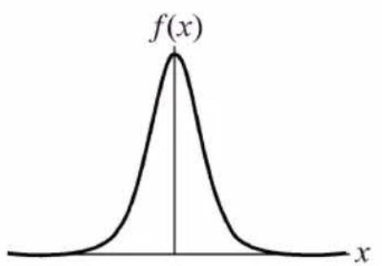

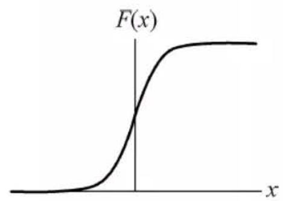  
图6.1 逻辑斯谛分布的密度函数与分布函数

曲线在中附近增长速度较快，在两端增长速度较慢。形状参数 $\gamma$ 的值越小，曲线在中心附近增长得越快。

## 6.1.2 项逻辑斯谛回归模型

项逻辑斯谛回归模型（binomial logisticregression model）是种分类模型，条件概率分布 $P ( Y | X )$ 表，形式为参数化的逻辑斯谛分布。这，随机变量X取值为实数，随机变量Y取值为1或0。我们通过监督学习的法来估计模型参数。

定义6.2（逻辑斯谛回归模型）二项逻辑斯谛回归模型是如下的条件概率分布:

$$
P ( Y = 1 | x ) = { \frac { \exp ( w \cdot x + b ) } { 1 + \exp ( w \cdot x + b ) } }\tag{6.3}
$$

$$
P ( Y = 0 | x ) = { \frac { 1 } { 1 + \exp ( w \cdot x + b ) } }\tag{6.4}
$$

这里, $x \in R ^ { n }$ 是输入， $Y \in \{ 0 , 1 \}$ 是输出, $w \in R ^ { n }$ 和 $b \in \pmb { R }$ 是参数，w称为权值向量，b称为偏置， $w \cdot x$ 为w和x的内积。

对于给定的输入实例x，按照式(6.3)和式(6.4）可以求得 $P ( Y = 1 | x )$ 和 $P ( Y = 0 | x )$ 逻辑斯谛回归较两个条件概率值的，将实例x分到概率值较的那类。

有时为了便，将权值向量和输向量加以扩充，仍记作w，x，即 $\begin{array} { r } { \boldsymbol { w } \ = \ ( \boldsymbol { w } ^ { ( 1 ) } } \end{array}$ ,$w ^ { ( 2 ) } , \cdots , w ^ { ( n ) } , b ) ^ { \mathrm { T } } , x = ( x ^ { ( 1 ) } , x ^ { ( 2 ) } , \cdots , x ^ { ( n ) } , 1 ) ^ { \mathrm { T } }$ 。这时，逻辑斯谛回归模型如下：

$$
P ( Y = 1 | x ) = { \frac { \exp ( w \cdot x ) } { 1 + \exp ( w \cdot x ) } }\tag{6.5}
$$

$$
P ( Y = 0 | x ) = { \frac { 1 } { 1 + \exp ( w \cdot x ) } }\tag{6.6}
$$

现在考查逻辑斯谛回归模型的特点。个事件的率（odds）是指该事件发的概率与该事件不发的概率的值。如果事件发的概率是 $p ,$ ，那么该事件的率是 $\frac { p } { 1 - p }$ ，该事件的对数率（log odds）或logit函数是

$$
\operatorname { l o g i t } ( p ) = \log { \frac { p } { 1 - p } }
$$

对逻辑斯谛回归，由式(6.5)与式(6.6)得：

$$
\log { \frac { P ( Y = 1 | x ) } { 1 - P ( Y = 1 | x ) } } = w \cdot x
$$

这就是说，在逻辑斯谛回归模型中，输出 $Y = 1$ 的对数率是输x的线性函数。或者说，输出 $Y = 1$ 的对数率是由输入x的线性函数表的模型，即逻辑斯谛回归模型。

换个度看，考虑对输x进分类的线性函数w·x，其值域为实数域。注意，这里 $x \in R ^ { n + 1 } , w \in R ^ { n + 1 }$ 。通过逻辑斯谛回归模型定义式(6.5)可以将线性函数 $w \cdot x$ 转换为概率：

$$
P ( Y = 1 | x ) = \frac { \exp ( w \cdot x ) } { 1 + \exp ( w \cdot x ) }
$$

这时，线性函数的值越接近正穷，概率值就越接近1；线性函数的值越接近负穷，概率值就越接近0（如图6.1所）。这样的模型就是逻辑斯谛回归模型。

## 6.1.3 模型参数估计

逻辑斯谛回归模型学习时，对于给定的训练数据集 $T = \{ ( x _ { 1 } , y _ { 1 } ) , ( x _ { 2 } , y _ { 2 } ) , \cdots , ( x _ { N } , y _ { N } ) \}$ ,其中， $x _ { i } \in R ^ { n } , y _ { i } \in \{ 0 , 1 \}$ ，可以应极似然估计法估计模型参数，从得到逻辑斯谛回归模型。

设

$$
P ( Y = 1 | x ) = \pi ( x ) , \quad P ( Y = 0 | x ) = 1 - \pi ( x )
$$

似然函数为

$$
\prod _ { i = 1 } ^ { N } ( \pi ( x _ { i } ) ) ^ { y _ { i } } ( 1 - \pi ( x _ { i } ) ) ^ { 1 - y _ { i } }
$$

对数似然函数为

$$
\begin{array} { c } { { \displaystyle L ( w ) = \sum _ { i = 1 } ^ { N } \left[ y _ { i } \log \pi ( x _ { i } ) + ( 1 - y _ { i } ) \log ( 1 - \pi ( x _ { i } ) ) \right] } } \\ { { { } } } \\ { { = \displaystyle \sum _ { i = 1 } ^ { N } \left[ y _ { i } \log \frac { \pi ( x _ { i } ) } { 1 - \pi ( x _ { i } ) } + \log ( 1 - \pi ( x _ { i } ) ) \right] } } \\ { { { } } } \\ { { { } = \displaystyle \sum _ { i = 1 } ^ { N } \{ y _ { i } ( w \cdot x _ { i } ) - \log [ 1 + \exp ( w \cdot x _ { i } ) ] \} . } } \end{array}
$$

对 $L ( w )$ 求极大值，得到的估计值。

这样，问题就变成了以对数似然函数为标函数的最优化问题。逻辑斯谛回归学习中通常采用的法是梯度下降法及拟牛顿法。

假设的极似然估计值是ω，那么学到的逻辑斯谛回归模型为

$$
P ( Y = 1 | x ) = \frac { \exp ( \hat { w } \cdot x ) } { 1 + \exp ( \hat { w } \cdot x ) }
$$

$$
P ( Y = 0 | x ) = \frac { 1 } { 1 + \exp ( \hat { w } \cdot x ) }
$$

## 6.1.4 多项逻辑斯谛回归

上介绍的逻辑斯谛回归模型是项分类模型，于类分类。可以将其推为多项逻辑斯谛回归模型（multi-nominallogistic regression model），于多类分类。假设离散型随机

变量Y的取值集合是 $\{ 1 , 2 , \cdots , K \}$ ，那么多项逻辑斯谛回归模型是

$$
P ( Y = k | x ) = { \frac { \exp ( w _ { k } \bullet x ) } { 1 + \displaystyle \sum _ { k = 1 } ^ { K - 1 } \exp ( w _ { k } \bullet x ) } } , \quad k = 1 , 2 , \cdots , K - 1\tag{6.7}
$$

$$
P ( Y = K | x ) = { \cfrac { 1 } { 1 + \displaystyle \sum _ { k = 1 } ^ { K - 1 } \exp ( w _ { k } \cdot x ) } }\tag{6.8}
$$

这里， $x \in R ^ { n + 1 } , w _ { k } \in R ^ { n + 1 }$

项逻辑斯谛回归的参数估计法也可以推到多项逻辑斯谛回归。

## 6.2 最熵模型

最熵模型（maximumentropymodel）由最熵原理推导实现。这先叙述般的最大熵原理，然后讲解最大熵模型的推导，最后给出最大熵模型学习的形式。

## 6.2.1最大熵原理

最熵原理是概率模型学习的个准则。最熵原理认为：学习概率模型时，在所有可能的概率模型（分布）中，熵最的模型是最好的模型。通常约束条件来确定概率模型的集合，所以，最大熵原理也可以表述为在满约束条件的模型集合中选取熵最的模型。

假设离散随机变量X的概率分布是P(X)，则其熵（参照5.2.2节）是

$$
H ( P ) = - \sum _ { x } P ( x ) \log P ( x )\tag{6.9}
$$

熵满下列不等式：

$$
0 \leqslant H ( P ) \leqslant \log | X |
$$

式中，|X|是X的取值个数，当且仅当X的分布是均匀分布时右边的等号成。这就是说，当X服从均匀分布时，熵最大。

直观地，最熵原理认为要选择的概率模型先必须满已有的事实，即约束条件。在没有更多信息的情况下，那些不确定的部分都是“等可能的”。最熵原理通过熵的最化来表等可能性。“等可能”不容易操作，熵是个可优化的数值指标。

先，通过个简单的例来介绍下最熵原理①。

例6.1 假设随机变量X有5个取值{A,B,C,D,E}，要估计取各个值的概率P(A)，$P ( B ) , P ( C ) , P ( D ) , P ( E )$ 。

解 这些概率值满以下约束条件：

$$
P ( A ) + P ( B ) + P ( C ) + P ( D ) + P ( E ) = 1
$$

满这个约束条件的概率分布有穷多个。如果没有任何其他信息，仍要对概率分布进估计，个办法就是认为这个分布中取各个值的概率是相等的：

$$
P ( A ) = P ( B ) = P ( C ) = P ( D ) = P ( E ) = { \frac { 1 } { 5 } }
$$

等概率表了对事实的知。因为没有更多的信息，这种判断是合理的。

有时，能从些先验知识中得到些对概率值的约束条件，例如：

$$
{ \begin{array} { l } { P ( A ) + P ( B ) = { \frac { 3 } { 1 0 } } } \\ { P ( A ) + P ( B ) + P ( C ) + P ( D ) + P ( E ) = 1 } \end{array} }
$$

满这两个约束条件的概率分布仍然有穷多个。在缺少其他信息的情况下，可以认为A与B是等概率的，C，D与E是等概率的，于是，

$$
\begin{array} { l } { P ( A ) = P ( B ) = \displaystyle { \frac { 3 } { 2 0 } } } \\ { P ( C ) = P ( D ) = P ( E ) = \displaystyle { \frac { 7 } { 3 0 } } } \end{array}
$$

如果还有第3个约束条件：

$$
\begin{array} { l l } { P ( A ) + P ( C ) = \displaystyle \frac { 1 } { 2 } } \\ { P ( A ) + P ( B ) = \displaystyle \frac { 3 } { 1 0 } } \\ { P ( A ) + P ( B ) + P ( C ) + P ( D ) + P ( E ) = 1 } \end{array}
$$

可以继续按照满约束条件下求等概率的法估计概率分布。这不再继续讨论。以上概率模型学习的法正是遵循了最大熵原理。 ■

图6.2提供了最熵原理进概率模型选择的何解释。概率模型集合P可由欧空间中的单纯形（simplex）①表，如左图的三形(2-单纯形）。个点代表个模型，整个单纯形代表模型集合。右图上的条直线对应个约束条件，直线的交集对应满所有约束条件的模型集合。般地，这样的模型仍有穷多个。学习的的是在可能的模型集合中选择最优模型，最熵原理则给出最优模型选择的个准则。

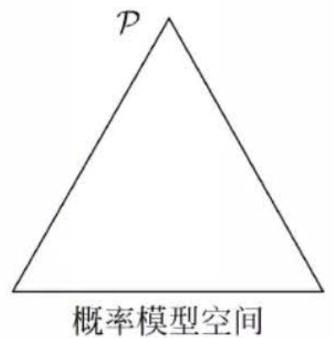

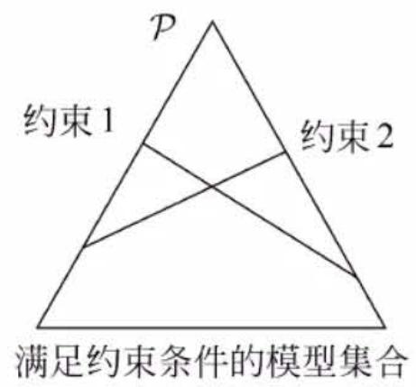  
图6.2 概率模型集合

## 6.2.2 最熵模型的定义

最熵原理是统计学习的般原理，将它应到分类得到最大熵模型。

假设分类模型是个条件概率分布 $P ( { Y \vert { X } } )$ ; $X \in \mathcal { X } \subseteq R ^ { n }$ 表输， $Y \in \mathcal { V }$ 表示输出，X和）分别是输和输出的集合。这个模型表的是对于给定的输X，以条件概率$P ( Y | X )$ 输出Y。

给定一个训练数据集

$$
T = \{ ( x _ { 1 } , y _ { 1 } ) , ( x _ { 2 } , y _ { 2 } ) , \cdots , ( x _ { N } , y _ { N } ) \}
$$

学习的标是最熵原理选择最好的分类模型。

先考虑模型应该满的条件。给定训练数据集，可以确定联合分布 $P ( X , Y )$ 的经验分布和边缘分布 $P ( X )$ 的经验分布，分别以 $\tilde { P } ( X , Y )$ 和 ${ \tilde { P } } ( X )$ 表示。这里，

$$
\begin{array} { l } { \displaystyle { \tilde { P } ( X = x , Y = y ) = \frac { \nu ( X = x , Y = y ) } { N } } } \\ { \displaystyle { \tilde { P } ( X = x ) = \frac { \nu ( X = x ) } { N } } } \end{array}
$$

其中， $\nu ( X = x , Y = y )$ 表示训练数据中样本 $( x , y )$ 出现的频数， $\nu ( X = x )$ 表示训练数据中输入x出现的频数，N表示训练样本容量。

用特征函数（feature function） $f ( x , y )$ 描述输x和输出y之间的某个事实。其定义是

$$
f ( x , y ) = \{ \begin{array} { l l } { 1 , } & { x  y \nVDash _ { \lceil \# \rceil } ^ { \# \rceil \# } \land \Sigma \stackrel { \# } { \exp } \lnot \qquad } \\ { 0 , } & { \lnot \ G \uplus \land \nmid } \end{array} 
$$

它是个值函数 $\textcircled{1}$ ，当x和y满这个事实时取值为1，否则取值为0。

特征函数 $f ( x , y )$ 关于经验分布 $\tilde { P } ( X , Y )$ 的期望值用 $E _ { \tilde { P } } ( f )$ 表示：

$$
E _ { \tilde { P } } ( f ) = \sum _ { x , y } \tilde { P } ( x , y ) f ( x , y )
$$

特征函数 $f ( x , y )$ 关于模型 $P ( { Y \vert { X } } )$ 与经验分布 $\tilde { P } ( X )$ 的期望值用 $E _ { P } ( f )$ 表示：

$$
E _ { P } ( f ) = \sum _ { x , y } \tilde { P } ( x ) P ( y | x ) f ( x , y )
$$

如果模型能够获取训练数据中的信息，那么就可以假设这两个期望值相等，即

$$
E _ { P } ( f ) = E _ { \tilde { P } } ( f )\tag{6.10}
$$

或

$$
\sum _ { x , y } \tilde { P } ( x ) P ( y | x ) f ( x , y ) = \sum _ { x , y } \tilde { P } ( x , y ) f ( x , y )\tag{6.11}
$$

我们将式(6.10)或式(6.11）作为模型学习的约束条件。假如有n个特征函数 $f _ { i } ( x , y )$ , $i =$ $1 , 2 , \cdots , n$ ，那么就有n个约束条件。

定义6.3（最大熵模型） 假设满足所有约束条件的模型集合为

$$
\mathcal C \equiv \{ P \in \mathcal P | E _ { P } ( f _ { i } ) = E _ { \tilde { P } } ( f _ { i } ) , \quad i = 1 , 2 , \cdots , n \}\tag{6.12}
$$

定义在条件概率分布 $P ( \boldsymbol { Y } | \boldsymbol { X } )$ 上的条件熵为

$$
H ( P ) = - \sum _ { x , y } \tilde { P } ( x ) P ( y | x ) \log P ( y | x )\tag{6.13}
$$

则模型集合C中条件熵 $H ( P )$ 最大的模型称为最大熵模型。式中的对数为自然对数。

## 6.2.3 最熵模型的学习

最熵模型的学习过程就是求解最熵模型的过程。最熵模型的学习可以形式化为约束最优化问题。

对于给定的训练数据集 $T = \{ ( x _ { 1 } , y _ { 1 } ) , ( x _ { 2 } , y _ { 2 } ) , \cdots , ( x _ { N } , y _ { N } ) \}$ 以及特征函数 $f _ { i } ( x , y ) , i =$ $1 , 2 , \cdots , n$ ，最熵模型的学习等价于约束最优化问题：

$$
\begin{array} { r l } { \underset { P \in \mathcal C } { \operatorname* { m a x } } } & { H ( P ) = - \underset { x , y } { \sum } \tilde { P } ( x ) P ( y | x ) \log P ( y | x ) } \\ { \mathrm { s . t . } } & { E _ { P } ( f _ { i } ) = E _ { \tilde { P } } ( f _ { i } ) , \quad i = 1 , 2 , \cdots , n } \\ & { \displaystyle \sum _ { y } P ( y | x ) = 1 } \end{array}
$$

按照最优化问题的习惯，将求最值问题改写为等价的求最值问题：

$$
\operatorname* { m i n } _ { P \in \mathcal { C } } \ - H ( P ) = \sum _ { x , y } \tilde { P } ( x ) P ( y | x ) \log P ( y | x )\tag{6.14}
$$

$$
\begin{array} { r } { \mathrm { s . t . } \quad E _ { P } ( f _ { i } ) - E _ { \tilde { P } } ( f _ { i } ) = 0 , \quad i = 1 , 2 , \cdots , n } \end{array}\tag{6.15}
$$

$$
\sum _ { y } { P ( y | x ) } = 1\tag{6.16}
$$

求解约束最优化问题(6.14)\~(6.16)得出的解就是最熵模型学习的解。下给出具体推导。这，将约束最优化的原始问题转换为约束最优化的对偶问题 $\textcircled{1}$ ，通过求解对偶问题求解原始问题。

先，引拉格朗乘 $w _ { 0 } , w _ { 1 } , w _ { 2 } , \cdots , w _ { n }$ ，定义拉格朗函数 ${ \cal L } ( P , w )$ :

$$
\begin{array} { l } { { \displaystyle { \cal L } ( P , w ) \equiv - { \cal H } ( P ) + w _ { 0 } \left( 1 - \sum _ { y } P ( y | x ) \right) + \sum _ { i = 1 } ^ { n } w _ { i } ( E _ { \tilde { P } } ( f _ { i } ) - E _ { P } ( f _ { i } ) ) } } \\ { ~ } \\ { { \displaystyle ~ = \sum _ { x , y } \tilde { P } ( x ) P ( y | x ) \log P ( y | x ) + w _ { 0 } \left( 1 - \sum _ { y } P ( y | x ) \right) + } } \\ { { \displaystyle ~ \sum _ { i = 1 } ^ { n } w _ { i } \left( \sum _ { x , y } \tilde { P } ( x , y ) f _ { i } ( x , y ) - \sum _ { x , y } \tilde { P } ( x ) P ( y | x ) f _ { i } ( x , y ) \right) } } \end{array}\tag{6.17}
$$

①参阅附录C。

最优化的原始问题是

$$
\operatorname* { m i n } _ { P \in \mathcal { C } } \operatorname* { m a x } _ { w } L ( P , w )\tag{6.18}
$$

对偶问题是

$$
\operatorname* { m a x } _ { w } \operatorname* { m i n } _ { P \in { \mathcal C } } L ( P , w )\tag{6.19}
$$

由于拉格朗日函数 ${ \cal L } ( P , w )$ 是P的凸函数，原始问题(6.18)的解与对偶问题(6.19)的解是等价的。这样，可以通过求解对偶问题(6.19)来求解原始问题(6.18)。

先，求解对偶问题(6.19)内部的极化问题 $\operatorname* { m i n } _ { P \in \mathcal { C } } L ( P , w ) \circ \operatorname* { m i n } _ { P \in \mathcal { C } } L ( P , w )$ 是w的函数，将其记作

$$
\varPsi ( w ) = \operatorname* { m i n } _ { P \in \mathcal { C } } L ( P , w ) = L ( P _ { w } , w )\tag{6.20}
$$

$\varPsi ( w )$ 称为对偶函数。同时，将其解记作

$$
P _ { w } = \arg \operatorname* { m i n } _ { P \in \mathcal { C } } L ( P , w ) = P _ { w } ( y | x )\tag{6.21}
$$

具体地，求 ${ \cal L } ( P , w )$ 对 $P ( \boldsymbol { y } | \boldsymbol { x } )$ 的偏导数：

$$
\begin{array} { l } { \displaystyle \frac { \partial L ( P , w ) } { \partial P ( y | x ) } = \sum _ { x , y } \tilde { P } ( x ) \left( \log P ( y | x ) + 1 \right) - \sum _ { y } w _ { 0 } - \sum _ { x , y } \Bigg ( \tilde { P } ( x ) \sum _ { i = 1 } ^ { n } w _ { i } f _ { i } ( x , y ) \Bigg ) } \\ { \displaystyle \qquad = \sum _ { x , y } \tilde { P } ( x ) \left( \log P ( y | x ) + 1 - w _ { 0 } - \sum _ { i = 1 } ^ { n } w _ { i } f _ { i } ( x , y ) \right) } \end{array}
$$

令偏导数等于0，在 $\tilde { P } ( x ) > 0$ 的情况下，解得：

$$
P ( y | x ) = \exp \left( \sum _ { i = 1 } ^ { n } w _ { i } f _ { i } ( x , y ) + w _ { 0 } - 1 \right) = \frac { \exp \left( \displaystyle \sum _ { i = 1 } ^ { n } w _ { i } f _ { i } ( x , y ) \right) } { \exp ( 1 - w _ { 0 } ) }
$$

由于 $\sum _ { y } { P ( y | x ) } = 1$ ，得：

$$
P _ { w } ( y | x ) = \frac { 1 } { Z _ { w } ( x ) } \exp \left( \sum _ { i = 1 } ^ { n } w _ { i } f _ { i } ( x , y ) \right)\tag{6.22}
$$

其中，

$$
Z _ { w } ( x ) = \sum _ { y } \exp \left( \sum _ { i = 1 } ^ { n } w _ { i } f _ { i } ( x , y ) \right)\tag{6.23}
$$

$Z _ { w } ( x )$ 称为规范化因子， $f _ { i } ( x , y )$ 是特征函数， $w _ { i }$ 是特征的权值。由式(6.22)、式(6.23)表的模型 $P _ { w } = P _ { w } ( y | x )$ 就是最熵模型。这，w是最熵模型中的参数向量。

之后，求解对偶问题外部的极化问题：

$$
\operatorname* { m a x } _ { w } \varPsi ( w )\tag{6.24}
$$

将其解记为 $w ^ { * }$ ,即

$$
\boldsymbol { w } ^ { * } = \arg \operatorname* { m a x } _ { \boldsymbol { w } } \boldsymbol { \varPsi } ( \boldsymbol { w } )\tag{6.25}
$$

这就是说，可以应最优化算法求对偶函数 $\varPsi ( w )$ 的极大化，得到 $w ^ { * }$ ，用来表示 $P ^ { * } \in { \mathcal { C } } _ { \mathrm { { \mathfrak { c } } } }$ 这里， $P ^ { * } = P _ { w ^ { * } } = P _ { w ^ { * } } ( y | x )$ 是学习到的最优模型（最熵模型）。也就是说，最熵模型的学习归结为对偶函数 $\varPsi ( w )$ 的极大化。

例6.2 学习例6.1中的最熵模型。

解 为了便，分别以y1,y2,y3,y4,y5表A，B，C，D和E，于是最熵模型学习的最优化问题是

$$
\begin{array} { r l } { { \mathrm { m i n } } } & { { \displaystyle - H ( P ) = \sum _ { i = 1 } ^ { 5 } P ( y _ { i } ) \log P ( y _ { i } ) } } \\ { { \mathrm { s . t . } \quad P ( y _ { 1 } ) + P ( y _ { 2 } ) = \tilde { P } ( y _ { 1 } ) + \tilde { P } ( y _ { 2 } ) = \frac { 3 } { 1 0 } } } \\ { { \displaystyle \sum _ { i = 1 } ^ { 5 } P ( y _ { i } ) = \sum _ { i = 1 } ^ { 5 } \tilde { P } ( y _ { i } ) = 1 } } \end{array}
$$

引拉格朗乘 $w _ { 0 } , \ w _ { 1 }$ ，定义拉格朗函数：

$$
L ( P , w ) = \sum _ { i = 1 } ^ { 5 } P ( y _ { i } ) \log P ( y _ { i } ) + w _ { 1 } \left( P ( y _ { 1 } ) + P ( y _ { 2 } ) - { \frac { 3 } { 1 0 } } \right) + w _ { 0 } \left( \sum _ { i = 1 } ^ { 5 } P ( y _ { i } ) - 1 \right)
$$

根据拉格朗对偶性，可以通过求解对偶最优化问题得到原始最优化问题的解，所以求解

$$
\operatorname* { m a x } _ { w } \operatorname* { m i n } _ { P } L ( P , w )
$$

首先求解 ${ \cal L } ( P , w )$ 关于P的极化问题。为此，固定 $w _ { 0 } , \ w _ { 1 }$ ，求偏导数：

$$
{ \frac { \partial L ( P , w ) } { \partial P ( y _ { 1 } ) } } = 1 + \log P ( y _ { 1 } ) + w _ { 1 } + w _ { 0 }
$$

$$
\frac { \partial L ( P , w ) } { \partial P ( y _ { 2 } ) } = 1 + \log P ( y _ { 2 } ) + w _ { 1 } + w _ { 0 }
$$

$$
\frac { \partial L ( P , w ) } { \partial P ( y _ { 3 } ) } = 1 + \log P ( y _ { 3 } ) + w _ { 0 }
$$

$$
\frac { \partial L ( P , w ) } { \partial P ( y _ { 4 } ) } = 1 + \log P ( y _ { 4 } ) + w _ { 0 }
$$

$$
{ \frac { \partial L ( P , w ) } { \partial P ( y _ { 5 } ) } } = 1 + \log P ( y _ { 5 } ) + w _ { 0 }
$$

令各偏导数等于0，解得：

$$
\begin{array} { l } { P ( y _ { 1 } ) = P ( y _ { 2 } ) = \operatorname { e } ^ { - w _ { 1 } - w _ { 0 } - 1 } } \\ { P ( y _ { 3 } ) = P ( y _ { 4 } ) = P ( y _ { 5 } ) = \operatorname { e } ^ { - w _ { 0 } - 1 } } \end{array}
$$

于是，

$$
\operatorname* { m i n } _ { P } L ( P , w ) = L ( P _ { w } , w ) = - 2 \mathrm { e } ^ { - w _ { 1 } - w _ { 0 } - 1 } - 3 \mathrm { e } ^ { - w _ { 0 } - 1 } - \frac { 3 } { 1 0 } w _ { 1 } - w _ { 0 }
$$

再求解 $L ( P _ { w } , w )$ 关于w的极大化问题：

$$
\operatorname* { m a x } _ { w } { \cal L } ( P _ { w } , w ) = - 2 \mathrm { e } ^ { - w _ { 1 } - w _ { 0 } - 1 } - 3 \mathrm { e } ^ { - w _ { 0 } - 1 } - \frac { 3 } { 1 0 } w _ { 1 } - w _ { 0 }
$$

分别求 $L ( P _ { w } , w )$ 对 $w _ { 0 } , \ w _ { 1 }$ 的偏导数并令其为0，得到：

$$
\mathrm { e } ^ { - w _ { 1 } - w _ { 0 } - 1 } = \frac { 3 } { 2 0 }
$$

$$
\mathrm { e } ^ { - w _ { 0 } - 1 } = \frac { 7 } { 3 0 }
$$

于是得到所要求的概率分布为

$$
\begin{array} { l c l } { P ( y _ { 1 } ) = P ( y _ { 2 } ) = \displaystyle \frac { 3 } { 2 0 } } \\ { P ( y _ { 3 } ) = P ( y _ { 4 } ) = P ( y _ { 5 } ) = \displaystyle \frac { 7 } { 3 0 } } \end{array}
$$

## 6.2.4 极似然估计

从以上最熵模型学习中可以看出，最熵模型是由式(6.22)、式(6.23)表的条件概率分布。下证明对偶函数的极大化等价于最大熵模型的极大似然估计。

已知训练数据的经验概率分布 $\tilde { P } ( X , Y )$ ，条件概率分布 $P ( Y | X )$ 的对数似然函数表示为

$$
L _ { \tilde { P } } ( P _ { w } ) = \log \prod _ { x , y } P ( y | x ) ^ { \tilde { P } ( x , y ) } = \sum _ { x , y } \tilde { P } ( x , y ) \log P ( y | x )
$$

当条件概率分布 $P ( y | x )$ 是最熵模型(式(6.22)和式(6.23)）时，对数似然函数 $\boldsymbol { L } _ { \tilde { P } } ( \boldsymbol { P _ { w } } )$ 为

$$
\begin{array} { l } { { \displaystyle { \cal L } _ { \tilde { P } } ( P _ { w } ) = \sum _ { x , y } \tilde { P } ( x , y ) \log P ( y | x ) } } \\ { ~ } \\ { { \displaystyle ~ = \sum _ { x , y } \tilde { P } ( x , y ) \sum _ { i = 1 } ^ { n } w _ { i } f _ { i } ( x , y ) - \sum _ { x , y } \tilde { P } ( x , y ) \log Z _ { w } ( x ) } } \\ { { \displaystyle ~ = \sum _ { x , y } \tilde { P } ( x , y ) \sum _ { i = 1 } ^ { n } w _ { i } f _ { i } ( x , y ) - \sum _ { x } \tilde { P } ( x ) \log Z _ { w } ( x ) } } \end{array}\tag{6.26}
$$

再看对偶函数 $\varPsi ( w )$ 。 由式(6.17)及式(6.20)可得：

$$
\begin{array} { l } { \displaystyle \varPsi ( w ) = \sum _ { x , y } \tilde { P } ( x ) P _ { w } ( y | x ) \log P _ { w } ( y | x ) + } \\ { \displaystyle \sum _ { i = 1 } ^ { N } w _ { i } \left( \sum _ { x , y } \tilde { P } ( x , y ) f _ { i } ( x , y ) - \sum _ { x , y } \tilde { P } ( x ) P _ { w } ( y | x ) f _ { i } ( x , y ) \right) } \\ { \displaystyle = \sum _ { x , y } \tilde { P } ( x , y ) \sum _ { i = 1 } ^ { N } w _ { i } f _ { i } ( x , y ) + \sum _ { x , y } \tilde { P } ( x ) P _ { w } ( y | x ) \left( \log P _ { w } ( y | x ) - \sum _ { i = 1 } ^ { N } w _ { i } f _ { i } ( x , y ) \right) } \\ { \displaystyle = \sum _ { x , y } \tilde { P } ( x , y ) \sum _ { i = 1 } ^ { N } w _ { i } f _ { i } ( x , y ) - \sum _ { x , y } \tilde { P } ( x ) P _ { w } ( y | x ) \log Z _ { w } ( x ) } \\ { \displaystyle \quad = \sum _ { x , y } \tilde { P } ( x , y ) \sum _ { i = 1 } ^ { N } w _ { i } f _ { i } ( x , y ) - \sum _ { x , y } \tilde { P } ( x ) \log Z _ { w } ( x ) } \\ { \displaystyle = \sum _ { x , y } \tilde { P } ( x , y ) \sum _ { i = 1 } ^ { N } w _ { i } f _ { i } ( x , y ) - \sum _ { x } \tilde { P } ( x ) \log Z _ { w } ( x ) } \end{array}\tag{6.27}
$$

最后步到 $\sum _ { y } { P ( y | x ) } = 1$ O

比较式(6.26)和式(6.27)，可得：

$$
\varPsi ( w ) = L _ { \tilde { P } } ( P _ { w } )
$$

既然对偶函数 $\varPsi ( w )$ 等价于对数似然函数 $L _ { \tilde { P } } ( P _ { w } )$ ，于是证明了最熵模型学习中的对偶函数极化等价于最熵模型的极似然估计这事实。

这样，最熵模型的学习问题就转换为具体求解对数似然函数极化或对偶函数极化的问题。

可以将最熵模型写成更般的形式：

$$
P _ { w } ( y | x ) = \frac { 1 } { Z _ { w } ( x ) } \exp \left( \sum _ { i = 1 } ^ { n } w _ { i } f _ { i } ( x , y ) \right)\tag{6.28}
$$

其中，

$$
Z _ { w } ( x ) = \sum _ { y } \exp \left( \sum _ { i = 1 } ^ { n } w _ { i } f _ { i } ( x , y ) \right)\tag{6.29}
$$

这里， $x \in R ^ { n }$ 为输入， $y \in \{ 1 , 2 , \cdots , K \}$ 为输出， $w \in R ^ { n }$ 为权值向量， $f _ { i } ( x , y ) , i = 1 , 2 , \cdots , n$ 为任意实值特征函数。

最熵模型与逻辑斯谛回归模型有类似的形式，它们又称为对数线性模型（logarithmiclinearmodel）。模型学习就是在给定的训练数据条件下对模型进极似然估计或正则化的极大似然估计。

## 6.3 模型学习的最优化算法

逻辑斯谛回归模型、最大熵模型学习归结为以似然函数为标函数的最优化问题，通常通过迭代算法求解。从最优化的观点看，这时的标函数具有很好的性质。它是光滑的凸函数，因此多种最优化的法都适，保证能找到全局最优解。常的法有改进的迭代尺度法、梯度下降法、顿法或拟顿法。顿法或拟顿法般收敛速度更快。

下介绍基于改进的迭代尺度法与拟顿法的最熵模型学习算法，梯度下降法参阅附录A。

## 6.3.1 改进的迭代尺度法

改进的迭代尺度法（improvediterative scaling，IIS）是种最熵模型学习的最优化算法。

已知最大熵模型为

$$
P _ { w } ( y | x ) = \frac { 1 } { Z _ { w } ( x ) } \exp \left( \sum _ { i = 1 } ^ { n } w _ { i } f _ { i } ( x , y ) \right)
$$

其中，

$$
Z _ { w } ( x ) = \sum _ { y } \exp \left( \sum _ { i = 1 } ^ { n } w _ { i } f _ { i } ( x , y ) \right)
$$

对数似然函数为

$$
L ( w ) = \sum _ { x , y } \tilde { P } ( x , y ) \sum _ { i = 1 } ^ { n } w _ { i } f _ { i } ( x , y ) - \sum _ { x } \tilde { P } ( x ) \log Z _ { w } ( x )
$$

标是通过极似然估计学习模型参数，即求对数似然函数的极值 $\hat { w } .$

IIS的想法是：假设最熵模型当前的参数向量是 $w = ( w _ { 1 } , w _ { 2 } , \cdots , w _ { n } ) ^ { \mathrm { T } }$ ，我们希望找到一个新的参数向量 $w + \delta = ( w _ { 1 } + \delta _ { 1 } , w _ { 2 } + \delta _ { 2 } , \cdots , w _ { n } + \delta _ { n } ) ^ { \mathrm { T } }$ ，使得模型的对数似然函数值增。如果能有这样种参数向量更新的法 $\tau : w  w + \delta$ ，那么就可以重复使这法，直至找到对数似然函数的最大值。

对于给定的经验分布 $\tilde { P } ( x , y )$ ，模型参数从w到 $w + \delta$ ，对数似然函数的改变量是

$$
\begin{array} { l } { { \displaystyle { \cal L } ( w + \delta ) - { \cal L } ( w ) = \sum _ { x , y } \tilde { P } ( x , y ) \log P _ { w + \delta } ( y | x ) - \sum _ { x , y } \tilde { P } ( x , y ) \log P _ { w } ( y | x ) } } \\ { { \displaystyle ~ = \sum _ { x , y } \tilde { P } ( x , y ) \sum _ { i = 1 } ^ { n } \delta _ { i } f _ { i } ( x , y ) - \sum _ { x } \tilde { P } ( x ) \log \frac { Z _ { w + \delta } ( x ) } { Z _ { w } ( x ) } } } \end{array}
$$

利用不等式

$$
- \log \alpha \geqslant 1 - \alpha , \quad \alpha > 0
$$

建立对数似然函数改变量的下界：

$$
\begin{array} { r l r } {  { L ( w + \delta ) - L ( w ) \geqslant \sum _ { x , y } \tilde { P } ( x , y ) \sum _ { i = 1 } ^ { n } \delta _ { i } f _ { i } ( x , y ) + 1 - \sum _ { x } \tilde { P } ( x ) \frac { Z _ { w + \delta } ( x ) } { Z _ { w } ( x ) } } } \\ & { } & { = \sum _ { x , y } \tilde { P } ( x , y ) \sum _ { i = 1 } ^ { n } \delta _ { i } f _ { i } ( x , y ) + 1 - \sum _ { x } \tilde { P } ( x ) \sum _ { y } P _ { w } ( y | x ) \exp \sum _ { i = 1 } ^ { n } \delta _ { i } f _ { i } ( x , y ) } \end{array}
$$

将右端记为

$$
A ( \delta | w ) = \sum _ { x , y } \tilde { P } ( x , y ) \sum _ { i = 1 } ^ { n } \delta _ { i } f _ { i } ( x , y ) + 1 - \sum _ { x } \tilde { P } ( x ) \sum _ { y } P _ { w } ( y | x ) \exp \sum _ { i = 1 } ^ { n } \delta _ { i } f _ { i } ( x , y )
$$

于是有

$$
L ( w + \delta ) - L ( w ) \geqslant A ( \delta | w )
$$

即 $A ( \delta \vert w )$ 是对数似然函数改变量的个下界。

如果能找到适当的δ使下界 $A ( \delta \vert w )$ 提，那么对数似然函数也会提。然，函数$A ( \delta | w )$ 中的δ是个向量，含有多个变量，不易同时优化。IIS试图次只优化其中个变量 $\delta _ { i }$ ，而固定其他变量 $\delta _ { j } , \ i \neq j$ 。

为达到这的，IIS进步降低下界 $A ( \delta \vert w )$ 。具体地，IIS引进个量 $f ^ { \# } ( x , y )$

$$
f ^ { \# } ( x , y ) = \sum _ { i } f _ { i } ( x , y )
$$

因为 $f _ { i }$ 是二值函数，故 $f ^ { \# } ( x , y )$ 表示所有特征在 $( x , y )$ 出现的次数。这样， $A ( \delta \vert w )$ 可以改写为

$$
\begin{array} { l } { { \displaystyle { \cal A } ( \delta | w ) = \sum _ { x , y } \tilde { P } ( x , y ) \sum _ { i = 1 } ^ { n } \delta _ { i } f _ { i } ( x , y ) + 1 - } } \\ { { \displaystyle \sum _ { x } \tilde { P } ( x ) \sum _ { y } P _ { w } ( y | x ) \exp \left( f ^ { \# } ( x , y ) \sum _ { i = 1 } ^ { n } \frac { \delta _ { i } f _ { i } ( x , y ) } { f ^ { \# } ( x , y ) } \right) } } \end{array}\tag{6.30}
$$

利指数函数的凸性以及对任意，有 $\frac { f _ { i } ( x , y ) } { f \# ( x , y ) } \geqslant 0$ 且 $\sum _ { i = 1 } ^ { n } { \frac { f _ { i } ( x , y ) } { f ^ { \# } ( x , y ) } } = 1$ 这一事实，根据Jensen 不等式，得到:

$$
\exp \left( \sum _ { i = 1 } ^ { n } \frac { f _ { i } ( x , y ) } { f ^ { \# } ( x , y ) } \delta _ { i } f ^ { \# } ( x , y ) \right) \leqslant \sum _ { i = 1 } ^ { n } \frac { f _ { i } ( x , y ) } { f ^ { \# } ( x , y ) } \exp ( \delta _ { i } f ^ { \# } ( x , y ) )
$$

于是式(6.30)可改写为

$$
\begin{array} { l } { { \displaystyle { \cal A } ( \delta | w ) \geqslant \sum _ { x , y } \tilde { P } ( x , y ) \sum _ { i = 1 } ^ { n } \delta _ { i } f _ { i } ( x , y ) + 1 - } } \\ { { \displaystyle \sum _ { x } \tilde { P } ( x ) \sum _ { y } P _ { w } ( y | x ) \sum _ { i = 1 } ^ { n } \left( \frac { f _ { i } ( x , y ) } { f ^ { \# } ( x , y ) } \right) \exp ( \delta _ { i } f ^ { \# } ( x , y ) ) } } \end{array}\tag{6.31}
$$

记不等式(6.31)右端为

$$
B ( \delta | w ) = \sum _ { x , y } \tilde { P } ( x , y ) \sum _ { i = 1 } ^ { n } \delta _ { i } f _ { i } ( x , y ) + 1 - \sum _ { x } \tilde { P } ( x ) \sum _ { y } P _ { w } ( y | x ) \sum _ { i = 1 } ^ { n } \biggl ( \frac { f _ { i } ( x , y ) } { f ^ { \# } ( x , y ) } \biggr ) \exp ( \delta _ { i } f ^ { \# } ( x , y ) )
$$

于是得到：

$$
L ( w + \delta ) - L ( w ) \geqslant B ( \delta | w )
$$

这里， $B ( \delta | w )$ 是对数似然函数改变量的个新的(相对不紧的）下界。

求 $B ( \delta | w )$ 对 $\delta _ { i }$ 的偏导数：

$$
\frac { \partial B ( \delta | w ) } { \partial \delta _ { i } } = \sum _ { x , y } \tilde { P } ( x , y ) f _ { i } ( x , y ) - \sum _ { x } \tilde { P } ( x ) \sum _ { y } P _ { w } ( y | x ) f _ { i } ( x , y ) \exp ( \delta _ { i } f ^ { \# } ( x , y ) )\tag{6.32}
$$

在式(6.32)里，除 $\delta _ { i }$ 外不含任何其他变量。令偏导数为0得到：

$$
\sum _ { x , y } \tilde { P } ( x ) P _ { w } ( y | x ) f _ { i } ( x , y ) \exp ( \delta _ { i } f ^ { \# } ( x , y ) ) = E _ { \tilde { P } } ( f _ { i } )\tag{6.33}
$$

于是，依次对 $\delta _ { i }$ 求解方程(6.33)可以求出 $\delta _ { \mathfrak { c } }$

这就给出了种求ω的最优解的迭代算法，即改进的迭代尺度算法IIS。

算法6.1（改进的迭代尺度算法IIS）

输入：特征函数 $f _ { 1 } , f _ { 2 } , \cdots , f _ { n }$ ，经验分布 $\tilde { P } ( X , Y )$ ，模型 $P _ { w } ( y | x )$ 。

输出：最优参数值 $w _ { i } ^ { * }$ ，最优模型 $P _ { w ^ { * } }$

（1）对所有 $i \in \{ 1 , 2 , \cdots , n \}$ ，取初值 $w _ { i } = 0$ O

(2）对每个 $i \in \{ 1 , 2 , \cdots , n \}$

(a)令 $\delta _ { i }$ 是方程

$$
\sum _ { x , y } \tilde { P } ( x ) P ( y | x ) f _ { i } ( x , y ) \exp ( \delta _ { i } f ^ { \# } ( x , y ) ) = E _ { \tilde { P } } ( f _ { i } )
$$

的解，这里，

$$
f ^ { \# } ( x , y ) = \sum _ { i = 1 } ^ { n } f _ { i } ( x , y )
$$

(b）更新 $w _ { i }$ 值： $w _ { i } \gets w _ { i } + \delta _ { i }$

(3）如果不是所有 $w _ { i }$ 都收敛，重复步骤(2)。

这算法关键的步是步骤(a)，即求解程(6.33)中的 $\delta _ { i }$ 。如果 $f \# ( x , y )$ 是常数，即对任何 $x , y$ 有 $f ^ { \# } ( x , y ) = M$ ，那么 $\delta _ { i }$ 可以显式地表成

$$
\delta _ { i } = \frac { 1 } { M } \log \frac { E _ { \tilde { P } } ( f _ { i } ) } { E _ { P } ( f _ { i } ) }\tag{6.34}
$$

如果 $f ^ { \# } ( x , y )$ 不是常数，那么必须通过数值计算求 $\delta _ { i }$ 。简单有效的法是顿法。以$g ( \delta _ { i } ) = 0$ 表程(6.33)，顿法通过迭代求得 ${ { \delta } _ { i } ^ { * } }$ ，使得 $g ( \delta _ { i } ^ { * } ) = 0$ 。迭代公式是

$$
\delta _ { i } ^ { ( k + 1 ) } = \delta _ { i } ^ { ( k ) } - \frac { g ( \delta _ { i } ^ { ( k ) } ) } { g ^ { \prime } ( \delta _ { i } ^ { ( k ) } ) }\tag{6.35}
$$

只要适当选取初始值 $\delta _ { i } ^ { ( 0 ) }$ ，由于 $\delta _ { i }$ 的程(6.33)有单根，因此顿法恒收敛，且收敛速度很快。

## 6.3.2 拟顿法

最熵模型学习还可以应顿法或拟顿法，参阅附录B。

对于最大熵模型而，

$$
P _ { w } ( y | x ) = { \frac { \exp \left( \sum _ { i = 1 } ^ { n } w _ { i } f _ { i } ( x , y ) \right) } { \displaystyle \sum _ { y } \exp \left( \sum _ { i = 1 } ^ { n } w _ { i } f _ { i } ( x , y ) \right) } }
$$

标函数为

$$
\operatorname* { m i n } _ { w \in R ^ { n } } \quad f ( w ) = \sum _ { x } \tilde { P } ( x ) \log \sum _ { y } \exp \left( \sum _ { i = 1 } ^ { n } w _ { i } f _ { i } ( x , y ) \right) - \sum _ { x , y } \tilde { P } ( x , y ) \sum _ { i = 1 } ^ { n } w _ { i } f _ { i } ( x , y )
$$

梯度为

$$
g ( w ) = \left( { \frac { \partial f ( w ) } { \partial w _ { 1 } } } , { \frac { \partial f ( w ) } { \partial w _ { 2 } } } , \cdots , { \frac { \partial f ( w ) } { \partial w _ { n } } } \right) ^ { \mathrm { T } }
$$

其中，

$$
\frac { \partial f ( w ) } { \partial w _ { i } } = \sum _ { x , y } \tilde { P } ( x ) P _ { w } ( y | x ) f _ { i } ( x , y ) - E _ { \tilde { P } } ( f _ { i } ) , \quad i = 1 , 2 , \cdots , n
$$

相应的拟顿法BFGS算法如下。

算法6.2（最大熵模型学习的BFGS算法）

输入：特征函数 $f _ { 1 } , f _ { 2 } , \cdots , f _ { n }$ ，经验分布 $\tilde { P } ( x , y )$ ，标函数f(w)，梯度 $g ( w ) = \nabla f ( w )$ ,精度要求ε。

输出：最优参数值 $w ^ { \ast }$ ，最优模型 $P _ { w ^ { * } } ( y | x )$

（1）选定初始点 $w ^ { ( 0 ) }$ ，取 $B _ { 0 }$ 为正定对称矩阵，置 $k = 0$

(2）计算 $g _ { k } = g ( w ^ { ( k ) } )$ ,若 $\left\| g _ { k } \right\| < \varepsilon$ ，则停计算，得 $\boldsymbol { w ^ { * } } = \boldsymbol { w } ^ { ( k ) }$ ；否则，转步骤(3)；

（3）由 $B _ { k } p _ { k } = - g _ { k }$ 求出 $p _ { k } { : }$

(4）维搜索：求 $\lambda _ { k }$ 使得

$$
f ( w ^ { ( k ) } + \lambda _ { k } p _ { k } ) = \operatorname* { m i n } _ { \lambda \geqslant 0 } f ( w ^ { ( k ) } + \lambda p _ { k } )
$$

(5）置 $w ^ { ( k + 1 ) } = w ^ { ( k ) } + \lambda _ { k } p _ { k }$

(6）计算 $g _ { k + 1 } = g ( w ^ { ( k + 1 ) } )$ ,若 $\| g _ { k + 1 } \| < \varepsilon$ ，则停计算，得 $\boldsymbol { w ^ { * } } = \boldsymbol { w } ^ { ( k + 1 ) }$ ；否则，按下式求出 $B _ { k + 1 }$

$$
B _ { k + 1 } = B _ { k } + { \frac { y _ { k } y _ { k } ^ { \mathrm { T } } } { y _ { k } ^ { \mathrm { T } } \delta _ { k } } } - { \frac { B _ { k } \delta _ { k } \delta _ { k } ^ { \mathrm { T } } B _ { k } } { \delta _ { k } ^ { \mathrm { T } } B _ { k } \delta _ { k } } }
$$

其中，

$$
y _ { k } = g _ { k + 1 } - g _ { k } , \quad \delta _ { k } = w ^ { ( k + 1 ) } - w ^ { ( k ) }
$$

(7）置 $k = k + 1$ ，转步骤(3)。

## 本章概要

1.逻辑斯谛回归模型是由以下条件概率分布表的分类模型，可以于类或多类分类。

$$
\begin{array} { c } { { P ( Y = k | x ) = \displaystyle \frac { \exp ( w _ { k } \bullet x ) } { K - 1 } , \quad k = 1 , 2 , \cdots , K - 1 } } \\ { { 1 + \displaystyle \sum _ { k = 1 } ^ { K - 1 } \exp ( w _ { k } \bullet x ) } } \\ { { P ( Y = K | x ) = \displaystyle \frac { 1 } { 1 + \displaystyle \sum _ { k = 1 } ^ { K - 1 } \exp ( w _ { k } \bullet x ) } } } \end{array}
$$

这，x为输入特征，w为特征的权值。

逻辑斯谛回归模型源逻辑斯谛分布，其分布函数F(x）是S形函数。逻辑斯谛回归模型是由输入的线性函数表的输出的对数率模型。

2.最熵模型是由以下条件概率分布表的分类模型，也可以于类或多类分类。

$$
P _ { w } ( y | x ) = \frac { 1 } { Z _ { w } ( x ) } \exp \left( \sum _ { i = 1 } ^ { n } w _ { i } f _ { i } ( x , y ) \right)
$$

$$
Z _ { w } ( x ) = \sum _ { y } \exp \left( \sum _ { i = 1 } ^ { n } w _ { i } f _ { i } ( x , y ) \right)
$$

其中， $Z _ { w } ( x )$ 是规范化因子， $f _ { i }$ 为特征函数， $w _ { i }$ 为特征的权值。

3.最熵模型可以由最熵原理推导得出。最熵原理是概率模型学习或估计的个准则。最熵原理认为在所有可能的概率模型（分布）的集合中，熵最的模型是最好的模型。

最熵原理应到分类模型的学习中，有以下约束最优化问题：

$$
\begin{array} { l l } { \operatorname* { m i n } } & { - H ( P ) = \displaystyle \sum _ { x , y } \tilde { P } ( x ) P ( y | x ) \log P ( y | x ) } \\ { \mathrm { s . t . } } & { P ( f _ { i } ) - \tilde { P } ( f _ { i } ) = 0 , \quad i = 1 , 2 , \cdots , n } \\ & { \displaystyle \sum _ { y } P ( y | x ) = 1 } \end{array}
$$

求解此最优化问题的对偶问题得到最熵模型。

4.逻辑斯谛回归模型与最熵模型都属于对数线性模型。

5.逻辑斯谛回归模型及最熵模型学习般采极似然估计或正则化的极似然估计。逻辑斯谛回归模型及最大熵模型学习可以形式化为无约束最优化问题，求解该最优化问题的算法有改进的迭代尺度法、梯度下降法、拟牛顿法。

## 继续阅读

逻辑斯谛回归的介绍参见献[1]，最熵模型的介绍参见献[2]和献[3]。逻辑斯谛 回归模型与朴素贝叶斯模型的关系参见献[4]，逻辑斯谛回归模型与AdaBoost的关系参见 献[5]，逻辑斯谛回归模型与核函数的关系参见献[6]。

## 习 题

6.1 确认逻辑斯谛分布属于指数分布族。

6.2 写出逻辑斯谛回归模型学习的梯度下降算法。

6.3 写出最熵模型学习的DFP算法（关于般的DFP算法参见附录B）。

## 参考文献

[1] BERGER A, DELLA PIETRA S D, PIETRA V D. A maximum entropy approach to natural language processing[J]. Computational Linguistics, 1996, 22(1): 39–71.

[2] BERGER A. The improved iterative scaling algorithm: a gentle introduction[R/OL]. http:// www.cs.cmu.edu/afs/cs/user/aberger/www/ps/scaling.ps.

[3] HASTIE T, TIBSHIRANI R, FRIEDMAN J. The elements of statistical learning: data mining, inference, and prediction[M].范明，柴玉梅，咎红英，等译.Springer,2001.

[4] MITCHELL T M.Machine learning[M].曾华军，张银奎，等译.McGraw-Hill Companies, Inc. 1997.

[5] COLLINS M, SCHAPIRE R E, SINGER Y. Logistic regression, AdaBoost and Bregman distances[J]. Machine Learning, 2002, 48(1–3): 253–285.

[6] CANU S, SMOLA A J. Kernel method and exponential family[J]. Neurocomputing, 2005, 69: 714–720.

## 第7章 支持向量机

持向量机（supportvectormachines，SVM）是种类分类模型。它的基本模型是定义在特征空间上的间隔最的线性分类器，间隔最使它有别于感知机；持向量机还包括核技巧，这使它成为实质上的线性分类器。持向量机的学习策略就是间隔最化，可形式化为个求解凸次规划（convexquadratic programming）的问题，也等价于正则化的合页损失函数的最化问题。持向量机的学习算法是求解凸次规划的最优化算法。

持向量机学习法包含构建由简繁的模型：线性可分持向量机（linearsupportvector machine in linearly separable case）、线性持向量机（linear support vector ma-chine）以及线性持向量机（non-linear supportvector machine）。简单模型是复杂模型的基础，也是复杂模型的特殊情况。当训练数据线性可分时，通过硬间隔最化（hardmarginmaximization），学习个线性的分类器，即线性可分持向量机，又称为硬间隔持向量机；当训练数据近似线性可分时，通过软间隔最化（soft margin maximization），也学习个线性的分类器，即线性持向量机，又称为软间隔持向量机；当训练数据线性不可分时，通过使核技巧（kerneltrick）及软间隔最化，学习线性持向量机。

当输空间为欧空间或离散集合、特征空间为希尔伯特空间时，核函数（kernelfunction）表将输从输空间映射到特征空间得到的特征向量之间的内积。通过使核函数可以学习线性持向量机，等价于隐式地在维的特征空间中学习线性持向量机。这样的法称为核技巧。核法（kernelmethod）是持向量机更为般的机器学习方法。

Cortes与Vapnik提出线性持向量机，Boser、Guyon与Vapnik又引核技巧，提出线性持向量机。

本章按照上述思路介绍3类持向量机、核函数及种快速学习算法序列最最优化算法（SMO）。

## 7.1 线性可分持向量机与硬间隔最化

## 7.1.1 线性可分持向量机

考虑个类分类问题。假设输空间与特征空间为两个不同的空间。输空间为欧空间或离散集合，特征空间为欧空间或希尔伯特空间。线性可分持向量机、线性持向量机假设这两个空间的元素对应，并将输空间中的输映射为特征空间中的特征向量。线性持向量机利个从输空间到特征空间的线性映射将输映射为特征向量。所以，输都由输空间转换到特征空间，持向量机的学习是在特征空间进行的。

假设给定个特征空间上的训练数据集

$$
T = \{ ( x _ { 1 } , y _ { 1 } ) , ( x _ { 2 } , y _ { 2 } ) , \cdots , ( x _ { N } , y _ { N } ) \}
$$

其中， $x _ { i } \in \mathcal { X } = R ^ { n } , y _ { i } \in \mathcal { Y } = \{ + 1 , - 1 \} , i = 1 , 2 , \cdots , N _ { \mathrm { ~ o ~ } } x _ { i }$ 为第i个特征向量，也称为实例， $y _ { i }$ 为 $x _ { i }$ 的类标记。当 $y _ { i } = + 1$ 时，称 $x _ { i }$ 为正例；当 $y _ { i } = - 1$ 时，称 $x _ { i }$ 为负例。 $( x _ { i } , y _ { i } )$ 称为样本点。再假设训练数据集是线性可分的（见定义2.2)。

学习的标是在特征空间中找到个分离超平，能将实例分到不同的类。分离超平对应于方程 $w \cdot x + b = 0$ ，它由法向量和截距b决定，可 $( w , b )$ 来表。分离超平将特征空间划分为两部分，部分是正类，部分是负类。法向量指向的侧为正类，另侧为负类。

般地，当训练数据集线性可分时，存在穷个分离超平可将两类数据正确分开。感知机利误分类最的策略，求得分离超平，不过这时的解有穷多个。线性可分持向量机利间隔最大化求最优分离超平，这时，解是唯的。

定义7.1（线性可分支持向量机） 给定线性可分训练数据集，通过间隔最大化或等价地求解相应的凸二次规划问题学习得到的分离超平面为

$$
\boldsymbol { w } ^ { * } \cdot \boldsymbol { x } + \boldsymbol { b } ^ { * } = 0\tag{7.1}
$$

以及相应的分类决策函数

$$
f ( x ) = \mathrm { s i g n } ( w ^ { * } \cdot x + b ^ { * } )\tag{7.2}
$$

称为线性可分支持向量机。

考虑如图7.1所示的维特征空间中的分类问题。图中 $" _ { 0 } \boldsymbol { \cdot } \boldsymbol { \cdot }$ 表示正例， $^ { 6 6 } \times ^ { 9 9 }$ 表示负例。训练数据集线性可分，这时有许多直线能将两类数据正确划分。线性可分持向量机对应着将两类数据正确划分并且间隔最的直线，如图7.1所。

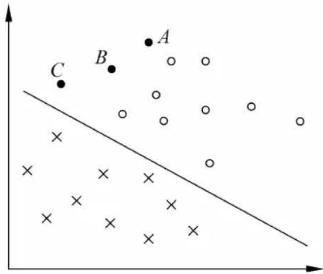  
图7.1 类分类问题

间隔最及相应的约束最优化问题将在下叙述。这先介绍函数间隔和何间隔的概念。

## 7.1.2 函数间隔和何间隔

在图7.1中，有A，B，C三个点，表示3个实例，均在分离超平面的正类一侧，预测它们的类。点A距分离超平较远，若预测该点为正类，就较确信预测是正确的；点C距分离超平较近，若预测该点为正类就不那么确信；点B介于点A与点C之间，预测其为正类的确信度也在A与C之间。

般来说，个点距离分离超平的远近可以表分类预测的确信程度。在超平$w \cdot x + b = 0$ 确定的情况下， $\vert w \cdot x + b \vert$ 能够相对地表点x距离超平的远近。 $w \cdot x + b$ 的符号与类标记y的符号是否致能够表分类是否正确，所以可量 $y ( w \cdot x + b )$ 来表示分类的正确性及确信度，这就是函数间隔（functional margin）的概念。

定义7.2（函数间隔） 对于给定的训练数据集T和超平面 $( w , b )$ ，定义超平面 $( w , b )$ 关于样本点 $( x _ { i } , y _ { i } )$ 的函数间隔为

$$
\hat { \gamma } _ { i } = y _ { i } ( w \cdot x _ { i } + b )\tag{7.3}
$$

定义超平面 $( w , b )$ 关于训练数据集T的函数间隔为超平面 $( w , b )$ 关于T中所有样本点$( x _ { i } , y _ { i } )$ 的函数间隔之最小值，即

$$
\hat { \gamma } = \operatorname* { m i n } _ { i = 1 , 2 , \cdots , N } \hat { \gamma } _ { i }\tag{7.4}
$$

函数间隔可以表分类预测的正确性及确信度。但是选择分离超平时，只有函数间隔还不够。因为只要成例地改变u和b，例如，将它们改为2w和2b，超平面并没有改变，但函数间隔却成为原来的两倍。这事实启我们，可以对分离超平的法向量w加某些约束，如规范化， $\| w \| = 1$ ，使得间隔是确定的。这时函数间隔成为何间隔（geometricmargin）。

图7.2给出了超平(w,b)及其法向量 $w _ { \circ }$ 点A表某实例 $x _ { i }$ ，其类标记为 $y _ { i } = + 1$ 点A与超平面(w,b)的距离由线段AB给出，记作 $\gamma _ { i }$ 。

$$
\gamma _ { i } = { \frac { w } { \| w \| } } \cdot x _ { i } + { \frac { b } { \| w \| } }
$$

其中， $\lVert \boldsymbol { w } \rVert$ 为u的 $L _ { 2 }$ 范数。这是点A在超平正的侧的情形。如果点A在超平负的侧，即 $y _ { i } = - 1$ ，那么点与超平的距离为

$$
\gamma _ { i } = - \left( { \frac { w } { \| w \| } } \cdot x _ { i } + { \frac { b } { \| w \| } } \right)
$$

般地，当样本点 $( x _ { i } , y _ { i } )$ 被超平面 $( w , b )$ 正确分类时，点 $x _ { i }$ 与超平面 $( w , b )$ 的距离是

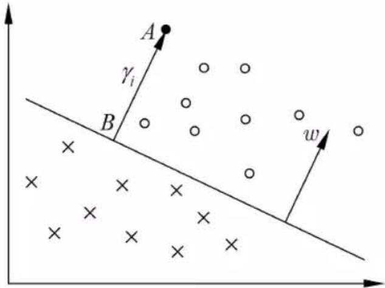  
图7.2 何间隔

$$
\gamma _ { i } = y _ { i } \left( { \frac { w } { \left\| w \right\| } } \cdot x _ { i } + { \frac { b } { \left\| w \right\| } } \right)
$$

由这事实导出何间隔的概念。

定义7.3（几何间隔） 对于给定的训练数据集T和超平面(w，b)，定义超平面 $( w , b )$ 关于样本点 $( x _ { i } , y _ { i } )$ 的几何间隔为

$$
\gamma _ { i } = y _ { i } \left( { \frac { w } { \| w \| } } \cdot x _ { i } + { \frac { b } { \| w \| } } \right)\tag{7.5}
$$

定义超平面 $( w , b )$ 关于训练数据集T的几何间隔为超平面 $( w , b )$ 关于T中所有样本点$( x _ { i } , y _ { i } )$ 的几何间隔之最小值，即

$$
\gamma = \operatorname* { m i n } _ { i = 1 , 2 , \cdots , N } \gamma _ { i }\tag{7.6}
$$

超平面(w,b)关于样本点 $( x _ { i } , y _ { i } )$ 的何间隔一般是实例点到超平面的带符号的距离（signeddistance），当样本点被超平正确分类时就是实例点到超平的距离。

从函数间隔和何间隔的定义(式(7.3)\~式(7.6)）可知，函数间隔和何间隔有下的关系：

$$
\gamma _ { i } = \frac { \hat { \gamma } _ { i } } { \lvert \lvert w \rvert \rvert }\tag{7.7}
$$

$$
\gamma = \frac { \hat { \gamma } } { \Vert w \Vert }\tag{7.8}
$$

如果 $\| w \| = 1$ ，那么函数间隔和何间隔相等。如果超平参数w和b成例地改变（超平没有改变），函数间隔也按此例改变，而何间隔不变。

## 7.1.3 间隔最大化

持向量机学习的基本想法是求解能够正确划分训练数据集并且何间隔最的分离超平。对线性可分的训练数据集，线性可分分离超平有穷多个（等价于感知机），但是何间隔最的分离超平是唯的。这的间隔最化又称为硬间隔最化（与将要讨论的训练数据集近似线性可分时的软间隔最化相对应)。

间隔最化的直观解释是：对训练数据集找到何间隔最的超平意味着以充分的确信度对训练数据进分类。也就是说，不仅将正负实例点分开，且对最难分的实例点（离超平最近的点）也有够的确信度将它们分开。这样的超平应该对未知的新实例有很好的分类预测能力。

## 1.最大间隔分离超平面

下考虑如何求得个何间隔最的分离超平，即最间隔分离超平。具体地，这个问题可以表示为下面的约束最优化问题：

$$
\begin{array} { r l } { \underset { w , b } { \operatorname* { m a x } } } & { \gamma } \\ { \mathrm { s . t . } } & { y _ { i } \left( \frac { w } { \left\| w \right\| } \cdot x _ { i } + \frac { b } { \left\| w \right\| } \right) \geqslant \gamma , \quad i = 1 , 2 , \cdots , N } \end{array}\tag{7.9}
$$

(7.10)

即我们希望最化超平 $( w , b )$ 关于训练数据集的几何间隔 $\gamma$ ，约束条件表示的是超平面$( w , b )$ 关于每个训练样本点的何间隔少是 $\gamma$

考虑何间隔和函数间隔的关系式(7.8)，可将这个问题改写为

$$
\operatorname* { m a x } _ { \boldsymbol { w } , \boldsymbol { b } } \quad \frac { \boldsymbol { \hat { \gamma } } } { \| \boldsymbol { w } \| }\tag{7.11}
$$

$$
\begin{array} { r } { \mathrm { s . t . } \quad y _ { i } ( w \bullet x _ { i } + b ) \geqslant \widehat { \gamma } , \quad i = 1 , 2 , \cdots , N } \end{array}\tag{7.12}
$$

函数间隔 $\hat { \gamma }$ 的取值并不影响最优化问题的解。事实上，假设将和b按例改变为λw和λb，这时函数间隔成为 $\lambda \hat { \gamma }$ 。函数间隔的这改变对上最优化问题的不等式约束没有影响，对标函数的优化也没有影响，也就是说，它产个等价的最优化问题。这样，就可以取 $\hat { \gamma } = 1 .$ 将 $\hat { \gamma } = 1$ 代入上面的最优化问题，注意到最大化 $\frac { 1 } { \| w \| }$ 和最小化 $\frac { 1 } { 2 } \| w \| ^ { 2 }$ 是等价的，于是就得到下的线性可分持向量机学习的最优化问题：

$$
\operatorname* { m i n } _ { \boldsymbol { w } , \boldsymbol { b } } \ \mathrm { ~ } \frac { 1 } { 2 } \| \boldsymbol { w } \| ^ { 2 }\tag{7.13}
$$

$$
\mathrm { s . t . } \quad y _ { i } ( w \bullet x _ { i } + b ) - 1 \geqslant 0 , \quad i = 1 , 2 , \cdots , N\tag{7.14}
$$

这是个凸次规划（convex quadratic programming）问题。

$\ntrianglerighteq$ 优化问题是指约束最优化问题：

$$
\operatorname* { m i n } _ { w } \quad f ( w )\tag{7.15}
$$

$$
\begin{array} { r } { \mathrm { s . t . } \quad g _ { i } ( w ) \leqslant 0 , \quad i = 1 , 2 , \cdot \cdot \cdot , k } \end{array}\tag{7.16}
$$

$$
h _ { i } ( w ) = 0 , \quad i = 1 , 2 , \cdots , l\tag{7.17}
$$

其中，标函数 $f ( w )$ 和约束函数 $g _ { i } ( w )$ 都是 $\pmb { R } ^ { n }$ 上的连续可微的凸函数，约束函数 $h _ { i } ( w )$ 是$\pmb { R } ^ { n }$ 上的仿射函数①。

当标函数 $f ( w )$ 是二次函数且约束函数 $g _ { i } ( w )$ 是仿射函数时，上述凸最优化问题成为凸次规划问题。

如果求出了约束最优化问题(7.13)\~(7.14)的解 $w ^ { * } , b ^ { * }$ ，那么就可以得到最大间隔分离超平面 $\boldsymbol { w } ^ { * } \cdot \boldsymbol { x } + b ^ { * } = 0$ 及分类决策函数 $f ( x ) = \mathrm { s i g n } ( w ^ { * } \cdot x + b ^ { * } )$ ，即线性可分持向量机模型。

综上所述，就有下的线性可分持向量机的学习算法—最间隔法（maximum marginmethod）。

算法7.1（线性可分持向量机学习算法 最大间隔法）

输：线性可分训练数据集 $T = \{ ( x _ { 1 } , y _ { 1 } ) , ( x _ { 2 } , y _ { 2 } ) , \cdots , ( x _ { N } , y _ { N } ) \}$ ，其中， $x _ { i } \in \mathcal { X } = R ^ { n }$ ,$y _ { i } \in \mathcal { V } = \{ - 1 , + 1 \} , i = 1 , 2 , \cdots , N { \mathrm { ~ } }$ )

输出：最间隔分离超平和分类决策函数。

（1）构造并求解约束最优化问题：

$$
\begin{array} { r l } & { \underset { w , b } { \operatorname* { m i n } } \quad \frac { 1 } { 2 } \| w \| ^ { 2 } } \\ & { \mathrm { s . t . } \quad y _ { i } ( w \cdot x _ { i } + b ) - 1 \geqslant 0 , \quad i = 1 , 2 , \cdot \cdot \cdot , N } \end{array}
$$

求得最优解 $w ^ { \ast } , b ^ { \ast }$ 。

(2）由此得到分离超平：

$$
\boldsymbol { w } ^ { * } \cdot \boldsymbol { x } + b ^ { * } = 0
$$

分类决策函数：

$$
f ( x ) = \mathrm { s i g n } ( w ^ { * } \cdot x + b ^ { * } )
$$

## 2.最大间隔分离超平的存在唯性

线性可分训练数据集的最间隔分离超平是存在且唯的。

定理7.1（最间隔分离超平面的存在唯性） 若训练数据集T线性可分，则可将训练数据集中的样本点完全正确分开的最大间隔分离超平面存在且唯一。

## 证明（1）存在性

由于训练数据集线性可分，所以算法7.1中的最优化问题(7.13)\~(7.14)定存在可解。由于标函数有下界，所以最优化问题(7.13)\~(7.14)必有解，记作 $( w ^ { * } , b ^ { * } )$ 。由于训练数据集中既有正类点又有负类点，所以 $( w , b ) = ( 0 , b )$ 不是最优化的可行解，因而最优解$( w ^ { * } , b ^ { * } )$ 必满足 $w ^ { * } \neq 0 ,$ 。由此得知分离超平的存在性。

## (2)唯性

先证明最优化问题(7.13)\~(7.14)解中 $w ^ { * }$ 的唯一性。假设问题(7.13)\~(7.14)存在两个最优解 $( w _ { 1 } ^ { * } , b _ { 1 } ^ { * } )$ 和 $( w _ { 2 } ^ { * } , b _ { 2 } ^ { * } )$ 。显然 $\| w _ { 1 } ^ { * } \| = \| w _ { 2 } ^ { * } \| = c ,$ ，其中c是一个常数。令 $w = \frac { w _ { 1 } ^ { * } + w _ { 2 } ^ { * } } { 2 } , b =$ $\frac { b _ { 1 } ^ { * } + b _ { 2 } ^ { * } } { 2 }$ ，易知 $( w , b )$ 是问题(7.13)\~(7.14)的可行解，从而有

$$
c \leqslant \| w \| \leqslant \frac { 1 } { 2 } \| w _ { 1 } ^ { * } \| + \frac { 1 } { 2 } \| w _ { 2 } ^ { * } \| = c
$$

上式表明，式中的不等号可变为等号，即 $\| w \| = \frac { 1 } { 2 } \| w _ { 1 } ^ { * } \| + \frac { 1 } { 2 } \| w _ { 2 } ^ { * } \|$ ，从有 $w _ { 1 } ^ { * } = \lambda w _ { 2 } ^ { * } , | \lambda | = 1$ 若λ=−1，则=0，(w,b)不是问题(7.13)\~(7.14)的可解，矛盾。因此必有λ=1，即

$$
w _ { 1 } ^ { * } = w _ { 2 } ^ { * }
$$

由此可以把两个最优解 $( w _ { 1 } ^ { * } , b _ { 1 } ^ { * } )$ 和 $( w _ { 2 } ^ { * } , b _ { 2 } ^ { * } )$ 分别写成 $( w ^ { * } , b _ { 1 } ^ { * } )$ 和 $( w ^ { * } , b _ { 2 } ^ { * } )$ 。再证明 $b _ { 1 } ^ { * } = b _ { 2 } ^ { * }$ 。设 $x _ { 1 } ^ { \prime }$ 和 $x _ { 2 } ^ { \prime }$ 是集合 $\{ x _ { i } | y _ { i } = + 1 \}$ 中分别对应于 $( w ^ { * } , b _ { 1 } ^ { * } )$ 和 $( w ^ { * } , b _ { 2 } ^ { * } )$ 使得问题的不等式等号成立的点， $x _ { 1 } ^ { \prime \prime }$ 和 $x _ { 2 } ^ { \prime \prime }$ 是集合 $\{ x _ { i } | y _ { i } = - 1 \}$ 中分别对应于 $( w ^ { * } , b _ { 1 } ^ { * } )$ 和 $( w ^ { * } , b _ { 2 } ^ { * } )$ 使得问题的不等式等号成立的点，则由 $b _ { 1 } ^ { * } = - \frac { 1 } { 2 } ( \boldsymbol { w } ^ { * } \cdot \boldsymbol { x } _ { 1 } ^ { \prime } + \boldsymbol { w } ^ { * } \cdot \boldsymbol { x } _ { 1 } ^ { \prime \prime } ) , ~ b _ { 2 } ^ { * } = - \frac { 1 } { 2 } ( \boldsymbol { w } ^ { * } \cdot \boldsymbol { x } _ { 2 } ^ { \prime } + \boldsymbol { w } ^ { * } \cdot \boldsymbol { x } _ { 2 } ^ { \prime \prime } )$ ，得：

$$
b _ { 1 } ^ { * } - b _ { 2 } ^ { * } = - \frac { 1 } { 2 } [ \boldsymbol { w } ^ { * } \cdot ( \boldsymbol { x } _ { 1 } ^ { \prime } - \boldsymbol { x } _ { 2 } ^ { \prime } ) + \boldsymbol { w } ^ { * } \cdot ( \boldsymbol { x } _ { 1 } ^ { \prime \prime } - \boldsymbol { x } _ { 2 } ^ { \prime \prime } ) ]
$$

又因为

$$
\begin{array} { r } { w ^ { * } \bullet x _ { 2 } ^ { \prime } + b _ { 1 } ^ { * } \geqslant 1 = w ^ { * } \bullet x _ { 1 } ^ { \prime } + b _ { 1 } ^ { * } } \\ { w ^ { * } \bullet x _ { 1 } ^ { \prime } + b _ { 2 } ^ { * } \geqslant 1 = w ^ { * } \bullet x _ { 2 } ^ { \prime } + b _ { 2 } ^ { * } } \end{array}
$$

所以， $w ^ { \ast } \cdot \left( x _ { 1 } ^ { \prime } - x _ { 2 } ^ { \prime } \right) = 0$ 。同理有 $w ^ { \ast } \cdot ( x _ { 1 } ^ { \prime \prime } - x _ { 2 } ^ { \prime \prime } ) = 0$ 。因此，

$$
b _ { 1 } ^ { * } - b _ { 2 } ^ { * } = 0
$$

由 $w _ { 1 } ^ { * } = w _ { 2 } ^ { * }$ 和 $b _ { 1 } ^ { * } = b _ { 2 } ^ { * }$ 可知，两个最优解 $( w _ { 1 } ^ { * } , b _ { 1 } ^ { * } )$ 和 $( w _ { 2 } ^ { * } , b _ { 2 } ^ { * } )$ 是相同的，解的唯性得证。

由问题(7.13)\~(7.14)解的唯性即得分离超平是唯的。

(3）分离超平能将训练数据集中的两类点完全正确地分开。

由解满问题的约束条件即可得知。

## 3.支持向量和间隔边界

在线性可分情况下，训练数据集的样本点中与分离超平距离最近的样本点的实例称为持向量（supportvector）。持向量是使约束条件式(7.14）等号成的点，即

$$
y _ { i } ( w \cdot x _ { i } + b ) - 1 = 0
$$

对 $y _ { i } = + 1$ 的正例点，持向量在超平面

$$
\textstyle H _ { 1 } : w \bullet x + b = 1
$$

上，对 $y _ { i } = - 1$ 的负例点，支持向量在超平面

$$
H _ { 2 } : w \bullet x + b = - 1
$$

上。如图7.3所，在 $H _ { 1 }$ 和 $H _ { 2 }$ 上的点就是持向量。

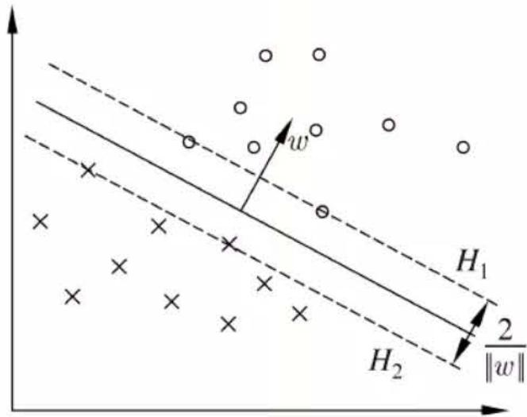  
图7.3 持向量

注意到 $H _ { 1 }$ 和 $H _ { 2 }$ 平行，并且没有实例点落在它们中间。在 $H _ { 1 }$ 与 $H _ { 2 }$ 之间形成一条带，分离超平与它们平且位于它们中央。长带的宽度，即 $H _ { 1 }$ 与 $H _ { 2 }$ 之间的距离称为间隔（margin）。间隔依赖于分离超平的法向量w，等于 $\frac { 2 } { \| w \| } \circ H _ { 1 }$ 和 $H _ { 2 }$ 称为间隔边界。

在决定分离超平时只有持向量起作，其他实例点并不起作。如果移动持向量，将改变所求的解；但是如果在间隔边界以外移动其他实例点，甚去掉这些点，则解是不会改变的。由于持向量在确定分离超平中起着决定性作，所以将这种分类模型称为持向量机。持向量的个数般很少，所以持向量机由很少的“重要的”训练样本确定。

例7.1 数据与例2.1相同。已知个如图7.4所的训练数据集，其正例点是 $x _ { 1 } =$ $( 3 , 3 ) ^ { \mathrm { T } } , x _ { 2 } = ( 4 , 3 ) ^ { \mathrm { T } }$ ，负例点是 $x _ { 3 } = ( 1 , 1 ) ^ { \mathrm { T } }$ ，试求最间隔分离超平。

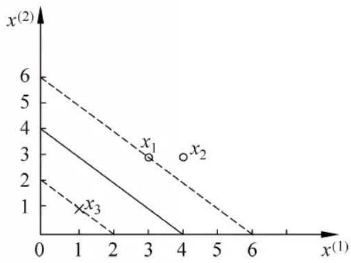  
图7.4 间隔最分离超平例

解 按照算法7.1，根据训练数据集构造约束最优化问题：

$$
\begin{array} { r l } { \underset { w , b } { \operatorname* { m i n } } } & { \frac { 1 } { 2 } ( w _ { 1 } ^ { 2 } + w _ { 2 } ^ { 2 } ) } \\ { \mathrm { s . t . } } & { 3 w _ { 1 } + 3 w _ { 2 } + b \geqslant 1 } \\ & { 4 w _ { 1 } + 3 w _ { 2 } + b \geqslant 1 } \\ & { - w _ { 1 } - w _ { 2 } - b \geqslant 1 } \end{array}
$$

求得此最优化问题的解 $w _ { 1 } = w _ { 2 } = \frac { 1 } { 2 } , \ b = - 2$ 。于是最间隔分离超平为

$$
{ \frac { 1 } { 2 } } x ^ { ( 1 ) } + { \frac { 1 } { 2 } } x ^ { ( 2 ) } - 2 = 0
$$

其中， $\boldsymbol { x } _ { 1 } = ( 3 , 3 ) ^ { \mathrm { T } }$ 与 $x _ { 3 } = ( 1 , 1 ) ^ { \mathrm { T } }$ 为支持向量。

## 7.1.4 学习的对偶算法

为了求解线性可分持向量机的最优化问题(7.13)\~(7.14)，将它作为原始最优化问题，应拉格朗对偶性（参阅附录C），通过求解对偶问题（dualproblem）得到原始问题（primalproblem）的最优解，这就是线性可分持向量机的对偶算法（dualalgorithm）。这样做的优点如下：是对偶问题往往更容易求解；是然引核函数，进推到线性分类问题。

先构建拉格朗函数（Lagrange function）。为此，对每个不等式约束(7.14)引拉格朗乘（Lagrange multiplier） $\alpha _ { i } \geqslant 0 , i = 1 , 2 , \cdots , N$ ，定义拉格朗函数：

$$
L ( w , b , \alpha ) = { \frac { 1 } { 2 } } \| w \| ^ { 2 } - \sum _ { i = 1 } ^ { N } \alpha _ { i } y _ { i } ( w \bullet x _ { i } + b ) + \sum _ { i = 1 } ^ { N } \alpha _ { i }\tag{7.18}
$$

其中， ${ \boldsymbol { \alpha } } = ( \alpha _ { 1 } , \alpha _ { 2 } , \cdot \cdot \cdot , \alpha _ { N } ) ^ { \mathrm { T } }$ 为拉格朗乘向量。

根据拉格朗对偶性，原始问题的对偶问题是极极问题：

$$
\operatorname* { m a x } _ { \alpha } \operatorname* { m i n } _ { w , b } L ( w , b , \alpha )
$$

所以，为了得到对偶问题的解，需要先求 $L ( w , b , \alpha )$ 对w,b的极小，再求对α的极大。

（1）求 $\operatorname* { m i n } _ { w , b } L ( w , b , \alpha )$

将拉格朗函数 $L ( w , b , \alpha )$ 分别对 $w , b$ 求偏导数并令其等于0:

$$
\begin{array} { l } { { \displaystyle \nabla _ { w } L ( w , b , \alpha ) = w - \sum _ { i = 1 } ^ { N } \alpha _ { i } y _ { i } x _ { i } = 0 } } \\ { { \displaystyle \nabla _ { b } L ( w , b , \alpha ) = - \sum _ { i = 1 } ^ { N } \alpha _ { i } y _ { i } = 0 } } \end{array}
$$

得：

$$
w = \sum _ { i = 1 } ^ { N } \alpha _ { i } y _ { i } x _ { i }\tag{7.19}
$$

$$
\sum _ { i = 1 } ^ { N } \alpha _ { i } y _ { i } = 0\tag{7.20}
$$

将式(7.19)代拉格朗函数(式(7.18))，并利式(7.20)，即得：

$$
\begin{array} { l } { \displaystyle { L ( w , b , \alpha ) = \frac { 1 } { 2 } \sum _ { i = 1 } ^ { N } \sum _ { j = 1 } ^ { N } \alpha _ { i } \alpha _ { j } y _ { i } y _ { j } ( x _ { i } \bullet x _ { j } ) - \sum _ { i = 1 } ^ { N } \alpha _ { i } y _ { i } \left[ \left( \sum _ { j = 1 } ^ { N } \alpha _ { j } y _ { j } x _ { j } \right) \bullet x _ { i } + b \right] + \sum _ { i = 1 } ^ { N } \alpha _ { i } y _ { i } \left[ \left( \sum _ { j = 1 } ^ { N } \alpha _ { i } y _ { j } y _ { j } \right) \bullet x _ { i } + b \right] } } \\ { \displaystyle { \quad = - \frac { 1 } { 2 } \sum _ { i = 1 } ^ { N } \sum _ { j = 1 } ^ { N } \alpha _ { i } \alpha _ { j } y _ { i } y _ { j } ( x _ { i } \bullet x _ { j } ) + \sum _ { i = 1 } ^ { N } \alpha _ { i } } } \end{array}
$$

即

$$
\operatorname* { m i n } _ { w , b } L ( w , b , \alpha ) = - \frac { 1 } { 2 } \sum _ { i = 1 } ^ { N } \sum _ { j = 1 } ^ { N } \alpha _ { i } \alpha _ { j } y _ { i } y _ { j } ( x _ { i } \bullet x _ { j } ) + \sum _ { i = 1 } ^ { N } \alpha _ { i }
$$

(2）求 $\operatorname* { m i n } _ { w , b } L ( w , b , \alpha )$ 对α的极大，即对偶问题

$$
\begin{array} { r l } { { \displaystyle \operatorname* { m a x } _ { \alpha } } } & { { - \displaystyle \frac { 1 } { 2 } \sum _ { i = 1 } ^ { N } \sum _ { j = 1 } ^ { N } \alpha _ { i } \alpha _ { j } y _ { i } y _ { j } ( x _ { i } \bullet x _ { j } ) + \sum _ { i = 1 } ^ { N } \alpha _ { i } } } \\ { { \mathrm { s . t . } } } & { { \displaystyle \sum _ { i = 1 } ^ { N } \alpha _ { i } y _ { i } = 0 } } \\ { { } } & { { \alpha _ { i } \geq 0 , \quad i = 1 , 2 , \cdots , N } } \end{array}\tag{7.21}
$$

将式(7.21）的标函数由求极转换成求极，就得到下与之等价的对偶最优化问题：

$$
\operatorname* { m i n } _ { \alpha } \quad \frac { 1 } { 2 } \sum _ { i = 1 } ^ { N } \sum _ { j = 1 } ^ { N } \alpha _ { i } \alpha _ { j } y _ { i } y _ { j } ( x _ { i } \bullet x _ { j } ) - \sum _ { i = 1 } ^ { N } \alpha _ { i }\tag{7.22}
$$

$$
\mathrm { s . t . } \sum _ { i = 1 } ^ { N } \alpha _ { i } y _ { i } = 0\tag{7.23}
$$

$$
\alpha _ { i } \geqslant 0 , \quad i = 1 , 2 , \cdots , N\tag{7.24}
$$

考虑原始最优化问题(7.13)\~(7.14)和对偶最优化问题(7.22)\~(7.24)，原始问题满定理C.2的条件，所以存在 $w ^ { \ast } , \alpha ^ { \ast } , \beta ^ { \ast }$ ，使 $w ^ { * }$ 是原始问题的解, $\alpha ^ { * } , \beta ^ { * }$ 是对偶问题的解。这意味着求解原始问题(7.13)\~(7.14)可以转换为求解对偶问题(7.22)\~(7.24)。

对线性可分训练数据集，假设对偶最优化问题(7.22)\~(7.24)对α的解为 ${ \boldsymbol { \alpha } } ^ { * } = ( \alpha _ { 1 } ^ { * } , \alpha _ { 2 } ^ { * } , \cdot \cdot$ $\alpha _ { N } ^ { * } ) ^ { \mathrm { T } }$ ，可以由 $\alpha ^ { * }$ 求得原始最优化问题(7.13)\~(7.14)对(w,b)的解 $w ^ { * } , b ^ { * }$ 。有下的定理。

定理7.2设 ${ \boldsymbol { \alpha } } ^ { * } = ( \alpha _ { 1 } ^ { * } , \alpha _ { 2 } ^ { * } , \cdots , \alpha _ { l } ^ { * } ) ^ { \mathrm { T } }$ 是对偶最优化问题(7.22)\~(7.24)的解，则存在下标j，使得 $\alpha _ { j } ^ { * } > 0$ ，并可按下式求得原始最优化问题(7.13)\~(7.14)的解 $w ^ { * } , b ^ { * }$

$$
w ^ { * } = \sum _ { i = 1 } ^ { N } \alpha _ { i } ^ { * } y _ { i } x _ { i }\tag{7.25}
$$

$$
b ^ { * } = y _ { j } - \sum _ { i = 1 } ^ { N } \alpha _ { i } ^ { * } y _ { i } ( x _ { i } \cdot x _ { j } )\tag{7.26}
$$

证明 根据定理C.3，KKT条件成，即得：

$$
\nabla _ { w } L ( w ^ { * } , b ^ { * } , \alpha ^ { * } ) = w ^ { * } - \sum _ { i = 1 } ^ { N } \alpha _ { i } ^ { * } y _ { i } x _ { i } = 0\tag{7.27}
$$

$$
\nabla _ { b } L ( w ^ { * } , b ^ { * } , \alpha ^ { * } ) = - \sum _ { i = 1 } ^ { N } \alpha _ { i } ^ { * } y _ { i } = 0
$$

$$
\alpha _ { i } ^ { * } ( y _ { i } ( w ^ { * } \cdot x _ { i } + b ^ { * } ) - 1 ) = 0 , \quad i = 1 , 2 , \cdots , N
$$

$$
y _ { i } ( w ^ { * } \bullet x _ { i } + b ^ { * } ) - 1 \geqslant 0 , \quad i = 1 , 2 , \cdot \cdot \cdot , N
$$

$$
\alpha _ { i } ^ { * } \geqslant 0 , \quad i = 1 , 2 , \cdot \cdot \cdot , N
$$

由此得：

$$
w ^ { * } = \sum _ { i } \alpha _ { i } ^ { * } y _ { i } x _ { i }
$$

其中少有个 $\alpha _ { j } ^ { * } > 0$ （反证法，假设 $\alpha ^ { * } = 0$ ，由式(7.27)可知 $w ^ { * } = 0$ ，而 $w ^ { * } = 0$ 不是原始最优化问题(7.13)\~(7.14)的解，产盾)，对此j有

$$
y _ { j } ( w ^ { * } \cdot x _ { j } + b ^ { * } ) - 1 = 0\tag{7.28}
$$

将式(7.25)代入式(7.28)并注意到 $y _ { j } ^ { 2 } = 1$ ，即得：

$$
b ^ { * } = y _ { j } - \sum _ { i = 1 } ^ { N } \alpha _ { i } ^ { * } y _ { i } ( x _ { i } \cdot x _ { j } )
$$

由此定理可知，分离超平面可以写成

$$
\sum _ { i = 1 } ^ { N } \alpha _ { i } ^ { * } y _ { i } ( x \bullet x _ { i } ) + b ^ { * } = 0\tag{7.29}
$$

分类决策函数可以写成

$$
f ( x ) = \mathrm { s i g n } \left[ \sum _ { i = 1 } ^ { N } \alpha _ { i } ^ { * } y _ { i } ( x \bullet x _ { i } ) + b ^ { * } \right]\tag{7.30}
$$

这就是说，分类决策函数只依赖于输x和训练样本输的内积。式(7.30)称为线性可分持向量机的对偶形式。

综上所述，对于给定的线性可分训练数据集，可以先求对偶问题(7.22)\~(7.24)的解$\alpha ^ { * }$ ，再利式(7.25)和式(7.26)求得原始问题的解 $w ^ { * } , b ^ { * }$ ，从得到分离超平及分类决策函数。这种算法称为线性可分持向量机的对偶学习算法，是线性可分持向量机学习的基本算法。

## 算法7.2（线性可分支持向量机学习算法）

输：线性可分训练集 $T = \{ ( x _ { 1 } , y _ { 1 } ) , ( x _ { 2 } , y _ { 2 } ) , \cdots , ( x _ { N } , y _ { N } ) \}$ ，其中 $x _ { i } \in \mathcal { X } = R ^ { n } , y _ { i } \in$ $\mathcal { Y } = \{ - 1 , + 1 \} , i = 1 , 2 , \cdots , N$ 。

输出：分离超平面和分类决策函数。

（1）构造并求解约束最优化问题：

$$
\begin{array} { l l } { \displaystyle \underset { \alpha } { \mathrm { m i n } } } & { \displaystyle \frac 1 2 \sum _ { i = 1 } ^ { N } \sum _ { j = 1 } ^ { N } \alpha _ { i } \alpha _ { j } y _ { i } y _ { j } \big ( x _ { i } \bullet x _ { j } \big ) - \sum _ { i = 1 } ^ { N } \alpha _ { i } } \\ { \mathrm { s . t . } } & { \displaystyle \sum _ { i = 1 } ^ { N } \alpha _ { i } y _ { i } = 0 } \\ & { \displaystyle \alpha _ { i } \geqslant 0 , \quad i = 1 , 2 , \cdots , N } \end{array}
$$

求得最优解 ${ \boldsymbol { \alpha } } ^ { * } = ( \alpha _ { 1 } ^ { * } , \alpha _ { 2 } ^ { * } , \cdots , \alpha _ { N } ^ { * } ) ^ { \mathrm { T } }$ 0

(2）计算

$$
\boldsymbol { w ^ { * } } = \sum _ { i = 1 } ^ { N } \alpha _ { i } ^ { * } y _ { i } \boldsymbol { x _ { i } }
$$

并选择 $\alpha ^ { * }$ 的个正分量 $\alpha _ { j } ^ { * } > 0$ ,计算

$$
b ^ { * } = y _ { j } - \sum _ { i = 1 } ^ { N } \alpha _ { i } ^ { * } y _ { i } ( x _ { i } \cdot x _ { j } )
$$

(3)求得分离超平：

$$
\boldsymbol { w } ^ { * } \boldsymbol { \cdot } \boldsymbol { x } + \boldsymbol { b } ^ { * } = 0
$$

分类决策函数：

$$
f ( x ) = \mathrm { s i g n } ( w ^ { * } \cdot x + b ^ { * } )
$$

在线性可分持向量机中，由式(7.25)、式(7.26)可知， $w ^ { * }$ 和 $b ^ { * }$ 只依赖于训练数据中对应于 $\alpha _ { i } ^ { * } > 0$ 的样本点 $( x _ { i } , y _ { i } )$ ，其他样本点对 $w ^ { * }$ 和 $b ^ { * }$ 没有影响。我们将训练数据中对应于 $\alpha _ { i } ^ { * } > 0$ 的实例点 $x _ { i } \in R ^ { n }$ 称为持向量。

定义7.4（支持向量） 考虑原始最优化问题(7.13)\~(7.14)及对偶最优化问题(7.22)\~(7.24)，将训练数据集中对应于 $\alpha _ { i } ^ { * } > 0$ 的样本点 $( x _ { i } , y _ { i } )$ 的实例 $x _ { i } \in R ^ { n }$ 称为支持向量。

根据这定义，持向量定在间隔边界上。由KKT互补条件可知：

$$
\alpha _ { i } ^ { * } ( y _ { i } ( w ^ { * } \cdot x _ { i } + b ^ { * } ) - 1 ) = 0 , \quad i = 1 , 2 , \cdots , N
$$

对应于 $\alpha _ { i } ^ { * } > 0$ 的实例 $x _ { i }$ ,有

$$
y _ { i } ( w ^ { * } \cdot x _ { i } + b ^ { * } ) - 1 = 0
$$

或

$$
w ^ { * } \cdot x _ { i } + b ^ { * } = \pm 1
$$

即 $x _ { i }$ 定在间隔边界上。这的持向量的定义与前给出的持向量的定义是致的。

例7.2 训练数据与例7.1相同。如图7.4所，正例点是 $x _ { 1 } = ( 3 , 3 ) ^ { \mathrm { T } } , x _ { 2 } = ( 4 , 3 ) ^ { \mathrm { T } }$ ,负例点是 $x _ { 3 } = ( 1 , 1 ) ^ { \mathrm { T } }$ ，试算法7.2求线性可分持向量机。

解 根据所给数据，对偶问题是

$$
\begin{array} { r l } { \displaystyle \operatorname* { m i n } _ { \alpha } } & { \displaystyle \frac { 1 } { 2 } \sum _ { i = 1 } ^ { N } \displaystyle \sum _ { j = 1 } ^ { N } \alpha _ { i } \alpha _ { j } y _ { i } y _ { j } ( x _ { i } \cdot x _ { j } ) - \displaystyle \sum _ { i = 1 } ^ { N } \alpha _ { i } } \\ & { \displaystyle = \frac { 1 } { 2 } \big ( 1 8 \alpha _ { 1 } ^ { 2 } + 2 5 \alpha _ { 2 } ^ { 2 } + 2 \alpha _ { 3 } ^ { 2 } + 4 2 \alpha _ { 1 } \alpha _ { 2 } - 1 2 \alpha _ { 1 } \alpha _ { 3 } - 1 4 \alpha _ { 2 } \alpha _ { 3 } \big ) - \alpha _ { 1 } - \alpha _ { 2 } - \alpha _ { 3 } } \\ { \mathrm { s . t . } \quad } & { \alpha _ { 1 } + \alpha _ { 2 } - \alpha _ { 3 } = 0 } \\ & { \alpha _ { i } \geqslant 0 , \quad i = 1 , 2 , 3 } \end{array}
$$

解这最优化问题。将 $\alpha _ { 3 } = \alpha _ { 1 } + \alpha _ { 2 }$ 代标函数并记为

$$
s ( \alpha _ { 1 } , \alpha _ { 2 } ) = 4 \alpha _ { 1 } ^ { 2 } + \frac { 1 3 } { 2 } \alpha _ { 2 } ^ { 2 } + 1 0 \alpha _ { 1 } \alpha _ { 2 } - 2 \alpha _ { 1 } - 2 \alpha _ { 2 }
$$

对件 $\alpha _ { 1 } , \alpha _ { 2 }$ 求偏导数并令其为0，易知 $s ( \alpha _ { 1 } , \alpha _ { 2 } )$ 在点 $\left( { \frac { 3 } { 2 } } , - 1 \right) ^ { \mathrm { T } }$ 取极值，但该点不满约束条$\alpha _ { 2 } \geqslant 0$ ，所以最值应在边界上达到。

当 $\alpha _ { 1 } = 0$ 时，最值 $s \left( 0 , { \frac { 2 } { 1 3 } } \right) = - { \frac { 2 } { 1 3 } }$ ：当 $\alpha _ { 2 } = 0$ 时，最小值 $s \left( \frac { 1 } { 4 } , 0 \right) = - \frac { 1 } { 4 }$ 。于是$s ( \alpha _ { 1 } , \alpha _ { 2 } )$ 在 $\alpha _ { 1 } = \frac { 1 } { 4 } , \alpha _ { 2 } = 0$ 达到最小，此时 $\alpha _ { 3 } = \alpha _ { 1 } + \alpha _ { 2 } = \frac { 1 } { 4 } \circ$

这样， $\alpha _ { 1 } ^ { * } = \alpha _ { 3 } ^ { * } = \frac { 1 } { 4 }$ 对应的实例点 $x _ { 1 } , x _ { 3 }$ 是支持向量。根据式(7.25)和式(7.26)计算得：

$$
\begin{array} { c } { { w _ { 1 } ^ { * } = w _ { 2 } ^ { * } = \displaystyle \frac { 1 } { 2 } } } \\ { { b ^ { * } = - 2 } } \end{array}
$$

分离超平面为

$$
{ \frac { 1 } { 2 } } x ^ { ( 1 ) } + { \frac { 1 } { 2 } } x ^ { ( 2 ) } - 2 = 0
$$

分类决策函数为

$$
f ( x ) = \mathrm { s i g n } \left( \frac { 1 } { 2 } x ^ { ( 1 ) } + \frac { 1 } { 2 } x ^ { ( 2 ) } - 2 \right)
$$

对于线性可分问题，上述线性可分持向量机的学习（硬间隔最化）算法是完美的。但是，训练数据集线性可分是理想的情形。在现实问题中，训练数据集往往是线性不可分的，即在样本中出现噪声或特异点。此时，有更般的学习算法。

## 7.2 线性持向量机与软间隔最化

## 7.2.1 线性持向量机

线性可分问题的持向量机学习法对线性不可分训练数据是不适的，因为这时上述法中的不等式约束并不能都成。怎么才能将它扩展到线性不可分问题呢？这就需要修改硬间隔最化，使其成为软间隔最化。

假设给定个特征空间上的训练数据集

$$
T = \{ ( x _ { 1 } , y _ { 1 } ) , ( x _ { 2 } , y _ { 2 } ) , \cdots , ( x _ { N } , y _ { N } ) \}
$$

其中， $x _ { i } \in \mathcal { X } = R ^ { n } , y _ { i } \in \mathcal { Y } = \{ + 1 , - 1 \} , i = 1 , 2 , \cdot \cdot \cdot , N , x _ { i }$ 为第i个特征向量， $y _ { i }$ 为 $x _ { i }$ 的类标记。再假设训练数据集不是线性可分的。通常情况是，训练数据中有些特异点（outlier），将这些特异点除去后，剩下部分的样本点组成的集合是线性可分的。

线性不可分意味着某些样本点 $( x _ { i } , y _ { i } )$ 不能满函数间隔于等于1的约束条件(7.14)。为了解决这个问题，可以对每个样本点 $( x _ { i } , y _ { i } )$ 引进个松弛变量 $\xi _ { i } \geqslant 0$ ，使函数间隔加上松弛变量大于等于1。这样，约束条件变为

$$
y _ { i } ( w \cdot x _ { i } + b ) \geqslant 1 - \xi _ { i }
$$

同时，对每个松弛变量 $\xi _ { i }$ ，付个代价 $\xi _ { i }$ 。标函数由原来的 $\frac { 1 } { 2 } \| w \| ^ { 2 }$ 变成

$$
\frac 1 2 \| w \| ^ { 2 } + C \sum _ { i = 1 } ^ { N } \xi _ { i }\tag{7.31}
$$

这里， $C > 0$ 称为惩罚参数，般由应问题决定，C值时对误分类的惩罚增，C值时对误分类的惩罚减。最化标函数(7.31)包含两层含义：使 $\frac { 1 } { 2 } \| w \| ^ { 2 }$ 尽量小即间隔尽量，同时使误分类点的个数尽量少，C是调和者的系数。

有了上的思路，可以和训练数据集线性可分时样来考虑训练数据集线性不可分时的线性持向量机学习问题。相应于硬间隔最化，它称为软间隔最化。

线性不可分的线性持向量机的学习问题变成如下凸次规划（convexquadraticprogramming）问题（原始问题）：

$$
\operatorname* { m i n } _ { \boldsymbol { w } , \boldsymbol { b } , \boldsymbol { \xi } } \quad \frac { 1 } { 2 } \| \boldsymbol { w } \| ^ { 2 } + C \sum _ { i = 1 } ^ { N } \xi _ { i }\tag{7.32}
$$

$$
\begin{array} { r } { \mathrm { s . t . } \quad y _ { i } ( w \bullet x _ { i } + b ) \geqslant 1 - \xi _ { i } , \quad i = 1 , 2 , \cdots , N } \end{array}\tag{7.33}
$$

$$
\xi _ { i } \geqslant 0 , \quad i = 1 , 2 , \cdot \cdot \cdot , N\tag{7.34}
$$

原始问题(7.32)\~(7.34)是个凸次规划问题，因关于 $( w , b , \xi )$ 的解是存在的。可以证明w的解是唯的，但b的解可能不唯，是存在于个区间[11]。

设原始问题(7.32)\~(7.34)的解是 $w ^ { * } , b ^ { * }$ ，于是可以得到分离超平面 $\boldsymbol { w } ^ { * } \cdot \boldsymbol { x } + b ^ { * } = 0$ 及分类决策函数 $f ( x ) = \mathrm { s i g n } ( w ^ { * } \cdot x + b ^ { * } )$ 。称这样的模型为训练样本线性不可分时的线性持向量机，简称为线性持向量机。显然，线性持向量机包含线性可分持向量机。由于现实中训练数据集往往是线性不可分的，线性持向量机具有更的适性。

下给出线性持向量机的定义。

定义7.5（线性持向量机） 对于给定的线性不可分的训练数据集，通过求解凸次规划问题，即软间隔最大化问题(7.32)\~(7.34)，得到的分离超平面为

$$
\boldsymbol { w } ^ { * } \cdot \boldsymbol { x } + \boldsymbol { b } ^ { * } = 0\tag{7.35}
$$

以及相应的分类决策函数

$$
f ( x ) = \mathrm { s i g n } ( w ^ { * } \cdot x + b ^ { * } )\tag{7.36}
$$

称为线性支持向量机。

## 7.2.2 学习的对偶算法

原始问题即式(7.32)\~式(7.34)的对偶问题是

$$
\operatorname* { m i n } _ { \alpha } \quad \frac { 1 } { 2 } \sum _ { i = 1 } ^ { N } \sum _ { j = 1 } ^ { N } \alpha _ { i } \alpha _ { j } y _ { i } y _ { j } ( x _ { i } \bullet x _ { j } ) - \sum _ { i = 1 } ^ { N } \alpha _ { i }\tag{7.37}
$$

$$
\mathrm { s . t . } \sum _ { i = 1 } ^ { N } \alpha _ { i } y _ { i } = 0\tag{7.38}
$$

$$
0 \leqslant \alpha _ { i } \leqslant C , \quad i = 1 , 2 , \cdots , N\tag{7.39}
$$

原始最优化问题即式(7.32)\~式(7.34)的拉格朗函数是

$$
L ( w , b , \xi , \alpha , \mu ) \equiv \frac { 1 } { 2 } \| w \| ^ { 2 } + C \sum _ { i = 1 } ^ { N } \xi _ { i } - \sum _ { i = 1 } ^ { N } \alpha _ { i } [ y _ { i } ( w \cdot x _ { i } + b ) - 1 + \xi _ { i } ] - \sum _ { i = 1 } ^ { N } \mu _ { i } \xi _ { i }\tag{7.40}
$$

其中， $\alpha _ { i } \geqslant 0 , \mu _ { i } \geqslant 0$

对偶问题是拉格朗函数的极极问题。先求L(w,b,ξ,α,)对w,b,ξ的极，由

$$
\nabla _ { w } L ( w , b , \xi , \alpha , \mu ) = w - \sum _ { i = 1 } ^ { N } \alpha _ { i } y _ { i } x _ { i } = 0
$$

$$
\nabla _ { b } L ( w , b , \xi , \alpha , \mu ) = - \sum _ { i = 1 } ^ { N } \alpha _ { i } y _ { i } = 0
$$

$$
\nabla _ { \xi _ { i } } L ( w , b , \xi , \alpha , \mu ) = C - \alpha _ { i } - \mu _ { i } = 0
$$

得：

$$
w = \sum _ { i = 1 } ^ { N } \alpha _ { i } y _ { i } x _ { i }\tag{7.41}
$$

$$
\sum _ { i = 1 } ^ { N } \alpha _ { i } y _ { i } = 0\tag{7.42}
$$

$$
C - \alpha _ { i } - \mu _ { i } = 0\tag{7.43}
$$

将式(7.41)\~式(7.43)代入式(7.40)，得：

$$
\operatorname* { m i n } _ { w , b , \xi } L ( w , b , \xi , \alpha , \mu ) = - \frac { 1 } { 2 } \sum _ { i = 1 } ^ { N } \sum _ { j = 1 } ^ { N } \alpha _ { i } \alpha _ { j } y _ { i } y _ { j } ( x _ { i } \bullet x _ { j } ) + \sum _ { i = 1 } ^ { N } \alpha _ { i }
$$

再对 $\operatorname* { m i n } _ { w , b , \xi } L ( w , b , \xi , \alpha , \mu )$ 求α的极大，即得对偶问题：

$$
\operatorname* { m a x } _ { \boldsymbol { \alpha } } \quad - \frac { 1 } { 2 } \sum _ { i = 1 } ^ { N } \sum _ { j = 1 } ^ { N } \alpha _ { i } \alpha _ { j } y _ { i } y _ { j } ( x _ { i } \bullet x _ { j } ) + \sum _ { i = 1 } ^ { N } \alpha _ { i }\tag{7.44}
$$

$$
\mathrm { s . t . } \sum _ { i = 1 } ^ { N } \alpha _ { i } y _ { i } = 0\tag{7.45}
$$

$$
C - \alpha _ { i } - \mu _ { i } = 0\tag{7.46}
$$

$$
\alpha _ { i } \geqslant 0\tag{7.47}
$$

$$
\mu _ { i } \geqslant 0 , \quad i = 1 , 2 , \cdot \cdot \cdot , N\tag{7.48}
$$

将对偶最优化问题(7.44)\~(7.48)进变换：利等式约束(7.46)消去 $\mu _ { i }$ ，从只留下变量 $\alpha _ { i }$ ，并将约束(7.46)\~(7.48)写成

$$
0 \leqslant \alpha _ { i } \leqslant C\tag{7.49}
$$

再将对标函数求极转换为求极，于是得到对偶问题(7.37)\~(7.39)。

可以通过求解对偶问题而得到原始问题的解，进而确定分离超平面和决策函数。为此，就可以以定理的形式叙述原始问题的最优解和对偶问题的最优解的关系。

定理7.3设 $\alpha ^ { * } = ( \alpha _ { 1 } ^ { * } , \alpha _ { 2 } ^ { * } , \cdots , \alpha _ { N } ^ { * } ) ^ { \mathrm { T } }$ 是对偶问题(7.37)\~(7.39)的一个解，若存在 $\alpha ^ { * }$ 的一个分量 $\alpha _ { j } ^ { \ast } , \ 0 < \alpha _ { j } ^ { \ast } < C$ ，则原始问题(7.32)\~(7.34)的解 $w ^ { * } , b ^ { * }$ 可按下式求得：

$$
w ^ { * } = \sum _ { i = 1 } ^ { N } \alpha _ { i } ^ { * } y _ { i } x _ { i }\tag{7.50}
$$

$$
b ^ { * } = y _ { j } - \sum _ { i = 1 } ^ { N } y _ { i } \alpha _ { i } ^ { * } ( x _ { i } \cdot x _ { j } )\tag{7.51}
$$

证明 原始问题是凸次规划问题，解满KKT条件，即得：

$$
\nabla _ { w } L ( w ^ { * } , b ^ { * } , \xi ^ { * } , \alpha ^ { * } , \mu ^ { * } ) = w ^ { * } - \sum _ { i = 1 } ^ { N } \alpha _ { i } ^ { * } y _ { i } x _ { i } = 0\tag{7.52}
$$

$$
\nabla _ { b } L ( w ^ { * } , b ^ { * } , \xi ^ { * } , \alpha ^ { * } , \mu ^ { * } ) = - \sum _ { i = 1 } ^ { N } \alpha _ { i } ^ { * } y _ { i } = 0
$$

$$
\nabla _ { \xi } L ( w ^ { * } , b ^ { * } , \xi ^ { * } , \alpha ^ { * } , \mu ^ { * } ) = C - \alpha ^ { * } - \mu ^ { * } = 0
$$

$$
\alpha _ { i } ^ { * } ( y _ { i } ( w ^ { * } \cdot x _ { i } + b ^ { * } ) - 1 + \xi _ { i } ^ { * } ) = 0\tag{7.53}
$$

$$
\mu _ { i } ^ { * } \xi _ { i } ^ { * } = 0\tag{7.54}
$$

$$
\begin{array} { c } { y _ { i } ( w ^ { * } \bullet x _ { i } + b ^ { * } ) - 1 + \xi _ { i } ^ { * } \geqslant 0 } \\ { \qquad \xi _ { i } ^ { * } \geqslant 0 } \\ { \qquad \alpha _ { i } ^ { * } \geqslant 0 } \\ { \qquad \mu _ { i } ^ { * } \geqslant 0 , \quad i = 1 , 2 , \cdots , N } \end{array}
$$

由式(7.52)易知式(7.50)成。再由式(7.53)～式(7.54)可知，若存在α， $0 < \alpha _ { j } ^ { * } < C$ 则 $y _ { i } ( w ^ { * } \cdot x _ { i } + b ^ { * } ) - 1 = 0$ 。由此即得式(7.51)。

由此定理可知，分离超平可以写成

$$
\sum _ { i = 1 } ^ { N } \alpha _ { i } ^ { * } y _ { i } ( x \bullet x _ { i } ) + b ^ { * } = 0\tag{7.55}
$$

分类决策函数可以写成

$$
f ( x ) = \mathrm { s i g n } \left[ \sum _ { i = 1 } ^ { N } \alpha _ { i } ^ { * } y _ { i } ( x \bullet x _ { i } ) + b ^ { * } \right]\tag{7.56}
$$

式(7.56)为线性持向量机的对偶形式。

综合前面的结果，有下面的算法。

算法7.3（线性持向量机学习算法）

输入：训练数据集 $T = \{ ( x _ { 1 } , y _ { 1 } ) , ( x _ { 2 } , y _ { 2 } ) , \cdot \cdot \cdot , ( x _ { N } , y _ { N } ) \}$ ，其中， $x _ { i } \in \mathcal { X } = R ^ { n } , ~ y _ { i } \in \mathcal { Y } =$ $\{ - 1 , + 1 \} , i = 1 , 2 , \cdots , N$

输出：分离超平面和分类决策函数。

(1）选择惩罚参数 $C > 0$ ，构造并求解凸次规划问题：

$$
\begin{array} { l l } { \displaystyle \underset { \alpha } { \mathrm { m i n } } } & { \displaystyle \frac { 1 } { 2 } et { } { ' } { \sum } \sum _ { i = 1 } ^ { N } \sum _ { j = 1 } ^ { N } \alpha _ { i } \alpha _ { j } y _ { i } y _ { j } ( x _ { i } \bullet x _ { j } ) - \sum _ { i = 1 } ^ { N } \alpha _ { i } } \\ { \mathrm { s . t . } } & { \displaystyle \sum _ { i = 1 } ^ { N } \alpha _ { i } y _ { i } = 0 } \\ & { \displaystyle 0 \leqslant \alpha _ { i } \leqslant C , \quad i = 1 , 2 , \cdots , N } \end{array}
$$

求得最优解 ${ \boldsymbol { \alpha } } ^ { * } = ( \alpha _ { 1 } ^ { * } , \alpha _ { 2 } ^ { * } , \cdots , \alpha _ { N } ^ { * } ) ^ { \mathrm { T } }$

（2）计算 $w ^ { * } = \sum _ { i = 1 } ^ { N } \alpha _ { i } ^ { * } y _ { i } x _ { i }$

选择 $\alpha ^ { * }$ 的个分量 $\alpha _ { j } ^ { * }$ 满足条件 $0 < \alpha _ { j } ^ { * } < C$ ,计算

$$
b ^ { * } = y _ { j } - \sum _ { i = 1 } ^ { N } y _ { i } \alpha _ { i } ^ { * } ( x _ { i } \cdot x _ { j } )
$$

(3）求得分离超平面：

$$
\boldsymbol { w } ^ { * } \cdot \boldsymbol { x } + \boldsymbol { b } ^ { * } = 0
$$

分类决策函数：

$$
f ( x ) = \mathrm { s i g n } ( w ^ { * } \cdot x + b ^ { * } )
$$

步骤(2)中，对任满条件 $0 < \alpha _ { j } ^ { * } < C$ 的 $\alpha _ { j } ^ { * }$ ，按式(7.51)都可求出 $b ^ { * }$ ，从理论上，原始问题(7.32)\~(7.34)对b的解可能不唯[11]，然在实际应中，往往只会出现算法叙述的情况。

## 7.2.3支持向量

在线性不可分的情况下，将对偶问题(7.37)\~(7.39)的解 ${ \boldsymbol { \alpha } } ^ { * } = ( \alpha _ { 1 } ^ { * } , \alpha _ { 2 } ^ { * } , \cdots , \alpha _ { N } ^ { * } ) ^ { \mathrm { T } }$ 中对应于 $\alpha _ { i } ^ { * } > 0$ 的样本点 $( x _ { i } , y _ { i } )$ 的实例 $x _ { i }$ 称为持向量(软间隔的持向量)。如图7.5所，这时的持向量要线性可分时的情况复杂些。图中，分离超平由实线表，间隔边界由虚线表，正例点由 $" _ { 0 } \boldsymbol { \cdot } \boldsymbol { \cdot }$ 表，负例点由“×”表示。图中还标出了实例 $x _ { i }$ 到间隔边界的距离 $\frac { \xi _ { i } } { \| w \| }$ 。

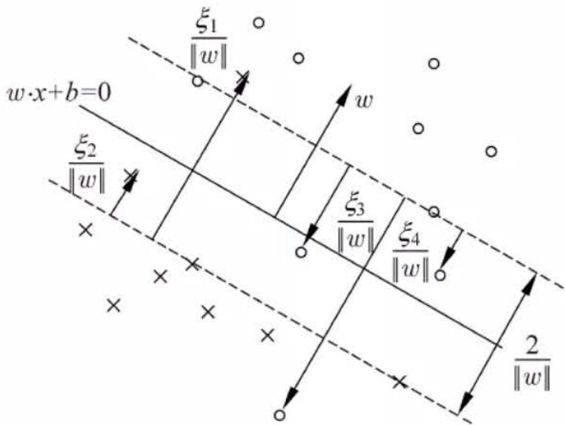  
图7.5 软间隔的持向量

软间隔的持向量 $x _ { i }$ 或者在间隔边界上，或者在间隔边界与分离超平之间，或者在分离超平误分侧。若 $\alpha _ { i } ^ { * } < C$ ，则 $\xi _ { i } = 0$ ，支持向量 $x _ { i }$ 恰好落在间隔边界上；若$\alpha _ { i } ^ { * } = C , 0 < \xi _ { i } < 1$ ，则分类正确， $x _ { i }$ 在间隔边界与分离超平面之间；若 $\alpha _ { i } ^ { * } = C , \xi _ { i } = 1$ ,则$x _ { i }$ 在分离超平面上；若 $\alpha _ { i } ^ { * } = C , \xi _ { i } > 1$ ，则 $x _ { i }$ 位于分离超平误分侧。

## 7.2.4 合页损失函数

对于线性持向量机学习来说，其模型为分离超平面 $w ^ { * } \cdot x + b ^ { * } = 0$ 及决策函数$f ( x ) = \mathrm { s i g n } ( w ^ { * } \cdot x + b ^ { * } )$ ，其学习策略为软间隔最化，学习算法为凸次规划。

线性持向量机学习还有另外种解释，就是最化以下标函数：

$$
\sum _ { i = 1 } ^ { N } [ 1 - y _ { i } ( w \cdot x _ { i } + b ) ] _ { + } + \lambda \| w \| ^ { 2 }\tag{7.57}
$$

标函数的第1项是经验损失或经验风险，函数

$$
L ( y ( w \cdot x + b ) ) = [ 1 - y ( w \cdot x + b ) ] _ { + }\tag{7.58}
$$

称为合页损失函数（hinge loss function）。下标“”表以下取正值的函数：

$$
[ z ] _ { + } = \left\{ { \begin{array} { l l } { z , } & { z > 0 } \\ { 0 , } & { z \leqslant 0 } \end{array} } \right.\tag{7.59}
$$

这就是说，当样本点 $( x _ { i } , y _ { i } )$ 被正确分类且函数间隔（确信度） $y _ { i } ( w \cdot x _ { i } + b )$ 大于1时，损失是0，否则损失是 $1 - y _ { i } ( w \cdot x _ { i } + b )$ 。注意到在图7.5中的实例点 $x _ { 4 }$ 被正确分类，但损失不是0。标函数的第2项是系数为λ的ω的 $L _ { 2 }$ 范数，是正则化项。

定理7.4线性支持向量机原始最优化问题

$$
\operatorname* { m i n } _ { \boldsymbol { w } , \boldsymbol { b } , \boldsymbol { \xi } } \quad \frac { 1 } { 2 } \| \boldsymbol { w } \| ^ { 2 } + C \sum _ { i = 1 } ^ { N } \xi _ { i }\tag{7.60}
$$

$$
\begin{array} { r } { \mathrm { s . t . } \quad y _ { i } ( w \bullet x _ { i } + b ) \geqslant 1 - \xi _ { i } , \quad i = 1 , 2 , \cdots , N } \end{array}\tag{7.61}
$$

$$
\xi _ { i } \geqslant 0 , \quad i = 1 , 2 , \cdots , N\tag{7.62}
$$

等价于最优化问题

$$
\operatorname* { m i n } _ { w , b } \quad \sum _ { i = 1 } ^ { N } [ 1 - y _ { i } ( w \bullet x _ { i } + b ) ] _ { + } + \lambda \| w \| ^ { 2 }\tag{7.63}
$$

证明 可将最优化问题(7.63)写成问题(7.60)\~(7.62)。令

$$
[ 1 - y _ { i } ( w \cdot x _ { i } + b ) ] _ { + } = \xi _ { i }\tag{7.64}
$$

则 $\xi _ { i } \geqslant 0$ ，式(7.62)成。由式(7.64)可知，当 $1 - y _ { i } ( w \bullet x _ { i } + b ) > 0$ 时，有 $y _ { i } ( w \cdot x _ { i } + b ) =$ $1 - \xi _ { i } ;$ 当 $1 - y _ { i } ( w \bullet x _ { i } + b ) \leqslant 0$ 时， $\xi _ { i } = 0$ ，有 $y _ { i } ( w \cdot x _ { i } + b ) \geq 1 - \xi _ { i } \circ$ 故式(7.61)成立。于是 $w , b , \xi _ { i }$ 满约束条件(7.61)\~(7.62)，所以最优化问题(7.63)可写成

$$
\operatorname* { m i n } _ { w , b } \quad \sum _ { i = 1 } ^ { N } \xi _ { i } + \lambda \| w \| ^ { 2 }
$$

若取 $\lambda = { \frac { 1 } { 2 C } }$ ，则

$$
\operatorname* { m i n } _ { w , b } \quad \frac { 1 } { C } \left( \frac { 1 } { 2 } \| w \| ^ { 2 } + C \sum _ { i = 1 } ^ { N } \xi _ { i } \right)
$$

与式(7.60)等价。

反之，也可将最优化问题(7.60)\~(7.62)表成问题(7.63)。

合页损失函数的图形如图7.6所，横轴是函数间隔 $y ( w \cdot x + b )$ ，纵轴是损失。由于函数形状像个合页，故名合页损失函数。图中还画出0-1损失函数，可以认为它是类分类问题的真正的损失函数，合页损失函数是0-1损失函数的上界。由于0-1损失函数不是连续可导的，直接优化由其构成的标函数较困难，可以认为线性持向量机是优化由0-1损失函数的上界（合页损失函数）构成的标函数。这时的上界损失函数又称为代理损失函数（surrogate loss function）。

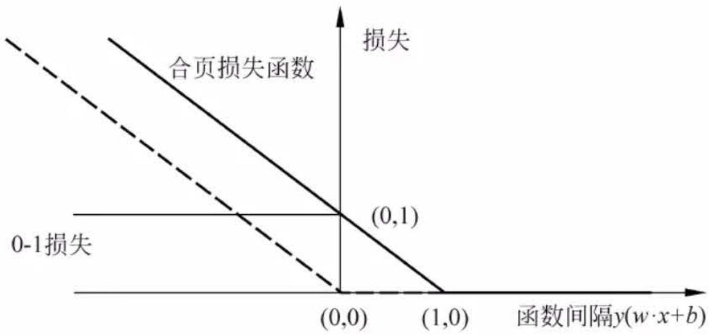  
图7.6 合页损失函数

图7.6中虚线显的是感知机的损失函数 $[ - y _ { i } ( w \cdot x _ { i } + b ) ] _ { + }$ 。这时，当样本点 $( x _ { i } , y _ { i } )$ 被正确分类时，损失是0，否则损失是 $- y _ { i } ( w \bullet x _ { i } + b )$ 。相之下，合页损失函数不仅要分类正确，而且确信度足够高时损失才是 $0 _ { \circ }$ 也就是说，合页损失函数对学习有更高的要求。

## 7.3 非线性支持向量机与核函数

对于解线性分类问题，线性分类持向量机是种常有效的法。但是，有时分类问题是线性的，这时可以使线性持向量机。本节叙述线性持向量机，其主要特点是利核技巧（kerneltrick）。为此，先要介绍核技巧。核技巧不仅应于持向量机，且应于其他统计学习问题。

## 7.3.1 核技巧

## 1.非线性分类问题

线性分类问题是指通过利线性模型才能很好地进分类的问题。先看个例：如图7.7左图，是个分类问题，图中“·”表正实例点，“×”表负实例点。由图可见，法直线（线性模型）将正负实例正确分开，但可以条椭圆曲线（线性模型）将它们正确分开。

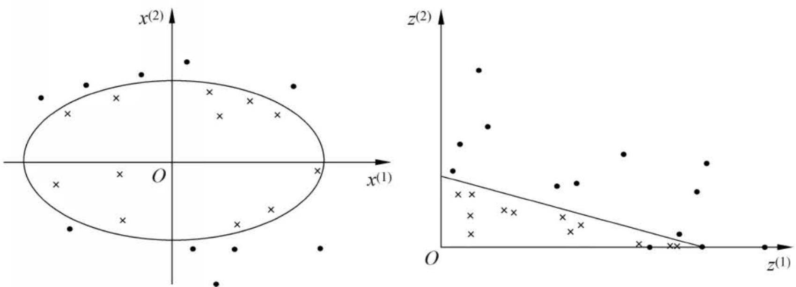

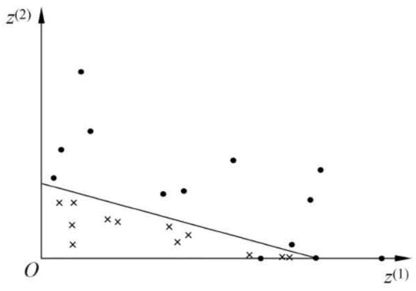  
图7.7 线性分类问题与核技巧例

般来说，对给定的个训练数据集 $T = \{ ( x _ { 1 } , y _ { 1 } ) , ( x _ { 2 } , y _ { 2 } ) , \cdot \cdot \cdot , ( x _ { N } , y _ { N } ) \}$ ，其中，实例$x _ { i }$ 属于输入空间， $x _ { i } \in \mathcal { X } = R ^ { n }$ ，对应的标记有两类 $y _ { i } \in \mathcal { V } = \{ - 1 , + 1 \} , \ i = 1 , 2 , \cdots , N _ { \circ }$ 如果能用 $\pmb { R } ^ { n }$ 中的个超曲将正负例正确分开，则称这个问题为线性可分问题。

线性问题往往不好求解，所以希望能解线性分类问题的法解决这个问题。所采取的法是进行一个线性变换，将非线性问题变换为线性问题，通过解变换后的线性问题的法求解原来的线性问题。对图7.7所的例，通过变换，将左图中椭圆变换成右图中的直线，将线性分类问题变换为线性分类问题。

设原空间为 $\mathcal { X } \subset R ^ { 2 } , \mathrm { ~ } x = ( x ^ { ( 1 ) } , x ^ { ( 2 ) } ) ^ { \mathrm { T } } \in \mathcal { X }$ ，新空间为 $\mathcal { Z } \subset R ^ { 2 } , z = ( z ^ { ( 1 ) } , z ^ { ( 2 ) } ) ^ { \mathrm { T } } \in \mathcal { Z }$ ,定义从原空间到新空间的变换（映射）：

$$
z = \phi ( \boldsymbol { x } ) = ( ( \boldsymbol { x } ^ { ( 1 ) } ) ^ { 2 } , ( \boldsymbol { x } ^ { ( 2 ) } ) ^ { 2 } ) ^ { \mathrm { T } }
$$

经过变换 $z = \phi ( x )$ ，原空间 $\mathcal { X } \subset R ^ { 2 }$ 变换为新空间 $\mathcal { Z } \subset R ^ { 2 }$ ，原空间中的点相应地变换为新空间中的点，原空间中的椭圆

$$
w _ { 1 } ( x ^ { ( 1 ) } ) ^ { 2 } + w _ { 2 } ( x ^ { ( 2 ) } ) ^ { 2 } + b = 0
$$

变换成为新空间中的直线

$$
w _ { 1 } z ^ { ( 1 ) } + w _ { 2 } z ^ { ( 2 ) } + b = 0
$$

在变换后的新空间，直线 $w _ { 1 } z ^ { ( 1 ) } + w _ { 2 } z ^ { ( 2 ) } + b = 0$ 可以将变换后的正负实例点正确分开。这样，原空间的线性可分问题就变成了新空间的线性可分问题。

上的例说明，线性分类法求解线性分类问题分为两步：先使个变换将原空间的数据映射到新空间，然后在新空间用线性分类学习法从训练数据中学习分类模型。核技巧就属于这样的法。

核技巧应到持向量机的基本想法就是通过个线性变换将输空间（欧空间$\pmb { R } ^ { n }$ 或离散集合）对应于个特征空间（希尔伯特空间H），使得在输空间 $\pmb { R } ^ { n }$ 中的超曲面模型对应于特征空间H中的超平模型（持向量机）。这样，分类问题的学习任务通过在特征空间中求解线性持向量机就可以完成。

## 2.核函数的定义

定义7.6（核函数） 设X是输入空间（欧氏空间 $\pmb { R } ^ { n }$ 的子集或离散集合)，又设H为特征空间（希尔伯特空间），如果存在一个从X到H的映射

$$
\phi ( x ) : \mathcal { X } \to \mathcal { H }\tag{7.65}
$$

使得对所有 $x , z \in { \mathcal { X } }$ ，函数 $K ( x , z )$ 满足条件

$$
K ( x , z ) = \phi ( x ) \cdot \phi ( z )\tag{7.66}
$$

则称 $K ( x , z )$ 为核函数， $\phi ( x )$ 为映射函数，式中 $\phi ( x ) \cdot \phi ( z )$ 为 $\phi ( x )$ 和 $\phi ( z )$ 的内积。

核技巧的想法是：在学习与预测中只定义核函数 $K ( x , z )$ ，而不显式地定义映射函数 $\phi _ { \odot }$ 通常，直接计算 $K ( x , z )$ 较容易，通过 $\phi ( x )$ 和 $\phi ( z )$ 计算 $K ( x , z )$ 并不容易。注意， $\phi$ 是输入空间 $\pmb { R } ^ { n }$ 到特征空间H的映射，特征空间H般是维的，甚至是穷维的。可以看到，对于给定的核 $K ( x , z )$ ，特征空间H和映射函数 $\phi$ 的取法并不唯一，可以取不同的特征空间，即便是在同特征空间也可以取不同的映射。

下举个简单的例来说明核函数和映射函数的关系。

例7.3 假设输入空间是 $R ^ { 2 }$ ，核函数是 $K ( x , z ) = ( x \cdot z ) ^ { 2 }$ ，试找出其相关的特征空间H和映射 $\phi ( x ) \colon R ^ { 2 } \to { \mathcal { H } }$ 。

解取特征空间 $\mathcal { H } = R ^ { 3 }$ ，记 $\boldsymbol { x } = ( x ^ { ( 1 ) } , x ^ { ( 2 ) } ) ^ { \mathrm { T } } , z = ( z ^ { ( 1 ) } , z ^ { ( 2 ) } ) ^ { \mathrm { T } }$ ,由于

$$
( x \bullet z ) ^ { 2 } = ( x ^ { ( 1 ) } z ^ { ( 1 ) } + x ^ { ( 2 ) } z ^ { ( 2 ) } ) ^ { 2 } = ( x ^ { ( 1 ) } z ^ { ( 1 ) } ) ^ { 2 } + 2 x ^ { ( 1 ) } z ^ { ( 1 ) } x ^ { ( 2 ) } z ^ { ( 2 ) } + ( x ^ { ( 2 ) } z ^ { ( 2 ) } ) ^ { 2 }
$$

所以可以取映射

$$
\phi ( x ) = ( ( x ^ { ( 1 ) } ) ^ { 2 } , \sqrt { 2 } x ^ { ( 1 ) } x ^ { ( 2 ) } , ( x ^ { ( 2 ) } ) ^ { 2 } ) ^ { \mathrm { T } }
$$

容易验证 $\phi ( x ) \bullet \phi ( z ) = ( x \bullet z ) ^ { 2 } = K ( x , z )$

仍取 $\mathcal { H } = R ^ { 3 }$ 以及

$$
\phi ( x ) = \frac { 1 } { \sqrt { 2 } } ( ( x ^ { ( 1 ) } ) ^ { 2 } - ( x ^ { ( 2 ) } ) ^ { 2 } , 2 x ^ { ( 1 ) } x ^ { ( 2 ) } , ( x ^ { ( 1 ) } ) ^ { 2 } + ( x ^ { ( 2 ) } ) ^ { 2 } ) ^ { \mathrm { T } }
$$

同样有 $\phi ( x ) \bullet \phi ( z ) = ( x \bullet z ) ^ { 2 } = K ( x , z )$

还可以取 $\mathcal { H } = R ^ { 4 }$ 和

$$
\phi ( x ) = ( ( x ^ { ( 1 ) } ) ^ { 2 } , x ^ { ( 1 ) } x ^ { ( 2 ) } , x ^ { ( 1 ) } x ^ { ( 2 ) } , ( x ^ { ( 2 ) } ) ^ { 2 } ) ^ { \mathrm { T } }
$$

## 3.核技巧在持向量机中的应

我们注意到在线性持向量机的对偶问题中，论是标函数还是决策函数(分离超平）都只涉及输实例与实例之间的内积。对偶问题的标函数(7.37）中的内积 $x _ { i } \cdot x _ { j }$ 可以用核函数 $K ( x _ { i } , x _ { j } ) = \phi ( x _ { i } ) \cdot \phi ( x _ { j } )$ 来代替，此时对偶问题的标函数成为

$$
W ( \alpha ) = \frac { 1 } { 2 } \sum _ { i = 1 } ^ { N } \sum _ { j = 1 } ^ { N } \alpha _ { i } \alpha _ { j } y _ { i } y _ { j } K ( x _ { i } , x _ { j } ) - \sum _ { i = 1 } ^ { N } \alpha _ { i }\tag{7.67}
$$

同样，分类决策函数中的内积也可以核函数代替，分类决策函数式成为

$$
\begin{array} { c l } { { \displaystyle f ( x ) = \mathrm { s i g n } \left( \sum _ { i = 1 } ^ { N _ { s } } a _ { i } ^ { * } y _ { i } \phi ( x _ { i } ) \bullet \phi ( x ) + b ^ { * } \right) } } \\ { { \displaystyle = \mathrm { s i g n } \left( \sum _ { i = 1 } ^ { N _ { s } } a _ { i } ^ { * } y _ { i } K ( x _ { i } , x ) + b ^ { * } \right) } } \end{array}\tag{7.68}
$$

这等价于经过映射函数 $\phi$ 将原来的输入空间变换到个新的特征空间，将输空间中的内积 $x _ { i } \cdot x _ { j }$ 变换为特征空间中的内积 $\phi ( x _ { i } ) \cdot \phi ( x _ { j } )$ ，在新的特征空间从训练样本中学习线性持向量机。当映射函数是线性函数时，学习到的含有核函数的持向量机是线性分类模型。

也就是说，在核函数 $K ( x , z )$ 给定的条件下，可以利解线性分类问题的法求解线性分类问题的持向量机。学习是隐式地在特征空间进的，不需要显式地定义特征空间和映射函数。这样的技巧称为核技巧，它是巧妙地利线性分类学习法与核函数解决线性问题的技术。在实际应中，往往依赖领域知识直接选择核函数，核函数选择的有效性需要通过实验验证。

## 7.3.2 正定核

已知映射函数 $\phi ,$ 可以通过 $\phi ( x )$ 和 $\phi ( z )$ 的内积求得核函数 $K ( x , z )$ 。不用构造映射 $\phi ( x )$ 能否直接判断个给定的函数 $K ( x , z )$ 是不是核函数？或者说，函数 $K ( x , z )$ 满什么条件才能成为核函数？

本节叙述正定核的充要条件。通常所说的核函数就是正定核函数（positive definitekernelfunction）。为证明此定理，先介绍有关的预备知识。

假设 $K ( x , z )$ 是定义在 $\mathcal { X } \times \mathcal { X }$ 上的对称函数，并且对任意的 $x _ { 1 } , x _ { 2 } , \cdots , x _ { m } \in \mathcal { X } , K ( x , z )$ 关于 $x _ { 1 } , x _ { 2 } , \cdots , x _ { m }$ 的Gram矩阵是半正定的。可以依据函数 $K ( x , z )$ ，构成个希尔伯特空间（Hilbertspace），其步骤是：先定义映射 $\phi$ 并构成向量空间S，然后在 $s$ 上定义内积构成内积空间，最后将S完备化构成希尔伯特空间。

## 1.定义映射，构成向量空间S

先定义映射

$$
\phi : x  K ( \cdot , x )\tag{7.69}
$$

根据这映射，对任意 $x _ { i } \in \mathcal { X } , ~ , ~ \alpha _ { i } \in R  , ~ i = 1 , 2 , \cdot \cdot \cdot ~ , m$ ，定义线性组合

$$
f ( \bullet ) = \sum _ { i = 1 } ^ { m } \alpha _ { i } K ( \bullet , x _ { i } )\tag{7.70}
$$

考虑由线性组合为元素的集合 $\boldsymbol { S } _ { \mathrm { { \scriptsize ~ c } } }$ ，由于集合S对加法和数乘运算是封闭的，所以S构成个向量空间。

## 2.在S上定义内积，使其成为内积空间

在S上定义个运算\*：对任意 $f , g \in S$ ,有

$$
f ( \bullet ) = \sum _ { i = 1 } ^ { m } \alpha _ { i } K ( \bullet , x _ { i } )\tag{7.71}
$$

$$
g ( \mathbf { \sigma } \cdot \mathbf { \sigma } ) = \sum _ { j = 1 } ^ { l } \beta _ { j } K ( \mathbf { \sigma } \cdot \mathbf { \sigma } , z _ { j } )\tag{7.72}
$$

定义运算\*:

$$
f * g = \sum _ { i = 1 } ^ { m } \sum _ { j = 1 } ^ { l } \alpha _ { i } \beta _ { j } K ( x _ { i } , z _ { j } )\tag{7.73}
$$

证明运算\*是空间S的内积。为此要证明：

(1) (cf) \* g = c(f \* g), c ∈ R

(7.74)

$$
( 2 ) \ ( f + g ) * h = f * h + g * h , \ h \in S\tag{7.75}
$$

$$
( 3 ) \ f * g = g * f\tag{7.76}
$$

$$
( 4 ) \ f * f \geqslant 0\tag{7.77}
$$

$$
f * f = 0 \Leftrightarrow f = 0\tag{7.78}
$$

其中，步骤(1)\~步骤(3)由式(7.70)\~式(7.72)及 $K ( x , z )$ 的对称性容易得到。现证明步骤(4) 之式(7.77)。由式(7.70) 及式(7.73)可得：

$$
f * f = \sum _ { i , j = 1 } ^ { m } \alpha _ { i } \alpha _ { j } K ( x _ { i } , x _ { j } )
$$

由Gram矩阵的半正定性知上式右端负，即 $f * f \geqslant 0 .$

再证明步骤(4)之式(7.78)。充分性显然。为证必要性，先证明不等式：

$$
| f * g | ^ { 2 } \leqslant ( f * f ) ( g * g )\tag{7.79}
$$

设 $f , g \in S , \lambda \in R$ ，则 $f + \lambda g \in S$ ，于是，

$$
\begin{array} { c } { { ( f + \lambda g ) * ( f + \lambda g ) \geqslant 0 } } \\ { { } } \\ { { f * f + 2 \lambda ( f * g ) + \lambda ^ { 2 } ( g * g ) \geqslant 0 } } \end{array}
$$

其左端是入的次三项式，负，其判别式于等于0，即

$$
( f * g ) ^ { 2 } - ( f * f ) ( g * g ) \leqslant 0
$$

于是式(7.79)得证。现证明若 $f * f = 0$ ，则 $f = 0$ 。事实上，若

$$
f ( \bullet ) = \sum _ { i = 1 } ^ { m } \alpha _ { i } K ( \bullet , x _ { i } )
$$

则按运算\*的定义式(7.73)，对任意的 $x \in \mathcal { X }$ ,有

$$
K ( \bullet , x ) * f = \sum _ { i = 1 } ^ { m } \alpha _ { i } K ( x , x _ { i } ) = f ( x )
$$

于是，

$$
| f ( x ) | ^ { 2 } = | K ( \mathbf { \partial } \cdot , x ) * f | ^ { 2 }\tag{7.80}
$$

由式(7.79)和式(7.77)有

$$
\begin{array} { l } { | K ( \bullet , x ) * f | ^ { 2 } \leqslant ( K ( \bullet , x ) * K ( \bullet , x ) ) ( f * f ) } \\ { \qquad = K ( x , x ) ( f * f ) } \end{array}
$$

由式(7.80)有

$$
| f ( x ) | ^ { 2 } \leqslant K ( x , x ) ( f * f )
$$

此式表明，当 $f * f = 0$ 时，对任意的x都有 $| f ( x ) | = 0$ o

此，证明了\*为向量空间S的内积，赋予内积的向量空间为内积空间。因此S是个内积空间。既然\*为S的内积运算，那么仍然·表，即若

$$
f ( \bullet ) = \sum _ { i = 1 } ^ { m } \alpha _ { i } K ( \bullet , x _ { i } ) , \quad g ( \bullet ) = \sum _ { i = 1 } ^ { l } \beta _ { j } K ( \bullet , z _ { j } )
$$

则

$$
f \bullet g = \sum _ { i = 1 } ^ { m } \sum _ { j = 1 } ^ { l } \alpha _ { i } \beta _ { j } K ( x _ { i } , z _ { j } )\tag{7.81}
$$

3.将内积空间S完备化为希尔伯特空间

现在将内积空间S完备化。由式(7.81)定义的内积可以得到范数

$$
\| f \| = { \sqrt { f \cdot f } }\tag{7.82}
$$

因此，S是个赋范向量空间。根据泛函分析理论，对于不完备的赋范向量空间S，定可以使之完备化，得到完备的赋范向量空间H。对于个内积空间，当作为个赋范向量空间是完备的时候，就是希尔伯特空间。这样，就得到了希尔伯特空间H。这希尔伯特空间H称为再核希尔伯特空间（reproducing kernel Hilbert space，RKHS）。这是由于核K具有再生性，即满足

$$
K ( \cdot , x ) \cdot f = f ( x )\tag{7.83}
$$

及

$$
K ( \bullet , x ) \bullet K ( \bullet , z ) = K ( x , z )\tag{7.84}
$$

称为再生核。

## 4.正定核的充要条件

定理7.5（正定核的充要条件） 设 $K : \mathcal { X } \times \mathcal { X }  R$ 是对称函数，则 $K ( x , z )$ 为正定核函数的充要条件是对任意 $x _ { i } \in \mathcal { X } , \ i = 1 , 2 , \cdots , m , \ K ( x , z )$ 对应的Gram 矩阵

$$
K = [ K ( x _ { i } , x _ { j } ) ] _ { m \times m }\tag{7.85}
$$

是半正定矩阵。

证明 必要性。由于 $K ( x , z )$ 是 $\mathcal { X } \times \mathcal { X }$ 上的正定核，所以存在从X到希尔伯特空间H的映射 $\phi ,$ ,使得

$$
K ( x , z ) = \phi ( x ) \cdot \phi ( z )
$$

于是，对任意 $x _ { 1 } , x _ { 2 } , \cdots , x _ { m }$ ，构造 $K ( x , z )$ 关于 $x _ { 1 } , x _ { 2 } , \cdots , x _ { m }$ 的Gram矩阵：

$$
[ K _ { i j } ] _ { m \times m } = [ K ( x _ { i } , x _ { j } ) ] _ { m \times m }
$$

对任意 $c _ { 1 } , c _ { 2 } , \cdots , c _ { m } \in R$ 有

$$
\begin{array} { l } { { \displaystyle \sum _ { i , j = 1 } ^ { m } c _ { i } c _ { j } K ( x _ { i } , x _ { j } ) = \sum _ { i , j = 1 } ^ { m } c _ { i } c _ { j } \big ( \phi ( x _ { i } ) \bullet \phi ( x _ { j } ) \big ) } } \\ { ~ } \\ { { \displaystyle = \left( \sum _ { i } c _ { i } \phi ( x _ { i } ) \right) \cdot \left( \sum _ { j } c _ { j } \phi ( x _ { j } ) \right) } } \\ { { \displaystyle = \left\| \sum _ { i } c _ { i } \phi ( x _ { i } ) \right\| ^ { 2 } \geqslant 0 } } \end{array}
$$

表明 $K ( x , z )$ 关于 $x _ { 1 } , x _ { 2 } , \cdots , x _ { m }$ 的Gram矩阵是半正定的。

充分性。对任意 $x _ { 1 } , x _ { 2 } , \cdots , x _ { m } \in \mathcal { X }$ ，已知对称函数 $K ( x , z )$ 关于 $x _ { 1 } , x _ { 2 } , \cdots , x _ { m }$ 的Gram矩阵是半正定的。根据前的结果，对给定的 $K ( x , z )$ ，可以构造从X到某个希尔伯特空间H的映射：

$$
\phi : x  K ( \cdot , x )\tag{7.86}
$$

由式(7.83)可知：

$$
K ( \cdot , x ) \cdot f = f ( x )
$$

并且

$$
K ( \mathbf { \partial } \bullet , x ) \bullet K ( \mathbf { \partial } \bullet , z ) = K ( x , z )
$$

由式(7.86)即得：

$$
K ( x , z ) = \phi ( x ) \cdot \phi ( z )
$$

表明 $K ( x , z )$ 是 $\mathcal { X } \times \mathcal { X }$ 上的核函数。

定理给出了正定核的充要条件，因此可以作为正定核，即核函数的另定义。

定义7.7（正定核的等价定义） 设 $\mathcal { X } \subset R ^ { n } , \ K ( x , z )$ 是定义在 $\mathcal { X } \times \mathcal { X }$ 上的对称函数，如果对任意 $x _ { i } \in \mathcal { X } , \ i = 1 , 2 , \cdots , m , \ K ( x , z )$ 对应的 Gram 矩阵

$$
K = [ K ( x _ { i } , x _ { j } ) ] _ { m \times m }\tag{7.87}
$$

是半正定矩阵，则称 $K ( x , z )$ 是正定核。

这定义在构造核函数时很有。但对于个具体函数 $K ( x , z )$ 来说，检验它是否为正定核函数并不容易，因为要求对任意有限输集 $\{ x _ { 1 } , x _ { 2 } , \cdots , x _ { m } \}$ 验证K对应的Gram矩阵是否为半正定的。在实际问题中往往应已有的核函数。另外，由Mercer定理可以得到Mercer核（Mercer kernel）[11]，正定核Mercer核更具般性。下介绍些常的核函数。

## 7.3.3 常用核函数

1.多项式核函数（polynomialkernel function)

$$
K ( x , z ) = ( x \bullet z + 1 ) ^ { p }\tag{7.88}
$$

对应的持向量机是个p次多项式分类器。在此情形下，分类决策函数成为

$$
f ( x ) = \mathrm { s i g n } \left[ \sum _ { i = 1 } ^ { N _ { s } } a _ { i } ^ { * } y _ { i } ( x _ { i } \bullet x + 1 ) ^ { p } + b ^ { * } \right]\tag{7.89}
$$

## 2.高斯核函数(Gaussian kernel function)

$$
K ( x , z ) = \exp \left( { - \frac { \| x - z \| ^ { 2 } } { 2 \sigma ^ { 2 } } } \right)\tag{7.90}
$$

对应的持向量机是斯径向基函数（radialbasisfunction）分类器。在此情形下，分类决策函数成为

$$
f ( x ) = \mathrm { s i g n } \left[ \sum _ { i = 1 } ^ { N _ { s } } a _ { i } ^ { * } y _ { i } \exp \left( - \frac { \| x - x _ { i } \| ^ { 2 } } { 2 \sigma ^ { 2 } } \right) + b ^ { * } \right]\tag{7.91}
$$

## 3.字符串核函数(stringkernel function)

核函数不仅可以定义在欧空间上，还可以定义在离散数据的集合上。如，字符串核是定义在字符串集合上的核函数。字符串核函数在本分类、信息检索、物信息学等都有应用。

考虑个有限字符表。字符串s是从中取出的有限个字符的序列，包括空字符串。字符串。的长度用 $| s |$ 表示，它的元素记作 $s ( 1 ) s ( 2 ) \cdots s ( | s | )$ 。两个字符串s和t的连接记作$s t _ { \circ }$ 所有长度为n的字符串的集合记作 $\varSigma ^ { n }$ ，所有字符串的集合记作 $\Sigma ^ { * } = \bigcup _ { n = 0 } ^ { \infty } \Sigma ^ { n }$ 0

考虑字符串s的子串 $u _ { \circ }$ 给定一个指标序列 $i = ( i _ { 1 } , i _ { 2 } , \cdots , i _ { | u | } ) , 1 \leqslant i _ { 1 } < i _ { 2 } < \cdots <$ $i _ { | u | } \leqslant | s |$ ，的子串定义为 $u = s ( i ) = s ( i _ { 1 } ) s ( i _ { 2 } ) \cdot \cdot \cdot s ( i _ { | u | } )$ ，其长度记作 $l ( i ) = i _ { | u | } - i _ { 1 } + 1$ 。如果i是连续的，则 $l ( i ) = | u | ;$ 否则， $l ( i ) > | u |$ 0

假设S是长度于或等于n的字符串的集合，s是S的元素。现在建字符串集合S到特征空间 $\mathcal { H } _ { n } = { \cal R } ^ { \Sigma ^ { n } }$ 的映射 $\phi _ { n } ( s ) \circ R ^ { \Sigma ^ { n } }$ 表示定义在 $\Sigma ^ { n }$ 上的实数空间，其每维对应个字符串 $u \in \Sigma ^ { n }$ ,映射 $\phi _ { n } ( s )$ 将字符串s对应于空间 $R ^ { \Sigma ^ { n } }$ 的个向量，其在u维上的取值为

$$
[ \phi _ { n } ( s ) ] _ { u } = \sum _ { i : s ( i ) = u } \lambda ^ { l ( i ) }\tag{7.92}
$$

这里， $0 < \lambda \leqslant 1$ 是个衰减参数，l(i）表字符串i的长度，求和在s中所有与u相同的串上进行。

例如，假设为英字符集，n为3，S为长度于或等于3的字符串的集合。考虑将字符集S映射到特征空间 $H _ { 3 \circ } \ H _ { 3 }$ 的维对应于字符串asd。这时，字符串 $^ { \mathrm { * } } \mathrm { N a s d a q } ^ { \mathrm { * } }$ 与 $^ { 6 6 } \mathrm { l a s s }$ $\mathrm { { d a s } } ^ { \prime \prime }$ 在这维上的值分别是 $[ \phi _ { 3 } ( \mathrm { N a s d a q } ) ] _ { \mathrm { a s d } } = \lambda ^ { 3 }$ 和 $[ \phi _ { 3 } ( \mathrm { l a s s } \mathrm { } \mathrm { } \sqcup \mathrm { } \mathrm { { d a s } } ) ] _ { \mathrm { { a s d } } } = 2 \lambda ^ { 5 }$ （口为空格）。在第1个字符串，asd是连续的串。在第2个字符串，asd是长度为5的不连续串，共出现两次。

两个字符串s和t上的字符串核函数是基于映射 $\phi _ { n }$ 的特征空间中的内积：

$$
\begin{array} { l } { { \displaystyle k _ { n } ( s , t ) = \sum _ { u \in \Sigma ^ { n } } [ \phi _ { n } ( s ) ] _ { u } [ \phi _ { n } ( t ) ] _ { u } } } \\ { { \displaystyle \ = \sum _ { u \in \Sigma ^ { n } } \sum _ { ( i , j ) : s ( i ) = t ( j ) = u } \lambda ^ { l ( i ) } \lambda ^ { l ( j ) } } } \end{array}\tag{7.93}
$$

字符串核函数 $k _ { n } ( s , t )$ 给出了字符串s和t中长度等于n的所有子串组成的特征向量的余弦相似度（cosine similarity）。直观上，两个字符串相同的串越多，它们就越相似，字符串核函数的值就越。字符串核函数可以由动态规划快速地计算。

## 7.3.4 线性持向量分类机

如上所述，利用核技巧，可以将线性分类的学习方法应用到非线性分类问题中去。将线性持向量机扩展到线性持向量机，只需将线性持向量机对偶形式中的内积换成核函数。

定义7.8（线性持向量机） 从线性分类训练集，通过核函数与软间隔最化或凸二次规划(7.95)\~(7.97)学习得到的分类决策函数

$$
f ( x ) = \mathrm { s i g n } \left( \sum _ { i = 1 } ^ { N } \alpha _ { i } ^ { * } y _ { i } K ( x , x _ { i } ) + b ^ { * } \right)\tag{7.94}
$$

称为非线性支持向量机， $K ( x , z )$ 是正定核函数。

下叙述线性持向量机学习算法。

算法7.4（非线性支持向量机学习算法）

输入：训练数据集 $T = \{ ( x _ { 1 } , y _ { 1 } ) , ( x _ { 2 } , y _ { 2 } ) , \cdot \cdot \cdot , ( x _ { N } , y _ { N } ) \}$ ，其中 $x _ { i } \in \mathcal { X } = R ^ { n } , \ y _ { i } \in \mathcal { Y } =$ $\{ - 1 , + 1 \}$ , $i = 1 , 2 , \cdots , N$ 。

输出：分类决策函数。

（1）选取适当的核函数 $K ( x , z )$ 和适当的参数C，构造并求解最优化问题

$$
\operatorname* { m i n } _ { \alpha } \quad \frac { 1 } { 2 } \sum _ { i = 1 } ^ { N } \sum _ { j = 1 } ^ { N } \alpha _ { i } \alpha _ { j } y _ { i } y _ { j } K ( x _ { i } , x _ { j } ) - \sum _ { i = 1 } ^ { N } \alpha _ { i }\tag{7.95}
$$

$$
\mathrm { s . t . } \sum _ { i = 1 } ^ { N } \alpha _ { i } y _ { i } = 0\tag{7.96}
$$

$$
0 \leqslant \alpha _ { i } \leqslant C , \quad i = 1 , 2 , \cdots , N\tag{7.97}
$$

求得最优解 ${ \boldsymbol { \alpha } } ^ { * } = ( \alpha _ { 1 } ^ { * } , \alpha _ { 2 } ^ { * } , \cdots , \alpha _ { N } ^ { * } ) ^ { \mathrm { T } }$

(2）选择 $\alpha ^ { * }$ 的一个正分量 $0 < \alpha _ { j } ^ { * } < C$ ,计算

$$
b ^ { * } = y _ { j } - \sum _ { i = 1 } ^ { N } \alpha _ { i } ^ { * } y _ { i } K ( x _ { i } , x _ { j } )
$$

(3）构造决策函数：

$$
f ( x ) = \mathrm { s i g n } \left( \sum _ { i = 1 } ^ { N } \alpha _ { i } ^ { * } y _ { i } K ( x , x _ { i } ) + b ^ { * } \right)
$$

当 $K ( x , z )$ 是正定核函数时，问题(7.95)\~(7.97)是凸次规划问题，解是存在的。

## 7.4 序列最小最优化算法

本节讨论持向量机学习的实现问题。我们知道，持向量机的学习问题可以形式化为求解凸次规划问题。这样的凸次规划问题具有全局最优解，并且有许多最优化算法可以于这问题的求解。但是当训练样本容量很时，这些算法往往变得常低效，以致法使。所以，如何效地实现持向量机学习就成为个重要的问题。前们已提出许多快速实现算法。本节讲述其中的序列最最优化（sequentialminimaloptimization，SMO）算法，这种算法于1998年由Platt提出。

SMO算法要解如下凸次规划的对偶问题：

$$
\operatorname* { m i n } _ { \alpha } \ \frac { 1 } { 2 } \sum _ { i = 1 } ^ { N } \sum _ { j = 1 } ^ { N } \alpha _ { i } \alpha _ { j } y _ { i } y _ { j } K ( x _ { i } , x _ { j } ) - \sum _ { i = 1 } ^ { N } \alpha _ { i }\tag{7.98}
$$

$$
\mathrm { s . t . } \sum _ { i = 1 } ^ { N } \alpha _ { i } y _ { i } = 0\tag{7.99}
$$

$$
0 \leqslant \alpha _ { i } \leqslant C , \quad i = 1 , 2 , \cdots , N\tag{7.100}
$$

在这个问题中，变量是拉格朗乘，个变量 $\alpha _ { i }$ 对应于个样本点 $( x _ { i } , y _ { i } )$ ；变量的总数等于训练样本容量 $N$ 。

SMO算法是种启发式算法，其基本思路是：如果所有变量的解都满此最优化问题的KKT条件（Karush-Kuhn-Tucker conditions），那么这个最优化问题的解就得到了。因为KKT条件是该最优化问题的充分必要条件。否则，选择两个变量，固定其他变量，针对这两个变量构建个次规划问题。这个次规划问题关于这两个变量的解应该更接近原始次规划问题的解，因为这会使得原始次规划问题的标函数值变得更。重要的是，这时问题可以通过解析法求解，这样就可以提整个算法的计算速度。子问题有两个变量，个是违反KKT条件最严重的那个，另个由约束条件动确定。如此，SMO算法将原问题不断分解为问题并对问题求解，进达到求解原问题的的。

注意，问题的两个变量中只有个是由变量。假设 $\alpha _ { 1 } , \alpha _ { 2 }$ 为两个变量， $\alpha _ { 3 } , \alpha _ { 4 } , \cdot \cdot \cdot , \alpha _ { N }$ 固定，那么由等式约束(7.99)可知：

$$
\alpha _ { 1 } = - y _ { 1 } \sum _ { i = 2 } ^ { N } \alpha _ { i } y _ { i }
$$

如果 $\alpha _ { 2 }$ 确定，那么 $\alpha _ { 1 }$ 也随之确定，所以子问题中同时更新两个变量。

整个SMO算法包括两个部分：求解两个变量次规划的解析法和选择变量的启发式方法。

## 7.4.1 两个变量次规划的求解法

不失般性，假设选择的两个变量是 $\alpha _ { 1 } , \alpha _ { 2 }$ ，其他变量 $\alpha _ { i } ( i = 3 , 4 , \cdots , N )$ 是固定的。于是SMO的最优化问题(7.98)\~(7.100)的问题可以写成

$$
\operatorname * { m i n } _ { \alpha _ { 1 } , \ \alpha _ { 2 } } \qquad W ( \alpha _ { 1 } , \alpha _ { 2 } ) = \frac 1 2 K _ { 1 1 } \alpha _ { 1 } ^ { 2 } + \frac 1 2 K _ { 2 2 } \alpha _ { 2 } ^ { 2 } + y _ { 1 } y _ { 2 } K _ { 1 2 } \alpha _ { 1 } \alpha _ { 2 } -
$$

$$
( \alpha _ { 1 } + \alpha _ { 2 } ) + y _ { 1 } \alpha _ { 1 } \sum _ { i = 3 } ^ { N } y _ { i } \alpha _ { i } K _ { i 1 } + y _ { 2 } \alpha _ { 2 } \sum _ { i = 3 } ^ { N } y _ { i } \alpha _ { i } K _ { i 2 }\tag{7.101}
$$

s.t.

$$
\alpha _ { 1 } y _ { 1 } + \alpha _ { 2 } y _ { 2 } = - \sum _ { i = 3 } ^ { N } y _ { i } \alpha _ { i } = \varsigma\tag{7.102}
$$

$$
0 \leqslant \alpha _ { i } \leqslant C , \quad i = 1 , 2\tag{7.103}
$$

其中， $K _ { i j } = K ( x _ { i } , x _ { j } ) , i , j = 1 , 2 , \cdot \cdot \cdot , N , \varsigma$ 是常数，标函数式(7.101）中省略了不含 $\alpha _ { 1 } , \alpha _ { 2 }$ 的常数项。

为了求解两个变量的次规划问题(7.101)～(7.103)，先分析约束条件，然后在此约束条件下求极。

由于只有两个变量 $\left( \alpha _ { 1 } , \alpha _ { 2 } \right)$ ，约束可以维空间中的图形表（如图7.8所)。

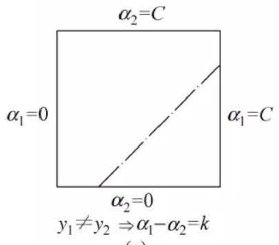  
(a)

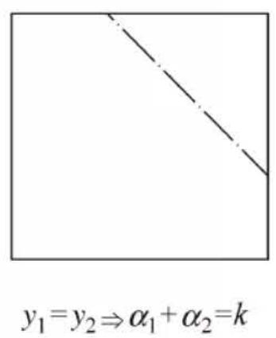  
(b)  
图7.8 变量优化问题图

不等式约束(7.103)使得 $\left( \alpha _ { 1 } , \alpha _ { 2 } \right)$ 在盒子 $[ 0 , C ] \times [ 0 , C ]$ 内，等式约束(7.102)使 $\left( \alpha _ { 1 } , \alpha _ { 2 } \right)$ 在平于盒子 $[ 0 , C ] \times [ 0 , C ]$ 的对线的直线上，因此要求的是标函数在条平于对线的线段上的最优值。这使得两个变量的最优化问题成为实质上的单变量的最优化问题，不妨考虑为变量 $\alpha _ { 2 }$ 的最优化问题。

假设问题(7.101)\~(7.103)的初始可解为 $\alpha _ { 1 } ^ { \mathrm { o l d } } , \alpha _ { 2 } ^ { \mathrm { o l d } }$ ，最优解为 $\alpha _ { 1 } ^ { \mathrm { n e w } } , \alpha _ { 2 } ^ { \mathrm { n e w } }$ ，并且假设在沿着约束向未经剪辑时 $\alpha _ { 2 }$ 的最优解为 $\alpha _ { 2 } ^ { \mathrm { n e w , u n c } }$ 。由于 $\alpha _ { 2 } ^ { \mathrm { n e w } }$ 需满足不等式约束(7.103)，所以最优值 $\alpha _ { 2 } ^ { \mathrm { n e w } }$ 的取值范围必须满条件

$$
L \leqslant \alpha _ { 2 } ^ { \mathrm { n e w } } \leqslant H
$$

其中， $L$ 与H是 $\alpha _ { 2 } ^ { \mathrm { n e w } }$ 所在的对线段端点的界。如果 $y _ { 1 } \neq y _ { 2 }$ （如图7.8(a)所示)，则

$$
L = \operatorname* { m a x } ( 0 , \alpha _ { 2 } ^ { \mathrm { o l d } } - \alpha _ { 1 } ^ { \mathrm { o l d } } ) , \quad H = \operatorname* { m i n } ( C , C + \alpha _ { 2 } ^ { \mathrm { o l d } } - \alpha _ { 1 } ^ { \mathrm { o l d } } )
$$

如果 $y _ { 1 } = y _ { 2 }$ （如图7.8(b)所示)，则

$$
L = \operatorname* { m a x } ( 0 , \alpha _ { 2 } ^ { \mathrm { o l d } } + \alpha _ { 1 } ^ { \mathrm { o l d } } - C ) , \quad H = \operatorname* { m i n } ( C , \alpha _ { 2 } ^ { \mathrm { o l d } } + \alpha _ { 1 } ^ { \mathrm { o l d } } )
$$

下，先求沿着约束向未经剪辑即未考虑不等式约束(7.103)时 $\alpha _ { 2 }$ 的最优解$\alpha _ { 2 } ^ { \mathrm { n e w , u n c } }$ ，然后再求剪辑后 $\alpha _ { 2 }$ 的解 $\alpha _ { 2 } ^ { \mathrm { n e w } }$ 。我们定理来叙述这个结果。为了叙述简单，记

$$
g ( x ) = \sum _ { i = 1 } ^ { N } \alpha _ { i } y _ { i } K ( x _ { i } , x ) + b\tag{7.104}
$$

$$
E _ { i } = g ( x _ { i } ) - y _ { i } = \left( \sum _ { j = 1 } ^ { N } \alpha _ { j } y _ { j } K ( x _ { j } , x _ { i } ) + b \right) - y _ { i } , \quad i = 1 , 2\tag{7.105}
$$

当 $i = 1 , 2$ 时， $E _ { i }$ 为函数 $g ( x )$ 对输入 $x _ { i }$ 的预测值与真实输出 $y _ { i }$ 之差。

定理7.6 最优化问题(7.101)\~(7.103)沿着约束方向未经剪辑时的解是

$$
\alpha _ { 2 } ^ { \mathrm { n e w , u n c } } = \alpha _ { 2 } ^ { \mathrm { o l d } } + \frac { y _ { 2 } ( E _ { 1 } - E _ { 2 } ) } { \eta }\tag{7.106}
$$

其中，

$$
\eta = K _ { 1 1 } + K _ { 2 2 } - 2 K _ { 1 2 } = \left\| \varPhi ( x _ { 1 } ) - \varPhi ( x _ { 2 } ) \right\| ^ { 2 }\tag{7.107}
$$

$\varPhi ( x )$ 是输入空间到特征空间的映射， $E _ { i } , \ i = 1 , 2 .$ 由式(7.105)给出。

经剪辑后 $\alpha _ { 2 }$ 的解是

$$
\begin{array} { r } { \alpha _ { 2 } ^ { \mathrm { n e w } } = \left\{ \begin{array} { l l } { H , } & { \alpha _ { 2 } ^ { \mathrm { n e w , u n c } } > H } \\ { \alpha _ { 2 } ^ { \mathrm { n e w , u n c } } , } & { L \leqslant \alpha _ { 2 } ^ { \mathrm { n e w , u n c } } \leqslant H } \\ { L , } & { \alpha _ { 2 } ^ { \mathrm { n e w , u n c } } < L } \end{array} \right. } \end{array}\tag{7.108}
$$

由 $\alpha _ { 2 } ^ { \mathrm { n e w } }$ 求得 $\alpha _ { 1 } ^ { \mathrm { n e w } }$ 是

$$
\alpha _ { 1 } ^ { \mathrm { n e w } } = \alpha _ { 1 } ^ { \mathrm { o l d } } + y _ { 1 } y _ { 2 } ( \alpha _ { 2 } ^ { \mathrm { o l d } } - \alpha _ { 2 } ^ { \mathrm { n e w } } )\tag{7.109}
$$

证明 引入记号

$$
v _ { i } = \sum _ { j = 3 } ^ { N } \alpha _ { j } y _ { j } K ( x _ { i } , x _ { j } ) = g ( x _ { i } ) - \sum _ { j = 1 } ^ { 2 } \alpha _ { j } y _ { j } K ( x _ { i } , x _ { j } ) - b , \quad i = 1 , 2
$$

标函数可写成

$$
\begin{array} { c } { { W ( \alpha _ { 1 } , \alpha _ { 2 } ) = \displaystyle \frac { 1 } { 2 } K _ { 1 1 } \alpha _ { 1 } ^ { 2 } + \frac { 1 } { 2 } K _ { 2 2 } \alpha _ { 2 } ^ { 2 } + y _ { 1 } y _ { 2 } K _ { 1 2 } \alpha _ { 1 } \alpha _ { 2 } - } } \\ { { \ \left( \alpha _ { 1 } + \alpha _ { 2 } \right) + y _ { 1 } v _ { 1 } \alpha _ { 1 } + y _ { 2 } v _ { 2 } \alpha _ { 2 } } } \end{array}\tag{7.110}
$$

由 $\alpha _ { 1 } y _ { 1 } = \varsigma - \alpha _ { 2 } y _ { 2 }$ 及 $y _ { i } ^ { 2 } = 1$ ，可将 $\alpha _ { 1 }$ 表示为

$$
\alpha _ { 1 } = ( \varsigma - y _ { 2 } \alpha _ { 2 } ) y _ { 1 }
$$

代入式(7.110)，得到只是 $\alpha _ { 2 }$ 的函数的目标函数：

$$
\begin{array} { c } { { W ( \alpha _ { 2 } ) = \displaystyle \frac 1 2 K _ { 1 1 } ( \varsigma - \alpha _ { 2 } y _ { 2 } ) ^ { 2 } + \frac 1 2 K _ { 2 2 } \alpha _ { 2 } ^ { 2 } + y _ { 2 } K _ { 1 2 } ( \varsigma - \alpha _ { 2 } y _ { 2 } ) \alpha _ { 2 } - } } \\ { { ( \varsigma - \alpha _ { 2 } y _ { 2 } ) y _ { 1 } - \alpha _ { 2 } + v _ { 1 } ( \varsigma - \alpha _ { 2 } y _ { 2 } ) + y _ { 2 } v _ { 2 } \alpha _ { 2 } } } \end{array}
$$

对 $\alpha _ { 2 }$ 求导数：

$$
\begin{array} { c } { { \displaystyle { \frac { \partial W } { \partial \alpha _ { 2 } } } = K _ { 1 1 } \alpha _ { 2 } + K _ { 2 2 } \alpha _ { 2 } - 2 K _ { 1 2 } \alpha _ { 2 } - } } \\ { { { } } } \\ { { K _ { 1 1 } \varsigma y _ { 2 } + K _ { 1 2 } \varsigma y _ { 2 } + y _ { 1 } y _ { 2 } - 1 - v _ { 1 } y _ { 2 } + y _ { 2 } v _ { 2 } } } \end{array}
$$

令其为0，得到：

$$
\begin{array} { r l } { { } } & { { ( K _ { 1 1 } + K _ { 2 2 } - 2 K _ { 1 2 } ) \alpha _ { 2 } = y _ { 2 } ( y _ { 2 } - y _ { 1 } + \varsigma K _ { 1 1 } - \varsigma K _ { 1 2 } + v _ { 1 } - v _ { 2 } ) } } \\ { { } } & { { } } \\ { { } } & { { = y _ { 2 } [ y _ { 2 } - y _ { 1 } + \varsigma K _ { 1 1 } - \varsigma K _ { 1 2 } + ( g ( x _ { 1 } ) - \displaystyle \sum _ { j = 1 } ^ { 2 } y _ { j } \alpha _ { j } K _ { 1 j } - b ) - ( g ( x _ { 2 } ) - \displaystyle \sum _ { j = 1 } ^ { 2 } y _ { j } \alpha _ { j } K _ { 1 2 } + h ) ] } } \\ { { } } & { { } } \\ { { } } & { { ( g ( x _ { 2 } ) - \displaystyle \sum _ { j = 1 } ^ { 2 } y _ { j } \alpha _ { j } K _ { 2 j } - b ) ] } } \end{array}
$$

将 $\varsigma = \alpha _ { 1 } ^ { \mathrm { o l d } } y _ { 1 } + \alpha _ { 2 } ^ { \mathrm { o l d } } y _ { 2 }$ 代入，得到：

$$
\begin{array} { r l } & { ( K _ { 1 1 } + K _ { 2 2 } - 2 K _ { 1 2 } ) \alpha _ { 2 } ^ { \mathrm { n e w , u n c } } = y _ { 2 } \big [ ( K _ { 1 1 } + K _ { 2 2 } - 2 K _ { 1 2 } ) \alpha _ { 2 } ^ { \mathrm { o l d } } y _ { 2 } + y _ { 2 } - y _ { 1 } + g ( x _ { 1 } ) - g ( x _ { 2 } ) \big ] } \\ & { \phantom { ( K _ { 1 1 } + K _ { 2 2 } - 2 K _ { 1 2 } ) \alpha _ { 2 } ^ { \mathrm { o l d } } y _ { 2 } + \ldots } = ( K _ { 1 1 } + K _ { 2 2 } - 2 K _ { 1 2 } ) \alpha _ { 2 } ^ { \mathrm { o l d } } + y _ { 2 } ( E _ { 1 } - E _ { 2 } ) } \end{array}
$$

将 $\eta = K _ { 1 1 } + K _ { 2 2 } - 2 K _ { 1 2 }$ 代入，于是得到：

$$
\alpha _ { 2 } ^ { \mathrm { n e w , u n c } } = \alpha _ { 2 } ^ { \mathrm { o l d } } + \frac { y _ { 2 } ( E _ { 1 } - E _ { 2 } ) } { \eta }
$$

要使其满不等式约束必须将其限制在区间 $[ L , H ]$ 内，从而得到 $\alpha _ { 2 } ^ { \mathrm { n e w } }$ 的表达式(7.108)。由等式约束(7.102)得到 $\alpha _ { 1 } ^ { \mathrm { n e w } }$ 的表达式(7.109)，于是得到最优化问题(7.101)\~(7.103)的解$( \alpha _ { 1 } ^ { \mathrm { n e w } } , \alpha _ { 2 } ^ { \mathrm { n e w } } )$ 。

## 7.4.2 变量的选择法

SMO算法在每个问题中选择两个变量优化，其中少个变量是违反KKT条件的。

## 1.第1个变量的选择

SMO称选择第1个变量的过程为外层循环。外层循环在训练样本中选取违反KKT条件最严重的样本点，并将其对应的变量作为第1个变量。具体地，检验训练样本点 $( x _ { i } , y _ { i } )$ 是否满KKT条件，即

$$
\alpha _ { i } = 0 \Leftrightarrow y _ { i } g ( x _ { i } ) \geqslant 1\tag{7.111}
$$

$$
0 < \alpha _ { i } < C \Leftrightarrow y _ { i } g ( x _ { i } ) = 1\tag{7.112}
$$

$$
\alpha _ { i } = C \Leftrightarrow y _ { i } g ( x _ { i } ) \leqslant 1\tag{7.113}
$$

其中， $g ( x _ { i } ) = \sum _ { j = 1 } ^ { N } \alpha _ { j } y _ { j } K ( x _ { i } , x _ { j } ) + b \circ$

该检验是在ε范围内进的。在检验过程中，外层循环先遍历所有满条件 $0 < \alpha _ { i } <$ C的样本点，即在间隔边界上的持向量点，检验它们是否满KKT条件。如果这些样本点都满KKT条件，那么遍历整个训练集，检验它们是否满KKT条件。

## 2.第2个变量的选择

SMO称选择第2个变量的过程为内层循环。假设在外层循环中已经找到第1个变量 $\alpha _ { 1 }$ 现在要在内层循环中找第2个变量 $\alpha _ { 2 }$ 。第2个变量选择的标准是希望能使 $\alpha _ { 2 }$ 有足够大的变化。

由式(7.106)和式(7.108)可知， $\alpha _ { 2 } ^ { \mathrm { n e w } }$ 是依赖于 $\vert E _ { 1 } - E _ { 2 } \vert$ 的，为了加快计算速度，种简单的做法是选择 $\alpha _ { 2 }$ ，使其对应的 $\vert E _ { 1 } - E _ { 2 } \vert$ 最大。因为 $\alpha _ { 1 }$ 已定， $E _ { 1 }$ 也确定了。如果 $E _ { 1 }$ 是正的，那么选择最小的 $E _ { i }$ 作为 $E _ { 2 }$ ；如果 $E _ { 1 }$ 是负的，那么选择最大的 $E _ { i }$ 作为 $E _ { 2 }$ 。为了节省计算时间，将所有 $E _ { i }$ 值保存在个列表中。

在特殊情况下，如果内层循环通过以上法选择的 $\alpha _ { 2 }$ 不能使目标函数有够的下降，那么采以下启发式规则继续选择 $\alpha _ { 2 }$ 。遍历在间隔边界上的持向量点，依次将其对应的变量作为 $\alpha _ { 2 }$ 试，直到标函数有够的下降。若找不到合适的 $\alpha _ { 2 }$ ，那么遍历训练数据集；若仍找不到合适的 $\alpha _ { 2 }$ ，则放弃第1个 $\alpha _ { 1 }$ ，再通过外层循环寻求另外的 $\alpha _ { 1 }$

## 3.计算阈值b和差值 $E _ { i }$

在每次完成两个变量的优化后，都要重新计算阈值b。当 $0 < \alpha _ { 1 } ^ { \mathrm { n e w } } < C$ 时，由KKT条件(7.112)可知：

$$
\sum _ { i = 1 } ^ { N } \alpha _ { i } y _ { i } K _ { i 1 } + b = y _ { 1 }
$$

于是，

$$
b _ { 1 } ^ { \mathrm { n e w } } = y _ { 1 } - \sum _ { i = 3 } ^ { N } \alpha _ { i } y _ { i } K _ { i 1 } - \alpha _ { 1 } ^ { \mathrm { n e w } } y _ { 1 } K _ { 1 1 } - \alpha _ { 2 } ^ { \mathrm { n e w } } y _ { 2 } K _ { 2 1 }\tag{7.114}
$$

$E _ { 1 }$ 的定义式(7.105)有

$$
E _ { 1 } = \sum _ { i = 3 } ^ { N } \alpha _ { i } y _ { i } K _ { i 1 } + \alpha _ { 1 } ^ { \mathrm { o l d } } y _ { 1 } K _ { 1 1 } + \alpha _ { 2 } ^ { \mathrm { o l d } } y _ { 2 } K _ { 2 1 } + b ^ { \mathrm { o l d } } - y _ { 1 }
$$

式(7.114)的前两项可写成

$$
y _ { 1 } - \sum _ { i = 3 } ^ { N } \alpha _ { i } y _ { i } K _ { i 1 } = - E _ { 1 } + \alpha _ { 1 } ^ { \mathrm { { o l d } } } y _ { 1 } K _ { 1 1 } + \alpha _ { 2 } ^ { \mathrm { { o l d } } } y _ { 2 } K _ { 2 1 } + b ^ { \mathrm { { o l d } } }
$$

代入式(7.114)，可得：

$$
b _ { 1 } ^ { \mathrm { n e w } } = - E _ { 1 } - y _ { 1 } K _ { 1 1 } ( \alpha _ { 1 } ^ { \mathrm { n e w } } - \alpha _ { 1 } ^ { \mathrm { o l d } } ) - y _ { 2 } K _ { 2 1 } ( \alpha _ { 2 } ^ { \mathrm { n e w } } - \alpha _ { 2 } ^ { \mathrm { o l d } } ) + b ^ { \mathrm { o l d } }\tag{7.115}
$$

同样，如果 $0 < \alpha _ { 2 } ^ { \mathrm { n e w } } < C$ ，那么，

$$
b _ { 2 } ^ { \mathrm { n e w } } = - E _ { 2 } - y _ { 1 } K _ { 1 2 } ( \alpha _ { 1 } ^ { \mathrm { n e w } } - \alpha _ { 1 } ^ { \mathrm { o l d } } ) - y _ { 2 } K _ { 2 2 } ( \alpha _ { 2 } ^ { \mathrm { n e w } } - \alpha _ { 2 } ^ { \mathrm { o l d } } ) + b ^ { \mathrm { o l d } }\tag{7.116}
$$

如果 $\alpha _ { 1 } ^ { \mathrm { n e w } } , \alpha _ { 2 } ^ { \mathrm { n e w } }$ 同时满足条件 $0 < \alpha _ { i } ^ { \mathrm { n e w } } < C , \ i = 1 , 2$ ，那么 $b _ { 1 } ^ { \mathrm { n e w } } ~ = ~ b _ { 2 } ^ { \mathrm { n e w } }$ 。如果$\alpha _ { 1 } ^ { \mathrm { n e w } } , \alpha _ { 2 } ^ { \mathrm { n e w } }$ 是0或者C，那么 $b _ { 1 } ^ { \mathrm { n e w } }$ 和 $b _ { 2 } ^ { \mathrm { n e w } }$ 以及它们之间的数都是符合KKT条件的阈值，这时选择它们的中点作为 $b ^ { \mathrm { n e w } }$ 。

在每次完成两个变量的优化之后，还必须更新对应的 $E _ { i }$ 值，并将它们保存在列表中。 $E _ { i }$ 值的更新要用到 $b ^ { \mathrm { n e w } }$ 值，以及所有支持向量对应的 $\alpha _ { j }$

$$
E _ { i } ^ { \mathrm { n e w } } = \sum _ { S } y _ { j } \alpha _ { j } K ( x _ { i } , x _ { j } ) + b ^ { \mathrm { n e w } } - y _ { i }\tag{7.117}
$$

其中，S是所有支持向量 $x _ { j }$ 的集合。

## 7.4.3 SMO算法

算法7.5（SMO算法）

输入：训练数据集 $T = \{ ( x _ { 1 } , y _ { 1 } ) , ( x _ { 2 } , y _ { 2 } ) , \cdots , ( x _ { N } , y _ { N } ) \}$ ，其中， $x _ { i } \in \mathcal { X } = R ^ { n } , ~ y _ { i } \in \mathcal { Y } =$ $\{ - 1 , + 1 \} , i = 1 , 2 , \cdots , N$ ，精度ε。

输出：近似解 $\hat { \alpha } _ { \mathfrak { c } }$

（1）取初值 $\alpha ^ { ( 0 ) } = 0$ $k = 0 ;$

(2）选取优化变量 ${ \alpha _ { 1 } ^ { ( k ) } , \alpha _ { 2 } ^ { ( k ) } }$ ，解析求解两个变量的最优化问题(7.101)\~(7.103)，求得最优解 $\alpha _ { 1 } ^ { ( k + 1 ) } , \alpha _ { 2 } ^ { ( k + 1 ) }$ ,更新α为 $\alpha ^ { ( k + 1 ) }$

(3）若在精度ε范围内满停机条件：

$$
\sum _ { i = 1 } ^ { N } \alpha _ { i } y _ { i } = 0 , \quad 0 \leqslant \alpha _ { i } \leqslant C , \quad i = 1 , 2 , \cdots , N
$$

$$
y _ { i } \bullet g ( x _ { i } ) \left\{ \begin{array} { l l } { { \geqslant 1 , } } & { { \{ x _ { i } | \alpha _ { i } = 0 \} } } \\ { { = 1 , } } & { { \{ x _ { i } | 0 < \alpha _ { i } < C \} } } \\ { { \leqslant 1 , } } & { { \{ x _ { i } | \alpha _ { i } = C \} } } \end{array} \right.
$$

其中，

$$
g ( x _ { i } ) = \sum _ { j = 1 } ^ { N } \alpha _ { j } y _ { j } K ( x _ { j } , x _ { i } ) + b
$$

则转步骤(4)；否则令 $k = k + 1$ ，转步骤(2)；

(4）取 $\hat { \alpha } = \alpha ^ { ( k + 1 ) }$ 。

## 本章概要

1.持向量机最简单的情况是线性可分持向量机或硬间隔持向量机，构建它的条件是训练数据线性可分。其学习策略是最间隔法，可以表为凸次规划问题，其原始最优化问题为

$$
\begin{array} { r l } & { \underset { w , b } { \operatorname* { m i n } } \quad \frac { 1 } { 2 } \left. w \right. ^ { 2 } } \\ & { \mathrm { s . t . } \quad y _ { i } ( w \cdot x _ { i } + b ) - 1 \geqslant 0 , \quad i = 1 , 2 , \cdots , N } \end{array}
$$

求得最优化问题的解为 $w ^ { \ast } , b ^ { \ast }$ ，得到线性可分持向量机，分离超平是

$$
\boldsymbol { w } ^ { * } \boldsymbol { \cdot } \boldsymbol { x } + b ^ { * } = 0
$$

分类决策函数是

$$
f ( x ) = \mathrm { s i g n } ( w ^ { * } \cdot x + b ^ { * } )
$$

最间隔法中，函数间隔与何间隔是重要的概念。

线性可分持向量机的最优解存在且唯。位于间隔边界上的实例点为持向量。最优分离超平由持向量完全决定。

次规划问题的对偶问题是

$$
\begin{array} { l l } { { \displaystyle \operatorname* { m i n } } } & { { \displaystyle { \frac { 1 } { 2 } \sum _ { i = 1 } ^ { N } \sum _ { j = 1 } ^ { N } \alpha _ { i } \alpha _ { j } y _ { i } y _ { j } ( x _ { i } \bullet x _ { j } ) - \sum _ { i = 1 } ^ { N } \alpha _ { i } } } } \\ { { \mathrm { s . t . } } } & { { \displaystyle { \sum _ { i = 1 } ^ { N } \alpha _ { i } y _ { i } = 0 } } } \\ { { } } & { { \displaystyle \alpha _ { i } \geqslant 0 , i = 1 , 2 , \cdots , N } } \end{array}
$$

通常，通过求解对偶问题学习线性可分持向量机，即先求解对偶问题的最优值 $\alpha ^ { * }$ 然后求最优值 $w ^ { * }$ 和 $b ^ { * }$ ，得出分离超平和分类决策函数。

2.现实中训练数据是线性可分的情形较少，训练数据往往是近似线性可分的，这时使线性持向量机或软间隔持向量机。线性持向量机是最基本的持向量机。

对于噪声或例外，通过引松弛变量 $\xi _ { i }$ ，使其“可分”，得到线性持向量机学习的凸次规划问题，其原始最优化问题是

$$
\begin{array} { l l } { \displaystyle \operatorname* { m i n } _ { w , b , \xi } } & { \displaystyle \frac { 1 } { 2 } \left\| w \right\| ^ { 2 } + C \displaystyle \sum _ { i = 1 } ^ { N } \xi _ { i } } \\ { \mathrm { s . t . } } & { y _ { i } ( w \cdot x _ { i } + b ) \geqslant 1 - \xi _ { i } , \quad i = 1 , 2 , \cdots , N } \\ & { \xi _ { i } \geqslant 0 , \quad i = 1 , 2 , \cdots , N } \end{array}
$$

求解原始最优化问题的解 $w ^ { \ast } , b ^ { \ast }$ ，得到线性持向量机，其分离超平为

$$
\boldsymbol { w } ^ { * } \boldsymbol { \cdot } \boldsymbol { x } + \boldsymbol { b } ^ { * } = 0
$$

分类决策函数为

$$
f ( x ) = \mathrm { s i g n } ( w ^ { * } \cdot x + b ^ { * } )
$$

线性持向量机的解 $w ^ { * }$ 唯一但 $b ^ { * }$ 不一定唯 。

对偶问题是

$$
\begin{array} { c l } { { \displaystyle \operatorname* { m i n } _ { \alpha } } } & { { \displaystyle { \frac { 1 } { 2 } \sum _ { i = 1 } ^ { N } \sum _ { j = 1 } ^ { N } \alpha _ { i } \alpha _ { j } y _ { i } y _ { j } ( x _ { i } \cdot x _ { j } ) - \sum _ { i = 1 } ^ { N } \alpha _ { i } } } } \\ { { \mathrm { s . t . } } } & { { \displaystyle { \sum _ { i = 1 } ^ { N } \alpha _ { i } y _ { i } = 0 } } } \\ { { } } & { { 0 \leqslant \alpha _ { i } \leqslant C , \quad i = 1 , 2 , \cdots , N } } \end{array}
$$

线性持向量机的对偶学习算法先求解对偶问题得到最优解 $\alpha ^ { * }$ ，然后求原始问题最优解 $w ^ { * }$ 和 $b ^ { * }$ ，得出分离超平和分类决策函数。

对偶问题的解 $\alpha ^ { * }$ 中满足 $\alpha _ { i } ^ { * } > 0$ 的实例点 $x _ { i }$ 称为支持向量。持向量可在间隔边界上，也可在间隔边界与分离超平之间，或者在分离超平误分侧。最优分离超平由持向量完全决定。

线性持向量机学习等价于最化阶范数正则化的合页函数

$$
\sum _ { i = 1 } ^ { N } [ 1 - y _ { i } ( w \cdot x _ { i } + b ) ] _ { + } + \lambda \| w \| ^ { 2 }
$$

## 3.非线性支持向量机

对于输空间中的线性分类问题，可以通过线性变换将它转化为某个维特征空间中的线性分类问题，在维特征空间中学习线性持向量机。由于在线性持向量机学习的对偶问题，标函数和分类决策函数都只涉及实例与实例之间的内积，所以不需要显式地指定线性变换，是核函数来替换当中的内积。核函数表通过个线性转换后的两个实例间的内积。具体地， $K ( x , z )$ 是个核函数或正定核，意味着存在个从输空间X到特征空间H的映射 $\phi ( x ) : \mathcal { X } \to \mathcal { H }$ ，对任意 $x , z \in \mathcal { X }$ ,有

$$
K ( x , z ) = \phi ( x ) \cdot \phi ( z )
$$

对称函数 $K ( x , z )$ 为正定核的充要条件如下：对任意 $x _ { i } \in \mathcal { X } , i = 1 , 2 , \cdots , m \ ( m$ 为任意正整数），对称函数 $K ( x , z )$ 对应的Gram矩阵是半正定的。

所以，在线性持向量机学习的对偶问题中，用核函数 $K ( x , z )$ 替代内积，求解得到的就是线性持向量机：

$$
f ( x ) = \mathrm { s i g n } \left( \sum _ { i = 1 } ^ { N } \alpha _ { i } ^ { * } y _ { i } K ( x , x _ { i } ) + b ^ { * } \right)
$$

## 4.SMO算法

SMO算法是持向量机学习的种快速算法，其特点是不断地将原次规划问题分解为只有两个变量的次规划问题，并对问题进解析求解，直到所有变量满KKT条件为。这样通过启发式的法得到原次规划问题的最优解。因为问题有解析解，所以每次计算问题都很快，虽然计算问题次数很多，但在总体上还是效的。

## 继续阅读

线性持向量机（软间隔）由Cortes与Vapnik提出[1l。同时，Boser，Guyon与Vapnik又引核技巧，提出线性持向量机[2]。Drucker等将其扩展到持向量回归[3]。VapnikVladimir在他的统计学习理论[4]书中对持向量机的泛化能进了论述。

Platt提出了持向量机的快速学习算法SMO[5]，Joachims实现的SVMLight，以及Chang与Lin实现的LIBSVM软件包被泛使。①

原始的持向量机是类分类模型，又被推到多类分类持向量机[6-7]，以及于结构预测的结构持向量机[8]。

关于持向量机的献很多。持向量机的介绍可参见献[9]\~献[12]。核法被认为是持向量机更具般性的机器学习法，核法的介绍可参见献[13]\~献[15]。

## 习 题

7.1 较感知机的对偶形式与线性可分持向量机的对偶形式。

7.2 已知正例点 $x _ { 1 } = ( 1 , 2 ) ^ { \mathrm { T } } , ~ x _ { 2 } = ( 2 , 3 ) ^ { \mathrm { T } } , ~ x _ { 3 } = ( 3 , 3 ) ^ { \mathrm { T } }$ ，负例点 $x _ { 4 } = ( 2 , 1 ) ^ { \mathrm { T } } , ~ x _ { 5 } =$ $( 3 , 2 ) ^ { \mathrm { T } }$ ，试求最间隔分离超平和分类决策函数，并在图上画出分离超平、间隔边界及持向量。

7.3 线性持向量机还可以定义为以下形式：

$$
\begin{array} { r l } { \underset { w , b , \xi } { \operatorname* { m i n } } } & { \displaystyle \frac { 1 } { 2 } \| w \| ^ { 2 } + C \displaystyle \sum _ { i = 1 } ^ { N } \xi _ { i } ^ { 2 } } \\ { \mathrm { s . t . } } & { y _ { i } ( w \cdot x _ { i } + b ) \geqslant 1 - \xi _ { i } , \quad i = 1 , 2 , \cdots , N } \\ & { \xi _ { i } \geqslant 0 , \quad i = 1 , 2 , \cdots , N } \end{array}
$$

试求其对偶形式。

## 7.4 证明内积的正整数幂函数

$$
K ( x , z ) = ( x \cdot z ) ^ { p }
$$

是正定核函数，这里p是正整数， $x , z \in R ^ { n }$ 。

## 参考文献

[1] CORTES C, VAPNIK V. Support-vector networks[J]. Machine Learning, 1995, 20(3): 273–297.

[2] BOSER B E, GUYON I M, VAPNIK V N. A training algorithm for optimal margin classifiers[Cl//Proceedings of the 5th Annual ACM Workshop on COLT. Pittsburgh, PA, 1992: 144–152.

[3] DRUCKER H, BURGEs C J C, KAUFMAN L, et al. Support vector regression machines[C]/ Advances in Neural Information Processing Systems 9. MIT Press, 1996: 155–161.

[4] VAPNIK V N.The nature of statistical learning theory[M].张学，译. Berlin: Springer, 1995.

[5] PLATT J C. Fast training of support vector machines using sequential minimal optimization[Z/OL]. http://research.microsoft.com/apps/pubs/?id=68391.

[6] WESTON J A E, WATKINS C. Support vector machines for multi-class pattern recognition[C]//Proceedings of the 7th European Symposium on Articial Neural Networks. 1999.

[7] CRAMMER K, SINGER Y. On the algorithmic implementation of multiclass kernel-based machines[J]. Journal of Machine Learning Research, 2001, 2: 265–292.

[8] TSOCHANTARIDIS I, JOACHIMS T, HOFMANN T, et al. Large margin methods for structured and interdependent output variables[J]. JMLR, 2005, 6: 1453–1484.

[9] BURGES J C. A tutorial on support vector machines for pattern recognition[J]. Data mining and knowledge discovery, 1998, 2: 121–167.

[10] CRISTIANINI N, SHAWE-TAYLOR J. An introduction to support vector machines and other kernel-based learning methods[M].李国正，王猛，曾华军，译.Cambridge University Press,2000.

[11] 邓乃扬，英杰．数据挖掘中的新法—持向量机[M]．北京：科学出版社，2004.

[12] 邓乃扬，英杰.持向量机——理论，算法与拓展[M]．北京：科学出版社，2009.

[13] SCHOLKPF B, SMOLA A J. Learning with kernels: support vector machines, regularization, optimization, and beyond[M]. MIT Press, 2002.

[14] HERBRICH R. Learning kernel classifers: theory and algorithms[M]. MIT Press, 2002.

[15] HOFMANN T, SCHOLKOPF B, SMOLA A J. Kernel methods in machine learning[J]. The Annals of Statistics, 2008, 36(3): 1171–1220.

## 第8章 Boosting

Boosting是种常的机器学习法，应泛且有效。在分类问题中，它通过改变训练样本的权重学习多个分类器，并将这些分类器进线性组合，提分类的性能。

本章先介绍Boosting的思路和代表性的Boosting算法AdaBoost；然后通过训练误差分析探讨AdaBoost为什么能够提学习精度，并且.从前向分步加法模型的度解释AdaBoost；最后叙述Boosting更具体的实例提升树（Boosting tree）。AdaBoost算法是在1995年由Freund和Schapire提出的，提升树是2000年由Friedman等提出的。

## 8.1 AdaBoost算法

## 8.1.1 Boosting 的基本思路

Boosting基于这样种思想：对于个复杂任务来说，将多个专家的判断进适当的综合所得出的判断要其中任何个专家单独的判断好。实际上，就是“三个臭匠顶个诸葛亮”的道理。

历史上，Kearns和Valiant先提出了“强可学习”(strongly learnable）和“弱可学习”（weakly learnable）的概念。指出：在概率近似正确（probably approximately correct，PAC)学习的框架中，对于个概念（个类），如果存在个多项式的学习算法能够学习它，并且正确率很，那么就称这个概念是强可学习的；如果存在个多项式的学习算法能够学习它，学习的正确率仅随机猜测略好，那么就称这个概念是弱可学习的。常有趣的是Schapire后来证明强可学习与弱可学习是等价的，也就是说，在PAC学习的框架下，一个概念是强可学习的充分必要条件是这个概念是弱可学习的。

这样来，问题便成为，在学习中，如果已经发现了“弱学习算法”，那么能否将它提升（boost）为“强学习算法”。家知道，发现弱学习算法通常要发现强学习算法容易得多。那么如何具体实施提升，便成为开发Boosting时所要解决的问题。关于Boosting的研究很多，有很多算法被提出，最具代表性的是AdaBoost算法（AdaBoostalgorithm）。

对于分类问题而，给定个训练样本集，求较粗糙的分类规则（弱分类器）要求精确的分类规则（强分类器）容易得多。Boosting就是从弱学习算法出发，反复学习，得到系列弱分类器（又称为基本分类器），然后组合这些弱分类器，构成一个强分类器。多数的Boosting都是改变训练数据的概率分布（训练数据的权值分布），针对不同的训练数据分布调用弱学习算法学习一系列弱分类器。

这样，对Boosting来说，有两个问题需要回答：是在每轮如何改变训练数据的权值或概率分布；是如何将弱分类器组合成个强分类器。关于第1个问题，AdaBoost的做法是提那些被前轮弱分类器错误分类样本的权值，降低那些被正确分类样本的权值。这样来，那些没有得到正确分类的数据，由于其权值的加受到后轮的弱分类器的更关注。于是，分类问题被系列的弱分类器“分治之”。于第2个问题，即弱分类器的组合，AdaBoost采取加权多数表决的法。具体地，加分类误差率的弱分类器的权值，使其在表决中起较的作；减分类误差率的弱分类器的权值，使其在表决中起较的作用。

AdaBoost的巧妙之处就在于它将这些想法然且有效地实现在种算法。

## 8.1.2 AdaBoost 算法

现在叙述AdaBoost算法。假设给定个类分类的训练数据集

$$
T = \{ ( x _ { 1 } , y _ { 1 } ) , ( x _ { 2 } , y _ { 2 } ) , \cdots , ( x _ { N } , y _ { N } ) \}
$$

其中，每个样本点由实例与标记组成。实例 $x _ { i } \in \mathcal X \subseteq R ^ { n }$ ，标记 $y _ { i } \in \mathcal { V } = \{ - 1 , + 1 \}$ ，X是实例空间，J是标记集合。AdaBoost利以下算法，从训练数据中学习系列弱分类器或基本分类器，并将这些弱分类器线性组合成为个强分类器。

算法8.1（AdaBoost）

输入：训练数据集 $T = \{ ( x _ { 1 } , y _ { 1 } ) , ( x _ { 2 } , y _ { 2 } ) , \cdots , ( x _ { N } , y _ { N } ) \}$ ，其中 $x _ { i } \in \mathcal { X } \subseteq R ^ { n } , \ y _ { i } \in \mathcal { Y } =$ $\{ - 1 , + 1 \}$ ；弱学习算法。

输出：最终分类器 $G ( x )$

(1）初始化训练数据的权值分布

$$
D _ { 1 } = { \big ( } w _ { 1 1 } , \cdots , w _ { 1 i } , \cdots , w _ { 1 N } { \big ) } , \quad w _ { 1 i } = { \frac { 1 } { N } } , \quad i = 1 , 2 , \cdots , N
$$

（2）对 $m = 1 , 2 , \cdots , M$

（a）使具有权值分布 $D _ { m }$ 的训练数据集学习，得到基本分类器：

$$
G _ { m } ( x ) : \mathcal { X } \longrightarrow \{ - 1 , + 1 \}
$$

(b）计算 $G _ { m } ( x )$ 在训练数据集上的分类误差率：

$$
e _ { m } = \sum _ { i = 1 } ^ { N } P ( G _ { m } ( x _ { i } ) \neq y _ { i } ) = \sum _ { i = 1 } ^ { N } w _ { m i } I ( G _ { m } ( x _ { i } ) \neq y _ { i } )\tag{8.1}
$$

(c)计算 $G _ { m } ( x )$ 的系数：

$$
\alpha _ { m } = \frac { 1 } { 2 } \log \frac { 1 - e _ { m } } { e _ { m } }\tag{8.2}
$$

这的对数是然对数。

(d）更新训练数据集的权值分布：

$$
D _ { m + 1 } = ( w _ { m + 1 , 1 } , \cdots , w _ { m + 1 , i } , \cdots , w _ { m + 1 , N } )\tag{8.3}
$$

$$
w _ { m + 1 , i } = \frac { w _ { m i } } { Z _ { m } } \exp ( - \alpha _ { m } y _ { i } G _ { m } ( x _ { i } ) ) , \quad i = 1 , 2 , \cdots , N\tag{8.4}
$$

这里， $Z _ { m }$ 是规范化因子，且

$$
Z _ { m } = \sum _ { i = 1 } ^ { N } w _ { m i } \exp ( - \alpha _ { m } y _ { i } G _ { m } ( x _ { i } ) )\tag{8.5}
$$

它使 $D _ { m + 1 }$ 成为个概率分布。

(3）构建基本分类器的线性组合

$$
f ( x ) = \sum _ { m = 1 } ^ { M } \alpha _ { m } G _ { m } ( x )\tag{8.6}
$$

得到最终分类器：

$$
\begin{array} { l } { G ( x ) = \displaystyle \mathrm { s i g n } ( f ( x ) ) } \\ { \displaystyle \quad = \mathrm { s i g n } \left( \sum _ { m = 1 } ^ { M } \alpha _ { m } G _ { m } ( x ) \right) } \end{array}\tag{8.7}
$$

对AdaBoost算法作如下说明：

（1）步骤（1）假设训练数据集具有均匀的权值分布，即每个训练样本在基本分类器的学习中作相同，这假设保证第1步能够在原始数据上学习基本分类器 $G _ { 1 } ( x )$ 。

(2）步骤（2）中AdaBoost反复学习基本分类器，在每轮 $m = 1 , 2 , \cdots , M$ 顺次地执行下列操作：

（a）使当前分布 $D _ { m }$ 加权的训练数据集学习基本分类器 $G _ { m } ( x )$ 。

（b）计算基本分类器 $G _ { m } ( x )$ 在加权训练数据集上的分类误差率：

$$
\begin{array} { c } { { \displaystyle e _ { m } = \sum _ { i = 1 } ^ { N } P ( G _ { m } ( x _ { i } ) \neq y _ { i } ) } } \\ { { \displaystyle = \sum _ { G _ { m } ( x _ { i } ) \neq y _ { i } } w _ { m i } } } \end{array}\tag{8.8}
$$

这里， $w _ { m i }$ 表示第m轮中第i个实例的权值， $\sum _ { i = 1 } ^ { N } w _ { m i } = 1$ 。这表明， $G _ { m } ( x )$ 在加权的训练数据集上的分类误差率是被 $G _ { m } ( x )$ 误分类样本的权值之和，由此可以看出数据权值分布 $D _ { m }$ 与基本分类器 $G _ { m } ( x )$ 的分类误差率的关系。

（c）计算基本分类器 $G _ { m } ( x )$ 的系数 $\alpha _ { m } \circ \alpha _ { m }$ 表示 $G _ { m } ( x )$ 在最终分类器中的重要性。由式(8.2)可知，当 $e _ { m } \leqslant \frac { 1 } { 2 }$ 时， $\alpha _ { m } \geqslant 0$ ，并且 $\alpha _ { m }$ 随着 $e _ { m }$ 的减增，所以分类误差率越的基本分类器在最终分类器中的作越。

(d）更新训练数据的权值分布为下轮作准备。式(8.4)可以写成

$$
w _ { m + 1 , i } = \left\{ \begin{array} { l l } { \displaystyle \frac { w _ { m i } } { Z _ { m } } \mathrm { e } ^ { - \alpha _ { m } } , } & { \displaystyle G _ { m } ( \boldsymbol { x } _ { i } ) = y _ { i } } \\ { \displaystyle \frac { w _ { m i } } { Z _ { m } } \mathrm { e } ^ { \alpha _ { m } } , } & { \displaystyle G _ { m } ( \boldsymbol { x } _ { i } ) \neq y _ { i } } \end{array} \right.
$$

由此可知，被基本分类器 $G _ { m } ( x )$ 误分类样本的权值得以扩，而被正确分类样本的权值得以缩。两相较，由式(8.2)知误分类样本的权值被放 $\mathrm { e } ^ { 2 \alpha _ { m } } = { \frac { 1 - \epsilon _ { m } } { e _ { m } } }$ 倍。因此，误分类样本在下一轮学习中起更大的作。不改变所给的训练数据，而不断改变训练数据权值的分布，使得训练数据在基本分类器的学习中起不同的作，这是AdaBoost的个特点。

(3）步骤（3）中线性组合f(x）实现M个基本分类器的加权表决。系数 $\alpha _ { m }$ 表示了基本分类器 $G _ { m } ( x )$ 的重要性，这，所有 $\alpha _ { m }$ 之和并不为1。f(x)的符号决定实例x的类，f(x)的绝对值表分类的确信度。利基本分类器的线性组合构建最终分类器是AdaBoost的另特点。

## 8.1.3 AdaBoost的例子①

例8.1 给定如表8.1所训练数据。假设弱分类器由 $x < v$ 或 $x > v$ 产，其阈值u使该分类器在训练数据集上分类误差率最低。试AdaBoost算法学习个强分类器。

表8.1 训练数据表
<table><tr><td>序号</td><td>1</td><td>2</td><td>3</td><td>4</td><td>5</td><td>6</td><td>7</td><td>8</td><td>9</td><td>10</td></tr><tr><td>x</td><td>0</td><td>1</td><td>2</td><td>3</td><td>4</td><td>5</td><td>6</td><td>7</td><td>8</td><td>9</td></tr><tr><td>y</td><td>1</td><td>1</td><td>1</td><td>-1</td><td>-1</td><td>-1</td><td>1</td><td>1</td><td>1</td><td>-1</td></tr></table>

解 初始化数据权值分布：

$$
\begin{array} { c } { { D _ { 1 } = ( w _ { 1 1 } , w _ { 1 2 } , \cdots , w _ { 1 1 0 } ) } } \\ { { \ } } \\ { { w _ { 1 i } = 0 . 1 , \quad i = 1 , 2 , \cdots , 1 0 } } \end{array}
$$

对 $m = 1$

(a）在权值分布为 $D _ { 1 }$ 的训练数据上，阈值υ取2.5时分类误差率最低，故基本分类器为

$$
G _ { 1 } ( x ) = \left\{ \begin{array} { l l } { { 1 , } } & { { x < 2 . 5 } } \\ { { - 1 , } } & { { x > 2 . 5 } } \end{array} \right.
$$

(b) $G _ { 1 } ( x )$ 在训练数据集上的误差率 $e _ { 1 } = P ( G _ { 1 } ( x _ { i } ) \neq y _ { i } ) = 0 . 3$ >

(c)计算 $G _ { 1 } ( x )$ 的系数： $\alpha _ { 1 } = \frac { 1 } { 2 } \log \frac { 1 - e _ { 1 } } { e _ { 1 } } = 0 . 4 2 3 6 \circ$

(d）更新训练数据的权值分布:

$$
\begin{array} { l } { { D _ { 2 } = ( w _ { 2 1 } , \cdots , w _ { 2 i } , \cdots , w _ { 2 1 0 } ) } } \\ { { \ } } \\ { { w _ { 2 i } = \displaystyle \frac { w _ { 1 i } } { Z _ { 1 } } \exp ( - \alpha _ { 1 } y _ { i } G _ { 1 } ( x _ { i } ) ) , \quad i = 1 , 2 , \cdots , 1 0 } } \\ { { \ } } \\ { { D _ { 2 } = ( 0 . 0 7 1 4 3 , 0 . 0 7 1 4 3 , 0 . 0 7 1 4 3 , 0 . 0 7 1 4 3 , 0 . 0 7 1 4 3 , 0 . 0 7 1 4 3 , 0 . 0 7 1 4 3 , } } \\ { { \ } } \\ { { 0 . 1 6 6 6 7 , 0 . 1 6 6 6 7 , 0 . 1 6 6 6 7 , 0 . 0 7 1 4 3 6 } } \\ { { f _ { 1 } ( x ) = 0 . 4 2 3 6 G _ { 1 } ( x ) } } \end{array}
$$

分类器 $\mathrm { s i g n } ( f _ { 1 } ( x ) )$ 在训练数据集上有3个误分类点。

对 $m = 2$

(a）在权值分布为 $D _ { 2 }$ 的训练数据上，阈值υ是8.5时分类误差率最低，基本分类器为

$$
G _ { 2 } ( x ) = \left\{ \begin{array} { l l } { { 1 , } } & { { x < 8 . 5 } } \\ { { - 1 , } } & { { x > 8 . 5 } } \end{array} \right.
$$

(b) $G _ { 2 } ( x )$ 在训练数据集上的误差率 $e _ { 2 } = 0 . 2 1 4 3$

(c)计算 $\alpha _ { 2 } = 0 . 6 4 9 6 { \it \Omega }$

(d）更新训练数据权值分布:

$$
\begin{array} { r l } & { D _ { 3 } = ( 0 . 0 4 5 5 , 0 . 0 4 5 5 , 0 . 0 4 5 5 , 0 . 1 6 6 7 , 0 . 1 6 6 7 , 0 . 1 6 6 7 , 0 . 1 6 6 7 , } \\ & { \qquad 0 . 1 0 6 0 , 0 . 1 0 6 0 , 0 . 1 0 6 0 , 0 . 0 4 5 5 ) } \end{array}
$$

$$
f _ { 2 } ( x ) = 0 . 4 2 3 6 G _ { 1 } ( x ) + 0 . 6 4 9 6 G _ { 2 } ( x )
$$

分类器 $\mathrm { s i g n } ( f _ { 2 } ( x ) )$ 在训练数据集上有3个误分类点。

对 $m = 3 ,$

(a）在权值分布为 $D _ { 3 }$ 的训练数据上，阈值υ是5.5时分类误差率最低，基本分类器为

$$
G _ { 3 } ( x ) = \left\{ \begin{array} { l l } { 1 , } & { x > 5 . 5 } \\ { - 1 , } & { x < 5 . 5 } \end{array} \right.
$$

(b) $G _ { 3 } ( x )$ 在训练数据集上的误差率 $e _ { 3 } = 0 . 1 8 2 0$

(c)计算 $\alpha _ { 3 } = 0 . 7 5 1 4 \mathrm { ~ }$

（d）更新训练数据的权值分布：

$$
D _ { 4 } = ( 0 . 1 2 5 , 0 . 1 2 5 , 0 . 1 2 5 , 0 . 1 0 2 , 0 . 1 0 2 , 0 . 1 0 2 , 0 . 1 0 2 , 0 . 0 6 5 , 0 . 0 6 5 , 0 . 0 6 5 , 0 . 1 2 5 )
$$

于是得到：

$$
f _ { 3 } ( x ) = 0 . 4 2 3 6 G _ { 1 } ( x ) + 0 . 6 4 9 6 G _ { 2 } ( x ) + 0 . 7 5 1 4 G _ { 3 } ( x )
$$

分类器 $\mathrm { s i g n } ( f _ { 3 } ( x ) )$ 在训练数据集上的误分类点个数为0。

于是最终分类器为

$$
G ( x ) = \mathrm { s i g n } ( f _ { 3 } ( x ) ) = \mathrm { s i g n } ( 0 . 4 2 3 6 G _ { 1 } ( x ) + 0 . 6 4 9 6 G _ { 2 } ( x ) + 0 . 7 5 1 4 G _ { 3 } ( x ) )
$$

## 8.2 AdaBoost算法的训练误差分析

AdaBoost最基本的性质是它能在学习过程中不断减少训练误差，即在训练数据集上的分类误差率。关于这个问题有下的定理。

定理8.1（AdaBoost的训练误差界） AdaBoost算法最终分类器的训练误差界为

$$
{ \frac { 1 } { N } } \sum _ { i = 1 } ^ { N } I ( G ( x _ { i } ) \neq y _ { i } ) \leqslant { \frac { 1 } { N } } \sum _ { i } \exp ( - y _ { i } f ( x _ { i } ) ) = \prod _ { m } Z _ { m }\tag{8.9}
$$

这里， $G ( x ) , f ( x )$ 和 $Z _ { m }$ 分别由式(8.7)、式(8.6)和式(8.5)给出。

证明当 $G ( x _ { i } ) \neq y _ { i }$ 时， $y _ { i } f ( x _ { i } ) < 0$ ，因而 $\exp ( - y _ { i } f ( x _ { i } ) ) \geqslant 1$ 。由此直接推导出前半部分。后半部分的推导要到 $Z _ { m }$ 的定义式(8.5)及式(8.4)的变形：

$$
w _ { m i } \exp ( - \alpha _ { m } y _ { i } G _ { m } ( x _ { i } ) ) = Z _ { m } w _ { m + 1 , i }
$$

现推导如下：

$$
\begin{array} { r l } { \frac { 1 } { N } \displaystyle \sum _ { i } \exp ( - \mathcal { H } f ( \boldsymbol { x } _ { i } ) ) = \frac { 1 } { N } \displaystyle \sum _ { i } \exp \left( - \frac { M } { 2 } \alpha _ { i - 1 } \alpha _ { i } \alpha _ { i } G _ { m _ { i } } ( \alpha _ { i } ) \right) } & { } \\ { \displaystyle } & { \quad - \sum _ { i } \alpha _ { i } \alpha _ { i } \lambda \displaystyle \prod _ { m = 1 } ^ { M } \exp ( - \alpha _ { m } \alpha _ { i } G _ { m _ { i } } ( \alpha _ { i - 1 } ) ) } \\ & { = \boldsymbol { Z } _ { 1 } \displaystyle \sum _ { i } \exp \left( \prod _ { m = 1 } ^ { M } \left[ \exp ( - \alpha _ { m } y _ { i } G _ { m _ { i } } ( \alpha _ { i - 1 } ) ) \right. \right. } \\ & { \quad \quad \quad \quad \left. \left. \operatorname* { m a x } _ { i } \alpha _ { i } \right. \right. } \\ & { = \boldsymbol { Z } _ { 1 } \displaystyle \sum _ { i } \sum _ { m = 1 } ^ { M } \prod _ { m = 1 } ^ { M } \exp ( - \alpha _ { m } y _ { i } G _ { m _ { i } } ( \alpha _ { i } ) ) } \\ & { \quad \quad \quad \quad \quad \quad \quad \left. \sum _ { i } \alpha _ { i } \sum _ { m = 1 } ^ { M } \left( - \alpha _ { m } y _ { i } G _ { m _ { i } } ( \alpha _ { i } ) \right) \right. } \\ & { \quad \quad \quad \quad \quad \quad \left. \sum _ { i } \alpha _ { i } \alpha _ { i } \exp ( - \alpha _ { M } y _ { i } G _ { m _ { i } } ( \alpha _ { i } ) ) \right) } \\ & { = \boldsymbol { Z } _ { 1 } \displaystyle Z _ { 2 } \cdots \boldsymbol { Z } _ { M - 1 } \sum _ { i } w _ { M i } \exp ( - \alpha _ { M } y _ { i } G _ { M } ( \alpha _ { i } ) ) } \\ & { = \displaystyle \prod _ { i = 1 } ^ { M } \boldsymbol { Z } _ { m } } \end{array}
$$

这定理说明，可以在每轮选取适当的 $G _ { m }$ 使得 $Z _ { m }$ 最小，从而使训练误差下降最快。对类分类问题，有如下结果。

定理8.2（类分类问题AdaBoost的训练误差界）

$$
\begin{array} { l } { \displaystyle \prod _ { m = 1 } ^ { M } Z _ { m } = \displaystyle \prod _ { m = 1 } ^ { M } 2 \sqrt { e _ { m } ( 1 - e _ { m } ) } } \\ { \displaystyle \qquad = \prod _ { m = 1 } ^ { M } \sqrt { 1 - 4 \gamma _ { m } ^ { 2 } } } \\ { \displaystyle \qquad \leqslant \exp \left( - 2 \sum _ { m = 1 } ^ { M } \gamma _ { m } ^ { 2 } \right) } \end{array}\tag{8.10}
$$

这里， $\gamma _ { m } = \frac { 1 } { 2 } - e _ { m }$ O

证明由 $Z _ { m }$ 的定义式(8.5)及式(8.8)得：

$$
\begin{array} { l } { { \displaystyle Z _ { m } = \sum _ { i = 1 } ^ { N } w _ { m i } \exp ( - \alpha _ { m } y _ { i } G _ { m } ( x _ { i } ) ) } } \\ { ~ = \sum _ { y _ { i } = G _ { m } ( x _ { i } ) } w _ { m i } \mathrm { e } ^ { - \alpha _ { m } } + \sum _ { y _ { i } \ne G _ { m } ( x _ { i } ) } w _ { m i } \mathrm { e } ^ { \alpha _ { m } } }  \\ { ~ = ( 1 - e _ { m } ) \mathrm { e } ^ { - \alpha _ { m } } + e _ { m } \mathrm { e } ^ { \alpha _ { m } } } \\ { ~ = 2 \sqrt { e _ { m } ( 1 - e _ { m } ) } } \\ { ~ = \sqrt { 1 - 4 \gamma _ { m } ^ { 2 } } } \end{array}\tag{8.11}
$$

至于不等式

$$
\prod _ { m = 1 } ^ { M } \sqrt { 1 - 4 \gamma _ { m } ^ { 2 } } \leqslant \exp \left( - 2 \sum _ { m = 1 } ^ { M } \gamma _ { m } ^ { 2 } \right)
$$

则可先由 $\mathrm { e } ^ { x }$ 和 $\sqrt { 1 - x }$ 在点 $x = 0$ 的泰勒展开式推出不等式 $\sqrt { 1 - 4 \gamma _ { m } ^ { 2 } } \leqslant \exp ( - 2 \gamma _ { m } ^ { 2 } )$ ,进而得到。

推论8.1 如果存在 $\gamma > 0$ ，对所有m有 $\gamma _ { m } \geqslant \gamma$ ,则

$$
\frac { 1 } { N } \sum _ { i = 1 } ^ { N } I ( G ( x _ { i } ) \neq y _ { i } ) \leqslant \exp ( - 2 M \gamma ^ { 2 } )\tag{8.12}
$$

这表明在此条件下AdaBoost的训练误差是以指数速率下降的。这性质当然是很有吸引力的。

注意，AdaBoost算法不需要知道下界γ，这正是Freund与Schapire设计Ada-Boost时所考虑的。与些早期的Boosting不同，AdaBoost具有适应性，即它能适应弱分类器各的训练误差率。这也是它的名称（适应的提升）的由来，Ada是Adaptive的简写。

## 8.3 AdaBoost算法的解释

AdaBoost算法还有另个解释，即可以认为AdaBoost算法是模型为加法模型、损失函数为指数函数、学习算法为前向分步算法时的类分类学习法。

## 8.3.1 前向分步算法

考虑加法模型（additive model）

$$
f ( x ) = \sum _ { m = 1 } ^ { M } \beta _ { m } b ( x ; \gamma _ { m } )\tag{8.13}
$$

其中， $b ( x ; \gamma _ { m } )$ 为基函数， $\gamma _ { m }$ 为基函数的参数， $\beta _ { m }$ 为基函数的系数。显然，式(8.6)是个加法模型。

在给定训练数据及损失函数 $L ( y , f ( x ) )$ 的条件下，学习加法模型 $f ( x )$ 成为经验风险极化即损失函数极化问题：

$$
\operatorname* { m i n } _ { \beta _ { m } , \gamma _ { m } } \sum _ { i = 1 } ^ { N } L \left( y _ { i } , \sum _ { m = 1 } ^ { M } \beta _ { m } b ( x _ { i } ; \gamma _ { m } ) \right)\tag{8.14}
$$

通常这是个复杂的优化问题。前向分步算法（forward stagewisealgorithm）求解这优化问题的想法是：因为学习的是加法模型，如果能够从前向后，每步只学习个基函数及其系数，逐步逼近优化标函数式(8.14)，那么就可以简化优化的复杂度。具体地，每步只需优化如下损失函数：

$$
\operatorname* { m i n } _ { \beta , \gamma } \sum _ { i = 1 } ^ { N } L \left( y _ { i } , \beta b ( x _ { i } ; \gamma ) \right)\tag{8.15}
$$

给定训练数据集 $T \ = \ \{ ( x _ { 1 } , y _ { 1 } ) , ( x _ { 2 } , y _ { 2 } ) , \cdots , ( x _ { N } , y _ { N } ) \} , \ x _ { i } \ \in \ { \mathcal { X } } \ \subseteq \ R ^ { n } , \ y _ { i } \ \in \ { \mathcal { Y } } \ =$ $\{ - 1 , + 1 \}$ ，损失函数 $L ( y , f ( x ) )$ 和基函数的集合 $\{ b ( x ; \gamma ) \}$ ，学习加法模型 $f ( x )$ 的前向分步算法如下。

## 算法8.2（前向分步算法）

输入：训练数据集 $T = \{ ( x _ { 1 } , y _ { 1 } ) , ( x _ { 2 } , y _ { 2 } ) , \cdots , ( x _ { N } , y _ { N } ) \}$ ，损失函数 $L ( y , f ( x ) )$ ，基函数集$\{ b ( x ; \gamma ) \}$ 。

输出：加法模型f(x)。

(1）初始化 $f _ { 0 } ( x ) = 0 ;$

(2）对 $m = 1 , 2 , \cdots , M$

（a）极小化损失函数：

$$
( \beta _ { m } , \gamma _ { m } ) = \arg \operatorname* { m i n } _ { \beta , \gamma } \sum _ { i = 1 } ^ { N } L \left( y _ { i } , f _ { m - 1 } ( x _ { i } ) + \beta b ( x _ { i } ; \gamma ) \right)\tag{8.16}
$$

得到参数 $\beta _ { m } , \gamma _ { m } .$

(b）更新：

$$
f _ { m } ( x ) = f _ { m - 1 } ( x ) + \beta _ { m } b ( x ; \gamma _ { m } )\tag{8.17}
$$

(3）得到加法模型：

$$
f ( x ) = f _ { M } ( x ) = \sum _ { m = 1 } ^ { M } \beta _ { m } b ( x ; \gamma _ { m } )\tag{8.18}
$$

这样，前向分步算法将同时求解从 $m = 1$ 到 $m = M$ 所有参数 $\beta _ { m }$ $\gamma _ { m }$ 的优化问题简化为逐次求解各个 $\beta _ { m } , \gamma _ { m }$ 的优化问题。

## 8.3.2 前向分步算法与AdaBoost

由前向分步算法可以推导出AdaBoost，定理叙述这关系。

定理8.3 AdaBoost算法是前向分步加法算法的特例。这时，模型是由基本分类器组成的加法模型，损失函数是指数函数。

证明 前向分步算法学习的是加法模型，当基函数为基本分类器时，该加法模型等价于AdaBoost的最终分类器：

$$
f ( x ) = \sum _ { m = 1 } ^ { M } \alpha _ { m } G _ { m } ( x )\tag{8.19}
$$

由基本分类器 $G _ { m } ( x )$ 及其系数 $\alpha _ { m }$ 组成， $m = 1 , 2 , \cdots , M _ { \circ }$ 前向分步算法逐一学习基函数，这过程与AdaBoost算法逐学习基本分类器的过程致。下证明前向分步算法的损失函数是指数损失函数（exponential loss function）

$$
L ( y , f ( x ) ) = \exp ( - y f ( x ) )
$$

时，其学习的具体操作等价于AdaBoost算法学习的具体操作。

假设经过m1轮迭代前向分步算法已经得到 $f _ { m - 1 } ( x )$

$$
\begin{array} { c } { { f _ { m - 1 } ( x ) = f _ { m - 2 } ( x ) + \alpha _ { m - 1 } G _ { m - 1 } ( x ) } } \\ { { { } } } \\ { { { } = \alpha _ { 1 } G _ { 1 } ( x ) + \cdots + \alpha _ { m - 1 } G _ { m - 1 } ( x ) } } \end{array}
$$

在第m轮迭代得到 $\alpha _ { m }$ $G _ { m } ( x )$ 和 $f _ { m } ( x )$ 0

$$
f _ { m } ( x ) = f _ { m - 1 } ( x ) + \alpha _ { m } G _ { m } ( x )
$$

标是使前向分步算法得到的 $\alpha _ { m }$ 和 $G _ { m } ( x )$ 使 $f _ { m } ( x )$ 在训练数据集T上的指数损失最小,即

$$
( \alpha _ { m } , G _ { m } ( x ) ) = \arg \operatorname* { m i n } _ { \alpha , G } \sum _ { i = 1 } ^ { N } \exp [ - y _ { i } ( f _ { m - 1 } ( x _ { i } ) + \alpha G ( x _ { i } ) ) ]\tag{8.20}
$$

式(8.20)可以表示为

$$
( \alpha _ { m } , G _ { m } ( x ) ) = \arg \operatorname* { m i n } _ { \alpha , G } \sum _ { i = 1 } ^ { N } \bar { w } _ { m i } \exp ( - y _ { i } \alpha G ( x _ { i } ) )\tag{8.21}
$$

其中， $\bar { w } _ { m i } = \exp ( - y _ { i } f _ { m - 1 } ( x _ { i } ) )$ 。因为 $\bar { w } _ { m i }$ 既不依赖 $\alpha$ 也不依赖于G，所以与最化关。  
但 $\bar { w } _ { m i }$ 依赖于 $f _ { m - 1 } ( x )$ ，随着每轮迭代发改变。

现证明使式(8.21)达到最的 $\alpha _ { m } ^ { * }$ 和 $G _ { m } ^ { * } ( x )$ 就是AdaBoost算法所得到的 $\alpha _ { m }$ 和$G _ { m } ( x )$ 。求解式(8.21)可分两步：

首先，求 $G _ { m } ^ { * } ( x )$ 。对任意 $\alpha > 0$ ，使式(8.21)最的 $G ( x )$ 由下式得到：

$$
G _ { m } ^ { * } ( x ) = \arg \operatorname* { m i n } _ { G } \sum _ { i = 1 } ^ { N } { \bar { w } } _ { m i } I ( y _ { i } \neq G ( x _ { i } ) )
$$

其中， $\bar { w } _ { m i } = \exp ( - y _ { i } f _ { m - 1 } ( x _ { i } ) )$ 。

此分类器 $G _ { m } ^ { * } ( x )$ 即为AdaBoost算法的基本分类器 $G _ { m } ( x )$ ，因为它是使第m轮加权训练数据分类误差率最小的基本分类器。

然后，求 $\alpha _ { m } ^ { * }$ 。参照式(8.11)，式(8.21)中

$$
\begin{array} { r l r } {  { \sum _ { i = 1 } ^ { N } \bar { w } _ { m i } \exp ( - y _ { i } \alpha G ( \boldsymbol { x } _ { i } ) ) = \sum _ { y _ { i } = G _ { m } ( \boldsymbol { x } _ { i } ) } \bar { w } _ { m i } \mathrm { e } ^ { - \alpha } + \sum _ { y _ { i } \neq G _ { m } ( \boldsymbol { x } _ { i } ) } \bar { w } _ { m i } \mathrm { e } ^ { \alpha } } } \\ & { } & { = ( \mathrm { e } ^ { \alpha } - \mathrm { e } ^ { - \alpha } ) \sum _ { i = 1 } ^ { N } \bar { w } _ { m i } I ( y _ { i } \neq G ( \boldsymbol { x } _ { i } ) ) + \mathrm { e } ^ { - \alpha } \sum _ { i = 1 } ^ { N } \bar { w } _ { m i } } \end{array}\tag{8.22}
$$

将已求得的 $G _ { m } ^ { * } ( x )$ 代式(8.22)，对α求导并使导数为0，即得到使式(8.21)最的α：

$$
\alpha _ { m } ^ { * } = \frac { 1 } { 2 } \log \frac { 1 - e _ { m } } { e _ { m } }
$$

其中， $e _ { m }$ 是分类误差率：

$$
\begin{array} { c } { { \displaystyle { \sum _ { e _ { m } } ^ { N } \bar { w } _ { m i } I ( y _ { i } \ne G _ { m } ( x _ { i } ) ) } } } \\ { { \displaystyle { \sum _ { i = 1 } ^ { N } \bar { w } _ { m i } } } } \\ { { \displaystyle { = \sum _ { i = 1 } ^ { N } w _ { m i } I ( y _ { i } \ne G _ { m } ( x _ { i } ) ) } } } \end{array}\tag{8.23}
$$

这里的 $\alpha _ { m } ^ { * }$ 与AdaBoost算法第2(c)步的 $\alpha _ { m }$ 完全一致。

最后来看每轮样本权值的更新。由

$$
f _ { m } ( x ) = f _ { m - 1 } ( x ) + \alpha _ { m } G _ { m } ( x )
$$

以及 $\bar { w } _ { m i } = \exp ( - y _ { i } f _ { m - 1 } ( x _ { i } ) )$ ，可得：

$$
\bar { w } _ { m + 1 , i } = \bar { w } _ { m , i } \exp ( - y _ { i } \alpha _ { m } G _ { m } ( x ) )
$$

这与AdaBoost算法第2(d)步的样本权值的更新只相差规范化因，因等价。 ■

## 8.4提升树

提升树是以分类树或回归树为基本分类器的Boosting。提升树被认为是机器学习中性能最好的方法之。

## 8.4.1 提升树模型

Boosting实际采加法模型（即基函数的线性组合）与前向分步算法。以决策树为基函数的Boosting称为提升树（boostingtree）。对分类问题决策树是叉分类树，对回归问题决策树是叉回归树。在例8.1中看到的基本分类器 $x < v$ 或 $x > v$ 可以看作是由个根结点直接连接两个叶结点的简单决策树，即所谓的决策树桩（decision stump）。提升树模型可以表示为决策树的加法模型：

$$
f _ { M } ( x ) = \sum _ { m = 1 } ^ { M } T ( x ; \theta _ { m } )\tag{8.24}
$$

其中， $T ( x ; \theta _ { m } )$ 表示决策树， $\Theta _ { m }$ 为决策树的参数，M为树的个数。

## 8.4.2 提升树算法

提升树算法采前向分步算法。先确定初始提升树 $f _ { 0 } ( x ) = 0$ ，第m步的模型是

$$
f _ { m } ( x ) = f _ { m - 1 } ( x ) + T ( x ; \theta _ { m } )\tag{8.25}
$$

其中， $f _ { m - 1 } ( x )$ 为当前模型。通过经验风险极化确定下棵决策树的参数 $\Theta _ { m }$ :

$$
\hat { \theta } _ { m } = \arg \operatorname* { m i n } _ { \theta _ { m } } \sum _ { i = 1 } ^ { N } L ( y _ { i } , f _ { m - 1 } ( x _ { i } ) + T ( x _ { i } ; \theta _ { m } ) )\tag{8.26}
$$

由于树的线性组合可以很好地拟合训练数据，即使数据中的输与输出之间的关系很复杂也是如此，所以提升树是个功能的学习算法。

下讨论针对不同问题的提升树学习算法，其主要区别在于使的损失函数不同。包括平误差损失函数的回归问题、指数损失函数的分类问题，以及般损失函数的般决策问题。

对于类分类问题，提升树算法只需将AdaBoost算法8.1中的基本分类器限制为类分类树即可，可以说这时的提升树算法是AdaBoost算法的特殊情况，这不再细述。下叙述回归问题的提升树。

已知个训练数据集 $T = \{ ( x _ { 1 } , y _ { 1 } ) , ( x _ { 2 } , y _ { 2 } ) , \cdot \cdot \cdot , ( x _ { N } , y _ { N } ) \} , \ x _ { i } \in \mathcal { X } \subseteq R ^ { n }$ ，X为输入空间， $y _ { i } \in \mathcal { V } \subseteq R , \ \mathcal { V }$ 为输出空间。在5.5节中已经讨论了回归树的问题。如果将输空间X划分为J个互不相交的区域 $R _ { 1 } , R _ { 2 } , \cdots , R _ { J }$ ，并且在每个区域上确定输出的常量 $c _ { j }$ ,那么树可表示为

$$
T ( x ; \Theta ) = \sum _ { j = 1 } ^ { J } c _ { j } I ( x \in R _ { j } )\tag{8.27}
$$

其中，参数 $\boldsymbol \Theta = \{ ( R _ { 1 } , c _ { 1 } ) , ( R _ { 2 } , c _ { 2 } ) , \cdots , ( R _ { J } , c _ { J } ) \}$ 表示树的区域划分和各区域上的常数，J是回归树的复杂度即叶结点个数。

回归问题提升树使以下前向分步算法：

$$
\begin{array} { l l } { f _ { 0 } ( x ) = 0 } \\ { f _ { m } ( x ) = f _ { m - 1 } ( x ) + T ( x ; \theta _ { m } ) , } & { m = 1 , 2 , \cdots , M } \\ { f _ { M } ( x ) = \displaystyle \sum _ { m = 1 } ^ { M } T ( x ; \theta _ { m } ) } \end{array}
$$

在前向分步算法的第m步，给定当前模型 $f _ { m - 1 } ( x )$ ，需求解

$$
\hat { \theta } _ { m } = \arg \operatorname* { m i n } _ { \theta _ { m } } \sum _ { i = 1 } ^ { N } L ( y _ { i } , f _ { m - 1 } ( x _ { i } ) + T ( x _ { i } ; \theta _ { m } ) )
$$

得到 $\hat { \Theta } _ { m }$ ，即第m棵树的参数。

当采用平方误差损失函数时，

$$
L ( y , f ( x ) ) = ( y - f ( x ) ) ^ { 2 }
$$

其损失变为

$$
\begin{array} { c } { { L ( y , f _ { m - 1 } ( x ) + T ( x ; \theta _ { m } ) ) = ( y - f _ { m - 1 } ( x ) - T ( x ; \theta _ { m } ) ) ^ { 2 } } } \\ { { \ } } \\ { { = ( r - T ( x ; \theta _ { m } ) ) ^ { 2 } } } \end{array}
$$

这里，

$$
r = y - f _ { m - 1 } ( x )\tag{8.28}
$$

是当前模型拟合数据的残差（residual）。所以，对回归问题的提升树算法来说，只需简单地拟合当前模型的残差。这样，算法是相当简单的。现将回归问题的提升树算法叙述如下。

算法8.3（回归问题的提升树算法）

输入：训练数据集 $T = \{ ( x _ { 1 } , y _ { 1 } ) , ( x _ { 2 } , y _ { 2 } ) , \cdots , ( x _ { N } , y _ { N } ) \} , \ x _ { i } \in \mathcal { X } \subseteq R ^ { n } , \ y _ { i } \in \mathcal { Y } \subseteq R _ { \circ }$

输出：提升树 $f _ { M } ( x )$ 。

(1）初始化 $f _ { 0 } ( x ) = 0 .$ 。

（2）对 $m = 1 , 2 , \cdots , M$

(a）按式(8.27)计算残差：

$$
r _ { m i } = y _ { i } - f _ { m - 1 } ( x _ { i } ) , \quad i = 1 , 2 , \cdots , N
$$

(b）拟合残差 $r _ { m i }$ 学习个回归树，得到 $T ( x ; \theta _ { m } )$

(c）更新 $f _ { m } ( x ) = f _ { m - 1 } ( x ) + T ( x ; \theta _ { m } )$

(3）得到回归问题提升树：

$$
f _ { M } ( x ) = \sum _ { m = 1 } ^ { M } T ( x ; \theta _ { m } )
$$

例8.2 已知如表8.2所的训练数据，x的取值范围为区间[0.5,10.5]，y的取值范围为区间[5.0,10.0，学习这个回归问题的提升树模型，考虑只树桩作为基函数。

表8.2 训练数据表
<table><tr><td> $x _ { i }$ </td><td>1</td><td>2</td><td>3</td><td>4</td><td>5</td><td>6</td><td>7</td><td>8</td><td>9</td><td>10</td></tr><tr><td>yi</td><td>5.56</td><td>5.70</td><td>5.91</td><td>6.40</td><td>6.80</td><td>7.05</td><td>8.90</td><td>8.70</td><td>9.00</td><td>9.05</td></tr></table>

解 按照算法8.3，第1步求 $f _ { 1 } ( x )$ 即回归树 $T _ { 1 } ( x )$ 。

先通过以下优化问题

$$
\operatorname* { m i n } _ { s } \left[ \operatorname* { m i n } _ { c _ { 1 } } \sum _ { x _ { i } \in R _ { 1 } } ( y _ { i } - c _ { 1 } ) ^ { 2 } + \operatorname* { m i n } _ { c _ { 2 } } \sum _ { x _ { i } \in R _ { 2 } } ( y _ { i } - c _ { 2 } ) ^ { 2 } \right]
$$

求解训练数据的切分点s:

$$
R _ { 1 } = \{ x | x \leqslant s \} , \quad R _ { 2 } = \{ x | x > s \}
$$

容易求得在 $R _ { 1 } , \ R _ { 2 }$ 内部使平损失误差达到最值的 $c _ { 1 } , \ : c _ { 2 }$ 为

$$
c _ { 1 } = \frac { 1 } { N _ { 1 } } \sum _ { x _ { i } \in R _ { 1 } } y _ { i } , \quad c _ { 2 } = \frac { 1 } { N _ { 2 } } \sum _ { x _ { i } \in R _ { 2 } } y _ { i }
$$

这里 $N _ { 1 }$ $N _ { 2 }$ 是 $R _ { 1 }$ $R _ { 2 }$ 的样本点数。

求训练数据的切分点。根据所给数据，考虑如下切分点：

对各切分点，不难求出相应的 $R _ { 1 } , R _ { 2 } , c _ { 1 } , c _ { 2 }$ 及

$$
m ( s ) = \operatorname* { m i n } _ { c _ { 1 } } \sum _ { x _ { i } \in R _ { 1 } } { ( y _ { i } - c _ { 1 } ) ^ { 2 } } + \operatorname* { m i n } _ { c _ { 2 } } \sum _ { x _ { i } \in R _ { 2 } } { ( y _ { i } - c _ { 2 } ) ^ { 2 } }
$$

例如，当s=1.5时， $R _ { 1 } = \{ 1 \} , \ R _ { 2 } = \{ 2 , 3 , \cdots , 1 0 \} , \ c _ { 1 } = 5 . 5 6 , \ c _ { 2 } = 7 . 5 0 ,$

$$
m ( s ) = \operatorname* { m i n } _ { c _ { 1 } } \sum _ { x _ { i } \in R _ { 1 } } { ( y _ { i } - c _ { 1 } ) ^ { 2 } } + \operatorname* { m i n } _ { c _ { 2 } } \sum _ { x _ { i } \in R _ { 2 } } { ( y _ { i } - c _ { 2 } ) ^ { 2 } } = 0 + 1 5 . 7 2 = { 1 5 . 7 2 }
$$

现将s及 $m ( s )$ 的计算结果列于表8.3。

表8.3 计算数据表
<table><tr><td>S</td><td>1.5</td><td>2.5</td><td>3.5</td><td>4.5</td><td>5.5</td><td>6.5</td><td>7.5</td><td>8.5</td><td>9.5</td></tr><tr><td> $m ( s )$ </td><td>15.72</td><td>12.07</td><td>8.36</td><td>5.78</td><td>3.91</td><td>1.93</td><td>8.01</td><td>11.73</td><td>15.74</td></tr></table>

由表8.3可知，当 $s \ = \ 6 . 5$ 时 $m ( s )$ 达到最值，此时 $R _ { 1 } = \{ 1 , 2 , \cdots , 6 \}$ $R _ { 2 } ~ =$ {7,8,9, 10},c1 =6.24, $c _ { 2 } = 8 . 9 1 $ ，所以回归树 $T _ { 1 } ( x )$ 为

$$
\begin{array} { l } { \displaystyle T _ { 1 } ( x ) = \left\{ \begin{array} { l l } { 6 . 2 4 , } & { x < 6 . 5 } \\ { 8 . 9 1 , } & { x \geqslant 6 . 5 } \end{array} \right. } \\ { \displaystyle f _ { 1 } ( x ) = T _ { 1 } ( x ) } \end{array}
$$

用 $f _ { 1 } ( x )$ 拟合训练数据的残差见表8.4，表中 $r _ { 2 i } = y _ { i } - f _ { 1 } ( x _ { i } ) , \ i = 1 , 2 , \cdots , 1 0 .$

表8.4 残差表
<table><tr><td> $x _ { i }$ </td><td>1</td><td>2</td><td>3</td><td>4</td><td>5</td><td>6</td><td>7</td><td>8</td><td>9</td><td>10</td></tr><tr><td> $r _ { 2 i }$ </td><td>-0.68</td><td>-0.54</td><td>-0.33</td><td>0.16</td><td>0.56</td><td>0.81</td><td>-0.01</td><td>-0.21</td><td>0.09</td><td>0.14</td></tr></table>

用 $f _ { 1 } ( x )$ 拟合训练数据的平方损失误差：

$$
L ( y , f _ { 1 } ( x ) ) = \sum _ { i = 1 } ^ { 1 0 } { \big ( } y _ { i } - f _ { 1 } ( x _ { i } ) { \big ) } ^ { 2 } = 1 . 9 3
$$

第2步求 $T _ { 2 } ( x )$ 。法与求 $T _ { 1 } ( x )$ 一样，只是拟合的数据是表8.4的残差，可以得到：

$$
T _ { 2 } ( x ) = \left\{ \begin{array} { l l } { - 0 . 5 2 , } & { x < 3 . 5 } \\ { 0 . 2 2 , } & { x \geqslant 3 . 5 } \end{array} \right.
$$

$$
f _ { 2 } ( x ) = f _ { 1 } ( x ) + T _ { 2 } ( x ) = { \left\{ \begin{array} { l l } { 5 . 7 2 , } & { x < 3 . 5 } \\ { 6 . 4 6 , } & { 3 . 5 \leqslant x < 6 . 5 } \\ { 9 . 1 3 , } & { x \geqslant 6 . 5 } \end{array} \right. }
$$

用 $f _ { 2 } ( x )$ 拟合训练数据的平方损失误差是

$$
L ( y , f _ { 2 } ( x ) ) = \sum _ { i = 1 } ^ { 1 0 } { \big ( } y _ { i } - f _ { 2 } ( x _ { i } ) { \big ) } ^ { 2 } = 0 . 7 9
$$

继续求得：

$$
T _ { 3 } ( x ) = \left\{ \begin{array} { l l } { 0 . 1 5 , } & { x < 6 . 5 } \\ { - 0 . 2 2 , } & { x \geqslant 6 . 5 } \end{array} \right. , \quad L ( y , f _ { 3 } ( x ) ) = 0 . 4 7
$$

$$
T _ { 4 } ( x ) = \left\{ \begin{array} { l l } { - 0 . 1 6 , } & { x < 4 . 5 } \\ { 0 . 1 1 , } & { x \geqslant 4 . 5 } \end{array} \right. , \quad L ( y , f _ { 4 } ( x ) ) = 0 . 3 0
$$

$$
T _ { 5 } ( x ) = \left\{ \begin{array} { l l } { { 0 . 0 7 , } } & { { x < 6 . 5 } } \\ { { - 0 . 1 1 , } } & { { x \geqslant 6 . 5 } } \end{array} \right. , \quad L ( y , f _ { 5 } ( x ) ) = 0 . 2 3
$$

$$
\begin{array} { r l } & { T _ { 6 } ( x ) = \left\{ \begin{array} { l l } { - 0 . 1 5 , } & { x < 2 . 5 } \\ { 0 . 0 4 , } & { x \geqslant 2 . 5 } \\ { 0 . 0 4 } & { - 0 . 5 } \end{array} \right. } \\ & { \begin{array} { r l } { f _ { 6 } ( x ) = f _ { 5 } ( x ) + T _ { 6 } ( x ) - T _ { 1 } ( x ) + \cdots + T _ { 5 } ( x ) + T _ { 6 } ( x ) } \\ { ~ } \\ { \overset { \mathrm { ~ \in ~ } } \delta \& { 2 . 5 } \leq x < 3 . 5 } \\ { 6 . 5 6 , } & { 3 . 5 \leqslant x < 4 . 5 } \\ { 6 . 8 3 , } & { 4 . 5 \leqslant x < 6 . 5 } \\ { 6 . 9 5 , } & { x \geqslant 6 . 5 } \end{array} } \end{array}
$$

$f _ { 6 } ( x )$ 拟合训练数据的平方损失误差是

$$
L ( y , f _ { 6 } ( x ) ) = \sum _ { i = 1 } ^ { 1 0 } { \bigl ( } y _ { i } - f _ { 6 } ( x _ { i } ) { \bigr ) } ^ { 2 } = 0 . 1 7
$$

假设此时已满误差要求，那么 $f ( x ) = f _ { 6 } ( x )$ 即为所求提升树。

## 8.4.3梯度提升

提升树利加法模型与前向分步算法实现学习的优化过程。当损失函数是平损失和指数损失函数时，每步优化是很简单的。但对般损失函数，往往每步优化并不那么容易。针对这问题，Freidman提出了梯度提升（gradientboosting）算法。这是利最速下降法的近似法，其关键是利损失函数的负梯度在当前模型的值

$$
- \left[ { \frac { \partial { \cal L } ( y , f ( x _ { i } ) ) } { \partial f ( x _ { i } ) } } \right] _ { f ( x ) = f _ { m - 1 } ( x ) }
$$

作为回归问题提升树算法中的残差的近似值，拟合个回归树。

算法8.4（梯度提升算法）

输入：训练数据集 $T = \{ ( x _ { 1 } , y _ { 1 } ) , ( x _ { 2 } , y _ { 2 } ) , \cdot \cdot \cdot , ( x _ { N } , y _ { N } ) \} , \ x _ { i } \in \mathcal { X } \subseteq R ^ { n } , \ y _ { i } \in \mathcal { Y } \subseteq R ;$ 损失函数 $L ( y , f ( x ) )$ 。

输出：回归树 $\hat { f } ( x )$ O

（1）初始化：

$$
f _ { 0 } ( x ) = \arg \operatorname* { m i n } _ { c } \sum _ { i = 1 } ^ { N } L ( y _ { i } , c )
$$

（2）对 $m = 1 , 2 , \cdots , M$

(a）对 $i = 1 , 2 , \cdots , N$ ，计算

$$
r _ { m i } = - \left[ \frac { \partial L ( y _ { i } , f ( x _ { i } ) ) } { \partial f ( x _ { i } ) } \right] _ { f ( x ) = f _ { m - 1 } ( x ) }
$$

(b）对 $r _ { m i }$ 拟合个回归树，得到第m棵树的叶结点区域 $R _ { m j } , \ j = 1 , 2 , \cdots , J _ { \circ }$

(c）对 $j = 1 , 2 , \cdots , J$ ,计算

$$
c _ { m j } = \arg \operatorname* { m i n } _ { c } \sum _ { x _ { i } \in R _ { m j } } L ( y _ { i } , f _ { m - 1 } ( x _ { i } ) + c )
$$

(d）更新 $f _ { m } ( x ) = f _ { m - 1 } ( x ) + \sum _ { j = 1 } ^ { J } c _ { m j } I ( x \in R _ { m j } )$

(3）得到回归树：

$$
\hat { f } ( x ) = f _ { M } ( x ) = \sum _ { m = 1 } ^ { M } \sum _ { j = 1 } ^ { J } c _ { m j } I ( x \in R _ { m j } )
$$

算法第1步初始化，估计使损失函数极化的常数值，它是只有个根结点的树。第2(a)步计算损失函数的负梯度在当前模型的值，将它作为残差的估计。对于平损失函数，它就是通常所说的残差；对于般损失函数，它就是残差的近似值。第2(b）步估计回归树叶结点区域，以拟合残差的近似值。第2(c）步利线性搜索估计叶结点区域的值，使损失函数极化。第2(d)步更新回归树。第3步得到输出的最终模型f(x)。

## 本章概要

1.Boosting是将弱学习算法提升为强学习算法的机器学习法。在分类学习中，Boosting通过反复修改训练数据的权值分布构建系列基本分类器（弱分类器），并将这些基本分类器线性组合，构成个强分类器。代表性的Boosting是AdaBoost算法。

AdaBoost模型是弱分类器的线性组合：

$$
f ( x ) = \sum _ { m = 1 } ^ { M } \alpha _ { m } G _ { m } ( x )
$$

2.AdaBoost算法的特点是通过迭代每次学习个基本分类器。每次迭代中，提那些被前轮分类器错误分类数据的权值，降低那些被正确分类的数据的权值。最后，AdaBoost将基本分类器的线性组合作为强分类器，其中给分类误差率的基本分类器以的权值，给分类误差率的基本分类器以的权值。

3.AdaBoost的训练误差分析表明，AdaBoost的每次迭代可以减少它在训练数据集上的分类误差率，这说明了它作为Boosting的有效性。

4.AdaBoost算法的个解释是该算法实际是前向分步算法的个实现。在这个法，模型是加法模型，损失函数是指数损失，算法是前向分步算法。

每步中极化损失函数

$$
( \beta _ { m } , \gamma _ { m } ) = \arg \operatorname* { m i n } _ { \beta , \gamma } \sum _ { i = 1 } ^ { N } L \left( y _ { i } , f _ { m - 1 } ( x _ { i } ) + \beta b ( x _ { i } ; \gamma ) \right)
$$

得到参数 $\beta _ { m }$ , $\gamma _ { m }$

5.提升树是以分类树或回归树为基本分类器的Boosting，被认为是机器学习中最有效的方法之。

## 继续阅读

Boosting的介绍可参见献[1]和献[2]。PAC学习可参见献[3]。强可学习与弱可学习的关系可参见献[4]。关于AdaBoost的最初论是献[5]。关于AdaBoost的前向分步加法模型的解释参见献[6]，提升树与梯度提升可参见献[6]和献[7]。AdaBoost只是于类分类，Schapire与Singer将它扩展到多类分类问题[8]。AdaBoost与逻辑斯谛回归的关系也有相关研究[9]。

## 习 题

8.1 某公司招聘职员考查体、业务能、发展潜这3项。体分为合格1、不合格0两级，业务能和发展潜分为上1、中2、下3三级。分类为合格1、不合格-1两类。已知10个的数据，见表8.5。假设弱分类器为决策树桩，试AdaBoost算法学习个强分类器。

表8.5 应聘人员情况数据表
<table><tr><td></td><td>1</td><td>2</td><td>3</td><td>4</td><td>5</td><td>6</td><td>7</td><td>8</td><td>9</td><td>10</td></tr><tr><td>身体</td><td>0</td><td>0</td><td>1</td><td>1</td><td>1</td><td>0</td><td>1</td><td>1</td><td>1</td><td>0</td></tr><tr><td>业务能力</td><td>1</td><td>3</td><td>2</td><td>1</td><td>2</td><td>1</td><td>1</td><td>1</td><td>3</td><td>2</td></tr><tr><td>发展潜力</td><td>3</td><td>1</td><td>2</td><td>3</td><td>3</td><td>2</td><td>2</td><td>1</td><td>1</td><td>1</td></tr><tr><td>分类</td><td>-1</td><td>-1</td><td>-1</td><td>-1</td><td>-1</td><td>-1</td><td>1</td><td>1</td><td>-1</td><td>-1</td></tr></table>

8.2 较持向量机、AdaBoost、逻辑斯谛回归模型的学习策略与算法。

## 参考文献

[1] FREUND Y, SCHAPIRE R E. A short introduction to boosting[J]. Journal of Japanese Society for Artificial Intelligence, 1999, 14(5): 771–780.

[2] HASTIE T, TIBSHIRANI R, FRIEDMAN J. The elements of statistical learning: data mining, inference,and prediction[M].范明，柴玉梅，咎红英，等译.Springer,2001.

[3] VALIANT L G. A theory of the learnable[J]. Communications of the ACM, 1984, 27(11): 1134–1142.

[4] SCHAPIRE R. The strength of weak learnability[J]. Machine Learning, 1990, 5(2): 197–227.

[5] FREUND Y, SCHAPIRE R E. A decision-theoretic generalization of on-line learning and an application to boosting[J]. Lecture Notes in Computer Science, 1995, 904: 23–37.

[6] FRIEDMAN J, HASTIE T, TIBSHIRANI R. Additive logistic regression: a statistical view of boosting (with discussions)[J]. Annals of Statistics, 2000, 28: 337–407.

[7] FRIEDMAN J. Greedy function approximation: a gradient boosting machine[J]. Annals of Statistics, 2001, 29(5): 1189–1232.

[8] SCHAPIRE R E, SINGER Y. Improved boosting algorithms using confidence-rated predictions[J]. Machine Learning, 1999, 37(3): 297–336.

[9] COLLINS M, SCHAPIRE R E, SINGER Y. Logistic regression, AdaBoost and Bregman distances[J]. Machine Learning, 2002, 48(1–3): 253–285.

## 第9章 EM算法及其推广

EM算法是种迭代算法，1977年由Dempster等总结提出，于含有隐变量（hiddenvariable）的概率模型参数的极似然估计或极后验概率估计。EM算法的每次迭代由两步组成：E步，求期望（expectation）；M步，求极（maximization）。所以这算法称为期望极算法（expectationmaximizationalgorithm），简称EM算法。本章先叙述EM算法，然后讨论EM算法的收敛性；作为EM算法的应，介绍斯混合模型的学习；最后叙述EM算法的推GEM算法。

## 9.1 EM算法的引

概率模型有时既含有观测变量（observablevariable），又含有隐变量或潜在变量（latentvariable）。如果概率模型的变量都是观测变量，那么给定数据，可以直接极似然估计法或贝叶斯估计法估计模型参数。但是，当模型含有隐变量时，就不能简单地使这些估计法。EM算法就是含有隐变量的概率模型参数的极似然估计法或极后验概率估计法。我们仅讨论极似然估计，极后验概率估计与其类似。

## 9.1.1 EM算法

先介绍个使EM算法的例。

例9.1（三硬币模型） 假设有3枚硬币，分别记作A，B，C。这些硬币正出现的概率分别是π，p和 $q _ { \circ }$ 进如下掷硬币试验：先掷硬币A，根据其结果选出硬币B或硬币C，正面选硬币B，反面选硬币 $\mathrm { C } ;$ 然后掷选出的硬币，根据掷硬币的结果，出现正面记作1，出现反面记作 $0 { ; }$ 独立地重复n次试验（这里， $n = 1 0 )$ ，观测结果如下：

$$
1 , 1 , 0 , 1 , 0 , 0 , 1 , 0 , 1 , 1
$$

假设只能观测到掷硬币的结果，不能观测掷硬币的过程。问如何估计三硬币正面出现的概率，即三硬币模型的参数。

解三硬币模型可以写作

$$
\begin{array} { c } { { P ( y | \theta ) = \displaystyle \sum _ { z } P ( y , z | \theta ) = \displaystyle \sum _ { z } P ( z | \theta ) P ( y | z , \theta ) } } \\ { { = \pi p ^ { y } ( 1 - p ) ^ { 1 - y } + ( 1 - \pi ) q ^ { y } ( 1 - q ) ^ { 1 - y } } } \end{array}\tag{9.1}
$$

这，随机变量y是观测变量，表次试验观测的结果是1或0；随机变量₂是隐变量，表示未观测到的掷硬币A的结果； $\theta = ( \pi , p , q )$ 是模型参数。这模型是以上数据的成模型。注意，随机变量y的数据可以观测，随机变量₂的数据不可观测。

将观测数据表示为 $Y = ( Y _ { 1 } , Y _ { 2 } , · · · , Y _ { n } ) ^ { \mathrm { T } }$ ，未观测数据表示为 $Z = ( Z _ { 1 } , Z _ { 2 } , \cdots , Z _ { n } ) ^ { \mathrm { T } }$ ，则观测数据的似然函数为

$$
P ( Y | \theta ) = \sum _ { Z } P ( Z | \theta ) P ( Y | Z , \theta )\tag{9.2}
$$

即

$$
P ( Y | \theta ) = \prod _ { j = 1 } ^ { n } [ \pi p ^ { y _ { j } } ( 1 - p ) ^ { 1 - y _ { j } } + ( 1 - \pi ) q ^ { y _ { j } } ( 1 - q ) ^ { 1 - y _ { j } } ]\tag{9.3}
$$

考虑求模型参数 $\theta = ( \pi , p , q )$ 的极大似然估计，即

$$
\hat { \theta } = \arg \operatorname* { m a x } _ { \theta } \log P ( Y | \theta )\tag{9.4}
$$

这个问题没有解析解，只有通过迭代的法求解。EM算法就是可以于求解这个问题的种迭代算法。下给出针对以上问题的EM算法，其推导过程省略。

EM算法先选取参数的初值，记作 $\theta ^ { ( 0 ) } = ( \pi ^ { ( 0 ) } , p ^ { ( 0 ) } , q ^ { ( 0 ) } )$ ，然后通过下的步骤迭代计算参数的估计值，直至收敛为。第次迭代参数的估计值为 $\theta ^ { ( i ) } = ( \pi ^ { ( i ) } , p ^ { ( i ) } , q ^ { ( i ) } )$ 。EM算法的第+1次迭代如下。

E步：计算在模型参数 $\pi ^ { ( i ) } , p ^ { ( i ) } , q ^ { ( i ) }$ 下观测数据 $y _ { j }$ 来掷硬币B的概率。

$$
\mu _ { j } ^ { ( i + 1 ) } = \frac { \pi ^ { ( i ) } ( p ^ { ( i ) } ) ^ { y _ { j } } ( 1 - p ^ { ( i ) } ) ^ { 1 - y _ { j } } } { \pi ^ { ( i ) } ( p ^ { ( i ) } ) ^ { y _ { j } } ( 1 - p ^ { ( i ) } ) ^ { 1 - y _ { j } } + ( 1 - \pi ^ { ( i ) } ) ( q ^ { ( i ) } ) ^ { y _ { j } } ( 1 - q ^ { ( i ) } ) ^ { 1 - y _ { j } } }\tag{9.5}
$$

M步：计算模型参数的新估计值。

$$
\pi ^ { ( i + 1 ) } = \frac { 1 } { n } \sum _ { j = 1 } ^ { n } \mu _ { j } ^ { ( i + 1 ) }\tag{9.6}
$$

$$
p ^ { ( i + 1 ) } = \frac { \displaystyle \sum _ { j = 1 } ^ { n } \mu _ { j } ^ { ( i + 1 ) } y _ { j } } { \displaystyle \sum _ { j = 1 } ^ { n } \mu _ { j } ^ { ( i + 1 ) } }\tag{9.7}
$$

$$
q ^ { ( i + 1 ) } = \frac { \displaystyle \sum _ { j = 1 } ^ { n } ( 1 - \mu _ { j } ^ { ( i + 1 ) } ) y _ { j } } { \displaystyle \sum _ { j = 1 } ^ { n } ( 1 - \mu _ { j } ^ { ( i + 1 ) } ) }\tag{9.8}
$$

进数值计算。假设模型参数的初值取为

$$
\pi ^ { ( 0 ) } = 0 . 5 , ~ p ^ { ( 0 ) } = 0 . 5 , ~ q ^ { ( 0 ) } = 0 . 5
$$

由式(9.5)，对 $y _ { j } = 1$ 与 $y _ { j } = 0$ 均有 $\mu _ { j } ^ { ( 1 ) } = 0 . 5$

利用迭代公式(9.6)\~公式(9.8)得到：

$$
\pi ^ { ( 1 ) } = 0 . 5 , ~ p ^ { ( 1 ) } = 0 . 6 , ~ q ^ { ( 1 ) } = 0 . 6
$$

由式(9.5)得：

$$
\mu _ { j } ^ { ( 2 ) } = 0 . 5 , \quad j = 1 , 2 , \cdots , 1 0
$$

继续迭代，得：

$$
\pi ^ { ( 2 ) } = 0 . 5 , \quad p ^ { ( 2 ) } = 0 . 6 , \quad q ^ { ( 2 ) } = 0 . 6
$$

于是得到模型参数θ的极似然估计：

$$
\hat { \pi } = 0 . 5 , \quad \hat { p } = 0 . 6 , \quad \hat { q } = 0 . 6
$$

$\pi = 0 . 5$ 表硬币A是均匀的，这结果容易理解。

如果取初值 $\pi ^ { ( 0 ) } = 0 . 4 , p ^ { ( 0 ) } = 0 . 6 , q ^ { ( 0 ) } = 0 . 7$ ，那么得到的模型参数的极似然估计是$\hat { \pi } = 0 . 4 0 6 4 , \hat { p } = 0 . 5 3 6 8 , \hat { q } = 0 . 6 4 3 2$ 。这就是说，EM算法与初值的选择有关，选择不同的初值可能得到不同的参数估计值。

般地，Y表观测随机变量的数据，Z表隐随机变量的数据。Y和Z连在起称为完全数据（complete-data），观测数据Y又称为不完全数据（incomplete-data）。假设给定观测数据Y，其概率分布是 $P ( \boldsymbol { Y } | \boldsymbol { \theta } )$ ，其中θ是需要估计的模型参数，那么不完全数据Y的似然函数是 $P ( \boldsymbol { Y } | \boldsymbol { \theta } )$ ，对数似然函数 $L ( \theta ) = \log P ( Y | \theta )$ ；假设Y和Z的联合概率分布是$P ( \boldsymbol { Y } , \boldsymbol { Z } | \boldsymbol { \theta } )$ ，那么完全数据的对数似然函数是 $\log P ( Y , Z | \theta )$ 。

EM算法通过迭代求 $L ( \theta ) = \log P ( Y | \theta )$ 的极似然估计。每次迭代包含两步：E步，求期望；M步，求极化。下来介绍EM算法。

算法9.1（EM算法）

输入：观测变量数据Y，隐变量数据Z，联合分布 $P ( \boldsymbol { Y } , \boldsymbol { Z } | \boldsymbol { \theta } )$ ，条件分布 $P ( Z | Y , \theta )$ 。

输出：模型参数 $\theta _ { \circ }$

(1）选择参数的初值 $\theta ^ { ( 0 ) }$ ，开始迭代。

(2)E步：记 $\theta ^ { ( i ) }$ 为第i次迭代参数θ的估计值，在第i1次迭代的E步，计算

$$
\begin{array} { l } { { Q ( \theta , { \theta ^ { ( i ) } } ) = E _ { Z } [ { \log P ( Y , Z \vert \theta ) \vert Y , { \theta ^ { ( i ) } } } ] } } \\ { { \ = \displaystyle \sum _ { Z } \log P ( Y , Z \vert \theta ) P ( Z \vert Y , { \theta ^ { ( i ) } } ) } } \end{array}\tag{9.9}
$$

这里， $P ( Z | Y , \theta ^ { ( i ) } )$ 是在给定观测数据Y和当前的参数估计 $\theta ^ { ( i ) }$ 下隐变量数据Z的条件概率分布。

(3）M步：求使 $Q ( \theta , \theta ^ { ( i ) } )$ 极大化的θ，确定第i+1次迭代的参数的估计值 $\theta ^ { ( i + 1 ) }$ 。

$$
\theta ^ { ( i + 1 ) } = \arg \operatorname* { m a x } _ { \theta } Q ( \theta , \theta ^ { ( i ) } )\tag{9.10}
$$

(4）重复第2步和第3步，直到收敛。

式(9.9)的函数 $Q ( \theta , \theta ^ { ( i ) } )$ 是EM算法的核心，称为Q函数（Qfunction）。

定义9.1（Q函数） 完全数据的对数似然函数log $P ( \boldsymbol { Y } , \boldsymbol { Z } | \boldsymbol { \theta } )$ 关于在给定观测数据Y和当前参数 $\theta ^ { ( i ) }$ 下对未观测数据Z的条件概率分布 $P ( Z | Y , \theta ^ { ( i ) } )$ 的期望称为Q函数，即

$$
Q ( \theta , \theta ^ { ( i ) } ) = E _ { Z } [ \log P ( Y , Z | \theta ) | Y , \theta ^ { ( i ) } ]\tag{9.11}
$$

下关于EM算法作点说明：

（1）步骤（1）中参数的初值可以任意选择，但需注意EM算法对初值是敏感的。

(2)步骤（2）中E步求 $Q ( \theta , \theta ^ { ( i ) } ) \circ Q$ 函数式中Z是未观测数据，Y是观测数据。注意，$Q ( \theta , \theta ^ { ( i ) } )$ 的第1个变元表要极化的参数，第2个变元表参数的当前估计值。每次迭代实际在求Q函数及其极大。

(3)步骤（3）中M步求 $Q ( \theta , \theta ^ { ( i ) } )$ 的极大化，得到 $\theta ^ { ( i + 1 ) }$ ，完成次迭代 $\theta ^ { ( i ) } \to \theta ^ { ( i + 1 ) }$ 0后将证明每次迭代使似然函数增或达到局部极值。

（4）步骤（4）给出停迭代的条件，般是对较的正数 $\varepsilon _ { 1 } , \varepsilon _ { 2 }$ ，若满足

$$
\begin{array} { r l } { \| \theta ^ { ( i + 1 ) } - \theta ^ { ( i ) } \| < \varepsilon _ { 1 } } & { { } \exists \hat { \zeta } \quad \| Q ( \theta ^ { ( i + 1 ) } , \theta ^ { ( i ) } ) - Q ( \theta ^ { ( i ) } , \theta ^ { ( i ) } ) \| < \varepsilon _ { 2 } } \end{array}
$$

则停止迭代。

## 9.1.2 EM算法的导出

上叙述了EM算法。为什么EM算法能近似实现对观测数据的极似然估计呢？下通过近似求解观测数据的对数似然函数的极化问题来导出EM算法，由此可以清楚地看出EM算法的作用。

我们对个含有隐变量的概率模型，标是极化观测数据（不完全数据）丫关于参数0的对数似然函数，即极化

$$
\begin{array} { l } { { \displaystyle { \cal L } ( \theta ) = \log { \cal P } ( Y \vert \theta ) = \log \sum _ { Z } { \cal P } ( Y , Z \vert \theta ) } } \\ { ~ } \\ { { \displaystyle ~ = \log \left( \sum _ { Z } { \cal P } ( Y \vert Z , \theta ) { \cal P } ( Z \vert \theta ) \right) } } \end{array}\tag{9.12}
$$

注意到这极化的主要困难是式(9.12）中有未观测数据并有包含和（或积分）的对数。

事实上，EM算法是通过迭代逐步近似极化L(0）的。假设在第i次迭代后θ的估计值是 $\theta ^ { ( i ) }$ 。我们希望新估计值θ能使 $L ( \theta )$ 增加，即 $L ( \theta ) > L ( \theta ^ { ( i ) } )$ ，并逐步达到极大值。为此，考虑两者的差：

$$
L ( \theta ) - L ( \theta ^ { ( i ) } ) = \log \left( \sum _ { Z } P ( Y | Z , \theta ) P ( Z | \theta ) \right) - \log P ( Y | \theta ^ { ( i ) } )
$$

利用Jensen 不等式（Jensen inequality）①得到其下界:

$$
\begin{array} { r l } & { L ( \theta ) - L ( \theta ^ { ( i ) } ) = \log \left( \displaystyle \sum _ { Z } P ( Z | Y , \theta ^ { ( i ) } ) \frac { P ( Y | Z , \theta ) P ( Z | \theta ) } { P ( Z | Y , \theta ^ { ( i ) } ) } \right) - \log P ( Y | \theta ^ { ( i ) } ) } \\ & { ~ \geqslant \displaystyle \sum _ { Z } P ( Z | Y , \theta ^ { ( i ) } ) \log \frac { P ( Y | Z , \theta ) P ( Z | \theta ) } { P ( Z | Y , \theta ^ { ( i ) } ) } - \log P ( Y | \theta ^ { ( i ) } ) } \\ & { ~ = \displaystyle \sum _ { Z } P ( Z | Y , \theta ^ { ( i ) } ) \log \frac { P ( Y | Z , \theta ) P ( Z | \theta ) } { P ( Z | Y , \theta ^ { ( i ) } ) P ( Y | \theta ^ { ( i ) } ) } } \end{array}
$$

①这到的是log $\sum _ { j } \lambda _ { j } y _ { j } \geqslant \sum _ { j } \lambda _ { j } \log y _ { j }$ ，其中 $\lambda _ { j } \geqslant 0 , \sum _ { j } \lambda _ { j } = 1 .$

令

$$
B ( \theta , \theta ^ { ( i ) } ) \dot { = } { \cal L } ( \theta ^ { ( i ) } ) + \sum _ { Z } P ( Z | Y , \theta ^ { ( i ) } ) \log \frac { P ( Y | Z , \theta ) P ( Z | \theta ) } { P ( Z | Y , \theta ^ { ( i ) } ) P ( Y | \theta ^ { ( i ) } ) }\tag{9.13}
$$

则

$$
L ( \theta ) \geqslant B ( \theta , \theta ^ { ( i ) } )\tag{9.14}
$$

即函数 $B ( \theta , \theta ^ { ( i ) } )$ 是 $L ( \theta )$ 的个下界，且由式(9.13)可知：

$$
L ( \theta ^ { ( i ) } ) = B ( \theta ^ { ( i ) } , \theta ^ { ( i ) } )\tag{9.15}
$$

因此，任何可以使 $B ( \theta , \theta ^ { ( i ) } )$ 增大的0也可以使 $L ( \theta )$ 增大。为了使 $L ( \theta )$ 有尽可能大的增长，选择 $\theta ^ { ( i + 1 ) }$ 使 $B ( \theta , \theta ^ { ( i ) } )$ 达到极大，即

$$
\theta ^ { ( i + 1 ) } = \arg \operatorname* { m a x } _ { \theta } B ( \theta , \theta ^ { ( i ) } )\tag{9.16}
$$

现在求 $\theta ^ { ( i + 1 ) }$ 的表达式。省去对θ的极化是常数的项，由式(9.16)、式(9.13)及式(9.10)，有

$$
\begin{array} { r l } & { \theta ^ { ( i + 1 ) } = \underset { \theta } { \operatorname { a r g m a x } } \left( L ( \theta ^ { ( i ) } ) + \underset { Z } { \sum } P ( Z | Y , \theta ^ { ( i ) } ) \log \frac { P ( Y | Z , \theta ) P ( Z | \theta ) } { P ( Z | Y , \theta ^ { ( i ) } ) P ( Y | \theta ^ { ( i ) } ) } \right) } \\ & { \quad = \underset { \theta } { \operatorname { a r g m a x } } \left( \underset { \theta } { \sum } P ( Z | Y , \theta ^ { ( i ) } ) \log ( P ( Y | Z , \theta ) P ( Z | \theta ) ) \right) } \\ & { \quad = \underset { \theta } { \operatorname { a r g m a x } } \left( \underset { \theta } { \sum } P ( Z | Y , \theta ^ { ( i ) } ) \log P ( Y , Z | \theta ) \right) } \\ & { \quad = \underset { \theta } { \operatorname { a r g m a x } } Q ( \theta , \theta ^ { ( i ) } ) } \end{array}\tag{9.17}
$$

式(9.17)等价于EM算法的次迭代，即求Q函数及其极化。EM算法是通过不断求解下界的极化逼近求解对数似然函数极化的算法。

图9.1给出EM算法的直观解释。图中上曲线为 $L ( \theta )$ ，下曲线为 $B ( \theta , \theta ^ { ( i ) } )$ 。根据式(9.14), $B ( \theta , \theta ^ { ( i ) } )$ 为对数似然函数 $L ( \theta )$ 的下界。根据式(9.15)，两个函数在点 $\theta = \theta ^ { ( i ) }$ 处相等。根据式(9.16)和式(9.17)，EM算法找到下个点 $\theta ^ { ( i + 1 ) }$ 使函数 $B ( \theta , \theta ^ { ( i ) } )$ 极大化，也使函数 $Q ( \theta , \theta ^ { ( i ) } )$ 极大化。这时由于 $L ( \theta ) \geqslant B ( \theta , \theta ^ { ( i ) } )$ 和函数 $B ( \theta , \theta ^ { ( i ) } )$ 的增加，保证了对数似然函数 $L ( \theta )$ 在每次迭代中也是增加的。EM算法在点 $\theta ^ { ( i + 1 ) } )$ 重新计算Q函数值，进下次迭代。在这个过程中，对数似然函数 $L ( \theta )$ 不断增大。从图可以推断出EM算法不能保证找到全局最优值。

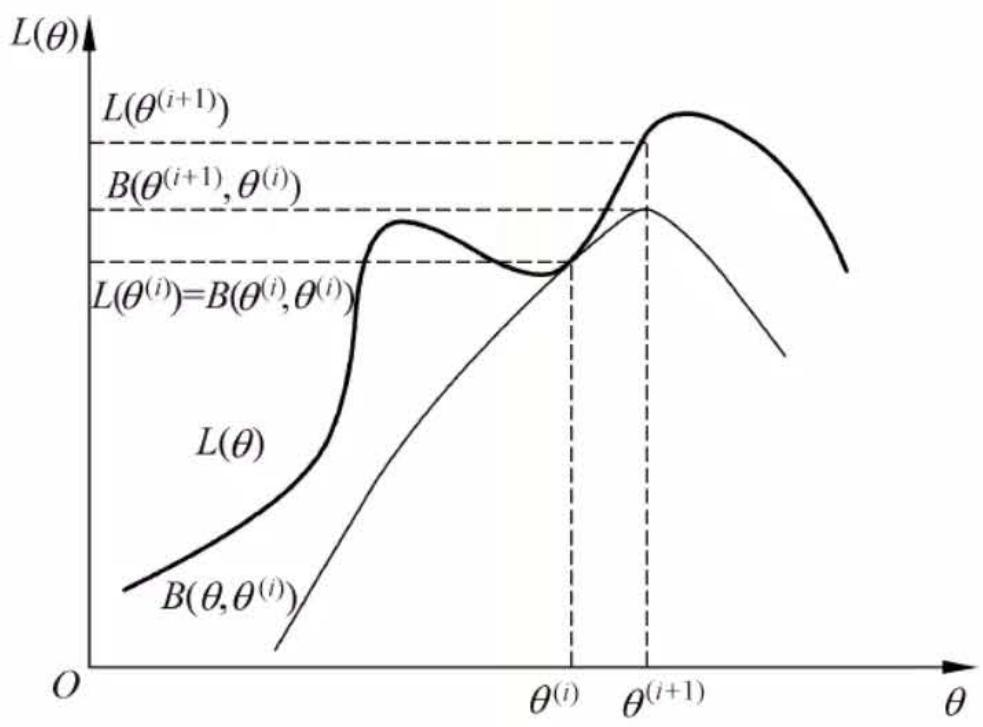  
图9.1 EM算法的解释

## 9.1.3 EM算法在监督学习中的应

监督学习是指由训练数据 $\{ ( x _ { 1 } , y _ { 1 } ) , ( x _ { 2 } , y _ { 2 } ) , \cdots , ( x _ { N } , y _ { N } ) \}$ 学习条件概率分布 $P ( Y | X )$ 或决策函数 $Y = f ( X )$ 作为模型，于分类、回归、标注等任务。这时训练数据中的每个样本点由输和输出对组成。

有时训练数据只有输没有对应的输出 $\{ ( x _ { 1 } , \textbf { * } ) , ( x _ { 2 } , \textbf { * } ) , \cdots , ( x _ { N } , \textbf { * } ) \}$ ，从这样的数据学习模型称为监督学习问题。EM算法可以于成模型的监督学习。成模型由联合概率分布 $P ( X , Y )$ 表，可以认为监督学习训练数据是联合概率分布产的数据。X为观测数据，Y为未观测数据。

## 9.2 EM算法的收敛性

EM算法提供种近似计算含有隐变量概率模型的极似然估计的法。EM算法的最优点是简单性和普适性。我们很然地要问：EM算法得到的估计序列是否收敛？如果收敛，是否收敛到全局最值或局部极值？下给出关于EM算法收敛性的两个定理。

定理9.1设 $P ( \boldsymbol { Y } | \boldsymbol { \theta } )$ 为观测数据的似然函数， $\theta ^ { ( i ) } ( i = 1 , 2 , \cdots )$ 为EM算法得到的参数估计序列， $P ( Y | \theta ^ { ( i ) } ) ( i = 1 , 2 , \cdots )$ 为对应的似然函数序列，则 $P ( \boldsymbol { Y } | \theta ^ { ( i ) } )$ 是单调递增的,即

$$
P ( Y | \theta ^ { ( i + 1 ) } ) \geqslant P ( Y | \theta ^ { ( i ) } )\tag{9.18}
$$

证明由于

$$
P ( Y | \theta ) = \frac { P ( Y , Z | \theta ) } { P ( Z | Y , \theta ) }
$$

取对数有

$$
\log P ( Y | \theta ) = \log P ( Y , Z | \theta ) - \log P ( Z | Y , \theta )
$$

由式(9.11)得：

$$
Q ( \theta , \theta ^ { ( i ) } ) = \sum _ { Z } \log P ( Y , Z | \theta ) P ( Z | Y , \theta ^ { ( i ) } )
$$

令

$$
{ H } ( \theta , { \theta } ^ { ( i ) } ) = \sum _ { Z } \log P ( Z | Y , \theta ) P ( Z | Y , { \theta } ^ { ( i ) } )\tag{9.19}
$$

于是对数似然函数可以写成

$$
\log P ( Y | \theta ) = Q ( \theta , \theta ^ { ( i ) } ) - H ( \theta , \theta ^ { ( i ) } )\tag{9.20}
$$

在式(9.20)中分别取θ为 $\theta ^ { ( i ) }$ 和 $\theta ^ { ( i + 1 ) }$ 并相减,有

$$
\begin{array} { r l } & { \log P ( \boldsymbol { Y } | \boldsymbol { \theta } ^ { ( i + 1 ) } ) - \log P ( \boldsymbol { Y } | \boldsymbol { \theta } ^ { ( i ) } ) } \\ & { \qquad = [ Q ( \boldsymbol { \theta } ^ { ( i + 1 ) } , \boldsymbol { \theta } ^ { ( i ) } ) - Q ( \boldsymbol { \theta } ^ { ( i ) } , \boldsymbol { \theta } ^ { ( i ) } ) ] - [ H ( \boldsymbol { \theta } ^ { ( i + 1 ) } , \boldsymbol { \theta } ^ { ( i ) } ) - H ( \boldsymbol { \theta } ^ { ( i ) } , \boldsymbol { \theta } ^ { ( i ) } ) ] } \end{array}\tag{9.21}
$$

为证明式(9.18)，只需证明式(9.21)右端是负的。对于式(9.21)右端的第1项，由于$\theta ^ { ( i + 1 ) }$ 使 $Q ( \theta , \theta ^ { ( i ) } )$ 达到极大，所以有

$$
Q ( \theta ^ { ( i + 1 ) } , \theta ^ { ( i ) } ) - Q ( \theta ^ { ( i ) } , \theta ^ { ( i ) } ) \geqslant 0\tag{9.22}
$$

对于第2项，由式(9.19)可得：

$$
\begin{array} { l } { { H ( { \theta } ^ { ( i + 1 ) } , { \theta } ^ { ( i ) } ) - H ( { \theta } ^ { ( i ) } , { \theta } ^ { ( i ) } ) = \displaystyle \sum _ { Z } \left( \log \frac { P ( Z | Y , { \theta } ^ { ( i + 1 ) } ) } { P ( Z | Y , { \theta } ^ { ( i ) } ) } \right) P ( Z | Y , { \theta } ^ { ( i ) } ) } } \\ { ~ \leqslant \log \left( \displaystyle \sum _ { Z } \frac { P ( Z | Y , { \theta } ^ { ( i + 1 ) } ) } { P ( Z | Y , { \theta } ^ { ( i ) } ) } P ( Z | Y , { \theta } ^ { ( i ) } ) \right) }  \\ { ~ = \log \left( \displaystyle \sum _ { Z } P ( Z | Y , { \theta } ^ { ( i + 1 ) } ) \right) = 0 } \end{array}\tag{9.23}
$$

这的不等号由Jensen不等式得到。

由式(9.22)和式(9.23)即知式(9.21)右端是负的。

定理9.2设 $L ( \theta ) = \log P ( Y | \theta )$ 为观测数据的对数似然函数， $\theta ^ { ( i ) } ( i = 1 , 2 , \cdots )$ 为EM算法得到的参数估计序列， $L ( \theta ^ { ( i ) } ) ( i = 1 , 2 , \cdots )$ 为对应的对数似然函数序列。

(1)如果 $P ( \boldsymbol { Y } | \boldsymbol { \theta } )$ 有上界，则 $L ( \theta ^ { ( i ) } ) = \log P ( Y | \theta ^ { ( i ) } )$ 收敛到某一值 $L ^ { * }$ ,

(2)在函数 $Q ( \theta , \theta ^ { \prime } )$ 与 $L ( \theta )$ 满足一定条件的情况下，由EM算法得到的参数估计序列$\theta ^ { ( i ) }$ 的收敛值 $\theta ^ { * }$ 是 $L ( \theta )$ 的稳定点。

证明（1）由 $L ( \theta ) = \log P ( Y | \theta ^ { ( i ) } )$ 的单调性及 $P ( \boldsymbol { Y } | \boldsymbol { \theta } )$ 的有界性得到。

(2)证明从略，参阅献[5]。

定理9.2关于函数 $Q ( \theta , \theta ^ { \prime } )$ 与 $L ( \theta )$ 的条件在多数情况下都是满的。EM算法的收敛性包含关于对数似然函数序列 $L ( \theta ^ { ( i ) } )$ 的收敛性和关于参数估计序列 $\theta ^ { ( i ) }$ 的收敛性两层意思，前者并不蕴含后者。此外，定理只能保证参数估计序列收敛到对数似然函数序列的稳定点，不能保证收敛到极值点。所以在应中，初值的选择变得常重要，常的法是选取个不同的初值进迭代，然后对得到的各个估计值加以较，从中选择最好的。

## 9.3EM算法在斯混合模型学习中的应

EM算法的个重要应是斯混合模型的参数估计。斯混合模型应泛，在许多情况下，EM算法是学习斯混合模型（Gaussianmixturemodel）的有效法。

## 9.3.1 高斯混合模型

定义9.2（高斯混合模型）斯混合模型是指具有如下形式的概率分布模型：

$$
P ( y | \theta ) = \sum _ { k = 1 } ^ { K } \alpha _ { k } \phi ( y | \theta _ { k } )\tag{9.24}
$$

其中， $\alpha _ { k }$ 是系数， $\alpha _ { k } \geqslant 0 , \sum _ { k = 1 } ^ { K } \alpha _ { k } = 1 ; \ \phi ( y | \theta _ { k } )$ 是高斯分布密度， $\theta _ { k } = ( \mu _ { k } , \sigma _ { k } ^ { 2 } )$ ,

$$
\phi ( y | \theta _ { k } ) = \frac { 1 } { \sqrt { 2 \pi } \sigma _ { k } } \exp \left[ - \frac { ( y - \mu _ { k } ) ^ { 2 } } { 2 \sigma _ { k } ^ { 2 } } \right]\tag{9.25}
$$

称为第k个分模型。

般混合模型可以由任意概率分布密度代替式(9.25）中的斯分布密度，我们只介绍最常用的高斯混合模型。

## 9.3.2 高斯混合模型参数估计的EM算法

假设观测数据 $y _ { 1 } , y _ { 2 } , \cdots , y _ { N }$ 由高斯混合模型生成：

$$
P ( y | \theta ) = \sum _ { k = 1 } ^ { K } \alpha _ { k } \phi ( y | \theta _ { k } )\tag{9.26}
$$

其中， $\theta = ( \alpha _ { 1 } , \alpha _ { 2 } , \cdots , \alpha _ { K } ; \theta _ { 1 } , \theta _ { 2 } , \cdots , \theta _ { K } )$ 。我们EM算法估计斯混合模型的参数 $\theta _ { \epsilon }$ 。

## 1.明确隐变量，写出完全数据的对数似然函数

可以设想观测数据 $y _ { j } , ~ j = 1 , 2 , \cdot \cdot \cdot , N$ ，是这样产的：先根据概率 $\alpha _ { k }$ 选择第k个高斯分布分模型 $\phi ( y | \theta _ { k } )$ ，然后由第k个分模型的概率分布 $\phi ( y | \theta _ { k } )$ 生成观测数据 $y _ { j }$ 。这时观测数据 $y _ { j } , ~ j = 1 , 2 , \cdots , N$ ，是已知的，反映观测数据 $y _ { j }$ 来第k个分模型的数据是未知的， $k = 1 , 2 , \cdots , K$ ，以隐变量 $\gamma _ { j k }$ 表示，其定义如下：

$$
\begin{array} { r l } & { \gamma _ { j k } = \left\{ \begin{array} { l l } { 1 , } & { \frac { \kappa \beta } { \beta } j \uparrow \uparrow \Im { \mathrm { [ } j \downarrow \mathrm { ] } } \Im { \mathrm { [ } j \downarrow \mathrm { ] } } \downarrow \downarrow \downarrow \downarrow } \\ { 0 , } & { \frac { \pi } { \mathrm { [ } \hphantom { - } \mathrm { ] } } \Re { \mathrm { [ } j \downarrow \mathrm { ] } } } \end{array} \right. } \\ & { j = 1 , 2 , \cdot \cdot \cdot , N , \quad k = 1 , 2 , \cdot \cdot \cdot , K } \end{array}\tag{9.27}
$$

其中， $\gamma _ { j k }$ 是0-1随机变量。

有了观测数据 $y _ { j }$ 及未观测数据 $\gamma _ { j k }$ ，那么完全数据是

$$
( y _ { j } , \gamma _ { j 1 } , \gamma _ { j 2 } , \cdots , \gamma _ { j K } ) , \quad j = 1 , 2 , \cdots , N
$$

于是，可以写出完全数据的似然函数：

$$
\begin{array} { l } { \displaystyle P ( y , \gamma | \theta ) = \prod _ { j = 1 } ^ { N } P ( y _ { j } , \gamma _ { j 1 } , \gamma _ { j 2 } , \dots , \gamma _ { j K } | \theta ) } \\ { \displaystyle = \prod _ { k = 1 } ^ { K } \prod _ { j = 1 } ^ { N } [ \alpha _ { k } \phi ( y _ { j } | \theta _ { k } ) ] ^ { \gamma _ { j k } } } \\ { \displaystyle = \prod _ { k = 1 } ^ { K } \alpha _ { k } ^ { n _ { k } } \prod _ { j = 1 } ^ { N } [ \beta ( y _ { j } | \theta _ { k } ) ] ^ { \gamma _ { j k } } } \\ { \displaystyle = \prod _ { k = 1 } ^ { K } \alpha _ { k } ^ { n _ { k } } \prod _ { j = 1 } ^ { N } \left\{ \frac { 1 } { \sqrt { 2 \pi } \sigma _ { k } } \exp \left[ - \frac { ( y _ { j } - \mu _ { k } ) ^ { 2 } } { 2 \sigma _ { k } ^ { 2 } } \right] \right\} ^ { \gamma _ { j k } } } \end{array}
$$

式中， $n _ { k } = \sum _ { j = 1 } ^ { N } \gamma _ { j k } , \sum _ { k = 1 } ^ { K } n _ { k } = N ,$

那么，完全数据的对数似然函数为

$$
\log P ( y , \gamma | \theta ) = \sum _ { k = 1 } ^ { K } \left\{ n _ { k } \log \alpha _ { k } + \sum _ { j = 1 } ^ { N } \gamma _ { j k } \left[ \log \frac { 1 } { \sqrt { 2 \pi } } - \log \sigma _ { k } - \frac { 1 } { 2 \sigma _ { k } ^ { 2 } } ( y _ { j } - \mu _ { k } ) ^ { 2 } \right] \right\}
$$

2.EM算法的E步：确定 $Q$ 函数

$$
\begin{array} { r l } & { Q ( \theta , \theta ^ { ( i ) } ) = E [ \log P ( y , \gamma | \theta ) | y , \theta ^ { ( i ) } ] } \\ & { \qquad = E \displaystyle \sum _ { k = 1 } ^ { K } \left\{ n _ { k } \log \alpha _ { k } + \sum _ { j = 1 } ^ { N } \gamma _ { j k } \left[ \log \frac { 1 } { \sqrt { 2 \pi } } - \log \sigma _ { k } - \frac { 1 } { 2 \sigma _ { k } ^ { 2 } } ( y _ { j } - \mu _ { k } ) ^ { 2 } \right] \right\} } \\ & { \qquad = \displaystyle \sum _ { k = 1 } ^ { K } \left\{ \sum _ { j = 1 } ^ { N } ( E \gamma _ { j k } ) \log \alpha _ { k } + \sum _ { j = 1 } ^ { N } ( E \gamma _ { j k } ) \left[ \log \frac { 1 } { \sqrt { 2 \pi } } - \log \sigma _ { k } - \frac { 1 } { 2 \sigma _ { k } ^ { 2 } } ( y _ { j } - \mu _ { k } ) ^ { 2 } \right] \right\} } \end{array}\tag{9.28}
$$

这里需要计算 $E ( \gamma _ { j k } | y , \theta )$ ，记为 $\hat { \gamma } _ { j k }$

$$
\begin{array} { r l } & { \hat { \gamma } _ { j k } = E ( \gamma _ { j k } | \boldsymbol { \hat { x } } _ { j } , \boldsymbol { \theta } ) = P ( \gamma _ { j k } = 1 | \boldsymbol { y } , \boldsymbol { \theta } ) } \\ & { \quad = \frac { P \left( \gamma _ { k } \right) } { k } ( \gamma _ { j k } = 1 , y _ { j } | \boldsymbol { \theta } ) } \\ & { \quad \quad \quad \quad \quad \quad \quad \quad \quad \quad \quad \quad \quad \quad \quad \quad \quad \quad \quad \quad \quad \quad \quad \quad \quad \quad \quad \quad \quad \quad \quad } \\ & { \quad \quad \quad \quad \quad \quad \quad \quad \quad \quad \quad \quad \quad \quad \quad \quad \quad \quad \quad \quad \quad \quad \quad \quad \quad \quad \quad \quad \quad \quad \quad \quad \quad } \\ & { \quad \quad \quad \quad \quad \quad \quad \quad \quad \quad \quad \quad \quad \quad \quad \quad \quad \quad \quad \quad \quad \quad \quad \quad \quad \quad \quad \quad \quad \quad \quad \quad \quad \quad \quad } \\ & { \quad \quad \quad \quad \quad \quad \quad \quad \quad \quad \quad \quad \quad \quad \quad \quad \quad \quad \quad \quad \quad \quad \quad \quad \quad \quad \quad \quad \quad \quad \quad \quad \quad \quad \quad \quad } \\ & { \quad \quad \quad \quad \quad \quad \quad \quad \quad \quad \quad \quad \quad \quad \quad \quad \quad \quad \quad \quad \quad \quad \quad \quad \quad \quad \quad \quad \quad \quad \quad \quad \quad \quad \quad \quad \quad } \\ & { \quad \quad \quad \quad \quad \quad \quad \quad \quad \quad \quad \quad \quad \quad \quad \quad \quad \quad \quad \quad \quad \quad \quad \quad \quad \quad \quad \quad \quad \quad \quad \quad \quad \quad \quad \quad \quad \quad \quad } \\ & { \quad \quad \quad \quad \quad \quad \quad \quad \quad \quad \quad \quad \quad \quad \quad \quad \quad \quad \quad \quad \quad \quad \quad \quad \quad \quad \quad \quad \quad \quad \quad \quad \quad \quad \quad \quad \quad \quad \quad \quad \quad \quad } \\ &  \quad \quad \quad \quad \quad \quad \quad \quad \quad \quad \quad \quad \quad \quad \quad \quad \quad \quad \quad \quad \quad \quad \quad \quad \quad \quad \quad \quad \quad \quad \quad \quad \quad \quad \quad \quad \quad  \end{array}
$$

$\hat { \gamma } _ { j k }$ 是在当前模型参数下第 $j$ 个观测数据来第k个分模型的概率，称为分模型k对观测数据 $y _ { j }$ 的响应度。

将 $\hat { \gamma } _ { j k } = E \gamma _ { j k }$ 及 $n _ { k } = \sum _ { j = 1 } ^ { N } E \gamma _ { j k }$ 代入式(9.28)，即得：

$$
Q ( \theta , \theta ^ { ( i ) } ) = \sum _ { k = 1 } ^ { K } \left\{ n _ { k } \log \alpha _ { k } + \sum _ { j = 1 } ^ { N } \hat { \gamma } _ { j k } \left[ \log \frac { 1 } { \sqrt { 2 \pi } } - \log \sigma _ { k } - \frac { 1 } { 2 \sigma _ { k } ^ { 2 } } ( y _ { j } - \mu _ { k } ) ^ { 2 } \right] \right\}\tag{9.29}
$$

## 3.确定EM算法的M步

迭代的M步是求函数 $Q ( \theta , \theta ^ { ( i ) } )$ 对θ的极值，即求新轮迭代的模型参数：

$$
\theta ^ { ( i + 1 ) } = \arg \operatorname* { m a x } _ { \theta } Q ( \theta , \theta ^ { ( i ) } )
$$

用 ${ \hat { \mu } } _ { k } , \ { \hat { \sigma } } _ { k } ^ { 2 }$ 及 ${ \hat { \alpha } } _ { k } , k = 1 , 2 , \cdots , K$ ，表示 $\theta ^ { ( i + 1 ) }$ 的各参数。求 ${ \hat { \mu } } _ { k } , \ { \hat { \sigma } } _ { k } ^ { 2 }$ 只需将式(9.29)分别对 $\mu _ { k } , ~ \sigma _ { k } ^ { 2 }$ 求偏导数并令其为0，即可得到； $\hat { \alpha } _ { k }$ 是在 $\sum _ { k = 1 } ^ { K } \alpha _ { k } = 1$ 条件下求偏导数并令其为0得到的。结果如下：

$$
\hat { \mu } _ { k } = \frac { \displaystyle \sum _ { j = 1 } ^ { N } \hat { \gamma } _ { j k } y _ { j } } { \displaystyle \sum _ { j = 1 } ^ { N } \hat { \gamma } _ { j k } } , \quad k = 1 , 2 , \cdots , K\tag{9.30}
$$

$$
\hat { \sigma } _ { k } ^ { 2 } = \frac { \displaystyle \sum _ { j = 1 } ^ { N } \hat { \gamma } _ { j k } ( y _ { j } - \mu _ { k } ) ^ { 2 } } { \displaystyle \sum _ { j = 1 } ^ { N } \hat { \gamma } _ { j k } } , \quad k = 1 , 2 , \cdots , K\tag{9.31}
$$

$$
\hat { \alpha } _ { k } = \frac { n _ { k } } { N } = \frac { \displaystyle \sum _ { j = 1 } ^ { N } \hat { \gamma } _ { j k } } { N } , \quad k = 1 , 2 , \cdots , K\tag{9.32}
$$

重复以上计算，直到对数似然函数值不再有明显的变化为。

现将估计斯混合模型参数的EM算法总结如下。

## 算法9.2（高斯混合模型参数估计的EM算法）

输入：观测数据 $y _ { 1 } , y _ { 2 } , \cdots , y _ { N }$ ，斯混合模型。

输出：斯混合模型参数。

(1）取参数的初始值开始迭代。

(2）E步：依据当前模型参数，计算分模型k对观测数据 $y _ { j }$ 的响应度。

$$
\hat { \gamma } _ { j k } = \frac { \alpha _ { k } \phi ( y _ { j } | \theta _ { k } ) } { K } , \quad j = 1 , 2 , \cdots , N , \quad k = 1 , 2 , \cdots , K
$$

(3）M步：计算新轮迭代的模型参数。

$$
\hat { \mu } _ { k } = \frac { \displaystyle \sum _ { j = 1 } ^ { N } \hat { \gamma } _ { j k } y _ { j } } { \displaystyle \sum _ { j = 1 } ^ { N } \hat { \gamma } _ { j k } } , \quad k = 1 , 2 , \cdots , K
$$

$$
\hat { \sigma } _ { k } ^ { 2 } = \frac { \displaystyle \sum _ { j = 1 } ^ { N } \hat { \gamma } _ { j k } ( y _ { j } - \mu _ { k } ) ^ { 2 } } { \displaystyle \sum _ { j = 1 } ^ { N } \hat { \gamma } _ { j k } } , \quad k = 1 , 2 , \cdots , K
$$

$$
\hat { \alpha } _ { k } = \frac { \displaystyle \sum _ { j = 1 } ^ { N } \hat { \gamma } _ { j k } } { N } , \quad k = 1 , 2 , \cdots , K
$$

(4)重复第2步和第3步，直到收敛。

## 9.4 EM算法的推

EM算法还可以解释为F函数（Ffunction）的极-极算法（maximization-maximizationalgorithm），基于这个解释有若变形与推，如义期望极（generalizedexpectationmaximization，GEM）算法。下面予以介绍。

## 9.4.1 F函数的极-极算法

先引F函数并讨论其性质。

定义9.3（F函数） 假设隐变量数据乙的概率分布为 $\tilde { P } ( Z )$ ,定义分布 $\tilde { P }$ 与参数日的函数 $F ( \tilde { P } , \theta )$ 如下：

$$
F ( \tilde { P } , \theta ) = E _ { \tilde { P } } [ \log P ( Y , Z | \theta ) ] + H ( \tilde { P } )\tag{9.33}
$$

称为F函数。式中 $H ( \tilde { P } ) = - E _ { \tilde { P } } \log \tilde { P } ( Z )$ 是分布 $\tilde { P } ( Z )$ 的熵。

在定义9.3中，通常假设 $P ( \boldsymbol { Y } , \boldsymbol { Z } | \boldsymbol { \theta } )$ 是0的连续函数，因而 $F ( { \tilde { P } } , \theta )$ 是 $\tilde { P }$ 和0的连续函数。函数 $F ( { \tilde { P } } , \theta )$ 还有以下重要性质。

引理9.1 对于固定的0，存在唯的分布 $\tilde { P } _ { \theta }$ 极大化 $F ( { \tilde { P } } , \theta )$ ,这时 $\tilde { P } _ { \theta }$ 由下式给出：

$$
\tilde { P } _ { \theta } ( Z ) = P ( Z | Y , \theta )\tag{9.34}
$$

并且 $\tilde { P } _ { \theta }$ 随θ连续变化。

证明 对于固定的θ，可以求得使 $F ( { \tilde { P } } , \theta )$ 达到极大的分布 $\tilde { P } _ { \theta } ( Z )$ 。为此，引入拉格朗乘子入，拉格朗日函数为

$$
L = E _ { \tilde { P } } \log P ( Y , Z | \theta ) - E _ { \tilde { P } } \log \tilde { P } ( Z ) + \lambda \left( 1 - \sum _ { Z } \tilde { P } ( Z ) \right)\tag{9.35}
$$

将其对 $\tilde { P }$ 求偏导数：

$$
\frac { \partial { \cal L } } { \partial \tilde { P } ( Z ) } = \log P ( Y , Z | \theta ) - \log \tilde { P } ( Z ) - 1 - \lambda
$$

令偏导数等于0，得出：

$$
\lambda = \log P ( Y , Z | \theta ) - \log \tilde { P } _ { \theta } ( Z ) - 1
$$

由此推导出 $\tilde { P } _ { \theta } ( Z )$ 与 $P ( \boldsymbol { Y } , \boldsymbol { Z } | \boldsymbol { \theta } )$ 成比例：

$$
\frac { P ( Y , Z | \theta ) } { \tilde { P } _ { \theta } ( Z ) } = \mathrm { { e } } ^ { 1 + \lambda }
$$

再从约束条件 $\sum _ { Z } \tilde { P } _ { \theta } ( Z ) = 1$ 得式(9.34)。

由假设 $P ( \boldsymbol { Y } , \boldsymbol { Z } | \boldsymbol { \theta } )$ 是0的连续函数得到 $\tilde { P } _ { \theta }$ 是0的连续函数。

引理9.2若 $\tilde { P } _ { \theta } ( Z ) = P ( Z | Y , \theta )$ ，则

$$
F ( \tilde { P } , \theta ) = \log P ( Y | \theta )\tag{9.36}
$$

证明作为习题，留给读者。

由以上引理，可以得到关于EM算法F函数的极-极算法的解释。

定理9.3设 $L ( \theta ) = \log P ( Y | \theta )$ 为观测数据的对数似然函数， $\theta ^ { ( i ) } , ~ i = 1 , 2 , \cdots$ ,为EM算法得到的参数估计序列，函数 $F ( { \tilde { P } } , \theta )$ 由式(9.33)定义。如果 $F ( { \tilde { P } } , \theta )$ 在 ${ \tilde { P } } ^ { * }$ 和 $\theta ^ { * }$ 有局部极大值，那么 $L ( \theta )$ 也在 $\theta ^ { * }$ 有局部极大值。类似地，如果 $F ( { \tilde { P } } , \theta )$ 在 ${ \tilde { P } } ^ { * }$ 和 $\theta ^ { * }$ 达到全局最大值，那么 $L ( \theta )$ 也在 $\theta ^ { * }$ 达到全局最大值。

证明 由引理9.1和引理9.2可知， $L ( \theta ) = \log P ( Y | \theta ) = F ( \tilde { P } _ { \theta } , \theta )$ 对任意θ成。特别地，对于使 $F ( \tilde { P } , \theta )$ 达到极大的参数 $\theta ^ { * }$ ,有

$$
L ( \theta ^ { * } ) = F ( \tilde { P } _ { \theta ^ { * } } , \theta ^ { * } ) = F ( \tilde { P } ^ { * } , \theta ^ { * } )\tag{9.37}
$$

为了证明 $\theta ^ { * }$ 是 $L ( \theta )$ 的极大点，需要证明不存在接近 $\theta ^ { * }$ 的点 $\theta ^ { * * }$ ,使 $L ( \theta ^ { * * } ) > L ( \theta ^ { * } )$ 。假如存在这样的点 $\theta ^ { * * }$ ，那么应有 ${ F ( \tilde { P } ^ { * * } , \theta ^ { * * } ) > F ( \tilde { P } ^ { * } , \theta ^ { * } ) }$ ,这里 $\tilde { P } ^ { * * } = \tilde { P } _ { \theta ^ { * * } }$ 。但因 $\tilde { P } _ { \theta }$ 是随 $\theta$ 连续变化的， $\tilde { P } ^ { * * }$ 应接近 ${ \tilde { P } } ^ { * }$ ,这与 ${ \tilde { P } } ^ { * }$ 和 $\theta ^ { * }$ 是 $F ( { \tilde { P } } , \theta )$ 的局部极点的假设盾。

类似可以证明关于全局最值的结论。

定理9.4EM算法的次迭代可由F函数的极大-极大算法实现。

设 $\theta ^ { ( i ) }$ 为第 $i$ 次迭代参数日的估计， $\tilde { P } ^ { ( i ) }$ 为第i次迭代函数 $\tilde { P }$ 的估计。第 $i + 1$ 次迭代的两步如下：

(1)对固定的 $\theta ^ { ( i ) }$ ,求 $\tilde { P } ^ { ( i + 1 ) }$ 使 $F ( \tilde { P } , \theta ^ { ( i ) } )$ 极大化；

(2)对固定的 $\tilde { P } ^ { ( i + 1 ) }$ ,求 $\theta ^ { ( i + 1 ) }$ 使 $F ( \tilde { P } ^ { ( i + 1 ) } , \theta )$ 极大化。

证明 （1）由引理9.1，对于固定的 $\theta ^ { ( i ) }$ ,

$$
\tilde { P } ^ { ( i + 1 ) } ( Z ) = \tilde { P } _ { \theta ^ { ( i ) } } ( Z ) = P ( Z | Y , \theta ^ { ( i ) } )
$$

使 $F ( \tilde { P } , \theta ^ { ( i ) } )$ 极化。此时，

$$
\begin{array} { l } { { { \cal F } ( \tilde { P } ^ { ( i + 1 ) } , \theta ) = E _ { \tilde { P } ^ { ( i + 1 ) } } [ \log P ( Y , Z | \theta ) ] + { \cal H } ( \tilde { P } ^ { ( i + 1 ) } ) } } \\ { { \ ~ = \displaystyle \sum _ { Z } \log P ( Y , Z | \theta ) P ( Z | Y , \theta ^ { ( i ) } ) + { \cal H } ( \tilde { P } ^ { ( i + 1 ) } ) } } \end{array}
$$

由 $Q ( \theta , \theta ^ { ( i ) } )$ 的定义式(9.11)有

$$
F ( \tilde { P } ^ { ( i + 1 ) } , \theta ) = Q ( \theta , \theta ^ { ( i ) } ) + H ( \tilde { P } ^ { ( i + 1 ) } )
$$

(2）固定 $\tilde { P } ^ { ( i + 1 ) }$ ,求 $\theta ^ { ( i + 1 ) }$ 使 $F ( \tilde { P } ^ { ( i + 1 ) } , \theta )$ 极大化，得到：

$$
\theta ^ { ( i + 1 ) } = \arg \operatorname* { m a x } _ { \theta } F ( \tilde { P } ^ { ( i + 1 ) } , \theta ) = \arg \operatorname* { m a x } _ { \theta } Q ( \theta , \theta ^ { ( i ) } )
$$

通过以上两步完成了EM算法的次迭代。由此可知，由EM算法与F函数的极-极算法得到的参数估计序列 $\theta ^ { ( i ) } , i = 1 , 2 , \cdots$ ，是致的。 ■

这样，就有EM算法的推。

## 9.4.2 GEM算法

算法9.3（GEM算法1）

输入：观测数据，F函数。

输出：模型参数。

(1）初始化参数 $\theta ^ { ( 0 ) }$ ，开始迭代；

（2）第 $i + 1$ 次迭代，第1步：记 $\theta ^ { ( i ) }$ 为参数θ的估计值， $\tilde { P } ^ { ( i ) }$ 为函数 $\tilde { P }$ 的估计，求$\tilde { P } ^ { ( i + 1 ) }$ 使 $\tilde { P }$ 极大化 $F ( \tilde { P } , \theta ^ { ( i ) } )$

(3)第2步：求 $\theta ^ { ( i + 1 ) }$ 使 $F ( \tilde { P } ^ { ( i + 1 ) } , \theta )$ 极大化；

(4)重复步骤(2)和步骤(3)，直到收敛。

在GEM算法1中，有时求 $Q ( \theta , \theta ^ { ( i ) } )$ 的极化是很困难的。下介绍的GEM算法2和GEM算法3并不是直接求 $\theta ^ { ( i + 1 ) }$ 使 $Q ( \theta , \theta ^ { ( i ) } )$ 达到极的θ，是找个 $\theta ^ { ( i + 1 ) }$ 使得$Q ( \theta ^ { ( i + 1 ) } , \theta ^ { ( i ) } ) > Q ( \theta ^ { ( i ) } , \theta ^ { ( i ) } )$

算法9.4（GEM算法2）

输入：观测数据，Q函数。

输出：模型参数。

(1）初始化参数 $\theta ^ { ( 0 ) }$ ，开始迭代；

(2）第 $i + 1$ 次迭代，第1步：记 $\theta ^ { ( i ) }$ 为参数θ的估计值，计算

$$
\begin{array} { l } { { Q ( \theta , { \theta ^ { ( i ) } } ) = E _ { Z } [ { \log P ( Y , { Z | \theta ) } | Y , { \theta ^ { ( i ) } } } ] } } \\ { { \ = \displaystyle \sum _ { Z } P ( Z | Y , { \theta ^ { ( i ) } } ) \log P ( Y , { Z | \theta } ) } } \end{array}
$$

(3)第2步：求 $\theta ^ { ( i + 1 ) }$ 使

$$
Q ( \theta ^ { ( i + 1 ) } , \theta ^ { ( i ) } ) > Q ( \theta ^ { ( i ) } , \theta ^ { ( i ) } )
$$

(4)重复步骤(2)和步骤(3)，直到收敛。

当参数0的维数为 $d \left( d \geqslant 2 \right)$ 时，可采种特殊的GEM算法，它将EM算法的M步分解为d次条件极化，每次只改变参数向量的个分量，其余分量不改变。

## 算法9.5（GEM算法3）

输入：观测数据，Q函数。

输出：模型参数。

(1)初始化参数 $\boldsymbol { \theta ^ { ( 0 ) } } = ( \theta _ { 1 } ^ { ( 0 ) } , \theta _ { 2 } ^ { ( 0 ) } , \cdots , \theta _ { d } ^ { ( 0 ) } )$ ，开始迭代；

(2)第i+1次迭代，第1步：记 $\theta ^ { ( i ) } = ( \theta _ { 1 } ^ { ( i ) } , \theta _ { 2 } ^ { ( i ) } , \cdot \cdot \cdot , \theta _ { d } ^ { ( i ) } )$ 为参数 $\theta = ( \theta _ { 1 } , \theta _ { 2 } , \cdots , \theta _ { d } )$ 的估计值,计算

$$
\begin{array} { l } { { \displaystyle Q ( \theta , \theta ^ { ( i ) } ) = E _ { Z } [ \log P ( Y , Z \vert \theta ) \vert Y , \theta ^ { ( i ) } ] } } \\ { { \displaystyle ~ = \sum _ { Z } P ( Z \vert y , \theta ^ { ( i ) } ) \log P ( Y , Z \vert \theta ) } } \end{array}
$$

(3）第2步：进d次条件极化：先，在 $\theta _ { 2 } ^ { ( i ) } , \cdots , \theta _ { d } ^ { ( i ) }$ 保持不变的条件下求使 $Q ( \theta , \theta ^ { ( i ) } )$ 达到极大的 $\theta _ { 1 } ^ { ( i + 1 ) }$ ；然后，在 $\theta _ { 1 } \ = \ \theta _ { 1 } ^ { ( i + 1 ) }$ $\theta _ { j } = \theta _ { j } ^ { ( i ) }$ ,j=3,4,..,d的条件下求使 $Q ( \theta , \theta ^ { ( i ) } )$ 达到极大的 $\theta _ { 2 } ^ { ( i + 1 ) }$ ；如此继续，经过d次条件极化，得到 $\theta ^ { ( i + 1 ) } =$ $( \theta _ { 1 } ^ { ( i + 1 ) } , \theta _ { 2 } ^ { ( i + 1 ) } , \cdots , \theta _ { d } ^ { ( i + 1 ) } )$ 使得

$$
Q ( \theta ^ { ( i + 1 ) } , \theta ^ { ( i ) } ) > Q ( \theta ^ { ( i ) } , \theta ^ { ( i ) } )
$$

(4)重复步骤(2)和步骤(3)，直到收敛。

## 本章概要

1.EM算法是含有隐变量的概率模型极似然估计或极后验概率估计的迭代算法。含有隐变量的概率模型的数据表为 $P ( \boldsymbol { Y } , \boldsymbol { Z } | \boldsymbol { \theta } )$ 。这，Y是观测变量的数据，Z是隐变量的数据， $\theta$ 是模型参数。EM算法通过迭代求解观测数据的对数似然函数 $L ( \theta ) = \log P ( Y | \theta )$ 的极化，实现极似然估计。每次迭代包括两步：E步，求期望，即求 $\log P ( Y , Z | \theta )$ 关于$P ( Z | Y , \theta ^ { ( i ) } )$ 的期望：

$$
Q ( \theta , \theta ^ { ( i ) } ) = \sum _ { Z } \log P ( Y , Z | \theta ) P ( Z | Y , \theta ^ { ( i ) } )
$$

称为 $Q$ 函数，这里 $\theta ^ { ( i ) }$ 是参数的现估计值；M步，求极大，即极大化 $Q$ 函数得到参数的新估计值：

$$
\theta ^ { ( i + 1 ) } = \arg \operatorname* { m a x } _ { \theta } Q ( \theta , \theta ^ { ( i ) } )
$$

在构建具体的EM算法时，重要的是定义 $Q$ 函数。每次迭代中，EM算法通过极大化 $Q$ 函数来增大对数似然函数 $L ( \theta )$ 。

2.EM算法在每次迭代后均提观测数据的似然函数值，即

$$
P ( Y | \theta ^ { ( i + 1 ) } ) \geqslant P ( Y | \theta ^ { ( i ) } )
$$

在般条件下EM算法是收敛的，但不能保证收敛到全局最优。

3.EM算法应极其泛，主要应于含有隐变量的概率模型的学习。斯混合模型的参数估计是EM算法的个重要应，第10章将要介绍的隐马尔可夫模型的监督学习也是EM算法的个重要应。

4.EM算法还可以解释为F函数的极-极算法。EM算法有许多变形，如GEM算法。GEM算法的特点是每次迭代增加F函数值（并不定是极化F函数），从增加似然函数值。

## 继续阅读

EM算法由Dempster等总结提出[]。类似的算法之前已被提出，如Baum-Welch算法，但是都没有EM算法那么泛。EM算法的介绍可参见献[2]～献[4]。EM算法收敛性定理的有关证明见献[5]。GEM是由Neal与Hinton提出的[6]。

## 习 题

9.1 如例9.1的三硬币模型。假设观测数据不变，试选择不同的初值，例如， $\pi ^ { ( 0 ) } = 0 . 4 6$ ,$p ^ { ( 0 ) } = 0 . 5 5 , \ q ^ { ( 0 ) } = 0 . 6 7$ ，求模型参数 $\theta = ( \pi , p , q )$ 的极大似然估计。

9.2 证明引理9.2。

9.3 已知观测数据–67，–48，6，8，14，16，23，24，28，29，41，49，56，60，75，试估计两个分量的斯混合模型的5个参数。

9.4 EM算法可以到朴素贝叶斯法的监督学习，试写出其算法。

## 参考文献

[1] DEMPSTERA P, LAIRD N M, RUBIN D B. Maximum-likelihood from incomplete data via the EM algorithm[J]. Journal of the Royal Statistic Society (Series B), 1977, 39(1): 1–38.

[2] HASTIE T, TIBSHIRANI R, FRIEDMAN J. The elements of statistical learning: data mining, inference,and prediction[M].范明，柴玉梅，咎红英，等译.Springer,2001.

[3] MCLACHLAN G, KRISHNAN T. The EM algorithm and extensions[M]. New York: John Wiley & Sons, 1996.

[4] 茆诗松，王静，濮晓龙.等数理统计[M]．北京：等教育出版社，1998.

[5] WU C F J. On the convergence properties of the EM algorithm[J]. The Annals of Statistics, 1983,11:95–103.

[6] RADFORD N, GEOFFREY H, JORDAN M I. A view of the EM algorithm that justifes incremental, sparse, and other variants[Cl//Learning in Graphical Models. Cambridge, MA: MIT Press, 1999: 355–368.

## 第10章 隐马尔可夫模型

隐马尔可夫模型（hiddenMarkovmodel，HMM）是可于标注问题的机器学习模型，描述由隐藏的马尔可夫链随机成观测序列的过程，属于成模型。本章先介绍隐马尔可夫模型的基本概念，然后分别叙述隐马尔可夫模型的概率计算算法、学习算法以及预测算法。隐马尔可夫模型在语识别、然语处理、物信息、模式识别等领域有着泛的应用。

## 10.1 隐马尔可夫模型的基本概念

## 10.1.1 隐马尔可夫模型的定义

定义10.1（隐马尔可夫模型） 隐马尔可夫模型是关于时序的概率模型，描述由个隐藏的马尔可夫链随机生成不可观测的状态随机序列，再由各个状态生成个观测从而产生观测随机序列的过程。隐藏的马尔可夫链随机生成的状态的序列称为状态序列（statesequence）；每个状态成个观测，而由此产的观测的随机序列称为观测序列（observation sequence）。序列的每个位置又可以看作是一个时刻。

隐马尔可夫模型由初始概率分布、状态转移概率分布以及观测概率分布确定。隐马尔可夫模型的形式定义如下：

设Q是所有可能的状态的集合，V是所有可能的观测的集合：

$$
\begin{array} { r } { Q = \{ q _ { 1 } , q _ { 2 } , \cdots , q _ { N } \} , \quad V = \{ v _ { 1 } , v _ { 2 } , \cdots , v _ { M } \} } \end{array}
$$

其中，N是可能的状态数，M是可能的观测数。

Ⅰ是长度为T的状态序列，O是对应的观测序列：

$$
I = ( i _ { 1 } , i _ { 2 } , \cdot \cdot \cdot , i _ { T } ) , \quad O = ( o _ { 1 } , o _ { 2 } , \cdot \cdot \cdot , o _ { T } )
$$

A是状态转移概率矩阵：

$$
A = \left[ a _ { i j } \right] _ { N \times N }\tag{10.1}
$$

其中，

$$
a _ { i j } = P ( i _ { t + 1 } = q _ { j } | i _ { t } = q _ { i } ) , \quad i = 1 , 2 , \cdots , N , \quad j = 1 , 2 , \cdots , N\tag{10.2}
$$

是在时刻t处于状态 $q _ { i }$ 的条件下在时刻t+1转移到状态 $q _ { j }$ 的概率。

B是观测概率矩阵：

$$
B = \left[ b _ { j } ( k ) \right] _ { N \times M }\tag{10.3}
$$

其中，

$$
b _ { j } ( k ) = P ( o _ { t } = v _ { k } | i _ { t } = q _ { j } ) , \quad k = 1 , 2 , \cdots , M , \quad j = 1 , 2 , \cdots , N\tag{10.4}
$$

是在时刻t处于状态 $q _ { j }$ 的条件下生成观测 $v _ { k }$ 的概率。

$\pi$ 是初始状态概率向量：

$$
\pi = \left( \pi _ { i } \right)\tag{10.5}
$$

其中，

$$
\pi _ { i } = P ( i _ { 1 } = q _ { i } ) , \quad i = 1 , 2 , \cdot \cdot \cdot , N\tag{10.6}
$$

是时刻t=1处于状态 $q _ { i }$ 的概率。

隐马尔可夫模型由初始状态概率向量 $\pi$ 、状态转移概率矩阵A和观测概率矩阵B决 定。 $\pi$ 和A决定状态序列，B决定观测序列。因此，隐马尔可夫模型可以三元符号表， 即

$$
\lambda = ( A , B , \pi )\tag{10.7}
$$

A,B，π称为隐马尔可夫模型的三要素。

状态转移概率矩阵A与初始状态概率向量 $\pi$ 确定了隐藏的马尔可夫链，生成不可观测的状态序列。观测概率矩阵B确定了如何从状态成观测，与状态序列综合确定了如何产观测序列。

从定义可知，隐马尔可夫模型作了两个基本假设：

（1）齐次马尔可夫性假设，即假设隐藏的马尔可夫链在任意时刻t的状态只依赖于其前时刻的状态，与其他时刻的状态及观测关，也与时刻t关：

$$
P ( i _ { t } | i _ { t - 1 } , o _ { t - 1 } , \cdots , i _ { 1 } , o _ { 1 } ) = P ( i _ { t } | i _ { t - 1 } ) , \quad t = 1 , 2 , \cdots , T\tag{10.8}
$$

(2）观测独性假设，即假设任意时刻的观测只依赖于该时刻的马尔可夫链的状态，与其他观测及状态无关：

$$
P ( o _ { t } | i _ { T } , o _ { T } , i _ { T - 1 } , o _ { T - 1 } , \cdots , i _ { t + 1 } , o _ { t + 1 } , i _ { t } , i _ { t - 1 } , o _ { t - 1 } , \cdots , i _ { 1 } , o _ { 1 } ) = P ( o _ { t } | i _ { t } )\tag{10.9}
$$

隐马尔可夫模型可以于标注，这时状态对应着标记。标注问题是给定观测的序列预测其对应的标记序列。可以假设标注问题的数据是由隐马尔可夫模型成的，这样我们可以利隐马尔可夫模型的学习与预测算法进标注。

下看个隐马尔可夫模型的例。

例10.1（盒和球模型） 假设有4个盒，每个盒都装有红、两种颜的球，盒的红、球数由表10.1列出。

按照下的法抽球，产个球的颜的观测序列：

● 先，从4个盒以等概率随机选取1个盒，从这个盒随机抽出1个球，记录其颜色后，放回。

表10.1 各盒子的红、白球数
<table><tr><td rowspan="2"></td><td colspan="3">盒子</td></tr><tr><td>1</td><td></td><td></td></tr><tr><td>红球数</td><td>5</td><td></td><td>4 8</td></tr><tr><td>白球数</td><td>5</td><td></td><td>2</td></tr></table>

● 然后，从当前盒随机转移到下个盒，规则是：如果当前盒是盒1，那么下盒定是盒2；如果当前是盒2或3，那么分别以概率0.4和0.6转移到左边或右边的盒；如果当前是盒4，那么各以0.5的概率停留在盒4或转移到盒3。

●确定转移的盒后，再从这个盒随机抽出1个球，记录其颜，放回。

，如此下去，重复进5次，得到个球的颜的观测序列：

$$
O = ( \sharp { \mathbb { L } } , \ \sharp { \mathbb { L } } , \ \sharp , \ \sharp , \ \sharp , \ \sharp { \mathbb { L } } )
$$

在这个过程中，观察者只能观测到球的颜的序列，观测不到球是从哪个盒取出的，即观测不到盒子的序列。

在这个例中有两个随机序列，个是盒的序列（状态序列），个是球的颜的观测序列（观测序列）。前者是隐藏的，只有后者是可观测的。这是个隐马尔可夫模型的例。根据所给条件，可以明确状态集合、观测集合、序列长度以及模型的三要素。

盒子对应状态，状态的集合是

$$
Q = \{ \widehat { \stackrel { \scriptscriptstyle m } { \mathrm { m } } } \mp 1 , \ \widehat { \stackrel { \scriptscriptstyle m } { \mathrm { m } } } \mp 2 , \ \widehat { \stackrel { \scriptscriptstyle m } { \mathrm { m } } } \mp 3 , \ \widehat { \stackrel { \scriptscriptstyle m } { \mathrm { m } } } \mp 4 \} , \quad N = 4
$$

球的颜对应观测，观测的集合是

$$
V = \{ \underline { { { \sf Z } } } , \ \stackrel { \sf H } { \sf H } \} , \quad M = 2
$$

状态序列和观测序列长度 $T = 5$

初始概率分布为

$$
\pi = ( 0 . 2 5 , 0 . 2 5 , 0 . 2 5 , 0 . 2 5 ) ^ { \mathrm { T } }
$$

状态转移概率分布为

$$
A = { \left[ \begin{array} { l l l l } { 0 } & { 1 } & { 0 } & { 0 } \\ { 0 . 4 } & { 0 } & { 0 . 6 } & { 0 } \\ { 0 } & { 0 . 4 } & { 0 } & { 0 . 6 } \\ { 0 } & { 0 } & { 0 . 5 } & { 0 . 5 } \end{array} \right] }
$$

观测概率分布为

$$
B = \left[ \begin{array} { l l } { 0 . 5 } & { 0 . 5 } \\ { 0 . 3 } & { 0 . 7 } \\ { 0 . 6 } & { 0 . 4 } \\ { 0 . 8 } & { 0 . 2 } \end{array} \right]
$$

## 10.1.2 观测序列的成过程

根据隐马尔可夫模型定义，可以将个长度为T的观测序列 $O = ( o _ { 1 } , o _ { 2 } , \cdots , o _ { T } )$ 的生成过程描述如下。

## 算法10.1（观测序列的生成）

输：隐马尔可夫模型 $\lambda = ( A , B , \pi )$ ，观测序列长度 $T _ { \mathbf { \delta } }$ o

输出：观测序列 $O = \left( o _ { 1 } , o _ { 2 } , \cdots , o _ { T } \right)$ 。

（1）按照初始状态分布π产状态 $i _ { 1 }$

(2）令 $t = 1$

(3)按照状态 $i _ { t }$ 的观测概率分布 $b _ { i _ { t } } ( k )$ 生成 $o _ { t } { : }$

(4）按照状态 $i _ { t }$ 的状态转移概率分布 $\{ a _ { i _ { t } i _ { t + 1 } } \}$ 产状态 $i _ { t + 1 } , \ i _ { t + 1 } = 1 , 2 , \cdots , N$

(5）令 $t = t + 1$ ，如果 $t < T$ ，转步骤(3)；否则，终。

## 10.1.3 隐马尔可夫模型的3个基本问题

隐马尔可夫模型有3个基本问题：

（1）概率计算问题。给定模型 $\lambda = ( A , B , \pi )$ 和观测序列 $O = \left( o _ { 1 } , o _ { 2 } , \cdots , o _ { T } \right)$ ,计算在模型入下观测序列0出现的概率 $P ( O | \lambda )$ 。

(2)学习问题。已知观测序列 $O = ( o _ { 1 } , o _ { 2 } , \cdots , o _ { T } )$ ，估计模型 $\lambda = ( A , B , \pi )$ 参数，使得在该模型下观测序列概率 $P ( O | \lambda )$ 最大，即极大似然估计的方法估计参数。

(3）预测问题，也称为解码（decoding）问题。已知模型 $\lambda = ( A , B , \pi )$ 和观测序列 $O =$ $( o _ { 1 } , o _ { 2 } , \cdots , o _ { T } )$ ，求对给定观测序列条件概率 $P ( I | O )$ 最大的状态序列 $I = ( i _ { 1 } , i _ { 2 } , \cdots , i _ { T } )$ 。即给定观测序列，求最有可能的对应的状态序列。

下各节将逐介绍这些基本问题的解法。

## 10.2 概率计算算法

本节介绍计算观测序列概率 $P ( O | \lambda )$ 的前向（forward）与后向（backward）算法。先介绍概念上可但计算上不可的直接计算法。

## 10.2.1 直接计算法

给定模型 $\lambda = ( A , B , \pi )$ 和观测序列 $O = ( o _ { 1 } , o _ { 2 } , \cdots , o _ { T } )$ ，计算观测序列O出现的概率 $P ( O | \lambda )$ 。最直接的法是按概率公式直接计算。通过列举所有可能的长度为T的状态序列 $I = ( i _ { 1 } , i _ { 2 } , \cdots , i _ { T } )$ ，求各个状态序列I与观测序列 $O = ( o _ { 1 } , o _ { 2 } , \cdots , o _ { T } )$ 的联合概率$P ( O , I | \lambda )$ ，然后对所有可能的状态序列求和，得到 $P ( O | \lambda )$

状态序列 $I = ( i _ { 1 } , i _ { 2 } , \cdots , i _ { T } )$ 的概率是

$$
P ( I | \lambda ) = \pi _ { i _ { 1 } } a _ { i _ { 1 } i _ { 2 } } a _ { i _ { 2 } i _ { 3 } } \cdot \cdot \cdot a _ { i _ { T - 1 } i _ { T } }\tag{10.10}
$$

对固定的状态序列 $I = ( i _ { 1 } , i _ { 2 } , \cdots , i _ { T } )$ ，观测序列 $O = ( o _ { 1 } , o _ { 2 } , \cdots , o _ { T } )$ 的概率是

$$
P ( O | I , \lambda ) = b _ { i _ { 1 } } ( o _ { 1 } ) b _ { i _ { 2 } } ( o _ { 2 } ) \cdots b _ { i _ { T } } ( o _ { T } )\tag{10.11}
$$

O和Ⅰ同时出现的联合概率为

$$
\begin{array} { c } { { P ( O , I | \lambda ) = P ( O | I , \lambda ) P ( I | \lambda ) } } \\ { { { } } } \\ { { { } = \pi _ { i _ { 1 } } b _ { i _ { 1 } } ( o _ { 1 } ) a _ { i _ { 1 } i _ { 2 } } b _ { i _ { 2 } } ( o _ { 2 } ) \cdot \cdot \cdot a _ { i _ { T - 1 } i _ { T } } b _ { i _ { T } } ( o _ { T } ) } } \end{array}\tag{10.12}
$$

然后，对所有可能的状态序列Ⅰ求和，得到观测序列O的概率 $P ( O | \lambda )$ ，即

$$
\begin{array} { l } { { \displaystyle P ( O | \lambda ) = \sum _ { I } P ( O | I , \lambda ) P ( I | \lambda ) } } \\ { { \displaystyle \ = \sum _ { i _ { 1 } , i _ { 2 } , \cdots , i _ { T } } \pi _ { i _ { 1 } } b _ { i _ { 1 } } ( o _ { 1 } ) a _ { i _ { 1 } i _ { 2 } } b _ { i _ { 2 } } ( o _ { 2 } ) \cdots a _ { i _ { T - 1 } i _ { T } } b _ { i _ { T } } ( o _ { T } ) } } \end{array}\tag{10.13}
$$

但是，利公式(10.13)计算量很，是 $O ( T N ^ { \mathrm { T } } )$ 阶的，这种算法不可。

下介绍计算观测序列概率 $P ( O | \lambda )$ 的有效算法—前向-后向算法（forward-backwardalgorithm)。

## 10.2.2 前向算法

先定义前向概率。

定义10.2（前向概率） 给定隐马尔可夫模型λ，定义到时刻t部分观测序列为$o _ { 1 } , o _ { 2 } , \cdots , o _ { t }$ 且状态为 $q _ { i }$ 的概率为前向概率，记作

$$
\alpha _ { t } ( i ) = P ( o _ { 1 } , o _ { 2 } , \cdots , o _ { t } , i _ { t } = q _ { i } | \lambda )\tag{10.14}
$$

可以递推地求得前向概率 $\alpha _ { t } ( i )$ 及观测序列概率 $P ( O | \lambda )$ 。

算法10.2（观测序列概率的前向算法）

输：隐马尔可夫模型，观测序列 $O _ { \circ }$

输出：观测序列概率 $P ( O | \lambda )$

(1）初值

$$
\alpha _ { 1 } ( i ) = \pi _ { i } b _ { i } ( o _ { 1 } ) , i = 1 , 2 , \cdots , N\tag{10.15}
$$

(2）递推

对 $t = 1 , 2 , \cdots , T - 1$ ,有

$$
\alpha _ { t + 1 } ( i ) = \left[ \sum _ { j = 1 } ^ { N } \alpha _ { t } ( j ) a _ { j i } \right] b _ { i } ( o _ { t + 1 } ) , \quad i = 1 , 2 , \cdots , N\tag{10.16}
$$

(3）终止

$$
P ( O | \lambda ) = \sum _ { i = 1 } ^ { N } \alpha _ { T } ( i )\tag{10.17}
$$

在前向算法中，步骤（1）初始化前向概率，是初始时刻的状态 $i _ { 1 } = q _ { i }$ 和观测 $o _ { 1 }$ 的联合概率。步骤（2）是前向概率的递推公式，计算到时刻t+1部分观测序列为 $o _ { 1 } , o _ { 2 } , \cdots , o _ { t } , o _ { t + 1 }$ 且在时刻t+1处于状态 $q _ { i }$ 的前向概率，如图10.1所。在式(10.16)的括号，既然$\alpha _ { t } ( j )$ 是到时刻t观测到 $o _ { 1 } , o _ { 2 } , \cdots , o _ { t }$ 并在时刻t处于状态 $q _ { j }$ 的前向概率，那么乘积 $\alpha _ { t } ( j ) a _ { j i }$ 就是到时刻t观测到 $o _ { 1 } , o _ { 2 } , \cdots , o _ { t }$ 并在时刻t处于状态 $q _ { j }$ 而在时刻t+1到达状态 $q _ { i }$ 的联合概率。对这个乘积在时刻t的所有可能的N个状态 $q _ { j }$ 求和，其结果就是到时刻t观测为$o _ { 1 } , o _ { 2 } , \cdots , o _ { t }$ 并在时刻t+1处于状态 $q _ { i }$ 的联合概率。括号的值与观测概率 $b _ { i } ( o _ { t + 1 } )$ 的乘积恰好是到时刻t+1观测到 $o _ { 1 } , o _ { 2 } , \cdot \cdot \cdot , o _ { t } , o _ { t + 1 }$ 并在时刻t+1处于状态 $q _ { i }$ 的前向概率$\alpha _ { t + 1 } ( i )$ 。步骤(3）给出 $P ( O | \lambda )$ 的计算公式。因为

$$
\alpha _ { T } ( i ) = P ( o _ { 1 } , o _ { 2 } , \cdots , o _ { T } , i _ { T } = q _ { i } | \lambda )
$$

所以

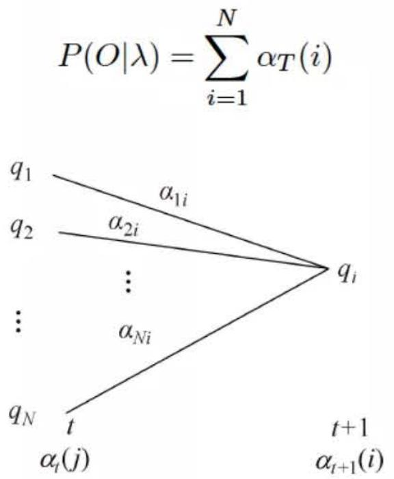  
图10.1 前向概率的递推公式

如图10.2所，前向算法实际是基于“状态序列的路径结构”递推计算 $P ( O | \lambda )$ 的算法。前向算法效的关键是其局部计算前向概率，然后利路径结构将前向概率“递推”到全局，得到 $P ( O | \lambda )$ 。具体地，在时刻t=1，计算 $\alpha _ { 1 } ( i )$ 的N个值 $( i = 1 , 2 , \cdots , N )$ ；在各个时刻$t = 1 , 2 , \cdots , T - 1$ ，计算 $\alpha _ { t + 1 } ( i )$ 的N个值 $( i = 1 , 2 , \cdots , N )$ ，且每个 $\alpha _ { t + 1 } ( i )$ 的计算利用前时刻的N个 $\alpha _ { t } ( j )$ 。减少计算量的原因在于每次计算直接引前个时刻的计算结果，避免重复计算。这样，利前向概率计算 $P ( O | \lambda )$ 的计算量是 $O ( N ^ { 2 } T )$ 阶的，而不是直接计算的 $O ( T N ^ { T } )$ 阶。

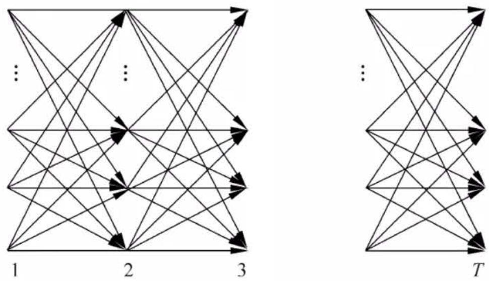  
图10.2 观测序列路径结构

例10.2考虑盒和球模型 $\lambda = ( A , B , \pi )$ ，状态集合 $Q = \{ 1 , 2 , 3 \}$ ，观测集合 $V =$ {红，白}，

$$
A = \left[ \begin{array} { l l l } { 0 . 5 } & { 0 . 2 } & { 0 . 3 } \\ { 0 . 3 } & { 0 . 5 } & { 0 . 2 } \\ { 0 . 2 } & { 0 . 3 } & { 0 . 5 } \end{array} \right] , \quad B = \left[ \begin{array} { l l } { 0 . 5 } & { 0 . 5 } \\ { 0 . 4 } & { 0 . 6 } \\ { 0 . 7 } & { 0 . 3 } \end{array} \right] , \quad \pi = \left[ \begin{array} { l } { 0 . 2 } \\ { 0 . 4 } \\ { 0 . 4 } \end{array} \right]
$$

设 $T = 3 , O = ( \sharp \mathbb { T } .$ ，，红)，试前向算法计算 $P ( O | \lambda )$ 0

解 按照算法10.2:

（1）计算初值

$$
\alpha _ { 1 } ( 1 ) = \pi _ { 1 } b _ { 1 } ( o _ { 1 } ) = 0 . 1 0
$$

$$
\alpha _ { 1 } ( 2 ) = \pi _ { 2 } b _ { 2 } ( o _ { 1 } ) = 0 . 1 6
$$

$$
\alpha _ { 1 } ( 3 ) = \pi _ { 3 } b _ { 3 } ( o _ { 1 } ) = 0 . 2 8
$$

(2）递推计算

$$
\alpha _ { 2 } ( 1 ) = \left[ \sum _ { i = 1 } ^ { 3 } \alpha _ { 1 } ( i ) a _ { i 1 } \right] b _ { 1 } ( o _ { 2 } ) = 0 . 1 5 4 \times 0 . 5 = 0 . 0 7 7
$$

$$
\alpha _ { 2 } ( 2 ) = \left[ \sum _ { i = 1 } ^ { 3 } \alpha _ { 1 } ( i ) a _ { i 2 } \right] b _ { 2 } ( o _ { 2 } ) = 0 . 1 8 4 \times 0 . 6 = 0 . 1 1 0 4
$$

$$
\alpha _ { 2 } ( 3 ) = \left[ \sum _ { i = 1 } ^ { 3 } \alpha _ { 1 } ( i ) a _ { i 3 } \right] b _ { 3 } ( o _ { 2 } ) = 0 . 2 0 2 \times 0 . 3 = 0 . 0 6 0 6
$$

$$
\alpha _ { 3 } ( 1 ) = \left[ \sum _ { i = 1 } ^ { 3 } \alpha _ { 2 } ( i ) a _ { i 1 } \right] b _ { 1 } ( o _ { 3 } ) = 0 . 0 4 1 8 7
$$

$$
\alpha _ { 3 } ( 2 ) = \left[ \sum _ { i = 1 } ^ { 3 } \alpha _ { 2 } ( i ) a _ { i 2 } \right] b _ { 2 } ( o _ { 3 } ) = 0 . 0 3 5 5 1
$$

$$
\alpha _ { 3 } ( 3 ) = \left[ \sum _ { i = 1 } ^ { 3 } \alpha _ { 2 } ( i ) a _ { i 3 } \right] b _ { 3 } ( o _ { 3 } ) = 0 . 0 5 2 8 4
$$

(3)终止

$$
P ( O | \lambda ) = \sum _ { i = 1 } ^ { 3 } \alpha _ { 3 } ( i ) = 0 . 1 3 0 2 2
$$

## 10.2.3后向算法

定义10.3（后向概率） 给定隐马尔可夫模型，定义在时刻t状态为 $q _ { i }$ 的条件下，从t+1到T的部分观测序列为 $o _ { t + 1 } , o _ { t + 2 } , \dots , o _ { T }$ 的概率为后向概率，记作

$$
\beta _ { t } ( i ) = P ( o _ { t + 1 } , o _ { t + 2 } , \cdots , o _ { T } | i _ { t } = q _ { i } , \lambda )\tag{10.18}
$$

可以递推的法求得后向概率 $\beta _ { t } ( i )$ 及观测序列概率 $P ( O | \lambda )$ 。

## 算法10.3（观测序列概率的后向算法）

输入：隐马尔可夫模型入，观测序列 $O _ { \circ }$

输出：观测序列概率 $P ( O | \lambda )$ 。

(1)

$$
\beta _ { T } ( i ) = 1 , \quad i = 1 , 2 , \cdots , N\tag{10.19}
$$

（2）对 $t = T - 1 , T - 2 , \cdots , 1$

$$
\beta _ { t } ( i ) = \sum _ { j = 1 } ^ { N } a _ { i j } b _ { j } ( o _ { t + 1 } ) \beta _ { t + 1 } ( j ) , \quad i = 1 , 2 , \cdots , N\tag{10.20}
$$

(3)

$$
P ( O | \lambda ) = \sum _ { i = 1 } ^ { N } \pi _ { i } b _ { i } ( o _ { 1 } ) \beta _ { 1 } ( i )\tag{10.21}
$$

步骤（1）初始化后向概率，对最终时刻的所有状态 $q _ { i }$ 规定 $\beta _ { T } ( i ) = 1$ 。步骤（2）是后向概率的递推公式。如图10.3所，为了计算在时刻t状态为 $q _ { i }$ 条件下时刻t+1之后的观测序列为 $o _ { t + 1 } , o _ { t + 2 } , \dots , o _ { T }$ 的后向概率 $\beta _ { t } ( i )$ ，只需考虑在时刻t+1所有可能的N个状态$q _ { j }$ 的转移概率（即 $a _ { i j }$ 项），以及在此状态下的观测 $o _ { t + 1 }$ 的观测概率（即 $b _ { j } ( o _ { t + 1 } )$ 项），然后考虑状态 $q _ { j }$ 之后的观测序列的后向概率（即 $\beta _ { t + 1 } ( j )$ 项）。步骤(3）求 $P ( O | \lambda )$ 的思路与步骤（2）致，只是初始概率 $\pi _ { i }$ 代替转移概率。

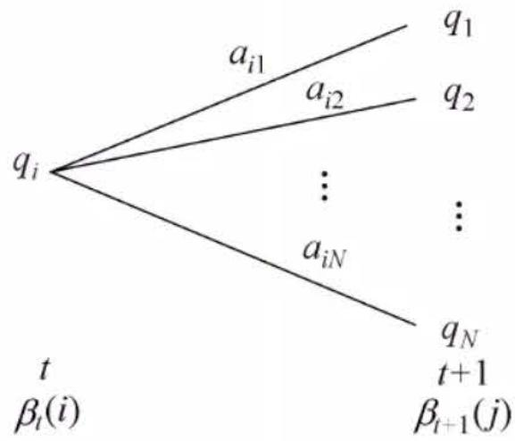  
图10.3 后向概率递推公式

利前向概率和后向概率的定义可以将观测序列概率 $P ( O | \lambda )$ 统一写成

$$
P ( O | \lambda ) = \sum _ { i = 1 } ^ { N } \sum _ { j = 1 } ^ { N } \alpha _ { t } ( i ) a _ { i j } b _ { j } ( o _ { t + 1 } ) \beta _ { t + 1 } ( j ) , \quad t = 1 , 2 , \cdots , T - 1\tag{10.22}
$$

## 10.2.4 一些概率与期望值的计算

利前向概率和后向概率，可以得到关于单个状态和两个状态概率的计算公式。

1.给定模型和观测O，在时刻t处于状态 $q _ { i }$ 的概率。记

$$
\gamma _ { t } ( i ) = P ( i _ { t } = q _ { i } | O , \lambda )\tag{10.23}
$$

可以通过前向概率和后向概率计算。事实上，

$$
\gamma _ { t } ( i ) = P ( i _ { t } = q _ { i } | O , \lambda ) = \frac { P ( i _ { t } = q _ { i } , O | \lambda ) } { P ( O | \lambda ) }
$$

由前向概率 $\alpha _ { t } ( i )$ 和后向概率 $\beta _ { t } ( i )$ 定义可知：

$$
\alpha _ { t } ( i ) \beta _ { t } ( i ) = P ( i _ { t } = q _ { i } , O | \lambda )
$$

于是得到：

$$
\gamma _ { t } ( i ) = \frac { \alpha _ { t } ( i ) \beta _ { t } ( i ) } { P ( O | \lambda ) } = \frac { \alpha _ { t } ( i ) \beta _ { t } ( i ) } { \displaystyle \sum _ { j = 1 } ^ { N } \alpha _ { t } ( j ) \beta _ { t } ( j ) }\tag{10.24}
$$

2.给定模型入和观测O，在时刻t处于状态 $q _ { i }$ 且在时刻t+1处于状态 $q _ { j }$ 的概率。记

$$
\xi _ { t } ( i , j ) = P ( i _ { t } = q _ { i } , i _ { t + 1 } = q _ { j } | O , \lambda )\tag{10.25}
$$

可以通过前向概率和后向概率计算：

$$
\xi _ { t } ( i , j ) = \frac { P ( i _ { t } = q _ { i } , i _ { t + 1 } = q _ { j } , O | \lambda ) } { P ( O | \lambda ) } = \frac { P ( i _ { t } = q _ { i } , i _ { t + 1 } = q _ { j } , O | \lambda ) } { \displaystyle \sum _ { i = 1 } ^ { N } \sum _ { j = 1 } ^ { N } P ( i _ { t } = q _ { i } , i _ { t + 1 } = q _ { j } , O | \lambda ) }
$$

而

$$
P ( i _ { t } = q _ { i } , i _ { t + 1 } = q _ { j } , O | \lambda ) = \alpha _ { t } ( i ) a _ { i j } b _ { j } ( o _ { t + 1 } ) \beta _ { t + 1 } ( j )
$$

所以

$$
\xi _ { t } ( i , j ) = \frac { \alpha _ { t } ( i ) a _ { i j } b _ { j } ( o _ { t + 1 } ) \beta _ { t + 1 } ( j ) } { \displaystyle \sum _ { i = 1 } ^ { N } \sum _ { j = 1 } ^ { N } \alpha _ { t } ( i ) a _ { i j } b _ { j } ( o _ { t + 1 } ) \beta _ { t + 1 } ( j ) }\tag{10.26}
$$

3.将 $\gamma _ { t } ( i )$ 和 $\xi _ { t } ( i , j )$ 对各个时刻t求和，可以得到些有的期望值。

(1）在观测O下状态i出现的期望值：

$$
\sum _ { t = 1 } ^ { T } \gamma _ { t } ( i )\tag{10.27}
$$

(2）在观测O下由状态i转移的期望值：

$$
\sum _ { t = 1 } ^ { T - 1 } \gamma _ { t } ( i )\tag{10.28}
$$

(3）在观测O下由状态i转移到状态j的期望值：

$$
\sum _ { t = 1 } ^ { T - 1 } \xi _ { t } ( i , j )\tag{10.29}
$$

## 10.3学习算法

根据训练数据是包括观测序列和对应的状态序列还是只有观测序列，隐马尔可夫模型的学习可以分别由监督学习与监督学习实现。本节先介绍监督学习算法，后介绍监督学习算法— -Baum-Welch算法（也就是EM算法）。

## 10.3.1监督学习方法

假设已给训练数据包含S个长度相同的观测序列和对应的状态序列 $\{ ( O _ { 1 } , I _ { 1 } ) , ( O _ { 2 } , I _ { 2 } ) , \cdots ,$ $( O _ { S } , I _ { S } ) \}$ ，那么可以利极似然估计法来估计隐马尔可夫模型的参数。具体法如下。

## 1.转移概率 $a _ { i j }$ 的估计

设样本中时刻t处于状态i时刻t＋1转移到状态j的频数为 $A _ { i j }$ ，那么状态转移概率 $a _ { i j }$ 的估计是

$$
\hat { a } _ { i j } = \frac { A _ { i j } } { \displaystyle \sum _ { j = 1 } ^ { N } A _ { i j } } , \quad i = 1 , 2 , \cdots , N , \quad j = 1 , 2 , \cdots , N\tag{10.30}
$$

## 2.观测概率 $b _ { j } ( k )$ 的估计

设样本中状态为并观测为k的频数是 $B _ { j k }$ ，那么状态为j、观测为k的概率 $b _ { j } ( k )$ 的估 计是

$$
\hat { b } _ { j } ( k ) = \frac { B _ { j k } } { \displaystyle M } , \quad j = 1 , 2 , \cdots , N , \quad k = 1 , 2 , \cdots , M\tag{10.31}
$$

## 3.初始状态概率 $\pi _ { i }$ 的估计 $\hat { \pi } _ { i }$ 为 $S$ 个样本中初始状态为 $q _ { i }$ 的频率

由于监督学习需要使标注的训练数据，而标注训练数据往往代价很，有时就会利无监督学习的方法。

## 10.3.2 Baum-Welch算法

假设给定训练数据只包含S个长度为T的观测序列 $\{ O _ { 1 } , O _ { 2 } , \cdots , O _ { S } \}$ 而没有对应的状态序列，标是学习隐马尔可夫模型 $\lambda = ( A , B , \pi )$ 的参数。我们将观测序列数据看作观测数据O，状态序列数据看作不可观测的隐数据I，那么隐马尔可夫模型事实上是一个含有隐变量的概率模型：

$$
P ( O | \lambda ) = \sum _ { I } P ( O | I , \lambda ) P ( I | \lambda )\tag{10.32}
$$

它的参数学习可以由EM算法实现。

## 1.确定完全数据的对数似然函数

所有观测数据写成 $O = ( o _ { 1 } , o _ { 2 } , \cdots , o _ { T } )$ ，所有隐数据写成 $I = ( i _ { 1 } , i _ { 2 } , \cdots , i _ { T } )$ ，完全数据是 $( O , I ) = ( o _ { 1 } , o _ { 2 } , \cdots , o _ { T } , i _ { 1 } , i _ { 2 } , \cdots , i _ { T } )$ 。完全数据的对数似然函数是log $P ( O , I | \lambda )$ 。

2.EM算法的E步：求Q函数 $Q ( \lambda , { \bar { \lambda } } ) ^ { \textcircled { 1 } }$

$$
Q ( \lambda , \bar { \lambda } ) = \sum _ { I } \log P ( O , I | \lambda ) P ( O , I | \bar { \lambda } )\tag{10.33}
$$

其中， $\bar { \lambda }$ 是隐马尔可夫模型参数的当前估计值，是要极化的隐马尔可夫模型参数。

$$
P ( O , I | \lambda ) = \pi _ { i _ { 1 } } b _ { i _ { 1 } } ( o _ { 1 } ) a _ { i _ { 1 } i _ { 2 } } b _ { i _ { 2 } } ( o _ { 2 } ) \cdot \cdot \cdot a _ { i _ { T - 1 } i _ { T } } b _ { i _ { T } } ( o _ { T } )
$$

于是函数Q(λ，λ)可以写成

$$
\begin{array} { l } { { Q ( \lambda , \bar { \lambda } ) = \displaystyle \sum _ { I } \log \pi _ { i _ { 1 } } P ( { \cal O } , I | \bar { \lambda } ) + \displaystyle \sum _ { I } \left( \displaystyle \sum _ { t = 1 } ^ { T - 1 } \log a _ { i _ { t } i _ { t + 1 } } \right) P ( { \cal O } , I | \bar { \lambda } ) + } } \\ { { { \displaystyle \phantom { \sum _ { I } } \sum _ { I } \left( \displaystyle \sum _ { t = 1 } ^ { T } \log b _ { i _ { t } } ( o _ { t } ) \right) P ( { \cal O } , I | \bar { \lambda } ) } } } \end{array}\tag{10.34}
$$

式中求和都是对所有数据的序列总长度T进的。

3.EM算法的M步：极化Q函数 $Q ( \lambda , { \bar { \lambda } } )$ 求模型参数 $A , B , \pi$

由于要极化的参数在式(10.34)中单独地出现在3个项中，所以只需对各项分别极大化。

(1）式(10.34)的第1项可以写成

$$
\sum _ { I } \log \pi _ { i _ { 1 } } P ( O , I | \bar { \lambda } ) = \sum _ { i = 1 } ^ { N } \log \pi _ { i } P ( O , i _ { 1 } = i | \bar { \lambda } )
$$

注意到 $\pi _ { i }$ 满足约束条件 $\sum _ { i = 1 } ^ { N } \pi _ { i } = 1$ ，利拉格朗乘子法，写出拉格朗函数：

$$
\sum _ { i = 1 } ^ { N } \log \pi _ { i } P ( O , i _ { 1 } = i | \bar { \lambda } ) + \gamma \left( \sum _ { i = 1 } ^ { N } \pi _ { i } - 1 \right)
$$

对其求偏导数并令结果为0:

$$
\frac { \partial } { \partial \pi _ { i } } \left[ \sum _ { i = 1 } ^ { N } \log \pi _ { i } P ( O , i _ { 1 } = i | \bar { \lambda } ) + \gamma \left( \sum _ { i = 1 } ^ { N } \pi _ { i } - 1 \right) \right] = 0\tag{10.35}
$$

得：

$$
P ( O , i _ { 1 } = i | \bar { \lambda } ) + \gamma \pi _ { i } = 0
$$

① 按照Q函数的定义

$$
Q ( \lambda , \bar { \lambda } ) = E _ { I } [ \log \ P ( O , I | \lambda ) | O , \bar { \lambda } ]
$$

式(10.33)略去了对的常数因 $1 / P ( O | { \bar { \lambda } } )$

对i求和得到 $\gamma :$

$$
\gamma = - P ( O | { \bar { \lambda } } )
$$

代式(10.35) 即得:

$$
\pi _ { i } = \frac { P ( O , i _ { 1 } = i | \bar { \lambda } ) } { P ( O | \bar { \lambda } ) }\tag{10.36}
$$

(2)式(10.34)的第2项可以写成

$$
\sum _ { I } \left( \sum _ { t = 1 } ^ { T - 1 } \log a _ { i _ { t } i _ { t + 1 } } \right) P ( O , I | \bar { \lambda } ) = \sum _ { i = 1 } ^ { N } \sum _ { j = 1 } ^ { N } \sum _ { t = 1 } ^ { T - 1 } \log a _ { i j } P ( O , i _ { t } = i , i _ { t + 1 } = j | \bar { \lambda } )
$$

类似第1项，应具有约束条件 $\sum _ { j = 1 } ^ { N } a _ { i j } = 1$ 的拉格朗日乘子法可以求出：

$$
a _ { i j } = \frac { \displaystyle \sum _ { t = 1 } ^ { T - 1 } P ( O , i _ { t } = i , i _ { t + 1 } = j | \bar { \lambda } ) } { \displaystyle \sum _ { t = 1 } ^ { T - 1 } P ( O , i _ { t } = i | \bar { \lambda } ) }\tag{10.37}
$$

(3)式(10.34)的第3项为

$$
\sum _ { I } \left( \sum _ { t = 1 } ^ { T } \log b _ { i _ { t } } ( o _ { t } ) \right) P ( O , I | \bar { \lambda } ) = \sum _ { j = 1 } ^ { N } \sum _ { t = 1 } ^ { T } \log b _ { j } ( o _ { t } ) P ( O , i _ { t } = j | \bar { \lambda } )
$$

同样拉格朗乘法，约束条件是 $\sum _ { k = 1 } ^ { M } b _ { j } ( k ) = 1 ,$ 。注意，只有在 $o _ { t } = v _ { k }$ 时 $b _ { j } ( o _ { t } )$ 对 $b _ { j } ( k )$ 的偏导数才不为0，以 $I ( o _ { t } = v _ { k } )$ 表示。求得：

$$
b _ { j } ( k ) = { \frac { \displaystyle \sum _ { t = 1 } ^ { T } P ( O , i _ { t } = j | { \bar { \lambda } } ) I ( o _ { t } = v _ { k } ) } { \displaystyle \sum _ { t = 1 } ^ { T } P ( O , i _ { t } = j | { \bar { \lambda } } ) } }\tag{10.38}
$$

## 10.3.3 Baum-Welch模型参数估计公式

将式(10.36)\~式(10.38)中的各概率分别 $\gamma _ { t } ( i ) , \xi _ { t } ( i , j )$ 表，则可将相应的公式写成

$$
a _ { i j } = { \frac { \displaystyle \sum _ { t = 1 } ^ { T - 1 } \xi _ { t } ( i , j ) } { \displaystyle \sum _ { t = 1 } ^ { T - 1 } \gamma _ { t } ( i ) } }\tag{10.39}
$$

$$
b _ { j } ( k ) = \frac { \displaystyle \sum _ { t = 1 , o _ { t } = v _ { k } } ^ { T } \gamma _ { t } ( j ) } { \displaystyle \sum _ { t = 1 } ^ { T } \gamma _ { t } ( j ) }\tag{10.40}
$$

$$
\pi _ { i } = \gamma _ { 1 } ( i )\tag{10.41}
$$

其中， $\gamma _ { t } ( i ) , \ \xi _ { t } ( i , j )$ 分别由式(10.24)及式(10.26)给出。式(10.39)\~式(10.41)就是Baum-Welch算法（Baum-Welch algorithm），它是EM算法在隐马尔可夫模型学习中的具体实现，由Baum和Welch提出。

算法10.4（Baum-Welch算法）

输入：观测数据 $O = ( o _ { 1 } , o _ { 2 } , \cdots , o _ { T } )$ O

输出：隐马尔可夫模型参数。

(1)初始化。对 $n = 0 ,$ ，选取 $a _ { i j } ^ { ( 0 ) } , \ b _ { j } ( k ) ^ { ( 0 ) } , \ \pi _ { i } ^ { ( 0 ) }$ ，得到模型 $\lambda ^ { ( 0 ) } = ( A ^ { ( 0 ) } , B ^ { ( 0 ) } , \pi ^ { ( 0 ) } )$ 。

(2)递推。对 $n = 1 , 2 , \cdots$ ,

$$
a _ { i j } ^ { ( n + 1 ) } = \frac { \displaystyle \sum _ { t = 1 } ^ { T - 1 } \xi _ { t } ( i , j ) } { \displaystyle \sum _ { t = 1 } ^ { T - 1 } \gamma _ { t } ( i ) }
$$

$$
\begin{array} { c } { { \displaystyle { b _ { j } ( k ) ^ { ( n + 1 ) } = \frac { \sum _ { t = 1 , \sigma _ { t } = v _ { k } } ^ { T } \gamma _ { t } ( j ) } { \sum _ { t = 1 } ^ { T } \gamma _ { t } ( j ) } } } } \\ { { \displaystyle { \pi _ { i } ^ { ( n + 1 ) } = \gamma _ { 1 } ( i ) } } } \end{array}
$$

右端各值按观测 $O = ( o _ { 1 } , o _ { 2 } , \cdots , o _ { T } )$ 和模型 $\lambda ^ { ( n ) } = ( A ^ { ( n ) } , B ^ { ( n ) } , \pi ^ { ( n ) } )$ 计算。式中 $\gamma _ { t } ( i ) , \xi _ { t } ( i , j )$ 由式(10.24)和式(10.26)给出。

(3)终。得到模型参数 $\lambda ^ { ( n + 1 ) } = ( A ^ { ( n + 1 ) } , B ^ { ( n + 1 ) } , \pi ^ { ( n + 1 ) } )$ 。

## 10.4预测算法

下介绍隐马尔可夫模型预测的两种算法：近似算法与维特算法（Viterbialgorithm）。

## 10.4.1 近似算法

近似算法的想法是：在每个时刻t选择在该时刻最有可能出现的状态 $i _ { t } ^ { * }$ ，从得到个状态序列 $I ^ { * } = ( i _ { 1 } ^ { * } , i _ { 2 } ^ { * } , \cdots , i _ { T } ^ { * } )$ ，将它作为预测的结果。

给定隐马尔可夫模型和观测序列O，在时刻t处于状态 $q _ { i }$ 的概率 $\gamma _ { t } ( i )$ 是

$$
\gamma _ { t } ( i ) = \frac { \alpha _ { t } ( i ) \beta _ { t } ( i ) } { P ( O | \lambda ) } = \frac { \alpha _ { t } ( i ) \beta _ { t } ( i ) } { \displaystyle \sum _ { j = 1 } ^ { N } \alpha _ { t } ( j ) \beta _ { t } ( j ) }\tag{10.42}
$$

在每时刻t最有可能的状态 $i _ { t } ^ { * }$ 是

$$
i _ { t } ^ { * } = \arg \operatorname* { m a x } _ { 1 \leqslant i \leqslant N } [ \gamma _ { t } ( i ) ] , \quad t = 1 , 2 , \cdot \cdot \cdot , T\tag{10.43}
$$

从得到状态序列 $I ^ { * } = ( i _ { 1 } ^ { * } , i _ { 2 } ^ { * } , \cdots , i _ { T } ^ { * } )$

近似算法的优点是计算简单，其缺点是不能保证预测的状态序列整体是最有可能的状态序列，因为预测的状态序列可能有实际不发的部分。事实上，上述法得到的状态序列中有可能存在转移概率为0的相邻状态，即对某些 $i , j , a _ { i j } = 0$ 时。尽管如此，近似算法仍然是有用的。

## 10.4.2 维特算法

维特算法实际是动态规划（dynamic programming）解隐马尔可夫模型预测问题，即动态规划求概率最路径（最优路径）。这时条路径对应着个状态序列。

根据动态规划原理，最优路径具有这样的特性：如果最优路径在时刻t通过结点 $i _ { t } ^ { * }$ ，那么这路径从结点 $i _ { t } ^ { * }$ 到终点 $i _ { T } ^ { * }$ 的部分路径对于从 $i _ { t } ^ { * }$ 到 $i _ { T } ^ { * }$ 的所有可能的部分路径来说，必须是最优的。因为假如不是这样，那么从 $i _ { t } ^ { * }$ 到就有另条更好的部分路径存在，如果把它和从 $i _ { 1 } ^ { * }$ 到 $i _ { t } ^ { * }$ 的部分路径连接起来，就会形成条原来的路径更优的路径，这是矛盾的。依据这原理，我们只需从时刻 $t = 1$ 开始，递推地计算在时刻t状态为i的各条部分路径的最概率，直得到时刻 $t = T$ 时状态为的各条路径的最大概率。时刻 $t = T$ 的最大概率即为最优路径的概率 $P ^ { * }$ ，最优路径的终结点 $i _ { T } ^ { * }$ 也同时得到。之后，为了找出最优路径的各个结点，从终结点 $i _ { T } ^ { * }$ 开始，由后向前逐步求得结点 $i _ { T - 1 } ^ { * } , i _ { T - 2 } ^ { * } , \cdots , i _ { 1 } ^ { * }$ ，得到最优路径$I ^ { * } = ( i _ { 1 } ^ { * } , i _ { 2 } ^ { * } , \cdots , i _ { T } ^ { * } )$ 。这就是维特比算法。

先导两个变量δ和 $\varPsi .$ 。定义在时刻t状态为i的所有单个路径 $( i _ { 1 } , i _ { 2 } , \cdots , i _ { t } )$ 中概率最大值为

$$
\delta _ { t } ( i ) = \operatorname* { m a x } _ { i _ { 1 } , i _ { 2 } , \cdots , i _ { t - 1 } } P ( i _ { t } = i , i _ { t - 1 } , \cdots , i _ { 1 } , o _ { t } , \cdots , o _ { 1 } | \lambda ) , \quad i = 1 , 2 , \cdots , N\tag{10.44}
$$

由定义可得变量δ的递推公式：

$$
\begin{array} { r l } & { \delta _ { t + 1 } ( i ) = \underset { i _ { 1 } , i _ { 2 } , \cdots , i _ { t } } { \operatorname* { m a x } } P ( i _ { t + 1 } = i , i _ { t } , \cdots , i _ { 1 } , o _ { t + 1 } , \cdots , o _ { 1 } | \lambda ) } \\ & { \qquad = \underset { 1 \leqslant j \leqslant N } { \operatorname* { m a x } } [ \delta _ { t } ( j ) a _ { j i } ] b _ { i } ( o _ { t + 1 } ) , \quad i = 1 , 2 , \cdots , N , \quad t = 1 , 2 , \cdots , T - 1 } \end{array}\tag{10.45}
$$

定义在时刻t状态为i的所有单个路径 $( i _ { 1 } , i _ { 2 } , \cdots , i _ { t - 1 } , i )$ 中概率最大的路径的第 $t - 1$ 个结点为

$$
\varPsi _ { t } ( i ) = \arg \operatorname* { m a x } _ { 1 \leqslant j \leqslant N } [ \delta _ { t - 1 } ( j ) a _ { j i } ] , \quad i = 1 , 2 , \cdots , N\tag{10.46}
$$

下面介绍维特比算法。

算法10.5（维特比算法）

输入：模型 $\lambda = ( A , B , \pi )$ 和观测 $O = ( o _ { 1 } , o _ { 2 } , \cdots , o _ { T } )$

输出：最优路径 $I ^ { * } = ( i _ { 1 } ^ { * } , i _ { 2 } ^ { * } , \cdots , i _ { T } ^ { * } )$ 。

(1)初始化。

$$
\delta _ { 1 } ( i ) = \pi _ { i } b _ { i } ( o _ { 1 } ) , \quad i = 1 , 2 , \cdots , N
$$

$$
\varPsi _ { 1 } ( i ) = 0 , \quad i = 1 , 2 , \cdots , N
$$

(2)递推。对 $t = 2 , 3 , \cdots , T$

$$
\delta _ { t } ( i ) = \operatorname* { m a x } _ { 1 \leqslant j \leqslant N } [ \delta _ { t - 1 } ( j ) a _ { j i } ] b _ { i } ( o _ { t } ) , \quad i = 1 , 2 , \cdots , N
$$

$$
\varPsi _ { t } ( i ) = \arg \operatorname* { m a x } _ { 1 \leqslant j \leqslant N } [ \delta _ { t - 1 } ( j ) a _ { j i } ] , \quad i = 1 , 2 , \cdots , N
$$

(3)终。

$$
P ^ { * } = \operatorname* { m a x } _ { 1 \leqslant i \leqslant N } \delta _ { T } ( i )
$$

$$
i _ { T } ^ { * } = \arg \operatorname* { m a x } _ { 1 \leqslant i \leqslant N } [ \delta _ { T } ( i ) ]
$$

(4）最优路径回溯。对 $t = T - 1 , T - 2 , \cdots , 1$

$$
i _ { t } ^ { * } = \varPsi _ { t + 1 } ( i _ { t + 1 } ^ { * } )
$$

求得最优路径 $I ^ { * } = ( i _ { 1 } ^ { * } , i _ { 2 } ^ { * } , \cdots , i _ { T } ^ { * } )$

下通过个例来说明维特算法。

例10.3 对例10.2的模型 $\lambda = ( A , B , \pi )$

$$
A = \left[ \begin{array} { l l l } { 0 . 5 } & { 0 . 2 } & { 0 . 3 } \\ { 0 . 3 } & { 0 . 5 } & { 0 . 2 } \\ { 0 . 2 } & { 0 . 3 } & { 0 . 5 } \end{array} \right] , \quad B = \left[ \begin{array} { l l } { 0 . 5 } & { 0 . 5 } \\ { 0 . 4 } & { 0 . 6 } \\ { 0 . 7 } & { 0 . 3 } \end{array} \right] , \quad \pi = \left[ \begin{array} { l } { 0 . 2 } \\ { 0 . 4 } \\ { 0 . 4 } \end{array} \right]
$$

已知观测序列 $O = ( \sharp , \sharp , \sharp )$ ，试求最优状态序列，即最优路径 $I ^ { * } = ( i _ { 1 } ^ { * } , i _ { 2 } ^ { * } , i _ { 3 } ^ { * } )$ 0

解 如图10.4所，要在所有可能的路径中选择条最优路径，按照以下步骤处理：

(1)初始化。在 $t = 1$ 时，对每个状态 $i , i = 1 , 2 , 3$ ，求状态为i、观测 $o _ { 1 }$ 为红的概率，记此概率为 $\delta _ { 1 } ( i )$ ,则

$$
\delta _ { 1 } ( i ) = \pi _ { i } b _ { i } ( o _ { 1 } ) = \pi _ { i } b _ { i } ( \Sigma \mathrm { T } ) , \quad i = 1 , 2 , 3
$$

代入实际数据

$$
\delta _ { 1 } ( 1 ) = 0 . 1 0 , \quad \delta _ { 1 } ( 2 ) = 0 . 1 6 , \quad \delta _ { 1 } ( 3 ) = 0 . 2 8
$$

记 $\varPsi _ { 1 } ( i ) = 0 , i = 1 , 2 , 3$

(2）在 $t = 2$ 时，对每个状态 $i , i = 1 , 2 , 3$ ，求在t=1时状态为j、观测为红并在 $t = 2$ 时状态为、观测 $o _ { 2 }$ 为白的路径的最大概率，记此最大概率为 $\delta _ { 2 } ( i )$ ,则

$$
\delta _ { 2 } ( i ) = \operatorname* { m a x } _ { 1 \leqslant j \leqslant 3 } \big [ \delta _ { 1 } ( j ) a _ { j i } \big ] b _ { i } ( o _ { 2 } )
$$

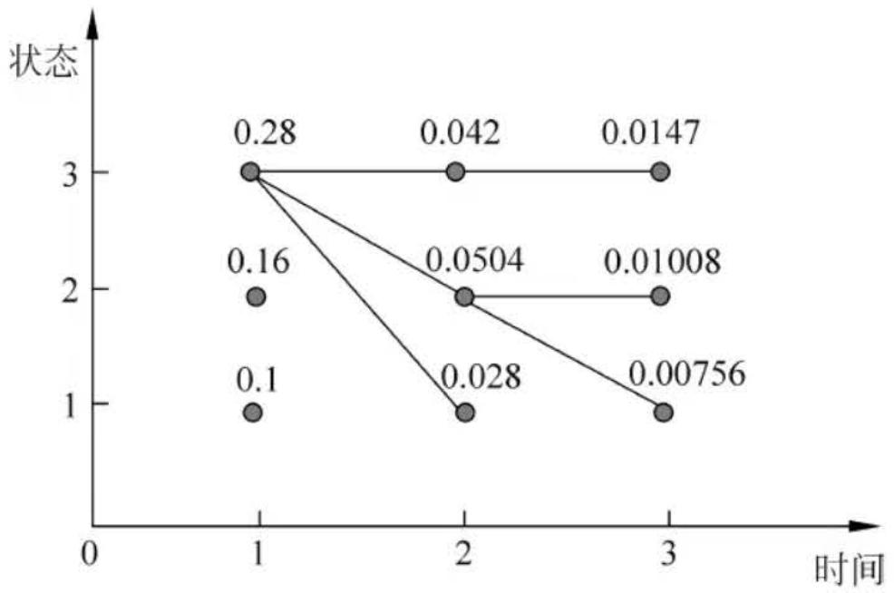  
图10.4 求最优路径

同时，对每个状态i，i=1,2,3，记录概率最路径的前个状态j：

$$
\varPsi _ { 2 } ( i ) = \arg \operatorname* { m a x } _ { 1 \leqslant j \leqslant 3 } \ [ \delta _ { 1 } ( j ) a _ { j i } ] , i = 1 , 2 , 3
$$

计算：

$$
\begin{array} { r l } { \delta _ { 2 } ( 1 ) } & { = \underset { 1 \leq j \leq 3 } { \operatorname* { m a x } } \left. \hat { b } _ { 1 } ( j ) a _ { 1 1 } | b _ { 1 } ( o _ { 2 } ) \right. } \\ & { = \underset { j } { \operatorname* { m a x } } \{ 0 . 1 0 \times 0 . 5 , 0 . 1 6 \times 0 . 3 , 0 . 2 8 \times 0 . 2 \} \times 0 . 5 } \\ & { = 0 . 0 2 8 } \\ & { \left. \psi _ { 2 } ( 1 ) = 3 \right. } \\ & { \delta _ { 2 } ( 2 ) = 0 . 0 5 0 4 } \\ & { \psi _ { 2 } ( 2 ) = 3 } \\ & { \delta _ { 2 } ( 3 ) = 0 . 0 4 2 } \\ & { \psi _ { 2 } ( 3 ) = 3 } \end{array}
$$

同样，在t=3时，

$$
\begin{array} { r l } & { \delta _ { 3 } ( i ) = \underset { 1 \leq j \leq 3 } { \operatorname* { m a x } } \left( \delta _ { 2 } ( j ) a _ { j _ { 1 } } \right. b _ { i } ( o _ { 3 } ) } \\ & { \psi _ { 3 } ( i ) = \underset { 1 \leq j \leq 3 } { \operatorname* { m a x } } \frac { \operatorname* { m a x } } { \operatorname* { m a x } } \left\{ \delta _ { 2 } ( j ) a _ { j _ { 1 } } \right\} } \\ & { \delta _ { 3 } ( 1 ) = 0 . 0 0 7 5 6 } \\ & { \psi _ { 3 } ( 1 ) = 2 } \\ & { \delta _ { 3 } ( 2 ) = 0 . 0 1 0 0 8 } \\ & { \psi _ { 3 } ( 2 ) = 2 } \\ & { \delta _ { 3 } ( 2 ) = 0 } \\ & { \delta _ { 3 } ( 3 ) = 0 . 0 1 4 7 } \\ & { \psi _ { 3 } ( 3 ) = 3 } \end{array}
$$

(3）以 $P ^ { * }$ 表示最优路径的概率，则

$$
P ^ { * } = \operatorname* { m a x } _ { 1 \leqslant i \leqslant 3 } \delta _ { 3 } ( i ) = 0 . 0 1 4 7
$$

最优路径的终点是 $i _ { 3 } ^ { * }$

$$
i _ { 3 } ^ { * } = \arg \operatorname* { m a x } _ { i } \delta _ { 3 } ( i ) = 3
$$

(4）由最优路径的终点 $i _ { 3 } ^ { * }$ ，逆向找到 $i _ { 2 } ^ { * }$ :

$$
\begin{array} { r } { \fallingdot { \Rightarrow } t = 2 \\\textmu \_ { 2 } , \quad \dot { \iota } _ { 2 } ^ { * } = \varPsi _ { 3 } ( \dot { \iota } _ { 3 } ^ { * } ) = \varPsi _ { 3 } ( 3 ) = 3 } \end{array}
$$

$$
\begin{array} { r } { \stackrel { \mathtt { \Delta } } {  } t = 1 \oplus \ r , \quad i _ { 1 } ^ { * } = \varPsi _ { 2 } ( i _ { 2 } ^ { * } ) = \varPsi _ { 2 } ( 3 ) = 3 } \end{array}
$$

于是求得最优路径，即最优状态序列 $I ^ { * } = ( i _ { 1 } ^ { * } , i _ { 2 } ^ { * } , i _ { 3 } ^ { * } ) = ( 3 , 3 , 3 )$ 。

## 本章概要

1．隐马尔可夫模型是关于时序的概率模型，描述由个隐藏的马尔可夫链随机成不可观测的状态的序列，再由各个状态随机成个观测从产观测序列的过程。

隐马尔可夫模型由初始状态概率向量π、状态转移概率矩阵A和观测概率矩阵B决定。因此，隐马尔可夫模型可以写成 $\lambda = ( A , B , \pi )$ 。

隐马尔可夫模型是个成模型，表状态序列和观测序列的联合分布，但是状态序列是隐藏的，不可观测的。

隐马尔可夫模型可以于标注，这时状态对应着标记。标注问题是指给定观测序列预测其对应的标记序列。

2.概率计算问题。给定模型 $\lambda = ( A , B , \pi )$ 和观测序列 $O = ( o _ { 1 } , o _ { 2 } , \cdots , o _ { T } )$ ，计算在模型入下观测序列O出现的概率 $P ( O | \lambda )$ 。前向-后向算法通过递推地计算前向-后向概率可以效地进隐马尔可夫模型的概率计算。

3.学习问题。已知观测序列 $O = ( o _ { 1 } , o _ { 2 } , \cdots , o _ { T } )$ ，估计模型 $\lambda = ( A , B , \pi )$ 参数，使得在该模型下观测序列概率 $P ( O | \lambda )$ 最大。即极似然估计的法估计参数。Baum-Welch算法，也就是EM算法可以效地对隐马尔可夫模型进训练。它是种监督学习算法。

4.预测问题。已知模型 $\lambda = ( A , B , \pi )$ 和观测序列 $O = ( o _ { 1 } , o _ { 2 } , \cdots , o _ { T } )$ ，求对给定观测序列条件概率 $P ( I | O )$ 最大的状态序列 $I = ( i _ { 1 } , i _ { 2 } , \cdots , i _ { T } )$ 。维特算法应动态规划效地求解最优路径，即概率最大的状态序列。

## 继续阅读

隐马尔可夫模型的介绍可参见献[1]和献[2]，特别地，献[1]是经典的介绍性论。关于Baum-Welch算法可参见献[3]和献[4]。可以认为概率上下关法（probabilistic context-freegrammar）是隐马尔可夫模型的种推，隐马尔可夫模型的不可观测数据是状态序列，概率上下关法的不可观测数据是上下关法树[5]。动态贝叶斯络（dynamicBayesian network）是定义在时序数据上的叶斯络，它包含隐马尔可夫模型，是种特例[6]。

## 习 题

10.1 给定盒和球组成的隐马尔可夫模型 $\lambda = ( A , B , \pi )$ ，其中，

$$
A = \left[ \begin{array} { l l l } { 0 . 5 } & { 0 . 2 } & { 0 . 3 } \\ { 0 . 3 } & { 0 . 5 } & { 0 . 2 } \\ { 0 . 2 } & { 0 . 3 } & { 0 . 5 } \end{array} \right] , \quad B = \left[ \begin{array} { l l } { 0 . 5 } & { 0 . 5 } \\ { 0 . 4 } & { 0 . 6 } \\ { 0 . 7 } & { 0 . 3 } \end{array} \right] , \quad \pi = ( 0 . 2 , \ 0 . 4 , \ 0 . 4 ) ^ { \mathrm { T } }
$$

设T=4，O=(红，白，红，白)，试用后向算法计算 $P ( O | \lambda )$ 。

10.2 考虑盒和球组成的隐马尔可夫模型 $\lambda = ( A , B , \pi )$ ，其中，

$$
A = \left[ \begin{array} { l l l } { 0 . 5 } & { 0 . 1 } & { 0 . 4 } \\ { 0 . 3 } & { 0 . 5 } & { 0 . 2 } \\ { 0 . 2 } & { 0 . 2 } & { 0 . 6 } \end{array} \right] , \quad B = \left[ \begin{array} { l l } { 0 . 5 } & { 0 . 5 } \\ { 0 . 4 } & { 0 . 6 } \\ { 0 . 7 } & { 0 . 3 } \end{array} \right] , \quad \pi = ( 0 . 2 , \ 0 . 3 , \ 0 . 5 ) ^ { \mathrm { T } }
$$

设T=8，O=(红，白，红，红，白，红，白，白)，用前向-后向概率计算 $P ( i _ { 4 } = q _ { 3 } | O , \lambda )$

10.3 在习题10.1中，试维特算法求最优路径 $I ^ { * } = ( i _ { 1 } ^ { * } , i _ { 2 } ^ { * } , i _ { 3 } ^ { * } , i _ { 4 } ^ { * } )$ 。

10.4 试前向概率和后向概率推导

$$
P ( O | \lambda ) = \sum _ { i = 1 } ^ { N } \sum _ { j = 1 } ^ { N } \alpha _ { t } ( i ) a _ { i j } b _ { j } ( o _ { t + 1 } ) \beta _ { t + 1 } ( j ) , \quad t = 1 , 2 , \cdots , T - 1
$$

10.5 较维特算法中变量δ的计算和前向算法中变量α的计算的主要区别。

## 参考文献

[1] RABINER L, JUANG B. An introduction to hidden Markov Models[J]. IEEE ASSP Magazine, 1986, 3(1):4–16.

[2] RABINER L. A tutorial on hidden Markov models and selected applications in speech recognition[J]. Proceedings of IEEE, 1989, 77(2): 257–286.

[3] BAUM L, et al. A maximization technique occuring in the statistical analysis of probabilistic functions of Markov chains[J]. Annals of Mathematical Statistics, 1970, 41: 164–171.

[4] BILMES J A. A gentle tutorial of the EM algorithm and its application to parameter estimation for Gaussian mixture and hidden Markov models[Z/OL]. http://ssli.e.washington.edu/\~bilmes/ mypubs/bilmes1997-em.pdf.

[5] LARI K, YOUNG S J. Applications of stochastic context-free grammars using the Inside-Outside algorithm[J]. Computer Speech & Language, 1991, 5(3): 237–257.

[6] GHAHRAMANI Z. Learning dynamic Bayesian networks[J]. Lecture Notes in Computer Science, 1997, 1387: 168–197.

## 第11章 条件随机场

条件随机场（conditionalrandomfield，CRF）是给定组输随机变量条件下另组输出随机变量的条件概率分布模型，其特点是假设输出随机变量构成马尔可夫随机场。条件随机场可以于不同的预测问题，本书仅论及它在标注问题的应。因此主要讲述线性链（linearchain）条件随机场，这时，问题变成了由输序列对输出序列预测的判别模型，形式为对数线性模型，其学习法通常是极大似然估计或正则化的极似然估计。线性链条件随机场应于标注问题是由Lafferty等于2001年提出的。

本章先介绍概率向图模型，然后叙述条件随机场的定义和各种表法，最后介绍条件随机场的3个基本问题：概率计算问题、学习问题和预测问题。

## 11.1 概率无向图模型

概率向图模型（probabilisticundirected graphicalmodel）又称为马尔可夫随机场（Markovrandomfield），是个可以由向图表的联合概率分布。本节先叙述概率向图模型的定义，然后介绍概率向图模型的因分解。

## 11.1.1模型定义

图（graph）是由结点（node）及连接结点的边（edge）组成的集合。结点和边分别记作v和e，结点和边的集合分别记作V和E，图记作 $G = ( V , E )$ 。向图是指边没有向的图。

概率图模型（probabilisticgraphicalmodel）是由图表的概率分布。设有联合概率分布 $P ( Y )$ , $Y \in \mathcal { V }$ 是组随机变量。由向图 $G = ( V , E )$ 表概率分布 $P ( Y )$ ，即在图G中，结点 $v \in V$ 表个随机变量 $Y _ { v } , \ Y = ( Y _ { v } ) _ { v \in V }$ ；边 $e \in E$ 表随机变量之间的概率依赖关系。

给定个联合概率分布P(Y）和表它的向图 $G _ { \circ }$ 首先定义无向图表示的随机变量之间存在的成对马尔可夫性（pairwiseMarkov property）、局部马尔可夫性（localMarkovproperty）和全局马尔可夫性（globalMarkov property）。

成对马尔可夫性：设u和u是向图G中任意两个没有边连接的结点，结点u和υ分别对应随机变量 $Y _ { u }$ 和 $Y _ { v }$ 。其他所有结点为O，对应的随机变量组是 $Y _ { O }$ 。成对马尔可夫性是指给定随机变量组 $Y _ { O }$ 的条件下随机变量 $Y _ { u }$ 和 $Y _ { v }$ 是条件独立的，即

$$
P ( Y _ { u } , Y _ { v } | Y _ { O } ) = P ( Y _ { u } | Y _ { O } ) P ( Y _ { v } | Y _ { O } )\tag{11.1}
$$

局部马尔可夫性：设 $v \in V$ 是向图G中任意个结点，W是与υ有边连接的所有结点，O是υ和W以外的其他所有结点。υ表的随机变量是 $Y _ { v }$ ，W表示的随机变量组是$Y _ { W }$ ，O表的随机变量组是 $Y _ { O }$ 。局部马尔可夫性是指在给定随机变量组 $Y _ { W }$ 的条件下随机变量 $Y _ { v }$ 与随机变量组 $Y _ { O }$ 是独立的，即

$$
P ( Y _ { v } , Y _ { O } | Y _ { W } ) = P ( Y _ { v } | Y _ { W } ) P ( Y _ { O } | Y _ { W } )\tag{11.2}
$$

在 $P ( Y _ { O } | Y _ { W } ) > 0$ 时，等价地，

$$
P ( Y _ { v } | Y _ { W } ) = P ( Y _ { v } | Y _ { W } , Y _ { O } )\tag{11.3}
$$

图11.1表由式(11.2)或式(11.3)所的局部马尔可夫性。

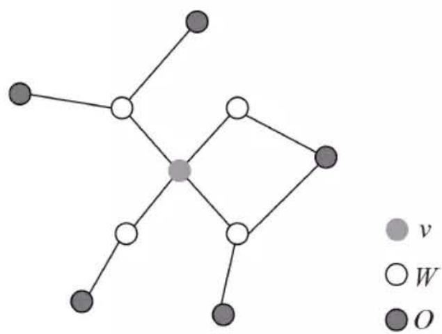  
图11.1 局部马尔可夫性

全局马尔可夫性：设结点集合A，B是在向图G中被结点集合C分开的任意结点集合，如图11.2所。结点集合A，B和C所对应的随机变量组分别是 $Y _ { A }$ $Y _ { B }$ 和 $Y _ { C }$ 。全局马尔可夫性是指给定随机变量组 $Y _ { C }$ 条件下随机变量组 $Y _ { A }$ 和 $Y _ { B }$ 是条件独立的，即

$$
P ( Y _ { A } , Y _ { B } | Y _ { C } ) = P ( Y _ { A } | Y _ { C } ) P ( Y _ { B } | Y _ { C } )\tag{11.4}
$$

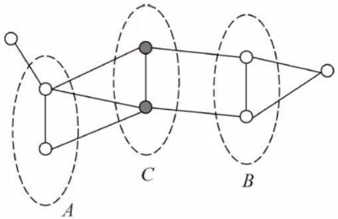  
图11.2 全局马尔可夫性

上述成对的、局部的、全局的马尔可夫性定义是等价的[2]。

下面定义概率无向图模型。

定义11.1（概率向图模型） 设有联合概率分布P(Y)，由向图 $G = ( V , E )$ 表示，在图G中，结点表示随机变量，边表示随机变量之间的依赖关系。如果联合概率分布P(Y)满足成对、局部或全局马尔可夫性，就称此联合概率分布为概率无向图模型（probabilisticundirectedgraphical model）或马尔可夫随机场（Markov random field）。

以上是概率向图模型的定义，实际上，我们更关的是如何求其联合概率分布。对给定的概率向图模型，我们希望将整体的联合概率写成若联合概率的乘积的形式，也就是将联合概率进因分解，这样便于模型的学习与计算。事实上，概率向图模型的最特点就是易于因分解。下介绍这结果。

## 11.1.2 概率向图模型的因子分解

先给出向图中的团与最团的定义。

定义11.2（团与最大团）无向图G中任何两个结点均有边连接的结点子集称为团（clique）。若C是无向图G的一个团，并且不能再加进任何一个G的结点使其成为一个更大的团，则称此C为最大团（maximalclique）。

图11.3表由4个结点组成的向图。图中由两个结点组成的团有5个： $\{ Y _ { 1 } , Y _ { 2 } \}$ ,$\{ Y _ { 2 } , Y _ { 3 } \} , \{ Y _ { 3 } , Y _ { 4 } \} , \{ Y _ { 4 } , Y _ { 2 } \}$ 和 $\{ Y _ { 1 } , Y _ { 3 } \}$ 。有两个最大团： $\left. Y _ { 1 } , Y _ { 2 } , Y _ { 3 } \right.$ 和 $\{ Y _ { 2 } , Y _ { 3 } , Y _ { 4 } \}$ 。而$\{ Y _ { 1 } , Y _ { 2 } , Y _ { 3 } , Y _ { 4 } \}$ 不是一个团，因为 $Y _ { 1 }$ 和 $Y _ { 4 }$ 没有边连接。

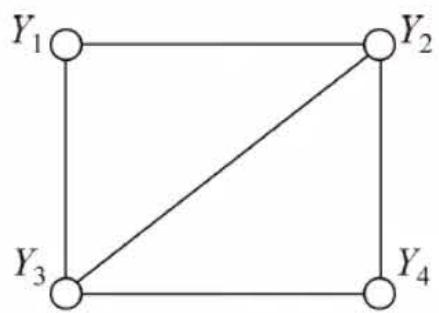  
图11.3 向图的团和最团

将概率向图模型的联合概率分布表为其最团上的随机变量的函数的乘积形式的操作，称为概率向图模型的因分解（factorization）。

给定概率无向图模型，设其无向图为G，C为G上的最大团， $Y _ { C }$ 表示C对应的随机变量。那么概率向图模型的联合概率分布P(Y）可写作图中所有最团C上的函数 $\varPsi _ { C } ( Y _ { C } )$ 的乘积形式，即

$$
P ( Y ) = \frac { 1 } { Z } \prod _ { C } \varPsi _ { C } ( Y _ { C } )\tag{11.5}
$$

其中，Z是规范化因子（normalization factor），由式

$$
Z = \sum _ { Y } \prod _ { C } \varPsi _ { C } ( Y _ { C } )\tag{11.6}
$$

给出。规范化因保证P(Y）构成个概率分布。函数 $\varPsi _ { C } ( Y _ { C } )$ 称为势函数（potentialfunction）。这要求势函数 $\varPsi _ { C } ( Y _ { C } )$ 是严格正的，通常定义为指数函数：

$$
\varPsi _ { C } ( Y _ { C } ) = \exp ( - E ( Y _ { C } ) )\tag{11.7}
$$

概率向图模型的因分解由下述定理来保证。

定理11.1（Hammersley-Clifford定理） 概率向图模型的联合概率分布 $P ( Y )$ 可以表示为如下形式：

$$
P ( Y ) = \frac { 1 } { Z } \prod _ { C } \varPsi _ { C } ( Y _ { C } )
$$

$$
Z = \sum _ { Y } \prod _ { C } \varPsi _ { C } ( Y _ { C } )
$$

其中，C是无向图的最大团， $Y _ { C }$ 是C的结点对应的随机变量， $\varPsi _ { C } ( Y _ { C } )$ 是C上定义的严格正函数，乘积是在无向图所有的最大团上进行的。 ■

## 11.2 条件随机场的定义与形式

## 11.2.1 条件随机场的定义

条件随机场（conditional random field）是给定随机变量X条件下，随机变量Y的马尔可夫随机场。这主要介绍定义在线性链上的特殊的条件随机场，称为线性链条件随机场（linearchain conditionalrandom feld）。线性链条件随机场可以于标注等问题。这时，在条件概率模型 $P ( Y | X )$ 中，Y是输出变量，表标记序列，X是输变量，表需要标注的观测序列。也把标记序列称为状态序列（参见隐马尔可夫模型）。学习时，利训练数据集通过极似然估计或正则化的极似然估计得到条件概率模型 ${ \hat { P } } ( Y | X )$ ；预测时，对于给定的输入序列x，求出条件概率 ${ \hat { P } } ( y | x )$ 最的输出序列 $\hat { y }$

先定义般的条件随机场，然后定义线性链条件随机场。

定义11.3（条件随机场） 设X与Y是随机变量， $P ( Y | X )$ 是在给定X的条件下Y的条件概率分布。若随机变量Y构成一个由无向图 $G = ( V , E )$ 表示的马尔可夫随机场，即

$$
P ( Y _ { v } | X , Y _ { w } , w \neq v ) = P ( Y _ { v } | X , Y _ { w } , w \sim v )\tag{11.8}
$$

对任意结点v成，则称条件概率分布 $P ( Y | X )$ 为条件随机场。式中 $w \sim v$ 表示在图$G = ( V , E )$ 中与结点v有边连接的所有结点，w≠v表示结点u以外的所有结点， $Y _ { v } , \ Y _ { u }$ 与 $Y _ { w }$ 为结点u，u与u对应的随机变量。

在定义中并没有要求X和Y具有相同的结构。现实中，般假设X和Y有相同的图结构。本书主要考虑向图为如图11.4与图11.5所的线性链的情况，即

$$
G = ( V = \{ 1 , 2 , \cdots , n \} , E = \{ ( i , i + 1 ) \} ) , \quad i = 1 , 2 , \cdots , n - 1
$$

在此情况下， $X = ( X _ { 1 } , X _ { 2 } , \cdots , X _ { n } ) , \ Y = ( Y _ { 1 } , Y _ { 2 } , \cdots , Y _ { n } )$ ，最团是相邻两个结点的集合。  
线性链条件随机场有下面的定义。

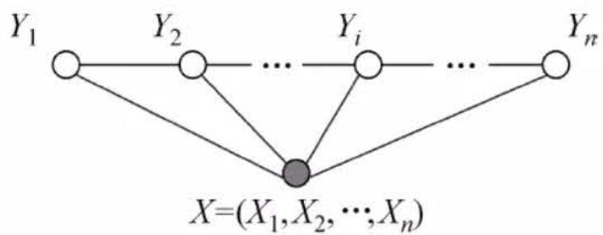  
图11.4 线性链条件随机场

定义11.4（线性链条件随机场） 设 $X = ( X _ { 1 } , X _ { 2 } , \cdots , X _ { n } ) , \ Y = ( Y _ { 1 } , Y _ { 2 } , \cdots , Y _ { n } )$ 均为线性链表示的随机变量序列，若在给定随机变量序列X的条件下，随机变量序列Y的条件

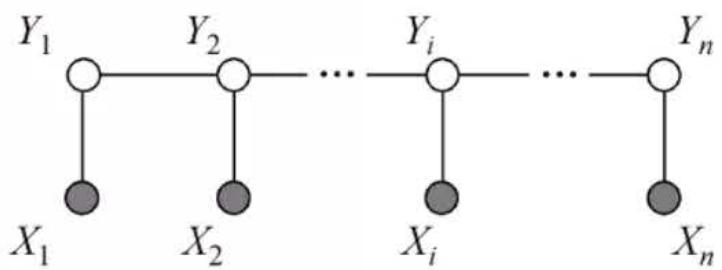  
图11.5 X和Y有相同的图结构的线性链条件随机场

概率分布 $P ( Y | X )$ 构成条件随机场，即满足马尔可夫性

$$
\begin{array} { r l } & { P ( Y _ { i } | X , Y _ { 1 } , \cdots , Y _ { i - 1 } , Y _ { i + 1 } , \cdots , Y _ { n } ) = P ( Y _ { i } | X , Y _ { i - 1 } , Y _ { i + 1 } ) , } \\ & { \qquad i = 1 , 2 , \cdots , n ( \not \equiv i = 1 \not \equiv 1 \not \equiv i = n \not \equiv \not \equiv \not \equiv \not \equiv \not \equiv \not \equiv 1 \not \exists I ) } \end{array}\tag{11.9}
$$

则称 $P ( Y | X )$ 为线性链条件随机场。在标注问题中，X表示输入观测序列，Y表示对应的输出标记序列或状态序列。

## 11.2.2 条件随机场的参数化形式

根据定理11.1，可以给出线性链条件随机场 $P ( { Y \vert { X } } )$ 的因分解式，各因是定义在相邻两个结点（最团）上的势函数。

定理11.2（线性链条件随机场的参数化形式） 设 $P ( Y | X )$ 为线性链条件随机场，则在随机变量X取值为x的条件下，随机变量Y取值为y的条件概率具有如下形式：

$$
P ( y | x ) = \frac { 1 } { Z ( x ) } \exp \left( \sum _ { i , k } \lambda _ { k } t _ { k } ( y _ { i - 1 } , y _ { i } , x , i ) + \sum _ { i , l } \mu _ { l } s _ { l } ( y _ { i } , x , i ) \right)\tag{11.10}
$$

其中，

$$
Z ( x ) = \sum _ { y } \exp \left( \sum _ { i , k } \lambda _ { k } t _ { k } ( y _ { i - 1 } , y _ { i } , x , i ) + \sum _ { i , l } \mu _ { l } s _ { l } ( y _ { i } , x , i ) \right)\tag{11.11}
$$

式中， $t _ { k }$ 和 $s _ { l }$ 是特征函数， $\lambda _ { k }$ 和 $\mu _ { l }$ 是对应的权值， $Z ( x )$ 是规范化因子，求和是在所有可能的输出序列上进行的。

式(11.10)和式(11.11)是线性链条件随机场模型的基本形式，表给定输序列x，对输出序列 $y$ 预测的条件概率。在式(11.10)和式(11.11)中， $t _ { k }$ 是定义在边上的特征函数，称为转移特征，依赖于当前和前一个位置； $^ { s _ { l } }$ 是定义在结点上的特征函数，称为状态特征，依赖于当前位置。 $t _ { k }$ 和 $^ { s } l$ 都依赖于位置，是局部特征函数。通常，特征函数 $t _ { k }$ 和 $^ { s } l$ 取值为1或0；当满特征条件时取值为1，否则为0。条件随机场完全由特征函数 $t _ { k }$ , $s _ { l }$ 和对应的权值$\lambda _ { k } , ~ \mu _ { l }$ 确定。

线性链条件随机场也是对数线性模型（loglinearmodel）。

下看个简单的例。

例11.1 设有标注问题：输观测序列为 $\boldsymbol { X } \ = \ ( X _ { 1 } , X _ { 2 } , X _ { 3 } )$ ，输出标记序列为$Y = ( Y _ { 1 } , Y _ { 2 } , Y _ { 3 } ) , Y _ { 1 } , Y _ { 2 } , Y _ { 3 }$ 取值于 $\mathcal { D } = \{ 1 , 2 \}$ 。

假设特征 $t _ { k } , s _ { l }$ 和对应的权值 $\lambda _ { k } , \mu _ { l }$ 如下：

$$
t _ { 1 } = t _ { 1 } ( y _ { i - 1 } = 1 , y _ { i } = 2 , x , i ) , \quad i = 2 , 3 , \quad \lambda _ { 1 } = 1
$$

这只注明特征取值为1的条件，取值为0的条件省略，即

$$
t _ { 1 } ( y _ { i - 1 } , y _ { i } , x , i ) = \left\{ \begin{array} { l l } { 1 , } & { y _ { i - 1 } = 1 , y _ { i } = 2 , x , i , ( i = 2 , 3 ) } \\ { 0 , } & { \ddag \ast \mathcal { M } \vphantom { \frac { 1 } { \mathrm { K } } } } \end{array} \right.
$$

下同。

$$
t _ { 2 } = t _ { 2 } ( y _ { 1 } = 1 , y _ { 2 } = 1 , x , 2 ) , \qquad \lambda _ { 2 } = 0 . 6
$$

$$
t _ { 3 } = t _ { 3 } ( y _ { 2 } = 2 , y _ { 3 } = 1 , x , 3 ) , \qquad \lambda _ { 3 } = 1
$$

$$
t _ { 4 } = t _ { 4 } ( y _ { 1 } = 2 , y _ { 2 } = 1 , x , 2 ) , \qquad \lambda _ { 4 } = 1
$$

$$
t _ { 5 } = t _ { 5 } ( y _ { 2 } = 2 , y _ { 3 } = 2 , x , 3 ) , \qquad \lambda _ { 5 } = 0 . 2
$$

$$
s _ { 1 } = s _ { 1 } ( y _ { 1 } = 1 , x , 1 ) , \qquad \mu _ { 1 } = 1
$$

$$
s _ { 2 } = s _ { 2 } ( y _ { i } = 2 , x , i ) , i = 1 , 2 , \mu _ { 2 } = 0 . 5
$$

$$
s _ { 3 } = s _ { 3 } ( y _ { i } = 1 , x , i ) , i = 2 , 3 , \qquad \mu _ { 3 } = 0 . 8
$$

$$
s _ { 4 } = s _ { 4 } ( y _ { 3 } = 2 , x , 3 ) , \qquad \mu _ { 4 } = 0 . 5
$$

对给定的观测序列x，求标记序列为 $y = ( y _ { 1 } , y _ { 2 } , y _ { 3 } ) = ( 1 , 2 , 2 )$ 的规范化条件概率（即没有除以规范化因的条件概率）。

解 由式(11.10)，线性链条件随机场模型为

$$
P ( y | x ) \propto \exp \left[ \sum _ { k = 1 } ^ { 5 } \lambda _ { k } \sum _ { i = 2 } ^ { 3 } t _ { k } ( y _ { i - 1 } , y _ { i } , x , i ) + \sum _ { k = 1 } ^ { 4 } \mu _ { k } \sum _ { i = 1 } ^ { 3 } s _ { k } ( y _ { i } , x , i ) \right]
$$

对给定的观测序列x，标记序列 $y = ( 1 , 2 , 2 )$ 的规范化条件概率为

$$
P ( y _ { 1 } = 1 , y _ { 2 } = 2 , y _ { 3 } = 2 | x ) \propto \exp ( 3 . 2 )
$$

## 11.2.3 条件随机场的简化形式

条件随机场还可以由简化形式表。注意到条件随机场(式(11.10)）中同特征在各个位置都有定义，可以对同个特征在各个位置求和，将局部特征函数转化为一个全局特征函数，这样就可以将条件随机场写成权值向量和特征向量的内积形式，即条件随机场的简化形式。

为简便起见，先将转移特征和状态特征及其权值统的符号表。设有 $K _ { 1 }$ 个转移特征， $K _ { 2 }$ 个状态特征， $K = K _ { 1 } + K _ { 2 }$ ,记

$$
f _ { k } ( y _ { i - 1 } , y _ { i } , x , i ) = \left\{ \begin{array} { l l } { { t _ { k } } ( y _ { i - 1 } , y _ { i } , x , i ) , } & { k = 1 , 2 , \cdots , K _ { 1 } } \\ { { } } & { { } { t _ { k } } ( y _ { i } , x , i ) , } \\ { { s _ { l } } ( y _ { i } , x , i ) , } & { k = K _ { 1 } + l , l = 1 , 2 , \cdots , K _ { 2 } } \end{array} \right.\tag{11.12}
$$

然后，对转移特征与状态特征在各个位置求和，记作

$$
f _ { k } ( y , x ) = \sum _ { i = 1 } ^ { n } f _ { k } ( y _ { i - 1 } , y _ { i } , x , i ) , \quad k = 1 , 2 , \cdots , K\tag{11.13}
$$

用 $w _ { k }$ 表示特征 $f _ { k } ( y , x )$ 的权值，即

$$
w _ { k } = \left\{ \begin{array} { l l } { \lambda _ { k } , } & { k = 1 , 2 , \cdots , K _ { 1 } } \\ { \mu \ i , } & { k = K _ { 1 } + l , \ l = 1 , 2 , \cdots , K _ { 2 } } \end{array} \right.\tag{11.14}
$$

于是，条件随机场(式(11.10)\~式(11.11))可表为

$$
P ( y | x ) = { \frac { 1 } { Z ( x ) } } \exp \sum _ { k = 1 } ^ { K } w _ { k } f _ { k } ( y , x )\tag{11.15}
$$

$$
Z ( x ) = \sum _ { y } \exp \sum _ { k = 1 } ^ { K } w _ { k } f _ { k } ( y , x )\tag{11.16}
$$

若以w表示权值向量，即

$$
\boldsymbol { w } = ( w _ { 1 } , w _ { 2 } , \cdots , w _ { K } ) ^ { \mathrm { T } }\tag{11.17}
$$

以 $F ( y , x )$ 表示全局特征向量，即

$$
F ( y , x ) = ( f _ { 1 } ( y , x ) , f _ { 2 } ( y , x ) , \cdots , f _ { K } ( y , x ) ) ^ { \mathrm { T } }\tag{11.18}
$$

则条件随机场可以写成向量 $_ w$ 与 $F ( y , x )$ 的内积的形式：

$$
P _ { w } ( y | x ) = \frac { \exp \left( w \cdot F ( y , x ) \right) } { Z _ { w } ( x ) }\tag{11.19}
$$

其中，

$$
Z _ { w } ( x ) = \sum _ { y } \exp \left( w \cdot F ( y , x ) \right)\tag{11.20}
$$

## 11.2.4 条件随机场的矩阵形式

条件随机场还可以由矩阵表。假设 $P _ { w } ( y | x )$ 是由式(11.15)\~式(11.16)给出的线性链条件随机场，表对给定观测序列x，相应的标记序列y的条件概率。对每个标记序列引进特殊的起点和终点状态标记 $y _ { 0 } = \mathrm { s t a r t }$ 和 $y _ { n + 1 } = \mathrm { s t o p }$ ，这时标注序列的概率 $P _ { w } ( y | x )$ 可以通过矩阵形式表并有效计算。

对观测序列x的每个位置 $i = 1 , 2 , \cdots , n + 1$ ，由于 $y _ { i - 1 }$ 和 $y _ { i }$ 在 $_ m$ 个标记中取值，可以定义个 $m$ 阶矩阵随机变量：

$$
M _ { i } ( x ) = \left( M _ { i } ( y _ { i - 1 } , y _ { i } | x ) \right)\tag{11.21}
$$

矩阵随机变量的元素为

$$
M _ { i } ( y _ { i - 1 } , y _ { i } | x ) = \exp \left( W _ { i } ( y _ { i - 1 } , y _ { i } | x ) \right)\tag{11.22}
$$

$$
W _ { i } ( y _ { i - 1 } , y _ { i } | x ) = \sum _ { k = 1 } ^ { K } w _ { k } f _ { k } ( y _ { i - 1 } , y _ { i } , x , i )\tag{11.23}
$$

这里 $w _ { k }$ 和 $f _ { k }$ 分别由式(11.14)和式(11.12)给出， $y _ { i - 1 }$ 和 $y _ { i }$ 是标记随机变量 $Y _ { i - 1 }$ 和 $Y _ { i }$ 的取值。

这样，给定观测序列x，相应标记序列y的规范化概率可以通过该序列 $n + 1$ 个矩阵的适当元素的乘积 $\prod _ { i = 1 } ^ { n + 1 } M _ { i } ( y _ { i - 1 } , y _ { i } | x )$ 表。于是，条件概率 $P _ { w } ( y | x )$ 是

$$
P _ { w } ( y | x ) = \frac { 1 } { Z _ { w } ( x ) } \prod _ { i = 1 } ^ { n + 1 } M _ { i } ( y _ { i - 1 } , y _ { i } | x )\tag{11.24}
$$

其中， $Z _ { w } ( x )$ 为规范化因，是n1个矩阵的乘积的(start,stop）元素，即

$$
Z _ { w } ( x ) = ( M _ { 1 } ( x ) M _ { 2 } ( x ) \cdots M _ { n + 1 } ( x ) ) _ { \mathrm { s t a r t , s t o p } }\tag{11.25}
$$

注意， $y _ { 0 } = \mathrm { s t a r t }$ 与 $y _ { n + 1 } = \operatorname { s t o p }$ 表开始状态与终状态，规范化因 $Z _ { w } ( x )$ 是以start为n+1起点、stop为终点通过状态的所有路径 $y _ { 1 } y _ { 2 } \cdots y _ { n }$ 的规范化概率 $\prod _ { i = 1 } M _ { i } ( y _ { i - 1 } , y _ { i } | x )$ 之和。下的例说明了这事实。

例11.2 给定个由图11.6所的线性链条件随机场，观测序列 $x ,$ 状态序列 $y , \ i =$ $1 , 2 , 3 , \ n = 3$ ，标记 $y _ { i } \in \{ 1 , 2 \}$ ，假设 $y _ { 0 } = \mathrm { s t a r t } = 1 , ~ y _ { 4 } = \mathrm { s t o p } = 1$ ，各个位置的随机矩阵$M _ { 1 } ( x ) , M _ { 2 } ( x ) , M _ { 3 } ( x ) , M _ { 4 } ( x )$ 分别是

$$
M _ { 1 } ( x ) = \left[ \begin{array} { c c } { { a _ { 0 1 } } } & { { a _ { 0 2 } } } \\ { { } } & { { } } \\ { { 0 } } & { { 0 } } \end{array} \right] , \quad M _ { 2 } ( x ) = \left[ \begin{array} { c c } { { b _ { 1 1 } } } & { { b _ { 1 2 } } } \\ { { b _ { 2 1 } } } & { { b _ { 2 2 } } } \end{array} \right]
$$

$$
M _ { 3 } ( x ) = \left[ \begin{array} { l l } { c _ { 1 1 } } & { c _ { 1 2 } } \\ { c _ { 2 1 } } & { c _ { 2 2 } } \end{array} \right] , \quad M _ { 4 } ( x ) = \left[ \begin{array} { l l } { 1 } & { 0 } \\ { 1 } & { 0 } \end{array} \right]
$$

试求状态序列y以start为起点、stop为终点的所有路径的规范化概率及规范化因。

解 先计算图11.6中从start到stop对应于 $y = ( 1 , 1 , 1 ) , \ y = ( 1 , 1 , 2 ) , \ \cdot \cdot \cdot , \ y =$ (2,2,2)各路径的规范化概率分别是

$$
a _ { 0 1 } b _ { 1 1 } c _ { 1 1 } , \quad a _ { 0 1 } b _ { 1 1 } c _ { 1 2 } , \quad a _ { 0 1 } b _ { 1 2 } c _ { 2 1 } , \quad a _ { 0 1 } b _ { 1 2 } c _ { 2 2 }
$$

$$
a _ { 0 2 } b _ { 2 1 } c _ { 1 1 } , \quad a _ { 0 2 } b _ { 2 1 } c _ { 1 2 } , \quad a _ { 0 2 } b _ { 2 2 } c _ { 2 1 } , \quad a _ { 0 2 } b _ { 2 2 } c _ { 2 2 }
$$

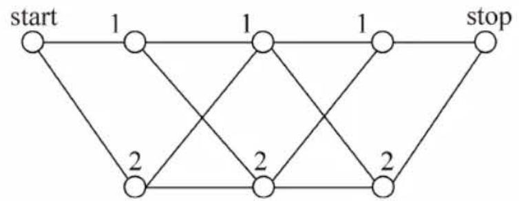  
图11.6 状态路径

然后按式(11.25)求规范化因。通过计算矩阵乘积 $M _ { 1 } ( x ) M _ { 2 } ( x ) M _ { 3 } ( x ) M _ { 4 } ( x )$ 可知，其第1第1列的元素为

a01b11c11+a02b21c11 +a01b12c21 + a02b22c22 +a01b11c12 +a02b21c12 + a01b12c22 + a02b22c21恰好等于从start到stop的所有路径的规范化概率之和，即规范化因 $Z ( x )$ 。

## 11.3 条件随机场的概率计算问题

条件随机场的概率计算问题是给定条件随机场 $P ( Y | X )$ 、输入序列x和输出序列y，计算条件概率 $P ( Y _ { i } = y _ { i } | x ) , P ( Y _ { i - 1 } = y _ { i - 1 } , Y _ { i } = y _ { i } | x )$ 以及相应的数学期望的问题。为了便起见，像隐马尔可夫模型那样，引进前向-后向向量，递归地计算以上概率及期望值。这样的算法也称为前向-后向算法。

## 11.3.1 前向-后向算法

对每个指标 $i = 0 , 1 , \cdots , n + 1$ ，定义前向向量 $\alpha _ { i } ( x )$

$$
\alpha _ { 0 } ( y | x ) = { \left\{ \begin{array} { l l } { 1 , } & { y = { \mathrm { s t a r t } } } \\ { 0 , } & { { \xrightarrow { } } { \mathrm { U } } { \bmod { } } } \end{array} \right. }\tag{11.26}
$$

递推公式为

$$
\alpha _ { i } ^ { \mathrm { T } } ( y _ { i } | x ) = \alpha _ { i - 1 } ^ { \mathrm { T } } ( y _ { i - 1 } | x ) ( M _ { i } ( y _ { i - 1 } , y _ { i } | x ) ) , \quad i = 1 , 2 , \cdots , n + 1\tag{11.27}
$$

又可表示为

$$
\alpha _ { i } ^ { \mathrm { T } } ( x ) = \alpha _ { i - 1 } ^ { \mathrm { T } } ( x ) M _ { i } ( x )\tag{11.28}
$$

$\alpha _ { i } ( y _ { i } | x )$ 表在位置i的标记是 $y _ { i }$ 并且从1到i的前部分标记序列的规范化概率， $y _ { i }$ 可取的值有m个，所以 $\alpha _ { i } ( x )$ 是m维列向量。

同样，对每个指标 $i = 0 , 1 , \cdots , n + 1$ ，定义后向向量 $\beta _ { i } ( x )$

$$
\beta _ { n + 1 } ( y _ { n + 1 } | x ) = { \left\{ \begin{array} { l l } { 1 , } & { y _ { n + 1 } = \operatorname { s t o p } } \\ { 0 , } & { { \widehat { \Pi } } } \end{array} \right. }\tag{11.29}
$$

$$
\beta _ { i } ( y _ { i } | \boldsymbol { x } ) = ( M _ { i + 1 } ( y _ { i } , y _ { i + 1 } | \boldsymbol { x } ) ) \beta _ { i + 1 } ( y _ { i + 1 } | \boldsymbol { x } )\tag{11.30}
$$

又可表示为

$$
\beta _ { i } ( x ) = M _ { i + 1 } ( x ) \beta _ { i + 1 } ( x )\tag{11.31}
$$

$\beta _ { i } ( y _ { i } | x )$ 表示在位置i的标记为 $y _ { i }$ 并且从i1到n的后部分标记序列的规范化概率。

## 11.3.2 概率计算

按照前向-后向向量的定义，很容易计算标记序列在位置是标记 $y _ { i }$ 的条件概率和在位

置i-1与i是标记 $y _ { i - 1 }$ 和 $y _ { i }$ 的条件概率：

$$
P ( Y _ { i } = y _ { i } | { \boldsymbol { x } } ) = { \frac { \alpha _ { i } ^ { \operatorname { T } } ( y _ { i } | { \boldsymbol { x } } ) \beta _ { i } ( y _ { i } | { \boldsymbol { x } } ) } { Z ( { \boldsymbol { x } } ) } }\tag{11.32}
$$

$$
P ( Y _ { i - 1 } = y _ { i - 1 } , Y _ { i } = y _ { i } | x ) = { \frac { \alpha _ { i - 1 } ^ { \mathrm { { T } } } ( y _ { i - 1 } | x ) M _ { i } ( y _ { i - 1 } , y _ { i } | x ) \beta _ { i } ( y _ { i } | x ) } { Z ( x ) } }\tag{11.33}
$$

其中，

$$
Z ( x ) = \alpha _ { n } ^ { \mathrm { T } } ( x ) \pmb { \mathit { 1 } } = \pmb { \mathit { 1 } } \beta _ { 1 } ( x )
$$

1是元素均为1的m维列向量。

## 11.3.3 期望值的计算

利前向-后向向量，可以计算特征函数关于联合分布 $P ( X , Y )$ 和条件分布 $P ( { Y \mid } X )$ 的数学期望。

特征函数 $f _ { k }$ 关于条件分布 $P ( { Y \vert { X } } )$ 的数学期望是

$$
\begin{array} { l } { \displaystyle E _ { P ( Y | X ) } \left[ f _ { k } \right] = \sum _ { y } P ( y \left| x \right) f _ { k } ( y , x ) } \\ { = \sum _ { i = 1 } ^ { n + 1 } \sum _ { y _ { i - 1 } y _ { i } } f _ { k } ( y _ { i - 1 } , y _ { i } , x , i ) \frac { \alpha _ { i - 1 } ^ { \mathrm { T } } \left( y _ { i - 1 } | x \right) M _ { i } \left( y _ { i - 1 } , y _ { i } | x \right) \beta _ { i } \left( y _ { i } | x \right) } { Z ( x ) } , } \end{array}
$$

$$
k = 1 , 2 , \cdots , K\tag{11.34}
$$

其中，

$$
Z ( x ) = \alpha _ { n } ^ { \mathrm { T } } ( x ) \mathbf { \delta } _ { 1 }
$$

假设经验分布为 $\tilde { P } ( X )$ ，特征函数 $f _ { k }$ 关于联合分布 $P ( X , Y )$ 的数学期望是

$$
\begin{array} { l } { \displaystyle E _ { P ( X , Y ) } [ f _ { k } ] = \sum _ { x , y } P ( x , y ) \sum _ { i = 1 } ^ { n + 1 } f _ { k } ( y _ { i - 1 } , y _ { i } , x , i ) \cdot } \\ { \displaystyle = \sum _ { x } \tilde { P } ( x ) \sum _ { y } P ( y | x ) \sum _ { i = 1 } ^ { n + 1 } f _ { k } ( y _ { i - 1 } , y _ { i } , x , i ) \qquad } \\ { \displaystyle = \sum _ { x } \tilde { P } ( x ) \sum _ { i = 1 } ^ { n + 1 } \sum _ { y _ { i - 1 } , y _ { i } } f _ { k } ( y _ { i - 1 } , y _ { i } , x , i ) \frac { \alpha _ { i - 1 } ^ { \mathrm { T } } ( y _ { i - 1 } | x ) M _ { i } ( y _ { i - 1 } , y _ { i } | x ) \beta _ { i } ( y _ { i } | x ) } { Z ( x ) } , } \end{array}
$$

$$
k = 1 , 2 , \cdots , K\tag{11.35}
$$

其中，

$$
Z ( x ) = \alpha _ { n } ^ { \mathrm { T } } ( x ) \mathbf { \delta } 1
$$

式(11.34)和式(11.35)是特征函数数学期望的般计算公式。对于转移特征 $t _ { k } ( y _ { i - 1 } , y _ { i } , x , i )$

$k = 1 , 2 , \cdots , K _ { 1 }$ ，可以将式中的 $f _ { k }$ 换成 $t _ { k } { \mathrm { : } }$ ；对于状态特征，可以将式中的 $f _ { k }$ 换成 $s _ { i }$ ，表示为 $s _ { l } ( y _ { i } , x , i ) , \ : k = K _ { 1 } + l , \ : l = 1 , 2 , \cdots , K _ { 2 } $

有了式(11.32)\~式(11.35)，对于给定的观测序列 $x$ 与标记序列y，可以通过次前向扫描计算 $\alpha _ { i }$ 及 $Z ( x )$ ，通过次后向扫描计算 $\beta _ { i }$ ，从计算所有的概率和特征的期望。

## 11.4 条件随机场的学习算法

本节讨论给定训练数据集估计条件随机场模型参数的问题，即条件随机场的学习问题。条件随机场模型实际上是定义在时序数据上的对数线性模型，其学习法包括极似然估计和正则化的极似然估计。具体的优化实现算法有改进的迭代尺度法IIS、梯度下降法以及拟顿法（参阅附录A和附录B）。

## 11.4.1改进的迭代尺度法

已知训练数据集，由此可知经验概率分布 $\tilde { P } ( X , Y )$ 。可以通过极大化训练数据的对数似然函数来求模型参数。

训练数据的对数似然函数为

$$
L ( w ) = L _ { \tilde { P } } ( P _ { w } ) = \log \prod _ { x , y } P _ { w } ( y | x ) ^ { \tilde { P } ( x , y ) } = \sum _ { x , y } \tilde { P } ( x , y ) \log P _ { w } ( y | x )
$$

当 $P _ { w }$ 是个由式(11.15)和式(11.16)给出的条件随机场模型时，对数似然函数为

$$
\begin{array} { l } { { \displaystyle { \cal L } ( w ) = \sum _ { x , y } \tilde { P } ( x , y ) \log P _ { w } ( y | x ) } } \\ { ~ } \\ { { \displaystyle ~ = \sum _ { x , y } \left[ \tilde { P } ( x , y ) \sum _ { k = 1 } ^ { K } w _ { k } f _ { k } ( y , x ) - \tilde { P } ( x , y ) \log Z _ { w } ( x ) \right] } } \\ { { \displaystyle ~ = \sum _ { j = 1 } ^ { N } \sum _ { k = 1 } ^ { K } w _ { k } f _ { k } ( y _ { j } , x _ { j } ) - \sum _ { j = 1 } ^ { N } \log Z _ { w } ( x _ { j } ) } } \end{array}
$$

改进的迭代尺度法通过迭代的法不断优化对数似然函数改变量的下界，达到极化对数似然函数的的。假设模型的当前参数向量为 $\boldsymbol { w } = ( w _ { 1 } , w _ { 2 } , \cdots , w _ { K } ) ^ { \mathrm { T } }$ ，向量的增量为$\delta = ( \delta _ { 1 } , \delta _ { 2 } , \cdots , \delta _ { K } ) ^ { \mathrm { T } }$ ，更新参数向量为 $\boldsymbol { w } + \delta = ( w _ { 1 } + \delta _ { 1 } , w _ { 2 } + \delta _ { 2 } , \cdots , w _ { K } + \delta _ { K } ) ^ { \mathrm { T } }$ 。在每步迭代过程中，改进的迭代尺度法通过依次求解式(11.36)和式(11.37)，得到 $\boldsymbol { \delta } = ( \delta _ { 1 } , \delta _ { 2 } , \cdots , \delta _ { K } ) ^ { \mathrm { T } }$ 。推导可参考本书6.3.1节。

关于转移特征 $t _ { k }$ 的更新方程为

$$
\begin{array} { l } { { \displaystyle E _ { \tilde { P } } [ t _ { k } ] = \sum _ { x , y } \tilde { P } ( x , y ) \sum _ { i = 1 } ^ { n + 1 } t _ { k } ( y _ { i - 1 } , y _ { i } , x , i ) } } \\ { { \displaystyle ~ = \sum _ { x , y } \tilde { P } ( x ) P ( y | x ) \sum _ { i = 1 } ^ { n + 1 } t _ { k } ( y _ { i - 1 } , y _ { i } , x , i ) \exp ( \delta _ { k } T ( x , y ) ) , } } \\ { { \displaystyle ~ k = 1 , 2 , \cdots , K _ { 1 } } } \end{array}\tag{11.36}
$$

关于状态特征 $^ { s } l$ 的更新方程为

$$
\begin{array} { l } { { \displaystyle E _ { \tilde { P } } [ s _ { l } ] = \sum _ { x , y } \tilde { P } ( x , y ) \sum _ { i = 1 } ^ { n + 1 } s _ { l } ( y _ { i } , x , i ) } } \\ { { ~ = \sum _ { x , y } \tilde { P } ( x ) P ( y | x ) \sum _ { i = 1 } ^ { n } s _ { l } ( y _ { i } , x , i ) \exp ( \delta _ { K _ { 1 } + l } T ( x , y ) ) , } } \\ { { ~ } } \\ { { ~ i = 1 , 2 , \cdots , K _ { 2 } } } \end{array}\tag{11.37}
$$

这里， $T ( x , y )$ 是在数据(x,y）中出现的所有特征数的总和：

$$
T ( x , y ) = \sum _ { k } f _ { k } ( y , x ) = \sum _ { k = 1 } ^ { K } \sum _ { i = 1 } ^ { n + 1 } f _ { k } ( y _ { i - 1 } , y _ { i } , x , i )\tag{11.38}
$$

算法11.1（条件随机场模型学习的改进的迭代尺度法）

输入：特征函数 $t _ { 1 } , t _ { 2 } , \cdots , t _ { K _ { 1 } } , s _ { 1 } , s _ { 2 } , \cdots , s _ { K _ { 2 } }$ ，经验分布 $\tilde { P } ( x , y )$ 0

输出：参数估计值ù，模型 $P _ { \hat { w } }$

（1）对所有 $k \in \{ 1 , 2 , \cdots , K \}$ ，取初值 $w _ { k } = 0$

(2）对每 $k \in \{ 1 , 2 , \cdots , K \}$

(a)当 $k = 1 , 2 , \cdots , K _ { 1 }$ 时，令 $\delta _ { k }$ 是方程

$$
\sum _ { x , y } \tilde { P } ( x ) P ( y | x ) \sum _ { i = 1 } ^ { n + 1 } t _ { k } ( y _ { i - 1 } , y _ { i } , x , i ) \exp ( \delta _ { k } T ( x , y ) ) = E _ { \tilde { P } } [ t _ { k } ]
$$

的解；

当 $k = K _ { 1 } + l , l = 1 , 2 , \cdot \cdot \cdot , K _ { 2 }$ 时，令 $\delta _ { K _ { 1 } + l }$ 是方程

$$
\sum _ { x , y } \tilde { P } ( x ) P ( y | x ) \sum _ { i = 1 } ^ { n } s _ { l } ( y _ { i } , x , i ) \exp ( \delta _ { K _ { 1 } + l } T ( x , y ) ) = E _ { \tilde { P } } [ s _ { l } ]
$$

的解，式中 $T ( x , y )$ 由式(11.38)给出。

(b）更新 $w _ { k }$ 值： $w _ { k } \gets w _ { k } + \delta _ { k }$

(3）如果不是所有 $w _ { k }$ 都收敛，重复步骤(2)。

在式(11.36)和式(11.37)中， $T ( x , y )$ 表示数据 $( x , y )$ 中的特征总数，对不同的数据 $( x , y )$ 取值可能不同。为了处理这个问题，定义松弛特征

$$
s ( x , y ) = S - \sum _ { i = 1 } ^ { n + 1 } \sum _ { k = 1 } ^ { K } f _ { k } ( y _ { i - 1 } , y _ { i } , x , i )\tag{11.39}
$$

式中S是个常数。选择够的常数S使得对训练数据集的所有数据 $( x , y ) , \ s ( x , y ) \geqslant 0$ 成。这时特征总数可取 $S _ { \circ }$

由式(11.36)，对于转移特征 $t _ { k } , ~ \delta _ { k }$ 的更新方程是

$$
\sum _ { x , y } \tilde { P } ( x ) P ( y | x ) \sum _ { i = 1 } ^ { n + 1 } t _ { k } ( y _ { i - 1 } , y _ { i } , x , i ) \exp ( \delta _ { k } S ) = E _ { \tilde { P } } [ t _ { k } ]\tag{11.40}
$$

$$
\delta _ { k } = \frac { 1 } { S } \log \frac { E _ { \tilde { P } } [ t _ { k } ] } { E _ { P } [ t _ { k } ] }\tag{11.41}
$$

其中，

$$
E _ { P } ( t _ { k } ) = \sum _ { x } \tilde { P } ( x ) \sum _ { i = 1 } ^ { n + 1 } \sum _ { y _ { i - 1 } , y _ { i } } t _ { k } ( y _ { i - 1 } , y _ { i } , x , i ) \frac { \alpha _ { i - 1 } ^ { \mathrm { T } } ( y _ { i - 1 } | x ) M _ { i } ( y _ { i - 1 } , y _ { i } | x ) \beta _ { i } ( y _ { i } | x ) } { Z ( x ) }\tag{11.42}
$$

同样由式(11.37)，对于状态特征 $s _ { l } , ~ \delta _ { k }$ 的更新方程是

$$
\sum _ { x , y } \tilde { P } ( x ) P ( y | x ) \sum _ { i = 1 } ^ { n } s _ { l } ( y _ { i } , x , i ) \exp ( \delta _ { K _ { 1 } + l } S ) = E _ { \tilde { P } } [ s _ { l } ]\tag{11.43}
$$

$$
\delta _ { K _ { 1 } + l } = \frac { 1 } { S } \log \frac { E _ { \tilde { P } } [ s _ { l } ] } { E _ { P } [ s _ { l } ] }\tag{11.44}
$$

其中，

$$
E _ { P } ( s _ { l } ) = \sum _ { x } \tilde { P } ( x ) \sum _ { i = 1 } ^ { n } \sum _ { y _ { i } } s _ { l } ( y _ { i } , x , i ) \frac { \alpha _ { i } ^ { \mathrm { T } } ( y _ { i } | x ) \beta _ { i } ( y _ { i } | x ) } { Z ( x ) }\tag{11.45}
$$

以上算法称为算法S。在算法S中需要使常数S取够，这样来，每步迭代的增量向量会变，算法收敛会变慢。算法T试图解决这个问题，对每个观测序列x计算其特征总数最大值 $T ( x )$ :

$$
T ( x ) = \operatorname* { m a x } _ { y } T ( x , y )\tag{11.46}
$$

利前向-后向递推公式，可以很容易地计算 $T ( x ) = t _ { \ast }$ 这时，关于转移特征参数的更新方程可以写成

$$
\begin{array} { r l } & { E _ { \widehat { P } } [ t _ { k } ] = \displaystyle \sum _ { x , y } \tilde { P } ( x ) P ( y | x ) \sum _ { i = 1 } ^ { n + 1 } t _ { k } ( y _ { i - 1 } , y _ { i } , x , i ) \exp ( \delta _ { k } T ( x ) ) } \\ & { \qquad = \displaystyle \sum _ { x } \tilde { P } ( x ) \sum _ { y } P ( y | x ) \sum _ { i = 1 } ^ { n + 1 } t _ { k } ( y _ { i - 1 } , y _ { i } , x , i ) \exp ( \delta _ { k } T ( x ) ) } \\ & { \qquad = \displaystyle \sum _ { x } \tilde { P } ( x ) a _ { k , t } \exp ( \delta _ { k } t ) } \\ & { \qquad = \displaystyle \sum _ { t = 0 } ^ { T } a _ { k , t } \beta _ { k } ^ { t } } \end{array}\tag{11.47}
$$

这里， ${ a } _ { k , t }$ 是特征 $t _ { k }$ 的期待值， $\delta _ { k } = \log \beta _ { k } \circ \beta _ { k }$ 是多项式程(11.47)唯的实根，可以顿法求得，从而求得相关的 $\delta _ { k }$

同样，关于状态特征的参数更新程可以写成

$$
E _ { \tilde { P } } [ s _ { l } ] = \sum _ { x , y } \tilde { P } ( x ) P ( y | x ) \sum _ { i = 1 } ^ { n } s _ { l } ( y _ { i } , x , i ) \exp ( \delta _ { K _ { 1 } + l } T ( x ) )
$$

$$
\begin{array} { l } { { \displaystyle = \sum _ { x } \tilde { P } ( x ) \sum _ { y } P ( y | x ) \sum _ { i = 1 } ^ { n } s _ { l } ( y _ { i } , x , i ) \exp ( \delta _ { K _ { 1 } + l } T ( x ) ) } } \\ { ~ } \\ { { \displaystyle = \sum _ { x } \tilde { P } ( x ) b _ { l , t } \exp ( \delta _ { k } t ) } } \\ { { \displaystyle = \sum _ { t = 0 } ^ { T _ { \operatorname* { m a x } } } b _ { l , t } \gamma _ { l } ^ { t } } } \end{array}\tag{11.48}
$$

这里， $b _ { l , t }$ 是特征 $^ { s } l$ 的期望值， $\delta _ { l } = \log \gamma _ { l }$ ，γ是多项式程(11.48)唯的实根，也可以顿法求得。

## 11.4.2 拟顿法

条件随机场模型学习还可以应顿法或拟顿法（参阅附录B）。对于条件随机场模型，有

$$
P _ { w } ( y | x ) = { \frac { \displaystyle \exp \left( \sum _ { i = 1 } ^ { n } w _ { i } f _ { i } ( x , y ) \right) } { \displaystyle \sum _ { y } \exp \left( \sum _ { i = 1 } ^ { n } w _ { i } f _ { i } ( x , y ) \right) } }\tag{11.49}
$$

学习的优化标函数是

$$
\operatorname* { m i n } _ { w \in R ^ { n } } f ( w ) = \sum _ { x } \tilde { P } ( x ) \log \sum _ { y } \exp \left( \sum _ { i = 1 } ^ { n } w _ { i } f _ { i } ( x , y ) \right) - \sum _ { x , y } \tilde { P } ( x , y ) \sum _ { i = 1 } ^ { n } w _ { i } f _ { i } ( x , y )\tag{11.50}
$$

其梯度函数是

$$
g ( w ) = \sum _ { x , y } \tilde { P } ( x ) P _ { w } ( y | x ) f ( x , y ) - E _ { \tilde { P } } ( f )\tag{11.51}
$$

拟牛顿法的BFGS算法如下。

算法11.2（条件随机场模型学习的BFGS算法）

输入：特征函数 $f _ { 1 } , f _ { 2 } , \cdots , f _ { n }$ ，经验分布 $\tilde { P } ( X , Y )$ 。

输出：最优参数值ω，最优模型 $P _ { \hat { w } } ( y | x )$ 。

（1）选定初始点 $w ^ { ( 0 ) }$ ，取 $B _ { 0 }$ 为正定对称矩阵，置 $k = 0$ 。

（2）计算 $g _ { k } = g ( w ^ { ( k ) } )$ 。若 $g _ { k } = 0$ ，则停计算；否则，转步骤(3)。

(3）由 $B _ { k } p _ { k } = - g _ { k }$ 求出 $p _ { k }$

(4）维搜索：求 $\lambda _ { k }$ 使得

$$
f ( w ^ { ( k ) } + \lambda _ { k } p _ { k } ) = \operatorname* { m i n } _ { \lambda \geqslant 0 } f ( w ^ { ( k ) } + \lambda p _ { k } )
$$

(5）置 $w ^ { ( k + 1 ) } = w ^ { ( k ) } + \lambda _ { k } p _ { k }$

（6）计算 $g _ { k + 1 } = g ( w ^ { ( k + 1 ) } )$ ，若 $g _ { k + 1 } = 0$ ，则停计算；否则，按下式求出 $B _ { k + 1 }$

$$
B _ { k + 1 } = B _ { k } + { \frac { y _ { k } y _ { k } ^ { \mathrm { T } } } { y _ { k } ^ { \mathrm { T } } \delta _ { k } } } - { \frac { B _ { k } \delta _ { k } \delta _ { k } ^ { \mathrm { T } } B _ { k } } { \delta _ { k } ^ { \mathrm { T } } B _ { k } \delta _ { k } } }
$$

其中，

$$
y _ { k } = g _ { k + 1 } - g _ { k } , \quad \delta _ { k } = w ^ { ( k + 1 ) } - w ^ { ( k ) }
$$

(7）置 $k = k + 1$ ，转步骤(3)。

## 11.5 条件随机场的预测算法

条件随机场的预测问题是指给定条件随机场 $P ( Y | X )$ 和输入序列（观测序列）x，求条件概率最的输出序列（标记序列) $y ^ { * }$ ，即对观测序列进标注。条件随机场的预测算法是著名的维特算法（参阅本书10.4节）。

由式(11.19)可得：

$$
\begin{array} { r l } & { y ^ { * } = \arg \underset { y } { \operatorname* { m a x } } P _ { w } ( y | x ) } \\ & { \quad = \arg \underset { y } { \operatorname* { m a x } } \frac { \exp ( w \cdot F ( y , x ) ) } { Z _ { w } ( x ) } } \\ & { \quad = \arg \underset { y } { \operatorname* { m a x } } \exp ( w \cdot F ( y , x ) ) } \\ & { \quad = \arg \underset { y } { \operatorname* { m a x } } ( w \cdot F ( y , x ) ) } \end{array}
$$

于是，条件随机场的预测问题成为求规范化概率最的最优路径问题：

$$
\operatorname* { m a x } _ { y } ( w \bullet F ( y , x ) )\tag{11.52}
$$

这，路径表示标记序列。其中，

$$
\begin{array} { c } { { w = ( w _ { 1 } , w _ { 2 } , \cdots , w _ { K } ) ^ { \mathrm { T } } } } \\ { { { } } } \\ { { F ( y , x ) = ( f _ { 1 } ( y , x ) , f _ { 2 } ( y , x ) , \cdots , f _ { K } ( y , x ) ) ^ { \mathrm { T } } } } \\ { { { } } } \\ { { f _ { k } ( y , x ) = \displaystyle \sum _ { i = 1 } ^ { n } f _ { k } ( y _ { i - 1 } , y _ { i } , x , i ) , \quad k = 1 , 2 , \cdots , K } } \end{array}
$$

注意，这时只需计算规范化概率，不必计算概率，可以提效率。为了求解最优路径，将式(11.52)写成如下形式：

$$
\operatorname* { m a x } _ { y } \sum _ { i = 1 } ^ { n } w \cdot F _ { i } ( y _ { i - 1 } , y _ { i } , x )\tag{11.53}
$$

其中，

$$
F _ { i } ( y _ { i - 1 } , y _ { i } , x ) = ( f _ { 1 } ( y _ { i - 1 } , y _ { i } , x , i ) , f _ { 2 } ( y _ { i - 1 } , y _ { i } , x , i ) , \cdot \cdot \cdot , f _ { K } ( y _ { i - 1 } , y _ { i } , x , i ) ) ^ { \mathrm { T } }
$$

是局部特征向量。

下叙述维特算法。先求出位置1的各个标记 $j = 1 , 2 , \cdots , m$ 的非规范化概率：

$$
\delta _ { 1 } ( j ) = w \bullet F _ { 1 } ( y _ { 0 } = \mathrm { s t a r t } , y _ { 1 } = j , x ) , \quad j = 1 , 2 , \cdots , m\tag{11.54}
$$

般地，由递推公式求出到位置i的各个标记 $l = 1 , 2 , \cdots , m$ 的规范化概率的最值，同时记录规范化概率最值的路径：

$$
\delta _ { i } ( l ) = \operatorname* { m a x } _ { 1 \leqslant j \leqslant m } \{ \delta _ { i - 1 } ( j ) + w \bullet F _ { i } ( y _ { i - 1 } = j , y _ { i } = l , x ) \} , l = 1 , 2 , \cdots , m\tag{11.55}
$$

$$
\varPsi _ { i } ( l ) = \arg \operatorname* { m a x } _ { 1 \leqslant j \leqslant m } \{ \delta _ { i - 1 } ( j ) + w \bullet F _ { i } ( y _ { i - 1 } = j , y _ { i } = l , x ) \} , \quad l = 1 , 2 , \cdots , m\tag{11.56}
$$

直到 $i = n$ 时终。这时求得规范化概率的最值为

$$
\operatorname* { m a x } _ { y } ( w \cdot F ( y , x ) ) = \operatorname* { m a x } _ { 1 \leqslant j \leqslant m } \delta _ { n } ( j )\tag{11.57}
$$

最优路径的终点为

$$
y _ { n } ^ { * } = \arg \operatorname* { m a x } _ { 1 \leqslant j \leqslant m } \delta _ { n } ( j )\tag{11.58}
$$

由此最优路径终点返回：

$$
y _ { i } ^ { * } = \varPsi _ { i + 1 } ( y _ { i + 1 } ^ { * } ) , \quad i = n - 1 , n - 2 , \cdots , 1\tag{11.59}
$$

求得最优路径 $\boldsymbol { y } ^ { * } = ( y _ { 1 } ^ { * } , y _ { 2 } ^ { * } , \cdots , y _ { n } ^ { * } ) ^ { \mathrm { T } }$

综上所述，得到条件随机场预测的维特算法。

算法11.3（条件随机场预测的维特比算法）

输：模型特征向量 $F ( y , x )$ 和权值向量w，观测序列 $x = ( x _ { 1 } , x _ { 2 } , \cdots , x _ { n } )$ 。

输出：最优路径 $\boldsymbol { y } ^ { * } = ( y _ { 1 } ^ { * } , y _ { 2 } ^ { * } , \cdots , y _ { n } ^ { * } ) ^ { \mathrm { T } }$ 。

(1)初始化：

$$
\delta _ { 1 } ( j ) = w \bullet F _ { 1 } ( y _ { 0 } = \mathrm { s t a r t } , y _ { 1 } = j , x ) , \quad j = 1 , 2 , \cdots , m
$$

(2)递推。对 $i = 2 , 3 , \cdots , n$ 有

$$
\delta _ { i } ( l ) = \operatorname* { m a x } _ { 1 \leqslant j \leqslant m } \{ \delta _ { i - 1 } ( j ) + w \bullet F _ { i } ( y _ { i - 1 } = j , y _ { i } = l , x ) \} , \quad l = 1 , 2 , \cdots , m
$$

$$
\varPsi _ { i } ( l ) = \arg \operatorname* { m a x } _ { 1 \leqslant j \leqslant m } \{ \delta _ { i - 1 } ( j ) + w \bullet F _ { i } ( y _ { i - 1 } = j , y _ { i } = l , x ) \} , \quad l = 1 , 2 , \cdots , m
$$

(3）终止：

$$
\operatorname* { m a x } _ { y } ( w \cdot F ( y , x ) ) = \operatorname* { m a x } _ { 1 \leqslant j \leqslant m } \delta _ { n } ( j )
$$

$$
y _ { n } ^ { * } = \arg \operatorname* { m a x } _ { 1 \leqslant j \leqslant m } \delta _ { n } ( j )
$$

(4）返回路径：

$$
y _ { i } ^ { * } = \varPsi _ { i + 1 } ( y _ { i + 1 } ^ { * } ) , \quad i = n - 1 , n - 2 , \cdots , 1
$$

求得最优路径 $\boldsymbol { y } ^ { * } = ( y _ { 1 } ^ { * } , y _ { 2 } ^ { * } , \cdots , y _ { n } ^ { * } ) ^ { \mathrm { T } }$ 。

下通过个例说明维特算法。

例11.3 在例11.1中，维特算法求给定的输序列（观测序列）x对应的最优输出序列(标记序列) $\boldsymbol { y } ^ { * } = ( y _ { 1 } ^ { * } , y _ { 2 } ^ { * } , y _ { 3 } ^ { * } ) ^ { \mathrm { T } }$ 。

解 特征函数及对应的权值均在例11.1中给出。

现在利维特比算法求最优路径问题：

$$
\operatorname* { m a x } \sum _ { i = 1 } ^ { 3 } w \bullet F _ { i } ( y _ { i - 1 } , y _ { i } , x )
$$

(1）初始化：

$$
\delta _ { 1 } ( j ) = w \bullet F _ { 1 } ( y _ { 0 } = \mathrm { s t a r t } , y _ { 1 } = j , x ) , \quad j = 1 , 2
$$

i =1, δ1(1) =1, δ1(2) =0.5。

(2）递推：

i=2时，

$$
\delta _ { 2 } ( l ) = \operatorname* { m a x } _ { j } \{ \delta _ { 1 } ( j ) + w \bullet F _ { 2 } ( j , l , x ) \}
$$

$$
\delta _ { 2 } ( 1 ) = \operatorname* { m a x } \{ 1 + \lambda _ { 2 } t _ { 2 } + \mu _ { 3 } s _ { 3 } , 0 . 5 + \lambda _ { 4 } t _ { 4 } + \mu _ { 3 } s _ { 3 } \} = 2 . 4 , \quad \varPsi _ { 2 } ( 1 ) = 1
$$

$$
\delta _ { 2 } ( 2 ) = \operatorname* { m a x } \{ 1 + \lambda _ { 1 } t _ { 1 } + \mu _ { 2 } s _ { 2 } , 0 . 5 + \mu _ { 2 } s _ { 2 } \} = 2 . 5 , \quad \varPsi _ { 2 } ( 2 ) = 1
$$

i=3时,

$$
\delta _ { 3 } ( l ) = \operatorname* { m a x } _ { j } \{ \delta _ { 2 } ( j ) + w \bullet F _ { 3 } ( j , l , x ) \}
$$

$$
\delta _ { 3 } ( 1 ) = \operatorname* { m a x } \{ 2 . 4 + \mu _ { 3 } s _ { 3 } , 2 . 5 + \lambda _ { 3 } t _ { 3 } + \mu _ { 3 } s _ { 3 } \} = 4 . 3 , \quad \varPsi _ { 3 } ( 1 ) = 2
$$

$$
\delta _ { 3 } ( 2 ) = \operatorname* { m a x } \{ 2 . 4 + \lambda _ { 1 } t _ { 1 } + \mu _ { 4 } s _ { 4 } , 2 . 5 + \lambda _ { 5 } t _ { 5 } + \mu _ { 4 } s _ { 4 } \} = 3 . 9 , \quad \varPsi _ { 3 } ( 2 ) = 1
$$

(3)终止：

$$
\operatorname* { m a x } _ { y } ( w \cdot F ( y , x ) ) = \operatorname* { m a x } _ { } \delta _ { 3 } ( l ) = \delta _ { 3 } ( 1 ) = 4 . 3
$$

$$
y _ { 3 } ^ { * } = \arg \operatorname* { m a x } _ { l } \delta _ { 3 } ( l ) = 1
$$

(4）返回：

$$
y _ { 2 } ^ { * } = \varPsi _ { 3 } ( y _ { 3 } ^ { * } ) = \varPsi _ { 3 } ( 1 ) = 2
$$

$$
y _ { 1 } ^ { * } = \varPsi _ { 2 } ( y _ { 2 } ^ { * } ) = \varPsi _ { 2 } ( 2 ) = 1
$$

最优标记序列：

$$
\boldsymbol { y } ^ { * } = ( y _ { 1 } ^ { * } , y _ { 2 } ^ { * } , y _ { 3 } ^ { * } ) ^ { \mathrm { T } } = ( 1 , 2 , 1 ) ^ { \mathrm { T } }
$$

## 本章概要

1．概率向图模型是由向图表的联合概率分布。向图上的结点之间的连接关系表了联合分布的随机变量集合之间的条件独性，即马尔可夫性。因此，概率向图模型也称为马尔可夫随机场。概率向图模型或马尔可夫随机场的联合概率分布可以分解为向图最大团上的正值函数的乘积的形式。

2.条件随机场是给定输随机变量X条件下，输出随机变量Y的条件概率分布模型，其形式为参数化的对数线性模型。条件随机场的最特点是假设输出变量之间的联合概率分布构成概率向图模型，即马尔可夫随机场。条件随机场是判别模型。

3.线性链条件随机场是定义在观测序列与标记序列上的条件随机场。线性链条件随机场般表为给定观测序列条件下的标记序列的条件概率分布，由参数化的对数线性模型表。模型包含特征及相应的权值，特征是定义在线性链的边与结点上的。线性链条件随机场模型的参数形式是最基本的形式，其他形式是其简化与变形，参数形式的数学表达式是

$$
P ( y | x ) = \frac { 1 } { Z ( x ) } \exp \left( \sum _ { i , k } \lambda _ { k } t _ { k } ( y _ { i - 1 } , y _ { i } , x , i ) + \sum _ { i , l } \mu _ { l } s _ { l } ( y _ { i } , x , i ) \right)
$$

其中，

$$
Z ( x ) = \sum _ { y } \exp \left( \sum _ { i , k } \lambda _ { k } t _ { k } ( y _ { i - 1 } , y _ { i } , x , i ) + \sum _ { i , l } \mu _ { l } s _ { l } ( y _ { i } , x , i ) \right)
$$

4.线性链条件随机场的概率计算通常利前向-后向算法。

5.条件随机场的学习法通常是极似然估计法或正则化的极似然估计，即在给定训练数据下，通过极化训练数据的对数似然函数估计模型参数。具体的算法有改进的迭代尺度算法、梯度下降法、拟顿法等。

6.线性链条件随机场的个重要应是标注。维特算法是给定观测序列求条件概率最大的标记序列的方法。

## 继续阅读

关于概率向图模型可以参阅献[1]和献[2]。关于条件随机场可以参阅献[3]和献[4]。在条件随机场提出之前已有最熵马尔可夫模型等模型被提出[5]。条件随机场可以看作是最熵马尔可夫模型在标注问题上的推。持向量机模型也被推到标注问题上[6-7]。

## 习 题

11.1 写出图11.3中向图描述的概率图模型的因分解式。

11.2证明 $Z ( x ) = \alpha _ { n } ^ { \mathrm { T } } ( x ) \pmb { \mathit { 1 } } = \pmb { \mathit { 1 } } ^ { \mathrm { T } } \beta _ { 1 } ( x )$ ，其中1是元素均为1的m维列向量。

11.3 写出条件随机场模型学习的梯度下降法。

11.4 参考图11.6的状态路径图，假设随机矩阵 $M _ { 1 } ( x ) , M _ { 2 } ( x ) , M _ { 3 } ( x ) , M _ { 4 } ( x )$ 分别是

$$
M _ { 1 } ( x ) = \left[ \begin{array} { c c } { { 0 } } & { { 0 } } \\ { { 0 . 5 } } & { { 0 . 5 } } \end{array} \right] , \quad M _ { 2 } ( x ) = \left[ \begin{array} { c c } { { 0 . 3 } } & { { 0 . 7 } } \\ { { 0 . 7 } } & { { 0 . 3 } } \end{array} \right]
$$

$$
M _ { 3 } ( x ) = \left[ \begin{array} { l l } { 0 . 5 } & { 0 . 5 } \\ { 0 . 6 } & { 0 . 4 } \end{array} \right] , M _ { 4 } ( x ) = \left[ \begin{array} { l l } { 0 } & { 1 } \\ { 0 } & { 1 } \end{array} \right]
$$

求以 $\mathrm { s t a r t } = 2$ 为起点、以 $\mathrm { s t o p } = 2$ 为终点的所有路径的状态序列y的概率及概率最的状态序列。

## 参考文献

[1] BISHOP M. Pattern recognition and machine learning[M]. Springer-Verlag, 2006.

[2] KOLLER D, FRIEDMAN N. Probabilistic graphical models: principles and techniques[M]. MIT Press, 2009.

[3] LAFFERTY J, MCCALLUM A, PEREIRA F. Conditional random felds: probabilistic models for segmenting and labeling sequence data[C]//International Conference on Machine Learning, 2001.

[4] SHA F, PEREIRA F. Shallow parsing with conditional random fields[Cl//Proceedings of the 2003 Conference of the North American Chapter of Association for Computational Linguistics on Human Language Technology, 2003.

[5] MCCALLUM A, FREITAG D, PEREIRA F.Maximum entropy Markov models for information extraction and segmentation[C]//Proceedings of the International Conference on Machine Learning, 2000.

[6] TASKAR B, GUESTRIN C, KOLLER D. Max-margin Markov networks[C]//Proceedings of the NIPS 2003, 2003.

[7] TSOCHANTARIDIS I, HOFMANN T, JOACHIMS T. Support vector machine learning for interdependent and structured output spaces[C]//ICML, 2004.

## 第12章 监督学习方法总结

本篇共介绍了10种主要的机器学习法，属于监督学习：感知机、k近邻法、朴素贝叶斯法、决策树、逻辑斯谛回归与最熵模型、持向量机、Boosting、EM算法、隐马尔可夫模型和条件随机场。现将这10种监督学习法的特点概括总结在表12.1中。

表12.1 10种监督学习法特点的概括总结
<table><tr><td rowspan=1 colspan=1>方法</td><td rowspan=1 colspan=1>适用问题</td><td rowspan=1 colspan=1>模型特点</td><td rowspan=1 colspan=1>模型类型</td><td rowspan=1 colspan=1>学习策略</td><td rowspan=1 colspan=1>学习的损失函数</td><td rowspan=1 colspan=1>学习算法</td></tr><tr><td rowspan=1 colspan=1>感知机</td><td rowspan=1 colspan=1>二类分类</td><td rowspan=1 colspan=1>分离超平</td><td rowspan=1 colspan=1>判别模型</td><td rowspan=1 colspan=1>极小化误分点到超平面距离</td><td rowspan=1 colspan=1>误分点到超随机梯度下降平面距离</td><td rowspan=1 colspan=1>误分点到超随机梯度下降</td></tr><tr><td rowspan=1 colspan=1>k近邻法</td><td rowspan=1 colspan=1>多类分类，回归</td><td rowspan=1 colspan=1>特征空间，样本点判别模型</td><td rowspan=1 colspan=1></td><td rowspan=1 colspan=1></td><td rowspan=1 colspan=1></td><td rowspan=1 colspan=1></td></tr><tr><td rowspan=1 colspan=1>朴素贝叶斯法</td><td rowspan=1 colspan=1>多类分类</td><td rowspan=1 colspan=1>特征与类别的联生成模型合概率分布，条件独立假设</td><td rowspan=1 colspan=1></td><td rowspan=1 colspan=1>计，最大后验失概率估计</td><td rowspan=1 colspan=1></td><td rowspan=1 colspan=1>式，EM算法</td></tr><tr><td rowspan=1 colspan=1>决策树</td><td rowspan=1 colspan=1>多类分类，回归</td><td rowspan=1 colspan=1>分类树，回归树</td><td rowspan=1 colspan=1>判别模型</td><td rowspan=1 colspan=1>正则化的极大似然估计</td><td rowspan=1 colspan=1>对数似然损 特征选择，失</td><td rowspan=1 colspan=1>对数似然损 特征选择，成，剪枝</td></tr><tr><td rowspan=1 colspan=1>逻辑斯谛回归与最大熵模型</td><td rowspan=1 colspan=1>多类分类</td><td rowspan=1 colspan=1>特征条件下类别判别模型的条件概率分布，对数线形模型</td><td rowspan=1 colspan=1></td><td rowspan=1 colspan=1>极大似然估计，正则化的极大似然估计</td><td rowspan=1 colspan=1>逻辑斯谛损失</td><td rowspan=1 colspan=1>改进的迭代尺度算法，梯度下降，拟顿法</td></tr><tr><td rowspan=1 colspan=1>持向量机</td><td rowspan=1 colspan=1>二类分类</td><td rowspan=1 colspan=1>分离超平面，核判别模型技巧</td><td rowspan=1 colspan=1></td><td rowspan=1 colspan=1>极小化正则化|合页损失，软间隔最大化</td><td rowspan=1 colspan=1>合页损失</td><td rowspan=1 colspan=1>序列最最优化算法(SMO)</td></tr><tr><td rowspan=1 colspan=1>Boosting</td><td rowspan=1 colspan=1>二类分类</td><td rowspan=1 colspan=1>弱分类器的线性判别模型组合</td><td rowspan=1 colspan=1>判别模型</td><td rowspan=1 colspan=1>极小化加法模型的指数损失</td><td rowspan=1 colspan=1>指数损失</td><td rowspan=1 colspan=1>前向分步加法算法</td></tr><tr><td rowspan=1 colspan=1>EM算法①</td><td rowspan=1 colspan=1>概率模型参数估计</td><td rowspan=1 colspan=1>含隐变量概率模型</td><td rowspan=1 colspan=1></td><td rowspan=1 colspan=1>极大似然估计，最大后验失概率估计</td><td rowspan=1 colspan=1>对数似然损迭代算法</td><td rowspan=1 colspan=1>对数似然损迭代算法</td></tr><tr><td rowspan=1 colspan=1>隐马尔可夫标注模型</td><td rowspan=1 colspan=1></td><td rowspan=1 colspan=1>观测序列与状态序列的联合概率分布模型</td><td rowspan=1 colspan=1>生成模型</td><td rowspan=1 colspan=1>计，最大后验失概率估计</td><td rowspan=1 colspan=1></td><td rowspan=1 colspan=1>式，EM算法</td></tr><tr><td rowspan=1 colspan=1>条件随机场标注</td><td rowspan=1 colspan=1></td><td rowspan=1 colspan=1>状态序列条件下判别模型观测序列的条件概率分布，对数线性模型</td><td rowspan=1 colspan=1></td><td rowspan=1 colspan=1>极似然估对数似然损计，正则化极失大似然估计</td><td rowspan=1 colspan=1>极似然估对数似然损</td><td rowspan=1 colspan=1>员改进的迭代尺度算法，梯度下降，拟牛顿法</td></tr></table>

①EM算法在这有些特殊，它是个般法，不具有具体模型。

下对各种法的特点及其关系进简单的讨论。

## 1.适用问题

本篇主要介绍监督学习法。监督学习可以认为是学习个模型，使它能对给定的输预测相应的输出。监督学习包括分类、标注、回归。本篇主要考虑前两者的学习法。分类问题是从实例的特征向量到类标记的预测问题，标注问题是从观测序列到标记序列（或状态序列）的预测问题。可以认为分类问题是标注问题的特殊情况。分类问题中可能的预测结果是类或多类。标注问题中可能的预测结果是所有的标记序列，其数是指数级的。

感知机、k近邻法、朴素贝叶斯法、决策树、逻辑斯谛回归与最熵模型、持向量机、Boosting是分类法。原始的感知机、持向量机以及Boosting是针对类分类的，可以将它们扩展到多类分类。隐马尔可夫模型、条件随机场是标注法。EM算法是含有隐变量的概率模型的般学习算法，可以于成模型的监督学习。

感知机、k近邻法、朴素贝叶斯法、决策树是简单的分类法，具有模型直观、法简单、实现容易等特点。逻辑斯谛回归与最熵模型、持向量机、Boosting是更复杂但更有效的分类法，往往分类准确率更。隐马尔可夫模型、条件随机场是主要的标注法。通常条件随机场的标注准确率更高。

## 2.模型

分类问题与标注问题的预测模型都可以认为是表从输空间到输出空间的映射。它们可以写成条件概率分布 $P ( Y | X )$ 或决策函数 $Y = f ( X )$ 的形式。前者表给定输条件下输出的概率模型，后者表输到输出的概率模型。有时，模型更直接地表为概率模型或者概率模型，但有时模型兼有两种解释。

朴素贝叶斯法、隐马尔可夫模型是概率模型，感知机、k近邻法、持向量机、Boosting 是概率模型。决策树、逻辑斯谛回归与最熵模型、条件随机场既可以看作是概率模型， 又可以看作是概率模型。

直接学习条件概率分布 $P ( Y | X )$ 或决策函数 $Y = f ( X )$ 的方法为判别方法，对应的模型是判别模型。感知机、k近邻法、决策树、逻辑斯谛回归与最熵模型、持向量机、Boosting、条件随机场是判别法。先学习联合概率分布P(X,Y)，从求得条件概率分布 $P ( \boldsymbol { Y } | \boldsymbol { X } )$ 的法是成法，对应的模型是成模型。朴素贝叶斯法、隐马尔可夫模型是成法。图12.1给出部分模型之间的关系。

可以监督学习的法学习成模型。具体地，应EM算法可以学习朴素贝叶斯模型以及隐马尔可夫模型。

决策树是定义在般的特征空间上的，可以含有连续变量或离散变量。感知机、持向量机、k近邻法的特征空间是欧空间（更般地，是希尔伯特空间）。Boosting的模型是弱分类器的线性组合，弱分类器的特征空间就是Boosting模型的特征空间。

感知机模型是线性模型，逻辑斯谛回归与最熵模型、条件随机场是对数线性模型。k近邻法、决策树、持向量机（包含核函数）、Boosting使的是线性模型。

图12.1从成与判别、分类与标注两个描述了个机器学习法之间的关系。

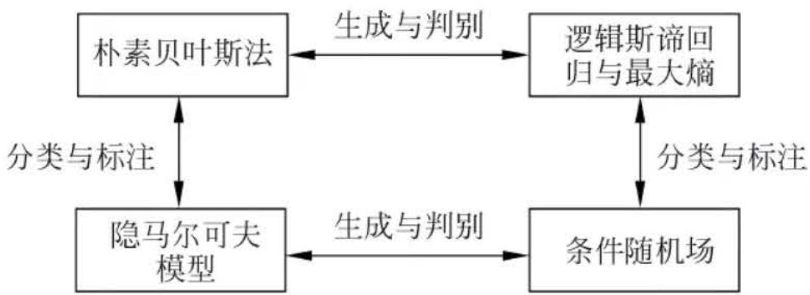  
图12.1 部分模型之间的关系

## 3.学习策略

在类分类的监督学习中，持向量机、逻辑斯谛回归与最熵模型、Boosting各使合页损失函数、逻辑斯谛损失函数、指数损失函数。3种损失函数分别写为

$$
( 1 - y f ( x ) ) _ { + }\tag{12.1}
$$

$$
\log \left[ 1 + \exp ( - y f ( x ) ) \right]\tag{12.2}
$$

$$
\exp ( - y f ( x ) )\tag{12.3}
$$

这3种损失函数都是0-1损失函数的上界，具有相似的形状，如图12.2所。所以，可以认为持向量机、逻辑斯谛回归与最熵模型、Boosting使不同的代理损失函数（surrogateloss function）表分类的损失，定义经验风险或结构风险函数，实现类分类学习任务。学习的策略是优化以下结构风险函数：

$$
\operatorname* { m i n } _ { f \in H } { \frac { 1 } { N } } \sum _ { i = 1 } ^ { N } L ( y _ { i } , f ( x _ { i } ) ) + \lambda J ( f )\tag{12.4}
$$

这，第1项为经验风险（经验损失），第2项为正则化项， $L ( y , f ( x ) )$ 为损失函数， $J ( f )$ 为模型的复杂度， $\lambda \geqslant 0$ 为系数。

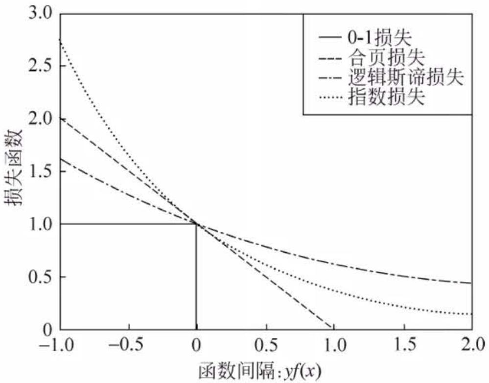  
图12.2 0-1损失函数、合页损失函数、逻辑斯谛损失函数、指数损失函数的关系

持向量机 $L _ { 2 }$ 范数表模型的复杂度。原始的逻辑斯谛回归与最熵模型没有正则化项，可以给它们加上 $L _ { 2 }$ 范数正则化项。Boosting没有显式的正则化项，通常通过早停（early stopping）的法达到正则化的效果。

以上类分类的学习法可以扩展到多类分类学习以及标注问题，如标注问题的条件随机场可以看作是分类问题的最熵模型的推。

概率模型的学习可以形式化为极似然估计或叶斯估计的最后验概率估计。这时，学习的策略是极化对数似然损失或极化正则化的对数似然损失。对数似然损失可以写成

$$
- \log P ( y | x )
$$

最后验概率估计时，正则化项是先验概率的负对数。

决策树学习的策略是正则化的极似然估计，损失函数是对数似然损失，正则化项是决策树的复杂度。

逻辑斯谛回归与最熵模型、条件随机场的学习策略既可以看成是极似然估计（或正则化的极似然估计），又可以看成是极化逻辑斯谛损失（或正则化的逻辑斯谛损失）。

朴素贝叶斯模型、隐马尔可夫模型的监督学习也是极似然估计或最后验概率估计，但这时模型含有隐变量。

## 4.学习算法

机器学习的问题有了具体的形式以后，就变成了最优化问题。有时，最优化问题较简单，解析解存在，最优解可以由公式简单计算。但在多数情况下，最优化问题没有解析解，需要数值计算的法或启发式的法求解。

对于朴素贝叶斯法与隐马尔可夫模型的监督学习，最优解即极似然估计值，可以由概率计算公式直接计算。

感知机、逻辑斯谛回归与最熵模型、条件随机场的学习利梯度下降法、拟顿法等，这些都是般的约束最优化问题的解法。

持向量机学习可以解凸次规划的对偶问题，有序列最最优化算法等法。

决策树学习是基于启发式算法的典型例。可以认为特征选择、成、剪枝是启发式地进正则化的极大似然估计。

Boosting利学习的模型是加法模型、损失函数是指数损失函数的特点，启发式地从前向后逐步学习模型，以达到逼近优化标函数的的。

EM算法是种迭代地求解含隐变量概率模型参数的法，它的收敛性可以保证，但是不能保证收敛到全局最优。

持向量机学习、逻辑斯谛回归与最熵模型学习、条件随机场学习是凸优化问题，全局最优解保证存在，其他学习问题不是凸优化问题。

## 第13章 无监督学习概论

第2篇讲述机器学习或统计机器学习中的监督学习法。监督学习是从标注数据中学习模型的机器学习问题，是机器学习的重要组成部分。

本章是监督学习的概述，先叙述监督学习的基本原理，之后介绍监督学习的基本问题和基本法。基本问题包括聚类、降维、话题分析和图分析。

## 13.1 无监督学习基本原理

监督学习是从标注的数据中学习数据的统计规律或者说内在结构的机器学习，主要包括聚类、降维、概率估计。监督学习可以于数据分析或者监督学习的前处理。

无监督学习使用无标注数据 $U = \{ x _ { 1 } , x _ { 2 } , \cdots , x _ { N } \}$ 学习或训练，其中 $x _ { i } , i = 1 , 2 , \cdots , N$ 是样本（实例），由特征向量组成。无监督学习的模型是函数 $z = g _ { \boldsymbol { \theta } } ( x )$ 、条件概率分布 $P _ { \theta } ( z | x )$ 或条件概率分布 $P _ { \theta } ( x | z )$ 。其中 $x \in X$ 是输入，表示样本； $z \in Z$ 是输出，表示对样本的分析结果，可以是类别、转换、概率；θ是参数。

假设训练数据集由N个样本组成，每个样本是个M维向量。训练数据可以由个矩阵表，每对应个特征，每列对应个样本。

$$
X = { \left[ \begin{array} { l l l } { x _ { 1 1 } } & { \cdots } & { x _ { 1 N } } \\ { } & { } & { } \\ { \vdots } & { } & { \vdots } \\ { } & { } & { } \\ { x _ { M 1 } } & { \cdots } & { x _ { M N } } \end{array} \right] }
$$

其中， $\boldsymbol { x } _ { i j }$ 是第 $j$ 个向量的第i维， $i = 1 , 2 , \cdots , M , \ j = 1 , 2 , \cdots , N .$

监督学习是个困难的任务，因为数据没有标注，也就是没有的指导，机器需要从数据中找出规律。模型的输x在数据中可以观测，输出₂隐藏在数据中。监督学习通常需要大量的数据，因为对数据隐藏的规律的发现需要够的观测。

监督学习的基本想法是对给定数据（矩阵数据）进某种“压缩”，从找到数据的潜在结构。假定损失最的压缩得到的结果就是最本质的结构。图13.1是这种想法的个意图。可以考虑发掘数据的纵向结构，把相似的样本聚到同类，即对数据进聚类。还可以考虑发掘数据的横向结构，把维空间的向量转换为低维空间的向量，即对数据进降维。也可以同时考虑发掘数据的纵向与横向结构，假设数据由含有隐式结构的概率模型成得到，从数据中学习该概率模型。

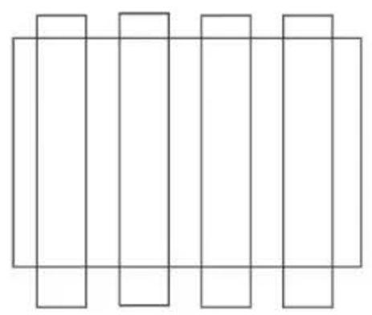  
(a)数据纵向结构

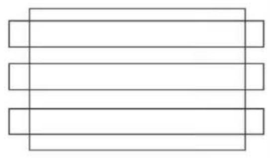  
(b)数据横向结构

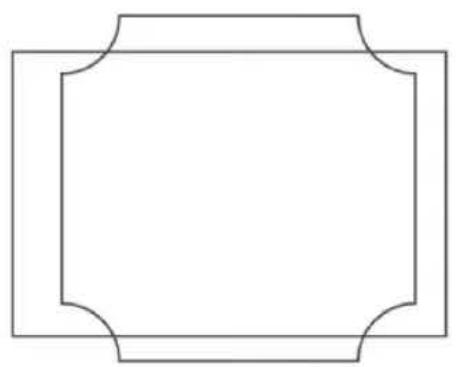  
(c)数据横向纵向结构  
图13.1 监督学习的基本想法

## 13.2基本问题

## 1.聚类

聚类（clustering）是指将样本集合中相似的样本（实例）分配到相同的类，不相似的样本分配到不同的类。聚类时，样本通常是欧空间中的向量，类别不是事先给定，是从数据中动发现，但类别的个数通常是事先给定的。样本之间的相似度或距离由应决定。如果个样本只能属于个类，则称为硬聚类（hardclustering）；如果个样本可以属于多个类，则称为软聚类（softclustering）。图13.2给出聚类（硬聚类）的例。维空间的样本被分到三个不同的类中。

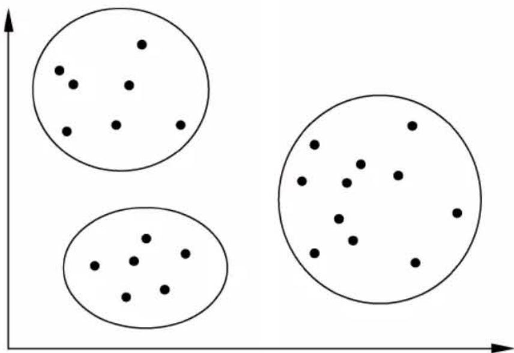  
图13.2 聚类的例子

假设输入空间是欧空间 $X \subseteq R ^ { d }$ ，输出空间是类别集合 $Z = \{ 1 , 2 , \cdots , k \}$ 。聚类的模型是函数 $z = g _ { \boldsymbol { \theta } } ( x )$ 或者条件概率分布 $P _ { \theta } ( z | x )$ ，其中 $x \in X$ 是样本的向量， $z \in Z$ 是样本的类别，θ是参数。前者的函数是硬聚类模型，后者的条件概率分布是软聚类模型。

聚类的过程就是学习聚类模型的过程。硬聚类时，每个样本属于某类 $z _ { i } = g _ { \theta } ( x _ { i } ) , i =$ $1 , 2 , \cdots , N ;$ 软聚类时，每个样本依概率属于每个类 $P _ { \theta } ( z _ { i } | x _ { i } ) , i = 1 , 2 , \cdots , N _ { \circ }$ 如图13.1所，聚类可以帮助发现数据中隐藏的纵向结构。（也有例外，co-clustering是聚类算法，对样本和特征都进聚类，同时发现数据中的纵向横向结构)

## 2.降维

降维（dimensionalityreduction）是将训练数据中的样本（实例）从维空间转换到低维空间。假设样本原本存在于维空间，或者近似地存在于维空间，通过降维则可以更好地表样本数据的结构，即更好地表样本之间的关系。维空间通常是维的欧空间，低维空间是低维的欧空间或者流形（manifold）。低维空间不是事先给定，是从数据中动发现，其维数通常是事先给定的。从维到低维的降维中，要保证样本中的信息损失最。降维有线性的降维和线性的降维。图13.3给出降维的例。维空间的样本存在于条直线的附近，可以将样本从维空间转换到一维空间。通过降维可以更好地表示样本之间的关系。

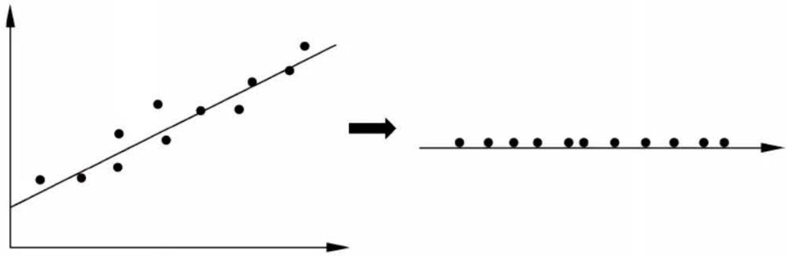  
图13.3 降维的例子

假设输入空间是欧空间 $X \subseteq R ^ { d }$ ，输出空间也是欧氏空间 $Z \subseteq R ^ { d ^ { \prime } } , \ d ^ { \prime } \ll d ,$ ，后者的维数低于前者的维数。降维的模型是函数 $z = g _ { \boldsymbol { \theta } } ( x )$ ，其中 $x \in X$ 是样本的高维向量， $z \in Z$ 是样本的低维向量，θ是参数。函数可以是线性函数也可以是线性函数。

降维的过程就是学习降维模型的过程。降维时，每个样本从维向量转换为低维向量$z _ { i } = g _ { \theta } ( x _ { i } ) , \ i = 1 , 2 , \cdots , N$ 。如图13.1所，降维可以帮助发现数据中隐藏的横向结构。

## 3.概率模型估计

概率模型估计（probability modelestimation）简称概率估计，假设训练数据由个概率模型成，由训练数据学习概率模型的结构和参数。概率模型的结构类型，或者说概率模型的集合事先给定，模型的具体结构与参数从数据中动学习。学习的标是找到最有可能成数据的结构和参数。概率模型包括混合模型、概率图模型等。概率图模型又包括有向图模型和向图模型。图13.4给出混合模型估计的例。假设数据由斯混合模型成，学习的标是估计这个模型的参数。

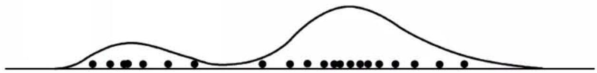  
图13.4 概率模型估计的例

概率模型表为条件概率分布 $P _ { \theta } ( x | z )$ ，其中随机变量x表示观测数据，可以是连续变量也可以是离散变量；随机变量表隐式结构，是离散变量；随机变量θ表参数。模型是混合模型时，z表成分的个数；模型是概率图模型时，z表图的结构。

概率模型的种特殊情况是隐式结构不存在，即满 $P _ { \theta } ( x | z ) = P _ { \theta } ( x )$ 。这时条件概率分布估计变成概率分布估计，只要估计分布 $P _ { \theta } ( x )$ 的参数即可。传统统计学中的概率密度估计，如斯分布参数估计，都属于这种情况。

概率模型估计是从给定的训练数据 $U = \{ x _ { 1 } , x _ { 2 } , \cdots , x _ { N } \}$ 中学习模型 $P _ { \theta } ( x | z )$ 的结构和参数。这样可以计算出模型相关的任意边缘分布和条件分布。注意随机变量x是多元变量，甚是维多元变量。如图13.1所，概率模型估计可以帮助发现数据中隐藏的横向纵向结构。

软聚类也可以看作是概率模型估计问题。根据贝叶斯公式

$$
P ( z | x ) = { \frac { P ( z ) P ( x | z ) } { P ( x ) } } \propto P ( z ) P ( x | z )\tag{13.1}
$$

假设先验概率服从均匀分布，只需要估计条件概率分布 $P _ { \theta } ( x | z )$ 。这样，可以通过对条件概率分布 $P _ { \theta } ( x | z )$ 的估计进软聚类，这₂表类别，θ表参数。

## 13.3 机器学习三要素

同监督学习样，监督学习也有三要素：模型、策略、算法。

模型就是函数 $z = g _ { \theta } ( x )$ 、条件概率分布 $P _ { \theta } ( z | x )$ 或条件概率分布 $P _ { \theta } ( x | z )$ ，在聚类、降维、概率模型估计中拥有不同的形式。如，聚类中模型的输出是类别；降维中模型的输出是低维向量；概率模型估计中的模型可以是混合概率模型，也可以是有向概率图模型和向概率图模型。

策略在不同的问题中有不同的形式，但都可以表为标函数的优化。如，聚类中样本与所属类别中距离的最化，降维中样本从维空间转换到低维空间过程中信息损失的最小化，概率模型估计中模型生成数据概率的最大化。

算法通常是迭代算法，通过迭代达到标函数的最优化，如，梯度下降法。

层次聚类法、k均值聚类是硬聚类法，斯混合模型EM算法是软聚类法。主成分分析、潜在语义分析是降维法。概率潜在语义分析、潜在狄利克雷分配是概率模型估计方法。

## 13.4 无监督学习方法

## 1.聚类

聚类主要于数据分析，也可以于监督学习的前处理。聚类可以帮助发现数据中的统计规律。数据通常是连续变量表的，也可以是离散变量表的。第14章将讲述聚类法，包括层次聚类和k均值聚类。

表13.1给出个简单的数据集合。有5个样本A，B，C，D，E，每个样本有维特征x1，x2。图13.5显样本在维实数空间的位置。通过聚类算法，可以将样本分配到两个类别中。假设k均值聚类，k=2。开始可以取任意两点作为两个类的中；依据样本与类中的欧距离的将样本分配到两个类中；然后计算两个类中样本的均值，作为两个类的新的类中；重复以上操作，直到两类不再改变，最后得到聚类结果，A，B，C为个类，D和E为另个类。

表13.1 聚类数据
<table><tr><td></td><td>A</td><td>B</td><td>C</td><td>D</td><td>E</td></tr><tr><td> $x _ { 1 }$ </td><td>1</td><td>1</td><td>0</td><td>2</td><td>3</td></tr><tr><td> $x _ { 2 }$ </td><td>1</td><td>0</td><td>2</td><td>4</td><td>5</td></tr></table>

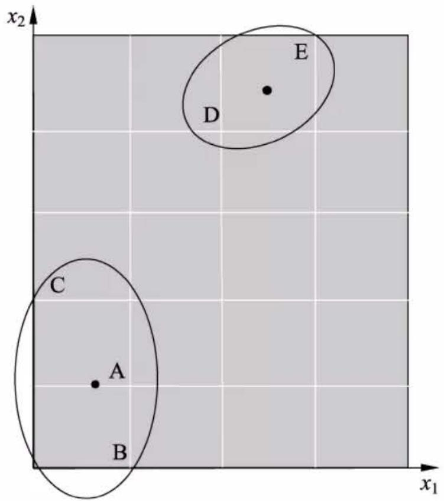  
图13.5 聚类的结果

## 2.降维

降维主要于数据分析，也可以用于监督学习的前处理。降维可以帮助发现维数据中的统计规律。数据是连续变量表的。第16章介绍降维法的主成分分析，第15章介绍基础的奇异值分解。

表13.2给出个简单的数据集合。有14个样本A，B，C，D等，每个样本有9维特征$x _ { 1 } , x _ { 2 } , \cdots , x _ { 9 }$ 。由于数据是维（多变量）数据，很难观察变量的样本区分能，也很难观察样本之间的关系。如样本表细胞，特征表细胞中的指标。从数据中很难直接观察到哪些变量能帮助区分细胞，哪些细胞相似，哪些细胞不相似。对数据进降维，如主成分分析，就可以更直接地分析以上问题。图13.6显对样本集合进降维（主成分分析）的结果。结果在新的维实数空间中，有维新的特征y1，y2，14个样本分布在不同位置。通过降维，可以发现样本可以分为三个类别。维新特征由原始特征定义。

## 3.话题分析

话题分析是本分析的种技术。给定个本集合，话题分析旨在发现本集合中每个本的话题，话题由单词的集合表。注意，这假设有够数量的本，如果只有个

表13.2 聚类数据
<table><tr><td></td><td>A</td><td>B</td><td>C</td><td>D</td><td></td></tr><tr><td>$x1</td><td>3</td><td>0.25</td><td>2.8</td><td>0.1</td><td></td></tr><tr><td>22</td><td>2.9</td><td>0.8</td><td>2.2</td><td>1.8</td><td></td></tr><tr><td>$x3$</td><td>2.2</td><td>1</td><td>1.5</td><td>3.2</td><td></td></tr><tr><td>x4</td><td>2</td><td>1.4</td><td>2</td><td>0.3</td><td></td></tr><tr><td>25</td><td>1.3</td><td>1.6</td><td>1.6</td><td>0</td><td></td></tr><tr><td>$x6</td><td>1.5</td><td>2</td><td>2.1</td><td>3</td><td></td></tr><tr><td>27</td><td>1.1</td><td>2.2</td><td>1.2</td><td>2.8</td><td></td></tr><tr><td>x8</td><td>1</td><td>2.7</td><td>0.9</td><td>0.3</td><td></td></tr><tr><td>xg</td><td>0.4</td><td>3</td><td>0.6</td><td>0.1</td><td></td></tr></table>

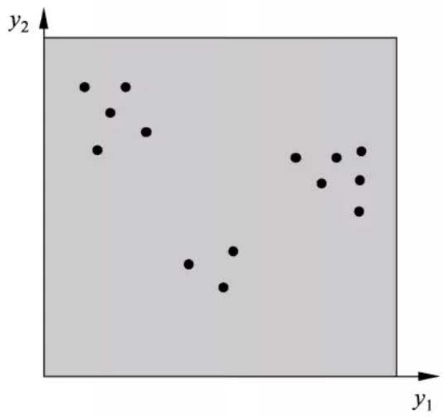  
图13.6 降维（主成分分析）的结果

本或个本，是不能做话题分析的。话题分析可以形式化为概率模型估计问题或降维问题。第17章、第18章、第20章分别介绍话题分析法的潜在语义分析、概率潜在语义分析、潜在狄利克雷分配，第19章介绍基础的马尔可夫链蒙特卡罗法。

表13.3给出个本数据集合。有6个本，6个单词，表中数字表单词在本中的出现次数。对数据进话题分析，如潜在狄利克雷分配分析，得到由单词集合表示的话题，以及由话题集合表的本。如表13.4所，具体地，话题表示为单词的概率分布，本表

表13.3话题分析的数据
<table><tr><td rowspan="2">单词</td><td colspan="6">文本</td></tr><tr><td>doc1</td><td>doc2</td><td>doc3</td><td>doc4</td><td>doc5</td><td>doc6</td></tr><tr><td>word1</td><td>1</td><td>1</td><td></td><td></td><td></td><td></td></tr><tr><td>word2</td><td>1</td><td></td><td>1</td><td></td><td></td><td></td></tr><tr><td>word3</td><td></td><td>1</td><td>1</td><td></td><td></td><td></td></tr><tr><td>word4</td><td></td><td></td><td></td><td>1</td><td>1</td><td></td></tr><tr><td>word5</td><td></td><td></td><td></td><td>1</td><td></td><td>1</td></tr><tr><td>word6</td><td></td><td></td><td></td><td></td><td>1</td><td>1</td></tr></table>

为话题的概率分布。LDA是含有这些概率分布的模型。直观上，个话题包含语义相似的单词。个本包含若个话题。

表13.4 话题分析（LDA分析）的结果
<table><tr><td rowspan="2">单词</td><td colspan="2">话题</td><td rowspan="2">文本</td><td colspan="2">话题</td></tr><tr><td>topic1</td><td>topic2</td><td>topic1</td><td>topic2</td></tr><tr><td>word1</td><td>0.33</td><td>0</td><td>doc1</td><td>1</td><td>0</td></tr><tr><td>word2</td><td>0.33</td><td>0</td><td>doc2</td><td>1</td><td>0</td></tr><tr><td>word3</td><td>0.33</td><td>0</td><td>doc3</td><td>1</td><td>0</td></tr><tr><td>word4</td><td>0</td><td>0.33</td><td>doc4</td><td>0</td><td>1</td></tr><tr><td>word5</td><td>0</td><td>0.33</td><td>doc5</td><td>0</td><td>1</td></tr><tr><td>word6</td><td>0</td><td>0.33</td><td>doc6</td><td>0</td><td>1</td></tr></table>

## 4.图分析

很多应中的数据是以图的形式存在，图数据表实体之间的关系，包括有向图、向图、超图。图分析（graph analytics）的的是发掘隐藏在图中的统计规律或潜在结构。链接分析（linkanalysis）是图分析的种，包括PageRank算法，主要是发现有向图中的重要结点。第21章介绍PageRank算法。

PageRank算法是监督学习法。给定个有向图，定义在图上的随机游即马尔可夫链。随机游者在有向图上随机跳转，到达个结点后以等概率跳转到链接出去的结点，并不断持续这个过程。PageRank算法就是求解该马尔可夫链的平稳分布的算法。个结点上的平稳概率表该结点的重要性，称为该结点的PageRank值。被指向的结点越多，该结点的PageRank值就越；被指向的结点的PageRank值越，该结点的PageRank值就越。直观上PageRank值越，结点也就越重要。

这简单介绍PageRank的原理。图13.7是个简单的有向图，有4个结点A，B，C，D。给定这个图，PageRank算法通过迭代求出结点的PageRank值。先，对每个结点的概率值初始化，表各个结点的到达概率，假设是等概率的。下步，各个结点的概率是上步各个结点可能跳转到该结点的概率之和，不断迭代，各个结点的到达概率分布趋于平稳分布，也就是PageRank值的分布。迭代过程见表13.5。可以看出，结点C，D的PageRank值更大。

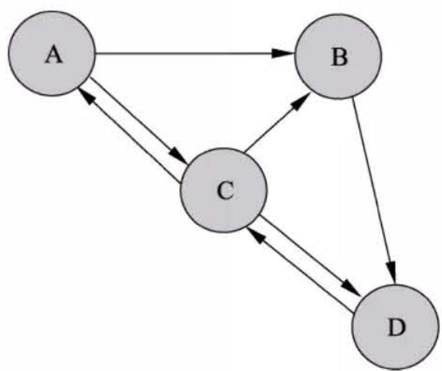  
图13.7 有向图数据

表13.5 PageRank计算的结果
<table><tr><td rowspan="2">结点</td><td colspan="3">步骤</td></tr><tr><td>第1步</td><td>第2步</td><td>第3步</td></tr><tr><td>A</td><td>1/4</td><td>2/24</td><td>3/24</td></tr><tr><td>B</td><td>1/4</td><td>5/24</td><td>4/24</td></tr><tr><td>C</td><td>1/4</td><td>9/24</td><td>9/24</td></tr><tr><td>D</td><td>1/4</td><td>8/24</td><td>8/24</td></tr></table>

PageRank算法最初是为互联搜索提出。可以将互联看作是个巨的有向图，页是结点，页的超链接是有向边。PageRank算法可以算出页的PageRank值，表其重要度，在搜索引擎的排序中页的重要度起着重要作。

## 本章概要

1．机器学习或统计机器学习般包括监督学习、监督学习、强化学习。

监督学习是指从标注数据中学习模型的机器学习问题。标注数据是然得到的数据，模型表数据的类别、转换或概率。监督学习的本质是学习数据中的统计规律或潜在结构，主要包括聚类、降维、概率估计。

2.监督学习可以于对已有数据的分析，也可以于对未来数据的预测。学习得到的模型有函数 $z = g ( x )$ 、条件概率分布 $P ( z | x )$ 或条件概率分布 $P ( x | z )$ 0

监督学习的基本想法是对给定数据（矩阵数据）进某种“压缩”，从找到数据的潜在结构，假定损失最的压缩得到的结果就是最本质的结构。可以考虑发掘数据的纵向结构，对应聚类。也可以考虑发掘数据的横向结构，对应降维。还可以同时考虑发掘数据的纵向与横向结构，对应概率模型估计。

3.聚类是将样本集合中相似的样本（实例）分配到相同的类，不相似的样本分配到不同的类。聚类分硬聚类和软聚类。聚类法有层次聚类和k均值聚类。

4.降维是将样本集合中的样本（实例）从维空间转换到低维空间。假设样本原本存在于维空间，或近似地存在于维空间，通过降维则可以更好地表示样本数据的结构，即更好地表样本之间的关系。降维有线性降维和线性降维，降维法有主成分分析。

5.概率模型估计假设训练数据由个概率模型成，同时利训练数据学习概率模型的结构和参数。概率模型包括混合模型、概率图模型等。概率图模型又包括有向图模型和向图模型。

6.话题分析是本分析的种技术。给定个本集合，话题分析旨在发现本集合中每个本的话题，话题由单词的集合表。话题分析法有潜在语义分析、概率潜在语义分析和潜在狄利克雷分配。

7.图分析的的是发掘隐藏在图中的统计规律或潜在结构。链接分析是图分析的种，主要是发现有向图中的重要结点，包括PageRank算法。

## 继续阅读

监督学习在主要的机器学习书籍[1–7]中都有介绍，可以参考。

## 参考文献

[1] HASTIE T, TIBSHRANI R, FRIEDMAN J. The elements of statistical earning: data mining, inference,and prediction[M].范明，柴玉梅，咎红英，等译.Springer.2001.

[2] BISHOP M. Pattern Recognition and Machine Learning[M]. Springer, 2006.

[3] KOLLER D, FRIEDMAN N. Probabilistic graphical models: principles and techniques[M]. Cambridge, MA: MIT Press, 2009.

[4] GOODFELLOW I, BENGIO Y, COURVILLE A. Deep learning[M]. Cambridge, MA:MIT Press, 2016.

[5] MICHELLETM.Machine Learning[M].曾华军，张银奎，等译.McGraw-Hill Companies, Inc. 1997.

[6] BARBER D. Bayesian reasoning and machine learning[M]. Cambridge, UK: Cambridge University Press, 2012.

[7] 周志华．机器学习[M]．北京：清华学出版社，2016.

## 第14章聚类方法

聚类是针对给定的样本，依据它们特征的相似度或距离，将其归并到若个“类”或“簇”的数据分析问题。个类是给定样本集合的个集。直观上，相似的样本聚集在相同的类，不相似的样本分散在不同的类。这，样本之间的相似度或距离起着重要作。

聚类的目的是通过得到的类或簇来发现数据的特点或对数据进处理，在数据挖掘、模式识别等领域有着泛的应。聚类属于监督学习，因为只是根据样本的相似度或距离将其进归类，类或簇事先并不知道。

聚类算法很多，本章介绍两种最常的聚类算法：层次聚类（hierarchicalclustering）和k均值聚类（k-means clustering）。层次聚类又有聚合（下上）和分裂（上下）两种法。聚合法开始将每个样本各分到个类，之后将相距最近的两类合并，建个新的类，重复此操作直到满停条件，得到层次化的类别。分裂法开始将所有样本分到个类，之后将已有类中相距最远的样本分到两个新的类，重复此操作直到满停条件，得到层次化的类别。k均值聚类是基于中心的聚类法，通过迭代，将样本分到k个类中，使得每个样本与其所属类的中或均值最近，得到k个“平坦的”、层次化的类别，构成对空间的划分。k均值聚类的算法于1967年由MacQueen提出。

本章14.1节介绍聚类的基本概念，14.2节和14.3节分别叙述层次聚类和k均值聚类。

## 14.1 聚类的基本概念

本节介绍聚类的基本概念，包括样本之间的距离或相似度、类或簇、类与类之间的距离。

## 14.1.1 相似度或距离

聚类的对象是观测数据或样本集合。假设有n个样本，每个样本由m个属性的特征向量组成。样本集合可以矩阵X表：

$$
X = [ x _ { i j } ] _ { m \times n } = { \left[ \begin{array} { l l l l } { x _ { 1 1 } } & { x _ { 1 2 } } & { \cdots } & { x _ { 1 n } } \\ { x _ { 2 1 } } & { x _ { 2 2 } } & { \cdots } & { x _ { 2 n } } \\ { \vdots } & { \vdots } & & { \vdots } \\ { x _ { m 1 } } & { x _ { m 2 } } & { \cdots } & { x _ { m n } } \end{array} \right] }\tag{14.1}
$$

矩阵的第 $j$ 列表示第 $j$ 个样本， $j = 1 , 2 , \cdots , n ;$ 第i行表示第i个属性， $i = 1 , 2 , \cdots , m ;$ 矩阵元素 $\boldsymbol { x } _ { i j }$ 表示第 $j$ 个样本的第i个属性值， $i = 1 , 2 , \cdots , m , \ j = 1 , 2 , \cdots , n .$

聚类的核概念是相似度（similarity）或距离（distance），有多种相似度或距离的定义。因为相似度直接影响聚类的结果，所以其选择是聚类的根本问题。具体哪种相似度更合适取决于应用问题的特性。

## 1.闵可夫斯基距离①

在聚类中，可以将样本集合看作是向量空间中点的集合，以该空间的距离表样本之间的相似度。常的距离有闵可夫斯基距离，特别是欧距离。闵可夫斯基距离越，相似度越小；距离越小，相似度越大。

定义14.1 给定样本集合X，X是m维实数向量空间 $\pmb { R } ^ { m }$ 中点的集合，其中 $x _ { i } , x _ { j } \in$ X, $ { \boldsymbol { x } } _ { i } = ( x _ { 1 i } , x _ { 2 i } , \cdots , x _ { m i } ) ^ { \mathrm { T } } ,  { \boldsymbol { x } } _ { j } = ( x _ { 1 j } , x _ { 2 j } , \cdots , x _ { m j } ) ^ { \mathrm { T } }$ ，样本 $x _ { i }$ 与样本 $x _ { j }$ 的闵可夫斯基距离（Minkowskidistance）定义为

$$
d _ { i j } = \left( \sum _ { k = 1 } ^ { m } | x _ { k i } - x _ { k j } | ^ { p } \right) ^ { \frac { 1 } { p } }\tag{14.2}
$$

这里 $p \geqslant 1$ 。当 $p = 2$ 时称为欧氏距离（Euclidean distance），即

$$
d _ { i j } = \left( \sum _ { k = 1 } ^ { m } | x _ { k i } - x _ { k j } | ^ { 2 } \right) ^ { \frac { 1 } { 2 } }\tag{14.3}
$$

当 $p = 1$ 时称为曼哈顿距离（Manhattan distance），即

$$
d _ { i j } = \sum _ { k = 1 } ^ { m } | x _ { k i } - x _ { k j } |\tag{14.4}
$$

当 $p = \infty$ 时称为切雪夫距离（Chebyshevdistance），取各个坐标数值差的绝对值的最大值，即

$$
d _ { i j } = \operatorname* { m a x } _ { k } | x _ { k i } - x _ { k j } |\tag{14.5}
$$

## 2.马哈拉诺比斯距离

马哈拉诺斯距离（Mahalanobisdistance）简称马距离，也是另种常的相似度，考虑各个分量（特征）之间的相关性并与各个分量的尺度关。马哈拉诺斯距离越，相似度越小；距离越小，相似度越大。

定义14.2给定一个样本集合X, $\boldsymbol { X } = [ x _ { i j } ] _ { m \times n }$ ，其协方差矩阵记作 $S _ { \circ }$ 样本 $x _ { i }$ 与样本$x _ { j }$ 之间的马哈拉诺比斯距离 $d _ { i j }$ 定义为

$$
d _ { i j } = \left[ ( x _ { i } - x _ { j } ) ^ { \operatorname { T } } S ^ { - 1 } ( x _ { i } - x _ { j } ) \right] ^ { \frac { 1 } { 2 } }\tag{14.6}
$$

其中，

$$
\boldsymbol { x } _ { i } = ( x _ { 1 i } , x _ { 2 i } , \cdots , x _ { m i } ) ^ { \mathrm { T } } , \quad x _ { j } = ( x _ { 1 j } , x _ { 2 j } , \cdots , x _ { m j } ) ^ { \mathrm { T } }\tag{14.7}
$$

当S为单位矩阵时，即样本数据的各个分量互相独且各个分量的差为1时，由式(14.6)知马距离就是欧氏距离，所以马距离是欧距离的推。

## 3.相关系数

样本之间的相似度也可以相关系数（correlation coefficient）来表。相关系数的绝对值越接近1，表样本越相似；越接近0，表样本越不相似。

定义14.3 样本 $x _ { i }$ 与样本 $x _ { j }$ 之间的相关系数定义为

$$
r _ { i j } = \frac { \displaystyle \sum _ { k = 1 } ^ { m } \big ( x _ { k i } - \bar { x } _ { i } \big ) \big ( x _ { k j } - \bar { x } _ { j } \big ) } { \displaystyle \left[ \sum _ { k = 1 } ^ { m } \big ( x _ { k i } - \bar { x } _ { i } \big ) ^ { 2 } \sum _ { k = 1 } ^ { m } \big ( x _ { k j } - \bar { x } _ { j } \big ) ^ { 2 } \right] ^ { \frac { 1 } { 2 } } }\tag{14.8}
$$

其中，

$$
{ \bar { x } } _ { i } = { \frac { 1 } { m } } \sum _ { k = 1 } ^ { m } x _ { k i } , \quad { \bar { x } } _ { j } = { \frac { 1 } { m } } \sum _ { k = 1 } ^ { m } x _ { k j }
$$

## 4.夹角余弦

样本之间的相似度也可以夹余弦（cosine）来表。夹余弦越接近1，表样本越相似；越接近0，表样本越不相似。

定义14.4 样本 $x _ { i }$ 与样本 $x _ { j }$ 之间的夹角余弦定义为

$$
s _ { i j } = { \frac { \displaystyle \sum _ { k = 1 } ^ { m } x _ { k i } x _ { k j } } { \left( \displaystyle \sum _ { k = 1 } ^ { m } x _ { k i } ^ { 2 } \sum _ { k = 1 } ^ { m } x _ { k j } ^ { 2 } \right) ^ { \frac { 1 } { 2 } } } }\tag{14.9}
$$

由上述定义看出，距离度量相似度时，距离越，样本越相似；相关系数时，相关系数越，样本越相似。注意不同相似度度量得到的结果并不定致，请参照图14.1。

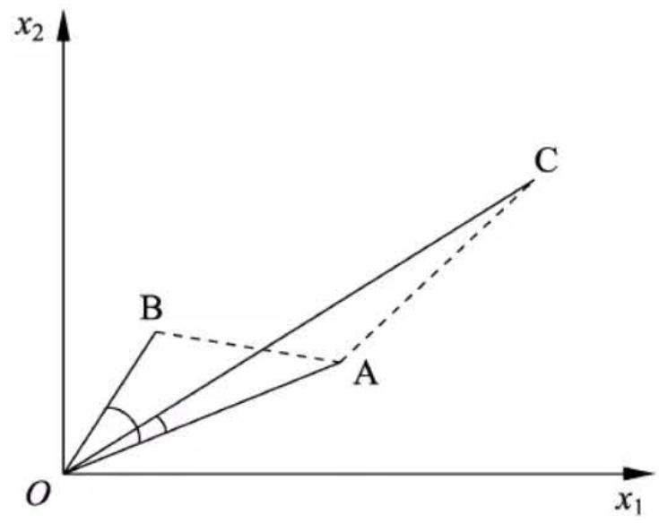  
图14.1 距离与相关系数的关系

从图14.1可以看出，如果从距离的度看，A和BA和C更相似；但从相关系数的度看，A和CA和B更相似。所以，进聚类时，选择适合的距离或相似度常重要。

## 14.1.2 类或簇

通过聚类得到的类或簇本质是样本的集。如果个聚类法假定个样本只能属于个类或类的交集为空集，那么该法称为硬聚类（hardclustering）法。否则，如果个样本可以属于多个类或类的交集不为空集，那么该法称为软聚类（soft clustering）法。本章只考虑硬聚类法。

G表类或簇（cluster），用 $x _ { i } ,  { x } _ { j }$ 表示类中的样本，用 $n _ { G }$ 表示G中样本的个数，用 $d _ { i j }$ 表示样本 $x _ { i }$ 与样本 $x _ { j }$ 之间的距离。类或簇有多种定义，下给出个常见的定义。

定义14.5 设T为给定的正数，若对于集合G中任意两个样本 $x _ { i } , x _ { j }$ ,有

$$
d _ { i j } \leqslant T
$$

则称G为个类或簇。

定义14.6 设T为给定的正数，若对集合G的任意样本 $x _ { i }$ ，一定存在G中的另一个样本 $x _ { j }$ ,使得

$$
d _ { i j } \leqslant T
$$

则称G为一个类或簇。

定义14.7 设T为给定的正数，若对集合G中任意个样本 $x _ { i } ,$ G中的另一个样本 $x _ { j }$ 满足

$$
\frac { 1 } { n _ { G } - 1 } \sum _ { x _ { j } \in G } d _ { i j } \leqslant T
$$

其中 $n _ { G }$ 为 $G$ 中样本的个数，则称G为一个类或簇。

定义14.8 设T和V为给定的两个正数，如果集合G中任意两个样本 $x _ { i } , x _ { j }$ 的距离$d _ { i j }$ 满足

$$
\frac { 1 } { n _ { G } ( n _ { G } - 1 ) } \sum _ { x _ { i } \in G } \sum _ { x _ { j } \in G } d _ { i j } \leqslant T
$$

则称G为一个类或簇。

以上四个定义中，第个定义最常，并且由它可推出其他三个定义。

类的特征可以通过不同度来刻画，常的特征有下三种：

(1）类的均值 $\bar { x } _ { G }$ ，又称为类的中

$$
\bar { x } _ { G } = \frac { 1 } { n _ { G } } \sum _ { i = 1 } ^ { n _ { G } } x _ { i }\tag{14.10}
$$

式中 $n _ { G }$ 是类G的样本个数。

(2）类的直径（diameter） $D _ { G }$

类的直径 $D _ { G }$ 是类中任意两个样本之间的最距离，即

$$
D _ { G } = \operatorname* { m a x } _ { x _ { i } , x _ { j } \in G } d _ { i j }\tag{14.11}
$$

(3）类的样本散布矩阵（scattermatrix） $A _ { G }$ 与样本协差矩阵（covariance matrix） $S _ { G }$ 类的样本散布矩阵 $A _ { G }$ 为

$$
A _ { G } = \sum _ { i = 1 } ^ { n _ { G } } ( x _ { i } - \bar { x } _ { G } ) ( x _ { i } - \bar { x } _ { G } ) ^ { \mathrm { T } }\tag{14.12}
$$

样本协差矩阵 $S _ { G }$ 为

$$
\begin{array} { l } { { \displaystyle S _ { G } = \frac { 1 } { n _ { G } - 1 } A _ { G } } } \\ { { \displaystyle \quad = \frac { 1 } { n _ { G } - 1 } \sum _ { i = 1 } ^ { n _ { G } } ( x _ { i } - \bar { x } _ { G } ) ( x _ { i } - \bar { x } _ { G } ) ^ { \mathrm { T } } } } \end{array}\tag{14.13}
$$

## 14.1.3 类与类之间的距离

下考虑类 $G _ { p }$ 与类 $G _ { q }$ 之间的距离 $D ( p , q )$ ，也称为连接（linkage）。类与类之间的距离也有多种定义。

设类 $G _ { p }$ 包含 $n _ { p }$ 个样本， $G _ { q }$ 包含 $n _ { q }$ 个样本，分别 $\bar { x } _ { p }$ 和 $\bar { x } _ { q }$ 表示 $G _ { p }$ 和 $G _ { q }$ 的均值，即类的中。

（1）最短距离或单连接（single linkage）

定义类 $G _ { p }$ 的样本与类 $G _ { q }$ 的样本之间的最短距离为两类之间的距离：

$$
D _ { p q } = \operatorname* { m i n } \left\{ d _ { i j } \vert x _ { i } \in G _ { p } , x _ { j } \in G _ { q } \right\}\tag{14.14}
$$

（2）最长距离或完全连接（complete linkage）

定义类 $G _ { p }$ 的样本与类 $G _ { q }$ 的样本之间的最长距离为两类之间的距离：

$$
D _ { p q } = \operatorname* { m a x } { \{ d _ { i j } | x _ { i } \in G _ { p } , x _ { j } \in G _ { q } \} }\tag{14.15}
$$

(3）中距离

定义类 $G _ { p }$ 与类 $G _ { q }$ 的中心 $\bar { x } _ { p }$ 与 $\textstyle { \bar { x } } _ { q }$ 之间的距离为两类之间的距离：

$$
D _ { p q } = d _ { \bar { x } _ { p } \bar { x } _ { q } }\tag{14.16}
$$

(4）平均距离

定义类 $G _ { p }$ 与类 $G _ { q }$ 任意两个样本之间距离的平均值为两类之间的距离：

$$
D _ { p q } = \frac { 1 } { n _ { p } n _ { q } } \sum _ { x _ { i } \in G _ { p } } \sum _ { x _ { j } \in G _ { q } } d _ { i j }\tag{14.17}
$$

## 14.2层次聚类

层次聚类假设类别之间存在层次结构，将样本聚到层次化的类中。层次聚类又有聚合（agglomerative）或下上（bottom-up）聚类、分裂（divisive）或上下（top-down）聚类两种法。因为每个样本只属于个类，所以层次聚类属于硬聚类。

聚合聚类开始将每个样本各分到个类，之后将相距最近的两类合并，建个新的类，重复此操作直到满停条件，得到层次化的类别。分裂聚类开始将所有样本分到个类，之后将已有类中相距最远的样本分到两个新的类，重复此操作直到满停条件，得到层次化的类别。本书只介绍聚合聚类。

聚合聚类的具体过程如下：对于给定的样本集合，开始将每个样本分到个类；然后按照定规则，如类间距离最，将最满规则条件的两个类进合并；如此反复进，每次减少个类，直到满停条件，如所有样本聚为类。

由此可知，聚合聚类需要预先确定下三个要素：

(1）距离或相似度；

(2）合并规则；

(3)停条件。

根据这些要素的不同组合，就可以构成不同的聚类法。距离或相似度可以是闵可夫斯基距离、马哈拉诺斯距离、相关系数、夹余弦。合并规则般是类间距离最，类间距离可以是最短距离、最距离、中距离、平均距离。停条件可以是类的个数达到阈值（极端情况类的个数是1）、类的直径超过阈值。

如果采欧氏距离为样本之间距离；类间距离最为合并规则，其中最短距离为类间距离；类的个数是1，即所有样本聚为类为停条件，那么聚合聚类的算法如下。

算法14.1（聚合聚类算法）

输：n个样本组成的样本集合及样本之间的距离。

输出：对样本集合的个层次化聚类。

（1）计算n个样本两两之间的欧距离 $\{ d _ { i j } \}$ ，记作矩阵 $D = [ d _ { i j } ] _ { n \times n }$

(2）构造n个类，每个类只包含个样本。

(3）合并类间距离最的两个类，其中最短距离为类间距离，构建个新类。

(4）计算新类与当前各类的距离。若类的个数为1，终计算，否则，回到步骤(3)。  
可以看出聚合层次聚类算法的复杂度是 $O ( n ^ { 3 } m )$ ，其中m是样本的维数，n是样本个数。  
下通过个例说明聚合层次聚类算法。

例14.1 给定5个样本的集合，样本之间的欧距离由如下矩阵D表：

$$
D = [ d _ { i j } ] _ { 5 \times 5 } = \left[ \begin{array} { l l l l l } { 0 } & { 7 } & { 2 } & { 9 } & { 3 } \\ { 7 } & { 0 } & { 5 } & { 4 } & { 6 } \\ { 2 } & { 5 } & { 0 } & { 8 } & { 1 } \\ { 9 } & { 4 } & { 8 } & { 0 } & { 5 } \\ { 3 } & { 6 } & { 1 } & { 5 } & { 0 } \end{array} \right]
$$

其中 $d _ { i j }$ 表第个样本与第个样本之间的欧距离。显然D为对称矩阵。应聚合层次聚类法对这5个样本进聚类。

解（1）先5个样本构建5个类， $G _ { i } = \{ x _ { i } \} , \ i = 1 , 2 , \cdots , 5$ ，这样，样本之间的距离也就变成类之间的距离，所以5个类之间的距离矩阵亦为D。

(2）由矩阵D可以看出， $D _ { 3 5 } = D _ { 5 3 } = 1$ 为最小，所以把 $G _ { 3 }$ 和 $G _ { 5 }$ 合并为个新类，记作 $G _ { 6 } = \{ x _ { 3 } , x _ { 5 } \}$ 。

(3）计算 $G _ { 6 }$ 与 $G _ { 1 } , G _ { 2 } , G _ { 4 }$ 之间的最短距离，有

$$
D _ { 6 1 } = 2 , \quad D _ { 6 2 } = 5 , \quad D _ { 6 4 } = 5
$$

又注意到其余两类之间的距离是

$$
D _ { 1 2 } = 7 , \quad D _ { 1 4 } = 9 , \quad D _ { 2 4 } = 4
$$

显然， $D _ { 6 1 } = 2$ 最小，所以将 $G _ { 1 }$ 与 $G _ { 6 }$ 合并成一个新类，记作 $\boldsymbol { G _ { 7 } } = \left\{ x _ { 1 } , x _ { 3 } , x _ { 5 } \right\}$

（4）计算 $G _ { 7 }$ 与 $G _ { 2 } , G _ { 4 }$ 之间的最短距离：

$$
D _ { 7 2 } = 5 , \quad D _ { 7 4 } = 5
$$

又注意到

$$
D _ { 2 4 } = 4
$$

显然，其中 $D _ { 2 4 } = 4$ 最小，所以将 $G _ { 2 }$ 与 $G _ { 4 }$ 合并成个新类，记作 $G _ { 8 } = \{ x _ { 2 } , x _ { 4 } \}$ 。

(5)将 $G _ { 7 }$ 与 $G _ { 8 }$ 合并成个新类，记作 $G _ { 9 } = \{ x _ { 1 } , x _ { 2 } , x _ { 3 } , x _ { 4 } , x _ { 5 } \}$ ，即将全部样本聚成类，聚类终止。

上述层次聚类过程可以图14.2所的层次聚类图表。

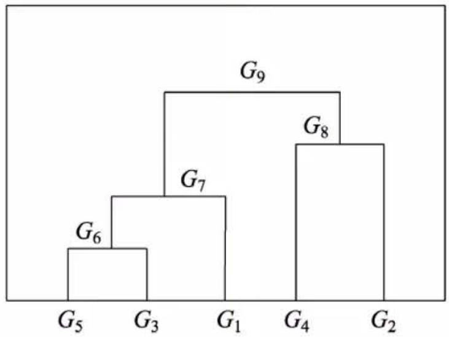  
图14.2 层次聚类图

## 14.3k均值聚类

k均值聚类是基于样本集合划分的聚类算法。k均值聚类将样本集合划分为k个集，构成k个类，将n个样本分到k个类中，每个样本到其所属类的中的距离最。每个样本只能属于个类，所以k均值聚类是硬聚类。下分别介绍k均值聚类的模型、策略、算法，讨论算法的特性及相关问题。

## 14.3.1 模型

给定n个样本的集合 $X = \{ x _ { 1 } , x _ { 2 } , \cdot \cdot \cdot , x _ { n } \}$ ，每个样本由个特征向量表，特征向量的维数是m。k均值聚类的标是将n个样本分到k个不同的类或簇中，这假设 $k < n \mathrm { ~ c ~ }$ k个类 $G _ { 1 } , G _ { 2 } , \cdots , G _ { k }$ 形成对样本集合X的划分，其中 $G _ { i } \cap G _ { j } = \varnothing , \bigcup _ { i = 1 } ^ { k } G _ { i } = X$ 。用C表示划分，个划分对应着个聚类结果。

划分C是个多对的函数。事实上，如果把每个样本个整数 $i \in \{ 1 , 2 , \cdots , n \}$ 表表，每个类也个整数 $l \in \{ 1 , 2 , \cdots , k \}$ 表示，那么划分或者聚类可以函数 $l = C ( i )$ 示，其中 $i \in \{ 1 , 2 , \cdots , n \} , \ l \in \{ 1 , 2 , \cdots , k \}$ 。所以k均值聚类的模型是个从样本到类的函数。

## 14.3.2策略

k均值聚类归结为样本集合X的划分，或者从样本到类的函数的选择问题。k均值聚类的策略是通过损失函数的最化选取最优的划分或函数 $C ^ { * }$

先，采欧距离平（squaredEuclideandistance）作为样本之间的距离 $d ( x _ { i } , x _ { j } )$ …

$$
\begin{array} { c } { d ( x _ { i } , x _ { j } ) = \displaystyle \sum _ { k = 1 } ^ { m } ( x _ { k i } - x _ { k j } ) ^ { 2 } } \\ { = | | x _ { i } - x _ { j } | | ^ { 2 } } \end{array}\tag{14.18}
$$

然后，定义样本与其所属类的中之间的距离的总和为损失函数，即

$$
W ( C ) = \sum _ { l = 1 } ^ { k } \sum _ { C ( i ) = l } \| x _ { i } - \bar { x } _ { l } \| ^ { 2 }\tag{14.19}
$$

式中 $\bar { x } _ { l } = ( \bar { x } _ { 1 l } , \bar { x } _ { 2 l } , \cdot \cdot \cdot , \bar { x } _ { m l } ) ^ { \mathrm { T } }$ 是第个类的均值或中心， $n _ { l } = \sum _ { i = 1 } ^ { n } I ( C ( i ) = l ) , \ I ( C ( i ) = l )$ 是指函数，取值为1或0。函数 $W ( C )$ 也称为能量，表示相同类中的样本相似的程度。

k均值聚类就是求解最优化问题：

$$
\begin{array} { l } { C ^ { * } = \arg \underset { C } { \operatorname* { m i n } } W ( C ) } \\ { \quad = \arg \underset { C } { \operatorname* { m i n } } \sum _ { l = 1 } ^ { k } \sum _ { C ( i ) = l } \| x _ { i } - \bar { x } _ { l } \| ^ { 2 } } \end{array}\tag{14.20}
$$

相似的样本被聚到同类时，损失函数值最，这个标函数的最优化能达到聚类的的。但是，这是个组合优化问题，n个样本分到k类，所有可能分法的数是

$$
S ( n , k ) = { \frac { 1 } { k ! } } \sum _ { l = 1 } ^ { k } ( - 1 ) ^ { k - l } { \left( \begin{array} { l } { k } \\ { l } \end{array} \right) } k ^ { n }\tag{14.21}
$$

这个数字是指数级的。事实上，k均值聚类的最优解求解问题是NP困难问题。现实中采迭代的法求解。

## 14.3.3算法

k均值聚类的算法是个迭代的过程，每次迭代包括两个步骤。先选择k个类的中，将样本逐个指派到与其最近的中的类中，得到个聚类结果；然后更新每个类的样本的均值，作为类的新的中心；重复以上步骤，直到收敛为。具体过程如下。

先，对于给定的中值 $( m _ { 1 } , m _ { 2 } , \cdots , m _ { k } )$ ，求个划分C，使得标函数极化：

$$
\operatorname* { m i n } _ { C } \sum _ { l = 1 } ^ { k } \sum _ { C ( i ) = l } \| x _ { i } - m _ { l } \| ^ { 2 }\tag{14.22}
$$

就是说在类中确定的情况下，将每个样本分到个类中，使样本和其所属类的中之间的距离总和最。求解结果，将每个样本指派到与其最近的中 $m _ { l }$ 的类 $G _ { l }$ 中。

然后，对给定的划分 $C :$ ，再求各个类的中心 $( m _ { 1 } , m _ { 2 } , \cdots , m _ { k } )$ ，使得标函数极化：

$$
\operatorname* { m i n } _ { m _ { 1 } , m _ { 2 } , \cdots , m _ { k } } \sum _ { l = 1 } ^ { k } \sum _ { C ( i ) = l } \| x _ { i } - m _ { l } \| ^ { 2 }
$$

就是说在划分确定的情况下，使样本和其所属类的中之间的距离总和最。求解结果，对于每个包含 $n _ { l }$ 个样本的类 $G _ { l }$ ，更新其均值mi:

$$
m _ { l } = \frac { 1 } { n _ { l } } \sum _ { C ( i ) = l } x _ { i } , l = 1 , 2 , \cdots , k
$$

重复以上两个步骤，直到划分不再改变，得到聚类结果。现将k均值聚类算法叙述如下。

算法14.2（k均值聚类算法）

输入：n个样本的集合X。

输出：样本集合的聚类 $C ^ { * }$

(1)初始化。令 $t = 0$ ，随机选择k个样本点作为初始聚类中心 ${ \boldsymbol { m } } ^ { ( 0 ) } = ( m _ { 1 } ^ { ( 0 ) } , \cdot \cdot \cdot , m _ { l } ^ { ( 0 ) } , \cdot \cdot \cdot$ $m _ { k } ^ { ( 0 ) } )$ 。

(2）对样本进聚类。对固定的类中心 $\boldsymbol { m } ^ { ( t ) } = ( \boldsymbol { m } _ { 1 } ^ { ( t ) } , \cdot \cdot \cdot , \boldsymbol { m } _ { l } ^ { ( t ) } , \cdot \cdot \cdot , \boldsymbol { m } _ { k } ^ { ( t ) } )$ ，其中 $m _ { l } ^ { ( t ) }$ 为类 $G _ { l }$ 的中，计算每个样本到类中的距离，将每个样本指派到与其最近的中的类中，构成聚类结果 $C ^ { ( t ) }$ 。

(3)计算新的类中。对聚类结果 $C ^ { ( t ) }$ ，计算当前各个类中的样本的均值，作为新的类中心 $m ^ { ( t + 1 ) } = ( m _ { 1 } ^ { ( t + 1 ) } , \cdots , m _ { l } ^ { ( t + 1 ) } , \cdots , m _ { k } ^ { ( t + 1 ) } )$ 。

(4）如果迭代收敛或符合停条件，输出 $C ^ { * } = C ^ { ( t ) }$ ；否则，令 $t = t + 1$ ，返回步骤(2)。■

k均值聚类算法的复杂度是O(mnk)，其中m是样本维数，n是样本个数，k是类别个数。

例14.2 给定含有5个样本的集合

$$
X = { \left[ \begin{array} { l l l l l } { 0 } & { 0 } & { 1 } & { 5 } & { 5 } \\ { 2 } & { 0 } & { 0 } & { 0 } & { 2 } \end{array} \right] }
$$

试k均值聚类算法将样本聚到两个类中。

## 解按照算法14.2:

(1)选择两个样本点作为类的中。假设选择 $m _ { 1 } ^ { ( 0 ) } = x _ { 1 } = ( 0 , 2 ) ^ { \mathrm { T } } , m _ { 2 } ^ { ( 0 ) } = x _ { 2 } = ( 0 , 0 ) ^ { \mathrm { T } }$ o

(2）以 $m _ { 1 } ^ { ( 0 ) } , m _ { 2 } ^ { ( 0 ) }$ 为类 $G _ { 1 } ^ { ( 0 ) } , G _ { 2 } ^ { ( 0 ) }$ 的中心，计算 $x _ { 3 } = ( 1 , 0 ) ^ { \mathrm { T } } , x _ { 4 } = ( 5 , 0 ) ^ { \mathrm { T } } , x _ { 5 } = ( 5 , 2 ) ^ { \mathrm { T } }$ 与 $m _ { 1 } ^ { ( 0 ) } = ( 0 , 2 ) ^ { \mathrm { T } } , m _ { 2 } ^ { ( 0 ) } = ( 0 , 0 ) ^ { \mathrm { T } }$ 的欧距离平。

(a）对 $x _ { 3 } = ( 1 , 0 ) ^ { \mathrm { T } } , ~ d ( x _ { 3 } , m _ { 1 } ^ { ( 0 ) } ) = 5 , ~ d ( x _ { 3 } , m _ { 2 } ^ { ( 0 ) } ) = 1$ ，将 $x _ { 3 }$ 分到类 $G _ { 2 } ^ { ( 0 ) }$ 0

(b）对 $x _ { 4 } = ( 5 , 0 ) ^ { \mathrm { T } } , ~ d ( x _ { 4 } , m _ { 1 } ^ { ( 0 ) } ) = 2 9 , ~ d ( x _ { 4 } , m _ { 2 } ^ { ( 0 ) } ) = 2 5$ ，将 $x _ { 4 }$ 分到类 $G _ { 2 } ^ { ( 0 ) }$ 。

$$
x _ { 5 } = ( 5 , 2 ) ^ { \mathrm { T } } , ~ d ( x _ { 5 } , m _ { 1 } ^ { ( 0 ) } ) = 2 5 , ~ d ( x _ { 5 } , m _ { 2 } ^ { ( 0 ) } ) = 2 9
$$

$$
x _ { 5 }
$$

$$
G _ { 1 } ^ { ( 0 ) }
$$

(3）得到新的类 ${ \cal G } _ { 1 } ^ { ( 1 ) } = \{ x _ { 1 } , x _ { 5 } \} , ~ { \cal G } _ { 2 } ^ { ( 1 ) } = \{ x _ { 2 } , x _ { 3 } , x _ { 4 } \}$ ，计算类的中 $m _ { 1 } ^ { ( 1 ) } , m _ { 2 } ^ { ( 1 ) }$ :

$$
m _ { 1 } ^ { ( 1 ) } = ( 2 . 5 , 2 . 0 ) ^ { \mathrm { T } } , ~ m _ { 2 } ^ { ( 1 ) } = ( 2 , 0 ) ^ { \mathrm { T } }
$$

(4)重复步骤(2)和步骤(3)。将 $x _ { 1 }$ 分到类 $G _ { 1 } ^ { ( 1 ) }$ ，将 $x _ { 2 }$ 分到类 $G _ { 2 } ^ { ( 1 ) } , x _ { 3 }$ 分到类 ${ G } _ { 2 } ^ { ( 1 ) }$ $x _ { 4 }$ 分到类 $G _ { 2 } ^ { ( 1 ) } , x _ { 5 }$ 分到类 $G _ { 1 } ^ { ( 1 ) }$ ，得到新的类 ${ \cal G } _ { 1 } ^ { ( 2 ) } = \{ x _ { 1 } , x _ { 5 } \} , ~ { \cal G } _ { 2 } ^ { ( 2 ) } = \{ x _ { 2 } , x _ { 3 } , x _ { 4 } \}$

由于得到的新的类没有改变，聚类停。得到聚类结果：

$$
{ \cal G } _ { 1 } ^ { \ast } = \{ x _ { 1 } , x _ { 5 } \} , \quad { \cal G } _ { 2 } ^ { \ast } = \{ x _ { 2 } , x _ { 3 } , x _ { 4 } \}
$$

## 14.3.4 算法特性

## 1.总体特点

k均值聚类有以下特点：基于划分的聚类法；类别数k事先指定；以欧距离平表样本之间的距离，以中心或样本的均值表示类别；以样本和其所属类的中心之间的距离的总和为最优化的标函数；得到的类别是平坦的、层次化的；算法是迭代算法，不能保证得到全局最优。

## 2.收敛性

k均值聚类属于启发式法，不能保证收敛到全局最优，初始中的选择会直接影响聚类结果。注意，类中在聚类的过程中会发移动，但是往往不会移动太，因为在每步，样本被分到与其最近的中心的类中。

## 3.初始类的选择

选择不同的初始中会得到不同的聚类结果。针对上的例14.2，如果改变两个类的初始中心，比如选择 $m _ { 1 } ^ { ( 0 ) } = x _ { 1 }$ 和 $m _ { 2 } ^ { ( 0 ) } = x _ { 5 }$ ,那么 $x _ { 2 } , \ x _ { 3 }$ 会分到 $G _ { 1 } ^ { ( 0 ) } , x _ { 4 }$ 会分到 $G _ { 2 } ^ { ( 0 ) }$ ,形成聚类结果 ${ \cal G } _ { 1 } ^ { ( 1 ) } = \{ x _ { 1 } , x _ { 2 } , x _ { 3 } \} , { \cal G } _ { 2 } ^ { ( 1 ) } = \{ x _ { 4 } , x _ { 5 } \}$ 。中是 $m _ { 1 } ^ { ( 1 ) } = ( 0 . 3 3 , 0 . 6 7 ) ^ { \mathrm { T } } , m _ { 2 } ^ { ( 1 ) } = ( 5 , 1 ) ^ { \mathrm { T } }$ 。继续迭代，聚类结果仍然是 ${ \cal G } _ { 1 } ^ { ( 2 ) } = \{ x _ { 1 } , x _ { 2 } , x _ { 3 } \} , { \cal G } _ { 2 } ^ { ( 2 ) } = \{ x _ { 4 } , x _ { 5 } \}$ 。聚类停。

对于初始中的选择，可以层次聚类对样本进聚类，得到k个类时停，然后从每个类中选取个与中距离最近的点。

## 4.类别数k的选择

k均值聚类中的类别数k值需要预先指定，在实际应中最优的k值是不知道的。解决这个问题的个法是尝试不同的k值聚类，检验各得到的聚类结果的质量，推测最

优的k值。聚类结果的质量可以类的平均直径来衡量。般地，类别数变时，平均直径会增加；类别数变超过某个值以后，平均直径会不变，这个值正是最优的k值。图14.3说明类别数与平均直径的关系。实验时，可以采分查找，快速找到最优的k值。

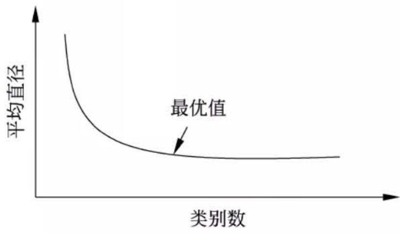  
图14.3 类别数与平均直径的关系

## 本章概要

1．聚类是针对给定的样本，依据它们属性的相似度或距离，将其归并到若个“类”或“簇”的数据分析问题。个类是样本的个集。直观上，相似的样本聚集在同类，不相似的样本分散在不同类。

2.距离或相似度度量在聚类中起着重要作。

常的距离度量有闵可夫斯基距离，包括欧氏距离、曼哈顿距离、切雪夫距离以及马哈拉诺斯距离。常的相似度度量有相关系数、夹余弦。

距离度量相似度时，距离越表样本越相似；相关系数时，相关系数越表样本越相似。

3.类是样本的子集，比如有如下基本定义：

用G表示类或簇，用 $x _ { i } ,  { x } _ { j }$ 等表示类中的样本，用 $d _ { i j }$ 表示样本 $x _ { i }$ 与样本 $x _ { j }$ 之间的距离。如果对任意的 $x _ { i } , x _ { j } \in G$ ,有

$$
d _ { i j } \leqslant T
$$

则称G为个类或簇。

描述类的特征的指标有中、直径、散布矩阵、协差矩阵。

4.聚类过程中到的类与类之间的距离也称为连接。类与类之间的距离包括最短距离、最长距离、中距离、平均距离。

5.层次聚类假设类别之间存在层次结构，将样本聚到层次化的类中。层次聚类又有聚合或下上、分裂或上下两种法。

聚合聚类开始将每个样本各分到个类，之后将相距最近的两类合并，建个新的类，重复此操作直到满停条件，得到层次化的类别。分裂聚类开始将所有样本分到个类，之后将已有类中相距最远的样本分到两个新的类，重复此操作直到满停条件，得到层次化的类别。

聚合聚类需要预先确定下面三个要素：

（1）距离或相似度；

(2）合并规则；

(3)停条件。

根据这些概念的不同组合，就可以得到不同的聚类法。

6.k均值聚类是常的聚类算法，有以下特点：基于划分的聚类法；类别数k事先指定；以欧距离平表样本之间的距离或相似度，以中或样本的均值表类别；以样本和其所属类的中心之间的距离的总和为优化的目标函数；得到的类别是平坦的、层次化的；算法是迭代算法，不能保证得到全局最优。

对于k均值聚类算法，先选择k个类的中，将样本分到与中最近的类中，得到个聚类结果；然后计算每个类的样本的均值，作为类的新的中；重复以上步骤，直到收敛为。

## 继续阅读

聚类的法很多，各种法的详细介绍可参见献[1]和献[2]。层次化聚类的法可参见献[2]，k均值聚类可参见献[3]和献[4]。k均值聚类的扩展有X-means[5]。其他常的聚类法还有基于混合分布的法，如斯混合模型与EM算法；基于密度的法，如DBScan[6]；基于谱聚类的法，如NormalizedCuts[7]。以上法是对样本的聚类，也有对样本与属性同时聚类的法，如Co-Clustering8]。

## 习 题

14.1 试写出分裂聚类算法，上下地对数据进聚类，并给出其算法复杂度。

14.2 证明类或簇的四个定义中，第个定义可推出其他三个定义。

14.3 证明式(14.21）成，即k均值的可能解的个数是指数级的。

14.4 较k均值聚类与斯混合模型加EM算法的异同。

## 参考文献

[1] JAIN A, DUBES R. Algorithms for clustering data[M]. Prentice-Hall, 1988.

[2] AGGARWAL C C, REDDY C K. Data clustering: algorithms and applications[M]. CRC Press, 2013.

[3] MACQUEEN J B. Some methods for classifi cation and analysis of multivariate observations[C]// Procceedings of 5th Symposium on Mathematical Statistics and Probabiity. 1967: 396–410.

[4] HASTIE T, TIBSHIRANI R, FRIEDMAN J. The elements of statistical learning: data mining, inference, and prediction[M].范明，柴玉梅，红英，等译.Springer,2001.

[5] PELLEG D, MOORE A W.X-means: extending K-means with eficient estimation of the number of clusters[C]//Proceedings of ICML. 2000: 727–734.

[6] ESTER M, KRIEGEL H, SANDER J, et al. A density-based algorithm for discovering clusters in large spatial databases with noise[C]//Proceedings of ACM SIGKDD. 1996: 226-231.

[7] SHI J, MALIK J. Normalized cuts and image segmentation[J]. IEEE Transactions on Pattern Analysis and Machine Intelligence, 2000, 22(8): 888–905.

[8] DHILLON I S. Co-clustering documents and words using bipartite spectral graph partitioning[Cl//Proceedings of ACM SIGKDD. 2001: 269–274.

## 第15章 奇异值分解

奇异值分解（singularvaluedecomposition，SVD）是种矩阵因分解法，是线性代数的概念，但在机器学习中被泛使，成为其重要具。本书介绍的主成分分析、潜在语义分析都到奇异值分解。

任意个 $m \times n$ 矩阵，都可以表为三个矩阵的乘积（因分解）形式，分别是m阶正交矩阵、由降序排列的负的对线元素组成的 $m \times n$ 矩形对矩阵和n阶正交矩阵，称为该矩阵的奇异值分解。矩阵的奇异值分解定存在，但不唯。奇异值分解可以看作是矩阵数据压缩的种法，即因分解的式近似地表原始矩阵，这种近似是在平损失意义下的最优近似。

15.1节讲述矩阵奇异值分解的定义与基本定理，叙述奇异值分解的紧凑和截断形式、何解释、主要性质；15.2节讲述奇异值分解的算法；15.3节论述奇异值分解是矩阵的种最优近似法。

## 15.1 奇异值分解的定义与性质

## 15.1.1 定义与定理

定义15.1（奇异值分解） 矩阵的奇异值分解是指将个非零的 $m \times n$ 实矩阵A, $A \in$ $\scriptstyle { R ^ { m \times n } }$ ，表示为以下三个实矩阵乘积形式的运算 $\textcircled{1}$ ，即进行矩阵的因子分解：

$$
\mathbf { \boldsymbol { A } } = \mathbf { \boldsymbol { U } } \Sigma V ^ { \mathrm { { T } } }\tag{15.1}
$$

其中，U是m阶正交矩阵(orthogonalmatrix），V是n阶正交矩阵，∑是由降序排列的非负的对角线元素组成的 $m \times n$ 矩形对角矩阵（rectangulardiagonal matrix），满足

$$
\begin{array} { l } { U \mathbf { } ^ { \mathrm { T } } = I } \\ { V V ^ { \mathrm { T } } = I } \\ { \Sigma = \operatorname { d i a g } ( \sigma _ { 1 } , \sigma _ { 2 } , \cdots , \sigma _ { p } ) } \\ { \sigma _ { 1 } \geqslant \sigma _ { 2 } \geqslant \cdots \geqslant \sigma _ { p } \geqslant 0 } \\ { p = \operatorname * { m i n } ( m , n ) } \end{array}
$$

$U \pmb { \Sigma V } ^ { \mathrm { T } }$ 称为矩阵A的奇异值分解（singular value decomposition，SVD）， $\sigma _ { i }$ 称为矩阵A的奇异值（singular value），U的列向量称为左奇异向量（left singular vector），V的列向量称为右奇异向量(right singular vector）。

注意奇异值分解不要求矩阵A是阵，事实上矩阵的奇异值分解可以看作是阵的对角化的推广。

下看个奇异值分解的例。

例15.1 给定个 $5 \times 4$ 矩阵A：

$$
\pmb { A } = \left[ \begin{array} { l l l l } { 1 } & { 0 } & { 0 } & { 0 } \\ { 0 } & { 0 } & { 0 } & { 4 } \\ { 0 } & { 3 } & { 0 } & { 0 } \\ { 0 } & { 0 } & { 0 } & { 0 } \\ { 2 } & { 0 } & { 0 } & { 0 } \end{array} \right]
$$

它的奇异值分解由三个矩阵的乘积 $U \Sigma V ^ { \mathrm { T } }$ 给出，矩阵U，Σ， $V ^ { \mathrm { T } }$ 分别为

$$
U = \left[ \begin{array} { c c c c c } { 0 } & { 0 } & { \sqrt { 0 . 2 } } & { 0 } & { \sqrt { 0 . 8 } } \\ { 1 } & { 0 } & { 0 } & { 0 } & { 0 } \\ { 0 } & { 1 } & { 0 } & { 0 } & { 0 } \\ { 0 } & { 0 } & { 0 } & { 1 } & { 0 } \\ { 0 } & { 0 } & { \sqrt { 0 . 8 } } & { 0 } & { - \sqrt { 0 . 2 } } \end{array} \right] , \quad \Sigma = \left[ \begin{array} { c c c c } { 4 } & { 0 } & { 0 } & { 0 } \\ { 0 } & { 3 } & { 0 } & { 0 } \\ { 0 } & { 0 } & { \sqrt { 5 } } & { 0 } \\ { 0 } & { 0 } & { 0 } & { 0 } \\ { 0 } & { 0 } & { 0 } & { 0 } \end{array} \right]
$$

$$
V ^ { \mathrm { T } } = { \left[ \begin{array} { l l l l } { 0 } & { 0 } & { 0 } & { 1 } \\ { 0 } & { 1 } & { 0 } & { 0 } \\ { 1 } & { 0 } & { 0 } & { 0 } \\ { 0 } & { 0 } & { 1 } & { 0 } \end{array} \right] }
$$

矩阵是对矩阵，对线外的元素都是0，对线上的元素负，按降序排列。矩阵U和V是正交矩阵，它们与各的转置矩阵相乘是单位矩阵，即

$$
\begin{array} { r } { U U ^ { \mathrm { T } } = I _ { 5 } , \quad V V ^ { \mathrm { T } } = I _ { 4 } } \end{array}
$$

矩阵的奇异值分解不是唯的。在此例中如果选择U为

$$
U = \left[ \begin{array} { c c c c c c } { { 0 } } & { { 0 } } & { { \sqrt { 0 . 2 } } } & { { \sqrt { 0 . 4 } } } & { { - \sqrt { 0 . 4 } } } \\ { { 1 } } & { { 0 } } & { { 0 } } & { { 0 } } & { { 0 } } \\ { { 0 } } & { { 1 } } & { { 0 } } & { { 0 } } & { { 0 } } \\ { { 0 } } & { { 0 } } & { { 0 } } & { { \sqrt { 0 . 5 } } } & { { \sqrt { 0 . 5 } } } \\ { { 0 } } & { { 0 } } & { { \sqrt { 0 . 8 } } } & { { - \sqrt { 0 . 1 } } } & { { \sqrt { 0 . 1 } } } \end{array} \right]
$$

而与V不变，那么 $U \pmb { \Sigma V } ^ { \mathrm { T } }$ 也是A的个奇异值分解。

任意给定个实矩阵，其奇异值分解是否定存在呢？答案是肯定的，下的奇异值分解的基本定理给予保证。

定理15.1（奇异值分解基本定理） 若A为个 $m \times n$ 实矩阵， $A \in R ^ { m \times n }$ ，则A的奇异值分解存在：

$$
\mathbf { \boldsymbol { A } } = \mathbf { \boldsymbol { U } } \Sigma V ^ { \mathrm { { T } } }\tag{15.2}
$$

其中，U是m阶正交矩阵，V是n阶正交矩阵，∑是 $m \times n$ 矩形对角矩阵，其对角线元素非负，且按降序排列。

证明 证明是构造性的，对给定的矩阵A，构造出其奇异值分解的各个矩阵。为了便，不妨假设 $m \geqslant n$ ，如果 $m < n$ 证明仍然成。证明由三步完成。①

## (1）确定V和∑

先构造n阶正交实矩阵V和 $m \times n$ 矩形对角实矩阵 $\pmb { \Sigma }$

矩阵A是 $m \times n$ 实矩阵，则矩阵 $A ^ { \mathrm { T } } A$ 是n阶实对称矩阵。因 $A ^ { \mathrm { T } } A$ 的特征值都是实数，并且存在个n阶正交实矩阵V实现 $A ^ { \mathrm { T } } A$ 的对化，使得 $V ^ { \mathrm { T } } \left( A ^ { \mathrm { T } } A \right) V = A$ 成立，其中Λ是n阶对矩阵，其对线元素由 $A ^ { \mathrm { T } } A$ 的特征值组成。而且， $A ^ { \mathrm { T } } A$ 的特征值都是负的。事实上，令入是 $A ^ { \mathrm { T } } A$ 的个特征值，x是对应的特征向量，则

$$
\| A x \| ^ { 2 } = x ^ { \mathrm { { T } } } A ^ { \mathrm { { T } } } A x = \lambda x ^ { \mathrm { { T } } } x = \lambda \| x \| ^ { 2 }
$$

于是

$$
\lambda = { \frac { \| A x \| ^ { 2 } } { \| x \| ^ { 2 } } } \geqslant 0\tag{15.3}
$$

可以假设正交矩阵V的列的排列使得对应的特征值形成降序排列：

$$
\lambda _ { 1 } \geqslant \lambda _ { 2 } \geqslant \dots \geqslant \lambda _ { n } \geqslant 0
$$

计算特征值的平根（实际就是矩阵A的奇异值）：

$$
\sigma _ { j } = \sqrt { \lambda _ { j } } , \quad j = 1 , 2 , \cdots , n
$$

设矩阵A的秩是 $r , { \mathrm { ~ r a n k } } ( A ) = r$ ，则矩阵 $A ^ { \mathrm { T } } A$ 的秩也是 $r _ { \circ }$ 由于 $A ^ { \mathrm { T } } A$ 是对称矩阵，它的秩等于正的特征值的个数，所以

$$
\lambda _ { 1 } \geqslant \lambda _ { 2 } \geqslant \cdots \geqslant \lambda _ { r } > 0 , \quad \lambda _ { r + 1 } = \lambda _ { r + 2 } = \cdots = \lambda _ { n } = 0\tag{15.4}
$$

对应地有

$$
\sigma _ { 1 } \geqslant \sigma _ { 2 } \geqslant \cdots \geqslant \sigma _ { r } > 0 , \quad \sigma _ { r + 1 } = \sigma _ { r + 2 } = \cdots = \sigma _ { n } = 0\tag{15.5}
$$

区

$$
V _ { 1 } = [ \nu _ { 1 } \quad \nu _ { 2 } \quad \cdots \quad \nu _ { r } ] , \quad V _ { 2 } = [ \nu _ { r + 1 } \quad \nu _ { r + 2 } \quad \cdots \quad \nu _ { n } ]
$$

其中， $\nu _ { 1 } , \nu _ { 2 } , \cdots , \nu _ { r }$ 为 $A ^ { \mathrm { T } } A$ 的正特征值对应的特征向量， $\nu _ { r + 1 } , \nu _ { r + 2 } , \cdots , \nu _ { n }$ 为0特征值对

应的特征向量，则

$$
V = \left[ V _ { 1 } \quad V _ { 2 } \right]\tag{15.6}
$$

这就是矩阵A的奇异值分解中的n阶正交矩阵 $V$

区

$$
\Sigma _ { 1 } = \left[ \begin{array} { c c c c } { \sigma _ { 1 } } & & & \\ & & & \\ & { \sigma _ { 2 } } & & \\ & & { \ddots } & \\ & & & { \sigma _ { r } } \end{array} \right]
$$

则 $\pmb { \Sigma } _ { 1 }$ 是个r阶对矩阵，其对线元素为按降序排列的正的 $\sigma _ { 1 } , \sigma _ { 2 } , \cdots , \sigma _ { r }$ ，于是 $m \times n$ 矩形对矩阵可以表示为

$$
\pmb { \Sigma } = \left[ \begin{array} { c c } { \pmb { \Sigma } _ { 1 } } & { \mathbf { 0 } } \\ { \mathbf { 0 } } & { \mathbf { 0 } } \end{array} \right]\tag{15.7}
$$

这就是矩阵A的奇异值分解中的 $m \times n$ 矩形对矩阵 $\pmb { \Sigma }$

下推出后要到的个公式。在式(15.6)中， $V _ { 2 }$ 的列向量是 $A ^ { \mathrm { T } } A$ 对应于特征值为0的特征向量。因此

$$
A ^ { \mathrm { T } } A v _ { j } = 0 , \quad j = r + 1 , r + 2 , \cdots , n\tag{15.8}
$$

于是， $V _ { 2 }$ 的列向量构成了 $A ^ { \mathrm { T } } A$ 的零空间 $N ( A ^ { \mathrm { T } } A )$ ,而 $N ( A ^ { \mathrm { T } } A ) = N ( A )$ ，所以 $V _ { 2 }$ 的列向量构成A的零空间的组标准正交基。因此，

$$
A V _ { 2 } = 0\tag{15.9}
$$

由于V是正交矩阵，由式(15.6)可得：

$$
I = V V ^ { \mathrm { T } } = V _ { 1 } V _ { 1 } ^ { \mathrm { T } } + V _ { 2 } V _ { 2 } ^ { \mathrm { T } }\tag{15.10}
$$

$$
A = A I = A V _ { 1 } V _ { 1 } ^ { \mathrm { T } } + A V _ { 2 } V _ { 2 } ^ { \mathrm { T } } = A V _ { 1 } V _ { 1 } ^ { \mathrm { T } }\tag{15.11}
$$

(2）确定U

接着构造m阶正交实矩阵U。

$$
{ \pmb u } _ { j } = \frac { 1 } { \sigma _ { j } } { \pmb A } { \pmb v } _ { j } , \quad j = 1 , 2 , \cdots , r\tag{15.12}
$$

$$
U _ { 1 } = [ \pmb { u } _ { 1 } \quad \pmb { u } _ { 2 } \quad \cdots \quad \pmb { u } _ { r } ]\tag{15.13}
$$

则有

$$
A V _ { 1 } = U _ { 1 } \pmb { \Sigma } _ { 1 }\tag{15.14}
$$

$U _ { 1 }$ 的列向量构成了组标准正交集，因为

$$
\begin{array} { r l r } {  { u _ { i } ^ { \mathrm { T } } u _ { j } = ( \frac { 1 } { \sigma _ { i } } v _ { i } ^ { \mathrm { T } } A ^ { \mathrm { T } } ) ( \frac { 1 } { \sigma _ { j } } A v _ { j } ) } } \\ & { } & \\ & { } & { = \frac { 1 } { \sigma _ { i } \sigma _ { j } } v _ { i } ^ { \mathrm { T } } ( A ^ { \mathrm { T } } A v _ { j } ) } \\ & { } & \\ & { } & { = \frac { \sigma _ { j } } { \sigma _ { i } } v _ { i } ^ { \mathrm { T } } v _ { j } } \\ & { } & \\ & { } & { = \delta _ { i j } , \quad i = 1 , 2 , \cdots , r , \quad j = 1 , 2 , \cdots , r } \end{array}\tag{15.15}
$$

由式(15.12)和式(15.15)可知， $u _ { 1 } , u _ { 2 } , \cdots , u _ { r }$ 构成A的列空间的组标准正交基，列空间的维数为r。如果将A看成是从 $\pmb { R } ^ { n }$ 到 $\pmb { R } ^ { m }$ 的线性变换，则A的列空间和A的值域 $R ( A )$ 是相同的。因此 $u _ { 1 } , u _ { 2 } , \cdots , u _ { r }$ 也是 $R ( A )$ 的一组标准正交基。

若 $R ( A ) ^ { \perp }$ 表示 $R ( A )$ 的正交补，则有 $R ( A )$ 的维数为 $r , R ( A ) ^ { \perp }$ 的维数为 $m - r$ ,两者的维数之和等于m。且有 $R ( A ) ^ { \perp } = N ( A ^ { \mathrm { T } } )$ 成立。①

令 $\{ \boldsymbol { u } _ { r + 1 } , \boldsymbol { u } _ { r + 2 } , \cdot \cdot \cdot , \boldsymbol { u } _ { m } \}$ 为 $N ( A ^ { \mathrm { T } } )$ 的组标准正交基，并令

$$
\begin{array} { r l } & { U _ { 2 } = [ \pmb { u } _ { r + 1 } \quad \pmb { u } _ { r + 2 } \quad \cdots \quad \pmb { u } _ { m } ] } \\ & { } \\ & { U = [ U _ { 1 } \quad U _ { 2 } ] } \end{array}\tag{15.16}
$$

则 $u _ { 1 } , u _ { 2 } , \cdots , u _ { m }$ 构成了 $\pmb { R } ^ { m }$ 的一组标准正交基。因此， $\ b { U }$ 是m阶正交矩阵，这就是矩阵A的奇异值分解中的m阶正交矩阵。

（3）证明 $U \Sigma V ^ { \mathrm { T } } = A$

由式(15.6)、式(15.7)、式(15.11)、式(15.14)和式(15.16)得：

$$
\begin{array} { r l } & { U \Sigma V ^ { \mathrm { T } } = [ U _ { 1 } ~ { U } _ { 2 } ] \left[ \begin{array} { l l } { \Sigma _ { 1 } } & { 0 } \\ { 0 } & { 0 } \end{array} \right] \left[ \begin{array} { l } { V _ { 1 } ^ { \mathrm { T } } } \\ { V _ { 2 } ^ { \mathrm { T } } } \end{array} \right] } \\ & { ~ = U _ { 1 } \Sigma _ { 1 } V _ { 1 } ^ { \mathrm { T } } } \\ & { ~ = A V _ { 1 } V _ { 1 } ^ { \mathrm { T } } } \\ & { ~ = A } \end{array}\tag{15.17}
$$

至此证明了矩阵A存在奇异值分解。

## 15.1.2 紧奇异值分解与截断奇异值分解

定理15.1给出的奇异值分解

$$
\mathbf { \boldsymbol { A } } = \mathbf { \boldsymbol { U } } \Sigma V ^ { \mathrm { { T } } }
$$

又称为矩阵的完全奇异值分解（full singular value decomposition）。实际常的是奇异值分

解的紧凑形式和截断形式。紧奇异值分解是与原始矩阵等秩的奇异值分解，截断奇异值分解是比原始矩阵低秩的奇异值分解。

## 1.紧奇异值分解

定义15.2 设有 $m \times n$ 实矩阵A，其秩为 $\operatorname { r a n k } ( A ) = r , \ r \leqslant \operatorname* { m i n } ( m , n )$ ，则称 $U _ { r } \pmb { \Sigma } _ { r } V _ { r } ^ { \mathrm { T } }$ 为A的紧奇异值分解（compact singular value decomposition），即

$$
\mathbf { { A } } = U _ { r } \mathbf { { \cal { Z } } } _ { r } V _ { r } ^ { \mathrm { { T } } }\tag{15.18}
$$

其中， $U _ { r }$ 是 $m \times r$ 矩阵， $V _ { r }$ 是 $n \times r$ 矩阵， $\Sigma _ { r }$ 是r阶对角矩阵；矩阵 $U _ { r }$ 由完全奇异值分解中U的前r列、矩阵 $V _ { r }$ 由V的前r列、矩阵 $\Sigma _ { r }$ 由的前r个对角线元素得到。紧奇异值分解的对角矩阵 $\scriptstyle { \pmb { \Sigma } } _ { r }$ 的秩与原始矩阵A的秩相等。

例15.2 由例15.1给出的矩阵A的秩 $r = 3$

$$
\pmb { A } = \left[ \begin{array} { l l l l } { 1 } & { 0 } & { 0 } & { 0 } \\ { 0 } & { 0 } & { 0 } & { 4 } \\ { 0 } & { 3 } & { 0 } & { 0 } \\ { 0 } & { 0 } & { 0 } & { 0 } \\ { 2 } & { 0 } & { 0 } & { 0 } \end{array} \right]
$$

A的紧奇异值分解是

$$
\mathbf { { A } } = U _ { r } \mathbf { { \cal { D } } } _ { r } V _ { r } ^ { \mathrm { { T } } }
$$

其中，

$$
U _ { r } = { \left[ \begin{array} { l l l } { 0 } & { 0 } & { { \sqrt { 0 . 2 } } } \\ { 1 } & { 0 } & { 0 } \\ { 0 } & { 1 } & { 0 } \\ { 0 } & { 0 } & { 0 } \\ { 0 } & { 0 } & { { \sqrt { 0 . 8 } } } \end{array} \right] } , \quad \Sigma _ { r } = { \left[ \begin{array} { l l l } { 4 } & { 0 } & { 0 } \\ { 0 } & { 3 } & { 0 } \\ { 0 } & { 0 } & { { \sqrt { 5 } } } \end{array} \right] } , \quad V _ { r } ^ { \mathrm { T } } = { \left[ \begin{array} { l l l l } { 0 } & { 0 } & { 0 } & { 1 } \\ { 0 } & { 1 } & { 0 } & { 0 } \\ { 1 } & { 0 } & { 0 } & { 0 } \end{array} \right] }
$$

## 2.截断奇异值分解

在矩阵的奇异值分解中，只取最的k个奇异值 $( k < r , r$ 为矩阵的秩）对应的部分，就得到矩阵的截断奇异值分解。实际应中提到矩阵的奇异值分解时，通常指截断奇异值分解。

定义15.3 设A为 $m \times n$ 实矩阵，其秩 $\operatorname { r a n k } ( A ) = r$ ，且 $0 < k < r$ ，则称 $U _ { k } \Sigma _ { k } V _ { k } ^ { \mathrm { T } }$ 为矩阵A的截断奇异值分解（truncated singular valuedecomposition)，即

$$
\mathbf { \boldsymbol { A } } \approx \mathbf { \boldsymbol { U } } _ { k } \mathbf { \boldsymbol { \Sigma } } _ { k } \mathbf { \boldsymbol { V } } _ { k } ^ { \mathrm { T } }\tag{15.19}
$$

其中， $U _ { k }$ 是 $m \times k$ 矩阵， $V _ { k }$ 是 $n \times k$ 矩阵， $\Sigma _ { k }$ 是k阶对角矩阵；矩阵 $U _ { k }$ 由完全奇异值分解中U的前k列、矩阵 $V _ { k }$ 由 $V$ 的前k列、矩阵 $\Sigma _ { k }$ 由 $\pmb { \Sigma }$ 的前k个对角线元素得到。对角矩阵 $\Sigma _ { k }$ 的秩比原始矩阵A的秩低。

例15.3 由例15.1给出的矩阵A

$$
\pmb { A } = \left[ \begin{array} { l l l l } { 1 } & { 0 } & { 0 } & { 0 } \\ { 0 } & { 0 } & { 0 } & { 4 } \\ { 0 } & { 3 } & { 0 } & { 0 } \\ { 0 } & { 0 } & { 0 } & { 0 } \\ { 2 } & { 0 } & { 0 } & { 0 } \end{array} \right]
$$

的秩为3，若取k=2，则其截断奇异值分解是

$$
\begin{array} { r } { \pmb { A } \approx \pmb { A } _ { 2 } = \pmb { U } _ { 2 } \pmb { \Sigma } _ { 2 } \pmb { V } _ { 2 } ^ { \mathrm { T } } } \end{array}
$$

其中，

$$
\begin{array} { r } { U _ { 2 } = \left[ \begin{array} { l l } { 0 } & { 0 } \\ { 1 } & { 0 } \\ { 0 } & { 1 } \\ { 0 } & { 0 } \\ { 0 } & { 0 } \\ { 0 } & { 0 } \end{array} \right] , \quad \Sigma _ { 2 } = \left[ \begin{array} { l l } { 4 } & { 0 } \\ { 0 } & { 3 } \end{array} \right] , \quad V _ { 2 } ^ { \mathrm { T } } = \left[ \begin{array} { l l l l } { 0 } & { 0 } & { 0 } & { 1 } \\ { 0 } & { 1 } & { 0 } & { 0 } \end{array} \right] , } \end{array}
$$

$$
\begin{array} { r } { A _ { 2 } = U _ { 2 } \Sigma _ { 2 } V _ { 2 } ^ { \mathrm { T } } = \left[ \begin{array} { l l l l } { 0 } & { 0 } & { 0 } & { 0 } \\ { 0 } & { 0 } & { 0 } & { 4 } \\ { 0 } & { 3 } & { 0 } & { 0 } \\ { 0 } & { 0 } & { 0 } & { 0 } \\ { 0 } & { 0 } & { 0 } & { 0 } \end{array} \right] } \end{array}
$$

这里的 $U _ { 2 }$ $V _ { 2 }$ 是例15.1的U和V的前两列， $\Sigma _ { 2 }$ 是的前两前两列。 $A _ { 2 }$ 与A相比，A的元素1和2在 $A _ { 2 }$ 中均变成0。

在实际应中，常常需要对矩阵的数据进压缩，将其近似表，奇异值分解提供了种法。后将要叙述，奇异值分解是在平损失（弗罗贝尼乌斯范数）意义下对矩阵的最优近似。紧奇异值分解对应损压缩，截断奇异值分解对应有损压缩。

## 15.1.3 几何解释

从线性变换的度理解奇异值分解， $m \times n$ 矩阵A表从n维空间 $\pmb { R } ^ { n }$ 到m维空间$\pmb { R } ^ { m }$ 的个线性变换：

$$
T : x  A x
$$

其中， $\boldsymbol { x } \in R ^ { n }$ , $\ b { A } \ b { x } \in \ b { R } ^ { m }$ ，x和Ax分别是各空间的向量。线性变换可以分解为三个简单的变换：个坐标系的旋转或反射变换、个坐标轴的缩放变换、另个坐标系的旋转或反射变换。奇异值定理保证这种分解定存在。这就是奇异值分解的何解释。

对矩阵A进奇异值分解，得到 $\mathbf { \boldsymbol { A } } = \mathbf { \boldsymbol { U } } \Sigma \mathbf { \boldsymbol { V } } ^ { \mathrm { T } }$ ，V和U都是正交矩阵，所以V的列向量 $v _ { 1 } , v _ { 2 } , \cdots , v _ { n }$ 构成 $\pmb { R } ^ { n }$ 空间的一组标准正交基，表 $\pmb { R } ^ { n }$ 中的正交坐标系的旋转或反射变换；U的列向量 $u _ { 1 } , u _ { 2 } , \cdots , u _ { m }$ 构成 $\pmb { R } ^ { m }$ 空间的一组标准正交基，表示 $\pmb { R } ^ { m }$ 中的正交坐标系的旋转或反射变换；的对元素 $\sigma _ { 1 } , \sigma _ { 2 } , \cdots , \sigma _ { n }$ 是组负实数，表 $\pmb { R } ^ { n }$ 中的原始正交坐标系坐标轴的 $\sigma _ { 1 } , \sigma _ { 2 } , \cdots , \sigma _ { n }$ 倍的缩放变换。

对于任意个向量 $\boldsymbol { x } \in R ^ { n }$ ，经过基于 $\mathbf { \boldsymbol { A } } = \mathbf { \boldsymbol { U } } \Sigma V ^ { \mathrm { { T } } }$ 的线性变换，等价于经过坐标系的旋转或反射变换 $V ^ { \mathrm { T } }$ 、坐标轴的缩放变换，以及坐标系的旋转或反射变换U，得到向量$A x \in R ^ { m }$ 。图15.1给出直观的何解释。原始空间的标准正交基（红与黄）经过坐标系的旋转变换 $V ^ { \mathrm { T } }$ 、坐标轴的缩放变换（ $\sigma _ { 1 } , \sigma _ { 2 } )$ 、坐标系的旋转变换U，得到和经过线性变换A等价的结果。

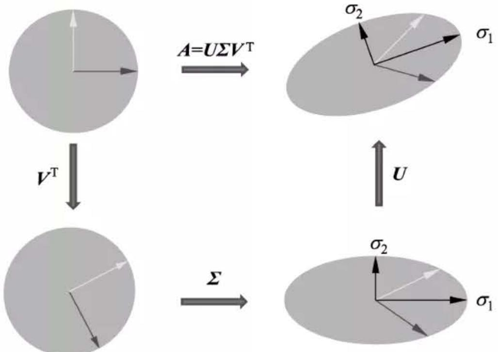  
图15.1 奇异值分解的何解释(见前彩图)

下通过个例直观地说明奇异值分解的何意义。

例15.4 给定个2阶矩阵：

$$
\pmb { A } = \left[ \begin{array} { l l } { 3 } & { 1 } \\ { 2 } & { 1 } \end{array} \right]
$$

其奇异值分解为

$$
U = \left[ \begin{array} { l l } { 0 . 8 1 7 4 } & { - 0 . 5 7 6 0 } \\ { 0 . 5 7 6 0 } & { 0 . 8 1 7 4 } \end{array} \right] , \quad \Sigma = \left[ \begin{array} { l l } { 3 . 8 6 4 3 } & { 0 } \\ { 0 } & { 0 . 2 5 8 8 } \end{array} \right] , \quad V ^ { \mathrm { T } } = \left[ \begin{array} { l l } { 0 . 9 3 2 7 } & { 0 . 3 6 0 6 } \\ { - 0 . 3 6 0 6 } & { 0 . 9 3 2 7 } \end{array} \right]
$$

观察基于矩阵A的奇异值分解将 $R ^ { 2 }$ 的标准正交基

$$
e _ { 1 } = { \left[ \begin{array} { l } { 1 } \\ { 0 } \end{array} \right] } , e _ { 2 } = { \left[ \begin{array} { l } { 0 } \\ { 1 } \end{array} \right] }
$$

进行线性转换的情况。

首先， $V ^ { \mathrm { T } }$ 表个旋转变换，将标准正交基 $e _ { 1 }$ , $e _ { 2 }$ 旋转，得到向量 $V ^ { \mathrm { T } } e _ { 1 } , V ^ { \mathrm { T } } e _ { 2 }$

$$
\begin{array} { r } { V ^ { \mathrm { T } } e _ { 1 } = \left[ \begin{array} { c } { 0 . 9 3 2 7 } \\ { - 0 . 3 6 0 6 } \end{array} \right] , \quad V ^ { \mathrm { T } } e _ { 2 } = \left[ \begin{array} { c } { 0 . 3 6 0 6 } \\ { 0 . 9 3 2 7 } \end{array} \right] } \end{array}
$$

其次，表个缩放变换，将向量 $V ^ { \mathrm { T } } e _ { 1 }$ $V ^ { \mathrm { T } } e _ { 2 }$ 在坐标轴向缩放 $\sigma _ { 1 }$ 倍和 $\sigma _ { 2 }$ 倍，得到向量 $\Sigma V ^ { \mathrm { T } } e _ { 1 }$ , $\Sigma V ^ { \mathrm { T } } e _ { 2 }$ 2.

$$
\begin{array} { r } { \Sigma V ^ { \mathrm { T } } e _ { 1 } = \left[ \begin{array} { c } { 3 . 6 0 4 2 } \\ { - 0 . 0 9 3 3 } \end{array} \right] , \quad \Sigma V ^ { \mathrm { T } } e _ { 2 } = \left[ \begin{array} { c } { 1 . 3 9 3 5 } \\ { 0 . 2 4 1 4 } \end{array} \right] } \end{array}
$$

最后，U表个旋转变换，再将向量 $\Sigma V ^ { \mathrm { T } } e _ { 1 }$ $\Sigma V ^ { \mathrm { T } } e _ { 2 }$ 旋转，得到向量 $U \Sigma V ^ { \mathrm { T } } e _ { 1 }$ ,$U \Sigma V ^ { \mathrm { T } } e _ { 2 }$ ，也就是向量 $A e _ { 1 }$ 和 $A e _ { 2 }$

$$
A e _ { 1 } = U \Sigma V ^ { \mathrm { T } } e _ { 1 } = \left[ \begin{array} { l } { 3 } \\ { 2 } \end{array} \right] , \quad A e _ { 2 } = U \Sigma V ^ { \mathrm { T } } e _ { 2 } \left[ \begin{array} { l } { 1 } \\ { 1 } \end{array} \right]
$$

综上，矩阵的奇异值分解也可以看作是将其对应的线性变换分解为旋转变换、缩放变换及旋转变换的组合。根据定理15.1，这个变换的组合定存在。 ■

## 15.1.4主要性质

（1）设矩阵A的奇异值分解为 $\mathbf { \boldsymbol { A } } = \mathbf { \boldsymbol { U } } \Sigma V ^ { \mathrm { { T } } }$ ，则以下关系成：

$$
\begin{array} { r } { A ^ { \mathrm { T } } A = ( U \Sigma V ^ { \mathrm { T } } ) ^ { \mathrm { T } } ( U \Sigma V ^ { \mathrm { T } } ) = V ( \Sigma ^ { \mathrm { T } } \Sigma ) V ^ { \mathrm { T } } } \end{array}\tag{15.20}
$$

$$
A A ^ { \mathrm { T } } = ( U \Sigma V ^ { \mathrm { T } } ) ( U \Sigma V ^ { \mathrm { T } } ) ^ { \mathrm { T } } = U ( \Sigma \Sigma ^ { \mathrm { T } } ) U ^ { \mathrm { T } }\tag{15.21}
$$

也就是说，矩阵 $A ^ { \mathrm { T } } A$ 和 $A A ^ { \mathrm { T } }$ 的特征分解存在，且可以由矩阵A的奇异值分解的矩阵表。V的列向量是 $A ^ { \mathrm { T } } A$ 的特征向量，U的列向量是 $A A ^ { \mathrm { T } }$ 的特征向量，∑的奇异值是$A ^ { \mathrm { T } } A$ 和 $A A ^ { \mathrm { T } }$ 的特征值的平方根。

（2）在矩阵A的奇异值分解中，奇异值、左奇异向量和右奇异向量之间存在对应关系。由 $\mathbf { \boldsymbol { A } } = \mathbf { \boldsymbol { U } } \Sigma V ^ { \mathrm { { T } } }$ 易知：

$$
\pmb { A V } = \pmb { U } \pmb { \Sigma }
$$

较这等式两端的第j列，得到：

$$
A v _ { j } = \sigma _ { j } u _ { j } , \quad j = 1 , 2 , \cdot \cdot \cdot , n\tag{15.22}
$$

这是矩阵A的右奇异向量和奇异值、左奇异向量的关系。

类似地，由

$$
\ b { A } ^ { \mathrm { T } } \ b { U } = \ b { V } \ b { \Sigma } ^ { \mathrm { T } }
$$

得到：

$$
\begin{array} { r } { { \cal A } ^ { \mathrm { T } } { \pmb u } _ { j } = \sigma _ { j } { \pmb v } _ { j } , \quad j = 1 , 2 , \cdots , n } \end{array}\tag{15.23}
$$

$$
\begin{array} { r } { { A ^ { \mathrm { T } } } u _ { j } = 0 , \quad j = n + 1 , n + 2 , \cdots , m } \end{array}\tag{15.24}
$$

这是矩阵A的左奇异向量和奇异值、右奇异向量的关系。

(3）矩阵A的奇异值分解中，奇异值 $\sigma _ { 1 } , \sigma _ { 2 } , \cdots , \sigma _ { n }$ 是唯一的，而矩阵U和V不是唯一的。

(4）矩阵A和的秩相等，等于正奇异值 $\sigma _ { i }$ 的个数r（包含重复的奇异值)。

(5)矩阵A的r个右奇异向量 $v _ { 1 } , v _ { 2 } , \cdots , v _ { r }$ 构成 $A ^ { \mathrm { T } }$ 的值域 $R ( A ^ { \mathrm { T } } )$ 的一组标准正交基。因为矩阵 $A ^ { \mathrm { T } }$ 是从 $\pmb { R } ^ { m }$ 映射到 $\pmb { R } ^ { n }$ 的线性变换，则 $A ^ { \mathrm { T } }$ 的值域 $R ( A ^ { \mathrm { T } } )$ 和 $A ^ { \mathrm { T } }$ 的列空间是相同的， $v _ { 1 } , v _ { 2 } , \cdots , v _ { r }$ 是 $A ^ { \mathrm { T } }$ 的组标准正交基，因也是 $R ( A ^ { \mathrm { T } } )$ 的一组标准正交基。①

矩阵A的 $n - r$ 个右奇异向量 $v _ { r + 1 } , v _ { r + 2 } , \cdot \cdot \cdot , v _ { n }$ 构成A的零空间 $N ( A )$ 的一组标准正交基。矩阵A的r个左奇异向量 $u _ { 1 } , u _ { 2 } , \cdots , u _ { r }$ 构成值域 $R ( A )$ 的一组标准正交基。矩阵A的 $m - r$ 个左奇异向量 ${ \pmb u } _ { r + 1 } , { \pmb u } _ { r + 2 } , \cdots , { \pmb u } _ { m }$ 构成 $A ^ { \mathrm { T } }$ 的零空间 $N ( A ^ { \mathrm { T } } )$ 的一组标准正交基。

## 15.2 奇异值分解的计算

奇异值分解基本定理的证明过程蕴含了奇异值分解的计算法。矩阵A的奇异值分解可以通过求对称矩阵 $A ^ { \mathrm { T } } A$ 的特征值和特征向量得到。 $A ^ { \mathrm { T } } A$ 的特征向量构成正交矩阵V的列， $A ^ { \mathrm { T } } A$ 的特征值 $\lambda _ { j }$ 的平方根为奇异值 $\sigma _ { i }$ ，即

$$
\sigma _ { j } = \sqrt { \lambda _ { j } } , \quad j = 1 , 2 , \cdots , n
$$

对其由到排列作为对线元素，构成对矩阵 $\pmb { \Sigma } ;$ 求正奇异值对应的左奇异向量，再求扩充的 $A ^ { \mathrm { T } }$ 的标准正交基，构成正交矩阵U的列，从得到A的奇异值分解 $\mathbf { \boldsymbol { A } } = \mathbf { \boldsymbol { U } } \boldsymbol { \Sigma } \mathbf { \boldsymbol { V } } ^ { \mathrm { T } }$ 。

给定 $m \times n$ 矩阵A，可以按照上的叙述写出矩阵奇异值分解的计算过程。

（1）求 $A ^ { \mathrm { T } } A$ 的特征值和特征向量

计算对称矩阵 $W = A ^ { \mathrm { T } } A$

求解特征方程

$$
( W - \lambda I ) x = 0
$$

得到特征值 $\lambda _ { i }$ ，并将特征值由到排列：

$$
\lambda _ { 1 } \geqslant \lambda _ { 2 } \geqslant \dots \geqslant \lambda _ { n } \geqslant 0
$$

将特征值 $\lambda _ { i } ( i = 1 , 2 , \cdots , n )$ 代特征程求得对应的特征向量。

## (2）求n阶正交矩阵V

将特征向量单位化，得到单位特征向量 $v _ { 1 } , v _ { 2 } , \cdots , v _ { n }$ ，构成n阶正交矩阵V:

$$
V = { \left[ \begin{array} { l l l l } { \mathbf { \sigma } _ { } } & { \mathbf { \sigma } _ { } \mathbf { \sigma } _ { 1 } } & { \mathbf { \sigma } _ { } \dots } & { \mathbf { \sigma } _ { v _ { n } } } \end{array} \right] }
$$

（3）求 $m \times n$ 对矩阵

计算A的奇异值：

$$
\sigma _ { i } = \sqrt { \lambda _ { i } } , \quad i = 1 , 2 , \cdots , n
$$

构造 $m \times n$ 矩形对矩阵，主对线元素是奇异值，其余元素是零：

$$
\pmb { \Sigma } = \operatorname { d i a g } ( \sigma _ { 1 } , \sigma _ { 2 } , \cdots , \sigma _ { n } )
$$

(4）求m阶正交矩阵U

对A的前r个正奇异值，令

$$
{ \pmb u } _ { j } = \frac { 1 } { \sigma _ { j } } { \pmb A } { \pmb v } _ { j } , \quad j = 1 , 2 , \cdots , r
$$

得到：

$$
U _ { 1 } = \left[ \begin{array} { l l l l } { \pmb { u } _ { 1 } } & { \pmb { u } _ { 2 } } & { \cdots } & { \pmb { u } _ { r } } \end{array} \right]
$$

求 $A ^ { \mathrm { T } }$ 的零空间的一组标准正交基 $\{ \boldsymbol { u } _ { r + 1 } , \boldsymbol { u } _ { r + 2 } , \cdots , \boldsymbol { u } _ { m } \}$ 令

$$
U _ { 2 } = [ \begin{array} { l l l l } { { \pmb u } _ { r + 1 } } & { { \pmb u } _ { r + 2 } } & { \cdots } & { { \pmb u } _ { m } } \end{array} ]
$$

并令

$$
U = \left[ \begin{array} { l l } { U _ { 1 } } & { U _ { 2 } } \end{array} \right]
$$

(5）得到奇异值分解

$$
\mathbf { \boldsymbol { A } } = \mathbf { \boldsymbol { U } } \Sigma V ^ { \mathrm { { T } } }
$$

下通过个简单的例题，说明奇异值分解的算法。

例15.5 试求矩阵

$$
\pmb { A } = \left[ \begin{array} { l l } { 1 } & { 1 } \\ { 2 } & { 2 } \\ { 0 } & { 0 } \end{array} \right]
$$

的奇异值分解。

解 （1）求矩阵 $A ^ { \mathrm { T } } A$ 的特征值和特征向量

求对称矩阵 $A ^ { \mathrm { T } } A$

$$
\mathbf { \Sigma } ^ { \mathbf { } } A ^ { \mathrm { T } } A = { \left[ \begin{array} { l l l } { 1 } & { 2 } & { 0 } \\ { 1 } & { 2 } & { 0 } \end{array} \right] } { \left[ \begin{array} { l l } { 1 } & { 1 } \\ { 2 } & { 2 } \\ { 0 } & { 0 } \end{array} \right] } = { \left[ \begin{array} { l l } { 5 } & { 5 } \\ { 5 } & { 5 } \end{array} \right] }
$$

特征值入和特征向量x满特征程

$$
( A ^ { \mathrm { T } } A - \lambda I ) x = 0
$$

得到齐次线性方程组：

$$
\left\{ \begin{array} { l l } { ( 5 - \lambda ) x _ { 1 } + 5 x _ { 2 } = 0 } \\ { 5 x _ { 1 } + ( 5 - \lambda ) x _ { 2 } = 0 } \end{array} \right.
$$

该程组有零解的充要条件是

$$
\left| \begin{array} { l l } { 5 - \lambda } & { 5 } \\ { 5 } & { 5 - \lambda } \end{array} \right| = 0
$$

即

$$
\lambda ^ { 2 } - 1 0 \lambda = 0
$$

解此方程，得到矩阵 $A ^ { \mathrm { T } } A$ 的特征值 $\lambda _ { 1 } = 1 0$ 和 $\lambda _ { 2 } = 0$ 。

将特征值 $\lambda _ { 1 } = 1 0$ 代线性程组，得到对应的单位特征向量：

$$
v _ { 1 } = { \left[ \begin{array} { l } { { \frac { 1 } { \sqrt { 2 } } } } \\ { { \frac { 1 } { \sqrt { 2 } } } } \end{array} \right] }
$$

同样得到特征值 $\lambda _ { 2 } = 0$ 对应的单位特征向量：

$$
\begin{array} { r } { \pmb { v } _ { 2 } = \left[ \begin{array} { c } { \frac { 1 } { \sqrt { 2 } } } \\ { - \frac { 1 } { \sqrt { 2 } } } \end{array} \right] } \end{array}
$$

(2)求正交矩阵V

构造正交矩阵V:

$$
V = \left[ \begin{array} { c c } { { \displaystyle \frac { 1 } { \sqrt { 2 } } } } & { { \displaystyle \frac { 1 } { \sqrt { 2 } } } } \\ { { \displaystyle \frac { 1 } { \sqrt { 2 } } } } & { { \displaystyle - \frac { 1 } { \sqrt { 2 } } } } \end{array} \right]
$$

(3）求对矩阵Σ

奇异值为 $\sigma _ { 1 } = \sqrt { \lambda _ { 1 } } = \sqrt { 1 0 }$ 和 $\sigma _ { 2 } = 0$ 。构造对矩阵：

$$
\pmb { \Sigma } = \left[ \begin{array} { c c } { \sqrt { 1 0 } } & { 0 } \\ { 0 } & { 0 } \\ { 0 } & { 0 } \end{array} \right]
$$

注意在中要加上零向量，使得能够与U，V进矩阵乘法运算。

(4）求正交矩阵U

基于A的正奇异值计算得到列向量 $\mathbf { \delta } _ { \mathbf { u } _ { 1 } }$

$$
u _ { 1 } = { \frac { 1 } { \sigma _ { 1 } } } A v _ { 1 } = { \frac { 1 } { \sqrt { 1 0 } } } { \left[ \begin{array} { l l } { 1 } & { 1 } \\ { 2 } & { 2 } \\ { 0 } & { 0 } \end{array} \right] } { \left[ \begin{array} { l } { { \frac { 1 } { \sqrt { 2 } } } } \\ { { \frac { 1 } { \sqrt { 2 } } } } \end{array} \right] } = { \left[ \begin{array} { l } { { \frac { 1 } { \sqrt { 5 } } } } \\ { { \frac { 2 } { \sqrt { 5 } } } } \\ { 0 } \end{array} \right] }
$$

列向量 $u _ { 2 } , u _ { 3 }$ 是 $A ^ { \mathrm { T } }$ 的零空间 $N ( A ^ { \mathrm { T } } )$ 的组标准正交基。为此，求解以下线性程组：

$$
A ^ { \mathrm { T } } x = { \left[ \begin{array} { l l l } { 1 } & { 2 } & { 0 } \\ { 1 } & { 2 } & { 0 } \end{array} \right] } { \left[ \begin{array} { l } { x _ { 1 } } \\ { x _ { 2 } } \\ { x _ { 3 } } \end{array} \right] } = { \left[ \begin{array} { l } { 0 } \\ { 0 } \end{array} \right] }
$$

即

$$
x _ { 1 } + 2 x _ { 2 } + 0 x _ { 3 } = 0
$$

$$
x _ { 1 } = - 2 x _ { 2 } + 0 x _ { 3 }
$$

分别取 $( x _ { 2 } , x _ { 3 } )$ 为(1,0)和(0,1)，得到 $N ( A ^ { \mathrm { T } } )$ 的基：

$$
( - 2 , 1 , 0 ) ^ { \mathrm { T } } , \quad ( 0 , 0 , 1 ) ^ { \mathrm { T } }
$$

$N ( A ^ { \mathrm { T } } )$ 的一组标准正交基是

$$
{ \pmb u } _ { 2 } = \left( - \frac { 2 } { \sqrt { 5 } } , \frac { 1 } { \sqrt { 5 } } , 0 \right) ^ { \mathrm { T } } , \quad { \pmb u } _ { 3 } = ( 0 , 0 , 1 ) ^ { \mathrm { T } }
$$

构造正交矩阵 $U _ { : }$

$$
U = \left[ \begin{array} { c c c } { { \displaystyle \frac { 1 } { \sqrt { 5 } } } } & { { \displaystyle - \frac { 2 } { \sqrt { 5 } } } } & { { 0 } } \\ { { \displaystyle \frac { 2 } { \sqrt { 5 } } } } & { { \displaystyle \frac { 1 } { \sqrt { 5 } } } } & { { 0 } } \\ { { 0 } } & { { 0 } } & { { 1 } } \end{array} \right]
$$

(5)矩阵A的奇异值分解

$$
\pmb { A } = \pmb { U } \pmb { \Sigma } \pmb { V } ^ { \operatorname { T } } = \left[ \begin{array} { c c c } { \frac { 1 } { \sqrt { 5 } } } & { - \frac { 2 } { \sqrt { 5 } } } & { 0 } \\ { \frac { 2 } { \sqrt { 5 } } } & { \frac { 1 } { \sqrt { 5 } } } & { 0 } \\ { 0 } & { 0 } & { 1 } \end{array} \right] \left[ \begin{array} { c c } { \sqrt { 1 0 } } & { 0 } \\ { 0 } & { 0 } \\ { 0 } & { 0 } \end{array} \right] \left[ \begin{array} { c c } { \frac { 1 } { \sqrt { 2 } } } & { \frac { 1 } { \sqrt { 2 } } } \\ { \frac { 1 } { \sqrt { 2 } } } & { - \frac { 1 } { \sqrt { 2 } } } \end{array} \right]
$$

上的算法和例题只是为了说明计算的过程，并不是实际应中的算法。可以看出，奇异值分解算法关键在于 $A ^ { \mathrm { T } } A$ 的特征值的计算。实际应的奇异值分解算法是通过求 $A ^ { \mathrm { T } } A$ 的特征值进行，但不直接计算 $A ^ { \mathrm { T } } A$ 。按照这个思路产了许多矩阵奇异值分解的有效算法，这不予介绍，读者可以参考献[3]和献[4]。

## 15.3 奇异值分解与矩阵近似

## 15.3.1 弗罗贝尼乌斯范数

奇异值分解也是种矩阵近似的法，这个近似是在弗罗尼乌斯范数（Frobeniusnorm）意义下的近似。矩阵的弗罗贝尼乌斯范数是向量的 $L _ { 2 }$ 范数的直接推广，对应机器学习中的平方损失函数。

定义15.4（弗罗贝尼乌斯范数） 设矩阵 $A \in R ^ { m \times n }$ $A = [ a _ { i j } ] _ { m \times n }$ ，定义矩阵A的弗罗贝尼 $\xrightarrow { \hat { 1 } }$ 斯范数为

$$
\| \pmb { A } \| _ { F } = \left( \sum _ { i = 1 } ^ { m } \sum _ { j = 1 } ^ { n } a _ { i j } ^ { 2 } \right) ^ { \frac { 1 } { 2 } }\tag{15.25}
$$

引理15.1 设矩阵 $A \in R ^ { m \times n }$ ，A的奇异值分解为 $U \Sigma V ^ { \mathrm { T } }$ ，其中 $\pmb { \Sigma } = \mathrm { d i a g } ( \sigma _ { 1 } , \sigma _ { 2 } , \cdots$ $\sigma _ { n } )$ ,则

$$
\| A \| _ { F } = ( \sigma _ { 1 } ^ { 2 } + \sigma _ { 2 } ^ { 2 } + \cdot \cdot \cdot + \sigma _ { n } ^ { 2 } ) ^ { \frac { 1 } { 2 } }\tag{15.26}
$$

证明般地，若 $Q$ 是m阶正交矩阵，则有

$$
\| Q A \| _ { F } = \| A \| _ { F }\tag{15.27}
$$

因为

$$
\begin{array} { c } { { \displaystyle \| Q A \| _ { F } ^ { 2 } = \| ( Q a _ { 1 } , Q a _ { 2 } , \cdots , Q a _ { n } ) \| _ { F } ^ { 2 } } } \\ { { \displaystyle = \sum _ { i = 1 } ^ { n } \| Q a _ { i } \| _ { 2 } ^ { 2 } = \sum _ { i = 1 } ^ { n } \| a _ { i } \| _ { 2 } ^ { 2 } = \| A \| _ { F } ^ { 2 } } } \end{array}
$$

同样，若P是n阶正交矩阵，则有

$$
\| A P ^ { \mathrm { T } } \| _ { F } = \| A \| _ { F }\tag{15.28}
$$

故

$$
\| A \| _ { F } = \| U \Sigma V ^ { \mathrm { T } } \| _ { F } = \| \Sigma \| _ { F }\tag{15.29}
$$

即

$$
\| A \| _ { F } = ( \sigma _ { 1 } ^ { 2 } + \sigma _ { 2 } ^ { 2 } + \cdot \cdot \cdot + \sigma _ { n } ^ { 2 } ) ^ { \frac { 1 } { 2 } }\tag{15.30}
$$

## 15.3.2 矩阵的最优近似

奇异值分解是在平损失（弗罗尼乌斯范数）意义下对矩阵的最优近似，即数据压缩。

定理15.2设矩阵 $A \in R ^ { m \times n }$ ，矩阵的秩 $\operatorname { r a n k } ( A ) = r$ ，并设M为 $\mathbf { \nabla } R ^ { m \times n }$ 中所有秩不超过k的矩阵集合， $0 < k < r$ ，则存在一个秩为k的矩阵 $\boldsymbol { X } \in \mathcal { M }$ ,使得

$$
\| A - X \| _ { F } = \operatorname* { m i n } _ { S \in \mathcal { M } } \| A - S \| _ { F }\tag{15.31}
$$

称矩阵X为矩阵A在弗罗贝尼 $\xrightarrow { \hat { 1 } 1 }$ 斯范数意义下的最优近似。

本书不证明这定理，将应这个结果，通过矩阵A的奇异值分解求出近似矩阵X。

定理15.3设矩阵 $A \in R ^ { m \times n }$ ，矩阵的秩 $\operatorname { r a n k } ( A ) = r ,$ 有奇异值分解 $\mathbf { \boldsymbol { A } } = \mathbf { \boldsymbol { U } } \Sigma V ^ { \mathrm { { T } } }$ ,并 设M为 $\mathbf { \nabla } R ^ { m \times n }$ 中所有秩不超过k的矩阵的集合， $0 < k < r$ 若秩为k的矩阵 $\boldsymbol { X } \in \mathcal { M }$ 满足

$$
\| A - X \| _ { F } = \operatorname* { m i n } _ { S \in \mathcal { M } } \| A - S \| _ { F }\tag{15.32}
$$

则

$$
\| \pmb { A } - \pmb { X } \| _ { F } = ( \sigma _ { k + 1 } ^ { 2 } + \sigma _ { k + 2 } ^ { 2 } + \cdots + \sigma _ { n } ^ { 2 } ) ^ { \frac { 1 } { 2 } }\tag{15.33}
$$

特别地，若 $\pmb { A } ^ { \prime } = \pmb { U } \pmb { \Sigma } ^ { \prime } \pmb { V } ^ { \mathrm { T } }$ ，其中，

$$
\Sigma ^ { \prime } = \left[ \begin{array} { c c c c c } { \sigma _ { 1 } } & & & & & \\ & { \ddots } & & & { 0 } & \\ & & & { \sigma _ { k } } & & \\ & & & { 0 } & & \\ & & & & { \ddots } & \\ & { 0 } & & & & { 0 } \end{array} \right] = \left[ \begin{array} { c c c c c } { \Sigma _ { k } } & { \sigma } \\ { \sigma } & { \sigma } \end{array} \right]
$$

则

$$
\| A - A ^ { \prime } \| _ { F } = ( \sigma _ { k + 1 } ^ { 2 } + \sigma _ { k + 2 } ^ { 2 } + \cdots + \sigma _ { n } ^ { 2 } ) ^ { \frac { 1 } { 2 } } = \operatorname* { m i n } _ { S \in \mathcal { M } } \| A - S \| _ { F }\tag{15.34}
$$

证明 令 $X \in \mathcal { M }$ 为满式(15.32)的个矩阵。由于

$$
\| \boldsymbol { \cal A } - \boldsymbol { \cal X } \| _ { F } \leqslant \| \boldsymbol { \cal A } - \boldsymbol { \cal A } ^ { \prime } \| _ { F } = ( \sigma _ { k + 1 } ^ { 2 } + \sigma _ { k + 2 } ^ { 2 } + \cdot \cdot \cdot + \sigma _ { n } ^ { 2 } ) ^ { \frac { 1 } { 2 } }\tag{15.35}
$$

下面证明

$$
\| A - X \| _ { F } \geqslant ( \sigma _ { k + 1 } ^ { 2 } + \sigma _ { k + 2 } ^ { 2 } + \cdot \cdot \cdot + \sigma _ { n } ^ { 2 } ) ^ { \frac { 1 } { 2 } }
$$

于是式(15.33)成。

设X的奇异值分解为 $Q S 2 P ^ { \mathrm { T } }$ ，其中，

$$
\Omega = \left[ \begin{array} { c c c c c } { \omega _ { 1 } } & & & & & \\ & { \ddots } & & & { 0 } \\ & & & { \omega _ { k } } & & \\ & & & { 0 } & \\ & & & & { \ddots } & \\ & { 0 } & & & & { 0 } \end{array} \right] = \left[ \begin{array} { c c } { \Omega _ { k } } & { \sigma } \\ { \sigma } & { \sigma } \end{array} \right]
$$

若令矩阵 $B = Q ^ { \mathrm { T } } A P$ ，则 $\pmb { A } = \pmb { Q } \pmb { B } \pmb { P } ^ { \mathrm { T } }$ ，由此得到：

$$
\| \boldsymbol { A } - \boldsymbol { X } \| _ { F } = \| \boldsymbol { Q } ( \boldsymbol { B } - \boldsymbol { \Omega } ) \boldsymbol { P } ^ { \mathrm { T } } \| _ { F } = \| \boldsymbol { B } - \boldsymbol { \Omega } \| _ { F }\tag{15.36}
$$

2分块法对B分块：

$$
B = \left[ \begin{array} { l l } { B _ { 1 1 } } & { B _ { 1 2 } } \\ { B _ { 2 1 } } & { B _ { 2 2 } } \end{array} \right]
$$

其中， $\scriptstyle B _ { 1 1 }$ 是 $k \times k$ 子矩阵， $B _ { 1 2 }$ 是 $k \times ( n - k )$ 子矩阵， $ { \boldsymbol { B } } _ { 2 1 }$ 是 $( m - k ) \times k$ 子矩阵， $B _ { 2 2 }$ 是

$( m - k ) \times ( n - k )$ 矩阵。可得：

$$
\begin{array} { c } { { \| { \pmb A } - { \pmb X } \| _ { F } ^ { 2 } = \| { \pmb B } - { \pmb \Omega } \| _ { F } ^ { 2 } } } \\ { { = \| { \pmb B } _ { 1 1 } - { \pmb \Omega } _ { k } \| _ { F } ^ { 2 } + \| { \pmb B } _ { 1 2 } \| _ { F } ^ { 2 } + \| { \pmb B } _ { 2 1 } \| _ { F } ^ { 2 } + \| { \pmb B } _ { 2 2 } \| _ { F } ^ { 2 } } } \end{array}\tag{15.37}
$$

现证 $B _ { 1 2 } = 0 , B _ { 2 1 } = 0$ 用反证法。若 $B _ { 1 2 } \neq { \cal O }$ 令

$$
\begin{array} { r } { \boldsymbol { Y } = \boldsymbol { Q } \left[ \begin{array} { c c } { B _ { 1 1 } } & { B _ { 1 2 } } \\ { 0 } & { \boldsymbol { 0 } } \end{array} \right] \boldsymbol { P } ^ { \mathrm { T } } } \end{array}
$$

则 $\pmb { Y } \in \mathcal { M }$ , 且

$$
\| A - Y \| _ { F } ^ { 2 } = \| B _ { 2 1 } \| _ { F } ^ { 2 } + \| B _ { 2 2 } \| _ { F } ^ { 2 } < \| A - X \| _ { F } ^ { 2 }\tag{15.38}
$$

这与X的定义式(15.35)盾。证明了 $B _ { 1 2 } = \theta$ ，同样可证 $B _ { 2 1 } = \theta _ { \circ }$ 于是

$$
\| \pmb { A } - \pmb { X } \| _ { F } ^ { 2 } = \| \pmb { B } _ { 1 1 } - \pmb { \Omega } _ { k } \| _ { F } ^ { 2 } + \| \pmb { B } _ { 2 2 } \| _ { F } ^ { 2 }\tag{15.39}
$$

再证 $B _ { 1 1 } = \Omega _ { k }$ 为此令

$$
\pmb { Z } = \pmb { Q } \left[ \begin{array} { c c } { B _ { 1 1 } } & { \pmb { \sigma } } \\ { \pmb { \sigma } } & { \pmb { \sigma } } \end{array} \right] \pmb { P } ^ { \mathrm { T } }
$$

则 $Z \in { \mathcal { M } }$ 且

$$
\| A - Z \| _ { F } ^ { 2 } = \| B _ { 2 2 } \| _ { F } ^ { 2 } \leqslant \| B _ { 1 1 } - \Omega _ { k } \| _ { F } ^ { 2 } + \| B _ { 2 2 } \| _ { F } ^ { 2 } = \| A - X \| _ { F } ^ { 2 }\tag{15.40}
$$

由式(15.35)知， $\| B _ { 1 1 } - \Omega _ { k } \| _ { F } ^ { 2 } = 0$ ,即 $B _ { 1 1 } = \Omega _ { k }$ 。

最后看 $\mathbf { { B } } _ { 2 2 }$ 。若 $( m - k ) \times ( n - k )$ 子矩阵 $B _ { 2 2 }$ 有奇异值分解 $U _ { 1 } A V _ { 1 } ^ { \mathrm { T } }$ ，则

$$
\lVert \boldsymbol { A } - \boldsymbol { X } \rVert _ { F } = \lVert \boldsymbol { B } _ { 2 2 } \rVert _ { F } = \lVert \boldsymbol { A } \rVert _ { F }\tag{15.41}
$$

证明Λ的对线元素为A的奇异值。为此，令

$$
U _ { 2 } = \left[ \begin{array} { c c } { { I _ { k } } } & { { 0 } } \\ { { 0 } } & { { U _ { 1 } } } \end{array} \right] , \quad V _ { 2 } = \left[ \begin{array} { c c } { { I _ { k } } } & { { 0 } } \\ { { 0 } } & { { V _ { 1 } } } \end{array} \right]
$$

其中， $I _ { k }$ 是k阶单位矩阵， $U _ { 2 }$ , $V _ { 2 }$ 的分块与B的分块致。注意到B及 $B _ { 2 2 }$ 的奇异值分解，即得：

$$
U _ { 2 } ^ { \mathrm { T } } Q ^ { \mathrm { T } } A P V _ { 2 } = { \left[ \begin{array} { l l } { \Omega _ { k } } & { O } \\ { O } & { A } \end{array} \right] }\tag{15.42}
$$

$$
\mathbf { \Omega } \mathbf { A } = ( Q U _ { 2 } ) \left[ \begin{array} { c c } { \Omega _ { k } } & { O } \\ { O } & { A } \end{array} \right] ( P V _ { 2 } ) ^ { \mathrm { T } }\tag{15.43}
$$

由此可知Λ的对线元素为A的奇异值。故有

$$
\| A - X \| _ { F } = \| A \| _ { F } \geqslant ( \sigma _ { k + 1 } ^ { 2 } + \sigma _ { k + 2 } ^ { 2 } + \cdots + \sigma _ { n } ^ { 2 } ) ^ { \frac { 1 } { 2 } }\tag{15.44}
$$

于是证明了

$$
\| \pmb { A } - \pmb { X } \| _ { F } = \big ( \sigma _ { k + 1 } ^ { 2 } + \sigma _ { k + 2 } ^ { 2 } + \cdots + \sigma _ { n } ^ { 2 } \big ) ^ { \frac { 1 } { 2 } } = \| \pmb { A } - \pmb { A } ^ { \prime } \| _ { F }
$$

定理15.3表明，在秩不超过k的 $m \times n$ 矩阵的集合中，存在矩阵A的弗罗贝尼乌斯范数意义下的最优近似矩阵X。 $\pmb { A } ^ { \prime } = \pmb { U } \pmb { \Sigma } ^ { \prime } \pmb { V } ^ { \mathrm { T } }$ 是达到最优值的个矩阵。

前定义了矩阵的紧奇异值分解与截断奇异值分解。事实上，紧奇异值分解是在弗罗贝尼 $1 4$ 斯范数意义下的损压缩，截断奇异值分解是有损压缩。截断奇异值分解得到的矩阵的秩为k，通常远于原始矩阵的秩r，所以是由低秩矩阵实现了对原始矩阵的压缩。

## 15.3.3 矩阵的外积展开式

下面介绍利外积展开式对矩阵A的近似。矩阵A的奇异值分解 $U \Sigma V ^ { \mathrm { { T } } }$ 也可以由外积形式表。事实上，若将A的奇异值分解看成矩阵 $U \Sigma$ 和 $V ^ { \mathrm { T } }$ 的乘积，将U按列向量分块，将 $V ^ { \mathrm { T } }$ 按行向量分块，即得：

$$
\begin{array} { r l } & { U \Sigma = \left[ \begin{array} { l l l l l } { \sigma _ { 1 } u _ { 1 } } & { \sigma _ { 2 } u _ { 2 } } & { \cdots } & { \sigma _ { n } u _ { n } } \end{array} \right] } \\ & { \quad V ^ { \mathrm { T } } = \left[ \begin{array} { l } { v _ { 1 } ^ { \mathrm { T } } } \\ { v _ { 2 } ^ { \mathrm { T } } } \\ { \vdots } \\ { v _ { n } ^ { \mathrm { T } } } \end{array} \right] } \end{array}
$$

则

$$
\mathbf { A } = \sigma _ { 1 } \mathbf { u } _ { 1 } \mathbf { v } _ { 1 } ^ { \mathrm { T } } + \sigma _ { 2 } \mathbf { u } _ { 2 } \mathbf { v } _ { 2 } ^ { \mathrm { T } } + \cdots + \sigma _ { n } \mathbf { u } _ { n } \mathbf { v } _ { n } ^ { \mathrm { T } }\tag{15.45}
$$

式(15.45)称为矩阵A的外积展开式，其中 $\boldsymbol { u } _ { k } \boldsymbol { v } _ { k } ^ { \mathrm { T } }$ 为 $m \times n$ 矩阵，是列向量 $\mathbf { \Delta } _ { \mathbf { \em u k } }$ 和行向量 $\boldsymbol { v } _ { k } ^ { \mathrm { T } }$ 的外积，其第i第j列元素为 $\mathbf { \Delta } _ { \mathbf { \mathcal { u } } _ { k } }$ 的第i个元素与 $\boldsymbol { v } _ { k } ^ { \mathrm { T } }$ 的第j个元素的乘积。即

$$
u _ { i } v _ { j } ^ { \mathrm { T } } = \left[ \begin{array} { c } { u _ { 1 i } } \\ { u _ { 2 i } } \\ { \vdots } \\ { u _ { m i } } \end{array} \right] \left[ \begin{array} { c c c c } { v _ { 1 j } } & { \ldots } & { \ldots } & { v _ { n j } } \end{array} \right] = \left[ \begin{array} { c c c c } { u _ { 1 i } v _ { 1 j } } & { u _ { 1 i } v _ { 2 j } } & { \ldots } & { u _ { 1 i } v _ { n j } } \\ { u _ { 2 i } v _ { 1 j } } & { u _ { 2 i } v _ { 2 j } } & { \ldots } & { u _ { 2 i } v _ { n j } } \\ { \vdots } & { \vdots } & { \vdots } \\ { u _ { m i } v _ { 1 j } } & { u _ { m i } v _ { 2 j } } & { \ldots } & { u _ { m i } v _ { n j } } \end{array} \right]
$$

A的外积展开式也可以写成下的形式：

$$
A = \sum _ { k = 1 } ^ { n } A _ { k } = \sum _ { k = 1 } ^ { n } \sigma _ { k } u _ { k } v _ { k } ^ { \mathrm { T } }\tag{15.46}
$$

其中， $\boldsymbol { A } _ { k } = \sigma _ { k } \boldsymbol { u } _ { k } \boldsymbol { v } _ { k } ^ { \mathrm { T } }$ 是 $m \times n$ 矩阵。式(15.46)将矩阵A分解为矩阵的有序加权和。

由矩阵A的外积展开式知，若A的秩为n，则

$$
\mathbf { A } = \sigma _ { 1 } \mathbf { u } _ { 1 } \mathbf { v } _ { 1 } ^ { \mathrm { T } } + \sigma _ { 2 } \mathbf { u } _ { 2 } \mathbf { v } _ { 2 } ^ { \mathrm { T } } + \cdots + \sigma _ { n } \mathbf { u } _ { n } \mathbf { v } _ { n } ^ { \mathrm { T } }\tag{15.47}
$$

设矩阵

$$
A _ { n - 1 } = \sigma _ { 1 } \mathbf { u } _ { 1 } \boldsymbol { v } _ { 1 } ^ { \mathrm { T } } + \sigma _ { 2 } \mathbf { u } _ { 2 } \boldsymbol { v } _ { 2 } ^ { \mathrm { T } } + \cdots + \sigma _ { n - 1 } \mathbf { u } _ { n - 1 } \boldsymbol { v } _ { n - 1 } ^ { \mathrm { T } }
$$

则 $A _ { n - 1 }$ 的秩为n-1，并且 $A _ { n - 1 }$ 是秩为n−1矩阵在弗罗贝尼 $\frac { 1 7 } { 2 }$ 斯范数意义下A的最优近似矩阵。

类似地，设矩阵

$$
A _ { n - 2 } = \sigma _ { 1 } u _ { 1 } v _ { 1 } ^ { \mathrm { T } } + \sigma _ { 2 } u _ { 2 } v _ { 2 } ^ { \mathrm { T } } + \cdots + \sigma _ { n - 2 } u _ { n - 2 } v _ { n - 2 } ^ { \mathrm { T } }
$$

则 $A _ { n - 2 }$ 的秩为 $n - 2$ ，并且 $A _ { n - 2 }$ 是秩为n2矩阵中在弗罗贝尼乌斯范数意义下A的最优近似矩阵。依此类推。般地，设矩阵

$$
\pmb { A } _ { k } = \sigma _ { 1 } \pmb { u } _ { 1 } \pmb { v } _ { 1 } ^ { \operatorname { T } } + \sigma _ { 2 } \pmb { u } _ { 2 } \pmb { v } _ { 2 } ^ { \operatorname { T } } + \cdot \cdot \cdot + \sigma _ { k } \pmb { u } _ { k } \pmb { v } _ { k } ^ { \operatorname { T } }
$$

则 $\boldsymbol { A } _ { k }$ 的秩为k，并且 $\boldsymbol { A } _ { k }$ 是秩为k的矩阵中在弗罗贝尼乌斯范数意义下A的最优近似矩阵。矩阵 $\boldsymbol { A } _ { k }$ 就是A的截断奇异值分解。

由于通常奇异值 $\sigma _ { i }$ 递减很快，所以k取很小值时， $\boldsymbol { A } _ { k }$ 也可以对A有很好的近似。

例15.6 由例15.1给出的矩阵

$$
A = \left[ \begin{array} { l l l l } { 1 } & { 0 } & { 0 } & { 0 } \\ { 0 } & { 0 } & { 0 } & { 4 } \\ { 0 } & { 3 } & { 0 } & { 0 } \\ { 0 } & { 0 } & { 0 } & { 0 } \\ { 2 } & { 0 } & { 0 } & { 0 } \end{array} \right]
$$

的秩为3，求A的秩为2的最优近似。

解由例15.3可知：

$$
u _ { 1 } = { \left[ \begin{array} { l } { 0 } \\ { 1 } \\ { 0 } \\ { 0 } \\ { 1 } \end{array} \right] } , \quad u _ { 2 } = { \left[ \begin{array} { l } { 0 } \\ { 0 } \\ { 1 } \\ { 0 } \\ { 0 } \end{array} \right] } , \quad v _ { 1 } = { \left[ \begin{array} { l } { 0 } \\ { 0 } \\ { 0 } \\ { 0 } \\ { 1 } \end{array} \right] } , \quad v _ { 2 } = { \left[ \begin{array} { l } { 0 } \\ { 1 } \\ { 0 } \\ { 0 } \\ { 0 } \end{array} \right] }
$$

$$
\sigma _ { 1 } = 4 , \quad \sigma _ { 2 } = 3
$$

于是得到：

$$
\begin{array} { r } { A _ { 2 } = \sigma _ { 1 } u _ { 1 } v _ { 1 } ^ { \mathrm { T } } + \sigma _ { 2 } u _ { 2 } v _ { 2 } ^ { \mathrm { T } } = \left[ \begin{array} { l l l l } { 0 } & { 0 } & { 0 } & { 0 } \\ { 0 } & { 0 } & { 0 } & { 4 } \\ { 0 } & { 3 } & { 0 } & { 0 } \\ { 0 } & { 0 } & { 0 } & { 0 } \\ { 0 } & { 0 } & { 0 } & { 0 } \end{array} \right] } \end{array}
$$

以此矩阵作为A的最优近似。

## 本章概要

1.矩阵的奇异值分解是指将 $m \times n$ 实矩阵A表为以下三个实矩阵乘积形式的运算：

$$
\mathbf { \boldsymbol { A } } = \mathbf { \boldsymbol { U } } \Sigma V ^ { \mathrm { { T } } }
$$

其中，U是m阶正交矩阵，V是n阶正交矩阵，是 $m \times n$ 矩形对矩阵。

$$
\Sigma = \mathrm { d i a g } ( \sigma _ { 1 } , \sigma _ { 2 } , \cdots , \sigma _ { p } ) , \quad p = \mathrm { m i n } \{ m , n \}
$$

其对线元素负，且满

$$
\sigma _ { 1 } \geqslant \sigma _ { 2 } \geqslant \dots \geqslant \sigma _ { p } \geqslant 0
$$

2.任意给定个实矩阵，其奇异值分解定存在，但并不唯。

3.奇异值分解包括紧奇异值分解和截断奇异值分解。紧奇异值分解是与原始矩阵等秩的奇异值分解，截断奇异值分解是原始矩阵低秩的奇异值分解。

4.奇异值分解有明确的何解释。奇异值分解对应三个连续的线性变换：个旋转变换、个缩放变换和另个旋转变换。第个和第三个旋转变换分别基于空间的标准正交基进。

5.设矩阵A的奇异值分解为 $\mathbf { \boldsymbol { A } } = \mathbf { \boldsymbol { U } } \Sigma V ^ { \mathrm { { T } } }$ ,则有

$$
\begin{array} { r c l } { { } } & { { } } & { { A ^ { \mathrm { T } } A = V ( \Sigma ^ { \mathrm { T } } \Sigma ) V ^ { \mathrm { T } } } } \\ { { } } & { { } } & { { } } \\ { { } } & { { } } & { { A A ^ { \mathrm { T } } = U ( \Sigma \Sigma ^ { \mathrm { T } } ) U ^ { \mathrm { T } } } } \end{array}
$$

即对称矩阵 $A ^ { \mathrm { T } } A$ 和 $A A ^ { \mathrm { T } }$ 的特征分解可以由矩阵A的奇异值分解矩阵表。

6.矩阵A的奇异值分解可以通过求矩阵 $A ^ { \mathrm { T } } A$ 的特征值和特征向量得到： $A ^ { \mathrm { T } } A$ 的特征向量构成正交矩阵V的列；从 $A A ^ { \mathrm { T } }$ 的特征值 $\lambda _ { j }$ 的平方根得到奇异值 $\sigma _ { i }$ ，即

$$
\sigma _ { j } = \sqrt { \lambda _ { j } } , \quad j = 1 , 2 , \cdots , n
$$

对其由到排列，作为对线元素，构成对矩阵 $\Sigma ;$ 求正奇异值对应的左奇异向量，再求扩充的 $A ^ { \mathrm { T } }$ 的标准正交基，构成正交矩阵U的列。

7.矩阵 $\pmb { A } = \left[ a _ { i j } \right] _ { m \times n }$ 的弗罗贝尼乌斯范数定义为

$$
\| A \| _ { F } = \left( \sum _ { i = 1 } ^ { m } \sum _ { j = 1 } ^ { n } a _ { i j } ^ { 2 } \right) ^ { \frac { 1 } { 2 } }
$$

在秩不超过k的 $m \times n$ 矩阵的集合中，存在矩阵A的弗罗尼乌斯范数意义下的最优近似矩阵X。秩为k的截断奇异值分解得到的矩阵 $\pmb { A } _ { k }$ 能够达到这个最优值。奇异值分解是弗罗贝尼乌斯范数意义下，也就是平损失意义下的矩阵最优近似。

8.任意个实矩阵A可以由其外积展开式表：

$$
\mathbf { A } = \sigma _ { 1 } \mathbf { u } _ { 1 } \mathbf { v } _ { 1 } ^ { \mathrm { T } } + \sigma _ { 2 } \mathbf { u } _ { 2 } \mathbf { v } _ { 2 } ^ { \mathrm { T } } + \cdots + \sigma _ { n } \mathbf { u } _ { n } \mathbf { v } _ { n } ^ { \mathrm { T } }
$$

其中， ${ \boldsymbol { u } } _ { k } { \boldsymbol { v } } _ { k } ^ { \mathrm { T } }$ 为 $m \times n$ 矩阵，是列向量 $\mathbf { \Delta } _ { \mathbf { \mathcal { u } } _ { k } }$ 和行向量 $\boldsymbol { v } _ { k } ^ { \mathrm { T } }$ 的外积， $\sigma _ { k }$ 为奇异值， $\mathbf { \Delta } _ { \mathbf { \mathcal { u } } _ { k } }$ $\boldsymbol { v } _ { k } ^ { \mathrm { T } }$ , $\sigma _ { k }$ 通过矩阵A的奇异值分解得到。

## 继续阅读

要进步了解奇异值分解及相关内容可以参考线性代数教材，如献[1]和献[2]，也可以观看上公开课程，如“MIT18.06SCLinearAlgebra”，献[2]为其教科书。在计算机上奇异值分解通常数值计算法进，奇异值分解的数值计算法可参阅献[3]和献[4]。本章介绍的奇异值分解是定义在矩阵上的，奇异值分解可以扩展到张量（tensor），有两种不同的定义，张量奇异值分解详见献[5]。

## 习 题

## 15.1 试求矩阵

$$
\begin{array} { r } { A = \left[ \begin{array} { l l l } { 1 } & { 2 } & { 0 } \\ { 2 } & { 0 } & { 2 } \end{array} \right] } \end{array}
$$

的奇异值分解。

15.2 试求矩阵

$$
\begin{array} { r } { A = \left[ \begin{array} { l l } { 2 } & { 4 } \\ { 1 } & { 3 } \\ { 0 } & { 0 } \\ { 0 } & { 0 } \end{array} \right] } \end{array}
$$

的奇异值分解并写出其外积展开式。

15.3 较矩阵的奇异值分解与对称矩阵的对化的异同。

15.4 证明任何个秩为1的矩阵可写成两个向量的外积形式，并给出实例。

15.5 搜索中的点击数据记录户搜索时提交的查询语句，点击的页URL以及点击的次数构成个部图，其中个结点集合{qi}表查询，另个结点集合 $\{ u _ { j } \}$ 表示URL,边表点击关系，边上的权重表点击次数。图15.2是个简化的点击数据例。点击数据可

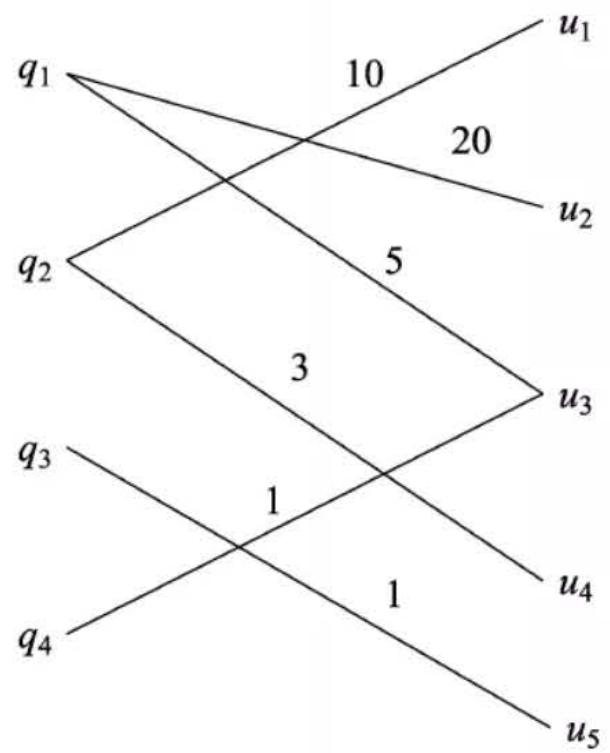  
图15.2 搜索点击数据例

以由矩阵表，试对该矩阵进奇异值分解，并解释得到的三个矩阵所表的内容。

## 参考文献

[1] LEON SJ. Linear algebra with applications[M].张博，张丽静，译.Pearson,2009.

[3] CLINE A K. DHILLON I S. Computation of the singular value decomposition, Handbook of linear algebra[M]. CRC Press, 2006.

[2] STRANG G. Introduction to linear algebra[M]. 4th ed. Wellesley-Cambridge Press, 2009.

[4] 徐树.矩阵计算的理论与法[M]．北京：北京学出版社，1995.

[5] KOLDA T G, BADER B W. Tensor decompositions and applications[J]. SIAM Review, 2009, 51(3):455–500.

## 第16章 主成分分析

主成分分析（principalcomponent analysis，PCA）是种常的监督学习法，这法利正交变换把由线性相关变量表的观测数据转换为少数个由线性关变量表的数据，线性关的变量称为主成分。主成分的个数通常于原始变量的个数，所以主成分分析属于降维法。主成分分析主要于发现数据中的基本结构，即数据中变量之间的关系，是数据分析的有具，也于其他机器学习法的前处理。主成分分析属于多元统计分析的经典法，先由Pearson于1901年提出，但只是针对随机变量，1933年Hotelling推到随机变量。

本章16.1节介绍主成分分析的基本想法，叙述总体主成分分析的定义、定理与性质。16.2节介绍样本主成分分析的概念，重点叙述主成分分析的算法，包括协差矩阵的特征值分解方法和数据矩阵的奇异值分解法。

## 16.1 总体主成分分析

## 16.1.1基本想法

统计分析中，数据的变量之间可能存在相关性，以致增加了分析的难度。于是，考虑由少数不相关的变量来代替相关的变量，来表数据，并且要求能够保留数据中的部分信息。

主成分分析中，先对给定数据进规范化，使得数据每变量的平均值为0，差为1。之后对数据进正交变换，原来由线性相关变量表的数据通过正交变换变成由若个线性关的新变量表的数据。新变量是可能的正交变换中变量的差的和（信息保存）最的，差表在新变量上信息的。将新变量依次称为第主成分、第主成分等。这就是主成分分析的基本思想。通过主成分分析，可以利主成分近似地表示原始数据，这可理解为发现数据的“基本结构”；也可以把数据由少数主成分表，这可理解为对数据降维。

下给出主成分分析的直观解释。数据集合中的样本由实数空间（正交坐标系）中的点表，空间的个坐标轴表个变量，规范化处理后得到的数据分布在原点附近。对原坐标系中的数据进主成分分析等价于进坐标系旋转变换，将数据投影到新坐标系的坐标轴上；新坐标系的第一坐标轴、第坐标轴等分别表示第一主成分、第主成分等，数据在每一轴上的坐标值的平表相应变量的差；并且，这个坐标系是在所有可能的新的坐标系中，坐标轴上的差的和最的。

例如，数据由两个变量 $x _ { 1 }$ 和 $x _ { 2 }$ 表，存在于维空间中，每个点表示一个样本，如图16.1(a）所。对数据已做规范化处理，可以看出，这些数据分布在以原点为中的左下右上倾斜的椭圆之内。很明显在这个数据中的变量 $x _ { 1 }$ 和 $x _ { 2 }$ 是线性相关的，具体地，当知道其中一个变量 $x _ { 1 }$ 的取值时，对另一个变量 $x _ { 2 }$ 的预测不是完全随机的，反之亦然。

主成分分析对数据进正交变换，具体地，对原坐标系进旋转变换，并将数据在新坐标系表，如图16.1(b)所。数据在原坐标系由变量 $x _ { 1 }$ 和 $x _ { 2 }$ 表 $\overrightarrow { \vert }$ ，通过正交变换后，在新坐标系，由变量 $y _ { 1 }$ 和 $y _ { 2 }$ 表。主成分分析选择差最的向（第主成分）作为新坐标系的第一坐标轴，即 $y _ { 1 }$ 轴，在这意味着选择椭圆的长轴作为新坐标系的第坐标轴；之后选择与第坐标轴正交且差次之的向（第主成分）作为新坐标系的第坐标轴，即 $y _ { 2 }$ 轴，在这意味着选择椭圆的短轴作为新坐标系的第坐标轴。在新坐标系，数据中的变量 $y _ { 1 }$ 和 $y _ { 2 }$ 是线性无关的，当知道其中个变量 $y _ { 1 }$ 的取值时，对另一个变量 $y _ { 2 }$ 的预测是完全随机的，反之亦然。如果主成分分析只取第主成分，即新坐标系的 $y _ { 1 }$ 轴，那么等价于将数据投影在椭圆长轴上，这个主轴表示数据，将维空间的数据压缩到维空间中。

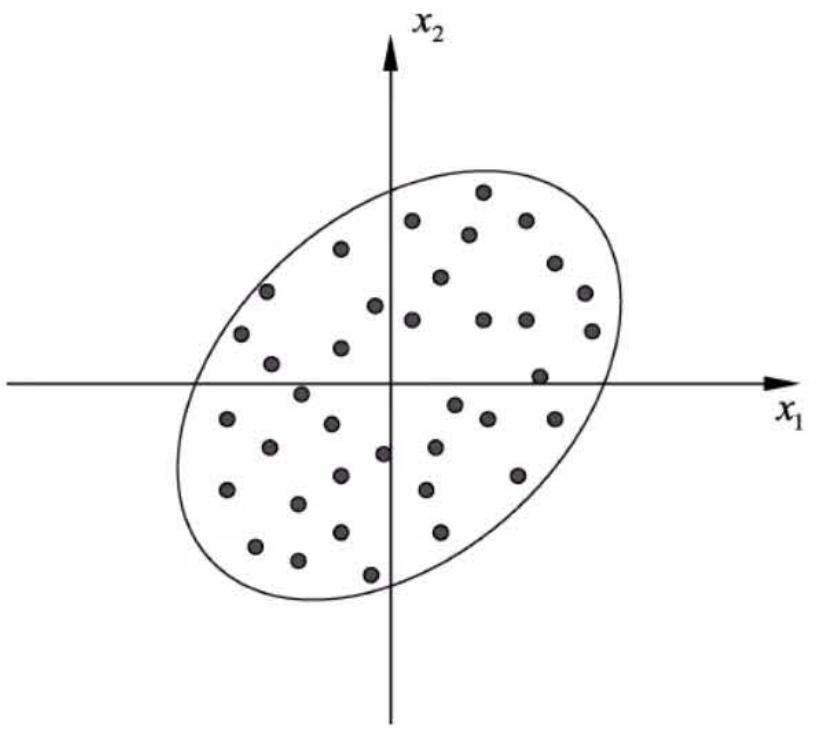

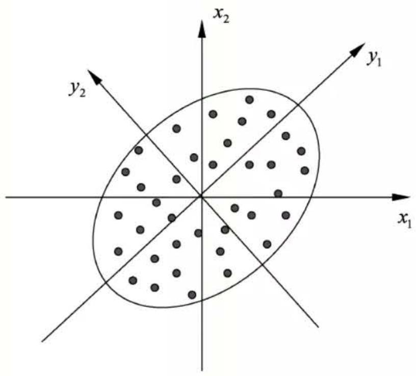  
图16.1 主成分分析的例

下再看差最的解释。假设有两个变量 $x _ { 1 }$ 和 $x _ { 2 }$ ，三个样本点A，B，C，样本分布在由 $x _ { 1 }$ 轴和 $x _ { 2 }$ 轴组成的坐标系中，如图16.2所。对坐标系进旋转变换，得到新的坐标轴 $y _ { 1 }$ ，表新的变量 $y _ { 1 }$ 。样本点A，B、C在 $y _ { 1 }$ 轴上投影，得到 $y _ { 1 }$ 轴的坐标值 $\mathrm { A ^ { \prime } , \ B ^ { \prime } , \ C ^ { \prime } } .$

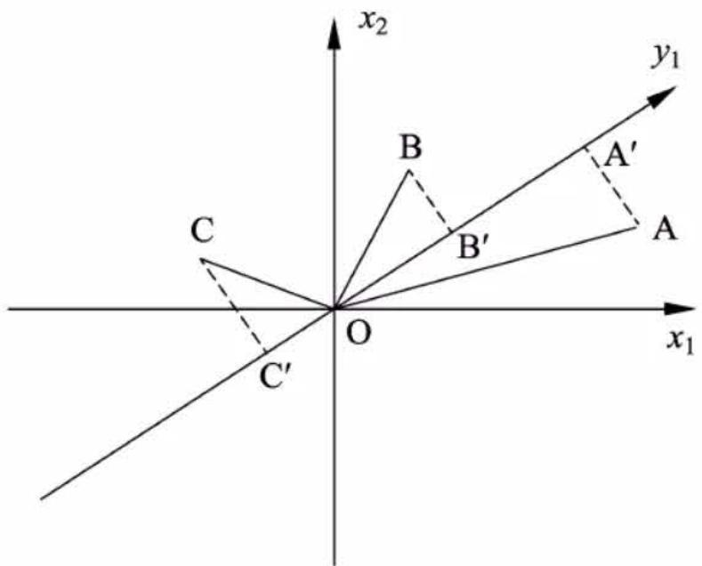  
图16.2 主成分的何解释

坐标值的平和 $\mathrm { O A ^ { \prime 2 } + O B ^ { \prime 2 } + O C ^ { \prime 2 } }$ 表示样本在变量 $y _ { 1 }$ 上的差和。主成分分析旨在选取正交变换中差最的变量，作为第主成分，也就是旋转变换中坐标值的平和最的轴。注意到旋转变换中样本点到原点的距离的平和 $\mathrm { O A ^ { 2 } + O B ^ { 2 } + O C ^ { 2 } }$ 保持不变，根据勾股定理，坐标值的平和 $\mathrm { O A ^ { \prime 2 } + O B ^ { \prime 2 } + O C ^ { \prime 2 } }$ 最大等价于样本点到 $y _ { 1 }$ 轴的距离的平方和$\mathrm { A A ^ { \prime 2 } + B B ^ { \prime 2 } + C C ^ { \prime 2 } }$ 最。所以，等价地，主成分分析在旋转变换中选取离样本点的距离平和最的轴作为第主成分。第主成分等的选取在保证与已选坐标轴正交的条件下类似地进行。

在数据总体（population）上进的主成分分析称为总体主成分分析，在有限样本上进的主成分分析称为样本主成分分析，前者是后者的基础。以下分别予以介绍。

## 16.1.2 定义和导出

假设 $\pmb { x } = ( x _ { 1 } , x _ { 2 } , \cdots , x _ { m } ) ^ { \mathrm { T } }$ 是m维随机变量，其均值向量是 $\pmb { \mu } \mathrm { : }$

$$
\pmb { \mu } = E ( \pmb { x } ) = ( \mu _ { 1 } , \mu _ { 2 } , \cdots , \mu _ { m } ) ^ { \mathrm { T } }
$$

协方差矩阵是 $\pmb { \Sigma }$

$$
\pmb { \Sigma } = \mathrm { c o v } ( \pmb { x } , \pmb { x } ) = E [ ( \pmb { x } - \pmb { \mu } ) ( \pmb { x } - \pmb { \mu } ) ^ { \mathrm { T } } ]
$$

考虑由m维随机变量x到m维随机变量 $\pmb { y } = ( y _ { 1 } , y _ { 2 } , \cdots , y _ { m } ) ^ { \mathrm { T } }$ 的线性变换：

$$
y _ { i } = \alpha _ { i } ^ { \mathrm { T } } x = \alpha _ { 1 i } x _ { 1 } + \alpha _ { 2 i } x _ { 2 } + \cdot \cdot \cdot + \alpha _ { m i } x _ { m }\tag{16.1}
$$

其中， ${ \pmb { \alpha } } _ { i } ^ { \mathrm { T } } = ( \alpha _ { 1 i } , \alpha _ { 2 i } , \cdots , \alpha _ { m i } ) , i = 1 , 2 , \cdots , m { \circ }$

由随机变量的性质可知：

$$
E ( y _ { i } ) = \alpha _ { i } ^ { \mathrm { T } } \mu , \quad i = 1 , 2 , \cdots , m\tag{16.2}
$$

$$
\begin{array} { r } { \mathrm { v a r } ( y _ { i } ) = \alpha _ { i } ^ { \mathrm { T } } \Sigma \alpha _ { i } , \quad i = 1 , 2 , \cdots , m } \end{array}\tag{16.3}
$$

$$
\mathrm { c o v } ( y _ { i } , y _ { j } ) = \alpha _ { i } ^ { \mathrm { T } } \Sigma \alpha _ { j } , \quad i = 1 , 2 , \cdots , m ; \quad j = 1 , 2 , \cdots , m\tag{16.4}
$$

下给出总体主成分的定义。

定义16.1（总体主成分） 给定个如式(16.1)所示的线性变换，如果它们满足下列条件:

(1)系数向量 $\alpha _ { i } ^ { \mathrm { T } }$ 是单位向量，即 ${ \alpha } _ { i } ^ { \mathrm { T } } { \alpha } _ { i } = 1 , \ i = 1 , 2 , \cdots , m ;$

(2)变量 $y _ { i }$ 与 $y _ { j }$ 互不相关，即 $\operatorname { c o v } ( y _ { i } , y _ { j } ) = 0 ( i \neq j )$

(3)变量 $y _ { 1 }$ 是x的所有线性变换中方差最大的； $y _ { 2 }$ 是与 $y _ { 1 }$ 不相关的x的所有线性变换中方差最大的；一般地， $y _ { i }$ 是与 $y _ { 1 } , y _ { 2 } , \cdot \cdot \cdot , y _ { i - 1 } ~ ( i = 1 , 2 , \cdot \cdot \cdot , m )$ 都不相关的 $_ { \pmb { x } }$ 的所有线性变换中方差最大的，这时分别称 $y _ { 1 } , y _ { 2 } , \cdots , y _ { m }$ 为x的第一主成分、第二主成分、…..第m主成分。

定义中的条件(1）表明线性变换是正交变换， $\alpha _ { 1 } , \alpha _ { 2 } , \cdots , \alpha _ { m }$ 是其一组标准正交基：

$$
\alpha _ { i } ^ { \mathrm { T } } \alpha _ { j } = \left\{ \begin{array} { l l } { 1 , } & { i = j } \\ { 0 , } & { i \neq j } \end{array} \right.
$$

条件（2）和条件（3）给出了个求主成分的法：第步，在x的所有线性变换

$$
\alpha _ { 1 } ^ { \mathrm { T } } x = \sum _ { i = 1 } ^ { m } \alpha _ { i 1 } x _ { i }
$$

中，在 $\alpha _ { 1 } ^ { \mathrm { T } } \alpha _ { 1 } = 1$ 的条件下，求差最的，得到x的第主成分；第步，在与 $\alpha _ { 1 } ^ { \mathrm { T } } x$ 不相关的x的所有线性变换

$$
\alpha _ { 2 } ^ { \mathrm { T } } x = \sum _ { i = 1 } ^ { m } \alpha _ { i 2 } x _ { i }
$$

中，在 ${ \alpha _ { 2 } ^ { \mathrm { T } } } \alpha _ { 2 } \ = \ 1$ 的条件下，求差最大的，得到x的第主成分；第k步，在与$\alpha _ { 1 } ^ { \mathrm { T } } x , \alpha _ { 2 } ^ { \mathrm { T } } x , \cdot \cdot \cdot , \alpha _ { k - 1 } ^ { \mathrm { T } } x$ 不相关的x的所有线性变换

$$
{ \alpha } _ { k } ^ { \mathrm { T } } { \boldsymbol { x } } = \sum _ { i = 1 } ^ { m } { \alpha } _ { i k } x _ { i }
$$

中，在 $\alpha _ { k } ^ { \mathrm { T } } \alpha _ { k } = 1$ 的条件下，求差最大的，得到a的第k主成分；如此继续下去，直到得到x的第m主成分。

## 16.1.3主要性质

先叙述个关于总体主成分的定理。这定理阐述了总体主成分与协差矩阵的特征值和特征向量的关系，同时给出了个求主成分的法。

定理16.1 设x是m维随机变量，∑是x的协方差矩阵，∑的特征值分别是$\lambda _ { 1 } \geqslant \lambda _ { 2 } \geqslant \dots \geqslant \lambda _ { m } \geqslant 0$ ，特征值对应的单位特征向量分别是 $\alpha _ { 1 } , \alpha _ { 2 } , \cdots , \alpha _ { m }$ ，则x的第k主成分是

$$
y _ { k } = \alpha _ { k } ^ { \operatorname { T } } x = \alpha _ { 1 k } x _ { 1 } + \alpha _ { 2 k } x _ { 2 } + \cdot \cdot \cdot + \alpha _ { m k } x _ { m } , \quad k = 1 , 2 , \cdots , m\tag{16.5}
$$

x的第k主成分的方差是

$$
\mathrm { v a r } ( y _ { k } ) = \alpha _ { k } ^ { \mathrm { T } } \Sigma \alpha _ { k } = \lambda _ { k } , \quad k = 1 , 2 , \cdots , m\tag{16.6}
$$

即协方差矩阵∑的第k个特征值。①

证明 采拉格朗乘法求出主成分。

先求x的第主成分 $y _ { 1 } = \alpha _ { 1 } ^ { \mathrm { T } } x$ ，即求系数向量 $\alpha _ { 1 }$ 。由定义16.1知，第主成分的 $\alpha _ { 1 }$ 是在 $\alpha _ { 1 } ^ { \mathrm { T } } \alpha _ { 1 } = 1$ 条件下x的所有线性变换中使差

$$
\mathrm { v a r } ( \alpha _ { 1 } ^ { \mathrm { T } } \pmb { x } ) = \alpha _ { 1 } ^ { \mathrm { T } } \pmb { \Sigma } \alpha _ { 1 }
$$

达到最大的。

求第主成分就是求解约束最优化问题：

$$
\operatorname* { m a x } _ { \alpha _ { 1 } } \quad \alpha _ { 1 } ^ { \mathrm { T } } \Sigma \alpha _ { 1 }\tag{16.7}
$$

$$
\begin{array} { r l } { \mathrm { s . t . } } & { { } \alpha _ { 1 } ^ { \mathrm { T } } \alpha _ { 1 } = 1 } \end{array}
$$

定义拉格朗函数

$$
\alpha _ { 1 } ^ { \mathrm { T } } \Sigma \alpha _ { 1 } - \lambda ( \alpha _ { 1 } ^ { \mathrm { T } } \alpha _ { 1 } - 1 )
$$

其中，入是拉格朗乘。将拉格朗函数对 $\alpha _ { 1 }$ 求导，并令其为0，得：

$$
\Sigma \alpha _ { 1 } - \lambda \alpha _ { 1 } = 0
$$

因此，入是∑的特征值， $\alpha _ { 1 }$ 是对应的单位特征向量。于是，目标函数为

$$
\alpha _ { 1 } ^ { \mathrm { T } } \Sigma \alpha _ { 1 } = \alpha _ { 1 } ^ { \mathrm { T } } \lambda \alpha _ { 1 } = \lambda \alpha _ { 1 } ^ { \mathrm { T } } \alpha _ { 1 } = \lambda
$$

假设 $\alpha _ { 1 }$ 是的最大特征值 $\lambda _ { 1 }$ 对应的单位特征向量，显然 $\alpha _ { 1 }$ 与 $\lambda _ { 1 }$ 是最优化问题的解 $\textcircled{1}$ 。所以， $\alpha _ { 1 } ^ { \mathrm { T } } x$ 构成第主成分，其差等于协差矩阵的最特征值：

$$
\mathrm { v a r } ( \pmb { \alpha } _ { 1 } ^ { \mathrm { T } } \pmb { x } ) = \pmb { \alpha } _ { 1 } ^ { \mathrm { T } } \pmb { \Sigma } \pmb { \alpha } _ { 1 } = \lambda _ { 1 }\tag{16.8}
$$

接着求a的第二主成分 $y _ { 2 } = \alpha _ { 2 } ^ { \mathrm { T } } x$ 。第主成分的 $\alpha _ { 2 }$ 是在 ${ \alpha } _ { 2 } ^ { \mathrm { T } } { \alpha } _ { 2 } = 1$ 且 $\alpha _ { 2 } ^ { \mathrm { T } } x$ 与 $\alpha _ { 1 } ^ { \mathrm { T } } x$ 不相关的条件下x的所有线性变换中使差

$$
\mathrm { v a r } ( \alpha _ { 2 } ^ { \mathrm { T } } x ) = \alpha _ { 2 } ^ { \mathrm { T } } \Sigma \alpha _ { 2 }
$$

达到最大的。

求第主成分需要求解约束最优化问题：

$$
\begin{array} { r l } { \underset { \alpha _ { 2 } } { \operatorname* { m a x } } } & { \alpha _ { 2 } ^ { \mathrm { T } } \Sigma \alpha _ { 2 } } \\ & { \mathrm { s . t . } \quad \alpha _ { 1 } ^ { \mathrm { T } } \Sigma \alpha _ { 2 } = 0 , \qquad \alpha _ { 2 } ^ { \mathrm { T } } \Sigma \alpha _ { 1 } = 0 } \\ & { } \\ & { \alpha _ { 2 } ^ { \mathrm { T } } \alpha _ { 2 } = 1 } \end{array}\tag{16.9}
$$

注意到

$$
\alpha _ { 1 } ^ { \mathrm { T } } \Sigma \alpha _ { 2 } = \alpha _ { 2 } ^ { \mathrm { T } } \Sigma \alpha _ { 1 } = \alpha _ { 2 } ^ { \mathrm { T } } \lambda _ { 1 } \alpha _ { 1 } = \lambda _ { 1 } \alpha _ { 2 } ^ { \mathrm { T } } \alpha _ { 1 } = \lambda _ { 1 } \alpha _ { 1 } ^ { \mathrm { T } } \alpha _ { 2 }
$$

以及

$$
\alpha _ { 1 } ^ { \mathrm { T } } \alpha _ { 2 } = 0 , \qquad \alpha _ { 2 } ^ { \mathrm { T } } \alpha _ { 1 } = 0
$$

定义拉格朗日函数

$$
\alpha _ { 2 } ^ { \mathrm { T } } \Sigma \alpha _ { 2 } - \lambda ( \alpha _ { 2 } ^ { \mathrm { T } } \alpha _ { 2 } - 1 ) - \phi \alpha _ { 2 } ^ { \mathrm { T } } \alpha _ { 1 }
$$

其中，入， $\phi$ 是拉格朗乘子。对 $\alpha _ { 2 }$ 求导，并令其为0，得：

$$
2 \Sigma \alpha _ { 2 } - 2 \lambda \alpha _ { 2 } - \phi \alpha _ { 1 } = 0\tag{16.10}
$$

将方程左乘以 $\alpha _ { 1 } ^ { \mathrm { T } }$ 有

$$
2 \alpha _ { 1 } ^ { \mathrm { T } } \Sigma \alpha _ { 2 } - 2 \lambda \alpha _ { 1 } ^ { \mathrm { T } } \alpha _ { 2 } - \phi \alpha _ { 1 } ^ { \mathrm { T } } \alpha _ { 1 } = 0
$$

此式前两项为0，且 $\alpha _ { 1 } ^ { \mathrm { T } } \alpha _ { 1 } = 1$ ，推导出 $\phi = 0$ ，因此式(16.10)变为

$$
\Sigma \alpha _ { 2 } - \lambda \alpha _ { 2 } = 0
$$

由此，λ是∑的特征值， $\alpha _ { 2 }$ 是对应的单位特征向量。于是，标函数为

$$
\alpha _ { 2 } ^ { \mathrm { T } } \Sigma \alpha _ { 2 } = \alpha _ { 2 } ^ { \mathrm { T } } \lambda \alpha _ { 2 } = \lambda \alpha _ { 2 } ^ { \mathrm { T } } \alpha _ { 2 } = \lambda
$$

假设 $\alpha _ { 2 }$ 是∑的第二大特征值 $\lambda _ { 2 }$ 对应的单位特征向量，显然 $\alpha _ { 2 }$ 与 $\lambda _ { 2 }$ 是以上最优化问题的解 $\textcircled{1}$ 。于是 $\alpha _ { 2 } ^ { \mathrm { T } } x$ 构成第主成分，其差等于协差矩阵的第大特征值：

$$
\mathrm { v a r } ( \alpha _ { 2 } ^ { \mathrm { T } } { \pmb x } ) = \alpha _ { 2 } ^ { \mathrm { T } } \Sigma \alpha _ { 2 } = \lambda _ { 2 }\tag{16.11}
$$

般地，x的第k主成分是 $\alpha _ { k } ^ { \mathrm { T } } x$ ，并且 $\mathrm { v a r } ( \alpha _ { k } ^ { \mathrm { T } } \pmb { x } ) = \lambda _ { k }$ ,这里 $\lambda _ { k }$ 是∑的第k个特征值并且 $\alpha _ { k }$ 是对应的单位特征向量。可以从第k1个主成分出发递推证明第k个主成分的情况，这里省去。

按照上述法求得第、第直到第m主成分，其系数向量 $\alpha _ { 1 } , \alpha _ { 2 } , \ldots , \alpha _ { m }$ 分别是的第个、第个直到第m个单位特征向量， $\lambda _ { 1 } , \lambda _ { 2 } , \cdots , \lambda _ { m }$ 分别是对应的特征值。并且，第k主成分的差等于的第k个特征值：

$$
\operatorname { v a r } ( \alpha _ { k } ^ { \mathrm { T } } x ) = \alpha _ { k } ^ { \mathrm { T } } \Sigma \alpha _ { k } = \lambda _ { k } , \quad k = 1 , 2 , \cdots , m\tag{16.12}
$$

定理证毕。

由定理16.1得到下述推论。

推论16.1 m维随机变量 $\pmb { y } = ( y _ { 1 } , y _ { 2 } , \cdots , y _ { m } ) ^ { \mathrm { T } }$ 的分量依次是x的第一主成分到第m主成分的充要条件是：

(1) $\begin{array} { r } { \boldsymbol { y } = \boldsymbol { A } ^ { \mathrm { T } } \boldsymbol { x } } \end{array}$ ，A为正交矩阵：

$$
\begin{array} { r } { A = \left[ \begin{array} { c c c c } { \alpha _ { 1 1 } } & { \alpha _ { 1 2 } } & { \cdots } & { \alpha _ { 1 m } } \\ { \alpha _ { 2 1 } } & { \alpha _ { 2 2 } } & { \cdots } & { \alpha _ { 2 m } } \\ { \vdots } & { \vdots } & & { \vdots } \\ { \alpha _ { m 1 } } & { \alpha _ { m 2 } } & { \cdots } & { \alpha _ { m m } } \end{array} \right] } \end{array}
$$

(2)y的协方差矩阵为对角矩阵：

$$
\begin{array} { l } { \mathrm { c o v } ( { \pmb y } ) = \mathrm { d i a g } ( \lambda _ { 1 } , \lambda _ { 2 } , \dots , \lambda _ { m } ) } \\ { ~ } \\ { \lambda _ { 1 } \geqslant \lambda _ { 2 } \geqslant \dots \geqslant \lambda _ { m } } \end{array}
$$

其中， $\lambda _ { k }$ 是的第k个特征值， $\alpha _ { k }$ 是对应的单位特征向量， $k = 1 , 2 , \cdots , m$ 0

以上证明中， $\lambda _ { k }$ 是的第k个特征值， $\alpha _ { k }$ 是对应的单位特征向量，即

$$
\Sigma \alpha _ { k } = \lambda _ { k } \alpha _ { k } , \quad k = 1 , 2 , \cdots , m\tag{16.13}
$$

用矩阵表示即为

$$
\Sigma A = A A\tag{16.14}
$$

这里 $A = [ \alpha _ { i j } ] _ { m \times m }$ ，A是对矩阵，其第k个对元素是 $\lambda _ { k }$ 。因为A是正交矩阵，即

$A ^ { \mathrm { T } } A = A A ^ { \mathrm { T } } = I$ ，由式(16.14)得到两个公式：

$$
A ^ { \mathrm { T } } \Sigma A = A\tag{16.15}
$$

和

$$
\pmb { \Sigma } = \pmb { A } \pmb { A } \pmb { A } ^ { \mathrm { T } }\tag{16.16}
$$

下面叙述总体主成分的性质：

（1）总体主成分y的协差矩阵是对矩阵：

$$
\operatorname { c o v } ( \pmb { y } ) = \pmb { \Lambda } = \mathrm { d i a g } ( \lambda _ { 1 } , \lambda _ { 2 } , \cdots , \lambda _ { m } )\tag{16.17}
$$

(2）总体主成分y的差之和等于随机变量x的差之和，即

$$
\sum _ { i = 1 } ^ { m } \lambda _ { i } = \sum _ { i = 1 } ^ { m } \sigma _ { i i }\tag{16.18}
$$

其中， $\sigma _ { i i }$ 是随机变量 $x _ { i }$ 的差，即协差矩阵的对元素。事实上，利式(16.16)及矩阵的迹（trace）的性质，可知：

$$
\begin{array} { l } { \displaystyle \sum _ { i = 1 } ^ { m } \mathrm { v a r } ( x _ { i } ) = \mathrm { t r } ( \Sigma ^ { \mathrm { T } } ) = \mathrm { t r } ( A A A ^ { \mathrm { T } } ) = \mathrm { t r } ( A ^ { \mathrm { T } } A A ) } \\ { = \displaystyle \mathrm { t r } ( A ) = \sum _ { i = 1 } ^ { m } \lambda _ { i } = \sum _ { i = 1 } ^ { m } \mathrm { v a r } ( y _ { i } ) } \end{array}\tag{16.19}
$$

(3)第k个主成分 $y _ { k }$ 与变量 $x _ { i }$ 的相关系数 $\rho ( y _ { k } , x _ { i } )$ 称为因子负荷量（factor loading），它表第k个主成分 $y _ { k }$ 与变量 $x _ { i }$ 的相关关系。计算公式是

$$
\rho ( y _ { k } , x _ { i } ) = \frac { \sqrt { \lambda _ { k } } \alpha _ { i k } } { \sqrt { \sigma _ { i i } } } , \quad k , i = 1 , 2 , \cdots , m\tag{16.20}
$$

因为

$$
\rho ( y _ { k } , x _ { i } ) = { \frac { \operatorname { c o v } ( y _ { k } , x _ { i } ) } { \sqrt { \operatorname { v a r } ( y _ { k } ) \operatorname { v a r } ( x _ { i } ) } } } = { \frac { \operatorname { c o v } ( \alpha _ { k } ^ { \mathrm { T } } x , e _ { i } ^ { \mathrm { T } } x ) } { \sqrt { \lambda _ { k } } { \sqrt { \sigma _ { i i } } } } }
$$

其中， $e _ { i }$ 为基本单位向量，其第个分量为1，其余为0。再由协差的性质

$$
\operatorname { c o v } ( \alpha _ { k } ^ { \mathrm { T } } x , e _ { i } ^ { \mathrm { T } } x ) = \alpha _ { k } ^ { \mathrm { T } } \Sigma e _ { i } = e _ { i } ^ { \mathrm { T } } \Sigma \alpha _ { k } = \lambda _ { k } e _ { i } ^ { \mathrm { T } } \alpha _ { k } = \lambda _ { k } \alpha _ { i k }
$$

故得式(16.20)。

(4)第k个主成分 $y _ { k }$ 与m个变量的因子负荷量满

$$
\sum _ { i = 1 } ^ { m } \sigma _ { i i } \rho ^ { 2 } ( y _ { k } , x _ { i } ) = \lambda _ { k }\tag{16.21}
$$

由式(16.20)有

$$
\sum _ { i = 1 } ^ { m } \sigma _ { i i } \rho ^ { 2 } ( y _ { k } , x _ { i } ) = \sum _ { i = 1 } ^ { m } \lambda _ { k } \alpha _ { i k } ^ { 2 } = \lambda _ { k } \alpha _ { k } ^ { \mathrm { T } } \alpha _ { k } = \lambda _ { k }
$$

(5）m个主成分与第i个变量 $x _ { i }$ 的因子负荷量满足

$$
\sum _ { k = 1 } ^ { m } \rho ^ { 2 } ( y _ { k } , x _ { i } ) = 1\tag{16.22}
$$

由于 $y _ { 1 } , y _ { 2 } , \cdots , y _ { m }$ 互不相关，故

$$
\rho ^ { 2 } ( x _ { i } , ( y _ { 1 } , y _ { 2 } , \cdots , y _ { m } ) ) = \sum _ { k = 1 } ^ { m } \rho ^ { 2 } ( y _ { k } , x _ { i } )
$$

又因 $x _ { i }$ 可以表示为 $y _ { 1 } , y _ { 2 } , \cdots , y _ { m }$ 的线性组合，所以 $x _ { i }$ 与 $y _ { 1 } , y _ { 2 } , \cdots , y _ { m }$ 的相关系数的平为1,即

$$
\rho ^ { 2 } ( x _ { i } , ( y _ { 1 } , y _ { 2 } , \cdot \cdot \cdot , y _ { m } ) ) = 1
$$

故得式(16.22)。

## 16.1.4 主成分的个数

主成分分析的主要的是降维，所以般选择k $( k \ll m )$ 个主成分（线性关变量）来代替m个原有变量（线性相关变量），使问题得以简化，并能保留原有变量的部分信息。这所说的信息是指原有变量的差。为此，先给出个定理，说明选择k个主成分是最优选择。

定理16.2 对任意正整数q $1 \leqslant q \leqslant m$ ，考虑正交线性变换

$$
\boldsymbol { y } = B ^ { \mathrm { T } } \boldsymbol { x }\tag{16.23}
$$

其中， $\textbf {  { y } }$ 是q维向量， $B ^ { \mathrm { T } }$ 是 $q \times m$ 矩阵，令y的协方差矩阵为

$$
\Sigma _ { y } = B ^ { \mathrm { T } } \Sigma B\tag{16.24}
$$

则 $\Sigma _ { y }$ 的迹 $\operatorname { t r } ( \Sigma _ { y } )$ 在 $B = A _ { q }$ 时取得最大值，其中矩阵 $A _ { q }$ 由正交矩阵A的前q列组成。

证明令 $\beta _ { k }$ 是B的第k列，由于正交矩阵A的列构成m维空间的基，所以 $\beta _ { k }$ 可以由A的列表示，即

$$
\beta _ { k } = \sum _ { j = 1 } ^ { m } c _ { j k } \alpha _ { j } , \quad k = 1 , 2 , \cdots , q
$$

等价地，

$$
B = A C\tag{16.25}
$$

其中，C是 $m \times q$ 矩阵，其第j第k列元素为 $c _ { j k }$ 。

首先，

$$
B ^ { \mathrm { T } } \Sigma B = C ^ { \mathrm { T } } A ^ { \mathrm { T } } \Sigma A C = C ^ { \mathrm { T } } A C = \sum _ { j = 1 } ^ { m } \lambda _ { j } c _ { j } c _ { j } ^ { \mathrm { T } }
$$

其中， $c _ { j } ^ { \mathrm { T } }$ 是C的第j行。因此

$$
\begin{array} { r l } { \displaystyle \mathrm { t r } ( B ^ { \boldsymbol { \mathsf { T } } } \Sigma B ) = \sum _ { j = 1 } ^ { m } \lambda _ { j } \mathrm { t r } ( c _ { j } \mathbf { c } _ { j } ^ { \mathsf { T } } ) } & { } \\ & { = \displaystyle \sum _ { j = 1 } ^ { m } \lambda _ { j } \mathrm { t r } ( c _ { j } ^ { \mathsf { T } } c _ { j } ) } \\ & { = \displaystyle \sum _ { j = 1 } ^ { m } \lambda _ { j } c _ { j } ^ { \mathsf { T } } c _ { j } } \\ & { = \displaystyle \sum _ { j = 1 } ^ { m } \lambda _ { j } c _ { j } ^ { \mathsf { T } } c _ { j } } \\ & { = \displaystyle \sum _ { j = 1 } ^ { m } \sum _ { k = 1 } ^ { q } \lambda _ { j } c _ { j k } ^ { 2 } } \end{array}\tag{16.26}
$$

其次，由式(16.25)及A的正交性知：

$$
C = A ^ { \mathrm { T } } B
$$

由于A是正交的，B的列是正交的，所以

$$
C ^ { \mathrm { { T } } } C = B ^ { \mathrm { { T } } } A A ^ { \mathrm { { T } } } B = B ^ { \mathrm { { T } } } B = I _ { q }
$$

即C的列也是正交的。于是

$$
\begin{array} { l } { \displaystyle \mathrm { t r } ( C ^ { \mathrm { T } } C ) = \mathrm { t r } ( I _ { q } ) } \\ { \displaystyle \sum _ { j = 1 } ^ { m } \sum _ { k = 1 } ^ { q } c _ { j k } ^ { 2 } = q } \end{array}\tag{16.27}
$$

这样，矩阵C可以认为是某个m阶正交矩阵D的前 $q$ 列。正交矩阵D的也正交，所以满足

$$
d _ { j } ^ { \mathrm { T } } d _ { j } = 1 , \quad j = 1 , 2 , \cdots , m
$$

其中， $d _ { j } ^ { \mathrm { T } }$ 是D的第j。由于矩阵D的包括矩阵C的的前q个元素，所以

$$
\boldsymbol { c } _ { j } ^ { \mathrm { T } } \boldsymbol { c } _ { j } \leqslant 1 , \quad j = 1 , 2 , \cdots , m
$$

即

$$
\sum _ { k = 1 } ^ { q } c _ { j k } ^ { 2 } \leqslant 1 , \quad j = 1 , 2 , \cdots , m\tag{16.28}
$$

注意到在式(16.26)中 $\sum _ { k = 1 } ^ { q } c _ { j k } ^ { 2 }$ 是 $\lambda _ { j }$ 的系数，由式(16.27)知这些系数之和是 $q ,$ ，且由式(16.28)知这些系数于等于1。因为 $\lambda _ { 1 } \geqslant \lambda _ { 2 } \geqslant \dots \geqslant \lambda _ { q } \geqslant \dots \geqslant \lambda _ { m }$ ，显然，当能找到 $c _ { j k }$ 使得

$$
\sum _ { k = 1 } ^ { q } c _ { j k } ^ { 2 } = \left\{ \begin{array} { l l } { 1 , } & { j = 1 , 2 , \cdots , q } \\ { 0 , } & { j = q + 1 , q + 2 , \cdots , m } \end{array} \right.\tag{16.29}
$$

时， $\sum _ { j = 1 } ^ { m } \left( \sum _ { k = 1 } ^ { q } c _ { j k } ^ { 2 } \right) \lambda _ { j }$ 最大。而当 $B = A _ { q }$ 时,有

$$
c _ { j k } = { \left\{ \begin{array} { l l } { 1 , } & { 1 \leqslant j = k \leqslant q } \\ { 0 , } & { \sharp _ { \cdot } / { \mathsf { t } } \boldsymbol { \Psi } } \end{array} \right. }
$$

满式(16.29)。所以，当 $B = A _ { q }$ 时， $\operatorname { t r } ( \Sigma _ { y } )$ 达到最大值。

定理16.2表明，当x的线性变换y在 $B = A _ { q }$ 时，其协差矩阵 $\Sigma _ { y }$ 的迹 $\operatorname { t r } ( \Sigma _ { y } )$ 取得最大值，这就是说，当取A的前 $q$ 列、取x的前 $q$ 个主成分时，能够最限度地保留原有变量方差的信息。

定理16.3 考虑正交变换

$$
{ \boldsymbol { y } } = B ^ { \mathrm { T } } { \boldsymbol { x } }
$$

这里 $B ^ { \mathrm { T } }$ 是 $p \times m$ 矩阵，A和 $\Sigma _ { y }$ 的定义与定理16.2相同，则 $\operatorname { t r } ( \Sigma _ { y } )$ 在 $B = A _ { p }$ 时取得最小值，其中矩阵 $A _ { p }$ 由A的后 $p$ 列组成。

证明类似定理16.2，有兴趣的读者可以自行证明。定理16.3可以理解为，当舍弃A的后$p$ 列，即舍弃变量x的后p个主成分时，原有变量的差的信息损失最少。

以上两个定理可以作为选择k个主成分的理论依据。具体选择k的法通常利差贡献率。

定义16.2 第k主成分 $y _ { k }$ 的方差贡献率定义为 $y _ { k }$ 的方差与所有方差之和的比，记作 $\eta _ { k } \mathrm { . }$

$$
\eta _ { k } = \frac { \lambda _ { k } } { \displaystyle \sum _ { i = 1 } ^ { m } \lambda _ { i } }\tag{16.30}
$$

k个主成分 $y _ { 1 } , y _ { 2 } , \cdots , y _ { k }$ 的累计方差贡献率定义为k个方差之和与所有方差之和的比：

$$
\sum _ { i = 1 } ^ { k } \eta _ { i } = \frac { \displaystyle \sum _ { i = 1 } ^ { k } \lambda _ { i } } { \displaystyle \sum _ { i = 1 } ^ { m } \lambda _ { i } }\tag{16.31}
$$

通常取k使得累计差贡献率达到规定的百分以上，如 $70 \% \sim 8 0 \%$ 以上。累计差贡献率反映了主成分保留信息的例，但它不能反映对某个原有变量 $x _ { i }$ 保留信息的比例，这时通常利k个主成分 $y _ { 1 } , y _ { 2 } , \cdots , y _ { k }$ 对原有变量 $x _ { i }$ 的贡献率。

定义16.3 k个主成分 $y _ { 1 } , y _ { 2 } , \cdots , y _ { k }$ 对原有变量 $x _ { i }$ 的贡献率定义为 $x _ { i }$ 与 $( y _ { 1 } , y _ { 2 } , \cdots , y _ { k } )$ 的相关系数的平方，记作 $\nu _ { i }$

$$
\nu _ { i } = \rho ^ { 2 } ( x _ { i } , ( y _ { 1 } , y _ { 2 } , \cdot \cdot \cdot , y _ { k } ) )
$$

计算公式如下：

$$
\nu _ { i } = \rho ^ { 2 } ( x _ { i } , ( y _ { 1 } , y _ { 2 } , \cdots , y _ { k } ) ) = \sum _ { j = 1 } ^ { k } \rho ^ { 2 } ( x _ { i } , y _ { j } ) = \sum _ { j = 1 } ^ { k } \frac { \lambda _ { j } \alpha _ { i j } ^ { 2 } } { \sigma _ { i i } }\tag{16.32}
$$

## 16.1.5 规范化变量的总体主成分

在实际问题中，不同变量可能有不同的量纲，直接求主成分有时会产不合理的结果。为了消除这个影响，常常对各个随机变量实施规范化，使其均值为0，差为1。

设 $\pmb { x } = ( x _ { 1 } , x _ { 2 } , \cdots , x _ { m } ) ^ { \mathrm { T } }$ 为m维随机变量， $x _ { i }$ 为第i个随机变量， $i = 1 , 2 , \cdots , m$ 令

$$
x _ { i } ^ { * } = { \frac { x _ { i } - E ( x _ { i } ) } { \sqrt { \operatorname { v a r } ( x _ { i } ) } } } , \quad i = 1 , 2 , \cdots , m\tag{16.33}
$$

其中， $E ( x _ { i } ) , \operatorname { v a r } ( x _ { i } )$ 分别是随机变量 $x _ { i }$ 的均值和方差，这时 $\boldsymbol { x } _ { i } ^ { * }$ 就是 $x _ { i }$ 的规范化随机变量。

显然，规范化随机变量的协差矩阵就是相关矩阵 $\scriptstyle { R _ { \circ } }$ 主成分分析通常在规范化随机变量的协差矩阵即相关矩阵上进行。

对照总体主成分的性质可知，规范化随机变量的总体主成分有以下性质：

（1）规范化变量主成分的协差矩阵是

$$
\pmb { \cal A } ^ { * } = \mathrm { d i a g } ( \lambda _ { 1 } ^ { * } , \lambda _ { 2 } ^ { * } , \cdots , \lambda _ { m } ^ { * } )\tag{16.34}
$$

其中， $\lambda _ { 1 } ^ { * } \geqslant \lambda _ { 2 } ^ { * } \geqslant \dots \geqslant \lambda _ { m } ^ { * } \geqslant 0$ 为相关矩阵R的特征值。

(2）协差矩阵的特征值之和为m:

$$
\sum _ { k = 1 } ^ { m } \lambda _ { k } ^ { * } = m\tag{16.35}
$$

（3）规范化随机变量 $\boldsymbol { x } _ { i } ^ { * }$ 与主成分 $y _ { k } ^ { * }$ 的相关系数（因负荷量）为

$$
\rho ( y _ { k } ^ { * } , x _ { i } ^ { * } ) = \sqrt { \lambda _ { k } ^ { * } } e _ { i k } ^ { * } , \quad k , i = 1 , 2 , \cdots , m\tag{16.36}
$$

其中， $\pmb { e } _ { k } ^ { * } = ( e _ { 1 k } ^ { * } , e _ { 2 k } ^ { * } , \cdots , e _ { m k } ^ { * } ) ^ { \mathrm { T } }$ 为矩阵R对应于特征值 $\lambda _ { k } ^ { * }$ 的单位特征向量。

(4）所有规范化随机变量 $\boldsymbol { x } _ { i } ^ { * }$ 与主成分 $y _ { k } ^ { * }$ 的相关系数的平方和等于 $\lambda _ { k } ^ { * }$

$$
\sum _ { i = 1 } ^ { m } \rho ^ { 2 } ( y _ { k } ^ { * } , x _ { i } ^ { * } ) = \sum _ { i = 1 } ^ { m } \lambda _ { k } ^ { * } e _ { i k } ^ { * 2 } = \lambda _ { k } ^ { * } , \quad k = 1 , 2 , \cdots , m\tag{16.37}
$$

（5）规范化随机变量 $\boldsymbol { x } _ { i } ^ { * }$ 与所有主成分 $y _ { k } ^ { * }$ 的相关系数的平方和等于1：

$$
\sum _ { k = 1 } ^ { m } \rho ^ { 2 } ( y _ { k } ^ { * } , x _ { i } ^ { * } ) = \sum _ { k = 1 } ^ { m } \lambda _ { k } ^ { * } e _ { i k } ^ { * 2 } = 1 , \quad i = 1 , 2 , \cdots , m\tag{16.38}
$$

## 16.2 样本主成分分析

16.1节叙述了总体主成分分析，是定义在样本总体上的。在实际问题中，需要在观测数据上进主成分分析，这就是样本主成分分析。有了总体主成分的概念，容易理解样本主成分的概念。样本主成分也和总体主成分具有相同的性质，所以本节重点叙述样本主成分的算法。

## 16.2.1 样本主成分的定义和性质

假设对m维随机变量 $\pmb { x } = ( x _ { 1 } , x _ { 2 } , \cdots , x _ { m } ) ^ { \mathrm { T } }$ 进行n次独立观测， $x _ { 1 } , x _ { 2 } , \cdots , x _ { n }$ 表示观测样本，其中 $\pmb { x } _ { j } = ( x _ { 1 j } , x _ { 2 j } , \cdots , x _ { m j } ) ^ { \mathrm { T } }$ 表示第 $j$ 个观测样本， $\boldsymbol { x } _ { i j }$ 表示第 $j$ 个观测样本的第i个变量， $j = 1 , 2 , \cdots , n$ 。观测数据样本矩阵X表，记作

$$
X = { \left[ \begin{array} { l l l l } { x _ { 1 } } & { x _ { 2 } } & { \dots } & { x _ { n } } \end{array} \right] } = { \left[ \begin{array} { l l l l } { x _ { 1 1 } } & { x _ { 1 2 } } & { \dots } & { x _ { 1 n } } \\ { x _ { 2 1 } } & { x _ { 2 2 } } & { \dots } & { x _ { 2 n } } \\ { \vdots } & { \vdots } & & { \vdots } \\ { x _ { m 1 } } & { x _ { m 2 } } & { \dots } & { x _ { m n } } \end{array} \right] }\tag{16.39}
$$

给定样本矩阵X，可以估计样本均值以及样本协差。样本均值向量ā为

$$
{ \bar { \boldsymbol { x } } } = { \frac { 1 } { n } } \sum _ { j = 1 } ^ { n } { \boldsymbol { x } } _ { j }\tag{16.40}
$$

样本协差矩阵S为

$$
\begin{array} { l } { { \displaystyle { \cal S } = [ s _ { i j } ] _ { m \times m } } } \\ { { \displaystyle s _ { i j } = \frac { 1 } { n - 1 } \sum _ { k = 1 } ^ { n } \big ( x _ { i k } - \bar { x } _ { i } \big ) \big ( x _ { j k } - \bar { x } _ { j } \big ) , \quad i , j = 1 , 2 , \cdots , m } } \end{array}\tag{16.41}
$$

其中， $\bar { x } _ { i } = \frac { 1 } { n } \sum _ { k = 1 } ^ { n } x _ { i k }$ 为第i个变量的样本均值， ${ \bar { x } } _ { j } = { \frac { 1 } { n } } \sum _ { k = 1 } ^ { n } x _ { j k }$ 为第 $j$ 个变量的样本均值。

$$
R = [ r _ { i j } ] _ { m \times m } , \quad r _ { i j } = \frac { s _ { i j } } { \sqrt { s _ { i i } s _ { j j } } } , \quad i , j = 1 , 2 , \cdots , m\tag{16.42}
$$

定义m维向量 $\pmb { x } = ( x _ { 1 } , x _ { 2 } , \cdots , x _ { m } ) ^ { \mathrm { T } }$ 到m维向量 $\pmb { y } = ( y _ { 1 } , y _ { 2 } , \cdots , y _ { m } ) ^ { \mathrm { T } }$ 的线性变换：

$$
\boldsymbol { y } = \boldsymbol { A } ^ { \mathrm { T } } \boldsymbol { x }\tag{16.43}
$$

其中，

$$
A = { \left[ \begin{array} { l l l l } { a _ { 1 } } & { a _ { 2 } } & { \ldots } & { a _ { m } } \end{array} \right] } = { \left[ \begin{array} { l l l l } { a _ { 1 1 } } & { a _ { 1 2 } } & { \cdots } & { a _ { 1 m } } \\ { a _ { 2 1 } } & { a _ { 2 2 } } & { \cdots } & { a _ { 2 m } } \\ { \vdots } & { \vdots } & & { \vdots } \\ { a _ { m 1 } } & { a _ { m 2 } } & { \cdots } & { a _ { m m } } \end{array} \right] }
$$

$$
\pmb { a } _ { i } = ( a _ { 1 i } , a _ { 2 i } , \cdot \cdot \cdot , a _ { m i } ) ^ { \mathrm { T } } , \quad i = 1 , 2 , \cdot \cdot \cdot , m
$$

考虑式(16.43)的任意个线性变换：

$$
y _ { i } = a _ { i } ^ { \operatorname { T } } x = a _ { 1 i } x _ { 1 } + a _ { 2 i } x _ { 2 } + \cdot \cdot \cdot + a _ { m i } x _ { m } , \quad i = 1 , 2 , \cdots , m\tag{16.44}
$$

其中， $y _ { i }$ 是m维向量 $\textbf {  { y } }$ 的第i个变量，相应于容量为n的样本 $x _ { 1 } , x _ { 2 } , \cdot \cdot \cdot , x _ { n } , \ y _ { i }$ 的样本均值 $\bar { y } _ { i }$ 为

$$
{ \bar { y } } _ { i } = { \frac { 1 } { n } } \sum _ { j = 1 } ^ { n } a _ { i } ^ { \mathrm { T } } x _ { j } = a _ { i } ^ { \mathrm { T } } { \bar { x } }\tag{16.45}
$$

其中，x是随机向量x的样本均值：

$$
{ \bar { \boldsymbol { x } } } = { \frac { 1 } { n } } \sum _ { j = 1 } ^ { n } { \boldsymbol { x } } _ { j }
$$

$y _ { i }$ 的样本方差 $\mathrm { v a r } ( y _ { i } )$ 为

$$
\begin{array} { l } { { \displaystyle \mathrm { v a r } ( y _ { i } ) = \frac { 1 } { n - 1 } \sum _ { j = 1 } ^ { n } ( a _ { i } ^ { \mathrm { T } } x _ { j } - a _ { i } ^ { \mathrm { T } } \bar { x } ) ^ { 2 } } \ ~ } \\ { { \displaystyle ~ = a _ { i } ^ { \mathrm { T } } \left[ \frac { 1 } { n - 1 } \sum _ { j = 1 } ^ { n } ( x _ { j } - \bar { x } ) ( x _ { j } - \bar { x } ) ^ { \mathrm { T } } \right] a _ { i } = a _ { i } ^ { \mathrm { T } } S a _ { i } } } \end{array}\tag{16.46}
$$

对任意两个线性变换 $y _ { i } = \alpha _ { i } ^ { \mathrm { { T } } } x , y _ { k } = \alpha _ { k } ^ { \mathrm { { T } } } x$ ，相应于容量为n的样本 $x _ { 1 } , x _ { 2 } , \cdots , x _ { n }$ ,yi和 $y _ { k }$ 的样本协方差为

$$
\mathrm { c o v } ( y _ { i } , y _ { k } ) = { a } _ { i } ^ { \mathrm { T } } S { a } _ { k }\tag{16.47}
$$

现在给出样本主成分的定义。

定义16.4（样本主成分） 给定样本矩阵X。样本第一主成分 $y _ { 1 } = a _ { 1 } ^ { \mathrm { T } } x$ 是在 ${ \pmb a } _ { 1 } ^ { \mathrm { T } } { \pmb a } _ { 1 } = 1$ 条件下，使 ${ \pmb a } _ { 1 } ^ { \mathrm { T } } { \pmb x } _ { j } ( \ r _ { j } = 1 , 2 , \cdots , n )$ 的样本方差 $a _ { 1 } ^ { \mathrm { T } } S a _ { 1 }$ 最大的x的线性变换；样本第二主成分 $y _ { 2 } = a _ { 2 } ^ { \mathrm { T } } x$ 是在 $a _ { 2 } ^ { \mathrm { T } } a _ { 2 } = 1$ 和 ${ a } _ { 2 } ^ { \mathrm { T } } { x } _ { j }$ 与 ${ \pmb a } _ { 1 } ^ { \mathrm { T } } { \pmb x } _ { j } ~ ( ~ j = 1 , 2 , \cdots , n )$ 的样本协方差 $a _ { 1 } ^ { \mathrm { T } } S a _ { 2 } = 0$ 条件下，使 ${ \pmb a } _ { 2 } ^ { \mathrm { T } } { \pmb x } _ { j } ~ ( ~ j = 1 , 2 , \cdots , n )$ 的样本方差 $a _ { 2 } ^ { \mathrm { T } } S a _ { 2 }$ 最大的x的线性变换；一般地，样本第i主成分 $y _ { i } = a _ { i } ^ { \mathrm { T } } x$ 是在 $\mathbf { \nabla } a _ { i } ^ { \mathrm { T } } a _ { i } = 1$ 和 ${ \pmb a } _ { i } ^ { \mathrm { T } } { \pmb x } _ { j }$ 与 ${ \pmb a } _ { k } ^ { \mathrm { T } } { \pmb x } _ { j } \ ( \ k < i , \ j = 1 , 2 , \cdots , n )$ 的样本协方差 $\mathbf { \boldsymbol { a } } _ { k } ^ { \mathrm { T } } \mathbf { \boldsymbol { S } } \mathbf { \boldsymbol { a } } _ { i } = 0$ 条件下，使 ${ \pmb a } _ { i } ^ { \mathrm { T } } { \pmb x } _ { j } \ ( \ j = 1 , 2 , \cdots , n )$ 的样本方差 $a _ { i } ^ { \mathrm { T } } S a _ { i }$ 最大的 $_ { \pmb { x } }$ 的线性变换。

样本主成分与总体主成分具有同样的性质，这从样本主成分的定义容易看出。只要以样本协差矩阵 $_ { s }$ 代替总体协差矩阵即可。总体主成分的定理16.2及定理16.3对样本主成分依然成。样本主成分的性质不再重述。

在使样本主成分时，般假设样本数据是规范化的，即对样本矩阵作如下变换：

$$
x _ { i j } ^ { * } = \frac { x _ { i j } - \bar { x } _ { i } } { \sqrt { s _ { i i } } } , \quad i = 1 , 2 , \cdots , m , \quad j = 1 , 2 , \cdots , n\tag{16.48}
$$

其中，

$$
{ \bar { x } } _ { i } = { \frac { 1 } { n } } \sum _ { j = 1 } ^ { n } x _ { i j } , \quad i = 1 , 2 , \cdots , m
$$

$$
s _ { i i } = { \frac { 1 } { n - 1 } } \sum _ { j = 1 } ^ { n } \left( x _ { i j } - { \bar { x } } _ { i } \right) ^ { 2 } , \quad i = 1 , 2 , \cdots , m
$$

为了便，将规范化变量 $\boldsymbol { x } _ { i j } ^ { * }$ 仍记作 $\boldsymbol { x } _ { i j }$ ，规范化的样本矩阵仍记作X。这时，样本协差矩阵S就是样本相关矩阵 $\pmb { R }$ .

$$
R = { \frac { 1 } { n - 1 } } X X ^ { \mathrm { T } }\tag{16.49}
$$

样本协差矩阵S是总体协差矩阵的偏估计，样本相关矩阵R是总体相关矩阵的无偏估计， $_ { s }$ 的特征值和特征向量是的特征值和特征向量的极似然估计。关于这个问题本书不作讨论，有兴趣的读者可参阅多元统计的书籍，如献[1]。

## 16.2.2 相关矩阵的特征值分解算法

传统的主成分分析通过数据的协差矩阵或相关矩阵的特征值分解进，现在常用的法是通过数据矩阵的奇异值分解进。先叙述数据的协差矩阵或相关矩阵的特征值分解方法。

给定样本矩阵X，利数据的样本协差矩阵或者样本相关矩阵的特征值分解进主成分分析。具体步骤如下：

(1）对观测数据按式(16.48)进规范化处理，得到规范化数据矩阵，仍以X表。

（2）依据规范化数据矩阵，计算样本相关矩阵R:

$$
\pmb { R } = [ r _ { i j } ] _ { m \times m } = \frac { 1 } { n - 1 } \pmb { X } \pmb { X } ^ { \mathrm { T } }
$$

其中，

$$
r _ { i j } = { \frac { 1 } { n - 1 } } \sum _ { l = 1 } ^ { n } x _ { i l } x _ { l j } , \quad i , j = 1 , 2 , \cdots , m
$$

(3）求样本相关矩阵R的k个特征值和对应的k个单位特征向量。

求解R的特征程

$$
| R - \lambda I | = 0
$$

得R的m个特征值：

$$
\lambda _ { 1 } \geqslant \lambda _ { 2 } \geqslant \dots \geqslant \lambda _ { m }
$$

求方差贡献率 $\sum _ { i = 1 } ^ { k } \eta _ { i }$ 达到预定值的主成分个数 $k _ { \mathrm { ~ c ~ } }$

求前k个特征值对应的单位特征向量：

$$
\pmb { a } _ { i } = ( a _ { 1 i } , a _ { 2 i } , \cdot \cdot \cdot , a _ { m i } ) ^ { \mathrm { T } } , \quad i = 1 , 2 , \cdots , k
$$

(4）求k个样本主成分

以k个单位特征向量为系数进线性变换，求出k个样本主成分：

$$
y _ { i } = { \pmb a } _ { i } ^ { \mathrm { T } } { \pmb x } , \quad i = 1 , 2 , \cdots , k\tag{16.50}
$$

(5）计算k个主成分 $y _ { j }$ 与原变量 $x _ { i }$ 的相关系数 $\rho ( x _ { i } , y _ { j } )$ ，以及k个主成分对原变量 $x _ { i }$ 的贡献率 $\nu _ { i }$ 。

## (6）计算n个样本的k个主成分值

将规范化样本数据代k个主成分式(16.50)，得到n个样本的主成分值。第j个样本$\pmb { x } _ { j } = ( x _ { 1 j } , x _ { 2 j } , \cdots , x _ { m j } ) ^ { \mathrm { T } }$ 的第i主成分值是

$$
y _ { i j } = ( a _ { 1 i } , a _ { 2 i } , \cdots , a _ { m i } ) ( x _ { 1 j } , x _ { 2 j } , \cdots , x _ { m j } ) ^ { \mathrm { T } } = \sum _ { l = 1 } ^ { m } a _ { l i } x _ { l j } ,
$$

主成分分析得到的结果可以于其他机器学习法的输。如，将样本点投影到以主成分为坐标轴的空间中，然后应聚类算法就可以对样本点进聚类。

下举例说明主成分分析法。

例16.1 假设有n个学参加四门课程的考试，将学们的考试成绩看作随机变量的取值，对考试成绩数据进标准化处理，得到样本相关矩阵R，列于表16.1。

表16.1 样本相关矩阵R
<table><tr><td>课程</td><td>语文</td><td>外语</td><td>数学</td><td>物理</td></tr><tr><td>语文</td><td>1.00</td><td>0.44</td><td>0.29</td><td>0.33</td></tr><tr><td>外语</td><td>0.44</td><td>1.00</td><td>0.35</td><td>0.32</td></tr><tr><td>数学</td><td>0.29</td><td>0.35</td><td>1.00</td><td>0.60</td></tr><tr><td>物理</td><td>0.33</td><td>0.32</td><td>0.60</td><td>1.00</td></tr></table>

试对数据进行主成分分析。

解 设变量 $x _ { 1 } , x _ { 2 } , x _ { 3 } , x _ { 4 }$ 分别表语、外语、数学、物理的成绩。对样本相关矩阵进特征值分解，得到相关矩阵的特征值，并按排序：

$$
\lambda _ { 1 } = 2 . 1 7 , \quad \lambda _ { 2 } = 0 . 8 7 , \quad \lambda _ { 3 } = 0 . 5 7 , \quad \lambda _ { 4 } = 0 . 3 9
$$

这些特征值就是各主成分的差贡献率。假设要求主成分的累计差贡献率于75％，那么只需取前两个主成分即可，即k=2，因为

$$
\frac { \lambda _ { 1 } + \lambda _ { 2 } } { 4 } = 0 . 7 6
$$

求出对应于特征值 $\lambda _ { 1 } , \lambda _ { 2 }$ 的单位特征向量，列于表16.2，表中最后列为主成分的差贡献率。

表16.2 单位特征向量和主成分的方差贡献率
<table><tr><td>项目</td><td> $x _ { 1 }$ </td><td> $x _ { 2 }$ </td><td> $x _ { 3 }$ </td><td> $x _ { 4 }$ </td><td>差贡献率</td></tr><tr><td>y1</td><td>0.460</td><td>0.476</td><td>0.523</td><td>0.537</td><td>0.543</td></tr><tr><td>y2</td><td>0.574</td><td>0.486</td><td>-0.476</td><td>-0.456</td><td>0.218</td></tr></table>

由此按照式(16.50)可得第、第主成分：

$$
\begin{array} { r l } & { y _ { 1 } = 0 . 4 6 0 x _ { 1 } + 0 . 4 7 6 x _ { 2 } + 0 . 5 2 3 x _ { 3 } + 0 . 5 3 7 x _ { 4 } } \\ & { } \\ & { y _ { 2 } = 0 . 5 7 4 x _ { 1 } + 0 . 4 8 6 x _ { 2 } - 0 . 4 7 6 x _ { 3 } - 0 . 4 5 6 x _ { 4 } } \end{array}
$$

这就是主成分分析的结果。变量 $y _ { 1 }$ 和 $y _ { 2 }$ 表示第一、第二主成分。

接下来由特征值和单位特征向量求出第、第主成分的因负荷量，以及第、第主成分对变量 $x _ { i }$ 的贡献率，列于表16.3。

表16.3 主成分的因子负荷量和贡献率
<table><tr><td>项目</td><td> $x _ { 1 }$ </td><td> $x _ { 2 }$ </td><td> $x _ { 3 }$ </td><td> $x _ { 4 }$ </td></tr><tr><td>y1</td><td>0.678</td><td>0.701</td><td>0.770</td><td>0.791</td></tr><tr><td>y2</td><td>0.536</td><td>0.453</td><td>-0.444</td><td>-0.425</td></tr><tr><td>对 的贡献率  $y _ { 1 } , y _ { 2 }$   $x _ { i }$ </td><td>0.747</td><td>0.697</td><td>0.790</td><td>0.806</td></tr></table>

从表16.3中可以看出，第主成分 $y _ { 1 }$ 对应的因子负荷量 $\rho ( y _ { 1 } , x _ { i } ) , i = 1 , 2 , 3 , 4$ ，均为正数，表明各门课程成绩提都可使 $y _ { 1 }$ 提，也就是说，第主成分 $y _ { 1 }$ 反映了学生的整体成绩。还可以看出，因子负荷量的数值相近，且 $\rho ( y _ { 1 } , x _ { 4 } )$ 的数值最大，这表明物理成绩在整体成绩中占最重要位置。

第二主成分 $y _ { 2 }$ 对应的因子负荷量 $\rho ( y _ { 2 } , x _ { i } ) , i = 1 , 2 , 3 , 4$ ，有正有负，正的是语文和外语，负的是数学和物理，表明科成绩提都可使 $y _ { 2 }$ 提高，而理科成绩提高都可使 $y _ { 2 }$ 降低，也就是说，第二主成分 $y _ { 2 }$ 反映了学的科成绩与理科成绩的关系。

图16.3将原变量 $x _ { 1 } , x _ { 2 } , x _ { 3 } , x _ { 4 }$ （分别表示语、外语、数学、物理）和主成分 $y _ { 1 } , y _ { 2 }$ （分别表整体成绩、科对理科成绩）的因负荷量在平坐标系中表，从中可以看出变量之间的关系。4个原变量聚成了两类：因负荷量相近的语、外语为类，数学、物理为类，前者反映科课程成绩，后者反映理科课程成绩。

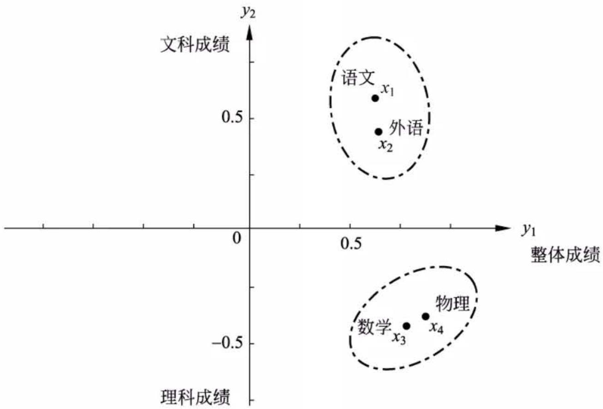  
图16.3 因负荷量的分布图

## 16.2.3 数据矩阵的奇异值分解算法

给定样本矩阵X，利数据矩阵奇异值分解进主成分分析。具体过程如下，这假设有k个主成分。

参照式(15.19)，对于 $m \times n$ 实矩阵A，假设其秩为 $r , \ 0 < k < r$ ，则可以将矩阵A进截断奇异值分解:

$$
\mathbf { \boldsymbol { A } } \approx \mathbf { \boldsymbol { U } } _ { k } \mathbf { \boldsymbol { \Sigma } } _ { k } \mathbf { \boldsymbol { V } } _ { k } ^ { \mathrm { T } }
$$

式中 $U _ { k }$ 是 $m \times k$ 矩阵， $V _ { k }$ 是 $n \times k$ 矩阵， $\Sigma _ { k }$ 是k阶对角矩阵； $U _ { k }$ , $V _ { k }$ 分别由取A的完全奇异值分解的矩阵U，V的前k列， $\Sigma _ { k }$ 由取A的完全奇异值分解的矩阵的前k个对角线元素得到。

定义一个新的 $n \times m$ 矩阵 $X ^ { \prime }$

$$
\mathbf { { X } ^ { \prime } } = { \frac { 1 } { \sqrt { n - 1 } } } { { X } ^ { \mathrm { { T } } } }\tag{16.51}
$$

$X ^ { \prime }$ 的每列均值为零。不难得知：

$$
{ \begin{array} { r l } & { X ^ { \prime \mathrm { T } } X ^ { \prime } = \left( { \frac { 1 } { \sqrt { n - 1 } } } X ^ { \mathrm { T } } \right) ^ { \mathrm { T } } \left( { \frac { 1 } { \sqrt { n - 1 } } } X ^ { \mathrm { T } } \right) } \\ & { \qquad = { \frac { 1 } { n - 1 } } X X ^ { \mathrm { T } } } \end{array} }\tag{16.52}
$$

即 $X ^ { \prime \mathrm { T } } X ^ { \prime }$ 等于X的协差矩阵 $S _ { X }$

$$
S _ { X } = X ^ { \prime \mathrm { { T } } } X ^ { \prime }\tag{16.53}
$$

主成分分析归结于求协差矩阵 $S _ { X }$ 的特征值和对应的单位特征向量，所以问题转化为求矩阵 $X ^ { \prime \mathrm { T } } X ^ { \prime }$ 的特征值和对应的单位特征向量。

假设 $X ^ { \prime }$ 的截断奇异值分解为 $X ^ { \prime } = U \Sigma V ^ { \mathrm { T } }$ ，那么V的列向量就是 $S _ { X } = X ^ { \prime \mathrm { { T } } } X ^ { \prime }$ 的单位特征向量。因此，V的列向量构成X的主成分的正交直坐标系。于是，求X主成分可以通过求 $X ^ { \prime }$ 的奇异值分解来实现。具体算法如下。

算法16.1（主成分分析算法）

输入： $m \times n$ 样本矩阵X，其每元素的均值为零。

输出： $k \times n$ 样本主成分矩阵Y。

参数：主成分个数k。

（1）构造新的 $n \times m$ 矩阵：

$$
\mathbf { { X } ^ { \prime } } = { \frac { 1 } { \sqrt { n - 1 } } } { { X } ^ { \mathrm { { T } } } }
$$

$X ^ { \prime }$ 每列的均值为零。

(2）对矩阵 $X ^ { \prime }$ 进行截断奇异值分解，得到：

$$
\pmb { X } ^ { \prime } = \pmb { U } \pmb { \Sigma } \pmb { V } ^ { \mathrm { T } }
$$

有k个奇异值、奇异向量。矩阵 $V ^ { \mathrm { T } }$ 和X的乘积构成样本主成分矩阵。

$$
Y = V ^ { \mathrm { { T } } } X
$$

(3）求 $k \times n$ 样本主成分矩阵：

## 本章概要

1.假设x为m维随机变量，其均值为 $\pmb { \mu }$ ，协差矩阵为。考虑由m维随机变量x到m维随机变量y的线性变换：

$$
y _ { i } = \alpha _ { i } ^ { \mathrm { T } } x = \sum _ { k = 1 } ^ { m } \alpha _ { k i } x _ { k } , \quad i = 1 , 2 , \cdots , m
$$

其中， ${ \pmb { \alpha } } _ { i } ^ { \mathrm { T } } = ( \alpha _ { 1 i } , \alpha _ { 2 i } , \cdots , \alpha _ { m i } )$ 。

如果该线性变换满以下条件，则称之为总体主成分：

(1) $\alpha _ { i } ^ { \mathrm { T } } \alpha _ { i } = 1 , i = 1 , 2 , \cdots , m ;$

(2) $\operatorname { c o v } ( y _ { i } , y _ { j } ) = 0 ( i \neq j )$

(3)变量 $y _ { 1 }$ 是x的所有线性变换中方差最大的； $y _ { 2 }$ 是与 $y _ { 1 }$ 不相关的x的所有线性变换中差最大的；一般地， $y _ { i }$ 是与 $y _ { 1 } , y _ { 2 } , \cdots , y _ { i - 1 } ( i = 1 , 2 , \cdots , m )$ 都不相关的x的所有线性变换中差最的，这时分别称 $y _ { 1 } , y _ { 2 } , \cdots , y _ { m }$ 为x的第一主成分、第主成分、…、第m主成分。

2.假设x是m维随机变量，其协差矩阵是∑，∑的特征值分别是 $\lambda _ { 1 } \geqslant \lambda _ { 2 } \geqslant \dots \geqslant$ $\lambda _ { m } \geqslant 0$ ，特征值对应的单位特征向量分别是 $\alpha _ { 1 } , \alpha _ { 2 } , \cdots , \alpha _ { m }$ ，则x的第i主成分可以写作

$$
y _ { i } = \alpha _ { i } ^ { \mathrm { T } } x = \sum _ { k = 1 } ^ { m } \alpha _ { k i } x _ { k } , \quad i = 1 , 2 , \cdots , m
$$

并且，x的第i主成分的差是协差矩阵的第i个特征值，即

$$
\mathrm { v a r } ( y _ { i } ) = \alpha _ { i } ^ { \mathrm { T } } \Sigma \alpha _ { i } = \lambda _ { i }
$$

3.主成分有以下性质：

主成分y的协差矩阵是对矩阵：

$$
\operatorname { c o v } ( \pmb { y } ) = \pmb { \Lambda } = \mathrm { d i a g } ( \lambda _ { 1 } , \lambda _ { 2 } , \cdots , \lambda _ { m } )
$$

主成分y的差之和等于随机变量a的差之和：

$$
\sum _ { i = 1 } ^ { m } \lambda _ { i } = \sum _ { i = 1 } ^ { m } \sigma _ { i i }
$$

其中， $\sigma _ { i i }$ 是 $x _ { i }$ 的差，即协差矩阵的对线元素。

主成分 $y _ { k }$ 与变量 $x _ { i }$ 的相关系数 $\rho ( y _ { k } , x _ { i } )$ 称为因负荷量(factor loading)，它表示第k个主成分 $y _ { k }$ 与变量 $x _ { i }$ 的相关关系，即 $y _ { k }$ 对 $x _ { i }$ 的贡献程度。

$$
\rho ( y _ { k } , x _ { i } ) = \frac { \sqrt { \lambda _ { k } } \alpha _ { i k } } { \sqrt { \sigma _ { i i } } } , \quad k , i = 1 , 2 , \cdots , m
$$

4.样本主成分分析就是基于样本协差矩阵的主成分分析。

给定样本矩阵

$$
X = { \left[ \begin{array} { l l l l } { x _ { 1 } } & { x _ { 2 } } & { \dots } & { x _ { n } } \end{array} \right] } = { \left[ \begin{array} { l l l l } { x _ { 1 1 } } & { x _ { 1 2 } } & { \dots } & { x _ { 1 n } } \\ { x _ { 2 1 } } & { x _ { 2 2 } } & { \dots } & { x _ { 2 n } } \\ { \vdots } & { \vdots } & { } & { \vdots } \\ { x _ { m 1 } } & { x _ { m 2 } } & { \dots } & { x _ { m n } } \end{array} \right] }
$$

其中， $\pmb { x } _ { j } = ( x _ { 1 j } , x _ { 2 j } , \cdots , x _ { m j } ) ^ { \mathrm { T } }$ 是x的第 $j$ 个独观测样本， $j = 1 , 2 , \cdots , n _ { \circ }$

X的样本协差矩阵

$$
S = [ s _ { i j } ] _ { m \times m } , \quad s _ { i j } = \frac { 1 } { n - 1 } \sum _ { k = 1 } ^ { n } ( x _ { i k } - \bar { x } _ { i } ) ( x _ { j k } - \bar { x } _ { j } ) ,
$$

$$
i = 1 , 2 , \cdots , m , \quad j = 1 , 2 , \cdots , m
$$

其中， ${ \bar { x } } _ { i } = { \frac { 1 } { n } } \sum _ { k = 1 } ^ { n } x _ { i k }$ o

给定样本数据矩阵X，考虑向量x到y的线性变换：

$$
{ \pmb y } = { \pmb A } ^ { \mathrm { T } } { \pmb x }
$$

这里，

$$
A = { \left[ \begin{array} { l l l l } { a _ { 1 } } & { a _ { 2 } } & { \cdots } & { a _ { m } } \end{array} \right] } = { \left[ \begin{array} { l l l l } { a _ { 1 1 } } & { a _ { 1 2 } } & { \cdots } & { a _ { 1 m } } \\ { a _ { 2 1 } } & { a _ { 2 2 } } & { \cdots } & { a _ { 2 m } } \\ { \vdots } & { \vdots } & & { \vdots } \\ { a _ { m 1 } } & { a _ { m 2 } } & { \cdots } & { a _ { m m } } \end{array} \right] }
$$

如果该线性变换满以下条件，则称之为样本主成分。样本第主成分 $y _ { 1 } = a _ { 1 } ^ { \mathrm { T } } x$ 是在$a _ { 1 } ^ { \mathrm { T } } a _ { 1 } = 1$ 条件下，使 ${ \pmb a } _ { 1 } ^ { \mathrm { T } } { \pmb x } _ { j } ~ ( { j = 1 , 2 , \cdots , n } )$ 的样本方差 $a _ { 1 } ^ { \mathrm { T } } S a _ { 1 }$ 最大的x的线性变换；样本第二主成分 $y _ { 2 } = a _ { 2 } ^ { \mathrm { T } } x$ 是在 $a _ { 2 } ^ { \mathrm { T } } a _ { 2 } = 1$ 和 ${ \pmb a } _ { 2 } ^ { \mathrm { T } } { \pmb x } _ { j }$ 与 ${ \pmb a } _ { 1 } ^ { \mathrm { T } } { \pmb x } _ { j } ~ ( { j = 1 , 2 , \cdots , n } )$ 的样本协差$a _ { 1 } ^ { \mathrm { T } } S a _ { 2 } = 0$ 条件下，使 ${ \pmb a } _ { 2 } ^ { \mathrm { T } } { \pmb x } _ { j } ~ ( { j = 1 , 2 , \cdots , n } )$ 的样本方差 $a _ { 2 } ^ { \mathrm { T } } S a _ { 2 }$ 最大的x的线性变换；般地，样本第i主成分 $y _ { i } = a _ { i } ^ { \mathrm { T } } x$ 是在 $a _ { i } ^ { \mathrm { T } } a _ { i } = 1$ 和 ${ \boldsymbol { a } } _ { i } ^ { \mathrm { { T } } } { \boldsymbol { x } } _ { j }$ 与 ${ \pmb a } _ { k } ^ { \mathrm { T } } { \pmb x } _ { j } ~ ( k < i , ~ j = 1 , 2 , \cdots , n )$ 的样本协差 $a _ { k } ^ { \mathrm { T } } S a _ { i } = 0$ 条件下，使 ${ \pmb a } _ { i } ^ { \mathrm { T } } { \pmb x } _ { j } ~ ( \ r _ { j } = 1 , 2 , \cdots , n )$ 的样本方差 $a _ { i } ^ { \mathrm { T } } S a _ { i }$ 最大的x的线性变换。

5.主成分分析法主要有两种，可以通过相关矩阵的特征值分解或样本矩阵的奇异值分解进。

(1)相关矩阵的特征值分解算法。针对 $m \times n$ 样本矩阵X，求样本相关矩阵

$$
R = { \frac { 1 } { n - 1 } } X X ^ { \mathrm { T } }
$$

再求样本相关矩阵的k个特征值和对应的单位特征向量，构造正交矩阵：

$$
V = ( \boldsymbol { v } _ { 1 } , \boldsymbol { v } _ { 2 } , \cdots , \boldsymbol { v } _ { k } )
$$

V的每列对应个主成分，得到 $k \times n$ 样本主成分矩阵：

$$
Y = V ^ { \mathrm { { T } } } X
$$

(2)矩阵X的奇异值分解算法。针对 $m \times n$ 样本矩阵X：

$$
\mathbf { { X } ^ { \prime } } = { \frac { 1 } { \sqrt { n - 1 } } } { { X } ^ { \mathrm { { T } } } }
$$

对矩阵 $X ^ { \prime }$ 进截断奇异值分解，保留k个奇异值、奇异向量，得到：

$$
\mathbf { { \cal { X } } } ^ { \prime } = U S V ^ { \mathrm { T } }
$$

V的每列对应个主成分，得到 $k \times n$ 样本主成分矩阵 $\mathbf { Y }$

$$
Y = V ^ { \mathrm { { T } } } X
$$

## 继续阅读

要进步了解主成分分析，可参阅献[1]\~献[4]。可以通过核法隐式地在维空间中进主成分分析，相关的法称为核主成分分析（kernel principalcomponent analy-sis）[5]。主成分分析是关于组变量之间的相关关系的分析法，典型相关分析（canonicalcorrelationanalysis）是关于两组变量之间的相关关系的分析法[6]。近年，稳健的主成分分析（robust principalcomponent analysis）被提出，是主成分分析的扩展，适合于严重受损数据的基本结构发现[7]。

## 习 题

16.1 对以下样本数据进主成分分析：

$$
\mathbf { { X } } = { \left[ \begin{array} { l l l l l l } { 2 } & { 3 } & { 3 } & { 4 } & { 5 } & { 7 } \\ { 2 } & { 4 } & { 5 } & { 5 } & { 6 } & { 8 } \end{array} \right] }
$$

16.2 证明样本协差矩阵S是总体协差矩阵差 $\pmb { \Sigma }$ 的无偏估计。

16.3 设X为数据规范化样本矩阵，则主成分等价于求解以下最优化问题：

$$
\begin{array} { r l } { \underset { L } { \operatorname* { m i n } } } & { \| X - L \| _ { F } } \\ { \mathrm { s . t . } } & { \mathrm { r a n k } ( L ) \leqslant k } \end{array}
$$

其中， $F$ 是弗罗贝尼 $\frac { H J } { J }$ 斯范数，k是主成分个数。试问为什么？

## 参考文献

[1] 开泰．实多元统计分析[M]．上海：华东师范学出版社，1989.

[2] 夏绍玮，杨家本，杨振斌.系统程概论[M].北京：清华学出版社，1995.

[3] JOLLIFFE I. Principal component analysis[M]. 2nd ed. John Wiley & Sons, 2002.

[4] SHLENs J. A tutorial on principal component analysis[Z/OL]. arXiv preprint arXiv: 14016.1100, 2014.

[5] sCHÖLKOPF B, SMOLA A, MULER K-R. Kernel principal component analysis[C]// Artificial Neural Networks—ICANN'97. Springer, 1997: 583–588.

[6] HARDOON D R, SZEDMAK S, SHAWE-TAYLOR J. Canonical correlation analysis: an overview with application to learning methods[J]. Neural Computation, 2004, 16(12): 2639– 2664.

[7] CANDES E J, LI X D, MA Y, et al. Robust principal component analysis?[J]. Journal of the ACM (JACM), 2011, 58(3): 11.

## 第17章 潜在语义分析

潜在语义分析（latent semantic analysis，LSA）是种监督学习法，主要于本的话题分析，其特点是通过矩阵分解发现本与单词之间的基于话题的语义关系。潜在语义分析由Deerwester等于1990年提出，最初应于本信息检索，所以也被称为潜在语义索引（latent semantic indexing，LSI），在推荐系统、图像处理、物信息学等领域也有泛应用。

本信息处理中，传统的法以单词向量表本的语义内容，以单词向量空间的度量表本之间的语义相似度。潜在语义分析旨在解决这种法不能准确表示语义的问题，试图从量的本数据中发现潜在的话题，以话题向量表本的语义内容，以话题向量空间的度量更准确地表本之间的语义相似度。这也是话题分析（topicmodeling）的基本想法。

潜在语义分析使的是概率的话题分析模型。具体地，将本集合表示为单词-本矩阵，对单词-本矩阵进奇异值分解，从得到话题向量空间，以及本在话题向量空间的表。奇异值分解（singularvaluedecomposition，SVD）即在第15章介绍的矩阵因分解法，其特点是分解的矩阵正交。

负矩阵分解（non-negative matrixfactorization，NMF）是另种矩阵的因分解法，其特点是分解的矩阵负。1999年Lee和Sheung的论[3]发表之后，负矩阵分解引起度重视和泛使。负矩阵分解也可以于话题分析。

本章17.1节介绍单词向量空间模型和话题向量空间模型，指出进潜在语义分析的必要性。17.2节叙述潜在语义分析的奇异值分解算法。17.3节叙述负矩阵分解算法。

## 17.1 单词向量空间与话题向量空间

## 17.1.1 单词向量空间

本信息处理，如本信息检索、本数据挖掘的个核问题是对本的语义内容进表，并进本之间的语义相似度计算。最简单的法是利向量空间模型（vectorspace model，VSM），也就是单词向量空间模型（word vector space model）。向量空间模型的基本想法是：给定个本，个向量表该本的“语义”，向量的每维对应个单词，其数值为该单词在该本中出现的频数或权值；基本假设是本中所有单词的出现情况表了本的语义内容；本集合中的每个本都表为个向量，存在于个向量空间；向量空间的度量，如内积或标准化内积表本之间的“语义相似度”。

例如，本信息检索的任务是户提出查询时，帮助户找到与查询最相关的本，以排序的形式展给户。个最简单的做法是采单词向量空间模型，将查询与本表为单词的向量，计算查询向量与本向量的内积，作为语义相似度，以这个相似度的低对本进排序。在这，查询被看成是个伪本，查询与本的语义相似度表查询与本的相关性。

下给出严格定义。给定个含有n个本的集合 $D = \{ d _ { 1 } , d _ { 2 } , \cdots , d _ { n } \}$ ，以及在所有本中出现的m个单词的集合 $W = \{ w _ { 1 } , w _ { 2 } , \cdots , w _ { m } \}$ 。将单词在本中出现的数据个单词-本矩阵（word-documentmatrix）表示，记作X：

$$
X = { \left[ \begin{array} { l l l l } { x _ { 1 1 } } & { x _ { 1 2 } } & { \cdots } & { x _ { 1 n } } \\ { x _ { 2 1 } } & { x _ { 2 2 } } & { \cdots } & { x _ { 2 n } } \\ { \vdots } & { \vdots } & & { \vdots } \\ { x _ { m 1 } } & { x _ { m 2 } } & { \cdots } & { x _ { m n } } \end{array} \right] }\tag{17.1}
$$

这是一个 $m \times n$ 矩阵，元素 $\boldsymbol { x } _ { i j }$ 表示单词 $w _ { i }$ 在文本 $d _ { j }$ 中出现的频数或权值。由于单词的种类很多，每个本中出现单词的种类通常较少，所以单词-本矩阵是个稀疏矩阵。

权值通常单词频率-逆本频率（term frequency-inverse document frequency，TF-IDF）表，其定义是

$$
\mathrm { T F - I D F } _ { i j } = { \frac { \mathrm { t f } _ { i j } } { \mathrm { t f } _ { \bullet j } } } \log { \frac { \mathrm { d f } } { \mathrm { d f } _ { i } } } , \quad i = 1 , 2 , \cdots , m , \quad j = 1 , 2 , \cdots , n\tag{17.2}
$$

式中 $\mathrm { t f } _ { i j }$ 是单词 $w _ { i }$ 出现在文本 $d _ { j }$ 中的频数， $\operatorname { t f } _ { \mathbf { \nabla } \cdot j }$ 是文本 $d _ { j }$ 中出现的所有单词的频数之和， $\mathrm { d f } _ { i }$ 是含有单词 $w _ { i }$ 的本数，df是本集合D的全部本数。直观上，个单词在个本中出现的频数越，这个单词在这个本中的重要度就越；个单词在整个本集合中出现的本数越少，这个单词就越能表其所在本的特点，重要度就越；个单词在个本的TF-IDF是两种重要度的积，表综合重要度。

单词向量空间模型直接使单词-本矩阵的信息。单词-本矩阵的第 $j$ 列向量 $\boldsymbol { x } _ { j }$ 表示文本 $d _ { j }$

$$
\begin{array} { r } { \boldsymbol { x } _ { j } = \left[ \begin{array} { c } { x _ { 1 j } } \\ { x _ { 2 j } } \\ { \vdots } \\ { x _ { m j } } \end{array} \right] , \quad j = 1 , 2 , \cdots , n } \end{array}\tag{17.3}
$$

其中， $\boldsymbol { x } _ { i j }$ 是单词 $w _ { i }$ 在文本 $d _ { j }$ 的权值， $i = 1 , 2 , \cdots , m$ ，权值越，该单词在该本中的重要度就越。这时矩阵X也可以写作 $X = [ \pmb { x } _ { 1 } \quad \pmb { x } _ { 2 } \quad \pmb { \cdot } \pmb { \cdot } \pmb { \cdot } \quad \pmb { x } _ { n } ]$ 。

两个单词向量的内积或标准化内积（余弦）表对应的本之间的语义相似度。因此，本 $d _ { i }$ 与 $d _ { j }$ 之间的相似度为

$$
\mathbf { } _ { \pmb { x } _ { i } } \bullet \mathbf { } _ { \pmb { x } _ { j } } , \quad \frac { \mathbf { x } _ { i } \bullet \mathbf { } _ { j } } { \lVert \mathbf { x } _ { i } \rVert \lVert \mathbf { x } _ { j } \rVert }\tag{17.4}
$$

式中·表向量的内积，·‖表向量的范数。

直观上，在两个本中共同出现的单词越多，其语义内容就越相近，这时，对应的单词向量同不为零的维度就越多，内积就越（单词向量元素的值都是负的），表两个本在语义内容上越相似。这个模型虽然简单，却能很好地表本之间的语义相似度，与们对语义相似度的判断接近，在定程度上能够满应的需求，今仍在本信息检索、本数据挖掘等领域被泛使，可以认为是本信息处理的个基本原理。注意，两个本的语义相似度并不是由两个单词是否在两个本中出现决定，是由所有的单词在两个本中共同出现的“模式”决定。

单词向量空间模型的优点是模型简单，计算效率。因为单词向量通常是稀疏的，两个向量的内积计算只需要在其同不为零的维度上进即可，需要的计算很少，可以效地完成。单词向量空间模型也有定的局限性，体现在内积相似度未必能够准确表达两个本的语义相似度上。因为然语的单词具有词多义性（polysemy）及多词义性（synonymy），即同个单词可以表多个语义，多个单词可以表同个语义，所以基于单词向量的相似度计算存在不精确的问题。

图17.1给出个例 单词-本矩阵，每行表个单词，每列表个本，矩阵的每个元素表单词在本中出现的频数，频数0省略。单词向量空间模型中，本$d _ { 1 }$ 与 $d _ { 2 }$ 相似度并不，尽管两个本的内容相似，这是因为同义词“airplane”与“aircraft”被当作了两个独的单词，单词向量空间模型不考虑单词的同义性，在此情况下法进准确的相似度计算。另，本 $d _ { 3 }$ 与 $d _ { 4 }$ 有定的相似度，尽管两个本的内容并不相似，这是因为单词“apple”具有多义，可以表“apple computer”和“fruit”，单词向量空间模型不考虑单词的多义性，在此情况下也无法进准确的相似度计算。

<table><tr><td></td><td> $d _ { 1 }$ </td><td> $d _ { 2 }$ </td><td> $d _ { 3 }$ </td><td> $d _ { 4 }$ </td></tr><tr><td>airplane</td><td>2</td><td rowspan="3">2</td><td></td><td></td></tr><tr><td>aircraft</td><td></td><td></td><td></td></tr><tr><td>computer</td><td></td><td>1</td><td></td></tr><tr><td>apple</td><td></td><td></td><td>2</td><td>3</td></tr><tr><td>fruit</td><td></td><td></td><td></td><td>1</td></tr><tr><td>produce</td><td>1</td><td>2</td><td>2</td><td>1</td></tr></table>

图17.1 单词-本矩阵例

## 17.1.2 话题向量空间

两个本的语义相似度可以体现在两者的话题相似度上。所谓话题（topic），并没有严格的定义，就是指本所讨论的内容或主题。个本般含有若个话题。如果两个本的话题相似，那么两者的语义应该也相似。话题可以由若个语义相关的单词表，同义词（如“airplane”与“aircraft”）可以表同个话题，多义词（如“apple”）可以表不同的话题。这样，基于话题的模型就可以解决上述基于单词的模型存在的问题。

可以设想定义种话题向量空间模型（topic vectorspace model）。给定个本，话题空间的个向量表该本，该向量的每一分量对应个话题，其数值为该话题在该本中出现的权值。两个向量的内积或标准化内积表示对应的两个本的语义相似度。注意话题的个数通常远远于单词的个数，话题向量空间模型更加抽象。事实上潜在语义分析正是构建话题向量空间的法（即话题分析的法），单词向量空间模型与话题向量空间模型可以互为补充，现实中，两者可以同时使用。

## 1.话题向量空间

给定个本集合 $D = \{ d _ { 1 } , d _ { 2 } , \cdots , d _ { n } \}$ 和一个相应的单词集合 $W = \{ w _ { 1 } , w _ { 2 } , \cdot \cdot \cdot , w _ { m } \}$ 可以获得其单词-本矩阵X，X构成原始的单词向量空间，每列是个本在单词向量空间中的表。

$$
X = { \left[ \begin{array} { l l l l } { x _ { 1 1 } } & { x _ { 1 2 } } & { \dots } & { x _ { 1 n } } \\ { x _ { 2 1 } } & { x _ { 2 2 } } & { \dots } & { x _ { 2 n } } \\ { \vdots } & { \vdots } & & { \vdots } \\ { x _ { m 1 } } & { x _ { m 2 } } & { \dots } & { x _ { m n } } \end{array} \right] }\tag{17.5}
$$

矩阵X也可以写作 $\pmb { X } = [ \pmb { x } _ { 1 } \quad \pmb { x } _ { 2 } \quad \cdots \quad \pmb { x } _ { n } ] ,$ o

假设所有本共含有k个话题，每个话题由个定义在单词集合 $W$ 上的m维向量表示，称为话题向量，即

$$
\begin{array} { r } { t _ { l } = \left[ \begin{array} { c } { t _ { 1 l } } \\ { t _ { 2 l } } \\ { \vdots } \\ { t _ { m l } } \end{array} \right] , \quad l = 1 , 2 , \cdots , k } \end{array}\tag{17.6}
$$

其中， $t _ { i l }$ 是单词 $w _ { i }$ 在话题 $t _ { l }$ 的权值， $i = 1 , 2 , \cdots , m$ ，权值越，该单词在该话题中的重要度就越。这k个话题向量 $t _ { 1 } , t _ { 2 } , \cdots , t _ { k }$ 张成个话题向量空间（topicvector space），维数为k。注意话题向量空间T是单词向量空间X的个空间。

话题向量空间T也可以表为个矩阵，称为单词-话题矩阵（word-topicmatrix），记作

$$
\mathbf { T } = { \left[ \begin{array} { l l l l } { t _ { 1 1 } } & { t _ { 1 2 } } & { \cdots } & { t _ { 1 k } } \\ { t _ { 2 1 } } & { t _ { 2 2 } } & { \cdots } & { t _ { 2 k } } \\ { \vdots } & { \vdots } & & { \vdots } \\ { t _ { m 1 } } & { t _ { m 2 } } & { \cdots } & { t _ { m k } } \end{array} \right] }\tag{17.7}
$$

矩阵T也可以写作 $T = [ t _ { 1 } \quad t _ { 2 } \quad \ldots \quad t _ { k } ]$

## 2.文本在话题向量空间的表示

现在考虑本集合D的本 $d _ { j }$ ，在单词向量空间中由个向量 $\boldsymbol { x } _ { j }$ 表示，将 $\boldsymbol { x } _ { j }$ 投影到

话题向量空间T中，得到在话题向量空间的个向量 ${ \mathbf { } } _  { \mathbf { } } _ { } { \mathbf { } } _ { } { \mathbf { } } _ { } { \mathbf { } } _ { } { \mathbf { } } _ { } { \mathbf { } } _ { } { \mathbf { } } _ { } { \mathbf { } } _ { } { \mathbf { } } _ { } { \mathbf { } } _ { } { \mathbf { } } _ { } { \mathbf { } } _ { } { \mathbf { } } _ { } { \mathbf { } } _ { } { \mathbf { } } _ { } { \mathbf { } } _ { } { \mathbf { } } _ { } { \mathbf { } } _ { } { \mathbf { } } _ { } { \mathbf { } } _ { } { } \mathbf { } _ { } { } \mathbf { } _ { } { } \mathbf { } _ { } { } \mathbf { } _ { } { } \mathbf { } _ { } { } \mathbf { } _ { } { } \mathbf { } _ { } { } \mathbf { } _ { } { } \mathbf { } _ { } { } \mathbf { } _ { } { } \mathbf { } _ { } { } \mathbf { } _ { } { } \mathbf { } _ { } { } \mathbf { } _ { } { } \mathbf { } _ { } { } \mathbf { } _ { } { } \mathbf { } _ { } { } \mathbf { } _ { } { } \mathbf { } _ { } { } \mathbf { } _ { } { } \mathbf { } _ { } { } \mathbf { } _ { } { } \mathbf { } _ { } { } \mathbf { } _ { } \mathbf { } _ { } { } \mathbf { } _ { } \mathbf { } _ { } \mathbf { } _ { } \mathbf { } _ { } \mathbf { } _ { } \mathbf { } _ { } \mathbf { } _ { } \mathbf { } _ { } \mathbf { } _ { } \mathbf { } _ { } \mathbf { } _ { } \mathbf { } _ { } \mathbf _ { } \mathbf { } _ { } \mathbf _ { } \mathbf { } _ { } \mathbf _ { } \mathbf { } _ \mathbf { } _ { } \mathbf \mathbf { } _ { } \mathbf _ { } \mathbf _ { } \mathbf _ { } \mathbf { } _ \mathbf { } \mathbf _ { } \mathbf _ { } \mathbf \mathbf { } _ \mathbf { } _ \mathbf { } \mathbf _ \mathbf { } \mathbf _ { } \mathbf \mathbf _ { } \mathbf$ yi, $\mathbf { \Delta } _ { \mathbf { \mathcal { Y } } _ { \mathcal { I } } }$ 是一个k维向量，其表达式为

$$
\begin{array} { r } { y _ { j } = \left[ \begin{array} { c } { y _ { 1 j } } \\ { y _ { 2 j } } \\ { \vdots } \\ { y _ { k j } } \end{array} \right] , \quad j = 1 , 2 , \cdots , n } \end{array}\tag{17.8}
$$

其中， $y _ { l j }$ 是文本 $d _ { j }$ 在话题 $\mathbf { \Delta } _ { t _ { l } }$ 的权值， $l = 1 , 2 , \cdots , k ,$ ，权值越，该话题在该本中的重要度就越。

矩阵Y表示话题在本中出现的情况，称为话题-本矩阵（topic-documentmatrix），记作

$$
\begin{array} { r } { Y = \left[ \begin{array} { c c c c } { y _ { 1 1 } } & { y _ { 1 2 } } & { \cdots } & { y _ { 1 n } } \\ { y _ { 2 1 } } & { y _ { 2 2 } } & { \cdots } & { y _ { 2 n } } \\ { \vdots } & { \vdots } & { } & { \vdots } \\ { y _ { k 1 } } & { y _ { k 2 } } & { \cdots } & { y _ { k n } } \end{array} \right] } \end{array}\tag{17.9}
$$

矩阵Y也可以写作 $Y = [ y _ { 1 } y _ { 2 } \dotsm y _ { n } ] ,$

## 3.从单词向量空间到话题向量空间的线性变换

这样来，在单词向量空间的本向量 $\boldsymbol { x } _ { j }$ 可以通过它在话题空间中的向量 ${ \mathbf { } } _ { { \mathbf { } } _ { } { \mathbf { } } _ { } { \mathbf { } } _ { } { \mathbf { } } _ { } { \mathbf { } } _ { } { \mathbf { } } _ { } { \mathbf { } } _ { } { \mathbf { } } _ { } { \mathbf { } } _ { } { \mathbf { } } _ { } { \mathbf { } } _ { } { \mathbf { } } _ { } { \mathbf { } } _ { } { \mathbf { } } _ { } { \mathbf { } } _ { } { \mathbf { } } _ { } { \mathbf { } } _ { } { \mathbf { } } _ { } { \mathbf { } } _ { } { \mathbf { } } _ { } { \mathbf { } } _ { } { \mathbf { } } _ { } { \mathbf { } } _ { } { \mathbf { } } _ { } { \mathbf { } } _ { } { \mathbf { } } _ { } { \mathbf { } } _ { } { \mathbf { } } _ { } { \mathbf { } } _ { } { \mathbf { } } _ { } { \mathbf { } } _ { } { } \mathbf { } _ { } { } \mathbf { } _ { } { } \mathbf { } _ { } { } \mathbf { } _ { } { } \mathbf { } _ { } { } \mathbf { } _ { } { } \mathbf { } _ { } { } \mathbf { } _ { } { } \mathbf { } _ { } { } \mathbf { } _ { } { } \mathbf { } _ { } { } \mathbf { } _ { } { } \mathbf { } _ { } { } \mathbf { } _ { } { } \mathbf { } _ { } \mathbf { } _ { } { } \mathbf { } _ { } \mathbf { } _ { } \mathbf { } _ { } \mathbf { } _ { } \mathbf { } _ { } \mathbf { } _ { } \mathbf { } _ { } \mathbf { } _ { } \mathbf { } _ { } \mathbf { } _ { } \mathbf } _ { } _ { } _ { } \mathbf { } _ { } \mathbf _ { } \mathbf { } _ { } \mathbf _ { } \mathbf { } _ \mathbf { } _ { } \mathbf _ { } \mathbf { } _ \mathbf { } _ \mathbf { } _ { } \mathbf _ { } \mathbf \mathbf { } _ \mathbf { } _ \mathbf { } _ \mathbf { } _ \mathbf { } \mathbf _ { } \mathbf \mathbf _ { } \mathbf$ 近似表，具体地，由k个话题向量以 ${ \mathbf { } } _ { { \mathbf { } } _ { } { \mathbf { } } _ { } { \mathbf { } } _ { } { \mathbf { } } _ { } { \mathbf { } } _ { } { \mathbf { } } _ { } { \mathbf { } } _ { } { \mathbf { } } _ { } { \mathbf { } } _ { } { \mathbf { } } _ { } { \mathbf { } } _ { } { \mathbf { } } _ { } { \mathbf { } } _ { } { \mathbf { } } _ { } { \mathbf { } } _ { } { \mathbf { } } _ { } { \mathbf { } } _ { } { \mathbf { } } _ { } { \mathbf { } } _ { } { \mathbf { } } _ { } { \mathbf { } } _ { } { \mathbf { } } _ { } { } \mathbf { } _ { } { } \mathbf { } _ { } { } \mathbf { } _ { } { } \mathbf { } _ { } { } \mathbf { } _ { } { } \mathbf { } _ { } { } \mathbf { } _ { } { } \mathbf { } _ { } { } \mathbf { } _ { } { } \mathbf { } _ { } { } \mathbf { } _ { } { } \mathbf { } _ { } { } \mathbf { } _ { } { } \mathbf { } _ { } { } \mathbf { } _ { } { } \mathbf { } _ { } { } \mathbf { } _ { } { } \mathbf { } _ { } { } \mathbf { } _ { } { } \mathbf { } _ { } { } \mathbf { } _ { } { } \mathbf { } _ { } \mathbf { } _ { } \mathbf { } _ { } { } \mathbf { } _ { } \mathbf { } _ { } \mathbf { } _ { } \mathbf { } _ { } \mathbf { } _ { } \mathbf { } _ { } \mathbf { } _ { } \mathbf { } _ { } \mathbf { } _ { } \mathbf { } _ \mathbf { } _ { } \mathbf { } _ { } \mathbf _ { } \mathbf { } _ { } \mathbf _ { } \mathbf { } _ \mathbf { } _ { } \mathbf _ { } \mathbf { } _ \mathbf { } _ \mathbf { } \mathbf _ { } } _ { \mathbf } _ { \mathbf } _ { } \mathbf _ { } \mathbf _ { } \mathbf _ { } \mathbf _ { } \mathbf \mathbf _ { } \mathbf _ { } \mathbf \mathbf _ { } \mathbf \mathbf \mathbf { } _ $ 为系数的线性组合近似表示。

$$
\pmb { x } _ { j } \approx y _ { 1 j } \pmb { t } _ { 1 } + y _ { 2 j } \pmb { t } _ { 2 } + \cdots + y _ { k j } \pmb { t } _ { k } , \quad j = 1 , 2 , \cdots , n\tag{17.10}
$$

所以，单词-本矩阵X可以近似地表为单词-话题矩阵T与话题-本矩阵Y的乘积形式。这就是潜在语义分析。

$$
X \approx T Y\tag{17.11}
$$

直观上潜在语义分析是将本在单词向量空间的表示通过线性变换转换为在话题向量空间中的表，如图17.2所。这个线性变换由矩阵因分解式(17.11)的形式体现。图17.3示意性地表实现潜在语义分析的矩阵因分解。

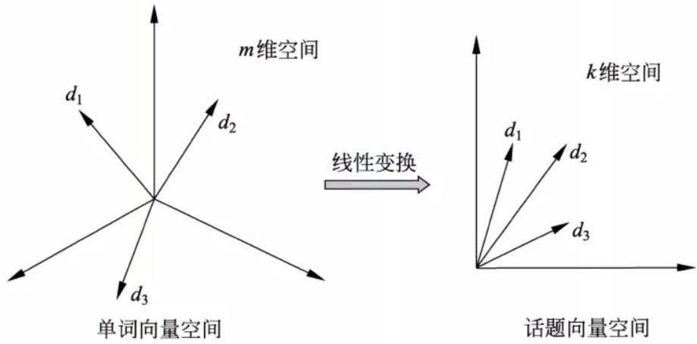  
图17.2 将本在单词向量空间的表通过线性变换转换为话题空间的表

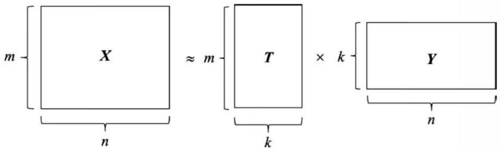  
图17.3 潜在语义分析通过矩阵因分解实现，单词-本矩阵X可以近似地表为单词-话题矩阵T与话题-本矩阵Y的乘积形式

在原始的单词向量空间中，两个本 $d _ { i }$ 与 $d _ { j }$ 的相似度可以由对应的向量的内积表示，即 $x _ { i } \cdot x _ { j }$ 。经过潜在语义分析之后，在话题向量空间中，两个本 $d _ { i }$ 与 $d _ { j }$ 的相似度可以由对应的向量的内积即 $y _ { i } \cdot y _ { j }$ 表示。

要进潜在语义分析，需要同时决定两部分的内容，是话题向量空间T，是本在话题空间的表Y，使两者的乘积是原始矩阵数据的近似，这结果完全从话题-本矩阵的信息中获得。

## 17.2 潜在语义分析算法

潜在语义分析利矩阵奇异值分解，具体地，对单词-本矩阵进奇异值分解，将其左矩阵作为话题向量空间，将其对矩阵与右矩阵的乘积作为本在话题向量空间的表。

## 17.2.1 矩阵奇异值分解算法

## 1.单词-文本矩阵

给定文本集合 $D = \{ d _ { 1 } , d _ { 2 } , \cdots , d _ { n } \}$ 和单词集合 $W = \{ w _ { 1 } , w _ { 2 } , \cdot \cdot \cdot , w _ { m } \}$ 。潜在语义分析先将这些数据表成个单词-本矩阵：

$$
X = { \left[ \begin{array} { l l l l } { x _ { 1 1 } } & { x _ { 1 2 } } & { \cdots } & { x _ { 1 n } } \\ { x _ { 2 1 } } & { x _ { 2 2 } } & { \cdots } & { x _ { 2 n } } \\ { \vdots } & { \vdots } & & { \vdots } \\ { x _ { m 1 } } & { x _ { m 2 } } & { \cdots } & { x _ { m n } } \end{array} \right] }\tag{17.12}
$$

这是一个 $m \times n$ 矩阵，元素 $\boldsymbol { x } _ { i j }$ 表示单词 $w _ { i }$ 在文本 $d _ { j }$ 中出现的频数或权值。

## 2.截断奇异值分解

潜在语义分析根据确定的话题个数k对单词-本矩阵X进截断奇异值分解：

$$
\boldsymbol { X } \approx \boldsymbol { U } _ { k } \boldsymbol { \Sigma } _ { k } \boldsymbol { V } _ { k } ^ { \mathrm { T } } = \left[ \boldsymbol { u } _ { 1 } \quad \boldsymbol { u } _ { 2 } \quad \boldsymbol { \cdots } \quad \boldsymbol { u } _ { k } \right] \left[ \begin{array} { c c c c } { \boldsymbol { \sigma } _ { 1 } } & & & \\ & { \boldsymbol { \sigma } _ { 2 } } & & \\ & & { \ddots } & \\ & & & { \boldsymbol { \sigma } _ { k } } \end{array} \right] \left[ \begin{array} { c } { \boldsymbol { v } _ { 1 } ^ { \mathrm { T } } } \\ { \boldsymbol { v } _ { 2 } ^ { \mathrm { T } } } \\ { \vdots } \\ { \boldsymbol { v } _ { k } ^ { \mathrm { T } } } \end{array} \right]\tag{17.13}
$$

式中 $k \leqslant n \leqslant m ; U _ { k }$ 是 $m \times k$ 矩阵，它的列由X的前k个互相正交的左奇异向量组成； $\Sigma _ { k }$ 是k阶对阵，对元素为前k个最奇异值； $V _ { k }$ 是 $n \times k$ 矩阵，它的列由X的前k个互相正交的右奇异向量组成。

## 3.话题向量空间

在单词-本矩阵X的截断奇异值分解式(17.13)中，矩阵 $U _ { k }$ 的每一个列向量$u _ { 1 } , u _ { 2 } , \cdots , u _ { k }$ 表个话题，称为话题向量。由这k个话题向量张成个空间：

$$
U _ { k } = { \left[ \begin{array} { l l l l } { \mathbf { \Delta } \mathbf { u } _ { 1 } } & { \mathbf { \Delta } \mathbf { u } _ { 2 } } & { \cdots } & { \mathbf { \Delta } \mathbf { u } _ { k } } \end{array} \right] }
$$

称为话题向量空间。

## 4.文本的话题空间表示

有了话题向量空间，接着考虑本在话题空间的表。将式(17.13)写作

$$
\begin{array} { r l } & { X = \left[ \begin{array} { l l l l } { x _ { 1 } } & { x _ { 2 } } & { \dots } & { x _ { n } } \end{array} \right] \approx U _ { k } \ d { \Sigma } _ { k } V _ { k } ^ { \mathrm { { T } } } } \\ & { = \left[ \begin{array} { l l l l } { \alpha _ { 1 } } & { \dots } & { \alpha _ { n } } & { 0 } \\ { u _ { 1 } } & { u _ { 2 } } & { \dots } & { u _ { k } } \end{array} \right] \left[ \begin{array} { l l l l } { \sigma _ { 1 } } & & & \\ & { \sigma _ { 2 } } & & \\ & & { \ddots } & \\ & & & { \sigma _ { k } } \end{array} \right] \left[ \begin{array} { l l l l } { v _ { 1 1 } } & { v _ { 2 1 } } & { \dots } & { v _ { n 1 } } \\ { v _ { 1 2 } } & { v _ { 2 2 } } & { \dots } & { v _ { n 2 } } \\ { \vdots } & { \vdots } & & { \vdots } \\ { v _ { 1 k } } & { v _ { 2 k } } & { \dots } & { v _ { n k } } \end{array} \right] } \\ & { = \left[ \begin{array} { l l l l } { \alpha _ { 1 } } & { u _ { 2 } } & { \dots } & { u _ { k } } \\ { u _ { 1 } } & { u _ { 2 } } & { \dots } & { u _ { k } } \end{array} \right] \left[ \begin{array} { l l l l } { \sigma _ { 1 } v _ { 1 1 } } & { \sigma _ { 1 } v _ { 2 1 } } & { \dots } & { \sigma _ { 1 } v _ { 1 n } } \\ { \sigma _ { 2 } v _ { 1 2 } } & { \sigma _ { 2 2 } } & { \dots } & { \sigma _ { 2 } v _ { n 2 } } \\ { \vdots } & { \vdots } & { \vdots } & { \vdots } \\ { \sigma _ { k } v _ { k } } & { \sigma _ { k } v _ { 2 k } } & { \dots } & { \sigma _ { k } v _ { n k } } \end{array} \right] } \end{array}\tag{17.14}
$$

其中，

$$
u _ { l } = \left[ \begin{array} { c } { u _ { 1 l } } \\ { u _ { 2 l } } \\ { \vdots } \\ { u _ { m l } } \end{array} \right] , \quad l = 1 , 2 , \cdots , k
$$

由式(17.14) 知，矩阵X的第 $j$ 列向量 $\boldsymbol { x } _ { j }$ 满足

$$
\begin{array} { l } { \displaystyle x _ { j } \approx U _ { k } ( \Sigma _ { k } V _ { k } ^ { \mathrm { T } } ) _ { j } } \\ { = \left[ \begin{array} { l l l l } { u _ { 1 } } & { u _ { 2 } } & { \cdots } & { u _ { k } } \end{array} \right] \left[ \begin{array} { l } { \sigma _ { 1 } v _ { j 1 } } \\ { \sigma _ { 2 } v _ { j 2 } } \\ { \vdots } \\ { \sigma _ { k } v _ { j k } } \end{array} \right] } \\ { = \displaystyle \sum _ { l = 1 } ^ { k } \sigma _ { l } v _ { j l } u _ { l } , ~ j = 1 , 2 , \cdots , n } \end{array}\tag{17.15}
$$