式中 $( \Sigma _ { k } V _ { k } ^ { \mathrm { T } } ) _ { j }$ 是矩阵 $( \Sigma _ { k } V _ { k } ^ { \mathrm { T } } )$ 的第列向量。式(17.15)是本 $d _ { j }$ 的近似表达式，由k个话题向量 ${ \mathbf { } } { \mathbf { } } { \mathbf { } } { \mathbf { } } ^ { } { \mathbf { } } ^ { } { \mathbf { } } ^ { } { \mathbf { } } ^ { } { \mathbf { } } ^ { } { \mathbf { } } ^ { } { \mathbf { } } ^ { } { \mathbf { } } ^ { } { \mathbf { } } ^ { } { \mathbf { } } ^ { } { \mathbf { } } ^ { } { \mathbf { } } ^ { } { \mathbf { } } ^ { } { \mathbf { } } ^ { } { \mathbf { } } ^ { } { \mathbf { } } ^ { } { \mathbf { } } ^ { } { \mathbf { } } ^ { } { \mathbf { } } ^ { } { \mathbf { } } ^ { } { \mathbf { } } ^ { } { \mathbf { } } ^ { } { \mathbf { } } ^ { } { \mathbf { } } ^ { } { \mathbf { } } ^ { } { \mathbf { } } ^ { } { \mathbf { } } ^ { } { \mathbf { } } ^ { } { \mathbf { } } ^ { } { \mathbf { } } ^ { } { \mathbf { } } ^ { } { \mathbf { } } ^ { } { \mathbf { } } ^ { } { \mathbf } { \mathbf { } } ^ { } { \mathbf { } } ^ { } { \mathbf } { \mathbf { } } ^ { } { \mathbf { } } ^ { } { \mathbf } { \mathbf { } } ^ { } { \mathbf } ^ { } { \mathbf { } } ^ { } \mathbf { } { \mathbf } ^ { } { \mathbf } { \mathbf { } } ^ { } { \mathbf } ^ { } { \mathbf } { \mathbf { } } ^ { } \mathbf { } \mathbf { } ^ { } \mathbf { } \mathbf { } \mathbf { } ^ { } \mathbf { } \mathbf { } \mathbf { } ^ { } \mathbf { } \mathbf { } \mathbf { } ^ { \mathbf } { \Psi \Psi } ^ { } \mathbf { } \Psi \Psi \Psi { } ^ \Psi { } \Psi \Psi \Psi \Psi \Psi \Psi \Psi \Psi \Psi \Psi \Psi \Psi \Psi \Psi \Psi \Psi \Psi \Psi \Psi \Psi \Psi \Psi \Psi \Psi \Psi \Psi \Psi \Psi \Psi \Psi \Psi \Psi \Psi \Psi \Psi \Psi \Psi \Psi \Psi \Psi \Psi \Psi \Psi \Psi \Psi \Psi \Psi \Psi \Psi \Psi \Psi \Psi \Psi \Psi \Psi \Psi \Psi \Psi \Psi \Psi \Psi \Psi \Psi \Psi$ 的线性组合构成。矩阵 $( \Sigma _ { k } V _ { k } ^ { \mathrm { T } } )$ 的每一个列向量

$$
\left[ \begin{array} { c } { \sigma _ { 1 } v _ { 1 1 } } \\ { \sigma _ { 2 } v _ { 1 2 } } \\ { \vdots } \\ { \sigma _ { k } v _ { 1 k } } \end{array} \right] , \quad \left[ \begin{array} { c } { \sigma _ { 1 } v _ { 2 1 } } \\ { \sigma _ { 2 } v _ { 2 2 } } \\ { \vdots } \\ { \sigma _ { k } v _ { 2 k } } \end{array} \right] , \cdots , \left[ \begin{array} { c } { \sigma _ { 1 } v _ { n 1 } } \\ { \sigma _ { 2 } v _ { n 2 } } \\ { \vdots } \\ { \sigma _ { k } v _ { n k } } \end{array} \right]
$$

是个本在话题向量空间的表。

综上，可以通过对单词-本矩阵的奇异值分解进潜在语义分析

$$
\begin{array} { r } { \pmb { X } \approx \pmb { U _ { k } } \pmb { \Sigma _ { k } } \pmb { V _ { k } ^ { \mathrm { T } } } = \pmb { U _ { k } } ( \pmb { \Sigma _ { k } } \pmb { V _ { k } ^ { \mathrm { T } } } ) } \end{array}\tag{17.16}
$$

得到话题空间 $U _ { k }$ ，以及本在话题空间的表 $( \Sigma _ { k } V _ { k } ^ { \mathrm { T } } )$ 。

## 17.2.2 例子

下介绍潜在语义分析的个例 $\textcircled{1}$ 。假设有9个本、11个单词，单词-本矩阵X为11×9矩阵，矩阵的元素是单词在本中出现的频数，表如下：

<table><tr><td rowspan="2">单词</td><td colspan="10">文本</td></tr><tr><td>T1</td><td>T2</td><td>T3</td><td>T4</td><td>T5</td><td>T6</td><td>T7</td><td>T8</td><td></td><td>T9</td></tr><tr><td>book</td><td></td><td></td><td>1</td><td></td><td></td><td></td><td></td><td></td><td></td><td></td></tr><tr><td>dads</td><td></td><td></td><td></td><td></td><td></td><td></td><td>1</td><td></td><td></td><td>1</td></tr><tr><td>dummies</td><td></td><td>1</td><td></td><td></td><td></td><td></td><td></td><td></td><td>1</td><td></td></tr><tr><td>estate</td><td></td><td></td><td></td><td></td><td></td><td></td><td></td><td>1</td><td></td><td>1</td></tr><tr><td>guide</td><td></td><td></td><td></td><td></td><td></td><td></td><td></td><td></td><td></td><td></td></tr><tr><td>investing</td><td>11</td><td>1</td><td>1</td><td></td><td></td><td></td><td>11</td><td>1</td><td>1</td><td>1</td></tr><tr><td>market</td><td>1</td><td></td><td>1</td><td></td><td></td><td></td><td></td><td></td><td></td><td></td></tr><tr><td>real</td><td></td><td></td><td></td><td></td><td></td><td></td><td></td><td>1</td><td></td><td></td></tr><tr><td>rich</td><td></td><td></td><td></td><td></td><td></td><td></td><td>2</td><td></td><td></td><td>11</td></tr><tr><td>stock</td><td>1</td><td></td><td>1</td><td></td><td></td><td></td><td></td><td></td><td>1</td><td></td></tr><tr><td>value</td><td></td><td></td><td></td><td>1</td><td></td><td></td><td></td><td></td><td></td><td></td></tr></table>

然后进潜在语义分析。实施对矩阵的截断奇异值分解，假设话题的个数是3，矩阵的截断奇异值分解结果为

<table><tr><td rowspan=1 colspan=1>book</td><td rowspan=1 colspan=1>0.15</td><td rowspan=1 colspan=1>0.27</td><td rowspan=1 colspan=1>0.04</td></tr><tr><td rowspan=1 colspan=1>dads</td><td rowspan=1 colspan=1>0.24</td><td rowspan=1 colspan=1>0.38</td><td rowspan=1 colspan=1>-0.09</td></tr><tr><td rowspan=1 colspan=1>dummies 0.13</td><td rowspan=1 colspan=1>0.13</td><td rowspan=1 colspan=1>-0.17</td><td rowspan=1 colspan=1>0.07</td></tr><tr><td rowspan=1 colspan=1>estate</td><td rowspan=1 colspan=1>0.18</td><td rowspan=1 colspan=1>0.19</td><td rowspan=1 colspan=1>0.45</td></tr><tr><td rowspan=1 colspan=1>guide</td><td rowspan=1 colspan=1>0.22</td><td rowspan=1 colspan=1>0.09</td><td rowspan=1 colspan=1>-0.46</td></tr><tr><td rowspan=1 colspan=1>investing</td><td rowspan=1 colspan=1>50.74</td><td rowspan=1 colspan=1>-0.21</td><td rowspan=1 colspan=1>0.21</td></tr><tr><td rowspan=1 colspan=1>market</td><td rowspan=1 colspan=1>0.18</td><td rowspan=1 colspan=1>-0.30</td><td rowspan=1 colspan=1>-0.28</td></tr><tr><td rowspan=1 colspan=1>real</td><td rowspan=1 colspan=1>0.18</td><td rowspan=1 colspan=1>0.19</td><td rowspan=1 colspan=1>0.45</td></tr><tr><td rowspan=1 colspan=1>rich</td><td rowspan=1 colspan=1>0.36</td><td rowspan=1 colspan=1>0.59</td><td rowspan=1 colspan=1>-0.34</td></tr><tr><td rowspan=1 colspan=1>stock</td><td rowspan=1 colspan=1>0.25</td><td rowspan=1 colspan=1>-0.42</td><td rowspan=1 colspan=1>-0.28</td></tr><tr><td rowspan=1 colspan=1>value</td><td rowspan=1 colspan=1>0.12</td><td rowspan=1 colspan=1>-0.14</td><td rowspan=1 colspan=1>0.23</td></tr></table>

<table><tr><td rowspan=9 colspan=6>T13.91 0   00.35Y  02.61 0 *-0.320   0 2.00-0.41</td><td></td><td></td><td></td><td></td><td></td><td></td><td></td><td></td></tr><tr><td rowspan=2 colspan=1></td><td rowspan=2 colspan=1>T1</td><td rowspan=2 colspan=1>T2</td><td rowspan=2 colspan=1>T3</td><td rowspan=2 colspan=1>T4</td><td rowspan=2 colspan=1>T5</td><td rowspan=2 colspan=1>T6</td><td rowspan=2 colspan=1>T7</td><td rowspan=2 colspan=1>T8</td><td rowspan=2 colspan=1>T9</td></tr><tr><td rowspan=2 colspan=1>3.91</td><td rowspan=2 colspan=1>0</td><td rowspan=2 colspan=1>0</td><td rowspan=2 colspan=1></td></tr><tr><td rowspan=2 colspan=1>*</td><td rowspan=2 colspan=1>0.35</td><td rowspan=2 colspan=1>0.22</td><td rowspan=2 colspan=1>0.34</td><td rowspan=2 colspan=1>0.26</td><td rowspan=2 colspan=1>0.22</td><td rowspan=2 colspan=1>0.490.28</td><td rowspan=2 colspan=1>0.28</td><td rowspan=2 colspan=1>0.290.44</td><td rowspan=2 colspan=1>0.44</td></tr><tr><td rowspan=2 colspan=1>0</td><td rowspan=2 colspan=1>2.61</td><td rowspan=2 colspan=2>0 *</td></tr><tr><td rowspan=2 colspan=1></td><td rowspan=2 colspan=1>-0.32</td><td rowspan=2 colspan=1>-0.15</td><td rowspan=2 colspan=1>-0.46</td><td rowspan=2 colspan=1>-0.24</td><td rowspan=2 colspan=1>-0.14</td><td rowspan=2 colspan=1>0.550.07</td><td rowspan=2 colspan=1>0.07</td><td rowspan=2 colspan=1>-0.310.44</td><td rowspan=2 colspan=1>0.44</td></tr><tr><td rowspan=2 colspan=1>0</td><td rowspan=2 colspan=1>0</td><td rowspan=2 colspan=1>2.00</td><td rowspan=2 colspan=1></td></tr><tr><td rowspan=2 colspan=1></td><td rowspan=2 colspan=1>-0.41</td><td rowspan=2 colspan=1>0.14</td><td rowspan=2 colspan=1>--0.16</td><td rowspan=2 colspan=1>0.25</td><td rowspan=2 colspan=1>0.22</td><td rowspan=2 colspan=1>-0.51</td><td rowspan=2 colspan=1>0.55</td><td rowspan=2 colspan=1>0.000.34</td><td rowspan=2 colspan=1>0.34</td></tr><tr><td rowspan=1 colspan=1></td></tr></table>

可以看出，左矩阵 $U _ { 3 }$ 有3个列向量（左奇异向量）。第1列向量 $\mathbf { \delta u } _ { 1 }$ 的值均为正，第2列向量 $\mathbf { \delta } \mathbf { u } _ { 2 }$ 和第3列向量 $\mathbf { \delta } \mathbf { u } _ { 3 }$ 的值有正有负。中间的对矩阵 $\Sigma _ { 3 }$ 的元素是3个由到的奇异值（正值）。右矩阵是 $V _ { 3 } ^ { \mathrm { T } }$ ，其转置矩阵 $V _ { 3 }$ 也有3个列向量（右奇异向量）。第1列向量 ${ \pmb v } _ { 1 }$ 的值也都为正，第2列向量 $v _ { 2 }$ 和第3列向量 ${ \bf { v } } _ { 3 }$ 的值有正有负。

现在，将 $\Sigma _ { 3 }$ 与 $V _ { 3 } ^ { \mathrm { T } }$ 相乘，整体变成两个矩阵乘积的形式：

$$
\pmb { X } \approx \pmb { U } _ { 3 } ( \pmb { \Sigma } _ { 3 } \pmb { V } _ { 3 } ^ { \mathrm { T } } )
$$

$$
\left[ \begin{array} { l l l } { 0 . 1 5 - 0 . 2 7 } & { 0 . 0 4 } \\ { 0 . 2 4 } & { 0 . 3 8 - 0 . 0 9 } \\ { 0 . 1 3 } & { - 0 . 1 7 } & { 0 . 0 7 } \\ { 0 . 1 5 } & { 0 . 1 9 } & { 0 . 4 5 } \\ { 0 . 2 7 } & { 0 . 0 9 } & { - 0 . 4 6 } \\ { 0 . 7 4 } & { - 0 . 2 1 } & { 0 . 0 2 } \\ { 0 . 1 5 } & { 0 . 3 0 } & { 0 . 2 8 } \\ { 0 . 1 1 } & { 0 . 1 9 } & { 0 . 4 5 } \\ { 0 . 3 6 } & { 0 . 5 9 } & { - 0 . 3 4 } \\ { 0 . 2 5 } & { - 0 . 4 2 } & { 0 . 2 8 } \\ { 0 . 1 2 } & { - 0 . 1 4 } & { 0 . 3 2 } \end{array} \right] \left[ \begin{array} { l l l l l l l } { 1 . 3 7 } & { 0 . 8 6 } & { 1 . 3 3 } & { 1 . 0 2 } & { 0 . 8 6 } & { 1 . 9 2 } & { 1 . 0 9 } & { 1 . 1 3 } & { 1 . 7 2 } \\ { - 0 . 8 4 } & { 0 . 3 3 } & { - 1 . 2 0 } & { - 0 . 6 3 } & { - 0 . 3 7 } & { 1 . 4 4 } & { 0 . 1 8 } & { - 0 . 8 1 } & { 1 . 1 5 } \\ { - 0 . 8 2 } & { 0 . 2 8 } & { - 0 . 3 2 } & { 0 . 5 0 } & { 0 . 4 1 } & { - 1 . 0 2 } & { 1 . 0 0 } & { 0 . 6 3 } \\ { - 0 . 5 2 } & { 0 . 2 8 } & { 0 . 5 0 } & { 0 . 4 1 } & { - 1 . 0 2 } & { 0 . 1 0 } & { 0 . 0 3 } \end{array} \right]
$$

矩阵 $U _ { 3 }$ 有3个列向量，表3个话题，矩阵 $U _ { 3 }$ 表示话题向量空间。矩阵 $( \Sigma _ { 3 } V _ { 3 } ^ { \mathrm { T } } )$ 有9个列向量，表9个本，矩阵 $( \Sigma _ { 3 } V _ { 3 } ^ { \mathrm { T } } )$ 是文本集合在话题向量空间的表示。

## 17.3 非负矩阵分解算法

负矩阵分解也可以于话题分析。对单词-本矩阵进负矩阵分解，将其左矩阵作为话题向量空间，将其右矩阵作为本在话题向量空间的表示。注意通常单词-本矩阵是负的。

## 17.3.1 非负矩阵分解

若个矩阵的所有元素负，则称该矩阵为负矩阵，若X是负矩阵，则记作 $X \geqslant 0$ o给定个负矩阵 $X \geqslant 0$ ，找到两个负矩阵 $W \geqslant 0$ 和 $H \geqslant 0$ ，使得

$$
X \approx W H\tag{17.17}
$$

即将负矩阵X分解为两个负矩阵W和H的乘积的形式，称为负矩阵分解。因为WH与X完全相等很难实现，所以只要求WH与X近似相等。

假设负矩阵X是 $m \times n$ 矩阵，负矩阵W和H分别为 $m \times k$ 矩阵和 $k \times n$ 矩阵。假设 $k < \operatorname* { m i n } ( m , n )$ ，即W和H于原矩阵X，所以负矩阵分解是对原数据的压缩。

由式(17.17)知，矩阵X的第 $j$ 列向量 $\boldsymbol { x } _ { j }$ 满足

$$
\begin{array} { l } { \displaystyle x _ { j } \approx W h _ { j } } \\ { \displaystyle } \\ { \displaystyle = \left[ \begin{array} { l l l l } { w _ { 1 } } & { w _ { 2 } } & { \cdots } & { w _ { k } } \end{array} \right] \left[ \begin{array} { l } { h _ { 1 j } } \\ { h _ { 2 j } } \\ { \vdots } \\ { h _ { k j } } \end{array} \right] } \\ { \displaystyle = \sum _ { l = 1 } ^ { k } h _ { l j } w _ { l } , ~ j = 1 , 2 , \cdots , n } \end{array}\tag{17.18}
$$

其中， $h _ { j }$ 是矩阵H的第 $j$ 列， ${ \mathbf { } } w _ { l }$ 是矩阵W的第列， $h _ { l j }$ 是 $h _ { j }$ 的第1个元素， $l = 1 , 2 , \cdots , k _ { \circ }$

式(17.18)表明，矩阵X的第 $j$ 列 $\boldsymbol { x } _ { j }$ 可以由矩阵W的k个列 ${ \mathbf { } } w _ { l }$ 的线性组合逼近，线性组合的系数是矩阵H的第 $j$ 列 $h _ { j }$ 的元素。这矩阵W的列向量为组基，矩阵H的列向量为线性组合系数。称W为基矩阵，H为系数矩阵。负矩阵分解旨在较少的基向量、系数向量来表示较大的数据矩阵。

## 17.3.2 潜在语义分析模型

给定一个 $m \times n$ 非负的单词-文本矩阵 $X \geqslant 0$ 。假设本集合共包含k个话题，对X进负矩阵分解，即求负的 $m \times k$ 矩阵 $W \geqslant 0$ 和 $k \times n$ 矩阵 $H \geqslant 0$ ,使得

$$
X \approx W H\tag{17.19}
$$

令令 $\pmb { W } = [ \pmb { w } _ { 1 } \quad \pmb { w } _ { 2 } \quad \cdots \quad \pmb { w } _ { k } ]$ 为话题向量空间， $w _ { 1 } , w _ { 2 } , \cdots , w _ { k }$ 表示文本集合的k个话题，$H = [ h _ { 1 } \quad h _ { 2 } \quad \ldots \quad h _ { n } ]$ 为本在话题向量空间的表示， $h _ { 1 } , h _ { 2 } , \ldots , h _ { n }$ 表示文本集合的n个本。这就是基于负矩阵分解的潜在语义分析模型。

负矩阵分解具有很直观的解释，话题向量和本向量都负，对应“伪概率分布”，向量的线性组合表局部叠加构成整体。

## 17.3.3 负矩阵分解的形式化

负矩阵分解可以形式化为最优化问题求解。先定义损失函数或代价函数。

第种损失函数是平损失。设两个负矩阵 $\pmb { A } = [ a _ { i j } ] _ { m \times n }$ 和 $\boldsymbol { B } = [ b _ { i j } ] _ { m \times n }$ ，平损失函数定义为

$$
\left. A - B \right. ^ { 2 } = \sum _ { i , j } ( a _ { i j } - b _ { i j } ) ^ { 2 }\tag{17.20}
$$

其下界是0，当且仅当A=B时达到下界。

另种损失函数是散度（divergence）。设两个负矩阵 $\pmb { A } = [ a _ { i j } ] _ { m \times n }$ 和 $\boldsymbol { B } = [ b _ { i j } ] _ { m \times n }$ 散度损失函数定义为

$$
D ( A \| B ) = \sum _ { i , j } \left( a _ { i j } \log { \frac { a _ { i j } } { b _ { i j } } } - a _ { i j } + b _ { i j } \right)\tag{17.21}
$$

其下界也是0，当且仅当 $A = B$ 时达到下界。A和B不对称。当 $\sum _ { i , j } a _ { i j } = \sum _ { i , j } b _ { i j } = 1$ 时散度损失函数退化为Kullback-Leiber散度或相对熵，这时A和B是概率分布。

接着定义以下的最优化问题。

标函数 $\| X - W H \| ^ { 2 }$ 关于W和H的最化满约束条件 $W , H \geqslant 0$ ，即

$$
\begin{array} { l l } { \underset { W , H } { \operatorname* { m i n } } } & { \| X - W H \| ^ { 2 } } \\ { \mathrm { s . t . } } & { W , H \geqslant 0 } \end{array}\tag{17.22}
$$

或者，标函数 $D ( X \| W H )$ 关于W和H的最化满约束条件 $W , H \geqslant 0$ ，即

$$
\begin{array} { l l } { \displaystyle \operatorname* { m i n } _ { W , H } } & { D ( X \| W H ) } \\ { \mathrm { s . t . } } & { W , H \geqslant 0 } \end{array}\tag{17.23}
$$

## 17.3.4算法

考虑求解最优化问题(17.22)和问题(17.23)。由于标函数 $\| X - W H \| ^ { 2 }$ 和 $D ( X \| W H )$ 只是对变量W和H之的凸函数，不是同时对两个变量的凸函数，因此找到全局最优（最值）较困难，可以通过数值最优化法求局部最优（极值）。梯度下降法较容易实现，但是收敛速度慢。共轭梯度法收敛速度快，但实现较复杂。Lee和Seung提出了新的基于“乘法更新规则”的优化算法，交替地对W和H进更新，其理论依据是下的定理。

定理17.1平方损失 $\| X - W H \| ^ { 2 }$ 对下列乘法更新规则

$$
H _ { l j } \gets H _ { l j } \frac { ( W ^ { \mathrm { T } } X ) _ { l j } } { ( W ^ { \mathrm { T } } W H ) _ { l j } }\tag{17.24}
$$

$$
W _ { i l } \gets W _ { i l } \frac { ( X H ^ { \mathrm { T } } ) _ { i l } } { ( W H H ^ { \mathrm { T } } ) _ { i l } }\tag{17.25}
$$

是非增的，当且仅当W和H是平方损失函数的稳定点时函数的更新不变。

定理17.2散度损失 $D ( X - W H )$ 对下列乘法更新规则

$$
H _ { l j } \gets H _ { l j } \frac { \displaystyle \sum _ { i } [ W _ { i l } X _ { i j } / ( W H ) _ { i j } ] } { \displaystyle \sum _ { i } W _ { i l } }\tag{17.26}
$$

$$
W _ { i l } \longleftarrow W _ { i l } \frac { \displaystyle \sum _ { j } [ H _ { l j } X _ { i j } / ( W H ) _ { i j } ] } { \displaystyle \sum _ { j } H _ { l j } }\tag{17.27}
$$

是增的，当且仅当W和H是散度损失函数的稳定点时函数的更新不变。

定理17.1和定理17.2给出了乘法更新规则。定理的证明可以参阅献[4]。

现叙述负矩阵分解的算法。只介绍第个问题(17.22)的算法，第个问题(17.23)的算法类似。

最优化标函数是 $\| X - W H \| ^ { 2 }$ ，为了便将标函数乘以 $1 / 2$ ，其最优解与原问题相同,记作

$$
J ( W , H ) = \frac 1 2 \| X - W H \| ^ { 2 } = \frac 1 2 \sum \left[ X _ { i j } - ( W H ) _ { i j } \right] ^ { 2 }
$$

应梯度下降法求解。先求标函数的梯度：

$$
\begin{array} { r } { \frac { \partial J ( W , H ) } { \partial W _ { i l } } = - \displaystyle \sum _ { j } \big [ X _ { i j } - ( W H ) _ { i j } \big ] H _ { l j } } \\ { = - \big [ ( X H ^ { \mathrm { T } } ) _ { i l } - ( W H H ^ { \mathrm { T } } ) _ { i l } \big ] } \end{array}\tag{17.28}
$$

同样可得：

$$
\frac { \partial J ( W , H ) } { \partial H _ { l j } } = - [ ( W ^ { \mathrm { T } } X ) _ { l j } - ( W ^ { \mathrm { T } } W H ) _ { l j } ]\tag{17.29}
$$

然后求得梯度下降法的更新规则，由式(17.28)和式(17.29)有

$$
W _ { i l } = W _ { i l } + \lambda _ { i l } [ ( \boldsymbol { X } \boldsymbol { H } ^ { \mathrm { T } } ) _ { i l } - ( \boldsymbol { W } \boldsymbol { H } \boldsymbol { H } ^ { \mathrm { T } } ) _ { i l } ]\tag{17.30}
$$

$$
H _ { l j } = H _ { l j } + \mu _ { l j } [ ( W ^ { \mathrm { { T } } } { X } ) _ { l j } - ( W ^ { \mathrm { { T } } } { W } H ) _ { l j } ]\tag{17.31}
$$

式中 $\lambda _ { i l }$ $\mu _ { l j }$ 是步长。选取

$$
\lambda _ { i l } = \frac { W _ { i l } } { \left( W H H ^ { \operatorname { T } } \right) _ { i l } } , \quad \mu _ { l j } = \frac { H _ { l j } } { \left( W ^ { \operatorname { T } } W H \right) _ { l j } }\tag{17.32}
$$

即得乘法更新规则：

$$
W _ { i l } = W _ { i l } \frac { ( X \pmb { H } ^ { \mathrm { T } } ) _ { i l } } { ( \pmb { W } \pmb { H } \pmb { H } ^ { \mathrm { T } } ) _ { i l } } , \quad i = 1 , 2 , \cdots , m , \quad l = 1 , 2 , \cdots , k\tag{17.33}
$$

$$
H _ { l j } = H _ { l j } \frac { ( \boldsymbol { W } ^ { \mathrm { T } } \boldsymbol { X } ) _ { l j } } { ( \boldsymbol { W } ^ { \mathrm { T } } \boldsymbol { W } H ) _ { l j } } , \quad l = 1 , 2 , \cdots , k , \quad j = 1 , 2 , \cdots , n\tag{17.34}
$$

选取初始矩阵W和H为负矩阵，可以保证迭代过程及结果的矩阵W和H均为非负。

下叙述基于乘法更新规则的矩阵负分解迭代算法。算法交替对W和H迭代，每次迭代对W的列向量归化，使基向量为单位向量。

算法17.1（非负矩阵分解的迭代算法）

输入：单词-文本矩阵 $X \geqslant 0$ ，本集合的话题个数k，最迭代次数t。

输出：话题矩阵W，文本表示矩阵H。

(1）初始化

$W \geqslant 0$ ，并对W的每列数据归化； $H \geqslant 0$

(2)迭代

对迭代次数由1到t执下列步骤：

(a）更新W的元素，对l从1到k，i从1到m按式(17.33)更新 $W _ { i l }$

(b）更新H的元素，对l从1到k，j从1到n按式(17.34)更新 $H _ { l j }$ 。

## 本章概要

1．单词向量空间模型通过单词的向量表本的语义内容。以单词-本矩阵X为输，其中每对应个单词，每列对应个本，每个元素表单词在本中的频数或权值（如TF-IDF）。

$$
X = { \left[ \begin{array} { l l l l } { x _ { 1 1 } } & { x _ { 1 2 } } & { \cdots } & { x _ { 1 n } } \\ { x _ { 2 1 } } & { x _ { 2 2 } } & { \cdots } & { x _ { 2 n } } \\ { \vdots } & { \vdots } & & { \vdots } \\ { x _ { m 1 } } & { x _ { m 2 } } & { \cdots } & { x _ { m n } } \end{array} \right] }
$$

单词向量空间模型认为，这个矩阵的每列向量是单词向量，表个本，两个单词向量的内积或标准化内积表示本之间的语义相似度。

2.话题向量空间模型通过话题的向量表示本的语义内容。假设有话题-本矩阵

$$
\mathbf { Y } = { \left[ \begin{array} { l l l l } { y _ { 1 1 } } & { y _ { 1 2 } } & { \cdots } & { y _ { 1 n } } \\ { y _ { 2 1 } } & { y _ { 2 2 } } & { \cdots } & { y _ { 2 n } } \\ { \vdots } & { \vdots } & & { \vdots } \\ { y _ { k 1 } } & { y _ { k 2 } } & { \cdots } & { y _ { k n } } \end{array} \right] }
$$

其中每对应个话题，每列对应个本，每个元素表话题在本中的权值。话题向量空间模型认为，这个矩阵的每列向量是话题向量，表个本，两个话题向量的内积或标准化内积表示本之间的语义相似度。假设有单词-话题矩阵T：

$$
T = { \left[ \begin{array} { l l l l } { t _ { 1 1 } } & { t _ { 1 2 } } & { \cdots } & { t _ { 1 k } } \\ { t _ { 2 1 } } & { t _ { 2 2 } } & { \cdots } & { t _ { 2 k } } \\ { \vdots } & { \vdots } & & { \vdots } \\ { t _ { m 1 } } & { t _ { m 2 } } & { \cdots } & { t _ { m k } } \end{array} \right] }
$$

其中每对应个单词，每列对应个话题，每个元素表单词在话题中的权值。

给定一个单词-文本矩阵X：

$$
X = { \left[ \begin{array} { l l l l } { x _ { 1 1 } } & { x _ { 1 2 } } & { \dots } & { x _ { 1 n } } \\ { x _ { 2 1 } } & { x _ { 2 2 } } & { \dots } & { x _ { 2 n } } \\ { \vdots } & { \vdots } & & { \vdots } \\ { x _ { m 1 } } & { x _ { m 2 } } & { \dots } & { x _ { m n } } \end{array} \right] }
$$

潜在语义分析的标是找到合适的单词-话题矩阵T与话题-本矩阵Y，将单词-本矩阵X近似地表示为T与Y的乘积形式：

$$
X \approx T Y
$$

等价地，潜在语义分析将本在单词向量空间的表X通过线性变换T转换为话题向量空间中的表Y。

潜在语义分析的关键是对单词-本矩阵进以上的矩阵因分解（话题分析)。

3.潜在语义分析的算法是奇异值分解。通过对单词-本矩阵进截断奇异值分解，得到：

$$
\begin{array} { r } { \boldsymbol { X } \approx \boldsymbol { U } _ { k } \boldsymbol { \Sigma } _ { k } \boldsymbol { V } _ { k } ^ { \mathrm { T } } = \boldsymbol { U } _ { k } ( \boldsymbol { \Sigma } _ { k } \boldsymbol { V } _ { k } ^ { \mathrm { T } } ) } \end{array}
$$

矩阵 $U _ { k }$ 表示话题空间，矩阵 $( \Sigma _ { k } V _ { k } ^ { \mathrm { T } } )$ 是文本在话题空间的表示。

4.负矩阵分解也可以于话题分析。负矩阵分解将负的单词-本矩阵近似分解成两个负矩阵W和H的乘积，得到：

$$
X \approx W H
$$

矩阵W表话题空间，矩阵H是本在话题空间的表。

负矩阵分解可以表为以下的最优化问题：

$$
\operatorname* { m i n } _ { W , H } \| X - W H \| ^ { 2 }
$$

$$
\mathrm { s . t . } \quad W , H \geqslant 0
$$

负矩阵分解的算法是迭代算法。乘法更新规则的迭代算法，交替地对W和H进更新。本质是梯度下降法，通过定义特殊的步长和负的初始值，保证迭代过程及结果的矩阵W和H均为负。

## 继续阅读

献[1]为潜在语义分析的原始论，相关的介绍还有献[2]，主要是关于基于矩阵奇异值分解的潜在语义分析。基于负矩阵分解的潜在语义分析可以参照献[3]\~献[5]。还有基于稀疏矩阵分解的法[6]。后两种法可以通过并计算实现，提计算效率。

## 习 题

17.1 试将图17.1的例进潜在语义分析，并对结果进观察。

17.2 给出损失函数是散度损失时的负矩阵分解（潜在语义分析）的算法。

17.3 给出潜在语义分析的两种算法的计算复杂度，包括奇异值分解法和负矩阵分解法。

17.4 列出潜在语义分析与主成分分析的异同。

## 参考文献

[1] DEERWESTER S C, DUMAIS S T, LANDAUER T K, et al. Indexing by latent semantic analysis[J]. Journal of the Association for Information Science and Technology, 1990, 41: 391– 407.

[2] LANDAUER T K. Latent semantic analysis[C]//Encyclopedia of Cognitive Science, Wiley. 2006.

[3] LEE D D, SEUNG H S. Learning the parts of objects by non-negative matrix factorization[J]. Nature, 1999, 401(6755): 788–791.

[4] LEE D D, SEUNG H S. Algorithms for non-negative matrix factorization[J]. Advances in Neural Information Processing Systems, 2001: 556–562.

[5] XU W, LIU X, GONG Y. Document clustering based on non-negative matrix factorization[C]// Proceedings of the 26th Annual International ACM SIGIR Conference on Research and Development in Information Retrieval, 2003.

[6] WANG Q, XU J, LI H, et al. Regularized latent semantic indexing[C]//Proceedings of the 34th International ACM SIGIR Conference on Research and Development in Information Retrieval, 2011.

## 第18章 概率潜在语义分析

概率潜在语义分析（probabilisticlatent semanticanalysis,PLSA）也称概率潜在语义索引（probabilistic latent semantic indexing，PLSI），是种利概率成模型对本集合进行话题分析的监督学习法。模型的最特点是隐变量表话题；整个模型表示本成话题，话题成单词，从得到单词-本共现数据的过程；假设每个本由个话题分布决定，每个话题由个单词分布决定。

概率潜在语义分析受潜在语义分析的启发，于1999年由Hofmann提出，前者基于概率模型，后者基于概率模型。概率潜在语义分析最初于本数据挖掘，后来扩展到其他领域。

本章先在18.1节叙述概率潜在语义分析的模型，包括成模型和共现模型。然后在18.2节介绍概率潜在语义分析模型的学习策略和算法。

## 18.1 概率潜在语义分析模型

先叙述概率潜在语义分析的直观解释。概率潜在语义分析模型有成模型以及等价的共现模型。先介绍成模型，然后介绍共现模型，最后讲解模型的性质。

## 18.1.1 基本想法

给定个本集合，每个本讨论若个话题，每个话题由若个单词表。对本集合进概率潜在语义分析，就能够发现每个本的话题，以及每个话题的单词。话题是不能从数据中直接观察到的，是潜在的。

本集合转换为本-单词共现数据，具体表现为单词-本矩阵，图18.1给出个单词-本矩阵的例。每对应个单词，每列对应个本，每个元素表单词在本中出现的次数。个话题表个语义内容。本数据基于如下的概率模型产（共现模型）：先有话题的概率分布，然后有话题给定条件下本的条件概率分布，以及话题给定条件下单词的条件概率分布。概率潜在语义分析就是发现由隐变量表的话题，即潜在语义。直观上，语义相近的单词、语义相近的本会被聚到相同的“软的类别”中，话题所表的就是这样的软的类别。假设有3个潜在的话题，图中红、绿、蓝框各表个话题。

<table><tr><td rowspan="5">word 1</td><td>doc1</td><td>doc2</td><td>doc3</td><td></td><td>doc4</td></tr><tr><td colspan="3">2</td><td></td><td></td></tr><tr><td colspan="2">2</td><td>4</td><td>3</td><td></td></tr><tr><td>word 2</td><td>2 1</td><td>5</td><td>3</td><td></td></tr><tr><td>word 3</td><td>1</td><td>1</td><td>2</td><td>0</td></tr><tr><td>word 4</td><td>0</td><td>1</td><td>2</td><td>1</td></tr></table>

图18.1 概率潜在语义分析的直观解释(见前彩图)

## 18.1.2 成模型

假设有单词集合 $W = \{ w _ { 1 } , w _ { 2 } , \cdot \cdot \cdot , w _ { M } \}$ ，其中M是单词个数；本（指标）集合$D = \{ d _ { 1 } , d _ { 2 } , \cdots , d _ { N } \}$ ，其中N是本个数；话题集合 $Z = \{ z _ { 1 } , z _ { 2 } , \cdots , z _ { K } \}$ ，其中K是预先设定的话题个数。随机变量w取值于单词集合，随机变量d取值于本集合，随机变量₂取值于话题集合。概率分布 $P ( d )$ 、条件概率分布 $P ( z | d )$ 、条件概率分布 $P ( w | z )$ 皆属于多项分布，其中 $P ( d )$ 表生成文本d的概率， $P ( z | d )$ 表本d成话题z的概率， $P ( w | z )$ 表示话题z成单词w的概率。

每个本d拥有的话题概率分布 $P ( z | d )$ ，每个话题拥有的单词概率分布$P ( w | z )$ ，也就是说个本的内容由其相关话题决定，个话题的内容由其相关单词决定。

成模型通过以下步骤成本-单词共现数据：

（1）依据概率分布 $P ( d )$ ，从本（指标）集合中随机选取个本d，共成N个本，针对每个本，执以下操作；

(2）在本d给定的条件下，依据条件概率分布 $P ( z | d )$ ，从话题集合随机选取个话题z，共成个话题，这是本长度；

（3）在话题₂给定的条件下，依据条件概率分布 $P ( w | z )$ ，从单词集合中随机选取个单词 $w _ { \circ }$

注意这为叙述便，假设本都是等长的，现实中不需要这个假设。

成模型中，单词变量 $w$ 与本变量d是观测变量，话题变量z是隐变量。也就是说模型生成的是单词-话题-文本三元组 $( w , z , d )$ 的集合，但观测到的是单词-本二元组 $( w , d )$ 的集合，观测数据表示为单词-本矩阵T的形式，矩阵T的表单词，列表本，元素表示单词-本对 $( w , d )$ 的出现次数。

从数据的成过程可以推出，本-单词共现数据T的成概率为所有单词-本对$( w , d )$ 的生成概率的乘积：

$$
P \left( T \right) = \prod _ { \left( w , d \right) } P ( w , d ) ^ { n ( w , d ) }\tag{18.1}
$$

这里 $n ( w , d )$ 表示 $( w , d )$ 的出现次数，单词-本对出现的总次数是 $N \times L$ 。每个单词-本对

$( w , d )$ 的成概率由以下公式决定：

$$
\begin{array} { l } { P ( w , d ) = P ( d ) P ( w | d ) } \\ { \displaystyle \qquad = P ( d ) \sum _ { z } P ( w , z | d ) } \\ { \displaystyle \qquad = P ( d ) \sum _ { z } P ( z | d ) P ( w | z ) } \end{array}\tag{18.2}
$$

式(18.2)即成模型的定义。

成模型假设在话题₂给定的条件下，单词w与本d条件独，即

$$
P \left( w , z | d \right) = P \left( z | d \right) P ( w | z )\tag{18.3}
$$

成模型属于概率有向图模型，可以有向图（directedgraph）表，如图18.2所。图中实圆表观测变量，空圆表隐变量，箭头表概率依存关系，框表多次重复，框内数字表重复次数。本变量d是个观测变量，话题变量₂是个隐变量，单词变量ω是个观测变量。

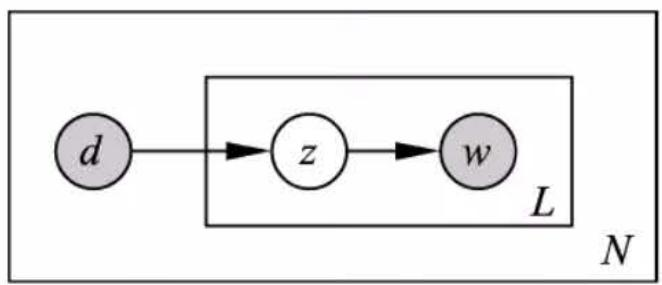  
图18.2 概率潜在语义分析的成模型

## 18.1.3共现模型

可以定义与以上的成模型等价的共现模型。

本-单词共现数据T的成概率为所有单词-本对(w,d）的成概率的乘积：

$$
P \left( T \right) = \prod _ { \left( w , d \right) } P ( w , d ) ^ { n ( w , d ) }\tag{18.4}
$$

每个单词-本对(w,d)的概率由以下公式决定：

$$
P ( w , d ) = \sum _ { z \in Z } P ( z ) P ( w | z ) P ( d | z )\tag{18.5}
$$

式(18.5)即共现模型的定义。容易验证，成模型(18.2)和共现模型(18.5)是等价的。

共现模型假设在话题₂给定的条件下，单词w与本d是条件独的，即

$$
P ( w , d | z ) = P ( w | z ) P ( d | z )\tag{18.6}
$$

图18.3所是共现模型。图中本变量d是个观测变量，单词变量ω是个观测变量，话题变量₂是个隐变量。图18.1是共现模型的直观解释。

虽然成模型与共现模型在概率公式意义上是等价的，但是具有不同的性质。成模型刻画本-单词共现数据成的过程，共现模型描述本-单词共现数据拥有的模式。成模

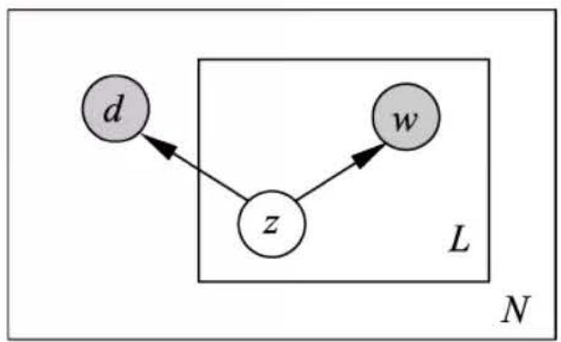  
图18.3 概率潜在语义模型的共现模型

型式(18.2)中单词变量w与本变量d是对称的，共现模型式(18.5）中单词变量w与本变量d是对称的，所以前者也称为对称模型，后者也称为对称模型。由于两个模型的形式不同，其学习算法的形式也不同。

## 18.1.4模型性质

## 1.模型参数

如果直接定义单词与本的共现概率是 $P ( w , d )$ ，模型参数的个数是 $O ( M \cdot N )$ ,其中M是单词数，N是本数。概率潜在语义分析的成模型和共现模型的参数个数是$O ( M \cdot K + N \cdot K )$ ，其中K是话题数。现实中 $K \ll M$ ，所以概率潜在语义分析通过话题对数据进了更简洁的表，减少了学习过程中过拟合的可能性。图18.4显模型中本、话题、单词之间的关系。

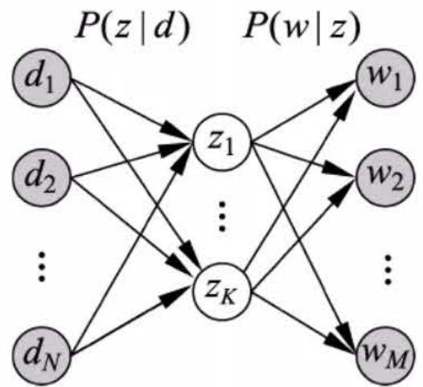  
图18.4 概率潜在语义分析中本、话题、单词之间的关系

## 2.模型的几何解释

下给出成模型的何解释。概率分布 $P ( w | d )$ 表本d成单词w的概率：

$$
\sum _ { i = 1 } ^ { M } P ( w _ { i } | d ) = 1 , \quad 0 \leqslant P ( w _ { i } | d ) \leqslant 1 , \quad i = 1 , 2 , \cdots , M
$$

可以由M维空间的(M–1)单纯形（simplex）中的点表。图18.5为三维空间的情况。单纯形上的每个点表个分布 $P ( w | d )$ （分布的参数向量），所有的分布 $P ( w | d )$ （分布的参数向量）都在单纯形上，称这个(M1）单纯形为单词单纯形。

从式(18.2）可知，概率潜在分析模型（成模型）中的本概率分布 $P ( w | d )$ 有下面的关

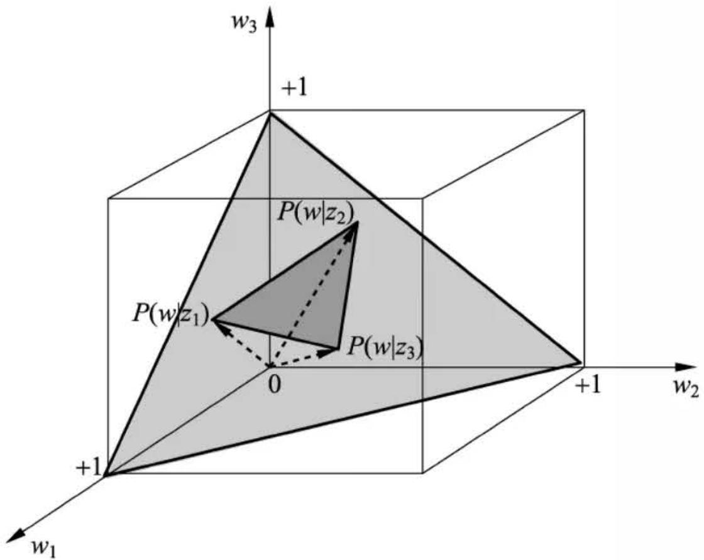  
图18.5 单词单纯形与话题单纯形

系成立：

$$
P ( w | d ) = \sum _ { z } P ( z | d ) P ( w | z )\tag{18.7}
$$

这概率分布 $P ( w | z )$ 表话题z成单词的概率。

概率分布 $P ( w | z )$ 也存在于M维空间中的(M-1）单纯形之中。如果有K个话题，那么就有K个概率分布 $P ( w | z _ { k } ) , \ k = 1 , 2 , \cdots , K$ ，由(M-1）单纯形上的K个点表（参照图18.5)。以这K个点为顶点，构成个(K–1）单纯形，称为话题单纯形。话题单纯形是单词单纯形的单纯形，参阅图18.5。

从式(18.7)知，成模型中本的分布 $P ( w | d )$ 可以由K个话题的分布 $P ( w | z _ { k } )$ ,k=$1 , 2 , \cdots , K$ 的线性组合表，本对应的点就在K个话题的点构成的(K-1）话题单纯形中。这就是成模型的何解释。注意通常 $K \ll M$ ，概率潜在语义模型存在于个相对很的参数空间中。图18.5中显的是M=3， $K = 3$ 时的情况。当 $K = 2$ 时话题单纯形是一个线段，当 $K = 1$ 时话题单纯形是个点。

## 3.与潜在语义分析的关系

概率潜在语义分析模型（共现模型）可以在潜在语义分析模型的框架下描述。图18.6显潜在语义分析，对单词-本矩阵进奇异值分解得到 $\ b { X } = \ b { U } \ b { \Sigma } \ b { V } ^ { \mathrm { T } }$ ，其中U和V为正交矩阵，为负降序对矩阵（参照第17章）。

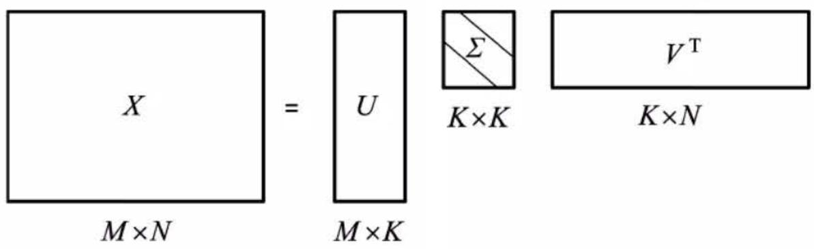  
图18.6 概率潜在语义分析与潜在语义分析的关系

共现模型(18.5)也可以表为三个矩阵乘积的形式。这样，概率潜在语义分析与潜在语义分析的对应关系可以从中看得很清楚。下是共现模型的矩阵乘积形式：

$$
\left\{ \begin{array} { l l } { X ^ { \prime } = U ^ { \prime } \Sigma ^ { \prime } V ^ { \prime \mathrm { T } } } \\ { X ^ { \prime } = [ P ( w , d ) ] _ { M \times N } } \\ { U ^ { \prime } = [ P ( w | z ) ] _ { M \times K } } \\ { \Sigma ^ { \prime } = [ P ( z ) ] _ { K \times K } } \\ { V ^ { \prime } = [ P ( d | z ) ] _ { N \times K } } \end{array} \right.\tag{18.8}
$$

概率潜在语义分析模型(18.8)中的矩阵 $U ^ { \prime }$ 和 $V ^ { \prime }$ 是负的、规范化的，表示条件概率分布，潜在语义分析模型中的矩阵U和V是正交的，未必负，并不表概率分布。

## 18.2 概率潜在语义分析的算法

概率潜在语义分析模型是含有隐变量的模型，其学习通常使EM算法。本节介绍成模型学习的EM算法。

EM算法是种迭代算法，每次迭代包括交替的两步：E步，求期望；M步，求极。E步是计算Q函数，即完全数据的对数似然函数对不完全数据的条件分布的期望。M步是对Q函数极化，更新模型参数。详细介绍见第9章。下叙述成模型的EM算法。

设单词集合为 $W = \{ w _ { 1 } , w _ { 2 } , \cdots , w _ { M } \}$ ，本集合为 $D = \{ d _ { 1 } , d _ { 2 } , \cdots , d _ { N } \}$ ，话题集合为 $Z = \{ z _ { 1 } , z _ { 2 } , \cdots , z _ { K } \}$ 。给定单词-本共现数据 $T = \left\{ n \left( w _ { i } , d _ { j } \right) \right\} , i = 1 , 2 , \cdots , M , \ j =$ $1 , 2 , \cdots , N$ ，标是估计概率潜在语义分析模型（成模型）的参数。如果使极似然估计，对数似然函数是

$$
\begin{array} { l } { { \displaystyle { \cal L } = \sum _ { i = 1 } ^ { M } \sum _ { j = 1 } ^ { N } n ( w _ { i } , d _ { j } ) \log P ( w _ { i } , d _ { j } ) } } \\ { { \displaystyle ~ = \sum _ { i = 1 } ^ { M } \sum _ { j = 1 } ^ { N } n ( w _ { i } , d _ { j } ) \log \left[ \sum _ { k = 1 } ^ { K } P ( w _ { i } | z _ { k } ) P ( z _ { k } | d _ { j } ) \right] } } \end{array}
$$

但是模型含有隐变量，对数似然函数的优化法解析法求解，这时使EM算法。应EM算法的核是定义Q函数。

(1)E步：计算Q函数

Q函数为完全数据的对数似然函数对不完全数据的条件分布的期望。针对概率潜在语义分析的生成模型，Q函数是

$$
Q = \sum _ { k = 1 } ^ { K } \left\{ \sum _ { j = 1 } ^ { N } n ( d _ { j } ) \Big [ \log P ( d _ { j } ) + \sum _ { i = 1 } ^ { M } \frac { n ( w _ { i } , d _ { j } ) } { n ( d _ { j } ) } \log P ( w _ { i } | z _ { k } ) P ( z _ { k } | d _ { j } ) \Big ] \right\} P ( z _ { k } | w _ { i } , d _ { j } )\tag{18.9}
$$

式中 $n ( d _ { j } ) = \sum _ { i = 1 } ^ { M } n ( w _ { i } , d _ { j } )$ 表示文本 $d _ { j }$ 中的单词个数， $n ( w _ { i } , d _ { j } )$ 表示单词 $w _ { i }$ 在文本 $d _ { j }$ 中出

现的次数。条件概率分布 $P ( \boldsymbol { z } _ { k } | \boldsymbol { w } _ { i } , d _ { j } )$ 代表不完全数据，是已知变量。条件概率分布 $P ( w _ { i } | \boldsymbol { z } _ { k } )$ 和 $P ( z _ { k } | d _ { j } )$ 的乘积代表完全数据，是未知变量。

由于可以从数据中直接统计得出 $P ( d _ { j } )$ 的估计，这里只考虑 $P ( w _ { i } | \boldsymbol { z } _ { k } ) , ~ P ( \boldsymbol { z } _ { k } | d _ { j } )$ 的估计，可将 $Q$ 函数简化为函数 $Q ^ { \prime }$

$$
Q ^ { \prime } = \sum _ { i = 1 } ^ { M } \sum _ { j = 1 } ^ { N } n ( w _ { i } , d _ { j } ) \sum _ { k = 1 } ^ { K } P ( z _ { k } | w _ { i } , d _ { j } ) \log [ P ( w _ { i } | z _ { k } ) P ( z _ { k } | d _ { j } ) ]\tag{18.10}
$$

$Q ^ { \prime }$ 函数中的 $P ( \boldsymbol { z } _ { k } | \boldsymbol { w } _ { i } , d _ { j } )$ 可以根据贝叶斯公式计算：

$$
P ( z _ { k } | w _ { i } , d _ { j } ) = \frac { P ( w _ { i } | z _ { k } ) P ( z _ { k } | d _ { j } ) } { \displaystyle \sum _ { k = 1 } ^ { K } P ( w _ { i } | z _ { k } ) P ( z _ { k } | d _ { j } ) }\tag{18.11}
$$

其中 $P ( z _ { k } | d _ { j } )$ 和 $P ( w _ { i } | \boldsymbol { z } _ { k } )$ 由上一步迭代得到。

(2)M步：极大化Q函数

通过约束最优化求解Q函数的极大值，这时 $P ( z _ { k } | d _ { j } )$ 和 $P ( w _ { i } | \boldsymbol { z } _ { k } )$ 是变量。因为变量$P ( w _ { i } | \boldsymbol { z } _ { k } ) , ~ P ( \boldsymbol { z } _ { k } | d _ { j } )$ 形成概率分布，满约束条件：

$$
\sum _ { i = 1 } ^ { M } P ( w _ { i } | z _ { k } ) = 1 , \quad k = 1 , 2 , \cdots , K
$$

$$
\sum _ { k = 1 } ^ { K } P ( z _ { k } | d _ { j } ) = 1 , \quad j = 1 , 2 , \cdots , N
$$

应拉格朗法，引拉格朗乘 $\tau _ { k }$ 和 $\rho _ { j }$ ，定义拉格朗日函数A：

$$
\varLambda = Q ^ { \prime } + \sum _ { k = 1 } ^ { K } \tau _ { k } \Bigl ( 1 - \sum _ { i = 1 } ^ { M } P ( w _ { i } | z _ { k } ) \Bigr ) + \sum _ { j = 1 } ^ { N } \rho _ { j } \Bigl ( 1 - \sum _ { k = 1 } ^ { K } P ( z _ { k } | d _ { j } ) \Bigr )
$$

将拉格朗函数A分别对 $P ( w _ { i } | \boldsymbol { z } _ { k } )$ 和 $P ( z _ { k } | d _ { j } )$ 求偏导数，并令其等于0，得到下的程组：

$$
\sum _ { j = 1 } ^ { N } n ( w _ { i } , d _ { j } ) P ( z _ { k } | w _ { i } , d _ { j } ) - \tau _ { k } P ( w _ { i } | z _ { k } ) = 0 , \quad i = 1 , 2 , \cdots , M , \quad k = 1 , 2 , \cdots , K
$$

$$
\sum _ { i = 1 } ^ { M } n ( w _ { i } , d _ { j } ) P ( z _ { k } | w _ { i } , d _ { j } ) - \rho _ { j } P ( z _ { k } | d _ { j } ) = 0 , \quad j = 1 , 2 , \cdots , N , \quad k = 1 , 2 , \cdots , K - 1 .
$$

解方程组得到M步的参数估计公式：

$$
P ( w _ { i } | { z } _ { k } ) = \frac { \displaystyle \sum _ { j = 1 } ^ { N } n ( w _ { i } , d _ { j } ) P ( { z } _ { k } | w _ { i } , d _ { j } ) } { \displaystyle \sum _ { m = 1 } ^ { M } \sum _ { j = 1 } ^ { N } n ( w _ { m } , d _ { j } ) P ( { z } _ { k } | w _ { m } , d _ { j } ) }\tag{18.12}
$$

$$
\mathop { P ( z _ { k } | d _ { j } ) } = \frac { \displaystyle \sum _ { i = 1 } ^ { M } n ( w _ { i } , d _ { j } ) P ( z _ { k } | w _ { i } , d _ { j } ) } { \displaystyle n ( d _ { j } ) }\tag{18.13}
$$

总结有下面的算法：

算法18.1（概率潜在语义模型参数估计的EM算法）

输入：设单词集合为 $W = \{ w _ { 1 } , w _ { 2 } , \cdots , w _ { M } \}$ ，本集合为 $D = \{ d _ { 1 } , d _ { 2 } , \cdots , d _ { N } \}$ ，话题集合为 $Z = \{ z _ { 1 } , z _ { 2 } , \cdots , z _ { K } \}$ ，共现数据 $\left\{ n \left( w _ { i } , d _ { j } \right) \right\} , i = 1 , 2 , \cdot \cdot \cdot , M , j = 1 , 2 , \cdots , N .$

输出： $P ( w _ { i } | \boldsymbol { z } _ { k } )$ 和 $P ( z _ { k } | d _ { j } )$

（1）设置参数 $P ( w _ { i } | \boldsymbol { z } _ { k } )$ 和 $P ( z _ { k } | d _ { j } )$ 的初始值。

(2）迭代执以下E步和M步，直到收敛为。

E步：

$$
P ( z _ { k } | w _ { i } , d _ { j } ) = \frac { P ( w _ { i } | z _ { k } ) P ( z _ { k } | d _ { j } ) } { \displaystyle \sum _ { k = 1 } ^ { K } P ( w _ { i } | z _ { k } ) P ( z _ { k } | d _ { j } ) }
$$

M步：

$$
P ( w _ { i } | { z } _ { k } ) = \frac { \displaystyle \sum _ { j = 1 } ^ { N } n ( w _ { i } , d _ { j } ) P ( { z } _ { k } | w _ { i } , d _ { j } ) } { \displaystyle \sum _ { m = 1 } ^ { M } \sum _ { j = 1 } ^ { N } n ( w _ { m } , d _ { j } ) P ( { z } _ { k } | w _ { m } , d _ { j } ) }
$$

$$
\mathop { P ( z _ { k } | d _ { j } ) } = \frac { \displaystyle \sum _ { i = 1 } ^ { M } n ( w _ { i } , d _ { j } ) P ( z _ { k } | w _ { i } , d _ { j } ) } { \displaystyle n ( d _ { j } ) }
$$

## 本章概要

1．概率潜在语义分析是利概率成模型对本集合进话题分析的法。概率潜在语义分析受潜在语义分析的启发提出，两者可以通过矩阵分解关联起来。

给定个本集合，通过概率潜在语义分析，可以得到各个本成话题的条件概率分布，以及各个话题成单词的条件概率分布。

概率潜在语义分析的模型有成模型以及等价的共现模型。其学习策略是观测数据的极似然估计，其学习算法是EM算法。

2.生成模型表示文本生成话题，话题生成单词，从而得到单词-文本共现数据的过程；假设每个本由个话题分布决定，每个话题由个单词分布决定。单词变量 $_ w$ 与文本变量 $d$ 是观测变量，话题变量₂是隐变量。成模型的定义如下：

$$
P ( T ) = \prod _ { ( w , d ) } P ( w , d ) ^ { n ( w , d ) }
$$

$$
P ( w , d ) = P ( d ) P ( w | d ) = P ( d ) \sum _ { z } P ( z | d ) P ( w | z )
$$

3.共现模型描述本单词共现数据拥有的模式。共现模型的定义如下：

$$
P \left( T \right) = \prod _ { \left( w , d \right) } P ( w , d ) ^ { n ( w , d ) }
$$

$$
P ( w , d ) = \sum _ { z \in Z } P ( z ) P ( w | z ) P ( d | z )
$$

4.概率潜在语义分析模型的参数个数是 $O ( M \cdot K + N \cdot K )$ 。现实中 $K \ll M$ ，所以概率潜在语义分析通过话题对数据进了更简洁的表示，实现了数据压缩。

5.模型中的概率分布 $P ( w | d )$ 可以由参数空间中的单纯形表示。M维参数空间中，单词单纯形表所有可能的本的分布，其中的话题单纯形表在K个话题定义下的所有可能的本的分布。话题单纯形是单词单纯形的集，表潜在语义空间。

6.概率潜在语义分析的学习通常采EM算法。通过迭代学习模型的参数、 $P ( w | z )$ 和$P ( z | d )$ ，而 $P ( d )$ 可直接统计得出。

## 继续阅读

概率潜在语义分析的原始献有献[1]\~献[3]。在献[4]中，作者讨论了概率潜在语义分析与负矩阵分解的关系。

## 习 题

18.1 证明成模型与共现模型是等价的。

18.2 推导共现模型的EM算法。

18.3 对以下本数据集进概率潜在语义分析。

<table><tr><td rowspan="2">单词</td><td colspan="9">文本</td></tr><tr><td>T1</td><td>T2</td><td>T3</td><td>T4</td><td>T5</td><td>T6</td><td>T7</td><td>T8</td><td>T9</td></tr><tr><td>book</td><td></td><td></td><td>1</td><td>1</td><td></td><td></td><td></td><td></td><td></td></tr><tr><td>dads</td><td></td><td></td><td></td><td></td><td></td><td>1</td><td></td><td></td><td>1</td></tr><tr><td>dummies</td><td></td><td>1</td><td></td><td></td><td></td><td></td><td></td><td>1</td><td></td></tr><tr><td>estate</td><td></td><td></td><td></td><td></td><td></td><td></td><td>1</td><td></td><td>1</td></tr><tr><td>guide</td><td>1</td><td></td><td></td><td></td><td></td><td>1</td><td></td><td></td><td></td></tr><tr><td>investing</td><td>1</td><td>1</td><td>1</td><td>1</td><td>1</td><td>1</td><td>1</td><td>1</td><td></td></tr><tr><td>market</td><td>1</td><td></td><td>1</td><td></td><td></td><td></td><td></td><td></td><td>1</td></tr><tr><td>real</td><td></td><td></td><td></td><td></td><td></td><td></td><td>1</td><td></td><td></td></tr><tr><td>rich</td><td></td><td></td><td></td><td></td><td></td><td>2</td><td></td><td></td><td>11</td></tr><tr><td>stock</td><td>1</td><td></td><td>1</td><td></td><td></td><td></td><td></td><td>1</td><td></td></tr><tr><td>value</td><td></td><td></td><td></td><td>1</td><td>1</td><td></td><td></td><td></td><td></td></tr></table>

## 参考文献

[1] HOFMANN T. Probabilistic latent semantic analysis[C]//Proceedings of the Fifteenth Conference on Uncertainty in Artificial Intelligence. 1999: 289–296.

[2] HOFMANN T. Probabilistic latent semantic indexing[C]//Proceedings of the 22nd Annual International ACM SIGIR Conference on Research and Development in Information Retrieval, 1999.

[3] HOFMANN T. Unsupervised learning by probabilistic latent semantic analysis[J]. Machine Learning, 2001, 42: 177–196.

[4] DING C, LI T, PENG W. On the equivalence between non-negative matrix factorization and probabilistic latent semantic indexing[J]. Computational Statistics & Data Analysis, 2008, 52(8): 3913–3927.

## 第19章 马尔可夫链蒙特卡罗法

蒙特卡罗法（MonteCarlo method）也称为统计模拟法（statisticalsimulation method），是通过从概率模型的随机抽样进近似数值计算的法。马尔可夫链蒙特卡罗法（MarkovChainMonteCarlo，MCMC）则是以马尔可夫链（Markov chain）为概率模型的蒙特卡罗法。马尔可夫链蒙特卡罗法构建个马尔可夫链，使其平稳分布就是要进抽样的分布，先基于该马尔可夫链进随机游，产样本的序列，之后使该平稳分布的样本进近似数值计算。

Metropolis-Hastings算法是最基本的马尔可夫链蒙特卡罗法，Metropolis等在1953年提出原始的算法，Hastings在1970年对之加以推，形成了现在的形式。吉布斯抽样（Gibbssampling）是更简单、使更泛的马尔可夫链蒙特卡罗法，1984年由S.Geman和D.Geman提出。

马尔可夫链蒙特卡罗法被应于概率分布的估计、定积分的近似计算、最优化问题的近似求解等问题，特别是被应于机器学习中概率模型的学习与推理，是重要的机器学习计算方法。

本章先在19.1节介绍般的蒙特卡罗法，在19.2节介绍马尔可夫链，然后在19.3节叙述马尔可夫链蒙特卡罗法的般法，最后在19.4节和19.5节分别讲述Metropolis-Hastings算法和吉布斯抽样。

## 19.1 蒙特卡罗法

本节介绍般的蒙特卡罗法在随机抽样、数学期望估计、定积分计算的应。马尔可夫链蒙特卡罗法是蒙特卡罗法的种法。

## 19.1.1 随机抽样

统计学和机器学习的的是基于数据对概率分布的特征进推断，蒙特卡罗法要解决的问题是：假设概率分布的定义已知，通过抽样获得概率分布的随机样本，并通过得到的随机样本对概率分布的特征进分析。如，从样本得到经验分布，从估计总体分布；或者从样本计算出样本均值，从估计总体期望。所以蒙特卡罗法的核是随机抽样（randomsampling)。

般的蒙特卡罗法有直接抽样法、接受-拒绝抽样法、重要性抽样法等。接受-拒绝抽样法、重要性抽样法适合于概率密度函数复杂（如密度函数含有多个变量，各变量相互不独，密度函数形式复杂）、不能直接抽样的情况。

这介绍接受-拒绝抽样法（accept-reject samplingmethod）。假设有随机变量x，取值$x \in \mathcal { X }$ ，其概率密度函数为 $p ( x )$ 。标是得到该概率分布的随机样本，以对这个概率分布进分析。

接受-拒绝法的基本想法如下。假设 $p ( x )$ 不可以直接抽样。找个可以直接抽样的分布，称为建议分布（proposaldistribution）。假设 $q ( x )$ 是建议分布的概率密度函数，并且有 $q ( x )$ 的c倍一定大于等于 $p ( x )$ ，其中 $c > 0$ ，如图19.1所。按照 $q ( x )$ 进行抽样，假设得到的结果是 $x ^ { * }$ ，再按照 $\frac { p ( x ^ { * } ) } { c q ( x ^ { * } ) }$ 的比例随机决定是否接受 $x ^ { * }$ 。直观上，落到 $\boldsymbol { p } ( \boldsymbol { x } ^ { * } )$ 范围内的就接受（绿色），落到 $\boldsymbol { p } ( \boldsymbol { x } ^ { * } )$ 范围外的就拒绝（红）。接受-拒绝法实际是按照 $p ( x )$ 的涵盖面积（或涵盖体积）占 $c q ( x )$ 的涵盖面积（或涵盖体积）的例进抽样。

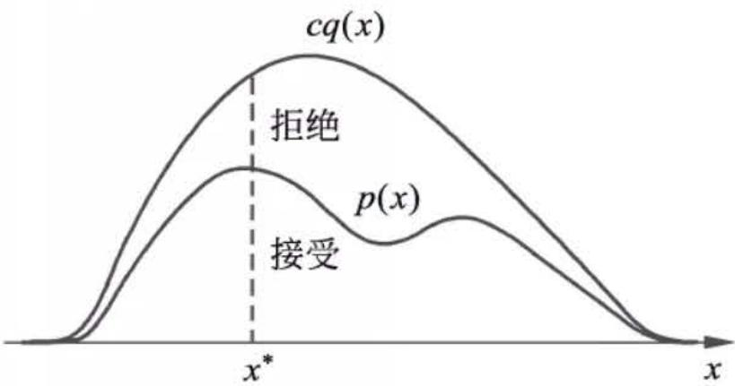  
图19.1 接受-拒绝抽样法(见前彩图)

接受-拒绝法的具体算法如下

算法19.1（接受-拒绝法）

输：抽样的标概率分布的概率密度函数 $p ( x )$ 。

输出：概率分布的随机样本 $x _ { 1 } , x _ { 2 } , \cdots , x _ { n } \circ$

参数：样本数 $_ { n \mathrm { ~ c ~ } }$

（1）选择概率密度函数为 $q ( x )$ 的概率分布，作为建议分布，使其对任一x满$c q ( x ) \geqslant p ( x )$ ，其中 $c > 0$ o

(2）按照建议分布 $q ( x )$ 随机抽样得到样本 $x ^ { * }$ ，再按照均匀分布在(0,1)范围内抽样得到 $u _ { \mathrm { ~ c ~ } }$

(3）如果 $u \leqslant \frac { p ( x ^ { * } ) } { c q ( x ^ { * } ) }$ ，则将 $x ^ { * }$ 作为抽样结果；否则，回到步骤(2)。

(4）直得到n个随机样本，结束。

接受-拒绝法的优点是容易实现，缺点是效率可能不。如果 $p ( x )$ 的涵盖体积占 $c q ( x )$ 的涵盖体积的例很低，就会导致拒绝的例很，抽样效率很低。注意，般是在维空间进抽样，即使 $p ( x )$ 与 $c q ( x )$ 很接近，两者涵盖体积的差异也可能很（与我们在三维空间的直观不同)。

## 19.1.2 数学期望估计

般的蒙特卡罗法如直接抽样法、接受-拒绝抽样法、重要性抽样法，也可以于数学期望估计（estimation of mathematicalexpectation）。假设有随机变量x，取值 $x \in \mathcal { X }$ ，其概率

密度函数为 $p ( x )$ ，f(x）为定义在X上的函数，标是求函数 $f ( x )$ 关于密度函数 $p ( x )$ 的数学期望 ${ E } _ { p ( x ) } [ f ( x ) ]$ 。

针对这个问题，蒙特卡罗法按照概率分布 $p ( x )$ 独立地抽取n个样本 $x _ { 1 } , x _ { 2 } , \cdots , x _ { n }$ ，比如以上的抽样法，之后计算函数 $f ( x )$ 的样本均值 $\hat { f } _ { n }$ :

$$
{ \hat { f } } _ { n } = { \frac { 1 } { n } } \sum _ { i = 1 } ^ { n } f ( x _ { i } )\tag{19.1}
$$

作为数学期望 ${ E } _ { p ( x ) } [ f ( x ) ]$ 的近似值。

根据数定律，当样本容量增时，样本均值以概率1收敛于数学期望：

$$
\hat { f } _ { n } \longrightarrow E _ { p ( x ) } [ f ( x ) ] , \quad n \longrightarrow \infty\tag{19.2}
$$

这样就得到了数学期望的近似计算法：

$$
E _ { p ( x ) } [ f ( x ) ] \approx { \frac { 1 } { n } } \sum _ { i = 1 } ^ { n } f ( x _ { i } )\tag{19.3}
$$

## 19.1.3 积分计算

般的蒙特卡罗法也可以于定积分的近似计算，称为蒙特卡罗积分（MonteCarlointegration）。假设有个函数 $h ( x )$ ，标是计算该函数的积分：

$$
\int _ { \mathcal { X } } h \left( x \right) \mathrm { d } x
$$

如果能够将函数 $h ( x )$ 分解成个函数 $f ( x )$ 和个概率密度函数 $p ( x )$ 的乘积的形式，那么就有

$$
\int _ { \chi } h \left( x \right) \mathrm { d } x = \int _ { \chi } f \left( x \right) p \left( x \right) \mathrm { d } x = E _ { p ( x ) } \left[ f ( x ) \right]\tag{19.4}
$$

於是函数 $h ( x )$ 的积分可以表示为函数 $f ( x )$ 关于概率密度函数 $p ( x )$ 的数学期望。实际上，给定个概率密度函数 $p ( x )$ ，只要取 $f ( x ) = { \frac { h ( x ) } { p ( x ) } }$ ，就可得式(19.4)。就是说，任何个函数的积分都可以表为某个函数的数学期望的形式，函数的数学期望又可以通过函数的样本均值估计。于是，就可以利样本均值来近似计算积分，这就是蒙特卡罗积分的基本想法。

$$
\int _ { \mathcal { X } } h \left( x \right) \mathrm { d } x = E _ { p \left( x \right) } \left[ f ( x ) \right] \approx \frac { 1 } { n } \sum _ { i = 1 } ^ { n } f ( x _ { i } )\tag{19.5}
$$

例 ${ \bf 1 9 . 1 ^ { ( 1 ) } }$ 蒙特卡罗积分法求 $\int _ { 0 } ^ { 1 } \mathrm { e } ^ { - x ^ { 2 } / 2 } \mathrm { d } x$

解 令 $f ( x ) = \mathrm { e } ^ { - x ^ { 2 } / 2 }$

$$
p ( x ) = 1 \quad ( 0 < x < 1 )
$$

也就是说，假设随机变量x在(0,1)区间遵循均匀分布。

使蒙特卡罗积分法，如图19.2所，在(0,1)区间按照均匀分布抽取10个随机样本$x _ { 1 } , x _ { 2 } , \cdots , x _ { 1 0 } { _ { \circ } }$ 计算样本的函数均值 $\hat { f } _ { 1 0 }$

$$
\hat { f } _ { 1 0 } = \frac { 1 } { 1 0 } \sum _ { i = 1 } ^ { 1 0 } \mathrm { e } ^ { - x _ { i } ^ { 2 } / 2 } = 0 . 8 3 2
$$

也就是积分的近似。随机样本数越，计算就越精确。

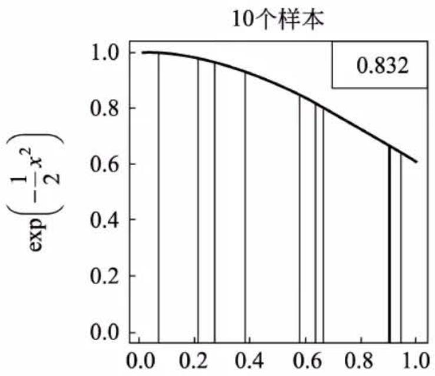  
图19.2 蒙特卡罗积分例

例19.2 蒙特卡罗积分法求 $\int _ { - \infty } ^ { \infty } x { \frac { 1 } { \sqrt { 2 \pi } } } \exp \left( { \frac { - x ^ { 2 } } { 2 } } \right) \mathrm { d } x ,$ 解令 $f ( x ) = x$ ,

$$
p ( x ) = { \frac { 1 } { \sqrt { 2 \pi } } } \exp \left( { \frac { - x ^ { 2 } } { 2 } } \right)
$$

p(x)是标准正态分布的密度函数。

使蒙特卡罗积分法，按照标准正态分布在区间 $( - \infty , \infty )$ 抽样 $x _ { 1 } , x _ { 2 } , \cdots , x _ { n }$ ，取其平均值，就得到要求的积分值。当样本增时，积分值趋于 $0 _ { \circ }$

本章介绍的马尔可夫链蒙特卡罗法也适合于概率密度函数复杂、不能直接抽样的情况，旨在解决般的蒙特卡罗法，如接受-拒绝抽样法、重要性抽样法，抽样效率不的问题。般的蒙特卡罗法中的抽样样本是独的，马尔可夫链蒙特卡罗法中的抽样样本不是独的，样本序列形成马尔可夫链。

## 19.2 马尔可夫链

本节先给出马尔可夫链的定义，之后介绍马尔可夫链的些性质。马尔可夫链蒙特卡罗法用到这些性质。

## 19.2.1 基本定义

定义19.1（马尔可夫链） 考虑个随机变量的序列 $X = \{ X _ { 0 } , X _ { 1 } , \cdots , X _ { t } , \cdot \cdot \cdot \}$ ,这里$X _ { t }$ 表示时刻t的随机变量， $t = 0 , 1 , 2 , \cdots$ 。每个随机变量 $X _ { t } \left( { \mathrm { \Omega } } t = 0 , 1 , 2 , \cdots \right)$ 的取值集合相同，称为状态空间，表示为 $\boldsymbol { \mathcal { S } } _ { \mathrm { { \Theta } } }$ ，随机变量可以是离散的，也可以是连续的。以上随机变量的序列构成随机过程（stochastic process）。

假设在时刻0的随机变量 $X _ { 0 }$ 遵循概率分布 $P ( X _ { 0 } ) = \pi _ { 0 }$ ，称为初始状态分布。在某个时刻 $t \geqslant 1$ 的随机变量 $X _ { t }$ 与前一个时刻的随机变量 $X _ { t - 1 }$ 之间有条件分布 $P ( X _ { t } | X _ { t - 1 } )$ ,如果$X _ { t }$ 只依赖于 $X _ { t - 1 }$ ，而不依赖于过去的随机变量 $\{ X _ { 0 } , X _ { 1 } , \dots , X _ { t - 2 } \}$ ，这一性质称为 $\frac { \pi } { - y }$ 尔可夫性,即

$$
P ( X _ { t } | X _ { 0 } , X _ { 1 } , \cdots , X _ { t - 1 } ) = P ( X _ { t } | X _ { t - 1 } ) , \quad t = 1 , 2 , \cdots .\tag{19.6}
$$

具有马尔可夫性的随机序列 $X = \{ X _ { 0 } , X _ { 1 } , \cdots , X _ { t } , \cdots \}$ 称为 $\frac { \pi } { - y }$ 尔可夫链（Markovchain）或$\frac { \pi } { - y }$ 尔可夫过程（Markov process）。条件概率分布 $P ( X _ { t } | X _ { t - 1 } )$ 称为 $\frac { \pi } { 2 }$ 尔可夫链的转移概率分布。转移概率分布决定了马尔可夫链的特性。

马尔可夫性的直观解释是“未来只依赖于现在（假设现在已知），与过去关”。这个假设在许多应中是合理的。

若转移概率分布 $P ( X _ { t } | X _ { t - 1 } )$ 与t无关，即

$$
P ( X _ { t + s } | X _ { t - 1 + s } ) = P ( X _ { t } | X _ { t - 1 } ) , \quad t = 1 , 2 , \cdots , \quad s = 1 , 2 , \cdots .\tag{19.7}
$$

则称该马尔可夫链为时间齐次的马尔可夫链（timehomogenous Markov chain）。本书中提到的马尔可夫链都是时间齐次的。

以上定义的是阶马尔可夫链，可以扩展到n阶马尔可夫链，满n阶马尔可夫性：

$$
P ( X _ { t } | X _ { 0 } X _ { 1 } \cdot \cdot \cdot X _ { t - 2 } X _ { t - 1 } ) = P ( X _ { t } | X _ { t - n } \cdot \cdot \cdot X _ { t - 2 } X _ { t - 1 } )\tag{19.8}
$$

本书主要考虑阶马尔可夫链。容易验证n阶马尔可夫链可以转换为阶马尔可夫链。

## 19.2.2 离散状态马尔可夫链

## 1.转移概率矩阵和状态分布

离散状态马尔可夫链 $X = \{ X _ { 0 } , X _ { 1 } , \cdots , X _ { t } , \cdot \cdot \cdot \}$ ，随机变量 $X _ { t } \mid { ( t = 0 , 1 , 2 , \cdots ) }$ 定义在离散空间S，转移概率分布可以由矩阵表。

若马尔可夫链在时刻(t1）处于状态j，在时刻t移动到状态i，将转移概率记作

$$
p _ { i j } = ( X _ { t } = i | X _ { t - 1 } = j ) , \quad i = 1 , 2 , \cdots , \quad j = 1 , 2 , \cdot \cdot \cdot\tag{19.9}
$$

满足

$$
p _ { i j } \geqslant 0 , \quad \sum _ { i } p _ { i j } = 1
$$

马尔可夫链的转移概率 $p _ { i j }$ 可以由矩阵表示，即

$$
P = { \left[ \begin{array} { l l l l } { p _ { 1 1 } } & { p _ { 1 2 } } & { p _ { 1 3 } } & { \cdots } \\ { p _ { 2 1 } } & { p _ { 2 2 } } & { p _ { 2 3 } } & { \cdots } \\ { p _ { 3 1 } } & { p _ { 3 2 } } & { p _ { 3 3 } } & { \cdots } \\ { \cdots } & { \cdots } & { \cdots } & { \cdots } \end{array} \right] }\tag{19.10}
$$

称为马尔可夫链的转移概率矩阵，转移概率矩阵P满条件 $p _ { i j } \geqslant 0 , \sum _ { i } p _ { i j } = 1$ 。满足这两个条件的矩阵称为随机矩阵（stochasticmatrix）。注意这矩阵列元素之和为1。

考虑马尔可夫链 $X = \{ X _ { 0 } , X _ { 1 } , \cdots , X _ { t } , \cdots \}$ 在时刻 $t \left( t = 0 , 1 , 2 , \cdots \right)$ 的概率分布，称为时刻t的状态分布，记作

$$
\pi ( t ) = { \left[ \begin{array} { l } { \pi _ { 1 } ( t ) } \\ { \pi _ { 2 } ( t ) } \\ { \qquad \vdots } \end{array} \right] }\tag{19.11}
$$

其中， $\pi _ { i } ( t )$ 表时刻t状态为i的概率 $P ( X _ { t } = i )$

$$
\pi _ { i } ( t ) = P ( X _ { t } = i ) , \quad i = 1 , 2 , \cdots
$$

特别地，马尔可夫链的初始状态分布可以表为

$$
\pi ( 0 ) = \left[ \begin{array} { c } { { \pi _ { 1 } ( 0 ) } } \\ { { } } \\ { { \pi _ { 2 } ( 0 ) } } \\ { { } } \\ { { \vdots } } \end{array} \right]\tag{19.12}
$$

其中， $\pi _ { i } ( 0 )$ 表时刻0状态为i的概率 $P ( X _ { 0 } = i )$ 。通常初始分布 $\pi ( 0 )$ 的向量只有一个分量是1，其余分量都是0，表马尔可夫链从个具体状态开始。

有限离散状态的马尔可夫链可以由有向图表。结点表状态，边表状态之间的转移，边上的数值表转移概率。从个初始状态出发，根据有向边上定义的概率在状态之间随机跳转（或随机转移），就可以产状态的序列。马尔可夫链实际上是刻画随时间在状态之间转移的模型，假设未来的转移状态只依赖于现在的状态，与过去的状态关。

下通过个简单的例给出马尔可夫链的直观解释。假设观察某地的天，按依次是“晴、、晴、晴、晴、、晴……”，具有定的规律。马尔可夫链可以刻画这个过程。假设天的变化具有马尔可夫性，即明天的天只依赖于今天的天，与昨天及以前的天关。这个假设经验上是合理的，少是现实情况的近似。具体地，如，如果今天是晴天，那么明天是晴天的概率是0.9，是天的概率是0.1；如果今天是天，那么明天是晴天的概率是0.5，是天的概率也是0.5。图19.3表这个马尔可夫链。基于这个马尔可夫链，从个初始状态出发，随时间在状态之间随机转移，就可以产天的序列，可以对天进预测。

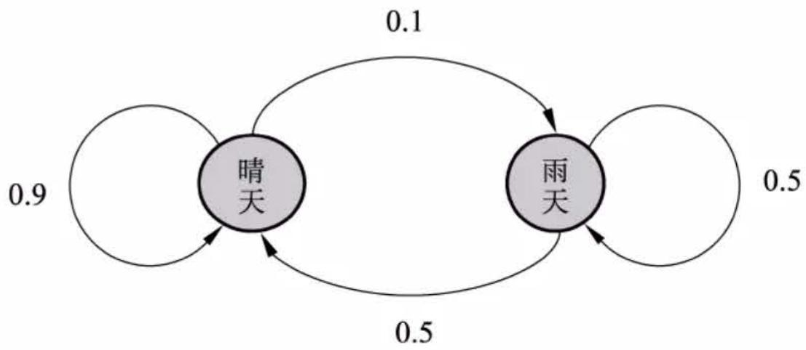  
图19.3 马尔可夫链例

下看个马尔可夫链应的例。然语处理、语处理中经常到语模型（language model），是建在词表上的n阶马尔可夫链。如，在英语语识别中，语模型产出两个候选:“How to recognize speech”与“How to wreck a nice beach"①，要判断哪个可能性更。显然从语义的度前者的可能性更，语模型可以帮助做出这个判断。

将个语句看作是个单词的序列 $w _ { 1 } w _ { 2 } \cdots w _ { s }$ ，标是计算其概率。同个语句很少在语料中重复多次出现，所以直接从语料中估计每个语句的概率是困难的。语模型局部的单词序列的概率组合计算出全局的单词序列的概率，可以很好地解决这个问题。

假设每个单词只依赖于其前出现的单词，也就是说单词序列具有马尔可夫性，那么可以定义阶马尔可夫链，即语模型，计算语句的概率。

$$
\begin{array} { r l } & { \quad P ( w _ { 1 } w _ { 2 } \cdot \cdot \cdot w _ { s } ) } \\ & { = P ( w _ { 1 } ) P ( w _ { 2 } | w _ { 1 } ) P ( w _ { 3 } | w _ { 1 } w _ { 2 } ) \cdot \cdot \cdot P ( w _ { i } | w _ { 1 } w _ { 2 } \cdot \cdot \cdot w _ { i - 1 } ) \cdot \cdot \cdot P ( w _ { s } | w _ { 1 } w _ { 2 } \cdot \cdot \cdot w _ { s - 1 } ) } \\ & { = P ( w _ { 1 } ) P ( w _ { 2 } | w _ { 1 } ) P ( w _ { 3 } | w _ { 2 } ) \cdot \cdot \cdot P ( w _ { i } | w _ { i - 1 } ) \cdot \cdot \cdot P ( w _ { s } | w _ { s - 1 } ) } \end{array}
$$

这第三个等式基于马尔可夫链假设。在这个马尔可夫链中，状态空间为词表，个位置上单词的产只依赖于前个位置的单词，不依赖于更前的单词。以上是阶马尔可夫链，般可以扩展到n阶马尔可夫链。

语模型的学习等价于确定马尔可夫链中的转移概率值，如果有充分的语料，转移概率可以直接从语料中估计。直观上，“wreckanice”出现之后，下出现“beach”的概率极低，所以第个语句的概率应该更，从语模型的度看第个语句的可能性更。

马尔可夫链X在时刻t的状态分布可以由在时刻(t-1）的状态分布以及转移概率分布决定：

$$
\pi ( t ) = P \pi ( t - 1 )\tag{19.13}
$$

这是因为

$$
\begin{array} { l } { \pi _ { i } ( t ) = P ( X _ { t } = i ) \ } \\ { \displaystyle \quad = \sum _ { m } P ( X _ { t } = i | X _ { t - 1 } = m ) P ( X _ { t - 1 } = m ) } \\ { \displaystyle \quad = \sum _ { m } p _ { i m } \pi _ { m } ( t - 1 ) } \end{array}
$$

马尔可夫链在时刻t的状态分布可以通过递推得到。事实上，由式(19.13)

$$
\pi ( t ) = P \pi ( t - 1 ) = P [ P \pi ( t - 2 ) ] = P ^ { 2 } \pi ( t - 2 )
$$

递推得到：

$$
\pi ( t ) = P ^ { t } \pi ( 0 )\tag{19.14}
$$

这里的 $P ^ { t }$ 称为t步转移概率矩阵：

$$
P _ { i j } ^ { t } = P ( X _ { t } = i | X _ { 0 } = j )
$$

表示时刻0从状态 $j$ 出发、时刻t达到状态i的t步转移概率。 $P ^ { t }$ 也是随机矩阵。式(19.14)说明，马尔可夫链的状态分布由初始分布和转移概率分布决定。

对图19.3中的马尔可夫链，转移矩阵为

$$
P = { \left[ \begin{array} { l l } { 0 . 9 } & { 0 . 5 } \\ { 0 . 1 } & { 0 . 5 } \end{array} \right] }
$$

如果第天是晴天，其天概率分布（初始状态分布）如下：

$$
\pi ( 0 ) = { \left[ \begin{array} { l } { 1 } \\ { 0 } \end{array} \right] }
$$

根据这个马尔可夫链模型，可以计算第天、第三天及之后的天概率分布（状态分布）。

$$
\pi ( 1 ) = P \pi ( 0 ) = { \left[ \begin{array} { l l } { 0 . 9 } & { 0 . 5 } \\ { 0 . 1 } & { 0 . 5 } \end{array} \right] } { \left[ \begin{array} { l } { 1 } \\ { 0 } \end{array} \right] } = { \left[ \begin{array} { l } { 0 . 9 } \\ { 0 . 1 } \end{array} \right] }
$$

$$
\pi ( 2 ) = P ^ { 2 } \pi ( 0 ) = { \left[ \begin{array} { l l } { 0 . 9 } & { 0 . 5 } \\ { 0 . 1 } & { 0 . 5 } \end{array} \right] } ^ { 2 } { \left[ \begin{array} { l } { 1 } \\ { 0 } \end{array} \right] } = { \left[ \begin{array} { l } { 0 . 8 6 } \\ { 0 . 1 4 } \end{array} \right] }
$$

## 2.平稳分布

定义19.2（平稳分布） 设有马尔可夫链 $X = \{ X _ { 0 } , X _ { 1 } , \cdots , X _ { t } , \cdots \}$ ，其状态空间为 $s ,$ 转移概率矩阵为 $P = ( p _ { i j } )$ ，如果存在状态空间S上的个分布

$$
\pi = { \left[ \begin{array} { l } { \pi _ { 1 } } \\ { \pi _ { 2 } } \\ { \vdots } \end{array} \right] }
$$

使得

$$
\pi = P \pi\tag{19.15}
$$

则称 $\pi$ 为 $\frac { \pi } { 2 }$ 尔可夫链 $X = \{ X _ { 0 } , X _ { 1 } , \cdot \cdot \cdot , X _ { t } , \cdot \cdot \cdot \}$ 的平稳分布。

直观上，如果马尔可夫链的平稳分布存在，那么以该平稳分布作为初始分布，向未来进随机状态转移，之后任何个时刻的状态分布都是该平稳分布。

引理19.1 给定个马尔可夫链 $X = \{ X _ { 0 } , X _ { 1 } , \cdot \cdot \cdot , X _ { t } , \cdot \cdot \cdot \}$ ，状态空间为S，转移概率矩阵为 $P = \left( p _ { i j } \right)$ ，则分布 ${ \boldsymbol \pi } = ( \pi _ { 1 } , \pi _ { 2 } , \ldots ) ^ { \mathrm { T } }$ 为X的平稳分布的充分必要条件是${ \boldsymbol { \pi } } = \left( \pi _ { 1 } , \pi _ { 2 } , \ldots \right) ^ { \mathrm { { T } } }$ 是下列方程组的解：

$$
x _ { i } = \sum _ { j } p _ { i j } x _ { j } , \quad i = 1 , 2 , \cdots\tag{19.16}
$$

$$
x _ { i } \geqslant 0 , \quad i = 1 , 2 , \cdot \cdot \cdot\tag{19.17}
$$

$$
\sum _ { i } x _ { i } = 1\tag{19.18}
$$

证明 必要性。假设 $\pi = ( \pi _ { 1 } , \pi _ { 2 } , \cdot \cdot \cdot ) ^ { \mathrm { T } }$ 是平稳分布，显然满式(19.17)和式(19.18)，且

$$
\pi _ { i } = \sum _ { j } p _ { i j } \pi _ { j } , \quad i = 1 , 2 , \cdots
$$

即 ${ \boldsymbol { \pi } } = ( \pi _ { 1 } , \pi _ { 2 } , \ldots ) ^ { \mathrm { { T } } }$ 满足式(19.16)。

充分性。由式(19.17)和式(19.18)知 ${ \boldsymbol { \pi } } = ( \pi _ { 1 } , \pi _ { 2 } , \ldots ) ^ { \mathrm { { T } } }$ 是个概率分布。假设 $\pi =$ $\left( \pi _ { 1 } , \pi _ { 2 } , \cdot \cdot \cdot \right) ^ { \mathrm { T } }$ 为 $X _ { t }$ 的分布，则

$$
P ( X _ { t } = i ) = \pi _ { i } = \sum _ { j } p _ { i j } \pi _ { j } = \sum _ { j } p _ { i j } P ( X _ { t - 1 } = j ) , \quad i = 1 , 2 , \cdots
$$

$\pi = ( \pi _ { 1 } , \pi _ { 2 } , \cdot \cdot \cdot ) ^ { \mathrm { T } }$ 也为 $X _ { t - 1 }$ 的分布。事实上这对任意t成，所以 $\pi = ( \pi _ { 1 } , \pi _ { 2 } , \cdot \cdot \cdot ) ^ { \mathrm { T } }$ 是马尔可夫链的平稳分布。

引理19.1给出个求马尔可夫链平稳分布的法。

例19.3 设有图19.4所马尔可夫链，其转移概率矩阵为

$$
P = { \left[ \begin{array} { l l l } { 1 / 2 } & { 1 / 2 } & { 1 / 4 } \\ { 1 / 4 } & { 0 } & { 1 / 4 } \\ { 1 / 4 } & { 1 / 2 } & { 1 / 2 } \end{array} \right] }
$$

求其平稳分布。

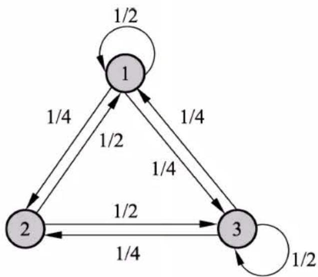  
图19.4 马尔可夫链例

解 设平稳分布为 ${ \boldsymbol { \pi } } = ( x _ { 1 } , x _ { 2 } , x _ { 3 } ) ^ { \mathrm { T } }$ ，则由式(19.16)\~式(19.18)有

$$
x _ { 1 } = \frac { 1 } { 2 } x _ { 1 } + \frac { 1 } { 2 } x _ { 2 } + \frac { 1 } { 4 } x _ { 3 }
$$

$$
x _ { 2 } = { \frac { 1 } { 4 } } x _ { 1 } + { \frac { 1 } { 4 } } x _ { 3 }
$$

$$
x _ { 3 } = \frac { 1 } { 4 } x _ { 1 } + \frac { 1 } { 2 } x _ { 2 } + \frac { 1 } { 2 } x _ { 3 }
$$

$$
x _ { 1 } + x _ { 2 } + x _ { 3 } = 1
$$

$$
x _ { i } \geqslant 0 , \quad i = 1 , 2 , 3
$$

解程组，得到唯的平稳分布：

$$
\pi = ( 2 / 5 \quad 1 / 5 \quad 2 / 5 ) ^ { \mathrm { T } }
$$

例19.4 设有图19.5所马尔可夫链，其转移概率分布如下，求其平稳分布。

$$
\left[ \begin{array} { l l l } { 1 } & { 1 / 3 } & { 0 } \\ { 0 } & { 1 / 3 } & { 0 } \\ { 0 } & { 1 / 3 } & { 1 } \end{array} \right]
$$

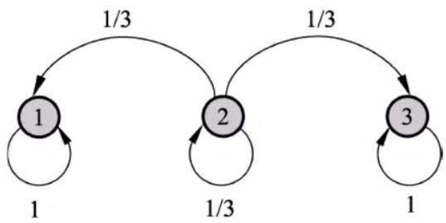  
图19.5 马尔可夫链例

解 这个马尔可夫链的平稳分布并不唯， $\pi = { ( 3 / 4 ~ 0 ~ 1 / 4 ) } ^ { \mathrm { T } } , ~ \pi = { ( 2 / 3 ~ 0 ~ 1 / 3 ) } ^ { \mathrm { T } }$ 等皆为其平稳分布。

马尔可夫链可能存在唯的平稳分布、穷多个平稳分布或不存在平稳分布 $\textcircled{1}$

## 19.2.3 连续状态马尔可夫链

连续状态马尔可夫链 $X = \{ X _ { 0 } , X _ { 1 } , \cdot \cdot \cdot , X _ { t } , \cdot \cdot \cdot \}$ ，随机变量 $X _ { t } ( t = 0 , 1 , 2 , \cdots )$ 定义在连续状态空间S，转移概率分布由概率转移核或转移核（transition kernel）表。

设S是连续状态空间，对任意的 $x \in S , A \subset S$ ，转移核 $P ( x , A )$ 定义为

$$
P ( x , A ) = \int _ { A } p ( x , y ) \mathrm { d } y\tag{19.19}
$$

其中， $p ( x , \cdot )$ 是概率密度函数，满 $p ( x , \bullet ) \geqslant 0 ; P ( x , S ) = \int _ { S } p ( x , y ) \mathrm { d } y = 1$ 。转移核$P ( x , A )$ 表示从 $x \sim A$ 的转移概率：

$$
P \left( X _ { t } = A | X _ { t - 1 } = x \right) = P ( x , A )\tag{19.20}
$$

有时也将概率密度函数 $p ( x , \cdot )$ 称为转移核。

若马尔可夫链的状态空间S上的概率分布 $\pi ( x )$ 满条件

$$
\pi ( y ) = \int p ( x , y ) \pi ( x ) \mathrm { d } x , \quad \forall y \in \mathcal { S }\tag{19.21}
$$

则称分布 $\pi ( x )$ 为该马尔可夫链的平稳分布。等价地，

$$
\pi ( A ) = \int P ( x , A ) \pi ( x ) \mathrm { d } x , \quad \forall A \subset \mathcal { S }\tag{19.22}
$$

或简写为

$$
\pi = P \pi\tag{19.23}
$$

## 19.2.4 马尔可夫链的性质

以下介绍离散状态马尔可夫链的性质，可以然推到连续状态马尔可夫链。

## 1.不可约

定义19.3（不可约） 设有马尔可夫链 $X = \{ X _ { 0 } , X _ { 1 } , \cdots , X _ { t } , \cdots \}$ ，状态空间为S，对于任意状态 $i , j \in S $ ，如果存在一个时刻 $t ( t > 0 )$ 满足

$$
P \left( X _ { t } = i \vert X _ { 0 } = j \right) > 0\tag{19.24}
$$

也就是说，时刻0从状态j出发、时刻t到达状态i的概率于0，则称此 $\frac { \pi } { 2 }$ 尔可夫链X是不可约的（irreducible），否则称马尔可夫链是可约的（reducible）。

直观上，个不可约的马尔可夫链从任意状态出发，当经过充分长时间后，可以到达任意状态。例19.3中的马尔可夫链是不可约的，例19.5中的马尔可夫链是可约的。

例19.5 图19.6所马尔可夫链是可约的。

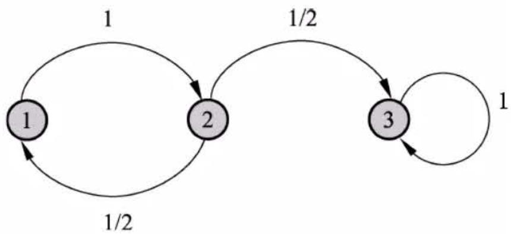  
图19.6 马尔可夫链例

解 转移概率矩阵为

$$
\left[ \begin{array} { l l l } { 0 } & { 1 / 2 } & { 0 } \\ { } & { } & { } \\ { 1 } & { 0 } & { 0 } \\ { } & { } & { } \\ { 0 } & { 1 / 2 } & { 1 } \end{array} \right]
$$

平稳分布 $\pi = \left( 0 \quad 0 \quad 1 \right) ^ { \mathrm { T } }$ 。此马尔可夫链转移到状态3后，就在该状态上循环跳转，不能到达状态1和状态2，最终停留在状态3。

## 2.非周期

定义19.4（非周期）设有马尔可夫链 $X = \{ X _ { 0 } , X _ { 1 } , \cdots , X _ { t } , \cdot \cdot \cdot \}$ ，状态空间为 $s ,$ 对于任意状态 $i \in S ,$ 如果时刻0从状态i出发、时刻t返回状态的所有时间长 $\{ t : P ( X _ { t } = i | X _ { 0 } = i ) > 0 \}$

的最大公约数是1，则称此马尔可夫链X是非周期的（aperiodic），否则称马尔可夫链是周期的（periodic）。

直观上，个周期性马尔可夫链不存在个状态，从这个状态出发，再返回到这个状态时所经历的时间长呈定的周期性。例19.3中的马尔可夫链是周期的，例19.6中的马尔可夫链是周期的。

例19.6 图19.7所的马尔可夫链是周期的。

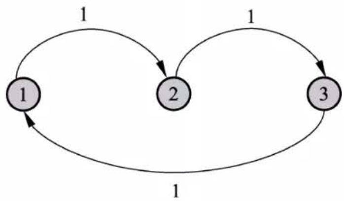  
图19.7 马尔可夫链例

解 转移概率矩阵为

$$
\left[ \begin{array} { l l l } { 0 } & { 0 } & { 1 } \\ { 1 } & { 0 } & { 0 } \\ { 0 } & { 1 } & { 0 } \end{array} \right]
$$

其平稳分布是 $\pi = \left( 1 / 3 \quad 1 / 3 \quad 1 / 3 \right) ^ { \mathrm { T } }$ 。此马尔可夫链从每个状态出发返回该状态的时刻都是3的倍数，{3,6,9}，具有周期性，最终停留在每个状态的概率都为 $1 / 3$ 。

定理19.2 不可约且非周期的有限状态马尔可夫链有唯一平稳分布存在。

## 3.正常返

定义19.5（正常返） 设有马尔可夫链 $X = \{ X _ { 0 } , X _ { 1 } , \dots , X _ { t } , \dots \}$ ，状态空间为S，对于  
任意状态 $i , j \in S ,$ 定义概率 $p _ { i j } ^ { t }$ 为时刻0从状态j出发、时刻t首次转移到状态i的概率，  
即足 $p _ { i j } ^ { t } = P \left( X _ { t } = i , X _ { s } \neq i , s = 1 , 2 , \cdots , t - 1 | X _ { 0 } = j \right) , t = 1 , 2 , \cdots ,$ 若对所有状态i,j都满$\operatorname* { l i m } _ { t  \infty } p _ { i j } ^ { t } > 0$ ，则称 $\frac { \pi } { 2 }$ 尔可夫链X是正常返的（positive recurrent）。

直观上，对于个正常返的马尔可夫链中的任意个状态，从其他任意个状态出发，当时间趋于穷时，次转移到这个状态的概率不为0。例19.7中的马尔可夫链根据不同条件是正常返的或不是正常返的。

例19.7 对于图19.8所限状态马尔可夫链，证明当 $p > q$ 时是正常返的，当 $p \leqslant q$ 时不是正常返的。

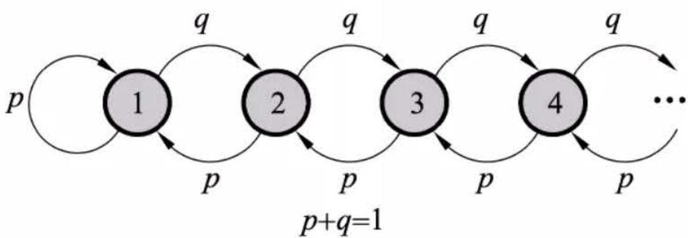  
图19.8 马尔可夫链例

解 转移概率矩阵为

$$
\left[ \begin{array} { l l l l l } { p } & { p } & { 0 } & { 0 } \\ { q } & { 0 } & { p } & { 0 } \\ { 0 } & { q } & { 0 } & { p } \\ { 0 } & { 0 } & { q } & { 0 } \\ { \vdots } & { \vdots } & { } & { \ddots } \end{array} \right]
$$

当 $p > q$ 时，平稳分布是

$$
\pi _ { i } = \left( { \frac { q } { p } } \right) ^ { i } \left( { \frac { p - q } { p } } \right) , \quad i = 1 , 2 , \cdots
$$

当时间趋于穷时，转移到任何个状态的概率不为0，马尔可夫链是正常返的。

当 $p \leqslant q$ 时，不存在平稳分布，马尔可夫链不是正常返的。

定理19.3 不可约、非周期且正常返的 $\frac { \pi } { 2 }$ 尔可夫链有唯一平稳分布存在。

## 4.遍历定理

下面叙述马尔可夫链的遍历定理。

定理19.4（遍历定理）设有 $\textcircled{1}$ 尔可夫链 $X = \{ X _ { 0 } , X _ { 1 } , \cdots , X _ { t } , \cdot \cdot \cdot \}$ ，状态空间为S，若 $\frac { \pi } { - 2 }$ 尔可夫链X是不可约、非周期且正常返的，则该 $\frac { \pi } { - y }$ 尔可夫链有唯一平稳分布${ \boldsymbol \pi } = ( \pi _ { 1 } , \pi _ { 2 } , \ldots ) ^ { \mathrm { T } }$ ，并且转移概率的极限分布是马尔可夫链的平稳分布。

$$
\operatorname * { l i m } _ { t  \infty } P ( X _ { t } = i | X _ { 0 } = j ) = \pi _ { i } , \quad i = 1 , 2 , \cdots , \quad j = 1 , 2 , \cdots .\tag{19.25}
$$

若f(X)是定义在状态空间上的函数， $E _ { \pi } [ | f ( X ) | ] < \infty$ ，则

$$
{ \cal P } \{ \hat { f } _ { t } \to { \cal E } _ { \pi } [ f ( X ) ] \} = 1\tag{19.26}
$$

其中，

$$
\hat { f } _ { t } = \frac { 1 } { t } \sum _ { s = 1 } ^ { t } f ( x _ { s } )
$$

$E _ { \pi } [ f ( X ) ] = \sum _ { i } f ( i ) \pi _ { i }$ 是f(X)关于平稳分布 ${ \boldsymbol \pi } = ( \pi _ { 1 } , \pi _ { 2 } , \cdot \cdot \cdot ) ^ { \mathrm { T } }$ 的数学期望，式(19.26)表示

$$
\hat { f } _ { t } \to E _ { \pi } [ f ( X ) ] , \quad t \to \infty\tag{19.27}
$$

几乎处处成或以概率1成。

遍历定理的直观解释：对于满相应条件的马尔可夫链，当时间趋于穷时，马尔可夫链的状态分布趋近于平稳分布，随机变量的函数的样本均值以概率1收敛于该函数的数学期望。样本均值可以认为是时间均值，而数学期望是空间均值。遍历定理实际表述了遍历性的含义：当时间趋于穷时，时间均值等于空间均值。遍历定理的三个条件：不可约、周期、正常返，保证了当时间趋于穷时达到任意个状态的概率不为 $0 _ { \circ }$

理论上并不知道经过多少次迭代，马尔可夫链的状态分布才能接近于平稳分布，在实际应遍历定理时，取个够的整数m，经过m次迭代之后认为状态分布就是平稳分布，这时计算从第m+1次迭代到第n次迭代的均值，即

$$
{ \hat { E } } f = { \frac { 1 } { n - m } } \sum _ { i = m + 1 } ^ { n } f ( x _ { i } )\tag{19.28}
$$

称为遍历均值。

## 5.可逆马尔可夫链

定义19.6（可逆马尔可夫链） 设有马尔可夫链 $X = \{ X _ { 0 } , X _ { 1 } , \cdots , X _ { t } , \cdots \}$ ，状态空间为 $s$ ，转移概率矩阵为P，如果有状态分布 ${ \boldsymbol \pi } = ( \pi _ { 1 } , \pi _ { 2 } , \ldots ) ^ { \mathrm { T } }$ ，对于任意状态 $i , j \in S .$ ,对任意一个时刻t满足

$$
P ( X _ { t } = i | X _ { t - 1 } = j ) \pi _ { j } = P ( X _ { t - 1 } = j | X _ { t } = i ) \pi _ { i } , \quad i , j = 1 , 2 , \cdots\tag{19.29}
$$

或简写为

$$
p _ { i j } \pi _ { j } = p _ { j i } \pi _ { i } , \quad i , j = 1 , 2 , \cdot \cdot \cdot\tag{19.30}
$$

则称此马尔可夫链X为可逆马尔可夫链（reversible Markov chain），式(19.30)称为细致平衡方程（detailed balance equation）。

直观上，如果有可逆的马尔可夫链，那么以该马尔可夫链的平稳分布作为初始分布，进随机状态转移，论是向未来还是向过去，任何个时刻的状态分布都是该平稳分布。例19.3中的马尔可夫链是可逆的，例19.8中的马尔可夫链是不可逆的。

例19.8 图19.9所马尔可夫链是不可逆的。

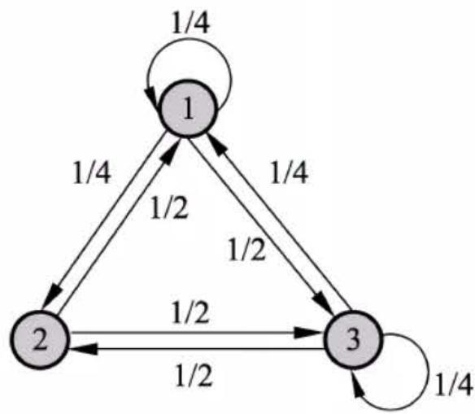  
图19.9 马尔可夫链例

解 转移概率矩阵为

$$
\left[ { \begin{array} { l l l } { 1 / 4 } & { 1 / 2 } & { 1 / 4 } \\ { 1 / 4 } & { 0 } & { 1 / 2 } \\ { 1 / 2 } & { 1 / 2 } & { 1 / 4 } \end{array} } \right]
$$

平稳分布 $\pi = \left( 8 / 2 5 \quad 7 / 2 5 \quad 2 / 5 \right) ^ { \mathrm { T } }$ ，不满细致平稳程。

定理19.5（细致平衡方程） 满足细致平衡方程的状态分布π就是该马尔可夫链的平稳分布。即

$$
P \pi = \pi
$$

证明 事实上，

$$
( P \pi ) _ { i } = \sum _ { j } p _ { i j } \pi _ { j } = \sum _ { j } p _ { j i } \pi _ { i } = \pi _ { i } \sum _ { j } p _ { j i } = \pi _ { i } , \quad i = 1 , 2 , \cdots\tag{19.31}
$$

定理19.5说明，可逆马尔可夫链定有唯平稳分布，给出了个马尔可夫链有平稳分布的充分条件（不是必要条件)。也就是说，可逆马尔可夫链满遍历定理19.4的条件。

## 19.3 马尔可夫链蒙特卡罗法

## 19.3.1 基本想法

假设标是对个概率分布进随机抽样，或者是求函数关于该概率分布的数学期望。可以采用传统的蒙特卡罗法，如接受-拒绝法、重要性抽样法，也可以使用马尔可夫链蒙特卡罗法。马尔可夫链蒙特卡罗法更适于随机变量是多元的、密度函数是标准形式的、随机变量各分量不独等情况。

假设多元随机变量x满足 $x \in \mathcal { X }$ ，其概率密度函数为 $p ( x ) , f ( x )$ 为定义在 $x \in \mathcal { X }$ 上的函数，标是获得概率分布 $p ( x )$ 的样本集合，以及求函数 $f ( x )$ 的数学期望 ${ E } _ { p ( x ) } [ f ( x ) ]$ 。

应马尔可夫链蒙特卡罗法解决这个问题。基本想法是：在随机变量x的状态空间S上定义一个满遍历定理的马尔可夫链 $X = \{ X _ { 0 } , X _ { 1 } , \cdots , X _ { t } , \cdot \cdot \cdot \}$ ，使其平稳分布就是抽样的标分布 $p ( x )$ 。然后在这个马尔可夫链上进随机游，每个时刻得到个样本。根据遍历定理，当时间趋于无穷时，样本的分布趋近平稳分布，样本的函数均值趋近函数的数学期望。所以，当时间够长时（时刻于某个正整数m），在之后的时间（时刻于等于某个正整数$n , \ n > m )$ 里随机游得到的样本集合 $\{ x _ { m + 1 } , x _ { m + 2 } , \cdots , x _ { n } \}$ 就是标概率分布的抽样结果，得到的函数均值（遍历均值）就是要计算的数学期望值：

$$
{ \hat { E } } f = { \frac { 1 } { n - m } } \sum _ { i = m + 1 } ^ { n } f ( x _ { i } )\tag{19.32}
$$

到时刻m为止的时间段称为燃烧期。

如何构建具体的马尔可夫链成为这个法的关键。连续变量的时候，需要定义转移核函数；离散变量的时候，需要定义转移矩阵。个法是定义特殊的转移核函数或者转移矩阵，构建可逆马尔可夫链，这样可以保证遍历定理成。常的马尔可夫链蒙特卡罗法有Metropolis-Hastings算法、吉布斯抽样。

由于这个马尔可夫链满遍历定理，随机游的起始点并不影响得到的结果，即从不同的起始点出发，都会收敛到同平稳分布。

马尔可夫链蒙特卡罗法的收敛性的判断通常是经验性的，如，在马尔可夫链上进随机游，检验遍历均值是否收敛。具体地，每隔段时间取次样本，得到多个样本以后，计算遍历均值，当计算的均值稳定后，认为马尔可夫链已经收敛。再如，在马尔可夫链上并进多个随机游，较各个随机游的遍历均值是否接近致。

对于马尔可夫链蒙特卡罗法中得到的样本序列，相邻的样本点是相关的，不是独的。因此，在需要独样本时，可以在该样本序列中再次进随机抽样，如每隔段时间取次样本，将这样得到的样本集合作为独样本集合。

马尔可夫链蒙特卡罗法接受-拒绝法更容易实现，因为只需要定义马尔可夫链，不需要定义建议分布。般来说马尔可夫链蒙特卡罗法接受-拒绝法效率更，没有量被拒绝的样本，虽然燃烧期的样本也要抛弃。

## 19.3.2 基本步骤

根据上的讨论，可以将马尔可夫链蒙特卡罗法概括为以下三步：

（1）先，在随机变量x的状态空间S上构造个满遍历定理的马尔可夫链，使其平稳分布为标分布 $p ( x )$ ;

(2）从状态空间的某点xo出发，构造的马尔可夫链进随机游，产样本序列$x _ { 0 } , x _ { 1 } , \cdots , x _ { t } , \cdots ;$

（3）应马尔可夫链的遍历定理，确定正整数m和 $\textit { n } \left( m \ : < \ : n \right)$ ，得到样本集合$\{ x _ { m + 1 } , x _ { m + 2 } , \cdot \cdot \cdot , x _ { n } \}$ ，求得函数f(x)的均值（遍历均值)

$$
{ \hat { E } } f = { \frac { 1 } { n - m } } \sum _ { i = m + 1 } ^ { n } f ( x _ { i } )\tag{19.33}
$$

就是马尔可夫链蒙特卡罗法的计算公式。

这有个重要问题：

（1）如何定义马尔可夫链，保证马尔可夫链蒙特卡罗法的条件成。

（2）如何确定收敛步数m，保证样本抽样的偏性。

(3）如何确定迭代步数n，保证遍历均值计算的精度。

## 19.3.3 马尔可夫链蒙特卡罗法与统计学习

马尔可夫链蒙特卡罗法在统计学习，特别是贝叶斯学习中起着重要的作，这主要是因为马尔可夫链蒙特卡罗法可以在概率模型的学习和推理上。

假设观测数据由随机变量 $y \in \mathcal { D }$ 表示，模型由随机变量 $x \in \mathcal { X }$ 表，贝叶斯学习通过贝叶斯定理计算给定数据条件下模型的后验概率，并选择后验概率最的模型。后验概率为

$$
p ( x | y ) = \frac { p ( x ) p ( y | x ) } { \displaystyle \int _ { \chi } p ( y | x ^ { \prime } ) p ( x ^ { \prime } ) \mathrm { d } x ^ { \prime } }\tag{19.34}
$$

贝叶斯学习中经常需要进三种积分运算：归范化（normalization）、边缘化（marginaliza-tion）、数学期望（expectation）。

后验概率计算中需要归范化计算：

$$
\int _ { \mathcal { X } } p ( y | x ^ { \prime } ) p ( x ^ { \prime } ) \mathrm { d } x ^ { \prime }\tag{19.35}
$$

如果有隐变量 $z \in { \mathcal { Z } }$ ，后验概率的计算需要边缘化计算：

$$
p ( x | y ) = \int _ { \mathcal Z } p ( x , z | y ) \mathrm { d } z\tag{19.36}
$$

如果有个函数f(x)，可以计算该函数关于后验概率分布的数学期望：

$$
E _ { P ( x | y ) } [ f ( x ) ] = \int _ { \chi } f ( x ) p ( x | y ) \mathrm { d } x\tag{19.37}
$$

当观测数据和模型都很复杂的时候，以上的积分计算变得困难。马尔可夫链蒙特卡罗法为这些计算提供了个通的有效解决案。

## 19.4 Metropolis-Hastings 算法

本节叙述Metropolis-Hastings算法，该算法是马尔可夫链蒙特卡罗法的代表算法。

## 19.4.1 基本原理

## 1.马尔可夫链

假设要抽样的概率分布为 $p ( x )$ 。Metropolis-Hastings算法采转移核为 $p ( x , x ^ { \prime } )$ 的马尔可夫链：

$$
p ( x , x ^ { \prime } ) = q ( x , x ^ { \prime } ) \alpha ( x , x ^ { \prime } )\tag{19.38}
$$

其中， $q ( x , x ^ { \prime } )$ 和 $\alpha ( \boldsymbol { x } , \boldsymbol { x } ^ { \prime } )$ 分别称为建议分布（proposal distribution）和接受分布（acceptancedistribution)。

建议分布 $\boldsymbol { q } ( \boldsymbol { x } , \boldsymbol { x } ^ { \prime } )$ 是另个马尔可夫链的转移核，并且 $q ( x , x ^ { \prime } )$ 是不可约的，即其概率值恒不为0，同时是个容易抽样的分布。接受分布 $\alpha ( \boldsymbol { x } , \boldsymbol { x } ^ { \prime } )$ 是

$$
\alpha ( x , x ^ { \prime } ) = \operatorname* { m i n } \left\{ 1 , { \frac { p ( x ^ { \prime } ) q ( x ^ { \prime } , x ) } { p ( x ) q ( x , x ^ { \prime } ) } } \right\}\tag{19.39}
$$

这时，转移核 $p ( \boldsymbol { x } , \boldsymbol { x } ^ { \prime } )$ 可以写成

$$
p ( x , x ^ { \prime } ) = \left\{ \begin{array} { l l } { \displaystyle q ( x , x ^ { \prime } ) , } & { p ( x ^ { \prime } ) q ( x ^ { \prime } , x ) \geqslant p ( x ) q ( x , x ^ { \prime } ) } \\ { \displaystyle q ( x ^ { \prime } , x ) \frac { p ( x ^ { \prime } ) } { p ( x ) } , } & { p ( x ^ { \prime } ) q ( x ^ { \prime } , x ) < p ( x ) q ( x , x ^ { \prime } ) } \end{array} \right.\tag{19.40}
$$

转移核为 $p ( \boldsymbol { x } , \boldsymbol { x } ^ { \prime } )$ 的马尔可夫链上的随机游以以下式进。如果在时刻(t1）处于状态x，即 $x _ { t - 1 } = x$ ，则先按建议分布 $q ( x , x ^ { \prime } )$ 抽样产个候选状态 $x ^ { \prime }$ ，然后按照接受分布$\alpha ( \boldsymbol { x } , \boldsymbol { x } ^ { \prime } )$ 抽样决定是否接受状态 $x ^ { \prime }$ 。以概率 $\alpha ( \boldsymbol { x } , \boldsymbol { x } ^ { \prime } )$ 接受 $x ^ { \prime }$ ，决定时刻t转移到状态 $x ^ { \prime }$ ，而以概率 $1 - \alpha ( x , x ^ { \prime } )$ 拒绝 $x ^ { \prime }$ ，决定时刻t仍停留在状态x。具体地，从区间(0,1)上的均匀分布中抽取个随机数u，决定时刻t的状态。

$$
\begin{array} { r } { x _ { t } = \left\{ \begin{array} { l l } { x ^ { \prime } , } & { u \leqslant \alpha ( x , x ^ { \prime } ) } \\ { x , } & { u > \alpha ( x , x ^ { \prime } ) } \end{array} \right. } \end{array}
$$

可以证明，转移核为 $p ( \boldsymbol { x } , \boldsymbol { x } ^ { \prime } )$ 的马尔可夫链是可逆马尔可夫链（满遍历定理），其平稳分布就是 $p ( x )$ ，即要抽样的标分布。也就是说这是马尔可夫链蒙特卡罗法的个具体实现。

定理19.6 由转移核(19.38)\~(19.40)构成的马尔可夫链是可逆的，即

$$
p ( x ) p ( x , x ^ { \prime } ) = p ( x ^ { \prime } ) p ( x ^ { \prime } , x )\tag{19.41}
$$

并且 $p ( x )$ 是该 $\frac { \pi } { 2 }$ 尔可夫链的平稳分布。

证明若 $x = x ^ { \prime }$ ，则式(19.41)显然成。

设 $x \neq x ^ { \prime }$ ，则

$$
\begin{array} { r l } & { p ( x ) p ( x , x ^ { \prime } ) = p ( x ) q ( x , x ^ { \prime } ) \operatorname* { m i n } \left. 1 , \frac { p ( x ^ { \prime } ) q ( x ^ { \prime } , x ) } { p ( x ) q ( x , x ^ { \prime } ) } \right. } \\ & { \qquad = \operatorname* { m i n } \left. p ( x ) q ( x , x ^ { \prime } ) , p ( x ^ { \prime } ) q ( x ^ { \prime } , x ) \right. } \\ & { \qquad = p ( x ^ { \prime } ) q ( x ^ { \prime } , x ) \operatorname* { m i n } \left. \frac { p ( x ) q ( x , x ^ { \prime } ) } { p ( x ^ { \prime } ) q ( x ^ { \prime } , x ) } , 1 \right. } \\ & { \qquad = p ( x ^ { \prime } ) p ( x ^ { \prime } , x ) } \end{array}
$$

式(19.41)成。

由式(19.41)知：

$$
\begin{array} { r l } { \displaystyle \int p ( x ) p ( x , x ^ { \prime } ) \mathrm { d } x = \int p ( x ^ { \prime } ) p ( x ^ { \prime } , x ) \mathrm { d } x } & { } \\ { \displaystyle } & { = p ( x ^ { \prime } ) \displaystyle \int p ( x ^ { \prime } , x ) \mathrm { d } x } \\ { \displaystyle } & { = p ( x ^ { \prime } ) } \end{array}
$$

根据平稳分布的定义(式(19.21))， $p ( x )$ 是马尔可夫链的平稳分布。

## 2.建议分布

建议分布 $q ( x , x ^ { \prime } )$ 有多种可能的形式，这介绍两种常形式。

第种形式：假设建议分布是对称的，即对任意的x和 $x ^ { \prime }$ 有

$$
\boldsymbol { q } ( x , x ^ { \prime } ) = \boldsymbol { q } ( x ^ { \prime } , x )\tag{19.42}
$$

这样的建议分布称为Metropolis选择，也是Metropolis-Hastings算法最初采的建议分布。这时，接受分布 $\alpha ( \boldsymbol { x } , \boldsymbol { x } ^ { \prime } )$ 简化为

$$
\alpha ( x , x ^ { \prime } ) = \operatorname* { m i n } \left\{ 1 , { \frac { p ( x ^ { \prime } ) } { p ( x ) } } \right\}\tag{19.43}
$$

Metropolis选择的个特例是 $q ( x , x ^ { \prime } )$ 取条件概率分布 $p ( \boldsymbol { x } ^ { \prime } | \boldsymbol { x } )$ ，定义为多元正态分布，其均值是x，其协差矩阵是常数矩阵。

Metropolis选择的另个特例是令 $q ( x , x ^ { \prime } ) = q ( | x - x ^ { \prime } | )$ ，这时算法称为随机游Metropolis算法。例如，

$$
q ( x , x ^ { \prime } ) \propto \exp \left[ - { \frac { ( x ^ { \prime } - x ) ^ { 2 } } { 2 } } \right]
$$

Metropolis选择的特点是当 $x ^ { \prime }$ 与x接近时， $q ( x , x ^ { \prime } )$ 的概率值高，否则 $q ( x , x ^ { \prime } )$ 的概率值低。状态转移在附近点的可能性更。

第种形式称为独抽样。假设 $\boldsymbol { q } ( \boldsymbol { x } , \boldsymbol { x } ^ { \prime } )$ 与当前状态x关，即 $q ( x , x ^ { \prime } ) = q ( x ^ { \prime } )$ 。建议分布的计算按照 $q ( x ^ { \prime } )$ 独抽样进。此时，接受分布 $\alpha ( \boldsymbol { x } , \boldsymbol { x } ^ { \prime } )$ 可以写成

$$
{ \alpha } ( x , x ^ { \prime } ) = \operatorname* { m i n } \left\{ 1 , \frac { w ( x ^ { \prime } ) } { w ( x ) } \right\}\tag{19.44}
$$

其中， $w ( x ^ { \prime } ) = p ( x ^ { \prime } ) / q ( x ^ { \prime } ) , w ( x ) = p ( x ) / q ( x )$ 。

独抽样实现简单，但可能收敛速度慢，通常选择接近标分布 $p ( x )$ 的分布作为建议分布 $q ( x )$ 。

## 3.满条件分布

马尔可夫链蒙特卡罗法的标分布通常是多元联合概率分布 $p ( { \boldsymbol { x } } ) = p ( x _ { 1 } , x _ { 2 } , \cdot \cdot \cdot , x _ { k } )$ ,其中 $\boldsymbol { x } = ( x _ { 1 } , x _ { 2 } , \cdot \cdot \cdot , x _ { k } ) ^ { \mathrm { T } }$ 为k维随机变量。如果条件概率分布 $p ( x _ { I } | x _ { - I } )$ 中所有k个变量全部出现，其中 $x _ { I } = \{ x _ { i } , i \in I \} , x _ { - I } = \{ x _ { i } , i \notin I \} , I \subseteq K = \{ 1 , 2 , \cdots , k \}$ ，那么称这种条件概率分布为满条件分布（fullconditionaldistribution）。

满条件分布有以下性质：对任意的 $x \in \mathcal { X }$ 和任意的 $I \subseteq K$ ,有

$$
p \left( x _ { I } | x _ { - I } \right) = \frac { p ( x ) } { \displaystyle \int p \left( x \right) \mathrm { d } x _ { I } } \propto p ( x )\tag{19.45}
$$

而且，对任意的 $x , x ^ { \prime } \in \mathcal { X }$ 和任意的 $I \subseteq K$ ,有

$$
{ \frac { p ( x _ { I } ^ { \prime } | x _ { - I } ^ { \prime } ) } { p ( x _ { I } | x _ { - I } ) } } = { \frac { p ( x ^ { \prime } ) } { p ( x ) } }\tag{19.46}
$$

Metropolis-Hastings算法中，可以利性质(19.46)简化计算，提计算效率。具体地，通过满条件分布概率的 $\frac { p ( x _ { I } ^ { \prime } | x _ { - I } ^ { \prime } ) } { p ( x _ { I } | x _ { - I } ) }$ 计算联合概率的比 $\frac { p ( x ^ { \prime } ) } { p ( x ) }$ ，而前者更容易计算。

例19.9 设 $x _ { 1 }$ 和 $x _ { 2 }$ 的联合概率分布的密度函数为

$$
p ( x _ { 1 } , x _ { 2 } ) \propto \exp \left[ - \frac { 1 } { 2 } ( x _ { 1 } - 1 ) ^ { 2 } ( x _ { 2 } - 1 ) ^ { 2 } \right]
$$

求其满条件分布。

解 由满条件分布的定义有

$$
\begin{array} { l } { \displaystyle p ( x _ { 1 } | x _ { 2 } ) \propto p ( x _ { 1 } , x _ { 2 } ) } \\ { \propto \exp \left[ - \frac { 1 } { 2 } ( x _ { 1 } - 1 ) ^ { 2 } ( x _ { 2 } - 1 ) ^ { 2 } \right] } \\ { \propto N ( 1 , ( x _ { 2 } - 1 ) ^ { - 2 } ) } \end{array}
$$

这里 $N ( 1 , ( x _ { 2 } - 1 ) ^ { - 2 } )$ 是均值为1、方差为 $( x _ { 2 } - 1 ) ^ { - 2 }$ 的正态分布，这时 $x _ { 1 }$ 是变量， $x _ { 2 }$ 是参数。同样可得：

$$
\begin{array} { l } { \displaystyle p ( x _ { 2 } | x _ { 1 } ) \propto p ( x _ { 1 } , x _ { 2 } ) } \\ { \propto \exp \left[ - \frac { 1 } { 2 } ( x _ { 2 } - 1 ) ^ { 2 } ( x _ { 1 } - 1 ) ^ { 2 } \right] } \\ { \propto N ( 1 , ( x _ { 1 } - 1 ) ^ { - 2 } ) } \end{array}
$$

## 19.4.2 Metropolis-Hastings算法

算法19.2（Metropolis-Hastings算法）

输入：抽样的标分布的密度函数 $p ( x )$ ，函数 $f ( x )$ O

输出： $p ( x )$ 的随机样本 $x _ { m + 1 } , x _ { m + 2 } , \cdots , x _ { n }$ ，函数样本均值 $f _ { m n }$ 。

参数：收敛步数m，迭代步数 $n _ { \uparrow }$

（1）任意选择个初始值 $x _ { 0 }$ 。

(2）对 $i = 1 , 2 , \cdots , n$ 循环执行：

(a）设状态 $x _ { i - 1 } = x$ ，按照建议分布 $\boldsymbol { q } ( \boldsymbol { x } , \boldsymbol { x } ^ { \prime } )$ 随机抽取个候选状态 $x ^ { \prime } ,$

(b）计算接受概率：

$$
\alpha ( x , x ^ { \prime } ) = \operatorname* { m i n } \left\{ 1 , { \frac { p ( x ^ { \prime } ) q ( x ^ { \prime } , x ) } { p ( x ) q ( x , x ^ { \prime } ) } } \right\}
$$

(c）从区间(0,1)中按均匀分布随机抽取个数 $u _ { \circ }$ 若 $u \leqslant \alpha ( x , x ^ { \prime } )$ ，则状态 $x _ { i } = x ^ { \prime } $ 否则，状态 $x _ { i } = x$

(3）得到样本集合 $\{ x _ { m + 1 } , x _ { m + 2 } , \cdots , x _ { n } \}$ ,计算

$$
f _ { m n } = { \frac { 1 } { n - m } } \sum _ { i = m + 1 } ^ { n } f ( x _ { i } )
$$

## 19.4.3 单分量Metropolis-Hastings 算法

在Metropolis-Hastings算法中，通常需要对多元变量分布进抽样。有时对多元变量分布的抽样是困难的，可以对多元变量的每变量的条件分布依次分别进抽样，从实现对整个多元变量的次抽样，这就是单分量Metropolis-Hastings（single-componentMetropolis-Hastings）算法。

假设马尔可夫链的状态由k维随机变量表：

$$
\boldsymbol { x } = ( x _ { 1 } , x _ { 2 } , \cdots , x _ { k } ) ^ { \mathrm { T } }
$$

其中， $x _ { j }$ 表随机变量 $x$ 的第 $j$ 个分量， $j = 1 , 2 , \cdots , k$ ，而 $x ^ { ( i ) }$ 表示马尔可夫链在时刻的状态

$$
\boldsymbol { x } ^ { ( i ) } = ( x _ { 1 } ^ { ( i ) } , x _ { 2 } ^ { ( i ) } , \cdots , x _ { k } ^ { ( i ) } ) ^ { \mathrm { T } } , \quad i = 1 , 2 , \cdots , n
$$

其中， $\boldsymbol { x } _ { j } ^ { ( i ) }$ 是随机变量 $x ^ { ( i ) }$ 的第 $j$ 个分量， $j = 1 , 2 , \cdots , k _ { \circ }$

为了成容量为n的样本集合 $\{ x ^ { ( 1 ) } , x ^ { ( 2 ) } , \cdots , x ^ { ( n ) } \}$ ，单分量Metropolis-Hastings算法由下的k步迭代实现Metropolis-Hastings算法的次迭代。

设在第(i-1)次迭代结束时分量 $x _ { j }$ 的取值为 $x _ { j } ^ { ( i - 1 ) }$ ，在第i次迭代的第 $j$ 步，对分量 $x _ { j }$ 根据Metropolis-Hastings算法更新，得到其新的取值 $\boldsymbol { x } _ { j } ^ { ( i ) }$ 。先，由建议分布 $q ( x _ { j } ^ { ( i - 1 ) } , x _ { j } | \boldsymbol { x } _ { - j } ^ { ( i ) } )$ 抽样 $\vec { \boldsymbol { \jmath } } ^ { * }$ 分量 $x _ { j }$ 的候选值 $x _ { j } ^ { \prime ( i ) }$ ，这里 $x _ { - j } ^ { ( i ) }$ 表在第i次迭代的第(j1）步后的 $x ^ { ( i ) }$ 除去$x _ { j } ^ { ( i - 1 ) }$ 的所有值，即

$$
\boldsymbol { x } _ { - j } ^ { ( i ) } = ( x _ { 1 } ^ { ( i ) } , \cdots , x _ { j - 1 } ^ { ( i ) } , x _ { j + 1 } ^ { ( i - 1 ) } , \cdots , x _ { k } ^ { ( i - 1 ) } ) ^ { \mathrm { T } }
$$

其中分量1,2,…,j1已经更新。然后，按照接受概率

$$
\alpha ( x _ { j } ^ { ( i - 1 ) } , x _ { j } ^ { \prime ( i ) } | x _ { - j } ^ { ( i ) } ) = \operatorname* { m i n } \left\{ 1 , \frac { p ( x _ { j } ^ { \prime ( i ) } | x _ { - j } ^ { ( i ) } ) q ( x _ { j } ^ { \prime ( i ) } , x _ { j } ^ { ( i - 1 ) } | x _ { - j } ^ { ( i ) } ) } { p ( x _ { j } ^ { ( i - 1 ) } | x _ { - j } ^ { ( i ) } ) q ( x _ { j } ^ { ( i - 1 ) } , x _ { j } ^ { \prime ( i ) } | x _ { - j } ^ { ( i ) } ) } \right\}\tag{19.47}
$$

抽样决定是否接受候选值 ${ x ^ { \prime } } _ { j } ^ { ( i ) }$ 。如果 ${ x ^ { \prime } } _ { j } ^ { ( i ) }$ 被接受，则令 $x _ { j } ^ { ( i ) } = { x ^ { \prime } } _ { j } ^ { ( i ) }$ ；否则，令 $x _ { j } ^ { ( i ) } = x _ { j } ^ { ( i - 1 ) }$ 其余分量在第 $j$ 步不改变。马尔可夫链的转移概率为

$$
p \left( x _ { j } ^ { ( i - 1 ) } , { x ^ { \prime } } _ { j } ^ { ( i ) } | x _ { - j } ^ { ( i ) } \right) = \alpha ( x _ { j } ^ { ( i - 1 ) } , { x ^ { \prime } } _ { j } ^ { ( i ) } | x _ { - j } ^ { ( i ) } ) q ( x _ { j } ^ { ( i - 1 ) } , { x ^ { \prime } } _ { j } ^ { ( i ) } | x _ { - j } ^ { ( i ) } )\tag{19.48}
$$

图19.10意了单分量Metropolis-Hastings算法的迭代过程。标是对含有两个变量的随机变量 $_ x$ 进抽样。如果变量 $x _ { 1 }$ 或 $x _ { 2 }$ 更新，那么在平或垂直向产个移动，连续平移动和垂直移动产一个新的样本点。注意由于建议分布可能不被接受，Metropolis-Hastings算法可能在些相邻的时刻不产移动。

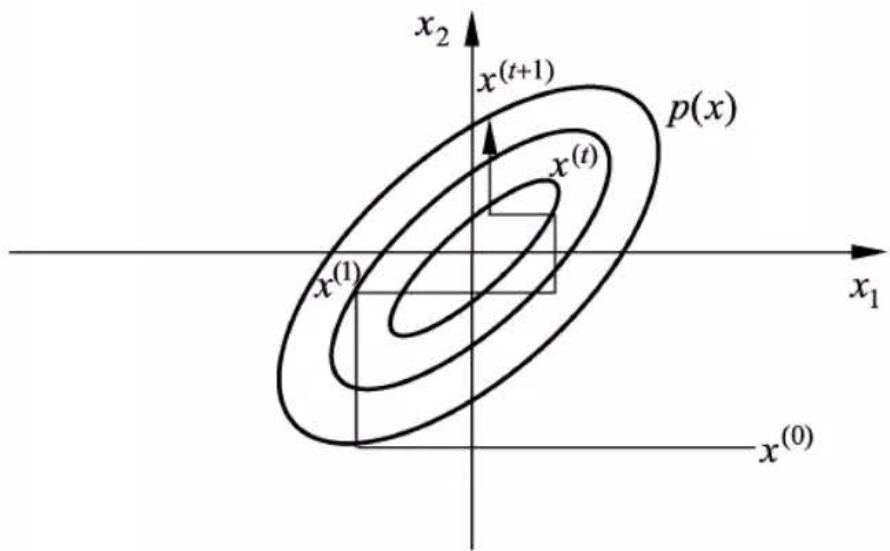  
图19.10 单分量Metropolis-Hastings算法例

## 19.5 吉布斯抽样

本节叙述马尔可夫链蒙特卡罗法的常算法吉布斯抽样，可以认为是Metropolis-Hastings算法的特殊情况，但是更容易实现，因被泛使。

## 19.5.1 基本原理

吉布斯抽样（Gibbssampling）于多元变量联合分布的抽样和估计 $\textcircled{1}$ 。其基本做法是：

从联合概率分布定义满条件概率分布，依次对满条件概率分布进抽样，得到样本的序列。可以证明这样的抽样过程是在个马尔可夫链上的随机游，每个样本对应着马尔可夫链的状态，平稳分布就是标的联合分布。整体成为个马尔可夫链蒙特卡罗法，燃烧期之后的样本就是联合分布的随机样本。

假设多元变量的联合概率分布为 $p ( { \boldsymbol { x } } ) = p ( x _ { 1 } , x _ { 2 } , \cdot \cdot \cdot , x _ { k } )$ 。吉布斯抽样从个初始样本 $\boldsymbol { x } ^ { ( 0 ) } = ( x _ { 1 } ^ { ( 0 ) } , x _ { 2 } ^ { ( 0 ) } , \cdot \cdot \cdot , x _ { k } ^ { ( 0 ) } ) ^ { \mathrm { T } }$ 出发，不断进迭代，每次迭代得到联合分布的个样本$\boldsymbol { x } ^ { ( i ) } = ( x _ { 1 } ^ { ( i ) } , x _ { 2 } ^ { ( i ) } , \cdots , x _ { k } ^ { ( i ) } ) ^ { \mathrm { T } }$ 。最终得到样本序列 $\{ x ^ { ( 0 ) } , x ^ { ( 1 ) } , \cdot \cdot \cdot , x ^ { ( n ) } \}$ 。

在每次迭代中，依次对k个随机变量中的个变量进随机抽样。如果在第i次迭代中，对第 $j$ 个变量进随机抽样，那么抽样的分布是满条件概率分布 $p ( x _ { j } | x _ { - j } ^ { ( i ) } )$ ，这里 $x _ { - j } ^ { ( i ) }$ 表示第i次迭代中变量 $j$ 以外的其他变量。

设在第(i1）步得到样本 $( x _ { 1 } ^ { ( i - 1 ) } , x _ { 2 } ^ { ( i - 1 ) } , \cdot \cdot \cdot , x _ { k } ^ { ( i - 1 ) } ) ^ { \mathrm { T } }$ ，在第步，先对第个变量按照以下满条件概率分布随机抽样：

$$
p ( x _ { 1 } | x _ { 2 } ^ { ( t - 1 ) } , \cdots , x _ { k } ^ { ( t - 1 ) } )
$$

得到 $x _ { 1 } ^ { ( i ) }$ ，之后依次对第 $j$ 个变量按照以下满条件概率分布随机抽样：

$$
p ( x _ { j } | x _ { 1 } ^ { ( i ) } , \cdots , x _ { j - 1 } ^ { ( i ) } , x _ { j + 1 } ^ { ( i - 1 ) } , \cdots , x _ { k } ^ { ( i - 1 ) } ) , \quad j = 2 , 3 , \cdots , k - 1
$$

得到 $x _ { j } ^ { ( i ) }$ ，最后对第k个变量按照以下满条件概率分布随机抽样：

$$
p ( x _ { k } | x _ { 1 } ^ { ( i ) } , \cdots , x _ { k - 1 } ^ { ( i ) } )
$$

得到 $\boldsymbol { x } _ { k } ^ { ( i ) }$ ，于是得到整体样本 $\boldsymbol { x } ^ { ( i ) } = ( x _ { 1 } ^ { ( i ) } , x _ { 2 } ^ { ( i ) } , \cdots , x _ { k } ^ { ( i ) } ) ^ { \mathrm { T } }$

吉布斯抽样是单分量Metropolis-Hastings算法的特殊情况。定义建议分布是当前变量xj, $j = 1 , 2 , \cdots , k$ 的满条件概率分布：

$$
q ( x , x ^ { \prime } ) = p ( x _ { j } ^ { \prime } | x _ { - j } )\tag{19.49}
$$

这时，接受概率 $\alpha = 1$

$$
\begin{array} { l } { \displaystyle \alpha ( x , x ^ { \prime } ) = \operatorname* { m i n } \bigg \{ 1 , \frac { p ( x ^ { \prime } ) q ( x ^ { \prime } , x ) } { p ( x ) q ( x , x ^ { \prime } ) } \bigg \} } \\ { = \operatorname* { m i n } \bigg \{ 1 , \frac { p ( x ^ { \prime } - j ) p ( x ^ { \prime } _ { j } | x ^ { \prime } - j ) p ( x _ { j } | x ^ { \prime } - j ) } { p ( x _ { - j } ) p ( x _ { j } | x _ { - j } ) p ( x ^ { \prime } _ { j } | x _ { - j } ) } \bigg \} = 1 } \end{array}\tag{19.50}
$$

这里用到 $p ( x _ { - j } ) = p ( x ^ { \prime } _ { - j } )$ 和 $p ( \bullet | x _ { - j } ) = p ( \bullet | x ^ { \prime } _ { - j } )$

转移核就是满条件概率分布：

$$
p ( \boldsymbol { x } , \boldsymbol { x } ^ { \prime } ) = p ( \boldsymbol { x } ^ { \prime } { } _ { j } | \boldsymbol { x } _ { - j } )\tag{19.51}
$$

也就是说依次按照单变量的满条件概率分布 $p ( \boldsymbol { x } ^ { \prime } _ { j } | \boldsymbol { x } _ { - j } )$ 进随机抽样，就能实现单分量Metropolis-Hastings算法。吉布斯抽样对每次抽样的结果都接受，没有拒绝，这点和般的Metropolis-Hastings算法不同。

这，假设满条件概率分布 $p ( \boldsymbol { x } ^ { \prime } _ { j } | \boldsymbol { x } _ { - j } )$ 不为0，即马尔可夫链是不可约的。

## 19.5.2 吉布斯抽样算法

算法19.3 (吉布斯抽样)

输：标概率分布的密度函数p(x)，函数 $f ( x )$ 。

输出： $p ( x )$ 的随机样本 $x _ { m + 1 } , x _ { m + 2 } , \cdot \cdot \cdot , x _ { n }$ ，函数样本均值 $f _ { m n }$ 。

参数：收敛步数m，迭代步数n。

(1）初始化。给出初始样本 $\boldsymbol { x } ^ { ( 0 ) } = ( x _ { 1 } ^ { ( 0 ) } , x _ { 2 } ^ { ( 0 ) } , \cdots , x _ { k } ^ { ( 0 ) } ) ^ { \mathrm { T } } ,$

(2）对i循环执：

设第(i1）次迭代结束时的样本为 $\boldsymbol { x } ^ { ( i - 1 ) } = ( x _ { 1 } ^ { ( i - 1 ) } , x _ { 2 } ^ { ( i - 1 ) } , \cdots , x _ { k } ^ { ( i - 1 ) } ) ^ { \mathrm { T } }$ ，则第i次迭代进行如下步操作：

（1）由满条件分布 $p ( x _ { 1 } | x _ { 2 } ^ { ( i - 1 ) } , x _ { 3 } ^ { ( i - 1 ) } , \cdots , x _ { k } ^ { ( i - 1 ) } )$ 抽取 $x _ { 1 } ^ { ( i ) }$

（j）由满条件分布 $p ( x _ { j } | x _ { 1 } ^ { ( i ) } , x _ { 2 } ^ { ( i ) } , \cdots , x _ { j - 1 } ^ { ( i ) } , x _ { j + 1 } ^ { ( i - 1 ) } , \cdots , x _ { k } ^ { ( i - 1 ) } )$ 抽取 $x _ { j } ^ { ( i ) }$

|(k）由满条件分布 $p ( x _ { k } | x _ { 1 } ^ { ( i ) } , x _ { 2 } ^ { ( i ) } , \cdots , x _ { k - 1 } ^ { ( i ) } )$ 抽取 $\boldsymbol { x } _ { k } ^ { ( i ) }$

得到第i次迭代值 $\boldsymbol { x } ^ { ( i ) } = ( x _ { 1 } ^ { ( i ) } , x _ { 2 } ^ { ( i ) } , \cdot \cdot \cdot , x _ { k } ^ { ( i ) } ) ^ { \mathrm { T } }$

(3）得到样本集合

$$
\{ x ^ { ( m + 1 ) } , x ^ { ( m + 2 ) } , \cdot \cdot \cdot , x ^ { ( n ) } \}
$$

(4）计算

$$
f _ { m n } = \frac { 1 } { n - m } \sum _ { i = m + 1 } ^ { n } f ( x ^ { ( i ) } )
$$

例19.10 吉布斯抽样从以下元正态分布中抽取随机样本。

$$
\boldsymbol { x } = \left( x _ { 1 } , x _ { 2 } \right) ^ { \mathrm { T } } \sim p ( x _ { 1 } , x _ { 2 } )
$$

$$
p ( x _ { 1 } , x _ { 2 } ) = N ( 0 , \Sigma ) , \quad \Sigma = { \left[ \begin{array} { l l } { 1 } & { \rho } \\ { \rho } & { 1 } \end{array} \right] }
$$

解 条件概率分布为元正态分布：

$$
p ( x _ { 1 } | x _ { 2 } ) = N ( \rho x _ { 2 } , 1 - \rho ^ { 2 } )
$$

$$
p ( x _ { 2 } | x _ { 1 } ) = N ( \rho x _ { 1 } , 1 - \rho ^ { 2 } )
$$

假设初始样本为 $x ^ { ( 0 ) } = ( x _ { 1 } ^ { ( 0 ) } , x _ { 2 } ^ { ( 0 ) } )$ ，通过吉布斯抽样，可以得到以下样本序列：

<table><tr><td rowspan=1 colspan=1>迭代次数</td><td rowspan=1 colspan=1>对 $x _ { 1 }$ 抽样</td><td rowspan=1 colspan=1>对 $x _ { 2 }$ 抽样</td><td rowspan=1 colspan=1>产生样本</td></tr><tr><td rowspan=1 colspan=1>1</td><td rowspan=1 colspan=1> $x _ { 1 } \sim N ( \rho x _ { 2 } ^ { ( 0 ) } , 1 - \rho ^ { 2 } )$ ，得到 $\overline { { x _ { 1 } ^ { ( 1 ) } } }$  $x _ { 1 } \sim N ( \rho x _ { 2 } ^ { ( t - 1 ) } , 1 - \rho ^ { 2 } )$ ，得到 $x _ { 1 } ^ { ( t ) }$ </td><td rowspan=1 colspan=1> $x _ { 2 } \sim N ( \rho x _ { 1 } ^ { ( 1 ) } , 1 - \rho ^ { 2 } )$ ，得到 $\overline { { x _ { 2 } ^ { ( 1 ) } } }$  $x _ { 2 } \sim N ( \rho x _ { 1 } ^ { ( t ) } , 1 - \rho ^ { 2 } )$ ，得到 $x _ { 2 } ^ { ( t ) }$ </td><td rowspan=1 colspan=1> $\overline { { x ^ { ( 1 ) } = ( x _ { 1 } ^ { ( 1 ) } , x _ { 2 } ^ { ( 1 ) } ) ^ { \mathrm { T } } } }$  $\boldsymbol { x } ^ { ( t ) } = ( x _ { 1 } ^ { ( t ) } , x _ { 2 } ^ { ( t ) } ) ^ { \mathrm { T } }$ </td></tr></table>

得到的样本集合 $\{ x ^ { ( m + 1 ) } , x ^ { ( m + 2 ) } , \cdots , x ^ { ( n ) } \}$ $m < n$ 就是二元正态分布的随机抽样。图19.11意了吉布斯抽样的过程。

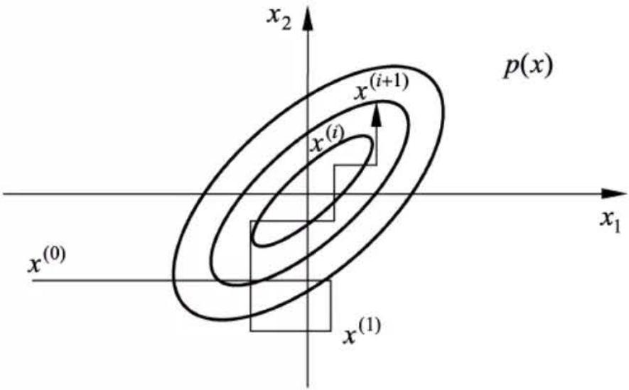  
图19.11 吉布斯抽样例

单分量Metropolis-Hastings算法和吉布斯抽样的不同之处在于，在前者算法中，抽样会在样本点之间移动，但其间可能在某些样本点上停留（由于抽样被拒绝）；在后者算法中，抽样会在样本点之间持续移动。

吉布斯抽样适合于满条件概率分布容易抽样的情况，单分量Metropolis-Hastings算法适合于满条件概率分布不容易抽样的情况，这时使容易抽样的条件分布作建议分布。

## 19.5.3 抽样计算

吉布斯抽样中需要对满条件概率分布进重复多次抽样，可以利概率分布的性质提抽样的效率。下以贝叶斯学习为例介绍这个技 $\Sigma _ { J } ^ { c }$

设 $y$ 表示观测数据， $\alpha , \theta , z$ 分别表示超参数、模型参数、未观测数据， $\boldsymbol { x } = \left( { \alpha , \theta , z } \right)$ ,如图19.12所。贝叶斯学习的的是估计后验概率分布 $p ( x | y )$ ，求后验概率最的模型。

$$
p ( x | y ) = p ( \alpha , \theta , z | y ) \propto p ( z , y | \theta ) p ( \theta | \alpha ) p ( \alpha )\tag{19.52}
$$

式中 $p ( \alpha )$ 是超参数分布， $p ( \theta | \alpha )$ 是先验分布， $p ( z , y | \theta )$ 是完全数据的分布。

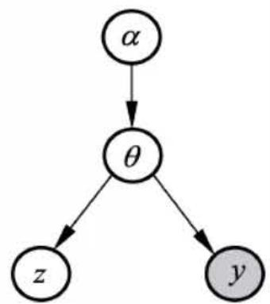  
图19.12 贝叶斯学习的图模型表

现在用吉布斯抽样估计 $p ( x | y )$ ，其中y已知， $x = \left( \alpha , \theta , z \right)$ 未知。吉布斯抽样中各个变量$\alpha , \theta , z$ 的满条件分布有以下关系：

$$
p ( \alpha _ { i } | \alpha _ { - i } , \theta , z , y ) \propto p ( \theta | \alpha ) p ( \alpha )\tag{19.53}
$$

$$
p ( \theta _ { j } | \theta _ { - j } , \alpha , z , y ) \propto p ( z , y | \theta ) p ( \theta | \alpha )\tag{19.54}
$$

$$
p ( z _ { k } | z _ { - k } , \alpha , \theta , y ) \propto p ( z , y | \theta )\tag{19.55}
$$

其中， $\alpha _ { - i }$ 表示变量 $\alpha _ { i }$ 以外的所有变量， $\theta _ { - j }$ 和 $z _ { - k }$ 类似。满条件概率分布与若条件概率分布的乘积成正，各个条件概率分布只由少量的相关变量组成（图模型中相邻结点表的变量)。所以，依满条件概率分布的抽样可以通过依这些条件概率分布的乘积的抽样进。这样可以幅减少抽样的计算复杂度，因为计算只涉及部分变量。

## 本章概要

1.蒙特卡罗法是通过基于概率模型的抽样进数值近似计算的法，蒙特卡罗法可以于概率分布的抽样、概率分布数学期望的估计、定积分的近似计算。

随机抽样是蒙特卡罗法的种应，有直接抽样法、接受-拒绝抽样法等。接受-拒绝法的基本想法是找个容易抽样的建议分布，其密度函数的数倍于等于想要抽样的概率分布的密度函数。按照建议分布随机抽样得到样本，再按照要抽样的概率分布与建议分布的倍数的比例随机决定接受或拒绝该样本，循环执以上过程。

数学期望估计是蒙特卡罗法的另种应，按照概率分布 $p ( x )$ 抽取随机变量x的n个独样本，根据数定律，当样本容量增时，函数的样本均值以概率1收敛于函数的数学期望：

$$
\hat { f } _ { n } \longrightarrow E _ { p ( x ) } [ f ( x ) ] , \quad n \longrightarrow \infty
$$

计算样本均值 $\hat { f } _ { n }$ ，作为数学期望 $E _ { p ( x ) } [ f ( x ) ]$ 的估计值。

2.马尔可夫链是具有马尔可夫性的随机过程：

$$
P ( X _ { t } | X _ { 0 } X _ { 1 } \dots X _ { t - 1 } ) = P ( X _ { t } | X _ { t - 1 } ) , \quad t = 1 , 2 , \dots .
$$

通常考虑时间齐次马尔可夫链。有离散状态马尔可夫链和连续状态马尔可夫链，分别由概率转移矩阵P和概率转移核 $p ( x , y )$ 定义。

满π=Pπ或 $\pi ( y ) = \int p ( x , y ) \pi ( x ) \mathrm { d } x$ 的状态分布称为马尔可夫链的平稳分布。

马尔可夫链有不可约性、周期性、正常返等性质。个马尔可夫链若是不可约、周期、正常返的，则该马尔可夫链满遍历定理。当时间趋于穷时，马尔可夫链的状态分布趋近于平稳分布，函数的样本平均依概率收敛于该函数的数学期望。

$$
\operatorname * { l i m } _ { t  \infty } P ( X _ { t } = i | X _ { 0 } = j ) = \pi _ { i } , \quad i = 1 , 2 , \cdots , \quad j = 1 , 2 , \cdots .
$$

$$
\hat { f } _ { t } \to E _ { \pi } \left[ f ( X ) \right] , \quad t \to \infty
$$

可逆马尔可夫链是满遍历定理的充分条件。

3.马尔可夫链蒙特卡罗法是以马尔可夫链为概率模型的蒙特卡罗积分法，其基本想法如下：

（1）在随机变量x的状态空间X上构造个满遍历定理条件的马尔可夫链，其平稳分布为标分布 $p ( x )$ ;

(2）由状态空间的某点 $X _ { 0 }$ 出发，用所构造的马尔可夫链进随机游，产样本序 列 $X _ { 1 } , X _ { 2 } , \cdots , X _ { t } , \cdots$ ;

（3）应马尔可夫链遍历定理，确定正整数m和 $n ( m < n )$ ，得到样本集合 $\{ x _ { m + 1 } , x _ { m + 2 } , \cdots ,$ $\scriptstyle x _ { n } \}$ ，进函数 $f ( x )$ 的均值（遍历均值）估计：

$$
{ \hat { E } } f = { \frac { 1 } { n - m } } \sum _ { i = m + 1 } ^ { n } f ( x _ { i } )
$$

4.Metropolis-Hastings算法是最基本的马尔可夫链蒙特卡罗法。假设标是对概率分布 $p ( x )$ 进行抽样，构造建议分布 $q ( x , x ^ { \prime } )$ ，定义接受分布 $\alpha ( \boldsymbol { x } , \boldsymbol { x } ^ { \prime } )$ 。进随机游，假设当前处于状态x，按照建议分布 $q ( x , x ^ { \prime } )$ 随机抽样，按照概率 $\alpha ( \boldsymbol { x } , \boldsymbol { x } ^ { \prime } )$ 接受抽样，转移到状态 $x ^ { \prime }$ 按照概率 $1 - \alpha ( x , x ^ { \prime } )$ 拒绝抽样，停留在状态x，持续以上操作，得到系列样本。这样的随机游是根据转移核为 $p ( x , x ^ { \prime } ) = q ( x , x ^ { \prime } ) \alpha ( x , x ^ { \prime } )$ 的可逆马尔可夫链（满遍历定理条件）进的，其平稳分布就是要抽样的标分布 $p ( x )$ 0

5.吉布斯抽样（Gibbs sampling）于多元联合分布的抽样和估计，是单分量Metropolis-Hastings算法的特殊情况。这时建议分布为满条件概率分布

$$
q ( x , x ^ { \prime } ) = p ( x _ { j } ^ { \prime } | x _ { - j } )
$$

吉布斯抽样的基本做法是：从联合分布定义满条件概率分布，依次从满条件概率分布进抽样，得到联合分布的随机样本。假设多元联合概率分布为 $p ( { \boldsymbol { x } } ) = p ( x _ { 1 } , x _ { 2 } , \cdot \cdot \cdot , x _ { k } )$ ,吉布斯抽样从个初始样本 $\boldsymbol { x } ^ { ( 0 ) } = ( x _ { 1 } ^ { ( 0 ) } , x _ { 2 } ^ { ( 0 ) } , \cdot \cdot \cdot , x _ { k } ^ { ( 0 ) } ) ^ { \mathrm { T } }$ 出发，不断进迭代，每次迭代得到联合分布的个样本 $\boldsymbol { x } ^ { ( i ) } = ( x _ { 1 } ^ { ( i ) } , x _ { 2 } ^ { ( i ) } , \cdots , x _ { k } ^ { ( i ) } ) ^ { \mathrm { T } }$ 。在第i次迭代中，依次对第个变量按照满条件概率分布随机抽样 $p ( x _ { j } | x _ { 1 } ^ { ( i ) } , \cdots , x _ { j - 1 } ^ { ( i ) } , x _ { j + 1 } ^ { ( i - 1 ) } , \cdots , x _ { k } ^ { ( i - 1 ) } ) , \ j = 1 , 2 , \cdots , k$ ，得到 $\boldsymbol { x } _ { j } ^ { ( i ) }$ 。最终得到样本序列 $\{ x ^ { ( 0 ) } , x ^ { ( 1 ) } , \cdots , x ^ { ( n ) } \}$ 。

## 继续阅读

马尔可夫链的介绍可见献[1]。Metropolis-Hastings算法和吉布斯抽样的原始论分别是献[2]和献[3]。随机抽样的介绍见献[4]。马尔可夫链蒙特卡罗法的介绍可以参阅献[4]\~献[8]，也可以观看YouTube上的视频：Mathematicalmonk，MarkovChain MonteCarlo (MCMC) Introduction。

## 习 题

## 19.1 蒙特卡罗积分法求

$$
\int _ { - \infty } ^ { \infty } x ^ { 2 } \exp \left( - { \frac { x ^ { 2 } } { 2 } } \right) \mathrm { d } x
$$

19.2 证明如果马尔可夫链是不可约的，且有个状态是周期的，则其他所有状态也是周期的，即这个马尔可夫链是周期的。

19.3 验证具有以下转移概率矩阵的马尔可夫链是可约的，但是周期的。

$$
P = { \left[ \begin{array} { l l l l } { 1 / 2 } & { 1 / 2 } & { 0 } & { 0 } \\ { 1 / 2 } & { 0 } & { 1 / 2 } & { 0 } \\ { 0 } & { 1 / 2 } & { 0 } & { 0 } \\ { 0 } & { 0 } & { 1 / 2 } & { 1 } \end{array} \right] }
$$

19.4 验证具有以下转移概率矩阵的马尔可夫链是不可约的，但是周期性的。

$$
P = \left[ \begin{array} { c c c c } { 0 } & { 1 / 2 } & { 0 } & { 0 } \\ { 1 } & { 0 } & { 1 / 2 } & { 0 } \\ { 0 } & { 1 / 2 } & { 0 } & { 1 } \\ { 0 } & { 0 } & { 1 / 2 } & { 0 } \end{array} \right]
$$

19.5 证明可逆马尔可夫链定是不可约的。

19.6 从般的Metropolis-Hastings算法推导出单分量Metropolis-Hastings算法。

19.7 假设进伯努利实验，后验概率为 $P ( \theta | y )$ ，其中变量 $y \in \{ 0 , 1 \}$ 表示实验可能的结果，变量0表结果为1的概率。再假设先验概率 $P ( \theta )$ 遵循Beta分布 $B ( \alpha , \beta )$ ,其中 $\alpha = 1 , \beta = 1$ ；似然函数 $P ( y | \theta )$ 遵循二项分布 $\mathrm { B i n } ( n , k , \theta )$ ，其中 $n = 1 0 , k = 4$ ,即实验进10次其中结果为1的次数为4。试Metropolis-Hastings算法求后验概率分布$P ( \theta | y ) \propto P ( \theta ) P ( y | \theta )$ 的均值和差。（提：可采Metropolis选择，即假设建议分布是对称的）

19.8 设某试验可能有五种结果，其出现的概率分别为

$$
\frac { \theta } { 4 } + \frac { 1 } { 8 } , \quad \frac { \theta } { 4 } , \quad \frac { \eta } { 4 } , \quad \frac { \eta } { 4 } + \frac { 3 } { 8 } , \quad \frac { 1 } { 2 } ( 1 - \theta - \eta )
$$

模型含有两个参数 $\theta$ 和 $\eta$ ，都介于0和1之间。现有22次试验结果的观测值为

$$
y = ( y _ { 1 } , y _ { 2 } , y _ { 3 } , y _ { 4 } , y _ { 5 } ) = ( 1 4 , 1 , 1 , 1 , 5 )
$$

其中， $y _ { i }$ 表22次试验中第i个结果出现的次数， $i = 1 , 2 , \cdots , 5 ,$ ，试吉布斯抽样估计参数$\theta$ 和 $\eta$ 的均值和方差。

## 参考文献

[1] SERFOZO R. Basics of applied stochastic processes[M]. Springer, 2009.

[2] METROPOLIS N, ROSENBLUTH A W, ROSENBLUTH M N, et al. Equation of state calculations by fast computing machines[J]. The Journal of Chemical Physics, 1953, 21(6): 1087–1092.

[3] GEMAN S, GEMAN D. Stochastic relaxation, Gibbs distribution and the Bayesian restoration of images[J]. IEEE Transactions on Pattern Analysis and Machine Intelligence, 1984, 6: 721– 741.

[4] BISHOP C M. Pattern recognition and machine learning[M]. Springer, 2006.

[5] GILKS W R, RICHARDSON S, SPIEGELHALTER, D J. Introducing Markov chain Monte Carlo[M]. Markov Chain Monte Carlo in Practice, 1996.

[6] ANDRIEU C, DE FREITAS N, DOUCET A, et al. An introduction to MCMC for machine learning[J]. Machine Learning, 2003, 50(1–2): 5–43.

[7] HOFF P. A first course in Bayesian statistical methods[M]. Springer, 2009.

[8] 茆诗松，王静龙，濮晓.等数理统计[M].北京：等教育出版社，1998.

## 第20章 潜在狄利克雷分配

潜在狄利克雷分配（latentDirichletallocation，LDA）作为基于贝叶斯学习的话题模型，是潜在语义分析、概率潜在语义分析的扩展，于2002年由Blei等提出。LDA在本数据挖掘、图像处理、物信息处理等领域被泛使。

LDA模型是本集合的成概率模型。假设每个本由话题的个多项分布表，每个话题由单词的个多项分布表，特别假设本的话题分布的先验分布是狄利克雷分布，话题的单词分布的先验分布也是狄利克雷分布。先验分布的导使LDA能够更好地应对话题模型学习中的过拟合现象。

LDA的本集合的成过程如下：先随机成个本的话题分布，之后在该本的每个位置，依据该本的话题分布随机成个话题，然后在该位置依据该话题的单词分布随机成个单词，直本的最后个位置，成整个本。重复以上过程成所有文本。

LDA模型是含有隐变量的概率图模型。模型中，每个话题的单词分布、每个本的话题分布和本的每个位置的话题是隐变量，本的每个位置的单词是观测变量。LDA模型的学习与推理法直接求解，通常使吉布斯抽样（Gibbs sampling）和变分EM算法（variationalEMalgorithm），前者是蒙特卡罗法，后者是近似算法。

本章20.1节介绍狄利克雷分布，20.2节阐述潜在狄利克雷分配模型，20.3节和20.4节叙述模型的算法，包括吉布斯抽样和变分EM算法。

## 20.1 狄利克雷分布

## 20.1.1 分布定义

先介绍作为LDA模型基础的多项分布和狄利克雷分布。

## 1.多项分布

多项分布（multinomialdistribution）是种多元离散随机变量的概率分布，是项分布（binomialdistribution）的扩展。

假设重复进n次独随机试验，每次试验可能出现的结果有k种，第i种结果出现的概率为 $p _ { i }$ ，第i种结果出现的次数为 $n _ { i } .$ ，如果用随机变量 $\boldsymbol { X } = ( X _ { 1 } , X _ { 2 } , \cdots , X _ { k } )$ 表示试验所有可能结果的次数，其中 $X _ { i }$ 表示第i种结果出现的次数，那么随机变量X服从多项分布。

定义20.1（多项分布） 若多元离散随机变量 $X = ( X _ { 1 } , X _ { 2 } , \cdots , X _ { k } )$ 的概率质量函数为

$$
{ \begin{array} { l } { P ( X _ { 1 } = n _ { 1 } , X _ { 2 } = n _ { 2 } , \cdots , X _ { k } = n _ { k } ) = { \frac { n ! } { n _ { 1 } ! n _ { 2 } ! \cdots n _ { k } ! } } p _ { 1 } ^ { n _ { 1 } } p _ { 2 } ^ { n _ { 2 } } \cdots p _ { k } ^ { n _ { k } } } \\ { \displaystyle = { \frac { n ! } { \displaystyle \prod _ { i = 1 } ^ { k } n _ { i } ! } } { \prod _ { i = 1 } ^ { k } } p _ { i } ^ { n _ { i } } } \end{array} }\tag{20.1}
$$

其中， $p = ( p _ { 1 } , p _ { 2 } , \cdots , p _ { k } ) , \ p _ { i } \geqslant 0 , i = 1 , 2 , \cdots , k , \ \sum _ { i = 1 } ^ { k } p _ { i } = 1 , \ \sum _ { i = 1 } ^ { k } n _ { i } = n ,$ 则称随机变量X服从参数为(n,p)的多项分布，记作 $X \sim \mathrm { M u l t } ( n , p )$

当试验的次数n为1时，多项分布变成类别分布（categoricaldistribution）。类别分布表试验可能出现的k种结果的概率。显然多项分布包含类别分布。

## 2.狄利克雷分布

狄利克雷分布（Dirichletdistribution）是种多元连续随机变量的概率分布，是塔分布（betadistribution）的扩展。在贝叶斯学习中，狄利克雷分布常作为多项分布的先验分布使用。

定义20.2（狄利克雷分布） 若多元连续随机变量 $\theta = ( \theta _ { 1 } , \theta _ { 2 } , \cdots , \theta _ { k } )$ 的概率密度函数为

$$
p ( \theta | \alpha ) = \frac { \Gamma \left( \displaystyle \sum _ { i = 1 } ^ { k } \alpha _ { i } \right) } { \displaystyle \prod _ { i = 1 } ^ { k } \Gamma ( \alpha _ { i } ) } \prod _ { i = 1 } ^ { k } \theta _ { i } ^ { \alpha _ { i } - 1 }\tag{20.2}
$$

其中， $\sum _ { i = 1 } ^ { k } \theta _ { i } = 1 , \ \theta _ { i } \geqslant 0 , \ \alpha = ( \alpha _ { 1 } , \alpha _ { 2 } , \cdots , \alpha _ { k } ) , \ \alpha _ { i } > 0 , \ i = 1 , 2 , \cdots , k ,$ 则称随机变量日服从参数为α的狄利克雷分布，记作 $\theta \sim \operatorname { D i r } ( \alpha )$

式中Γ(s)是伽马函数，定义为

$$
\Gamma ( s ) = \int _ { 0 } ^ { \infty } x ^ { s - 1 } \mathrm { e } ^ { - x } \mathrm { d } x , \quad s > 0
$$

具有性质

$$
\Gamma \left( s + 1 \right) = s \Gamma ( s )
$$

当是然数时，有

$$
\Gamma ( s + 1 ) = s !
$$

由于满足条件

$$
\theta _ { i } \geqslant 0 , \quad \sum _ { i = 1 } ^ { k } \theta _ { i } = 1
$$

所以狄利克雷分布θ存在于(k–1)维单纯形上。图20.1为维单纯形上的狄利克雷分布（详见前彩图）。 $\theta _ { 1 } + \theta _ { 2 } + \theta _ { 3 } = 1 , \ \theta _ { 1 } , \theta _ { 2 } , \theta _ { 3 } \geqslant 0$ 。图中狄利克雷分布的参数为 $\alpha = ( 3 , 3 , 3 )$ ,$\alpha = ( 7 , 7 , 7 ) , \alpha = ( 2 0 , 2 0 , 2 0 ) , \alpha = ( 2 , 6 , 1 1 ) , \alpha = ( 1 4 , 9 , 5 ) , \alpha = ( 6 , 2 , 6 )$ 。

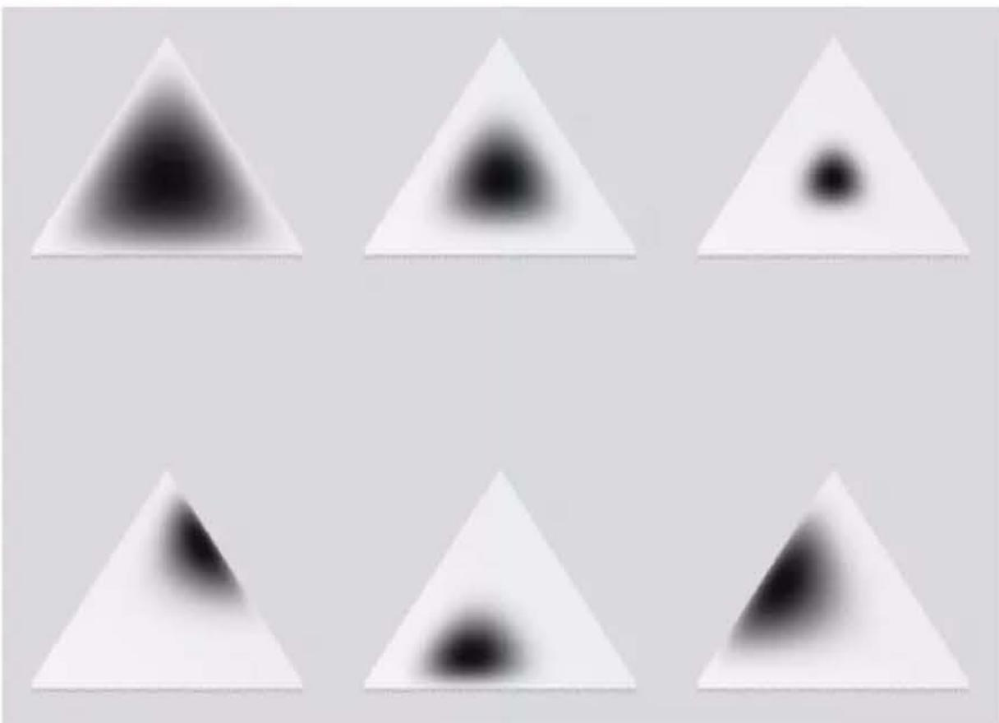  
图20.1 狄利克雷分布例(见前彩图)

$$
\mathrm { B } ( \alpha ) = { \frac { \displaystyle \prod _ { i = 1 } ^ { k } \Gamma ( \alpha _ { i } ) } { \displaystyle \Gamma \left( \sum _ { i = 1 } ^ { k } \alpha _ { i } \right) } }\tag{20.3}
$$

则狄利克雷分布的密度函数可以写成

$$
p ( \theta | \alpha ) = { \frac { 1 } { \mathrm { B } ( \alpha ) } } \prod _ { i = 1 } ^ { k } \theta _ { i } ^ { \alpha _ { i } - 1 }\tag{20.4}
$$

B(a）是规范化因，称为多元塔函数（或扩展的贝塔函数)。由密度函数的性质

$$
\int \frac { \Gamma \left( \sum _ { i = 1 } ^ { k } \alpha _ { i } \right) } { \displaystyle \prod _ { i = 1 } ^ { k } \Gamma ( \alpha _ { i } ) } \prod _ { i = 1 } ^ { k } \theta _ { i } ^ { \alpha _ { i } - 1 } \mathrm { d } \theta = \frac { \Gamma \left( \sum _ { i = 1 } ^ { k } \alpha _ { i } \right) } { \displaystyle \prod _ { i = 1 } ^ { k } \Gamma ( \alpha _ { i } ) } \int \prod _ { i = 1 } ^ { k } \theta _ { i } ^ { \alpha _ { i } - 1 } \mathrm { d } \theta = 1
$$

得：

$$
\operatorname { B } ( \alpha ) = \int \prod _ { i = 1 } ^ { k } \theta _ { i } ^ { \alpha _ { i } - 1 } \mathrm { d } \theta\tag{20.5}
$$

所以式(20.5)是多元贝塔函数的积分表。

## 3.二项分布和贝塔分布

项分布是多项分布的特殊情况，贝塔分布是狄利克雷分布的特殊情况。

项分布是指如下概率分布。X为离散随机变量，取值为m，其概率质量函数为

$$
P ( X = m ) = { \binom { n } { m } } p ^ { m } ( 1 - p ) ^ { n - m } , \quad m = 0 , 1 , 2 , \cdots , n\tag{20.6}
$$

其中，n和 $p \ ( 0 \leqslant p \leqslant 1 )$ 是参数。

贝塔分布是指如下概率分布，X为连续随机变量，取值范围为[0,1]，其概率密度函数为

$$
p ( x ) = \left\{ \begin{array} { l l } { \displaystyle \frac { 1 } { \mathrm { B } ( s , t ) } x ^ { s - 1 } ( 1 - x ) ^ { t - 1 } , } & { 0 \leqslant x \leqslant 1 } \\ { 0 , } & { \sharp \sharp \dag } \end{array} \right.\tag{20.7}
$$

其中， $s > 0$ 和t>0是参数， $\mathrm { B } ( s , t ) = { \frac { \Gamma ( s ) \Gamma ( t ) } { \Gamma ( s + t ) } }$ 是贝塔函数，定义为

$$
\mathrm { B } ( s , t ) = \int _ { 0 } ^ { 1 } x ^ { s - 1 } ( 1 - x ) ^ { t - 1 } \mathrm { d } x\tag{20.8}
$$

当s,t是自然数时，

$$
\mathrm { B } ( s , t ) = { \frac { ( s - 1 ) ! ( t - 1 ) ! } { ( s + t - 1 ) ! } }\tag{20.9}
$$

当n为1时，项分布变成伯努利分布（Bernoullidistribution）或0-1分布。伯努利分布表试验可能出现的两种结果的概率。显然项分布包含伯努利分布。图20.2给出种概率分布的关系。

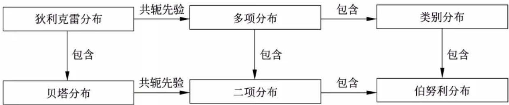  
图20.2 概率分布之间的关系

## 20.1.2 共轭先验

狄利克雷分布有些重要性质：①狄利克雷分布属于指数分布族；②狄利克雷分布是多项分布的共轭先验（conjugate prior）。

贝叶斯学习中常使共轭分布。如果后验分布与先验分布属于同类，则先验分布与后验分布称为共轭分布（conjugate distributions），先验分布称为共轭先验（conjugate prior）。如果多项分布的先验分布是狄利克雷分布，则其后验分布也为狄利克雷分布，两者构成共轭分布。作为先验分布的狄利克雷分布的参数又称为超参数。使共轭分布的好处是便于从先验分布计算后验分布。

设 $\mathcal { W } = \{ w _ { 1 } , w _ { 2 } , \cdots , w _ { k } \}$ 是由k个元素组成的集合。随机变量X服从W上的多项分布， $X \sim \mathrm { M u l t } ( n , \theta )$ ，其中 $n = ( n _ { 1 } , n _ { 2 } , \cdots , n _ { k } )$ 和 $\theta = ( \theta _ { 1 } , \theta _ { 2 } , \cdots , \theta _ { k } )$ 是参数。参数n为从W中重复独抽取样本的次数， $n _ { i }$ 为样本中 $w _ { i }$ 出现的次数 $( i = 1 , 2 , \cdots , k )$ ；参数 $\theta _ { i }$ 为 $w _ { i }$ 出现的概率 $( i = 1 , 2 , \cdots , k )$ 。

将样本数据表为D，标是计算在样本数据D给定条件下参数θ的后验概率 $p ( \theta | D )$ 。对于给定的样本数据D，似然函数是

$$
p ( D | \theta ) = \theta _ { 1 } ^ { n _ { 1 } } \theta _ { 2 } ^ { n _ { 2 } } \cdot \cdot \cdot \theta _ { k } ^ { n _ { k } } = \prod _ { i = 1 } ^ { k } \theta _ { i } ^ { n _ { i } }\tag{20.10}
$$

假设随机变量θ服从狄利克雷分布 $p ( \theta | \alpha )$ ，其中 $\alpha = ( \alpha _ { 1 } , \alpha _ { 2 } , \cdots , \alpha _ { k } )$ 为参数，则0的先验分布为

$$
p ( \theta | \alpha ) = \frac { \Gamma \left( \displaystyle \sum _ { i = 1 } ^ { k } \alpha _ { i } \right) } { \displaystyle \prod _ { i = 1 } ^ { k } \Gamma ( \alpha _ { i } ) } \prod _ { i = 1 } ^ { k } \theta _ { i } ^ { \alpha _ { i } - 1 } = \frac { 1 } { \mathrm { B } ( \alpha ) } \prod _ { i = 1 } ^ { k } \theta _ { i } ^ { \alpha _ { i } - 1 } = \mathrm { D i r } ( \theta | \alpha ) , \quad \alpha _ { i } > 0\tag{20.11}
$$

根据贝叶斯规则，在给定样本数据D和参数α的条件下，θ的后验概率分布是

$$
\begin{array} { r l } & { \displaystyle { p ( \theta | D , \alpha ) } = \frac { p ( D | \theta ) p ( \theta | \alpha ) } { p ( D | \alpha ) } } \\ & { \displaystyle { = \frac { \frac { k } { \prod } \theta ^ { n _ { * } } } { \prod _ { i = 1 } ^ { n } \theta ( \alpha ) } \frac { 1 } { B ( \alpha ) } \theta _ { i } ^ { \alpha - 1 } } } \\ & { \displaystyle { = \prod _ { i = 1 } ^ { k } \theta _ { i } ^ { n _ { * } } \frac { 1 } { B ( \alpha ) } \theta _ { i } ^ { \alpha - 1 } \mathrm { d } \theta } } \\ & { \displaystyle { = \frac { 1 } { \operatorname { B } ( \alpha + n ) } \frac { k } { \prod _ { i = 1 } ^ { n } \theta ^ { n _ { * } + n _ { * } - 1 } } } } \\ & { \displaystyle { = \operatorname* { D r } ( \theta | \alpha + n ) } } \end{array}\tag{20.12}
$$

可以看出先验分布(20.11)和后验分布(20.12)都是狄利克雷分布，两者有不同的参数，所以狄利克雷分布是多项分布的共轭先验。狄利克雷后验分布的参数等于狄利克雷先验分布参数 $\alpha = ( \alpha _ { 1 } , \alpha _ { 2 } , \cdots , \alpha _ { k } )$ 加上多项分布的观测计数 $n = ( n _ { 1 } , n _ { 2 } , \cdots , n _ { k } )$ ，好像试验之前就已经观察到计数 $\alpha = ( \alpha _ { 1 } , \alpha _ { 2 } , \cdots , \alpha _ { k } )$ ，因此也把α叫做先验伪计数（prior pseudo-counts）。

## 20.2 潜在狄利克雷分配模型

## 20.2.1 基本想法

潜在狄利克雷分配（LDA）是本集合的成概率模型。模型假设话题由单词的多项分布表，本由话题的多项分布表，单词分布和话题分布的先验分布都是狄利克雷分布。本内容的不同是由于它们的话题分布不同。（严格意义上说，这的多项分布都是类别分布，在机器学习与然语处理中，有时对两者不作严格区分）

LDA模型表示本集合的动成过程：先，基于单词分布的先验分布（狄利克雷分布）成多个单词分布，即决定多个话题内容；然后，基于话题分布的先验分布（狄利克雷分布）成多个话题分布，即决定多个本内容；最后，基于每个话题分布成话题序列，针对每个话题，基于话题的单词分布成单词，整体构成个单词序列，即成本，重复这个过程成所有本。本的单词序列是观测变量，本的话题序列是隐变量，本的话题分布和话题的单词分布也是隐变量。图20.3意了LDA的本成过程（详见前彩图)。

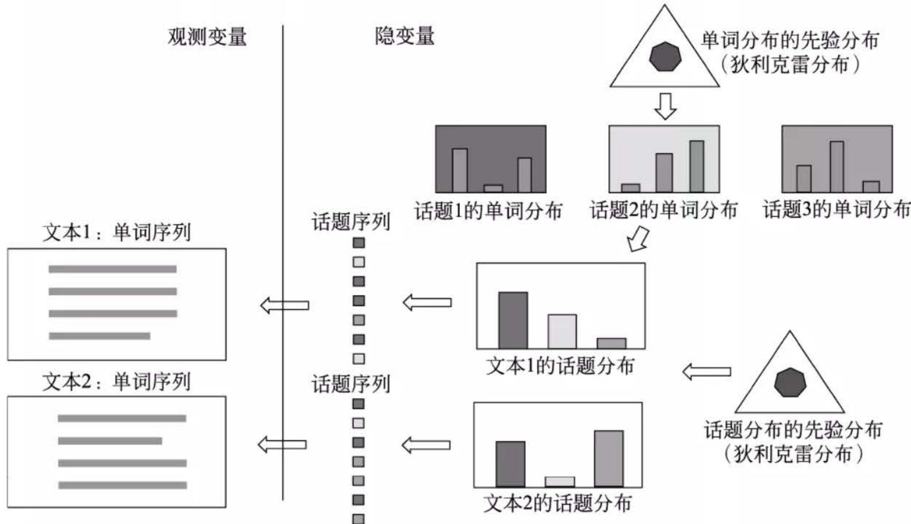  
图20.3 LDA的本成过程(见前彩图)

LDA模型是概率图模型，其特点是以狄利克雷分布为多项分布的先验分布，学习就是给定本集合，通过后验概率分布的估计，推断模型的所有参数。利LDA进话题分析就是对给定本集合，学习到每个本的话题分布，以及每个话题的单词分布。

可以认为LDA是PLSA（概率潜在语义分析）的扩展，相同点是两者都假设话题是单词的多项分布，本是话题的多项分布。不同点是LDA使狄利克雷分布作为先验分布，PLSA不使先验分布（或者说假设先验分布是均匀分布），两者对本成过程有不同假设；学习过程LDA基于贝叶斯学习，PLSA基于极似然估计。LDA的优点是使先验概率分布，可以防学习过程中产的过拟合（over-fitting）。

## 20.2.2 模型定义

本书采常LDA模型的定义，与原始献中提出的模型略有不同。

## 1.模型要素

潜在狄利克雷分配（LDA）使三个集合：是单词集合 $\boldsymbol { W } = \{ w _ { 1 } , w _ { 2 } , \cdots , w _ { v } , \cdots , w _ { V } \}$ 其中 $w _ { v }$ 是第υ个单词， $v = 1 , 2 , \cdots , V , V$ 是单词的个数。是本集合 $D = \{ w _ { 1 } , w _ { 2 } , \cdots ,$ $w _ { m } , \cdots , w _ { M } \}$ ，其中 $w _ { m }$ 是第m个文本， $m = 1 , 2 , \cdots , M , ~ M$ 是文本的个数。本 $w _ { m }$ 是个单词序列 $w _ { m } = \left( w _ { m 1 } , w _ { m 2 } , \cdots , w _ { m n } , \cdots , w _ { m N _ { m } } \right)$ ，其中 $w _ { m n }$ 是文本 $w _ { m }$ 的第n个单词， $n = 1 , 2 , \cdot \cdot \cdot , N _ { m } , \ N _ { m }$ 是文本 $w _ { m }$ 中单词的个数。三是话题集合 $Z = \{ z _ { 1 } , z _ { 2 } , \cdots$ ,$z _ { k } , \cdots , z _ { K } \}$ ，其中 $z _ { k }$ 是第k个话题， $k = 1 , 2 , \cdots , K , K$ 是话题的个数。

每个话题 $z _ { k }$ 由一个单词的条件概率分布 $p ( w | z _ { k } )$ 决定， $w \in W$ 。分布 $p ( w | z _ { k } )$ 服从多项分布 $( \vec { j } ^ { \mathrm { { u } } } \mathrm { { ^ { \rangle } } }$ 格意义上类别分布），其参数为 $\varphi _ { k }$ 。参数 $\varphi _ { k }$ 服从狄利克雷分布（先验分布），其超参数为 $\beta _ { \circ }$ 参数 $\varphi _ { k }$ 是一个V维向量 $\varphi _ { k } = ( \varphi _ { k 1 } , \varphi _ { k 2 } , \cdots , \varphi _ { k V } )$ ,其中 $\varphi _ { k v }$ 表示话题 $z _ { k }$ 生成单词 $w _ { v }$ 的概率。所有话题的参数向量构成个 $K \times V$ 矩阵 $\varphi = \{ \varphi _ { k } \} _ { k = 1 } ^ { K }$ 。超参数 $\beta$ 也是一个V维向量 $\beta = ( \beta _ { 1 } , \beta _ { 2 } , \cdots , \beta _ { V } )$ 。

每一个文本 $w _ { m }$ 由个话题的条件概率分布 $p ( z | w _ { m } )$ 决定， $z \in Z$ 。分布 $p ( z | w _ { m } )$ 服从多项分布 $( \vec { j } ^ { \mathrm { { u } } \vec { \mathrm { { z } } } }$ 格意义上类别分布），其参数为 $\theta _ { m }$ 。参数 $\theta _ { m }$ 服从狄利克雷分布（先验分布），其超参数为 $\alpha _ { \circ }$ 参数 $\theta _ { m }$ 是个K维向量 $\theta _ { m } = ( \theta _ { m 1 } , \theta _ { m 2 } , \cdots , \theta _ { m K } )$ ，其中 $\theta _ { m k }$ 表示文本 $w _ { m }$ 生成话题 $z _ { k }$ 的概率。所有本的参数向量构成个 $M \times K$ 矩阵 $\theta = \lbrace \theta _ { m } \rbrace _ { m = 1 } ^ { M }$ 。超参数 $\alpha$ 也是个K维向量 $\alpha = ( \alpha _ { 1 } , \alpha _ { 2 } , \cdots , \alpha _ { K } )$ 。

每一个文本 $w _ { m }$ 中的每一个单词 $w _ { m n }$ 由该文本的话题分布 $p ( z | w _ { m } )$ 以及所有话题的单词分布 $p ( w | z _ { k } )$ 决定。

## 2.生成过程

给定单词集合W，本集合D，话题集合Z，狄利克雷分布的超参数α和 $\beta$ ，LDA文本集合的生成过程如下：

## (1）成话题的单词分布

随机成K个话题的单词分布。具体过程如下：按照狄利克雷分布 $\operatorname { D i r } ( \beta )$ 随机成个参数向量 $\varphi _ { k } , \varphi _ { k } \sim \operatorname { D i r } ( \beta )$ ，作为话题 $z _ { k }$ 的单词分布 $p ( w | z _ { k } ) , w \in W , k = 1 , 2 , \cdots , K$

## (2）成本的话题分布

随机成M个本的话题分布。具体过程如下：按照狄利克雷分布Dir(α）随机成个参数向量 $\theta _ { m } , \ \theta _ { m } \sim \operatorname { D i r } ( \alpha )$ ，作为本 $w _ { m }$ 的话题分布 $p ( z | w _ { m } ) , m = 1 , 2 , \cdots , M$ 。

## (3）成本的单词序列

随机成M个本的 $N _ { m }$ 个单词。文本 $w _ { m } \ { ( m = 1 , 2 , \cdots , M ) }$ 的单词 $w _ { m n } \mathrm { ~ ( ~ } n \mathrm { ~ = ~ }$ $1 , 2 , \cdots , N _ { m } )$ 的生成过程如下：

(a）先按照多项分布 $\mathrm { M u l t } ( \theta _ { m } )$ 随机成个话题 $z _ { m n } , z _ { m n } \sim \mathrm { M u l t } ( \theta _ { m } )$ 。

（b）然后按照多项分布 $\mathrm { M u l t } ( \varphi _ { z _ { m n } } )$ 随机成个单词 $w _ { m n } , \ w _ { m n } \sim \mathrm { M u l t } ( \varphi _ { z _ { m n } } )$ 文本 $w _ { m }$ 本身是单词序列 $w _ { m } = ( w _ { m 1 } , w _ { m 2 } , \cdots , w _ { m N _ { m } } )$ ，对应着隐式的话题序列 $z _ { m } =$ $( z _ { m 1 } , z _ { m 2 } , \cdot \cdot \cdot , z _ { m N _ { m } } )$ 。

总结LDA成本的算法如下。

## 算法20.1（LDA的文本生成算法）

（1）对于话题 $z _ { k } \left( k = 1 , 2 , \cdots , K \right)$

成多项分布参数 $\varphi _ { k } \sim \operatorname { D i r } ( \beta )$ ，作为话题的单词分布 $p ( w | z _ { k } )$ ;

（2）对于本 $w _ { m } \left( m = 1 , 2 , \cdots , M \right)$

成多项分布参数 $\theta _ { m } \sim \operatorname { D i r } ( \alpha )$ ，作为本的话题分布 $p ( z | w _ { m } )$

（3）对于本 $w _ { m }$ 的单词 $w _ { m n } \left( m = 1 , 2 , \cdots , M , n = 1 , 2 , \cdots , N _ { m } \right)$

(a）成话题 $z _ { m n } \sim \mathrm { M u l t } ( \theta _ { m } )$ ，作为单词对应的话题；

(b）成单词 $w _ { m n } \sim \mathrm { M u l t } ( \varphi _ { z _ { m n } } )$

LDA的本成过程中，假定话题个数K给定，实际通常通过实验选定。狄利克雷分布的超参数α和 $\beta$ 通常也是事先给定的。在没有其他先验知识的情况下，可以假设向量 $\alpha$ 和 $\beta$ 的所有分量均为1，这时的文本的话题分布 $\theta _ { m }$ 是对称的，话题的单词分布 $\varphi _ { k }$ 也是对称的。

## 20.2.3 概率图模型

LDA模型本质是种概率图模型（probabilistic graphicalmodel）。图20.4为LDA作为概率图模型的板块表（platenotation）。图中结点表随机变量，实结点是观测变量，空结点是隐变量；有向边表概率依存关系；矩形（板块）表重复，板块内数字表重复的次数。

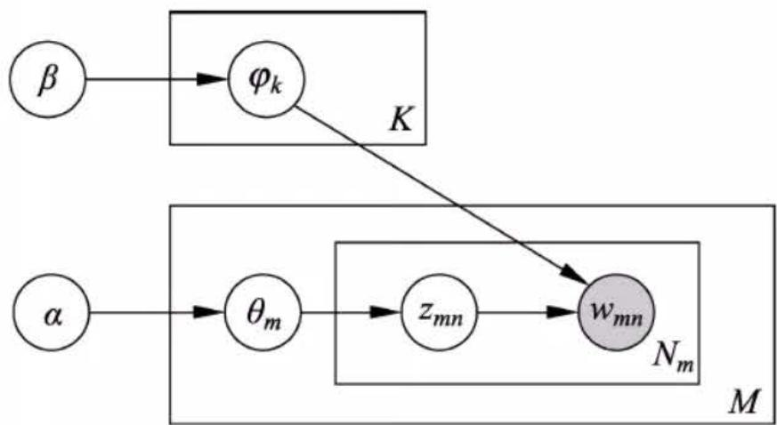  
图20.4 LDA的板块表

对于图20.4中的LDA板块表，结点α和 $\beta$ 是模型的超参数，结点 $\varphi _ { k }$ 表示话题的单词分布的参数，结点 $\theta _ { m }$ 表示文本的话题分布的参数，结点 $z _ { m n }$ 表示话题，结点 $w _ { m n }$ 表示单词。结点 $\beta$ 指向结点 $\varphi _ { k }$ ，重复K次，表根据超参数 $\beta$ 成K个话题的单词分布的参数 $\varphi _ { k }$ ；结点α指向结点 $\theta _ { m }$ ，重复M次，表根据超参数α成M个本的话题分布的参数 $\theta _ { m }$ ；结点 $\theta _ { m }$ 指向结点 $z _ { m n }$ ，重复 $N _ { m }$ 次，表根据本的话题分布 $\theta _ { m }$ 生成 $N _ { m }$ 个话题$z _ { m n }$ ；结点 $z _ { m n }$ 指向结点 $w _ { m n }$ ，同时K个结点 $\varphi _ { k }$ 也指向结点 $w _ { m n }$ ，表示根据话题 $z _ { m n }$ 以及K个话题的单词分布 $\varphi _ { k }$ 生成单词 $w _ { m n }$ 。

板块表示的优点是简洁，板块表示展开之后，成为普通的有向图表示（图20.5）。有向图中结点表随机变量，有向边表概率依存关系。可以看出LDA是相同随机变量被重复多次使用的概率图模型。

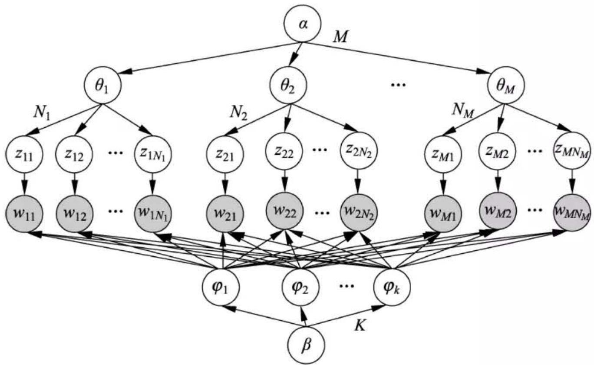  
图20.5 LDA的展开图模型表

## 20.2.4 随机变量序列的可交换性

个有限的随机变量序列是可交换的（exchangeable），是指随机变量的联合概率分布对随机变量的排列不变。

$$
P ( x _ { 1 } , x _ { 2 } , \cdot \cdot \cdot , x _ { N } ) = P ( x _ { \pi ( 1 ) } , x _ { \pi ( 2 ) } , \cdot \cdot \cdot , x _ { \pi ( N ) } )\tag{20.13}
$$

这里 $\pi ( 1 ) , \pi ( 2 ) , \cdots , \pi ( N )$ 代表然数 $1 , 2 , \cdots , N$ 的任意个排列。个限的随机变量序列是限可交换（infinitelyexchangeable）的，是指它的任意个有限序列都是可交换的。

如果个随机变量序列 $X _ { 1 } , X _ { 2 } , \cdots , X _ { N } , \cdots$ 是独同分布的，那么它们是无限可交换的。反之不然。

随机变量序列可交换的假设在叶斯学习中经常使。根据DeFinetti定理，任意个限可交换的随机变量序列对个随机参数是条件独同分布的。即任意个限可交换的随机变量序列 $X _ { 1 } , X _ { 2 } , \cdots , X _ { i } , \cdot \cdot$ ·的基于个随机参数Y的条件概率等于基于这个随机参数Y的各个随机变量 $X _ { 1 } , X _ { 2 } , \cdots , X _ { i } , \cdot \cdot$ ，的条件概率的乘积。

$$
P \left( X _ { 1 } , X _ { 2 } , \cdots , X _ { i } , \cdots | Y \right) = P ( X _ { 1 } | Y ) P ( X _ { 2 } | Y ) \cdots P ( X _ { i } | Y ) \cdots \tag{20.14}
$$

LDA假设本由限可交换的话题序列组成。由DeFinetti定理知，实际是假设本中的话题对个随机参数是条件独同分布的。所以在参数给定的条件下，本中话题的顺序可以忽略。作为对，概率潜在语义模型假设本中的话题是独同分布的，本中的话题的顺序也可以忽略。

## 20.2.5 概率公式

LDA模型整体是由观测变量和隐变量组成的联合概率分布，可以表为

$$
p ( w , z , \theta , \varphi | \alpha , \beta ) = \prod _ { k = 1 } ^ { K } p ( \varphi _ { k } | \beta ) \prod _ { m = 1 } ^ { M } p ( \theta _ { m } | \alpha ) \prod _ { n = 1 } ^ { N _ { m } } p ( z _ { m n } | \theta _ { m } ) p ( w _ { m n } | z _ { m n } , \varphi )\tag{20.15}
$$

其中，观测变量ω表所有本中的单词序列，隐变量z表所有本中的话题序列，隐变量θ表所有本的话题分布的参数，隐变量 $\varphi$ 表示所有话题的单词分布的参数，α和$\beta$ 是超参数。式中 $p ( \varphi _ { k } | \beta )$ 表示超参数 $\beta$ 给定条件下第k个话题的单词分布的参数 $\varphi _ { k }$ 的生成概率， $p ( \theta _ { m } | \alpha )$ 表示超参数 $\alpha$ 给定条件下第m个文本的话题分布的参数 $\theta _ { m }$ 的生成概率， $p ( z _ { m n } | \theta _ { m } )$ 表示第m个本的话题分布 $\theta _ { m }$ 给定条件下文本的第 $_ n$ 个位置的话题 $z _ { m n }$ 的生成概率， $p ( w _ { m n } | \boldsymbol { z } _ { m n } , \varphi )$ 表示在第m个本的第n个位置的话题 $z _ { m n }$ 及所有话题的单词分布的参数 $\varphi$ 给定条件下第m个本的第 $_ n$ 个位置的单词 $w _ { m n }$ 的成概率。参见图20.5。

第m个本的联合概率分布可以表为

$$
p ( w _ { m } , z _ { m } , \theta _ { m } , \varphi | \alpha , \beta ) = \prod _ { k = 1 } ^ { K } p ( \varphi _ { k } | \beta ) p ( \theta _ { m } | \alpha ) \prod _ { n = 1 } ^ { N _ { m } } p ( z _ { m n } | \theta _ { m } ) p ( w _ { m n } | z _ { m n } , \varphi )\tag{20.16}
$$

其中， $w _ { m }$ 表示该文本中的单词序列， $z _ { m }$ 表示该文本的话题序列， $\theta _ { m }$ 表示该文本的话题分布参数。

LDA模型的联合分布含有隐变量，对隐变量进积分得到边缘分布。

参数 $\theta _ { m }$ 和 $\varphi$ 给定条件下第m个本的成概率是

$$
p ( w _ { m } | \theta _ { m } , \varphi ) = \prod _ { n = 1 } ^ { N _ { m } } \left[ \sum _ { k = 1 } ^ { K } p ( z _ { m n } = k | \theta _ { m } ) p ( w _ { m n } | \varphi _ { k } ) \right]\tag{20.17}
$$

超参数α和 $\beta$ 给定条件下第m个本的成概率是

$$
p ( w _ { m } | \alpha , \beta ) = \prod _ { k = 1 } ^ { K } \int p ( \varphi _ { k } | \beta ) \left\{ \int p ( \theta _ { m } | \alpha ) \prod _ { n = 1 } ^ { N _ { m } } \left[ \sum _ { l = 1 } ^ { K } p ( z _ { m n } = l | \theta _ { m } ) p ( w _ { m n } | \varphi _ { l } ) \right] \mathrm { d } \theta _ { m } \right\} \mathrm { d } \varphi _ { k }\tag{20.18}
$$

超参数α和 $\beta$ 给定条件下所有本的成概率是

$$
p ( w | \alpha , \beta ) = \prod _ { k = 1 } ^ { K } \int p ( \varphi _ { k } | \beta ) \Bigg \{ \prod _ { m = 1 } ^ { M } \int p ( \theta _ { m } | \alpha ) \prod _ { n = 1 } ^ { N _ { m } } \left[ \sum _ { l = 1 } ^ { K } p ( z _ { m n } = l | \theta _ { m } ) p ( w _ { m n } | \varphi _ { l } ) \right] \mathrm { d } \theta _ { m } \Bigg \} \mathrm { d } \varphi _ { k }\tag{20.19}
$$

## 20.3 LDA的吉布斯抽样算法

潜在狄利克雷分配（LDA）的学习（参数估计）是个复杂的最优化问题，很难精确求解，只能近似求解。常的近似求解法有吉布斯抽样（Gibbs sampling）和变分推理（variationalinference）。本节讲述吉布斯抽样，20.4节讲述变分推理算法。吉布斯抽样的优点是实现简单，缺点是迭代次数可能较多。

## 20.3.1 基本想法

对于LDA模型的学习，给定本（单词序列）的集合 $D = \{ w _ { 1 } , \cdots , w _ { m } , \cdot \cdot \cdot , w _ { M } \}$ ,其中$w _ { m }$ 是第m个本（单词序列）， $w _ { m } = \left( w _ { m 1 } , \cdots , w _ { m n } , \cdots , w _ { m N _ { m } } \right)$ ，以w表示本集合的单词序列，即 $w = \left( w _ { 1 1 } , w _ { 1 2 } , \cdots , w _ { 1 N _ { 1 } } , w _ { 2 1 } , w _ { 2 2 } , \cdots , w _ { 2 N _ { 2 } } , \cdots , w _ { M 1 } , w _ { M 2 } , \cdots , w _ { M N _ { M } } \right)$ （参考图20.5)；超参数α和 $\beta$ 已知。标是要推断：①话题序列的集合 $z = \{ z _ { 1 } , \cdots , z _ { m } , \cdots , z _ { M } \}$ 的后验概率分布，其中 $z _ { m }$ 是第m个文本的话题序列， $z _ { m } = ( z _ { m 1 } , \cdots , z _ { m n } , \cdots , z _ { m N _ { m } } )$ ;②参数 $\boldsymbol { \theta } = \{ \theta _ { 1 } , \cdot \cdot \cdot , \theta _ { m } , \cdot \cdot \cdot , \theta _ { M } \}$ ，其中 $\theta _ { m }$ 是文本 $w _ { m }$ 的话题分布的参数；③参数 $\varphi =$ $\{ \varphi _ { 1 } , \cdots , \varphi _ { k } , \cdots , \varphi _ { K } \}$ ，其中 $\varphi _ { k }$ 是话题 $z _ { k }$ 的单词分布的参数。也就是说，要对联合概率分布$p ( w , z , \theta , \varphi | \alpha , \beta )$ 进行估计，其中 $w$ 是观测变量，而z，θ， $\varphi$ 是隐变量。

第19章讲述了吉布斯抽样，这是种常的马尔可夫链蒙特卡罗法。为了估计多元随机变量x的联合分布 $p ( x )$ ，吉布斯抽样法选择x的个分量，固定其他分量，按照其条件概率分布进随机抽样，依次循环对每个分量执这个操作，得到联合分布 $p ( x )$ 的一个随机样本，重复这个过程，在燃烧期之后，得到联合概率分布 $p ( x )$ 的样本集合。

LDA模型的学习通常采收缩的吉布斯抽样（collapsedGibbs sampling）法 $\textcircled{1}$ ，基本想法是：通过对隐变量0和 $\varphi$ 积分，得到边缘概率分布 $p ( w , z | \alpha , \beta )$ （也是联合分布），其中变量ω是可观测的，变量₂是不可观测的；对后验概率分布 $p ( z | w , \alpha , \beta )$ 进行吉布斯抽样，得到分布 $p ( z | w , \alpha , \beta )$ 的样本集合；再利这个样本集合对参数0和 $\varphi$ 进行估计，最终得到LDA模型 $p ( w , z , \theta , \varphi | \alpha , \beta )$ 的所有参数估计。

## 20.3.2 算法的主要部分

根据上的分析，问题转化为对后验概率分布 $p ( z | w , \alpha , \beta )$ 的吉布斯抽样，该分布表在所有本的单词序列给定条件下所有可能话题序列的条件概率。这先给出该分布的表达式，之后给出该分布的满条件分布表达式。

## 1.抽样分布的表达式

先有关系

$$
p ( z | w , \alpha , \beta ) = \frac { p ( w , z | \alpha , \beta ) } { p ( w | \alpha , \beta ) } \propto p ( w , z | \alpha , \beta )\tag{20.20}
$$

这变量w，α和 $\beta$ 已知，分母相同，可以不予考虑。联合分布 $p ( w , z | \alpha , \beta )$ 的表达式可以进步分解为

$$
p ( w , z | \alpha , \beta ) = p ( w | z , \alpha , \beta ) p ( z | \alpha , \beta ) = p ( w | z , \beta ) p ( z | \alpha )\tag{20.21}
$$

两个因可以分别处理。

推导第个因 $p ( w | z , \beta )$ 的表达式。先

$$
p ( w | z , \varphi ) = \prod _ { k = 1 } ^ { K } \prod _ { v = 1 } ^ { V } \varphi _ { k v } ^ { n _ { k v } }\tag{20.22}
$$

其中， $\varphi _ { k v }$ 是第k个话题成单词集合第u个单词的概率， $n _ { k v }$ 是数据中第k个话题生成第u个单词的次数。于是

$$
\begin{array} { l l l } { \displaystyle p ( w | z , \beta ) = \int p ( w | z , \varphi ) p ( \varphi | \beta ) \mathrm { d } \varphi } \\ { \displaystyle } & { = \int \displaystyle \prod _ { k = 1 } ^ { K } \frac { 1 } { \mathrm { B } ( \beta ) } \displaystyle \prod _ { \upsilon = 1 } ^ { V } \varphi _ { k \upsilon } ^ { n _ { k } + \beta _ { \upsilon } - 1 } \mathrm { d } \varphi } \\ { \displaystyle } & { = \displaystyle \prod _ { k = 1 } ^ { K } \frac { 1 } { \mathrm { B } ( \beta ) } \int \displaystyle \prod _ { \upsilon = 1 } ^ { V } \varphi _ { k \upsilon } ^ { n _ { k } + \beta _ { \upsilon } - 1 } \mathrm { d } \varphi } \\ { \displaystyle } & { = \displaystyle \prod _ { k = 1 } ^ { K } \frac { \mathrm { B } ( n _ { k } + \beta ) } { \mathrm { B } ( \beta ) } } \end{array}\tag{20.23}
$$

其中， $n _ { k } = \{ n _ { k 1 } , n _ { k 2 } , \cdot \cdot \cdot , n _ { k V } \}$ 。

第个因子 $p ( z | \alpha )$ 的表达式可以类似推导。先

$$
p ( z | \theta ) = \prod _ { m = 1 } ^ { M } \prod _ { k = 1 } ^ { K } \theta _ { m k } ^ { n _ { m k } }\tag{20.24}
$$

其中， $\theta _ { m k }$ 是第m个本成第k个话题的概率， $n _ { m k }$ 是数据中第m个本成第k个话题的次数。于是

$$
\begin{array} { l } { \displaystyle p ( z | \alpha ) = \int p ( z | \theta ) p ( \theta | \alpha ) \mathrm { d } \theta } \\ { \displaystyle \quad = \int \displaystyle \prod _ { m = 1 } ^ { M } \frac { 1 } { { \bf B } ( \alpha ) } \displaystyle \prod _ { k = 1 } ^ { K } \theta _ { m k } ^ { n _ { m k } + \alpha _ { k } - 1 } \mathrm { d } \theta } \\ { \displaystyle \quad = \displaystyle \prod _ { m = 1 } ^ { M } \frac { 1 } { { \bf B } ( \alpha ) } \displaystyle \int \displaystyle \prod _ { k = 1 } ^ { K } \theta _ { m k } ^ { n _ { m k } + \alpha _ { k } - 1 } \mathrm { d } \theta } \\ { \displaystyle \quad = \displaystyle \prod _ { m = 1 } ^ { M } \frac { { \bf B } ( n _ { m } + \alpha ) } { { \bf B } ( \alpha ) } } \end{array}\tag{20.25}
$$

其中， $n _ { m } = \{ n _ { m 1 } , n _ { m 2 } , \cdots , n _ { m K } \}$ 。由式(20.23)和式(20.25)得：

$$
p ( z , w | \alpha , \beta ) = \prod _ { k = 1 } ^ { K } \frac { \mathrm { B } ( n _ { k } + \beta ) } { \mathrm { B } ( \beta ) } \bullet \prod _ { m = 1 } ^ { M } \frac { \mathrm { B } ( n _ { m } + \alpha ) } { \mathrm { B } ( \alpha ) }\tag{20.26}
$$

故由式(20.20)和式(20.26)得收缩的吉布斯抽样分布的公式：

$$
p ( z | w , \alpha , \beta ) \propto \prod _ { k = 1 } ^ { K } \frac { \mathrm { B } ( n _ { k } + \beta ) } { \mathrm { B } ( \beta ) } \cdot \prod _ { m = 1 } ^ { M } \frac { \mathrm { B } ( n _ { m } + \alpha ) } { \mathrm { B } ( \alpha ) }\tag{20.27}
$$

## 2.满条件分布的表达式

分布 $p ( z | w , \alpha , \beta )$ 的满条件分布可以写成

$$
p ( z _ { i } | z _ { - i } , w , \alpha , \beta ) = \frac { 1 } { Z _ { z _ { i } } } p ( z | w , \alpha , \beta )\tag{20.28}
$$

这里 $w _ { i }$ 表所有本的单词序列的第个位置的单词， $z _ { i }$ 表示单词 $w _ { i }$ 对应的话题， $i =$ $( m , n ) , \ i = 1 , 2 , \cdots , I , \ z _ { - i } = \{ z _ { j } : j \neq i \} , \ Z _ { z _ { i } }$ 表示分布 $p ( z | w , \alpha , \beta )$ 对变量 $z _ { i }$ 的边缘化因。式(20.28)是在所有本单词序列、其他位置话题序列给定条件下第i个位置的话题的条件概率分布。由式(20.27)和式(20.28)可以推出：

$$
p ( z _ { i } | z _ { - i } , w , \alpha , \beta ) \propto \frac { n _ { k v } + \beta _ { v } } { \displaystyle \sum _ { v = 1 } ^ { V } \left( n _ { k v } + \beta _ { v } \right) } \cdot \frac { n _ { m k } + \alpha _ { k } } { \displaystyle \sum _ { k = 1 } ^ { K } \left( n _ { m k } + \alpha _ { k } \right) }\tag{20.29}
$$

其中，第m个本的第n个位置的单词 $w _ { i }$ 是单词集合的第u个单词，其话题 $z _ { i }$ 是话题集合的第k个话题； $n _ { k v }$ 表示第k个话题中第υ个单词的计数，但减去当前单词的计数； $n _ { m k }$ 表第m个本中第k个话题的计数，但减去当前单词的话题的计数。

## 20.3.3 算法的后处理

通过吉布斯抽样得到的分布 $p ( z | w , \alpha , \beta )$ 的样本可以得到变量≈的分配值，也可以估计变量0和 $\varphi _ { \mathrm { < } }$

## 1.参数 $\theta = \left\{ \theta _ { m } \right\}$ 的估计

根据LDA模型的定义，后验概率满

$$
p ( \theta _ { m } | z _ { m } , \alpha ) = \frac { 1 } { Z _ { \theta _ { m } } } \prod _ { n = 1 } ^ { N _ { m } } p ( z _ { m n } | \theta _ { m } ) p ( \theta _ { m } | \alpha ) = \mathrm { D i r } ( \theta _ { m } | n _ { m } + \alpha )\tag{20.30}
$$

这里 $n _ { m } = \{ n _ { m 1 } , n _ { m 2 } , \cdots , n _ { m K } \}$ 是第m个本的话题的计数， $Z _ { \theta _ { m } }$ 表示分布 $p ( \theta _ { m } , z _ { m } | \alpha )$ 对变量 $\theta _ { m }$ 的边缘化因子。于是得到参数 $\theta = \left\{ \theta _ { m } \right\}$ 的估计式：

$$
\theta _ { m k } = \frac { n _ { m k } + \alpha _ { k } } { \displaystyle \sum _ { k = 1 } ^ { K } \left( n _ { m k } + \alpha _ { k } \right) } , \quad m = 1 , 2 , \cdots , M , \quad k = 1 , 2 , \cdots , K\tag{20.31}
$$

## 2.参数 $\varphi = \{ \varphi _ { k } \}$ 的估计

后验概率满

$$
p ( \varphi _ { k } | w , z , \beta ) = \frac { 1 } { Z _ { \varphi _ { k } } } \prod _ { i = 1 } ^ { I } p ( w _ { i } | \varphi _ { k } ) p ( \varphi _ { k } | \beta ) = \mathrm { D i r } ( \varphi _ { k } | n _ { k } + \beta )\tag{20.32}
$$

这里 $n _ { k } = \{ n _ { k 1 } , n _ { k 2 } , \cdot \cdot \cdot , n _ { k V } \}$ 是第 $k$ 个话题的单词的计数， $Z _ { \varphi _ { k } }$ 表示分布 $p ( \varphi _ { k } , w | z , \beta )$ 对变量 $\varphi _ { k }$ 的边缘化因，Ⅰ是本集合单词序列ω的单词总数。于是得到参数的估计式：

$$
\varphi _ { k v } = { \frac { n _ { k v } + \beta _ { v } } { \displaystyle \sum _ { v = 1 } ^ { V } ( n _ { k v } + \beta _ { v } ) } } , \quad k = 1 , 2 , \cdots , K , \quad v = 1 , 2 , \cdots , V\tag{20.33}
$$

## 20.3.4算法

总结LDA的吉布斯抽样的具体算法。

对给定的所有本的单词序列w，每个位置上随机指派个话题，整体构成所有本的话题序列z。然后循环执以下操作。

在每个位置上计算在该位置上的话题的满条件概率分布，然后进随机抽样，得到该位置的新的话题，分派给这个位置。

$$
p ( z _ { i } | z _ { - i } , w , \alpha , \beta ) \propto \frac { n _ { k v } + \beta _ { v } } { \displaystyle \sum _ { v = 1 } ^ { V } \left( n _ { k v } + \beta _ { v } \right) } \cdot \frac { n _ { m k } + \alpha _ { k } } { \displaystyle \sum _ { k = 1 } ^ { K } \left( n _ { m k } + \alpha _ { k } \right) }
$$

这个条件概率分布由两个因组成，第个因表话题成该位置的单词的概率，第个因表示该位置的本成话题的概率。

整体准备两个计数矩阵：话题-单词矩阵 $N _ { K \times V } = [ n _ { k v } ]$ 和本-话题矩阵 $N _ { M \times K } =$ $[ n _ { m k } ]$ 。在每个位置，对两个矩阵中该位置的已有话题的计数减1，计算满条件概率分布，然后进抽样，得到该位置的新话题，之后对两个矩阵中该位置的新话题的计数加1。计算移到下个位置。

在燃烧期之后得到的所有本的话题序列就是条件概率分布 $p ( z | w , \alpha , \beta )$ 的样本。

算法20.2（LDA吉布斯抽样算法）

输入：文本的单词序列 $w = \{ w _ { 1 } , w _ { 2 } , \cdot \cdot \cdot , w _ { m } , \cdot \cdot \cdot \cdot , w _ { M } \} , \ w _ { m } = ( w _ { m 1 } , w _ { m 2 } , \cdot \cdot \cdot , w _ { m n } , \cdot \cdot \cdot , \nonumber$ $w _ { m _ { N _ { m } } } )$ 。

输出：文本的话题序列 $z = \{ z _ { 1 } , z _ { 2 } , \cdots , z _ { m } , \cdot \cdot \cdot , z _ { M } \} , z _ { m } = ( z _ { m 1 } , z _ { m 2 } , \cdots , z _ { m n } , \cdot \cdot \cdot , z _ { m _ { N _ { m } } } )$ 的后验概率分布 $p ( z | w , \alpha , \beta )$ 的样本计数，模型的参数 $\varphi$ 和0的估计值。

参数：超参数α和 $\beta$ ，话题个数K。

（1）设所有计数矩阵的元素 $n _ { m k } , ~ n _ { k v }$ ，计数向量的元素 $n _ { m } , ~ n _ { k }$ 初值为 $0 _ { \circ }$

（2）对所有本 $w _ { m } , \ m = 1 , 2 , \cdots , M$ ，对第m个本中的所有单词 $w _ { m n } , n { = } 1 , 2 , \cdots ,$ $N _ { m }$ ，抽样话题 $z _ { m n } = z _ { k } \sim \mathrm { M u l t } \Big ( \frac { 1 } { K } \Big )$ ；增加文本-话题计数 $n _ { m k } = n _ { m k } + 1$ ，增加文本-话题和计数 $n _ { m } = n _ { m } + 1$ ，增加话题-单词计数 $n _ { k v } = n _ { k v } + 1$ ，增加话题-单词和计数 $n _ { k } = n _ { k } + 1$ 。

（3）循环执行以下操作，直到进入燃烧期。对所有本 $w _ { m } , \ m = 1 , 2 , \cdots , M$ ，对第m个本中的所有单词 $w _ { m n } , n = 1 , 2 , \cdots , N _ { m }$

(a）当前的单词 $w _ { m n }$ 是第u个单词，话题指派 $z _ { m n }$ 是第k个话题；减少计数$n _ { m k } = n _ { m k } - 1 , ~ n _ { m } = n _ { m } - 1 , ~ n _ { k v } = n _ { k v } - 1 ~ , ~ n _ { k } = n _ { k } - 1 ;$

(b）按照满条件分布进抽样：

$$
p ( z _ { i } | z _ { - i } , w , \alpha , \beta ) \propto \frac { n _ { k v } + \beta _ { v } } { \displaystyle \sum _ { v = 1 } ^ { V } \left( n _ { k v } + \beta _ { v } \right) } \cdot \frac { n _ { m k } + \alpha _ { k } } { \displaystyle \sum _ { k = 1 } ^ { K } \left( n _ { m k } + \alpha _ { k } \right) }
$$

得到新的第 $k ^ { \prime }$ 个话题，分配给 $z _ { m n }$

(c）增加计数 $n _ { m k ^ { \prime } } = n _ { m k ^ { \prime } } + 1 , \ n _ { m } = n _ { m } + 1 , \ n _ { k ^ { \prime } v } = n _ { k ^ { \prime } v } + 1 , \ n _ { k ^ { \prime } } = n _ { k ^ { \prime } } + 1 ;$

(d）得到更新的两个计数矩阵 $N _ { K \times V } = [ n _ { k v } ]$ 和 $N _ { M \times K } = [ n _ { m k } ]$ ，表后验概率分布 $p ( z | w , \alpha , \beta )$ 的样本计数。

（4）利得到的样本计数，计算模型参数：

$$
\theta _ { m k } = \frac { n _ { m k } + \alpha _ { k } } { \displaystyle \sum _ { k = 1 } ^ { K } \left( n _ { m k } + \alpha _ { k } \right) }
$$

$$
\varphi _ { k v } = \frac { n _ { k v } + \beta _ { v } } { \displaystyle \sum _ { v = 1 } ^ { V } ( n _ { k v } + \beta _ { v } ) }
$$

## 20.4 LDA的变分EM算法

本节先介绍变分推理，然后介绍变分EM算法，最后介绍将变分EM算法应到LDA模型学习的具体算法。LDA的变分EM算法具有推理与学习效率的优点。

## 20.4.1 变分推理

变分推理（variationalinference）是贝叶斯学习中常的、含有隐变量模型的学习和推理法。变分推理和马尔可夫链蒙特卡罗法（MCMC）属于不同的技巧。MCMC通过随机抽样的法近似地计算模型的后验概率，变分推理则通过解析的法计算模型的后验概率的近似值。

变分推理的基本想法如下。假设模型是联合概率分布 $p ( x , z )$ ，其中x是观测变量（数据），z是隐变量，包括参数。标是学习模型的后验概率分布 $p ( z | x )$ ，用模型进概率推理。但这是个复杂的分布，直接估计分布的参数很困难。所以考虑概率分布 $q ( z )$ 近似条件概率分布 $p ( z | x )$ ，用 $\mathrm { K L }$ 散度 $D ( q ( z ) | | p ( z | x ) )$ 计算两者的相似度， $q ( z )$ 称为变分分布（variationaldistribution）。如果能找到与 $p ( z | x )$ 在KL散度意义下最近的分布 $q ^ { * } ( z )$ ，则可以用这个分布近似 $p ( z | x )$ 。

$$
p ( z | x ) \approx q ^ { * } ( z )\tag{20.34}
$$

图20.6给出了 $q ^ { * } ( z )$ 与 $p ( z | x )$ 的关系。K散度的定义见附录E。

$\mathrm { K L }$ 散度可以写成以下形式：

$$
\begin{array} { r l } & { D ( q ( z ) \| p ( z | x ) ) = E _ { q } \left[ \log q ( z ) \right] - E _ { q } \left[ \log p ( z | x ) \right] } \\ & { \quad \quad \quad \quad \quad \quad \quad \quad \quad \quad \quad } \\ & { \quad \quad \quad = E _ { q } \left[ \log q ( z ) \right] - E _ { q } \left[ \log p ( x , z ) \right] + \log p ( x ) } \\ & { \quad \quad \quad \quad \quad = \log p ( x ) - \left\{ E _ { q } \left[ \log p ( x , z ) \right] - E _ { q } \left[ \log q ( z ) \right] \right\} } \end{array}\tag{20.35}
$$

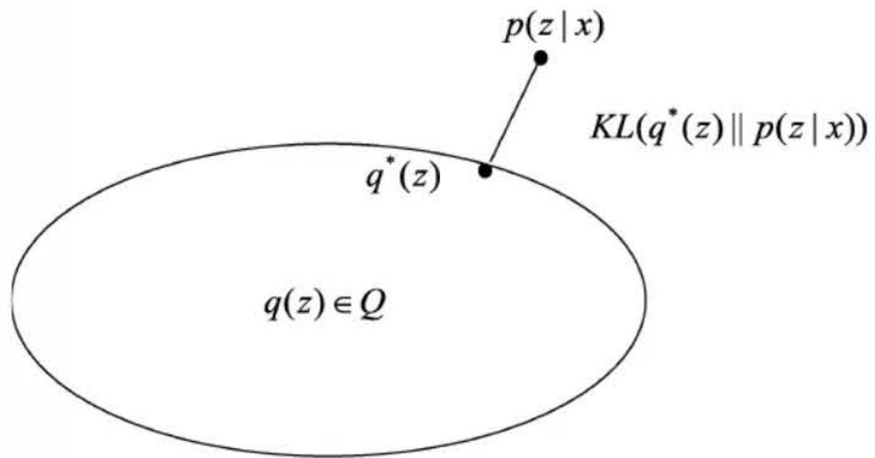  
图20.6 变分推理的原理

注意到 $\mathrm { K L }$ 散度于等于零，当且仅当两个分布致时为零，由此可知式(20.35)右端第一项与第项满关系

$$
\begin{array} { r } { \log p ( x ) \geqslant E _ { q } \left[ \log p ( x , z ) \right] - E _ { q } \left[ \log q ( z ) \right] } \end{array}\tag{20.36}
$$

不等式右端是左端的下界，左端称为证据（evidence），右端称为证据下界（evidencelowerbound，ELBO），证据下界记作

$$
L ( q ) = E _ { q } \left[ \log p ( x , z ) \right] - E _ { q } \left[ \log q ( z ) \right]\tag{20.37}
$$

KL散度(20.35)的最化可以通过证据下界(20.37)的最化实现，因为标是求q(z)使KL散度最化，这时 $\log p ( x )$ 是常量。因此，变分推理变成求解证据下界最化的问题。

变分推理可以从另个度理解。标是通过证据logp(x）的最化估计联合概率分布$p ( x , z )$ 。因为含有隐变量z，直接对证据进最化困难，转根据式(20.36)对证据下界进行最大化。

对变分分布 $q ( z )$ 要求是具有容易处理的形式，通常假设 $q ( z )$ 对≈的所有分量都是互相独的（实际是条件独于参数），即满

$$
q ( z ) = q ( z _ { 1 } ) q ( z _ { 2 } ) \cdot \cdot \cdot q ( z _ { n } )\tag{20.38}
$$

这时的变分分布称为平均场（meanfeld）①。K散度的最化或证据下界最化实际是在平均场的集合，即满独假设的分布集合 $Q = \{ q ( \boldsymbol { z } ) | q ( \boldsymbol { z } ) = \prod _ { i = 1 } ^ { n } q ( \boldsymbol { z } _ { i } ) \}$ 之中进行的。

总结起来，变分推理有以下个步骤：定义变分分布 $q ( z )$ ；推导其证据下界表达式；最优化法对证据下界进优化，如坐标上升，得到最优分布 $q ^ { * } ( z )$ ，作为后验分布 $p ( z | x )$ 的近似。

## 20.4.2 变分EM算法

变分推理中，可以通过迭代的法最化证据下界，这时算法是EM算法的推，称为变分EM算法。

假设模型是联合概率分布 $p ( x , z | \theta )$ ，其中x是观测变量，₂是隐变量，θ是参数。标是

通过观测数据的概率（证据） $\log p ( x | \theta )$ 的最化，估计模型的参数θ。使变分推理，导平均场 $q \left( \boldsymbol { z } \right) = \prod _ { i = 1 } ^ { n } q ( z _ { i } )$ ，定义证据下界

$$
L ( q , \theta ) = E _ { q } [ \log p ( x , z | \theta ) ] - E _ { q } [ \log q ( z ) ]\tag{20.39}
$$

通过迭代，分别以q和θ为变量对证据下界进最化，就得到变分EM算法。

## 算法20.3（变分EM算法）

循环执以下E步和M步，直到收敛。

(1)E步：固定θ，求 $L ( q , \theta )$ 对q的最大化。

(2）M步：固定q，求 $L ( q , \theta )$ 对0的最化。

给出模型参数θ的估计值。

根据变分推理原理，观测数据的概率和证据下界满

$$
\log p ( x | \theta ) - L ( q , \theta ) = D ( q ( z ) | | p ( z | x , \theta ) ) \geqslant 0\tag{20.40}
$$

变分EM算法的迭代过程中，以下关系成：

$$
\log p ( x | \theta ^ { ( t - 1 ) } ) = L ( q ^ { ( t ) } , \theta ^ { ( t - 1 ) } ) \leqslant L ( q ^ { ( t ) } , \theta ^ { ( t ) } ) \leqslant \log p ( x | \theta ^ { ( t ) } )\tag{20.41}
$$

其中上标t-1和t表迭代次数，左边的等式基于E步计算和变分推理原理，中间的不等式基于M步计算，右边的不等式基于变分推理原理。说明每次迭代都保证观测数据的概率不递减。因此，变分EM算法定收敛，但可能收敛到局部最优。

EM算法实际也是对证据下界进最化。不妨对照9.4节EM算法的推，EM算法的推是求F函数的极-极算法，其中的F函数就是证据下界。EM算法假设 $q ( z ) = p ( z | x )$ 且 $p ( z | x )$ 容易计算，而变分EM算法考虑般情况使容易计算的平均场 $q ( \boldsymbol { z } ) = \prod _ { i = 1 } ^ { n } q ( z _ { i } )$ 当模型复杂时，EM算法未必可，但变分EM算法仍然可以使。

## 20.4.3 算法推导

将变分EM算法应到图20.7的LDA模型的学习上，是图20.4的LDA模型的简化。先定义具体的变分分布，推导证据下界的表达式，接着推导变分分布的参数和LDA模型的参数的估计式，最后给出LDA模型的变分EM算法。

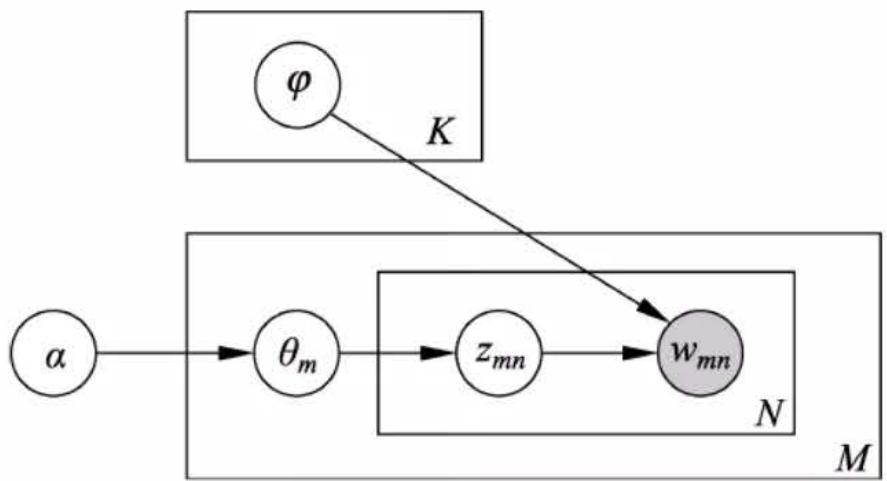  
图20.7 LDA模型

## 1.证据下界的定义

为简单起见，次只考虑个本，记作 $w _ { \circ }$ 文本的单词序列 $w = ( w _ { 1 } , \cdots , w _ { n } , \cdots , w _ { N } )$ ,对应的话题序列 $z = ( z _ { 1 } , \cdots , z _ { n } , \cdots , z _ { N } )$ ，随机变量 $w , z$ 和话题分布θ的联合分布是

$$
p ( \theta , z , w | \alpha , \varphi ) = p ( \theta | \alpha ) \prod _ { n = 1 } ^ { N } p ( z _ { n } | \theta ) p ( w _ { n } | z _ { n } , \varphi )\tag{20.42}
$$

其中，ω是可观测变量，θ和z是隐变量，α和 $\varphi$ 是参数。

定义基于平均场的变分分布

$$
q ( \theta , z | \gamma , \eta ) = q ( \theta | \gamma ) \prod _ { n = 1 } ^ { N } q ( z _ { n } | \eta _ { n } )\tag{20.43}
$$

其中， $\gamma$ 是狄利克雷分布参数， $\eta = \left( \eta _ { 1 } , \eta _ { 2 } , \cdots , \eta _ { n } \right)$ 是多项分布参数，变量θ和₂的各个分量都是条件独的。标是求KL散度意义下最相近的变分分布 $q ( \theta , z | \gamma , \eta )$ ，以近似LDA模型的后验分布 $p ( \theta , z | w , \alpha , \varphi )$

图20.8是变分分布的板块表。LDA模型中隐变量θ和₂之间存在依存关系，变分分布中这些依存关系被去掉，变量θ和条件独。

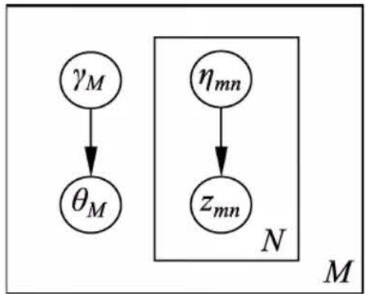  
图20.8 基于平均场的变分分布

由此得到个本的证据下界：

$$
L ( \gamma , \eta , \alpha , \varphi ) = E _ { q } [ \log p ( \theta , z , w | \alpha , \varphi ) ] - E _ { q } [ \log q ( \theta , z | \gamma , \eta ) ]\tag{20.44}
$$

其中，数学期望是对分布 $q ( \theta , z | \gamma , \eta )$ 定义的，为了方便写作 $E _ { q } [ \cdot ]$ ；γ和 $\eta$ 是变分分布的参数； $\alpha$ 和 $\varphi$ 是LDA模型的参数。

所有本的证据下界为

$$
L _ { w } ( \gamma , \eta , \alpha , \varphi ) = \sum _ { m = 1 } ^ { M } \left\{ E _ { q _ { m } } [ \log p ( \theta _ { m } , z _ { m } , w _ { m } | \alpha , \varphi ) ] - E _ { q _ { m } } [ \log q ( \theta _ { m } , z _ { m } | \gamma _ { m } , \eta _ { m } ) ] \right\}\tag{20.45}
$$

为求解证据下界 $L ( \gamma , \eta , \alpha , \varphi )$ 的最化，先写出证据下界的表达式。为此展开证据下 界式(20.44):

$$
\begin{array} { c } { L ( \gamma , \eta , \alpha , \varphi ) = E _ { q } [ \log { p ( \theta | \alpha ) } ] + E _ { q } [ \log { p ( z | \theta ) } ] + E _ { q } [ \log { p ( w | z , \varphi ) } ] - } \\ { E _ { q } [ \log { q ( \theta | \gamma ) } ] - E _ { q } [ \log { q ( z | \eta ) } ] } \end{array}\tag{20.46}
$$

根据变分参数 $\gamma$ 和 $\eta$ ，模型参数 $\alpha$ 和 $\varphi$ 继续展开，并将展开式的每一项写成一：

$$
\begin{array} { r l } { d ( \gamma , \eta , \alpha , \varphi ) = \operatorname* { l i m } _ { \mathbf { x } ^ { \prime } } \Bigg [ \displaystyle \sum _ { i = 1 } ^ { K } \alpha _ { i } \Bigg ] - \displaystyle \sum _ { k = 1 } ^ { K } \log _ { \mathbf { x } } \Gamma ( \alpha _ { k } ) + \displaystyle \sum _ { k = 1 } ^ { K } ( \alpha _ { k } - 1 ) [ \nu ( \gamma _ { k } ) - \psi ( \displaystyle \sum _ { i = 1 } ^ { K } \alpha _ { i } ) ] \Bigg ] + } & { } \\ { \displaystyle \sum _ { k = 1 , i = 1 } ^ { K } \sum _ { n _ { k } = 1 } ^ { K } \gamma _ { n k } \Bigg [ \nu _ { ( \mathbf { x } ^ { \prime } ) - \mathbf { x } ^ { \prime } } ( \displaystyle \sum _ { i = 1 } ^ { K } \alpha _ { i } ) \Bigg ] + } & { } \\ { \displaystyle \sum _ { k = 1 , i = 1 } ^ { K } \sum _ { \eta = 1 } ^ { K } \mu _ { \eta , \eta \alpha _ { k } \eta } ^ { \alpha _ { \eta } \eta } \mathrm { l e g i } _ { \eta \alpha _ { k } - \mathbf { x } ^ { \prime } } } \\ { \displaystyle \sum _ { k = 1 , i = 1 } ^ { K } \nu _ { \eta - \alpha _ { i } \eta } ^ { \alpha } } & { \Bigg [ \nu _ { \eta , \eta \alpha _ { k } \eta } ^ { \alpha } + \sum _ { \eta = 1 } ^ { K } ( \alpha _ { i } - 1 ) [ \nu ( \gamma _ { \eta , \eta \alpha _ { k } } ) - \psi ( \displaystyle \sum _ { i = 1 } ^ { K } \alpha _ { i } ) ] - } \\  \displaystyle \operatorname* { l i m } _ { \mathbf { x } \in \mathbf { x } } ( \displaystyle \sum _ { i = 1 } ^ { K } \alpha _ { i } ) + \displaystyle \sum _ { k = 1 } ^ { K } \log \Gamma ( \eta _ { \alpha } ) - \displaystyle \sum _ { k = 1 } ^ { K } ( \alpha _ { i } - 1 ) [ \nu ( \gamma _ { \eta , \eta \alpha _ { k } } ) - \psi ( \displaystyle \sum _  \end{array}\tag{47}
$$

式中 $\varPsi ( \alpha _ { k } )$ 是对数伽马函数的导数，即

$$
\varPsi ( \alpha _ { k } ) { = } \frac { \mathrm { d } } { \mathrm { d } \alpha _ { k } } \log \Gamma ( \alpha _ { k } )\tag{20.48}
$$

第项推导求 $E _ { q } \left[ \log p ( \theta | \alpha ) \right]$ ，是关于分布 $q ( \theta , z | \gamma , \eta )$ 的数学期望。

$$
E _ { q } \left[ \log p ( \theta | \alpha ) \right] = \sum _ { k = 1 } ^ { K } ( \alpha _ { k } - 1 ) E _ { q } \left[ \log \theta _ { k } \right] + \log \Gamma \left( \sum _ { l = 1 } ^ { K } \alpha _ { l } \right) - \sum _ { k = 1 } ^ { K } \log \Gamma ( \alpha _ { k } )\tag{20.49}
$$

其中， $\theta \sim \operatorname { D i r } ( \theta | \gamma )$ ，所以利附录E中式(E.7)有

$$
E _ { q \left( \theta \mid \gamma \right) } \left[ \log \theta _ { k } \right] = \varPsi \left( \gamma _ { k } \right) - \varPsi \left( \sum _ { l = 1 } ^ { K } \gamma _ { l } \right)\tag{20.50}
$$

故得：

$$
E _ { q } [ \log p ( \theta | \alpha ) ] = \log \Gamma \left( \sum _ { l = 1 } ^ { K } \alpha _ { l } \right) - \sum _ { k = 1 } ^ { K } \log \Gamma ( \alpha _ { k } ) + \sum _ { k = 1 } ^ { K } ( \alpha _ { k } - 1 ) \left[ \varPsi ( \gamma _ { k } ) - \varPsi \left( \sum _ { l = 1 } ^ { K } \gamma _ { l } \right) \right]\tag{20.51}
$$

式中 $\alpha _ { k }$ 和 $\gamma _ { k }$ 表第k个话题的狄利克雷分布参数。

第二项推导求 $E _ { q } [ \log p ( z | \theta ) ]$ ，是关于分布 $q ( \theta , z | \gamma , \eta )$ 的数学期望。

$$
\begin{array} { c l } { \displaystyle E _ { q } ( \log p ( z | \theta ) ) = \sum _ { n = 1 } ^ { N } E _ { q } \left[ \log p ( z _ { n } | \theta ) \right] } \\ { \displaystyle = \sum _ { n = 1 } ^ { N } E _ { q ( \theta , z _ { n } | \gamma , \eta ) } [ \log ( z _ { n } | \theta ) ] } \end{array}
$$

$$
\begin{array} { l } { { \displaystyle = \sum _ { n = 1 } ^ { N } \sum _ { k = 1 } ^ { K } q ( z _ { n k } | \eta ) E _ { q ( \theta | \gamma ) } [ \log \theta _ { k } ] } } \\ { { \displaystyle = \sum _ { n = 1 } ^ { N } \sum _ { k = 1 } ^ { K } \eta _ { n k } \left[ \varPsi ( \gamma _ { k } ) - \varPsi \left( \sum _ { l = 1 } ^ { K } \gamma _ { l } \right) \right] } } \end{array}\tag{20.52}
$$

式中 $\eta _ { n k }$ 表档第n个位置的单词由第k个话题产的概率， $\gamma _ { k }$ 表第k个话题的狄利克雷分布参数。最后步到附录E中式(E.4)。

第三项推导求 $E _ { q } \left[ \log p ( w | z , \varphi ) \right]$ ，是关于分布 $q ( \theta , z | \gamma , \eta )$ 的数学期望。

$$
\begin{array} { l } { { \displaystyle E _ { q } \left[ \log p ( w | z , \varphi ) \right] = \sum _ { n = 1 } ^ { N } E _ { q } \left[ \log p ( w _ { n } | z _ { n } , \varphi ) \right] } \ ~ } \\ { { \displaystyle = \sum _ { n = 1 } ^ { N } E _ { q ( z _ { n } | \eta ) } \left[ \log p ( w _ { n } | z _ { n } , \varphi ) \right] } \ ~ } \\ { { \displaystyle = \sum _ { n = 1 } ^ { N } \sum _ { k = 1 } ^ { K } q ( z _ { n k } | \eta ) \log p ( w _ { n } | z _ { n k } , \varphi ) } \ ~ } \\ { { \displaystyle ~ = \sum _ { n = 1 } ^ { N } \sum _ { k = 1 } ^ { K } \sum _ { \mathfrak { n } = 1 } ^ { V } \eta _ { n k } w _ { n } ^ { v } \log \varphi _ { k v } } , } \end{array}\tag{20.53}
$$

式中 $\eta _ { n k }$ 表档第n个位置的单词由第k个话题产的概率； $w _ { n } ^ { v }$ 在第n个位置的单词是单词集合的第u个单词时取值为1，否则取值为 $0 ; \varphi _ { k v }$ 表第k个话题成单词集合中第u个单词的概率。

第四项推导求 $E _ { q } \left[ \log q ( \theta | \gamma ) \right]$ ，是关于分布 $q ( \theta , z | \gamma , \eta )$ 的数学期望。由于 $\theta \sim \operatorname { D i r } ( \gamma )$ ,类似式(20.50)可以得到：

$$
E _ { q } [ \log q ( \theta | \gamma ) ] = \log \Gamma \left( \sum _ { l = 1 } ^ { K } \gamma \right) - \sum _ { k = 1 } ^ { K } \log \Gamma ( \gamma _ { k } ) + \sum _ { k = 1 } ^ { K } ( \gamma _ { k } - 1 ) \left[ \varPsi ( \gamma _ { k } ) - \varPsi \left( \sum _ { l = 1 } ^ { K } \gamma \right) \right]\tag{20.54}
$$

式中 $\gamma _ { k }$ 表第k个话题的狄利克雷分布参数。

第五项公式推导求 $E _ { q } \left[ \log q ( z | \eta ) \right]$ ，是关于分布 $q ( \theta , z | \gamma , \eta )$ 的数学期望。

$$
\begin{array} { l } { { \displaystyle E _ { q } \left[ \log q \left( z | \eta \right) \right] = \sum _ { n = 1 } ^ { N } E _ { q } \left[ \log q \left( z _ { n } | \eta \right) \right] } \ ~ } \\ { { \displaystyle = \sum _ { n = 1 } ^ { N } E _ { q \left( z _ { n } | \eta \right) } \left[ \log q \left( z _ { n } | \eta \right) \right] } \ ~ } \\ { { \displaystyle = \sum _ { n = 1 } ^ { N } \sum _ { k = 1 } ^ { K } q \big ( z _ { n k } | \eta \big ) \log q \left( z _ { n k } | \eta \right) } \ ~ } \\ { { \displaystyle ~ = \sum _ { n = 1 } ^ { N } \sum _ { k = 1 } ^ { K } m _ { k } \log \eta _ { n k } } \ ~ } \end{array}\tag{20.55}
$$

式中 $\eta _ { n k }$ 表示档第n个位置的单词由第k个话题产的概率， $\gamma _ { k }$ 表示第k个话题的狄利克雷分布参数。

## 2.变分参数 $\gamma$ 和n的估计

先通过证据下界最优化估计参数 $\eta _ { \mathrm { ~ o ~ } } \eta _ { n k }$ 表第n个位置的单词由第k个话题成的概率。考虑式(20.47)关于 $\eta _ { n k }$ 的最大化， $\eta _ { n k }$ 满约束条件 $\sum _ { l = 1 } ^ { K } \eta _ { n l } = 1$ 。包含 $\eta _ { n k }$ 的约束最优化问题拉格朗函数为

$$
L _ { [ \eta _ { n k } ] } = \eta _ { n k } \left[ \varPsi ( \gamma _ { k } ) - \varPsi \left( \sum _ { l = 1 } ^ { K } \gamma _ { l } \right) \right] + \eta _ { n k } \log \varphi _ { k v } - \eta _ { n k } \log \eta _ { n k } + \lambda _ { n } \left( \sum _ { l = 1 } ^ { K } \eta _ { n l } - 1 \right)\tag{20.56}
$$

这里 $\varphi _ { k v }$ 是（在第n个位置）由第k个话题成第υ个单词的概率。

对 $\eta _ { n k }$ 求偏导数得：

$$
\frac { \partial L } { \partial \eta _ { n k } } = \varPsi ( \gamma _ { k } ) - \varPsi \left( \sum _ { l = 1 } ^ { K } \gamma _ { l } \right) + \log \varphi _ { k v } - \log \eta _ { n k } - 1 + \lambda _ { n }\tag{20.57}
$$

令偏导数为零，得到参数 $\eta _ { n k }$ 的估计值：

$$
\eta _ { n k } \propto \varphi _ { k v } \exp \left[ \varPsi ( \gamma _ { k } ) - \varPsi \left( \sum _ { l = 1 } ^ { K } \gamma _ { l } \right) \right]\tag{20.58}
$$

接着通过证据下界最优化估计参数 $\gamma _ { \circ } ~ \gamma _ { k }$ 是第k个话题的狄利克雷分布参数。考虑式(20.47)关于 $\gamma _ { k }$ 的最大化：

$$
L _ { [ \gamma _ { k } ] } = \sum _ { k = 1 } ^ { K } ( \alpha _ { k } - 1 ) \left[ \varPsi ( \gamma _ { k } ) - \varPsi \left( \sum _ { l = 1 } ^ { K } \gamma _ { l } \right) \right] + \sum _ { n = 1 } ^ { N } \sum _ { k = 1 } ^ { K } \eta _ { n k } \left[ \varPsi ( \gamma _ { k } ) - \varPsi \left( \sum _ { l = 1 } ^ { K } \gamma _ { l } \right) \right] - \sum _ { l = 1 } ^ { K } \eta _ { n l } \left[ \varPsi ( \gamma _ { l } ) - \varPsi \left( \sum _ { l = 1 } ^ { K } \gamma _ { l } \right) \right] .
$$

$$
\log \Gamma \left( \sum _ { l = 1 } ^ { K } \gamma _ { l } \right) + \log \Gamma ( \gamma _ { k } ) - \sum _ { k = 1 } ^ { K } ( \gamma _ { k } - 1 ) \left[ \varPsi ( \gamma _ { k } ) - \varPsi \left( \sum _ { l = 1 } ^ { K } \gamma _ { l } \right) \right]\tag{20.59}
$$

简化为

$$
L _ { [ \gamma k ] } = \sum _ { k = 1 } ^ { K } \left[ \varPsi ( \gamma _ { k } ) - \varPsi \left( \sum _ { l = 1 } ^ { K } \gamma _ { l } \right) \right] \left( \alpha _ { k } + \sum _ { n = 1 } ^ { N } \eta _ { n k } - \gamma _ { k } \right) - \log \Gamma \left( \sum _ { l = 1 } ^ { K } \gamma _ { l } \right) + \log \Gamma ( \gamma _ { k } )\tag{20.60}
$$

对 $\gamma _ { k }$ 求偏导数得：

$$
\frac { \partial L } { \partial \gamma _ { k } } = \left[ \varPsi ^ { \prime } ( \gamma _ { k } ) - \varPsi ^ { \prime } \left( \sum _ { l = 1 } ^ { K } \gamma _ { l } \right) \right] \left( \alpha _ { k } + \sum _ { n = 1 } ^ { N } \eta _ { n k } - \gamma _ { k } \right)\tag{20.61}
$$

令偏导数为零，求解得到参数 $\gamma _ { k }$ 的估计值：

$$
\gamma _ { k } = \alpha _ { k } + \sum _ { n = 1 } ^ { N } \eta _ { n k }\tag{20.62}
$$

据此，得到由坐标上升算法估计变分参数的法，具体算法如下。

算法20.4（LDA的变分参数估计算法）

(1）初始化：对所有k和n， $\eta _ { n k } ^ { ( 0 ) } = 1 / K$

(2)初始化：对所有k， $\gamma _ { k } = \alpha _ { k } + N / K$

（3）重复；

(4)对n=1到n=N,对k= 1到 $k = K$

$$
\eta _ { n k } ^ { ( t + 1 ) } = \varphi _ { k v } \exp \left[ \varPsi ( \gamma _ { k } ^ { ( t ) } ) - \varPsi \left( \sum _ { l = 1 } ^ { K } \gamma _ { l } ^ { ( t ) } \right) \right]
$$

（5）规范化 $\eta _ { n k } ^ { ( t + 1 ) }$ 使其和为1;

(6) $\gamma ^ { ( t + 1 ) } = \alpha + \sum _ { n = 1 } ^ { N } \eta _ { n } ^ { ( t + 1 ) } ;$

(7)直到收敛。

## 3.模型参数α和 $\varphi$ 的估计

给定个本集合 $\boldsymbol { D } = \{ w _ { 1 } , w _ { 2 } , \cdots , w _ { m } , \cdots , w _ { M } \}$ ，模型参数估计对所有本同时进行。

首先通过证据下界的最大化估计 $\varphi _ { \circ } ~ \varphi _ { k v }$ 表第k个话题成单词集合第u个单词的概率。将式(20.47)扩展到所有本，并考虑关于 $\varphi$ 的最化。满K个约束条件

$$
\sum _ { v = 1 } ^ { V } \varphi _ { k v } = 1 , \quad k = 1 , 2 , \cdots , K
$$

约束最优化问题的拉格朗函数为

$$
L _ { [ \beta ] } = \sum _ { m = 1 } ^ { M } \sum _ { n = 1 } ^ { N _ { m } } \sum _ { k = 1 } ^ { K } \sum _ { v = 1 } ^ { V } \eta _ { m n k } w _ { m n } ^ { v } \log \varphi _ { k v } + \sum _ { k = 1 } ^ { K } \lambda _ { k } \left( \sum _ { v = 1 } ^ { V } \varphi _ { k v } - 1 \right)\tag{20.63}
$$

对 $\varphi _ { k v }$ 求偏导数并令其为零，归化求解，得到参数 $\varphi _ { k v }$ 的估计值：

$$
\varphi _ { k v } = \sum _ { m = 1 } ^ { M } \sum _ { n = 1 } ^ { N _ { m } } \eta _ { m n k } w _ { m n } ^ { v }\tag{20.64}
$$

其中， $\eta _ { m n k }$ 为第m个本的第n个单词属于第k个话题的概率， $w _ { m n } ^ { v }$ 在第m个本的第$n$ 个单词是单词集合的第υ个单词时取值为1，否则为0。

接着通过证据下界的最化估计参数 $\alpha \circ \alpha _ { k }$ 表第k个话题的狄利克雷分布参数。将式(20.47)扩展到所有本，并考虑关于 $\alpha$ 的最大化：

$$
L _ { [ \alpha ] } = \sum _ { m = 1 } ^ { M } \left\{ \log \Gamma \left( \sum _ { l = 1 } ^ { K } \alpha _ { l } \right) - \sum _ { k = 1 } ^ { K } \log \Gamma ( \alpha _ { k } ) + \sum _ { k = 1 } ^ { K } ( \alpha _ { k } - 1 ) \left[ \varPsi ( \gamma _ { m k } ) - \varPsi \left( \sum _ { l = 1 } ^ { K } \gamma _ { m l } \right) \right] \right\}\tag{20.65}
$$

对 $\alpha _ { k }$ 求偏导数得：

$$
{ \frac { \partial L } { \partial \alpha _ { k } } } = M \left[ \varPsi \left( \sum _ { l = 1 } ^ { K } \alpha _ { l } \right) - \varPsi ( \alpha _ { k } ) \right] + \sum _ { m = 1 } ^ { M } \left[ \varPsi ( \gamma _ { m k } ) - \varPsi \left( \sum _ { l = 1 } ^ { K } \gamma _ { m l } \right) \right]\tag{20.66}
$$

再对 $\alpha _ { l }$ 求偏导数得：

$$
\frac { \partial ^ { 2 } L } { \partial \alpha _ { k } \partial \alpha _ { l } } = M \left[ \varPsi ^ { \prime } \left( \sum _ { l = 1 } ^ { K } \alpha _ { l } \right) - \delta ( k , l ) \varPsi ^ { \prime } ( \alpha _ { k } ) \right]\tag{20.67}
$$

这里δ(k,l)是delta 函数。

式(20.65)和式(20.66)分别是函数(20.64)对变量α的梯度 $g ( \alpha )$ 和Hessian 矩阵 $H ( \alpha )$ 应顿法（又称为顿-拉弗森法）求该函数的最化 $\textcircled{1}$ 。以下公式迭代，得到参数α的估计值。

$$
\alpha _ { \mathrm { n e w } } = \alpha _ { \mathrm { o l d } } - H ( \alpha _ { \mathrm { o l d } } ) ^ { - 1 } g ( \alpha _ { \mathrm { o l d } } )\tag{20.68}
$$

据此，得到估计参数α的算法。

## 20.4.4 算法总结

根据上的推导给出LDA的变分EM算法。

算法20.5(LDA的变分EM算法)

输入：给定文本集合 ${ \cal D } = \{ w _ { 1 } , w _ { 2 } , \cdots , w _ { m } , \cdots , w _ { M } \}$ 0

输出：变分参数 $\gamma , ~ \eta ,$ ，模型参数 $\alpha , \varphi _ { \circ }$

交替迭代E步和M步，直到收敛。

（1)E步

固定模型参数α，φ，通过关于变分参数γ，η的证据下界的最化，估计变分参数γ，7。具体见算法20.4。

(2）M步

固定变分参数γ，η，通过关于模型参数α，φ的证据下界的最化，估计模型参数 $\alpha , \varphi ,$ 具体算法见式(20.63)和式(20.67)。

根据变分参数 $( \gamma , \eta )$ 可以估计模型参数 $\theta = ( \theta _ { 1 } , \theta _ { 2 } , \cdots , \theta _ { m } , \cdots , \theta _ { M } ) , z = ( z _ { 1 } , z _ { 2 } , \cdots ,$ $z _ { m } , \cdots , z _ { M } )$ 。

以上介绍的是图20.7中简化LDA模型的变分EM算法，图20.4中完整LDA模型的变分EM算法作为推可以类似地导出。

## 本章概要

1.狄利克雷分布的概率密度函数为

$$
p ( \theta | \alpha ) = \frac { \Gamma \left( \displaystyle \sum _ { i = 1 } ^ { k } \alpha _ { i } \right) } { \displaystyle \prod _ { i = 1 } ^ { k } \Gamma ( \alpha _ { i } ) } \prod _ { i = 1 } ^ { k } \theta _ { i } ^ { \alpha _ { i } - 1 }
$$

其中， $\sum _ { i = 1 } ^ { k } \theta _ { i } = 1 , \theta _ { i } \geqslant 0 , \alpha = ( \alpha _ { 1 } , \alpha _ { 2 } , \cdots , \alpha _ { k } ) , \alpha _ { i } > 0 , i = 1 , 2 , \cdots , k \circ$ 狄利克雷分布是多项分布的共轭先验。

2.潜在狄利克雷分配（LDA）是本集合的成概率模型。模型假设话题由单词的多项分布表，本由话题的多项分布表，单词分布和话题分布的先验分布都是狄利克雷分布。LDA模型属于概率图模型，可以由板块表法表。LDA模型中，每个话题的单词分布、每个本的话题分布、本的每个位置的话题是隐变量，本的每个位置的单词是观测变量。

## 3.LDA成文本集合的过程如下：

（1）话题的单词分布：随机成所有话题的单词分布，话题的单词分布是多项分布，其先验分布是狄利克雷分布。

（2）本的话题分布：随机成所有本的话题分布，本的话题分布是多项分布，其先验分布是狄利克雷分布。

(3）本的内容：随机成所有本的内容。在每个本的每个位置，按照本的话题分布随机成个话题，再按照该话题的单词分布随机成个单词。

4.LDA模型的学习与推理不能直接求解。通常采的法是吉布斯抽样算法和变分EM算法，前者是蒙特卡罗法后者是近似算法。

5.LDA的收缩的吉布斯抽样算法的基本想法如 $F .$ ，标是对联合概率分布 $p ( w , z , \theta .$ $\varphi | \alpha , \beta )$ 进估计。通过积分求和将隐变量 $\theta$ 和 $\varphi$ 消掉，得到边缘概率分布 $p ( w , z | \alpha , \beta )$ ；对概率分布 $p ( w | z , \alpha , \beta )$ 进吉布斯抽样，得到分布 $p ( w | z , \alpha , \beta )$ 的随机样本；再利样本对变量2，θ和 $\varphi$ 的概率进估计，最终得到LDA模型 $p ( w , z , \theta , \varphi | \alpha , \beta )$ 的参数估计。具体算法如下：对给定的本单词序列，每个位置上随机指派个话题，整体构成话题系列；然后循环执以下操作，对整个本序列进扫描，在每个位置上计算在该位置上的话题的满条件概率分布，然后进随机抽样，得到该位置的新的话题，指派给这个位置。

6.变分推理的基本想法如下。假设模型是联合概率分布 $p ( x , z )$ ，其中x是观测变量（数据），z是隐变量。标是学习模型的后验概率分布 $p ( z | x )$ 。考虑变分分布 $q ( z )$ 近似条件概率分布 $p ( z | x )$ ，用KL散度计算两者的相似性，找到与 $p ( z | x )$ 在KL散度意义下最近的 $q ^ { * } ( z )$ ,这个分布近似 $p ( z | x )$ 。假设 $q ( z )$ 中的 $z$ 的所有分量都是互相独的。利Jensen不等式得到KL散度的最化可以通过证据下界的最大化实现。因此，变分推理变成求解以下证据下界最化问题：

$$
L ( q , \theta ) = E _ { q } [ \log p ( x , z | \theta ) ] - E _ { q } [ \log q ( z ) ]
$$

7.LDA的变分EM算法如 ${ \mathrm { ~  ~ \omega ~ } } \mathsf { F } :$ 针对LDA模型，定义变分分布，应变分EM算法。标是对证据下界 $L ( \gamma , \eta , \alpha , \varphi )$ 进行最大化，其中 $\alpha$ 和 $\varphi$ 是模型参数， $\gamma$ 和 $\eta$ 是变分参数。交替迭代E步和M步，直到收敛。

(1）E步：固定模型参数α， $\varphi$ ，通过关于变分参数 $\gamma$ ，η的证据下界的最化，估计变分参数γ，n。

(2）M步：固定变分参数 $\gamma$ ，η，通过关于模型参数α， $\varphi$ 的证据下界的最大化，估计模型参数α, $\varphi$

## 继续阅读

LDA的原始论是献[1]和献[2]，LDA的吉布斯抽样算法见献[3]\~献[5]，变分EM算法见献[2]。变分推理的介绍可参考献[6]。LDA的分布式学习算法有献[7]，快速学习算法有献[8]，在线学习算法有献[9]。

## 习 题

20.1 推导狄利克雷分布数学期望公式。

20.2 针对17.2.2节的本例，使LDA模型进话题分析。

20.3 找出LDA的吉布斯抽样算法、变分EM算法中利狄利克雷分布的部分，思考LDA中使狄利克雷分布的重要性。

20.4 给出LDA的吉布斯抽样算法和变分EM算法的算法复杂度。

20.5 证明变分EM算法收敛。

## 参考文献

[1] BLEI D M, NG A Y, JORDAN M I. Latent Dirichlet allocation[C]/Advances in Neural Information Processing Systems 14. MIT Press, 2002.

[2] BLEI D M, NG A Y, JORDAN M I. Latent Dirichlet allocation[J]. Journal of Machine Learning Research, 2003, 3: 933–1022.

[3] GRIFFITHS T L, STEYVERS M. Finding scientific topics[J]. Proceedings of the National Academy of Science, 2004, 101: 5228–5235.

[4] STEYVERS M, GRIFFITHS T. Probabilistic topic models[C]//Landauer T, McNamara D, Dennis S, et al. Handbook of Latent Semantic Analysis. Psychology Press, 2014.

[5] GREGOR HEINRICH. Parameter estimation for text analysis[J]. Technical note, 2004.

[6] BLEI D M, KUCUKELBIR A, MCAULIFFE J D. Variational inference: a review for statisticians[J]. Journal of the American Statistical Association, 2017, 112(518).

[7] NEWMAN D, SMYTH P, WELLING M, et al. Distributed inference for latent Dirichlet allocation[J]. Advances in Neural Information Processing Systems, 2008: 1081-1088.

[8] PORTEOUS I, NEWMAN D, IHLER A, et al. Fast collapsed Gibbs sampling for latent Dirichlet allocation[C]//Proceedings of the 14th ACM SIGKDD International Conference on Knowledge Discovery and Data Mining. 2008: 569–577.

[9] HOFFMAN M, BACH F R, BLEI D M. Online learning for latent Dirichlet allocation[J]. Advances in Neural Information Processing Systems, 2010: 856–864.

## 第21章 PageRank 算法

在实际应中许多数据都以图（graph）的形式存在，如，互联、社交络都可以看作是个图。图数据上的机器学习具有理论与应上的重要意义。PageRank算法是图的链接分析（linkanalysis）的代表性算法，属于图数据上的监督学习法。

PageRank算法最初作为互联页重要度的计算法，于1996年由Page和Brin提出，并于歌搜索引擎的页排序。事实上，PageRank可以定义在任意有向图上，后来被应到社会影响分析、本摘要等多个问题。

PageRank算法的基本想法是在有向图上定义个随机游模型，即阶马尔可夫链，描述随机游者沿着有向图随机访问各个结点的为。在定条件下，极限情况访问每个结点的概率收敛到平稳分布，这时各个结点的平稳概率值就是其PageRank值，表结点的重要度。PageRank是递归定义的，PageRank的计算可以通过迭代算法进。

本章21.1节给出PageRank的定义，21.2节叙述PageRank的计算法，包括常的幂法（power method）。

## 21.1 PageRank的定义

## 21.1.1 基本想法

历史上，PageRank算法作为计算互联页重要度的算法被提出。PageRank是定义在页集合上的个函数，它对每个页给出个正实数，表页的重要程度，整体构成个向量，PageRank值越，页就越重要，在互联搜索的排序中可能就被排在前①。

假设互联是个有向图，在其基础上定义随机游模型，即阶马尔可夫链，表页浏览者在互联上随机浏览页的过程。假设浏览者在每个页依照连接出去的超链接以等概率跳转到下个页，并在上持续不断进这样的随机跳转，这个过程形成阶马尔可夫链。PageRank表这个马尔可夫链的平稳分布。每个页的PageRank值就是平稳概率。

图21.1表个有向图，假设是简化的互联例，结点A，B，C和D表页，结点之间的有向边表页之间的超链接，边上的权值表页之间随机跳转的概率。假设有个浏览者，在上随机游。如果浏览者在页A，则下步以1/3的概率分别转移到页

B，C和D。如果浏览者在页B，则下步以1/2的概率分别转移到页A和D。如果浏览 者在页C，则下步以概率1转移到页A。如果浏览者在页D，则下步以1/2的概 率分别转移到网页B和C。

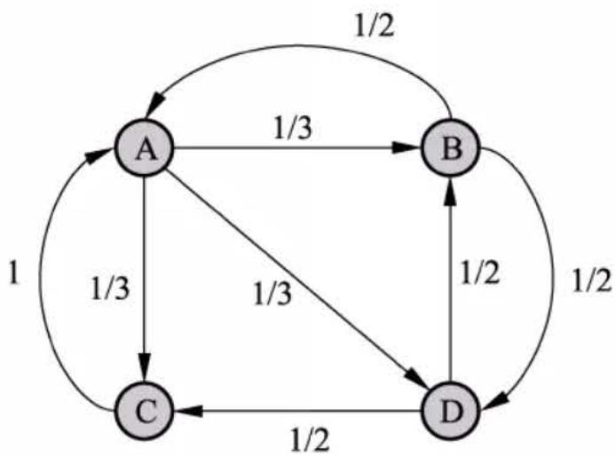  
图21.1 有向图

直观上，对于个页，指向该页的超链接越多，随机跳转到该页的概率也就越，该页的PageRank值就越，这个页也就越重要。个页，如果指向该页的PageRank值越，随机跳转到该页的概率也就越，该页的PageRank值就越，这个页也就越重要。PageRank值依赖于络的拓扑结构，旦络的拓扑（连接关系）确定，PageRank值就确定。

PageRank的计算可以在互联的有向图上进，通常是个迭代过程。先假设个初始分布，通过迭代，不断计算所有页的PageRank值，直到收敛为。

下先给出有向图及有向图上随机游模型的定义，然后给出PageRank的基本定义以及般定义。基本定义对应于理想情况，般定义对应于现实情况。

## 21.1.2 有向图和随机游模型

## 1.有向图

定义21.1（有向图） 有向图(directed graph)记作G=(V,E)，其中V 和E分别表示结点和有向边的集合。

如，互联就可以看作是个有向图，每个页是有向图的个结点，页之间的每条超链接是有向图的条边。

从个结点出发到达另个结点，所经过的边的个序列称为条路径（path），路径上边的个数称为路径的长度。如果个有向图从其中任何个结点出发可以到达其他任何个结点，就称这个有向图是强连通图（strongly connectedgraph）。图21.1中的有向图就是个强连通图。

假设k是个于1的然数，如果从有向图的个结点出发返回到这个结点的路径的长度都是k的倍数，那么称这个结点为周期性结点。如果个有向图不含有周期性结点，则称这个有向图为周期性图（aperiodicgraph），否则为周期性图。

图21.2是个周期性有向图的例。从结点A出发返回到A，必须经过路径A-B-C-A，所有可能的路径的长度都是3的倍数，所以结点A是周期性结点。这个有向图是周期性图。

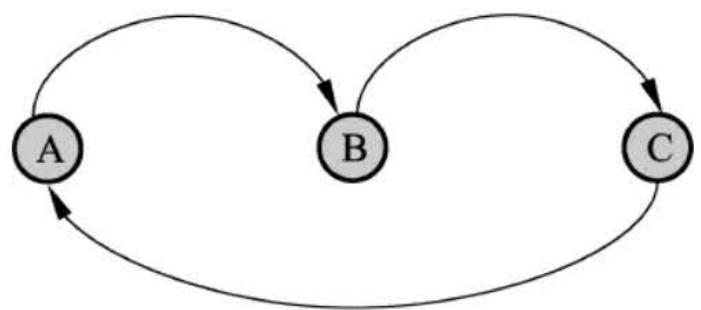  
图21.2 周期性有向图

## 2.随机游模型

定义21.2（随机游模型） 给定个含有n个结点的有向图，在有向图上定义随机游（random walk）模型，即一阶马尔可夫链 $\textcircled{1}$ ，其中结点表示状态，有向边表示状态之间的转移，假设从一个结点到通过有向边相连的所有结点的转移概率相等。具体地，转移矩阵是一个n阶矩阵M：

$$
M = [ m _ { i j } ] _ { n \times n }\tag{21.1}
$$

第i行第 $j$ 列的元素 $m _ { i j }$ 取值规则如下：如果结点j有k个有向边连出，并且结点i是其连出的一个结点，则 $m _ { i j } = \frac { 1 } { k } ;$ 否则 $m _ { i j } = 0 , ~ i , j = 1 , 2 , \cdots , n .$

注意转移矩阵具有性质：

$$
m _ { i j } \geqslant 0\tag{21.2}
$$

$$
\sum _ { i = 1 } ^ { n } m _ { i j } = 1\tag{21.3}
$$

即每个元素负，每列元素之和为1，即矩阵M为随机矩阵（stochastic matrix）。

在有向图上的随机游形成马尔可夫链。也就是说，随机游者每经个单位时间转移个状态，如果当前时刻在第个结点（状态），那么下个时刻在第个结点（状态）的概率是 $m _ { i j }$ ，这概率只依赖于当前的状态，与过去关，具有马尔可夫性。

在图21.1的有向图上可以定义随机游模型。结点A到结点B，C和D存在有向边，可以以概率1/3从A分别转移到B，C和D，并以概率0转移到A，于是可以写出转移矩阵的第1列。结点B到结点A和D存在有向边，可以以概率 $1 / 2$ 从B分别转移到A和D，并以概率0分别转移到B和C，于是可以写出矩阵的第2列等。于是得到转移矩阵：

$$
M = { \left[ \begin{array} { l l l l } { 0 } & { 1 / 2 } & { 1 } & { 0 } \\ { 1 / 3 } & { 0 } & { 0 } & { 1 / 2 } \\ { 1 / 3 } & { 0 } & { 0 } & { 1 / 2 } \\ { 1 / 3 } & { 1 / 2 } & { 0 } & { 0 } \end{array} \right] }
$$

随机游在某个时刻t访问各个结点的概率分布就是马尔可夫链在时刻t的状态分布，可以个n维列向量 $R _ { t }$ 表，那么在时刻t+1访问各个结点的概率分布 $R _ { t + 1 }$ 满足

$$
R _ { t + 1 } = M R _ { t }\tag{21.4}
$$

## 21.1.3 PageRank的基本定义

给定个包含n个结点的强连通且周期性的有向图，在其基础上定义随机游模型。假设转移矩阵为M，在时刻 $0 , 1 , 2 , \cdots , t , \cdots$ 访问各个结点的概率分布为

$$
R _ { 0 } , M R _ { 0 } , M ^ { 2 } R _ { 0 } , \ldots , M ^ { t } R _ { 0 } , \ldots
$$

则极限

$$
\operatorname* { l i m } _ { t  \infty } M ^ { t } R _ { 0 } = R\tag{21.5}
$$

存在，极限向量R表马尔可夫链的平稳分布，满

$$
M R = R
$$

定义21.3（PageRank的基本定义） 给定个包含n个结点 $v _ { 1 } , v _ { 2 } , \cdots , v _ { n }$ 的强连通且非周期性的有向图，在有向图上定义随机游走模型，即一阶马尔可夫链。随机游走的特点是从一个结点到有有向边连出的所有结点的转移概率相等，转移矩阵为M。这个 $\frac { \pi } { - 2 }$ 尔可夫链具有平稳分布 $\scriptstyle { R : }$

$$
M R = R\tag{21.6}
$$

平稳分布R称为这个有向图的PageRank。R的各个分量称为各个结点的PageRank值。

$$
\begin{array} { r } { \pmb { R } = \left[ \begin{array} { c } { \mathrm { P R } ( v _ { 1 } ) } \\ { \mathrm { P R } ( v _ { 2 } ) } \\ { \vdots } \\ { \mathrm { P R } ( v _ { n } ) } \end{array} \right] } \end{array}
$$

其中， $\mathrm { P R } ( v _ { i } ) , \ i = 1 , 2 , \cdots , n ,$ 表示结点 $v _ { i }$ 的PageRank值。

显然有

$$
\mathrm { P R } ( v _ { i } ) \geqslant 0 , \quad i = 1 , 2 , \cdots , n\tag{21.7}
$$

$$
\sum _ { i = 1 } ^ { n } \operatorname { P R } ( v _ { i } ) = 1\tag{21.8}
$$

$$
\operatorname { P R } ( v _ { i } ) = \sum _ { v _ { j } \in M ( v _ { i } ) } { \frac { \operatorname { P R } ( v _ { j } ) } { L ( v _ { j } ) } } , \quad i = 1 , 2 , \cdots , n\tag{21.9}
$$

这里 $M ( v _ { i } )$ 表指向结点 $v _ { i }$ 的结点集合， $L ( v _ { j } )$ 表示结点 $v _ { j }$ 连出的有向边的个数。

PageRank的基本定义是理想化的情况，在这种情况下，PageRank存在，且可以通过不断迭代求得PageRank值。

定理21.1 不可约且非周期的有限状态马尔可夫链有唯一平稳分布存在，并且当时间趋于无穷时状态分布收敛于唯一的平稳分布。

根据马尔可夫链平稳分布定理，对于强连通且周期的有向图上定义的随机游模

型（马尔可夫链），当在图上的随机游时间趋于穷时状态分布收敛于唯的平稳分布。

例21.1 已知图21.1的有向图，求该图的PageRank。①

解 转移矩阵

$$
M = \left[ \begin{array} { c c c c } { { 0 } } & { { 1 / 2 } } & { { 1 } } & { { 0 } } \\ { { 1 / 3 } } & { { 0 } } & { { 0 } } & { { 1 / 2 } } \\ { { 1 / 3 } } & { { 0 } } & { { 0 } } & { { 1 / 2 } } \\ { { 1 / 3 } } & { { 1 / 2 } } & { { 0 } } & { { 0 } } \end{array} \right]
$$

取初始分布向量 $R _ { 0 }$ 为

$$
\begin{array} { r } { \pmb { R _ { 0 } } = \left[ \begin{array} { l } { 1 / 4 } \\ { 1 / 4 } \\ { 1 / 4 } \\ { 1 / 4 } \\ { 1 / 4 } \end{array} \right] } \end{array}
$$

以转移矩阵M连乘初始向量 $R _ { 0 }$ 得到向量序列：

$$
{ \left[ \begin{array} { l } { 1 / 4 } \\ { 1 / 4 } \\ { 1 / 4 } \\ { 1 / 4 } \\ { 1 / 4 } \end{array} \right] } , \quad { \left[ \begin{array} { l } { 9 / 2 4 } \\ { 5 / 2 4 } \\ { 5 / 2 4 } \\ { 5 / 2 4 } \\ { 5 / 2 4 } \end{array} \right] } , \quad { \left[ \begin{array} { l } { 1 5 / 4 8 } \\ { 1 1 / 4 8 } \\ { 1 1 / 4 8 } \\ { 1 1 / 4 8 } \\ { 1 1 / 4 8 } \end{array} \right] } , \quad { \left[ \begin{array} { l } { 1 1 / 3 2 } \\ { 7 / 3 2 } \\ { 7 / 3 2 } \\ { 7 / 3 2 } \\ { 7 / 3 2 } \end{array} \right] } , \quad \cdots , \quad { \left[ \begin{array} { l } { 3 / 9 } \\ { 2 / 9 } \\ { 2 / 9 } \\ { 2 / 9 } \\ { 2 / 9 } \end{array} \right] }
$$

最后得到极限向量：

$$
R = \left[ \begin{array} { l } { 3 / 9 } \\ { 2 / 9 } \\ { 2 / 9 } \\ { 2 / 9 } \end{array} \right]
$$

即有向图的PageRank值。

般的有向图未必满强连通且周期性的条件。如在互联，部分页没有连接出去的超链接，也就是说从这些页法跳转到其他页，所以PageRank的基本定义不适用。

例21.2 从图21.1的有向图中去掉C到A的边，得到图21.3的有向图。在图21.3的有向图中，结点C没有边连接出去。

图21.3的有向图的转移矩阵M是

$$
M = \left[ \begin{array} { c c c c } { { 0 } } & { { 1 / 2 } } & { { 0 } } & { { 0 } } \\ { { } } & { { } } & { { } } & { { } } \\ { { 1 / 3 } } & { { 0 } } & { { 0 } } & { { 1 / 2 } } \\ { { } } & { { } } & { { } } & { { } } \\ { { 1 / 3 } } & { { 0 } } & { { 0 } } & { { 1 / 2 } } \\ { { } } & { { } } & { { } } & { { } } \\ { { 1 / 3 } } & { { 1 / 2 } } & { { 0 } } & { { 0 } } \end{array} \right]
$$

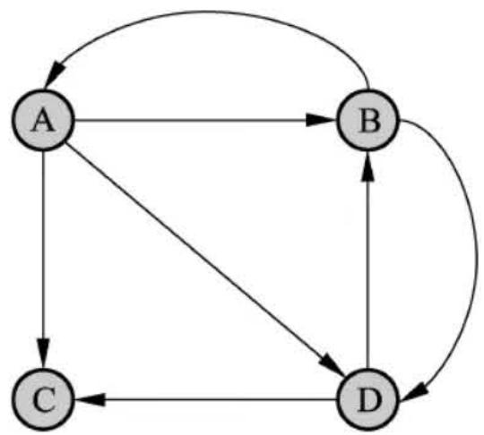  
图21.3 有向图

这时M不是个随机矩阵，因为随机矩阵要求每列的元素之和是1，这第3列的和是0，不是1。

如果仍然计算在各个时刻的各个结点的概率分布，就会得到如下结果：

$$
{ \left[ \begin{array} { l } { 1 / 4 } \\ { 1 / 4 } \\ { 1 / 4 } \\ { 1 / 4 } \\ { 1 / 4 } \end{array} \right] } , \ { \left[ \begin{array} { l } { 3 / 2 4 } \\ { 5 / 2 4 } \\ { 5 / 2 4 } \\ { 5 / 2 4 } \\ { 5 / 2 4 } \end{array} \right] } , \ { \left[ \begin{array} { l } { 5 / 4 8 } \\ { 7 / 4 8 } \\ { 7 / 4 8 } \\ { 7 / 4 8 } \\ { 7 / 4 8 } \end{array} \right] } , \ { \left[ \begin{array} { l } { 2 1 / 2 8 8 } \\ { 3 1 / 2 8 8 } \\ { 3 1 / 2 8 8 } \\ { 3 1 / 2 8 8 } \\ { 3 1 / 2 8 8 } \end{array} \right] } , \ \cdots , \ { \left[ \begin{array} { l } { 0 } \\ { 0 } \\ { 0 } \\ { 0 } \\ { 0 } \end{array} \right] }
$$

可以看到，随着时间推移，访问各个结点的概率皆变为 $0 .$

## 21.1.4 PageRank的般定义

PageRank般定义的想法是在基本定义的基础上导平滑项。

给定个含有n个结点 $v _ { i } , ~ i = 1 , 2 , \cdots , n$ ，的任意有向图，假设考虑个在图上的随机游模型，即阶马尔可夫链，其转移矩阵是M，从个结点到其连出的所有结点的转移概率相等。这个马尔可夫链未必具有平稳分布。假设考虑另个完全随机游的模型，其转移矩阵的元素全部为 $1 / n$ ，也就是说从任意个结点到任意个结点的转移概率都是 $1 / n$ 。两个转移矩阵的线性组合又构成个新的转移矩阵，在其上可以定义个新的马尔可夫链。容易证明这个马尔可夫链定具有平稳分布，且平稳分布满

$$
\pmb { R } = d M \pmb { R } + \frac { 1 - d } { n } \pmb { 1 }\tag{21.10}
$$

式中 $d ( 0 \leqslant d \leqslant 1 )$ 是系数，称为阻尼因（damping factor）；R是n维向量；1是所有分量为1的n维向量。R表的就是有向图的般PageRank。

$$
\begin{array} { r } { \pmb { R } = \left[ \begin{array} { c } { \mathrm { P R } ( v _ { 1 } ) } \\ { \mathrm { P R } ( v _ { 2 } ) } \\ { \vdots } \\ { \mathrm { P R } ( v _ { n } ) } \end{array} \right] } \end{array}
$$

其中， $\mathrm { P R } ( v _ { i } ) , i = 1 , 2 , \cdots , n ,$ 表示结点 $v _ { i }$ 的PageRank值。

式(21.10）中第项表（状态分布是平稳分布时）依照转移矩阵M访问各个结点的概

率，第二项表示完全随机访问各个结点的概率。阻尼因d取值由经验决定，例如， $d = 0 . 8 5$ 。当d接近1时，随机游主要依照转移矩阵M进；当d接近0时，随机游主要以等概率随机访问各个结点。

可以式(21.10)写出每个结点的PageRank，这是般PageRank的定义。

$$
\mathrm { P R } ( v _ { i } ) = d \left( \sum _ { v _ { j } \in M ( v _ { i } ) } \frac { \mathrm { P R } ( v _ { j } ) } { L ( v _ { j } ) } \right) + \frac { 1 - d } { n } , \quad i = 1 , 2 , \cdots , n\tag{21.11}
$$

这里 $M ( v _ { i } )$ 是指向结点 $v _ { i }$ 的结点集合， $L ( v _ { j } )$ 是结点 $v _ { j }$ 连出的边的个数。

第项称为平滑项，由于采平滑项，所有结点的PageRank值都不会为0，具有以下性质：

$$
\operatorname { P R } ( v _ { i } ) > 0 , \quad i = 1 , 2 , \cdots , n\tag{21.12}
$$

$$
\sum _ { i = 1 } ^ { n } \operatorname { P R } ( v _ { i } ) = 1\tag{21.13}
$$

下给出PageRank的般定义。

定义21.4（PageRank的般定义） 给定个含有n个结点的任意有向图，在有向图上定义一个一般的随机游走模型，即一阶马尔可夫链。一般的随机游走模型的转移矩阵由两部分线性组合组成，一部分是有向图的基本转移矩阵M，表示从一个结点到其连出的所有结点的转移概率相等，另一部分是完全随机的转移矩阵，表示从任意个结点到任意一个结点的转移概率都是 $1 / n \cdot$ ，线性组合系数为阻尼因子 $d ( 0 \leqslant d \leqslant 1 )$ 。这个一般随机游走的马尔可夫链存在平稳分布，记作R。定义平稳分布向量R为这个有向图的般PageRank。R由公式

$$
\pmb { R } = d M \pmb { R } + \frac { 1 - d } { n } \pmb { 1 }\tag{21.14}
$$

决定，其中1是所有分量为1的n维向量。

般PageRank的定义意味着互联浏览者按照以下法在上随机游：在任意个页上，浏览者或者以概率d决定按照超链接随机跳转，这时以等概率从连接出去的超链接跳转到下个页；或者以概率(1d）决定完全随机跳转，这时以等概率 $1 / n$ 跳转到任意个页。第个机制保证从没有连接出去的超链接的页也可以跳转出。这样可以保证平稳分布，即般PageRank的存在，因般PageRank适于任何结构的络。

## 21.2 PageRank的计算

PageRank的定义是构造性的，即定义本就给出了算法。本节列出的PageRank的计算方法包括迭代算法、幂法、代数算法，常用的法是幂法。

## 21.2.1 迭代算法

给定个含有n个结点的有向图，转移矩阵为M，有向图的般PageRank由迭代公式

$$
\boldsymbol { R } _ { t + 1 } = d \boldsymbol { M } \boldsymbol { R } _ { t } + \frac { 1 - d } { n } \boldsymbol { \mathit { 1 } }\tag{21.15}
$$

的极限向量R确定。

PageRank的迭代算法就是按照这个般定义进迭代，直收敛。

算法21.1（PageRank的迭代算法）

输：含有n个结点的有向图，转移矩阵M，阻尼因d，初始向量 $R _ { 0 }$

输出：有向图的PageRank向量 $\scriptstyle { R _ { \circ } }$

(1)令t =0;

(2）计算

$$
R _ { t + 1 } = d M R _ { t } + \frac { 1 - d } { n } \pmb { 1 }
$$

(3)如果 $R _ { t + 1 }$ 与 $R _ { t }$ 充分接近，令 $R = R _ { t + 1 }$ ，停迭代；

(4)否则，令 $t = t + 1$ ，执步骤(2)。

例21.3 给定图21.4所的有向图，取 $d = 0 . 8$ ，求图的PageRank。

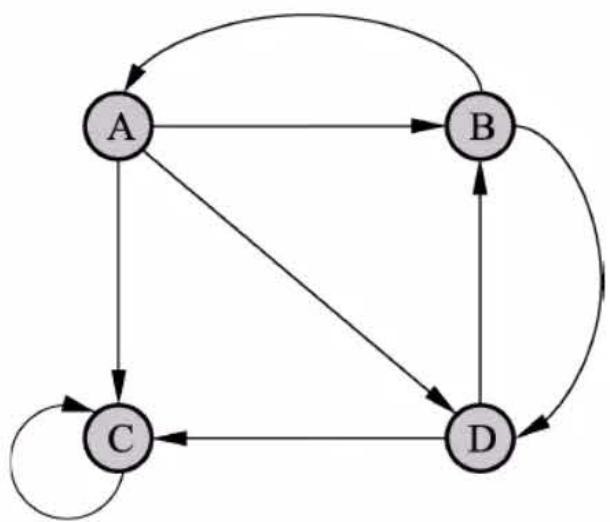  
图21.4 有向图

解 从图21.4得知转移矩阵为

$$
M = \left[ \begin{array} { c c c c } { { 0 } } & { { 1 / 2 } } & { { 0 } } & { { 0 } } \\ { { 1 / 3 } } & { { 0 } } & { { 0 } } & { { 1 / 2 } } \\ { { 1 / 3 } } & { { 0 } } & { { 1 } } & { { 1 / 2 } } \\ { { 1 / 3 } } & { { 1 / 2 } } & { { 0 } } & { { 0 } } \end{array} \right]
$$

按照式(21.15)计算:

$$
d M = \frac { 4 } { 5 } \times \left[ \begin{array} { c c c c } { 0 } & { 1 / 2 } & { 0 } & { 0 } \\ { 1 / 3 } & { 0 } & { 0 } & { 1 / 2 } \\ { 1 / 3 } & { 0 } & { 1 } & { 1 / 2 } \\ { 1 / 3 } & { 1 / 2 } & { 0 } & { 0 } \end{array} \right] = \left[ \begin{array} { c c c c } { 0 } & { 2 / 5 } & { 0 } & { 0 } \\ { 4 / 1 5 } & { 0 } & { 0 } & { 2 / 5 } \\ { 4 / 1 5 } & { 0 } & { 4 / 5 } & { 2 / 5 } \\ { 4 / 1 5 } & { 2 / 5 } & { 0 } & { 0 } \end{array} \right]
$$

$$
{ \frac { 1 - d } { n } } { \boldsymbol { \mathit { 1 } } } = { \left[ \begin{array} { l } { 1 / 2 0 } \\ { 1 / 2 0 } \\ { 1 / 2 0 } \\ { 1 / 2 0 } \\ { 1 / 2 0 } \end{array} \right] }
$$

迭代公式为

$$
\pmb { R } _ { t + 1 } = \left[ \begin{array} { c c c c } { 0 } & { 2 / 5 } & { 0 } & { 0 } \\ { 4 / 1 5 } & { 0 } & { 0 } & { 2 / 5 } \\ { 4 / 1 5 } & { 0 } & { 4 / 5 } & { 2 / 5 } \\ { 4 / 1 5 } & { 2 / 5 } & { 0 } & { 0 } \end{array} \right] \pmb { R } _ { t } + \left[ \begin{array} { c } { 1 / 2 0 } \\ { 1 / 2 0 } \\ { 1 / 2 0 } \\ { 1 / 2 0 } \\ { 1 / 2 0 } \end{array} \right]
$$

令初始向量

$$
R _ { 0 } = \left[ \begin{array} { l } { 1 / 4 } \\ { 1 / 4 } \\ { 1 / 4 } \\ { 1 / 4 } \\ { 1 / 4 } \end{array} \right]
$$

进行迭代：

$$
\begin{array} { r } { R _ { 1 } = \left[ \begin{array} { c c c c } { 0 } & { 2 / 5 } & { 0 } & { 0 } \\ { 4 / 1 5 } & { 0 } & { 0 } & { 2 / 5 } \\ { 4 / 1 5 } & { 0 } & { 4 / 5 } & { 2 / 5 } \\ { 4 / 1 5 } & { 2 / 5 } & { 0 } & { 0 } \end{array} \right] \left[ \begin{array} { c } { 1 / 4 } \\ { 1 / 4 } \\ { 1 / 4 } \\ { 1 / 4 } \\ { 1 / 4 } \end{array} \right] + \left[ \begin{array} { c } { 1 / 2 0 } \\ { 1 / 2 0 } \\ { 1 / 2 0 } \\ { 1 / 2 0 } \\ { 1 / 2 0 } \end{array} \right] = \left[ \begin{array} { c } { 9 / 6 0 } \\ { 1 3 / 6 0 } \\ { 2 5 / 6 0 } \\ { 1 3 / 6 0 } \end{array} \right] } \end{array}
$$

$$
\begin{array} { r } { R _ { 2 } = \left[ \begin{array} { c c c c } { 0 } & { 2 / 5 } & { 0 } & { 0 } \\ { 4 / 1 5 } & { 0 } & { 0 } & { 2 / 5 } \\ { 4 / 1 5 } & { 0 } & { 4 / 5 } & { 2 / 5 } \\ { 4 / 1 5 } & { 2 / 5 } & { 0 } & { 0 } \end{array} \right] \left[ \begin{array} { c } { 9 / 6 0 } \\ { 1 3 / 6 0 } \\ { 2 5 / 6 0 } \\ { 1 3 / 6 0 } \end{array} \right] + \left[ \begin{array} { c } { 1 / 2 0 } \\ { 1 / 2 0 } \\ { 1 / 2 0 } \\ { 1 / 2 0 } \\ { 1 / 2 0 } \end{array} \right] = \left[ \begin{array} { c } { 4 1 / 3 0 0 } \\ { 5 3 / 3 0 0 } \\ { 1 5 3 / 3 0 0 } \\ { 5 3 / 3 0 0 } \\ { 5 3 / 3 0 0 } \end{array} \right] } \end{array}
$$

等。最后得到：

$$
{ \left[ \begin{array} { l } { 1 / 4 } \\ { 1 / 4 } \\ { 1 / 4 } \\ { 1 / 4 } \\ { 1 / 4 } \\ { 1 / 4 } \end{array} \right] } , \ { \left[ \begin{array} { l } { 9 / 6 0 } \\ { 1 3 / 6 0 } \\ { 2 5 / 6 0 } \\ { 2 5 / 4 8 } \\ { 1 3 / 6 0 } \end{array} \right] } , \ { \left[ \begin{array} { l } { 4 1 / 3 0 0 } \\ { 5 3 / 3 0 0 } \\ { 1 5 3 / 3 0 0 } \\ { 5 3 / 3 0 0 } \\ { 5 3 / 3 0 0 } \end{array} \right] } , \ { \left[ \begin{array} { l } { 5 4 3 / 4 5 0 0 } \\ { 7 0 7 / 4 5 0 0 } \\ { 2 5 4 3 / 4 5 0 0 } \\ { 7 0 7 / 4 5 0 0 } \end{array} \right] } , \ \cdots \rangle , \ { \left[ \begin{array} { l } { 1 5 / 1 4 8 } \\ { 1 9 / 1 4 8 } \\ { 9 5 / 1 4 8 } \\ { 9 5 / 1 4 8 } \\ { 1 9 / 1 4 8 } \end{array} \right] }
$$

计算结果表明，结点C的PageRank值超过半，其他结点也有相应的PageRank值。

## 21.2.2幂法

幂法（powermethod）是个常的PageRank计算法，通过近似计算矩阵的主特征值和主特征向量求得有向图的般PageRank。

先介绍幂法。幂法主要于近似计算矩阵的主特征值（dominanteigenvalue）和主特

征向量（dominanteigenvector）。主特征值是指绝对值最的特征值，主特征向量是其对应的特征向量。注意特征向量不是唯的，只是其向是确定的，乘以任意系数还是特征向量。

假设要求n阶矩阵A的主特征值和主特征向量，采下的步骤。

先，任取个初始n维向量 $\scriptstyle { \mathbf { { \mathit { x } } } } _ { 0 }$ ，构造如下的个n维向量序列：

$$
\begin{array} { r } { x _ { 0 } , \quad x _ { 1 } = A x _ { 0 } , \quad x _ { 2 } = A x _ { 1 } , \quad \cdots , \quad x _ { k } = A x _ { k - 1 } } \end{array}
$$

然后，假设矩阵A有n个特征值，按照绝对值排列：

$$
| \lambda _ { 1 } | \geqslant | \lambda _ { 2 } | \geqslant \cdots \geqslant | \lambda _ { n } |
$$

对应的n个线性关的特征向量为

$$
u _ { 1 } , u _ { 2 } , \cdots , u _ { n }
$$

这n个特征向量构成n维空间的组基。

于是，可以将初始向量 $\scriptstyle { \mathbf { x } } _ { 0 }$ 表示为 $u _ { 1 } , u _ { 2 } , \cdots , u _ { n }$ 的线性组合：

$$
{ \pmb x } _ { 0 } = a _ { 1 } { \pmb u } _ { 1 } + a _ { 2 } { \pmb u } _ { 2 } + \cdots + a _ { n } { \pmb u } _ { n }
$$

得到：

$$
\begin{array} { l } { { \pmb x } _ { 1 } = A { \pmb x } _ { 0 } = a _ { 1 } A { \pmb u } _ { 1 } + a _ { 2 } A { \pmb u } _ { 2 } + \dots + a _ { n } A { \pmb u } _ { n } } \\ { \qquad \quad } \\ { \vdots \qquad } \end{array}
$$

$$
\begin{array} { c } { { { \pmb x } _ { k } = A ^ { k } { \pmb x } _ { 0 } = a _ { 1 } A ^ { k } { \pmb u } _ { 1 } + a _ { 2 } { \pmb A } ^ { k } { \pmb u } _ { 2 } + \dots + a _ { n } { \pmb A } ^ { k } { \pmb u } _ { n } } } \\ { { \qquad = a _ { 1 } \lambda _ { 1 } ^ { k } { \pmb u } _ { 1 } + a _ { 2 } \lambda _ { 2 } ^ { k } { \pmb u } _ { 2 } + \dots + a _ { n } \lambda _ { n } ^ { k } { \pmb u } _ { n } } } \end{array}
$$

接着，假设矩阵A的主特征值 $\lambda _ { 1 }$ 是特征方程的单根，由上式得：

$$
\pmb { x } _ { k } = a _ { 1 } \lambda _ { 1 } ^ { k } \left[ \pmb { u } _ { 1 } + \frac { a _ { 2 } } { a _ { 1 } } \left( \frac { \lambda _ { 2 } } { \lambda _ { 1 } } \right) ^ { k } \pmb { u } _ { 2 } + \cdot \cdot \cdot + \frac { a _ { n } } { a _ { 1 } } \left( \frac { \lambda _ { n } } { \lambda _ { 1 } } \right) ^ { k } \pmb { u } _ { n } \right]\tag{21.16}
$$

由于 $| \lambda _ { 1 } | > | \lambda _ { j } | , \ j = 2 , 3 , \cdots , n$ ，当k充分时有

$$
{ \pmb x } _ { k } = a _ { 1 } \lambda _ { 1 } ^ { k } ( { \pmb u } _ { 1 } + \varepsilon _ { k } )\tag{21.17}
$$

这里 $\varepsilon _ { k }$ 是当 $k \to \infty$ 时的无穷小量， $\varepsilon _ { k } \to 0 \ ( k \to \infty )$ 。即

$$
x _ { k } \to a _ { 1 } \lambda _ { 1 } ^ { k } u _ { 1 } \ ( k \to \infty )\tag{21.18}
$$

说明当k充分时向量 $\scriptstyle { \mathbf { { \mathit { x } } } } _ { k }$ 与特征向量 $\mathbf { \delta u } _ { 1 }$ 只相差个系数。由式(21.18)知：

$$
\boldsymbol { x } _ { k } \approx a _ { 1 } \lambda _ { 1 } ^ { k } \boldsymbol { u } _ { 1 }
$$

$$
\pmb { x } _ { k + 1 } \approx a _ { 1 } \lambda _ { 1 } ^ { k + 1 } \pmb { u } _ { 1 }
$$

于是主特征值 $\lambda _ { 1 }$ 可表示为

$$
\lambda _ { 1 } \approx \frac { x _ { k + 1 , j } } { x _ { k , j } }\tag{21.19}
$$

其中， $_ { \mathit { x } _ { k , j } }$ 和 $x _ { k + 1 , j }$ 分别是 $_ { x _ { k } }$ 和 $\scriptstyle { \mathbf {  { x } } } _ { k + 1 }$ 的第 $j$ 个分量。

在实际计算时，为了避免出现绝对值过或过的情况，通常在每步迭代后即进规范化，将向量除以其范数，即

$$
y _ { t + 1 } = A x _ { t }\tag{21.20}
$$

$$
\pmb { x } _ { t + 1 } = \frac { \pmb { y } _ { t + 1 } } { \lVert \pmb { y } _ { t + 1 } \rVert }\tag{21.21}
$$

这的范数是向量的穷范数，即向量各分量的绝对值的最值。

$$
\| { \pmb x } \| _ { \infty } = \operatorname* { m a x } \{ | { \pmb x } _ { 1 } | , | { \pmb x } _ { 2 } | , \cdots ~ , | { \pmb x } _ { n } | \}
$$

现在回到计算般PageRank。

转移矩阵可以写作

$$
R = \left( d M + { \frac { 1 - d } { n } } E \right) R = A R\tag{21.22}
$$

其中，d是阻尼因，E是所有元素为1的n阶阵。根据Perron-Frobenius定理 $\textcircled{1}$ ，一般PageRank的向量R是矩阵A的主特征向量，主特征值是1，所以可以使幂法近似计算般PageRank。

## 算法21.2（计算一般PageRank的幂法）

输：含有n个结点的有向图，有向图的转移矩阵M，系数d，初始向量 $\scriptstyle { \mathbf { { \mathit { x } } } } _ { 0 }$ ，计算精度ε。

输出：有向图的PageRankR。

(1）令t=0，选择初始向量 $\scriptstyle { \mathbf { { \mathit { x } } } } _ { 0 }$ 。

(2）计算有向图的般转移矩阵A：

$$
\pmb { A } = d \pmb { M } + \frac { 1 - d } { n } \pmb { E }
$$

(3）迭代并规范化结果向量：

$$
y _ { t + 1 } = A x _ { t }
$$

$$
\pmb { x } _ { t + 1 } = \frac { \pmb { y } _ { t + 1 } } { \lVert \pmb { y } _ { t + 1 } \rVert }
$$

(4）当 $\| { \boldsymbol x } _ { t + 1 } - { \boldsymbol x } _ { t } \| < \varepsilon$ 时，令 $\pmb { R } = \pmb { x } _ { t }$ ，停迭代。

(5)否则，令 $t = t + 1$ ，执步骤(3)。

(6）对R进规范化处理，使其表概率分布。

例21.4 给定个如图21.5所的有向图，取 $d = 0 . 8 5$ ，求有向图的般PageRank。

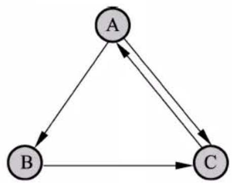  
图21.5 有向图

解 利幂法，按照算法21.2，计算有向图的般PageRank。

由图21.5可知转移矩阵为

$$
M = \left[ \begin{array} { l l l } { 0 } & { 0 } & { 1 } \\ { 1 / 2 } & { 0 } & { 0 } \\ { 1 / 2 } & { 1 } & { 0 } \end{array} \right]
$$

(1)令t =0,

$$
\begin{array} { r } { \mathbf { x } _ { 0 } = \left[ \begin{array} { l } { 1 } \\ { 1 } \\ { 1 } \\ { 1 } \end{array} \right] } \end{array}
$$

(2）计算有向图的般转移矩阵A：

$$
\pmb { A } = d \pmb { M } + \frac { 1 - d } { n } \pmb { E }
$$

$$
= 0 . 8 5 \times { \left[ \begin{array} { l l l } { 0 } & { 0 } & { 1 } \\ { 1 / 2 } & { 0 } & { 0 } \\ { 1 / 2 } & { 1 } & { 0 } \end{array} \right] } + { \frac { 0 . 1 5 } { 3 } } \times { \left[ \begin{array} { l l l } { 1 } & { 1 } & { 1 } \\ { 1 } & { 1 } & { 1 } \\ { 1 } & { 1 } & { 1 } \\ { 1 } & { 1 } & { 1 } \end{array} \right] }
$$

$$
= \left[ \begin{array} { l l l } { 0 . 0 5 } & { 0 . 0 5 } & { 0 . 9 } \\ { 0 . 4 7 5 } & { 0 . 0 5 } & { 0 . 0 5 } \\ { 0 . 4 7 5 } & { 0 . 9 } & { 0 . 0 5 } \end{array} \right]
$$

(3）迭代并规范化：

$$
y _ { 1 } = A x _ { 0 } = { \left[ \begin{array} { l } { 1 } \\ { 0 . 5 7 5 } \\ { 1 . 4 2 5 } \end{array} \right] }
$$

$$
\mathbf { { x } } _ { 1 } = { \frac { 1 } { 1 . 4 2 5 } } { \left[ \begin{array} { l } { 1 } \\ { 0 . 5 7 5 } \\ { 1 . 4 2 5 } \end{array} \right] } = { \left[ \begin{array} { l } { 0 . 7 0 1 8 } \\ { 0 . 4 0 3 5 } \\ { 1 } \end{array} \right] }
$$

$$
\pmb { y } _ { 2 } = \pmb { A } \pmb { x } _ { 1 } = \left[ \begin{array} { l l l } { 0 . 0 5 } & { 0 . 0 5 } & { 0 . 9 } \\ { 0 . 4 7 5 } & { 0 . 0 5 } & { 0 . 0 5 } \\ { 0 . 4 7 5 } & { 0 . 9 } & { 0 . 0 5 } \end{array} \right] \left[ \begin{array} { l } { 0 . 7 0 1 8 } \\ { 0 . 4 0 3 5 } \\ { 1 } \end{array} \right] = \left[ \begin{array} { l } { 0 . 9 5 5 3 } \\ { 0 . 4 0 3 5 } \\ { 0 . 7 4 6 5 } \end{array} \right]
$$

$$
\mathbf { x } _ { 2 } = { \frac { 1 } { 0 . 9 5 5 3 } } { \left[ \begin{array} { l } { 0 . 9 5 5 3 } \\ { 0 . 4 0 3 5 } \\ { 0 . 7 4 6 5 } \end{array} \right] } = { \left[ \begin{array} { l } { 1 } \\ { 0 . 4 2 2 4 } \\ { 0 . 7 8 1 4 } \end{array} \right] }
$$

$$
\pmb { y } _ { 3 } = \pmb { A } \pmb { x } _ { 2 } = \left[ \begin{array} { l l l } { 0 . 0 5 } & { 0 . 0 5 } & { 0 . 9 } \\ { 0 . 4 7 5 } & { 0 . 0 5 } & { 0 . 0 5 } \\ { 0 . 4 7 5 } & { 0 . 9 } & { 0 . 0 5 } \end{array} \right] \left[ \begin{array} { l } { 1 } \\ { 0 . 4 2 2 4 } \\ { 0 . 7 8 1 4 } \end{array} \right] = \left[ \begin{array} { l } { 0 . 7 7 4 4 } \\ { 0 . 5 3 5 2 } \\ { 0 . 8 9 4 3 } \end{array} \right]
$$

$$
\mathbf { { x } _ { 3 } } = { \frac { 1 } { 0 . 8 9 4 3 } } { \left[ \begin{array} { l } { 0 . 7 7 4 4 } \\ { 0 . 5 3 5 2 } \\ { 0 . 8 9 4 3 } \end{array} \right] } = { \left[ \begin{array} { l } { 0 . 8 6 5 9 } \\ { 0 . 5 9 8 5 } \\ { 1 } \end{array} \right] }
$$

如此继续迭代规范化，得到xt，t=0,1,2,…·,21,22的向量序列:

$$
\begin{array} { r } { \left[ \begin{array} { l } { 1 } \\ { 1 } \\ { 1 } \\ { 1 } \end{array} \right] , \ \left[ \begin{array} { l } { 0 . 7 0 1 8 } \\ { 0 . 4 0 3 5 } \\ { 1 } \end{array} \right] , \ \left[ \begin{array} { l } { 1 } \\ { 0 . 4 2 2 4 } \\ { 0 . 7 8 1 4 } \end{array} \right] , \ \left[ \begin{array} { l } { 0 . 8 6 5 9 } \\ { 0 . 5 9 8 5 } \\ { 1 } \end{array} \right] , \ \left[ \begin{array} { l } { 0 . 9 7 3 2 } \\ { 0 . 4 9 1 2 } \\ { 1 } \end{array} \right] , \ \left[ \begin{array} { l } { 1 } \\ { 0 . 5 5 1 6 } \\ { 0 . 9 8 0 7 } \end{array} \right] , \ \left[ \begin{array} { l } { 1 } \\ { 0 . 5 9 1 6 } \\ { 0 . 9 8 0 7 } \end{array} \right] , \ \left[ \begin{array} { l } { 0 . 0 3 5 9 } \\ { 0 . 5 8 1 6 } \\ { 0 . 9 8 0 7 } \end{array} \right] . } \end{array}
$$

$$
{ \left[ \begin{array} { l } { 0 . 9 4 0 9 } \\ { 0 . 5 4 0 5 } \\ { 1 } \end{array} \right] } , \ \cdots , \ { \left[ \begin{array} { l } { 0 . 9 7 6 0 } \\ { 0 . 5 4 0 8 } \\ { 1 } \end{array} \right] } , \ { \left[ \begin{array} { l } { 0 . 9 7 5 5 } \\ { 0 . 5 4 0 4 } \\ { 1 } \end{array} \right] } , \ { \left[ \begin{array} { l } { 0 . 9 7 6 1 } \\ { 0 . 5 4 0 6 } \\ { 1 } \end{array} \right] } , \ { \left[ \begin{array} { l } { 0 . 9 7 5 6 } \\ { 0 . 5 4 0 6 } \\ { 1 } \end{array} \right] } , \ { \left[ \begin{array} { l } { 0 . 9 7 5 5 } \\ { 0 . 5 4 0 6 } \\ { 1 } \end{array} \right] } , \ { \left[ \begin{array} { l } { 0 . 9 7 5 8 } \\ { 0 . 5 4 0 4 } \\ { 1 } \end{array} \right] }
$$

假设后得到的两个向量已满计算精度要求，那么取

$$
\begin{array} { r } { R = \left[ \begin{array} { l } { 0 . 9 7 5 6 } \\ { 0 . 5 4 0 6 } \\ { 1 } \end{array} \right] } \end{array}
$$

即得所求的般PageRank。如果将般PageRank作为个概率分布，进规范化，使各分量之和为1，那么相应的般PageRank可以写作

$$
\pmb { R } = \left[ \begin{array} { l } { 0 . 3 8 7 7 } \\ { 0 . 2 1 4 9 } \\ { 0 . 3 9 7 4 } \end{array} \right]
$$

## 21.2.3 代数算法

代数算法通过般转移矩阵的逆矩阵计算求有向图的般PageRank。

按照般PageRank的定义式(21.14)：

$$
\ R = d M R + { \frac { 1 - d } { n } } 1
$$

于是，

$$
( I - d M ) R = { \frac { 1 - d } { n } } 1\tag{21.23}
$$

$$
\pmb { R } = ( \pmb { I } - d \pmb { M } ) ^ { - 1 } \frac { 1 - d } { n } \pmb { 1 }\tag{21.24}
$$

这Ⅰ是单位矩阵。当 $0 < d < 1$ 时，线性程(21.23)的解存在且唯。这样，可以通过求逆矩阵 $( I - d M ) ^ { - 1 }$ 得到有向图的般PageRank。

## 本章概要

1.PageRank是互联页重要度的计算法，可以定义推到任意有向图结点的重要度计算上。其基本思想是在有向图上定义随机游模型，即阶马尔可夫链，描述游者沿着有向图随机访问各个结点的为，在定条件下，极限情况访问每个结点的概率收敛到平稳分布，这时各个结点的概率值就是其PageRank值，表结点相对重要度。

2.有向图上可以定义随机游模型，即阶马尔可夫链，其中结点表示状态，有向边表状态之间的转移，假设个结点到连接出的所有结点的转移概率相等。转移概率由转移矩阵M表：

$$
M = [ m _ { i j } ] _ { n \times n }
$$

第i行第 $j$ 列的元素 $m _ { i j }$ 表示从结点 $j$ 跳转到结点i的概率。

3.当含有n个结点的有向图是强连通且周期性的有向图时，在其基础上定义的随机游模型即阶马尔可夫链具有平稳分布，平稳分布向量R称为这个有向图的PageRank。若矩阵M是马尔可夫链的转移矩阵，则向量R满

$$
M R = R
$$

向量R的各个分量称为各个结点的PageRank值。

$$
\begin{array} { r } { \pmb { R } = \left[ \begin{array} { c } { \mathrm { P R } ( v _ { 1 } ) } \\ { \mathrm { P R } ( v _ { 2 } ) } \\ { \vdots } \\ { \mathrm { P R } ( v _ { n } ) } \end{array} \right] } \end{array}
$$

其中， $\mathrm { P R } ( v _ { i } ) , i = 1 , 2 , \cdots , n$ ，表结点 $v _ { i }$ 的PageRank值。这是PageRank的基本定义。

4.PageRank基本定义的条件现实中往往不能满，对其进扩展得到PageRank的般定义。任意含有n个结点的有向图上，可以定义个随机游模型，即阶马尔可夫链，转移矩阵由两部分线性组合组成，其中部分按照转移矩阵M，从个结点到连接出的所有结

点的转移概率相等，另部分按照完全随机转移矩阵，从任结点到任结点的转移概率都是 $1 / n$ 。这个马尔可夫链存在平稳分布，平稳分布向量R称为这个有向图的般PageRank，满足

$$
\ R = d M R + { \frac { 1 - d } { n } } 1
$$

其中， $d ( 0 \leqslant d \leqslant 1 )$ 是阻尼因，1是所有分量为1的n维向量。

5.PageRank的计算法包括迭代算法、幂法、代数算法。

幂法将PageRank的等价式写成

$$
R = \left( d M + { \frac { 1 - d } { n } } E \right) R = A R
$$

其中，d是阻尼因，E是所有元素为1的n阶阵。

可以看出R是一般转移矩阵A的主特征向量，即最的特征值对应的特征向量。幂法就是个计算矩阵的主特征值和主特征向量的法。

步骤如下：选择初始向量 ${ \bf { x } } _ { 0 } ;$ 计算般转移矩阵A；进迭代并规范化向量

$$
y _ { t + 1 } = A x _ { t }
$$

$$
\pmb { x } _ { t + 1 } = \frac { \pmb { y } _ { t + 1 } } { \lVert \pmb { y } _ { t + 1 } \rVert }
$$

直至收敛。

## 继续阅读

PageRank的原始论是献[1]，其详细介绍可见献[2]和献[3]。介绍马尔可夫过程的教材有献[4]。与PageRank同样著名的链接分析算法还有HITS算法[5]，可以发现络中的枢纽与权威。PageRank有不少扩展与变形，原始的PageRank是基于离散时间马尔可夫链的，BrowseRank是基于连续时间马尔可夫链的推[6]，可以更好地防范页排名欺诈。Personalized PageRank是个性化的PageRank（献[7]），Topic Sensitive PageRank是基于话题的PageRank（献[8]），TrustRank是防范页排名欺诈的PageRank（献[9])。

## 习 题

21.1 假设阵A是随机矩阵，即其每个元素负，每列元素之和为1，证明 $A ^ { k }$ 仍然是随机矩阵，其中k是然数。

21.2 例21.1中，以不同的初始分布向量 $R _ { 0 }$ 进行迭代，仍然得到同样的极限向量R，即PageRank。请验证。

21.3 证明PageRank般定义中的马尔可夫链具有平稳分布，即式(21.11）成。

21.4 证明随机矩阵的最特征值为1。

## 参考文献

[1] PAGE L, BRIN S, MOTWANI R, et al. The PageRank citation ranking: bringing order to the Web[M]. Stanford University, 1999.

[2] RAJARAMANA, ULLMAN JD. Mining of massive datasets[M]. Cambridge Universty Press, 2014.

[3] LIU B. Web data mining: exploring hyperlinks, contents, and usage data[M]. Springer Science &Business Media, 2007.

[4] SERFOZO R. Basics of applied stochastic processes[M]. Springer, 2009.

[5] KLEINBERG J M. Authoritative sources in a hyperlinked environment[J]. Journal of the ACM(JACM),1999, 46(5): 604–632.

[6] LIU Y, GAO B, LIU T Y, et al. BrowseRank: letting Web users vote for page importance[C]//Proceedings of the 31st SIGIR Conference. 2008: 451–458.

[7] JEH G, WIDOM J. Scaling personalized Web search[C]/Proceedings of the 12th WwW Conference. 2003: 271–279.

[8] HAVELIWALA T H. Topic-sensitive PageRank[C]//Proceedings of the 11th WWW Conference. 2002: 517–526.

[9] GYONGYI Z, GARCIA-MOLINA H, PEDERSEN J. Combating Web spam with TrustRank[C] //Proceedings of VLDB Conference. 2004: 576–587.

## 第22章 无监督学习方法总结

## 22.1 无监督学习方法的关系和特点

第2篇详细介绍了种常的统计机器学习法，即聚类法（包括层次聚类与k均值聚类）、奇异值分解（SVD）、主成分分析（PCA）、潜在语义分析（LSA）、概率潜在语义分析（PLSA）、马尔可夫链蒙特卡罗法（MCMC，包括Metropolis-Hastings算法和吉布斯抽样）、潜在狄利克雷分配（LDA）、PageRank算法。此外，还简单介绍了另外三种常的统计机器学习法，即负矩阵分解（NMF）、变分推理、幂法。这些法通常于监督学习的聚类、降维、话题分析以及图分析。

## 22.1.1 各种方法之间的关系

图22.1总结了些机器学习法之间的关系，包括第1篇、第2篇介绍的法，分别深灰与浅灰表。图中上是监督学习法，下是基础机器学习法。

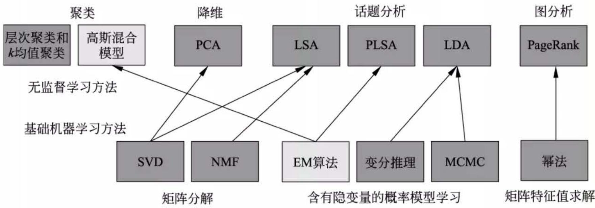  
图22.1 机器学习法之间的关系

监督学习于聚类、降维、话题分析、图分析。聚类的法有层次聚类、k均值聚类、高斯混合模型，降维的法有PCA，话题分析的法包括LSA、PLSA、LDA，图分析的法有PageRank。

基础法不涉及具体的机器学习模型。基础法不仅可以于监督学习，也可以于监督学习、半监督学习。基础法分为矩阵分解、矩阵特征值求解、含有隐变量的概率模型估计，前两者是线性代数问题，后者是概率统计问题。矩阵分解的法有SVD和NMF，矩阵特

征值求解的法有幂法，含有隐变量的概率模型学习的法有EM算法、变分推理、MCMC。

## 22.1.2 监督学习法

聚类有硬聚类和软聚类，层次聚类与k均值聚类是硬聚类法，斯混合模型是软聚类法。层次聚类基于启发式算法，k均值聚类基于迭代算法，斯混合模型学习通常基于EM算法。

降维有线性降维和线性降维，PCA是线性降维法。PCA基于SVD。

话题分析兼有聚类和降维特点，有概率模型、概率模型。LSA和NMF是概率模型，PLSA和LDA是概率模型。PLSA不假设模型具有先验分布，学习基于极似然估计；LDA假设模型具有先验分布，学习基于叶斯学习，具体地后验概率估计。LSA的学习基于SVD，NMF可以直接于话题分析。PLSA的学习基于EM算法，LDA的学习基于吉布斯抽样或变分推理。

图分析的个问题是链接分析，即结点的重要度计算。PageRank是链接分析的个法，通常基于幂法。

表22.1总结了监督学习法的模型、策略、算法。

表22.1 无监督学习方法的模型、策略和算法
<table><tr><td rowspan=1 colspan=1></td><td rowspan=1 colspan=1>方法</td><td rowspan=1 colspan=1>模型</td><td rowspan=1 colspan=1>策略</td><td rowspan=1 colspan=1>算法</td></tr><tr><td rowspan=3 colspan=1>聚类</td><td rowspan=1 colspan=1>层次聚类</td><td rowspan=1 colspan=1>聚类树</td><td rowspan=1 colspan=1>类内样本距离最</td><td rowspan=1 colspan=1>启发式算法</td></tr><tr><td rowspan=1 colspan=1>k均值聚类</td><td rowspan=1 colspan=1>k中聚类</td><td rowspan=1 colspan=1>样本与类中距离最</td><td rowspan=1 colspan=1>迭代算法</td></tr><tr><td rowspan=1 colspan=1>斯混合模型</td><td rowspan=1 colspan=1>斯混合模型</td><td rowspan=1 colspan=1>似然函数最大</td><td rowspan=1 colspan=1>EM算法</td></tr><tr><td rowspan=1 colspan=1>降维</td><td rowspan=1 colspan=1>PCA</td><td rowspan=1 colspan=1>低维正交空间</td><td rowspan=1 colspan=1>方差最大</td><td rowspan=1 colspan=1>SVD</td></tr><tr><td rowspan=4 colspan=1>话题分析</td><td rowspan=1 colspan=1>LSA</td><td rowspan=1 colspan=1>矩阵分解模型</td><td rowspan=1 colspan=1>平方损失最小</td><td rowspan=1 colspan=1>SVD</td></tr><tr><td rowspan=1 colspan=1>NMF</td><td rowspan=1 colspan=1>矩阵分解模型</td><td rowspan=1 colspan=1>平方损失最</td><td rowspan=1 colspan=1>负矩阵分解</td></tr><tr><td rowspan=1 colspan=1>PLSA</td><td rowspan=1 colspan=1>PLSA模型</td><td rowspan=1 colspan=1>似然函数最大</td><td rowspan=1 colspan=1>EM算法</td></tr><tr><td rowspan=1 colspan=1>LDA</td><td rowspan=1 colspan=1>LDA模型</td><td rowspan=1 colspan=1>后验概率估计</td><td rowspan=1 colspan=1>吉布斯抽样，变分推理</td></tr><tr><td rowspan=1 colspan=1>图分析</td><td rowspan=1 colspan=1>PageRank</td><td rowspan=1 colspan=1>有向图上的马尔可夫链</td><td rowspan=1 colspan=1>平稳分布求解</td><td rowspan=1 colspan=1>幂法</td></tr></table>

## 22.1.3 基础机器学习法

矩阵分解基于不同假设：SVD基于正交假设，即分解得到的左右矩阵是正交矩阵，中间矩阵是负对矩阵；负矩阵分解基于负假设，即分解得到的左右矩阵皆是负矩阵。

含有隐变量的概率模型的学习有两种法：迭代计算法、随机抽样法。EM算法和变分推理（包括变分EM算法）属于迭代计算法，吉布斯抽样属于随机抽样法。变分EM算法是EM算法的推广。

矩阵的特征值与特征向量求解法中，幂法是常的算法。

表22.2总结了含隐变量概率模型的学习法的特点。

表22.2 含有隐变量概率模型的学习方法的特点
<table><tr><td rowspan=1 colspan=1>算法</td><td rowspan=1 colspan=1>基本原理</td><td rowspan=1 colspan=1>收敛性</td><td rowspan=1 colspan=1>收敛速度</td><td rowspan=1 colspan=1>实现难易度</td><td rowspan=1 colspan=1>适合问题</td></tr><tr><td rowspan=1 colspan=1>EM算法</td><td rowspan=1 colspan=1>迭代计算、后验概率估计</td><td rowspan=1 colspan=1>收敛于局部最优</td><td rowspan=1 colspan=1>较快</td><td rowspan=1 colspan=1>容易</td><td rowspan=1 colspan=1>简单模型</td></tr><tr><td rowspan=1 colspan=1>变分推理</td><td rowspan=1 colspan=1>迭代计算、后验概率近似估计</td><td rowspan=1 colspan=1>收敛于局部最优</td><td rowspan=1 colspan=1>较慢</td><td rowspan=1 colspan=1>较复杂</td><td rowspan=1 colspan=1>复杂模型</td></tr><tr><td rowspan=1 colspan=1>吉布斯抽样</td><td rowspan=1 colspan=1>随机抽样、后验概率估计</td><td rowspan=1 colspan=1>依概率收敛于全局最优</td><td rowspan=1 colspan=1>较慢</td><td rowspan=1 colspan=1>容易</td><td rowspan=1 colspan=1>复杂模型</td></tr></table>

## 22.2 话题模型之间的关系和特点

在本书介绍的四种话题模型LSA，NMF，PLSA和LDA中，前两者是概率模型，后两者是概率模型。下讨论它们之间的关系(细节可参考献[1]和献[2])。

可以从矩阵分解的统框架看LSA，NMF和PLSA。在这个框架下，通过最化般化Bregman散度进有约束的矩阵分解 $D = U V$ ，得到这三个话题模型：

$$
\operatorname* { m i n } _ { U , V } B ( D \Vert U V )
$$

这里 $B ( D \| U V )$ 表D和UV之间的般化Bregman散度（generalized Bregman diver-gence），当且仅当两者相等时取值为0。般化Bregman散度包含平损失、KL散度等。三个话题模型拥有三种不同的具体形式。表22.3给出了三个话题模型的损失函数和约束的公式，其中PLSA的矩阵D需要进归化 $\sum _ { m , n } d _ { m n } = 1$ 0

表22.3 矩阵分解的度看话题模型
<table><tr><td>方法</td><td>般损失函数B(D|UV)</td><td>矩阵U的约束条件</td><td>矩阵V的约束条件</td></tr><tr><td>LSA</td><td> $\| D - U V \| _ { F } ^ { 2 }$ </td><td> $U ^ { \mathrm { T } } U = I$ </td><td> $V V ^ { \mathrm { T } } = \varLambda ^ { 2 }$ </td></tr><tr><td>NMF</td><td> $\| D - U V \| _ { F } ^ { 2 }$ </td><td> $u _ { m k } \geqslant 0$ </td><td> $v _ { k n } \geqslant 0$ </td></tr><tr><td>PLSA</td><td> $\sum _ { m n } d _ { m n } \mathrm { l o g } \frac { d _ { m n } } { ( U V ) _ { m n } }$ </td><td> $U ^ { \mathrm { T } } \boldsymbol { \mathrm { \mathbf { \mathit { 1 } } } } = 1$ </td><td> $V ^ { \mathrm { T } } \boldsymbol { \mathrm { \Omega } } _ { \boldsymbol { { 1 } } } = 1$ </td></tr><tr><td></td><td></td><td> $u _ { m k } \geqslant 0$ </td><td> $v _ { k n } \geqslant 0$ </td></tr></table>

话题模型LSA和NMF是概率模型，但也有概率模型解释。可以从概率图模型的统框架看LSA，NMF，PLSA和LDA。在这个框架下，认为本由概率模型成，基于不同的假设得到四个不同的话题模型。四个话题模型有不同的概率图模型定义。对于LSA和NMF，每个文本 $d _ { n }$ 由高斯分布 $P \left( d _ { n } | U , v _ { n } \right) \propto \exp ( - \Vert d _ { n } - U v _ { n } \Vert ^ { 2 } )$ 生成，其参数是U和 $v _ { n }$ ，共有N个本，如图22.2所。两个话题模型有不同的约束条件，表22.4给出约束条件的公式。

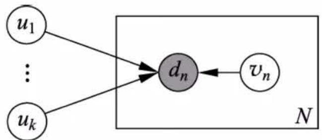  
图22.2 话题模型LSA和NMF的概率图模型表

表22.4 话题模型LSA和NMF的约束条件
<table><tr><td>方法</td><td>变量 的约束条件  $u _ { k }$ </td><td>变量 的约束条件  $v _ { n }$ </td></tr><tr><td>LSA</td><td>正交</td><td>正交</td></tr><tr><td>NMF</td><td> $u _ { m k } \geqslant 0$ </td><td> $v _ { k n } \geqslant 0$ </td></tr></table>

## 参考文献

[1] SINGH A P, GORDON G J. A unified view of matrix factorization models[M]//Daelemans W, Goethals B, Morik K. Machine Learning and Knowledge Discovery in Databases. Berlin: Springer, 2008.

[2] WANG Q, XU J, LI H, et al. Regularized latent semantic indexing: a new approach to largescale topic modeling[J]. ACM Transactions on Information Systems (TOIS), 2013, 31(1), 5.

## 第23章 前馈神经网络

神经络（artificial neuralnetwork）或神经络（neuralnetwork）是受物神经络启发发明的由神经元连接组成的络状机器学习模型。前馈神经络（feedforwardneural network）或多层感知机（multilayer perceptron，MLP）是最具代表性的神经络，主要于监督学习，如分类和回归。

前馈神经络由多层神经元组成，层间的神经元相互连接，层内的神经元不连接。其信息处理机制是：前层神经元通过层间连接向后层神经元传递信号，因为信号是从前往后转递的，所以是“前馈的”信息处理络。这，神经元是对多个输信号（实数向量）进线性转换产个输出信号(实数值）的函数，整个神经络是对多个输信号（实数向量)进多次线性转换产多个输出信号（实数向量）的复合函数。每个神经元的函数含有参数，神经络的神经元的参数通过学习得到。当前馈神经络的层数达到定数量时（般于2），又称为深度神经络（deep neural network，DNN）。

前馈神经络学习算法是反向传播（backpropagation）算法，是随机梯度下降法的具体实现。学习的损失函数通常在分类时是交叉熵损失，在回归时是平损失，其最化等价于极似然估计。学习的正则化法包括早停法（early stopping）、暂退法（dropout）。

McCulloch和Pitts于1943年提出了最初的神经络模型；Rosenblatt于1958年发明了感知机，可以看作是前馈神经络的前；Rumelhart等于1986年重新开发了反向传播算法，于前馈神经络学习；Hinton于2006年提出了深度学习的概念，指包括深度神经络（DNN）等复杂神经络的机器学习。

本章23.1节讲述前馈神经络的模型，23.2节叙述前馈神经络学习的算法，23.3节叙述前馈神经网络学习的正则化法。

## 23.1 前馈神经网络的模型

神经络是由神经元连接组成的络，采不同类型的神经元以及神经元的不同连接法可以构建出不同的络结构，也就是不同的神经络模型。本节讲述前馈神经络的基本模型。先给出前馈神经络的定义，接着介绍具体例，最后讨论前馈神经络的表能力。

## 23.1.1 前馈神经络定义

## 1.神经元

神经元（artificialneuron）或者简称神经元（neuron）是神经络的基本单元。神经元是受物神经元启发发明的，本质是个函数。物神经元一般有多个树突接，个轴突接出。输信号从树突传，输出信号从轴突传出。当输信号量达到阈值后，神经元被激活，产输出信号。与其对应，神经元是以实数向量为输，实数值为输出的线性函数，表多个输信号（实数向量）到个输出信号（实数值）的线性转换。

定义23.1（神经元） 神经元是如下定义的非线性函数：

$$
y = f ( x _ { 1 } , x _ { 2 } , \cdots , x _ { n } ) = a { \Big ( } \sum _ { i = 1 } ^ { n } w _ { i } x _ { i } + b { \Big ) }\tag{23.1}
$$

或者写作

$$
y = f \left( x _ { 1 } , x _ { 2 } , \cdots , x _ { n } \right) = a \left( z \right) , z = \sum _ { i = 1 } ^ { n } w _ { i } x _ { i } + b\tag{23.2}
$$

其中， $x _ { 1 } , x _ { 2 } , \cdots , x _ { n }$ 是输入，取实数值；y是输出，取实数值；z是中间结果，又称作净输入（netinput），也取实数值; $w _ { 1 } , w _ { 2 } , \cdots , w _ { n }$ 是权重（weight），b是偏置（bias)，也都取实数值； $z = \sum _ { i = 1 } ^ { n } w _ { i } x _ { i } + b$ 是仿射函数；a(·）是特定的线性函数，称为激活函数（activationfunction )。激活函数有多种形式，如S型函数:

$$
a \left( z \right) = \frac { 1 } { 1 + \mathrm { e } ^ { - z } }
$$

神经元函数由两部分组成，先使仿射函数对输 $x _ { 1 } , x _ { 2 } , \cdots , x _ { n }$ 进行仿射变换，得到净输z，然后使激活函数a(z）对净输z进线性变换，得到输出y。权重 $w _ { 1 } , w _ { 2 } , \dots , w _ { n }$ 与偏置b是神经元函数的参数，通过学习得到。

图23.1是神经元的意图。图中结点表示变量，有向边表示变量之间的依存关系，有向图整体表式（23.1）和式（23.2）的神经元函数。结点 $x _ { 1 } , x _ { 2 } , \cdots x _ { n }$ 是神经元的输入变量，结点y是神经元的输出变量。通常不显式表净输变量z。习惯上，将权重 $w _ { 1 } , w _ { 2 } , \dotsb , w _ { n }$ 附在有向边上。为了便，经常增加个恒为+1的输，取偏置b为其权重，将仿射变换转换成线性变换，得到个等价的神经元函数，图23.1的有向图表的就是这个形式的函数。

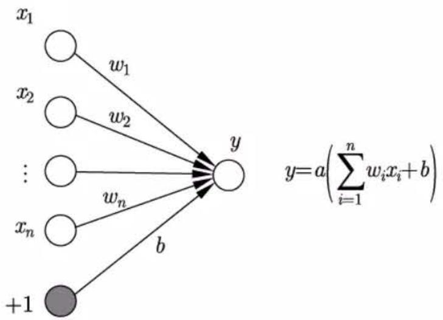  
图23.1 神经元

神经元也可以向量表。设向量

$$
\begin{array} { r } { \mathbf { x } = \left[ \begin{array} { c } { { x } _ { 1 } } \\ { { x } _ { 2 } } \\ { \vdots } \\ { { x } _ { n } } \end{array} \right] } \end{array}
$$

$$
{ \pmb w } = \left[ \begin{array} { c } { { w _ { 1 } } } \\ { { w _ { 2 } } } \\ { { \vdots } } \\ { { w _ { n } } } \end{array} \right]
$$

为输和权重，则神经元为函数

$$
\boldsymbol { y } = \boldsymbol { f } ( \boldsymbol { \mathbf { x } } ) = a ( \boldsymbol { \mathbf { w } } ^ { \mathrm { T } } \boldsymbol { \mathbf { x } } + b )\tag{23.3}
$$

或者写作

$$
y = f \left( \mathbf { x } \right) = a \left( z \right) , \quad z = w ^ { \mathrm { T } } x + b\tag{23.4}
$$

例23.1 图23.2是个神经元，画出其函数的三维图形，其中激活函数是S型函数。

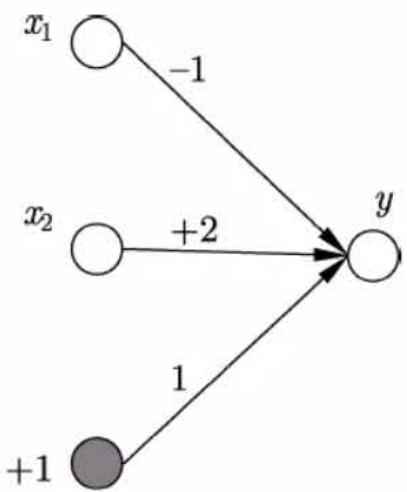  
图23.2 神经元例

解 神经元的仿射函数是 $z = - x _ { 1 } + 2 x _ { 2 } + 1$ ，激活函数是 $a \left( z \right) = \frac { 1 } { 1 + \mathrm { e } ^ { - z } }$ ，神经元函数是

$$
y = f ( x _ { 1 } , x _ { 2 } ) = { \frac { 1 } { 1 + \mathrm { e } ^ { x _ { 1 } - 2 x _ { 2 } - 1 } } }
$$

图23.3是神经元函数的三维图形，整体是三维空间 $( x _ { 1 } , x _ { 2 } , y )$ 中的一个S形曲面。S形曲面由平的等线组成，每条等线对应着维空间 $( x _ { 1 } , x _ { 2 } )$ 中的条直线 $z =$ $- x _ { 1 } + 2 x _ { 2 } + 1$ ，其中z是个定值。当κ趋于正穷时，等线趋近于平 $y = 1$ ；当z趋于负无穷时，等线趋近于平面 $y = 0$ 。

## 2.前馈神经网络

前馈神经络由多层神经元组成，层间的神经元相互连接，层内的神经元不连接，前层神经元的输出是后层神经元的输。整体表输信号（实数向量）到输出信号（实数向量）的多次线性转换。数学上，前馈神经络是以实数向量为输、以实数向量为输出的线性函数的复合函数（这，函数都是以向量为输输出的般函数的扩展)。前馈神经络最后的输出也可以是个实数值，是实数向量的特殊情况。先给出层前馈神经络的定义①。

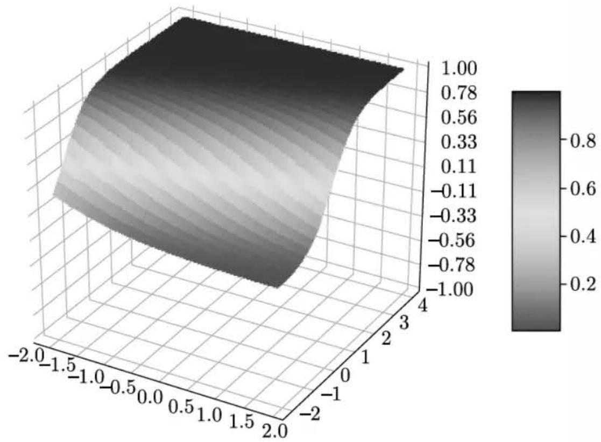  
图23.3 神经元的三维图形(见前彩图)

定义23.2（二层前馈神经络） 二层前馈神经网络是如下定义的非线性函数的复合函数。输入是 $x _ { i } , i = 1 , 2 , \cdots , n$ 输出是 $y _ { k } , k = 1 , 2 , \cdots , l { \mathrm { ~ e ~ } }$ 神经网络有两层。第一层由m个神经元组成，其中第j个神经元是

$$
h _ { j } ^ { ( 1 ) } = a \left( z _ { j } ^ { ( 1 ) } \right) = a \left( \sum _ { i = 1 } ^ { n } w _ { j i } ^ { ( 1 ) } x _ { i } + b _ { j } ^ { ( 1 ) } \right) , \quad j = 1 , 2 , \cdots , m\tag{23.5}
$$

这里 $x _ { i }$ 是输入， $w _ { j i } ^ { ( 1 ) }$ 是权重， $b _ { j } ^ { ( 1 ) }$ 是偏置， $z _ { j } ^ { ( 1 ) }$ 是净输，a(·）是激活函数。第二层由l个神经元组成，其中第k个神经元是

$$
y _ { k } = g ( z _ { k } ^ { ( 2 ) } ) = g \left( \sum _ { j = 1 } ^ { m } w _ { k j } ^ { ( 2 ) } h _ { j } ^ { ( 1 ) } + b _ { k } ^ { ( 2 ) } \right) , \quad k = 1 , 2 , \cdots , l\tag{23.6}
$$

这里 $h _ { j } ^ { ( 1 ) }$ 是第一层神经元的输出， $w _ { k j } ^ { ( 2 ) }$ 是权重，其中 $j = 1 , 2 , \cdots , m , \ b _ { k } ^ { ( 2 ) }$ 是偏置， $z _ { k } ^ { ( 2 ) }$ 是净输入， $g ( \cdot )$ 是激活函数。神经网络整体是

$$
y _ { k } = g \left[ \sum _ { j = 1 } ^ { m } w _ { k j } ^ { ( 2 ) } a \left( \sum _ { i = 1 } ^ { n } w _ { j i } ^ { ( 1 ) } x _ { i } + b _ { j } ^ { ( 1 ) } \right) + b _ { k } ^ { ( 2 ) } \right] , \quad k = 1 , 2 , \cdots , l\tag{23.7}
$$

通常情况第二层只有一个神经元，即 $l = 1$

第层神经元从输输出的度不可见，称为隐层。第层神经元称为输出层。有时把输也看作是层，称为输层。隐层和输出层的激活函数 $a ( \cdot )$ 和 $g ( \cdot )$ 通常有不同的定义。这考虑层间的全连接，即前层的每个神经元都和后层的每个神经元连接。部分连接网络是其特殊情况，相当于未连接边的权重为0。

图23.4是层前馈神经络的意图。图中结点表变量，有向边表变量间的依存关系，边上的数值表示权重。结点 $x _ { i }$ 是神经网络的输入，结点 $y _ { k }$ 是神经络的输出（也是输出层神经元），结点 $h _ { j } ^ { ( 1 ) }$ 是神经网络的隐层神经元。数值 $w _ { j i } ^ { ( 1 ) }$ 是隐层神经元的权重，数值 $w _ { k j } ^ { ( 2 ) }$ 是输出层神经元的权重。数值 $b _ { j } ^ { ( 1 ) }$ 是隐层神经元的偏置，数值 $b _ { k } ^ { ( 2 ) }$ 是输出层神经元的偏置。其中， $i = 1 , 2 , \cdots , n ,$ $j = 1 , 2 , \cdots , m .$ k=1,2,..,l。

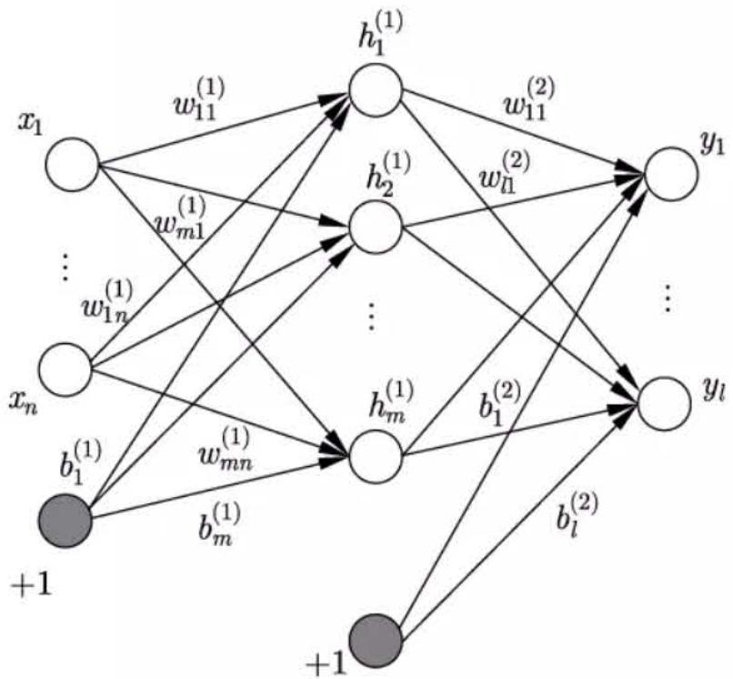  
图23.4 二层前馈神经网络

层前馈神经络也可以矩阵来表，简称矩阵表。

$$
\pmb { h } ^ { ( 1 ) } = f ^ { ( 1 ) } \left( \pmb { x } \right) = a ( z ^ { ( 1 ) } ) = a \left( \pmb { W } ^ { ( 1 ) ^ { \operatorname { T } } } \pmb { x } + b ^ { ( 1 ) } \right)\tag{23.8}
$$

$$
y = f ^ { ( 2 ) } \left( h ^ { ( 1 ) } \right) = g ( z ^ { ( 2 ) } ) = g \left( { W ^ { ( 2 ) } } ^ { \mathrm { T } } h ^ { ( 1 ) } + b ^ { ( 2 ) } \right)\tag{23.9}
$$

其中，

$$
\begin{array} { r } { \mathbf { x } = \left[ \begin{array} { l } { x _ { 1 } } \\ { x _ { 2 } } \\ { \vdots } \\ { x _ { n } } \end{array} \right] } \end{array}
$$

$$
z ^ { ( 1 ) } = \left[ \begin{array} { c } { { z _ { 1 } ^ { ( 1 ) } } } \\ { { z _ { 2 } ^ { ( 1 ) } } } \\ { { \vdots } } \\ { { z _ { m } ^ { ( 1 ) } } } \end{array} \right]
$$

$$
\begin{array} { r } { h ^ { ( 1 ) } = \left[ \begin{array} { c } { \ h _ { 1 } ^ { ( 1 ) } } \\ { h _ { 2 } ^ { ( 1 ) } } \\ { \vdots } \\ { h _ { m } ^ { ( 1 ) } } \end{array} \right] } \end{array}
$$

$$
z ^ { ( 2 ) } = \left[ \begin{array} { c } { { z _ { 1 } ^ { ( 2 ) } } } \\ { { z _ { 2 } ^ { ( 2 ) } } } \\ { { \vdots } } \\ { { z _ { l } ^ { ( 2 ) } } } \end{array} \right]
$$

$$
W ^ { ( 1 ) } = \left[ \begin{array} { r r r } { { w _ { 1 1 } ^ { ( 1 ) } } } & { { \cdot \cdot \cdot } } & { { w _ { 1 m } ^ { ( 1 ) } } } \\ { { } } & { { } } & { { } } \\ { { \vdots } } & { { } } & { { \vdots } } \\ { { w _ { n 1 } ^ { ( 1 ) } } } & { { \cdot \cdot \cdot } } & { { w _ { n m } ^ { ( 1 ) } } } \end{array} \right]
$$

$$
W ^ { ( 2 ) } = \left[ \begin{array} { c c c } { { w _ { 1 1 } ^ { ( 2 ) } } } & { { \cdots } } & { { w _ { 1 l } ^ { ( 2 ) } } } \\ { { } } & { { } } & { { } } \\ { { \vdots } } & { { } } & { { \vdots } } \\ { { w _ { m 1 } ^ { ( 2 ) } } } & { { \cdots } } & { { w _ { m l } ^ { ( 2 ) } } } \end{array} \right]
$$

$$
\begin{array} { r } { b ^ { ( 1 ) } = \left[ \begin{array} { c } { b _ { 1 } ^ { ( 1 ) } } \\ { b _ { 2 } ^ { ( 1 ) } } \\ { \vdots } \\ { b _ { m } ^ { ( 1 ) } } \end{array} \right] } \end{array}
$$

$$
\begin{array} { r } { b ^ { ( 2 ) } = \left[ \begin{array} { c } { b _ { 1 } ^ { ( 2 ) } } \\ { b _ { 2 } ^ { ( 2 ) } } \\ { \vdots } \\ { b _ { l } ^ { ( 2 ) } } \end{array} \right] } \end{array}
$$

向量x表输入，向量y表示输出，向量 $z ^ { ( 1 ) }$ 表隐层的净输入，向量 $\mathbf { \Sigma } _ { h } ( \mathrm { 1 } )$ 表示隐层的输出，向量 $z ^ { ( 2 ) }$ 表示输出层的净输入，矩阵 $W ^ { ( 1 ) } , W ^ { ( 2 ) }$ 表示权重，向量 $b ^ { ( 1 ) } , b ^ { ( 2 ) }$ 表偏置。整体神经网络由复合函数 $f ^ { ( 2 ) } ( f ^ { ( 1 ) } ( { \pmb x } ) )$ 表示。这里 $a \left( \cdot \right)$ 和 $g \left( \cdot \right)$ ，以及 $f ^ { ( 1 ) } \left( \cdot \right)$ 和 $f ^ { ( 2 ) } \left( \cdot \right)$ 是般函数的扩展，作在向量的每个元素上，得到的仍是个向量。

下给出更般的多层前馈神经络或深度神经络的定义。

定义23.3（多层前馈神经网络） 多层前馈神经网络或前馈神经网络是如下定义的非线性函数的复合函数。输入是 $x _ { i } , i = 1 , 2 , \cdots , n ,$ 输出是 $y _ { k } , k = 1 , 2 , \cdots , l { _ { \mathrm { c } } }$ 神经网络有s层 $\left( \begin{array} { l } { s \geqslant 2 } \end{array} \right)$ 。第一层到第 $s - 1$ 层是隐层。假设其中的第t层由m个神经元组成，第 $t - 1$ 层由 $n$ 个神经元组成， $t = 1 , 2 , \cdots , s - 1$ ，第t层的第 $j$ 个神经元是

$$
h _ { j } ^ { ( t ) } = a \left( z _ { j } ^ { ( t ) } \right) = a \left( \sum _ { i = 1 } ^ { n } w _ { j i } ^ { ( t ) } h _ { i } ^ { ( t - 1 ) } + b _ { j } ^ { ( t ) } \right) , \quad j = 1 , 2 , \cdots , m\tag{23.10}
$$

这里 $h _ { i } ^ { ( t - 1 ) } , i = 1 , 2 , \cdots , n ,$ 是第t-1层的输出，设 $h _ { i } ^ { ( 0 ) } = x _ { i } , \ w _ { j i } ^ { ( t ) } , i = 1 , 2 , \cdots , n$ 是权

重， $b _ { j } ^ { ( t ) }$ 是偏置， $z _ { j } ^ { ( t ) }$ 是净输入， $a ( \cdot )$ 是激活函数。第s层是输出层。假设第s层由Ⅰ个神经元组成，第s-1层由m个神经元组成，第s层的第k个神经元是

$$
y _ { k } = g \left( z _ { k } ^ { ( s ) } \right) = g \left( \sum _ { j = 1 } ^ { m } w _ { k j } ^ { ( s ) } h _ { j } ^ { ( s - 1 ) } + b _ { k } ^ { ( s ) } \right) , \quad k = 1 , 2 , \cdots , l\tag{23.11}
$$

这里 $h _ { j } ^ { ( s - 1 ) } , j = 1 , 2 , \cdots , m$ ，是第-1层的输出， $w _ { k j } ^ { ( s ) } , j = 1 , 2 , \cdots , m$ ，是权重， $b _ { k } ^ { ( s ) }$ 是偏置， $z _ { k } ^ { ( s ) }$ 是净输入， $g ( \cdot )$ 是激活函数。神经网络整体是

$$
y _ { k } = g \left\{ \sum _ { j = 1 } ^ { m } w _ { k j } ^ { ( s ) } \cdots \left[ a \left( \sum _ { i = 1 } ^ { n } w _ { j i } ^ { ( 1 ) } x _ { i } + b _ { j } ^ { ( 1 ) } \right) \right] \cdots + b _ { k } ^ { ( s ) } \right\} , \quad k = 1 , 2 , \cdots , l\tag{23.12}
$$

层数大于2时的前馈神经网络又称为深度神经网络。通常情况是第s层只有一个神经元，即$l = 1$ 。

前馈神经络的矩阵表如下：

$$
\left\{ \begin{array} { l l } { h ^ { ( 1 ) } = f ^ { ( 1 ) } \left( x \right) = a ( z ^ { ( 1 ) } ) = a \left( W ^ { ( 1 ) ^ { \mathrm { T } } } x + b ^ { ( 1 ) } \right) } \\ { h ^ { ( 2 ) } = f ^ { ( 2 ) } \left( h ^ { ( 1 ) } \right) = a ( z ^ { ( 2 ) } ) = a \left( W ^ { ( 2 ) ^ { \mathrm { T } } } h ^ { ( 1 ) } + b ^ { ( 2 ) } \right) } \\ { \qquad \quad \vdots } \\ { h ^ { ( s - 1 ) } = f ^ { ( s - 1 ) } \left( h ^ { ( s - 2 ) } \right) = a ( z ^ { ( s - 1 ) } ) = a \left( W ^ { ( s - 1 ) ^ { \mathrm { T } } } h ^ { ( s - 2 ) } + b ^ { ( s - 1 ) } \right) } \\ { y = h ^ { ( s ) } = f ^ { ( s ) } \left( h ^ { ( s - 1 ) } \right) = g ( z ^ { ( s ) } ) = g \left( W ^ { ( s ) ^ { \mathrm { T } } } h ^ { ( s - 1 ) } + b ^ { ( s ) } \right) } \end{array} \right.\tag{23.13}
$$

其中，向量x表示输入，向量y表输出，向量 $z ^ { ( 1 ) } , z ^ { ( 2 ) } , \cdots , z ^ { ( s ) }$ 表第1层到第s层的净输入，向量 $h ^ { ( 1 ) } , h ^ { ( 2 ) } , \cdots , h ^ { ( s ) }$ 表第1层到第s层的输出，矩阵 $W ^ { ( 1 ) } , W ^ { ( 2 ) } , \cdots , W ^ { ( s ) }$ 表示权重，向量 $b ^ { ( 1 ) } , b ^ { ( 2 ) } , \cdot \cdot \cdot , b ^ { ( s ) }$ 表示偏置。整体神经网络由复合函数 $f ^ { ( s ) } ( \cdot \cdot \cdot f ^ { ( 2 ) } ( f ^ { ( 1 ) } ( x ) ) \cdot \cdot \cdot )$ 表，也写作 $f ( x ; { \boldsymbol { \theta } } )$ ，其中θ是所有参数组成的向量。

可以看出，前馈神经络模型是矩阵与向量的乘积的线性变换的多次重复，其基本结构是常简单的。因此，多次线性变换是前馈神经络的本质。从后的例中可以看出，这种变换拥有很强的表示能，可以进复杂的信息处理。相之下，多次线性变换等价于次线性变换，其表能有限。

到前为考虑的是个样本输到神经络的情况，这时输由个向量表。也可以是多个样本批量同时输到神经络，这时输样本由个矩阵表。可以式（23.13)的矩阵表示扩展，细节省略，在例23.3中介绍。

## 3.隐层的神经元

隐层神经元函数由两部分组成：仿射函数和激活函数。这介绍常的隐层激活函数，包括S型函数、双曲正切函数、整流线性函数。个神经络通常采种隐层激活函数。

S型函数（sigmoidfunction）又称为逻辑斯谛函数（logistic function），是定义式如下的线性函数。

$$
a \left( z \right) = \sigma \left( z \right) = \frac { 1 } { 1 + \mathrm { e } ^ { - z } }\tag{23.14}
$$

其中，z是变量或输，σ(z）是因变量或输出。函数的定义域为 $( - \infty , + \infty )$ ，值域为(0,1)。如图23.5所，S型函数是将正负实数值映射到0和1之间实数值的单调递增函数，其特点是输越接近+，输出越接近1；输越接近，输出越接近0；输在0附近时，输出近似线性递增；输是0时，输出是0.5。

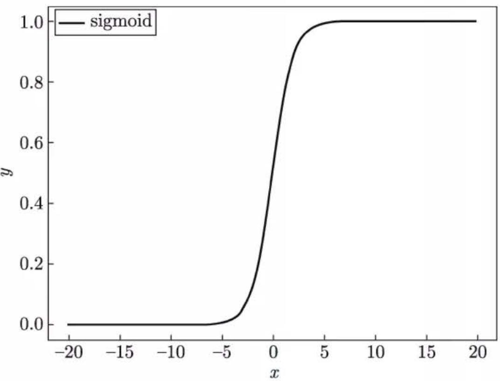  
图23.5 S型函数

S型函数的导函数是

$$
a ^ { \prime } ( z ) = a ( z ) ( 1 - a ( z ) )\tag{23.15}
$$

双曲正切函数（hyperbolic tangent function）是定义式如下的线性函数。

$$
a \left( z \right) = \operatorname { t a n h } \left( z \right) = \frac { \mathrm { e } ^ { z } - \mathrm { e } ^ { - z } } { \mathrm { e } ^ { z } + \mathrm { e } ^ { - z } }\tag{23.16}
$$

其中，z是变量或输，tanh(z）是因变量或输出。函数定义域为 $( - \infty , + \infty )$ ，值域为(1,+1)。如图23.6所，双曲正切函数的特点是输越接近，输出越接近+1；输越接近，输出越接近1；输在0附近时，输出近似线性递增；输是0时，输出也是0。

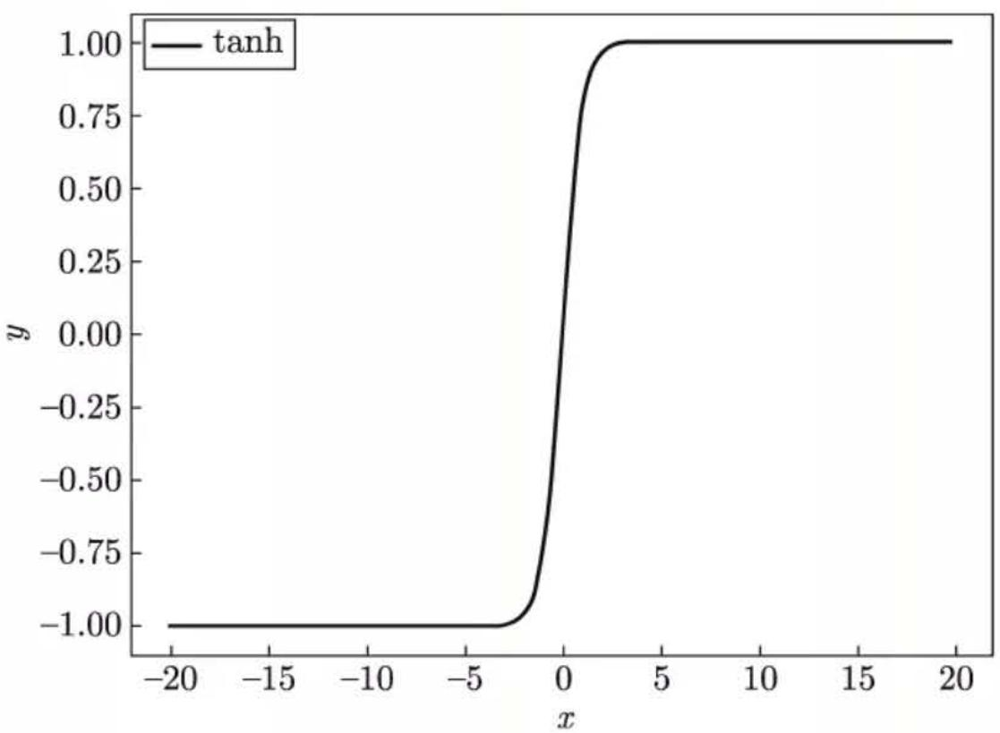  
图23.6 双曲正切函数

双曲正切函数的导函数是

$$
a ^ { \prime } ( z ) = 1 - a ( z ) ^ { 2 }\tag{23.17}
$$

双曲正切函数与S型函数有以下关系：直观上双曲正切函数将S型函数“放”两倍，并向下平移1个单位。

$$
\operatorname { t a n h } { ( z ) } = 2 \sigma \left( 2 z \right) - 1\tag{23.18}
$$

整流线性函数（rectifedlinearunit，ReLU）是定义式如下的线性函数。

$$
a ( z ) = \operatorname { r e l u } { ( z ) } = \operatorname* { m a x } ( 0 , z )\tag{23.19}
$$

其中，z是变量或输，relu(z）是因变量或输出。函数定义域为 $( - \infty , + \infty )$ ，值域为$( 0 , + \infty )$ 。如图23.7所，整流线性函数的特点是输是负值时，输出为 $0 ;$ 输入是正值时，输出为正且线性单调递增；输是0时，输出也是0。

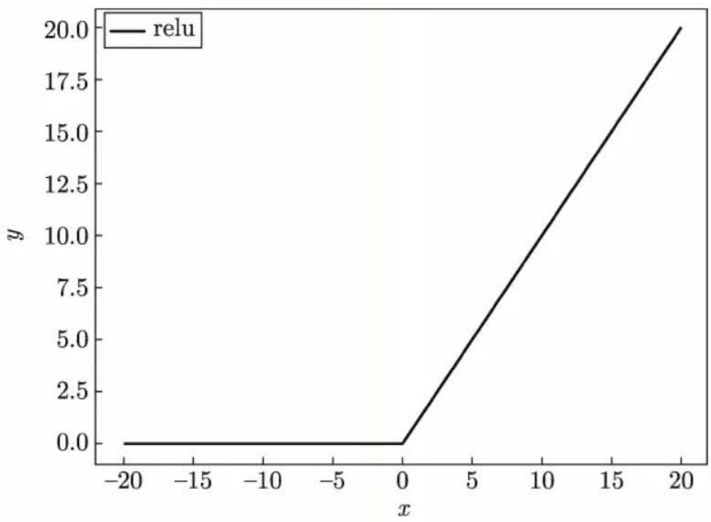  
图23.7 整流线性函数

整流线性函数的导函数是①

$$
a ^ { \prime } ( z ) = \left\{ { 1 , \quad z > 0 } \right.\tag{23.20}
$$

整流线性函数S型函数和双曲正切函数在计算机上的计算效率更，其导函数也是如此。  
整流线性函数在当前深度学习中被广泛使用。

对于激活函数a(z)，当其导数满 $\operatorname* { l i m } _ { z  - \infty } { a } ^ { \prime } ( z ) = 0$ 时，称为左饱和（left saturating）函数；当其导数满足 $\operatorname* { l i m } _ { z  + \infty } { a ^ { \prime } ( z ) } = 0$ 时，称为右饱和（rightsaturating）函数；同时满左饱和、右饱和条件时称为（两边的）饱和（saturating）函数。整流线性函数是左饱和函数，S型函数和双曲正切函数是饱和函数。

## 4.模型

前馈神经络可以作为机器学习模型于不同任务，有以下种代表情况。

（1）于回归。神经络的输出层只有个神经元，其输出是个实数值。神经络表示为 $y = f ( { \boldsymbol { x } } )$ ，其中 $y \in \mathcal { R } _ { \circ }$ 预测时给定输入a，计算输出 $y _ { \circ }$

(2）于类分类。神经络的输出层只有个神经元，其输出是个概率值。神经络表示为 $p = P \left( y = 1 | x \right) = f \left( x \right)$ ,其中 $y \in \{ 0 , 1 \}$ ，满条件

$$
0 < P \left( y = 1 | \mathbf { x } \right) < 1 , \quad P \left( y = 1 | \mathbf { x } \right) + P \left( y = 0 | \mathbf { x } \right) = 1
$$

预测时给定输x，计算其属于类别1的概率。如果概率于0.5，则将输分到类别1，否则分到类别0。

(3）于多类分类（multi-class classification）。神经络的输出层只有个神经元，神经元的输出是由1个概率值组成的概率向量。神经络表为 $p = [ P \left( y _ { k } = 1 | x \right) ] = f \left( x \right)$ ,其中 $y _ { k } \in \left\{ 0 , 1 \right\} , k = 1 , 2 , \cdots , l .$ ，满足条件

$$
\sum _ { k = 1 } ^ { l } y _ { k } = 1 , \quad 0 < P \left( y _ { k } = 1 | x \right) < 1 , \quad \sum _ { k = 1 } ^ { l } P \left( y _ { k } = 1 | x \right) = 1 , \quad k = 1 , 2 , \cdots , l
$$

也就是说 $\left[ y _ { 1 } , y _ { 2 } , \cdots , y _ { l } \right]$ 是只有个元素为1，其他元素为0的向量，这样的向量称为独热向量（one-hot vector）, $\left[ P \left( y _ { 1 } = 1 | \pmb { x } \right) , P \left( y _ { 2 } = 1 | \pmb { x } \right) , \cdots , P \left( y _ { l } = 1 | \pmb { x } \right) \right]$ 是定义在独热向量上的概率分布，表输x属于1个类别的概率。预测时给定输x，计算其属于各个类别的概率。将输分到概率最的类别，这时输只可能被分到个类别。

(4）于多标签分类（multi-labelclassification）。神经络的输出层有l个神经元，每个神经元的输出是个概率值。神经络表为 $p \ = \ [ P \left( y _ { k } = 1 | x \right) ] \ = \ f \left( x \right)$ ，其中$y _ { k } \in \left\{ 0 , 1 \right\} , k = 1 , 2 , \cdots , l ,$ 满足条件

$$
0 < P \left( y _ { k } = 1 | x \right) < 1 , \quad P \left( y _ { k } = 1 | x \right) + P \left( y _ { k } = 0 | x \right) = 1 , \quad k = 1 , 2 , \cdots , l
$$

$\left[ P \left( y _ { 1 } = 1 | \pmb { x } \right) , P \left( y _ { 2 } = 1 | \pmb { x } \right) , \cdots , P \left( y _ { l } = 1 | \pmb { x } \right) \right]$ 表输x分别属于1个类别的概率。预测时给定输x，计算其属于各个类别的概率。将输分到概率于0.5的所有类别，这时输可以被分到多个类别（赋予多个标签）。

注意，在回归中神经络的输出和模型的输出是相同的，都是实数值；在分类中神经络的输出和模型的输出是不同的，前者是概率值，后者是类别。现实中经常对神经络及其表的模型不严格区分，这点其他类型的神经络也样。

## 5.输出层的神经元

输出层神经元函数由两部分组成：仿射函数和激活函数。输出层激活函数通常使恒等函数、S型函数、软最化函数。在回归、类分类、多类分类、多标签分类中，激活函数有不同的形式。

回归时，输出层只有个神经元，其激活函数是恒等函数，神经元函数是

$$
y = g \left( z \right) = z , ~ z = { w ^ { \left( s \right) } } ^ { \mathrm { T } } h ^ { \left( s - 1 \right) } + b ^ { \left( s \right) }\tag{23.21}
$$

这里 $\scriptstyle w ^ { ( s ) }$ 是权重向量， $b ^ { ( s ) }$ 是偏置， $g \left( \cdot \right)$ 是恒等函数， $\pmb { h } ^ { ( s - 1 ) }$ 是第s1隐层的输出。称这样的输出层为线性输出层。

类分类时，输出层只有个神经元，其激活函数是S型函数，神经元函数是

$$
P ( y = 1 | x ) = g \left( z \right) = \frac { 1 } { 1 + \mathrm { e } ^ { - z } } , z = w ^ { ( s ) ^ { \mathrm { T } } } h ^ { ( s - 1 ) } + b ^ { ( s ) }\tag{23.22}
$$

这里 $\pmb { w } ^ { ( s ) }$ 是权重向量， $b ^ { ( s ) }$ 是偏置, $g \left( \cdot \right)$ 是S型函数， $\pmb { h } ^ { ( s - 1 ) }$ 是第s1隐层的输出。

多类分类时，输出层只有个神经元，其激活函数是软最化函数（softmax function），神经元函数是

$$
P ( y _ { k } = 1 | { \boldsymbol x } ) = g \left( z _ { k } \right) = \frac { \mathrm { e } ^ { z _ { k } } } { l } , \ z _ { k } = w _ { k } ^ { ( s ) ^ { \mathrm { T } } } h ^ { ( s - 1 ) } + b _ { k } ^ { ( s ) } , \quad k = 1 , 2 , \cdots , l\tag{23.23}
$$

这里 $w _ { k } ^ { ( s ) }$ 是权重向量， $b _ { k } ^ { ( s ) }$ 是偏置， $g \left( \cdot \right)$ 是软最大化函数， $\pmb { h } ^ { ( s - 1 ) }$ 是第 $s - 1$ 隐层的输出。  
称这样的输出层为软最大化输出层。

软最化函数的名字来它是最化（max）函数的近似这事实。如果 $z _ { k } \gg z _ { j } , j \neq k .$ ,那么 $p _ { k } = P \left( y _ { k } = 1 \right) \approx 1 , p _ { j } = P \left( y _ { j } = 1 \right) \approx 0$ 。软最化函数是1维实数向量z到1维概率向量p的映射。

$$
z = { [ \begin{array} { l } { z _ { 1 } } \\ { z _ { 2 } } \\ { \vdots } \\ { z _ { l } } \end{array} ] }  p = { [ \begin{array} { l } { p _ { 1 } } \\ { p _ { 2 } } \\ { \vdots } \\ { p _ { l } } \end{array} ] }
$$

软最化函数的偏导数或雅可矩阵元素是(推导见附录F)

$$
\frac { \partial p _ { k } } { \partial z _ { j } } = \left\{ { p _ { k } } ( 1 - p _ { k } ) , \quad j = k \atop { - p _ { j } p _ { k } , } \quad j \neq k  , \quad j , k = 1 , 2 , \cdots , l \right.\tag{23.24}
$$

前馈神经络于多类分类时，为了提效率，在预测时经常省去激活函数的计算，选取仿射函数（净输入） $z _ { k }$ 值最大的类别。这样做，分类结果是等价的，因为软最大化函数的分母对各个类别是常量，分的指数函数是单调递增函数。实数值 $z _ { k }$ 又称为对数几率(logit）。

多标签分类时，输出层有个神经元，每个神经元的激活函数都是S型函数，神经元函数是

$$
P ( y _ { k } = 1 | \boldsymbol { x } ) = g \left( z _ { k } \right) = \frac { 1 } { 1 + \mathrm { e } ^ { - z _ { k } } } , \quad z _ { k } = w _ { k } ^ { ( s ) ^ { \mathrm { T } } } h ^ { ( s - 1 ) } + b _ { k } ^ { ( s ) } , \quad k = 1 , 2 , \cdots , l\tag{23.25}
$$

这里 $w _ { k } ^ { ( s ) }$ 是权重向量， $b _ { k } ^ { ( s ) }$ 是偏置， $g \left( \cdot \right)$ 是S型函数， $\pmb { h } ^ { ( s - 1 ) }$ 是第δ1隐层的输出。

## 23.1.2 前馈神经络的例子

例23.2 图23.8是个层前馈神经络，画出其函数的三维图形，其中第层激活函数和第层激活函数都是S型函数。

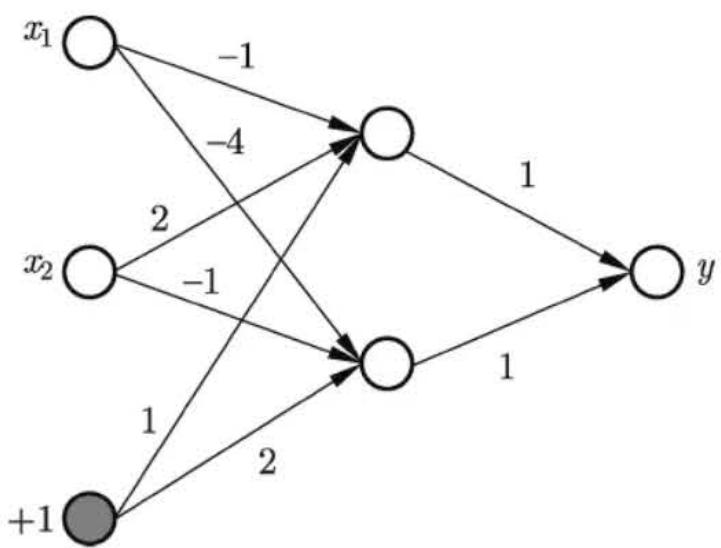  
图23.8 层前馈神经络例

解 第层(隐层）的第个神经元与例23.1相同，仿射函数是 $z = - x _ { 1 } + 2 x _ { 2 } + 1$ ,激活函数是 $a \left( z \right) = \frac { 1 } { 1 + \mathrm { e } ^ { - z } }$ ，神经元函数是

$$
h _ { 1 } ^ { ( 1 ) } = \frac { 1 } { 1 + \mathrm { e } ^ { x _ { 1 } - 2 x _ { 2 } - 1 } }
$$

图23.3是该神经元的三维图形。第层的第个神经元的仿射函数是 $z = - 4 x _ { 1 } - x _ { 2 } + 2$ ,激活函数是 $a \left( z \right) = \frac { 1 } { 1 + \mathrm { e } ^ { - z } }$ ，神经元函数是

$$
h _ { 2 } ^ { ( 1 ) } = \frac { 1 } { 1 + \mathrm { e } ^ { 4 x _ { 1 } + x _ { 2 } - 2 } }
$$

图23.9是该神经元的三维图形。

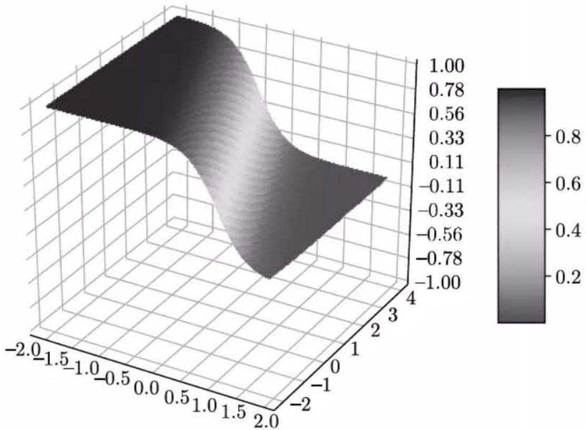  
图23.9 神经元的三维图形(见前彩图)

第层（输出层）的神经元的仿射函数是 $z = h _ { 1 } ^ { ( 1 ) } + h _ { 2 } ^ { ( 1 ) }$ ,激活函数是 $g \left( z \right) = \sigma ( z )$ ,神经元函数是 $f ( x _ { 1 } , x _ { 2 } ) = \sigma ( h _ { 1 } ^ { ( 1 ) } + h _ { 2 } ^ { ( 1 ) } )$ 。神经络整体

$$
f ( x _ { 1 } , x _ { 2 } ) = \sigma \left( \frac { 1 } { 1 + \mathrm { e } ^ { x _ { 1 } - 2 x _ { 2 } - 1 } } + \frac { 1 } { 1 + \mathrm { e } ^ { 4 x _ { 1 } + x _ { 2 } - 2 } } \right)
$$

是个类分类模型。图23.10是神经络的三维图形。图形中“原”部分的输出值接近

1,“盆地”部分的输出值接近0。可以看出，整个层前馈神经络能够第层的两个神经元表示更复杂的线性关系。

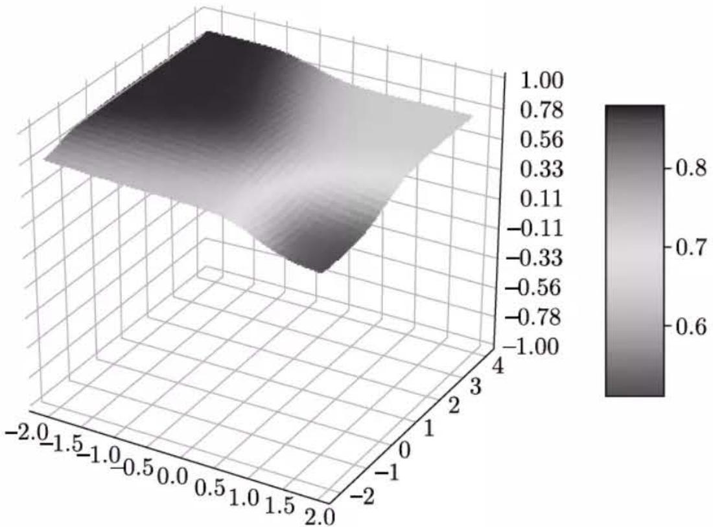  
图23.10 前馈神经络例的三维图形(见前彩图)

例23.3 构建个前馈神经络实现逻辑表达式XOR的功能。

解 采矩阵表，构建个层前馈神经络，第层有两个神经元，其激活函数是整流线性函数，第层有个神经元，其激活函数是恒等函数，如图23.11所。

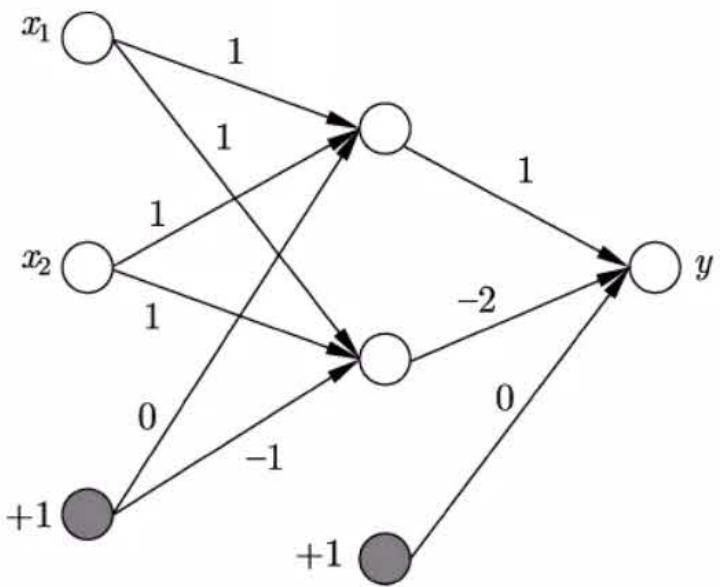  
图23.11 XOR神经络例

第层的权重矩阵和偏置向量是

$$
\boldsymbol { W } ^ { ( 1 ) } = \left[ \begin{array} { l l } { 1 } & { 1 } \\ { 1 } & { 1 } \end{array} \right]
$$

$$
b ^ { ( 1 ) } = \left[ \begin{array} { r } { { 0 } } \\ { { - 1 } } \end{array} \right]
$$

第层的权重矩阵和偏置向量是

$$
W ^ { ( 2 ) } = \left[ \begin{array} { r } { { 1 } } \\ { { - 2 } } \end{array} \right]
$$

$$
b ^ { ( 2 ) } = [ 0 ]
$$

矩阵表四种可能的输：

$$
\pmb { X } = \left[ \begin{array} { l l l l } { 0 } & { 0 } & { 1 } & { 1 } \\ { 0 } & { 1 } & { 0 } & { 1 } \end{array} \right]
$$

代表批量处理。代神经络，第层输出是

$$
\begin{array} { r l } & { H ^ { ( 1 ) } = \mathrm { r e l n } \left( W ^ { ( 1 ) ^ { \top } } X + B ^ { ( 1 ) } \right) } \\ & { \quad = \mathrm { r e l n } \left( \left[ \begin{array} { l } { 1 } \\ { 1 } \end{array} \right. 1 } \\ { \phantom { - } \frac { 1 } { 2 } \left[ \begin{array} { l l l l } { 0 } & { 0 } & { 1 } & { 1 } \\ { 0 } & { 1 } & { 0 } & { 1 } \end{array} \right] + \left[ \begin{array} { l l l l } { 0 } & { 0 } & { 0 } & { 0 } \\ { - 1 } & { - 1 } & { - 1 } & { - 1 } \end{array} \right] \right) } \\ & { \quad = \mathrm { r e l n } \left( \left[ \begin{array} { l l l l } { 0 } & { 1 } & { 1 } & { 2 } \\ { - 1 } & { 0 } & { 0 } & { 1 } \end{array} \right] \right) } \\ & { \quad = \left[ \begin{array} { l l l l } { 0 } & { 1 } & { 1 } & { 2 } \\ { 0 } & { 0 } & { 0 } & { 1 } \end{array} \right] } \end{array}
$$

其中relu计算对矩阵的每个元素进。第层输出是

$$
\begin{array} { r l } & { \pmb { H } ^ { ( 2 ) } = \pmb { W } ^ { ( 2 ) } \mathbf { \tilde { \Sigma } } \pmb { H } ^ { ( 1 ) } + \pmb { B } ^ { ( 2 ) } } \\ & { \quad \quad = \left[ \begin{array} { l l } { 0 } & { 1 } & { 1 } & { 2 } \\ { 1 } & { - 2 } \end{array} \right] \left[ \begin{array} { l l l l } { 0 } & { 1 } & { 1 } & { 2 } \\ { 0 } & { 0 } & { 0 } & { 1 } \end{array} \right] + \left[ \begin{array} { l l l l } { 0 } & { 0 } & { 0 } & { 0 } \end{array} \right] } \\ & { \quad \quad = \left[ \begin{array} { l l l l } { 0 } & { 1 } & { 1 } & { 0 } \end{array} \right] } \end{array}
$$

表四种可能的输出。可以看出这个层神经络实现了XOR功能。图23.12是XOR神经络函数的三维图形。作为线性模型的感知机不能实现XOR是众所周知的事实，作为

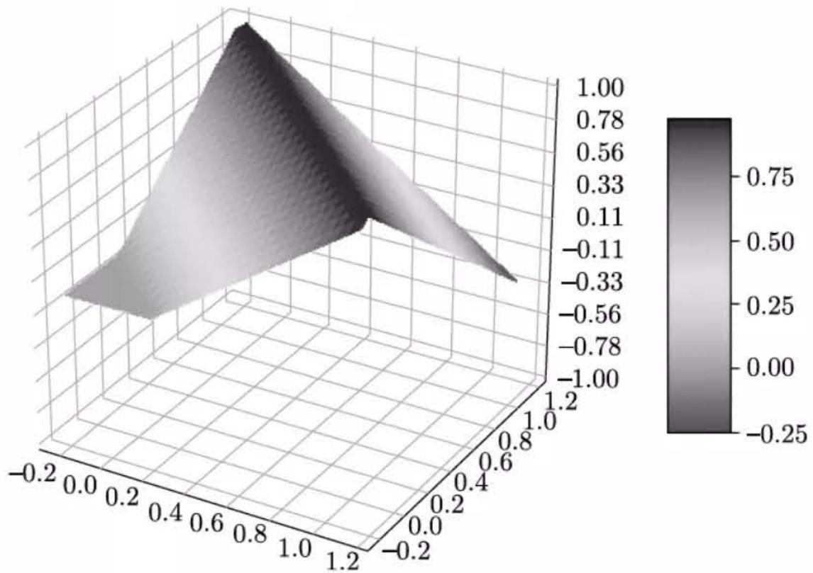  
图23.12 XOR神经络例的三维图形(见前彩图)

线性模型的前馈神经络可以实现XOR，并且以很简单的式实现。

## 例23.4 写数字识别络。

MNIST是个机器学习标准数据集。每个样本由个像素为28×28的写数字灰度图像以及对应的0\~9之间的标签组成，像素取值为0\~255，如图23.13所。

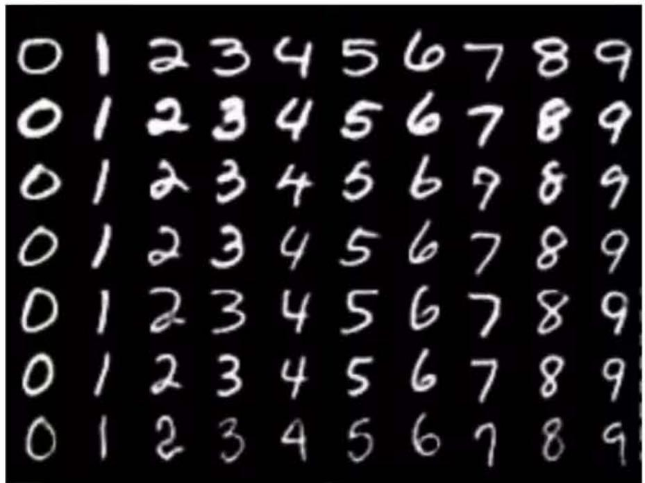  
图23.13 MNIST写数字数据例

可以构建图23.14所的前馈神经络对MNIST的写数字进识别，是个多标签分类模型。输层是个28×28=784维向量，取个图像，每维对应个像素。第层和第层是隐层，各有100个神经元和50个神经元，其激活函数都是S型函数。第三层是输出层，有10个神经元，其激活函数也是S型函数。给定个图像，神经络可以计算出其属于0\~9类的概率，将图像赋予概率最的标签。分类准确率能达到90%以上。

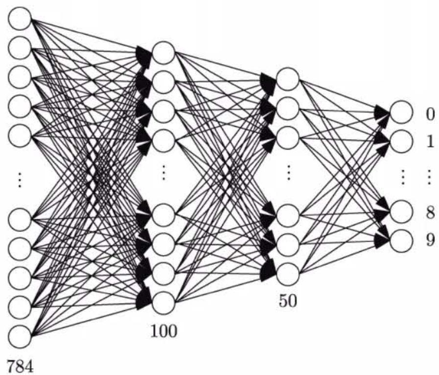  
图23.14 写数字识别络

从以上的例可以看出，前馈神经络拥有很强的语义表能，简单的络就可以表逻辑关系、抽象数字，进简单逻辑推理、数字识别等处理。预测时，神经络的每层通过线性变换对输入进特征转换，多次这样的特征转换产最终的判断结果。

## 23.1.3 前馈神经络的表示能

## 1.与其他模型的关系

前馈神经络与逻辑斯谛回归模型、感知机、持向量机等有密切关系。

对于多类分类的层神经络，当其输出层激活函数是软最化函数时，模型等价于多项逻辑斯谛回归模型。

$$
\begin{array} { l } { P \left( y _ { k } = 1 | \boldsymbol { x } \right) = f ( \boldsymbol { x } ) = \displaystyle \frac { \mathrm { e } ^ { ( w _ { k } ^ { ( 1 ) ^ { \mathrm { T } } } \boldsymbol { x } + b _ { k } ^ { ( 1 ) } ) } } { \displaystyle \sum _ { i = 1 } ^ { l } \mathrm { e } ^ { ( w _ { i } ^ { ( 1 ) ^ { \mathrm { T } } } \boldsymbol { x } + b _ { i } ^ { ( 1 ) } ) } } , \quad k = 1 , 2 , \cdots , l } \end{array}\tag{23.26}
$$

所以，前馈神经络是逻辑斯谛回归模型的扩展。注意：前馈神经络通常将所有1个类别的权重和偏置作为参数使，逻辑斯谛回归通常将前1-1个类别的权重和偏置作为由参数使（见6.1.4节）。

对于类分类的层神经络，当其输出层激活函数是双曲正切函数时，

$$
f \left( \pmb { x } \right) = \operatorname { t a n h } ( \pmb { w } ^ { ( 1 ) } \mathbf { \Sigma } \pmb { x } + b ^ { ( 1 ) } )\tag{23.27}
$$

模型可以与感知机对应。感知机模型的定义是

$$
y = \left\{ { \begin{array} { l l } { + 1 , } & { \mathrm { s i g n } ( { \boldsymbol { w } } ^ { \mathrm { T } } { \boldsymbol { x } } + b ) \geqslant 0 } \\ { - 1 , } & { \mathrm { \not \equiv } \mathrm { \backslash } \mathrm { \backslash } \mathrm { \Omega } } \end{array} } \right.
$$

所以，可以认为前馈神经络是感知机的扩展。这也是前馈神经络又被称为多层感知机的原因。

对于类分类的多层神经络，当其输出层激活函数是双曲正切函数时，

$$
\begin{array} { r l } & { f ( \pmb { x } ) = \operatorname { t a n h } ( \pmb { w } ^ { ( s ) } ^ { \mathrm { T } } \pmb { h } ^ { ( s - 1 ) } + b ^ { ( s ) } ) } \\ & { \pmb { h } ^ { ( s - 1 ) } = f ^ { ( s - 1 ) } [ \cdots f ^ { ( 2 ) } ( f ^ { ( 1 ) } ( \pmb { x } ) ) \cdots ] } \end{array}\tag{23.28}
$$

模型可以与线性持向量机对应。线性持向量模型的定义是

$$
y = \left\{ { \begin{array} { l l } { + 1 , } & { \mathrm { s i g n } ( { \pmb w } ^ { \mathrm { T } } \phi ( { \pmb x } ) + b ) \geqslant 0 } \\ { - 1 , } & { \mathrm { \# } \mathrm { \# } } \end{array} } \right.
$$

其中 ${ \mathcal { , } } \phi ( x )$ 是从输空间到特征空间的线性映射，w和b是模型的参数。前馈神经络的前s-1层函数 $f ^ { ( s - 1 ) } [ \cdot \cdot \cdot f ^ { ( 2 ) } ( f ^ { ( 1 ) } ( x ) ) \cdot \cdot \cdot ]$ 与映射函数 $\phi ( { \pmb x } )$ 对应。持向量机学习是凸优化问题，保证可以找到全局最优，前馈神经络学习是凸优化问题（见23.2节），不能保证找到全局最优。前馈神经络持向量机有更多的参数可以调节。

## 2.函数近似能力

前馈神经络具有强的函数近似能。通近似定理（universalapproximationtheorem）指出，存在个层前馈神经络，具有个线性输出层和个隐层，其中隐层含

有充分数量的神经元，激活函数为挤压函数，这个络可以以任意精度近似任意个在紧的定义域上的连续函数[7-8]。从这个意义上，前馈神经络的函数近似能是通的。

设有实函数 $G ( x ) : { \mathcal { R } } \longrightarrow [ 0 , 1 ]$ ,如果 $G ( x )$ 是非减函数，且满足 $\stackrel { ! } { \underset { x  - \infty } { \operatorname { i m } } } G ( x ) = 0 , \underset { x  + \infty } { \operatorname * { l i m } } G ( x ) =$ 1，则称函数 $G ( x )$ 为挤压函数(squashing function)。S型函数是种挤压函数。

后续理论研究发现，定理的条件可以放宽，当激活函数是多项式函数以外的其他函数时，或者当被近似函数是波莱尔可测函数时，定理的结论依然成。波莱尔可测函数包括连续函数、分段连续函数、阶梯函数。

下的定理是通近似定理的个具体形式。

定理23.1 对任意连续函数 $h : [ 0 , 1 ] ^ { n } \to \mathcal { R }$ 和任意 $\varepsilon > 0 ,$ ，存在一个二层前馈神经网络：

$$
\begin{array} { c } { f ( \boldsymbol { x } ) = \alpha ^ { \mathrm { T } } \sigma \left( \boldsymbol { W } ^ { \mathrm { T } } \boldsymbol { x } + \boldsymbol { b } \right) } \\ { = \displaystyle \sum _ { j } \alpha _ { j } \sigma \left( \sum _ { i } w _ { j i } \boldsymbol { x } _ { i } + b _ { j } \right) } \end{array}
$$

使得对于任意 $x \in [ 0 , 1 ] ^ { n }$ ,有 $| h \left( x \right) - f \left( x \right) | < \varepsilon$ 成立。这里隐层的激活函数是S型函数。

下给出定理23.1的直观解释。假设 $h ( x )$ 是个连续函数，定义域是区间 $[ 0 , 1 ]$ ,值域是区间[0,1]，可以层前馈神经络f(x）以任意精度近似 $h ( x )$ 。（为了简单，这假设$h ( x )$ 取正值，也可以取负值）

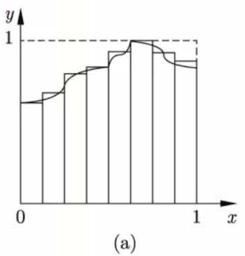

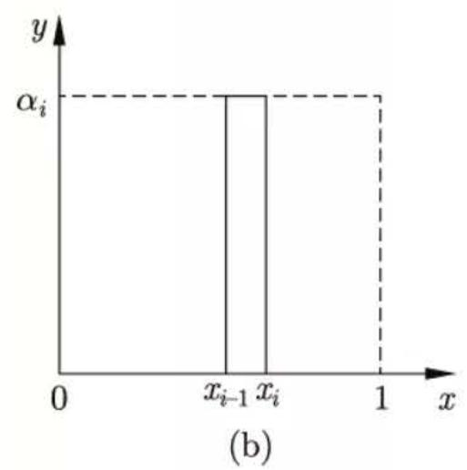  
图23.15 阶梯函数近似连续函数

如图23.15(a）所，可以阶梯函数以任意精度近似函数 $h ( x )$ 。如图23.15(b)所示，假设阶梯函数第i个分段函数是

$$
s _ { i } \left( x \right) = \left\{ \begin{array} { l l } { \alpha _ { i } , } & { x _ { i - 1 } < x \leqslant x _ { i } } \\ { 0 , } & { \sharp _ { \cdot } / \mathrm { t } \boldsymbol { \mu } } \end{array} \right.
$$

则该分段函数可以由以下层神经络近似。

$$
f _ { i } \left( x \right) = \alpha _ { i } \bullet \sigma \left( w \bullet x - x _ { i - 1 } \right) - \alpha _ { i } \bullet \sigma \left( w \bullet x - x _ { i } \right)
$$

其中隐层有两个神经元，其激活函数是S型函数，输出层是线性的。这参数 $x _ { i - 1 }$ 和 $x _ { i }$ 保证与分段函数的区间致，参数 $\alpha _ { i }$ 保证趋近分段函数，参数控制与分段函数的趋近程度。这样，阶梯函数的每分段函数 $s _ { i } \left( x \right)$ 都可以用个层神经络 $f _ { i } \left( x \right)$ 近似，函数 $h ( x )$ 整体也可以由所有 $f _ { i } \left( x \right)$ 相加得到的层神经络f(x)近似。

通近似定理叙述的是理论存在性，并不意味着现实可性。定理23.1中近似连续函数的层前馈神经络的隐层神经元的个数可能是常的，甚是指数级的，参数个数也是如此，现实中不会有够多的数据训练这样的络。经验上，当前馈神经络的层数增时，也就是变成深度神经络时，可以解决这个问题。

## 3.函数等价性

前馈神经络 $\begin{array} { r } { \boldsymbol { y } = \boldsymbol { f } ( \boldsymbol { x } ; \boldsymbol { \theta } ) } \end{array}$ 有量的等价的函数，即参数θ不同但对相同的输x产相同的输出y，且等价函数的个数是指数级的。

假设某个隐层有m个神经元，其所有参数由向量表。这层有m！个神经元的排列，每个排列决定个参数向量，因此有m！种不同的参数向量。改变神经元的排列，参数向量发变化，但神经络的输输出的映射关系不变，这时隐层有m！个等价的参数向量。

假设某个隐层有m个神经元，其所有参数由向量表，激活函数是双曲正切函数。双曲正切函数是奇函数，即满足 $\operatorname { t a n h } \left( - z \right) = - \operatorname { t a n h } ( z )$ 。若这层的某个神经元的参数以及相连的后层神经元的参数都反号，则对相同的输，神经络的输出不变。这时隐层（与后层起）有 $2 ^ { m }$ 个等价的参数向量。如果同时考虑神经元的不同排列，这个隐层共有 $m ! 2 ^ { m }$ 个等价的参数向量。

当神经络有多个隐层的时候，整体的等价函数的个数由各层的等价参数向量个数的乘积决定。

## 4.网络的深度

前馈神经络的深度指络的层数，复杂度指神经元的个数。复杂度也代表神经络的参数个数，因为参数个数与神经元个数成正。深度神经络与“浅度神经络”可以有同等的表能，但深度神经络浅度神经络有更低的复杂度。这点可以由逻辑门电路理论间接论证。

定理23.2 存在这样的布尔函数，可以由深度为k的多项式复杂度的逻辑门电路表示，等价地深度为k-1的逻辑门电路变为指数复杂度。其中深度指从输入到输出的最长路径的长度，复杂度指逻辑门的个数。

这给出定理的直观解释。假设有图23.16所的逻辑门电路，其深度是3，复杂度是9。如果根据以下关系，将AND的OR电路（可由合取范式表）转换成等价的OR的AND子电路（可由析取范式表示）：

$$
\begin{array} { c } { { ( x _ { 1 } + \bar { x } _ { 2 } ) ( \bar { x } _ { 3 } + x _ { 4 } ) ( x _ { 5 } + x _ { 6 } ) = x _ { 1 } \bar { x } _ { 3 } x _ { 5 } + x _ { 1 } \bar { x } _ { 3 } x _ { 6 } + x _ { 1 } x _ { 4 } x _ { 5 } + x _ { 1 } x _ { 4 } x _ { 6 } + } } \\ { { { } } } \\ { { \bar { x } _ { 2 } \bar { x } _ { 3 } x _ { 5 } + \bar { x } _ { 2 } \bar { x } _ { 3 } x _ { 6 } + \bar { x } _ { 2 } x _ { 4 } x _ { 5 } + \bar { x } _ { 2 } x _ { 4 } x _ { 6 } } } \end{array}
$$

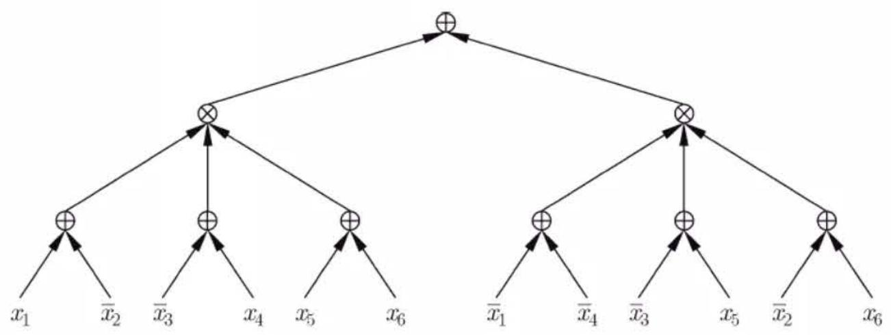  
图23.16 逻辑门电路例

那么得到图23.17所的等价的逻辑门电路，其深度是2，复杂度是17。深的逻辑门电路复杂度低，等价的浅的逻辑门电路复杂度。

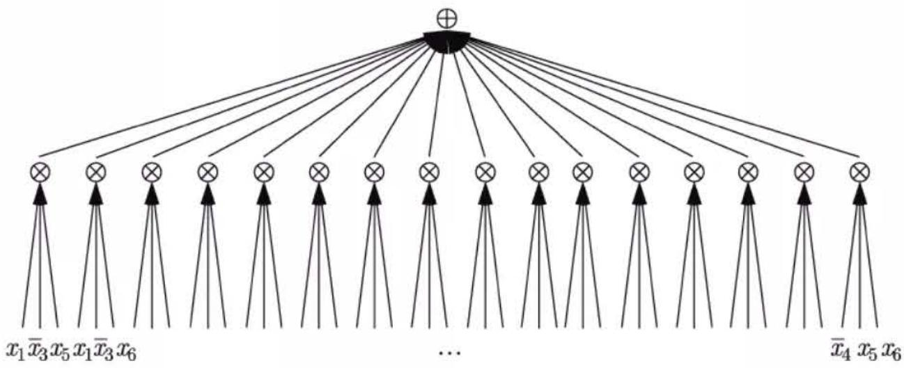  
图23.17 等价的逻辑门电路

逻辑门电路可以由前馈神经网络表。定理23.2的推论是存在这样的深度神经络，其等价的浅度神经网络的复杂度指数级地增加。所以，虽然深度神经络与浅度神经络可能有同等表能，但复杂度过的浅度神经络现实中并不可取。

在同等表能下，深度神经络浅度神经络有更少的参数。所以，只需要更少的数据就可以学到，也就是说，深度神经络有更低的样本复杂度（samplecomplexity）。这也是深度神经网络更加强大且实的原因。

## 23.2 前馈神经网络的学习算法

本节讲述前馈神经络学习算法。先给出学习问题的定义，之后介绍学习的算法，包括般的随机梯度下降法和具体的反向传播算法，以及在计算图上的实现，最后介绍学习的技巧。

## 23.2.1 前馈神经络学习

## 1.一般形式

前馈神经网络的学习和预测 $\textcircled{1}$ 是如下的监督学习问题。给定训练数据集

$$
T = \{ ( x _ { 1 } , y _ { 1 } ) , ( x _ { 2 } , y _ { 2 } ) , \cdots , ( x _ { N } , y _ { N } ) \}
$$

其中， $\left( \pmb { x } _ { i } , y _ { i } \right) , i = 1 , 2 , \cdots , N$ ，表示样本，由输 $\scriptstyle { \mathbf { x } } _ { i }$ 与输出 $y _ { i }$ 的对组成；N表示样本容量。学习个前馈神经网络模型 $f ( x ; { \hat { \theta } } )$ ，其中 $\hat { \theta }$ 是估计的神经络的参数向量。学到的模型对新的输入 $\mathbf { \mathscr { x } } _ { N + 1 }$ 给出新的输出 $y N { + 1 }$ 。

学习时通常假设神经络的架构已经确定，包括络的层数、每层的神经元数、神经元激活函数的类型。所以络的参数已确定，需要从数据中学习或估计的是参数值。

学习问题可以形式化为以下的优化问题：

$$
\hat { \pmb \theta } = \underset { \pmb \theta } { \mathrm { a r g m i n } } \left[ \sum _ { i = 1 } ^ { N } L \left( f \left( \mathbf { \boldsymbol x } _ { i } ; \pmb \theta \right) , y _ { i } \right) + \lambda \bullet \Omega ( f ) \right]\tag{23.29}
$$

其中， $L ( \cdot )$ 是损失函数， $\Omega ( \cdot )$ 是正则项， $\lambda \geqslant 0$ 是系数。当损失函数是对数损失函数、没有正则化时，问题变成极似然估计。这是前馈神经络学习的般形式。

$$
\hat { \pmb \theta } = \underset { \pmb \theta } { \operatorname { a r g m i n } } \left[ - \sum _ { i = 1 } ^ { N } \log P _ { \pmb \theta } \left( y _ { i } | \pmb x _ { i } \right) \right]\tag{23.30}
$$

这里 $P _ { \pmb { \theta } } \left( \boldsymbol { y } | \boldsymbol { x } \right)$ 表输a给定条件下输出y的条件概率，由神经络决定； $\pmb \theta$ 是神经络的参数。

## 2.具体形式

针对不同的问题，前馈神经络学习的般形式可以转化成不同的具体形式。

当问题是回归时，模型的输入是实数向量x，输出是实数值 $y _ { \circ }$ 神经网络 $f ( x ; { \pmb \theta } )$ 决定输给定条件下输出的条件概率分布 $P _ { \pmb { \theta } } \left( y | \pmb { x } \right)$ 。假设条件概率分布 $P _ { \pmb { \theta } } \left( \ b { y } | \pmb { x } \right)$ 遵循高斯分布：

$$
P _ { \pmb \theta } \left( y | \pmb x \right) \sim N ( f ( \pmb x ; \pmb \theta ) , \sigma ^ { 2 } )
$$

其中， $y \in ( - \infty , + \infty ) , \ f \left( x ; \pmb \theta \right)$ 是均值， $\sigma ^ { 2 }$ 是差。学习问题（极似然估计）变为优化问题：

$$
\hat { \theta } = \underset { \theta } { \operatorname { a r g m i n } } \left[ \frac { 1 } { 2 \sigma ^ { 2 } } \sum _ { i = 1 } ^ { N } ( y _ { i } - f ( x _ { i } ; \theta ) ) ^ { 2 } + N \log \sigma + \frac { N } { 2 } \log 2 \pi \right]\tag{23.31}
$$

假设方差 $\sigma ^ { 2 }$ 固定不变，有等价的优化问题：

$$
\hat { \pmb { \theta } } = \underset { \pmb { \theta } } { \operatorname { a r g m i n } } \sum _ { i = 1 } ^ { N } \frac { 1 } { 2 } ( y _ { i } - f \left( \pmb { x } _ { i } ; \pmb { \theta } \right) ) ^ { 2 }\tag{23.32}
$$

从另个度看，前馈神经络于回归时，使平损失（squareloss）作为损失函数，学习进行的是平损失的最化。

当问题是类分类时，模型的输是实数向量 $\mathbf { \delta x } ,$ 输出是类别 $y \in \{ 0 , 1 \}$ ，神经网络$f \left( x ; \pmb { \theta } \right)$ 决定输入给定条件下类别的条件概率分布：

$$
p = P _ { \pmb { \theta } } \left( y = 1 | \pmb { x } \right) = f ( \pmb { x } ; \pmb { \theta } )\tag{23.33}
$$

假设条件概率分布 $P _ { \pmb { \theta } } \left( y = 1 | \pmb { x } \right)$ 遵循贝努利分布，学习问题（极大似然估计）变为优化问题：

$$
\hat { \pmb { \theta } } = \underset { \pmb { \theta } } { \mathrm { a r g m i n } } \left\{ - \sum _ { i = 1 } ^ { N } [ y _ { i } \log f ( \pmb { x ; \theta } ) + ( 1 - y _ { i } ) \log ( 1 - f \left( \pmb { x ; \theta } \right) ) ] \right\}\tag{23.34}
$$

这时损失函数是交叉熵（cross entropy）损失。离散分布的交叉熵的般定义是 $- \sum _ { k = 1 } ^ { l } P _ { k } \log Q _ { k }$ ，表示经验分布和预测分布的差异，其中 $Q _ { k }$ 是预测分布的概率， $P _ { k }$ 是经验分布的概率。

当问题是多类分类时，模型的输是实数向量 $^ { x , }$ 输出是类别 $y _ { k } \in \left\{ 0 , 1 \right\} , k = 1 , 2 , \cdots , l ,$ $\sum _ { k = 1 } ^ { l } y _ { k } = 1$ ，神经络 $f \left( x ; \pmb \theta \right)$ 表输入给定条件下类别的条件概率分布:

$$
\pmb { p } = P _ { \pmb { \theta } } \left( y _ { k } = 1 | \pmb { x } \right) = \pmb { f } ( \pmb { x } ; \pmb { \theta } )\tag{23.35}
$$

假设条件概率分布 $P _ { \pmb { \theta } } \left( y _ { k } = 1 | \pmb { x } \right)$ 遵循类别分布（categoricaldistribution），学习问题变为优化问题：

$$
\hat { \theta } = \underset { \theta } { \operatorname { a r g m i n } } \left\{ - \sum _ { i = 1 } ^ { N } \left[ \sum _ { k = 1 } ^ { l } y _ { i k } \mathrm { l o g } f ( \boldsymbol { x } ; \theta ) \right] \right\}\tag{23.36}
$$

其中， $y _ { i k } \in \{ 0 , 1 \} , \sum _ { k = 1 } ^ { l } y _ { i k } = 1 , k = 1 , 2 , \cdots , l , i = 1 , 2 , \cdots , N .$ 。所以，前馈神经网络于类和多类分类时以交叉熵为损失函数，进的是交叉熵的最化。

## 23.2.2 前馈神经网络学习的优化算法

## 1.非凸优化问题

前馈神经网络学习变成给定网络架构 $f ( x ; \theta )$ 、训练数据集T的条件下，最化标函数 $L ( \theta )$ ，得到最优参数 $\hat { \pmb { \theta } }$ 的优化问题（最化问题）。

$$
\hat { \pmb { \theta } } = \underset { \pmb { \theta } } { \mathrm { a r g m i n } } L ( \pmb { \theta } ) = \underset { \pmb { \theta } } { \mathrm { a r g m i n } } \frac { 1 } { N } \sum _ { i = 1 } ^ { N } L ( \boldsymbol { f } \left( \boldsymbol { x } _ { i } ; \boldsymbol { \theta } \right) , y _ { i } )\tag{23.37}
$$

前馈神经络学习的标函数般是 $\mu$ 函数，优化问题是凸优化。从前馈神经络的等价性可以得知，个神经路通常有量等价的参数向量，所以其学习的优化问题有量等价的局部最优点（最点）。

  
图23.18 凸优化问题(见前彩图)

图23.18意了神经络的凸优化问题。参数向量是 $( \theta _ { 1 } , \theta _ { 2 } )$ ，标函数是 $L ( \theta _ { 1 } , \theta _ { 2 } )$ ,全局最点是深蓝，局部最点是浅蓝。因为标函数凸，有许多局部最点。

## 2.梯度下降法和随机梯度下降法

深度学习包括前馈神经络学习，均使迭代优化算法，包括梯度下降法（gradientdescent）和随机梯度下降法（stochasticgradientdescent），后者更为常（附录A给出梯度下降法的般介绍）。

优化标函数写作

$$
L \left( \pmb \theta \right) = \frac { 1 } { N } \sum _ { i = 1 } ^ { N } L _ { i } ( \pmb \theta ) = \frac { 1 } { N } \sum _ { i = 1 } ^ { N } L ( \pmb f \left( \pmb x _ { i } ; \pmb \theta \right) , y _ { i } )\tag{23.38}
$$

其中， $L _ { i } ( \pmb { \theta } )$ 是第 $i$ 个样本的损失函数。

梯度下降法先随机初始化参数向量 $\theta ;$ 之后针对所有样本，通过以下公式更新参数向量 $\theta ;$ 不断迭代，直到收敛为止。

$$
\pmb \theta \gets \pmb \theta - \eta \frac { \partial L ( \pmb \theta ) } { \partial \pmb \theta }\tag{23.39}
$$

或写作

$$
\theta \gets \theta - \eta \frac { 1 } { N } \sum _ { i = 1 } ^ { N } \frac { \partial L _ { i } ( \theta ) } { \partial \theta }\tag{23.40}
$$

其中， $\eta > 0$ 是学习率， $\frac { \partial L ( \pmb \theta ) } { \partial \pmb \theta }$ 是所有样本的损失函数的梯度向量， $\frac { \partial L _ { i } ( \pmb \theta ) } { \partial \pmb \theta }$ 是第i个样本的损失函数的梯度向量。算法23.1给出梯度下降的具体算法。

梯度下降的基本想法如下。由于负梯度向 $- \frac { \partial L ( \pmb { \theta } ) } { \partial \pmb { \theta } }$ 是使函数值下降的向，所以每一次迭代以负梯度更新参数向量θ的值，从达到减少函数值 $L ( \theta )$ 的目的。函数极小值满足$\nabla L \left( \pmb { \theta } \right) = \pmb { \theta }$ 。在迭代过程中，梯度向量趋近0向量，参数向量θ也趋近极点。学习率控制参数更新的幅度。学习率的需要适当，学习率过，参数向量每次更新的幅度会过，迭代的次数会增加；学习率过，参数向量每次更新的幅度会过，产振荡，迭代的次数也会增加。图23.18显梯度下降的过程。

算法23.1（梯度下降法）

输入：网络架构 $f ( x ; \pmb \theta )$ ，训练数据集 $\tau$ 。

输出：神经网络参数向量 $\hat { \pmb { \theta } }$

超参数：学习率 $\eta .$

1.随机初始化参数向量 $\pmb \theta$

2. Do while(θ 不收敛){

针对所有样本，按照以下公式，更新参数向量θ

$$
\pmb \theta \gets \pmb \theta - \eta \frac { \partial L ( \pmb \theta ) } { \partial \pmb \theta }
$$

3.返回学习到的参数向量 $\hat { \pmb { \theta } } _ { \circ }$

梯度下降于深度学习（般的机器学习）有两个缺点。每次迭代需要计算针对所有样本的梯度向量，计算效率不；得到的解可能是局部最优，不能保证是全局最优。随机梯度下

降能很好地解决这两个问题。

随机梯度下降法先随机打乱样本顺序，将样本分成m个组（批量），每组有n个样本（假设 $m = \lfloor N / n \rfloor )$ ；接着随机初始化参数向量；之后针对每组样本，通过以下公式更新参数向量，并遍历所有样本组；不断迭代，直到收敛为。

$$
\theta \gets \theta - \eta \frac { 1 } { n } \sum _ { j = 1 } ^ { n } \frac { \partial L _ { j } ( \theta ) } { \partial \theta }\tag{23.41}
$$

其中， $\eta > 0$ 是学习率， $\frac { \partial L _ { j } ( \pmb { \theta } ) } { \partial \pmb { \theta } }$ 是个组中的第个样本的损失函数的梯度向量。算法23.2给出随机梯度下降的具体算法。当n是1时，每次参数更新只使个样本，是种特殊的随机梯度下降。当n是整体样本容量N时，随机梯度下降变为梯度下降（当前深度学习采的Adam等优化算法，在随机梯度下降的迭代过程中，适应地调整梯度向量。第29章对Adam等算法予以介绍）。

算法23.2（随机梯度下降法）

输入：网络架构 $f ( x ; \pmb \theta )$ ，训练数据集 $\tau$

输出：神经络参数向量 $\hat { \pmb { \theta } } _ { }$

超参数：学习率 $\eta ,$ ，批量样本容量 $_ n$ 0

1.随机打乱样本顺序，将样本分成m个组，每组有n个样本；

2.随机初始化参数向量 $\pmb { \theta }$

3. Do while(θ 不收敛){

$$
\mathrm { F o r } \ ( i = 1 , 2 , \cdots , m ) \ \left\{ \begin{array} { r l } \end{array} \right.
$$

针对第i个组的n个样本，按照以下公式，更新参数向量 $\pmb \theta$

$$
\theta \gets \theta - \eta \frac { 1 } { n } \sum _ { j = 1 } ^ { n } \frac { \partial L _ { j } ( \theta ) } { \partial \theta }
$$

4.返回学习到的参数向量 $\hat { \pmb { \theta } } _ { \mathrm { c } }$

随机梯度下降可以进分布式并计算，进步提学习效率，特别是当训练数据量时常有效。具体地，每组样本分配到不同的作服务器（worker）上，各台作服务器基于的数据并更新参数向量，参数服务器（parameter server）再将所有作服务器的参数更新结果汇总求平均，得到轮的训练结果。

## 23.2.3 反向传播算法

基于梯度下降或随机梯度下降的学习算法的核是针对给定样本，计算损失函数对神经网络所有参数的梯度 $\frac { \partial L } { \partial \pmb { \theta } }$ ，更新神经络的所有参数θ。反向传播（backpropagation）算法也称为误差反向传播（errorbackpropagation）算法，提供了个效的梯度计算以及参数更新法。只需要依照络结构进次正向传播（forwardpropagation）和次反向传播（backwardpropagation），就可以完成梯度下降的次迭代。在梯度下降的每步，参数已在前步更新，正向传播旨在基于当前的参数重新计算神经络所有变量（如，神经元的输出），反向传播旨在基于当前的变量重新计算损失函数对所有参数的梯度，这样就可以根据梯度下降公式(23.40)和公式(23.41)更新神经络的所有参数。

考虑个s层神经络（见图23.19）。其中第t层（隐层）的神经元定义如下：

$$
h _ { j } ^ { ( t ) } = a \left( z _ { j } ^ { ( t ) } \right) , \quad j = 1 , 2 , \cdots , m\tag{23.42}
$$

$$
z _ { j } ^ { ( t ) } = \sum _ { i = 1 } ^ { n } w _ { j i } ^ { ( t ) } h _ { i } ^ { ( t - 1 ) } + b _ { j } ^ { ( t ) }\tag{23.43}
$$

第t+1层（隐层）的神经元定义如下：

$$
h _ { k } ^ { ( t + 1 ) } = a \left( z _ { k } ^ { ( t + 1 ) } \right) , \quad k = 1 , 2 , \cdots , l\tag{23.44}
$$

$$
z _ { k } ^ { ( t + 1 ) } = \sum _ { j = 1 } ^ { m } w _ { k j } ^ { ( t + 1 ) } h _ { j } ^ { ( t ) } + b _ { k } ^ { ( t + 1 ) }\tag{23.45}
$$

梯度下降需要计算损失函数对所有参数的梯度。损失函数对第t层的权重和偏置的梯度分别是 $\frac { \partial L } { \partial w _ { j i } ^ { ( t ) } }$ 和 $\frac { \partial L } { \partial b _ { j } ^ { ( t ) } }$ 。根据链式规则，可以分别展开：

$$
\frac { \partial L } { \partial w _ { j i } ^ { ( t ) } } = \frac { \partial L } { \partial z _ { j } ^ { ( t ) } } \frac { \partial z _ { j } ^ { ( t ) } } { \partial w _ { j i } ^ { ( t ) } }\tag{23.46}
$$

$$
\frac { \partial L } { \partial b _ { j } ^ { ( t ) } } = \frac { \partial L } { \partial z _ { j } ^ { ( t ) } } \frac { \partial z _ { j } ^ { ( t ) } } { \partial b _ { j } ^ { ( t ) } }\tag{23.47}
$$

考虑损失函数对第t层的净输 $z _ { j } ^ { ( t ) }$ 的梯度：

$$
\delta _ { j } ^ { ( t ) } = \frac { \partial L } { \partial z _ { j } ^ { ( t ) } } , \quad j = 1 , 2 , \cdots , m\tag{23.48}
$$

称为在第t层的“误差”。求解式(23.46)和式(23.47)，并代式(24.48)，得到：

$$
\frac { \partial L } { \partial w _ { j i } ^ { ( t ) } } = \delta _ { j } ^ { ( t ) } h _ { i } ^ { ( t - 1 ) }\tag{23.49}
$$

$$
\frac { \partial L } { \partial b _ { j } ^ { ( t ) } } = \delta _ { j } ^ { ( t ) }\tag{23.50}
$$

其中， $h _ { i } ^ { ( t - 1 ) }$ 是t1层的输出，从正向传播得到； $\delta _ { j } ^ { ( t ) }$ 是第t层的误差，从反向传播得到。所以，可以根据式(23.49)和式(23.50)计算对第t层的权重与偏置的梯度。

正向传播是指输从输层到输出层的信号传递。给定神经络参数，根据神经络的函数计算。反向传播是指“误差”从输出层到输层的传递。给定神经络参数，以及正向传

播的结果，通过以下方法计算。

对于第t层的误差 $\delta _ { j } ^ { ( t ) }$ ，根据链式规则展开：

$$
\delta _ { j } ^ { ( t ) } = \frac { \partial L } { \partial z _ { j } ^ { ( t ) } } = \sum _ { k = 1 } ^ { l } \frac { \partial L } { \partial z _ { k } ^ { ( t + 1 ) } } \frac { \partial z _ { k } ^ { ( t + 1 ) } } { \partial z _ { j } ^ { ( t ) } } , \quad j = 1 , 2 , \cdots , m\tag{23.51}
$$

求解得到：

$$
\delta _ { j } ^ { ( t ) } = \frac { \mathrm { d } a } { \mathrm { d } z _ { j } ^ { ( t ) } } \sum _ { k = 1 } ^ { l } w _ { k j } ^ { ( t + 1 ) } \delta _ { k } ^ { ( t + 1 ) }\tag{23.52}
$$

这里 $\delta _ { k } ^ { ( t + 1 ) }$ 是第t+1层的误差， $w _ { k j } ^ { ( t + 1 ) }$ 是第t+1层的权重， $\frac { \mathrm { d } a } { \mathrm { d } z _ { j } ^ { ( t ) } }$ 是第t层的激活函数的导数。也就是说可以根据式(23.52)，从第t1层的误差 $\delta _ { k } ^ { ( t + 1 ) }$ 计算第t层的误差 $\delta _ { j } ^ { ( t ) }$

第。层（输出层）的误差通过以下法计算。般形式是

$$
\delta _ { k } ^ { ( s ) } = \frac { \partial L } { \partial z _ { k } ^ { ( s ) } } , \quad k = 1 , 2 , \cdots , l\tag{23.53}
$$

求解得到：

$$
\delta _ { k } ^ { ( s ) } = \frac { \mathrm { d } g } { \mathrm { d } z _ { k } ^ { ( s ) } } \frac { \partial L } { \partial h _ { k } ^ { ( s ) } } , \quad k = 1 , 2 , \cdots , l\tag{23.54}
$$

这里 $\frac { \partial L } { \partial h _ { k } ^ { ( s ) } }$ 是损失函数对输出的梯度， $\frac { \mathrm { d } g } { \mathrm { d } z _ { k } ^ { ( s ) } }$ 是第s层的激活函数的导数。注意第s层的输出表示为 $h ^ { ( s ) }$ 。

回归时，输层只有个神经元，有个输出取实数值。损失函数是平损失 ${ \frac { 1 } { 2 } } ( h ^ { ( s ) } -$ $y ) ^ { 2 }$ ，激活函数是恒等函数 $g \left( z \right) = z$ ，这时误差是

$$
\delta ^ { ( s ) } = h ^ { ( s ) } - y\tag{23.55}
$$

表第s层的输出 $h ^ { ( s ) }$ 与训练样本输出y的差。

多类分类（包含类分类）时，输出层只有个神经元，有1个输出表1个类别的概率。损失函数是交叉熵损失 $- \sum _ { k = 1 } ^ { l } y _ { k } \log h _ { k } ^ { ( s ) }$ ，激活函数是软最化函数 $g \left( z \right) = \frac { \mathrm { e } ^ { z } } { \displaystyle \sum _ { z ^ { \prime } } \mathrm { e } ^ { z ^ { \prime } } }$ ，这时误差是(推导见附录F)

$$
\delta _ { k } ^ { ( s ) } = h _ { k } ^ { ( s ) } - y _ { k } , \quad k = 1 , 2 , \cdots , l\tag{23.56}
$$

表第s层的输出 $h _ { k } ^ { ( s ) }$ 与训练样本输出 $y _ { k }$ 的差。

可以看出论是回归还是分类，由于特殊的激活函数与损失函数的使，使得 $\delta ^ { ( s ) }$ 表示预测与真实值的差。这也是损失函数对净输₂的梯度 $\frac { \partial L } { \partial z }$ 被称为误差的原因。

图23.19显在第t层的正向传播和反向传播。先，第t–1层的输出通过络正向传播到第t层，根据式(23.42)和式(23.43)计算出第t层的输出，于后各层的正向传播，这时使第t-1层到第t层的权重和偏置。接着，第t＋1层的误差通过络反向传播到第t层，根据式(23.52)计算出第t层的误差，于这层和前各层的反向传播，这时使第t层到第t+1层的权重。然后，根据式(23.49)和式(23.50)计算对第t层的权重和偏置的梯度，这时使第t-1层的输出和第t层的误差。最后，根据梯度下降公式更新第t层的权重和偏置。正向传播和反向传播都递归地进，先进正向传播，然后进反向传播。正向传播从输层的计算开始，反向传播从输出层的误差计算开始。

  
图23.19 在神经元 ${ h } _ { j } ^ { ( t ) }$ 的正向传播与反向传播

算法23.3是前馈神经络的反向传播算法的次迭代算法。不失般性，假设是基于个样本的随机梯度下降（批量样本容量为1）。这使神经络的矩阵表，其中是向量的逐元素积（element-wise product）或阿达玛积（Hadamard product）。①

算法23.3 （前馈神经网络的反向传播算法）

输：神经络 $f ( x ; \theta )$ ，参数向量θ，个样本 $( x , y )$ 。

输出：更新的参数向量 $\pmb { \theta }$

超参数：学习率 $\eta .$

{

1.正向传播，得到各层输出 ${ { h } ^ { ( 1 ) } } , { { h } ^ { ( 2 ) } } , \cdots , { { h } ^ { ( s ) } }$

$$
{ h ^ { ( 0 ) } = x }
$$

For $t = 1 , 2 , \cdots , s , \mathrm { d o } \{$

$$
z ^ { ( t ) } = W ^ { ( t ) } h ^ { ( t - 1 ) } + b ^ { ( t ) }
$$

$$
h ^ { ( t ) } = a ( z ^ { ( t ) } )
$$

}

$$
f ( { \boldsymbol { \mathbf { \mathit { x } } } } ) = h ^ { ( s ) }
$$

2.反向传播，得到各层误差 $\delta ^ { ( s ) } , \cdots , \delta ^ { ( 2 ) } , \delta ^ { ( 1 ) }$ ，同时计算各层的梯度，更新各层的参数。计算输出层的误差

$$
\delta ^ { ( s ) } = h ^ { ( s ) } - y
$$

For $t = s , \cdots , 2 , 1 , \mathrm { d o } \{$

计算第t层的梯度

$$
\nabla _ { W ^ { ( t ) } } L = \boldsymbol \delta ^ { ( t ) } \cdot \boldsymbol h ^ { ( t - 1 ) ^ { \mathrm { T } } }
$$

$$
\nabla _ { \pmb { b } ^ { ( t ) } } L = \pmb { \delta } ^ { ( t ) }
$$

根据梯度下降公式更新第t层的参数

$$
\mathbf { } W ^ { ( t ) } \gets W ^ { ( t ) } - \eta \nabla _ { W ^ { ( t ) } } L
$$

$$
\boldsymbol { b } ^ { ( t ) } \gets \boldsymbol { b } ^ { ( t ) } - \eta \nabla _ { b ^ { ( t ) } } L
$$

If (t > 1) {

将第t层的误差传到第t-1层

$$
\delta ^ { ( t - 1 ) } = \frac { \partial a } { \partial z ^ { ( t - 1 ) } } \odot \left( W ^ { ( t ) ^ { \mathrm { T } } } \bullet \delta ^ { ( t ) } \right)
$$

3.返回更新的参数向量

## 23.2.4 在计算图上的实现

计算图（computationgraph）是表函数计算过程的有向环图，其结点表变量，有向边表变量（输变量和输出变量）之间的函数依存关系。每个起点的结点对应个基本函数，如加减乘除运算。图整体对应的是由基本函数组成的复合函数。计算图上的计算有正向传播和反向传播。

正向传播是从起点的输入（数值、向量、矩阵或张量）开始，顺着有向边，依次对结点的基本函数进计算，直到得到终点的输出（数值、向量、矩阵或张量）的过程。这个过程可以看作是信号在图上的正向传播，在各个结点对信号进了转换。

反向传播是从终点的梯度（数值、向量、矩阵或张量）开始，逆着有向边，依次对结点的梯度进运算，直到得到起点的梯度（数值、向量、矩阵或张量）的过程，这一个结点的梯度是指图整体函数对该结点变量的梯度。梯度计算使链式规则。这个过程可以看作是梯度在图上的反向传播，在各个结点对梯度进了展开。

链式法则是复合函数的求导法则，即个复合函数的导数可以由构成这个复合函数的各个函数的导数表。元复合函数 $y = f \left( z \right) , z = g ( x )$ 的导数是

$$
{ \frac { \mathrm { d } y } { \mathrm { d } x } } = { \frac { \mathrm { d } y } { \mathrm { d } z } } { \frac { \mathrm { d } z } { \mathrm { d } x } }
$$

多元复合函数 $y = f ( z ) , z = g ( x )$ 的导数是

$$
\frac { \partial y } { \partial x _ { i } } = \sum _ { j } \frac { \partial y } { \partial z _ { j } } \frac { \partial z _ { j } } { \partial x _ { i } }
$$

前馈神经络学习的随机梯度下降法和梯度下降法可以在计算图上实现。整个图对应的是包含神经络函数的损失函数。计算图基本函数（如加减乘除）的组合来表这个复杂的损失函数，通常是个很的图。计算图上的正向传播和反向传播可以实现随机梯度下降和梯度下降，其中正向传播实现的是损失函数的计算，反向传播实现的是损失函数的梯度函数的计算。

下通过具体例来说明计算图的原理。图23.20是个含有乘法运算的计算图例，上图显正向传播，下图显反向传播。起点x,w是输变量，终点是输出变量，中间结点u是中间变量。变量u由乘法运算 $u = w \cdot x$ 决定，变量由函数 $L = l ( u )$ 决定。计算图整体表示的是复合函数 $L = l \left( w \cdot x \right)$ 。在计算图上的正向传播就是计算复合函数 $L = l \left( w \cdot x \right)$ 的过程。从起点 $x , w$ 开始，顺着有向边，在结点 $u , L$ 依次进行计算，先后得到函数值 $u , L ;$ 其中先将x和w相乘得到u，然后对u计算 $l ( u )$ 得到。反向传播就是计算复合函数 $L = l \left( w \cdot x \right)$ 对变量的梯度的过程。从终点开始，逆着有向边，在结点 $u , x , w$ 依次进行计算，先后得到梯度 $\frac { \mathrm { d } L } { \mathrm { d } u } , \frac { \mathrm { d } L } { \mathrm { d } x } , \frac { \mathrm { d } L } { \mathrm { d } w }$ ；其中先根据定义计算 $\frac { \mathrm { d } L } { \mathrm { d } u }$ ，再利链式规则计算 ${ \frac { \mathrm { d } L } { \mathrm { d } x } } , { \frac { \mathrm { d } L } { \mathrm { d } w } } ;$

$$
{ \frac { \mathrm { d } L } { \mathrm { d } w } } = { \frac { \mathrm { d } L } { \mathrm { d } u } } \cdot { \frac { \mathrm { d } u } { \mathrm { d } w } } = { \frac { \mathrm { d } L } { \mathrm { d } u } } \cdot x
$$

$$
{ \frac { \mathrm { d } L } { \mathrm { d } x } } = { \frac { \mathrm { d } L } { \mathrm { d } u } } \cdot { \frac { \mathrm { d } u } { \mathrm { d } x } } = { \frac { \mathrm { d } L } { \mathrm { d } u } } \cdot w
$$

梯度在乘法结点u的反向传播呈现“翻转”现象，正向传播是x时，反向传播是梯度的w倍，正向传播是ω时，反向传播是梯度的x倍。


  
图23.20 计算图例：乘法

图23.21是个含有加法运算的计算图例。起点u,b是输变量，终点是输出变量，中间结点₂是中间变量。变量₂由加法运算 $z = u + b$ 决定，变量由函数 $L = l ( z )$ 决定。计算图整体表的是复合函数 $L = l \left( u + b \right)$ 。在计算图上的正向传播就是计算复合函数$L = l \left( u + b \right)$ 的过程。从起点 $u , b$ 开始，顺着有向边，在结点 $z , L$ 依次进行计算，先后得到函数值 $z , L ;$ 其中先将u和b相加得到z，然后对z计算 $l ( z )$ 得到 $L _ { \circ }$ 反向传播就是计算复合函数 $L = l \left( u + b \right)$ 对变量的梯度的过程。从终点开始，逆着有向边，在结点 $z , u , b$ 依次进行计算，先后得到梯度 $\frac { \mathrm { d } L } { \mathrm { d } z } , \frac { \mathrm { d } L } { \mathrm { d } u } , \frac { \mathrm { d } L } { d b }$ ；其中先根据定义计算 $\frac { \mathrm { d } L } { \mathrm { d } z }$ ，再利链式规则计算 ${ \frac { \mathrm { d } L } { \mathrm { d } u } } , { \frac { \mathrm { d } L } { \mathrm { d } b } }$

$$
{ \frac { \mathrm { d } L } { \mathrm { d } u } } = { \frac { \mathrm { d } L } { \mathrm { d } z } } \cdot { \frac { \mathrm { d } z } { d u } } = { \frac { \mathrm { d } L } { \mathrm { d } z } } \cdot 1
$$

$$
{ \frac { \mathrm { d } L } { \mathrm { d } b } } = { \frac { \mathrm { d } L } { \mathrm { d } z } } \cdot { \frac { \mathrm { d } z } { \mathrm { d } b } } = { \frac { \mathrm { d } L } { \mathrm { d } z } } \cdot 1
$$

梯度 $\frac { \mathrm { d } L } { \mathrm { d } z }$ 在加法结点₂的反向传播保持不变传到输结点 $u , b ,$


  
图23.21 计算图例：加法

图23.22给出含有S型函数的计算图例。起点 $z , y$ 是输入变量，终点是输出变量，中间结点f是中间变量。变量f由S型函数 $f = \sigma ( z )$ 决定，变量由损失函数 $L = l \left( f , y \right)$ 决定。计算图整体表示的是复合函数 $L = l \left( \sigma ( z ) , y \right)$ 。在计算图上进的正向传播就是计算复合函数 $L = l \left( \sigma ( z ) , y \right)$ 的过程。从起点z,y开始，顺着有向边，在结点 $f , L$ 依次进行计算，先后得到函数值 $f , L$ ；其中先对z计算 $f ( z )$ 得到f，然后对f和y计算 $l ( f , y )$ 得到 $L _ { \circ }$ 反向传播就是计算复合函数 $L = l \left( \sigma ( z ) , y \right)$ 对变量的梯度的过程。从终结点出发，逆着有向边，在结点 $y , f , z$ 依次进行，先后得到梯度 ${ \frac { \mathrm { d } L } { \mathrm { d } y } } , { \frac { \mathrm { d } L } { \mathrm { d } f } } , { \frac { \mathrm { d } L } { \mathrm { d } z } } ;$ ；其中先根据定义计算 ${ \frac { \mathrm { d } L } { \mathrm { d } y } } , { \frac { \mathrm { d } L } { \mathrm { d } f } }$ ，再利用链式规则计算 $\frac { \mathrm { d } L } { \mathrm { d } z }$ :


  
反向传播  
图23.22 计算图例：S型函数

$$
{ \frac { \mathrm { d } L } { \mathrm { d } z } } = { \frac { \mathrm { d } L } { \mathrm { d } f } } \cdot { \frac { \mathrm { d } f } { \mathrm { d } z } } = { \frac { \mathrm { d } L } { \mathrm { d } f } } \cdot f ( 1 - f )
$$

梯度 $\frac { \mathrm { d } L } { \mathrm { d } f }$ 在结点f的反向传播变为梯度的f(1f)倍，传到输结点z。

考虑层前馈神经络的学习，神经络函数和损失函数分别是

$$
\begin{array} { c } { \pmb { f } = \pmb { \sigma } \left( \pmb { W } \cdot \pmb { x } + \pmb { b } \right) } \\ { \pmb { L } = l \left( \pmb { f } , \pmb { y } \right) } \end{array}
$$

其中，x和y构成个训练样本，表输向量和（真值）输出向量；f是神经络的输出向量；W和b是权重矩阵和偏置向量； $l ( \cdot , \cdot )$ 是损失函数。图23.23的计算图显针对这个学习的正向传播和反向传播的过程。图上的结点表神经络函数和损失函数中的变量。事实上这个计算图是由图23.20\~图23.22的计算图组合扩展得到的，其中变量从元扩展到多元。注意，在每个结点正向传播和反向传播的向量的维度是相同的，因为正向传播的是结点的变量（向量），反向传播的是整体损失函数对结点变量（向量）的梯度向量。学习的过程中只有参数变量W和b在更新，训练数据变量x和y保持不变。可以看出，在计算图上的正向传播和反向传播可以实现神经网络学习的梯度下降法。

  
图23.23 计算图例：层神经络的学习

这表向量的逐元素积

图23.24所的是同个前馈神经络的批量学习的计算图。前向传播计算针对批

量训练样本的神经网络的损失，反向传播计算针对批量训练样本的损失函数的梯度。

$$
\pmb { F } = \sigma \left( \pmb { W } \cdot \pmb { X } + \pmb { B } \right)
$$

$$
L = l \left( F , Y \right)
$$

其中，X和Y构成个批量训练样本集，表多个样本的输矩阵和（真值）输出矩阵；F是多个样本的神经络的输出矩阵；W和B是神经络的权重矩阵和偏置矩阵；l(·，·）是损失函数。

  
图23.24 计算图例：层神经络的批量学习

这表矩阵的逐元素积

前馈神经络上的正向和反向传播算法（算法23.3）及计算图上的正向和反向传播算法基于相同的基本原理，但具有不同的形式。

## 23.2.5 算法的实现技巧

深度神经络学习是个复杂的凸优化问题，会产些优化上的困难。这介绍梯度消失和爆炸及其解决法、内部协变量偏移及其解决法：批量归化和层归化。

## 1.梯度消失与梯度爆炸

深度神经络学习中有时会出现梯度消失(vanishing gradient）或者梯度爆炸(explodinggradient）现象。使反向传播算法（算法23.3）时，先通过正向传播计算神经络各层的输出，然后通过反向传播计算神经络各层的误差以及梯度，接着利梯度下降公式对神经络各层的参数进更新。在这个过程中，各层的梯度，特别是前层的梯度，有时会接近0（梯度消失）或接近穷（梯度爆炸）。梯度消失会导致参数更新停，梯度爆炸会导致参数溢出，都会使学习无法有效地进。

反向传播中，先计算误差向量：

$$
\delta ^ { ( t - 1 ) } = \left\{ \operatorname { d i a g } \left( { \frac { \partial a } { \partial z ^ { ( t - 1 ) } } } \right) \cdot W ^ { ( t ) ^ { \mathrm { T } } } \right\} \bullet \delta ^ { ( t ) }\tag{23.57}
$$

之后计算梯度：

$$
\left\{ \begin{array} { c } { \nabla _ { W ^ { ( t ) } } L = \delta ^ { ( t ) } \cdot \boldsymbol { h } ^ { ( t - 1 ) ^ { \mathrm { T } } } } \\ { \nabla _ { b ^ { ( t ) } } L = \delta ^ { ( t ) } } \end{array} \right.\tag{23.58}
$$

造成梯度消失和梯度爆炸的原因有两种。首先，每一层的误差向量实际由矩阵的连乘决定，连乘得到的矩阵的元素可能会接近0，也可能会接近无穷，导致梯度的元素也会接近0或接近穷，且越是前的层这个问题就越严重。考虑种特殊情况：假设每层的误差向量都与同个矩阵U相乘。第t1层有

$$
\delta ^ { ( t - 1 ) } = U \cdot \delta ^ { ( t ) }
$$

这样第t1层的误差向量 $\delta ^ { ( t - 1 ) }$ 由矩阵 $U ^ { q }$ 决定，设 $q = s - t , \ s$ 是络的层数。假设U的特征值分解存在， $U = V \cdot \mathrm { d i a g } ( \lambda ) \cdot V ^ { - 1 }$ ，其中入表特征值，V表特征向量，则有$U ^ { q } = V \cdot \mathrm { d i a g } ( \lambda ) ^ { q } \cdot V ^ { - 1 }$ 成，对矩阵由特征值的q次组成。对于任意个特征值 $\lambda _ { i }$ 如果其绝对值于1，那么其 $q$ 次方 $\lambda _ { i } ^ { q }$ 会接近 $0 { ; }$ 如果其绝对值于1，那么其q次 $\lambda _ { i } ^ { q }$ 会接近无穷。结果是第t-1层的梯度会消失或爆炸。其次，得到每一层的误差向量之前每个元素乘以激活函数的导数，如果激活函数的导数过，也容易引起梯度消失，且越是前的层，这个问题就会越严重。在第t1层得到误差向量 $\delta ^ { ( t - 1 ) }$ 之前，各元素乘以 $\frac { \partial a } { \partial z ^ { ( t - 1 ) } }$ ,如果 $\frac { \partial a } { \partial z ^ { ( t - 1 ) } }$ 接近0，就会让 $\delta ^ { ( t - 1 ) }$ 的元素也接近 $0 .$

有些防梯度消失和梯度爆炸的技巧。如，进恰当的随机参数初始化，个经验性的法是对每个神经元的权重 ${ \pmb w } = ( w _ { 1 } , w _ { 2 } , \cdots , w _ { n } ) ^ { \mathrm { T } }$ 根据正态分布 $\mathcal { N } \left( 0 , \frac { 1 } { n } \right)$ 随机取值。再如，使整流线性函数作为激活函数，不是S型函数或双曲正切函数，也可以一定程度上防梯度消失，因为整流线性函数只是左饱和函数不是（两边的）饱和函数。使特定的络架构，避免反向传播时只依赖于矩阵连乘，如第24章介绍的残差络（ResNet）和第25章介绍的LSTM模型，可以更好地避免梯度消失和梯度爆炸问题的发。

其他神经络的学习，如卷积神经络（CNN）、循环神经络（RNN），也会出现梯度消失或梯度下降的问题（详见第24章和第25章）。

## 2.批量归化

批量归化（batchnormalization）是对前馈神经络的每层（除输出层外）的净输或输在每个批量的样本上进归化，在其基础上训练神经络的法[9]。这个法将特征尺度变换（featurescaling transform）应到神经络学习，本质上改变了神经络的结构。主要作是防内部协变量偏移（internalcovariate shift），加快学习收敛速度；也可以在定程度上防梯度消失和梯度爆炸。

机器学习包括深度学习存在个普遍现象：如果将输向量的每维的数值进归化，使其在定范围之内，如0和1之间，那么就可以加快基于梯度下降的学习的收敛速度。其原因是：梯度下降以相同的学习率对每维进最化，如果取值范围差异很，学习就很难在各个维度上同时收敛；如果将学习率取的很，可以避免这个问题，但学习效率会降低。归化可以解决这个问题，称为特征尺度变换。

在深度神经络的学习过程中，对于神经络中间的每层，其前层的参数在学习中会不断改变，导致其输也不断改变，不利于这层及其后层的学习，学习收敛速度会变慢。这种现象在神经络的各层都会发，称作内部协变量偏移。假设第t层的神经络函数是 $h ^ { ( t ) } = f ^ { ( t ) } ( h ^ { ( t - 1 ) } )$ ，第t-1层的神经络函数是 $h ^ { ( t - 1 ) } = f ^ { ( t - 1 ) } ( h ^ { ( t - 2 ) } )$ 。如果要学习第t层及其后层的参数，输 $\mathbf { \nabla } _ { h } ( t - 1 )$ 相对比较固定为好，但 $\mathbf { \nabla } _ { h } ( t - 1 )$ 依赖于第t-1层及其前层的参数，在学习中会动态变化，导致第t层及其后层的学习不容易收敛。批量归化通过在每个批量的样本上的归化来解决这个问题。

原理上在每层对输x和净输z都可以进归化（两者的关系是 $z = W ^ { \mathrm { T } } \cdot x +$ b)。现实中对净输z效果略好，也更常。这只介绍对净输的批量归化。

批量归化训练时，针对每批量数据，按照以下法扩展神经络。假设批量数据在当前层的净输入是 $\{ z _ { 1 } , z _ { 2 } , \cdots , z _ { n } \}$ ，其中 $z _ { j }$ 是第 $j$ 个样本的净输，n是批量。先计算当前层的净输的均值与差（偏估计）。

$$
\mu = { \frac { 1 } { n } } \sum _ { j = 1 } ^ { n } z _ { j }\tag{23.59}
$$

$$
\sigma ^ { 2 } = \frac { 1 } { n - 1 } \sum _ { j = 1 } ^ { n } ( z _ { j } - \mu ) ^ { 2 }\tag{23.60}
$$

这里 $\pmb { \mu }$ 和 $\sigma ^ { 2 }$ 分别是均值向量和差向量。然后对每个样本的净输进归化，得到向量

$$
\bar { z } _ { j } = \frac { z _ { j } - \mu } { \sqrt { \sigma ^ { 2 } + \epsilon } } , \quad j = 1 , 2 , \cdot \cdot \cdot , n\tag{23.61}
$$

这里 $\epsilon$ 是每个元素都是ε的向量，保证分母不为0，其中ε是个很的正数，向量的除法是元素商。之后再进仿射变换，得到向量

$$
\tilde { z } _ { j } = \gamma \odot \tilde { z } _ { j } + \beta , \quad j = 1 , 2 , \cdots , n\tag{23.62}
$$

这里 $\gamma$ 和 $\beta$ 是参数向量， $\odot$ 是向量的逐元素积。最后将归化加仿射变换的结果作为批量数据在这层的净输。

图23.25显批量归化训练络层的结构，是在神经络层对每个批量的样本的归化。对于每个批量，每层（除输出层外）都有同样的结构。注意：每个批量在每层有各的均值 $\pmb { \mu }$ 和方差 $\sigma ^ { 2 }$ ，当输样本和络参数确定时， $\pmb { \mu }$ 和 $\sigma ^ { 2 }$ 就确定。另一方面，每层有各的参数 $\gamma$ 和 $\beta$ ，归所有批量共有。神经络原始的参数 $\pmb \theta$ 也是所有批量共有。

训练时，对神经络每层的净输进归化，使净输的均值是0、差是1。这样可以提高下一层的学习收敛速度。

  
图23.25 批量归化：训练络结构

$\gamma \approx \sigma$ 且 $\beta \approx \mu$ 时,有

$$
\tilde { z } _ { j } \approx z _ { j } , \quad j = 1 , 2 , \cdots , n
$$

归化加仿射变换接近恒等变换。批量归化法保证这种“不做变换”情况也被包括在内。具体进怎样的变换通过数据决定。事实上，归化后的净输在原点附近时，S型函数的输出也在原点附近，模型的表能降低，从学习的度看未必最优，需要基于数据进选择。

另外，每层的输到净输的仿射变换实际根据 $z = W ^ { \mathrm { T } }$ •x进，省去偏置b，因为参数 $\beta$ 能起到相应的作用。

预测时，通常将个测试样本输到推理络。先对样本在每层的净输进归化，得到向量：

$$
\bar { z } _ { j } = \frac { z _ { j } - E _ { b } ( \mu ) } { \sqrt { E _ { b } ( \sigma ^ { 2 } ) + \epsilon } } , \quad j = 1 , 2 , \cdots , n\tag{23.63}
$$

这里 $E _ { b } ( \mu )$ 和 $E _ { b } ( \sigma ^ { 2 } )$ 分别是所有批量的均值和差的平均。然后再进仿射变换，得到向量：

$$
\tilde { z } _ { j } = \gamma \odot \bar { z } _ { i } + \beta , \quad j = 1 , 2 , \cdots , n\tag{23.64}
$$

这里 $\gamma$ 和 $\beta$ 是训练过程中得到的参数向量。图23.26显批量归化推理络层的结构。  
每层（除输出层外）都有同样的结构。

  
图23.26 批量归化：推理络结构

算法23.4是批量归化的算法。先根据以上批量归化法构建训练神经络，然后使随机梯度下降法训练神经网络，最后输出推理神经网络对测试样本的预测值。

算法23.4（批量归化）

输入：神经网络结构 $f ( x ; \pmb \theta )$ ，训练集，测试样本。

输出：对测试样本的预测值。

超参数：批量容量的大n。

$$
\theta , \phi
$$

$$
\phi = \{ \gamma ^ { ( t ) } , \beta ^ { ( t ) } \} _ { t = 1 } ^ { s - 1 }
$$

$$
\mathrm { F o r } \ t = 1 , 2 , \cdots , s - 1 \ \left\{ \begin{array} { l l } \end{array} \right.
$$

针对批量b计算第t层净输的均值 $\mu ^ { ( t ) }$ 和方差 $\sigma ^ { 2 ^ { ( t ) } }$

进第t层的批量归化，得到批量净输

$$
z _ { j } ^ { ( t ) }  \bar { z } _ { j } ^ { ( t ) }  \tilde { z } _ { j } ^ { ( t ) } , \quad j = 1 , 2 , \cdots , n
$$

$$
f _ { \mathrm { T r } } ( \boldsymbol { x } ; \boldsymbol { \theta } , \phi )
$$

使随机梯度下降法训练 $f _ { \mathrm { T r } } ( \boldsymbol { x } ; \boldsymbol { \theta } , \phi )$ ，估计所有参数θ,φ

$$
\mathrm { F o r } \ t = 1 , 2 , \cdots , s - 1 \ \left\{ \begin{array} { l l } { \begin{array} { r l r } \end{array} } \end{array} \right.
$$

针对所有批量计算第t层净输的期待的均值 $E _ { b } ( \mu ^ { ( t ) } )$ 和方差 $E _ { b } ( \sigma ^ { 2 ^ { ( t ) } } )$ 针对测试样本，进第t层的批量归化，得到净输

$$
z _ { j } ^ { ( t ) }  \bar { z } _ { j } ^ { ( t ) }  \tilde { z } _ { j } ^ { ( t ) } , \quad j = 1 , 2 , \cdots , n
$$

$$
f _ { \mathrm { I n f } } ( \boldsymbol { x } ; \boldsymbol { \theta } , \phi )
$$

$$
f _ { \mathrm { I n f } } ( x ; \theta , \phi )
$$

## 3.层归一化

层归化（layernormalization）是另种防内部协变量偏移的法[10]。其基本想法与批量归化相同，但是是在每层的神经元上进归化，不是在每个批量的样本上进归化。优点是实现简单，也没有批量的超参数需要调节。

层归化在每层的神经元的净输上进。假设当前层的神经元的净输是 $z =$ $( z _ { 1 } , z _ { 2 } , \cdots , z _ { m } ) ^ { \mathrm { T } }$ ,其中 $z _ { j }$ 是第 $j$ 个神经元的净输，m是神经元个数。训练和预测时，先计算这层的神经元的净输的均值与差（偏估计）。

$$
\mu = \frac { 1 } { m } \sum _ { j = 1 } ^ { m } z _ { j }\tag{23.65}
$$

$$
\sigma ^ { 2 } = \frac { 1 } { m - 1 } \sum _ { j = 1 } ^ { m } ( z _ { j } - \mu ) ^ { 2 }\tag{23.66}
$$

然后对每个神经元的净输进归化，得到数值：

$$
\bar { z } _ { j } = \frac { z _ { j } - \mu } { \sqrt { \sigma ^ { 2 } + \epsilon } } , \quad j = 1 , 2 , \cdots , m\tag{23.67}
$$

其中，∈是个很的正数。之后再进仿射变换，得到数值：

$$
\tilde { z } _ { j } = \gamma \bullet \cdot \bar { z } _ { j } + \beta , \quad j = 1 , 2 , \cdots , m\tag{23.68}
$$

其中， $\gamma$ 和 $\beta$ 是参数。最后将归化加仿射变换的结果作为这层神经元的实际净输。在每层都做同样的处理。神经络的每层有两个参数 $\gamma$ 和 $\beta _ { c }$ ，图23.27显层归化的络结构。

  
图23.27 层归化的络结构

## 23.3 前馈神经网络学习的正则化

正则化（regularization）的的是提学习的泛化能，即不仅使训练误差且使测试误差达到最。本节概述深度学习，特别是前馈神经络学习中的正则化法，具体介绍常用的早停法和暂退法。

## 23.3.1 深度学习中的正则化

深度学习的正则化有L1正则化、L2正则化或称权重衰减（weightdecay）、早停法（earlystopping）、暂退法（dropout）等法。前三种法是机器学习通的法，最后种法是深度学习特有的法。另外，深度学习中不做显式的正则化常常也能达到泛化的效果。具体哪种法更有效需要在实际的问题和数据上验证。

现实中发现，深度学习中常常不做正则化也不产过拟合。往往是在规模训练数据、过度参数化（over-parameterized）神经络及随机梯度下降训练的情况下发的，也就是说这种组合能产泛化能，这过度参数化是指神经络的参数量级于等于训练数据量级的情况。机器学习理论尚不能很好地分析这种现象，是当前热门的研究课题。普遍的解释是随机梯度下降起到隐式正则化的作，能保证学到的模型不产过拟合。

## 23.3.2早停法

早停法（earlystopping）在学习中使验证集进评估，判断训练的终点，进模型 选择，是隐式的正则化法。

早停法将数据分为训练集、验证集、测试集（比如以 $1 / 2 , 1 / 4 , 1 / 4$ 的比例)。学习中，持续训练模型，得到训练误差（训练集上的损失），同时用验证集评估，得到验证误差（验证集上的损失)。图23.28意训练过程。横轴表训练步数，纵轴表误差。通常训练误差不断减，逐渐趋近于0，验证误差在某个点达到最，之后逐渐增加。

  
图23.28 训练过程与早停法

如果选择训练误差很验证误差已经增的点的模型，很有可能这个模型的测试误差不是最的，即产过拟合。早停法选择验证误差最的点为训练终点，将这时的模型作为最终模型输出。有很概率这个模型也是测试误差最的模型，即泛化最好的模型，因为验证集代替测试集进了模型评估。因为没有等到训练误差降到很，甚接近于0时结束训练，所以训练是早停的。早停法的优点是简单有效，缺点是需要将部分标注数据于训练评估不是训练本。算法23.5给出早停法的具体算法，其中 $l _ { \mathrm { d e v } } ( )$ 表示在验证集上的损失，即验证误差。

## 算法23.5（早停法）

输入：神经网络结构 $f ( x ; \pmb \theta )$ ，训练集，验证集。

输出：学习得到的神经络参数向量 $\hat { \theta } _ { \mathrm { ~ \scriptsize ~ \cdot ~ } }$

参数：评估间隔步数m，持续评估上限 $n _ { \mathrm { ~ } }$

$$
\begin{array} { c } { i = 0 } \\ { \begin{array} { r l } \end{array} } \\ { j = 0 } \\ { l _ { \operatorname* { m i n } } = \infty } \end{array}
$$

while (j < n){

训练集连续训练模型m步，得到参数向量 $\theta _ { i }$

$$
i \gets i + m
$$

用验证集评估模型的损失

$$
l = l _ { \mathrm { d e v } } ( \theta _ { i } )
$$

$$
l _ { \mathrm { m i n } }  l
$$

$$
\theta _ { \mathrm { m i n } }  \theta _ { i }
$$

$$
j = 0
$$

$$
j \gets j + 1
$$

$$
\widehat { \pmb { \theta } } = \pmb { \theta } _ { \mathrm { m i n } }
$$

返回参数向量 $\hat { \pmb { \theta } }$ }

## 23.3.3暂退法

暂退法（dropout）在训练过程中的每步随机选取些神经元，让它们不参与（退出）训练，学习结束后，对权重进调整，然后将整体络于预测。暂退法是经验性的法，在现实中很有效，但前还没有严格的理论证明。可以认为暂退法是应于深度学习的种Bagging方法[11]。

前馈神经络训练时，设输层和隐层的每层（不包括输出层）都有个保留概率$p$ (各层的概率不定相同），每层的神经元以概率p保留，以概率1p退出，保留概率为1时不退出。通常输层的保留概率设为0.8，隐层的保留概率为0.5。在训练的每步，针对每个样本或每组样本，在每层随机判断，选取保留的神经元和退出的神经元。所有保留的神经元构成了个退化的神经络，也是整体络的个络。使随机梯度下降法更新络的权重。图23.29左边显个神经络，右边显个随机得到的神经络。若每层有m个神经元，则每层有 $2 ^ { m }$ 种可能的神经元排列，所以络的种类数是指数级的。（也会以概率得到些输输出层不相连的络，反向传播算法不适，对整体学习不产影响)

  
图23.29 暂退法：整体络和络

假设某隐层的输出向量是 $^ { h }$ ，误差向量是 $\delta ,$ 该层神经元保留与退出的结果用随机向量$^ d$ 表示，其中 $\pmb { d } \in \{ 0 , 1 \} ^ { m }$ 是维度为m的0-1向量，1表对应的神经元保留，0表示对应的神经元退出。那么，在反向传播算法的每步，经过保留与退出随机判断后，该层的向量表示变为

$$
\tilde { h } = d \odot h\tag{23.69}
$$

$$
\tilde { \delta } = \boldsymbol { d } \odot \delta\tag{23.70}
$$

这里 $\odot$ 表示逐元素积，使用 $\tilde { h }$ 进行正向传播和使用 $\tilde { \delta }$ 进反向传播。注意暂退法中每一步的d是随机决定的，各步之间并不相同。对输层的处理法也样，细节省略。

预测时，对隐层的输出向量进调整：

$$
{ \tilde { h } } = p \cdot h\tag{23.71}
$$

其中， $p$ 是这层的保留概率。等价地，可以认为对隐层的神经元输出的权重进调整，每个输出权重w乘以保留概率p作为最终的权重，如图23.30所。其直观解释是学习中神经元以概率 $p$ 参与训练，所以最终使权重的期待值 $p \cdot w$ 作为真实值。神经元的偏置保持不变。

  
图23.30 暂退法：权重的调整

为了便暂退法的实现，常常采以下等价的逆暂退法（inverteddropout）。训练时，将隐层的输出变量放 $\frac { 1 } { p }$ 倍：

$$
\tilde { h } = \frac { 1 } { p } \cdot d \odot h\tag{23.72}
$$

预测时，隐层的输出权重保持不变。

可以证明在特殊情况下暂退法是种Bagging法。假设有个层的多类分类络，对其进基于暂退法的学习。输层由多个变量组成，保留概率是1；输出层由个神经元组成，激活函数是软最化函数；隐层的输出向量是h，保留概率是0.5，暂退法得到的个随机向量是 $\pmb { d } \in \{ 0 , 1 \} ^ { m }$ 。这时，络（输出层）可以写作

$$
\begin{array} { r l } { P \left( y _ { k } = 1 | h , d \right) } & { = \displaystyle \mathrm { s o f t m a x } ( w _ { k } ^ { \mathrm { T } } d \odot h + b _ { k } ) } \\ & { = \frac { \exp \left( w _ { k } ^ { \mathrm { T } } d \odot h + b _ { k } \right) } { \displaystyle \sum _ { k ^ { \prime } } w _ { k ^ { \prime } } ^ { \mathrm { T } } d \odot h + b _ { k ^ { \prime } } } } \end{array}\tag{23.73}
$$

隐层共有 $2 ^ { m }$ 个随机向量，对应 $2 ^ { m }$ 个模型（络）。所有模型的权重和偏置是共有的。现实中暂退法训练的是这其中的部分子模型（因为模型的个数是指数级的，现实中一般不可能学到所有的模型）。暂退法最终的（经过权重调整的）模型是

$$
P \left( y _ { k } = 1 | h \right) = \frac { \displaystyle \exp \left( \frac { 1 } { 2 } w _ { k } ^ { \mathrm { T } } h + b _ { k } \right) } { \displaystyle \sum _ { k ^ { \prime } } \exp \left( \frac { 1 } { 2 } w _ { k ^ { \prime } } ^ { \mathrm { T } } h + b _ { k ^ { \prime } } \right) }\tag{23.74}
$$

式中不包含隐层的随机向量 $\scriptstyle d _ { \circ }$

考虑集成学习，对暂退法中所有模型的输出概率取何平均，作为集成模型的输出概率，得到：

$$
\begin{array} { r l } { P _ { \mathrm { e x c o e n t h } } ^ { \mathrm { { * } } } ( y _ { k } = 1 | \hat { k } ) = } & { \gamma \Bigg \backslash \Bigg \{ d \leq | \boldsymbol { \hat { \eta } } _ { k } | , \boldsymbol { F } ^ { \prime } \left( y | \boldsymbol { h } , \boldsymbol { d } \right) } \\ & { = \gamma \Bigg \backslash \Bigg [ \displaystyle \prod _ { \boldsymbol { \hat { \alpha } } \neq \{ 0 , 1 \} \neq \boldsymbol { \hat { \nu } } } \operatorname { s o t h m a x } ( w _ { k } ^ { \mathrm { { r } } } d \odot h + b _ { k } ) } \\ & { = \gamma \Bigg \backslash \Bigg \{ d \leq | \boldsymbol { \hat { \eta } } _ { k } | , \boldsymbol { \hat { \eta } } _ { k } ^ { \mathrm { { * } } } ( y _ { k } ) | ^ { s } } \\ & { \propto \gamma \Bigg \} \Bigg \{ d \cdot | \boldsymbol { \hat { \eta } } _ { 1 } | , \boldsymbol { \Phi } \Bigg \} \exp ( w _ { k } ^ { \mathrm { { r } } } d \odot h + b _ { k } ) } \\ & { = \exp \Bigg [ \displaystyle \frac { 1 } { 2 ^ { n } } \sum _ { \boldsymbol { \hat { \alpha } } \neq \{ 0 , 1 \} \neq \boldsymbol { \hat { \nu } } } ( w _ { k } ^ { \mathrm { { r } } } d \odot h + b _ { k } ) \Bigg ] } \\ & { = \exp \left( \displaystyle \frac { 1 } { 2 ^ { n } } w _ { k } ^ { \mathrm { { r } } } h + b _ { k } \right) } \\ & { = \exp \left( \displaystyle \frac { 1 } { 2 ^ { n } } w _ { k } ^ { \mathrm { { r } } } h + b _ { k } \right) } \end{array}\tag{23.75}
$$

中间到的事实是软最化函数的分母是对所有类别 $y ^ { \prime }$ 的归化项，属于常量。也就是说，在这种情况下集成模型精确等价于暂退法模型。

暂退法在以下点对般的Bagging法进了改动，以提神经络的算法学习和预测的效率。不显式地定义和使模型，所有模型共享整体络的参数。学习时，每步将个随机样本或组随机样本于个模型的训练。预测时，使参数调整后的整体络近似实现模型的集成（计算模型预测概率的何平均)。原理上，可以让模型拥有不同的参数，或者对模型进抽样，然后集成，这些都会降低学习和预测的效率。

## 本章概要

1．神经元是神经络的基本单元，本质是种线性函数。神经元函数的基本形式是

$$
y = a \left( \sum _ { i = 1 } ^ { n } w _ { i } x _ { i } + b \right)
$$

其中， $x _ { 1 } , x _ { 2 } , \cdots , x _ { n }$ 是输入，y是输出， $z = \sum _ { i = 1 } ^ { n } w _ { i } x _ { i } + b$ 是净输入， $w _ { 1 } , w _ { 2 } , \dotsb , w _ { n }$ 是权重,b是偏置。a(·）是激活函数，也可以写成

$$
y = a ( \boldsymbol { w } ^ { \mathrm { T } } \boldsymbol { x } + b )
$$

2.前馈神经网络由多层神经元组成，层间的神经元相互连接，层内的神经元不相连。其信息处理机制是前层神经元通过连接向后层神经元传递信号。整个神经络是对多个输信号（实数向量）进多次线性转换产多个输出信号（实数向量）的复合函数。前馈神经网络的矩阵表示如下：

$$
\begin{array} { c } { h ^ { ( 1 ) } = a \left( W ^ { ( 1 ) ^ { \mathrm { T } } } x + b ^ { ( 1 ) } \right) } \\ { h ^ { ( 2 ) } = a \left( W ^ { { ( 2 ) } ^ { \mathrm { T } } } h ^ { ( 1 ) } + b ^ { ( 2 ) } \right) } \\ { \vdots } \\ { h ^ { ( s - 1 ) } = a \left( W ^ { ( s - 1 ) ^ { \mathrm { T } } } h ^ { ( s - 2 ) } + b ^ { ( s - 1 ) } \right) } \\ { y = g \left( W ^ { ( s ) ^ { \mathrm { T } } } h ^ { ( s - 1 ) } + b ^ { ( s ) } \right) } \end{array}
$$

前馈神经络拥有很强的表能，可以进复杂的信息处理。

3.激活函数有多种形式。隐层的激活函数主要有S型函数：

$$
a \left( z \right) = \frac { 1 } { 1 + \mathrm { e } ^ { - z } }
$$

双曲正切函数：

$$
a \left( z \right) = \frac { \mathrm { e } ^ { z } - \mathrm { e } ^ { - z } } { \mathrm { e } ^ { z } + \mathrm { e } ^ { - z } }
$$

整流线性函数：

$$
a ( z ) = \operatorname* { m a x } ( 0 , z )
$$

输出层的激活函数主要有恒等函数：

$$
g \left( z \right) = z
$$

软最大化函数：

$$
g \left( z _ { k } \right) = \frac { \mathrm { e } ^ { z _ { k } } } { l } , \quad k = 1 , 2 , \cdot \cdot \cdot , l
$$

4.前馈神经络可以于不同任务。于回归时，神经络表为 $y = f ( { \boldsymbol { x } } )$ 。用于类分类时，神经络表为 $P \left( y = 1 | x \right) = f \left( x \right)$ 。于多类分类时，神经络表为$\left[ P \left( y _ { k } = 1 | x \right) \right] = f \left( x \right)$ ，其中 $y _ { k } \in \{ 0 , 1 \} , \sum _ { k = 1 } ^ { l } y _ { k } = 1 , k = 1 , 2 , \cdots , l _ { \circ }$

5.通用近似定理指出，对任意连续函数 $h : [ 0 , 1 ] ^ { m } \to \mathcal { R }$ 和任意 $\varepsilon > 0$ ，存在个层神经网络 $f ( \pmb { x } ) = \pmb { \alpha } ^ { \mathrm { T } } \sigma \left( \pmb { w } ^ { \mathrm { T } } \pmb { x } + \pmb { b } \right)$ ，使得对于任意 $\pmb { x } \in [ 0 , 1 ] ^ { m }$ ,有 $| h \left( x \right) - f \left( x \right) | < \varepsilon$ 成立。通近似定理从理论的度阐述了深度神经络的强表能。

6.深度神经络与浅度神经络可以有同等的表能，但深度神经络浅度神经络有更低的样本复杂度。所以，深度神经络起浅度神经络，只需要更少的数据就可以学到。

7.前馈神经络学习是监督学习，优化标函数是

$$
L \left( \pmb \theta \right) = \frac { 1 } { N } \sum _ { i = 1 } ^ { N } L _ { i } ( \pmb \theta ) = \frac { 1 } { N } \sum _ { i = 1 } ^ { N } L ( \pmb f \left( \pmb x _ { i } ; \pmb \theta \right) , y _ { i } )
$$

分类时损失函数是交叉熵损失，回归时是平损失。标函数的优化都等价于极似然估计。常的优化算法是随机梯度下降。对于随机梯度下降，每次按以下公式对个批量样本进行参数更新，遍历所有样本组，不断迭代，直到收敛为。

$$
\theta \gets \theta - \eta \frac { 1 } { n } \sum _ { j = 1 } ^ { n } \frac { \partial L _ { j } ( \theta ) } { \partial \theta }
$$

8.前馈神经络学习的具体算法是反向传播算法。只需要依照络结构进次正向传播和次反向传播，就可以完成梯度下降的次迭代。主要部分如下。

正向传播，计算各层输出。

第t层的输出:

$$
\begin{array} { c } { { { \boldsymbol z } ^ { ( t ) } = { \boldsymbol W } ^ { ( t ) } { \boldsymbol h } ^ { ( t - 1 ) } + { \boldsymbol b } ^ { ( t ) } } } \\ { { { \boldsymbol h } ^ { ( t ) } = a ( { \boldsymbol z } ^ { ( t ) } ) } } \end{array}
$$

反向传播，计算各层误差 ${ \delta ^ { ( s ) } , \delta ^ { ( s - 1 ) } , \cdots , \delta ^ { ( 1 ) } }$ O

输出层的误差：

$$
\delta ^ { ( s ) } = h ^ { ( s ) } - y
$$

第t-1层的误差：

$$
\delta ^ { ( t - 1 ) } = \frac { \partial a } { \partial z ^ { ( t - 1 ) } } \odot \Big ( W ^ { ( t ) \mathrm { T } } \bullet \delta ^ { ( t ) } \Big )
$$

计算第t层的梯度：

$$
\nabla _ { W ^ { ( t ) } } L = \boldsymbol \delta ^ { ( t ) } \cdot \boldsymbol h ^ { ( t - 1 ) ^ { \mathrm { T } } }
$$

$$
\nabla _ { \pmb { b } ^ { ( t ) } } L = \pmb { \delta } ^ { ( t ) }
$$

更新第t层的参数：

$$
\begin{array} { c } { { W ^ { ( t ) } \gets W ^ { ( t ) } - \eta \nabla _ { W ^ { ( t ) } } L } } \\ { { } } \\ { { b ^ { ( t ) } \gets b ^ { ( t ) } - \eta \nabla _ { b ^ { ( t ) } } L } } \end{array}
$$

9.计算图是显示函数计算过程的有向无循环图，其结点表示变量，有向边表示变量之间的函数依存关系。每个起点的结点对应个基本函数。图整体对应的是由基本函数组成的复合函数。计算图上的计算有正向传播和反向传播。可以将神经络训练和预测分解为计算图上的矩阵或张量数据计算，便于在计算机上实现。

正向传播是从起点的输入开始，顺着有向边，依次对结点的基本函数进计算，直到得到终点的输出为的过程。反向传播是从终点的梯度开始，逆着有向边，依次对结点的梯度进运算，直到得到起点的梯度为的过程，这个结点的梯度是指图整体函数对该结点变量的梯度。

10.深度神经络学习是个复杂的凸优化问题，会产些优化上的困难，包括梯度消失和梯度爆炸、内部协变量偏移。

梯度消失和梯度爆炸的主要原因是在深度神经络的学习过程中，每层的梯度主要由矩阵乘积决定。如果连乘得到的矩阵的元素接近0，那么梯度的元素也会接近0（消失）；如果连乘得到的矩阵的元素接近穷，那么梯度的元素也会接近穷（爆炸）。梯度消失会导致参数更新停，梯度爆炸会导致参数溢出，都会使学习无法有效地进。

内部协变量偏移的现象是指在深度神经络的学习过程中，对于络的每层，如果其输相对较固定，就很容易学习到这层及其后层的参数，但现实中这层前层的参数在学习中会不断改变，导致其输也不断改变，不利于这层及其后层的学习，学习速度会变缓。

批量归化和层归化的主要作是防内部协变量偏移。批量归化是指对络的每层（除输出层外）的净输在批量的样本上进归化，然后训练络的法。层归化是指对络的每层（除输出层外）的净输在该层的神经元上进归化，然后训练络的方法。

11.学习的正则化法包括早停法、暂退法（dropout）等。现实中发现，深度学习中常常不做正则化也不产过拟合。往往是在规模训练数据、过度参数化络及随机梯度下降训练的情况下发的，也就是说这种组合能产泛化能。

对于暂退法，在前馈神经络训练时，设输层和隐层的每层都有个保留概率p，每层的神经元以概率p保留，以概率1p退出。针对每个样本或每组样本，在每层随机判断，选取保留的神经元和退出的神经元；所有保留的神经元构成了个退化的络，使随机梯度下降法，更新子网络的权重。预测时，对隐层的神经元输出的权重进调整，每个输出权重w乘以保留概率p作为最终的权重。可以证明在特殊情况下暂退法是种Bagging 法。

## 继续阅读

进步学习前馈神经络和相关的深度学习技术可参见献[1]\~献[5]，学习Python和MXNet上的实现法可参阅献[3]和献[4]。通近似定理、模型等价性的介绍可参阅献[1]和献[2]，络深度的讨论可见献[6]，暂退法的介绍可见献[1]和献[9]，计算图的介绍可参阅献[1]和献[3]。通近似定理的原始论是献[7]和献[8]，批量归化和层归化的最初论是献[9]和献[10]，暂退法的论是献[11]。

## 习 题

23.1 构造前馈神经络实现逻辑表达式XNOR，使S型函数为激活函数。

23.2 写出多标签分类学习中的损失函数以及损失函数对输出变量的导数。

23.3 实现前馈神经络的反向传播算法，使MNIST数据构建写数字识别络。

23.4 写出S型函数的正向传播和反向传播的计算图。

23.5 图23.31是3类分类的正向传播计算图，试写出它的反向传播计算图。这使软最化函数和交叉熵损失。

  
图23.31

23.6写出批量归化的反向传播算法。

23.7 验证逆暂退法和暂退法的等价性。

## 参考文献

[1] GOODFELLOW I, BENGIO Y, COURVILLE A. Deep learning[M]. MIT Press, 2016.

[2] BISHOP C. Pattern recognition and machine learning[M]. Springer, 2006.

[3] 斋藤康毅.深度学习门：基于Python的理论与实现[M].陆宇杰，译.北京：民邮电出版社，2018.

[4] 阿斯顿·张，李沐，扎卡·顿，等．动学深度学习[M].北京：民邮电出版社，2019.

[5] 邱锡鹏.神经络与深度学习[M].北京：机械业出版社，2020.

[6] BENGIO Y. Learning deep architectures for AI[M]. Now Publisher, 2002.

[7] CYBENKO G. Approximation by superpositions of a sigmoidal function[J]. Mathematics of Control, Signals and Systems, 1989, 2: 303–314.

[8] HORNIK K, STINCHCOMBE M, WHITE H. Multilayer feedforward networks are universal approximators[J]. Neural Networks, 1989, 2(5): 359-366.

[9] IOFFE S, SZEGEDY C. Batch normalization: accelerating deep network training by reducing internal covariate shift[C]//International Conference on Machine Learning. 2015: 448-456.

[10] BA J L, KIROS J R, HINTON G E. Layer normalization[Z/OL]. arXiv preprint arXiv: 1607.06450, 2016.

[11] SRIVASTAVA N, HINTON G, KRIZHEVSKY A, et al. Dropout: asimple way to prevent neural networks from overftting[J]. The Journal of Machine Learning Research, 2014, 15(1): 1929-1958.

## 第24章 卷积神经网络

卷积神经络（convolutionalneuralnetwork，CNN）是对图像数据（更般地格点数据）进预测的神经络。卷积神经络具有层次化络结构，可以看作是种特殊的前馈神经络，前层的输出是后层的输；前层每层进卷积（convolution）运算或汇聚（pooling）运算，卷积实现的是特征检测，汇聚实现的是特征选择；最后层是全连接的前馈神经络，进分类或回归预测。卷积神经络是从物视觉系统得到启发发明的机器学习模型。

卷积神经络的应领域包括计算机视觉、然语处理、语处理，在计算机视觉中于图像分类、图像分割等任务，是该领域的核模型。福岛（Fukushima）于1980年提出了Neocognitron模型；LeCun于1989年在其基础上提出了基本的卷积神经络，实现了反向传播学习算法；2012年，Krizhevsky等开发了被称为AlexNet的卷积神经络，在ImageNet赛中取得优异成绩，展了深度学习的威；2016年，何恺明等提出了残差络ResNet，是计算机视觉中被泛使的卷积神经络。

本章24.1节讲述卷积神经络的模型，24.2节叙述卷积神经络的算法，24.3节介绍卷积神经络在图像分类中的应，讲解AlexNet和残差络。

## 24.1 卷积神经网络的模型

本节讲述卷积神经络的模型，先给出卷积和汇聚的定义，然后叙述卷积神经络的架构和性质。

## 24.1.1背景

考虑图像数据的预测问题，如图像分类。假设是灰度图像，可以实数矩阵表，矩阵的个元素对应图像的个像素，代表像素的灰度（颜的深度）。

个朴素的法是前馈神经络完成这个任务。将图像的矩阵数据展开成个很的向量作为输，学习前馈神经络，对图像数据进分类预测。这个法少存在两个问题。个是参数量问题。输向量的维度很，层与层之间的神经元是全连接，整个络的参数量很，很难很好地学习到模型。另个是局部特征的表和学习问题。图像数据通常在不同位置上有相似的局部特征，而前馈神经络对不同位置的局部特征是分开表和学习的，产冗余，会降低表和学习的效率。

卷积神经络从物视觉系统得到启发，在前馈神经络中导卷积运算解决以上问题。在物视觉系统中，每个神经元所感应的模式的种类是固定的，只被特定的模式激活，如垂直的或平的线段。每个神经元所感应的视觉输的区域是有限的，称为神经元的感受野（receptive field）。神经元呈层化结构，前端神经元影响后端神经元，前端神经元的感受野窄，后端神经元的感受野宽。视觉系统对所感应的模式的位置变化不敏感。卷积神经络中的卷积本质是数学函数，但也具有感受野的特性。下先给出卷积神经络的定义，然后再讨论其性质。

## 24.1.2 卷积

## 1.数学卷积

在数学中，卷积（convolution）是定义在两个函数上的运算，表其中个函数对另个函数的形状进的调整。这考虑维卷积。设f和g是两个可积的实值函数，则积分

$$
\int _ { - \infty } ^ { + \infty } f \left( \tau \right) g ( t - \tau ) \mathrm { d } \tau
$$

定义了个新的函数h(t)，称为f和g的卷积，记作

$$
h \left( t \right) = \left( f \circledast g \right) \left( t \right) = \int _ { - \infty } ^ { + \infty } f \left( \tau \right) g ( t - \tau ) \mathrm { d } \tau\tag{24.1}
$$

其中，符号 $\circledast$ 表示卷积运算。

根据定义可知，卷积满交换律 $\left( f \circledast g \right) ( t ) = \left( g \circledast f \right) ( t )$ ,即有

$$
\left( f \circledast g \right) ( t ) = \int _ { - \infty } ^ { + \infty } f \left( t - \tau \right) g ( \tau ) \mathrm { d } \tau\tag{24.2}
$$

例24.1 以下是数学卷积的例

$$
y \left( t \right) = \left( x \circledast w \right) \left( t \right) = \int _ { - \infty } ^ { + \infty } x \left( \tau \right) w \left( t - \tau \right) \mathrm { d } \tau
$$

其中， $x \left( \tau \right)$ 是任意给定函数，w(t）是斯核函数。

$$
w \left( t \right) = \frac { 1 } { \sqrt { 2 \pi } \sigma } \exp \left( - \frac { t ^ { 2 } } { 2 \sigma ^ { 2 } } \right)
$$

卷积表示斯核函数 $w \left( t \right)$ 对给定函数 $x \left( \tau \right)$ 进平滑得到的结果（见图24.1)。

数学卷积也可以然地扩展到维和离散的情况。具体例参见习题。

## 2.二维卷积

卷积神经络中的卷积与数学卷积并不相同，实际是数学中的互相关（cross correlation）。

  
图24.1 数学卷积例

两个实值函数f和g的互相关是指

$$
\left( f * g \right) ( t ) = \int _ { - \infty } ^ { + \infty } f \left( \tau \right) g ( t + \tau ) \mathrm { d } \tau\tag{24.3}
$$

式中记号\*表示互相关运算。互相关不满交换律 $\left( f \ast g \right) ( t ) \neq \left( g \ast f \right) ( t )$ 。可以将以上互相关然地扩展到维和离散的情况。

卷积神经络中的卷积般为维线性互相关，矩阵形式表。本书称之为机器学习卷积。

定义24.1（二维卷积） 给定个 $I \times J$ 输入矩阵 $\boldsymbol { X } = [ x _ { i j } ] _ { I \times J } ,$ 一个 $M \times N$ 核矩阵$W = [ w _ { m n } ] _ { M \times N }$ ，满足 $M \ll I , N \ll J _ { \circ }$ 让核矩阵在输入矩阵上从左到右再从上到下按顺序滑动，在滑动的每一个位置，核矩阵与输入矩阵的一个子矩阵重叠。求核矩阵与每一个子矩阵的内积，产生一个 $K \times L$ 输出矩阵 $\pmb { Y } = [ y _ { k l } ] _ { K \times L }$ ，称此运算为卷积（convolution）或二维卷积。写作

$$
Y = W * X\tag{24.4}
$$

其中， $\pmb { Y } = [ y _ { k l } ] _ { K \times L }$ 。

$$
y _ { k l } = \sum _ { m = 1 } ^ { M } \sum _ { n = 1 } ^ { N } w _ { m , n } x _ { k + m - 1 , l + n - 1 }\tag{24.5}
$$

其中， $k = 1 , 2 , \cdots , K , l = 1 , 2 , \cdots , L , K = I - M + 1 , L = J - N + 1 { \mathrm { q } }$

以上是基本卷积的定义，还有多种扩展。注意式(24.4)中的卷积符号是\*，X和W的顺序是有意义的，本书将卷积核矩阵放在前。卷积核又被称为滤波器（filter）。

较定义式(24.1)和式(24.3)可知数学的卷积和互相关并不等价。卷积神经络采互相关作为“卷积”，主要是为了处理便。如果数学的卷积和互相关的核矩阵都是从数据中学到，那么效果是样的。本书中的卷积除特别声明外均指互相关。

例24.2 给定输矩阵X和核矩阵 $W :$

$$
\begin{array} { r } { \pmb { X } = \left[ \begin{array} { l l l l } { 3 } & { 2 } & { 0 } & { 1 } \\ { 0 } & { 2 } & { 1 } & { 2 } \\ { 2 } & { 0 } & { 0 } & { 3 } \\ { 2 } & { 3 } & { 1 } & { 2 } \end{array} \right] , \quad \pmb { W } = \left[ \begin{array} { l l l } { 2 } & { 1 } & { 2 } \\ { 0 } & { 0 } & { 3 } \\ { 0 } & { 0 } & { 2 } \end{array} \right] } \end{array}
$$

求卷积 $Y = W * X$ 0

解 W作在X上，并不超出X的范围。按照式(24.5)，计算

$$
y _ { 1 1 } = \sum _ { m = 1 } ^ { 3 } \sum _ { n = 1 } ^ { 3 } w _ { m n } x _ { m n } = 1 1
$$

$$
y _ { 1 2 } = \sum _ { m = 1 } ^ { 3 } \sum _ { n = 1 } ^ { 3 } w _ { m n } x _ { m , n + 1 } = 1 8
$$

同样可计算y21，y22，得到输出矩阵Y：

$$
Y = { \left[ \begin{array} { l l l } { 2 } & { 1 } & { 2 } \\ { 0 } & { 0 } & { 3 } \\ { 0 } & { 0 } & { 2 } \end{array} \right] } * { \left[ \begin{array} { l l l l } { 3 } & { 2 } & { 0 } & { 1 } \\ { 0 } & { 2 } & { 1 } & { 2 } \\ { 2 } & { 0 } & { 0 } & { 3 } \\ { 2 } & { 3 } & { 1 } & { 2 } \end{array} \right] } = { \left[ \begin{array} { l l } { 1 1 } & { 1 8 } \\ { 6 } & { 2 2 } \end{array} \right] }
$$

输入矩阵是4×4矩阵，核矩阵是 $3 \times 3$ 矩阵，输出矩阵是 $2 \times 2$ 矩阵。图24.2显这个卷积计算的过程。

<table><tr><td rowspan=1 colspan=1>3</td><td rowspan=1 colspan=1>2</td><td rowspan=1 colspan=1>0</td><td rowspan=1 colspan=1>1</td></tr><tr><td rowspan=1 colspan=1>0</td><td rowspan=1 colspan=1>2</td><td rowspan=1 colspan=1>1</td><td rowspan=1 colspan=1>2</td></tr><tr><td rowspan=1 colspan=1>2</td><td rowspan=1 colspan=1>0</td><td rowspan=1 colspan=1>0</td><td rowspan=1 colspan=1>3</td></tr><tr><td rowspan=1 colspan=1>2</td><td rowspan=1 colspan=1>3</td><td rowspan=1 colspan=1>1</td><td rowspan=1 colspan=1>2</td></tr></table>

  
图24.2 卷积计算例

## 3.填充和步幅

卷积运算的扩展可以通过增加填充和步幅实现。在输入矩阵的周边添加元素为0的和列，使卷积核能更充分地作于输矩阵边缘的元素，这样的处理称为填充(padding）或零填充(zeropadding)。下是含有填充的卷积运算的例。

例24.3 对例24.2的输矩阵进填充，得到矩阵

$$
\tilde { X } = \left[ \begin{array} { l l l l l l } { 0 } & { 0 } & { 0 } & { 0 } & { 0 } & { 0 } \\ { 0 } & { 3 } & { 2 } & { 0 } & { 1 } & { 0 } \\ { 0 } & { 0 } & { 2 } & { 1 } & { 2 } & { 0 } \\ { 0 } & { 2 } & { 0 } & { 0 } & { 3 } & { 0 } \\ { 0 } & { 2 } & { 3 } & { 1 } & { 2 } & { 0 } \\ { 0 } & { 0 } & { 0 } & { 0 } & { 0 } & { 0 } \end{array} \right]
$$

核矩阵W不变，求卷积 $Y = W * { \tilde { X } }$ O

解 W作在0填充后的X上。按照式(24.5)可以计算每个卷积的值，得到输出矩阵 $\mathbf { Y }$ .

$$
Y = { \left[ \begin{array} { l l l } { 2 } & { 1 } & { 2 } \\ { 0 } & { 0 } & { 3 } \\ { 0 } & { 0 } & { 2 } \end{array} \right] } * { \left[ \begin{array} { l l l l l } { 0 } & { 0 } & { 0 } & { 0 } & { 0 } \\ { 0 } & { 3 } & { 2 } & { 0 } & { 1 } & { 0 } \\ { 0 } & { 0 } & { 2 } & { 1 } & { 2 } & { 0 } \\ { 0 } & { 2 } & { 0 } & { 0 } & { 3 } & { 0 } \\ { 0 } & { 2 } & { 3 } & { 1 } & { 2 } & { 0 } \\ { 0 } & { 0 } & { 0 } & { 0 } & { 0 } & { 0 } \end{array} \right] } = { \left[ \begin{array} { l l l l } { 1 0 } & { 2 } & { 7 } & { 0 } \\ { 1 3 } & { 1 1 } & { 1 8 } & { 1 } \\ { 1 0 } & { 6 } & { 2 2 } & { 4 } \\ { 1 1 } & { 7 } & { 1 2 } & { 3 } \end{array} \right] }
$$

输矩阵通过填充由4×4变为 $6 \times 6$ 的矩阵，核矩阵是3×3矩阵，输出矩阵是4×4矩阵。  
图24.3显这个卷积计算的步。

  
图24.3 包含填充的卷积计算例

在卷积运算中，卷积核每次向右或向下移动的列数或数称为步幅(stride)。以上的卷积运算例中步幅均为1。下是步幅为2的卷积计算的例。

例24.4 给定输矩阵X和核矩阵 $W$

$$
X = { \left[ \begin{array} { l l l l l l l } { 3 } & { 2 } & { 0 } & { 1 } & { 0 } & { 2 } & { 1 } \\ { 0 } & { 2 } & { 1 } & { 2 } & { 1 } & { 2 } & { 1 } \\ { 2 } & { 0 } & { 3 } & { 0 } & { 0 } & { 2 } & { } \\ { 2 } & { 3 } & { 1 } & { 0 } & { 1 } & { 1 } & { 3 } \\ { 2 } & { 2 } & { 1 } & { 1 } & { 0 } & { 3 } & { 1 } \\ { 1 } & { 1 } & { 0 } & { 0 } & { 1 } & { 2 } & { 2 } \\ { 2 } & { 1 } & { 0 } & { 3 } & { 2 } & { 1 } & { 1 } \end{array} \right] }
$$

$$
W = { \left[ \begin{array} { l l l } { 2 } & { 1 } & { 2 } \\ { 0 } & { 0 } & { 3 } \\ { 0 } & { 0 } & { 2 } \end{array} \right] }
$$

设卷积步幅为2，求卷积 $Y = W * X$ 。

解 W作在X上，每次计算向右或向下移动两列或两。按照式(24.5)可以计算每个卷积的值，得到输出矩阵 $\mathbf { Y }$

$$
Y = { \left[ \begin{array} { l l } { 2 } & { 1 } & { 2 } \\ { 0 } & { 0 } & { 3 } \\ { 0 } & { 0 } & { 2 } \end{array} \right] } * { \left[ \begin{array} { l l l l l l } { 3 } & { 2 } & { 0 } & { 1 } & { 0 } & { 2 } & { 1 } \\ { 0 } & { 2 } & { 1 } & { 2 } & { 1 } & { 2 } & { 1 } \\ { 2 } & { 0 } & { 0 } & { 3 } & { 0 } & { 0 } & { 2 } \\ { 2 } & { 3 } & { 1 } & { 0 } & { 1 } & { 1 } & { 3 } \\ { 2 } & { 2 } & { 1 } & { 1 } & { 0 } & { 3 } & { 1 } \\ { 1 } & { 1 } & { 0 } & { 0 } & { 1 } & { 2 } & { 2 } \\ { 2 } & { 1 } & { 0 } & { 3 } & { 2 } & { 1 } & { 1 } \end{array} \right] } = { \left[ \begin{array} { l l l } { 1 1 } & { 4 } & { 1 1 } \\ { 9 } & { 6 } & { 1 5 } \\ { 8 } & { 1 0 } & { 1 3 } \end{array} \right] }
$$

输入矩阵是 $7 \times 7$ 矩阵，核矩阵是 $3 \times 3$ 矩阵，输出矩阵是 $3 \times 3$ 矩阵。图24.4显这个卷积计算的两步。

卷积运算依赖于卷积核的、填充的、步幅。这些是卷积运算的超参数。假设输矩阵的是 $I \times J$ ，卷积核的大小是 $M \times N$ ，两个向填充的是P和 $Q$ ，步幅的是S，则卷积的输出矩阵的大小 $I \times J$ 满足

$$
K \times L = \left\lfloor { \frac { I + 2 P - M } { S } } + 1 \right\rfloor \times \left\lfloor { \frac { J + 2 Q - N } { S } } + 1 \right\rfloor\tag{24.6}
$$

这里 $\lfloor a \rfloor$ 表示不超过a的最整数。填充P和Q的最值分别是M-1和 $N - 1$ ,这时的填充称为全填充（full padding)。

在图像处理中，卷积实现的是特征检测。最基本的情况是维卷积，卷积的输入矩阵表灰度图像，矩阵的个元素对应图像的个像素，代表像素的灰度。卷积的核矩阵表特征，如物体的边缘，矩阵的个元素代表特征在个像素点上的灰度（权重），个卷积核表个特征。卷积运算将卷积核在图像上进滑动，在图像的每个位置对个特定的特征进检测，输出个检测值，参见图24.2\~图24.4。当在某个位置的图像的特征和卷积核的特征致时，检测值最，这是因为卷积进的是矩阵内积计算。注意在卷积神经络中卷积核的权重是通过学习获得的，也就是说学习得到的是特征检测的能。

  
图24.4 步幅为2的卷积计算例

卷积的输和输出称为特征图（featuremap）。维卷积的特征图般是矩阵（后叙述特征图是张量的情况）。灰度图像的输矩阵也可以看作是种特殊的特征图。

例24.5 给定输矩阵X和核矩阵 $W$

$$
\mathbf { X } = { \left[ \begin{array} { l l l l } { 0 } & { 0 } & { 0 } & { 0 } \\ { 0 } & { 2 } & { 0 } & { 0 } \\ { 0 } & { 2 } & { 0 } & { 0 } \\ { 0 } & { 2 } & { 2 } & { 2 } \end{array} \right] } , \quad W = { \left[ \begin{array} { l l l } { 2 } & { 0 } & { 0 } \\ { 2 } & { 0 } & { 0 } \\ { 2 } & { 2 } & { 2 } \end{array} \right] }
$$

求卷积 $Y = W * X$

解 按照卷积公式计算可得：

$$
Y = { \left[ \begin{array} { l l l } { 2 } & { 0 } & { 0 } \\ { 2 } & { 0 } & { 0 } \\ { 2 } & { 2 } & { 2 } \end{array} \right] } * { \left[ \begin{array} { l l l l } { 0 } & { 0 } & { 0 } & { 0 } \\ { 0 } & { 2 } & { 0 } & { 0 } \\ { 0 } & { 2 } & { 0 } & { 0 } \\ { 0 } & { 2 } & { 2 } & { 2 } \end{array} \right] } = { \left[ \begin{array} { l l } { 4 } & { 8 } \\ { 8 } & { 2 0 } \end{array} \right] }
$$

图24.5显卷积进特征检测的情况。输矩阵X表个4×4图，取值为0或2，图中有个字。核矩阵W表个特征，取值也是0或2，也包含个字。输出矩阵表特征检测值，当卷积核滑动到图中的字型边时，检测值最。

  
图24.5 卷积计算例

## 4.三维卷积

三维卷积的输和输出般是由张量（tensor）表的特征图（注意矩阵表的特征图可以看作是张特征图，张量表的特征图可以看作是多张特征图，本书都称为特征图）。这样的特征图有度、宽度、深度。这，将彩图像数据也看作是种特殊的特征图。

图像处理常使彩图像，由红、绿、蓝三个通道的数据组成。每个通道的数据由个矩阵表，矩阵的每个元素对应个像素，代表颜的深度。三个矩阵排列起来构成个张量。三维卷积作于这样的张量数据（特征图)。彩图像三个通道的矩阵的数和列数是特征图的度和宽度，也就是彩图像看上去的度和宽度，通道数是特征图的深度（见图24.6左侧)。

  
图24.6 张量表的三通道数据和特征图（见前彩图)

通过卷积或汇聚运算也得到由张量表示的特征图。张量由多个相同的矩阵组成。矩阵的数和列数是特征图的度和宽度，矩阵的个数是特征图的深度（见图24.6右侧）。三维卷积作于这样的特征图。个三维卷积的输出是个矩阵。多个三维卷积的输出矩阵排列起来得到个张量特征图。

下，以彩图像数据为例介绍三维卷积的计算法。输是三通道数据，张量表$\pmb { X } = ( X _ { \mathrm { R } } , X _ { \mathrm { G } } , X _ { \mathrm { B } } )$ 。其中 $X _ { \mathrm { R } } , X _ { \mathrm { G } } , X _ { \mathrm { B } }$ 是三个通道的数据，各矩阵表。卷积核也张量表示 $W = ( W _ { \mathrm { R } } , W _ { \mathrm { G } } , W _ { \mathrm { B } } )$ ，其中 $W _ { \mathrm { R } } , \ : W _ { \mathrm { G } } , \ : W _ { B }$ 是三个通道的（二维）卷积核，也各自由矩阵表。那么，三维卷积可以通过以下等价关系计算。

$$
Y = X * W = X _ { \mathrm { R } } * W _ { \mathrm { R } } + X _ { \mathrm { G } } * W _ { \mathrm { G } } + X _ { \mathrm { B } } * W _ { \mathrm { B } }\tag{24.7}
$$

也就是说以上的三维卷积计算先使三个不同的维卷积核对三个通道的输矩阵分别进维卷积计算，然后将得到的三个输出矩阵相加，最终得到个三维卷积的输出矩阵。注意这时维卷积核的个数和通道的个数相等。

例24.6 输张量由三个通道的矩阵组成 $\pmb { X } = ( X _ { \mathrm { R } } , X _ { \mathrm { G } } , X _ { \mathrm { B } } )$

$$
\mathbf { X } _ { \mathrm { R } } = { \left[ \begin{array} { l l l l } { 3 } & { 2 } & { 0 } & { 1 } \\ { 0 } & { 2 } & { 1 } & { 2 } \\ { 2 } & { 0 } & { 0 } & { 3 } \\ { 2 } & { 3 } & { 1 } & { 2 } \end{array} \right] } , \quad \mathbf { X } _ { \mathrm { G } } = { \left[ \begin{array} { l l l l } { 3 } & { 2 } & { 0 } & { 1 } \\ { 2 } & { 1 } & { 0 } & { 1 } \\ { 1 } & { 0 } & { 2 } & { 1 } \\ { 2 } & { 1 } & { 0 } & { 0 } \end{array} \right] } , \quad \mathbf { X } _ { \mathrm { B } } = { \left[ \begin{array} { l l l l } { 4 } & { 2 } & { 0 } & { 1 } \\ { 0 } & { 3 } & { 1 } & { 0 } \\ { 3 } & { 1 } & { 0 } & { 2 } \\ { 2 } & { 2 } & { 0 } & { 1 } \end{array} \right] }
$$

卷积核张量由三个矩阵组成 $\boldsymbol { W } = ( W _ { R } , W _ { G } , W _ { B } )$

$$
W _ { \mathrm { R } } = { \left[ \begin{array} { l l l } { 2 } & { 1 } & { 2 } \\ { 0 } & { 0 } & { 3 } \\ { 0 } & { 0 } & { 2 } \end{array} \right] } , \quad W _ { \mathrm { G } } = { \left[ \begin{array} { l l l } { 1 } & { 0 } & { 1 } \\ { 0 } & { 1 } & { 0 } \\ { 1 } & { 0 } & { 1 } \end{array} \right] } , \quad W _ { \mathrm { B } } = { \left[ \begin{array} { l l l } { 1 } & { 0 } & { - 1 } \\ { 1 } & { 0 } & { - 1 } \\ { 1 } & { 0 } & { - 1 } \end{array} \right] }
$$

求在其上的三维卷积Y。

解 按照式(24.7)计算，可得输出矩阵Y：

$$
\begin{array} { r l r } { Y } & { = } & { \left[ \begin{array} { l l l } { 2 } & { 1 } & { 2 } \\ { 0 } & { 0 } & { 3 } \\ { 0 } & { 0 } & { 2 } \end{array} \right] * \left[ \begin{array} { l l l } { 3 } & { 2 } & { 0 } & { 1 } \\ { 0 } & { 2 } & { 1 } & { 2 } \\ { 2 } & { 0 } & { 0 } & { 3 } \\ { 2 } & { 3 } & { 1 } & { 2 } \end{array} \right] + \left[ \begin{array} { l l l } { 1 } & { 0 } & { 1 } \\ { 0 } & { 1 } & { 0 } \\ { 1 } & { 0 } & { 1 } \end{array} \right] * \left[ \begin{array} { l l l } { 3 } & { 2 } & { 0 } & { 1 } \\ { 2 } & { 1 } & { 0 } & { 1 } \\ { 1 } & { 0 } & { 2 } & { 1 } \\ { 2 } & { 1 } & { 0 } & { 0 } \end{array} \right] + \left[ \begin{array} { l l l } { 3 } & { 2 } & { 0 } & { 1 } \\ { 0 } & { 2 } & { 1 } & { 2 } \\ { 1 } & { 0 } & { 1 } \end{array} \right] * \left[ \begin{array} { l l l } { 1 } & { 0 } & { 1 } \\ { 2 } & { 1 } & { 0 } & { 1 } \\ { 2 } & { 0 } & { 2 } & { 1 } \\ { 1 } & { 0 } & { 1 } \end{array} \right] * \left[ \begin{array} { l l l } { 1 } & { 0 } & { 1 } \\ { 2 } & { 1 } & { 0 } & { 1 } \\ { 2 } & { 1 } & { 0 } & { 0 } \\ { 2 } & { 1 } & { 0 } & { 0 } \end{array} \right] } \end{array}
$$

$$
\left[ \begin{array} { l l l } { 1 } & { 0 } & { - 1 } \\ { 1 } & { 0 } & { - 1 } \\ { 1 } & { 0 } & { - 1 } \end{array} \right] * \left[ \begin{array} { l l l } { 4 } & { 2 } & { 0 } & { 1 } \\ { 0 } & { 3 } & { 1 } & { 0 } \\ { 3 } & { 1 } & { 0 } & { 2 } \\ { 2 } & { 2 } & { 0 } & { 1 } \end{array} \right]
$$

$$
\begin{array} { r l } { = { } } & { { } { \left[ \begin{array} { l l } { 2 4 } & { 2 5 } \\ { 1 4 } & { 3 0 } \end{array} \right] } } \end{array}
$$

输出矩阵是个 $2 \times 2$ 矩阵。图24.7意三维卷积计算的步。

  
图24.7 三维卷积计算例

## 24.1.3汇聚

卷积神经络还使汇聚(pooling）运算。

## 1.二维汇聚

定义24.2（二维汇聚） 给定一个 $I \times J$ 输入矩阵 $\boldsymbol { X } = [ x _ { i j } ] _ { I \times J } ,$ 一个虚设的 $M \times N$ 核矩阵， $M \ll I , N \ll J ,$ ，让核矩阵在输入矩阵上从左到右再从上到下滑动，将输入矩阵划分成若干大小为 $M \times N$ 的子矩阵，这些子矩阵相互不重叠且完全覆盖整个输入矩阵。对每个子矩阵求最大值或平均值，产生一个 $K \times L$ 输出矩阵 $\boldsymbol { Y } = [ y _ { k l } ] _ { K \times L } ,$ 称此运算为汇聚或二维汇聚。对子矩阵取最大值的称为最大汇聚（max pooling），取平均值的称为平均汇聚（meanpooling)。即有

$$
\begin{array} { r } { y _ { k l } = \operatorname* { m a x } _ { m \in \{ 1 , 2 , \cdots , M \} , n \in \{ 1 , 2 , \cdots N \} } x _ { k + m - 1 , l + n - 1 } } \end{array}\tag{24.8}
$$

或

$$
y _ { k l } = \frac { 1 } { M N } \sum _ { m = 1 } ^ { M } \sum _ { n = 1 } ^ { N } x _ { k + m - 1 , l + n - 1 }\tag{24.9}
$$

其中， $k = 1 , 2 , \cdots , K , l = 1 , 2 , \cdots , L ,$ K和L满足

$$
K = { \frac { I } { M } } , \quad L = { \frac { J } { N } }
$$

这里假设I和J分别可以被M和N整除。

以上是基本汇聚的定义，还有多种扩展。在汇聚运算中，核矩阵每次向右或向下移动的列数或数也称为步幅。通常汇聚的步幅与核的相同。汇聚运算也可以进填充，即在输矩阵的周边添加元素为0的和列。汇聚运算依赖于核的、填充的和步幅，也就是说，这些都是超参数。

汇聚也称为下采样（down sampling），因为通过汇聚数据矩阵的变。相反，使数据

矩阵变的运算称为上采样（upsampling）。

较式(24.5)和式(24.9)容易看出，平均汇聚是卷积的种特殊情况，其参数个数为0。

例24.7 给定输入矩阵X：

$$
X = { \left[ \begin{array} { l l l l } { 3 } & { 2 } & { 0 } & { 1 } \\ { 0 } & { 2 } & { 1 } & { 2 } \\ { 2 } & { 0 } & { 0 } & { 3 } \\ { 2 } & { 3 } & { 1 } & { 2 } \end{array} \right] }
$$

核的大为 $2 \times 2$ ，步幅为2。求X上的最汇聚。

解 按照式(24.8)计算得到最汇聚的输出矩阵Y：

$$
\pmb { Y } = \left[ \begin{array} { l l } { 3 } & { 2 } \\ { 3 } & { 3 } \end{array} \right]
$$

图24.8意最汇聚的计算过程。

  
图24.8 最汇聚计算例

例24.8 对于与例24.7相同的输矩阵X，核的为2×2，步幅为2，求X上的平均汇聚。

解 按照式(24.9)计算得到平均汇聚的输出矩阵Y：

$$
Y = { \left[ \begin{array} { l l } { 1 . 7 5 } & { 1 } \\ { 1 . 7 5 } & { 1 . 5 } \end{array} \right] }
$$

图24.9意平均汇聚计算的步。

  
图24.9 平均汇聚计算例

在图像处理中，汇聚实现的是特征选择。最基本的情况是维汇聚，输是个矩阵，矩阵的个元素表个特征，代表特征的检测值。汇聚运算实际是将汇聚核在输矩阵上进滑动，从汇聚核覆盖的特征检测值中选择个最值或平均值，这样可以有效地进特征抽取。输出是个缩的矩阵，也就是进了下采样。

## 2.三维汇聚

三维汇聚的输和输出都是张量表的特征图。汇聚对输张量的各个矩阵分别进汇聚计算，再将结果排列起来，产输出张量。汇聚的输入特征图和输出特征图的深度相同，输出特征图比输入特征图有更小的高度和宽度。

例24.9 对于例24.6的输入张量，核的为 $2 \times 2$ ，步幅为2，求X上的三维最汇聚。

解 对各个矩阵分别按照式(24.8)计算，可得输出张量 $\mathbf { Y }$

$$
{ \begin{array} { r l } & { Y = { \mathrm { p o o l i n g } } \left( { \left[ \begin{array} { l l l l } { 3 } & { 2 } & { 0 } & { 1 } \\ { 0 } & { 2 } & { 1 } & { 2 } \\ { 2 } & { 0 } & { 0 } & { 3 } \\ { 2 } & { 3 } & { 1 } & { 2 } \end{array} \right] } , { \left[ \begin{array} { l l l } { 3 } & { 2 } & { 0 } & { 1 } \\ { 2 } & { 1 } & { 0 } & { 1 } \\ { 1 } & { 0 } & { 2 } & { 1 } \\ { 2 } & { 1 } & { 0 } & { 0 } \end{array} \right] } , { \left[ \begin{array} { l l l } { 4 } & { 2 } & { 0 } & { 1 } \\ { 0 } & { 3 } & { 1 } & { 0 } \\ { 3 } & { 1 } & { 0 } & { 2 } \\ { 2 } & { 2 } & { 0 } & { 1 } \end{array} \right] } \right) } \\ & { \quad = \left( { \left[ \begin{array} { l l } { 3 } & { 2 } \\ { 3 } & { 3 } \end{array} \right] } , { \left[ \begin{array} { l } { 3 } & { 1 } \\ { 2 } & { 2 } \end{array} \right] } , { \left[ \begin{array} { l l } { 4 } & { 1 } \\ { 3 } & { 2 } \end{array} \right] } \right) } \end{array} }
$$

输出特征图（输出张量）是个2×2×3张量。输特征图和输出特征图的深度都是3。输特征图度和宽度都是4，输出特征图的度和宽度都是2。图24.10意三维最汇聚计算的一步。

  
图24.10 三维最大汇聚计算例

## 24.1.4 卷积神经络

## 1.模型定义

卷积神经络是包含卷积运算的种特殊前馈神经络。卷积神经络般由卷积层、汇聚层和全连接层构成。卷积神经络架构如图24.11所。

  
图24.11 卷积神经络架构

## 定义24.3（卷积神经网络）

卷积神经络是具有以下特点的神经络。输是张量表的数据，输出是标量，表分类或回归的预测值。经过多个卷积层，有时中间经过汇聚层，最后经过全连接层。每层的输是张量（包括矩阵）表的特征图，输出也是张量（包括矩阵）表的特征图。

卷积层进基于卷积函数的仿射变换和基于激活函数的线性变换。假设第层是卷积层，则第层的计算如下：

$$
\pmb { Z } ^ { ( l ) } = \pmb { W } ^ { ( l ) } * \pmb { X } ^ { ( l - 1 ) } + \pmb { b } ^ { ( l ) }\tag{24.10}
$$

$$
X ^ { ( l ) } = a ( Z ^ { ( l ) } )\tag{24.11}
$$

这里 $X ^ { ( l - 1 ) }$ 是输入的 $I \times J \times K$ 张量， $X ^ { ( l ) }$ 是输出的 $I ^ { \prime } \times J ^ { \prime } \times K ^ { \prime }$ 张量， $W ^ { ( l ) }$ 是卷积核的$M \times N \times K \times K ^ { \prime }$ 张量， $\mathbf { \delta } _ { b } ( l )$ 是偏置的 $I ^ { \prime } \times J ^ { \prime } \times K ^ { \prime }$ 张量， $Z ^ { ( l ) }$ 是净输入的 $I ^ { \prime } \times J ^ { \prime } \times K ^ { \prime }$ 张量，a(·）是激活函数。可以认为式(24.10)和式(24.11)表的变换由组函数决定，也就是第1层的神经元，个神经元对应输出张量 $\pmb { X } ^ { ( l ) }$ 的个元素。另，输张量 $X ^ { ( l - 1 ) }$ 也就是第11层的输出张量由第11层的神经元决定。当 $X ^ { ( l - 1 ) }$ 的元素到 $\pmb { X } ^ { ( l ) }$ 的元素之间存在映射关系时，对应的神经元之间存在连接。

汇聚层进汇聚运算。假设第层是汇聚层，则第层的计算如下：

$$
\pmb { X } ^ { ( l ) } = \mathrm { p o o l i n g } ( \pmb { X } ^ { ( l - 1 ) } )\tag{24.12}
$$

这里 $X ^ { ( l - 1 ) }$ 是输入的 $I \times J \times K$ 张量， $\mathbf { \nabla } X ^ { ( l ) }$ 是输出的 $I ^ { \prime } \times J ^ { \prime } \times K$ 张量，pooling(·）是汇聚运算。

可以认为式(24.12)表的是基于神经元的变换（汇聚加恒等）。输张量 $X ^ { ( l - 1 ) }$ 由第1-1层的神经元决定，输出张量 $\mathbf { \nabla } X ^ { ( l ) }$ 由第层的神经元决定。当 $X ^ { ( l - 1 ) }$ 的元素到 $\mathbf { \nabla } X ^ { ( l ) }$ 的元素之间存在映射关系时，对应的神经元之间存在连接。

全连接的第1层是前馈神经络的层，进仿射变换和线性变换。

$$
\boldsymbol { z } ^ { ( l ) } = \boldsymbol { W } ^ { ( l ) } \boldsymbol { x } ^ { ( l - 1 ) } + \boldsymbol { b } ^ { ( l ) }\tag{24.13}
$$

$$
\pmb { x } ^ { ( l ) } = a ( \pmb { z } ^ { ( l ) } )\tag{24.14}
$$

这里 $\boldsymbol { x } ^ { ( l - 1 ) }$ 是N维输入向量，是由张量展开得到的； $\mathbf { \boldsymbol { x } } ^ { ( l ) }$ 是M维输出向量； $W ^ { ( l ) }$ 是 $M \times N$ 权重矩阵； $\mathbf { \delta } _ { b } ( l )$ 是M维偏置向量； $\boldsymbol { z } ^ { ( l ) }$ 是M维净输入向量； $a ( \cdot )$ 是激活函数。全连接的最后层输出的是标量。

卷积神经络中的所有参数，包括卷积核的权重和偏置、全连接的权重和偏置，都通过学习获得。

卷积神经络也可以只有卷积层和全连接层，没有汇聚层。步幅于1的卷积运算也可以起到下采样作，以代替汇聚运算。为了达到更好的预测效果，设计上的原则通常是使用更小的卷积核（如 $3 \times 3 )$ 和更深的结构，前端使少量的卷积核，后端使量的卷积核。

可以将 $I \times J \times K$ 张量展开成K个 $I \times J$ 矩阵，将 $I ^ { \prime } \times J ^ { \prime } \times K ^ { \prime }$ 张量展开成 $K ^ { \prime }$ 个 $I ^ { \prime } \times J ^ { \prime }$ 矩阵。卷积层计算也可以写作

$$
Z _ { k ^ { \prime } } ^ { ( l ) } = \sum _ { k } W _ { k , k ^ { \prime } } ^ { ( l ) } \ast X _ { k } ^ { ( l - 1 ) } + b _ { k ^ { \prime } } ^ { ( l ) }\tag{24.15}
$$

$$
X _ { k ^ { \prime } } ^ { ( l ) } = a ( Z _ { k ^ { \prime } } ^ { ( l ) } )\tag{24.16}
$$

这里 $X _ { k } ^ { ( l - 1 ) }$ 是输的第k个 $I \times J$ 矩阵， $X _ { k ^ { \prime } } ^ { ( l ) }$ 是输出的第 $k ^ { \prime }$ 个 $I ^ { \prime } \times J ^ { \prime }$ 矩阵， $W _ { k , k ^ { \prime } } ^ { ( l ) }$ 是二维卷积核的第 $k \times k ^ { \prime }$ 个 $M \times N$ 矩阵， $b _ { k ^ { \prime } } ^ { ( l ) }$ 是偏置的第 $k ^ { \prime }$ 个 $I ^ { \prime } \times J ^ { \prime }$ 矩阵， $Z _ { k ^ { \prime } } ^ { ( l ) }$ 是净输入的第 $k ^ { \prime }$ 个 $I ^ { \prime } \times J ^ { \prime }$ 矩阵。图24.12显卷积层的输和输出张量（特征图）。

  
图24.12 卷积层的输和输出张量

每次对K个 $I \times J$ 矩阵同时进卷积运算得到1个 $I ^ { \prime } \times J ^ { \prime }$ 矩阵，整体计算 $K ^ { \prime }$ 次得到 $K ^ { \prime }$ 个 $I ^ { \prime } \times J ^ { \prime }$ 矩阵，卷积核是 $K ^ { \prime }$ 个 $M \times N \times K$ 张量。输入和输出张量的深度分别是K和 $K ^ { \prime }$ 。

可以将 $I \times J \times K$ 张量展开成K个 $I \times J$ 矩阵，将 $I ^ { \prime } \times J ^ { \prime } \times K$ 张量展开成K个 $I ^ { \prime } \times J ^ { \prime }$ 矩阵。汇聚层计算也可以写作

$$
X _ { k } ^ { ( l ) } = \mathrm { p o o l i n g } ( X _ { k } ^ { ( l - 1 ) } )\tag{24.17}
$$

这里 $X _ { k } ^ { ( l - 1 ) }$ 是输入的是第k个I×J矩阵， $X _ { k } ^ { ( l ) }$ 是输出的第k个 $I ^ { \prime } \times J ^ { \prime }$ 矩阵。图24.13显汇聚层的输入和输出张量（特征图）。

  
图24.13 汇聚层的输和输出张量

汇聚运算对K个 $I \times J$ 矩阵分别进，得到K个 $I ^ { \prime } \times J ^ { \prime }$ 矩阵，汇聚核是K个 $M \times N$ 矩阵。输和输出张量的深度都是K。

卷积神经络的特点可以由每层的输和输出张量体现，所以习惯上输和输出张 量表其架构。

## 2.模型例子

下是个简单的卷积神经络的例。这个CNN模型与LeCun提出的LeNet模型有相近的架构和规模。该模型在写数字识别上达到很的准确率，是卷积神经络最基本的模型。整个络由两个卷积层、两个汇聚层、两个全连接层、个输出层组成（图24.14）。表24.1列出了卷积层、汇聚层、全连接层、输出层的超参数，输出特征图的，其中F表示卷积核或汇聚核的大小，S表示步幅，W表示权重矩阵的大小，B表示偏置向量的长度。

  
图24.14 CNN模型的络架构

表24.1 CNN模型的规模
<table><tr><td rowspan=1 colspan=1></td><td rowspan=1 colspan=1>超参数</td><td rowspan=1 colspan=1>输出特征图</td></tr><tr><td rowspan=1 colspan=1>输入</td><td rowspan=1 colspan=1></td><td rowspan=1 colspan=1> $3 2 \times 3 2 \times 3$ </td></tr><tr><td rowspan=1 colspan=1>Conv1</td><td rowspan=1 colspan=1> $F = 5 \times 5 \times 3 \times 8 , S = 1$ </td><td rowspan=1 colspan=1> $2 8 \times 2 8 \times 8$ </td></tr><tr><td rowspan=1 colspan=1>Pool1</td><td rowspan=1 colspan=1> $F = 2 \times 2 \times 8 , S = 2$ </td><td rowspan=1 colspan=1> $1 4 \times 1 4 \times 8$ </td></tr><tr><td rowspan=1 colspan=1>Conv2</td><td rowspan=1 colspan=1> $F = 5 \times 5 \times 8 \times 1 6 , S = 1$ </td><td rowspan=1 colspan=1> $1 0 \times 1 0 \times 1 6$ </td></tr><tr><td rowspan=1 colspan=1>Pool2</td><td rowspan=1 colspan=1> $F = 2 \times 2 \times 1 6 , S = 2$ </td><td rowspan=1 colspan=1> $5 \times 5 \times 1 6$ </td></tr><tr><td rowspan=1 colspan=1>FC1</td><td rowspan=1 colspan=1> $W = 4 0 0 \times 1 2 0 , \quad B = 1 2 0$ </td><td rowspan=1 colspan=1> $1 2 0 \times 1$ </td></tr><tr><td rowspan=1 colspan=1>FC2</td><td rowspan=1 colspan=1> $W = 1 2 0 \times 8 4 , \quad B = 8 4$ </td><td rowspan=1 colspan=1> $8 4 \times 1$ </td></tr><tr><td rowspan=1 colspan=1>Soft max</td><td rowspan=1 colspan=1> $W = 8 4 \times 1 0$ </td><td rowspan=1 colspan=1> $1 0 \times 1$ </td></tr></table>

## 24.1.5 卷积神经络性质

## 1.表示效率

卷积神经络的表和学习效率前馈神经络。先层与层之间的连接是稀疏的，因为卷积代表的是稀疏连接，全连接的数幅减少，如图24.15所。

  
图24.15 卷积层代替全连接层（见前彩图） 图中显示的是一维卷积

其次同层的卷积的参数是共享的，卷积核在前层的各个位置上滑动计算，在所有位置上具有相同的参数，这样就幅减少了参数的数量。另外，每层内的卷积运算可以并处理，这样也可以加快学习和推理的速度。

## 2.不变性

设f(x)是以x为输入的函数， $\tau ( x )$ 是对x的变换，如平移变换、旋转变换、缩放变换。如果满足以下关系，

$$
f \left( { \pmb x } \right) = f ( \tau \left( { \pmb x } \right) )\tag{24.18}
$$

则称函数f(·）对变换τ(·）具有不变性。如果τ(·）表示的是平移变换、旋转变换、缩放变换，则函数f（·）具有平移不变性、旋转不变性、缩放不变性。

卷积神经络具有平移不变性，但不能严格保证；不具有旋转不变性、缩放不变性。这意味着在图像识别中，图像中的物体平移动位置也能被识别。在图像识别中，往往通过数据增强的法提高卷积神经网络的旋转不变性和缩放不变性。

例24.10 图24.16给出从两张图中进特征抽取的例。两张图中都包含字，但位置发了平移。通过卷积和汇聚运算，可以分别抽取出两张图中的这个特征，卷积使

用表示 $\mathrm { L }$ 字的卷积核，汇聚使最汇聚。所以，这的卷积和汇聚运算对特征抽取具有平移不变性。

  
图24.16 卷积和汇聚运算实现的特征抽取具有平移不变性

下给出三个不变性的严格定义。在平上的点的坐标(x,y）通过以下矩阵表的变换变成新的坐标 $( x ^ { \prime } , y ^ { \prime } )$ ，则分别称变换为平移变换、旋转变换、缩放变换。

## (1）平移变换

$$
{ \left[ \begin{array} { l } { x ^ { \prime } } \\ { y ^ { \prime } } \\ { 1 } \end{array} \right] } = { \left[ \begin{array} { l l l } { 1 } & { 0 } & { t _ { x } } \\ { 0 } & { 1 } & { t _ { y } } \\ { 0 } & { 0 } & { 1 } \end{array} \right] } { \left[ \begin{array} { l } { x } \\ { y } \\ { 1 } \end{array} \right] }
$$

其中， $t _ { x }$ 和 $t _ { y }$ 分别表点在x轴和y轴向平移的幅度。

## (2）旋转变换

$$
{ \left[ \begin{array} { l } { x ^ { \prime } } \\ { y ^ { \prime } } \\ { 1 } \end{array} \right] } = { \left[ \begin{array} { l l l } { \cos \theta } & { - \sin \theta } & { 0 } \\ { \sin \theta } & { \cos \theta } & { 0 } \\ { 0 } & { 0 } & { 1 } \end{array} \right] } { \left[ \begin{array} { l } { x } \\ { y } \\ { 1 } \end{array} \right] }
$$

其中，0表点围绕原点旋转的度。

## (3）缩放变换

$$
{ \left[ \begin{array} { l } { x ^ { \prime } } \\ { y ^ { \prime } } \\ { 1 } \end{array} \right] } = { \left[ \begin{array} { l l l } { s _ { x } } & { 0 } & { 0 } \\ { 0 } & { s _ { y } } & { 0 } \\ { 0 } & { 0 } & { 1 } \end{array} \right] } { \left[ \begin{array} { l } { x } \\ { y } \\ { 1 } \end{array} \right] }
$$

其中， $s _ { x }$ 和 $s _ { y }$ 分别表点在x轴和y轴向缩放的尺度。

## 3.感受野

卷积神经络利卷积实现了图像处理需要的特征的表。前端的神经元表的是局部的特征，如物体的轮廓；后端的神经元表的是全局的特征，如物体的部件，可以更好地对图像数据进行预测。

卷积神经络通过特殊的函数表和学习实现了的感受野机制。卷积神经络的感受野是指其神经元涵盖的输入矩阵的部分（维图像的区域)。图24.17显的网络有两个卷积层，输层是维图像。第层的绿神经元的感受野是输层的绿区域，第层的黄神经元的感受野是输层的整个区域。感受野是从神经元的输出到输反向看过去得到的结果。卷积核加激活函数产的感受野具有与物视觉系统中的感受野相似的特点。

  
图24.17 卷积神经络中的感受野（见前彩图）

考虑卷积神经络全部由卷积层组成的情况，神经元的感受野的有以下关系成。证明留作习题。

$$
R ^ { ( l ) } = 1 + \sum _ { j = 1 } ^ { l } ( F ^ { ( j ) } - 1 ) \prod _ { i = 0 } ^ { j - 1 } S ^ { ( i ) }\tag{24.19}
$$

设输矩阵和卷积核都呈正形。 $R ^ { ( l ) } \times R ^ { ( l ) }$ 表第1层的神经元的感受野的， $F ^ { ( j ) } \times F ^ { ( j ) }$ 表示第 $j$ 层的卷积核的大小， $S ^ { ( i ) }$ 表示第i层卷积的步幅，设 $S ^ { ( 0 ) } = 1$ 。

## 24.2 卷积神经网络的学习算法

卷积神经络的学习算法也是反向传播算法，与前馈神经络学习的反向传播算法相似，不同点在于正向和反向传播基于卷积函数。

## 24.2.1 卷积导数

设有函数f(Z)， $Z = W * X$ ,其中 $\pmb { X } = [ x _ { i j } ] _ { I \times J }$ 是输入矩阵， $W = [ w _ { m n } ] _ { M \times N }$ 是卷积

核， $\pmb { Z } = [ z _ { k l } ] _ { K \times L }$ 是净输入矩阵，则f(Z）对W的偏导数如下：

$$
{ \frac { \partial f ( Z ) } { \partial w _ { m n } } } = \sum _ { k = 1 } ^ { K } \sum _ { l = 1 } ^ { L } { \frac { \partial z _ { k l } } { \partial w _ { m n } } } { \frac { \partial f ( Z ) } { \partial z _ { k l } } } = \sum _ { k = 1 } ^ { K } \sum _ { l = 1 } ^ { L } x _ { k + m - 1 , l + n - 1 } { \frac { \partial f ( Z ) } { \partial z _ { k l } } }\tag{24.20}
$$

整体可以写作

$$
\frac { \partial f ( Z ) } { \partial W } = \frac { \partial f \left( Z \right) } { \partial Z } \ast X\tag{24.21}
$$

f(Z)对X的偏导数如下：

$$
\frac { \partial f ( Z ) } { \partial x _ { i j } } = \sum _ { k = 1 } ^ { K } \sum _ { l = 1 } ^ { L } \frac { \partial z _ { k l } } { \partial x _ { i j } } \frac { \partial f ( Z ) } { \partial z _ { k l } } = \sum _ { k = 1 } ^ { K } \sum _ { l = 1 } ^ { L } w _ { i - k + 1 , j - l + 1 } \frac { \partial f ( Z ) } { \partial z _ { k l } }\tag{24.22}
$$

整体可以写作

$$
{ \frac { \partial f ( Z ) } { \partial X } } = \operatorname { r o t 1 8 0 } \left( { \frac { \partial f \left( Z \right) } { \partial Z } } \right) * W = \operatorname { r o t 1 8 0 } \left( W \right) * { \frac { \partial f ( Z ) } { \partial Z } }\tag{24.23}
$$

其中，rot180(表矩阵180度旋转，这的卷积\*是对输矩阵进全填充后的卷积。相关例见习题。

## 24.2.2 反向传播算法

卷积神经络和前馈神经络样，也是通过反向传播算法求出损失函数对各层参数的梯度，利随机梯度下降法更新模型参数。对于每次迭代，先通过正向传播从前往后传递信号，然后通过反向传播从后往前传递误差，最后求损失函数对每层的参数的梯度，对每层的参数进更新。对于卷积神经络，特殊的是卷积层和汇聚层的参数更新。

## 1.卷积层

设第层为卷积层。由式(24.15)和式(24.16)可知，第1层的第k个净输矩阵 $Z _ { k ^ { \prime } } ^ { ( l ) }$ 为

$$
Z _ { k ^ { \prime } } ^ { ( l ) } = \sum _ { k = 1 } ^ { K } W _ { k , k ^ { \prime } } ^ { ( l ) } \ast X _ { k } ^ { ( l - 1 ) } + b _ { k ^ { \prime } } ^ { ( l ) }
$$

其中， $X _ { k } ^ { ( l - 1 ) }$ 是第l层的第k个输入矩阵， $W _ { k , k ^ { \prime } } ^ { ( l ) }$ 是第层的第 $k \times k ^ { \prime }$ 个卷积核矩阵， $b _ { k ^ { \prime } } ^ { ( l ) }$ 是第1层的第 $k ^ { \prime }$ 个偏置矩阵。第 $k ^ { \prime }$ 个输出矩阵 $X _ { k ^ { \prime } } ^ { ( l ) }$ 为

$$
X _ { k ^ { \prime } } ^ { ( l ) } = a ( Z _ { k ^ { \prime } } ^ { ( l ) } )
$$

由此可以进从第11层到第1层的正向转播， $X _ { k } ^ { ( l - 1 ) }$ 从第1层的神经元传递到第1层的相连神经元，得到 $X _ { k ^ { \prime } } ^ { ( l ) }$ 。以上计算可以扩展到第1层的所有 $K ^ { \prime }$ 个输出矩阵上。

再考虑第层的梯度更新。第1层的第k个输矩阵是 $X _ { k } ^ { ( l - 1 ) }$ 。设第层的第 $k ^ { \prime }$ 个误差矩阵 $\delta _ { k ^ { \prime } } ^ { ( l ) }$ 是

$$
\delta _ { k ^ { \prime } } ^ { ( l ) } = \frac { \partial L } { \partial Z _ { k ^ { \prime } } ^ { ( l ) } }
$$

设从正向传播得到输出矩阵 $X _ { k } ^ { ( l - 1 ) }$ ，从反向传播得到误差矩阵 $\delta _ { k ^ { \prime } } ^ { ( l ) }$ 。根据式(24.21)，可以计算第层的第 $k \times k ^ { \prime }$ 个权重矩阵和第 $k ^ { \prime }$ 个偏置矩阵的梯度：

$$
\frac { \partial L } { \partial W _ { k , k ^ { \prime } } ^ { ( l ) } } = \frac { \partial L } { \partial Z _ { k ^ { \prime } } ^ { ( l ) } } * X _ { k } ^ { ( l - 1 ) } = \delta _ { k ^ { \prime } } ^ { ( l ) } * X _ { k } ^ { ( l - 1 ) }\tag{24.24}
$$

$$
\frac { \partial L } { \partial b _ { k ^ { \prime } } ^ { ( l ) } } = \delta _ { k ^ { \prime } } ^ { ( l ) }\tag{24.25}
$$

由此可以对第层（卷积层）的梯度进更新。在其基础上进参数更新，实现梯度下降的步。以上计算可以扩展到第1层的所有 $K \times K ^ { \prime }$ 个权重矩阵和 $K ^ { \prime }$ 个偏置矩阵上。

再考虑从第1层到第11层的误差反向传播。设第1-1层的第k个误差矩阵 $\delta _ { k } ^ { ( l - 1 ) }$ 是

$$
\delta _ { k } ^ { ( l - 1 ) } = \frac { \partial { \cal L } } { \partial Z _ { k } ^ { ( l - 1 ) } }
$$

通过第l层的第k个误差矩阵 $\delta _ { k ^ { \prime } } ^ { ( l ) }$ 计算 $\delta _ { k } ^ { ( l - 1 ) }$ 。由链式法则和式(24.23)可得：

$$
\begin{array} { r l } { \delta _ { k } ^ { ( l - 1 ) } } & { = \cfrac { \partial L } { \partial Z _ { k } ^ { ( l - 1 ) } } = \cfrac { \partial X _ { k } ^ { ( l - 1 ) } } { \partial Z _ { k } ^ { ( l - 1 ) } } \cfrac { \partial L } { \partial X _ { k } ^ { ( l - 1 ) } } = \cfrac { \partial a } { \partial Z _ { k } ^ { ( l - 1 ) } } \odot \displaystyle \sum _ { k ^ { \prime } = 1 } ^ { K ^ { \prime } } \left( \mathrm { r o t } 1 8 0 \left( W _ { k , k ^ { \prime } } ^ { ( l ) } \right) \ast \frac { \partial L } { \partial Z _ { k ^ { \prime } } ^ { ( l ) } } \right) } \\ & { = \cfrac { \partial a } { \partial Z _ { k } ^ { ( l - 1 ) } } \odot \displaystyle \sum _ { k ^ { \prime } = 1 } ^ { K ^ { \prime } } \left( \mathrm { r o t } 1 8 0 \left( W _ { k , k ^ { \prime } } ^ { ( l ) } \right) \ast \delta _ { k ^ { \prime } } ^ { ( l ) } \right) } & { ( 2 4 . } \end{array}\tag{26}
$$

这表矩阵的逐元素积或阿达玛积，rot1800）表矩阵180度旋转，\*是对输矩阵进全填充后的卷积。根据式(24.26)， $\delta _ { k } ^ { ( l ) }$ 从第1层的神经元传递到第1-1层的相连神经元，得到 $\delta _ { k } ^ { ( l - 1 ) }$ 。以上计算可以扩展到第1层的所有K个误差矩阵上。

## 2.汇聚层

设第1层为汇聚层。由式(24.17)可知，第1层的第k个输出矩阵 $X _ { k } ^ { ( l ) }$ 为

$$
X _ { k } ^ { ( l ) } = Z _ { k } ^ { ( l ) } = \mathrm { p o o l i n g } ( X _ { k } ^ { ( l - 1 ) } )
$$

这里 $X _ { k } ^ { ( l - 1 ) }$ 是第l层的第k个输矩阵。引第l层的第k个净输矩阵 $Z _ { k } ^ { ( l ) }$ ，净输 $Z _ { k } ^ { ( l ) }$ 和输出 $X _ { k } ^ { ( l ) }$ 之间是恒等变换。由此可以进从第11层到第1层的正向转播， $X _ { k } ^ { ( l - 1 ) }$ 从第11层的神经元传递到第1层的相连神经元，得到 $X _ { k } ^ { ( l ) }$ 。以上计算可以扩展到第层的所有K个输出矩阵上。

汇聚层没有参数，所以在学习过程中没有参数更新。

再考虑从第1层到第l1层的误差反向传播。设第1层的第k个误差矩阵是

$$
\delta _ { k } ^ { ( l ) } = \frac { \partial L } { \partial Z _ { k } ^ { ( l ) } }
$$

第l−1层的第k个误差矩阵 $\delta _ { k } ^ { ( l - 1 ) }$ 是

$$
\delta _ { k } ^ { ( l - 1 ) } = \frac { \partial { \cal L } } { \partial Z _ { k } ^ { ( l - 1 ) } }
$$

通过 $\delta _ { k } ^ { ( l ) }$ 计算 $\delta _ { k } ^ { ( l - 1 ) }$ 。由链式法则可得：

$$
\delta _ { k } ^ { ( l - 1 ) } = \frac { \partial L } { \partial Z _ { k } ^ { ( l - 1 ) } } = \frac { \partial \mathbf { X } _ { k } ^ { ( l - 1 ) } } { \partial Z _ { k } ^ { ( l - 1 ) } } \frac { \partial L } { \partial \mathbf { X } _ { k } ^ { ( l - 1 ) } } = \frac { \partial \mathbf { X } _ { k } ^ { ( l - 1 ) } } { \partial Z _ { k } ^ { ( l - 1 ) } } \frac { \partial Z _ { k } ^ { ( l ) } } { \partial \mathbf { X } _ { k } ^ { ( l - 1 ) } } \frac { \partial L } { \partial Z _ { k } ^ { ( l ) } } = \frac { \partial a } { \partial Z _ { k } ^ { ( l - 1 ) } } \odot \mathrm { u p . s a m p l e } ( \delta _ { k } ^ { ( l ) } )\tag{24.27}
$$

这表示矩阵的逐元素积； $\mathrm { u p . s a m p l e } ( \delta _ { k } ^ { ( l ) } )$ 是误差矩阵 $\delta _ { k } ^ { ( l ) }$ 的上采样，是汇聚（下采样）的反向运算。最大汇聚时， $\delta _ { k } ^ { ( l ) }$ 从第1层的神经元传递到第1-1层的输出最的相连神经元；平均汇聚时， $\delta _ { k } ^ { ( l ) }$ 从第层的神经元平均分配到第-1层的相连神经元。以上计算可以扩展到第l1层的所有K个误差矩阵上。

## 3.算法

算法24.1给出反向传播法的次迭代的算法。不失般性，假设卷积神经络全部由卷积层组成，因为汇聚层和全连接层都可以看作是特殊的卷积层。络有s层，正向传播各层的输出是张量 $X ^ { ( 1 ) } , X ^ { ( 2 ) } , \cdots , X ^ { ( s ) }$ ，反向传播各层传递的误差是张量 $\delta ^ { ( s ) } , \cdot \cdot \cdot , \delta ^ { ( 2 ) } , \delta ^ { ( 1 ) }$ 。各层的参数是张量 $W ^ { ( 1 ) } , W ^ { ( 2 ) } , \cdots , W ^ { ( s ) }$ 和 ${ \pmb b } ^ { ( 1 ) } , { \pmb b } ^ { ( 2 ) } , \cdots , { \pmb b } ^ { ( s ) }$ 。

算法24.1（CNN的反向传播算法）

输入：神经网络 $f ( X ; \theta )$ ，个样本 $( X , y )$ 。

输出：更新的参数0。

参数：学习率η。

1.正向传播，得到各层输出 $X ^ { ( 1 ) } , X ^ { ( 2 ) } , \cdots , X ^ { ( s ) }$

$$
X ^ { ( 0 ) } = X
$$

For t = 1, 2, .. , , do {

$$
\begin{array} { c } { { Z ^ { ( t ) } = W ^ { ( t ) } * X ^ { ( t - 1 ) } + b ^ { ( t ) } } } \\ { { X ^ { ( t ) } = a ( Z ^ { ( t ) } ) } } \end{array}
$$

2.反向传播，得到各层误差 $\delta ^ { ( s ) } , \cdots , \delta ^ { ( 2 ) } , \delta ^ { ( 1 ) }$ ，计算各层的梯度，更新各层的参数计算输出层的误差

$$
\delta ^ { ( s ) } = \nabla _ { X ^ { ( s ) } } { \cal L } ( X ^ { ( s ) } , y )
$$

For t = s,  , 2, 1, do {

$$
\delta ^ { ( t ) } \gets \frac { \partial a } { \partial Z ^ { ( t ) } } \odot \delta ^ { ( t ) }
$$

计算第t层的梯度

$$
\begin{array} { c } { { \nabla _ { W ^ { ( t ) } } L = \delta ^ { ( t ) } * X ^ { ( t - 1 ) } } } \\ { { \nabla _ { b ^ { ( t ) } } L = \delta ^ { ( t ) } } } \end{array}
$$

根据梯度下降公式更新第t层的参数

$$
\begin{array} { c } { { W ^ { ( t ) }  W ^ { ( t ) } - \eta \nabla _ { W ^ { ( t ) } } L } } \\ { { b ^ { ( t ) }  b ^ { ( t ) } - \eta \nabla _ { b ^ { ( t ) } } L } } \end{array}
$$

将第t层的误差传到第t-1层

$$
\delta ^ { ( t - 1 ) } = \sum _ { k ^ { \prime } } \mathrm { r o t } 1 8 0 \left( W _ { k ^ { \prime } } ^ { ( t ) } \right) \ast \delta ^ { ( t ) }
$$

3.返回更新的参数向量θ}

## 24.3 图像分类中的应用

图像分类是将图动分配到已有类别的任务。ImageNet是著名的图像分类赛。本节介绍卷积神经络在图像分类中的应，特别是有代表性的AlexNet和残差络ResNet。

## 24.3.1 AlexNet

AlexNet是个深度卷积神经络，使卷积神经络的所有基本技术，在2012年ImageNet图像分类竞赛中获得第名，幅领先其他传统机器学习模型，展现了深度学习的威，促进了后续的深度学习研究，有推动了深度学习的发展。

图24.18显AlexNet的架构，有5个卷积层（Conv）、3个汇聚层（Pool）、2个全连接层（FC）、1个输出层（Softmax）。FC1层使个与输特征图同样的卷积核以起到全连接的作。表24.2列出了卷积层、汇聚层、全连接层、输出层的超参数及输出特征图的，其中F表卷积核或汇聚核的，S表步幅，P表填充，W表权重矩阵的小，B表偏置向量的。

  
图24.18 AlexNet的络架构

表24.2 AlexNet的模型规模
<table><tr><td rowspan=1 colspan=1></td><td rowspan=1 colspan=1>超参数</td><td rowspan=1 colspan=1>输出特征图大小</td></tr><tr><td rowspan=1 colspan=1>输入</td><td rowspan=1 colspan=1></td><td rowspan=1 colspan=1> $2 2 7 \times 2 2 7 \times 3$ </td></tr><tr><td rowspan=1 colspan=1>Conv1</td><td rowspan=1 colspan=1> $F = 1 1 \times 1 1 \times 3 \times 9 6 , S = 4 , P = 0$ </td><td rowspan=1 colspan=1> $5 5 \times 5 5 \times 9 6$ </td></tr><tr><td rowspan=1 colspan=1>Pool1</td><td rowspan=1 colspan=1> $F = 3 \times 3 \times 9 6 , S = 2$ </td><td rowspan=1 colspan=1> $2 7 \times 2 7 \times 9 6$ </td></tr><tr><td rowspan=1 colspan=1> $\mathrm { C o n v 2 }$ </td><td rowspan=1 colspan=1> $F = 5 \times 5 \times 9 6 \times 2 5 6 , S = 1 , P = 2$ </td><td rowspan=1 colspan=1> $2 7 \times 2 7 \times 2 5 6$ </td></tr><tr><td rowspan=1 colspan=1>Pool2</td><td rowspan=1 colspan=1> $F = 3 \times 3 \times 2 5 6 , S = 2$ </td><td rowspan=1 colspan=1> $1 3 \times 1 3 \times 2 5 6$ </td></tr><tr><td rowspan=1 colspan=1>Cov3</td><td rowspan=1 colspan=1> $F = 3 \times 3 \times 2 5 6 \times 3 8 4 , S = 1 , P = 1$ </td><td rowspan=1 colspan=1> $1 3 \times 1 3 \times 3 8 4$ </td></tr><tr><td rowspan=1 colspan=1>Cov4</td><td rowspan=1 colspan=1> $F = 3 \times 3 \times 3 8 4 \times 3 8 4 , S = 1 , P = 1$ </td><td rowspan=1 colspan=1> $1 3 \times 1 3 \times 3 8 4$ </td></tr><tr><td rowspan=1 colspan=1>Cov5</td><td rowspan=1 colspan=1> $F = 3 \times 3 \times 3 8 4 \times 2 5 6 , S = 1 , P = 1$ </td><td rowspan=1 colspan=1> $1 3 \times 1 3 \times 2 5 6$ </td></tr><tr><td rowspan=1 colspan=1>Pool3</td><td rowspan=1 colspan=1> $F = 3 \times 3 \times 2 5 6 , S = 2$ </td><td rowspan=1 colspan=1> $6 \times 6 \times 2 5 6$ </td></tr><tr><td rowspan=1 colspan=1>FC1</td><td rowspan=1 colspan=1> $W = 4 0 9 6 \times 4 0 9 6 , \quad B = 4 9 0 6$ </td><td rowspan=1 colspan=1> $4 0 9 6 \times 1$ </td></tr><tr><td rowspan=1 colspan=1>FC2</td><td rowspan=1 colspan=1> $W = 4 0 9 6 \times 4 0 9 6 , \quad B = 4 9 0 6$ </td><td rowspan=1 colspan=1> $4 0 9 6 \times 1$ </td></tr><tr><td rowspan=1 colspan=1>Softmax</td><td rowspan=1 colspan=1> $W = 4 0 9 6 \times 1 0 0 0$ </td><td rowspan=1 colspan=1> $1 0 0 0 \times 1$ </td></tr></table>

AlexNet有以下特点：激活函数使整流线性函数ReLU，训练中使暂退法（dropout）防过拟合，使数据增强的法提模型的准确率。受当时计算机能的限制，最初的AlexNet模型的实现采了双数据流的设计，前的计算机实现这样规模的模型已经不是问题。

## 24.3.2 残差络

## 1.基本想法

残差络（residualnetwork,ResNet）是种使残差连接技术的深度神经络，在2015年的ImageNet图像分类赛中取得了第名的好成绩。对于深度神经络，当层数增加时，模型训练往往变得常困难。除了梯度消失和梯度爆炸问题（见第23章），训练误差上升也是个问题。残差络是为解决这些问题提出的通深度学习技术。

实验中观察到，当把深度神经络的层数增加到定数量以后，训练误差不会降低反会上升。但是从理论上说，如果学习（优化）算法的能够强，当络层数增加时，训练误差少应该保持不变。这是因为理论上存在等效的深度神经络，其前层与“浅的”神经络完全相同，后面层只做恒等变换，那么强的学习算法少应该能找到这个模型。因此深度学习还有提升空间。残差络通过学习残差来解决这个问题。

假设要学习的真实模型是函数 $h \left( x \right)$ 。深度学习般的想法是找到个深度神经络f(a)，直接近似真实模型 $h \left( x \right)$ 。另，真实模型也可以写作

$$
h \left( { \pmb x } \right) = { \pmb x } + \left( h \left( { \pmb x } \right) - { \pmb x } \right)\tag{24.28}
$$

也就是恒等变换x和残差 $h \left( x \right) - x$ 之和的形式。残差络的想法是个神经络f(x)近似残差 $h \left( x \right) - x$ ，用 ${ \boldsymbol { x } } + f ( { \boldsymbol { x } } )$ 近似真实模型 $h \left( x \right)$ ，整个过程以递归的式进。

残差网络进以下递归计算：

$$
\pmb { x } _ { i } = \pmb { x } _ { i - 1 } + f _ { i } \left( \pmb { x } _ { i - 1 } \right) , \quad i = 1 , 2 , \cdots , n\tag{24.29}
$$

其中， $\scriptstyle { \mathbf { x } } _ { i }$ 表示第i次递归计算结果，设 ${ \pmb x } _ { 0 } = { \pmb x } ; f _ { i } \left( { \pmb x } \right)$ 表示第i次计算的计算单元，称为残差单元，每个残差单元都有相同的结构、不同的参数。

考虑x到 $h \left( x \right)$ 的映射，如果主体是恒等部分的话，那么残差部分 $h \left( x \right) - x$ 应该更容易学习，这样可以增加残差单元的个数（络的层数），更好地对真实模型进近似。事实也证明了这个想法的正确性。

## 2.模型架构

残差络可以是基于前馈神经络的，也可以是基于卷积神经络的，先考虑前者。残差络由很多个残差单元（residualunit）串联组成（见式(24.29)）。每个残差单元相当于般的前馈络的两层，每层由线性变换和线性变换组成，还有个残差连接（residualconnection），如图24.19所。这为了简单，省略仿射变换的偏置，所以是线性变换。

  
图24.19 残差单元的结构

假设残差单元输是向量x，输出是向量 ${ \textbf { \textit { y } } } _ { \mathrm { ~ ~ } }$ 先，在第层通过基于权重矩阵 $W _ { 1 }$ 的线性变换将输 $_ { \pmb { x } }$ 转换为 $z _ { 1 }$ (式(24.30))，再通过线性变换relu将 $z _ { 1 }$ 转换为 $\scriptstyle { \mathbf { x } } _ { 1 }$ (式 (24.31))。然后，在第层通过基于权重矩阵 $W _ { 2 }$ 的线性变换将 $\scriptstyle { \mathbf { { x } } } _ { 1 }$ 转换为 $z _ { 2 }$ (式(24.32)，求 $z _ { 2 }$ 与输入$_ { x }$ 之和，再通过线性变换relu对这个和进转换得到输出 $_ { y \ell }$ (式(24.33))，其中 $z _ { 2 }$ 与 $_ { x }$ 之和的计算通过残差连接实现。

$$
z _ { 1 } = W _ { 1 } x\tag{24.30}
$$

$$
{ \pmb x } _ { 1 } = \mathrm { r e l u } ( { \pmb z } _ { 1 } )\tag{24.31}
$$

$$
z _ { 2 } = W _ { 2 } x _ { 1 }\tag{24.32}
$$

$$
{ \pmb y } = \mathrm { r e l u } ( { \pmb x } + { \pmb z } _ { 2 } )\tag{24.33}
$$

可以看出残差单元的前层半(式(24.30)\~式(24.33))通过前馈神经络实现了残差单元的

函数：

$$
\pmb { f } \left( x \right) = { { W } _ { 2 } } { \mathrm { { r e l u } } } ( { { W } _ { 1 } } x )\tag{24.34}
$$

对输x和残差f(x）的和再通过relu就得到输出 $_ { \pmb { y } }$

$$
{ \pmb y } = \mathrm { r e l u } ( { \pmb x } + f ( { \pmb x } ) )\tag{24.35}
$$

这的实现是基本想法(式(24.29))的变种。后续残差络有改进版，更直接地实现了基本想法。

当需要让输x和输出y有不同的维度时，不能简单进输和残差的求和。这时可以对输x进个线性变换，使另个权重矩阵 $W _ { 3 }$ :

$$
W _ { 3 } x + f \left( x \right)
$$

## 3.模型特点

残差络可以展开成为多个神经络模块的集成，如图24.20所。假设有由三个单元组成的残差神经网络，输是 $\scriptstyle { \mathbf { { \mathit { x } } } } _ { 0 }$ ，输出是 $\mathbf { x } _ { 3 }$ 。这个络可以展开写作

$$
\begin{array} { r l } & { x _ { 3 } = x _ { 2 } + f _ { 3 } \left( x _ { 2 } \right) = \left( x _ { 1 } + f _ { 2 } \left( x _ { 1 } \right) \right) + f _ { 3 } \left( x _ { 1 } + f _ { 2 } \left( x _ { 1 } \right) \right) } \\ & { \quad = \left( x _ { 0 } + f _ { 1 } \left( x _ { 0 } \right) \right) + f _ { 2 } \left( x _ { 0 } + f _ { 1 } \left( x _ { 0 } \right) \right) + f _ { 3 } \big [ \left( x _ { 0 } + f _ { 1 } \left( x _ { 0 } \right) \right) + f _ { 2 } \left( x _ { 0 } + f _ { 1 } \left( x _ { 0 } \right) \right) \big ] } \end{array}
$$

其中， $f _ { 1 } , f _ { 2 } , f _ { 3 }$ 是式(24.34)定义的残差单元函数。

  
图24.20 残差络展开后成为神经络的集成，左侧是原始的残差络，右侧是展开后的神经络集成，圆表示加法

可以看出，展开的神经络是由深度从0到3的神经络模块组成的集成（这说的深度是指单元数不是层数）。注意集成的模块之间残差单元函数存在共享，从深层到底层共享次数指数级地增加。从输到输出有 $2 ^ { n }$ 个路径，其中n是残差单元个数。也就是说，输出是输入的指数量级的不同变换的线性组合。

总之，残差络有很强的表和学习能。可以利很多个残差单元的串联连接，构建很深的神经络，解决深度神经络训练困难的问题，包括有效地防梯度消失和梯度爆炸。实际的实现中也使批量归化，以应对内部协变量偏移。

## 4.图像分类

图像分类时残差络ResNet使卷积神经络。每个残差单元由两个卷积层及残差连接组成。输是特征图X，输出是特征图Y。先，在第个卷积层通过卷积变换 $W _ { 1 }$ 将

输入X转换为 $Z _ { 1 }$ (式(24.36))，再通过relu将 $Z _ { 1 }$ 转换为 $X _ { 1 }$ (式(24.37))。然后，在第二个卷积层通过卷积变换 $W _ { 2 }$ 将 $X _ { 1 }$ 转换为 $Z _ { 2 }$ (式(24.38))，求 $Z _ { 2 }$ 与输入X之和，再通过relu对这个和进转换得到输出Y(式(24.39)，其中 $Z _ { 2 }$ 与X之和的计算通过残差连接实现。

$$
Z _ { 1 } = W _ { 1 } * X\tag{24.36}
$$

$$
X _ { 1 } = \mathrm { r e l u } ( Z _ { 1 } )\tag{24.37}
$$

$$
Z _ { 2 } = W _ { 2 } * X _ { 1 }\tag{24.38}
$$

$$
Y = \operatorname { r e l u } ( X + Z _ { 2 } )\tag{24.39}
$$

ResNet的层数可以很深，有多个版本，包括ResNet-18、ResNet-34和ResNet-152等，这的数字表卷积层加输出层的层数（不包含汇聚层）。下对ResNet-18做简单介绍。

图24.21显ResNet-18的架构，有17个卷积层（Conv）、2个汇聚层（Pool）、1个输出层（Softmax）。先有1个卷积层和1个最汇聚层对输的图像数据进处理；之后有16个卷积层，共有8个残差单元，形成残差络，对图像数据进处理；最后有1个平均汇聚层和1个输出层给出最终预测结果。


  
图24.21 ResNet-18的架构(见前彩图)

每模块表层，有模块是残差网络的卷积层，每种颜成组，每组有两个残差单元。数字是核的和步幅

8个残差单元分4组，每两个单元成为1组。在组内特征图的保持不变，在相邻组之间特征图度和宽度减半，深度增倍。也就是说，在组内进了同规模采样，在相邻组之间进了下采样。特征表的复杂度整体不变。残差单元中的卷积核都是 $3 \times 3$ 。进同规模采样的卷积层的步幅是1，进下采样的卷积层的步幅是2。

表24.3列出了卷积层、汇聚层、输出层的超参数及输出特征图的，其中F表卷积核或汇聚核的，S表步幅，W表权重矩阵的。各层的填充的可以从数值推算，予以省略。

表24.3 ResNet-18的模型规模
<table><tr><td rowspan=1 colspan=1></td><td rowspan=1 colspan=1>超参数</td><td rowspan=1 colspan=1>输出特征图</td></tr><tr><td rowspan=1 colspan=1>输入</td><td rowspan=1 colspan=1></td><td rowspan=1 colspan=1> $2 2 4 \times 2 2 4 \times 3$ </td></tr><tr><td rowspan=1 colspan=1>Conv1</td><td rowspan=1 colspan=1> $F = 7 \times 7 \times 3 \times 6 4 , S = 2$ </td><td rowspan=1 colspan=1> $1 1 2 \times 1 1 2 \times 6 4$ </td></tr><tr><td rowspan=1 colspan=1>Pool1, Max</td><td rowspan=1 colspan=1> $F = 3 \times 3 \times 6 4 , S = 2$ </td><td rowspan=1 colspan=1> $5 6 \times 5 6 \times 6 4$ </td></tr><tr><td rowspan=1 colspan=1>Conv2.1, Conv2.2, Conv2.3, Conv2.4</td><td rowspan=1 colspan=1> $F = 3 \times 3 \times 5 6 \times 6 4 , S = 1$ </td><td rowspan=1 colspan=1> $5 6 \times 5 6 \times 6 4$ </td></tr><tr><td rowspan=1 colspan=1>Cov3.1,</td><td rowspan=1 colspan=1> $F = 3 \times 3 \times 5 6 \times 1 2 8 , S = 2$ </td><td rowspan=1 colspan=1> $2 8 \times 2 8 \times 1 2 8$ </td></tr><tr><td rowspan=1 colspan=1>Conv3.2, Conv3.3, Conv3.4</td><td rowspan=1 colspan=1> $F = 3 \times 3 \times 2 8 \times 1 2 8 , S = 1$ </td><td rowspan=1 colspan=1>28×28×128</td></tr><tr><td rowspan=1 colspan=1>Cov4.1,</td><td rowspan=1 colspan=1> $F = 3 \times 3 \times 2 8 \times 2 5 6 , S = 2$ </td><td rowspan=1 colspan=1> $1 4 \times 1 4 \times 2 5 6$ </td></tr><tr><td rowspan=1 colspan=1>Conv4.2, Conv4.3, Conv4.4</td><td rowspan=1 colspan=1> $F = 3 \times 3 \times 1 4 \times 2 5 6 , S = 1$ </td><td rowspan=1 colspan=1> $1 4 \times 1 4 \times 2 5 6$ </td></tr><tr><td rowspan=1 colspan=1>Cov5.1,</td><td rowspan=1 colspan=1> $F = 3 \times 3 \times 1 4 \times 5 1 2 , S = 2$ </td><td rowspan=1 colspan=1> $7 \times 7 \times 5 1 2$ </td></tr><tr><td rowspan=1 colspan=1>Conv5.2, Conv5.3, Conv5.4</td><td rowspan=1 colspan=1> $F = 3 \times 3 \times 7 \times 5 1 2 , S = 1$ </td><td rowspan=1 colspan=1>7×7×512</td></tr><tr><td rowspan=1 colspan=1>Pool2, Mean</td><td rowspan=1 colspan=1> $F = 7 \times 7 \times 5 1 2$ </td><td rowspan=1 colspan=1> $1 \times 1 \times 5 1 2$ </td></tr><tr><td rowspan=1 colspan=1>Softmax</td><td rowspan=1 colspan=1> $W = 5 1 2 \times 1 0 0 0$ </td><td rowspan=1 colspan=1>1000×1</td></tr></table>

## 本章概要

1. 给定输矩阵 $\boldsymbol { X } = \left[ x _ { i j } \right] _ { I \times J }$ ，核矩阵 $W = [ w _ { m n } ] _ { M \times N ^ { \circ } }$ 让核矩阵在输入矩阵上 按顺序滑动，（维）卷积是定义在核矩阵与输入矩阵的矩阵的内积，产输出矩阵 $\pmb { Y } = [ y _ { k l } ] _ { K \times L ^ { \circ } }$

$$
Y = W * X
$$

其中， $Y = [ y _ { k l } ] _ { K \times L } , y _ { k l } = \sum _ { m = 1 } ^ { M } \sum _ { n = 1 } ^ { N } w _ { m , n } x _ { k + m - 1 , l + n - 1 } .$

2.卷积运算的扩展可以通过增加步幅和填充。卷积运算依赖于卷积核的大、填充的大、步幅。卷积的输出矩阵的K×满

$$
K \times L = \left\lfloor { \frac { I + 2 P - M } { S } } + 1 \right\rfloor \times \left\lfloor { \frac { J + 2 Q - N } { S } } + 1 \right\rfloor
$$

其中， $I \times J$ 是输入矩阵的大小， $M \times N$ 是卷积核的，P和Q是两个向填充的，S是步幅的大小。

3.卷积的输和输出又称为特征图。维卷积的输和输出特征图是矩阵，三维卷积的输入和输出特征图是张量。

图像处理的红、绿、蓝三个通道的数据构成一个张量（特征图）。三维卷积作于这样的数据时，先使三个不同的维卷积核对三个通道的输矩阵分别进维卷积运算，然后将得到的三个输出矩阵相加，最终得到一个三维卷积的输出矩阵。

4.给定输入矩阵 $\boldsymbol { X } = [ \boldsymbol { x } _ { i j } ] _ { I \times J } , ~ \boldsymbol { M } \times \boldsymbol { N }$ 虚设的核矩阵。让核矩阵在输入矩阵上滑 动，得到输矩阵的矩阵，（维）汇聚运算对矩阵求最值或平均值，产输出矩阵 $\pmb { Y } = [ y _ { k l } ] _ { K \times L ^ { \circ } }$

$$
\begin{array} { l } { { y _ { k l } = \displaystyle \operatorname* { m a x } _ { m \in \{ 1 , 2 , \cdots , M \} , n \in \{ 1 , 2 , \cdots N \} } x _ { k + m - 1 , l + n - 1 } } } \\ { { \displaystyle y _ { k l } = \frac { 1 } { M N } \sum _ { m = 1 } ^ { M } \sum _ { n = 1 } ^ { N } x _ { k + m - 1 , l + n - 1 } } } \end{array}
$$

汇聚运算也有填充和步幅。

5.三维汇聚的输入和输出都是张量表示的特征图。三维汇聚对输入张量的各个矩阵分别进计算，再将结果排列起来，产输出张量。

6.卷积神经络是具有以下特点的神经络。输是张量表的数据，输出是标量，表分类或回归的预测。经过多个卷积层，有时中间经过汇聚层，最后经过全连接层。每层的输是张量表的特征图，输出也是张量表的特征图。

卷积层进基于卷积的仿射变换和基于激活函数的线性变换。第1层的卷积层计算如下：

$$
\begin{array} { c } { { Z ^ { ( l ) } = W ^ { ( l ) } * X ^ { ( l - 1 ) } + b ^ { ( l ) } } } \\ { { X ^ { ( l ) } = a ( Z ^ { ( l ) } ) } } \end{array}
$$

汇聚层进汇聚运算。第层的汇聚层计算如下：

$$
\pmb { X } ^ { ( l ) } = \mathrm { p o o l i n g } ( \pmb { X } ^ { ( l - 1 ) } )
$$

卷积神经络被泛应于图像处理，代表的模型有LeNet、AlexNet、ResNet等。

7.卷积神经络的表和学习效率前馈神经络。先层与层之间的连接是稀疏的，其次同层的卷积的参数是共享的，这样幅减少了参数的数量。

卷积神经网络利卷积运算实现了图像处理需要的特征的表示。前端的神经元表的是局部的特征，如物体的轮廓，后端的神经元表示的是全局的特征，如物体的部件。

卷积神经络近似拥有平移不变性，不具有旋转不变性、缩放不变性。

8.卷积神经络的学习算法也是反向传播算法。与前馈神经络学习的反向传播算法相似，不同点在于正向和反向传播基于卷积函数。对于每次迭代，先通过正向传播从前往后传递信号，然后通过反向传播从后往前传递误差，最后对每层的参数进更新。

在第层的卷积层，正向传播：

$$
\begin{array} { c } { { \displaystyle Z _ { k ^ { \prime } } ^ { ( l ) } = \sum _ { k = 1 } ^ { K } W _ { k , k ^ { \prime } } ^ { ( l ) } * X _ { k } ^ { ( l - 1 ) } + b _ { k ^ { \prime } } ^ { ( l ) } } } \\ { { \displaystyle X _ { k ^ { \prime } } ^ { ( l ) } = a ( Z _ { k ^ { \prime } } ^ { ( l ) } ) } } \end{array}
$$

反向传播：

$$
\delta _ { k } ^ { ( l - 1 ) } = \frac { \partial \alpha } { \partial Z _ { k } ^ { ( l - 1 ) } } \odot \sum _ { k ^ { \prime } = 1 } ^ { K ^ { \prime } } \left( \mathrm { r o t } 1 8 0 \left( W _ { k , k ^ { \prime } } ^ { ( l ) } \right) \ast \delta _ { k ^ { \prime } } ^ { ( l ) } \right)
$$

参数更新：

$$
\frac { \partial L } { \partial W _ { k , k ^ { \prime } } ^ { ( l ) } } = \delta _ { k ^ { \prime } } ^ { ( l ) } * X _ { k } ^ { ( l - 1 ) }
$$

$$
\frac { \partial L } { \partial b _ { k ^ { \prime } } ^ { ( l ) } } = \delta _ { k ^ { \prime } } ^ { ( l ) }
$$

在第层的汇聚层，正向传播：

$$
X _ { k } ^ { ( l ) } = \mathrm { p o o l i n g } ( X _ { k } ^ { ( l - 1 ) } )
$$

反向传播：

$$
\delta _ { k } ^ { ( l - 1 ) } = \frac { \partial a } { \partial Z _ { k } ^ { ( l - 1 ) } } \odot \mathrm { u p . s a m p l e } ( \delta _ { k } ^ { ( l ) } )
$$

9.残差络是为了解决深度神经络训练困难提出的深度学习法。假设要学习的真实模型是函数 $h \left( x \right)$ ，也可以写作

$$
h \left( { \pmb x } \right) = { \pmb x } + \left( h \left( { \pmb x } \right) - { \pmb x } \right)
$$

残差络的想法是个神经络f(æ）近似残差 $h \left( x \right) - x$ ，用 ${ \boldsymbol { x } } + f ( { \boldsymbol { x } } )$ 近似真实模型$h \left( x \right)$ ，整个过程以递归的式进。

$$
{ \pmb x } _ { i } = { \pmb x } _ { i - 1 } + f _ { i } \left( { \pmb x } _ { i - 1 } \right) , \quad i = 1 , 2 , \cdots , n
$$

10.残差络由很多个残差单元串联连接组成。每个残差单元相当于般的前馈络的两层，每层由线性变换和线性变换组成，还有个残差连接。

残差单元的输入是向量x，输出是向量y时，整个单元的运算是

$$
\begin{array} { c } { { f \left( x \right) = W _ { 2 } \mathrm { r e l u } ( W _ { 1 } x ) } } \\ { { { } } } \\ { { y = \mathrm { r e l u } ( x + f ( { \pmb x } ) ) } } \end{array}
$$

残差络可以展开成多个神经络模块的集成，有很强的表和学习能。

## 继续阅读

进步学习卷积神经络可参考献[1]\~献[4]，特别是献[2]有关于卷积和互相关的详细介绍。也可以阅读原始论，NeoCognitron的论是献[5]，LeCun等关于CNN的作主要在献[6]和献[7]，AlexNet的论是献[8]，ResNet的最初论和后续论是献[9]\~献[11]。

## 习 题

24.1 设有输入矩阵 $\pmb { X } = [ x _ { i j } ] _ { I \times J }$ ，核矩阵 $W = [ w _ { m n } ] _ { M \times N }$ ，满足 $M \ll I , N \ll J$ ，则称以下运算为二维数学卷积：

$$
Y = W \circledast X
$$

产输出矩阵 $\pmb { Y } = [ y _ { k l } ] _ { K \times L }$ ，其中，

$$
y _ { k l } = \sum _ { m = 1 } ^ { M } \sum _ { n = 1 } ^ { N } w _ { m n } x _ { i - m + 1 , j - n + 1 }
$$

$$
K = I - M + 1 , L = J - N + 1
$$

证明数学卷积和机器学习卷积有以下关系：

$$
W \circledast X = \coth 8 0 ( W ) * X
$$

这@表数学卷积，\*表机器学习卷积，rot180(）表对矩阵的180度旋转。

24.2 假设有矩阵

$$
\pmb { A } = \left[ \begin{array} { l l l l } { 3 } & { 2 } & { 0 } & { 1 } \\ { 0 } & { 2 } & { 1 } & { 2 } \\ { 2 } & { 0 } & { 0 } & { 3 } \\ { 2 } & { 3 } & { 1 } & { 2 } \end{array} \right] , \quad \pmb { B } = \left[ \begin{array} { l l l } { 2 } & { 1 } & { 2 } \\ { 0 } & { 0 } & { 3 } \\ { 0 } & { 0 } & { 2 } \end{array} \right]
$$

其中，A是输矩阵，B是核矩阵，可以求得数学卷积B④A是

$$
B \oplus A = { \left[ \begin{array} { l l l l l l } { 6 } & { 7 } & { 8 } & { 6 } & { 1 } & { 3 } \\ { 0 } & { 4 } & { 1 3 } & { 1 5 } & { 4 } & { 7 } \\ { 4 } & { 2 } & { 1 0 } & { 1 6 } & { 6 } & { 1 4 } \\ { 4 } & { 8 } & { 1 5 } & { 1 5 } & { 6 } & { 1 7 } \\ { 0 } & { 0 } & { 1 0 } & { 9 } & { 3 } & { 1 2 } \\ { 0 } & { 0 } & { 4 } & { 6 } & { 2 } & { 4 } \end{array} \right] }
$$

试求数学卷积AB，并验证数学卷积满交换律。

24.3 验证机器学习卷积（互相关）不满交换律。

24.4 CNN也可以于维数据的处理，求图24.22所的维卷积。

  
图24.22

24.5 通过例24.2验证卷积运算不具有旋转可变性。假设对图像数据进90度顺时针和逆时针旋转。

24.6 证明感受野的关系式(24.19)成。

24.7 设计个基于CNN的然语句分类模型。假设句是单词序列，每个单词用一个实数向量表示。

24.8 设有输入矩阵X和核矩阵W：

$$
X = [ x _ { i j } ] = \left[ \begin{array} { l l l l l } { x _ { 1 1 } } & { x _ { 1 2 } } & { x _ { 1 3 } } & { x _ { 1 4 } } & { x _ { 1 5 } } \\ { x _ { 2 1 } } & { x _ { 2 1 } } & { x _ { 2 3 } } & { x _ { 2 4 } } & { x _ { 2 5 } } \\ { x _ { 3 1 } } & { x _ { 3 2 } } & { x _ { 3 3 } } & { x _ { 3 4 } } & { x _ { 3 5 } } \\ { x _ { 4 1 } } & { x _ { 4 2 } } & { x _ { 4 3 } } & { x _ { 4 4 } } & { x _ { 4 5 } } \end{array} \right] , \quad W = [ w _ { m n } ] = \left[ \begin{array} { l l l } { w _ { 1 1 } } & { w _ { 1 2 } } & { w _ { 1 3 } } \\ { w _ { 2 1 } } & { w _ { 2 2 } } & { w _ { 2 3 } } \\ { w _ { 3 1 } } & { w _ { 3 2 } } & { w _ { 3 3 } } \end{array} \right]
$$

有卷积 $Y = W * X$

$$
Y = [ y _ { k l } ] = { \left[ \begin{array} { l l l } { y _ { 1 1 } } & { y _ { 1 2 } } & { y _ { 1 3 } } \\ { y _ { 2 1 } } & { y _ { 2 2 } } & { y _ { 2 3 } } \\ { y _ { 3 1 } } & { y _ { 3 2 } } & { y _ { 3 3 } } \end{array} \right] }
$$

求 $\frac { \partial Y } { \partial W }$ 和 $\frac { \partial Y } { \partial X }$ ，并具体地写出 $\frac { \ \mathrm { d } y _ { k l } } { \ \mathrm { d } w _ { m n } }$ 和 $\frac { \mathrm { d } y _ { k l } } { \mathrm { d } x _ { i j } }$

24.9 设有输矩阵X和核矩阵W：

$$
\mathbf { X } = { \left[ \begin{array} { l l l } { x _ { 1 1 } } & { x _ { 1 2 } } & { x _ { 1 3 } } \\ { x _ { 2 1 } } & { x _ { 2 2 } } & { x _ { 2 3 } } \\ { x _ { 3 1 } } & { x _ { 3 2 } } & { x _ { 3 3 } } \end{array} \right] } , \quad \mathbf { W } = { \left[ \begin{array} { l l l } { w _ { 1 1 } } & { w _ { 1 2 } } & { w _ { 1 3 } } \\ { w _ { 2 1 } } & { w _ { 2 2 } } & { w _ { 2 3 } } \\ { w _ { 3 1 } } & { w _ { 3 2 } } & { w _ { 3 3 } } \end{array} \right] }
$$

验证 $\mathrm { r o t } 1 8 0 \left( W \right) * X = \mathrm { r o t } 1 8 0 \left( X \right) * W$ 成立。

24.10 解释残差络为什么能防梯度消失和梯度爆炸。

## 参考文献

[1] GOODFELLOW I, BENGIO Y, COURVILLE A. Deep learning[M]. MIT Press, 2016.

[2] 邱锡鹏.神经络与深度学习[M]．北京：机械业出版社，2020.

[3] 阿斯顿·张，李沐，扎卡·顿，等.动学深度学习[M].北京：民邮电出版社，2019.

[4] 斋藤康毅.深度学习门基于Python的理论与实现[M].陆宇杰，译.北京：民邮电出版社，2018.

[5] FUKUSHIMA K. Neocognitron: A self-organizing neural network model for a mechanism of pattern recognition unaffected by shift in position[J]. Biological Cybernetics, 1980, 36(4): 193-202.

[6] LECUN Y, BOSER B, DENKER J S, et al. Backpropagation applied to handwritten zip code recognition[J]. Neural Computation, 1989, 1(4): 541-551.

[7] LECUN Y, BOTTOU L, BENGIO Y, et al. Gradient-based learning applied to document recognition[J]. Proceedings of the IEEE, 1998, 86(11): 2278-2324.

[8] KRIZHEVSKY A, SUTSKEVER I, HINTON G E. ImageNet classification with deep convolutional neural networks[J]. Advances in Neural Information Processing Systems, 2012: 1097- 1105.

[9] HE K, ZHANG X, REN S, et al. Deep residual learning for image recognition[C]//Proceedings of the IEEE Conference on Computer Vision and Pattern Recognition. 2016: 770-778.

[10] HE K, ZHANG X, REN S, et al. Identity mappings in deep residual networks[C]//European Conference on Computer Vision. 2016: 630-645.

[11] VEIT A, WILBER M, BELONGIE S. Residual networks behave like ensembles of relatively shallow networks[C]//Proceedings of the 30th International Conference on Neural Information Processing System. 2016: 550-558.

## 第25章 循环神经网络

循环神经络（recurrentneuralnetwork,RNN）是对序列数据进预测的神经络。循环神经络在序列数据的每个位置上具有相同的结构（因此是“循环”的），也可以看作是在序列数据上展开的前馈神经络。循环神经络的核是隐层的输出，表当前位置的状态，描述序列数据的顺序依存关系。

循环神经络有多种类型，包括长短期记忆（longshort term memory，LSTM）络、门控循环单元（gatedrecurrentunit，GRU）络、深度循环神经络、双向循环神经络。循环神经络的学习通常使反向传播算法。循环神经络的应领域包括然语处理、语处理、时间序列预测。在然语处理中于分类、序列标注、语模型等。

Jordan于1986年提出了最早的种循环神经络，Elman于1990年提出了所谓简单循环神经络，Hochreiter和Schmidhuber于1997年提出了短期记忆络，Cho等于2014年提出了门控循环单元络。

本章25.1节讲述简单循环神经络，25.2节叙述其他常的循环神经络，25.3节介绍循环神经络在然语处理中的应。

## 25.1 简单循环神经网络

循环神经络是系列神经络的统名称，其主要特点是在序列数据上重复使相同的结构，对序列数据中的依存关系建模，于序列数据的预测。本节讲述简单循环神经网络。简单循环神经络是最基本的模型，多数循环神经络都是其扩展，学习算法是反向传播。

## 25.1.1 模型

## 1.模型定义

考虑序列数据的预测问题。给定输入的实数向量序列 $x _ { 1 } , x _ { 2 } , \cdots , x _ { T } ;$ 在第 $t \_ =$ $1 , 2 , \cdots , T$ 个位置上①，对实数向量 $\mathbf { \mathcal { x } } _ { t }$ 进行预测，给出概率分布 ${ \mathbf { } } p _ { t }$ ；整体产输出的概率向量序列 $p _ { 1 } , p _ { 2 } , \cdots , p _ { T }$ 。

个朴素的法是前馈神经络完成这个任务。假设序列数据的度固定，将输的实数向量序列拼接，作为前馈神经络的输，将输出的概率向量序列拼接，作为前馈神经络的输出。这个法在序列数据预测，特别是时间序列预测上存在两个问题。个是序列长度问题。序列数据的长度通常是可变的，前馈神经络的输层的宽度是固定的，需要对数据进截断或补齐处理（如0向量补齐）。但论如何，不易处理任意长度的序列数据。另一个是局部特征的表和学习问题。序列数据通常在不同位置上有相似的局部特征，前馈神经络对不同位置的局部特征是分开表和学习的，产冗余，会降低表和学习的效率。

循环神经络的基本想法是：在序列数据的每个位置上重复使相同的前馈神经络，并将相邻位置的神经网络连接起来；用前馈神经网络隐层的输出表示当前位置的“状态”，假设当前位置的状态依赖于当前位置的输入和之前位置的状态。这样就可以表和学习序列数据中的局部和全局特征，并解决以上两个问题。

循环神经络的基本模型是简单循环神经络（simplerecurrent neural network,S-RNN）。下给出定义。

定义25.1（简单循环神经网络） 称以下的神经网络为简单循环神经网络。神经网络以序列数据 $x _ { 1 } , x _ { 2 } , \cdots , x _ { T }$ 为输入，每一项是一个实数向量。在每一个位置上重复使用同一个神经络结构。在第t个位置上 $( t = 1 , 2 , \cdots , T ) ,$ 神经网络的隐层或中间层以 ${ \mathbf { } } x _ { t }$ 和 $h _ { t - 1 }$ 为输入，以 $\boldsymbol { h } _ { t }$ 为输出，其间有以下关系成立：

$$
h _ { t } = \operatorname { t a n h } { ( U \cdot h _ { t - 1 } + W \cdot x _ { t } + b ) }\tag{25.1}
$$

其中， ${ \mathbf { } } x _ { t }$ 表示第t个位置上的输入，是一个实数向量 $( x _ { t , 1 } , x _ { t , 2 } , \cdot \cdot \cdot , x _ { t , n } ) ^ { \mathrm { T } } ; h _ { t - 1 }$ 表示第 $t - 1$ 个位置的状态，也是一个实数向量 $( h _ { t - 1 , 1 } , h _ { t - 1 , 2 } , \cdots , h _ { t - 1 , m } ) ^ { \mathrm { T } }$ $h _ { t }$ 表示第t个位置的状态$( h _ { t , 1 } , h _ { t , 2 } , \cdots , h _ { t , m } ) ^ { \mathrm { T } }$ ，也是一个实数向量；U，W是权重矩阵；b是偏置向量。神经网络的输出层以 $\mathbf { \delta } _ { h _ { t } }$ 为输入， ${ \mathbf { } } p _ { t }$ 为输出，有以下关系成立：

$$
p _ { t } = \mathrm { s o f t m a x } ( V \cdot h _ { t } + c )\tag{25.2}
$$

其中， ${ \mathbf { } } p _ { t }$ 表示第t个位置上的输出，是一个概率向量 $( p _ { t , 1 } , p _ { t , 2 } , \cdots , p _ { t , l } ) ^ { \mathrm { T } }$ ，满足 $p _ { t , i } \geqslant 0$ $( i = 1 , 2 , \cdots , l ) , \sum _ { i = 1 } ^ { l } p _ { t , i } = 1$ ；V是权重矩阵；C是偏置向量。神经网络输出序列数据$p _ { 1 } , p _ { 2 } , \cdots , p _ { T } $ ，每一项是一个概率向量。

以上公式还可以写作

$$
\boldsymbol { r } _ { t } = \boldsymbol { U } \cdot \boldsymbol { h } _ { t - 1 } + \boldsymbol { W } \cdot \boldsymbol { x } _ { t } + \boldsymbol { b }\tag{25.3}
$$

$$
h _ { t } = \operatorname { t a n h } \left( r _ { t } \right)\tag{25.4}
$$

$$
z _ { t } = V \cdot h _ { t } + c\tag{25.5}
$$

$$
p _ { t } = \mathrm { s o f t m a x } \left( z _ { t } \right)\tag{25.6}
$$

其中， $\mathbf { \nabla } _ { r _ { t } }$ 是隐层的净输入向量， ${ \boldsymbol { z } } _ { t }$ 是输出层的净输向量。隐层的激活函数通常是双曲正切函数，也可以是其他激活函数；输出层的激活函数通常是软最化函数（见第23章）。

这神经络在每个位置都产输出，也可以只在最后个位置产输出，是种特殊情况。通常假定 $h _ { 0 } = \theta$ ,即 $h _ { 0 }$ 是每一个元素为0的向量。

图25.1给出简单循环神经络S-RNN的架构。可以看作是在序列数据上展开的(unfolded)前馈神经络，其中参数在各个位置共享。图25.2给出S-RNN的折叠（folded)形式。

  
图25.1 简单循环神经络架构（展开形式）偏置向量被省去

  
图25.2 简单循环神经络架构(折叠形式）偏置向量被省去

## 2.模型特点

循环神经络 $\textcircled{1}$ 的定义中不仅涉及输的空间和输出的空间，且涉及状态的空间，并且状态的空间起着重要作。这点与般的前馈神经络不同。S-RNN对依次给定的输的实数向量序列 $x _ { 1 } , x _ { 2 } , \cdots , x _ { T }$ ，先依次成状态的实数向量序列 $h _ { 1 } , h _ { 2 } , \cdots , h _ { T }$ ，然后再依次成输出的概率向量序列 $p _ { 1 } , p _ { 2 } , \cdots , p _ { T }$ 。在这个过程中，起核作的是式(25.1)的线性变换，意味着当前位置的状态 $\mathbf { \delta } _ { h _ { t } }$ 由当前位置的输入 ${ \mathbf { } } x _ { t }$ 和之前位置的状态 $h _ { t - 1 }$ 决定。按顺序反向递归，可以看出每个位置的状态表的是到这个位置为的序列数据的局部特征及全局特征，也称作短距离依存关系和长距离依存关系。

循环神经络是回归模型（auto-regressive model），也就是说，在序列数据的每个位置上的预测只使之前位置的信息，适于时间序列的预测。循环神经网络的计算需要在序列数据上依次进。循环神经络的优点是可以处理任意长度的序列数据，缺点是不能进并化处理以提计算效率。

循环神经络具有强的表能，是动态系统（dynamicalsystem）的通模型。然界和界随时间变化的动态系统有如下基本形式。

$$
\begin{array} { c } { { \pmb { s } \left( t \right) = F ( \pmb { x } \left( t \right) , \pmb { s } ( t - 1 ) ) } } \\ { { \pmb { y } \left( t \right) = G ( \pmb { s } ( t ) ) } } \end{array}
$$

这s(t)表系统在时刻t的状态，x(t)表系统在时刻t的输， $s ( t - 1 )$ 表示系统在时刻(t−1)的状态， ${ \mathbf { } } y \left( t \right)$ 表系统在时刻t的输出， $F ( \cdot )$ 表示系统的状态函数， $G ( \cdot )$ 表系统的输出函数。也就是说，系统的当前状态由当前的输和之前的状态决定，系统当前的输出由当前的状态决定。如果系统的初始状态以及在每个时刻的输依次确定，那么系统的每个时刻的状态也就依次确定，每个时刻的输出也依次确定。整个过程是个确定性的过程，由状态函数和输出函数决定。动态系统的核是状态之间按时间顺序的依存关系。可以看出，简单循环神经络S-RNN是描述动态系统的线性模型（见式(25.1）和式(25.2))。

循环神经络也是计算的通模型，可以模拟图灵机。理论证明，图灵机可计算的任何函数都可以通过有限规模的循环络来计算[9。也就是说，循环神经络可以计算任意可计算的函数，这说的函数可计算是指丘奇-图灵论题定义的函数可计算。

## 25.1.2 学习算法

## 1.反向传播算法

简单循环神经络S-RNN的学习算法是反向传播算法。为了简单，考虑根据个样本进参数更新的情况，使随机梯度下降法。

假设要学习的循环神经络是 $f ( x ; { \pmb \theta } )$ ，参数是θ。训练样本由输序列 $x _ { 1 } , x _ { 2 } , \cdots , x _ { T }$ 和（真值）输出序列 $y _ { 1 } , y _ { 2 } , \cdots , y _ { T }$ 组成，其中 ${ \mathbf { } } x _ { t }$ 是第t个位置的输入实数向量 $( t =$ $1 , 2 , \cdots , T ) , y _ { t }$ 是第t个位置的（真值）输出独热向量，表这个位置的类别。

计算给定输序列 $x _ { 1 } , x _ { 2 } , \cdots , x _ { T }$ 条件下产输出序列 $y _ { 1 } , y _ { 2 } , \cdots , y _ { T }$ 的条件概率：

$$
P \left( y _ { 1 } , y _ { 2 } , \cdots , y _ { T } | x _ { 1 } , x _ { 2 } , \cdots , x _ { T } \right) = \prod _ { t = 1 } ^ { T } P \left( y _ { t } | x _ { 1 } , x _ { 2 } , \cdots , x _ { t } \right)\tag{25.7}
$$

其中，条件概率 $P \left( \pmb { y } _ { t } | \pmb { x } _ { 1 } , \pmb { x } _ { 2 } , \cdots , \pmb { x } _ { t } \right)$ 由循环神经络 $f ( x ; \theta )$ 计算得出。计算序列整体的交叉熵：

$$
L = \sum _ { t = 1 } ^ { T } L _ { t } = - \sum _ { t = 1 } ^ { T } \log P \left( { y _ { t } | x _ { 1 } , x _ { 2 } , \cdots , x _ { t } } \right)\tag{25.8}
$$

标是最化交叉熵。通过随机梯度下降更新参数 $\pmb \theta :$

$$
\pmb { \theta }  \pmb { \theta } - \eta \cdot \frac { \partial { L } } { \partial \pmb { \theta } }\tag{25.9}
$$

关键是计算梯度 $\frac { \partial L } { \partial \pmb { \theta } }$ 。

图25.3是表损失函数及其梯度的计算图。S-RNN的定义采式(25.3)\~式(25.6)。考虑梯度的反向传播，关键是计算偏导数 $\frac { \partial L } { \partial z _ { t } }$ 和 $\frac { \partial L } { \partial r _ { t } }$ 。

  
图25.3 简单循环神经络学习的计算图

梯度的反向传播从结点开始。先计算损失函数对各个位置上的损失 $L _ { t }$ 的偏导数 $\frac { \partial L } { \partial L _ { t } }$ :

$$
\frac { \partial L } { \partial L _ { t } } = 1 , \quad t = 1 , 2 , \cdots , T\tag{25.10}
$$

接着计算损失函数对各个位置上的输出层净输 ${ \boldsymbol { z } } _ { t }$ 的偏导数 $\frac { \partial L } { \partial z _ { t } }$ （推导见附录F）：

$$
\frac { \partial L } { \partial z _ { t } } = \frac { \partial L } { \partial L _ { t } } \frac { \partial L _ { t } } { \partial z _ { t } } = y _ { t } - p _ { t } , \quad t = 1 , 2 , \cdots , T\tag{25.11}
$$

然后计算损失函数对各个位置上的隐层净输 $\mathbf { \nabla } _ { \mathbf { r } _ { t } }$ 的偏导数 $\frac { \partial L } { \partial r _ { t } }$ 。注意隐层各个位置的净输之间也有依存关系，所以需要先计算第T个位置的偏导数，再依次计算第T-1个到第1个位置的偏导数。第T个位置的偏导数 $\frac { \partial L } { \partial r _ { T } }$ 只需通过 $\frac { \partial L } { \partial z _ { T } }$ 计算：

$$
\frac { \partial L } { \partial r _ { T } } = \frac { \partial z _ { T } } { \partial r _ { T } } \frac { \partial L } { \partial z _ { T } } = \frac { \partial h _ { T } } { \partial r _ { T } } \frac { \partial z _ { T } } { \partial h _ { T } } \frac { \partial L } { \partial z _ { T } } = \mathrm { d i a g } \left( \pmb { I } - \operatorname { t a n h } ^ { 2 } \pmb { r } _ { T } \right) \pmb { \cdot } \pmb { V } ^ { \mathrm { T } } \cdot \frac { \partial L } { \partial z _ { T } }\tag{25.12}
$$

第t个位置的偏导数 $\frac { \partial L } { \partial r _ { t } }$ 需要通过 $\frac { \partial L } { \partial r _ { t + 1 } }$ 和 $\frac { \partial L } { \partial z _ { t } }$ 计算：

$$
\begin{array} { r l r } {  { \frac { \partial L } { \partial r _ { t } } = \frac { \partial r _ { t + 1 } } { \partial r _ { t } } \frac { \partial L } { \partial r _ { t + 1 } } + \frac { \partial z _ { t } } { \partial r _ { t } } \frac { \partial L } { \partial z _ { t } } = \frac { \partial h _ { t } } { \partial r _ { t } } \frac { \partial r _ { t + 1 } } { \partial h _ { t } } \frac { \partial L } { \partial r _ { t + 1 } } + \frac { \partial h _ { t } } { \partial r _ { t } } \frac { \partial z _ { t } } { \partial h _ { t } } \frac { \partial L } { \partial z _ { t } } } } \\ & { } & { = \mathrm { d i a g } ( \boldsymbol { I } - \operatorname { t a n h } ^ { 2 } \boldsymbol { r } _ { t } ) \cdot \boldsymbol { U } ^ { \mathrm { T } } \cdot \frac { \partial L } { \partial r _ { t + 1 } } + \operatorname { d i a g } ( \boldsymbol { I } - \operatorname { t a n h } ^ { 2 } \boldsymbol { r } _ { t } ) \cdot \boldsymbol { V } ^ { \mathrm { T } } \cdot \frac { \partial L } { \partial z _ { t } } , } \\ & { } & { \quad \quad \quad \quad \quad \quad \quad \quad \quad \quad \quad \quad \quad \quad \quad \quad t = T - 1 , \cdots , 2 , 1 } \end{array}\tag{25.13}
$$

图25.4显在神经络上梯度反向传播的过程。梯度 $\frac { \partial L } { \partial r _ { t } }$ 的计算从第T个位置到第1个位置依次进。因为与序列（时间）的顺序是相反的，所以这个算法被称为随时间的反向传播算法（back propagation through time, BPTT)。

  
图25.4 简单循环神经络上的反向传播（见前彩图）

下计算损失函数对各个参数的偏导数，注意参数是在每个位置共享的，所以要对所有位置求和。

$$
{ \cfrac { \partial L } { \partial c } } = \sum _ { t = 1 } ^ { T } { \cfrac { \partial z _ { t } } { \partial c } } { \cfrac { \partial L } { \partial z _ { t } } } = \sum _ { t = 1 } ^ { T } { \cfrac { \partial L } { \partial z _ { t } } }\tag{25.14}
$$

$$
\frac { \partial L } { \partial V } = \sum _ { t = 1 } ^ { T } \frac { \partial z _ { t } } { \partial V } \frac { \partial L } { \partial z _ { t } } = \sum _ { t = 1 } ^ { T } \frac { \partial L } { \partial z _ { t } } \cdot h _ { t } ^ { \mathrm { T } }\tag{25.15}
$$

这里 $\frac { \partial h _ { t } } { \partial V } , \frac { \partial Z _ { t } } { \partial V }$ 是张量。

$$
{ \frac { \partial L } { \partial b } } = \sum _ { t = 1 } ^ { T } { \frac { \partial r _ { t } } { \partial b } } { \frac { \partial L } { \partial r _ { t } } } = \sum _ { t = 1 } ^ { T } { \frac { \partial L } { \partial r _ { t } } }\tag{25.16}
$$

$$
{ \frac { \partial L } { \partial U } } = \sum _ { t = 1 } ^ { T } { \frac { \partial r _ { t } } { \partial U } } { \frac { \partial L } { \partial r _ { t } } } = \sum _ { t = 1 } ^ { T } { \frac { \partial L } { \partial r _ { t } } } \cdot h _ { t - 1 } ^ { \mathrm { { T } } }\tag{25.17}
$$

这里 $\frac { \partial h _ { t } } { \partial U } , \frac { \partial r _ { t } } { \partial U }$ 是张量。

$$
{ \frac { \partial L } { \partial W } } = \sum _ { t = 1 } ^ { T } { \frac { \partial r _ { t } } { \partial W } } { \frac { \partial L } { \partial r _ { t } } } = \sum _ { t = 1 } ^ { T } { \frac { \partial L } { \partial r _ { t } } } \cdot x _ { t } ^ { \mathrm { T } }\tag{25.18}
$$

这里 $\frac { \partial h _ { t } } { \partial W } , \ \frac { \partial r _ { t } } { \partial W }$ 是张量。之后根据式(25.9)更新参数，完成轮迭代。

算法25.1给出具体算法。可以看出它是前馈神经络的反馈向算法的推。

算法25.1（随时间的反向传播算法）

输入：循环神经络 $\begin{array} { r } { \boldsymbol { y } = \boldsymbol { f } ( \boldsymbol { x } ; \boldsymbol { \theta } ) } \end{array}$ ，参数θ，样本 $( \pmb { x } _ { 1 } , \pmb { x } _ { 2 } , \cdots , \pmb { x } _ { T } )$ 和 $( y _ { 1 } , y _ { 2 } , \cdots , y _ { T } )$ 输出：更新的参数0。

超参数：学习率 $\eta .$

1.正向传播，得到各个位置的输出

For $t = 1 , 2 , \cdots , T$ do{

将信号从前向后传播，计算隐层的输出 $h _ { t }$ 和输出层的输出 ${ \mathbf { } } p _ { t }$

$$
\boldsymbol { r } _ { t } = \boldsymbol { U } \cdot \boldsymbol { h } _ { t - 1 } + \boldsymbol { W } \cdot \boldsymbol { x } _ { t } + \boldsymbol { b }
$$

$$
h _ { t } = \operatorname { t a n h } \left( r _ { t } \right)
$$

$$
z _ { t } = V \cdot h _ { t } + c
$$

$$
p _ { t } = \mathrm { s o f t m a x } ( z _ { t } )
$$

2.反向传播，得到各个位置的梯度

For $t = T , \cdots , 2 , 1 , , \mathrm { d o } \{ $

计算输出层的梯度 $\frac { \partial L } { \partial z _ { t } }$

$$
{ \frac { \partial L } { \partial z _ { t } } } = y _ { t } - p _ { t }
$$

将梯度从后向前传播，计算隐层的梯度 $\frac { \partial L } { \partial r _ { t } }$

$$
\frac { \partial L } { \partial r _ { t } } = \mathrm { d i a g } \left( \boldsymbol { I } - \operatorname { t a n h } ^ { 2 } \boldsymbol { r } _ { t } \right) \cdot \boldsymbol { U } ^ { \mathrm { T } } \cdot \frac { \partial L } { \partial \boldsymbol { r } _ { t + 1 } } + \operatorname { d i a g } \left( \boldsymbol { I } - \operatorname { t a n h } ^ { 2 } \boldsymbol { r } _ { t } \right) \cdot \boldsymbol { V } ^ { \mathrm { T } } \cdot \frac { \partial L } { \partial \boldsymbol { z } _ { t } }
$$

$$
\frac { \partial L } { \partial r _ { T } } = \mathrm { d i a g } \left( 1 - \operatorname { t a n h } ^ { 2 } r _ { T } \right) \ \cdot \ V ^ { \mathrm { T } } \cdot \frac { \partial L } { \partial z _ { T } }
$$

3.进参数更新

计算梯度

$$
{ \frac { \partial L } { \partial c } } = \sum _ { t = 1 } ^ { T } { \frac { \partial L } { \partial z _ { t } } }
$$

$$
\frac { \partial L } { \partial V } = \sum _ { t = 1 } ^ { T } \frac { \partial L } { \partial z _ { t } } \cdot h _ { t } ^ { \mathrm { T } }
$$

$$
{ \frac { \partial L } { \partial b } } = \sum _ { t = 1 } ^ { T } { \frac { \partial L } { \partial r _ { t } } }
$$

$$
\frac { \partial L } { \partial U } = \sum _ { t = 1 } ^ { T } \frac { \partial L } { \partial r _ { t } } \cdot h _ { t - 1 } ^ { \mathrm { T } }
$$

$$
\frac { \partial L } { \partial W } = \sum _ { t = 1 } ^ { T } \frac { \partial L } { \partial r _ { t } } \cdot x _ { t } ^ { \mathrm { T } }
$$

根据梯度下降公式更新参数

$$
c  c - \eta \frac { \partial L } { \partial c }
$$

$$
\boldsymbol { V } \gets \boldsymbol { V } - \eta \frac { \partial { L } } { \partial { V } }
$$

$$
b  b - \eta \frac { \partial L } { \partial b }
$$

$$
W  W - \eta \frac { \partial L } { \partial W }
$$

$$
U \gets U - \eta \frac { \partial L } { \partial U }
$$

4.返回更新的参数

## 2.梯度消失与爆炸

在循环神经络的学习过程中，会产梯度消失和梯度爆炸。造成消失与爆炸的原因与前馈神经络相同。反向传播的计算依赖以下矩阵的连乘，有可能使得到的矩阵的些元素趋近0或穷（见第23章）。

$$
\begin{array} { r } { \pmb { A } _ { t } = \mathrm { d i a g } \left( \pmb { 1 } - \operatorname { t a n h } ^ { 2 } \pmb { r } _ { t } \right) \cdot \pmb { U } ^ { \mathrm { T } } } \end{array}
$$

循环神经络的梯度消失与梯度爆炸更严重，因为矩阵的连乘接近矩阵的连续乘，前馈神经络般不是。

为避免梯度消失和梯度爆炸，可以使LSTM和GRU。

## 25.2 常用循环神经网络

本节讲述简单循环神经络S-RNN的扩展，包括LSTM、GRU、深度循环神经络、双向循环神经络。这些循环神经络又可以根据情况组合到起，形成更复杂的神经络，学习算法也是反向传播。

## 25.2.1 短期记忆络

## 1.模型定义

S-RNN的每个位置的状态以递归式计算：

$$
h _ { t } = \operatorname { t a n h } \left( \boldsymbol { U } \cdot \boldsymbol { h } _ { t - 1 } + \boldsymbol { W } \cdot \boldsymbol { x } _ { t } + \boldsymbol { b } \right) , \quad t = 1 , 2 , \cdots , T\tag{25.19}
$$

状态表序列数据中的短距离和长距离依存关系。S-RNN对短距离依存关系可以有效地表和学习，对长距离依存关系的处理能有限，因为长距离依存关系在模型中会被逐渐“遗忘”。为了解决这个问题，短期记忆（long short-term memory，LSTM）被提出。LSTM也能解决学习中的梯度消失和梯度爆炸问题。

LSTM的基本想法是记录并使之前所有位置的状态，以便更好地描述短距离和距离依存关系。为此导两个机制，个是记忆元(memorycell），另个是门控（gatedcontrol）。记忆元于记录之前位置的状态信息。门控是指门函数来控制状态信息的使，有三个，包括遗忘（forgetgate）、输（inputgate）、输出（outputgate）。之所以称其为（的）短期记忆，是因为状态的表包括对远距离的状态的“记忆”。

LSTM和GRU又被称为门控循环神经络（gatecontrolledRNN）。这门是个向量，每维取值在0和1之间，与其他向量进逐元素积计算，起到“软的”逻辑门电路的作。当某维取值是1的时候，门是开放的；取值是0的时候，门是关闭的。门依赖于所在位置，由所在位置的输入和之前位置的状态决定。

在循环神经络的每个位置上，有以当前位置的输和之前位置的状态为输、以当前置的状态为输出的函数，称为单元（unit），是核处理模块。S-RNN的单元就是由式(25.19)表示的函数。

定义25.2（长短期记忆络） 以下的循环神经络称为长短期记忆络。在循环络的每一个位置上有状态和记忆元，以及输入门、遗忘门、输出门，构成一个单元。第t个位置$\mathsf { E } \left( t = 1 , 2 , \cdots , T \right)$ 的单元是以当前位置的输入 ${ \mathbf { } } x _ { t }$ 、之前位置的记忆元 $c _ { t - 1 }$ 、之前位置的状$h _ { t - 1 }$ 为输入，以当前位置的状态 $h _ { t }$ 和当前位置的记忆元 $c _ { t }$ 为输出的函数，由以下方式计算。

$$
i _ { t } = \sigma ( U _ { i } \bullet h _ { t - 1 } + W _ { i } \bullet x _ { t } + b _ { i } )\tag{25.20}
$$

$$
\pmb { f } _ { t } = \sigma ( \pmb { U } _ { f } \bullet \pmb { h } _ { t - 1 } + \pmb { W } _ { f } \bullet \pmb { x } _ { t } + \pmb { b } _ { f } )\tag{25.21}
$$

$$
o _ { t } = \sigma ( U _ { o } \bullet h _ { t - 1 } + W _ { o } \bullet x _ { t } + b _ { o } )\tag{25.22}
$$

$$
\tilde { c } _ { t } = \operatorname { t a n h } ( U _ { c } \cdot h _ { t - 1 } + W _ { c } \cdot x _ { t } + b _ { c } )\tag{25.23}
$$

$$
\begin{array} { r } { \mathbf { { \boldsymbol { c } } } _ { t } = i _ { t } \odot \tilde { \mathbf { { \boldsymbol { c } } } } _ { t } + \mathbf { { \boldsymbol { f } } } _ { t } \odot \mathbf { { \boldsymbol { c } } } _ { t - 1 } } \end{array}\tag{25.24}
$$

$$
h _ { t } = o _ { t } \odot \operatorname { t a n h } ( c _ { t } )\tag{25.25}
$$

这里 $\dot { \mathbf { \textit { \textbf { i } } } } _ { t }$ 是输入门， $f _ { t }$ 是遗忘门， $\mathbf { } _ { o _ { t } }$ 是输出门， $\tilde { c } _ { t }$ 是中间结果。状态 $h _ { t }$ 、记忆元 $c _ { t }$ 、输入门$\dot { \iota } _ { t }$ 、遗忘门 $f _ { t }$ 、输出门 $\mathbf { } _ { o _ { t } }$ 都是向量，其维度相同。

先说明LSTM络的整体架构。如图25.5所，LSTM络整体是个循环神经络。在每个位置上有输 $\scriptstyle { \mathbf { \mathcal { x } } } _ { t }$ 、状态 $h _ { t }$ 、输出 ${ \mathbf { } } p _ { t }$ ，特殊的还有记忆元 $c _ { t }$ 。状态和记忆元的信息在LSTM单元之间传递。

接着说明LSTM的单元结构。图25.6显的是LSTM单元的结构。第t个位置上的单元的输入是当前位置的数据 ${ \mathbf { } } x _ { t }$ 、之前位置的记忆元 $c _ { t - 1 }$ 和状态 $h _ { t - 1 }$ ，输出是当前位置的状态 $\mathbf { } _ { h _ { t } }$ 和记忆元 $c _ { t }$ 。内部有三个门和个记忆元。遗忘门 $f _ { t }$ 、输门 $\dot { \mathbf { \textit { i } } } _ { t }$ 、输出门 $\scriptstyle { o _ { t } }$ 有相同的结构，都是以当前位置的输 ${ \mathbf { } } _ { { \mathbf { } } _ { } } { \mathbf { } } _ { { \mathbf { } } _ { } }$ 和之前位置的状态 $\boldsymbol { h } _ { t - 1 }$ 为输入的函数，相当于以S型函数为激活函数的层神经网络(式(25.20)\~式(25.22))。遗忘门决定忘记之前位置的哪些信息，输门决定从之前位置传哪些信息，输出门决定向下个位置传出哪些信息。为了确定记忆元 $c _ { t }$ 和状态 $h _ { t }$ ，先计算中间结果 $\tilde { c } _ { t }$ ，是以当前置的输 $\mathbf { \mathcal { x } } _ { t }$ 和之前位置的状态 $h _ { t - 1 }$ 为输的函数，相当于以双曲正切函数为激活函数的层神经络(式(25.23))。然后计算当前位置的记忆元 $c _ { t }$ ，是中间结果 $\tilde { c } _ { t }$ 和之前位置的记忆元 $\mathbf { c } _ { t - 1 }$ 的线性组合，分别以输入门 $\dot { \mathbf { \textit { \textbf { i } } } } _ { t }$ 和遗忘门 $f _ { t }$ 为系数，其中系数乘积是向量的逐元素积(式(25.24))。最后计算当前位置的状态 $h _ { t }$ ，是以记忆元 $c _ { t }$ 为输入的双曲正切函数的输出，并以输出门 $\mathbf { } _ { o _ { t } }$ 为系数(式(25.25))。

  
图25.5 LSTM的络架构

  
图25.6 LSTM单元结构

## 2.模型特点

LSTM能更好地表和学习长距离依存关系。经验上，记忆元、输门和遗忘门起着重要作用。

当输入门和遗忘门满 $i _ { t } = 1 , f _ { t } = 0$ 时，当前位置的记忆元 $c _ { t }$ 只依赖于当前位置的输入 ${ \mathbf { } } x _ { t }$ 和之前位置的状态 $h _ { t - 1 }$ ，LSTM是S-RNN的近似。当输门和遗忘门满$i _ { t } = 0 , f _ { t } = 1$ 时，当前位置的记忆元 $c _ { t }$ 只依赖于之前位置的记忆元 $\mathbf { c } _ { t - 1 }$ ，LSTM将之前位置的记忆元复制到当前位置。

当前位置的记忆元 $c _ { t }$ 可以展开成以下形式（将推导作为习题）：

$$
c _ { t } = i _ { t } \odot { \tilde { c } } _ { t } + f _ { t } \odot c _ { t - 1 } = \sum _ { i = 1 } ^ { t } \left( \prod _ { j = i + 1 } ^ { t } f _ { j } \odot i _ { i } \right) \odot { \tilde { c } } _ { i } = \sum _ { i = 1 } ^ { t } w _ { i } ^ { t } \odot { \tilde { c } } _ { i }\tag{25.26}
$$

其中， $\boldsymbol { w } _ { i } ^ { t }$ 表计算得到的第t个位置的权重。可以看出记忆元 $c _ { t }$ 是之前所有位置的中间结果 $\tilde { c } _ { i }$ 的线性组合，中间结果由所在位置的输 $\scriptstyle { \mathbf { x } } _ { i }$ 和之前位置的状态 $h _ { i - 1 }$ 决定。所以，当前位置的记忆元以及状态由之前位置的状态综合决定。

学习中由于位置之间的梯度传播不是通过矩阵的连乘是通过矩阵连乘的线性组合，所以可以避免梯度消失和梯度爆炸。

## 25.2.2 门控循环单元络

## 1.模型定义

门控循环单元（GRU）是对LSTM进简化得到的模型。效果相当，但计算效率更。GRU有两个—更新（updategate）和重置（resetgate），不使记忆元。

定义25.3（门控循环单元） 以下的循环神经络称为门控循环单元络。在循环络的每个位置上有状态及重置门、更新门，构成一个单元。第t个位置上 $( t = 1 , 2 , \cdot \cdot \cdot , T )$ 的单元是以当前位置的输入 ${ \mathbf { } } x _ { t }$ 、之前位置的状态 $h _ { t - 1 }$ 为输入，以当前位置的状态 $h _ { t }$ 为输出的函数，按以下方式计算。

$$
r _ { t } = \sigma ( U _ { r } \cdot h _ { t - 1 } + W _ { r } \cdot x _ { t } + b _ { r } )\tag{25.27}
$$

$$
z _ { t } = \sigma ( U _ { z } \cdot h _ { t - 1 } + W _ { z } \cdot x _ { t } + b _ { z } )\tag{25.28}
$$

$$
\tilde { h } _ { t } = \operatorname { t a n h } ( U _ { h } \cdot r _ { t } \odot h _ { t - 1 } + W _ { h } \cdot x _ { t } + b _ { h } )\tag{25.29}
$$

$$
h _ { t } = \left( 1 - z _ { t } \right) \odot \tilde { h } _ { t } + z _ { t } \odot h _ { t - 1 }\tag{25.30}
$$

这里 $\mathbf { \nabla } _ { r _ { t } }$ 是重置门， ${ \boldsymbol { z } } _ { t }$ 是更新门， $\tilde { h } _ { t }$ 是中间结果。状态 $h _ { t }$ 、重置门 $\dot { \mathbf { \delta } } _ { t }$ 、更新门 $f _ { t }$ 都是向量，其维度相同。

图25.7是GRU络的架构图。整体是个循环神经络，在每个位置有输 ${ \mathbf { } } _ { { \mathbf { } } x _ { t } }$ 、状态 $h _ { t }$ 、输出 ${ \mathbf { } } p _ { t }$ 。状态信息在GRU单元之间传递。

  
图25.7 GRU络的架构图

图25.8显的是GRU单元的结构。第t个位置上单元的输是当前位置的数据 ${ \mathbf { \mathcal { x } } } _ { t }$ 、之前位置的状态 $h _ { t - 1 }$ ，输出是当前位置的状态 $h _ { t }$ 。重置门 $\mathbf { \nabla } _ { \mathbf { \boldsymbol { r } } _ { t } }$ 、更新门 ${ \boldsymbol { z } } _ { t }$ 有相同的结构，都是以当前位置的输 ${ \mathbf { } } x _ { t }$ 和之前位置的状态 $h _ { t - 1 }$ 为输入的函数(式(25.27)和式(25.28))。先计算中间结果 $\tilde { h } _ { t }$ ，是以当前置的输 ${ \mathbf { } } x _ { t }$ 、重置门 $\mathbf { } _ { \mathbf { } } ^ { r _ { t } }$ 为系数的之前位置的状态 $h _ { t - 1 }$ 为输入的函数，其中系数计算是向量的逐元素积(式(25.29))。然后计算当前位置的状态 $h _ { t }$ ，是中间结果 $\tilde { h } _ { t }$ 和之前位置的状态 $h _ { t - 1 }$ 的加权和，分别以更新门 ${ \boldsymbol { z } } _ { t }$ 和 $\left( \pmb { 1 } - \pmb { z } _ { t } \right)$ 为权重，其中系数乘积是向量的逐元素积(式(25.30))。

  
图25.8 GRU单元的结构

## 2.模型特点

GRU也能很好地表和学习长距离依存关系。更新门和重置门起着重要作。当更新门和重置门满足 $z _ { t } = 0 , r _ { t } = 1$ 时，当前位置的状态 $h _ { t }$ 只依赖于当前位置的输入 $\scriptstyle { \mathbf { { x } } } _ { t }$ 和之前位置的状态 $h _ { t - 1 }$ ，GRU回退到S-RNN。当更新门和重置门满 $z _ { t } = O , r _ { t } = O$ 时，当前位置的状态 $\mathbf { } _ { h _ { t } }$ 只依赖于当前位置输入 ${ \mathbf { } } x _ { t }$ ，忽视之前位置的状态 $h _ { t - 1 }$ 。当更新门满足 $z _ { t } = 1$ 时，GRU络将之前位置的状态 $h _ { t - 1 }$ 复制到当前位置，忽视当前位置输入 $\scriptstyle { \mathbf { { \boldsymbol { x } } } } _ { t }$

当前位置的状态 $h _ { t }$ 可以展开成以下形式：

$$
h _ { t } = z _ { t } \odot h _ { t - 1 } + \left( I - z _ { t } \right) \odot \tilde { h } _ { t } = \sum _ { i = 1 } ^ { t } \prod _ { j = i + 1 } ^ { t } z _ { j } \odot \left( I - z _ { i } \right) \odot \tilde { h } _ { i } = \sum _ { i = 1 } ^ { t } w _ { i } ^ { t } \odot \tilde { h } _ { i }\tag{25.31}
$$

其中， $\boldsymbol { w } _ { i } ^ { t }$ 表计算得到的第t个位置的权重。可以看出，状态 $h _ { t }$ 是之前所有位置的中间结果 $\tilde { h } _ { i }$ 的加权和，中间结果由所在置的输 $\scriptstyle { \pmb x } _ { i }$ 和之前位置的状态 $h _ { i - 1 }$ 决定。所以，当前位置的状态由之前位置的状态综合决定。

## 25.2.3 深度循环神经络

简单循环神经络只有个隐层或中间层。可以扩展到有多个隐层的神经络，称为深度循环神经络。多个隐层的状态之间存在层次化关系，模型具有更强的表能。拥有1个隐层的深度循环神经络在第t个位置的定义如下。

第1个隐层是

$$
\pmb { h } _ { t } ^ { ( 1 ) } = \operatorname { t a n h } ( \pmb { U } ^ { ( 1 ) } \bullet \pmb { h } _ { t - 1 } ^ { ( 1 ) } + \pmb { W } ^ { ( 1 ) } \bullet \pmb { x } _ { t } + \pmb { b } ^ { ( 1 ) } )\tag{25.32}
$$

第个隐层是

$$
\boldsymbol { h } _ { t } ^ { ( l ) } = \operatorname { t a n h } ( \boldsymbol { U } ^ { ( l ) } \cdot \boldsymbol { h } _ { t - 1 } ^ { ( l ) } + \boldsymbol { W } ^ { ( l ) } \cdot \boldsymbol { h } _ { t } ^ { ( l - 1 ) } + \boldsymbol { b } ^ { ( l ) } )\tag{25.33}
$$

输出层是

$$
p _ { t } = \mathrm { s o f t m a x } ( V \cdot h _ { t } ^ { ( l ) } + c )\tag{25.34}
$$

图25.9是深度循环神经络的架构图。

  
图25.9 深度循环神经络的架构图

## 25.2.4 双向循环神经络

简单循环神经络描述序列数据单向的顺序依存关系。可以扩展到双向，称为双向循环神经络。引前向的循环神经络和后向的循环神经络，在每个位置将两个神经络的状态向量拼接，构成新的状态向量。拼接的向量能结合两个向的依存关系更好地表序列数据的全局特征，模型具有更强的表能。双向循环神经络在第t个位置的定义如下。

前向的循环神经络的隐层（状态）是

$$
\begin{array} { r } { \begin{array} { r } { h _ { t } ^ { ( 1 ) } = \operatorname { t a n h } ( U ^ { ( 1 ) } \cdot h _ { t - 1 } ^ { ( 1 ) } + W ^ { ( 1 ) } \cdot x _ { t } + b ^ { ( 1 ) } ) } \end{array} } \end{array}\tag{25.35}
$$

后向的循环神经络的隐层（状态）是

$$
\pmb { h } _ { t } ^ { ( 2 ) } = \operatorname { t a n h } ( \pmb { U } ^ { ( 2 ) } \cdot \pmb { h } _ { t + 1 } ^ { ( 2 ) } + \pmb { W } ^ { ( 2 ) } \cdot \pmb { x } _ { t } + \pmb { b } ^ { ( 2 ) } )\tag{25.36}
$$

两者的拼接是

$$
h _ { t } = [ h _ { t } ^ { ( 1 ) } ; h _ { t } ^ { ( 2 ) } ]\tag{25.37}
$$

其中，；表示两个向量的拼接。

$$
p _ { t } = \mathrm { s o f t m a x } ( V \cdot h _ { t } + c )\tag{25.38}
$$

图25.10是双向循环神经络的架构图。

常的双向循环神经络有双向LSTM。双向LSTM-CRF结合双向LSTM和CRF模型，其基本架构是在双向LSTM的输出层引CRF，是序列标注的有代表性的法。关于CRF可以参照第11章。

  
图25.10 双向循环神经络的架构图

## 25.3 自然语言生成中的应用

本节介绍循环神经络在然语处理中的应语成。先介绍词向量，之后介绍语模型，特别是基于循环神经络的语模型。

## 25.3.1 词向量

## 1.词向量的定义

向量或单词向量（wordvector）是指表然语的单词的实数向量。把然语的单词映射到实数向量空间也称作词嵌或单词嵌（wordembedding）。词向量空间的维度远于单词表的。词向量的内积或余弦表单词间的相似性。然语处理中，通常输是个句，句中的每个单词词向量表。词向量表属于分布式表。

机器学习中概念（特征）的表法起着重要作，直接影响到学习的效果和效率。图25.11的例通过数字的不同表法对算法的影响间接说明这点。Hinton提出了分布式表（distributedrepresentation）和局部式表（localrepresentation）的概念，指出分布式表作为神经络学习的概念的表法具有许多优点[10]。

  
图25.11 表对算法产影响的例

假设有K个概念，可以两种法表。种是K维独热向量。每个概念由个K维0/1向量表，概念对应的维度取值为1，其他维度取值为0。称这种概念表法为局部式表。另种是N维0/1向量或者N维实数向量，这时 $\log _ { 2 } K < N \ll K$ 。每个概念由一个N维 $0 / 1$ 向量或者N维实数向量表。称这种概念的表法为分布式表。因为这种表由向量的所有维度组合成，所以是“分布式的”。分布式表的向量可以是神经络的某层的输出，其中每维对应个神经元。

分布式表与局部式表相有诸多优点。先，容易表相似性，于机器学习可以提模型的学习泛化能。当表是 $0 / 1$ 向量时可以汉明距离（Hammingdistance），当表是实数向量时可以内积或余弦，很便地计算概念之间的相似度，使学到的模型能对相似的输产相似输出。其次，表的效率。分布式表中的维度K远远于局部式表中的维度 $\smash { N _ { \mathrm { ~ o ~ } } }$ 再次，拥有稳健性(robustness)。由噪声等带来的表在定范围内的变化往往不会对相似度计算产太影响。最后，拥有可扩展性。有新增概念时，可以较容易地将其表示加入到已有的表示中，不需要改变表示的框架（增加维度）。事实上，有大量证据证明生物神经络中的表也是分布式的。

词向量是分布式表。图25.12给出个简单的例。假设只有三个单词，有3维的局部式表，2维的分布式表。图左侧显的是局部式表，右侧是分布式表。可以看出，单词的分布式表，也就是词向量，可以实数空间中的内积或余弦更好地描述单词之间的语义相似性。

  
图25.12 词向量表的例

## 2.词向量的学习

在具体的学习任务中，词向量可以作为模型的部分同模型起学习，也可以预先学好然后在学习中固定使。前者适合训练数据多的情况，后者适合训练数据少的情况。词向量的预先学习通过监督学习进。有多种法，这介绍常的跳元模型加负采样（skip-grammodel with negative sampling）法，简称跳元模型（skip-gram)。

词向量学习法的基本想法是在量的语料中收集单词和上下的共现数据，从共现数据中学习每个单词的词向量，这的上下是指在章中以个单词为中前后固定窗内出现的所有单词。如，单词是“兴”，从句“朋友们兴得舞蹈”中可以获得窗内四个单词组成的上下“朋友、们、得、舞蹈”。可以从共现的上下的单词“舞蹈”“朋友”等学习单词“兴”的语义表。参见表25.1。

假设所有单词的集合是W，所有上下的集合是 $\scriptstyle { \mathcal { C } } _ { \circ }$ 定义下的单词和上下的共现模型，代表单词 $w \in \mathcal { W }$ 和上下文 $c \in { \mathcal { C } }$ 共现的概率：

$$
P \left( d = 1 | w , c \right) = \frac { 1 } { 1 + \exp ( - w \cdot c ) }\tag{25.39}
$$

$$
P \left( d = 0 | w , c \right) = \frac { 1 } { 1 + \exp ( w \cdot c ) }\tag{25.40}
$$

其中，ω和c是维度为l的参数向量。实际是判断共现与否的分类模型。

表25.1 单词和上下文共现数据的例子
<table><tr><td rowspan=1 colspan=1></td><td rowspan=1 colspan=1>高兴</td><td rowspan=1 colspan=1>愉快</td><td rowspan=1 colspan=1>生气</td></tr><tr><td rowspan=1 colspan=1>{朋友、们、得、舞蹈}</td><td rowspan=1 colspan=1>55</td><td rowspan=1 colspan=1></td><td rowspan=1 colspan=1></td></tr><tr><td rowspan=1 colspan=1>{听、令、的、乐}</td><td rowspan=1 colspan=1>8</td><td rowspan=1 colspan=1>120</td><td rowspan=1 colspan=1></td></tr><tr><td rowspan=1 colspan=1>{单词句、描写、的、心情}</td><td rowspan=1 colspan=1>4</td><td rowspan=1 colspan=1>11</td><td rowspan=1 colspan=1>1</td></tr><tr><td rowspan=1 colspan=1>{让、人、的、缺点}</td><td rowspan=1 colspan=1></td><td rowspan=1 colspan=1></td><td rowspan=1 colspan=1>87</td></tr></table>

针对量单词和上下共现数据，定义基于共现模型预测的标函数，使随机梯度下 降进优化，学习共现模型的参数向量w和c。标函数是

$$
\sum _ { w } \sum _ { c } f ( w , c ) \left( - \log P \left( d = 1 | w , c \right) - k \bullet E _ { \bar { c } \in P ( c ) } \log P ( d = 0 | w , \bar { c } ) \right)\tag{25.41}
$$

其中， $f ( w , c )$ 表单词ω和上下c在共现数据中出现的次数，w和c的次共现看作是个正样本，随机采样k个w未出现的上下ē，w和组成k个负样本。

这样得到的每个单词w的参数向量w就是该单词的词向量。直观上通过学习得到参数向量和c能很好地说明共现数据，其中的参数向量w是从共现数据度对单词ω的解释。

跳元模型还有以下解释。定义单词w和上下c之间的互信息（mutualinformation）：

$$
I \left( w , c \right) = \log \frac { P ( w , c ) } { P \left( w \right) P ( c ) }\tag{25.42}
$$

其中， $P ( w , c )$ 是和c的共现概率， $P \left( w \right)$ 是ω的出现概率， $P ( c )$ 是c的出现概率。互信息的值越，表单词和上下越相关。互信息 $\textit { I } ( w , c )$ 从共现数据计算。

$$
I \left( w , c \right) = \log \frac { f ( w , c ) N } { f \left( w \right) f ( c ) }\tag{25.43}
$$

其中， $f ( w , c )$ 是ω和c的共现频率， $f \left( w \right)$ 是w的频率， $f ( c )$ 是c的频率，N是样本容量。所有单词和上下的互信息减去个常量logk，构成矩阵M：

$$
M = ( m _ { i j } ) , \quad m _ { i j } = I ( w _ { i } , c _ { j } ) - \log k\tag{25.44}
$$

其中的k与式(25.41）中的k相同。可以证明，对标函数(25.41)的优化等价于对矩阵M(式(25.44)）的矩阵分解：

$$
M = W \cdot C ^ { \mathrm { { T } } }\tag{25.45}
$$

得到的矩阵W的向量就是单词的词向量。设M是 $m \times n$ 矩阵，W是 $m \times l$ 矩阵,C是$n \times l$ 矩阵，这有 $l \ll m , l \ll n .$ ，所以，跳元模型得到的词向量是对单词与上下的互信息进压缩得到的表。这的矩阵分解是通过随机梯度下降得到的，不是奇异值分解和负矩阵分解。详细见第15章的奇异值分解和第17章的负矩阵分解。

## 25.3.2 语模型与语成

## 1.语言模型

语模型（languagemodel）是定义在单词序列上的概率模型，来计算个给定的单词序列的概率。在然语处理中单词序列可以是个句或若个句。假设 $w _ { 1 } , w _ { 2 } , \cdots , w _ { T }$ 是单词序列，则其概率可以通过概率乘法公式计算。

$$
P \left( w _ { 1 } , w _ { 2 } , \cdots , w _ { T } \right) = \prod _ { t = 1 } ^ { T } P ( w _ { t } | w _ { 1 } , w _ { 2 } , \cdots , w _ { t - 1 } )\tag{25.46}
$$

令 $P \left( w _ { 1 } | w _ { 0 } \right) = P ( w _ { 1 } )$ 。不同的语模型不同的法计算式中的条件概率 $P ( w _ { t } | w _ { 1 } , w _ { 2 } , \cdot \cdot .$ ,$w _ { t - 1 } )$ 。显然，语模型是回归模型。

n元语模型（n-grammodel）是种常的语模型（这 $n = t )$ ，假设序列每个位置上单词的出现只依赖于前 $n - 1$ 个位置上的单词。也就是说，模型是n1阶马尔可夫链（见第19章）。

$$
P \left( w _ { 1 } , w _ { 2 } , \cdots , w _ { T } \right) = \prod _ { t = 1 } ^ { T } P ( w _ { t } | w _ { t - n + 1 } , w _ { 2 } , \cdots , w _ { t - 1 } )\tag{25.47}
$$

语模型的训练采极似然估计，最化交叉熵。

$$
L = - \frac { 1 } { T } \sum _ { t = 1 } ^ { T } \log _ { 2 } P \left( w _ { t } | w _ { 1 } , w _ { 2 } , \cdot \cdot \cdot , w _ { t - 1 } \right)\tag{25.48}
$$

等价地最化困惑度（perplexity)。

$$
P P L = 2 ^ { L }\tag{25.49}
$$

语模型的评测经常使困惑度。困惑度越，说明模型对数据的预测越准确。

## 2.RNN语模型

循环神经络可以于表语模型，包括S-RNN、LSTM、GRU。这统称RNN语言模型。

RNN语模型以单词序列为输，在第t-1个位置上，将单词 $w _ { t - 1 }$ 转换为其词向量${ \mathbf { } } w _ { t - 1 }$ ，输到RNN，并且预测第t个位置上单词 $w _ { t }$ 出现的概率。

$$
P _ { \theta } \left( w _ { t } | w _ { 1 } , w _ { 2 } , \cdots , w _ { t - 1 } \right) = g \left( w _ { 1 } , w _ { 2 } , \cdots , w _ { t - 1 } \right) , \quad t = 1 , 2 , \cdots , T\tag{25.50}
$$

其中， $\boldsymbol { w } _ { 1 } , \boldsymbol { w } _ { 2 } , \cdot \cdot \cdot , \boldsymbol { w } _ { t - 1 }$ 是单词 $w _ { 1 } , w _ { 2 } , \cdots , w _ { t - 1 }$ 的词向量，是RNN在第1,2,…·,t−1个位置的输入； $g ( \ u )$ 表RNN在第t1个位置的输出； $\pmb \theta$ 是模型的参数。假设 $w _ { 1 }$ 是起始符，如 $\mathrm { ^ { * * } { < b o s > } ^ { \prime \prime } }$ , $w _ { T }$ 是终止符，如 $\mathrm { ^ { 6 6 } < e o s > ^ { 3 } }$ 。图25.13是RNN语模型的架构图，不失般性，这里使用S-RNN。

每个单词的词向量表这个单词的语义。每个位置的状态表单词序列到这个位置为的语义，最后位置的状态表示整个单词序列的语义。单词的词向量是分布式表示，状态也是分布式表。

  
图25.13 RNN语模型

单词序列 $w _ { 1 } , w _ { 2 } , \cdots , w _ { T }$ 的概率可以由RNN语模型计算得出：

$$
P \left( w _ { 1 } , w _ { 2 } , \cdots , w _ { T } \right) = \prod _ { t = 1 } ^ { T } P _ { \theta } \left( w _ { t } | w _ { 1 } , w _ { 2 } , \cdots , w _ { t - 1 } \right)\tag{25.51}
$$

令 $P _ { \pmb { \theta } } \left( w _ { 1 } | w _ { 0 } \right) = P _ { \pmb { \theta } } ( w _ { 1 } )$

## 3.语言生成

RNN语模型可以于然语的成，有随机成、贪搜索（greedy search）和束 搜索（beam search）等法。

随机成法使RNN语模型随机采样依次成单词序列（然语句）。假设初始位置的单词固定为 $\hat { w } _ { 0 }$ 。先根据条件概率分布 $P _ { \pmb { \theta } } ( w _ { 1 } | \hat { w } _ { 0 } )$ 随机成一个单词，作为第一个位置的单词 $\hat { w } _ { 1 }$ ；然后在第一个位置，根据条件概率分布 $P _ { \theta } \left( w _ { 2 } | \hat { w } _ { 1 } \right)$ 随机成个单词，作为第个位置的单词 $\hat { w } _ { 2 }$ ；依次处理，在第t1个位置，根据条件概率分布$P _ { \pmb { \theta } } \left( w _ { t } | \hat { w } _ { 1 } , \hat { w } _ { 2 } , \cdots , \hat { w } _ { t - 1 } \right)$ 随机生成一个单词，作为第t个位置的单词 $\hat { w } _ { t }$ ；当生成的单词是终符时，终成，输出成的单词序列 ${ \hat { w } } _ { 1 } , { \hat { w } } _ { 2 } , \cdots , { \hat { w } } _ { T }$ 。

贪搜索使RNN语模型近似求解概率最的单词序列。在每个位置找出个单词，使得到这个位置为的单词序列的联合概率最。假设初始位置的单词固定为 $\hat { w } _ { 0 }$ 。首先找出概率 $P _ { \theta } ( \hat { w } _ { 0 } , w _ { 1 } )$ 最大的 $w _ { 1 }$ 的单词（等价地，条件概率 $P _ { \theta } ( w _ { 1 } | \hat { w } _ { 0 } )$ 最大），作为单词序列第一个单词 $\hat { w } _ { 1 }$ ；然后在其基础上，找出概率 $P _ { \theta } ( \hat { w } _ { 1 } , w _ { 2 } )$ 最大的 $w _ { 2 }$ 的单词（等价地，条件概率 $P _ { \theta } ( w _ { 2 } | \hat { w } _ { 1 } )$ 最大），作为单词序列的第个单词 $\hat { w } _ { 2 } ;$ ；依次处理，在第t1个位置，在前为止的序列 $\hat { w } _ { 1 } , \hat { w } _ { 2 } , \cdots , \hat { w } _ { t - 1 }$ 的基础上，找出概率 $P _ { \theta } ( \hat { w } _ { 1 } , \hat { w } _ { 2 } , \cdot \cdot \cdot , \hat { w } _ { t - 1 } , w _ { t } )$ 最大的 $w _ { t }$ 的单词（等价地，条件概率 $P _ { \theta } ( w _ { t } | \hat { w } _ { 1 } , \hat { w } _ { 2 } , \cdots , \hat { w } _ { t - 1 } )$ 最大），作为单词序列第t个单词 $\hat { w } _ { t }$ ；当搜索到的单词是终符时，终成，输出成的单词序列 ${ \hat { w } } _ { 1 } , { \hat { w } } _ { 2 } , \cdots , { \hat { w } } _ { T }$ 。贪搜索不能保证得到的单词序列是在所有单词序列中概率最的。

束搜索是贪搜索的扩展，在每个位置找出k个单词，使得到该位置为的单词序列的联合概率最，得到“束”单词序列，k称为束宽。图25.14是束搜索的例，假设单词个数是5，束宽是 $3 _ { \circ }$ 首先找出概率 $P _ { \theta } ( \hat { w } _ { 0 } , w _ { 1 } )$ 最大的3个 $w _ { 1 }$ 的单词，假设是 $\hat { w } _ { 1 , 2 } , \hat { w } _ { 1 , 3 } , \hat { w } _ { 1 , 4 } ,$ 得到3个单词序列 $\hat { w } _ { 1 , 2 } , ~ \hat { w } _ { 1 , 3 } , ~ \hat { w } _ { 1 , 4 }$ ；然后在其基础上，找出概率 $P _ { \theta } ( \hat { w } _ { 1 , 2 } , w _ { 2 } ) , \ P _ { \theta } ( \hat { w } _ { 1 , 3 } , w _ { 2 } )$ 和 $P _ { \theta } ( \hat { w } _ { 1 , 4 } , w _ { 2 } )$ 最大的3个 $w _ { 2 }$ 的单词，假设是 ${ \hat { w } } _ { 2 , 1 } , { \hat { w } } _ { 2 , 4 } , { \hat { w } } _ { 2 , 5 }$ ，得到3个单词的序列$\hat { w } _ { 1 , 2 } , \hat { w } _ { 2 , 1 } , \hat { w } _ { 1 , 3 } , \hat { w } _ { 2 , 4 }$ 和 $\hat { w } _ { 1 , 4 } , \hat { w } _ { 2 , 5 } ;$ ；依次处理，当搜索到的单词是终符时，终所在单词序列的成，最后得到3个单词序列 $\hat { w } _ { 1 , 2 } , \hat { w } _ { 2 , 1 } , \hat { w } _ { 3 , 3 } , \hat { w } _ { 4 , 4 } , \hat { w } _ { 5 , 2 } , \hat { w } _ { 1 , 3 } , \hat { w } _ { 2 , 4 } , \hat { w } _ { 3 , 2 } , \hat { w } _ { 4 , 1 } , \hat { w } _ { 5 , 3 }$ 和 $\hat { w } _ { 1 , 4 } , \hat { w } _ { 2 , 5 } , \hat { w } _ { 3 , 4 } , \hat { w } _ { 4 , 5 }$ 。图25.14中3个序列分别紫、红、绿折线表，终符为实圆。束搜索也不能保证得到的单词序列是在所有单词序列中概率最的，但因为贪算法进了更规模的搜索，所以更有可能找到最优解。束宽k可以权衡搜索效果和搜索效率。

  
图25.14 束搜索（见前彩图）

事实证明：RNN语模型，特别是LSTM语模型具有很强的语成能，能够成常然的句。

## 4.模型训练

RNN语模型的训练采极似然估计最化单词序列的交叉熵。

$$
L = - \sum _ { t = 1 } ^ { T } \log P _ { \pmb { \theta } } \left( w _ { t } | w _ { 1 } , w _ { 2 } , \cdots , w _ { t - 1 } \right)\tag{25.52}
$$

可以使算法25.1的反向传播算法学习模型的参数。

RNN语模型的训练通常采称为强制教学（teacher forcing）的法。具体地，在每个位置的条件概率分布 $P _ { \pmb { \theta } } \left( w _ { t } | w _ { 1 } , w _ { 2 } , \cdots , w _ { t - 1 } \right)$ 学习时，使训练数据中的真实数据$w _ { 1 } , w _ { 2 } , \cdots , w _ { t - 1 }$ 而不是模型预测的数据 $\hat { w } _ { 1 } , \hat { w } _ { 2 } , \cdots , \hat { w } _ { t - 1 }$ 。这样，模型的训练可以在各个位置上并进。

## 本章概要

1.循环神经络是系列神经络的统名称，其主要特点是在序列数据上重复使相同的结构，对序列数据的顺序依存关系建模，于序列数据的预测。

循环神经络具有强的表能。循环神经络是动态系统的通模型，也是计算的通模型，可以模拟图灵机。

2.简单循环神经络S-RNN是最基本的循环神经络，其定义式如下：

$$
\begin{array} { c } { { h _ { t } = \operatorname { t a n h } \left( U \cdot h _ { t - 1 } + W \cdot x _ { t } + b \right) } } \\ { { } } \\ { { p _ { t } = \operatorname { s o f t m a x } ( V \cdot h _ { t } + c ) } } \end{array}
$$

状态是循环神经络的重要概念。在S-RNN中，每个位置的状态由当前位置的输和之前位置的状态决定。表示的是到这个位置为的序列数据的局部特征及全局特征，也就是短距离依存关系和长距离依存关系。

3.循环神经络的学习算法是反向传播算法。简单循环神经络的反向传播算法的主要公式如下。

在第 $t = 1 , 2 , \cdots , T - 1$ 个位置：

$$
\frac { \partial L } { \partial r _ { t } } = \mathrm { d i a g } \left( \boldsymbol { I } - \operatorname { t a n h } ^ { 2 } \boldsymbol { r } _ { t } \right) \cdot \boldsymbol { U } ^ { \mathrm { T } } \cdot \frac { \partial L } { \partial \boldsymbol { r } _ { t + 1 } } + \mathrm { d i a g } \left( \boldsymbol { I } - \operatorname { t a n h } ^ { 2 } \boldsymbol { r } _ { t } \right) \cdot \boldsymbol { V } ^ { \mathrm { T } } \cdot \frac { \partial L } { \partial \boldsymbol { z } _ { t } }
$$

在第T个位置：

$$
\frac { \partial L } { \partial r _ { t } } = \mathrm { d i a g } \left( 1 - \operatorname { t a n h } ^ { 2 } \boldsymbol { r } _ { t } \right) \cdot \boldsymbol { V } ^ { \mathrm { T } } \cdot \frac { \partial L } { \partial z _ { t } }
$$

计算梯度的公式如下：

$$
{ \frac { \partial L } { \partial c } } = \sum _ { t = 1 } ^ { T } { \frac { \partial L } { \partial z _ { t } } }
$$

$$
\frac { \partial L } { \partial V } = \sum _ { t = 1 } ^ { T } \frac { \partial L } { \partial z _ { t } } \cdot h _ { t } ^ { \mathrm { T } }
$$

$$
{ \frac { \partial L } { \partial b } } = \sum _ { t = 1 } ^ { T } { \frac { \partial L } { \partial r _ { t } } }
$$

$$
\frac { \partial L } { \partial U } = \sum _ { t = 1 } ^ { T } \frac { \partial L } { \partial r _ { t } } \cdot h _ { t - 1 } ^ { \mathrm { T } }
$$

$$
\frac { \partial L } { \partial W } = \sum _ { t = 1 } ^ { T } \frac { \partial L } { \partial r _ { t } } \cdot x _ { t } ^ { \mathrm { T } }
$$

4.简单循环神经络的扩展包括LSTM络、GRU络、深度循环神经络、双向循环神经络。

5.LSTM的基本想法是记录并使之前所有置的状态，以更好地描述短距离和长距离依存关系。为此导两个机制，个是记忆元，另个是门控。有三个门，包括输门、遗忘门、输出门。LSTM的公式如下：

$$
\begin{array} { r l } & { \quad i _ { t } = \sigma ( U _ { i } \bullet h _ { t - 1 } + W _ { i } \bullet x _ { t } + b _ { i } ) } \\ & { \quad f _ { t } = \sigma ( U _ { f } \bullet h _ { t - 1 } + W _ { f } \bullet x _ { t } + b _ { f } ) } \\ & { \quad o _ { t } = \sigma ( U _ { o } \bullet h _ { t - 1 } + W _ { o } \bullet x _ { t } + b _ { o } ) } \\ & { \quad \tilde { c } _ { t } = \mathrm { t a n h } ( U _ { c } \bullet h _ { t - 1 } + W _ { c } \bullet x _ { t } + b _ { c } ) } \\ & { \qquad c _ { t } = i _ { t } \odot \tilde { c } _ { t } + f _ { t } \odot c _ { t - 1 } } \\ & { \qquad h _ { t } = o _ { t } \odot \mathrm { t a n h } ( c _ { t } ) } \end{array}
$$

6.GRU是对LSTM进简化得到的模型，效果相当，但有更的计算效率。GRU的公式如下：

$$
\begin{array} { r l } & { { \boldsymbol { r } } _ { t } = \sigma ( { \boldsymbol { U } } _ { r } \cdot { \boldsymbol { h } } _ { t - 1 } + { \boldsymbol { W } } _ { r } \cdot { \boldsymbol { x } } _ { t } + { \boldsymbol { b } } _ { r } ) } \\ & { { \boldsymbol { z } } _ { t } = \sigma ( { \boldsymbol { U } } _ { z } \cdot { \boldsymbol { h } } _ { t - 1 } + { \boldsymbol { W } } _ { z } \cdot { \boldsymbol { x } } _ { t } + { \boldsymbol { b } } _ { z } ) } \\ & { { \tilde { \boldsymbol { h } } } _ { t } = \operatorname { t a n h } ( { \boldsymbol { U } } _ { h } \cdot { \boldsymbol { r } } _ { t } \odot { \boldsymbol { h } } _ { t - 1 } + { \boldsymbol { W } } _ { h } \cdot { \boldsymbol { x } } _ { t } + { \boldsymbol { b } } _ { h } ) } \\ & { { \boldsymbol { h } } _ { t } = ( { \boldsymbol { I } } - { \boldsymbol { z } } _ { t } ) \odot { \tilde { \boldsymbol { h } } } _ { t } + { \boldsymbol { z } } _ { t } \odot { \boldsymbol { h } } _ { t - 1 } } \end{array}
$$

7.词向量是指表然语单词的实数向量。词向量是分布式表。词向量存在于向量空间，其内积或余弦表单词的相似性。分布式表相局部式表有容易表相似性、表示的效率、拥有稳健性和可扩展性等优点。

词向量的监督学习法有跳元模型。基本想法是在量的语料中收集单词和上下的共现数据，学习单词和上下的共现模型，得到的共现模型的参数向量ω就是单词的词向量。

8.语模型是定义在单词序列上的概率模型，来计算给定的单词序列的概率。循环神经络可以于表示语模型。

RNN语模型以单词序列为输，在第t-1个位置上，将输单词 $w _ { t - 1 }$ 转换为其词向量 $_ { { \pmb w } _ { t - 1 } }$ ，并且预测第t个位置上单词 $w _ { t }$ 出现的概率：

$$
P _ { \pmb \theta } \left( w _ { t } | w _ { 1 } , w _ { 2 } , \cdots , w _ { t - 1 } \right) , \quad t = 1 , 2 , \cdots , T
$$

RNN语模型可以于然语的成，有随机成、贪搜索、束搜索等法。RNN语模型的学习使用反向传播算法。

## 继续阅读

进步学习循环神经络可以参考献[1]\~献[3]，也可以阅读原始论，如S-RNN[4]、LSTM[5]、GRU[6]、BPTT[7]、双向LSTM-CRF[8]。有关计算通性的论是献[9]，有关分布式表的论是献[10]。跳元模型可以参见献[11]和献[12]。

## 习 题

25.1 Jordan提出的循环神经络如图25.15所。试写出这种神经络的公式，并与Elman提出的简单循环神经络做较。

  
图25.15

25.2 写出循环神经络的层归化的公式。

25.3 较前馈神经络的反向传播算法与循环神经络的反向传播算法的异同。

25.4 写出LSTM模型的反向传播算法公式。

25.5 推导LSTM模型中记忆元的展开式(25.26)。

25.6 写出双向LSTM-CRF的模型公式。图25.16是双向LSTM-CRF的架构图。

  
图25.16

## 参考文献

[1] GOODFELLOW I, BENGIO Y, COURVILLE A. Deep learning[M]. MIT Press, 2016.

[2] 阿斯顿·张，李沐，扎卡·顿，等.动学深度学习[M].北京：民邮电出版社，2019.

[3] 邱锡鹏.神经络与深度学习[M].北京：机械业出版社，2020.

[4] ELMAN J L. Finding structure in time[J]. Cognitive Science, 1990, 14(2): 179-211.

[5] HOCHREITER S, SCHMIDHUBER J. Long short-term memory[J]. Neural Computation, 1997,15,9(8):1735-1780.

[6] CHO K, VAN MERRIENBOER B, GULCEHRE C, et al. Learning phrase representations using RNN encoder-decoder for statistical machine translation[C]//The Conference on Empirical Methods in Natural Language Processing (EMNLP). 2014: 1724-1734.

[7] WERBOs P J. Backpropagation through time: What it does and how to do it[J]. Proceedings of the IEEE, 1990, 78(10): 1550-1560.

[8] HUANG Z, XU W, YU K. Bidirectional LSTM-CRF models for sequence tagging[Z/OL]. arXiv preprint arXiv:1508.01991, 2015.

[9] SIEGELMANN H T, SONTAG E D. On the computational power of neural nets[C]//Proceedings of the Fifth Annual Workshop on Computational Learning Theory. 1992: 440-449.

[10] HINTON G E, MCCLELLAND JL, RUMELHART D E. Distributed representations[M]// Parallel Distributed Processing: Explorations in the Microstructure of Cognition: Volume I MIT Press, 1986.

[11] MIKOLOV T, SUTSKEVER I, CHEN K, et al. Distributed representations of words and phrases and their compositionality[J]. Advances in Neural Information Processing Systems, 2013: 3111-3119.

[12] LEVY O, GOLDBERG Y. Neural word embedding as implicit matrix factorization[J]. Advances in Neural Information Processing Systems, 2014: 2177-2185.

## 第26章 序列到序列模型

序列到序列学习（sequence to sequence learning，Seq2Seq）是将个输的单词序列转换为另个输出的单词序列的任务，相当于有条件的语成。然语处理、语处理等领域中的机器翻译、摘要成、对话成、语识别等都属于这类问题。

序列到序列模型是执这种任务的神经络，由编码器络和解码器络组成。编码器将输的单词序列转换成中间表的序列（编码），解码器将中间表的序列转换成输出的单词序列（解码）。有代表性的模型有基本模型、RNNSearch模型、Transformer模型。基本模型使循环神经络（RNN）实现编码和解码，只将编码器最终位置的中间表传递到解码器。RNNSearch模型也以RNN为编码器和解码器，使注意机制将编码器的各个位置的中间表有选择地传递到解码器。Transformer模型完全基于注意机制，使注意实现编码、解码以及编码器和解码器之间的信息传递。Transformer的编码器有多层，每层由多头注意（multi-head self-attention）和前馈络层组成；解码器也有多层，每层由多头注意、多头注意（multi-headattention）和前馈络层组成。注意实现相似或相关向量的检索计算，可以有效地表概念的组合，是深度学习的核技术。

2014年Sutskever等和Cho等分别提出了序列到序列学习的基本模型，2015年Bah-danau等发表了RNNSearch模型，2017年Vaswani等发表了Transformer模型。

本章26.1节讲述序列到序列学习的主要特点和基本模型；26.2节给出注意的定义，介绍RNN Search模型；26.3节讲解Transformer模型。

## 26.1 序列到序列基本模型

Sutskever等和Cho等分别提出了序列到序列学习的概念，给出了基于LSTM和GRU的序列到序列模型，这称为基本模型。本节先介绍序列到序列学习，然后讲解基本模型。

## 26.1.1 序列到序列学习

序列到序列学习是将个输的单词序列转换为另个输出的单词序列的任务，如个句到另个句。不失般性，这单词序列作为例，也可以是字的序列或者符号的序列。序列到序列模型表的是序列到序列的映射。

假设输入的单词序列是 $x _ { 1 } , x _ { 2 } , \cdots , x _ { m }$ ，输出的单词序列是 $y _ { 1 } , y _ { 2 } , \cdots , y _ { n }$ ，单词都来词

表。给定输单词序列条件下输出单词序列的条件概率是

$$
P \left( y _ { 1 } , y _ { 2 } , \cdots , y _ { n } | x _ { 1 } , x _ { 2 } , \cdots , x _ { m } \right) = \prod _ { i = 1 } ^ { n } P \left( y _ { i } | y _ { 1 } , y _ { 2 } , \cdots , y _ { i - 1 } , x _ { 1 } , x _ { 2 } , \cdots , x _ { m } \right)\tag{26.1}
$$

其中， $P \left( y _ { i } | y _ { 1 } , y _ { 2 } , \cdots , y _ { i - 1 } , x _ { 1 } , x _ { 2 } , \cdots , x _ { m } \right)$ 是输出序列第个位置上单词出现的条件概率。  
设 $P \left( y _ { 1 } | y _ { 0 } , x _ { 1 } , x _ { 2 } , \cdots , x _ { m } \right) = P \left( y _ { 1 } | x _ { 1 } , x _ { 2 } , \cdots , x _ { m } \right)$ 。

序列到序列学习是有条件的语成，即在给定单词序列 $x _ { 1 } , x _ { 2 } , \cdots , x _ { m }$ 的条件下，生成单词序列 $y _ { 1 } , y _ { 2 } , \cdots , y _ { n }$ 。模型是条件语模型（conditional language model）， $P ( y _ { i } | y _ { 1 } , y _ { 2 } , \cdots ,$ $y _ { i - 1 } , x _ { 1 } , x _ { 2 } , \cdots , x _ { m } )$ ，预测给定输序列及已成输出序列的条件下，下个位置上单词出现的条件概率。

序列到序列模型由编码器络和解码器络组成。编码器将输单词序列 $x _ { 1 } , x _ { 2 } , \cdots , x _ { m }$ 转换成中间表序列 $z _ { 1 } , z _ { 2 } , \cdots , z _ { m }$ ，每个中间表是个实数向量。解码器根据中间表序列 $z _ { 1 } , z _ { 2 } , \cdots , z _ { m }$ 依次成输出单词序列 $y _ { 1 } , y _ { 2 } , \cdots , y _ { n }$ 。前者的过程称为编码，后者的过程称为解码。

编码器网络可以写作

$$
( z _ { 1 } , z _ { 2 } , \cdots , z _ { m } ) = F ( x _ { 1 } , x _ { 2 } , \cdots , x _ { m } )\tag{26.2}
$$

其中， $x _ { 1 } , x _ { 2 } , \cdots , x _ { m }$ 是输入单词序列， $z _ { 1 } , z _ { 2 } , \cdots , z _ { m }$ 是中间表序列。编码器定义在整体输入单词序列上。解码器络可以写作

$$
P \left( y _ { i } | y _ { 1 } , y _ { 2 } , \cdots , y _ { i - 1 } , x _ { 1 } , x _ { 2 } , \cdots , x _ { m } \right) = G ( y _ { 1 } , y _ { 2 } , \cdots , y _ { i - 1 } , z _ { 1 } , z _ { 2 } , \cdots , z _ { m } )\tag{26.3}
$$

其中， $z _ { 1 } , z _ { 2 } , \cdots , z _ { m }$ 是中间表示序列， $y _ { 1 } , y _ { 2 } , \cdots , y _ { i - 1 }$ 是已生成的输出单词序列， $P ( y _ { i } | y _ { 1 } , y _ { 2 } , \cdots ,$ $y _ { i - 1 } , x _ { 1 } , x _ { 2 } , \cdots , x _ { m } )$ 是待成的单词的条件概率。解码器定义在单词输出序列的每个位置上。

图26.1显由编码器和解码器组成的序列到序列学习的框架。编码器可以“看到”整个输单词序列，解码器只能“看到”已成的输出单词序列，不能“看到”待成的输出单词序列。解码是回归过程①，编码可以是回归过程也可以是回归过程。

  
图26.1 序列到序列学习框架

序列到序列学习有个特点：编码器和解码器联合训练、反向传播、强制教学（teacherforcing)。学习时，训练数据的每个样本由个输单词序列和个输出单词序列组成。利量样本通过端到端学习的式进模型的参数估计，包括编码器和解码器的参数估计。因为编码器的输出是解码器的输，者连接在起，所以参数估计可以通过反向传播进。与通常的语模型学习样，输出序列每个位置的单词的条件概率的学习（式（26.3））使训练数据中之前所有位置的单词。学习是强制教学的，可以在所有位置上并处理。与通常的语模型学习不同的是还有输单词序列，学习依赖于整个输单词序列。

序列到序列学习的预测（成）通常使束搜索（beamsearch）。标是计算给定输单词序列条件下概率最的输出单词序列，束搜索递归的法近似计算条件概率最的k个输出单词序列，其中k为束宽。

## 26.1.2 基本模型

基本模型的编码器和解码器是循环神经络。编码器根据给定输的单词序列产其状态的序列，并且以状态序列为中间表序列。编码器将最终位置的中间表传递到解码器。解码器根据得到的中间表决定其状态的序列以及输出的单词序列。基本模型实际是一个有条件的RNN语模型。RNN通常是LSTM和GRU，LSTM和GRU可以更好地刻画长距离依存关系。

基本模型的编码器是RNN，如LSTM，状态是

$$
h _ { j } = a \left( \alpha _ { j } , h _ { j - 1 } \right) , \quad j = 1 , 2 , \cdots , m\tag{26.4}
$$

这里 $h _ { j }$ 是当前位置的状态； $h _ { j - 1 }$ 是前一个位置的状态； $\boldsymbol { x } _ { j }$ 是当前位置的输入单词的词向量；a是处理单元，如LSTM单元；假设 $h _ { 0 } = \theta$

解码器也是RNN，如LSTM，状态是

$$
\begin{array} { r } { \pmb { \mathscr { s } } _ { i } = a ( \pmb { y } _ { i - 1 } , \pmb { s } _ { i - 1 } ) , \quad i = 1 , 2 , \cdots , n } \end{array}\tag{26.5}
$$

这里 $s _ { i }$ 是当前位置的状态； $s _ { i - 1 }$ 是前一个位置的状态； $\mathbf { \nabla } y _ { i - 1 }$ 是前一个位置的输出单词的词向量； $a$ 是处理单元，如LSTM单元。输出是

$$
p _ { i } = g ( \pmb { s } _ { i } ) , \quad i = 1 , 2 , \cdots , n\tag{26.6}
$$

这里 $s _ { i }$ 是当前位置的状态； $p _ { i }$ 是当前位置的输出； $g$ 是输出层函数，由线性变换和软最化函数组成。 $\mathbf { \nabla } _ { p _ { i } }$ 表的是下个位置单词出现的条件概率。

编码器将其最终状态 $h _ { m }$ 作为整个输单词序列的表传递给解码器。解码器将 $h _ { m }$ 作为解码器的初始状态 $s _ { 0 }$ ，决定其状态序列，以及输出单词序列。

$$
s _ { 0 } = h _ { m }\tag{26.7}
$$

这意味着解码器只依赖于编码器最终位置的中间表。

图26.2显基本模型的架构。图中矩形表函数及其输出。基本模型整体是种特殊的RNN，或者种特殊的语模型。在前m个和后n个位置都有状态，在前m个位置没有输出，在后n个位置有输出。

  
图26.2 序列到序列学习基本模型

序列到序列学习可以于机器翻译、对话成、本摘要等应。图26.3给出基本模型进机器翻译的例。机器翻译将个语的句转化为另个语的句，两者语义相同。对话成中系统针对户发话产回复，两者形成轮对话。本摘要将个长的本转换为个短的本，使后者概括前者的内容。

  
图26.3 机器翻译的例

## 26.2 RNN Search模型

基本模型仅个中间表描述整个输序列，其表能有限。RNNSearch模型利注意（attention）机制在输出序列的每个位置上产个组合的输序列的中间表，以解决这个问题。本节先给出注意的定义，然后讲解RNNSearch。

## 26.2.1 注意力

脑科学和心理学中的注意是指人脑根据自已的意识有选择地对信息进处理的机制。深度学习中的注意更多的是受其启发开发的相似或相关向量检索的计算法。在深度学习中注意经常被于概念组合的表示的计算，如，然语处理中单词组合的表的计算。

定义26.1（注意） 假设有键-值数据库（key-value store），存储键-值对数据 $\left\{ ( k _ { 1 } , v _ { 1 } ) \right.$ ,$( k _ { 2 } , v _ { 2 } ) , \cdots , ( k _ { n } , v _ { n } ) \}$ ，其中每一个键-值对 $( k _ { i } , v _ { i } )$ 的键和值都是实数向量。另有查询(query)q，也是实数向量。向量q和 $k _ { i }$ 的维度相同，向量 $k _ { i }$ 和 ${ \mathbf { } } v _ { i }$ 的维度一般也相同。考虑从键-值数据库中搜索与查询q相似的键所对应的值。注意力是实现检索的一种计算方法。计算查询q和各个键 $k _ { i }$ 的归一化相似度 $\alpha ( q , k _ { i } )$ ，以归一化相似度为权重，计算各个值 ${ \boldsymbol { v } } _ { i }$ 的加权平均 $_ { v , }$ 将计算结果υ作为检索结果返回。

$$
v = \sum _ { i = 1 } ^ { n } \alpha ( q , k _ { i } ) \cdot v _ { i }\tag{26.8}
$$

满足

$$
\sum _ { i = 1 } ^ { n } \alpha \left( \pmb { q } , \pmb { k } _ { i } \right) = 1
$$

图26.4显注意机制。归化的权重称作注意权重，般通过软最化计算。

$$
\alpha \left( { { q , k _ { i } } } \right) = \frac { e \left( { { q , k _ { i } } } \right) } { \displaystyle { \sum _ { j = 1 } ^ { n } { e \left( { { q , k _ { j } } } \right) } } }\tag{26.9}
$$

其中， $\boldsymbol { e } \left( \boldsymbol { q } , \boldsymbol { k } _ { i } \right)$ 是查询q和键 $k _ { i }$ 的相似度。相似度计算可以有多种法，包括加法注意和乘法注意。乘法注意要求查询和键向量的维度相同，加法注意没有这个要求。乘法注意力比加法注意力计算效率更高。

  
图26.4 注意机制

加法注意使层神经络计算相似度：

$$
e \left( \mathbf { q } , \boldsymbol { k } _ { i } \right) = \sigma \left( \boldsymbol { w } ^ { \mathrm { T } } \cdot \left[ \boldsymbol { q } ; \boldsymbol { k } _ { i } \right] + \boldsymbol { b } \right)\tag{26.10}
$$

其中， $\sigma$ 是S型函数，输入是q和 $k _ { i }$ 的拼接，[；]表示向量的拼接。

乘法注意使内积或尺度变换的内积计算相似度：

$$
e \left( { \boldsymbol { q } } , { \boldsymbol { k } } _ { i } \right) = { \boldsymbol { q } } ^ { \mathrm { T } } \cdot { \boldsymbol { k } } _ { i }\tag{26.11}
$$

$$
e \left( { \pmb q } , { \pmb k } _ { i } \right) = \frac { { \pmb q } ^ { \mathrm { T } } \cdot { \pmb k } _ { i } } { \sqrt { d } }\tag{26.12}
$$

其中， $d$ 是向量 $\pmb q$ 和 $k _ { i }$ 的维度。尺度变换保证相似度的取值在定范围内，避免学习时发梯度消失。

注意将与键相似的值的组合作为检索结果，是种“软的”不是“硬的”检索。对于

一般的键-值数据库检索，键、值、查询都是符号，而对于注意力计算，键、值、查询都是实数向量。极端情况下，如果向量都是独热向量，注意等价于般的键-值数据库检索。

注意的模型复杂度，也就是参数个数，不随键-值数据库规模的增增。如，使加法注意时，参数只有w和b。

注意是深度学习的重要段，因为可以通过注意，基于已有的表（查询），有选择地搜索相似的表（键），并将其对应的表（值）组合起来，从将注意作为产表的组合的基本运算。

## 26.2.2 模型定义

RNNSearch模型对基本模型进两个的改动。双向LSTM实现编码器，注意实现从编码器到解码器的信息传递。

编码器使双向LSTM。编码基于整个输序列，是回归过程。正向LSTM的状态是

$$
h _ { j } ^ { ( 1 ) } = a \left( x _ { j } , h _ { j - 1 } ^ { ( 1 ) } \right) , \quad j = 1 , 2 , \cdots , m\tag{26.13}
$$

这里 ${ h } _ { j } ^ { ( 1 ) }$ 是正向的当前位置的状态； $h _ { j - 1 } ^ { ( 1 ) }$ 是前一个位置的状态； $\boldsymbol { x } _ { j }$ 是当前位置的输入单词的词向量；a是处理单元，如LSTM单元；假设 $h _ { 0 } ^ { ( 1 ) } = 0$ 。反向LSTM的状态是

$$
\pmb { h } _ { j } ^ { ( 2 ) } = a \left( \pmb { x } _ { j } , \pmb { h } _ { j + 1 } ^ { ( 2 ) } \right) , \quad j = m , m - 1 , \cdots , 1\tag{26.14}
$$

这里 ${ h } _ { j } ^ { ( 2 ) }$ 是反向的当前位置的状态； $h _ { j + 1 } ^ { ( 2 ) }$ 是前一个位置的状态； $\boldsymbol { x } _ { j }$ 是当前位置的输入单词的词向量； $^ { a }$ 是处理单元，如LSTM单元；假设 $h _ { m + 1 } ^ { ( 2 ) } = O$ 。在各个位置对正向和反向状态进拼接，得到各个位置的状态，也就是中间表。

$$
h _ { j } = [ h _ { j } ^ { ( 1 ) } ; h _ { j } ^ { ( 2 ) } ] , \quad j = 1 , 2 , \cdots , m\tag{26.15}
$$

这[;]表示向量的拼接。

解码器使单向LSTM，解码基于成的输出序列，是回归过程。状态是

$$
\begin{array} { r } { \pmb { \mathscr { s } } _ { i } = a ( \pmb { y } _ { i - 1 } , \pmb { \mathscr { s } } _ { i - 1 } , \pmb { \mathscr { c } } _ { i } ) , \quad i = 1 , 2 , \cdots , n } \end{array}\tag{26.16}
$$

这里 $s _ { i }$ 是当前位置的状态； $s _ { i - 1 }$ 是前一个位置的状态； ${ \bf { \nabla } } y _ { i - 1 }$ 是前一个位置的输出单词的词向量； $c _ { i }$ 是当前位置的上下向量（contextvector），上下向量表在当前位置的注意计算结果；a是处理单元，如LSTM单元。假设 $s _ { 0 } = \theta$ 。输出是

$$
p _ { i } = g ( \pmb { s } _ { i } ) , \quad i = 1 , 2 , \cdots , n\tag{26.17}
$$

这里 $s _ { i }$ 是当前位置的状态； $\mathbf { \nabla } p _ { i }$ 是当前位置的输出；g是输出层函数，由线性变换和软最化函数组成。 $_ { p _ { i } }$ 表示的是下个位置上单词出现的条件概率。

在解码器的每个位置，通过加法注意计算上下向量。注意的查询（query）是前个位置的状态 $s _ { i - 1 }$ ，键和值相同，是编码器的各个位置的状态 $h _ { j }$ 。上下向量是

$$
c _ { i } = \sum _ { j = 1 } ^ { m } \alpha _ { i j } h _ { j } , \quad i = 1 , 2 , \cdots , n\tag{26.18}
$$

其中， $\alpha _ { i j }$ 是注意力权重。

$$
\alpha _ { i j } = { \frac { \exp \left( e _ { i j } \right) } { \displaystyle \sum _ { k = 1 } ^ { m } \exp \left( e _ { i k } \right) } } , \quad i = 1 , 2 , \cdots , n , \ j = 1 , 2 , \cdots , m\tag{26.19}
$$

相似度 $e _ { i j }$ 通过层神经络计算：

$$
e _ { i j } = \sigma \left( \boldsymbol { w ^ { \mathrm { T } } } \cdot \left[ \boldsymbol { s } _ { i - 1 } ; \boldsymbol { h } _ { j } \right] + \boldsymbol { b } \right) , \quad i = 1 , 2 , \cdots , n , \ j = 1 , 2 , \cdots , m\tag{26.20}
$$

在解码（成）的过程中，将编码器得到的状态序列或中间表示序列通过注意有选择地传递到解码器，决定解码器的状态序列，以及输出的单词序列。传递的上下向量实际是从输出序列的当前位置看到的输入序列的相关内容。

图26.5是RNNSearch的架构图，图中矩形表函数及其输出。

  
图26.5 RNN Search模型

## 26.2.3 模型特点

RNNSearch的最特点是在输出单词序列的每个位置，通过注意搜索到输单词序列中的相关内容，和已成的输出单词序列起决定下个位置的单词成。在机器翻译中，在标语中每成个单词，都会在源语中搜索相关的单词，基于搜索得到的单词和前为成的单词做出下个单词选择的判断。

在每个位置使个动态的中间表（上下向量），不是始终只使个静态的中间表示。输入序列与输出序列的相关性由单词的内容决定，而不是由单词的位置决定。注意的参数个数是固定的，可以处理任意长度的输单词序列。

RNNSearch是神经机器翻译的代表模型，在翻译的性能上超过了传统的统计机器翻译。

## 26.3 Transformer模型

Transformer模型是完全基于注意机制的序列到序列学习模型。使注意实现编码、解码以及编码器和解码器之间的信息传递。本节介绍Transformer的模型架构和模型特点。

## 26.3.1 模型架构

## 1.整体架构

Transformer（转换器）由编码器和解码器组成。编码器有1个输层、6个编码层（般是层）。解码器有1个输层、6个解码层（般是层）、1个输出层。编码器的输层与第1个编码层连接，第1个编码层再与第2个编码层连接，依次连接，直到第6个编码层。解码器的输层与第1个解码层连接，第1个解码层再与第2个解码层连接，依次连接，直到第6个解码层，第6个解码层再与输出层连接。第6个编码层与各个解码层之间也有连接。图26.6是Transformer的架构图。

  
图26.6 Transformer模型的架构

编码器的6个编码层将输单词序列进转换，得到中间表序列。解码器的6个解码层将已成的输出单词序列进转换，过程中使编码层的中间表序列的信息，得到已成的输出单词序列的表序列，输出层计算输出单词序列下个位置的单词出现的条件概率。编码是回归的，解码是回归的。

编码器的6个编码层有相同的结构，每个编码层由注意层和前馈络层两部分组成。图26.7给出Transformer编码器的输层和第1个编码层的架构。

在编码器的输层，输序列的各个位置有单词的词嵌（wordembedding）和位置嵌（positionembedding），其中位置嵌表在序列中的位置。在每个位置以词嵌和位置嵌的和作为该位置的输向量。单词的词嵌通常通过对单词的独热向量进个线性变化得到，即个矩阵乘以独热向量，矩阵称为嵌矩阵。

  
图26.7 Transformer编码器的输层和第1个编码层的架构

在编码器的第1个编码层，得到输序列在各个位置上的输向量。在注意层，利多头注意计算每个位置上的单词的基于输序列的表向量，通过残差连接（加法）和层归化。接着在前馈络层，在每个位置利相同的前馈络对表向量进线性变换，再通过残差连接（加法）和层归化。最后在各个位置输出个单词的表向量到第2个编码层。第1个编码层有的参数。之后的5个编码层的结构和处理相同，每层有的参数。

解码器的6个解码层有相同的结构，每个解码层由注意层、注意层和前馈络层三部分组成。图26.8给出Transformer解码器的第6个解码层和输出层的架构。

在解码器的输层，已成的输出序列的各个位置上有单词的词嵌和位置嵌。在每个位置以词嵌和位置嵌的和作为该位置的输向量。单词的词嵌使与编码器相同的嵌入矩阵计算得到。

在解码器的第1层，得到已成的输出序列在各个位置上的输向量。先在注意子层，利多头自注意计算每一个位置上的单词的基于已成输出序列的表示向量，通过残差连接和层归化。接着在注意层，通过多头注意获取中间表序列的信息，计算每个位置上的单词的基于输序列和成输出序列的表向量，再通过残差连接和层归化。之后在前馈络层，在每个位置相同的前馈络对表向量进线性变换，再通过残差连接和层归化。最后在各个位置输出个单词的表向量到第2个解码层。在多头注意计算中对之后位置的信息进掩码（masking）处理。第1个解码层有的参数。之后的5个解码层的结构和处理相同，每层有的参数。

在解码器的输出层，得到当前位置的表向量。通过线性变换和软最化得到下个位置的单词出现的条件概率。

在编码器和解码器的每层的每个位置上有个表向量，其维度相同，写作 $d _ { m }$ ,称为模型的维度。

  
图26.8 Transformer解码器的第6个解码层和输出层的架构

## 2.多头注意力

Transformer中的注意都是乘法注意，更具体地，是尺度变换的内积。注意计算在多个表向量上并进。设Q是查询矩阵，每列是个查询向量；K是键矩阵，每列是个键向量；V是值矩阵，每列是个值向量。注意attend的计算是

$$
\operatorname { a t t e n d } \left( Q , K , V \right) = V \cdot \operatorname { s o f t m a x } \left( { \frac { K ^ { \mathrm { T } } \cdot Q } { \sqrt { d _ { k } } } } \right)\tag{26.21}
$$

其中，softmax是在矩阵列上的软最化函数， $d _ { k }$ 是查询和键向量的维度。注意力可以实现对单词序列的表示计算。图26.9显注意计算的过程。

Transformer使多头注意（multi-head attention）和多头注意（multi-head self-attention)。多头是指多个并列的注意。在多头注意中，先通过线性变换将表向量从所在的空间分别投影到多个不同的空间，每个空间对应个头，接着在各个空间分别进注意力计算，之后将各个空间的注意计算结果进拼接，最后再对拼接结果进线性变换，得到的表向量的维度与原来的表向量的维度相同。多头注意可以实现从多个侧对单词序列的表。

设Q是查询矩阵，K是键矩阵，V是值矩阵。多头注意multi\_attend的计算是

$$
{ \mathrm { m u l t i . a t t e n d } } \left( Q , K , V \right) = W _ { o } \bullet { \mathrm { c o n c a t e } } \left( U _ { 1 } , U _ { 2 } , \cdots , U _ { h } \right)\tag{26.22}
$$

$$
U _ { i } = \mathrm { a t t e n d } \left( W _ { Q } ^ { ( i ) } Q , W _ { K } ^ { ( i ) } K , W _ { V } ^ { ( i ) } V \right) , \quad i = 1 , 2 , \cdots , h\tag{26.23}
$$

  
图26.9 注意计算过程

其中，h是头的个数， $U _ { i }$ 是第i个头的注意计算结果，concate是矩阵列向量的拼接， $W _ { o }$ 是线性变换矩阵。 $W _ { Q } ^ { ( i ) }$ $W _ { K } ^ { ( i ) }$ $\boldsymbol { W } _ { V } ^ { ( i ) }$ 分别是第个头的查询矩阵、键矩阵、值矩阵的线性变换矩阵，attend是注意函数。图26.10显多头注意计算的过程。

  
图26.10 多头注意计算过程

矩阵 ${ W } _ { Q } ^ { ( i ) }$ $W _ { K } ^ { ( i ) }$ $\boldsymbol { W } _ { V } ^ { ( i ) }$ 的大分别是 $d _ { k } \times d _ { m }$ 、 $d _ { k } \times d _ { m }$ 、 $d _ { v } \times d _ { m }$ ，矩阵 $W _ { o }$ 的大小是 $d _ { m } \times h \cdot d _ { v }$ ，这里 $d _ { k }$ , $d _ { k }$ $d _ { v }$ 分别是子空间注意的查询、键、值向量的维度， $d _ { m }$ 是Transformer中的表向量的维度。有以下关系成：

$$
d _ { k } = d _ { v } = \frac { d _ { m } } { h }
$$

当注意中的查询、键、值向量Q,K,V相同，或者说是时，称为注意（self-attention)。多头注意是有多个头的注意。

然语的个重要特点是具有组合性（compositionality），即单词可以组合成短语，短语可以组合成句。多头注意可以有效地表具有组合性的语，描述句的层次化的语法和语义内容。

在解码器中，多头注意计算对之后的位置进掩码（masking）处理，让这些位置不参与计算。具体导矩阵M，注意计算变成以下的掩码注意计算：

$$
{ \mathrm { a t t e n d } } \left( Q , K , V \right) = V \cdot { \mathrm { s o f t m a x } } \left( { \frac { K ^ { \mathrm { T } } \cdot Q + M } { \sqrt { d _ { k } } } } \right)\tag{26.24}
$$

$$
M = \left[ m _ { i j } \right] , m _ { i j } = \left\{ \begin{array} { l l } { 0 , } & { i \leqslant j } \\ { - \infty , } & { \sharp _ { 1 } \dag \underline { { \dag } } } \end{array} \right.\tag{26.25}
$$

也就是说，注意在每个位置以该位置的表向量作为查询向量，该位置和之前位置的所有表向量作为键向量和值向量。掩码注意保证了解码的过程是回归的，学习时可以使强制教学的法，即训练在各个位置上并进。

Transformer有三种多头注意的使法。如图26.11(a）所，在编码器的每层，利多头注意计算每个位置上的单词的基于输序列的表向量。每个位置上的表向量与其他位置的表向量进多头注意计算。如图26.11(b)所，在解码器的每层，利掩码的多头注意计算每个位置上的单词的基于已成输出序列的表向量。每个置上的表向量只与之前位置的表向量进多头注意计算。如图26.11(c)所，在解码器的每层，利多头注意计算在成输出序列每个位置上的单词的基于中间表序列的表向量。每个位置上的表向量与编码器的中间表向量序列（编码器的输出）进多头注意计算。

  
图26.11 Transformer的三种多头注意

## 3.前馈神经网络和残差连接

前馈神经络和残差连接在Transformer中也起着重要作。实验结果表明去掉前馈神经网络或残差连接都会使Transformer的预测准确率下降。注意进的是线性变换，前馈神经络进的是线性变换。注意加上前馈神经络能够增强模型的表能。注意、注意、前馈神经络的输和输出之间都有残差连接，意味着输的表向量不经过这些变换依然可以传递到下个阶段，换之，这些变化是针对输的表向量的残差进的。正像ResNet样，Transformer实际是指数量级的的神经络的集成（参见第24章）。另外，残差连接也能帮助位置嵌信息传递到编码器和解码器的各层。没有残差连接很容易使置信息丢失。

## 4.基本计算

下给出Transformer的基本计算的公式。输和输出都是表向量，其维度是 $d _ { m }$ 。

在编码器和解码器的输层通过线性变换获得单词的词嵌。

$$
e = W _ { \mathrm { e } } \cdot w\tag{26.26}
$$

其中， $\pmb { w }$ 是单词的独热向量，e是单词的词嵌， $W _ { \mathrm { e } }$ 是嵌入矩阵。嵌入矩阵在学习中动获得。

编码器和解码器的输层的每个位置的输向量是

$$
e + p\tag{26.27}
$$

其中， $^ e$ 是该位置的词嵌入，p是该位置的位置嵌入 $\textcircled{1} _ { \circ }$ 位置嵌入在学习中动获得。

编码器和解码器的每层的每个位置的前馈路是

$$
\mathrm { f i n } \left( z \right) = { W _ { \mathrm { 2 r e l u } } \left( W _ { \mathrm { 1 } } z + b _ { \mathrm { 1 } } \right) + b _ { \mathrm { 2 } } }\tag{26.28}
$$

其中， $W _ { 1 }$ 和 $W _ { 2 }$ 是权重矩阵， $b _ { 1 }$ 和 $b _ { 2 }$ 是偏置向量。

编码器和解码器的每层的每个位置的残差连接是

$$
z + f ( z )\tag{26.29}
$$

其中， $f ( z )$ 是注意函数或前馈络函数。

编码器和解码器的每层的每个位置的层归化函数是

$$
\operatorname { n o r m } \left( z \right) = \gamma \frac { z - u \cdot \mathit { 1 } } { \sqrt { \sigma ^ { 2 } + \varepsilon } } + \beta \cdot \mathit { 1 }\tag{26.30}
$$

其中，u是均值， $\sigma ^ { 2 }$ 是方差， $\gamma$ 和 $\beta$ 是参数， $\varepsilon$ 是常量。

## 5.编码器和解码器

Transformer的编码器和解码器每层的所有位置的表向量个矩阵表。编码器的输是输单词序列，编码器的输层的计算可以写作

$$
H _ { \mathrm { E } } ^ { ( 0 ) } = E _ { \mathrm { E } } + P _ { \mathrm { E } }\tag{26.31}
$$

其中， $H _ { \mathrm { E } } ^ { ( 0 ) }$ 是输入层所有位置的输出， $\scriptstyle { E _ { \mathrm { E } } }$ 是所有位置的词嵌入， $P _ { \mathrm { E } }$ 是所有位置的位置嵌入。

编码器的第个编码层的多头注意层和前馈络层计算可以写作

$$
\pmb { Z } _ { \mathrm { E } } ^ { ( l ) } = \mathrm { n o r m } ( \pmb { H } _ { \mathrm { E } } ^ { ( l - 1 ) } + \mathrm { m u l t i . a t t e n d } ( \pmb { H } _ { \mathrm { E } } ^ { ( l - 1 ) } , \pmb { H } _ { \mathrm { E } } ^ { ( l - 1 ) } , \pmb { H } _ { \mathrm { E } } ^ { ( l - 1 ) } ) )\tag{26.32}
$$

$$
{ \cal H } _ { \mathrm { E } } ^ { ( l ) } = \mathrm { n o r m } ( Z _ { \mathrm { E } } ^ { ( l ) } + \mathrm { f f n } ( Z _ { \mathrm { E } } ^ { ( l ) } ) )\tag{26.33}
$$

其中， $H _ { \mathrm { E } } ^ { ( l ) }$ 是第个编码层的所有位置的输出， $H _ { \mathrm { E } } ^ { ( l - 1 ) }$ 是所有位置的输入， $Z _ { \mathrm { E } } { } ^ { ( l ) }$ 是中间结果；ffn(）和norm(）的计算针对矩阵的每列进，multi\_attend(）的计算针对矩阵整体进

。编码器的第个编码层的所有位置的输出，即中间表序列是 $H _ { \mathrm { E } } ^ { ( l ) }$ 。

解码器的输是已成的输出单词序列，解码器的输层的计算可以写作

$$
H _ { \mathrm { D } } ^ { ( 0 ) } = E _ { \mathrm { D } } + P _ { \mathrm { D } }\tag{26.34}
$$

其中， $H _ { \mathrm { D } } ^ { ( 0 ) }$ 是输层所有位置的输， $\scriptstyle { E _ { \mathrm { D } } }$ 是所有位置的词嵌入， $P _ { \mathrm { D } }$ 是所有位置的位置嵌入。

解码器的第1个解码层的多头注意层、多头注意层、前馈络层的计算可以写作

$$
{ \cal I } _ { \mathrm { D } } ^ { ( l ) } = \mathrm { n o r m } ( H _ { \mathrm { D } } ^ { ( l - 1 ) } + \mathrm { m u l t i . a t t e n d } ( H _ { \mathrm { D } } ^ { ( l - 1 ) } , H _ { \mathrm { D } } ^ { ( l - 1 ) } , H _ { \mathrm { D } } ^ { ( l - 1 ) } ) )\tag{26.35}
$$

$$
\begin{array} { r } { Z _ { \mathrm { D } } ^ { ( l ) } = \mathrm { n o r m } ( I _ { \mathrm { D } } ^ { ( l ) } + \mathrm { m u l t i . a t t e n d } ( I _ { \mathrm { D } } ^ { ( l ) } , H _ { \mathrm { E } } ^ { ( L ) } , H _ { \mathrm { E } } ^ { ( L ) } ) ) } \end{array}\tag{26.36}
$$

$$
\pmb { H } _ { \mathrm { D } } ^ { ( l ) } = \mathrm { n o r m } ( \pmb { Z } _ { \mathrm { D } } ^ { ( l ) } + \mathrm { f f n } ( \pmb { Z } _ { \mathrm { D } } ^ { ( l ) } )\tag{26.37}
$$

其中， $H _ { \mathrm { D } } ^ { ( l ) }$ 是第个解码层的所有位置的输出， $H _ { \mathrm { D } } ^ { ( l - 1 ) }$ 是所有位置的输入， $Z _ { \mathrm { D } } ^ { ( l ) }$ 和 $I _ { \mathrm { D } } ^ { ( l ) }$ 是中间结果；ffn(）和norm()的计算针对矩阵的每列进，multi\_attend()的计算针对矩阵整体进。多头注意进了掩码处理。解码器的第个解码层的所有位置的输出是 $H _ { \mathrm { D } } ^ { ( l ) }$ ,是已生成输出序列的表示。

解码器的输出层计算在当前第个位置的条件概率，也就是下个位置的单词出现的条件概率。

$$
p _ { i } = \mathrm { s o f t m a x } ( W _ { \mathrm { e } } ^ { \mathrm { T } } \cdot h _ { i } ^ { ( L ) } )\tag{26.38}
$$

其中， ${ h } _ { i } ^ { ( l ) }$ 是 $H _ { \mathrm { D } } ^ { ( l ) }$ 的第列也是最后列的向量， $W _ { e }$ 是嵌入矩阵。

预测时，在每个位置，基于输单词序列和成的输出单词序列，根据式(26.38)计算下个位置的单词出现的条件概率。通过贪算法或束搜索算法决定整个输出单词序列。学习时，基于给定的输单词序列和输出单词序列，在输出序列的每个位置上进并训练，更新模型的参数。由于解码器使掩码注意，可以保证学习基于回归过程，每步都只使“过去”的数据不是“未来”的数据。

Transformer模型有三个超参数：编码器和解码器的层数l、头的个数h、模型的维度 $d _ { m }$ 。通常取 $l = 6 , h = 8 , d _ { m } = 5 1 2$ 。

## 26.3.2 模型特点

Transformer的主要特点是：①使注意进表的成，包括编码、解码及编码器和解码器之间的信息传递；②多头注意增强表能；③前馈网络进线性变换，以增强表能；④残差连接增强表能；解码器掩码注意，以实现并训练；⑥用位置编码表示序列的位置信息；使用层归一化提学习效率。

Transformer有很强的语表能，可以有效地表输单词序列和输出单词序列的局部特征和全局特征。在每层每个位置上单词的表向量可以描述该单词在其上下的内容，称为基于上下的表（contextualizedrepresentation）。表向量整体可以刻画单词序列(句）的层次化的语法和语义内容。多头注意可以描述单词之间不同侧的关系，位置嵌可以表单词之间的顺序关系。图26.12显Transformer编码器产中间表的过程。编码器的语表特点在第27章进步介绍。

  
图26.12 Transformer编码器中的表

Transformer可以处理可变长的单词序列。模型的参数个数不随单词序列度的变化变化。注意计算依赖于单词序列的内容，不依赖于单词序列的长度。前馈络定义在单词序列的每个位置上，在各个位置上重复使。

Transformer的学习可以进并处理，计算效率。循环神经络和卷积神经络也可以以单词序列为输成中间表序列。表26.1给出Transformer、循环神经络、卷积神经络的每层的计算复杂度。这n是单词序列的长度，d是表向量的维度，k是卷积神经网络的核的个数，通常 $n \ll d .$ Transformer在每层的计算效率循环神经络和卷积神经络更。Transformer和卷积神经络可以进并计算，循环神经络不可以。

表26.1 Transformer与其他模型的计算复杂度较
<table><tr><td rowspan=1 colspan=1>层的类型</td><td rowspan=1 colspan=1>每层计算复杂度</td><td rowspan=1 colspan=1>每层并行运算次数</td></tr><tr><td rowspan=1 colspan=1>Transformer（注意）</td><td rowspan=1 colspan=1> $O ( n ^ { 2 } \cdot d )$ </td><td rowspan=1 colspan=1>0(1)</td></tr><tr><td rowspan=1 colspan=1>循环神经络</td><td rowspan=1 colspan=1> $O ( n \cdot d ^ { 2 } )$ </td><td rowspan=1 colspan=1>O(n)</td></tr><tr><td rowspan=1 colspan=1>卷积神经网络</td><td rowspan=1 colspan=1> $O ( k \cdot n \cdot d ^ { 2 } )$ </td><td rowspan=1 colspan=1>0(1)</td></tr></table>

## 本章概要

1.序列到序列学习是将个输的单词序列转换为另个输出的单词序列的任务，是有条件的语成。

$$
P \left( y _ { 1 } , y _ { 2 } , \cdots , y _ { n } | x _ { 1 } , x _ { 2 } , \cdots , x _ { m } \right) = \prod _ { i = 1 } ^ { n } P \left( y _ { i } | y _ { 1 } , y _ { 2 } , \cdots , y _ { i - 1 } , x _ { 1 } , x _ { 2 } , \cdots , x _ { m } \right)
$$

2.序列到序列模型由编码器和解码器组成。编码器将输的单词序列转换成中间表序 列。解码器依次将中间表序列转换成输出的单词序列。解码是回归过程，编码可以是 回归过程也可以是回归过程。

序列到序列学习使编码器和解码器联合训练、反向传播、强制教学，预测使束搜索。

3.对于序列到序列基本模型，编码器和解码器是循环神经络，通常是LSTM和 $\mathrm { G R U }$ 。编码器的状态是

$$
h _ { j } = a \left( x _ { j } , h _ { j - 1 } \right) , \quad j = 1 , 2 , \cdots , m
$$

解码器的状态是

$$
\begin{array} { r } { \pmb { \mathscr { s } } _ { i } = a ( \pmb { y } _ { i - 1 } , \pmb { s } _ { i - 1 } ) , \quad i = 1 , 2 , \cdots , n } \end{array}
$$

解码器的输出是

$$
p _ { i } = g ( \pmb { s } _ { i } ) , \quad i = 1 , 2 , \cdots , n
$$

编码器的最终状态 $h _ { m }$ 是解码器的初始状态 $s _ { 0 }$ 0

$$
s _ { 0 } = h _ { m }
$$

4.注意是相似或相关向量检索的计算法，可以于多个单词组合的表示的计算。有键-值对的集合 $\left\{ \left( k _ { 1 } , \pmb { v } _ { 1 } \right) , \left( k _ { 2 } , \pmb { v } _ { 2 } \right) , \cdots , \left( k _ { n } , \pmb { v } _ { n } \right) \right\}$ 和查询 $\pmb q$ 都是实数向量。注意计算是以$\alpha ( q , k _ { i } )$ 为权重的值 ${ \mathbf { } } v _ { i }$ 的加权平均。

$$
v = \sum _ { i = 1 } ^ { n } \alpha ( q , k _ { i } ) \bullet v _ { i }
$$

$$
\alpha \left( { { q , k _ { i } } } \right) = \frac { e \left( { { q , k _ { i } } } \right) } { \displaystyle { \sum _ { j = 1 } ^ { n } { e \left( { { q , k _ { j } } } \right) } } }
$$

其中， $\boldsymbol { e } \left( \boldsymbol { q } , \boldsymbol { k } _ { i } \right)$ 是查询q和键 $k _ { i }$ 的相似度。有加法注意力和乘法注意力：

$$
e \left( \mathbf { q } , \boldsymbol { k } _ { i } \right) = \sigma \left( \boldsymbol { w } ^ { \mathrm { T } } \cdot \left[ \boldsymbol { q } ; \boldsymbol { k } _ { i } \right] + b \right)
$$

$$
e \left( { \pmb q } , { \pmb k } _ { i } \right) = \frac { { \pmb q } ^ { \mathrm { T } } \cdot { \pmb k } _ { i } } { \sqrt { d } }
$$

5.RNNSearch模型双向LSTM实现编码，单向LSTM实现解码，注意实现编码器到解码器的信息传递。在输出单词序列的每一个位置，通过注意搜索到输单词序列中的相关内容，以影响下个位置的单词成。

编码器的状态是

$$
h _ { j } ^ { ( 1 ) } = a \left( x _ { j } , h _ { j - 1 } ^ { ( 1 ) } \right) , \quad j = 1 , 2 , \cdot \cdot \cdot , m
$$

$$
h _ { j } ^ { ( 2 ) } = a \left( x _ { j } , h _ { j + 1 } ^ { ( 2 ) } \right) , \quad j = m , m - 1 , \cdots , 1
$$

$$
h _ { j } = [ h _ { j } ^ { ( 1 ) } ; h _ { j } ^ { ( 2 ) } ] , \quad j = 1 , 2 , \cdots , m
$$

解码器的状态是

$$
\begin{array} { r } { \boldsymbol { s } _ { i } = a ( \boldsymbol { y } _ { i - 1 } , \boldsymbol { s } _ { i - 1 } , \boldsymbol { c } _ { i } ) , \quad i = 1 , 2 , \cdots , n } \end{array}
$$

解码器的输出是

$$
p _ { i } = g ( \pmb { s } _ { i } ) , \quad i = 1 , 2 , \cdots , n
$$

通过注意计算上下向量 $c _ { i }$ 。注意的查询是前个位置的状态 $s _ { i - 1 }$ ，键和值是编码器的各个位置上的中间表 $h _ { j }$ 。

$$
\pmb { c } _ { i } = \sum _ { j = 1 } ^ { m } \alpha _ { i j } \pmb { h } _ { j } , \quad i = 1 , 2 , \cdots , n
$$

$$
\alpha _ { i j } = { \frac { \exp \left( e _ { i j } \right) } { \displaystyle \sum _ { k = 1 } ^ { m } \exp \left( e _ { i k } \right) } } , \quad i = 1 , 2 , \cdots , n , \ j = 1 , 2 , \cdots , m
$$

$$
e _ { i j } = \sigma \left( w ^ { \mathrm { T } } \bullet \left[ s _ { i - 1 } ; h _ { j } \right] + b \right) , \quad i = 1 , 2 , \cdots , n , \ j = 1 , 2 , \cdots , m
$$

6.Transformer是完全基于注意机制的序列到序列学习模型。使注意实现编码、解码及编码器和解码器之间的信息传递。

Transformer主要使以下技术：①基于注意的编码、解码、编解码信息传递；②多头注意力；③前馈神经网络；④残差连接；掩码自注意力；⑥位置编码；⑦层归一化。

Transformer拥有常简单的结构。编码器的输是输单词序列，编码器的输层是

$$
H _ { \mathrm { E } } ^ { ( 0 ) } = E _ { \mathrm { E } } + P _ { \mathrm { E } }
$$

编码器的第个编码层由多头注意层和前馈络层组成：

$$
\begin{array} { r } { \boldsymbol { Z } _ { \mathrm { E } } ^ { ( l ) } = \mathrm { n o r m } ( \boldsymbol { H } _ { \mathrm { E } } ^ { ( l - 1 ) } + \mathrm { m u l t i . h e a d } ( \boldsymbol { H } _ { \mathrm { E } } ^ { ( l - 1 ) } , \boldsymbol { H } _ { \mathrm { E } } ^ { ( l - 1 ) } , \boldsymbol { H } _ { \mathrm { E } } ^ { ( l - 1 ) } ) ) } \\ { \boldsymbol { H } _ { \mathrm { E } } ^ { ( l ) } = \mathrm { n o r m } ( \boldsymbol { Z } _ { \mathrm { E } } ^ { ( l ) } + \mathrm { f o r w a r d } ( \boldsymbol { Z } _ { \mathrm { E } } ^ { ( l ) } ) ) \qquad } \end{array}
$$

解码器的输是已成的输出单词序列，解码器的输层是

$$
H _ { \mathrm { D } } ^ { ( 0 ) } = E _ { \mathrm { D } } + P _ { \mathrm { D } }
$$

解码器的第1个解码层由多头注意层、多头注意层、前馈络层组成：

$$
\begin{array} { r } { I _ { \mathrm { D } } ^ { ( l ) } = \mathrm { n o r m } ( H _ { \mathrm { D } } ^ { ( l - 1 ) } + \mathrm { m u l t i . h e a d } ( H _ { \mathrm { D } } ^ { ( l - 1 ) } , H _ { \mathrm { D } } ^ { ( l - 1 ) } , H _ { \mathrm { D } } ^ { ( l - 1 ) } ) ) } \\ { Z _ { \mathrm { D } } ^ { ( l ) } = \mathrm { n o r m } ( I _ { \mathrm { D } } ^ { ( l ) } + \mathrm { m u l t i . h e a d } ( I _ { \mathrm { D } } ^ { ( l ) } , H _ { \mathrm { E } } ^ { ( L ) } , H _ { \mathrm { E } } ^ { ( L ) } ) ) } \\ { H _ { \mathrm { D } } ^ { ( l ) } = \mathrm { n o r m } ( Z _ { \mathrm { D } } ^ { ( l ) } + \mathrm { f o r w a r d } ( Z _ { \mathrm { D } } ^ { ( l ) } ) \quad \quad } \end{array}
$$

解码器的输出层计算下个位置单词出现的条件概率。

$$
p _ { i } = \mathrm { s o f t m a s k } ( W _ { O } \cdot h _ { i } ^ { ( L ) } )
$$

Transformer有很强的语表能，可以处理可变的单词序列，学习可以进并处理。

7.多头注意是指多个并列的注意计算。设Q是查询矩阵，K是键矩阵，V是值矩阵。多头注意是

$$
\begin{array} { r l } & { \mathrm { ~ m u l t i . h e a d } \left( Q , K , V \right) = W _ { o } \bullet \mathrm { c o n c a t e } \left( U _ { 1 } , U _ { 2 } , \cdots U _ { h } \right) } \\ & { } \\ & { U _ { i } = \mathrm { a t t e n d } \left( W _ { Q } ^ { ( i ) } Q , W _ { K } ^ { ( i ) } K , W _ { V } ^ { ( i ) } V \right) , \quad i = 1 , 2 , \cdots , h } \end{array}
$$

多头注意利多个不同的空间中的注意实现从多个侧对单词序列的表。

## 继续阅读

进步了解序列到序列模型可参阅献[1]\~献[3]。基本模型、RNNSearch、Transformer的原始论分别是献[4]和献[5、献[6]、献[7]。这些作是关于机器翻译的，对话成的作见献[8，摘要的作见献[9]和献[10，最后的两个模型中导了复制（copy）机制。

## 习 题

26.1 设计由4层LSTM组成的序列到序列的基本模型，写出其公式。

26.2 较基本模型和RNNSearch的异同。

26.3 写出多头注意的对损失函数的求导公式。

26.4 设计个基于CNN的序列到序列模型。

26.5 写出6层编码器和6层解码器组成的Transformer的所有参数。

## 参考文献

[1] GOODFELLOW I, BENGIO Y, COURVILLE A. Deep learning[M]. MIT Press, 2016.

[2] 阿斯顿·张，李沐，扎卡·顿，等.动学深度学习[M].北京：民邮电出版社，2019.

[3] 邱锡鹏.神经络与深度学习[M].北京：机械业出版社，2020.

[4] SUTsKEVER I, VINYALS O, LE Q V. Sequence to sequence learning with neural networks[J]. Advances in Neural Information Processing Systems, 2014: 3104-3112.

[5] CHO K, VAN MERRIENBOER B, GULCEHRE $\mathrm { C } ,$ et al. Learning phrase representations using RNN encoder-decoder for statistical machine translation[C]//The Conference on Empirical Methods in Natural Language Processing (EMNLP). 2014: 1724-1734.

[6] BAHDANAU D, CHO K, BENGIO Y. Neural machine translation by jointly learning to align and translate[C]//The 3rd International Conference on Learning Representations (ICLR), 2015.

[7] VASWANI A, SHAZEER N, PARMAR N, et al. Attention is all you need[J]. Advances in Neural Information Processing Systems, 2017: 5998-6008.

[8] SHANG L, LU Z, LI H. Neural responding machine for short-text conversation[C]//Proceedings of the 53rd Annual Meeting of the Association for Computational Linguistics and the 7th International Joint Conference on Natural Language Processing. 2015: 1577-1586.

[9] GU J, LU Z, LI H, et al. Incorporating copying mechanism in sequence-to-sequence learning[C]//Proceedings of the 54th Annual Meeting of the Association for Computational Linguistics. 2016: 1631-1640.

[10] SEE A, LIU P J, MANNING C D. Get to the point: Summarization with pointer-generator networks[C]//Proceedings of the 55th Annual Meeting of the Association for Computational Linguistics. 2017: 1073-1083.

## 第27章 预训练语言模型

在然语处理中事先使规模语料学习基于Transformer等的语模型，之后于各种任务的学习和预测，称这种模型为预训练语模型（pretrained languagemodel）。代表性的模型有BERT（bidirectional encoder representations from Transform-ers）和GPT（generative pre-training）。BERT的模型是Transformer的编码器。先在预训练中使规模语料通过掩码语模型化的式估计模型的参数，之后在微调中使具体任务的标注数据对参数进进步调节。前者的过程是监督学习①，后者的过程是监督学习。GPT的模型是Transformer的解码器，预训练通过般的语模型化式进。

BERT和GPT具有很强的表然语的能，通过其多层多头注意等机制以及在规模数据上的训练能够有效地表然语的词汇、句法、语义信息，前已经分别成为语理解和语成的核技术。Radford等于2018年发表了GPT，还有之后的改进和增强版GPT-2和GPT-3。Devlin等于2019年发表了BERT。

本章27.1节讲解GPT的模型和学习，27.2节讲解BERT的模型和学习。

## 27.1 GPT 模型

GPT及其后续版本是有代表性的预训练语模型，适合于语成。本节先给出预训练语模型的概述，然后叙述GPT模型及其学习算法，最后总结GPT模型的特点。

## 27.1.1 预训练语言模型

在实际应中使的深度学习主要还是监督学习，如在然语处理中的本分类、本序列标注。在具体的任务中需要有标注数据，普遍规律是标注数据质量越和数量越，学到的模型的准确率就越。但问题是数据的标注成本通常很，实际应中往往很难获取量的质量标注数据。另外，不同的任务需要不同的标注数据，标注数据在任务之间很难通。预训练语模型是为解决这个问题开发的于然语处理的深度学习法。

预训练语模型的基本想法如下：基于神经网络，如Transformer的编码器或解码器（见第26章），实现语模型，以计算语的成概率。先使规模的语料通过监督学习的式学习模型的参数，称为预训练（pre-training），得到的模型可以有效地表然语的特征；之后将模型于个具体任务，使少量的标注数据通过监督学习的式进步学习模型的参数，称为微调（finetuning），任务称为下游任务（downstream task）。预训练使通的语料统进，微调使各个下游任务的标注数据分别进。微调（下游任务）的模型有时在预训练模型的基础上增加新的参数。

Transformer具有强的语表能，规模语料包含丰富的语表达（这样的标注数据可以较容易地获取），加之规模深度学习的训练系统变得越来越效，所以学习得到的预训练语模型可以有效地表示语的词汇、句法和语义特征。这样，当预训练语模型于下游任务时，只需要标注少量的数据训练就可以达到很的准确率。预训练语模型已成为当前语理解和语成的核技术。

有代表性的预训练语模型有GPT和BERT。表27.1较了GPT和BERT的主要特点，其主要区别在于模型的架构和预训练式。

表27.1 GPT和BERT的比较
<table><tr><td rowspan=1 colspan=1></td><td rowspan=1 colspan=1>GPT</td><td rowspan=1 colspan=1>BERT</td></tr><tr><td rowspan=1 colspan=1>语模型类型</td><td rowspan=1 colspan=1>单向语模型</td><td rowspan=1 colspan=1>双向语模型</td></tr><tr><td rowspan=1 colspan=1>模型架构</td><td rowspan=1 colspan=1>Transformer解码器</td><td rowspan=1 colspan=1>Transformer编码器</td></tr><tr><td rowspan=1 colspan=1>预训练式</td><td rowspan=1 colspan=1>语模型化</td><td rowspan=1 colspan=1>掩码语模型化</td></tr><tr><td rowspan=1 colspan=1>预训练原理</td><td rowspan=1 colspan=1>序列概率估计</td><td rowspan=1 colspan=1>去噪动编码器</td></tr><tr><td rowspan=1 colspan=1>下游任务</td><td rowspan=1 colspan=1>语理解、语言生成</td><td rowspan=1 colspan=1>语理解</td></tr></table>

GPT是单向语模型（unidirectionallanguagemodel），从个向对单词序列建模，向为从左到右或者从右到左，由Transformer的解码器实现。假设有单词序列 ${ \bf { \nabla } } _ { \bf { { x } } } =$ $x _ { 1 } , x _ { 2 } , \cdots , x _ { n }$ ，在单词序列的各个位置上，单向语模型具有以下单词成的条件概率：

$$
P \left( x _ { i } | x _ { 1 } , x _ { 2 } , \cdots , x _ { i - 1 } \right) , \quad i = 1 , 2 , \cdots , n\tag{27.1}
$$

每个位置的单词依赖于之前位置的单词。可以使单向语模型计算单词序列 ${ \textbf { \em x } } =$ $x _ { 1 } , x _ { 2 } , \cdots , x _ { n }$ 的成概率。

BERT是双向语模型（bidirectionallanguagemodel），从两个向同时对单词序列建模，由Transformer的编码器实现。在单词序列的各个位置上，双向语模型具有以下单词生成的条件概率：

$$
P \left( x _ { i } | x _ { 1 } , \cdots , x _ { i - 1 } , x _ { i + 1 } , \cdots , x _ { n } \right) , \quad i = 1 , 2 , \cdots , n\tag{27.2}
$$

每个位置的单词依赖于之前位置和之后位置的单词。不可以使双向语模型直接计算单词序列 $\pmb { x } = x _ { 1 } , x _ { 2 } , \cdots , x _ { n }$ 的成概率。

GPT的预训练通过语模型化（languagemodeling）的式进，基于序列概率估计。对给定的单词序列 $\pmb { x } = x _ { 1 } , x _ { 2 } , \cdots , x _ { n }$ ，计算以下负对数似然函数或交叉熵，并通过其最化估计模型的参数。

$$
- \log P \left( \boldsymbol { x } \right) = - \sum _ { i = 1 } ^ { n } \log P _ { \boldsymbol { \theta } } \left( x _ { i } | x _ { 1 } , x _ { 2 } , \cdots , x _ { i - 1 } \right)\tag{27.3}
$$

其中， $\pmb \theta$ 表GPT模型的参数。

BERT的预训练主要通过掩码语模型化（masklanguagemodeling）的式进，可以认为基于后叙去噪动编码器。假设单词序列 $\pmb { x } = x _ { 1 } , x _ { 2 } , \cdots , x _ { n }$ 中有若个单词被随机掩码，也就是被改为特殊字符<mask>，得到掩码单词序列x，假设被掩码的个单词是ā。计算以下负对数似然函数，并通过其最化估计模型的参数。

$$
- \log P \left( \bar { x } | \tilde { x } \right) \approx - \sum _ { i = 1 } ^ { n } \delta _ { i } \log P _ { \pmb \theta } \left( x _ { i } | \tilde { x } \right)\tag{27.4}
$$

其中，θ表BERT模型的参数； $\delta _ { i }$ 取值为1或0，表是否对位置i的单词进掩码处理。

GPT适合于语成，也可以于语理解。BERT只能于语理解。语理解是指对然语进分析的处理，如本分类、本匹配、本序列标注。语成是指产然语的处理，可以是条件的，也可以是有条件的，基于语、图像等输，如机器翻译、图像标题成。

## 27.1.2 模型和学习

## 1.模型

GPT是成式预训练（generative pre-training）的缩写。GPT的模型基于Transformer的解码器①，是单向语模型。GPT的预训练就是语模型化，使规模语料基于序列概率估计原理进模型的参数估计，学习的标是预测给定单词序列中的每个单词。学习和预测都是回归过程（autoregressive process）。

GPT模型有以下结构。输是单词序列 $x _ { 1 } , x _ { 2 } , \cdots , x _ { n }$ ，可以是个句或段章。先经过输层，产初始的单词表向量的序列，记作矩阵 ${ \cal H } ^ { ( 0 ) }$ :

$$
H ^ { ( 0 ) } = X + E\tag{27.5}
$$

其中，矩阵X表单词的词嵌（表单词的实数向量）的序列 $\pmb { X } = \left( \pmb { x } _ { 1 } , \pmb { x } _ { 2 } , \cdots \pmb { x } _ { n } \right)$ ，矩阵E表单词的位置嵌入（表位置的实数向量）的序列 ${ \pmb E } = ( e _ { 1 } , e _ { 2 } , \cdots e _ { n } ) \circ { \pmb X } , { \pmb E } , { \pmb H } ^ { ( 0 ) }$ 是 $d \times n$ 矩阵，设词嵌和位置嵌向量的维度是 $d _ { \circ }$ 图27.1显的是GPT模型输层的计算。

  
图27.1 GPT模型输入层的计算

①这的Transformer解码器的每层只包含注意层和前馈络层，不包含编码器和解码器之间的注意力子层。

之后经过个解码层，得到单词表向量的序列，记作矩阵 $H ^ { ( L ) }$ :

$$
\pmb { H } ^ { ( L ) } = \mathrm { t r a n s f o r m e r \ " - d e c o d e r } ( \pmb { H } ^ { ( 0 ) } )\tag{27.6}
$$

具体地，

$$
\pmb { H } ^ { ( L ) } = \left( h _ { 1 } ^ { ( L ) } , h _ { 2 } ^ { ( L ) } , \cdots , h _ { n } ^ { ( L ) } \right)
$$

其中， ${ h _ { i } ^ { ( L ) } }$ 是第i个位置的单词表向量。GPT模型中，在每层，每个位置的表向量是该置的单词基于之前位置的上下的表（contextualizedrepresentation）。注意：般的词向量是不依赖于上下的表（见第25章）。

GPT模型的输出是在单词序列各个位置上的条件概率，第i个位置的单词的条件概率$p _ { i }$ 定义为

$$
P _ { \pmb \theta } \left( x _ { i } | x _ { 1 } , x _ { 2 } , \cdots , x _ { i - 1 } \right) = \mathrm { s o f t m a x } ( \pmb W _ { x } ^ { \mathrm { T } } h _ { i } ^ { ( L ) } ) = \frac { \exp ( \pmb w _ { x _ { i } } ^ { \mathrm { T } } \cdot \pmb h _ { i } ^ { ( L ) } ) } { \displaystyle \sum _ { x _ { i } ^ { \prime } } \exp ( \pmb w _ { x _ { i } ^ { \prime } } ^ { \mathrm { T } } \cdot \pmb h _ { i } ^ { ( L ) } ) }\tag{27.7}
$$

其中， $x _ { 1 } , x _ { 2 } , \cdots , x _ { i - 1 }$ 是之前位置的单词序列， $x _ { i }$ 是当前位置的单词， $W _ { x }$ 表示所有单词的权重矩阵， $\pmb \theta$ 表示模型的参数。

图27.2显的是GPT模型的架构，其中输层进式(27.5)的计算，解码层整体进式(27.6)的计算，输出层进式(27.7)的计算。GPT利Transformer解码器对语的内容进行层次化的组合式的表。

  
图27.2 GPT模型的架构

GPT中解码层的多头注意都是单向的，也就是各个位置的单词只针对之前所有置的单词进行自注意力计算。

GPT模型有三个超参数：解码层的层数L、头的个数h、模型的维度 $d _ { \circ }$ 取 $L = 1 2 , \ h =$ $1 2 , d = 7 6 8$ 。输单词序列的最长度般是128。

## 2.预训练

预训练时，估计模型的参数，使模型对单词序列数据有准确的预测。损失函数是负对数似然函数或交叉熵(式(27.3))。

$$
{ \cal L } _ { \mathrm { P T } } = - \sum _ { i = 1 } ^ { n } \log P _ { \pmb \theta } \left( x _ { i } | x _ { 1 } , x _ { 2 } , \cdots , x _ { i - 1 } \right)\tag{27.8}
$$

其中， $\pmb \theta$ 是模型的参数，通过预训练估计得到，作为下游任务模型的初始值。整个预训练通过Transformer解码器的学习进，包括强制教学、掩码注意、反向传播。

## 3.微调

微调时，进步调节参数，使模型对下游任务有准确的预测。假设下游任务是本分类，输入是单词序列 $\pmb { x } ^ { \prime } = x _ { 1 } , x _ { 2 } , \cdots , x _ { m }$ ，输出是类别 $y$ ，计算条件概率 $P \left( y | x _ { 1 } , x _ { 2 } , \cdots , x _ { m } \right)$

$$
P _ { \theta , \phi } \left( y | x _ { 1 } , x _ { 2 } , \cdots , x _ { m } \right) = \mathrm { s o f t m a x } ( W _ { y } ^ { \mathrm { T } } h _ { m } ^ { ( L ) } ) = \frac { \exp ( w _ { y } ^ { \mathrm { T } } \cdot h _ { m } ^ { ( L ) } ) } { \displaystyle \sum _ { y ^ { \prime } } \exp ( w _ { y ^ { \prime } } ^ { \mathrm { T } } \cdot h _ { m } ^ { ( L ) } ) }\tag{27.9}
$$

其中， $h _ { m } ^ { ( L ) }$ 是第 $L$ 个解码层最后位置的单词的表向量， $W _ { y }$ 是类别的权重矩阵， $\phi$ 表示分类的参数。

损失函数包括两部分（入是系数）：

$$
L _ { \mathrm { F T } } = L _ { \mathrm { C L S } } + \lambda \cdot L _ { \mathrm { L M } }\tag{27.10}
$$

个是分类的损失函数：

$$
L _ { \mathrm { C L S } } = - \log P _ { \theta , \phi } ( y | x ^ { \prime } )\tag{27.11}
$$

另个是语模型化的损失函数:

$$
L _ { \mathrm { L M } } = - \sum _ { j = 1 } ^ { m } \log P _ { \pmb { \theta } } \left( x _ { j } | x _ { 1 } , x _ { 2 } , \cdots , x _ { j - 1 } \right)\tag{27.12}
$$

前者是微调的主要部分。微调中，预训练模型的参数 $\pmb \theta$ 作为初始值，在这个过程中得到进一步学习，同时分类的参数 $\phi$ 也得到学习。

如果下游任务是成，针对输单词序列是 $x _ { 1 } , x _ { 2 } , \cdots , x _ { m }$ ，进步调节模型的参数，使得模型对之有准确的预测。损失函数只有语模型化的部分。

$$
L _ { \mathrm { F T } } = L _ { \mathrm { L M } }
$$

## 4.模型特点

GPT的模型是单向语模型，不是双向语模型。学习（预训练）和预测的过程都是回归的，保证学习和预测的致。可于语成，于语理解时不具备优势。因为语

理解中，输是个句或段章，从两个向同时对语建模更加合理。BERT可以解决这个问题。

## 27.2 BERT 模型

BERT及其扩展版本是常的预训练语模型，适合于语理解任务。BERT的预训练使掩码语模型化，可以认为是种去噪动编码器的学习。本节先介绍动编码器和去噪动编码器，之后叙述BERT的模型和学习算法，最后总结BERT模型的特点。

## 27.2.1 去噪动编码器

## 1.自动编码器

动编码器（autoencoder）是于数据表的监督学习的种神经络。动编码器由编码器网络和解码器网络组成。学习时，编码器将输向量x转换为中间表向量z，解码器再将中间表示向量z转换为输出向量y。假设a和y的维度相同，z的维度远低于x和y的维度。学习的标是尽量使输出向量y和输向量x保持致，或者说重建输向量a。认为学到的中间表向量z就是数据x的表。图27.3显动编码器的架构。

  
图27.3 动编码器的架构

最基本的情况下，编码器和解码器分别都是层神经网络，编码器是

$$
{ \boldsymbol { z } } = { \boldsymbol { F } } \left( { \boldsymbol { \mathbf { \mathit { x } } } } \right) = a ( W _ { \mathrm { E } } { \boldsymbol { \mathbf { \mathit { x } } } } + b _ { \mathrm { E } } )\tag{27.13}
$$

其中， $W _ { \mathrm { E } }$ 是权重矩阵， $\boldsymbol { b _ { \mathrm { E } } }$ 是偏置向量，a(·）是激活函数。解码器是

$$
\begin{array} { r } { \pmb { y } = G \left( z \right) = a ( \pmb { W } _ { \mathrm { D } } z + b _ { \mathrm { D } } ) } \end{array}\tag{27.14}
$$

其中， $W _ { \mathrm { D } }$ 是权重矩阵， $ { b _ { \mathrm { D } } }$ 是偏置向量， $a ( \cdot )$ 是激活函数。有时假设 $W _ { \mathrm { E } } ^ { \mathrm { T } } = W _ { \mathrm { D } }$ 成立。可见以上的动编码器是种特殊的前馈神经络。

学习时，标函数是

$$
L = \frac { 1 } { N } \sum _ { i = 1 } ^ { N } L \left( \boldsymbol { x } _ { i } , \boldsymbol { y } _ { i } \right) = \frac { 1 } { N } \sum _ { i = 1 } ^ { N } L ( \boldsymbol { x } _ { i } , G ( F \left( \boldsymbol { x } _ { i } \right) ) )\tag{27.15}
$$

其中，N是样本容量； $L ( x _ { i } , y _ { i } )$ 是损失函数，比如平损失：

$$
L \left( { \pmb x } , { \pmb y } \right) = | \left| { \pmb x } - { \pmb y } \right| | ^ { 2 }
$$

学习的算法一般是梯度下降。

动编码器学习实际进的是对数据的压缩（编码），得到的中间表示能有效地刻画数据的特征。因为通过解压（解码）可以得到原始数据的近似，说明中间表保留了数据中的主要信息。

预测时，通常用编码器将新的输入向量 $\mathbf { { x } ^ { \prime } }$ 转换为中间表示向量 $z ^ { \prime }$ 。

$$
z ^ { \prime } = F \left( \mathbf { { x } } ^ { \prime } \right) = a ( W _ { \mathrm { { E } } } x ^ { \prime } + b _ { \mathrm { { E } } } )\tag{27.16}
$$

动编码器可以于数据的压缩、聚类等应。

当编码器和解码器都是线性函数时，即 $F \left( { \pmb x } \right) = W _ { \mathrm { E } } { \pmb x } , G \left( z \right) = W _ { \mathrm { D } } z$ 时，可以通过主成分分析（见第16章）学习动编码器。也就是说主成分分析是动编码器的种特殊情况。证明留作习题。

## 2.去噪自动编码器

去噪动编码器（denoising autoencoder）是动编码器的扩展，学习时在输中加随机噪声，以学到稳健的动编码器。去噪动编码器不仅可以于数据表学习，且可以于数据去噪。

学习时，先根据条件概率分布 $P ( \tilde { \boldsymbol { x } } | \boldsymbol { x } )$ 对输入向量a进随机变换，得到有噪声的输入向量 $\scriptstyle { \tilde { \mathbf { x } } } _ { \circ }$ 如随机地选取的些元素将其置为0，然后以 $\tilde { { \boldsymbol { x } } }$ 为输学习动编码器。编码器将有噪声的输向量转换为中间表向量 $_ { z }$ ，解码器再将中间表向量≈转换为输出向量y。学习的标是尽量使输出向量y和原始输向量x保持致，或者说重建原始输向量x，如复原的置为0的元素的值。最基本的情况下，编码器、解码器、标函数分别是

$$
z = F \left( \pmb { x } \right) = a ( W _ { \mathrm { E } } \tilde { \pmb { x } } + b _ { \mathrm { E } } )\tag{27.17}
$$

$$
\begin{array} { r } { \pmb { y } = G \left( z \right) = a ( \pmb { W } _ { \mathrm { D } } z + b _ { \mathrm { D } } ) } \end{array}\tag{27.18}
$$

$$
L = \frac { 1 } { N } \sum _ { i = 1 } ^ { N } L \left( \boldsymbol { x } _ { i } , \boldsymbol { y } _ { i } \right) = \frac { 1 } { N } \sum _ { i = 1 } ^ { N } L ( \boldsymbol { x } _ { i } , G ( F \left( \boldsymbol { \tilde { x } } _ { i } \right) ) )\tag{27.19}
$$

因为学习的标是排除噪声的扰重建数据，去噪自动编码器能更有效地学到数据的主要特征。

预测时，用编码器将新的输入向量 $\mathbf { { x } ^ { \prime } }$ 转换为中间表示向量 $z ^ { \prime }$ ，或者进步解码器将中间表示变量 $z ^ { \prime }$ 转换为输出向量 $y ^ { \prime }$ 。

$$
z ^ { \prime } = F \left( x ^ { \prime } \right) = a ( W _ { \mathrm { E } } x ^ { \prime } + b _ { \mathrm { E } } )\tag{27.20}
$$

$$
\begin{array} { r } { \pmb { y } ^ { \prime } = G \left( z ^ { \prime } \right) = a ( \pmb { W } _ { \mathrm { D } } z ^ { \prime } + b _ { \mathrm { D } } ) } \end{array}\tag{27.21}
$$

如果输入向量 $\mathbf { { x } ^ { \prime } }$ 是含有噪声的数据，那么 $y ^ { \prime }$ 就是去噪后的数据。去噪动编码器可以对数据去噪。

## 27.2.2 模型和学习

## 1.模型

BERT是双向Transformer编码器表（bidirectional encoder representations fromTransformers）的缩写。BERT的模型基于Transformer的编码器，是双向语模型。BERT的预训练主要是掩码语模型化，使规模语料基于去噪动编码器原理进模型的参数估计，学习的标是复原给定的掩码单词序列中被掩码的每个单词。学习和预测都是回归过程（non-autoregressive process)。

BERT模型有以下结构。输是两个合并的单词序列。

$$
< \mathrm { c l s } > , x _ { 1 } , x _ { 2 } , \cdots , x _ { m - 1 } , < \mathrm { s e p } > , x _ { m + 1 } , x _ { m + 2 } , \cdots , x _ { m + n - 1 } , < \mathrm { s e p } >
$$

其中， $x _ { 1 } , x _ { 2 } , \cdots , x _ { m - 1 }$ 是第一个单词序列， $x _ { m + 1 } , x _ { m + 2 } , \dots , x _ { m + n - 1 }$ 是第二个单词序列， ${ < } \mathrm { c l s > }$ 是表类别的特殊字符，<sep>是表序列分割的特殊字符，合并的单词序列共有 $m + n + 1$ 个单词和字符。每个单词序列是个句或段章。先经过输层，产初始的单词表向量的序列，记作矩阵 $H ^ { ( 0 ) }$ :

$$
\pmb { H } ^ { ( 0 ) } = \pmb { X } + \pmb { S } + \pmb { E }\tag{27.22}
$$

其中，矩阵X表单词的词嵌入的序列 $\pmb { X } = \left( \pmb { x } _ { 0 } , \pmb { x } _ { 1 } , \cdots , \pmb { x } _ { m + n } \right)$ ；矩阵E表单词的位置嵌入的序列 $E = \left( e _ { 0 } , e _ { 1 } , \cdots , e _ { m + n } \right)$ ；矩阵S是区别前后单词序列的标记序列 ${ \boldsymbol { S } } =$ $( a , a , \cdots a , b , b , \cdots , b )$ ，含有 $m + 1$ 个向量a和n个向量 $b \circ X , E , S , H ^ { ( 0 ) }$ 是 $d \times ( m + n + 1 )$ 矩阵，设词嵌入、位置嵌入、标记向量的维度是 $d _ { \circ }$ 图27.4显的是BERT模型输层的计算。

  
图27.4 BERT模型输层的计算

使拼接的单词序列（两个单词序列）作为输是让BERT不仅能于以个本为输的任务，如本分类，也能于以两个本为输的任务，如本匹配。

之后经过个编码层，得到单词的表向量的序列，记作 $H ^ { ( L ) }$

$$
\pmb { H } ^ { ( L ) } = \mathrm { t r a n s f o r m e r \mathrm { \_ e n c o d e r } } ( \pmb { H } ^ { ( 0 ) } )\tag{27.23}
$$

具体地，

$$
\pmb { H } ^ { ( L ) } = \left( h _ { 0 } ^ { ( L ) } , h _ { 1 } ^ { ( L ) } , \cdots , h _ { m + n } ^ { ( L ) } \right)
$$

其中， ${ h } _ { i } ^ { ( L ) }$ 是第i个位置的单词的表向量。BERT模型中，在每层，每个位置的表向量是该位置的单词基于之前位置和之后位置的上下的表（contextualizedrepresentation)。

BERT模型的输出是在合并的单词序列的各个位置上的条件概率，第个位置的单词（包括特殊字符）的条件概率 $p _ { i }$ 定义为

$$
P _ { \theta } \left( x _ { i } | x _ { 0 } , \cdots , x _ { i - 1 } , x _ { i + 1 } , \cdots , x _ { m + n } \right) = \mathrm { s o f t m a x } \left( W _ { x } ^ { \mathrm { T } } h _ { i } ^ { ( L ) } \right) = \frac { \exp ( w _ { x _ { i } } ^ { \mathrm { T } } \bullet h _ { i } ^ { ( L ) } ) } { \displaystyle \sum _ { x _ { i } ^ { \prime } } \exp ( w _ { x _ { i } } ^ { \mathrm { T } } \bullet h _ { i } ^ { ( L ) } ) }\tag{27.24}
$$

其中， $x _ { 0 } , \cdots , x _ { i - 1 } , x _ { i + 1 } , \cdots , x _ { m + n }$ 是其他位置的单词， $x _ { i }$ 是当前位置的单词， $W _ { x }$ 表示所有单词的权重矩阵，0表模型的参数。

图27.4显的是BERT模型的架构，其中输层进式(27.22）的计算，编码层整体进式(27.23)的计算，输出层进式(27.24)的计算。BERT利Transformer编码器对语的内容进层次化的组合式的表。

  
图27.5 BERT模型的架构

BERT中编码层的多头注意都是双向的，也就是各个位置的单词针对其他位置的单词都进注意计算，这点与GPT不同。图27.6较了BERT和GPT中表之间

关系的差异。BERT中每层每个位置的表都是由下层所有位置的表组合成，$\mathrm { G P T }$ 中每层每个位置的表都是由下层之前所有位置的表组合成。

  
BERT

  
图27.6 BERT模型和GPT模型的较

BERT模型有三个超参数：编码层的层数L、头的个数h、模型的维度 $d _ { \circ }$ BERT Base模型取 $L = 1 2 , h = 1 2 , d = 7 6 8$ ，输合并单词序列的最长度般是128。

## 2.预训练

预训练数据的每个样本由两个单词序列A和B合并组成，中间由特殊字符<sep>分割。50%的样本中A和B是同篇章中的连续本，50%的样本中A和B来不同篇章。在每个样本的合并单词序列中，随机选择15%的位置进掩码操作。对于掩码操作，在选择的15%的位置上，有80%的单词替换为特殊字符<mask>，有10%的单词随机替换为其他单词，剩下10％的单词保持不变。

BERT模型的预训练由两部分组成，掩码语模型化（masklanguagemodeling）和下句预测（nextsentence prediction）。掩码语模型化的标是复原输单词序列中被掩码的单词。可以看作是去噪动编码器学习，对被掩码的单词独地进复原。下句预测的标是判断输单词序列是否来同篇章。这说的下句未必是个然句，也可以是多个然句。掩码单词序列表为x。

掩码语模型化在每个掩码位置计算条件概率（式(27.4)：

$$
P _ { \theta } \left( x _ { i } | \tilde { x } _ { 0 } , \tilde { x } _ { 1 } , \cdots , \tilde { x } _ { m + n } \right) = \mathrm { s o f t m a x } \left( W _ { x } ^ { \mathrm { T } } h _ { i } ^ { ( L ) } \right) = \frac { \exp ( w _ { x _ { i } } ^ { \mathrm { T } } \cdot h _ { i } ^ { ( L ) } ) } { \sum _ { x _ { i } ^ { \prime } } \exp ( w _ { x _ { i } ^ { \prime } } ^ { \mathrm { T } } \cdot h _ { i } ^ { ( L ) } ) }\tag{27.25}
$$

假设第i个位置是掩码位置， $h _ { i } ^ { ( L ) }$ 是在第层第个位置的表， $x _ { i }$ 是预测的单词， $W _ { x }$ 是单词的权重矩阵。

下句预测计算条件概率：

$$
P _ { \pmb \theta } \left( s | \tilde { x } _ { 0 } , \tilde { x } _ { 1 } , \cdots , \tilde { x } _ { m + n } \right) = \sigma \left( \pmb w _ { s } ^ { \mathrm { T } } \bullet h _ { \mathrm { c l s } } ^ { ( L ) } \right) = \frac { \exp ( \pmb w _ { s } ^ { \mathrm { T } } \bullet h _ { \mathrm { c l s } } ^ { ( L ) } ) } { 1 + \exp ( \pmb w _ { s } ^ { \mathrm { T } } \bullet h _ { \mathrm { c l s } } ^ { ( L ) } ) }\tag{27.26}
$$

其中， $h _ { \mathrm { c l s } } ^ { ( L ) }$ 是在第层的类别特殊字符<cls>的表向量； ${ \pmb w } _ { s }$ 是下句预测的权重向量；s取值为1或0，表两个单词序列是否来同篇章。

预训练的损失函数为

$$
L _ { \mathrm { P T } } = L _ { \mathrm { M L M } } + \lambda \bullet L _ { \mathrm { N S P } }\tag{27.27}
$$

其中， $L _ { \mathrm { M L M } }$ 是掩码语模型化损失， $\boldsymbol { L } _ { \mathrm { N S P } }$ 是下句预测损失，λ是系数。

$$
{ \cal L } _ { \mathrm { M L M } } = - \sum _ { i = 0 } ^ { m + n } \delta _ { i } \log P _ { \theta } \left( x _ { i } | \tilde { x } _ { 0 } , \tilde { x } _ { 1 } , \cdot \cdot \cdot , \tilde { x } _ { m + n } \right)\tag{27.28}
$$

其中， $\delta _ { i }$ 取值为1或0，表第i个位置是否被掩码；θ是模型的参数。

$$
L _ { \mathrm { N S P } } = - \log P _ { \pmb \theta } \left( s | \tilde { x } _ { 0 } , \tilde { x } _ { 1 } , \cdots , \tilde { x } _ { m + n } \right)\tag{27.29}
$$

预训练得到的模型参数θ作为下游任务模型的初始值。

掩码语模型化是预训练的主要部分，下句预测的标是让BERT既能于以个单词序列为输的任务，如本分类，也能于以两个单词序列为输的任务，如本匹配。后续的研究发现，下句预测未必定需要。当数据量够时，可以只通过掩码语模型化进预训练。也就是说，

$$
L _ { \mathrm { P T } } = L _ { \mathrm { M L M } }
$$

改进版RoBERTa模型就采这个法。

## 3.微调

微调时，进步调节参数，使模型对下游任务有准确的预测。假设下游任务是本分类，输入单词序列是 $\pmb { x } ^ { \prime } = x _ { 0 } , x _ { 1 } , \cdot \cdot \cdot , x _ { l }$ ，输出是类别y，计算条件概率 $P \left( y | x _ { 0 } , x _ { 1 } , \cdots , x _ { l } \right)$ :

$$
P _ { \theta , \phi } \left( y | x _ { 0 } , x _ { 1 } , \cdot \cdot \cdot , x _ { l } \right) = \mathrm { s o f t m a x } ( W _ { y } ^ { \mathrm { T } } h _ { \mathrm { c l s } } ^ { ( L ) } ) = \frac { \exp w _ { y } ^ { \mathrm { T } } \cdot h _ { \mathrm { c l s } } ^ { ( L ) } } { \sum _ { y ^ { \prime } } \exp w _ { y ^ { \prime } } ^ { \mathrm { T } } \cdot h _ { \mathrm { c l s } } ^ { ( L ) } }\tag{27.30}
$$

其中， $h _ { \mathrm { c l s } } ^ { ( L ) }$ 是第层的类别特殊字符 ${ < } \mathrm { c l s > }$ 的表示向量， $W _ { y }$ 是类别的权重矩阵， $\phi$ 表示分类的参数。这时单词序列 $x _ { 0 } , x _ { 1 } , \cdots , x _ { l }$ 是一个句或一段章，以特殊字符 ${ < } \mathrm { c l s > }$ 开始，以特殊字符<sep>结束。

微调的损失函数为

$$
L _ { \mathrm { F T } } = - \log P _ { \theta , \phi } ( y | x ^ { \prime } )\tag{27.31}
$$

微调中，预训练模型的参数θ作为初始值，在这个过程中进步得到学习，以帮助更好地分类；同时分类的参数 $\phi$ 也得到学习。

如果下游任务是本匹配，如判断两句话是否形成问答。输单词序列是$x _ { 0 } , x _ { 1 } , \cdots , x _ { l }$ ，输出是类别y，仍然计算条件概率 $P \left( y | x _ { 0 } , x _ { 1 } , \cdots , x _ { l } \right)$ 。类别有两类，表匹配或不匹配。这时单词序列 $x _ { 0 } , x _ { 1 } , \ldots , x _ { l }$ 是两个单词序列合并的序列，如个问句和个答句合并成。以特殊字符<cls>开始，中间以特殊字符<sep>间隔，最后以特殊字符<sep>结束。

## 27.2.3 模型特点

BERT通过其多层多头注意机制能够有效地表语的词汇、语法、语义信息（Transformer和GPT也有类似的特点）。通过注意，每层的每个置的单词表与其他置的单词表组合成新的表，传递到上层的同位置。注意是多头的，个头代表个侧，因此每个位置的单词表由多个不同侧的表组合成。单词表的内容可以通过注意的权重推测。图27.7和图27.8给出显BERT的权重分布的例。权重的代表了单词表的组合过程中各个单词表的作的。

  
图27.7 BERT模型的注意权重分布的例

存在于不同层不同头

注意权重的分布有种类型。如图27.7所，注意可能是发散的，可能集中到前个位置的单词或者后个位置的单词，可能集中到特殊字符<sep>，也可能集中到标点符号。这说的注意集中是指注意计算中只有个位置的权重很其他位置的权重很的情况。研究发现，有些注意是冗余的，屏蔽掉它们（权重置为0)，模型预测的结果并没有的改变，但模型整体的多层多头注意机制对语刻画是有必要的。

BERT的各层有不同的特点。底层主要表词汇信息，中层主要表语法信息，上层主要表语义信息。从图27.8中的例可以看出，对给定的然语输，不同层不同头可以表其中的动词-宾语关系、冠词-名词关系、介词-名词关系、代词指代关系等。

对BERT和GPT的直观解释是：机器基于量的语料，做了量的词语填空（BERT）或词语接龙（GPT）练习，捕捉到了由单词组成句、再由句组成章的各种规律，并且把它们表并记忆在模型之中（注意：章不是由单词和句随机组成的，是遵循词汇、语法、语义规则组合成）。也就是说，BERT通过监督学习获取了量的词汇、语法、语

Head 8-10  
Head 8-11  
  
图27.8 BERT模型中的注意权重分布的例（见前彩图）

可以表示词汇、语法、语义关系

义知识。当于个下游任务时，只需要很少的标注数据就可以学习到完成该任务所需的知识。

## 本章概要

1.预训练语模型是基于具有强表能的神经络的语模型。先在预训练中，使规模的语料通过监督学习的式学习模型的参数。之后在微调中，将模型于个具体任务，使少量的标注数据通过监督学习的式进步调节模型的参数。预训练语模型通常可以有效地表语的词汇、句法和语义特征，于下游任务。

2.有代表性的预训练语模型有GPT和BERT，分别由Transformer的解码器和编码器实现。GPT是单向语模型，适于语成，也可以于语理解。BERT是双向语模型，只能于语理解。

GPT的单向语模型由以下单词的成条件概率组成：

$$
P \left( x _ { i } | x _ { 1 } , \cdots , x _ { i - 1 } \right) , \quad i = 1 , 2 , \cdots , n
$$

每个位置的单词依赖于之前位置的单词。GPT的预训练通过语模型化进，基于序列概率估计原理。

BERT的双向语模型由以下单词成的条件概率组成：

$$
P \left( x _ { i } | x _ { 1 } , \cdots , x _ { i - 1 } , x _ { i + 1 } , \cdots , x _ { n } \right) , \quad i = 1 , 2 , \cdots , n
$$

每个置的单词依赖于之前位置和之后位置的单词。BERT的预训练主要通过掩码语模型化进，基于去噪动编码器原理。

3.GPT模型的输是单词序列，可以是个句或段章。先经过输层，产初始的单词表向量的序列。之后经过L个Transformer解码层，得到单词表向量的序列，GPT模型的输出是在单词序列各个位置上的条件概率。

GPT预训练时，通过极似然估计学习模型的参数。

$$
{ \cal L } _ { \mathrm { t r a i n } } = - \sum _ { i = 1 } ^ { n } \log P _ { \pmb \theta } \left( x _ { i } | x _ { 1 } , x _ { 2 } , \cdots , x _ { i - 1 } \right)
$$

GPT微调时，通过优化下游任务的标函数，进步调节模型的参数。

4.动编码器是于数据表的监督学习的种神经络。动编码器由编码器络和解码器络组成。学习时编码器将输向量转换为中间表向量，解码器再将中间表向量转换为输出向量。编码器和解码器可以是

$$
\begin{array} { r } { z = F \left( \pmb { x } \right) = a ( W _ { \mathrm { E } } \pmb { x } + b _ { \mathrm { E } } ) } \\ { \pmb { y } = a \left( z \right) = a ( W _ { \mathrm { D } } z + b _ { \mathrm { D } } ) } \end{array}
$$

学习的标是尽量使输出向量和输向量保持致，或者说重建输向量。认为学到的中间表示向量就是数据的表示。

$$
L = \frac { 1 } { N } \sum _ { i = 1 } ^ { N } L ( \pmb { x } _ { i } , G ( F \left( \pmb { x } _ { i } \right) ) )
$$

学习的算法般是梯度下降。动编码器学习实际进的是对数据的压缩。

5.去噪动编码器是动编码器的种扩展，去噪动编码器不仅可以于数据表学习，且可以于数据去噪。学习时先根据对输向量进的随机变换，得到有噪声的输向量。编码器将有噪声的输向量转换为中间表向量，解码器再将中间表向量转换为输出向量。编码器、解码器、标函数分别是

$$
{ \boldsymbol { z } } = F \left( { \boldsymbol { \mathbf { \mathit { x } } } } \right) = a ( W _ { \mathrm { E } } { \tilde { \boldsymbol { x } } } + b _ { \mathrm { E } } )
$$

$$
\begin{array} { r } { \pmb { y } = G \left( z \right) = a ( \pmb { W } _ { \mathrm { D } } z + b _ { \mathrm { D } } ) } \end{array}
$$

$$
L = \frac { 1 } { N } \sum _ { i = 1 } ^ { N } L ( \pmb { x } _ { i } , G ( F \left( \tilde { \pmb { x } } _ { i } \right) ) )
$$

学习的标是尽量使输出向量和原始输向量保持致，或者说重建原始输向量。因为学习的目标是排除噪声的干扰重建数据，去噪自动编码器能更有效地学到数据的主要特征。

6.BERT模型的输是两个合并的单词序列。先经过输层，产初始的单词表向量的序列。之后经过L个Transformer编码层，得到单词的表向量的序列。BERT模型的输出是在单词序列的各个位置上的条件概率。

BERT模型的预训练由掩码语模型化和下句预测组成。掩码语模型化的标是复原输单词序列中被掩码的单词。下句预测的标是判断输单词序列是否来同篇章。预训练以掩码语模型化为主，其损失函数是

$$
{ \cal L } _ { 1 } = - \sum _ { i = 0 } ^ { m + n } \delta _ { i } \log P _ { \pmb \theta } \left( x _ { i } | \tilde { x } _ { 0 } , \tilde { x } _ { 1 } , \cdots \tilde { x } _ { m + n } \right)
$$

BERT微调时，通过优化下游任务的标函数，进步调节模型的参数。

## 继续阅读

BERT的原始论是献[1]，GPT，GPT-2，GPT-3的原始论是献[2]\~献[4]。BERT的改进作有RoBERTal[5]，XLNet[6]等。本章介绍的BERT的分析结果见献[7]。DAE的原始论可见献[8]。BERT和GPT之前的预训练语模型有ELMo[9]。

## 习 题

27.1 设计基于双向LSTM的预训练语模型，假设下游任务是本分类。

27.2 假设GPT微调的下游任务是两个本的匹配，写出学习的标函数。

27.3 设计个2层卷积神经络编码器和2层卷积神经络解码器组成的动编码器（使第28章介绍的转置卷积）。

27.4 证明当编码器和解码器都是线性函数时，主成分分析可以作为动编码器学习的方法。

27.5 解释为什么BERT预训练中的掩码语模型化是基于去噪动编码器原理的。

27.6 较BERT与Transformer编码器在模型上的异同。

## 参考文献

[1] DEVLIN J, CHANG M W, LEE K, et al. BERT: pre-training of deep bidirectional transformers for language understanding[C]//Proceedings of the 2019 Conference of the North American Chapter of the Association for Computational Linguistics: Human Language Technologies. 2019:4171-4186.

[2] RADFORD A, NARASIMHAN K, SALIMANS T, et al. Improving language understanding by generative pre-training[J]. 2018.

[3] RADFORD A, WU J, CHILD R, et al. Language models are unsupervised multitask learners[J]. OpenAI Blog, 2019, 1(8).

[4] BROWN T B, MANN B, RYDER N, et al. Language models are few-shot learners[Z/OL]. arXiv preprint arXiv:2005.14165, 2020.

[5] LIU Y, OTT M, GOYAL N, et al. Roberta: A robustly optimized bert pretraining approach[Z/OL]. arXiv preprint arXiv:1907.11692, 2019.

[6] YANG Z, DAI Z, YANG Y, et al. XInet: Generalized autoregressive pretraining for language understanding[J]. Advances in Neural Information Processing Systems, 2019: 5754-5764.

[7] CLARK K, KHANDELWAL U, LEVY O, et al. What does BERT look at? An analysis of BERT's attention[C]//Proceedings of the 2019 ACL Workshop BlackboxNLP: Analyzing and Interpreting Neural Networks for NLP. 2019: 276-286.

[8] VINCENT P, LAROCHELLE H, BENGIO Y, et al. Extracting and composing robust features with denoising autoencoders[C]//Proceedings of the 25th International Conference on Machine Learning. 2018: 1096-1103.

[9] PETERS ME, NEUMANN M, IYYER M, et al. Deep contextualized word representations[C]// Proceedings of NAACL-HLT. 2018: 2227-2237.

## 第28章 生成对抗网络

成对抗络（generative adversarial networks，GAN）是种基于博弈的成模型，在图像成等领域被泛使。GAN于2014年由Goodfellow等提出，之后有诸多的模型被开发，包括DCGAN和W-GAN。其中DCGAN是Radford等于2015年开发的于图像成的模型。

GAN由成络和判别络组成，成络动成数据，判别络判断数据是已给的（真的）还是成的（假的）。学习的标是构建成络，能动成同已给训练数据同分布的数据。学习的过程就是博弈的过程，成络和判别络不断通过优化络的参数进博弈。当达到均衡状态时，学习结束，成络可以成以假乱真的数据，判别络难以判断数据的真假。GAN在没有使标注数据的意义下属于监督学习法。

本章28.1节讲述GAN基本模型，28.2节介绍于图像成的DCGAN模型。

## 28.1 GAN基本模型

本节先介绍GAN基本模型的定义，然后给出其学习算法，最后给出相关理论分析结果。

## 28.1.1 模型

标是从已给训练数据中学习成数据的模型，模型动成新的数据，包括图像、语数据。个直接的法是假设已给数据是由个概率分布产的数据，通过极似然估计学习这个概率分布，即概率密度函数。当数据分布常复杂时，很难给出适当的概率密度函数的定义，以及有效地学习概率密度函数。成对抗网络GAN不直接定义和学习数据成的概率分布，是通过导评价成数据“真假”的机制来解决这个问题。

GAN由个成络（generator）和个判别络（discriminator）组成，相互进博弈（对抗），成络成数据（假数据），判别络判别数据是已给数据（真数据）还是成数据（假数据）。学习的过程就是博弈的过程。成络和判别络不断提的能，当最终达到纳什均衡（Nashequilibrium）时，成络可以以假乱真地成数据，判别络不能判断数据的真假。

这假设成络和判别络是深度神经络，都有够强的学习能。训练数据并没有直接于成络的学习，是于判别络的学习。判别络能提之后于成络能的提，成网络能提之后再于判别网络能的提，不断循环。

图28.1显GAN的框架。假设已给训练数据D遵循分布 $P _ { \mathrm { d a t a } } ( x )$ ，其中 $_ { \textbf { \em x } }$ 是样本。生成网络用 $\pmb { x } = G \left( z ; \pmb { \theta } \right)$ 表，其中z是输入向量(种子) $^ { , x }$ 是输出向量（生成数据）， $\pmb \theta$ 是网络参数。判别络是个类分类器， $P \left( 1 | \pmb { x } \right) = D \left( \pmb { x } ; \varphi \right)$ 表，其中x是输入向量 $P ( 1 | x )$ 和 $1 - P \left( 1 | \boldsymbol { x } \right)$ 是输出概率，分别表输x来训练数据和成数据的概率， $\varphi$ 是网络参数。种子z遵循分布 $P _ { \mathrm { s e e d } } ( z )$ ，如标准正态分布或均匀分布。成络成的数据分布表为 $P _ { \mathrm { g e n } } ( \pmb { x } )$ ,由 $P _ { \mathrm { s e e d } } ( z )$ 和 $\pmb { x } = G \left( z ; \pmb { \theta } \right)$ 决定。

  
图28.1 GAN的框架

如果成络参数θ固定，可以通过最化以下标函数学习判别络参数 $\varphi$ ，使其具备判别真假数据的能力。

$$
\operatorname* { m a x } _ { \varphi } \left\{ E _ { \mathbf { x } \sim P _ { \mathrm { d a t a } \left( \mathbf { x } \right) } } \left[ \log D \left( \mathbf { x } ; \varphi \right) \right] + E _ { \mathbf { z } \sim P _ { \mathrm { s e e d } } \left( \mathbf { z } \right) } \left[ \log \left( 1 - D \left( G \left( \mathbf { z } ; \theta \right) ; \bar { \varphi } \right) \right] \right\} \right.\tag{28.1}
$$

如果判别网络参数 $\varphi$ 固定，那么可以通过最化以下标函数学习成络参数θ，使其具备以假乱真地成数据的能。

$$
\operatorname* { m i n } _ { \pmb { \theta } } \left\{ E _ { z \sim P _ { \mathrm { s e e d } } ( z ) } \left[ \log ( 1 - D \left( G \left( z ; \pmb { \theta } \right) ; \bar { \varphi } \right) \right] \right\}\tag{28.2}
$$

判别络和成络形成博弈关系，可以定义以下的极极问题，也就是GAN的学习标函数。

$$
\operatorname* { m i n } _ { \theta } \operatorname* { m a x } _ { \varphi } \left\{ E _ { x \sim P _ { \mathrm { d a t a } } ( \infty ) } \left[ \log D \left( x ; \varphi \right) \right] + E _ { z \sim P _ { \mathrm { s e e d } } ( z ) } \left[ \log ( 1 - D \left( G \left( z ; \theta \right) ; \varphi \right) \right] \right\}\tag{28.3}
$$

后述定理证明这个极极问题的解 $\varphi ^ { * }$ 和 $\pmb { \theta } ^ { * }$ 存在，也就是纳什均衡存在。GAN的学习算法就是求极小极大问题的最优解的法。

可以对GAN做这样个喻。成络是仿造者，判别络是鉴别者。仿造者制作赝品；鉴别者既得到真品又得到赝品，判断作品的真伪。仿造者与鉴别者之间展开博弈，各不断提的能，最终仿造者制作出的赝品真假难辨，鉴别者法判断作品的真伪。注意在这个过程中鉴别者间接地把的判别法告诉了仿造者，所以两者之间既有对抗关系，又有“合作”关系。

## 28.1.2 学习算法

对GAN的标函数(式(28.3))进优化，迭代地学习判别络和成络的参数，就是GAN的学习算法。

算法28.1（GAN学习算法）

输入：训练数据集 $\mathcal { D } _ { \circ }$

输出：成网络 $G \left( z ; \theta \right)$

超参数：训练数据集，对抗训练次数T，判别络训练次数S，批量样本数量M，学习率 $\eta _ { \mathfrak { c } }$

1.随机初始化参数 $\theta , \varphi$

2. for $\mathbf { \Omega } \left( t = 1 , 2 , \cdots , T \right) \left\{ \begin{array} { r l } \end{array} \right.$

$\#$ 训练判别络 $D \left( x ; \varphi \right)$

$$
\mathrm { f o r } \ ( s = 1 , 2 , \cdots , S ) \{
$$

从训练数据中随机采样M个样本 $\left\{ x ^ { ( m ) } \right\} , 1 \leqslant m \leqslant M$

根据分布 $P _ { \mathrm { s e e d } } ( z )$ 随机采样M个样本 $\left\{ z ^ { ( m ) } \right\} , 1 \leqslant m \leqslant M$

计算以下梯度，使梯度上升法更新参数 $\varphi$

$$
\nabla _ { \varphi } \left[ \frac { 1 } { M } \sum _ { m = 1 } ^ { M } \log D \left( x ^ { ( m ) } ; \varphi \right) + \log \left( 1 - D \left( G \left( z ^ { ( m ) } ; \theta \right) ; \varphi \right) \right) \right]
$$

$$
\varphi  \varphi + \eta \nabla _ { \varphi }
$$

$\#$ 训练成络 $G \left( z ; \theta \right)$

根据分布 $P _ { \mathrm { s e e d } } ( z )$ 随机采样M个样本 $\left\{ z ^ { ( m ) } \right\} , 1 \leqslant m \leqslant M$

计算以下梯度，使梯度上升法更新参数θ

$$
\nabla _ { \pmb { \theta } } \left[ \frac { 1 } { M } \sum _ { m = 1 } ^ { M } \log \left( D \left( G \left( z ^ { ( m ) } ; \pmb { \theta } \right) ; \varphi \right) \right) \right]
$$

$$
\pmb { \theta }  \pmb { \theta } + \eta \nabla _ { \pmb { \theta } }
$$

## 3.输出成络 $G \left( z ; \theta \right)$ 。

这不进 $\log ( 1 - D \left( G \left( z ; \pmb { \theta } \right) ; \varphi \right) )$ 的最化，是进 $\log ( D \left( G \left( z ; \pmb { \theta } \right) ; \varphi \right)$ 的最化。这是因为在学习的初始阶段，成络较弱，判别网络很容易区分训练数据和成数据，最小化 $\log ( 1 - D \left( G \left( z ; \pmb { \theta } \right) ; \pmb { \phi } \right) )$ 会使学习很难进下去。因此，判别络和成络的学习都使梯度上升法。

判别络训练时从训练数据和成数据中同采样M个样本，也就是各以0.5的概率选取训练数据和成数据。判别网络学习迭代S次后，成网络学习迭代1次。这样可以保证训练判别络有够能时再训练成络。M和S是超参数，要在具体应中调节。

## 28.1.3 理论分析

不考虑络参数，将GAN学习的极极问题写成

$$
\operatorname* { m i n } _ { G } \operatorname* { m a x } _ { D } L ( G , D ) = \operatorname* { m i n } _ { G } \operatorname* { m a x } _ { D } \{ E _ { \mathbf { x } \sim P _ { \mathrm { d a t a } ( \mathbf { x } ) } } [ \log D ( \mathbf { x } ) ] + E _ { \mathbf { z } \sim P _ { \mathrm { s e c d } } ( \mathbf { z } ) } [ \log ( 1 - D ( G ( \mathbf { z } ) ) ] \} ] ,\tag{28.4}
$$

定理28.1 当生成络固定为 $\hat { G }$ 时，问题(28.4）变成以下最大化问题：

$$
\operatorname* { m a x } _ { D } L ( \bar { G } , D ) = \operatorname* { m a x } _ { D } \{ E _ { x \sim P _ { \mathrm { d a t a } ( x ) } } [ \log D ( x ) ] + E _ { z \sim P _ { \mathrm { s e e d } } ( z ) } [ \log ( 1 - D ( \bar { G } ( z ) ) ] \} ] \} .
$$

该最大化问题的解 判别网络 $D _ { G } ^ { * }$ 满足以下关系：

$$
D _ { G } ^ { * } \left( { \pmb x } \right) = \frac { P _ { \mathrm { d a t a } } ( { \pmb x } ) } { P _ { \mathrm { d a t a } } \left( { \pmb x } \right) + P _ { \mathrm { g e n } } ( { \pmb x } ) }\tag{28.5}
$$

证明

$$
\begin{array} { l } { { \displaystyle { \cal L } ( \bar { G } , D ) = \int _ { \bf x } P _ { \mathrm { d a t a } } ( x ) \log D ( { \bf x } ) \mathrm { d } x + \int _ { z } P _ { \mathrm { s e e d } } ( z ) \log ( 1 - D \left( \bar { G } ( z ) \right) ) \mathrm { d } z } \ ~ } \\ { { \displaystyle ~ = \int _ { \bf x } P _ { \mathrm { d a t a } } ( x ) \log D ( { \bf x } ) \mathrm { d } x + \int _ { x } P _ { \mathrm { g e n } } ( x ) \log ( 1 - D \left( x \right) ) \mathrm { d } x } \ ~ } \end{array}\tag{28.6}
$$

式(28.6)达到最值的判别络表为 $D _ { G } ^ { * }$ ，则有式(28.5)成。这是因为，针对任意的$( a , b ) \in \mathcal { R } ^ { 2 } \backslash ( 0 , 0 )$ ，函数 $f \left( x \right) = a \log x + b \log ( 1 - x ) , x \in ( 0 , 1 )$ ，当 $x = { \frac { a } { a + b } }$ 时取最值。函数 $D \left( \boldsymbol { x } \right)$ 在 $\operatorname { s u p p } ( P _ { \mathrm { d a t a } } \left( \pmb { x } \right) ) \cup \operatorname { s u p p } ( P _ { \mathrm { g e n } } \left( \pmb { x } \right) )$ 之外须定义。

定理28.2 当判别络固定为 $D _ { G } ^ { * }$ 时，问题(28.4)变成以下最小化问题：

$$
\operatorname* { m i n } _ { G } L ( G , D _ { G } ^ { * } ) = \operatorname* { m i n } _ { G } \{ E _ { x \sim P _ { \mathrm { d a t a ( x ) } } } [ \log D _ { G } ^ { * } ( x ) ] + E _ { z \sim P _ { \mathrm { s e e d } } ( z ) } [ \log ( 1 - D _ { G } ^ { * } ( G ( z ) ) ] \} \}  _ { \mathbf { x } _ { 0 } } .
$$

该最小化问题的解 生成网络 $G ^ { * }$ 满足以下关系：

$$
P _ { \mathrm { g e n } } ^ { * } ( { \pmb x } ) = P _ { \mathrm { d a t a } } \left( { \pmb x } \right)\tag{28.7}
$$

最小值是—2log2。

证明

$$
\begin{array} { r l r } {  { L ( G , D _ { G } ^ { * } ) = \int _ { x } P _ { \mathrm { d a t a } } ( x ) \log D _ { G } ^ { * } ( x ) \mathrm { d } x + \int _ { x } P _ { \mathrm { s e n d } } ( x ) \log ( 1 - D _ { G } ^ { * } ( G ( z ) ) ) \mathrm { d } z } } \\ & { } & { = \int _ { x } P _ { \mathrm { d a t a } } ( x ) \log D _ { G } ^ { * } ( x ) \mathrm { d } x + \int _ { x } P _ { \mathrm { g e n } } ( x ) \log ( 1 - D _ { G } ^ { * } ( x ) ) \mathrm { d } x } \\ & { } & { = \int _ { x } P _ { \mathrm { d a t a } } ( x ) \log \frac { P _ { \mathrm { d a t a } } ( x ) } { P _ { \mathrm { d a t a } } ( x ) + P _ { \mathrm { g e n } } ( x ) } \mathrm { d } x + \int _ { x } P _ { \mathrm { g e n } } ( x ) \log ( \frac { P _ { \mathrm { g e n } } ( x ) } { P _ { \mathrm { d a t a } } ( x ) + P _ { \mathrm { g e n } } ( x ) } ) \mathrm { d } x } \\ & { } & { = \mathrm { K L } ( P _ { \mathrm { d a t a } } ( x ) | | \frac { P _ { \mathrm { d a t a } } ( x ) + P _ { \mathrm { g e n } } ( x ) } { 2 } ) + \mathrm { K L } ( P _ { \mathrm { g e n } } ( x ) | | \frac { P _ { \mathrm { d a t a } } ( x ) + P _ { \mathrm { g e n } } ( x ) } { 2 } ) - 2 \log 2 } \\ & { } & { = \log { \mathrm { J S } ( P _ { \mathrm { d a t a } } ( x ) ) } \| P _ { \mathrm { g e n } } ( x ) \| - 2 \log 2 } \\ & { } &  = \log { \mathrm { J S } ( P _ { \mathrm { d a t a } } ( x ) ) } \| P _ { \mathrm { g e n } } ( x ) \| - 2 \log  \end{array}
$$

$\mathrm { J } \mathrm { S } ( P | | Q )$ 是两个概率分布P和Q之间的Jessen-Shannon散度，当且仅当两个概率分布相同时，取最值0。所以，式(28.8)当且仅当 $P _ { \mathrm { g e n } } \left( \mathbf { x } \right) = P _ { \mathrm { d a t a } } \left( \mathbf { x } \right)$ 时达到最值，且最小值为$- 2 \log 2 .$ 达到最小值的生成分布表示为 $P _ { \mathrm { g e n } } ^ { * } ( x )$ ,即有式(28.7)成。

理论上的最优解（即纳什均衡状态）满：

$$
P _ { \mathrm { g e n } } ^ { * } ( x ) = P _ { \mathrm { d a t a } } \left( x \right)\tag{28.9}
$$

$$
D ^ { * } ( x ) = \frac { 1 } { 2 }\tag{28.10}
$$

也就是成络可以以与训练数据相同的分布成数据，判别络法辨别数据是来训练数据还是成的数据。以上定理只是表理论上最优解存在。实际上，成络和判别络需要用参数0和 $\varphi$ 表示，算法28.1不能保证求得最优解。

图28.2意GAN的学习过程。图中下横线表成络输z的分布，这假设是均匀分布。中间横线表成络输出x的分布。两条横线之间的有向实线表成络的映射 $\pmb { x } = G \left( z ; \pmb { \theta } \right)$ 。上点线表真实数据分布 $P _ { \mathrm { d a t a } } \left( x \right)$ ，绿实线表示成数据分布 $P _ { \mathrm { g e n } } ( \pmb { x } )$ ，蓝点线表判别络判别分布 $D \left( \boldsymbol { x } \right)$ 。训练初始，成数据分布和真实数据分布相差较远，判别络的判别概率也不准确(图28.2(a))。成络固定判别络训练后，其判别概率趋于 $D _ { G } ^ { * } \left( { \pmb x } \right) = \frac { P _ { \mathrm { d a t a } } ( { \pmb x } ) } { P _ { \mathrm { d a t a } } \left( { \pmb x } \right) + P _ { \mathrm { g e n } } ( { \pmb x } ) }$ (图28.2(b))。判别络固定成络训练后，其成数据分布和真实数据分布趋于接近(图28.2(c))。训练收敛后，成络达到最优$P _ { \mathrm { g e n } } ^ { * } ( x ) = P _ { \mathrm { d a t a } } \left( x \right)$ ，判别络也达到最优 $D ^ { * } \left( x \right) = \frac { 1 } { 2 }$ (图28.2(d))。

  
(a)


  
(b)


  
(c)

  
(d)  
图28.2 GAN的学习过程（见前彩图）

GAN的模型训练并不容易，需要定的技巧。有很多改进的模型被提出，包括W-GAN(Wasserstein GAN)。

## 28.2 图像生成中的应用

可以使GAN技术从图像数据中学习成络，于图像数据的动成。如，训练数据是脸图，可以学习GAN，动成“脸”的图。本节介绍常的于图像成的GAN模型DCGAN，先讲解DCGAN使的转置卷积。

## 28.2.1 转置卷积

## 1.转置卷积的定义

转置卷积（transposedconvolution）也称为微步卷积（fractionally strided convolution）或反卷积（deconvolution）①，在图像成络、图像动编码器等模型中泛使。卷积可以于图像数据尺的缩，转置卷积可以于图像数据尺的放，又分别称为下采样和上采样（参见第24章）。

卷积运算可以表示为线形变换。假设有核矩阵为以下矩阵W、填充为0、步幅为1的卷积运算。

$$
W = { \left[ \begin{array} { l l l } { w _ { 1 1 } } & { w _ { 1 2 } } & { w _ { 1 3 } } \\ { w _ { 2 1 } } & { w _ { 2 2 } } & { w _ { 2 3 } } \\ { w _ { 3 1 } } & { w _ { 3 2 } } & { w _ { 3 3 } } \end{array} \right] }\tag{28.11}
$$

图28.3显以上卷积运算的过程，蓝格点表示输矩阵，绿格点表示输出矩阵，深部分表具体的卷积计算。输矩阵的是4×4，输出矩阵的是 $2 \times 2$ ，这个卷积进的是下采样。


  
图28.3 卷积例(见前彩图）


构建矩阵C:

$$
\left[ \begin{array} { l l l l l l l l l l l l l l } { w _ { 1 1 } } & { w _ { 1 2 } } & { w _ { 1 3 } } & { 0 } & { w _ { 2 1 } } & { w _ { 2 2 } } & { w _ { 2 3 } } & { 0 } & { w _ { 3 1 } } & { w _ { 3 2 } } & { w _ { 3 3 } } & { 0 } & { 0 } & { 0 } & { 0 } \\ { 0 } & { w _ { 1 1 } } & { w _ { 1 2 } } & { w _ { 1 3 } } & { 0 } & { w _ { 2 1 } } & { w _ { 2 2 } } & { w _ { 2 3 } } & { 0 } & { w _ { 3 1 } } & { w _ { 3 2 } } & { w _ { 3 3 } } & { 0 } & { 0 } & { 0 } \\ { 0 } & { 0 } & { 0 } & { 0 } & { w _ { 1 1 } } & { w _ { 1 2 } } & { w _ { 1 3 } } & { 0 } & { w _ { 2 1 } } & { w _ { 2 2 } } & { w _ { 2 3 } } & { 0 } & { w _ { 3 1 } } & { w _ { 3 2 } } & { w _ { 3 3 } } & { 0 } \\ { 0 } & { 0 } & { 0 } & { 0 } & { 0 } & { w _ { 1 1 } } & { w _ { 1 2 } } & { w _ { 1 3 } } & { 0 } & { w _ { 2 1 } } & { w _ { 2 2 } } & { w _ { 2 3 } } & { 0 } & { w _ { 3 1 } } & { w _ { 3 2 } } & { w _ { 3 3 } } \end{array} \right]
$$

考虑基于矩阵C的线性变换，其输是输矩阵展开的向量，输出是输出矩阵展开的向量。这个线性变换对应神经络前层到后层的信号传递（正向传播），以上卷积运算表在这个线性变换中。

另，考虑基于转置矩阵 $C ^ { \mathrm { T } }$ 的线性变换。这个线性变换对应神经络后层到前层的信号传递（反向传播）。事实上，存在另个卷积运算，表在基于转置矩阵 $C ^ { \mathrm { T } }$ 的线性变换中，其核矩阵为以下矩阵：

$$
\mathrm { r o t 1 8 0 } ( W ) = \left[ \begin{array} { l l l } { w _ { 3 3 } } & { w _ { 3 2 } } & { w _ { 3 1 } } \\ { w _ { 2 3 } } & { w _ { 2 2 } } & { w _ { 2 1 } } \\ { w _ { 1 3 } } & { w _ { 1 2 } } & { w _ { 1 1 } } \end{array} \right]\tag{28.12}
$$

称这个卷积为转置卷积。这个转置卷积是核矩阵为rot180(W)、填充为2、步幅为1的卷积运算。这rot180表矩阵180度旋转，卷积计算时对输矩阵进全填充。

图28.4显以上转置卷积运算的过程，蓝格点表输矩阵，绿格点表输出矩阵，虚线部分表填充，深部分表具体的卷积计算。输矩阵的是 $2 \times 2$ ，输出矩阵的大是44，转置卷积进的是上采样。


  
图28.4 转置卷积例（见前彩图）


原始卷积和转置卷积是相互对应、互为反向的运算，注意不是逆运算。这个关系的直观解释是在卷积神经络的两层之间，正向和反向的传播（不考虑基于激活函数的线性变换）都是卷积运算，相互对应，向相反。

给定任意个以W为核矩阵的卷积，可以构建个以rot180(W）为核矩阵的转置卷积。卷积核和转置卷积核之间有 $\mathrm { r o t } 1 8 0 ( \mathrm { r o t } 1 8 0 ( W ) ) = W$ 成，相应地，矩阵和转置矩阵之间有 $( C ^ { \mathrm { { T } } } ) ^ { \mathrm { { T } } } = C$ 成立。

## 2.转置卷积的大

先，计算原始卷积的。这考虑简单的情况。假设输矩阵是阵，卷积核矩阵也是阵。设Ⅰ是输矩阵的尺寸，K是卷积核的尺寸，P是填充的尺寸，S是步幅。输出矩阵的尺寸0满

$$
O = \frac { I + 2 P - K } { S } + 1\tag{28.13}
$$

这考虑可以整除的情况。式(28.13)可以改为对应的形式：

$$
I = \frac { [ O + ( O - 1 ) \left( S - 1 \right) ] + 2 ( K - P - 1 ) - K } { 1 } + 1
$$

接着，计算转置卷积的。设 $I ^ { \prime }$ 是输入矩阵的尺寸， $K ^ { \prime }$ 是卷积核的尺寸， $P ^ { \prime }$ 是填充的尺寸， $S ^ { \prime }$ 是步幅。输出矩阵的尺 $O ^ { \prime }$ 满足

$$
O ^ { \prime } = \frac { I ^ { \prime } + 2 P ^ { \prime } - K ^ { \prime } } { S ^ { \prime } } + 1\tag{28.14}
$$

这也考虑可以整除的情况。转置卷积的输出矩阵尺 $O ^ { \prime }$ 与原始卷积的输矩阵尺寸Ⅰ相

同。因此，可以推算，当 $S = 1 , P = 0$ 时，转置卷积的和原始卷积的之间有以下关系成立：

$$
I ^ { \prime } = O , P ^ { \prime } = K - 1 , K ^ { \prime } = K , S ^ { \prime } = 1
$$

$$
O ^ { \prime } = O + K - 1
$$

图28.3的卷积有 $I = 4 , K = 3 , S = 1 , P = 0 , O = 2$ 。图28.4的转置卷积有 $I ^ { \prime } = 2 , K ^ { \prime } =$ $3 , S ^ { \prime } = 1 , P ^ { \prime } = 2 , O ^ { \prime } = 4$ 。

## 3.转置卷积的上采样

可以通过增卷积的步幅 $S > 1$ 实现下采样，即将尺寸的输矩阵降低为尺的输出矩阵。相反，也可以通过减转置卷积的步幅 $S ^ { \prime } < 1$ 实现上采样，即将尺寸的输入矩阵提为尺寸的输出矩阵。采 $S ^ { \prime } < 1$ 的步幅，实际是在输矩阵的相邻两之间插适当数量的0向量，相邻的两列之间插适当数量的0列向量。转置卷积中经常使这样的处理，这是被称为微步卷积的原因。

图28.5给出个转置卷积的例。原始卷积输矩阵尺为5，卷积核尺寸为3，步幅为2，填充尺寸为0，输出矩阵尺寸为4，即 $I = 5 , K = 3 , S = 2 , P = 0 , O = 2$ 转置卷积实际是在输矩阵的相邻的两之间插0向量，相邻的两列之间插列0向量。转置卷积实际的输矩阵（插0向量后）尺寸为3，卷积核尺为3，实际的步幅为1，填充为2，输出矩阵尺寸为5，即 $\hat { I } ^ { \prime } = 3 , K ^ { \prime } = 3 , \hat { S } ^ { \prime } = 1 , P ^ { \prime } = 2 , O ^ { \prime } = 5$ 。


  
图28.5 转置卷积例（见前彩图）


当 $S = 2 , P = 0$ 时，转置卷积的和原始卷积的之间有以下关系成：

$$
\hat { I } ^ { \prime } = O + \left( O - 1 \right) , P ^ { \prime } = K - 1 , K ^ { \prime } = K , \hat { S } ^ { \prime } = 1
$$

$$
O ^ { \prime } = 2 ( O - 1 ) + K
$$

## 28.2.2 DCGAN

深度卷积成对抗络（deepconvolutional generative adversarialnetworks，DCGAN）是GAN于图像成的代表性模型。DCGAN和其他GAN模型样由成络和判别络组成。图28.6给出DCGAN的架构，特征图表各层的卷积运算。DCGAN的学习算法和GAN的算法完全样（算法28.1），但包含些实现上的技巧。

  
图28.6 DCGAN整体的架构（特征图表示）

DCGAN的成络和判别络有以下特点：

●成络使转置卷积进上采样，判别络使卷积进下采样。

●成络和判别络都没有汇聚层（poolinglayer）。

成网络和判别络都没有全连接的隐层。

●成络的激活函数除输出层使双曲正切以外，其他层均使 $\mathrm { R e L U }$

●判别络的激活函数除输出层使S型函数以外，其他层均使渗漏整流线性函数 $\mathrm { ( L e a k y \ R e L u ) }$

●成络和判别络的学习都采批量归化。

渗漏整流线性函数 $a \left( z \right)$ 的定义如下：

$$
a \left( z \right) = \left\{ \begin{array} { l l } { z , } & { z \geqslant 0 } \\ { \alpha \bullet z , } & { z < 0 } \end{array} \right.\tag{28.15}
$$

其中， $\alpha > 0$ 是参数，如取 $\alpha = 0 . 0 1$ 。

成络的输是100维的向量，按照均匀分布采样得到，输出是 $6 4 \times 6 4 \times 3$ 的张量。第层是线性变换层，将100维的向量转换为 $4 \times 4 \times 1 0 2 4$ 的张量，接着连续通过4个由转置卷积组成的卷积层，对张量连续进卷积变换。判别网络的输是 $6 4 \times 6 4 \times 3$ 的张量，连续通过4个由（原始）卷积组成的卷积层，对张量连续进卷积变换，得到 $4 \times 4 \times 5 1 2$ 的张量，最后层是S型函数层，输出是 $1 / 0$ 标量。

成络的所有卷积层的转置卷积核尺都是5，步幅都是2，进的是上采样。判别络的所有卷积层的卷积核尺寸都是5，步幅都是2，进的是下采样。

图28.7是MNIST手写数字数据的例，包括训练数据、GAN成的数据、DCGAN生成的数据。可以看出DCGAN成的数据更接近真实的写数字数据。

  
(a)MNIST训练数据  
(b)GAN生成的数据  
(c)DCGAN生成的数据  
图28.7 写数字数据成例

## 本章概要

1．对抗成络GAN由个成络和个判别络组成，成络成数据，判别络判别数据是真实数据还是成数据。两者进博弈，不断提的能，最终达到纳什均衡。成络可以以假乱真地成数据，判别络不能判断数据的真假。

2.判别络和成络的博弈关系可以定义为以下的极极问题，也就是GAN的学习标函数。

$$
\operatorname* { m i n } _ { \theta } \operatorname* { m a x } _ { \varphi } \left\{ E _ { x \sim P _ { \mathrm { d a t a } } ( \mathbf { x } ) } \left[ \log D \left( { x ; \varphi } \right) \right] + E _ { z \sim P _ { \mathrm { s e c d } } ( z ) } \left[ \log ( 1 - D \left( { G \left( { z ; \theta } \right) ; \varphi } \right) \right] \right\}
$$

这成络由 $\pmb { x } = G \left( z ; \pmb { \theta } \right)$ 表，0是络参数。判别络由 $D \left( x ; \varphi \right)$ 表，是一个类分类器，4是网络参数。 $P _ { \mathrm { d a t a } } ( x )$ 是训练数据x的分布， $P _ { \mathrm { s e e d } } ( z )$ 是输入₂的分布。

3.GAN的学习算法如下。

$$
\mathrm { f o r } \ ( t = 1 , 2 , \cdots , T ) \ \left\{ \begin{array} { r l } \end{array} \right.
$$

#训练判别络 $D \left( x ; \varphi \right)$

$$
\mathrm { f o r } \ ( s = 1 , 2 , \cdots , S ) \{
$$

从训练数据中随机采样M个样本 $\{ x ^ { ( m ) } \}$

随机采样M个样本 $\{ z ^ { ( m ) } \}$

计算以下梯度，使梯度上升法更新参数 $\varphi$

$$
\varphi  \varphi + \eta \nabla _ { \varphi }
$$

#训练成络 $G \left( z ; \theta \right)$

随机采样M个样本 $\left\{ z ^ { ( m ) } \right\}$

计算以下梯度，使梯度上升法更新参数θ

$$
\pmb { \theta }  \pmb { \theta } + \eta \nabla _ { \pmb { \theta } }
$$

4.GAN学习的最优解存在，这时成络和判别络满：

$$
P _ { \mathrm { g e n } } ^ { * } ( x ) = P _ { \mathrm { d a t a } } \left( x \right)
$$

$$
D ^ { * } ( x ) = \frac { 1 } { 2 }
$$

也就是说，成络与训练数据有相同的分布，判别络不能对训练数据和成数据进行区分。

5.对任意个卷积运算，存在对应的线性变换的矩阵C。针对转置矩阵 $C ^ { \mathrm { T } }$ ，引入新的卷积运算，称为转置卷积。原始卷积和转置卷积是相互对应、互为反向的运算。原始卷积的卷积核是W时，转置卷积的卷积核是rot180(W)。卷积核和转置卷积核之间有$\mathrm { r o t } 1 8 0 ( \mathrm { r o t } 1 8 0 ( W ) ) = W$ 成立。

6.深度卷积成对抗络DCGAN是GAN于图像成的代表性模型。DCGAN由成网络和判别络组成。成络和判别络都只使卷积运算，不使汇聚运算和隐藏的全连接。成络利转置卷积进上采样，判别络利卷积进下采样。

## 继续阅读

GAN的第个作发表在献[1]，在献[2]和献[3]中也有介绍。DCGAN的最初论是献[4]，W-GAN的最初论是献[5]。

## 习 题

28.1 GAN的成络的学习也可以定义为以下的最化问题：

$$
\operatorname* { m i n } _ { \theta } \left\{ E _ { z \sim P _ { \mathrm { s e e d } } \left( z \right) } \left[ \log ( 1 - D \left( G \left( z ; \theta \right) ; \bar { \varphi } \right) - \log ( D \left( G \left( z ; \theta \right) ; \bar { \varphi } \right) \right] \right\}
$$

较与式(28.2)的不同，并考虑其作。

28.2 两个进零和博弈，参与X和Y可选择的策略分别是 $\mathcal { X } \ : = \ : \{ 1 , 2 \}$ 和$\mathcal { V } = \{ 1 , 2 \}$ 。在博弈中，若参与X和Y分别选择 $i \in \mathcal { X }$ 和 $j \in \mathcal { V }$ ，则X的损失或Y的收益是 $a _ { i j }$ 。整体由矩阵 $A = \left( a _ { i j } \right)$ 表示，矩阵A定义为

$$
\begin{array} { r } { \pmb { A } = \left[ \begin{array} { r r } { - 1 } & { 2 } \\ { 4 } & { 1 } \end{array} \right] } \end{array}
$$

针对这个博弈求 $\operatorname* { m i n } _ { i }$ maxj $\boldsymbol { a } _ { i j }$ 和 $\operatorname* { m a x } _ { j } \operatorname* { m i n } _ { i } a _ { i j }$ ，并验证这时 $\begin{array} { r } { \operatorname* { m a x } _ { j } \operatorname* { m i n } _ { i } a _ { i j } \leqslant \operatorname* { m i n } _ { i } \operatorname* { m a x } _ { j } a _ { i j } } \end{array}$ 成立。

28.3 计算以下两个概率分布的Jessen-Shannon散度。设 $0 \log 0 = 0$ 。

<table><tr><td rowspan=1 colspan=1>0.1</td><td rowspan=1 colspan=1>0.7</td><td rowspan=1 colspan=1>0.1</td><td rowspan=1 colspan=1>0.1</td><td rowspan=1 colspan=1>0</td></tr><tr><td rowspan=1 colspan=1>0.2</td><td rowspan=1 colspan=1>0</td><td rowspan=1 colspan=1>0</td><td rowspan=1 colspan=1>0.8</td><td rowspan=1 colspan=1>0</td></tr></table>

28.4 证明两个概率分布P和 $Q$ 之间的Jessen-Shannon散度满以下关系，当且仅当P和 $Q$ 相同时取最值0，设对数是然对数。

$$
0 \leqslant \mathrm { J S } ( P | | Q ) \leqslant \ln 2
$$

28.5 考虑维卷积运算，其输是5维的向量x，输出是3维的向量z。卷积核是${ \pmb w } = ( w _ { 1 } , w _ { 2 } , w _ { 3 } )$ ，步幅为1，填充为 $0 _ { \circ }$ 写出该卷积运算的矩阵表示，给出对应的转置卷积，并且验证原始卷积核w和转置卷积核 $\mathbf { \Delta } w ^ { \prime }$ 之间有 ${ \pmb w } = \mathrm { r o t } { 1 8 0 ( { \pmb w } ^ { \prime } ) }$ 成立。

28.6 写出图28.8中转置卷积的和原始卷积的之间的关系，转置卷积有输矩阵尺寸 ${ \hat { I } } ^ { \prime }$ 、卷积核尺寸 $K ^ { \prime }$ 、步幅 $S ^ { \prime }$ 、填充尺寸 $P ^ { \prime }$ 、输出矩阵尺 $O ^ { \prime }$ 0

  
图28.8

## 参考文献

[1] GOODFELLOW I, POUGET-ABADIE J, MIRZA M, et al. Generative adversarial nets[J]. Advances in neural information processing systems, 2014: 2672-2680.

[2] GOODFELLOW I, BENGIO Y, COURVILLE A, et al. Deep Learning[M].MIT Press, 2016.

[3] 邱锡鹏．神经络与深度学习[M].北京：机械业出版社，2020.

[4] RADFORD A, METZ L, CHINTALA S. Unsupervised representation learning with deep convolutional generative adversarial networks[Z/OL]. arXiv preprint arXiv:1511.06434. 2015.

[5] ARJOVSKY M, CHINTALA S, BOTTOU L. Wasserstein Generative Adversarial Networks[C]// InInternational Conference on Machine Learning. 2017: 214-223.

## 第29章 深度学习方法总结

## 29.1 深度学习的模型

## 1.基本神经网络

深度学习是指以复杂神经络为模型的机器学习。神经络是含有参数的线性函数的复合函数，其参数通过学习得到，可以于监督学习、监督学习、强化学习。于监督学习的基本神经络有前馈神经络、卷积神经络、循环神经络、图神经络、Transformer等。

前馈神经络是最基本的神经络。前馈神经络（FNN）以实数向量为输，对实数向量进分类或回归。卷积神经络（CNN）和循环神经络（RNN）以维格点数据或维格点数据为输，其中每个格点由实数向量表，模型对各个格点进分类或回归，或者对格点数据整体进分类或回归。语数据可以表为维格点数据，图像数据可以表为维格点数据。本书介绍了卷积神经络于图像数据和语数据处理的情况，以及循环神经络于语数据处理的情况。其实循环神经络也可以于图像数据处理[1]。卷积神经络和循环神经络拥有各的局部重复的结构，卷积神经络在各个格点上进卷积运算，循环神经络在各个格点上进基本单元运算。

神经络也可以定义在图数据上，称为图神经络（graph neuralnetwork），如图卷积神经络（graph convolutional neural network），参见献[2]和献[3]。图神经络对图的每个结点进分类或回归，或者对图整体进分类或回归。

Transformer是序列到序列学习模型，由编码器和解码器组成，编码器将输序列转换为中间表序列，解码器将中间表序列转换为输出序列。编码器和解码器有类似的结构，般是多层，使多头注意、线性变换、残差连接、层归化、位置嵌。编码器和解码器之间通过注意进信息传递。如，Transformer将然语的个单词序列转换为单词的上下表序列，再将单词的上下表序列转换为另个单词序列。编码器进回归的预测，解码器进回归的预测。Transformer是定义在输序列和已成输出序列上的模型。

表29.1总结了监督学习的基本神经络的作和特点。

于监督学习的基本神经络有动编码器、去噪动编码器、变分动编码器等。动编码器由编码器络和解码器络组成。学习时编码器将输向量转换为中间表向量（编码），解码器再将中间表示向量转换为输出向量（解码），实际是对数据进行压缩，得到的中间表能有效地刻画数据的主要特征。预测时通常编码器将新的输向量转换为中间表向量。去噪动编码器也由编码器络和解码器络组成，不同点在于学习时对输向量加随机噪声，对有噪声的输向量进编码。去噪动编码器能更有效地学习到数据的主要特征。变分动编码器（variationalautoencoder）[4-5]也由编码器和解码器组成，但与动编码器不同，本质上是数据成模型（也就是其解码器）。编码器表基于输向量成参数向量的条件概率分布，解码器表基于参数向量成输出向量的条件概率分布。假设参数向量的先验分布是斯分布。学习的标是使输出向量与输向量尽量致，也就是使学到的模型能成给定的数据（输向量）。得到的解码器于数据的随机成。

表29.1 监督学习的基本神经网络的作用和特点
<table><tr><td rowspan=1 colspan=1></td><td rowspan=1 colspan=1>模型输入</td><td rowspan=1 colspan=1>模型输出</td><td rowspan=1 colspan=1>模型作用</td><td rowspan=1 colspan=1>模型特点</td></tr><tr><td rowspan=1 colspan=1>前馈神经网络</td><td rowspan=1 colspan=1>实数向量</td><td rowspan=1 colspan=1>分类或回归结果</td><td rowspan=1 colspan=1>分类或回归：对实数向量的分类或回归</td><td rowspan=1 colspan=1>在每层进线性变换，般是多层</td></tr><tr><td rowspan=1 colspan=1>卷积神经络</td><td rowspan=1 colspan=1>—维或二维格点数据</td><td rowspan=1 colspan=1>分类或回归结果</td><td rowspan=1 colspan=1>分类或回归：对各个格点的分类或回归，或者对整体的分类或回归</td><td rowspan=1 colspan=1>在每个格点上进卷积运算，一般是多层</td></tr><tr><td rowspan=1 colspan=1>循环神经络</td><td rowspan=1 colspan=1>一维或二维格点数据</td><td rowspan=1 colspan=1>分类或回归结果</td><td rowspan=1 colspan=1>分类或回归：对各个格点的分类或回归（序列标注），或者对整体的分类或回归</td><td rowspan=1 colspan=1>在每个格点上进基本单元运算，可以是多层</td></tr><tr><td rowspan=1 colspan=1>图神经网络</td><td rowspan=1 colspan=1>图数据</td><td rowspan=1 colspan=1>分类或回归结果</td><td rowspan=1 colspan=1>分类或回归：对各个结点的分类或回归，或者对整体的分类或回归</td><td rowspan=1 colspan=1>在每个结点上进卷积等运算，可以是多层</td></tr><tr><td rowspan=1 colspan=1>Transformer</td><td rowspan=1 colspan=1>输入序列</td><td rowspan=1 colspan=1>输出序列</td><td rowspan=1 colspan=1>序列到序列：将输序列转换为中间表示序列，再将中间表示序列转换为输出序列</td><td rowspan=1 colspan=1>使用多头注意、线性变换、残差连接、层归一化、位置嵌入，一般是多层</td></tr></table>

表29.2总结了监督学习的基本神经络的作和特点。

表29.2 无监督学习的基本神经络的作和特点
<table><tr><td rowspan=1 colspan=1></td><td rowspan=1 colspan=1>模型输入</td><td rowspan=1 colspan=1>模型输出</td><td rowspan=1 colspan=1>模型作和特点</td><td rowspan=1 colspan=1>模型特点</td></tr><tr><td rowspan=1 colspan=1>自动编码器</td><td rowspan=1 colspan=1>原始实数向量</td><td rowspan=1 colspan=1>还原的实数向量</td><td rowspan=1 colspan=1>压缩或表示学习：首先进行数据压缩，然后进行数据还原</td><td rowspan=1 colspan=1>编码器和解码器由前馈神经网络实现</td></tr><tr><td rowspan=1 colspan=1>去噪动编码器</td><td rowspan=1 colspan=1>带噪声的实数向量</td><td rowspan=1 colspan=1>原始实数向量</td><td rowspan=1 colspan=1>压缩、去噪或表学习：先对带噪声的数据进压缩，然后进原始数据还原</td><td rowspan=1 colspan=1>编码器和解码器由前馈神经网络实现，学习时在输入中加入随机噪声</td></tr><tr><td rowspan=1 colspan=1>变分自动编码器</td><td rowspan=1 colspan=1>原始实数向量</td><td rowspan=1 colspan=1>生成的实数向量</td><td rowspan=1 colspan=1>数据成：编码器表基于输入向量生成参数向量的条件概率分布，解码器表基于参数向量成输出向量的条件概率分布</td><td rowspan=1 colspan=1>编码器和解码器由前馈神经网络实现，参数向量的先验分布是高斯分布</td></tr></table>

## 2.深度学习与表示学习

相传统机器学习，深度学习的最特点是系统可以进端到端（end-to-end）的模型训练；系统可以动地学习模型的特征，不需要定义。所以深度学习与表学习（representation learning）密切相关。

输的特征（如实例的特征、格点数据中的格点特征、图数据中的结点特征）、模型中的特征都实数向量表，都是分布式表。

## 3.深度学习与计算

可以把深度学习中的各种建模具看作是计算机编程具的扩展。前馈神经络可以近似地表AND，OR，XOR，NAND等逻辑门电路。深度学习中的函数、指针、门控、残差连接、注意可以分别看作是计算机编程具中的函数、指针、分、递归、键-值查询的扩展[6]。计算机编程具般是定义在符号或数值上的，深度学习具定义在向量、矩阵或张量上。计算机编程具实施的是“硬的”（离散的）操作，深度学习实施的是“软的”（连续的）的操作。深度学习中的函数是指前馈神经络等模型。指针在指针络（pointernetwork）中使[7]，门控在GRU模型中使，残差连接在ResNet和Transformer中使，注意在Transformer中使用。

表29.3 深度学习具与计算机编程工具的较
<table><tr><td rowspan=1 colspan=1></td><td rowspan=1 colspan=1>计算机编程具</td><td rowspan=1 colspan=1>深度学习工具</td></tr><tr><td rowspan=1 colspan=1>函数</td><td rowspan=1 colspan=1>输入：x，输出： $y = f ( x )$ </td><td rowspan=1 colspan=1>输入：x，输出： $\pmb { y } = f ( \pmb { x } )$ </td></tr><tr><td rowspan=1 colspan=1>指针</td><td rowspan=1 colspan=1>输入：x，输出：#y=f(x)</td><td rowspan=1 colspan=1>输入：x，输出：# $\begin{array} { r } { { \bf y } = f ( { \bf x } ) } \end{array}$ </td></tr><tr><td rowspan=1 colspan=1>分支、门控</td><td rowspan=1 colspan=1>输入：x，输出： $\mathrm { I F } \ \delta \left( x \right) = 1 , \mathrm { T H E N } \ y = f ( x )$ ,ELSE $y = g ( x )$ </td><td rowspan=1 colspan=1>输入：x，输出： ${ \pmb y } = \delta \left( { \pmb x } \right) \odot f \left( { \pmb x } \right) + \left( { \bf 1 } - \delta ( { \pmb x } ) \right) \odot g ( { \pmb x } )$ </td></tr><tr><td rowspan=1 colspan=1>递归、残差连接</td><td rowspan=1 colspan=1>输入： $x _ { 1 }$ ，输出： $x _ { n + 1 }$  $\mathrm { F o r } \ ( \textit { l } = 1 , 2 , \cdots , n ) \ \{ x _ { l + 1 } = x _ { l } \ +$  $f _ { l } ( x _ { l } ) \}$ </td><td rowspan=1 colspan=1>输入： ${ \pmb x } _ { 1 }$ 输出： ${ \pmb x } _ { n + 1 }$  $\mathrm { F o r } \ ( l { = } 1 , 2 , \cdots , n ) \ \{ \pmb { x } _ { l + 1 } { = } { \pmb { x } } _ { l } + f _ { l } ( \pmb { x } _ { l } ) \ \}$ </td></tr><tr><td rowspan=1 colspan=1>键-值查询、注意力</td><td rowspan=1 colspan=1>输入： $q , ( k _ { 1 } , v _ { 1 } ) , ( k _ { 2 } , v _ { 2 } ) , \cdots , ( k _ { n } , v _ { n } )$ ,输出： $\mathrm { I F } \ \delta \left( q , k _ { i } \right) = 1 , \mathrm { T H E N } \ v _ { i }$ </td><td rowspan=1 colspan=1>输入： $\pmb q , \left( \pmb { k } _ { 1 } , \pmb { v } _ { 1 } \right) , \left( \pmb { k } _ { 2 } , \pmb { v } _ { 2 } \right) , \cdots , \left( \pmb { k } _ { n } , \pmb { v } _ { n } \right)$ ,输出： $\sum _ { i = 1 } ^ { n } \alpha ( \pmb { q } , \pmb { k } _ { i } ) \cdot \pmb { v } _ { i }$ </td></tr></table>

## 29.2 深度学习的方法

深度学习的算法主要是梯度下降，具体地是反向传播，可以于监督学习和监督学习。预训练语模型和成对抗络使量标注数据学习，可以认为是监督学习法。

## 1.学习算法和技巧

深度学习论是监督学习还是监督学习，学习的标般都是最化似然函数或者最化交叉熵，也就是进极似然估计。神经络是复杂的线性模型，起传统机器学习模型有更多的参数，但论模型如何复杂，只要标函数对参数可导，主要是神经络函数对参数可导，就可以进学习。

学习的算法通常使随机梯度下降法。因为神经络的参数很多，更适合于使阶优化算法，如随机梯度下降，不是阶优化算法，如拟顿法。

反向传播算法提供了个效的随机梯度下降法的实现。只需要依照络结构进次正向传播和次反向传播，就可以完成梯度下降的次迭代。正向传播使当前的所有参数重新计算神经络所有变量，从前往后进计算。反向传播使当前的所有变量重新计算络的所有参数，过程中基于当前模型的预测值与真实值之间的误差，从后往前进梯度计算以及参数更新计算。

反向传播算法也可以在计算图上实现，每个结点表个函数或变量。正向传播从起点的输开始，顺着有向边，依次对结点的函数进计算，直到得到终点的输出为，都可以看作是张量的流动。反向传播从终点的梯度（整体函数的梯度）开始，逆着有向边，依次对结点的梯度进运算，直到得到起点的梯度为，也都可以看作是张量的流动。

深度学习中常常不做正则化也不产过拟合。常的防过拟合的法有早停法和暂退法（dropout）。暂退法在训练过程中每步随机选取些神经元，让它们不参与训练，学习结束后，对权重进调整，然后整体络进预测。

深度学习训练中有时会遇到稳定性问题，包括梯度消失和梯度爆炸、内部协变量偏移。梯度消失和梯度爆炸是指在学习过程中，标函数对参数的梯度有时会接近0（梯度消失）或接近穷（梯度爆炸），导致无法有效地学习的问题。本质原因是反向传播过程中要进矩阵连乘计算，使得结果矩阵的些元素趋近于零或趋近于穷。为防这个问题，可以进更恰当的初始化或使更合适的激活函数，如整流线性函数ReLu。更重要的是使更合理的络架构，如LSTM和ResNet。

在深度神经络的学习过程中，各个层的参数会发变化，各个层的输出也会随之发变化。对于其中任意层，其输也会不断改变，其结果是这层及其后层的学习会产振荡，学习速度会变缓。也就是说会发内部协变量偏移现象。防这个问题的法有批量归化和层归化。这些归化法也有防梯度消失和梯度爆炸的作。

## 2.预训练语模型

实际应中深度学习主要于监督学习，主要挑战是缺少标注数据。然语处理中的预训练语模型成功地解决了这个问题。

预训练语模型的基本想法是基于Transformer的编码器或解码器实现语模型，在其基础上定义监督学习模型。在预训练中，使规模的语料通过监督学习的式学习模型的参数，在微调中，将模型于个具体任务，使少量的标注数据通过监督学习的式进步调节模型的参数。常的预训练语模型有BERT和GPT，前者于语理解任务，后者于语成任务。

## 3.生成对抗网络

深度学习也可以于成模型的学习，也就是针对给定的数据学习成这些数据的分布。成对抗络GAN是个有效的法，特别是对图像数据的成。

GAN由个成络和个判别络组成，两者的学习是个博弈的过程。在学习的过程中成络尝试学习成接近真实的数据，判别网络尝试判别数据是已给的真实数据还是对成的数据。两者不断提的能，最终达到均衡状态时，成络可以以假乱真地生成数据。

## 29.3 深度学习的优化算法

## 1.随机梯度下降法

深度学习的优化算法般是随机梯度下降法（SGD）。随机梯度下降法在第t步对参数进如下更新（通常批量随机梯度下降）：

$$
\pmb { \theta } _ { t } = \pmb { \theta } _ { t - 1 } - \eta \pmb { g } _ { t }\tag{29.1}
$$

其中， $\theta _ { t }$ 和 $\theta _ { t - 1 }$ 分别是第t步和第t-1步的参数， $\mathbf { \mathcal { { g } } } _ { t }$ 是第t步的梯度，η是学习率。

基本的随机梯度下降法计算效率并不，因为每步的梯度更新（包括向和）都是基于当前所在位置，整体收敛速度未必很快。有多个改进的算法，其中Adam是最常的算法[8]，是动量算法和RMSProp算法的组合。其核想法是在每步利之前的所有步的梯度对当前的梯度进调整。这做简单介绍。

## 2.动量算法

动量（momentum）算法在第t步对参数进如下梯度更新：

$$
\pmb { v } _ { t } = \beta _ { 1 } \pmb { v } _ { t - 1 } + ( 1 - \beta _ { 1 } ) \pmb { g } _ { t }\tag{29.2}
$$

$$
\pmb { \theta } _ { t } = \pmb { \theta } _ { t - 1 } - \eta \pmb { v } _ { t }\tag{29.3}
$$

其中， $\theta _ { t }$ 和 $\pmb { \theta } _ { t - 1 }$ 分别是第t步和第t-1步的参数， ${ \mathbf { } } v _ { t }$ 和 $\mathbf { } v _ { t - 1 }$ 分别是第t步和第t-1步的中间变量， $\mathbf { \mathcal { { g } } } _ { t }$ 是第t步的梯度， $\beta _ { 1 }$ 是系数 $( 0 \leqslant \beta _ { 1 } < 1 )$ ，η是学习率。

设 $v _ { 0 } = 0$ ，则在第t步有

$$
{ \boldsymbol { v } } _ { t } = ( 1 - \beta _ { 1 } ) \sum _ { \tau = 1 } ^ { t } \beta _ { 1 } ^ { t - \tau } { \boldsymbol { g } } _ { \tau }\tag{29.4}
$$

动量算法在第t步计算迄今为所有步的梯度的加权平均 ${ \mathbf { } } v _ { t }$ ，并用 ${ \mathbf { } } v _ { t }$ 进行参数的更新，其中权重从后往前指数性递减，称为指数加权移动平均（exponentially weightedmovingaverage)。当 $\beta _ { 1 } = 0$ 时，动量算法回退到SGD。

下给出动量算法的直观解释，图29.1是个随机梯度下降（SGD）的例。图中显的是标函数的等线以及SGD的迭代轨迹。标函数是个凸的椭球。SGD每步都从最陡的向下降，形成的迭代轨迹在纵向上不断振荡，在横向上移动缓慢，并不能以最快的速度达到最点。在动量算法的每步，如果迄今为梯度在某个向（图中纵向）上的值有正有负，其加权平均在这个向上就会取个的值，那么就在这个向上进幅度的更新；如果迄今为梯度在某个向（图中横向）上的值同正或同负，其加权平均在这个向上就会取个的值，那么就在这个向上进幅度的更新。这样就可以减轻SGD收敛不快的问题。

  
图29.1 随机梯度下降的例

动量算法有物理解释梯度加权平均 ${ \mathbf { } } v _ { t }$ 表示速度，这里不予介绍。

## 3.RMSProp算法

RMSProp（root mean square propagation）算法是AdaGrad算法的改进。在第t步对参数进行如下更新：

$$
\begin{array} { r } { \pmb { s } _ { t } = \beta _ { 2 } \pmb { s } _ { t - 1 } + ( 1 - \beta _ { 2 } ) \pmb { g } _ { t } \odot \pmb { g } _ { t } } \end{array}\tag{29.5}
$$

$$
\pmb { \theta } _ { t } = \pmb { \theta } _ { t - 1 } - \eta \frac { 1 } { \sqrt { s _ { t } + \varepsilon } } \pmb { g } _ { t }\tag{29.6}
$$

其中， $\theta _ { t }$ 和 $\pmb { \theta } _ { t - 1 }$ 分别是第t步和第t-1步的参数； $s _ { t }$ 和 $_ { s _ { t - 1 } }$ 分别是第t步和第t1步的中间变量； $\mathbf { \nabla } _ { \mathbf { \boldsymbol { { g } } } _ { t } }$ 是第t步的梯度； $\odot$ 表示向量的逐元素积； $\beta _ { 2 }$ 是系数 $( 0 \leqslant \beta _ { 2 } < 1 )$ ;ε是每个元素都为正数ε的向量，防分母为0；η是学习率。

设 $s _ { 0 } = \theta$ ，则在第t步有

$$
s _ { t } = ( 1 - \beta _ { 2 } ) \sum _ { \tau = 1 } ^ { t } \beta _ { 2 } ^ { t - \tau } g _ { \tau } \odot g _ { \tau }\tag{29.7}
$$

RMSProp算法在第t步计算迄今为梯度的元素平的加权平均 $s _ { t }$ ，并用 $s _ { t }$ 对当前梯度的元素进归化，然后进参数的更新，其中加权平均是指数加权移动平均。当 $\beta _ { 2 } = 0$ 时，RMSProp算法是SGD的近似，每步对梯度的元素进归化。

RMSProp算法也可以减轻SGD收敛不快的问题。在每步，如果迄今为梯度在某个向（图29.1中纵向）上的值都很，梯度元素平的加权平均就会很，归化的梯度在这个向上就会取个的值，在这个向上进幅度的更新；如果梯度在某个向（图29.1中横向）上的值都很，梯度元素平的加权平均就会很，归化的梯度在这个向上就会取个的值，在这个向上进幅度的更新。RMSProp算法实际上是在每步对梯度的每个元素做适应的调整。

## 4.Adam算法

Adam算法（adaptive moment estimation algorithm）将动量算法和RMSProp算法的技巧结合，以提迭代的收敛速度。在第t步对参数依次进如下更新：

$$
\begin{array} { r } { \pmb { v } _ { t } = \beta _ { 1 } \pmb { v } _ { t - 1 } + ( 1 - \beta _ { 1 } ) \pmb { g } _ { t } } \end{array}\tag{29.8}
$$

$$
\begin{array} { r } { \pmb { s } _ { t } = \beta _ { 2 } \pmb { s } _ { t - 1 } + ( 1 - \beta _ { 2 } ) \pmb { g } _ { t } \odot \pmb { g } _ { t } } \end{array}\tag{29.9}
$$

$$
v _ { t } = \frac { v _ { t } } { 1 - \beta _ { 1 } ^ { t } }\tag{29.10}
$$

$$
s _ { t } = \frac { v _ { t } } { 1 - \beta _ { 2 } ^ { t } }\tag{29.11}
$$

$$
\pmb { \theta } _ { t } = \pmb { \theta } _ { t - 1 } - \eta \frac { \pmb { v } _ { t } } { \sqrt { \pmb { s } _ { t } + \pmb { \varepsilon } } }\tag{29.12}
$$

在式(29.10)和式(29.11)对 ${ \mathbf { } } v _ { t }$ 和 $s _ { t }$ 进行矫正计算。超参数通常取 $\beta _ { 1 } = 0 . 9 , \ \beta _ { 2 } = 0 . 9 9 9$ $\varepsilon = 1 0 ^ { - 8 }$ 0

实验证明Adam算法对不同的神经络都有很好的学习收敛速度。

## 29.4 深度学习的优缺点

## 1.优势

深度学习的优点主要体现在三个方面：

（1）神经络拥有强的函数近似能。通函数近似定理指出，层神经络就可以以任意精度近似任意个连续函数。假设实现某功能的“理想”的函数存在，则存在个神经网络是这个函数的充分近似。

(2)深的神经络浅的神经络拥有更精简的表达能，更的样本效率。存在这样的情况，深窄的神经络与浅宽的神经络是等价的。但前者的参数后者更少，只需要较少的样本就可以学到。在极端情况下，浅宽的神经络的宽度是指数级的，现实中并不可取。

（3）深度学习有很强的泛化能，也就是从训练集上学到的预测误差的模型在测试集上也同样有的预测误差。深度学习中常常不做正则化也不产过拟合。通常是在规模训练数据、过参数化神经络以及随机梯度下降训练的条件下发的，这过参数化是指络的参数量于训练数据量。已有机器学习理论尚不能很好地解释这种现象，是当前重要的研究课题。

## 2.不足

深度学习也有缺点，缺乏稳健性（robustness）是个突出的问题，也就是数据中很的扰动就会导致预测错误。这也是深度学习的强学习能所致。稳健的学习可以定义为极极（minmax）的优化问题。般的机器学习的标是在平均情况下预测误差最，稳健的学习的标是在最坏情况下预测误差最，具体地，数据在某个范围内发对最不利的扰动时也能保证预测误差最。最近的理论研究证明，在些条件下，稳健的学习般的学习需要更多的样本，结论对深度学习和传统机器学习都适。这意味着深度学习需要更多的样本才能变得稳健。稳健的学习可以定义为以下极极优化问题：[9]

$$
\operatorname* { m i n } _ { \theta } E _ { x } \left[ \operatorname* { m a x } _ { \| x - x ^ { \prime } \| _ { \infty } \leqslant \varepsilon } L ( \theta , x ^ { \prime } ) \right]
$$

其中，L是损失函数，x和 $x ^ { \prime }$ 是样本，θ是模型参数。

深度学习的另个缺点是恰当性（adequacy）的问题。由于训练数据的偏差和机器学习的特点（预测误差最化导向、训练中的随机性）等原因，深度学习常常“学到不恰当的知识”。如，图像识别中认为有把的就是杯，有轮胎的就是汽车。传统机器学习也存在这个问题，但深度学习的问题更突出。恰当性是站在的度看到的问题，并不定能算是缺陷。

## 3.可解释性

神经络不具备可解释性，但这并不一定是缺点。可解释性依赖于应，如在融、医疗等领域的预测需要可解释性，但是在其他领域的预测未必如此。也不能解释是如何进感知和认知处理的，未必需要深度神经络能够解释的判断过程。

## 参考文献

[1] GOODFELLOW I, BENGIO Y, COURVILLE A. Deep learning[M]. MIT Press, 2016.

[2] SCARSELLI F, GORI M, TSOI A C, et al. The graph neural network model[J]. IEEE Transactions on Neural Networks, 2008, 20(1): 61-80.

[3] KIPF T N, WELLING M. Semi-supervised classification with graph convolutional networks[J]. ICLR 2017.

[4] KINGMA D P, WELLING M. Auto-encoding variational bayes[Z/OL]. arXiv preprint arXiv:1312.6114, 2013.

[5] KINGMA D P, WELLING M. An introduction to variational autoencoders[Z/OL]. arXiv preprint arXiv:1906.02691, 2019.

[6] MCALLESTER D. Universality in deep learning and models of computation[C]//The 2nd International Workshop on Symbolic Neural Learning, 2018.

[7] VINYALS O, FORTUNATO M, JAITLY N. Pointer networks[J]. Advances in Neural Information Processing Systems, 2015, 28: 2692-2700.

[8] KINGMA D P, BA J. Adam: A method for stochastic optimization[Z/OL]. arXiv preprint arXiv:1412.6980, 2014.

[9] SCHMID L, SANTURKAR S, TSIPRAS D, et al. Adversarially robust generalization requires more data[J]. Advances in Neural Information Processing Systems, 2018, 31: 5014-5026.

## 附录A 梯度下降法

梯度下降法（gradientdescent）或最速下降法（steepestdescent）是求解约束最优化问题的种最常的法，具有实现简单的优点。梯度下降法是迭代算法，每步需要求解标函数的梯度向量。

假设f(x)是 $\pmb { R } ^ { n }$ 上具有阶连续偏导数的函数，要求解的约束最优化问题是

$$
\operatorname* { m i n } _ { x \in R ^ { n } } f ( x )\tag{A.1}
$$

$x ^ { * }$ 表示目标函数f(x)的极小点。

梯度下降法是种迭代算法。选取适当的初值 $x ^ { ( 0 ) }$ ，不断迭代，更新x的值，进标函数的极化，直到收敛。由于负梯度向是使函数值下降最快的向，在迭代的每一步，以负梯度向更新x的值，从达到减少函数值的的。

由于f(x)具有阶连续偏导数，若第k次迭代值为 $x ^ { ( k ) }$ ，则可将 $f ( x )$ 在 $x ^ { ( k ) }$ 附近进行阶泰勒展开：

$$
f ( x ) = f ( x ^ { ( k ) } ) + g _ { k } ^ { \mathrm { T } } ( x - x ^ { ( k ) } )\tag{A.2}
$$

这里， $g _ { k } = g ( x ^ { ( k ) } ) = \nabla f ( x ^ { ( k ) } )$ 为f(x)在 $x ^ { ( k ) }$ 的梯度。

求出第k+1次迭代值 $x ^ { ( k + 1 ) }$

$$
x ^ { ( k + 1 ) } \gets x ^ { ( k ) } + \lambda _ { k } p _ { k }\tag{A.3}
$$

其中， $p _ { k }$ 是搜索方向，取负梯度方向 $p _ { k } = - \nabla f ( x ^ { ( k ) } )$ ; $\lambda _ { k }$ 是步长，由维搜索确定，即 $\lambda _ { k }$ 使得

$$
f ( x ^ { ( k ) } + \lambda _ { k } p _ { k } ) = \operatorname* { m i n } _ { \lambda \geq 0 } f ( x ^ { ( k ) } + \lambda p _ { k } )\tag{A.4}
$$

梯度下降法算法如下：

算法A.1（梯度下降法）

输入：标函数f(x)，梯度函数 $g ( x ) = \nabla f ( x )$ ，计算精度ε。

输出：f(x)的极点 $x ^ { * }$

(1）取初始值 $x ^ { ( 0 ) } \in R ^ { n }$ ,置 $k = 0$

（2）计算 $f ( x ^ { ( k ) } )$ 。

（3）计算梯度 $g _ { k } = g ( x ^ { ( k ) } )$ ,当 $\| g _ { k } \| < \varepsilon$ 时，停迭代，令 $x ^ { * } = x ^ { ( k ) }$ ；否则，令 $p _ { k } =$ $- g ( x ^ { ( k ) } )$ ,求 $\lambda _ { k }$ ,使

$$
f ( x ^ { ( k ) } + \lambda _ { k } p _ { k } ) = \operatorname* { m i n } _ { \lambda \geq 0 } f ( x ^ { ( k ) } + \lambda p _ { k } )
$$

(4）置 $x ^ { ( k + 1 ) } = x ^ { ( k ) } + \lambda _ { k } p _ { k }$ ，计算 $f ( x ^ { ( k + 1 ) } )$ 。当 $\| f ( x ^ { ( k + 1 ) } ) - f ( x ^ { ( k ) } ) \| < \varepsilon$ 或 $\parallel x ^ { ( k + 1 ) } -$ $x ^ { ( k ) } \| < \varepsilon$ 时，停止迭代，令 $x ^ { * } = x ^ { ( k + 1 ) }$ 。

(5)否则，置 $k = k + 1$ ，转步骤(3)。

当标函数是凸函数时，梯度下降法的解是全局最优解。般情况下，其解不保证是全局最优解。梯度下降法的收敛速度也未必是很快的。

## 附录B 牛顿法和拟牛顿法

顿法（Newtonmethod）和拟顿法（quasi-Newtonmethod）也是求解约束最优化问题的常法，有收敛速度快的优点。顿法是迭代算法，每步需要求解标函数的塞矩阵的逆矩阵，计算较复杂。拟顿法通过正定矩阵近似塞矩阵的逆矩阵或塞矩阵，简化了这计算过程。

## 1.牛顿法

考虑约束最优化问题

$$
\operatorname* { m i n } _ { x \in R ^ { n } } f ( x )\tag{B.1}
$$

其中， $x ^ { * }$ 为标函数的极小点。

假设f(x）具有阶连续偏导数，若第k次迭代值为 $x ^ { ( k ) }$ ，则可将f(x)在 $x ^ { ( k ) }$ 附近进行二阶泰勒展开：

$$
f ( \boldsymbol { x } ) = f ( \boldsymbol { x } ^ { ( k ) } ) + g _ { k } ^ { \mathrm { T } } ( \boldsymbol { x } - \boldsymbol { x } ^ { ( k ) } ) + \frac { 1 } { 2 } ( \boldsymbol { x } - \boldsymbol { x } ^ { ( k ) } ) ^ { \mathrm { T } } H ( \boldsymbol { x } ^ { ( k ) } ) ( \boldsymbol { x } - \boldsymbol { x } ^ { ( k ) } )\tag{B.2}
$$

这里， $g _ { k } = g ( x ^ { ( k ) } ) = \nabla f ( x ^ { ( k ) } )$ 是f(x)的梯度向量在点 $x ^ { ( k ) }$ 的值， $H ( x ^ { ( k ) } )$ 是f(x)的黑塞矩阵（Hessian matrix）

$$
H ( x ) = \left( { \frac { \partial ^ { 2 } f } { \partial x _ { i } \partial x _ { j } } } \right) _ { n \times n }\tag{B.3}
$$

在点 $x ^ { ( k ) }$ 的值。函数 $f ( x )$ 有极值的必要条件是在极值点处阶导数为0，即梯度向量为0。  
特别是当 $H ( x ^ { ( k ) } )$ 是正定矩阵时，函数f(x）的极值为极小值。

顿法利极点的必要条件

$$
\nabla f ( x ) = 0\tag{B.4}
$$

每次迭代中从点 $x ^ { ( k ) }$ 开始，求标函数的极点，作为第k+1次迭代值 $x ^ { ( k + 1 ) }$ 。具体地，假设 $x ^ { ( k + 1 ) }$ 满足：

$$
\nabla f ( x ^ { ( k + 1 ) } ) = 0\tag{B.5}
$$

由式(B.2)有

$$
\nabla f ( x ) = g _ { k } + H _ { k } ( x - x ^ { ( k ) } )\tag{B.6}
$$

其中， $H _ { k } = H ( x ^ { ( k ) } )$ 。这样，式(B.5)成为

$$
g _ { k } + H _ { k } ( x ^ { ( k + 1 ) } - x ^ { ( k ) } ) = 0\tag{B.7}
$$

因此，

$$
x ^ { ( k + 1 ) } = x ^ { ( k ) } - H _ { k } ^ { - 1 } g _ { k }\tag{B.8}
$$

或者

$$
x ^ { ( k + 1 ) } = x ^ { ( k ) } + p _ { k }\tag{B.9}
$$

其中，

$$
H _ { k } p _ { k } = - g _ { k }\tag{B.10}
$$

式(B.8)作为迭代公式的算法就是顿法。

算法B.1（牛顿法）

输入：标函数 $f ( x )$ ，梯度 $g ( x ) = \nabla f ( x )$ ，塞矩阵 $H ( x )$ ，精度要求ε。

输出：f(x)的极小点 $x ^ { * }$ O

(1）取初始点 $x ^ { ( 0 ) }$ ，置 $k = 0$

(2）计算 $g _ { k } = g ( x ^ { ( k ) } )$ O

(3)若 $\left\| g _ { k } \right\| < \varepsilon$ ，则停计算，得近似解 $x ^ { * } = x ^ { ( k ) }$

(4）计算 $H _ { k } = H ( x ^ { ( k ) } )$ ，并求 $p _ { k }$

$$
H _ { k } p _ { k } = - g _ { k }
$$

(5）置 $x ^ { ( k + 1 ) } = x ^ { ( k ) } + p _ { k }$

（6）置 $k = k + 1$ ，转步骤(2)。

步骤（4）求p $\mathbf { \Phi } _ { k } , \mathbf { \Phi } _ { p _ { k } } = - H _ { k } ^ { - 1 } g _ { k }$ ，要求 $H _ { k } ^ { - 1 }$ ，计算较复杂，所以有其他改进的法。

2.拟牛顿法的思路

在顿法的迭代中，需要计算塞矩阵的逆矩阵 $H ^ { - 1 }$ ，这计算较复杂，考虑个n阶矩阵 $G _ { k } = G ( \boldsymbol { x } ^ { ( k ) } )$ 来近似代替 $H _ { k } ^ { - 1 } = H ^ { - 1 } ( x ^ { ( k ) } )$ 。这就是拟顿法的基本想法。

先看顿法迭代中塞矩阵 $H _ { k }$ 满足的条件。首先， $H _ { k }$ 满以下关系。在式(B.6)中取$x = x ^ { ( k + 1 ) }$ ，即得：

$$
g _ { k + 1 } - g _ { k } = H _ { k } ( x ^ { ( k + 1 ) } - x ^ { ( k ) } )\tag{B.11}
$$

记 $y _ { k } = g _ { k + 1 } - g _ { k } , \delta _ { k } = x ^ { ( k + 1 ) } - x ^ { ( k ) }$ ,则

$$
y _ { k } = H _ { k } \delta _ { k }\tag{B.12}
$$

或

$$
H _ { k } ^ { - 1 } y _ { k } = \delta _ { k }\tag{B.13}
$$

式(B.12)或式(B.13)称为拟顿条件。

如果 $H _ { k }$ 是正定的 $( H _ { k } ^ { - 1 }$ 也是正定的），那么可以保证顿法搜索向 $p _ { k }$ 是下降方向。这是因为搜索方向是 $p _ { k } = - H _ { k } ^ { - 1 } g _ { k }$ ，由式(B.8)有

$$
x = x ^ { ( k ) } + \lambda p _ { k } = x ^ { ( k ) } - \lambda H _ { k } ^ { - 1 } g _ { k }\tag{B.14}
$$

所以 $f ( x )$ 在 $x ^ { ( k ) }$ 的泰勒展开式(B.2)可以近似写成

$$
f ( x ) = f ( x ^ { ( k ) } ) - \lambda g _ { k } ^ { \mathrm { T } } H _ { k } ^ { - 1 } g _ { k }\tag{B.15}
$$

因 $H _ { k } ^ { - 1 }$ 正定，故有 $g _ { k } ^ { \mathrm { T } } H _ { k } ^ { - 1 } g _ { k } > 0$ 。当为个充分的正数时，总有 $f ( x ) < f ( x ^ { ( k ) } )$ ,也就是说 $p _ { k }$ 是下降方向。

拟顿法将 $G _ { k }$ 作为 $H _ { k } ^ { - 1 }$ 的近似，要求矩阵 $G _ { k }$ 满同样的条件。先，每次迭代矩阵$G _ { k }$ 是正定的。同时， $G _ { k }$ 满足下面的拟牛顿条件：

$$
G _ { k + 1 } y _ { k } = \delta _ { k }\tag{B.16}
$$

按照拟顿条件选择 $G _ { k }$ 作为 $H _ { k } ^ { - 1 }$ 的近似或选择 $B _ { k }$ 作为 $H _ { k }$ 的近似的算法称为拟牛顿法。

按照拟顿条件，在每次迭代中可以选择更新矩阵 $G _ { k + 1 }$

$$
G _ { k + 1 } = G _ { k } + \Delta G _ { k }\tag{B.17}
$$

这种选择有定的灵活性，因此有多种具体实现法。下介绍Broyden类拟顿法。

3.DFP(Davidon-Fletcher-Powell）算法(DFPalgorithm)

DFP算法选择 $G _ { k + 1 }$ 的法是假设每步迭代中矩阵 $G _ { k + 1 }$ 是由 $G _ { k }$ 加上两个附加项构成的,即

$$
G _ { k + 1 } = G _ { k } + P _ { k } + Q _ { k }\tag{B.18}
$$

其中， $P _ { k }$ $Q _ { k }$ 是待定矩阵。这时，

$$
G _ { k + 1 } y _ { k } = G _ { k } y _ { k } + P _ { k } y _ { k } + Q _ { k } y _ { k }\tag{B.19}
$$

为使 $G _ { k + 1 }$ 满足拟牛顿条件，可使 $P _ { k }$ 和 $Q _ { k }$ 满足：

$$
P _ { k } y _ { k } = \delta _ { k }\tag{B.20}
$$

$$
Q _ { k } y _ { k } = - G _ { k } y _ { k }\tag{B.21}
$$

事实上，不难找出这样的 $P _ { k }$ 和 $Q _ { k }$ ，例如，取

$$
P _ { k } = { \frac { \delta _ { k } \delta _ { k } ^ { \mathrm { T } } } { \delta _ { k } ^ { \mathrm { T } } y _ { k } } }\tag{B.22}
$$

$$
Q _ { k } = - { \frac { G _ { k } y _ { k } y _ { k } ^ { \mathrm { T } } G _ { k } } { y _ { k } ^ { \mathrm { T } } G _ { k } y _ { k } } }\tag{B.23}
$$

这样就可得到矩阵 $G _ { k + 1 }$ 的迭代公式：

$$
G _ { k + 1 } = G _ { k } + { \frac { \delta _ { k } \delta _ { k } ^ { \mathrm { T } } } { \delta _ { k } ^ { \mathrm { T } } y _ { k } } } - { \frac { G _ { k } y _ { k } y _ { k } ^ { \mathrm { T } } G _ { k } } { y _ { k } ^ { \mathrm { T } } G _ { k } y _ { k } } }\tag{B.24}
$$

称为DFP算法。

可以证明，如果初始矩阵 $G _ { 0 }$ 是正定的，则迭代过程中的每个矩阵 $G _ { k }$ 都是正定的。

DFP算法如下。

算法B.2(DFP算法）

输：标函数 $f ( x )$ ，梯度 $\boldsymbol { g } ( \boldsymbol { x } ) = \nabla f ( \boldsymbol { x } )$ ，精度要求 $\varepsilon$ 0

输出：f(x)的极小点 $x ^ { * }$ O

（1）选定初始点 $x ^ { ( 0 ) }$ ,取 $G _ { 0 }$ 为正定对称矩阵，置 $k = 0$ 。

（2）计算 $g _ { k } = g ( x ^ { ( k ) } )$ 1。若 $\| g _ { k } \| < \varepsilon$ ，则停计算，得近似解 $x ^ { * } = x ^ { ( k ) }$ ；否则转步骤(3)。

(3）置 $p _ { k } = - G _ { k } g _ { k }$ 。

(4）维搜索：求 $\lambda _ { k }$ 使得

$$
f ( x ^ { ( k ) } + \lambda _ { k } p _ { k } ) = \operatorname* { m i n } _ { \lambda \geq 0 } f ( x ^ { ( k ) } + \lambda p _ { k } )
$$

(5）置 $x ^ { ( k + 1 ) } = x ^ { ( k ) } + \lambda _ { k } p _ { k }$

（6）计算 $g _ { k + 1 } = g ( x ^ { ( k + 1 ) } )$ ,若 $\| g _ { k + 1 } \| < \varepsilon$ ，则停计算，得近似解 $x ^ { * } = x ^ { ( k + 1 ) }$ ；否则，按式(B.24)算出 $G _ { k + 1 }$

(7）置 $k = k + 1$ ，转步骤(3)。

## 4.BFGS（Broyden-Fletcher-Goldfarb-Shanno）算法（BFGS algorithm)

BFGS算法是最流的拟顿算法。

可以考虑 $G _ { k }$ 逼近塞矩阵的逆矩阵 $H ^ { - 1 }$ ，也可以考虑 $B _ { k }$ 逼近塞矩阵 $H _ { \circ }$ 这时,相应的拟顿条件是

$$
B _ { k + 1 } \delta _ { k } = y _ { k }\tag{B.25}
$$

可以同样的法得到另迭代公式。先令

$$
B _ { k + 1 } = B _ { k } + P _ { k } + Q _ { k }\tag{B.26}
$$

$$
B _ { k + 1 } \delta _ { k } = B _ { k } \delta _ { k } + P _ { k } \delta _ { k } + Q _ { k } \delta _ { k }\tag{B.27}
$$

考虑使 $P _ { k }$ 和 $Q _ { k }$ 满足：

$$
P _ { k } \delta _ { k } = y _ { k }\tag{B.28}
$$

$$
Q _ { k } \delta _ { k } = - B _ { k } \delta _ { k }\tag{B.29}
$$

找出适合条件的 $P _ { k }$ 和 $Q _ { k }$ ，得到BFGS算法矩阵 $B _ { k + 1 }$ 的迭代公式：

$$
B _ { k + 1 } = B _ { k } + { \frac { y _ { k } y _ { k } ^ { \mathrm { T } } } { y _ { k } ^ { \mathrm { T } } \delta _ { k } } } - { \frac { B _ { k } \delta _ { k } \delta _ { k } ^ { \mathrm { T } } B _ { k } } { \delta _ { k } ^ { \mathrm { T } } B _ { k } \delta _ { k } } }\tag{B.30}
$$

可以证明，如果初始矩阵 $B _ { 0 }$ 是正定的，则迭代过程中的每个矩阵 $B _ { k }$ 都是正定的。

下写出BFGS拟顿算法。

算法B.3（BFGS算法）

输入：目标函数 $f ( x ) , g ( x ) = \nabla f ( x )$ ，精度要求ε。

输出： $f ( x )$ 的极小点 $x ^ { * }$ 。

（1）选定初始点 $x ^ { ( 0 ) }$ ,取 $B _ { 0 }$ 为正定对称矩阵，置 $k = 0$ 。

(2）计算 $g _ { k } = g ( x ^ { ( k ) } )$ 。若 $\| g _ { k } \| < \varepsilon$ ，则停止计算，得近似解 ${ \boldsymbol { x } } ^ { * } = { \boldsymbol { x } } ^ { ( k ) }$ ；否则转步骤(3)。

(3）由 $B _ { k } p _ { k } = - g _ { k }$ 求出 $p _ { k \circ }$

(4）维搜索：求 $\lambda _ { k }$ 使得

$$
f ( x ^ { ( k ) } + \lambda _ { k } p _ { k } ) = \operatorname* { m i n } _ { \lambda \geqslant 0 } f ( x ^ { ( k ) } + \lambda p _ { k } )
$$

(5）置 $x ^ { ( k + 1 ) } = x ^ { ( k ) } + \lambda _ { k } p _ { k }$

（6）计算 $g _ { k + 1 } = g ( x ^ { ( k + 1 ) } )$ ,若 $\| g _ { k + 1 } \| < \varepsilon$ ，则停计算，得近似解 $x ^ { * } = x ^ { ( k + 1 ) }$ ；否则，按式(B.30)算出 $B _ { k + 1 }$ O

(7）置 $k = k + 1$ ，转步骤(3)。

## 5.Broyden类算法(Broyden's algorithm)

我们可以从BFGS算法矩阵 $B _ { k }$ 的迭代公式(B.30）得到BFGS算法关于 $G _ { k }$ 的迭代公式。事实上，若记 $G _ { k } = B _ { k } ^ { - 1 } , G _ { k + 1 } = B _ { k + 1 } ^ { - 1 }$ ，那么对式(B.30）两次应Sherman-Morrison公式 $\textcircled{1}$ 即得：

$$
G _ { k + 1 } = \left( I - \frac { \delta _ { k } y _ { k } ^ { \mathrm { T } } } { \delta _ { k } ^ { \mathrm { T } } y _ { k } } \right) G _ { k } \left( I - \frac { \delta _ { k } y _ { k } ^ { \mathrm { T } } } { \delta _ { k } ^ { \mathrm { T } } y _ { k } } \right) ^ { \mathrm { T } } + \frac { \delta _ { k } \delta _ { k } ^ { \mathrm { T } } } { \delta _ { k } ^ { \mathrm { T } } y _ { k } }\tag{B.31}
$$

称为BFGS算法关于 $G _ { k }$ 的迭代公式。

由DFP算法 $G _ { k }$ 的迭代公式(B.23)得到的 $G _ { k + 1 }$ 记作 $G ^ { \mathrm { D F P } }$ ，由BFGS算法 $G _ { k }$ 的迭代公式(B.31)得到的 $G _ { k + 1 }$ 记作 $G ^ { \mathrm { B F G S } }$ ，它们都满程拟顿条件式，所以它们的线性组合

$$
G _ { k + 1 } = \alpha G ^ { \mathrm { D F P } } + ( 1 - \alpha ) G ^ { \mathrm { B F G S } }\tag{B.32}
$$

也满拟顿条件式，且是正定的。其中 $0 \leqslant \alpha \leqslant 1$ 。这样就得到了类拟顿法，称为Broyden类算法。

## 附录C 拉格朗日对偶性

在约束最优化问题中，常常利拉格朗对偶性（Lagrangeduality）将原始问题转换为对偶问题，通过解对偶问题得到原始问题的解。该法应在许多统计学习法中，例如，最熵模型与持向量机。这简要叙述拉格朗对偶性的主要概念和结果。

## 1.原始问题

假设 $f ( x ) , c _ { i } ( x ) , h _ { j } ( x )$ 是定义在 $\pmb { R } ^ { n }$ 上的连续可微函数。考虑约束最优化问题：

$$
\operatorname* { m i n } _ { x \in R ^ { n } } \quad f ( x )\tag{C.1}
$$

$$
\begin{array} { r } { \mathrm { s . t . } \qquad c _ { i } ( x ) \leqslant 0 , \quad i = 1 , 2 , \cdots , k } \end{array}\tag{C.2}
$$

$$
h _ { j } ( x ) = 0 , \quad j = 1 , 2 , \cdots , l\tag{C.3}
$$

称此约束最优化问题为原始最优化问题或原始问题。

先，引义拉格朗函数（generalizedLagrange function)：

$$
L ( x , \alpha , \beta ) = f ( x ) + \sum _ { i = 1 } ^ { k } \alpha _ { i } c _ { i } ( x ) + \sum _ { j = 1 } ^ { l } \beta _ { j } h _ { j } ( x )\tag{C.4}
$$

这里， $x = ( x ^ { ( 1 ) } , x ^ { ( 2 ) } , \cdots , x ^ { ( n ) } ) ^ { \mathrm { T } } \in R ^ { n } , \alpha _ { i } , \beta _ { j }$ 是拉格朗日乘子， $\alpha _ { i } \geqslant 0$ 。考虑x的函数：

$$
\theta _ { P } ( x ) = \operatorname* { m a x } _ { \alpha , \beta ; \alpha _ { i } \geqslant 0 } L ( x , \alpha , \beta )\tag{C.5}
$$

这，下标P表原始问题。

假设给定某个x。如果x违反原始问题的约束条件，即存在某个i使得 $c _ { i } ( x ) > 0$ 或者存在某个 $j$ 使得 $h _ { j } ( x ) \neq 0$ ，那么就有

$$
\theta _ { P } ( x ) = \operatorname* { m a x } _ { \alpha , \beta : \alpha _ { i } \geqslant 0 } \left[ f ( x ) + \sum _ { i = 1 } ^ { k } \alpha _ { i } c _ { i } ( x ) + \sum _ { j = 1 } ^ { l } \beta _ { j } h _ { j } ( x ) \right] = + \infty\tag{C.6}
$$

因为若某个i使约束 $c _ { i } ( x ) > 0$ ，则可令 $\alpha _ { i }  + \infty ;$ 若某个j使 $h _ { j } ( x ) \neq 0$ ，则可令 $\beta _ { j }$ 使$\beta _ { j } h _ { j } ( x ) \to + \infty$ ，将其余各 $\alpha _ { i } , \beta _ { j }$ 均取为0。

相反地，如果x满约束条件式(C.2)和式(C.3)，则由式(C.5)和式(C.4)可知， $\theta _ { P } ( x ) =$ $f ( x )$ 。因此，

$$
\theta _ { P } ( x ) = \left\{ \begin{array} { l l } { f ( x ) , } & { x \uparrow \# \displaystyle \sum _ { i \in \mathbb { R } } [ \overleftrightarrow { \sum } _ { k } / L ] \sum _ { i \in \mathbb { I } } [ \overleftrightarrow { \mathrm { I d } } ] \frac { \mathrm { H } } { \hbar \mathrm { E } } \langle \sum _ { j } / L ] \neq j \quad } \\ { + \infty , } & { \varPsi \mathrm { H } } \end{array} \right.\tag{C.7}
$$

所以如果考虑极化问题：

$$
\operatorname* { m i n } _ { x } \theta _ { P } ( x ) = \operatorname* { m i n } _ { x } \operatorname* { m a x } _ { \alpha , \beta : \alpha _ { i } \geqslant 0 } L ( x , \alpha , \beta )\tag{C.8}
$$

它是与原始最优化问题(C.1)\~(C.3)等价的，即它们有相同的解。问题 $\operatorname* { m i n } _ { x } \operatorname* { m a x } _ { \alpha , \beta : \alpha _ { i } \geqslant 0 } L ( x , \alpha , \beta )$ 称为义拉格朗函数的极极问题。这样来，就把原始最优化问题表为义拉格朗函数的极极问题。为了便，定义原始问题的最优值：

$$
{ p ^ { * } } = \operatorname* { m i n } _ { x } \theta _ { P } ( x )\tag{C.9}
$$

称为原始问题的值。

## 2.对偶问题

定义

$$
\theta _ { \mathrm { D } } ( \alpha , \beta ) = \operatorname* { m i n } _ { x } L ( x , \alpha , \beta )\tag{C.10}
$$

再考虑极化 $\theta _ { \mathrm { D } } ( \alpha , \beta ) = \operatorname* { m i n } _ { x } L ( x , \alpha , \beta )$ ,即

$$
\operatorname* { m a x } _ { \alpha , \beta : \alpha _ { i } \geqslant 0 } \theta _ { \mathrm { D } } ( \alpha , \beta ) = \operatorname* { m a x } _ { \alpha , \beta : \alpha _ { i } \geqslant 0 } \operatorname* { m i n } _ { x } L ( x , \alpha , \beta )\tag{C.11}
$$

问题 $\operatorname* { m a x } _ { \alpha , \beta : \alpha _ { i } \geqslant 0 } \operatorname* { m i n } _ { x } L ( x , \alpha , \beta )$ 称为义拉格朗函数的极大极问题。

可以将义拉格朗函数的极极问题表示为约束最优化问题：

$$
\operatorname* { m a x } _ { \alpha , \beta } \theta _ { \mathrm { D } } ( \alpha , \beta ) = \operatorname* { m a x } _ { \alpha , \beta } \operatorname* { m i n } _ { x } L ( x , \alpha , \beta )\tag{C.12}
$$

$$
\mathrm { s . t . } \quad \alpha _ { i } \geqslant 0 , \quad i = 1 , 2 , \cdots , k\tag{C.13}
$$

称为原始问题的对偶问题。定义对偶问题的最优值：

$$
d ^ { * } = \operatorname* { m a x } _ { \alpha , \beta ; \alpha _ { i } \geqslant 0 } \theta _ { \mathrm { D } } ( \alpha , \beta )\tag{C.14}
$$

称为对偶问题的值。

## 3.原始问题和对偶问题的关系

下讨论原始问题和对偶问题的关系。

定理C.1若原始问题和对偶问题都有最优值，则

$$
d ^ { * } = \operatorname* { m a x } _ { \alpha , \beta : \alpha _ { i } \geqslant 0 } \operatorname* { m i n } _ { \bf x } L ( x , \alpha , \beta ) \leqslant \operatorname* { m i n } _ { x } \operatorname* { m a x } _ { \alpha , \beta : \alpha _ { i } \geqslant 0 } L ( x , \alpha , \beta ) = p ^ { * }\tag{C.15}
$$

证明 由式(C.12)和式(C.5)知，对任意的 $\alpha , \beta$ 和x，有

$$
\theta _ { \mathrm { D } } ( \alpha , \beta ) = \operatorname* { m i n } _ { x } L ( x , \alpha , \beta ) \leqslant L ( x , \alpha , \beta ) \leqslant \operatorname* { m a x } _ { \alpha , \beta : \alpha _ { i } \geqslant 0 } L ( x , \alpha , \beta ) = \theta _ { P } ( x )\tag{C.16}
$$

即

$$
\theta _ { \mathrm { D } } ( \alpha , \beta ) \leqslant \theta _ { P } ( x )\tag{C.17}
$$

由于原始问题和对偶问题均有最优值，所以，

$$
\operatorname* { m a x } _ { \alpha , \beta : \alpha _ { i } \geqslant 0 } \theta _ { \mathrm { D } } ( \alpha , \beta ) \leqslant \operatorname* { m i n } _ { x } \theta _ { P } ( x )\tag{C.18}
$$

即

$$
d ^ { * } = \operatorname* { m a x } _ { \alpha , \beta : \alpha _ { i } \geqslant 0 } \operatorname* { m i n } _ { x } L ( x , \alpha , \beta ) \leqslant \operatorname* { m i n } _ { x } \operatorname* { m a x } _ { \alpha , \beta : \alpha _ { i } \geqslant 0 } L ( x , \alpha , \beta ) = p ^ { * }\tag{C.19}
$$

推论C.1设 $x ^ { * }$ 和 $\alpha ^ { * } , \beta ^ { * }$ 分别是原始问题(C.1)\~(C.3)和对偶问题(C.12)\~(C.13)的可行解，并且 $d ^ { * } = p ^ { * }$ ，则 $x ^ { * }$ 和 $\alpha ^ { * } , \beta ^ { * }$ 分别是原始问题和对偶问题的最优解。

在某些条件下，原始问题和对偶问题的最优值相等， $d ^ { * } = p ^ { * }$ 。这时可以解对偶问题替代解原始问题。下以定理的形式叙述有关的重要结论不予证明。

定理C.2 考虑原始问题(C.1)\~(C.3) 和对偶问题(C.12)\~(C.13)。假设函数 $f ( x )$ 和$c _ { i } ( x )$ 是凸函数， $h _ { j } ( x )$ 是仿射函数；并且假设不等式约束 $c _ { i } ( x )$ 是严格可行的，即存在 $x ,$ 对所有i有 $c _ { i } ( x ) < 0$ ，则存在 $x ^ { * } , \alpha ^ { * } , \beta ^ { * }$ ,使 $x ^ { * }$ 是原始问题的解， $\alpha ^ { * } , \beta ^ { * }$ 是对偶问题的解，并且

$$
p ^ { * } = d ^ { * } = L ( x ^ { * } , \alpha ^ { * } , \beta ^ { * } )\tag{C.20}
$$

定理C.3 对原始问题(C.1)\~(C.3)和对偶问题(C.12)\~(C.13)，假设函数 $f ( x )$ 和 $c _ { i } ( x )$ 是凸函数， $h _ { j } ( x )$ 是仿射函数，并且不等式约束 $c _ { i } ( x )$ 是严格可行的，则 $x ^ { * }$ 和 $\alpha ^ { * } , \beta ^ { * }$ 分别是原始问题和对偶问题的解的充分必要条件是 $x ^ { * } , \alpha ^ { * } , \beta ^ { * }$ 满足下面的 Karush-Kuhn-Tucker(KKT)条件:

$$
\nabla _ { x } L ( x ^ { * } , \alpha ^ { * } , \beta ^ { * } ) = 0\tag{C.21}
$$

$$
\alpha _ { i } ^ { * } c _ { i } ( x ^ { * } ) = 0 , \quad i = 1 , 2 , \cdots , k\tag{C.22}
$$

$$
c _ { i } ( x ^ { * } ) \leqslant 0 , \quad i = 1 , 2 , \cdots , k\tag{C.23}
$$

$$
\alpha _ { i } ^ { * } \geqslant 0 , \quad i = 1 , 2 , \cdots , k\tag{C.24}
$$

$$
h _ { j } ( x ^ { * } ) = 0 , \quad j = 1 , 2 , \cdots , l\tag{C.25}
$$

特别指出，式(C.22)称为KKT的对偶互补条件。由此条件可知：若 $\alpha _ { i } ^ { * } > 0$ ，则 $c _ { i } ( x ^ { * } ) = 0$ 。

## 附录D 矩阵的基本子空间

简要介绍本书到的矩阵的基本空间相关的定义和定理。

## 1.向量空间的子空间

若S是向量空间V的空子集，且S满以下条件：

(1）对任意实数a，若 $x \in S$ ，则 $a x \in S$

（2）若 $x \in S$ 且 $y \in S$ ，则 $x + y \in S$

则S称为V的子空间。

设 $v _ { 1 } , v _ { 2 } , \cdots , v _ { n }$ 为向量空间V中的向量，则其线性组合

$$
a _ { 1 } v _ { 1 } + a _ { 2 } v _ { 2 } + \cdot \cdot \cdot + a _ { n } v _ { n }
$$

构成V的子空间，称为 $v _ { 1 } , v _ { 2 } , \cdots , v _ { n }$ 张成（span）的子空间，或 $v _ { 1 } , v _ { 2 } , \cdots , v _ { n }$ 的张成，记作

$$
\operatorname { s p a n } ( v _ { 1 } , v _ { 2 } , \cdot \cdot \cdot , v _ { n } ) _ { \circ }
$$

如果 $\operatorname { s p a n } \{ v _ { 1 } , v _ { 2 } , \cdot \cdot \cdot , v _ { n } \} = V$ ，就说 $v _ { 1 } , v _ { 2 } , \cdots , v _ { n }$ 张成V。

## 2.向量空间的基和维数

向量空间V中的向量 $v _ { 1 } , v _ { 2 } , \cdots , v _ { n }$ 称为空间V的基，如果满条件

(1) $v _ { 1 } , v _ { 2 } , \cdots , v _ { n }$ 线性无关；

(2） $v _ { 1 } , v _ { 2 } , \cdots , v _ { n }$ 张成 $V _ { c }$

反之亦然，则向量空间的基的个数即向量空间的维数。

## 3.矩阵的行空间和列空间

设A为 $m \times n$ 矩阵。A的每一可以看作是 $\pmb { R } ^ { n }$ 中的一个向量，称为A的行向量。类似地，A的每一列可以看作是 $\pmb { R } ^ { m }$ 中的一个向量，称为A的列向量。

设A为 $m \times n$ 矩阵，则由A的行向量张成的 $\pmb { R } ^ { n }$ 的子空间称为A的行空间；由A的列 向量张成的 $\pmb { R } ^ { m }$ 的子空间称为A的列空间。

矩阵A的行空间的维数等于列空间的维数。

个矩阵的空间的维数（等价地列空间的维数）称为矩阵的秩。

## 4.矩阵的零空间

设A为 $m \times n$ 矩阵，令 $N ( A )$ 为齐次方程组 $A x = 0$ 的所有解的集合，则 $N ( A )$ 为 $\pmb { R } ^ { n }$

的个子空间，称为A的零空间（null space），即

$$
N ( A ) = \{ x \in R ^ { n } | A x = 0 \}\tag{D.1}
$$

个矩阵的零空间的维数称为矩阵的零度。

秩-零度定理。设A为 $m \times n$ 矩阵，则A的秩与A的零度之和为n。事实上，若A的秩为r，则方程组 $A x = 0$ 的独变量的个数为r，由变量的个数为 $( n - r ) \circ N ( A )$ 的维数等于由变量的个数。所以定理成。

## 5.子空间的正交补

设X和Y为 $\pmb { R } ^ { n }$ 的空间，若对每 $x \in X$ 和 $y \in Y$ 都满足 $x ^ { \mathrm { T } } y = 0$ ，则称X和Y是正交的，记作 $X \perp Y$ 。

令Y为 $\pmb { R } ^ { n }$ 的子空间， $\pmb { R } ^ { n }$ 中与Y中的每向量正交的向量集合记作 $Y ^ { \perp }$ ,即

$$
Y ^ { \perp } = \{ x \in R ^ { n } | x ^ { \mathrm { T } } y = 0 , \forall y \in Y \}\tag{D.2}
$$

集合 $Y ^ { \perp }$ 称为Y的正交补。

可以证明，若Y是 $\pmb { R } ^ { n }$ 的子空间，则 $Y ^ { \perp }$ 也是 $\pmb { R } ^ { n }$ 的子空间。

## 6.矩阵的基本子空间

设A为 $m \times n$ 矩阵，可以将A看成是将 $\pmb { R } ^ { n }$ 映射到 $\pmb { R } ^ { m }$ 的线性变换。个向量 $z \in R ^ { m }$ 在A的列空间的充要条件是存在 $x \in R ^ { n }$ ，使得 $z = A x$ 。这样A的列空间和A的值域是相同的。记A的值域为 $R ( A )$ ，则

$$
\begin{array} { c } { { R ( A ) = \{ z \in R ^ { m } | \exists x \in R ^ { n } , z = A x \} } } \\ { { { } } } \\ { { { } = A \ { \rlap / \operatorname { A } \operatorname { A } \operatorname { B } \operatorname { I } \operatorname { B } } \operatorname { I } } } \end{array}\tag{D.3}
$$

类似地，个向量 $y \in R ^ { n } , y ^ { \mathrm { T } }$ 在A的空间的充要条件是存在 $x \in R ^ { m }$ ,使得 $y = A ^ { \mathrm { T } } x$ 这样A的行空间和 $A ^ { \mathrm { T } }$ 的值域 $R ( A ^ { \mathrm { T } } )$ 是相同的。

$$
\begin{array} { r l } & { R ( A ^ { \mathrm { T } } ) = \left\{ y \in R ^ { n } | \exists x \in R ^ { m } , y = A ^ { \mathrm { T } } x \right\} } \\ & { } \\ & { \quad = A \not \left. \emptyset \not \exists \not \exists \not \exists \not \exists x \in R ^ { m } , y = A ^ { \mathrm { T } } x \right\} } \end{array}\tag{D.4}
$$

矩阵A有四个基本空间：列空间、空间、零空间、A的转置零空间（左零空间）。有下面的定理成立。

定理D.1若A为 $m \times n$ 矩阵，则 $N ( A ) = R ( A ^ { \mathrm { T } } ) ^ { \perp }$ ，且 $N ( A ^ { \mathrm { T } } ) = R ( A ) ^ { \perp }$

证明 容易验证 $R ( A ^ { \mathrm { T } } ) \bot N ( A )$ 。由于 $R ( A ^ { \mathrm { T } } ) \bot N ( A )$ ，故得 $N ( A ) \subset R ( A ^ { \mathrm { T } } ) ^ { \perp }$ 。另，若x为 $R ( A ^ { \mathrm { T } } ) ^ { \perp }$ 中的任何向量，则x和 $A ^ { \mathrm { T } }$ 的每个列向量正交。因此，可得 $A x = 0$ 。于是x必为 $N ( A )$ 的元素，由此得到：

$$
N ( A ) = R ( A ^ { \mathrm { T } } ) ^ { \perp }\tag{D.5}
$$

类似可得

$$
N ( A ^ { \mathrm { T } } ) = R ( A ) ^ { \perp }\tag{D.6}
$$

图D.1意了矩阵的基本空间之间的关系。

  
图D.1 矩阵的基本空间之间的关系

# 附录E KL散度的定义和狄利克雷分布的性质

## 1.KL散度的定义

先给出K散度（KLdivergence，Kullback-Leibler divergence）的定义。KL散度是描述两个概率分布 $Q ( x )$ 和 $P ( x )$ 相似度的种度量，记作 $D ( Q \| P )$ 。对离散随机变量，KL散度定义为

$$
D ( Q \| P ) = \sum _ { i } Q ( i ) \log { \frac { Q ( i ) } { P ( i ) } }\tag{E.1}
$$

对连续随机变量，KL散度定义为

$$
D ( Q \| P ) = \int Q ( x ) \log { \frac { Q ( x ) } { P ( x ) } } \mathrm { d } x\tag{E.2}
$$

容易证明KL散度具有性质： $D ( Q \| P ) \geqslant 0$ 。当且仅当 $Q = P$ 时， $D ( Q \| P ) = 0$ 。事实上,利用Jensen不等式即得:

$$
\begin{array} { l } { \displaystyle - D ( Q \| P ) = \int Q ( x ) \log \frac { P ( x ) } { Q ( x ) } \mathrm { d } x } \\ { \displaystyle \leqslant \log \int Q ( x ) \frac { P ( x ) } { Q ( x ) } \mathrm { d } x } \\ { \displaystyle = \log \int P ( x ) \mathrm { d } x = 0 } \end{array}\tag{E.3}
$$

KL散度是对称的，也不满三不等式，不是严格意义上的距离度量。

## 2.狄利克雷分布的性质

设随机变量0服从狄利克雷分布 $\theta \sim \operatorname { D i r } ( \theta | \alpha )$ ，利指数分布族性质，求函数log0的关于狄利克雷分布的数学期望 $E \left[ \log \theta \right]$ 。

指数分布族是指概率分布密度可以写成如下形式的概率分布集合：

$$
p ( x | \eta ) = h ( x ) \exp ( \eta ^ { \mathrm { T } } T ( x ) - A ( \eta ) )\tag{E.4}
$$

其中，η是自然参数， $T ( x )$ 是充分统计量， $h ( x )$ 是潜在测度， $A ( \eta )$ 是对数规范化因 $A ( \eta ) =$ $\log \int h ( x ) \exp ( \eta ^ { \mathrm { T } } T ( x ) ) \mathrm { d } x ,$

指数分布族具有性质：对数规范化因 $A ( \eta )$ 对然参数η的导数等于充分统计量 $T ( x )$ 的数学期望。事实上，

$$
\begin{array} { r l } {  { \frac { \mathrm { d } } { \mathrm { d } \eta } A ( \eta ) = \frac { \mathrm { d } } { \mathrm { d } \eta } \log \Bigg [ h ( x ) \exp ( \eta ^ { \mathrm { T } } T ( x ) ) \mathrm { d } x } } \\ & { = \frac { \displaystyle \int _ { T } ( x ) \exp ( \eta ^ { \mathrm { T } } T ( x ) ) h ( x ) \mathrm { d } x } { \displaystyle \int h ( x ) \exp ( \eta ^ { \mathrm { T } } T ( x ) ) \mathrm { d } x } } \\ & { = \int T ( x ) \exp ( \eta ^ { \mathrm { T } } T ( x ) - A ( \eta ) ) h ( x ) \mathrm { d } x } \\ & { = \int T ( x ) p ( x | \eta ) \mathrm { d } x } \\ & { = E [ T ( x ) ) ] } \end{array}\tag{E.5}
$$

狄利克雷分布属于指数分布族，因为其密度函数可以写成指数分布族的密度函数形式：

$$
\begin{array} { l } { \displaystyle _ { p ( \theta | \alpha ) = \frac { \Gamma \left( \sum _ { l = 1 } ^ { K } \alpha _ { l } \right) } { K } \prod _ { k = 1 } ^ { K } \theta _ { k } ^ { \alpha _ { k } - 1 } } } \\ { = \displaystyle \exp \left[ \left( \sum _ { k = 1 } ^ { K } ( \alpha _ { k } - 1 ) \log \theta _ { k } \right) + \log \Gamma \left( \sum _ { l = 1 } ^ { K } \alpha _ { l } \right) - \sum _ { k = 1 } ^ { K } \log \Gamma ( \alpha _ { k } ) \right] } \end{array}\tag{E.6}
$$

然参数是 $\eta _ { k } = \alpha _ { k } - 1$ ，充分统计量是 $T ( \theta _ { k } ) = \log \theta _ { k }$ ，对数规范化因是 $A ( \alpha ) =$ $\sum _ { k = 1 } ^ { K } \log \Gamma ( \alpha _ { k } ) - \log \Gamma \left( \sum _ { l = 1 } ^ { K } \alpha _ { l } \right)$ 。

利性质(E.5)，对数规范化因对然参数的导数等于充分统计量的数学期望，得到狄利克雷分布的数学期望 $E _ { p ( \theta | \alpha ) } \left[ \log \theta \right]$ 的计算式：

$$
\begin{array} { l } { { \displaystyle E _ { p ( \theta | \alpha ) } [ \log \theta _ { k } ] = \frac { \mathrm { d } } { \mathrm { d } \alpha _ { k } } A ( \alpha ) = \frac { \mathrm { d } } { \mathrm { d } \alpha _ { k } } \left[ \sum _ { k = 1 } ^ { K } \log \Gamma ( \alpha _ { k } ) - \log \Gamma \left( \sum _ { l = 1 } ^ { K } \alpha _ { l } \right) \right] } } \\ { { \displaystyle ~ = \varPsi ( \alpha _ { k } ) - \varPsi \left( \sum _ { l = 1 } ^ { K } \alpha _ { l } \right) , ~ k = 1 , 2 , \cdots , K } } \end{array}\tag{E.7}
$$

其中， $\varPsi$ 是digamma函数，即对数伽马函数的阶导数。

## 附录 F 软最大化函数的偏导数和交叉熵损失函数的偏导数

1.软最大化函数的偏导数

软最大化函数的定义是

$$
p _ { k } = { \frac { \mathrm { e } ^ { z _ { k } } } { \displaystyle \sum _ { i = 1 } ^ { l } \mathrm { e } ^ { z _ { i } } } } \quad k = 1 , 2 , \cdots , l\tag{F.1}
$$

其中， $z _ { k } \in ( - \infty , + \infty ) , p _ { k } \in ( 0 , 1 )$ ，满足 $\sum _ { k = 1 } ^ { l } p _ { k } = 1$ 。

求其偏导数

$$
\frac { \partial p _ { k } } { \partial z _ { j } } = \frac { \partial } { \partial z _ { j } } \left( \frac { \mathrm { e } ^ { z _ { k } } } { \displaystyle \sum _ { i = 1 } ^ { l } \mathrm { e } ^ { z _ { i } } } \right) , \quad k , j = 1 , 2 , \cdots , l
$$

当 $j = k$ 时，

$$
\begin{array} { r l } { \displaystyle \frac { \partial p _ { k } } { \partial z _ { j } } } & { = \displaystyle \frac { \partial } { \partial z _ { j } } \left( \displaystyle \frac { \mathrm { e } ^ { z _ { j } } } { \displaystyle \sum _ { i = 1 } ^ { l } \mathrm { e } ^ { z _ { i } } } \right) = \frac { \mathrm { e } ^ { z _ { j } } \left( \displaystyle \sum _ { i = 1 } ^ { l } \mathrm { e } ^ { z _ { i } } \right) - \mathrm { e } ^ { z _ { j } } \mathrm { e } ^ { z _ { j } } } { \left( \displaystyle \sum _ { i = 1 } ^ { l } \mathrm { e } ^ { z _ { i } } \right) ^ { 2 } } } \\ & { = \displaystyle \frac { \mathrm { e } ^ { z _ { j } } } { \displaystyle \sum _ { i = 1 } ^ { l } \mathrm { e } ^ { z _ { i } } } \left( 1 - \displaystyle \frac { \mathrm { e } ^ { z _ { j } } } { \displaystyle \sum _ { i = 1 } ^ { l } \mathrm { e } ^ { z _ { i } } } \right) = p _ { j } ( 1 - p _ { j } ) } \end{array}
$$

当 $j \neq k$ 时，

$$
\begin{array} { r l } { \displaystyle \frac { \partial p _ { k } } { \partial z _ { j } } } & { = \displaystyle \frac { \partial } { \partial z _ { j } } \left( \frac { \mathrm { e } ^ { z _ { k } } } { \displaystyle \sum _ { i = 1 } ^ { l } \mathrm { e } ^ { z _ { i } } } \right) = \displaystyle \frac { 0 - \mathrm { e } ^ { z _ { j } } \mathrm { e } ^ { z _ { k } } } { \left( \displaystyle \sum _ { i = 1 } ^ { l } \mathrm { e } ^ { z _ { i } } \right) ^ { 2 } } } \end{array}
$$

$$
\begin{array} { l } { { \displaystyle = - \frac { \mathrm { e } ^ { z _ { j } } } { l } \frac { \mathrm { e } ^ { z _ { k } } } { l } = - p _ { j } p _ { k } } } \\ { { \displaystyle \quad \sum _ { i = 1 } ^ { \prime } \mathrm { e } ^ { z _ { i } } \sum _ { i = 1 } ^ { \prime } \mathrm { e } ^ { z _ { i } } } } \end{array}
$$

可统表示为

$$
\frac { \partial p _ { k } } { \partial z _ { j } } = \left\{ \begin{array} { l l } { p _ { j } ( 1 - p _ { j } ) , } & { j = k , } \\ { - p _ { j } p _ { k } , } & { j \neq k , } \end{array} \right. \quad j , k = 1 , 2 , \cdot \cdot , l\tag{F.2}
$$

## 2.交叉熵损失函数的偏导数

交叉熵损失函数的定义是

$$
L = - \sum _ { k = 1 } ^ { l } y _ { k } \log p _ { k }\tag{F.3}
$$

其中， $y _ { k } \in \{ 0 , 1 \} , k = 1 , 2 , \cdot \cdot \cdot , l .$ 满足 $\sum _ { k = 1 } ^ { l } y _ { k } = 1 ; \ p _ { k } \in ( 0 , 1 ) , \ k = 1 , 2 , \cdots , l ,$ 满足 $\sum _ { k = 1 } ^ { l } p _ { k } = 1$ 这里 $y _ { k }$ 是常量， $p _ { k }$ 是变量，由式(F.1)定义。

求其对变量 $z _ { j }$ 的偏导数：

$$
\begin{array} { l } { { \displaystyle { \frac { \partial { \cal { L } } } { \partial z _ { j } } } = - \sum _ { k = 1 } ^ { l } y _ { k } \displaystyle { \frac { \partial \log p _ { k } } { \partial z _ { j } } } } } \\ { { ~ = - \sum _ { k = 1 } ^ { l } \displaystyle { \frac { y _ { k } } { p _ { k } } \frac { \partial p _ { k } } { \partial z _ { j } } } , ~ j = 1 , 2 , \cdots , l } } \end{array}
$$

代入式(F.2)，得到：

$$
\begin{array} { c } { { \displaystyle \frac { \partial L } { \partial z _ { j } } = - y _ { j } ( 1 - p _ { j } ) + \sum _ { k = 1 , k \neq j } ^ { l } y _ { k } p _ { j } } } \\ { { \displaystyle = p _ { j } \sum _ { k = 1 } ^ { l } y _ { k } - y _ { j } } } \\ { { \displaystyle = p _ { j } - y _ { j } , \quad j = 1 , 2 , \cdots , l } } \end{array}\tag{F.4}
$$

## 索 引

## 数字和字母

0-1损失函数（0-1loss function）,14  
AdaBoost算法（AdaBoost algorithm）,131  
Adam (adaptive moment estimation algo-rithm), 521  
Bagging （Bagging), 131  
Baum-Welch 算法（Baum-Welch algorithm),175  
BERT（bidirectional encoder representationsfrom Transformers), 488, 495  
BFGS（Broyden-Fletcher-Goldfarb-Shanno）算法（BFGS algorithm）,529  
Broyden类算法（Broyden's algorithm）,530  
DFP（Davidon-Fletcher-Powell）算法（DFP algorithm), 528  
GPT（generative pre-training）, 488, 490  
Gram矩阵（Gram matrix）,38  
Jensen 不等式（Jensen inequality）, 151  
k近邻法（k-nearest neighbor,k-NN）, 41  
k均值聚类（k-means clustering）,216  
kd 树（kd tree), 44  
KKT 条件（Karush-Kuhn-Tucker condi-tions) , 121  
KL散度（KLdivergence，Kullback-Leiblerdivergence), 537  
Lp距离（Lp distance）, 42  
Mercer核（Mercer kernel）,118  
Minkowski距离（Minkowski distance）,42  
n元语模型（n-gram model）,463  
Q函数（Qfunction）,150  
RMSProp(root mean square propagation al-gorithm）, 521  
S折交叉验证（S-fold crossvalidation）,21  
S形曲线（sigmoid curve）,77  
S型函数（sigmoid function）,377  
Transformer（Transformer）, 469, 475A  
奥卡姆剃刀（Occam'srazor），20B

板块表示（plate notation）,331  
半监督学习（semi-supervised learning）,9  
饱和函数（saturating function）,379  
贝塔分布（beta distribution），325  
贝叶斯推理（Bayesian inference），12  
贝叶斯学习（Bayesian learning）,12  
边(edge),181  
边缘化（marginalization）,311  
变分EM算法（variational EM algorithm）,  
324  
变分分布（variational distribution），338  
变分推理（variational inference），333,338  
变分动编码器（variational autoencoder），  
517  
标注（tagging）,26  
表示学习（representation learning）,517  
病态问题（ill-formed problem）,15  
伯努利分布（Bernoullidistribution），327  
不可约的（irreducible），306  
不完全数据（incomplete-data）,150  
步幅（stride）,419

## C

参数服务器（parameter server），393  
参数化模型（parametric model）,11  
参数空间（parameter space）,14  
残差单元（residualunit），438  
残差连接（residual connection）,438  
残差网络（residual network, ResNet）,437  
测试集（test set）,21  
测试数据（testdata）,6  
测试误差（testerror）,17  
策略（strategy）,9  
层次聚类（hierarchical clustering）,216  
层归化（layernormalization）,405  
查询（query）,474  
短期记忆（long short term memory,  
LSTM）,447,455  
成对马尔可夫性（pairwise Markov pro-  
perty),181  
重置（resetgate）,457  
词嵌入（word embedding）,460  
词嵌入或单词嵌入（wordembedding），460  
词向量或单词向量（word vector）,460  
次最优（sub-optimal）,59  
簇（cluster）,219

## D

代价函数（cost function）,14,67  
代理损失函数（surrogate loss function）,112,202  
带符号的距离（signed distance）,97  
单纯形（simplex）,81, 289  
单词-话题矩阵（word-topic matrix），274  
单词-本矩阵（word-document matrix），272  
单词频率-逆本频率（term frequency-inverse document frequency, TF-IDF),272  
单词向量空间模型（word vector spacemodel),271  
单分量 Metropolis-Hastings (single-component Metropolis-Hastings), 315  
单连接（single linkage）, 220  
单向语模型 （unidirectional languagemodel）,489  
单元（cell）,42,58  
单元（unit）,455  
狄利克雷分布（Dirichletdistribution），325  
动量算法（momentum algorithm）,520  
动态贝叶斯络（dynamic Bayesian net-work),179  
动态规划（dynamic programming）,176  
动态系统（dynamicalsystem）,449  
动作（action）,8  
动作价值函数（action value function）,9  
独热向量（one-hotvector）,380  
端到端（end-to-end）,517  
对偶算法（dual algorithm）,101  
对偶问题（dual problem）,101  
对数率（log odds）,78  
对数率（logit）,33  
对数似然损失函数（log-likelihood loss func-tion),15  
对数损失函数（logarithmic loss function）,15  
对数线性模型（logarithmic linear model）,87  
多标签分类（multi-label classification）,380  
多层感知机（multilayer perceptron，MLP），371  
多词义性（synonymy）,273  
多类分类（multi-class classification）,380  
多数表决规则（majority voting rule）,44  
多头注意（multi-headattention）,469  
多头注意（multi-headself-attention）,469  
多项分布（multinomialdistribution）,324  
多项逻辑斯谛回归模型（multi-nominallogis-tic regression model）, 79  
多项式核函数（polynomial kernel function）,118

## E

二项分布（binomialdistribution）,324 项逻辑斯谛回归模型（binomial logistic regression model）, 78

## F

罚项（penalty term）, 16, 20  
反卷积（deconvolution）,509  
反向传播（backward propagation）, 394  
反向传播算法（back propagation throughtime, BPTT）,452  
泛化能力（generalization ability），17,21  
泛化误差（generalization error），21  
泛化误差上界（generalization error bound），22  
参数化模型（non-parametric model）,11  
负矩阵分解（non-negativematrix factor-ization, NMF), 271  
概率模型（non-probabilistic model），10  
线性模型（non-linear model），11  
线性持向量机（non-linear support vec-tor machine), 94  
非周期的（aperiodic），307  
周期性图（aperiodic graph）, 350  
回归过程（non-autoregressive process），495  
分布式表（distributed representation），460  
分类（classifi cation）,25  
分类器（classifier）,25  
分类与回归树（classification and regressiontree,CART）,68  
分离超平（separating hyperplane）, 31  
分裂（divisive）,220  
风险函数（risk function）,15  
弗罗贝尼乌斯范数（Frobenius norm），241

## G

改进的迭代尺度法（improved iterative scal-ing, IIS),87  
概率近似正确（probably approximately cor-rect, PAC), 131  
概率模型（probabilistic model），10  
概率模型估计（probability model estima-tion),209  
概率潜在语义分析（probabilistic latent se-mantic analysis,PLSA）,286  
概率潜在语义索引（probabilistic latent se-mantic indexing, PLSI), 286  
概率上下关法（probabilistic context-free grammar),179  
概率图模型（probabilistic graphical model），10,181,331  
概率向图模型（probabilistic undirectedgraphical model）, 181, 182  
感受野（receptive field）, 416  
感知机（perceptron）,30  
高斯核函数（Gaussian kernel function）,119  
斯混合模型（Gaussian mixture model），154  
根结点（root node）,65  
更新门（update gate）,457  
工作服务器（worker），393  
共轭分布（conjugate distributions）,327  
共轭先验（conjugate prior）, 327  
估计误差（estimation error）,44

观测变量（observable variable），148  
观测序列（observation sequence），163  
义拉格朗函数（generalized Lagrange  
function), 531  
义期望极（generalized expectation max-  
imization,GEM）, 158  
归范化（normalization）,311  
规范化因（normalization factor），183  
过度参数化（over-parameterized）,406  
过拟合（over-fitting）, 16,18, 329

## H

函数间隔（functional margin）,96  
汉明距离（Hamming distance）,461  
合页损失函数（hinge loss function）, 111  
核方法（kernel method）,13,94  
核函数（kernel function）,94  
核技巧（kerneltrick）,112  
黑塞矩阵（Hessian matrix），526  
后向（backward），166  
互相关（cross correlation）,416  
互信息（mutual information）, 63, 462  
划分（partition）,45,58  
话题（topic）,273  
话题-本矩阵（topic-document matrix），  
275  
话题分析（topic modeling）,271  
话题向量空间（topic vector space）,274  
话题向量空间模型 （topic vector space  
model), 274  
回归（regression）, 27  
汇聚（pooling）,415  
汇聚层（pooling layer）,512

## J

机器学习（machine learning）,3  
迹（trace）,256  
基尼指数（Gini index）,69  
基于上下的表（contextualized represen-tation),482  
激活函数（activation function）,372  
吉布斯抽样（Gibbs sampling）, 296,316, 321,324,333  
极大（maximization）,148  
极-极算法（maximization-maximizationalgorithm), 158

极大似然估计（maximum likelihood estima-  
tion),16  
何间隔（geometric margin）,96  
几率(odds）,78  
挤压函数（squashing function）, 387  
计算图（computation graph）,397  
记忆元（memory cell）,455  
加法模型（additive model）,137  
价值函数（value function）,9  
假设空间（hypothesis space）,4,6,13  
间隔（margin）,100  
监督学习（supervised learning）, 4,5  
剪枝（pruning）, 67  
简单循环神经络（simple recurrent neural  
network, S-RNN), 448  
建议分布（proposal distribution），297,312  
键-值数据库（key-value store）,472  
奖励（reward）,8  
奖励函数（reward function）,9  
降维（dimensionality reduction）,209  
交叉熵（cross entropy）, 390  
交叉验证（cross validation）,20  
接受-拒绝抽样法（accept-reject sampling  
method),297  
接受分布（acceptance distribution）,312  
结点（node）,57, 181  
结构风险最化（structural riskminimiza-  
tion, SRM),16  
截断奇异值分解（truncated singular value  
decomposition), 234  
解码（decoding）,166  
紧奇异值分解（compact singular value de-  
composition）,234  
近似误差（approximation error）, 43  
经验风险（empirical risk）,15  
经验风险最化（empirical risk minimiza-  
tion,ERM), 15  
经验熵（empirical entropy）,62  
经验损失（empirical loss），15  
经验条件熵（empirical conditional entropy），  
62

精确率（precision）,25  
净输入（net input）,372  
径向基函数（radial basis function）,119  
局部马尔可夫性（local Markov property），181  
局部式表（local representation），460  
矩形对矩阵（rectangular diagonal ma-trix),229  
距离（distance）,217  
聚合（agglomerative）,220  
聚类（clustering）,208  
卷积（convolution）,509  
卷积神经网络（convolutional neural network,CNN）,516  
决策函数（decision function）,6  
决策树（decision tree）,57  
决策树桩（decision stump）,140  
绝对损失函数（absolute lossfunction），15

## K

可交换的（exchangeable），332  
可逆马尔可夫链（reversible Markov chain）,  
309  
可约的（reducible）,306  
困惑度（perplexity）, 463

## L

拉格朗乘（Lagrangemultiplier），101  
拉格朗对偶性（Lagrange duality），531  
拉格朗函数（Lagrange function），101  
拉普拉斯平滑（Laplace smoothing）,54  
类标记（class label）, 42, 50  
类别(class）,25  
类别分布（categorical distribution）,325, 391  
连接（linkage）,220  
链接分析（link analysis）,213, 349  
零空间（null space）,535  
零填充（zero padding）, 419  
流形（manifold）,209  
留交叉验证（leave-one-out cross valida-  
tion),21  
滤波器（filter）,417  
路径（path）,350  
逻辑斯谛分布（logistic distribution），77  
逻辑斯谛函数（logistic function）,377  
逻辑斯谛回归（logistic regression）,77

## M

马尔可夫过程（Markov process）,300马尔可夫决策过程（Markov decision pro-cess),8

马尔可夫链（Markovchain），296  
马尔可夫链蒙特卡罗法（Markov ChainMonte Carlo, MCMC), 296  
马尔可夫随机场（Markovrandom field）,181,182  
马哈拉诺斯距离（Mahalanobisdistance），217  
满条件分布（full conditional distribution），314  
曼哈顿距离（Manhattan distance），43,217  
门控（gated control）,455  
控循环单元（gated recurrent unit，GRU），447  
门控循环神经络（gatecontrolledRNN），455  
蒙特卡罗法（MonteCarlo method）,296  
蒙特卡罗积分（Monte Carlo integration）,298  
幂法（power method）,349, 357  
闵可夫斯基距离（Minkowskidistance）,217  
模型（model）,4  
模型选择（model selection）,18

## N

内部结点（internal node）,57  
内部协变量偏移（internal covariate shift），  
402  
纳什均衡（Nash equilibrium），504  
拟牛顿法（quasi-Newton method）,526  
逆暂退法（inverteddropout）,409  
牛顿法（Newton method）,526

## 0

欧氏距离（Euclidean distance），43,217欧氏距离平（squared Euclidean distance）,223

## P

判别法（discriminative approach）,24  
判别模型（discriminative model）,24  
判别网络（discriminator）,504  
批量归一化（batch normalization）,402  
批量学习（batch learning）,11  
偏置（bias）,30, 372  
平方损失（square loss）,390  
平损失函数（quadratic loss function）, 14  
平均场（mean filed）, 339  
平均汇聚（mean pooling）,424  
评价准则（evaluation criterion）,4  
朴素贝叶斯（naive Bayes）,50  
朴素叶斯算法（naive Bayes algorithm），  
53

## Q

期望（expectation）,148  
期望极大算法（expectation maximization al-gorithm),148  
期望损失（expected loss）,15  
奇异值（singular value）,230  
奇异值分解（singular value decomposition，SVD), 229, 230, 271  
恰当性（adequacy）,522  
前馈神经络（feedforward neuralnetwork），371  
前向（forward）,166  
前向-后向算法（forward-backward algo-rithm), 167  
前向分步算法(forward stagewise algo-rithm), 137  
潜在变量（latent variable）,148  
潜在狄利克雷分配（latentDirichlet alloca-tion,LDA), 324  
潜在语义分析（latent semantic analy-sis, LSA), 271  
潜在语义索引 （latent semantic index-ing, LSI), 271  
强化学习（reinforcement learning）,4,8  
强可学习（strongly learnable），131  
强连通图（strongly connected graph）,350  
强制教学（teacher forcing），465,471  
切雪夫距离（Chebyshev distance），217  
切分变量（splitting variable）,69  
切分点（spliting point）, 69  
区域（region）,58  
去噪动编码器（denoising autoencoder），494  
全局马尔可夫性 （global Markov pro-perty), 181  
全填充（full padding）, 420  
权值（weight）,30  
权值向量（weight vector）, 30  
权重（weight）,372  
权重衰减（weight decay）,406

## R

神经网络（artificial neural network），371  
神经元（artificialneuron）,372  
软间隔最大化（soft margin maximization），94  
软聚类（soft clustering）,208, 219  
软最化函数（softmaxfunction）,381  
弱可学习（weakly learnable）,131

## S

散布矩阵（scatter matrix）,220  
散度（divergence）,280  
熵（entropy）,61  
上采样（upsampling）,425  
上下向量（context vector）,474  
深度卷积成对抗络（deepconvolutionalgenerative adversarial networks, DC-GAN）,511  
深度神经络（deep neural network,DNN），371  
深度学习（deep learning），11  
神经络（neural network）,371  
神经元（neuron），372  
渗漏整流线性函数（leaky ReLufunction），512  
成对抗络（generative adversarial net-works, GAN）, 519  
生成方法（generative approach）,24  
生成模型（generative model）,24  
生成式预训练（generative pre-training,GPT）,490  
生成网络（generator）,504  
时间齐次的马尔可夫链（time homogenousMarkov chain),300  
实例（instance）,5  
势函数（potential function）,183  
试错（trial and error）, 9  
收缩的吉布斯抽样（collapsed Gibbs sam-pling), 334  
输出空间（output space),5  
输出（output gate）,455  
输入空间(input space）,5  
输入门（input gate）,455  
束搜索（beam search），464,471  
数据（data）,3  
数学期望（expectation）,311  
数学期望估计（estimation of mathematicalexpectation）,297  
衰减系数（discount factor）,9  
双曲正切函数（hyperbolic tangent function）,378  
双向Transformer编码器表（bidirectionalencoder representations from Transfor-ers, BERT）,495  
双向语模型 （bidirectional languagemodel）,489  
算法（algorithm）,4  
随机抽样（random sampling）,296  
随机过程（stochastic process）,300  
随机矩阵（stochastic matrix）,301,351  
随机梯度下降法（stochastic gradient de-scent）,33, 392  
随机游（random walk）,351  
随时间的反向传播算法（backpropagationthrough time, BPTT）, 452  
损失函数（loss function）,14,67

## T

贪搜索（greedysearch）,464  
特异点（outlier），106  
特征尺度变换（feature scaling transform），  
402  
特征函数（feature function）,82  
特征空间（feature space）,6  
特征图（feature map）, 421  
特征向量（feature vector）,5  
梯度爆炸（exploding gradient）, 401  
梯度提升（gradient boosting）,144  
梯度下降法（gradientdescent）,524  
梯度下降法（gradientdescent），392,524  
梯度消失（vanishing gradient）,401  
提升（boost），131  
提升树（boosting tree）,131,140  
填充（padding）,419  
条件熵（conditional entropy）,62  
条件随机场 （conditional random field,  
CRF),181,184  
条件语模型（conditional language model），  
470  
跳元模型（skip-gram model）,461

跳元模型加负采样（skip-gram model with negative sampling), 461   
通用近似定理（universal approximation theorem）,386   
统计机器学习（statistical machine learning）， 3   
统计模拟法 (statistical simulation method),296   
凸次规划（convex quadratic programming), 94,98,106   
图（graph）,181, 349   
图分析（graph analytics）, 213   
图卷积神经络（graph convolutional neural network）, 516   
图神经络（graph neural network）,516   
团（clique), 183

## W

完全连接（complete linkage）, 220  
完全奇异值分解（full singular value decom-  
position）,233  
完全数据（complete-data）,150  
微步卷积（fractionally strided convolution），  
509  
微调（fine tuning）, 489  
维特比算法（Viterbialgorithm），175  
伪计数（prior pseudo-counts）,328  
位置嵌入（position embedding）,476  
稳健性（robustness）,461,522  
无监督学习（unsupervised learning）, 4, 7  
无限可交换（infinitely exchangeable）,332  
误差反向传播算法（error backpropagation  
algorithm), 393  
误差率（error rate）,17

## X

希尔伯特空间（Hilbertspace）,115  
细致平衡方程（detailed balance equation），309  
下采样（down sampling）,424  
下句预测（next sentence prediction）,497  
下游任务（downstream task）,489  
线性分类模型（linear classification model），30  
线性分类器（linearclassifier），30  
线性可分数据集（linearly separable dataset),31  
线性可分持向量机（linear support vectormachine in linearly separable case), 94  
线性链（linear chain）,181  
线性链条件随机场（linear chain conditionalrandom field), 184  
线性模型（linearmodel）,11  
线性扫描（linear scan）,44  
线性持向量机（linear support vector ma-chine),94  
相关系数（correlation coeficient）,218  
相似度（similarity）,217  
向量空间模型（vector space model， VSM），271  
协差矩阵（covariancematrix），220  
信息增益（information gain）,60,62  
信息增益（information gain ratio）,64  
序列到序列学习（sequence to sequence learn-ing,Seq2Seq), 469  
序列最小最优化（sequential minimal opti-mization,SMO),121  
学习率（learning rate）, 33  
循环神经络（recurrent neural network,RNN),469,516  
训练集（training set）,21  
训练数据（training data）,6  
训练误差（training error），17

## Y

掩码(masking）,477  
掩码语模型化（mask language modeling），490,497  
验证集（validation set）,21  
样本（sample）,6  
样本复杂度（sample complexity）,389  
叶结点（leafnode）,57  
般化Bregman 散度（generalized Bregmandivergence), 367  
词多义性（polysemy）, 273  
遗忘门（forgetgate）,455  
因子分解（factorization），183  
因子负荷量（factor loading）, 256  
隐变量（hidden variable）,148  
隐马尔可夫模型（hiddenMarkov model,HMM),163  
硬间隔最大化（hard margin maximization），

硬聚类（hard clustering），208, 219  
有向边（directed edge）,57  
有向图（directed graph）,288,350  
右饱和函数（right saturating function）, 379  
右奇异向量（right singular vector）, 230  
余弦（cosine）,218  
余弦相似度（cosine similarity）,120  
语模型（language model）,302, 463  
语模型化（language modeling）,489  
预训练（pre-training）,488  
预训练语模型 （pretrained language  
model）,488  
原始问题（primal problem）,101

## Z

再核希尔伯特空间（reproducing kernelHilbert space, RKHS), 117  
在线学习（online learning），11  
暂退法（dropout）,371,406,408  
早停法（early stopping）,202, 406  
早停止（early stopping）, 202  
张成（span）,534  
张量（tensor）,248,422  
召回率（recall）,25  
整流线性函数（rectifed linear unit， ReLU），379  
正常返的（positive recurrent），307  
正定核函数（positive definitekernel func-tion),115  
正交矩阵（orthogonal matrix）,229  
正向传播（forward propagation）, 393  
正则化（regularization），16,20,406  
正则化项（regularizer），16,20  
证据（evidence）,339  
证据下界（evidence lowerbound,ELBO），339  
持向量（support vector）,100  
持向量机 (support vector ma-chines, SVM), 94  
直径（diameter）,219  
指示函数（indicator function）,17  
指数加权移动平均（exponentially weighted

moving average), 520  
指数损失函数（exponential loss function），  
138  
指针网络（pointer network）,518  
中位数（median）,45  
周期的（periodic）,307  
逐元素积，阿达玛积（element-wiseproduct），  
396  
主动学习（active learning）,10  
主特征向量（dominant eigenvector）,358  
主特征值（dominant eigenvalue）,357  
注意力（attention）,472  
转换器（transformer）,469,476  
转移概率（transition probability），9  
转移核（transition kernel）,305  
转置卷积（transposed convolution）,509  
状态（state),8  
状态价值函数（state value function）,9  
状态序列（state sequence）,163  
准确率（accuracy）,17  
字符串核函数（string kernel function）, 119  
动编码器（auto encoder），493  
回归过程（autoregressive process）,495  
回归模型（autoregressive model）,449  
自上而下（top-down）,220  
下上（bottom-up）,220  
自注意力（self-attention）,479  
阻尼因子（damping factor）, 354  
组合性（compositionality）,479  
最后验概率估计（maximum posterior  
probability estimation,MAP）,16  
最大汇聚（max pooling）,424  
最大间隔法（maximum margin method）,98  
最大熵模型（maximum entropy model）,77,  
80  
最大团（maximal clique）,183  
最速下降法（steepestdescent）,524  
最小二乘法（least squares）,28  
最乘回归树（least squares regression  
tree),69  
左饱和函数（left saturating function）, 379  
左奇异向量（left singular vector）,230

  
彩图15.1 奇异值分解的何解释

  
彩图18.1 概率潜在语义分析的直观解释

  
彩图19.1 接受-拒绝抽样法

  
彩图20.1 狄利克雷分布例

  
彩图20.3 LDA的本成过程

  
彩图23.3 神经元的三维图形

  
彩图23.9 神经元的三维图形

  
彩图23.10 前馈神经络例的三维图形

  
彩图23.12 XOR神经络例的三维图形

  
彩图23.18 凸优化问题


  
彩图24.6 张量表的三通道数据和特征图

  
彩图24.15 卷积层代替全连接层

图中显示的是一维卷积

  
彩图24.17 卷积神经络中的感受野

  
彩图24.21 ResNet-18的架构

每模块表层，有模块是残差络的连接层，每种颜成组，每组有两个残差单元。数字是核的和步幅

  
彩图25.4 简单循环神经络上的反向传播

  
彩图25.14 束搜索  
Head 8-10

\- Direct objects attend to their verbs

-86.8% accuracy at the dobj relation

  
Head 9-6

## Head 8-11

\- Noun modifiers (e.g., determiners) attend to their noun

-94.3% accuracy at the det relation

  
Head 5-4

-Prepositions attend to their objects -76.3% accuracy at the pobj relation


-Coreferent mentions attend to their antecedents -65.1% accuracy at linking the head of a coreferent mention to the head of an antecedent

  
彩图27.8 BERT模型中的注意权重分布的例

可以表示词汇、语法、语义关系

  
(a)


  
(b)


  
(c)


  
(d)

彩图28.2 GAN的学习过程  


  
彩图28.3 卷积例


  
彩图28.4 转置卷积例


彩图28.5 转置卷积例  


## 李航

字节跳动公司人工智能实验室总监。ACL会，IEEE会，ACM杰出科学家。京都大学毕业，东京大学博土。主要研究方向为自然语言处理、信息检索、机器学习、数据挖掘。

清华社官方微信号

  
扫我有惊喜

  
定价：138.00元