## 第一章统计学习方法概论

## 机器学习

维基百科：

•机器学习是近20多年兴起的一门多领域交叉学科，涉及概率论、统计学、逼近论、凸分析、算法复杂度理论等多门学科。机器学习理论主要是设计和分析一些让计算机可以自动“学习”的算法。机器学习算法是一类从数据中自动分析获得规律，并利用规律对未知数据进行预测的算法。因为学习算法中涉及了大量的统计学理论，机器学习与统计推断学联系尤为密切，也被称为统计学习理论。算法设计方面，机器学习理论关注可以实现的，行之有效的学习算法。很多推论问题属于无程序可循难度，所以部分的机器学习研究是开发容易处理的近似算法。

## 网络教学信息

•斯坦福机器学习

http://v.163.com/special/opencourse/machinelearning.html

·CMU机器学习课程

· http://www.cs.cmu.edu/\~epxing/Class/10715/

·http://www.cs.cmu.edu/\~epxing/Class/10708/ 视频

http://www.cs.cmu.edu/\~epxing/Class/10701

• https://sites.g0ogle.com/site/10601a14spring/syllabus

· http://wenku.baidu.com/course/view/49e8b8f67c1cfad6195fa705

## 相关学术文章下载资源

• COLT和ICML(每年度的官网): http://www.cs.mcgill.ca/\~colt2009/proceedings.html

• CV:http://www.cvpapers.com/index.html;

• NIPS: http://books.nips.cc/;

• JMLR(期干J): http://imlr.csail.mit.edu/papers/;

## 机器学习

维基百科：

• 机器学习有下面几种定义：

•“机器学习是一门人工智能的科学，该领域的主要研究对象是人工智能，特别是如何在经验学习中改善具体算法的性能”。

•“机器学习是对能通过经验自动改进的计算机算法的研究”。

•“机器学习是用数据或以往的经验，以此优化计算机程序的性能标准。

·英文定义：A computer program is said to learn from experience E with respect to some class of tasks T and performance measure P, if its performance at tasks in T, as measured by P, improves with experience E.

## 机器学习应用

• 数据挖掘

•计算机视觉

• 自然语言处理

•生物特征识别

•搜索引擎

·医学诊断

• 检测信用卡欺诈

• 证券市场分析

·DNA序列测序

·语音和手写识别

•战略游戏

·机器人

## Game

•深蓝是并行计算的电脑系统，建基于RS/6000 SP，另加上480颗特别制造的VLSI象棋芯片。下棋程式以C语言写成，运行AIX操作系统。1997年版本的深蓝运算速度为每秒2亿步棋，是其1996年版本的2倍。1997年6月，深蓝在世界超级电脑中排名第259位，计算能力为11.38 gigaflops。

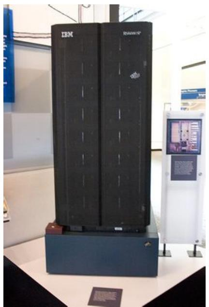

  
比客结果快了，其金归属了，大快门的份

## Text to speech and speech recognition

## siñi

Hello, 'm Siri, your new personal assistant.

What can I help you with?

Restaurants "best sushi near here"

Movi moves ths atomo

Events whars onat Camegie Halr

Local businesses nearest gas station"


Taxis

Speak now...


Tap here when done

Cancel

Options

Siy t agin


  
设置

郭建男

“你妈妈喊你回家吃饭

你的信息已经更新了。现在可以发送吗？


你妈妈喊你回家吃饭

取消

爱送


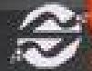

## Computer vision


## bioinformatics

## · Gene

a   
ccagctggataaccttgctgtacagatcggcatctgcctggagggcacgatcgaatccttccagtggacgaacttcacc ctgggaatagcgttgttgtcaagcagctcaaggagcgtattcgagttgacgggctgcacca gaaatttacatggactgcaaaaaggtatagccccacaa ttgggtcacattgtotgcgggctctattgtotcgatco gtccggcggctaattaatgagcggactgaagccacttt taagtttttcctcagctcgctggcagcacttgcgaatg gcttcatcagttgtgaaaccagatggctggtgttttgg ataatcctcgccagactcggcgctgataaggcccaatg cagcgaataccgctcactgacaatgaacggcgtcttgt   
atccatatcaatatcaatatcgctattattaacgatcatgctctgctgatcaagtattcaggtgcgctagattcgacgattgaatcgagctcaatagactcaacag ictccactcgacagatgcgcaatgccaaggacaattgc   
actatgtcgaacaaccgatcgcggcgatgtcagtgagtcgtcttcggacagcgctggcgctccacacgtatttaag

## bioinformatics

## · Gene


## Financial Information


## Robotic Control


车顶的旋转感应器对各个方位进行超过200英尺距离的扫描，以获得精确的有关车身环境的三维地图。

靠近后视镜的摄像头侦查交通灯，帮助车载电脑识别人行道和自行车道等障碍物。


## 位置评估器

左后轮上的感应器测量汽车的小动作，帮助在地图上准确定位所在位置。


## Deep Learning


## Google的猫脸识别：人工智能的新突破

Leon发表于2012/06/27-13:29Google/人工智能/猫脸识别/神经网络/tech


分享到 ▼


Artificial Intelligence，也就是人工智能，就像长生不老和星际漫游一样，是人类最美好的梦想之一。虽然计算机技术已经取得了长足的进步，但是到目前为止，还没有一台电脑能产生“自我”的意识。是的，在人类和大量现成数据的帮助下，电脑可以表现的十分强大，但是离开了这两者，它甚至都不能分辨一个喵星人和一个汪星人。

可喜的是，我们还有Google 这类“不靠谱”的公司。据纽约时报报道，Google X实验室近日开发出了一套具备自主学习能力的神经网络系统。这套系统有什么神奇之处呢？不借助任何外界信息帮助，它就能从一千万张图片中找出那些有小猫的图片。

## aerospace


## 机器学习的发展历程

•“黑暗时代”，人工智能的诞生(1943年\~1956年)

·Warren McCulloch和Walter Pitts在1943年发表了人工智能领域的开篇之作，提出了人工神经网络模型。

·John von Neumann。他在1930年加入了普林斯顿大学，在数学物理系任教，和阿兰·图灵是同事。

•Marvin Minsky和Dean Edmonds建造第一台神经网络计算机。

·1956年：John McCarthy从普林斯顿大学毕业后去达特茅斯学院工作，说服了Marvin Minsky和Claude Shannon在达特茅斯学院组织一个暑期研讨会，召集了对机器智能、人工神经网络和自动理论感兴趣的研究者，参加由IBM赞助的研讨会。

## 机器学习的发展历程

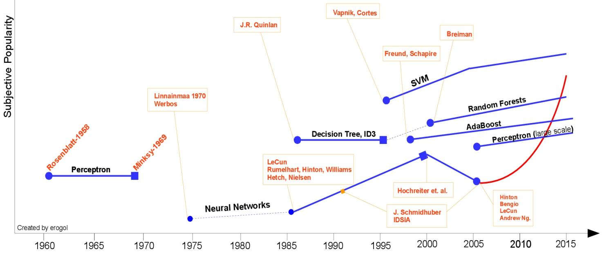

## 机器学习的发展历程

•新的方向:

•集成学习

• 可扩展机器学习 (对大数据集、高维数据的学习等)

·强化学习

·迁移学习

•概率网络

·深度学习

## 国内外的研究者

• M.I. Jordan

• Andrew Ng

· Tommi Jaakkola

• David Blei

· Eric Xing。。 。

• D.Koller

• 2001年UCAI计算机与思维奖:Terry.  
Winograd， David Marr.Tom Mitchell、 RodneyBrooks等人之后的第18位获奖者

• Peter L. Bartlett

• J. D. Lafferty

·国内：李航，周志华，杨强，王晓刚，唐晓鸥，唐杰，刘铁岩，何晓飞，朱筠，吴军， 张栋，戴文渊，余凯，邓力，孙健

## 国内外的研究者

・卡内基梅隆大学的计算机科学学士学位，

·麻省理工学院的电子工程和计算机科学硕士学位，

·加州大学伯克利分校的计算机科学博士学位。

·在斯坦福大学计算机科学和电子工程学系担任教授，讲授机器学习课程


吴恩达(Andrew Ng)

•硅谷人工智能实验室

• 北京深度学习实验室

北京大数据实验室

## 机器学习和数据挖掘的关系

●机器学习是数据挖掘的重要工具。

•数据挖掘不仅仅要研究、拓展、应用一些机器学习方法，还要通过许多非机器学习技术解决数据仓储、大规模数据、数据噪音等等更为实际的问题。

•机器学习的涉及面更宽，常用在数据挖掘上的方法通常只是“从数据学习”，然则机器学习不仅仅可以用在数据挖掘上， 些机器学习的子领域甚至与数据挖掘关系不大，例如增强学习与自动控制等等。

数据挖掘试图从海量数据中找出有用的知识。

• 大体上看，数据挖掘可以视为机器学习和数据库的交叉，它主要利用机器学习界提供的技术来分析海量数据，利用数据库界提供的技术来管理海量数据。

## 机器学习和数据挖掘的关系

数据挖掘

数据分析技术

数据管理技术

机器学习

数据库

## 机器学习的一个形象描述


## 为什么要研究大数据机器学习？

·例“尿布→啤酒”关联规则

·实际上，在面对少量数据时关联分析并不难，可以直接使用统计学中有关相关性的知识，这也正是机器学习界没有研究关联分析的一个重要原因。

·关联分析的困难其实完全是由海量数据造成的，因为数据量的增加会直接造成挖掘效率的下降，当数据量增加到一定程度，问题的难度就会产生质变，

·例如，在关联分析中必须考虑因数据太大而无法承受多次扫描数据库的开销、可能产生在存储和计算上都无法接受的大量中间结果等。

## 机器学习相关学术期刊和会议

## 机器学习

·学术会议：NIPS、ICML、ECML和COLT，

·学术期刊：《Machine Learning》和《Journal of Machine Learning Research》

## • 数据挖掘

•学术会议：SIGKDD、ICDM、SDM、PKDD和PAKDD

·学术期刊：《Data Mining and Knowledge Discovery》和《IEE Transactions on Knowledge and Data Engineering

## 人工智能

·学术会议：ICAI和AAAI、

## 数据库

·学术会议：SIGMOD、VLDB、ICDE，

• 其它一些顶级期刊如

《Artificial Intelligence》、

《Journal of Artificial Intelligence Research》、

•  《IEEE Transactions on Pattern Analysis and Machine Intelligence》、

•《Neural Computation》等也经常发表机器学习和数据挖掘方面的论文

## 机器学习相关学术期刊和会议

## 中国计算机学会推荐国际学术刊物(智能)

A类

序号刊物名称 刊物全称

1 AI Artifcial Intelligence

2 TPAMI IEEE Trans on Pattern Analysis and Machine Intelligence

3 IJCV International Journal of Computer Vision

出版社 地址

Elsevier http://dblp.uni-trier.de/db/journals/ai/

IEEE http://dblp.uni-trier.de/db/journals/pami/

Springer http://dblp.uni-trier.de/db/journals/ijcv/

4 JMLR Journal of Machine Learning Research

MIT Press http://dblp.uni-trier.de/db/journals/jmlr/

## B类

序号刊物名称 刊物全称 出版社 地址   
1 TAP ACM Transactions on Applied Perception ACM http://dblp.uni-trier.de/db/journals/tap/   
2 TSLP ACM Transactions on Speech and Language Processing ACM http://dblp.uni-trier.de/db/journals/tslp/   
3 AAMAS Autonomous Agents and Multi-Agent Systems Springer http://dblp.uni-trier.de/db/journals/aamas/   
4 Computational Linguistics MIT Press http://dblp.uni-trier.de/db/journals/coling/   
5 CVIU Computer Vision and Image Understanding Elsevier http://dblp.uni-trier.de/db/journals/cviu/   
6 DKE Data and Knowledge Engineering Elsevier http://dblp.uni-trier.de/db/journals/dke/index.htr   
7 Evolutionary Computation MIT Press http://dblp.uni-trier.de/db/journals/ec/   
8 TAC IEEE Transactions on Affective Computing IEEE http://dblp.uni-trier.de/db/journals/taffco/   
9 TASLP IEEE Transactions on Audio, Speech, and Language Processing IEEE http://dblp.uni-trier.de/db/journals/taslp/   
10 IEEE Transactions on Cybernetics IEEE http://dblp.uni-trier.de/db/journals/tcyb/   
11 TEC IEEE Transactions on Evolutionary Computation IEEE http://dblp.uni-trier.de/db/journals/tec/   
12 TFS IEEE Transactions on Fuzzy Systems IEEE http://dblp.uni-trier.de/db/journals/tfs/   
13 TNNLS IEEE Transactions on Neural Networks and learning systems IEEE http://dblp.uni-trier.de/db/journals/tnn/   
14IJAR International Journal of Approximate Reasoning Elsevier http://dblp.uni-trier.de/db/journals/jar/   
15 JAIR Journal of Artifcial Intelligence Research AAAI http://dblp.uni-trier.de/db/journals/jair/index.html   
16 Journal of Automated Reasoning Springer http://dblp.uni-trier.de/db/journals/jar/   
17 JSLHR Journal of Speech, Language, and Hearing Research American http://jslhr.pubs.asha.org/   
Speech-  
Language   
Hearing   
Association   
18 Machine Learning Springer http://dblp.uni-trier.de/db/journals/ml/   
19 Neural Computation MIT Press http://dblp.uni-trier.de/db/journals/neco/   
20 Neural Networks Elsevier http://dblp.uni-trier.de/db/journals/nn/   
21 Pattern Recognition Elsevier http://dblp.uni-trier.de/db/conf/par/

## 中国计算机学会推荐国际学术会议

## (人工智能)

## A类

<table><tr><td>序号刊物名称</td><td></td><td>刊物全称</td><td>出版社</td><td>地址</td></tr><tr><td>1</td><td>AAAI</td><td>AAAl Conference on Artifcial Intelligence</td><td>AAAI</td><td>http://dblp.uni-trier.de/db/conf/aaai/</td></tr><tr><td>2</td><td>NeurlPs</td><td>Annual Conference on Neural Information Processing Systems</td><td>MIT Press</td><td>http://dblp.uni-trier.de/db/conf/nips/</td></tr><tr><td>3</td><td>ACL</td><td>Annual Meeting of the Association for Computational Linguistics</td><td>ACL</td><td>http://dblp.uni-trier.de/db/conf/acl/</td></tr><tr><td>4</td><td>CVPR</td><td>IEEEConference on Computer Vision and Pattern Recognition</td><td>IEEE</td><td>http://dblp.uni-trier.de/db/conf/cvpr/</td></tr><tr><td>5</td><td>ICCV</td><td>International Conference on Computer Vision</td><td>IEEE</td><td>http://dblp.uni-trier.de/db/conf/iccv/</td></tr><tr><td>6</td><td>ICML</td><td>International Conference on Machine Learning</td><td>ACM</td><td>http://dblp.uni-trier.de/db/conf/icml/</td></tr><tr><td>7</td><td>IJCAI</td><td>International Joint Conference on Artifcial Intelligence</td><td>Morgan</td><td>http://dblp.uni-trier.de/db/conf/ijcai/</td></tr></table>

## B类

序号刊物名称 刊物全称 出版社 地址   
1 COLT Annual Conference on Computational Learning Theory Springer http://dblp.uni-trier.de/db/conf/colt/   
2 EMNLP Conference on Empirical Methods in Natural Language Processing ACL http://dblp.uni-trier.de/db/conf/emnlp/   
3 ECAI European Conference on Artifcial Intelligence IOS Press http://dblp.uni-trier.de/db/conf/ecai/   
4 ECCV European Conference on Computer Vision Springer http://dblp.uni-trier.de/db/conf/eccv/   
5 ICRA IEEEInternational Conference on Robotics and Automation IEEE http://dblp.uni-trier.de/db/conf/icra/   
6 ICAPS International Conference on Automated Planning and Scheduling AAAI http://dblp.uni-trier.de/db/conf/aips/   
7 ICCBR International Conference on Case-Based Reasoning and Development Springer http://dblp.uni-trier.de/db/conf/iccbr/   
8 COLING International Conference on Computational Linguistics ACM http://dblp.uni-trier.de/db/conf/coling/   
9 KR International Conference on Principles of Knowledge Representation andMorgan http://dblp.uni-trier.de/db/conf/kr/   
Reasoning Kaufmann   
10 UAI International Conference on Uncertainty in Artificial Intelligence AUAI http://dblp.uni-trier.de/db/conf/uai/   
11 AAMAS International Joint Conference on Autonomous Agents and Multi-agent Springer http://dblp.uni-trier.de/db/conf/atal/index.html   
Systems   
12 PPSN Parallel Problem Solving fromNature Springer http://dblp.uni-trier.de/db/conf/ppsn/

## 机器学习和统计学习

• 维基百科：

•机器学习是近20多年兴起的一门多领域交叉学科，涉及概率论、统计学、逼近论、凸分析、算法复杂度理论等多门学科。机器学习理论主要是设计和分析一些让计算机可以自动“学习”的算法。机器学习算法是一类从数据中自动分析获得规律，并利用规律对未知数据进行预测的算法。因为学习算法中涉及了大量的统计学理论，机器学习与统计推断学联系尤为密切，也被称为统计学习理论。算法设计方面，机器学习理论关注可以实现的，行之有效的学习算法。很多推论问题属于无程序可循难度，所以部分的机器学习研究是开发容易处理的近似算法。

## 统计学习和机器学习

·Brendan O'Connor的博文Statistics vs. Machine Learning， fight！，初稿是08年写的，或许和作者的机器学习背景有关，他在初稿中主要是贬低了统计学，思想和[1]有点类似，认为机器学习比统计学多了些AIgorithmModeling方面内容，比如sVM的Max-margin，决策树等，此外他认为机器学习更偏实际。但09年十月的时候他转而放弃自己原来的观点，认为统计才是real deal: Statistics, not machine learning, is the real deal,but unfortunately suffers from bad marketing.

## 统计学习和机器学习

<table><tr><td rowspan=1 colspan=2>Glossary (Robert Tibshiriani)</td></tr><tr><td rowspan=1 colspan=1>Machine learning</td><td rowspan=1 colspan=1>Statistics</td></tr><tr><td rowspan=1 colspan=1>network, graphs</td><td rowspan=1 colspan=1>model</td></tr><tr><td rowspan=1 colspan=1>weights</td><td rowspan=1 colspan=1>parameters</td></tr><tr><td rowspan=1 colspan=1>learning</td><td rowspan=1 colspan=1>fitting</td></tr><tr><td rowspan=1 colspan=1>generalization</td><td rowspan=1 colspan=1>test set performance</td></tr><tr><td rowspan=1 colspan=1>supervised learning</td><td rowspan=1 colspan=1>regression/classification</td></tr><tr><td rowspan=1 colspan=1>unsupervised learning</td><td rowspan=1 colspan=1>density estimation, clustering</td></tr><tr><td rowspan=1 colspan=1>large grant = $1,000,000</td><td rowspan=1 colspan=1>large grant = $50,000</td></tr><tr><td rowspan=1 colspan=1>nice place to have a meeting:Snowbird, Utah, French Alps</td><td rowspan=1 colspan=1>nice place to have a meeting:Las Vegas in August</td></tr></table>

## 统计学习和机器学习

## · --imon Blomberg:

• From R's fortunes package: To paraphrase provocatively, 'machine learning is statistics minus any checking of models and assumptions'.

## · --Andrew Gelman:

• In that case, maybe we should get rid of checking of models and assumptions more often. Then maybe we'd be able to solve some of the problems that the machine learning people can solve but we can't!

## 统计学习和机器学习

• 研究方法差异

• 统计学研究形式化和推导

•机器学习更容忍一些新方法

•维度差异

• 统计学强调低维空间问题的统计推导(confidence intervals, hypothesis tests， optimal estimators)

• 机器学习强调高维预测问题

• 统计学和机器学习各自更关心的领域：

·统计学： survival analysis, spatial analysis, multiple testing, minimax theory, deconvolution, semiparametric inference, bootstrapping, time series.

· 机器学习：online learning, semisupervised learning, manifold learning, active learning, boosting.

## 统计学习和机器学习 （专业术语）

·统计学 机器学习

Estimation Learning

Classifier Hypothesis

Data point Example/Instance

Regression Supervised Learning

Classification Supervised Learning

Covariate Feature

Response Label

## 统计学习

## •统计学习的对象

•data；\_计算机及互联网上的各种数字、文字、图像、视频、音频数据以及它们的组合。

· 数据的基本假设是同类数据具有一定的统计规律性。

•统计学习的目的

・ 用于对数据（特别是未知数据）进行预测和分析。

## 统计学习

## •统计学习的方法

·分类：

• Supervised learning

· Unsupervised learning

• Semi-supervised learning

· Reinforcement learning

监督学习:

• 训练数据 training data

·模型 model --假设空间hypothesis

·评价准则evaluationcriteron-策略strategy

• 算法 algorithm

## 统计学习

• 统计学习的研究:

•统计学习方法

• 统计学习理论(统计学习方法的有效性和效率和基本理论)

• 统计学习应用

## 监督学习

• Instance, feature vector, feature space

•输入实例×的特征向量：

$$
\boldsymbol { x } = ( \boldsymbol { x } ^ { ( 1 ) } , \boldsymbol { x } ^ { ( 2 ) } , \cdots , \boldsymbol { x } ^ { ( i ) } , \cdots , \boldsymbol { x } ^ { ( n ) } ) ^ { \top }
$$

$\mathsf { x } ^ { ( \mathrm { i } ) }$ 与 $x _ { i }$ 不同,后者表示多个输入变量中的第i个

$$
x _ { i } = ( x _ { i } ^ { ( 1 ) } , x _ { i } ^ { ( 2 ) } , \cdots , x _ { i } ^ { ( n ) } ) ^ { \mathrm { T } }
$$

•训练集：

$$
T = \{ ( x _ { 1 } , y _ { 1 } ) , ( x _ { 2 } , y _ { 2 } ) , \cdots , ( x _ { N } , y _ { N } ) \}
$$

•输入变量和输出变量：

•分类问题、回归问题、标注问题

## 监督学习

•联合概率分布

•假设输入与输出的随机变量X和Y遵循联合概率分布P(X,Y)

• P(X,Y)为分布函数或分布密度函数

・对于学习系统来说，联合概率分布是未知的，

·训练数据和测试数据被看作是依联合概率分布P(X,Y)独立同分布产生的。

•假设空间

·监督学习目的是学习一个由输入到输出的映射，称为模型

・模式的集合就是假设空间（hypothesis space)

·概率模型:条件概率分布P(Y|X)，决策函数：Y=f(X)

## 监督学习

•问题的形式化

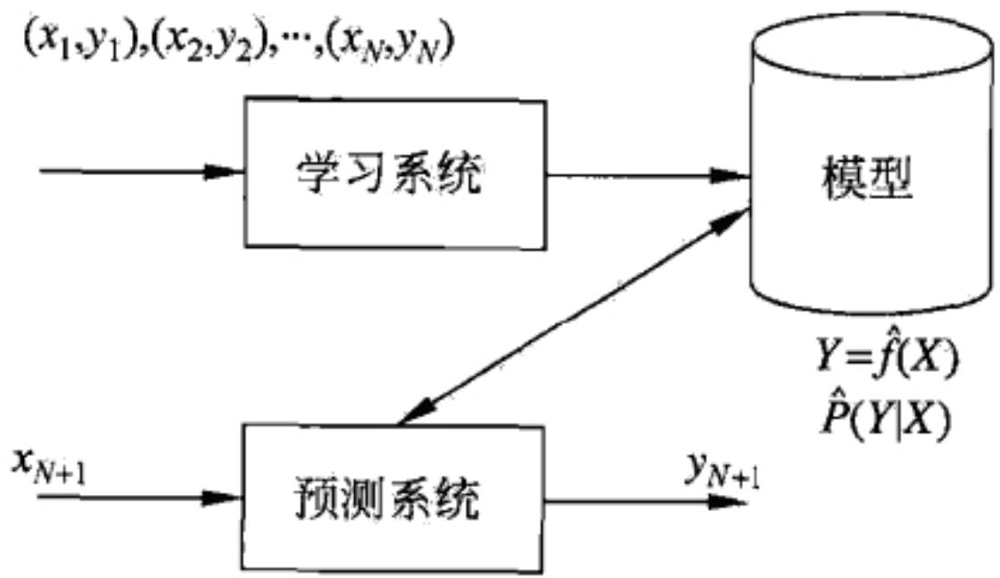

$$
\begin{array} { r l } {  { y _ { N + 1 } = \arg \operatorname* { m a x } _ { y _ { N + 1 } } \hat { P } ( y _ { N + 1 } \mid x _ { N + 1 } ) } } \\ { \quad } \\ { y _ { N + 1 } = \hat { f } ( x _ { N + 1 } ) } \end{array}
$$

## 无监督学习

•训练集：

$$
U = \{ x _ { 1 } , x _ { 2 } , \cdot \cdot \cdot , x _ { N } \}
$$

·模型函数:

$$
z = g ( x )
$$

条件概率分布:

$$
P ( z | x )
$$

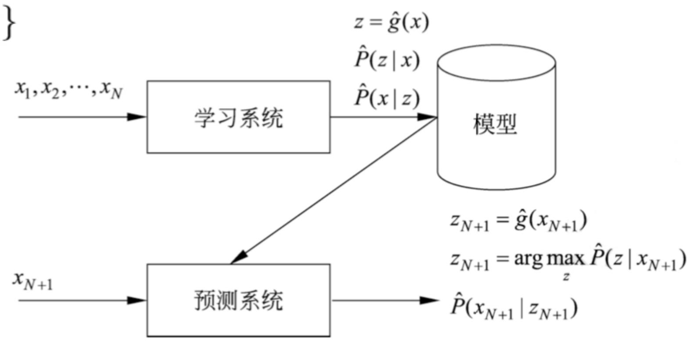

## 强化学习

强化学习的马尔可夫决策过程是状态、奖励、动作序列上的随机过程，由五元组$\langle S , A , P , r , \gamma \rangle$ 组成。

● S是有限状态（state）的集合

● A 是有限动作（action）的集合

● P是状态转移概率（transition probability）函数:

$$
P ( s ^ { \prime } | s , a ) = P ( s _ { t + 1 } = s ^ { \prime } | s _ { t } = s , a _ { t } = a )
$$

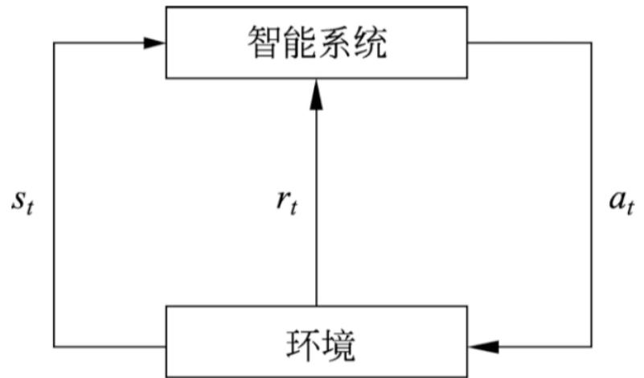

● r 是奖励函数（reward function）: $r ( s , a ) = E ( r _ { t + 1 } | s _ { t } = s , a _ { t } = a )$

• γ是衰减系数（discount factor）: $\gamma \in [ 0 , 1 ]$

## 强化学习

·状态转移概率函数: $P ( s ^ { \prime } | s , a )$

•奖励函数: $r ( s , a )$

·策略π：给定状态下动作的函数 $a = f ( s )$ 或者条件概率分布 $P ( \boldsymbol { a } | \boldsymbol { s } )$

•状态价值函数: $v _ { \pi } ( s ) = E _ { \pi } [ r _ { t + 1 } + \gamma r _ { t + 2 } + \gamma ^ { 2 } r _ { t + 3 } + \cdot \cdot \cdot | s _ { t } = s ]$

•动作价值函数: $q _ { \pi } ( s , a ) = E _ { \pi } [ r _ { t + 1 } + \gamma r _ { t + 2 } + \gamma ^ { 2 } r _ { t + 3 } + \cdot \cdot \cdot | s _ { t } = s , a _ { t } = a ]$

## 强化学习方法

·无模型(model-free)

·基于策略（policy-based）：求解最优策略π\*

·基于价值（value-based）：求解最优价值函数

•有模型 (model-based)

·通过学习马尔可夫决策过程的模型，包括转移概率函数和奖励函数

• 通过模型对环境的反馈进行预测

•求解价值函数最大的策略π\*

## 半监督学习

•少量标注数据，大量未标注数据

·利用未标注数据的信息，辅助标注数据，进行监督学习

•较低成本

## 主动学习

•机器主动给出实例，教师进行标注

· 利用标注数据学习预测模型

## 统计学习

•按算法分类：

•在线学习 (online learning)

•批量学习 (batch learning)

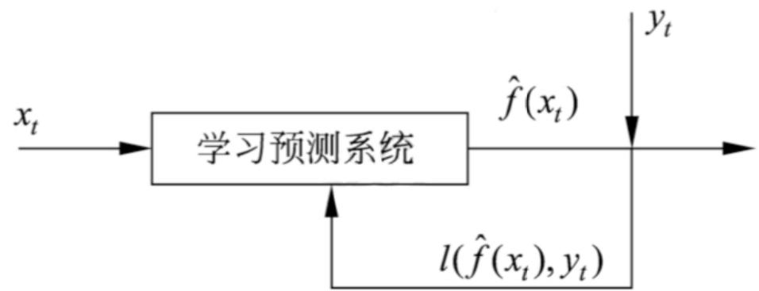

## 统计学习

•按技巧分类:

• 贝叶斯学习 (Bayesian learning)

模型估计时，估计整个后验概率分布 P(0|D)。如果需要给出一个模型，通常取后验概率最大的模型。

预测时，计算数据对后验概率分布的期望值：

$$
P ( x | D ) = \int P ( x | \theta , D ) P ( \theta | D ) \mathrm { d } \theta
$$

这里x是新样本。

## 统计学习

• 按技巧分类：

• 贝叶斯学习 (Bayesian learning)

$$
D \quad { \begin{array} { r l r l r l r l } { { 1 } \underset { \theta \to \infty } { \iint } } & { \operatorname { i f } \underset { \theta \searrow \infty } { \iiint } \frac { \partial \theta \langle \theta \rangle } { \partial \theta } } & { } & & { \operatorname { i f } } & & { \overbrace { \theta } } & { = \theta } \end{array} }
$$

$$
\begin{array} { r l } { D } &  { } \xrightarrow { \| \boldsymbol { \mu } \| \# \| \boldsymbol { \mu } \| _ { \ell = 1 } ^ { \ell + 1 } \| _ { \ell } ^ { + } } \hat { P } ( \boldsymbol { \theta } | D ) = \frac { P ( \boldsymbol { \theta } ) P ( D | \boldsymbol { \theta } ) } { P ( D ) } \xrightarrow { \| \boldsymbol { \hat { \mathbf { \mu } } } _ { \infty } ^ { \hat { P } ( \boldsymbol { \theta } ) } - \boldsymbol { \theta } \| _ { \infty } ^ { \hat { P } ( \boldsymbol { \theta } ) } } \end{array}
$$

## 统计学习

•按技巧分类:

·核方法（Kernel method)

•使用核函数表示和学习非线性模型，将线性模型学习方法扩展到非线性模型的学习

•不显式地定义输入空间到特征空间的映射，而是直接定义核函数，即映射之后在特征空间的内积

·假设 $\mathrm { . } \mathrm { . } \mathrm { . }$ ， $\mathsf { X } _ { 2 }$ 是输入空间的任意两个实例，内积为 $< \mathsf { X } _ { 1 } , \mathsf { X } _ { 2 } >$ ，输入空间到特征空间的映射为 $\varphi$ ,核方法在输入空间中定义核函数 ${ \sf K } ( { \sf x } _ { 1 } , { \sf x } _ { 2 } )$ ，使其满足 ${ \sf K } ( { \sf x } _ { 1 } , { \sf x } _ { 2 } ) = < \varphi ( { \sf x } _ { 1 } ) , \varphi ( { \sf x } _ { 2 } ) >$

## 统计学习三要素

$$
) 7 \div 2 = x ^ { 2 } + 1 1 + x ^ { 2 } + 1 2 = x + 1 2
$$

·模型：

• 决策函数的集合: ${ \mathcal { F } } = \{ f | Y = f ( X ) \}$

• 参数空间

$$
\mathcal { F } = \{ f | Y = f _ { \theta } ( X ) , \theta \in \mathbf { R } ^ { n } \}
$$

条件概率的集合:

$$
{ \mathcal { F } } = \{ P \vert P ( Y \vert X ) \}
$$

•参数空间

$$
\mathcal { F } = \{ P | P _ { \theta } ( \boldsymbol { Y } | \boldsymbol { X } ) , \theta \in \mathbf { R } ^ { n } \}
$$

## 统计学习三要素

•策略

·损失函数：一次预测的好坏

·风险函数：平均意义下模型预测的好坏

·0-1损失函数 O-1 loss function

$$
L ( Y , f ( X ) ) = { \left\{ \begin{array} { l l } { 1 , } & { Y \not \ = f ( X ) } \\ { 0 , } & { Y = f ( X ) } \end{array} \right. }
$$

·平方损失函数 quadratic loss function

$$
L ( Y , f ( X ) ) = ( Y - f ( X ) ) ^ { 2 }
$$

·绝对损失函数 absolute loss function

$$
L ( Y , f ( X ) ) = \mid Y - f ( X ) \mid
$$

## 统计学习三要素

## •策略

·对数损失函数 logarithmic loss function 或对数似然损失函数 loglikelihood lossfunction

$$
L ( Y , P ( Y \mid X ) ) = - \log P ( Y \mid X )
$$

·损失函数的期望 $R _ { \mathrm { e x p } } ( f ) = E _ { P } [ L ( Y , f ( X ) ) ] = \int _ { x \times y } L ( y , f ( x ) ) P ( x , y ) \mathrm { d } x \mathrm { d } y$

· 风险函数 risk function 期望损失expected loss

•由 $\mathsf { P } ( \mathsf { x } , \mathsf { y } )$ 可以直接求出 $\mathsf { P } ( \mathsf { x } | \mathsf { y } )$ 但不知道，

$$
T = \{ ( x _ { 1 } , y _ { 1 } ) , ( x _ { 2 } , y _ { 2 } ) , \cdots , ( x _ { N } , y _ { N } ) \}
$$

·经验风险 empirical risk，经验损失empirical loss

$$
R _ { \mathrm { e m p } } ( f ) = \frac { 1 } { N } \sum _ { i = l } ^ { N } L ( y _ { i } , f ( x _ { i } ) )
$$

## 统计学习三要素

·策略：经验风险最小化与结构风险最小化

•经验风险最小化最优模型

$$
\operatorname* { m i n } _ { f \in \mathscr { F } } \ \frac { 1 } { N } \sum _ { i = 1 } ^ { N } L ( y _ { i } , f ( x _ { i } ) )
$$

·当样本容量很小时，经验风险最小化学习的效果未必很好，会产生“过拟合over-fitting"

·结构风险最小化 structure risk minimization，为防止过拟合提出的策略，等价于正则化（regularization)，加入正则化项regularizer，或罚项 penalty term：

$$
R _ { \mathrm { m } } ( f ) = \frac { 1 } { N } \sum _ { i = 1 } ^ { N } L ( y _ { i } , f ( x _ { i } ) ) + \lambda J ( f )
$$

## 统计学习三要素

•求最优模型就是求解最优化问题：

$$
\operatorname* { m i n } _ { f \in \mathcal { F } } \ \frac { 1 } { N } { \sum _ { i = 1 } ^ { N } } L ( y _ { i } , f ( x _ { i } ) ) + \lambda J ( f )
$$

## 统计学习三要素

•算法:

如果最优化问题有显式的解析式，算法比较简单

，但通常解析式不存在，就需要数值计算的方法

## 模型评估与模型选择

•训练误差，训练数据集的平均损失

$$
R _ { \mathrm { c m p } } ( \hat { f } ) = \frac { 1 } { N } \sum _ { i = 1 } ^ { N } L ( y _ { i } , \hat { f } ( x _ { i } ) )
$$

•测试误差，测试数据集的平均损失

•测试数据集的准确率：

$$
e _ { { \mathrm { { t e n } } } } = \frac { 1 } { N ^ { \prime } } { \sum _ { i = 1 } ^ { N ^ { \prime } } } L ( y _ { i } , \hat { f } ( x _ { i } ) )
$$

·损失函数是0-1损失时：

$$
e _ { \mathrm { i s t } } = { \frac { 1 } { N ^ { r } } } { \sum _ { i = 1 } ^ { N ^ { r } } } I ( y _ { i } \ne \hat { \bar { f } } ( x _ { i } ) )
$$

$$
r _ { \mathrm { t e s t } } = \frac { 1 } { N ^ { \varepsilon } } \sum _ { i = 1 } ^ { N ^ { \varepsilon } } I ( y _ { i } = \hat { f } ( x _ { i } ) )
$$

## 模型评估与模型选择

• 过拟合与模型选择

•假设给定训练数据集 $T = \{ ( x _ { 1 } , y _ { 1 } ) , ( x _ { 2 } , y _ { 2 } ) , \cdots , ( x _ { N } , y _ { N } ) \}$

$$
f _ { M } ( x , w ) = w _ { 0 } + w _ { 1 } x + w _ { 2 } x ^ { 2 } + \cdots + w _ { M } x ^ { M } = \sum _ { j = 0 } ^ { M } w _ { j } x ^ { j }
$$

•经验风险最小:

$$
L ( w ) = { \frac { 1 } { 2 } } \sum _ { i = 1 } ^ { N } ( f ( x _ { i } , w ) - y _ { i } ) ^ { 2 } \qquad L ( w ) = { \frac { 1 } { 2 } } \sum _ { i = 1 } ^ { N } \left( \sum _ { f = 0 } ^ { M } w _ { j } x _ { i } ^ { f } - y _ { i } \right) ^ { 2 } \qquad w _ { i } = { \frac { \displaystyle \sum _ { i = 1 } ^ { N } x _ { i } y _ { i } } { \displaystyle \sum _ { i = 1 } ^ { N } x _ { i } ^ { f + 1 } } } , \quad j = 0 , 1 , 2 , \cdots , M
$$

## 模型评估与模型选择

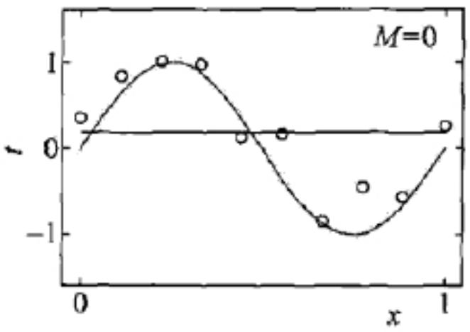

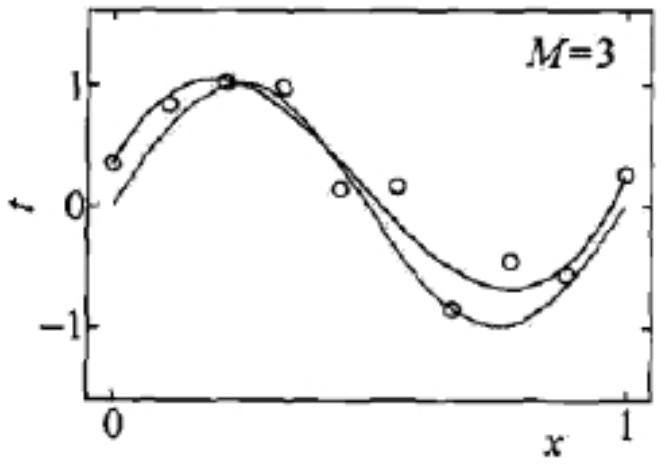

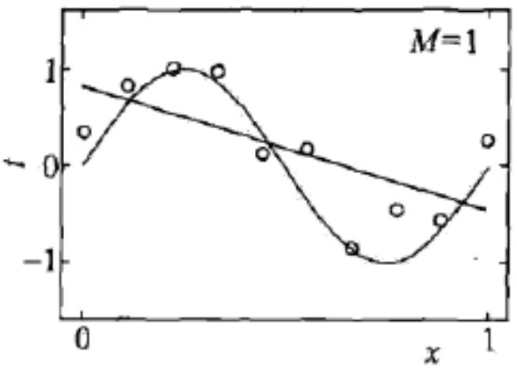

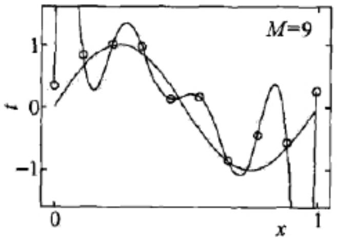

## 模型评估与模型选择

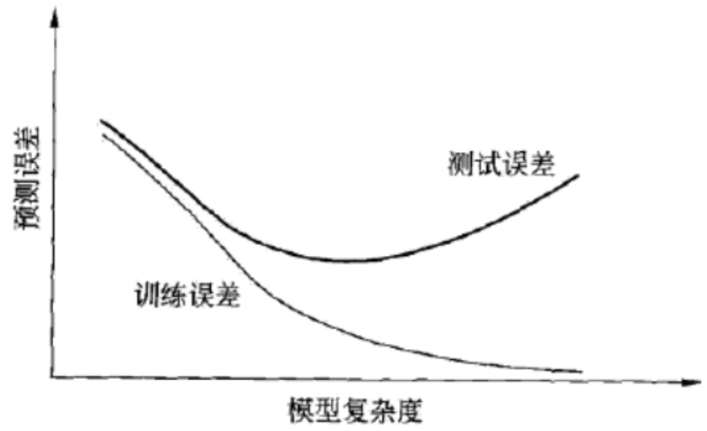

## 正则化与交叉验证

• 正则化一般形式:

$$
\operatorname* { m i n } _ { f \in \mathscr { F } } \ \frac { 1 } { N } \sum _ { t = 1 } ^ { N } L ( y _ { i } , f ( x _ { i } ) ) + \lambda J ( f )
$$

回归问题中：

$$
L ( w ) = \frac { 1 } { N } \sum _ { i = 1 } ^ { N } ( f ( x _ { i } ; w ) - y _ { i } ) ^ { 2 } + \frac { \lambda } { 2 } | | w | | ^ { 2 }
$$

$$
L ( w ) = \frac { 1 } { N } \sum _ { i = 1 } ^ { N } ( f ( x _ { i } ; w ) - y _ { i } ) ^ { 2 } + \lambda \| w \| _ { 1 }
$$

## 正则化与交叉验证

•交叉验证：

· 训练集 training set: 用于训练模型

·验证集 validation set：用于模型选择

•测试集 test set: 用于最终对学习方法的评估

·简单交叉验证

• S折交叉验证

·留一交叉验证

## 泛化能力generalization ability

·泛化误差 generalization error $R _ { \mathrm { e x p } } ( { \hat { f } } ) = E _ { P } [ L ( Y , { \hat { f } } ( X ) ) ] = \int _ { \ast \times \times \mathcal { Y } } L ( y , { \hat { f } } ( x ) ) P ( x , y ) \mathrm { d } x \mathrm { d } y$

•泛化误差上界

·比较学习方法的泛化能力---比较泛化误差上界

·性质：样本容量增加，泛化误差趋于0，假设空间容量越大，泛化误差越大

•二分类问题 $X \in \mathbf { R } ^ { n } , Y \in \{ - 1 , + 1 \}$

$$
\hat { R } ( f ) = \frac { 1 } { N } \sum _ { i = 1 } ^ { N } L ( y _ { i } , f ( x _ { i } ) )
$$

泛化能力generalization ability

•经验风险最小化函数: $f _ { _ { N } } = \arg \operatorname* { m i n } _ { f \in \mathcal { F } } \hat { R } ( f )$

·泛化能力： $R ( f _ { _ N } ) = E [ L ( Y , f _ { _ N } ( X ) ) ]$

•定理：泛化误差上界，二分类问题，

当假设空间是有限个函数的结合 $\mathcal { F } = \{ f _ { 1 } , f _ { 2 } , \cdots , f _ { d } \}$ ,

对任意一个函数f，至少以概率1-δ，以下不等式成立：

$$
R ( f ) \leqslant \widehat { R } ( f ) + \varepsilon ( d , N _ { s } \delta )
$$

$$
\varepsilon ( d , N , \delta ) = \sqrt { \frac { 1 } { 2 N } \biggl ( \log d + \log \frac { 1 } { \delta } \biggr ) } ,
$$

## 生成模型与判别模型

•监督学习的目的就是学习一个模型：

·决策函数: $Y = f ( X )$

•条件概率分布: $P ( Y \mid X )$

·生成方法Generative approach 对应生成模型：generative model,

$$
P ( Y \mid X ) = { \frac { P ( X , Y ) } { P ( X ) } }
$$

·朴素贝叶斯法和隐马尔科夫模型

## 生成模型与判别模型

·判别方法由数据直接学习决策函数f(X)或条件概率分布P(Y|X)作为预测的模型，即判别模型

· Discriminative approach对应discriminative model

$$
Y = f ( X )
$$

$$
P ( Y \mid X )
$$

•K近邻法、感知机、决策树、logistic回归模型、最大熵模型、支持向量机、提升方法和条件随机场。

## 生成模型与判别模型

•各自优缺点:

·生成方法：可还原出联合概率分布P(X,Y)，而判别方法不能。生成方法的收敛速度更快，当样本容量增加的时候，学到的模型可以更快地收敛于真实模型；当存在隐变量时，仍可以使用生成方法，而判别方法则不能用。

• 判别方法：直接学习到条件概率或决策函数，直接进行预测，往往学习的准确率更高；由于直接学习Y=f(X)或P(YIX)，可对数据进行各种程度上的抽象、定义特征并使用特征，因此可以简化学习过程。

## 分类问题

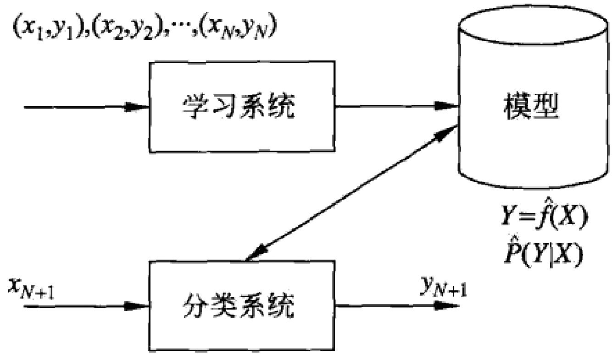

## 分类问题

• 二分类评价指标

• TP true positive

· FN false negative

· FP false positive

· TN true negative

•精确率

•召回率

$$
R = { \frac { T P } { T P + F N } }
$$

$\mathsf { F } _ { 1 }$ 值

$$
P = { \frac { T P } { T P + F P } }
$$

$$
\frac { 2 } { F _ { 1 } } = \frac { 1 } { P } + \frac { 1 } { R }
$$

$$
F _ { 1 } ^ { \prime } = \frac { 2 T P } { 2 T P + F P + F N }
$$

## 标注问题

·标注：tagging，结构预测：structure prediction

·输入：观测序列，输出：标记序列或状态序列

•学习和标注两个过程

•训练集:

$$
T = \{ ( x _ { 1 } , y _ { 1 } ) , ( x _ { 2 } , y _ { 2 } ) , \cdots , ( x _ { N } , y _ { N } ) \}
$$

·观测序列: $\boldsymbol { x } _ { i } = ( \boldsymbol { x } _ { i } ^ { ( 1 ) } , \boldsymbol { x } _ { i } ^ { ( 2 ) } , \cdots , \boldsymbol { x } _ { i } ^ { ( n ) } ) ^ { \top } , \ i = 1 , 2 , \cdots , N$

•输出标记序列: $y _ { i } = ( y _ { i } ^ { \mathrm { ( 1 ) } } , y _ { i } ^ { \mathrm { ( 2 ) } } , \cdots , y _ { i } ^ { \mathrm { ( n ) } } ) ^ { \mathrm { T } }$

·模型：条件概率分布 $P ( Y ^ { ( 1 ) } , Y ^ { ( 2 ) } , \cdots , Y ^ { ( n ) } \mid X ^ { ( 1 ) } , X ^ { ( 2 ) } , \cdots , X ^ { ( n ) } )$

## 回归问题

•回归模型是表示从输入变量到输出变量之间映射的函数.回归问题的学习等价于函数拟合。

•学习和预测两个阶段

•训练集：

$$
T = \{ ( x _ { 1 } , y _ { 1 } ) , ( x _ { 2 } , y _ { 2 } ) , \cdots , ( x _ { N } , y _ { N } ) \}
$$

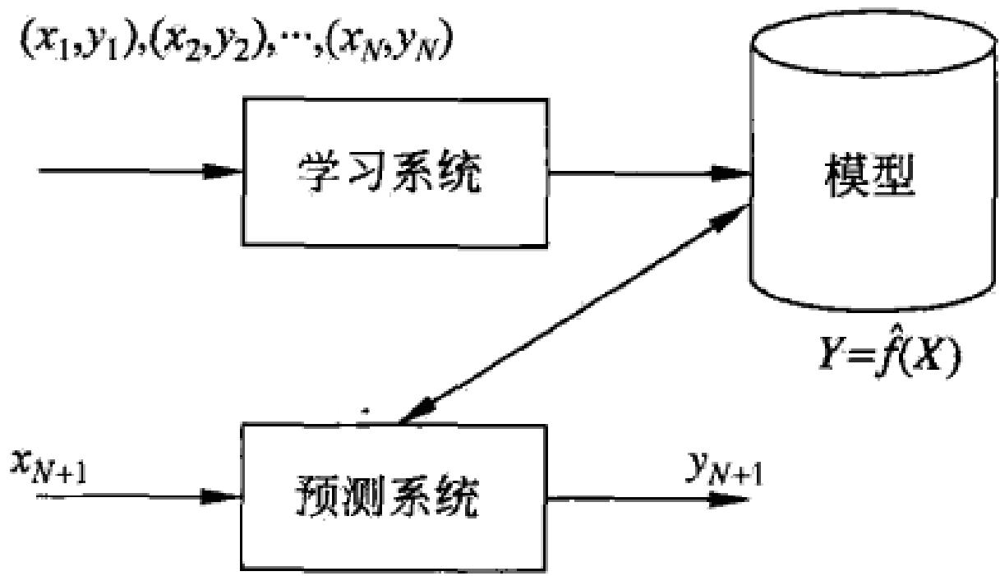

## 回归问题

·例子：

·标记表示名词短语的“开始”、“结束"或“其他”(分别以B， E，O表示)

·输入： At Microsoft Research, we have an insatiable curiosity and the desire to create new technology that will help define the computing experience.

·输出：At/O Microsoft/B Research/E, we/O have/O an/O insatiable/6 curiosity/E and/O the/O desire/BE to/O create/O new/B technology/E that/O will/O help/O define/O the/O computing/B experience/E.

## 回归问题

·回归学习最常用的损失函数是平方损失函数，在此情况下，回归问题可以由著名的最小二乘法(least squares)求解。

•股价预测

Q&A?

## 感知机和统计学习方法总结

## 感知机(Perceptron)

·输入为实例的特征向量，输出为实例的类别，取+1和-1；

·感知机对应于输入空间中将实例划分为正负两类的分离超平面，属于判别模型；

·导入基于误分类的损失函数;

•利用梯度下降法对损失函数进行极小化;

•感知机学习算法具有简单而易于实现的优点，分为原始形式和对偶形式；

• 1957年由Rosenblatt提出，是神经网络与支持向量机的基础。

## 感知机模型

•定义(感知机):

$$
\mathcal { V } = \{ + 1 , - 1 \}
$$

•假设输入空间(特征空间)是 $\mathcal { X } \subset \mathbb { R } ^ { n }$ 输出空间是

·输入xex表示实例的特征向量，对应于输入空间（特征空间）的点，输出yγ表示实例的类别，由输入空间到输出空间的函数：

$$
f ( x ) = \mathrm { s i } \mathrm { g n } ( w \cdot x + b )
$$

•称为感知机，

·模型参数: $w \mid \textsf { X } ,$ 内积，权值向量，偏置，

•符号函数:

$$
\mathrm { s i g n } ( x ) = \left\{ \begin{array} { l l } { + 1 , } & { \quad x \geqslant 0 } \\ { - 1 , } & { \quad x < 0 } \end{array} \right.
$$

## 感知机模型

•感知机几何解释：

·线性方程： $w \cdot x + b = 0$

•对应于超平面S，w为法向量，b截距，分离正、负类：

•分离超平面:

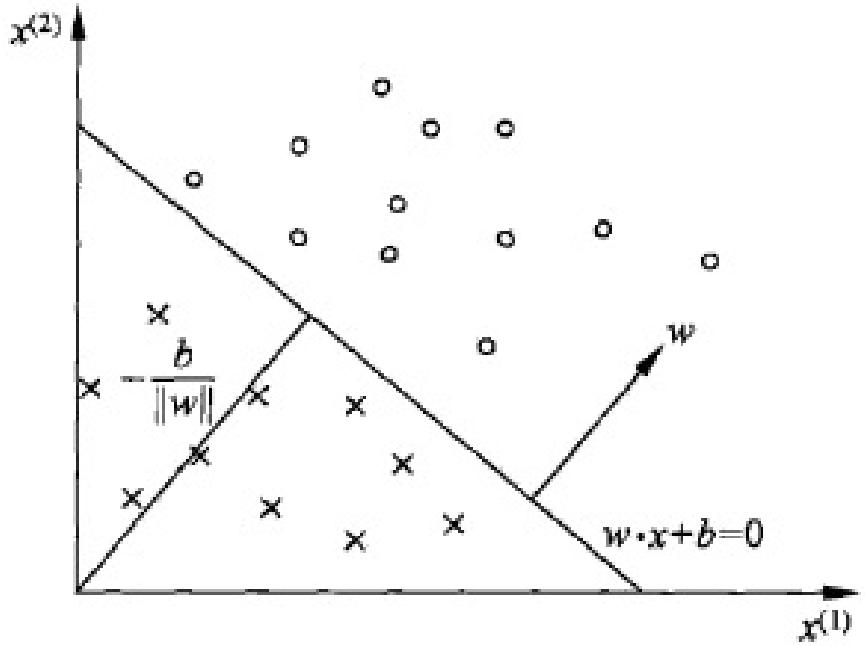

## 感知机学习策略

• 如何定义损失函数？

• 自然选择：误分类点的数目，但损失函数不是w，b 连续可导，不宜优化。

• 另一选择：误分类点到超平面的总距离：

·距离: $\frac { 1 } { \| w \| } | w \cdot x _ { 0 } + b |$

误分类点: $- y _ { i } ( w \cdot x _ { i } + b ) > 0$

误分类点距离: $- { \frac { 1 } { \| w \| } } y _ { i } ( w \bullet x _ { i } + b )$

总距离: $- \frac { 1 } { \Vert w \Vert } \sum _ { x _ { i } \in M } y _ { i } ( w \cdot x _ { i } + b )$

## 感知机学习策略

•损失函数:

$$
L ( w , b ) = - \sum _ { x _ { i } \in M } y _ { i } ( w \cdot x _ { i } + b )
$$

•M为误分类点的数目

## 感知机学习算法

• 求解最优化问题：

$$
\operatorname* { m i n } _ { \boldsymbol { w } , \boldsymbol { b } } L ( \boldsymbol { w } , \boldsymbol { b } ) = - \sum _ { \boldsymbol { x } , \boldsymbol { \epsilon } , \boldsymbol { M } } \boldsymbol { y } _ { i } ( \boldsymbol { w } \cdot \boldsymbol { x } _ { i } + \boldsymbol { b } )
$$

随机梯度下降法，

•首先任意选择一个超平面，w，b，然后不断极小化目标函数，损失函数L的梯度:

$$
\nabla _ { \boldsymbol { w } } L ( \boldsymbol { w } , \boldsymbol { b } ) = - \sum _ { x _ { i } \in \mathcal { M } } y _ { i } x _ { i } \qquad \nabla _ { \boldsymbol { b } } L ( \boldsymbol { w } , \boldsymbol { b } ) = - \sum _ { x _ { i } \in \mathcal { M } } y _ { i }
$$

•选取误分类点更新:

$$
w  w + \eta y _ { i } x _ { i } ~ b  b + \eta y _ { i }
$$

## 感知机学习算法

•感知机学习算法的原始形式:

输入：训练数据集 $T = \{ ( x _ { 1 } , y _ { 1 } ) , ( x _ { 2 } , y _ { 2 } ) , \cdots , ( x _ { N } , y _ { N } ) \}$

其中 $x _ { i } \in \mathcal { X } = { \mathbf { R } } ^ { n } , y _ { i } \in \mathcal { Y } = \{ - 1 , + 1 \} , i = 1 , 2 , \cdots , N$

学习率 $\eta ( 0 < \eta \leqslant 1 ) ;$

输出：w，b；感知机模型 $f ( x ) = \mathrm { s i g n } ( w \cdot x + b )$

（1）选取初值 $w _ { 0 } , b _ { 0 }$

(2）在训练集中选取数据 $( x _ { i } , y _ { i } )$

(3）如果 $y _ { i } ( w \cdot x _ { i } + b ) \leqslant 0$

（4）转至（2），直至训练集中没有误分类点

$$
w \gets w + \eta y _ { i } x _ { i }
$$

$$
b \gets b + \eta y _ { j }
$$

## 感知机学习算法

·例：正例: $\begin{array} { r } { x _ { 1 } = ( 3 , 3 ) ^ { \mathrm { T } } , x _ { 2 } = ( 4 , 3 ) ^ { \mathrm { T } } } \end{array}$

负例： $x _ { 3 } = ( 1 , 1 ) ^ { \mathrm { T } }$

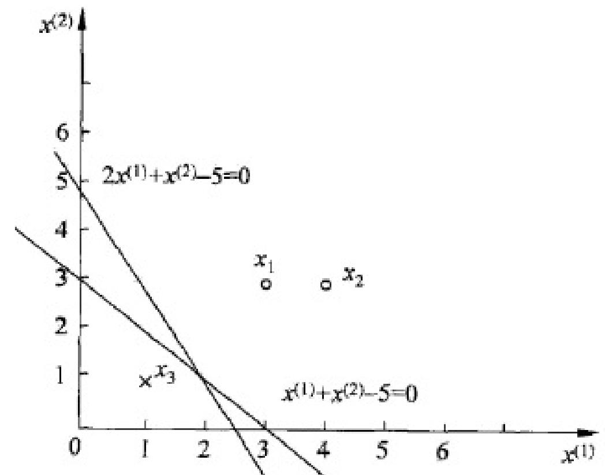

## 感知机学习算法

•解：构建优化问题： $\operatorname* { m i n } _ { w , b } L ( w , b ) = - \sum _ { x _ { i } \in M } y _ { i } ( w \cdot x + b )$

•求解： $\mathsf { w } , \mathsf { b } , \mathsf { \pmb { \eta } } = \mathsf { I }$

（1）取初值 $w _ { 0 } = 0 , b _ { 0 } = 0$

(2）对 $x _ { 1 } = ( 3 , 3 ) ^ { \tau } , y _ { 1 } ( w _ { 0 } \cdot x _ { 1 } + b _ { 0 } ) = 0$ ，未能被正确分类，更新 $w , b$

$$
w _ { 1 } = w _ { 0 } + y _ { 1 } x _ { 1 } = ( 3 , 3 ) ^ { \mathrm { T } } ~ , ~ b _ { 1 } = b _ { 0 } + y _ { 1 } = 1
$$

•得线性模型: $w _ { 1 } \cdot x + b _ { 1 } = 3 x ^ { ( 1 ) } + 3 x ^ { ( 2 ) } + 1$

(3) $- \frac { \pi } { 2 }$ ，显然， $y _ { i } ( w _ { i } \cdot x _ { i } + b _ { i } ) > 0$ ，被正确分类，

对 $x _ { 3 } = ( 1 , 1 ) ^ { \mathrm { T } } , y _ { 3 } ( w _ { 1 } \cdot x _ { 3 } + b _ { 1 } ) < 0$ ，被误分类，

$$
w _ { 2 } = w _ { 1 } + y _ { 3 } x _ { 3 } = ( 2 , 2 ) ^ { \mathrm { T } } , b _ { 2 } = b _ { 1 } + y _ { 3 } = 0
$$

## 感知机学习算法

•得到线性模型: $w _ { 2 } \cdot x + b _ { 2 } = 2 x ^ { ( 1 ) } + 2 x ^ { ( 2 ) }$

·如此继续下去: $w _ { 7 } = ( 1 , 1 ) ^ { \top } , b _ { 7 } = - 3$

$$
w _ { 7 } \cdot x + b _ { 7 } = x ^ { ( 1 ) } + x ^ { ( 2 ) } - 3
$$

•分离超平面: $x ^ { ( 1 ) } + x ^ { ( 2 ) } - 3 = 0$

•感知机模型: $f ( x ) = \mathrm { s i g n } ( x ^ { ( 1 ) } + x ^ { ( 2 ) } - 3 )$

<table><tr><td>迭代次数</td><td>误分类点</td><td>W</td><td>b</td><td> $w \cdot x + b$ </td></tr><tr><td>0</td><td></td><td>0</td><td>0</td><td>0</td></tr><tr><td>1</td><td></td><td> $( 3 , 3 ) ^ { \mathtt { T } }$ </td><td>1</td><td> $3 x ^ { ( 1 ) } + 3 x ^ { ( 2 ) } + 1$ </td></tr><tr><td>2</td><td></td><td>(2,2)τ</td><td>0</td><td> $2 x ^ { ( 1 ) } + 2 x ^ { ( 2 ) }$ </td></tr><tr><td>3</td><td>x</td><td>(1,1)T</td><td>-1</td><td> $\pmb { x } ^ { ( 1 ) } + \pmb { x } ^ { ( 2 ) } - 1$ </td></tr><tr><td>4</td><td>$x3}$</td><td>(0,0)T</td><td>-2</td><td>-2</td></tr><tr><td>5</td><td>x$</td><td>(3,3)T</td><td>-1</td><td> $3 x ^ { ( 1 ) } + 3 x ^ { ( 2 ) } - 1$ </td></tr><tr><td>6</td><td>x</td><td>(2,2)τ</td><td>-2</td><td> $2 x ^ { ( 1 ) } + 2 x ^ { ( 2 ) } - 2$ </td></tr><tr><td>7</td><td>$x$</td><td>(1,1)T</td><td>-3</td><td> $\pmb { x } ^ { ( 1 ) } + \pmb { x } ^ { ( 2 ) } - 3$ </td></tr><tr><td>8</td><td>0</td><td>(1,1)T</td><td>-3</td><td> $\pmb { x } ^ { ( 1 ) } + \pmb { x } ^ { ( 2 ) } - 3$ </td></tr></table>

## 感知机学习算法

·算法的收敛性：证明经过有限次迭代可以得到一个将训练数据集完全正确划分的分离超平面及感知机模型。

•将b并入权重向量w，记作： $\widehat { \boldsymbol { w } } = ( \boldsymbol { w } ^ { \mathrm { T } } , \boldsymbol { b } ) ^ { \mathrm { T } }$

$$
\hat { x } = ( x ^ { \top } , 1 ) ^ { \top } \quad \hat { x } \in { \bf R } ^ { n + 1 } , \quad \hat { w } \in { \bf R } ^ { n + 1 } \quad \hat { w } \cdot \hat { x } = w \cdot x + b
$$

•定理：

设训练数据集 $T = \{ ( x _ { 1 } , y _ { 1 } ) , ( x _ { 2 } , y _ { 2 } ) , \cdots , ( x _ { N } , y _ { N } ) \}$ 是线性

可分的，其中 $x _ { i } \in \mathcal { X } = { \mathbf { R } } ^ { n } , y _ { i } \in \mathcal { Y } = \{ - 1 , + 1 \} , i = 1 , 2 , \cdots , N$

## 感知机学习算法

则

(1)存在满足条件 $\left\| \hat { w } _ { \mathrm { o p t } } \right\| = 1$ 的超平面 $\hat { w } _ { \mathrm { o p t } }$ $\hat { \boldsymbol { x } } = \boldsymbol { w } _ { \mathrm { o p t } } \cdot \boldsymbol { x } + \boldsymbol { b } _ { \mathrm { o p t } } = 0$ 且存在 $\gamma > 0$ ，对所有 $i = 1 , 2 , \cdots , N$ y(Wmx)=y₁(W·x₁+b)≥γ

## 感知机学习算法

·证明：(1)

• 由线性可分，存在超平面： $\hat { w } _ { o p t } \cdot \hat { x } = w _ { o p t } \cdot x + b _ { o p t } = 0$

使 $\left\| \hat { w } _ { \mathrm { o p t } } \right\| = 1$ ，由有限的点，均有：

$$
y _ { i } ( \hat { w } _ { o p t } \cdot \hat { x } _ { i } ) = y _ { i } ( w _ { o p t } \cdot x _ { i } + b _ { o p t } ) > 0
$$

・存在

$$
\gamma = \operatorname* { m i n } _ { i } \{ y _ { i } ( w _ { \mathrm { o p t } } \cdot x _ { i } + b _ { \mathrm { o p t } } ) \}
$$

·使：

$$
y _ { i } ( \hat { w } _ { \mathrm { o p t } } \cdot \hat { x } _ { i } ) = y _ { i } ( w _ { \mathrm { o p t } } \cdot x _ { i } + b _ { \mathrm { o p t } } ) \geq \gamma
$$

## 感知机学习算法 心トし」 しノー

·（2)令 $R = \operatorname* { m a x } _ { 1 \leqslant i \leqslant N } \left\| \hat { x } _ { i } \right\|$ ，算法在训练集的误分类次数k满足不等式， $k \leqslant \left( \frac { R } { \gamma } \right) ^ { 2 }$

•证明：令 $\hat { w } _ { k - 1 }$ ：是第k个误分类实例之前的扩充权值向量，即：

$$
\hat { w } _ { k - 1 } \equiv ( w _ { k - 1 } ^ { \mathrm { { T } } } , b _ { k - 1 } ) ^ { \mathrm { { T } } }
$$

• 第k个误分类实例的条件是： $y _ { i } ( \hat { w } _ { k - 1 } \cdot \hat { x } _ { i } ) = y _ { i } ( w _ { k - 1 } \cdot x _ { i } + b _ { k - 1 } ) \leqslant 0$

•则w和b的更新: $\begin{array} { l } { { w _ { k }  w _ { k - 1 } + \eta y _ { i } x _ { i } } } \\ { { \qquad b _ { k }  b _ { k - 1 } + \eta y _ { i } } } \end{array}$ 即： $\hat { w } _ { k } = \hat { w } _ { k - 1 } + \eta y _ { i } \hat { x } _ { i }$

## 感知机学习算法

•(2)令 $R = \operatorname* { m a x } _ { 1 \leqslant i \leqslant N } \left\| \hat { x } _ { i } \right\|$ ·算法在训练集的误分类次数k满足不等式 $k \leqslant \left( \frac { R } { \gamma } \right) ^ { 2 }$

推导两个不等式:

• (1) $\hat { w } _ { \pmb { \nu } _ { k } } \cdot \hat { w } _ { \mathrm { o p t } } \geq k \eta \gamma$

$$
\begin{array} { r l } & { \hat { w } _ { k } \cdot \hat { w } _ { \mathrm { o p t } } = \hat { w } _ { k - 1 } \cdot \hat { w } _ { \mathrm { o p t } } + \eta y _ { i } \hat { w } _ { \mathrm { o p t } } \cdot \hat { x } _ { i } } \\ & { \qquad \geqslant \hat { w } _ { k - 1 } \cdot \hat { w } _ { \mathrm { o p t } } + \eta \gamma } \end{array}
$$

·得： $\hat { w } _ { k } \cdot \hat { w } _ { \mathrm { o p t } } \geqslant \hat { w } _ { k - 1 } \cdot \hat { w } _ { \mathrm { o p t } } + \eta \gamma \geqslant \hat { w } _ { k - 2 } \cdot \hat { w } _ { \mathrm { o p t } } + 2 \eta \gamma \geqslant \cdots \geqslant k \eta \gamma$

## 感知机学习算法

·（2）令 $R = \operatorname* { m a x } _ { 1 \leqslant i \leqslant N } \left\| \hat { x } _ { i } \right\|$ ·算法在训练集的误分类次数k满足不等式 $k \leqslant \left( \frac { R } { \gamma } \right) ^ { 2 }$   
(2) $\left\| \hat { w } _ { k } \right\| ^ { 2 } \leqslant k \eta ^ { 2 } R ^ { 2 }$   
·则： $\begin{array} { r l } & { \left\| \hat { w } _ { k } \right\| ^ { 2 } = \left\| \hat { w } _ { k - 1 } \right\| ^ { 2 } + 2 \eta y _ { i } \hat { w } _ { k - 1 } \cdot \hat { x } _ { i } + \eta ^ { 2 } \left\| \hat { x } _ { i } \right\| ^ { 2 } } \\ & { \qquad \leqslant \left\| \hat { w } _ { k - 1 } \right\| ^ { 2 } + \eta ^ { 2 } \left\| \hat { x } _ { i } \right\| ^ { 2 } } \\ & { \qquad \leqslant \left\| \hat { w } _ { k - 1 } \right\| ^ { 2 } + \eta ^ { 2 } R ^ { 2 } } \\ & { \qquad \leqslant \left\| \hat { w } _ { k - 2 } \right\| ^ { 2 } + 2 \eta ^ { 2 } R ^ { 2 } \leqslant \cdots } \\ & { \qquad \leqslant k \eta ^ { 2 } R ^ { 2 } } \end{array}$

## 感知机学习算法

·(2)令 $R = \operatorname* { m a x } _ { 1 \in I \in N } \left\| \hat { x } _ { i } \right\|$ 算法在训练集的误分类次数k满足不等式 $k \leqslant \left( \frac { R } { \gamma } \right) ^ { 2 }$   
结合两个不等式: $k \eta \gamma \leqslant \hat { w } _ { k } \cdot \hat { w } _ { \mathrm { e p t } } \leqslant \left\| \hat { w } _ { k } \right\| \left\| \hat { w } _ { \mathrm { o p t } } \right\| \leqslant \sqrt { k } \eta R$ $k ^ { 2 } \gamma ^ { 2 } \leqslant k R ^ { 2 }$   
得： $k \leqslant \left( { \frac { R } { \gamma } } \right) ^ { 2 }$

## 感知机学习算法

·定理表明：

·误分类的次数k是有上界的，当训练数据集线性可分时，感知机学习算法原始形式迭代是收敛的。

·感知机算法存在许多解，既依赖于初值，也依赖迭代过程中误分类点的选择顺序。

•为得到唯一分离超平面，需要增加约束，如SVM。

·线性不可分数据集，迭代震荡。

## 感知机学习算法

• 感知机算法的对偶形式:

回顾 SVM 对偶形式:

•基本想法:

·将w和b表示为实例xi和标记yi的线性组会的形式，通过求解其系数而求得w和b，对误分类点：

$$
\begin{array} { l l l } { { w  w + \eta y _ { i } x _ { i } } } & { { \begin{array} { l } { { w = \displaystyle \sum _ { i = 1 } ^ { N } \alpha _ { i } y _ { i } x _ { i } } } \end{array} } } & { { w = \displaystyle \sum _ { i = 1 } ^ { N } \alpha _ { i } y _ { i } x _ { i } } } \\ { { b  b + \eta y _ { i } } } & { { \boxed { \operatorname* { d e f } _ { i \in \mathcal { L } } \operatorname* { d e f } _ { i \in \mathcal { L } } \operatorname* { d e f } _ { i \in \mathcal { L } } y _ { i } } w , b } } & { { \begin{array} { l } { { b = \displaystyle \sum _ { i = 1 } ^ { N } \alpha _ { i } y _ { i } } } \end{array} } } \end{array}
$$

## 感知机学习算法

·感知机学习算法的对偶形式:

输入：训练数据集 $T = \{ ( x _ { 1 } , y _ { 1 } ) , ( x _ { 2 } , y _ { 2 } ) , \cdots , ( x _ { N } , y _ { N } ) \}$

其中 $x _ { i } \in \mathcal { X } = { \mathbf { R } } ^ { n } , y _ { i } \in \mathcal { Y } = \{ - 1 , + 1 \} , i = 1 , 2 , \cdots , N$ 学习率 $\eta ( 0 < \eta \leqslant 1 )$

输出： $^ { \alpha , b ; }$ 感知机模型 $f ( x ) = { \mathrm { s i g n } } \left( \sum _ { j = 1 } ^ { N } \alpha _ { j } y _ { j } x _ { j } \cdot x + b \right)$ 其中 $\alpha = ( \alpha _ { 1 } , \alpha _ { 2 } , \cdots , \alpha _ { N } ) ^ { \top }$

## 感知机学习算法

(1) $\alpha  0 \ , b  0$

(2）在训练集中选取数据 $( x _ { i } , y _ { i } )$

（3）如果 $y _ { i } \left( \sum _ { j = 1 } ^ { N } \alpha _ { j } y _ { j } x _ { j } \cdot x _ { i } + b \right) \leqslant 0$

$$
\pmb { \alpha } _ { i } \gets \pmb { \alpha } _ { i } + \pmb { \eta }
$$

$$
b \gets b + \eta y _ { i }
$$

（4）转至（2）直到没有误分类数据.

Gram 矩阵

$$
G = [ x _ { i } \cdot x _ { j } ] _ { N \times N }
$$

## 感知机学习算法

·例：正样本点是 $x _ { 1 } = ( 3 , 3 ) ^ { \mathrm { T } }$ $\boldsymbol { x } _ { 2 } = ( 4 , 3 ) ^ { \mathrm { T } }$ 负样本点是 $\boldsymbol { x } _ { 3 } = ( 1 , 1 ) ^ { \top }$

解按照算法2.2,

(1）取 $\pmb { \alpha } _ { i } = 0$ $i = 1 , 2 , 3$ $\scriptstyle b = 0$ $\scriptstyle \eta = 1$

(2）计算Gram矩阵

$$
G = \left[ 2 1 \quad 2 5 \quad 7 \right]
$$

（3）误分条 $y _ { i } \left( \sum _ { j = 1 } ^ { N } \alpha _ { j } y _ { j } x _ { j } \ast x _ { j } + b \right) \in 0$ 参数更新$\alpha _ { i }  \alpha _ { i } + 1 , b  b + y _ { i }$

## 感知机学习算法

·例：正样本点是 $\begin{array} { r } { x _ { 1 } = ( 3 , 3 ) ^ { \mathrm { T } } , \quad x _ { 2 } = ( 4 , 3 ) ^ { \mathrm { T } } } \end{array}$ ，负样本点是 $\boldsymbol { x } _ { 3 } = ( 1 , 1 ) ^ { \top }$

（4）迭代.过程从略，结果列于表2.2.

<table><tr><td>k</td><td>0</td><td>1</td><td>2</td><td>3</td><td>4</td><td>5</td><td>6</td><td>7</td></tr><tr><td></td><td></td><td> $x _ { 1 } = \sqrt { 3 }$ </td><td> $x _ { 7 }$ </td><td>x</td><td> $x = - \frac { 5 } { 2 }$ </td><td> $x _ { 1 }$ </td><td>$x</td><td></td></tr><tr><td> $\frac { 1 7 } { 4 }$ </td><td>0</td><td>1</td><td>1</td><td>1</td><td>N</td><td>2</td><td>2</td><td>2</td></tr><tr><td> $C _ { 7 } ^ { 7 }$ </td><td>0</td><td>0</td><td>0</td><td>0</td><td>0</td><td>0</td><td>0</td><td>0</td></tr><tr><td> $C _ { 7 } ^ { 2 }$ </td><td>0</td><td>0</td><td>1</td><td>2</td><td>2</td><td>3</td><td>4</td><td>5</td></tr><tr><td>D</td><td>0</td><td>1</td><td>0</td><td>-1</td><td>0</td><td>-1</td><td>-2</td><td>-3</td></tr></table>

$$
\begin{array} { l } { \displaystyle \Psi = 2 x _ { i } + 0 x _ { 2 } - 5 x _ { 3 } = ( 1 , 1 ) ^ { \mathrm { T } } } \\ { \displaystyle b = - 3 } \end{array}
$$

分离超平面 $x ^ { ( 1 ) } + x ^ { ( 2 ) } - 3 = 0$

感知机模型

$$
f ( x ) = \mathrm { s i g n } ( x ^ { ( 1 ) } + x ^ { ( 2 ) } - 3 )
$$

## 统计学习方法总结

·感知机

·K近邻法

·朴素贝叶斯

•决策树

·逻辑斯蒂回归与最大熵模型

•支持向量机

・提升方法

·EM算法

•隐马尔科夫模型

•条件随机场

表12.110种统计学习方法特点的概括总结
<table><tr><td rowspan=1 colspan=1>方法</td><td rowspan=1 colspan=1>适用问题</td><td rowspan=1 colspan=1>模型特点</td><td rowspan=1 colspan=1>模型类型</td><td rowspan=1 colspan=1>学习策略</td><td rowspan=1 colspan=1>学习的损失函数</td><td rowspan=1 colspan=1>学习算法</td></tr><tr><td rowspan=1 colspan=1>感知机</td><td rowspan=1 colspan=1>二类分类</td><td rowspan=1 colspan=1>分离超平面</td><td rowspan=1 colspan=1>判别模型</td><td rowspan=1 colspan=1>极小化误分点到超平面距离</td><td rowspan=1 colspan=1>误分点到超平面距离</td><td rowspan=1 colspan=1>随机梯度下降</td></tr><tr><td rowspan=1 colspan=1>k近邻法</td><td rowspan=1 colspan=1>多类分类，回归</td><td rowspan=1 colspan=1>特征空间，样判别模型本点</td><td rowspan=1 colspan=1>判别模型</td><td rowspan=1 colspan=1></td><td rowspan=1 colspan=1></td><td rowspan=1 colspan=1></td></tr><tr><td rowspan=1 colspan=1>朴素贝叶斯多类分类法</td><td rowspan=1 colspan=1>多类分类</td><td rowspan=1 colspan=1>特征与类别的联合概率分布，条件独立假设</td><td rowspan=1 colspan=1>生成模型</td><td rowspan=1 colspan=1>计，极大后验损失概率估计</td><td rowspan=1 colspan=1></td><td rowspan=1 colspan=1>EM算法</td></tr><tr><td rowspan=1 colspan=1>决策树</td><td rowspan=1 colspan=1>多类分类，回归</td><td rowspan=1 colspan=1>分类树，回归判别模型树</td><td rowspan=1 colspan=1>判别模型</td><td rowspan=1 colspan=1>正则化的极大对数似然似然估计</td><td rowspan=1 colspan=1>损失</td><td rowspan=1 colspan=1>特征选择，生成，剪枝</td></tr><tr><td rowspan=1 colspan=1>逻辑斯谛回归与最大熵模型</td><td rowspan=1 colspan=1>多类分类</td><td rowspan=1 colspan=1>特征条件下类别的条件概率分布，对数线形模型</td><td rowspan=1 colspan=1>判别模型</td><td rowspan=1 colspan=1>极大似然估逻辑斯谛计，正则化的损失极大似然估计</td><td rowspan=1 colspan=1>斯</td><td rowspan=1 colspan=1>改进的迭代尺度算法，梯度下降，拟牛顿法</td></tr><tr><td rowspan=1 colspan=1>支持向量机</td><td rowspan=1 colspan=1>二类分类</td><td rowspan=1 colspan=1>分离超平面，判别模型核技巧</td><td rowspan=1 colspan=1>判别模型</td><td rowspan=1 colspan=1>极小化正则化合页损失合页损失，软间隔最大化</td><td rowspan=1 colspan=1>合页损失</td><td rowspan=1 colspan=1>序列最小最优化算法（SMO）</td></tr><tr><td rowspan=1 colspan=1>提升方法</td><td rowspan=1 colspan=1>二类分类</td><td rowspan=1 colspan=1>弱分类器的判别模型线性组合</td><td rowspan=1 colspan=1>判别模型</td><td rowspan=1 colspan=1>极小化加法模型的指数损失</td><td rowspan=1 colspan=1>指数损失</td><td rowspan=1 colspan=1>前向分步加法算法</td></tr><tr><td rowspan=1 colspan=1>EM算法②</td><td rowspan=1 colspan=1>概率模型参数估计</td><td rowspan=1 colspan=1>含隐变量概率模型</td><td rowspan=1 colspan=1></td><td rowspan=1 colspan=1>计，极大后验损失概率估计</td><td rowspan=1 colspan=1>对数似然</td><td rowspan=1 colspan=1>选代算法</td></tr><tr><td rowspan=1 colspan=1>隐马尔可夫标注模型</td><td rowspan=1 colspan=1></td><td rowspan=1 colspan=1>观测序列与状态序列的联合概率分布模型</td><td rowspan=1 colspan=1>生成模型</td><td rowspan=1 colspan=1>极大后验概率损失估计</td><td rowspan=1 colspan=1></td><td rowspan=1 colspan=1>EM算法</td></tr><tr><td rowspan=1 colspan=1>条件随机场标注</td><td rowspan=1 colspan=1></td><td rowspan=1 colspan=1>状态序列条判别模型件下观测序列的条件概率分布，对数线性模型</td><td rowspan=1 colspan=1></td><td rowspan=1 colspan=1>计，正则化极损失大似然估计</td><td rowspan=1 colspan=1></td><td rowspan=1 colspan=1>度算法，梯度下降，拟牛顿法</td></tr></table>

## •END

·Q&R

第三章k-近邻算法

## 分类问题


## 分类问题

  
冥界警局硬汉杀怪升级之路

  
海扁王弱正太搭档血腥萝莉

  
特工争风 CIA特工情敌大战


  
尼古拉斯·凯奇  
永远的车神赛车王子传奇一生  
劫案迷云 影帝凯奇火爆回归


  
夺宝联盟中韩盗贼大比拼  
全面回忆痞男逆袭美女互殴

  
猩球崛起 人猿大战续前缘

  
布莱德利·库珀  
永无止境小药片引发逆天潜能

  
西尔维斯特·史泰龙  
敢死队2 老牌硬汉再度集结

•爱情片、剧情片、喜剧片、家庭片、伦理片、文艺片、音乐片、歌舞片、动漫片、西部片、武侠片、古装片、动作片、恐怖片、 惊悚片、冒险片、 犯罪片、悬疑片、记录片、战争片、历史片、传记片、体育片、科幻片、魔幻片、奇幻片

## Supervised learning


## 提纲

•KNN算法原理和流程  
•Python程序调试  
·Python文件类型  
•模块  
• Idle调试环境  
•数据载入  
•算法和关键函数分析  
算法改进和实验作业

## K-Nearest Neighbors算法原理

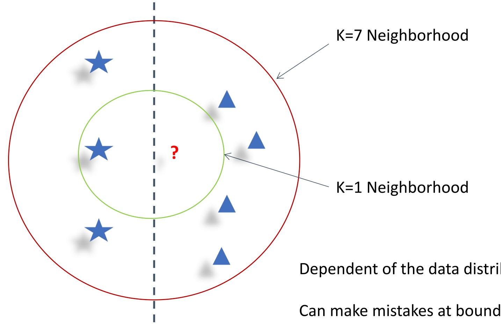

Dependent of the data distributions.

## K-Nearest Neighbors算法特点

·优点

·精度高

·对异常值不敏感

• 无数据输入假定

•缺点

·计算复杂度高

• 空间复杂度高

·适用数据范围

•数值型和标称型

## K-Nearest Neighbors Algorithm

## •工作原理

·存在一个样本数据集合，也称作训练样本集，并且样本集中每个数据都存在标签，即我们知道样本集中每个数据与所属分类的对应关系。

•输入没有标签的新数据后，将新数据的每个特征与样本集中数据对应的特征进行比较，然后算法提取样本集中特征最相似数据（最近邻）的分类标签。

• 一般来说，只选择样本数据集中前N个最相似的数据。K一般不大于20，最后，选择k个中出现次数最多的分类，作为新数据的分类

## K近邻算法的一般流程

·收集数据：可以使用任何方法

· 准备数据：距离计算所需要的数值，最后是结构化的数据格式。

•分析数据：可以使用任何方法

·训练算法: (此步骤kNN) 中不适用

•测试算法：计算错误率

•使用算法：首先需要输入样本数据和结构化的输出结果，然后运行k-近邻算法判定输入数据分别属于哪个分类，最后应用对计算出的分类执行后续的处理。

## 距离度量

$\mathsf { L } \mathsf { p }$ 距离：

•欧式距离:

曼哈顿距离

$L \infty$ 距离

$$
\boldsymbol { x } _ { i } = \big ( \boldsymbol { x } _ { i } ^ { ( 1 ) } , \boldsymbol { x } _ { i } ^ { ( 2 ) } , \cdots , \boldsymbol { x } _ { i } ^ { ( n ) } \big ) ^ { \top }
$$

$$
L _ { p } ( x _ { i } , x _ { j } ) = \left( \sum _ { l = 1 } ^ { n } \lvert x _ { i } ^ { ( l ) } - x _ { j } ^ { ( i ) } \rvert ^ { p } \right) ^ { \frac { 1 } { p } }
$$

$$
L _ { 2 } ( x _ { i } , x _ { j } ) = \left( \sum _ { l = 1 } ^ { n } \mid x _ { i } ^ { ( l ) } - x _ { j } ^ { ( l ) } \mid ^ { 2 } \right) ^ { \frac { 1 } { 2 } }
$$

$$
L _ { 1 } ( x _ { i } , x _ { j } ) = \sum _ { l = 1 } ^ { n } \lvert x _ { i } ^ { ( l ) } - x _ { j } ^ { ( l ) } \rvert
$$

$$
L _ { \infty } ( x _ { i } , x _ { j } ) = \operatorname* { m a x } _ { l } \mid x _ { i } ^ { ( l ) } - x _ { j } ^ { ( l ) } \mid
$$

## 距离度量

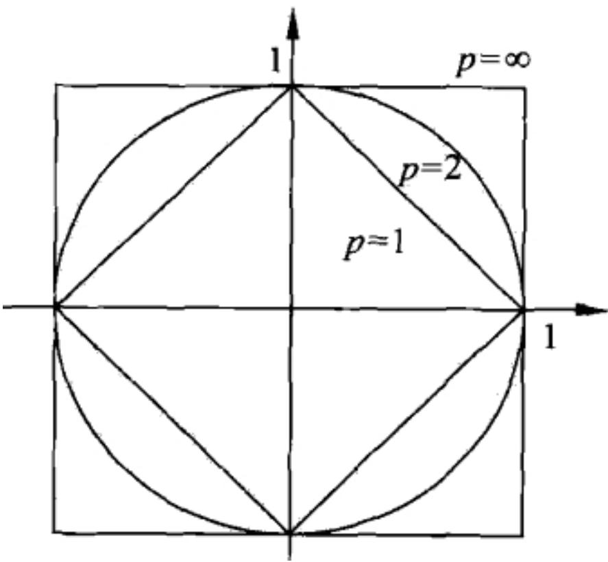

## K值的选择

•如果选择较小的K值

·“学习”的近似误差（approximation error)会减小，但“学习”的估计误差(estimation error) 会增大，

·噪声敏感

• K值的减小就意味着整体模型变得复杂，容易发生过拟合.

• 如果选择较大的K值，

• 减少学习的估计误差，但缺点是学习的近似误差会增大.

• K值的增大 就意味着整体的模型变得简单.

## Python程序调试

•Python传统运行模式:

•Python解释器：运行Python程序的程序;

·Python字节码：Python将程序编译后所得到的底层形式；Python自动将字节码保存为名为.pyc的文件中；


源代码

字节码

运行时

•丞公的源码换为字节码->字节码在PVM（Python虚拟机）中运行->代码自动被 编译，芝后再解释

## Python程序调试

•Python无“build"和“make”的步骤，代码写好后立即运行

•Python字节码不是机器的二进制代码，(so不能像C++运行速度那么快，其速度介于传统编译语言和传统解释语言之间）

· raw\_input（）的使用

## Python模块

•每一个·y文件都是一个模块，其他文件可以通过导入一个模块读取这个模块的内容，

·相当于c中的include……

• 一个大型程序往往呈现出多模块的形式。

·其中一个模块文件被设计为主文件（or顶层文件）。

·模块是Python程序最大的程序结构

·每个模块文件是一个独立完备的变量包装，即一个命名空间

## 模块的导入

· import， from 和 reload

• import语句将模块作为一个整体引用，相当于引入一个类的object。

Erom 增加了对变量名的额外赋值，也就是拷贝模块的属性，因此能够以主模块导入，而不是原莱的对象

·例子：

$A = ^ { \prime \prime } \pm h i s ^ { \prime \prime }$

$B = ^ { 6 6 } \vert S ^ { \prime \prime }$

• C="test"

• Print A, B, C

• Import test1

• Test1.A

• From test import \*

•A

## Reload和重编译

•修改文件如kNN注意

·Reload ()

·或者：重新编译

• import py\_compile

· py\_compile.compile(D:\python\machinelearninginaction\Cho2\kNN.py')

·最好不要用中文，如果需要，用编码转换工具codec

## Idle调试环境

• Idle 的使用:

• Copy的结果是什么？

•For语句

· Reload的好处• 修改程序，显示修改时间

• Import 和from A import \*的关系•空间，如numpy

## Python导入数据

• >>> import os

• >>> os.getcwd()

•'D:\/python'

• >>>os.chdir('D:\python\\machinelearninginaction\\Ch02')

• >>> os.getcwd()

·'D:\\python\\machinelearninginaction\\Ch02'

• >>> open('.\testDigits\\0\_0.txt')

• <open file '\\testDigits\\O\_O.txt', mode 'r' at Ox00D1FCD8>

## Python导入数据

• from numpy import \*

• >>> import operator

• >>> def createDataSet():

group=array([[1.0, 1.1],[1.0, 1.0],[0,0],[0,0.1]1)

labels=['A','A','B','B']

return group,lables

• >>>group,labels=kNN.createDataSet()

## 算法和关键函数分析

•分类算法流程和关键函数

• Shape

• Tile

• Argsort

字典的使用

•文本中解析数据

•文件读取相关函数

•用matplotlib绘制散点图

•数据归一化

•使用k-近邻算法的手写识别系统

## 分类算法流程

•对未知类别的数据集中的每个点依次执行以下操作

·计算已知类别数据集众多点与当前点之间的距离

•按照距离递增次序排序

• 选取与当前点距离最小的k个点

• 群定前k个点所在类别的出现频率

• 返回前k个点出现频率最高的类别作为当前点的预测分类

## 分类算法

• kNN中的分类算法:

• def classifyo(inX, dataSet, labels, k):

datasetsize = dataSet.shape[0]

• diffMat = tile(inX, (dataSetsSize, 1)) - dataSet

● sqDiffMat = diffMat\*\*2

• sqDistances = sqDiffMat.sum(axis=1)

• distances = sqDistances\*\*0.5

• sortedDistindicies = distances.argsort()

classCount={}

for item in range(k):

votellabel = labels[sortedDistlndicies[item]]

classCount[votellabel] = classCount.get(votellabel,0) + 1

sortedClassCount = sorted(classCount.iteritems(), key=operator.itemgetter(1), reverse=True)

return sortedClassCount[0][0]

## Shape函数

• group,labels=kNN.createDataSet()

• group.shape

group.shape[0]

## Tile函数

• tile([1.0,1.2],(4,1))

• array(I 1., 1.2],

[1., 1.2],

[1., 1.2],

[1., 1.2]])

• tile([1.0, 1.2],(4,1))-group

• array([I O., 0.1],

[0., 0.2],

[1., 1.2],

[1., 1.1]])

• a=(tile([1.0, 1.2],(4,1))-group)\*\*2

• array([[ 0. , 0.01],

[0., 0.04],

[1.,1.44],

[1.,1.21]])

## Argsort

${ \mathsf { b } } { = } { \mathsf { a . s u m } } ( { \mathsf { a x i s { = } } } 1 )$

$c { = } b ^ { * * } 0 . 5$

$\mathsf { d } { = } \mathsf { c } . \mathsf { a r g s o r t } ( )$

$> > > d$

• array([O, 1, 3, 2])

## 字典的使用

• classCount={} #字典

foriin range(k)：#列表的扩展

votellabel = labels[sortedDistlndicies[i]]

classCount[votellabel] = classCount.get(votellabel,0) + 1

sortedClassCount = sorted(classCount.iteritems(), key=operator.itemgetter(1), reverse=True)

return sortedClassCount[0][0]

• kNN.classifyo([0,0.2],group,labels,3)

'B'

## 从文本文件中解析数据-打开文件

• def file2matrix(filename):

fr = open(filename)

numberOfLines = len(fr.readlines()

returnMat = zeros((numberOfLines,3))

classLabelVector = []

fr = open(filename)

index = 0

#get the number of lines in the file

#prepare matrix to return

#prepare labels return

## 从文本文件中解析数据-获得数据

• for line in fr.readlines():

line = line.strip()

● listFromLine = line.split(\t'）截取掉所有回车符号，\t分割成列表

returnMat[index,:] = listFromLine[0:3]

classLabelVector.append(int(listFromLine[-1]))

index += 1

return returnMat,classLabelVector

## 文件读取相关函数

•Open()的使用

·Readlines的使用

•Zeros()的使用

## 文件读取相关函数

•Open()的使用工作路径和绝对路径

• Readlines的使用

•Zeros()的使用

• fr=open('test1.txt')

• >>> for line in fr.readlines():

print line

•执行a=fr.readlines()

• vvva

·结果是什么呢？

• >>> fr.seek(0)

• >>> a=fr.readlines()

## 文件读取相关函数

• >>> a=fr.readlines()

\>>a

• [1 3 4 12\n','5 7 8 13\n','9 10 11 14]

• >>>b=a[0]

• >>>b

· '1 3 4 12\n'

• >>>c=b.strip()

v>>c

· '1 3 4 12'

• >>>d=c.split(\t')

•vv>d

· [1 3 4 12]

• >>>d[0]

· '1 3 4 12'

vvv

## 文件读取相关函数

• for line in a:

line=line.strip()

line=line.split()

print line

```csv
•[1', '3', '4', '12]
```

•[5', '7', '8', '13']

•[9', '10, '11', '14”]

## 文件读取相关函数

• for line in a:

line=line.strip()

line=line.split()

print line

```json
•[1', '3', '4', '12"]
```

•[5','7','8', '13']

•[9', '10', '11', '14]

## 文件读取相关函数

• for line in a:

line=line.strip()

line=line.split()

line=[int(x ) for × in line ]

print line

• [1, 3, 4, 12]

• [5, 7, 8, 13]

• [9, 10, 11, 14]

## 数组和矩阵

• Python 数组和numpy矩阵的关系

• >>> a=[[1,2,3,4],[5,6,7,8],[9,10, 1,12]]

• >>> c=zeros((3,4))

•vvvC

• array([[ O., 0., 0., 0.],

[0., 0., 0., 0.],

[0., 0., 0., 0.]1)

• >>>c[0,:]=a[0]

•vvvc

• array([[ 1., 2., 3., 4.],

[0., 0., 0., 0.],

[0., 0., 0., 0.]1)

## 解析数据

• fr=open('datingTestSet.txt')

• >>> a=fr.readlines()

• b=len(a)

• line=a[0]

• line=line.strip()

• list=line.split(\t')

• >>> r[0,:]=list[0:3]

r

• List[-1]

• ClassLat=[]

• classLab.append(ist[-1])

•  >>> classLab

## 使用Matplotlib创建散点图

• import matplotlib

• >>> import matplotlib.pyplot as plt

• >>> fig=plt.figure()

• >>> ax=fig.add\_subplot(111)

• >>> ax.scatter(datingDataMat[:, 1],datingDataMat[:,2])

• <matplotlib.collections.PathCollection object at Ox01D8F590>

• >>> plt.show()

## 使用Matplotlib创建散点图

• >>> fig=plt.figure()

• >>> ax=fig.add\_subplot(111)

• >>>ax.scatter(datingDataMat[,1],datingDataMat[:,2], 15.0\*array(dati ngLabels), 15.0\*array(datingLabels))

• >>> plt.show()

## 数据归一化

• def autoNorm(dataSet):

minVals = dataSet.min(0)

maxVals = dataSet.max(0)

ranges = maxVals - minVals

normDataSet = zeros(shape(dataSet))

m = dataSet.shape[0]

normDataSet = dataSet - tile(minVals, (m, 1))

● normDataSet = normDataSet/tile(ranges, (m, 1)) #element wise divide

return normDataSet, ranges, minVals

## 数据归一化

• >>> n,r,m=kNN.autoNorm(datingDataMat)

•>>>n

• array([[ 0.44832535, 0.39805139, 0.56233353],

[0.15873259, 0.34195467, 0.98724416],

[0.28542943，0.06892523，0.47449629],

[0.29115949, 0.50910294, 0.51079493],

[0.52711097, 0.43665451, 0.4290048 ],

[0.47940793，0.3768091，0.78571804]1)

•v>>r

• array([ 9.12730000e+04, 2.09193490e+01, 1.69436100e+00])

•vvvm

• array([ 0.，0.，0.001156])

## 测试算法： 验证分类器

• def datingClassTest():

hoRatio = 0.50 #hold out 10%

datingDataMat,datingLabels = file2matrix('datingTestSet2.txt') #load data setfrom file

normMat, ranges, minVals = autoNorm(datingDataMat)

m = normMat.shape[0]

numTestVecs = int(m\*hoRatio)

errorCount = 0.0

for iin range(numTestVecs):

classifierResult = classifyo(normMat[i,:],normMat[numTestVecs:m,:],datingLabels[numTestVecs:m],3)

● print "the classifier came back with: %d, the real answer is: %d" % (classifierResult, datingLabels[i])

if (classifierResult != datingLabels[il): errorCount += 1.0

print "the total error rate is: %f" % (errorCount/float(numTestVecs))

print errorCount

## 使用k-近邻算法的手写识别系统

准备数据，将图像转换为测试向量32x32   
def img2vector(filename):   
returnVect = zeros(1,1024))   
fr = open(filename)   
for i in range(32):   
lineStr = fr.readline()   
for j in range(32):   
returnVect[0,32\*i+j] = int(lineStr[j])   
return returnVect

## 测试算法

• >>> testVector=kNN.img2vector('testDigits/0\_13.txt')

• >>> tesVector[O,0:31]

## KNN算法改进和实验作业

•KNN面临的挑战

•算法改进

·距离度量

•马氏距离

·KD树

•实验要求

## KNN面临的挑战


Instance-Based Learning

No explicit description of the target function

Can handle complicated situations.

## KNN面临挑战

•K值确定

• Non-monotonous impact on accuracy

• Too Big vs. Too Small

• Rule of thumbs

特征的选择

• Different features may have different impact ….

•距离函数确定

• There are many different ways to measure the distance.

• Euclidean, Manhattan ….

## •复杂度

• Need to calculate the distance between X' and alltraining data.

• In proportion to the size of the training data.

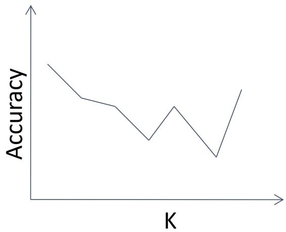

## Distance Metrics

$$
L _ { k } \left( x , y \right) = \left( \sum _ { i = 1 } ^ { d } \left| x _ { i } - y _ { i } \right| ^ { k } \right) ^ { 1 / k }
$$

$$
L _ { 2 } \big ( x , y \big ) = \left( \sum _ { i = 1 } ^ { d } \big | x _ { i } - y _ { i } \big | ^ { 2 } \right) ^ { 1 / 2 }
$$

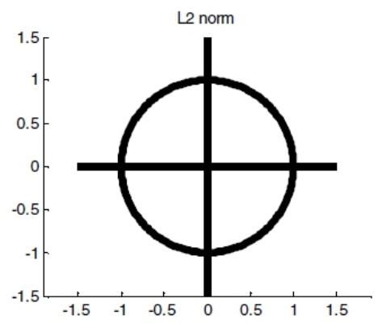

$$
L _ { 1 } ( x , y ) { = } { \Bigg ( } \sum _ { i = 1 } ^ { d } { \big | } x _ { i } - y _ { i } { \big | } { \Bigg ) }
$$

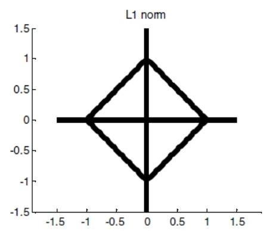

## Mahalanobis Distance马氏距离

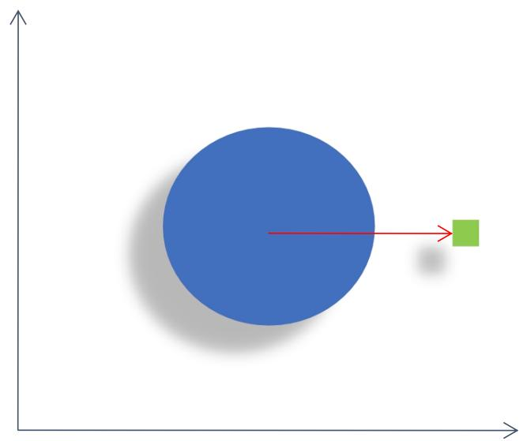

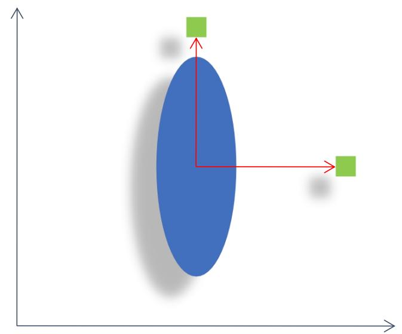  
Distance from a point to a point set

## 马氏距离(Mahalanobis Distance)

由P.C.Mahalanobis提出

➢基于样本分布的一种距离测量

➢考虑到各种特性之间的联系（例如身高和体重），可以消除样本间的相关性

广泛用于分类和聚类分析

## 马氏距离(Mahalanobis Distance)

## 一维数据

均值：

$$
\overline { { \mathbb { X } } } = \frac { \sum _ { i = 1 } ^ { n } \mathbb { X } _ { i } } { \Pi }
$$

标准差： $\ S = \sqrt { \frac { \underline { { { \Sigma } } } _ { \mathrm { { i = 1 } } } ^ { \mathrm { n } } ( \mathbf { X } _ { \mathrm { { i } } } - \overline { { \mathbf { X } } } ) ^ { \perp } } { \mathbf { n } - \mathbf { 1 } } }  ,$

方差：

$$
\begin{array} { r } { \mathbb { S } ^ { 2 } = \frac { \sum _ { i = 1 } ^ { n } ( \mathbf { X } _ { i } - \overline { { \mathbf { X } } } ) ^ { 2 } } { \mathbf { n } - 1 } , } \end{array}
$$

例：[0, 8, 12, 20] 8.3  
[8, 9, 11, 12] 1.8

## 多维向量

$$
\operatorname { v a r } ( \mathrm { X } ) = { \frac { \sum _ { i = 1 } ^ { n } ( \mathrm { X } _ { i } - { \overline { { X } } } ) ( \mathrm { X } _ { i } - { \overline { { X } } } ) } { { \mathrm { n } } - 1 } }
$$

$$
\operatorname { c o v } ( \mathrm { X } , \mathrm { Y } ) = \frac { \sum _ { i = 1 } ^ { n } ( \mathrm { X } _ { i } - \overline { { \mathrm { X } } } ) ( \mathrm { Y } _ { i } - \overline { { \mathrm { Y } } } ) } { { \mathrm { n } } - 1 }
$$

$\mathtt { C O F } ( \mathrm { X } , \mathrm { X } ) = \mathtt { V a r } ( \mathrm { X } )$

『 $\operatorname { c o v } ( \mathbb { X } , \mathbb { Y } ) = \operatorname { c o v } [ \mathbb { Y } , \mathbb { X } ]$ 1

## 协方差矩阵

$$
\mathsf { C } = \left( \begin{array} { l l l } { \mathsf { c o v } ( \mathbf { x } , \mathbf { x } ) } & { \mathsf { c o v } ( \mathbf { x } , \mathbf { y } ) } & { \mathsf { c o v } ( \mathbf { x } , \mathbf { z } ) } \\ { \mathsf { c o v } ( \mathbf { y } , \mathbf { x } ) } & { \mathsf { c o v } ( \mathbf { y } , \mathbf { y } ) } & { \mathsf { c o v } ( \mathbf { y } , \mathbf { z } ) } \\ { \mathsf { c o v } ( \mathbf { z } , \mathbf { x } ) } & { \mathsf { c o v } ( \mathbf { z } , \mathbf { y } ) } & { \mathsf { c o v } ( \mathbf { z } , \mathbf { z } ) } \end{array} \right)
$$

$$
\mathrm { C _ { n \times n } = ( c _ { i , j } , \qquad ~ c _ { i , j } = c o v ( D i m _ { i } , D i m _ { j } ) ) }
$$

## 协方差矩阵

>i MySample=fix (rand(10, 3) \*50)

MySample =

>> dim1=MySample(:, 1):   
>> dim2=MySample(:, 2):   
>> dim3=MySample(:, 3):


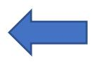

49 216   
8 19   
12 8 12222   
19   
3   
320 49 13414 1277222   
20 2   
31

ans =

>> cov12=sum((dim1-mean(dim1)).(dim2-mean(dim2)))/(size(MySample,1)-1):   
>> cov13=sun((dim1-mean(dim1）).(dim3-mean(dim3)）)/(size(MySample, 1)-1):   
>> cov23=sum((dim2-mean(dim2)).(dim3-mean(dim3)))/(size(MySample, 1)-1):


>)varl=std(din1)"2:   
>)var2=std(din2)2:   
>)var3=std(din3)2:

## 马氏距离定义

一组向量 $\left\{ { \vec { X } } _ { 1 } , { \vec { X } } _ { 2 } , { \vec { X } } _ { 3 } , \ldots , { \vec { X } } _ { n } \right\}$ ，其中，

$$
\overrightarrow { \mathbfcal { X } } = \{ x _ { 1 } , x _ { 2 } , x _ { 3 } , \dots , x _ { m } \}
$$

其均值为 $\vec { \pmb { \mu } } = \{ \pmb { \mu _ { 1 } } , \pmb { \mu _ { 2 } } , \pmb { \mu _ { 3 } } , \dots , \pmb { \mu _ { m } } \}$ ;

协方差矩阵为Σ，其中

$$
\pmb { \Sigma _ { i j } } = c \pmb { o v } \big ( \pmb { x _ { i } } , \pmb { x _ { j } } \big )
$$

## 马氏距离定义续

单向量的马氏距离定义为：

$$
\mathbf { \mathop { \bf M D } } \bigl ( \overrightarrow { X } \bigr ) = \sqrt { ( \overrightarrow { X } - \overrightarrow { \mu } ) ^ { T } \Sigma ^ { - 1 } ( \overrightarrow { X } - \overrightarrow { \mu } ) }
$$

向量间的马氏距离定义为：

$$
\mathbf { M D } \bigl ( \overrightarrow { X } , \overrightarrow { Y } \bigr ) = \sqrt { ( \overrightarrow { X } - \overrightarrow { Y } ) ^ { T } \Sigma ^ { - 1 } ( \overrightarrow { X } - \overrightarrow { Y } ) }
$$

## 马氏距离 计算示例

一组向量：{3,4},{5,6},{2,2},{8,4}

均值： $\vec { \mu } = \{ 4 . 5 , 4 \}$

协方差矩阵：

$$
\pmb { \Sigma } = \bigl [ \begin{array} { c c } { 7 } & { 2 } \\ { 2 } & { 2 . 6 6 7 } \end{array} \bigr ] , \pmb { \Sigma } ^ { - 1 } = \bigl [ \begin{array} { c c } { \mathbf { 0 . 1 8 } } & { - \mathbf { 0 . 1 3 } } \\ { - \mathbf { 0 . 1 3 } } & { \mathbf { 0 . 4 8 } } \end{array} \bigr ]
$$

可以计算{3,4}和{5,6}之间的距离为：

$$
\begin{array} { r } { \mathbf { M D } = \sqrt { ( - 2 , - 2 ) ^ { T } \Sigma ^ { - 1 } ( - 2 , - 2 ) } = 1 . 2 } \end{array}
$$

## 马氏距离 NUMPY示例

```python
import numpy
x = numpy.array([[3,4],[5,6],[2,2],[8,4]1)
xT = x.T
D = numpy.cov(xT)
invD = numpy.linalg.inv(D)
tp = x[0] − x[1]
print numpy.sqrt(dot(dot(tp, invD), tp.T))
```

## Mahalanobis Distance

$$
D _ { M } ( x ) = \sqrt { \left( x - \mu \right) ^ { T } S ^ { - 1 } \left( x - \mu \right) }
$$

For identity matrix S:

$$
D _ { M } ( x ) = \sqrt { \left( x - \mu \right) ^ { T } \left( x - \mu \right) }
$$

For diagonal matrix S:

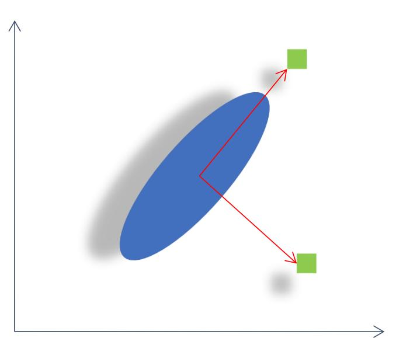

$$
D _ { M } ( x ) = { \sqrt { \sum _ { i = 1 } ^ { n } { \frac { \left( x _ { i } - \mu _ { i } \right) ^ { 2 } } { \sigma _ { i } ^ { 2 } } } } } \quad \quad \quad \quad \quad \quad \quad \quad \quad \quad \quad \quad \quad \quad \quad \quad \quad \quad \quad \quad \quad \quad \quad \quad \quad \quad \quad \quad \quad \quad \quad \quad \quad \quad \quad \quad \quad \quad \quad \quad \quad \quad \quad \quad \quad \quad \quad \quad \quad \quad \quad \quad \quad \quad \quad \quad \quad \quad \quad \quad \quad \quad \quad \quad \quad \quad \quad \quad \quad \quad \quad \quad \quad \quad \quad \quad \quad \quad \quad \quad \quad \quad \quad \quad \quad \quad \quad \quad \quad \quad \quad \quad \quad \quad \quad \quad \quad \quad \quad \quad \quad \quad \quad \quad \quad \quad \quad \quad \quad \quad \quad \quad \quad \quad \quad \quad \quad \quad \quad \quad \quad \quad \quad \quad \quad \quad \quad \quad \quad \quad \quad \quad \quad \quad \quad \quad \quad \quad \quad \quad \quad \quad \quad \quad \quad \quad \quad \quad \quad \quad \quad \quad \quad \quad \quad \quad \quad \quad \quad \quad \quad \quad \quad \quad \quad \quad \quad \quad \quad \quad \quad \quad \quad \quad \quad \quad \quad \quad \quad \quad \quad \quad \quad \quad \quad \quad \quad \quad \quad \quad \quad \quad \quad \quad \quad \quad \quad \quad \quad \quad \quad \quad \quad \quad \quad \quad \quad \quad \quad \quad \quad \quad \quad \quad \quad \quad \quad \quad \quad \quad \quad \quad \quad \quad \quad \quad \quad \quad \quad \quad \quad \quad \quad \quad \quad \quad \quad \quad \quad \quad \quad \quad \quad \quad \quad \quad \quad \quad \quad \quad \quad \quad \quad \quad \quad \quad \quad \quad \quad \quad \quad \quad \quad \quad \quad \quad \quad \quad \quad \quad \quad \quad \quad \quad \quad \quad \quad \quad \quad \quad \quad \quad \quad \quad \quad \quad \quad \quad \quad \quad \quad \quad \quad \quad \quad \quad \quad \quad \quad \quad \quad \quad \quad \quad \quad \quad \quad \quad \quad \quad \quad \quad \quad \quad \quad \quad \quad \quad \quad \quad \quad \quad \quad \quad \quad \quad \quad \quad \quad \quad \quad \quad \quad \quad \quad \quad \quad \quad \quad \quad \quad \quad \quad \quad \quad
$$

## KD树

• kd树是一种对K维空间中的实例点进行存储以便对其进行快速检索的树形数据结构.

•Kd树是二叉树，表示对K维空间的一个划分(partition).构造Kd树相当于不断地用垂直于坐标轴的超平面将k维空间切分，构成一系列的k维超矩形区域.Kd树的每个结点对应于一个k维超矩形区域.

## KD树

·构造kd树:

•对深度为j的节点，选择x为切分的坐标轴 $l = j ( \mathrm { m o d } k ) + 1$

·例： $T = \{ ( 2 , 3 ) ^ { \mathrm { T } } , ( 5 , 4 ) ^ { \mathrm { T } } , ( 9 , 6 ) ^ { \mathrm { T } } , ( 4 , 7 ) ^ { \mathrm { T } } , ( 8 , 1 ) ^ { \mathrm { T } } , ( 7 , 2 ) ^ { \mathrm { T } } \}$

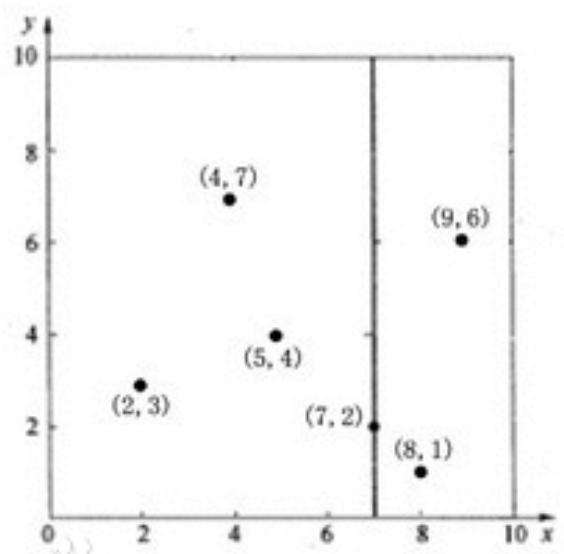  
图27将整个空间分为两部分

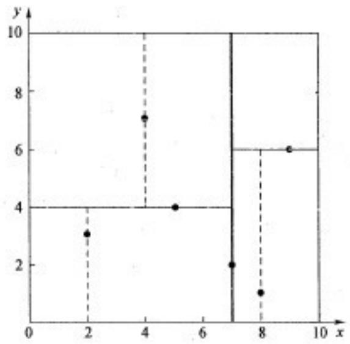  
图1二维数据k-d树空间划分示意图

## KD树

• {(2,3),(5,4),(9,6),(4,7),(8,1),(7,2)},

•建立索引

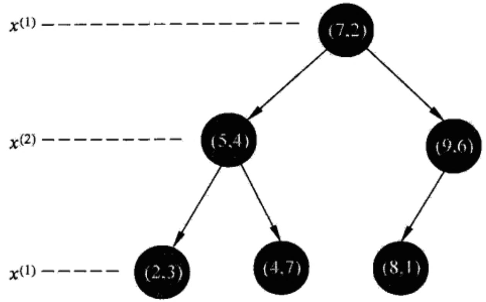

## KD树搜索

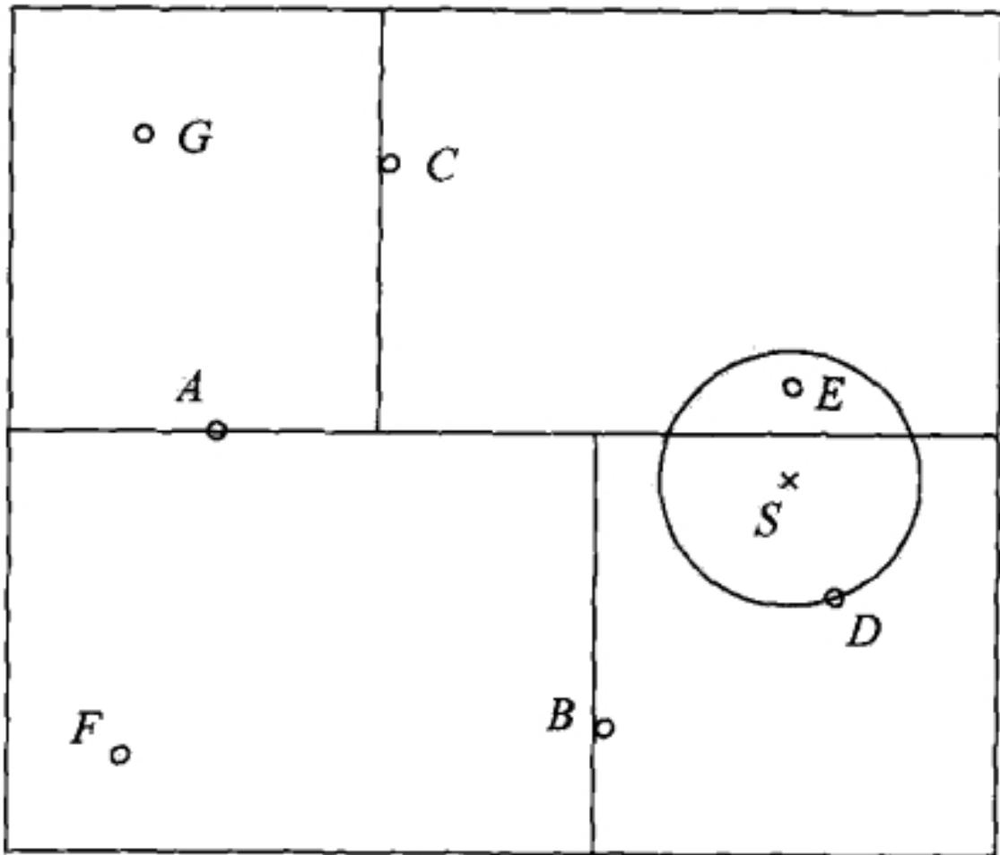

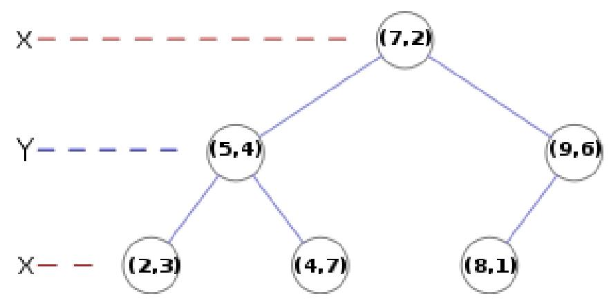

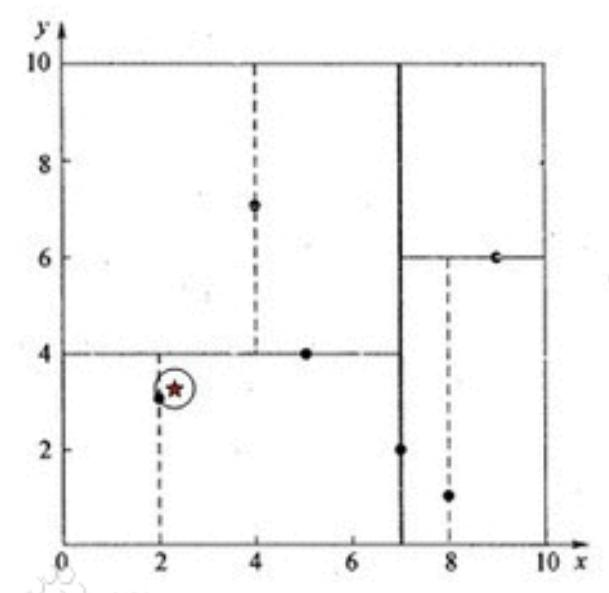  
图4查找（2.1，3.1）点的两次回溯判断

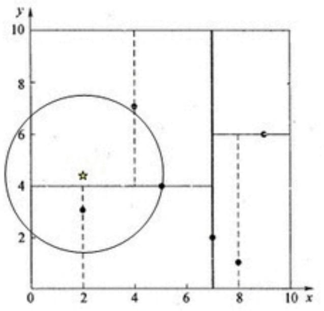  
图5查找（2，4.5）点的第一次回溯判断

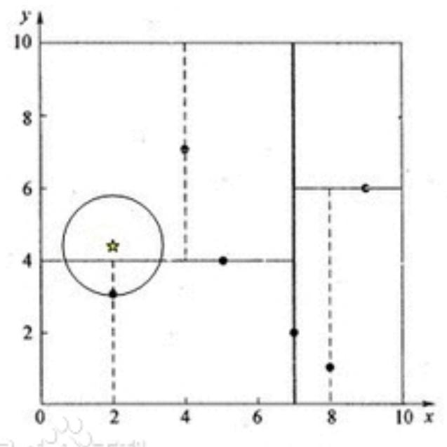  
图6查找（2，4.5）点的第二次回溯判断

## 作业要求

• 作业里包含如下文件：

・源代码（改进部分要有注释），

· 实验报告：包含对改进算法的描述以及实验结果对比情况。

•给分依据:

•代码质量 （包含可读性)

• 改进算法难度

•实验报告的详细性。

・若有疑惑， 可联系助教邱鑫。

## 阅读材料

·论文：

• P. Viswanath and T. Hitendra Sarma,An Improvement to k-Nearest Neighbor Classifier 2011

• The key points of the paper

• (i)weighted k-nearest neighbor classifier(wk-NNC),

• where a weight for each training pattern is assigned and is used in the classification,

• (i) Bootstrapping method

generating an artificial training set by applying a bootstrapping method and to use the bootstrapped training set in the place of the original training set.

## 阅读材料

•NOTATION AND DEFINITIONS

• 认识论文中的标注

•wk-NNC 方法

·例如: $\begin{array} { r } { { \sf k } = 1 , { \sf \omega } \cup 2 , \omega 1 , \omega 2 , \omega 2 , \omega 2 , \omega 3 , \omega 3 . } \end{array}$

wi = (hk − hi)/(hk − h1)

· Bootstrapping 方法

average of these neighbors. Let X be a training pattern and let $X ^ { 1 } , \ldots , X ^ { r }$ be its r nearest neighbors in its class. Then $\begin{array} { r } { X ^ { \prime } = \sum _ { i = 1 } ^ { r } w _ { i } X ^ { i } } \end{array}$ (where $\textstyle \sum _ { i = 1 } ^ { r } w _ { i } = 1 )$ is the bootstrapped pattern generated for X. Either all patterns in the original

## 阅读材料

•算法结果

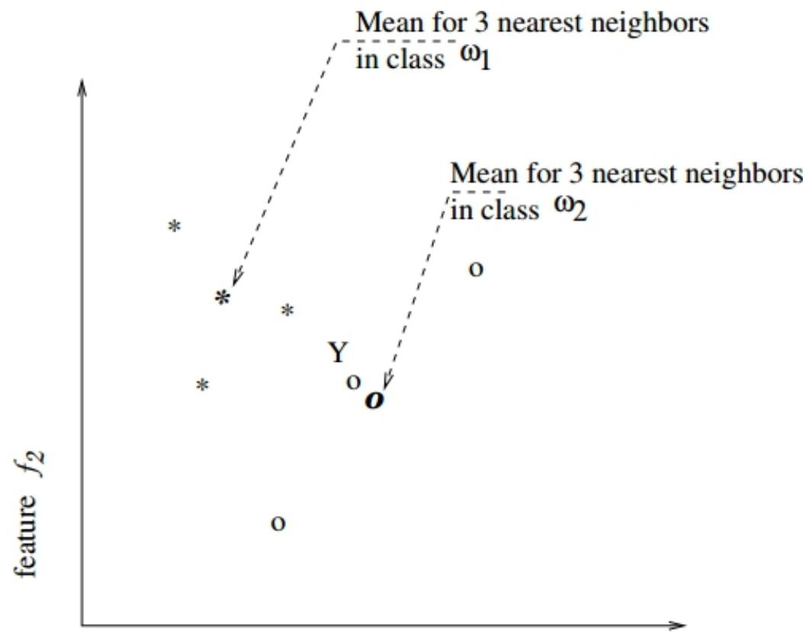

## 第四章贝叶斯分类器

## 问题的提出

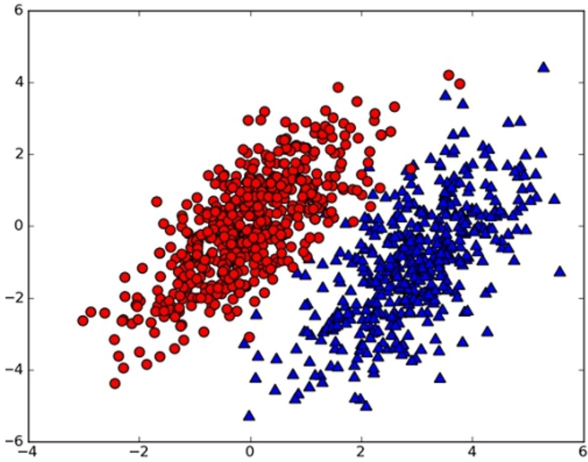

KNN?

决策树？

概率方法？

## 贝叶斯


•贝叶斯(约1701-1761) Thomas Bayes，英国数学家。约1701年出生于伦敦，做过神甫。1742年成为英国皇家学会会员。1761年4月7日逝世。贝叶斯在数学方面主要研究概率论。他首先将归纳推理法用于概率论基础理论，并创立了贝叶斯统计理论，对于统计决策函数、统计推断、统计的估算等做出了贡献。他死后，理查德·普莱斯(Richard Price)于1763年将他的著作《机会问题的解法》(An essay towards solvinga problem in the doctrine of chances)寄给了英国皇家学会，对于现代概率论和数理统计产生了重要的影响

## 贝叶斯


・贝叶斯决策就是在不完全情报下，对部分未知的状态用主观概率估计，然后用贝叶斯公式对发生概率进行修正，最后再利用期望值和修正概率做出最优决策。

• 贝叶斯决策理论方法是统计模型决策中的一个基本方法，其基本思想是：

•1、已知类条件概率密度参数表达式和先验概率

•2、利用贝叶斯公式转换成后验概率

•3、根据后验概率大小进行决策分类。

## 贝叶斯网络的应用

·最早的PathFinder系统，该系统是淋巴疾病诊断的医学系统，它可以诊断60多种疾病，涉及100多种症状;后来发展起来的Internist-1系统，，也是一种医学诊断系统，但它可以诊断多达600多种常见的疾病。

•1995年，微软推出了第一个基于贝叶斯网的专家系统，一个用于幼儿保健的网站onParent (www.onparenting.msn.com)，使父母们可以自行诊断。

## 贝叶斯网络的应用

• (1)故障诊断(diagnose)

• (2)专家系统(expert system)

• (3)规划(planning)

• (4)学习(learning)

• (5)分类(classifying)

## 概率(回顾)

## 样本空间的划分

定义设Ω为试验E的样本空间， $B _ { 1 } , B _ { 2 } , \cdots , B _ { n }$ 为E的一组事件,若

$$
\begin{array} { r l } { 1 ^ { 0 } } & { { } B _ { i } B _ { j } = \varnothing , i , j = 1 , 2 , \cdots , n ; } \end{array}
$$

$$
2 ^ { 0 } \quad B _ { 1 } \bigcup B _ { 2 } \bigcup \cdots \bigcup B _ { n } = \Omega ,
$$

则称 $B _ { 1 } , B _ { 2 } , \cdots , B _ { n }$ 为样本空间Ω的一个划分.

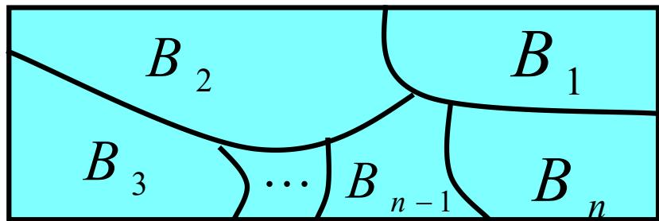

## 概率(回顾)

## 全概率公式

定义设Ω为试验E的样本空间，A为E的事件，$B _ { 1 } , B _ { 2 } , \cdots , B _ { n }$ 为Ω的一个划分，且 $P ( B _ { i } ) > 0$ $( i = 1 , 2 , \cdots , n )$ 则

$$
\begin{array} { l } { { \displaystyle P ( A ) = P ( A \mid B _ { 1 } ) P ( B _ { 1 } ) + P ( A \mid B _ { 2 } ) P ( B _ { 2 } ) } } \\ { { \displaystyle ~ + \cdots + P ( A \mid B _ { n } ) P ( B _ { n } ) } } \\ { { \displaystyle ~ = \sum _ { i = 1 } ^ { n } P ( B ) P ( A \mid B _ { i } ) } } \end{array}
$$

## 基本方法

•训练数据集： $T = \{ ( x _ { 1 } , y _ { 1 } ) , ( x _ { 2 } , y _ { 2 } ) , \cdots , ( x _ { N } , y _ { N } ) \}$

• 由X和Y的联合概率分布P(X,Y)独立同分布产生

·朴素贝叶斯通过训练数据集学习联合概率分布P(X,Y)，

• 即先验概率分布: $P ( Y = c _ { k } ) , \quad k = 1 , 2 , \cdots , K$

• 及条件概率分布：

$$
P ( X = x \mid Y = c _ { k } ) = P ( X ^ { ( 1 ) } = x ^ { ( 1 ) } , \cdots , X ^ { ( n ) } = x ^ { ( n ) } \mid Y = c _ { k } ) , \quad k = 1 , 2 , \cdots , K
$$

• 注意：条件概率为指数级别的参数: $\boldsymbol { { \cal K } } \prod _ { j = 1 } ^ { n } \boldsymbol { S } _ { j }$

## 基本方法

•条件独立性假设: ${ \begin{array} { r l } & { P ( X = x \mid Y = c _ { k } ) = P ( X ^ { ( 1 ) } = x ^ { ( 1 ) } , \cdots , X ^ { ( n ) } = x ^ { ( n ) } \mid Y = c _ { k } ) } \\ & { \qquad = \displaystyle \prod _ { j = 1 } ^ { n } P ( X ^ { ( j ) } = x ^ { ( j ) } \mid Y = c _ { k } ) } \end{array} }$

•“朴素”贝叶斯名字由来，牺牲分类准确性。

• 贝叶斯定理： $P ( Y = c _ { k } \mid X = x ) = \frac { P ( X = x \mid Y = c _ { k } ) P ( Y = c _ { k } ) \cdot } { \sum _ { k } P ( X = x \mid Y = c _ { k } ) P ( Y = c _ { k } ) }$

•代入上式: $P ( Y = c _ { k } \mid X = x ) = \frac { P ( Y = c _ { k } ) \prod _ { j } P ( X ^ { ( j ) } = x ^ { ( j ) } \mid Y = c _ { k } ) } { \sum _ { k } P ( Y = c _ { k } ) \prod _ { j } P ( X ^ { ( j ) } = x ^ { ( j ) } \mid Y = c _ { k } ) }$

## 基本方法

• 贝叶斯分类器：

$$
y = f ( x ) = \arg \operatorname* { m a x } _ { { \hat { c } } _ { k } } { \frac { P ( Y = c _ { k } ) \prod _ { j } P ( X ^ { ( j ) } = x ^ { ( j ) } \mid Y = c _ { k } ) } { \sum _ { k } P ( Y = c _ { k } ) \prod _ { j } P ( X ^ { ( j ) } = x ^ { ( j ) } \mid Y = c _ { k } ) } }
$$

•分母对所有 $\complement _ { \mathrm k }$ 都相同:

$$
y = \arg \operatorname* { m a x } _ { c _ { k } } P ( Y = c _ { k } ) \prod _ { j } P ( X ^ { ( j ) } = x ^ { ( j ) } \mid Y = c _ { k } )
$$

## 后验概率最大化的含义:

·朴素贝叶斯法将实例分到后验概率最大的类中，等价于期望风险最小化，

·假设选择0-1损失函数：f(X)为决策函数

$$
L ( Y , f ( X ) ) = { \left\{ \begin{array} { l l } { 1 , } & { Y \not \in f ( X ) } \\ { 0 , } & { Y = f ( X ) } \end{array} \right. }
$$

•期望风险函数: $R _ { \mathrm { e x p } } ( f ) = E [ L ( Y , f ( X ) ) ]$

取条件期望：

$$
R _ { \mathrm { e x p } } ( f ) = E _ { X } \sum _ { k = 1 } ^ { K } [ L ( c _ { k } , f ( X ) ) ] P ( c _ { k } \mid X )
$$

## 后验概率最大化的含义:

•只需对X=x逐个极小化，得:

$$
{ \begin{array} { r l } & { f ( x ) = \underset { y \in { \mathcal { Y } } } { \mathrm { a r g } } \underset { k = 1 } { \mathrm { m i n } } \sum _ { k = 1 } ^ { K } L ( c _ { k } , y ) P ( c _ { k } \mid X = x ) } \\ & { \qquad = \underset { y \in { \mathcal { Y } } } { \mathrm { a r g } } \underset { k = 1 } { \mathrm { m i n } } \sum _ { k = 1 } ^ { K } P ( \gamma \neq c _ { k } \mid X = x ) } \\ & { \qquad = \underset { y \in { \mathcal { Y } } } { \mathrm { a r g } } ( 1 - P ( y = c _ { k } \mid X = x ) ) } \\ & { \qquad = \underset { y \in { \mathcal { Y } } } { \mathrm { a r g } } P ( y = c _ { k } \mid X = x ) } \end{array} }
$$

· 推导出后验概率最大化准则: $f ( x ) = \arg \operatorname* { m a x } _ { c _ { k } } P ( c _ { k } \mid X = x )$

## 朴素贝叶斯法的参数估

· 应用极大似然估计法估计相应的概率：

•先验概率 $P ( Y = c _ { k } )$ 的极大似然估计是： $P ( Y = c _ { k } ) = \frac { \displaystyle \sum _ { i = 1 } ^ { N } I ( y _ { i } = c _ { k } ) } { N }$ ${ k = 1 , 2 , \cdots , K }$

· 设第j个特征×(i)可能取值的集合为: $\{ a _ { j 1 } , a _ { j 2 } , \cdots , a _ { j S _ { j } } \}$

• 条件概率的极大似然估计：

$$
P ( X ^ { ( j ) } = a _ { j l } \mid Y = c _ { k } ) = \frac { \displaystyle \sum _ { i = 1 } ^ { N } { I ( x _ { i } ^ { ( j ) } = a _ { j l } , y _ { i } = c _ { k } ) } } { \displaystyle \sum _ { i = 1 } ^ { N } { I ( y _ { i } = c _ { k } ) } }
$$

$$
j = 1 , 2 , ^ { . . . } , n \ ; l = 1 , 2 , ^ { . . . } , S _ { j } \ ; k = 1 , 2 , ^ { . . . } , K
$$

## 朴素贝叶斯法的参数估

·学习与分类算法Naive Bayes Algorithm:

•输入:

•训练数据集 $T = \{ ( x _ { 1 } , y _ { 1 } ) , ( x _ { 2 } , y _ { 2 } ) , \cdots , ( x _ { N } , y _ { N } ) \}$

$\pmb { x } _ { i } ^ { ( j ) }$ • 第i个样本的第j个特征 $\boldsymbol { x } _ { i } = ( \boldsymbol { x } _ { i } ^ { ( 1 ) } , \boldsymbol { x } _ { i } ^ { ( 2 ) } , \cdots , \boldsymbol { x } _ { i } ^ { ( n ) } ) ^ { \top }$

$a _ { j l }$ • 第j个特征可能取的第/个值 $x _ { i } ^ { ( j ) } \in \{ a _ { j 1 } , a _ { j 2 } , \cdots , a _ { j S _ { j } } \}$

•输出：

$$
y _ { i } \in \{ c _ { 1 } , c _ { 2 } , \cdots , c _ { K } \}
$$

•×的分类

## 朴素贝叶斯法的参数估

步骤

• 1、计算先验概率和条件概率

$$
P ( Y = c _ { k } ) = \frac { \displaystyle \sum _ { i = 1 } ^ { N } I ( y _ { i } = c _ { k } ) } { N } , \quad k = 1 , 2 , \cdots , K
$$

$$
P ( X ^ { ( j ) } = a _ { j l } \mid Y = c _ { k } ) = \frac { \displaystyle \sum _ { i = 1 } ^ { N } { I ( x _ { i } ^ { ( j ) } = a _ { j l } , y _ { i } = c _ { k } ) } } { \displaystyle \sum _ { i = 1 } ^ { N } { I ( y _ { i } = c _ { k } ) } }
$$

$$
j = 1 , 2 , \cdots , n ; l = 1 , 2 , \cdots , S _ { j } ; k = 1 , 2 , \cdots , K
$$

## 朴素贝叶斯法的参数估

步骤

• 2、对于给定的实例 $\boldsymbol { x } = ( \boldsymbol { x } ^ { ( 1 ) } , \boldsymbol { x } ^ { ( 2 ) } , \cdots , \boldsymbol { x } ^ { ( n ) } ) ^ { \top }$

·计算

$$
P ( Y = c _ { k } ) \prod _ { j = 1 } ^ { n } P ( X ^ { ( j ) } = x ^ { ( j ) } \mid Y = c _ { k } ) , \quad k = 1 , 2 , \cdots , K
$$

•3、确定×的类别

$$
y = \arg \operatorname* { m a x } _ { c _ { k } } P ( Y = c _ { k } ) \prod _ { j = 1 } ^ { n } P ( X ^ { ( j ) } = x ^ { ( j ) } \mid Y = c _ { k } )
$$

## 例子

<table><tr><td rowspan=1 colspan=1>Day</td><td rowspan=1 colspan=1>Outlook</td><td rowspan=1 colspan=1>Temperature</td><td rowspan=1 colspan=2>Humidity</td><td rowspan=1 colspan=1>Wind</td><td rowspan=1 colspan=1>PlayTennis</td></tr><tr><td rowspan=1 colspan=1>1</td><td rowspan=1 colspan=1>Sunny</td><td rowspan=1 colspan=1>Hot</td><td rowspan=1 colspan=2>High</td><td rowspan=1 colspan=1>Weak</td><td rowspan=1 colspan=1>No</td></tr><tr><td rowspan=1 colspan=1>2</td><td rowspan=1 colspan=1>Sunny</td><td rowspan=1 colspan=1>Hot</td><td rowspan=1 colspan=2>High</td><td rowspan=1 colspan=1>Strong</td><td rowspan=1 colspan=1>No</td></tr><tr><td rowspan=1 colspan=1>3</td><td rowspan=1 colspan=1>Overcast</td><td rowspan=1 colspan=1>Hot</td><td rowspan=1 colspan=2>High</td><td rowspan=1 colspan=1>Weak</td><td rowspan=1 colspan=1>Yes</td></tr><tr><td rowspan=1 colspan=1></td><td rowspan=1 colspan=1>4</td><td rowspan=1 colspan=1>Rain</td><td rowspan=1 colspan=1>Mild</td><td rowspan=1 colspan=2>High</td><td rowspan=1 colspan=1>Weak</td><td rowspan=1 colspan=1>Yes</td></tr><tr><td rowspan=1 colspan=1></td><td rowspan=1 colspan=1>5</td><td rowspan=1 colspan=1>Rain</td><td rowspan=1 colspan=1>Cool</td><td rowspan=1 colspan=2>Normal</td><td rowspan=1 colspan=1>Weak</td><td rowspan=1 colspan=1>Yes</td></tr><tr><td></td><td rowspan=1 colspan=1>6</td><td rowspan=1 colspan=1>Rain</td><td rowspan=1 colspan=1>Cool</td><td rowspan=1 colspan=2>Normal</td><td rowspan=1 colspan=1>Strong</td><td rowspan=1 colspan=1>No</td></tr><tr><td></td><td rowspan=1 colspan=1>7</td><td rowspan=1 colspan=1>Overcast</td><td rowspan=1 colspan=1>Cool</td><td rowspan=1 colspan=2>Normal</td><td rowspan=1 colspan=1>Strong</td><td rowspan=1 colspan=1>Yes</td></tr><tr><td></td><td rowspan=1 colspan=1>8</td><td rowspan=1 colspan=1>Sunny</td><td rowspan=1 colspan=1>Mild</td><td rowspan=1 colspan=2>High</td><td rowspan=1 colspan=1>Weak</td><td rowspan=1 colspan=1>No</td></tr><tr><td></td><td rowspan=1 colspan=1>9</td><td rowspan=1 colspan=1>Sunny</td><td rowspan=1 colspan=1>Cool</td><td rowspan=1 colspan=2>Normal</td><td rowspan=1 colspan=1>Weak</td><td rowspan=1 colspan=1>Yes</td></tr><tr><td></td><td rowspan=1 colspan=1>10</td><td rowspan=1 colspan=1>Rain</td><td rowspan=1 colspan=1>Mild</td><td rowspan=1 colspan=2>Normal</td><td rowspan=1 colspan=2>Weak</td><td rowspan=1 colspan=1>Yes</td></tr><tr><td rowspan=1 colspan=2>11</td><td rowspan=1 colspan=1>Sunny</td><td rowspan=1 colspan=1>Mild</td><td rowspan=1 colspan=2>Normal</td><td rowspan=1 colspan=1>Strong</td><td rowspan=1 colspan=1>Yes</td></tr><tr><td rowspan=1 colspan=2>12</td><td rowspan=1 colspan=1>Overcast</td><td rowspan=1 colspan=1>Mild</td><td rowspan=1 colspan=2>High</td><td rowspan=1 colspan=1>Strong</td><td rowspan=1 colspan=1>Yes</td></tr><tr><td rowspan=1 colspan=2>13</td><td rowspan=1 colspan=1>Overcast</td><td rowspan=1 colspan=1>Hot</td><td rowspan=1 colspan=2>Normal</td><td rowspan=1 colspan=1>Weak</td><td rowspan=1 colspan=1>Yes</td></tr><tr><td rowspan=1 colspan=2>14</td><td rowspan=1 colspan=1>Rain</td><td rowspan=1 colspan=1>Mild</td><td rowspan=1 colspan=2>High</td><td rowspan=1 colspan=1>Strong</td><td rowspan=1 colspan=1>No</td></tr></table>

## 例子

·测试

<Outlook-sunny, Temperature=cool, Humidity-high, Wind-strong>

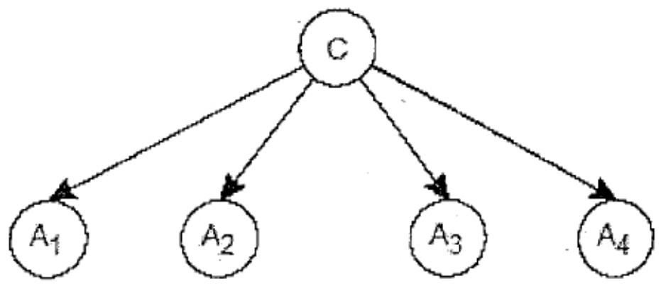  
c(x) = argmax P(c)P(sunny | c)P(cool |c)P(high|c)P(strong |c) ce(yes,no}

## 例子

$$
P ( y e s ) { = } ( 9 + 1 ) / ( 1 4 + 2 ) { = } 1 0 / 1 6
$$

$$
P ( n o ) { = } ( 5 + 1 ) / ( 1 4 + 2 ) { = } 6 / 1 6
$$

$$
P ( s u n n ) \mid y e s ) = ( 2 + 1 ) / ( 9 + 3 ) = 3 / 1 2
$$

$$
P ( s u m n ) : { n o } ) = ( 3 + 1 ) / ( 5 + 3 ) = 4 / 8
$$

$$
P ( c o o l \mid y e s ) = ( 3 + 1 ) / ( 9 + 3 ) = 4 / 1 2
$$

$$
P ( c o o l \mid n o ) = ( 1 + 1 ) / ( 5 + 3 ) = 2 / 8
$$

$$
P ( h i g h \mid y e s ) = ( 3 + 1 ) / ( 9 + 2 ) = 4 / 1 1
$$

$$
P ( h i g h \mid n o ) = ( 4 + 1 ) / ( 5 + 2 ) = 5 / 7
$$

$$
P ( s t i v o n g | y e s ) = ( 3 + 1 ) / ( 9 + 2 ) = 4 / 1 1
$$

$$
P ( s t r o n g | n o ) { = } ( 3 + 1 ) / ( 5 + 2 ) { = } 4 / 7
$$

$$
P ( y e s ) P ( s u n n y | y e s ) P ( c o o l | y e s ) P ( h i g h | y e s ) P ( s t r o n g | y e s ) = 0 . 0 0 6 9
$$

$$
P ( n o ) P ( s u n n y | n o ) P ( c o o l | n o ) P ( \hbar i g h | n o ) P ( s t r o n g | n o ) = 0 . 0 1 9 1
$$

## 贝叶斯估计

• 考虑：用极大似然估计可能会出现所要估计的概率值为0的情况，这时会影响到后验概率的计算结果，使分类产生偏差.解决这一问题的方法是采用贝叶斯估计。

•条件概率的贝叶斯估计：

$$
P _ { \lambda } ( X ^ { ( j ) } = a _ { j l } \mid Y = c _ { k } ) = \frac { \displaystyle \sum _ { i = 1 } ^ { N } I ( x _ { i } ^ { ( j ) } = a _ { j l } , y _ { i } = c _ { k } ) + \lambda } { \displaystyle \sum _ { i = 1 } ^ { N } I ( y _ { i } = c _ { k } ) + S _ { j } \lambda }
$$

• 先验概率的贝叶斯估计： $P _ { \lambda } ( Y = c _ { k } ) = \frac { \displaystyle \sum _ { i = 1 } ^ { N } I ( y _ { i } = c _ { k } ) + \lambda } { N + K \lambda }$

## 朴素贝叶斯网络的缺陷

•考虑几个问题：

• 1、如果属性之间不相互独立？

• 2、如果属性A和属性B都很重要，但是相关？

·3、如果属性A，属性B之间独立，但是在属性C下有关？

•4、属性之间的条件概率究竟有多少个？

•5、条件概率谬论？

## 贝叶斯分类器

•条件概率的谬论

假设P(A|B) 大致等于P(B|A)   
例子：   
P(disease) = 1% = 0.01   
P(well) = 99% = 0.99   
P(negative | disease) = 1%   
P(positive | disease) = 99%   
P(positive | well) = 1%   
P(negative | well) = 99%   
? P(disease|positive) = ?

$$
\begin{array} { c } { { p ( d | p ) = \displaystyle \frac { P ( p | d ) P ( d ) } { P ( p | w ) P ( w ) + P ( p | d ) P ( d ) } } } \\ { { { } } } \\ { { = \displaystyle \frac { 0 . 9 9 * 0 . 0 1 } { 0 . 0 1 * 0 . 9 9 + 0 . 9 9 * 0 . 0 1 } { { } } } } \\ { { { } } } \\ { { { } = 5 0 \% { } } } \end{array}
$$

Problem: if P(d)=0.1%， P(d|P)=?

## 信息论相关概念

阻塞：一条路径被结点集F阻塞，是指在路径上存在一个结点Ζ满足下面三种情形之一

(1) Z∈F，并且路径中有一条有向弧指向Z，另一条有向弧源自z;

(2 )Z∈F，并且路径中有两条有向弧源自z;

(3)Z及z的所有后继结点都不在F中，并且路径中有两条有向弧指

## 信息论相关概念

阻塞：

× = {X2}和Y = {X3}被Z = {X1}所分割路径×2←X1→×3被×1∈z阻塞；同时路径X2→X4←X3也被阻塞,因为X4及它的所有子孙都不在z中。因此成立d(X2,×1,×3)。

然而，X和Y没有被Z={X1,X5}所d分割，因为路径×2→×4×3由于X5的作用而成为活跃，X5在z中，是X4的子孙

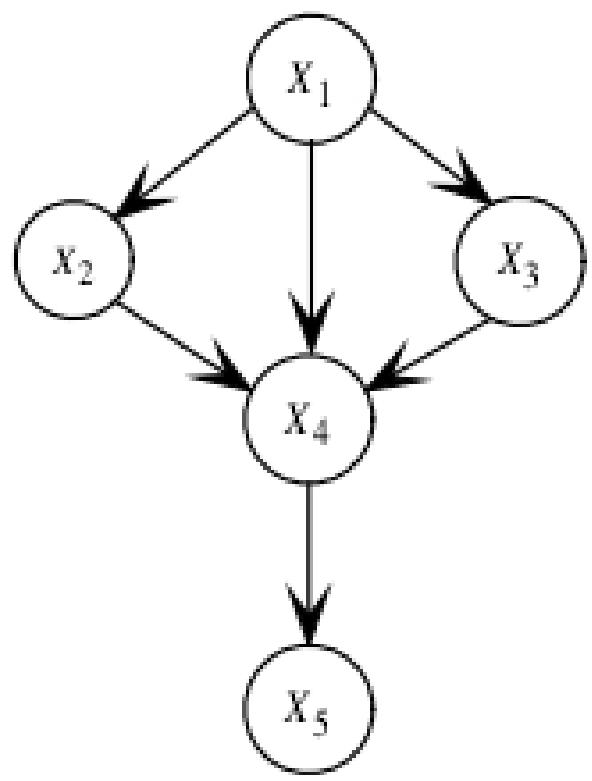

## 信息论相关概念

d-separation：令X，Y和z是一个有向无环图G 中三个不相交节点的子集，如果在集合×和Y中所有节点间的所有路径都被集合z所阻塞，则称集合×和Y被z集合d-separation，表示为<X,Y|z>G，也称Z为A和B的切割集。否则，称在给定集合z下集合X和Y图形依赖。

I-map: 假设G 是以随机变量Y1,Y2.,Yn为节点的一个有向无环图，P 是随机变量Y1,Y2.,Yn的联合概率函数，如果从图G 中得到的每一个独立性假设(Yi在给定其父母节点变量的情况下独立于它的非后代节点)在联合概率Ρ 的计算中都成立，则称G是该概率分布P的一个独立映射(Independence-map， I-map)。

## 朴素贝叶斯网络分类器

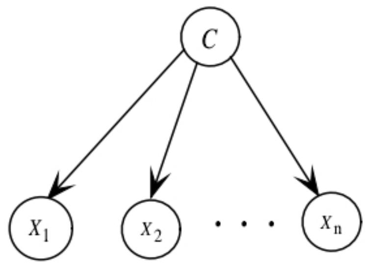

$$
C ^ { * } = \arg \operatorname* { m a x } _ { { \bf 0 } } P ( c | x _ { 1 } , x _ { 2 } , \cdots , x _ { n } ) = \arg \operatorname* { m a x } \prod _ { i = 1 } ^ { n } P ( x _ { i } | c ) P ( c )
$$

## 朴素贝叶斯网络分类器的改进算法

·半朴素贝叶斯分类器 (SNBC：Semi-Naive Bayesian Classifier)

·选择贝叶斯分类器(SBC: Selective Bayesian Classifier)

·树增广朴素贝叶斯网络分类器(TAN: Tree Augmented Naive Bayes)

·平均一依赖估测器(AODE：averaged one dependence estimators)学习算法

·加权平均的一依赖估测器(WAODE：weightily averaged onedependence estimators)学习算法

·无约束贝叶斯网络分类器(GBN：General Baynes Network)

•隐藏扩展的朴素贝叶斯分类算法(HANB)

## 半朴素贝叶斯网络分类器

• SNBC: Semi-Naive Bayesian Classifier) ,

・SNBC在模型构建过程中，依照一定的标准将关联程度较大的特征属性合并在一起组合成新属性。

• SNBC的各个组合属性之间相对于类别属性也是相互独立。

• SNBC除了结构上的差别之外，计算推导过程与朴素贝叶斯相同。

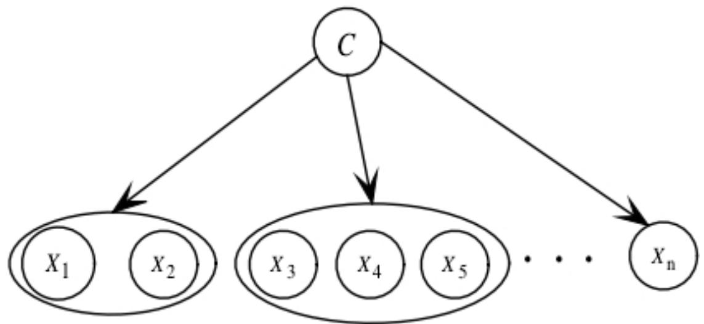

## 选择贝叶斯分类器

• SBC: Selective Bayesian Classifier)

• SBC设计目标是为了提高朴素贝叶斯在属性冗余情况下的分类精度。

•SBC只使用属性集的子集作为决策过程中的属性结点，即选择贝叶斯分类器选择初始特征的子集作为属性结点。

• SBC通过搜索特征空间，去掉特征间具有较强依赖关系的属性。

・前向（空集到全集），后向（全集到空集)

·可能的搜索子集2m

## 信息论相关概念

属性的相互独立性？

如何测量？

## 信息增益 （回顾）

·设有随机变量(X,Y),其联合概率分布为:

$$
P ( X = x _ { i } , Y = y _ { j } ) = p _ { i j } \ , ~ i = 1 , 2 , \cdots , n ; ~ j = 1 , 2 , \cdots , m
$$

·条件熵H(YIX)：表示在己知随机变量X的条件下随机变量Y的不确定性，定义为X给定条件下Y的条件概率分布的熵对×的数学期望：

$$
H ( Y \mid X ) = \sum _ { i = 1 } ^ { n } p _ { i } H ( Y \mid X = x _ { i } )
$$

## 信息增益 （回顾）

·定义 (信息增益):特征A对训练数据集D的信息增益，g(D,A)，定义为集合D的经验熵H(D)与特征A给定条件下D的经验条件熵H(DIA)之差，即

$$
g ( \mathsf { D } , \mathsf { A } ) { = } \mathsf { H } ( \mathsf { D } ) { \mathsf { - } } \mathsf { H } ( \mathsf { D } | \mathsf { A } )
$$

• (Information gain)表示得知特征x的信息而使得类Y的信息的不确定性减少的程度.

•一般地，熵H(Y)与条件熵H(Y|X)之差称为互信息(mutualinformation)

• 决策树学习中的信息增益等价于训练数据集中类与特征的互信息.

## 信息论相关概念

•设信源X为离散随机变量，则用来度量×的不确定性的信息熵H(X)为

$$
H ( X ) = - \sum _ { x } P ( x ) \log P ( x )
$$

•设(X,Y)均为离散随机变量，用来度量二元随机变量的不确定性联合信息熵H(X,Y)为

$$
H ( X , Y ) = - \sum _ { x } \sum _ { Y } P ( x , y ) \log P ( x , y )
$$

## 信息论相关概念

•条件信息熵H(XIY)用来度量在收到随机变量Y 提供的信息后，随机变量×仍然存在的不确定性

$$
H ( X | Y ) = - \sum _ { x } \sum _ { Y } P ( x , y ) \log P ( x | y )
$$

•互信息I(X;Y)用来描述随机变量Y提供的关于x的信息量的大小。

$$
I ( X ; Y ) = H ( X ) - H ( X | Y ) = \sum _ { X } \sum _ { Y } P ( x , y ) \log { \frac { P ( x , y ) } { P ( x ) P ( y ) } }
$$

## 信息论相关概念

•在已知Y的前提下，随机变量X和Z之间的条件互信息定义为

$$
\begin{array} { c } { { I ( X ; Z | Y ) = \displaystyle \sum _ { x } \sum _ { Y } \sum _ { z } P ( x , y , z ) \log \frac { P ( x , y , z ) P ( y ) } { P ( x , y ) P ( z , y ) } } } \\ { { = \displaystyle \sum _ { X } \sum _ { Y } \sum _ { z } P ( x , y , z ) \log \frac { P ( x , z | y ) } { P ( x | y ) P ( z | y ) } } } \end{array}
$$

## 信息论相关概念

·条件独立：对概率模式M，A，B 和C是U的三个互不相交的变量子集，如果对 $\forall \times \in \mathsf { A }$ $\forall \forall \in \mathsf { B }$ 和 $\forall z \in C$ 都有 $\mathsf { p } \left( \mathsf { x } \mid \mathsf { y } , \mathsf { z } \right) = \mathsf { p } ( \mathsf { x } \mid \mathsf { z } )$ 其中 $p ( y , z ) > 0$ ，称给定C 时A和B条件独立，记为 $| ( \mathsf { A } , \mathsf { C } , \mathsf { B } ) _ { \mathsf { M } } .$ 0

·或: $\scriptstyle { \mathsf { p } } ( \mathsf { x } , \mathsf { y } | \mathsf { z } ) = { \mathsf { p } } ( \mathsf { x } | \mathsf { z } ) { \mathsf { p } } ( \mathsf { y } | \mathsf { z } )$

## 贝叶斯网络基本模型

·贝叶斯网络是由图论和概率论结合而成的描述多元统计关系的模型，它为多个变量之间复杂依赖关系的表示提供了统一的框架，具有紧凑有效、简洁直观的特点。

·由于贝叶斯网络对大规模复杂系统简约而紧凑的表示能力，使得其成为人工智能、专家系统、模式识别、数据挖掘和软件测试等领域的研究热点。

## 贝叶斯网络基本模型

父节点pa(Vi)

子节点ch(Vi)

邻居节点nb(Vi)

祖先an(vi) $V _ { \mathrm { ' } } \in a n ( V _ { \mathrm { ' } } )$

有向环

·有向无环(directed acyclic Graph)

·BN二元组 $B N = ( G , P ) , G = ( V , E )$

## 贝叶斯网络基本模型

$$
P ( H = y ) = 0 . 2
$$

$$
P ( B = y \vert H = y ) = 0 . 2 5
$$

$$
P ( B = y | H = n ) = 0 . 0 5
$$

$$
P ( L = y | H = y ) = 0 . 0 0 3
$$

$$
P ( F = y | B = y , L = y ) = 0 . 7 5
$$

$$
P ( C = y | L = y ) = 0 . 6
$$

$$
P ( F = y \vert B = y , L = n ) = 0 . 1
$$

$$
P ( C = y | L = n ) = 0 . 0 2
$$

$$
P ( F = y \vert B = n , L = y ) = 0 . 5
$$

$$
P ( F = y | B = n , L = n ) = 0 . 0 5
$$

## 贝叶斯网络基本模型

•N个变量的BN， $X = \{ x _ { 1 } , x _ { 2 } , \ldots , x _ { n } \}$

变量xi有ri个取值

•父节点pa(xi)的取值qi

•网络参数: $\theta = \{ \theta _ { _ { j \vert \vec { k } } } \vert i = 1 , . . . , n ; j = 1 , . . . , q _ { i } ; k = 1 , . . . , r _ { j } \}$

$$
\theta _ { i j k } = P ( x _ { i } = k \mid p a ( x _ { i } ) = j )
$$

$$
\chi ( \theta \mid D ) = \log L ( \theta \mid D ) = \log \prod _ { \ell = 1 } ^ { m } P ( d _ { \prime } \mid \theta ) = \sum _ { \ell = 1 } ^ { n } \sum _ { j = 1 } ^ { q } \sum _ { k = 1 } ^ { r } m _ { j k } \log \theta _ { j k }
$$

$m _ { \mathit { i } \mathit { i } k }$ 是数据D中满足 $x _ { i } = k$ 和 $p a ( x _ { i } ) = j$ 的样本的数量

## 贝叶斯估计

•表示所有参数组成的向量

$$
\theta = \{ \theta _ { , \psi k } | i = 1 , . . . , n ; j = 1 , . . . , q _ { i } ; k = 1 , . . . , r _ { i } \}
$$

$\Theta _ { \mathrm { i j } ^ { * } }$ 表示 $\theta _ { i \neq 1 } , \theta _ { i \neq 3 } , \ldots , \theta _ { i \neq 5 }$ 子向量 $P ( x _ { i } \mid p a ( x _ { i } ) = j )$

$\Theta _ { \mathfrak { i } ^ { * * } }$ 表示 $\theta _ { i 1 } , \theta _ { i 2 + 1 } , \ldots , \theta _ { i _ { i j } }$ 子向量 $P ( x _ { i } \mid p a ( x _ { i } ) )$

## 贝叶斯估计

• P(O)的三个假设:

•（全局独立）关于不同变量 ${ \bf \cdot x _ { i } }$ 的参数相互独立。

$$
P ( \theta ) = \prod _ { i = 1 } ^ { n } P ( \theta _ { i * } )
$$

• （局部独立）给定一个变量 $\cdot \times _ { i }$ 对应于pa(x)的不同取值的参数相互独立。

$$
P ( \theta _ { i \neq } ) = \prod _ { \mathcal { i } = 1 } ^ { \mathcal { i } } P ( \theta _ { \mathcal { i } \mu } )
$$

$P ( \theta _ { i } )$ 服从Dirichlet分布 $D [ \alpha _ { i j 1 } , \alpha _ { j j 2 } , \ldots , \alpha _ { i j j } ]$

$\theta$ 的先验分布P(0)等价于 $\prod _ { i = 1 } ^ { n } \prod _ { i = 1 } ^ { n _ { i } } \prod _ { k = 1 } ^ { n _ { i } } \theta _ { i j k } ^ { \alpha _ { s } , - 1 }$

## 贝叶斯估计

•给定数据集D的条件下，

$$
\begin{array} { r } { P ( \theta \mid D ) = \lambda \cdot P ( \theta ) \cdot P ( D \mid \theta ) = \lambda \cdot \prod _ { i = 1 } ^ { n } \prod _ { j = 1 } ^ { q _ { j } } \prod _ { k = 1 } ^ { r _ { i } } \theta _ { i j k } ^ { ~ m _ { j k } + \alpha _ { j \alpha } - 1 } } \end{array}
$$

·即：θ 的后验概率分布P (0|D)服从 Dirichlet 分布

$$
D [ m _ { i , j 1 } + \alpha _ { i , j 1 } , m _ { i , j 2 } + \alpha _ { i , j 2 } , . . . , m _ { i , j { i - 1 } } \ + \alpha _ { i , j { i - 1 } } ]
$$

•结合贝叶斯网络的可分解性得到参数估计值

$$
{ \theta _ { _ { \partial ^ { k } } } } ^ { * } = \int P ( x , = k \mid p a ( x _ { \lambda } ) = j , \theta _ { _ { \partial ^ { k } } } ) P ( \theta _ { _ { \partial ^ { k } } } \mid D ) d \theta _ { _ { \partial ^ { k } } } = \int \theta _ { _ { \partial ^ { k } } } P ( \theta _ { _ { \partial ^ { k } } } \mid D ) d \theta _ { _ { \partial ^ { k } } }
$$

$$
{ \theta _ { i j k } } ^ { * } = ( m _ { i j k } + \alpha _ { i j k } ) \Big / \sum _ { k = 1 } ^ { r _ { i } } ( m _ { i j k } + \alpha _ { i j k } ) ,
$$

## 贝叶斯估计

• Beta distribution

·在 $\alpha , \beta$ 两个值的控制下x的概率分布，即控制Beta分布的性质

$$
B e t a ( \alpha , \beta ) : \ p r o b ( x | \alpha , \beta ) = \frac { x ^ { \alpha - 1 } ( 1 - x ) ^ { \beta - 1 } } { B ( \alpha , \beta ) }
$$

$$
B ( \alpha , \beta ) = \int _ { 0 } ^ { 1 } t ^ { \alpha - 1 } ( 1 - t ) ^ { \beta - 1 } d t \qquad B ( \alpha , \beta ) = { \frac { \Gamma ( \alpha ) \Gamma ( \beta ) } { \Gamma ( \alpha + \beta ) } }
$$

Gamma 函数 阶乘在实数域和复数域的扩展

$$
\Gamma ( z ) = \int _ { 0 } ^ { \infty } t ^ { \prime - 1 } e ^ { - t } \mathrm { d } t \quad \quad \quad \quad \Gamma ( n ) = ( n - 1 ) ! 
$$

## 贝叶斯网络结构学习

•BN.结构学习就是在给定一个数据样本集合D的前提下，寻找一个与训练样本集D匹配最好的网络结构，而搜索最优的网络结构是一个NP难问题，因此，从数据中学习贝叶斯网络结构一置是研究的热点。

•基于评分搜索的方法

• Robinson 等证明了包含n个节点可能的 BN 结构数目

$$
f ( n ) = \sum _ { i = 1 } ^ { n } ( - 1 ) ^ { i + 1 } \cdot ( n ! / i ! ( n - i ) ! ) \cdot 2 ^ { i ( n - i ) } \cdot f ( n - i )
$$

•K2评分（又称 CH 评分)，，BD评分，MDL、(Minimum Description Length)评分，BIC(Bayesian Information Criterion)评分，AIC(AkaikeInformation Criterion)评分

## 基于信息理论的评分函数

·基于信息理论的评分函数主要是利用编码理论和信息论中的最小描述长度（Minimum Description Length，MDL）原理来实现的．

·其基本思想源自对数据的存储，假设D是一组给定的实例数据，如果要对其进行保存，为了节省存储空间，一般采用某种模型对其进行编码压缩，然后再保存压缩后的数据；

·为了在需要的时候可以完全恢复这些实例数据，要求对所使用的模型进行保存；因此，需要保存的数据长度等于压缩后的数据长度加上模型的描述长度，该长度称为总的描述长度。

## 基于信息理论的评分函数

·MDL评分准则趋向于寻找一个结构较简单的网络，实现网络精度与复杂度之简的均衡。

·利用参数个数作为网络结构复杂度的惩罚函数

$$
C ( G ) = { \frac { 1 } { 2 } } \log m { \sum _ { i = 1 } ^ { n } ( r _ { i } - 1 ) } q _ { i } .
$$

•悉思海明码表示压缩后的数据长度，即就是关于数据D和模型的对数似然

$$
L L _ { D } ( G ) = \sum _ { i = 1 } ^ { n } \sum _ { j = 1 } ^ { q } \sum _ { k = 1 } ^ { r } m _ { i j k } \log ( \frac { m _ { i j k } } { m _ { i j ^ { * } } } ) .
$$

·得MDL得分

$$
F _ { _ { M D E } } ( G | D ) = \sum _ { i = 1 } ^ { n } \sum _ { j = 1 } ^ { q } \sum _ { k = 1 } ^ { r } m _ { j i k } \log ( \frac { m _ { i j k } } { m _ { i j ^ { * } } } ) - \frac { 1 } { 2 } \log m \sum _ { \prime = 1 } ^ { r } ( r _ { i } - 1 ) q _ { \prime } .
$$

## 基于信息理论的评分函数

·简化:

$$
F _ { _ { A I C } } ( G | D ) = \sum _ { j = 1 } ^ { n } \sum _ { , j = 1 } ^ { g _ { \zeta } } \sum _ { k = 1 } ^ { r _ { j } } m _ { _ { i j k } } \log ( \frac { m _ { i j k } } { m _ { i j ^ { * } } } ) - \sum _ { i = 1 } ^ { n } ( r _ { i } - 1 ) q _ { i }
$$

## 树增广朴素贝叶斯网络分类器

·树增广朴素贝叶斯网络分类器(TAN: Tree Augmented Naive Bayes)・在属性之间增添连接弧，以消除朴素贝叶斯分类器关于条件独立的假设，称为扩展弧。

·从结点xi到Xj的扩展弧表示属性Xj对分类的影响也取决于xi的取值。

•可能有这样的情况：待分类样本的属性值Xi和Xj对分类的影响都不大，P(xi|c)和P(xj|c)的值比较低，但是P(xj|xi, c)的值却很高，这时朴素贝叶斯分类器会过度降低样本属于类c概率，而扩展的朴素贝叶斯网络分类器却可以避免这一点。

## 树增广朴素贝叶斯网络分类器

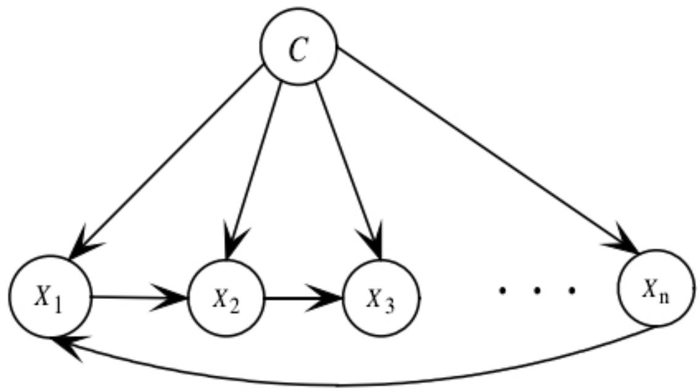

## 树增广朴素贝叶斯网络分类器

• TAN的构造过程：

•步骤1.通过训练集计算属性对之间的条件互信息I(Xi,xXj|C) (i ≠ j)。

步骤2.建立一个以X1,X2，···，Xn为结点的加权完全无向图，结点Xi, Xj之间的权重为|(Xi,Xj|C)(i ≠j)。

•步骤3.利用求最大权生成树算法，建立该无向图最大权重跨度树。首先把边按权重由大到小排序，之后遵照被选择的边不能构成回路的原则，按照边的权重由大到小的顺序选择边，这样由所选择的边构成的树便是最大权重跨度树。

## 树增广朴素贝叶斯网络分类器

• 步骤4.指定一个属性结点作为根结点，将所有边的方向设置成由根结点指向外，把无向图转换成有向图。

·步骤5.加入类结点C，并添加从C指向每个属性结点Xi的弧。

## 平均一依赖估测器

·平均一依赖估测器(averaged one dependence estimators,简记为AODE)的学习算法。

•AODE首先针对每一个属性结点学习一个“特殊”的树扩展的朴素贝叶斯分类器，之所以特殊，是因为它直接把该属性结点当成是其他所有属性结点的父亲结点。然后,把这些树扩展的朴素贝叶斯分类器进行平均。

## 平均一依赖估测器

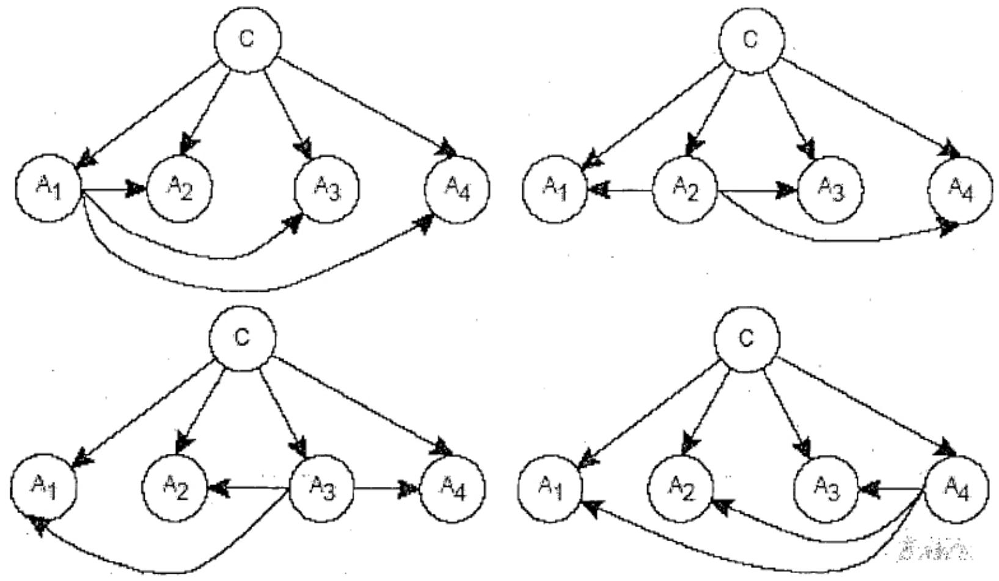

## 平均依赖估测器

$$
\operatorname { c } ( x ) = \underset { c \in C } { \arg \operatorname* { m a x } } \frac { \sum _ { i = 1 \land F ( a _ { i } ) \geq 3 6 } ^ { m } P ( a _ { i } , c ) \prod _ { j = 1 \land j \neq i } ^ { m } P ( a _ { j } \mid a _ { i } , c ) } { n u m P a r e n t }
$$

•在AODE模型中，所有的树扩展的朴素贝叶斯分类器对最终分类的贡献是一样的,这似乎不太合理

## 加权平均一依赖估测器

·加权平均的一依赖估测器(weightily averaged one dependenceestimators,简记WAODE)

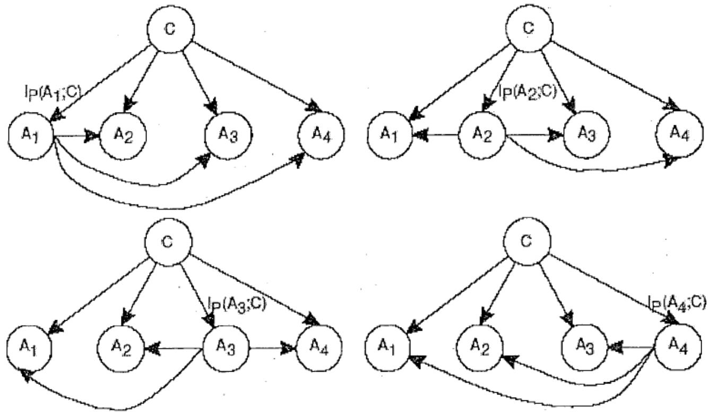

## 加权平均-依赖估测器

·加权平均的一依赖估测器(weightily averaged one dependenceestimators,简记WAODE)

$$
c ( x ) = \underset { c \in C } { \arg \operatorname* { m a x } } \frac { \displaystyle \sum _ { i = 1 } ^ { m } W _ { i } P ( a _ { i } , c ) \displaystyle \prod _ { j = 1 \land j \neq i } ^ { m } P ( a _ { j } \mid a _ { i } , c ) } { \displaystyle \sum _ { i = 1 } ^ { m } W _ { i } }
$$

$$
\boldsymbol { W } _ { i } = I _ { P } \left( \boldsymbol { A } _ { i } ; \boldsymbol { C } \right) = \sum _ { a _ { i } , c } P ( a _ { i } , c ) \log \frac { P ( a _ { i } , c ) } { P ( a _ { i } ) P ( \boldsymbol { c } ) }
$$

## 贝叶斯算法处理流程：

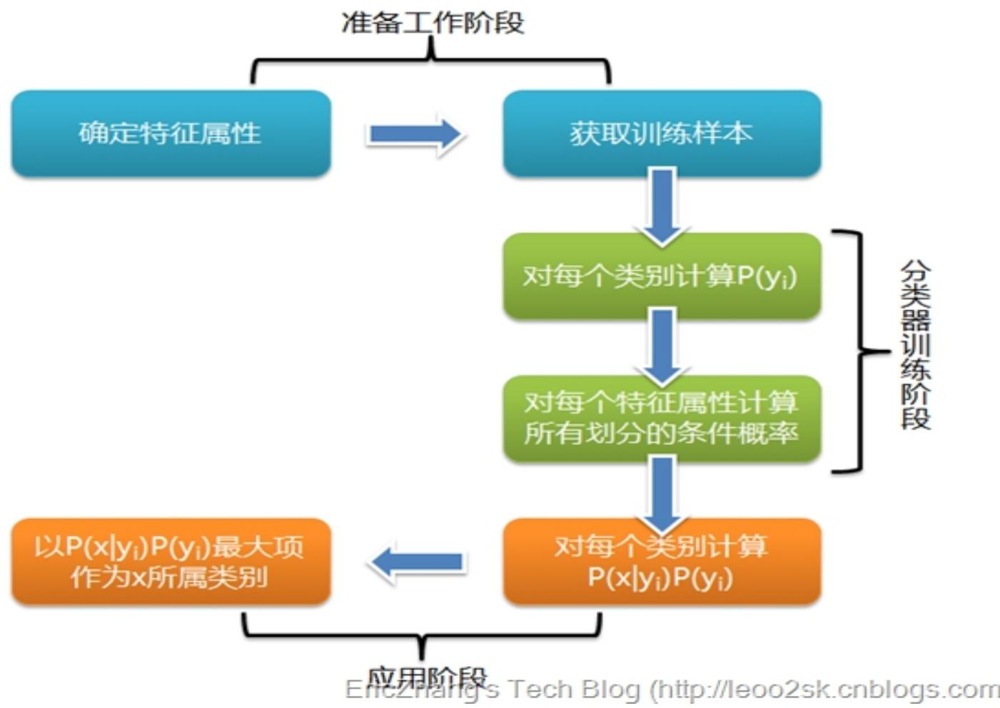

## 使用Python 进行文本分类

• def loadDataSet():

postingList=[l'my','dog', 'has','flea', 'problems', help', 'please'],

['maybe','not', 'take', 'him', 'to','dog','park', 'stupid'"],

['my','dalmation', 'is', 'so', 'cute', 'I', "ove', 'him'],

['stop', 'posting', 'stupid', 'worthless', 'garbage'],

['mr', "licks','ate','my', 'steak', 'how','to','stop','him'],

['quit', 'buying', 'worthless', 'dog', 'food','stupid'"]

classVec = [0,1,0, 1,0, 1] #1 is abusive, 0 not

return postingList,classVec

## 使用Python 进行文本分类

• def createVocabList(dataSet):

vocabSet = set(ll) #create empty set

for document in dataset:

● vocabSet = vocabSet | set(document) #union of the two sets

return list(vocabset)

## 训练算法：从词向量计算概率

$$
p ( c _ { i } | w ) = \frac { \displaystyle p ( w | c _ { i } ) p ( c _ { i } ) } { \displaystyle p ( w ) }
$$

$$
\begin{array} { r } { \mathbb { P } \left( \mathbf { w } _ { 0 } , \mathbf { w } _ { 1 } , \mathbf { w } _ { 2 } \ldots \mathbf { w } _ { \mathbb { N } } \middle | \mathbf { c } _ { \mathrm { i } } \right) . \quad \Longrightarrow \quad \mathbb { P } \left( \mathbf { w } _ { 0 } \middle | \mathbf { c } _ { \mathrm { i } } \right) \mathbb { P } \left( \mathbf { w } _ { 1 } \middle | \mathbf { c } _ { \mathrm { i } } \right) \mathbb { P } \left( \mathbf { w } _ { 2 } \middle | \mathbf { c } _ { \mathrm { i } } \right) . \hphantom { x x x x x x x x x x x x x x x x } } \end{array} .
$$

• def trainNBO(trainMatrix,trainCategory):

numTrainDocs = len(trainMatrix)

numWords = len(trainMatrix[0])

pAbusive = sum(trainCategory)/float(numTrainDocs)

poNum = ones(numWords); p1Num = ones(numWords)  #change to ones()

p0Denom = 2.0; p1Denom = 2.0

#change to 2.0

## 训练算法：从词向量计算概率

• for i in range(numTrainDocs):

if trainCategory[i] == 1:

p1Num += trainMatrix[i]

p1Denom += sum(trainMatrix[i])

else:

pONum += trainMatrix[i]

pODenom += sum(trainMatrix[i])

p1Vect = log(p1Num/p1Denom) #change to log()

p0Vect = log(poNum/poDenom) #change to log()

return p0Vect,p1Vect,pAbusive

## 测试和使用算法

• def classifyNB(vec2Classify, p0Vec, p1Vec, pClass1):

p1 = sum(vec2Classify \* p1Vec) + log(pClass1) #element-wise mult

p0 = sum(vec2Classify \* poVec) + log(1.0 - pClass1)

if p1 > p0:

return 1

else:

return 0

## 测试算法和修改分类器


P(wo|Ci)P(W1|Ci)P(W2|Ci) .. ·P (WN|Ci)   
poNum = ones (numWords); plNum = ones (numWords)   
p0Denom = 2.0; p1Denom = 2.0   
ln(a\*b) = ln(a) +ln(b)   
• def classifyNB(vec2Classify, poVec, p1Vec, pClass1):   
p1 = sum(vec2Classify \* p1Vec) + log(pClass1) #element-wise mult   
p0 = sum(vec2Classify \* p0Vec) + log(1.0 - pClass1)   
if p1 > p0:   
● return 1   
● else:   
return 0

## 测试算法和修改分类器

• def testingNB():

listOPosts,listClasses = loadDataSet()

myVocabList = createVocabList(listOPosts)

trainMat=[]

for postinDoc in listOPosts:

trainMat.append(setOfWords2Vec(myVocabList, postinDoc)

pOV,p1V,pAb = trainNB0(array(trainMat),array(listClasses))

testEntry = ['love', 'my', 'dalmation']

thisDoc = array(setOfWords2Vec(myVocabList, testEntry))

print testEntry,'classified as: ',classifyNB(thisDoc,pOV,p1V,pAb)

testEntry = ['stupid','garbage']

thisDoc = array(setOfWords2Vec(myVocabList, testEntry))

print testEntry,'classified as: ',classifyNB(thisDoc,pOV,p1V,pAb)

## 文档词袋模型

def bagofWords2VecMN(vocabList, inputSet) :   
returnVec = [o]\*len (vocabList)   
for word in inputset:   
if word in vocabList:   
returnVec [vocabList.index(word)] += 1   
return returnVec

## 切分文本

```python
>>> mySent='This book ie the best book on Python or M.L. I have ever laid
eyes upon.'
>>> mySent.aplit()
['This', 'book','is', 'the', 'best', 'book', 'on','Python', 'or', 'M.L.',
I', 'have', 'ever', 'laid','eyes', 'upon.']
>>> import re
>>> regEx = re.compile('\\w+)
>>> listofTokens = regEx.split (mySent)
>>> listofTokens
['This','book', 'is', 'the', 'best', 'book','on','Python','or', 'M',
'L', '','I', 'have', 'ever', 'laid','eyes','upon', ]
>>> [tok.lower() for tok in listofTokens if len(tok) > 0]
['this', 'book', 'is','the', 'best', 'book', 'on','python', 'or','m',
'l','i','have','ever','laid', 'eyes','upon']
```

## 使用朴素贝叶斯方法进行交叉验证

• Def spamTest():

docList=[; classList = []; fullText =[]

for iin range(1,26):

wordList = textParse(open('email/spam/%d.txt' % i).read())

docList.append(wordList)

fullText.extend(wordList)

classList.append(1)

wordList = textParse(open('email/ham/%d.txt' % i).read())

docList.append(wordList)

fullText.extend(wordList)

classList.append(0)

vocabList = createVocabList(docList)#create vocabulary

trainingSet = range(50); testSet=[] #create test set

## 使用朴素贝叶斯方法进行交叉验证

```javascript
forin(random.iform,en(traininget)))
testSet.append (trainingSet [randIndex] )
del (trainingset [randIndex])
trainMat=[]: trainclasses = []
for docIndex in trainingset:
trainMat.append (setOfWords2vec (vocabList, docList [docIndex] ))
trainclasses.append (classList [docIndex])
pov,plV,pSpam = trainNBo (array (trainMat) , array (trainclasses))
errorCount = 0
for docIndex in testset:
wordvector = setofwords2vec (vocabList, docList [docIndex])
if classifyNB (array(wordvector),pov,plv,pSpam) !=
classList [docIndex]: Cla
errorCount += 1
print 'the error rate is: ',float (errorCount)/len(testSet)
```

## RSS的使用：从RSS源收集数据

•Feedparser的安装 http://code.google.com/p/feedparser/

•下载

•网络学堂

·安装：python setup.py install

>>> import feedparser   
>>>ny=feedparser.parse('http://newyork.craigslist.org/stp/index.rss ')   
>>> ny['entries']   
>>> len (ny['entries'])   
100

## RSS的使用：从RSS源收集数据

•高频词去除

```python
def calcMostFreq(vocabList, fullText) : Calculates
import operator frequency of
freqDict = {} occurrence
for token in vocabList:
freqDict [token]=fullText .count (token)
sortedFreq = sorted(freqDict.iteritems(), key=operator.itemgetter (1) , \
reverse-True)
return sortedFreq[:30]
```

## RSS的使用：从RSS源收集数据

·两个RSS源作为参数

```python
def localwords(feedl, feedo) :
import feedparser
docList=[]: classList = [l; fullText =[]
minLen = min(len (feed1 ['entries ]), len (feedo ['entries'] ))
for i in range (minLen):
wordList = textParse(feed1 ['entries '] [i] ['summary'])
docList .append (wordList)
fullText.extend (wordList)
classList .append (1)
wordList = textParse (feedo ['entries'] [i] ['summary'])
docList .append (wordList)
fullText.extend (wordList)
claeeLiet .append (o)
```

## RSS的使用：从RSS源收集数据

vocabList = createVocabList (docLiet)   
top3oWords = calcMoetFreq(vocabList, fullText)   
for pairw in top3owords:   
if pairw[o] in vocabList: vocabList.remove (pairw[o])   
trainingSet = range (2\*minLen) ; testSet= []   
for i in range (20) :   
randIndex = int (random.uniform (o, len (trainingSet) ) )   
testSet.append (trainingSet [randIndex] )   
del (trainingSet [randIndex] )   
trainMat= [] : trainclasses =[]

## RSS的使用：从RSS源收集数据

for docIndex in trainingSet:   
trainMat. append (bagofwords2vecMN (vocabList, docList [docIndex] ))   
trainClasses .append (classList [docIndex])   
pov,plv,pSpam = trainNBo (array(trainMat), array(trainclasses))   
errorCount = 0   
for docIndex in testset:   
wordvector = bagofwords2vecMN (vocabList, docList [docIndex])   
if classifyNB(array(wordvector),pov,plv,pSpam) !=   
classList [docIndex]:   
errorCount += 1   
print 'the error rate is: ', float (errorCount)/len (testset)   
return vocabList,pov,plv

## RSS的使用：从RSS源收集数据

·问题：

•高频次设定的阈值对正确率的影响

•消除各种语言的高频词

http://www.ranks.nl/resources/stopwords.html

## 分析数据：显示地域相关的用词

```python
def getTopwords (ny, sf) :
import operator
vocabList,pov,plV=localWords (ny, sf)
topNY=[l;topSF= []
for i in range (len (pov)):
if pov[i] > -6.0 : topsF.append((vocabList[i],pov[i]))
if p1v[i] > -6.0 : topny.append((vocabList[i],p1v[i]))
sortedsF = sorted(topSF, key=lambda pair: pair [1], reverse=True)
print "SF**SF**SF**SF**SF**SF**SF**SF**SF**SF**SF**SF**SF**SF**
for item in sortedsF:
print item [o]
sortedny = sorted(topNY, key=lambda pair: pair [1l, reverse=True)
Print "NY**NY**NY**Y**NY**NY**NY**NY**NY**NY**N**NY**NY**NY **"
for item in sortedny:
print item[0]
```

## 实验作业三

•见参考文献。

## Q&A?

## 例子

·套用价语，决策树分类的思想类似于找对象。现想象一个女孩的母亲要给这个女孩介绍男朋友，手是有了下面的对话：

女儿：多大年纪了？

母亲：26。

女儿：长的帅不帅？

母亲：挺帅的。

女儿：收入高不？

母亲： 不算很高， 中等情况。

女儿：是公务员不？

母亲：是， 在税务局上班呢。

女儿：那好， 我去见见。

## 例子

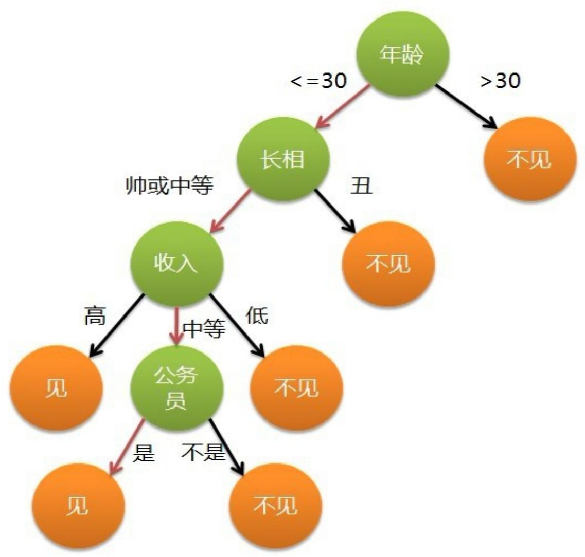

## 决策树

关于分类问题

<table><tr><td rowspan=1 colspan=1>名称</td><td rowspan=1 colspan=1>体温</td><td rowspan=1 colspan=1>表皮覆盖</td><td rowspan=1 colspan=1>胎生</td><td rowspan=1 colspan=1>水生动物</td><td rowspan=1 colspan=1>飞行动物</td><td rowspan=1 colspan=1>有腿</td><td rowspan=1 colspan=1>冬眠</td><td rowspan=1 colspan=3>类标号</td></tr><tr><td rowspan=1 colspan=1>人类</td><td rowspan=1 colspan=1>恒温</td><td rowspan=1 colspan=1>毛发</td><td rowspan=1 colspan=1>是</td><td rowspan=1 colspan=1>否</td><td rowspan=1 colspan=1>否</td><td rowspan=1 colspan=1>是</td><td rowspan=1 colspan=1>否</td><td rowspan=1 colspan=1></td><td rowspan=1 colspan=1>哺乳动物</td><td rowspan=1 colspan=1></td></tr><tr><td rowspan=1 colspan=1>海龟</td><td rowspan=1 colspan=1>冷血</td><td rowspan=1 colspan=1>鳞片</td><td rowspan=1 colspan=1>否</td><td rowspan=1 colspan=1>半</td><td rowspan=1 colspan=1>否</td><td rowspan=1 colspan=1>是</td><td rowspan=1 colspan=1>否</td><td rowspan=1 colspan=1></td><td rowspan=1 colspan=1>爬行类i</td><td rowspan=1 colspan=1></td></tr><tr><td rowspan=1 colspan=1>鸽子</td><td rowspan=1 colspan=1>恒温</td><td rowspan=1 colspan=1>羽毛</td><td rowspan=1 colspan=1>否</td><td rowspan=1 colspan=1>否</td><td rowspan=1 colspan=1>是</td><td rowspan=1 colspan=1>是</td><td rowspan=1 colspan=1>否</td><td rowspan=1 colspan=1></td><td rowspan=1 colspan=1>鸟类</td><td rowspan=1 colspan=1></td></tr><tr><td rowspan=1 colspan=1>鲸</td><td rowspan=1 colspan=1>恒温</td><td rowspan=1 colspan=1>毛发</td><td rowspan=1 colspan=1>是rc$</td><td rowspan=1 colspan=1>是</td><td rowspan=1 colspan=1>否</td><td rowspan=1 colspan=1>否</td><td rowspan=1 colspan=1>否</td><td rowspan=1 colspan=3>哺乳类</td></tr></table>

## 分类与回归

分类目标属性y是离散的，回归目标属性y是连续的

## 决策树-解决分类问题的一般方法

通过以上对分类问题一般方法的描述，可以看出分类问题一般包括两个步骤:

1、模型构建 (归纳)

通过对训练集合的归纳，建立分类模型。

2、预测应用（推论）

根据建立的分类模型，对测试集合进行测试。

## 决策树-解决分类问题的一般方法

训练集 (类标号已知）

<table><tr><td rowspan=1 colspan=1>TID</td><td rowspan=1 colspan=1>A1</td><td rowspan=1 colspan=1>A2</td><td rowspan=1 colspan=1>A3</td><td rowspan=1 colspan=1>类</td></tr><tr><td rowspan=1 colspan=1>1</td><td rowspan=1 colspan=1>Y</td><td rowspan=1 colspan=1>100</td><td rowspan=1 colspan=1>L</td><td rowspan=1 colspan=1>N</td></tr><tr><td rowspan=1 colspan=1>2</td><td rowspan=1 colspan=1>N</td><td rowspan=1 colspan=1>125</td><td rowspan=1 colspan=1>S</td><td rowspan=1 colspan=1>N</td></tr><tr><td rowspan=1 colspan=1>3</td><td rowspan=1 colspan=1>Y</td><td rowspan=1 colspan=1>400</td><td rowspan=1 colspan=1>L</td><td rowspan=1 colspan=1>Y</td></tr><tr><td rowspan=1 colspan=1>4</td><td rowspan=1 colspan=1>N</td><td rowspan=1 colspan=1>415</td><td rowspan=1 colspan=1>M</td><td rowspan=1 colspan=1>N</td></tr></table>

检验集 (类标号未知)

<table><tr><td rowspan=1 colspan=1>TID</td><td rowspan=1 colspan=1>A1</td><td rowspan=1 colspan=1>A2</td><td rowspan=1 colspan=1>A3</td><td rowspan=1 colspan=1>类</td></tr><tr><td rowspan=1 colspan=1>1</td><td rowspan=1 colspan=1>Y</td><td rowspan=1 colspan=1>100</td><td rowspan=1 colspan=1>L</td><td rowspan=1 colspan=1>?</td></tr><tr><td rowspan=1 colspan=1>2</td><td rowspan=1 colspan=1>N</td><td rowspan=1 colspan=1>125</td><td rowspan=1 colspan=1>S</td><td rowspan=1 colspan=1>?</td></tr><tr><td rowspan=1 colspan=1>3</td><td rowspan=1 colspan=1>Y</td><td rowspan=1 colspan=1>400</td><td rowspan=1 colspan=1>L</td><td rowspan=1 colspan=1>?</td></tr><tr><td rowspan=1 colspan=1>4</td><td rowspan=1 colspan=1>N</td><td rowspan=1 colspan=1>415</td><td rowspan=1 colspan=1>M</td><td rowspan=1 colspan=1>?</td></tr></table>

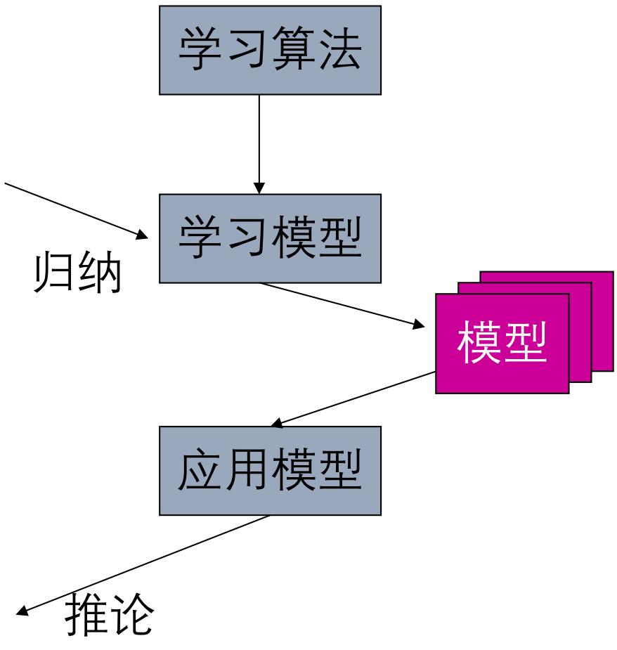

## 决策树

·决策树是一种典型的分类方法

· 首先对数据进行处理，利用归纳算法生成可读的规则和决策树，

• 然后使用决策对新数据进行分析。

• 本质上决策树是通过一系列规则对数据进行分类的过程。

## 决策树

## •决策树的优点

• 1、推理过程容易理解，决策推理过程可以表示成If Then形式；

• 2、推理过程完全依赖于属性变量的取值特点；

·3、可自动忽略目标变量没有贡献的属性变量，也为判断属性变量的重要性，减少变量的数目提供参考。

## 决策树和归纳算法

·决策树技术发现数据模式和规则的核心是归纳算法。

•归纳是从特殊到一般的过程。

•归纳推理从若干个事实中表征出的特征、特性和属性中，通过比较、总结、概括而得出一个规律性的结论。

·归纳推理试图从对象的一部分或整体的特定的观察中获得一个完备且正确的描述。即从特殊事实到普遍性规律的结论。

·归纳对于认识的发展和完善具有重要的意义。人类知识的增长主要来源于归纳学习。

## 决策树和归纳算法

·归纳学习由于依赖于检验数据，因此又称为检验学习。

·归纳学习存在一个基本的假设：

•任一假设如果能够在足够大的训练样本集中很好的逼近目标函数，则它也能在未见样本中很好地逼近目标函数。该假定是归纳学习的有效性的前提条件。

## 决策树和归纳算法

·归纳过程就是在描述空间中进行搜索的过程。

·归纳可分为自顶向下，自底向上和双向搜索三种方式。

·自底向上法一次处理一个输入对象。将描述逐步一般化。直到最终的一般化描述。

•自顶向下法对可能的一般性描述集进行搜索，试图找到一些满足一定要求的最优的描述。

## 决策树-从机器学习看分类及归纳推理等问题

·从特殊的训练样例中归纳出一般函数是机器学习的中心问题；

·从训练样例中进行学习通常被视为归纳推理。

·每个例子都是一个对偶（序偶）（x,f(x)），对每个输入的x，都有确定的输出f(x)。

·学习过程将产生对目标函数f的不同逼近。F的每一个逼近都叫做一个假设。

·假设需要以某种形式表示。例如，y=ax+b。通过调整假设的表示，学习过程将产生出假设的不同变形。

•在表示中通常需要修改参数（如a, b）。

## 决策树-从机器学习看分类及归纳推理等问题

•从这些不同的变形中选择最佳的假设（或者说权值集合）。

• 方法的定义:

• 使训练值与假设值预测出的值之间的误差平方和E最小为最佳。

$$
E ~ = ~ \sum _ { \substack { < b , V t r a i n ( b ) > \in t r a i n i n g e x a m p l e s } } ( V t r a i n ( b ) - V ( b ) ) ^ { 2 }
$$

## 决策树算法

• 与决策树相关的重要算法包括：

• CLS, ID3, C4.5, CART

• 算法的发展过程

• Hunt,Marin和Stone 于1966年研制的CLS学习系统，用于学习单个概念。

• 1979年，J.R.Quinlan 给出ID3算法，并在1983年和1986年对ID3 进行了总结和简化，使其成为决策树学习算法的典型。

• Schlimmer 和Fisher 于1986年对ID3进行改造，在每个可能的决策树节点创建缓冲区，使决策树可以递增式生成，得到ID4算法。

• 1988年，Utgoff 在ID4基础上提出了ID5学习算法，进一步提高了效率。

· 1993年，Quinlan 进一步发展了ID3算法，改进成C4.5算法。

· 另一类决策树算法为CART，与C4.5不同的是，CART的决策树由二元逻辑问题生成，每个树节点只有两个分枝，分别包括学习实例的正例与反例。

## 决策树算法

假定公司收集了右表数据，那么对于任意给定的客人（测试样例），你能帮助公司将这位客人归类吗?

即：你能预测这位客人是属于“买”计算机的那一类，还是属于“不买”计算机的那一类？

又：你需要多少有关这位客人的信息才能回答这个问题?

<table><tr><td rowspan=1 colspan=1>计数</td><td rowspan=1 colspan=1>年龄</td><td rowspan=1 colspan=1>收入</td><td rowspan=1 colspan=1>学生</td><td rowspan=1 colspan=1>信誉</td><td rowspan=1 colspan=1>归类：买计算机？</td></tr><tr><td rowspan=1 colspan=1>64</td><td rowspan=1 colspan=1>青</td><td rowspan=1 colspan=1>高</td><td rowspan=1 colspan=1>否</td><td rowspan=1 colspan=1>良</td><td rowspan=1 colspan=1>不买</td></tr><tr><td rowspan=1 colspan=1>64</td><td rowspan=1 colspan=1>青</td><td rowspan=1 colspan=1>高</td><td rowspan=1 colspan=1>否</td><td rowspan=1 colspan=1>优</td><td rowspan=1 colspan=1>不买</td></tr><tr><td rowspan=1 colspan=1>128</td><td rowspan=1 colspan=1>中</td><td rowspan=1 colspan=1>高</td><td rowspan=1 colspan=1>否</td><td rowspan=1 colspan=1>良</td><td rowspan=1 colspan=1>买</td></tr><tr><td rowspan=1 colspan=1>60</td><td rowspan=1 colspan=1>老</td><td rowspan=1 colspan=1>中</td><td rowspan=1 colspan=1>否</td><td rowspan=1 colspan=1>良</td><td rowspan=1 colspan=1>买</td></tr><tr><td rowspan=1 colspan=1>64</td><td rowspan=1 colspan=1>老</td><td rowspan=1 colspan=1>低</td><td rowspan=1 colspan=1>是</td><td rowspan=1 colspan=1>良</td><td rowspan=1 colspan=1>买</td></tr><tr><td rowspan=1 colspan=1>64</td><td rowspan=1 colspan=1>老</td><td rowspan=1 colspan=1>低</td><td rowspan=1 colspan=1>是</td><td rowspan=1 colspan=1>优</td><td rowspan=1 colspan=1>不买</td></tr><tr><td rowspan=1 colspan=1>64</td><td rowspan=1 colspan=1>中</td><td rowspan=1 colspan=1>低</td><td rowspan=1 colspan=1>是</td><td rowspan=1 colspan=1>优</td><td rowspan=1 colspan=1>买</td></tr><tr><td rowspan=1 colspan=1>128</td><td rowspan=1 colspan=1>青</td><td rowspan=1 colspan=1>中</td><td rowspan=1 colspan=1>否</td><td rowspan=1 colspan=1>良</td><td rowspan=1 colspan=1>不买</td></tr><tr><td rowspan=1 colspan=1>64</td><td rowspan=1 colspan=1>青</td><td rowspan=1 colspan=1>低</td><td rowspan=1 colspan=1>是</td><td rowspan=1 colspan=1>良</td><td rowspan=1 colspan=1>买</td></tr><tr><td rowspan=1 colspan=1>132</td><td rowspan=1 colspan=1>老</td><td rowspan=1 colspan=1>中</td><td rowspan=1 colspan=1>是</td><td rowspan=1 colspan=1>良</td><td rowspan=1 colspan=1>买</td></tr><tr><td rowspan=1 colspan=1>64</td><td rowspan=1 colspan=1>青</td><td rowspan=1 colspan=1>中</td><td rowspan=1 colspan=1>是</td><td rowspan=1 colspan=1>优</td><td rowspan=1 colspan=1>买</td></tr><tr><td rowspan=1 colspan=1>32</td><td rowspan=1 colspan=1>中</td><td rowspan=1 colspan=1>中</td><td rowspan=1 colspan=1>否</td><td rowspan=1 colspan=1>优</td><td rowspan=1 colspan=1>买</td></tr><tr><td rowspan=1 colspan=1>32</td><td rowspan=1 colspan=1>中</td><td rowspan=1 colspan=1>高</td><td rowspan=1 colspan=1>是</td><td rowspan=1 colspan=1>良</td><td rowspan=1 colspan=1>买</td></tr><tr><td rowspan=1 colspan=1>63</td><td rowspan=1 colspan=1>老</td><td rowspan=1 colspan=1>中</td><td rowspan=1 colspan=1>否</td><td rowspan=1 colspan=1>优</td><td rowspan=1 colspan=1>不买</td></tr><tr><td rowspan=1 colspan=1>1</td><td rowspan=1 colspan=1>老</td><td rowspan=1 colspan=1>中</td><td rowspan=1 colspan=1>否</td><td rowspan=1 colspan=1>优</td><td rowspan=1 colspan=1>买</td></tr></table>

## 决策树算法

谁在买计算机?


<table><tr><td rowspan=1 colspan=1>计数</td><td rowspan=1 colspan=1>年龄</td><td rowspan=1 colspan=1>收入</td><td rowspan=1 colspan=1>学生</td><td rowspan=1 colspan=1>信誉</td><td rowspan=1 colspan=1>归类：买计算机？</td></tr><tr><td rowspan=1 colspan=1>64</td><td rowspan=1 colspan=1>青</td><td rowspan=1 colspan=1>高</td><td rowspan=1 colspan=1>否</td><td rowspan=1 colspan=1>良</td><td rowspan=1 colspan=1>不买</td></tr><tr><td rowspan=1 colspan=1>64</td><td rowspan=1 colspan=1>青</td><td rowspan=1 colspan=1>高</td><td rowspan=1 colspan=1>否</td><td rowspan=1 colspan=1>优</td><td rowspan=1 colspan=1>不买</td></tr><tr><td rowspan=1 colspan=1>128</td><td rowspan=1 colspan=1>中</td><td rowspan=1 colspan=1>高</td><td rowspan=1 colspan=1>否</td><td rowspan=1 colspan=1>良</td><td rowspan=1 colspan=1>买</td></tr><tr><td rowspan=1 colspan=1>60</td><td rowspan=1 colspan=1>老</td><td rowspan=1 colspan=1>中</td><td rowspan=1 colspan=1>否</td><td rowspan=1 colspan=1>良</td><td rowspan=1 colspan=1>买</td></tr><tr><td rowspan=1 colspan=1>64</td><td rowspan=1 colspan=1>老</td><td rowspan=1 colspan=1>低</td><td rowspan=1 colspan=1>是</td><td rowspan=1 colspan=1>良</td><td rowspan=1 colspan=1>买</td></tr><tr><td rowspan=1 colspan=1>64</td><td rowspan=1 colspan=1>老</td><td rowspan=1 colspan=1>低</td><td rowspan=1 colspan=1>是</td><td rowspan=1 colspan=1>优</td><td rowspan=1 colspan=1>不买</td></tr><tr><td rowspan=1 colspan=1>64</td><td rowspan=1 colspan=1>中</td><td rowspan=1 colspan=1>低</td><td rowspan=1 colspan=1>是</td><td rowspan=1 colspan=1>优</td><td rowspan=1 colspan=1>买</td></tr><tr><td rowspan=1 colspan=1>128</td><td rowspan=1 colspan=1>青</td><td rowspan=1 colspan=1>中</td><td rowspan=1 colspan=1>否</td><td rowspan=1 colspan=1>良</td><td rowspan=1 colspan=1>不买</td></tr><tr><td rowspan=1 colspan=1>64</td><td rowspan=1 colspan=1>青</td><td rowspan=1 colspan=1>低</td><td rowspan=1 colspan=1>是</td><td rowspan=1 colspan=1>良</td><td rowspan=1 colspan=1>买</td></tr><tr><td rowspan=1 colspan=1>132</td><td rowspan=1 colspan=1>老</td><td rowspan=1 colspan=1>中</td><td rowspan=1 colspan=1>是</td><td rowspan=1 colspan=1>良</td><td rowspan=1 colspan=1>买</td></tr><tr><td rowspan=1 colspan=1>64</td><td rowspan=1 colspan=1>青</td><td rowspan=1 colspan=1>中</td><td rowspan=1 colspan=1>是</td><td rowspan=1 colspan=1>优</td><td rowspan=1 colspan=1>买</td></tr><tr><td rowspan=1 colspan=1>32</td><td rowspan=1 colspan=1>中</td><td rowspan=1 colspan=1>中</td><td rowspan=1 colspan=1>否</td><td rowspan=1 colspan=1>优</td><td rowspan=1 colspan=1>买</td></tr><tr><td rowspan=1 colspan=1>32</td><td rowspan=1 colspan=1>中</td><td rowspan=1 colspan=1>高</td><td rowspan=1 colspan=1>是</td><td rowspan=1 colspan=1>良</td><td rowspan=1 colspan=1>买</td></tr><tr><td rowspan=1 colspan=1>63</td><td rowspan=1 colspan=1>老</td><td rowspan=1 colspan=1>中</td><td rowspan=1 colspan=1>否</td><td rowspan=1 colspan=1>优</td><td rowspan=1 colspan=1>不买</td></tr><tr><td rowspan=1 colspan=1>1</td><td rowspan=1 colspan=1>老</td><td rowspan=1 colspan=1>中</td><td rowspan=1 colspan=1>否</td><td rowspan=1 colspan=1>优</td><td rowspan=1 colspan=1>买</td></tr></table>

## 决策树算法

谁在买计算机?

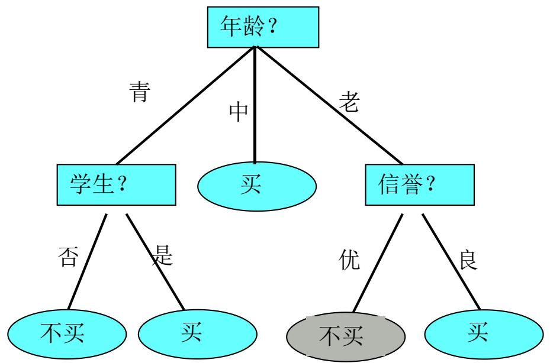

<table><tr><td rowspan=1 colspan=1>计数</td><td rowspan=1 colspan=1>年龄</td><td rowspan=1 colspan=1>收入</td><td rowspan=1 colspan=1>学生</td><td rowspan=1 colspan=1>信誉</td><td rowspan=1 colspan=1>归类：买计算机？</td></tr><tr><td rowspan=1 colspan=1>64</td><td rowspan=1 colspan=1>青</td><td rowspan=1 colspan=1>高</td><td rowspan=1 colspan=1>否</td><td rowspan=1 colspan=1>良</td><td rowspan=1 colspan=1>不买</td></tr><tr><td rowspan=1 colspan=1>64</td><td rowspan=1 colspan=1>青</td><td rowspan=1 colspan=1>高</td><td rowspan=1 colspan=1>否</td><td rowspan=1 colspan=1>优</td><td rowspan=1 colspan=1>不买</td></tr><tr><td rowspan=1 colspan=1>128</td><td rowspan=1 colspan=1>中</td><td rowspan=1 colspan=1>高</td><td rowspan=1 colspan=1>否</td><td rowspan=1 colspan=1>良</td><td rowspan=1 colspan=1>买</td></tr><tr><td rowspan=1 colspan=1>60</td><td rowspan=1 colspan=1>老</td><td rowspan=1 colspan=1>中</td><td rowspan=1 colspan=1>否</td><td rowspan=1 colspan=1>良</td><td rowspan=1 colspan=1>买</td></tr><tr><td rowspan=1 colspan=1>64</td><td rowspan=1 colspan=1>老</td><td rowspan=1 colspan=1>低</td><td rowspan=1 colspan=1>是</td><td rowspan=1 colspan=1>良</td><td rowspan=1 colspan=1>买</td></tr><tr><td rowspan=1 colspan=1>64</td><td rowspan=1 colspan=1>老</td><td rowspan=1 colspan=1>低</td><td rowspan=1 colspan=1>是</td><td rowspan=1 colspan=1>优</td><td rowspan=1 colspan=1>不买</td></tr><tr><td rowspan=1 colspan=1>64</td><td rowspan=1 colspan=1>中</td><td rowspan=1 colspan=1>低</td><td rowspan=1 colspan=1>是</td><td rowspan=1 colspan=1>优</td><td rowspan=1 colspan=1>买</td></tr><tr><td rowspan=1 colspan=1>128</td><td rowspan=1 colspan=1>青</td><td rowspan=1 colspan=1>中</td><td rowspan=1 colspan=1>否</td><td rowspan=1 colspan=1>良</td><td rowspan=1 colspan=1>不买</td></tr><tr><td rowspan=1 colspan=1>64</td><td rowspan=1 colspan=1>青</td><td rowspan=1 colspan=1>低</td><td rowspan=1 colspan=1>是</td><td rowspan=1 colspan=1>良</td><td rowspan=1 colspan=1>买</td></tr><tr><td rowspan=1 colspan=1>132</td><td rowspan=1 colspan=1>老</td><td rowspan=1 colspan=1>中</td><td rowspan=1 colspan=1>是</td><td rowspan=1 colspan=1>良</td><td rowspan=1 colspan=1>买</td></tr><tr><td rowspan=1 colspan=1>64</td><td rowspan=1 colspan=1>青</td><td rowspan=1 colspan=1>中</td><td rowspan=1 colspan=1>是</td><td rowspan=1 colspan=1>优</td><td rowspan=1 colspan=1>买</td></tr><tr><td rowspan=1 colspan=1>32</td><td rowspan=1 colspan=1>中</td><td rowspan=1 colspan=1>中</td><td rowspan=1 colspan=1>否</td><td rowspan=1 colspan=1>优</td><td rowspan=1 colspan=1>买</td></tr><tr><td rowspan=1 colspan=1>32</td><td rowspan=1 colspan=1>中</td><td rowspan=1 colspan=1>高</td><td rowspan=1 colspan=1>是</td><td rowspan=1 colspan=1>良</td><td rowspan=1 colspan=1>买</td></tr><tr><td rowspan=1 colspan=1>63</td><td rowspan=1 colspan=1>老</td><td rowspan=1 colspan=1>中</td><td rowspan=1 colspan=1>否</td><td rowspan=1 colspan=1>优</td><td rowspan=1 colspan=1>不买</td></tr><tr><td rowspan=1 colspan=1>1</td><td rowspan=1 colspan=1>老</td><td rowspan=1 colspan=1>中</td><td rowspan=1 colspan=1>否</td><td rowspan=1 colspan=1>优</td><td rowspan=1 colspan=1>买</td></tr></table>

## 决策树的表示

决策树的基本组成部分：决策结点、分支和叶子。

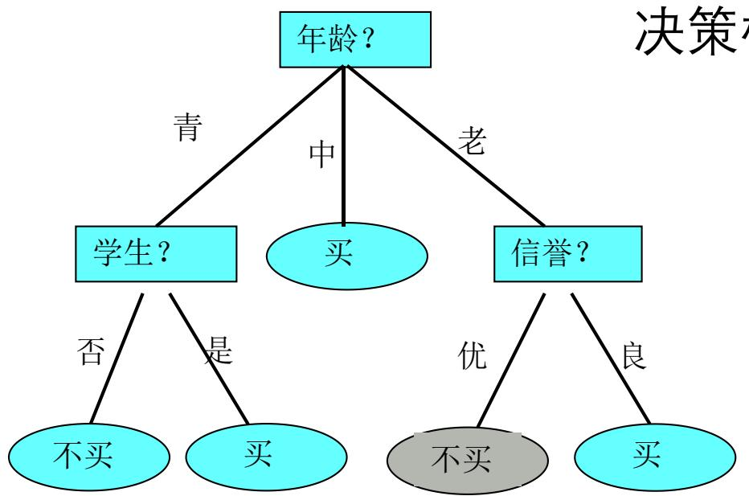

决策树中最上面的结点称为根结点。是整个决策树的开始。每个分支是一个新的决策结点，或者是树的叶子。每个决策结点代表一个问题或者决策.通常对应待分类对象的属性。每个叶结点代表一种可能的分类结果

在沿着决策树从上到下的遍历过程中，在每个结点都有一个测试。对每个结点上问题的不同测试输出导致不同的分枝，最后会达到一个叶子结点。这一过程就是利用决策树进行分类的过程，利用若干个变量来判断属性的类别

## 决策树与条件概率分布

• 决策树表示给定特征条件下类的条件概率分布。

•条件概率分布定义在特征空间的一个划分(partition)上.将特征空间划分为互不相交的单元(cell或区域(region)，并在每个单元定义一个类的概率分布就构成了一个条件概率分布。

⋅ 决策树的一条路径对应于划分中的一个单元。

•决策树所表示的条件概率分布由各个单元给定条件下类的条件概率分布组成

## 决策树与条件概率分布

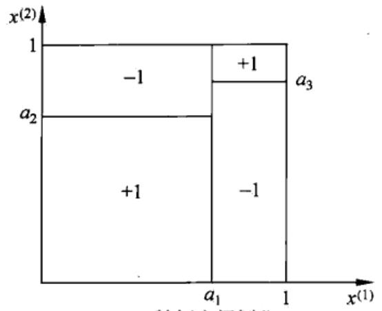  
(a)特征空间划分

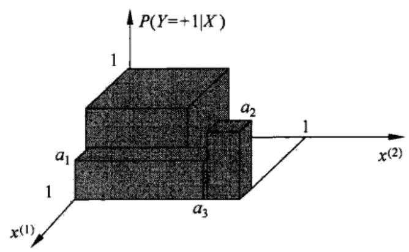  
(b)条件概率分布

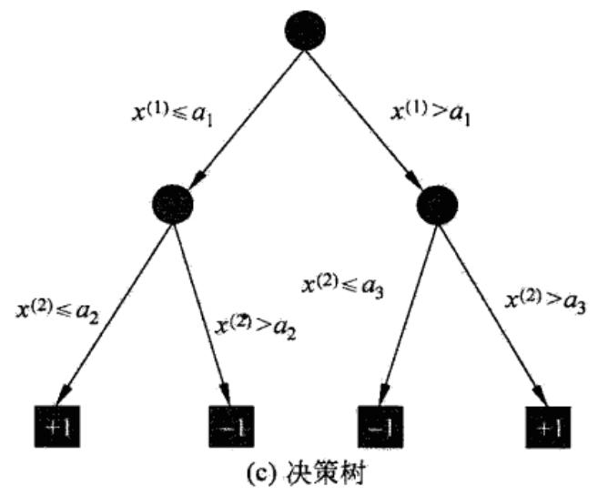

## 决策树与条件概率分布

•决策树学习本质上是从训练数据集中归纳出一组分类规则，与训练数据集不相矛盾的决策树。

·能对训练数据进行正确分类的决策树可能有多个，也可能一个也没有.我们需要的是一个与训练数据矛盾较小的决策树，同时具有很好的泛化能力.

• 决策树学习是由训练数据集估计条件概率模型.基于特征空间划分的类的条件概率模型有无穷多个.

·我们选择的条件概率模型应该不仅对训练数据有很好的拟合，而且对未知数据有很好的预测.

## 决策树CLS算法

·CLS（Concept Learning System）算法

• CLS算法是早期的决策树学习算法。它是许多决策树学习算法的基础

•CLS基本思想

・从一棵空决策树开始，选择某一属性（分类属性）作为测试属性。该测试属性对应决策树中的决策结点。根据该属性的值的不同，可将训练样本分成相应的子集：

• 如果该子集为空，或该子集中的样本属于同一个类，则该子集为叶结点，

• 否则该子集对应于决策树的内部结点，即测试结点，需要选择一个新的分类属性对该子集进行划分，直到所有的子集都为空或者属于同一类。

## 决策树CLS算法

<table><tr><td rowspan=1 colspan=1>人员</td><td rowspan=1 colspan=1>眼睛颜色</td><td rowspan=1 colspan=1>头发颜色</td><td rowspan=1 colspan=1>所属人种</td></tr><tr><td rowspan=1 colspan=1>1</td><td rowspan=1 colspan=1>黑色</td><td rowspan=1 colspan=1>黑色</td><td rowspan=1 colspan=1>黄种人</td></tr><tr><td rowspan=1 colspan=1>2</td><td rowspan=1 colspan=1>蓝色</td><td rowspan=1 colspan=1>金色</td><td rowspan=1 colspan=1>白种人</td></tr><tr><td rowspan=1 colspan=1>3</td><td rowspan=1 colspan=1>灰色</td><td rowspan=1 colspan=1>金色</td><td rowspan=1 colspan=1>白种人</td></tr><tr><td rowspan=1 colspan=1>4</td><td rowspan=1 colspan=1>蓝色</td><td rowspan=1 colspan=1>红色</td><td rowspan=1 colspan=1>白种人</td></tr><tr><td rowspan=1 colspan=1>5</td><td rowspan=1 colspan=1>灰色</td><td rowspan=1 colspan=1>红色</td><td rowspan=1 colspan=1>白种人</td></tr><tr><td rowspan=1 colspan=1>6</td><td rowspan=1 colspan=1>黑色</td><td rowspan=1 colspan=1>金色</td><td rowspan=1 colspan=1>混血</td></tr><tr><td rowspan=1 colspan=1>7</td><td rowspan=1 colspan=1>灰色</td><td rowspan=1 colspan=1>黑色</td><td rowspan=1 colspan=1>混血</td></tr><tr><td rowspan=1 colspan=1>8</td><td rowspan=1 colspan=1>蓝色</td><td rowspan=1 colspan=1>黑色</td><td rowspan=1 colspan=1>混血</td></tr></table>

## 决策树CLS算法

<table><tr><td rowspan=1 colspan=1>人员</td><td rowspan=1 colspan=1>眼睛颜色</td><td rowspan=1 colspan=1>头发颜色</td><td rowspan=1 colspan=1>所属人种</td></tr><tr><td rowspan=1 colspan=1>1</td><td rowspan=1 colspan=1>黑色</td><td rowspan=1 colspan=1>黑色</td><td rowspan=1 colspan=1>黄种人</td></tr><tr><td rowspan=1 colspan=1>2</td><td rowspan=1 colspan=1>蓝色</td><td rowspan=1 colspan=1>金色</td><td rowspan=1 colspan=1>白种人</td></tr><tr><td rowspan=1 colspan=1>3</td><td rowspan=1 colspan=1>灰色</td><td rowspan=1 colspan=1>金色</td><td rowspan=1 colspan=1>白种人</td></tr><tr><td rowspan=1 colspan=1>4</td><td rowspan=1 colspan=1>蓝色</td><td rowspan=1 colspan=1>红色</td><td rowspan=1 colspan=1>白种人</td></tr><tr><td rowspan=1 colspan=1>5</td><td rowspan=1 colspan=1>灰色</td><td rowspan=1 colspan=1>红色</td><td rowspan=1 colspan=1>白种人</td></tr><tr><td rowspan=1 colspan=1>6</td><td rowspan=1 colspan=1>黑色</td><td rowspan=1 colspan=1>金色</td><td rowspan=1 colspan=1>混血</td></tr><tr><td rowspan=1 colspan=1>7</td><td rowspan=1 colspan=1>灰色</td><td rowspan=1 colspan=1>黑色</td><td rowspan=1 colspan=1>混血</td></tr><tr><td rowspan=1 colspan=1>8</td><td rowspan=1 colspan=1>蓝色</td><td rowspan=1 colspan=1>黑色</td><td rowspan=1 colspan=1>混血</td></tr></table>

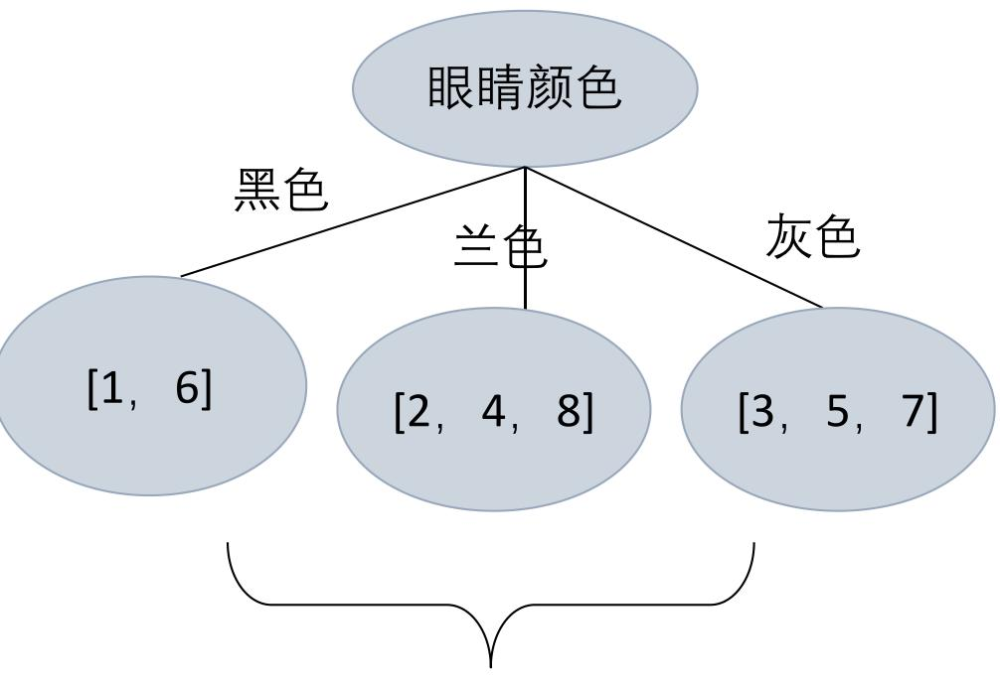  
不属于同一类，非叶结点

## 决策树CLS算法

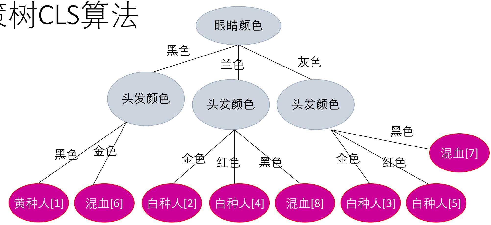

## 决策树CLS算法

•步骤：

•生成一颗空决策树和一张训练样本属性集；

·若训练样本集T 中所有的样本都属于同一类，则生成结点T，并终止学习算法;否则

·根据某种策略从训练样本属性表中选择属性A作为测试属性，生成测试结 点A

·若A的取值为v1,v2..,vm，则根据A 的取值的不同,将T 划分成m个子集T1,T2...m;

•从训练样本属性表中删除属性A;

•转步骤2，对每个子集递归调用CLS;

## 决策树CLS算法

•CLS算法问题:

·在步骤3中，根据某种策略从训练样本属性表中选择属性A作为测试属性。没有规定采用何种测试属性。实践表明，测试属性集的组成以及测试属性的先后对决策树的学习具有举足轻重的影响。

## 决策树CLS算法

学生膳食结构和缺钙调查表
<table><tr><td rowspan=1 colspan=1>学生</td><td rowspan=1 colspan=1>鸡肉</td><td rowspan=1 colspan=1>猪肉</td><td rowspan=1 colspan=1>牛肉</td><td rowspan=1 colspan=1>羊肉</td><td rowspan=1 colspan=1>鱼肉</td><td rowspan=1 colspan=1>鸡蛋</td><td rowspan=1 colspan=1>青菜</td><td rowspan=1 colspan=1>番茄</td><td rowspan=1 colspan=1>牛奶</td><td rowspan=1 colspan=1>健康情况</td></tr><tr><td rowspan=1 colspan=1>1</td><td rowspan=1 colspan=1>0</td><td rowspan=1 colspan=1>1</td><td rowspan=1 colspan=1>1</td><td rowspan=1 colspan=1>0</td><td rowspan=1 colspan=1>1</td><td rowspan=1 colspan=1>0</td><td rowspan=1 colspan=1>1</td><td rowspan=1 colspan=1>0</td><td rowspan=1 colspan=1>1</td><td rowspan=1 colspan=1>不缺钙</td></tr><tr><td rowspan=1 colspan=1>2</td><td rowspan=1 colspan=1>0</td><td rowspan=1 colspan=1>0</td><td rowspan=1 colspan=1>0</td><td rowspan=1 colspan=1>0</td><td rowspan=1 colspan=1>1</td><td rowspan=1 colspan=1>1</td><td rowspan=1 colspan=1>1</td><td rowspan=1 colspan=1>1</td><td rowspan=1 colspan=1>1</td><td rowspan=1 colspan=1>不缺钙</td></tr><tr><td rowspan=1 colspan=1>3</td><td rowspan=1 colspan=1>1</td><td rowspan=1 colspan=1>1</td><td rowspan=1 colspan=1>1</td><td rowspan=1 colspan=1>1</td><td rowspan=1 colspan=1>1</td><td rowspan=1 colspan=1>0</td><td rowspan=1 colspan=1>1</td><td rowspan=1 colspan=1>0</td><td rowspan=1 colspan=1>0</td><td rowspan=1 colspan=1>缺钙</td></tr><tr><td rowspan=1 colspan=1>4</td><td rowspan=1 colspan=1>1</td><td rowspan=1 colspan=1>1</td><td rowspan=1 colspan=1>0</td><td rowspan=1 colspan=1>0</td><td rowspan=1 colspan=1>1</td><td rowspan=1 colspan=1>1</td><td rowspan=1 colspan=1>0</td><td rowspan=1 colspan=1>0</td><td rowspan=1 colspan=1>1</td><td rowspan=1 colspan=1>不缺钙</td></tr><tr><td rowspan=1 colspan=1>5</td><td rowspan=1 colspan=1>1</td><td rowspan=1 colspan=1>0</td><td rowspan=1 colspan=1>0</td><td rowspan=1 colspan=1>1</td><td rowspan=1 colspan=1>1</td><td rowspan=1 colspan=1>1</td><td rowspan=1 colspan=1>0</td><td rowspan=1 colspan=1>0</td><td rowspan=1 colspan=1>0</td><td rowspan=1 colspan=1>缺钙</td></tr><tr><td rowspan=1 colspan=1>6</td><td rowspan=1 colspan=1>1</td><td rowspan=1 colspan=1>1</td><td rowspan=1 colspan=1>1</td><td rowspan=1 colspan=1>0</td><td rowspan=1 colspan=1>0</td><td rowspan=1 colspan=1>1</td><td rowspan=1 colspan=1>0</td><td rowspan=1 colspan=1>1</td><td rowspan=1 colspan=1>0</td><td rowspan=1 colspan=1>缺钙</td></tr><tr><td rowspan=1 colspan=1>7</td><td rowspan=1 colspan=1>0</td><td rowspan=1 colspan=1>1</td><td rowspan=1 colspan=1>0</td><td rowspan=1 colspan=1>0</td><td rowspan=1 colspan=1>0</td><td rowspan=1 colspan=1>1</td><td rowspan=1 colspan=1>1</td><td rowspan=1 colspan=1>1</td><td rowspan=1 colspan=1>1</td><td rowspan=1 colspan=1>不缺钙</td></tr><tr><td rowspan=1 colspan=1>8</td><td rowspan=1 colspan=1>0</td><td rowspan=1 colspan=1>1</td><td rowspan=1 colspan=1>0</td><td rowspan=1 colspan=1>0</td><td rowspan=1 colspan=1>0</td><td rowspan=1 colspan=1>1</td><td rowspan=1 colspan=1>1</td><td rowspan=1 colspan=1>1</td><td rowspan=1 colspan=1>1</td><td rowspan=1 colspan=1>缺钙</td></tr><tr><td rowspan=1 colspan=1>9</td><td rowspan=1 colspan=1>0</td><td rowspan=1 colspan=1>1</td><td rowspan=1 colspan=1>0</td><td rowspan=1 colspan=1>0</td><td rowspan=1 colspan=1>0</td><td rowspan=1 colspan=1>1</td><td rowspan=1 colspan=1>1</td><td rowspan=1 colspan=1>1</td><td rowspan=1 colspan=1>1</td><td rowspan=1 colspan=1>不缺钙</td></tr><tr><td rowspan=1 colspan=1>10</td><td rowspan=1 colspan=1>1</td><td rowspan=1 colspan=1>0</td><td rowspan=1 colspan=1>1</td><td rowspan=1 colspan=1>1</td><td rowspan=1 colspan=1>1</td><td rowspan=1 colspan=1>1</td><td rowspan=1 colspan=1>0</td><td rowspan=1 colspan=1>1</td><td rowspan=1 colspan=1>1</td><td rowspan=1 colspan=1>不缺钙</td></tr></table>

## 决策树CLS算法

采用不同的测试属性及其先后顺序将会生成不同的决策树

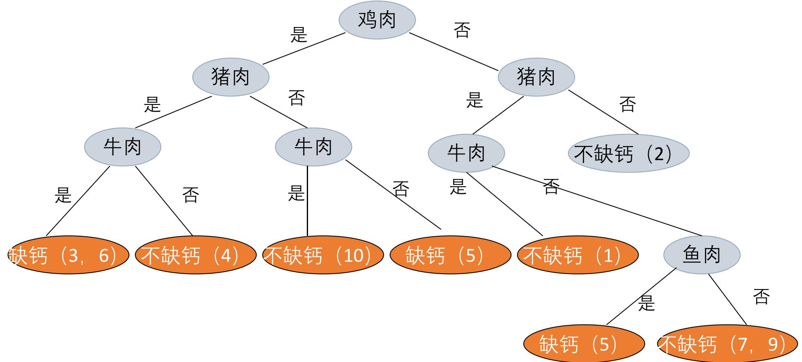

## 决策树CLS算法

牛奶

不缺钙(1, 2， 49, 10)

缺钙5，

## 决策树ID3算法

·ID3算法是一种经典的决策树学习算法，由Quinlan于1979年提出。

·ID3算法主要针对属性选择问题。是决策树学习方法中最具影响和最为典型的算法。

• 该方法使用信息增益度选择测试属性。

• 当获取信息时，将不确定的内容转为确定的内容，因此信息伴着不确定性。

·丛真觉上讲，小概率事件比大概率事件包含的信息量大。如果某件事情是“首年一见”则肯定比“习以为常”的事件包含的信息量大。

如何度量信息量的大小?

## 信息增益

•Shannon 1948年提出的信息论理论：

·熵(entropy)：信息量大小的度量，即表示随机变量不确定性的度量。

·熵的通俗解释：事件 $\cdot \mathsf { a } _ { \mathrm { i } }$ 的信息量 $| ( \mathsf { a } _ { \mathrm { i } } )$ 可如下度量：

$$
I ( a _ { i } ) = p ( a _ { i } ) { \log _ { 2 } } \frac { 1 } { p ( a _ { i } ) }
$$

•其中p(a)表示事件 $\cdot \mathsf { a } _ { \mathrm { i } }$ 发生的概率。

·假设有n个互不相容的事件 $\cdot \mathsf { a } 1 , \mathsf { a } 2 , \mathsf { a } 3 , . . . . , \mathsf { a } \mathsf { n }$ 它们中有且仅有一个发生，则其平均的信息量(熵）可如下度量：

$$
I ( a _ { 1 } , a _ { 2 } , . . . , a _ { n } ) = \sum _ { i = 1 } ^ { n } I ( a _ { i } ) = \sum _ { i = 1 } ^ { n } p ( a _ { i } ) \log _ { 2 } { \frac { 1 } { p ( a _ { i } ) } }
$$

## 信息增益

•熵的理论解释:

• 设×是一个取有限个值的离散随机变量，其概率分布为：

$$
P ( X = x _ { i } ) = p _ { i } , \quad i = 1 , 2 , \cdots , n
$$

则随机变量×的熵定义为：

$$
H ( X ) = - \sum _ { i = 1 } ^ { n } { p _ { i } \log { p _ { i } } }
$$

·对数以2为底或以e为底(自然对数)，这时熵的单位分别称作比特(bit)或纳特(nat),熵只依赖于x的分布，与x的取值无关。

$$
H ( p ) = - \sum _ { i = 1 } ^ { n } { p _ { i } \log { p _ { i } } }
$$

## 信息增益

•熵的理论解释:

•熵越大，随机变量的不确定性越大：

$$
0 \leqslant H ( p ) \leqslant \log n
$$

• 当×为1,0分布时：

$$
P ( X = 1 ) = p \ , \quad P ( X = 0 ) = 1 - p \ , \quad 0 \leqslant p \leqslant 1
$$

·熵：

$$
H ( p ) = - p \log _ { 2 } p - ( 1 - p ) \log _ { 2 } ( 1 - p )
$$

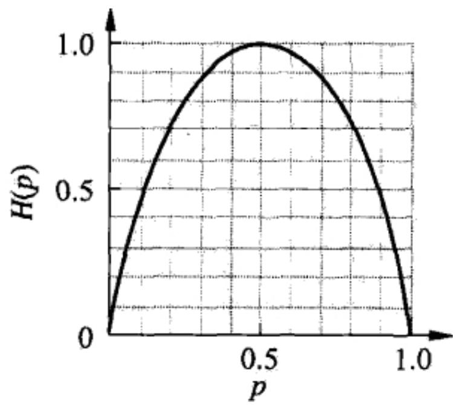

## 信息增益

·设有随机变量(X,Y),其联合概率分布为:

$$
P ( X = x _ { i } , Y = y _ { j } ) = p _ { i j } \ , ~ i = 1 , 2 , \cdots , n ; ~ j = 1 , 2 , \cdots , m
$$

·条件熵H(YIX)：表示在己知随机变量X的条件下随机变量Y的不确定性，定义为X给定条件下Y的条件概率分布的熵对×的数学期望：

$$
H ( Y \mid X ) = \sum _ { i = 1 } ^ { n } p _ { i } H ( Y \mid X = x _ { i } )
$$

•当熵和条件熵中的概率由数据估计（特别是极大似然估计）得到时，所对应的熵与条件熵分别称为经验熵(empirical entropy)和经验条件熵(empirical conditional entropy)

## 信息增益

•定义5.2 (信息增益):特征A对训练数据集D的信息增益，g(D,A)，定义为集合D的经验熵H(D)与特征A给定条件下D的经验条件熵H(DIA)之差，即

$$
g ( \mathsf { D } , \mathsf { A } ) { = } \mathsf { H } ( \mathsf { D } ) { \mathsf { - } } \mathsf { H } ( \mathsf { D } | \mathsf { A } )
$$

• (Information gain)表示得知特征x的信息而使得类Y的信息的不确定性减少的程度.

•一般地，熵H(Y)与条件熵H(Y|X)之差称为互信息(mutualinformation)

• 决策树学习中的信息增益等价于训练数据集中类与特征的互信息.

## 信息增益的算法

·设训练数据集为D

•ID|表示其样本容量，即样本个数

·设有K个类 $\mathsf C _ { \mathsf e } , \mathsf e = 1 , 2 , \hdots \mathsf e$

$| C _ { \boldsymbol { \mathrm { k } } } \boldsymbol { \mathrm { \ell } }$ I为属于类 $C _ { \boldsymbol { \mathrm { k } } }$ 的样本个数

·特征A有n个不同的 取值 $\{ \mathsf { a } _ { 1 } , \mathsf { a } _ { 2 } . . . \mathsf { a } _ { \mathsf { n } } .$ 根据特征A的取值将D划分为n个子集 $\mathsf { D } _ { 1 \cdot \circ }$ O $\mathsf { D } _ { \mathsf { n } }$

$| \mathsf { D } _ { \mathsf { i } } |$ 为 $\mathsf { D } _ { \mathsf { i } }$ 的样本个数

·记子集Di中属于类 ${ \mathsf C } _ { \mathsf k }$ 的样本集合为 $\mathsf { D } _ { \mathsf { i k } }$

$| \mathsf { D } _ { \mathsf { i k } } |$ 为 $\mathsf { D } _ { \mathsf { i k } }$ 的样本个数

## 信息增益的算法

• 输入：训练数据集D和特征A;

·输出：特征A对训练数据集D的信息增益 $g ( \mathsf { D } , \mathsf { A } )$

• 1、计算数据集D的经验熵H(D)

$$
H ( D ) = - \sum _ { k = 1 } ^ { K } { \frac { | C _ { k } | } { | D | } } { \bf 1 0 g } _ { 2 } { \frac { | C _ { k } | } { | D | } }
$$

• 2、计算特征A对数据集D的经验条件熵H(D|A)

$$
H ( D \mid A ) = \sum _ { i = 1 } ^ { n } { \frac { | D _ { i } | } { | D | } } H ( D _ { i } ) = - \sum _ { i = 1 } ^ { n } { \frac { | D _ { i } | } { | D | } } \sum _ { k = 1 } ^ { \kappa } { \frac { | D _ { i k } | } { | D _ { i } | } } { \bf 1 0 g _ { 2 } } { \frac { | D _ { i k } | } { | D _ { i } | } }
$$

•3、计算信息增益

$$
g ( D , A ) = H ( D ) - H ( D | A )
$$

## 信息增益比

•以信息增益作为划分训练数据集的特征，存在偏向于选择取值较多的特征的问题

・使用信息增益比可以对这一问题进行校正

·定义5.3（信息增益比）特征A对训练数据集D的信息增益比定义为信息增益与训练数据集D关于特征A的值的熵之比

$$
g _ { R } ( D , A ) = \frac { g ( D , A ) } { H _ { A } ( D ) }
$$

$H _ { A } ( D ) = - \sum _ { i = 1 } ^ { n } \frac { | D _ { i } | } { | D | } \log _ { 2 } \frac { | D _ { i } | } { | D | } ,$ n是特征A取值的个数。

## 决策树ID3算法

•在决策树分类中，假设S是训练样本集合，IS|是训练样本数，样本划分为n个不同的类 $\mathsf { C 1 } , \mathsf { C 2 } , \ldots \mathsf { C n }$ ，这些类的大小分别标记为 $| { \mathsf { C 1 } } | , \quad | { \mathsf { C 2 } } | , \quad \ldots , | { \mathsf { C n } } |$ 。则任意样本S属于类Ci的概率为:

$$
p ~ ( \textit { S } _ { i } ~ ) ~ = ~ \frac { \mid ~ C ~ _ { i } ~ \mid ~ } { \mid ~ S ~ \mid ~ }
$$

$$
\mathsf { E n t r o p \gamma } \left( \mathsf { S } | \mathsf { A } \right) \ = \sum \ \mathsf { \Gamma } \left( | \mathsf { S v } | / | \mathsf { S } | \right) \ \mathsf { \Omega } ^ { \ast } \mathsf { E n t r o p \gamma } \left( \mathsf { S v } \right)
$$

•∑是属性A的所有可能的值v，Sv是属性A有v值的S子集

• |Sv|是Sv 中元素的个数；IS|是S中元素的个数。

<table><tr><td rowspan=1 colspan=1>计数</td><td rowspan=1 colspan=1>年龄</td><td rowspan=1 colspan=1>收入</td><td rowspan=1 colspan=1>学生</td><td rowspan=1 colspan=1>信誉</td><td rowspan=1 colspan=1>归类：买计算机?</td></tr><tr><td rowspan=1 colspan=1>64</td><td rowspan=1 colspan=1>青</td><td rowspan=1 colspan=1>高</td><td rowspan=1 colspan=1>否</td><td rowspan=1 colspan=1>良</td><td rowspan=1 colspan=1>不买</td></tr><tr><td rowspan=1 colspan=1>64</td><td rowspan=1 colspan=1>青</td><td rowspan=1 colspan=1>高</td><td rowspan=1 colspan=1>否</td><td rowspan=1 colspan=1>优</td><td rowspan=1 colspan=1>不买</td></tr><tr><td rowspan=1 colspan=1>128</td><td rowspan=1 colspan=1>中</td><td rowspan=1 colspan=1>高</td><td rowspan=1 colspan=1>否</td><td rowspan=1 colspan=1>良</td><td rowspan=1 colspan=1>买</td></tr><tr><td rowspan=1 colspan=1>60</td><td rowspan=1 colspan=1>老</td><td rowspan=1 colspan=1>中</td><td rowspan=1 colspan=1>否</td><td rowspan=1 colspan=1>良</td><td rowspan=1 colspan=1>买</td></tr><tr><td rowspan=1 colspan=1>64</td><td rowspan=1 colspan=1>老</td><td rowspan=1 colspan=1>低</td><td rowspan=1 colspan=1>是</td><td rowspan=1 colspan=1>良</td><td rowspan=1 colspan=1>买</td></tr><tr><td rowspan=1 colspan=1>64</td><td rowspan=1 colspan=1>老</td><td rowspan=1 colspan=1>低</td><td rowspan=1 colspan=1>是</td><td rowspan=1 colspan=1>优</td><td rowspan=1 colspan=1>不买</td></tr><tr><td rowspan=1 colspan=1>64</td><td rowspan=1 colspan=1>中</td><td rowspan=1 colspan=1>低</td><td rowspan=1 colspan=1>是</td><td rowspan=1 colspan=1>优</td><td rowspan=1 colspan=1>买</td></tr><tr><td rowspan=1 colspan=1>128</td><td rowspan=1 colspan=1>青</td><td rowspan=1 colspan=1>中</td><td rowspan=1 colspan=1>否</td><td rowspan=1 colspan=1>良</td><td rowspan=1 colspan=1>不买</td></tr><tr><td rowspan=1 colspan=1>64</td><td rowspan=1 colspan=1>青</td><td rowspan=1 colspan=1>低</td><td rowspan=1 colspan=1>是</td><td rowspan=1 colspan=1>良</td><td rowspan=1 colspan=1>买</td></tr><tr><td rowspan=1 colspan=1>132</td><td rowspan=1 colspan=1>老</td><td rowspan=1 colspan=1>中</td><td rowspan=1 colspan=1>是</td><td rowspan=1 colspan=1>良</td><td rowspan=1 colspan=1>买</td></tr><tr><td rowspan=1 colspan=1>64</td><td rowspan=1 colspan=1>青</td><td rowspan=1 colspan=1>中</td><td rowspan=1 colspan=1>是</td><td rowspan=1 colspan=1>优</td><td rowspan=1 colspan=1>买</td></tr><tr><td rowspan=1 colspan=1>32</td><td rowspan=1 colspan=1>中</td><td rowspan=1 colspan=1>中</td><td rowspan=1 colspan=1>否</td><td rowspan=1 colspan=1>优</td><td rowspan=1 colspan=1>买</td></tr><tr><td rowspan=1 colspan=1>32</td><td rowspan=1 colspan=1>中</td><td rowspan=1 colspan=1>高</td><td rowspan=1 colspan=1>是</td><td rowspan=1 colspan=1>良</td><td rowspan=1 colspan=1>买</td></tr><tr><td rowspan=1 colspan=1>63</td><td rowspan=1 colspan=1>老</td><td rowspan=1 colspan=1>中</td><td rowspan=1 colspan=1>否</td><td rowspan=1 colspan=1>优</td><td rowspan=1 colspan=1>不买</td></tr><tr><td rowspan=1 colspan=1>1</td><td rowspan=1 colspan=1>老</td><td rowspan=1 colspan=1>中</td><td rowspan=1 colspan=1>否</td><td rowspan=1 colspan=1>优</td><td rowspan=1 colspan=1>买</td></tr></table>

<table><tr><td rowspan=1 colspan=1>计数</td><td rowspan=1 colspan=1>年龄</td><td rowspan=1 colspan=1>收入</td><td rowspan=1 colspan=1>学生</td><td rowspan=1 colspan=1>信誉</td><td rowspan=1 colspan=1>归类：买计算机？</td></tr><tr><td rowspan=1 colspan=1>64</td><td rowspan=1 colspan=1>青</td><td rowspan=1 colspan=1>高</td><td rowspan=1 colspan=1>否</td><td rowspan=1 colspan=1>良</td><td rowspan=1 colspan=1>不买</td></tr><tr><td rowspan=1 colspan=1>64</td><td rowspan=1 colspan=1>青</td><td rowspan=1 colspan=1>高</td><td rowspan=1 colspan=1>否</td><td rowspan=1 colspan=1>优</td><td rowspan=1 colspan=1>不买</td></tr><tr><td rowspan=1 colspan=1>128</td><td rowspan=1 colspan=1>中</td><td rowspan=1 colspan=1>高</td><td rowspan=1 colspan=1>否</td><td rowspan=1 colspan=1>良</td><td rowspan=1 colspan=1>买</td></tr><tr><td rowspan=1 colspan=1>60</td><td rowspan=1 colspan=1>老</td><td rowspan=1 colspan=1>中</td><td rowspan=1 colspan=1>否</td><td rowspan=1 colspan=1>良</td><td rowspan=1 colspan=1>买</td></tr><tr><td rowspan=1 colspan=1>64</td><td rowspan=1 colspan=1>老</td><td rowspan=1 colspan=1>低</td><td rowspan=1 colspan=1>是</td><td rowspan=1 colspan=1>良</td><td rowspan=1 colspan=1>买</td></tr><tr><td rowspan=1 colspan=1>64</td><td rowspan=1 colspan=1>老</td><td rowspan=1 colspan=1>低</td><td rowspan=1 colspan=1>是</td><td rowspan=1 colspan=1>优</td><td rowspan=1 colspan=1>不买</td></tr><tr><td rowspan=1 colspan=1>64</td><td rowspan=1 colspan=1>中</td><td rowspan=1 colspan=1>低</td><td rowspan=1 colspan=1>是</td><td rowspan=1 colspan=1>优</td><td rowspan=1 colspan=1>买</td></tr><tr><td rowspan=1 colspan=1>128</td><td rowspan=1 colspan=1>青</td><td rowspan=1 colspan=1>中</td><td rowspan=1 colspan=1>否</td><td rowspan=1 colspan=1>良</td><td rowspan=1 colspan=1>不买</td></tr><tr><td rowspan=1 colspan=1>64</td><td rowspan=1 colspan=1>青</td><td rowspan=1 colspan=1>低</td><td rowspan=1 colspan=1>是</td><td rowspan=1 colspan=1>良</td><td rowspan=1 colspan=1>买</td></tr><tr><td rowspan=1 colspan=1>132</td><td rowspan=1 colspan=1>老</td><td rowspan=1 colspan=1>中</td><td rowspan=1 colspan=1>是</td><td rowspan=1 colspan=1>良</td><td rowspan=1 colspan=1>买</td></tr><tr><td rowspan=1 colspan=1>64</td><td rowspan=1 colspan=1>青</td><td rowspan=1 colspan=1>中</td><td rowspan=1 colspan=1>是</td><td rowspan=1 colspan=1>优</td><td rowspan=1 colspan=1>买</td></tr><tr><td rowspan=1 colspan=1>32</td><td rowspan=1 colspan=1>中</td><td rowspan=1 colspan=1>中</td><td rowspan=1 colspan=1>否</td><td rowspan=1 colspan=1>优</td><td rowspan=1 colspan=1>买</td></tr><tr><td rowspan=1 colspan=1>32</td><td rowspan=1 colspan=1>中</td><td rowspan=1 colspan=1>高</td><td rowspan=1 colspan=1>是</td><td rowspan=1 colspan=1>良</td><td rowspan=1 colspan=1>买</td></tr><tr><td rowspan=1 colspan=1>63</td><td rowspan=1 colspan=1>老</td><td rowspan=1 colspan=1>中</td><td rowspan=1 colspan=1>否</td><td rowspan=1 colspan=1>优</td><td rowspan=1 colspan=1>不买</td></tr><tr><td rowspan=1 colspan=1>1</td><td rowspan=1 colspan=1>老</td><td rowspan=1 colspan=1>中</td><td rowspan=1 colspan=1>否</td><td rowspan=1 colspan=1>优</td><td rowspan=1 colspan=1>买</td></tr></table>

## 第1步计算决策属性的熵

决策属性“买计算机？”。该属性分两类：买/不买

$$
\begin{array} { r } { \mathsf { H } ( \mathsf { D } ) { = } { \mathsf { - P } } 1 \mathsf { L o g } _ { 2 } \mathsf { P } 1 { \mathsf { - P } } 2 \mathsf { L o g } _ { 2 } \mathsf { P } 2 } \\ { { = } { \mathsf { - } } ( \mathsf { P } 1 \mathsf { L o g } _ { 2 } \mathsf { P } 1 { + } \mathsf { P } 2 \mathsf { L o g } _ { 2 } \mathsf { P } 2 ) } \\ { { = } 0 . 9 5 3 7 \qquad } \end{array}
$$

$$
\boxed { H ( D ) = - \sum _ { k = 1 } ^ { K } \frac { \left| C _ { k } \right| } { \left| D \right| } \mathbf { 1 0 g } _ { 2 } \frac { \left| C _ { k } \right| } { \left| D \right| } }
$$

<table><tr><td rowspan=1 colspan=1>计数</td><td rowspan=1 colspan=1>年龄</td><td rowspan=1 colspan=1>收入</td><td rowspan=1 colspan=1>学生</td><td rowspan=1 colspan=1>信誉</td><td rowspan=1 colspan=1>归类：买计算机?</td></tr><tr><td rowspan=1 colspan=1>64</td><td rowspan=1 colspan=1>青</td><td rowspan=1 colspan=1>高</td><td rowspan=1 colspan=1>否</td><td rowspan=1 colspan=1>良</td><td rowspan=1 colspan=1>不买</td></tr><tr><td rowspan=1 colspan=1>64</td><td rowspan=1 colspan=1>青</td><td rowspan=1 colspan=1>高</td><td rowspan=1 colspan=1>否</td><td rowspan=1 colspan=1>优</td><td rowspan=1 colspan=1>不买</td></tr><tr><td rowspan=1 colspan=1>128</td><td rowspan=1 colspan=1>中</td><td rowspan=1 colspan=1>高</td><td rowspan=1 colspan=1>否</td><td rowspan=1 colspan=1>良</td><td rowspan=1 colspan=1>买</td></tr><tr><td rowspan=1 colspan=1>60</td><td rowspan=1 colspan=1>老</td><td rowspan=1 colspan=1>中</td><td rowspan=1 colspan=1>否</td><td rowspan=1 colspan=1>良</td><td rowspan=1 colspan=1>买</td></tr><tr><td rowspan=1 colspan=1>64</td><td rowspan=1 colspan=1>老</td><td rowspan=1 colspan=1>低</td><td rowspan=1 colspan=1>是</td><td rowspan=1 colspan=1>良</td><td rowspan=1 colspan=1>买</td></tr><tr><td rowspan=1 colspan=1>64</td><td rowspan=1 colspan=1>老</td><td rowspan=1 colspan=1>低</td><td rowspan=1 colspan=1>是</td><td rowspan=1 colspan=1>优</td><td rowspan=1 colspan=1>不买</td></tr><tr><td rowspan=1 colspan=1>64</td><td rowspan=1 colspan=1>中</td><td rowspan=1 colspan=1>低</td><td rowspan=1 colspan=1>是</td><td rowspan=1 colspan=1>优</td><td rowspan=1 colspan=1>买</td></tr><tr><td rowspan=1 colspan=1>128</td><td rowspan=1 colspan=1>青</td><td rowspan=1 colspan=1>中</td><td rowspan=1 colspan=1>否</td><td rowspan=1 colspan=1>良</td><td rowspan=1 colspan=1>不买</td></tr><tr><td rowspan=1 colspan=1>64</td><td rowspan=1 colspan=1>青</td><td rowspan=1 colspan=1>低</td><td rowspan=1 colspan=1>是</td><td rowspan=1 colspan=1>良</td><td rowspan=1 colspan=1>买</td></tr><tr><td rowspan=1 colspan=1>132</td><td rowspan=1 colspan=1>老</td><td rowspan=1 colspan=1>中</td><td rowspan=1 colspan=1>是</td><td rowspan=1 colspan=1>良</td><td rowspan=1 colspan=1>买</td></tr><tr><td rowspan=1 colspan=1>64</td><td rowspan=1 colspan=1>青</td><td rowspan=1 colspan=1>中</td><td rowspan=1 colspan=1>是</td><td rowspan=1 colspan=1>优</td><td rowspan=1 colspan=1>买</td></tr><tr><td rowspan=1 colspan=1>32</td><td rowspan=1 colspan=1>中</td><td rowspan=1 colspan=1>中</td><td rowspan=1 colspan=1>否</td><td rowspan=1 colspan=1>优</td><td rowspan=1 colspan=1>买</td></tr><tr><td rowspan=1 colspan=1>32</td><td rowspan=1 colspan=1>中</td><td rowspan=1 colspan=1>高</td><td rowspan=1 colspan=1>是</td><td rowspan=1 colspan=1>良</td><td rowspan=1 colspan=1>买</td></tr><tr><td rowspan=1 colspan=1>63</td><td rowspan=1 colspan=1>老</td><td rowspan=1 colspan=1>中</td><td rowspan=1 colspan=1>否</td><td rowspan=1 colspan=1>优</td><td rowspan=1 colspan=1>不买</td></tr><tr><td rowspan=1 colspan=1>1</td><td rowspan=1 colspan=1>老</td><td rowspan=1 colspan=1>中</td><td rowspan=1 colspan=1>否</td><td rowspan=1 colspan=1>优</td><td rowspan=1 colspan=1>买</td></tr></table>

<table><tr><td rowspan=17 colspan=1>9      Tsinghual</td><td rowspan=1 colspan=1>计数</td><td rowspan=1 colspan=1>年龄</td><td rowspan=1 colspan=1>收入</td><td rowspan=1 colspan=1>学生</td><td rowspan=1 colspan=1>信誉</td><td rowspan=1 colspan=1>归类：买计算机？</td><td rowspan=1 colspan=1></td></tr><tr><td rowspan=1 colspan=1>64</td><td rowspan=1 colspan=1>青</td><td rowspan=1 colspan=1>高</td><td rowspan=1 colspan=1>否</td><td rowspan=1 colspan=1>良</td><td rowspan=1 colspan=1>不买</td><td rowspan=16 colspan=1>第2-1步计算年龄的熵年龄共分三个组:青年、中年、老年青年买与不买比例为128/256|D11|(买)=128|D12|(不买)= 256|D1|=384P1=128/384P2=256/384 $\begin{array} { r l } & { \mathsf { H } ( \mathsf { D } 1 ) { = } { \tt - P } 1 \mathsf { L o g } _ { 2 } \mathsf { P } 1 { \tt - P } 2 \mathsf { L o g } _ { 2 } \mathsf { P } 2 } \\ & { \quad { = } { \tt - } ( \mathsf { P } 1 \mathsf { L o g } _ { 2 } \mathsf { P } 1 { + } \mathsf { P } 2 \mathsf { L o g } _ { 2 } \mathsf { P } 2 ) } \\ & { \quad { = } 0 . 9 1 8 3 } \end{array}$  $\boxed { H ( D \mid A ) = \sum _ { i = 1 } ^ { n } \frac { \mid D _ { i } \mid } { \mid D \mid } H ( D _ { i } ) = - \sum _ { i = 1 } ^ { n } \frac { \mid D _ { i } \mid } { \mid D \mid } \sum _ { k = 1 } ^ { \kappa } \frac { \mid D _ { i k } \mid } { \mid D _ { i } \mid } \log _ { 2 } \frac { \mid D _ { i k } \mid } { \mid D _ { i } \mid } }$ </td></tr><tr><td rowspan=1 colspan=1>64</td><td rowspan=1 colspan=1>青</td><td rowspan=1 colspan=1>高</td><td rowspan=1 colspan=1>否</td><td rowspan=1 colspan=1>优</td><td rowspan=1 colspan=1>不买</td></tr><tr><td rowspan=1 colspan=1>128</td><td rowspan=1 colspan=1>中</td><td rowspan=1 colspan=1>高</td><td rowspan=1 colspan=1>否</td><td rowspan=1 colspan=1>良</td><td rowspan=1 colspan=1>买</td></tr><tr><td rowspan=1 colspan=1>60</td><td rowspan=1 colspan=1>老</td><td rowspan=1 colspan=1>中</td><td rowspan=1 colspan=1>否</td><td rowspan=1 colspan=1>良</td><td rowspan=1 colspan=1>买</td></tr><tr><td rowspan=1 colspan=1>64</td><td rowspan=1 colspan=1>老</td><td rowspan=1 colspan=1>低</td><td rowspan=1 colspan=1>是</td><td rowspan=1 colspan=1>良</td><td rowspan=1 colspan=1>买</td></tr><tr><td rowspan=1 colspan=1>64</td><td rowspan=1 colspan=1>老</td><td rowspan=1 colspan=1>低</td><td rowspan=1 colspan=1>是</td><td rowspan=1 colspan=1>优</td><td rowspan=1 colspan=1>不买</td></tr><tr><td rowspan=1 colspan=1>64</td><td rowspan=1 colspan=1>中</td><td rowspan=1 colspan=1>低</td><td rowspan=1 colspan=1>是</td><td rowspan=1 colspan=1>优</td><td rowspan=1 colspan=1>买</td></tr><tr><td rowspan=1 colspan=1>128</td><td rowspan=1 colspan=1>青</td><td rowspan=1 colspan=1>中</td><td rowspan=1 colspan=1>否</td><td rowspan=1 colspan=1>良</td><td rowspan=1 colspan=1>不买</td></tr><tr><td rowspan=1 colspan=1>64</td><td rowspan=1 colspan=1>青</td><td rowspan=1 colspan=1>低</td><td rowspan=1 colspan=1>是</td><td rowspan=1 colspan=1>良</td><td rowspan=1 colspan=1>买</td></tr><tr><td rowspan=1 colspan=1>132</td><td rowspan=1 colspan=1>老</td><td rowspan=1 colspan=1>中</td><td rowspan=1 colspan=1>是</td><td rowspan=1 colspan=1>良</td><td rowspan=1 colspan=1>买</td></tr><tr><td rowspan=1 colspan=1>64</td><td rowspan=1 colspan=1>青</td><td rowspan=1 colspan=1>中</td><td rowspan=1 colspan=1>是</td><td rowspan=1 colspan=1>优</td><td rowspan=1 colspan=1>买</td></tr><tr><td rowspan=1 colspan=1>32</td><td rowspan=1 colspan=1>中</td><td rowspan=1 colspan=1>中</td><td rowspan=1 colspan=1>否</td><td rowspan=1 colspan=1>优</td><td rowspan=1 colspan=1>买</td></tr><tr><td rowspan=1 colspan=1>32</td><td rowspan=1 colspan=1>中</td><td rowspan=1 colspan=1>高</td><td rowspan=1 colspan=1>是</td><td rowspan=1 colspan=1>良</td><td rowspan=1 colspan=1>买</td></tr><tr><td rowspan=2 colspan=1>63</td><td rowspan=2 colspan=1>老</td><td rowspan=2 colspan=1>中</td><td rowspan=2 colspan=1>否</td><td rowspan=2 colspan=1>优</td><td rowspan=2 colspan=1>不买</td><td rowspan=2 colspan=1></td></tr><tr><td rowspan=1 colspan=1>D id:)</td></tr><tr><td rowspan=1 colspan=1>1</td><td rowspan=1 colspan=1>老</td><td rowspan=1 colspan=1>中</td><td rowspan=1 colspan=1>否</td><td rowspan=1 colspan=1>优</td><td rowspan=1 colspan=1>买</td></tr></table>

<table><tr><td rowspan=2 colspan=1>消串Tsinghua U</td><td rowspan=3 colspan=6>M计      年      收入  学生 信誉   归类：买计算数    龄                                                    机？</td></tr><tr><td rowspan=1 colspan=1>计数</td><td rowspan=1 colspan=1>年龄</td><td rowspan=1 colspan=1>收入</td><td rowspan=1 colspan=1>学生</td><td rowspan=1 colspan=1>信誉</td><td rowspan=1 colspan=1>归类：买计算机？</td></tr><tr><td rowspan=16 colspan=1></td><td rowspan=2 colspan=1>64</td><td rowspan=2 colspan=1>青</td><td rowspan=2 colspan=1>高</td><td rowspan=2 colspan=1>否</td><td rowspan=2 colspan=1>良</td><td rowspan=2 colspan=1>不买</td></tr><tr><td rowspan=15 colspan=1>第2-2步计算年龄的熵年龄共分三个组:青年、中年、老年中年买与不买比例为256/0|D21|(买)=256|D22|(不买)= 0|D2|=256P1=256/256P2=0/256H(D2)=-P1Log2P1-P2Log2P2=-(P1Log2P1+P2Log2P2)=0</td></tr><tr><td rowspan=1 colspan=1>64</td><td rowspan=1 colspan=1>青</td><td rowspan=1 colspan=1>高</td><td rowspan=1 colspan=1>否</td><td rowspan=1 colspan=1>优</td><td rowspan=1 colspan=1>不买</td></tr><tr><td rowspan=1 colspan=1>128</td><td rowspan=1 colspan=1>中</td><td rowspan=1 colspan=1>高</td><td rowspan=1 colspan=1>否</td><td rowspan=1 colspan=1>良</td><td rowspan=1 colspan=1>买</td></tr><tr><td rowspan=1 colspan=1>60</td><td rowspan=1 colspan=1>老</td><td rowspan=1 colspan=1>中</td><td rowspan=1 colspan=1>否</td><td rowspan=1 colspan=1>良</td><td rowspan=1 colspan=1>买</td></tr><tr><td rowspan=1 colspan=1>64</td><td rowspan=1 colspan=1>老</td><td rowspan=1 colspan=1>低</td><td rowspan=1 colspan=1>是</td><td rowspan=1 colspan=1>良</td><td rowspan=1 colspan=1>买</td></tr><tr><td rowspan=1 colspan=1>64</td><td rowspan=1 colspan=1>老</td><td rowspan=1 colspan=1>低</td><td rowspan=1 colspan=1>是</td><td rowspan=1 colspan=1>优</td><td rowspan=1 colspan=1>不买</td></tr><tr><td rowspan=1 colspan=1>64</td><td rowspan=1 colspan=1>中</td><td rowspan=1 colspan=1>低</td><td rowspan=1 colspan=1>是</td><td rowspan=1 colspan=1>优</td><td rowspan=1 colspan=1>买</td></tr><tr><td rowspan=1 colspan=1>128</td><td rowspan=1 colspan=1>青</td><td rowspan=1 colspan=1>中</td><td rowspan=1 colspan=1>否</td><td rowspan=1 colspan=1>良</td><td rowspan=1 colspan=1>不买</td></tr><tr><td rowspan=1 colspan=1>64</td><td rowspan=1 colspan=1>青</td><td rowspan=1 colspan=1>低</td><td rowspan=1 colspan=1>是</td><td rowspan=1 colspan=1>良</td><td rowspan=1 colspan=1>买</td></tr><tr><td rowspan=1 colspan=1>132</td><td rowspan=1 colspan=1>老</td><td rowspan=1 colspan=1>中</td><td rowspan=1 colspan=1>是</td><td rowspan=1 colspan=1>良</td><td rowspan=1 colspan=1>买</td></tr><tr><td rowspan=1 colspan=1>64</td><td rowspan=1 colspan=1>青</td><td rowspan=1 colspan=1>中</td><td rowspan=1 colspan=1>是</td><td rowspan=1 colspan=1>优</td><td rowspan=1 colspan=1>买</td></tr><tr><td rowspan=1 colspan=1>32</td><td rowspan=1 colspan=1>中</td><td rowspan=1 colspan=1>中</td><td rowspan=1 colspan=1>否</td><td rowspan=1 colspan=1>优</td><td rowspan=1 colspan=1>买</td></tr><tr><td rowspan=1 colspan=1>32</td><td rowspan=1 colspan=1>中</td><td rowspan=1 colspan=1>高</td><td rowspan=1 colspan=1>是</td><td rowspan=1 colspan=1>良</td><td rowspan=1 colspan=1>买</td></tr><tr><td rowspan=1 colspan=1>63</td><td rowspan=1 colspan=1>老</td><td rowspan=1 colspan=1>中</td><td rowspan=1 colspan=1>否</td><td rowspan=1 colspan=1>优</td><td rowspan=1 colspan=1>不买</td></tr><tr><td rowspan=1 colspan=1>1</td><td rowspan=1 colspan=1>老</td><td rowspan=1 colspan=1>中</td><td rowspan=1 colspan=1>否</td><td rowspan=1 colspan=1>优</td><td rowspan=1 colspan=1>买</td></tr></table>

<table><tr><td rowspan=1 colspan=1>计数</td><td rowspan=1 colspan=1>年龄</td><td rowspan=1 colspan=1>收入</td><td rowspan=1 colspan=1>学生</td><td rowspan=1 colspan=1>信誉</td><td rowspan=1 colspan=1>归类：买计算机？</td></tr><tr><td rowspan=1 colspan=1>a64</td><td rowspan=1 colspan=1>青</td><td rowspan=1 colspan=1>高</td><td rowspan=1 colspan=1>否</td><td rowspan=1 colspan=1>良</td><td rowspan=1 colspan=1>不买</td></tr><tr><td rowspan=1 colspan=1>64</td><td rowspan=1 colspan=1>青</td><td rowspan=1 colspan=1>高</td><td rowspan=1 colspan=1>否</td><td rowspan=1 colspan=1>优</td><td rowspan=1 colspan=1>不买</td></tr><tr><td rowspan=1 colspan=1>128</td><td rowspan=1 colspan=1>中</td><td rowspan=1 colspan=1>高</td><td rowspan=1 colspan=1>否</td><td rowspan=1 colspan=1>良</td><td rowspan=1 colspan=1>买</td></tr><tr><td rowspan=1 colspan=1>60</td><td rowspan=1 colspan=1>老</td><td rowspan=1 colspan=1>中</td><td rowspan=1 colspan=1>否</td><td rowspan=1 colspan=1>良</td><td rowspan=1 colspan=1>买</td></tr><tr><td rowspan=1 colspan=1>64</td><td rowspan=1 colspan=1>老</td><td rowspan=1 colspan=1>低</td><td rowspan=1 colspan=1>是</td><td rowspan=1 colspan=1>良</td><td rowspan=1 colspan=1>买</td></tr><tr><td rowspan=1 colspan=1>64</td><td rowspan=1 colspan=1>老</td><td rowspan=1 colspan=1>低</td><td rowspan=1 colspan=1>是</td><td rowspan=1 colspan=1>优</td><td rowspan=1 colspan=1>不买</td></tr><tr><td rowspan=1 colspan=1>64</td><td rowspan=1 colspan=1>中</td><td rowspan=1 colspan=1>低</td><td rowspan=1 colspan=1>是</td><td rowspan=1 colspan=1>优</td><td rowspan=1 colspan=1>买</td></tr><tr><td rowspan=1 colspan=1>128</td><td rowspan=1 colspan=1>青</td><td rowspan=1 colspan=1>中</td><td rowspan=1 colspan=1>否</td><td rowspan=1 colspan=1>良</td><td rowspan=1 colspan=1>不买</td></tr><tr><td rowspan=1 colspan=1>64</td><td rowspan=1 colspan=1>青</td><td rowspan=1 colspan=1>低</td><td rowspan=1 colspan=1>是</td><td rowspan=1 colspan=1>良</td><td rowspan=1 colspan=1>买</td></tr><tr><td rowspan=1 colspan=1>132</td><td rowspan=1 colspan=1>老</td><td rowspan=1 colspan=1>中</td><td rowspan=1 colspan=1>是</td><td rowspan=1 colspan=1>良</td><td rowspan=1 colspan=1>买</td></tr><tr><td rowspan=1 colspan=1>64</td><td rowspan=1 colspan=1>青</td><td rowspan=1 colspan=1>中</td><td rowspan=1 colspan=1>是</td><td rowspan=1 colspan=1>优</td><td rowspan=1 colspan=1>买</td></tr><tr><td rowspan=1 colspan=1>32</td><td rowspan=1 colspan=1>中</td><td rowspan=1 colspan=1>中</td><td rowspan=1 colspan=1>否</td><td rowspan=1 colspan=1>优</td><td rowspan=1 colspan=1>买</td></tr><tr><td rowspan=1 colspan=1>32</td><td rowspan=1 colspan=1>中</td><td rowspan=1 colspan=1>高</td><td rowspan=1 colspan=1>是</td><td rowspan=1 colspan=1>良</td><td rowspan=1 colspan=1>买</td></tr><tr><td rowspan=1 colspan=1>63</td><td rowspan=1 colspan=1>老</td><td rowspan=1 colspan=1>中</td><td rowspan=1 colspan=1>否</td><td rowspan=1 colspan=1>优</td><td rowspan=1 colspan=1>不买</td></tr><tr><td rowspan=1 colspan=1>1</td><td rowspan=1 colspan=1>老</td><td rowspan=1 colspan=1>中</td><td rowspan=1 colspan=1>否</td><td rowspan=1 colspan=1>优</td><td rowspan=1 colspan=1>买</td></tr></table>

## 第2-3步计算年龄的熵

年龄共分三个组：青年、中年、老年老年买与不买比例为125/127

<table><tr><td rowspan=17 colspan=1>ghu</td><td></td><td></td><td></td><td></td><td></td><td></td></tr><tr><td rowspan=1 colspan=1>计数</td><td rowspan=1 colspan=1>年龄</td><td rowspan=1 colspan=1>收入</td><td rowspan=1 colspan=1>学生</td><td rowspan=1 colspan=1>信誉</td><td rowspan=1 colspan=1>归类：买计算机？</td></tr><tr><td rowspan=1 colspan=1>64</td><td rowspan=1 colspan=1>青</td><td rowspan=1 colspan=1>高</td><td rowspan=1 colspan=1>否</td><td rowspan=1 colspan=1>良</td><td rowspan=1 colspan=1>不买</td></tr><tr><td rowspan=1 colspan=1>64</td><td rowspan=1 colspan=1>青</td><td rowspan=1 colspan=1>高</td><td rowspan=1 colspan=1>否</td><td rowspan=1 colspan=1>优</td><td rowspan=1 colspan=1>不买</td></tr><tr><td rowspan=1 colspan=1>128</td><td rowspan=1 colspan=1>中</td><td rowspan=1 colspan=1>高</td><td rowspan=1 colspan=1>否</td><td rowspan=1 colspan=1>良</td><td rowspan=1 colspan=1>买</td></tr><tr><td rowspan=1 colspan=1>60</td><td rowspan=1 colspan=1>老</td><td rowspan=1 colspan=1>中</td><td rowspan=1 colspan=1>否</td><td rowspan=1 colspan=1>良</td><td rowspan=1 colspan=1>买</td></tr><tr><td rowspan=1 colspan=1>64</td><td rowspan=1 colspan=1>老</td><td rowspan=1 colspan=1>低</td><td rowspan=1 colspan=1>是</td><td rowspan=1 colspan=1>良</td><td rowspan=1 colspan=1>买</td></tr><tr><td rowspan=1 colspan=1>64</td><td rowspan=1 colspan=1>老</td><td rowspan=1 colspan=1>低</td><td rowspan=1 colspan=1>是</td><td rowspan=1 colspan=1>优</td><td rowspan=1 colspan=1>不买</td></tr><tr><td rowspan=1 colspan=1>64</td><td rowspan=1 colspan=1>中</td><td rowspan=1 colspan=1>低</td><td rowspan=1 colspan=1>是</td><td rowspan=1 colspan=1>优</td><td rowspan=1 colspan=1>买</td></tr><tr><td rowspan=1 colspan=1>128</td><td rowspan=1 colspan=1>青</td><td rowspan=1 colspan=1>中</td><td rowspan=1 colspan=1>否</td><td rowspan=1 colspan=1>良</td><td rowspan=1 colspan=1>不买</td></tr><tr><td rowspan=1 colspan=1>64</td><td rowspan=1 colspan=1>青</td><td rowspan=1 colspan=1>低</td><td rowspan=1 colspan=1>是</td><td rowspan=1 colspan=1>良</td><td rowspan=1 colspan=1>买</td></tr><tr><td rowspan=1 colspan=1>132</td><td rowspan=1 colspan=1>老</td><td rowspan=1 colspan=1>中</td><td rowspan=1 colspan=1>是</td><td rowspan=1 colspan=1>良</td><td rowspan=1 colspan=1>买</td></tr><tr><td rowspan=1 colspan=1>64</td><td rowspan=1 colspan=1>青</td><td rowspan=1 colspan=1>中</td><td rowspan=1 colspan=1>是</td><td rowspan=1 colspan=1>优</td><td rowspan=1 colspan=1>买</td></tr><tr><td rowspan=1 colspan=1>32</td><td rowspan=1 colspan=1>中</td><td rowspan=1 colspan=1>中</td><td rowspan=1 colspan=1>否</td><td rowspan=1 colspan=1>优</td><td rowspan=1 colspan=1>买</td></tr><tr><td rowspan=1 colspan=1>32</td><td rowspan=1 colspan=1>中</td><td rowspan=1 colspan=1>高</td><td rowspan=1 colspan=1>是</td><td rowspan=1 colspan=1>良</td><td rowspan=1 colspan=1>买</td></tr><tr><td rowspan=1 colspan=1>63</td><td rowspan=1 colspan=1>老</td><td rowspan=1 colspan=1>中</td><td rowspan=1 colspan=1>否</td><td rowspan=1 colspan=1>优</td><td rowspan=1 colspan=1>不买</td></tr><tr><td rowspan=1 colspan=1>1</td><td rowspan=1 colspan=1>老</td><td rowspan=1 colspan=1>中</td><td rowspan=1 colspan=1>否</td><td rowspan=1 colspan=1>优</td><td rowspan=1 colspan=1>买</td></tr></table>

## 第2-4步计算年龄的熵

青年组 384/1025=0.375

中年组 256/1024=0.25

<table><tr><td rowspan=1 colspan=1>计数</td><td rowspan=1 colspan=1>龄</td><td rowspan=1 colspan=1>收入</td><td rowspan=1 colspan=1>学生</td><td rowspan=1 colspan=1>信誉</td><td rowspan=1 colspan=1>归类：买计算机？</td></tr><tr><td rowspan=1 colspan=1>64</td><td rowspan=1 colspan=1>青</td><td rowspan=1 colspan=1>高</td><td rowspan=1 colspan=1>否</td><td rowspan=1 colspan=1>良</td><td rowspan=1 colspan=1>不买</td></tr><tr><td rowspan=1 colspan=1></td><td rowspan=1 colspan=1></td><td rowspan=1 colspan=1></td><td rowspan=1 colspan=1></td><td rowspan=1 colspan=1></td><td></td></tr><tr><td rowspan=1 colspan=1>64</td><td rowspan=1 colspan=1>青</td><td rowspan=1 colspan=1>高</td><td rowspan=1 colspan=1>否</td><td rowspan=1 colspan=1>优</td><td rowspan=1 colspan=1>不买</td></tr><tr><td rowspan=1 colspan=1>128</td><td rowspan=1 colspan=1>中</td><td rowspan=1 colspan=1>高</td><td rowspan=1 colspan=1>否</td><td rowspan=1 colspan=1>良</td><td rowspan=1 colspan=1>买</td></tr><tr><td rowspan=1 colspan=1>60</td><td rowspan=1 colspan=1>老</td><td rowspan=1 colspan=1>中</td><td rowspan=1 colspan=1>否</td><td rowspan=1 colspan=1>良</td><td rowspan=1 colspan=1>买</td></tr><tr><td rowspan=1 colspan=1>64</td><td rowspan=1 colspan=1>老</td><td rowspan=1 colspan=1>低</td><td rowspan=1 colspan=1>是</td><td rowspan=1 colspan=1>良</td><td rowspan=1 colspan=1>买</td></tr><tr><td rowspan=1 colspan=1>64</td><td rowspan=1 colspan=1>老</td><td rowspan=1 colspan=1>低</td><td rowspan=1 colspan=1>是</td><td rowspan=1 colspan=1>优</td><td rowspan=1 colspan=1>不买</td></tr><tr><td rowspan=1 colspan=1>64</td><td rowspan=1 colspan=1>中</td><td rowspan=1 colspan=1>低</td><td rowspan=1 colspan=1>是</td><td rowspan=1 colspan=1>优</td><td rowspan=1 colspan=1>买</td></tr><tr><td rowspan=1 colspan=1>128</td><td rowspan=1 colspan=1>青</td><td rowspan=1 colspan=1>中</td><td rowspan=1 colspan=1>否</td><td rowspan=1 colspan=1>良</td><td rowspan=1 colspan=1>不买</td></tr><tr><td rowspan=1 colspan=1>64</td><td rowspan=1 colspan=1>青</td><td rowspan=1 colspan=1>低</td><td rowspan=1 colspan=1>是</td><td rowspan=1 colspan=1>良</td><td rowspan=1 colspan=1>买</td></tr><tr><td rowspan=1 colspan=1>132</td><td rowspan=1 colspan=1>老</td><td rowspan=1 colspan=1>中</td><td rowspan=1 colspan=1>是</td><td rowspan=1 colspan=1>良</td><td rowspan=1 colspan=1>买</td></tr><tr><td rowspan=1 colspan=1>64</td><td rowspan=1 colspan=1>青</td><td rowspan=1 colspan=1>中</td><td rowspan=1 colspan=1>是</td><td rowspan=1 colspan=1>优</td><td rowspan=1 colspan=1>买</td></tr><tr><td rowspan=1 colspan=1>32</td><td rowspan=1 colspan=1>中</td><td rowspan=1 colspan=1>中</td><td rowspan=1 colspan=1>否</td><td rowspan=1 colspan=1>优</td><td rowspan=1 colspan=1>买</td></tr><tr><td rowspan=1 colspan=1>32</td><td rowspan=1 colspan=1>中</td><td rowspan=1 colspan=1>高</td><td rowspan=1 colspan=1>是</td><td rowspan=1 colspan=1>良</td><td rowspan=1 colspan=1>买</td></tr><tr><td rowspan=1 colspan=1>63</td><td rowspan=1 colspan=1>老</td><td rowspan=1 colspan=1>中</td><td rowspan=1 colspan=1>否</td><td rowspan=1 colspan=1>优</td><td rowspan=1 colspan=1>不买</td></tr><tr><td rowspan=1 colspan=1>1</td><td rowspan=1 colspan=1>老</td><td rowspan=1 colspan=1>中</td><td rowspan=1 colspan=1>否</td><td rowspan=1 colspan=1>优</td><td rowspan=1 colspan=1>买</td></tr></table>

## 第3步 计算收入的熵

收入共分三个组：高、中、低

E（收入）=0.9361

收入信息增益=0.9537-0.9361=0.0176 (2)

<table><tr><td rowspan=3 colspan=1>.</td><td></td><td></td><td></td><td></td><td></td><td></td></tr><tr><td rowspan=1 colspan=1>计数</td><td rowspan=1 colspan=1>年数</td><td rowspan=1 colspan=1>收入</td><td rowspan=1 colspan=1>学生</td><td rowspan=1 colspan=1>信誉</td><td rowspan=1 colspan=1>归类：买计算机？</td></tr><tr><td rowspan=1 colspan=1>64</td><td rowspan=1 colspan=1>青</td><td rowspan=1 colspan=1>高</td><td rowspan=1 colspan=1>否良</td><td rowspan=1 colspan=1>良</td><td rowspan=1 colspan=1>不买</td></tr><tr><td></td><td rowspan=1 colspan=1></td><td rowspan=1 colspan=1></td><td rowspan=1 colspan=1></td><td rowspan=1 colspan=1></td><td rowspan=1 colspan=1></td><td></td></tr><tr><td></td><td rowspan=1 colspan=1>64</td><td rowspan=1 colspan=1>青</td><td rowspan=1 colspan=1>高</td><td rowspan=1 colspan=1>否</td><td rowspan=1 colspan=1>优</td><td rowspan=1 colspan=1>不买</td></tr><tr><td></td><td rowspan=1 colspan=1>128</td><td rowspan=1 colspan=1>中</td><td rowspan=1 colspan=1>高</td><td rowspan=1 colspan=1>否</td><td rowspan=1 colspan=1>良</td><td rowspan=1 colspan=1>买</td></tr><tr><td></td><td rowspan=1 colspan=1>60</td><td rowspan=1 colspan=1>老</td><td rowspan=1 colspan=1>中</td><td rowspan=1 colspan=1>否</td><td rowspan=1 colspan=1>良</td><td rowspan=1 colspan=1>买</td></tr><tr><td></td><td rowspan=1 colspan=1>64</td><td rowspan=1 colspan=1>老</td><td rowspan=1 colspan=1>低</td><td rowspan=1 colspan=1>是</td><td rowspan=1 colspan=1>良</td><td rowspan=1 colspan=1>买</td></tr><tr><td></td><td rowspan=1 colspan=1>64</td><td rowspan=1 colspan=1>老</td><td rowspan=1 colspan=1>低</td><td rowspan=1 colspan=1>是</td><td rowspan=1 colspan=1>优</td><td rowspan=1 colspan=1>不买</td></tr><tr><td></td><td rowspan=1 colspan=1>64</td><td rowspan=1 colspan=1>中</td><td rowspan=1 colspan=1>低</td><td rowspan=1 colspan=1>是</td><td rowspan=1 colspan=1>优</td><td rowspan=1 colspan=1>买</td></tr><tr><td></td><td rowspan=1 colspan=1>128</td><td rowspan=1 colspan=1>青</td><td rowspan=1 colspan=1>中</td><td rowspan=1 colspan=1>否</td><td rowspan=1 colspan=1>良</td><td rowspan=1 colspan=1>不买</td></tr><tr><td></td><td rowspan=1 colspan=1>64</td><td rowspan=1 colspan=1>青</td><td rowspan=1 colspan=1>低</td><td rowspan=1 colspan=1>是</td><td rowspan=1 colspan=1>良</td><td rowspan=1 colspan=1>买</td></tr><tr><td></td><td rowspan=1 colspan=1>132</td><td rowspan=1 colspan=1>老</td><td rowspan=1 colspan=1>中</td><td rowspan=1 colspan=1>是</td><td rowspan=1 colspan=1>良</td><td rowspan=1 colspan=1>买</td></tr><tr><td></td><td rowspan=1 colspan=1>64</td><td rowspan=1 colspan=1>青</td><td rowspan=1 colspan=1>中</td><td rowspan=1 colspan=1>是</td><td rowspan=1 colspan=1>优</td><td rowspan=1 colspan=1>买</td></tr><tr><td></td><td rowspan=1 colspan=1>32</td><td rowspan=1 colspan=1>中</td><td rowspan=1 colspan=1>中</td><td rowspan=1 colspan=1>否</td><td rowspan=1 colspan=1>优</td><td rowspan=1 colspan=1>买</td></tr><tr><td></td><td rowspan=1 colspan=1>32</td><td rowspan=1 colspan=1>中</td><td rowspan=1 colspan=1>高</td><td rowspan=1 colspan=1>是</td><td rowspan=1 colspan=1>良</td><td rowspan=1 colspan=1>买</td></tr><tr><td></td><td rowspan=1 colspan=1>63</td><td rowspan=1 colspan=1>老</td><td rowspan=1 colspan=1>中</td><td rowspan=1 colspan=1>否</td><td rowspan=1 colspan=1>优</td><td rowspan=1 colspan=1>不买</td></tr><tr><td></td><td rowspan=1 colspan=1>1</td><td rowspan=1 colspan=1>老</td><td rowspan=1 colspan=1>中</td><td rowspan=1 colspan=1>否</td><td rowspan=1 colspan=1>优</td><td rowspan=1 colspan=1>买</td></tr></table>

## 第4步计算学生的熵

学生共分二个组：学生、非学生  
E（学生）=0.7811  
年龄信息增益=0.9537-0.7811=0.1726 (3)

<table><tr><td rowspan=1 colspan=1>计年数</td><td rowspan=1 colspan=1>龄</td><td rowspan=1 colspan=1>收入</td><td rowspan=1 colspan=1>学生信誉</td><td rowspan=1 colspan=1>学生信誉</td><td rowspan=1 colspan=1>归类：买计算机？</td></tr><tr><td rowspan=1 colspan=1>64青</td><td rowspan=1 colspan=1>y</td><td rowspan=1 colspan=1>高</td><td rowspan=1 colspan=1>否</td><td rowspan=1 colspan=1>良</td><td rowspan=1 colspan=1>不买</td></tr><tr><td rowspan=1 colspan=1>64</td><td rowspan=1 colspan=1>青</td><td rowspan=1 colspan=1>高</td><td rowspan=1 colspan=1>否</td><td rowspan=1 colspan=1>优</td><td rowspan=1 colspan=1>不买</td></tr><tr><td rowspan=1 colspan=1>128</td><td rowspan=1 colspan=1>中</td><td rowspan=1 colspan=1>高</td><td rowspan=1 colspan=1>否</td><td rowspan=1 colspan=1>良</td><td rowspan=1 colspan=1>买</td></tr><tr><td rowspan=1 colspan=1>60</td><td rowspan=1 colspan=1>老</td><td rowspan=1 colspan=1>中</td><td rowspan=1 colspan=1>否</td><td rowspan=1 colspan=1>良</td><td rowspan=1 colspan=1>买</td></tr><tr><td rowspan=1 colspan=1>64</td><td rowspan=1 colspan=1>老</td><td rowspan=1 colspan=1>低</td><td rowspan=1 colspan=1>是</td><td rowspan=1 colspan=1>良</td><td rowspan=1 colspan=1>买</td></tr><tr><td rowspan=1 colspan=1>64</td><td rowspan=1 colspan=1>老</td><td rowspan=1 colspan=1>低</td><td rowspan=1 colspan=1>是</td><td rowspan=1 colspan=1>优</td><td rowspan=1 colspan=1>不买</td></tr><tr><td rowspan=1 colspan=1>64</td><td rowspan=1 colspan=1>中</td><td rowspan=1 colspan=1>低</td><td rowspan=1 colspan=1>是</td><td rowspan=1 colspan=1>优</td><td rowspan=1 colspan=1>买</td></tr><tr><td rowspan=1 colspan=1>128</td><td rowspan=1 colspan=1>青</td><td rowspan=1 colspan=1>中</td><td rowspan=1 colspan=1>否</td><td rowspan=1 colspan=1>良</td><td rowspan=1 colspan=1>不买</td></tr><tr><td rowspan=1 colspan=1>64</td><td rowspan=1 colspan=1>青</td><td rowspan=1 colspan=1>低</td><td rowspan=1 colspan=1>是</td><td rowspan=1 colspan=1>良</td><td rowspan=1 colspan=1>买</td></tr><tr><td rowspan=1 colspan=1>132</td><td rowspan=1 colspan=1>老</td><td rowspan=1 colspan=1>中</td><td rowspan=1 colspan=1>是</td><td rowspan=1 colspan=1>良</td><td rowspan=1 colspan=1>买</td></tr><tr><td rowspan=1 colspan=1>64</td><td rowspan=1 colspan=1>青</td><td rowspan=1 colspan=1>中</td><td rowspan=1 colspan=1>是</td><td rowspan=1 colspan=1>优</td><td rowspan=1 colspan=1>买</td></tr><tr><td rowspan=1 colspan=1>32</td><td rowspan=1 colspan=1>中</td><td rowspan=1 colspan=1>中</td><td rowspan=1 colspan=1>否</td><td rowspan=1 colspan=1>优</td><td rowspan=1 colspan=1>买</td></tr><tr><td rowspan=1 colspan=1>32</td><td rowspan=1 colspan=1>中</td><td rowspan=1 colspan=1>高</td><td rowspan=1 colspan=1>是</td><td rowspan=1 colspan=1>良</td><td rowspan=1 colspan=1>买</td></tr><tr><td rowspan=1 colspan=1>63</td><td rowspan=1 colspan=1>老</td><td rowspan=1 colspan=1>中</td><td rowspan=1 colspan=1>否</td><td rowspan=1 colspan=1>优</td><td rowspan=1 colspan=1>不买</td></tr><tr><td rowspan=1 colspan=1>1</td><td rowspan=1 colspan=1>老</td><td rowspan=1 colspan=1>中</td><td rowspan=1 colspan=1>否</td><td rowspan=1 colspan=1>优</td><td rowspan=1 colspan=1>买</td></tr></table>

## 第5步计算信誉的熵

信誉分二个组：良好，优秀

E（信誉） = 0.9048

信誉信息增益=0.9537-0.9048=0.0453 (4)

<table><tr><td rowspan=1 colspan=1>计数</td><td rowspan=1 colspan=1>年龄收入</td><td rowspan=1 colspan=1>年龄收入</td><td rowspan=1 colspan=1>学生</td><td rowspan=1 colspan=1>信誉</td><td rowspan=1 colspan=1>归类：买计算机？</td></tr><tr><td rowspan=1 colspan=1>64</td><td rowspan=1 colspan=1>青</td><td rowspan=1 colspan=1>高</td><td rowspan=1 colspan=1>否</td><td rowspan=1 colspan=1>良</td><td rowspan=1 colspan=1>不买</td></tr><tr><td rowspan=1 colspan=1>64</td><td rowspan=1 colspan=1>青</td><td rowspan=1 colspan=1>高</td><td rowspan=1 colspan=1>否</td><td rowspan=1 colspan=1>优</td><td rowspan=1 colspan=1>不买</td></tr><tr><td rowspan=1 colspan=1>128</td><td rowspan=1 colspan=1>中</td><td rowspan=1 colspan=1>高</td><td rowspan=1 colspan=1>否</td><td rowspan=1 colspan=1>良</td><td rowspan=1 colspan=1>买</td></tr><tr><td rowspan=1 colspan=1>60</td><td rowspan=1 colspan=1>老</td><td rowspan=1 colspan=1>中</td><td rowspan=1 colspan=1>否</td><td rowspan=1 colspan=1>良</td><td rowspan=1 colspan=1>买</td></tr><tr><td rowspan=1 colspan=1>64</td><td rowspan=1 colspan=1>老</td><td rowspan=1 colspan=1>低</td><td rowspan=1 colspan=1>是</td><td rowspan=1 colspan=1>良</td><td rowspan=1 colspan=1>买</td></tr><tr><td rowspan=1 colspan=1>64</td><td rowspan=1 colspan=1>老</td><td rowspan=1 colspan=1>低</td><td rowspan=1 colspan=1>是</td><td rowspan=1 colspan=1>优</td><td rowspan=1 colspan=1>不买</td></tr><tr><td rowspan=1 colspan=1>64</td><td rowspan=1 colspan=1>中</td><td rowspan=1 colspan=1>低</td><td rowspan=1 colspan=1>是</td><td rowspan=1 colspan=1>优</td><td rowspan=1 colspan=1>买</td></tr><tr><td rowspan=1 colspan=1>128</td><td rowspan=1 colspan=1>青</td><td rowspan=1 colspan=1>中</td><td rowspan=1 colspan=1>否</td><td rowspan=1 colspan=1>良</td><td rowspan=1 colspan=1>不买</td></tr><tr><td rowspan=1 colspan=1>64</td><td rowspan=1 colspan=1>青</td><td rowspan=1 colspan=1>低</td><td rowspan=1 colspan=1>是</td><td rowspan=1 colspan=1>良</td><td rowspan=1 colspan=1>买</td></tr><tr><td rowspan=1 colspan=1>132</td><td rowspan=1 colspan=1>老</td><td rowspan=1 colspan=1>中</td><td rowspan=1 colspan=1>是</td><td rowspan=1 colspan=1>良</td><td rowspan=1 colspan=1>买</td></tr><tr><td rowspan=1 colspan=1>64</td><td rowspan=1 colspan=1>青</td><td rowspan=1 colspan=1>中</td><td rowspan=1 colspan=1>是</td><td rowspan=1 colspan=1>优</td><td rowspan=1 colspan=1>买</td></tr><tr><td rowspan=1 colspan=1>32</td><td rowspan=1 colspan=1>中</td><td rowspan=1 colspan=1>中</td><td rowspan=1 colspan=1>否</td><td rowspan=1 colspan=1>优</td><td rowspan=1 colspan=1>买</td></tr><tr><td rowspan=1 colspan=1>32</td><td rowspan=1 colspan=1>中</td><td rowspan=1 colspan=1>高</td><td rowspan=1 colspan=1>是</td><td rowspan=1 colspan=1>良</td><td rowspan=1 colspan=1>买</td></tr><tr><td rowspan=1 colspan=1>63</td><td rowspan=1 colspan=1>老</td><td rowspan=1 colspan=1>中</td><td rowspan=1 colspan=1>否</td><td rowspan=1 colspan=1>优</td><td rowspan=1 colspan=1>不买</td></tr><tr><td rowspan=1 colspan=1>1</td><td rowspan=1 colspan=1>老</td><td rowspan=1 colspan=1>中</td><td rowspan=1 colspan=1>否</td><td rowspan=1 colspan=1>优</td><td rowspan=1 colspan=1>买</td></tr></table>

## 第6步计算选择节点

年龄信息增益=0.9537-0.6877=0.2660 (1)

收入信息增益=0.9537-0.9361=0.0176 2

年龄信息增益=0.9537-0.7811=0.1726 (3)

信誉信息增益=0.9537-0.9048=0.0453 (4)

<table><tr><td rowspan=1 colspan=1>计数</td><td rowspan=1 colspan=1>年龄</td><td rowspan=1 colspan=1>收入</td><td rowspan=1 colspan=1>学生</td><td rowspan=1 colspan=1>信誉</td><td rowspan=1 colspan=1>归类：买计算机？</td></tr><tr><td rowspan=1 colspan=1>64</td><td rowspan=1 colspan=1>青</td><td rowspan=1 colspan=1>高</td><td rowspan=1 colspan=1>否</td><td rowspan=1 colspan=1>良</td><td rowspan=1 colspan=1>不买</td></tr><tr><td rowspan=1 colspan=1>64</td><td rowspan=1 colspan=1>青</td><td rowspan=1 colspan=1>高</td><td rowspan=1 colspan=1>否</td><td rowspan=1 colspan=1>优</td><td rowspan=1 colspan=1>不买</td></tr><tr><td rowspan=1 colspan=1>128</td><td rowspan=1 colspan=1>青</td><td rowspan=1 colspan=1>中</td><td rowspan=1 colspan=1>否</td><td rowspan=1 colspan=1>良</td><td rowspan=1 colspan=1>不买</td></tr><tr><td rowspan=1 colspan=1>64</td><td rowspan=1 colspan=1>青</td><td rowspan=1 colspan=1>低</td><td rowspan=1 colspan=1>是</td><td rowspan=1 colspan=1>良</td><td rowspan=1 colspan=1>买</td></tr><tr><td rowspan=1 colspan=1>64</td><td rowspan=1 colspan=1>青</td><td rowspan=1 colspan=1>中</td><td rowspan=1 colspan=1>是</td><td rowspan=1 colspan=1>优</td><td rowspan=1 colspan=1>买</td></tr></table>

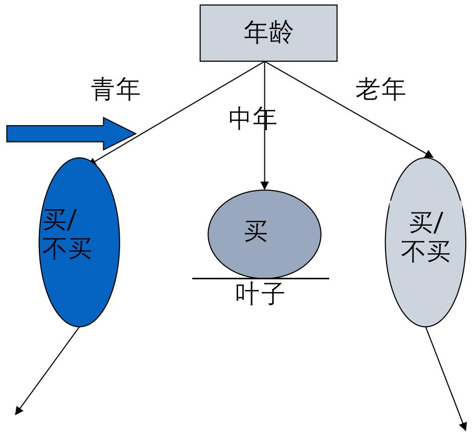

<table><tr><td rowspan=1 colspan=1>计数</td><td rowspan=1 colspan=1>年龄</td><td rowspan=1 colspan=1>收入</td><td rowspan=1 colspan=1>学生</td><td rowspan=1 colspan=1>信誉</td><td rowspan=1 colspan=1>归类：买计算机？</td></tr><tr><td rowspan=1 colspan=1>64</td><td rowspan=1 colspan=1>青</td><td rowspan=1 colspan=1>高</td><td rowspan=1 colspan=1>否</td><td rowspan=1 colspan=1>良</td><td rowspan=1 colspan=1>不买</td></tr><tr><td rowspan=1 colspan=1>64</td><td rowspan=1 colspan=1>青</td><td rowspan=1 colspan=1>高</td><td rowspan=1 colspan=1>否</td><td rowspan=1 colspan=1>优</td><td rowspan=1 colspan=1>不买</td></tr><tr><td rowspan=1 colspan=1>128</td><td rowspan=1 colspan=1>青</td><td rowspan=1 colspan=1>中</td><td rowspan=1 colspan=1>否</td><td rowspan=1 colspan=1>良</td><td rowspan=1 colspan=1>不买</td></tr><tr><td rowspan=1 colspan=1>64</td><td rowspan=1 colspan=1>青</td><td rowspan=1 colspan=1>低</td><td rowspan=1 colspan=1>是</td><td rowspan=1 colspan=1>良</td><td rowspan=1 colspan=1>买</td></tr><tr><td rowspan=1 colspan=1>64</td><td rowspan=1 colspan=1>青</td><td rowspan=1 colspan=1>中</td><td rowspan=1 colspan=1>是</td><td rowspan=1 colspan=1>优</td><td rowspan=1 colspan=1>买</td></tr></table>

青年买与不买比例为128/256

$$
\begin{array} { l } { { \vert { \mathsf { C 1 } } \vert ( { \lesseqgtr } _ { \cdot } ^ { \prime } ) { = } 1 2 8 } } \\ { { \vert { \mathsf { C 2 } } \vert \quad { \overset { \prime } { \left( { \sqrt { \cdot } } { \bar { \mathscr { H } } } _ { \cdot } ^ { \prime } \right) } } = 2 5 6 } } \\ { { \vert { \mathsf { D } } \vert { = } 3 8 4 } } \end{array}
$$

$$
\begin{array} { r l } & { \mathsf { H } ( \mathsf { D } ) { = } { \mathsf { - P } } 1 \mathsf { L o g } 2 \mathsf { P } 1 { \mathsf { - P } } 2 \mathsf { L o g } 2 \mathsf { P } 2 } \\ & { \quad { = } { \mathsf { - } } ( \mathsf { P } 1 \mathsf { L o g } 2 \mathsf { P } 1 { + } \mathsf { P } 2 \mathsf { L o g } 2 \mathsf { P } 2 ) } \\ & { \quad { = } 0 { \mathrm { . } } 9 1 8 3 } \end{array}
$$

<table><tr><td rowspan=1 colspan=1>计数</td><td rowspan=1 colspan=1>年龄</td><td rowspan=1 colspan=1>收入</td><td rowspan=1 colspan=1>学生</td><td rowspan=1 colspan=1>信誉</td><td rowspan=1 colspan=1>归类：买计算机？</td></tr><tr><td rowspan=1 colspan=1>64</td><td rowspan=1 colspan=1>青</td><td rowspan=1 colspan=1>高</td><td rowspan=1 colspan=1>否</td><td rowspan=1 colspan=1>良</td><td rowspan=1 colspan=1>不买</td></tr><tr><td rowspan=1 colspan=1>64</td><td rowspan=1 colspan=1>青</td><td rowspan=1 colspan=1>高</td><td rowspan=1 colspan=1>否</td><td rowspan=1 colspan=1>优</td><td rowspan=1 colspan=1>不买</td></tr><tr><td rowspan=1 colspan=1>128</td><td rowspan=1 colspan=1>青</td><td rowspan=1 colspan=1>中</td><td rowspan=1 colspan=1>否</td><td rowspan=1 colspan=1>良</td><td rowspan=1 colspan=1>不买</td></tr><tr><td rowspan=1 colspan=1>64</td><td rowspan=1 colspan=1>青</td><td rowspan=1 colspan=1>低</td><td rowspan=1 colspan=1>是</td><td rowspan=1 colspan=1>良</td><td rowspan=1 colspan=1>买</td></tr><tr><td rowspan=1 colspan=1>64</td><td rowspan=1 colspan=1>青</td><td rowspan=1 colspan=1>中</td><td rowspan=1 colspan=1>是</td><td rowspan=1 colspan=1>优</td><td rowspan=1 colspan=1>买</td></tr></table>

## 如果选择收入作为节点 分高、中、低

H(D1)=0  
比例：  
128/384=0.3333

H(D2)=0.9183   
比例:192/384=0.5

H(D3)=0   
比例:64/384=0.1667

平均信息期望（加权总和）：  
E(收入）= 0.3333\*0+0.5\*0.9183 +0.1667\*0= 0.4592  
Cain(收入) = 1(128, 256) - E(收入)=0.9183 –0.4592 = 0.4591  
注意

<table><tr><td rowspan=1 colspan=1>计数</td><td rowspan=1 colspan=1>年龄</td><td rowspan=1 colspan=1>收入</td><td rowspan=1 colspan=1>学生信誉</td><td rowspan=1 colspan=1>学生信誉</td><td rowspan=1 colspan=1>归类：买计算机？</td></tr><tr><td rowspan=1 colspan=1>64</td><td rowspan=1 colspan=1>青</td><td rowspan=1 colspan=1>高</td><td rowspan=1 colspan=1>否</td><td rowspan=1 colspan=1>良</td><td rowspan=1 colspan=1>不买</td></tr><tr><td rowspan=1 colspan=1>64</td><td rowspan=1 colspan=1>青</td><td rowspan=1 colspan=1>高</td><td rowspan=1 colspan=1>否</td><td rowspan=1 colspan=1>优</td><td rowspan=1 colspan=1>不买</td></tr><tr><td rowspan=1 colspan=1>128</td><td rowspan=1 colspan=1>中</td><td rowspan=1 colspan=1>高</td><td rowspan=1 colspan=1>否</td><td rowspan=1 colspan=1>良</td><td rowspan=1 colspan=1>买</td></tr><tr><td rowspan=1 colspan=1>60</td><td rowspan=1 colspan=1>老</td><td rowspan=1 colspan=1>中</td><td rowspan=1 colspan=1>否</td><td rowspan=1 colspan=1>良</td><td rowspan=1 colspan=1>买</td></tr><tr><td rowspan=1 colspan=1>64</td><td rowspan=1 colspan=1>老</td><td rowspan=1 colspan=1>低</td><td rowspan=1 colspan=1>是</td><td rowspan=1 colspan=1>良</td><td rowspan=1 colspan=1>买</td></tr><tr><td rowspan=1 colspan=1>64</td><td rowspan=1 colspan=1>老</td><td rowspan=1 colspan=1>低</td><td rowspan=1 colspan=1>是</td><td rowspan=1 colspan=1>优</td><td rowspan=1 colspan=1>不买</td></tr><tr><td rowspan=1 colspan=1>64</td><td rowspan=1 colspan=1>中</td><td rowspan=1 colspan=1>低</td><td rowspan=1 colspan=1>是</td><td rowspan=1 colspan=1>优</td><td rowspan=1 colspan=1>买</td></tr><tr><td rowspan=1 colspan=1>128</td><td rowspan=1 colspan=1>青</td><td rowspan=1 colspan=1>中</td><td rowspan=1 colspan=1>否</td><td rowspan=1 colspan=1>良</td><td rowspan=1 colspan=1>不买</td></tr><tr><td rowspan=1 colspan=1>64</td><td rowspan=1 colspan=1>青</td><td rowspan=1 colspan=1>低</td><td rowspan=1 colspan=1>是</td><td rowspan=1 colspan=1>良</td><td rowspan=1 colspan=1>买</td></tr><tr><td rowspan=1 colspan=1>132</td><td rowspan=1 colspan=1>老</td><td rowspan=1 colspan=1>中</td><td rowspan=1 colspan=1>是</td><td rowspan=1 colspan=1>良</td><td rowspan=1 colspan=1>买</td></tr><tr><td rowspan=1 colspan=1>64</td><td rowspan=1 colspan=1>青</td><td rowspan=1 colspan=1>中</td><td rowspan=1 colspan=1>是</td><td rowspan=1 colspan=1>优</td><td rowspan=1 colspan=1>买</td></tr><tr><td rowspan=1 colspan=1>32</td><td rowspan=1 colspan=1>中</td><td rowspan=1 colspan=1>中</td><td rowspan=1 colspan=1>否</td><td rowspan=1 colspan=1>优</td><td rowspan=1 colspan=1>买</td></tr><tr><td rowspan=1 colspan=1>32</td><td rowspan=1 colspan=1>中</td><td rowspan=1 colspan=1>高</td><td rowspan=1 colspan=1>是</td><td rowspan=1 colspan=1>良</td><td rowspan=1 colspan=1>买</td></tr><tr><td rowspan=1 colspan=1>63</td><td rowspan=1 colspan=1>老</td><td rowspan=1 colspan=1>中</td><td rowspan=1 colspan=1>否</td><td rowspan=1 colspan=1>优</td><td rowspan=1 colspan=1>不买</td></tr><tr><td rowspan=1 colspan=1>1</td><td rowspan=1 colspan=1>老</td><td rowspan=1 colspan=1>中</td><td rowspan=1 colspan=1>否</td><td rowspan=1 colspan=1>优</td><td rowspan=1 colspan=1>买</td></tr></table>

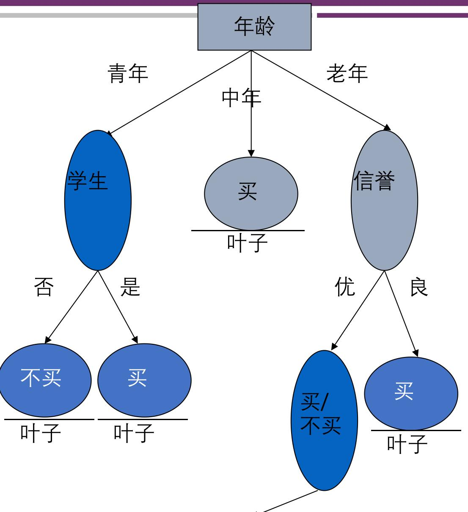

## 决策树ID3算法-流程

• 1决定分类属性;

• 2 对目前的数据表，建立一个节点N

• 3 如果数据库中的数据都属于同一个类，N就是树叶，在树叶上标出所属的类

·4.如果数据表中没有其他属性可以考虑，则N也是树叶，按照少数服从多数的原则在树叶上标出所属类别

·5 否则，根据平均信息期望值E或GAIN值选出一个最佳属性作为节点N的测试属性

• 6 节点属性选定后，对于该属性中的每个值：

·从N生成一个分支，并将数据表中与该分支有关的数据收集形成分支节点的数据表，在表中删除节点属性那一栏如果分支数据表非空，则运用以上算法从该节点建立子树。

## 决策树ID3算法-实际使用

原始表

<table><tr><td rowspan=1 colspan=1>姓名</td><td rowspan=1 colspan=1>年龄</td><td rowspan=1 colspan=1>年龄收入</td><td rowspan=1 colspan=1>学生</td><td rowspan=1 colspan=1>学生信誉</td><td rowspan=1 colspan=1>电话</td><td rowspan=1 colspan=1>地址</td><td rowspan=1 colspan=1>邮编</td><td rowspan=1 colspan=1>买计算机</td></tr><tr><td rowspan=1 colspan=1>张三</td><td rowspan=1 colspan=1>23</td><td rowspan=1 colspan=1>4000</td><td rowspan=1 colspan=1>是</td><td rowspan=1 colspan=1>良</td><td rowspan=1 colspan=1>281-322-0328</td><td rowspan=1 colspan=1>2714 Ave. M</td><td rowspan=1 colspan=1>77388</td><td rowspan=1 colspan=1>买</td></tr><tr><td rowspan=1 colspan=1>李四</td><td rowspan=1 colspan=1>34</td><td rowspan=1 colspan=1>2800</td><td rowspan=1 colspan=1>否</td><td rowspan=1 colspan=1>优</td><td rowspan=1 colspan=1>713-239-7830</td><td rowspan=1 colspan=1>5606 Holly Cr</td><td rowspan=1 colspan=1>78766</td><td rowspan=1 colspan=1>买</td></tr><tr><td rowspan=1 colspan=1>王二</td><td rowspan=1 colspan=1>70</td><td rowspan=1 colspan=1>1900</td><td rowspan=1 colspan=1>否</td><td rowspan=1 colspan=1>优</td><td rowspan=1 colspan=1>281-242-3222</td><td rowspan=1 colspan=1>2000 Bell Blvd.</td><td rowspan=1 colspan=1>70244</td><td rowspan=1 colspan=1>不买</td></tr><tr><td rowspan=1 colspan=1>赵五</td><td rowspan=1 colspan=1>18</td><td rowspan=1 colspan=1>900</td><td rowspan=1 colspan=1>是</td><td rowspan=1 colspan=1>良</td><td rowspan=1 colspan=1>281-550-0544</td><td rowspan=1 colspan=1>100 MainStreet</td><td rowspan=1 colspan=1>70244</td><td rowspan=1 colspan=1>买</td></tr><tr><td rowspan=1 colspan=1>刘兰</td><td rowspan=1 colspan=1>34</td><td rowspan=1 colspan=1>2500</td><td rowspan=1 colspan=1>否</td><td rowspan=1 colspan=1>优</td><td rowspan=1 colspan=1>713-239-7430</td><td rowspan=1 colspan=1>606 Holly Ct</td><td rowspan=1 colspan=1>78566</td><td rowspan=1 colspan=1>买</td></tr><tr><td rowspan=1 colspan=1>杨俊</td><td rowspan=1 colspan=1>27</td><td rowspan=1 colspan=1>8900</td><td rowspan=1 colspan=1>否</td><td rowspan=1 colspan=1>优</td><td rowspan=1 colspan=1>281-355-7990</td><td rowspan=1 colspan=1>233 Rice Blvd.</td><td rowspan=1 colspan=1>70388</td><td rowspan=1 colspan=1>不买</td></tr><tr><td rowspan=1 colspan=1>张毅</td><td rowspan=1 colspan=1>38</td><td rowspan=1 colspan=1>9500</td><td rowspan=1 colspan=1>否</td><td rowspan=1 colspan=1>优</td><td rowspan=1 colspan=1>281-556-0544</td><td rowspan=1 colspan=1>399 Sugar Rd.</td><td rowspan=1 colspan=1>78244</td><td rowspan=1 colspan=1>买</td></tr><tr><td rowspan=1 colspan=1>。。。</td><td rowspan=1 colspan=1>。。</td><td rowspan=1 colspan=1></td><td rowspan=1 colspan=1></td><td rowspan=1 colspan=1></td><td rowspan=1 colspan=1></td><td rowspan=1 colspan=1></td><td rowspan=1 colspan=1></td><td rowspan=1 colspan=1></td></tr><tr><td rowspan=1 colspan=1>。。。</td><td rowspan=1 colspan=1></td><td rowspan=1 colspan=1></td><td rowspan=1 colspan=1></td><td rowspan=1 colspan=1></td><td rowspan=1 colspan=1></td><td rowspan=1 colspan=1></td><td rowspan=1 colspan=1></td><td rowspan=1 colspan=1></td></tr></table>

## 决策树ID3算法-实际使用

决策树的数据准备

整理后的数据表
<table><tr><td rowspan=1 colspan=1>计数</td><td rowspan=1 colspan=1>年龄</td><td rowspan=1 colspan=1>收入</td><td rowspan=1 colspan=1>学生</td><td rowspan=1 colspan=1>信誉</td><td rowspan=1 colspan=1>归类：买计算机？</td></tr><tr><td rowspan=1 colspan=1>64</td><td rowspan=1 colspan=1>青</td><td rowspan=1 colspan=1>高</td><td rowspan=1 colspan=1>否</td><td rowspan=1 colspan=1>良</td><td rowspan=1 colspan=1>不买</td></tr><tr><td rowspan=1 colspan=1>64</td><td rowspan=1 colspan=1>青</td><td rowspan=1 colspan=1>高</td><td rowspan=1 colspan=1>否</td><td rowspan=1 colspan=1>优</td><td rowspan=1 colspan=1>不买</td></tr><tr><td rowspan=1 colspan=1>128</td><td rowspan=1 colspan=1>中</td><td rowspan=1 colspan=1>高</td><td rowspan=1 colspan=1>否</td><td rowspan=1 colspan=1>良</td><td rowspan=1 colspan=1>买</td></tr><tr><td rowspan=1 colspan=1>60</td><td rowspan=1 colspan=1>老</td><td rowspan=1 colspan=1>中</td><td rowspan=1 colspan=1>否</td><td rowspan=1 colspan=1>良</td><td rowspan=1 colspan=1>买</td></tr><tr><td rowspan=1 colspan=1>64</td><td rowspan=1 colspan=1>老</td><td rowspan=1 colspan=1>低</td><td rowspan=1 colspan=1>是</td><td rowspan=1 colspan=1>良</td><td rowspan=1 colspan=1>买</td></tr><tr><td rowspan=1 colspan=1>64</td><td rowspan=1 colspan=1>老</td><td rowspan=1 colspan=1>低</td><td rowspan=1 colspan=1>是</td><td rowspan=1 colspan=1>优</td><td rowspan=1 colspan=1>不买</td></tr><tr><td rowspan=1 colspan=1>64</td><td rowspan=1 colspan=1>中</td><td rowspan=1 colspan=1>低</td><td rowspan=1 colspan=1>是</td><td rowspan=1 colspan=1>优</td><td rowspan=1 colspan=1>买</td></tr><tr><td rowspan=1 colspan=1>128</td><td rowspan=1 colspan=1>青</td><td rowspan=1 colspan=1>中</td><td rowspan=1 colspan=1>否</td><td rowspan=1 colspan=1>良</td><td rowspan=1 colspan=1>不买</td></tr><tr><td rowspan=1 colspan=1>64</td><td rowspan=1 colspan=1>青</td><td rowspan=1 colspan=1>低</td><td rowspan=1 colspan=1>是</td><td rowspan=1 colspan=1>良</td><td rowspan=1 colspan=1>买</td></tr><tr><td rowspan=1 colspan=1>。。o</td><td rowspan=1 colspan=1></td><td rowspan=1 colspan=1></td><td rowspan=1 colspan=1></td><td rowspan=1 colspan=1></td><td rowspan=1 colspan=1></td></tr></table>

Data cleaning 删除/减少noise, 补填missing values

Data transformation  
数据标准化（data normalization）  
数据归纳（generalize data to higher-levelconcepts using concepthierarchies)  
例如：年龄归纳为老、中、青三类  
控制每个属性的可能值不超过七种  
（最好不超过五种）

Relevance analysis对于与问题无关的属性：删对于属性的可能值大于七种又不能归纳的属性：删

## 决策树ID3算法-小结

• ID3算法的基本思想是，以信息熵为度量，用于决策树节点的属性选择，每次优先选取信息量最多的属性，亦即能使熵值变为最小的属性，以构造一颗熵值下降最快的决策树，到叶子节点处的熵值为0。此时，每个叶子节点对应的实例集中的实例属于同一类。

## 决策树面临的问题

• 理想的决策树有三种：

(1)叶子结点数最少;

(2)叶子结点深度最小;

•  (3)叶子结点数最少且叶子结点深度最小。

• 然而，洪家荣等人已经证明了要找到这种最优的决策树是NP难题。因此，决策树优化的目的就是要找到尽可能趋向于最优的决策树。

## 决策树面临的问题

•过度拟合

·决策树算法增长树的每一个分支的深度，直到恰好能对训练样例比较完美地分类。实际应用中，当数据中有噪声或训练样例的数量太少以至于不能产生目标函数的有代表性的采样时，该策略可能会遇到困难。

•在以上情况发生时，这个简单的算法产生的树会过渡拟合训练样例（过渡拟合：Over Fitting）.

## 决策树面临的问题

•过度拟合

•对学习算法是否成功的真正测试是看它对于训练中未见到的数据的执行性能。训练过程应该包含训练样本和验证样本。验证样本用于测试训练后的性能。如果验证结果差，则需要考虑采用不同的结构重新进行训练，例如使用更大的样本集，或者改变从连续值到离散值得数据转换等。

•通常应该建立一个验证过程，在训练最终完成后用来检测训练结果的泛化能力。

## 决策树面临的问题

\- 一般可以将分类模型的误差分为：

1、 训练误差 (Training Error)

•2、泛化误差 (Generalization Error)

•训练误差是在训练记录上误分类样本比例；

泛化误差是模型在未知记录上的期望误差；

• 一个好的模型不仅要能够很好地拟合训练数据，而且对未知样本也要能够准确地芬类。

一个好的分类模型必须县有低的训练误差和泛化误差。因为一个具有低训练误差的模，其泛化误差可能比真有较高训练误差的模型高。（训练误差低，泛化误差高，称为过渡拟合）

## 决策树面临的问题

•决策树算法比较适合处理离散数值的属性。实际应用中属性是连续的或者离散的情况都比较常见。

一样的方仅将对的属性划分力覆数且的客遇的分割由用 (Binary Split) o 需要找出一个合适的分割阈值。

## 本书第九章将介绍

参考C4.5算法 Top 10 algorithms in data miningKnowledge Information System 2008 14:1-37

## 决策树的剪枝

• 通过极小化决策树整体的损失函数或代价函数来实现。

·设树T的叶结点个数为ITI,t是树T的叶结点，该叶结点有 $\mathsf { N } _ { \mathrm { t } } .$ 个样本点，其中k类的样本点有 $\mathsf { N } _ { \mathtt { t k } }$ 个， $k { = } 1 , 2 . . 1 ,$

$H _ { \mathrm { t } } ( \mathsf { T } )$ 为叶结点t上的经验熵， $\alpha { \geq } 0$ 为参数，损失函数:

$$
C _ { \alpha } ( T ) = \sum _ { t = 1 } ^ { | T | } N _ { t } H _ { t } ( T ) + \alpha | T |
$$

•经验熵:

$$
H _ { \prime } ( T ) = - \sum _ { k } \frac { N _ { a } } { N _ { \prime } } \log \frac { N _ { \nu } } { N _ { \prime } }
$$

原式第一项:

$$
C ( T ) = \sum _ { t = 1 } ^ { \mathcal { T } } N _ { t } H _ { t } ( T ) = - \sum _ { t = 1 } ^ { \mathcal { T } ] } \sum _ { k = 1 } ^ { K } N _ { t k } \log \frac { N _ { t k } } { N _ { t } }
$$

·则:

$$
C _ { \alpha } ( T ) = C ( T ) + \alpha | T |
$$

## 决策树的剪枝

•树的剪枝算法:

输入：生成算法产生的整个树T，参数 $\pmb { \alpha }$

输出：修剪后的子树 $\scriptstyle { T _ { \alpha } }$

(1)计算每个结点的经验熵.

(2)递归地从树的叶结点向上回缩.

·设一组叶结点回缩到其父结点之前与之和的损失函数分别为： $C _ { \cal \phi } \left( T _ { \cal \phi } \right)$ 与 $C _ { \sqrt { 2 } } ( T _ { 1 } )$

·如果： $C _ { \alpha } ( T _ { A } ) \leqslant C _ { \alpha } ( T _ { B } )$ 则进行剪枝

(3）返回(2)，直至不能继续为止，得到损失函数最小的子树 $T _ { \alpha }$

## CART树

·分类回归树CART(Classification and Regression Trees) • 1984 << Classification and Regression Trees >>

• L.Breiman, J.Friedman, R.OIshen和C.Stone

http://www.stat.berkeley.edu/\~breiman/

http://www-stat.stanford.edu/\~jhf/

http://www-stat.stanford.edu/\~olshen/

• 目标变量是类别的--- 分类树

\- 目标变量是连续的---回归树

## CART与ID3的不同

• 二元划分：

•二叉树不易产生数据碎片，精确度往往也会高于多叉树

• CART中选择变量的不纯性度量：

•分类目标：Gini指标、Towing、order Towing

• 连续目标：最小平方残差、最小绝对残差

•剪枝：

• 用预剪枝或后剪枝对训练集生长的树进行剪枝

•树的建立:

•恕果貝量是 的，，並具是具有两个以上的类别，则CART可能考虑将目标类容穿晟昺卡超奕别(效花）；

・如果目标变量是连续的，则CART算法找出一组基于树的回归方程来预测目标变量。

## CART树

•CART算法由两部分组成:

•决策树生成

•决策树剪枝

• 回归树： 平方误差最小化

·分类树：Gini Index

## CART的生成

回归树的生成

• 设Y是连续变量，给定训练数据集： $D = \{ ( x _ { 1 } , y _ { 1 } ) , ( x _ { 2 } , y _ { 2 } ) _ { 2 } \cdots , ( x _ { N } , y _ { N } ) \}$

·假设已将输入空间划分为M各单元R1,R2..Rm，并且每个单元Rm上有一个固定的输出Cm，回归树表示为： $f ( x ) = \sum _ { m = 1 } ^ { M } c _ { m } I ( x \in R _ { m } )$

• 平方误差来表示预测误差，用平方误差最小准则求解每个单元上的最优输出值

$$
\sum _ { z _ { i } \in R _ { \mathbf { s } } } ( y _ { i } - f ( x _ { i } ) ) ^ { 2 }
$$

· Rm上的Cm的最优值： $\hat { \mathbf { c } } _ { p _ { m } } = \mathrm { a v e } ( y _ { i } \mid x _ { i } \in R _ { m } )$

## CART的生成

• 问题：如何对输入空间进行划分？

•启发式：选择第j个变量x(i和它取的值s，作为切分变量和切分点，定义两个区域：

$$
\begin{array} { r } { R _ { 1 } ( j , s ) = \{ x | x ^ { ( j ) } \leqslant s \} \quad \mathrm { ~ \# \mathbb { I } ~ } \quad R _ { 2 } ( j , s ) = \{ x | x ^ { ( j ) } > s \} } \end{array}
$$

• 然后寻找最优切分变量和切分点:

$$
\operatorname* { m i n } _ { j , s } \left[ \operatorname* { m i n } _ { \mathbf { q } _ { \tau } } \sum _ { x _ { i } \in R _ { 1 } ( j , e ) } ( y _ { i } - c _ { 1 } ) ^ { 2 } + \operatorname* { m i n } _ { \mathbf { r } _ { 2 } } \sum _ { x _ { i } \in R _ { 2 } ( j , s ) } ( y _ { i } - c _ { 2 } ) ^ { 2 } \right]
$$

$$
\bullet \boxdot { \cdot } \quad \hat { c } _ { 1 } = \operatorname { a v e } ( y _ { i } \mid x _ { t } \in R _ { 1 } ( j , s ) ) \quad \quad \rlap { / } \hat { \mathcal { F } } \mathbb { I } \quad \hat { c } _ { 2 } = \operatorname { a v e } ( y _ { i } \mid x _ { i } \in R _ { 2 } ( j , s ) )
$$

• 再对两个区域重复上述划分，直到满足停止条件。

## CART的生成

・最小二乘回归树生成算法

输入：训练数据集D：

输出：回归树f(x).

在训练数据集所在的输入空间中，递归地将每个区域划分为两个子区域并决定每个子区域上的输出值，构建二叉决策树：

（1）选择最优切分变量j与切分点s，求解

$$
\operatorname* { m i n } _ { j , s } \left[ \operatorname* { m i n } _ { \tilde { \mathbf { \Gamma } } _ { i } } \sum _ { \substack { x _ { i } \in R _ { 1 } ( f _ { i } s ) } } ( y _ { i } - c _ { 1 } ) ^ { 2 } + \operatorname* { m i n } _ { \tilde { \mathbf { \Gamma } } _ { i } } \sum _ { \substack { \tilde { \mathbf { z } } _ { i } \in R _ { 2 } ( f _ { s } s ) } } ( y _ { i } - c _ { 2 } ) ^ { 2 } \right]
$$

遍历变量j，对固定的切分变量j扫描切分点s，选择使式 达到最小值的对 $( j , 5 )$

## CART的生成

・最小二乘回归树生成算法

(2）用选定的对(js)划分区域并决定相应的输出值：

$$
R _ { 1 } ( j , s ) = \{ \boldsymbol { x } | \boldsymbol { x } ^ { ( j ) } \leqslant s \} \ , \quad R _ { 2 } ( j , s ) = \{ \boldsymbol { x } | \boldsymbol { x } ^ { ( j ) } > s \}
$$

$$
\hat { c } _ { m } = \frac { 1 } { N _ { m } } \sum _ { x _ { i } \in R _ { m } ( f , v ) } y _ { t } \ , x \in R _ { m } , m = 1 , 2
$$

(3）继续对两个子区域调用步骤(1)，(2)，直至满足停止条件.

（4）将输入空间划分为M个区域 $R _ { 1 } , R _ { 2 } , \cdots , R _ { k }$ ，生成决策树：

$$
f ( x ) = \sum _ { i = 1 } ^ { M } \hat { c } _ { i i } I ( x \in R _ { i n } )
$$

## CART的生成

•分类树的生成:

•基尼指数

$$
\mathrm { G i n i } ( p ) = \sum _ { k = 1 } ^ { K } p _ { k } ( 1 - p _ { k } ) = 1 - \sum _ { k = 1 } ^ { K } p _ { k } ^ { 2 }
$$

• 二分类问题： $\mathrm { G i n i } ( p ) = 2 p ( 1  p )$

·对给定的样本集合D，基尼指数

$$
\mathrm { G i n i } ( \mathcal { D } ) = 1 - \sum _ { k = 1 } ^ { \kappa } \Biggl ( \frac { | C _ { k } | } { | D | } \Biggr ) ^ { 2 }
$$

## CART的生成

・如果样本集合D根据特征A是否为a被分割成D1和D2，即

$$
D _ { 1 } = \{ ( x , y ) \in D | A ( x ) = a \} \ , D _ { 2 } = D - D _ { 1 }
$$

·则在特征A的条件下，集合D的基尼指数：

$$
\mathrm { G i n i } ( D , A ) = \frac { \left| D _ { 1 } \right| } { \left| D \right| } \mathrm { G i n i } ( D _ { 1 } ) + \frac { \left| D _ { 2 } \right| } { \left| D \right| } \mathrm { G i n i } ( D _ { 2 } )
$$

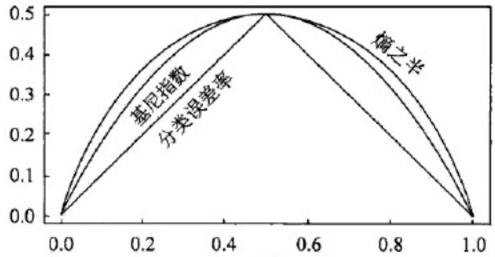

## CART的生成

•CART生成算法

•输入：训练数据集D，停止计算条件

•输出： CART决策树

•从根节点开始，递归对美国结点操作

•1、设结点数据集为D，对每个特征A，对其每个值a，根据样本点对A=a的测试为是或否，将D分为D1，D2，计算A=a的基尼指数

•2、在所有的特征A以及所有可能的切分点a中，选择基尼指数最小的特征和切分点，将数据集分配到两个子结点中。

•3、对两个子结点递归调用1，2步骤

·4、生成CART树

## CART的生成

•CART剪枝

·两步

·1、从生成算法产生的决策树TO底端开始不断剪枝，直到TO的根结点，形成子树序列{TO,T1..Tn}，

•2、通过交叉验证法在独立的验证数据集上对子树序列进行测试，从中选择最优子树

## CART的生成

•CART剪枝

·1、剪枝，形成子树序列

·剪枝过程中，计算子树的损失函数：

$$
C _ { \alpha } ( T ) = C ( T ) + \alpha | T |
$$

•对固定的a一定存在损失函数最小的子树，表示为Ta，

•当a变大时，最优子树Ta偏小，

• a=0时，整体树最优，a趋近无穷大，单结点最优

·将a从小增大， $\scriptstyle 0 = \alpha _ { 0 } < \alpha _ { 1 } < \cdots < \alpha _ { n } < + \infty$

最优子树序列 $\{ T _ { 0 } , T _ { 1 } , \cdots , T _ { n } \}$

## CART的生成

•CART剪枝

•1、剪枝，形成子树序列

·具体：从TO开始剪枝，以t为单结点树的损失函数:

$$
C _ { \alpha } ( t ) = C ( t ) + \alpha
$$

•以t为根结点的子树Tt的损失函数:

$$
C _ { \alpha } ( T _ { t } ) = C ( T _ { t } ) + \alpha \mid T _ { t } \mid
$$

•当a=0及a很小时， $C _ { \alpha } ( T _ { t } ) < C _ { \alpha } ( t )$

•不断增大a，当 Cα(T)= Cα(t) Q= C(1)−C(T,) |T1-1

• Tt与t有相同损失函数值，但t结点更少，所以剪枝Tt。

## CART的生成

•CART剪枝

•1、剪枝，形成子树序列

• 对To中每个内部结点t， 计算：

$$
g ( t ) = \frac { C ( t ) - C ( T _ { t } ) } { | T _ { t } | - 1 }
$$

·在TO中剪去g(t)最小的Tt，将得到的子树作为T1，\_同时将最小的g(t)设为a1，T1为区间[a1,a2)的最优子树

·如此剪枝下去，直到根节点，不断增加a的值，产生新的区间。

## CART的生成

·CART剪枝

• 2、在剪枝得到的子树序列{TO,T1...Tn}中通过交叉验证选取最优子树Ta

·利用独立的验证数据集，测试子树序列中各子树的平方误差或基尼指数，最小的决策树就是最优决策树。

## 决策树的Python实现

•计算香农熵

• def calcShannonEnt(dataSet):

● $\mathsf { n u m E n t r i e s } = \mathsf { l e n } ( \mathsf { d a t a S e t } )$

labelCounts = {}

for featVec in dataSet: #the the number of unique elements and their occurance

currentLabel = featVec[-1]

if currentLabel not in labelCounts.keys():

labelCounts[currentLabel] = 0

labelCounts[currentLabel] += 1

shannonEnt = 0.0

for key in labelCounts:

prob = float(labelCounts[key])/numEntries

shannonEnt -= prob \* log(prob,2) #log base 2

return shannonEnt

## 决策树的Python实现

·划分数据集：参数包括数据集、特征、值

• def splitDataSet(dataSet, axis, value):

retDataSet = []

for featVec in dataSet:

if featVec[axis] == value:

reducedFeatVec = featVec[:axis] #chop out axis used for splitting

reducedFeatVec.extend(featVec[axis+1:])

retDataSet.append(reducedFeatVec)

return retDataSet

## 决策树的Python实现

·选择最好的数据集划分方式

• def chooseBestFeatureToSplit(dataSet):

● numFeatures = len(dataSet[O]) - 1 #the last column is used for the labels

baseEntropy = calcShannonEnt(dataSet)

bestlnfoGain = 0.0; bestFeature = -1

foriin range(numFeatures): #iterate over all the features

featList = [example[i] for example in dataSet]#create a list of allthe examples of this feature

uniqueVals = set(featList) #get a set of unique values

newEntropy = 0.0

for value in uniqueVals:

## 决策树的Python实现

・选择最好的数据集划分方式

for value in uniqueVals:

subDataSet = splitDataSet(dataSet, i, value)

prob = len(subDataSet)/float(len(dataSet))

newEntropy += prob \* calcShannonEnt(subDataSet)

● infoGain = baseEntropy - newEntropy #calculate the info gain; ie reduction in entropy

if (infoGain > bestlnfoGain): #compare this to the best gain so far

bestlnfoGain = infoGain #if better than current best, set to best

bestFeature = i

return bestFeature

## 决策树的Python实现

•多数表决的方法决定叶子节点的分类

• def majorityCnt(classList):

classCount={}

for vote in classList:

● if vote not in classCount.keys(): classCount[vote] = 0

classCount[vote] += 1

sortedClassCount = sorted(classCount.iteritems(), key=operator.itemgetter(1), reverse=True)

return sortedClassCount[0][0]

## 决策树的Python实现

·创建树

• def createTree(dataSet,labels):

classList = [example[-1] for example in dataSet]

if classList.count(classList[O]) == len(classList):

● return classList[O] #stop splitting when all of the classes are equal

if len(dataSet[o]) == 1: #stop splitting when there are no more features in dataset

return majorityCnt(classList)

bestFeat = chooseBestFeatureToSplit(dataSet)

bestFeatLabel = labels[bestFeat]

## 决策树的Python实现

·创建树

• bestFeatLabel = labels[bestFeat]

myTree = {bestFeatLabel:{}}

del(labels[bestFeat])

featValues = [example[bestFeat] for example in dataSet]

uniqueVals = set(featValues)

for value in uniqueVals:

● subLabels = labels[:] #copy all of labels, so trees don't mess up existing labels

myTree[bestFeatLabel][value] = createTree(splitDataSet(dataSet, bestFeat, value),subLabels)

return myTree

## •创建树

Yes

Yes

No

Yes

No

Yes

Yes

Yes

Yes

No

No

No


## 决策树的Python实现

•创建树

>>> reload(trees)   
<module 'trees' from 'trees.pyc'>   
>>> myDat, labels=trees.createDataSet ()   
>>> myTree = trees.createTree (myDat, labels)   
>>> myTree   
{'no surfacing':{0:'no', 1:{'flippers':{0:'no',1:'yes'}}}

## 例决策树的Python实现子

•创建树

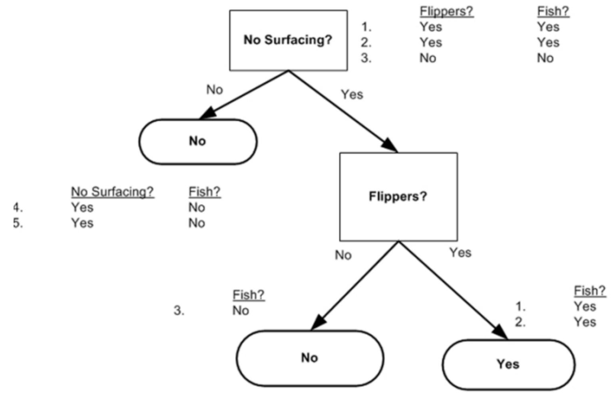

## 决策树的Python实现

·测试算法：使用决策树执行分类

```python
def classify(inputTree,featLabels,testVec):
firstStr = inputTree.keys()[0]
secondDict = inputTree[firstStr]
featlndex = featLabels.index(firstStr)
key = testVec[featlndex]
valueOfFeat = secondDict[key]
if isinstance(valueOfFeat, dict):
classLabel = classify(valueOfFeat, featLabels, testVec)
else: classLabel = valueOffeat
return classLabel
```

## 决策树的Python实现

•测试算法：使用决策树执行分类

>>> myDat, labels=trees.createDataset ()   
>>>labels   
['no surfacing','flippers']   
>>> myTree=treePlotter.retrieveTree (0)   
>>>myTree   
{'no surfacing':{0:'no', 1:{'flippers': {0:'no', 1:'yes'}}}}   
>>> trees.classify(myTree, labels, [l,0])   
'no'   
>>> trees.classify(myTree, labels, [1,1])   
'yes'

## 决策树的Python实现

・使用Pickle模块存储决策树

• pickle是为了序列化/反序列化一个对象的，可以把一个对象持久化存储。比如你有一个对象，想下次运行程序的时候直接用，可以直接用pickle打包存到硬盘上。或者你想把一个对象传给网络上的其他程序，可以用pickle打包，然后传过去

## 决策树的Python实现

•使用Pickle模块存储决策树

• def storeTree(inputTree,filename):

import pickle

fw = open(filename,'w')

pickle.dump(inputTree,fw)

fw.close()

• def grabTree(filename):

import pickle

fr = open(filename)

return pickle.load(fr)

## 决策树的Python实现

·使用决策树预测隐形眼镜类型

• >>>import os

• >>> os.chdir('D:\MLiA\_SourceCode\machinelearninginaction')

· >>> os.chdir('D:\MLiA\_SourceCode\machinelearninginaction\Ch03')

• >>> fr=open("lenses.txt')

• >>>fr

• <open file 'lenses.txt', mode 'r' at 0x0000000002B41420>

• >>> lenses=[inst.strip().split(\t') for inst in fr.readlines()]

• >>>lenses

## 决策树的Python实现

·使用决策树预测隐形眼镜类型

• >>>lensesLabels=['a','b','c','d'"]

• >>> lensesTree=trees.createTree(lenses,lensesLabels)

• >>>lensesTree

• >>>import treePlotter

· >>> treePlotter.createPlot(lensesTree)

## END

第六章

## Logistic 回归与最大熵模型

## 回顾

·KNN

•决策树

• 贝叶斯分类器

• 是否有一种算法•二分类、多类•输出连续值预测•优化算法---回归

## 回归

<table><tr><td>面积</td><td>销售价钱</td></tr><tr><td>(m^2)</td><td>（万元）</td></tr><tr><td>123</td><td>250</td></tr><tr><td>150</td><td>320</td></tr><tr><td>87</td><td>160</td></tr><tr><td>102</td><td>220</td></tr><tr><td></td><td></td></tr></table>

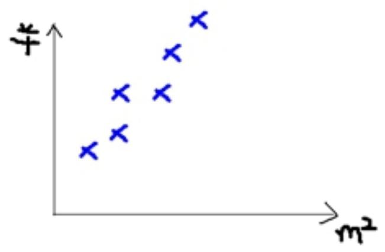

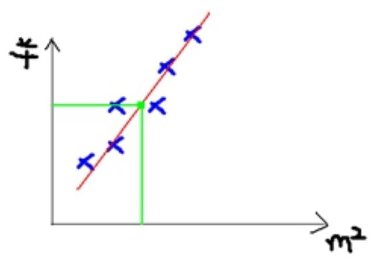

$$
h ( x ) = h _ { \theta } ( x ) = \theta _ { 0 } + \theta _ { 1 } x _ { 1 } + \theta _ { 2 } x _ { 2 }
$$

## 回归

·回归：广义线性模型（generalized linear model)

•分类：根据因变量的不同

•连续：多重线性回归

·二项分布：logistic回归

•poisson分布：poisson回归

•负二项分布：负二项回归

## 逻辑斯蒂分布

• Logistic distribution

·设X是连续随机变量，X服从Logistic distribution,

•分布函数:

$$
F ( x ) = P ( X \leqslant x ) = { \frac { 1 } { 1 + \mathrm { e } ^ { - ( x - \mu ) / \gamma } } }
$$

•密度函数: $f ( x ) = F ^ { \prime } ( x ) = { \frac { \mathrm { e } ^ { - ( x - \mu ) / \gamma } } { \gamma ( 1 + \mathrm { e } ^ { - ( x - \mu ) / \gamma } ) ^ { 2 } } }$

•μ为位置参数，ν大于0为形状参数，(μ,1/2)中心对称

$$
F ( - x + \mu ) - \frac { 1 } { 2 } = - F ( x - \mu ) + \frac { 1 } { 2 }
$$

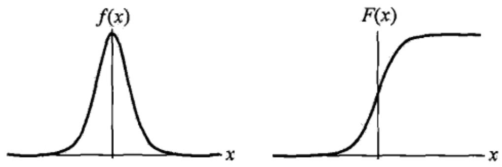

• Sigmoid:

$$
f ( z ) = { \frac { 1 } { 1 + \exp ( - z ) } } .
$$

$$
f ^ { \prime } ( z ) = f ( z ) ( 1 - f ( z ) )
$$

·双曲正切函数(tanh)

$$
f ( z ) = \operatorname { t a n h } ( z ) = { \frac { e ^ { z } - e ^ { - z } } { e ^ { z } + e ^ { - z } } }
$$

$$
f ^ { r } ( z ) = 1 - ( f ( z ) ) ^ { 2 }
$$

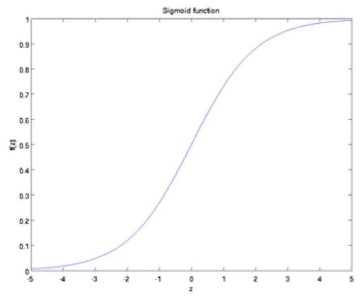

[0, 1]

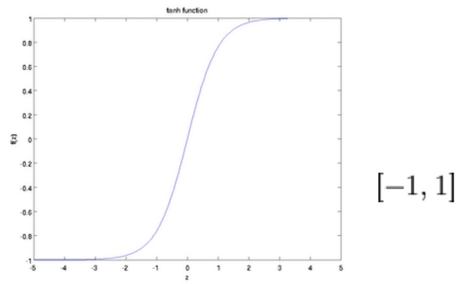

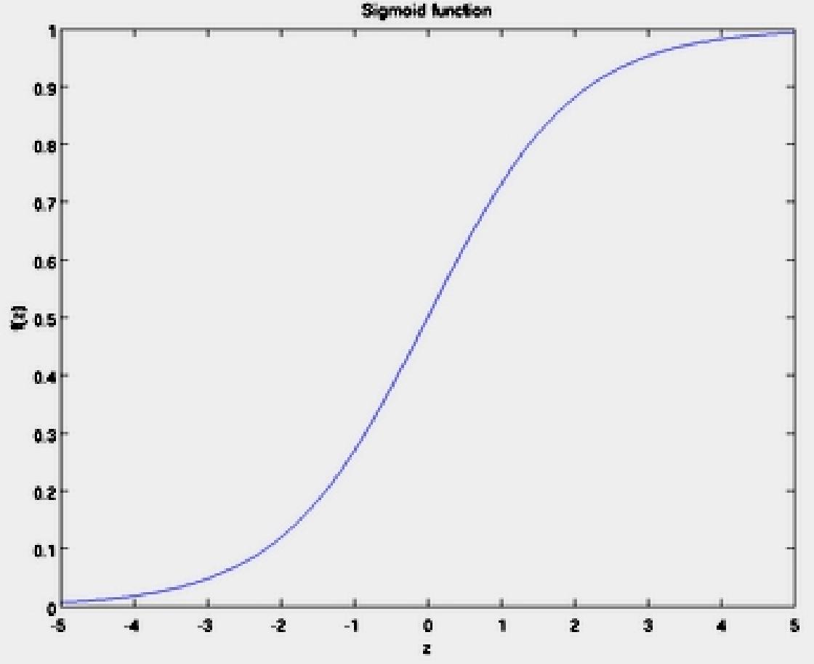

Sigmoid function:

$$
\begin{array} { l } { { \displaystyle h _ { W , b } ( x ) = f ( W ^ { T } x ) = f ( \sum _ { i = 1 } ^ { 3 } W _ { i } x _ { i } + b ) . \quad f ( z ) = \frac { 1 } { 1 + \exp ( - z ) } . } } \\ { { \displaystyle \mathrm { d e f ~ s i g m o i d } ( \mathsf { i n X } ) } . \quad } \\ { { \displaystyle \mathrm { r e t u r n ~ } 1 . 0 / ( 1 + \exp ( - \mathsf { i n X } ) ) } } \end{array}
$$

## 二项逻辑斯蒂回归

• Binomial logistic regression model

•由条件概率P(Y|X)表示的分类模型

·形式化为logistic distribution

•×取实数，Y取值1,0

$$
P ( Y = 1 | x ) = { \frac { \exp ( w \cdot x + b ) } { 1 + e x p ( w \cdot x + b ) } }
$$

$$
P ( Y = 0 \mid x ) = \frac { 1 } { 1 + \exp ( w \cdot x + b ) }
$$

$$
\begin{array} { l } { P ( Y = 1 \mid x ) = { \frac { \exp ( w \cdot x ) } { 1 + \exp ( w \cdot x ) } } } \\ { P ( Y = 0 \mid x ) = { \cfrac { 1 } { 1 + \exp ( w \cdot x ) } } } \end{array}
$$

$$
\boldsymbol { w } = ( w ^ { ( 1 ) } , w ^ { ( 2 ) } , \cdots , w ^ { ( n ) } , b ) ^ { \mathrm { T } }
$$

$$
\boldsymbol { x } = ( \boldsymbol { x } ^ { ( 1 ) } , \boldsymbol { x } ^ { ( 2 ) } , \cdots , \boldsymbol { x } ^ { ( n ) } , 1 ) ^ { \top }
$$

## 二项逻辑斯蒂回归

·事件的几率odds：事件发生与事件不发生的概率之比为

$$
\frac { p } { 1 - p }
$$

·称为事件的发生比(the odds of experiencing an event)，

·对数几率:

$$
\operatorname { l o g i t } ( p ) = \log { \frac { p } { 1 - p } }
$$

•对逻辑斯蒂回归:

$$
\log { \frac { P ( Y = 1 | x ) } { 1 - P ( Y = 1 | x ) } } { \equiv } w \cdot x
$$

## 似然函数

• logistic分类器是由一组权值系数组成的，最关键的问题就是如何获取这组权值，通过极大似然函数估计获得，并且Y^f(x;w)

•似然函数是统计模型中参数的函数。给定输出×时，关于参数θ的似然函数L(0|x）（在数值上）等于给定参数0后变量X的概率：L(θ|x)=P(X=x|θ)

•似然函数的重要性不是它的取值，而是当参数变化时概率密度函数到底是变大还是变小。

·极大似然函数：似然函数取得最大值表示相应的参数能够使得统计模型最为合理

## 似然函数

•那么对于上述m个观测事件，设

$$
P ( Y = 1 \mid x ) = \pi ( x ) \ , \quad P ( Y = 0 \mid x ) = 1 - \pi ( x )
$$

•其联合概率密度函数，即似然函数为：

$$
\prod _ { i = 1 } ^ { N } [ \pi ( x _ { i } ) ] ^ { \gamma _ { i } } [ 1 - \pi ( x _ { i } ) ] ^ { 1 - \gamma _ { i } }
$$

•目标：求出使这一似然函数的值最大的参数估，$\mathsf { w } _ { 1 } , \mathsf { w } _ { 2 } , . . . , \mathsf { w } _ { \mathsf { n } }$ 使得L(w)取得最大值。

•对L(w)取对数:

## 模型参数估计

•对数似然函数

$$
\begin{array} { l } { { \displaystyle { \cal L } ( w ) = \sum _ { i = 1 } ^ { N } [ y _ { i } \log \pi ( x _ { i } ) + ( 1 - y _ { i } ) \log ( 1 - \pi ( x _ { i } ) ) ] } } \\ { ~ } \\ { { \displaystyle ~ = \sum _ { i = 1 } ^ { N } \Biggl [ y _ { i } \log \frac { \pi ( x _ { i } ) } { 1 - \pi ( x _ { i } ) } + \log ( 1 - \pi ( x _ { i } ) ) \Biggr ] } } \\ { { \displaystyle ~ = \sum _ { i = 1 } ^ { N } [ y _ { i } ( w \cdot x _ { i } ) - \log ( 1 + \exp ( w \cdot x _ { i } ) ] } } \end{array}
$$

·对L(w)求极大值，得到w的估计值。

·通常采用梯度下降法及拟牛顿法，学到的模型：

$$
P ( Y = 1 | x ) = { \frac { \exp ( { \hat { w } } \cdot x ) } { 1 + \exp ( { \hat { w } } \cdot x ) } } \qquad P ( Y = 0 | x ) = { \frac { 1 } { 1 + \exp ( { \hat { w } } \cdot x ) } }
$$

## 多项logistic回归

•设Y的取值集合为

$$
\{ 1 , 2 , \cdots , K \}
$$

·多项logistic回归模型 $P ( Y = k \mid x ) = { \frac { \exp ( w _ { k } \cdot x ) } { 1 + \displaystyle \sum _ { k = 1 } ^ { K - 1 } \exp ( w _ { k } \cdot x ) } } ~ , \quad k = 1 , 2 , \cdots , K - 1$

$$
P ( Y = K \mid x ) = { \frac { 1 } { 1 + \displaystyle \sum _ { k = l } ^ { K - 1 } \exp ( w _ { k } \cdot x ) } }
$$

## 最大熵模型

·最大熵模型(Maximum Entropy Model)由最大熵原理推导实现。

最大熵原理:

·学习概率模型时，在所有可能的概率模型(分布)中，熵最大的模型是最好的模型，表述为在满足约束条件的模型集合中选取熵最大的模型。

•假设离散随机变量X的概率分布是P(X)，

•熵：

$$
H ( P ) = - \sum _ { x } P ( x ) \log P ( x )
$$

·且: $0 \leqslant H ( P ) \leqslant \log | X |$

• X|是X的取值个数，χ均匀分布时右边等号成立。

## 例子：

·假设随机变量X有5个取值{A,B,C,D,E},估计各个值的概率。

•解：满足

$$
\mathsf { P } ( \mathsf { A } ) + \mathsf { P } ( \mathsf { B } ) + \mathsf { P } ( \mathsf { C } ) + \mathsf { P } ( \mathsf { D } ) + \mathsf { P } ( \mathsf { E } ) = 1
$$

等概率估计:

$$
P ( A ) = P ( B ) = P ( C ) = P ( D ) = P ( E ) = { \frac { 1 } { 5 } }
$$

•加入一些先验:

$$
P ( A ) + P ( B ) = { \frac { 3 } { 1 0 } }
$$

$$
P ( A ) + P ( B ) + P ( C ) + P ( D ) + P ( E ) = 1
$$

•于是：

$$
P ( A ) = P ( B ) = { \frac { 3 } { 2 0 } }
$$

$$
P ( C ) = P ( D ) = P ( E ) = \frac { 7 } { 3 0 }
$$

## 例子：

·假设随机变量X有5个取值{A,B,C,D,E},估计各个值的概率。

·解：满足 $\mathsf { P } ( \mathsf { A } ) + \mathsf { P } ( \mathsf { B } ) + \mathsf { P } ( \mathsf { C } ) + \mathsf { P } ( \mathsf { D } ) + \mathsf { P } ( \mathsf { E } ) = 1$

•等概率估计: $P ( A ) = P ( B ) = P ( C ) = P ( D ) = P ( E ) = \frac { 1 } { 5 }$

• 加入一些先验:

$$
P ( A ) + P ( B ) = { \frac { 3 } { 1 0 } }
$$

$$
P ( A ) + P ( B ) + P ( C ) + P ( D ) + P ( E ) = 1
$$

•于是： $P ( A ) = P ( B ) = { \frac { 3 } { 2 0 } }$

$$
P ( C ) = P ( D ) = P ( E ) = \frac { 7 } { 3 0 }
$$

再加入约束: $P ( A ) + P ( C ) = \frac { 1 } { 2 }$

$$
P ( A ) + P ( B ) = { \frac { 3 } { 1 0 } }
$$

$$
P ( A ) + P ( B ) + P ( C ) + P ( D ) + P ( E ) = 1
$$

## 最大熵模型

•X和Y分别是输入和输出的集合，这个模型表示的是对于给定的输入X，以条件概率P(YIX)输出Y.

•给定数据集： $T = \{ ( x _ { 1 } , y _ { 1 } ) , ( x _ { 2 } , y _ { 2 } ) , \cdots , ( x _ { N } , y _ { N } ) \}$

·联合分布P(Y|X)的经验分布，边缘分布P(X)的经验分布：

$$
{ \tilde { P } } ( X , Y ) \ \Rightarrow \ { \tilde { P } } ( X = x , Y = y ) = { \frac { V ( X = x , Y = y ) } { N } }
$$

$$
{ \tilde { P } } ( X ) \ \Rightarrow \ { \tilde { P } } ( X = x ) = { \frac { \nu ( X = x ) } { N } }
$$

•特征函数: $f ( x , y ) = { \left\{ \begin{array} { l l } { 1 , } \\ { 0 , } \end{array} \right. }$ x与y满足某一事实 否则

## 最大熵模型

·特征函数f(x,y)关于经验分布 $\tilde { P } ( X , Y )$ 的期望值:

$$
E _ { \tilde { P } } ( f ) = \sum _ { x , y } \tilde { P } ( x , y ) f ( x , y )
$$

·特征函数f(x,y)关于模型 $P ( \mathsf { Y } | \mathsf { X } )$ 与经验分布 $\tilde { P } ( X )$ 的期望值：

$$
E _ { _ P } ( f ) { = } \sum _ { x , y } \tilde { P } ( x ) P ( y \mid x ) f ( x , y )
$$

·如果模型能够获取训练数据中的信息，那么就可以假设这两个期望值相等，即

$$
E _ { \scriptscriptstyle P } ( f ) = E _ { \scriptscriptstyle \bar { P } } ( f ) \quad \Longrightarrow \quad \sum _ { x , y } \tilde { P } ( x ) P ( y \mid x ) f ( x , y ) = \sum _ { x , y } \tilde { P } ( x , y ) f ( x , y )
$$

·假设有n个特征函数: $f _ { i } ( x , y ) , i = 1 , 2 , \cdots , n$

## 最大熵模型

·定义：

·假设满足所有约束条件的模型集合为：

$$
\mathcal C \equiv \{ P \in \mathcal P | E _ { P } ( f _ { i } ) = E _ { \tilde { P } } ( f _ { i } ) , i = 1 , 2 , \cdots , n \}
$$

·定义在条件概率分布P(YIX)上的条件熵：

$$
H ( P ) = - \sum _ { x , y } { \tilde { P } } ( x ) P ( y \mid x ) \log P ( y \mid x )
$$

·则模型集合C中条件熵H(P)最大的模型称为最大熵模型

## 最大熵模型的学习

·最大熵模型的学习可以形式化为约束最优化问题。

·对于给定的数据集以及特征函数： $f _ { i } ( x , y )$

·最大熵模型的学习等价于约束最优化问题：

$$
\begin{array} { r l } { \underset { p _ { \in } C } { \operatorname* { m a x } } } & { \quad H ( P ) = - { \displaystyle \sum _ { x , y } } \tilde { P } ( x ) P ( y \mid x ) \log P ( y \mid x ) } \\ { \mathrm { s . t . } } & { \quad E _ { P } ( f _ { i } ) { = } E _ { \tilde { P } } ( f _ { i } ) , i { = } 1 , 2 , \cdots , n } \\ & { \quad { \displaystyle \sum _ { y } } P ( y \mid x ) = 1 } \end{array}
$$

$$
\begin{array} { r l } { \underset { P \in \bf C } { \mathrm { m i n } } } & { - H ( P ) = \displaystyle \sum _ { x , y } \tilde { P } ( x ) P ( y \mid x ) \log P ( y \mid x ) } \\ { \mathrm { s . t . } } & { E _ { P } ( f _ { i } ) - E _ { \tilde { P } } ( f _ { i } ) = 0 , \quad i = 1 , 2 , \cdots , n } \\ & { ~ \displaystyle \sum _ { y } P ( y \mid x ) = 1 } \end{array}
$$

## 最大熵模型的学习

·这黑，将约束最优化的原始问题转换为无约束最优化的对偶问题，通过求解对偶问题求解原始间题：

• 引进拉格朗日乘子，定义拉格朗日函数：

$$
\begin{array} { c l } { { \displaystyle { \cal L } ( P , w ) \equiv - { \cal H } ( P ) + w _ { 0 } \Biggl ( 1 - \sum _ { y } P ( y \mid x ) \Biggr ) + \sum _ { i = 1 } ^ { n } w _ { i } ( { \cal E } _ { \tilde { P } } ( f _ { i } ) - { \cal E } _ { P } ( f _ { i } ) ) } } \\ { { { } } } \\ { { \displaystyle { = \sum _ { x , y } \tilde { P } ( x ) P ( y \mid x ) \log P ( y \mid x ) + w _ { 0 } \Biggl ( 1 - \sum _ { y } P ( y \mid x ) \Biggr ) } } } \\ { { { } } } \\ { { \displaystyle { ~ + \sum _ { i = 1 } ^ { n } w _ { i } \Biggl ( \sum _ { x , y } \tilde { P } ( x , y ) f _ { i } ( x , y ) - \sum _ { x , y } \tilde { P } ( x ) P ( y \mid x ) f _ { i } ( x , y ) \Biggr ) } } } \end{array}
$$

• 最优化原始问题 到 对偶问题： $\operatorname* { m i n } _ { P \in \mathbf { C } } \operatorname* { m a x } _ { w } L ( P , w ) \quad \Longrightarrow \quad \operatorname* { m a x } _ { w } \operatorname* { m i n } _ { P \in \mathbf { C } } L ( P , w )$

## 最大熵模型的学习

· 最优化原始问题 到 对偶问题：

$$
\operatorname* { m i n } _ { P \in \mathbf { C } } \operatorname* { m a x } _ { w } L ( P , w ) \quad \implies \ \operatorname* { m a x } _ { w } \operatorname* { m i n } _ { P \in \mathbf { C } } L ( P , w )
$$

• L(P,w)是P的凸函数，解的等价性(证明部分在SVM部分介绍)

·先求极小化问题： $\operatorname* { m i n } _ { P \in \mathbb { C } } L ( P , \mathbb { w } )$ 是w的函数,

$$
\varPsi ( w ) = \operatorname* { m i n } _ { P \in \mathbb { C } } L ( P , w ) = L ( P _ { w } , w )
$$

$$
P _ { \mathrm { \scriptsize { w } } } = \arg \operatorname* { m i n } _ { P _ { \mathrm { \scriptsize { E } } } \in \mathbb { C } } L ( P , \mathcal { w } ) = P _ { \mathrm { \scriptsize { w } } } ( y \mid x )
$$

## 最大熵模型的学习

•求L(P,w)对P(y|x)的偏导数:

$$
\begin{array} { r l r } {  { \frac { \partial L ( P , w ) } { \partial P ( y | x ) } = \sum _ { x , y } \tilde { P } ( x ) \big ( \log P ( y | x ) + 1 \big ) - \sum _ { y } w _ { 0 } - \sum _ { x , y } \biggl ( \tilde { P } ( x ) \sum _ { i = 1 } ^ { n } w _ { i } f _ { i } ( x , y ) \biggr ) } } \\ & { } & { = \sum _ { x , y } \tilde { P } ( x ) \biggl ( \log P ( y | x ) + 1 - w _ { 0 } - \sum _ { i = 1 } ^ { n } w _ { i } f _ { i } ( x , y ) \biggr ) } \end{array}
$$

•得:

$$
P ( y \mid x ) = \exp \Biggl ( \sum _ { i = 1 } ^ { n } w _ { i } f _ { i } ( x , y ) + w _ { 0 } - 1 \Biggr ) = { \frac { \exp \Biggl ( \sum _ { i = 1 } ^ { n } w _ { i } f _ { i } ( x , y ) \Biggr ) } { \exp ( 1 - w _ { 0 } ) } }
$$

## 最大熵模型的学习

•由： $\sum _ { y } P ( y \mid x ) = 1$

·得： $P _ { \underset { w } { w } } ( y | x ) = { \frac { 1 } { Z _ { \underset { w } { w } } ( x ) } } \mathrm { e x p } \left( \sum _ { i = 1 } ^ { n } w _ { i } f _ { i } ( x , y ) \right)$

(6.22)

规范化因子： $Z _ { \boldsymbol { w } } ( { \boldsymbol { x } } ) = \sum _ { \boldsymbol { y } } \exp \biggl ( \sum _ { i = 1 } ^ { n } w _ { i } f _ { i } ( { \boldsymbol { x } } , { \boldsymbol { y } } ) \biggr )$

(6.23)

模型 $P _ { \nu } = P _ { \nu } ( y | x )$ 就是最大熵模型

求解对偶问题外部的极大化问题：

$$
\operatorname* { m a x } _ { * } \mathcal { F } ( w ) \qquad w ^ { * } = \arg \operatorname* { m a x } _ { \mathbf { w } } \mathcal { F } ( w ) \qquad P ^ { * } = P _ { \mathbf { w } ^ { * } } = P _ { \mathbf { w } ^ { * } } ( \boldsymbol { y } | \boldsymbol { x } )
$$

## 例子：

·原例子中的最大熵模型: $\mathrm { m i n } - H ( P ) = \sum _ { i = 1 } ^ { 5 } P ( y _ { i } ) \log P ( y _ { i } )$

s.t. $\pmb { P } ( y _ { 1 } ) + \pmb { P } ( y _ { 2 } ) = \tilde { \pmb { P } } ( y _ { 1 } ) + \tilde { \pmb { P } } ( y _ { 2 } ) = \frac { 3 } { 1 0 }$

$$
\sum _ { i = 1 } ^ { 5 } { P ( y _ { i } ) } = \sum _ { i = 1 } ^ { 5 } { \tilde { P } } ( y _ { i } ) = 1
$$

$$
L ( P , w ) = \sum _ { i = 1 } ^ { 5 } P ( y _ { i } ) \log P ( y _ { i } ) + w _ { 1 } \Biggl ( P ( y _ { 1 } ) + P ( y _ { 2 } ) - \frac { 3 } { 1 0 } \Biggr ) + w _ { 0 } \Biggl ( \sum _ { i = 1 } ^ { 5 } P ( y _ { i } ) - 1 \Biggr )
$$

$$
\operatorname* { m a x } _ { \mathbb { H } ^ { \sharp } } \operatorname* { m i n } _ { \mathbb { P } } L ( P , \mathbb { W } )
$$

例子：

$$
\frac { \partial L ( P , w ) } { \partial P ( y _ { 1 } ) } { = } 1 + \log P ( y _ { 1 } ) + w _ { 1 } + w _ { 0 }
$$

$$
\frac { \partial L ( P , w ) } { \partial P ( y _ { 2 } ) } { = } 1 + \log P ( y _ { 2 } ) + w _ { \mathrm { i } } + w _ { \mathrm { 0 } }
$$

$$
\frac { \partial L ( P , w ) } { \partial P ( y _ { 3 } ) } { = } 1 { + } \log P ( y _ { 3 } ) { + } w _ { 0 }
$$

$$
\frac { \partial L ( P , w ) } { \partial P ( y _ { 4 } ) } { = } 1 { + } \log P ( y _ { 4 } ) + w _ { 0 }
$$

$$
\frac { \partial L ( P , w ) } { \partial P ( y _ { s } ) } { = } 1 { + } \log P ( y _ { s } ) + w _ { 0 }
$$

解得：

$$
P ( y _ { 1 } ) = P ( y _ { 2 } ) = \mathfrak { e } ^ { - w _ { 1 } - w _ { 0 } - 1 }
$$

$$
P ( y _ { 3 } ) = P ( y _ { 4 } ) = P ( y _ { 5 } ) = \mathtt { e } ^ { - w _ { 0 } - 1 }
$$

例子：

$$
\operatorname* { m i n } _ { { P } } L ( P , w ) = L ( P _ { w } , w ) = - 2 \mathbf { e } ^ { - w _ { 1 } - w _ { 0 } - 1 } - 3 \mathbf { e } ^ { - w _ { 0 } - 1 } - \frac { 3 } { 1 0 } w _ { 1 } - w _ { 0 }
$$

·得：

$$
\operatorname* { m a x } _ { w } \ L ( P _ { w } , w ) = - 2 \mathrm { e } ^ { - w _ { 1 } - w _ { 0 } - 1 } - 3 \mathrm { e } ^ { - w _ { 0 } - 1 } - \frac { 3 } { 1 0 } w _ { 1 } - w _ { 0 }
$$

• 对wi求偏导并令为0:

$$
\begin{array} { l l l } { \displaystyle \mathrm { e } ^ { - w _ { 1 } - w _ { 0 } - 1 } = \frac { 3 } { 2 0 } } & { \displaystyle } & { P ( y _ { 1 } ) = P ( y _ { 2 } ) = \frac { 3 } { 2 0 } } \\ { \displaystyle \mathrm { e } ^ { - w _ { 0 } - 1 } = \frac { 7 } { 3 0 } } & { \displaystyle } & { P ( y _ { 3 } ) = P ( y _ { 4 } ) = P ( y _ { 5 } ) = \frac { 7 } { 3 0 } } \end{array}
$$

## 极大似然估计

·最大熵模型就是(6.22),(6.23)表示的条件概率分布，

·证明：对偶函数的极大化等价于最大熵模型的极大似然估计.

•知训练数据的经验概率分布 P(X,Y)条件概率分布P(YIX)的对数似然函数表示为：

$$
\begin{array} { l } { { { \cal L } _ { \tilde { p } } ( P _ { w } ) = { \displaystyle \log \prod _ { x , y } } P ( y \mid x ) ^ { \tilde { P } ( x , y ) } = \sum _ { x , y } \tilde { P } ( x , y ) { \log P } ( y \mid x ) } } \\ { ~ } \\ { { \displaystyle = \sum _ { x , y } \tilde { P } ( x , y ) \sum _ { i = 1 } ^ { n } w _ { i } f _ { i } ( x , y ) - \sum _ { x , y } \tilde { P } ( x , y ) { \log Z } _ { w } ( x ) } } \\ { { \displaystyle ~ = \sum _ { x , y } \tilde { P } ( x , y ) \sum _ { i = 1 } ^ { n } w _ { i } f _ { i } ( x , y ) - \sum _ { x } \tilde { P } ( x ) { \log Z } _ { w } ( x ) } } \end{array}
$$

## 极大似然估计

·而

$$
\begin{array} { r l } { \tilde { 1 } : } & { \psi _ { ( \mathcal { W } ) } = \sum _ { \tilde { x } , \emptyset } P _ { ( x ) } P _ { \kappa } ( y \mid x ) \log P _ { \kappa } ( y \mid x ) } \\ & { \quad + \displaystyle \sum _ { k = 1 } ^ { \infty } w _ { k } \Bigg ( \sum _ { s , \eta } ^ { \tilde { P } } ( x , y ) f _ { i } ( x , y ) - \sum _ { x , \eta } ^ { \tilde { P } } ( x ) P _ { \kappa } ( y \mid x ) f _ { i } ( x , y ) \Bigg ) } \\ & { = \sum _ { s , \eta } ^ { \tilde { P } } ( x , y ) \displaystyle \sum _ { m = 1 } ^ { \infty } w _ { i } f _ { i } ( x , y ) + \sum _ { x , \eta } ^ { \tilde { P } } P ( x ) P _ { \omega } ( y \mid x ) \Bigg ( \log P _ { \kappa } ( y \mid x ) - \displaystyle \sum _ { s = 1 } ^ { n } w _ { i } f _ { i } ( x , y ) \Bigg ) } \\ & { = \sum _ { s , \eta } ^ { \tilde { P } } ( x , y ) \displaystyle \sum _ { m = 1 } ^ { \infty } w _ { i } f _ { i } ( x , y ) - \sum _ { x , \eta } ^ { \tilde { P } } P ( x ) P _ { \omega } ( y \mid x ) \log Z _ { \kappa } ( x ) } \\ & { = \sum _ { s , \eta } ^ { \tilde { P } } ( x , y ) \displaystyle \sum _ { m = 1 } ^ { \infty } w _ { i } f _ { i } ( x , y ) - \sum _ { x } ^ { \tilde { P } } ( x ) \log Z _ { \kappa } ( x ) } \end{array}
$$

## 极大似然估计

·最大熵模型与逻辑斯谛回归模型有类似的形式，它们又称为对数线性模型(log linear model).模型学习就是在给定的训练数据条件下对模型进行极大似然估计或正则化的极大似然估计。

## 模型学习的最优化算法

·逻辑斯谛回归模型、最大熵模型学习归结为以似然函数为目标函数的最优化问题，通常通过迭代算法求解，它是光滑的凸函数，因此多种最优化的方法都适用。

• 常用的方法有：

• 改进的迭代尺度法

•梯度下降法

·牛顿法

•拟牛顿法

## 最优化方法

## 梯度下降法

·梯度下降法(gradient descent)

·最速下降法(steepest descent)

·梯度下降法是一种迭代算法.选取适当的初值x(0)，不断迭代，更新×的值，进行目标函数的极小化，直到收敛。由于负梯度方向是使函数值下降最快的方向，在迭代的每一步，以负梯度方向更新×的值，从而达到减少函数值的目的.

## 梯度下降法

•假设f(x)具有一阶连续偏导数的函数: $\operatorname* { m i n } _ { \operatorname* { x g R } ^ { n } } f ( x )$

• 一阶泰勒展开：

$$
f ( x ) = f ( x ^ { ( k ) } ) + g _ { k } ^ { \mathrm { T } } \left( x - x ^ { ( k ) } \right)
$$

f(x)在 $\mathbf { \boldsymbol { x } } ^ { ( \mathsf { k } ) }$ 的梯度值:

$$
{ { g } _ { k } } = { { g } \left( { { x } ^ { ( k ) } } \right) } = \nabla f { { ( x ^ { ( k ) } ) } }
$$

$$
x ^ { ( k + 1 ) } \gets x ^ { ( k ) } + \lambda _ { k } p _ { k }
$$

负梯度方向：

$$
p _ { k } = - \nabla f ( x ^ { ( k ) } )
$$

$$
f ( \dot { x } ^ { ( k ) } + \lambda _ { k } p _ { k } ) = \operatorname* { m i n } _ { \lambda \geqslant 0 } f ( \dot { x } ^ { ( k ) } + \lambda p _ { k } )
$$

## 无约束最优化问题

•牛顿法 (Newton method)

•拟牛顿法 (quasi Newton method)

• 有收敛速度快的优点.

•生顿法是迭代算法，每一步需要求解目标函数的海赛矩阵的逆矩阵，计算比较复杂。

·拟牛顿法通过正定矩阵近似海赛矩阵的逆矩阵或海赛矩阵，简化了这一计算过程。

## 牛顿法

无约束最优化问题：

$$
\operatorname* { m i n } _ { x \in \mathbf { R } ^ { n } } f ( x )
$$

·假设f(x)具有二阶连续偏导数，若第k次迭代值为 $\mathsf { x } ^ { ( \mathsf { k } ) }$ ，则可将f(x)在$\mathsf { x } ^ { ( \mathsf { k } ) }$ 附近进行二阶泰勒展开：

$$
f ( \boldsymbol { x } ) = f ( \boldsymbol { x } ^ { ( k ) } ) + g _ { k } ^ { \mathrm { T } } ( \boldsymbol { x } - \boldsymbol { x } ^ { ( k ) } ) + \frac { 1 } { 2 } ( \boldsymbol { x } - \boldsymbol { x } ^ { ( k ) } ) ^ { \mathrm { T } } H ( \boldsymbol { x } ^ { ( k ) } ) ( \boldsymbol { x } - \boldsymbol { x } ^ { ( k ) } )\tag{B.2}
$$

$g _ { k } = g ( x ^ { ( k ) } ) = \nabla f ( x ^ { ( k ) } )$ 是f(x)的梯度向量在 $\mathsf { x } ^ { ( \mathsf { k } ) }$ 的值

$H ( x ^ { ( k ) } )$ 是f(x)的海塞矩阵在点 $\mathbf { \boldsymbol { x } } ^ { ( \mathrm { { k } } ) }$ 的值 $H ( x ) = \left[ { \frac { \partial ^ { 2 } f } { \partial x _ { i } \partial x _ { j } } } \right] _ { n \times n }$

## 牛顿法

·函数f(x)有极值的必要条件是:在极值点处一阶导数为o，即梯度向量 为o.

·特别是当 ${ \sf H } ( { \sf x } ^ { ( { \sf k } ) } )$ 是正定矩阵时，函数f(x)的极值为极小值.

·利用条件: $\nabla f ( x ) = 0$

·设迭代从 $\mathbf { \boldsymbol { x } } ^ { ( \mathsf { k } ) }$ 开始，求目标函数的极小点，

$$
\nabla f ( x ^ { ( k + 1 ) } ) = 0
$$

$$
\nabla f ( x ) = g _ { k } + H _ { k } ( x - x ^ { ( k ) } )
$$

$$
H _ { k } = H ( x ^ { ( k ) } ) \quad g _ { k } + H _ { k } ( x ^ { ( k + 1 ) } - x ^ { ( k ) } ) = 0
$$

## 牛顿法

$$
x ^ { ( k + 1 ) } = x ^ { ( k ) } - H _ { k } ^ { - 1 } g _ { k } \qquad _ { 8 . 8 }
$$

$$
x ^ { ( k + 1 ) } = x ^ { ( k ) } + p _ { k }
$$

$$
H _ { k } p _ { k } = - g _ { k }
$$

## 牛顿法

·算法步骤：输入：目标函数f(x)，梯度g(x)=∇f(x)

海赛矩阵H(x)，精度要求ε

输出：f(x)的极小点 $x ^ { * }$

（1）取初始点 $\boldsymbol { x } ^ { ( 0 ) }$ ，置 $\pmb { k } = \pmb { 0 }$

（2）计算 $g _ { k } = g ( x ^ { ( k ) } )$

（3）若 $\parallel g _ { k } \parallel < \varepsilon$ ，则停止计算，得近似解 ${ \boldsymbol { x } } ^ { * } = { \boldsymbol { x } } ^ { ( k ) }$

（4）计算 $H _ { k } = H ( x ^ { ( k ) } )$ ，并求 $\pmb { p } _ { \pmb { k } }$

$$
H _ { k } p _ { k } = - g _ { k }
$$

求逆

（5）置 $x ^ { ( k + 1 ) } = x ^ { ( k ) } + p _ { k }$

(6)置k=k+1，转(2).

## 拟牛顿法

·考虑用一个n阶矩阵 $G _ { \mathrm { k } } \mathrm { = } G ( \mathsf { x } ^ { ( \mathrm { k } ) } )$ 来近似代替 $H _ { k } ^ { - 1 } = H ^ { - 1 } ( x ^ { ( k ) } )$

$$
\nabla f ( x ) = g _ { k } + H _ { k } ( x - x ^ { ( k ) } )
$$

$$
g _ { k + 1 } - g _ { k } = H _ { k } ( x ^ { ( k + 1 ) } - x ^ { ( k ) } )
$$

$$
\mathrm { i } \overrightarrow { \mathrm { t } } \cdot y _ { k } = g _ { k + 1 } - g _ { k } , \delta _ { k } = x ^ { ( k + 1 ) } - x ^ { ( k ) }
$$

• 拟牛顿条件: $\boxed { y _ { k } ^ { * } = H _ { k } \delta _ { k } }$ Hy= δ

$$
\boldsymbol { x } = \boldsymbol { x } ^ { ( k ) } + \lambda \boldsymbol { p } _ { k } = \boldsymbol { x } ^ { ( k ) } - \lambda H _ { k } ^ { - 1 } \boldsymbol { g } _ { k }
$$

$$
f ( \boldsymbol { x } ) = f ( \boldsymbol { x } ^ { ( k ) } ) + g _ { k } ^ { \mathrm { T } } ( \boldsymbol { x } - \boldsymbol { x } ^ { ( k ) } ) + \frac { 1 } { 2 } ( \boldsymbol { x } - \boldsymbol { x } ^ { ( k ) } ) ^ { \mathrm { T } } H ( \boldsymbol { x } ^ { ( k ) } ) ( \boldsymbol { x } - \boldsymbol { x } ^ { ( k ) } )
$$

$$
f ( x ) = f ( x ^ { ( k ) } ) - \lambda g _ { k } ^ { \mathrm { T } } H _ { k } ^ { - 1 } g _ { k }
$$

## 拟牛顿法

·如果Hk是正定的， ${ \sf H } _ { \sf k _ { . } } ^ { - 1 }$ 也是正定的，那么可以保证牛顿法搜索方向Pk是下降方向，因为搜索方向 $p _ { k } = - \lambda g _ { k }$

·由B.8得： $\boldsymbol { x } = \boldsymbol { x } ^ { ( k ) } + \boldsymbol { \hat { \lambda } } \boldsymbol { p } _ { k } = \boldsymbol { x } ^ { ( k ) } - \boldsymbol { \hat { \lambda } } \boldsymbol { H } _ { k } ^ { - 1 } \boldsymbol { g } _ { k }$

•由B.2得: $f ( x ) = f ( x ^ { ( k ) } ) - \lambda g _ { k } ^ { \mathrm { T } } H _ { k } ^ { - 1 } g _ { k }$

因 $\pmb { H } _ { \pmb { k } } ^ { - 1 }$ 正定，故有 $g _ { k } ^ { \mathrm { T } } H _ { k } ^ { - 1 } g _ { k } > 0$

当λ为一个充分小的正数时，总有 $f ( x ) < f ( x ^ { ( k ) } )$

·将 $\mathsf { G } _ { \mathsf { k } }$ 作为 $H _ { k } ^ { - 1 }$ 的近似 $\tilde { G } _ { k + 1 } \boldsymbol { y } _ { k } = \delta _ { k }$ 拟牛顿条件

## 拟牛顿法

•在每次迭代中可以选择更新矩阵

$$
G _ { { \scriptscriptstyle k + 1 } } = G _ { { \scriptscriptstyle k } } + \Delta G _ { k }
$$

• Broyden类优化算法:

· DFP(Davidon-Fletcher-Powell)算法(DFP algorithm)

· BFGS(Broyden-Fletcher-Goldfarb-Shanno)算法(BFGS algorithm)

• Broyden类算法(Broyden's algorithm)

## DFP(Davidon-Fletcher-Powell)算法

·假设 $G _ { \kappa + 1 }$ 由 $\mathsf { G } _ { \mathsf { k } }$ 加上两个附加项构成：

$$
G _ { k + 1 } = G _ { k } + P _ { k } + Q _ { k }
$$

$$
G _ { k + 1 } y _ { k } = G _ { k } y _ { k } + P _ { k } y _ { k } + Q _ { k } y _ { k }
$$

·为使 $G _ { { \bf k } + 1 }$ 满足拟牛顿条件，可使P和Q满足

$$
P _ { k } y _ { k } = \delta _ { k } \qquad Q _ { k } y _ { k } = - G _ { k } y _ { k }
$$

•得:

$$
P _ { k } = { \frac { \delta _ { k } \delta _ { k } ^ { \mathrm { T } } } { \delta _ { k } ^ { \mathrm { T } } y _ { k } } } \qquad Q _ { k } = - { \frac { G _ { k } y _ { k } y _ { k } ^ { \mathrm { T } } G _ { k } } { y _ { k } ^ { \mathrm { T } } G _ { k } y _ { k } } }
$$

$\mathsf { G } _ { \mathsf { k } }$ 正定

$$
G _ { k + 1 } = G _ { k } + { \frac { { \bar { \delta } } _ { k } { \bar { \delta } } _ { k } ^ { \mathrm { T } } } { { \bar { \delta } } _ { k } ^ { \mathrm { T } } y _ { k } } } - { \frac { G _ { k } y _ { k } y _ { k } ^ { \mathrm { T } } G _ { k } } { y _ { k } ^ { \mathrm { T } } G _ { k } y _ { k } } }
$$

## DFP(Davidon-Fletcher-Powell)算法

输入：目标函数 $f ( x )$ ，梯度 $g ( x ) = \nabla f ( x )$ ，精度要求 $\pmb { \varepsilon }$

输出：f(x)的极小点 $x ^ { * }$

（1）选定初始点 $\boldsymbol { x } ^ { ( 0 ) }$ ，取 $G _ { 0 }$ 为正定对称矩阵，置 $k = 0$

（2）计算 $g _ { k } = g ( x ^ { ( k ) } )$ ·若 $\lvert | g _ { k } \rvert | < \varepsilon$ ，则停止计算，

得近似解 ${ \boldsymbol { x } } ^ { * } = { \boldsymbol { x } } ^ { ( k ) }$ ；否则转(3)

（3）置 $p _ { k } = - G _ { k } g _ { k }$

（4）一维搜索：求 $\lambda _ { k }$ 使得

$$
f ( { \boldsymbol x } ^ { ( k ) } + \lambda _ { k } { \boldsymbol p } _ { k } ) = \operatorname* { m i n } _ { \lambda \geq 0 } f ( { \boldsymbol x } ^ { ( k ) } + \lambda { \boldsymbol p } _ { k } )
$$

（5）置 $x ^ { ( k + 1 ) } = x ^ { ( k ) } + \lambda _ { k } p _ { k }$

（6）计算 $g _ { k + 1 } = g ( x ^ { ( k + 1 ) } )$ ，若 $\parallel g _ { k + 1 } \parallel < \varepsilon$ ，则停止计算，得近似解 ${ \boldsymbol { x } } ^ { * } = { \boldsymbol { x } } ^ { ( k + 1 ) }$

## BFGS(Broyden-Fletcher-Goldfarb-Shanno)算法

·可以考虑用 $\mathsf { G } _ { \mathsf { k } }$ 逼近海赛矩阵的逆矩阵 $H ^ { - 1 }$ ，也可以考虑用 ${ \sf B } _ { \sf k }$ 逼近海赛矩阵H，这时，相应的拟牛顿条件是： $B _ { k + 1 } \delta _ { k } = y _ { k }$

• 用同样的方法得到另一迭代公式.首先令

$$
B _ { k + 1 } = B _ { k } + P _ { k } + Q _ { k } \qquad B _ { k + 1 } \delta _ { k } = B _ { k } \delta _ { k } + P _ { k } \delta _ { k } + Q _ { k } \delta _ { k }
$$

·考虑使 $\mathsf { P } _ { \mathsf { k } }$ 和 $a _ { k }$ 满足： $P _ { k } \delta _ { k } = y _ { k }$ Qxδk =−Bδk

$\mathsf { B } _ { \mathsf { k } + 1 }$ 的迭代公式: $B _ { k + 1 } = B _ { k } + \frac { y _ { k } y _ { k } ^ { \mathrm { T } } } { y _ { k } ^ { \mathrm { T } } \delta _ { k } } { - \frac { B _ { k } \delta _ { k } \delta _ { k } ^ { \mathrm { T } } B _ { k } } { \delta _ { k } ^ { \mathrm { T } } B _ { k } \delta _ { k } } }$ B.30

## Broyden类算法(Broyden's algorithm)

·我们可以从BFGS算法矩阵 $\mathsf { B } _ { \mathsf { k } }$ 的迭代公式(B.30)得到BFGS算法关于 $\mathsf { G } _ { \mathsf { k } }$ 的迭代公式.

•事实上，记 $\begin{array} { r } { G _ { \boldsymbol { k } } = B _ { \boldsymbol { k } } ^ { - 1 } , G _ { \boldsymbol { k } + 1 } = B _ { \boldsymbol { k } + 1 } ^ { - 1 } } \end{array}$

·对B.30两次应用Sherman-Morrison公式,即得

$$
G _ { k + 1 } = \left( I - \frac { \delta _ { k } y _ { k } ^ { \mathrm { ~ T ~ } } } { \delta _ { k } ^ { \mathrm { T } } y _ { k } } \right) G _ { k } \left( I - \frac { \delta _ { k } y _ { k } ^ { \mathrm { ~ T ~ } } } { \delta _ { k } ^ { \mathrm { T } } y _ { k } } \right) ^ { \mathrm { T } } + \frac { \delta _ { k } \delta _ { k } ^ { \mathrm { T } } } { \delta _ { k } ^ { \mathrm { T } } y _ { k } }
$$

·称为BFGS算法关于 $G _ { \mathrm { k } }$ 的迭代公式

·由DFP算法得到的公式，和BFGS得到的公式线性组合：

$$
G _ { k + 1 } = \alpha G ^ { \mathrm { D F P } } + ( 1 - \alpha ) G ^ { \mathrm { B F G S } }
$$

## 最大熵模型学习方法

•改进的迭代尺度法(improved iterative scaling,lIs)

•由最大熵模型

$$
P _ { \underset { w } { w } } ( y | x ) = \frac { 1 } { Z _ { \underset { w } { w } } ( x ) } \exp \biggl ( \sum _ { i = 1 } ^ { n } w _ { i } f _ { i } ( x , y ) \biggr )
$$

$$
Z _ { \boldsymbol { w } } ( { \boldsymbol { x } } ) _ { \boldsymbol { \cdot } } = \sum _ { \nu } \exp \biggl ( \sum _ { i = 1 } ^ { n } w _ { i } f _ { i } ( { \boldsymbol { x } } , { \boldsymbol { y } } ) \biggr )
$$

•对数似然函数 $L ( w ) = \sum _ { x , y } \tilde { P } ( x , y ) \sum _ { i = 1 } ^ { n } w _ { i } f _ { i } ( x , y ) - \sum _ { x } \tilde { P } ( x ) \log Z _ { w } ( x )$

•求对数似然函数的极大值 $\hat { w }$

•IIS思路：假设 $\boldsymbol { w } = ( w _ { 1 } , w _ { 2 } , \cdots , w _ { n } ) ^ { \mathrm { T } }$ 希望找到一个新的参数向量

$w + \delta = ( w _ { 1 } + \delta _ { 1 } , w _ { 2 } + \delta _ { 2 } , \cdots , w _ { n } + \delta _ { n } ) ^ { \mathrm { T } }$ 使得模型的对数似然函数值增大，如果有参数向量更新方法，那么就可以重复使用这一方法，直至找到对数似然函数的最大值。

## 改进的迭代尺度法

$$
\begin{array} { l } { { { \cal L } ( w + \delta ) - { \cal L } ( w ) = \displaystyle \sum _ { x , y } \tilde { P } ( x , y ) \log P _ { w + \delta } ( y \mid x ) - \displaystyle \sum _ { x , y } \tilde { P } ( x , y ) \log P _ { w } ( y \mid x ) } } \\ { { { } } } \\ { { { } = \displaystyle \sum _ { x , y } \tilde { P } ( x , y ) \displaystyle \sum _ { i = 1 } ^ { n } \delta _ { i } f _ { i } ( x , y ) - \displaystyle \sum _ { x } \tilde { P } ( x ) \log \displaystyle \frac { Z _ { w + \delta } ( x ) } { Z _ { w } ( x ) } } } \end{array}
$$

利月

$$
\begin{array} { r l } { { \displaystyle { \mathbb { I } } } } & { { \quad \quad \quad - \log \alpha \geqslant 1 - \alpha , \quad \alpha > 0 } } \\ { { \displaystyle L ( w + \delta ) - L ( w ) \geqslant \sum _ { x , y } \tilde { P } ( x , y ) \sum _ { i = 1 } ^ { n } \delta _ { i } f _ { i } ( x , y ) + 1 - \sum _ { x } \tilde { P } ( x ) \frac { Z _ { w + \delta } ( x ) } { Z _ { w } ( x ) } } } \\ { { \displaystyle } } & { { \quad = \sum _ { x , y } \tilde { P } ( x , y ) \sum _ { i = 1 } ^ { n } \delta _ { i } f _ { i } ( x , y ) + 1 - \sum _ { x } \tilde { P } ( x ) \sum _ { y } P _ { w } ( y \mid x ) \exp \sum _ { i = 1 } ^ { n } \delta _ { i } f _ { i } ( x , y ) } } \\ { { \displaystyle } } & { { \quad \quad d ( \delta | w ) = \sum _ { x , y } \tilde { P } ( x , y ) \sum _ { i = 1 } ^ { n } \delta _ { i } f _ { i } ( x , y ) + 1 - \sum _ { x } \tilde { P } ( x ) \sum _ { y } P _ { w } ( y \mid x ) \exp \sum _ { i = 1 } ^ { n } \delta _ { i } f _ { i } ( x , y ) } } \end{array}
$$

## 改进的迭代尺度法

・于是有 $L ( w + \delta ) - L ( w ) \geqslant A ( \delta | w )$

·如果能找到适当的δ使下界A(δ|w)提高，那么对数似然函数也会提高。

• δ是一个向量，含多个变量，一次只优化一个变量 $\cdot \delta _ { \mathrm { i } }$

•引进一个量f#(x,y), $f ^ { \# } ( x , y ) = \sum _ { i } f _ { i } ( x , y )$

• f(x,y)是二值函数，f#(x,y)表示所有特征在(x,y)出现的次数。

$$
\mathcal { A } ( \delta \mid w ) = \sum _ { x , y } \tilde { P } ( x , y ) \sum _ { i = 1 } ^ { n } \delta _ { i } f _ { i } ( x , y ) + 1 - \sum _ { x } \tilde { P } ( x ) \sum _ { y } P _ { w } ( y \mid x ) \mathrm { e x p } \Bigg ( f ^ { \# } ( x , y ) \sum _ { i = 1 } ^ { n } \frac { \delta _ { i } f _ { i } ( x , y ) } { f ^ { \# } ( x , y ) } \Bigg )
$$

## 改进的迭代尺度法

·利用指数函数的凸性，以及 $\frac { f _ { i } ( x , y ) } { f ^ { \# } ( x , y ) } \geqslant 0$ 且 $\sum _ { i = 1 } ^ { n } { \frac { f _ { i } ( x , y ) } { f ^ { \# } ( x , y ) } } { = } 1$

·根据Jensen不等式:

$$
\exp \left( \sum _ { i = 1 } ^ { n } \frac { f _ { i } ( x , y ) } { f ^ { * } ( x , y ) } \delta _ { i } f ^ { * } ( x , y ) \right) \leqslant \sum _ { i = 1 } ^ { n } \frac { f _ { i } ( x , y ) } { f ^ { * } ( x , y ) } \exp ( \delta _ { i } f ^ { * } ( x , y ) )
$$

$$
A ( \delta \mid w ) \geqslant \sum _ { x , y } { \tilde { P } } ( x , y ) \sum _ { i = 1 } ^ { n } \delta _ { i } f _ { i } ( x , y ) + 1 - \sum _ { x } { \tilde { P } } ( x ) \sum _ { y } P _ { w } ( y \mid x ) \sum _ { i = 1 } ^ { n } \left( { \frac { f _ { i } ( x , y ) } { f ^ { * } ( x , y ) } } \right) \exp ( \delta _ { i } f ^ { * } ( x , y ) )
$$

$$
B ( \delta \mid w ) = \sum _ { x , y } { \tilde { P } } ( x , y ) \sum _ { i = 1 } ^ { n } \delta _ { i } f _ { i } ( x , y ) + 1 - \sum _ { x } { \tilde { P } } ( x ) \sum _ { y } P _ { w } ( y \mid x ) \sum _ { i = 1 } ^ { n } \left( { \frac { f _ { i } ( x , y ) } { f ^ { \# } ( x , y ) } } \right) \exp ( \delta _ { i } f ^ { \# } ( x , y ) )
$$

## 改进的迭代尺度法

•于是得到 $L ( w + \delta ) - L ( w ) \geq B ( \delta \mid w )$

$B ( \delta ) ( w )$ 是对数似然函数改变量的一个新的下界

·对 $\cdot \delta _ { \mathrm { i } }$ 求偏导:

$$
\frac { \partial B ( \delta \mid w ) } { \partial \delta _ { i } } = \sum _ { x , y } \tilde { P } ( x , y ) f _ { i } ( x , y ) - \sum _ { x } \tilde { P } ( x ) \sum _ { y } P _ { w } ( y \mid x ) f _ { i } ( x , y ) \exp ( \delta _ { i } f ^ { \# } ( x , y ) )
$$

•令偏导数为0，得到:

$$
\sum _ { x , y } \tilde { P } ( x ) P _ { w } ( y \mid x ) f _ { i } ( x , y ) \exp ( \delta _ { i } f ^ { * } ( x , y ) ) = E _ { \tilde { P } } ( f _ { i } )
$$

•依次对 $\cdot \delta _ { \mathrm { i } }$ 解方程。

## 改进的迭代尺度法

•算法

·输入：特征函数f1,f ..fn;经验分布 $\tilde { P } ( X , Y )$ ,模型 $P _ { \nu } ( \gamma | x )$

·输出：最优参数 $\boldsymbol { \mathsf { w } } _ { \mathrm { i } } ^ { \ast } \mathrm { ; }$ 最优模型 $\mathsf { P } _ { \mathsf { w } ^ { \ast } }$

（1）对所有 $i \in \{ 1 , 2 , \cdots , n \}$ ，取初值 $w _ { i } = 0$

（2）对每一 $\mathbf { \bar { \rho } } i \in \{ 1 , 2 , \cdots , n \}$

(a)令 $\pmb { \delta } _ { i }$ 是方程

$$
\sum _ { x , y } \tilde { P } ( x ) P ( y | x ) f _ { i } ( x , y ) \exp ( \delta _ { i } f ^ { \# } ( x , y ) ) = E _ { \tilde { P } } ( f _ { i } )
$$

的解，这里 $f ^ { \# } ( x , y ) = \sum _ { i = 1 } ^ { n } f _ { i } ( x , y )$

（b）更新 $w _ { i }$ 值： $w _ { i } \gets w _ { i } + \delta _ { i }$ 关键

（3）如果不是所有 $w _ { i }$ 都收敛，重复步(2)

## 改进的迭代尺度法

如果 $f ^ { \mu } ( x , y )$ 是常数 $M$

$$
\bar { \partial } _ { i } = \frac { 1 } { M } \log \frac { E _ { \bar { P } } ( f _ { i } ) } { E _ { \bar { P } } ( f _ { i } ) }
$$

如果 $f ^ { \mu } ( x , y )$ 不是常数 牛顿法

$$
\begin{array} { r l r } {  { \sum _ { x , y } \tilde { P } ( x ) P _ { w } ( y \mid x ) f _ { i } ( x , y ) \exp ( \delta _ { i } f ^ { * } ( x , y ) ) = E _ { \tilde { P } } ( f _ { i } ) } } \\ & { } & { g ( \delta _ { i } ) = 0 } \\ & { } & { \delta _ { i } ^ { ( k + 1 ) } = \delta _ { i } ^ { ( k ) } - \frac { g ( \delta _ { i } ^ { ( k ) } ) } { g ^ { ' } ( \delta _ { i } ^ { ( k ) } ) } } \end{array}
$$

## 拟牛顿法

最大熵模型:

$$
P _ { w } ( y | x ) { = } \frac { \displaystyle { \exp } \left( \sum _ { i = 1 } ^ { n } w _ { i } f _ { i } ( x , y ) \right) } { \displaystyle \sum _ { y } \exp \left( \sum _ { i = 1 } ^ { n } w _ { i } f _ { i } ( x , y ) \right) }
$$

·目标函数：mnf(m)=∑(x)∞g∑x(\mf(x)-∑(x,)∑mf(x,y)

•梯度:

$$
g ( w ) = \left( \frac { \partial f ( w ) } { \partial w _ { 1 } } , \frac { \partial f ( w ) } { \partial w _ { 2 } } , \cdots , \frac { \partial f ( w ) } { \partial w _ { n } } \right) ^ { \mathrm { T } }
$$

$$
\frac { \partial f ( w ) } { \partial w _ { i } } = \sum _ { x , y } \tilde { P } ( x ) P _ { w } ( y \mid x ) f _ { i } ( x , y ) - E _ { \tilde { P } } ( f _ { i } ) , i = 1 , 2 , \cdots , n
$$

## 最大熵模型学习算法

输入：特征函数 $f _ { 1 } = f _ { 2 } , \ldots , f _ { n }$ 经验分布 $\tilde { P } ( x , y )$

目标函数 $f ( w ) _ { 3 }$ 梯度 $g ( w ) =$

输出：最优参数值 $w ^ { \frac { 3 } { 2 } }$ ；最优模型 $P _ { \nu } \left( \nu \mid x \right)$

（1）选定初始点 $w ^ { ( 0 ) }$ ，取 $B _ { n }$ 为正定对称矩阵，置 $k = 0$

（2）计算 $\boldsymbol { g } _ { k } = g ( \mathcal { W } ^ { ( k ) } )$ ·若 $\| \sum \limits _ { i = 1 } ^ { n } \| \leq E$ ，则停止计算，

得 $w ^ { * } = w ^ { i ( k ) }$ \* 否则转(3)

（3）由 $B _ { k } p _ { k } = - g _ { k }$ 求出 $p _ { k }$

（4）一维搜索：求 $\lambda _ { k }$ 使得

$$
f ( \boldsymbol w ^ { ( k ) } + \lambda _ { k } \boldsymbol p _ { k } ) = \operatorname* { m i n } _ { \lambda \geq 0 } f ( \boldsymbol w ^ { ( k ) } + \lambda \boldsymbol p _ { k } )
$$

## 最大熵模型学习算法

（5）置 $w ^ { ( k + 1 ) } = w ^ { ( k ) } + \lambda _ { k } p _ { k }$

（6）计算 $g _ { k + 1 } = g ( w ^ { ( k + 1 ) } )$ ，若| $S _ { k + 1 }$ KE，则停止计算得 $w ^ { \prime } = w ^ { ( k + 1 ) }$ ；否则按下式求出 $B _ { k + 1 }$

$$
B _ { k + 1 } = B _ { k } + \frac { y _ { k } y _ { k } ^ { \top } } { y _ { k } ^ { \top } \delta _ { k } } - \frac { B _ { k } \delta _ { k } \delta _ { k } ^ { \top } B _ { k } } { \delta _ { k } ^ { \top } B _ { k } \delta _ { k } }
$$

$$
y _ { k } = g _ { k + 1 } - g _ { k } , \delta _ { k } = w ^ { ( k + 1 ) } - w ^ { ( k ) }
$$

（7）置 $k = k + 1$ 转(3）

## 梯度上升法实际实现:

·要找到某函数的最大值，最好的方法是沿着该函数的梯度方向探

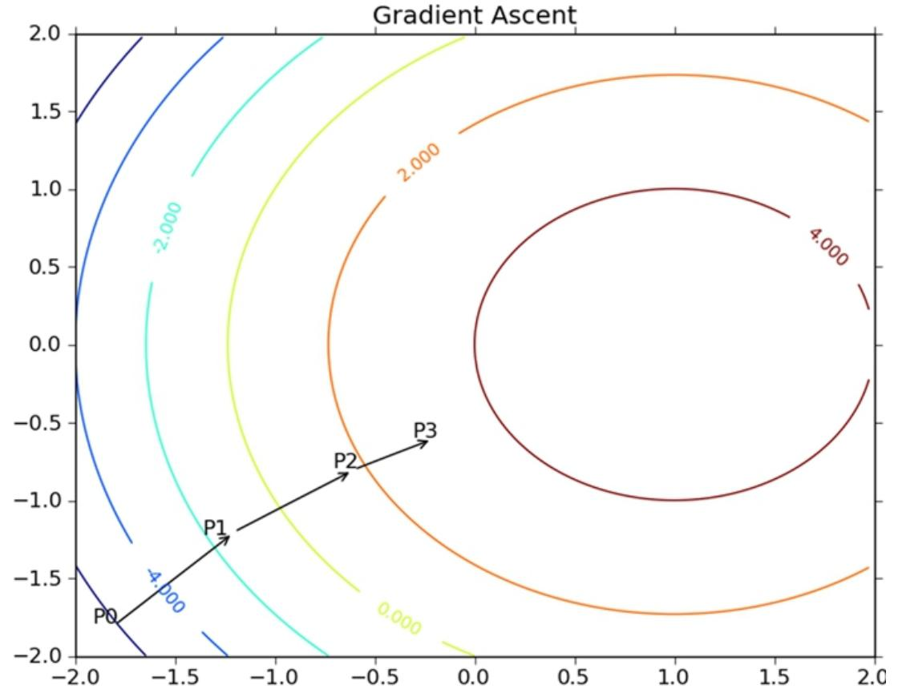

## 梯度上升法

·函数f(x,y)的梯度：前提是函数f(x,y)必须在待计算的点上有定义并且可微。

$$
\nabla f ( x , y ) = \left( \frac { \hat { \sigma } f ( x , y ) } { \hat { \sigma } x } \right)
$$

• 若移动的步长记作a $w : = w + \alpha \nabla _ { w } f ( w )$

· 迭代停止条件:

•迭代次数达到某个指定的值

• 算法达到某个可以允许的误差范围

## 梯度上升法

·即求最大值: $\sum _ { i = 1 } ^ { m } \left( y _ { i } \bullet x _ { i } - \ln ( 1 + e ^ { x _ { i } } ) \right)$

·由： $x _ { i } = w _ { 0 } + w _ { 1 } x _ { i 1 } + w _ { 2 } x _ { i 2 } + . . . + w _ { n } x _ { i n }$

且：

$$
w _ { k } = w _ { k } + \alpha \frac { \widehat { \partial } \ln { \cal L } ( w ) } { \widehat { \partial } w _ { k } }
$$

·则：

$$
w _ { k } = w _ { k } + \alpha \sum _ { i = 1 } ^ { m } x _ { i k } \left[ y _ { i } - \pi ( x _ { i } ) \right]
$$

## 梯度上升法

```python
def gradAscent(dataMatln, classLabels):
dataMatrix = mat(dataMatln) #convert to NumPy matrix
labelMat = mat(classLabels).transpose() #convert to NumPy matrix
m,n = shape(dataMatrix)
alpha = 0.001
maxCycles = 500
weights = ones((n,1))
for k in range(maxCycles): #heavy on matrix operations
h = sigmoid(dataMatrix*weights) #matrix mult
error = (labelMat - h) #vector subtraction
weights = weights + alpha * dataMatrix.transpose()* error #matrix mult
return weights
```

## 梯度上升法

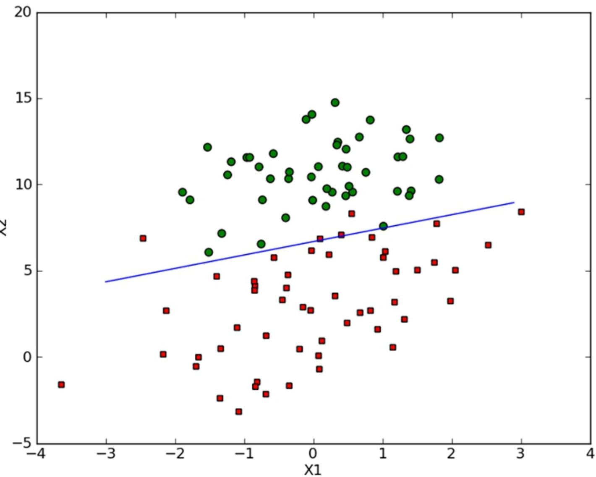

## 随机梯度上升法

・梯度上升算法每天更新回归系数时都需要遍历整个数据集

·改进：—次仅用一个样本点更新数据---在线学习算法

```python
def stocGradAscentO(dataMatrix, classLabels):
m,n = shape(dataMatrix)
alpha = 0.01
weights = ones(n) #initialize to all ones
for i in range(m):
h = sigmoid(sum(dataMatrix[i]*weights))
error = classLabels[i] - h
weights = weights + alpha * error * dataMatrix[i]
return weights
```

## 随机梯度上升法

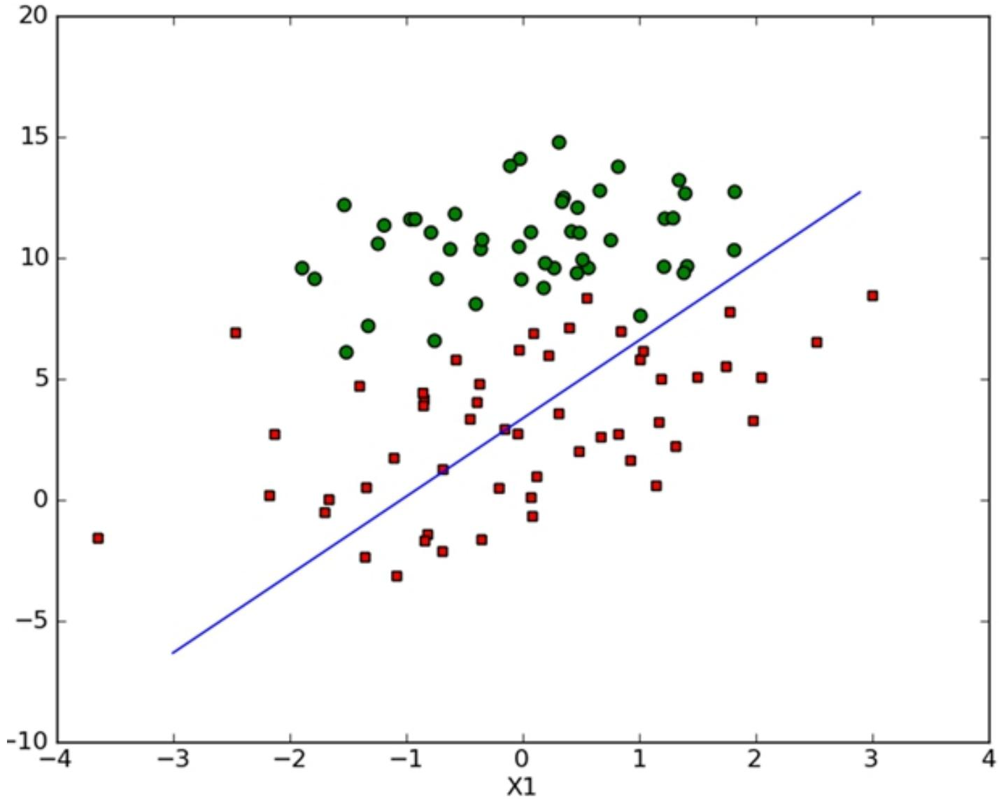

## 随机梯度上升法

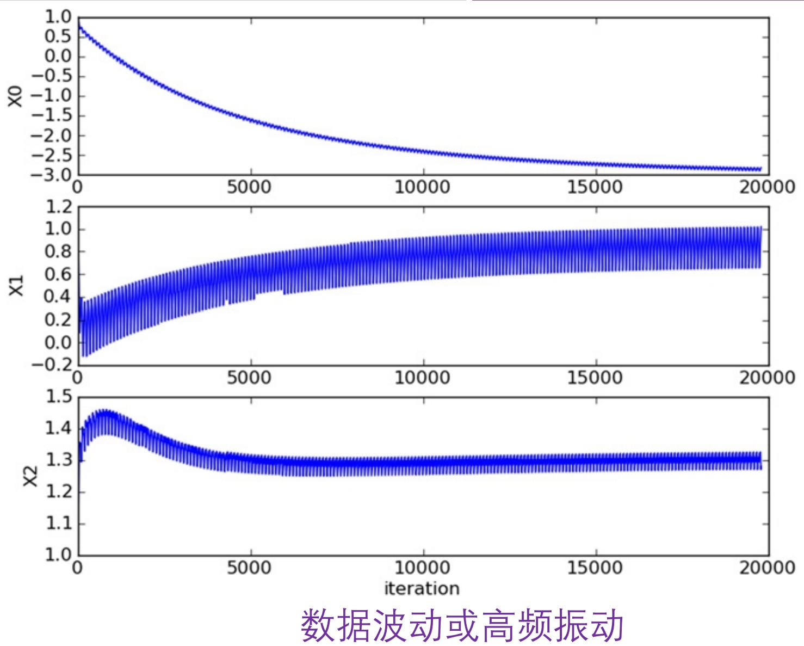

## 改进的随机梯度上升法

```python
def stocGradAscent1(dataMatrix, classLabels, numlter=150):
m,n = shape(dataMatrix)
weights = ones(n) #initialize to all ones
for j in range(numlter):
datalndex = range(m)
for i in range(m):
alpha = 4/(1.0+j+i)+0.0001 #apha decreases with iteration, does not
randIndex = int(random.uniform(O,len(datalndex))#go to 0 because of the constant
h = sigmoid(sum(dataMatrix[randlndex]*weights))
error = classLabels[randlndex] - h
weights = weights + alpha * error * dataMatrix[randlndex]
del(datalndex[randIndex])
return weights
```

## 改进的随机梯度上升法

• alpha = 4/(1.0+j+i)+0.0001

•Alpha在每次迭代时都会调整，防止高频波动

• Alpha总体逐渐减小

可适当增加常数项

•Alpha不是严格下降，在模拟退火算法等优化算法中常见

随机选取样本

减少周期性的波动

迭代次数

150

## 改进的随机梯度上升法

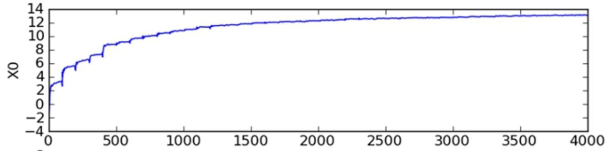

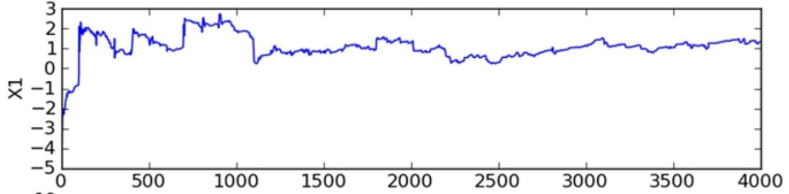

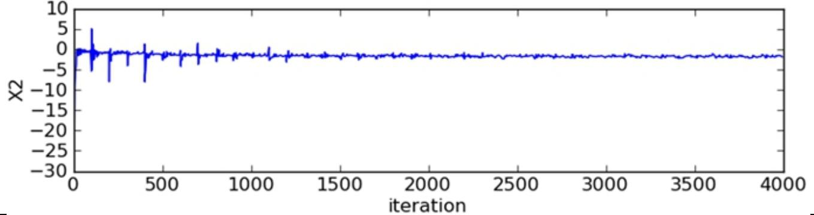

## 改进的随机梯度上升法


## 从氙气病症预测病马的死亡率

·368 样本21特征，300个作为训练用，68个作为测试

•准备数据：处理数据中的缺失值

•使用可用特征的均值

•使用特殊值，如-1

•忽略有缺失值的样本

•使用相似样本的均值

•使用另外的机器学习算法预测缺失值

## 从氙气病症预测病马的死亡率

•取0的原因

• weights = weights + alpha \* error \* dataMatrix[randlndex]

• sigmoid(0)=0.5，不影响分类

原数据

• http://archive.ics.uci.edu/ml/datasets/Horse+Colic

## 从氙气病症预测病马的死亡率

def classifyVector(inX, weights):

prob = sigmoid(sum(inx\*weights))

if prob > 0.5: return 1.0

else: return 0.0

## 从氙气病症预测病马的死亡率

```python
lef colicTest():
frTrain = open('horseColicTraining.txt'); frTest = open('horseColicTest.txt')
trainingSet = []; trainingLabels = []
for line in frTrain.readlines():
currLine = line.strip().split(\t')
lineArr =[]
for i in range(21):
lineArr.append(float(currLine[i]))
trainingSet.append(lineArr)
trainingLabels.append(float(currLine[21]))
trainWeights = stocGradAscent1(array(trainingSet), trainingLabels, 1000)
errorCount = 0; numTestVec = 0.0
```

## 从氙气病症预测病马的死亡率

```python
for line in frTest.readlines():
numTestVec += 1.0
currLine = line.strip().split(\t')
lineArr =[]
for i in range(21):
lineArr.append(float(currLine[i]))
if int(classifyVector(array(lineArr), trainWeights))!=
int(currLine[21]):
errorCount += 1
errorRate = (float(errorCount)/numTestVec)
print "the error rate of this test is: %f" % errorRate
return errorRate
```

## 从氙气病症预测病马的死亡率

```matlab
def multiTest():
numTests = 10; errorSum=0.0
for k in range(numTests):
errorSum += colicTest()
print "after %d iterations the average error rate is: %f"' %
(numTests, errorSum/float(numTests))
```

调整迭代次数

alpha步长

## Q&A?

## 第七章SVM支持向量机

## SVM and Vapnik

·Vapnik 百度

• http://baike.baidu.com/link?url=VLTKJQfnwYXkT3auMUZAIEFfnVr 2GHmzA5 2hLcGtLXbsKo6XH4H2gDcavY4-cNKRYrHeP3r5YFEwhHKM66ncq

• Vapnik Wiki

• https://en.wikipedia.org/wiki/Vladimir\_Vapnik

## SVM

·支持向量机(supportvectormachines．SVM)

•二类分类模型.它的基本模型是定义在特征空间上的间隔最大的线性分类器，间隔最大使它有别于感知机；

• 支持向量机还包括核技巧，这使它成为实质上的非线性分类器.

•支持向量机的学习策略就是间隔最大化，可形式化为一个求解凸二次规划(convex quadratic programming)的问题，也等价于正则化的合页损失函数的最小化问题.支持向量机的学习算法是求解凸二次规划的最优化算法.

## SVM分类

•支持向量机(supportvectormachines．SVM)

·线性可分支持向量机(linear support vector machine in linearly separable case ).

·硬间隔最大化(hard margin maximization);

·线性支持向量机(linear supportvector machine)

·训练数据近似线性可分时，通过软间隔最大化(soft margin maximization);

·非线性支持向量机(non-linear support vector machine)

·当训练数据线性不可分时，通过使用核技巧(kernel trick)及软间隔最大化。

## SVM分类

·支持向量机(supportvectormachines．SVM)

• 当输入空间为欧氏空间或离散集合、特征空间为希尔伯特空间时，核函数(kernel function)表示将输入从输入空间映射到特征空间得到的特征向量之间的内积；

·通过使用核函数可以学习非线性支持向量机，等价于隐式地在高维的特征空间中学习线性支持向量机，这样的方法称为核技巧；

·核方法(kernel method)是比支持向量机更为一般的机器学习方法.

## 线性可分支持向量机

• 二分类问题：

•输入空间：欧式空间或离散集合

•特征空间：欧式空间或希尔伯特空间

•线性可分支持向量机、线性支持向量机：假设这两个空间的元素一对应，并将输入空间中的输入映射为特征空间中的特征向量；

·非线性支持向量机：利用一个从输入空间到特征空间的非线性映射将输入映射为特征向量；

• 支持向量机的学习是在特征空间进行的.

## 线性可分支持向量机

· 假设特征空间上的训练数据集：

$$
T = \{ ( x _ { 1 } , y _ { 1 } ) , ( x _ { 2 } , y _ { 2 } ) , \cdots , ( x _ { N } , y _ { N } ) \}
$$

$$
x _ { i } \in \mathcal { X } = { \mathbb R } ^ { n } , ~ y _ { i } \in \mathcal { Y } = \{ + 1 , - 1 \} ~ , ~ i = 1 , 2 , \cdots , N
$$

•正例和负例

·学习的目标：找到分类超平面，

·线性可分支持向量机；给定线性可分训练数据集，通过间隔最大化或等价地求解相应的凸二次规划问题学习得到的分离超平面为

$$
\begin{array} { c } { { w ^ { * } \cdot x + b ^ { * } = 0 } } \\ { { f ( x ) = \mathrm { s i g n } ( w ^ { * } \cdot x + b ^ { * } ) } } \end{array}
$$

•决策函数:

## 线性可分支持向量机与硬间隔最大化

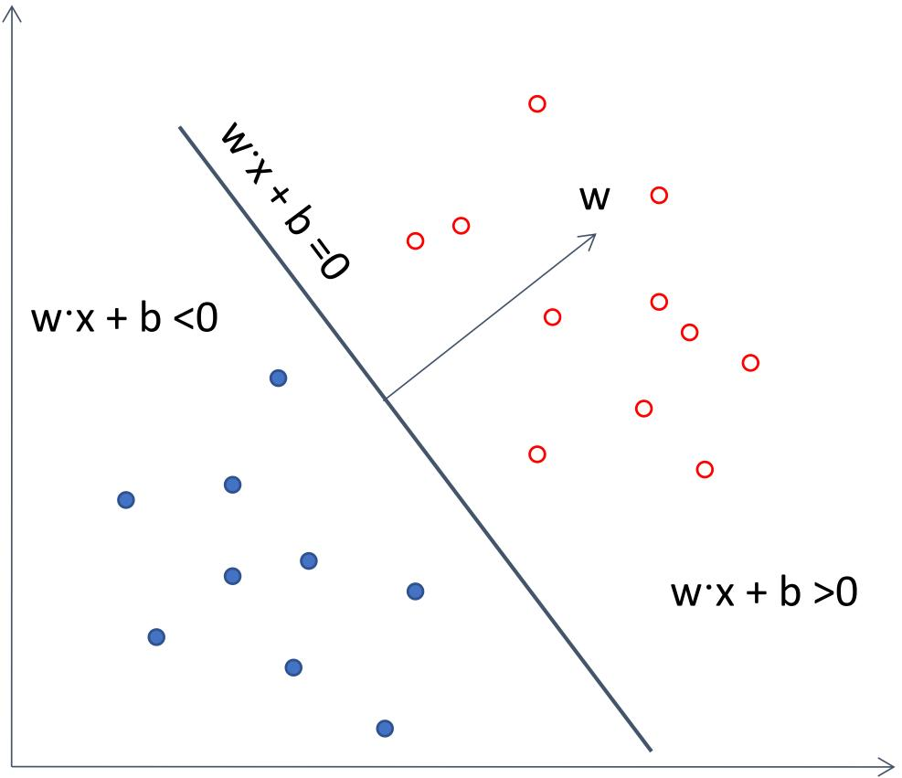

## 超平面选择

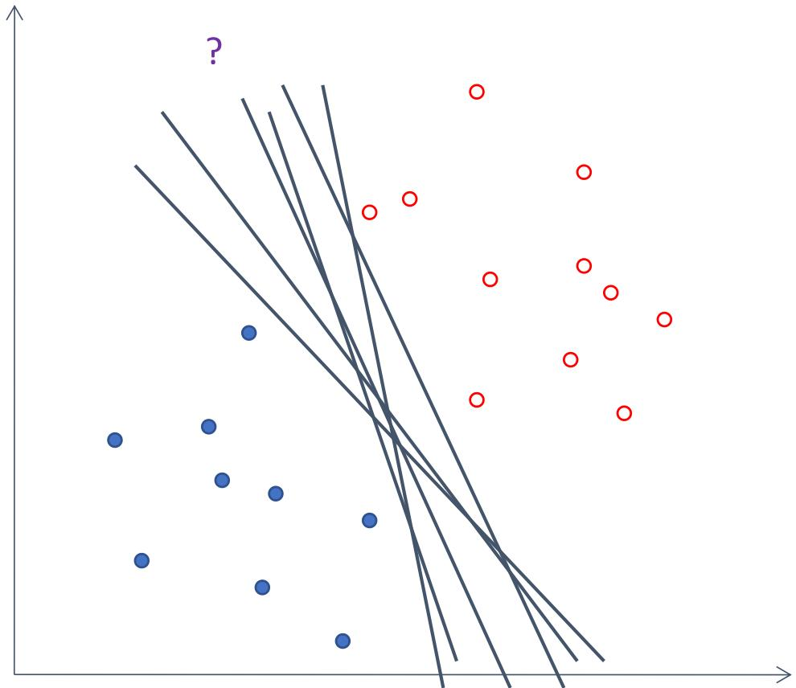

## Margins

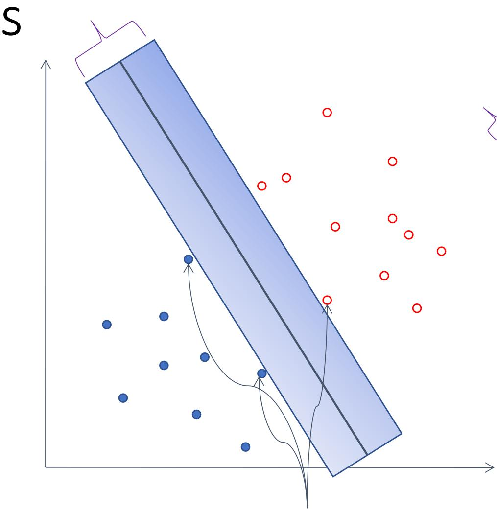  
Support Vectors

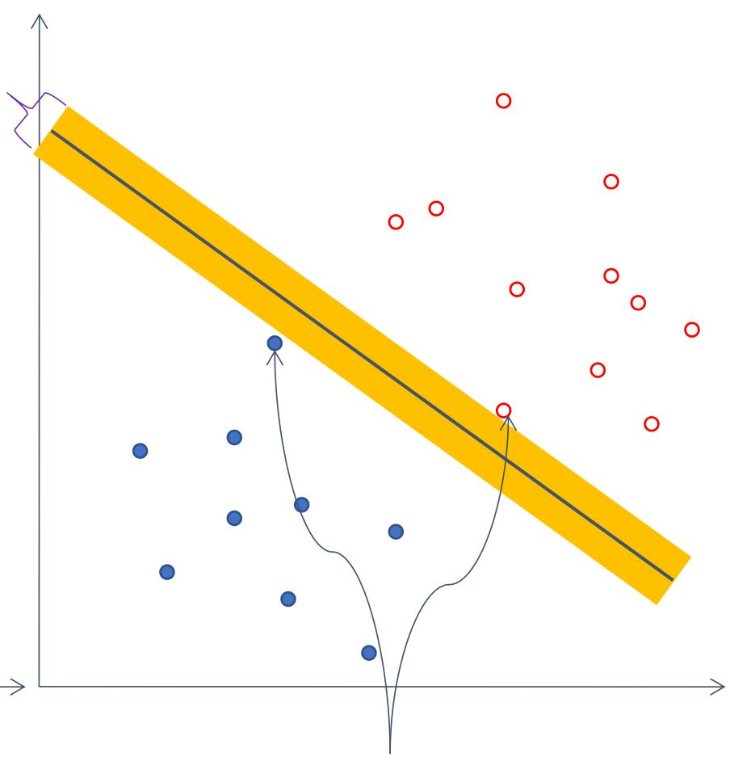  
Support Vectors

## 点到超平面的距离

$$
g ( x ) = w \cdot x + b
$$

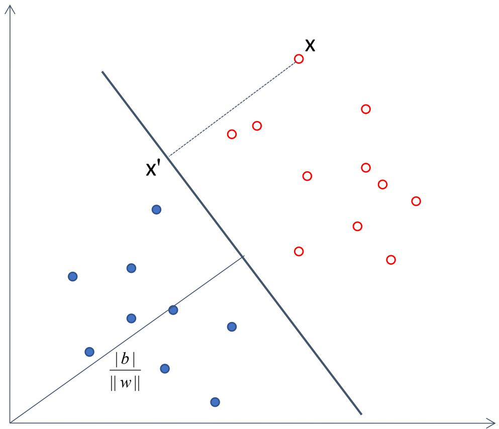

## 函数间隔和几何间隔

•点到分离超平面的远近|w·x+b|

表示分类预测的确信程度

• w·x+b的符号与类标记y的符号是否一致

表示分类是否正确

·所以：

y(w·x+b）表示分类的正确性和确信度

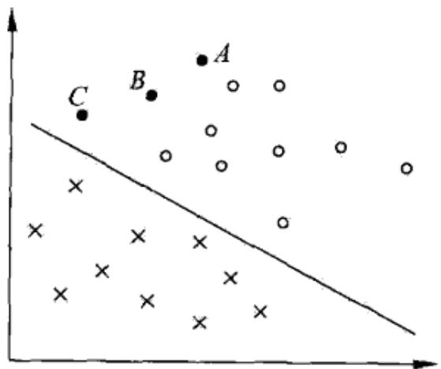

## 函数间隔和几何间隔

·函数间隔

・样本点的函数间隔

$$
\hat { \gamma } _ { i } \equiv y _ { i } ( w \cdot x _ { i } + b )
$$

训练数据集的函数间隔

$$
\hat { \gamma } = \operatorname* { m i n } _ { i = 1 , \cdots , N } \hat { \gamma } _ { i }
$$

• 表示分类预测的正确性和确信度

当成比例改变w和b

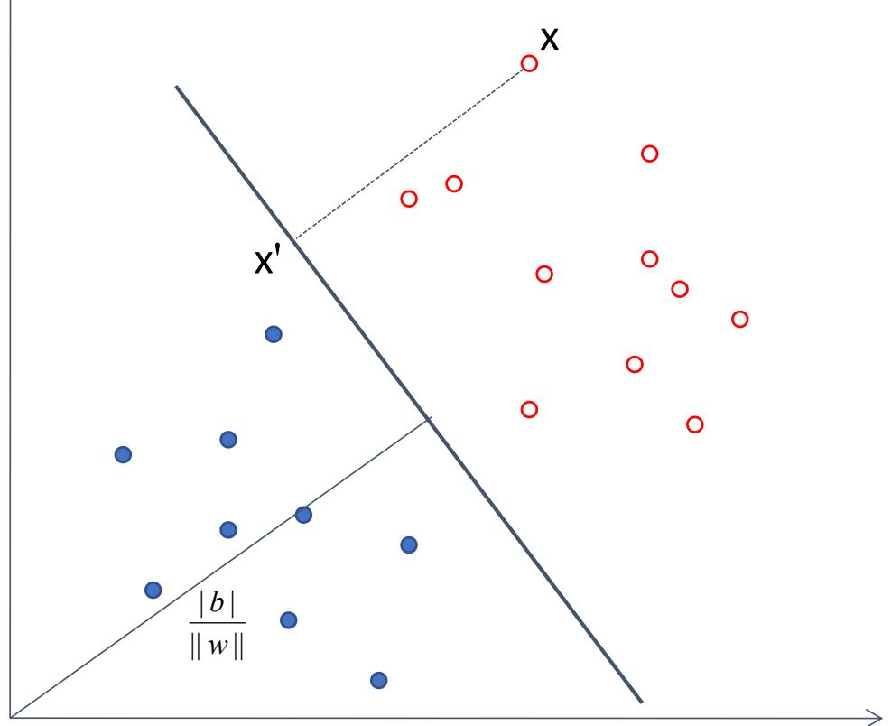

## 函数间隔和几何间隔

•几何间隔

•样本点的几何间隔：正例和负例

$$
\begin{array} { c } { \gamma _ { i } = y _ { i } \left( \displaystyle \frac { w } { \| w \| } \cdot \boldsymbol { x } _ { i } + \displaystyle \frac { b } { \| w \| } \right) \quad \gamma _ { i } = - \left( \displaystyle \frac { w } { \| w \| } \cdot \boldsymbol { x } _ { i } + \displaystyle \frac { b } { \| w \| } \right) } \\ { \downarrow } \\ { \gamma _ { i } = y _ { i } \left( \displaystyle \frac { w } { \| w \| } \cdot \boldsymbol { x } _ { i } + \displaystyle \frac { b } { \| w \| } \right) } \\ { \gamma _ { i } = y _ { i } \left( \displaystyle \frac { w } { \| w \| } \cdot \boldsymbol { x } _ { i } + \displaystyle \frac { b } { \| w \| } \right) \qquad \left[ \displaystyle \sum _ { \mathbf { x } \quad \mathbf { x } \quad \mathbf { x } _ { \mathrm { ~ x ~ x ~ } } ^ { A } \leq \mathrm { ~ x ~ } } \right] ^ { \boldsymbol { \it \prime } } } \end{array}
$$

## 函数间隔和几何间隔

•几何间隔

• 对于给定的训练数据集T和超平面(w， b)

$$
\gamma _ { i } = y _ { i } \left( \frac { w } { \| w \| } { \cdot } x _ { i } + \frac { b } { \| w \| } \right)
$$

•训练数据集的几何间隔 $\gamma = \operatorname* { m i n } _ { i = 1 , \cdots , N } \gamma _ { i }$

•即

$$
\gamma _ { i } = \frac { \hat { \gamma } _ { i } } { \lvert \lvert \mathbf { w } \rvert \rvert }
$$

$$
\gamma = \frac { \hat { \gamma } } { \Vert w \Vert }
$$

## 间隔最大化

・最大间隔分类超平面 $\displaystyle \mathbf { m a x } _ { w , b }$

$$
\mathrm { s . t . } \quad y _ { i } \left( \frac { w } { \lVert w \rVert } \cdot x _ { i } + \frac { b } { \lVert w \rVert } \right) \geqslant \gamma , \quad i = 1 , 2 , \cdots , N
$$

•根据几何间隔和函数间隔的关系

$$
\begin{array} { l l } { { \displaystyle { \operatorname* { m a x } _ { w , b } } } } & { { \displaystyle { \frac { \hat { \gamma } } { \parallel w \parallel } } } } \\ { { \mathrm { s . t . } } } & { { y _ { i } ( w \cdot x _ { i } + b ) \geqslant \hat { \gamma } , \quad i = 1 , 2 , \cdots , N } } \end{array}
$$

•考虑

·可以取 $\scriptstyle { \hat { \gamma } } = 1$

·最大化 $\frac { 1 } { \parallel \mathbf { w } \parallel }$ 和最 $\mu \nu \mathcal { \{ E }  \frac { 1 } { 2 } \| \boldsymbol { w } \| ^ { 2 }$ 等价

## 间隔最大化

•线性可分支持向量机学习的最优化问题

$$
\operatorname* { m i n } _ { \boldsymbol { w } , \boldsymbol { b } } \quad \frac { 1 } { 2 } \| \boldsymbol { w } \| ^ { 2 }
$$

$$
\begin{array} { r } { \mathrm { s . t . } \quad y _ { i } ( w \cdot x _ { i } + b ) - 1 \geqslant 0 , \quad i = 1 , 2 , \cdots , N } \end{array}
$$

·凸二次规划(convex quadratic programming)

## 凸集

一个点集（或区域），如果连接其中任意两点 $x _ { 1 } \ x _ { 2 }$ 的线段都全部包含在该集合内，就称该点集为凸集，否则为非凸集。

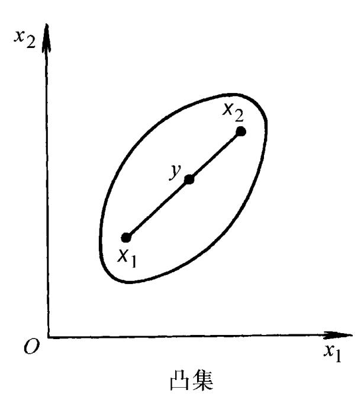

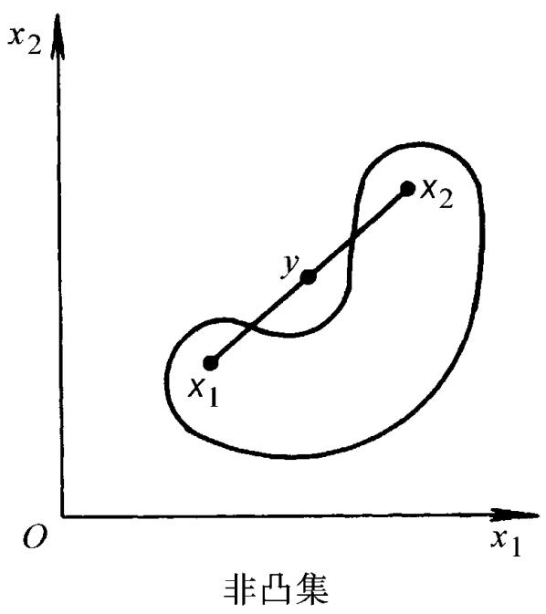

## 凸性条件

1.根据一阶导数（函数的梯度）来判断函数的凸性设f(x)为定义在凸集R上，且具有连续的一阶导数的函数，则f(x)在R上为凸函数的充要条件是对凸集R内任意不同两点 $x _ { 1 } \ x _ { 2 }$ ，不等式

f (x2)≥f (x)+(x2 −x)∇f (x) 恒成立。

## 凸性条件

2.根据二阶导数（Hesse矩阵)来判断函数的凸性

设f(x)为定义在凸集R上且具有连续二阶导数的函数，则f(x)在R上为凸函数的充要条件：

Hesse矩阵在R上处处半正定

## 凸规划

对于约束优化问题

$$
\operatorname* { m i n } { f ( x ) }
$$

S.t.

$$
g _ { j } \left( x \right) \leq 0
$$

$$
j = 1 , 2 , . . . , m
$$

若 $f ( x ) \ g _ { j } \left( x \right)$ 都为凸函数，则此问题为凸规划。

## 凸规划的性质

1.若给定一点x°，则集合 $R = \left\{ x { \Big | } \ f ( x ) \leq f ( x _ { \mathfrak { d } } ) \ \right\}$ 为凸集。

2.可行域 $R = \left\{ x { \left| \begin{array} { l } { g _ { j } ( x ) \leq 0 } \end{array} \right. } j { = } 1 , 2 , . . . , m \quad \right\}$ 为凸集

3.凸规划的任何局部最优解就是全局最优解

## 凸优化问题

凸优化问题: 指约束最优化问题 $\operatorname* { m i n } _ { \psi } f ( \psi )$

s.t. $g _ { i } ( w ) \leqslant 0 , \quad i = 1 , 2 , \cdots , k$

$$
h _ { i } ( w ) = 0 \ , \quad i = 1 , 2 , \cdots , l
$$

•其中，目标函数f(w)和约束函数 $\mathbf { \tilde { \theta } } _ { \mathbf { \tilde { \theta } } } ( \mathbf { w } )$ 都是R^上连续可微的凸函数，约束函数 $\mathsf { h } _ { \mathrm { j } } ( \mathsf { w } )$ 是R^上的仿射函数

·当目标函数为二次函数，g函数为仿射函数时，为凸二次规划问题。

## 线性可分支持向量机学习算法

•输入：线性可分训练数据集 $T = \{ ( x _ { 1 } , y _ { 1 } ) , ( x _ { 2 } , y _ { 2 } ) , \cdots , ( x _ { N } , y _ { N } ) \}$

$$
x _ { i } \in \mathcal { X } = { \bf R } ^ { n } \qquad y _ { i } \in \mathcal { Y } = \{ - 1 , + 1 \} \ , \quad i = 1 , 2 , \cdots , N
$$

•输出：最大间隔分离超平面和分类决策函数

• 1、构造并求解约束最优化问题(7.13)～(7.14) 1

$$
\operatorname* { m i n } _ { w _ { i } b } \quad \frac { 1 } { 2 } \| w \| ^ { 2 }
$$

求得 $w ^ { * }$ 和 $1 6 ^ { * }$

s.t. $y _ { i } ( w \cdot x _ { i } + b ) - 1 \geq 0 , \quad i = 1 , 2 , \cdots , N$

•2、得到分离超平面 $\boldsymbol { w } ^ { * } \cdot \boldsymbol { x } + \boldsymbol { b } ^ { * } = 0$

分类决策函数 $f ( x ) = \mathrm { s i g n } ( w ^ { * } \cdot x + b ^ { * } )$

## 支持向量和Margins (边界)

• 在线性可分情况下，训练数据集的样本点中与分离超平面距离最近的样本点的实例称为支持向量(support vector);

•支持向量是使约束条件式等号成立的点，即 $y _ { i } ( w \cdot x _ { i } + b ) - 1 = 0$

•正例： $H _ { 1 } : w : x + b = 1$

·负例： $H _ { \tilde { z } } : w \cdot x + b = - 1$

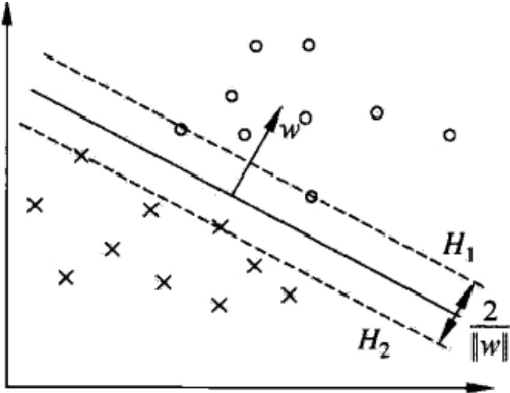

例

min $\frac { 1 } { 2 } ( w _ { 1 } ^ { ~ 2 } + w _ { 2 } ^ { ~ 2 } )$ b

s.t.

$$
3 w _ { 1 } + 3 w _ { 2 } + b \geq 1
$$

$$
4 w _ { 1 } + 3 w _ { 2 } + b \geq 1
$$

$$
- w _ { 1 } - w _ { 2 } - b \geqslant 1
$$

$$
w _ { 1 } = w _ { 2 } = \frac { 1 } { 2 } , b = - 2
$$

$$
{ \frac { 1 } { 2 } } x ^ { ( 1 ) } + { \frac { 1 } { 2 } } x ^ { ( 2 ) } - 2 = 0
$$

$\pmb { x } _ { 1 } = ( 3 , 3 ) ^ { \mathtt { T } }$ 与 $x _ { 3 } = ( 1 , 1 ) ^ { \top }$ 为支持向量

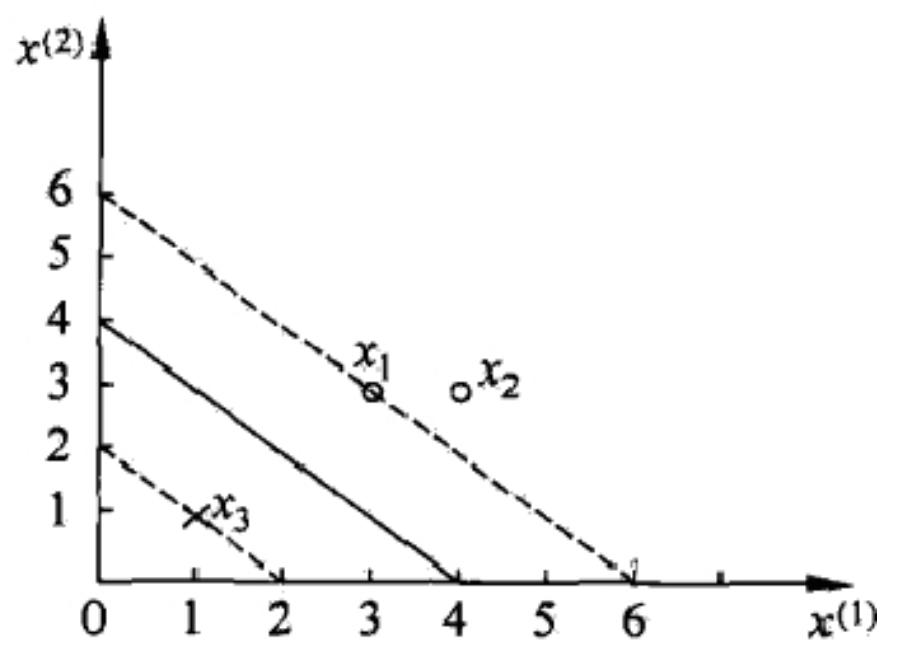

## 拉格朗日对偶

•如何求解： (7.13)\~(7.14) 1

·在约束最优化问题中，常常利用拉格朗日对偶性(Lagrange duality)将原始问题转换为对偶问题，通过解对偶问题得到原始问题的解

## 拉格朗日对偶

## •1、原始问题

·设f(x),c(x),h(x)是定义在R^上的连续可微函数

$$
{ \begin{array} { l } { \operatorname* { m i n } _ { x \in \mathbf { R } ^ { n } } f ( x ) } \\ { { \mathrm { s . t . ~ } } c _ { i } ( x ) \leqslant 0 , i = 1 , 2 , \cdots , k } \\ { h _ { j } ( x ) = 0 , j = 1 , 2 , \cdots , l } \end{array} }
$$

・引进拉格朗日函数 $\alpha _ { i } , \beta _ { j }$ 为乘子 $\pmb { \alpha } _ { i } \geqslant 0$

$$
L ( x , \alpha , \beta ) = f ( x ) + \sum _ { i = 1 } ^ { k } \alpha _ { i } c _ { i } ( x ) + \sum _ { i = 1 } ^ { l } \beta _ { j } h _ { j } ( x )
$$

•考虑×的函数，P为原始问题

$$
\theta _ { P } ( x ) = \operatorname* { m a x } _ { \alpha , \beta ; \alpha _ { i } \geq 0 } L ( x , \alpha , \beta )
$$

## 拉格朗日对偶

$$
\operatorname* { m i n } _ { x \in \mathbf { R } ^ { n } } f ( x )
$$

$$
\mathrm { s . t . } c _ { i } ( x ) \leqslant 0 , i = 1 , 2 , \cdots , k
$$

$$
h _ { j } ( x ) = 0 , j = 1 , 2 , \cdots , l
$$

$\alpha _ { i } , \beta _ { j }$ 为乘子 $\pmb { \alpha } _ { i } \geqslant 0$

$$
\overset { \mathcal { \prime } } { L } ( x , \alpha , \beta ) = f ( x ) + \overset { k } { \underset { i = 1 } { \sum } } \alpha _ { i } c _ { i } ( x ) + \overset { l } { \underset { i = 1 } { \sum } } \beta _ { j } h _ { j } ( x )
$$

• 假设给定某个x，如果×违反约束条件：

$$
\begin{array} { c } { { c _ { i } ( w ) > 0 \displaystyle h _ { j } ( w ) \neq 0 } } \\ { { \theta _ { P } ( x ) = \displaystyle \operatorname* { m a x } _ { \alpha , \beta : \alpha _ { i } \geqslant 0 } \left[ f ( x ) + \sum _ { i = 1 } ^ { k } \alpha _ { i } c _ { i } ( x ) + \sum _ { j = 1 } ^ { i } \beta _ { j } h _ { j } ( x ) \right] = + \infty } } \end{array}
$$

## 拉格朗日对偶

$$
\theta _ { P } ( x ) = { \left\{ \begin{array} { l l } { f ( x ) , } & { x { \mathord { \left/ { \vphantom { \left| \sum _ { i } \sum _ { i } \sum _ { j } \right.}  \kern - delimiterspace } \mathbb { P } \right\} } } , } \end{array} \right. }
$$

• 考虑极小问题:

$$
\operatorname* { m i n } _ { x } \theta _ { P } ( x ) = \operatorname* { m i n } _ { x } \operatorname* { m a x } _ { \alpha , \beta ; \alpha _ { i } \geqslant 0 } L ( x , \alpha , \beta )
$$

•与原始最优化问题等价

$$
\vec { p } ^ { * } = \operatorname* { m i n } _ { x } \theta _ { p } ( x )
$$

## 拉格朗日对偶

•1、原始问题

·则： $\operatorname* { m i n } _ { x } \theta _ { P } ( x ) = \operatorname* { m i n } _ { x } \operatorname* { m a x } _ { \alpha , \beta ; \alpha _ { i } \geqslant 0 } L ( x , \alpha , \beta )$

•称为广义拉格朗日函数的极小极大问题

•定义原始问题的最优值

$$
{ p ^ { * } } = \operatorname* { m i n } _ { x } \theta _ { P } ( x )
$$

## 拉格朗日对偶

•2、对偶问题

·定义： $\theta _ { D } ( \alpha , \beta ) = \operatorname* { m i n } _ { \alpha } L ( x , \alpha , \beta )$

$$
\operatorname* { m a x } _ { \alpha , \beta ; \alpha _ { i } \geqslant 0 } \theta _ { D } ( \alpha , \beta ) = \operatorname* { m a x } _ { \alpha , \beta ; \alpha _ { i } \geqslant 0 } \operatorname* { m i n } _ { x } L ( x , \alpha , \beta )
$$

•则最大值问题：

• 称为广义拉格朗日函数的极大极小问题

• 表示为约束最优化问题： $\operatorname* { m a x } _ { \alpha , \beta } \theta _ { D } ( \alpha , \beta ) = \operatorname* { m a x } _ { \alpha , \beta } \operatorname* { m i n } _ { x } L ( x , \alpha , \beta )$

称为原始问题的对偶问题，

$$
\mathrm { s . t . } \alpha _ { i } \geq 0 , i = 1 , 2 , \cdots , k
$$

•对偶问题的最优值 $d ^ { * } = \operatorname* { m a x } _ { \alpha , \beta ; \alpha _ { i } \geqslant 0 } \theta _ { D } ( \alpha , \beta )$

## 原始问题和对偶问题的关系

·定理：

•若原始问题和对偶问题都有最优值，则

$$
d ^ { * } = \operatorname* { m a x } _ { \alpha , \beta ; \alpha _ { i } \geqslant 0 } \operatorname* { m i n } _ { x } L ( x , \alpha , \beta ) \leqslant \operatorname* { m i n } _ { x } \operatorname* { m a x } _ { \alpha , \beta ; \alpha _ { i } \geqslant 0 } L ( x , \alpha , \beta ) = p ^ { * }
$$

·推论：

·设 $\cdot x ^ { * }$ ，和 $\mathtt { q } ^ { * }$ $\beta ^ { * }$ 分别是原始问题和对偶问题的可行解，并且${ \mathsf { d } } ^ { * } { = } { \mathsf { p } } ^ { * }$ ，则 $\mid \ v { x } ^ { * }$ ，和 $\mathtt { q } ^ { * }$ $\beta ^ { * }$ 分别是原始问题和对偶问题的最优解

## KKT条件

·定理：对原始问题和对偶问题，假设函数f(x)和c(x)是凸函数， $\mathsf { h } _ { \mathrm { j } } ( \mathsf { x } )$ 是仿射函数，并且不等式 $\mathsf { c } _ { \mathrm { i } } ( \mathsf { x } )$ 是严格可行的，则 $\mid \ v { x } ^ { * }$ ，和 $\alpha ^ { * }$ , $\beta ^ { * }$ 分别是原始问题和对偶问题的解的充分必要条件是 $x ^ { * }$ ，和 $\vert { \mathfrak { a } } ^ { * }$ , $\beta ^ { * }$ 满足karush-Kuhn-Tucker(KKT)条件。

$$
\begin{array} { r l } & { \nabla _ { x } L ( x ^ { * } , \alpha ^ { * } , \beta ^ { * } ) = 0 } \\ & { \nabla _ { \alpha } L ( x ^ { * } , \alpha ^ { * } , \beta ^ { * } ) = 0 } \\ & { \nabla _ { \beta } L ( x ^ { * } , \alpha ^ { * } , \beta ^ { * } ) = 0 } \\ & { \alpha _ { i } ^ { * } c _ { i } ( x ^ { * } ) = 0 , \quad i = 1 , 2 , \cdots , k } \\ & { c _ { i } ( x ^ { * } ) \leq 0 , \quad i = 1 , 2 , \cdots , k } \\ & { \alpha _ { i } ^ { * } > 0 , \quad i = 1 , 2 , \cdots , k } \\ & { h _ { j } ( x ^ { * } ) = 0 \quad j = 1 , 2 , \cdots , j } \end{array}
$$

## 学习的对偶算法

•对于线性可分支持向量机的优化问题，原始问题：

$$
\begin{array} { r l } { \underset { w , b } { \operatorname* { m i n } } } & { \ \frac { 1 } { 2 } \| w \| ^ { 2 } } \\ { \mathrm { s . t . } } & { \ y _ { i } ( w \cdot x _ { i } + b ) { - 1 \geq 0 } , \quad i = 1 , 2 , \cdots , N } \end{array}
$$

·应用拉格朗日对偶性，通过求解对偶问题，得到原始问题的解。

·优点：

•对偶问题往往容易解

•引入核函数，推广到非线性分类问题

## 学习的对偶算法

•定义拉格朗日函数

$$
L ( w , b , \alpha ) = \frac 1 2 \| w \| ^ { 2 } - \sum _ { i = 1 } ^ { N } \alpha _ { i } y _ { i } ( w \cdot x _ { i } + b ) + \sum _ { i = 1 } ^ { N } \alpha _ { i }
$$

·原问题：极小极大，对偶问题：极大极小

$$
\begin{array} { c } { \displaystyle \operatorname* { m i n } _ { x } \theta _ { P } ( x ) = \displaystyle \operatorname* { m i n } _ { x } \displaystyle \operatorname* { m a x } _ { \alpha , \beta : \alpha _ { i } \geqslant 0 } L ( x , \alpha , \beta ) } \\ { \displaystyle \qquad } \\ { \displaystyle \operatorname* { m a x } _ { \alpha } \displaystyle \operatorname* { m i n } _ { w , b } L ( w , b , \alpha ) } \end{array}
$$

## 学习的对偶算法

•先求 $\lfloor ( w , \mathsf { b } , \mathsf { a } )$ 对w，b的极小，再求对α的极大

·1、求： $\operatorname* { m i n } _ { w , b } L ( w , b , \alpha )$ ，对w，b分别求偏导并令等于0

由 $\nabla _ { \boldsymbol { w } } L ( \boldsymbol { w } , \boldsymbol { b } , \alpha ) = \boldsymbol { w } - \sum _ { i = 1 } ^ { N } \alpha _ { i } y _ { i } x _ { i } = 0$

$$
\nabla _ { b } L ( w , b , \alpha ) = \sum _ { i = 1 } ^ { N } \alpha _ { i } y _ { i } = 0
$$

$$
\begin{array} { c c } { { } } & { { w { = } } \displaystyle \sum _ { i = 1 } ^ { N } \alpha _ { i } y _ { i } x _ { i } } \\ { { \Longrightarrow } } & { { \displaystyle \sum _ { i = 1 } ^ { N } \alpha _ { i } y _ { i } { = } 0 } } \end{array}
$$

•得:

$$
\begin{array} { c } { { \displaystyle { \cal L } ( w , b , \alpha ) = \frac { 1 } { 2 } \sum _ { i = 1 } ^ { N } \displaystyle \sum _ { j = 1 } ^ { N } \alpha _ { i } \alpha _ { j } y _ { i } y _ { j } ( x _ { i } \cdot x _ { j } ) - \displaystyle \sum _ { i = 1 } ^ { N } \alpha _ { i } y _ { i } \left( \left( \displaystyle \sum _ { j = 1 } ^ { N } \alpha _ { j } y _ { j } x _ { j } \right) \cdot x _ { i } + b \right) + \displaystyle \sum _ { i = 1 } ^ { N } \alpha _ { i } y _ { i } \left( \left( \displaystyle \sum _ { j = 1 } ^ { N } \alpha _ { i } \right) \wedge \alpha _ { i } y _ { j } \right) } } \\ { { \displaystyle { \mathrm { ~ } } = - \frac { 1 } { 2 } \sum _ { i = 1 } ^ { N } \displaystyle \sum _ { j = 1 } ^ { N } \alpha _ { i } \alpha _ { j } y _ { i } y _ { j } ( x _ { i } \cdot x _ { j } ) + \displaystyle \sum _ { i = 1 } ^ { N } \alpha _ { i } } } \end{array}
$$

## 学习的对偶算法

·求 $\operatorname* { m i n } _ { w , b } L ( w , b , \alpha )$ 对α的极大，即是对偶问题：

$$
\begin{array} { r l } { \displaystyle } & { \displaystyle \operatorname* { m a x } _ { \alpha } - \frac { 1 } { 2 } \frac { V } { \kappa + 1 } \sum _ { i = 1 } ^ { N } \alpha _ { i } \alpha _ { j } \nu _ { i j } ( x _ { i } \cdot x _ { j } ) + \sum _ { i = 1 } ^ { N } \alpha _ { i } } \\ & { \mathrm { s . t . } \ \sum _ { i = 1 } ^ { N } \alpha _ { i } \nu _ { i } = 0 } \\ & { \displaystyle \qquad \alpha _ { i } \geq 0 , \ i = 1 , 2 , \cdots , N } \\ { \displaystyle \Rightarrow \quad } & { \displaystyle \frac { \operatorname* { m i n } } { \alpha } \ } & { \frac { 1 } { 2 } \sum _ { i = 1 } ^ { N } \alpha _ { i } \alpha _ { j } \nu _ { i j } ( x _ { i } \cdot x _ { j } ) - \sum _ { i = 1 } ^ { N } \alpha _ { i } } \\ & { \mathrm { s . t . } \ \sum _ { i = 1 } ^ { N } \alpha _ { i } \nu _ { i } = 0 } \\ & { \displaystyle \qquad \alpha _ { i } \geq 0 , \ i = 1 , 2 , \cdots , N } \end{array}
$$

$$
w ^ { * } = \sum _ { i = 1 } ^ { N } \alpha _ { i } ^ { * } y _ { i } x _ { i }
$$

(7.25)

## 学习的对偶算法

$$
{ b ^ { * } } = y _ { j } - \sum _ { i = 1 } ^ { N } \alpha _ { i } ^ { * } y _ { i } ( x _ { i } \cdot x _ { j } ) \left( 7 . 2 6 \right)
$$

·定理：设 $\boldsymbol { \alpha } ^ { * } = ( \alpha _ { 1 } ^ { * } , \alpha _ { 2 } ^ { * } , \cdots , \alpha _ { l } ^ { * } ) ^ { \mathrm { T } }$ 是对偶最优问题 2 的解则存在下标j，使得 $\alpha _ { j } ^ { \ast } > 0$ 并可按下式求得原始问题 1 的解。证明：由

$$
\nabla _ { \boldsymbol { w } } L ( \boldsymbol { w ^ { * } } , \boldsymbol { b ^ { * } } , \alpha ^ { * } ) = \boldsymbol { w ^ { * } } - \sum _ { i = 1 } ^ { N } \alpha _ { i } ^ { * } y _ { i } x _ { i } = 0\tag{7.27}
$$

$$
\nabla _ { b } L ( w ^ { * } , b ^ { * } , \alpha ^ { * } ) = - \sum _ { i = 1 } ^ { N } \alpha _ { i } ^ { * } y _ { i } = 0
$$

$$
\alpha _ { i } ^ { * } ( y _ { i } ( w ^ { * } \cdot x _ { i } + b ^ { * } ) - 1 ) = 0 , \quad i = 1 , 2 , \cdots , N
$$

$$
y _ { i } ( w ^ { * } \cdot x _ { i } + b ^ { * } ) - 1 \geq 0 , \quad i = 1 , 2 , \cdots , N
$$

$$
w ^ { \ast } = \sum _ { i } \alpha _ { i } ^ { \ast } y _ { i } x _ { i }
$$

$$
\alpha _ { i } ^ { * } \geqslant 0 , \quad i = 1 , 2 , \cdots , N
$$

## 学习的对偶算法

·定理：设 $\boldsymbol { \alpha } ^ { * } = ( \alpha _ { 1 } ^ { * } , \alpha _ { 2 } ^ { * } , \cdots , \alpha _ { l } ^ { * } ) ^ { \mathrm { T } }$ 是对偶最优问题 2 的解

则存在下标j，使得 $\alpha _ { j } ^ { \ast } > 0$ ，并可按下式求得原始问题 1 的解。

证明：由 $w ^ { \ast } = \sum _ { i } \alpha _ { i } ^ { \ast } y _ { i } x _ { i }$ ，其中至少有一个 $\cdot \alpha _ { j } ^ { \ast } > 0$

反证法：

假设： $\pmb { \alpha } ^ { * } = \pmb 0$ ，由(7.27)可知 $w ^ { \ast } { = } 0$

但这不是原始优化问题的解，产生矛盾

对此：j有 $y _ { j } ( w ^ { * } \cdot x _ { j } + b ^ { * } ) - 1 = 0$ (7.28)

将式（7.25）代入式（7.28)并注意到 ${ y _ { j } } ^ { 2 } = 1$

$$
b ^ { * } = y _ { , j } - \sum _ { i = 1 } ^ { N } \alpha _ { i } ^ { * } y _ { i } ( x _ { i } \cdot x _ { j } )
$$

## 学习的对偶算法

• 由此定理可知，分离超平面可以写成：

$$
\sum _ { i = 1 } ^ { N } \alpha _ { i } ^ { * } y _ { i } ( x \bullet x _ { i } ) + b ^ { * } = 0
$$

• 分类决策函数可以写成：

$$
f ( \boldsymbol x ) = \mathrm { s i g n } \biggl ( \sum _ { i = 1 } ^ { N } \alpha _ { i } ^ { * } y _ { i } ( \boldsymbol x \cdot \boldsymbol x _ { i } ) + b ^ { * } \biggr )
$$

·这就是说，分类决策函数只依赖于输入×和训练样本输入的内积，上式称为线性可分支持向量机的对偶形式.

## 线性可分支持向量机学习算法

•输入：线性可分训练数据集 $T = \{ ( x _ { 1 } , y _ { 1 } ) , ( x _ { 2 } , y _ { 2 } ) , \cdots , ( x _ { N } , y _ { N } ) \}$

$$
x _ { i } \in \mathcal { X } = { \bf R } ^ { n } \qquad y _ { i } \in \mathcal { Y } = \{ - 1 , + 1 \} \ , \quad i = 1 , 2 , \cdots , N
$$

·输出：最大间隔分离超平面和分类决策函数

• 1、构造并求解约束最优化问题

$$
\begin{array} { r l } { \underset { \boldsymbol { \alpha } } { \mathrm { m i n } } } & { \frac { 1 } { 2 } \underset { i = 1 } { \overset { N } { \sum } } \underset { j = 1 } { \overset { N } { \sum } } \alpha _ { i } \alpha _ { j } y _ { i } y _ { j } ( x _ { i } \cdot x _ { j } ) - \underset { i = 1 } { \overset { N } { \sum } } \alpha _ { i } } \\ & { \mathrm { s . t . } \quad \underset { i = 1 } { \overset { N } { \sum } } \alpha _ { i } y _ { i } = 0 } \end{array}
$$

$$
\alpha _ { i } \geq 0 , \quad i = 1 , 2 , \cdots , N
$$

求得最优解:

$$
\alpha ^ { * } = ( \alpha _ { 1 } ^ { * } , \alpha _ { 2 } ^ { * } , \cdots , \alpha _ { N } ^ { * } ) ^ { \mathrm { { T } } } .
$$

## 线性可分支持向量机学习算法

•2、计算

$$
{ \boldsymbol w ^ { * } = \sum _ { i = 1 } ^ { N } \boldsymbol \alpha _ { i } ^ { * } \boldsymbol y _ { i } \boldsymbol x _ { i } }
$$

并选择 $a ^ { \ast }$ 的一个正分量 $\alpha _ { j } ^ { \ast } > 0$ 计算

$$
{ b ^ { * } } = { y } _ { j } - \sum _ { i = 1 } ^ { N } a _ { i } ^ { * } { y } _ { i } ( { x } _ { i } \cdot { x } _ { j } )
$$

•3、求得分离超平面 $\boldsymbol { \mathcal { W } } ^ { * } \cdot \boldsymbol { x } + \boldsymbol { b } ^ { * } = 0$

分类决策函数 $f ( x ) = \mathrm { s i g n } ( w ^ { * } \cdot x + b ^ { * } )$

## 支持向量

•考虑原始优化问题和对偶优化问题，

·将数据集中对应于 $\alpha _ { j } ^ { \ast } > 0$ 的样本 $( \boldsymbol { \chi } _ { i } , \boldsymbol { \chi } _ { j } )$ 的实例 $\vert x _ { i } \in \mathbf { R } ^ { \mathcal { n } }$

•称为支持向量

· 支持向量一定在分割边界上，由KKT互补条件：

$$
\alpha _ { i } ^ { * } ( y _ { i } ( w ^ { * } \cdot x _ { i } + b ^ { * } ) - 1 ) = 0 , \quad i = 1 , 2 , \cdots , N
$$

·对应于 $\alpha _ { j } ^ { \ast } > 0$ 的样本 $X _ { j }$

$$
y _ { i } ( w ^ { * } \cdot x _ { i } + b ^ { * } ) - 1 = 0
$$

•或

$$
w ^ { * } \cdot x _ { i } + b ^ { * } = \pm 1
$$

## 例子：

·正例点 $x _ { 1 } = ( 3 , 3 ) ^ { \mathrm { T } } , x _ { 2 } = ( 4 , 3 ) ^ { \mathrm { T } }$ 负例点 $x _ { 3 } = ( 1 , 1 ) ^ { \mathrm { T } }$

•解：对偶形式

$$
\begin{array} { c l } { { \displaystyle \operatorname* { m i n } _ { \alpha } } } & { { \displaystyle \frac { 1 } { 2 } \sum _ { i = 1 } ^ { N } \sum _ { j = 1 } ^ { N } \alpha _ { i } \alpha _ { j } y _ { i } y _ { j } ( x _ { i } \cdot x _ { j } ) - \sum _ { i = 1 } ^ { N } \alpha _ { i } } } \\ { { } } & { { \displaystyle = \frac { 1 } { 2 } ( 1 8 \alpha _ { 1 } ^ { 2 } + 2 5 \alpha _ { 2 } ^ { 2 } + 2 \alpha _ { 3 } ^ { 2 } + 4 2 \alpha _ { 1 } \alpha _ { 2 } - 1 2 \alpha _ { 1 } \alpha _ { 3 } - 1 4 \alpha _ { 2 } \alpha _ { 3 } ) - \alpha _ { 1 } - \alpha _ { 2 } - \alpha _ { 3 } } } \\ { { \mathrm { s . t . } } } & { { \displaystyle \alpha _ { 1 } + \alpha _ { 2 } - \alpha _ { 3 } = 0 } } \\ { { } } & { { \displaystyle \alpha _ { i } \geq 0 , \quad i = 1 , 2 , 3 } } \end{array}
$$

•将 $\pmb { \alpha } _ { 3 } = \pmb { \alpha } _ { 1 } + \pmb { \alpha } _ { 2 }$ ·带入目标函数并记为

$$
s ( \alpha _ { 1 } , \alpha _ { 2 } ) = 4 \alpha _ { 1 } ^ { 2 } + \frac { 1 3 } { 2 } \alpha _ { 2 } ^ { 2 } + 1 0 \alpha _ { 1 } \alpha _ { 2 } - 2 \alpha _ { 1 } - 2 \alpha _ { 2 }
$$

## 例子：

·对 $\alpha _ { 1 } , \alpha _ { 2 }$ 求偏导数，并令其为0，易知 $s ( \alpha _ { 1 } , \alpha _ { 2 } )$ 在 $\left( { \frac { 3 } { 2 } } , - 1 \right) ^ { \tt T }$

·取极值，但该点不满足约束条件 $\alpha _ { 2 } \geq 0$ ，所以最小值应在边界上达到

当 $\alpha _ { \mathrm { 1 } } = 0$ 时，最小值 $s \left( 0 , { \frac { 2 } { 1 3 } } \right) = - { \frac { 2 } { 1 3 } }$

当 $\alpha _ { 2 } = 0$ 时，最小值 $s { \Bigg ( } { \frac { 1 } { 4 } } , 0 { \Bigg ) } = - { \frac { 1 } { 4 } }$

・於是 $s ( \alpha _ { 1 } , \alpha _ { 2 } )$ 在 $\alpha _ { 1 } = \frac { 1 } { 4 } , \alpha _ { 2 } = 0$ 获得极小， $\alpha _ { 3 } = \alpha _ { 1 } + \alpha _ { 2 } = \frac { 1 } { 4 }$

·这样 $\alpha _ { 1 } ^ { * } = \alpha _ { 3 } ^ { * } = \frac { 1 } { 4 }$ 对应的实例向量为支持向量

例子：

•计算得：

$$
w _ { 1 } ^ { * } = w _ { 2 } ^ { * } = \frac { 1 } { 2 }
$$

$$
{ b ^ { * } } = - 2
$$

•分离超平面为：

$$
\frac { 1 } { 2 } x ^ { ( \mathrm { I } ) } + \frac { 1 } { 2 } x ^ { ( 2 ) } - 2 = 0
$$

•分类决策函数为: $f ( x ) = \mathrm { s i g n } \biggl ( \frac { 1 } { 2 } x ^ { ( t ) } + \frac { 1 } { 2 } x ^ { ( 2 ) } - 2 \biggr )$

## 线性支持向量机与软间隔最大化

·训练数据中有一些特异点（outlier），不能满足函数间隔大于等于1的约束条件。

·解决方法：对每个样本点 $( x _ { i } , y _ { i } )$ 引进一个松弛变量 $\xi _ { i } \geq 0$

·使得函数间隔加上松弛变量大于等于1，约束条件变为：$y _ { i } ( w \cdot x _ { i } + b ) \geq 1 - \xi$ 目标函数变为: $\frac 1 2 \left. \left. \begin{array} { l } { w } \end{array} \right. \right. ^ { 2 } + C \sum _ { j = 1 } ^ { N } \xi _ { i }$ C>0为惩罚参数

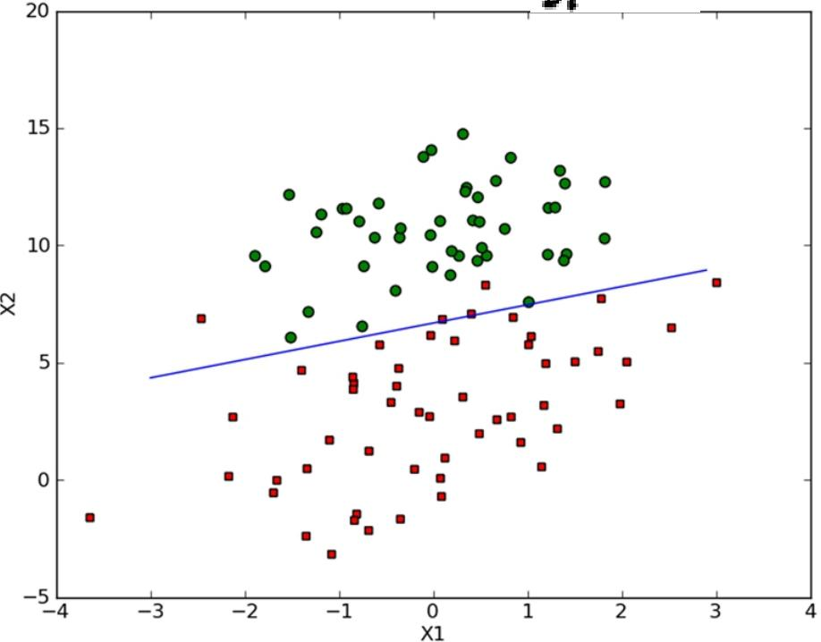

## 线性支持向量机与软间隔最大化

• 线性不可分的线性支持向量机的学习问题：

$$
\operatorname* { m i n } _ { w _ { s } , b _ { i } \xi } \quad \frac { 1 } { 2 } \| w \| ^ { 2 } + C \sum _ { i = 1 } ^ { N } \xi _ { i }
$$

3

$$
\begin{array} { r l } { \mathfrak { s . t . } } & { { } \quad y _ { i } ( w \cdot x _ { i } + b ) \geqslant 1 - \xi _ { i } , i = 1 , 2 , \cdots , N } \end{array}
$$

$$
\xi _ { i } \ge 0 , \quad i = 1 , 2 , \cdots , N
$$

•可证明w的解是唯一的，b不是，

·设该问题的解是 $\mathbb { w } ^ { * } , \mathbb { b } ^ { * }$ 可得到分离超平面和决策函数

$$
\overrightarrow { w } \cdot x + \overrightarrow { b } = 0
$$

$$
f ( x ) = \mathrm { s i g n } ( w ^ { * } \cdot x + b ^ { * } )
$$

## 线性支持向量机与软间隔最大化

•原始问题 3 的拉格朗日函数:

$$
L ( w , b , \xi , \alpha , \mu ) \equiv \frac { 1 } { 2 } \| w \| ^ { 2 } + C \sum _ { i = 1 } ^ { N } \xi _ { i } - \sum _ { i = 1 } ^ { N } \alpha _ { i } ( y _ { i } ( w \cdot x _ { i } + b ) - 1 + \xi _ { i } ) - \sum _ { i = 1 } ^ { N } \mu _ { i } \xi _ { i }
$$

•其中： $\alpha _ { i } \geq 0 , \mu _ { i } \geq 0$

・对偶问题是拉格朗日函数的极大极小问题

•首先求 $\bar { L } ( w , b , \xi , \alpha , \mu )$ 对 $\mathsf { w } , \mathsf { b } ,$ 的极小，由

$$
\nabla _ { \boldsymbol { w } } L ( \boldsymbol { w } , b , \boldsymbol { \xi } , \alpha , \mu ) = \boldsymbol { w } - \sum _ { i = 1 } ^ { N } \alpha _ { i } y _ { i } x _ { i } = 0 \qquad \qquad \quad \boldsymbol { w } = \sum _ { i = 1 } ^ { N } \alpha _ { i } y _ { i } x _ { i }
$$

带入

$$
\nabla _ { \xi _ { i } } L ( w , b , \xi , \alpha , \mu ) = C - \alpha _ { i } - \mu _ { i } = 0
$$

$$
C - \alpha _ { i } - \mu _ { i } = 0
$$

## 线性支持向量机与软间隔最大化

·得:

$$
\operatorname* { m i n } _ { w , b , \xi } L ( w , b , \xi , \alpha , \mu ) = - \frac { 1 } { 2 } \sum _ { i = 1 } ^ { N } \sum _ { j = 1 } ^ { N } \alpha _ { i } \alpha _ { j } y _ { i } y _ { j } ( x _ { i } \cdot x _ { j } ) + \sum _ { i = 1 } ^ { N } \alpha _ { i }
$$

·再对 $\operatorname* { m i n } _ { \mathbb { W } _ { 1 } b , \xi } L ( w , b , \xi , \alpha , \mu )$ 求α的极大，得到对偶问题：

$$
\begin{array} { c c l } { \displaystyle \operatorname* { m a x } } & { \displaystyle - \frac { 1 } { 2 } \sum _ { i = 1 } ^ { N } \sum _ { j = 1 } ^ { N } \alpha _ { i } \alpha _ { j } y _ { i } y _ { j } ( x _ { i } \cdot x _ { j } ) + \sum _ { i = 1 } ^ { N } \alpha _ { i } } \\ & { \mathrm { s . t . } } & { \displaystyle \sum _ { i = 1 } ^ { N } \alpha _ { i } y _ { i } = 0 } \\ & { } & { C - \alpha _ { i } - \mu _ { i } = 0 \quad \quad \quad \quad \quad \quad \quad \quad \quad \quad \quad \quad \quad \quad \quad \quad \quad \quad \quad \times \quad } \\ & { } & { \displaystyle \alpha _ { i } \geqslant 0 \quad \quad \quad } \\ & { } & { \displaystyle \mu _ { i } \geqslant 0 , \quad i = 1 , 2 , \cdots , N } \end{array}
$$

## 线性支持向量机与软间隔最大化

•原始问题 3 的对偶问题：

$$
\begin{array} { r l } { \underset { \boldsymbol { \alpha } } { \mathrm { m i n } } } & { \frac { 1 } { 2 } \underset { i = 1 } { \sum } \underset { j = 1 } { \sum } \alpha _ { i } \alpha _ { j } y _ { i } y _ { j } ( x _ { i } \cdot x _ { j } ) - \underset { i = 1 } { \sum } \alpha _ { i } } \\ & { \mathrm { s . t . } \quad \underset { i = 1 } { \overset { N } { \sum } } \alpha _ { i } y _ { i } = 0 } \end{array}
$$

$$
0 \leqslant \alpha _ { i } \leqslant C , \quad i = 1 , 2 , \cdots , N
$$

•定理：设 $\alpha ^ { * } = ( \alpha _ { 1 } ^ { * } , \alpha _ { 2 } ^ { * } , \cdots , \alpha _ { N } ^ { * } ) ^ { \mathrm { T } }$ 是对偶问题 $4$ 的一个解，若存在 $\alpha ^ { * }$ 的一个分量 $\alpha _ { j } ^ { \ast } , 0 < \alpha _ { j } ^ { \ast } < C$ ，则原始问题的解 $\boldsymbol { \mathsf { W } } ^ { * }$ ,b\*

$$
w ^ { * } = \sum _ { i = 1 } ^ { N } \alpha _ { i } ^ { * } y _ { i } x _ { i } \qquad b ^ { * } = y _ { j } - \sum _ { i = 1 } ^ { N } y _ { i } \alpha _ { i } ^ { * } ( x _ { i } \cdot x _ { j } )
$$

## 线性支持向量机学习算法

·输入：线性不可分训练数据集 $T = \{ ( x _ { 1 } , y _ { 1 } ) , ( x _ { 2 } , y _ { 2 } ) , \cdots , ( x _ { N } , y _ { N } ) \}$

$$
x _ { i } \in \mathcal { X } = { \bf R } ^ { n } \qquad y _ { i } \in \mathcal { Y } = \{ - 1 , + 1 \} \ , \quad i = 1 , 2 , \cdots , N
$$

•输出：分离超平面和分类决策函数

• 1、构造并求解约束最优化问题

$$
\begin{array} { c l } { { \displaystyle \operatorname* { m i n } _ { \alpha } } } & { { ~ { \displaystyle \frac { 1 } { 2 } \sum _ { i = 1 } ^ { N } \sum _ { j = 1 } ^ { N } \alpha _ { i } \alpha _ { j } y _ { i } y _ { j } ( x _ { i } \cdot x _ { j } ) } - \sum _ { i = 1 } ^ { N } \alpha _ { i } } } \\ { { } } & { { \mathrm { s . t . } ~ \displaystyle \sum _ { i = 1 } ^ { N } \alpha _ { i } y _ { i } = 0 } } \\ { { } } & { { 0 \leqslant \alpha _ { i } \leqslant C , ~ i = 1 , 2 , \cdots , N } } \end{array}
$$

求得最优解:

$$
\boldsymbol { \alpha } ^ { * } = ( \alpha _ { 1 } ^ { * } , \alpha _ { 2 } ^ { * } , \cdots , \alpha _ { N } ^ { * } ) ^ { \mathrm { T } } ,
$$

## 线性支持向量机学习算法

•2、计算

$$
{ \boldsymbol w ^ { * } = \sum _ { i = 1 } ^ { N } \boldsymbol \alpha _ { i } ^ { * } \boldsymbol y _ { i } \boldsymbol x _ { i } }
$$

并选择 $a ^ { \ast }$ ，适合条件 $0 < { \alpha _ { j } } ^ { * } < C$ 计算

$$
{ b ^ { * } } = { y } _ { j } - \sum _ { i = 1 } ^ { N } \alpha _ { i } ^ { * } y _ { i } ( x _ { i } \cdot x _ { j } )
$$

•3、求得分离超平面 $\boldsymbol { \mathcal { W } } ^ { * } \cdot \boldsymbol { x } + \boldsymbol { b } ^ { * } = 0$

分类决策函数 $f ( x ) = \mathrm { s i g n } ( w ^ { * } \cdot x + b ^ { * } )$

## 支持向量

若 ${ \alpha } _ { i } ^ { * } < C$ 则 $\xi _ { j } = 0$

若 $\alpha _ { i } ^ { * } = C , 0 < \xi _ { i } < 1$

若 $\alpha _ { i } ^ { * } = C ~ , ~ \xi _ { i } = 1$

若 $\boldsymbol { \alpha } _ { i } ^ { * } = \boldsymbol { C }$ $\xi _ { i } > 1$

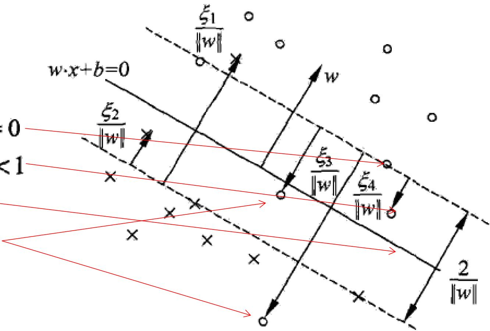

## 合页损失函数hinge loss function

•线性支持向量机学习还有另外一种解释，就是最小化以下目标函数：

$$
\sum _ { i = 1 } ^ { N } [ 1 - \boldsymbol { \mathcal { I } } _ { i } ( \boldsymbol { w } \cdot \boldsymbol { x } _ { i } + \boldsymbol { b } ) ] _ { + } + \boldsymbol { \mathcal { I } } | | \boldsymbol { w } | | ^ { 2 }
$$

·第一项： $L ( y ( w \cdot x + b ) ) = [ 1 - y ( w \cdot x + b ) ] _ { + }$

•称为合页损失函数

$$
[ z ] _ { + } = \left\{ { z , \atop 0 } \right. \quad z \leq 0
$$

## 合页损失函数hinge loss function

•线性支持向量机原始最优化问题：

$$
\operatorname* { m i n } _ { w , b , \xi } \quad \frac { 1 } { 2 } \| w \| ^ { 2 } + C \sum _ { i = 1 } ^ { N } \xi _ { i }
$$

$$
\begin{array} { r l } { \mathrm { s . t . } \quad } & { { } y _ { i } ( w \cdot x _ { i } + b ) \geqslant 1 - \xi _ { i } , \quad i = 1 , 2 , \cdots , N } \end{array}
$$

$$
\begin{array} { r } { \xi _ { i } \geqslant 0 , \quad i = 1 , 2 , \cdots , N } \end{array}
$$

·等价于：

$$
\underset { w _ { i } , b } { \operatorname* { m i n } } \quad \ \sum _ { i = 1 } ^ { N } \bigl [ 1 - y _ { i } ( w \cdot x _ { i } + b ) \bigr ] _ { + } + \lambda \| w \| ^ { 2 }
$$

## 合页损失函数hinge loss function

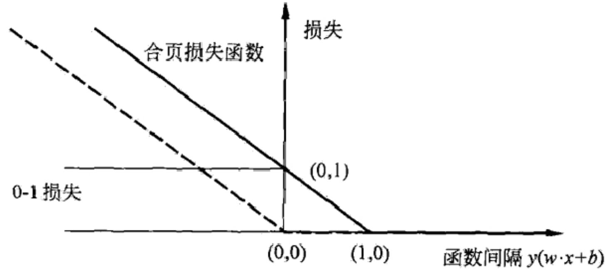

## 非线性支持向量机与核函数

•例子

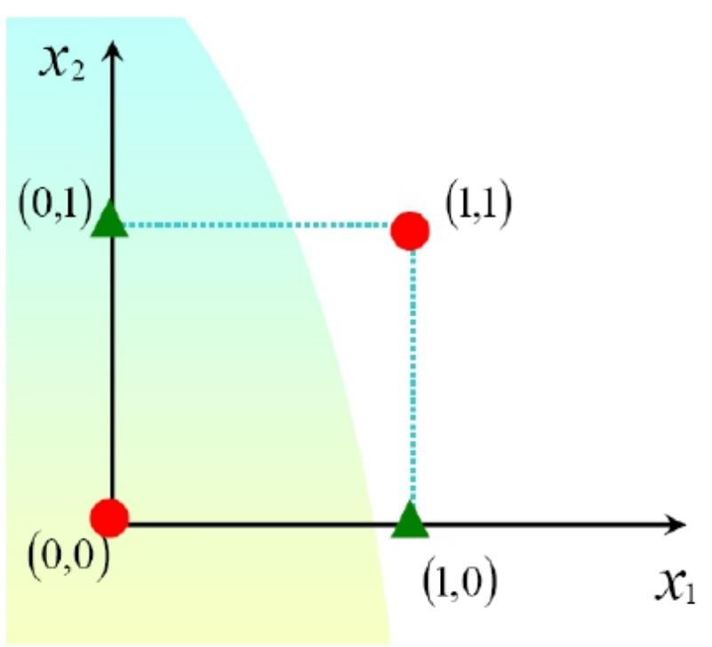

@1 : {(0, 0),(1, 1)} $\omega _ { 2 }$ : {(1, 0), (0, 1)}

$$
( x _ { 1 } , x _ { 2 } )
$$

$$
( x _ { 1 } , x _ { 2 } , x _ { 3 } )
$$

$$
x _ { 3 } = x _ { 1 } x _ { 2 }
$$

$$
( x _ { 1 } , x _ { 2 } )
$$

$$
( x _ { 1 } , x _ { 2 } , x _ { 3 } )
$$

## 例子

作平面 $d ( X ) = x _ { 1 } + x _ { 2 } - 2 x _ { 3 } - { \frac { 1 } { 3 } } = 0$ 分开 $\omega _ { 1 } , \omega _ { 2 }$

## 例子

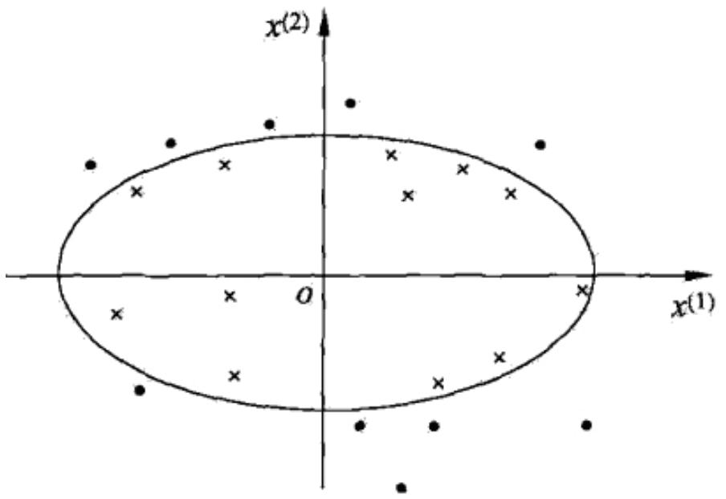

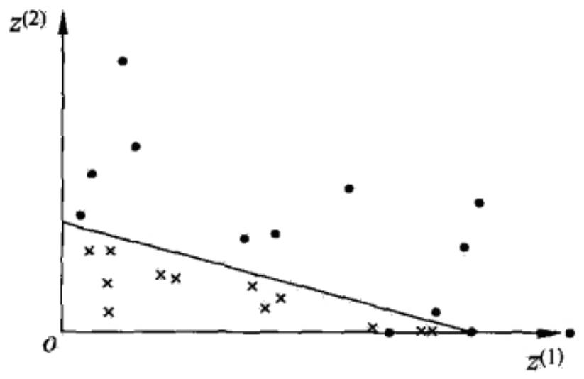

## 例子


## 泛函基础

•度量空间

•赋范空间

•向量空间

•希尔伯特空间

•内积空间

## 泛函分析

·形成于20世纪30年代的数学分支；

•从变分问题，积分方程和理论物理的研究中发展而来；

•综合运用了函数论，几何学，代数学的观点；

• 可看成是无限维向量空间的解析几何及数学分析；

•研究内容

·无限维向量空间上的函数，算子和极限理论；

•研究拓扑线性空间到拓扑线性空间之间，满足各种拓扑和代数条件的映射；

## 泛函分析

•函数概念被赋予了更为一般的意义

・古典分析中的函数概念是指两个数集之间所建立的一种对应关系

・现代数学的发展却是要求建立两个任意集合之间的某种对应关系

·在数学上，把无限维空间到无限维空间的变换叫做算子

•研究无限维线性空间上的泛函数和算子理论，就产生了一门新的分析数学，叫做泛函分析。

## 泛函分析的研究内容

•泛函分析自身

·算子谱理论、巴拿赫代数、拓扑线性空间理论、广义函数论；

•与其他数学学科的关联

·微分方程、概率论、函数论、连续介质力学、计算数学、控制论、最优化理论等学科中都有重要的应用，建立群上调和分析理论的基本工具；

•与其他科学学科的关联

·连续介质力学、量子物理学，是研究无限个自由度物理系统的重要而自然的工具之一。

## 度量空间

•距离空间

• Banach空间（完备的赋范线性空间)

•Hilbert空间 (完备的内积空间)

## 度量(距离)空间

·设X是非空集合，对于×中的任意两元素x与y，按某一法则都对应唯一的实数p(x,y)，并满足以下三条公理（距离公理）：

• 1.非负性： $\textstyle \rho ( x , y ) \geq 0 , \quad \rho ( x , y ) = 0$ 当且仅当 $x { = } y$

• 2.对称性: $\rho ( x , y ) = \rho ( y , x ) ;$

• 3.三角不等式：对任意的x,y,z $\rho ( x , y ) \leq \rho ( x , z ) + \rho ( z , y )$

·则称p(x,y)为x与y间的距离(或度量），，并称X是以p为距离的距离空间（或度量空间），记成(X，p)，或简记为X；X中的元素称为X中的点。

## 度量(距离)空间

•是泛函分析最基本的研究框架，在泛函分析中遇到的空间均为度量空间；

·度量空间的概念起源于经典分析，人们在研究线性常微分方程、偏微分方程、变分法以及逼近论。

·泛函分析中，经常将符合一定要求的元素放在一起所构成的集合称之为一个“空间”，元素称之为“点”。

•“点”：包含真正意义下的点、数列和函数。

·泛函分析中，很少研究一个“点”的具体性质，而是研究一个空间中点与点之间的关系，以及空间中符合一定条件的点组成的该空间子集的一些性质。

## 度量(距离)空间

$L ^ { \mathsf { p } } [ a , b ]$ 表示区间 $[ q , b ]$ 绝对值的p次幂L可积函数的全体，并把几乎处处相等的函数看成是同一个函数，对于x，$y \in L ^ { \mathsf { p } } [ a , b ]$ ，规定

$$
\rho ( x , y ) = \left[ \int _ { a } ^ { b } { \bigl | } x ( t ) - y ( t ) { \bigr | } ^ { p } ~ \mathrm { d } t \right] ^ { 1 / p } , p \geq 1
$$

·则 $L ^ { \mathsf { p } } [ a , b ]$ 构成一个距离空间，称之为p次幂可积函数空间

## 完备性概念

设 $( X , p )$ 是度量空间

●设 $\{ x _ { n } \} _ { n = 1 } ^ { \infty }$ 是X中的点列，如果对于任一正数ε，

存在正数N，使得当自然数n， $m \geq N \mathcal { H }$

$$
\rho ( x _ { n } , x _ { m } ) < \varepsilon
$$

就称 $\{ x _ { n } \} _ { n = 1 } ^ { \infty }$ 是X中的基本点列，或者称为Cauchy点列

● 如果度量空间X中每个基本点列都收敛，称X是完备度量空间.

## 完备性概念

$\textstyle C [ a , b ]$ 和 $L ^ { \mathrm { p } } [ a , b ]$ 都是完备距离空间

## 线性空间和赋范空间

•线性空间 (线性空间)

•空间中的任意两点可以做加法或与数相乘，运算的结果仍未该空间的点，并且该空间中的每个点可以定义长度，这个长度称为该点的范数，范数可以视为欧式空间中向量长度概念的推广。

·由于赋范空间既有代数结构，又有拓扑结果，因此其空间结构较度量空间要丰富得多，其在实际中的应用也更加重要。

## 线性空间

·设V是一个非空集合，K是实（或复）数域，并可在其上定义“加法”，“数乘”运算，而且满足以下公理

• 加法交换律: $x + y = y + x$

•加法结合律: $( x + y ) + z = x + ( y + z )$

• 存在零元: $x + 0 = x$

•存在逆元: $x + ( - x ) = 0$

·数乘: $1 x = x$

$a ( b x ) = ( a b ) x$

$( a + b ) x = a x + b x$

$a ( x + y ) = a x + a y$

• 则称V是数域κ上的线性空间

## 赋范空间

·设X是实（或复）线性空间，如果对于x中每个元素x，按照一定的法则对应于实数 $| | x | |$ ，且满足：

$\mid \mid x \mid \mid \geq 0 , \quad \mid \mid x \mid \mid = 0$ 当且仅当x等于零元 $( x = 0 )$

$\mid \mid a x \mid \mid = \mid a \mid \mid \mid x \mid \mid$ α是实（或复）数

• ||x+y|l≤||x|| + |ly|l

•则称X是实（或复）赋范线性空间， $\mid \mid x \mid \mid$ 称为x的范数

•赋范线性空间必然是距离空间：

定义 $\rho ( x , y ) { = } | \ | \ x - y | \ |$

与度量空间不同：

•平移不变性： ${ \mathsf { d } } ( \mathsf { x } + \mathsf { a } , \mathsf { y } + \mathsf { a } ) { \mathsf { = d } } ( \mathsf { x } , \mathsf { y } ) , \ \mathsf { x } , \mathsf { y } , \mathsf { a }$ 属于X

·齐次性： ${ \mathsf { d } } ( { \mathsf { a x } } , { \mathsf { a y } } ) { \mathsf { = } } | { \mathsf { a } } | { \mathsf { d } } ( { \mathsf { x } } , { \mathsf { y } } ) , { \mathsf { x } } , { \mathsf { y } }$ 属于X，a属于k

## 巴拿赫(Banach)空间

·如果赋范线性空间(X, III)是完备的，则称(X, II.II)是Banach空间。

例子

n维Euclid空间R"是Banach空间

$L ^ { \mathrm { p } } [ a , b ] ( p \geq 1 )$ 是Banach空间，定义范数

$$
\left\| x \right\| = \left[ \int _ { a } ^ { b } \bigl | x ( t ) \bigr | ^ { p } \mathrm { d } t \right] ^ { 1 / p } , p \geq 1
$$

## 巴拿赫(Banach)空间

·如果赋范线性空间(X, II.II)是完备的，则称(X, II.II)是Banach空间。

● 例子： $C ^ { k } [ a , b ]$ 是Banach空间

$C ^ { k } [ a , b ]$ 表示定义在区间 $[ a , b ]$ 上k阶连续可导的函数全体.在 $C ^ { k } [ a , b ]$ 定义范数

$$
\Big \| x \Big \| = \sum _ { j = 0 } ^ { k } \operatorname* { m a x } \Big | x ^ { ( j ) } ( t ) \Big | , x ^ { ( 0 ) } ( t ) = x ( t ) \in C [ a , b ]
$$

## 有界线性算子

•T是由赋范线性空间X中的某个子集D到赋范线性空间中的一个映射，则称T是算子，D是T的定义域，记为D(T)，像集 $\{ y \mid y = T x ,$ $x \in D ]$ 是T的值域，记为T(D).

•若T进一步满足

·可加性： $T ( x + y ) = T x + T y$

•齐次性： ${ \cal T } ( a x ) { = } a { \cal T } ( x )$

•则T是线性算子

•蓄在在正数M使得对于一切x∈D(T)，有 $\mid \mid T x \mid \mid \leq M \mid \mid x \mid \mid$ ，则T是有界算字

## 有界线性算子

•T是由赋范线性空间X中的某个子集D到赋范线性空间中的一个映射，则称T是算子，D是T的定义域，记为D(T)，像集 $\{ y \mid y = T x ,$ $x \in D ]$ 是T的值域，记为T(D).

•若T进一步满足

·可加性： $T ( x + y ) = T x + T y$

•齐次性： ${ \cal T } ( a x ) { = } a { \cal T } ( x )$

•则T是线性算子

•蓄存在正数M使得对于一切x∈D(T)，有 $\mid \mid T x \mid \mid \leq M \mid \mid x \mid \mid$ ，则T是有鼻算字

## 有界线性算子

·定理：设X和X1都是赋范线性空间，在B(X, X1)中定义加法和数乘运算：

• (T1+T2)x=T1x+T2x(T1,T2 ∈B(X, X1), x ∈X)

• (aT)x=a(Tx)(T∈B(X, X1)，α是数)

·则B(X\_X1)按照以上的线性运算是一个线性空间，并以前述算子范数的定义构成赋范线性空间

·若X1是Banach空间，则B(X, X1)也是Banach空间

## 内积空间和Hilbert空间

•几何化：引入正交投影的概念

·定义：设x是定义在实（或复）数域κ上的线性空间，若对于x任意一对有序元素x,y，恒对应数域K的值(x，y)，且满足

$( a x , y ) = a ( x , y ) ;$

• (x+y, z) = (x, z) +(x, z)

• (x, y)=(y, x)

$( x , x ) \geq 0$ $( x , x ) { = } 0$ 的充要条件是x=0

·则称x为内积空间，(x，y)称为x，y的内积。

## Hilbert空间

•可由內积导出范数

$$
\left\| x \right\| = { \sqrt { \left( x , x \right) } }
$$

•完备的内积空间称为希尔伯特(Hilbert)空间

· Hilbert空间必为Banach空间

## Hilbert空间

$L ^ { 2 } [ a , b ]$ 中定义x, y的内积(x, y)为

$$
( x , y ) = \int _ { a } ^ { b } x ( t ) \overline { { y } } ( t ) \mathrm { d } t , x ( t ) , y ( t ) \in L ^ { 2 } [ a , b ]
$$

因此， $L ^ { 2 } [ a , b ]$ 是一个可分的Hilbert空间

$L ^ { p } [ a , b ] ( p { \neq } 2 )$ 不可能诱导由范数诱导出内积空间

## Hilbert空间

•赋范线性空间X成为内积空间的充要条件是它的范数满足中线公式

$$
\left\| x + y \right\| ^ { 2 } + \left\| x - y \right\| ^ { 2 } = 2 \left\| x \right\| ^ { 2 } + 2 \left\| y \right\| ^ { 2 }
$$

• 而且内积可表示为

$$
( x , y ) = { \frac { 1 } { 4 } } ( \left\| x + y \right\| ^ { 2 } - \left\| x - y \right\| ^ { 2 } + i \left\| x + i y \right\| ^ { 2 } - i \left\| x - y \right\| ^ { 2 } )
$$

## Hilbert空间

正交

正交补

$( x , y ) = 0$ 记为 $x \perp y$

● 勾股定理

$$
A ^ { \bot } = \left\{ x \vert x \bot A , x \in X \right\} \subset X
$$

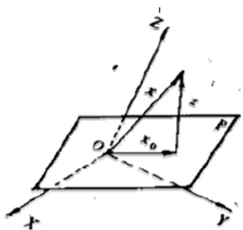

$$
x \perp y \Rightarrow \left\| x + y \right\| ^ { 2 } = \left\| x \right\| ^ { 2 } + \left\| y \right\| ^ { 2 }
$$

● 正交分解：设M是内积空间X的完备子空间，则对任意 $x \in X$ ，均有以下唯一的正交分解

$$
x = x _ { 0 } + z , x _ { 0 } \in M , z \in M ^ { \bot }
$$

## 内积空间中的标准正交系

定义：内积空间X中的元素列 $\{ e _ { k } \}$ ，如果满足

$$
( e _ { i } , e _ { j } ) = 0 , i \neq j
$$

则称 $\{ e _ { k } \}$ 是一正交系.进一步，如果满足

$$
( e _ { i } , e _ { j } ) = \delta _ { i j } = { \left\{ \begin{array} { l l } { 0 } & { i \neq j } \\ { 1 } & { i = j } \end{array} \right. }
$$

则称 $\{ e _ { k } \}$ 是一标准正交系

有限维空间，将给定向量展开成正交单位向量的线性组合

无限维空间，将给定函数展开成 $F o u r i e r$ 级数

## 非线性支持向量机与核函数

非线性分类问题：

非线性可分问题

·如果能用Rⁿ中的一个超曲面将正负例正确分开，则称这个问题为非线性可分问题

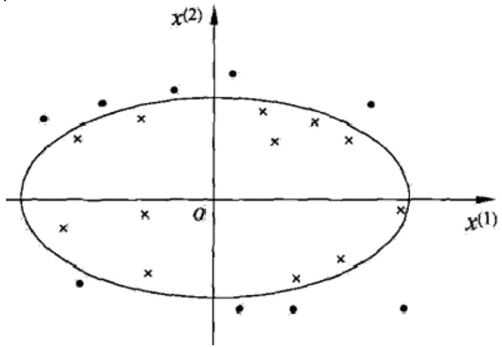

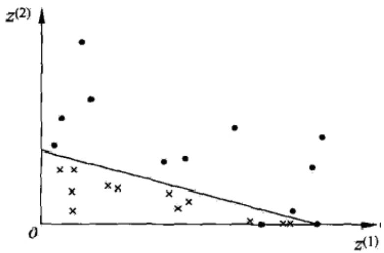

## 非线性支持向量机与核函数

·非线性问题往往不好求解，所以希望能用解线性分类间题的方法解决这个问题。

·采取的方法是进行一个非线性变换，将非线性问题变换为线性问题，通过解变换后的线性问题的方法求解原来的非线性问题。

•原空间：

$$
\mathcal { X } \subset \mathbf { R } ^ { 2 } , \ : \boldsymbol { x } = ( \boldsymbol { x } ^ { ( 1 ) } , \boldsymbol { x } ^ { ( 2 ) } ) ^ { \top } \in \mathcal { X }
$$

•新空间: $\mathcal { Z } \subset \mathbf { R } ^ { 2 } , z = ( z ^ { ( 1 ) } , z ^ { ( 2 ) } ) ^ { \mathrm { T } } \in \mathcal { Z }$ z =φ(x) =((x(1)2,(x(2)2)T

$$
w _ { 1 } ( x ^ { ( 1 ) } ) ^ { 2 } + w _ { 2 } ( x ^ { ( 2 ) } ) ^ { 2 } + b = 0 \quad \Longrightarrow \quad w _ { 1 } z ^ { ( 1 ) } + w _ { 2 } z ^ { ( 2 ) } + b = 0
$$

## 非线性支持向量机与核函数

• 用线性分类方法求解非线性分类问题分为两步：

· 首先使用一个变换将原空间的数据映射到新空间；

· 然后在新空间里用线性分类学习方法从训练数据中学习分类模型。

## 核技巧就属於这样的方法

•核技巧应用到支持向量机，其基本想法：

·通过一个非线性变换将输入空间(欧氏空间R"或离散集合)对应于一个特征空间(希尔伯特空间)，使得在输入空间中的超曲面模型对应于特征空间中的超平面模型(支持向量机)。分类问题的学习任务通过在特征空间中求解线性支持向量机就可以完成.

## 非线性支持向量机与核函数

•核函数定义:

·设X是输入空间(欧氏空间R的子集或离散集合).又设H为特征空间(希尔伯特空间)，如果存在一个从×到H的映射 $\phi ( x ) : { \mathcal { X } } \to { \mathcal { H } }$

•使得对所有 $x _ { 3 } = E x$

·函数K(x,z)满足条件 $K ( x , z ) = \phi ( x ) \cdot \phi ( z )$

•则称 $K ( x , z )$ 为核函数，φ(x)为映射函数，

・式中 $\phi ( { \pmb x } ) { \cdot } \phi ( z )$ 为φ(x)和 $\phi ( z )$ 的内积

## 非线性支持向量机与核函数

•核技巧的想法是：

·在学习与预测中只定义核函数K(x,z)，而不显式地定义映射函数，通常，直接计算K(x,z)比较容易，而通过φ(x)和φ(z)计算K(x，z)并不容易。

•注意：φ是输入空间R到特征空间H的映射，特征空间H一般是高维，映射可以不同。

## 非线性支持向量机与核函数

·例：

·假设输入空间是R2，核函数是 $K ( x , z ) = ( x \cdot z ) ^ { 2 }$ ,试找出其相关的特征空间 H和映射 $\phi ( x ) : \mathbf { R } ^ { 2 }  \mathcal { H }$

•解：

取特征空间 $\mathcal { H } = \mathbb { R } ^ { 3 }$ ，记 $\boldsymbol { x } = ( \boldsymbol { x } ^ { ( 1 ) } , \boldsymbol { x } ^ { ( 2 ) } ) ^ { \mathtt { T } } , \boldsymbol { \bar { z } } = ( \boldsymbol { z } ^ { ( 1 ) } , \boldsymbol { z } ^ { ( 2 ) } ) ^ { \mathtt { T } }$

$$
( { \pmb x } \bullet { \pmb z } ) ^ { 2 } = ( { \pmb x } ^ { ( 1 ) } { \pmb z } ^ { ( 1 ) } + { \pmb x } ^ { ( 2 ) } { \pmb z } ^ { ( 2 ) } ) ^ { 2 } = ( { \pmb x } ^ { ( 1 ) } { \pmb z } ^ { ( 1 ) } ) ^ { 2 } + 2 { \pmb x } ^ { ( 1 ) } { \pmb z } ^ { ( 1 ) } { \pmb x } ^ { ( 2 ) } { \pmb z } ^ { ( 2 ) } + ( { \pmb x } ^ { ( 2 ) } { \pmb z } ^ { ( 2 ) } ) ^ { 2 }
$$

·可以取: $\phi ( x ) = ( ( x ^ { ( 1 ) } ) ^ { 2 } , \sqrt { 2 } x ^ { ( 1 ) } x ^ { ( 2 ) } , ( x ^ { ( 2 ) } ) ^ { 2 } ) ^ { \top }$

•容易验证： $\phi ( x ) \bullet \phi ( z ) = ( x \bullet z ) ^ { 2 } = K ( x , z )$

## 非线性支持向量机与核函数

·例：

·假设输入空间是 $R ^ { 2 }$ ，核函数是 $K ( x , z ) = ( x \cdot z ) ^ { 2 }$ ,试找出其相关的特征 空间H和映射 $\phi ( x ) : \mathbf { R } ^ { 2 }  \mathcal { H }$

·解：

•同样：

$$
\begin{array} { c } { { \displaystyle \phi ( x ) = \frac { 1 } { \sqrt { 2 } } ( ( x ^ { ( 1 ) } ) ^ { 2 } - ( x ^ { ( 2 ) } ) ^ { 2 } , 2 x ^ { ( 1 ) } x ^ { ( 2 ) } , ( x ^ { ( 1 ) } ) ^ { 2 } + ( x ^ { ( 2 ) } ) ^ { 2 } ) ^ { 1 } } } \\ { { \phi ( x ) = ( ( x ^ { ( 1 ) } ) ^ { 2 } , x ^ { ( 1 ) } x ^ { ( 2 ) } , x ^ { ( 1 ) } x ^ { ( 2 ) } , ( x ^ { ( 2 ) } ) ^ { 2 } ) ^ { 1 } } } \end{array}
$$

·都满足条件。

## 核函数在支持向量机的应用

•注意到：

· 线性支持向量机对偶问题中，无论是目标函数还是决策函数都只涉及输入实例和实例之间的内积。

・目标函数中的内积 $x _ { i } \cdot x _ { j }$ 用核函数 $K ( x _ { i } , x _ { j } ) = \phi ( x _ { i } ) \cdot \phi ( x _ { j } )$

代替， 目标函数:

$$
W ( \alpha ) = \frac { 1 } { 2 } \sum _ { i = 1 } ^ { N } \sum _ { j = 1 } ^ { N } \alpha _ { i } \alpha _ { j } y _ { i } y _ { j } K ( x _ { i } , x _ { j } ) - \sum _ { i = 1 } ^ { N } \alpha _ { i }
$$

•决策函数:

$$
f ( x ) = \mathrm { s i g n } \left( \sum _ { i = 1 } ^ { N _ { s } } a _ { i } ^ { * } y _ { i } \phi ( x _ { i } ) \bullet \phi ( x ) + b ^ { * } \right) = \mathrm { s i g n } \left( \sum _ { i = 1 } ^ { N _ { s } } a _ { i } ^ { * } y _ { i } K ( x _ { i } , x ) + b ^ { * } \right)
$$

## 正定核

·问题：

·己知映射函数φ，可以通过 φ(x)和φ(z)的内积求得核函数K(x,z).

•不用构造映射φ，能否直接判断一个给定的函数K(x,z)是不是核函数？

·或者说，函数K(x,z)满足什么条件才能成为核函数？

·假设K(x,z)是定义在XxX上的对称函数，并且对任意的

$$
x _ { 1 } , x _ { 2 } , \ldots , x _ { m } \in { \mathcal { X } }
$$

• K(x,z)关于 $\pmb { x _ { 1 } } , \pmb { x _ { 2 } } , \cdots , \pmb { x _ { m } }$ 的Gram矩阵是半正定的，可以依据函数K(x,z)，构成一个希尔伯特空间(Hilbert space);

·其步骤是首先定义映射Φ，并构成向量空间S，然后在S上定义内积构成内积空间；最后将S完备化构成希尔伯特空间.

## 正定核

•1、定义映射，构成向量空间S

映射： $\phi : x  K ( \cdot , x )$

•对任意 $x _ { i } \in \mathcal { X } , ~ \alpha _ { i } \in \mathbb { R } , ~ i = 1 , 2 , \cdots , m$

·定义线性组合: $f ( \cdot ) = \sum _ { i = 1 } ^ { m } \alpha _ { i } K ( \cdot , x _ { i } )$

• 考虑由线性组合为元素的集合S，由于集合S对加法和数乘运算是封闭的，S构成一个向量空间。

## 正定核

•2、在S上定义内积，构成内积空间

在S上定义一个运算“\*”，对任意f，g属于S

$$
f ( \cdot ) = \sum _ { i = 1 } ^ { m } \alpha _ { i } K ( \cdot , x _ { i } )
$$

$$
g ( \bullet ) = \sum _ { i = 1 } ^ { l } \beta _ { j } K ( \bullet , z _ { j } )
$$

•定义运算\*: $f * g \bullet \sum _ { i = 1 } ^ { m } \sum _ { j = 1 } ^ { l } \alpha _ { i } \beta _ { j } K ( x _ { i } , z _ { j } )$

证明内积空间：

（1） $( c f ) * g = c ( f * g )$ , C∈R

(2) $( f + g ) * h = f * h + g * h$ $h \in S$

(3） $f *  g = g * f$

(4) $f * f \geqslant 0 , \quad f * f = 0 \Leftrightarrow f = 0$

## 正定核

• 3、将内积空间S完备化为希尔伯特空间

由： $f \cdot g = \sum _ { i = 1 } ^ { m } \sum _ { j = 1 } ^ { l } \alpha _ { i } \beta _ { j } K ( x _ { i } , z _ { j } )$

·内积得到范数: $\parallel f \parallel = { \sqrt { f \cdot f } }$

·因此，S是一个赋范向量空间；根据泛函分析理论，对于不完备的赋范向量空间S，一定可以使之完备化，得到完备的赋范向量空间H；一个内积空间，当作为一个赋范向量空间是完备的时候，就是希尔伯特空间，这样，就得到了希尔伯特空间H。

·再生性： $K ( \cdot , x ) \cdot f = f ( x ) \qquad K ( \cdot , x ) \cdot K ( \cdot , z ) = K ( x , z )$

## 正定核

• 正定核的充要条件

·设K：xxx→R，是对称函数，则K(x,z)为正定核函数的充 要条件是对任意x₁∈x，i=1,2m，K(x,z)对应的Gram矩阵

$$
K = \left[ K ( \boldsymbol { x } _ { i } , \boldsymbol { x } _ { j } ) \right] _ { m \times m }
$$

•是半正定的。

•给定一个实矩阵A，矩阵ATA是A的列向量的格拉姆矩阵，而矩阵 $A A ^ { \mathsf { T } }$ 是A的行向量的格拉姆矩阵。

•格拉姆矩阵是半正定的，反之每个半正定矩阵是某些向量的格拉姆矩阵。这组向量一般不是惟一的：任何正交基的格拉姆矩阵是恒同矩阵。

## 正定核

• 正定核的等价定义

·设 $\mathcal { X } \subset \mathbb { R } ^ { n }$ ，是K(x,z)是定义在X×x对称函数，如果对任意的$\boldsymbol { x } _ { i } \in \mathcal { X }$ ，i=1,2,…,m，K(x,z)对应的Gram矩阵

$$
K = \left[ K ( x _ { i } , x _ { j } ) \right] _ { m \times m }
$$

•半正定的，则称 ${ \sf K } ( { \sf x } , { \sf z } )$ 为正定核。

•这一定义在构造核函数时很有用。但对于一个具体函数K(x,z)来说，检验它是否为正定核函数并不容易，因为要求对任意有限输入集 $\{ x _ { 1 } , x _ { 2 } , \ldots , x _ { m } \}$ 验证K对应的Gram矩阵是否为半正定的。

·在实际问题中往往应用己有的核函数。

## 常用核函数

·1、多项式核函数（Polynomial kernel function)

$$
K ( x , z ) = ( x \cdot z + 1 ) ^ { s }
$$

·对应的支持向量机为P次多项式分类器，分类决策函数：

$$
f ( x ) = \mathrm { s i g n } \{ \sum _ { i = 1 } ^ { N _ { i } } a _ { i } ^ { * } y _ { i } ( x _ { i } \cdot x + 1 ) ^ { p } + b ^ { * } \}
$$

•2、高斯核函数 (Gaussian Kernel Function)

$$
K ( x , z ) = \exp \left( - \frac { \| x - z \| ^ { 2 } } { 2 \sigma ^ { 2 } } \right)
$$

•决策函数:

$$
f ( x ) = \mathrm { s i g n } \left( \sum _ { i = 1 } ^ { N _ { i } } a _ { i } ^ { * } y _ { i } \exp \left( - \frac { \left\| x - z \right\| ^ { 2 } } { 2 \sigma ^ { 2 } } \right) + b ^ { * } \right)
$$

## 常用核函数

•3、字符串核函数：

•考虑一个有限字符表∑，字符串s是从∑中取出的有限字符的序列，包括空字符。s长度用|s|表示，元素记作s(1)s(2)…(|s)。两串字符s和t的连接记作st。所有长度为n的字符串的集合记作n，所有字符串记作 $\Sigma ^ { * } = \bigcup _ { n = 0 } ^ { \infty } \Sigma ^ { n }$

• 考虑s的子串u，给定一个指标序列 $i = ( i _ { 1 } , i _ { 2 } , \cdot \cdot \cdot , i _ { | u | } ) , \ 1 \leqslant i _ { 1 } < i _ { 2 } < \cdot \cdot \cdot < i _ { | u | } \leqslant | s | .$

•u定义为 $u = s ( i ) = s ( i _ { 1 } ) s ( i _ { 2 } ) \cdot \cdot \cdot s ( i _ { | u | } )$ ，长度记作 $l ( i ) = i _ { | u | } - i _ { 1 } + 1$

•如果i是连续的，则 $l ( i ) = | u | ;$ 否则 $l ( i ) > | u |$

## 常用核函数

•3、字符串核函数：

•假设S是长度大于或等于n的字符串的集合，s是S的元素。现在建立字符串集合S到特征空间 $\mathcal { H } _ { n } = R ^ { \Sigma ^ { n } }$ 的映射 $\phi _ { n } ( s ) \circ R ^ { \Sigma ^ { n } }$ 表示定义在 $\varSigma ^ { n }$ 上的实数空间，其每一维对应一个字符串 $u \in \Sigma ^ { n }$ 映射 $\phi _ { n } ( s )$ 将字符串s对应于空间 $R ^ { \varSigma ^ { n } }$ 的一个向量，其在u维上的取值为

$$
[ \phi _ { n } ( s ) ] _ { u } = \sum _ { i : s ( i ) = u } \lambda ^ { l ( i ) } \qquad 0 < \lambda \leqslant 1 \ .
$$

## 常用核函数

•3、字符串核函数：

·两个字符串s和t上的字符串核函数是基于映射 $\phi _ { n }$ 的特征空间中的内积

$$
\begin{array} { l } { { k _ { n } ( s , t ) = \displaystyle \sum _ { u \in \Sigma ^ { n } } [ \phi _ { n } ( s ) ] _ { u } [ \phi _ { n } ( t ) ] _ { u } } } \\ { { \ = \displaystyle \sum _ { u \in \Sigma ^ { n } } \sum _ { ( i , j ) : s ( i ) = t ( j ) = u } \lambda ^ { l ( i ) } \lambda ^ { l ( j ) } } } \end{array}
$$

·字符串核函数 $k _ { n } ( s , t )$ 给出了字符串s和t中长度等于n的所有子串组成的特征向量的余弦相似度。

· 两串字符串相同的子串越多，就越相似，字符串核函数的值就越大。

## 非线性支持向量机学习算法

·输入：线性不可分训练数据集 $T = \{ ( x _ { 1 } , y _ { 1 } ) , ( x _ { 2 } , y _ { 2 } ) , \cdots , ( x _ { N } , y _ { N } ) \}$

$$
x _ { i } \in \mathcal { X } = { \bf R } ^ { n } \qquad y _ { i } \in \mathcal { Y } = \{ - 1 , + 1 \} \ , \quad i = 1 , 2 , \cdots , N
$$

•输出：分类决策函数

• 1、选取适当的核函数和参数C，构造最优化问题：

$$
\begin{array} { c l } { \displaystyle \underset { \boldsymbol { \alpha } } { \mathrm { m i n } } } & { \displaystyle \frac { 1 } { 2 } \sum _ { i = 1 } ^ { N } \sum _ { j = 1 } ^ { N } \alpha _ { i } \alpha _ { j } y _ { i } y _ { j } K ( x _ { i } , x _ { j } ) - \sum _ { i = 1 } ^ { N } \alpha _ { i } } \\ & { \mathrm { s . t . } \quad \displaystyle \sum _ { i = 1 } ^ { N } \alpha _ { i } y _ { i } = 0 } \\ & { \displaystyle \quad 0 \leqslant \alpha _ { i } \leqslant C , \quad i = 1 , 2 , \cdots , N } \end{array}
$$

求得最优解: $\alpha ^ { * } = ( \alpha _ { 1 } ^ { * } , \alpha _ { 2 } ^ { * } , \cdots , \alpha _ { N } ^ { * } ) ^ { \mathrm { T } }$

## 非线性支持向量机学习算法

•2、并选择 $\alpha ^ { * }$ ，适合条件 $0 < { \alpha _ { j } } ^ { * } < C$ ，计算

$$
{ \boldsymbol { b } } ^ { * } = { \boldsymbol { y } } _ { j } - \sum _ { i = 1 } ^ { N } \alpha _ { i } ^ { * } { \boldsymbol { y } } _ { i } K ( { \boldsymbol { x } } _ { i } \cdot { \boldsymbol { x } } _ { j } )
$$

•3、构造决策函数

$$
f ( x ) = \mathrm { s i g n } \biggl ( \sum _ { i = 1 } ^ { N } \alpha _ { i } ^ { * } y _ { i } K ( x * x _ { i } ) + b ^ { * } \biggr )
$$

•当 ${ \sf K } ( { \sf x } , { \sf z } )$ 是正定核函数时，5 是凸二次规划问题，解是存在的。

## 序列最小最优化算法

·序列最小最优化(sequential minimal optimization SMO)算法：1998年由Platt提出。

John C. Platt "Using Analytic QP and Sparseness to Speed Training of Support Vector Machines" in Advances in Neural Information Processing Systems 1I, M. S. Kearns, S. A. Solla, D. A. Cohn, eds (MIT Press 199), 557–63.

动机:

•支持向嘉机的習实题可型或化为呇解鼎亏咨规划闾题·这样的查二次划问题真宥鉴局优解，弃查宥许多最优花算法奇以用宇这一问题的求解；

·但是当训练样本容量很大时，这些算法往往变得非常低效，以致无法使用.所以，如何高效地实现支持向量机学习就成为一个重要的简题。

## 序列最小最优化算法

· SMO (Sequential minimal optimization )

·解如下凸二次规划的对偶问题

$$
\operatorname* { m i n } _ { \alpha } \quad \frac { 1 } { 2 } { \sum _ { i = 1 } ^ { N } } { \sum _ { j = 1 } ^ { N } } \alpha _ { i } \alpha _ { j } y _ { i } y _ { j } K ( x _ { i } , x _ { j } ) - { \sum _ { i = 1 } ^ { N } } \alpha _ { i }
$$

$$
\begin{array} { r l } { \mathbf { s . t . } } & { { } \displaystyle \sum _ { i = 1 } ^ { N } \alpha _ { i } y _ { i } = 0 } \end{array}
$$

$$
0 \leqslant \alpha _ { i } \leqslant C , \quad i = 1 , 2 , \cdots , N
$$

•注意：变量是拉格朗日乘子 $\mathbf { \alpha } _ { \mathbf { | } } ,$ 一个对应一个样本

## SMO算法

启发式算法, 基本思路:

•如果所有变量的解都满足此最优化问题的KKT条件，那么得到解；

•否则，选择两个变量，固定其它变量，针对这两个变量构建一个二次规划问题，称为子问题，可通过解析方法求解，提高了计算速度。

•子问题的两个变量：一个是违反KKT条件最严重的那个，另一个由约束条件自动确定。

$$
\alpha _ { 1 } = - y _ { 1 } \sum _ { i = 2 } ^ { N } \alpha _ { i } y _ { i }
$$

•SMO算法包括两个部分：

• 求解两个变量二次规划的解析方法

• 选择变量的启发式方法

## 两个变量二次规划的求解过程

·选择两个变量，其它固定，SMO的 5的子问题：

$$
\begin{array} { r l } { \displaystyle \underset { \alpha _ { 1 } , \alpha _ { 2 } } { \operatorname* { m i n } } } & { \displaystyle \mathcal { W } ( \alpha _ { 1 } , \alpha _ { 2 } ) = \frac { 1 } { 2 } K _ { 1 1 } \alpha _ { 1 } ^ { 2 } + \frac { 1 } { 2 } K _ { 2 2 } \alpha _ { 2 } ^ { 2 } + y _ { 1 } y _ { 2 } K _ { 1 2 } \alpha _ { 1 } \alpha _ { 2 } } \\ & { \quad \quad \quad - ( \alpha _ { 1 } + \alpha _ { 2 } ) + y _ { 1 } \alpha _ { 1 } \underset { i = 1 } { \overset { N } { \sum } } y _ { i } \alpha _ { i } K _ { i 1 } + y _ { 2 } \alpha _ { 2 } \underset { i \neq 3 } { \overset { N } { \sum } } y _ { i } \alpha _ { i } K _ { i 2 } } \\ { \mathrm { s . t . } } & { \displaystyle \alpha _ { 1 } y _ { 1 } + \alpha _ { 2 } y _ { 2 } = - \underset { i = 3 } { \overset { N } { \sum } } y _ { i } \alpha _ { i } = \xi } \\ & { \quad \quad 0 \leqslant \alpha _ { i } \leqslant C , \quad i = 1 , 2 } \end{array}
$$

## 两个变量二次规划的求解过程

• 两个变量，约束条件用二维空间中的图形表示

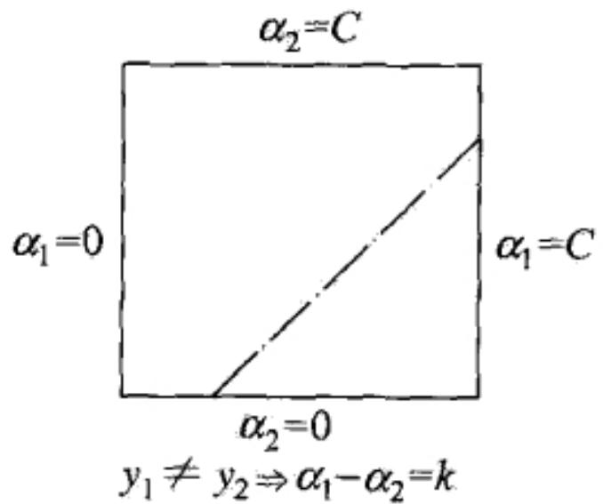

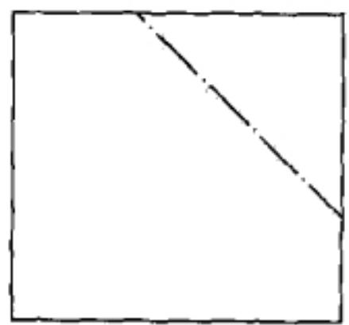  
y₁=y₂→α₁+α2=k

·假设问题 6 的初始可行解为 $\alpha _ { 1 } ^ { \mathrm { o l d } } , \alpha _ { 2 } ^ { \mathrm { o l d } }$ 最优解 $\mathcal { X } _ { 1 } ^ { \flat \in \mathscr { W } _ { r } ^ { \prime } } , \mathcal { Q } _ { 2 } ^ { \flat \in \mathscr { W } _ { r } ^ { \prime } }$

•设 ${ \mathfrak { a } } _ { 2 }$ 未经剪辑时的最优解为 $\alpha _ { 7 } ^ { \mathrm { n e w , u n c } }$

## 两个变量二次规划的求解过程

· 根据不等式条件 $\boldsymbol { \mathcal { X } } _ { 2 } ^ { \mathrm { m e s u } }$ 的取值范围:

$$
L \leqslant \alpha _ { 2 } ^ { \mathrm { n e w } } \leqslant H
$$

左图： $L = \operatorname* { m a x } ( 0 , \alpha _ { 2 } ^ { \circ 1 \delta } - \alpha _ { 1 } ^ { \circ 1 \delta } ) \quad H = \operatorname* { m i n } ( C , C + \alpha _ { 2 } ^ { \circ 1 d } - \alpha _ { 1 } ^ { \circ l d } )$

右图： $L = m a x ( 0 , \alpha _ { 2 } ^ { \mathrm { o l d } } + \alpha _ { 1 } ^ { \mathrm { o l d } } - C ) ~ H = \operatorname* { m i n } ( C , \alpha _ { 2 } ^ { \mathrm { o l d } } + \alpha _ { 1 } ^ { \mathrm { o l d } } )$

## 两个变量二次规划的求解过程

求解过程:

• 先求沿着约束方向未经剪辑时的 $\mathcal { X } _ { 2 } ^ { \mathrm { n e w , u n c } }$

•再求剪辑后的 $\boldsymbol { \mathcal { X } } _ { 2 } ^ { \flat ( \flat \varphi ) }$

·记： $g ( x ) = \sum _ { i = 1 } ^ { N } \alpha _ { i , \gamma _ { i } } K ( x _ { i } , x ) + b$

·令： $E _ { i } = g ( x _ { i } ) - y _ { i } = \left( \sum _ { j = 1 } ^ { N } \alpha _ { j } y _ { j } K ( x _ { j } , x _ { i } ) + b \right) - y _ { i } , \quad i = 1 , 2$

•E 为输入x的预测值和真实输出y的差，i=1，2

## 两个变量二次规划的求解过程

定理：

·最优化问题 $6$ 沿约束方向未经剪辑的解：

$$
\alpha _ { 2 } ^ { \mathrm { n e w , m i n } } = \alpha _ { 2 } ^ { \mathrm { o l d } } + \frac { y _ { 2 } ( E _ { 1 } - E _ { 2 } ) } { \eta }
$$

$$
\eta = K _ { 1 1 } + K _ { 2 2 } - 2 K _ { 1 2 } = \left\| \varPhi ( x _ { 1 } ) - \varPhi ( x _ { 2 } ) \right\| ^ { 2 }
$$

•剪辑后的解 $\alpha _ { 2 } ^ { \mathsf { n e w } } = \left\{ \begin{array} { l l } { H , } & { \alpha _ { 2 } ^ { \mathsf { n e w , u n c } } > H } \\ { \alpha _ { 2 } ^ { \mathsf { n e w , u n c } } , } & { L \leqslant \alpha _ { 2 } ^ { \mathsf { n e w , u n c } } \leqslant H } \\ { L , } & { \alpha _ { 2 } ^ { \mathsf { n e w , u n c } } < L } \end{array} \right.$

·得到 ${ \mathfrak { a } } _ { 1 }$ 的解 $\alpha _ { 1 } ^ { \mathrm { n s w } } = \alpha _ { 1 } ^ { \mathrm { o l d } } + y _ { 1 } y _ { 2 } ( \alpha _ { 2 } ^ { \mathrm { o l d } } - \alpha _ { 2 } ^ { \mathrm { n s w } } )$

## 两个变量二次规划的求解过程

•证明： 引进记号

$$
\nu _ { i } = \sum _ { j = 3 } ^ { N } \alpha _ { j } y _ { j } K ( x _ { i } , x _ { j } ) = g ( x _ { i } ) - \sum _ { j = 1 } ^ { 2 } \alpha _ { j } y _ { j } K ( x _ { i } , x _ { j } ) - b , \quad i = 1 , 2
$$

目标函数写成:

$$
\begin{array} { c } { { W ( \alpha _ { 1 } , \alpha _ { 2 } ) = \displaystyle \frac { 1 } { 2 } K _ { 1 1 } \alpha _ { 1 } ^ { 2 } + \frac { 1 } { 2 } K _ { 2 2 } \alpha _ { 2 } ^ { 2 } + y _ { 1 } y _ { 2 } K _ { 1 2 } \alpha _ { 1 } \alpha _ { 2 } } } \\ { { - \left( \alpha _ { 1 } + \alpha _ { 2 } \right) + y _ { 1 } \nu _ { 1 } \alpha _ { 1 } + y _ { 2 } \nu _ { 2 } \alpha _ { 2 } } } \end{array}
$$

由 $\alpha _ { 1 } y _ { 1 } = \varsigma - \alpha _ { 2 } y _ { 2 }$ 及 ${ y } _ { i } ^ { 2 } = 1$

$$
\alpha _ { 1 } = ( \varsigma - y _ { 2 } \alpha _ { 2 } ) y _ { 1 }
$$

## 两个变量二次规划的求解过程

・得到只是α2 的函数的目标函数

$$
\begin{array} { c } { { W ( \alpha _ { 2 } ) = \displaystyle \frac { 1 } { 2 } K _ { 1 1 } ( \varsigma - \alpha _ { 2 } y _ { 2 } ) ^ { 2 } + \displaystyle \frac { 1 } { 2 } K _ { 2 2 } \alpha _ { 2 } ^ { 2 } + y _ { 2 } K _ { 1 2 } ( \varsigma - \alpha _ { 2 } y _ { 2 } ) \alpha _ { 2 } } } \\ { { - ( \varsigma - \alpha _ { 2 } y _ { 2 } ) y _ { 1 } - \alpha _ { 2 } + \nu _ { 1 } ( \varsigma - \alpha _ { 2 } y _ { 2 } ) + y _ { 2 } \nu _ { 2 } \alpha _ { 2 } } } \end{array}
$$

·对α2求导 $\frac { \partial W } { \partial \alpha _ { 2 } } = K _ { 1 1 } \alpha _ { 2 } + K _ { 2 2 } \alpha _ { 2 } - 2 K _ { 1 2 } \alpha _ { 2 } - K _ { 1 1 } \varsigma y _ { 2 } + K _ { 1 2 } \varsigma y _ { 2 } + y _ { 1 } y _ { 2 } - 1 - \nu _ { 1 } y _ { 2 } + y _ { 2 } \nu _ { 2 }$

•令其为0:

$$
\begin{array} { r l } & { \bigl ( K _ { 1 1 } + K _ { 2 2 } - 2 K _ { 1 2 } \bigr ) \alpha _ { 2 } = y _ { 2 } \bigl ( y _ { 2 } - y _ { 1 } + \varsigma K _ { 1 1 } - \varsigma K _ { 1 2 } + \nu _ { 1 } - \nu _ { 2 } \bigr ) } \\ & { = y _ { 2 } \biggl [ y _ { 2 } - y _ { 1 } + \varsigma K _ { 1 1 } - \varsigma K _ { 1 2 } + \biggl ( g ( x _ { 1 } ) - \sum _ { j = 1 } ^ { 2 } y _ { j } \alpha _ { j } K _ { 1 j } - b \biggr ) - \biggl ( g ( x _ { 2 } ) - \sum _ { j = 1 } ^ { 2 } y _ { j } \alpha _ { j } K _ { 2 j } - b \biggr ) \biggr ] } \end{array}
$$

## 两个变量二次规划的求解过程

·将 $\varsigma = \alpha _ { 1 } ^ { \mathrm { o l d } } y _ { 1 } + \alpha _ { 2 } ^ { \mathrm { o l d } } y _ { 2 }$ 代入：

$$
\begin{array} { r l } & { ( K _ { 1 1 } + K _ { 2 2 } - 2 K _ { 1 2 } ) \alpha _ { 2 } ^ { \mathrm { n e w , s u c } } = y _ { 2 } ( ( K _ { 1 1 } + K _ { 2 2 } - 2 K _ { 1 2 } ) \alpha _ { 2 } ^ { \mathrm { o l d } } y _ { 2 } + y _ { 2 } - y _ { 1 } + g ( x _ { 1 } ) - g ( x _ { 2 } ) ) } \\ & { \phantom { ( } = ( K _ { 1 1 } + K _ { 2 2 } - 2 K _ { 1 2 } ) \alpha _ { 2 } ^ { \mathrm { o l d } } + y _ { 2 } ( E _ { 1 } - E _ { 2 } ) } \end{array}
$$

·将 $\eta = K _ { _ { 1 1 } } + K _ { _ { 2 2 } } - 2 K _ { _ { 1 2 } } \langle \Psi \rangle$

$$
\alpha _ { 2 } ^ { \mathrm { n e w , m e } } = \alpha _ { 2 } ^ { \mathrm { o l d } } + \frac { y _ { 2 } ( E _ { 1 } - E _ { 2 } ) } { \eta }
$$

## 两个变量二次规划的求解过程

得到定理：

·最优化问题 $6$ 沿约束方向未经剪辑的解：

$$
\alpha _ { 2 } ^ { \mathrm { n e w , u n c } } = \alpha _ { 2 } ^ { \mathrm { o l d } } + \frac { y _ { 2 } ( E _ { 1 } - E _ { 2 } ) } { \eta }
$$

$$
\eta = K _ { _ { 1 1 } } + K _ { _ { 2 2 } } - 2 K _ { _ { 1 2 } } = \left\| \varPhi ( x _ { _ { 1 } } ) - \varPhi ( x _ { _ { 2 } } ) \right\| ^ { 2 }
$$

剪辑后的解

$$
\alpha _ { 2 } ^ { \mathsf { n e w } } = \left\{ \begin{array} { l l } { H , } & { \alpha _ { 2 } ^ { \mathsf { n e w , u n c } } > H } \\ { \alpha _ { 2 } ^ { \mathsf { n e w , u n c } } , } & { L \leqslant \alpha _ { 2 } ^ { \mathsf { n e w , u n c } } \leqslant H } \\ { L , } & { \alpha _ { 2 } ^ { \mathsf { n e w , u n c } } < L } \end{array} \right.
$$

·得到 ${ \mathfrak { a } } _ { 1 }$ 的解 $\alpha _ { 1 } ^ { \mathrm { n s w } } = \alpha _ { 1 } ^ { \mathrm { o l d } } + y _ { 1 } y _ { 2 } ( \alpha _ { 2 } ^ { \mathrm { o l d } } - \alpha _ { 2 } ^ { \mathrm { n s w } } )$

## 变量的选择方法

•SMO算法在每个子问题中选择两个变量优化，其中至少一个变量是违反KKT条件的

•1、第一个变量的选择：外循环

违反KKT最严重的样本点，

检验样本点是否满足KKT条件:

先检查

$$
\begin{array} { l } { \alpha _ { i } = 0 \Leftrightarrow y _ { i } g ( x _ { i } ) \geqslant 1 } \\ { 0 < \alpha _ { i } < C \Leftrightarrow y _ { i } g ( x _ { i } ) = 1 } \\ { \alpha _ { i } = C \Leftrightarrow y _ { i } g ( x _ { i } ) \leqslant 1 } \\ { g ( x _ { i } ) = \displaystyle \sum _ { j = 1 } ^ { N } \alpha _ { j } y _ { j } K ( x _ { i } , x _ { j } ) + b } \end{array}
$$

## 变量的选择方法

•2、第二个变量的检查：内循环，

・选择的标准是希望能使目标函数有足夠大的变化

•即对应 $\left| E _ { 1 } - E _ { 2 } \right|$ 最大，即E1，E2 的符号相反，差异最大

・如果内循环通过上述方法找到的点不能使目标函数有足够的下降

•则：遍历间隔边界上的样本点，测试目标函数下降

・如果下降不大，则遍历所有样本点

・如果依然下降不大，则丢弃外循环点，重新选择

## 计算阈值b和Ei

•3、每次完成两个变量的优化后，重新计算b，Ei

·由KKT条件： $\sum _ { i = 1 } ^ { N } \alpha _ { i } y _ { i } K _ { i \mathrm { i } } + b = y _ { \mathrm { i } }$

$$
b _ { 1 } ^ { \mathrm { n e w } } = y _ { 1 } - \sum _ { i = 3 } ^ { N } \alpha _ { i } y _ { i } K _ { i 1 } - \alpha _ { 1 } ^ { \mathrm { n e w } } y _ { 1 } K _ { 1 1 } - \alpha _ { 2 } ^ { \mathrm { n e w } } y _ { 2 } K _ { 2 1 }
$$

$$
E _ { i } = g ( x _ { i } ) - y _ { i } = \left( \sum _ { j = 1 } ^ { N } \alpha _ { j } y _ { j } K ( x _ { j } , x _ { i } ) + b \right) - y _ { i } , \quad i = 1 , 2
$$

$$
E _ { 1 } = \sum _ { i = 3 } ^ { N } \alpha _ { i } y _ { i } K _ { i 1 } + \alpha _ { 1 } ^ { \mathrm { o l d } } y _ { 1 } K _ { 1 1 } + \alpha _ { 2 } ^ { \mathrm { o l d } } y _ { 2 } K _ { 2 1 } + b ^ { \mathrm { o l d } } - y _ { 1 }
$$

## 计算阈值b和Ei

•3、每次完成两个变量的优化后，重新计算b，Ei

·由KKT条件： $\sum _ { i = 1 } ^ { N } \alpha _ { i } y _ { i } K _ { i \mathrm { i } } + b = y _ { \mathrm { i } }$

$$
b _ { 1 } ^ { \mathrm { n e w } } = y _ { 1 } - \sum _ { i = 3 } ^ { N } \alpha _ { i } y _ { i } K _ { i 1 } - \alpha _ { 1 } ^ { \mathrm { n e w } } y _ { 1 } K _ { 1 1 } - \alpha _ { 2 } ^ { \mathrm { n e w } } y _ { 2 } K _ { 2 1 }
$$

$$
E _ { 1 } = \sum _ { i = 3 } ^ { N } \alpha _ { i } y _ { i } K _ { i 1 } + \alpha _ { 1 } ^ { \mathrm { o l d } } y _ { 1 } K _ { 1 1 } + \alpha _ { 2 } ^ { \mathrm { o l d } } y _ { 2 } K _ { 2 1 } + b ^ { \mathrm { o l d } } - y _ { 1 }
$$

$$
y _ { 1 } - \sum _ { i = 3 } ^ { N } \alpha _ { i } y _ { i } K _ { i 1 } = - E _ { 1 } + \alpha _ { 1 } ^ { \mathrm { o l d } } y _ { 1 } K _ { 1 1 } + \alpha _ { 2 } ^ { \mathrm { o l d } } y _ { 2 } K _ { 2 1 } + b ^ { \mathrm { o l d } }
$$

$$
b _ { 1 } ^ { \mathsf { n e w } } = - E _ { 1 } - y _ { 1 } K _ { 1 1 } ( \alpha _ { 1 } ^ { \mathsf { n e w } } - \alpha _ { 1 } ^ { \mathsf { o l d } } ) - y _ { 2 } K _ { 2 1 } ( \alpha _ { 2 } ^ { \mathsf { n e w } } - \alpha _ { 2 } ^ { \mathsf { o l d } } ) + b ^ { \mathsf { o l d } }
$$

## 计算阈值b和E;

•如果： $0 < \alpha _ { 2 } ^ { \mathrm { n e w } } < C$

$$
b _ { 2 } ^ { \mathrm { n e w } } = - E _ { 2 } - y _ { 1 } K _ { 1 2 } ( \alpha _ { 1 } ^ { \mathrm { n e w } } - \alpha _ { 1 } ^ { \mathrm { o l d } } ) - y _ { 2 } K _ { 2 2 } ( \alpha _ { 2 } ^ { \mathrm { n e w } } - \alpha _ { 2 } ^ { \mathrm { o l d } } ) + b ^ { \mathrm { o l d } }
$$

$$
E _ { i } ^ { \mathrm { n e w } } = \sum _ { s } y _ { j } \alpha _ { j } K ( x _ { i } , x _ { j } ) + b ^ { \mathrm { n e w } } - y _ { i }
$$

S是所有支持向量 $x _ { j }$ 的集合

## SMO算法

·输入：训练数据集 $T = \{ ( x _ { 1 } , y _ { 1 } ) , ( x _ { 2 } , y _ { 2 } ) , \cdots , ( x _ { N } , y _ { N } ) \}$

$x _ { i } \in \mathcal { X } = \mathbf { R } ^ { n } y _ { i } \in \mathcal { Y } = \{ - 1 , + 1 \}$ $i = 1 , 2 , \cdots , N$ ， 精度ε

•输出：近似解α

（1）取初值 $\pmb { \alpha } ^ { ( 0 ) } = 0$ ，令 $k = 0$

（2）选取优化变量 ${ \alpha _ { 1 } ^ { ( k ) } , \alpha _ { 2 } ^ { ( k ) } }$ ，解析求解两个变量的最优化问题求得最优解 $\alpha _ { 1 } ^ { ( k + 1 ) } , \alpha _ { 2 } ^ { ( k + 1 ) }$ ，更新α为 $\pmb { \alpha } ^ { ( k + 1 ) }$ ；

（3）若在精度e范围内满足停机条件

$$
\sum _ { i = 1 } ^ { N } \alpha _ { i } y _ { i } = 0
$$

$$
\begin{array}{c} y _ { i } \cdot g ( x _ { i } ) = \{ { \stackrel { \geq 1 , } { = 1 } } , \quad \{ x _ { i } \vert \alpha _ { i } = 0 \} \quad  \\ { \ll 1 , \quad \{ x _ { i } \vert 0 < \alpha _ { i } < C \} } \\ { \ll 1 , \quad \{ x _ { i } \vert \alpha _ { i } = C \} } \end{array}
$$

$$
0 \leqslant \alpha _ { \mathrm { i } } \leqslant C , \quad i = 1 , 2 , \cdots , N
$$

则转(4)：否则令 $k = k + 1$ ，转(2)；

$$
g ( x _ { i } ) = \sum _ { j = 1 } ^ { N } \alpha _ { j } y _ { j } K ( x _ { j } , x _ { i } ) + b
$$

（4）取 $\hat { \alpha } = \alpha ^ { ( k + 1 ) }$

## SMO算法

· SVM light: Joachims

http://svmlight.joachims.org

·LIBSVM:http://www.csie.ntu.edu.tw/\~cjlin/libsvm

## SMO算法编程实现

•SMO算法处理小规模数据集

•SMO算法中的辅助函数

•简化版SMO算法

·利用完整Platt SMO算法加速优化

完整版Platt SMO的支持函数

•完整版Platt SMO算法中的优化例程

• 完整版Platt SMO的外循环代码

•在复杂数据上应用核函数

•核转换函数

• 在测试中使用核函数

## SMO算法处理小规模数据集

•SMO算法中的辅助函数

```python
def loadDataSet (fileName) :
dataMat = [l: labelMat = []
fr = open (fileName)
for line in fr.readlines () :
lineArr  = line.strip() .split(\t')
dataMat .append ([float (lineArr [o] ), float (lineArr [1]) ])
labelMat.append (float (lineArr [2] ) )
return dataMat, labelMat
```

## SMO算法处理小规模数据集

•SMO算法中的辅助函数

def selectJrand (i, m):   
j=i   
while (j==i):   
j = int (random.uniform (0, m))   
return j   
def clipAlpha (aj,H, L)   
if aj > H:   
aj = H   
if L > aj:   
aj = L   
return aj

## SMO算法处理小规模数据集

•简化版SMO算法

def smosimple(dataMatIn, classLabels, C, toler, maxIter) :   
dataMatrix = mat (dataMatIn) ; labelMat = mat(classLabels) .transpose()   
b = 0; m, n = shape (dataMatrix)   
alphas = mat (zeros ((m, 1) ))   
iter = 0   
while (iter < maxIter):   
alphaPairschanged = 0 Enter optimization 0   
for i in range (m) : if alphas can be   
fxi = float (multiply (alphas, labelMat) .T\ changed   
(dataMatrix\*dataMatrix[i, :].T)) + b   
Ei = fxi - float (labelMat [1])   
if ((labelMat[i]\*Ei < -toler) and (alphas[i] < C) ) or i   
((labelMat[i]\*Ei > toler) and ii)   
(alphas[i] > 0) ) :   
j = selectJrand(i, m) Randomly   
fxj = float (multiply (alphas, labelMat) .T\ select   
(dataMatrix\*dataMatrix[j, :].T)) + b second   
Ej = fxj - float (labelMat [j]) alpha   
alphalold = alphas[i] . copy () ;

## SMO算法处理小规模数据集

•简化版SMO算法

$$
f ( x ) = \mathrm { s i g n } ( w ^ { * } \cdot x + b ^ { * } )
$$

$$
\begin{array} { c } { { \left( \displaystyle \left[ { \alpha \mathbf { 1 } } ^ { \alpha 1 } \right] . \left[ { \boldsymbol { y } } ^ { 1 } \right] \right) ^ { r } \ast \left( \displaystyle \left[ { \boldsymbol { x } } ^ { 1 1 } ~ { \boldsymbol { x } } { \boldsymbol { 1 } } { \boldsymbol { 2 } } \right] \ast \displaystyle \left[ { \boldsymbol { x } } ^ { 1 1 } \right] \right) } } \\ { { \downarrow } } \\ { { [ \alpha 1 y 1 ~ \alpha 2 y 2 ] \ast \displaystyle \left[ { \boldsymbol { x } } ^ { 1 1 } { \boldsymbol { x } } { \boldsymbol { 1 } } \boldsymbol { 1 } + { \boldsymbol { x } } { \boldsymbol { 1 } } 2 { \boldsymbol { x } } { \boldsymbol { 1 } } \boldsymbol { 2 } \right] } } \\ { { \downarrow } } \\ { { [ \alpha 1 y 1 ( x 1 1 \boldsymbol { x } { \boldsymbol { 1 } } 1 + x 1 2 x 1 2 ) \downarrow + \alpha 2 y 2 ( x 2 1 x 1 1 + x 2 2 x 1 2 ) ] } } \end{array}
$$

## SMO算法处理小规模数据集

def smosimple(dataMatIn, classLabels, C, toler, maxIter) :   
dataMatrix = mat (dataMatIn); labelMat = mat (classLabels) .transpose ()   
b = 0;m, n = shape (dataMatrix)   
alphas = mat (zeros ((m, 1) ) )   
iter = 0   
while (iter < maxIter) :   
alphaPairsChanged = 0 Enter optimization 1   
for i in range (m) : if alphas can be   
fxi = float (multiply(alphas, labelMat) .T\ changed   
(dataMatrix\*dataMatrix[i, :].T)) + b   
Ei = fxi - float(labelMat [i])   
if ((labelMat[i]\*Ei < -toler) and (alphas [i] < C)) or i   
((labelMat[i]\*Ei > toler) andid   
(alphas [i] > 0) ) :   
j = selectJrand(i, m) Randomly   
fxj = float (multiply (alphas, labelMat) .T\*i select   
(dataMatrix\*dataMatrix[j , :].T)) + b second   
Ej = fxj - float (labelMat[j]) alpha   
alphaIold = alphas [i] . copy () ;

## SMO算法处理小规模数据集

```javascript
alphaJold = alphas [jl .copy() ;
if (labelMat [i] != labelMat[j]) :
L = max (0, alphas [jl - alphas [i]) Guarantee
H = min (C, C + alphas[j] - alphas [i]) alphas stay
else: between 0
L = max(0, alphas[j] + alphas [i] - C) and c
H = min(C, alphas [j】 + alphas [i])
if L==H: print "L==H"; continue
eta = 2.0 + dataMatrix[i, :]+dataMatrix[j, :].T -\
dataMatrix[i, :]+dataMatrix[i, :].T - \
dataMatrix [j, : ] *dataMatrix [j , :] .T
```

## SMO算法处理小规模数据集

if eta >= 0: print "eta>=0"; continue Update i by same   
alphas [j] -= labelMat [j]\*(Ei - Ej)/eta amount as jin   
alphas [j】 = clipAlpha (alphas [jl , H, L) opposite direction   
if (abs(alphas[j] - alphaJold) < 0.000o1): print \   
"j not moving enough"; continue   
alphas [i] += labelMat[j] +labelMat [i] +\   
(alphaJold - alphas [j】)

## SMO算法处理小规模数据集

```lisp
b1 = b - Ei- labelMat [i] * (alphas [i]-alphaIold) +\
dataMatrix[i, :] +dataMatrix [i, :].T -\
labelMat [j] * (alphas [j] -alphaJold) *\
dataMatrix[i, :]+dataMatrix [j. :].T
b2 = b - Ej - labelMat [i] + (alphas [i]-alphaIold) +\
dataMatrix [i, :]*dataMatrix[j. :].T - \
labelMat [j] + (alphas [jl -alphaJold) +\ Set the 5
constant term
dataMatrix [j. :] +dataMatrix [j , :] .T
if (0 < alphas[il) and (C > alphas [il) : b = b1
elif (0 < alphas[jl) and (C > alphas[jl): b = b2
else: b = (b1 + b2)/2.0
alphaPairsChanged += 1
print "iter: d i:td, pairs changed d" \
(iter, i, alphaPairsChanged)
```

## SMO算法处理小规模数据集

while (iter < maxIter):   
alphaPairsChanged = 0   
for i in range (m) :   
。。。。。。   
。。。。。。。   
if (alphaPairsChanged == 0) : iter += 1   
else: iter = 0   
print "iteration number: td" % iter   
return b, alphas

## SMO算法处理小规模数据集

>>> b,alphas = svmMLiA.smoSimple(dataArr, labelArr, 0.6, 0.001, 40)

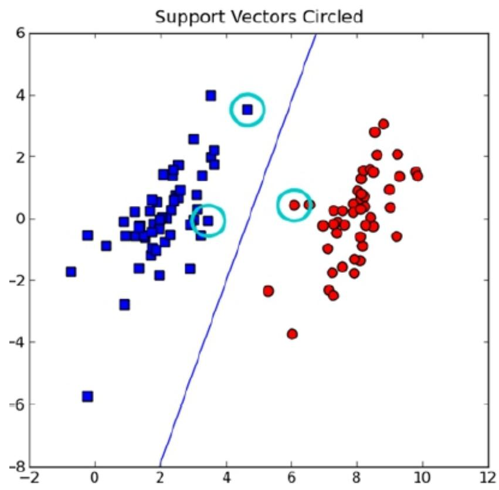

## 完整版Platt SMO的支持函数

```python
clase optstruct:
def init_(self, dataMatIn, classLabele, C, toler) :
self.x = dataMatIn
self.labelMat = classLabels
self.C = C
self.tol = toler
self.m = shape (dataMatIn) [0]
self.alphas = mat (zeros((self.m, 1) ) )
self.b = 0 Error
self.eCache = mat (zeros ((self.m, 2) ) ) cache
```

## 完整版Platt SMO的支持函数

def calcEk(os, k):   
fxk = float(multiply(os.alphas,os.labelMat).T+\   
(os.x+os.x[k, :].T)) + os.b   
Ek = fxk - float (os.labelMat [k])   
return Ek

## 完整版Platt SMO的支持函数

```prolog
def selectJ(i, oS, Ei):
maxK = -1; maxDeltaE = 0; Ej = 0
oS.eCache [i] = [1, Ei]
validEcacheList = nonzero(os.eCache[:, 0] .A) [0]
if (len(validEcacheLiat)) > 1:
for k in validEcacheList:
if k == i: continue
Ek = calcEk(os, k)
deltaE = abs (Ei - Ek)
if (deltaE > maxDeltaE):
maxK = k; maxDeltaE = deltaE; Ej = Ek
return maxK, Ej
else:
j = selectJrand(i, oS.m)
Ej = calcEk(oS， j)
return j, Ej
```

## 完整版Platt SMO的支持函数

os.eCache [k] = [1, Ek]

## 完整版Platt SMO的內循环优化例程

```prolog
def innerL (i, os) : Second-choice heuristic ①
Ei = calcEk(oS, i)
if ((os.labelMat [i] *Ei < -os.tol) and (os.alphas [i] < os.C) ) or\
((os.labelMat[i] *Ei > os.tol) and (os.alphas[i] > 0)) :
j,Ej = selectJ(i, oS, Ei)
alphaIold = os.alphas [i] .copy () ; alphaJold = os.alphas[j] . copy () ;
if (os.labelMat [i] != os.labelMat [j]) :
L = max (0, os.alphas [j] - os.alphas [i])
H = min (os.C, os.C + oS.alphas[j] - os.alphas[i])
else:
L = max(0, os.alphas [j] + os.alphas [i] - os.C)
H = min (os.C, os.alphas[j] + os.alphas[i])
if L==H: print "L==H"; return 0
eta = 2.0 * os.x[i, :]*os.x[j, :].T - os.x[i, :] *os.x[i, :].T − \
os.x[j, :]*os.x[j, :].T
if eta >= 0: print "eta>=0"; return 0
oS.alphas [j] -= os.labelMat [j]*(Ei - Ej) /eta
os.alphas [j] = clipAlpha (os.alphas [j] , H, L) Updates
updateEk(os, j) Ecache
```

## 完整版Platt SMO的內循环优化例程

if (abs(os.alphas[j】 - alphaJold) < 0.00001) :   
print "j not moving enough"; return 0   
os.alphas [i] += os.labelMat [j] \*os.labelMat[i]+\   
(alphaJold - os.alphas [j]) Updates   
updateEk(os, i) T Ecache   
b1 = os.b - Ei- os.labelMat[i] \*(os.alphas [i]-alphaIold) +\   
os.x[i, :] +os.x[i, :].T - os.labelMat[j]+\   
(os.alphas [j] -alphaJold) \*os.x[i, :]\*os.x[j, :].T   
b2 = os.b - Ej- os.labelMat [i] \*(os.alphas [i] -alphaIold) +\   
os.x[i, :]\*os.x[j, :].T - os.labelMat[j]+\   
(os.alphas [j]-alphaJold) \*os.x [j , :] \*os.x[j, :].T   
if (0 < os.alphas[i]) and (os.C > os.alphas [i]) : os.b = b1   
elif (0 < os.alphas [jl) and (os.C > os.alphas[jl): os.b = b2   
else: os.b = (b1 + b2)/2.0   
return 1   
e: return 0

## 完整版Platt SMO外循环

```python
def smoP(dataMatIn, classLabels, C, toler, maxIter, kTup=('lin', o)):
os = optstruct (mat (dataMatIn) ,mat (classLabels) . transpose() , C, toler)
iter = 0
entireSet = True; alphaPairschanged = 0
while (iter  maxIter) and ((alphaPairschanged > 0) or (entireset)):
alphaPairschanged = 0
if entireSet:
for i in range (os.m): allvi
alphaPairsChanged += innerL (i, oS)
print "fullset, iter: %d i:%d, pairs changed %d
(iter, i, alphaPairsChanged)
iter += 1
```

## 完整版Platt SMO外循环

```python
else:
nonBoundIs = nonzero((os.alphas.A > 0) + (os.alphas.A < C) ) [o]
for i in nonBoundIs:
alphaPairsChanged += innerL(i,os)
print "non-bound, iter: td i:td, pairs changed d" \
(iter, i, alphaPairsChanged)
iter += 1
if entireSet: entireSet = False
elif (alphaPairsChanged == o): entireSet = True
print "iteration number: %d" % iter
return os.b, os.alphas
```

## 完整版Platt SMO外循环

>>> dataArr,labelArr = svmMLiA.loadDataSet('testSet.txt')   
>>> b,alphas = svmMLiA.smoP(dataArr, labelArr, 0.6, 0.001, 40)

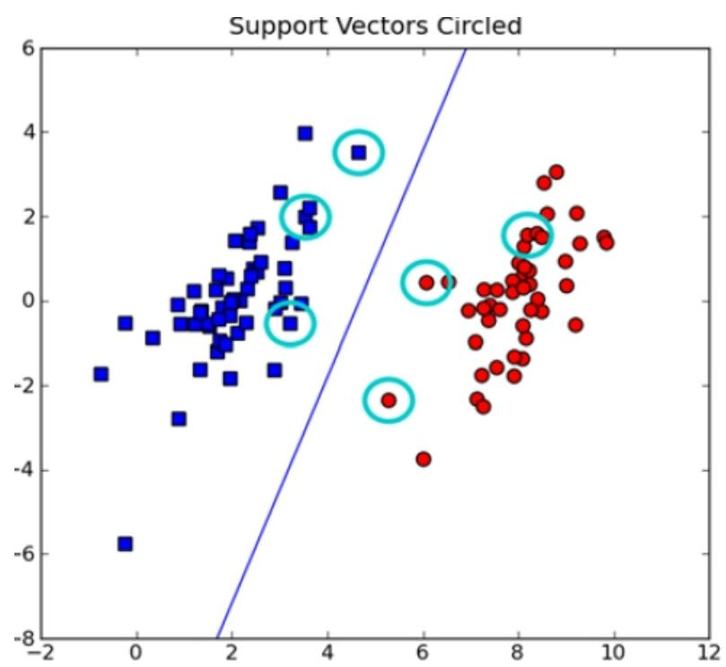

## 计算权值向量w

def calcWs (alphas, dataArr, classLabels) :   
X = mat (dataArr); labelMat = mat (classLabels) .transpose()   
m, n = shape (X)   
w = zeros((n, 1))   
for i in range (m) :   
w += multiply (alphas [i] \*labelMat [i] , X[i, :] .T)   
return w

## 在复杂数据上应用核函数

$$
k ( x , y ) = \mathit { e x p } \left( \frac { - \left\| x - y \right\| ^ { 2 } } { 2 \sigma ^ { 2 } } \right)
$$

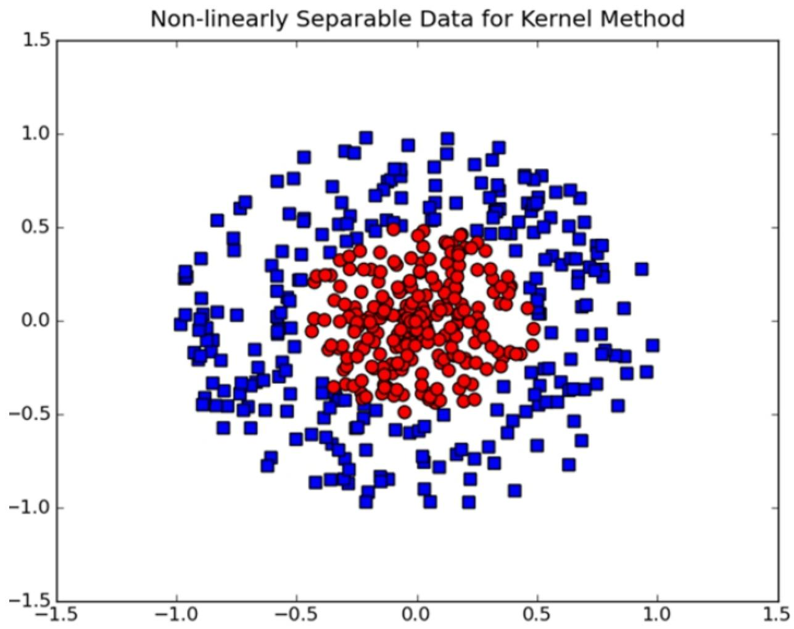

## 核转换函数

```python
def kernelTrans(X, A, kTup):
m, n = shape(X)
K = mat (zeros((m, 1) ) )
if kTup[0]=='lin': K = X  A.T
elif kTup [0] == 'rbf':
for j in range (m) :
deltaRow = X[j, :] - A
K[j] = deltaRow*deltaRow.T
K = exp(K/(-1*kTup[1]*2))
else: raise NameError('Houston We Have a Problem --i
That Kernel is not recognized')
return K
```

## 核转换函数

```python
class optstruct:
def _init_(self, dataMatIn, classLabels, C, toler, kTup) :
self .X = dataMatIn
self.labelMat = classLabels
self.C = C
self.tol = toler
self .m = shape (dataMatIn) [0]
self.alphas = mat (zeros ((self .m, 1) ) )
self.b = 0
self .eCache = mat (zeros((self .m, 2) ) )
self .K = mat (zeros ((self .m, self.m) ))
for i in range (self.m) :
self.K[:, i] = kernelTrans (self.X, self.x[i, :], kTup)
```

## 核函数加入对原函数的修改

innerL() :

eta = 2.0 \* os.K[i,j] - os.K[i,i] - os.K[j,j]   
b1 = os.b - Ei- os.labelMat [i] \* (os.alphas [i] -alphaIold) \*os.K[i, i] −\   
os.labelMat [j] \* (os.alphas [j] -alphaJold) \*os .K[i, j]   
b2 = os.b - Ej- os.labelMat [i] \*(os.alphas [i] -alphaIold) \*os.K[i, j] -\   
os.labelMat [j] \*(os.alphas [j] -alphaJold) \*os.K[j, j]   
def calcEk(os, k) :   
fxk = float (multiply(os.alphas, os.labelMat) .T\*os.K[:, k] + os .b)   
Ek = fxk - float (os.labelMat [k])   
return Ek

## 核函数进行样本测试

```matlab
def testRbf (k1=1.3) :
dataArr, labelArr = loadDataSet ('testSetRBF.txt ')
b,alphas = smoP(dataArr, labelArr, 200, 0.0001, 10000, ('rbf', k1))
datMat=mat (dataArr) ; labelMat = mat (labelArr) .transpose()
svInd=nonzero(alphas.A>0)[0]
sVs=datMat [svInd]
labelsv = labelMat [svInd] ;
print "there are %d Support Vectors" % shape(sVs) [0]
m, n = shape (datMat)
errorCount = 0
```

## 核函数进行样本测试

for i in range (m):   
kernelEval = kernelTrans (sVs, datMat [i, :], ('rbf', k1))   
predict=kernelEval.T \* multiply(labelsV,alphas [svInd] ) + b   
if sign(predict)!=sign (labelArr[i]): errorCount += 1   
print "the training error rate is: %f" % (float(errorCount)/m)   
dataArr, labelArr = loadDataSet('testSetRBF2.txt')   
errorCount = 0   
datMat=mat (dataArr) ; labelMat = mat (labelArr) .transpose()   
m, n = shape (datMat)   
for i in range (m) :   
kernelEval = kernelTrans (sVs, datMat [i, :], ('rbf', kl) )   
predict=kernelEval.T \* multiply(labelsV, alphas [svInd]) + b   
if sign(predict)!=sign (labelArr[i]): errorCount += 1   
print "the test error rate is: %f" % (float(errorCount)/m)

## 核函数进行样本测试

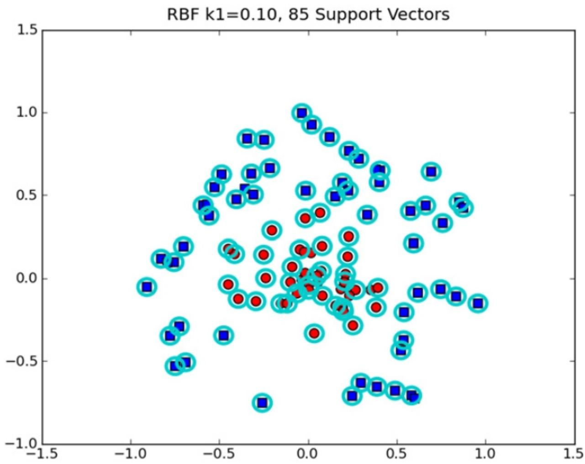

## 核函数进行样本测试

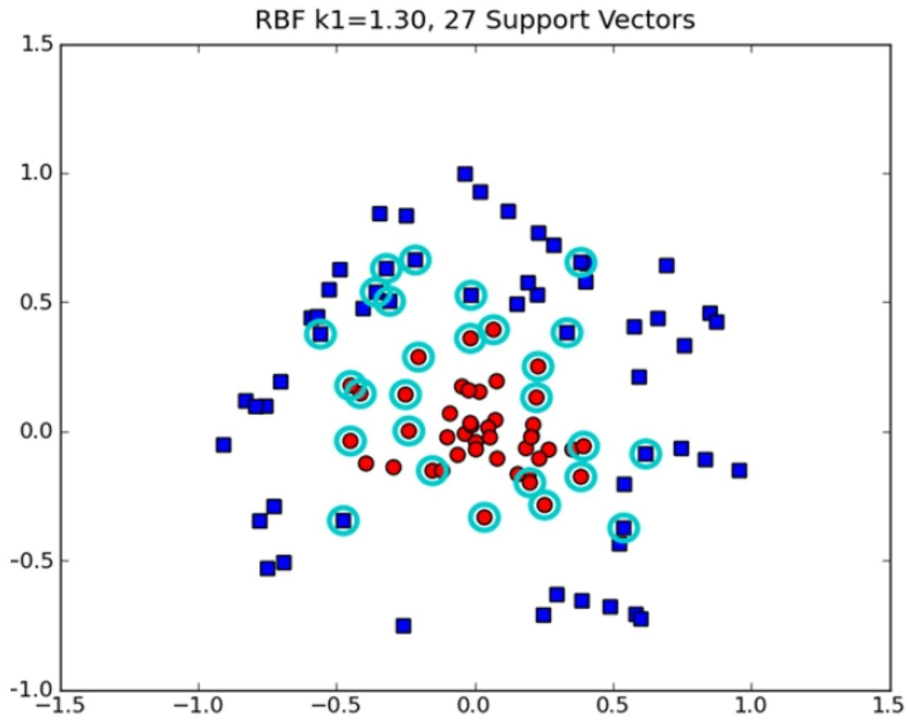

## 支持向量机手写识别

```python
def loadImages (dirName) :
from os import listdir
hwLabels = []
trainingFileList = listdir (dirName)
m = len (trainingFileList)
trainingMat = zeros((m, 1024) )
for i in range (m) :
fileNameStr = trainingFileList [i]
filestr = fileNamestr.split('. ') [0]
classNumstr = int (filestr.split ('_') [0])
if classNumstr == 9: hwLabels.append (-1)
else: hwLabels.append(1)
trainingMat [i, :] = img2vector('%s/%s'% (dirName, fileNamestr) )
return trainingMat, hwLabels
```

## 支持向量机手写识别

def testDigits(kTup=('rbf', 10) ) :   
dataArr, labelArr = loadImages ('trainingDigits')   
b,alphas = smoP(dataArr, labelArr, 200, 0.0001, 10000, kTup)   
datMat=mat (dataArr); labelMat = mat (labelArr) .transpose ()   
svInd=nonzero(alphas.A>0)[0]   
sVs=datMat [svInd]   
labelsv = labelMat [svInd] ;   
print "there are %d Support Vectors"  shape(sVs) [0]   
m, n = shape (datMat)   
errorCount = 0

## 支持向量机手写识别

```python
for i in range (m) :
kernelEval = kernelTrans (sVs, datMat [i, :] , kTup)
predict=kernelEval.T * multiply(labelsV, alphas [svInd]) + b
if sign(predict)!=sign(labelArr [i]): errorCount += 1
print "the training error rate is: %f" % (float(errorCount)/m)
dataArr, labelArr = loadImages ('testDigits')
errorCount = 0
datMat=mat (dataArr) ; labelMat = mat(labelArr) .transpose()
m, n = shape (datMat)
for i in range (m) :
kernelEval = kernelTrans (sVs, datMat [i, :] , kTup)
predict=kernelEval.T * multiply(labelsv,alphas [svInd]) + b
if sign (predict)!=sign(labelArr [i]): errorCount += 1
print "the test error rate is: f" % (float (errorCount)/m)
```

## 支持向量机手写识别

<table><tr><td>Kernel, settings</td><td>Training error (%)</td><td>Test error (%)</td><td># Support vectors</td></tr><tr><td>RBF, 0.1</td><td>0</td><td>52</td><td>402</td></tr><tr><td>RBF,5</td><td>0</td><td>3.2</td><td>402</td></tr><tr><td>RBF, 10</td><td>0</td><td>0.5</td><td>99</td></tr><tr><td>RBF, 50</td><td>0.2</td><td>2.2</td><td>41</td></tr><tr><td>RBF, 100</td><td>4.5</td><td>4.3</td><td>26</td></tr><tr><td>Linear</td><td>2.7</td><td>2.2</td><td>38</td></tr></table>

## END

## 第八章Adaboost

## 提纲

•AdaBoost的起源和基本概念

•AdaBoost算法

•前向分步训练算法

•AdaBoost 编程

•AdaBoost实时人脸检测算法

## Adaboost的起源

· 1984， Kearns和Valiant:

·强可学习(strongly learnable)和弱可学习(weakly learnable)

·在概率近似正确（probably approximately correct， PAC)学习的框架中，一个概念（类），如果存在一个多项式的学习算法能够学习它，并且正确率很高，称这个概念是强可学习的；

一个概念（类），如果存在一个多项式的学习算法能够学习它，学习的正确率仅比随机猜测略好，则称这个概念是弱可学习的。

· 1989, Schapire, 证明：

• 在PAC学习的框架下，一个概念是强可学习的充分必要条件是这个概念是弱可学习。

## Adaboost的起源

● 问题的提出:

•只要找到一个比随机猜测略好的弱学习算法就可以直接将其提升为强学习算法，而不必直接去找很难获得的强学习算法。

## 怎样实现弱学习转为强学习

例如：学习算法A在a情况下失效，学习算法B在b情况下失效，那么在a情况下可以用B算法，在b情况下可以用A算法解决。这说明通过某种合适的方式把各种算法组合起来，可以提高准确率。

为实现弱学习互补，面临两个问题：

（1）怎样获得不同的弱分类器？

（2） 怎样组合弱分类器？

## 怎样获得不同的弱分类器

使用不同的弱学习算法得到不同基本学习器

■ 参数估计、非参数估计·

使用相同的弱学习算法，但用不同的参数

K-Mean不同的K，神经网络不同的隐含层·

相同输入对象的不同表示凸显事物不同的特征

使用不同的训练集

装袋 (bagging)

提升 (boosting

## Bagging

• 也称为自举汇聚法(boostrap aggregating)

● 从原始数据集选择s次后得到s个新数据集

新数据集和原数据集的大小相等

● 每个数据集都是通过在原始数据集中随机选择样本来进行替换而得到的。

● S个数据集建好之后，将某个学习算法分别作用于每个数据集就得到s个分类器。

• 选择分类器投票结果中最多的类别作为最后的分类结果。

• 改进的Bagging算法，如随机森林等。

## 怎样組合弱分类器

## 多专家组合

一种并行结构，所有的弱分类器都给出各自的预测结果，通过“组合器”把这些预测结果转换为最终结果。eg.投票(voting)及其变种、混合专家模型

## 多级组合

一种串行结构，其中下一个分类器只在前一个分类器预测不够准（不够自信）的实例上进行训练或检测。eg.级联算法(cascading)

## Adaboost的提出

• 1990年，Schapire最先构造出一种多项式级的算法，即最初的Boost算法;

·1993年，Drunker和Schapire第一次将神经网络作为弱学习器，应用Boosting算法解决OCR问题；

·1995年，Freund和Schapire提出了Adaboost(AdaptiveBoosting)算法，效率和原来Boosting算法一样，但是不需要任何关于弱学习器性能的先验知识，可以非常容易地应用到实际问题中。

## Adaboost基本概念

## AdaBoost

Adaptive

Boosting

A learning algorithm

Building a strong classifier a lot of weaker ones

## Adaboost基本概念

$$
\begin{array}{c} \begin{array} { r l } { h _ { 1 } ( x ) \in \{ - 1 , + 1 \} } \\ { h _ { 2 } ( x ) \in \{ - 1 , + 1 \} } \\ { \vdots } \\ { h _ { T } ( x ) \in \{ - 1 , + 1 \} } \end{array}  \qquad & { { } = s i g n \Bigg ( \sum _ { \ell = 1 } ^ { T } \alpha _ { \cdot } h _ { \ell } ( x ) \Bigg ) } \end{array}
$$

Weak classifiers

strong classifier

slightly better than random

## Adaboost基本概念

• 两个问题如何解决：

每一轮如何改变训练数据的权值或概率分布？

·AdaBoost：提高那些被前一轮弱分类器错误分类样本的权值，降低那些被正确分类样本的权值

如何将弱分类器组合成一个强分类器?

•AdaBoost：加权多数表决，加大分类误差率小的弱分类器的权值，使其在表决中起较大的作用，减小分类误差率大的弱分类器的权值，使其在表决中起较小的作用。

## Adaboost基本概念

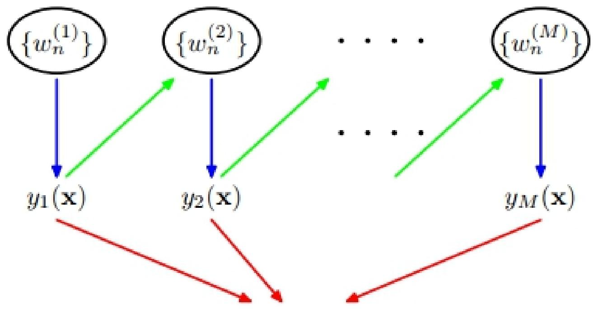

$$
Y _ { M } ( \mathbf { x } ) _ { \overline { { \gamma } } | _ { \mathrm { { i n } } } } { \mathrm { s i g n } } \biggl ( \sum _ { m } ^ { M } \alpha _ { m } y _ { m } ( \mathbf { x } ) _ { \overline { { \gamma } } } \biggr )
$$

## AdaBoost算法

·输入：二分类的训练数据集 $T = \{ ( x _ { 1 } , y _ { 1 } ) , ( x _ { 2 } , y _ { 2 } ) , \cdots , ( x _ { N } , y _ { N } ) \}$

$$
x _ { i } \in \mathcal { X } \subseteq \mathbf { R } ^ { n } \ , \quad y _ { i } \in \mathcal { Y } = \{ - 1 , + 1 \}
$$

•输出：最终分类器 $\mathsf { G } ( x )$

• 1 初始化训练数据的起始权值分布

$$
D _ { 1 } = ( w _ { 1 1 } , \cdots , w _ { 1 i } , \cdots , w _ { 1 N } ) ~ w _ { 1 i } = \frac { 1 } { N } , ~ i = 1 , 2 , \cdots , N
$$

## AdaBoost算法

• 2 对m个弱分类器 $\scriptstyle { \mathfrak { m } } = 1 , 2 , \ \circ \ \circ \ \mathsf { M }$

a、在权值 $\mathsf { D } _ { \mathsf { m } }$ 下训练数据集，得到弱分类器

$$
G _ { m } ( x ) : { \mathcal { X } } \to \{ - 1 , + 1 \}
$$

b、计算 $G _ { \mathfrak { m } }$ 的训练误差

$$
e _ { m } = P ( G _ { m } ( x _ { i } ) \neq y _ { i } ) = \sum _ { i = 1 } ^ { N } w _ { m i } I ( G _ { m } ( x _ { i } ) \neq y _ { i } )
$$

c、计算 $G _ { \mathfrak { m } }$ 的系数 $\alpha _ { m } = \frac { 1 } { 2 } \log \frac { 1 - e _ { m } } { e _ { m } }$

d、更新训练数据集的权值分布

$$
\begin{array} { r l } & { D _ { m + 1 } = ( w _ { m + 1 , 1 } , \cdots , w _ { m + 1 , i } , \cdots , w _ { m + 1 , N } ) \quad w _ { m + 1 , i } = \frac { w _ { m i } } { Z _ { \eta } } \exp ( - \alpha _ { m } y _ { i } G _ { m } ( x _ { i } ) ) } \\ & { \ne  { d e l } \_ \subset } \end{array}
$$

z是规范化因子

$$
Z _ { m } = \sum _ { i = 1 } ^ { N } w _ { m i } \exp ( - \alpha _ { m } y _ { i } G _ { m } ( x _ { i } ) ) { } ^ { ' }
$$

## AdaBoost算法

·3、构建弱分类器的线性组合，

$$
f ( x ) = \sum _ { m = 1 } ^ { M } \alpha _ { m } G _ { m } ( x )
$$

•得到最终分类器:

$$
G ( x ) = \mathrm { s i g n } ( f ( x ) ) = \mathrm { s i g n } \Bigg ( \sum _ { m = 1 } ^ { M } \alpha _ { m } G _ { m } ( x ) \Bigg )
$$

## AdaBoost算法说明

•步骤 b $e _ { m } = P ( G _ { m } ( x _ { i } ) \neq y _ { i } ) = \sum _ { G _ { m } ( x _ { i } ) \neq y _ { i } } w _ { m i } \qquad \sum _ { i = 1 } ^ { N } w _ { m i } = 1$

·步骤c $\alpha _ { m } = \frac { 1 } { 2 } \log \frac { 1 - e _ { m } } { e _ { m } }$ 当 $e _ { m } \leqslant { \frac { 1 } { 2 } }$ 时， $\alpha _ { { \scriptscriptstyle m } } \geqslant 0$

•步骤d

$$
w _ { m + 1 , i } = \left\{ \begin{array} { l l } { \displaystyle \frac { w _ { m i } } { Z _ { m } } \mathrm { e } ^ { - \alpha _ { m } } , } & { \ G _ { m } ( \boldsymbol { x } _ { i } ) = y _ { i } } \\ { \displaystyle \frac { w _ { m i } } { Z _ { m } } \mathrm { e } ^ { \alpha _ { m } } , } & { \ G _ { m } ( \boldsymbol { x } _ { i } ) \neq y _ { i } } \end{array} \right.
$$

误分类的样本权值放大 $\mathrm { e } ^ { 2 \alpha _ { m } } = { \frac { e _ { m } } { 1 - e _ { m } } }$

## 例子：

<table><tr><td>序号</td><td>1</td><td>2</td><td>3</td><td>4</td><td>5</td><td>6</td><td>7</td><td>8</td><td>9</td><td>10</td></tr><tr><td>X</td><td>0</td><td>1</td><td>2</td><td>3</td><td>4</td><td>5</td><td>6</td><td>7</td><td>8</td><td>9</td></tr><tr><td>y</td><td>1</td><td>1</td><td>1</td><td>-1</td><td>-1</td><td>-1</td><td>1</td><td>1</td><td>1</td><td>-1</td></tr></table>

·初始化 $D _ { 1 } = ( w _ { 1 1 } , w _ { 1 2 } , \cdots , w _ { 1 1 0 } )$

$$
w _ { 1 i } = 0 . 1 , \quad i = 1 , 2 , \cdots , 1 0
$$

•对m=1

，在权值分布为D1的数据集上，阈值取2.5，分类误差率最小，基本弱分类器： $G _ { 1 } ( x ) = \left\{ { \begin{array} { l l } { 1 , \quad } & { x < 2 . 5 } \\ { - 1 , \quad } & { x > 2 . 5 } \end{array} } \right.$

• b、G1(x)的误差率： $e _ { 1 } = P ( G _ { 1 } ( x _ { i } ) \neq y _ { i } ) = 0 . 3$

•c、G1(x)的系数: $\alpha _ { 1 } = \frac { 1 } { 2 } \mathrm { l o g } \frac { 1 - e _ { 1 } } { e _ { 1 } } = 0 . 4 2 3 6$

## 例子：

• d、更新训练数据的权值分布

$$
D _ { 2 } = ( w _ { 2 1 } , \cdots , w _ { 2 i } , \cdots , w _ { 2 1 0 } )
$$

$$
w _ { 2 i } = \frac { w _ { 1 i } } { Z _ { 1 } } \exp ( - \alpha _ { 1 } y _ { i } G _ { 1 } ( x _ { i } ) ) , i = 1 , 2 , \cdots , 1 0
$$

$$
\begin{array} { r } { D _ { 2 } = ( 0 . 0 7 1 5 , 0 . 0 7 1 5 , 0 . 0 7 1 5 , 0 . 0 7 1 5 , 0 . 0 7 1 5 , 0 . 0 7 1 5 , 0 . 0 7 1 5 , 0 . 0 7 1 5 , } \\ { 0 . 1 6 6 6 , 0 . 1 6 6 6 , 0 . 1 6 6 6 , 0 . 0 7 1 5 ) ~ } \end{array}
$$

·弱基本分类器G1(x)=sign[f1(x)]在更新的数据集上有3个误分类点

## 例子：

·对m=2

a、在权值分布D2上，阈值v=8.5时，分类误差率最低

$$
G _ { 2 } ( x ) = \left\{ \begin{array} { l l } { 1 , \quad } & { x < 8 . 5 } \\ { - 1 , \quad } & { x > 8 . 5 } \end{array} \right.
$$

b、误差率 $e _ { 2 } = 0 . 2 1 4 3$

c、计算 $\alpha _ { 2 } = 0 . 6 4 9 6$

d、更新权值分布

$$
D _ { 3 } = ( 0 . 0 4 5 5 , 0 . 0 4 5 5 , 0 . 0 4 5 5 , 0 . 1 6 6 7 , 0 . 1 6 6 7 , 0 . 1 6 6 7 , 0 . 1 6 6 7 ,
$$

$$
0 . 1 0 6 0 , 0 . 1 0 6 0 , 0 . 1 0 6 0 , 0 . 0 4 5 5 )
$$

$$
f _ { 2 } ( x ) = 0 . 4 2 3 6 G _ { 1 } ( x ) + 0 . 6 4 9 6 G _ { 2 } ( x )
$$

分类器 ${ \sf G } 2 ( { \sf x } ) { \sf = } { \sf s i g n } [ { \sf f } 2 ( { \sf x } ) ]$ 有三个误分类点

## 例子：

·对m=3

a、在权值分布D3上，阈值v=5.5时，分类误差率最低

$$
G _ { 3 } ( x ) = \left\{ \begin{array} { l l } { { 1 , } } & { { x > 5 . 5 } } \\ { { - 1 , } } & { { x < 5 . 5 } } \end{array} \right.
$$

b、误差率 $e _ { 3 } = 0 . 1 8 2 0 ,$

c、计算 $\alpha _ { 3 } = 0 . 7 5 1 4$

・d、更新权值分布 $D _ { 4 } = ( 0 . 1 2 5 , 0 . 1 2 5 , 0 . 1 2 5 , 0 . 1 0 2 , 0 . 1 0 2 , 0 . 1 0 2 , 0 . 0 6 5 , 0 . 0 6 5 , 0 . 0 6 5 , 0 . 1 2 5 )$

$$
f _ { 3 } ( x ) = 0 . 4 2 3 6 G _ { 1 } ( x ) + 0 . 6 4 9 6 G _ { 2 } ( x ) + 0 . 7 5 1 4 G _ { 3 } ( x )
$$

分类器 ${ \sf G } 3 ( { \sf x } ) { \sf = } { \sf S i g n } [ { \sf f } 3 ( { \sf x } ) ]$ 误分类点为0

$$
G ( x ) = \mathrm { s i g n } [ f _ { 3 } ( x ) ] = \mathrm { s i g n } [ 0 . 4 2 3 6 G _ { 1 } ( x ) + 0 . 6 4 9 6 G _ { 2 } ( x ) + 0 . 7 5 1 4 G _ { 3 } ( x ) ]
$$

## Boosting illustration

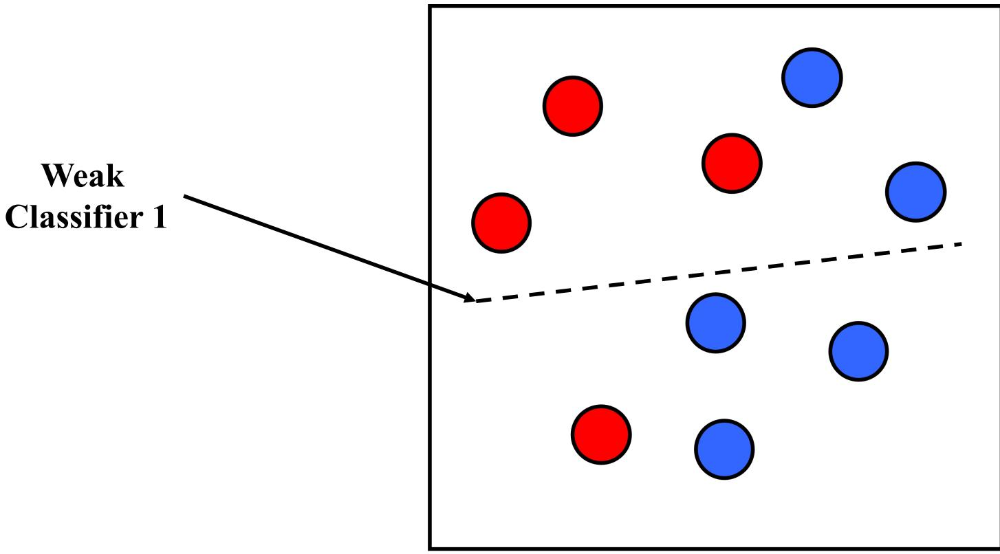

## Boosting illustration

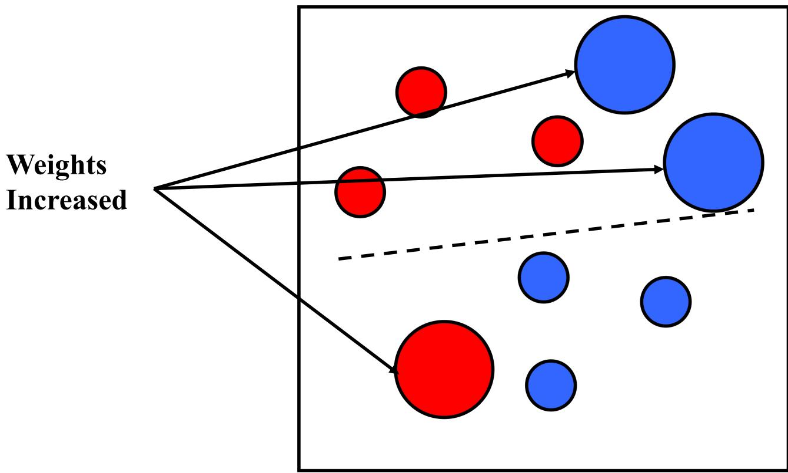

## Boosting illustration

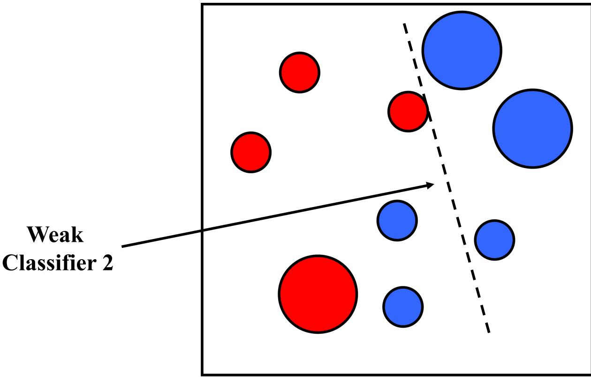

## Boosting illustration

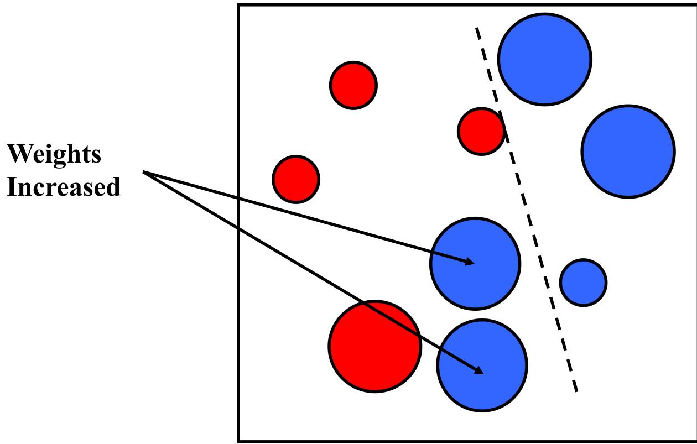

## Boosting illustration

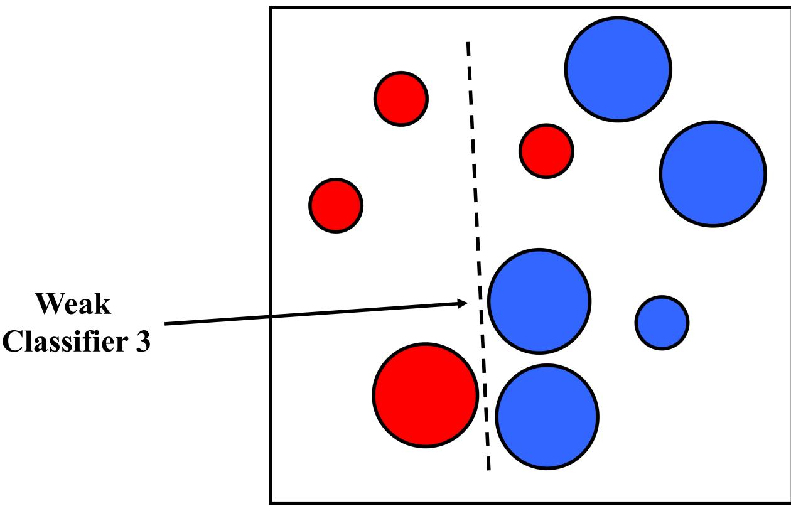

## Boosting illustration

Final classifier is a combination of weak classifiers

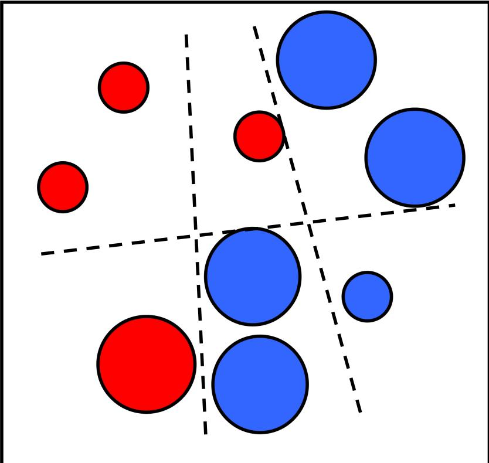

## AdaBoost的训练误差分析

$$
Z _ { m } = \sum _ { i = 1 } ^ { N } w _ { m i } \exp ( - \alpha _ { m } y _ { i } G _ { m } ( x _ { i } ) )
$$

$$
f ( x ) = \sum _ { m = 1 } ^ { M } \alpha _ { m } G _ { m } ( x )
$$

$$
G ( x ) = \mathrm { s i g n } ( f ( x ) ) = \mathrm { s i g n } \Bigg ( \sum _ { m = 1 } ^ { M } \alpha _ { m } G _ { m } ( x ) \Bigg )
$$

定理：AdaBoost算法最终分类器的训练误差界为：

$$
{ \frac { 1 } { N } } \sum _ { i = 1 } ^ { N } I ( G ( x _ { i } ) \neq y _ { i } ) \leqslant { \frac { 1 } { N } } \sum _ { i } \exp ( - y _ { i } f ( x _ { i } ) ) = \prod _ { m } Z _ { m }
$$

## AdaBoost的训练误差分析

$$
{ \frac { 1 } { N } } \sum _ { i = 1 } ^ { N } I ( G ( x _ { i } ) \neq y _ { i } ) \leqslant { \frac { 1 } { N } } \sum _ { i } \exp ( - y _ { i } f ( x _ { i } ) ) = \prod _ { m } Z _ { m }
$$

$$
\begin{array} { r l } { \mathbb { 1 } \mathbb { E } \mathbb { H } \mathbb { H } \mathbb { H } \mathbb { 1 } ; } &  \xrightarrow { \mathbb { H } \mathbb { H } \mathbb { H } \mathbb { H } \mathbb { H } \mathbb { H } \mathbb { H } \mathbb { H } \mathbb { H } \mathbb { H } \mathbb { H } \mathbb { H } , \quad \mathbb { H } } \\ & { \xrightarrow { \mathbb { H } \mathbb { H } \mathbb { H } \mathbb { H } \mathbb { H } \mathbb { H } \mathbb { H } } , \quad \mathbb { H } } \\ { W _ { m i } \exp ( - \alpha _ { m } y _ { i } G _ { m } ( x _ { i } ) ) = Z _ { m } w _ { m + 1 , i } \implies } &  = ( \begin{array} { l } { - \sum _ { \alpha , \alpha , \beta ^ { \prime } = 0 , \alpha ^ { \prime } = 1 , \beta ^ { \prime } = 1 , \beta ^ { \prime } = 1 , \beta ^ { \prime } } } \\  - \frac { 1 } { N } \sum _  i ^ { \prime } = 1 , \alpha ^ { \prime } = 0 , \alpha ^ { \prime } = 1 , \beta ^ { \prime } = 1 , \alpha ^ { \prime } = 1 , \beta ^ { \prime } = 1 , \beta ^ { \prime } = 1 , \beta ^ { \prime } = 1 , \beta ^ { \prime } = 1 , \beta ^ { \prime } = 1 , \beta ^ { \prime } = 1 , \beta ^ { \prime } = 1 , \beta ^ { \prime } = 1 , \beta ^ { \prime } = 1 , \beta ^ { \prime } = 1 , \beta ^ { \prime } = 1 , \beta ^ { \prime } = 1 , \beta ^ { \prime } = 1 , \beta ^ { \prime } = 1 , \beta ^ { \prime } = 1 , \beta ^ { \prime } = 1 , \beta ^ { \prime } = 1 , \beta ^ { \prime } = 1 , \beta ^ { \prime } = 1 , \beta ^ { \prime } = 1 , \beta ^ { \prime } = 1 , \beta ^ { \prime } = 1 , \beta ^ { \prime } = 1 , \beta ^ { \prime } = 1 , \beta ^ { \prime } = 1 , \beta ^ { \prime } = 1 , \beta ^ { \prime } = 1 , \beta ^ { \prime } = 1 , \beta ^ { \prime } = 1 , \beta ^ { \prime } = 1 , \beta ^ \end{array} \end{array}
$$

## AdaBoost的训练误差分析

定理：二分类问题AdaBoost的训练误差界为：

$$
\begin{array} { c } { { \displaystyle { \prod _ { m = 1 } ^ { M } Z _ { m } = \prod _ { m = 1 } ^ { M } [ 2 \sqrt { e _ { m } ( 1 - e _ { m } ) } ] = \prod _ { m = 1 } ^ { M } \sqrt { ( 1 - 4 { \gamma _ { m } } ^ { 2 } ) } \leqslant \exp \left( - 2 \sum _ { m = 1 } ^ { M } { \gamma _ { m } } ^ { 2 } \right) } } } \\ { { \gamma _ { m } = \displaystyle { \frac { 1 } { 2 } - e _ { m } } } } \end{array}
$$

证明：前面，

$$
\begin{array} { l } { { \displaystyle Z _ { m } = \sum _ { i = 1 } ^ { N } w _ { m i } \exp ( - \alpha _ { m } \nu _ { i } G _ { m } ( x _ { i } ) ) } } \\ { { \displaystyle ~ = \sum _ { \nu _ { i } = G _ { m } ( x _ { i } ) } w _ { m i } \mathrm { e } ^ { - \alpha _ { m } } + \sum _ { y _ { i } \neq G _ { m } ( x _ { i } ) } w _ { m i } \mathrm { e } ^ { \alpha _ { m } } } } \\ { { \displaystyle ~ = ( 1 - e _ { m } ) \mathrm { e } ^ { - \alpha _ { m } } + e _ { m } \mathrm { e } ^ { \alpha _ { m } } } } \\ { { \displaystyle ~ = 2 \sqrt { e _ { m } ( \mathrm { T } ^ { . } - e _ { m } ) } = \sqrt { 1 - 4 { \gamma _ { m } } ^ { 2 } } } } \end{array}
$$

## AdaBoost的训练误差分析

定理：二分类问题AdaBoost的训练误差界为：

$$
\begin{array} { c } { { \displaystyle { \prod _ { m = 1 } ^ { M } Z _ { m } = \prod _ { m = 1 } ^ { M } [ 2 \sqrt { e _ { m } ( 1 - e _ { m } ) } ] = \prod _ { m = 1 } ^ { M } \sqrt { ( 1 - 4 { \gamma _ { m } } ^ { 2 } ) } \leqslant \exp \left( - 2 \sum _ { m = 1 } ^ { M } { \gamma _ { m } } ^ { 2 } \right) } } } \\ { { \gamma _ { m } = \displaystyle { \frac { 1 } { 2 } - e _ { m } } } } \end{array}
$$

证明：后面，

由e×和 $\sqrt { 1 - x }$ 在 $\scriptstyle x = 0$ 的泰劳展开得：

$$
\sqrt { ( 1 - 4 { \gamma _ { m } } ^ { 2 } ) } \leqslant \exp ( - 2 { \gamma _ { m } } ^ { 2 } )
$$

进而得证。

## AdaBoost的训练误差分析

定理：如果存在 $\gamma > 0$ ，对所有的m有 $\gamma _ { m } \geq v$ ，则

$$
\frac { 1 } { N } { \sum _ { i = 1 } ^ { N } } I ( G ( x _ { i } ) \neq y _ { i } ) \leqslant \exp ( - 2 M \dot { \gamma } ^ { 2 } )
$$

即：训练误差为指数下降。

注意：AdaBoost算法不需要知道下界v，这正是Freund与Schapire设计AdaBoost时所考虑的，与一些早期的提升方法不同，AdaBoost具有适应性，即它能适应弱分类器各自的训练误差率，这也是它的名称(适应的提升)的由来，Ada是Adaptive的简写

## AdaBoost算法的解释

AdaBoost

·模型：加法模型

•损失函数：指数函数

•学习算法：前向分步算法的二分类学习算法

## 前向分步算法

•加法模型 (additive model)

基函数的参数

$$
\begin{array} { l } { f ( x ) = \displaystyle \sum _ { m = 1 } ^ { M } \beta _ { m } b ( x ; \gamma _ { m } ) \bigg / \left. \sum _ { m \ge 1 } ^ { \le } \right| } \\ { \displaystyle \left. \sum _ { j \ge \| \widetilde { \mathcal E } \| } \frac { \widetilde { \chi } } { \widetilde { \chi } \chi \chi \| \left. \sum _ { j \ge j \le \widetilde { \chi } } \widetilde { \chi } \right| } \right. \quad \left. f ( x ) = \displaystyle \sum _ { m = 1 } ^ { M } \alpha _ { m } G _ { m } ( x ) \right. } \end{array}
$$

·给定训练数据和损失函数 $\mathsf { L } ( \mathsf { v } , \mathsf { f } ( \mathsf { x } ) )$ 学习加法模型f(x)成为经验风险极小化即损失函数极小化问题：

$$
\operatorname* { m i n } _ { \beta _ { m } , \gamma _ { m } } \sum _ { i = 1 } ^ { N } L \biggl ( y _ { i } , \sum _ { m = 1 } ^ { M } \beta _ { m } b ( x _ { i } ; \gamma _ { m } ) \biggr )
$$

复杂的优化问题

## 前向分步算法

·前向分步算法Forward stagewise algorithm 求解思路:

·根据学习的是加法模型，如果能够从前向后，每一步只学习一个基函数及其系数，逐步逼近优化目标函数式，

·具体，每步只需优化如下损失函数：

$$
\displaystyle \operatorname* { m i n } _ { \beta _ { i } \gamma } \sum _ { i = 1 } ^ { N } L \big ( y _ { i } , \beta b ( x _ { i } ; \gamma ) \big )
$$

$$
\operatorname* { m i n } _ { \beta _ { m } , \gamma _ { m } } \sum _ { i = 1 } ^ { N } L \biggl ( \gamma _ { i } , \sum _ { m = 1 } ^ { M } \beta _ { m } b ( x _ { i } ; \gamma _ { m } ) \biggr )
$$

## 前向分步算法

•输入：训练数据集 $T = \{ ( x _ { 1 } , y _ { 1 } ) , ( x _ { 2 } , y _ { 2 } ) , \cdots , ( x _ { N } , y _ { N } ) \}$

损失函数 $L ( y , f ( x ) )$ 基函数集 $\{ b ( x ; \gamma ) \}$

输出：加法模型f(x)

•1初始化 $f _ { o } ( x ) { = } 0$

·2对 $\mathsf { m } { = } 1 , ~ 2 , ~ \ldots , ~ \mathsf { M }$

a、极小化损失函数 $( \beta _ { m } , \gamma _ { m } ) = \arg \operatorname* { m i n } _ { \beta , \gamma } \sum _ { i = 1 } ^ { N } L \big ( y _ { i } , f _ { m - 1 } ( x _ { i } ) + \beta b ( x _ { i } ; \gamma ) \big )$

得到参数 $\beta _ { m } , ~ \gamma _ { m }$

b、更新 $f _ { m } ( x ) = f _ { m - 1 } ( x ) + \beta _ { m } b ( x ; \gamma _ { m } )$

⚫ 3 得到加法模型 $f ( x ) = f _ { M } ( x ) = \sum _ { m = 1 } ^ { M } \beta _ { m } b ( x ; \gamma _ { m } )$

## 前向分步算法

定理：

●AdaBoost算法是前向分步加法算法的特例，模型是由基本分类器组成的加法模型，损失函数是指数函数

证明：前面部分很明显： $f ( x ) = \sum ^ { M } \alpha _ { m } G _ { m } ( x )$

后面部分证明损失函数是指数函数（exponential loss function)

$$
L ( y , f ( x ) ) = \exp [ - y f ( x ) ]
$$

假设经过m-1轮迭代前向分步算法得到 $\left| f _ { m - 1 } ( x ) \right.$

$$
\begin{array} { c } { { f _ { m - 1 } ( x ) = f _ { m - 2 } ( x ) + \alpha _ { m - 1 } G _ { m - 1 } ( x ) } } \\ { { = \alpha _ { 1 } G _ { 1 } ( x ) + \cdots + \alpha _ { m - 1 } G _ { m - 1 } ( x ) } } \end{array}
$$

在第m轮迭代得到 $\alpha _ { m } , G _ { m } ( x )$ 和 $f _ { m } ( x )$ $f _ { m } ( x ) = f _ { m - 1 } ( x ) + \alpha _ { m } G _ { m } ( x )$

## 前向分步算法

在第m轮迭代得到

$$
f _ { m } ( x ) = f _ { m - 1 } ( x ) + \alpha _ { m } G _ { m } ( x )
$$

目标: $( \alpha _ { m } , G _ { m } ( x ) ) = \arg \operatorname* { m i n } _ { \alpha , G } \sum _ { i = 1 } ^ { N } \exp [ - y _ { i } ( f _ { m - 1 } ( x _ { i } ) + \alpha G ( x _ { i } ) ) ]$

·即： $( \alpha _ { m } , G _ { m } ( x ) ) = \arg \operatorname* { m i n } _ { \alpha , G } \sum _ { i = 1 } ^ { N } \overline { { { w } } } _ { m i } \exp [ - y _ { i } \alpha G ( x _ { i } ) ]$

$$
\begin{array} { r } { \overleftarrow { \mathcal { W } } _ { m i } = \exp [ - y _ { i } f _ { m - 1 } ( x _ { i } ) ] } \end{array}
$$

不依赖α和G,依赖于 $7 0 0 - 1 6 0 0$ 随着每一轮迭代改变

现证使上式最小的 $\alpha _ { m } ^ { * }$ 和 $G _ { m } ^ { * } ( x )$

就是AdaBoost算法得到的 $\alpha _ { m }$ 和 $G _ { m } ( x )$

## 前向分步算法

首先，求 $G _ { m } ^ { * } ( x ) ,$ 对任意α>0，使式

$$
( \alpha _ { m } , G _ { m } ( x ) ) = \arg \operatorname* { m i n } _ { \alpha , G } \sum _ { i = 1 } ^ { N } \overline { { { w } } } _ { m i } \exp [ - y _ { i } \alpha G ( x _ { i } ) ]
$$

最小的G(x)由下式得到：

$$
G _ { m } ^ { * } ( x ) = \arg \operatorname* { m i n } _ { \bar { G } } \sum _ { i = 1 } ^ { N } \overline { { \boldsymbol { w } } } _ { m i } I ( \boldsymbol { y } _ { i } \neq G ( \boldsymbol { x } _ { i } ) )
$$

$$
\overline { { w } } _ { m i } = \exp [ - y _ { i } f _ { m - 1 } ( x _ { i } ) ]
$$

·即 $G _ { m } ^ { * } ( x )$ 为AdaBoost算法的基本分类器 $G _ { m } ( x )$ 为使第m轮加权训练数据分类误差率最小的基本分类器

## 前向分步算法

•求 $\alpha _ { m } ^ { * }$ 由 $\begin{array} { l } { { \displaystyle \sum _ { j = 1 } ^ { N } \overline { { w } } _ { m i } \exp [ - \gamma _ { i } \alpha G ( x _ { i } ) ] } \ ~ } \\ { { \displaystyle = \sum _ { y _ { i } = G _ { m } ( x _ { i } ) } \overline { { w } } _ { m i } \mathrm { e } ^ { - \alpha } + \sum _ { y _ { i } \neq G _ { m } ( x _ { i } ) } \overline { { w } } _ { m i } \mathrm { e } ^ { \alpha } } \ ~ } \\ { { \displaystyle = ( \mathrm { e } ^ { \alpha } - \mathrm { e } ^ { - \alpha } ) \sum _ { i = 1 } ^ { N } \widetilde { w } _ { m i } I ( y _ { i } \neq G ( x _ { i } ) ) + \mathrm { e } ^ { - \alpha } \sum _ { i = 1 } ^ { N } \overline { { w } } _ { m i } } } \end{array}$

• 将已求得的 $G _ { m } ^ { * } ( x )$ 代入，对α求导并使导数为0，

得

$$
\begin{array} { c } { { \displaystyle \cdot \qquad \alpha _ { m } ^ { * } = \frac { 1 } { 2 } \mathrm { l o g } \frac { 1 - e _ { m } } { e _ { m } } } } \\ { { \displaystyle e _ { m } = \frac { \displaystyle \sum _ { i = 1 } ^ { N } \widetilde w _ { m i } I ( y _ { i } \ne G _ { m } ( x _ { i } ) ) } { \displaystyle \sum _ { i = 1 } ^ { N } \overline { { { w } } } _ { m i } } = \sum _ { i = 1 } ^ { N } w _ { m i } I ( y _ { i } \ne G _ { m } ( x _ { i } ) ) } } \end{array}
$$

与AdaBoost的 $\alpha _ { \mathrm { m } }$ 完全一致

## 前向分步算法

每一轮样本权值的更新，由：

$$
f _ { m } ( x ) = f _ { m - 1 } ( x ) + \alpha _ { m } G _ { m } ( x )
$$

$$
\overline { { \boldsymbol { w } } } _ { m i } = \exp [ - y _ { i } f _ { m - 1 } ( x _ { i } ) ]
$$

可得：

$$
\widetilde { \mathcal { W } } _ { m + 1 , i } = \widehat { \mathcal { W } } _ { m , i } \exp [ { - \gamma _ { i } \alpha _ { m } G _ { m } ( x ) } ]
$$

•与AdaBoost的权值更新一致，相差规范化因子，因而等价。

## 提升树

·提升树是以分类树或回归树为基本分类器的提升方法；提升树被认为是统计学习中性能最好的方法之一。

·提升树模型 (boosting tree)

·提升方法实际采用：加法模型(即基函数的线性组合)与前向分步算法，以决策树为基函数；

• 对分类问题决策树是二叉分类树，

・对回归问题决策树是二叉回归树，

• 基本分类器x<v或x>v，可以看作是由一个根结点直接连接两个叶结点的简单决策树，即所谓的决策树桩(decision stump)。

$$
f _ { M } ( { \boldsymbol { x } } ) = \sum _ { m = 1 } ^ { M } T ( x ; \Theta _ { m } )
$$

$T ( x ; \Theta _ { m } )$ 表示决策树； $\Theta _ { m }$ 为决策树的参数；M为树的个数

## 提升树算法

·前向分步算法：

• 首先确定初始提升树: $f _ { 0 } ( x ) = 0$

•第m步的模型: $f _ { m } ( x ) = f _ { m - 1 } ( x ) + T ( x ; \Theta _ { m } )$

·其中， $\mathsf { f } _ { \mathsf { m } - 1 } ( \mathsf { x } )$ 为当前模型，通过经验风险极小化确定下一棵决策树的参数 $\theta _ { m }$

$$
\hat { \Theta } _ { m } = \arg \operatorname* { m i n } _ { \Theta _ { m } } \sum _ { i = 1 } ^ { N } L ( y _ { i } , f _ { m - 1 } ( x _ { i } ) + T ( x _ { i } ; \Theta _ { m } ) )
$$

·由于树的线性组合可以很好地拟合训练数据，即使数据中的输入与输出之间的关系很复杂也是如此，所以提升树是一个高功能的学习算法。

## 提升树算法

•针对不同问题的提升树学习算法，使用的损失函数不同：

•用平方误差损失函数的回归问题，

•用指数损失函数的分类问题，

• 用一般损失函数的一般决策问题。

·对二类分类问题：提升树算法只需将AdaBoost算法中的基本分类器限制为二类分类树即可，这时的提升树算法是AdaBoost算法的特殊情况。

• 讨论回归问题提升树:

## 提升树算法

回归问题提升树：

• 已知训练数据集: $T = \{ ( x _ { 1 } , y _ { 1 } ) , ( x _ { 2 } , y _ { 2 } ) , \cdots , ( x _ { N } , y _ { N } ) \} , x _ { i } \in { \mathcal { X } } \subseteq { \bf R } ^ { n }$

•X为输入空间，y为输出空间， $y _ { i } \in \mathcal { V } \subseteq \mathbf { R }$

·将X划分为J个互不相交的区域R1,R2,.Rj,，并且在每个区域上确定输出的常量 $\mathrm { \cdot } \mathsf { c } _ { \mathrm { j } } ,$ 那么，树可表示为：

$$
T ( x ; \Theta ) = \sum _ { j = 1 } ^ { J } c _ { j } I ( x \in R _ { j } )
$$

$$
\Theta = \{ ( R _ { 1 } , c _ { 1 } ) , ( R _ { 2 } , c _ { 2 } ) , \cdots , ( R _ { J } , c _ { J } ) \}
$$

•J是回归树的复杂度即叶结点个数

## 提升树算法

•前向分步算法: $f _ { 0 } ( x ) = 0$

$$
f _ { m } ( x ) = f _ { m - 1 } ( x ) + T ( x ; \Theta _ { m } ) , m = 1 , 2 , \cdots , M
$$

$$
f _ { M } ( x ) = \sum _ { m = 1 } ^ { M } T ( x ; \Theta _ { m } )
$$

• 在前向分步算法的第m步，给定当前 $\mathsf { f } _ { \mathsf { m } - 1 }$ 需求解

$$
\hat { \Theta } _ { m } = \arg \operatorname* { m i n } _ { \Theta _ { m } } \sum _ { i = 1 } ^ { N } L ( y _ { i } , f _ { m - 1 } ( x _ { i } ) + T ( x _ { i } ; \Theta _ { m } ) )
$$

•得到第m棵树的参数 $\hat { \Theta } _ { m }$

· 采用平方损失函数时: $L ( y , f ( x ) ) = ( y - f ( x ) ) ^ { 2 }$

$$
\begin{array} { r l } { L ( y , f _ { m - 1 } ( x ) + T ( x ; \Theta _ { m } ) ) } & { } \\ { = \left[ y - f _ { m - 1 } ( x ) - T ( x ; \Theta _ { m } ) \right] ^ { 2 } } & { = \left[ r - T ( x ; \Theta _ { m } ) \right] ^ { 2 } } \end{array}
$$

## 回归问题的提升树算法

输入：训练数据集 $T = \{ ( x _ { 1 } , y _ { 1 } ) , ( x _ { 2 } , y _ { 2 } ) _ { 3 } , \cdots , ( x _ { N } , y _ { N } ) \}$

$$
x _ { i } \in \mathcal { X } \subseteq \mathbf { R } ^ { n } , \ y _ { i } \in \mathcal { Y } \subseteq \mathbf { R }
$$

输出：提升树 $f _ { M } ( x )$

（1）初始化 $f _ { 0 } ( x ) = 0$

（2）对 $\pmb { m } = 1 , 2 , \cdots , \pmb { M }$

(a）按式(8.27)计算残差

$$
r _ { m i } = y _ { i } - f _ { m - 1 } \left( x _ { i } \right) , i = 1 , 2 , \cdots , N
$$

(b）拟合残差 $r _ { m i }$ 学习一个回归树，得到 $T ( x ; \Theta _ { m } )$

（c）更新 $f _ { m } ( x ) = f _ { m - 1 } ( x ) + T ( x ; \Theta _ { m } )$

（3）得到回归问题提升树 $f _ { M } ( x ) = \sum _ { m = 1 } ^ { M } T ( x ; \Theta _ { m } )$

例：

•x的取值范围[0.5, 10.5],y的取值范围：[5.0,10.10],用树桩做基函数;

<table><tr><td>x$</td><td>1</td><td>2</td><td>3</td><td>4</td><td>5</td><td>6</td><td>7</td><td>8</td><td>9</td><td>10</td></tr><tr><td>yi</td><td>5.56</td><td>5.70</td><td>5.91</td><td>6.40</td><td>6.80</td><td>7.05</td><td>8.90</td><td>8.70</td><td>9.00</td><td>9.05</td></tr></table>

•求f1(x)回归树T1(x)， $\operatorname* { m i n } _ { s } \left[ \operatorname* { m i n } _ { { { { c } _ { i } } } } \sum _ { { { x } _ { i } } \in { { R } _ { 1 } } } { { { ( y _ { i } } - { { c } _ { 1 } } ) } ^ { 2 } } + \operatorname* { m i n } _ { { { c } _ { 2 } } } \sum _ { { { x } _ { i } } \in { { R } _ { 2 } } } { { { ( y _ { i } } - { { c } _ { 2 } } ) } ^ { 2 } } \right]$

·求切分点s: $R _ { 1 } = \{ x \mid x \leqslant s \}$ $R _ { 2 } = \left\{ x \mid x > s \right\}$

•容易求得在R1,R2内部使平方损失误差达到最小值的

$$
c _ { 1 } = \frac { 1 } { N _ { i } } \sum _ { x _ { i } \in R _ { 1 } } y _ { i } \ , \quad c _ { 2 } = \frac { 1 } { N _ { 2 } } \sum _ { x _ { i } \in R _ { 2 } } y _ { i }
$$

例： ·各切分点：

1.5,2.5,3.5,4.5,5.5,6.5,7.5,8.5,9.5

$$
m ( s ) = \operatorname* { m i n } _ { c _ { 1 } } \sum _ { x _ { i } \in R _ { 1 } } { ( y _ { i } - c _ { 1 } ) ^ { 2 } } + \operatorname* { m i n } _ { c _ { 2 } } \sum _ { x _ { i } \in R _ { 2 } } { ( y _ { i } - c _ { 2 } ) ^ { 2 } }
$$

当 $s { = } 1 . 5$ 时， $R _ { 1 } = \{ 1 \}$ $R _ { 2 } = \{ 2 , 3 , \cdots , 1 0 \}$ $c _ { \mathrm { 1 } } = 5 . 5 6$ $c _ { 2 } = 7 . 5 0$

$$
m ( s ) = \operatorname* { m i n } _ { c _ { 1 } } \sum _ { x _ { i } \in R _ { 1 } } \left( y _ { i } - c _ { 1 } \right) ^ { 2 } + \operatorname* { m i n } _ { c _ { 2 } } \sum _ { x _ { i } \in R _ { 2 } } \left( y _ { i } - c _ { 2 } \right) ^ { 2 } = 0 + 1 5 . 7 2 = 1 5 . 7 2
$$

<table><tr><td>S</td><td>1.5</td><td>2.5</td><td>3.5</td><td>4.5</td><td>5.5</td><td>6.5</td><td>7.5</td><td>8.5</td><td>9.5</td></tr><tr><td>m(s)</td><td>15.72</td><td>12.07</td><td>8.36</td><td>5.78</td><td>3.91</td><td>1.93</td><td>8.01</td><td>11.73</td><td>15.74</td></tr></table>

回归树T1

$$
\begin{array} { r } { T _ { 1 } ( x ) = \left\{ \begin{array} { l l } { 6 . 2 4 , \quad } & { x < 6 . 5 } \\ { 8 . 9 1 , \quad } & { x \geqslant 6 . 5 } \end{array} \right. } \\ { f _ { 1 } ( x ) = T _ { 1 } ( x ) } \end{array}
$$

例：

$$
r _ { 2 i } = y _ { i } - f _ { 1 } ( x _ { i } )
$$

<table><tr><td>x}$</td><td>1</td><td>2</td><td>3</td><td>4</td><td>5</td><td>6</td><td>7</td><td>8</td><td>9</td><td>10</td></tr><tr><td>21</td><td>-0.68</td><td>-0.54</td><td>-0.33</td><td>0.16</td><td>0.56</td><td>0.81</td><td>−0.01</td><td>-0.21</td><td>0.09</td><td>0.14</td></tr></table>

• 用f1拟合数据的平方误差： $L ( y , f _ { 1 } ( x ) ) = \sum _ { i = 1 } ^ { 1 0 } ( y _ { i } - f _ { \mathrm { i } } ( x _ { i } ) ) ^ { 2 } = 1 . 9 3$

·第二步：求T2, $T _ { 2 } ( x ) = \left\{ \begin{array} { l l } { - 0 . 5 2 , \quad } & { x < 3 . 5 } \\ { 0 . 2 2 , \quad } & { x \geq 3 . 5 } \end{array} \right.$

$$
f _ { 2 } ( x ) = f _ { 1 } ( x ) + T _ { 2 } ( x ) = \left\{ \begin{array} { l l } { { 5 . 7 2 , } } & { { x < 3 . 5 } } \\ { { 6 . 4 6 , } } & { { 3 . 5 \leqslant x < 6 . 5 } } \\ { { 9 . 1 3 , } } & { { x \geqslant 6 . 5 } } \\ { { { \cal L } ( y , f _ { 2 } ( x ) ) = \displaystyle \sum _ { i = 1 } ^ { 1 0 } ( y _ { i } - f _ { 2 } ( x _ { i } ) ) ^ { 2 } = 0 . 7 9 } } \end{array} \right.
$$

例：

$$
T _ { 3 } ( x ) = \left\{ \begin{array} { l l } { 0 . 1 5 , \quad } & { x < 6 . 5 } \\ { - 0 . 2 2 , \quad } & { x \geq 6 . 5 } \end{array} \right.
$$

$$
L ( y , f _ { 3 } ( x ) ) = 0 . 4 7
$$

$$
T _ { 4 } ( x ) = \left\{ \begin{array} { l l } { - 0 . 1 6 , \quad } & { x < 4 . 5 } \\ { 0 . 1 1 , \quad } & { x \geq 4 . 5 } \end{array} \right.
$$

$$
L ( y , f _ { 4 } ( x ) ) = 0 . 3 0
$$

$$
T _ { 5 } ( x ) = \left\{ \begin{array} { l l } { 0 . 0 7 , \quad } & { x < 6 . 5 } \\ { - 0 . 1 1 , \quad } & { x \geq 6 . 5 } \end{array} \right. \quad \quad L ( y , f _ { s } ( x ) ) = 0 . 2 3
$$

$$
T _ { 6 } ( x ) = \left\{ \begin{array} { l l } { - 0 . 1 5 , \quad } & { x < 2 . 5 } \\ { 0 . 0 4 , \quad } & { x \geq 2 . 5 } \end{array} \right.
$$

$$
{ \begin{array} { r l } { f _ { 6 } ( x ) = f _ { 5 } ( x ) + T _ { 6 } ( x ) = T _ { 1 } ( x ) + \dots + T _ { 5 } ( x ) + T _ { 6 } ( x ) } \\ { \left\{ \begin{array} { l l } { 5 . 6 3 , \quad } & { x < 2 . 5 } \\ { 5 . 8 2 , \quad } & { 2 . 5 \leqslant x < 3 . 5 } \\ { 6 . 5 6 , \quad } & { 3 . 5 \leqslant x < 4 . 5 } \\ { 6 . 8 3 , \quad } & { 4 . 5 \leqslant x < 6 . 5 } \\ { 8 . 9 5 , \quad } & { x \geqslant 6 . 5 } \end{array} \right. } } & { \ L ( y , f _ { 6 } ( x ) ) = \sum _ { i = 1 } ^ { 1 0 } ( y _ { i } - f _ { 6 } ( x _ { i } ) ) ^ { 2 } = 0 . 1 7 } \end{array} 
$$

## 梯度提升

·提升树利用加法模型与前向分步算法实现学习的优化过程，当损失函数是平方损失和指数损失函数时，每一步优化是很简单的，但对一般损失函数而言，往往每一步优化并不那么容易。

·针对这一问题，Freidmao提出了梯度提升(gradient boosting)算法.这是利用最速下降法的近似方法，其关键是利用损失函数的负梯度在当前模型的值

$$
- \left[ \frac { \partial L ( y , f ( x _ { i } ) ) } { \partial f ( x _ { i } ) } \right] _ { f ( x ) = f _ { m - 1 } ( x ) }
$$

·作为回归问题提升树算法中的残差的近似值，拟合一个回归树。

## 梯度提升算法

（1）初始化 $f _ { 0 } ( x ) = \arg \operatorname* { m i n } _ { c } \sum _ { i = 1 } ^ { N } L ( y _ { i } , c )$

（a）对 （2）对 $i = 1 , 2 , \cdots , N$ $\pmb { m } = 1 , 2 , \cdots , \pmb { M }$ ，计算 $r _ { m i } = - \left[ { \frac { \partial L ( y _ { i } , f ( x _ { i } ) ) } { \partial f ( x _ { i } ) } } \right] _ { f ( x ) = f _ { m - 1 } ( x ) }$

(b）对 $r _ { m i }$ 拟合一个回归树，得到第m棵树的叶结点区域 $\pmb { R _ { m } }$

（c）对 $j = 1 , 2 , \cdots , J$ ,计算 $c _ { m j } = \arg \operatorname* { m i n } _ { c } \sum _ { x _ { i } \in R _ { m j } } L ( y _ { \bar { t } } , f _ { m - 1 } ( x _ { i } ) + \bar { c } )$

（d）更新 $f _ { m } ( x ) = f _ { m - 1 } ( x ) + \sum ^ { J } c _ { m j } I ( x \in R _ { m j } )$

（3）得到回归树

$$
\hat { f } ( x ) = f _ { M } ( x ) = \sum _ { m = 1 } ^ { M } \sum _ { j = 1 } ^ { j } c _ { m j } I ( x \in R _ { m j } )
$$

## Adaboost的实现

def loadsimpData () :   
datMat = matrix([[ 1., 2.1],   
[2.， 1.11,   
[1.3, 1. ]   
[1., 1. 」   
[2.， 1.11)   
classLabels = [1.0, 1.0, -1.0, -1.0, 1.0]   
return datMat, classLabels

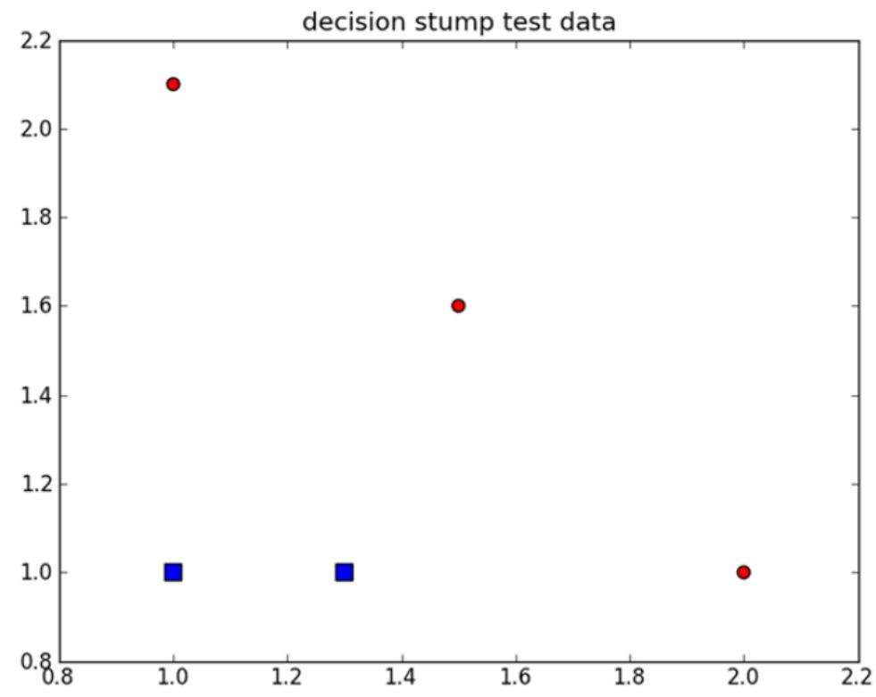

## 单层决策树生成函数

```python
def stumpclassify (dataMatrix, dimen, threshval, threshIneq) :
retArray = ones((shape(dataMatrix) [0l , 1))
if threshIneq == 'lt':
retArray [dataMatrix[:, dimen] <= threshVal] = -1.0
else:
retArray[dataMatrix[:, dimen] > threshval] = -1.0
return retArray
```

## 单层决策树生成函数

def buildstump (dataArr, classLabels, D) :   
dataMatrix = mat (dataArr); labelMat = mat (classLabels) .T   
m, n = shape (dataMatrix)   
numsteps = 10.0; beststump = {}; bestclasEst = mat (zeros((m, 1)))   
minError = inf   
for i in range (n) :   
rangeMin = dataMatrix[:, i] .min () ; rangeMax = dataMatrix[: , i]   
stepSize = (rangeMax-rangeMin) /numSteps   
for j in range(-1, int (numsteps) +1) :   
for inequal in ['lt','gt']:   
threshval = (rangeMin + float(j) \* stepsize)   
predictedvals =id   
stumpClassify (dataMatrix, i, threshval, inequal)   
errArr = mat (ones ((m, 1) ))   
errArr [predictedvals == labelMat] = 0   
weightedError = D.T\*errArr

## 单层决策树生成函数

```python
#print "split: dim d, thresh %.2f, thresh ineqal:
%s, the weighted error is %.3f" \
(i, threshVal, inequal, weightedError)
if weightedError < minError:
minError = weightedError
bestclasEst = predictedvals.copy()
beststump['dim'] = i
beststump ['thresh'] = threshVal
beststump['ineq'] = inequal
return bestStump,minError,bestClasEst
```

## 单层决策树生成函数

>>> D = mat (ones((5, 1))/5)   
>>> adaboost .buildstump (datMat, classLabels, D)   
split: dim 0, thresh 0.90, thresh ineqal: lt, the weighted error is 0.400   
split: dim 0, thresh 0.90, thresh ineqal: gt, the weighted error is 0.600   
split: dim 0, thresh 1.00, thresh ineqal: 1t, the weighted error is 0.400   
split: dim 0, thresh 1.00, thresh ineqal: gt, the weighted error is 0.600   
split: dim 1, thresh 2.10, thresh ineqal: lt, the weighted error is 0.600   
split: dim 1, thresh 2.10, thresh ineqal: gt, the weighted error is 0.400   
({'dim':0, 'ineq': '1t', 'thresh':1.3},matrix([[ 0.2]1), array([[-1.],   
[1.],   
[-1.],   
[-1.],   
[1.]1))

## 完整AdaBoost算法的实现

def adaBoostTrainDs (dataArr, classLabels, numIt=40) :   
weakclassArr = []   
m = shape (dataArr) [0]   
D = mat (ones ( (m, 1)) /m)   
aggclassEst = mat (zeros((m, 1) ) )   
for i in range(numIt) :   
beststump,error,classEst = buildstump(dataArr, classLabels, D)   
print "D:", D.T   
alpha = float (0.5\*log((1.0-error) /max(error, 1e-16) ))   
beststump ['alpha'] = alpha   
weakclassArr.append (beststump)   
print "classEst: ",classEst.T   
expon = multiply(-1\*alpha\*mat(classLabels) .T, classEst) 0   
D = multiply (D, exp (expon) )   
D = D/D.sum()   
aggclassEst += alpha\*classEst

## 完整AdaBoost算法的实现

print "aggClassEst: ",aggClassEst.T   
aggErrors = multiply(sign(aggClassEst) !=   
mat (classLabels) .T, ones((m, 1) ) )   
errorRate = aggErrors.sum () /m   
print "total error:",errorRate, "\n"   
if errorRate == 0.0: break   
return weakclassArr   
>>> classifierArray = adaboost.adaBoostTrainDs(datMat, classLabels,9}   
D: [[ 0.2 0.2 0.2 0.2 0.2]]   
classEst: [[-1. 1. -1. -1. 1.]]   
aggClassEst:  [[-0.69314718 0.69314718 -0.69314718 -0.69314718   
0.69314718]]   
total error: 0.2   
D：[ [0.5 0.125 0.125 0.125 0.125]]   
classEst: [[ 1. 1. -1. -1. -1.]]   
aggclassEst:  [[ 0.27980789 1.66610226 -1.66610226 -1.66610226   
-0.27980789]1   
total error: 0.2

## 完整AdaBoost算法的实现

D：[[ 0.28571429 0.07142857 0.07142857 0.07142857 0.5

classEst: [[ 1. 1. 1. 1. 1.]]

aggClassEst:  [[ 1.17568763 2.56198199 -0.77022252 -0.770222520.61607184]]

total error: 0.0

## 完整AdaBoost算法的实现

>>> classifierArray   
[{'dim': 0, 'ineq': '1t', 'thresh': 1.3, 'alpha': 0.69314718055994529},   
{'dim': 1, 'ineq': '1t', 'thresh': 1.0, 'alpha': 0.9729550745276565},   
{'dim': 0,'ineq': '1t', 'thresh':0.90000000000000002, 'alpha':   
0.89587973461402726}]

## 测试算法

## ·基於AdaBoost的分类函数

```python
def adaclassify(datToclass, classifierArr) :
dataMatrix = mat (datToclass)
m = shape(dataMatrix) [0]
aggclassEst = mat (zeros((m, 1) ))
for i in range(len(classifierArr)) :
classEst = stumpClassify(dataMatrix, classifierArr[i] ['dim'] , \
classifierArr[i]['thresh'],i
classifierArr[i]['ineq'】)
aggClassEst += classifierArr [i]['alpha']*classEst
print aggClassEst
return sign (aggclassEst)
```

## 测试算法

·基於AdaBoost的分类函数

>>> reload(adaboost)   
<module 'adaboost' from 'adaboost.py'>   
>>> datArr, labelArr=adaboost .loadsimpData ()   
>>> classifierArr = adaboost.adaBoostTrainDs (datArr, labelArr, 30)   
>>> adaboost.adaclassify([0, 0l, classifierArr}   
[[-0.69314718]]   
[[-1.66610226]]   
[[-2.56198199]]   
matrix([[-1.]])   
>>> adaboost.adaclassify([[5, 5], [0,0]], classifierArr)   
[[0.69314718]   
[-2.56198199]]   
matrix([[ 1.],   
[-1.11)

## 在马疝病数据集上应用Adaboost

•加载数据

```python
def loadDataSet(fileName) :
numFeat = len (open (fileName) .readline() .split ('\t '))
dataMat = [l ; labelMat = [1
fr = open (fileName)
for line in fr.readlines() :
lineArr = []
curLine = line.strip() .split ('\t')
for i in range (numFeat-1) :
lineArr.append (float (curLine [i] ))
dataMat.append (lineArr)
labelMat .append (float (curLine [-1] ) )
return dataMat, labelMat
```

## 在马疝病数据集上应用Adaboost

>>> datArr, labelArr = adaboost.loadDataSet('horseColicTraining2.txt ')   
>>> classifierArray = adaboost.adaBoostTrainDs (datArr, labelArr, 10)   
total error: 0.284280936455   
total error: 0.284280936455

```python
total error: 0.230769230769
>>> testArr, testLabelArr = adaboost.loadDataSet('horseColicTest2.txt')
>>> predictionl0 = adaboost.adaclassify(testArr,classifierArray)
To get the number of misclassified examples type in:
>>> errArr=mat(ones((67, 1)))
>>> errArr [predictionlo!=mat(testLabelArr) .T] .sum()
16.0
```

## 在马疝病数据集上应用Adaboost

<table><tr><td>Number of Classifiers</td><td>Training Error</td><td>Test Error</td><td></td></tr><tr><td>1</td><td>0.28</td><td>0.27</td><td></td></tr><tr><td>10</td><td>0.23</td><td>0.24</td><td></td></tr><tr><td>50</td><td>0.19</td><td>0.21</td><td></td></tr><tr><td>100</td><td>0.19</td><td>0.22</td><td></td></tr><tr><td>500</td><td>0.16</td><td>0.25</td><td></td></tr><tr><td>1000</td><td>0.14</td><td>0.31</td><td>overfitting</td></tr><tr><td>10000</td><td>0.11</td><td>0.33</td><td></td></tr></table>

## SVM和AdaBoost的关系

7 相似之处

·把弱分类器看成SVM的核函数。

·按照最大化某个最小间隔的方式重写AdaBoost算法。

不同

• 二者所定义的间隔计算方式有所不同，导致结果不同。

• 高维空间下，二者间差异会更加明显。

## 非均衡分类问题

•1、马疝病

•2、垃圾邮件

•3、癌症检测

•分类性能度量指标：正确率、召回率、ROC曲线

·混淆矩阵 Confu:

<table><tr><td colspan="2"></td><td colspan="3">Predicted</td></tr><tr><td colspan="2"></td><td>Dog</td><td>Cat</td><td>Rat</td></tr><tr><td rowspan="3">Actual</td><td>Dog</td><td>24</td><td>2</td><td>5</td></tr><tr><td>Cat</td><td>2</td><td>27</td><td>0</td></tr><tr><td>Rat</td><td>4</td><td>2</td><td>30</td></tr></table>

## 非均匀分类问题

• 二分类问题的混淆矩阵

<table><tr><td rowspan="2"></td><td rowspan="2"></td><td colspan="2">redicted</td></tr><tr><td>+1</td><td>-1</td></tr><tr><td rowspan="2">Actual</td><td>+1</td><td>True Positive (TP)</td><td>False Negative (FN)</td></tr><tr><td>-1</td><td>False Positive (FP)</td><td>True Negative (TN)</td></tr></table>

· Precision 正确 $= T P / ( T P + F P )$

·Recall 召回 $= T P / ( T P + F N )$

·假阳率=FP/(FP+TN)

·真阳率 $E = T P / ( T P + F N )$

## 非均匀分类问题

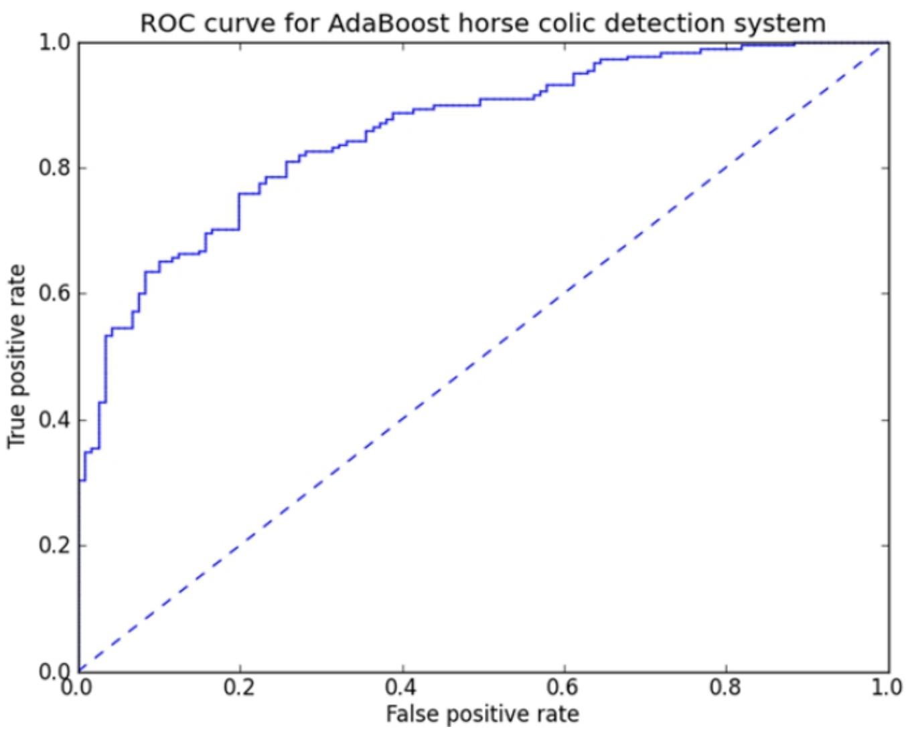

## 非均匀分类问题

·接收者操作特性（receiver operating Characteristic)

•成本效益 (cost-versus-benefit)

·曲线下面积（Area Unser theCurve，AUC)

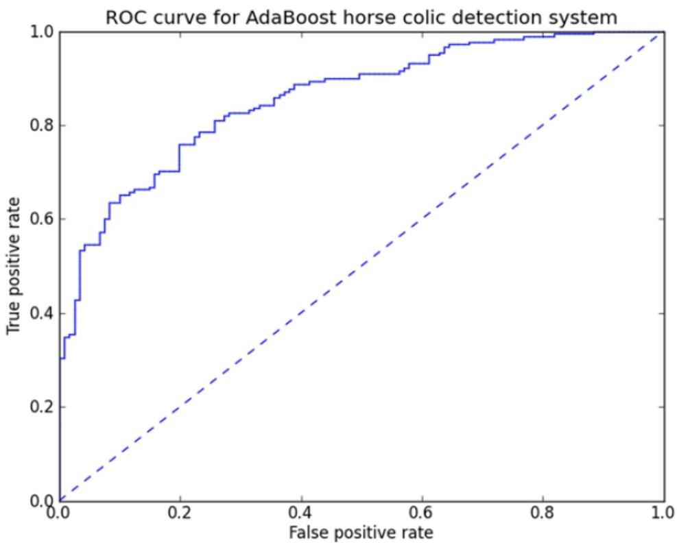

## 基于代价函数的分类器决策控制

<table><tr><td rowspan="2"></td><td rowspan="2"></td><td colspan="2">Predicted</td></tr><tr><td>+1</td><td>-1</td></tr><tr><td rowspan="2">Actual</td><td>+1</td><td>o</td><td>1</td></tr><tr><td>-1</td><td>1</td><td>0</td></tr></table>


<table><tr><td rowspan="2" colspan="2"></td><td colspan="2">Predicted</td></tr><tr><td>+1</td><td>-1</td></tr><tr><td rowspan="2">Actual</td><td>+1</td><td>-5</td><td>1</td></tr><tr><td>-1</td><td>50</td><td>0</td></tr></table>

## 处理非均衡问题的数据抽样方法

•欠抽样 (undersampling)

•过抽样 (oversampling)

## ·END

## 第九章EM期望极大算法

## 问题提出


## 问题提出

•绿地、水体、道路、裸地、居民建筑用地等；

•采用的遙感影像是Quickbird 数据，

·图像大小为317行×315列，

· 空间分辨率为2.44m，

•4个波段(蓝光波段、绿光波段、红光波段和近红外波段)。

## 问题提出


## 问题提出

·100个男、女身高，分布？男多少？女多少？

•采用混合高斯模型，假设男和女的分布都是符合高斯分布的，然后给定这个高斯分布一个初始值，这样这个高斯分布就是已知的。

• 用这个已知的高斯分布来估计男的多少人，女的多少人，假设男和女的类别分布为Q(z)，可以求Q(z)的期望，用期望来表示下一次迭代类别的初始值，就知道男和女的所属类别，可用最大似然函数来估新的高斯模型的参数，重复上述步骤.直到收敛!

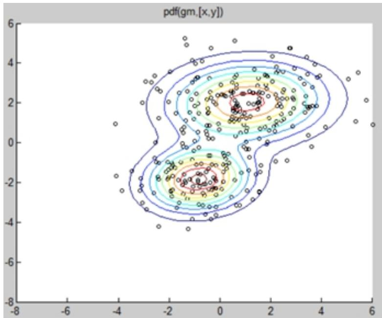

## 三硬币模型

•三硬币模型：硬币A、B、C，正面概率π，P，q，

・A正面时选B， 反面选C，

·得到结果：1101001011

•问题：只能看结果，不能看中间过程，估算 $\cdot \pi , \ p , \ q$

·解：模型 $\begin{array} { c } { { P ( y \mid \theta ) = \displaystyle \sum _ { z } P ( y , z \mid \theta ) = \displaystyle \sum _ { z } P ( z \mid \theta ) P ( y \mid z , \theta ) } } \\ { { = \pi p ^ { y } ( 1 - p ) ^ { 1 - y } + ( 1 - \pi ) q ^ { y } ( 1 - q ) ^ { 1 - y } } } \end{array}$

·随机变量Y是观测变量，表示一次试验观测的结果是1或0，随机变量z是障变量，表示未观测到的掷硬币A的结果，这一模型是以上数据的生

## 三硬币模型

·观测数据: $Y = ( Y _ { 1 } , Y _ { 2 } , \cdots , Y _ { n } ) ^ { \mathrm { T } }$

·未观测数据: $\pmb { Z } = ( Z _ { 1 } , Z _ { 2 } , \cdots , Z _ { n } ) ^ { \bar { \tau } }$

•似然函数: $P ( Y \mid \theta ) { = } \sum _ { z } P ( Z \mid \theta ) P ( Y \mid Z , \theta )$

•即：

$$
P ( \boldsymbol { Y } | \theta ) = \prod _ { i = 1 } ^ { n } [ \pi p ^ { \gamma _ { j } } \left( 1 - p \right) ^ { 1 - \gamma _ { j } } + ( 1 - \pi ) q ^ { \gamma _ { j } } \left( 1 - q \right) ^ { 1 - \gamma _ { j } } ]
$$

· 极大似然估计： ${ \hat { \pmb { \theta } } } = \arg \operatorname* { m a x } _ { \pmb { \theta } } \log P ( \boldsymbol { Y } | \ \pmb { \theta } )$

·该问题没有解析解，EM迭代法：

## EM方法

•选取初值: $\bar { \theta } ^ { ( 0 ) } = ( \pi ^ { ( 0 ) } , p ^ { ( 0 ) } , q ^ { ( 0 ) } )$

·第i步的估计值: $\pmb { \theta } ^ { ( i ) } = ( \pi ^ { ( i ) } , p ^ { ( i ) } , q ^ { ( i ) } )$

• EM算法第i+1次迭代:

•E步：计算在模型参数 $\pi ^ { ( i ) } , p ^ { ( i ) } , q ^ { ( i ) }$ 下观测数据yi来自掷硬币B的概率：

$$
\mu _ { . } ^ { ( i + 1 ) } = \frac { \pi ^ { ( i ) } ( p ^ { ( i ) } ) ^ { \gamma _ { j } } ( 1 - p ^ { ( i ) } ) ^ { 1 - \gamma _ { j } } } { \pi ^ { ( i ) } ( p ^ { ( i ) } ) ^ { \gamma _ { j } } ( 1 - p ^ { ( i ) } ) ^ { 1 - \gamma _ { j } } + ( 1 - \pi ^ { ( i ) } ) ( q ^ { ( i ) } ) ^ { \gamma _ { j } } ( 1 - q ^ { ( i ) } ) ^ { 1 - \gamma _ { j } } }
$$

•M步:计算模型参数的新估计值

$$
\pi ^ { ( i + 1 ) } = \frac { 1 } { n } \sum _ { j = 1 } ^ { n } \mu _ { j } ^ { ( i + 1 ) } \qquad p ^ { ( i + 1 ) } = \frac { \displaystyle \sum _ { j = 1 } ^ { n } \mu _ { j } ^ { ( i + 1 ) } y _ { j } } { \displaystyle \sum _ { j = 1 } ^ { n } \mu _ { j } ^ { ( i + 1 ) } } \qquad q ^ { ( i + 1 ) } = \frac { \displaystyle \sum _ { j = 1 } ^ { n } ( 1 - \mu _ { j } ^ { ( i + 1 ) } ) y _ { j } } { \displaystyle \sum _ { j = 1 } ^ { n } ( 1 - \mu _ { j } ^ { ( i + 1 ) } ) }
$$

## EM方法

初值: $\pi ^ { ( 0 ) } = 0 . 5$ $p ^ { ( 0 ) } = 0 . 5$ $q ^ { ( 0 ) } = 0 . 5$

对 $y _ { j } = 1$ 与 $y _ { j } = 0$ 均有 $\mu _ { j } ^ { ( 1 ) } = 0 . 5$

利用迭代公式，得: $\pi ^ { ( 1 ) } = 0 . 5$ $p ^ { ( 1 ) } = 0 . 6$ $\boldsymbol { q } ^ { ( 1 ) } = \boldsymbol { 0 } , 6$

$$
\mu _ { j } ^ { ( 2 ) } = 0 . 5 , \quad j = 1 , 2 , \cdots , 1 0
$$

继续迭代，得： $\pi ^ { ( 2 ) } = 0 . 5$ $p ^ { ( 2 ) } = 0 . 6$ $q ^ { ( 2 ) } = 0 . 6$

得到模型参数的极大似然估计：=0.5， $\hat { p } = 0 . 6$ $\hat { q } = 0 . 6$

## EM方法

如果取初值: $\pi ^ { ( 0 ) } = 0 . 4 , ~ p ^ { ( 0 ) } = 0 . 6 , ~ q ^ { ( 0 ) } = 0 . 7$

$$
\hat { \pi } = 0 . 4 0 6 4 , \hat { p } = 0 . 5 3 6 8 , \hat { q } = 0 . 6 4 3 2
$$

完全数据 complete-data

不完全数据 incomplete-data

## EM方法

输入：观测变量数据Y,隐变量数据Z，联合分布P(Y,Z|O)条件分布P(ZIY, O)

输出：模型参数0

（1）选择参数的初值 $\theta ^ { ( 0 ) }$ ，开始迭代；

（2）E步：记 $\pmb \theta ^ { ( i ) }$ 为第；次迭代参数θ的估计值，

在第+1次迭代的E步，计算

$$
\begin{array} { r l } {  { \mathcal { Q } ( \pmb { \theta } , \pmb { \theta } ^ { ( i ) } ) = E _ { Z } [ \log P ( Y , Z \mid \pmb { \theta } ) \vert Y , \pmb { \theta } ^ { ( i ) } ] } \quad } & { } \\ & { = \displaystyle \sum _ { Z } \log P ( Y , Z \mid \pmb { \theta } ) P ( Z \mid Y , \pmb { \theta } ^ { ( i ) } ) } \end{array}
$$

给定观测数据Y和当前参数估计O

## EM方法

（3）M步：求使 $Q ( \theta , \theta ^ { ( i ) } )$ 极大化的，

确定第+1次迭代的参数的估计值 $\theta ^ { ( i + 1 ) }$

$$
\boldsymbol { \theta } ^ { ( i + 1 ) } = \arg \operatorname* { m a x } _ { \boldsymbol { \theta } } \mathcal { Q } ( \boldsymbol { \theta } , \boldsymbol { \theta } ^ { ( i ) } )
$$

Q函数定义:

完全数据的对数似然函数IogP(Y,Z|O)关于在给定观测数据Y和当前函数O(下对未观测数据Z的条件概率分布

$\mathsf { P } ( \mathsf { Z } | \mathsf { Y } , \mathsf { O } ^ { ( \mathsf { i } ) } )$ 的期望称为Q函数，即：

$$
{ \mathcal { Q } } ( \theta , \theta ^ { ( l ) } ) = E _ { z } [ \log P ( Y , Z \mid \theta ) \mid Y , \theta ^ { ( l ) } ]
$$

## EM方法

•算法说明:

·步骤3，，完成一次迭代：Θ(到Θ(i+1)，将证明每次迭代使似然函数增大或达到局部最大值。

·步骤4， 停止迭代的条件

$$
\begin{array} { r l r l r } { \parallel \theta ^ { ( i + 1 ) } - \theta ^ { ( i ) } \parallel < \varepsilon _ { 1 } } & { { } } & { \xrightarrow [ ] { = } \zeta } & { { } } & { \parallel \mathcal { Q } ( \theta ^ { ( i + 1 ) } , \theta ^ { ( i ) } ) - \mathcal { Q } ( \theta ^ { ( i ) } , \theta ^ { ( i ) } ) \parallel < \varepsilon _ { 2 } } \end{array}
$$

## EM算法的导出

·为什么EM算法能近似实现对观测数据的极大似然估计？

•极大化(不完全数据)Y关于参数Θ的极大似然函数:

$$
\begin{array} { r } { \boldsymbol { L } ( \boldsymbol { \theta } ) = \log P ( \boldsymbol { Y } \mid \boldsymbol { \theta } ) = \log \sum _ { \boldsymbol { z } } P ( \boldsymbol { Y } , \boldsymbol { Z } \mid \boldsymbol { \theta } ) } \\ { = \log \left( \sum _ { \boldsymbol { z } } P ( \boldsymbol { Y } \mid \boldsymbol { Z } , \boldsymbol { \theta } ) P ( \boldsymbol { Z } \mid \boldsymbol { \theta } ) \right) } \end{array}
$$

·难点：有未观测数据，包含和的对数。

•EM通过迭代逐步近似极大化L(O),希望 $\bar { L } ( \theta ) > \bar { L } ( \theta ^ { ( i ) } )$

## EM算法的导出

• 考虑二者的差:

$$
\stackrel {  } { L } ( \theta ) - \boldsymbol { L } ( \theta ^ { ( i ) } ) = \log \Bigg ( \sum _ { z } P ( Y | Z , \theta ) P ( Z | \theta ) \Bigg ) - \log P ( Y | \theta ^ { ( i ) } )
$$

• Jason不等式:

$$
\begin{array} { r l } &  \displaystyle { L ( \theta ) - L ( \theta ^ { ( i ) } ) } = \log \Biggl ( \sum _ { z } { P ( Y \mid Z , \theta ^ { ( i ) } ) \frac { P ( Y \mid Z , \theta ) P ( Z \mid \theta ) } { P ( Y \mid Z , \theta ^ { ( i ) } ) } \Biggr ) - \log P ( Y \mid \theta ^ { ( i ) } ) } \\ & { \displaystyle \geqslant \sum _ { z } { P ( Z \mid Y , \theta ^ { ( i ) } ) \log \frac { P ( Y \mid Z , \theta ) P ( Z \mid \theta ) } { P ( Z \mid Y , \theta ^ { ( i ) } ) } - \log P ( Y \mid \theta ^ { ( i ) } ) } } \\ & { \displaystyle = \sum _ { z } { P ( Z \mid Y , \theta ^ { ( i ) } ) \log \frac { P ( Y \mid Z , \theta ) P ( Z \mid \theta ) } { P ( Z \mid Y , \theta ^ { ( i ) } ) P ( Y \mid \theta ^ { ( i ) } ) } } } \end{array}
$$

## EM算法的导出

● 令： $B ( \theta , \theta ^ { ( i ) } ) \triangleq { \cal L } ( \theta ^ { ( i ) } ) + \sum _ { Z } P ( Z \mid Y , \theta ^ { ( i ) } ) \log \frac { P ( Y \mid Z , \theta ) P ( Z \mid \theta ) } { P ( Z \mid Y , \theta ^ { ( i ) } ) P ( Y \mid \theta ^ { ( i ) } ) }$

·则： $L ( \theta ) \geq B ( \theta , \theta ^ { ( l ) } )$

$$
\mathcal { L } ( \boldsymbol { \theta } ^ { ( i ) } ) = B ( \boldsymbol { \theta } ^ { ( i ) } , \boldsymbol { \theta } ^ { ( i ) } )
$$

任何可以使 $B ( \theta , \theta ^ { ( i ) } )$ 增大的θ，也可以使L(0)增大

·选择： $\theta ^ { ( i + 1 ) } = \arg \operatorname* { m a x } _ { \theta } B ( \theta , \theta ^ { ( i ) } )$

## EM算法的导出

• 省去和0无关的项：

$$
\begin{array} { r l } & { \theta ^ { ( i + 1 ) } = \underset { \theta } { \operatorname { a r g m a x } } \left( L ( \theta ^ { ( i ) } ) + \underset { z } { \sum } P ( Z \mid Y , \theta ^ { ( i ) } ) \log \frac { P ( Y \mid Z , \theta ) P ( Z \mid \theta ) } { P ( Z \mid Y , \overline { { \theta ^ { ( i ) } } } ) P ( \overline { { Y \mid \theta ^ { ( i ) } } } ) } \right) } \\ & { \quad \quad = \underset { \theta } { \operatorname { a r g m a x } } \Bigg ( \underset { z } { \sum } P ( Z \mid Y , \theta ^ { ( i ) } ) \log \left( P ( Y \mid Z , \theta ) P ( Z \mid \theta ) \right) \Bigg ) } \\ & { \quad \quad = \underset { \theta } { \operatorname { a r g m a x } } \Bigg ( \underset { \theta } { \sum } P ( Z \mid Y , \theta ^ { ( i ) } ) \log P ( Y , Z \mid \theta ) \Bigg ) } \\ & { \quad \quad = \underset { \theta } { \operatorname { a r g m a x } } \underset { \theta } { \sum } Q ( \theta , \theta ^ { ( i ) } ) } \end{array}
$$

## EM算法的解释

L(O)开始

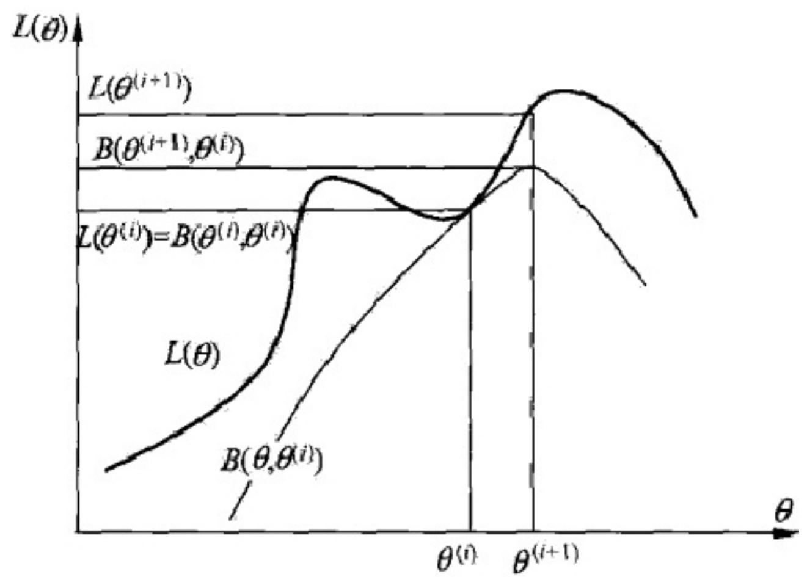

## EM在非监督学习中的应用

·生成模型由联合概率分布P(XY)表示，可以认为非监督学习训练数据是联合概率分布产生的数据，X为观测数据，Y为未观测数据。

## EM算法的收敛性

•EM，提供一种近似计算含有隐变量概率模型的极大似然估计的方法，

•EM，最大优点：简单性和普适性；

·疑问：

·1、EM算法得到的估计序列是否收敛？

• 2、如果收敛，是否是全局极大值或局部极大值？

## EM算法的收敛性

• 两个收敛定理：

·定理9.1：设P(Y|O)为观测数据的似然函数，O(ii=1,2..)为EM参数估计序列， $P ( Y | \vartheta ^ { ( i ) } ) \left( i = 1 , 2 , \cdots \right)$ 为对应的似然函数序列，则P(Y|O(i)是单调递增的，即：

$$
P ( Y | \theta ^ { ( i + 1 ) } ) \geq P ( Y | \theta ^ { ( i ) } )
$$

·证明：由 $P ( Y \mid \theta ) = \frac { P ( Y , Z \mid \theta ) } { P ( Z \mid Y , \theta ) }$ log P(Y |θ) =1ogP(Y,Z|θ) −1og P(Z|Y,θ)

·由： $\mathcal { Q } ( \boldsymbol { \theta } , \boldsymbol { \theta } ^ { ( i ) } ) = \sum _ { z } \log P ( Y , Z \mid \boldsymbol { \theta } ) P ( Z \mid Y , \boldsymbol { \theta } ^ { ( i ) } )$

## EM算法的收敛性

·令: $H ( \theta , \theta ^ { ( i ) } ) = \sum _ { z } \log P ( Z \mid Y , \theta ) P ( Z \mid Y , \theta ^ { ( i ) } )$

·则： $\log P ( Y \mid \theta ) = \mathcal { Q } ( \theta , \theta ^ { ( i ) } ) - H ( \theta , \theta ^ { ( i ) } )$

·得: $\begin{array} { r l } & { \log P ( \boldsymbol { Y } | \boldsymbol { \theta } ^ { ( i + 1 ) } ) - \log P ( \boldsymbol { Y } | \boldsymbol { \theta } ^ { ( i ) } ) } \\ & { \quad = \{ \boldsymbol { Q } ( \boldsymbol { \theta } ^ { ( i + 1 ) } , \boldsymbol { \theta } ^ { ( i ) } ) - \boldsymbol { Q } ( \boldsymbol { \theta } ^ { ( i ) } , \boldsymbol { \theta } ^ { ( i ) } ) \} - [ H ( \boldsymbol { \theta } ^ { ( i + 1 ) } , \boldsymbol { \theta } ^ { ( i ) } ) - H ( \boldsymbol { \theta } ^ { ( i ) } , \boldsymbol { \theta } ^ { ( i ) } ) ] } \end{array}$

## • 只需证右端非负

## EM算法的收敛性

·前半部分，Θ(i+1)为极大值，所以

$$
Q ( \theta ^ { ( i + 1 ) } , \theta ^ { ( i ) } ) - Q ( \theta ^ { ( i ) } , \theta ^ { ( i ) } ) \geq 0
$$

•后半部分：

$$
\begin{array} { r l } { H ( \theta ^ { ( i + 1 ) } , \theta ^ { ( i ) } ) - H ( \theta ^ { ( i ) } , \theta ^ { ( i ) } ) } & { } \\ { = \displaystyle \sum _ { z } \Biggl ( \log \frac { P ( Z \mid Y , \theta ^ { ( i + 1 ) } ) } { P ( Z \mid Y , \theta ^ { ( i ) } ) } \Biggr ) P ( Z \mid Y , \theta ^ { ( i ) } ) } \\ { \Biggr . } & { ~ \leqslant \log \Biggl ( \sum _ { z } \frac { P ( Z \mid Y , \theta ^ { ( i + 1 ) } ) } { P ( Z \mid Y , \theta ^ { ( i ) } ) } P ( Z \mid Y , \theta ^ { ( i ) } ) \Biggr ) } \\ { } & { ~ = \log P ( Z \mid Y , \theta ^ { ( i + 1 ) } ) = 0 } \end{array}
$$

## EM算法的收敛性

·定理9.2:

·设L(O)=logP(Y|Θ)，为观测数据的对数似然函数，Θ(i=1,2.)，为EM算法得到的参数估计序列，L(O(1)为对应的对数似然函数序列，

•1、如果P(Y|O)有上界，则t $\mathsf { \Lambda } _ { - } ( \Theta ^ { ( \mathrm { i } ) } ) = \mathsf { l o g P } ( \mathsf { Y } | \Theta ^ { ( \mathrm { i } ) } )$ 收敛到某一值L\*;

•2、在函数Q(O，O)与L(O)满足一定条件下，由EM算法得到的参数估计序列()的收敛值Θ\*是L(O)的稳定点。

## EM算法在高斯混合模型学习中的应用

高斯混合模型:

•概率分布模型; $P ( y \mid \theta ) = \sum _ { k = 1 } ^ { K } \alpha _ { k } \phi ( y \mid \theta _ { k } )$

·系数: $\alpha _ { k } \geq 0 , \sum _ { k = 1 } ^ { K } \alpha _ { k } = 1$

•高斯分布密度: $\phi ( \boldsymbol { y } | \boldsymbol { \theta } _ { k } )$ $\theta _ { i } = ( \mu _ { k } , \sigma _ { k } ^ { 2 } )$

•第K个分模型： ${ \vec { \varphi } } ( y \mid \theta _ { k } ) = { \frac { 1 } { { \sqrt { 2 \pi } } \sigma _ { k } } } \exp \left( - { \frac { ( y - \mu _ { k } ) ^ { 2 } } { 2 \sigma _ { k } ^ { 2 } } } \right)$ 可任意高斯模型

## 高斯混合模型参数估计的EM算法

•假设观测数据 $\forall _ { 1 } , \forall _ { 2 } , \ldots \forall _ { \mathsf { N } }$ 由高斯混合模型生成：

$$
\begin{array} { l } { \displaystyle P ( \boldsymbol { y } | \theta ) = \sum _ { k = 1 } ^ { K } \alpha _ { k } \phi ( \boldsymbol { y } | \theta _ { k } ) } \\ { \displaystyle \theta = ( \alpha _ { 1 } , \alpha _ { 2 } , \cdots , \alpha _ { K } ; \theta _ { 1 } , \theta _ { 2 } , \cdots , \theta _ { K } ) } \end{array}
$$

用EM算法估计参数;

• 1、明确隐变量，写出完全数据的对数似然函数:

• 设想观测数据yi是依概率 $\mathbf { \mathcal { I } } _ { k }$ 选择第k个高斯分模型 $\phi ( \ v u ) \ v u | \theta _ { k } )$

生成，隐变量 $\begin{array} { r } { \gamma _ { j k } = \left\{ \begin{array} { l l } { 1 , } & { \quad \widehat { \mathbf { g } } \equiv j } \\ { 0 , } & { \quad \widehat { \mathbf { g } } \equiv [ [ \mathbf { 1 } ] ] } \end{array} \right. } \end{array}$ 个观测来自第k个分模型

## EM算法在高斯混合模型学习中的应用

• 1、明确隐变量，写出完全数据的对数似然函数：

•完全数据: $( y _ { i } , \gamma _ { i 1 } , \gamma _ { i 2 } , \cdots , \gamma _ { i K } ) \ , \quad j = 1 , 2 , \cdots , N$

·似然

$$
\begin{array} { r l } { \displaystyle \mathop { \mathbb { E } } | \frac { \partial \theta } { \partial \lambda } ; } & { \quad P ( y , \gamma | \theta ) = \displaystyle \prod _ { j = 1 } ^ { N } P ( y _ { j } , \gamma _ { j _ { 1 } } , \gamma _ { j _ { 2 } } , \cdots , \gamma _ { j _ { K } } | \theta ) } \\ & { = \displaystyle \prod _ { k = 1 } ^ { K } \prod _ { j = 1 } ^ { N } \left[ \alpha _ { k } \phi ( y _ { j } | \theta _ { k } ) \right] ^ { \gamma _ { j _ { k } } } } \\ { \displaystyle n _ { k } = \sum _ { j = 1 } ^ { N } \gamma _ { j _ { k } } } & { \quad = \displaystyle \prod _ { k = 1 } ^ { K } \alpha _ { k } ^ { \gamma _ { k } } \displaystyle \prod _ { j = 1 } ^ { N } \left[ \phi ( y _ { j } | \theta _ { k } ) \right] ^ { \gamma _ { k } } } \\ { \displaystyle \sum _ { k = 1 } ^ { K } n _ { k } = N } & { \quad = \displaystyle \prod _ { k = 1 } ^ { K } \alpha _ { k } ^ { \gamma _ { k } } \displaystyle \prod _ { j = 1 } ^ { N } \left[ \frac { 1 } { \sqrt { 2 \pi } \sigma _ { k } } \exp \left( - \frac { ( y _ { j } - \mu _ { k } ) ^ { 2 } } { 2 \sigma _ { k } ^ { 2 } } \right) \right] ^ { \gamma _ { k } } } \end{array}
$$

## EM算法在高斯混合模型学习中的应用

• 1、明确隐变量，写出完全数据的对数似然函数：

$$
\log P ( y , \gamma | \theta ) = \sum _ { k = 1 } ^ { K } n _ { k } \log \alpha _ { k } + \sum _ { j = 1 } ^ { N } \gamma _ { j k } \left[ \log \left( \frac { 1 } { \sqrt { 2 \pi } } \right) - \log \sigma _ { k } - \frac { 1 } { 2 \sigma _ { k } ^ { 2 } } ( y _ { j } - \mu _ { k } ) ^ { 2 } \right]
$$

## EM算法在高斯混合模型学习中的应用

•2、EM算法的E步，确定Q函数

$$
\begin{array} { l } { \displaystyle { \mathcal Q ( \theta , \theta ^ { ( i ) } ) = E [ \log P ( y , \gamma \vert \theta ) \vert \gamma , \theta ^ { ( i ) } ] } } \\ { \displaystyle = E \left. \sum _ { k = 1 } ^ { K } n _ { k } \log \alpha _ { k } + \sum _ { j = 1 } ^ { N } \gamma _ { j k } \Biggl [ \log \left( \frac { 1 } { \sqrt { 2 \pi } } \right) - \log \sigma _ { k } - \frac { 1 } { 2 \sigma _ { k } ^ { 2 } } ( y _ { j } - \mu _ { k } ) ^ { 2 } \Biggr ] \right. } \\ { \displaystyle = \sum _ { k = 1 } ^ { K } \left. \sum _ { j = 1 } ^ { N } ( E \gamma _ { j k } ) \log \alpha _ { k } + \sum _ { j = 1 } ^ { N } ( E \gamma _ { j k } ) \Biggl [ \log \left( \frac { 1 } { \sqrt { 2 \pi } } \right) - \log \sigma _ { k } - \frac { 1 } { 2 \sigma _ { k } ^ { 2 } } ( y _ { j } - \mu _ { k } ) ^ { 2 } \Biggr ] \right. } \end{array}
$$

需要计算 $E ( \boldsymbol { \mathcal { Y } } _ { j k } \mid \boldsymbol { \mathbf { y } } , \boldsymbol { \theta } )$ ，记为 $\hat { \gamma } _ { j k } ^ { \mathrm { s } }$

·第j个观测数据来自第k个分模型的概率，称为分模型k对观测数据 $\mathsf { Y } _ { \mathrm { j } }$ 的响应度。

## EM算法在高斯混合模型学习中的应用

•2、EM算法的E步，确定Q函数

$$
\begin{array} { r l } & { \hat { \gamma } _ { , k } = E ( \gamma _ { , k } | \gamma _ { , \theta } ) = P ( \gamma _ { , \mu } = 1 | \gamma , \theta ) } \\ & { \quad = \frac { P ( \gamma _ { , k } = 1 , y _ { , j } | \theta ) } { \displaystyle \sum _ { k = 1 } ^ { k } P ( \gamma _ { , k } = 1 , y _ { , j } | \theta ) } } \\ & { \quad = \frac { P ( \gamma _ { , k } | \gamma _ { , k } = 1 , \theta ) P ( \gamma _ { , k } = 1 | \theta ) } { \displaystyle \sum _ { k = 1 } ^ { k } \alpha _ { k } ( y _ { , j } | \beta _ { k } = 1 , \theta ) P ( \gamma _ { , k } = 1 | \theta ) } } \\ & { \quad = \frac { P ( y _ { , j } | \gamma _ { , k } = 1 , \theta ) P ( \gamma _ { , k } = 1 | \theta ) } { \displaystyle \sum _ { k = 1 } ^ { k } P ( y _ { , j } | \gamma _ { , k } = 1 , \theta ) P ( \gamma _ { , k } = 1 | \theta ) } } \\ & { \quad = \frac { \alpha _ { k } \theta ( y _ { , j } | \theta _ { k } ) } { \displaystyle \sum _ { k = 1 } ^ { k } \alpha _ { k } \phi ( y _ { , j } | \theta _ { k } ) } , \quad \quad j = 1 , 2 , \cdots , N ; \ k = 1 , 2 , \cdots , K } \end{array}
$$

## EM算法在高斯混合模型学习中的应用

•2、EM算法的E步，确定Q函数

$$
\nVDash _ { \mathbb { X } } \hat { \gamma } _ { j k } = E \gamma _ { j k } \operatorname { \mathcal { R } } n _ { k } = \sum _ { j = 1 } ^ { N } E \gamma _ { j k } \nmid \mathbb { E } \lambda
$$

$$
\mathcal { Q } ( \theta , \theta ^ { ( i ) } ) = \sum _ { k = 1 } ^ { K } n _ { k } \log \alpha _ { k } + \sum _ { k = 1 } ^ { N } \hat { \gamma } _ { j k } \Bigg [ \log  { \Bigg ( } \frac { 1 } { \sqrt { 2 \pi } }  { \Bigg ) } - \log \sigma _ { k } - \frac { 1 } { 2 \sigma _ { k } ^ { 2 } } ( y _ { j } - \mu _ { k } ) ^ { 2 }  { \Bigg ] }
$$

## EM算法在高斯混合模型学习中的应用

•3、确定EM算法的M步：

•求: $\theta ^ { ( i + 1 ) } = \arg \operatorname* { m a x } _ { \theta } \mathcal { Q } ( \theta , \theta ^ { ( i ) } )$

用 $a _ { i } , \tilde { \sigma } _ { i } ^ { 2 }$ 及 $\hat { \alpha } _ { \scriptscriptstyle k } , k = 1 , 2 , \cdots , K$ ，表示 $\theta ^ { ( i + 1 ) }$

采用求导的方法:

$$
\hat { \mu } _ { k } = \frac { \displaystyle \sum _ { j = 1 } ^ { N } \hat { \gamma } _ { j k } \gamma _ { j } } { \displaystyle \sum _ { j = 1 } ^ { N } \hat { \gamma } _ { j k } } \qquad \hat { \sigma } _ { k } ^ { 2 } = \frac { \displaystyle \sum _ { j = 1 } ^ { N } \hat { \gamma } _ { j k } \left( y _ { j } - \mu _ { k } \right) ^ { 2 } } { \displaystyle \sum _ { j = 1 } ^ { N } \hat { \gamma } _ { j k } } \qquad \hat { \alpha } _ { k } = \frac { n _ { k } } { N } = \frac { \displaystyle \sum _ { j = 1 } ^ { N } \hat { \gamma } _ { j k } } { N }
$$

## 高斯混合模型参数估计的EM算法

·输入：观测数据 $\forall _ { 1 } , \forall _ { 2 } , \ldots \forall _ { \mathsf { N } } ,$ 高斯混合模型

·输出：高斯混合模型参数

•1、设定初始值开始迭代

•2、E步， 响应度计算

$$
\hat { \mathcal { Y } } _ { j k } = \frac { \alpha _ { k } \phi ( y _ { j } \mid \boldsymbol { \theta } _ { k } ) } { \displaystyle \sum _ { k = 1 } ^ { K } \alpha _ { k } \phi ( y _ { j } \mid \boldsymbol { \theta } _ { k } ) }
$$

## 高斯混合模型参数估计的EM算法

·输入：观测数据 $\forall _ { 1 } , \forall _ { 2 } , \ldots \forall _ { \mathsf { N } } ,$ 高斯混合模型

·输出：高斯混合模型参数

•3、M步，计算新一轮迭代的模型参数:

$$
\hat { \mu } _ { k } = \frac { \displaystyle \sum _ { j = 1 } ^ { N } \hat { \gamma } _ { j k } y _ { j } } { \displaystyle \sum _ { j = 1 } ^ { N } \hat { \gamma } _ { j k } } \qquad \hat { \sigma } _ { k } ^ { 2 } = \frac { \displaystyle \sum _ { j = 1 } ^ { N } \hat { \gamma } _ { j k } ( y _ { j } - \mu _ { k } ) ^ { 2 } } { \displaystyle \sum _ { j = 1 } ^ { N } \hat { \gamma } _ { j k } } \qquad \hat { \alpha } _ { k } = \frac { \displaystyle \sum _ { j = 1 } ^ { N } \hat { \gamma } _ { j k } } { \displaystyle N }
$$

•4、重复2，3步直到收敛

## EM算法的推广

·EM算法可以解释为:

·F函数的极大--极大算法（maximization -maximization algorithm)

·广义期望极大(Generalization Expectation Maximization. GEM)

## F函数的极大一极大算法

·F函数:

·假设隐变量数据Z的概率分布为 $\tilde { P } ( Z )$ ,定义分布 $\tilde { P }$ 与参数0的函娄 $F ( { \tilde { P } } , \theta )$

$$
F ( \tilde { P } , \theta ) = E _ { \tilde { P } } [ \log P ( Y , Z \mid \theta ) ] + H ( \tilde { P } )
$$

•熵： $H ( \tilde { P } ) = - E _ { \tilde { P } } \log \tilde { P } ( Z )$

•F函数是θ的连续函数，重要性质：

·引理9.1：对于固定的θ，存在唯一的分布 $\tilde { P } _ { \theta }$ 极大化 $F ( \tilde { P } , \theta )$

这时的 $\tilde { P } _ { \theta }$

$$
\tilde { P } _ { \theta } ( Z ) = P ( Z | Y , \theta )
$$

•并且 $\tilde { P } _ { \theta }$ 随0连续变化。

## F函数的极大一极大算法

·证明：对于固定的θ．拉格朗日函数方法对最优化问题P(Z) $L = E _ { \tilde { p } } \log P ( Y , Z \mid \theta ) - E _ { \tilde { r } } \log \tilde { P } ( Z ) + \lambda \biggl ( 1 - \sum _ { z } \tilde { P } ( Z ) \biggr )$

•对 $\tilde { P } ( Z )$ 求偏导: $\frac { \partial L } { \partial \tilde { P } ( Z ) } { = } { \log } P ( Y , Z \mid \theta ) { - } \log \tilde { P } ( Z ) { - } 1 { - } \lambda$

•令偏导为0: $\lambda = \log \bar { P } ( Y , Z | \theta ) - \log \tilde { \bar { P } } _ { \theta } ( Z ) - 1$

·得：分子分母成比例， $\frac { P ( \boldsymbol { Y } , \boldsymbol { Z } | \boldsymbol { \theta } ) } { \tilde { P } _ { \boldsymbol { \theta } } ( \boldsymbol { Z } ) } { = \mathrm { e } ^ { 1 + \lambda } }$

·由： $\sum _ { z } \tilde { P } _ { \theta } ( Z ) = 1$ 得： $\tilde { P } _ { \theta } ( Z ) = P ( Z | Y , \theta )$

由假设P(Y，Z|0)是θ的连续函数，得到 $\tilde { P } _ { \theta }$ 是θ的连续函数.

## F函数的极大一极大算法

• 引理9.2：若 $\tilde { P } _ { \beta } ( Z ) = P ( Z | Y , \theta )$ ，则 $F ( \tilde { P } , \bar { \theta } ) = \log P ( Y | \bar { \theta } )$

定理9.3:

·设 $L ( { \boldsymbol { \theta } } ) = \log P ( Y | { \boldsymbol { \theta } } )$ 为观测数据的对数似然数， $\theta ^ { ( i ) } , i = 1 , 2 , \cdots$ 为 $\mathsf { E N }$ 算法得到的参数估计序列，F函数 $F ( { \tilde { P } } , \theta ) ,$ 如果$F ( \tilde { P } , \theta )$ 在 $\tilde { P } ^ { * }$ 和 $\theta ^ { * }$ 有局部极大值，那么L(0)也在 $\theta ^ { * }$ 有局部极大值，类似地，如果 $F ( \tilde { P } , \theta )$ 在 $\tilde { P } ^ { * }$ 和 $\theta ^ { * }$ 达到全局最大值，那么L(0)也在 $\theta ^ { * }$ 达到全局最大值。

## F函数的极大一极大算法

证明： 由定理9.1,9.2

$L ( \theta ) = \log P ( Y \mid \theta ) = F ( \tilde { P } _ { a } , \theta )$ 对任意 $\theta$ 成立；特别的:

对于使 $F ( \tilde { P } , \theta )$ 达到极大的参数 $\theta ^ { \ast }$

$$
L ( \theta ^ { * } ) = F ( \tilde { P } _ { \theta ^ { * } } , \theta ^ { * } ) = F ( \tilde { P } ^ { * } , \theta ^ { * } )
$$

为了证明 $\theta ^ { + }$ 是 $L ( \theta )$ 的极大点

需要证明不存在接近 ${ \pmb \theta } ^ { \ast }$ 的点 ${ \pmb \theta } ^ { * }$ ，使 $L ( \theta ^ { * * } ) > L ( \theta ^ { * } )$

假如存在这样的点 $\pmb { \theta } ^ { * }$ ，那么应有 ${ F ( \tilde { P } ^ { * * } , \pmb { \theta } ^ { * * } ) > F ( \tilde { P } ^ { * } , \pmb { \theta } ^ { * } ) }$

这里 $\tilde { P } ^ { * * } = \tilde { P } _ { \theta ^ { * } }$ 但因 $\tilde { P } _ { \ell }$ 是随 $\theta$ 连续变化的， $\tilde { P } ^ { * * }$ 应接近 ${ \tilde { P } } ^ { * }$

这与 $\tilde { P } ^ { * }$ 和 $\pmb \theta ^ { * }$ 是 $F ( { \tilde { P } } , \theta )$ 的局部极大点的假设

类似可以证明关于全局最大值的结论

## F函数的极大一极大算法

定理9.4:

EM算法的一次迭代可由F函数的极大---极大算法实现。

设 $\pmb { \theta } ^ { ( i ) }$ 为第i次迭代参数θ的估计， $\tilde { P } ^ { ( i ) }$ 为第次迭代函数 $\tilde { P }$ 的估计

在第i+1次迭代的两步为

（1）对固定的 $\theta ^ { ( i ) }$ ，求 $\tilde { P } ^ { ( i + 1 ) }$ 使 $F ( \tilde { P } , \theta ^ { ( i ) } )$ 极大化；

（2）对固定的 $\tilde { P } ^ { ( i + 1 ) }$ ，求 $\theta ^ { ( i + 1 ) }$ 使 $F ( \tilde { P } ^ { ( i + 1 ) } , \theta )$ 极大化.

## F函数的极大一极大算法

定理9.4:

EM算法的一次迭代可由F函数的极大---极大算法实现。

证明：

（1）由引理9.1，对于固定的 $\pmb { \theta } ^ { ( i ) }$

$\tilde { P } ^ { ( i + 1 ) } ( Z ) = \tilde { P } _ { _ { \theta ^ { ( i ) } } } ( Z ) = P ( Z | Y , \theta ^ { ( i ) } )$ 使 $F ( \tilde { P } , \theta ^ { ( i ) } )$ 极大化．此时

$$
\begin{array} { l } { { \displaystyle { \cal F } ( \tilde { P } ^ { ( i + 1 ) } , \theta ) = E _ { \tilde { P } ^ { ( i + 1 ) } } [ \log P ( Y , Z \mid \theta ) ] + H ( \tilde { P } ^ { ( i + 1 ) } ) } } \\ { { \displaystyle ~ = \sum _ { Z } \log P ( Y , Z \mid \theta ) P ( Z \mid Y , \theta ^ { ( i ) } ) + H ( \tilde { P } ^ { ( i + 1 ) } ) } } \end{array}
$$

由 $\mathcal { Q } ( \pmb { \theta } , \pmb { \theta } ^ { ( i ) } )$ 的定义

$$
F ( \tilde { P } ^ { ( i + 1 ) } , \theta ) = Q ( \theta , \theta ^ { ( i ) } ) + H ( \tilde { P } ^ { ( i + 1 ) } )
$$

## F函数的极大一极大算法

定理9.4:

EM算法的一次迭代可由F函数的极大---极大算法实现。

证明：(2）固定 $\tilde { P } ^ { ( i + 1 ) }$ ，求 $\pmb { \theta } ^ { ( i + 1 ) }$ 使 $F ( \widetilde { P } ^ { ( i + 1 ) }$ ,0)极大化．得到

$$
\boldsymbol { \theta } ^ { ( i + 1 ) } = \arg \operatorname* { m a x } _ { \boldsymbol { \theta } } F ( \widetilde { P } ^ { ( i + 1 ) } , \boldsymbol { \theta } ) = \arg \operatorname* { m a x } _ { \boldsymbol { \theta } } \boldsymbol { \mathcal { Q } } ( \boldsymbol { \theta } , \boldsymbol { \theta } ^ { ( i ) } )
$$

通过以上两步完成了EM算法的一次迭代，中5M筒法 与F函数的极大--极大算法得到的参数估计列 $\underline { { \theta } } _ { \cdot  } ^ { ( i ) } , \ \underline { { i } } = 1 , 2 , \cdot \cdot \cdot$ 是一致的。

## F函数的极大一极大算法

算法9.3（GEM算法1）

输入：观测数据，F函数；

输出：模型参数.

（1）初始化参数 $\pmb { \theta } ^ { ( 0 ) }$ ，开始迭代

(2)第i+1次迭代，第1步：记 $\pmb { \theta } ^ { ( i ) }$ 为参数θ的估计值，$\tilde { P } ^ { ( i ) }$ 为函数 $\tilde { P }$ 的估计.求 $\tilde { P } ^ { ( i + 1 ) }$ 使 $\tilde { P }$ 极大化 $F ( \tilde { P } , \theta ^ { ( i ) } )$

（3）第2步：求 $\pmb { \theta } ^ { ( i + 1 ) }$ 使 $F ( \tilde { P } ^ { ( j + 1 ) } , \theta )$ 极大化

(4）重复(2)和(3)，直到收敛.

问题和方法: 有时求 $\mathcal { Q } ( \pmb { \theta } , \pmb { \theta } ^ { ( i ) } )$ 的极大化是很困难的

通过：找 $\pmb \theta ^ { ( i + 1 ) }$ 使得 $Q ( \pmb { \theta } ^ { ( i + 1 ) } , \pmb { \theta } ^ { ( i ) } ) > Q ( \pmb { \theta } ^ { ( i ) } , \pmb { \theta } ^ { ( i ) } )$

## F函数的极大一极大算法

算法9.4（GEM算法2）

输入：观测数据，Q函数；

输出：模型参数.

（1）初始化参数 $\pmb { \theta } ^ { ( 0 ) }$ ，开始迭代

（2）第i+1次迭代，第1步：记 $\pmb { \theta } ^ { ( i ) }$ 为参数θ的估计值，

$$
\begin{array} { r l } {  { \mathcal { Q } ( \theta , \theta ^ { ( i ) } ) { = } E _ { Z } [ \log P ( Y , Z \mid \theta ) \vert Y , \theta ^ { ( i ) } ] } } \\ & { = \displaystyle \sum _ { z } P ( Z \mid Y , \theta ^ { ( i ) } ) \log P ( Y , Z \mid \theta ) } \end{array}
$$

（3）第2步：求 $\pmb { \theta } ^ { ( i + 1 ) }$ 使 $Q ( \pmb { \theta } ^ { ( i + 1 ) } , \pmb { \theta } ^ { ( i ) } ) > Q ( \pmb { \theta } ^ { ( i ) } , \pmb { \theta } ^ { ( i ) } )$

(4）重复(2)和(3)，直到收敛.

## F函数的极大一极大算法

·当参数θ的维数为d大于等于2时，可采用一种特殊的GEM算法，算法的M步分解为d次条件极大化，每次只改变参数向量的一个分量，其余分量不改变。

## F函数的极大一极大算法

## 算法9.5（GEM算法3）

输入：观测数据，Q函数；

输出：模型参数.

（1）初始化参数 $\pmb { \theta } ^ { ( 0 ) } = ( \pmb { \theta } _ { 1 } ^ { ( 0 ) } , \pmb { \theta } _ { 2 } ^ { ( 0 ) } , \cdots , \pmb { \theta } _ { d } ^ { ( 0 ) } )$ ，开始迭代

(2)第i+1次迭代，第1步：记 $\pmb { \theta } ^ { ( i ) } = ( \pmb { \theta } _ { 1 } ^ { ( i ) } , \pmb { \theta } _ { 2 } ^ { ( i ) } , \cdots , \pmb { \theta } _ { d } ^ { ( i ) } )$

为参数 $\theta = ( \theta _ { 1 } , \theta _ { 2 } , \cdots , \theta _ { d } )$ 的估计值，计算

$$
\begin{array} { r l } {  { \mathcal { Q } ( \pmb { \theta } , \pmb { \theta } ^ { ( i ) } ) = E _ { Z } [ \log P ( Y , Z | \pmb { \theta } ) | Y , \pmb { \theta } ^ { ( i ) } ] } \quad } & { } \\ & { = \displaystyle \sum _ { z } P ( Z | y , \pmb { \theta } ^ { ( i ) } ) \log P ( Y , Z | \pmb { \theta } ) } \end{array}
$$

（3）第2步：进行d次条件极大化：

首先，在 $\theta _ { 2 } ^ { ( i ) } , \cdots , \theta _ { k } ^ { ( i ) }$ 保持不变的条件下求使 $\mathcal { Q } ( \pmb \theta , \pmb \theta ^ { ( i ) } )$ 达到极大的 $\theta _ { 1 } ^ { ( i + 1 ) }$

## F函数的极大一极大算法

然后，在 $\theta _ { 1 } = \theta _ { 1 } ^ { ( i + 1 ) }$ $\theta _ { i } = \theta _ { i } ^ { ( i ) }$ $j = 3 , 4 , \cdots , k$ 的条件下

求使 $Q ( \theta , \theta ^ { ( i ) } )$ 达到极大的 $\boldsymbol { \theta } _ { 2 } ^ { ( i + 1 ) }$

如此继续，经过d次条件极大化，得到 $\pmb { \theta } ^ { ( i + 1 ) } = ( \pmb { \theta } _ { 1 } ^ { ( i + 1 ) } , \pmb { \theta } _ { 2 } ^ { ( i + 1 ) } , \cdots , \pmb { \theta } _ { 4 } ^ { ( i + 1 ) } )$

使得 $Q ( \pmb { \theta } ^ { ( i + 1 ) } , \pmb { \theta } ^ { ( i ) } ) > Q ( \pmb { \theta } ^ { ( i ) } , \pmb { \theta } ^ { ( i ) } )$

(4）重复(2)和(3)，直到收敛.

## END ·Q&R

## 第十章隐马尔科夫模型

## Andrey Markov

•中文名 马尔科夫

籍俄国

•出生地 梁赞

・出生日期1856年6月14日

・逝世日期1922年7月20日

• 主要成就 开创了随机过程这个新领域

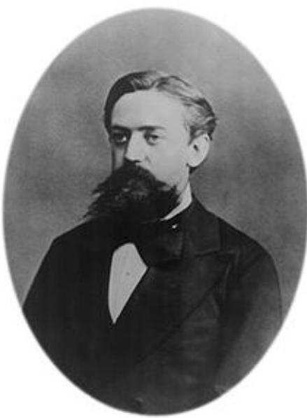

## HMM应用

•人脸识别

·语音识别

•入侵检测


## 例：

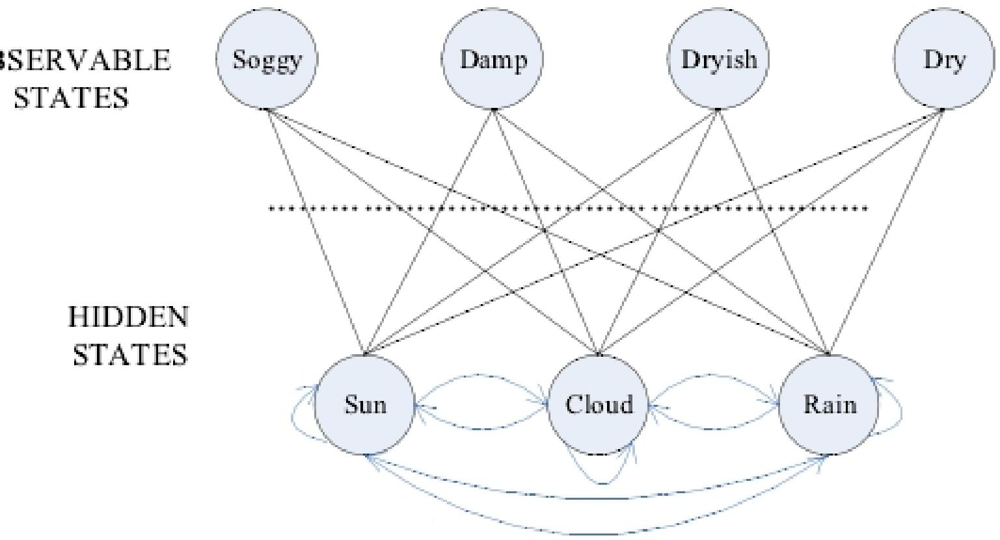

## 隐马尔科夫模型的定义

·隐马尔可夫模型是关于时序的概率模型;

·描述由一个隐藏的马尔可夫链随机生成不可观测的状态随机序列(state sequence)，再由各个状态生成一个观测而产生观测随机序列(observation sequence)的过程，序列的每一个位置又可以看作是一个时刻。

## 隐马尔科夫模型

•组成

•初始概率分布

•状态转移概率分布

• 观测概率分布

•Q：所有可能状态的集合

•V：所有可能观测的集合

$$
Q = \{ q _ { 1 } , q _ { 2 } , \cdots , q _ { N } \} \ , \quad V = \{ \nu _ { 1 } , \nu _ { 2 } , \cdots , \nu _ { M } \}
$$

• I:长度为T的状态序列

•O：对应的观测序列

$$
I = ( i _ { 1 } , i _ { 2 } , \cdots , i _ { T } ) , \quad O = ( o _ { 1 } , o _ { 2 } , \cdots , o _ { T } )
$$

## 隐马尔科夫模型

·组成

•A：状态转移概率矩阵

$$
\hat { A } = \left[ \hat { a } _ { i j } \right] _ { N \times N }
$$

$$
a _ { i } = P ( i _ { i + 1 } = q _ { j } \mid i _ { i } = q _ { i } ) , ~ i = 1 , 2 , \cdots , N ; ~ j = 1 , 2 , \cdots , N
$$

时刻t处于状态 $q _ { i }$ 的条件下在时刻t+1转移到状态 $q _ { j }$ 的概率

## 隐马尔科夫模型

·组成

•B：观测概率矩阵

$$
B = \left[ b _ { j } ( k ) \right] _ { N \times k }
$$

$$
b _ { j } ( k ) = P ( o _ { \iota } = \nu _ { k } \mid i _ { \iota } = q _ { j } ) , ~ k = 1 , 2 , \cdots , M ; ~ j = 1 , 2 , \cdots , N
$$

在时刻处于状态 $q _ { j }$ 的条件下生成观测 $\nu _ { k }$ 的概率

$\pi$ ：初始状态概率向量

$$
\pi _ { i } = P ( i _ { 1 } = q _ { i } ) , \quad i = 1 , 2 , \cdots , N
$$

时刻t=1处于状态 $\pmb { q } _ { i }$ 的概率

## 隐马尔科夫模型

・三要素

$$
\lambda = ( A , B , \pi )
$$

•两个基本假设

•齐次马尔科夫性假设，隐马尔可分链t的状态只和t-1状态有关：

$$
P ( i _ { t } \mid i _ { t - 1 } , o _ { t - 1 } , \cdots , i _ { 1 } , o _ { 1 } ) = P ( i _ { t } \mid i _ { t - 1 } ) \ , \quad t = 1 , 2 , \cdots , T
$$

• 观测独立性假设，观测只和当前时刻状态有关；

$$
P ( o _ { t } | i _ { r } , o _ { T } , i _ { T - 1 } , o _ { T - 1 } , \cdots , i _ { t + 1 } , o _ { t + 1 } , i _ { t } , i _ { t - 1 } , o _ { t - 1 } , \cdots , i _ { \mathrm { i } } , o _ { \mathrm { t } } ) = P ( o _ { t } | i _ { t } )
$$

## 例： 盒子和球模型

·盒子： 1 2 3 4

•红球： 5 3 6 8

·白球： 5 7 4 2

•转移规则：

• 盒子1 下一个 盒子2

·盒子2或3 下一个 0.4 左，0.6右

•盒子4 下一个0.5 自身，0.5盒子3

•重复5次：O={红，红，白，白，红}

## 例： 盒子和球模型

•状态集合：Q={盒子1，盒子2，盒子3，盒子4}，N=4

•观测集合：V={红球，白球} ${ \sf M } = 2$

•初始化概率分布:

$$
\pi = ( 0 . 2 5 , 0 . 2 5 , 0 . 2 5 , 0 . 2 5 ) ^ { \top }
$$

•状态转移矩阵：

$$
\begin{array} { r } { A = \left[ \begin{array} { c c c c } { 0 } & { 1 } & { 0 } & { 0 } \\ { 0 . 4 } & { 0 } & { 0 . 6 } & { 0 } \\ { 0 } & { 0 . 4 } & { 0 } & { 0 . 6 } \\ { 0 } & { 0 } & { 0 . 5 } & { 0 . 5 } \end{array} \right] } \end{array}
$$

观测矩阵：

$$
B = \left[ \begin{array} { l l } { 0 . 5 } & { 0 . 5 } \\ { 0 . 3 } & { 0 . 7 } \\ { 0 . 6 } & { 0 . 4 } \\ { 0 . 8 } & { 0 . 2 } \end{array} \right]
$$

## 观测序列的生成过程

算法10.1（观测序列的生成）

输入：隐马尔可夫模型 $\lambda = ( A , B , \pi )$ ，观测序列长度 $\pmb { T }$

输出：观测序列 $O = ( o _ { 1 } , o _ { 2 } , \cdots , o _ { T } )$

（1）按照初始状态分布π产生状态 $\dot { \iota } _ { 1 }$

(2）令 $\scriptstyle t = 1$

（3）按照状态 $i _ { t }$ 的观测概率分布 $\boldsymbol { b } _ { i , \ast } ( \boldsymbol { k } )$ 生成 $\boldsymbol { o } _ { t }$

（4）按照状态 $i _ { t }$ 的状态转移概率分布 $\{ a _ { i _ { t } i _ { t + 1 } } \}$ 产生状态 $i _ { t + 1 } , \ i _ { t + 1 } = 1 , 2 , \cdots , N$

（5）令 $\pmb { t = t } + 1$ ；如果 $t < T$ ，转步(3)；否则，终止

## 隐马尔科夫模型的三个基本问题

•1、概率计算问题

给定： $\lambda = ( A , B , \pi )$ $O = ( o _ { 1 } , o _ { 2 } , \cdots , o _ { T } )$

计算： $P ( O | \lambda )$

•2、学习问题

已知： $O = ( o _ { 1 } , o _ { 2 } , \cdots , o _ { T } )$

估计： $\lambda = ( A , B , \pi )$ ，使 $P ( O \mid \lambda )$ 最大

•3、预测问题 （解码）

已知： $\lambda = ( A , B , \pi )$ $O = ( o _ { 1 } , o _ { 2 } , \cdots , o _ { T } )$

求：使 $P ( I \mid O )$ 最大的状态序列 $I = ( i _ { 1 } , i _ { 2 } , \cdots , i _ { T } )$

## 概率计算方法

•直接计算法

•给定模型: $\lambda = ( A , B , \pi )$ 和观测概率: $O = ( o _ { 1 } , o _ { 2 } , \cdots , o _ { T } )$

·计算: $P ( O | \lambda )$

•最直接的方法：

•列举所有可能的长度为T状态序列 $I = ( i _ { 1 } , i _ { 2 } , \cdots , i _ { T } )$

•求各个状态序列与观测序列 $O = ( o _ { 1 } , o _ { 2 } , \cdots , o _ { T } )$ 的联合概率 $P ( O , I \mid \lambda )$

•然后对所有可能的状态序列求和，得到 $P ( O \mid \lambda )$

## 概率计算方法

•直接计算法

•状态序列 $I = ( i _ { 1 } , i _ { 2 } , \cdots , i _ { T } )$ 概率： $P ( I \mid \lambda ) = \pi _ { i _ { 1 } } a _ { i _ { 1 } , i _ { 2 } } a _ { i _ { 2 } , i _ { 3 } } \cdots a _ { i _ { \bar { I } = \{ i _ { T } + i _ { T } } } $

•对固定的状态序列，观测序列O的概率： $P ( O | I , \lambda )$

$$
P ( O | I , \lambda ) = b _ { i _ { 1 } } ( o _ { 1 } ) b _ { i _ { 2 } } ( o _ { 2 } ) \cdots b _ { i _ { r } } ( o _ { T } )
$$

· 0和I同时出现的联合概率为：

$$
\begin{array} { r l } & { P ( O , I \mid \lambda ) = P ( O \mid I , \lambda ) P ( I \mid \lambda ) } \\ & { \qquad = \pi _ { i _ { 1 } } b _ { i _ { 1 } } ( o _ { 1 } ) a _ { i _ { 1 } i _ { 2 } } b _ { i _ { 2 } } ( o _ { 2 } ) \cdots a _ { i _ { \tau - 1 } i _ { \tau } } b _ { i _ { \tau } } ( o _ { T } ) } \end{array}
$$

·对所有可能的状态序列求和，得到观测O的概率：

$$
\begin{array} { l } { { \displaystyle P ( O \mid \lambda ) = \sum _ { i } P ( O \mid I , \lambda ) P ( I \mid \lambda ) } } \\ { { \displaystyle \ = \sum _ { i _ { 1 } , i _ { 2 } , \cdots , i _ { T } } \pi _ { i _ { 1 } } b _ { i _ { 1 } } ( o _ { 1 } ) a _ { i _ { 1 } i _ { 2 } } b _ { i _ { 2 } } ( o _ { 2 } ) \cdots a _ { i _ { r - 1 } i _ { T } } b _ { i _ { T } } ( o _ { T } ) } } \end{array}
$$

复杂度

$$
O ( T N ^ { T } )
$$

## 前向算法

·前向概率定义：给定隐马尔科夫模型λ，定义到时刻t部分观测序列为： $o _ { 1 } , o _ { 2 } , \cdots , o _ { \ell }$ 且状态为qi的概率为前向概率，记作： $\alpha _ { t } ( i ) = P ( o _ { 1 } , o _ { 2 } , \cdots , o _ { t } , i _ { t } = q _ { i } \mid \lambda )$

算法10.2（观测序列概率的前向算法）

输入：隐马尔可夫模型λ，观测序列 $o$

输出：观测序列概率 $P ( O \mid \lambda )$

·初值: $\alpha _ { 1 } ( i ) = \pi _ { i } b _ { i } ( \alpha _ { 1 } )$ $i = 1 , 2 , \cdots , N$

·递推:

$$
\alpha _ { t + 1 } ( i ) = \left[ \sum _ { j = 1 } ^ { N } \alpha _ { t } ( j ) a _ { j i } \right] b _ { i } ( o _ { t + 1 } ) , \quad \quad i = 1 , 2 , \cdots , N
$$

·终止： $P ( O \mid \lambda ) = \sum _ { i = 1 } ^ { N } \alpha _ { \vec { T } } ( i )$

## 前向算法

·因为: $\alpha _ { T } ( i ) = P ( o _ { 1 } , o _ { 2 } , \cdots , o _ { T } , i _ { T } = q _ { i } \ | \ \lambda )$

•所以：

$$
P ( O | \lambda ) = \sum _ { i = 1 } ^ { N } \alpha _ { \scriptscriptstyle { T } } ( i )
$$

·递推：

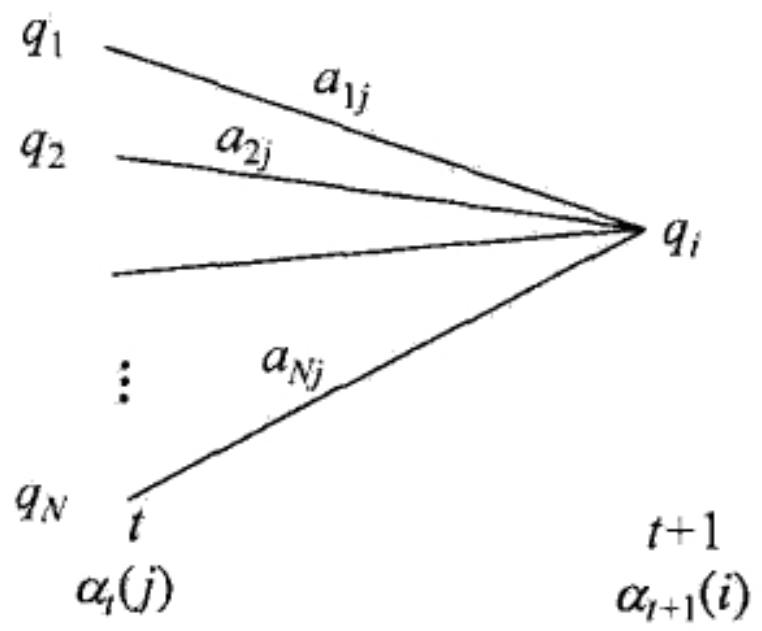

复杂度

$$
O ( N ^ { 2 } T )
$$

## 前向算法

·减少计算量的原因在于每一次计算，直接引用前一个时刻的计算结果，避免重复计算。

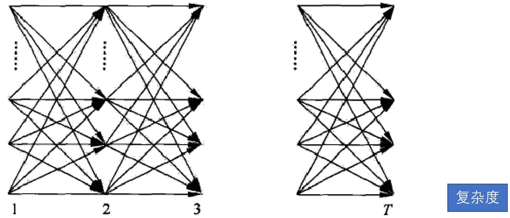  
图10.2观测序列路径结构

例：

$$
A = \left[ \begin{array} { l l l } { 0 . 5 } & { 0 . 2 } & { 0 . 3 } \\ { 0 . 3 } & { 0 . 5 } & { 0 . 2 } \\ { 0 . 2 } & { 0 . 3 } & { 0 . 5 } \end{array} \right] , ~ B = \left[ \begin{array} { l l } { 0 . 5 } & { 0 . 5 } \\ { 0 . 4 } & { 0 . 6 } \\ { 0 . 7 } & { 0 . 3 } \end{array} \right]
$$

$$
\pi = ( 0 . 2 , 0 . 4 , 0 . 4 ) ^ { \mathrm { T } }
$$

设T=3，O=(红，白，红)，试用前向算法计算 $P ( O \mid \lambda )$

解 按照算法10.2

（1）计算初值

$$
\alpha _ { 1 } ( 1 ) = \pi _ { 1 } b _ { 1 } ( o _ { \mathrm { i } } ) = 0 . 1 0
$$

$$
\alpha _ { 1 } ( 2 ) = \pi _ { 2 } b _ { 2 } ( o _ { 1 } ) = 0 . 1 6
$$

$$
\alpha _ { 1 } ( 3 ) = \pi _ { 3 } b _ { 3 } ( o _ { \mathrm { i } } ) = 0 . 2 8
$$

例：

## （2）递推计算

$$
\alpha _ { 2 } ( 1 ) = \left[ \sum _ { i = 1 } ^ { 3 } \alpha _ { 1 } ( i ) a _ { i 1 } \right] b _ { 1 } ( o _ { 2 } ) = 0 . 1 5 4 \times 0 . 5 = 0 . 0 7 7
$$

$$
\alpha _ { 2 } ( 2 ) = \left[ \sum _ { i = 1 } ^ { 3 } \alpha _ { 1 } ( i ) a _ { i 2 } \right] b _ { 2 } ( \sigma _ { 2 } ) = 0 . 1 8 4 \times 0 . 6 = 0 . 1 1 0 4
$$

$$
\mathcal { \alpha } _ { 2 } ( 3 ) = \left[ \sum _ { i = 1 } ^ { 3 } \mathcal { \alpha } _ { 1 } ( i ) a _ { i , 3 } \right] b _ { 3 } ( \sigma _ { 2 } ) = 0 . 2 0 2 \times 0 . 3 = 0 . 0 6 0 6
$$

$$
\alpha _ { 3 } ( 1 ) = \biggl [ \sum _ { i = 1 } ^ { 3 } \alpha _ { 2 } ( i ) a _ { i 1 } \biggr ] b _ { 1 } ( o _ { 3 } ) = 0 . 0 4 1 8 7
$$

$$
\alpha _ { 3 } ( 2 ) = \left[ \sum _ { i = 1 } ^ { 3 } \alpha _ { 2 } ( i ) a _ { i 2 } \right] b _ { 2 } ( \sigma _ { 3 } ) = 0 . 0 3 5 5 1
$$

$$
\alpha _ { 3 } ( 3 ) = \left[ \sum _ { i = 1 } ^ { 3 } \alpha _ { 2 } ( i ) a _ { i 3 } \right] b _ { 3 } ( o _ { 3 } ) = 0 . 0 5 2 8 4
$$

例：

（3）终止

$$
P ( O \mid \lambda ) = \sum _ { i = 1 } ^ { 3 } \alpha _ { 3 } ( i ) = 0 . 1 3 0 2 2
$$

## 后向算法

•定义10.3 后向概率：给定隐马尔科夫模型λ，定义在时刻t状态为qi的条件下，从t+1到T的部分观测序列为： $\boldsymbol { \mathcal { O } } _ { t + 1 } , \boldsymbol { \mathcal { O } } _ { t + 2 ^ { 5 } } , \cdots , \boldsymbol { \mathcal { O } } _ { T }$ 的概率为后向概率，记作：

$$
\beta _ { t } ( i ) = P ( o _ { t + 1 } , o _ { t + 2 } , \cdots , o _ { T } \mid i _ { t } = q _ { i } , \lambda )
$$

可以用递推的方法求得后向概率 $\beta _ { t } \{ i \}$ 及观测序列概率 $P ( O \mid \lambda )$

## 后向算法

## 算法10.3(观测序列概率的后向算法）

输入：隐马尔可夫模型λ，观测序列 $o$

输出：观测序列概率 $P ( O \mid \lambda )$

（1)

$$
\beta _ { r } ( i ) = 1 , \quad i = 1 , 2 , \cdots , N
$$

（2）对 $t = T - 1 , T - 2 , \cdots , 1$

$$
\beta _ { t } ( i ) = \sum _ { j = 1 } ^ { N } a _ { i j } b _ { j } \left( \sigma _ { t + 1 } \right) \beta _ { t + 1 } ( j ) \ , i = 1 , 2 , \cdots , N
$$

（3）

$$
P ( O \mid \lambda ) = \sum _ { i = 1 } ^ { N } \pi _ { i } b _ { i } ( o _ { 1 } ) \beta _ { 1 } ( i )
$$

## 后向算法

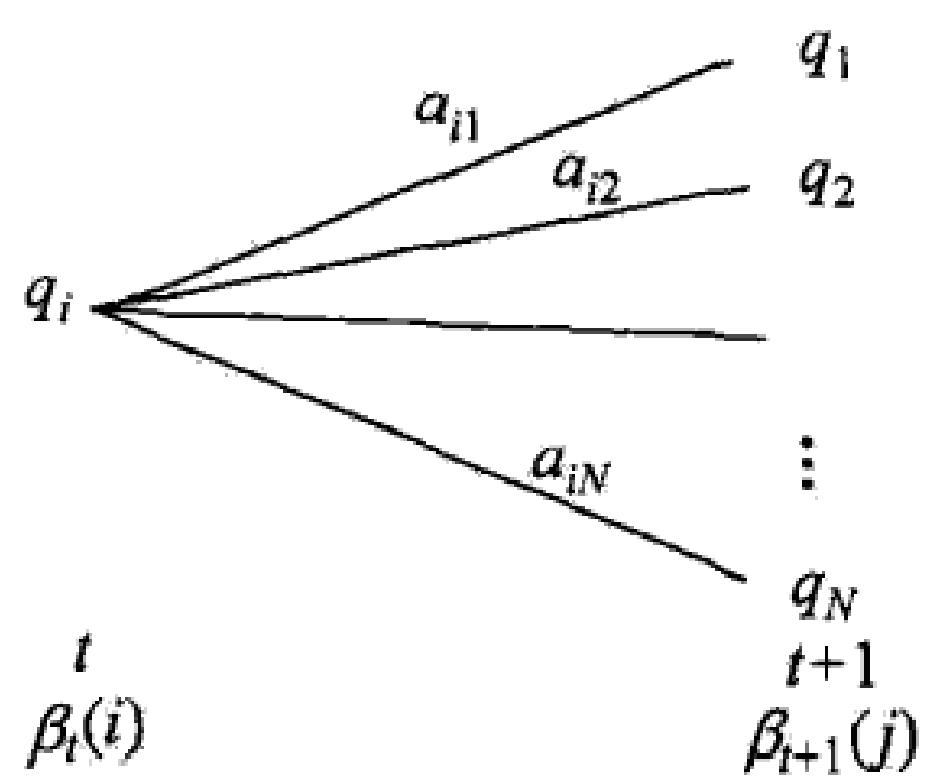

•前向后向统一写为：(t=1 和t=T-1分别对应)

$$
P ( O \mid \lambda ) = \sum _ { i = 1 } ^ { N } \sum _ { j = 1 } ^ { N } \alpha _ { i } ( i ) a _ { i j } b _ { j } ( o _ { i + 1 } ) \beta _ { i + 1 } ( j ) \ , t = 1 , 2 , \cdots , T - 1
$$

## 一些概率和期望值的计算

1．给定模型λ和观测O，在时刻处于状态 $q$ 的概率.

记 $\gamma _ { i } ( i ) = P ( i _ { t } = q _ { i } \mid O , \lambda )$

$$
\gamma _ { \iota } ( i ) = P ( i , = q _ { \iota } \mid O , \lambda ) = \frac { P ( i _ { \iota } = q _ { \iota } , O \mid \lambda ) } { P ( O \mid \lambda ) }
$$

$$
\alpha _ { t } ( i ) \beta _ { t } ( i ) = P ( i _ { t } = q _ { i } , O \mid \lambda )
$$

$$
\gamma _ { t } ( i ) = \frac { \alpha _ { t } ( i ) \beta _ { t } ( i ) } { P ( O \mid \lambda ) } = \frac { \alpha _ { t } ( i ) \beta _ { t } ( i ) } { \displaystyle \sum _ { j = 1 } ^ { N } \alpha _ { t } ( j ) \beta _ { t } ( j ) }
$$

## 一些概率和期望值的计算

2．给定模型λ和观测O，在时刻t处于状态 $\pmb { q } _ { i }$

且在时刻+1处于状态 $q _ { j }$ 的概率．记

$$
\xi _ { \iota } ( i , j ) = P ( i _ { t } = q _ { i } , i _ { t + 1 } = q _ { j } \ | \ O , \lambda )
$$

通过前向后向概率计算：

$$
\xi _ { t } ( i , j ) = \frac { P ( i _ { t } = q _ { i } , i _ { t + 1 } = q _ { j } , O \mid \lambda ) } { P ( O \mid \lambda ) } = \frac { P ( i _ { t } = q _ { i } , i _ { t + 1 } = q _ { j } , O \mid \lambda ) } { \displaystyle \sum _ { i = 1 } ^ { N } \sum _ { j = 1 } ^ { N } P ( i _ { t } = q _ { i } , i _ { t + 1 } = q _ { j } , O \mid \lambda ) }
$$

$$
P ( i _ { t } = q _ { i } , i _ { t + 1 } = q _ { j } , O \mid \lambda ) = \alpha _ { t } ( i ) a _ { i j } b _ { j } ( o _ { t + 1 } ) \beta _ { t + 1 } ( j )
$$

$$
\xi _ { \iota } ( i , j ) = \frac { \alpha _ { \iota } ( i ) a _ { i j } b _ { j } ( o _ { t + 1 } ) \beta _ { t + 1 } ( j ) } { \displaystyle \sum _ { i = 1 } ^ { N } \sum _ { j = 1 } ^ { N } \alpha _ { \iota } ( i ) a _ { i j } b _ { j } ( o _ { t + 1 } ) \beta _ { t + 1 } ( j ) }
$$

## 一些概率和期望值的计算

3.将 $\gamma _ { t } ( i )$ 和 $\xi _ { j } ( i , j )$ 对各个时刻求和，可以得到一些有用的期望值：

（1）在观测 $o$ 下状态i出现的期望值

$$
\sum _ { t = 1 } ^ { T } \gamma _ { t } ( i )
$$

（2）在观测O下由状态i转移的期望值

$$
\sum _ { t = 1 } ^ { T - 1 } \gamma _ { t } ( i )
$$

（3）在观测 $o$ 下由状态i转移到状态j的期望值

$$
\sum _ { t = 1 } ^ { T - 1 } \xi _ { t } ( i , j )
$$

## 学习算法

监督学习方法：

•假设训练数据是包括观测序列O和对应的状态序列

$$
\left\{ ( O _ { 1 } , I _ { 1 } ) , ( O _ { 2 } , I _ { 2 } ) , \cdots , ( O _ { s } , I _ { s } ) \right\}
$$

• 可以利用极大似然估计法来估计隐马尔可夫模型参数。

非监督学习方法：

•假设训练数据只有S个长度为T的观测序{O1,O2..Os},

·采用Baum-Welch算法

## 监督学习方法

·已知： $\left\{ ( O _ { 1 } , I _ { 1 } ) , ( O _ { 2 } , I _ { 2 } ) , \cdots , ( O _ { s } , I _ { s } ) \right\}$

•1、转移概率 $\mathsf { a } _ { \mathsf { i } }$ 的估计：

•设样本中时刻t处于状态i，时刻t+1转移到状态j的频数为 $\mathsf { A } _ { \mathrm { i j } }$ ，那么状态转移概率 $\mathsf { a } _ { \mathsf { i } }$ 的估计是：

$$
\hat { a } _ { i j } = \frac { A _ { i j } } { \displaystyle \sum _ { j = 1 } ^ { N } A _ { i j } } ~ , ~ i = 1 , 2 , \cdots , N ~ ; ~ j = 1 , 2 , \cdots , N
$$

## 监督学习方法

·已知: $\left\{ ( O _ { 1 } , I _ { 1 } ) , ( O _ { 2 } , I _ { 2 } ) , \cdots , ( O _ { s } , I _ { s } ) \right\}$

•2、观测概率 $\mathsf { b } _ { \mathrm { i } } ( \mathsf { k } )$ 的估计：设样本中状态为j并观测为k的频数是 $\bar { \mathsf { B } _ { \mathrm { j } } } ( \mathsf { k } )$ ，那么状态为j观测为k的概率

$$
\hat { b } _ { j } ( k ) = \frac { B _ { j k } } { \displaystyle \sum _ { k = 1 } ^ { M } B _ { j k } } , \qquad j = 1 , 2 , \cdots , N _ { \mathrm { ~ i ~ } } k = 1 , 2 , \cdots , M
$$

•3、初始状态概率 $\pi _ { i }$ 的估计 $\hat { \pi } _ { i }$ 为S个样本中初始状 态为qi的频率。

往往人工标注数据很贵

## Baum-Welch算法

· 假定训练数据只包括 $\{ 0 1 , 0 2 , . . . 0 s \} ,$

·求模型参数 $\begin{array} { r l } { \mathbf { \nabla } \lambda = } & { { } \left( \mathsf { A } , \mathsf { B } , \pi \right) } \end{array}$

•实质上是有隐变量的概率模型：EM算法

$$
P ( O \mid \lambda ) = \sum _ { I } P ( O \mid I , \lambda ) P ( I \mid \lambda )
$$

•1、确定完全数据的对数似然函数

完全数据 $( O , I ) = ( o _ { 1 } , o _ { 2 } , \cdots , o _ { T } , i _ { 1 } , i _ { 2 } , \cdots , i _ { T } )$

完全数据的对数似然函数 $\log { P ( O , I | \lambda ) }$

## Baum Welch算法

·2、EM的E步求 $2$ 函数 $Q ( 1 , \sqrt { 7 } )$

$$
\mathcal { Q } ( \lambda , \overline { { \lambda } } ) = \sum _ { I } \log P ( O , I \mid \lambda ) P ( O , I \mid \overline { { \lambda } } )
$$

$$
P ( O , I \mid \lambda ) = \pi _ { i _ { 1 } } b _ { i _ { 1 } } ( o _ { 1 } ) a _ { i _ { 1 } i _ { 2 } } b _ { i _ { 2 } } ( o _ { 2 } ) \cdots a _ { i _ { T - 1 } i _ { T } } b _ { i _ { T } } ( o _ { T } )
$$

$$
\begin{array} { r l } & { \mathcal { Q } ( \lambda , \overline { { \lambda } } ) = \displaystyle \sum _ { I } \log \pi _ { i _ { 1 } } P ( O , I \mid \overline { { \lambda } } ) } \\ & { \qquad + \displaystyle \sum _ { I } \left( \sum _ { t = 1 } ^ { T - 1 } \log a _ { i _ { t + 1 } } \right) P ( O , I \mid \overline { { \lambda } } ) + \displaystyle \sum _ { I } \left( \sum _ { t = 1 } ^ { T } \log b _ { i _ { t } } ( o _ { t } ) \right) P ( O , I \mid \overline { { \lambda } } ) } \end{array}
$$

•对序列总长度T进行

## Baum Welch算法

•3、EM算法的M 步，极大化 $Q ( \lambda , \lambda )$ 求模型参数 $\mathsf { A } , \mathsf { B } , \pi$

第一项： $\sum _ { I } \log \pi _ { i _ { 0 } } P ( O , I \mid \overline { { \lambda } } ) = \sum _ { i = 1 } ^ { N } \log \pi _ { i } P ( O , i _ { 1 } = i \mid \overline { { \lambda } } )$

由约束条件: $\sum _ { i = 1 } ^ { N } \pi _ { i } = 1$ 利用拉格朗日乘子：

$$
\sum _ { i = 1 } ^ { N } \log \pi _ { i } P ( O , i _ { 1 } = i \mid \overline { { \lambda } } ) + \gamma \Biggl ( \sum _ { i = 1 } ^ { N } \pi _ { i } - 1 \Biggr )
$$

求偏导数， 并结果为0

$$
\frac { \partial } { \partial \pi _ { i } } \Biggl [ \sum _ { i = 1 } ^ { N } \log \pi _ { i } P ( O , i _ { 1 } = i \mid \overline { { { \lambda } } } ) + \gamma \Biggl ( \sum _ { i = 1 } ^ { N } \pi _ { i } - 1 \Biggr ) \Biggr ] = 0
$$

P(O,i=i|λ)\$ ·得：P(O,j =i|λ)+γm=0γ=-P(O|λ) π= P(O|λ)

## 学习算法 Baum Welch算法

•3、EM算法的M步，极大化 $Q ( 1 , \pi )$ 求A，B,π第二项可写成：

$$
{ \sum _ { I } } { \left( \sum _ { t = 1 } ^ { T - 1 } \log { { a _ { i , i _ { t + 1 } } } } \right) } P ( 0 , I \mid \overline { { \lambda } } ) { = } \sum _ { i = 1 } ^ { N } \sum _ { j = 1 } ^ { N } \sum _ { t = 1 } ^ { T - 1 } \log { { a _ { i } } } P ( O , i _ { t } = i , i _ { t + 1 } = j \mid \overline { { \lambda } } )
$$

由约束条件 $\sum _ { j = 1 } ^ { N } a _ { i j } = 1$ 拉格朗日乘子法:日·

·得：

$$
a _ { i j } = \frac { \displaystyle \sum _ { t = 1 } ^ { T - 1 } P ( { \cal O } , i _ { t } = i , i _ { t + 1 } = j \mid \overline { { \lambda } } ) } { \displaystyle \sum _ { t = 1 } ^ { T - 1 } P ( { \cal O } , i _ { t } = i \mid \overline { { \lambda } } ) }
$$

## Baum Welch算法

•3、EM算法的M步，极大化 $Q ( 1 , \overline { { 1 } } )$ 求 $\mathsf { A } , \mathsf { B } , \pi$

第三项：

$$
\sum _ { I } \Biggl ( \sum _ { t = 1 } ^ { T } \log b _ { i _ { t } } ( o _ { t } ) \Biggr ) P ( O , I | \overline { { \lambda } } ) = \sum _ { j = 1 } ^ { N } \sum _ { t = 1 } ^ { T } \log b _ { j } ( o _ { t } ) P ( O , i _ { t } = j | \overline { { \lambda } } )
$$

由约束条件: $\sum _ { k = 1 } ^ { M } b _ { j } ( k ) = 1$

注意，只有在 $o _ { i } = v _ { i }$ 时 $b _ { j } ( \sigma _ { i } )$ 对 $b _ { j } ( k )$ 的偏导数才不为0，

以 $I ( o _ { i } = \nu _ { i } )$ 表示．求得

$$
b _ { j } ( k ) = \frac { \displaystyle \sum _ { t = 1 } ^ { T } P ( O , i _ { t } = j \mid \overline { { \lambda } } ) I ( o _ { t } = \nu _ { k } ) } { \displaystyle \sum _ { t = 1 } ^ { T } P ( O , i _ { t } = j \mid \overline { { \lambda } } ) }
$$

## 学习算法 Baum Welch算法

·将已上得到的概率分别月 $\gamma _ { t } ( i ) , \xi _ { t } ( i , j )$ 表示：

$$
a _ { i j } = \frac { \displaystyle \sum _ { t = 1 } ^ { T - 1 } \xi _ { t } ( i , j ) } { \displaystyle \sum _ { t = 1 } ^ { T - 1 } \gamma _ { t } ( i ) } \qquad b _ { j } ( k ) = \frac { \displaystyle \sum _ { t = 1 , o _ { t } = \nu _ { k } } ^ { T } \gamma _ { t } ( j ) } { \displaystyle \sum _ { t = 1 } ^ { T } \gamma _ { t } ( j ) } \qquad \qquad \pi _ { i } = \gamma _ { 1 } ( i )
$$

## 学习算法 Baum Welch算法

## 算法10.4（Baum-Welch算法）

输入：观测数据 $O = ( o _ { 1 } , o _ { 2 } , \cdots , o _ { T } )$

输出：隐马尔可夫模型参数.

（1）初始化

对 $\pmb { n = 0 }$ ，选取 ${ a _ { i j } } ^ { ( 0 ) } , ~ b _ { j } ( k ) ^ { ( 0 ) } , ~ \pi _ { i } ^ { ( 0 ) }$ ，得到模型 $\lambda ^ { ( 0 ) } = ( A ^ { ( 0 ) } , B ^ { ( 0 ) } , \pi ^ { ( 0 ) } )$

（2）递推.对 $\ n = 1 , 2 , \cdots$

$$
\begin{array} { c c } { { \displaystyle { a _ { i j } ^ { _ { ( n + 1 ) } } = \frac { \displaystyle { \sum _ { t = 1 } ^ { T - 1 } \xi _ { t } ( i , j ) } } { \displaystyle { \sum _ { t = 1 } ^ { T - 1 } \gamma _ { t } ( i ) } } } } } & { { \mathrm { ~ } } } & { { \mathrm { ~ } } } \\ { { \displaystyle { a _ { i j } ^ { _ { ( n + 1 ) } } = \frac { \displaystyle { \sum _ { t = 1 } ^ { T - 1 } \xi _ { t } ( i , j ) } } { \displaystyle { \sum _ { t = 1 } ^ { T - 1 } \gamma _ { t } ( i ) } } } } } & { { \mathrm { ~ } } } & { { \displaystyle { b _ { j } ( k ) ^ { _ { ( n + 1 ) } } = \frac { \displaystyle { \sum _ { t = 1 , o _ { t } = \nu _ { k } } ^ { T } \gamma _ { t } ( j ) } } { \displaystyle { \sum _ { t = 1 } ^ { T } \gamma _ { t } ( j ) } } } } } \\ { { \displaystyle { \mathrm { ~ } } } } & { { \mathrm { ~ } } } & { { \mathrm { ~ } } } \\ { { \displaystyle { \qquad \sum _ { t = 1 } ^ { T - 1 } \gamma _ { t } ( i ) } } } & { { \displaystyle { \pi _ { i } ^ { _ { ( n + 1 ) } } = \gamma _ { 1 } ( i ) } } } \end{array}
$$

右端各值按观测 $O = ( o _ { 1 } , o _ { 2 } , \cdots , o _ { \tau } )$ 和模型 $\lambda ^ { ( n ) } = ( A ^ { ( n ) } , B ^ { ( n ) } , \pi ^ { ( n ) } )$ 计算

（3）终止．得到模型参数 $\lambda ^ { ( n + 1 ) } = ( A ^ { ( n + 1 ) } , B ^ { ( n + 1 ) } , \pi ^ { ( n + 1 ) } )$

## 预测算法

•近似算法

·想法：在每个时刻t选择在该时刻最有可能出现的状态 $i _ { t } ^ { * }$ ，从而得到一个状态序列 $\boldsymbol { I } ^ { * } = ( \boldsymbol { i } _ { 1 } ^ { * } , \boldsymbol { i } _ { 2 } ^ { * } , \cdots , \boldsymbol { i } _ { T } ^ { * } )$ 将它作为预测的结果，在时刻t处于状态qi的概率： $\gamma _ { t } ( i ) = \frac { \alpha _ { t } ( i ) \beta _ { t } ( i ) } { P ( O \mid \lambda ) } = \frac { \alpha _ { t } ( i ) \beta _ { t } ( i ) } { \displaystyle \sum _ { j = 1 } ^ { N } \alpha _ { t } ( j ) \beta _ { t } ( j ) }$

· 在每一时刻t最有可能的状态是： $\bar { \iota } _ { t } ^ { * } = \mathrm { a r g } \operatorname* { m a x } _ { 1 \leq i \leq N } [ \gamma _ { t } ( i ) ]$ ${ t } = 1 , 2 , \cdots , T$   
从而得到状态序列: $I ^ { * } = ( I _ { 1 } ^ { * } , I _ { 2 } ^ { * } , \cdots , I _ { T } ^ { * } )$   
得到的状态有可能实际不发生

## 维特比算法

•Viterbi 方法

· 用动态规划解概率最大路径，一个路径对应一个状态序列。

• 最优路径具有这样的特性：如果最优路径在时刻t通过结点 $i _ { t } ^ { * }$ ，那么这一路径从结点 $i _ { t } ^ { * }$ 到终点 $i _ { { \tau } } ^ { * }$ 的部分路径，对于从 $i _ { t } ^ { * }$ 到 $i _ { { \tau } } ^ { * }$ 的所有可能的部分路径来说，必须是最优的。

• 只需从时刻t=1开始，递推地计算在时刻t状态为i的各条部分路径的最大概率，直至得到时刻t=T状态为i的各条路径的最大概率，时刻t=T的最大概率即为最优路径的概率P\*，最优路径的终结点 $i _ { { \tau } } ^ { * }$ 也同时得到。

•之后，为了找出最优路径的各个结点，从终结点开始，由后向前逐步求得结点 $i _ { T - 1 } ^ { * } , \cdots , i _ { 1 } ^ { * }$ ，得到最优路径

$$
I ^ { * } = ( i _ { 1 } ^ { * } , i _ { 2 } ^ { * } , \cdots , i _ { T } ^ { * } )
$$

## 维特比算法

·导入两个变量δ和ψ，定义在时刻t状态为i的所有单个路径 $( l _ { 1 } , l _ { 2 } , \cdots , i _ { r } )$ 中概率最大值为：

$$
\delta _ { t } ( i ) = \operatorname* { m a x } _ { i _ { 1 } , i _ { 2 } , \cdots , i _ { t - 1 } } P ( i _ { t } = i , i _ { t - 1 } , \cdots , i _ { 1 } , o _ { t } , \cdots , o _ { 1 } \mid \lambda ) , i = 1 , 2 , \cdots , N
$$

· 由定义可得变量δ的递推公式:

$$
\begin{array} { l } { { \delta _ { t + 1 } ( i ) = \displaystyle \operatorname* { m a x } _ { i _ { 1 } , i _ { 2 } , \cdots , i _ { t } } P ( i _ { t + 1 } = i , i _ { t } , \cdots , i _ { 1 } , o _ { t + 1 } , \cdots , o _ { 1 } \mid \lambda ) } } \\ { { \qquad = \displaystyle \operatorname* { m a x } _ { 1 \leqslant j \leqslant N } [ \delta _ { t } ( j ) a _ { j i } ] b _ { i } ( o _ { t + 1 } ) , \qquad i = 1 , 2 , \cdots , N ; \ t = 1 , 2 , \cdots , T - 1 } } \end{array}
$$

·定义在时刻t状态为i的所有单个路径中概率最大的路径的第t-1个结点为 $( i _ { 1 } , i _ { 2 } , \cdots , i _ { t - 1 } , i )$

$$
\psi _ { t } ( i ) = \arg \operatorname* { m a x } _ { 1 \leqslant j \leqslant N } [ \delta _ { t - 1 } ( j ) a _ { j i } ] , \quad \ i = 1 , 2 , \cdots , N
$$

## Viterbi方法

算法10.5（维特比算法）

输入：模型 $\lambda = ( A , B , \pi )$ 和观测 $O = ( o _ { 1 } , o _ { 2 } , \cdots , o _ { T } )$

输出：最优路径 $I ^ { * } = ( i _ { 1 } ^ { * } , i _ { 2 } ^ { * } , \cdots , i _ { T } ^ { * } )$

（1）初始化

$$
\delta _ { \mathrm { i } } ( i ) = \pi _ { i } b _ { i } ( o _ { \mathrm { i } } ) \ : , \ : \ : \ : \ : \ : i = 1 , 2 , \cdots , N
$$

$$
\psi _ { 1 } ( i ) = 0 , \qquad i = 1 , 2 , \cdots , N
$$

（2）递推.对 $\ v _ { t } = 2 , 3 , \cdots , T$

$$
\delta _ { t } ( i ) = \operatorname* { m a x } _ { 1 \leqslant j \leqslant N } [ \delta _ { t - 1 } ( j ) a _ { j i } ] b _ { i } ( o _ { t } ) , \quad \quad i = 1 , 2 , \cdots , N
$$

$$
\psi _ { t } ( i ) = \arg \operatorname* { m a x } _ { 1 \leqslant j \leqslant N } [ \delta _ { t - 1 } ( j ) a _ { j i } ] , \quad i = 1 , 2 , \cdots , N
$$

## Viterbi方法

（3）终止

$$
P ^ { * } = \operatorname* { m a x } _ { 1 \leq i \leq N } \delta _ { T } ( \vec { t } )
$$

$$
i _ { T } ^ { \star } = \arg \operatorname* { m a x } _ { 1 \leqslant i \leqslant N } [ \delta _ { T } ( i ) ]
$$

（4）最优路径回溯．对 $t = T - 1 , T - 2 , \cdots , 1$

$$
\boldsymbol { l } _ { i } ^ { * } = \psi _ { i + 1 } ( \boldsymbol { l } _ { i + 1 } ^ { * } )
$$

求得最优路径 $I ^ { * } = ( i _ { 1 } ^ { * } , i _ { 2 } ^ { * } , \cdots , i _ { T } ^ { * } )$

例

$$
\begin{array} { r } { A = \left[ \begin{array} { l l l } { 0 . 5 } & { 0 . 2 } & { 0 . 3 } \\ { 0 . 3 } & { 0 . 5 } & { 0 . 2 } \\ { 0 . 2 } & { 0 . 3 } & { 0 . 5 } \end{array} \right] , \quad B = \left[ \begin{array} { l l } { 0 . 5 } & { 0 . 5 } \\ { 0 . 4 } & { 0 . 6 } \\ { 0 . 7 } & { 0 . 3 } \end{array} \right] , \quad \pi = ( 0 . 2 , 0 . 4 , 0 . 4 ) ^ { \mathrm { T } } } \end{array}
$$

$O = ( \pm \sqrt { 2 } )$ 白，红），试求最优状态序列，即最优路径 $I ^ { * } = ( i _ { 1 } ^ { * } , i _ { 2 } ^ { * } , i _ { 2 } ^ { * } )$

•1、，初始化：在t=1时，对每一个状态i，i=1,2,3，求状态i观测O1为红的概率，记为: $\pmb { \delta } _ { \imath } ( i )$

$$
\delta _ { \mathrm { t } } ( i ) = \pi _ { i } b _ { i } ( o _ { 1 } ) = \pi _ { i } b _ { i } ( \underline { { { \xi \mathrm { I } } } } ) ~ , \quad i = 1 , 2 , 3
$$

•代入实际数据: $\delta _ { 1 } ( 1 ) = 0 . 1 0 ~ , ~ \delta _ { 1 } ( 2 ) = 0 . 1 6 ~ , ~ \delta _ { 1 } ( 3 ) = 0 . 2 8$

记 $\psi _ { 1 } ( i ) = 0 , i = 1 , 2 , 3$

## 例

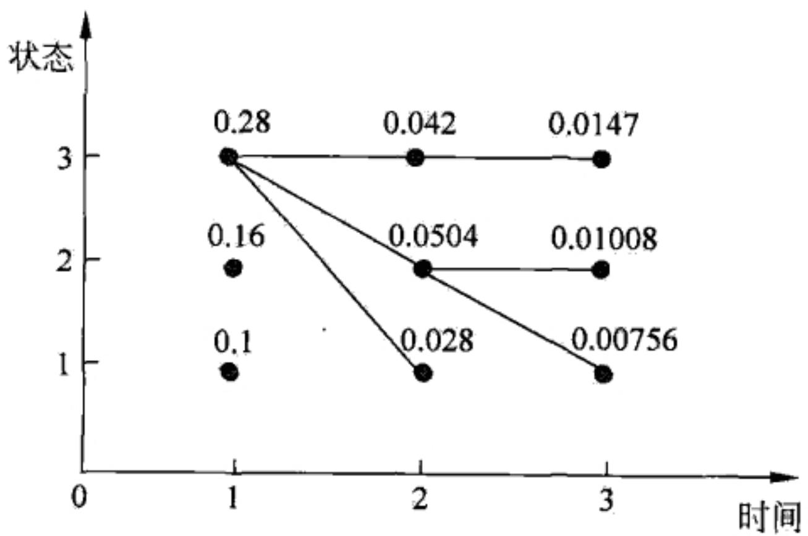  
图10.4求最优路径

例

•2、在t=2时，对每一个状态i，i=1,2,3，求在t=1时状态为j观测O1为红并在t=2时状态为i观测O2位白的路径的最大概率，记为 $\delta _ { z } ( i )$

$$
\delta _ { 2 } ( i ) = \operatorname* { m a x } _ { 1 \leq j \leq 3 } [ \delta _ { 1 } ( j ) a _ { j i } ] b _ { i } ( o _ { 2 } )
$$

·同时，对每个状态i，记录概率最大路径的前一个状态j

$$
\psi _ { 2 } ( i ) = \arg \operatorname* { m a x } _ { 1 \leqslant j \leqslant 3 } \left[ \delta _ { 1 } ( j ) a _ { j i } \right] , \quad \ i = 1 , 2 , 3
$$

例

计算：

$$
\begin{array} { r l } & { \delta _ { 2 } ( 1 ) = \underset { 1 \leqslant j \leqslant 3 } { \operatorname* { m a x } } [ \delta _ { 1 } ( j ) a _ { j 1 } ] b _ { 1 } ( o _ { 2 } ) } \\ & { \qquad = \underset { j } { \operatorname* { m a x } } \{ 0 . 1 0 \times 0 . 5 , 0 . 1 6 \times 0 . 3 , 0 . 2 8 \times 0 . 2 \} \times 0 . 5 } \\ & { \qquad = 0 . 0 2 8 } \end{array}
$$

$$
\psi _ { 2 } ( 1 ) = 3
$$

$$
\delta _ { 2 } ( 2 ) = 0 . 0 5 0 4 , \psi _ { 2 } ( 2 ) = 3
$$

$$
\delta _ { 2 } ( 3 ) = 0 . 0 4 2 , \psi _ { 2 } ( 3 ) = 3
$$

同样，在t=3时

$$
\delta _ { 3 } ( i ) = \operatorname* { m a x } _ { 1 \leqslant j \leqslant 3 } [ \delta _ { 2 } ( j ) a _ { j i } ] b _ { i } ( o _ { 3 } )
$$

$$
\psi _ { 3 } ( i ) = \arg \operatorname* { m a x } _ { 1 \leqslant j \leqslant 3 } [ \delta _ { 2 } ( j ) a _ { j i } ]
$$

$$
\delta _ { 3 } ( 1 ) = 0 . 0 0 7 5 6 , \psi _ { 3 } ( 1 ) = 2
$$

$$
\delta _ { 3 } ( 2 ) = 0 . 0 1 0 0 8 , \psi _ { 3 } ( 2 ) = 2
$$

$$
\delta _ { 3 } ( 3 ) = 0 . 0 1 4 7 , \psi _ { 3 } ( 3 ) = 3
$$


·3、以 $P ^ { * }$ 表示最优路径的概率：

$$
P ^ { * } = \operatorname* { m a x } _ { 1 \leqslant i \leqslant 3 } \delta _ { 3 } ( i ) = 0 . 0 1 4 7
$$

• 最优路径的终点是：

$$
\bar { i } _ { 3 } ^ { * } = \arg \operatorname* { m a x } _ { i } [ \delta _ { 3 } ( i ) ] = 3
$$

•4、由最优路径的终点 $i _ { 3 } ^ { + }$ ，逆向找到 $i _ { 2 } ^ { * } , i _ { 1 } ^ { * }$

在t=2时， $i _ { 2 } ^ { * } \approx \psi _ { 3 } ( i _ { 3 } ^ { * } ) = \psi _ { 3 } ( 3 ) = 3$

$$
\# \neq t = 1 \ \# \{ \bf { \cdot }  \ i _ { 1 } ^ { * } = \psi _ { 2 } ( i _ { 2 } ^ { * } ) = \psi _ { 2 } ( 3 ) = 3
$$

于是求得最优路径，即最优状态序列：

$$
I ^ { \star } = ( i _ { 1 } ^ { \ast } , i _ { 2 } ^ { \ast } , i _ { 3 } ^ { \ast } ) = ( 3 , 3 , 3 )
$$

## 人脸检测

人脸检测

人脸库

预处理

特征提取

分类识别

## 人脸检测

•人脸图像预处理

·光线补偿

$$
I _ { _ { a v e } } = \frac { 1 } { N } \sum _ { i = 1 } ^ { N } I _ { i } \qquad I _ { _ { \mathrm { m o d i f y } } } = \left( 1 2 7 - I _ { _ { a v e } } \right) + I _ { i }
$$

•中值滤波

·归一化处理

$$
G \left( i , j \right) = \frac { I \left( i , j \right) - m } { v } \times s v + s m
$$

## 人脸识别

·HMM训练步骤：对每个人脸建立一个HMM

•1、人脸特征向量提取

•2、建立公用的HMM模型

•3、HMM初始参数确定

•4、初始模型参数训练，主要是运用Viterbi算法训练均匀分割得到参数，求得最佳分割点，然后重新计算模型初始参数，直到模型收敛为止。

•5、人脸模型训练过程，将(1)中得到的观测向量代入(4)中得到的模型参数进行训练，使用迭代方法调整模型参数达到最优。

## 人脸检测

• 1、人脸特征向量提取：

・基于奇异值分解的特征提取

•离散余弦变換

• 多维尺度分析(MDS)

• 人脸等密度线分析匹配方法、

·弹性图匹配方法

## 人脸检测

·SVD

奇异矩阵A可以分解为以下形式：

$$
\boldsymbol { A } = \boldsymbol { U } \left( \begin{array} { l l } { \Delta } & { 0 } \\ { 0 } & { 0 } \end{array} \right) \boldsymbol { V } ^ { T }
$$

•稳定性：由于奇异值特征向量具有良好的稳定性，所以它对图像噪音、图像光照条件引起的灰度变化具有不敏感的特性；

• 转置不变性：A和A转置具有相同的奇异值；

• 旋转不变性：图像A和旋转后的图像有相同的特征向量；

• 唯一不变性：对矩阵A换两行或者两列仍然具有相同的特征向量；

镜像变换不变形:

## 人脸检测

·HMM模型

状态

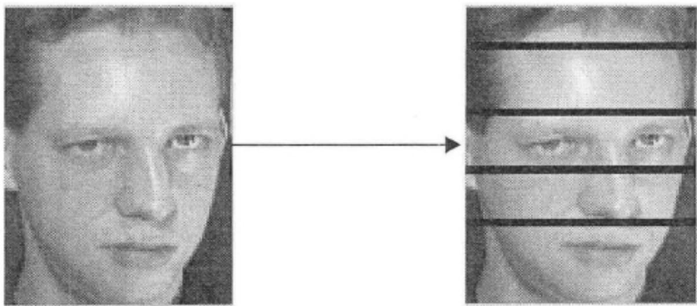

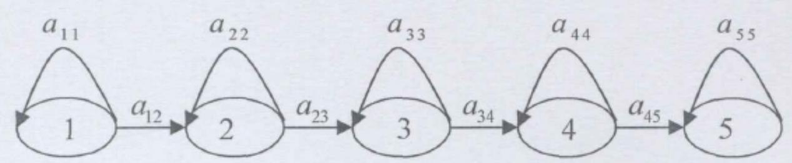

## 人脸检测

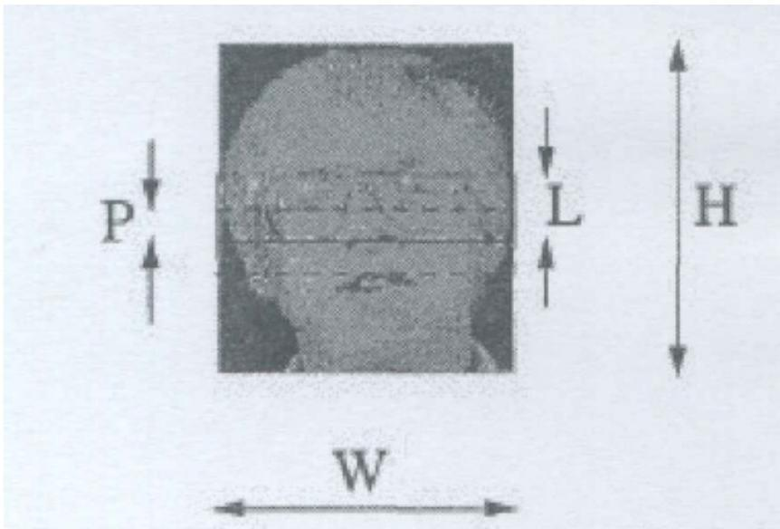

$$
T = \frac { H - L } { L - P } + 1
$$

## 人脸检测

•3、初始参数确定：

• π = (1,0,0,0,0)

•A矩阵：

$$
\scriptstyle A = { \left[ \begin{array} { l l l l l } { { \frac { 1 9 } { 2 0 } } } & { { \frac { 1 } { 2 0 } } } & { 0 } & { 0 } & { 0 } \\ { 0 } & { { \frac { 1 9 } { 2 0 } } } & { { \frac { 1 } { 2 0 } } } & { 0 } & { 0 } \\ { 0 } & { 0 } & { { \frac { 1 9 } { 2 0 } } } & { { \frac { 1 } { 2 0 } } } & { 0 } \\ { 0 } & { 0 } & { 0 } & { { \frac { 1 9 } { 2 0 } } } & { { \frac { 1 } { 2 0 } } } \\ { 0 } & { 0 } & { 0 } & { 0 } & { 1 } \end{array} \right] }
$$

•B矩阵：用混合高斯模型，则是将均匀分割后得到的五个部分中的每个部分，使用K均值聚类，将每个状态聚成M类，然后分别计算每一类的均值和方差，将这两个值分别赋给高斯模型。

## 人脸检测

•初始模型

• 参数训练：

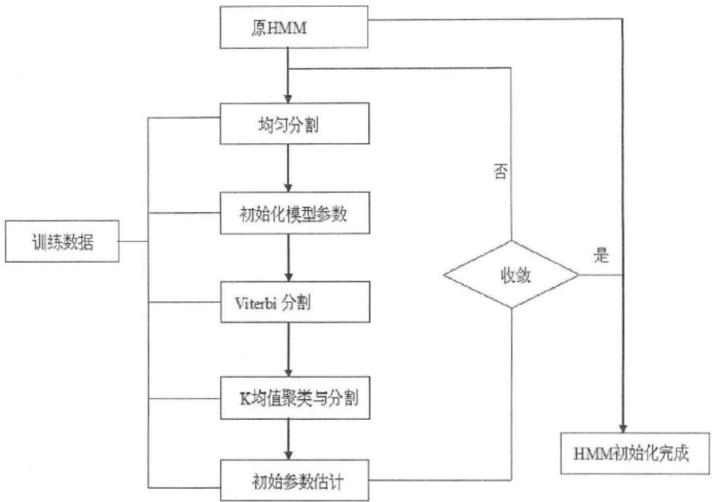  
图4.2HMM的初始化流程图

## 人脸检测

表4.1HMM实验结果（ORL）
<table><tr><td rowspan=1 colspan=1></td><td rowspan=1 colspan=1>N=2</td><td rowspan=1 colspan=1>N=3$</td><td rowspan=1 colspan=1>N=4</td></tr><tr><td rowspan=1 colspan=1>基於像素值特征的HMM[46-47]</td><td rowspan=1 colspan=1>84%</td><td rowspan=1 colspan=1>84%</td><td rowspan=1 colspan=1>84%</td></tr><tr><td rowspan=1 colspan=1>基于 SVD的HMM</td><td rowspan=1 colspan=1>82.5%</td><td rowspan=1 colspan=1>86%</td><td rowspan=1 colspan=1>85.5%</td></tr></table>

## 语音识别

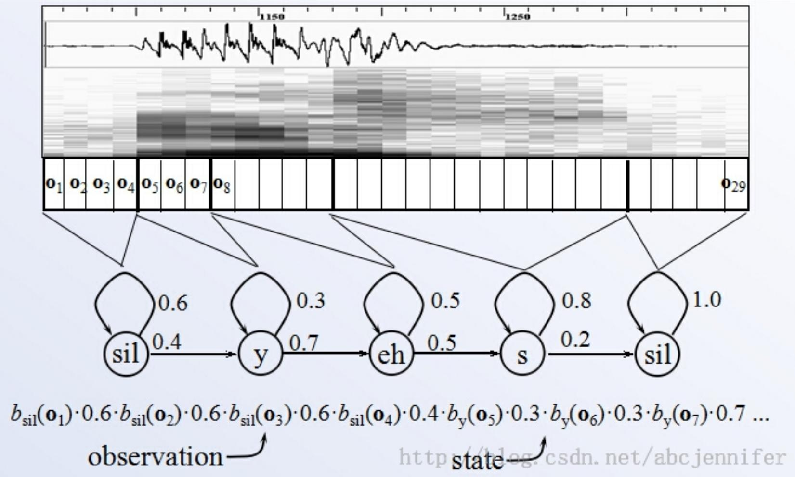

## 语音识别

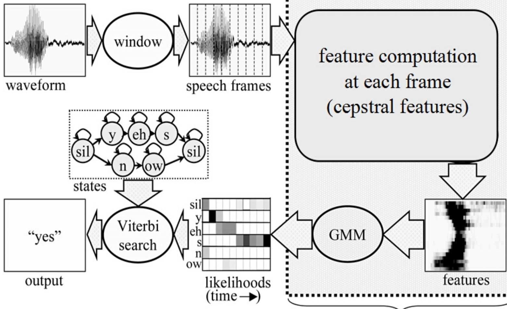  
http://forgeachrframeabc jennifer

## 隐马尔科夫模型在入侵检测中的应用

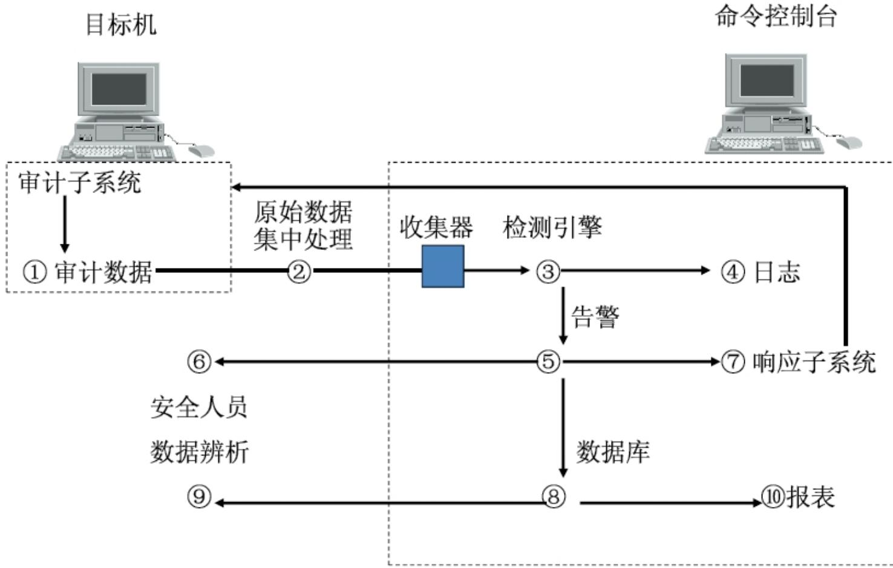  
图15.2集中式基于主机的入侵检测系统结构

## 隐马尔科夫模型在入侵检测中的应用

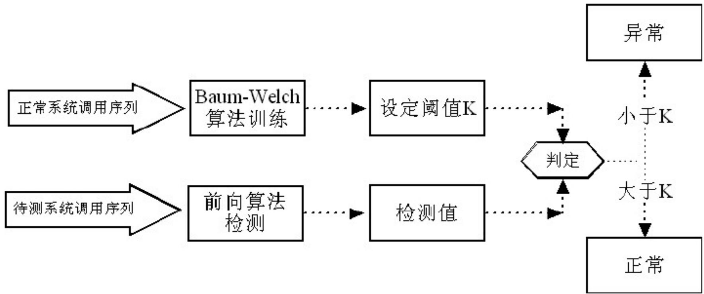

## 数据集

·两种正常系统调用序列数据集。

Sendmail正常系统调用序列数据集

• Sendmail的正常训练数据集是由1571583个系统调用构成的序列,这些系统调用分属147个不同的进程(在本实验中只考虑系统调用,不考虑进程)。

• Sendmail正常系统调用序列中包含48个唯一系统调用，这些系统调用的调用号为(按照序列中出现的顺序):4,2,66, 138, 5,23,45,27,167, 85,59,105, 104, 106, 56,19, 155, 83, 93, 94, 112, 100, 50, 128, 89, 121, 11, 1,40,38,18, 78,101,102,88,95,6,108, 32,1, 8,9,14,17,3,124,41,61。

## 数据集

Ipr的正常系统调用序列数据集

• Ipr的正常系统调用序列由2398个系统调用构成,分属9个进程,长度大约是sendmail 正常系统调用序列的六百五十五分之一。

• Lpr正常系统调用序列包含包含37个唯一系统调用，系统调用号分别为(按照序列中出现的顺序):4, 2,66,138,5, 23, 45, 27, 105, 104, 106, 83, 59, 50, 88, 167, 17, 18,155,19, 127, 93, 100, 112, 143, 128, 85, 89, 121, 3, 56, 7,119, 32, 9, 8, 94。

## END ·Q&R

## 第十一章条件随机场

## 混合高斯模型和HMM


## 行人检测和分割


## HMM到条件随机场

·HMM

CRF

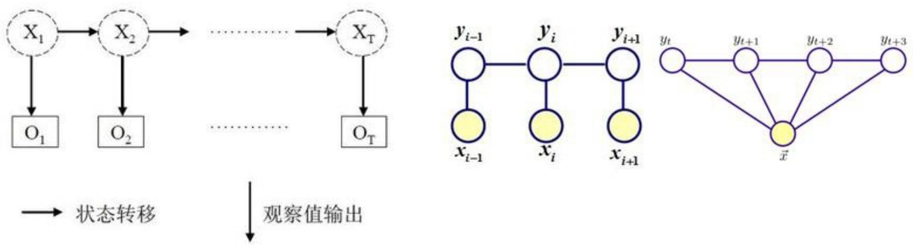

## HMM和CRF

·共性：都常用来做序列标注的建模，像词性标注，

·差异：

•HMM最大的缺点就是由于其输出独立性假设，导致其不能考虑上下文的特征，限制了特征的选择；在每一节点都要进行归一化，所以只能找到局部的最优值，同时也带来了标记偏见的问题（label bias）；

•CRF：选择上下文相关特性；不在每一个节点进行归一化，而是所有特征进行全局归一化，可以求得全局的最优值。

## 概率无向图模型

•概念:

·概率无向图模型(probabilistic undirected graphical model)

·马尔可夫随机场(Markov random field)

·可以由无向图表示的联合概率分布。

## 模型定义

·Graph

·Node

• Edge

•v，集合V

•e, 集合E

•G= (V， E)

•结点v，随机变量 $\Upsilon _ { \vee I }$ 边e，随机变量间的概率依赖关系

·概率图模型(Probabilistic graphical model)：用图表示的概率分布。

## 模型定义

•定义：

•给定一个联合概率分布P(Y)和表示它的无向图G，

•定义无向图表示的随机变量之间存在的

·成对马尔可夫性(pairwise Markov property)

·局部马尔可夫性( local Markov properly)

·全局马尔可夫性(global Markov property)

## 模型定义

·成对马尔可夫性(Pairwise Markov property)

·设u和v是无向图G中任意两个没有边连接的结点，结点u和v分别对应随机变量Yu和Yv,

• 其他所有结点为O，对应的随机变量组是YO

·给定随机变量组YO的条件下随机变量Yu和Y是条件独立的

$$
P ( Y _ { u } , Y _ { v } \mid Y _ { O } ) = P ( Y _ { u } \mid Y _ { \partial } ) P ( Y _ { v } \mid Y _ { O } )
$$

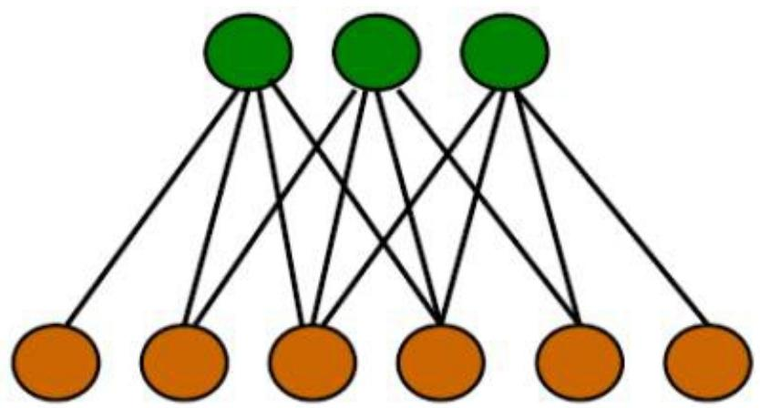

## 模型定义

·局部马尔可夫性( Local Markov properly)

•v任意结点

W与v有边相连

•0其它

$$
P ( Y _ { \nu } , Y _ { \cal O } \mid Y _ { \scriptscriptstyle \mathcal { W } } ) = P ( Y _ { \nu } \mid Y _ { \scriptscriptstyle \mathcal { W } } ) P ( Y _ { \cal O } \mid Y _ { \scriptscriptstyle \mathcal { W } } )
$$

•在 $P ( Y _ { n } \mid Y _ { n } ) > 0$ 时，等价于

$$
P ( Y _ { \nu } \mid Y _ { \nu } ) = P ( Y _ { \nu } \mid Y _ { \nu } , Y _ { o } )
$$

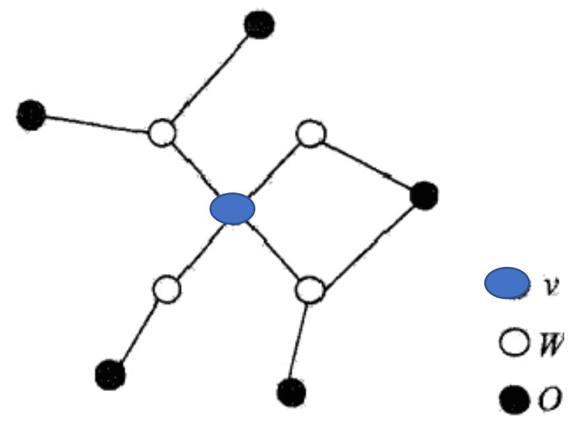

## 模型定义

·全局马尔可夫性(Global Markov property)

• 结点集合A，B是在无向图G中被结点集合C分开的任意结点集合，

$$
P ( Y _ { \cal A } , Y _ { \cal B } \mid Y _ { \cal C } ) = P ( Y _ { \cal A } \mid Y _ { \cal C } ) P ( Y _ { \cal B } \mid Y _ { \cal C } )
$$

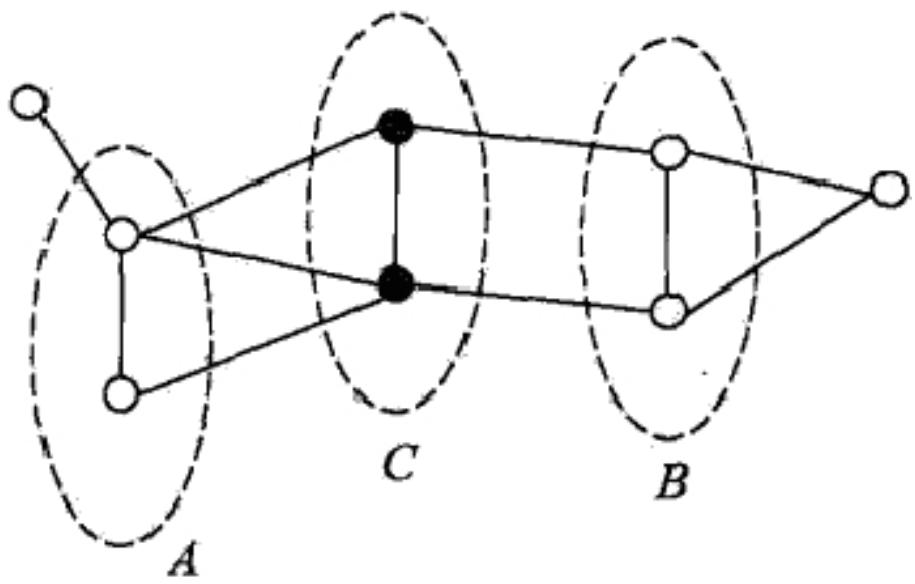

## 模型定义

•概率无向图模型：

·设有联合概率分布P(Y),由无向图G=(V，E)表示，在图G中，结点表示随机变量，边表示随机变量之间的依赖关系，

•如果联合概率分布P(Y)满足成对、局部或全局马尔可夫性， 就称此联合概率分布为概率无向图模型(probability undirected graphical model)，或马尔可夫随机场(Markov random field).

·问题关键：求联合概率，引申为对联合概率进行因子分解。

## 概率无向图模型的因子分解

•定义：团、最大团

·无向图G中任何两个结点均有边连接的结点子集称为团(clique)。

·若C是无向图G的一个团，井且不能再加进任何一个c的结点使其成为一个更大的团，则称此c为最大团(maximal clique).

· 两个结点的团？

• 三个结点的团？

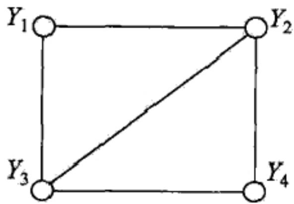

## 概率无向图模型的因子分解

•将概率无向图模型的联合概率分布表示为其最大团上的随机变量的函数的乘积形式的操作，称为概率无向图模型的因子分解(Factorization).

·给定概率无向图模型，设其无向图为G，C为G上的最大团，Yc表示C对应的随机变量，那么概率无向图模型的联合概率分布P(Y)可写作图中所有最大团C上的函数 $\pmb { { \psi } } _ { c } ^ { \prime } ( \pmb { Y } _ { c } )$ 的乘积形式，即

$$
P ( Y ) = \frac { 1 } { Z } \prod _ { C } \psi _ { c } ^ { } ( Y _ { c } )
$$

•z是规范化因子(normalization factor)

$$
Z = \sum _ { Y } \prod _ { C } \psi _ { C } ^ { } ( Y _ { C } )
$$

## 概率无向图模型的因子分解

•势函数:

$$
\Psi _ { c } \left( Y _ { c } \right) = \exp \left\{ - E ( Y _ { c } ) \right\}
$$

·定理11.1 (Hammersley-Clifford定理)：概率无向图模型的联合概率分布P(Y)可以表示为如下形式:

$$
P ( Y ) = { \frac { 1 } { Z } } \prod _ { c } \psi _ { c } ( Y _ { c } )
$$

$$
Z = \sum _ { \gamma } \prod _ { c } \psi _ { c } ^ { } ( Y _ { c } )
$$

## 条件随机场的定义与形式

·条件随机场(conditional random field)的定义：

• 给定随机变量X条件下，随机变量Y的马尔可夫随机场。

·定义在线性链上的特殊的条件随机场：

·线性链条件随机场(linear chain conditional random field)

•线性链条件随机场可以用于标注等问题；

·在条件概率模型P(YIX)中，Y是输出变量，表示标记序列，X是输入变量，表示需要标注的观测序列，也把标记序列称为状态序列。

## 条件随机场的定义与形式

·条件随机场(conditional random field)三个主要问题：

•概率计算

•模型学习

•推测状态

## 条件随机场的定义与形式

•条件随机场：

·设X与Y是随机变量，P(YIX)是在给定X的条件下Y的条件概率分布，若随机变量Y构成一个由无向图G=(V,E)表示的马尔可夫随机场，即满足马尔科夫性

$$
P ( Y _ { \nu } \mid X , Y _ { w } , w \neq \nu ) = P ( Y _ { \nu } \mid X , Y _ { w } , w \sim \nu )
$$

•对任意结点v成立，则称条件概率分布P(YIX)为条件随机场，式中w\~V表示在图G=(V,E)中与结点v有边连接的所有结点w，w≠v表示结点v以外的所有结点。

## 条件随机场的定义与形式

•线性链情况：

$$
G = ( V = \{ 1 , 2 , \cdots , n \} , E = \{ ( i , i + 1 ) \} ) , i = 1 , 2 , \cdots , n - 1
$$

$$
X = ( X _ { 1 } , X _ { 2 } , \cdots , X _ { n } ) , Y = ( Y _ { 1 } , Y _ { 2 } , \cdots , Y _ { n } )
$$

·最大团是相邻两个结点的集合，线性链条件随机场：

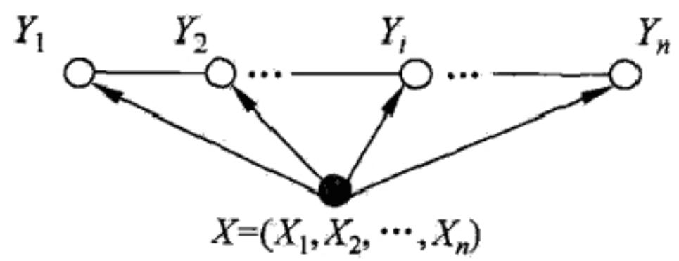  
图11.4线性链条件随机场

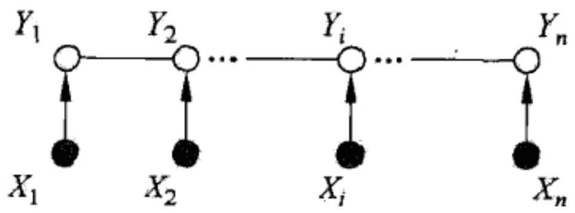  
X和Y有相同的图结构的线性链条件随机场

## 条件随机场的定义与形式

•定义(线性链条件随机场)

$X = ( X _ { 1 } , X _ { 2 } , \cdots , X _ { n } ) , Y = ( Y _ { 1 } , Y _ { 2 } , \cdots , Y _ { n } )$ 均为线性链表示的

$$
{ \begin{array} { r l } & { P ( Y _ { i } \mid X , Y _ { 1 } , \cdots , Y _ { i - 1 } , Y _ { i + 1 } , \cdots , Y _ { n } ) = P ( Y _ { i } \mid X , Y _ { i - 1 } , Y _ { i + 1 } ) } \\ & { \qquad i = 1 , 2 , \cdots , n ( \not \equiv i = 1 \not \equiv i \downarrow \downarrow \downarrow \uparrow \uparrow \downarrow \not \equiv \not \equiv h \not \equiv h \not \equiv h \not \equiv \not \downarrow \downarrow ) } \end{array} }
$$

·则称P(Y |X)为线性链条件随机场。

•在标注问题中，X表示输入观测序列，Y表示对应的输出标记序列或状态序列.

## 条件随机场的参数化形式

•定理：

• (线性链条件随机场的参数化形式)：设P(YIX)为线性链条件随机场，则在随机变量×取值为×的条件下，随机变量Y取值为y的条件概率真有如下形式：

$$
P ( y \mid x ) = \frac { 1 } { Z ( x ) } \mathrm { e x p } \left( \sum _ { i , k } \lambda _ { k } t _ { k } ( y _ { i - 1 } , y _ { i } , x , i ) + \sum _ { i , l } \mu _ { l } s _ { l } ( y _ { i } , x , i ) \right)
$$

·其中： $Z ( x ) = \sum _ { y } \exp \left( \sum _ { i , k } \lambda _ { k } t _ { k } ( y _ { i - 1 } , y _ { i } , x , i ) + \sum _ { i , l } \mu _ { l } s _ { l } ( y _ { i } , x , i ) \right)$

·窬边上的特征函数，转移特征，依赖于前一个和

• &定义在结点上的特征函数，状态特征，依赖于当前位置

## 条件随机场的参数化形式

·例：标准问题，输入观测为：X=(X1,X2,X3)，输出标记为Y=(Y1,Y2,Y3), Y1,Y2,Y3 取值于{1,2}

假设特征和对应权值，只注明特征取值为1，为0省略

$$
t _ { 1 } = t _ { 1 } \left( y _ { i - 1 } = 1 , y _ { i } = 2 , x , i \right) , \quad i = 2 , 3 , \quad \lambda _ { 1 } = 1
$$

$$
t _ { 1 } ( y _ { i - 1 } , y _ { i } , x , i ) = \left\{ { \begin{array} { r l } { 1 , } & { { } \quad y _ { i - 1 } = 1 , y _ { i } = 2 , x , i , ( i = 2 , 3 ) \smallskip } \\ { 0 , } & { { } \quad \ddag \ast \mathcal { H } } \end{array} } \right.
$$

$$
\lambda _ { 2 } = 0 . 5
$$

$$
\begin{array} { r } { \left| { \boldsymbol { s } } _ { 1 } = { \boldsymbol { s } } _ { 1 } ( y _ { 1 } = 1 , x , \mathbf { 1 } ) , \right. } \end{array}
$$

$$
\pmb { \mu } _ { 1 } = 1
$$

$$
t _ { 3 } = t _ { 3 } ( y _ { 2 } = 2 , y _ { 3 } = 1 , x , 3 ) \lambda _ { 3 } = 1
$$

$$
\begin{array} { r } { | s _ { 2 } = s _ { 2 } ( y _ { i } = 2 , x , i ) } \end{array}
$$

$$
i = 1 , 2 \ \mu _ { 2 } = 0 . 5
$$

$$
t _ { 4 } = t _ { 4 } ( y _ { 1 } = 2 , y _ { 2 } = 1 , x , 2 ) \lambda _ { 4 } = 1
$$

$$
\begin{array} { r } { \left| { { s _ { 3 } } } = { { s _ { 3 } } } ( { { y _ { i } } } = 1 , \mathrm { { x } } , i ) , i = 2 , 3 \ \mu _ { 3 } = 0 . 8 \right. } \end{array}
$$

$$
t _ { 5 } = t _ { 5 } ( y _ { 2 } = 2 , y _ { 3 } = 2 , x , 3 ) , \ \lambda _ { 5 } = 0 . 2
$$

$$
s _ { 4 } = s _ { 4 } ( y _ { 3 } = 2 , x , 3 ) ,
$$

$$
\mu _ { 4 } = 0 . 5
$$

## 条件随机场的参数化形式

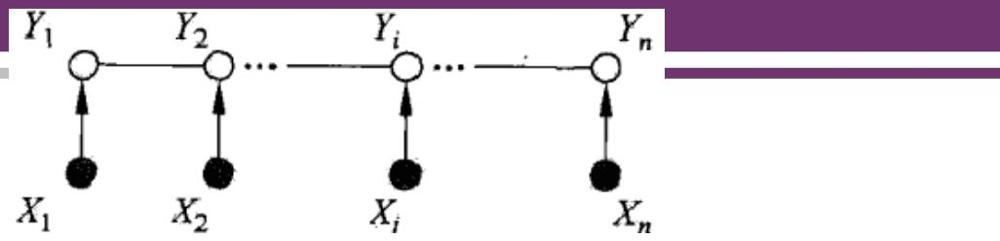

$$
P ( y | x ) \propto \exp \Biggl [ \sum _ { k = 1 } ^ { 5 } \lambda _ { k } \sum _ { i = 2 } ^ { 3 } t _ { k } ( y _ { i - 1 } , y _ { i } , x , i ) + \sum _ { k = 1 } ^ { 4 } \mu _ { k } \sum _ { i = 1 } ^ { 3 } s _ { k } ( y _ { i } , x , i ) \Biggr ]
$$

•对给定的观测序列×，标记序列Y=(1，2，2)的非规范化条件概率为

$$
P ( y _ { 1 } = 1 , y _ { 2 } = 2 , y _ { 3 } = 2 | \mathcal { x } ) \propto \exp \left( \mathrm { ~ \small ~ \mathscr ~ { ~ \mathscr ~ { ~ \mathscr ~ { ~ \alpha ~ } ~ } ~ } ~ } \right)
$$

$$
t _ { 1 } = t _ { 1 } \left( y _ { i - 1 } = 1 , y _ { i } = 2 , x , i \right) , \quad i = 2 , 3 , \quad \lambda _ { 1 } = 1
$$

$$
t _ { 2 } = t _ { 2 } ( y _ { 1 } = 1 , y _ { 2 } = 1 , x , 2 ) \quad \lambda _ { 2 } = 0 . 5
$$

$$
t _ { 3 } = t _ { 3 } ( y _ { 2 } = 2 , y _ { 3 } = 1 , x , 3 ) \ \lambda _ { 3 } = 1
$$

$$
t _ { 4 } = t _ { 4 } ( y _ { 1 } = 2 , y _ { 2 } = 1 , x , 2 ) \lambda _ { 4 } = 1
$$

$$
t _ { 5 } = t _ { 5 } ( y _ { 2 } = 2 , y _ { 3 } = 2 , x , 3 ) \ \lambda _ { 5 } = 0 . 2
$$

$$
\begin{array} { l r } { { \vert s _ { 1 } = s _ { 1 } ( y _ { 1 } = 1 , x , 1 ) , } } & { { \mu _ { 1 } = 1 } } \\ { { \vert s _ { 2 } = s _ { 2 } ( y _ { i } = 2 , x , i ) , } } & { { i = 1 , 2 ~ \mu _ { 2 } = 0 . 5 } } \\ { { \vert s _ { 3 } = s _ { 3 } ( y _ { i } = 1 , x , i ) , } } & { { i = 2 , 3 ~ \mu _ { 3 } = 0 . 8 } } \\ { { \vert s _ { 4 } = s _ { 4 } ( y _ { 3 } = 2 , x , 3 ) , } } & { { \mu _ { 4 } = 0 . 5 } } \end{array}
$$

## 条件随机场的简化形式

•注意到条件随机场中同一特征在各个位置都有定义，可以对同一个特征在各个位置求和，将局部特征函数转化为一个全局特征函数，这样就可以将条件随机场写成权值向量和特征向量的内积形式，即条件随机场的简化形式。

·首先将转移特征和状态特征及其权值用统一的符号表示，设有k1个转移特征，k2个状态特征，K=k1+k2,记

$$
f _ { k } ( y _ { i - 1 } , y _ { i } , x , i ) = \left\{ { \begin{array} { l } { t _ { k } ( y _ { i - 1 } , y _ { i } , x , i ) , \qquad k = 1 , 2 , \cdots , K _ { 1 } } \\ { s _ { i } ( y _ { i } , x , i ) , \qquad k = K _ { 1 } + l ; \ l = 1 , 2 , \cdots , K _ { 2 } } \end{array} } \right.
$$

## 条件随机场的简化形式

•然后，对转移与状态特征在各个位置i求和，记作

$$
f _ { k } ( y , x ) = \sum _ { i = 1 } ^ { n } f _ { k } \left( y _ { i - 1 } , y _ { i } , x , i \right) , \quad k = 1 , 2 , \cdots , K
$$

•权值:

$$
w _ { k } = \left\{ \begin{array} { l l } { \lambda _ { k } , } & { k = 1 , 2 , \cdots , K _ { 1 } } \\ { \mu _ { l } , } & { k = K _ { 1 } + l ; l = 1 , 2 , \cdots , K _ { 2 } } \end{array} \right.
$$

·条件随机场可表示为：

$$
P ( y \mid x ) = { \frac { 1 } { Z ( x ) } } \mathrm { e x p } \sum _ { k = 1 } ^ { \kappa } w _ { k } ~ f _ { k } ( y , x )
$$

$$
Z ( x ) = \sum _ { y } \exp \sum _ { k = 1 } ^ { K } w _ { k } f _ { k } \left( y , x \right)
$$

## 条件随机场的简化形式

• 若w表示权值向量： $w = ( w _ { 1 } , w _ { 2 } , \cdots , w _ { K } ) ^ { \mathrm { T } }$

·以F(y,x)表示全局特征向量，即

$$
F ( y , x ) = ( f _ { 1 } ( y , x ) , f _ { 2 } ( y , x ) , \cdots , f _ { \kappa } ( y , x ) ) ^ { \mathrm { T } }
$$

•条件随机场写成内积：

$$
P _ { \mathrm { { w } } } ( y | x ) = { \frac { \exp { \bigl ( } w \cdot F ( y , x ) { \bigr ) } } { Z _ { \mathrm { { w } } } ( x ) } }
$$

$$
Z _ { w } ( x ) = \sum _ { y } \exp \left( w \cdot F ( y , x ) \right)
$$

## 条件随机场的矩阵形式

·线性链条件随机场，引进特殊的起点和终点状态标记 $Y _ { 0 } = s t a r t$ $\gamma _ { { \mathsf { n } } + 1 } = { \mathsf { s t o p } }$ ，这时 $\mathsf { P } _ { \mathsf { w } } ( \mathsf { v } | \times )$ 可以通过矩阵形式表示。

•对观测序列×的每一个位置 $\mathsf { i } { = } 1 , 2 , { \ldots } \mathsf { n } { + } 1$ ，定义一个m阶矩阵(m是标记Y取值的个数)

$$
M _ { i } ( x ) = \left[ M _ { i } ( y _ { i - 1 } , y _ { i } \mid x ) \right]
$$

$$
M _ { i } ( y _ { i - 1 } , y _ { i } \mid x ) = \exp \left( W _ { i } ( y _ { i - 1 } , y _ { i } \mid x ) \right)
$$

$$
W _ { i } ( y _ { i - 1 } , y _ { i } \mid x ) = \sum _ { i = 1 } ^ { \kappa } w _ { k } { f _ { k } } ( y _ { i - 1 } , y _ { i } , x , i )
$$

## 条件随机场的矩阵形式

•给定观测序列x，标记序列y的非规范化概率可以通过n+I个矩阵的乘积表示：

$$
\textstyle \prod _ { i = 1 } ^ { n + 1 } M _ { i } ( y _ { i - 1 } , y _ { i } \mid x )
$$

•条件概率 $\mathsf { P } _ { \mathsf { w } } ( \mathsf { v } | \times )$

$$
P _ { \ w } ( \boldsymbol { y } \mid \boldsymbol { x } ) = \frac { 1 } { Z _ { \ w } ( \boldsymbol { x } ) } { \prod } _ { i = 1 } ^ { n + 1 } M _ { i } ( y _ { i - 1 } , y _ { i } \mid \boldsymbol { x } )
$$

$Z _ { \mathrm w } ( \mathsf { x } )$ 为规范化因子，是n+1个矩阵的乘积的(start, stop)元素

$$
\begin{array} { r } { Z _ { \vec { w } } ( \boldsymbol { x } ) = \big ( M _ { 1 } ( \boldsymbol { x } ) M _ { 2 } ( \boldsymbol { x } ) \cdots M _ { n + 1 } ( \boldsymbol { x } ) \big ) _ { \mathrm { s t a r t , s t o p } } } \end{array}
$$

## 条件随机场的矩阵形式

•例：线性链条件随机场，观测序列x，状态序列y，$\mathsf { i } = 1 , 2 , 3 \mathsf { n } = 3$ ，标记 $\mathsf { y } _ { \mathrm { i } }$ 属于{1， [] $2 \}$ ，假设 $\mathsf { V } _ { 0 } { = } \mathsf { s t a r t } { = } 1$ $\mathsf { y } _ { 4 } = \mathsf { s t o p } = 1$ 各个位置的随机矩阵：

$$
M _ { 1 } ( x ) = \left[ \begin{array} { c c } { { a _ { 0 1 } } } & { { a _ { 0 2 } } } \\ { { 0 } } & { { 0 } } \end{array} \right] , \quad M _ { 2 } ( x ) = \left[ \begin{array} { c c } { { b _ { 1 1 } } } & { { b _ { 1 2 } } } \\ { { b _ { 2 1 } } } & { { b _ { 2 2 } } } \end{array} \right]
$$

$$
M _ { 3 } ( x ) = { \left[ \begin{array} { l l } { c _ { 1 1 } } & { c _ { 1 2 } } \\ { c _ { 2 1 } } & { c _ { 2 2 } } \end{array} \right] } , \quad M _ { 4 } ( x ) = { \left[ \begin{array} { l l } { 1 } & { 0 } \\ { 1 } & { 0 } \end{array} \right] }
$$

试求状态序列y以start为起点stop为终点所有路径的

非规范化概率及规范化因子。

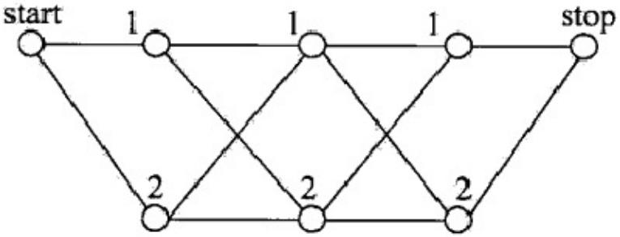

## 条件随机场的矩阵形式

·解：首先计算从start到stop对应与y=(1,1,1)，$\mathsf { y } = ( 1 , 1 , 2 ) , . . . \mathsf { y } = ( 2 , 2 , 2 )$ 各路径的非规范化概率分别是：

$$
\begin{array} { r l r } & { a _ { 0 1 } b _ { 1 1 } c _ { 1 1 } , } & { a _ { 0 1 } b _ { 1 1 } c _ { 1 2 } , \quad a _ { 0 1 } b _ { 1 2 } c _ { \beth 1 } , \quad a _ { 0 1 } b _ { 1 2 } c _ { \beth 2 } } \\ & { a _ { 0 2 } b _ { 2 1 } c _ { 1 1 } , } & { a _ { 0 2 } b _ { 2 1 } c _ { 1 2 } , \quad a _ { 0 2 } b _ { 2 2 } c _ { 2 1 } , \quad a _ { 0 2 } b _ { 2 2 } c _ { 2 2 } } \end{array}
$$

·求规范化因子，通过计算矩阵乘积，第1行第1列的元素为：

$$
\begin{array} { r l } & { a _ { 0 1 } b _ { 1 1 } c _ { 1 1 } + a _ { 0 2 } b _ { 2 1 } c _ { 1 1 } + a _ { 0 1 } b _ { 1 2 } c _ { 2 1 } + a _ { 0 2 } b _ { 2 2 } c _ { 2 2 } } \\ & { \phantom { a _ { 0 1 } b _ { 1 1 } } + a _ { 0 1 } b _ { 1 1 } c _ { 1 2 } + a _ { 0 2 } b _ { 2 1 } c _ { 1 2 } + a _ { 0 1 } b _ { 1 2 } c _ { 2 2 } + a _ { 0 2 } b _ { 2 2 } c _ { 2 1 } } \end{array}
$$

·恰好等于从start到stop的所有路径的非规范化概率之和，及规范化因子。

## 条件随机场的概率计算问题

•条件随机场的概率计算问题

·给定条件随机场P(YIX),输入序列×和输出序列y，

• 计算条件概率: $P ( Y _ { i } = y _ { i } \mid x ) , P ( Y _ { i - 1 } = y _ { i - 1 } , Y _ { i } = y _ { i } \mid x )$

• 以及相应的数学期望问题。

• 引进前向-后向向量，递归计算。

## 条件随机场的概率计算问题

前向-后向算法:

•对每个指标 $\mathsf { i } { = } 0 , 1 , { \ldots } , \mathsf { n } { + } 1$ ，定义前向向量 $\alpha _ { i } ( x )$

$$
\alpha _ { 0 } \left( y \mid x \right) = { \left\{ \begin{array} { l l } { 1 , } & { \quad y = { \mathrm { s t a r f } } } \\ { 0 , } & { \quad { \overline { { \mathbb { E } } } } \ P \ P } \end{array} \right. }
$$

•递推公式:

$$
\alpha _ { i } ^ { \mathrm { T } } ( y _ { i } \mid x ) = \alpha _ { i - 1 } ^ { \mathrm { T } } ( y _ { i - 1 } \mid x ) M _ { i } ( y _ { i - 1 } , y _ { i } \mid x ) , \quad i = 1 , 2 , \cdots , n + 1
$$

·又可表示为： $\alpha _ { i } ^ { \mathrm { T } } ( x ) = \alpha _ { i = 1 } ^ { \mathrm { T } } ( x ) M _ { i } ( x )$

•即表示在位置i的标记是yi，且到位置i的前部分标记序列的非规范化概率，yi可取的值m个：所以是m维列向量。 \$α(x)

## 条件随机场的概率计算问题

·前向-后向算法：

·同样，对每个指标 $\div 1 = 0 , 1 , \ldots , n + 1$ ，定义后向向量 $\beta ( x )$

$$
\beta _ { n + 1 } ( y _ { n + 1 } \mid x ) = \{ 1 , \quad y _ { n + 1 } = \mathrm { s t o p } 
$$

$$
\beta _ { i } \left( y _ { i } \mid x \right) = M _ { i } ( y _ { i } , y _ { i + 1 } \mid x ) \beta _ { i - 1 } ( y _ { i + 1 } \mid x )
$$

·又可表示为： $\beta _ { i } ( x ) = M _ { i + 1 } ( x ) \beta _ { i + 1 } ( x )$

·嬰秦禿摩爵準麵龍花漢舉且从位置+1到n的后部

•前向-后向得: $\begin{array} { r } { Z ( x ) = \alpha _ { n } ^ { \mathrm { { T } } } ( x ) \cdot \mathbf { I } = \mathbf { I } ^ { \mathrm { { T } } } \cdot \bar { \beta } _ { 1 } ( x ) } \end{array}$

## 条件随机场的概率计算问题

•概率计算

・按照前向-后向向量的定义，

• 可计算标记序列在位置i是标记 $y _ { \mathrm { i } }$ 的条件概率

•和在位置i-1与i是标记 $\mathsf { y } _ { \mathsf { i } - 1 }$ 和 $| \mathsf { y } _ { \mathrm { i } }$ 的条件概率：

$$
P ( Y _ { i } = y _ { i } \mid x ) = { \frac { \alpha _ { i } ^ { \operatorname { T } } ( y _ { i } \mid x ) \beta _ { i } ( y _ { i } \mid x ) } { Z ( x ) } }
$$

$$
P ( Y _ { i - 1 } = y _ { i - 1 } , Y _ { i } = y _ { i } \mid x ) = { \frac { \alpha _ { i - 1 } ^ { \mathrm { \tiny { C } } } ( y _ { i - 1 } \mid x ) M _ { i } ( y _ { i - 1 } , y _ { i } \mid x ) \beta _ { i } ( y _ { i } \mid x ) } { Z ( x ) } }
$$

·其中： $Z ( x ) = \alpha _ { n } ^ { \Gamma } ( x ) \cdot 1$

## 条件随机场的概率计算问题

•期望值的计算

•利用前向-后向向量，可以计算特征函数关于联合分布P(X,Y)和条件分布P(Y|X)的数学期望。

·特征函数fk关于条件分布P(Y|X)的数学期望是：

$$
\begin{array} { l } { { \displaystyle E _ { P ( { \boldsymbol x } | { \boldsymbol x } ) } [ f _ { k } ] = \sum _ { \gamma } P ( { \boldsymbol y } \vert { \boldsymbol x } ) f _ { k } ( { \boldsymbol y } , { \boldsymbol x } ) } } \\ { { ~ = \sum _ { i = 1 } ^ { n + 1 } \sum _ { \gamma _ { i - 1 } \gamma _ { i } } f _ { k } ( \gamma _ { i - 1 } , \gamma _ { i } , { \boldsymbol x } , i ) \frac { \alpha _ { i - 1 } ^ { \mathrm { T } } \left( \gamma _ { i - 1 } | { \boldsymbol x } \right) M _ { i } ( y _ { i - 1 } , \gamma _ { i } | { \boldsymbol x } ) \beta _ { i } ( y _ { i } \vert { \boldsymbol x } ) } { Z ( { \boldsymbol x } ) } ~ } } \\ { { ~ k = 1 , 2 , \cdots , K } } \end{array}
$$

·其中：

$$
Z ( x ) = \alpha _ { y } ^ { \Gamma } ( x ) \cdot 1
$$

## 条件随机场的概率计算问题

·假设经验分布为 $\tilde { P } ( X )$ 特征函数fk关于联合分布P(X,Y)的数学期望是：

$$
\begin{array} { l } { { \displaystyle { E _ { P ( X , Y ) } [ f _ { k } ] } } \ ~ } \\ { { \displaystyle = \sum _ { x , y } P ( x , y ) \sum _ { i = 1 } ^ { n - 1 } f _ { k } ( y _ { i - 1 } ^ { \prime } , y _ { i } , x , i ) } } \\ { { \displaystyle = \sum _ { x } \tilde { P } ( x ) \sum _ { y } P ( y , x ) \sum _ { i = 1 } ^ { n + 1 } f _ { k } ( y _ { i - 1 } , y _ { i } , x , i ) } } \\ { { \displaystyle = \sum _ { x } \tilde { P } ( x ) \sum _ { i = 1 } ^ { n - 1 } \sum _ { y _ { i } , y _ { i } , x } f _ { k } ( y _ { i - 1 } , y _ { i } , x , i ) \frac { C _ { i - 1 } ^ { \top } ( y _ { i - 1 } \mid x ) M _ { i } ( y _ { i - 1 } , y _ { i } \mid x ) \beta _ { i } ( y _ { i } \mid x ) } { Z ( x ) } ~ } } \\ { { ~ } } \\ { { ~ \displaystyle Z ( x ) = \alpha _ { x } ^ { \top } ( x ) - \alpha _ { x } ^ { \top } ( x ) } . } \end{array}
$$

## 条件随机场的学习算法

改进的迭代尺度法:

·已知训练数据集，可知经验分布：P(X,r)可通过极大化训练数据的对数似然函数来求模型参数：

·似然函数: $L ( w ) = L _ { \hat { p } } ( P _ { w } ) = \log \prod _ { x , y } P _ { w } ( y \mid x ) ^ { \hat { P } ( x , y ) } = \sum _ { x , y } \hat { P } ( x , y ) \log P _ { w } ( y \mid x )$

•当P为条件随机场模型时： $\begin{array} { l } { { \displaystyle { \cal L } ( w ) = \sum _ { x , y } \tilde { P } ( x , y ) \log P _ { w } ( y \vert x ) } } \\ { ~ } \\ { { \displaystyle ~ = \sum _ { x , y } \biggl [ \tilde { P } ( x , y ) \sum _ { k = 1 } ^ { K } w _ { k } f _ { k } ( y , x ) - \tilde { P } ( x , y ) \log Z _ { w } ( x ) \biggr ] } } \\ { { \displaystyle ~ = \sum _ { j = 1 } ^ { N } \sum _ { k = 1 } ^ { K } w _ { k } f _ { k } ( y _ { j } , x _ { j } ) - \sum _ { j = 1 } ^ { N } \log Z _ { w } ( x _ { j } ) } } \end{array}$

## 条件随机场的学习算法

改进的迭代尺度法:

• 不断优化对数似然函数改变量的下界：

•假设模型当前参数向量： $w = ( w _ { 1 } , w _ { 2 } , \cdots , w _ { K } ) ^ { 1 }$

•向量增量： $\pmb { \delta } = ( \pmb { \delta } _ { \mathrm { i } } , \pmb { \delta } _ { 2 } , \cdots , \pmb { \delta } _ { K } ) ^ { \tt T }$

•更新向量： $w + \delta = ( w _ { 1 } + \delta _ { 1 } , w _ { 2 } + \delta _ { 2 } , \cdots w _ { K } + \delta _ { K } ) ^ { \intercal }$

·关于转移特征 $t _ { k }$ 的更新方程: $\begin{array} { l } { { \displaystyle E _ { \tilde { r } } [ t _ { k } ] = \sum _ { x , y } \tilde { P } ( x , y ) \sum _ { i = 1 } ^ { n + 1 } t _ { k } ( y _ { i - 1 } , y _ { i } , x , i ) } } \\ { { \displaystyle ~ = \sum _ { x , y } \tilde { P } ( x ) P ( y \mid x ) \sum _ { i = 1 } ^ { n + 1 } t _ { k } ( y _ { i - 1 } , y _ { i } , x , i ) \exp ( \delta _ { k } T ( x , y ) ) } } \\ { { \displaystyle k = 1 , 2 , \cdots , K _ { 1 } } } \end{array}$

## 条件随机场的学习算法

改进的迭代尺度法:

·关于转移特征 $\displaystyle \langle s _ { \| }$ 的更新方程：

$$
\begin{array} { l } { { \displaystyle E _ { \bar { p } } [ s _ { l } ] = \sum _ { x , y } \tilde { P } ( x , y ) \sum _ { i = 1 } ^ { n + 1 } s _ { l } ( y _ { i } , x , i ) } \ ~ } \\ { { \displaystyle ~ = \sum _ { x , y } \tilde { P } ( x ) P ( y \mid x ) \sum _ { i = 1 } ^ { n } \tilde { s } _ { l } ( y _ { i } , x , i ) \exp ( \delta _ { \kappa _ { 1 } + l } T ( x , y ) ) } , } \\ { { \displaystyle l = 1 , 2 , \cdots , K _ { 2 } } } \end{array}
$$

• T(x,y)是在数据(x,y)中出现所有特征数的总和

$$
T ( x , y ) = \sum _ { k } f _ { k } ( y , x ) = \sum _ { k = 1 } ^ { K } \sum _ { i = 1 } ^ { n + 1 } f _ { k } ( y _ { i - 1 } , y _ { i } , x , i )
$$

## 条件随机场的学习算法

• 条件随机场模型学习的改进的迭代尺度法:

输入：特征函数 $t _ { 1 } , t _ { 2 } , \cdots , t _ { K _ { 1 } } \ , s _ { 1 } , s _ { 2 } , \cdots , s _ { K _ { 2 } }$ ：经验分布 $\tilde { P } ( x , y )$

输出：参数估计值 $\int \limits _ { 0 } ^ { \infty } d x$ ；模型 $P _ { i j }$

（1）对所有 $k \in \{ 1 , 2 , \cdots , K \}$ ，取初值 $\gamma _ { l } ^ { \prime } = 0$

（2）对每一 $k \in \{ 1 , 2 , \cdots , K \}$

（a）当 $k = 1 , 2 , \cdots , K _ { 1 }$ 时，令 $\delta _ { k }$ 是方程

$$
\sum _ { x , y } \tilde { P } ( x ) P ( y \mid x ) \sum _ { i = 1 } ^ { n + 1 } t _ { k } ( y _ { i - 1 } , y _ { i } , x , i ) \exp ( \delta _ { k } T ( x , y ) ) = E _ { \vec { P } } [ t _ { k } ]
$$

的解；

## 条件随机场的学习算法

• 条件随机场模型学习的改进的迭代尺度法:

当 $k = k _ { 1 } + l$ $l = 1 , 2 , \cdots , K _ { 1 }$ 时，令 $\delta _ { k + l }$ 是方程

$$
\sum _ { x , y } \tilde { P } ( x ) P ( y | x ) \sum _ { i = 1 } ^ { n } s _ { l } ( y _ { i } , x , i ) \exp ( \delta _ { \kappa _ { 1 } + l } T ( x , y ) ) = E _ { \tilde { P } } [ s _ { l } ]
$$

的解，式中 $T ( x , y )$ 由式(11.38)给出.

（b）更新 $\gamma _ { \gamma } = \gamma _ { \gamma }$ 值： $\| \psi _ { k }  \psi _ { k } + \delta _ { k }$

（3）如果不是所有 $7 4 7 \div 7 \cdots 1 .$ 都收敛，重复步骤(2).

## 条件随机场的学习算法

•T(x,y)表示数据(xy)中的特征总数，对不同的数据(x,y)取值可能布同，定义松弛特征:

$$
s ( x , y ) = S - \sum _ { i = 1 } ^ { n + 1 } \sum _ { k = 1 } ^ { K } f _ { k } ( y _ { i - 1 } , y _ { i } , x , i )
$$

•S为大的常数，使得对训练数据集所有(x,y)

$$
5 ( x , y ) \geq 0
$$

## 条件随机场的学习算法

•对于转移特征 $\delta _ { k }$ 的更新方程为:

$$
\sum _ { x , y } \widetilde { P } ( x ) P ( y | x ) \sum _ { i = 1 } ^ { n + 1 } t _ { k } ( y _ { i - 1 } , y _ { i } , x , i ) \exp ( \delta _ { k } S ) = E _ { \widetilde { p } } [ t _ { k } ]
$$

$$
\bar { \mathcal { S } } _ { k } = \frac { 1 } { S } \mathrm { l o g } \frac { E _ { \bar { P } } [ t _ { k } ] } { E _ { P } [ t _ { k } ] }
$$

•其中：

$$
E _ { P } ( t _ { k } ) = \sum _ { x } \tilde { P } ( x ) \sum _ { i = 1 } ^ { n + 1 } \sum _ { y _ { i - 1 } , y _ { i } } t _ { k } ( y _ { i - 1 } , y _ { i } , x , i ) \frac { \alpha _ { i - 1 } ^ { \mathrm { { T } } } ( y _ { i - 1 } \mid x ) M _ { i } ( y _ { i - i } , y _ { i } \mid x ) \beta _ { i } ( y _ { i } \mid x ) } { Z ( x ) }
$$

## 条件随机场的学习算法

•对于状态特征: $\delta _ { k }$ 的更新方程为：

$$
\sum _ { x , y } \tilde { P } ( x ) P ( y | x ) \sum _ { i = 1 } ^ { n } s _ { i } ( y _ { i } , x , i ) \exp ( \delta _ { K _ { 1 } + l } S ) = E _ { \tilde { P } } [ s _ { l } ]
$$

$$
\bar { \partial } _ { { \cal K } _ { 1 } + l } = \frac { 1 } { S } \mathrm { l o g } \frac { E _ { \bar { P } } [ S _ { \bar { l } } ] } { E _ { P } [ S _ { \bar { l } } ] }
$$

·其中: $E _ { \scriptscriptstyle P } ( s _ { \scriptscriptstyle { l } } ) = \sum _ { x } \tilde { P } ( x ) \sum _ { i = 1 } ^ { n } \sum _ { y _ { i } } s _ { \scriptscriptstyle { l } } ( y _ { i } , x , i ) \frac { \alpha _ { i } ^ { \mathrm { T } } ( y _ { i } | x ) \beta _ { i } ( y _ { i } | x ) } { Z ( x ) }$

• 因担心S过大，每个观测序列x计算其特征最大值$T ( x ) = \operatorname* { m a x } _ { y } T ( x , y )$ 利用前向-后向公式计算 $T ( x ) = t$

## 条件随机场的学习算法

• 关于转移特征参数的更新方程可以写成：

$$
\begin{array} { r l } & { E _ { \tilde { r } } [ t _ { k } ] = \displaystyle \sum _ { z , y } \tilde { P } ( x ) P ( y \mid x ) \sum _ { j = 1 } ^ { n + 1 } t _ { k } ( y _ { i - 1 } , y _ { i } , x , i ) \exp ( \delta _ { k } T ( x ) ) } \\ & { \qquad = \displaystyle \sum _ { x } \tilde { P } ( x ) \sum _ { y } P ( y \mid x ) \sum _ { i = 1 } ^ { n + 1 } t _ { k } ( y _ { i - 1 } , y _ { i } , x , i ) \exp ( \delta _ { k } T ( x ) ) } \\ & { \qquad = \displaystyle \sum _ { x } \tilde { P } ( x ) a _ { k , t } \exp ( \delta _ { k } \star t ) } \\ & { \qquad = \displaystyle \sum _ { z = 0 } ^ { T _ { \mathrm { m a x } } } a _ { k , i } \beta _ { k } ^ { t } } \end{array}
$$

$a _ { k _ { 1 } }$ 是特征 $t _ { k }$ 的期待值， $\delta _ { \nu } = \log \beta _ { \nu } \ , \ \beta _ { \nu }$ 是多项式方程唯一的实根

## 条件随机场的学习算法

• 关于状态特征的参数更新方程可以写成：

$$
\begin{array} { l } { \displaystyle E _ { \tilde { r } } [ s _ { I } ] = \sum _ { x , y } \tilde { P } ( x ) P ( y \mid x ) \sum _ { i = 1 } ^ { n } s _ { i } ( y _ { i } , x , i ) \exp ( \delta _ { \kappa _ { 1 } + I } T ( x ) ) } \\ { \displaystyle \quad = \sum _ { x } \tilde { P } ( x ) \sum _ { y } P ( y \mid x ) \sum _ { i = 1 } ^ { n } s _ { I } ( y _ { i } , x , i ) \exp ( \delta _ { \kappa _ { 1 } + I } T ( x ) ) } \\ { \displaystyle \quad = \sum _ { x } \tilde { P } ( x ) b _ { I , \epsilon } \exp ( \delta _ { k } \cdot t ) } \\ { \displaystyle \quad = \sum _ { t = 0 } ^ { T _ { \mathrm { f r o s s } } } b _ { I , \tilde { \imath } } \gamma _ { I } } \end{array}
$$

$b _ { i , j }$ 是特征 $S _ { J }$ 的期望值， $\delta _ { i } = \log \gamma _ { i }$ $\gamma _ { i }$ 是多项式方程唯一的实根

## 条件随机场的学习算法

•拟牛顿法：

$$
P _ { w } ( y \mid x ) = { \frac { \exp \biggl ( \sum _ { i = 1 } ^ { n } w _ { i } f _ { i } ( x , y ) \biggr ) } { \displaystyle \sum _ { y } \exp \biggl ( \sum _ { i = 1 } ^ { n } w _ { i } f _ { i } ( x , y ) \biggr ) } }
$$

•学习的优化目标函数：

$$
\underset { w \in \mathbb { R } ^ { n } } { \mathrm { m i n } } \ f ( w ) = \sum _ { x } \tilde { P } ( x ) \log \sum _ { y } \exp \left( \sum _ { i = 1 } ^ { n } w _ { i } f _ { i } ( x , y ) \right) - \sum _ { x , y } \tilde { P } ( x , y ) \sum _ { i = 1 } ^ { n } w _ { i } f _ { i } ( x , y )
$$

•梯度函数:

$$
g ( w ) = \sum _ { x , y } \tilde { P } ( x ) P _ { w } ( y \mid x ) f ( x , y ) - E _ { \tilde { P } } ( f )
$$

## 条件随机场的学习算法

•条件随机场模型学习的BFGS算法

输入：特征函数 $f _ { 1 } , f _ { 2 } , \ldots , f _ { n }$ ：经验分布 $\tilde { P } ( X , Y )$

输出：最优参数值 $\overrightarrow { F V }$ ；最优模型 $P _ { i } ( y ) = x )$

（1）选定初始点 $k ( 0 ) = ( 0 , 0 )$ ，取 $B _ { \Updownarrow }$ 为正定对称矩阵，置 $k = 0$

（2）计算 $g _ { k } = g ( w ^ { ( k ) } )$ .若 $g _ { k } = 0$ ，则停止计算；否则转(3)

（3）由 $B _ { \mathrm { { } } _ { h } } p _ { \mathrm { { k } } } = - g _ { \mathrm { { k } } }$ 求出 $p _ { k }$

（4）一维搜索：求 $\lambda _ { k }$ 使得

$$
f ( w ^ { ( k ) } + \lambda _ { k } p _ { k } ) = \operatorname* { m i n } _ { 4 \to 0 } f ( w ^ { ( k ) } + \lambda p _ { k } )
$$

## 条件随机场的学习算法

•条件随机场模型学习的BFGS算法

（5）置 $w ^ { ( k + 1 ) } = w ^ { ( k ) } + \lambda _ { k } p _ { k }$

（6）计算 $g _ { k + 1 } = g ( w ^ { ( k + 1 ) } )$

若 $z _ { 1 } = 0$ ，则停止计算；否则，按下式求出 $B _ { k + 1 }$

$$
B _ { k + 1 } = B _ { k } + \frac { y _ { k } y _ { k } ^ { \mathrm { ~ T ~ } } } { y _ { k } ^ { \mathrm { T } } \delta _ { k } } { - \frac { B _ { k } \delta _ { k } \delta _ { k } ^ { \mathrm { ~ T ~ } } B _ { k } } { \delta _ { k } ^ { \mathrm { T } } B _ { k } \delta _ { k } } }
$$

$$
y _ { k } = g _ { k + l } - g _ { k } , \quad \delta _ { k } = w ^ { ( k + 1 ) } - w ^ { ( k ) }
$$

（7）置 $k = k + 1$ 转(3）

## 条件随机场的预测算法

预测算法:

•给定条件随机场P(Y|X)和输入序列(观测序列)x,

•求：条件概率最大的输出序列(标记序列 $) \gamma ^ { * }$

·维

$$
\begin{array} { r l } & { \overset { \mathrm { i \overset { + } { \operatorname { d e t } } } } { \overbrace { \mathrm { ~ i f ~ } } } \mathrm { E } \mathrm { E } \mathrm { E } \mathrm { E } \mathrm { E } \mathrm { E } : } \\ & { \qquad \quad P _ { w } ( y | x ) = \frac { \exp \left( w \cdot F ( y , x ) \right) } { Z _ { w } ( x ) } \quad \begin{array} { r l } & { y ^ { * } = \mathrm { a r g } \underset { y } { \operatorname* { m a x } } P _ { w } ( y | x ) } \\ & { = \mathrm { a r g } \underset { y } { \operatorname* { m a x } } \frac { \exp ( w \cdot F ( y , x ) ) } { Z _ { w } ( x ) } } \\ & { = \mathrm { a r g } \underset { y } { \operatorname* { m a x } } \exp ( w \cdot F ( y , x ) ) } \\ & { \qquad \mathrm { i f } \frac { \mathrm { i n } \mathrm { E } \mathrm { E } \mathrm { E } \mathrm { E } \mathrm { E } \mathrm { E } \mathrm { E } \mathrm { E } \mathrm { E } \mathrm { E } \mathrm { E } \mathrm { E } \mathrm { E } \mathrm { E } \mathrm { E } \mathrm { E } \mathrm { E } \mathrm { E } \mathrm { E } \mathrm { E } \mathrm { E } \mathrm { E } \mathrm { E } \mathrm { E } \mathrm { E } \mathrm { E } \mathrm { E } \mathrm { E } \mathrm { E } \mathrm { E } \mathrm { E } \mathrm { E } \mathrm { E } \mathrm { E } \mathrm { E } \mathrm { E } \mathrm { E } \mathrm { E } \mathrm { E } \mathrm { E } \mathrm { E } \mathrm { E } \mathrm { E } \mathrm { E } \mathrm { E } \mathrm { E } } } \\ & { \qquad \underset { y } { \operatorname* { m a x } } \ \mathrm { ( w \cdot F ( y , x ) ) } } \end{array} } \end{array}
$$

## 条件随机场的预测算法

•路径表示标记序列：

$$
w = ( w _ { 1 } , w _ { 2 } , \cdots , w _ { K } ) ^ { \hat { \mathrm { T } } }
$$

$$
F ( y , x ) = ( f _ { 1 } ( y , x ) , f _ { 2 } ( y , x ) , \cdots , f _ { \kappa } ( y , x ) ) ^ { \intercal }
$$

$$
f _ { k } ( y , x ) = \sum _ { i = 1 } ^ { n } f _ { k } ( y _ { i - 1 } , y _ { i } , x , i ) , k = 1 , 2 , \cdots , K
$$

•只计算非规范化概率：

$$
\begin{array} { r l } { \underset { y } { \operatorname* { m a x } } } & { { } \displaystyle \sum _ { i = 1 } ^ { n } \boldsymbol { w } \cdot \boldsymbol { F } _ { i } \left( \boldsymbol { y } _ { i - 1 } , \boldsymbol { y } _ { i } , \boldsymbol { x } \right) } \end{array}
$$

$$
F _ { i } ( y _ { i - 1 } , y _ { i } , x ) = ( f _ { 1 } ( y _ { i - 1 } , y _ { i } , x , i ) , f _ { 2 } ( y _ { i - 1 } , y _ { i } , x , i ) , \cdots , f _ { \kappa } ( y _ { i - 1 } , y _ { i } , x , i ) ) ^ { \top }
$$

•为局部特征向量

## 条件随机场的预测算法

•维特比算法:

·首先求出位置1的各个标记j=1,2..m的非规范化概率：

$$
\delta _ { 1 } ( j ) = \boldsymbol { w } { \cdot } F _ { 1 } ( y _ { 0 } = s t a r t , y _ { 1 } = j , x ) , \quad j = 1 , 2 , \cdots , m
$$

·由递推公式，求出到位置i的各个标记1=12.m的非规范化概率的最大值，同时记录最大值路径：

$$
\delta _ { i } ( l ) = \operatorname* { m a x } _ { 1 \leqslant j \leqslant m } \{ \delta _ { i - 1 } ( j ) + w \bullet F _ { \mathrm { i } } ( y _ { i - 1 } = j , y _ { \mathrm { i } } = l , x ) \} ~ , \quad l = 1 , 2 , \cdots , m
$$

$$
\varPsi _ { i } ( l ) = \arg \operatorname* { m a x } _ { 1 \leqslant j \leqslant m } \{ \delta _ { i - 1 } ( j ) + w \bullet F _ { i } ( y _ { i - 1 } = j , y _ { i } = l , x ) \} , \quad l = 1 , 2 , \cdots , m
$$

## 条件随机场的预测算法

•维特比算法:

• 直到i=n时终止，这时求得非规范化概率的最大值为：

$$
\operatorname* { m a x } _ { y } ( w \cdot F ( y , x ) ) = \operatorname* { m a x } _ { 1 \leq j \leq m } \delta _ { n } ( j )
$$

•及最优路径的终点： $y _ { n } ^ { * } = \arg \operatorname* { m a x } _ { \mathrm { I } \in I \in m } \delta _ { n } ( j )$

• 由此最优路径终点返回：

$$
y _ { i } ^ { * } = \psi _ { i + 1 } ( y _ { i + 1 } ^ { * } ) , \quad i = n - 1 , n - 2 , \cdots , 1
$$

•得最优路径: $\boldsymbol { y } ^ { * } = ( y _ { 1 } ^ { * } , y _ { 2 } ^ { * } , \cdots , y _ { n } ^ { * } ) ^ { \mathrm { T } }$

## 条件随机场的预测算法

•条件随机场预测的维特比算法:

输入：模型特征向量 $F ^ { \prime } ( \gamma , x )$ 和权值向量w

观测序列 ${ \mathfrak { x } } = ( x _ { 1 } , x _ { 2 } , \cdots , x _ { n } )$

输出：最优路径 $y ^ { * } = ( y _ { 1 } ^ { * } , y _ { 2 } ^ { * } , \cdots , y _ { n } ^ { * } )$

（1）初始化

$$
\delta _ { 1 } ( j ) = \nu \cdot F _ { 1 } ( y _ { 0 } = s t a r t , y _ { 1 } = j , x ) , \quad j = 1 , 2 , \cdots , m
$$

（2）递推，对 $i = 2 , 3 , \cdots , n$

$$
\delta _ { i } ( l ) = \operatorname* { m a x } _ { 1 \leqslant j \leqslant m } \{ \delta _ { i - 1 } ( j ) + w \bullet F _ { i } ( y _ { i - 1 } = j , y _ { i } = l , x ) \} , \quad l = 1 , 2 , \cdots , m
$$

$$
\varPsi _ { i } ( l ) = \arg \operatorname* { m a x } _ { 1 \leqslant j \leqslant m } \{ \delta _ { i - 1 } ( j ) + w \bullet F _ { i } ( y _ { i - 1 } = j , y _ { i } = l , x ) \} , \quad l = 1 , 2 , \cdots , m
$$

## 条件随机场的预测算法

• 条件随机场预测的维特比算法：

（3）终止

$$
\operatorname* { m a x } _ { y } ( w \cdot F ( y , x ) ) = \operatorname* { m a x } _ { 1 \leqslant j \leqslant m } \delta _ { n } ( j )
$$

$$
y _ { n } ^ { * } = \arg \operatorname* { m a x } _ { 1 \leq j \in m } \delta _ { n } ( j )
$$

（4）返回路径

$$
y _ { i } ^ { * } = { \pmb { \psi } } _ { i + 1 } ( y _ { i + 1 } ^ { * } ) , \quad i = n - 1 , n - 2 , \cdots , 1
$$

求得最优路径 $\boldsymbol { y } ^ { * } = ( y _ { 1 } ^ { * } , y _ { 2 } ^ { * } , \cdots , y _ { n } ^ { * } )$

## 条件随机场的预测算法

·例：用维特比算法求给定输入序列（观测序列）×对于的最优输出序列（标记序列） $y ^ { * } = ( y _ { 1 } ^ { * } , y _ { 2 } ^ { * } , y _ { 3 } ^ { * } )$

· 利用维特比法求最优路径问题： $\operatorname* { m a x } \sum _ { i = 1 } ^ { 3 } w \cdot F _ { i } ( y _ { i = 1 } , y _ { i } , x )$

（1）初始化 $\delta _ { 1 } ( j ) = \varkappa \cdot F _ { 1 } ( y _ { 0 } = s t a r t , y _ { 1 } = j , x ) , \quad j = 1 , 2$

$$
i = 1 , \quad \delta _ { i } ( 1 ) = 1 , \quad \delta _ { i } ( 2 ) = 0 . 5
$$

（2）递推

$$
\begin{array} { r l } { \dot { i } = 2 } & { \dot { \mathcal { S } _ { 2 } } \left( l \right) = \operatorname* { m a x } \{ \delta _ { 1 } ( j ) + w \cdot F _ { 2 } \left( j , l , x \right) \} } \\ & { \dot { \mathcal { S } _ { 2 } } \left( 1 \right) = \operatorname* { m a x } \left\{ 1 + \mathcal { A } _ { 2 } t _ { 2 } , 0 . 5 + \mathcal { A } _ { 4 } t _ { 4 } \right\} = 1 . 6 \ , \quad \mathcal {varPsi } _ { 2 } \left( 1 \right) = 1 } \\ & { \dot { \mathcal { S } _ { 2 } } \left( 2 \right) = \operatorname* { m a x } \left\{ 1 + \mathcal { A } _ { 1 } t _ { 1 } + \mu _ { 2 } s _ { 2 } , 0 . 5 + \mu _ { 2 } s _ { 2 } \right\} = 2 . 5 \ , \quad \mathcal {Psi } _ { 2 } \left( 2 \right) = 1 } \end{array}
$$

## 条件随机场的预测算法

$$
i = \hat { 3 } { \delta } _ { 3 } ( l ) = \operatorname* { m a x } _ { j } \{ \delta _ { 2 } ( j ) + w \cdot F _ { 3 } ( j , l , x ) \}
$$

$$
\delta _ { 3 } ( 1 ) = \operatorname* { m a x } \{ 1 . 6 + \mu _ { s } s _ { 5 } , 2 . 5 + \lambda _ { 3 } t _ { 3 } + \mu _ { 3 } s _ { 3 } \} = 4 . 3 ~ , ~ \varPsi _ { 3 } ( 1 ) = 2
$$

$$
\delta _ { 3 } ( 2 ) = \operatorname* { m a x } \{ 1 . 6 + \lambda _ { 1 } t _ { 1 } + \mu _ { 4 } s _ { 4 } , 2 . 5 + \lambda _ { 5 } t _ { 5 } + \mu _ { 4 } s _ { 4 } \} = 3 . 2 , \quad \psi _ { 3 } ( 2 ) = 1
$$

（3）终止

$$
\begin{array} { l } { \displaystyle \operatorname* { m a x } _ { y } ( w \cdot F ( y , x ) ) = \operatorname* { m a x } _ { 3 } ( l ) = \delta _ { 3 } ( 1 ) = 4 . 3 } \\ { \displaystyle y _ { 3 } ^ { * } = \arg \operatorname* { m a x } _ { l } \delta _ { 3 } ( l ) = 1 } \end{array}
$$

（4）返回

$$
| \nu _ { z } ^ { * } = 4 \prime _ { 3 } ( y _ { 3 } ^ { * } ) = 4 \prime _ { 3 } ( 1 ) = 2
$$

$$
y _ { 1 } ^ { * } = 4 y _ { 2 } ( y _ { 2 } ^ { * } ) = 4 y _ { 2 } ( 2 ) = 1
$$

最优标记序列 $y ^ { * } = ( y _ { 1 } ^ { * } , y _ { 2 } ^ { * } , y _ { 3 } ^ { * } ) = ( \mathrm { I } , 2 , \mathrm { I } )$

## 基于二维条件随机场的视频分割

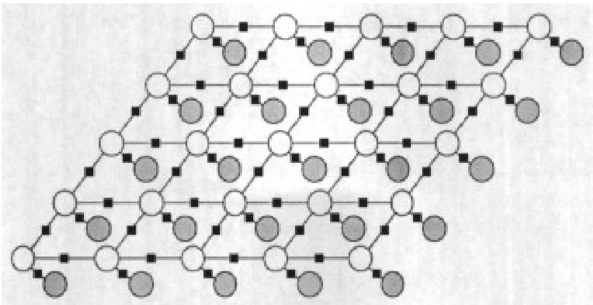

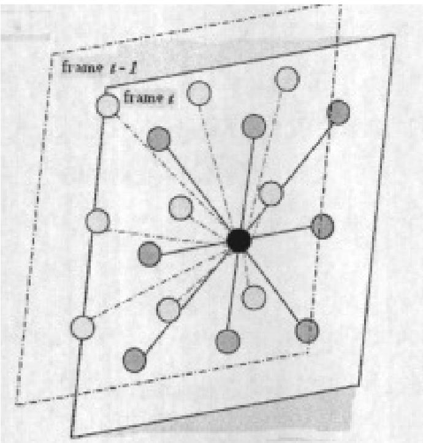  
图3-3视频序列中的时空邻域关系

## 基于二维条件随机场的视频分割

标签： $L _ { \gamma } = \{ 0 , 1 , 2 \}$

• 二维条件随机场模型：

$$
\begin{array} { l } { P ( L | X ) { = } \displaystyle \frac { 1 } { Z ( X ) } \exp ( - E ( L ; X ) ) } \\ { E ( L ; X ) = \displaystyle \sum _ { i } \lambda _ { f _ { i } } ( L , ; X _ { i } ) { + } \nu \sum _ { j \in N ( i ) \cup \mathcal { M } ( i ) } f _ { 2 } ( L _ { i } , L _ { j } ) } \end{array}
$$

$$
f _ { 1 } ( L _ { i } ; X _ { i } ) = \delta ( L _ { i } , L _ { i , m } ) \qquad \lambda _ { i } = \left\{ \begin{array} { l r } { { \log P ( X _ { i } \mid L _ { i } = 0 ) } } & { { i f ~ L _ { i } = 0 } } \\ { { \log P ( X _ { i } \mid L _ { i } = 1 ) } } & { { i f ~ L _ { i } = 1 } } \\ { { \log P ( X _ { i } \mid L _ { i } = 2 ) } } & { { e l s e } } \end{array} \right.
$$

基于二维条件随机场的视频分割

$$
\begin{array} { r } { f _ { 2 } ( L _ { i } , L _ { j } ) = \left\{ \begin{array} { l l } { \beta _ { 1 } } & { i f L _ { i } = L _ { j } = 0 } \\ { \beta _ { 2 } } & { i f L _ { i } = L _ { j } = 1 } \\ { \beta _ { 3 } } & { i f L _ { i } = L _ { j } = 2 } \\ { \beta _ { 4 } } & { i f L _ { i } \neq L _ { j } } \end{array} \right. } \end{array}
$$

$$
\begin{array} { r } { f _ { 2 } ( L _ { i } ^ { t } , L _ { j } ^ { t - 1 } ) = \left\{ \begin{array} { l l } { \phi _ { 1 } } & { i f L _ { i } ^ { t } = L _ { j } ^ { t - 1 } = 0 } \\ { \phi _ { 2 } } & { i f L _ { i } ^ { t } = L _ { j } ^ { t - 1 } = 1 } \\ { \phi _ { 3 } } & { i f L _ { i } ^ { t } = L _ { j } ^ { t - 1 } = 2 } \\ { \phi _ { 4 } } & { i f L _ { i } ^ { t } \neq L _ { j } ^ { t - 1 } } \end{array} \right. } \end{array}
$$

## 基于二维条件随机场的视频分割

基于二维条件随机场模型的视频阈值化流程：

1.初始化条件随机场模型参数v，以及常量β、B₂、B、B、、、和；

2.获取一帧图像，利用背景模型、阴影模型以及前景模型获得帧中各像素对应的分类标签，并计算条件随机场模型参数

3.根据第2步的像素分类标签计算条件随机场模型的各个特征函数；

4.根据模型参数，计算式子（3.20）获得最优的分割结果；

5.重复第2步直到结束。

## 模型关联

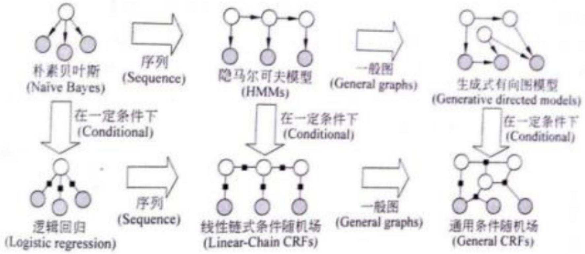

## •END

·Q&R

## 第十三章无监督学习概论

## 无监督学习

•使用无标注数据 $U = \{ x _ { 1 } , x _ { 2 } , \cdot \cdot \cdot , x _ { N } \}$ 学习或训练，由特征向量组成

•无监督学习的模型是函数 $z = g _ { \theta } ( x )$ 条件概率分布 $P _ { \theta } ( z | x )$ ，或条件概率分布 $P _ { \theta } ( x | z )$ (

·假设训练数据集由N个样本组成，每个样本是一个M维向量。训练数据可以由一个矩阵表示，每一行对应一个特征，每一列对应一个样本

$$
X = \left[ \begin{array} { c c c } { { x _ { 1 1 } } } & { { \dots } } & { { x _ { 1 N } } } \\ { { } } & { { } } & { { } } \\ { { \vdots } } & { { } } & { { \vdots } } \\ { { } } & { { } } & { { } } \\ { { x _ { M 1 } } } & { { \dots } } & { { x _ { M N } } } \end{array} \right]
$$

## 无监督学习

·无监督学习的基本想法是对给定数据（矩阵数据）进行某种"压缩”，从而找到数 据的潜在结构。假定损失最小的压缩得到的结果就是最本质的结构。

·考虑发掘数据的纵向结构，把相似的样本聚到同类，即对数据进行聚类

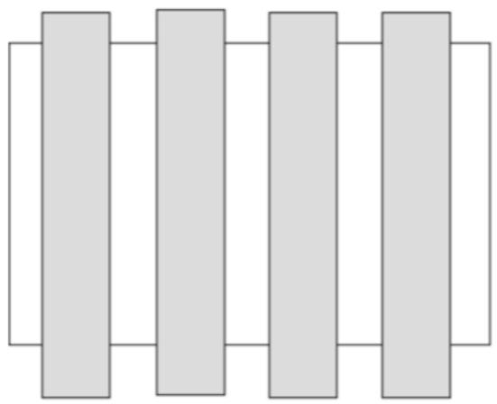  
(a)数据纵向结构

## 无监督学习

·无监督学习的基本想法是对给定数据（矩阵数据）进行某种"压缩”，从而找到数 据的潜在结构。假定损失最小的压缩得到的结果就是最本质的结构。

• 考虑发掘数据的横向结构，把高维空间的向量转换为低维空间的向量，即对数据进行降维。

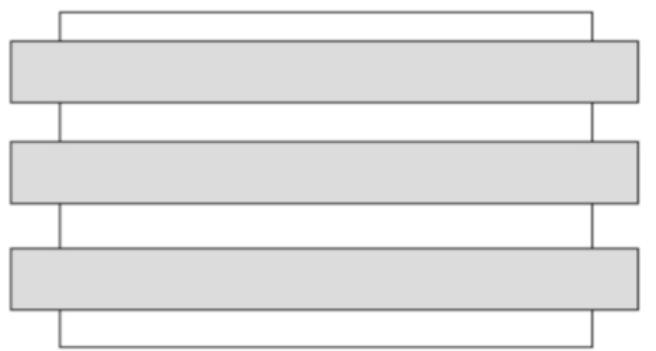

(b)数据横向结构

## 无监督学习

·无监督学习的基本想法是对给定数据（矩阵数据）进行某种"压缩”，从而找到数 据的潜在结构。假定损失最小的压缩得到的结果就是最本质的结构。

• 同时考虑发掘数据的纵向与横向结构，假设数据由含有隐式结构的概率模型生成得到，从数据中学习该概率模型。

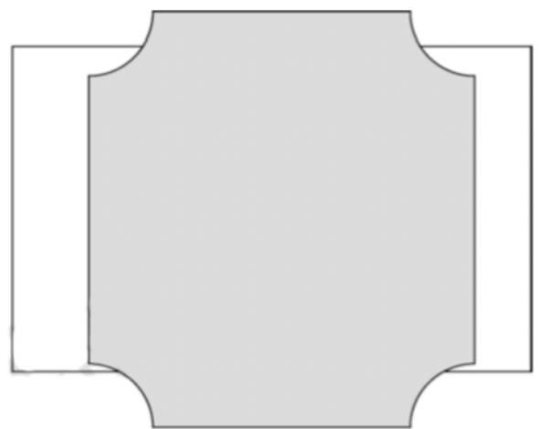  
(c) 数据横向纵向结构

## 聚类

・聚类（clustering）是将样本集合中相似的样本（实例）分配到相同的类，不相似的样本分配到不同的类。

·聚类时，样本通常是欧氏空间中的向量，类别不是事先给定，，而是从数据中自动发现，但类别的个数通常是事先给定的。样本之间的相似度或距离 由应用决定。

·如果一个样本只能属于一个类，则称为硬聚类（hard clustering)

·如果一个样本可以属于多个类，则称为软聚类（soft clustering)

## 聚类

•硬聚类时，每一个样本属于某一类

$$
z _ { i } = g _ { \theta } ( x _ { i } ) , i = 1 , 2 , \cdot \cdot \cdot , N
$$

•软聚类时，每一个样本依概率属于每一个类

$$
P _ { \theta } ( z _ { i } | x _ { i } ) , i = 1 , 2 , \cdot \cdot \cdot , N _ { \circ }
$$

## 降维

·降维(dimensionality reduction）是将训练数据中的样本（实例)从高维空间转换到低维空间。

·假设样本原本存在于低维空间，或者近似地存在于低维空间，通过降维则可以更好地表示样本数据的结构，即更好地表示样本之间的关系。

•高维空间通常是高维的欧氏空间，而低维空间是低维的欧氏空间或者流形(manifold)。

·从高维到低维的降维中，要保证样本中的信息损失最小。

## 降维

•降维有线性的降维和非线性的降维。

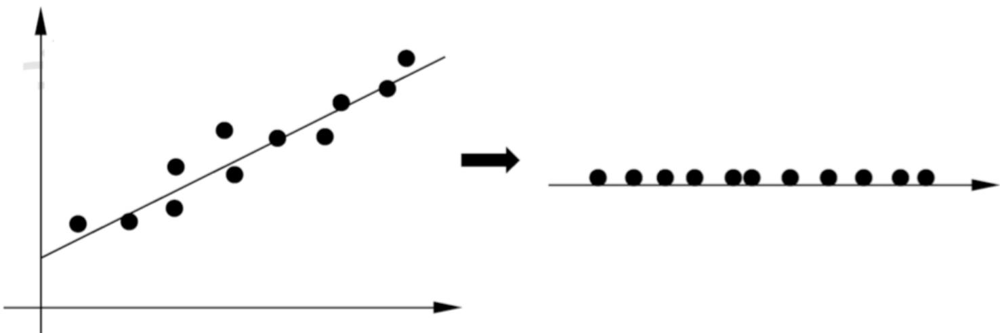

•二维空间的样本存在于一条真线的附近，可以将样本从二维空间转换到一维空间。通过降维可以更好地表示样本之间的关系。

## 降维

·假设输入空间是欧氏空间 $X \subseteq \mathbf { R } ^ { d }$ ，输出空间也是欧氏空间$Z \subseteq \mathbf { R } ^ { d ^ { \prime } } , \ d ^ { \prime } \ll d$ ，后者的维数低于前者的维数。降维的模型是函数

$$
z = g _ { \boldsymbol { \theta } } ( x )
$$

·其中 $x \in X$ 是样本的高维向量， $z \in Z$ 是样本的低维向量，θ是参数。函数可以是线性函数也可以是非线性函数。

·降维的过程就是学习降维模型的过程。降维时，每一个样本从高维向量转换为低维向量 $z _ { i } = g _ { \theta } ( x _ { i } ) , \ i = 1 , 2 , \cdot \cdot \cdot , N _ { \circ }$ O

## 概率模型估计

·假设训练数据由一个概率模型生成，由训练数据学习概率模型的结构和参数。

·概率模型的结构类型，，或者说概率模型的集合事先给定，而模型的具体结构与参数从数据中自动学习。学习的目标是找到最有可能生成数据的结构和参数。

·概率模型包括混合模型、概率图模型等。

•概率图模型又包括有向图模型和无向图模型。

## 概率模型估计

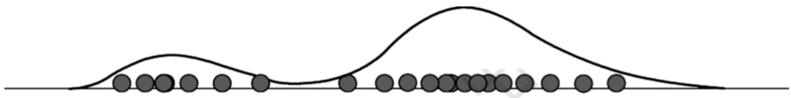  
图13.4 概率模型估计的例子

·假设数据由高斯混合模型生成，学习的目标是估计这个模型的参数。

## 概率模型估计

•概率模型表示为条件概率分布Po(xl|2)

•随机变量×表示观测数据，可以是连续变量也可以是离散变量

•随机变量z表示隐式结构，是离散变量

• 随机变量0表示参数

•模型是混合模型时，z表示成分的个数

·模型是概率图模型时，z表示图的结构

## 概率模型估计

•概率模型的一种特殊情况是隐式结构不存在，即满足 $P _ { \theta } ( x | z ) = P _ { \theta } ( x )$

• 这时条件 概率分布估计变成概率分布估计，只要估计分布 $P _ { \theta } ( x )$ 的参数即可。

## 概率模型估计

·概率模型估计是从给定的训练数据 $U = \{ x _ { 1 } , x _ { 2 } , \cdot \cdot \cdot , x _ { N } \}$ 中学习模型$P _ { \theta } ( x | z )$ 的结构和参数，计算出模型相关的任意边缘分布和条件分布。

•注意随机变量×是多元变量，甚至是高维多元变量

·软聚类也可以看作是概率模型估计问题。根据贝叶斯公式

$$
P ( z | x ) = \frac { P ( z ) P ( x | z ) } { P ( x ) } \propto P ( z ) P ( x | z )
$$

•假设先验概率服从均匀分布，只需要估计条件概率分布 $P _ { \theta } ( x | z )$ 这样，可以通过对条 件概率分布 ${ \dot { P } } _ { \theta } ( x | z )$ 的估计进行软聚类

## 无监督学习三要素

·模型

·函数 $z = g _ { \theta } ( x )$ ，条件概率分布P(z|x），或条件概率分布 $P _ { \theta } ( x | z )$

•策略

• 目标函数的优化

•算法

・迭代算法，通过迭代达到对目标函数的最优化

## 聚类

·有5个样本A、B、C、D、E，每个样本有二维特征x1，X2。通过聚类算法，可以将样本分配到两个类别中。

<table><tr><td>A</td><td>B</td><td>C</td><td>D</td><td>E</td></tr><tr><td>1 x1</td><td>1</td><td>0</td><td>2</td><td>3</td></tr><tr><td>1 x2</td><td>0</td><td>2</td><td>4</td><td>5</td></tr></table>

## 聚类

•假设用k均值聚类，k=2。开始可以取任意两点作为两个类的中心

•依据样本与类中心的欧氏距离的大小将样本分配到两个类中

·然后计算两个类中样本的均值，作为两个类的新的类中心

•重复以上操作，直到两类不再改变

·最后得到聚类结果，A、B、C为一个类，D、E为另一个类。

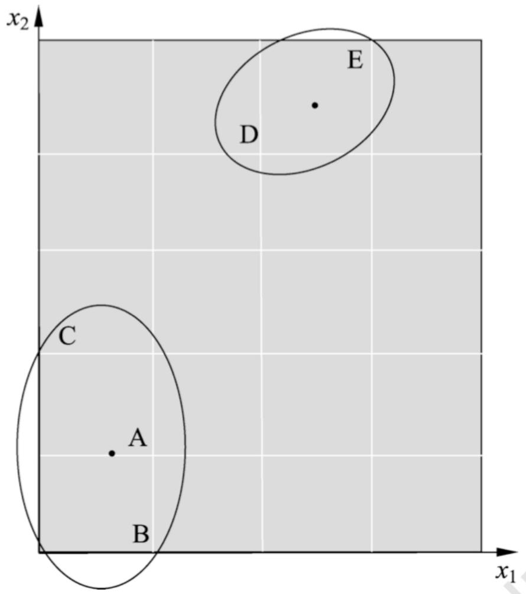

## 降维

·给出一个简单的数据集合。有14个样本A、B、C、D等，每个样本有9 维特征 $x _ { 1 } , x _ { 2 } , \cdots , x _ { 9 }$ O

<table><tr><td>K A</td><td>B</td><td>C</td><td>D</td><td></td></tr><tr><td> $x _ { 1 }$ </td><td>3 0.25</td><td>2.8</td><td>0.1</td><td></td></tr><tr><td> $x _ { 2 }$ </td><td>2.9</td><td>0.8 2.2</td><td>1.8</td><td></td></tr><tr><td>x3</td><td>2.2 1</td><td>1.5</td><td>3.2</td><td>·</td></tr><tr><td>x4</td><td>2 1.4</td><td>2</td><td>0.3</td><td>··</td></tr><tr><td>x5</td><td>1.3</td><td>1.6 1.6</td><td>0</td><td></td></tr><tr><td>x6</td><td>1.5 2</td><td>2.1</td><td>3</td><td>·</td></tr><tr><td>x7</td><td>1.1</td><td>2.2 1.2</td><td>2.8</td><td>…</td></tr><tr><td>x8</td><td>1</td><td>2.7 0.9</td><td>0.3</td><td>·</td></tr><tr><td>x9</td><td>0.4</td><td>3 0.6</td><td>0.1</td><td></td></tr></table>

## 降维

·由于数据是高维（多变量）数据，很难观察变量的样本区分能力，也很难观察样本之间的关系。 1

• 对数据进行降维，如主成分分析，就可以更直接地分析以上问题。

•对样本集合进行降维（主成分分析），结果在新的二维实数空间中，有二维新的特征 $. y _ { 1 } , y _ { 2 } ,$ 14个样本分布在不同位置。

·通过降维，可以发现样本可以分为三个类，二维新特征由原始特征定义。

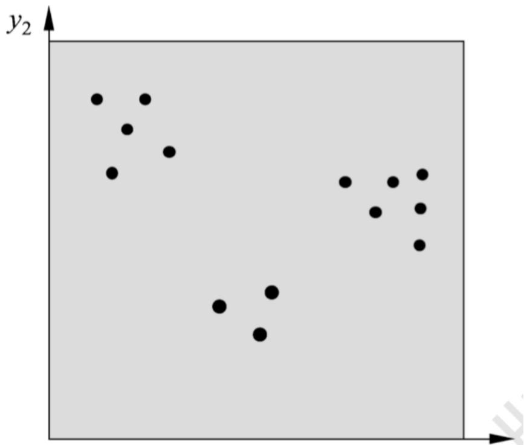

## 话题分析

• 话题分析是文本分析的一种技术。

• 给定一个文本集合，话题分析旨在发现文本集合中每个文本的话题，而话题由单词的集合表示。

•注意，这里假设有足够数量的文本，如果只有一个文本或几个文本，是不能做话题分析的。

·话题分析可以形式化为概率模型估计问题，或降维问题。

## 话题分析

·给出一个文本数据集合。有6个文本，6个单词，表中数字表示单词在文本中的出现次数。

<table><tr><td colspan="2">文本</td><td rowspan="2">docl</td><td rowspan="2">doc2</td><td rowspan="2">doc3</td><td rowspan="2">doc4</td><td rowspan="2">doc5</td><td rowspan="2">doc6</td></tr><tr><td>单词</td><td></td></tr><tr><td>word1</td><td></td><td>1</td><td>1</td><td></td><td></td><td></td><td></td></tr><tr><td>word2</td><td></td><td>1</td><td></td><td>1</td><td></td><td></td><td></td></tr><tr><td>word3</td><td></td><td></td><td>1</td><td>1</td><td></td><td></td><td></td></tr><tr><td></td><td>word4</td><td></td><td></td><td></td><td>1</td><td>1</td><td></td></tr><tr><td>word5</td><td></td><td></td><td></td><td></td><td>1</td><td></td><td>1</td></tr><tr><td>word6</td><td></td><td></td><td></td><td></td><td></td><td>1</td><td>1</td></tr></table>

## 话题分析

• 对数据进行话题分析，如LDA分析，得到由单词集合表示的话题，以及由话题集合表示的文本。

表13.4 话题分析（LDA分析）的结果
<table><tr><td></td><td rowspan="2">话题</td><td rowspan="2">topic1</td><td rowspan="2">topic2</td><td>话题</td><td rowspan="2">topic1</td><td rowspan="2">topic2</td></tr><tr><td>单词</td><td>文本</td></tr><tr><td>word1</td><td></td><td>0.33</td><td>0</td><td>doc1</td><td>1</td><td>0</td></tr><tr><td colspan="2">word2</td><td>0.33</td><td>0</td><td colspan="2">doc2</td><td>1 0</td></tr><tr><td colspan="2">word3</td><td>0.33</td><td>0</td><td colspan="2">doc3</td><td>0</td></tr><tr><td colspan="2">word4</td><td>0</td><td>0.33</td><td colspan="2">doc4</td><td>1</td></tr><tr><td colspan="2">word5</td><td>0</td><td>0.33</td><td colspan="2">doc5</td><td>1</td></tr><tr><td colspan="2">word6</td><td>0</td><td>0.33</td><td colspan="2">doc6</td><td>1</td></tr></table>

· 具体地话题表示为单词的概率分布，文本表示为话题的概率分布。LDA是含有这些概率分布的模型。

## 图分析

·图分析，（graph analytics）的目的是发掘隐藏在图中的统计规律或潜在结构。

•PageRank算法是无监督学习方法，主要是发现有向图中的重要结点。

· 给定一个有向图，定义在图上的随机游走即马尔可夫链。

·随机游走者在有向图上随机跳转，到达一个结点后以等概率跳转到链接出 去的结点，并不断持续这个过程。

• PageRank算法就是求解该马尔可夫链的平稳分布的算法。

## Page Rank

• 一个结点上的平稳概率表示该结点的重要性，称为该结点的PageRank值。

·被指向的结点越多，该结点的PageRank值就越大。

·被指向的结点的PageRank值越大，该结点的PageRank值就越大。

• PageRank值越大结点也就越重要。

## PageRank的原理

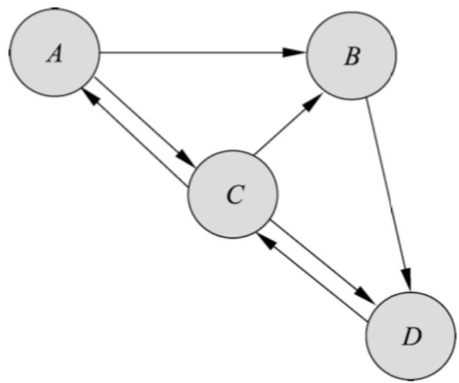

• 上图是一个简单的有向图，有4个结点 $\mathsf { A } , \mathsf { B } , \mathsf { C } , \mathsf { D }$ O

·给定这个图，PageRank算法通过迭代求出结点的PageRank值。

## PageRank的原理

·首先，对每个结点的概率值初始化，表示各个结点的到达概率，假设是等概率的。

•下一步，各个结点的概率是上一步各个结点可能跳转到该结点的概率之和。

• 不断迭代，各个结点的到达概率分布趋于平稳分布，也就是PageRank值的分布。

<table><tr><td></td><td rowspan="2">步骤</td><td rowspan="2">第1步</td><td rowspan="2">第2步 第3步</td></tr><tr><td>结点</td></tr><tr><td>A</td><td>1/4</td><td>2/24</td><td>3/24</td></tr><tr><td>B</td><td>1/4 1/4</td><td>5/24</td><td>4/24</td></tr><tr><td>C</td><td></td><td>9/24</td><td>9/24</td></tr><tr><td colspan="2">D</td><td>1/4 8/24</td><td>8/24</td></tr></table>

## 第十四章聚类方法

## 相似度或距离

·假设有n个样本，每个样本由m个属性的特征向量组成，样本合集可以用矩阵×表示

$$
X = [ x _ { i j } ] _ { m \times n } = { \left[ \begin{array} { l l l l } { x _ { 1 1 } } & { x _ { 1 2 } } & { \cdots } & { x _ { 1 n } } \\ { x _ { 2 1 } } & { x _ { 2 2 } } & { \cdots } & { x _ { 2 n } } \\ { \vdots } & { \vdots } & & { \vdots } \\ { x _ { m 1 } } & { x _ { m 2 } } & { \cdots } & { x _ { m n } } \end{array} \right] }
$$

·聚类的核心概念是相似度(similarity)或距离(distance)，有多种相似度或距离定义。因为相似度直接影响聚类的结果，所以其选择是聚类的根本问题。

## 闵可夫斯基距离

·闵可夫斯基距离越大相似度越小，距离越小相似度越大。

•给定样本集合X，X是m维实数向量空间 ${ \mathsf { R } } ^ { \mathsf { m } }$ 中点的集合，其中

$$
x _ { i } , x _ { j } \in X , \ x _ { i } = ( x _ { 1 i } , x _ { 2 i } , \cdots , x _ { m i } ) ^ { \mathrm { T } } , \ x _ { j } = ( x _ { 1 j } , x _ { 2 j } , \cdots , x _ { m j } ) ^ { \mathrm { T } }
$$

·样本 $\cdot \mathsf { X } _ { \mathrm { i } }$ 与样本 $\mathsf { X } _ { \mathrm { j } }$ 的闵可夫斯基距离（Minkowski distance）定义为

$$
d _ { i j } = \left( \sum _ { k = 1 } ^ { m } | x _ { k i } - x _ { k j } | ^ { p } \right) ^ { \frac { 1 } { p } } \qquad \quad p \geqslant 1
$$

## 闵可夫斯基距离

•当 ${ \mathsf { p } } = 2$ 时称为欧氏距离（Euclidean distance)

$$
d _ { i j } = \left( \sum _ { k = 1 } ^ { m } | x _ { k i } - x _ { k j } | ^ { 2 } \right) ^ { \frac { 1 } { 2 } }
$$

•当 $\mathsf { p } { = } 1$ 时称为曼哈顿距离（Manhattan distance)

$$
d _ { i j } = \sum _ { k = 1 } ^ { m } | x _ { k i } - x _ { k j } |
$$

·当 $\mathsf { \Omega } \mathsf { p } \equiv \mathsf { \Omega } \infty$ 时称为切比雪夫距离（Chebyshev distance)

$$
d _ { i j } = \operatorname* { m a x } _ { k } | x _ { k i } - x _ { k j } |
$$

## 马哈拉诺比斯距离

·马哈拉诺比斯距离（Mahalanobis distance)，简称马氏距离，也是另一种常用的相似度，考虑各个分量（特征）之间的相关性并与各个分量的尺度无关。

·马哈拉诺比斯距离越大相似度越小，距离越小相似度越大。

·给定一个样本集合×， $\begin{array} { r l } { \mathsf { X } = } & { { } [ x _ { i j } ] _ { m \times n } } \end{array}$ 其协方差矩阵记作S。样本xj与样本 $\operatorname { \dot { } X _ { j } } .$ 之间的马哈拉诺比斯距离 ${ \mathsf { d } } _ { \mathsf { i } } { \mathsf { \Sigma } }$ 定义为

$$
d _ { i j } = \left[ ( x _ { i } - x _ { j } ) ^ { \operatorname { T } } S ^ { - 1 } ( x _ { i } - x _ { j } ) \right] ^ { \frac { 1 } { 2 } }
$$

$$
\begin{array} { r } { x _ { i } = ( x _ { 1 i } , x _ { 2 i } , \cdot \cdot \cdot , x _ { m i } ) ^ { \mathrm { T } } , \quad x _ { j } = ( x _ { 1 j } , x _ { 2 j } , \cdot \cdot \cdot , x _ { m j } ) ^ { \mathrm { T } } } \end{array}
$$

## 相关系数

·样本之间的相似度也可以用相关系数（correlation coefficient）来表示。

•相关系数的绝对值越接近于1，表示样本越相似

•越接近于0，表示样本越不相似。

·样本×与样本 $X _ { \mathrm { j } }$ 之间的相关系数定义为

$$
r _ { i j } = \frac { \displaystyle \sum _ { k = 1 } ^ { m } ( x _ { k i } - \bar { x } _ { i } ) ( x _ { k j } - \bar { x } _ { j } ) } { \displaystyle \left[ \sum _ { k = 1 } ^ { m } ( x _ { k i } - \bar { x } _ { i } ) ^ { 2 } \sum _ { k = 1 } ^ { m } ( x _ { k j } - \bar { x } _ { j } ) ^ { 2 } \right] ^ { \frac { 1 } { 2 } } }
$$

$$
{ \bar { x } } _ { i } = { \frac { 1 } { m } } \sum _ { k = 1 } ^ { m } x _ { k i } , \quad { \bar { x } } _ { j } = { \frac { 1 } { m } } \sum _ { k = 1 } ^ { m } x _ { k j }
$$

## 夹角余弦

·样本之间的相似度也可以用夹角余弦（cosine）来表示。

• 夹角余弦越接近于1，表示样本越相似

•越接近于0，表示样本越不相似。

·样本 $\cdot \mathsf { X } _ { \mathrm { i } }$ 与样本 $X _ { \mathrm { j } }$ 之间的夹角余弦定义为

$$
s _ { i j } = \frac { \displaystyle \sum _ { k = 1 } ^ { m } x _ { k i } x _ { k j } } { \left[ \displaystyle \sum _ { k = 1 } ^ { m } x _ { k i } ^ { 2 } \displaystyle \sum _ { k = 1 } ^ { m } x _ { k j } ^ { 2 } \right] ^ { \frac { 1 } { 2 } } }
$$

## 相似度

•用距离度量相似度时，距离越小样本越相似

・用相关系数时，相关系数越大样本越相似

• 注意不同相似度度量得到的结果并不一定一致。

•从右图可以看出，如果从距离的角度看，A和B比A和C更相似

•但从相关系数的角度看，

·A和C比A和B更相似。

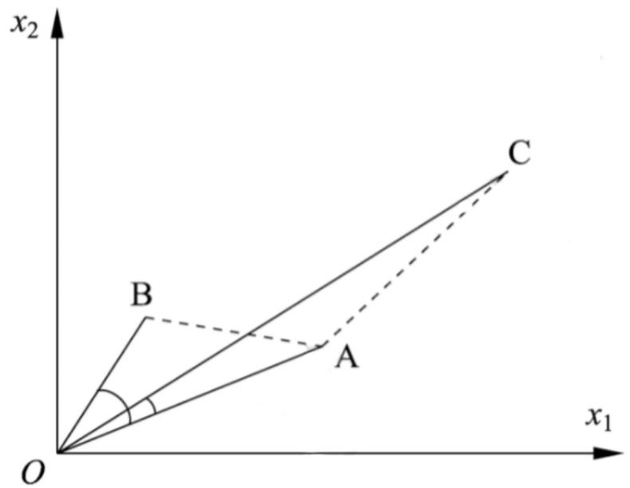

## 类或簇

·通过聚类得到的类或簇，本质是样本的子集。

·如果一个聚类方法假定一个样本只能属于一个类，或类的交集为空集，那么该方法称为硬聚类（hard clustering）方法。

•如果一个样本可以属于多个类，或类的交集不为空集，那么该方法称为软聚类(soft clustering）方法。

## 类或簇

·用G表示类或簇（cluster)，用 ${ \mathsf { X } } _ { \mathsf { i } } ,$ x表示类中的样本，用 $\mathsf { n } _ { \mathsf { G } }$ 表示G中样本的个数，用 ${ \mathsf { d } } _ { \mathsf { i } } { \mathsf { \Sigma } }$ 表示样本x与样本x之间的距离。

•类或簇有多种定义，下面给出几个常见的定义。

## 类或簇

设T为给定的正数，若集合G中任意两个样本 $x _ { i } , x _ { j }$ 有

$$
d _ { i j } \leqslant T
$$

则称G为一个类或簇。

## 类或簇

设T 为给定的正数，若对集合G 的任意样本 $x _ { i } ,$ ，一定存在G中的另一个样本 $x _ { j } { \mathrm { : } }$ ，使得

$$
d _ { i j } \leqslant T
$$

则称G为一个类或簇。

## 类或簇

设T 为给定的正数，若对集合G 中任意一个样本 $x _ { i }$ ，G中的另一个样本 $x _ { j }$ 满足

$$
\frac { 1 } { n _ { G } - 1 } \sum _ { x _ { j } \in G } d _ { i j } \leqslant T
$$

其中 $n _ { G }$ 为G 中样本的个数，则称G 为一个类或簇。

## 类或簇

设T和V为给定的两个正数，如果集合G中任意两个样本 $x _ { i } , x _ { j }$ 的

距离 $d _ { i j }$ 满足

$$
\frac { 1 } { n _ { G } ( n _ { G } - 1 ) } \sum _ { x _ { i } \in G } \sum _ { x _ { j } \in G } d _ { i j } \leqslant T
$$

$$
d _ { i j } \leqslant V
$$

则称G 为一个类或簇。

## 类或簇

·类的特征可以通过不同角度来刻画，常用的特征有下面三种：

（1）类的均值 $\bar { x } _ { G }$ ，又称为类的中心

$$
\bar { x } _ { G } = \frac { 1 } { n _ { G } } \sum _ { i = 1 } ^ { n _ { G } } x _ { i }
$$

式中 $n _ { G }$ 是类G 的样本个数。

## 类或簇

·类的特征可以通过不同角度来刻画，常用的特征有下面三种：

（2）类的直径（diameter） $D _ { G }$

类的直径 $D _ { G }$ 是类中任意两个样本之间的最大距离，即

$$
D _ { G } = \operatorname* { m a x } _ { x _ { i } , x _ { j } \in G } d _ { i j }
$$

## 类或簇

·类的特征可以通过不同角度来刻画，常用的特征有下面三种：

（3）类的样本散布矩阵（scattermatrix） $A _ { G }$ 与样本协方差矩阵（covariancematrix) $S _ { G }$

$$
3 / 5 1 \dot { \updownarrow } + 3 / 5 1 \dot { \updownarrow } + 7 / \updownarrow \ddot { \updownarrow } \ddot { \updownarrow } \ddot { \updownarrow } + A _ { G } \xrightarrow { 3 / 5 } A _ { G } = \sum _ { i = 1 } ^ { n _ { G } } ( x _ { i } - \bar { x } _ { G } ) ( x _ { i } - \bar { x } _ { G } ) ^ { \mathrm { T } }
$$

样本协方差矩阵 $S _ { G }$ 为

$$
\begin{array} { l } { { \displaystyle S _ { G } = \frac { 1 } { m - 1 } A _ { G } } } \\ { { \displaystyle \quad = \frac { 1 } { m - 1 } \sum _ { i = 1 } ^ { n _ { G } } ( x _ { i } - \bar { x } _ { G } ) ( x _ { i } - \bar { x } _ { G } ) ^ { \mathrm { T } } } } \end{array}
$$

其中m为样本的维数（样本属性的个数）。

## 类与类之间的距离

·下面考虑类 $G _ { \mathfrak { p } }$ 与类 $\mathsf { G } _ { \mathtt { d } }$ 之间的距离D(p,q)，也称为连接 $( \mathsf { I i n k a g e } )$ O类与类之间的距离也有多种定义。

·设类 $G _ { \mathfrak { p } }$ 包含 ${ \mathsf { n } } _ { \mathsf { p } }$ 个样本， $\mathsf { G } _ { \mathtt { q } }$ 包含 $\mathsf { n } _ { \mathsf { q } }$ 个样本，分别用 $\bar { x } _ { p }$ 和 $\textstyle { \bar { x } } _ { q }$ 表示$G _ { \rho }$ 和 $\mathsf { G } _ { \mathtt { q } }$ 的均值，即类的中心。

## 类与类之间的距离

•最短距离或单连接 (single linkage)

•定义类 $\mathsf { G } _ { \mathsf { p } }$ 的样本与 $\mathsf { G } _ { \mathtt { q } }$ 的样本之间的最短距离为两类之间的距离

$$
D _ { p q } = \operatorname* { m i n } \left\{ d _ { i j } | x _ { i } \in G _ { p } , x _ { j } \in G _ { q } \right\}
$$

## 类与类之间的距离

·最长距离或完全连接(complete linkage)

•定义类 $\mathsf { G } _ { \mathsf { p } }$ 的样本与 $\mathsf { G } _ { \mathtt { q } }$ 的样本之间的最长距离为两类之间的距离

$$
D _ { p q } = \operatorname* { m a x } { \{ d _ { i j } | x _ { i } \in G _ { p } , x _ { j } \in G _ { q } \} }
$$

## 类与类之间的距离

•中心距离

•定义类 $\mathsf { G } _ { \mathsf { p } }$ 与 $\mathsf { G } _ { \mathtt { q } }$ 的中心 ${ \bar { x } } _ { p }$ 与 $\textstyle { \bar { x } } _ { q }$ 之间的距离为两类之间的距离

$$
D _ { p q } = d _ { \bar { x } _ { p } \bar { x } _ { q } }
$$

## 类与类之间的距离

•平均距离

·定义类 $\mathsf { G } _ { \mathsf { p } }$ 与 $\mathsf { G } _ { \mathtt { q } }$ 任意两个样本之间距离的平均值为两类之间的距离

$$
D _ { p q } = \frac { 1 } { n _ { p } n _ { q } } \sum _ { x _ { i } \in G _ { p } } \sum _ { x _ { j } \in G _ { q } } d _ { i j }
$$

## 层次聚类

·层次聚类假设类别之间存在层次结构，将样本聚到层次化的类中。

·层次聚类又有聚合（agglomerative）或自下而上（bottom-up)聚类、分裂（divisive）或自上而下(top-down）聚类两种方法。

・因为每个样本只属于一个类，所以层次聚类属于硬聚类

## 层次聚类

・聚合聚类开始将每个样本各自分到一个类

• 之后将相距最近的两类合并，建立一个新的类

・重复此操作直到满足停止条件

•得到层次化的类别

•分裂聚类开始将所有样本分到一个类

•之后将已有类中相距最远的样本分到两个新的类

·重复此操作直到满足停止条件

•得到层次化的类别

## 聚合聚类的具体过程

•对于给定的样本集合，开始将每个样本分到一个类

·然后按照一定规则，例如类间距离最小，将最满足规则条件的两个类进行合并

·如此反复进行，每次减少一个类，直到满足停止条件，如所有样本聚为一类。

## 聚合聚类

## •聚合聚类需要预先确定下面三个要素

•距离或相似度

闵可夫斯基距离

• 马哈拉诺比斯距离

• 相关系数

• 夹角余弦

•合并规则

·类间距离最小

·类间距离可以是最短距离、最长距离、中心距离、平均距离

•停止条件

• 停止条件可以是类的个数达到闭值（极端情况类的个数是1)

，类的直径超过阂值

## 聚合聚类算法

输入：n个样本组成的样本集合及样本之间的距离；

输出：对样本集合的一个层次化聚类。

（1）计算n个样本两两之间的欧氏距离 $\{ d _ { i j } \}$ ，记作矩阵 $D = [ d _ { i j } ] _ { n \times n \circ }$

（2）构造n个类，每个类只包含一个样本。

（3）合并类间距离最小的两个类，其中最短距离为类间距离，构建一个新类。

(4) 计算新类与当前各类的距离。若类的个数为1，终止计算，否则回到步(3)。■

可以看出聚合层次聚类算法的复杂度是 $O ( n ^ { 3 } m )$ ，其中m是样本的维数，n 是样本个数。

## 例

·给定5个样本的集合，样本之间的欧氏距离由如下矩阵D表示

$$
D = [ d _ { i j } ] _ { 5 \times 5 } = \left[ \begin{array} { l l l l l } { 0 } & { 7 } & { 2 } & { 9 } & { 3 } \\ { 7 } & { 0 } & { 5 } & { 4 } & { 6 } \\ { 2 } & { 5 } & { 0 } & { 8 } & { 1 } \\ { 9 } & { 4 } & { 8 } & { 0 } & { 5 } \\ { 3 } & { 6 } & { 1 } & { 5 } & { 0 } \end{array} \right]
$$

·其中 ${ \mathsf { d } } _ { \mathrm { i j } }$ 表示第i个样本与第j个样本之间的欧氏距离。

• 显然D为对称矩阵。应用聚合层次聚类法对这5个样本进行聚类。

## 例

(1)

•首先用5个样本构建5个类， $G _ { i } = \{ x _ { i } \} , \ i = 1 , 2 , \cdots , 5$

•这样，样本之间的距离也就变成类之间的距离，所以5个类之间 的距离矩阵亦为D

(2)

•由矩阵D可以看出， $D _ { 3 5 } = D _ { 5 3 } = 1$ 为最小，所以把 $\mathsf { G } _ { 3 }$ 和 $1 6 _ { 5 }$ 合并为一个新类，记作 $G _ { 6 } = \{ x _ { 3 } , x _ { 5 } \}$

## 例

(3)

·计算 $G _ { 6 }$ 与 $\mathsf { G } _ { 1 } , \mathsf { G } _ { 2 } , \mathsf { G } _ { 4 }$ 之间的最短距离，有

$$
D _ { 6 1 } = 2 , \quad D _ { 6 2 } = 5 , \quad D _ { 6 4 } = 5
$$

•又注意到其余两类之间的距离是

$$
D _ { 1 2 } = 7 , \quad D _ { 1 4 } = 9 , \quad D _ { 2 4 } = 4
$$

·显然， $\mathrm { D } _ { 6 1 } = 2$ 最小，所以将 $\mathsf { G } _ { 1 }$ 与 $G _ { 6 }$ 合并成一个新类，记作

$$
\boldsymbol { G } _ { 7 } = \{ x _ { 1 } , x _ { 3 } , x _ { 5 } \} \circ
$$

## 例

(4)

·计算 $\mathsf { G } _ { 7 }$ 与 $\mathsf { G } _ { 2 } , \mathsf { G } _ { 4 }$ 之间的最短距离，

$$
D _ { 7 2 } = 5 , \quad D _ { 7 4 } = 5
$$

•又注意到

$$
D _ { 2 4 } = 4
$$

•显然，其中 $\mathrm { D } _ { 2 4 } { = } 4$ 最小，所以将 $\mathsf { G } _ { 2 }$ 与 $\mathsf { G } _ { 4 }$ 合并成一个新类，记作

$$
G _ { 8 } = \{ x _ { 2 } , x _ { 4 } \}
$$

## 例

(5)

·将 $G _ { 7 }$ 与 $G _ { 8 }$ 合并成一个新类，记作 $G _ { 9 } = \{ x _ { 1 } , x _ { 2 } , x _ { 3 } , x _ { 4 } , x _ { 5 } \}$

·即将全部样本聚成1类，聚类终止

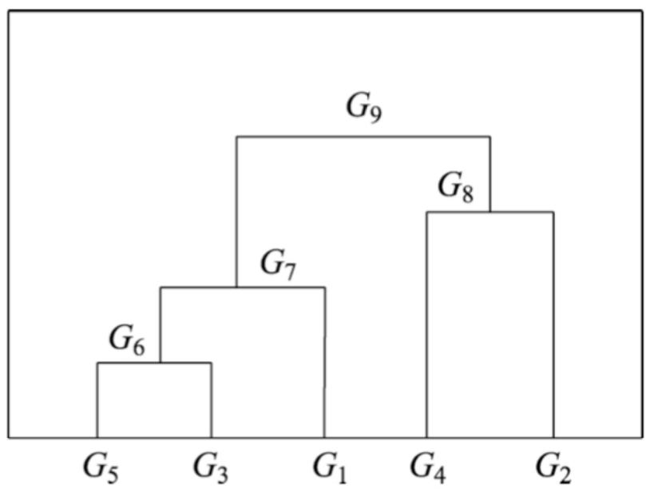

## k均值聚类

•k均值聚类是基於样本集合划分的聚类算法。

•k均值聚类将样本集合划分为k个子集，构成k个类，将n个样本分到k个类中，每个样本到其所属类的中心的距离最小。

·每个样本只能属于一个类，所以k均值聚类是硬聚类。

## 模型

• 给定n个样本的集合 $X = \{ x _ { 1 } , x _ { 2 } , \cdot \cdot \cdot , x _ { n } \}$

⋅每个样本由一个特征向量表示，特征向量的维数是m。

•k均值聚类的目标是将n个样本分到k个不同的类或簇中，这里假设 $k < n$ o

•k个类 $\mathsf { G } _ { 1 } , \mathsf { G } _ { 2 } , \cdots , \mathsf { G } _ { \mathsf { k } }$ 形成对样本集合X的划分，其中

$$
G _ { i } \cap G _ { j } = \emptyset , \bigcup _ { i = 1 } ^ { k } G _ { i } = X
$$

· 用C表示划分，一个划分对应着一个聚类结果。

## 模型

•划分C是一个多对一的函数

•k均值聚类的模型是一个从样本到类的函数。

·划分或者聚类可以用函数l =C(i）表示，其中样本用一个整数$i \in \{ 1 , 2 , \cdots , n \}$ 表示，类用一个整数 $l \in \{ 1 , 2 , \cdots , k \}$ 表示

## 策略

•k均值聚类归结为样本集合X的划分，或者从样本到类的函数的选择问题。

•k均值聚类的策略是通过损失函数的最小化选取最优的划分或函数C\*

## 策略

·首先：采用欧氏距离平方（squared Euclidean distance）作为样本之间的距离 $\mathsf { d } ( \mathsf { X } _ { \mathrm { i } } , \mathsf { X } _ { \mathrm { j } } )$

$$
\begin{array} { c } { d ( x _ { i } , x _ { j } ) = \displaystyle \sum _ { k = 1 } ^ { m } ( x _ { k i } - x _ { k j } ) ^ { 2 } } \\ { = \| x _ { i } - x _ { j } \| ^ { 2 } } \end{array}
$$

## 策略

·然后，定义样本与其所属类的中心之间的距离的总和为损失函数，即

$$
W ( C ) = \sum _ { l = 1 } ^ { k } \sum _ { C ( i ) = l } \| x _ { i } - \bar { x } _ { l } \| ^ { 2 }
$$

$\bar { x } _ { l } = ( \bar { x } _ { 1 l } , \bar { x } _ { 2 l } , \cdot \cdot \cdot , \bar { x } _ { m l } ) ^ { \mathrm { T } }$ 是第[个类的均值或中心， $n _ { l } ~ = ~ \sum _ { i = 1 } ^ { n } I ( C ( i ) = l )$

$I ( C ( i ) = l )$ 是指示函数，取值1或0

·函数W(C也称为能量，表示相同类中的样 本相似的程度。

## 策略

•k均值聚类就是求解最优化问题：

$$
\begin{array} { l } { C ^ { * } = \arg \underset { C } { \mathrm { m i n } } W ( C ) } \\ { = \arg \underset { C } { \mathrm { m i n } } \underset { l = 1 } { \overset { k } { \sum } } \underset { C ( i ) = l } { \sum } \| x _ { i } - \bar { x } _ { l } \| ^ { 2 } } \end{array}
$$

•相似的样本被聚到同类时，损失函数值最小，这个目标函数的最优化能达到聚类的目的。

## 策略

•但是，这是一个组合优化问题，n个样本分到k类，所有可能分法的数目是：

$$
S ( n , k ) = { \frac { 1 } { k ! } } \sum _ { l = 1 } ^ { k } ( - 1 ) ^ { k - l } { \left( \begin{array} { l } { k } \\ { l } \end{array} \right) } k ^ { n }
$$

·事实上，k均值聚类的最优解求解问题是NP困难问题。现实中采用迭代的方法求解。

## 算法

• Κ均值聚类的算法是一个迭代的过程，每次迭代包括两个步骤。

•首先选择k个类的中心，将样本逐个指派到与其最近的中心的类中，得到一个聚类结果

·然后更新每个类的样本的均值，作为类的新的中心

·重复以上步骤，直到收敛为止。

## 算法

• 首先，对于给定的中心值 $( { \mathsf { m } } _ { 1 } , { \mathsf { m } } _ { 2 } , \cdots , { \mathsf { m } } _ { \mathsf { k } } )$ ，求一个划分C，使得目标函数极小化:

$$
\operatorname* { m i n } _ { C } \sum _ { l = 1 } ^ { k } \sum _ { C ( i ) = l } \| x _ { i } - m _ { l } \| ^ { 2 }
$$

•就是说在类中心确定的情况下，将每个样本分到一个类中，使样本和其所属类的中心之间的距离总和最小。

·求解结果，将每个样本指派到与其最近的中 $r _ { L } \cdot m _ { 1 }$ 的类 $G$ 中。

## 算法

·然后，对给定的划分C，再求各个类的中心 $( { \mathsf { m } } _ { 1 } , { \mathsf { m } } _ { 2 } , \cdots , { \mathsf { m } } _ { \mathsf { k } } )$ ，使得目标函数极小化：

$$
\operatorname* { m i n } _ { m _ { 1 } , \cdots , m _ { k } } \sum _ { l = 1 } ^ { k } \sum _ { C ( i ) = l } \| x _ { i } - m _ { l } \| ^ { 2 }
$$

・就是说在划分确定的情况下，使样本和其所属类的中心之间的距离总和最小

·求解结果，对于每个包含n₁个样本的类 $\mathsf { G } _ { \mathsf { I } }$ ，更新其均值 $\mathsf { m } _ { \mathsf { I } }$

$$
m _ { l } = \frac { 1 } { n _ { l } } \sum _ { C ( i ) = l } x _ { i } , l = 1 , \cdots , k
$$

·重复以上两个步骤，直到划分不再改变，得到聚类结果

## k均值聚类算法

输入：n个样本的集合X；

输出：样本集合的聚类 $C ^ { \bullet }$

（1）初始化。令t=0，随机选择k个样本点作为初始聚类中心 $\begin{array} { r l } { m ^ { ( 0 ) } } & { { } = } \end{array}$ $( m _ { 1 } ^ { ( 0 ) } , \cdots , m _ { l } ^ { ( 0 ) } , \cdots , m _ { k } ^ { ( 0 ) } )$ 。

（2）对样本进行聚类。对固定的类中心 $m ^ { ( t ) } = ( m _ { 1 } ^ { ( t ) } , \cdots , m _ { l } ^ { ( t ) } , \cdots , m _ { k } ^ { ( t ) } )$ ，其中$m _ { l } ^ { ( t ) }$ 为类 $G _ { l }$ 的中心，计算每个样本到类中心的距离，将每个样本指派到与其最近的中心的类中，构成聚类结果 $C ^ { ( t ) }$ 。

(3)计算新的类中心。对聚类结果 $C ^ { ( t ) }$ ，计算当前各个类中的样本的均值，作为新的类中心 $m ^ { ( t + 1 ) } = ( m _ { 1 } ^ { ( t + 1 ) } , \cdots , m _ { l } ^ { ( t + 1 ) } , \cdots , m _ { k } ^ { ( t + 1 ) } )$ 。

（4）如果迭代收敛或符合停止条件，输出 $C ^ { * } = C ^ { ( t ) }$ 0

否则，令t = t + 1,返回步 (2)。

k均值聚类算法的复杂度是O(mnk)，其中m是样本维数，n是样本个数，k是类别个数。

## 例

• 给定含有5个样本的集合

$$
X = { \left[ \begin{array} { l l l l l } { 0 } & { 0 } & { 1 } & { 5 } & { 5 } \\ { 2 } & { 0 } & { 0 } & { 0 } & { 2 } \end{array} \right] }
$$

●试用k均值聚类算法将样本聚到2个类中。

## 例

（1）选择两个样本点作为类的中心。假设选择 $m _ { 1 } ^ { ( 0 ) } = x _ { 1 } = ( 0 , 2 ) ^ { \mathrm { T } } , ~ m _ { 2 } ^ { ( 0 ) } = x _ { 2 } =$ $( 0 , 0 ) ^ { \mathrm { T } }$ 0

（2）以 $m _ { 1 } ^ { ( 0 ) } , m _ { 2 } ^ { ( 0 ) }$ 为类 $G _ { 1 } ^ { ( 0 ) } , G _ { 2 } ^ { ( 0 ) }$ 的中心，计算 $x _ { 3 } = ( 1 , 0 ) ^ { \mathrm { T } } , x _ { 4 } = ( 5 , 0 ) ^ { \mathrm { T } } , x _ { 5 } =$ $( 5 , 2 ) ^ { \mathrm { T } }$ 与 $m _ { 1 } ^ { ( 0 ) } = ( 0 , 2 ) ^ { \mathrm { T } } , m _ { 2 } ^ { ( 0 ) } = ( 0 , 0 ) ^ { \mathrm { T } }$ 的欧氏距离平方。

对 $x _ { 3 } = ( 1 , 0 ) ^ { \mathrm { T } } , ~ d ( x _ { 3 } , m _ { 1 } ^ { ( 0 ) } ) = 5 , ~ d ( x _ { 3 } , m _ { 2 } ^ { ( 0 ) } ) = 1$ ，将 $x _ { 3 }$ 分到类 ${ G } _ { 2 } ^ { ( 0 ) }$

对 $x _ { 4 } = ( 5 , 0 ) ^ { \mathrm { T } } , ~ d ( x _ { 4 } , m _ { 1 } ^ { ( 0 ) } ) = 2 9 , ~ d ( x _ { 4 } , m _ { 2 } ^ { ( 0 ) } ) = 2 5$ ，将 $x _ { 4 }$ 分到类 ${ G } _ { 2 } ^ { ( 0 ) }$

对 $x _ { 5 } = ( 5 , 2 ) ^ { \mathrm { T } } , ~ d ( x _ { 5 } , m _ { 1 } ^ { ( 0 ) } ) = 2 5 , ~ d ( x _ { 5 } , m _ { 2 } ^ { ( 0 ) } ) = 2 9$ ，将 $x _ { 5 }$ 分到类 $G _ { 1 } ^ { ( 0 ) }$

## 例

（3）得到新的类 $G _ { 1 } ^ { ( 1 ) } = \{ x _ { 1 } , x _ { 5 } \} , G _ { 2 } ^ { ( 1 ) } = \{ x _ { 2 } , x _ { 3 } , x _ { 4 } \}$ ，计算类的中心 $m _ { 1 } ^ { ( 1 ) } , m _ { 2 } ^ { ( 1 ) }$

$$
m _ { 1 } ^ { ( 1 ) } = ( 2 . 5 , 2 . 0 ) ^ { \mathrm { T } } , \quad m _ { 2 } ^ { ( 1 ) } = ( 2 , 0 ) ^ { \mathrm { T } }
$$

(4) 重复步骤 (2) 和步骤 (3)。

将 $x _ { 1 }$ 分到类 $G _ { 1 } ^ { ( 1 ) }$ ，将 $x _ { 2 }$ 分到类 $G _ { 2 } ^ { ( 1 ) } , x _ { 3 }$ 分到类 $G _ { \gamma } ^ { ( 1 ) } , x _ { 4 }$ 分到类 $G _ { 2 } ^ { ( 1 ) } , x _ { 5 }$ 分到 类 $G _ { 1 } ^ { ( 1 ) }$

得到新的类 $G _ { 1 } ^ { ( 2 ) } = \{ x _ { 1 } , x _ { 5 } \} , \ G _ { 2 } ^ { ( 2 ) } = \{ x _ { 2 } , x _ { 3 } , x _ { 4 } \}$ O

由于得到的新的类没有改变，聚类停止。得到聚类结果：

$$
G _ { 1 } ^ { * } = \{ x _ { 1 } , x _ { 5 } \} , \quad G _ { 2 } ^ { * } = \{ x _ { 2 } , x _ { 3 } , x _ { 4 } \}
$$

## 算法特性

•总体特点

• 基于划分的聚类方法

• 类别数k事先指定

・以欧氏距离平方表示样本之间的距离，以中心或样本的均值表示类别

•以样本和其所属类的中心之间的距离的总和为最优化的目标函数

•得到的类别是平坦的、非层次化的

· 算法是迭代算法，不能保证得到全局最优。

## 算法特性

·收敛性

•k均值聚类属于启发式方法，不能保证收敛到全局最优，初始中心的选择会直接影响聚类结果。

•注意，类中心在聚类的过程中会发生移动，但是往往不会移动太大，因为在每一步，样本被分到与其最近的中心的类中。

## 算法特性

•初始类的选择

·选择不同的初始中心，会得到不同的聚类结果。

•初始中心的选择，比如可以用层次聚类对样本进行聚类，得到k个类时停止。然后从每个类中选取一个与中心距离最近的点。

## 算法特性

• 类别数k的选择

•k均值聚类中的类别数k值需要预先指定，而在实际应用中最优的k值是不知道的。

· 尝试用不同的k值聚类，检验得到聚类结果的质量，推测最优的k值。

·聚类结果的质量可以用类的平均直径来衡量。

•一般地，类别数变小时，平均直径会增加

·类别数变大超过某个值以后，平均真径会不变，而这个值正是最优的k值。实验时，可以采用二分查找，快速我到最优的k值。

## 算法特性

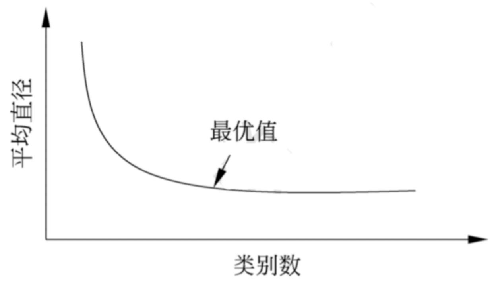

## 第十五章奇异值分解

## 定义与定理

矩阵的奇异值分解是指，将一个非零的m×n 实矩阵

A, $A \in \mathbf { R } ^ { m \times n }$ ，表示为以下三个实矩阵乘积形式的运算①，即进行矩阵的因子分解:

$$
\boldsymbol { A } = \boldsymbol { U } \boldsymbol { \Sigma } \boldsymbol { V } ^ { \mathrm { T } }\tag{15.1}
$$

其中U是m 阶正交矩阵（orthogonal matrix），V是n 阶正交矩阵，∑是由降序排列的非负的对角线元素组成的m×n 矩形对角矩阵（rectangular diagonal matrix），满足

$$
\begin{array} { l } { { U U ^ { \mathrm { T } } = I } } \\ { { \ } } \\ { { V V ^ { \mathrm { T } } = I } } \\ { { \ } } \\ { { \Sigma = \operatorname { d i a g } ( \sigma _ { 1 } , \sigma _ { 2 } , \cdot \cdot \cdot , \sigma _ { p } ) } } \\ { { \ } } \\ { { \sigma _ { 1 } \geqslant \sigma _ { 2 } \geqslant \cdot \cdot \cdot \geqslant \sigma _ { p } \geqslant 0 } } \\ { { \ } } \\ { { p = \operatorname * { m i n } ( m , n ) } } \end{array}
$$

## 定义与定理

● $U { \boldsymbol { \Sigma } } V ^ { \mathrm { T } }$ ：矩阵A的奇异值分解（singular value decomposition， SVD)

$\sigma _ { i }$ ：矩阵 A的奇异值(singular value)

·U的列向量：左奇异向量(left singular vector)

·V的列向量：右奇异向量（right singular vector)

•注意奇异值分解不要求矩阵A是方阵，事实上矩阵的奇异值分解可以看作是方阵的对角化的推广。

## 例

•给定一个5×4矩阵A

$$
A = \left[ \begin{array} { l l l l } { 1 } & { 0 } & { 0 } & { 0 } \\ { 0 } & { 0 } & { 0 } & { 4 } \\ { 0 } & { 3 } & { 0 } & { 0 } \\ { 0 } & { 0 } & { 0 } & { 0 } \\ { 2 } & { 0 } & { 0 } & { 0 } \end{array} \right]
$$

## 例

•它的奇异值分解由三个矩阵的乘积 $U { \boldsymbol { \Sigma } } V ^ { \mathrm { T } }$ 给出

$$
U = \left[ \begin{array} { c c c c c } { { 0 } } & { { 0 } } & { { \sqrt { 0 . 2 } } } & { { 0 } } & { { \sqrt { 0 . 8 } } } \\ { { 1 } } & { { 0 } } & { { 0 } } & { { 0 } } & { { 0 } } \\ { { 0 } } & { { 1 } } & { { 0 } } & { { 0 } } & { { 0 } } \\ { { 0 } } & { { 0 } } & { { 0 } } & { { 1 } } & { { 0 } } \\ { { 0 } } & { { 0 } } & { { \sqrt { 0 . 8 } } } & { { 0 } } & { { - \sqrt { 0 . 2 } } } \end{array} \right]
$$

$$
\Sigma = \left[ \begin{array} { l l l l } { 4 } & { 0 } & { 0 } & { 0 } \\ { 0 } & { 3 } & { 0 } & { 0 } \\ { 0 } & { 0 } & { \sqrt { 5 } } & { 0 } \\ { 0 } & { 0 } & { 0 } & { 0 } \\ { 0 } & { 0 } & { 0 } & { 0 } \end{array} \right]
$$

$$
V ^ { \mathrm { T } } = { \left[ \begin{array} { l l l l } { 0 } & { 0 } & { 0 } & { 1 } \\ { 0 } & { 1 } & { 0 } & { 0 } \\ { 1 } & { 0 } & { 0 } & { 0 } \\ { 0 } & { 0 } & { 1 } & { 0 } \end{array} \right] }
$$

## 例

•矩阵Ξ是对角矩阵，对角线外的元素都是0，对角线上的元素非负，按降序排列。

·矩阵U和V是正交矩阵，它们与各自的转置矩阵相乘是单位矩阵， 即

$$
\begin{array} { r } { U U ^ { \mathrm { T } } = I _ { 5 } , \quad V V ^ { \mathrm { T } } = I _ { 4 } } \end{array}
$$

## 例

·矩阵的奇异值分解不是唯一的。在此例中如果选择U为

$$
U = \left[ \begin{array} { c c c c c c } { { 0 } } & { { 0 } } & { { \sqrt { 0 . 2 } } } & { { \sqrt { 0 . 4 } } } & { { - \sqrt { 0 . 4 } } } \\ { { 1 } } & { { 0 } } & { { 0 } } & { { 0 } } & { { 0 } } \\ { { 0 } } & { { 1 } } & { { 0 } } & { { 0 } } & { { 0 } } \\ { { 0 } } & { { 0 } } & { { 0 } } & { { \sqrt { 0 . 5 } } } & { { \sqrt { 0 . 5 } } } \\ { { 0 } } & { { 0 } } & { { \sqrt { 0 . 8 } } } & { { - \sqrt { 0 . 1 } } } & { { \sqrt { 0 . 1 } } } \end{array} \right]
$$

·而和V不变，那么 $U { \boldsymbol { \Sigma } } V ^ { \mathrm { T } }$ 也是A的一个奇异值分解

## 奇異值分解基本定理

·若A为一m ×n实矩阵， $A \in \mathbf { R } ^ { m \times n }$ ：，则A 的奇异值分解存在

$$
A = U \Sigma V ^ { \mathrm { { T } } }
$$

·其中U是m阶正交矩阵，V是n阶正交矩阵，Σ 是m xn 矩形对角矩阵，其对角线元素非负，且按降序排列。

## 奇异值分解基本定理

·证明

•证明是构造性的，对给定的矩阵A，构造出其奇异值分解的各个矩阵。

·为了方便，不妨假设m≥n，如果m<n证明仍然成立。

## 奇异值分解基本定理

•(1）确定V和∑

· 首先构造n阶正交实矩阵V和 m xn 矩形对角实矩阵

· 矩阵A是m ×n 实矩阵，则矩阵ATA是n阶实对称矩阵。

·因而ATA的特征值都是实数，并且存在一个n阶正交实矩阵V实现ATA的对角化，使得V(ATA)V=A成立

·其中A是n阶对角矩阵，其对角线元素由ATA的特征值组成。

## 奇異值分解基本定理

·而且，ATA的特征值都是非负的。事实上，令λ是ATA的一个特征值，×是对应的特征向量，则

$$
\| A x \| ^ { 2 } = x ^ { \mathrm { { T } } } A ^ { \mathrm { { T } } } A x = \lambda x ^ { \mathrm { { T } } } x = \lambda \| x \| ^ { 2 }
$$

•于是

$$
\lambda = { \frac { \| A x \| ^ { 2 } } { \| x \| ^ { 2 } } } \geqslant 0
$$

## 奇异值分解基本定理

•可以假设正交矩阵V的列的排列使得对应的特征值形成降序排列

$$
\lambda _ { 1 } \geqslant \lambda _ { 2 } \geqslant \dots \geqslant \lambda _ { n } \geqslant 0
$$

•计算特征值的平方根 (实际就是矩阵A的奇异值)

$$
\sigma _ { j } = \sqrt { \lambda _ { j } } , \quad j = 1 , 2 , \cdot \cdot \cdot , n
$$

•设矩阵A的秩是r， $\mathsf { r a n k } ( \mathsf { A } ) = \mathsf { r }$ ，则矩阵ATA的秩也是r

## 奇異值分解基本定理

·由于ATA是对称矩阵，它的秩等于正的特征值的个数，所以

$$
\lambda _ { 1 } \geqslant \lambda _ { 2 } \geqslant \dots \geqslant \lambda _ { r } > 0 , \quad \lambda _ { r + 1 } = \lambda _ { r + 2 } = \dots = \lambda _ { n } = 0
$$

·对应地有 $\sigma _ { 1 } \geqslant \sigma _ { 2 } \geqslant \cdots \geqslant \sigma _ { r } > 0 , \quad \sigma _ { r + 1 } = \sigma _ { r + 2 } = \cdots = \sigma _ { n } = 0 $

$\ntrianglelefteq$

$$
V _ { 1 } = [ \nu _ { 1 } \nu _ { 2 } \dots \nu _ { r } ] , \quad V _ { 2 } = [ \nu _ { r + 1 } \nu _ { r + 2 } \dots \nu _ { n } ]
$$

·其中 $v _ { 1 } , \cdots , v _ { r }$ 为ATA的正特征值对应的特征向量， $\mathsf { V } _ { \mathsf { r } + 1 } , \cdots , \mathsf { V } _ { \mathsf { n } }$ 为0特征 值对应的特征向量，则 $V = [ V _ { 1 } \quad V _ { 2 } ] \quad _ { 1 5 . 6 }$

·这就是矩阵A的奇异值分解中的n阶正交矩阵V。

## 奇异值分解基本定理

令

$$
{ \boldsymbol { \Sigma } } _ { 1 } = { \left[ \begin{array} { l l l l l } { \sigma _ { 1 } } & & & & \\ & { \sigma _ { 2 } } & & \\ & & { \sigma _ { \it { \cdot \cdot \cdot } } } & \\ & & & { \ddots } & \\ & & & & { \sigma _ { \it { r } } } \end{array} \right] }
$$

·则 $\Sigma _ { 1 }$ 是一个r阶对角矩阵，其对角线元素为按降序排列的正的$\sigma _ { 1 } , \cdots , \sigma _ { r }$ ，于是m×n矩形对角矩阵可以表为

$$
\Sigma = \left[ \begin{array} { c c } { { { \Sigma } _ { 1 } } } & { { 0 } } \\ { { 0 } } & { { 0 } } \end{array} \right] \qquad \scriptstyle { 1 5 . 7 }
$$

•这就是矩阵A的奇异值分解中的m xn 矩形对角矩Σ

## 奇异值分解基本定理

·在式（15.6）中， $\mathsf { V } _ { 2 }$ 的列向量是ATA对应于特征值为O的特征向量，因此

$$
A ^ { \mathrm { T } } A v _ { j } = 0 , \quad j = r + 1 , \cdot \cdot , n
$$

•于是， $\mathsf { V } _ { 2 }$ 的列向量构成了ATA的零空间N(ATA)，而 ${ \mathsf { N } } ( { \mathsf { A } } ^ { \intercal } { \mathsf { A } } ) = { \mathsf { N } } ( { \mathsf { A } } )$

·所以V2的列向量构成A的零空间的一组标准正交基。因此，

$$
A V _ { 2 } = 0
$$

·由于V是正交矩阵，由式（15.6）可得

$$
I = V V ^ { \mathrm { T } } = V _ { 1 } V _ { 1 } ^ { \mathrm { T } } + V _ { 2 } V _ { 2 } ^ { \mathrm { T } }
$$

$$
A = A I = A V _ { 1 } V _ { 1 } ^ { \mathrm { T } } + A V _ { 2 } V _ { 2 } ^ { \mathrm { T } } = A V _ { 1 } V _ { 1 } ^ { \mathrm { T } }
$$

## 奇异值分解基本定理

## (2) 确定U

• 接着构造m阶正交实矩阵

$\ntrianglelefteq$

$$
u _ { j } = \frac { 1 } { \sigma _ { j } } A v _ { j } , \quad j = 1 , 2 , \cdots , r \qquad 1 5 . 1 2
$$

$$
U _ { 1 } = [ u _ { 1 } \quad u _ { 2 } \quad \cdot \cdot \cdot \quad u _ { r } ]
$$

·则有

$$
A V _ { 1 } = U _ { 1 } \Sigma _ { 1 }
$$

## 奇異值分解基本定理

$\mathsf { U } _ { 1 }$ 的列向量构成了一组标准正交集，因为

$$
\begin{array} { l } { { u _ { i } ^ { \mathrm { T } } u _ { j } = \left( \displaystyle \frac { 1 } { \sigma _ { i } } v _ { i } ^ { \mathrm { T } } A ^ { \mathrm { T } } \right) \left( \displaystyle \frac { 1 } { \sigma _ { j } } A v _ { j } \right) } } \\ { { { } } } \\ { { { } = \displaystyle \frac { 1 } { \sigma _ { i } \sigma _ { j } } v _ { i } ^ { \mathrm { T } } ( A ^ { \mathrm { T } } A v _ { j } ) } } \\ { { { } } } \\ { { { } = \displaystyle \frac { \sigma _ { j } } { \sigma _ { i } } v _ { i } ^ { \mathrm { T } } v _ { j } } } \\ { { { } } } \\ { { { } = \delta _ { i j } , \quad i = 1 , 2 , \cdots , r ; \quad j = 1 , 2 , \cdots , r } } \end{array}\tag{15.15}
$$

## 奇异值分解基本定理

·由式（15.12）和式（15.15)可知， $\mathsf { U } _ { 1 } , \mathsf { U } _ { 2 } , \cdots , \mathsf { U } _ { r }$ 构成A的列空间的一组标准正交基，列空间的维数为r。

·如果将A看成是从R到Rm的线性变换，则A的列空间和A的值域R(A）是相同的。因此 $\mathsf { U } _ { 1 } , \mathsf { U } _ { 2 } , \cdots , \mathsf { U } _ { r }$ 也是R(A）的一组标准正交基。

· 若 R(A)+表示R(A)的正交补，则有R(A)的维数为 ${ \mathsf { r } } , \quad R ( A ) ^ { \perp }$ 的维数为m－r，两者的维数之和等于m。而且有 $R ( A ) ^ { \perp } = \mathsf { N } ( \mathsf { A } ^ { \top } )$ 成立

## 奇異值分解基本定理

$\{ u _ { r + 1 } , u _ { r + 2 } , \cdot \cdot \cdot , u _ { m } \}$ 为 ${ \mathsf { N } } ( { \mathsf { A } } ^ { \mathsf { T } } )$ 的一组标准正交基，并令

$$
U _ { 2 } = [ u _ { r + 1 } \quad u _ { r + 2 } \quad \cdot \cdot \quad u _ { m } ]
$$

$$
U = [ U _ { 1 } \quad U _ { 2 } ] \qquad 1 5 . 1 6
$$

·则 $\mathsf { U } _ { 1 } , \mathsf { U } _ { 2 } , \cdots , \mathsf { U } _ { \mathsf { m } }$ 构成了Rm的一组标准正交基。因此，U是m阶正交矩阵。

· 这就是矩阵A的奇异值分解中的m阶正交矩阵。

## 奇異值分解基本定理

（3）证明 $U \Sigma V ^ { \mathrm { T } } = A$

·由式（15.6)、式（15.7)、式（15.11)、式（15.14）和式（15.16) 得

$$
\begin{array} { r l r } {  { U \Sigma V ^ { \mathrm { T } } = [ U _ { 1 } \quad U _ { 2 } ] [ \begin{array} { l l } { \Sigma _ { 1 } } & { 0 } \\ { 0 } & { 0 } \end{array} ] [ \begin{array} { l } { V _ { 1 } ^ { \mathrm { T } } } \\ { V _ { 2 } ^ { \mathrm { T } } } \end{array} ] } } \\ & { } & { = U _ { 1 } \Sigma _ { 1 } V _ { 1 } ^ { \mathrm { T } } } \\ & { } & { = A V _ { 1 } V _ { 1 } ^ { \mathrm { T } } } \\ & { } & { = A } \end{array}
$$

## 紧奇异值分解与截断奇异值分解

$\boldsymbol { A } = \boldsymbol { U } \boldsymbol { \Sigma } \boldsymbol { V } ^ { \mathrm { T } }$ 又称为矩阵的完全奇异值分解（fullsingular value decomposition).

·实际常用的是奇异值分解的紧凑形式和截断形式。

•紧奇异值分解是与原始矩阵等秩的奇异值分解

·截断奇异值分解是比原始矩阵低秩的奇异值分解。

## 紧奇异值分解

·设有 $\mathsf { m } \times \mathsf { n }$ 实矩阵A，其秋为 $\mathsf { r a n k } ( \mathsf { A } ) { = } \mathsf { r } , \mathsf { r } { \leqslant } \mathsf { m i n } ( \mathsf { m } , \mathsf { n } )$ ，则称 $U _ { r } \Sigma _ { r } V _ { r } ^ { \mathrm { T } }$ 为A的紧奇异值分解（compact singular value decomposition)，即

$u _ { r } \colon \textrm { m } \times r$ 矩阵

$$
A = U _ { r }  { \boldsymbol { { X } } } _ { r } V _ { r } ^ { \mathrm { T } }
$$

$V _ { r } \colon \ \mathsf { n } \times \mathsf { r }$ 矩阵

$\textstyle { \sum _ { r } }$ r阶对角矩阵

·矩阵Ur由完全奇异值分解中的U的前r列、矩阵 $V _ { r }$ 的前r列、矩阵 $\textstyle { \sum _ { r } }$ 凡冉Σ的前r个对角线元素得到。紧奇异值分解的对角矩阵 $\textstyle \sum _ { r }$ 的秩与原始矩阵A的秩相等。

## 例

•矩阵A的秩r = 3

$$
A = \left[ \begin{array} { l l l l } { 1 } & { 0 } & { 0 } & { 0 } \\ { 0 } & { 0 } & { 0 } & { 4 } \\ { 0 } & { 3 } & { 0 } & { 0 } \\ { 0 } & { 0 } & { 0 } & { 0 } \\ { 2 } & { 0 } & { 0 } & { 0 } \end{array} \right]
$$

$$
A = U _ { r }  { \boldsymbol { \Sigma } } _ { r }  { \boldsymbol { V } } _ { r } ^ { \mathrm { T } }
$$

## 例

・A的紧奇异值分解是 $A = U _ { r }  { \boldsymbol { \Sigma } } _ { r }  { \boldsymbol { V } } _ { r } ^ { \mathrm { T } }$

$$
U _ { r } = { \left[ \begin{array} { l l l } { 0 } & { 0 } & { { \sqrt { 0 . 2 } } } \\ { 1 } & { 0 } & { 0 } \\ { 0 } & { 1 } & { 0 } \\ { 0 } & { 0 } & { 0 } \\ { 0 } & { 0 } & { \sqrt { 0 . 8 } } \end{array} \right] } \qquad m _ { r } = { \left[ \begin{array} { l l l } { 4 } & { 0 } & { 0 } \\ { 0 } & { 3 } & { 0 } \\ { 0 } & { 0 } & { { \sqrt { 5 } } } \end{array} \right] } , \qquad V _ { r } ^ { \mathrm { T } } = { \left[ \begin{array} { l l l l } { 0 } & { 0 } & { 0 } & { 1 } \\ { 0 } & { 1 } & { 0 } & { 0 } \\ { 1 } & { 0 } & { 0 } & { 0 } \end{array} \right] }
$$

## 截断奇异值分解

·在矩阵的奇异值分解中，只取最大的k个奇异值(k<r,r为矩阵的秩）对应的部分，就得到矩阵的截断奇异值分解。

·实际应用中提到矩阵的奇异值分解时，通常指截断奇异值分解。

## 截断奇异值分解

设A为m×n实矩阵，其秩 $\operatorname { r a n k } ( A ) = r .$ ，且 $0 < k < r$ ，则称 $U _ { k } \mathcal { \Sigma } _ { k } V _ { k } ^ { \mathrm { T } }$ 为矩阵A的截断奇异值分解（truncated singular value decomposition)

$$
A \approx U _ { k } \varSigma _ { k } V _ { k } ^ { \mathrm { T } }\tag{15.19}
$$

其中 $U _ { k }$ 是 $m \times k$ 矩阵， $V _ { k }$ 是nxk矩阵， $\varSigma _ { k }$ 是k阶对角矩阵；矩阵 $U _ { k }$ 由完全奇异值分解中U的前k列、矩阵 $V _ { k }$ 由V的前k列、矩阵 $\varSigma _ { k }$ 由∑的前k个对角线元素得到。对角矩阵 $\Sigma _ { k }$ 的秩比原始矩阵A的秩低。

## 例

•矩阵A的秩为3

$$
A = \left[ \begin{array} { l l l l } { 1 } & { 0 } & { 0 } & { 0 } \\ { 0 } & { 0 } & { 0 } & { 4 } \\ { 0 } & { 3 } & { 0 } & { 0 } \\ { 0 } & { 0 } & { 0 } & { 0 } \\ { 2 } & { 0 } & { 0 } & { 0 } \end{array} \right]
$$

•若取 $k = 2$ ，则其截断奇异值分解是 $A \approx A _ { 2 } = U _ { 2 } \Sigma _ { 2 } V _ { 2 } ^ { \mathrm { T } }$

$$
U _ { 2 } = \left[ \begin{array} { c c } { 0 } & { 0 } \\ { 1 } & { 0 } \\ { 0 } & { 1 } \\ { 0 } & { 0 } \\ { 0 } & { 0 } \\ { 0 } & { 0 } \end{array} \right] , \quad \Sigma _ { 2 } = \left[ \begin{array} { c c } { 4 } & { 0 } \\ { 0 } & { 3 } \end{array} \right] , \quad V _ { 2 } ^ { \mathrm { T } } = \left[ \begin{array} { c c c c } { 0 } & { 0 } & { 0 } & { 1 } \\ { 0 } & { 1 } & { 0 } & { 0 } \end{array} \right] \quad \begin{array} { c c } { A _ { 2 } = U _ { 2 } \Sigma _ { 2 } V _ { 2 } ^ { \mathrm { T } } = \left[ \begin{array} { c c c c } { 0 } & { 0 } & { 0 } & { 0 } \\ { 0 } & { 0 } & { 0 } & { 4 } \\ { 0 } & { 3 } & { 0 } & { 0 } \\ { 0 } & { 1 } & { 0 } & { 0 } \end{array} \right] } \end{array}
$$

## 几何解释

•从线性变换的角度理解奇异值分解，mxn 矩阵A表示从n维空间Rn到m维空间Rm的一个线性变换，

$$
T : x \to A x \qquad x \in \mathbf { R } ^ { n } , \ A x \in \mathbf { R } ^ { m }
$$

• ×和Ax分别是各自空间的向量。

• 线性变换可以分解为三个简单的变换：

• 一个坐标系的旋转或反射变换

• 一个坐标轴的缩放变换

• 另一个坐标系的旋转或反射变换

∙奇异值定理保证这种分解一定存在。这就是奇异值分解的几何解释。

## 几何解释

·对矩阵A进行奇异值分解，得到 $A = U \Sigma V ^ { \mathrm { { T } } }$

• ,V和U都是正交矩阵

•V的列向量 $\lor _ { 1 } , \lor _ { 2 } , \cdots , \lor _ { { \mathsf { n } } }$ 构成R"空间的一组标准正交基，表示R中的正交坐标系的旋转或反射变换

•U的列向量 $\mathsf { U } _ { 1 } , \mathsf { U } _ { 2 } , \cdots , \mathsf { U } _ { \mathsf { m } }$ 构成Rm空间的一组标准正交基，表示 Rm中的正交坐标系的旋转或反射变换

•的对角元素 $\sigma _ { 1 } , \sigma _ { 2 } , \cdots , \sigma _ { n }$ 是一组非负实数，表示Rⁿ中的原始正交坐标系坐标轴的 $\sigma _ { 1 } , \sigma _ { 2 } , \cdots , \sigma _ { n }$ 倍的缩放变换。

## 几何解释

•任意一个向量 $\boldsymbol { x } \in \mathbf { R } ^ { n }$ 经过基于 $A = U \Sigma V ^ { \mathrm { { T } } }$ 的线性变换，等价于经过坐标系的旋转或反射变换VT，坐标轴的缩放变换，以及坐标系的旋转或反射变换U，得到向量 $A x \in \mathbf { R } ^ { m }$ O

•原始空间的标准正交基，

经过坐标系的旋转变换VT

坐标轴的缩放变换刃、

坐标系的旋转变换U，

得到和经过线性变换A等价的结果。

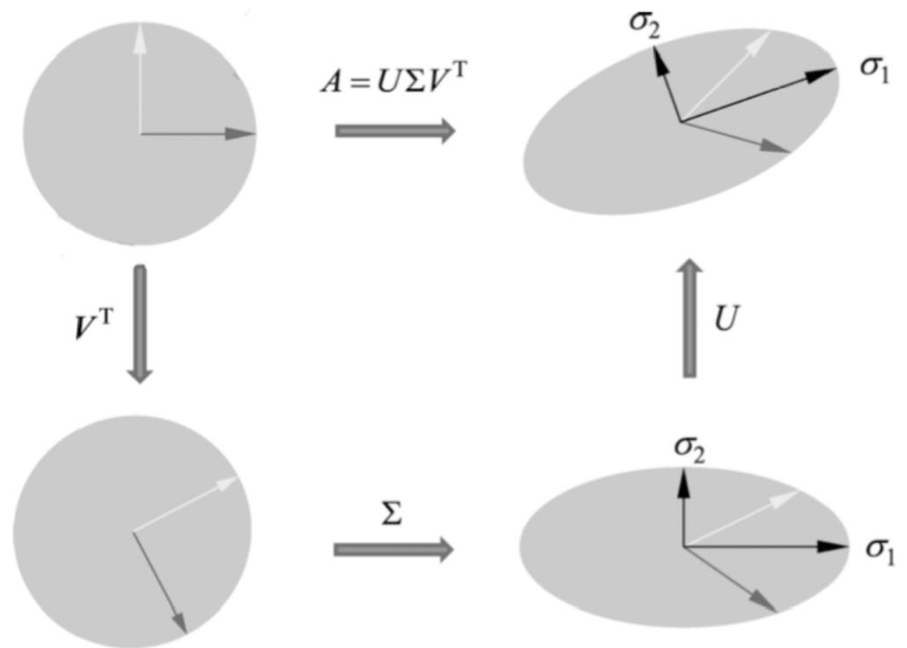

## 例

•给定一个2阶矩阵

$$
A = { \left[ \begin{array} { l l } { 3 } & { 1 } \\ { 2 } & { 1 } \end{array} \right] }
$$

• 其奇异值分解为

$$
U = { \left[ \begin{array} { l l } { 0 . 8 1 7 4 } & { - 0 . 5 7 6 0 } \\ { 0 . 5 7 6 0 } & { 0 . 8 1 7 4 } \end{array} \right] } , \quad \Sigma = { \left[ \begin{array} { l l } { 3 . 8 6 4 3 } & { 0 } \\ { 0 } & { 0 . 2 5 8 8 } \end{array} \right] } , \quad V ^ { \mathrm { T } } = { \left[ \begin{array} { l l } { 0 . 9 3 2 7 } & { 0 . 3 6 0 6 } \\ { - 0 . 3 6 0 6 } & { 0 . 9 3 2 7 } \end{array} \right] }
$$

## 例

•观察基于矩阵A的奇异值分解将 ${ \mathsf { R } } ^ { 2 }$ 的标准正交基

$$
e _ { 1 } = { \left[ \begin{array} { l } { 1 } \\ { 0 } \end{array} \right] } , \quad e _ { 2 } = { \left[ \begin{array} { l } { 0 } \\ { 1 } \end{array} \right] }
$$

•进行线性转换的情况

·首先， $\vee ^ { \top }$ 表示一个旋转变换，将标准正交基 $\mathsf { e } _ { 1 } , \mathsf { e } _ { 2 }$ 旋转，得到向量$\mathsf { V } ^ { \top } \mathsf { e } _ { 1 } , \mathsf { V } ^ { \top } \mathsf { e } _ { 2 }$

$$
\begin{array} { r } { V ^ { \mathrm { T } } e _ { 1 } = \left[ \begin{array} { c } { 0 . 9 3 2 7 } \\ { - 0 . 3 6 0 6 } \end{array} \right] , \quad V ^ { \mathrm { T } } e _ { 2 } = \left[ \begin{array} { c } { 0 . 3 6 0 6 } \\ { 0 . 9 3 2 7 } \end{array} \right] } \end{array}
$$

## 例

•其次，Σ\_表示一个缩放变换，将向量 ${ \sf V } ^ { \top } \sf e _ { 1 } , { \sf V } ^ { \top } \sf e _ { 2 }$ 在坐标轴方向缩放 $\sigma _ { 1 }$ 倍和 $\sigma _ { 2 }$ 倍，得到向量 $\Sigma V ^ { \mathrm { T } } e _ { 1 } , \Sigma V ^ { \mathrm { T } } e _ { 2 }$

$$
\begin{array} { r } { \Sigma V ^ { \mathrm { T } } e _ { 1 } = \left[ \begin{array} { c } { 3 . 6 0 4 2 } \\ { - 0 . 0 9 3 3 } \end{array} \right] , ~ \Sigma V ^ { \mathrm { T } } e _ { 2 } = \left[ \begin{array} { c } { 1 . 3 9 3 5 } \\ { 0 . 2 4 1 4 } \end{array} \right] } \end{array}
$$

·最后，U表示一个旋转变换，再将向量 $\Sigma V ^ { \mathrm { T } } e _ { 1 } , \Sigma V ^ { \mathrm { T } } e _ { 2 }$ 旋转，得到向量 $U \Sigma V ^ { \mathrm { T } } e _ { 1 } , U \Sigma V ^ { \mathrm { T } } e _ { 2 }$ ，也就是向量 $\mathsf { A e } _ { 1 } , \mathsf { A e } _ { 2 }$

$$
A e _ { 1 } = U \varSigma V ^ { \mathrm { T } } e _ { 1 } = \left[ \begin{array} { l } { 3 } \\ { 2 } \end{array} \right] , \quad A e _ { 2 } = U \varSigma V ^ { \mathrm { T } } e _ { 2 } \left[ \begin{array} { l } { 1 } \\ { 1 } \end{array} \right]
$$

## 主要性质

• （1）设矩阵A的奇异值分解为 $A = U \Sigma V ^ { \mathrm { { T } } }$ ，则一下关系成立：

$$
A ^ { \mathrm { T } } A = ( U \varSigma V ^ { \mathrm { T } } ) ^ { \mathrm { T } } ( U \varSigma V ^ { \mathrm { T } } ) = V ( \varSigma ^ { \mathrm { T } } \varSigma ) V ^ { \mathrm { T } }
$$

$$
A A ^ { \mathrm { T } } = ( U \Sigma V ^ { \mathrm { T } } ) ( U \Sigma V ^ { \mathrm { T } } ) ^ { \mathrm { T } } = U ( \Sigma \Sigma ^ { \mathrm { T } } ) U ^ { \mathrm { T } }
$$

•也就是说，矩阵ATA和AAT的特征分解存在，且可以由矩阵A的奇异值分解的矩阵表示。

•V的列向量是ATA的特征向量

•U的列向量是AAT的特征向量

• ε的奇异值是ATA和AAT的特征值的平方根。

## 主要性质

•、(2)\_在矩阵A的奇异值分解中，奇异值、左奇异向量和右奇异向量之间存在对应关系。

由 $A = U \Sigma V ^ { \mathrm { { T } } }$ 易知 $A V = U \varSigma$

·比较这一等式两端的第j列，得到 $A v _ { j } = \sigma _ { j } u _ { j } , \quad j = 1 , 2 , \cdot \cdot \cdot , n$

•这是矩阵A的右奇异向量和奇异值、左奇异向量的关系

•类似地，由 $A ^ { \mathrm { T } } U = V \Sigma ^ { \mathrm { T } }$

·得到 $A ^ { \mathrm { T } } u _ { j } = \sigma _ { j } v _ { j } , \quad j = 1 , 2 , \cdot \cdot \cdot , n$ ATuj = 0, j = n + 1, n + 2, .· , m

・这是矩阵A的左奇异向量和奇异值、右奇异向量的关系。

## 主要性质

• (3）矩阵A的奇异值分解中，奇异值 $\sigma _ { 1 } , \sigma _ { 2 } , \cdots , \sigma _ { n }$ 是唯一的，而矩阵U和V不是唯一的。

•，(4）矩阵A和 Σ 的秩相等，等于正奇异值 $\sigma _ { i }$ 的个数r（包含重复的奇异值)

## 主要性质

(5)

·矩阵A的r个右奇异向量 $\mathsf { V } _ { 1 } , \mathsf { V } _ { 2 } , \cdots , \mathsf { V } _ { \mathsf { r } }$ 构成AT的值域R(AT）的一组标准正交基。

·因为矩阵AT是从Rm映射到砂的线性变换，则AT的值域R(AT）和AT的列空间是相同的， $\mathsf { V } _ { 1 } , \mathsf { V } _ { 2 } , \cdots , \mathsf { V } _ { \mathsf { r } }$ 是AT的一组标准正交基，因而也是R(AT）的一组标准正交基。

## 标准性质

·矩阵A的n-r个右奇异向量 $\mathsf { V } _ { \Gamma + 1 } , \mathsf { V } _ { \Gamma + 2 } , \cdots , \mathsf { V } _ { \mathsf { n } }$ 构成A的零空间N(A)的一组标准正交基。

• 矩阵A的r个左奇异向量 $\mathsf { U } _ { 1 } , \mathsf { U } _ { 2 } , \cdots , \mathsf { U } _ { \mathsf { r } }$ 构成值域R(A）的一组标准正交基。

·矩阵A的m-r个左奇异向量 $\mathsf { U } _ { \mathsf { r } + 1 } , \mathsf { U } _ { \mathsf { r } + 2 } , \cdots , \mathsf { U } _ { \mathsf { m } }$ 构成AT的零空间N(AT）的一组标准正交基。

## 奇异值分解的计算

·矩阵A的奇异值分解可以通过求对称矩阵ATA的特征值和特征向量得到。

•ATA的特征向量构成正交矩阵V的列

•ATA的特征值 $\lambda _ { j }$ 的平方根为奇异值 $\sigma _ { i }$ ，即

$$
\sigma _ { j } = \sqrt { \lambda _ { j } } , \quad j = 1 , 2 , \cdot \cdot \cdot , n
$$

•对其由大到小排列作为对角线元素，构成对角矩阵Σ

•求正奇异值对应的左奇异向量，再求扩充的AT的标准正交基，构成正交矩阵U的列

•从而得到A的奇异值分解 $A = U \Sigma V ^ { \mathrm { { T } } }$

## 奇异值分解的计算

（1）求ATA的特征值和特征向量

•计算对称矩阵 $W { = } A ^ { \top } A$

•求解特征方程 $( W - \lambda I ) x = 0$

·得到特征值 ，并将特征值由大到小排列 $\lambda _ { 1 } \geqslant \lambda _ { 2 } \geqslant \dots \geqslant \lambda _ { n } \geqslant 0$ $\lambda _ { i }$

·将特征值 $\lambda _ { i } ~ ( i = 1 , 2 , \cdots , n )$ 代入特征方程求得对应的特征向量

（2）求n阶正交矩阵V

•将特征向量单位化，得到单位特征向量 $\mathsf { V } _ { 1 } , \mathsf { V } _ { 2 } , \cdots , \mathsf { V } _ { \mathsf { n } }$ ，构成n阶正交矩阵V： $V = { \left[ \begin{array} { l l l l } { v _ { 1 } } & { v _ { 2 } } & { \cdots } & { v _ { n } } \end{array} \right] }$

## 奇异值分解的计算

(3）求m×n对角矩阵

•计算A的奇异值

$$
\sigma _ { i } = \sqrt { \lambda _ { i } } , \quad i = 1 , 2 , \cdots , n
$$

·构造m xn 矩形对角矩阵 ε，主对角线元素是奇异值，其余元素 是零

$$
\boldsymbol { \Sigma } = \operatorname { d i a g } ( \sigma _ { 1 } , \sigma _ { 2 } , \cdot \cdot \cdot , \sigma _ { n } )
$$

## 奇异值分解的计算

(4) 求m阶正交矩阵U

•对A的前r个正奇异值，令 $u _ { j } = \frac { 1 } { \sigma _ { j } } A v _ { j } , \quad j = 1 , 2 , \cdot \cdot \cdot , r$

·得到 $U _ { 1 } = { \left[ \begin{array} { l l l l } { u _ { 1 } } & { u _ { 2 } } & { \cdot \cdot \cdot } & { u _ { r } } \end{array} \right] }$

• 求AT的零空间的一组标准正交基 $\{ u _ { r + 1 } , u _ { r + 2 } , \cdot \cdot \cdot , u _ { m } \}$ ,

$$
U _ { 2 } = [ \begin{array} { l l l l } { u _ { r + 1 } } & { u _ { r + 2 } } & { \cdot \cdot \cdot } & { u _ { m } } \end{array} ]
$$

·并令 $U = { \left[ \begin{array} { l l } { U _ { 1 } } & { U _ { 2 } } \end{array} \right] }$

（5）得到奇异值分解 $\boldsymbol { A } = \boldsymbol { U } \boldsymbol { \Sigma } \boldsymbol { V } ^ { \mathrm { T } }$

## 例

·试求矩阵

$$
{ \overline { { A } } } = { \left[ \begin{array} { l l } { 1 } & { 1 } \\ { 2 } & { 2 } \\ { 0 } & { 0 } \end{array} \right] }
$$

•的奇异值分解

## 例

（1）求ATA的特征值和特征向量

$$
A ^ { \mathrm { T } } A = { \left[ \begin{array} { l l l } { 1 } & { 2 } & { 0 } \\ { 1 } & { 2 } & { 0 } \end{array} \right] } { \left[ \begin{array} { l l } { 1 } & { 1 } \\ { 2 } & { 2 } \\ { 0 } & { 0 } \end{array} \right] } = { \left[ \begin{array} { l l } { 5 } & { 5 } \\ { 5 } & { 5 } \end{array} \right] }
$$

$$
( A ^ { \mathrm { T } } A - \lambda I ) x = 0
$$

•得到齐次线性方程组

$$
\left\{ \begin{array} { c c } { { ( 5 - \lambda ) x _ { 1 } + } } & { { 5 x _ { 2 } = 0 } } \\ { { 5 x _ { 1 } + } } & { { ( 5 - \lambda ) x _ { 2 } = 0 } } \end{array} \right.
$$

## 例

·该方程有非零解的充要条件是

$$
\left| { \begin{array} { c c } { 5 - \lambda } & { 5 } \\ { 5 } & { 5 - \lambda } \end{array} } \right| = 0
$$

$$
\lambda ^ { 2 } - 1 0 \lambda = 0
$$

·解此方程，得矩阵ATA的特征值 $\lambda _ { 1 } = 1 0$ 和 $\lambda _ { 2 } = 0 .$ O

·将特征值代入线性方程组，得到对应的单位特征向量

$$
v _ { 1 } = { \left[ \begin{array} { l } { { \frac { 1 } { \sqrt { 2 } } } } \\ { { \frac { 1 } { \sqrt { 2 } } } } \end{array} \right] } \quad \quad v _ { 2 } = { \left[ \begin{array} { l } { { \frac { 1 } { \sqrt { 2 } } } } \\ { { - \frac { 1 } { \sqrt { 2 } } } } \end{array} \right] }
$$

## 例

（2）求正交矩阵V

• 构造正交矩阵V

$$
V = \left[ \begin{array} { c c } { { \displaystyle \frac { 1 } { \sqrt { 2 } } } } & { { \displaystyle \frac { 1 } { \sqrt { 2 } } } } \\ { { \displaystyle \frac { 1 } { \sqrt { 2 } } } } & { { \displaystyle - \frac { 1 } { \sqrt { 2 } } } } \end{array} \right]
$$

（3）求对角矩阵 ∑

•奇异值为 $\sigma _ { 1 } = \sqrt { \lambda _ { 1 } } = \sqrt { 1 0 }$ 和 $\sigma _ { 2 } = 0$

•构造对角矩阵

$$
\Sigma = \left[ \begin{array} { c c } { { \sqrt { 1 0 } } } & { { 0 } } \\ { { 0 } } & { { 0 } } \\ { { 0 } } & { { 0 } } \end{array} \right]
$$

## 例

(4) 求正交矩阵U

•基于A的正奇异值计算得到列向量 $\mathsf { U } _ { 1 }$

$$
u _ { 1 } = { \frac { 1 } { \sigma _ { 1 } } } A v _ { 1 } = { \frac { 1 } { \sqrt { 1 0 } } } { \left[ \begin{array} { l l } { 1 } & { 1 } \\ { 2 } & { 2 } \\ { 0 } & { 0 } \end{array} \right] } { \left[ \begin{array} { l } { { \frac { 1 } { \sqrt { 2 } } } } \\ { { \frac { 1 } { \sqrt { 2 } } } } \end{array} \right] } = { \left[ \begin{array} { l } { { \frac { 1 } { \sqrt { 5 } } } } \\ { { \frac { 2 } { \sqrt { 5 } } } } \\ { 0 } \end{array} \right] }
$$

•列向量 $\mathsf { U } _ { 2 } , \mathsf { U } _ { 3 }$ 是 $\mathsf { A } ^ { \top }$ 的零空间 ${ \mathsf { N } } ( { \mathsf { A } } ^ { \mathsf { T } } )$ 的一组标准正交基

## 例

•求解

$$
A ^ { \mathrm { T } } x = { \left[ \begin{array} { l l l } { 1 } & { 2 } & { 0 } \\ { 1 } & { 2 } & { 0 } \end{array} \right] } { \left[ \begin{array} { l } { x _ { 1 } } \\ { x _ { 2 } } \\ { x _ { 3 } } \end{array} \right] } = { \left[ \begin{array} { l } { 0 } \\ { 0 } \end{array} \right] } \qquad \qquad x _ { 1 } + 2 x _ { 2 } + 0 x _ { 3 } = 0
$$

·分别取 $( \mathsf { X } _ { 2 } , \mathsf { X } _ { 3 } )$ 为(1,0)和(O,1)，得到N(AT)的基 $( - 2 , 1 , 0 ) ^ { \mathrm { T } }$ $( 0 , 0 , 1 ) ^ { \mathrm { T } }$

${ \mathsf { N } } ( { \mathsf { A } } ^ { \mathsf { T } } )$ 的一组标准正交基是 $u _ { 2 } = \left( - \frac { 2 } { \sqrt { 5 } } , \frac { 1 } { \sqrt { 5 } } , 0 \right) ^ { \mathrm { T } }$ $\boldsymbol { u } _ { 3 } = ( 0 , 0 , 1 ) ^ { \mathrm { T } }$

•构造正交矩阵U

$$
U = \left[ \begin{array} { c c c } { { \displaystyle \frac { 1 } { \sqrt { 5 } } } } & { { \displaystyle - \frac { 2 } { \sqrt { 5 } } } } & { { 0 } } \\ { { \displaystyle \frac { 2 } { \sqrt { 5 } } } } & { { \displaystyle \frac { 1 } { \sqrt { 5 } } } } & { { 0 } } \\ { { 0 } } & { { 0 } } & { { 1 } } \end{array} \right]
$$

## 例

## (5) 矩阵A的奇异值分解

$$
A = U \varSigma V ^ { \mathrm { T } } = \left[ \begin{array} { c c c } { \frac { 1 } { \sqrt { 5 } } } & { - \frac { 2 } { \sqrt { 5 } } } & { 0 } \\ { \frac { 2 } { \sqrt { 5 } } } & { \frac { 1 } { \sqrt { 5 } } } & { 0 } \\ { 0 } & { 0 } & { 1 } \end{array} \right] \left[ \begin{array} { c c } { \sqrt { 1 0 } } & { 0 } \\ { 0 } & { 0 } \\ { 0 } & { 0 } \end{array} \right] \left[ \begin{array} { c c } { \frac { 1 } { \sqrt { 2 } } } & { \frac { 1 } { \sqrt { 2 } } } \\ { \frac { 1 } { \sqrt { 2 } } } & { - \frac { 1 } { \sqrt { 2 } } } \end{array} \right]
$$

## 弗罗贝尼乌斯范数

·奇异值分解也是一种矩阵近似的方法，这个近似是在弗罗贝尼乌斯范数（Frobenius norm）意义下的近似。

·矩阵的弗罗贝尼乌斯范数是向量的LZ范数的直接推广，对应着机器学习中的平方损失函数。

·设矩阵 $A \in \mathbf { R } ^ { m \times n } , ~ A = [ a _ { i j } ] _ { m \times n } ,$ ，定义矩阵A的弗罗贝尼乌斯范数为

$$
\| A \| _ { F } = \left( \sum _ { i = 1 } ^ { m } \sum _ { j = 1 } ^ { n } ( a _ { i j } ) ^ { 2 } \right) ^ { \frac { 1 } { 2 } }
$$

## 弗罗贝尼乌斯范数

·引理15.1

设矩阵 $A \in \mathbf { R } ^ { m \times n }$ ，A 的奇异值分解为 $U { \boldsymbol { \Sigma } } V ^ { \mathrm { T } }$ ，其中 $\varSigma =  { \mathrm { d i a g } } ( \sigma _ { 1 } , \cdot \cdot , \sigma _ { n } )$ ，则

$$
\| A \| _ { F } = ( \sigma _ { 1 } ^ { 2 } + \sigma _ { 2 } ^ { 2 } + \cdot \cdot \cdot + \sigma _ { n } ^ { 2 } ) ^ { \frac { 1 } { 2 } }
$$

## 弗罗贝尼乌斯范数

•证明：

• 一般地，若Q是m阶正交矩阵，则有 $\| Q A \| _ { F } = \| A \| _ { F }$

•因为

$$
\begin{array} { l } { \displaystyle \| Q A \| _ { F } ^ { 2 } = \| ( Q a _ { 1 } , Q a _ { 2 } , \cdot \cdot \cdot , Q a _ { n } ) \| _ { F } ^ { 2 } } \\ { \displaystyle \qquad = \sum _ { i = 1 } ^ { n } \| Q a _ { i } \| _ { 2 } ^ { 2 } = \sum _ { i = 1 } ^ { n } \| a _ { i } \| _ { 2 } ^ { 2 } = \| A \| _ { F } ^ { 2 } } \end{array}
$$

•同样，若P是n阶正交矩阵，则有 $\| A P ^ { \mathrm { T } } \| _ { F } = \| A \| _ { F }$

•故 $\| A \| _ { F } = \| U \varSigma V ^ { \mathrm { T } } \| _ { F } = \| \varSigma \| _ { F }$

·即 $\| A \| _ { F } = ( \sigma _ { 1 } ^ { 2 } + \sigma _ { 2 } ^ { 2 } + \cdot \cdot \cdot + \sigma _ { n } ^ { 2 } ) ^ { \frac { 1 } { 2 } }$

## 矩阵的最优近似

·奇异值分解是在平方损失弗罗贝尼乌斯范数）意义下对矩阵的最优近似，即数据压缩。

设矩阵 $A \in \mathbf { R } ^ { m \times n }$ ，矩阵的秩 $\operatorname { r a n k } ( A ) = r $ ，并设M为 $\mathbf { R } ^ { m \times n }$ 中所

有秩不超过k的矩阵集合， $0 < k < r ,$ ，则存在一个秩为k的矩阵 $X \in { \mathcal { M } }$ ，使得

$$
\| A - X \| _ { F } = \operatorname* { m i n } _ { S \in { \mathcal { M } } } \| A - S \| _ { F }\tag{15.31}
$$

称矩阵X为矩阵A 在弗罗贝尼乌斯范数意义下的最优近似。

## 矩阵的最优近似

设矩阵 $A \in \mathbf { R } ^ { m \times n }$ ，矩阵的秩 $\operatorname { r a n k } ( A ) = r ,$ ，有奇异值分解 $A =$

$U { \boldsymbol { \Sigma } } V ^ { \mathrm { T } }$ ，并设M为 $\mathbf { R } ^ { m \times n }$ 中所有秩不超过k 的矩阵的集合， $0 < k < r ,$ ，若秩为k的

矩阵 $X \in { \mathcal { M } }$ 满足 $\| A - X \| _ { F } = \operatorname* { m i n } _ { S \in \mathcal { M } } \| A - S \| _ { F } \qquad 1 5 . 3 2$

则

$$
\| A - X \| _ { F } = ( \sigma _ { k + 1 } ^ { 2 } + \sigma _ { k + 2 } ^ { 2 } + \cdot \cdot \cdot + \sigma _ { n } ^ { 2 } ) ^ { \frac { 1 } { 2 } } \quad 1 5 . 3 3
$$

特别地，若 $A ^ { \prime } = U \varSigma ^ { \prime } V ^ { \mathrm { T } }$ ，其中

$$
\boldsymbol { \Sigma } ^ { \prime } = \left[ \begin{array} { c c c c c } { \sigma _ { 1 } } & & & & & \\ & { \ddots } & & & { 0 } & \\ & & & { \sigma _ { k } } & & \\ & & & { 0 } & & \\ & & & & { \ddots } & \\ & { 0 } & & & & { 0 } \end{array} \right] = \left[ \begin{array} { c c } { \boldsymbol { \Sigma } _ { k } } & { \boldsymbol { 0 } } \\ { \boldsymbol { 0 } } & { \boldsymbol { 0 } } \end{array} \right]
$$

则

$$
\| A - A ^ { \prime } \| _ { F } = ( \sigma _ { k + 1 } ^ { 2 } + \sigma _ { k + 2 } ^ { 2 } + \cdot \cdot \cdot + \sigma _ { n } ^ { 2 } ) ^ { \frac { 1 } { 2 } } = \operatorname* { m i n } _ { S \in \mathcal { M } } \| A - S \| _ { F }
$$

## 矩阵的最优近似

•证明

令 $X \in { \mathcal { M } }$ 为满足式（15.32）的一个矩阵。由于

$$
\| A - X \| _ { F } \leqslant \| A - A ^ { \prime } \| _ { F } = ( \sigma _ { k + 1 } ^ { 2 } + \sigma _ { k + 2 } ^ { 2 } + \cdot \cdot \cdot + \sigma _ { n } ^ { 2 } ) ^ { \frac { 1 } { 2 } }
$$

•下面证明

$$
\| A - X \| _ { F } \geqslant ( \sigma _ { k + 1 } ^ { 2 } + \sigma _ { k + 2 } ^ { 2 } + \cdot \cdot \cdot + \sigma _ { n } ^ { 2 } ) ^ { \frac { 1 } { 2 } }
$$

于是式（15.33）成立

## 矩阵的最优近似

• 设×的奇异值分解为 $Q \varOmega P ^ { \mathrm { T } }$

•其中

$$
\begin{array} { r } { { \varOmega } = \left[ \begin{array} { l l l l l } { \omega _ { 1 } } & & & & \\ & { \ddots } & & & { 0 } \\ & & & { \omega _ { k } } & \\ & & & { 0 } & \\ & & & & { \ddots } \\ & { 0 } & & & & { 0 } \end{array} \right] = \left[ \begin{array} { l l } { { \varOmega } _ { k } } & { 0 } \\ { 0 } & { 0 } \end{array} \right] } \end{array}
$$

·若令矩阵 ${ \mathsf { B } } { = } { \mathsf { Q } } ^ { \mathsf { T } } { \mathsf { A } } { \mathsf { P } }$ ，则 $A { = } Q { \mathsf { B P } } ^ { \mathsf { T } }$ 。由此得到

$$
\| A - X \| _ { F } = \| Q ( B - \varOmega ) P ^ { \mathrm { T } } \| _ { F } = \| B - \varOmega \| _ { F }
$$

## 矩阵的最优近似

·用Ω分块方法对B分块

$$
B = { \left[ \begin{array} { l l } { B _ { 1 1 } } & { B _ { 1 2 } } \\ { B _ { 2 1 } } & { B _ { 2 2 } } \end{array} \right] }
$$

·其中 $\mathsf { B } _ { 1 1 }$ 是 $k \times k$ 子矩阵， $\mathsf { B } _ { 1 2 }$ 是 $\boldsymbol { \mathsf { k } } \times ( \boldsymbol { \mathsf { n } } - \boldsymbol { \mathsf { k } } )$ 的子矩阵， $\mathsf { B } _ { 2 1 }$ 是 $( \boldsymbol { \mathsf { m } } - \boldsymbol { \mathsf { k } } ) \times \boldsymbol { \mathsf { k } }$ 子矩阵， $\mathsf { B } _ { 2 2 }$ 是 $( \boldsymbol { \mathsf { m } } - \boldsymbol { \mathsf { k } } ) \times ( \boldsymbol { \mathsf { n } } - \boldsymbol { \mathsf { k } } )$ 子矩阵。可得

$$
\begin{array} { c } { { \| A - X \| _ { F } ^ { 2 } = \| B - \Omega \| _ { F } ^ { 2 } } } \\ { { { } } } \\ { { { } = \| B _ { 1 1 } - \Omega _ { k } \| _ { F } ^ { 2 } + \| B _ { 1 2 } \| _ { F } ^ { 2 } + \| B _ { 2 1 } \| _ { F } ^ { 2 } + \| B _ { 2 2 } \| _ { F } ^ { 2 } } } \end{array}
$$

## 矩阵的最优近似

·现证 $\mathrm { B } _ { 1 2 } { = } 0 , \quad \mathrm { B } _ { 2 1 } { = } 0$ O 用反证法。若 $\mathsf { B } _ { 1 2 } \neq 0$ ,

$$
\boldsymbol { Y } = \boldsymbol { Q } \left[ \begin{array} { c c } { B _ { 1 1 } } & { B _ { 1 2 } } \\ { 0 } & { 0 } \end{array} \right] \boldsymbol { P } ^ { \mathrm { T } }
$$

•则 $Y \in { \mathcal { M } }$ ，且 $\| A - Y \| _ { F } ^ { 2 } = \| B _ { 2 1 } \| _ { F } ^ { 2 } + \| B _ { 2 2 } \| _ { F } ^ { 2 } < \| A - X \| _ { F } ^ { 2 }$

•这与×的定义式 $\| A - X \| _ { F } \leqslant \| A - A ^ { \prime } \| _ { F } = ( \sigma _ { k + 1 } ^ { 2 } + \sigma _ { k + 2 } ^ { 2 } + \cdot \cdot \cdot + \sigma _ { n } ^ { 2 } ) ^ { \frac { 1 } { 2 } }$ 矛盾

·因此 $\mathtt { B _ { 1 2 } } \mathtt { = } 0$ 同样可证 $\mathtt { B } _ { 2 1 } = 0$ o 于是

$$
\| A - X \| _ { F } ^ { 2 } = \| B _ { 1 1 } - \varOmega _ { k } \| _ { F } ^ { 2 } + \| B _ { 2 2 } \| _ { F } ^ { 2 }
$$

## 矩阵的最优近似

·再证 $B _ { 1 1 } = \varOmega _ { k }$ 为此令 $\begin{array} { r } { Z = Q \left[ { \begin{array} { c c } { B _ { 1 1 } } & { 0 } \\ { 0 } & { 0 } \end{array} } \right] P ^ { \mathrm { T } } } \end{array}$

·则 $Z \in { \mathcal { M } }$ ，且 $\| A - Z \| _ { F } ^ { 2 } = \| B _ { 2 2 } \| _ { F } ^ { 2 } \leqslant \| B _ { 1 1 } - \Omega _ { k } \| _ { F } ^ { 2 } + \| B _ { 2 2 } \| _ { F } ^ { 2 } = \| A - X \| _ { F } ^ { 2 }$

•由 $\| A - X \| _ { F } \leqslant \| A - A ^ { \prime } \| _ { F } = ( \sigma _ { k + 1 } ^ { 2 } + \sigma _ { k + 2 } ^ { 2 } + \cdot \cdot \cdot + \sigma _ { n } ^ { 2 } ) ^ { \frac { 1 } { 2 } }$ 知， $\| B _ { 1 1 } - \varOmega _ { k } \| _ { F } ^ { 2 } = 0$ 即 $B _ { 1 1 } = \varOmega _ { k }$

·最后看 $\mathsf { B } _ { 2 2 } \circ$ 若 $( \boldsymbol { \mathsf { m } } - \boldsymbol { \mathsf { k } } ) \times ( \boldsymbol { \mathsf { n } } - \boldsymbol { \mathsf { k } } )$ 子矩阵 $\mathsf { B } _ { 2 2 }$ 有奇异值分解 $U _ { 1 } A V _ { 1 } ^ { \mathrm { T } } ,$ ，则

$$
\| A - X \| _ { F } = \| B _ { 2 2 } \| _ { F } = \| A \| _ { F }
$$

## 矩阵的最优近似

•证明 ₄的对角线元素为A的奇异值。为此，

$$
U _ { 2 } = \left[ \begin{array} { c c } { { I _ { k } } } & { { 0 } } \\ { { 0 } } & { { U _ { 1 } } } \end{array} \right] , \quad V _ { 2 } = \left[ \begin{array} { c c } { { I _ { k } } } & { { 0 } } \\ { { 0 } } & { { V _ { 1 } } } \end{array} \right]
$$

·其中k是k阶单位矩阵， $\mathsf { U } _ { 2 } , ~ \mathsf { V } _ { 2 }$ 的分块与B的分块一致注意到B及 $\mathsf { B } _ { 2 2 }$

$$
U _ { 2 } ^ { \mathrm { { T } } } Q ^ { \mathrm { { T } } } A P V _ { 2 } = \left[ \begin{array} { c c } { { \varOmega _ { k } } } & { { 0 } } \\ { { 0 } } & { { \varLambda } } \end{array} \right] \qquad A = ( Q U _ { 2 } ) \left[ \begin{array} { c c } { { \varOmega _ { k } } } & { { 0 } } \\ { { 0 } } & { { \varLambda } } \end{array} \right] ( P V _ { 2 } ) ^ { \mathrm { { T } } }
$$

•由此可知₄的对角线元素为A的奇异值，故有

$$
\| A - X \| _ { F } = \| A \| _ { F } \geqslant ( \sigma _ { k + 1 } ^ { 2 } + \sigma _ { k + 2 } ^ { 2 } + \cdot \cdot \cdot + \sigma _ { n } ^ { 2 } ) ^ { \frac { 1 } { 2 } }
$$

•可证

$$
\| A - X \| _ { F } = ( \sigma _ { k + 1 } ^ { 2 } + \sigma _ { k + 2 } ^ { 2 } + \cdot \cdot \cdot + \sigma _ { n } ^ { 2 } ) ^ { \frac { 1 } { 2 } } = \| A - A ^ { \prime } \| _ { F }
$$

## 矩阵的最优近似

•在秩不超过k的mxn 矩阵的集合中，存在矩阵A的弗罗贝尼乌斯范数意义下的最优近似矩阵X

A' =UΣVr是达到最优值的一个矩阵

·紧奇异值分解是在弗罗贝尼乌斯范数意义下的无损压缩

·截断奇异值分解是有损压缩

·截断奇异值分解得到的矩阵的秩为k，通常远小于原始矩阵的秩r，所以是由低秩矩阵实现了对原始矩阵的压缩。

## 矩阵的外积展开式

•矩阵A的奇异值分解 $U { \boldsymbol { \Sigma } } V ^ { \mathrm { T } }$ 也可以由外积形式表示

•若将A的奇异值分解看成矩阵UΣ和VT的乘积，将UΣ按列向量分 块，将V按行向量分块，即得

$$
\begin{array} { r l } & { U \varSigma = \left[ \begin{array} { l l l l } { \sigma _ { 1 } u _ { 1 } } & { \sigma _ { 2 } u _ { 2 } } & { \cdots } & { \sigma _ { n } u _ { n } } \end{array} \right] } \\ & { V ^ { \mathrm { T } } = \left[ \begin{array} { l } { v _ { 1 } ^ { \mathrm { T } } } \\ { v _ { 2 } ^ { \mathrm { T } } } \\ { \vdots } \\ { v _ { n } ^ { \mathrm { T } } } \end{array} \right] } \end{array}
$$

## 矩阵的外积展开式

·则 $A = \sigma _ { 1 } u _ { 1 } v _ { 1 } ^ { \mathrm { T } } + \sigma _ { 2 } u _ { 2 } v _ { 2 } ^ { \mathrm { T } } + \cdot \cdot \cdot + \sigma _ { n } u _ { n } v _ { n } ^ { \mathrm { T } }$


A的外积展开式

•即

$$
u _ { i } v _ { j } ^ { \operatorname { T } } = \left[ { \begin{array} { c } { u _ { 1 i } } \\ { u _ { 2 i } } \\ { \vdots } \\ { u _ { m i } } \end{array} } \right] \left[ { \begin{array} { c c c c } { v _ { 1 j } } & { v _ { 2 j } } & { \cdots } & { v _ { n j } } \end{array} } \right] = \left[ { \begin{array} { c c c c } { u _ { 1 i } v _ { 1 j } } & { u _ { 1 i } v _ { 2 j } } & { \cdots } & { u _ { 1 i } v _ { n j } } \\ { u _ { 2 i } v _ { 1 j } } & { u _ { 2 i } v _ { 2 j } } & { \cdots } & { u _ { 2 i } v _ { n j } } \\ { \vdots } & { \vdots } & { \vdots } \\ { u _ { m i } v _ { 1 j } } & { u _ { m i } v _ { 2 j } } & { \cdots } & { u _ { m i } v _ { n j } } \end{array} } \right]
$$

•A的外积展开式也可写为 $A = \sum _ { k = 1 } ^ { n } A _ { k } = \sum _ { k = 1 } ^ { n } \sigma _ { k } u _ { k } v _ { k } ^ { \mathrm { T } }$

## 矩阵的外积展开式

•由矩阵A的外积展开式知，若A的秩为n，则

$$
A = \sigma _ { 1 } u _ { 1 } v _ { 1 } ^ { \mathrm { T } } + \sigma _ { 2 } u _ { 2 } v _ { 2 } ^ { \mathrm { T } } + \cdot \cdot \cdot + \sigma _ { n } u _ { n } v _ { n } ^ { \mathrm { T } }
$$

·设矩阵

$$
A _ { k } = \sigma _ { 1 } u _ { 1 } v _ { 1 } ^ { \mathrm { T } } + \sigma _ { 2 } u _ { 2 } v _ { 2 } ^ { \mathrm { T } } + \cdot \cdot \cdot + \sigma _ { k } u _ { k } v _ { k } ^ { \mathrm { T } }
$$

·则 $\mathsf { A } _ { \mathsf { k } }$ 的秩为k，并且 $\mathsf { A } _ { \mathsf { k } }$ 是秩为k矩阵在弗罗贝尼乌斯范数意义A的 最优近似矩阵

•矩阵 $\mathsf { A } _ { \mathsf { k } }$ 就是A的截断奇異值分解

·由于通常奇异值 $\sigma _ { i }$ 递减很快，所以k取很小值时， $\mathsf { A } _ { \mathsf { k } }$ 也可以对A有很好的近似。

## 例

•给出矩阵A

$$
A = \left[ \begin{array} { l l l l } { 1 } & { 0 } & { 0 } & { 0 } \\ { 0 } & { 0 } & { 0 } & { 4 } \\ { 0 } & { 3 } & { 0 } & { 0 } \\ { 0 } & { 0 } & { 0 } & { 0 } \\ { 2 } & { 0 } & { 0 } & { 0 } \end{array} \right]
$$

·的秩为3，求A的秩为2的最优近似

## 例

•从前列已知

・於是得到

$$
u _ { 1 } = { \left[ \begin{array} { l } { 0 } \\ { 1 } \\ { 0 } \\ { 0 } \\ { 0 } \\ { 0 } \end{array} \right] } , \quad u _ { 2 } = { \left[ \begin{array} { l } { 0 } \\ { 0 } \\ { 1 } \\ { 0 } \\ { 0 } \\ { 0 } \end{array} \right] } , \quad v _ { 1 } = { \left[ \begin{array} { l } { 0 } \\ { 0 } \\ { 0 } \\ { 1 } \end{array} \right] } , \quad v _ { 2 } = { \left[ \begin{array} { l } { 0 } \\ { 1 } \\ { 0 } \\ { 0 } \\ { 0 } \end{array} \right] }
$$

$$
\sigma _ { 1 } = 4 , \quad \sigma _ { 2 } = 3
$$

$A _ { 2 } = \sigma _ { 1 } u _ { 1 } v _ { 1 } ^ { \operatorname { T } } + \sigma _ { 2 } u _ { 2 } v _ { 2 } ^ { \operatorname { T } } = { \left[ \begin{array} { l l l l } { 0 } & { 0 } & { 0 } & { 0 } \\ { 0 } & { 0 } & { 0 } & { 4 } \\ { 0 } & { 3 } & { 0 } & { 0 } \\ { 0 } & { 0 } & { 0 } & { 0 } \\ { 0 } & { 0 } & { 0 } & { 0 } \end{array} \right] }$ ，以此矩阵为A的最优近似

## 第十六章主成分分析

## 主成分分析

·主成分分析（principal component analysis， PCA）是一种常用的无监督学习方法

· 这一方法利用正交变换把由线性相关变量表示的观测数据转换为少数几个由线性无关变量表示的数据，线性无关的变量称为主成分。

·主成分的个数通常小于原始变量 的个数，所以主成分分析属于降维方法。

·主成分分析主要用于发现数据中的基本结构，即数据中变量之间的关系。

## 基本想法

·主成分分析中，首先对给定数据进行规范化，使得数据每一变量的平均值为0，方差为1。

·之后对数据进行正交变换，原来由线性相关变量表示的数据，通过正交变换变成由若干个线性无关的新变量表示的数据。

・新变量是可能的正交变换中变量的方差的和（信息保存）最大的，方差表示在新变量上信息的大小。

· 可以用主分成近似地表示原始数据，发现数据的基本结构

• 也可以把数据由少数主成分表示，对数据降维

## 基本想法

·数据集合中的样本由实数空间（正交坐标系），中的点表示，空间的一个坐标轴表示一个变量，规范化处理后得到的数据分布在原点附近。

·对原坐标系中的数据进行主成分分析等价于进行坐标系旋转变换，将数据投影到新坐标系的坐标轴上

•新坐标系的第一坐标轴、第二坐标轴等分别表示第一主成分、第二主成分等

・ 数据在每一轴上的坐标值的平方表示相应变量的方差

•这个坐标系是在所有可能的新的坐标系中，坐标轴上的方差的和最大的

## 例

• 数据由线性相关的两个变量 $\mathrm { . } \mathrm { \times } _ { 1 }$ 和 $\mathbf { \boldsymbol { x } } _ { 2 }$ 表示

• 主成分分析对数据进行正交变换，对原坐标系进行旋转变换，并将数据在新坐标系表示

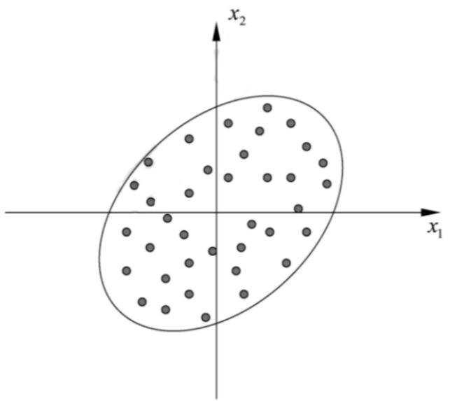  
(a)

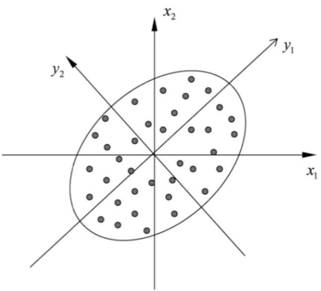  
(b)

## 例

・主成分分析选择方差最大的方向（第一主成分）作为新坐标系的第一坐标轴，即 $\mathsf { y } _ { 1 }$ 轴

•之后选择与第一坐标轴正交，且方差次之的方向（第二主成分）作为新坐标系的第二坐标轴，即 $\mathsf { { l } } _ { \mathsf { Y } _ { 2 } }$ 轴

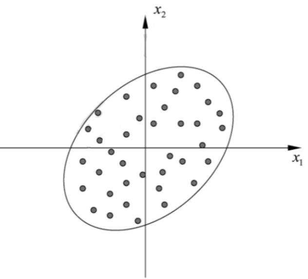  
(a)

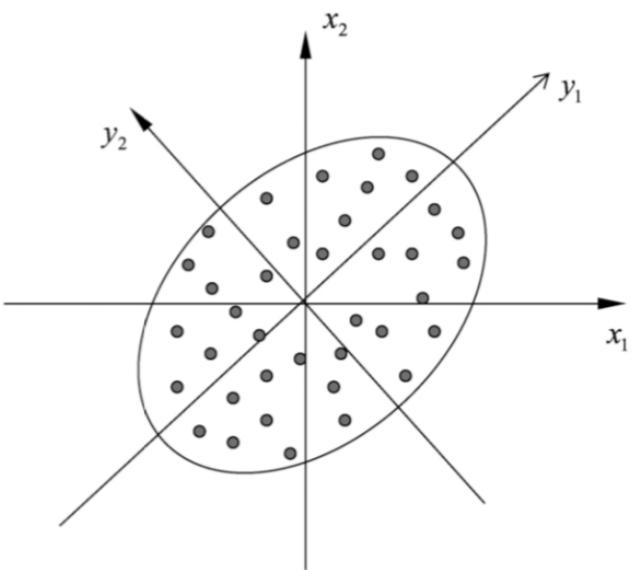  
(b)

## 例

•在新坐标系里，数据中的变量 $\mathsf { y } _ { 1 }$ 和 $y _ { 2 }$ 是线性无关的，当知道其中一个变量 $\mathsf { y } _ { 1 }$ 的取值时，对另一个变量 $y _ { 2 }$ 的预测是完全随机的，反

•如果主成分分析只取第一主成分，即新坐标系的$\mathsf { y } _ { 1 }$ 轴，那么等价于将数据投影在椭圆长轴上，用这个主轴表示数据，将二维空间的数据压缩到一维空间中。

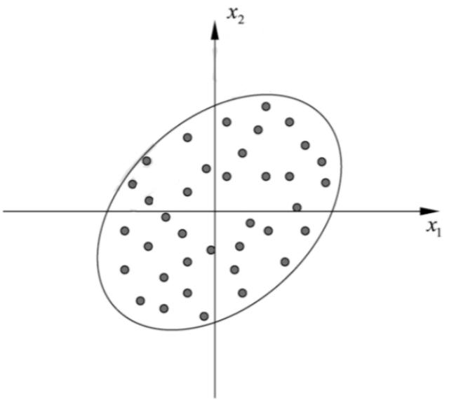  
(a)

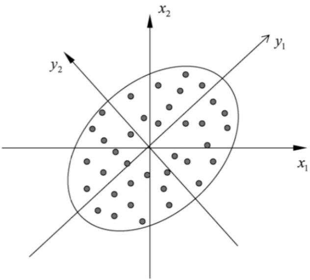  
(b)

## 例

·假设有两个变量 $\mathrm { . } \mathrm { \times } _ { 1 }$ 和 $\mid \mathsf { X } _ { 2 }$ ，三个样本点A、B、 $\complement ,$ 样本分布在由 $\mathsf { X } _ { 1 }$ 和$\mathsf { X } _ { 2 }$ 轴组成的坐标系中

•对坐标系进行旋转变换，得到新的坐标轴 $\mathsf { y } _ { 1 }$ ，表示新的变量 $\mathsf { y } _ { 1 }$

·样本点A、B、C在 $\mathsf { y } _ { 1 }$ 轴上投影，得到 $| \mathsf { y } _ { 1 }$ 轴的坐标值A'、B'、C'

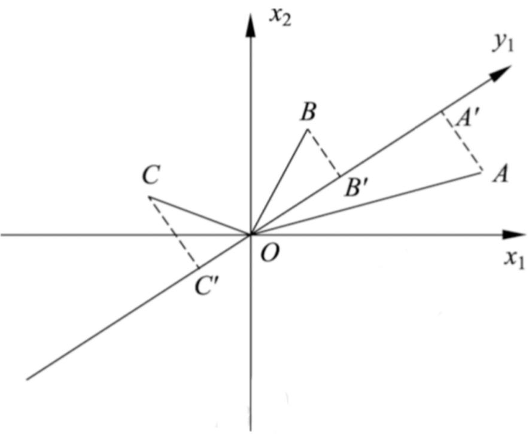

## 例

•坐标值的平方和 $\mathrm { O A ^ { \prime 2 } + O B ^ { \prime 2 } + O C ^ { \prime 2 } }$ 表示样本在变量 $\mathsf { y } _ { 1 }$ 上的方差和

•主成分分析旨在选取正交变换中方差最大的变量，作为第一主成分，也就是旋转变换中坐标值的平方和最大的轴

$\mathrm { O A } ^ { \prime 2 } + \mathrm { O B } ^ { \prime 2 } + \mathrm { O C } ^ { \prime 2 }$ 最大等价于样本点到$\mathsf { y } _ { 1 }$ 轴的距离的平方和 $\mathsf { A A } ^ { \prime 2 } + \mathsf { B B } ^ { \prime 2 } + \mathsf { C C } ^ { \prime 2 }$ 最小

•主成分分析在旋转变换中选取离样本点的距离平方和最小的轴，作为第一主成分。第二主成分等的选取，在保证与已选坐标轴正交的条件下，类似地进行

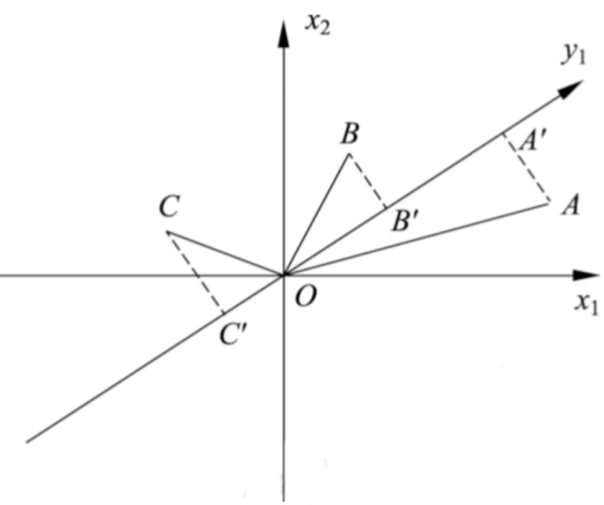

## 主成分分析

•在数据总体（population)上进行的主成分分析称为总体主成分分析

•在有限样本上进行的主成分分析称为样本主成分分析

・总体主成分分析是样本主成分分析的基础

## 定义和导出

·假设 $\pmb { x } = ( x _ { 1 } , x _ { 2 } , \cdot \cdot \cdot , x _ { m } ) ^ { \mathrm { T } }$ 是m维随机变量，其均值向量是μ

$$
\pmb { \mu } = E ( \pmb { x } ) = ( \mu _ { 1 } , \mu _ { 2 } , \cdot \cdot \cdot , \mu _ { m } ) ^ { \mathrm { T } }
$$

•协方差矩阵是

$$
\Sigma = \operatorname { c o v } ( \mathbf { x } , \pmb { x } ) = E [ ( \pmb { x } - \pmb { \mu } ) ( \pmb { x } - \pmb { \mu } ) ^ { \mathrm { T } } ]
$$

•考虑由m维随机变量x到m维随机变量 $\pmb { y } = ( y _ { 1 } , y _ { 2 } , \cdot \cdot \cdot , y _ { m } ) ^ { \mathrm { T } }$ 的线性变换

$$
y _ { i } = \alpha _ { i } ^ { \mathrm { T } } \pmb { x } = \alpha _ { 1 i } x _ { 1 } + \alpha _ { 2 i } x _ { 2 } + \cdot \cdot \cdot + \alpha _ { m i } x _ { m }
$$

·其中 $\alpha _ { i } ^ { \mathrm { T } } = ( \alpha _ { 1 i } , \alpha _ { 2 i } , \cdot \cdot \cdot , \alpha _ { m i } ) , i = 1 , 2 , \cdot \cdot \cdot , m$

## 定义和导出

•由随机变量性质可知

$$
E ( y _ { i } ) = \alpha _ { i } ^ { \mathrm { T } } \mu , \quad i = 1 , 2 , \cdot \cdot \cdot , m
$$

$$
\operatorname { v a r } ( y _ { i } ) = \alpha _ { i } ^ { \mathrm { T } } \Sigma \alpha _ { i } , \quad i = 1 , 2 , \cdot \cdot \cdot , m
$$

$$
\mathrm { c o v } ( y _ { i } , y _ { j } ) = \alpha _ { i } ^ { \mathrm { T } } \Sigma \alpha _ { j } , \quad i = 1 , 2 , \cdots , m ; \quad j = 1 , 2 , \cdots , m
$$

## 定义和导出

定义16.1（总体主成分）给定一个如式(16.1)所示的线性变换，如果它们满足下列条件:

(1)系数向量 $\alpha _ { i } ^ { \mathrm { T } }$ 是单位向量，即 $\alpha _ { i } ^ { \mathrm { T } } \alpha _ { i } = 1 , i = 1 , 2 , \cdot \cdot \cdot , m ;$

(2)变量 $y _ { i }$ 与 $y _ { j }$ 互不相关，即 $\operatorname { c o v } ( y _ { i } , y _ { j } ) = 0 ( i \neq j )$

(3)变量 $y _ { 1 }$ 是x的所有线性变换中方差最大的； $y _ { 2 }$ 是与 $y _ { 1 }$ 不相关的x的所有线性变换中方差最大的；一般地， $y _ { i }$ 是与 $y _ { 1 } , y _ { 2 } , \cdot \cdot \cdot , y _ { i - 1 } ~ ( i = 1 , 2 , \cdot \cdot \cdot , m )$ 都不相关的x的所有线性变换中方差最大的；这时分别称 $y _ { 1 } , y _ { 2 } , \cdots , y _ { m }$ 为x的第一主成分、第二主成分、…、第m 主成分。

## 定义和导出

·定义中的条件（1）表明线性变换是正交变换， $\alpha _ { 1 } , \alpha _ { 2 } , \cdot \cdot \cdot , \alpha _ { m }$ 是其一组标准正交基 $\alpha _ { i } ^ { \mathrm { T } } \alpha _ { j } = \left\{ \begin{array} { l l } { 1 , } & { i = j } \\ { 0 , } & { i \neq j } \end{array} \right.$

·条件（2）（3）给出了一个求主成分的方法：

·第一步，在×的所有线性变换 $\alpha _ { 1 } ^ { \mathrm { T } } { \pmb x } = \sum _ { i = 1 } ^ { m } \alpha _ { i 1 } x _ { i }$ 中，在 $\alpha _ { 1 } ^ { \mathrm { T } } \alpha _ { 1 } = 1$ 条件下，求方差最大的，得到×的第一主成分

## 定义和导出

·第二步，在与 $\alpha _ { 1 } ^ { \mathrm { T } } x$ 不相关的×的所有线性变换 $\alpha _ { 2 } ^ { \mathrm { T } } \pmb { x } = \sum _ { i = 1 } ^ { m } \alpha _ { i 2 } x _ { i }$ 中，在$\alpha _ { 2 } ^ { \mathrm { T } } \alpha _ { 2 } = 1$ 条件下，求方差最大的，得到×的第二主成分

·第k步，在与 $\alpha _ { 1 } ^ { \mathrm { T } } \pmb { x } , \alpha _ { 2 } ^ { \mathrm { T } } \pmb { x } , \dots , \alpha _ { k - 1 } ^ { \mathrm { T } } \pmb { x }$ 不相关的×的所有线性变换 $\alpha _ { k } ^ { \mathrm { T } } \pmb { x } = \sum _ { i = 1 } ^ { m } \alpha _ { i k } x _ { i }$ 中，在 $\alpha _ { k } ^ { \mathrm { T } } \alpha _ { k } = 1$ 条件下，求方差最大的，得到×的第k主成分

## 主要性质

定理16.1设x是m维随机变量，∑是x的协方差矩阵，∑的特征值分别是$\lambda _ { 1 } \geqslant \lambda _ { 2 } \geqslant \dots \geqslant \lambda _ { m } \geqslant 0$ ，特征值对应的单位特征向量分别是 $\alpha _ { 1 } , \alpha _ { 2 } , \cdot \cdot \cdot , \alpha _ { m } .$ ，则x的第k主成分是

$$
y _ { k } = \alpha _ { k } ^ { \mathrm { T } } \pmb { x } = \alpha _ { 1 k } x _ { 1 } + \alpha _ { 2 k } x _ { 2 } + \cdot \cdot \cdot + \alpha _ { m k } x _ { m } , \quad k = 1 , 2 , \cdot \cdot \cdot , m\tag{16.5}
$$

x 的第k主成分的方差是

$$
\mathrm { v a r } ( y _ { k } ) = \alpha _ { k } ^ { \mathrm { T } } \Sigma \alpha _ { k } = \lambda _ { k } , \quad k = 1 , 2 , \cdot \cdot \cdot , m\tag{16.6}
$$

即协方差矩阵∑的第k 个特征值。

## 主要性质

·证明：采用拉格朗日乘子法求出主成分

• 首先求×的第一主成分， $y _ { 1 } = \alpha _ { 1 } ^ { \mathrm { T } } x ,$ ，即求系数向量 $\alpha _ { 1 }$ 。由定义16.1知，第一主成分的 $\alpha _ { 1 }$ 是在 $\alpha _ { 1 } ^ { \mathrm { T } } \alpha _ { 1 } = 1$ 条件下，×的所有线性变换中使方差 $\operatorname { v a r } ( \alpha _ { 1 } ^ { \mathrm { T } } \pmb { x } ) = \alpha _ { 1 } ^ { \mathrm { T } } \Sigma \alpha _ { 1 }$ 达到最大的

• 求第一主成分就是求解约束最优化问题：

$$
\begin{array} { r l } { \underset { \alpha _ { 1 } } { \operatorname* { m a x } } } & { { } \alpha _ { 1 } ^ { \mathrm { T } } \varSigma \alpha _ { 1 } } \\ { \mathrm { s . t . } } & { { } \alpha _ { 1 } ^ { \mathrm { T } } \alpha _ { 1 } = 1 } \end{array}
$$

## 主要性质

・定义拉格朗日函数 $\alpha _ { 1 } ^ { \mathrm { T } } \varSigma \alpha _ { 1 } - \lambda ( \alpha _ { 1 } ^ { \mathrm { T } } \alpha _ { 1 } - 1 )$

•其中λ是拉格朗日乘子。将拉格朗日函数对 $\alpha _ { 1 }$ 求导，并令其为0，得 $\begin{array} { r } { \sum \alpha _ { 1 } - \lambda \alpha _ { 1 } = 0 } \end{array}$

·因此，λ是Σ的特征值， $\alpha _ { 1 }$ 是对应的单位特征向量。于是，目标函数 $\alpha _ { 1 } ^ { \mathrm { T } } \varSigma \alpha _ { 1 } = \alpha _ { 1 } ^ { \mathrm { T } } \lambda \alpha _ { 1 } = \lambda \alpha _ { 1 } ^ { \mathrm { T } } \alpha _ { 1 } = \lambda$

·假设 $\alpha _ { 1 }$ 是的最大特征值 $\lambda _ { 1 }$ 对应的单位特征向量，显然 $\alpha _ { 1 }$ 与 $\lambda _ { 1 }$ 是最优化问题的解

·所以， $\alpha _ { 1 } ^ { \mathrm { T } } x$ 构成第一主成分，其方差等于协方差矩阵的最大特征值

$$
\mathrm { v a r } ( \alpha _ { 1 } ^ { \mathrm { T } } \pmb { x } ) = \alpha _ { 1 } ^ { \mathrm { T } } \ o \Sigma \alpha _ { 1 } = \lambda _ { 1 }
$$

## 主要性质

• 接着求×的第二主成分 $y _ { 2 } = \alpha _ { 2 } ^ { \mathrm { T } } x$ 。第二主成分的 $\alpha _ { 2 }$ 是在 $\alpha _ { 2 } ^ { \mathrm { T } } \alpha _ { 2 } = 1$ 宜 $\alpha _ { 2 } ^ { \mathrm { T } } x$ 与 $\alpha _ { 1 } ^ { \mathrm { T } } x$ 不相关的条件下，×的所有线性变换中使方差$\operatorname { v a r } ( \alpha _ { 2 } ^ { \mathrm { T } } \pmb { x } ) = \alpha _ { 2 } ^ { \mathrm { T } } \Sigma \alpha _ { 2 }$ 达到最大的

•求第二主成分需要求解约束最优化问题

$$
\begin{array} { r l } { \underset { \alpha _ { 2 } } { \operatorname* { m a x } } } & { \alpha _ { 2 } ^ { \mathrm { T } } \Sigma \alpha _ { 2 } } \\ { \mathrm { s . t . } } & { \alpha _ { 1 } ^ { \mathrm { T } } \Sigma \alpha _ { 2 } = 0 , \qquad \alpha _ { 2 } ^ { \mathrm { T } } \Sigma \alpha _ { 1 } = 0 } \\ & { \alpha _ { 2 } ^ { \mathrm { T } } \alpha _ { 2 } = 1 } \end{array}
$$

•注意到 $\alpha _ { 1 } ^ { \mathrm { T } } \Sigma \alpha _ { 2 } = \alpha _ { 2 } ^ { \mathrm { T } } \Sigma \alpha _ { 1 } = \alpha _ { 2 } ^ { \mathrm { T } } \lambda _ { 1 } \alpha _ { 1 } = \lambda _ { 1 } \alpha _ { 2 } ^ { \mathrm { T } } \alpha _ { 1 } = \lambda _ { 1 } \alpha _ { 1 } ^ { \mathrm { T } } \alpha _ { 2 } \quad \left\lfloor \mathscr { L } \right\rfloor \mathscr { Z } _ { \mathrm { { \Phi } } } \alpha _ { 1 } ^ { \mathrm { T } } \alpha _ { 2 } = 0 , \qquad \alpha _ { 2 } ^ { \mathrm { T } } \alpha _ { 1 } = 0$

## 主要性质

・定义拉格朗日函数 $\alpha _ { 2 } ^ { \mathrm { T } } \varSigma \alpha _ { 2 } - \lambda ( \alpha _ { 2 } ^ { \mathrm { T } } \alpha _ { 2 } - 1 ) - \phi \alpha _ { 2 } ^ { \mathrm { T } } \alpha _ { 1 }$

·其中 $\lambda , \phi$ 是拉格朗日乘子。对 $\alpha _ { 2 }$ 求导，并令其为0，得

$$
2 \Sigma \alpha _ { 2 } - 2 \lambda \alpha _ { 2 } - \phi \alpha _ { 1 } = 0 \quad _ { 1 6 . 1 0 }
$$

•将方程左乘以 $\alpha _ { 1 } ^ { \mathrm { T } }$ 有 $2 \alpha _ { 1 } ^ { \mathrm { T } } \Sigma \alpha _ { 2 } - 2 \lambda \alpha _ { 1 } ^ { \mathrm { T } } \alpha _ { 2 } - \phi \alpha _ { 1 } ^ { \mathrm { T } } \alpha _ { 1 } = 0$

·此式前两项为0，且 $\alpha _ { 1 } ^ { \mathrm { T } } \alpha _ { 1 } = 1$ ，导出 $\phi = 0$ ，因此式(16.10)成为

$$
\Sigma \alpha _ { 2 } - \lambda \alpha _ { 2 } = 0
$$

• 由此，λ是Σ的特征值，α₂是对应的单位特征向量。于是，目标 函数 α ∑α2 = α λα2 = λα α2 = λ

## 主要性质

·假设是Σ的第二大特征值λ对应的单位特征向量，显然与 $\lambda _ { 2 }$ 是以上最优化问题的解

•於是 $\alpha _ { 2 } ^ { \mathrm { T } } x$ 构成第二主成分，其方差等于协方差矩阵的第二大特征值 $\mathrm { v a r } ( \alpha _ { 2 } ^ { \mathrm { T } } \pmb { x } ) = \alpha _ { 2 } ^ { \mathrm { T } } \Sigma \alpha _ { 2 } = \lambda _ { 2 }$

• 一般地，×的第k主成分是 $\alpha _ { k } ^ { \mathrm { T } } \pmb { x }$ ，并且 $\begin{array} { r } { \mathrm { v a r } ( \alpha _ { k } ^ { \mathrm { T } } \pmb { x } ) = \lambda _ { k } } \end{array}$ ，这里λ是Σ的第k个特征值并且αk是对应的单位特征向量。

## 主要性质

·按照上述方法求得第一、第二、直到第m主成分，其系数向量$\alpha _ { 1 } , ~ \alpha _ { 2 } , ~ \cdot \cdot \cdot , ~ \alpha _ { m }$ 分别是∑的第一个、第二个、直到第m个单位特征向量， $\lambda _ { 1 } , \lambda _ { 2 } , \cdots , \lambda _ { m }$ 分别是对应的特征值。

• 第k主成分的方差等于 ε 的第k个特征值，

$$
\operatorname { v a r } ( \alpha _ { k } ^ { \mathrm { T } } \pmb { x } ) = \alpha _ { k } ^ { \mathrm { T } } \Sigma \alpha _ { k } = \lambda _ { k } , \quad k = 1 , 2 , \cdots , m
$$

## 主要性质

推论16.1m 维随机变量 $\pmb { y } = ( y _ { 1 } , y _ { 2 } , \cdots , y _ { m } ) ^ { \mathrm { T } }$ 的分量依次是x 的第一主成分到第m主成分的充要条件是:

(1) $\begin{array} { r } { \pmb { y } = \pmb { A } ^ { \mathrm { T } } \pmb { x } , } \end{array}$ A为正交矩阵

$$
A = \left[ \begin{array} { c c c c } { \alpha _ { 1 1 } } & { \alpha _ { 1 2 } } & { \cdots } & { \alpha _ { 1 m } } \\ { \alpha _ { 2 1 } } & { \alpha _ { 2 2 } } & { \cdots } & { \alpha _ { 2 m } } \\ { \vdots } & { \vdots } & & { \vdots } \\ { \alpha _ { m 1 } } & { \alpha _ { m 2 } } & { \cdots } & { \alpha _ { m m } } \end{array} \right]
$$

(2)y的协方差矩阵为对角矩阵

$$
\begin{array} { l } { \mathrm { c o v } ( { \pmb y } ) = \mathrm { d i a g } ( \lambda _ { 1 } , \lambda _ { 2 } , \cdot \cdot \cdot , \lambda _ { m } ) } \\ { ~ } \\ { \lambda _ { 1 } \geqslant \lambda _ { 2 } \geqslant \cdot \cdot \cdot \geqslant \lambda _ { m } } \end{array}
$$

其中 $\lambda _ { k }$ 是∑的第κ 个特征值， $\alpha _ { k }$ 是对应的单位特征向量， $k = 1 , 2 , \cdots , m _ { \ast }$

## 主要性质

·以上证明中，λ是Σ第k个特征值， $\alpha _ { k }$ 是对应的特征向量，即

$$
\Sigma \alpha _ { k } = \lambda _ { k } \alpha _ { k } , \quad k = 1 , 2 , \cdot \cdot \cdot , m
$$

·用矩阵表示为

$$
\Sigma A = A A
$$

·这里 $A = [ \alpha _ { i j } ] _ { m \times m } , \ A$ 是对角矩阵，其第k个对角元素是 $\lambda _ { k }$

·因为A是正交矩阵，即 $\mathsf { A } ^ { \top } \mathsf { A } \mathsf { = A } \mathsf { A } ^ { \top } \mathsf { = }$ ，由 $\Sigma A = A A$ 得

$$
A ^ { \mathrm { T } } \Sigma A = A \qquad \Sigma = A A A ^ { \mathrm { T } }
$$

## 总体主成分的性质

• （1）总体主成分y的协方差矩阵是对角矩阵

$$
\mathrm { c o v } ( \pmb { y } ) = \varLambda = \mathrm { d i a g } ( \lambda _ { 1 } , \lambda _ { 2 } , \cdots , \lambda _ { m } )
$$

• （2）总体主成分y的方差之和等于随机变量×的方差之和，即

$$
\sum _ { i = 1 } ^ { m } \lambda _ { i } = \sum _ { i = 1 } ^ { m } \sigma _ { i i }
$$

·其中 $\sigma _ { i i }$ 是随机变量 $x _ { i }$ 的方差，即协方差矩阵Σ的对角元素。事实上，利用 $\Sigma = A A A ^ { \mathrm { T } }$ 及矩阵的迹(trace)的性质，可知

$$
\begin{array} { c } { { \displaystyle \sum _ { i = 1 } ^ { m } \mathrm { v a r } ( x _ { i } ) = \mathrm { t r } ( \Sigma ^ { \mathrm { T } } ) = \mathrm { t r } ( A A A ^ { \mathrm { T } } ) = \mathrm { t r } ( A ^ { \mathrm { T } } A A ) } } \\ { { = \displaystyle \mathrm { t r } ( A ) = \sum _ { i = 1 } ^ { m } \lambda _ { i } = \sum _ { i = 1 } ^ { m } \mathrm { v a r } ( y _ { i } ) } } \end{array}
$$

## 总体主成分的性质

• (3）第k个主成分 $y _ { k }$ 与变量 $x _ { i }$ 的相关系数 $\rho ( y _ { k } , x _ { i } )$ 称为因子负荷量(factor loading)，它表示第k个主成分 $y _ { k }$ 与变量 $x _ { i }$ 的相关关系。

$$
\rho ( y _ { k } , x _ { i } ) = \frac { \sqrt { \lambda _ { k } } \alpha _ { i k } } { \sqrt { \sigma _ { i i } } } , \quad k , i = 1 , 2 , \cdots , m \quad 1 6 . 2 0
$$

·因为

$$
\rho ( y _ { k } , x _ { i } ) = { \frac { \operatorname { c o v } ( y _ { k } , x _ { i } ) } { \sqrt { \operatorname { v a r } ( y _ { k } ) \operatorname { v a r } ( x _ { i } ) } } } = { \frac { \operatorname { c o v } ( \alpha _ { k } ^ { \mathrm { T } } \mathbf { x } , e _ { i } ^ { \mathrm { T } } \mathbf { x } ) } { \sqrt { \lambda _ { k } } { \sqrt { \sigma _ { i i } } } } }
$$

•其中e为基本单位向量，其第i个分量为1，其余为0。再由协方差的性质 $\mathrm { c o v } ( \alpha _ { k } ^ { \mathrm { T } } \pmb { x } , e _ { i } ^ { \mathrm { T } } \pmb { x } ) = \alpha _ { k } ^ { \mathrm { T } } \Sigma e _ { i } = e _ { i } ^ { \mathrm { T } } \Sigma \alpha _ { k } = \lambda _ { k } e _ { i } ^ { \mathrm { T } } \alpha _ { k } = \lambda _ { k } \alpha _ { i k }$ 得到式(16.20)

## 总体主成分的性质

• （4）第k个主成分 $y _ { k }$ 与m个变量的因子负荷量满足

$$
\sum _ { i = 1 } ^ { m } \sigma _ { i i } \rho ^ { 2 } ( y _ { k } , x _ { i } ) = \lambda _ { k }
$$

·由式(16.20)有 $\sum _ { i = 1 } ^ { m } \sigma _ { i i } \rho ^ { 2 } ( y _ { k } , x _ { i } ) = \sum _ { i = 1 } ^ { m } \lambda _ { k } \alpha _ { i k } ^ { 2 } = \lambda _ { k } \alpha _ { k } ^ { \mathrm { T } } \alpha _ { k } = \lambda _ { k }$

## 总体主成分的性质

• （5）m个主成分与第i个变量 $x _ { i }$ 的因子负荷量满足

$$
\sum _ { k = 1 } ^ { m } \rho ^ { 2 } ( y _ { k } , x _ { i } ) = 1 \qquad 1 6 . 2 2
$$

・由于 $y _ { 1 } , y _ { 2 } , \cdots , y _ { m }$ 互不相关

$$
\rho ^ { 2 } ( x _ { i } , ( y _ { 1 } , y _ { 2 } , \cdot \cdot \cdot , y _ { m } ) ) = \sum _ { k = 1 } ^ { m } \rho ^ { 2 } ( y _ { k } , x _ { i } )
$$

•又因 $x _ { i }$ 可以表为 $y _ { 1 } , y _ { 2 } , \cdots , y _ { m }$ 的线性组合，所以 $x _ { i }$ 与 $y _ { 1 } , y _ { 2 } , \cdots , y _ { m }$ 的相关系数的平方为1，即 $\rho ^ { 2 } ( x _ { i } , ( y _ { 1 } , y _ { 2 } , \cdot \cdot \cdot , y _ { m } ) ) = 1$

·•故得式(16.22)

## 主成分的个数

·主成分分析的主目的是降维，所以一般选择k $( k < < m )$ 个主成分（线性无关变量）来代替m个原有变量（线性相关变量），使问题得以简化，并能保留原有变量的大部分信息。

定理16.2对任意正整数 $q , \ 1 \leqslant q \leqslant m ,$ 考虑正交线性变换

$$
\pmb { y } = B ^ { \mathrm { T } } \pmb { x }\tag{16.23}
$$

其中 $\textbf {  { y } }$ 是 $q$ 维向量， $B ^ { \mathrm { T } }$ 是 $q \times m$ 矩阵，令 $\textbf {  { y } }$ 的协方差矩阵为

$$
\begin{array} { r } { \Sigma _ { \pmb { y } } = B ^ { \mathrm { T } } \Sigma B } \end{array}\tag{16.24}
$$

则 $\Sigma _ { y }$ 的迹 $\mathrm { t r } ( \Sigma _ { \boldsymbol { y } } )$ 在 $B = A _ { q }$ 时取得最大值，其中矩阵 $A _ { q }$ 由正交矩阵A 的前 $q$ 列组成。

## 主成分的个数

·证明：

•令是B的第k列，由于正交矩阵A的列构成m维空间的基，所以β可以由A的列表示，即

•等价地

$$
\beta _ { k } = \sum _ { j = 1 } ^ { m } c _ { j k } \alpha _ { j } , \quad k = 1 , 2 , \cdots , q
$$

•其中C是m ×q 矩阵，其第j行第k列元素为 ${ \mathsf { C } } _ { \mathrm { j k } }$

## 主成分的个数

•首先

$$
B ^ { \mathrm { T } } \Sigma B = C ^ { \mathrm { T } } A ^ { \mathrm { T } } \Sigma A C = C ^ { \mathrm { T } } A C = \sum _ { \therefore = 1 } ^ { m } \lambda _ { j } c _ { j } c _ { j } ^ { \mathrm { T } }
$$

•其中 $c _ { j } ^ { \mathrm { T } }$ 是C的第j行。因此 $\mathrm { t r } ( B ^ { \mathrm { T } } \varSigma B ) = \sum _ { j = 1 } ^ { m } \lambda _ { j } \mathrm { t r } ( c _ { j } c _ { j } ^ { \mathrm { T } } )$

$$
= \sum _ { j = 1 } ^ { m } \lambda _ { j } \mathrm { t r } ( c _ { j } ^ { \mathrm { T } } c _ { j } )
$$

$$
= \sum _ { j = 1 } ^ { m } \lambda _ { j } c _ { j } ^ { \mathrm { T } } c _ { j }
$$

$$
= \sum _ { j = 1 } ^ { m } \sum _ { k = 1 } ^ { q } \lambda _ { j } c _ { j k } ^ { 2 }
$$

## 主成分的个数

•其次，由 $B = A C$ 及A的正交性知 $C = A ^ { \mathrm { T } } B$

・由于A是正交的，B的列是正交的，所以

$$
C ^ { \mathrm { T } } C = B ^ { \mathrm { T } } A A ^ { \mathrm { T } } B = B ^ { \mathrm { T } } B = I _ { q }
$$

・即C的列也是正交的。于是 $\mathrm { t r } ( C ^ { \mathrm { T } } C ) = \mathrm { t r } ( I _ { q } )$

$$
\sum _ { j = 1 } ^ { m } \sum _ { k = 1 } ^ { q } c _ { j k } ^ { 2 } = q
$$

·这样，矩阵C可以认为是某个m阶正交矩阵D的前q列

## 主成分的个数

•正交矩阵D的行也正交，所以满足 $d _ { j } ^ { \mathrm { T } } d _ { j } = 1 , \quad j = 1 , 2 , \cdots , m$

•其中 $d _ { j } ^ { \mathrm { T } }$ 是D的第j行。由于矩阵D的行包括矩阵C的行的前 $q _ { 1 }$ 个元素，所以 $c _ { j } ^ { \mathrm { T } } c _ { j } \leqslant 1 , \quad j = 1 , 2 , \cdots , m$

•即

$$
\sum _ { k = 1 } ^ { q } c _ { j k } ^ { 2 } \leqslant 1 , \quad j = 1 , 2 , \cdots , m
$$

·因为 $\lambda _ { 1 } \geqslant \lambda _ { 2 } \geqslant \dots \geqslant \lambda _ { q } \geqslant \dots \geqslant \lambda _ { m }$ ，能找到 $c _ { j k }$ 使得 $\sum _ { k = 1 } ^ { q } c _ { j k } ^ { 2 } = \left\{ { \begin{array} { l l } { 1 , } & { j = 1 , \cdots , q } \\ { 0 , } & { j = q + 1 , \cdots , m } \end{array} } \right.$ 时， $\sum _ { j = 1 } ^ { m } \left( \sum _ { k = 1 } ^ { q } c _ { j k } ^ { 2 } \right) \lambda _ { j }$ 最大

## 主成分的个数

·而当 $B = A _ { q }$ 时，有 $c _ { j k } =  \left\{ \begin{array} { l l } { 1 , } & { 1 \leqslant j = k \leqslant q } \\ { 0 , } & { \sharp { \big \} } \end{array} \right. }$ 满足 $\sum _ { k = 1 } ^ { q } c _ { j k } ^ { 2 } = \left\{ { \begin{array} { l l } { 1 , } & { j = 1 , \cdots , q } \\ { 0 , } & { j = q + 1 , \cdots , m } \end{array} } \right.$

·所以，当 $B = A _ { q }$ 时， $\mathrm { t r } ( \Sigma _ { \pmb { y } } )$ 达到最大值

·定理16.2表明，当×的线性变换y在 $B = A _ { q }$ ，其协方差矩阵 $\Sigma _ { y }$ 的迹$\mathrm { t r } ( \Sigma _ { \pmb { y } } )$ 取得最大值

·这就是说，当取A的前q列取x的前q个主成分时，能够最大限度地保留原有变量方差的信息。

## 主成分的个数

## 定理16.3 考虑正交变换

$$
{ \pmb y } = B ^ { \mathrm { T } } { \pmb x }
$$

这里 $B ^ { \mathrm { T } }$ 是 $p \times m$ 矩阵，A和 $\Sigma _ { y }$ 的定义与定理16.2相同，则 $\mathrm { t r } ( \Sigma _ { \mathfrak { y } } )$ 在 $B = A _ { p }$ 时取得最小值，其中矩阵 $A _ { p }$ 由A的后p列组成。

•当舍弃A的后p列，即舍弃变量x的后p个主成分时，原有变量的方差的信息损失最少。

## 主成分的个数

定义16.2第k主成分 $y _ { k }$ 的方差贡献率定义为 $y _ { k }$ 的方差与所有方差之和的比，记作 $\eta _ { k }$

$$
\eta _ { k } = \frac { \lambda _ { k } } { \displaystyle \sum _ { i = 1 } ^ { m } \lambda _ { i } }\tag{16.30}
$$

k个主成分 $y _ { 1 } , y _ { 2 } , \cdots , y _ { k }$ 的累计方差贡献率定义为k 个方差之和与所有方差之和的比

$$
\sum _ { i = 1 } ^ { k } { \eta _ { i } } = \sum _ { m } ^ { \sum _ { i = 1 } ^ { k } { \lambda _ { i } } }\tag{16.31}
$$

## 主成分的个数

• 通常取k使得累计方差贡献率达到规定的百分比以上

•累计方差贡献率反映了主成分保留信息的比例，但它不能反映对某个原有变量×保留信息的比例

·通常利用k个主成分y₁, y2…,yk 对原有变量×j的贡献率

## 主成分的个数

定义16.3 $k$ 个主成分 $y _ { 1 } , y _ { 2 } , \cdots , y _ { k }$ 对原有变量 $x _ { i }$ 的贡献率定义为 $x _ { i }$ 与$\left( y _ { 1 } , y _ { 2 } , \cdots , y _ { k } \right)$ 的相关系数的平方，记作 $\nu _ { i }$

$$
\nu _ { i } = \rho ^ { 2 } ( x _ { i } , ( y _ { 1 } , y _ { 2 } , \cdot \cdot \cdot , y _ { k } ) )
$$

计算公式如下:

$$
\nu _ { i } = \rho ^ { 2 } ( x _ { i } , ( y _ { 1 } , y _ { 2 } , \cdot \cdot \cdot , y _ { k } ) ) = \sum _ { j = 1 } ^ { k } \rho ^ { 2 } ( x _ { i } , y _ { j } ) = \sum _ { j = 1 } ^ { k } \frac { \lambda _ { j } \alpha _ { i j } ^ { 2 } } { \sigma _ { i i } }\tag{16.32}
$$

## 规范化变量的总体主成分

·在实际问题中，不同变量可能有不同的量纲，直接求主成分有时会产生不合理的结果。

·为了消除这个影响，常常对各个随机变量实施规范化，使其均值为0，方差为1.

## 规范化变量的总体主成分

·设 $\pmb { x } ~ = ~ ( x _ { 1 } , x _ { 2 } , \cdot \cdot \cdot , x _ { m } ) ^ { \mathrm { T } }$ 为m维随机变量， $\mathsf { X } _ { \mathrm { i } }$ 为第i个随机变量，

$$
x _ { i } ^ { * } = { \frac { x _ { i } - E ( x _ { i } ) } { \sqrt { \operatorname { v a r } ( x _ { i } ) } } } , \quad i = 1 , 2 , \cdots , m
$$

·其中， $E ( x _ { i } ) , \operatorname { v a r } ( x _ { i } )$ 分别是随机变量 $\mathrm { X } _ { \mathrm { i } }$ 的均值和方差，这时 $\boldsymbol { x } _ { i } ^ { * }$ 就是x的规范化随机变量

•规范化随机变量的协方差矩阵就是相关矩阵R

## 规范化变量的总体主成分

·规范化随机变量的总体主成分有以下性质：

(1) 规范化变量主成分的协方差矩阵是

$$
\varLambda ^ { * } = \mathrm { d i a g } ( \lambda _ { 1 } ^ { * } , \lambda _ { 2 } ^ { * } , \cdot \cdot \ , \lambda _ { m } ^ { * } )
$$

(2) 协方差矩阵的特征值之和为m

$$
\sum _ { k = 1 } ^ { m } \lambda _ { k } ^ { * } = m
$$

## 规范化变量的总体主成分

• （3）规范化随机变量 $\boldsymbol { x } _ { i } ^ { * }$ 与主成分 $y _ { k } ^ { * }$ 的相关系数（因子负荷量）为

$$
\rho ( y _ { k } ^ { * } , x _ { i } ^ { * } ) = \sqrt { \lambda _ { k } ^ { * } } e _ { i k } ^ { * } , \quad k , i = 1 , 2 , \cdot \cdot \cdot , m
$$

其中 $\boldsymbol { e } _ { k } ^ { * } = ( e _ { 1 k } ^ { * } , e _ { 2 k } ^ { * } , \cdot \cdot \cdot , e _ { m k } ^ { * } ) ^ { \mathrm { T } }$ 为矩阵R对应于特征值 $\lambda _ { k } ^ { * }$ 的单位特征向量

• （4）所有规范化随机变量 $\boldsymbol { x } _ { i } ^ { * }$ 与主成分 $y _ { k } ^ { * }$ 的相关系数的平方和等于 $\lambda _ { k } ^ { * }$

$$
\sum _ { i = 1 } ^ { m } \rho ^ { 2 } ( y _ { k } ^ { * } , x _ { i } ^ { * } ) = \sum _ { i = 1 } ^ { m } \lambda _ { k } ^ { * } e _ { i k } ^ { * 2 } = \lambda _ { k } ^ { * } , \quad k = 1 , 2 , \cdots , m
$$

• （5）规范化随机变量 $\boldsymbol { x } _ { i } ^ { * }$ 与所有主成分 $y _ { k } ^ { * }$ 的相关系数的平方和等于1

$$
\sum _ { k = 1 } ^ { m } \rho ^ { 2 } ( y _ { k } ^ { * } , x _ { i } ^ { * } ) = \sum _ { k = 1 } ^ { m } \lambda _ { k } ^ { * } e _ { i k } ^ { * 2 } = 1 , \quad i = 1 , 2 , \cdots , m
$$

## 样本主成分分析

•总体主成分分析，是定义在样本总体上的。

·在实际问题中，需要在观测数据上进行主成分分析，这就是样本主成分分析。

·样本主成分也和总体主成分具有相同的性质。

## 样本主成分的定义和性质

•假设对m维随机变量 $\pmb { x } = ( x _ { 1 } , x _ { 2 } , \cdots , x _ { m } ) ^ { \mathrm { T } }$ 进行n次独立观测

$x _ { 1 } , x _ { 2 } , \cdots , x _ { n }$ 表示观测样本

$\pmb { x } _ { j } = ( x _ { 1 j } , x _ { 2 j } , \cdot \cdot \cdot , x _ { m j } ) ^ { \mathrm { T } }$ 表示第j个观测样本

$x _ { i j }$ 表示第j个观测样本的第i个变量， $j = 1 , 2 , \cdots , n$

• 观测数据用样本矩阵X表示，记作

$$
X = { \left[ \begin{array} { l l l l } { \mathbf { x } _ { 1 } } & { \mathbf { x } _ { 2 } } & { \cdots } & { \mathbf { x } _ { n } } \end{array} \right] } = { \left[ \begin{array} { l l l l } { x _ { 1 1 } } & { x _ { 1 2 } } & { \cdots } & { x _ { 1 n } } \\ { x _ { 2 1 } } & { x _ { 2 2 } } & { \cdots } & { x _ { 2 n } } \\ { \vdots } & { \vdots } & & { \vdots } \\ { x _ { m 1 } } & { x _ { m 2 } } & { \cdots } & { x _ { m n } } \end{array} \right] }
$$

## 样本主成分的定义和性质

•给定样本矩阵X，可以估计样本均值，以及样本协方差。样本均值向量为 ${ \bar { x } } = { \frac { 1 } { n } } \sum _ { j = 1 } ^ { n } { \pmb x } _ { j }$

·样本协方差矩阵S为 ${ \boldsymbol { S } } = [ s _ { i j } ] _ { m \times m }$

$$
s _ { i j } = { \frac { 1 } { n - 1 } } \sum _ { k = 1 } ^ { n } ( x _ { i k } - { \bar { x } } _ { i } ) ( x _ { j k } - { \bar { x } } _ { j } ) , \quad i , j = 1 , 2 , \cdots , m
$$

·其中， ${ \bar { x } } _ { i } = { \frac { 1 } { n } } \sum _ { k = 1 } ^ { n } x _ { i k }$ 为第i个变量的样本均值

## 样本主成分的定义和性质

·样本相关矩阵R为

$$
R = [ r _ { i j } ] _ { m \times m } , \quad r _ { i j } = \frac { s _ { i j } } { \sqrt { s _ { i i } s _ { j j } } } , \quad i , j = 1 , 2 , \cdot \cdot \cdot , m
$$

•定义m维向量 $\pmb { x } = ( x _ { 1 } , x _ { 2 } , \cdot \cdot \cdot , x _ { m } ) ^ { \mathrm { T } }$ 到m维向量 $\pmb { y } = ( y _ { 1 } , y _ { 2 } , \cdot \cdot \cdot , y _ { m } ) ^ { \mathrm { T } }$ 的线性变换

$$
\boldsymbol { y } = \boldsymbol { A } ^ { \mathrm { T } } \boldsymbol { x }
$$

其中

$$
A = { \left[ \begin{array} { l l l l } { a _ { 1 } } & { a _ { 2 } } & { \cdots } & { a _ { m } } \end{array} \right] } = { \left[ \begin{array} { l l l l } { a _ { 1 1 } } & { a _ { 1 2 } } & { \cdots } & { a _ { 1 m } } \\ { a _ { 2 1 } } & { a _ { 2 2 } } & { \cdots } & { a _ { 2 m } } \\ { \vdots } & { \vdots } & & { \vdots } \\ { a _ { m 1 } } & { a _ { m 2 } } & { \cdots } & { a _ { m m } } \end{array} \right] }
$$

$$
a _ { i } = ( a _ { 1 i } , a _ { 2 i } , \cdot \cdot \cdot , a _ { m i } ) ^ { \mathrm { T } } , \quad i = 1 , 2 , \cdot \cdot \cdot , m
$$

## 样本主成分的定义和性质

·考虑 $\boldsymbol { y } = \boldsymbol { A } ^ { \mathrm { T } } \boldsymbol { x }$ 的任意一个线性变换

$$
y _ { i } = a _ { i } ^ { \mathrm { T } } \pmb { x } = a _ { 1 i } \pmb { x } _ { 1 } + a _ { 2 i } \pmb { x } _ { 2 } + \cdot \cdot \cdot + a _ { m i } \pmb { x } _ { m } , \quad i = 1 , 2 , \cdot \cdot \cdot , m
$$

• 其中y₁是m维向量y的第i个变量，相应于容量为n的样本 ${ \pmb x } _ { 1 } , { \pmb x } _ { 2 } , \cdots , { \pmb x } _ { n }$ y的样本均值 $\bar { y } _ { i }$ 为 ${ \bar { y } } _ { i } = { \frac { 1 } { n } } \sum _ { j = 1 } ^ { n } a _ { i } ^ { \mathrm { T } } { \pmb x } _ { j } = a _ { i } ^ { \mathrm { T } } { \bar { \pmb x } }$

•其中是随机向量×的样本均值 ${ \bar { \pmb x } } = { \frac { 1 } { n } } \sum _ { j = 1 } ^ { n } { \pmb x } _ { j }$

## 样本主成分的定义和性质

$\mathsf { y } _ { \mathrm { i } }$ 的样本方差 $\operatorname { v a r } ( y _ { i } )$ 为

$$
\begin{array} { l } { \displaystyle \mathrm { v a r } ( y _ { i } ) = \frac { 1 } { n - 1 } \sum _ { j = 1 } ^ { n } ( a _ { i } ^ { \mathrm { T } } { \boldsymbol { \mathbf { x } } } _ { j } - a _ { i } ^ { \mathrm { T } } \bar { \boldsymbol { \mathbf { x } } } ) ^ { 2 } } \\ { \displaystyle = a _ { i } ^ { \mathrm { T } } \left[ \frac { 1 } { n - 1 } \sum _ { j = 1 } ^ { n } ( { \boldsymbol { \mathbf { \mathit { x } } } } _ { j } - \bar { \boldsymbol { \mathbf { x } } } ) ( { \boldsymbol { \mathbf { \mathit { x } } } } _ { j } - \bar { \boldsymbol { \mathbf { x } } } ) ^ { \mathrm { T } } \right] a _ { i } = a _ { i } ^ { \mathrm { T } } S a _ { i } } \end{array}
$$

•对任意两个线性变换 $: y _ { i } = \alpha _ { i } ^ { \mathrm { T } } { \pmb x } , y _ { k } = \alpha _ { k } ^ { \mathrm { T } } { \pmb x }$ ，相应于容量为n的样本 ${ \pmb x } _ { 1 } , { \pmb x } _ { 2 } , \cdots , { \pmb x } _ { n }$ $y _ { i } , y _ { k }$ 的样本协方差为

$$
\mathrm { c o v } ( y _ { i } , y _ { k } ) = a _ { i } ^ { \mathrm { T } } S a _ { k }
$$

## 样本主成分的定义和性质

定义16.4（样本主成分）给定样本矩阵X。样本第一主成分 $y _ { 1 } = a _ { 1 } ^ { \mathrm { T } } x$ 是在$a _ { 1 } ^ { \mathrm { T } } a _ { 1 } = 1$ 条件下，使得 $a _ { 1 } ^ { \mathrm { T } } { \pmb x } _ { j } ~ ( \ l j = 1 , 2 , \cdot \cdot \cdot , n )$ 的样本方差 $a _ { 1 } ^ { \mathrm { T } } S a _ { 1 }$ 最大的x的线性变换；样本第二主成分 $y _ { 2 } = a _ { 2 } ^ { \mathrm { T } } x$ 是在 $a _ { 2 } ^ { \mathrm { T } } a _ { 2 } = 1$ 和 $a _ { 2 } ^ { \mathrm { T } } x _ { j }$ 与 $a _ { 1 } ^ { \mathrm { T } } { \pmb x } _ { j } ~ ( \ l j = 1 , 2 , \cdot \cdot \cdot , n )$ 的样本协方差 $a _ { 1 } ^ { \mathrm { T } } S a _ { 2 } = 0 $ 条件下，使得 $a _ { 2 } ^ { \mathrm { T } } { \pmb x } _ { j } ~ ( { j } = 1 , 2 , \cdot \cdot \cdot , n )$ 的样本方差 $a _ { 2 } ^ { \mathrm { T } } S a _ { 2 }$ 最大的x的线性变换；一般地，样本第i主成分 $y _ { i } ~ = ~ a _ { i } ^ { \mathrm { T } } x$ 是在 $a _ { i } ^ { \mathrm { T } } a _ { i } \ = \ 1$ 和$a _ { i } ^ { \mathrm { T } } { \pmb x } _ { j }$ 与 $a _ { k } ^ { \mathrm { T } } \pmb { x } _ { j } \ ( \ k < \ i , \ j = 1 , 2 , \cdots , n \ )$ 的样本协方差 $a _ { k } ^ { \mathrm { T } } S a _ { i } = 0$ 条件下，使得$a _ { i } ^ { \mathrm { T } } { \pmb x } _ { j } ( { \ r j } = 1 , 2 , \cdot \cdot \cdot , n )$ 的样本方差 $a _ { i } ^ { \mathrm { T } } S a _ { i }$ 最大的x的线性变换。

・ 样本主成分与总体主成分具有同样的性质

·总体主成分的定理16.2及定理16.3对样本主成分依然成立

## 样本主成分的定义和性质

•在使用样本主成分时，一般假设样本数据是规范化的，即对样本矩阵作如下变换：

$$
x _ { i j } ^ { * } = { \frac { x _ { i j } - { \bar { x } } _ { i } } { \sqrt { s _ { i i } } } } , \quad i = 1 , 2 , \cdots , m ; \quad j = 1 , 2 , \cdots , n \quad \quad 1 6 . 4 8
$$

·其中

$$
{ \bar { x } } _ { i } = { \frac { 1 } { n } } \sum _ { j = 1 } ^ { n } x _ { i j } , \quad i = 1 , 2 , \cdots , m
$$

$$
s _ { i i } = { \frac { 1 } { n - 1 } } \sum _ { j = 1 } ^ { n } ( x _ { i j } - { \bar { x } } _ { i } ) ^ { 2 } , \quad i = 1 , 2 , \cdots , m
$$

## 样本主成分的定义和性质

•为了方便，以下将规范化变量每仍记作xi，规范化的样本矩阵仍记作X。这时，样本协方差矩阵S就是样本相关矩阵R

$$
R = { \frac { 1 } { n - 1 } } X X ^ { \mathrm { T } }
$$

•样本协方差矩阵S是总体协方差矩阵ε 的无偏估计

•样本相关矩阵R是总体相关矩阵的无偏估计

• S的特征值和特征向量是ε的特征值和特征向量的极大似然估计。

## 相关矩阵的特征值分解算法

•给定样本矩阵×，利用数据的样本协方差矩阵或者样本相关矩阵的特征值分解进行主成分分析。具体步骤如下：

·，(1）对观测数据按式(16.48)进行规范化处理，得到规范化数据矩阵，仍以X表示

## 相关矩阵的特征值分解算法

• （2）依据规范化数据矩阵，计算样本相关矩阵R

$$
{ \cal R } = [ r _ { i j } ] _ { m \times m } = \frac { 1 } { n - 1 } X X ^ { \mathrm { T } }
$$

·其中

$$
r _ { i j } = \frac { 1 } { n - 1 } \sum _ { l = 1 } ^ { n } x _ { i l } x _ { l j } , \quad i , j = 1 , 2 , \cdot \cdot \cdot , m
$$

## 相关矩阵的特征值分解算法

• (3）求样本相关矩阵R的k个特征值和对应的k个单位特征向量

•求解R的特征方程 $| R - \lambda I | = 0$

•得R的m个特征值 $\lambda _ { 1 } \geqslant \lambda _ { 2 } \geqslant \dots \geqslant \lambda _ { m }$

•求方差贡献率 $\sum _ { i = 1 } ^ { k } \eta _ { i }$ 达到预定值的主成分个数k

• 求前k个特征值对应的单位特征向量 $a _ { i } = ( a _ { 1 i } , a _ { 2 i } , \cdot \cdot \cdot , a _ { m i } ) ^ { \mathrm { T } } , \quad i = 1 , 2 , \cdot \cdot \cdot , k$

## 相关矩阵的特征值分解算法

（4）求k个样本主成分

• 以k个单位特征向量为系数进行线性变换，求出k个样本主成分

$$
y _ { i } = a _ { i } ^ { \mathrm { T } } \pmb { x } , \quad i = 1 , 2 , \cdots , k
$$

• (5)计算k个主成分 $\mathsf { y } _ { \mathrm { i } }$ 与原变量 $\mathsf { X } _ { \mathrm { i } }$ 的相关系数 $\rho ( x _ { i } , y _ { j } )$ ，以及k个主成分对原变量 $\mathsf { X } _ { \mathrm { i } }$ 的责献率 $V _ { \parallel }$ 。

## 相关矩阵的特征值分解算法

（6）计算n个样本的k个主成分值

•将规范化样本数据代入k个主成分式 $y _ { i } = a _ { i } ^ { \mathrm { T } } \pmb { x } , \quad i = 1 , 2 , \cdots , k$

•得到n个样本的主成分值

•第j个样本 $\pmb { x } _ { j } = ( x _ { 1 j } , x _ { 2 j } , \cdot \cdot \cdot , x _ { m j } ) ^ { \mathrm { T } }$ 的第i主成分值是

$$
y _ { i j } = ( a _ { 1 i } , a _ { 2 i } , \cdots , a _ { m i } ) ( x _ { 1 j } , x _ { 2 j } , \cdots , x _ { m j } ) ^ { \mathrm { T } } = \sum _ { l = 1 } ^ { m } a _ { l i } x _ { l j }
$$

## 例

·假设有n个学生参加四门课程的考试，将学生们的考试成绩看作随机 变量的取值，对考试成绩数据进行标准化处理，得到样本相关矩阵R

<table><tr><td>课程</td><td>语文</td><td>外语</td><td>数学</td><td>物理</td></tr><tr><td>语文</td><td>1</td><td>0.44</td><td>0.29</td><td>0.33</td></tr><tr><td>外语</td><td>0.44</td><td>1</td><td>0.35</td><td>0.32</td></tr><tr><td>数学</td><td>0.29</td><td>0.35</td><td>1</td><td>0.60</td></tr><tr><td>物理</td><td>0.33</td><td>0.32</td><td>0.60</td><td>1</td></tr></table>

• 试对数据进行主成分分析

## 例

·设变量 $x _ { 1 } , x _ { 2 } , x _ { 3 } , x _ { 4 }$ 分别表示语文、外语、数学、物理的成绩。对样本相关矩阵进行特征值分解，得到相关矩阵的特征值，并按大小排序，

$$
\lambda _ { 1 } = 2 . 1 7 , \quad \lambda _ { 2 } = 0 . 8 7 , \quad \lambda _ { 3 } = 0 . 5 7 , \quad \lambda _ { 4 } = 0 . 3 9
$$

• 这些特征值就是各主成分的方差贡献率。假设要求主成分的累计方差贡献率大于75%，那么只需取前两个主成分即可，即k=2，因为

$$
\frac { \lambda _ { 1 } + \lambda _ { 2 } } { { 4 } } = 0 . 7 6
$$

## 例

•求出对应于特征值 $\lambda _ { 1 } , \lambda _ { 2 }$ 的单位特征向量

<table><tr><td>项目</td><td> $x _ { 1 }$ </td><td> $x _ { 2 }$ </td><td> $x _ { 3 }$ </td><td> $x _ { 4 }$ </td><td>方差贡献率</td></tr><tr><td>y1</td><td>0.460</td><td>0.476</td><td>0.523</td><td>0.537</td><td>0.543</td></tr><tr><td>y2</td><td>0.574</td><td>0.486</td><td>-0.476</td><td>-0.456</td><td>0.218</td></tr></table>

・由 $y _ { i } = a _ { i } ^ { \mathrm { T } } \pmb { x } , \quad i = 1 , 2 , \cdots , k$ 可得第一主成分 $\mathsf { y } _ { 1 }$ 、第二主成分 $y _ { 2 }$

$$
y _ { 1 } = 0 . 4 6 0 x _ { 1 } + 0 . 4 7 6 x _ { 2 } + 0 . 5 2 3 x _ { 3 } + 0 . 5 3 7 x _ { 4 }
$$

$$
y _ { 2 } = 0 . 5 7 4 x _ { 1 } + 0 . 4 8 6 x _ { 2 } - 0 . 4 7 6 x _ { 3 } - 0 . 4 5 6 x _ { 4 }
$$

## 例

·接下来由特征值和单位特征向量求出第一、第二主成分的因子负荷量，以及第一、第二主成分对变量 $\mathsf { X } _ { \mathrm { i } }$ 的贡献率

<table><tr><td>项目</td><td> $x _ { 1 }$ </td><td> $x _ { 2 }$ </td><td> $x _ { 3 }$ </td><td> $x _ { 4 }$ </td></tr><tr><td>y1</td><td>0.678</td><td>0.701</td><td>0.770</td><td>0.791</td></tr><tr><td>y2</td><td>0.536</td><td>0.453</td><td>-0.444</td><td>-0.425</td></tr><tr><td>的贡献率 y1, y2对  $x _ { i }$  []</td><td>0.747</td><td>0.697</td><td>0.790</td><td>0.806</td></tr></table>

## 例

·第一主成分 $\mathsf { y } _ { 1 }$ 对应的因子负荷量 $\rho ( y _ { 1 } , x _ { i } ) , i = 1 , 2 , 3 , 4 .$ 均为正数，表明各门课程成绩提高都可使 $\mathsf { y } _ { 1 }$ 提高

•也就是说，第一主成分 $\mathsf { y } _ { 1 }$ 反映了学生的整体成绩

·因子负荷量的数值相近，具 $\rho ( y _ { 1 } , x _ { 4 } )$ 的数值最大，这 表明物理成绩在整体成绩中占最重要位置

<table><tr><td>项目</td><td> $x _ { 1 }$ </td><td> $x _ { 2 }$ </td><td> $x _ { 3 }$ </td><td> $x _ { 4 }$ </td></tr><tr><td> $y _ { 1 }$ </td><td>0.678</td><td>0.701</td><td>0.770</td><td>0.791</td></tr><tr><td> $y _ { 2 }$ </td><td>0.536</td><td>0.453</td><td>−0.444</td><td>-0.425</td></tr><tr><td>y1,y2对  $x _ { i }$  的贡献率</td><td>0.747</td><td>0.697</td><td>0.790</td><td>0.806</td></tr></table>

## 例

·第二主成分 $y _ { 2 }$ 对应的因子负荷量 $\rho ( y _ { 2 } , x _ { i } ) , i = 1 , 2 , 3 , 4 .$ 有正有负

• 正的是语文和外语，负的是数学和物理

・表明文科成绩提高都可使 $y _ { 2 }$ 提高，理科成绩提高都可使 $y _ { 2 }$ 降低

•也就是说，第二主成分 $y _ { 2 }$ 反映了学生的文科成绩与理科成绩的关系。

<table><tr><td>项目</td><td> $x _ { 1 }$ </td><td> $x _ { 2 }$ </td><td> $x _ { 3 }$ </td><td> $x _ { 4 }$ </td></tr><tr><td> $y _ { 1 }$ </td><td>0.678</td><td>0.701</td><td>0.770</td><td>0.791</td></tr><tr><td> $y _ { 2 }$ </td><td>0.536</td><td>0.453</td><td>-0.444</td><td>-0.425</td></tr><tr><td>的贡献率 y1,y2对  $x _ { i }$ </td><td>0.747</td><td>0.697</td><td>0.790</td><td>0.806</td></tr></table>

## 例

•将原变量 $\mathsf X _ { 1 } , \mathsf X _ { 2 } , \mathsf X _ { 3 } , \mathsf X _ { 4 }$ （语文、外语、数学、物理）和主成分 $\forall _ { 1 } , \forall _ { 2 }$ （整体成绩、文科对理科成绩）的因子负荷量在平面坐标系中表示。

•4个原变量聚成了两类因子负荷量相近的语文、外语为一类，数学、物理为一类，前者反映文科课程成绩，后者反映理科课程成绩。

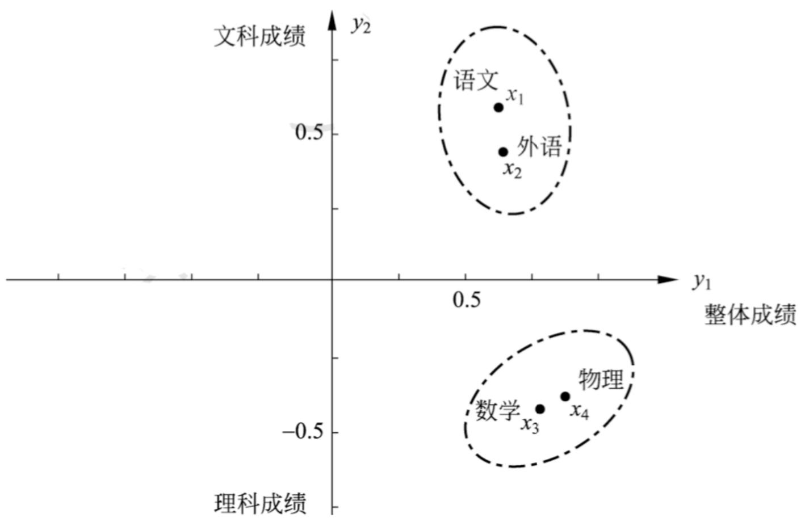

## 数据矩阵的奇异值分解算法

·假设有k个主成分，给定样本矩阵×，利用数据矩阵奇异值分解进行主成分分析

·对于mxΩ实矩阵A，假设其秩为r，O<k<r，则可以将矩阵A进行 截断奇异值分解

$$
A \approx U _ { k } \varSigma _ { k } V _ { k } ^ { \mathrm { T } }
$$

## 数据矩阵的奇异值分解算法

•定义一个新的n ×m 矩阵X' $X ^ { \prime } = { \frac { 1 } { \sqrt { n - 1 } } } X ^ { \mathrm { T } }$

•X的每一列均值为O，得

$$
{ \begin{array} { l } { { \boldsymbol { X } } ^ { \prime \mathrm { { T } } } { \boldsymbol { X } } ^ { \prime } = \left( { \frac { 1 } { \sqrt { n - 1 } } } { \boldsymbol { X } } ^ { \mathrm { { T } } } \right) ^ { \mathrm { { T } } } \left( { \frac { 1 } { \sqrt { n - 1 } } } { \boldsymbol { X } } ^ { \mathrm { { T } } } \right) } \\ { \displaystyle = { \frac { 1 } { n - 1 } } { \boldsymbol { X } } { \boldsymbol { X } } ^ { \mathrm { { T } } } } \end{array} }
$$

·即X'TX'等于X的协方差矩阵 $\mathsf { S } _ { \mathsf { X } }$

$$
S _ { X } = { X ^ { \prime } } ^ { \mathbf { T } } X ^ { \prime }
$$

## 数据矩阵的奇异值分解算法

·主成分分析归结于求协方差矩阵 $\mathsf { S } _ { \mathsf { X } }$ 的特征值和对应的单位特征向量

·问题转化为求矩阵XTX'的特征值和对应的单位特征向量

·假设X的截断奇异值分解为 $X ^ { \prime } = U \varSigma V ^ { \mathrm { T } }$ 那么V的列向量就是$S _ { X } = X ^ { \prime \mathbf { T } } X ^ { \prime }$ 的单位特征向量

•因此，√的列向量就是×的主成分

●于是，求X主成分可以通过求Χ'的奇异值分解来实现。

## 主要成分分析算法

输入： $m \times n$ 样本矩阵X，其每一行元素的均值为零；

输出： $k \times n$ 样本主成分矩阵Y。

参数：主成分个数k

（1）构造新的 $n \times m$ 矩阵

$$
X ^ { \prime } = { \frac { 1 } { \sqrt { n - 1 } } } X ^ { \mathbf { T } }
$$

$X ^ { \prime }$ 每一列的均值为零。

（2）对矩阵 $X ^ { \prime }$ 进行截断奇异值分解，得到

$$
X ^ { \prime } = U \varSigma V ^ { \mathrm { T } }
$$

有k个奇异值、奇异向量。矩阵V的前k列构成k个样本主成分。

（3)求k×n样本主成分矩阵

$$
Y = V ^ { \mathrm { { T } } } X
$$

## 第十七章潜在语义分析

## 潜在语义分析

·潜在语义分析，（(latent semantic analysis， LSA）是一种无监督学习方法，主要用于文本的话题分析

• 通过矩阵分解发现文本与单词之间的基于话题的语义关系

• 文本信息处理中，传统的方法以单词向量表示文本的语义内容，以单词向量空间的度量表示文本之间的语义相似度。

·潜在语义分析旨在解决这种方法不能准确表示语义的问题，试图从大量的文本数据中发现潜在的话题，以话题向量表示文本的语义内容，以话题向量空间的度量更准确地表示文本之间的语义相似度。这也是话题分析（topic modeling）的基本想法。

## 潜在语义分析

• 潜在语义分析使用的是非概率的话题分析模型。

·具体地，将文本集合表示为单词-文本矩阵，对单词-文本矩阵进行奇异值分解，从而得到话题向量空间，以及文在话题向量空间的表示。

•奇异值分解特点是分解的矩阵正交

·非负矩阵分解（non-negative matrix factorization，NMF）是另一种矩阵的因子分解方法，其特点是分解的矩阵非负

• 非负矩阵分解也可以用于话题分析

## 单词向量空间

•文本信息处理，比如文本信息检索、文本数据挖掘的一个核心问题是对文本的语义内容进行表示，并进行文本之间的语义相似度计算。

·最简单的方法是利用向量空间模型(vector space model, VSM)，也就是单词向量空间模型(word vector space model)。

•向量空间模型的基本想法是，给定一个文本，用一个向量表示该文本的“语义”

·向量的每一维对应一个单词，其数值为该单词在该文本中出现的频数或权值

• 基 本假设是文本中所有单词的出现情况表示了文本的语义内容

• 文本集合中的每个文本都表示为一个向量，存在于一个向量空间

• 向量空间的度量，如内积或标准化内积表示文本之间的“语义相似度”。

## 单词向量空间

• 给定一个含有n个文本的集合 $D = \{ d _ { 1 } , d _ { 2 } , \cdots , d _ { n } \}$ ，以及在所有文本中出现的m个单词的集合 $W = \{ w _ { 1 } , w _ { 2 } , \cdots , w _ { m } \}$

·将单词在文本中出现的 数据用一个单词-文本矩阵（word-document matrix）表示，记作×

$$
X = { \left[ \begin{array} { l l l l } { x _ { 1 1 } } & { x _ { 1 2 } } & { \cdots } & { x _ { 1 n } } \\ { x _ { 2 1 } } & { x _ { 2 2 } } & { \cdots } & { x _ { 2 n } } \\ { \vdots } & { \vdots } & & { \vdots } \\ { x _ { m 1 } } & { x _ { m 2 } } & { \cdots } & { x _ { m n } } \end{array} \right] }
$$

## 单词向量空间

•这是一个m×n 矩阵，元素 $\mathsf { X } _ { \mathsf { i } } { \mathsf { \Pi } } _ { }$ 表示单词 $\mathsf { W } _ { \mathrm { i } }$ 在文本 $\mathsf { . d } _ { \mathsf { j } }$ 内中出现的频数或权值。

·由于单词的种类很多，而每个文本中出现单词的种类通常较少，所以单词-文本矩阵是一个稀疏矩阵。

## 单词向量空间

·权值通常用单词频率-逆文本频率\_(term freqyency-inversedocument frequency， TF-IDF）表示，其定义是

$$
\mathrm { T F I D F } _ { i j } = \frac { \mathrm { t f } _ { i j } } { \mathrm { t f } _ { \star j } } \log \frac { \mathrm { d f } } { \mathrm { d f } _ { i } } , \quad i = 1 , 2 , \cdots , m ; \quad j = 1 , 2 , \cdots , n
$$

$\pm f _ { | \mathrm { j } | } .$ 单词 $\mathsf { W } _ { \mathrm { i } }$ 出现在文本 ${ \mathsf { d } } _ { \mathrm { j } }$ 中的频数

• tf $\cdot \dot { \ j \cdot }$ 是文本 ${ \mathsf { d } } _ { \mathrm { j } }$ 中出现的所有单词的频 数之和

${ \mathsf { d f } } _ { \mathrm { i } }$ ：含有单词 $\mathsf { W } _ { \mathrm { i } }$ 的文本数

${ \mathrm { d } } { \mathsf { f } } \colon$ 是文本集合D的全部文本数

## 单词向量空间

·直观上，一个单词在一个文本中出现的频数越高，这个单词在这个文本中的重要度就越高

• 一个单词在整个文本集合中出现的文本数越少，这个单词就越能表示其所在文本的特点，重要度就越高

• 一个单词在一个文本的TF-IDF是两种重要度的积，表示综合重要度

## 单词向量空间

• 单词向量空间模型直接使用单词-文本矩阵的信息。单词-文本矩阵的第j列向量 $\mathsf { X } _ { \mathrm { j } }$ 表示文本d

$$
\begin{array} { r } { \boldsymbol { x } _ { j } = \left[ \begin{array} { c } { x _ { 1 j } } \\ { x _ { 2 j } } \\ { \vdots } \\ { x _ { m j } } \end{array} \right] , \quad j = 1 , 2 , \cdots , n } \end{array}
$$

$\mathsf { X } _ { \mathsf { i } } { \mathsf { \Pi } } _ { \mathsf { j } }$ ：单词 $\mathsf { W } _ { \mathrm { i } }$ 在文本 ${ \mathsf { d } } _ { \mathrm { j } }$ 的权值

•权值越大，该单词在该文本中的重要度就越高

$$
X = [ x _ { 1 } \quad x _ { 2 } \quad \cdot \cdot \cdot \quad x _ { n } ]
$$

## 单词向量空间

・两个单词向量的内积或标准化内积（余弦）表示对应的文本之间的语义相似度

·因此，文本 ${ \mathsf { d } } _ { \mathrm { i } }$ 与 ${ \mathsf { d } } _ { \mathrm { j } }$ 之间的相似度为 $x _ { i } \bullet x _ { j } , \quad { \frac { x _ { i } \bullet x _ { j } } { \| x _ { i } \| \| x _ { j } \| } }$

·直观上，在两个文本中共同出现的单词越多，其语义内容就越相近，对应的单词向量同不为零的维度就越多，内积就越大（单词向量元素的值都是非负的），表示两个文本在语义内容上越相似

## 单词向量空间

• 单词向量空间模型

·模型简单

•计算效率高

·有局限性，内积相似度未必能够准确表达两个文本的语义相似度

•一词多义性(polysemy)

•多词一义性(synonymy)

## 例

• 单词向量空间模型中，文本 ${ \sf d } _ { 1 }$ 与 ${ \sf d } _ { 2 }$ 相似度并不高，尽管两个文本的内容相似，这是因为同义词“airplane”与 $\mathsf { \Omega } ^ { \mathsf { i r c r a f t } }$ 被当作了两个独立的单词，单词向量空间模型不考虑单 的同义性，在此情况下无法进行准确的相似度计算。

<table><tr><td></td><td> $d _ { 1 }$ </td><td> $d _ { 2 }$ </td><td> $d _ { 3 }$ </td><td> $d _ { 4 }$ </td></tr><tr><td>airplane</td><td>2</td><td></td><td></td><td></td></tr><tr><td>aircraft</td><td></td><td>2</td><td></td><td></td></tr><tr><td>computer</td><td></td><td></td><td>1</td><td></td></tr><tr><td>apple</td><td></td><td></td><td>2</td><td>3</td></tr><tr><td>fruit</td><td></td><td></td><td></td><td>1</td></tr><tr><td>produce</td><td>1</td><td>2</td><td>2</td><td>1</td></tr></table>

## 例

・文本 ${ \mathsf d } _ { 3 }$ 与 ${ \mathsf { d } } _ { 4 }$ 有一定的相似度，尽管两个文本的内容并不相似，这是因为单词$\mathsf { \Gamma } ^ { \mathsf { s } \mathsf { t } } \mathsf { a p p } \mathsf { \Theta } \mathsf { e } ^ { \prime \prime }$ 具有多义，可以表示$\mathsf { " a p p l e c o m p u t e r " }$ 和“fruit",单词向量空间模型不考虑单词的多义性，在此情况下也无法进行准确的相似度计算。

<table><tr><td></td><td> $d _ { 1 }$ </td><td> $d _ { 2 }$ </td><td> $d _ { 3 }$ </td><td> $d _ { 4 }$ </td></tr><tr><td>airplane</td><td>2</td><td></td><td></td><td></td></tr><tr><td>aircraft</td><td></td><td>2</td><td></td><td></td></tr><tr><td>computer</td><td></td><td></td><td>1</td><td></td></tr><tr><td>apple</td><td></td><td></td><td>2</td><td>3</td></tr><tr><td>fruit</td><td></td><td></td><td></td><td>1</td></tr><tr><td>produce</td><td>1</td><td>2</td><td>2</td><td>1</td></tr></table>

## 话题向量空间

• 两个文本的语义相似度可以体现在两者的话题相似度上

• 一个文本一般含有若干个话题。如果两个文本的话题相似，那么两者的语义应该也相似

·话题可以由若干个语义相关的单词表示，同义词(如“airplane"与“aircraft")可以表示同一个话题，而多义词（如“apple"）可以表示不同的话题。

· 这样，基于话题的模型就可以解决上述基于单 词的模型存在的问题。

## 话题向量空间

·设想定义一种话题向量空间模型(topic vector space model)

·给定一个文本，用话题空间的一个向量奏示该文本，该向量的每一分量对应一个话题，其数值为该话题在该文本中出现的权值

・用两个向量的内积或标准化内积表示对应的两个文本的语义相似度

•注：单词向量空间模型与话题向量空间模型可以互为补充，现实审，两者可以同时使角。

## 话题向量空间

• 给定一个文本集合 $D = \{ d _ { 1 } , d _ { 2 } , \cdot \cdot \cdot , d _ { n } \}$ 和一个相应的单词集合$W { = } \{ w _ { 1 } , w _ { 2 } , \cdot \cdot \cdot , w _ { m } \}$ 可以获得其单词-文本矩阵X，X构成原始的单词o向量空间，每一列是一个文本 在单词向量空间中的表示

$$
X = { \left[ \begin{array} { l l l l } { x _ { 1 1 } } & { x _ { 1 2 } } & { \dots } & { x _ { 1 n } } \\ { x _ { 2 1 } } & { x _ { 2 2 } } & { \dots } & { x _ { 2 n } } \\ { \vdots } & { \vdots } & & { \vdots } \\ { x _ { m 1 } } & { x _ { m 2 } } & { \dots } & { x _ { m n } } \end{array} \right] }
$$

•矩阵×也可以写作 $X = [ x _ { 1 } \quad x _ { 2 } \quad \cdot \cdot \cdot \quad x _ { n } ] ,$

## 话题向量空间

·假设所有文本共含有k个话题。，假设每个话题由一个定义在单词集合W上的m维向量表示，称为话题向量，即

$$
t _ { l } = \left[ \begin{array} { c } { t _ { 1 l } } \\ { t _ { 2 l } } \\ { \vdots } \\ { t _ { m l } } \end{array} \right] , \quad l = 1 , 2 , \cdots , k
$$

• ti：单词 $\mathsf { W } _ { \mathrm { i } }$ 在话题 $t _ { \parallel }$ 的权值，权值越大，该单词在该话题中的重要度就越高

•k个话题向量张成一个话题向量空间(topic vector space)，维数为k

•话题向量空间T是单词向量空间×的一个子空间

## 话题向量空间

·话题向量空间T也可以表示为一个矩阵，称为单词-话题矩阵(word-topic matrix)，记作

$$
T = { \left[ \begin{array} { l l l l } { t _ { 1 1 } } & { t _ { 1 2 } } & { \cdots } & { t _ { 1 k } } \\ { t _ { 2 1 } } & { t _ { 2 2 } } & { \cdots } & { t _ { 2 k } } \\ { \vdots } & { \vdots } & & { \vdots } \\ { t _ { m 1 } } & { t _ { m 2 } } & { \cdots } & { t _ { m k } } \end{array} \right] }
$$

•矩阵T也可写作

$$
T = [ t _ { 1 } \quad t _ { 2 } \quad \cdot \cdot \cdot \quad t _ { k } ]
$$

## 文本在话题向量空间的表示

·现在考虑文本集合D的文本 ${ \mathsf { d } } _ { \mathrm { i } } ,$ 在单词向量空间中由一个向量 $\mathsf { X } _ { \mathrm { j } }$ 表示，将 $\mathsf { X } _ { \mathrm { j } }$ 投影到话题向量空间T中，得到在话题向量空间的一个向量 $\mathsf { y } _ { \mathrm { j } , \mathsf { J } } \mathsf { _ { j } }$ 是一个k维向量，其表达式为

$$
y _ { j } = \left[ \begin{array} { c } { y _ { 1 j } } \\ { y _ { 2 j } } \\ { \vdots } \\ { y _ { k j } } \end{array} \right] , \quad j = 1 , 2 , \cdots , n
$$

•yi：文本 ${ \mathsf { d } } _ { \mathrm { i } }$ 在话题 $t$ 的权值，权值越大，该话题在该文本中的董要度就越高

## 文本在话题向量空间的表示

•矩阵Y表示话题在文本中出现的情况，称为话题-文本矩阵(topic-document matrix)，记作

$$
Y = { \left[ \begin{array} { l l l l } { y _ { 1 1 } } & { y _ { 1 2 } } & { \cdots } & { y _ { 1 n } } \\ { y _ { 2 1 } } & { y _ { 2 2 } } & { \cdots } & { y _ { 2 n } } \\ { \vdots } & { \vdots } & & { \vdots } \\ { y _ { k 1 } } & { y _ { k 2 } } & { \cdots } & { y _ { k n } } \end{array} \right] }
$$

•矩阵Y可一个写作

$$
Y = [ y _ { 1 } y _ { 2 } \dotsm y _ { n } ] ,
$$

## 从单词向量空间到话题向量空间的线性变 换

• 这样一来，在单词向量空间的文本向量 $\mathsf { X } _ { \mathrm { i } }$ 可以通过它在话题空间中的向量yj近似表示，具体地由k个话题向量以 $\mathsf { y } _ { \mathrm { j } }$ 为系数的线性组合近似表示

$$
x _ { j } \approx y _ { 1 j } t _ { 1 } + y _ { 2 j } t _ { 2 } + \cdot \cdot \cdot + y _ { k j } t _ { k } , \quad j = 1 , 2 , \cdots , n
$$

·所以，单词-文本矩阵×可以近似的表示为单词-话题矩阵T与话题一文本矩阵Y的乘积形式。这就是潜在语义分析。

$$
X \approx T Y
$$

## 从单词向量空间到话题向量空间的线性变 换

·直观上，潜在语义分析是将文本在单词向量空间的表示通过线性变换转换为在话题向量空间中的表示

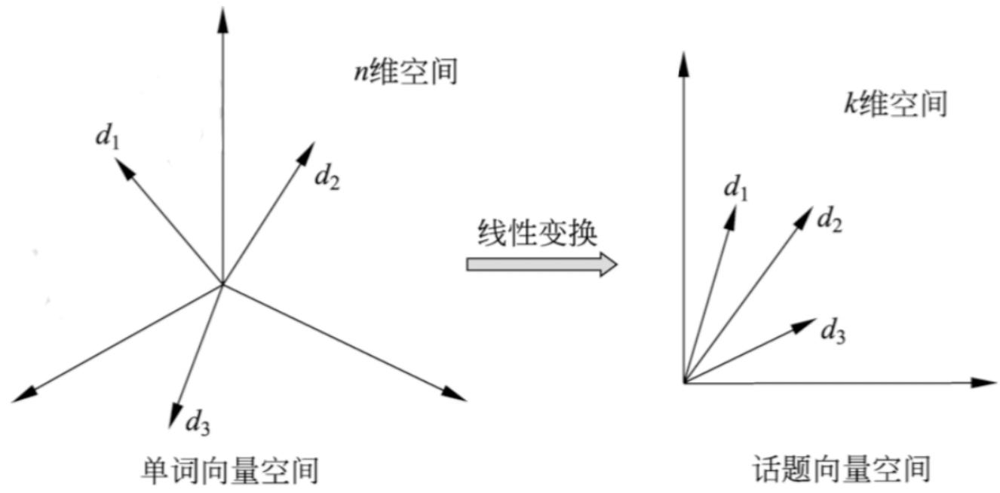

## 从单词向量空间到话题向量空间的线性变 换

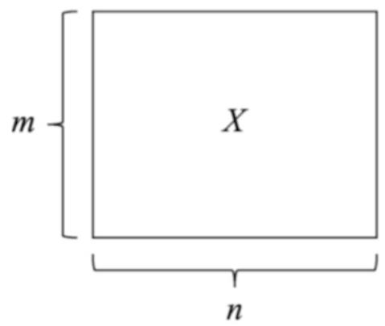

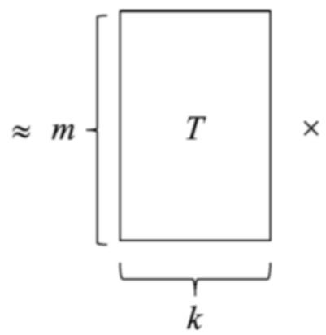

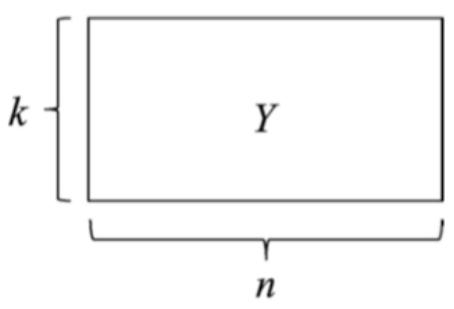  
图17.3潜在语义分析通过矩阵因子分解实现，单词-文本矩阵X可以近似的表示为单词-话题矩阵T与话题-文本矩阵Y的乘积形式

## 从单词向量空间到话题向量空间的线性变 换

•在原始的单词向量空间中，两个文本 ${ \mathsf { d } } _ { \mathrm { i } }$ 与 ${ \mathsf { d } } _ { \mathrm { j } }$ 的相似度可以由对应的向量的内积表示，即×xj。

· 经过潜在语义分析之后，在话题向量空间中，两个文本 ${ \mathsf { d } } _ { \mathrm { i } }$ 与 ${ \mathsf { d } } _ { \mathrm { j } }$ 的相似度可以由对应的向量的内积即yyj表示。

·要进行潜在语义分析，需要同时决定两部分的内容，一是话题向量空间T，二是文本在话题空间的表示Y，使两者的乘积是原始矩阵数据的近似，而这一结果完全从话题-文本矩阵的信息中获得

## 潜在语义分析算法

•潜在语义分析利用矩阵奇异值分解

·潜在语义对单词-文本矩阵进行奇异值分解，将其左矩阵作为话题向量空间，将其对角矩阵与右矩阵的乘积作为文本在话题向量空间的表示。

## 矩阵奇异值分解算法

（1）单词-文本矩阵

•给定文本集合 $D = \{ d _ { 1 } , d _ { 2 } , \cdots , d _ { n } \}$ 和单词集合 $W = \{ w _ { 1 } , w _ { 2 } , \cdot \cdot \cdot , w _ { m } \} _ { \circ }$ 潜在语

• 义分析首先将这些数据表成一个单词-文本矩阵

$$
X = { \left[ \begin{array} { l l l l } { x _ { 1 1 } } & { x _ { 1 2 } } & { \cdots } & { x _ { 1 n } } \\ { x _ { 2 1 } } & { x _ { 2 2 } } & { \cdots } & { x _ { 2 n } } \\ { \vdots } & { \vdots } & & { \vdots } \\ { x _ { m 1 } } & { x _ { m 2 } } & { \cdots } & { x _ { m n } } \end{array} \right] }
$$

## 矩阵奇异值分解算法

(2) 截断奇异值分解

•潜在语义分析根据确定的话题个数k对单词-文本矩阵X进行截断奇异值分解

$$
X \approx U _ { k } \Sigma _ { k } V _ { k } ^ { \mathrm { T } } = [ u _ { 1 } \quad u _ { 2 } \quad \cdots \quad u _ { k } ] \left[ \begin{array} { c c c c } { \sigma _ { 1 } } & { 0 } & { 0 } & { 0 } \\ { 0 } & { \sigma _ { 2 } } & { 0 } & { 0 } \\ { 0 } & { 0 } & { \ddots } & { 0 } \\ { 0 } & { 0 } & { 0 } & { \sigma _ { k } } \end{array} \right] \left[ \begin{array} { c } { v _ { 1 } ^ { \mathrm { T } } } \\ { v _ { 2 } ^ { \mathrm { T } } } \\ { \vdots } \\ { v _ { k } ^ { \mathrm { T } } } \end{array} \right]
$$

## 矩阵奇异值分解算法

(3) 话题向量空间

•在单词一文本矩阵×的截断奇异值分解式中，矩阵 $\mathsf { U } _ { \mathsf { k } }$ 的每一个列向量 $u _ { 1 } , u _ { 2 } , \cdots , u _ { k }$ 表示一个话题，称为话题向量。由这k个话题向量张成一个子空间

$$
U _ { k } = { \left[ \begin{array} { l l l l } { u _ { 1 } } & { u _ { 2 } } & { \cdots } & { u _ { k } } \end{array} \right] }
$$

•称为话题向量空间

## 矩阵奇异值分解算法

(4) 文本的话题空间表示

·有了话题向量空间，接着考虑文本在话题空间的表示

$$
X = { \left[ \begin{array} { l l l l } { x _ { 1 } } & { x _ { 2 } } & { \cdots } & { x _ { n } } \end{array} \right] } \approx U _ { k } \Sigma _ { k } V _ { k } ^ { \mathrm { T } }
$$

$$
= \left[ \begin{array} { c c c c } { \boldsymbol { u _ { 1 } } } & { \boldsymbol { u _ { 2 } } } & { \cdots } & { \boldsymbol { u _ { k } } } \end{array} \right] \left[ \begin{array} { c c c c } { \sigma _ { 1 } } & & & \\ & { \sigma _ { 2 } } & { 0 } \\ { 0 } & { \ddots } & \\ & & & { \sigma _ { k } } \end{array} \right] \left[ \begin{array} { c c c c } { \boldsymbol { v _ { 1 1 } } } & { \boldsymbol { v _ { 2 1 } } } & { \cdots } & { \boldsymbol { v _ { n 1 } } } \\ { \boldsymbol { v _ { 1 2 } } } & { \boldsymbol { v _ { 2 2 } } } & { \cdots } & { \boldsymbol { v _ { n 2 } } } \\ { \vdots } & { \vdots } & & { \vdots } \\ { \boldsymbol { v _ { 1 k } } } & { \boldsymbol { v _ { 2 k } } } & { \cdots } & { \boldsymbol { v _ { n k } } } \end{array} \right]
$$

其中

$$
= \left[ \begin{array} { c c c c } { \boldsymbol { u _ { 1 } } } & { \boldsymbol { u _ { 2 } } } & { \cdots } & { \boldsymbol { u _ { k } } } \end{array} \right] \left[ \begin{array} { c c c c } { \sigma _ { 1 } \boldsymbol { v _ { 1 1 } } } & { \sigma _ { 1 } \boldsymbol { v _ { 2 1 } } } & { \cdots } & { \sigma _ { 1 } \boldsymbol { v _ { n 1 } } } \\ { \sigma _ { 2 } \boldsymbol { v _ { 1 2 } } } & { \sigma _ { 2 } \boldsymbol { v _ { 2 2 } } } & { \cdots } & { \sigma _ { 2 } \boldsymbol { v _ { n 2 } } } \\ { \vdots } & { \vdots } & & { \vdots } \\ { \sigma _ { k } \boldsymbol { v _ { 1 k } } } & { \sigma _ { k } \boldsymbol { v _ { 2 k } } } & { \cdots } & { \sigma _ { k } \boldsymbol { v _ { n k } } } \end{array} \right]\tag{17.14}
$$

$$
u _ { l } = \left[ \begin{array} { c } { { u _ { 1 l } } } \\ { { u _ { 2 l } } } \\ { { \vdots } } \\ { { u _ { m l } } } \end{array} \right] , \quad l = 1 , 2 , \cdots , k
$$

## 矩阵奇异值分解算法

•由式(17.14)知，矩阵×的第j列向量 $\mathsf { X } _ { \mathrm { j } }$ 满足

$\left( \sum _ { k } V _ { k } ^ { \mathrm { T } } \right) _ { \mathcal { I } }$ 是矩阵 $\left( \Sigma _ { k } V _ { k } ^ { \mathrm { T } } \right)$ 第j列向量

·式(17.15)是文本 ${ \mathsf { d } } _ { \mathrm { j } }$ 的近似表达式，由k个话题向量 $\mathsf { U } _ { \parallel }$ 的线性组合构成


$$
x _ { j } \approx U _ { k } \big ( \varSigma _ { k } V _ { k } ^ { \mathrm { T } } \big ) _ { j }
$$

$$
\mathbf { \Psi } = \left[ \begin{array} { c c c c c } { u _ { 1 } } & { u _ { 2 } } & { \cdots } & { u _ { k } } \end{array} \right] \left[ \begin{array} { c } { \sigma _ { 1 } v _ { j 1 } } \\ { \sigma _ { 2 } v _ { j 2 } } \\ { \vdots } \\ { \sigma _ { k } v _ { j k } } \end{array} \right]
$$

$$
\ O = \sum _ { l = 1 } ^ { k } \sigma _ { l } v _ { j l } u _ { l } , \quad j = 1 , 2 , \cdot \cdot \cdot , n\tag{17.15}
$$

## 矩阵奇异值分解算法

·矩阵 $\left( \Sigma _ { k } V _ { k } ^ { \mathrm { T } } \right)$ 的每一个列向量

$$
\left[ \begin{array} { c } { \sigma _ { 1 } v _ { 1 1 } } \\ { \sigma _ { 2 } v _ { 1 2 } } \\ { \vdots } \\ { \sigma _ { k } v _ { 1 k } } \end{array} \right] , \quad \left[ \begin{array} { c } { \sigma _ { 1 } v _ { 2 1 } } \\ { \sigma _ { 2 } v _ { 2 2 } } \\ { \vdots } \\ { \sigma _ { k } v _ { 2 k } } \end{array} \right] , \therefore \cdot , \left[ \begin{array} { c } { \sigma _ { 1 } v _ { n 1 } } \\ { \sigma _ { 2 } v _ { n 2 } } \\ { \vdots } \\ { \sigma _ { k } v _ { n k } } \end{array} \right]
$$

•是一个文本在话题向量空间的表示

·综上，可以通过对单词一文本矩阵的奇异值分解进行潜在语义分析 $X \approx U _ { k } \varSigma _ { k } V _ { k } ^ { \mathrm { T } } = U _ { k } ( \varSigma _ { k } V _ { k } ^ { \mathrm { T } } )$ 得到话题空间 $\mathsf { U } _ { \mathsf { k } }$ ，以及文本在话题空间的表示 $\left( \Sigma _ { k } V _ { k } ^ { \mathrm { T } } \right)$

## 例

·假设有9个文本，11个单词，单词一文本矩阵×为11×9矩阵，矩阵的元素是单词在文本中出现的频数，表示如下：

<table><tr><td rowspan="2">Index Words</td><td colspan="9">Titles</td></tr><tr><td>T1</td><td>T2</td><td>T3</td><td>T4</td><td>T5</td><td>T6</td><td>T7</td><td>T8</td><td>T9</td></tr><tr><td>book</td><td></td><td></td><td>1</td><td>1</td><td></td><td></td><td></td><td></td><td></td></tr><tr><td>dads</td><td></td><td></td><td></td><td></td><td></td><td>1</td><td></td><td></td><td>1</td></tr><tr><td>dummies</td><td></td><td>1</td><td></td><td></td><td></td><td></td><td></td><td>1</td><td></td></tr><tr><td>estate</td><td></td><td></td><td></td><td></td><td></td><td></td><td>1</td><td></td><td>1</td></tr><tr><td>guide</td><td>1</td><td></td><td></td><td></td><td></td><td>1</td><td></td><td></td><td></td></tr><tr><td>investing</td><td>1</td><td>1</td><td>1</td><td>1</td><td>1</td><td>1</td><td>1</td><td>1</td><td>1</td></tr><tr><td>market</td><td>1</td><td></td><td>1</td><td></td><td></td><td></td><td></td><td></td><td></td></tr><tr><td>real</td><td></td><td></td><td></td><td></td><td></td><td></td><td>1</td><td></td><td>1</td></tr><tr><td>rich</td><td></td><td></td><td></td><td></td><td></td><td>2</td><td></td><td></td><td>1</td></tr><tr><td>stock</td><td>1</td><td></td><td>1</td><td></td><td></td><td></td><td></td><td>1</td><td></td></tr><tr><td>value</td><td></td><td></td><td></td><td>1</td><td>1</td><td></td><td></td><td></td><td></td></tr></table>

•进行潜在语义分析。

## 例

·实施对矩阵的截断奇异值分解，假设话题的个数是3，截断奇异 值分解结果为

<table><tr><td rowspan=1 colspan=1>Book</td><td rowspan=1 colspan=1>0.15</td><td rowspan=1 colspan=1>5−0.27</td><td rowspan=1 colspan=1>0.04</td></tr><tr><td rowspan=1 colspan=1>Dads</td><td rowspan=1 colspan=1>0.24</td><td rowspan=1 colspan=1>0.38</td><td rowspan=1 colspan=1>−0.09</td></tr><tr><td rowspan=1 colspan=1>Dummies</td><td rowspan=1 colspan=1>0.13</td><td rowspan=1 colspan=1>−0.17</td><td rowspan=1 colspan=1>0.07</td></tr><tr><td rowspan=1 colspan=1>Estate</td><td rowspan=1 colspan=1>0.18</td><td rowspan=1 colspan=1>0.19</td><td rowspan=1 colspan=1>0.45</td></tr><tr><td rowspan=1 colspan=1>Guide</td><td rowspan=1 colspan=1>0.22</td><td rowspan=1 colspan=1>0.09</td><td rowspan=1 colspan=1>−0.46</td></tr><tr><td rowspan=1 colspan=1>Investing</td><td rowspan=1 colspan=1>0.74</td><td rowspan=1 colspan=1>−0.21d</td><td rowspan=1 colspan=1>0.21</td></tr><tr><td rowspan=1 colspan=1>Market</td><td rowspan=1 colspan=1>0.18</td><td rowspan=1 colspan=1>0.30</td><td rowspan=1 colspan=1>−0.28</td></tr><tr><td rowspan=1 colspan=1>Real</td><td rowspan=1 colspan=1>0.18</td><td rowspan=1 colspan=1>0.19</td><td rowspan=1 colspan=1>0.45</td></tr><tr><td rowspan=1 colspan=1>Rich</td><td rowspan=1 colspan=1>0.36</td><td rowspan=1 colspan=1>0.59</td><td rowspan=1 colspan=1>0.34:</td></tr><tr><td rowspan=1 colspan=1>Stock</td><td rowspan=1 colspan=1>0.25</td><td rowspan=1 colspan=1>5−0.42</td><td rowspan=1 colspan=1>−0.28</td></tr><tr><td rowspan=1 colspan=1>Value</td><td rowspan=1 colspan=1>0.12</td><td rowspan=1 colspan=1>−0.14</td><td rowspan=1 colspan=1>0.23</td></tr></table>

<table><tr><td rowspan=1 colspan=1>3.91</td><td rowspan=1 colspan=1>0</td><td rowspan=1 colspan=1>0</td></tr><tr><td rowspan=1 colspan=1>0</td><td rowspan=1 colspan=1>2.61</td><td rowspan=1 colspan=1>0</td></tr><tr><td rowspan=1 colspan=1>0</td><td rowspan=1 colspan=1>0</td><td rowspan=1 colspan=1>2.00</td></tr></table>

<table><tr><td rowspan=1 colspan=1>T1</td><td rowspan=1 colspan=1>T2</td><td rowspan=1 colspan=1>T3</td><td rowspan=1 colspan=1>T4</td><td rowspan=1 colspan=1>T5</td><td rowspan=1 colspan=1>T6</td><td rowspan=1 colspan=1></td><td rowspan=1 colspan=1>T8</td><td rowspan=1 colspan=1>T9</td></tr><tr><td rowspan=1 colspan=1>0.35</td><td rowspan=1 colspan=1>0.22</td><td rowspan=1 colspan=1>0.34</td><td rowspan=1 colspan=1>0.26</td><td rowspan=1 colspan=1>0.22</td><td rowspan=1 colspan=1>0.49</td><td rowspan=1 colspan=1>0.28</td><td rowspan=1 colspan=1>0.29</td><td rowspan=1 colspan=1>0.44</td></tr><tr><td rowspan=1 colspan=1>-0.32</td><td rowspan=1 colspan=1>-0.15</td><td rowspan=1 colspan=1>-0.46</td><td rowspan=1 colspan=1>-0.24</td><td rowspan=1 colspan=1>-0.14</td><td rowspan=1 colspan=1>0.55</td><td rowspan=1 colspan=1>0.07</td><td rowspan=1 colspan=1>-0.31</td><td rowspan=1 colspan=1>0.44</td></tr><tr><td rowspan=1 colspan=1>-0.41</td><td rowspan=1 colspan=1>0.14</td><td rowspan=1 colspan=1>-0.16</td><td rowspan=1 colspan=1>0.25</td><td rowspan=1 colspan=1>0.22</td><td rowspan=1 colspan=1>-0.51</td><td rowspan=1 colspan=1>0.55</td><td rowspan=1 colspan=1>0.00</td><td rowspan=1 colspan=1>0.34</td></tr></table>

## 例

•左矩阵 $\mathsf { U } _ { 3 }$ 个列向量（左奇异向量）。第1列向量 $\mathsf { U } _ { 1 }$ 的值均为正，第2列向量 $\mathsf { U } _ { 2 }$ 和第3列向量 $\mathsf { U } _ { 3 }$ 的值有正有负。

•中间的对角矩阵 $\Sigma _ { 3 }$ 的元素是3个由 大到小的奇异值（正值) o

•右矩阵是 $V _ { 3 } ^ { \mathrm { T } }$ ，其转置矩阵 $\vee _ { 3 }$ 也有3个列向量(右奇异向量）.。第1列向量 $\mathsf { V } _ { 1 }$ 的值也都为正，第2列向量 ${ \sf V } _ { 2 }$ 和第3列向量 $\vee _ { 3 }$ 的值有正有负。

## 例

·现在，将 $\Sigma _ { 3 }$ 与 $V _ { 3 } ^ { \mathrm { T } }$ 相乘，整体变成两个矩阵乘积的形式

$$
X \approx U _ { 3 } ( \Sigma _ { 3 } V _ { 3 } ^ { \mathrm { T } } )
$$

$$
\left[ \begin{array} { l l l } { 0 . 1 5 } & { - 0 . 2 7 } & { 0 . 0 4 } \\ { 0 . 2 4 } & { 0 . 3 8 } & { - 0 . 0 9 } \\ { 0 . 1 3 } & { - 0 . 1 7 } & { 0 . 0 7 } \\ { 0 . 1 8 } & { 0 . 1 9 } & { 0 . 4 5 } \\ { 0 . 2 2 } & { 0 . 0 9 } & { - 0 . 4 6 } \\ { 0 . 7 4 } & { - 0 . 2 1 } & { 0 . 2 1 } \\ { 0 . 1 8 } & { - 0 . 3 0 } & { - 0 . 2 8 } \\ { 0 . 1 8 } & { 0 . 1 9 } & { 0 . 4 5 } \\ { 0 . 3 6 } & { 0 . 5 9 } & { - 0 . 3 4 } \\ { 0 . 2 5 } & { - 0 . 4 2 } & { 0 . 2 8 } \\ { 0 . 1 2 } & { - 0 . 1 4 } & { 0 . 2 3 } \end{array} \right] \qquad \left[ \begin{array} { r r r r r r r r } { 1 . 3 7 } & { 0 . 8 6 } & { 1 . 3 3 } & { 1 . 0 2 } & { 0 . 8 6 } & { 1 . 9 2 } & { 1 . 0 9 } & { 1 . 1 3 } & { 1 . 7 2 } \\ { - 0 . 8 4 } & { - 0 . 3 9 } & { - 1 . 2 0 } & { - 0 . 6 3 } & { - 0 . 3 7 } & { 1 . 4 1 } & { 0 . 1 8 } & { - 0 . 8 1 } & { 1 . 1 5 } \\ { - 0 . 8 2 } & { 0 . 2 8 } & { - 0 . 3 2 } & { 0 . 5 0 } & { 0 . 4 4 } & { - 1 . 0 2 } & { 1 . 1 0 } & { 0 . 0 0 } & { 0 . 6 8 } \end{array} \right] .
$$

## 例

·矩阵 $\mathsf { U } _ { 3 }$ 有3个列向量，表示3个话题，矩阵 $\mathsf { U } _ { 3 }$ 表示话题向量空间。

·矩阵 $( \Sigma _ { 3 } V _ { 3 } ^ { \mathrm { T } } )$ 有9个列向量，表示9个文本，矩阵 $( \Sigma _ { 3 } V _ { 3 } ^ { \mathrm { T } } )$ 是文本集合在话题向量空间的表示。

## 非负矩阵分解算法

· 非负矩阵分解也可以用于话题分析。

·对单词一文本矩阵进行非负矩阵分解，将其左矩阵作为话题向量空间，将其右矩阵作为文本在话题向量空间的表示。

• 注意通常单词-文本矩阵是非负的。

## 非负矩阵分解

•给定一个非负矩阵X≥0，找到两个非负矩阵W≥0和H≥0，使得

$$
X \approx W H
$$

·即将非负矩阵X分解为两个非负矩阵W和H的乘积的形式，称为非负矩阵分解。

· 因为WH与X完全相等很难实现，所以只要求WH与X近似相等。

## 非负矩阵分解

·假设非负矩阵X是 m ×n 矩阵，非负矩阵W和H分别为 m ×k 矩阵和kxn矩阵。

·假设k<min(m，n)，即W和H小于原矩阵X，所以非负矩阵分解是对原数据的压缩。

## 非负矩阵分解

•由 $X \approx W H$ 知，矩阵×的第j列向量 $\mathsf { X } _ { \mathrm { j } }$ 满足

$$
x _ { j } \approx W h _ { j }
$$

$$
= \left[ \begin{array} { c c c c } { w _ { 1 } } & { w _ { 2 } } & { \cdots } & { w _ { k } } \end{array} \right] \left[ \begin{array} { c } { h _ { 1 j } } \\ { h _ { 2 j } } \\ { \vdots } \\ { h _ { k j } } \end{array} \right] \qquad = \sum _ { l = 1 } ^ { k } h _ { l j } w _ { l } , \quad j = 1 , 2 , \cdots , n
$$

·矩阵×的第j列 $\mathsf { X } _ { \mathrm { i } }$ 可以由矩阵W的k个列 $\mathsf { W } _ { \parallel }$ 的线性组合逼近，线性组合的系数是矩阵H的第j列 $\mathsf { h } _ { \mathsf { j } }$ 的元素。

· 非负矩阵分解旨在用较少的基向量、系数向量来表示较大的数据矩阵。

## 潜在语义分析模型

•给定一个m ×n 非负的单词-文本矩阵X≥0

•假设文本集合共包含k个话题，，对X进行非负矩阵分解。即求非负的mxk矩阵W≥0和kxn矩阵H≥0，使得

$$
X \approx W H
$$

令 $W = [ w _ { 1 } \quad w _ { 2 } \quad \cdot \cdot \cdot \quad w _ { k } ]$ 为话题向量空间， $w _ { 1 } , w _ { 2 } , \cdots , w _ { k }$ 表示文本集合的k个话题，令 $H = [ h _ { 1 } \quad h _ { 2 } \quad \cdot \cdot \cdot \quad h _ { n } ]$ 为文本在话题向量空间的表示，$h _ { 1 } , h _ { 2 } , \cdots , h _ { n }$ 表示 文本集合的n个文本

## 非负矩阵分解的形式化

·非负矩阵分解可以形式化为最优化问题求解。首先定义损失函数或代价函数。

·第一种损失函数是平方损失。设两个非负矩阵 $A = [ a _ { i j } ] _ { m \times n }$ ，和$B = [ b _ { i j } ] _ { m \times n }$ 平方损失函数定义为

$$
\| A - B \| ^ { 2 } = \sum _ { i , j } { ( a _ { i j } - b _ { i j } ) ^ { 2 } }
$$

·其下界是O，当且仅当A=B时达到下界。

## 非负矩阵分解的形式化

·另一种损失函数是散度(divergence)。设两个非负矩阵 $A = [ a _ { i j } ] _ { m \times n }$ 和 $B = [ b _ { i j } ] _ { m \times n }$ 散度损失函数定义为

$$
D ( A \| B ) = \sum _ { i , j } \left( a _ { i j } \log { \frac { a _ { i j } } { b _ { i j } } } - a _ { i j } + b _ { i j } \right)
$$

·其下界也是O，当且仅当A= B时达到下界。A和B不对称。

当 $\sum _ { i , j } a _ { i j } = \sum _ { i , j } b _ { i j } = 1$ 时

·散度损失函数退化为Kuliback-Leiber散度或相对嫡，这时A和B是概率分布。

## 非负矩阵分解的形式化

・目标函数 $\| X - W H \| ^ { 2 }$ 关于W和H的最小化，满足约束条件 $\mathsf { W } , \mathsf { H } \geqslant 0$ 即 min |∥X − W H|2W,Hs.t. W, H ≥ 0

·或者，目标函数D(XIWH）关于W和H的最小化，满足约束条件W，${ \sf H } \geqslant 0$ ，即

$$
\begin{array} { l l } { \displaystyle \operatorname* { m i n } _ { W , H } } & { D ( X \| W H ) } \\ { \mathrm { s . t . } } & { W , H \geqslant 0 } \end{array}
$$

## 算法

定理17.1平方损失 $\| X - W H \| ^ { 2 }$ 对下列乘法更新规则

$$
H _ { l j } \gets H _ { l j } \frac { ( W ^ { \mathrm { T } } X ) _ { l j } } { ( W ^ { \mathrm { T } } W H ) _ { l j } }\tag{17.24}
$$

$$
W _ { i l } \gets W _ { i l } \frac { ( X H ^ { \mathrm { T } } ) _ { i l } } { ( W H H ^ { \mathrm { T } } ) _ { i l } }\tag{17.25}
$$

是非增的。当且仅当W 和H是平方损失函数的稳定点时函数的更新不变。

## 算法

定理17.2 散度损失D(X－WH)对下列乘法更新规则

$$
H _ { l j } \gets H _ { l j } \frac { \sum _ { i } [ W _ { i l } X _ { i j } / ( W H ) _ { i j } ] } { \sum _ { i } W _ { i l } }\tag{17.26}
$$

$$
W _ { i l }  W _ { i l } \frac { \sum _ { j } [ H _ { l j } X _ { i j } / ( W H ) _ { i j } ] } { \sum _ { j } H _ { l j } }\tag{17.27}
$$

是非增的。当且仅当W 和Η是散度损失函数的稳定点时函数的更新不变。

## 算法

·最优化目标函数是 $\| X - W H \| ^ { 2 }$ 为了方便将目标函数乘以1/2，其最优解与原问题相同，记作

$$
J ( W , H ) = \frac 1 2 \| X - W H \| ^ { 2 } = \frac 1 2 \sum \left[ X _ { i j } - ( W H ) _ { i j } \right] ^ { 2 }
$$

•应用梯度下降法求解。首先求目标函数的梯度

$$
\begin{array} { r } { \frac { \partial J ( W , H ) } { \partial W _ { i l } } = - \displaystyle \sum _ { j } [ X _ { i j } - ( W H ) _ { i j } ] H _ { l j } } \\ { = - [ ( X H ^ { \mathrm { T } } ) _ { i l } - ( W H H ^ { \mathrm { T } } ) _ { i l } ] } \end{array}
$$

同样可得

$$
\frac { \partial J ( W , H ) } { \partial H _ { l j } } = - [ ( W ^ { \mathrm { T } } X ) _ { l j } - ( W ^ { \mathrm { T } } W H ) _ { l j } ]
$$

## 算法

•然后求得梯度下降法的更新规则

$$
W _ { i l } = W _ { i l } + \lambda _ { i l } [ ( X H ^ { \mathrm { T } } ) _ { i l } - ( W H H ^ { \mathrm { T } } ) _ { i l } ]
$$

$$
H _ { l j } = H _ { l j } + \mu _ { l j } [ ( W ^ { \mathrm { T } } X ) _ { l j } - ( W ^ { \mathrm { T } } W H ) _ { l j } ]
$$

・式中 $\lambda _ { i l } , \mu _ { l j }$ 是步长。选取

$$
\lambda _ { i l } = \frac { W _ { i l } } { \left( W H H ^ { \mathrm { T } } \right) _ { i l } } , \quad \mu _ { l j } = \frac { H _ { l j } } { \left( W ^ { \mathrm { T } } W H \right) _ { l j } }
$$

即得乘法更新规则

$$
W _ { i l } = W _ { i l } \frac { ( X H ^ { \mathrm { T } } ) _ { i l } } { ( W H H ^ { \mathrm { T } } ) _ { i l } } , i = 1 , 2 , \cdot \cdot \cdot , m ; l = 1 , 2 , \cdot \cdot \cdot , k
$$

$$
H _ { l j } = H _ { l j } \frac { ( W ^ { \mathrm { T } } X ) _ { l j } } { ( W ^ { \mathrm { T } } W H ) _ { l j } } , \quad l = 1 , 2 , \cdots , k ; \quad j = 1 , 2 , \cdots , n
$$

## 非负矩阵分解的迭代算法

输入：单词-文本矩阵X≥0，文本集合的话题个数k，最大迭代次数t；

输出：话题矩阵W，文本表示矩阵 $H _ { \circ }$

（1）初始化

$W \geqslant 0$ ，并对W的每一列数据归一化；

$H \geqslant 0 ;$

（2）迭代

对迭代次数由1到t 执行下列步骤：

(a)更新 W 的元素，对I从1 到k，i从1到m 按式(17.33)更新 $W _ { i l }$

(b)更新H的元素，对l从1到 k，j从1到n 按式(17.34) 更新 $H _ { l j }$

## 第十八章概率潜在语义分析

## 概率潜在语义分析

·概率潜在语义分析（probabilistic latent semantic analysis， PLSA)，是一种利用概率生成模型对文本集合进行话题分析的无监督学习方法。

·模型的最大特点是用隐变量表示话题；整个模型表示文本生成话题，话题生成单词，从而得到单词一文本共现数据的过程

· 假设每个文本由一个话题分布决定，每个话题由一个单词分布决定。

・概率潜在语义分析受潜在语义分析的启发，前者基于概率模型，后者基于非概率模型

## 基本想法

•给定一个文本集合，每个文本讨论若干个话题，每个话题由若干个单词表示。

·对文本集合进行概率潜在语义分析，就能够发现每个文本的话题，以及每个话题的单词。

• 话题是不能从数据中直接观察到的，是潜在的。

## 基本想法

• 文本集合转换为文本-单词共现数据，具体表现为单词-文本矩阵

・文本数据基于如下的概率模型产生（共现模型）：

·首先有话题的概率分布，然后有话题给定条件下文本的条件概率分布，以及话题给定条件下单词的条件概率分布。

·概率潜在语义分析就是发现由隐变量表示的话题，即潜在语义。

·直观上，语义相近的单词、语义相近的文本会被聚到相同的“软的类别”中，而话题所表示的就是这样的软的类别。

## 基本想法

·假设有3个潜在的话题，图中三个框各自表示一个话题。

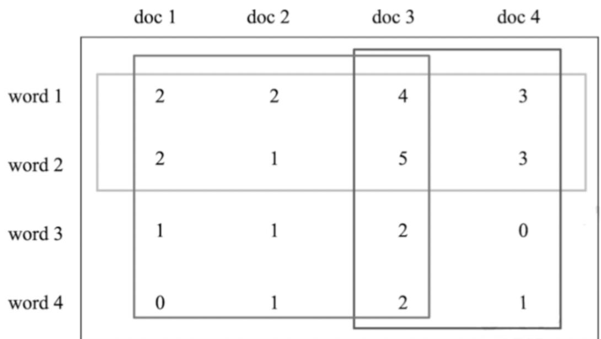

## 生成模型

•假设有单词集合 $W = \{ w _ { 1 } , w _ { 2 } , \cdot \cdot \cdot , w _ { M } \}$ 其中M是单词个数

・文本（指标）集合 $D = \{ d _ { 1 } , d _ { 2 } , \cdot \cdot \cdot , d _ { N } \}$ ，其中N是文本个数

·话题集合 $Z = \{ z _ { 1 } , z _ { 2 } , \cdot \cdot \cdot , z _ { K } \}$ ，其中Κ是预先设定的话题个数

•随机变量w取值于单词集合

•随机变量d取值於文本集合

•随机变量z取值于话题集合

## 生成模型

·概率分布P(d)、条件概率分布P(zld)、条件概率分布P(w|z)皆属于多项分布

·P(d)：生成文本d的概率

·P(zId)：文本d生成话题z的概率

•P(wIz)：话题z生成单词w的概率

•一个文本的内容由其相关话题决定，一个话题的内容由其相关单词决定。

## 生成模型

• 生成模型通过以下步骤生成文本-单词共现数据：

• (1）依据概率分布P(d)，从文本\_（指标）集合中随机选取一个文本d，共生成N个文本；针对每个文本，执行以下操作

• （2）在文本d给定条件下，依据条件概率分布P(zId)，从话题集合随机选取一个话题z，共生成L个话题，这里L是文本长度

• (3）在话题z给定条件下，依据条件概率分布P(wlz)，从单词集合中随机选取一个单词w

## 生成模型

•生成模型中，单词变量w与文本变量d是观测变量，话题变量z是隐变量

·模型生成的是单词-话题-文本三元组(w，z， d)的集合，但观测到的是单词-文本二元组(w，d)的集合

• 观测数据表示为单词-文本矩阵T的形式

·矩阵T的行表示单词，列表示文本，元素表示单词-文本对(w，d)的出现次数

## 生成模型

•从数据的生成过程可以推出，文本-单词共现数据T的生成概率为所有单词-文本对 $( \boldsymbol { \mathsf { W } } , \boldsymbol { \mathsf { C } } )$ 的生成概率的乘积

$$
P \left( T \right) = \prod _ { \left( w , d \right) } P ( w , d ) ^ { n ( w , d ) }
$$

·这里 $\mathsf { n } ( \mathsf { w } , \mathsf { d } )$ 表示(w，d)的出现次数，单词-文本对出现的总次数是 ${ \sf N } \times { \sf L }$

## 生成模型

·每个单词-文本对(w，d)的生成概率由以下公式决定

$$
\begin{array} { l } { P ( w , d ) = P ( d ) P ( w | d ) } \\ { \displaystyle = P ( d ) \sum _ { z } P ( w , z | d ) } \\ { \displaystyle = P ( d ) \sum _ { z } P ( z | d ) P ( w | z ) } \end{array}
$$

•即生成模型的定义

•生成模型假设在话题z给定条件下，单词w与文本d条件独立，即

$$
P \left( w , z | d \right) = P \left( z | d \right) P ( w | z )
$$

## 生成模型

•生成模型属于概率有向图模型，可以用有向图(directed graph)表示

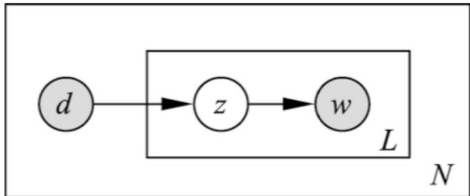

·图中实心圆表示观测变量，空心圆表示隐变量，箭头表示概率依存关系，方框表示多次重复，方框内数字表示重复次数。

• 文本变量d是一个观测变量，话题变量z是一个隐变量，单词变量二是一个观测变量。

## 共现模型

·可以定义与以上的生成模型等价的共现模型。

• 文本-单词共现数据T的生成概率为所有单词-文本对(w，d)的生成概率的乘积:

$$
P \left( T \right) = \prod _ { \left( w , d \right) } P ( w , d ) ^ { n ( w , d ) }
$$

•每个单词-文本对(w，d)的概率由以下公式决定:

$$
P ( w , d ) = \sum _ { z \in Z } P ( z ) P ( w | z ) P ( d | z )
$$

• 即共现模型的定义

## 共现模型

• 共现模型假设在话题z给定条件下，单词w与文本d是条件独立的，即

$$
P ( w , d | z ) = P ( w | z ) P ( d | z )
$$

·图中所示是共现模型。图中文本变量d是一个观测变量，单词变量w是一个观测变量，话题变量z是一个隐变量

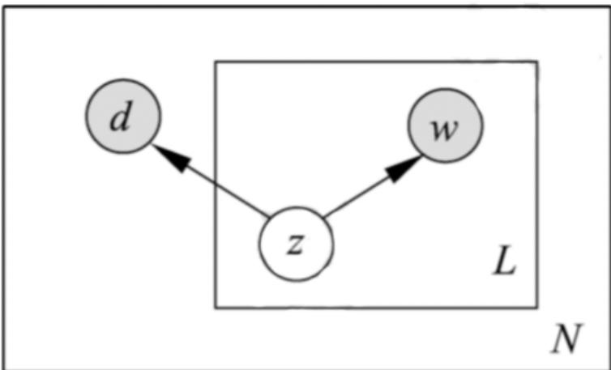

## 共现模型

• 虽然生成模型与共现模型在概率公式意义上是等价的，但是拥有不同的性质。

•生成模型

• 刻画文本-单词共现数据生成的过程

• 单词变量w与文本变量d是非对称的

•非对称模型

•共现模型

• 描述文本-单词共现数据拥有的模式

• 单词变量w与文本变量d是对称的

·对称模型

## 模型参数

·如果直接定义单词与文本的共现概率P(w,d)，模型参数的个数是O(M·N)，其中M是单词数，N是文本数

·概率潜在语义分析的生成模型和共现模型的参数个数是O(M•K +N·K)，其中K是话题数

• 现实中K<<M，所以概率潜在语义分析 通过话题对数据进行了更简洁地表示，减少了学习过程中过拟合的可能性

## 模型参数

· 图中显示模型中文本、话题、单词之间的关系。

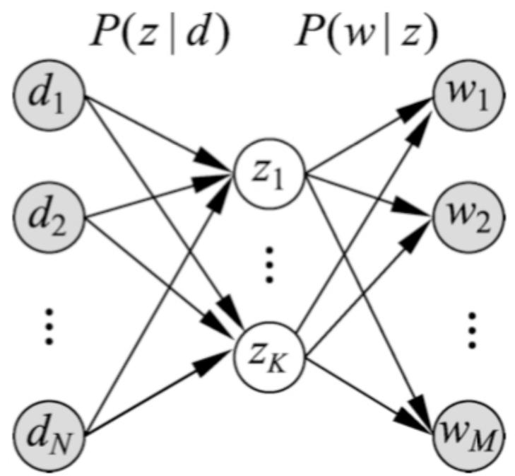

## 模型的几何解释

•概率分布 $\mathsf { P } ( \mathsf { w } | \mathrm { d } )$ 表示文本d生成单词w的概率，

$$
\sum _ { i = 1 } ^ { M } P ( w _ { i } | d ) = 1 , \quad 0 \leqslant P ( w _ { i } | d ) \leqslant 1 , \quad i = 1 , \cdots , M
$$

·可以由M维空间的(M-1)单纯形(simplex)中的点表示

## 模型的几何解释

·图中为三维空间的情况

•单纯形上的每个点表示一个分布P(wld)（分布的参数向量）

·所有的分布 P(wld）（分布的参数向量）都在单纯形上，称这个(M-1)单纯形为单词单纯形。

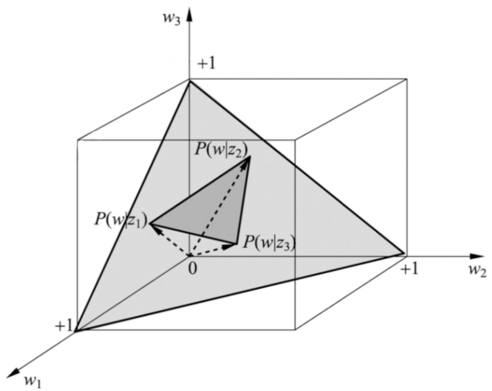

## 模型的几何解释

・概率潜在分析模型（生成模型）中的文本概率分布 $\mathsf { P } ( \mathsf { w } | \mathrm { d } )$ 有下面的关系成立：

$$
P ( w | d ) = \sum _ { z } P ( z | d ) P ( w | z )
$$

·概率分布P(W|z)也存在于M维空间中的(M-1)单纯形之中

•如果有K个话题，那么就有K个概率分布 $\mathsf { P } ( \mathsf { w } | z _ { \mathrm { k } } ) , \mathsf { k } { = } 1 , 2 , \cdots , \mathsf { k }$ ，由(M-1)单纯形上的K个点表示

·以这K个点为顶点，构成一个(K-1)单纯形，称为话题单纯形。

· 话题单纯形是单词单纯形的子单纯形。

## 模型的几何解释

•生成模型中文本的分布P(w|d)可以由K个话题的分布 P(wlzk)，k =1.,K，的线性组合表示

• 文本对应的点就在K个话题的点构成的(K-1)话题单纯形中

•注意通常K<<M，概率潜在语义模型存在于一个相对很小的参数空间中

## 与潜在语义分析的关系

·概率潜在语义分析模型（共现模型）可以在潜在语义分析模型的框架下描述

$$
\boxed { \begin{array} { r l } { \begin{array} { c } { \begin{array} { r l } { \boldsymbol { X } } & { { } } \\ { \boldsymbol { X } } & { { } } \\ { \boldsymbol { M } \times \boldsymbol { N } } \end{array} } } \end{array} } = \begin{array} { r l } { \boxed { U } } \\ { \begin{array} { r l } { \boxed { \begin{array} { r l r l } { \boxed { \begin{array} { r l r l } { \boldsymbol { X } \times \boldsymbol { K } } & { { } } & {  { K } ^ { \mathrm { T } } } & { } & { } \\ { \boldsymbol { K } \times \boldsymbol { K } } & { { } } & {  { K } \times \boldsymbol { N } } \end{array} } } } } \end{array} } \end{array} \end{array} \end{array}
$$

·图中显示潜在语义分析，对单词-文本矩阵进行奇异值分解得到

$$
\ b { X } = \ b { U } \ b { \Sigma } \ b { V } ^ { \mathrm { T } }
$$

## 与潜在语义分析的关系

• 共现模型也可以表示为三个矩阵乘积的形式

$$
\begin{array} { r l } & { X ^ { \prime } = U ^ { \prime } \Sigma ^ { \prime } V ^ { \prime \mathrm { T } } } \\ & { X ^ { \prime } = \left[ P ( w , d ) \right] _ { M \times N } } \\ & { U ^ { \prime } = \left[ P ( w | z ) \right] _ { M \times K } } \\ & { \Sigma ^ { \prime } = \left[ P ( z ) \right] _ { K \times K } } \\ & { V ^ { \prime } = \left[ P ( d | z ) \right] _ { N \times K } } \end{array}
$$

•概在语义分析模型中的矩阵U'和V是非负的、规范化的，表示条件概率芬，

•潜在语义分析模型中的矩阵U和V是正交的，未必非负，并不表示概率分希。

## 概率潜在语义分析的算法

・EM算法是一种迭代算法，每次迭代包括交替的两步：

・E步， 求期望

•M步， 求极大

•E步是计算Q函数，即完全数据的对数似然函数对不完全数据的条件分布的期望

·M步是对Q函数极大化，更新模型参数。

## 概率潜在语义分析的算法

·设单词集合为 $W = \{ w _ { 1 } , w _ { 2 } , \cdot \cdot \cdot , w _ { M } \}$ ：，文本集合为 $D = \{ d _ { 1 } , d _ { 2 } , \cdots , d _ { N } \}$ ，话题集合为 $Z = \{ z _ { 1 } , z _ { 2 } , \cdot \cdot \cdot , z _ { K } \}$

· 给定单词-文本共现数据 $T = \{ n \left( w _ { i } , d _ { j } \right) \} , i = 1 , 2 , \cdot \cdot \cdot , M , j = 1 , 2 , \cdot \cdot \cdot , N$

·目标是估计概率潜在语义分析模型（生成模型）的参数

・如果使用极大似然估计，对数似然函数是

$$
\begin{array} { l } { { \displaystyle { \cal L } = \sum _ { i = 1 } ^ { M } \sum _ { j = 1 } ^ { N } n ( w _ { i } , d _ { j } ) \log P ( w _ { i } , d _ { j } ) } } \\ { { \displaystyle ~ = \sum _ { i = 1 } ^ { M } \sum _ { j = 1 } ^ { N } n ( w _ { i } , d _ { j } ) \log \Big [ \sum _ { k = 1 } ^ { K } P ( w _ { i } | z _ { k } ) P ( z _ { k } | d _ { j } ) \Big ] } } \end{array}
$$

•但是模型含有隐变量，对数似然函数的优化无法用解析方法求解

## 概率潜在语义分析的算法

·这时使用EM算法。E步：计算Q函数

•Q函数为完全数据的对数似然函数对不完全数据的条件分布的期望。针对概率潜 在语义分析的生成模型，Q函数是

$$
Q = \sum _ { k = 1 } ^ { K } \left\{ \sum _ { j = 1 } ^ { \bar { N } } n ( d _ { j } ) \Big [ \log P ( d _ { j } ) + \sum _ { i = 1 } ^ { M } \frac { n ( w _ { i } , d _ { j } ) } { n ( d _ { j } ) } \log P ( w _ { i } | z _ { k } ) P ( z _ { k } | d _ { j } ) \Big ] \right\} P ( z _ { k } | w _ { i } , d _ { j } )
$$

$n ( d _ { j } ) = \sum ^ { M } n ( w _ { i } , d _ { j } ) \ ,$ ：文本di中的单词个数

$n ( w _ { i } , d _ { j } ) \big .$ 单词wi在文本d中出现的次数

•条件分布概率 $P ( z _ { k } | w _ { i } , d _ { j } )$ 代表不完全数据，是已知变量

·条件概率分布 $P ( w _ { i } | \boldsymbol { z } _ { k } )$ 和 $P ( z _ { k } | d _ { j } )$ 的乘积代表完全数据，是未知变量

## 概率潜在语义分析的算法

·由于可以从数据中直接统计得出 $\mathsf { P } ( \mathsf { d } _ { \mathrm { i } } )$ 的估计，这里只考虑 $P ( w _ { i } | \boldsymbol { z } _ { k } )$ $P ( z _ { k } | d _ { j } )$ 的估计，可将Q函数简化为函数 $\mathrm { Q ^ { \prime } }$

$$
Q ^ { \prime } = \sum _ { i = 1 } ^ { M } \sum _ { j = 1 } ^ { N } n ( w _ { i } , d _ { j } ) \sum _ { k = 1 } ^ { K } P ( z _ { k } | w _ { i } , d _ { j } ) \log [ P ( w _ { i } | z _ { k } ) P ( z _ { k } | d _ { j } ) ]
$$

•Q'函数中的 $P ( z _ { k } | w _ { i } , d _ { j } )$ 可以根据贝叶斯公式计算

$$
P ( z _ { k } | w _ { i } , d _ { j } ) = \frac { P ( w _ { i } | z _ { k } ) P ( z _ { k } | d _ { j } ) } { \displaystyle \sum _ { k = 1 } ^ { K } P ( w _ { i } | z _ { k } ) P ( z _ { k } | d _ { j } ) }
$$

·其中 $P ( w _ { i } | \boldsymbol { z } _ { k } )$ 和 $P ( z _ { k } | d _ { j } )$ 由上一步迭代得到

## 概率潜在语义分析的算法

·M步：极大化Q函数

·通过约束最优化求解Q函数的极大值，这时 $P ( z _ { k } | d _ { j } )$ 和 $P ( w _ { i } | \boldsymbol { z } _ { k } )$ 是变量

·因为 $P ( z _ { k } | d _ { j } )$ 和 $P ( w _ { i } | \boldsymbol { z } _ { k } )$ 形成概率分布，满足约束条件

$$
\sum _ { i = 1 } ^ { M } P ( w _ { i } | z _ { k } ) = 1 , \quad k = 1 , 2 , \cdots , K
$$

$$
\sum _ { k = 1 } ^ { K } P ( z _ { k } | d _ { j } ) = 1 , \quad j = 1 , 2 , \cdot \cdot \cdot , N
$$

## 概率潜在语义分析的算法

・应用拉格朗日法，引入拉格朗日乘子 $\tau _ { k }$ 和 $\rho _ { j }$ ，定义拉格朗日函数A $\varLambda = Q ^ { \prime } + \sum _ { k = 1 } ^ { K } \tau _ { k } \Bigl ( 1 - \sum _ { i = 1 } ^ { M } P ( w _ { i } | z _ { k } ) \Bigr ) + \sum _ { j = 1 } ^ { N } \rho _ { j } \Bigl ( 1 - \sum _ { k = 1 } ^ { K } P ( z _ { k } | d _ { j } ) \Bigr )$

·将拉格朗日函数Λ分别对 $P ( z _ { k } | d _ { j } )$ 和 $| P ( w _ { i } | \boldsymbol { z } _ { k } )$ 求偏导数，并令其等于0，得到下面的方程组

$$
\begin{array} { r l } { \displaystyle \sum _ { j = 1 } ^ { N } n ( w _ { i } , d _ { j } ) P ( z _ { k } | w _ { i } , d _ { j } ) - \tau _ { k } P ( w _ { i } | z _ { k } ) = 0 , } & { { } i = 1 , 2 , \cdots , M ; \quad k = 1 , 2 , \cdots , K } \\ { \displaystyle \sum _ { i = 1 } ^ { M } n ( w _ { i } , d _ { j } ) P ( z _ { k } | w _ { i } , d _ { j } ) - \rho _ { j } P ( z _ { k } | d _ { j } ) = 0 , } & { { } j = 1 , 2 , \cdots , N ; \quad k = 1 , 2 , \cdots , K } \end{array}
$$

## 概率潜在语义分析的算法

•解方程组得到M步的参数估计公式：

$$
P ( w _ { i } | z _ { k } ) = \frac { \displaystyle \sum _ { j = 1 } ^ { N } n ( w _ { i } , d _ { j } ) P ( z _ { k } | w _ { i } , d _ { j } ) } { \displaystyle \sum _ { m = 1 } ^ { M } \sum _ { j = 1 } ^ { N } n ( w _ { m } , d _ { j } ) P ( z _ { k } | w _ { m } , d _ { j } ) }
$$

$$
P ( z _ { k } | d _ { j } ) = \frac { \displaystyle \sum _ { i = 1 } ^ { M } n ( w _ { i } , d _ { j } ) P ( z _ { k } | w _ { i } , d _ { j } ) } { n ( d _ { j } ) }
$$

## 概率潜在语义模型参数估计的EM算法

输入：设单词集合为 $W = \{ w _ { 1 } , w _ { 2 } , \cdot \cdot \cdot , w _ { M } \}$ ，文本集合为 $D = \{ d _ { 1 } , d _ { 2 } , \cdot \cdot \cdot , d _ { N } \}$ 话题集合为 $Z = \{ z _ { 1 } , z _ { 2 } , \cdot \cdot \cdot , z _ { K } \}$ ，共现数据 $\left\{ n \left( w _ { i } , d _ { j } \right) \right\} , i \ = \ 1 , 2 , \cdot \cdot \cdot , M , j \ = \ 1$ $2 , \cdots , N$

输出： $P ( w _ { i } | \boldsymbol { z } _ { k } )$ 和 $P ( z _ { k } | d _ { j } )$

（1）设置参数 $P ( w _ { i } | \boldsymbol { z } _ { k } )$ 和 $P ( z _ { k } | d _ { j } )$ 的初始值。

（2）迭代执行以下E步，M步，直到收敛为止。

E步：

$$
P ( z _ { k } | w _ { i } , d _ { j } ) = \frac { P ( w _ { i } | z _ { k } ) P ( z _ { k } | d _ { j } ) } { \displaystyle \sum _ { k = 1 } ^ { K } P ( w _ { i } | z _ { k } ) P ( z _ { k } | d _ { j } ) }
$$

## 概率潜在语义模型参数估计的EM算法

M步：

$$
P ( w _ { i } | z _ { k } ) = \frac { \displaystyle \sum _ { j = 1 } ^ { N } n ( w _ { i } , d _ { j } ) P ( z _ { k } | w _ { i } , d _ { j } ) } { \displaystyle \sum _ { m = 1 } ^ { M } \sum _ { j = 1 } ^ { N } n ( w _ { m } , d _ { j } ) P ( z _ { k } | w _ { m } , d _ { j } ) }
$$

$$
P ( z _ { k } | d _ { j } ) = \frac { \displaystyle \sum _ { i = 1 } ^ { M } n ( w _ { i } , d _ { j } ) P ( z _ { k } | w _ { i } , d _ { j } ) } { n ( d _ { j } ) }
$$

## 第十九章马尔可夫链蒙特卡罗法

## 马尔可夫链蒙特卡罗法

·蒙特卡罗法（Monte Carlo method)，\_也称为统计模拟方法(statistical simulation method)，是通过从概率模型的随机抽样进行近似数值计算的方法。

·马尔可夫链蒙特卡罗法（Markov Chain Monte Carlo， MCMC)，则是以马尔可夭链(Markov chain)为概率模型的蒙特卡罗法。

## 马尔可夫链蒙特卡罗法

·Metropolis-Hastings算法是最基本的马尔可夫链蒙特卡罗法

·吉布斯抽样（Gibbs sampling）是更简单、使用更广泛的马尔可夫链蒙特卡罗法，

•马尔可夫链蒙特卡罗法被应用于概率分布的估计、定积分的近似计算、最优化问题的近似求解等问题，特别是被应用于统计学习中概率模型的学习与推理，是重要的统计学习计算方法。

## 蒙特卡罗法

## 随机抽样

·蒙特卡罗法要解决的问题是，假设概率分布的定义己知，通过抽样获得概率分布的随机样本，并通过得到的随机样本对概率分布的特征进行分析。

·比如，从样本得到经验分布，从而估计总体分布

•或者从样本计算出样本均值，从而估计总体期望

·所以蒙特卡罗法的核心是随机抽样(random sampling)。

## 随机抽样

•蒙特卡罗法

•直接抽样法

•接受-拒绝抽样法

•重要性抽样法

·接受-拒绝抽样法、重要性抽样法适合于概率密度函数复杂(如密度函数含有多个变量，各变量相互不独立，密度函数形式复杂），不能直接抽样的情况。

## 随机抽样

·接受-拒绝抽样法(accept-reject sampling method)

·假设有随机变量×，取值×∈×，其概率密度函数为p(x)

•目标是得到该概率分布的随机样本，以对这个概率分布进行分析

## 随机抽样

•假设p(x) 不可以直接抽样。找一个可以直接抽样的分布，称为建议分布(proposal distribution)

·假设 g(x)是建议分布的概率密度函数，并且有q(x)的c倍一定大于等于p(x)，其中c>0，如图中所示 ca(x)

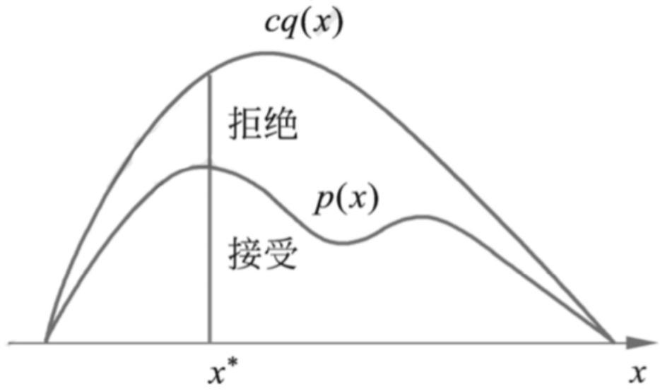

## 接受-拒绝法

输入：抽样的目标概率分布的概率密度函数 $p ( x )$

输出：概率分布的随机样本 $x _ { 1 } , x _ { 2 } , \cdots , x _ { n }$

参数：样本数n

（1）选择概率密度函数为 $q ( x )$ 的概率分布，作为建议分布，使其对任一x满足$c q ( x ) \geqslant p ( x )$ ，其中 $c > 0$ 。

（2）按照建议分布 $q ( x )$ 随机抽样得到样本 $x ^ { * }$ ，再按照均匀分布在 (0,1)范围内抽样得到u。

（3）如果 $u \leqslant \frac { p ( x ^ { * } ) } { c q ( x ^ { * } ) }$ ，则将 $x ^ { * }$ 作为抽样结果；否则，回到步骤 (2)。

（4）直至得到n个随机样本，结束。

## 接受-拒绝法

·接受-拒绝法的优点是容易实现，缺点是效率可能不高

·如果p(x)的涵盖体积点cq(x)的涵盖体积的比例很低，就会导致拒绝的比例很高，抽样效率很低。

·注意，一般是在高维空间进行抽样，即使p(x)与cq(x)很接近，两者涵盖体积的差異也可能很大

## 数学期望佑计

• 一般的蒙特卡罗法也可以用于数学期望估计(estimation ofmathematical expectation)。

•假设有随机变量x，取值x∈x，其概率密度函数为p(x)，f(x)为定义在X上的函数

·目标是求函数f(x) 关于密度函数p(x)的数学期望 $E _ { p ( x ) } [ f ( x ) ]$

## 数学期望佑计

·针对这个问题，蒙特卡罗法按照概率分布p(x)独立地抽取n个样本$x _ { 1 } , x _ { 2 } , \cdots , x _ { n }$ ，比如用以上的抽样方法，之后计算函数f(×)的样本均值 $\hat { f } _ { n }$

$$
{ \hat { f } } _ { n } = { \frac { 1 } { n } } \sum _ { i = 1 } ^ { n } f ( x _ { i } )
$$

・作为数学期望 $E _ { p ( x ) } [ f ( x ) ]$ 的近似值

・根据大数定律可知，当样本容量增大时，样本均值以概率1收敛于数学期望： ${ \hat { f } } _ { n } \to E _ { p ( x ) } [ f ( x ) ] , \quad n \to \infty$

• 这样就得到了数学期望的近似计算方法：

$$
E _ { p ( x ) } [ f ( x ) ] \approx { \frac { 1 } { n } } \sum _ { i = 1 } ^ { n } f ( x _ { i } )
$$

## 积分计算

• 一般的蒙特卡罗法也可以用于定积分的近似计算，称为蒙特卡罗积分(Monte Carlo integration)

·假设有一个函数h(x)，目标是计算该函数的积分 $\int _ { \mathcal { X } } h \left( x \right) \mathrm { d } x$

·如果能够将函数b(x)分解成一个函数f(x)和一个概率密度函数p(x)的乘积的形式，那么就有

$$
\int _ { \mathcal { X } } h \left( \boldsymbol { x } \right) \mathrm { d } \boldsymbol { x } = \int _ { \mathcal { X } } f \left( \boldsymbol { x } \right) p \left( \boldsymbol { x } \right) \mathrm { d } \boldsymbol { x } = E _ { p \left( \boldsymbol { x } \right) } \left[ f ( \boldsymbol { x } ) \right]
$$

•于是函数h(x)的积分可以表示为函数f(x)关于概率密度函数p(x)的数学期望。

## 积分计算

•给定一个概率密度函数p(x)，只要取 $f ( x ) = { \frac { h ( x ) } { p ( x ) } }$

•就可得

$$
\int _ { \mathcal { X } } h \left( \boldsymbol { x } \right) \mathrm { d } \boldsymbol { x } = \int _ { \mathcal { X } } f \left( \boldsymbol { x } \right) p \left( \boldsymbol { x } \right) \mathrm { d } \boldsymbol { x } = E _ { p \left( \boldsymbol { x } \right) } \left[ f ( \boldsymbol { x } ) \right]
$$

·就是说，，任何一个函数的积分都可以表示为某一个函数的数学期望的形式，而函数的数学期望 又可以通过函数的样本均值估计

•于是，就可以利用样本均值来近似计算积分

## 例

•用蒙特卡罗积分法求

$$
\int _ { 0 } ^ { 1 } \mathrm { e } ^ { - x ^ { 2 } / 2 } \mathrm { d } x
$$

令 $f ( x ) = \mathrm { e } ^ { - x ^ { 2 } / 2 }$

$$
p ( x ) = 1 \quad ( 0 < x < 1 )
$$

•也就是说，假设随机变量×在(0,1)区间遵循均匀分布

## 例

·使用蒙特卡罗积分法，如图所示，在(0,1)区间按照均匀分布抽取10个随机样本 $x _ { 1 } , x _ { 2 } , \cdots , x _ { 1 0 }$ 。计算样本的函数均值fo

•也就是积分的近似

$$
\hat { f } _ { 1 0 } = \frac { 1 } { 1 0 } \sum _ { i = 1 } ^ { 1 0 } \mathrm { e } ^ { - x _ { i } ^ { 2 } / 2 } = 0 . 8 3 2
$$

•随机样本数越大，计算就越精确

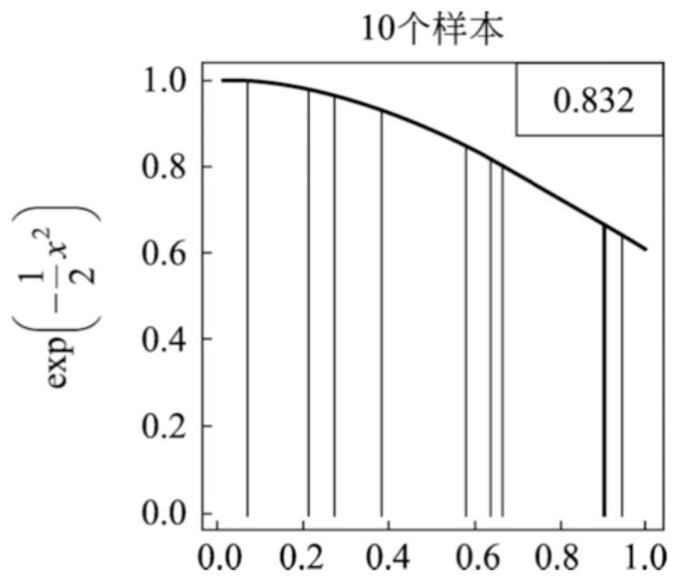

## 例

•用蒙特卡罗积分法求

$$
\int _ { - \infty } ^ { \infty } x { \frac { 1 } { { \sqrt { 2 \pi } } } } \exp \left( { \frac { - x ^ { 2 } } { 2 } } \right) \mathrm { d } x ,
$$

令 $f ( x ) = x$

$$
p ( x ) = { \frac { 1 } { \sqrt { 2 \pi } } } \exp \left( { \frac { - x ^ { 2 } } { 2 } } \right)
$$

• p(x) 是标准正态分布的密度函数

·使用蒙特卡罗积分法，按照标准正态分布在区间（-∞，∞）抽样$x _ { 1 } , x _ { 2 } , \cdots , x _ { n }$ ，取其平均值，就得到要求的积分值。当样本增大时，积分值趋于0

## 马尔可夫链

## 基本定义

定义19.1（马尔可夫链）考虑一个随机变量的序列 $X = \{ X _ { 0 } , X _ { 1 } , \cdot \cdot \cdot , X _ { t } , \cdot \cdot \cdot \}$ ,这里 $X _ { t }$ 表示时刻t的随机变量， $t = 0 , 1 , 2 , \cdots { } _ { \mathrm { ~ } }$ 。每个随机变量 $X _ { t } \left( { \tau } = 0 , 1 , 2 , \cdots \right)$ 的取值集合相同，称为状态空间，表示为S。随机变量可以是离散的，也可以是连续的。以上随机变量的序列构成随机过程（stochastic process）。

假设在时刻0的随机变量 $X _ { 0 }$ 遵循概率分布 $P ( X _ { 0 } ) ~ = ~ \pi _ { 0 } ,$ ，称为初始状态分布。在某个时刻t≥1的随机变量 $X _ { t }$ 与前一个时刻的随机变量 $X _ { t - 1 }$ 之间有条件分布 $P ( X _ { t } | X _ { t - 1 } )$ ，如果 $X _ { t }$ 只依赖于 $X _ { t - 1 } ,$ 而不依赖于过去的随机变量$\{ X _ { 0 } , X _ { 1 } , \dotsb , X _ { t - 2 } \}$ ，这一性质称为马尔可夫性，即

$$
P ( X _ { t } | X _ { 0 } , X _ { 1 } , \cdot \cdot \cdot , X _ { t - 1 } ) = P ( X _ { t } | X _ { t - 1 } ) , \quad t = 1 , 2 , \cdot \cdot \cdot\tag{19.6}
$$

具有马尔可夫性的随机序列 $X = \{ X _ { 0 } , X _ { 1 } , \cdot \cdot \cdot , X _ { t } , \cdot \cdot \cdot \}$ 称为马尔可夫链（Markovchain)，或马尔可夫过程（Markov process）。条件概率分布 $P ( X _ { t } | X _ { t - 1 } )$ 称为马尔可夫链的转移概率分布。转移概率分布决定了马尔可夫链的特性。

## 基本定义

•马尔可夫性的直观解释是“未来只依赖于现在（假设现在已知），而与过去无关”

•若转移概率分布 $P ( X _ { t } | X _ { t - 1 } )$ 与t无关，即

$$
P ( X _ { t + s } | X _ { t - 1 + s } ) = P ( X _ { t } | X _ { t - 1 } ) , \quad t = 1 , 2 , \cdots ; \quad s = 1 , 2 , \cdots .
$$

·则称该马尔可夫链为时间齐次的马尔可夫链（(time homogenousMarkov chain)。

·以上定义的是一阶马尔可夫链，可以扩展到n阶马尔可夫链，满足n阶马尔可夫性

$$
P ( X _ { t } | X _ { 0 } X _ { 1 } \cdot \cdot \cdot X _ { t - 2 } X _ { t - 1 } ) = P ( X _ { t } | X _ { t - n } \cdot \cdot \cdot X _ { t - 2 } X _ { t - 1 } )
$$

## 离散状态马尔可夫链

•转移概率矩阵和状态分布

·离散状态马尔可夫链 $X = \{ X _ { 0 } , X _ { 1 } , \cdot \cdot \cdot , X _ { t } , \cdot \cdot \cdot \}$ 随机变量 $X _ { t } \ ( t = 0 , 1 , 2 , \cdots )$ 定义在离散空间S，转移概率分布可以由矩阵表示

·若马尔可夫链在时刻(t-1)处于状态j，在时刻t移动到状态i，将转移概率记作

$$
p _ { i j } = ( X _ { t } = i | X _ { t - 1 } = j ) , \quad i = 1 , 2 , \cdots ; \quad j = 1 , 2 , \cdot \cdot \cdot
$$

·满足

$$
p _ { i j } \geqslant 0 , \quad \sum _ { i } p _ { i j } = 1
$$

## 转移概率矩阵和状态分布

•马尔可夫链的转移概率 $\mathsf { p } _ { \mathsf { i } }$ 可以由矩阵表示，即

$$
P = { \left[ \begin{array} { l l l l } { p _ { 1 1 } } & { p _ { 1 2 } } & { p _ { 1 3 } } & { \cdots } \\ { p _ { 2 1 } } & { p _ { 2 2 } } & { p _ { 2 3 } } & { \cdots } \\ { p _ { 3 1 } } & { p _ { 3 2 } } & { p _ { 3 3 } } & { \cdots } \\ { \cdots } & { \cdots } & { \cdots } & { \cdots } \end{array} \right] }
$$

·称为马尔可夫链的转移概率矩阵，转移概率矩阵P满足条件

$$
p _ { i j } \geqslant 0 , \sum p _ { i j } = 1
$$

·这两个条件的矩阵称为随机矩阵(stochastic matrix)

•矩阵列元素之和为1

## 转移概率矩阵和状态分布

·考虑马尔可夫链 $X = \{ X _ { 0 } , X _ { 1 } , \cdot \cdot \cdot , X _ { t } , \cdot \cdot \cdot \}$ 在时刻 $t \left( t = 0 , 1 , 2 , \cdot \cdot \cdot \right)$ 的概率分布，称为时刻t的状态分布，记作

$$
\pi ( t ) = { \left[ \begin{array} { l } { \pi _ { 1 } ( t ) } \\ { \pi _ { 2 } ( t ) } \\ { \qquad \vdots } \end{array} \right] }
$$

·其中 $\pi _ { i } ( t )$ 其中时刻t状态为i的概率 $P ( X _ { t } = i )$

$$
\pi _ { i } ( t ) = P ( X _ { t } = i ) , \quad i = 1 , 2 , \cdot \cdot \cdot
$$

## 转移概率矩阵和状态分布

·特别地，马尔可夫链的初始状态分布可以表示为

$$
\pi ( 0 ) = { \left[ \begin{array} { l } { \pi _ { 1 } ( 0 ) } \\ { \pi _ { 2 } ( 0 ) } \\ { \phantom { - } \vdots } \end{array} \right] }
$$

·其中 $\pi _ { i } ( 0 )$ 表示时刻0状态为i的概率 $P ( X _ { 0 } = i )$ ，通常初始分布 $\pi ( 0 )$ 的向量只有一个分量是1，其余分量都是0，表示马尔可夫链从一个具体状态开始。

## 转移概率矩阵和状态分布

•有限离散状态的马尔可夫链可以由有向图表示

•结点表示状态，边表示状态之间的转移，边上的数值表示转移概率

•从一个初始状态出发，根据有向边上定义的概率在状态之间随机跳转（或随机转移），就可以产生状态的序列

·马尔可夫链实际上是刻 画随时间在状态之间转移的模型，假设未来的转移状态只依赖于现在的状态，而与过去的状态无关。

## 例

·自然语言处理、语音处理中经常用到语言模型(language model)，是建立在词表上的n阶马尔可夫链

•比如，在英语语音识别 中，语音模型产生出两个候选：“How torecognize speech”与“How to wreck a nice beach”要判断哪个可能性更大

·显然从语义的角度前者的可能性更大，语言模型可以帮助做出这个判断

## 例

·假设每个单词只依赖于其前面出现的单词，也就是说单词序列具有马尔可关性，那么可以定义一阶马尔可夫链，即语言模型，如下计算语句的概率

$$
\begin{array} { r l } & { \quad P ( w _ { 1 } w _ { 2 } \cdots w _ { s } ) } \\ & { = P ( w _ { 1 } ) P ( w _ { 2 } | w _ { 1 } ) P ( w _ { 3 } | w _ { 1 } w _ { 2 } ) \cdots P ( w _ { i } | w _ { 1 } w _ { 2 } \cdots w _ { i - 1 } ) \cdots P ( w _ { s } | w _ { 1 } w _ { 2 } \cdots w _ { s - 1 } ) } \\ & { = P ( w _ { 1 } ) P ( w _ { 2 } | w _ { 1 } ) P ( w _ { 3 } | w _ { 2 } ) \cdots P ( w _ { i } | w _ { i - 1 } ) \cdots P ( w _ { s } | w _ { s - 1 } ) } \end{array}
$$

•这黑第三个等式基于马尔可去链假设这个马尔可去链虫，状态空间为词表，一不位董上单词的产生贤依赖宇前一个位置的单词，需未依赖于更前面的单词。

· 以上是一阶 马尔可夫链，一般可以扩展到 n 阶马尔可夫链。

## 例

·语言模型的学习等价于确定马尔可夫链中的转移概率值，如果有充分的语料，转移概率可以直接从语料中估计

·直观上，“wreck a nice”出现之后，下面出现“beach”的概率极低，所以第二个语句的概率应该更小，从语言模型的角度看第一个语句的可能性更大

## 转移概率矩阵和状态分布

•马尔可夫链×在时刻t的状态分布，可以由在时刻(t - 1) 的状态分布以及转移概率分布决定

$$
\pi ( t ) = P \pi ( t - 1 )
$$

•这是因为

$$
\begin{array} { l } { \pi _ { i } ( t ) = P ( X _ { t } = i ) \qquad } \\ { \qquad = \displaystyle \sum _ { m } P ( X _ { t } = i | X _ { t - 1 } = m ) P ( X _ { t - 1 } = m ) } \\ { \qquad = \displaystyle \sum _ { m } p _ { i m } \pi _ { m } ( t - 1 ) } \end{array}
$$

## 转移概率矩阵和状态分布

·马尔可夫链在时刻t的状态分布，可以通过递推得到。由

$$
\pi ( t ) = P \pi ( t - 1 ) = P ( P \pi ( t - 2 ) ) = P ^ { 2 } \pi ( t - 2 )
$$

•递推得到 π(t) = Ptπ(0)

·这里的Pt称为t步转移概率矩阵，

$$
P _ { i j } ^ { t } = P ( X _ { t } = i | X _ { 0 } = j )
$$

•表示时刻0从状态j出发，时刻t达到状态i的t步转移概率

•Pt也是随机矩阵。马尔可夫链的状态分布由初始分布和转移概率分布决定。

## 例

·假设观察某地的天气，按曰依次是“晴，雨，晴，晴，晴，雨，晴……”，具有一定的规律。

·假设天气的变化具有马尔可夫性，即明天的天气只依赖于今天的天气，而与昨天及以前的天气无关。

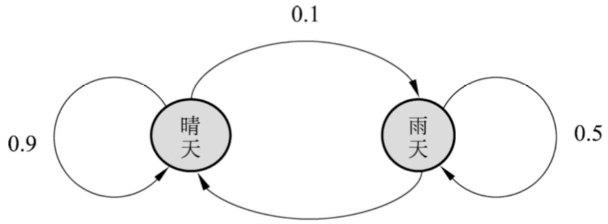

## 例

•转移矩阵为

$$
\begin{array} { r } { P = \left[ \begin{array} { l l } { 0 . 9 } & { 0 . 5 } \\ { 0 . 1 } & { 0 . 5 } \end{array} \right] } \end{array}
$$

•如果第一天是晴天的话，其天气概率分布（初始状态分布）如下：

$$
\pi ( 0 ) = { \left[ \begin{array} { l } { 1 } \\ { 0 } \end{array} \right] }
$$

## 例

·根据这个马尔可夫链模型，可以计算第二天、第三天及之后的天气概率分布 （状态分布)

$$
\pi ( 1 ) = P \pi ( 0 ) = { \left[ \begin{array} { l l } { 0 . 9 } & { 0 . 5 } \\ { 0 . 1 } & { 0 . 5 } \end{array} \right] } { \left[ \begin{array} { l } { 1 } \\ { 0 } \end{array} \right] } = { \left[ \begin{array} { l } { 0 . 9 } \\ { 0 . 1 } \end{array} \right] }
$$

$$
\pi ( 2 ) = P ^ { 2 } \pi ( 0 ) = { \left[ \begin{array} { l l } { 0 . 9 } & { 0 . 5 } \\ { 0 . 1 } & { 0 . 5 } \end{array} \right] } ^ { 2 } { \left[ \begin{array} { l } { 1 } \\ { 0 } \end{array} \right] } = { \left[ \begin{array} { l } { 0 . 8 6 } \\ { 0 . 1 4 } \end{array} \right] }
$$

## 平稳分布

定义19.2（平稳分布）设有马尔可夫链 $X = \{ X _ { 0 } , X _ { 1 } , \cdot \cdot \cdot , X _ { t } , \cdot \cdot \cdot \}$ ，其状态空间为S，转移概率矩阵为 $P = ( p _ { i j } )$ ，如果存在状态空间S上的一个分布

$$
\pi = { \left[ \begin{array} { l } { \pi _ { 1 } } \\ { \pi _ { 2 } } \\ { \vdots } \end{array} \right] }
$$

使得

$$
\pi = P \pi\tag{19.15}
$$

则称π为马尔可夫链 $X = \{ X _ { 0 } , X _ { 1 } , \cdot \cdot \cdot , X _ { t } , \cdot \cdot \cdot \}$ 的平稳分布。

•直观上，如果马尔可夫链的平稳分布存在，那么以该平稳分布作为初始分布，面向未来进行随机状态转移，之后任何一个时刻的状态分布都是该平稳分布

## 平稳分布

引理19.1给定一个马尔可夫链 $X = \{ X _ { 0 } , X _ { 1 } , \cdot \cdot \cdot , X _ { t } , \cdot \cdot \cdot \}$ ，状态空间为S，转移概率矩阵为 $P = ( p _ { i j } )$ ，则分布 ${ \boldsymbol \pi } = ( \pi _ { 1 } , \pi _ { 2 } , \cdot \cdot \cdot ) ^ { \mathrm { T } }$ 为X的平稳分布的充分必要条件是 ${ \boldsymbol { \pi } } = \left( \pi _ { 1 } , \pi _ { 2 } , \cdot \cdot \cdot \right) ^ { \mathrm { T } }$ 是下列方程组的解:

$$
x _ { i } = \sum _ { j } p _ { i j } x _ { j } , \quad i = 1 , 2 , \cdot \cdot \cdot\tag{19.16}
$$

$$
x _ { i } \geqslant 0 , \quad i = 1 , 2 , \cdot \cdot \cdot\tag{19.17}
$$

$$
\sum _ { i } x _ { i } = 1\tag{19.18}
$$

## 平稳分布

•证明-必要性

·假设 ${ \boldsymbol { \pi } } ~ = ~ \left( \pi _ { 1 } , \pi _ { 2 } , \cdot \cdot \cdot \right) ^ { \mathrm { T } }$ 是平稳分布，显然满足式(19.17)和式(19.18)。

$$
\pi _ { i } = \sum _ { j } p _ { i j } \pi _ { j } , \quad i = 1 , 2 , \cdot \cdot \cdot
$$

•即

$$
{ \boldsymbol { \pi } } = \left( \pi _ { 1 } , \pi _ { 2 } , \cdot \cdot \cdot \right) ^ { \mathrm { { T } } }
$$

•满足式(19.16)

## 平稳分布

•证明-充分性

·由式（19.17）和式（19.18）知 ${ \boldsymbol { \pi } } ~ = ~ \left( \pi _ { 1 } , \pi _ { 2 } , \cdot \cdot \cdot \right) ^ { \mathrm { T } }$ 是一概率分布

·假设 ${ \boldsymbol { \pi } } ~ = ~ \left( \pi _ { 1 } , \pi _ { 2 } , \cdot \cdot \cdot \right) ^ { \mathrm { T } }$ 为 $X _ { \mathrm { t } }$ 的分布，则

$$
P ( X _ { t } = i ) = \pi _ { i } = \sum _ { j } p _ { i j } \pi _ { j } = \sum _ { j } p _ { i j } P ( X _ { t - 1 } = j ) , \quad i = 1 , 2 , \cdot \cdot \cdot
$$

${ \boldsymbol { \pi } } ~ = ~ \left( \pi _ { 1 } , \pi _ { 2 } , \cdot ~ { \boldsymbol { \cdot } } ~ { \boldsymbol { \cdot } } \right) ^ { \mathrm { T } }$ 也为 $X _ { \pm 1 }$ 的分布，这对任意t成立

•所以 ${ \boldsymbol { \pi } } ~ = ~ \left( \pi _ { 1 } , \pi _ { 2 } , \cdot ~ { \boldsymbol { \cdot } } ~ { \boldsymbol { \cdot } } \right) ^ { \mathrm { T } }$ 是马尔可夫链的平稳分布

## 例

•设有图上所示马尔可夫链，其转移概率矩阵为

$$
P = { \left[ \begin{array} { l l l } { 1 / 2 } & { 1 / 2 } & { 1 / 4 } \\ { 1 / 4 } & { 0 } & { 1 / 4 } \\ { 1 / 4 } & { 1 / 2 } & { 1 / 2 } \end{array} \right] }
$$

•求其平稳分布

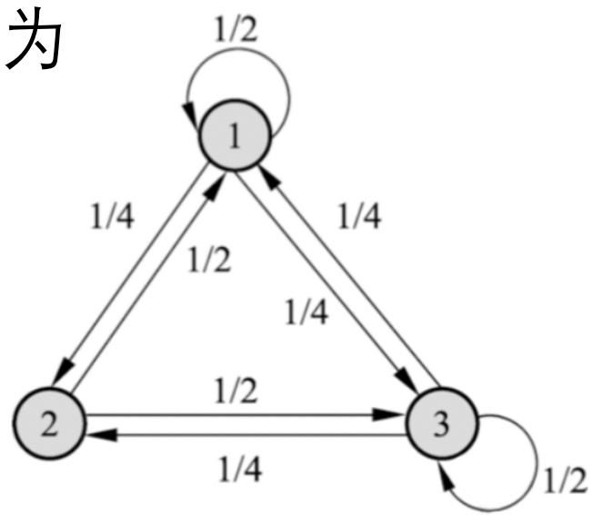

## 例

·设平稳分布为 ${ \boldsymbol { \pi } } = ( x _ { 1 } , x _ { 2 } , x _ { 3 } ) ^ { \mathrm { T } }$ ，则由式 (19.16)\~式 (19.18)有

$$
x _ { 1 } = \frac { 1 } { 2 } x _ { 1 } + \frac { 1 } { 2 } x _ { 2 } + \frac { 1 } { 4 } x _ { 3 }
$$

$$
x _ { 2 } = { \frac { 1 } { 4 } } x _ { 1 } + { \frac { 1 } { 4 } } x _ { 3 }
$$

$$
x _ { 3 } = \frac { 1 } { 4 } x _ { 1 } + \frac { 1 } { 2 } x _ { 2 } + \frac { 1 } { 2 } x _ { 3 }
$$

$$
x _ { 1 } + x _ { 2 } + x _ { 3 } = 1
$$

$$
x _ { i } \geqslant 0 , \quad i = 1 , 2 , 3
$$

·解方程组，得到唯一的平稳分布 $\pi = ( 2 / 5 \quad 1 / 5 \quad 2 / 5 ) ^ { \mathrm { T } }$

## 例

·设有图上所示马尔可夫链，其转移概率分布如下，求其平稳分布。

$$
\left[ \begin{array} { l l l } { 1 } & { 1 / 3 } & { 0 } \\ { 0 } & { 1 / 3 } & { 0 } \\ { 0 } & { 1 / 3 } & { 1 } \end{array} \right]
$$

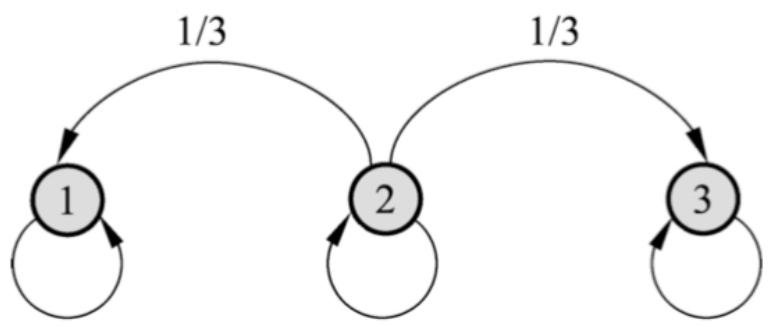  
1/3

## 例

•这个马尔可夫链的平稳分布并不唯一

$$
\pi = \left( 3 / 4 \ : \mathrm { ~ 0 ~ } \ : 1 / 4 \right) ^ { \mathrm { T } } , \pi = \left( 2 / 3 \ : \mathrm { ~ 0 ~ } \ : 1 / 3 \right) ^ { \mathrm { T } }
$$

•等皆为其平稳分布。

•马尔可夫链可能存在唯一平稳分布，无穷多个平稳分布，或不存在平稳分布

## 连续状态马尔可夫链

·连续状态马尔可夫链 $X = \{ X _ { 0 } , X _ { 1 } , \cdot \cdot \cdot , X _ { t } , \cdot \cdot \cdot \}$ ，随机变量 $X _ { t } ( t = 0 , 1 , 2 , \cdots )$ 定义在连续状态空间S

·转移概率分布由概率转移核或转移核(transition kernel）表示。

• 设S是连续状态空间，对任意的 $x \in { \mathcal { S } } , A \subset { \mathcal { S } }$ 定义为

$$
P ( x , A ) = \int _ { A } p ( x , y ) \mathrm { d } y
$$

·其中 $p ( x , \cdot )$ 是概率密度函数，满足 $p ( x , \bullet ) \geqslant 0 , P ( x , \pmb { \mathscr { S } } ) = \int _ { \mathscr { S } } p \left( x , y \right) \mathrm { d } y = 1$

## 连续状态马尔可夫链

·转移核 $P ( x , A )$ 表示从×\~A的转移概率

$$
P \left( X _ { t } = A | X _ { t - 1 } = x \right) = P ( x , A )
$$

·有时也将概率密度函数 p(α，·）称为转移核

·若马尔可夫链的状态空间S上的概率分布π(x）满足条件

$$
\pi ( y ) = \int p ( x , y ) \pi ( x ) \mathrm { d } x , \quad \forall y \in \mathcal { S }
$$

•则称分部 π(x）为该马尔可夫链的平稳分布。等价地， $\pi = P \pi$ 或写为

$$
\pi ( A ) = \int P ( x , A ) \pi ( x ) \mathrm { d } x , \quad \forall A \subset \mathcal { S }
$$

## 马尔可夫链的性质

定义19.3（不可约）设有马尔可夫链 $X = \{ X _ { 0 } , X _ { 1 } , \cdot \cdot \cdot , X _ { t } , \cdot \cdot \cdot \}$ ，状态空间为S，对于任意状态 $i , j \in S$ ，如果存在一个时刻t(t>0)满足

$$
P \left( X _ { t } = i \vert X _ { 0 } = j \right) > 0\tag{19.24}
$$

也就是说，时刻0从状态j出发，时刻t 到达状态i的概率大于0，则称此马尔可夫链X是不可约的（irreducible），否则称马尔可夫链是可约的（reducible）。

·真观上：一个不可约的马尔可夫链，从任意状态出发，当经过充分长时间后，可以到达任意状态

## 例

·图上所示马尔可夫链是可约的

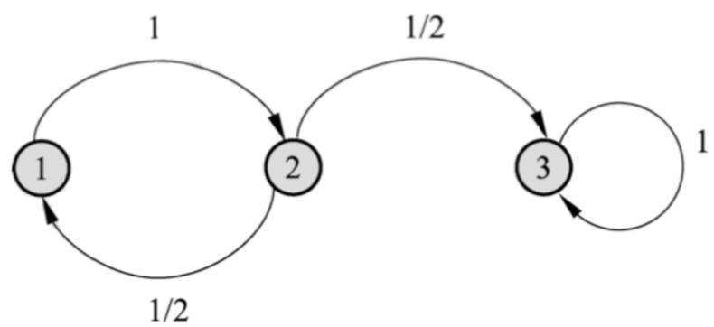

•转移概率矩阵 $\left[ \begin{array} { l l l } { 0 } & { 1 / 2 } & { 0 } \\ { 1 } & { 0 } & { 0 } \\ { 0 } & { 1 / 2 } & { 1 } \end{array} \right]$ 平稳分布 $\pi = \left( 0 \quad 0 \quad 1 \right) ^ { \mathrm { T } }$

·此马尔可夫链，转移到状态3后，就在该状态上循环跳转，不能到达状态1和状态2，最终停留在状态3

## 马尔可夫链的性质

定义19.4（非周期）设有马尔可夫链 $X = \{ X _ { 0 } , X _ { 1 } , \cdot \cdot \cdot , X _ { t } , \cdot \cdot \cdot \}$ ，状态空间为S，对于任意状态 $i \in S ,$ 如果时刻0从状态i出发，t时刻返回状态的所有时间长 $\{ t : P ( X _ { t } = i | X _ { 0 } = i ) > 0 \}$ 的最大公约数是1，则称此马尔可夫链X是非周期的（aperiodic），否则称马尔可夫链是周期的（periodic）。

·直观上，一个非周期性的马尔可夫链，不存在一个状态，从这一个状态出发，再返回到这个状态时所经历的时间长呈一定的周期性

## 例

·图上所示的马尔可夫链是周期的

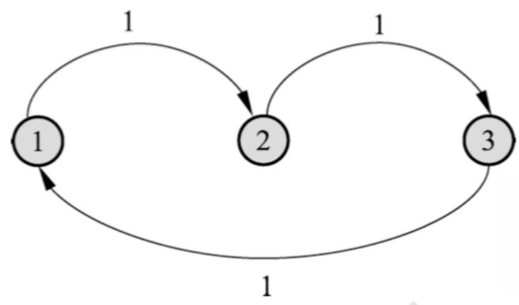

## 例

转移概率矩阵

$$
\left[ \begin{array} { l l l } { 0 } & { 0 } & { 1 } \\ { 1 } & { 0 } & { 0 } \\ { 0 } & { 1 } & { 0 } \end{array} \right]
$$

·其平稳分布是 $\pi = \left( 1 / 3 \quad 1 / 3 \quad 1 / 3 \right) ^ { \mathrm { T } } ,$ O 此马尔可夫链从每个状态出发，返回该状态的 时刻都是3的倍数，{3,6,9}，具有周期性，最终停留在每个状态的概率都为1/3.

定理19.2不可约且非周期的有限状态马尔可夫链，有唯一平稳分布存在。

## 马尔可夫链的性质

定义19.5（正常返）设有马尔可夫链 $X = \{ X _ { 0 } , X _ { 1 } , \cdot \cdot \cdot , X _ { t } , \cdot \cdot \cdot \}$ ，状态空间为S，对于任意状态 $i , j \in S ,$ 定义概率 $p _ { i j } ^ { t }$ 为时刻0从状态 $j$ 出发，时刻t首次转移到状态i的概率，即 $p _ { i j } ^ { t } = P \left( X _ { t } = i , X _ { s } \neq i , s = 1 , 2 , \cdots , t - 1 | X _ { 0 } = j \right) , t = 1 , 2 , \cdots$ 若对所有状态 $i , j$ 都满足 $\operatorname* { l i m } _ { t \to \infty } p _ { i j } ^ { t } > 0 .$ ，则称马尔可夫链X是正常返的（positiverecurrent ) .

·直观上，一个正常返的马尔可夫链，其中任意一个状态，从其他任意一个状态出发，当时间趋于无穷时，首次转移到这个状态的概率不为0。

## 例

·图上所示无限状态马尔可夫链，当p>q时是正常返的，当p≤q不是正常返的。

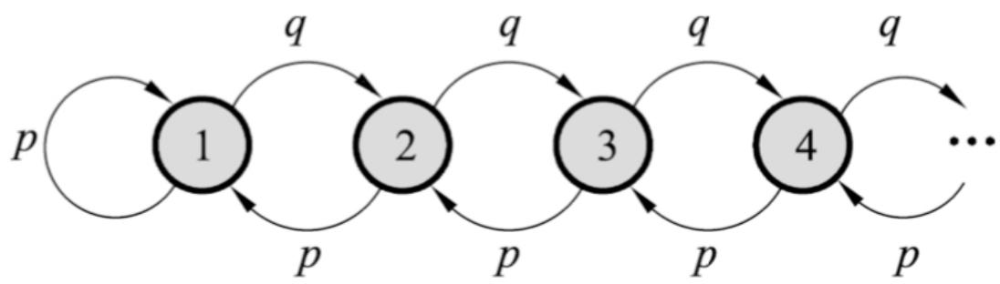  
p+q=1

## 例

•转移概率矩阵

$$
\left[ \begin{array} { l l l l l } { p } & { p } & { 0 } & { 0 } \\ { q } & { 0 } & { p } & { 0 } & \\ { 0 } & { q } & { 0 } & { p } & \\ { 0 } & { 0 } & { q } & { 0 } & \\ & & & & { \ddots } \end{array} \right]
$$

·当 $\mathsf { p } > \mathsf { q }$ 时，平稳分布是 $\pi _ { i } = \left( { \frac { q } { p } } \right) ^ { i } \left( { \frac { p - q } { p } } \right)$ $i = 1 , 2 ,$

·当时间趋于无穷时，转移到任何一个状态的概率不为0，马尔可夫链是正常返的

·当 $\mathsf { p } \leqslant \mathsf { q }$ 时，不存在平稳分布，马尔可夫链不是正常返的。

定理19.3不可约、非周期且正常返的马尔可夫链，有唯一平稳分布存在。

## 马尔可夫链的性质

定理19.4（遍历定理）设有马尔可夫链 $X = \{ X _ { 0 } , X _ { 1 } , \cdot \cdot \cdot , X _ { t } , \cdot \cdot \cdot \}$ ，状态空间为S，若马尔可夫链X是不可约、非周期且正常返的，则该马尔可夫链有唯一平稳分布 ${ \boldsymbol \pi } = ( \pi _ { 1 } , \pi _ { 2 } , \cdot \cdot \cdot ) ^ { \mathrm { T } }$ ，并且转移概率的极限分布是马尔可夫链的平稳分布

$$
\operatorname * { l i m } _ { t  \infty } P ( X _ { t } = i | X _ { 0 } = j ) = \pi _ { i } , \quad i = 1 , 2 , \cdots ; \quad j = 1 , 2 , \cdots \tag{19.25}
$$

若 f(X)是定义在状态空间上的函数, $E _ { \pi } [ | f ( X ) | ] < \infty$ ，则

$$
{ \cal P } \{ \hat { f } _ { t } \to { \cal E } _ { \pi } [ f ( X ) ] \} = 1\tag{19.26}
$$

这里

$$
\hat { f } _ { t } = \frac { 1 } { t } \sum _ { s = 1 } ^ { t } f ( x _ { s } )
$$

Eπ[f(X)] = ∑f(i)πi 是 f(X) 关于平稳分布 ${ \boldsymbol \pi } = ( \pi _ { 1 } , \pi _ { 2 } , \cdot \cdot \cdot ) ^ { \mathrm { T } }$ 的数学期望，式i  
(19.26)表示

$$
\hat { f } _ { t } \to E _ { \pi } [ f ( X ) ] , \quad t \to \infty\tag{19.27}
$$

几乎处处成立或以概率 1成立。

## 马尔可夫链的性质

•遍历定理的直观解释：

·满足相应条件的马尔可夫链，当时间趋于无穷时，马尔可夫链的状态分布趋近于平稳分布，随机变量的函数的样本均值以概率1收敛于该函数的数学期望。

·样本均值可以认为是时间均值，而数学期望是空间均值。遍历定理实际表述了遍历性的含义：当时间趋于无穷时，时间均值等于空间均值。

·遍历定理的三个条件：不可约、非周期、正常返，保证了当时间趋于无穷时达到任意一个状态的概率不为0

## 马尔可夫链的性质

• 理论上并不知道经过多少次迭代，马尔可夫链的状态分布才能接近于平稳分布

•在实际应用遍历定理时，取一个足够大的整数m，经过m次迭代之后认为状态分布就是平稳分布

· 这时计算从第 m + 1次迭代到第n次迭代的均值，即

$$
{ \hat { E } } f = { \frac { 1 } { n - m } } \sum _ { i = m + 1 } ^ { n } f ( x _ { i } )
$$

## 马尔可夫链的性质

定义19.6（可逆马尔可夫链）设有马尔可夫链 $X = \{ X _ { 0 } , X _ { 1 } , \cdot \cdot \cdot , X _ { t } , \cdot \cdot \cdot \}$ ，状态空间为S，转移概率矩阵为P，如果有状态分布 ${ \boldsymbol \pi } = ( \pi _ { 1 } , \pi _ { 2 } , \cdot \cdot \cdot ) ^ { \mathrm { T } }$ ，对于任意状态$i , j \in S ,$ 对任意一个时刻t 满足

$$
P ( X _ { t } = i | X _ { t - 1 } = j ) \pi _ { j } = P ( X _ { t - 1 } = j | X _ { t } = i ) \pi _ { i } , \quad i , j = 1 , 2 , \cdot \cdot \cdot\tag{19.29}
$$

或简写为

$$
p _ { j i } \pi _ { j } = p _ { i j } \pi _ { i } , \quad i , j = 1 , 2 , \cdot \cdot \cdot\tag{19.30}
$$

则称此马尔可夫链X为可逆马尔可夫链（reversible Markov chain)，式(19.30)称为细致平衡方程（detailed balance equation）。

·直观上，如果有可逆的马尔可夫链，那么以该马尔可夫链的平稳分布作为初始分布，进行随机状态转移，无论是面向未来还是面向过去，任何一个时刻的状态分布都是该平稳分布。

## 例

•图上所示马尔可夫链是不可逆的

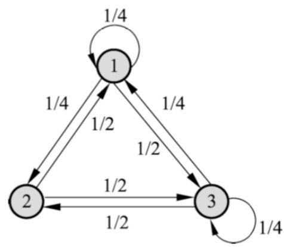

•平稳分布 $\pi = \left( 8 / 2 5 \quad 7 / 2 5 \quad 2 / 5 \right) ^ { \mathrm { T } }$

•不满足细致平稳方程

转移概率矩阵

$$
\left[ { \begin{array} { c c c } { 1 / 4 } & { 1 / 2 } & { 1 / 4 } \\ { 1 / 4 } & { 0 } & { 1 / 2 } \\ { 1 / 2 } & { 1 / 2 } & { 1 / 4 } \end{array} } \right]
$$

## 马尔可夫链的性质

定理19.5（细致平衡方程）满足细致平衡方程的状态分布π就是该马尔可夫链的平稳分布。即

$$
P \pi = \pi
$$

证明事实上

$$
( P \pi ) _ { i } = \sum _ { j } p _ { i j } \pi _ { j } = \sum _ { j } p _ { j i } \pi _ { i } = \pi _ { i } \sum _ { j } p _ { j i } = \pi _ { i } , \quad i = 1 , 2 , \cdot \cdot \cdot\tag{19.31}
$$

•可:马尔可夫链一定有唯一平稳分布，给出了一个马尔可夫链有平稳分布的充分条件(不是必要条件)。

·也就是说，可逆马尔可夫链满足遍历定理19.4 的条件。

## 马尔可夫链蒙特卡罗法

## 基本想法

•马尔可夫链蒙特卡罗法更适合于随机变量是多元的、密度函数是非标准形式的、随机变量各分量不独立等情况

·假设多元随机变量×，满足 $x \in \mathcal { X }$ ，其概率密度函数为p(x)，f(x)为定义在 $x \in \mathcal { X }$ 上的函数

• 目标是获得概率分布p(x)的样本集合，以及求函数f(x)的数学期望

$$
E _ { p ( x ) } [ f ( x ) ]
$$

## 基本想法

· 马尔可夫链蒙特卡罗法的基本想法:

•在随机变量×的状态空间S上定义一个满足遍历定理的马尔可夫链$X = \{ X _ { 0 } , X _ { 1 } , \cdot \cdot \cdot , X _ { t } , \cdot \cdot \cdot \}$ ，使其平稳分布就是抽样的目标分布p(x)

•然后在这个马尔可夫链上进行随机游走，每个时刻得到一个样本

•根据遍历定理，当时间趋于无穷时，样本的分布趋近平稳分布，样本的函数均值趋近函数的数学期望

## 基本想法

·所以，当时间足够长时(时刻大于某个正整数m)，在之后的时间（时刻小于等于某个正整数n，n>m）里随机游走得到的样本集合 $\{ x _ { m + 1 } , x _ { m + 2 } , \cdot \cdot \cdot , x _ { n } \}$ 就是目标概率分布的抽样结果

·得到的函数均值（遍历均值）就是要计算的数学期望值：

$$
{ \hat { E } } f = { \frac { 1 } { n - m } } \sum _ { i = m + 1 } ^ { n } f ( x _ { i } )
$$

·到时刻m为止的时间段称为燃烧期

## 基本想法

• 构建具体的马尔可夫链：

•连续变量的时候，需要定义转移核函数

• 离散变量的时候，需要定义转移矩阵

·一个方法是定义特殊的转移核函数或者转移矩阵，构建可逆马尔可夫链，这样可以保证遍历定理成立。

·常用的马尔可夫链蒙特卡罗法有Metropolis-Hastings算法、吉布斯抽样。

·由于这个马尔可夫链满足遍历定理，随机游走的起始点并不影响得到的结果，即从不同的起始点出发，都会收敛到同一平稳分布。

## 基本想法

·马尔可夫链蒙特卡罗法的收敛性的判断通常是经验性的

•比如，在马尔可夫链上进行随机游走，检验遍历均值是否收敛

·具体地，每隔一段时间取一次样本，得到多个样本以后，计算遍历均值

• 当计算的均值稳定后，认为马尔可夫链已经收敛

·再比如，在马尔可夫链上并行进行多个随机游走，比较各个随机游走的遍历均值是否接近一致。

## 基本想法

・马尔可夫链蒙特卡罗法中得到的样本序列，相邻的样本点是相关的，而不是独立的

・因此，在需要独立样本时，可以在该样本序列中再次进行随机抽样

・比如每隔一段时间取一次样本，将这样得到的子样本集合作为独立样本集合。

·马尔可夫链蒙特卡罗法比接受-拒绝法更容易实现，因为只需要定义马尔可夫链，而不需要定义建议分布

• 一般来说马尔可夫链蒙特卡罗法比接受-拒绝法效率更高，没有大量被拒绝的样本，虽然燃烧期的样本也要拋弃

## 基本步骤

•可以将马尔可夫链蒙特卡罗法概括为以下三步：

• (1）\_首先，在随机变量×的状态空间S上构造一个满足遍历定理的马尔可夫链，使其平稳分布为目标分布p(x)

• （2）从状态空间的某一点 $\mathsf { X } _ { 0 }$ 出发，用构造的马尔可夫链进行随机游走，产生样本序列 x0,x1,…,xt,…。

• (3）应用马尔可夫链的遍历定理，确定正整数m和n，(m<n)，得到样本集合$\{ x _ { m + 1 } , x _ { m + 2 } , \cdot \cdot \cdot , x _ { n } \}$ 求得函数f(x)的均值 (遍历均值)

$$
{ \hat { E } } f = { \frac { 1 } { n - m } } \sum _ { i = m + 1 } ^ { n } f ( x _ { i } )
$$

## 马尔可夫链蒙特卡罗法与统计学习

·假设观测数据由随机变量，y∈y表示，模型由随机变量x∈x表示，贝叶斯学习通过贝叶斯定理计算给定数据条件下模型的后验概率，并选择后验概率最大的模型

·后验概率 $p ( x | y ) = \frac { p ( x ) p ( y | x ) } { \displaystyle \int _ { \chi } p ( y | x ^ { \prime } ) p ( x ^ { \prime } ) \mathrm { d } x ^ { \prime } }$

· 贝叶斯学习中经常需要进行三种积分运算：

•归范化 (normalization)

·边缘化（marginalization)

•数学期望 (expectation)

## 马尔可夫链蒙特卡罗法与统计学习

• 后验概率计算中需要归范化计算： $\int _ { \mathcal { X } } p ( y | x ^ { \prime } ) p ( x ^ { \prime } ) \mathrm { d } x ^ { \prime }$

・如果有隐变量 $z \in { \mathcal { Z } }$ ，后验概率的计算需要边缘化计算：

$$
p ( x | y ) = \int _ { \mathcal Z } p ( x , z | y ) \mathrm { d } z
$$

•如果有一个函数f(x)，可以计算该函数的关于后验概率分布的数学期望：

$$
E _ { P ( x | y ) } [ f ( x ) ] = \int _ { \chi } f ( x ) p ( x | y ) \mathrm { d } x
$$

•马尔可夫链蒙特卡岁法为这些计算提供了一个通用的有效解决方案

## Metropolis-Hastings算法

## 基本原理

•1.马尔科夫链

·假设要抽样的概率分布为p(x)。Metropolis-Hastings算法采用转移 核为p(x,x)的马尔可夫链

$$
p ( x , x ^ { \prime } ) = q ( x , x ^ { \prime } ) \alpha ( x , x ^ { \prime } )
$$

·其中g(x,×)和α(x,×)分别称为建议分布（proposal distribution)和接受分布(acceptance distribution)

## 基本原理

·建议分布 $\mathsf { q } ( \mathsf { x } , \mathsf { x } ^ { \prime } )$ 是另一个马尔可夫链的转移核，并且 $\mathsf { { Q } } ( \mathsf { { X } } , \mathsf { { X } } ^ { \prime } )$ 是不可约的，即其概率值恒不为0，同时是一个容易抽样的分布。

•接受分布 $\mathbb { \alpha } ( \times , \times ^ { \prime } )$ 是

$$
\alpha ( x , x ^ { \prime } ) = \operatorname* { m i n } \left\{ 1 , { \frac { p ( x ^ { \prime } ) q ( x ^ { \prime } , x ) } { p ( x ) q ( x , x ^ { \prime } ) } } \right\}
$$

·这时，转移核 $\mathsf { p } ( \mathsf { x } , \mathsf { x } ^ { \prime } )$ 可以写成

$$
p ( x , x ^ { \prime } ) = \left\{ \begin{array} { l l } { \displaystyle q ( x , x ^ { \prime } ) , } & { p ( x ^ { \prime } ) q ( x ^ { \prime } , x ) \geqslant p ( x ) q ( x , x ^ { \prime } ) } \\ { \displaystyle q ( x ^ { \prime } , x ) \frac { p ( x ^ { \prime } ) } { p ( x ) } , } & { p ( x ^ { \prime } ) q ( x ^ { \prime } , x ) < p ( x ) q ( x , x ^ { \prime } ) } \end{array} \right.
$$

## 基本原理

·转移核为 $\mathsf { p } ( \mathsf { x } , \mathsf { x } ^ { \prime } )$ 的马尔可夫链上的随机游走以以下方式进行

·如果在时刻(t-1)处于状态x，即 $\sf X _ { [ - 1 } = \sf X$ 则先按建议分布 $\mathsf { q } ( \mathsf { X } , \mathsf { X } ^ { \prime } )$ 抽样产生一个候选状态x，然后按照接受分布α(x，×)抽样决定是否接受状态x'

•以概率α(x,×)接受了x，决定时刻t转移到状态x'，而以概率 $1 - \alpha ( x ,$ ×)拒绝x，决定时刻t仍停留在状态x

## 基本原理

•具体地，从区间(0,1)上的均匀分布中抽取一个随机数u，决定时刻t的状态。

$$
x _ { t } = { \left\{ \begin{array} { l l } { x ^ { \prime } , } & { u \leqslant \alpha ( x , x ^ { \prime } ) } \\ { x , } & { u > \alpha ( x , x ^ { \prime } ) } \end{array} \right. }
$$

·可以证明，转移核为p(x，x)的马尔可夫链是可逆马尔可夫链（满足遍历定理），其平稳分布就是p(x)，即要抽样的自标分布。

●也就是说这是马尔可夫链蒙特卡罗法的一个具体实现。

## 基本原理

定理19.6由转移核 (19.38)～(19.40)构成的马尔可夫链是可逆的，即

$$
p ( x ) p ( x , x ^ { \prime } ) = p ( x ^ { \prime } ) p ( x ^ { \prime } , x )
$$

并且p(x)是该马尔可夫链的平稳分布。

## 基本原理

•证明：

•若 $\mathbf { \nabla \times } = \mathbf { \nabla \times } ^ { \prime }$ 则式(19.41)显然成立。

$$
\mathbf { \nabla \times } \ne \mathbf { \nabla \times } 
$$

·式 (19.41)

$$
\begin{array} { r l } & { p ( x ) p ( x , x ^ { \prime } ) = p ( x ) q ( x , x ^ { \prime } ) \operatorname* { m i n } \left. 1 , \frac { p ( x ^ { \prime } ) q ( x ^ { \prime } , x ) } { p ( x ) q ( x , x ^ { \prime } ) } \right. } \\ & { \qquad = \operatorname* { m i n } \left. p ( x ) q ( x , x ^ { \prime } ) , p ( x ^ { \prime } ) q ( x ^ { \prime } , x ) \right. } \\ & { \qquad = p ( x ^ { \prime } ) q ( x ^ { \prime } , x ) \operatorname* { m i n } \left. \frac { p ( x ) q ( x , x ^ { \prime } ) } { p ( x ^ { \prime } ) q ( x ^ { \prime } , x ) } , 1 \right. } \\ & { \qquad = p ( x ^ { \prime } ) p ( x ^ { \prime } , x ) } \end{array}
$$

## 基本原理

·由式(19.41)知，

$$
\begin{array} { l } { \displaystyle \int p ( \boldsymbol { x } ) p ( \boldsymbol { x } , \boldsymbol { x ^ { \prime } } ) \mathrm { d } \boldsymbol { x } = \int p ( \boldsymbol { x ^ { \prime } } ) p ( \boldsymbol { x ^ { \prime } } , \boldsymbol { x } ) \mathrm { d } \boldsymbol { x } } \\ { \displaystyle \qquad = p ( \boldsymbol { x ^ { \prime } } ) \int p ( \boldsymbol { x ^ { \prime } } , \boldsymbol { x } ) \mathrm { d } \boldsymbol { x } } \\ { \displaystyle \qquad = p ( \boldsymbol { x ^ { \prime } } ) } \end{array}
$$

·根据平稳分布的定义，p(x)是马尔可夫链的平稳分布。

## 基本原理

• 2.建议分部

·建议分部 $\mathsf { q } ( \mathsf { x } , \mathsf { x } ^ { \prime } )$ 有多种可能的形式，这里介绍两种常用形式

·第一种形式，假设建议分布是对称的，即对任意的×和x有$\boldsymbol { q } ( x , x ^ { \prime } ) = \boldsymbol { q } ( x ^ { \prime } , x )$

•这样的建议分布称为Metropolis选择。这时，接受分部 $\zeta \alpha ( { \sf x } , { \sf x ^ { \prime } } )$ 简   
花为 α(x, = min 1, (x)))

## 基本原理

•Metropolis选择的一个特例是q(x, x)取条件概率分布p(xjx)，定义为多元正态分布，其均值是×，其协方差矩阵是常数矩阵。

•Metropolis选择的另一个特例是令 ${ \sf q } ( { \sf x } , { \sf x } ^ { \prime } ) = { \sf q } ( \mathrm {  ~ \sf X } - { \sf X } ^ { \prime } | \mathrm {  ~ \biggr ) }$ ，这时算法称为随机游走Metropolis算法。例如，

$$
q ( x , x ^ { \prime } ) \propto \exp ( - \frac { ( x ^ { \prime } - x ) ^ { 2 } } { 2 } )
$$

·Metropolis选择的特点是当x与×接近时， $\mathsf { q } ( \mathsf { x } , \mathsf { x } ^ { \prime } )$ 的概率值高，否则 $\mathsf { q } ( \mathsf { x } , \mathsf { x } ^ { \prime } )$ 的概率值低。状态转移在附近点的可能性更大。

## 基本原理

·第二种形式称为独立抽样。假设q(x,x)与当前状态x无关，即 ${ \sf q } ( { \sf x } , { \sf x } ^ { \prime } ) =$ q(x)

•建分布的计算按照q(x)独立抽样进行。此时，接受分布α(x,x)可以写成

$$
\alpha ( x , x ^ { \prime } ) = \operatorname* { m i n } \left\{ 1 , \frac { w ( x ^ { \prime } ) } { w ( x ) } \right\}
$$

·其中

$$
w ( x ^ { \prime } ) = p ( x ^ { \prime } ) / q ( x ^ { \prime } ) , \ w ( x ) = p ( x ) / q ( x ) ,
$$

·独立抻样密现简单，但可能收敛速度慢，通常选择接近目标分布p(x)的芬布作为建议分布 ${ \sf { q } } ( { \sf { x } } )$

## 基本原理

• 3.满条件分部

•马尔可夫链蒙特卡罗法的目标分布通常是多元联合概率分布$p ( { \boldsymbol { x } } ) = p ( x _ { 1 } , x _ { 2 } , \cdot \cdot \cdot , x _ { k } )$ ，其中 $\boldsymbol { x } = ( x _ { 1 } , x _ { 2 } , \cdot \cdot \cdot , x _ { k } ) ^ { \mathrm { T } }$ 为k维随机变量

•如果条件概率分布 $p ( x _ { I } | x _ { - I } )$ 中所有k个变量全部出现，其中$x _ { I } = \{ x _ { i } , i \in I \} , x _ { - I } = \{ x _ { i } , i \notin I \} , I \subset K = \{ 1 , 2 , \cdots , k \}$ 那么称这种条件概率分布为满条件分布（full conditional distribution)。

## 基本原理

·满条件分布有以下性质：对任意的 $x , x ^ { \prime } \in \mathcal { X }$ 和任意的 $I \subset K$ ，有

$$
p \left( x _ { I } | x _ { - I } \right) = \frac { p ( x ) } { \displaystyle \frac { p ( x _ { I } ^ { \prime } | x _ { - I } ^ { \prime } ) } { p ( x _ { I } | x _ { - I } ) } \ x _ { I } } \propto p ( x )
$$

•而且，对任意的 $x , x ^ { \prime } \in \mathcal { X }$ 和任意的 $I \subset K$ ，有

$$
\frac { p ( x _ { I } ^ { \prime } | x _ { - I } ^ { \prime } ) } { p ( x _ { I } | x _ { - I } ) } = \frac { p ( x ^ { \prime } ) } { p ( x ) }
$$

## 基本原理

·Metropolis-Hastings算法中，可以利用上述性质，简化计算，提高计算效率。具体地，通过满条件分布概率的比

$$
\frac { p ( x _ { I } ^ { \prime } | x _ { - I } ^ { \prime } ) } { p ( x _ { I } | x _ { - I } ) }
$$

•计算联合概率的比

$$
\frac { p ( x ^ { \prime } ) } { p ( x ) }
$$

• 而前者更容易计算

## 例

·设 $\mathsf { X } _ { 1 }$ 和 $\mathsf { X } _ { 2 }$ 的联合概率分布的密度函数为

$$
p ( x _ { 1 } , x _ { 2 } ) \propto \exp \left\{ - \frac { 1 } { 2 } ( x _ { 1 } - 1 ) ^ { 2 } ( x _ { 2 } - 1 ) ^ { 2 } \right\}
$$

•求其满条件分部

## 例

・由满条件分布的定义有

$$
p ( x _ { 1 } | x _ { 2 } ) \propto p ( x _ { 1 } , x _ { 2 } )
$$

$$
\propto \exp \left\{ - \frac { 1 } { 2 } ( x _ { 1 } - 1 ) ^ { 2 } ( x _ { 2 } - 1 ) ^ { 2 } \right\}
$$

$$
\propto N ( 1 , ( x _ { 2 } - 1 ) ^ { - 2 } )
$$

·这里 $N ( 1 , ( x _ { 2 } - 1 ) ^ { - 2 } )$ 是均值为1，方差为 $( x _ { 2 } - 1 ) ^ { - 2 }$ 的正态分布，这时 $\mathsf { X } _ { 1 }$ 是变量， $\mathsf { X } _ { 2 }$ 是参数。同样可得 $p ( x _ { 2 } | x _ { 1 } ) \propto p ( x _ { 1 } , x _ { 2 } )$

$$
\left. \begin{array} { l } { { \displaystyle \propto \exp \left\{ - \frac { 1 } { 2 } ( x _ { 2 } - 1 ) ^ { 2 } ( x _ { 1 } - 1 ) ^ { 2 } \right\} } } \\ { { \displaystyle \propto N ( 1 , ( x _ { 1 } - 1 ) ^ { - 2 } ) } } \end{array} \right.
$$

## Metropolis-Hastings算法

算法 19.2 （Metropolis-Hastings 算法）

输入：抽样的目标分布的密度函数 $p ( x )$ ，函数 $f ( x )$

输出： $p ( x )$ 的随机样本 $x _ { m + 1 } , x _ { m + 2 } , \cdot \cdot \cdot , x _ { n }$ ，函数样本均值 $f _ { m n }$

参数：收敛步数m，迭代步数n。

（1）任意选择一个初始值 $x _ { 0 }$

## Metropolis-Hastings算法

（2）对 $i = 1 , 2 , \cdots , n$ 循环执行

(a）设状态 $x _ { i - 1 } = x $ ，按照建议分布 $q ( x , x ^ { \prime } )$ 随机抽取一个候选状态 $x ^ { \prime } .$ o

(b）计算接受概率

$$
\alpha ( x , x ^ { \prime } ) = \operatorname* { m i n } \left\{ 1 , { \frac { p ( x ^ { \prime } ) q ( x ^ { \prime } , x ) } { p ( x ) q ( x , x ^ { \prime } ) } } \right\}
$$

（3）得到样本集合 $\{ x _ { m + 1 } , x _ { m + 2 } , \cdot \cdot \cdot , x _ { n } \}$

计算

$$
f _ { m n } = { \frac { 1 } { n - m } } \sum _ { i = m + 1 } ^ { n } f ( x _ { i } )
$$

## 单分量Metropolis- Hastings算法

·在Metropolis-Hastings算法中，通常需要对多元变量分布进行抽样，有时对多元变量分布的抽样是困难的

•可以对多元变量的每一变量的条件分布依次分别进行抽样，从而实现对整个多元变量的一次抽样，这就是单分量Metropolis-Hastings (single-component Metropolis-Hastings）算法。

## 单分量Metropolis- Hastings算法

•假设马尔可夫链的状态由k维随机变量表示

$$
\boldsymbol { x } = ( x _ { 1 } , x _ { 2 } , \cdot \cdot \cdot , x _ { k } ) ^ { \mathrm { T } }
$$

•其中x表示随机变量×的第j个分量， $j = 1 , 2 , \cdots , k$ ，而x()表示马尔可夫链在时刻的

$$
\boldsymbol { x } ^ { ( i ) } = ( \boldsymbol { x } _ { 1 } ^ { ( i ) } , \boldsymbol { x } _ { 2 } ^ { ( i ) } , \cdot \cdot \cdot , \boldsymbol { x } _ { k } ^ { ( i ) } ) ^ { \mathrm { T } } , \quad i = 1 , 2 , \cdot \cdot \cdot , n
$$

•其中 $x _ { j } ^ { ( i ) }$ 是随机变量 $\mathsf { X } ^ { ( \mathrm { i } ) }$ 的第j个分量， $j = 1 , 2 , \cdots , k$

## 单分量Metropolis- Hastings算法

•为了生成容量为的样本集合 $\{ x ^ { ( 1 ) } , x ^ { ( 2 ) } , \cdot \cdot \cdot , x ^ { ( n ) } \}$ 单分量Metropolis-Hastings算法由下面的k步迭代实现Metropolis-Hastings算法的一次迭代

·设在第（i-1）、次迭代结束时分量 $\mathsf { X } _ { \mathrm { j } }$ 的取值为 $x _ { j } ^ { ( i - 1 ) }$ 在第i次迭代的第步，对分量 $\mathsf { X } _ { \mathrm { j } }$ 根据Metropolis-Hastings算法更新，得到其新的取值 $\boldsymbol { x } _ { j } ^ { ( i ) }$

## 单分量Metropolis- Hastings算法

·首先，由建议分布 $q ( x _ { j } ^ { ( i - 1 ) } , x _ { j } | \boldsymbol { x } _ { - j } ^ { ( i ) } )$ 抽样产生分量 $\mathsf { X } _ { \mathrm { i } }$ 的候选值 $x _ { j } ^ { \prime ( i ) }$ 这里 $x _ { - j } ^ { ( i ) }$ 表示在第i次迭代的第(-1）步后的×i除去 $x _ { j } ^ { ( i - 1 ) }$ 的所有值，即

$$
\boldsymbol { x } _ { - j } ^ { ( i ) } = ( x _ { 1 } ^ { ( i ) } , \cdots , x _ { j - 1 } ^ { ( i ) } , x _ { j + 1 } ^ { ( i - 1 ) } , \cdots , x _ { k } ^ { ( i - 1 ) } ) ^ { \mathrm { T } }
$$

•其中分量 $1 , 2 , \cdots , ] - 1$ 已经更新。然后，按照接受概率

$$
\alpha ( x _ { j } ^ { ( i - 1 ) } , x _ { j } ^ { \prime ( i ) } | x _ { - j } ^ { ( i ) } ) = \operatorname* { m i n } \left\{ 1 , \frac { p ( x _ { j } ^ { \prime ( i ) } | x _ { - j } ^ { ( i ) } ) q ( x _ { j } ^ { \prime ( i ) } , x _ { j } ^ { ( i - 1 ) } | x _ { - j } ^ { ( i ) } ) } { p ( x _ { j } ^ { ( i - 1 ) } | x _ { - j } ^ { ( i ) } ) q ( x _ { j } ^ { ( i - 1 ) } , x _ { j } ^ { \prime ( i ) } | x _ { - j } ^ { ( i ) } ) } \right\}
$$

• 抽样决定是否接受候选值 $x _ { j } ^ { \prime ( i ) }$ 。如果 $x _ { j } ^ { \prime ( i ) }$ 被接受，则令 $x _ { j } ^ { ( i ) } = { x ^ { \prime } } _ { j } ^ { ( i ) }$

•否则令 $x _ { j } ^ { ( i ) } = \ x _ { j } ^ { ( i - 1 ) }$ 。其余分量在第j步不改变

## 单分量Metropolis- Hastings算法

•马尔可夫链的转移概率为

$$
p \left( x _ { j } ^ { ( i - 1 ) } , { x ^ { \prime } } _ { j } ^ { ( i ) } | x _ { - j } ^ { ( i ) } \right) = \alpha ( x _ { j } ^ { ( i - 1 ) } , { x ^ { \prime } } _ { j } ^ { ( i ) } | x _ { - j } ^ { ( i ) } ) q ( x _ { j } ^ { ( i - 1 ) } , { x ^ { \prime } } _ { j } ^ { ( i ) } | x _ { - j } ^ { ( i ) } )
$$

·右图示意单分量Metropolis-Hastings 算法的迭代过程。目标是对含有两个变量 的随机变量×进行抽样

·如果变量 $\mathrm { \Delta } \cdot \mathrm { \Delta } \times \mathrm { \Delta } \times \mathrm { \Delta }$ 或 $\mathsf { X } _ { 2 }$ 更新，那么在水平或垂直方向产生一个移动，连续水平和垂直移动产生一个新的样本点。

・注意由于建议分布可能不被接受，

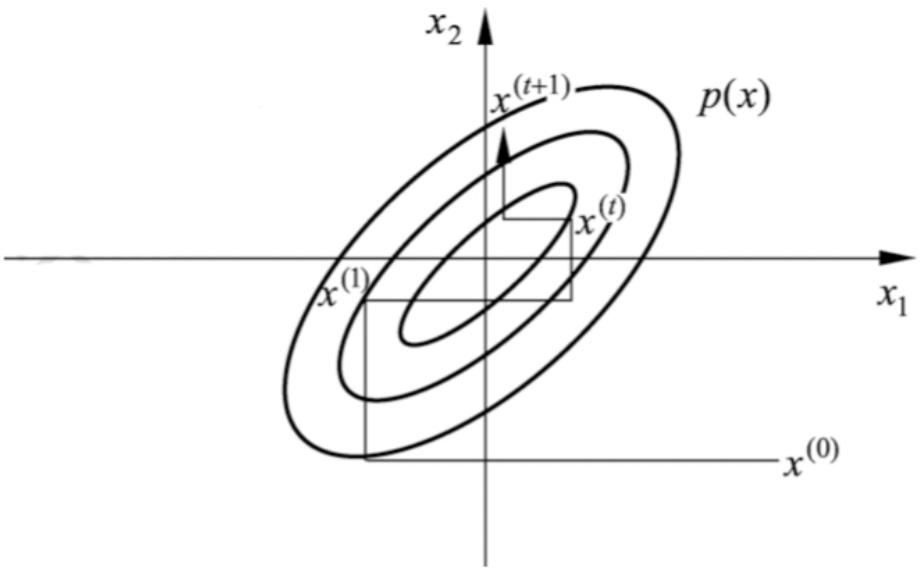

Metropolis-Hastings算法可能在一些相邻的时刻不产生移动。

## 吉布斯抽样

## 吉布斯抽样

·吉布斯抽样是马尔可夫链蒙特卡罗法的常用算法吉布斯抽样

·可以认为是Metropolis-Hastings算法的特殊情况，但是更容易实现，因而被广泛使用。

## 基本原理

·吉布斯抽样（Gibbs sampling）用于多元变量联合分布的抽样和估计

・基基本做法是，丛联倉概率分布定义满条件概率分布，依次对满条件概率分布进行抽样，得到样本的序列

·可以证明这样的抽样过程是在一个马尔可未链上的随机游走，每一个样本对应着马尔可夫链的状态，平稳分布就是首标的联答分布。

・整体成为一个马尔可夫 链蒙特卡罗法，燃烧期之后的样本就是联合分布的随机样本

## 基本原理

•假设多元变量的联合概率分布为 $p ( \boldsymbol { x } ) = p ( x _ { 1 } , x _ { 2 } , \cdot \cdot \cdot , x _ { k } )$

•吉布斯抽样从一个初始样本 $\boldsymbol { x } ^ { ( 0 ) } = ( x _ { 1 } ^ { ( 0 ) } , x _ { 2 } ^ { ( 0 ) } , \cdot \cdot \cdot , x _ { k } ^ { ( 0 ) } ) ^ { \mathrm { T } }$ 出发，不断进行迭代，每一次迭代得到联合分布的一个样本 $\boldsymbol { x } ^ { ( i ) } = ( x _ { 1 } ^ { ( i ) } , x _ { 2 } ^ { ( i ) } , \cdot \cdot \cdot , x _ { k } ^ { ( i ) } ) ^ { \mathrm { T } }$

·最终得到样本序列 $\{ x ^ { ( 0 ) } , x ^ { ( 1 ) } , \cdot \cdot \cdot , x ^ { ( n ) } \}$

## 基本原理

• 在每次迭代中，依次对k个随机变量中的一个变量进行随机抽样。

•如果在第i次迭代中，对第j个变量进行随机抽样，那么抽样的分布是满条件概率分布 $p ( x _ { j } | x _ { - j } ^ { ( i ) } )$ ，这里 $x _ { - j } ^ { ( i ) }$ 表示第i次迭代中，变量j以外的其他变量

## 基本原理

·设在第（i-1）步得到样本 $( x _ { 1 } ^ { ( i - 1 ) } , x _ { 2 } ^ { ( i - 1 ) } , \cdot \cdot \cdot , x _ { k } ^ { ( i - 1 ) } ) ^ { \mathrm { T } }$ 在第i步，首先对第一个变量按照以下满条件概率分布随机抽样

$$
p ( x _ { 1 } | x _ { 2 } ^ { ( t - 1 ) } , \cdots , x _ { k } ^ { ( t - 1 ) } )
$$

•得到 $x _ { 1 } ^ { ( i ) }$ ，之后依次对第j个变量按照以下满条件概率分布随机抽样

$$
p ( x _ { j } | x _ { 1 } ^ { ( i ) } , \cdot \cdot \cdot , x _ { j - 1 } ^ { ( i ) } , x _ { j + 1 } ^ { ( i - 1 ) } , \cdot \cdot \cdot , x _ { k } ^ { ( i - 1 ) } ) , \quad j = 2 , \cdot \cdot \cdot , k - 1
$$

·得到 $\boldsymbol { x } _ { j } ^ { ( i ) }$ ，最后对第k个变量按照以下满条件概率分布随机抽样

$$
p ( x _ { k } | x _ { 1 } ^ { ( i ) } , \cdot \cdot \cdot , x _ { k - 1 } ^ { ( i ) } )
$$

·得到 $\boldsymbol { x } _ { k } ^ { ( i ) }$ 於是得到整体样本 $\boldsymbol { x } ^ { ( i ) } = ( x _ { 1 } ^ { ( i ) } , x _ { 2 } ^ { ( i ) } , \cdot \cdot \cdot , x _ { k } ^ { ( i ) } ) ^ { \mathrm { T } }$

## 基本原理

·吉布斯抽样是单分量Metropolis-Hastings算法的特殊情况

·定义建议分布是当前变量 $\cdot _ { \mathrm { \scriptscriptstyle j } } , \mathrm { \Large ~ j ~ } = 1 , 2 , \cdots$ ，k的满条件概率分布

$$
q ( x , x ^ { \prime } ) = p ( x _ { i } ^ { \prime } | x _ { - j } )
$$

•这时，接受概率 $\alpha = 1$

$$
\begin{array} { l } { \displaystyle \alpha ( x , x ^ { \prime } ) = \operatorname* { m i n } \left. 1 , \frac { p ( x ^ { \prime } ) q ( x ^ { \prime } , x ) } { p ( x ) q ( x , x ^ { \prime } ) } \right. } \\ { = \operatorname* { m i n } \left. 1 , \frac { p ( x ^ { \prime } - j ) p ( x ^ { \prime } , j | x ^ { \prime } - j ) p ( x _ { j } | x ^ { \prime } - j ) } { p ( x _ { - j } ) p ( x _ { j } | x _ { - j } ) p ( x ^ { \prime } , j | x _ { - j } ) } \right. = 1 } \end{array}
$$

·这里用到 $p ( x _ { - j } ) = p ( x ^ { \prime } _ { - j } )$ 和 $p ( \bullet | x _ { - j } ) = p ( \bullet | x ^ { \prime } _ { - j } )$

## 基本原理

•转移核就是满条件概率分布

$$
p ( x , x ^ { \prime } ) = p ( x ^ { \prime } { } _ { j } | x _ { - j } )
$$

•也就是说依次按照单变量的满条件概率分布 $p ( x ^ { \prime } { } _ { j } | x _ { - j } )$ 进行随机抽样，就能实现单分量Metropolis-Hastings算法

•吉布斯抽样对每次抽样的结果都接受，没有拒绝，这一点和一般的Metropolis-Hastings算法不同

•这里，假设满条件概率分布 $p ( x ^ { \prime } { } _ { j } | x _ { - j } )$ 不为0，即马尔可夫链是不可约的

## 吉布斯抽样算法

## 算法 19.3 (吉布斯抽样)

输入：目标概率分布的密度函数 $p ( x )$ ，函数 $f ( x )$

输出： $p ( x )$ 的随机样本 $x _ { m + 1 } , x _ { m + 2 } , \cdot \cdot \cdot , x _ { n }$ ，函数样本均值 $f _ { m n }$

参数：收敛步数m，迭代步数n。

（1)初始化。给出初始样本 $\boldsymbol { x } ^ { ( 0 ) } = ( x _ { 1 } ^ { ( 0 ) } , x _ { 2 } ^ { ( 0 ) } , \cdot \cdot \cdot , x _ { k } ^ { ( 0 ) } ) ^ { \mathrm { T } }$ O

（2）对i循环执行

设第(i−1)次迭代结束时的样本为 $\boldsymbol { x } ^ { ( i - 1 ) } = ( x _ { 1 } ^ { ( i - 1 ) } , x _ { 2 } ^ { ( i - 1 ) } , \cdots , x _ { k } ^ { ( i - 1 ) } ) ^ { \mathrm { T } }$ ，则第i次迭代进行如下几步操作：

（1）由满条件分布 $p ( x _ { 1 } | x _ { 2 } ^ { ( i - 1 ) } , \cdot \cdot \cdot , x _ { k } ^ { ( i - 1 ) } )$ 抽取 $x _ { 1 } ^ { ( i ) }$

（j）由满条件分布 $p ( x _ { j } | x _ { 1 } ^ { ( i ) } , \cdot \cdot \cdot , x _ { j - 1 } ^ { ( i ) } , x _ { j + 1 } ^ { ( i - 1 ) } , \cdot \cdot \cdot , x _ { k } ^ { ( i - 1 ) } )$ 抽取 $\boldsymbol { x } _ { j } ^ { ( i ) }$

（k）由满条件分布 $p ( x _ { k } | x _ { 1 } ^ { ( i ) } , \cdot \cdot \cdot , x _ { k - 1 } ^ { ( i ) } )$ 抽取 $\boldsymbol { x } _ { k } ^ { ( i ) }$

得到第i次迭代值 $\boldsymbol { x } ^ { ( i ) } = ( x _ { 1 } ^ { ( i ) } , x _ { 2 } ^ { ( i ) } , \cdots , x _ { k } ^ { ( i ) } ) ^ { \mathrm { T } }$

## 吉布斯抽样算法

（3）得到样本集合

$$
\{ x ^ { ( m + 1 ) } , x ^ { ( m + 2 ) } , \cdot \cdot \cdot , x ^ { ( n ) } \}
$$

(4）计算

$$
f _ { m n } = \frac { 1 } { n - m } \sum _ { i = m + 1 } ^ { n } f ( x ^ { ( i ) } )
$$

## 例

•用吉布斯抽样从以下二元正态分布中抽取随机样本

$$
\boldsymbol { x } = ( x _ { 1 } , x _ { 2 } ) ^ { \mathrm { T } } \sim p ( x _ { 1 } , x _ { 2 } )
$$

$$
p ( x _ { 1 } , x _ { 2 } ) = N ( 0 , \Sigma ) , \quad \Sigma = \left[ \begin{array} { l l } { 1 } & { \rho } \\ { \rho } & { 1 } \end{array} \right]
$$

## 例

・条件概率分布为一元正态分布

$$
p ( x _ { 1 } | x _ { 2 } ) = N ( \rho x _ { 2 } , ( 1 - \rho ^ { 2 } ) )
$$

$$
p ( x _ { 2 } | x _ { 1 } ) = N ( \rho x _ { 1 } , ( 1 - \rho ^ { 2 } ) )
$$

·假设初始样本为 $x ^ { ( 0 ) } = ( x _ { 1 } ^ { ( 0 ) } , x _ { 2 } ^ { ( 0 ) } )$ ，通过吉布斯抽样，可以得到以下样本序列：

<table><tr><td>迭代次数</td><td>对 抽样  $x _ { 1 }$ </td><td>对 抽样  $x _ { 2 }$ </td><td>产生样本</td></tr><tr><td>1</td><td> $x _ { 1 } \sim N ( \rho x _ { 2 } ^ { ( 0 ) } , ( 1 - \rho ^ { 2 } ) )$  ，得到  $\overline { { x _ { 1 } ^ { ( 1 ) } } }$ </td><td> $x _ { 2 } \sim N ( \rho x _ { 1 } ^ { ( 1 ) } , ( 1 - \rho ^ { 2 } ) )$  ，得到  $\overline { { x _ { 2 } ^ { ( 1 ) } } }$ </td><td> $\boxed { x ^ { ( 1 ) } = ( x _ { 1 } ^ { ( 1 ) } , x _ { 2 } ^ { ( 1 ) } ) ^ { \mathrm { T } } }$ </td></tr><tr><td>i</td><td> $x _ { 1 } \sim N ( \rho x _ { 2 } ^ { ( t - 1 ) } , ( 1 - \rho ^ { 2 } ) )$  ，得到  $x _ { 1 } ^ { ( t ) }$ </td><td> $x _ { 2 } \sim N ( \rho x _ { 1 } ^ { ( t ) } , ( 1 - \rho ^ { 2 } ) )$  ，得到</td><td> $\boldsymbol { x } _ { 2 } ^ { ( t ) } \ : \Big | \ : \boldsymbol { x } ^ { ( t ) } = ( \boldsymbol { x } _ { 1 } ^ { ( t ) } , \boldsymbol { x } _ { 2 } ^ { ( t ) } ) ^ { \mathrm { T } }$ </td></tr></table>

## 例

·得到的样本集合 $\{ x ^ { ( m + 1 ) } , x ^ { ( m + 2 ) } , \cdot \cdot \cdot , x ^ { ( n ) } \} , m < n$ 就是二元正态分布的随机抽样。

·右图示意吉布斯抽样的过程

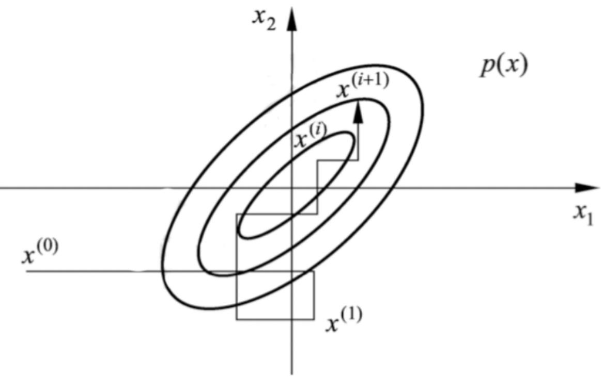

## 吉布斯抽样算法

·单分量Metropolis-Hastings 算法

・抽样会在样本点之间移动，但其间可能在某一些样本点上停留（由于抽样被拒绝)

・适合于满条件概率分布不容易抽样的情况，使用容易抽样的条件分 作建议分布

•吉布斯抽样算法

•抽样会在样本点之间持续移动

• 适合于满条件概率分布容易抽样的情况

## 抽样计算

·吉布斯抽样中需要对满条件概率分布进行重复多次抽样

•可以利用概率分布的性质提高抽样的效率

• 下面以贝叶斯学习为例介绍这个技巧

## 抽样计算

•设y表示观测数据，α,θ，²分别表示超参数、模型参数、未观测数据，

$$
x = \left( \alpha , \theta , z \right)
$$

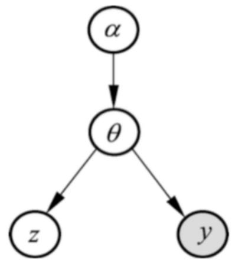

•贝叶斯学习的目的是估计后验概率分布 p(ly)，求后验概率最大的模型

$$
p ( x | y ) = p ( \alpha , \theta , z | y ) \propto p ( z , y | \theta ) p ( \theta | \alpha ) p ( \alpha )
$$

•式中p(a)是超参数分布， $p ( \theta | \alpha )$ 是先验分布， $p ( z , y | \theta )$ 是完全数据的分布

## 抽样计算

·现在用吉布斯抽样估计p(x|y)，其中y已知，x = (a,θ,z) 未知。吉布斯抽样中各个变量α,θ，z的满条件分布有以下关系

$$
p ( \alpha _ { i } | \alpha _ { - i } , \theta , z , y ) \propto p ( \theta | \alpha ) p ( \alpha )
$$

$$
p ( \theta _ { j } | \theta _ { - j } , \alpha , z , y ) \propto p ( z , y | \theta ) p ( \theta | \alpha )
$$

$$
p ( z _ { k } | z _ { - k } , \alpha , \theta , y ) \propto p ( z , y | \theta )
$$

·其中 $\alpha _ { - i }$ 表示变量 $\alpha _ { i }$ 以外的所有变量， $\theta _ { - j }$ 和 $z _ { - k }$ 类似

•依满条件概率分布的抽样可以通过依这些条件概率分布的乘积的抽样进行。

·这样可以大幅减少抽样的计算复杂度，因为计算只涉及部分变量。

第二十章

## 潜在狄利克雷分配

·潜在狄利克雷分配(latent Dirichlet allocation， LDA)，作为基于贝叶斯学习的话题模型，是潜在语义分析、概率潜在语义分析的扩展，

•LDA 在文本数据挖掘、图像处理、生物信息处理等领域被广泛使用

## 潜在狄利克雷分配

•LDA模型是文本集合的生成概率模型

·假设每个文本由话题的一个多项分布表示，每个话题由单词的一个多项分布表示

·特别假设文本的话题分布的先验分布是狄利克雷分布，话题的单词分布的先验分布也是狄利克雷分布

• 先验分布的导入使LDA 能够更好地应对话题模型学习中的过拟合现象

## 潜在狄利克雷分配

• LDA的文本集合的生成过程如下：

•首先随机生成一个文本的话题分布

•之后在该文本的每个位置，依据该文本的话题分布随机生成一个话题

•然后在该位置依据该话题的单词分布随机生成一个单词，直至文本的最后一个位置，生成整个文本。

·重复以上过程生成所有文本。

## 潜在狄利克雷分配

•LDA模型是含有隐变量的概率图模型

·模型中，每个话题的单词分布，每个文本的话题分布，文本的每个位置的话题是隐变量

•文本的每个位置的单词是观测变量

•LDA模型的学习与推理无法直接求解，通常使用吉布斯抽样（Gibbs sampling）和变分EM算法（variational EM algorithm)，前者是蒙特卡罗法，而后者是近似算法。

## 狄利克雷分布

## 分布定义

## •1.多项分布

·多项分布（multinomial distribution)是一种多元离散随机变量的概率分布，是二项分布（binomial distribution）的扩展。

·假设重复进行n次独立随机试验，每次试验可能出现的结果有k种，第i种结果出现的概率为pi，第i种结果出现的次数为nj

·如果用随机变量 $\boldsymbol { X } = \left( X _ { 1 } , X _ { 2 } , \cdots , X _ { k } \right)$ 表示试验所有可能结果的次数，其中X表示第i种结果出现的次数，那么随机变量×服从多项分布

## 分布定义

定义20.1（多项分布）若多元离散随机变量 $\boldsymbol { X } = ( X _ { 1 } , X _ { 2 } , \cdots , X _ { k } )$ 的概率质量函数为

$$
{ \begin{array} { l } { P ( X _ { 1 } = n _ { 1 } , X _ { 2 } = n _ { 2 } , \cdots \ , X _ { k } = n _ { k } ) = { \frac { n ! } { n _ { 1 } ! n _ { 2 } ! \cdots n _ { k } ! } } p _ { 1 } ^ { n _ { 1 } } p _ { 2 } ^ { n _ { 2 } } \cdots p _ { k } ^ { n _ { k } } } \\ { \displaystyle = { \frac { n ! } { \displaystyle { \prod _ { i = 1 } ^ { k } n _ { i } ! } } } { \prod _ { i = 1 } ^ { k } } p _ { i } ^ { n _ { i } } } \end{array} }\tag{20.1}
$$

其中 $p = ( p _ { 1 } , p _ { 2 } , \cdots , p _ { k } ) , \ p _ { i } \geqslant 0 , i = 1 , 2 , \cdots , k , \ \sum _ { i = 1 } ^ { k } p _ { i } = 1 , \ \sum _ { i = 1 } ^ { k } n _ { i } = n ,$ 则称随机变量X服从参数为(n,p)的多项分布，记作 $X \sim \mathrm { M u l t } ( n , p )$

·当试验的次数n为1时，多项分布变成类别分布（categoricaldistribution)

• 类别分布表示试验可能出现的k种结果的概率

## 分布定义

• 2.狄利克雷分布

·狄利克雷分布（Dirichlet distribution)是一种多元连续随机变量的概率分布，是贝塔分布（(beta distribution)的扩展

•在贝叶斯学习中，狄利克雷分布常作为多项分布的先验分布使用

## 分布定义

定义20.2（狄利克雷分布）若多元连续随机变量 $\theta = ( \theta _ { 1 } , \theta _ { 2 } , \cdot \cdot \cdot , \theta _ { k } )$ 的概率密度函数为

$$
p ( \theta | \alpha ) = \frac { \Gamma \left( \displaystyle \sum _ { i = 1 } ^ { k } \alpha _ { i } \right) } { \displaystyle \prod _ { i = 1 } ^ { k } \Gamma ( \alpha _ { i } ) } \prod _ { i = 1 } ^ { k } \theta _ { i } ^ { \alpha _ { i } - 1 }\tag{20.2}
$$

其中 $\sum _ { i = 1 } ^ { k } \theta _ { i } = 1 , \ \theta _ { i } \geqslant 0 , \ \alpha = ( \alpha _ { 1 } , \alpha _ { 2 } , \cdot \cdot \cdot , \alpha _ { k } ) , \ \alpha _ { i } > 0 , \ i = 1 , 2 , \cdot \cdot \cdot , k .$ ，则称随机变量θ 服从参数为α的狄利克雷分布，记作 $\theta \sim \operatorname { D i r } ( \alpha )$

## 分布定义

·式中Γ(s)是伽马函数，定义为

$$
\Gamma ( s ) = \int _ { 0 } ^ { \infty } x ^ { s - 1 } \mathrm { e } ^ { - x } \mathrm { d } x , \quad s > 0
$$

•具有性质

• 当s是自然数时， 有

$$
\Gamma ( s + 1 ) = s \Gamma ( s )
$$

$$
\Gamma ( s + 1 ) = s !
$$

## 分布定义

•由于满足条件

$$
\theta _ { i } \geqslant 0 , \quad \sum _ { i = 1 } ^ { k } \theta _ { i } = 1
$$

•所以狄利克雷分布 θ存在于(k1)维单纯形上

•右图为二维单纯形上的狄利克雷分布

$$
\theta _ { 1 } + \theta _ { 2 } + \theta _ { 3 } = 1 , \ \theta _ { 1 } , \theta _ { 2 } , \theta _ { 3 } \geqslant 0
$$

•狄利克雷分布的参数为

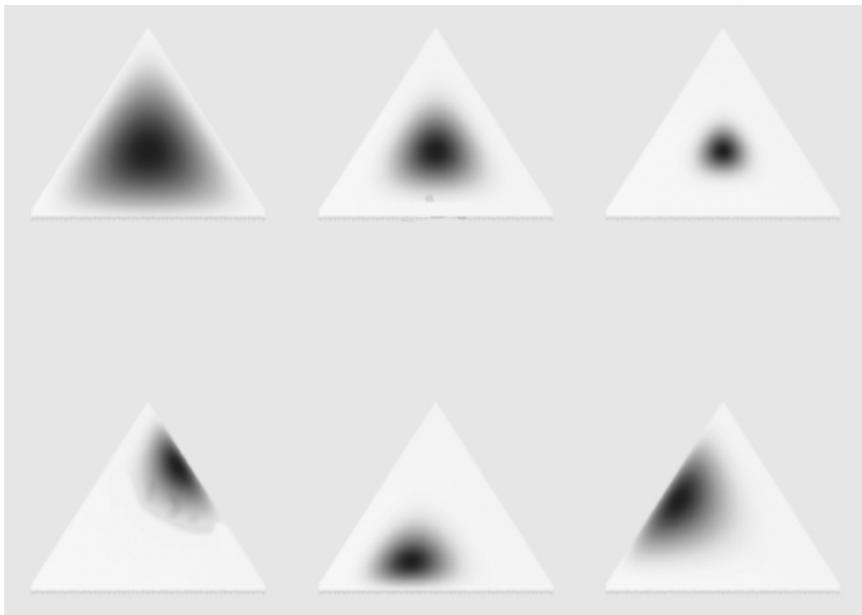

## 分布定义

$\ntrianglelefteq$

$$
\mathrm { B } ( \alpha ) = { \frac { \displaystyle \prod _ { i = 1 } ^ { k } \Gamma ( \alpha _ { i } ) } { \Gamma \left( \sum _ { i = 1 } ^ { k } \alpha _ { i } \right) } }
$$

•则狄利克雷分布的密度函数可以写成

$$
p ( \theta | \alpha ) = { \frac { 1 } { \mathrm { B } ( \alpha ) } } \prod _ { i = 1 } ^ { k } \theta _ { i } ^ { \alpha _ { i } - 1 }
$$

•B(a）是规范化因子，称为多元贝塔函数(或扩展的贝塔函数)

## 分布定义

•由密度函数的性质

$$
\int \frac { \Gamma \left( \displaystyle \sum _ { i = 1 } ^ { k } \alpha _ { i } \right) } { \displaystyle \prod _ { i = 1 } ^ { k } \Gamma ( \alpha _ { i } ) } \prod _ { i = 1 } ^ { k } \theta _ { i } ^ { \alpha _ { i } - 1 } \mathrm { d } \theta = \frac { \Gamma \left( \displaystyle \sum _ { i = 1 } ^ { k } \alpha _ { i } \right) } { \displaystyle \prod _ { i = 1 } ^ { k } \Gamma ( \alpha _ { i } ) } \int \prod _ { i = 1 } ^ { k } \theta _ { i } ^ { \alpha _ { i } - 1 } \mathrm { d } \theta = 1
$$

•得

$$
\operatorname { B } ( \alpha ) = \int \prod _ { i = 1 } ^ { k } \theta _ { i } ^ { \alpha _ { i } - 1 } \mathrm { d } \theta
$$

•即多元贝塔函数的积分表示

## 分布定义

• 3.二项分布和贝塔分布

• 二项分布是多项分布的特殊情况，贝塔分布是狄利克雷分布的特殊情况

• 二项分布是指如下概率分布。X为离散随机变量，取值为m，其概率质量函数为

$$
P ( X = m ) = { \binom { n } { m } } p ^ { m } ( 1 - p ) ^ { n - m } , \quad m = 0 , 1 , 2 , \cdots , n
$$

•其中n和p $( 0 \leqslant \mathsf { p } \leqslant 1 )$ 是参数

## 分布定义

•贝塔分布是指如下概率分布，X为连续随机变量，取值范围为[0,1]，其概率密度函数为

$$
p ( x ) = \left\{ \begin{array} { l l } { \displaystyle \frac { 1 } { \mathrm { B } ( s , t ) } x ^ { s - 1 } ( 1 - x ) ^ { t - 1 } , } & { 0 \leqslant x \leqslant 1 } \\ { 0 , } & { \sharp \sharp \dag \dag } \end{array} \right.
$$

•其中s>0和t>0是参数， $\mathrm { B } ( s , t ) = { \frac { \Gamma ( s ) \Gamma ( t ) } { \Gamma ( s + t ) } }$ 是贝塔函数，定义为

$$
\mathrm { B } ( s , t ) = \int _ { 0 } ^ { 1 } x ^ { s - 1 } ( 1 - x ) ^ { t - 1 } \mathrm { d } x
$$

• 当然s, t是自然数时， $\mathrm { B } ( s , t ) = { \frac { ( s - 1 ) ! ( t - 1 ) ! } { ( s + t - 1 ) ! } }$

## 分布定义

·当n为1时，二项分布变成伯努利分布（Bernoulli distribution）或0-1分布

•伯努利分布表示试验可能出现的2种结果的概率

•下图给出几种概率分布的关系。

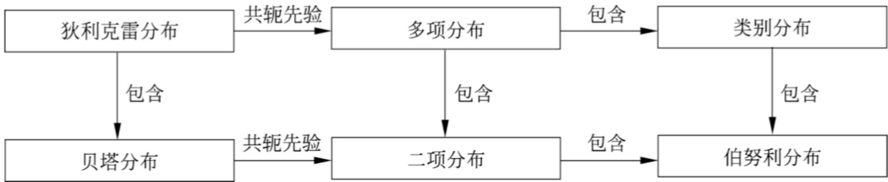

## 共扼先验

·狄利克雷分布有一些重要性质：

• (1)狄利克雷分布属于指数分布族

• (2)狄利克雷 分布是多项分布的共扼先验(conjugate prior)

## 共扼先验

•贝叶斯学习中常使用共扼分布

•如果后验分布与先验分布属于同类，则先验分布与后验分布称为共扼分布(conjugate distributions)，先验分布称为共扼先验(conjugateprior)

·如果多项分布的先验分布是狄利克雷分布，则其后验分布也为狄利克雷分布，两者构成共扼分布

•作为先验分布的狄利克雷分布的参数又称为超参数

• 使用共扼分布的好处是便于从先验分布计算后验分布

## 共扼先验

·设 ${ \mathcal W } = \{ w _ { 1 } , w _ { 2 } , \cdot \cdot \cdot , w _ { k } \}$ 是由k个元素组成的集合。随机变量X服从W上的多项分布， $X \sim \mathrm { M u l t } ( n , \theta )$ ，其中 $n = ( n _ { 1 } , n _ { 2 } , \cdot \cdot \cdot , n _ { k } )$ 和 $\theta = ( \theta _ { 1 } , \theta _ { 2 } , \cdot \cdot \cdot , \theta _ { k } )$ 是参数

·参数n为从W中重复独立抽取样本的次数， $\mathsf { n } _ { \mathsf { i } }$ 为样本中 ${ \mathsf { W } } _ { \mathrm { i } }$ 出现的次数 $( \mathsf { i } , \theta _ { i } ; 1 , 2 , \cdots , \mathsf { k } )$

•参数 为 ${ \mathsf { W } } _ { \mathrm { i } }$ 出现的概率 $( \mathsf { i } = 1 , 2 , \cdots , \mathsf { k } )$

## 共扼先验

• 将样本数据表示为D，目标是计算在样本数据D给定条件下参数θ的后验概率 $p ( \theta | D )$ O

•对于给定的样本数据D，似然函数是

$$
p ( D | \theta ) = \theta _ { 1 } ^ { n _ { 1 } } \theta _ { 2 } ^ { n _ { 2 } } \cdot \cdot \cdot \theta _ { k } ^ { n _ { k } } = \prod _ { i = 1 } ^ { k } \theta _ { i } ^ { n _ { i } }
$$

·假设随机变量。服从狄利克雷分布 $p ( \theta | \alpha )$ ，其中 $\alpha = ( \alpha _ { 1 } , \alpha _ { 2 } , \cdot \cdot \cdot , \alpha _ { k } )$ 为参数。则θ的先验分布为 $p ( \theta | \alpha ) = \frac { \Gamma \left( \displaystyle \sum _ { i = 1 } ^ { k } \alpha _ { i } \right) } { \displaystyle \prod _ { i = 1 } ^ { k } \Gamma ( \alpha _ { i } ) } \prod _ { i = 1 } ^ { k } \theta _ { i } ^ { \alpha _ { i } - 1 } = \frac { 1 } { \mathrm { B } ( \alpha ) } \prod _ { i = 1 } ^ { k } \theta _ { i } ^ { \alpha _ { i } - 1 } = \mathrm { D i r } ( \theta | \alpha ) , \quad \alpha _ { i } > 0$

## 共扼先验

·根据贝叶斯规则，在给定样本数据D和参数α条件下，θ的后验概率分布是

$$
\begin{array} { r l r } {  { p ( \theta | D , \boldsymbol { \alpha } ) = \frac { p ( D | \theta ) p ( \theta | \boldsymbol { \alpha } ) } { p ( D | \boldsymbol { \alpha } ) } } } \\ & { } & { = \frac { \displaystyle \prod _ { i = 1 } ^ { k } \theta _ { i } ^ { \alpha _ { i } } \frac { 1 } { \mathrm { B } ( \boldsymbol { \alpha } ) } \theta _ { i } ^ { \alpha _ { i } - 1 } } { \displaystyle \int \prod _ { i = 1 } ^ { k } \theta _ { i } ^ { \alpha _ { i } } \frac { 1 } { \mathrm { B } ( \boldsymbol { \alpha } ) } \theta _ { i } ^ { \alpha _ { i } - 1 } \mathrm { d } \theta } } \\ & { } & { = \frac { 1 } { \mathrm { B } ( \boldsymbol { \alpha } + \boldsymbol { n } ) } \frac { k } { 1 - 1 } } \\ & { } & { = \mathrm { D i r } ( \boldsymbol { \alpha } + \boldsymbol { n } ) } \end{array}
$$

## 共扼先验

•可以看出先验分布和后验分布都是狄利克雷分布

• 两者有不同的参数，所以狄利克雷分布是多项分布的共扼先验

·狄利克雷后验分布的参数等于狄利克雷先验分布参数 $\alpha = ( \alpha _ { 1 } , \alpha _ { 2 } , \cdot \cdot \cdot , \alpha _ { k } )$ 加上多项分布的观测 $n = ( n _ { 1 } , n _ { 2 } , \cdots , n _ { k } )$ ，好像试验之前就已经观察到计数 $\alpha = ( \alpha _ { 1 } , \alpha _ { 2 } , \cdot \cdot \cdot , \alpha _ { k } )$ 因此也把α叫做先验伪计数(prior$\mathsf { p s e u d o \mathrm { - c o u n t s } } )$

## 潜在狄利克雷分配模型

## 基本想法

・潛在狄利克雷分配（LDA）是文本集合的生成概率模型

·模型假设话题由单词的多项分布表示，文本由话题的多项分布表示，单词分布和话题分布的先验分布都是狄利克雷分布

•文本内容的不同是由于它们的话题分布不同

## 基本想法

• LDA模型表示文本集合的自动生成过程：

·首先，基于单词分布的先验分布（狄利克雷分布）生成多个单词分布，即决定多个话题内容

•之后，基于话题分布的先验分布（狄利克雷分布）生成多个话题分布，即决定多个文本内容

·然后，基于每一个话题分布生成话题序列，针对每一个话题，基于话题的单词分布生成单词，整体构成一个单词序列，即生成文本

• 重复这个过程生成所有文本

## 基本想法

•文本的单词序列是观测变量，文本的话题序列是隐变量，文本的话题分布和话题的单词分布也是隐变量。

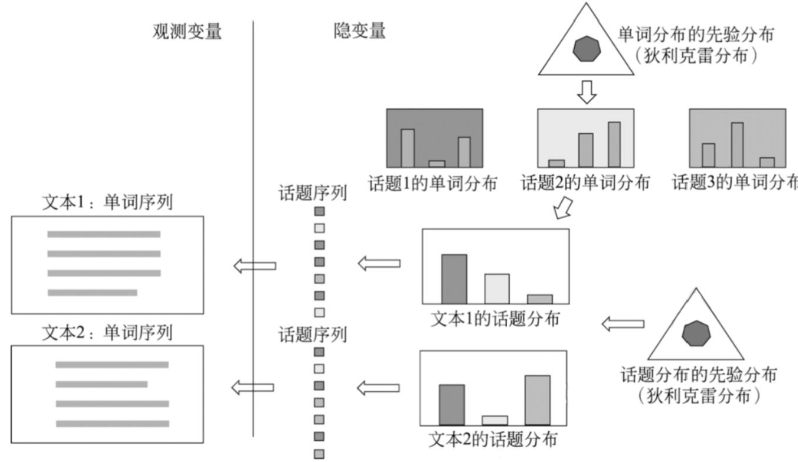

## 基本想法

•LDA模型是概率图模型，其特点是以狄利克雷分布为多项分布的先验分布

·学习就是给定文本集合，通过后验概率分布的估计，推断模型的所有参数

•利用LDA进行 话题分析，就是对给定文本集合，学习到每个文本的话题分布，以及每个话题的单词分布。

## 基本想法

·可以认为LDA是PLSA（概率潜在语义分析）的扩展

·相同点是两者都假设话题是单词的多项分布，文本是话题的多项分布

•不同点是LDA使用狄利克雷分布作为先验分布，而PLSA不使用先验分布(或者说假设先验分布是均匀分布）

·学习过程LDA基于贝叶斯学习，而PLSA基于极大似然估计

•LDA的优点是，使用先验概率分布，可以防止学习过程中产生的过拟合(over-fitting)

## 模型定义

• 1.模型要素

・潜在狄利克雷分配（LDA）使用三个集合：

·单词集合 $W = \{ w _ { 1 } , \cdot \cdot \cdot , w _ { v } , \cdot \cdot \cdot , w _ { V } \}$

・文本集合 $D = \{ \mathbf { w } _ { 1 } , \cdot \cdot \cdot , \mathbf { w } _ { m } , \cdot \cdot \cdot , \mathbf { w } _ { M } \}$ ，其中 ${ \sf W } _ { \sf m }$ 是一个单词序列$\mathbf { w } _ { m } = ( w _ { m 1 } , \cdots , w _ { m n } , \cdots , w _ { m N _ { m } } )$

•话题集合 $Z = \left\{ z _ { 1 } , \cdot \cdot \cdot , z _ { k } , \cdot \cdot \cdot , z _ { K } \right\}$

## 基本想法

·每一个话题 $Z _ { \boldsymbol { \mathsf { k } } }$ 由一个单词的条件概率分布 $\mathsf { p } ( \mathsf { w } | \mathsf { Z } _ { \mathsf { k } } )$ 决定

•分布 $\mathsf { p } ( \mathsf { w } | \mathsf { Z } _ { \mathsf { k } } )$ 服从多项分布（严格意义上类别分布），其参数为 $\varphi _ { k }$

·参数 $\varphi _ { k }$ 服从狄利克雷分布（先验分布），其超参数为 $\beta$ O

•参数 $\varphi _ { k }$ 是一个V维向量 $\varphi _ { k } = ( \varphi _ { k 1 } , \varphi _ { k 2 } , \cdot \cdot \cdot , \varphi _ { k V } )$ ，其中 $\varphi _ { k v }$ 表示话题 $Z _ { \boldsymbol { \mathsf { k } } }$ 生成单词 $\mathsf { W } _ { \vee }$ 的概率

• 所有话题的参数向量构成一个K×Ⅴ矩阵 $\varphi = \{ \varphi _ { k } \} _ { k = 1 } ^ { K }$ O

·超参数β 也是一个V维向量 $\beta = ( \beta _ { 1 } , \beta _ { 2 } , \cdot \cdot \cdot , \beta _ { V } )$

## 基本想法

・每一个文本 ${ \sf W } _ { \sf m }$ 由一个话题的条件概率分布 $\mathsf { p } ( z | \mathsf { w } _ { \mathsf { m } } )$ 决定

•分布 $\mathsf { p } ( \mathsf { z } | \mathsf { w } _ { \mathsf { m } } )$ 服从多项分布（严格意义上类别分布），其参数为 $\theta _ { m }$

·参数 $\theta _ { m }$ 服从狄利克雷分布（先验分布），其超参数为α

•参数 $\theta _ { m }$ 是一个K维向量 $\theta _ { m } = ( \theta _ { m 1 } , \theta _ { m 2 } , \cdot \cdots , \theta _ { m K } )$ ，其中 $\theta _ { m k }$ 表示文本 ${ \sf W } _ { \sf m }$ 生成话题 $Z _ { \boldsymbol { \mathsf { k } } }$ 的概率

•所有文本的参数向量构成一个Μ×K 矩阵 $\pmb { \theta } = \{ \theta _ { m } \} _ { m = 1 } ^ { M }$

· 超参数 α也是一个K维向量 $\alpha = ( \alpha _ { 1 } , \alpha _ { 2 } , \cdot \cdot \cdot , \alpha _ { K } )$

・每一个文本 ${ \sf W } _ { \sf m }$ 中的每一个单词 $\mathsf { W } _ { \mathsf { m n } }$ 由该文本的话题分布 $\mathsf { p } ( z | \mathsf { w } _ { \mathsf { m } } )$ 以及所有话题的单词分布 $\rho ( \mathsf { w } | \angle _ { \mathsf { k } } )$ 决定

## 基本想法

• 2.生成过程

• LDA文本集合的生成过程如下：

• 给定单词集合W，文本集合D，话题集合Z，狄利克雷分布的超参数α和β

## 基本想法

(1) 生成话题的单词分布

•随机生成K个话题的单词分布

•按照狄利克雷分布Dir(β) 随机生成一个参数向量 $\varphi _ { k } , \ \varphi _ { k } \sim \operatorname { D i r } ( \beta )$ ，作为话题 $Z _ { \boldsymbol { \mathsf { k } } }$ 的单词分布 $\rho ( \mathsf { w } | \mathsf { z } _ { \mathsf { k } } )$

(2）生成文本的话题分布

·随机生成M个文本的话题分布

•按照狄利克雷分布Dir(α)随机生成一个参数向量 $\theta _ { m } , \ \theta _ { m } \sim \operatorname { D i r } ( \alpha )$ ，作为文本 ${ \sf W } _ { \sf m }$ 的话题分布 $\mathsf { p } ( z | \mathsf { w } _ { \mathsf { m } } )$

## 基本想法

(3) 生成文本的单词序列

•随机生成M个文本的 $\mathsf { N } _ { \mathsf { m } }$ 个单词

•首先按照多项分布 $\operatorname { M u l t } ( \theta _ { m } )$ 随机生成一个话题 $Z _ { \mathrm { m n } } , Z _ { \mathrm { m n } } \sim \mathrm { \ M u l t } ( \theta _ { m } )$

•然后按照多项分布 $\mathrm { M u l t } ( \varphi _ { z _ { m n } } )$ 随机生成一个单词 $\mathsf { W } _ { \mathsf { m } \mathsf { n } } , \quad \mathsf { W } _ { \mathsf { m } \mathsf { n } } \sim \mathrm {  ~ \mathsf { M } u l t } ( \varphi _ { z _ { m n } } )$

·文本 ${ \sf W } _ { \sf m }$ 本身是单词序列 $\mathbf { w } _ { m } = ( w _ { m 1 } , w _ { m 2 } , \cdot \cdot \cdot , w _ { m N _ { m } } )$ ，对应着隐式的话题序列 $\mathbf { z } _ { m } = ( z _ { m 1 } , z _ { m 2 } , \cdot \cdot \cdot , z _ { m N _ { m } } )$

## LDA的文本生成算法

算法 20.1（LDA 的文本生成算法)

（1）对于话题 $z _ { k } \left( k = 1 , 2 , \cdots , K \right)$

生成多项分布参数 $\varphi _ { k } \sim \operatorname { D i r } ( \beta )$ ，作为话题的单词分布 $p ( w \vert z _ { k } )$

（2）对于文本 $\mathbf { w } _ { m } \ ( m = 1 , 2 , \cdot \cdot \cdot , M )$

生成多项分布参数 $\theta _ { m } \sim \operatorname { D i r } ( \alpha )$ ，作为文本的话题分布 $p ( z | \mathbf { w } _ { m } )$

（3）对于文本 ${ \bf w } _ { m }$ 的单词 $w _ { m n } \left( m = 1 , 2 , \cdot \cdot \cdot , M , n = 1 , 2 , \cdot \cdot \cdot , N _ { m } \right)$

（a）生成话题 $z _ { m n } \sim \mathrm { M u l t } ( \theta _ { m } )$ ，作为单词对应的话题；

（b）生成单词 $w _ { m n } \sim \mathrm { M u l t } ( \varphi _ { z _ { m n } } )$ O

## LDA的文本生成算法

• LDA的文本生成过程中，假定话题个数K给定，实际通常通过实验选定

·狄利 克雷分布的超参数 α 和β 通常也是事先给定的

• 在没有其他先验知识的情况下，可以假设向量α和β 的所有分量均为1，这时的文本的话题分布 $\theta _ { m }$ 是对称的，话题的单词分布φk也是对称的。

## 概率图模型

•LDA模型本质是一种概率图模型(probabilistic graphical model)

·下图为 LDA作为概率图模型的板块表示（plate notation)

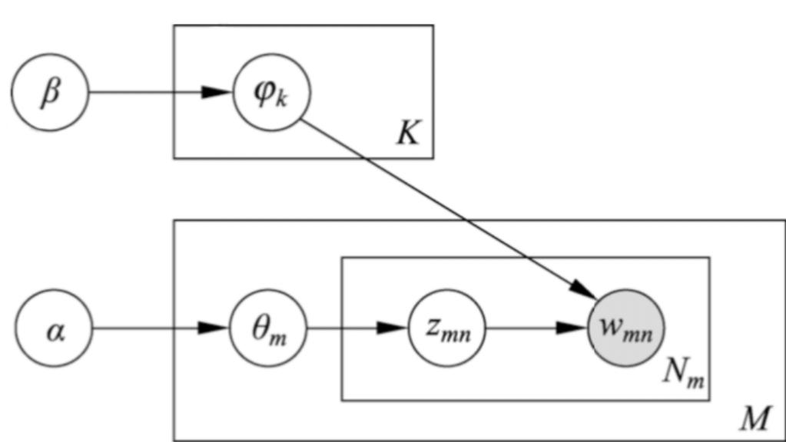

图中结点表示随机变量

实心结点是观测变量

空心结点是隐变量

有向边表示概率依存关系

矩形（板块）表示重复， 板块内数字表示重复的次数。

## 概率图模型

• 图中LDA板块表示，结点 α 和β 是模型的超参数

• 结点k表示话题的单词分布的参数

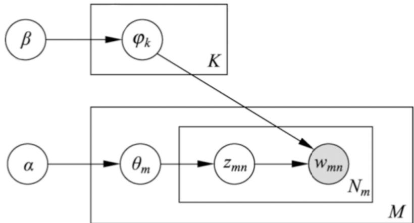

·结点 $\theta _ { m }$ 表示文本的话题分布的参数

·结点 $Z _ { \mathsf { m } \mathsf { n } }$ 表示话题，结点 $\mathsf { V } _ { \mathsf { m } \mathsf { n } }$ 表示单词

• 结点β 指向结点φk，重复K次，表示根据超参数β 生成K个话题的单词分布的参数 $\varphi _ { k }$

• 结点 α指向结点 $\theta _ { m }$ ，重复M次，表示根据超参数 α生成M个文本的话题分布的参数 $\theta _ { m }$

·结点 $\theta _ { m }$ 指向结点 $Z _ { \mathrm { m n } }$ ，重复 $\mathsf { N } _ { \mathsf { m } }$ 次，表示根据文本的话题分布 $\theta _ { m }$ 生成 $\mathsf { N } _ { \mathsf { m } }$ 个话题 $Z _ { \mathsf { m } \mathsf { n } }$

·结点 $Z _ { \mathsf { m } \mathsf { n } }$ 指向结点 $\mathsf { W } _ { \mathsf { m n } }$ ，同时K个结点k也指向结点 $\mathsf { W } _ { \mathsf { m n } }$ ，表示根据话题 $Z _ { \mathsf { m } \mathsf { n } }$ 以及K个话题的单词分布 $\varphi _ { k }$ 生成单词 $\mathsf { W } _ { \mathsf { m n } }$ o

## 概率图模型

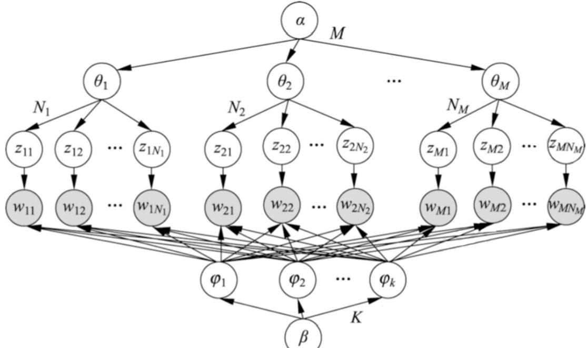

•有向图中结点表示随机变量，有向边表示概率依存关系。可以看出LDA是相同随机 变量被重复多次使用的概率图模型。

## 随机变量序列的可交换性

•一个有限的随机变量序列是可交换的(exchangeable)，是指随机变量的联合概率 分布对随机变量的排列不变

$$
P ( x _ { 1 } , x _ { 2 } , \cdot \cdot \cdot , x _ { N } ) = P ( x _ { \pi ( 1 ) } , x _ { \pi ( 2 ) } , \cdot \cdot \cdot , x _ { \pi ( N ) } )
$$

·这里 $\pi ( 1 ) , \pi ( 2 ) , \cdots , \pi ( N )$ 代表自然数1,..,N的任意一个排列。一个无限的随机变量序列是无限可交换（linfinitely exchangeable）的，是指它的任意一个有限子序列都是可交换的

·如果一个随机变量序列 $X _ { 1 } , X _ { 2 } , \cdot \cdot \cdot , X _ { N } , \cdot \cdot \cdot$ 是独立同分布的，那么它们是无限可交换的。反之不然。

## 随机变量序列的可交換性

·随机变量序列可交换的假设在贝叶斯学习中经常使用

·根据De Finetti定理，任意一个无限可交换的随机变量序列对一个随机参数是条件独立同分布的

·即任意一个无限可交换的随机变量序列 $X _ { 1 } , X _ { 2 } , \cdots , X _ { i } , \cdot \cdot \cdot$ 的基于一个随机参数Y的条件概率，等于基于这个随机参数Y的各个随机变量$X _ { 1 } , X _ { 2 } , \cdots , X _ { i } , \cdot \cdot \cdot$ 的条件概率的乘积。

$$
P \left( X _ { 1 } , X _ { 2 } , \cdots , X _ { i } , \cdots | Y \right) = P ( X _ { 1 } | Y ) P ( X _ { 2 } | Y ) \cdots P ( X _ { i } | Y ) \cdots . . .
$$

## 随机变量序列的可交换性

•LDA假设文本由无限可交换的话题序列组成

•由De Finetti定理知，实际是假设文本中的话题对一个随机参数是条件独立同分布的

·所以在参数给定的条件下，文本中的话题的顺序可以忽略

·作为对比，概率潜在语义模型假设文本中的话题是独立同分布的，文本中的话题的顺序也可以忽略

## 概率公式

•DA模型整体是由观测变量和隐变量组成的联合概率分布，可以表为

$$
p ( \mathbf { w } , \mathbf { z } , \theta , \varphi | \alpha , \beta ) = \prod _ { k = 1 } ^ { K } p ( \varphi _ { k } | \beta ) \prod _ { m = 1 } ^ { M } p ( \theta _ { m } | \alpha ) \prod _ { n = 1 } ^ { N _ { m } } p ( z _ { m n } | \theta _ { m } ) p ( w _ { m n } | z _ { m n } , \varphi )
$$

• 观测变量w 表示所有文本中的单词序列

·隐变量z 表示所有文本中的话题序列

•隐变量θ 表示所有文本的话题分布的参数

•隐变量φ表示所有话题的单词分布的参数

• α 和β是超参数

## 概率公式

$p ( \varphi _ { k } | \beta )$ 表示超参数β 给定条件下第k个话题的单词分布的参数φk的生成概率

$p ( \theta _ { m } | \alpha )$ 表示超参数 α 给定条件下第m个文本的话题分布的参数 $\theta _ { m }$ 的生成概率，

$p ( z _ { m n } | \theta _ { m } )$ 表示第m个文本的话题分布 $\theta _ { m }$ 给定条件下文本的第n个位置的话题 $Z _ { \mathrm { m n } }$ 的生成概率

$p ( w _ { m n } | z _ { m n } , \varphi )$ 表示在第m个文本的第n个位置的话题 $Z _ { \mathrm { m n } }$ 及所有话题的单词分布的参数φ给定条件下第m个文本的第n个位置的单词$\boldsymbol { \mathsf { W } } _ { \mathsf { m n } }$ 的生成概率

## 概率公式

•第m个文本的联合概率分布可以表为

$$
p ( \mathbf { w } _ { m } , \mathbf { z } _ { m } , \theta _ { m } , \varphi | \alpha , \beta ) = \prod _ { k = 1 } ^ { K } p ( \varphi _ { k } | \beta ) p ( \theta _ { m } | \alpha ) \prod _ { n = 1 } ^ { N _ { m } } p ( z _ { m n } | \theta _ { m } ) p ( w _ { m n } | z _ { m n } , \varphi )
$$

·其中 ${ \sf W } _ { \sf m }$ 表示该文本中的单词序列， $Z _ { \mathsf { m } }$ 表示该文本的话题序列， $\theta _ { m }$ 表示该文本的话题分布参数。

• LDA模型的联合分布含有隐变量，对隐变量进行积分得到边缘分布

## 概率公式

•参数 $\theta _ { m }$ 和 φ给定条件下第m个文本的生成概率是

$$
p ( \mathbf { w } _ { m } | \theta _ { m } , \varphi ) = \prod _ { n = 1 } ^ { N _ { m } } \left[ \sum _ { k = 1 } ^ { K } p ( z _ { m n } = k | \theta _ { m } ) p ( w _ { m n } | \varphi _ { k } ) \right]
$$

·超参数 α 和 β 给定条件下第m个文本的生成概率是

$$
p ( \mathbf { w } _ { m } | \alpha , \beta ) = \prod _ { k = 1 } ^ { K } \int p ( \varphi _ { k } | \beta ) \left[ \int p ( \theta _ { m } | \alpha ) \prod _ { n = 1 } ^ { N _ { m } } \left[ \sum _ { l = 1 } ^ { K } p ( z _ { m n } = l | \theta _ { m } ) p ( w _ { m n } | \varphi _ { l } ) \right] \mathrm { d } \theta _ { m } \right] \mathrm { d } \varphi _ { k }
$$

· 超参数 α 和 β 给定条件下所有文本的生成概率是

$$
p ( \mathbf { w } | \alpha , \beta ) = \prod _ { k = 1 } ^ { K } \int p ( \varphi _ { k } | \beta ) \left[ \prod _ { m = 1 } ^ { M } \int p ( \theta _ { m } | \alpha ) \prod _ { n = 1 } ^ { N _ { m } } \left[ \sum _ { l = 1 } ^ { K } p ( z _ { m n } = l | \theta _ { m } ) p ( w _ { m n } | \varphi _ { l } ) \right] \mathrm { d } \theta _ { m } \right] \mathrm { d } \varphi _ { k } ,
$$

## LDA的吉布斯抽样算法

## LDA的吉布斯抽样算法

·潜在狄利克雷分配（LDA）的学习（参数估计）是一个复杂的最优化问题，很难精确求解，只能近似求解

·常用的近似求解方法有吉布斯抽样（Gibbs sampling）和变分推理(variational inference)

## 基本想法

•LDA模型的学习，给定文本（单词序列）的集合 $D = \{ \mathbf { w } _ { 1 } , \cdot \cdot \cdot , \mathbf { w } _ { m } , \cdot \cdot \cdot , \mathbf { w } _ { M } \}$

目标是要推断:

•(1）话题序列的集合 的后验概率分布

•(2）参数 $\mathbf { z } = \{ \mathbf { z } _ { 1 } , \cdot \cdot \cdot , \mathbf { z } _ { m } , \cdot \cdot \cdot , \mathbf { z } _ { M } \}$ ${ \sf W } _ { \sf m }$ 的话题分布的参数

•(3）参数 $\begin{array} { l l } { { \langle \theta = \{ \theta _ { 1 } , \cdot \cdot \cdot , \theta _ { m } , \cdot \cdot \cdot \cdot , \theta _ { M } \} } } & { { \mathrm { ~ \theta } _ { m } } } \\ { { } } & { { \mathrm { ~ \theta } , } } \\ { { \varphi = \{ \varphi _ { 1 } , \cdot \cdot \cdot , \varphi _ { k } , \cdot \cdot \cdot , \varphi _ { K } \} } } & { { \mathrm { ~ \varphi } _ { k } } } \end{array}$ 是话题 $Z _ { \boldsymbol { \mathsf { k } } }$ 的单词分布的参数

•也就是说，要对联合概率分布 进行估计

·其中w是观测变量，而z，，是 $\begin{array} { r } { p ( \mathbf { w } , \mathbf { z } , \theta , \varphi | \alpha , \beta ) } \\ { . . . . \sim \sim = \cup } \end{array}$

## 基本想法

·为了估计多元随机变量×的联合分布p(x)，吉布斯抽样法选择×的一个分量，固定其他分量，按照其条件概率分布进行随机抽样，依次循环对每一个分量执行这个操作，得到联合分布p(x)的一个随机样本，重复这个过程，在燃烧期之后，得到联合概率分布p(x)的样本集合

•LDA模型的学习通常采用收缩的吉布斯抽样（collapsed Gibbssampling）方法

## 基本想法

·基本想法是，通过对隐变量θ 和和分，得到边缘概率分布p(w,zα,β)(也是联答分布）

•其中变量w是可观测的，变量z是不可观测的

·对后验概率分布p(z|w,α,β)进行吉布斯抽样，得到分布p(z|w,α, β)的样本集谷

·再利用这个样本集合对参数θ和进行估计，最终得到LDA模型p(w,z,θ,φ|a, β) 的所有参数估计

## 算法的主要部分

·根据上面的分析，问题转化为对后验概率分布p(z|w,α,β)的吉布斯抽样

• 该分布表示在所有文本的单词序列给定条件下所有可能话题序列的条件概率。

## 抽样分布的表达式

•首先有关系

$$
p ( \mathbf { z } | \mathbf { w } , \alpha , \beta ) = \frac { p ( \mathbf { w } , \mathbf { z } | \alpha , \beta ) } { p ( \mathbf { w } | \alpha , \beta ) } \propto p ( \mathbf { w } , \mathbf { z } | \alpha , \beta )
$$

•这里变量w，α和β 已知，分母相同，可以不予考虑

•联合分布域 $p ( \mathbf { w } , \mathbf { z } | \alpha , \beta )$ 的表达式 可以进一步分解为

$$
p ( \mathbf { w } , \mathbf { z } | \alpha , \beta ) = p ( \mathbf { w } | \mathbf { z } , \alpha , \beta ) p ( \mathbf { z } | \alpha , \beta ) = p ( \mathbf { w } | \mathbf { z } , \beta ) p ( \mathbf { z } | \alpha )
$$

•两个因子可以分别处理

## 抽样分布的表达式

•推导第一个因子 $p ( \mathbf { w } | \mathbf { z } , \beta )$ 的表达式。首先

$$
p ( \mathbf { w } | \mathbf { z } , \varphi ) = \prod _ { k = 1 } ^ { K } \prod _ { v = 1 } ^ { V } \varphi _ { k v } ^ { n _ { k v } }
$$

·其中 $\varphi _ { k v }$ 是第k个话题生成单词集合第ν个单词的概率， $\mathsf { n } _ { \mathsf { k } \mathsf { v } }$ 是数据中第k话题生成第v个单词的次数

## 抽样分布的表达式

・于是

$$
\begin{array} { l } { \displaystyle p ( { \mathbf w } | { \mathbf z } , \beta ) = \int p ( { \mathbf w } | { \mathbf z } , \varphi ) p ( \varphi | \beta ) \mathrm { d } \varphi } \\ { \displaystyle = \int \prod _ { k = 1 } ^ { K } \frac { 1 } { { \mathbf B } ( \beta ) } \prod _ { \upsilon = 1 } ^ { V } \varphi _ { k \upsilon } ^ { n _ { k \upsilon } + \beta _ { \upsilon } - 1 } \mathrm { d } { \boldsymbol \varphi } } \\ { \displaystyle = \prod _ { k = 1 } ^ { K } \frac { 1 } { { \mathbf B } ( \beta ) } \int \prod _ { \upsilon = 1 } ^ { V } \varphi _ { k \upsilon } ^ { n _ { k \upsilon } + \beta _ { \upsilon } - 1 } \mathrm { d } { \boldsymbol \varphi } } \\ { \displaystyle = \prod _ { k = 1 } ^ { K } \frac { { \mathbf B } ( n _ { k \ u } + \beta ) } { { \mathbf B } ( \beta ) } } \end{array}
$$

•其中 $n _ { k } = \{ n _ { k 1 } , n _ { k 2 } , \cdot \cdot \cdot , n _ { k V } \}$

## 抽样分布的表达式

•第二个因子 $p ( \mathbf { z } | \alpha )$ 的表达式可以类似推导。首先

$$
p ( \mathbf { z } | \theta ) = \prod _ { m = 1 } ^ { M } \prod _ { k = 1 } ^ { K } \theta _ { m k } ^ { n _ { m k } }
$$

•其中 $\theta _ { m k }$ 是第m个文本生成第k个话题的概率， $n _ { m k }$ 是数据中第m个文本生成第κ个话题的次数。

## 抽样分布的表达式

・於是

$$
\begin{array} { l } { \displaystyle p ( { \mathbf z } | \alpha ) = \int p ( { \mathbf z } | \theta ) p ( \theta | \alpha ) \mathrm { d } \theta } \\ { = \int \displaystyle \prod _ { m = 1 } ^ { M } \frac { 1 } { { \mathbf B } ( \alpha ) } \displaystyle \prod _ { k = 1 } ^ { K } \theta _ { m k } ^ { n _ { m k } + \alpha _ { k } - 1 } \mathrm { d } \theta } \\ { = \displaystyle \prod _ { m = 1 } ^ { M } \frac { 1 } { { \mathbf B } ( \alpha ) } \int \displaystyle \prod _ { k = 1 } ^ { K } \theta _ { m k } ^ { n _ { m k } + \alpha _ { k } - 1 } \mathrm { d } \theta } \\ { = \displaystyle \prod _ { m = 1 } ^ { M } \frac { { \mathbf B } ( n _ { m } + \alpha ) } { { \mathbf B } ( \alpha ) } } \end{array}
$$

·其中 $n _ { m } = \{ n _ { m 1 } , n _ { m 2 } , \cdot \cdot \cdot , n _ { m K } \}$ 可得

$$
p ( \mathbf { z } , \mathbf { w } | \alpha , \beta ) = \prod _ { k = 1 } ^ { K } \frac { \mathrm { B } ( n _ { k } + \beta ) } { \mathrm { B } ( \beta ) } \bullet \prod _ { m = 1 } ^ { M } \frac { \mathrm { B } ( n _ { m } + \alpha ) } { \mathrm { B } ( \alpha ) }
$$

## 抽样分布的表达式

• 于是可得收缩的吉布斯抽样分布的公式

$$
p ( \mathbf { z } | \mathbf { w } , \alpha , \beta ) \propto \prod _ { k = 1 } ^ { K } \frac { \mathrm { B } ( n _ { k } + \beta ) } { \mathrm { B } ( \beta ) } \bullet \prod _ { m = 1 } ^ { M } \frac { \mathrm { B } ( n _ { m } + \alpha ) } { \mathrm { B } ( \alpha ) }
$$

## 满条件分布的表达式

·分布 $p ( \mathbf { z } | \mathbf { w } , \alpha , \beta )$ 的满条件分布可以写成

$$
p ( z _ { i } | \mathbf { z } _ { - i } , \mathbf { w } , \alpha , \beta ) = \frac { 1 } { Z _ { z _ { i } } } p ( \mathbf { z } | \mathbf { w } , \alpha , \beta )
$$

•即在所有文本单词序列、其他位置话题序列给定条件下第i个位置的话题的条件概率分布。

$\mathsf { W } _ { \mathrm { i } }$ 表示所有文本的单词序列的第i个位置的单词

$Z _ { \mathrm { i } }$ 表示单词 ${ \mathsf { W } } _ { \mathrm { i } }$ 对应的话题

$Z _ { z _ { i } }$ 表示分布 $p ( \mathbf { z } | \mathbf { w } , \alpha , \beta )$ 对变量 $Z _ { \mathrm { i } }$ 的边缘化因子。

## 满条件分布的表达式

•结合收缩的吉布斯抽样分布的公式，可以推出

$$
p ( z _ { i } | \mathbf { z } _ { - i } , \mathbf { w } , \alpha , \beta ) \propto \frac { n _ { k v } + \beta _ { v } } { \displaystyle \sum _ { v = 1 } ^ { V } ( n _ { k v } + \beta _ { v } ) } \bullet \frac { n _ { m k } + \alpha _ { k } } { \displaystyle \sum _ { k = 1 } ^ { K } ( n _ { m k } + \alpha _ { k } ) }
$$

•第m个文本的第n个位置的单词 $\mathsf { W } _ { \mathrm { i } }$ 是单词集合的第v个单词

·其话题 $Z _ { \mathrm { i } }$ 是话题合集的第k个话题

$\mathsf { n } _ { \mathsf { k } \mathsf { v } }$ 表示第k个话题中第n个单词的计数，但减去当前单词的计数

•ηmk表示第m个文本中第k个话题的计数，但减去当前单词的话题的计数。

## 算法的后处理

·通过声布斯抽样得到的分布 $p ( \mathbf { z } | \mathbf { w } , \alpha , \beta )$ 的样本，可以得到变量z的芬配值，也可以估计变量 $\theta$ 和 $\varphi$

•1.参数 $\theta = \left\{ \theta _ { m } \right\}$ 的估计

•根据LDA模型的定义，后验概率满足

$$
p ( \theta _ { m } | \mathbf { z } _ { m } , \alpha ) = \frac { 1 } { Z _ { \theta _ { m } } } \prod _ { n = 1 } ^ { N _ { m } } p ( z _ { m n } | \theta _ { m } ) p ( \theta _ { m } | \alpha ) = \mathrm { D i r } ( \theta _ { m } | n _ { m } + \alpha )
$$

·这里 $n _ { m } ~ = ~ \{ n _ { m 1 } , n _ { m 2 } , \cdot \cdot \cdot , n _ { m K } \}$ 是第m个文本的话题的计数

$Z _ { \theta _ { m } }$ 表示分布 $p ( \boldsymbol { \theta } _ { m } , \mathbf { z } _ { m } | \alpha )$ 对变量 $\theta _ { m }$ 的边缘化因子

## 算法的后处理

·於是得到参数 $\theta = \left\{ \theta _ { m } \right\}$ 的估计式

$$
\theta _ { m k } = \frac { n _ { m k } + \alpha _ { k } } { \displaystyle \sum _ { k = 1 } ^ { K } \left( n _ { m k } + \alpha _ { k } \right) } , \quad m = 1 , 2 , \cdots , M ; \quad k = 1 , 2 , \cdots , K
$$

## 算法的后处理

•2.参数 $\varphi = \{ \varphi _ { k } \}$ 的估计

•后验概率满足

$$
p ( \varphi _ { k } | \mathbf { w } , \mathbf { z } , \beta ) = \frac { 1 } { Z _ { \varphi _ { k } } } \prod _ { i = 1 } ^ { I } p ( w _ { i } | \varphi _ { k } ) p ( \varphi _ { k } | \beta ) = \mathrm { D i r } ( \varphi _ { k } | n _ { k } + \beta )
$$

$n _ { k } = \{ n _ { k 1 } , n _ { k 2 } , \cdot \cdot \cdot , n _ { k V } \}$ 是第k个话题的单词的计数

$Z _ { \varphi _ { k } }$ 表示分布 $p ( \varphi _ { k } , \mathbf { w } | \mathbf { z } , \beta )$ 对变量k的边缘化因子

•I是文本集合单词序列w的单词总数

## 算法的后处理

•于是得到参数的估计式

$$
\varphi _ { k v } = \frac { n _ { k v } + \beta _ { v } } { \displaystyle \sum _ { v = 1 } ^ { V } ( n _ { k v } + \beta _ { v } ) } , \quad k = 1 , 2 , \cdots , K ; \quad v = 1 , 2 , \cdots , V
$$

## 算法

•对给定的所有文本的单词序列w，每个位置上随机指派一个话题，整体构成所有文本的话题序列z。然后循环执行以下操作。

• 在每一个位置上计算在该位置上的话题的满条件概率分布，然后进行随机抽样，得到该位置的新的话题，分派给这个位置。

$$
p ( z _ { i } | \mathbf { z } _ { - i } , \mathbf { w } , \alpha , \beta ) \propto \frac { n _ { k v } + \beta _ { v } } { \displaystyle \sum _ { v = 1 } ^ { V } ( n _ { k v } + \beta _ { v } ) } \bullet \frac { n _ { m k } + \alpha _ { k } } { \displaystyle \sum _ { k = 1 } ^ { K } ( n _ { m k } + \alpha _ { k } ) }
$$

## 算法

·这个条件概率分布由两个因子组成，第一个因子表示话题生成该位置的单词的概率，第二个因子表示该位置的文本生成话题的概率。

整体准备两个计数矩阵：

话题-单词矩阵 $N _ { K \times V } ~ = ~ [ n _ { k v } ]$ 和文本一话题矩阵 $N _ { M \times K } = [ n _ { m k } ]$

·在每一个位置，对两个矩阵中该位置的己有话题的计数减1，，计算满条件概率分布，然后进行抽样，得到该位置的新话题，之后对两个矩阵中该位置的新话题的计数加1。

•计算移到下一个位置

・在燃烧期之后得到的所有文本的话题序列就是条件概率分布 $p ( \mathbf { z } | \mathbf { w } , \alpha , \beta )$ 样本

## LDA吉布斯抽样算法

输入：文本的单词序列 $\mathbf { w } = \{ \mathbf { w } _ { 1 } , \cdots , \mathbf { w } _ { m } , \cdots , \mathbf { w } _ { M } \} , \mathbf { w } _ { m } = ( w _ { m 1 } , \cdots , w _ { m n } , \cdots . \cdot \cdot $ $w _ { m _ { N _ { m } } } )$

输出：文本的话题序列 $\mathbf { z } = \{ \mathbf { z } _ { 1 } , \cdots , \mathbf { z } _ { m } , \cdots \ , \mathbf { z } _ { M } \} , \mathbf { z } _ { m } = ( z _ { m 1 } , \cdots , z _ { m n } , \cdots \ , z _ { m _ { N _ { m } } } )$ 的后验概率分布 $p ( \mathbf { z } | \mathbf { w } , \alpha , \beta )$ 的样本计数，模型的参数 $\varphi$ 和0的估计值；

参数：超参数α和 $\beta ,$ 话题个数 $K ,$

（1）设所有计数矩阵的元素 $n _ { m k } , ~ n _ { k v }$ ，计数向量的元素 $n _ { m } , ~ n _ { k }$ 初值为0；

（2）对所有文本 $\mathbf { w } _ { m } , m = 1 , 2 , \cdots , M$

对第m个文本中的所有单词 $w _ { m n } , n = 1 , 2 , \cdot \cdot \cdot , N _ { m }$

(a）抽样话题 $z _ { m n } = z _ { k } \sim \mathrm { M u l t } \Big ( \frac { 1 } { K } \Big )$

增加文本-话题计数 $n _ { m k } = n _ { m k } + 1$

增加文本-话题和计数 $n _ { m } = n _ { m } + 1$

增加话题-单词计数 $n _ { k v } = n _ { k v } + 1$

增加话题-单词和计数 $n _ { k } = n _ { k } + 1 ;$

## LDA吉布斯抽样算法

（3）循环执行以下操作，直到进入燃烧期

对所有文本 $\mathbf { w } _ { m } , m = 1 , 2 , \cdots , M$

对第m个文本中的所有单词 $w _ { m n } , n = 1 , 2 , \cdot \cdot \cdot , N _ { m }$

（a）当前的单词 $w _ { m n }$ 是第υ个单词，话题指派 $z _ { m n }$ 是第k个话题；

减少计数 $n _ { m k } = n _ { m k } - 1 , n _ { m } = n _ { m } - 1 , n _ { k v } = n _ { k v } - 1 , n _ { k } = n _ { k } - 1 ;$

（b）按照满条件分布进行抽样

$$
p ( z _ { i } | \mathbf { z } _ { - i } , \mathbf { w } , \alpha , \beta ) \propto \frac { n _ { k v } + \beta _ { v } } { \displaystyle \sum _ { v = 1 } ^ { V } ( n _ { k v } + \beta _ { v } ) } \bullet \frac { n _ { m k } + \alpha _ { k } } { \displaystyle \sum _ { k = 1 } ^ { K } ( n _ { m k } + \alpha _ { k } ) }
$$

得到新的第k个话题，分配给 $z _ { m n }$

(c)增加计数 $n _ { m k ^ { \prime } } = n _ { m k ^ { \prime } } + 1 , \ n _ { m } = n _ { m } + 1 , \ n _ { k ^ { \prime } v } = n _ { k ^ { \prime } v } + 1 , \ n _ { k ^ { \prime } } = n _ { k ^ { \prime } } + 1$

（d）得到更新的两个计数矩阵 $N _ { K \times V } = [ n _ { k v } ]$ 和 $N _ { M \times K } = [ n _ { m k } ]$ ，表示后验概率分布 $p ( \mathbf { z } | \mathbf { w } , \alpha , \beta )$ 的样本计数；

## LDA吉布斯抽样算法

（4）利用得到的样本计数，计算模型参数

$$
\theta _ { m k } = \frac { n _ { m k } + \alpha _ { k } } { \displaystyle \sum _ { k = 1 } ^ { K } \left( n _ { m k } + \alpha _ { k } \right) }
$$

$$
\varphi _ { k v } = \frac { n _ { k v } + \beta _ { v } } { \displaystyle \sum _ { v = 1 } ^ { V } ( n _ { k v } + \beta _ { v } ) }
$$

## LDA的变分EM算法

## 变分推理

·变分推理，(variational inference)是贝叶斯学习中常用的、含有隐变量模型的学习和推理方法

·变分推理和马尔可夫链蒙特卡罗法（MCMC）属于不同的技巧

• MCMC 通过随机抽样的方法近似地计算模型的后验概率，变分推理则通过解析的方法计算模 型的后验概率的近似值

## 变分推理

•变分推理的基本想法如下

·假设模型是联合概率分布p(x,z)，其中×是观测变量（数据），Z是隐变量，包括参数

·目标是学习模型的后验概率分布p(zx)，用模型 进行概率推

•但这是一个复杂的分布，直接估计分布的参数很困难

## 变分推理

·考虑用概率分布q(z)近似条件概率分布p(zlx)，用KL散度D(q(z)Ⅱl p(zlx)）计算两者的相似度

•q(z）称为变分分布（variational distribution)

·如果能找到与p(zlx）在KL散度意义下最近的分布q^(z)，则可以用这个分布近似p(zlx)

$$
p ( z | x ) \approx q ^ { * } ( z )
$$

## 变分推理

•下图给出了 ${ \mathfrak { q } } ^ { * } ( z )$ 与p(z|x)的关系

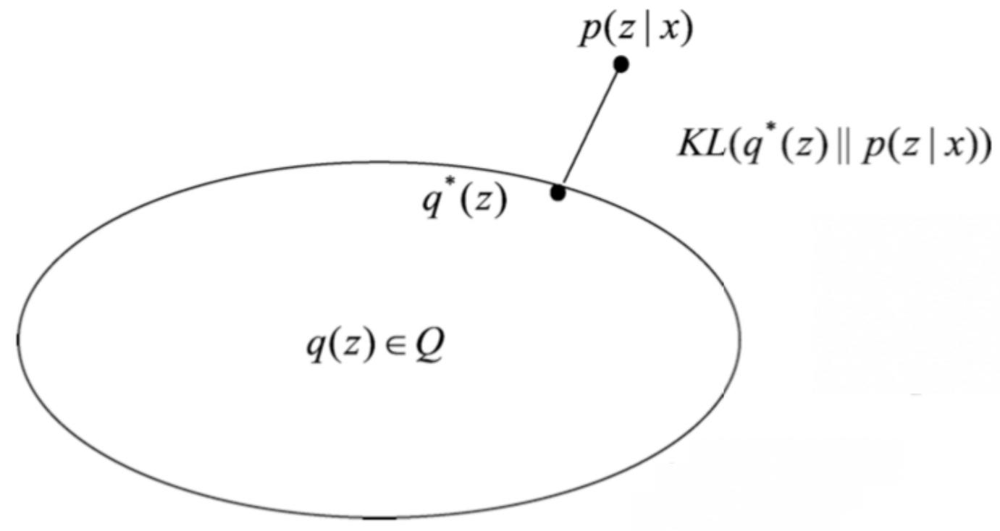

## 变分推理

•KL散度可以写成以下形式 $\begin{array} { r l } & { D ( q ( z ) \| p ( z | x ) ) = E _ { q } \left[ \log q ( z ) \right] - E _ { q } \left[ \log p ( z | x ) \right] } \\ & { \phantom { D ( q ( z ) ) = } = E _ { q } \left[ \log q ( z ) \right] - E _ { q } \left[ \log p ( x , z ) \right] + \log p ( x ) } \\ & { \phantom { D ( q ( z ) ) = } = \log p ( x ) - \left\{ E _ { q } \left[ \log p ( x , z ) \right] - E _ { q } \left[ \log q ( z ) \right] \right\} } \end{array}$

•注意到KL散度大于等于零，当具仅当两个分布一致时为零，由此可知右端第一项与第二项满足关系

$$
\begin{array} { r } { \log p ( x ) \geqslant E _ { q } \left[ \log p ( x , z ) \right] - E _ { q } \left[ \log q ( z ) \right] } \end{array}
$$

·不等式右端是左端的下界，左端称为证据（(evidence)，，右端称为证据下界（(evidence lower bound， ELBO)，证据下界记作

$$
L ( q ) = E _ { q } \left[ \log p ( x , z ) \right] - E _ { q } \left[ \log q ( z ) \right]
$$

## 变分推理

•KL散度的最小化可以通过证据下界的最大化实现，因为目标是求q(z)使KL散度最小化，这时log p(x)是常量

·因此，变分推理变成求解证据下界最大化的问题

## 变分推理

· 变分推理目标是通过证据log p(x)的最大化，估计联合概率分布p(X,z)

·因为含有隐变量z，直接对证据进行最大化困难，转而根据

$$
\begin{array} { r } { \log p ( x ) \geqslant E _ { q } \left[ \log p ( x , z ) \right] - E _ { q } \left[ \log q ( z ) \right] } \end{array}
$$

• 对证据下界进行最大化。

## 变分推理

·对变分分布q(z)要求是具有容易处理的形式，通常假设q(z)对z的所有分量都是互相独立的（实际是条件独立于参数），郎满足

$$
q ( z ) = q ( z _ { 1 } ) q ( z _ { 2 } ) \cdot \cdot \cdot q ( z _ { n } )
$$

·这时的变分分布称为平均场(mean filed)

•KL散度的最小化或证据下界最大化实际是在平均场的集合，即满足独立假设的分布集合

$$
Q = \{ q ( \boldsymbol { z } ) | q ( \boldsymbol { z } ) = \prod _ { i = 1 } ^ { n } q ( \boldsymbol { z } _ { i } ) \}
$$

•进行的

## 变分推理

• 总结起来，变分推理有以下几个步骤：

•定义变分分布q(z)

• 推导其证据下界表达式

·用最优化方法对证据下界进行优化，如坐标上升，得到最优分布q^(z)，作为后验分布p(z|x)的近似。

## 变分EM算法

·变分推理中，可以通过迭代的方法最大化证据下界，这时算法是EM算法的推广，称为变分EM算法

·假设模型是联合概率分布 p(x, }1θ），

•×是观测变量

•z是隐变量

●θ是参数

·目标是通过观测数据的概率（证据）logp(z|0)的最大化，估计模型 的参数θ

## 变分EM算法

•使用变分推理，导入平均场 $q ( \boldsymbol { z } ) = \prod _ { i = 1 } ^ { n } q ( z _ { i } ) \}$ 定义证据下界L(q,θ) = Eq[10g p(x, z|θ)] − Eq[0g q(z)]

• 通过迭代，分别以q和0为变量对证据下界进行最大化，就得到变分EM算法

## 变分EM算法

算法 20.3（变分 EM算法）

循环执行以下E步和M 步，直到收敛。

(1)E步：固定θ，求 $L ( q , \theta )$ 对q的最大化。

(2)M步：固定 $q ,$ 求 $L ( q , \theta )$ 对 $\theta$ 的最大化。

给出模型参数θ 的估计值。

根据变分推理原理，观测数据的概率和证据下界满足

$$
\log p ( x | \theta ) - L ( q , \theta ) = D ( q ( z ) | | p ( z | x , \theta ) ) \geqslant 0\tag{20.40}
$$

## 变分EM算法

•变分EM算法的迭代过程中，以下关系成立：

$$
\log p ( x | \theta ^ { ( t - 1 ) } ) = L ( q ^ { ( t ) } , \theta ^ { ( t - 1 ) } ) \leqslant L ( q ^ { ( t ) } , \theta ^ { ( t ) } ) \leqslant \log p ( x | \theta ^ { ( t ) } )
$$

• 左边的等式基于E步计算和变分推理原理

•中间的不等式基于M步计算

• 右边的不等式基于变分推理原理

·说明每次迭代都保证观测数据的概率不递减。因此，变分EM算法一定收敛，但可能收敛到局部最优

## 变分EM算法

• EM算法实际也是对证据下界进行最大化

•EM算法的推广是求F函数的极大-极大算法，其中的F函数就是证据下界

• EM算法假设q(z)=p(zlx)具p(zx)容易计算，而变分EM算法则考虑一般情况使用容易计算的平均场

$$
q ( \boldsymbol { z } ) = \prod _ { i = 1 } ^ { n } q ( z _ { i } ) ,
$$

·当模型复杂时，EM算法未必可用，但变分EM算法仍然可以使用。

## 算法推导

• 1.证据下界的定义

•为简单起见，一次只考虑一个文本，记作w

·文本的单词序列 $\mathbf { w } = ( w _ { 1 } , \cdot \cdot \cdot , w _ { n } , \cdot \cdot \cdot , w _ { N } )$ ，对应的话题序列 ${ \bf z } = ( z _ { 1 } , \cdot \cdot \cdot , z _ { n } , \cdot \cdot \cdot , z _ { N } )$ 以及话题分布θ，随机变量W，z和θ的联合分布是

$$
p ( \boldsymbol { \theta } , \mathbf { z } , \mathbf { w } | \alpha , \varphi ) = p ( \boldsymbol { \theta } | \alpha ) \prod _ { n = 1 } ^ { N } p ( z _ { n } | \boldsymbol { \theta } ) p ( w _ { n } | z _ { n } , \varphi )
$$

• w是可观测变量，θ 和z是隐变量，α和φ是参数

## 算法推导

•定义基于平均场的变分分布

$$
q ( \theta , \mathbf { z } | \gamma , \eta ) = q ( \theta | \gamma ) \prod _ { n = 1 } ^ { N } q ( z _ { n } | \eta _ { n } )
$$

• 其中γ是狄利克雷分布参数， $\eta = \left( \eta _ { 1 } , \eta _ { 2 } , \cdots , \eta _ { n } \right)$ 是多项分布参数，变量θ 和z的各个分量都是条件独立的

·目标是求KL散度意义下最相近的变分分布q(θ,，z|γ,n)，以近似LDA模型的后验分布 $p ( \boldsymbol { \theta } , \mathbf { z } | \mathbf { w } , \alpha , \varphi )$ o

## 算法推导

•下图是变分分布的板块表示。LDA模型中隐变量θ和z之间存在依存关系，变分分布中这些依存关系被去掉，变量θ和z条件独立。

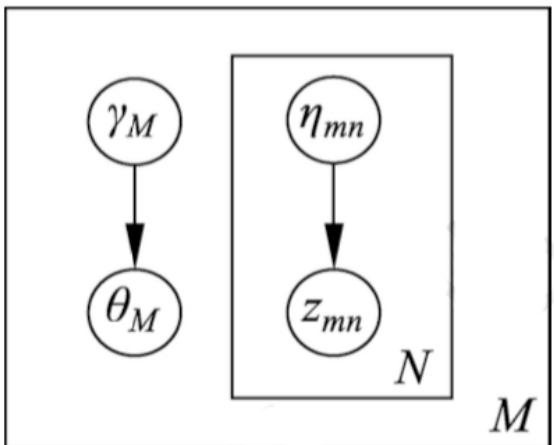

## 算法推导

· 由此得到一个文本的证据下界

$$
L ( \boldsymbol { \gamma } , \eta , \alpha _ { \boldsymbol { \mathfrak { j } } } \varphi ) = E _ { q } [ \log p ( \theta , \mathbf { z } , \mathbf { w } | \alpha , \varphi ) ] - E _ { q } [ \log q ( \theta , \mathbf { z } | \gamma , \eta ) ]
$$

·其中数学期望是对分布 $q ( \theta , \mathbf { z } | \gamma , \eta )$ 定义的，为了方便写作 $E _ { q } [ \bullet ]$

$\gamma$ 和η是变分分布的参数，α 和 $\varphi _ { , }$ 是LDA模型的参数

•所有文本的证据下界为

$$
L _ { \mathbf { w } } ( \boldsymbol { \gamma } , \eta , \alpha , \varphi ) = \sum _ { m = 1 } ^ { M } \left\{ E _ { q _ { m } } \left[ \log p ( \theta _ { m } , \mathbf { z } _ { m } , \mathbf { w } _ { m } | \alpha , \varphi ) \right] - E _ { q _ { m } } \left[ \log q ( \theta _ { m } , \mathbf { z } _ { m } | \gamma _ { m } , \eta _ { m } ) \right] \right\}
$$

## 算法推导

•为求解证据下界L(γ,η,α，φ）的最大化，首先写出证据下界的表达式。为此展开证据下界

$$
\begin{array} { r l } & { L ( \gamma , \eta , \alpha _ { j } \varphi ) = E _ { q } [ \log p ( \theta , \mathbf { z } , \mathbf { w } | \alpha , \varphi ) ] - E _ { q } [ \log q ( \theta , \mathbf { z } | \gamma , \eta ) ] } \\ & { L ( \gamma , \eta , \alpha , \varphi ) = E _ { q } [ \log p ( \theta | \alpha ) ] + E _ { q } [ \log p ( \mathbf { z } | \theta ) ] + E _ { q } [ \log p ( \mathbf { w } | \mathbf { z } , \varphi ) ] - } \\ & { \qquad E _ { q } [ \log q ( \theta | \gamma ) ] - E _ { q } [ \log q ( \mathbf { z } | \eta ) ] } \end{array}
$$

## 算法推导

·根据变分参数？和η，模型参数α和 $\varphi _ { , }$ 继续展开，并将展开式的每一项写成一行

$$
\begin{array}{c} L ( { \boldsymbol { \gamma } } , { \boldsymbol { \eta } } , \alpha , \varphi ) = \log \Gamma ( \sum _ { i = 1 } ^ { K } \alpha _ { i } ) \cdot \sum _ { k = 1 } ^ { K } \log \Gamma ( \alpha _ { k } ) + \sum _ { k = 1 } ^ { K } ( \alpha _ { k } - 1 ) [ \varPsi ( \gamma _ { k } ) - \varPsi ( \sum _ { l = 1 } ^ { K } \gamma ) ] +  \\ { \sum _ { n = 1 } ^ { N } \sum _ { k = 1 } ^ { K } \eta _ { n k } [ \varPsi ( \gamma _ { k } ) - \varPsi ( \sum _ { l = 1 } ^ { K } \eta ) ] + } \\ { \sum _ { n = 1 } ^ { N } \sum _ { k = 1 } ^ { K } \sum _ { \upsilon = 1 } ^ { \varPsi } \eta _ { n k } w _ { n } ^ { \upsilon } \log \varphi _ { k \upsilon } - } \end{array} ) \frac { [ \varPsi ( \alpha _ { k } ) = \frac { \mathrm { d } } { \mathrm { d } \alpha _ { k } } \log \Gamma ( \alpha _ { k } ) ] } { [ \underbrace { \varPsi ( \alpha _ { k } ) = \frac { \mathrm { d } } { \mathrm { d } \alpha _ { k } } \log \Gamma ( \alpha _ { k } ) } _ { \mathrm { ~ } n = 1 } ] + }
$$

$$
\log \Gamma \left( \sum _ { l = 1 } ^ { K } \gamma _ { l } \right) + \sum _ { k = 1 } ^ { K } \log \Gamma ( \gamma _ { k } ) - \sum _ { k = 1 } ^ { K } ( \gamma _ { k } - 1 ) \left[ \varPsi ( \gamma _ { k } ) - \varPsi \left( \sum _ { l = 1 } ^ { K } \gamma _ { l } \right) \right] - \sum _ { n = 1 } ^ { N } \sum _ { k = 1 } ^ { K } \eta _ { n k } \log \eta _ { n k }\tag{20.47}
$$

## 算法推导

第一项推导，求 $E _ { q } \left[ \log p ( \theta | \alpha ) \right]$ ，是关于分布 $q ( \theta , \mathbf { z } | \gamma , \eta )$ 的数学期望。

$$
E _ { q } \left[ \log p ( \theta | \alpha ) \right] = \sum _ { k = 1 } ^ { K } ( \alpha _ { k } - 1 ) E _ { q } \left[ \log \theta _ { k } \right] + \log \Gamma \left( \sum _ { l = 1 } ^ { K } \alpha _ { l } \right) - \sum _ { k = 1 } ^ { K } \log \Gamma ( \alpha _ { k } )\tag{20.49}
$$

其中 $\theta \sim \operatorname { D i r } ( \theta | \gamma )$ ，所以利用附录E式 (E.7）有

$$
E _ { q \left( \theta \mid \gamma \right) } \left[ \log \theta _ { k } \right] = \varPsi \left( \gamma _ { k } \right) - \varPsi \left( \sum _ { l = 1 } ^ { K } \gamma _ { l } \right)\tag{20.50}
$$

故得

$$
E _ { q } [ \log p ( \theta | \alpha ) ] = \log \Gamma \left( \sum _ { l = 1 } ^ { K } \alpha _ { l } \right) - \sum _ { k = 1 } ^ { K } \log \Gamma ( \alpha _ { k } ) + \sum _ { k = 1 } ^ { K } ( \alpha _ { k } - 1 ) \left[ \varPsi ( \gamma _ { k } ) - \varPsi \left( \sum _ { l = 1 } ^ { K } \gamma _ { l } \right) \right]\tag{20.51}
$$

式中 $\alpha _ { k }$ 和 $\gamma _ { k }$ 表示第 κ 个话题的狄利克雷分布参数。

## 算法推导

第二项推导，求 $E _ { q } [ \log p ( \mathbf { z } | \boldsymbol { \theta } ) ]$ ，是关于分布 $q ( \theta , \mathbf { z } | \gamma , \eta )$ 的数学期望。

$$
\begin{array} { l } { { \displaystyle E _ { q } ( \log p ( \mathbf { z } | \theta ) ) = \sum _ { n = 1 } E _ { q } \left[ \log p ( z _ { n } | \theta ) \right] } \ ~ } \\ { { \displaystyle = \sum _ { n = 1 } ^ { N } E _ { q ( \theta , z _ { n } | \gamma , \eta ) } \left[ \log ( z _ { n } | \theta ) \right] } \ ~ } \\ { { \displaystyle = \sum _ { n = 1 } ^ { N } \sum _ { k = 1 } ^ { K } q ( z _ { n k } | \eta ) E _ { q ( \theta | \gamma ) } \left[ \log \theta _ { k } \right] } \ ~ } \\ { { \displaystyle = \sum _ { n = 1 } ^ { N } \sum _ { k = 1 } ^ { K } \eta _ { n k } \left[ \psi ( \gamma _ { k } ) - \psi \left( \sum _ { l = 1 } ^ { K } \eta \right) \right] } \ ~ } \end{array}\tag{20.52}
$$

式中 $\eta _ { n k }$ 表示文档第 n 个位置的单词由第k 个话题产生的概率， $\gamma _ { k }$ 表示第k个话题的狄利克雷分布参数。最后一步用到附录E 式 (E.4)。

## 算法推导

第三项推导，求 $E _ { q } \left[ \log p ( \mathbf { w } | \mathbf { z } , \varphi ) \right]$ ，是关于分布 $q ( \theta , \mathbf { z } | \gamma , \eta )$ 的数学期望。

$$
\begin{array} { l } { { \displaystyle E _ { q } \left[ \log p ( { \bf w } | { \bf z } , \varphi ) \right] = \sum _ { n = 1 } ^ { N } E _ { q } \left[ \log p ( { \boldsymbol w } _ { n } | { \boldsymbol z } _ { n } , \varphi ) \right] } \ ~ } \\ { ~ } \\ { { \displaystyle = \sum _ { n = 1 } ^ { N } E _ { q ( { \boldsymbol z } _ { n } | \eta ) } \left[ \log p ( { \boldsymbol w } _ { n } | { \boldsymbol z } _ { n } , \varphi ) \right] } \ ~ } \\ { { \displaystyle = \sum _ { n = 1 } ^ { N } \sum _ { k = 1 } ^ { K } q ( { \boldsymbol z } _ { n k } | \eta ) \log p ( { \boldsymbol w } _ { n } | { \boldsymbol z } _ { n k } , \varphi ) } \ ~ } \\ { { \displaystyle ~ } = \sum _ { n = 1 } ^ { N } \sum _ { k = 1 } ^ { K } \sum _ { n = 1 } ^ { V } q _ { n k } w _ { n } ^ { \prime } \log \varphi _ { k \nu } } \end{array}\tag{20.53}
$$

式中 $\eta _ { n k }$ 表示文档第n 个位置的单词由第 k 个话题产生的概率， $w _ { n } ^ { v }$ 在第n个位置的单词是单词集合的第υ个单词时取值为1，否则取值为 $0 , \varphi _ { k v }$ 表示第k个话题生成单词集合中第υ个单词的概率。

## 算法推导

第四项推导，求 $E _ { q } \left[ \log q ( \theta | \gamma ) \right]$ ，是关于分布 $q ( \theta , \mathbf { z } | \gamma , \eta )$ 的数学期望。由于 $\theta \sim$ $\operatorname { D i r } ( \gamma )$ ，类似式 (20.50)可以得到

$$
E _ { q } [ \log q ( \theta | \gamma ) ] = \log \Gamma \left( \sum _ { l = 1 } ^ { K } \gamma _ { l } \right) - \sum _ { k = 1 } ^ { K } \log \Gamma ( \gamma _ { k } ) + \sum _ { k = 1 } ^ { K } ( \gamma _ { k } - 1 ) \left[ \varPsi ( \gamma _ { k } ) - \varPsi \left( \sum _ { l = 1 } ^ { K } \gamma _ { l } \right) \right]\tag{20.54}
$$

式中 $\gamma _ { k }$ 表示第κ个话题的狄利克雷分布参数。

## 算法推导

第五项公式推导，求 $E _ { q } \left[ \log q ( \mathbf { z } | \boldsymbol { \eta } ) \right]$ ，是关于分布 $q ( \theta , \mathbf { z } | \gamma , \eta )$ 的数学期望。

$$
\begin{array} { l } { { \displaystyle E _ { q } [ \log q ( { \bf z } | \eta ) ] = \sum _ { n = 1 } ^ { N } E _ { q } [ \log q ( { \boldsymbol z } _ { n } | \eta ) ] } \ ~ } \\ { { \displaystyle = \sum _ { n = 1 } ^ { N } E _ { q ( { \boldsymbol z } _ { n } | \eta ) } \log q ( { \boldsymbol z } _ { n } | \eta ) ] } \ ~ } \\ { { \displaystyle = \sum _ { n = 1 } ^ { N } \sum _ { k = 1 } ^ { K } q ( { \boldsymbol z } _ { n k } | \eta ) \log q ( { \boldsymbol z } _ { n k } | \eta ) } \ ~ } \\ { { \displaystyle = \sum _ { n = 1 } ^ { N } \sum _ { k = 1 } ^ { K } m _ { k } \log \eta _ { n k } } \log \eta _ { n k } } \end{array}\tag{20.55}
$$

式中 $\eta _ { n k }$ 表示文档第n 个位置的单词由第 k 个话题产生的概率， $\gamma _ { k }$ 表示第k个话题的狄利克雷分布参数。

## 算法推导

• 2.变分参数γ和η的估计

· 首先通过证据下界最优化估计参数ⁿ。

$\eta _ { n k }$ 表示第n个位置的单词是由第k个话题生成的概率。考虑式(20.47）关于 $\eta _ { n k }$ 的最大化， $\eta _ { n k }$ 满足约束条件

$$
\sum _ { l = 1 } ^ { K } \eta _ { n l } = 1
$$

## 算法推导

•包含 $\eta _ { n k }$ 的约束最优化问题拉格朗日函数为

$$
L _ { [ \eta _ { n k } ] } = \eta _ { n k } \left[ \varPsi ( \gamma _ { k } ) - \varPsi \left( \sum _ { l = 1 } ^ { K } \gamma _ { l } \right) \right] + \eta _ { n k } \log \varphi _ { k v } - \eta _ { n k } \log \eta _ { n k } + \lambda _ { n } \left( \sum _ { l = 1 } ^ { K } \eta _ { n l } - 1 \right)\tag{20.56}
$$

·这里 $\varphi _ { k v }$ 是（在第n个位置）由第k个话题生成第v个单词的概率

•对 $\eta _ { n k }$ 求偏导数得

$$
\frac { \partial L } { \partial \eta _ { n k } } = \varPsi ( \gamma _ { k } ) - \varPsi \left( \sum _ { l = 1 } ^ { K } \gamma _ { l } \right) + \log \varphi _ { k v } - \log \eta _ { n k } - 1 + \lambda _ { n }
$$

## 算法推导

•令偏导数为零，得到参数 $\eta _ { n k }$ 的估计值

$$
\eta _ { n k } \propto \varphi _ { k v } \exp { \left( \varPsi ( \gamma _ { k } ) - \varPsi \left( \sum _ { l = 1 } ^ { K } \gamma _ { l } \right) \right) }
$$

·接着通过证据下界最优化估计参数 $\gamma _ { \mathrm { ~ \scriptsize ~ o ~ } } \gamma _ { k }$ 是第k个话题的狄利克 雷分布参数。考虑式（20.47）关于 $\gamma _ { k }$ 的最大化

$$
\begin{array} { r l r } {  { L _ { [ \gamma _ { k } ] } = \sum _ { k = 1 } ^ { K } ( \alpha _ { k } - 1 ) [ \varPsi ( \gamma _ { k } ) - \varPsi ( \sum _ { l = 1 } ^ { K } \gamma _ { l } ) ] + \sum _ { n = 1 } ^ { N } \sum _ { k = 1 } ^ { K } \eta _ { n k } [ \varPsi ( \gamma _ { k } ) - \varPsi ( \sum _ { l = 1 } ^ { K } \gamma _ { l } ) ] - } } \\ & { } & { \log { \Gamma ( \sum _ { l = 1 } ^ { K } \gamma _ { l } ) } + \log { \Gamma ( \gamma _ { k } ) } - \sum _ { k = 1 } ^ { K } ( \gamma _ { k } - 1 ) [ \varPsi ( \gamma _ { k } ) - \varPsi ( \sum _ { l = 1 } ^ { K } \gamma _ { l } ) ] \qquad ( 2 0 . 5 9 ) } \end{array}
$$

## 算法推导

•简化为

$$
L _ { [ \gamma _ { k } ] } = \sum _ { k = 1 } ^ { K } \left[ \varPsi ( \gamma _ { k } ) - \varPsi \left( \sum _ { l = 1 } ^ { K } \gamma _ { l } \right) \right] \left( \alpha _ { k } + \sum _ { n = 1 } ^ { N } \eta _ { n } \varepsilon - \gamma _ { k } \right) - \log \Gamma \left( \sum _ { l = 1 } ^ { K } \gamma _ { l } \right) + \log \Gamma ( \gamma _ { k } )\tag{20.60}
$$

•对 $\gamma _ { k }$ 求偏导数得

$$
\frac { \partial L } { \partial \gamma _ { k } } = \left[ \varPsi ^ { \prime } ( \gamma _ { k } ) - \varPsi ^ { \prime } \left( \sum _ { l = 1 } ^ { K } \gamma _ { l } \right) \right] \left( \alpha _ { k } + \sum _ { n = 1 } ^ { N } \eta _ { n \bar { k } } - \gamma _ { k } \right)
$$

·据此，得到由坐标上升算法估计变分参数的方法

## LDA的变分参数估计算法

算法 20.4（LDA的变分参数估计算法)

（1）初始化：对所有k和n， $\eta _ { n k } ^ { ( 0 ) } = 1 / K$

（2）初始化：对所有k， $\gamma _ { k } = \alpha _ { k } + N / K$

（3）重复

(4) 对n = 1到 N

（5） 对k = 1 到 K

$$
\eta _ { n k } ^ { ( t + 1 ) } = \varphi _ { k v } \exp \left[ \varPsi ( \gamma _ { k } ^ { ( t ) } ) - \varPsi \left( \sum _ { l = } ^ { K } \gamma _ { l } ^ { ( t ) } \right) \right]\tag{6}
$$

（7） 规范化 $\eta _ { n k } ^ { ( t + 1 ) }$ 使其和为1

$$
\gamma ^ { ( t + 1 ) } = \alpha + \sum _ { n = 1 } ^ { N } \eta _ { n } ^ { ( t + 1 ) }
$$

（9）直到收敛

## 算法推导

• 3.模型参数α和φ的估计

•给定一个文本合集 $D = \{ \mathbf { w } _ { 1 } , \cdots , \mathbf { w } _ { m } , \cdots , \mathbf { w } _ { M } \}$ ，模型参数估计对所有文本同时进行

## 算法推导

首先通过证据下界的最大化估计 $\varphi \circ ~ \varphi _ { k v }$ 表示第k个话题生成单词集合第υ个单词的概率。将式(20.47) 扩展到所有文本，并考虑关于 $\varphi$ 的最大化。满足K个约束条件

$$
\sum _ { v = 1 } ^ { V } \varphi _ { k v } = 1 , \quad k = 1 , 2 , \cdots , K
$$

约束最优化问题的拉格朗日函数为

$$
L _ { [ \beta ] } = \sum _ { m = 1 } ^ { M } \sum _ { n = 1 } ^ { N _ { m } } \sum _ { k = 1 } ^ { K } \sum _ { v = 1 } ^ { V } \eta _ { m n k } w _ { m n } ^ { v } \log \varphi _ { k v } + \sum _ { k = 1 } ^ { K } \lambda _ { k } \left( \sum _ { v = 1 } ^ { V } \varphi _ { k v } - 1 \right)\tag{20.63}
$$

对 $\varphi _ { k v }$ 求偏导数并令其为零，归一化求解，得到参数 $\varphi _ { k v }$ 的估计值

$$
\varphi _ { k v } = \sum _ { m = 1 } ^ { M } \sum _ { n = 1 } ^ { N _ { m } } \eta _ { m n k } w _ { m n } ^ { v }\tag{20.64}
$$

其中 $\eta _ { m n k }$ 为第m个文本的第n个单词属于第k个话题的概率， $w _ { m n } ^ { v }$ 在第m个文本的第n个单词是单词集合的第υ个单词时取值为1，否则为0。

## 算法推导

接着通过证据下界的最大化估计参数 $\alpha \circ \ \alpha _ { k }$ 表示第k个话题的狄利克雷分布参数。将式 (20.47)扩展到所有文本，并考虑关于α的最大化

$$
L _ { [ \alpha ] } = \sum _ { m = 1 } ^ { M } \left\{ \log \Gamma \left( \sum _ { l = 1 } ^ { K } \alpha _ { l } \right) - \sum _ { k = 1 } ^ { K } \log \Gamma ( \alpha _ { k } ) + \sum _ { k = 1 } ^ { K } ( \alpha _ { k } - 1 ) \left[ \varPsi ( \gamma _ { m k } ) - \varPsi \left( \sum _ { l = 1 } ^ { K } \gamma _ { m l } \right) \right] \right\}\tag{20.65}
$$

对 $\alpha _ { k }$ 求偏导数得

$$
\frac { \partial L } { \partial \alpha _ { k } } = M \left[ \varPsi \left( \sum _ { l = 1 } ^ { K } \alpha _ { l } \right) - \varPsi ( \alpha _ { k } ) \right] + \sum _ { m = 1 } ^ { M } \left[ \varPsi ( \gamma _ { m k } ) - \varPsi \left( \sum _ { l = 1 } ^ { K } \gamma _ { m l } \right) \right]\tag{20.66}
$$

再对 $\alpha _ { l }$ 求偏导数得

$$
\frac { \partial ^ { 2 } L } { \partial \alpha _ { k } \partial \alpha _ { l } } = M \left[ \varPsi ^ { \prime } \left( \sum _ { l = 1 } ^ { K } \alpha _ { l } \right) - \delta ( k , l ) \varPsi ^ { \prime } ( \alpha _ { k } ) \right]\tag{20.67}
$$

这里 $\delta ( k , l )$ 是delta函数。

## 算法推导

式(20.65)和式(20.66)分别是函数(20.64)对变量α的梯度g(α）和 Hessian矩阵H(α)。应用牛顿法（又称为牛顿-拉弗森方法）求该函数的最大 $\# ^ { \textcircled { 1 } }$ 。用以下公式迭代，得到参数α的估计值。

$$
\alpha _ { \mathrm { n e w } } = \alpha _ { \mathrm { o l d } } - H ( \alpha _ { \mathrm { o l d } } ) ^ { - 1 } g ( \alpha _ { \mathrm { o l d } } )\tag{20.68}
$$

据此，得到估计参数α的算法。

## LDA的变分EM算法

## 算法 20.5 (LDA 的变分 EM 算法)

输入：给定文本集合 $D = \{ \mathbf { w } _ { 1 } , \cdot \cdot \cdot , \mathbf { w } _ { m } , \cdot \cdot \cdot , \mathbf { w } _ { M } \}$

输出：变分参数γ，η，模型参数 $\alpha , \ \varphi \circ$

交替迭代E 步和M 步，直到收敛。

## （1）E步

固定模型参数α，ϕ，通过关于变分参数γ，η的证据下界的最大化，估计变分参数 $\gamma , ~ \eta _ { \circ }$ 具体见算法 20.4。

## （2）M步

固定变分参数γ，η，通过关于模型参数α，φ的证据下界的最大化，估计模型参数 α，φ。具体算法见式 (20.63)和式 (20.67)。

根据变分参数 $( \gamma , \eta )$ 可以估计模型参数 $\boldsymbol { \theta } = ( \theta _ { 1 } , \cdot \cdot \cdot , \theta _ { m } , \cdot \cdot \cdot , \theta _ { M } ) , \mathbf { z } = ( z _ { 1 } , \cdot \cdot \cdot$ ,$z _ { m } , \cdots , z _ { M } )$ 。

第二十一章

## PageRank算法

·在实际应用中许多数据都以图（graph)的形式存在，比如，互联网、社交网络都可以看作是一个图

• 图数据上的机器学习具有理论与应用上的重要意义

•PageRank算法是图的链接分析（link analysis）的代表性算法，属于图数据上的无监督学习方法。

•PageRank可以定义在任意有向图上，后来被应用到社会影响力分析、文本摘要等多个问题。

## PageRank算法

•PageRank算法的基本想法是在有向图上定义一个随机游走模型，即一阶马尔可夫链，描述随机游走者沿着有向图随机访问各个结点的行为

•在一定条件下，极限情况访问每个结点的概率收敛到平稳分布，这时客个结点的平稳概率值就是其PageRank值，表示结点的重要度。

•PageRank是递归定义的，PageRank的计算可以 通过迭代算法进行。

## PageRank的定义

## 基本想法

·历史上，PageRank算法作为计算互联网网页重要度的算法被提出

• PageRank是定义在网页集合上的一个函数，它对每个网页给出一个正实数，表示网页的重要程度，整体构成一个向量

•PageRank值越高，网页就越重要，在互联网搜索的排序中可能就被排在前面

## 基本想法

·假设互联网是一个有向图，在其基础上定义随机游走模型，即一阶马尔可夫链，表示网页浏览者在互联网上随机浏览网页的过程

·假设浏览者在每个网页依照连接出去的超链接以等概率跳转到下一个网页，并在网上持续不断进行这样的随机跳转，这个过程形成一阶马尔可夫链

•PageRank表示这个马尔可夫链的平稳分布

·每个网页的PageRank值就是平稳概率。

## 基本想法

•下图表示一个有向图，假设是简化的互联网例，结点A,B,C和D表示网页，结点之间的有向边表示网页之间的超链接，边上的权值表示网页之间随机跳转的概率

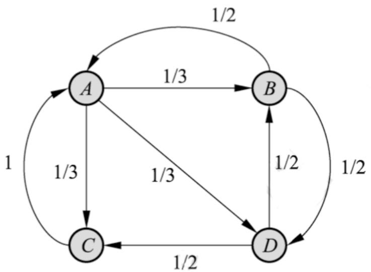

## 基本想法

·假设有一个浏览者，在网上随机游走

•如果浏览者在网页A， •则下一步以1/3的概率转移到网页B,C和D

• 如果浏览者在网页B， •则下一步以1/2的概率转移到网页A和D

•如果浏览者在网页C， ·则下一步以概率1转移到网页A

•如果浏览者在网页D，

•则下一步以1/2的概率转移到网页B和C

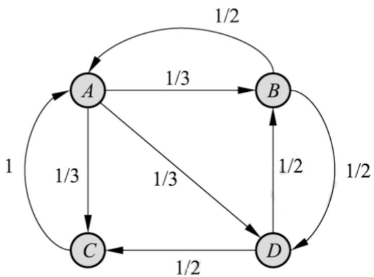

## 基本想法

·直观上，一个网页，如果指向该网页的超链接越多，随机跳转到该网页的概率也就越高，该网页的PageRank值就越高，这个网页也就越重要

•一个网页，如果指向该网页的PageRank值越高，随机跳转到该网页的概率也就越高，该网页的PageRank值就越高，这个网页也就越重要

•PageRank值依赖于网络的拓扑结构，一旦网络的拓扑（连接关系)确定，PageRank值就确定

## 基本想法

•PageRank的计算可以在互联网的有向图上进行，通常是一个迭代过程

·先假设一 个初始分布，通过迭代，不断计算所有网页的PageRank值，直到收敛为止

## 有向图

定义21.1（有向图） 有向图（directed graph）记作G=(V, E)，其中V和E分别表示结点和有向边的集合。

·从一个结点出发到达另一个结点，所经过的边的一个序列称为一条路径（(path)，路径上边的个数称为路径的长度

•如果一个有向图从其中任何一个结点出发可以到达 其他任何一个结点，就称这个有向图是强连通图(strongly connected graph)

## 有向图

·假设k是一个大于1的自然数

·如果从有向图的一个结点出发返回到这个结点的路径的长度都是k的倍数，那么称这个结点为周期性结点

·如果一个有向图不含有周期性结点，则称这个有向图为非周期性图（aperiodic graph)，否则为周期性图

## 有向图

•下图是一个周期性有向图的例子

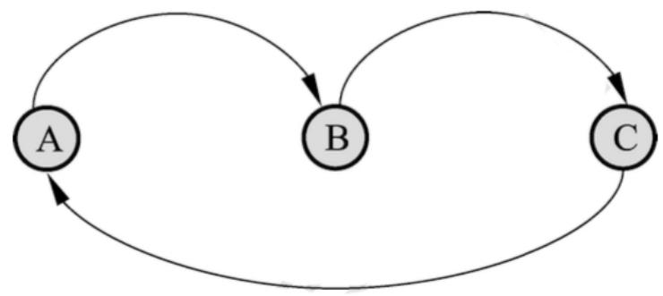

·从结点A出发返回到A，必须经过路径A—B—C一A，所有可能的路径的长度都是3的倍数，所以结点A是周期性结点。这个有向图是周期性图

## 随机游走模型

定义21.2（随机游走模型）给定一个含有n个结点的有向图，在有向图上定义随机游走（random walk)模型，即一阶马尔可夫链①，其中结点表示状态，有向边表示状态之间的转移，假设从一个结点到通过有向边相连的所有结点的转移概率相等。具体地．转移矩阵是一个n 阶矩阵M

$$
\boldsymbol { M } = \left[ m _ { i j } \right] _ { n \times n }\tag{21.1}
$$

第i行第 $j$ 列的元素 $m _ { i j }$ 取值规则如下：如果结 $\$  j$ 有k个有向边连出，并且结点i是其连出的一个结点，则 $m _ { i j } = \frac { 1 } { k } ;$ 否则 $m _ { i j } = 0 , ~ i , j = 1 , 2 , \cdot \cdot \cdot , n$

## 随机游走模型

•注意转移矩阵具有性质

$$
\sum _ { i = 1 } ^ { m _ { i j } } \geqslant 0 \qquad 
$$

·即每个元素非负，每列元素之和为1，即矩阵M为随机矩阵(stochastic matrix)。

## 随机游走模型

·在有向图上的随机游走形成马尔可夫链。也就是说，随机游走者每经一个单位时间转移一个状态

·如果当前时刻在第j个结点（状态），那么下一个时刻在第i个结点（状态)的概率是mj

·这一概率只依赖于当前的状态，与过去无关，具有马尔可夫性。

## 随机游走模型

・在下图的有向图上可以定义随机游走模型

•结点A到结点B,C和D存在有向边，

可以以概率1/3从A分别转移到B,C和D，并以概转移矩阵的第1列

•结点B到结点A和D存在有向边，可以以概率1/2从B分别转移到A和D，并以概率0分别转移到B和C，于是可以写出矩阵的第2列

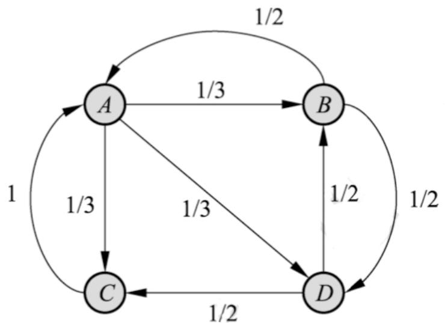

## 随机游走模型

·于是得到转移矩阵

$$
M = { \left[ \begin{array} { l l l l } { 0 } & { 1 / 2 } & { 1 } & { 0 } \\ { 1 / 3 } & { 0 } & { 0 } & { 1 / 2 } \\ { 1 / 3 } & { 0 } & { 0 } & { 1 / 2 } \\ { 1 / 3 } & { 1 / 2 } & { 0 } & { 0 } \end{array} \right] }
$$

·随机游走在某个时刻t访问各个结点的概率分布就是马尔可夫链在时刻t的状态 分布，可以用一个n维列向量 $\mathsf { R } _ { \mathrm { t } }$ 表示，那么在时刻t+1访问各个结点的概率分布 $\mathsf { R } _ { { \sf t } + 1 }$ 满足

$$
R _ { t + 1 } = M R _ { t }
$$

## PageRank的基本定义

• 给定一个包含n个结点的强连通且非周期性的有向图，在其基础上定义随机游走模型

•假设转移矩阵为M，在时刻 $0 , 1 , 2 , \ldots ,  t , \cdots$ 访问各个结点的概率分布为

$$
R _ { 0 } , ~ { \cal M } R _ { 0 } , ~ { \cal M } ^ { 2 } R _ { 0 } , ~ \cdot ~ \cdot ~ , ~ { \cal M } ^ { t } R _ { 0 } , ~ \cdot ~ \cdot ~ .
$$

·则极限 $\operatorname* { l i m } _ { t  \infty } M ^ { t } R _ { 0 } = R$ 存在

•极限向量R表示马尔可夫链的平稳分布，满足

$$
M R = R
$$

## PageRank的基本定义

定义21.3（PageRank的基本定义）给定一个包含n个结点 $v _ { 1 } , v _ { 2 } , \cdots , v _ { n }$ 的强连通且非周期性的有向图，在有向图上定义随机游走模型，即一阶马尔可夫链。随机游走的特点是从一个结点到有有向边连出的所有结点的转移概率相等，转移矩阵为M。这个马尔可夫链具有平稳分布R

$$
M R = R\tag{21.6}
$$

平稳分布R称为这个有向图的PageRank。R的各个分量称为各个结点的PageRank值。

$$
R = \left[ \begin{array} { c } { P R ( v _ { 1 } ) } \\ { P R ( v _ { 2 } ) } \\ { \vdots } \\ { P R ( v _ { n } ) } \end{array} \right]
$$

其中 $P R ( v _ { i } ) , \ i = 1 , 2 , \cdot \cdot \cdot , n ,$ 表示结点 $v _ { i }$ 的PageRank值。

## PageRank的基本定义

•显然有

$$
P R ( v _ { i } ) \geqslant 0 , \quad i = 1 , 2 , \cdot \cdot \cdot , n
$$

$$
\sum _ { i = 1 } ^ { n } P R ( v _ { i } ) = 1
$$

$$
P R ( v _ { i } ) = \sum _ { v _ { j } \in M ( v _ { i } ) } \frac { P R ( v _ { j } ) } { L ( v _ { j } ) } , \quad i = 1 , 2 , \cdots , n
$$

${ \sf M } ( { \sf V } _ { \mathrm { i } } )$ 表示指向结点v的结点集合

• L(v)表示结点v连出的有向边的个数

·PageRank的基本定义是理想化的，在这中情况下，PageRank存在，而且可以通过不断迭代求得PageRank值

## PageRank的基本定义

定理21.1不可约且非周期的有限状态马尔可夫链，有唯一平稳分布存在，并且当时间趋于无穷时状态分布收敛于唯一的平稳分布。

根据马尔可夫链平稳分布定理，强连通且非周期的有向图上定义的随机游走模型（马尔可夫链），在图上的随机游走当时间趋于无穷时状态分布收敛于唯一的平稳分布。

## 例

·求下图的PageRank

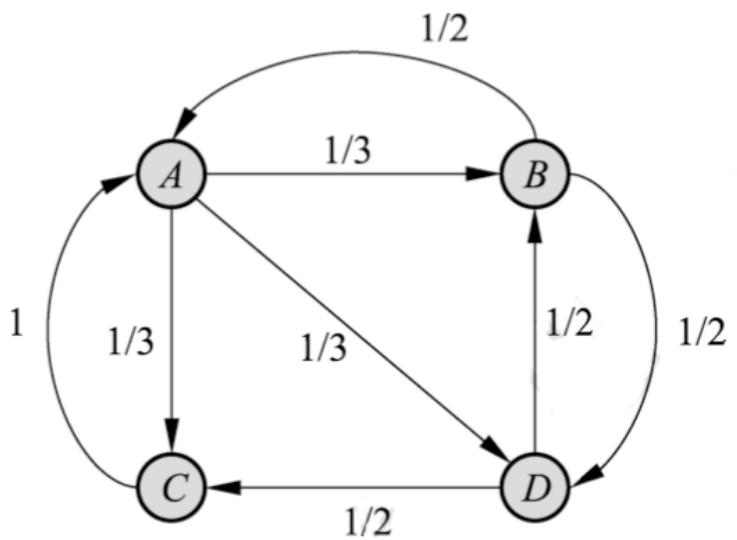

## 例

•转移矩阵

$$
M = \left[ \begin{array} { c c c c } { { 0 } } & { { 1 / 2 } } & { { 1 } } & { { 0 } } \\ { { 1 / 3 } } & { { 0 } } & { { 0 } } & { { 1 / 2 } } \\ { { 1 / 3 } } & { { 0 } } & { { 0 } } & { { 1 / 2 } } \\ { { 1 / 3 } } & { { 1 / 2 } } & { { 0 } } & { { 0 } } \end{array} \right]
$$

·取初始分布向量 $\mathsf { R } _ { 0 }$ 为 $R _ { 0 } = { \left[ \begin{array} { l } { 1 / 4 } \\ { 1 / 4 } \\ { 1 / 4 } \\ { 1 / 4 } \end{array} \right] }$

## 例

·以转移矩阵M连乘初始向量 $\mathsf { R } _ { 0 }$ 得到向量序列

$$
{ \left[ \begin{array} { l } { 1 / 4 } \\ { 1 / 4 } \\ { 1 / 4 } \\ { 1 / 4 } \\ { 1 / 4 } \end{array} \right] } , \quad { \left[ \begin{array} { l } { 9 / 2 4 } \\ { 5 / 2 4 } \\ { 5 / 2 4 } \\ { 5 / 2 4 } \\ { 5 / 2 4 } \end{array} \right] } , \quad { \left[ \begin{array} { l } { 1 5 / 4 8 } \\ { 1 1 / 4 8 } \\ { 1 1 / 4 8 } \\ { 1 1 / 4 8 } \\ { 1 1 / 4 8 } \end{array} \right] } , \quad { \left[ \begin{array} { l } { 1 1 / 3 2 } \\ { 7 / 3 2 } \\ { 7 / 3 2 } \\ { 7 / 3 2 } \\ { 7 / 3 2 } \end{array} \right] } , \quad \cdots , \quad { \left[ \begin{array} { l } { 3 / 9 } \\ { 2 / 9 } \\ { 2 / 9 } \\ { 2 / 9 } \\ { 2 / 9 } \end{array} \right] }
$$

・最后得到极限向量 $R = \left[ \begin{array} { l } { 3 / 9 } \\ { 2 / 9 } \\ { 2 / 9 } \\ { 2 / 9 } \end{array} \right]$ 即有向图的PageRank值

• 一般的有向图未必满足强连通且非周期性的条件。所以PageRank 的基本定义不适用。

## 例

•下图的有向图的转移矩阵M是

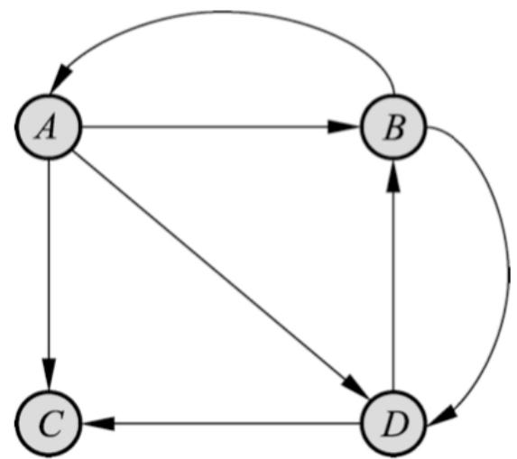

$$
M = \left[ \begin{array} { c c c c } { { 0 } } & { { 1 / 2 } } & { { 0 } } & { { 0 } } \\ { { } } & { { } } & { { } } & { { } } \\ { { 1 / 3 } } & { { 0 } } & { { 0 } } & { { 1 / 2 } } \\ { { } } & { { } } & { { } } & { { } } \\ { { 1 / 3 } } & { { 0 } } & { { 0 } } & { { 1 / 2 } } \\ { { } } & { { } } & { { } } & { { } } \\ { { 1 / 3 } } & { { 1 / 2 } } & { { 0 } } & { { 0 } } \end{array} \right]
$$

## 例

•这时M不是一个随机矩阵，因为随机矩阵要求每一列的元素之和是1，这里第3列的和是0，不是1

•如果仍然计算在各个时刻的各个结点的概率分布，就会得到如下结果

$$
{ \left[ \begin{array} { l } { 1 / 4 } \\ { 1 / 4 } \\ { 1 / 4 } \\ { 1 / 4 } \\ { 1 / 4 } \\ { 1 / 4 } \end{array} \right] } , \quad { \left[ \begin{array} { l } { 3 / 2 4 } \\ { 5 / 2 4 } \\ { 5 / 2 4 } \\ { 5 / 2 4 } \\ { 5 / 2 4 } \end{array} \right] } , \quad { \left[ \begin{array} { l } { 5 / 4 8 } \\ { 7 / 4 8 } \\ { 7 / 4 8 } \\ { 7 / 4 8 } \\ { 7 / 4 8 } \end{array} \right] } , \quad { \left[ \begin{array} { l } { 2 1 / 2 8 8 } \\ { 3 1 / 2 8 8 } \\ { 3 1 / 2 8 8 } \\ { 3 1 / 2 8 8 } \\ { 3 1 / 2 8 8 } \end{array} \right] } , \quad \cdots , \quad { \left[ \begin{array} { l } { 0 } \\ { 0 } \\ { 0 } \\ { 0 } \\ { 0 } \end{array} \right] }
$$

·可以看到，随着时间推移，访问各个结点的概率皆变为0

## PageRank的一般定义

•PageRank一般定义的想法是在基本定义的基础上导入平滑项

•给定一个含有n个结点 $\mathsf { v } _ { \mathrm { i } } , \mathsf { i } = 1 , 2 , \cdots , \mathsf { n }$ ，的任意有向图

·假设考虑一个在图上 随机游走模型，即一阶马尔可夫链，其转移矩阵是M，从一个结点到其连出的所有结点的转移概率相等。

## PageRank的一般定义

• 这个马尔可夫链未必具有平稳分布

•假设考虑另一个完全随机游走的模型，其转移矩阵的元素全部为1/n，也就是说从任意一个结点到任意一个结点的转移概率都是1/n

·两个转移矩阵的线性组合又构成一个新的转移矩阵，在其上可以定义一个新的马尔可夫链。

## PageRank的一般定义

·容易证明这个马尔可夫链一定具有平稳分布，且平稳分布满足

$$
R = d M R + { \frac { 1 - d } { n } } \mathbf { 1 }\tag{21.10}
$$

・式中 ${ \mathsf { d } } ( 0 \leqslant { \mathsf { d } } \leqslant 1 )$ 是系数，称为阻尼因子（damping factor)

•R是n维向量

• 1 是所有分量为1的n维向量

・R表示的就是有向图的一般PageRank

$P R ( v _ { i } ) , i = 1 , 2 , \cdot \cdot \cdot , n$ 表示结点vi的PageRank值

$$
R = \left[ \begin{array} { c } { P R ( v _ { 1 } ) } \\ { P R ( v _ { 2 } ) } \\ { \vdots } \\ { P R ( v _ { n } ) } \end{array} \right]
$$

## PageRank的一般定义

·式（21.10）中第一项表示（状态分布是平稳分布时）依照转移矩阵M访问各个结 点的概率，第二项表示完全随机访问各个结点的概率

•阻尼因子d取值由经验决定

•例如d=0.85。当d接近1时，随机游走主要依照转移矩阵M进行

·当d接近O时，随机游走主要以等概率随机访问各个结点。

## PageRank的一般定义

·可以由式（21.10)写出每个结点的PageRank，这是一般PageRank的定义

$$
P R ( v _ { i } ) = d \left( \sum _ { v _ { j } \in M ( v _ { i } ) } \frac { P R ( v _ { j } ) } { L ( v _ { j } ) } \right) + \frac { 1 - d } { n } , i = 1 , 2 , \cdots , n
$$

·第二项称为平滑项，由于采用平滑项，所有结点的PageRank值都不会为0，具有以下性质：

$$
\begin{array} { l } { { \displaystyle P R ( v _ { i } ) > 0 , \quad i = 1 , 2 , \cdots , n } } \\ { { \displaystyle \sum _ { i = 1 } ^ { n } P R ( v _ { i } ) = 1 } } \end{array}
$$

## PageRank的一般定义

定义21.4（PageRank的一般定义）给定一个含有n个结点的任意有向图，在有向图上定义一个一般的随机游走模型，即一阶马尔可夫链。一般的随机游走模型的转移矩阵由两部分的线性组合组成，一部分是有向图的基本转移矩阵Μ，表示从一个结点到其连出的所有结点的转移概率相等，另一部分是完全随机的转移矩阵，表示从任意一个结点到任意一个结点的转移概率都是1/n，线性组合系数为阻尼因子d(0≤d≤1)。这个一般随机游走的马尔可夫链存在平稳分布，记作R。定义平稳分布向量R为这个有向图的一般PageRank。R由公式

$$
R = d M R + { \frac { 1 - d } { n } } \mathbf { 1 }\tag{21.14}
$$

决定，其中 1 是所有分量为 1 的n 维向量。

## PageRank的一般定义

•一般PageRank的定义意味着互联网浏览者，按照以下方法在网上随机游走：

•在任意一个网页上，浏览者或者以概率d决定按照超链接随机跳转，这时以等概率从连接出去的超链接跳转到下一个网页

•或者以概率(1-d)决定完全随机跳转，这时以等概率1/n跳转到任意一个网页

·第二个机制保证从没有连接出去的超链接的网页也可以跳转出。这样可以保证平稳分布，即一般PageRank的存在，因而一般PageRank适用于任何结构的网络。

## PageRank的计算

## 迭代算法

•给定一个含有n个结点的有向图，转移矩阵为M，有向图的一般PageRank由迭代公式

$$
R _ { t + 1 } = d M R _ { t } + \frac { 1 - d } { n } { \bf 1 }\tag{21.15}
$$

的极限向量R确定

•PageRank的迭代算法，就是按照这个一般定义进行迭代，直至收敛

## PageRank的迭代算法

算法 21.1（PageRank 的迭代算法)

输入：含有n个结点的有向图，转移矩阵Μ，阻尼因子 d，初始向量 $R _ { 0 }$

输出：有向图的PageRank向量 $R _ { \circ }$

（1）令 $t = 0$

（2）计算

$$
R _ { t + 1 } = d M R _ { t } + \frac { 1 - d } { n } \mathbf { 1 }
$$

（3）如果 $R _ { t + 1 }$ 与 $R _ { t }$ 充分接近，令 $R = R _ { t + 1 }$ ，停止迭代。

(4）否则，令 $t = t + 1$ ，执行步（2)。

## 例

·图中所示的有向图，取d = 0.8，求图的PageRank

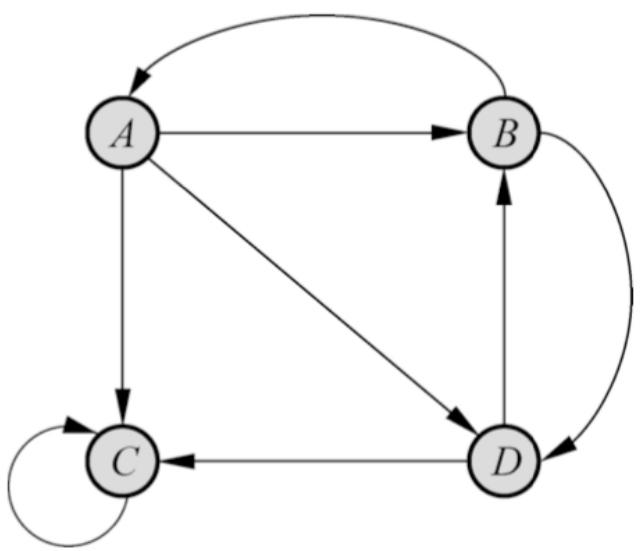

## 例

·可得转移矩阵为

$$
M = \left[ \begin{array} { c c c c } { { 0 } } & { { 1 / 2 } } & { { 0 } } & { { 0 } } \\ { { } } & { { } } & { { } } & { { } } \\ { { 1 / 3 } } & { { 0 } } & { { 0 } } & { { 1 / 2 } } \\ { { } } & { { } } & { { } } & { { } } \\ { { 1 / 3 } } & { { 0 } } & { { 1 } } & { { 1 / 2 } } \\ { { } } & { { } } & { { } } & { { } } \\ { { 1 / 3 } } & { { 1 / 2 } } & { { 0 } } & { { 0 } } \end{array} \right]
$$

按照式(21.15) 计算

$$
d M = \frac { 4 } { 5 } \times \left[ \begin{array} { c c c c } { 0 } & { 1 / 2 } & { 0 } & { 0 } \\ { 1 / 3 } & { 0 } & { 0 } & { 1 / 2 } \\ { 1 / 3 } & { 0 } & { 1 } & { 1 / 2 } \\ { 1 / 3 } & { 1 / 2 } & { 0 } & { 0 } \end{array} \right] = \left[ \begin{array} { c c c c } { 0 } & { 2 / 5 } & { 0 } & { 0 } \\ { 4 / 1 5 } & { 0 } & { 0 } & { 2 / 5 } \\ { 4 / 1 5 } & { 0 } & { 4 / 5 } & { 2 / 5 } \\ { 4 / 1 5 } & { 2 / 5 } & { 0 } & { 0 } \end{array} \right]
$$

$$
{ \frac { 1 - d } { n } } \mathbf { 1 } = { \left[ \begin{array} { l } { 1 / 2 0 } \\ { 1 / 2 0 } \\ { 1 / 2 0 } \\ { 1 / 2 0 } \\ { 1 / 2 0 } \end{array} \right] }
$$

## 例

•迭代公式为

・令初始向量

$$
R _ { t + 1 } = \left[ \begin{array} { c c c c } { 0 } & { 2 / 5 } & { 0 } & { 0 } \\ { 4 / 1 5 } & { 0 } & { 0 } & { 2 / 5 } \\ { 4 / 1 5 } & { 0 } & { 4 / 5 } & { 2 / 5 } \\ { 4 / 1 5 } & { 2 / 5 } & { 0 } & { 0 } \end{array} \right] R _ { t } + \left[ \begin{array} { c } { 1 / 2 0 } \\ { 1 / 2 0 } \\ { 1 / 2 0 } \\ { 1 / 2 0 } \\ { 1 / 2 0 } \end{array} \right]
$$

$$
R _ { 0 } = \left[ \begin{array} { l } { 1 / 4 } \\ { 1 / 4 } \\ { 1 / 4 } \\ { 1 / 4 } \\ { 1 / 4 } \end{array} \right]
$$

## 例

•进行迭代

$$
R _ { 1 } = \left[ \begin{array} { c c c c } { 0 } & { 2 / 5 } & { 0 } & { 0 } \\ { 4 / 1 5 } & { 0 } & { 0 } & { 2 / 5 } \\ { 4 / 1 5 } & { 0 } & { 4 / 5 } & { 2 / 5 } \\ { 4 / 1 5 } & { 2 / 5 } & { 0 } & { 0 } \end{array} \right] \left[ \begin{array} { c } { 1 / 4 } \\ { 1 / 4 } \\ { 1 / 4 } \\ { 1 / 4 } \\ { 1 / 4 } \end{array} \right] + \left[ \begin{array} { c } { 1 / 2 0 } \\ { 1 / 2 0 } \\ { 1 / 2 0 } \\ { 1 / 2 0 } \\ { 1 / 2 0 } \end{array} \right] = \left[ \begin{array} { c } { 9 / 6 0 } \\ { 1 3 / 6 0 } \\ { 2 5 / 6 0 } \\ { 1 3 / 6 0 } \end{array} \right]
$$

$$
R _ { 2 } = \left[ \begin{array} { c c c c } { 0 } & { 2 / 5 } & { 0 } & { 0 } \\ { 4 / 1 5 } & { 0 } & { 0 } & { 2 / 5 } \\ { 4 / 1 5 } & { 0 } & { 4 / 5 } & { 2 / 5 } \\ { 4 / 1 5 } & { 2 / 5 } & { 0 } & { 0 } \end{array} \right] \left[ \begin{array} { c } { 9 / 6 0 } \\ { 1 3 / 6 0 } \\ { 2 5 / 6 0 } \\ { 1 3 / 6 0 } \end{array} \right] + \left[ \begin{array} { c } { 1 / 2 0 } \\ { 1 / 2 0 } \\ { 1 / 2 0 } \\ { 1 / 2 0 } \\ { 1 / 2 0 } \end{array} \right] = \left[ \begin{array} { c } { 4 1 / 3 0 0 } \\ { 5 3 / 3 0 0 } \\ { 1 5 3 / 3 0 0 } \\ { 5 3 / 3 0 0 } \end{array} \right]
$$

## 例

•最后得到

$$
{ \left[ \begin{array} { l } { 1 / 4 } \\ { 1 / 4 } \\ { 1 / 4 } \\ { 1 / 4 } \\ { 1 / 4 } \\ { 1 / 4 } \end{array} \right] } , \ { \left[ \begin{array} { l } { 9 / 6 0 } \\ { 1 3 / 6 0 } \\ { 2 5 / 6 0 } \\ { 2 5 / 4 8 } \\ { 1 3 / 6 0 } \end{array} \right] } , \ { \left[ \begin{array} { l } { 4 1 / 3 0 0 } \\ { 5 3 / 3 0 0 } \\ { 1 5 3 / 3 0 0 } \\ { 1 5 3 / 3 0 0 } \\ { 5 3 / 3 0 0 } \end{array} \right] } , \ { \left[ \begin{array} { l } { 5 4 3 / 4 5 0 0 } \\ { 7 0 7 / 4 5 0 0 } \\ { 2 5 4 3 / 4 5 0 0 } \\ { 7 0 7 / 4 5 0 0 } \end{array} \right] } , \ \cdots \ , \left[ \begin{array} { l } { 1 5 / 1 4 8 } \\ { 1 9 / 1 4 8 } \\ { 9 5 / 1 4 8 } \\ { 1 9 / 1 4 8 } \end{array} \right] 
$$

·计算结果表明，结点C的PageRank值超过一半，其他结点也有相应的 PageRank值。

## 幂法

·幂法(power method)是一个常用的PageRank计算方法，通过近似计算矩阵的主特征值和主特征向量求得有向图的一般PageRank

·幂法主要用于近似计算矩阵的主特征值（dominant eigenvalue)和主特征向量(dominant eigenvector)

•主特征值是指绝对值最大的特征值

・主特征向量是其对应的特征向量

・注意特征向量不是唯一的，只是其方向是确定的，乘上任意系数还是特征向量

## 幂法

·假设要求n阶矩阵A的主特征值和主特征向量，采用下面的步骤。

·首先，任取一个初始。维向量xo，构造如下的一个n维向量序列

$$
x _ { 0 } , \quad x _ { 1 } = A x _ { 0 } , \quad x _ { 2 } = A x _ { 1 } , \quad \cdot \cdot \cdot , \quad x _ { k } = A x _ { k - 1 }
$$

•然后，假设矩阵A有n个特征值，按照绝对值大小排列

$$
\left| \lambda _ { 1 } \right| \geqslant \left| \lambda _ { 2 } \right| \geqslant \cdots \geqslant \left| \lambda _ { n } \right|
$$

•对应的n个线性无关的特征向量为

$$
u _ { 1 } , u _ { 2 } , \cdots , u _ { n }
$$

• 这n个特征向量构成n维空间的一组基。

## 幂法

·于是，可以将初始向量 $\mathsf { X } _ { \mathrm { 0 } }$ 表示为 $u _ { 1 } , u _ { 2 } , \cdots , u _ { n }$ 的线性组合

$$
x _ { 0 } = a _ { 1 } u _ { 1 } + a _ { 2 } u _ { 2 } + \cdot \cdot \cdot + a _ { n } u _ { n }
$$

·得到

$$
{ \begin{array} { r l } & { x _ { 1 } = A x _ { 0 } = a _ { 1 } A u _ { 1 } + a _ { 2 } A u _ { 2 } + \dots + a _ { n } A u _ { n } } \\ & { \qquad \quad } \\ & { \qquad \vdots } \\ & { x _ { k } = A ^ { k } x _ { 0 } = a _ { 1 } A ^ { k } u _ { 1 } + a _ { 2 } A ^ { k } u _ { 2 } + \dots + a _ { n } A ^ { k } u _ { n } } \\ & { \qquad \quad } \\ & { \qquad = a _ { 1 } \lambda _ { 1 } ^ { k } u _ { 1 } + a _ { 2 } \lambda _ { 2 } ^ { k } u _ { 2 } + \dots + a _ { n } \lambda _ { n } ^ { k } u _ { n } } \end{array} }
$$

## 幂法

·接着，假设矩阵A的主特征值 $\lambda _ { 1 }$ 是特征方程的单根，由上式得

$$
x _ { k } = a _ { 1 } \lambda _ { 1 } ^ { k } \left[ u _ { 1 } + { \frac { a _ { 2 } } { a _ { 1 } } } \left( { \frac { \lambda _ { 2 } } { \lambda _ { 1 } } } \right) ^ { k } u _ { 2 } + \cdot \cdot \cdot + { \frac { a _ { n } } { a _ { 1 } } } \left( { \frac { \lambda _ { n } } { \lambda _ { 1 } } } \right) ^ { k } u _ { n } \right]
$$

·由于 $| \lambda _ { 1 } | > | \lambda _ { j } | , ~ j = 2 , \cdot \cdot \cdot , n$ 当k充分大时有

$$
x _ { k } = a _ { 1 } \lambda _ { 1 } ^ { k } [ u _ { 1 } + \varepsilon _ { k } ]
$$

·这里 $\varepsilon _ { k }$ 是当 $k \to \infty$ 时的无穷小量， $\varepsilon _ { k } \to 0 \ ( k \to \infty )$ 。即

$$
x _ { k } \to a _ { 1 } \lambda _ { 1 } ^ { k } u _ { 1 } \ ( k \to \infty )\tag{21.18}
$$

## 幂法

•说明当k充分大时向量 ${ \sf X } _ { \sf k }$ 与特征向量 $\mathsf { V } _ { 1 }$ 只相差一个系数。由式(21.18)知，

$$
x _ { k } \approx a _ { 1 } \lambda _ { 1 } ^ { k } u _ { 1 }
$$

$$
x _ { k + 1 } \approx a _ { 1 } \lambda _ { 1 } ^ { k + 1 } u _ { 1 }
$$

・於是主特征值 $\lambda _ { 1 }$ 可表示为

$$
\lambda _ { 1 } \approx \frac { x _ { k + 1 , j } } { x _ { k , j } }
$$

·其中 $\mathsf { X } _ { \mathsf { k , j } }$ 和 $| x _ { k + 1 , 1 }$ 分别是 ${ \bf \nabla } \cdot { \bf X _ { \sf k } }$ 和 $\mathsf { X } _ { \mathsf { k } + 1 }$ 的第j个分量

## 幂法

·在实际计算时，为了避免出现绝对值过大或过小的情况，通常在每步迭代后即进行规范化，将向量除以其范数，即

$$
\begin{array} { l } { y _ { t + 1 } = A x _ { t } } \\ { x _ { t + 1 } = { \frac { y _ { t + 1 } } { \left\| y _ { t + 1 } \right\| } } } \end{array}
$$

・这里的范数是向量的无穷范数，即向量各分量的绝对值的最大值

$$
\| x \| _ { \infty } = \operatorname* { m a x } \{ | x _ { 1 } | , | x _ { 2 } | , \cdot \cdot \cdot , | x _ { n } | \}
$$

## 幂法

·现在回到计算一般PageRank。转移矩阵可以写作

$$
R = \left( d M + { \frac { 1 - d } { n } } \mathbf { E } \right) R = A R
$$

•其中d是阻尼因子

•E是所有元素为1的n阶方阵

·根据Perron-Frobenius定理，一般PageRank的向量R是矩阵A的主特征向量，主特征值是1

·所以可以使用幂法 近似计算一般PageRank

## 计算一般PageRank的幂法

输入：含有n个结点的有向图，有向图的转移矩阵M，系数d，初始向量 $x _ { 0 } ,$ 计算精度ε；

输出：有向图的PageRankR。

（1）令t= 0，选择初始向量 $x _ { 0 }$

（2）计算有向图的一般转移矩阵A

$$
A = d M + { \frac { 1 - d } { n } } \mathbf { E }
$$

（3）迭代并规范化结果向量

$$
y _ { t + 1 } = A x _ { t }
$$

$$
x _ { t + 1 } = { \frac { y _ { t + 1 } } { \left\| y _ { t + 1 } \right\| } }
$$

（4）当 $\| x _ { t + 1 } - x _ { t } \| < \varepsilon$ 时，令 $R = x _ { t } ,$ ，停止迭代。

（5）否则，令 $t = t + 1$ ，执行步（3)。

（6）对R进行规范化处理，使其表示概率分布。

## 例

•给定一个如图所示的有向图，取d = 0.85，求有向图的一般• PageRank。

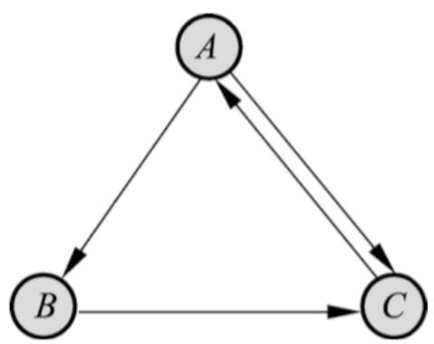

## 例

·利用幂法，按照算法 21.2，计算有向图的一般 PageRank

•由图可知转移矩阵

$$
M = \left[ \begin{array} { c c c } { { 0 } } & { { 0 } } & { { 1 } } \\ { { 1 / 2 } } & { { 0 } } & { { 0 } } \\ { { 1 / 2 } } & { { 1 } } & { { 0 } } \end{array} \right]
$$

(1)令t= 0

$$
x _ { 0 } = { \left[ \begin{array} { l } { 1 } \\ { 1 } \\ { 1 } \\ { 1 } \end{array} \right] }
$$

## 例

（2）计算有向图的一般转移矩阵A

$$
A = d M + { \frac { 1 - d } { n } } \mathbf { E }
$$

$$
= 0 . 8 5 \times { \left[ \begin{array} { l l l } { 0 } & { 0 } & { 1 } \\ { 1 / 2 } & { 0 } & { 0 } \\ { 1 / 2 } & { 1 } & { 0 } \end{array} \right] } + { \frac { 0 . 1 5 } { 3 } } \times { \left[ \begin{array} { l l l } { 1 } & { 1 } & { 1 } \\ { 1 } & { 1 } & { 1 } \\ { 1 } & { 1 } & { 1 } \\ { 1 } & { 1 } & { 1 } \end{array} \right] }
$$

$$
= { \left[ \begin{array} { l l l } { 0 . 0 5 } & { 0 . 0 5 } & { 0 . 9 } \\ { 0 . 4 7 5 } & { 0 . 0 5 } & { 0 . 0 5 } \\ { 0 . 4 7 5 } & { 0 . 9 } & { 0 . 0 5 } \end{array} \right] }
$$

## 例

(3)

（3）迭代并规范化

$$
y _ { 1 } = A x _ { 0 } = { \left[ \begin{array} { l } { 1 } \\ { 0 . 5 7 5 } \\ { 1 . 4 2 5 } \end{array} \right] }
$$

$$
x _ { 1 } = { \frac { 1 } { 1 . 4 2 5 } } { \left[ \begin{array} { l } { 1 } \\ { 0 . 5 7 5 } \\ { 1 . 4 2 5 } \end{array} \right] } = { \left[ \begin{array} { l } { 0 . 7 0 1 8 } \\ { 0 . 4 0 3 5 } \\ { 1 } \end{array} \right] }
$$

$$
y _ { 2 } = A x _ { 1 } = { \left[ \begin{array} { l l l } { 0 . 0 5 } & { 0 . 0 5 } & { 0 . 9 } \\ { 0 . 4 7 5 } & { 0 . 0 5 } & { 0 . 0 5 } \\ { 0 . 4 7 5 } & { 0 . 9 } & { 0 . 0 5 } \end{array} \right] } { \left[ \begin{array} { l } { 0 . 7 0 1 8 } \\ { 0 . 4 0 3 5 } \\ { 1 } \end{array} \right] } = { \left[ \begin{array} { l } { 0 . 9 5 5 3 } \\ { 0 . 4 0 3 5 } \\ { 0 . 7 4 6 5 } \end{array} \right] }
$$

$$
x _ { 2 } = { \frac { 1 } { 0 . 9 5 5 3 } } { \left[ \begin{array} { l } { 0 . 9 5 5 3 } \\ { 0 . 4 0 3 5 } \\ { 0 . 7 4 6 5 } \end{array} \right] } = { \left[ \begin{array} { l } { 1 } \\ { 0 . 4 2 2 4 } \\ { 0 . 7 8 1 4 } \end{array} \right] }
$$

## 例

如此继续迭代规范化，得到 $x _ { t } , \ t = 0 , 1 , 2 , \cdot \cdot \cdot , 2 1 , 2 2$ ，的向量序列

$$
\begin{array} { r } { \left[ \begin{array} { l } { 1 } \\ { 1 } \\ { 1 } \\ { 1 } \end{array} \right] , \ \left[ \begin{array} { l } { 0 . 7 0 1 8 } \\ { 0 . 4 0 3 5 } \\ { 1 } \end{array} \right] , \ \left[ \begin{array} { l } { 1 } \\ { 0 . 4 2 2 4 } \\ { 0 . 7 8 1 4 } \end{array} \right] , \ \left[ \begin{array} { l } { 0 . 8 6 5 9 } \\ { 0 . 5 9 8 5 } \\ { 1 } \end{array} \right] , \ \left[ \begin{array} { l } { 0 . 9 7 3 2 } \\ { 0 . 4 9 1 2 } \\ { 1 } \end{array} \right] , \ \left[ \begin{array} { l } { 1 } \\ { 0 . 5 5 1 6 } \\ { 0 . 9 8 0 7 } \end{array} \right] , \ \left[ \begin{array} { l } { 1 } \\ { 0 . 5 9 1 6 } \\ { 0 . 9 8 0 7 } \end{array} \right] , \ \left[ \begin{array} { l } { 1 } \\ { 0 . 5 9 1 6 } \\ { 0 . 9 8 0 7 } \end{array} \right] , \ \left[ \begin{array} { l } { 0 . 0 3 5 9 } \\ { 0 . 5 8 1 6 } \\ { 0 . 9 8 0 7 } \end{array} \right] . } \end{array}
$$

$$
{ \left[ \begin{array} { l } { 0 . 9 4 0 9 } \\ { 0 . 5 4 0 5 } \\ { 1 } \end{array} \right] } , \ \cdots , \ { \left[ \begin{array} { l } { 0 . 9 7 6 0 } \\ { 0 . 5 4 0 8 } \\ { 1 } \end{array} \right] } , \ { \left[ \begin{array} { l } { 0 . 9 7 5 5 } \\ { 0 . 5 4 0 4 } \\ { 1 } \end{array} \right] } , \ { \left[ \begin{array} { l } { 0 . 9 7 6 1 } \\ { 0 . 5 4 0 6 } \\ { 1 } \end{array} \right] } , \ { \left[ \begin{array} { l } { 0 . 9 7 5 6 } \\ { 0 . 5 4 0 6 } \\ { 1 } \end{array} \right] } , \ { \left[ \begin{array} { l } { 0 . 9 7 5 5 } \\ { 0 . 5 4 0 6 } \\ { 1 } \end{array} \right] } , \ { \left[ \begin{array} { l } { 0 . 9 7 5 8 } \\ { 0 . 5 4 0 4 } \\ { 1 } \end{array} \right] }
$$

## 例

假设后面得到的两个向量已满足计算精度要求，那么取

$$
R = { \left[ \begin{array} { l } { 0 . 9 7 5 6 } \\ { 0 . 5 4 0 6 } \\ { 1 } \end{array} \right] }
$$

即得所求的一般 PageRank。如果将一般 PageRank 作为一个概率分布，进行规范化，使各分量之和为1，那么相应的一般 PageRank 可以写作

$$
R = { \left[ \begin{array} { l } { 0 . 3 8 7 7 } \\ { 0 . 2 1 4 9 } \\ { 0 . 3 9 7 4 } \end{array} \right] }
$$

## 代数算法

•代数算法通过一般转移矩阵的逆矩阵计算求有向图的一般PageRank

·按照一般 $\mathsf { P a g e R a n k }$ 的定义式 (21.14)

$$
R = d M R + { \frac { 1 - d } { n } } \mathbf { 1 }
$$

・于是

$$
( I - d M ) R = { \frac { 1 - d } { n } } \mathbf { 1 }\tag{21.23}
$$

$$
R = ( I - d M ) ^ { - 1 } { \frac { 1 - d } { n } } \mathbf { 1 }\tag{21.24}
$$

·这里I是单位矩阵。当 $0 < \mathsf { d } < 1$ 时，线性方程组（21.23）的解存在且唯一

•这样，可以通过求逆矩阵 $( | { - } \mathsf { d } \mathsf { M } ) ^ { - 1 }$ 得到有向图的一般PageRank

## 第二十二章无监督学习方法总结

## 各种方法之间的关系

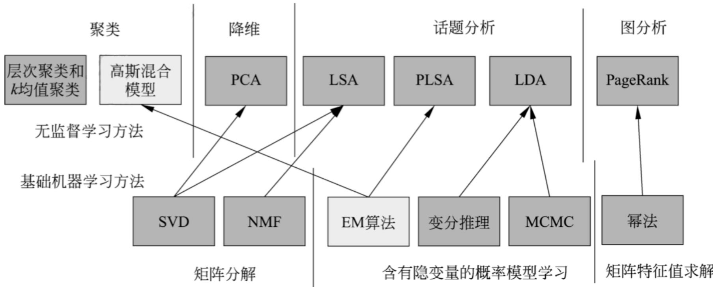

## 各种方法之间的关系

•无监督学习

·聚类

·降维

聚类的方法

层次聚类

·话题分析

• 图分析

K均值聚类

高斯混合模型

## 各种方法之间的关系

• 无监督学习

·聚类

·降维

•话题分析

•降维的方法

•图分析

·PCA

## 各种方法之间的关系

• 无监督学习

·聚类

·降维

·话题分析

话题分析的方法

•图分析

LSA

PLSA

LDA

## 各种方法之间的关系

• 无监督学习

·聚类

·降维

•话题分析

•图分析

图分析的方法

PageRank

## 各种方法之间的关系

•基础方法

•矩阵分解

•矩阵特征值求解

线性代数问题

•含有隐变量的概率模型估计

## 各种方法之间的关系

•基础方法

•矩阵分解

•矩阵特征值求解

•含有隐变量的概率模型估计

概率统计问题

## 各种方法之间的关系

•基础方法

•矩阵分解

•矩阵特征值求解

•含有隐变量的概率模型估计

矩阵分解的方法

SVD

NMF

## 各种方法之间的关系

•基础方法

•矩阵分解

•矩阵特征值求解

•含有隐变量的概率模型估计

矩阵特征值求解的方法

幂法

## 各种方法之间的关系

•基础方法

•矩阵分解

•矩阵特征值求解

•含有隐变量的概率模型估计

含有隐变量的概率模型学习的方法

EM算法

变分推理

MCMC

## 无监督学习方法

无监督学习方法的特点
<table><tr><td rowspan=11 colspan=1>硬聚类4</td><td></td><td></td><td></td><td></td><td></td></tr><tr><td rowspan=1 colspan=1></td><td rowspan=1 colspan=1>方法</td><td rowspan=1 colspan=1>模型</td><td rowspan=1 colspan=1>策略</td><td rowspan=1 colspan=1>算法</td></tr><tr><td rowspan=3 colspan=1>聚类</td><td rowspan=1 colspan=1>层次聚类</td><td rowspan=1 colspan=1>聚类树</td><td rowspan=1 colspan=1>类內样本距离最小</td><td rowspan=1 colspan=1>启发式算法</td></tr><tr><td rowspan=1 colspan=1>k均值聚类</td><td rowspan=1 colspan=1>k中心聚类</td><td rowspan=1 colspan=1>样本与类中心距离最小</td><td rowspan=1 colspan=1>迭代算法</td></tr><tr><td rowspan=1 colspan=1>高斯混合模型</td><td rowspan=1 colspan=1>高斯混合模型</td><td rowspan=1 colspan=1>似然函数最大</td><td rowspan=1 colspan=1>EM算法</td></tr><tr><td rowspan=1 colspan=1>降维</td><td rowspan=1 colspan=1>PCA</td><td rowspan=1 colspan=1>低维正交空间</td><td rowspan=1 colspan=1>方差最大</td><td rowspan=1 colspan=1>SVD</td></tr><tr><td rowspan=4 colspan=1>话题分析</td><td rowspan=1 colspan=1>LSA</td><td rowspan=1 colspan=1>矩阵分解模型</td><td rowspan=1 colspan=1>平方损失最小</td><td rowspan=1 colspan=1>SVD</td></tr><tr><td rowspan=1 colspan=1>NMF</td><td rowspan=1 colspan=1>矩阵分解模型</td><td rowspan=1 colspan=1>平方损失最小</td><td rowspan=1 colspan=1>非负矩阵分解</td></tr><tr><td rowspan=1 colspan=1>PLSA</td><td rowspan=1 colspan=1>PLSA模型</td><td rowspan=1 colspan=1>似然函数最大</td><td rowspan=1 colspan=1>EM算法</td></tr><tr><td rowspan=1 colspan=1>LDA</td><td rowspan=1 colspan=1>LDA模型</td><td rowspan=1 colspan=1>后验概率估计</td><td rowspan=1 colspan=1>吉布斯抽样，变分推理</td></tr><tr><td rowspan=1 colspan=1>图分析</td><td rowspan=1 colspan=1>PageRank</td><td rowspan=1 colspan=1>有向图上的马尔可夫链</td><td rowspan=1 colspan=1>平稳分布求解</td><td rowspan=1 colspan=1>幂法</td></tr></table>

## 无监督学习方法

无监督学习方法的特点

软聚类

<table><tr><td rowspan=1 colspan=1></td><td rowspan=1 colspan=1>方法</td><td rowspan=1 colspan=1>模型</td><td rowspan=1 colspan=1>策略</td><td rowspan=1 colspan=1>算法</td></tr><tr><td rowspan=2 colspan=1>聚类</td><td rowspan=1 colspan=1>层次聚类</td><td rowspan=1 colspan=1>聚类树</td><td rowspan=1 colspan=1>类內样本距离最小</td><td rowspan=1 colspan=1>启发式算法</td></tr><tr><td rowspan=1 colspan=1>k均值聚类</td><td rowspan=1 colspan=1>k中心聚类</td><td rowspan=1 colspan=1>样本与类中心距离最小</td><td rowspan=1 colspan=1>迭代算法</td></tr><tr><td rowspan=2 colspan=1></td><td></td><td></td><td></td><td></td></tr><tr><td rowspan=1 colspan=1>高斯混合模型</td><td rowspan=1 colspan=1>高斯混合模型</td><td rowspan=1 colspan=1>似然函数最大</td><td rowspan=1 colspan=1>EM算法</td></tr><tr><td rowspan=1 colspan=1>降维</td><td rowspan=1 colspan=1>PCA</td><td rowspan=1 colspan=1>低维正交空间</td><td rowspan=1 colspan=1>方差最大</td><td rowspan=1 colspan=1>SVD</td></tr><tr><td rowspan=4 colspan=1>话题分析</td><td rowspan=1 colspan=1>LSA</td><td rowspan=1 colspan=1>矩阵分解模型</td><td rowspan=1 colspan=1>平方损失最小</td><td rowspan=1 colspan=1>SVD</td></tr><tr><td rowspan=1 colspan=1>NMF</td><td rowspan=1 colspan=1>矩阵分解模型</td><td rowspan=1 colspan=1>平方损失最小</td><td rowspan=1 colspan=1></td></tr><tr><td rowspan=1 colspan=1>PLSA</td><td rowspan=1 colspan=1>PLSA 模型</td><td rowspan=1 colspan=1>似然函数最大</td><td rowspan=1 colspan=1></td></tr><tr><td rowspan=1 colspan=1>LDA</td><td rowspan=1 colspan=1>LDA模型</td><td rowspan=1 colspan=1>后验概率估计</td><td rowspan=1 colspan=1>吉布斯抽样，变分推理</td></tr><tr><td rowspan=1 colspan=1>图分析</td><td rowspan=1 colspan=1>PageRank</td><td rowspan=1 colspan=1>有向图上的马尔可夫链</td><td rowspan=1 colspan=1>平稳分布求解</td><td rowspan=1 colspan=1>幂法</td></tr></table>

## 无监督学习方法

无监督学习方法的特点
<table><tr><td rowspan=11 colspan=1>线性降维</td><td></td><td></td><td></td><td></td><td></td><td></td></tr><tr><td rowspan=1 colspan=1></td><td rowspan=1 colspan=1>方法</td><td rowspan=1 colspan=1>模型</td><td rowspan=1 colspan=1>策略</td><td rowspan=1 colspan=2>算法</td></tr><tr><td rowspan=3 colspan=1>聚类</td><td rowspan=1 colspan=1>层次聚类</td><td rowspan=1 colspan=1>聚类树</td><td rowspan=1 colspan=1>类內样本距离最小</td><td rowspan=1 colspan=1>启发式算法</td><td rowspan=1 colspan=1></td></tr><tr><td rowspan=1 colspan=1>k均值聚类</td><td rowspan=1 colspan=1>k中心聚类</td><td rowspan=1 colspan=1>样本与类中心距离最小</td><td rowspan=1 colspan=1>迭代算法</td><td rowspan=1 colspan=1></td></tr><tr><td rowspan=1 colspan=1>高斯混合模型</td><td rowspan=1 colspan=1>高斯混合模型</td><td rowspan=1 colspan=1>似然函数最大</td><td rowspan=1 colspan=1>EM算法</td><td rowspan=1 colspan=1></td></tr><tr><td rowspan=1 colspan=1>降维</td><td rowspan=1 colspan=1>PCA</td><td rowspan=1 colspan=1>低维正交空间</td><td rowspan=1 colspan=1>方差最大</td><td rowspan=1 colspan=1>SVD</td><td rowspan=1 colspan=1></td></tr><tr><td rowspan=4 colspan=1>话题分析</td><td rowspan=1 colspan=1>LSA</td><td rowspan=1 colspan=1>矩阵分解模型</td><td rowspan=1 colspan=1>平方损失最小</td><td rowspan=1 colspan=1>SVD</td><td rowspan=1 colspan=1></td></tr><tr><td rowspan=1 colspan=1>NMF</td><td rowspan=1 colspan=1>矩阵分解模型</td><td rowspan=1 colspan=1>平方损失最小</td><td rowspan=1 colspan=1>非负矩阵分解</td><td rowspan=1 colspan=1></td></tr><tr><td rowspan=1 colspan=1>PLSA</td><td rowspan=1 colspan=1>PLSA 模型</td><td rowspan=1 colspan=1>似然函数最大</td><td rowspan=1 colspan=1>EM算法</td><td rowspan=1 colspan=1></td></tr><tr><td rowspan=1 colspan=1>LDA</td><td rowspan=1 colspan=1>LDA模型</td><td rowspan=1 colspan=1>后验概率估计</td><td rowspan=1 colspan=2>吉布斯抽样，变分推理</td></tr><tr><td rowspan=1 colspan=1>图分析</td><td rowspan=1 colspan=1>PageRank</td><td rowspan=1 colspan=1>有向图上的马尔可夫链</td><td rowspan=1 colspan=1>平稳分布求解</td><td rowspan=1 colspan=2>幂法</td></tr></table>

## 无监督学习方法

无监督学习方法的特点
<table><tr><td rowspan=11 colspan=1>非概率模型</td><td></td><td></td><td></td><td></td><td></td><td></td></tr><tr><td rowspan=1 colspan=1></td><td rowspan=1 colspan=1>方法</td><td rowspan=1 colspan=1>模型</td><td rowspan=1 colspan=1>策略</td><td rowspan=1 colspan=2>算法</td></tr><tr><td rowspan=3 colspan=1>聚类</td><td rowspan=1 colspan=1>层次聚类</td><td rowspan=1 colspan=1>聚类树</td><td rowspan=1 colspan=1>类內样本距离最小</td><td rowspan=1 colspan=1>启发式算法</td><td rowspan=1 colspan=1></td></tr><tr><td rowspan=1 colspan=1>k均值聚类</td><td rowspan=1 colspan=1>k中心聚类</td><td rowspan=1 colspan=1>样本与类中心距离最小</td><td rowspan=1 colspan=1>迭代算法</td><td rowspan=1 colspan=1></td></tr><tr><td rowspan=1 colspan=1>高斯混合模型</td><td rowspan=1 colspan=1>高斯混合模型</td><td rowspan=1 colspan=1>似然函数最大</td><td rowspan=1 colspan=1>EM算法</td><td rowspan=1 colspan=1></td></tr><tr><td rowspan=1 colspan=1>降维</td><td rowspan=1 colspan=1>PCA</td><td rowspan=1 colspan=1>低维正交空间</td><td rowspan=1 colspan=1>方差最大</td><td rowspan=1 colspan=1>SVD</td><td rowspan=1 colspan=1></td></tr><tr><td rowspan=4 colspan=1>话题分析</td><td rowspan=1 colspan=1>LSA</td><td rowspan=1 colspan=1>矩阵分解模型</td><td rowspan=1 colspan=1>平方损失最小</td><td rowspan=1 colspan=1>SVD</td><td rowspan=1 colspan=1></td></tr><tr><td rowspan=1 colspan=1>NMF</td><td rowspan=1 colspan=1>矩阵分解模型</td><td rowspan=1 colspan=1>平方损失最小</td><td rowspan=1 colspan=1>非负矩阵分解</td><td rowspan=1 colspan=1></td></tr><tr><td rowspan=1 colspan=1>PLSA</td><td rowspan=1 colspan=1>PLSA 模型</td><td rowspan=1 colspan=1>似然函数最大</td><td rowspan=1 colspan=1>EM算法</td><td rowspan=1 colspan=1></td></tr><tr><td rowspan=1 colspan=1>LDA</td><td rowspan=1 colspan=1>LDA 模型</td><td rowspan=1 colspan=1>后验概率估计</td><td rowspan=1 colspan=2>吉布斯抽样，变分推理</td></tr><tr><td rowspan=1 colspan=1>图分析</td><td rowspan=1 colspan=1>PageRank</td><td rowspan=1 colspan=1>有向图上的马尔可夫链</td><td rowspan=1 colspan=1>平稳分布求解</td><td rowspan=1 colspan=2>幂法</td></tr></table>

## 无监督学习方法

无监督学习方法的特点
<table><tr><td rowspan=11 colspan=1>概率模型</td><td></td><td></td><td></td><td></td><td></td><td></td></tr><tr><td rowspan=1 colspan=1></td><td rowspan=1 colspan=1>方法</td><td rowspan=1 colspan=1>模型</td><td rowspan=1 colspan=1>策略</td><td rowspan=1 colspan=2>算法</td></tr><tr><td rowspan=3 colspan=1>聚类</td><td rowspan=1 colspan=1>层次聚类</td><td rowspan=1 colspan=1>聚类树</td><td rowspan=1 colspan=1>类內样本距离最小</td><td rowspan=1 colspan=1>启发式算法</td><td rowspan=1 colspan=1></td></tr><tr><td rowspan=1 colspan=1>k均值聚类</td><td rowspan=1 colspan=1>k中心聚类</td><td rowspan=1 colspan=1>样本与类中心距离最小</td><td rowspan=1 colspan=1>迭代算法</td><td rowspan=1 colspan=1></td></tr><tr><td rowspan=1 colspan=1>高斯混合模型</td><td rowspan=1 colspan=1>高斯混合模型</td><td rowspan=1 colspan=1>似然函数最大</td><td rowspan=1 colspan=1>EM算法</td><td rowspan=1 colspan=1></td></tr><tr><td rowspan=1 colspan=1>降维</td><td rowspan=1 colspan=1>PCA</td><td rowspan=1 colspan=1>低维正交空间</td><td rowspan=1 colspan=1>方差最大</td><td rowspan=1 colspan=2>SVD</td></tr><tr><td rowspan=4 colspan=1>话题分析</td><td rowspan=1 colspan=1>LSA</td><td rowspan=1 colspan=1>矩阵分解模型</td><td rowspan=1 colspan=1>平方损失最小</td><td rowspan=1 colspan=1>SVD</td><td rowspan=1 colspan=1></td></tr><tr><td rowspan=1 colspan=1>NMF</td><td rowspan=1 colspan=1>矩阵分解模型</td><td rowspan=1 colspan=1>平方损失最小</td><td rowspan=1 colspan=1>非负矩阵分解</td><td rowspan=1 colspan=1></td></tr><tr><td rowspan=1 colspan=1>PLSA</td><td rowspan=1 colspan=1>PLSA 模型</td><td rowspan=1 colspan=1>似然函数最大</td><td rowspan=1 colspan=1>EM算法</td><td rowspan=1 colspan=1></td></tr><tr><td rowspan=1 colspan=1>LDA</td><td rowspan=1 colspan=1>LDA模型</td><td rowspan=1 colspan=1>后验概率估计</td><td rowspan=1 colspan=2>吉布斯抽样，变分推理</td></tr><tr><td rowspan=1 colspan=1>图分析</td><td rowspan=1 colspan=1>PageRank</td><td rowspan=1 colspan=1>有向图上的马尔可夫链</td><td rowspan=1 colspan=1>平稳分布求解</td><td rowspan=1 colspan=2>幂法</td></tr></table>

## 基础机器学习方法

表22.2 含有隐变量概率模型的学习方法的特点
<table><tr><td rowspan=1 colspan=1>算法</td><td rowspan=1 colspan=1>基本原理</td><td rowspan=1 colspan=1>收敛性</td><td rowspan=1 colspan=1>收敛速度</td><td rowspan=1 colspan=1>实现难易度</td><td rowspan=1 colspan=1>适合问题</td></tr><tr><td rowspan=1 colspan=1>EM算法</td><td rowspan=1 colspan=1>迭代计算、后验概率估计</td><td rowspan=1 colspan=1>收敛于局部最优</td><td rowspan=1 colspan=1>较快</td><td rowspan=1 colspan=1>容易</td><td rowspan=1 colspan=1>简单模型</td></tr><tr><td rowspan=1 colspan=1>变分推理</td><td rowspan=1 colspan=1>迭代计算、后验概率近似估计</td><td rowspan=1 colspan=1>收敛于局部最优</td><td rowspan=1 colspan=1>较慢</td><td rowspan=1 colspan=1>较复杂</td><td rowspan=1 colspan=1>复杂模型</td></tr><tr><td rowspan=1 colspan=1>吉布斯抽样</td><td rowspan=1 colspan=1>随机抽样、后验概率估计</td><td rowspan=1 colspan=1>依概率收敛于全局最优</td><td rowspan=1 colspan=1>较慢</td><td rowspan=1 colspan=1>容易</td><td rowspan=1 colspan=1>复杂模型</td></tr></table>

## 话题模型

表22.3 矩阵分解的角度看话题模型
<table><tr><td>方法</td><td>一般损失函数  $B ( D \Vert U V )$ </td><td>矩阵U的约束条件</td><td>矩阵V的约束条件</td></tr><tr><td>LSA</td><td> $\| D - U V \| _ { F } ^ { 2 }$ </td><td> $U ^ { \mathrm { T } } U = I$ </td><td> $V V ^ { \mathrm { T } } = \varLambda ^ { 2 }$ </td></tr><tr><td>NMF</td><td> $\| D - U V \| _ { F } ^ { 2 }$ </td><td> $u _ { m k } \geqslant 0$ </td><td> $v _ { k n } \geqslant 0$ </td></tr><tr><td rowspan="2">PLSA</td><td> $\sum _ { m n } d _ { m n } \mathrm { l o g } \frac { d _ { m n } } { ( U V ) _ { m n } }$ </td><td> $U ^ { \mathrm { T } } 1 = 1$ </td><td> $V ^ { \mathrm { T } } 1 = 1$ </td></tr><tr><td></td><td> $u _ { m k } \geqslant 0$ </td><td> $v _ { k n } \geqslant 0$ </td></tr></table>

## 话题模型

表22.4 话题模型LSA和NMF的约束条件
<table><tr><td>方法</td><td>变量 的约束条件  $u _ { k }$ </td><td>变量 的约束条件  $v _ { n }$ </td></tr><tr><td>LSA</td><td>正交</td><td>正交</td></tr><tr><td>NMF</td><td> $u _ { m k } \geqslant 0$ </td><td> $v _ { k n } \geqslant 0$ </td></tr></table>